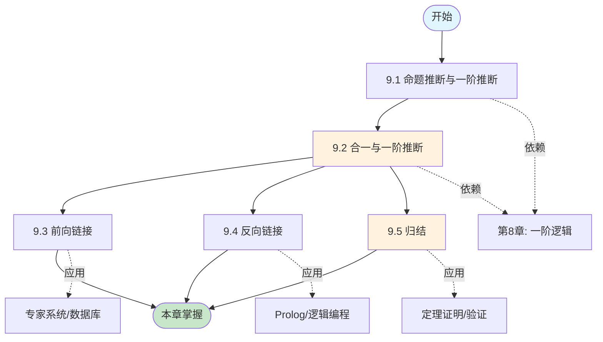
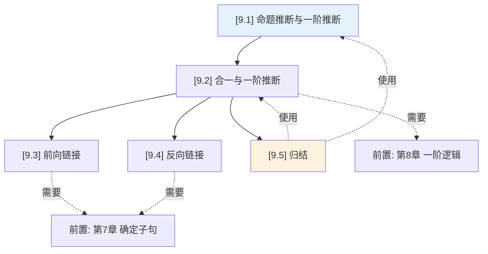
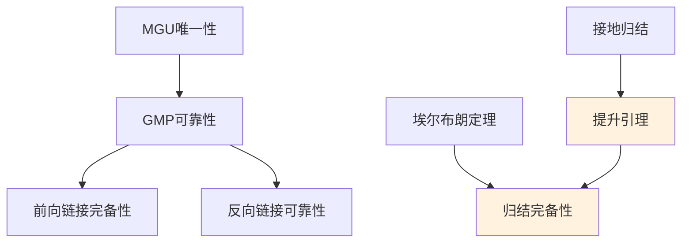
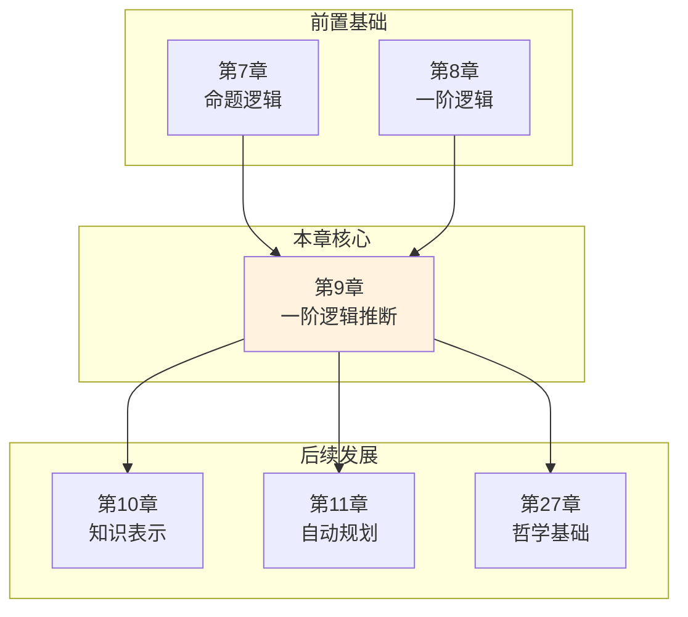

# 第 9 章：一阶逻辑中的推断 - 概览与总结

> 📚 章节概览 | Deep Dive 学习导航 | 📝 本章复习指南
> ⏱️ 建议学习时间: 8-10 小时 | 🎯 难度: ⭐⭐⭐⭐

---

## 一、学习目标

学完本章后，你将能够：

- [ ] **理解**: 一阶逻辑推断的基本方法（命题化、合一）及其理论基础
- [ ] **掌握**: 前向链接、反向链接和归结三种主要推断算法
- [ ] **应用**: 使用Prolog进行逻辑编程，使用归结进行定理证明
- [ ] **分析**: 比较不同推断方法的优缺点和适用场景
- [ ] **评估**: 理解一阶逻辑推断的半可判定性和复杂性

---

## 二、本章导览

### 2.1 核心问题与关键思想

**核心问题**
> 如何有效地在一阶逻辑知识库中进行自动推理？

**关键思想**
> 一阶逻辑推断可以通过量词实例化、合一和归结等方法实现。命题化提供了理论基础但效率低下；合一通过按需实例化提高了效率；前向链接和反向链接分别适用于数据驱动和目标驱动的场景；归结则提供了适用于一般子句的完备推理系统。

### 2.2 本章地图



### 2.3 难度预警

| 类型 | 节号 | 标题 | 难度 | 预计时间 | 关键挑战 |
|:----:|:----:|------|:----:|:--------:|----------|
| 🔴 关键节 | 9.2 | 合一与一阶推断 | ⭐⭐⭐⭐ | 2h | 理解MGU的唯一性、出现检验 |
| 🔴 关键节 | 9.5 | 归结 | ⭐⭐⭐⭐⭐ | 3h | CNF转换、斯科伦化、完备性证明 |
| 🟡 难证明 | 9.5 | 归结完备性 | ⭐⭐⭐⭐⭐ | - | 埃尔布朗定理、提升引理 |
| 🟢 巩固节 | 9.3 | 前向链接 | ⭐⭐⭐ | 1.5h | 不动点、增量更新 |
| 🟢 巩固节 | 9.4 | 反向链接 | ⭐⭐⭐ | 1.5h | AND-OR树、Prolog执行 |

**攻克建议**: 
- 9.2节的合一是全章的核心基础，务必深入理解
- 9.5节的归结理论性最强，建议结合具体例子理解抽象概念
- 多做手工推导练习，特别是CNF转换和归结证明

### 2.4 学习建议

**推荐学习顺序**
```
第一次: 快速浏览 → 理解框架 → 标记难点
    ↓
第二次: 精读概念 → 推导公式 → 理解证明
    ↓
第三次: 动手实践 → 完成示例 → 总结提炼
```

**时间规划**

| 阶段 | 内容 | 时间 | 产出 |
|------|------|:----:|------|
| 预习 | 读概览、查前置 | 30min | 问题清单 |
| 学习 | 精读各节 | 6h | 笔记 |
| 练习 | 做示例、推导 | 2h | 练习本 |
| 复习 | 总结、自查 | 1h | 知识卡片 |
| **总计** | | **9-10h** | |

---

## 三、学习准备

### 3.1 前置知识检查

| 知识项 | 来源 | 重要程度 | 自检问题 |
|--------|------|:--------:|----------|
| 一阶逻辑语法 | 第8章 | 🔴 必须 | 能否识别项、原子公式、量词？ |
| 命题归结 | 第7章 | 🔴 必须 | 能否执行命题归结推导？ |
| 确定子句 | 第7章 | 🟡 建议 | 能否识别霍恩子句？ |
| 可计算性基础 | 外部 | 🟢 可选 | 了解可判定性概念？ |

### 3.2 节依赖图



**依赖说明**: 实线=必须前序 | 虚线=前置知识 | 红色高亮=关键路径

### 3.3 定理/结果检查清单

| 编号 | 名称 | 类型 | 关键用途 | 位置 | 掌握状态 |
|:----:|------|:----:|----------|:----:|:--------:|
| 9.1 | 埃尔布朗定理 | 定理 | 有限证明存在性 | 9.1 | [ ] |
| 9.2 | MGU唯一性 | 定理 | 合一理论基础 | 9.2 | [ ] |
| 9.2 | GMP可靠性 | 定理 | 推理规则正确性 | 9.2 | [ ] |
| 9.3 | 前向链接完备性 | 定理 | 确定子句推理 | 9.3 | [ ] |
| 9.4 | 反向链接可靠性 | 定理 | 目标驱动推理 | 9.4 | [ ] |
| 9.5 | 归结完备性 | 定理 | 一般子句推理 | 9.5 | [ ] |
| 9.5 | 提升引理 | 引理 | 完备性证明关键 | 9.5 | [ ] |

---

## 四、知识梳理

### 4.1 核心逻辑线索

本章围绕"如何在一阶逻辑中进行有效推断"这一核心问题展开，从理论基础到实用算法，构建了完整的知识体系。

首先，9.1节介绍了命题化方法，展示了如何通过量词实例化将一阶逻辑归约为命题逻辑。虽然这种方法理论完备，但效率极低，特别是当知识库包含函数符号时可能产生无限多个实例。埃尔布朗定理为此提供了理论基础——任何证明只需要有限多个基本实例。同时，我们也认识到一阶逻辑蕴含问题的半可判定性。

9.2节引入了合一算法，这是本章的核心突破。合一通过自动找出使两个表达式匹配的最一般置换，避免了盲目的实例化。最一般合一子（MGU）的概念保证了推断的确定性，而出现检验则防止了循环绑定。基于合一，我们得到了一般化肯定前件（GMP）这一强大的推理规则。

9.3节和9.4节分别介绍了两种基于确定子句的推断方法。前向链接是数据驱动的，从已知事实出发触发规则，适用于监控、告警等场景；反向链接是目标驱动的，从查询出发反向分解目标，是Prolog语言的核心机制。两者各有优缺点：前向链接可能产生大量无关事实，反向链接可能陷入无限循环。

9.5节的归结是全章的理论高潮。归结通过合一将命题归结提升到一阶逻辑，适用于所有子句（不仅是确定子句）。归结的完备性定理——归结是反演完备的——是自动定理证明的理论基石。CNF转换、斯科伦化和提升引理共同构成了完备性证明的核心。

**知识发展时间线**
```
[命题化] → [合一] → [前向链接] → [反向链接] → [归结]
    ↓          ↓          ↓            ↓           ↓
 理论基础   核心突破   数据驱动    目标驱动    完备系统
 效率低下   按需实例   确定子句    Prolog      一般子句
```

### 4.2 核心要点速查

**一句话总结每节**

| 节号 | 标题 | 一句话总结 |
|:----:|------|------------|
| 9.1 | 命题推断与一阶推断 | 通过量词实例化将一阶逻辑归约为命题逻辑，埃尔布朗定理保证有限证明存在 |
| 9.2 | 合一与一阶推断 | 合一找出使表达式匹配的最一般置换，是高效一阶推断的核心 |
| 9.3 | 前向链接 | 数据驱动的确定子句推理，从事实触发规则直到不动点 |
| 9.4 | 反向链接 | 目标驱动的确定子句推理，从查询反向分解为子目标 |
| 9.5 | 归结 | 通过合一将命题归结提升到一阶，是完备的推理系统 |

**必背要点（7条）**

1. **量词实例化**: 全称量词实例化（UI）可以多次应用，存在量词实例化（EI）只应用一次引入斯科伦常量。

2. **埃尔布朗定理**: 如果语句被知识库蕴含，则存在仅涉及有限子集的证明。

3. **合一**: 找出使两个表达式相等的最一般置换（MGU），是前向链接、反向链接和归结的核心操作。

4. **一般化肯定前件**: 使用合一的肯定前件规则，是确定子句推理的基础。

5. **前向链接 vs 反向链接**: 前向链接数据驱动，可能产生无关事实；反向链接目标驱动，可能陷入无限循环。

6. **归结**: 通过合一消去互补文字，是反演完备的——只要证明存在就一定能找到。

7. **半可判定性**: 一阶逻辑蕴含问题是半可判定的——存在能判定所有蕴含的算法，但不存在能判定所有不蕴含的算法。

**核心公式卡片**

| 公式 | 名称 | 使用条件 | 记忆要点 |
|------|------|----------|----------|
| $\frac{\forall v \alpha}{\text{Subst}(\{v/g\}, \alpha)}$ | UI | $g$ 是基本项 | 全称可多次实例化 |
| $\frac{\exists v \alpha}{\text{Subst}(\{v/k\}, \alpha)}$ | EI | $k$ 是新斯科伦常量 | 存在只实例化一次 |
| $\text{UNIFY}(p, q) = \theta$ | 合一 | $p, q$ 可合一 | 返回MGU |
| $\frac{p_i', (p_i \Rightarrow q)}{\text{Subst}(\theta, q)}$ | GMP | $\text{UNIFY}(p_i', p_i) = \theta$ | 使用合一的MP |

### 4.3 概念对比表

**相似概念辨析**

| 概念 A | 概念 B | 相似点 | 关键差异 | 适用场景 |
|--------|--------|--------|----------|----------|
| 前向链接 | 反向链接 | 都用于确定子句推理 | **方向**: 数据驱动 vs 目标驱动<br>**空间**: 可能产生大量事实 vs 线性空间 | 前向: 监控告警<br>反向: 查询回答 |
| UI | EI | 都是量词实例化 | **次数**: 可多次 vs 只一次<br>**结果**: 任意实例 vs 新常量 | UI: 全称推理<br>EI: 存在推理 |
| 命题归结 | 一阶归结 | 都消去互补文字 | **匹配**: 精确匹配 vs 合一匹配 | 命题: 无变量<br>一阶: 有变量 |
| MGU | 一般合一子 | 都使表达式相等 | **一般性**: 限制最少 vs 可能更特化 | MGU: 保留灵活性 |

**方法/算法对比**

| 方法 | 核心思想 | 优点 | 缺点 | 适用条件 |
|------|----------|------|------|----------|
| 命题化 | 枚举所有实例 | 理论简单 | 效率极低，可能无限 | 论域极小 |
| 前向链接 | 数据驱动推理 | 适合监控 | 可能产生无关事实 | 确定子句 |
| 反向链接 | 目标驱动推理 | 空间效率高 | 可能无限循环 | 确定子句 |
| 归结 | 互补文字消去 | 完备、通用 | 搜索空间大 | 一般子句 |

### 4.4 定理依赖图

**完整依赖关系**



**证明路径分析**

| 目标定理 | 直接依赖 | 间接依赖 | 证明策略 |
|----------|----------|----------|----------|
| 归结完备性 | 埃尔布朗定理、提升引理 | 接地归结 | 归约+提升 |
| GMP可靠性 | MGU性质 | UI | 直接推导 |
| 前向链接完备性 | GMP可靠性 | 合一 | 不动点论证 |

**关键证明技巧总结**

| 技巧 | 应用定理 | 核心思想 | 可迁移性 |
|------|----------|----------|----------|
| 结构归纳 | 合一算法 | 基于表达式结构 | ⭐⭐⭐⭐⭐ |
| 归约论证 | 归结完备性 | 复杂到简单 | ⭐⭐⭐⭐⭐ |
| 提升 | 归结完备性 | 具体到一般 | ⭐⭐⭐⭐ |
| 不动点 | 前向链接 | 迭代到稳定 | ⭐⭐⭐⭐ |

---

## 五、检验与反思

### 5.1 本章测验

**快速自测（10分钟）**

**Q1**: 全称量词实例化和存在量词实例化的主要区别是什么？
<details>
<summary>答案</summary>
全称量词实例化可以多次应用（生成不同实例），而存在量词实例化只应用一次（引入新斯科伦常量）。这是因为全称量词断言"所有"实例，而存在量词只断言"至少一个"实例。
</details>

**Q2**: 什么是最一般合一子（MGU）？为什么它重要？
<details>
<summary>答案</summary>
MGU是限制最少的合一子，任何其他合一子都可以通过对MGU进一步特化得到。它重要是因为保留了最大的灵活性，后续推理可以进一步特化变量。
</details>

**Q3**: 前向链接和反向链接的主要区别是什么？
<details>
<summary>答案</summary>
前向链接是数据驱动的，从事实出发触发规则；反向链接是目标驱动的，从查询出发反向分解。前向链接可能产生大量无关事实，反向链接可能陷入无限循环。
</details>

**Q4**: 归结为什么是"反演完备"而不是"完备"？
<details>
<summary>答案</summary>
归结可以证明不可满足性（通过推导出空子句），但不能生成所有逻辑结果。"反演完备"意味着：如果$KB \models \alpha$，则$KB \cup \{\neg\alpha\}$不可满足，归结可以证明这一点。
</details>

**深度思考题**

1. 为什么一阶逻辑推断是半可判定的？这对实际应用有什么影响？
2. 出现检验在合一算法中的作用是什么？Prolog为什么可以省略它？
3. 归结如何统一了前向链接和反向链接？
4. 在什么情况下应该选择前向链接而不是反向链接？

### 5.2 常见误解澄清

| 常见误解 ❌ | 正确理解 ✅ | 误解来源 | 纠正方法 |
|-------------|-------------|----------|----------|
| ❌ 一阶逻辑是完全可判定的 | ✅ 一阶逻辑是半可判定的 | 混淆了完备性和可判定性 | 理解图灵停机问题 |
| ❌ 合一只是模式匹配 | ✅ 合一计算置换 | 混淆了检查和计算 | 理解合一返回MGU |
| ❌ 反向链接总是完备的 | ✅ 深度优先反向链接不完备 | 忽略了无限循环问题 | 理解子句顺序的影响 |
| ❌ 归结可以生成所有逻辑结果 | ✅ 归结是反演完备 | 混淆了两种完备性 | 理解"反演"的含义 |
| ❌ 斯科伦化保持逻辑等价 | ✅ 斯科伦化保持可满足性 | 混淆了等价和可满足性 | 理解斯科伦化的语义 |

**易错点提醒**

1. **量词实例化次数**: 
   - ❌ 错误: 存在量词可以多次实例化
   - ✅ 正确: 存在量词只实例化一次
   - 💡 避免技巧: 记住"存在"只断言"至少一个"

2. **MGU的理解**:
   - ❌ 错误: 所有合一子都等价
   - ✅ 正确: MGU是唯一的（不考虑重命名）
   - 💡 避免技巧: 理解"最一般"=限制最少

3. **归结的应用**:
   - ❌ 错误: 归结直接证明$KB \models \alpha$
   - ✅ 正确: 归结证明$KB \cup \{\neg\alpha\}$不可满足
   - 💡 避免技巧: 记住"反证法"思想

### 5.3 学习反思

**掌握度自评**

| 评估项 | 完全掌握 | 基本理解 | 需要复习 | 完全不懂 |
|--------|:--------:|:--------:|:--------:|:--------:|
| 量词实例化 | ⭕ | 🔶 | 🔷 | ❌ |
| 合一算法 | ⭕ | 🔶 | 🔷 | ❌ |
| 前向链接 | ⭕ | 🔶 | 🔷 | ❌ |
| 反向链接 | ⭕ | 🔶 | 🔷 | ❌ |
| 归结原理 | ⭕ | 🔶 | 🔷 | ❌ |
| 归结完备性 | ⭕ | 🔶 | 🔷 | ❌ |

**图例**: ⭕ 完全掌握 | 🔶 基本理解 | 🔷 需要复习 | ❌ 完全不懂

**疑难点记录**

| 序号 | 问题描述 | 严重程度 | 解决状态 | 备注 |
|:----:|----------|:--------:|:--------:|------|
| 1 | 提升引理的直观理解 | 🟡 | 未解决 | 需要更多例子 |
| 2 | 斯科伦函数的选择 | 🟡 | 未解决 | 依赖关系不清楚 |
| 3 | 归结策略的选择 | 🟢 | 未解决 | 实际应用经验不足 |

---

## 六、复习工具

### 6.1 一页纸总结

**第 9 章: 一阶逻辑中的推断**

- **核心概念**
  - 量词实例化: UI（多次）、EI（一次+斯科伦常量）
  - 合一: 找出MGU，使表达式相等
  - 前向链接: 数据驱动，不动点
  - 反向链接: 目标驱动，AND-OR树
  - 归结: 互补文字消去，反演完备

- **关键定理**
  - 埃尔布朗定理: 有限证明存在
  - MGU唯一性: 最一般合一子唯一
  - 归结完备性: 反演完备

- **重要公式**
  1. UI: $\frac{\forall v \alpha}{\text{Subst}(\{v/g\}, \alpha)}$
  2. EI: $\frac{\exists v \alpha}{\text{Subst}(\{v/k\}, \alpha)}$
  3. GMP: 使用合一的肯定前件
  4. 归结: 消去互补文字

- **常见陷阱**
  - ✗ 一阶逻辑可判定 → ✓ 半可判定
  - ✗ 反向链接完备 → ✓ 深度优先不完备
  - ✗ 归结完备 → ✓ 反演完备

### 6.2 考前速记清单

**必须记住的（10条）**:
1. 全称量词实例化可以多次应用
2. 存在量词实例化只应用一次
3. 斯科伦常量必须是全新的
4. 合一找出使表达式相等的置换
5. MGU是限制最少的合一子
6. 出现检验防止循环绑定
7. 前向链接是数据驱动的
8. 反向链接是目标驱动的
9. 归结是反演完备的
10. 一阶逻辑是半可判定的

**能够推导的（5条）**:
1. 从埃尔布朗定理推导有限证明
2. 从合一定义推导MGU性质
3. 从GMP推导前向/反向链接
4. 从归结规则推导证明
5. 从归结完备性推导反证法

---

## 七、拓展与衔接

### 7.1 知识图谱

**本章在全书中的位置**



**跨章节联系**

| 本章内容 | 前置章节 | 后续章节 | 横向关联 |
|----------|----------|----------|----------|
| 归结 | 第7章 命题归结 | 第10章 描述逻辑 | 第11章 规划推理 |
| 合一 | 第8章 置换 | 第23章 NLP | 类型系统 |
| Prolog | 第7章 确定子句 | 第27章 AI哲学 | 函数式编程 |

### 7.2 扩展阅读

**理论深化**

| 资源 | 类型 | 难度 | 说明 | 阅读建议 |
|------|------|:----:|------|----------|
| Robinson (1965) | 论文 | ⭐⭐⭐⭐⭐ | 归结原始论文 | 必读经典 |
| Chang & Lee (1973) | 教材 | ⭐⭐⭐⭐ | 自动定理证明 | 深入学习 |
| Ullman (1985) | 教材 | ⭐⭐⭐⭐ | 演绎数据库 | 数据库方向 |

**应用拓展**

| 应用领域 | 典型问题 | 本章理论的应用 | 延伸阅读 |
|----------|----------|----------------|----------|
| 定理证明 | 数学定理 | 归结+策略 | Vampire, E |
| 程序验证 | 正确性证明 | 归结+归纳 | Coq, Isabelle |
| 逻辑编程 | 知识表示 | Prolog | Warren (1983) |
| 数据库 | 递归查询 | Datalog | Ullman |

### 7.3 下一步行动

**复习计划建议**

| 场景 | 步骤 | 时间 |
|------|------|:----:|
| **考前复习** | 核心要点 → 本章测验 → 常见误解 → 复习卡 | 1h |
| **查漏补缺** | 查看疑难点 → 重读相关节 → 做练习题 | 灵活 |

**与后续章节衔接**

学习下一章前，请确保：
- [ ] 能够复述归结完备性定理
- [ ] 能够手动执行合一算法
- [ ] 能够进行简单的归结证明
- [ ] 没有未解决的严重疑问

---

> 🎉 **恭喜完成第 9 章的学习！**
>
> 本章是一阶逻辑推断的核心，涵盖了从基础理论到实用算法的完整知识体系。归结完备性定理是自动推理的理论基石，值得反复研读。
>
> 🎯 **下一步**: [习题与解答 →](习题与解答.md) | [返回导航 →](../导航.md)
