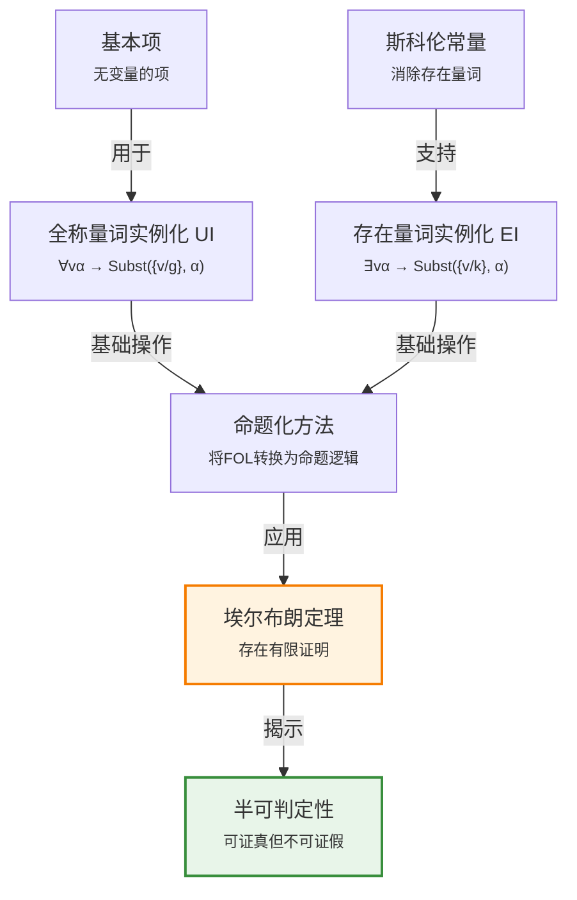

# 9.1 命题推断与一阶推断

> 📖 本节 Deep Dive | 预计学习时间: 60 分钟

---

## 1. 背景与动机

### 1.1 历史背景

**学科演进脉络**

一阶逻辑推断的研究可以追溯到19世纪末20世纪初，当时数学家们开始寻求严格的数学基础。戈特洛布·弗雷格（Gottlob Frege）在1879年提出了完整的一阶逻辑系统，将其构建于一系列有效模式和单个推断规则——肯定前件（Modus Ponens）之上。这一工作为后来的自动推理奠定了理论基础。

然而，早期的逻辑系统主要关注命题逻辑，其表达能力有限。随着数学和计算机科学的发展，人们迫切需要能够处理变量、量词和关系的更强大逻辑系统。一阶逻辑应运而生，它能够表达"所有"、"存在"等量词概念，以及对象之间的关系。

**里程碑事件**:

| 年份 | 人物/事件 | 贡献 | 影响 |
|------|-----------|------|------|
| 1879 | 弗雷格 | 提出完整一阶逻辑系统 | 奠定了现代逻辑基础 |
| 1930 | 埃尔布朗 | 证明埃尔布朗定理 | 为自动定理证明提供理论基础 |
| 1930 | 哥德尔 | 证明一阶逻辑完备性定理 | 确立了可证明性的界限 |
| 1936 | 图灵/丘奇 | 证明停机问题不可判定 | 揭示了一阶逻辑推断的半可判定性 |

**演进动机**:
- **早期方法**: 命题逻辑只能处理具体的、无变量的陈述
- **局限性**: 无法表达一般性规律，如"所有人都是会死的"
- **突破**: 一阶逻辑引入量词和变量，能够表达普遍性陈述和存在性陈述

### 1.2 研究动机

**为什么研究者关注这个主题？**

1. **理论意义**: 一阶逻辑是连接命题逻辑与高阶逻辑的关键桥梁，它既有足够的表达能力来描述数学和计算机科学中的大多数问题，又保持了一定的可判定性。

2. **方法创新**: 命题化方法展示了一阶逻辑推断可以归约为命题逻辑推断，尽管代价巨大，但这一思路启发了后来的许多自动推理技术。

3. **问题解决**: 埃尔布朗定理证明，如果语句被原始的一阶知识库蕴含，则存在仅涉及命题化知识库的有限子集的证明。这为自动定理证明提供了理论基础。

**与其他领域的关系**:
- **自动定理证明**: 一阶逻辑推断是自动定理证明器的核心
- **知识表示**: 为专家系统和知识库提供形式化基础
- **程序验证**: 用于验证软件和硬件系统的正确性

### 1.3 实际应用场景

| 应用领域 | 具体问题 | 本节理论的作用 | 预期效果 |
|----------|----------|----------------|----------|
| 数学定理证明 | 证明数学命题 | 提供形式化推理框架 | 自动化证明过程 |
| 程序验证 | 验证程序正确性 | 形式化程序规约和性质 | 确保程序无错误 |
| 知识库推理 | 从知识库推导新事实 | 提供推断规则 | 自动知识发现 |
| 自然语言处理 | 语义理解和推理 | 形式化语义表示 | 深层语义分析 |

**典型案例预览**:
> 通过学习本节，你将理解如何将"所有贪婪的国王都是邪恶的"这样的一般性规则应用于具体个体（如约翰国王），并理解为什么一阶逻辑的蕴含问题是半可判定的——这意味着我们可以证明所有真命题，但无法证明所有假命题。

### 1.4 先决条件

**学习本节需要的前置知识**:

| 知识项 | 来源 | 掌握程度要求 | 关键概念 |
|--------|------|:------------:|----------|
| 命题逻辑 | 第7章 | 必须熟练掌握 | 命题、联结词、真值表 |
| 一阶逻辑语法 | 第8章 | 必须熟练掌握 | 项、原子公式、量词 |
| 归结原理 | 第7章 | 理解即可 | 归结规则、CNF转换 |
| 可计算性基础 | 外部 | 了解 | 可判定性、半可判定性 |

**前置检查清单**:
- [ ] 能够复述命题逻辑中肯定前件规则的定义
- [ ] 能够识别一阶逻辑中的全称量词和存在量词
- [ ] 理解归结原理的基本思想
- [ ] 了解什么是可判定问题

---

## 2. 知识逻辑图谱

### 2.1 概念关系图



### 2.2 知识发展依赖链

```
【基础层】           【发展层】              【高潮层】             【应用层】
    ↓                   ↓                     ↓                   ↓
┌─────────┐      ┌─────────────┐       ┌───────────┐      ┌──────────┐
│ 量词语法 │ ──→  │ 量词实例化  │  ──→  │ 埃尔布朗  │ ──→  │ 自动定理 │
│         │      │ 规则        │       │ 定理      │      │ 证明     │
│ ∀, ∃    │      │ UI, EI      │       │ 有限性    │      │ 半可判定 │
└─────────┘      └─────────────┘       └───────────┘      └──────────┘
     │                   │                   │                │
     └───────────────────┴───────────────────┴────────────────┘
                         知识演进脉络
```

**依赖链详解**:
1. **基础**: 理解全称量词∀和存在量词∃的语法和语义
2. **发展**: 掌握全称量词实例化(UI)和存在量词实例化(EI)规则
3. **高潮**: 理解埃尔布朗定理——存在有限证明的关键结论
4. **应用**: 认识到一阶逻辑推断的半可判定性，应用于自动定理证明

### 2.3 本节在章节中的位置

```
第 9 章: 一阶逻辑中的推断
├── 9.1 命题推断与一阶推断 ← ⭐ 当前位置
│   ├── [核心概念: 量词实例化]
│   ├── [核心定理: 埃尔布朗定理]
│   └── [应用: 命题化方法]
│
├── 9.2 合一与一阶推断 ← 后续发展
│   └── [将本节扩展至: 合一算法]
│
├── 9.3 前向链接 ← 后续发展
│   └── [将本节扩展至: 确定子句推理]
│
├── 9.4 反向链接 ← 后续发展
│   └── [将本节扩展至: 逻辑编程]
│
└── 9.5 归结 ← 后续发展
    └── [将本节扩展至: 完备推断系统]
```

**衔接说明**:
- **为本章奠定基础**: 本节介绍了一阶逻辑推断的基本方法——命题化，为后续更高效的推断方法（合一、前向链接、反向链接、归结）提供了对比基准
- **核心洞察**: 命题化虽然理论完备，但实践中效率低下，这 motivates 了后续各节的发展

---

## 3. 核心概念与数学分析

### 3.1 核心术语定义

**定义 9.1.1** (全称量词实例化 / Universal Instantiation, UI):

> **正式定义**: 对于任意变量 $v$ 和基本项 $g$（没有变量的项），从全称量化语句 $\forall v \alpha$ 可以推断出 $\text{Subst}(\{v/g\}, \alpha)$，其中 $\text{Subst}(\theta, \alpha)$ 表示对语句 $\alpha$ 应用置换 $\theta$ 后的语句。

**定义详解**:
- **直观解释**: 如果某性质对所有对象成立，那么它对任何特定的具体对象也成立。例如，如果"所有人都是会死的"，那么"苏格拉底是会死的"。
- **数学表述**: 
$$\frac{\forall v \alpha}{\text{Subst}(\{v/g\}, \alpha)}$$
- **为什么这样定义**: 这是全称量词语义的自然结果——全称量词意味着"对所有实例都成立"
- **等价形式**: 可以多次应用，生成不同的实例

**定义中的关键要素**:
| 要素 | 符号 | 含义 | 约束条件 |
|------|------|------|----------|
| 全称量词语句 | $\forall v \alpha$ | 对所有 $v$，$\alpha$ 成立 | $v$ 是变量，$\alpha$ 是公式 |
| 基本项 | $g$ | 不含变量的项 | 可以是常量或函数应用 |
| 置换 | $\{v/g\}$ | 将 $v$ 替换为 $g$ | $v$ 不在 $g$ 中自由出现 |

**示例**: 从 $\forall x \text{King}(x) \land \text{Greedy}(x) \Rightarrow \text{Evil}(x)$，通过UI可以得到：
- $\text{King}(\text{John}) \land \text{Greedy}(\text{John}) \Rightarrow \text{Evil}(\text{John})$
- $\text{King}(\text{Richard}) \land \text{Greedy}(\text{Richard}) \Rightarrow \text{Evil}(\text{Richard})$
- $\text{King}(\text{Father}(\text{John})) \land \text{Greedy}(\text{Father}(\text{John})) \Rightarrow \text{Evil}(\text{Father}(\text{John}))$

---

**定义 9.1.2** (存在量词实例化 / Existential Instantiation, EI):

> **正式定义**: 对于任意语句 $\alpha$、变量 $v$ 和未在知识库其他地方出现的常量符号 $k$（斯科伦常量），从存在量化语句 $\exists v \alpha$ 可以推断出 $\text{Subst}(\{v/k\}, \alpha)$。

**定义详解**:
- **直观解释**: 如果存在满足某条件的对象，我们可以给这个对象一个名字（只要这个名字未被使用）。例如，从"存在一只独角兽"可以推断出"U1是一只独角兽"（假设U1是新常量）。
- **数学表述**:
$$\frac{\exists v \alpha}{\text{Subst}(\{v/k\}, \alpha)}$$
其中 $k$ 是新的斯科伦常量。
- **为什么这样定义**: 存在量词意味着"至少有一个"，我们需要给这个对象命名以便后续推理
- **关键约束**: 斯科伦常量必须全新，不能已在知识库中出现

**定义中的关键要素**:
| 要素 | 符号 | 含义 | 约束条件 |
|------|------|------|----------|
| 存在量词语句 | $\exists v \alpha$ | 存在 $v$ 使 $\alpha$ 成立 | $v$ 是变量，$\alpha$ 是公式 |
| 斯科伦常量 | $k$ | 新引入的常量符号 | 未在知识库中出现 |
| 唯一性 | - | 每个存在语句只实例化一次 | 避免重复引入 |

**示例**: 从 $\exists x \text{Crown}(x) \land \text{OnHead}(x, \text{John})$，通过EI可以得到：
$$\text{Crown}(C_1) \land \text{OnHead}(C_1, \text{John})$$
其中 $C_1$ 是新的斯科伦常量。

**反例**: 如果知识库中已有 $C_1$ 指代皇冠，则不能再次使用 $C_1$ 来实例化另一个存在语句。

---

**定义 9.1.3** (命题化 / Propositionalization):

> **正式定义**: 将一阶逻辑知识库转换为命题逻辑知识库的过程，通过用所有可能的基本项置换替换全称量化变量，并用斯科伦常量替换存在量化变量。

### 3.2 符号系统与约定

**本节符号总表**:

| 符号 | 含义 | 数学表达 | 备注 |
|:----:|------|----------|------|
| $\forall$ | 全称量词 | $\forall x P(x)$ | "对所有 $x$，$P(x)$ 成立" |
| $\exists$ | 存在量词 | $\exists x P(x)$ | "存在 $x$ 使 $P(x)$ 成立" |
| $\text{Subst}(\theta, \alpha)$ | 置换应用 | $\text{Subst}(\{x/a\}, P(x)) = P(a)$ | 将置换应用于公式 |
| $\{v/g\}$ | 置换 | 将变量 $v$ 映射到项 $g$ | 单元素置换 |
| $k$ (或 $C_i$) | 斯科伦常量 | 新引入的常量符号 | 用于消除存在量词 |

### 3.3 关键公式与性质

#### 公式 1: 全称量词实例化规则

**数学表述**:
$$\frac{\forall v \alpha}{\text{Subst}(\{v/g\}, \alpha)}$$

**公式要素解析**:

| 维度 | 内容 |
|------|------|
| **直观解释** | 普遍性蕴含特殊性——如果某性质对所有对象成立，则对任何具体对象也成立 |
| **几何意义** | 类似于集合论：如果集合的所有元素都有某性质，则任意选取的元素也有该性质 |
| **领域背景** | 这是亚里士多德逻辑中"从一般到特殊"推理的形式化，是演绎逻辑的基础 |

**使用条件**: 
- $v$ 是全称量化的变量
- $g$ 是基本项（不含变量）
- 可以多次应用，生成多个实例

**特殊情况**: 
- 当论域无限时，可以生成无限多个实例
- 当包含函数符号时，可以生成嵌套项如 $f(f(f(a)))$

---

#### 公式 2: 存在量词实例化规则

**数学表述**:
$$\frac{\exists v \alpha}{\text{Subst}(\{v/k\}, \alpha)}$$
其中 $k$ 是未在知识库中出现的新常量（斯科伦常量）。

**公式要素解析**:

| 维度 | 内容 |
|------|------|
| **直观解释** | 存在性断言允许我们给满足条件的对象命名，只要这个名字是全新的 |
| **几何意义** | 类似于集合论：如果集合非空，我们可以从中选取一个元素并命名 |
| **领域背景** | 数学中常用此技术，如定义 $e$ 为满足 $\frac{d(x^y)}{dy} = x^y$ 的数 |

**使用条件**:
- $k$ 必须是全新的常量符号
- 每个存在语句只应实例化一次
- 实例化后可以丢弃原始的存在量化语句

**关键区别**: 与全称量词实例化不同，存在量词实例化只需使用一次，因为"存在"只断言至少有一个，而不是具体的数量。

---

### 3.4 重要性质与推论

**性质 9.1.1** (埃尔布朗定理 / Herbrand's Theorem):

> **陈述**: 如果语句被原始的一阶知识库蕴含，则存在仅涉及命题化知识库的有限子集的证明。

**证明概要**: 证明基于埃尔布朗域的构造——由知识库中的常量和函数符号生成的所有基本项的集合。如果知识库不可满足，则存在其埃尔布朗基的有限不可满足子集。

**直观理解**: 尽管一阶逻辑可能涉及无限论域，但任何证明只需要有限多个基本实例。

**重要性**: 这是自动定理证明的理论基础，表明我们不需要考虑无限多个实例就能找到证明。

---

**性质 9.1.2** (半可判定性 / Semi-decidability):

> **陈述**: 一阶逻辑的蕴含问题是半可判定的——存在能判定所有蕴含的语句的算法，但不存在能够判定所有不蕴含的语句的算法。

**直观理解**: 
- 如果 $KB \models \alpha$，算法最终会证明它
- 如果 $KB \not\models \alpha$，算法可能永远运行而不停机

**这与图灵机的停机问题类似**: 艾伦·图灵（1936）和阿朗佐·丘奇（1936）分别证明了这种情况的不可避免性。

---

## 4. 定理与证明

### 4.1 定理陈述

**定理 9.1** (一阶逻辑命题化的完备性 / Completeness of Propositionalization):

> **正式陈述**: 设 $KB$ 为一阶逻辑知识库，$\alpha$ 为一阶逻辑语句。如果 $KB \models \alpha$，则存在通过命题化和命题归结从 $KB$ 推导出 $\alpha$ 的有限证明。

**定理解读**:
- **条件（前提）**:
  1. **条件 1**: $KB$ 是一阶逻辑知识库（可能包含量词和函数符号）
  2. **条件 2**: $\alpha$ 是一阶逻辑语句
  3. **条件 3**: $KB \models \alpha$（$\alpha$ 被 $KB$ 逻辑蕴含）

- **结论**: 存在有限的基本项集合，使得在这些项上命题化后，可以用命题归结证明 $\alpha$

- **定理意义**: 这表明一阶逻辑推断可以归约为命题逻辑推断，尽管可能涉及巨大的搜索空间

- **历史背景**: 由雅克·埃尔布朗（Jacques Herbrand）于1930年证明

### 4.2 证明详解

**证明策略概览**:

本定理的证明基于埃尔布朗域的构造和紧致性定理。核心思路是：如果 $KB \models \alpha$，则 $KB \cup \{\neg\alpha\}$ 不可满足，因此存在使其不可满足的有限基本实例集。

**核心思路**: 构造性证明——展示如何构造出所需的有限证明

**关键步骤预览**:
1. 构造埃尔布朗域 $H_S$
2. 应用紧致性定理
3. 构造有限不可满足子集
4. 使用命题归结完成证明

---

**正式证明**:

**步骤 1**: 构造埃尔布朗域

设 $S = KB \cup \{\neg\alpha\}$。定义 $S$ 的埃尔布朗域 $H_S$ 为：
- 如果 $S$ 含有常量符号，则 $H_S$ 包含所有这些常量
- 如果 $S$ 不含常量符号，则 $H_S$ 包含一个默认常量 $c$
- $H_S$ 对 $S$ 中的所有函数符号封闭

形式上：
$$H_S = \{t \mid t \text{ 是由 } S \text{ 中的常量和函数符号构成的基本项}\}$$

> 💡 **技术注释**: 埃尔布朗域是所有可能的基本项的集合。如果 $S$ 包含函数符号，$H_S$ 是无限的。

---

**步骤 2**: 应用紧致性定理

由于 $KB \models \alpha$，集合 $S = KB \cup \{\neg\alpha\}$ 是不可满足的。

根据紧致性定理（Compactness Theorem）：如果一阶逻辑语句集不可满足，则存在其有限子集也不可满足。

因此，存在 $S$ 的有限子集 $S' \subseteq S$ 是不可满足的。

---

**步骤 3**: 构造基本实例

对于 $S'$ 中的每个子句，用 $H_S$ 中的基本项替换所有变量，生成基本子句集 $S''$。

关键观察：由于 $S'$ 是有限的，只需要有限多个基本实例就能使其不可满足。

> 💡 **技术注释**: 这是埃尔布朗定理的核心——无限问题可以归约为有限问题。

---

**步骤 4**: 命题归结证明

$S''$ 是命题子句集（不含变量）。由于 $S''$ 不可满足，根据命题归结的完备性，存在从 $S''$ 推导出空子句的归结证明。

这个证明只涉及有限多个基本实例，因此证明了原定理。

$$
\blacksquare \text{ (证毕)}$$

### 4.3 证明分析与提炼

**核心洞见**: 

埃尔布朗定理的精髓在于：尽管一阶逻辑涉及可能无限的论域，但任何证明只需要考虑有限多个基本实例。这是因为不可满足性是一种"有限性质"——如果一组语句不可满足，那么只需要其中有限多个就能产生矛盾。

**证明技巧总结**:

| 技巧 | 在本证明中的应用 | 可迁移性 | 其他应用场景 |
|------|------------------|----------|--------------|
| 域构造 | 构造埃尔布朗域 | ⭐⭐⭐⭐⭐ | 模型论、自动定理证明 |
| 紧致性 | 从无限到有限 | ⭐⭐⭐⭐⭐ | 逻辑、拓扑学 |
| 归约 | 一阶到命题 | ⭐⭐⭐⭐ | 复杂性理论、可计算性 |

**证明中的关键难点**: 

理解为什么有限子集的存在性足以保证证明的存在性。这需要理解"不可满足性"的本质——它只需要有限证据就能确立。

**如果修改条件**: 

如果 $KB \not\models \alpha$，证明过程可能永不终止。这正是半可判定性的体现——我们可以证明所有真命题，但无法证明所有假命题。

---

## 5. 具体示例与详解

### 5.1 典型数值示例

**示例 9.1.1**: 贪婪国王问题的命题化

**📋 问题陈述**:

给定知识库：
1. $\forall x \text{ King}(x) \land \text{Greedy}(x) \Rightarrow \text{Evil}(x)$
2. $\text{King}(\text{John})$
3. $\text{Greedy}(\text{John})$
4. $\text{Brother}(\text{Richard}, \text{John})$

论域仅含 John 和 Richard。

**求解**: 证明 $\text{Evil}(\text{John})$

---

**🔍 解答过程**:

**步骤 1: 全称量词实例化**

对规则1应用全称量词实例化，用所有可能的基本项（John和Richard）替换 $x$：

$$\text{King}(\text{John}) \land \text{Greedy}(\text{John}) \Rightarrow \text{Evil}(\text{John})$$

$$\text{King}(\text{Richard}) \land \text{Greedy}(\text{Richard}) \Rightarrow \text{Evil}(\text{Richard})$$

**步骤 2: 命题符号替换**

将基本原子语句替换为命题符号：
- $K_J = \text{King}(\text{John})$
- $G_J = \text{Greedy}(\text{John})$
- $E_J = \text{Evil}(\text{John})$
- $K_R = \text{King}(\text{Richard})$
- $G_R = \text{Greedy}(\text{Richard})$
- $E_R = \text{Evil}(\text{Richard})$
- $B_{RJ} = \text{Brother}(\text{Richard}, \text{John})$

**步骤 3: 命题推理**

命题化后的知识库：
1. $K_J \land G_J \Rightarrow E_J$
2. $K_R \land G_R \Rightarrow E_R$
3. $K_J$
4. $G_J$
5. $B_{RJ}$

从1、3、4，应用肯定前件：
$$K_J \land G_J \Rightarrow E_J, \quad K_J, \quad G_J \quad \vdash \quad E_J$$

**步骤 4: 结果解释**

$E_J$ 为真，即 $\text{Evil}(\text{John})$ 成立。

---

**✅ 验证与检验**:

**正确性检查**:
- [x] 结果满足所有给定条件
- [x] 推理步骤符合逻辑规则
- [x] 与直觉一致（贪婪的国王是邪恶的）

**结果的意义**: 展示了如何将一阶推理归约为命题推理，尽管这种方法在论域较大时效率低下。

---

### 5.2 概念辨析示例

**示例 9.1.2**: 无限论域与埃尔布朗定理

**场景**: 考虑知识库：
- $\text{NatNum}(0)$
- $\forall n \text{ NatNum}(n) \Rightarrow \text{NatNum}(S(n))$

其中 $S$ 是后继函数。

**分析**: 

通过重复应用全称量词实例化，可以生成：
- $\text{NatNum}(S(0))$
- $\text{NatNum}(S(S(0)))$
- $\text{NatNum}(S(S(S(0))))$
- ...

这个过程永无止境，产生无限多个新事实。

**教训**: 

对于含有函数符号的知识库，命题化可能生成无限多个基本项。这正是为什么需要埃尔布朗定理——它保证如果证明存在，则只需要有限多个实例。

---

### 5.3 类比与可视化

**直觉类比**:

| 抽象概念 | 日常类比 | 对应关系 |
|----------|----------|----------|
| 全称量词实例化 | "所有人都会死，苏格拉底是人，所以苏格拉底会死" | 从一般到特殊的推理 |
| 存在量词实例化 | "房间里有人，我们叫他张三" | 给未知对象命名 |
| 命题化 | 将通用食谱转换为具体步骤 | 抽象到具体的转换 |
| 埃尔布朗定理 | 在无限图书馆中找书，知道只需要查有限个书架 | 无限中的有限性 |

---

## 6. 深入理解与拓展

### 6.1 一句话本质

> 🎯 **核心要点**: 一阶逻辑推断可以通过量词实例化归约为命题逻辑推断，尽管这种方法在理论上完备但实践中效率低下，而埃尔布朗定理保证了任何证明只需要有限多个基本实例。

### 6.2 深入思考问题

1. **概念层面**: 为什么全称量词可以多次实例化而存在量词只能实例化一次？
   <!-- 思考方向: 考虑两种量词的语义差异——全称量词断言对所有实例成立，而存在量词只断言至少有一个实例 -->

2. **方法层面**: 命题化方法的主要局限是什么？如何克服？
   <!-- 思考方向: 考虑论域大小、函数符号、计算复杂度等因素 -->

3. **应用层面**: 在什么情况下命题化方法是可行的？
   <!-- 思考方向: 考虑论域有限、无函数符号的情况（如Datalog） -->

4. **理论层面**: 半可判定性对自动定理证明有什么实际影响？
   <!-- 思考方向: 考虑证明搜索的策略、启发式、资源限制 -->

### 6.3 与其他节的关系

**本节输出**:
- 量词实例化规则（UI和EI）
- 命题化方法的概念框架
- 埃尔布朗定理的理论基础

**后续发展预告**: 
- 在9.2节，我们将学习合一算法，它避免了盲目实例化所有可能的基本项
- 在9.3-9.5节，我们将学习更高效的推断算法（前向链接、反向链接、归结）

---

## 7. 总结与反思

### 7.1 关键要点总结

本节必须掌握的 **5** 个核心要点:

1. **全称量词实例化 (UI)**: 从 $\forall v \alpha$ 可以推出 $\text{Subst}(\{v/g\}, \alpha)$，其中 $g$ 是任意基本项。这是从一般到特殊的推理。
   
   💡 *记忆技巧*: "全称"意味着"所有"，所以可以对任何具体实例应用。

2. **存在量词实例化 (EI)**: 从 $\exists v \alpha$ 可以推出 $\text{Subst}(\{v/k\}, \alpha)$，其中 $k$ 是新的斯科伦常量。每个存在语句只实例化一次。
   
   💡 *记忆技巧*: "存在"意味着"至少有一个"，给它起个新名字就行了。

3. **命题化方法**: 通过量词实例化将一阶逻辑知识库转换为命题逻辑知识库，然后使用命题推断方法。

4. **埃尔布朗定理**: 如果语句被知识库蕴含，则存在仅涉及有限子集的证明。这是自动定理证明的理论基础。

5. **半可判定性**: 一阶逻辑的蕴含问题是半可判定的——存在能判定所有蕴含的语句的算法，但不存在能够判定所有不蕴含的语句的算法。

### 7.2 本节知识框架

```
┌─────────────────────────────────────────────────────────────┐
│  第9.1节: 命题推断与一阶推断                                │
├─────────────────────────────────────────────────────────────┤
│  输入/前置                                                   │
│  • 一阶逻辑知识库（含全称/存在量词）                        │
│  • 查询语句                                                 │
│                                                             │
│  处理/核心                                                   │
│  • 全称量词实例化 (UI)                                      │
│  • 存在量词实例化 (EI) → 斯科伦常量                        │
│  • 命题化 → 命题逻辑知识库                                 │
│  ↓                                                          │
│  输出/结果                                                   │
│  • 命题逻辑证明                                            │
│  • 埃尔布朗定理保证有限性                                  │
│                                                             │
│  局限/理论                                                   │
│  • 半可判定性                                              │
│  • 函数符号导致无限可能实例                                │
└─────────────────────────────────────────────────────────────┘
```

### 7.3 常见误解与纠正

| 常见误解 ❌ | 正确理解 ✅ | 为什么容易错 | 如何避免 |
|-------------|-------------|--------------|----------|
| ❌ 存在量词可以多次实例化 | ✅ 存在量词只实例化一次 | 混淆了全称和存在的语义 | 记住"存在"只断言"至少有一个" |
| ❌ 命题化总是高效的 | ✅ 命题化在函数符号存在时可能无限 | 忽略了函数符号的递归性 | 理解埃尔布朗域的构造 |
| ❌ 一阶逻辑是完全可判定的 | ✅ 一阶逻辑是半可判定的 | 混淆了可判定性和完备性 | 理解图灵停机问题的不可判定性 |
| ❌ 斯科伦常量可以任意选择 | ✅ 斯科伦常量必须是全新的 | 忽略了命名冲突的可能性 | 记住检查常量是否已存在 |

### 7.4 反思问题

**连接性问题**:
1. 命题化方法与第7章的命题归结有什么关系？
2. 本节介绍的量词实例化规则如何为9.2节的合一算法奠定基础？

**应用性问题**:
1. 在实际应用中，什么情况下可以直接使用命题化方法？
2. 如何设计启发式策略来减少不必要的实例化？

**批判性问题**:
1. 命题化方法的主要瓶颈在哪里？
2. 在什么情况下应该使用本节方法而不是后续介绍的更高级方法？

### 7.5 学习检查清单

- [ ] 能够复述全称量词实例化和存在量词实例化的定义
- [ ] 能够应用UI和EI规则进行简单的推理
- [ ] 理解埃尔布朗定理的陈述和意义
- [ ] 理解半可判定性的概念及其影响
- [ ] 能够识别斯科伦常量的使用条件
- [ ] 了解命题化方法的基本步骤

---

## 附录

### A. 公式速查表

| 公式 | 名称 | 使用条件 | 备注 |
|:----:|------|----------|------|
| $\frac{\forall v \alpha}{\text{Subst}(\{v/g\}, \alpha)}$ | 全称量词实例化 | $g$ 是基本项 | 可多次应用 |
| $\frac{\exists v \alpha}{\text{Subst}(\{v/k\}, \alpha)}$ | 存在量词实例化 | $k$ 是新斯科伦常量 | 只应用一次 |

### B. 术语索引

| 术语 | 英文 | 定义 | 位置 |
|------|------|------|:----:|
| 全称量词实例化 | Universal Instantiation (UI) | 从全称语句推出具体实例 | 9.1 |
| 存在量词实例化 | Existential Instantiation (EI) | 从存在语句引入新常量 | 9.1 |
| 斯科伦常量 | Skolem Constant | 消除存在量词时引入的新常量 | 9.1 |
| 命题化 | Propositionalization | 将FOL转换为命题逻辑 | 9.1 |
| 埃尔布朗定理 | Herbrand's Theorem | 存在有限证明的定理 | 9.1 |
| 半可判定性 | Semi-decidability | 可证真但不可证假 | 9.1 |

### C. 延伸阅读

**理论深化**:
- Herbrand, J. (1930). "Investigations in proof theory." 埃尔布朗的原始论文。
- Turing, A. M. (1936). "On computable numbers." 关于可判定性的经典论文。

**应用拓展**:
- 自动定理证明器：Otter, Prover9, Vampire
- 程序验证工具：Coq, Isabelle

---

> 📌 **下一节**: [9.2 合一与一阶推断](9.2_合一与一阶推断.md)
> 
> 📚 **返回概览**: [第9章概览](00_概览.md)
