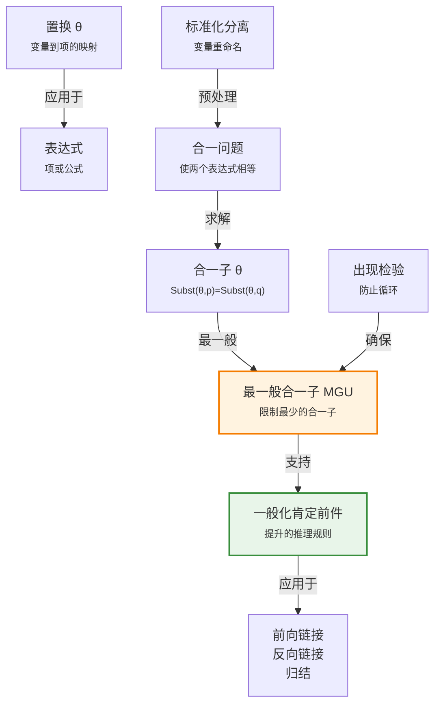

# 9.2 合一与一阶推断

> 📖 本节 Deep Dive | 预计学习时间: 75 分钟

---

## 1. 背景与动机

### 1.1 历史背景

**学科演进脉络**

合一（Unification）的概念源于20世纪60年代自动定理证明的研究。在早期的命题化方法中，为了应用一条规则如"所有贪婪的国王都是邪恶的"，需要枚举所有可能的基本项实例，这导致了巨大的计算开销。研究者们意识到，许多实例化是不必要的，应该只在需要时才进行特定的置换。

1965年，约翰·艾伦·鲁滨逊（John Alan Robinson）在其开创性的归结原理论文中，将合一作为核心机制引入自动推理。合一使得推断系统能够自动找出使两个表达式匹配的置换，从而避免了盲目的实例化。

**里程碑事件**:

| 年份 | 人物/事件 | 贡献 | 影响 |
|------|-----------|------|------|
| 1965 | J.A. Robinson | 发明合一算法，提出归结原理 | 奠定了自动定理证明的基础 |
| 1972 | Kowalski & Colmerauer | 将合一应用于Prolog语言 | 开创了逻辑编程范式 |
| 1970s | 多项研究 | 开发高效合一算法 | 使逻辑编程成为实用技术 |
| 1980s | Martelli & Montanari | 提出高效合一算法 | 线性时间复杂度 |

**演进动机**:
- **早期方法**: 命题化方法枚举所有可能的基本项实例
- **局限性**: 产生大量不必要的实例，效率极低
- **突破**: 合一允许"按需实例化"，只生成必要的置换

### 1.2 研究动机

**为什么研究者关注这个主题？**

1. **理论意义**: 合一是连接语法和语义的桥梁——它确定了两个表达式在什么条件下可以被视为"相同"。

2. **方法创新**: 合一将模式匹配提升到新的高度，不仅检查匹配，还计算出使匹配成立的最一般置换。

3. **问题解决**: 合一是所有一阶逻辑推断算法的核心组件，包括归结、前向链接和反向链接。

**与其他领域的关系**:
- **类型系统**: 合一用于类型推断（如Hindley-Milner类型系统）
- **自然语言处理**: 合一语法用于句法和语义分析
- **程序分析**: 合一用于静态分析和优化

### 1.3 实际应用场景

| 应用领域 | 具体问题 | 本节理论的作用 | 预期效果 |
|----------|----------|----------------|----------|
| 逻辑编程 | Prolog执行 | 合一作为核心计算机制 | 声明式编程范式 |
| 自动定理证明 | 归结证明 | 找出互补文字的合一 | 高效证明搜索 |
| 类型推断 | 编程语言类型检查 | 合一类型表达式 | 自动类型推导 |
| 模式匹配 | 函数式编程 | 解构数据结构 | 优雅的数据处理 |

**典型案例预览**:
> 通过学习本节，你将理解为什么Prolog能够自动找出变量绑定，以及归结定理证明器如何找出使两个子句互补的置换。核心洞察是：合一不仅检查匹配，还计算出最一般的匹配方式。

### 1.4 先决条件

**学习本节需要的前置知识**:

| 知识项 | 来源 | 掌握程度要求 | 关键概念 |
|--------|------|:------------:|----------|
| 置换 | 第8章 | 必须熟练掌握 | 变量替换、复合置换 |
| 一阶逻辑语法 | 第8章 | 必须熟练掌握 | 项、公式、变量 |
| 命题化方法 | 9.1节 | 理解即可 | 量词实例化 |
| 递归算法 | 外部 | 了解 | 递归、树遍历 |

**前置检查清单**:
- [ ] 能够应用置换到一阶逻辑表达式
- [ ] 理解变量、常量、函数符号的区别
- [ ] 了解命题化方法的局限性
- [ ] 能够阅读递归算法伪代码

---

## 2. 知识逻辑图谱

### 2.1 概念关系图



### 2.2 知识发展依赖链

```
【基础层】           【发展层】              【高潮层】             【应用层】
    ↓                   ↓                     ↓                   ↓
┌─────────┐      ┌─────────────┐       ┌───────────┐      ┌──────────┐
│ 置换    │ ──→  │ 合一算法    │  ──→  │ 最一般    │ ──→  │ 一般化   │
│         │      │             │       │ 合一子    │      │ 肯定前件 │
│ 变量    │      │ 递归比较    │       │ MGU       │      │ 推理规则 │
│ 替换    │      │ 出现检验    │       │ 唯一性    │      │ 提升     │
└─────────┘      └─────────────┘       └───────────┘      └──────────┘
     │                   │                   │                │
     └───────────────────┴───────────────────┴────────────────┘
                         知识演进脉络
```

**依赖链详解**:
1. **基础**: 理解置换的概念——将变量映射到项
2. **发展**: 掌握合一算法——递归地找出使两个表达式相等的置换
3. **高潮**: 理解最一般合一子（MGU）——在所有合一子中限制最少的那个
4. **应用**: 应用合一到一般化肯定前件——提升的推理规则

### 2.3 本节在章节中的位置

```
第 9 章: 一阶逻辑中的推断
├── 9.1 命题推断与一阶推断 ← 前置知识
│   └── [核心概念: 量词实例化]
│
├── 9.2 合一与一阶推断 ← ⭐ 当前位置
│   ├── [核心概念: 合一算法]
│   ├── [核心定理: MGU唯一性]
│   └── [应用: 一般化肯定前件]
│
├── 9.3 前向链接 ← 后续发展
│   └── [将本节扩展至: 确定子句推理]
│
├── 9.4 反向链接 ← 后续发展
│   └── [将本节扩展至: 逻辑编程]
│
└── 9.5 归结 ← 后续发展
    └── [将本节扩展至: 完备推断系统]
```

**衔接说明**:
- **从9.1节继承**: 理解了命题化的低效性，本节介绍合一作为更高效的替代方案
- **为后续铺垫**: 合一是前向链接、反向链接和归结的核心组件

---

## 3. 核心概念与数学分析

### 3.1 核心术语定义

**定义 9.2.1** (合一 / Unification):

> **正式定义**: 合一是一个过程，接收两个表达式 $p$ 和 $q$ 作为输入，如果存在置换 $\theta$ 使得 $\text{Subst}(\theta, p) = \text{Subst}(\theta, q)$，则返回一个合一子（unifier）$\theta$。

**定义详解**:
- **直观解释**: 合一找出使两个表达式"看起来相同"的变量替换方式。例如，使 $\text{Knows}(\text{John}, x)$ 和 $\text{Knows}(y, \text{Bill})$ 匹配的置换是 $\{x/\text{Bill}, y/\text{John}\}$。
- **数学表述**:
$$\text{UNIFY}(p, q) = \theta \text{ 其中 } \text{Subst}(\theta, p) = \text{Subst}(\theta, q)$$
- **为什么这样定义**: 这是模式匹配的形式化，允许变量在不同表达式间"流动"
- **等价形式**: 合一可以扩展到多个表达式，找出使所有表达式相等的公共置换

**定义中的关键要素**:
| 要素 | 符号 | 含义 | 约束条件 |
|------|------|------|----------|
| 表达式 | $p, q$ | 项或原子公式 | 可以包含变量 |
| 合一子 | $\theta$ | 变量到项的映射 | 使两个表达式相等 |
| 合一结果 | $\text{Subst}(\theta, p)$ | 应用置换后的表达式 | 语法相等 |

**示例**:
- $\text{UNIFY}(\text{Knows}(\text{John}, x), \text{Knows}(\text{John}, \text{Jane})) = \{x/\text{Jane}\}$
- $\text{UNIFY}(\text{Knows}(\text{John}, x), \text{Knows}(y, \text{Bill})) = \{x/\text{Bill}, y/\text{John}\}$
- $\text{UNIFY}(\text{Knows}(\text{John}, x), \text{Knows}(x, \text{Elizabeth})) = \text{failure}$（没有标准化分离时）

---

**定义 9.2.2** (最一般合一子 / Most General Unifier, MGU):

> **正式定义**: 对于可合一的表达式对，最一般合一子 $\theta$ 是这样一个合一子：对于任何其他合一子 $\sigma$，存在置换 $\lambda$ 使得 $\sigma = \theta \circ \lambda$（即 $\sigma$ 可以通过对 $\theta$ 进一步特化得到）。

**定义详解**:
- **直观解释**: MGU是对变量值限制最少的合一子。例如，对于 $\text{Knows}(\text{John}, x)$ 和 $\text{Knows}(y, z)$，MGU是 $\{y/\text{John}, x/z\}$ 而不是 $\{y/\text{John}, x/\text{John}, z/\text{John}\}$。
- **数学表述**: 
$$\theta \text{ 是MGU} \iff \forall \sigma: \text{Subst}(\sigma, p) = \text{Subst}(\sigma, q), \exists \lambda: \sigma = \theta \circ \lambda$$
- **为什么这样定义**: MGU保留了最大的灵活性，后续推理可以进一步特化
- **唯一性**: 在不考虑变量重命名的情况下，MGU是唯一的

**示例**: 对于 $\text{UNIFY}(\text{Knows}(\text{John}, x), \text{Knows}(y, z))$:
- MGU: $\{y/\text{John}, x/z\}$ → 结果为 $\text{Knows}(\text{John}, z)$
- 非MGU: $\{y/\text{John}, x/\text{John}, z/\text{John}\}$ → 结果为 $\text{Knows}(\text{John}, \text{John})$

---

**定义 9.2.3** (一般化肯定前件 / Generalized Modus Ponens, GMP):

> **正式定义**: 对于原子语句 $p_i, p_i', q$，如果存在置换 $\theta$ 使得对所有 $i$ 有 $\text{SUBST}(\theta, p_i') = \text{SUBST}(\theta, p_i)$，则：
$$\frac{p_1', p_2', \ldots, p_n', \quad (p_1 \land p_2 \land \ldots \land p_n \Rightarrow q)}{\text{Subst}(\theta, q)}$$

**定义详解**:
- **直观解释**: 这是肯定前件的提升版本。不是要求前提完全匹配，而是允许通过合一来匹配。
- **为什么这样定义**: 这使得规则可以应用于各种具体情况，而不需要预先实例化

---

**定义 9.2.4** (标准化分离 / Standardizing Apart):

> **正式定义**: 对要合一的两个表达式中的变量进行重命名，使它们不共享变量名，从而避免名称冲突。

**示例**: 要合一 $\text{Knows}(\text{John}, x)$ 和 $\text{Knows}(x, \text{Elizabeth})$，先将后者标准化为 $\text{Knows}(x_{17}, \text{Elizabeth})$，然后可以成功合一为 $\{x/\text{Elizabeth}, x_{17}/\text{John}\}$。

---

**定义 9.2.5** (出现检验 / Occur Check):

> **正式定义**: 在合一过程中，当试图将变量 $x$ 与包含 $x$ 的项 $t$ 合一时，检查 $x$ 是否出现在 $t$ 中。如果是，则合一失败。

**示例**: $S(x)$ 无法与 $S(S(x))$ 合一，因为 $x$ 出现在 $S(x)$ 中。

---

### 3.2 符号系统与约定

**本节符号总表**:

| 符号 | 含义 | 数学表达 | 备注 |
|:----:|------|----------|------|
| $\text{UNIFY}(p, q)$ | 合一函数 | 返回合一子或failure | 核心操作 |
| $\theta$ | 合一子 | 变量到项的映射 | 使表达式相等 |
| MGU | 最一般合一子 | 限制最少的合一子 | 在不考虑重命名下唯一 |
| GMP | 一般化肯定前件 | 提升的推理规则 | 使用合一 |
| $\text{COMPOUND?}(x)$ | 谓词 | 检查 $x$ 是否为复合表达式 | 用于合一算法 |
| $\text{VARIABLE?}(x)$ | 谓词 | 检查 $x$ 是否为变量 | 用于合一算法 |

### 3.3 关键公式与性质

#### 公式 1: 一般化肯定前件规则

**数学表述**:
$$\frac{p_1', p_2', \ldots, p_n', \quad (p_1 \land p_2 \land \ldots \land p_n \Rightarrow q)}{\text{Subst}(\theta, q)}$$
其中 $\text{UNIFY}(p_i', p_i) = \theta$ 对所有 $i$ 成立。

**公式要素解析**:

| 维度 | 内容 |
|------|------|
| **直观解释** | 如果知识库中有事实 $p_i'$，且有一条规则说 $p_i$ 蕴含 $q$，那么通过合一找出使 $p_i'$ 和 $p_i$ 匹配的置换，就可以推出 $q$ 的实例 |
| **几何意义** | 类似于模式匹配——找出使模式与具体实例对齐的变换 |
| **领域背景** | 这是Prolog等逻辑编程语言的核心计算机制 |

**使用条件**:
- 规则的前提和知识库中的事实必须能够合一
- 合一子 $\theta$ 应用于规则的后件 $q$

**示例**:
- 知识库: $\text{King}(\text{John})$, $\text{Greedy}(\text{John})$
- 规则: $\text{King}(x) \land \text{Greedy}(x) \Rightarrow \text{Evil}(x)$
- 合一: $\theta = \{x/\text{John}\}$
- 结论: $\text{Evil}(\text{John})$

---

#### 公式 2: 合一算法的正确性条件

**数学表述**:
对于合一算法返回的 $\theta = \text{UNIFY}(p, q)$：
1. **可靠性**: 如果 $\theta \neq \text{failure}$，则 $\text{Subst}(\theta, p) = \text{Subst}(\theta, q)$
2. **完备性**: 如果 $p$ 和 $q$ 可合一，则算法返回合一子（非failure）
3. **最一般性**: 返回的 $\theta$ 是MGU

**公式要素解析**:

| 维度 | 内容 |
|------|------|
| **直观解释** | 合一算法必须正确（只返回有效的合一子）、完备（能找到所有可合一对的合一子）、最优（返回最一般的合一子） |
| **领域背景** | 这些性质保证了合一可以作为可靠的推理基础 |

---

### 3.4 重要性质与推论

**性质 9.2.1** (MGU的唯一性):

> **陈述**: 对于任意两个可合一的表达式，它们的最一般合一子在变量重命名的意义下是唯一的。

**证明概要**: 假设有两个MGU $\theta_1$ 和 $\theta_2$。根据MGU的定义，它们必须能够互相特化得到，这意味着它们只相差一个变量重命名。

**重要性**: 这保证了一阶逻辑推断的确定性——对于给定的合一问题，有唯一的"最佳"答案。

---

**性质 9.2.2** (一般化肯定前件的可靠性):

> **陈述**: 一般化肯定前件是可靠的推理规则，即如果前提被满足，结论必然成立。

**证明概要**:
1. 对于任意语句 $p$ 和置换 $\theta$，有 $p \models \text{Subst}(\theta, p)$（根据全称量词实例化）
2. 因此，$p_i' \models \text{Subst}(\theta, p_i') = \text{Subst}(\theta, p_i)$
3. 从蕴涵式 $p_1 \land \ldots \land p_n \Rightarrow q$，可以推出 $\text{Subst}(\theta, p_1) \land \ldots \land \text{Subst}(\theta, p_n) \Rightarrow \text{Subst}(\theta, q)$
4. 由于 $\text{Subst}(\theta, p_i') = \text{Subst}(\theta, p_i)$，根据肯定前件，得到 $\text{Subst}(\theta, q)$

---

## 4. 定理与证明

### 4.1 定理陈述

**定理 9.2** (合一算法的正确性 / Correctness of Unification Algorithm):

> **正式陈述**: 图9-1所示的合一算法具有以下性质：
> 1. **可靠性**: 如果算法返回置换 $\theta$，则 $\theta$ 确实是输入表达式的合一子
> 2. **完备性**: 如果输入表达式可合一，算法返回合一子（非failure）
> 3. **最一般性**: 算法返回的合一子是最一般合一子（MGU）

**定理解读**:
- **条件（前提）**:
  1. **条件 1**: 输入是两个一阶逻辑表达式（项或原子公式）
  2. **条件 2**: 表达式可以包含变量、常量和函数符号
  3. **条件 3**: 算法实现了出现检验

- **结论**: 算法满足可靠性、完备性和最一般性

- **定理意义**: 这保证了一合一是可靠的推理基础，可以用于定理证明和逻辑编程

### 4.2 证明详解

**证明策略概览**:

通过对表达式结构的归纳来证明。算法递归地处理表达式，在每一步维护置换的不变性。

**核心思路**: 结构归纳法——基于表达式的语法结构进行归纳

**关键步骤预览**:
1. 基本情况：变量、常量
2. 归纳步骤：复合表达式
3. 列表/参数列表处理
4. 出现检验的必要性

---

**正式证明**:

**步骤 1**: 基本情况——变量和常量

**情况1a**: $x$ 是变量，$y$ 是任意表达式
- 如果 $x = y$，返回当前置换 $\theta$（恒等置换）
- 如果 $x \neq y$ 且 $x$ 不在 $y$ 中出现，返回 $\theta \cup \{x/y\}$
- 如果 $x$ 在 $y$ 中出现，返回failure（出现检验）

**正确性**: 
- 第一种情况显然正确
- 第二种情况：$\text{Subst}(\{x/y\}, x) = y = \text{Subst}(\{x/y\}, y)$
- 第三种情况：如果 $x$ 出现在 $y$ 中，如 $y = f(x)$，则任何使 $x = f(x)$ 的置换都会导致无限循环 $x = f(x) = f(f(x)) = \ldots$，因此合一应该失败

> 💡 **技术注释**: 出现检验防止了"循环绑定"，如 $x = f(x)$ 这样的方程无解。

---

**步骤 2**: 归纳步骤——复合表达式

对于复合表达式 $F(t_1, \ldots, t_n)$ 和 $G(s_1, \ldots, s_m)$：

1. 首先合一函数符号：$\theta_1 = \text{UNIFY}(F, G)$
2. 如果 $\theta_1 = \text{failure}$，返回failure
3. 递归合一参数列表：$\theta_2 = \text{UNIFY}([t_1, \ldots, t_n], [s_1, \ldots, s_m], \theta_1)$
4. 返回 $\theta_2$

**正确性**: 通过归纳假设，如果 $\theta_1$ 使函数符号相等，且 $\theta_2$ 使参数列表相等，则复合表达式相等。

---

**步骤 3**: 列表处理

对于列表 $[h_1 | t_1]$ 和 $[h_2 | t_2]$：
1. 合一头部：$\theta_1 = \text{UNIFY}(h_1, h_2)$
2. 用 $\theta_1$ 合一尾部：$\theta_2 = \text{UNIFY}(t_1, t_2, \theta_1)$
3. 返回 $\theta_2$

**正确性**: 两个列表相等当且仅当头部相等且尾部相等。

---

**步骤 4**: 最一般性证明

要证明算法返回MGU，需要证明对于任何其他合一子 $\sigma$，存在 $\lambda$ 使得 $\sigma = \theta \circ \lambda$。

通过结构归纳：
- 基本情况：变量绑定 $\{x/t\}$ 是最一般的，因为任何使 $x$ 等于 $t$ 的合一子都必须将 $x$ 映射到 $t$
- 归纳步骤：复合表达式的MGU由组件的MGU组合而成

$$
\blacksquare \text{ (证毕)}$$

### 4.3 证明分析与提炼

**核心洞见**: 

合一算法的核心洞察是：两个表达式相等当且仅当它们的结构相等且对应组件相等。算法通过递归分解问题，并在变量处建立绑定，系统地找出使表达式相等的最一般方式。

**证明技巧总结**:

| 技巧 | 在本证明中的应用 | 可迁移性 | 其他应用场景 |
|------|------------------|----------|--------------|
| 结构归纳 | 基于表达式结构 | ⭐⭐⭐⭐⭐ | 语法分析、类型系统 |
| 不变式维护 | 置换始终使已处理部分相等 | ⭐⭐⭐⭐⭐ | 循环验证、算法正确性 |
| 反证法 | 出现检验的必要性 | ⭐⭐⭐⭐ | 一致性检查 |

**证明中的关键难点**: 

理解出现检验的必要性——为什么 $x$ 不能与 $f(x)$ 合一。这需要理解合一的语义：合一要求存在有限的形式使两个表达式相等。

---

## 5. 具体示例与详解

### 5.1 典型数值示例

**示例 9.2.1**: 合一算法执行 trace

**📋 问题陈述**:

合一 $\text{Knows}(\text{John}, x)$ 和 $\text{Knows}(y, \text{Mother}(y))$

**求解**: 找出MGU

---

**🔍 解答过程**:

**步骤 1: 标准化分离**

两个表达式已经使用不同变量名（$x$ 和 $y$），无需重命名。

**步骤 2: 合一函数符号**

$\text{UNIFY}(\text{Knows}, \text{Knows}) = \{\}$（空置换）

**步骤 3: 合一参数列表**

参数列表：$[\text{John}, x]$ 和 $[y, \text{Mother}(y)]$

**步骤 3a: 合一第一个参数**

$\text{UNIFY}(\text{John}, y) = \{y/\text{John}\}$

**步骤 3b: 应用置换后合一第二个参数**

应用 $\{y/\text{John}\}$ 到第二个表达式的第二个参数：
$\text{Subst}(\{y/\text{John}\}, \text{Mother}(y)) = \text{Mother}(\text{John})$

现在合一 $x$ 和 $\text{Mother}(\text{John})$：
$\text{UNIFY}(x, \text{Mother}(\text{John})) = \{x/\text{Mother}(\text{John})\}$

**步骤 4: 组合置换**

MGU: $\theta = \{y/\text{John}, x/\text{Mother}(\text{John})\}$

---

**✅ 验证与检验**:

**正确性检查**:
```
Subst(θ, Knows(John, x)) = Knows(John, Mother(John))
Subst(θ, Knows(y, Mother(y))) = Knows(John, Mother(John))
```
两者相等，合一正确。

**结果的意义**: 这个合一表明"约翰认识 $x$"和"$y$ 认识 $y$ 的母亲"可以同时成立，当 $y$ 是约翰且 $x$ 是约翰的母亲时。

---

### 5.2 概念辨析示例

**示例 9.2.2**: 出现检验的重要性

**场景**: 尝试合一 $x$ 和 $f(x)$

**分析**:

如果没有出现检验，可能会尝试创建置换 $\{x/f(x)\}$。

但这会导致无限循环：
```
x = f(x) = f(f(x)) = f(f(f(x))) = ...
```

**教训**: 

出现检验防止了这种"循环绑定"，确保合一结果是有意义的有限表达式。这在逻辑编程中尤为重要，因为无限项会导致计算不终止。

---

**示例 9.2.3**: MGU vs 非MGU

**场景**: 合一 $\text{Knows}(\text{John}, x)$ 和 $\text{Knows}(y, z)$

**可能的合一子**:
1. $\theta_1 = \{y/\text{John}, x/z\}$ → MGU，结果为 $\text{Knows}(\text{John}, z)$
2. $\theta_2 = \{y/\text{John}, x/\text{Bill}, z/\text{Bill}\}$ → 非MGU，结果为 $\text{Knows}(\text{John}, \text{Bill})$

**分析**:

$\theta_2$ 可以通过对 $\theta_1$ 进一步特化得到：
$$\theta_2 = \theta_1 \circ \{z/\text{Bill}\}$$

因此 $\theta_1$ 更一般，是MGU。

---

### 5.3 类比与可视化

**直觉类比**:

| 抽象概念 | 日常类比 | 对应关系 |
|----------|----------|----------|
| 合一 | 拼图匹配 | 找出使两块拼图吻合的旋转/翻转 |
| MGU | 最宽松的匹配 | 只匹配必要的部分，保留灵活性 |
| 出现检验 | 防止自我指涉 | "这句话是假的"类型的悖论 |
| 标准化分离 | 重命名变量 | 避免名字冲突，如两个人都叫"张三" |

**可视化**:

合一过程可以可视化为树结构的匹配：

```
    Knows              Knows
    /   \              /   \
  John   x     ≡     y   Mother(y)
   |     |            |      |
   |     |            |      |
  [常量] [变量]      [变量] [复合项]
```

通过合一，我们找出：$y = \text{John}$，$x = \text{Mother}(\text{John})$

---

## 6. 深入理解与拓展

### 6.1 一句话本质

> 🎯 **核心要点**: 合一是一种模式匹配机制，它自动计算出使两个表达式相等的最一般变量置换，从而避免了盲目的实例化，是高效一阶逻辑推断的核心组件。

### 6.2 深入思考问题

1. **概念层面**: 为什么MGU在变量重命名的意义下是唯一的？这对推断有什么实际意义？
   <!-- 思考方向: 考虑如果存在两个"最一般"的合一子，它们之间的关系是什么 -->

2. **方法层面**: 出现检验增加了算法的时间复杂度（从线性到二次方）。在什么情况下可以安全地省略它？
   <!-- 思考方向: 考虑实际应用中循环绑定的发生频率 -->

3. **应用层面**: Prolog省略了出现检验，这带来了什么好处和风险？
   <!-- 思考方向: 权衡效率和可靠性 -->

4. **理论层面**: 合一与方程求解有什么关系？能否将合一看作一种特殊的方程求解？
   <!-- 思考方向: 考虑项上的等式约束系统 -->

### 6.3 与其他节的关系

**本节输出**:
- 合一算法
- 最一般合一子（MGU）的概念
- 一般化肯定前件规则

**后续发展预告**:
- 在9.3节，合一将用于前向链接中的规则匹配
- 在9.4节，合一是Prolog执行的核心机制
- 在9.5节，合一使归结能够处理变量

---

## 7. 总结与反思

### 7.1 关键要点总结

本节必须掌握的 **5** 个核心要点:

1. **合一 (Unification)**: 找出使两个表达式相等的置换。合一不仅检查匹配，还计算出使匹配成立的置换。
   
   💡 *记忆技巧*: "合一" = "统一" + "合一子"，使两个表达式统一成一个。

2. **最一般合一子 (MGU)**: 在所有合一子中限制最少的那个。MGU保留了最大的灵活性，后续可以进一步特化。
   
   💡 *记忆技巧*: "最一般"意味着"最少约束"，就像"最一般的解决方案"。

3. **一般化肯定前件 (GMP)**: 肯定前件的提升版本，使用合一而不是精确匹配来应用规则。
   
   💡 *记忆技巧*: "一般化" = 使用合一，"肯定前件" = 从前提推出结论。

4. **出现检验 (Occur Check)**: 防止变量与包含自身的项合一，避免无限循环。
   
   💡 *记忆技巧*: 检查变量是否"出现"在要合一的项中。

5. **标准化分离**: 在合一前重命名变量，避免名称冲突。
   
   💡 *记忆技巧*: "分离" = 分开处理，避免混淆。

### 7.2 本节知识框架

```
┌─────────────────────────────────────────────────────────────┐
│  第9.2节: 合一与一阶推断                                    │
├─────────────────────────────────────────────────────────────┤
│  输入/前置                                                   │
│  • 两个一阶逻辑表达式                                        │
│  • 可能含有变量、常量、函数符号                             │
│                                                             │
│  处理/核心                                                   │
│  • 合一算法（递归结构匹配）                                 │
│  • 出现检验（防止循环）                                     │
│  • 标准化分离（变量重命名）                                 │
│  ↓                                                          │
│  输出/结果                                                   │
│  • 最一般合一子 (MGU)                                       │
│  • 或 failure（不可合一）                                   │
│                                                             │
│  应用/价值                                                   │
│  • 一般化肯定前件                                           │
│  • 归结、前向链接、反向链接的核心组件                       │
└─────────────────────────────────────────────────────────────┘
```

### 7.3 常见误解与纠正

| 常见误解 ❌ | 正确理解 ✅ | 为什么容易错 | 如何避免 |
|-------------|-------------|--------------|----------|
| ❌ 合一只是模式匹配 | ✅ 合一计算置换，不只是检查匹配 | 混淆了检查和计算 | 理解合一返回置换 |
| ❌ 合一总是成功 | ✅ 合一可能失败（返回failure） | 忽略了不可合一的情况 | 记住检查返回值 |
| ❌ 可以省略出现检验 | ✅ 省略出现检验会导致不可靠推断 | Prolog的实践误导 | 理解出现检验的理论必要性 |
| ❌ 所有合一子都等价 | ✅ MGU是唯一的（不考虑重命名） | 混淆了存在性和唯一性 | 理解MGU的"最一般"含义 |

### 7.4 反思问题

**连接性问题**:
1. 合一如何改进了9.1节的命题化方法？
2. 一般化肯定前件与第7章的肯定前件有什么关系？

**应用性问题**:
1. 在实现逻辑编程语言时，如何优化合一算法的性能？
2. 合一算法的时间复杂度是多少？如何改进？

**批判性问题**:
1. 合一的局限性是什么？它不能处理什么情况？
2. 高阶逻辑中的合一与一阶逻辑有什么不同？

### 7.5 学习检查清单

- [ ] 能够手动执行合一算法找出MGU
- [ ] 理解出现检验的必要性
- [ ] 能够应用一般化肯定前件进行推理
- [ ] 理解MGU的唯一性定理
- [ ] 能够识别需要标准化分离的情况
- [ ] 了解合一在逻辑编程中的应用

---

## 附录

### A. 公式速查表

| 公式 | 名称 | 使用条件 | 备注 |
|:----:|------|----------|------|
| $\text{UNIFY}(p, q) = \theta$ | 合一 | $p, q$ 是表达式 | 返回MGU或failure |
| $\frac{p_i', (p_i \Rightarrow q)}{\text{Subst}(\theta, q)}$ | 一般化肯定前件 | $\text{UNIFY}(p_i', p_i) = \theta$ | 提升的推理规则 |

### B. 术语索引

| 术语 | 英文 | 定义 | 位置 |
|------|------|------|:----:|
| 合一 | Unification | 找出使表达式相等的置换 | 9.2 |
| 合一子 | Unifier | 使两个表达式相等的置换 | 9.2 |
| 最一般合一子 | MGU | 限制最少的合一子 | 9.2 |
| 一般化肯定前件 | GMP | 使用合一的肯定前件 | 9.2 |
| 出现检验 | Occur Check | 防止循环绑定的检查 | 9.2 |
| 标准化分离 | Standardizing Apart | 变量重命名 | 9.2 |

### C. 延伸阅读

**理论深化**:
- Robinson, J.A. (1965). "A Machine-Oriented Logic Based on the Resolution Principle." 合一的原始论文。
- Martelli, A. & Montanari, U. (1982). "An Efficient Unification Algorithm." 高效合一算法。

**应用拓展**:
- Prolog语言实现
- 类型推断系统（Hindley-Milner）

---

> 📌 **下一节**: [9.3 前向链接](9.3_前向链接.md)
> 
> 📚 **返回概览**: [第9章概览](00_概览.md)
