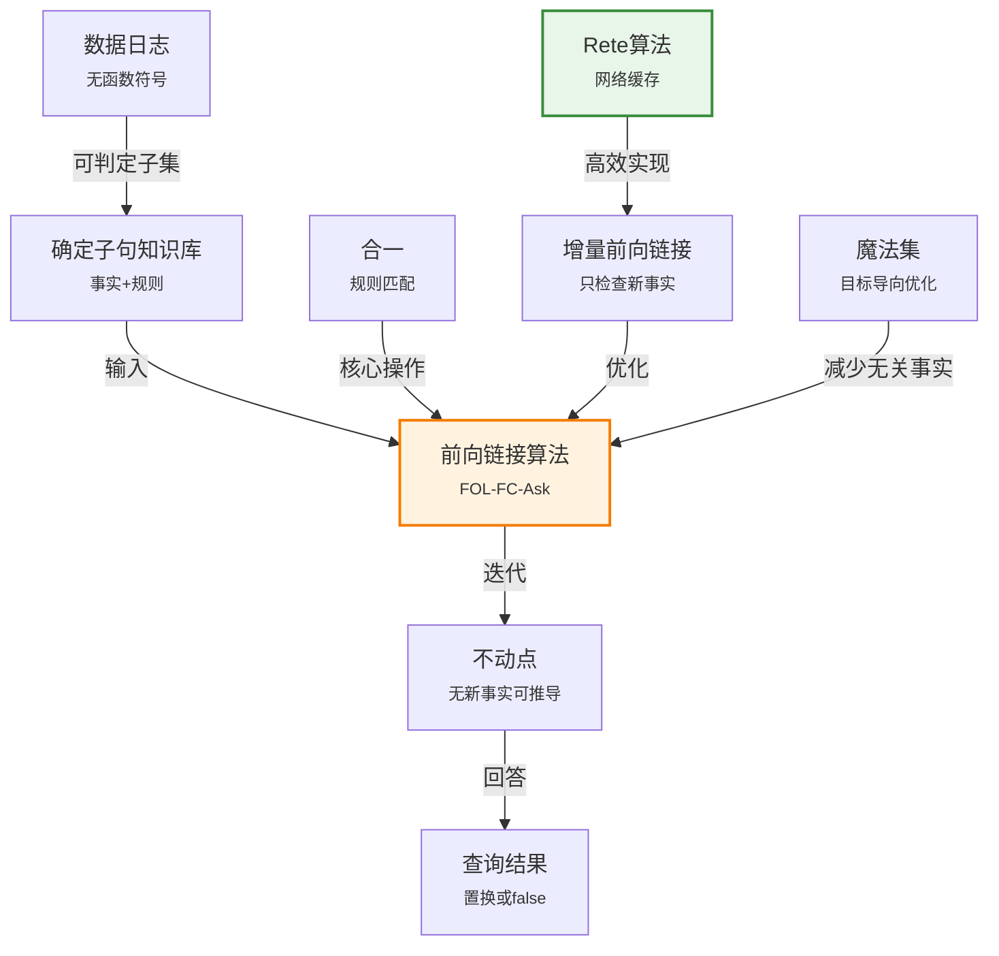

# 9.3 前向链接

> 📖 本节 Deep Dive | 预计学习时间: 90 分钟

---

## 1. 背景与动机

### 1.1 历史背景

**学科演进脉络**

前向链接（Forward Chaining）的思想源于产生式系统（Production Systems）的研究。20世纪70年代，随着专家系统的兴起，研究者们需要高效的推理机制来处理大量规则。卡内基梅隆大学的Newell和Simon在开发通用问题求解器（GPS）时，探索了基于规则的前向推理方法。

1970年代末到1980年代初，前向链接在专家系统中得到广泛应用。R1/XCON系统是其中的典型代表，它使用数千条规则为DEC公司配置计算机系统。这一时期，Charles Forgy开发了Rete算法，极大地提高了前向链接的效率。

**里程碑事件**:

| 年份 | 人物/事件 | 贡献 | 影响 |
|------|-----------|------|------|
| 1970s | Newell & Simon | 通用问题求解器(GPS) | 奠定了产生式系统基础 |
| 1978 | Gallaire & Minker | 演绎数据库研讨会 | 连接逻辑与数据库 |
| 1982 | McDermott | R1/XCON系统 | 专家系统的商业成功 |
| 1982 | Forgy | Rete算法 | 高效模式匹配 |
| 1986 | Bancilhon等 | 魔法集技术 | 优化前向链接 |

**演进动机**:
- **早期方法**: 归结和命题化方法效率低下，不适合大规模知识库
- **局限性**: 缺乏针对确定子句的专门优化
- **突破**: 前向链接利用确定子句的结构特性，实现高效的数据驱动推理

### 1.2 研究动机

**为什么研究者关注这个主题？**

1. **理论意义**: 前向链接展示了如何利用确定子句的结构特性进行高效推理，是数据复杂性研究的重要案例。

2. **方法创新**: 从简单的迭代算法到Rete网络，前向链接的发展展示了如何通过预处理和索引来优化推理。

3. **问题解决**: 前向链接适用于数据驱动的场景，如监控、告警、实时决策等。

**与其他领域的关系**:
- **数据库系统**: 演绎数据库使用前向链接作为标准推理机制
- **专家系统**: 产生式系统的核心推理引擎
- **复杂事件处理**: 实时模式匹配和响应

### 1.3 实际应用场景

| 应用领域 | 具体问题 | 本节理论的作用 | 预期效果 |
|----------|----------|----------------|----------|
| 专家系统 | 基于规则的医疗诊断 | 从症状推导疾病 | 自动诊断建议 |
| 演绎数据库 | 从基础数据推导新事实 | 支持递归查询 | 复杂数据分析 |
| 业务规则引擎 | 业务流程自动化 | 根据条件触发动作 | 自动化决策 |
| 复杂事件处理 | 实时异常检测 | 模式匹配和告警 | 实时监控 |
| 配置系统 | 产品配置验证 | 检查配置约束 | 自动配置生成 |

**典型案例预览**:
> 通过学习本节，你将理解如何使用前向链接从"美国人出售武器给敌对国家是犯罪"这样的规则，自动推导出"West上校是罪犯"的结论。你还将理解Rete算法如何通过缓存部分匹配来加速推理。

### 1.4 先决条件

**学习本节需要的前置知识**:

| 知识项 | 来源 | 掌握程度要求 | 关键概念 |
|--------|------|:------------:|----------|
| 确定子句 | 第7章 | 必须熟练掌握 | 霍恩子句、规则形式 |
| 合一 | 9.2节 | 必须熟练掌握 | MGU、合一算法 |
| 一般化肯定前件 | 9.2节 | 理解即可 | GMP规则 |
| 算法复杂度 | 外部 | 了解 | 多项式时间、NP困难 |

**前置检查清单**:
- [ ] 能够识别确定子句（至多一个正文字）
- [ ] 能够执行合一算法找出MGU
- [ ] 理解一般化肯定前件的推理过程
- [ ] 了解多项式时间和指数时间的区别

---

## 2. 知识逻辑图谱

### 2.1 概念关系图



### 2.2 知识发展依赖链

```
【基础层】           【发展层】              【高潮层】             【应用层】
    ↓                   ↓                     ↓                   ↓
┌─────────┐      ┌─────────────┐       ┌───────────┐      ┌──────────┐
│ 确定    │ ──→  │ 简单前向    │  ──→  │ 增量优化  │ ──→  │ Rete     │
│ 子句    │      │ 链接        │       │ 魔法集    │      │ 算法     │
│         │      │             │       │           │      │          │
│ 事实+   │      │ 迭代推导    │       │ 部分匹配  │      │ 网络缓存 │
│ 规则    │      │ 不动点      │       │ 缓存      │      │ 高效匹配 │
└─────────┘      └─────────────┘       └───────────┘      └──────────┘
     │                   │                   │                │
     └───────────────────┴───────────────────┴────────────────┘
                         知识演进脉络
```

**依赖链详解**:
1. **基础**: 理解确定子句的结构——事实（原子语句）和规则（蕴涵式）
2. **发展**: 掌握简单前向链接算法——迭代触发规则直到不动点
3. **高潮**: 理解优化技术——增量更新、魔法集、Rete网络
4. **应用**: 应用于产生式系统和演绎数据库

### 2.3 本节在章节中的位置

```
第 9 章: 一阶逻辑中的推断
├── 9.1 命题推断与一阶推断 ← 前置知识
│   └── [核心概念: 量词实例化]
│
├── 9.2 合一与一阶推断 ← 前置知识
│   └── [核心概念: 合一算法]
│
├── 9.3 前向链接 ← ⭐ 当前位置
│   ├── [核心概念: 数据驱动推理]
│   ├── [核心算法: FOL-FC-Ask]
│   └── [优化: Rete算法、魔法集]
│
├── 9.4 反向链接 ← 对比学习
│   └── [对比: 目标驱动推理]
│
└── 9.5 归结 ← 后续发展
    └── [扩展: 一般子句]
```

**衔接说明**:
- **从9.2节继承**: 使用前向链接作为确定子句的推理方法，利用合一进行规则匹配
- **与9.4节对比**: 前向链接是数据驱动的，而反向链接是目标驱动的

---

## 3. 核心概念与数学分析

### 3.1 核心术语定义

**定义 9.3.1** (一阶确定子句 / First-Order Definite Clause):

> **正式定义**: 一阶确定子句是文字的析取式，其中必须有且仅有一个正文字。它可以表示为：
$$p_1 \land p_2 \land \ldots \land p_n \Rightarrow q$$
其中 $p_i$ 和 $q$ 是原子语句，变量被隐式地全称量化。

**定义详解**:
- **直观解释**: 确定子句表示"如果所有前提成立，则结论成立"。这是一种"如果-那么"规则。
- **数学表述**: 等价于 $\neg p_1 \lor \neg p_2 \lor \ldots \lor \neg p_n \lor q$
- **为什么这样定义**: 这种形式允许高效的前向和反向推理
- **全称量词隐含**: 如果看到变量 $x$，意味着有隐含的 $\forall x$

**定义中的关键要素**:
| 要素 | 符号 | 含义 | 约束条件 |
|------|------|------|----------|
| 前提 | $p_i$ | 正文字（原子语句） | 可以有变量 |
| 结论 | $q$ | 正文字（原子语句） | 可以有变量 |
| 变量 | $x, y, \ldots$ | 隐式全称量化 | 出现在前提或结论中 |

**示例**:
- 原子事实: $\text{American}(\text{West})$
- 规则: $\text{American}(x) \land \text{Weapon}(y) \land \text{Sells}(x,y,z) \land \text{Hostile}(z) \Rightarrow \text{Criminal}(x)$

---

**定义 9.3.2** (数据日志 / Datalog):

> **正式定义**: 数据日志是由不含函数符号的一阶确定子句组成的语言。

**定义详解**:
- **直观解释**: 数据日志类似于关系数据库的查询语言，但支持递归查询
- **特点**: 无函数符号意味着基本项的数量是有限的（只有常量）
- **可判定性**: 数据日志的蕴含问题是可判定的

---

**定义 9.3.3** (不动点 / Fixpoint):

> **正式定义**: 前向链接的不动点是指知识库状态，其中无法再通过应用确定子句规则推导出新的原子事实。

**定义详解**:
- **直观解释**: 推理过程停止的状态——所有能推导的事实都已经推导出来了
- **存在性**: 对于数据日志，不动点必然存在（因为事实数量有限）
- **唯一性**: 不动点是唯一的，与规则触发顺序无关

---

**定义 9.3.4** (前向链接 / Forward Chaining):

> **正式定义**: 一种数据驱动的推理方法，从已知事实出发，触发所有前提被满足的规则，将结论添加到已知事实中，重复此过程直到查询被回答或达到不动点。

---

### 3.2 符号系统与约定

**本节符号总表**:

| 符号 | 含义 | 数学表达 | 备注 |
|:----:|------|----------|------|
| $p_i \Rightarrow q$ | 确定子句 | 蕴涵式 | 规则形式 |
| $KB$ | 知识库 | 确定子句集合 | 包含事实和规则 |
| $\alpha$ | 查询 | 原子语句 | 待证明的目标 |
| $\theta$ | 置换 | 变量绑定 | 合一结果 |
| $new$ | 新事实集 | 每次迭代推导的事实 | 增量更新 |

### 3.3 关键公式与性质

#### 公式 1: 简单前向链接算法

**算法描述**:
```
function FOL-FC-Ask(KB, α) returns 一个置换或false
    inputs: KB, 知识库，一个一阶确定子句集
            α, 查询，一个原子语句
    
    while true do
        new ← {}  // 每次迭代推断出的新语句集
        
        for each rule in KB do
            (p₁ ∧ ... ∧ pₙ ⇒ q) ← STANDARDIZE-VARIABLES(rule)
            
            for each θ 使得 SUBST(θ, p₁ ∧ ... ∧ pₙ) = SUBST(θ, p₁' ∧ ... ∧ pₙ')
                  对于某些KB中的 p₁', ..., pₙ' do
                q' ← SUBST(θ, q)
                
                if q' 不能与已经在KB或new中的语句合一 then
                    将 q' 添加到 new
                    φ ← UNIFY(q', α)
                    if φ ≠ failure then return φ
        
        if new = {} then return false
        将 new 添加到 KB
```

**公式要素解析**:

| 维度 | 内容 |
|------|------|
| **直观解释** | 从已知事实出发，不断触发规则生成新事实，直到回答查询或没有新事实可生成 |
| **核心操作** | 规则匹配（通过合一）和事实添加 |
| **终止条件** | 查询被回答（成功）或达到不动点（失败） |

**使用条件**:
- 知识库必须是确定子句集
- 查询是原子语句

---

#### 公式 2: 数据日志的复杂度

**数学表述**:
对于不含函数符号的数据日志知识库：
- 令 $k$ 为最大元数（参数数量）
- 令 $p$ 为谓词数量
- 令 $n$ 为常量符号数量

则基本事实的数量上界为：
$$|facts| \leq p \cdot n^k$$

**公式要素解析**:

| 维度 | 内容 |
|------|------|
| **直观解释** | 数据日志的事实数量是有限的，因为无函数符号意味着只有常量可以填充参数位置 |
| **复杂度含义** | 前向链接在多项式时间内运行（相对于知识库大小） |
| **实际意义** | 数据日志是可判定的——算法必然终止 |

---

### 3.4 重要性质与推论

**性质 9.3.1** (前向链接的可靠性):

> **陈述**: FOL-FC-Ask是可靠的，即如果它返回置换 $\theta$，则 $KB \models \text{Subst}(\theta, \alpha)$。

**证明概要**: 每个推断步骤都是一般化肯定前件的应用，而一般化肯定前件是可靠的。

---

**性质 9.3.2** (前向链接的完备性——对于确定子句):

> **陈述**: FOL-FC-Ask对于确定子句知识库是完备的，即如果 $KB \models \alpha$，算法会找到证明。

**证明概要**: 
- 对于数据日志，事实数量有限，算法必然达到不动点
- 如果 $\alpha$ 被蕴含，它必然出现在不动点中
- 对于含函数符号的一般确定子句，依赖埃尔布朗定理

---

**性质 9.3.3** (数据日志的可判定性):

> **陈述**: 数据日志（不含函数符号的确定子句）的蕴含问题是可判定的。

**证明概要**: 由于基本事实数量有限（$p \cdot n^k$），前向链接必然在有限步内终止。

---

## 4. 定理与证明

### 4.1 定理陈述

**定理 9.3** (前向链接的数据复杂性 / Data Complexity of Forward Chaining):

> **正式陈述**: 对于数据日志知识库，前向链接的时间复杂度是关于知识库中基本事实数量的多项式。

**定理解读**:
- **条件（前提）**:
  1. **条件 1**: 知识库是数据日志（不含函数符号的确定子句）
  2. **条件 2**: 规则长度和谓词元数有常数上界
  3. **条件 3**: 只考虑数据复杂性（知识库大小作为输入规模）

- **结论**: 时间复杂度为 $O(|KB|^k)$，其中 $k$ 是常数

- **定理意义**: 这表明前向链接在数据库规模的实际应用中是可行的

### 4.2 证明详解

**证明策略概览**:

通过分析算法每一步的复杂度，并限制迭代次数来证明。

**核心思路**: 计数论证——限制可能推导的事实数量和迭代次数

**关键步骤预览**:
1. 限制基本事实数量
2. 分析单次迭代的复杂度
3. 限制迭代次数
4. 组合得到总复杂度

---

**正式证明**:

**步骤 1**: 限制基本事实数量

设：
- $p$ = 谓词符号数量
- $n$ = 常量符号数量
- $k$ = 最大元数（常数）

基本事实的数量上界：
$$N = p \cdot n^k$$

这是因为每个谓词最多有 $n^k$ 个不同的参数组合。

**步骤 2**: 分析单次迭代的复杂度

在每次迭代中：
- 检查每条规则：$|rules|$ 次
- 对每个规则，匹配前提：使用索引可以在常数时间内完成（假设适当的索引结构）
- 生成新事实：常数时间

单次迭代复杂度：$O(|rules|)$

**步骤 3**: 限制迭代次数

每次迭代至少添加一个新事实（否则算法终止）。

由于最多有 $N$ 个不同的事实，迭代次数最多为 $N$。

**步骤 4**: 组合得到总复杂度

总复杂度：
$$O(|rules| \cdot N) = O(|rules| \cdot p \cdot n^k)$$

由于 $|rules|$、$p$、$k$ 都是常数（数据复杂性的假设），复杂度为：
$$O(n^k)$$

这是关于常量数量 $n$ 的多项式。

$$
\blacksquare \text{ (证毕)}$$

### 4.3 证明分析与提炼

**核心洞见**: 

数据日志的可处理性来自于无函数符号的约束，这使得可能的事实数量是有限的。这是数据库系统能够高效处理大规模数据的关键理论基础。

**证明技巧总结**:

| 技巧 | 在本证明中的应用 | 可迁移性 | 其他应用场景 |
|------|------------------|----------|--------------|
| 计数论证 | 限制事实数量 | ⭐⭐⭐⭐⭐ | 复杂性分析、资源限制 |
| 数据复杂性 | 分离规则和数据的复杂度 | ⭐⭐⭐⭐ | 数据库理论 |
| 迭代分析 | 限制循环次数 | ⭐⭐⭐⭐⭐ | 算法终止性证明 |

---

## 5. 具体示例与详解

### 5.1 典型数值示例

**示例 9.3.1**: 犯罪问题的前向链接推理

**📋 问题陈述**:

知识库（来自教材犯罪示例）：
1. $\text{American}(x) \land \text{Weapon}(y) \land \text{Sells}(x,y,z) \land \text{Hostile}(z) \Rightarrow \text{Criminal}(x)$
2. $\text{Owns}(\text{Nono}, M_1)$
3. $\text{Missile}(M_1)$
4. $\text{Missile}(x) \land \text{Owns}(\text{Nono}, x) \Rightarrow \text{Sells}(\text{West}, x, \text{Nono})$
5. $\text{Missile}(x) \Rightarrow \text{Weapon}(x)$
6. $\text{Enemy}(x, \text{America}) \Rightarrow \text{Hostile}(x)$
7. $\text{American}(\text{West})$
8. $\text{Enemy}(\text{Nono}, \text{America})$

**求解**: 证明 $\text{Criminal}(\text{West})$

---

**🔍 解答过程**:

**第一次迭代**:

规则4的前提：$\text{Missile}(x) \land \text{Owns}(\text{Nono}, x)$
- 事实2: $\text{Owns}(\text{Nono}, M_1)$
- 事实3: $\text{Missile}(M_1)$
- 合一: $\theta = \{x/M_1\}$
- **推导**: $\text{Sells}(\text{West}, M_1, \text{Nono})$

规则5的前提：$\text{Missile}(x)$
- 事实3: $\text{Missile}(M_1)$
- 合一: $\theta = \{x/M_1\}$
- **推导**: $\text{Weapon}(M_1)$

规则6的前提：$\text{Enemy}(x, \text{America})$
- 事实8: $\text{Enemy}(\text{Nono}, \text{America})$
- 合一: $\theta = \{x/\text{Nono}\}$
- **推导**: $\text{Hostile}(\text{Nono})$

**第一次迭代后新增事实**:
- $\text{Sells}(\text{West}, M_1, \text{Nono})$
- $\text{Weapon}(M_1)$
- $\text{Hostile}(\text{Nono})$

**第二次迭代**:

规则1的前提：$\text{American}(x) \land \text{Weapon}(y) \land \text{Sells}(x,y,z) \land \text{Hostile}(z)$
- 事实7: $\text{American}(\text{West})$
- 新事实: $\text{Weapon}(M_1)$
- 新事实: $\text{Sells}(\text{West}, M_1, \text{Nono})$
- 新事实: $\text{Hostile}(\text{Nono})$
- 合一: $\theta = \{x/\text{West}, y/M_1, z/\text{Nono}\}$
- **推导**: $\text{Criminal}(\text{West})$ ✓

---

**✅ 验证与检验**:

**正确性检查**:
- [x] 每个推导步骤都符合确定子句规则
- [x] 合一正确应用
- [x] 结论符合预期

**结果的意义**: 展示了前向链接如何从已知事实逐步推导出目标结论。

---

### 5.2 概念辨析示例

**示例 9.3.2**: 增量前向链接的优势

**场景**: 考虑犯罪问题，但在第二次迭代时重新检查所有规则。

**非增量方法的问题**:
- 在第二次迭代，规则4、5、6再次被检查
- 但它们的前提没有变化（没有新的事实影响它们）
- 这是冗余计算

**增量方法**:
- 只检查前提包含新事实的规则
- 规则1的前提包含$\text{Weapon}(y)$、$\text{Sells}(x,y,z)$、$\text{Hostile}(z)$，这些都是新事实
- 只检查规则1

**教训**: 

增量前向链接通过只检查受新事实影响的规则，显著减少了计算量。在大型知识库中，这种优化至关重要。

---

### 5.3 类比与可视化

**直觉类比**:

| 抽象概念 | 日常类比 | 对应关系 |
|----------|----------|----------|
| 前向链接 | 多米诺骨牌 | 一个事实触发规则，推导出更多事实 |
| 不动点 | 水满则溢 | 所有能推导的都推导出来了 |
| 增量更新 | 只检查新邮件 | 不需要重新检查已读邮件 |
| Rete网络 | 工厂流水线 | 数据在网络中流动，逐步匹配规则 |

**可视化**:

前向链接的证明树（犯罪问题）：

```
                    Criminal(West)
                          |
        +-----------------+-----------------+
        |                 |                 |
   American(West)    Weapon(M₁)    Sells(West,M₁,Nono)  Hostile(Nono)
        |                 |                 |               |
    [给定]          Missile(M₁)    Missile(x)∧Owns(Nono,x)  Enemy(Nono,America)
                          |                 |               |
                      [给定]            Owns(Nono,M₁)      [给定]
                                            |
                                        [给定]
```

---

## 6. 深入理解与拓展

### 6.1 一句话本质

> 🎯 **核心要点**: 前向链接是一种数据驱动的推理方法，从已知事实出发迭代触发规则生成新事实，通过合一进行规则匹配，并利用增量更新和Rete网络等优化技术实现高效推理。

### 6.2 深入思考问题

1. **概念层面**: 为什么前向链接被称为"数据驱动"？这与"目标驱动"有什么区别？
   <!-- 思考方向: 考虑推理的出发点和方向 -->

2. **方法层面**: Rete算法如何通过缓存部分匹配来提高效率？
   <!-- 思考方向: 考虑规则前提的部分满足和共享 -->

3. **应用层面**: 在什么情况下应该选择前向链接而不是反向链接？
   <!-- 思考方向: 考虑监控、告警等数据驱动的场景 -->

4. **理论层面**: 为什么含函数符号的确定子句推理是半可判定的？
   <!-- 思考方向: 考虑函数符号生成的无限基本项 -->

### 6.3 与其他节的关系

**本节输出**:
- 前向链接算法（FOL-FC-Ask）
- 确定子句的完备推理方法
- 增量更新和Rete网络优化

**后续发展预告**:
- 在9.4节，我们将学习反向链接——目标驱动的替代方法
- 在9.5节，归结将提供更一般的推理框架

---

## 7. 总结与反思

### 7.1 关键要点总结

本节必须掌握的 **5** 个核心要点:

1. **一阶确定子句**: 文字的析取式，有且仅有一个正文字。表示为 $p_1 \land \ldots \land p_n \Rightarrow q$，变量隐式全称量化。
   
   💡 *记忆技巧*: "确定" = 结论确定，至多一个正文字。

2. **前向链接算法**: 从已知事实出发，触发前提被满足的规则，添加结论到新事实，直到不动点。
   
   💡 *记忆技巧*: "前向" = 从数据向前推导，"链接" = 规则链式触发。

3. **不动点**: 无法再推导新事实的状态。对于数据日志，不动点必然存在且唯一。
   
   💡 *记忆技巧*: "不动" = 稳定状态，不再变化。

4. **数据日志**: 不含函数符号的确定子句。事实数量有限，蕴含问题可判定。
   
   💡 *记忆技巧*: "数据" = 类似数据库，"日志" = Datalog。

5. **优化技术**: 增量更新（只检查新事实触发的规则）、Rete网络（缓存部分匹配）、魔法集（目标导向优化）。
   
   💡 *记忆技巧*: 记住"增量"、"缓存"、"目标导向"三个关键词。

### 7.2 本节知识框架

```
┌─────────────────────────────────────────────────────────────┐
│  第9.3节: 前向链接                                          │
├─────────────────────────────────────────────────────────────┤
│  输入/前置                                                   │
│  • 确定子句知识库（事实+规则）                              │
│  • 原子查询                                                 │
│                                                             │
│  处理/核心                                                   │
│  • 迭代触发规则                                             │
│  • 合一匹配前提                                             │
│  • 添加新事实                                               │
│  ↓                                                          │
│  输出/结果                                                   │
│  • 查询的置换（成功）                                       │
│  • false（失败）                                            │
│                                                             │
│  优化/改进                                                   │
│  • 增量更新                                                 │
│  • Rete网络                                                 │
│  • 魔法集                                                   │
└─────────────────────────────────────────────────────────────┘
```

### 7.3 常见误解与纠正

| 常见误解 ❌ | 正确理解 ✅ | 为什么容易错 | 如何避免 |
|-------------|-------------|--------------|----------|
| ❌ 前向链接适用于所有一阶逻辑 | ✅ 前向链接只适用于确定子句 | 忽略了确定子句的限制 | 理解确定子句的定义 |
| ❌ 前向链接总是高效的 | ✅ 简单实现可能很低效 | 忽略了规则匹配的开销 | 了解优化技术 |
| ❌ 含函数符号时前向链接必然终止 | ✅ 含函数符号时可能不终止 | 混淆了数据日志和一般确定子句 | 理解半可判定性 |
| ❌ 不动点依赖于规则触发顺序 | ✅ 不动点是唯一的 | 误解了不动点的性质 | 理解不动点的数学定义 |

### 7.4 反思问题

**连接性问题**:
1. 前向链接如何使用9.2节的合一算法？
2. 前向链接与第7章的命题前向链接有什么关系？

**应用性问题**:
1. 如何为前向链接设计高效的索引结构？
2. 在产生式系统中，如何处理规则冲突（多条规则同时触发）？

**批判性问题**:
1. 前向链接的主要缺点是什么？如何克服？
2. 在什么情况下，前向链接会产生大量无关事实？

### 7.5 学习检查清单

- [ ] 能够识别一阶确定子句
- [ ] 理解前向链接算法的工作流程
- [ ] 能够手动执行前向链接推理
- [ ] 理解不动点的概念
- [ ] 了解数据日志的可判定性
- [ ] 了解增量更新和Rete算法的基本思想

---

## 附录

### A. 公式速查表

| 公式 | 名称 | 使用条件 | 备注 |
|:----:|------|----------|------|
| $p_1 \land \ldots \land p_n \Rightarrow q$ | 确定子句 | 恰好一个正文字 | 规则形式 |
| $O(p \cdot n^k)$ | 数据日志复杂度 | 无函数符号 | 多项式时间 |

### B. 术语索引

| 术语 | 英文 | 定义 | 位置 |
|------|------|------|:----:|
| 确定子句 | Definite Clause | 恰好一个正文字的子句 | 9.3 |
| 数据日志 | Datalog | 不含函数符号的确定子句 | 9.3 |
| 前向链接 | Forward Chaining | 数据驱动的推理 | 9.3 |
| 不动点 | Fixpoint | 无新事实可推导的状态 | 9.3 |
| Rete算法 | Rete Algorithm | 高效模式匹配网络 | 9.3 |
| 魔法集 | Magic Set | 目标导向优化技术 | 9.3 |

### C. 延伸阅读

**理论深化**:
- Ullman, J.D. (1985). "Principles of Database and Knowledge-Base Systems." 演绎数据库的经典教材。
- Forgy, C.L. (1982). "Rete: A Fast Algorithm for the Many Pattern/Many Object Pattern Match Problem."

**应用拓展**:
- Drools规则引擎
- CLIPS专家系统工具

---

> 📌 **下一节**: [9.4 反向链接](9.4_反向链接.md)
> 
> 📚 **返回概览**: [第9章概览](00_概览.md)
