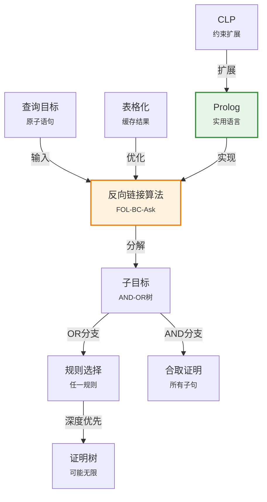

# 9.4 反向链接

> 📖 本节 Deep Dive | 预计学习时间: 90 分钟

---

## 1. 背景与动机

### 1.1 历史背景

**学科演进脉络**

反向链接（Backward Chaining）的思想源于定理证明和自动推理的研究。20世纪60年代末，Carl Hewitt在Planner语言中首次实现了基于目标的反向推理机制。Planner允许程序员以目标导向的方式表达问题求解过程。

1972年，Alain Colmerauer和Philippe Roussel在法国马赛开发了Prolog语言。Prolog将反向链接作为其核心执行机制，开创了逻辑编程的新范式。Robert Kowalski在帝国理工学院与Colmerauer合作，为Prolog奠定了理论基础，提出了著名的"算法 = 逻辑 + 控制"公式。

**里程碑事件**:

| 年份 | 人物/事件 | 贡献 | 影响 |
|------|-----------|------|------|
| 1969 | Hewitt | Planner语言 | 首个支持反向链接的语言 |
| 1972 | Colmerauer & Roussel | Prolog语言 | 逻辑编程范式的诞生 |
| 1974 | Kowalski | 逻辑编程理论 | "算法 = 逻辑 + 控制" |
| 1983 | Warren | Warren抽象机(WAM) | 高效Prolog执行模型 |
| 1986 | Tamaki & Sato | 表格化逻辑编程 | 解决循环和冗余问题 |

**演进动机**:
- **早期方法**: 前向链接产生大量无关事实
- **局限性**: 数据驱动的方法不适合目标明确的查询
- **突破**: 反向链接从目标出发，只推导与目标相关的事实

### 1.2 研究动机

**为什么研究者关注这个主题？**

1. **理论意义**: 反向链接展示了目标导向推理的力量，是理解逻辑编程语义的基础。

2. **方法创新**: Prolog将反向链接与合一结合，创造了一种全新的编程范式——声明式编程。

3. **问题解决**: 反向链接适用于目标明确的查询场景，如问答系统、专家咨询等。

**与其他领域的关系**:
- **编程语言**: Prolog、Mercury、Erlang（部分特性）
- **类型系统**: 类型推断中的约束求解
- **程序分析**: 程序验证中的后向分析

### 1.3 实际应用场景

| 应用领域 | 具体问题 | 本节理论的作用 | 预期效果 |
|----------|----------|----------------|----------|
| 专家系统 | 医疗诊断咨询 | 从症状反推疾病 | 交互式诊断 |
| 自然语言处理 | 句法分析 | 从句子反推语法结构 | 解析器生成 |
| 程序分析 | 程序验证 | 从规约反推证明义务 | 自动验证 |
| 配置系统 | 配置问题求解 | 从需求反推配置 | 交互式配置 |
| 定理证明 | 证明搜索 | 从定理反推引理 | 交互式证明 |

**典型案例预览**:
> 通过学习本节，你将理解Prolog如何执行程序，以及为什么"append"可以既是函数又是关系。你还将理解深度优先搜索带来的无限循环问题，以及表格化技术如何解决它。

### 1.4 先决条件

**学习本节需要的前置知识**:

| 知识项 | 来源 | 掌握程度要求 | 关键概念 |
|--------|------|:------------:|----------|
| 前向链接 | 9.3节 | 必须熟练掌握 | 确定子句、推理 |
| 合一 | 9.2节 | 必须熟练掌握 | MGU、合一算法 |
| 搜索算法 | 第3章 | 理解即可 | 深度优先、广度优先 |
| 递归 | 外部 | 了解 | 递归过程 |

**前置检查清单**:
- [ ] 理解前向链接的工作原理
- [ ] 能够执行合一算法
- [ ] 理解深度优先搜索的特点
- [ ] 能够阅读递归算法

---

## 2. 知识逻辑图谱

### 2.1 概念关系图



### 2.2 知识发展依赖链

```
【基础层】           【发展层】              【高潮层】             【应用层】
    ↓                   ↓                     ↓                   ↓
┌─────────┐      ┌─────────────┐       ┌───────────┐      ┌──────────┐
│ 确定    │ ──→  │ 反向链接    │  ──→  │ Prolog    │ ──→  │ 逻辑编程 │
│ 子句    │      │ 算法        │       │ 语言      │      │ 应用     │
│         │      │             │       │           │      │          │
│ 事实+   │      │ AND-OR      │       │ 深度优先  │      │ 专家系统 │
│ 规则    │      │ 搜索        │       │ 执行模型  │      │ NLP等    │
└─────────┘      └─────────────┘       └───────────┘      └──────────┘
     │                   │                   │                │
     └───────────────────┴───────────────────┴────────────────┘
                         知识演进脉络
```

**依赖链详解**:
1. **基础**: 理解确定子句的结构
2. **发展**: 掌握反向链接算法——从目标出发的AND-OR搜索
3. **高潮**: 理解Prolog语言——反向链接的实用实现
4. **应用**: 应用于专家系统、自然语言处理等领域

### 2.3 本节在章节中的位置

```
第 9 章: 一阶逻辑中的推断
├── 9.1 命题推断与一阶推断 ← 前置知识
│   └── [核心概念: 量词实例化]
│
├── 9.2 合一与一阶推断 ← 前置知识
│   └── [核心概念: 合一算法]
│
├── 9.3 前向链接 ← 对比学习
│   └── [对比: 数据驱动推理]
│
├── 9.4 反向链接 ← ⭐ 当前位置
│   ├── [核心概念: 目标驱动推理]
│   ├── [核心算法: FOL-BC-Ask]
│   └── [应用: Prolog语言]
│
└── 9.5 归结 ← 后续发展
    └── [扩展: 一般子句]
```

**衔接说明**:
- **与9.3节对比**: 前向链接是数据驱动的，反向链接是目标驱动的
- **为Prolog铺垫**: 反向链接是Prolog的核心执行机制

---

## 3. 核心概念与数学分析

### 3.1 核心术语定义

**定义 9.4.1** (反向链接 / Backward Chaining):

> **正式定义**: 一种目标驱动的推理方法，从目标查询开始，反向应用规则将目标分解为子目标，直到子目标被知识库中的事实满足。

**定义详解**:
- **直观解释**: 从"要证明什么"出发，问"需要什么来证明它"，递归进行直到达到已知事实
- **数学表述**: AND-OR树搜索——OR节点表示可以用任一规则证明，AND节点表示需要证明所有子目标
- **为什么这样定义**: 这种方法只关注与目标相关的推理，避免了无关事实的推导

**定义中的关键要素**:
| 要素 | 符号 | 含义 | 约束条件 |
|------|------|------|----------|
| 目标 | $goal$ | 待证明的原子语句 | 可能含变量 |
| 规则 | $lhs \Rightarrow rhs$ | 确定子句 | 用于分解目标 |
| 子目标 | $subgoal$ | 规则的lhs | 需要逐一证明 |
| 置换 | $\theta$ | 变量绑定 | 通过合一累积 |

---

**定义 9.4.2** (AND-OR树 / AND-OR Tree):

> **正式定义**: 表示反向链接搜索空间的树结构，其中OR节点表示目标可以用多种方式证明（任一规则），AND节点表示需要证明所有子目标（规则的lhs合取）。

**定义详解**:
- **OR节点**: 目标查询——可以用知识库中的事实或规则的结论匹配
- **AND节点**: 规则的lhs——需要证明所有合取子句
- **叶节点**: 知识库中的事实

---

**定义 9.4.3** (深度优先搜索 / Depth-First Search):

> **正式定义**: 一种搜索策略，沿着一条路径深入探索直到到达叶节点，然后回溯探索其他路径。

**定义详解**:
- **优点**: 空间复杂度与证明深度呈线性关系
- **缺点**: 可能陷入无限路径，不完备（对于某些知识库）

---

**定义 9.4.4** (表格化 / Tabling):

> **正式定义**: 一种优化技术，缓存已证明的目标及其结果，避免重复计算和无限循环。

**定义详解**:
- **动机**: 解决反向链接中的冗余计算和无限循环问题
- **方法**: 记录每个目标的证明结果（成功/失败）
- **效果**: 使反向链接对于数据日志完备

---

### 3.2 符号系统与约定

**本节符号总表**:

| 符号 | 含义 | 数学表达 | 备注 |
|:----:|------|----------|------|
| $goal$ | 目标 | 原子语句 | 待证明 |
| $lhs$ | 左手侧 | 前提合取 | 规则的if部分 |
| $rhs$ | 右手侧 | 结论 | 规则的then部分 |
| $\theta$ | 置换 | 变量绑定 | 累积的合一结果 |
| $yield$ | 生成器 | 返回多个结果 | Python风格 |

### 3.3 关键公式与性质

#### 公式 1: 反向链接算法

**算法描述**:
```
function FOL-BC-Ask(KB, query) returns 置换生成器
    return FOL-BC-OR(KB, query, {})

function FOL-BC-OR(KB, goal, θ) returns 一个置换
    for each rule in FETCH-RULES-FOR-GOAL(KB, goal) do
        (lhs ⇒ rhs) ← STANDARDIZE-VARIABLES(rule)
        for each θ' in FOL-BC-AND(KB, lhs, UNIFY(rhs, goal, θ)) do
            yield θ'

function FOL-BC-AND(KB, goals, θ) returns 一个置换
    if θ = failure then return
    else if LENGTH(goals) = 0 then yield θ
    else
        first, rest ← FIRST(goals), REST(goals)
        for each θ' in FOL-BC-OR(KB, SUBST(θ, first), θ) do
            for each θ'' in FOL-BC-AND(KB, rest, θ') do
                yield θ''
```

**公式要素解析**:

| 维度 | 内容 |
|------|------|
| **直观解释** | 从目标出发，用规则分解目标为子目标，递归证明子目标，累积置换 |
| **核心操作** | FOL-BC-OR处理OR节点（选择规则），FOL-BC-AND处理AND节点（证明合取） |
| **终止条件** | 子目标列表为空（成功）或无法合一（失败） |

**使用条件**:
- 知识库是确定子句集
- 查询是原子语句
- 使用深度优先搜索

---

#### 公式 2: Prolog程序结构

**Prolog语法**:
```prolog
% 规则: Criminal(X) :- American(X), Weapon(Y), Sells(X,Y,Z), Hostile(Z).
criminal(X) :- american(X), weapon(Y), sells(X,Y,Z), hostile(Z).

% 事实
american(west).
weapon(m1).
...
```

**公式要素解析**:

| 维度 | 内容 |
|------|------|
| **约定** | 大写字母开头表示变量，小写表示常量/谓词 |
| **规则形式** | 结论 :- 前提1, 前提2, ... |
| **逗号** | 表示合取（AND） |
| **分号** | 表示析取（OR） |

---

### 3.4 重要性质与推论

**性质 9.4.1** (反向链接的空间复杂度):

> **陈述**: 反向链接的空间复杂度与证明深度呈线性关系。

**证明概要**: 深度优先搜索只需要存储当前路径上的节点，不需要存储整个搜索树。

---

**性质 9.4.2** (反向链接的不完备性):

> **陈述**: 对于一般确定子句知识库，深度优先反向链接是不完备的——可能陷入无限循环而无法证明可证明的语句。

**反例**: 考虑规则：
```prolog
path(X, Z) :- path(X, Y), link(Y, Z).
path(X, Z) :- link(X, Z).
```

如果子句顺序"错误"（递归规则在前），查询`path(a, c)`会导致无限递归。

---

**性质 9.4.3** (表格化反向链接的完备性):

> **陈述**: 对于数据日志知识库，表格化反向链接是完备的。

**证明概要**: 表格化记录了每个目标的证明尝试，避免了无限循环和重复计算。

---

## 4. 定理与证明

### 4.1 定理陈述

**定理 9.4** (反向链接的可靠性 / Soundness of Backward Chaining):

> **正式陈述**: 如果反向链接算法返回置换 $\theta$，则 $KB \models \text{Subst}(\theta, query)$。

**定理解读**:
- **条件（前提）**:
  1. **条件 1**: $KB$ 是确定子句知识库
  2. **条件 2**: 查询是原子语句
  3. **条件 3**: 算法使用合一进行规则匹配

- **结论**: 返回的置换确实证明了查询

- **定理意义**: 保证反向链接只产生有效的推理

### 4.2 证明详解

**证明策略概览**:

通过对证明树的结构归纳来证明。

**核心思路**: 结构归纳法——基于证明树的深度进行归纳

**关键步骤预览**:
1. 基本情况：查询被知识库中的事实直接满足
2. 归纳步骤：查询被规则的结论匹配
3. 组合得到可靠性

---

**正式证明**:

**步骤 1**: 基本情况——查询被事实满足

如果查询 $q$ 与知识库中的事实 $f$ 合一，即 $\text{UNIFY}(q, f) = \theta$：
- 由于 $f \in KB$，有 $KB \models f$
- 由于 $\text{Subst}(\theta, q) = \text{Subst}(\theta, f)$，有 $KB \models \text{Subst}(\theta, q)$

**步骤 2**: 归纳步骤——查询被规则匹配

假设查询 $q$ 与规则 $p_1 \land \ldots \land p_n \Rightarrow c$ 的结论 $c$ 合一：
$$\text{UNIFY}(q, c) = \theta_0$$

算法递归证明子目标 $p_1, \ldots, p_n$。

根据归纳假设，如果算法成功证明所有子目标，则：
$$KB \models \text{Subst}(\theta_i, p_i) \text{ 对所有 } i$$

其中 $\theta_i$ 是累积的置换。

根据一般化肯定前件的可靠性：
$$KB \models \text{Subst}(\theta, c)$$

其中 $\theta$ 是最终的置换。

由于 $\text{Subst}(\theta, q) = \text{Subst}(\theta, c)$，有：
$$KB \models \text{Subst}(\theta, q)$$

$$
\blacksquare \text{ (证毕)}$$

### 4.3 证明分析与提炼

**核心洞见**: 

反向链接的可靠性来自于其每一步都对应于有效的逻辑推理（一般化肯定前件）。算法的递归结构对应于证明的结构。

**证明技巧总结**:

| 技巧 | 在本证明中的应用 | 可迁移性 | 其他应用场景 |
|------|------------------|----------|--------------|
| 结构归纳 | 基于证明树 | ⭐⭐⭐⭐⭐ | 程序正确性证明 |
| 分解-组合 | 分解目标，组合结果 | ⭐⭐⭐⭐⭐ | 分治算法分析 |
| 累积置换 | 跟踪变量绑定 | ⭐⭐⭐⭐ | 符号执行 |

---

## 5. 具体示例与详解

### 5.1 典型数值示例

**示例 9.4.1**: 犯罪问题的反向链接

**📋 问题陈述**:

知识库（同9.3节犯罪示例）：
```
1. American(x) ∧ Weapon(y) ∧ Sells(x,y,z) ∧ Hostile(z) ⇒ Criminal(x)
2. Owns(Nono, M₁)
3. Missile(M₁)
4. Missile(x) ∧ Owns(Nono, x) ⇒ Sells(West, x, Nono)
5. Missile(x) ⇒ Weapon(x)
6. Enemy(x, America) ⇒ Hostile(x)
7. American(West)
8. Enemy(Nono, America)
```

**求解**: 证明 Criminal(West)

---

**🔍 解答过程**:

**目标**: $\text{Criminal}(\text{West})$

**步骤 1**: 用规则1匹配目标

$\text{UNIFY}(\text{Criminal}(\text{West}), \text{Criminal}(x)) = \{x/\text{West}\}$

子目标（AND节点）：
1. $\text{American}(\text{West})$
2. $\text{Weapon}(y)$
3. $\text{Sells}(\text{West}, y, z)$
4. $\text{Hostile}(z)$

**步骤 2**: 证明子目标1

$\text{American}(\text{West})$ 是事实7，直接成功。

**步骤 3**: 证明子目标2

$\text{Weapon}(y)$ 不是事实，用规则5：

$\text{UNIFY}(\text{Weapon}(y), \text{Weapon}(x)) = \{y/x\}$（标准化后）

子目标：$\text{Missile}(y)$

$\text{Missile}(M_1)$ 是事实3，合一为 $\{y/M_1\}$。

**步骤 4**: 证明子目标3

$\text{Sells}(\text{West}, M_1, z)$ 用规则4：

$\text{UNIFY}(\text{Sells}(\text{West}, M_1, z), \text{Sells}(\text{West}, x, \text{Nono})) = \{x/M_1, z/\text{Nono}\}$

子目标：
- $\text{Missile}(M_1)$ — 事实3 ✓
- $\text{Owns}(\text{Nono}, M_1)$ — 事实2 ✓

**步骤 5**: 证明子目标4

$\text{Hostile}(\text{Nono})$ 用规则6：

$\text{UNIFY}(\text{Hostile}(\text{Nono}), \text{Hostile}(x)) = \{x/\text{Nono}\}$

子目标：$\text{Enemy}(\text{Nono}, \text{America})$ — 事实8 ✓

**结论**: 所有子目标证明成功，$\text{Criminal}(\text{West})$ 得证。

---

**✅ 验证与检验**:

**正确性检查**:
- [x] 每个子目标都被成功证明
- [x] 置换累积正确
- [x] 结论与前向链接一致

**结果的意义**: 展示了反向链接如何从目标出发，逐步分解为可证明的子目标。

---

### 5.2 概念辨析示例

**示例 9.4.2**: 无限循环问题

**场景**: 考虑路径查找程序：
```prolog
path(X, Z) :- path(X, Y), link(Y, Z).
path(X, Z) :- link(X, Z).
```

事实：`link(a, b). link(b, c).`

查询：`path(a, c).`

**问题分析**:

如果Prolog按顺序尝试子句：
1. 首先尝试第一条规则：`path(a, Z) :- path(a, Y), link(Y, Z).`
2. 子目标`path(a, Y)`再次匹配第一条规则
3. 无限递归：`path(a, Y1) :- path(a, Y2), link(Y2, Y1).`

**解决方案**:
- 交换子句顺序：先尝试`link(X, Z)`
- 使用表格化记录已尝试的目标

**教训**: 

深度优先反向链接受制于子句顺序，可能陷入无限循环。表格化技术通过缓存结果解决了这个问题。

---

### 5.3 类比与可视化

**直觉类比**:

| 抽象概念 | 日常类比 | 对应关系 |
|----------|----------|----------|
| 反向链接 | 侦探推理 | 从结论反推证据 |
| AND-OR树 | 决策树 | 每个决策点有多个选择 |
| 深度优先 | 钻探 | 深入一条线索直到尽头 |
| 表格化 | 备忘录 | 记录已解决的问题 |

**可视化**:

反向链接的AND-OR树（犯罪问题）：

```
                    OR
                    |
            Criminal(West)
                    |
        +-----------+-----------+-----------+
        |           |           |           |
   American    Weapon(y)   Sells(West,y,z)  Hostile(z)
   (West)          |              |            |
    [事实]     Missile(y)    Missile(y)   Enemy(z,America)
                  |          Owns(Nono,y)       |
               Missile(M₁)  Missile(M₁)    Enemy(Nono,America)
               [事实]       Owns(Nono,M₁)      [事实]
                            [事实]
```

---

## 6. 深入理解与拓展

### 6.1 一句话本质

> 🎯 **核心要点**: 反向链接是一种目标驱动的推理方法，从查询出发通过AND-OR搜索反向应用规则，利用深度优先策略实现线性空间复杂度，但可能陷入无限循环，表格化技术可以解决这一问题。

### 6.2 深入思考问题

1. **概念层面**: 为什么反向链接被称为"目标驱动"？这与"数据驱动"的前向链接有什么本质区别？
   <!-- 思考方向: 考虑推理的出发点和搜索方向 -->

2. **方法层面**: Prolog为什么选择深度优先而不是广度优先？
   <!-- 思考方向: 考虑空间复杂度和实现简单性 -->

3. **应用层面**: 在什么情况下应该选择反向链接而不是前向链接？
   <!-- 思考方向: 考虑查询的明确性和知识库的规模 -->

4. **理论层面**: 表格化如何同时解决了冗余计算和无限循环两个问题？
   <!-- 思考方向: 考虑缓存机制的作用 -->

### 6.3 与其他节的关系

**本节输出**:
- 反向链接算法（FOL-BC-Ask）
- AND-OR搜索框架
- Prolog语言基础

**后续发展预告**:
- 约束逻辑编程（CLP）扩展了Prolog的表达能力
- 归结（9.5节）提供了更一般的推理框架

---

## 7. 总结与反思

### 7.1 关键要点总结

本节必须掌握的 **5** 个核心要点:

1. **反向链接**: 目标驱动的推理方法，从查询出发反向应用规则分解目标。
   
   💡 *记忆技巧*: "反向" = 从目标反向推导，"链接" = 规则链式触发。

2. **AND-OR树**: OR节点表示可以用任一规则证明，AND节点表示需要证明所有子目标。
   
   💡 *记忆技巧*: OR = 选择，AND = 全部。

3. **深度优先搜索**: 空间复杂度线性，但可能陷入无限循环。
   
   💡 *记忆技巧*: "深度" = 深入一条路径，"优先" = 优先深入。

4. **Prolog**: 基于反向链接的逻辑编程语言，使用大写表示变量、小写表示常量。
   
   💡 *记忆技巧*: "Prolog" = "Programming in Logic"。

5. **表格化**: 缓存已证明的目标，避免重复计算和无限循环。
   
   💡 *记忆技巧*: "表格" = 记录结果的表。

### 7.2 本节知识框架

```
┌─────────────────────────────────────────────────────────────┐
│  第9.4节: 反向链接                                          │
├─────────────────────────────────────────────────────────────┤
│  输入/前置                                                   │
│  • 确定子句知识库                                           │
│  • 原子查询                                                 │
│                                                             │
│  处理/核心                                                   │
│  • 目标分解（AND-OR树）                                     │
│  • 规则匹配（合一）                                         │
│  • 深度优先搜索                                             │
│  ↓                                                          │
│  输出/结果                                                   │
│  • 置换生成器（多个解）                                     │
│  • 或失败                                                   │
│                                                             │
│  优化/改进                                                   │
│  • 表格化（缓存结果）                                       │
│  • 约束逻辑编程（CLP）                                      │
└─────────────────────────────────────────────────────────────┘
```

### 7.3 常见误解与纠正

| 常见误解 ❌ | 正确理解 ✅ | 为什么容易错 | 如何避免 |
|-------------|-------------|--------------|----------|
| ❌ 反向链接总是完备的 | ✅ 深度优先反向链接不完备 | 混淆了可靠性和完备性 | 理解无限循环问题 |
| ❌ Prolog就是纯逻辑 | ✅ Prolog使用数据库语义 | 忽略了封闭世界假设 | 理解Prolog的特殊性 |
| ❌ 反向链接空间复杂度高 | ✅ 反向链接空间复杂度线性 | 混淆了时间和空间复杂度 | 理解深度优先的特点 |
| ❌ 表格化只解决冗余 | ✅ 表格化同时解决循环和冗余 | 只关注了一个方面 | 理解表格化的双重作用 |

### 7.4 反思问题

**连接性问题**:
1. 反向链接与前向链接在犯罪问题上会产生相同的证明吗？
2. 反向链接如何使用9.2节的合一算法？

**应用性问题**:
1. 如何设计一个避免无限循环的反向链接实现？
2. Prolog的cut操作符(!)有什么作用？

**批判性问题**:
1. 反向链接的主要缺点是什么？
2. 在什么情况下Prolog的封闭世界假设会导致问题？

### 7.5 学习检查清单

- [ ] 理解反向链接的工作原理
- [ ] 能够手动执行反向链接推理
- [ ] 理解AND-OR树的结构
- [ ] 了解深度优先搜索的优缺点
- [ ] 理解Prolog的基本语法
- [ ] 了解表格化的作用

---

## 附录

### A. 公式速查表

| 公式 | 名称 | 使用条件 | 备注 |
|:----:|------|----------|------|
| FOL-BC-Ask | 反向链接算法 | 确定子句 | 目标驱动 |
| :- | Prolog规则 | 确定子句 | 结论 :- 前提 |

### B. 术语索引

| 术语 | 英文 | 定义 | 位置 |
|------|------|------|:----:|
| 反向链接 | Backward Chaining | 目标驱动的推理 | 9.4 |
| AND-OR树 | AND-OR Tree | 搜索空间的树表示 | 9.4 |
| 深度优先 | Depth-First | 搜索策略 | 9.4 |
| 表格化 | Tabling | 缓存优化技术 | 9.4 |
| Prolog | - | 逻辑编程语言 | 9.4 |
| CLP | Constraint LP | 约束逻辑编程 | 9.4 |

### C. 延伸阅读

**理论深化**:
- Kowalski, R. (1988). "The Early Years of Logic Programming."
- Warren, D.H.D. (1983). "An Abstract Prolog Instruction Set."

**应用拓展**:
- Prolog编程实践
- 约束逻辑编程系统（CLP(R), CLP(FD)）

---

> 📌 **下一节**: [9.5 归结](9.5_归结.md)
> 
> 📚 **返回概览**: [第9章概览](00_概览.md)
