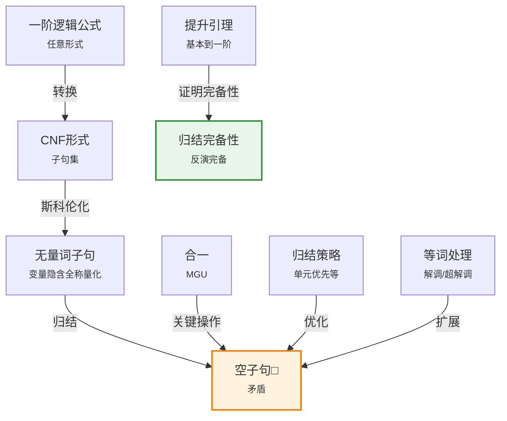

# 9.5 归结

> 📖 本节 Deep Dive | 预计学习时间: 120 分钟

---

## 1. 背景与动机

### 1.1 历史背景

**学科演进脉络**

归结（Resolution）原理由约翰·艾伦·鲁滨逊（John Alan Robinson）于1965年提出，是自动定理证明领域的里程碑式突破。在归结之前，自动定理证明主要依赖命题化和启发式搜索，效率低下且难以处理复杂问题。

鲁滨逊的关键洞察是：通过合一，可以将命题归结提升到一阶逻辑，创造出一种既完备又相对高效的推理方法。这一工作统一了命题逻辑和一阶逻辑的推理框架，为后来的自动定理证明器奠定了基础。

**里程碑事件**:

| 年份 | 人物/事件 | 贡献 | 影响 |
|------|-----------|------|------|
| 1960 | Gilmore, Davis & Putnam | 早期自动定理证明 | 命题化方法 |
| 1965 | J.A. Robinson | 归结原理 | 统一了命题和一阶推理 |
| 1968 | Green & Raphael | 问答系统 | 归结的实际应用 |
| 1970s | 多项研究 | 归结策略 | 提高证明效率 |
| 1990s | McCune | Otter定理证明器 | 证明罗宾斯代数 |
| 2000s | Vampire, E等 | 现代定理证明器 | 工业级应用 |

**演进动机**:
- **早期方法**: 命题化方法效率低下，确定子句方法表达能力有限
- **局限性**: 需要一种既完备又适用于一般子句的方法
- **突破**: 归结通过合一将命题归结提升到一阶逻辑，适用于所有子句

### 1.2 研究动机

**为什么研究者关注这个主题？**

1. **理论意义**: 归结是一阶逻辑（不含等词）的完备推理系统，是自动定理证明的理论基石。

2. **方法创新**: 归结将证明转化为搜索问题，通过策略控制搜索空间，而不牺牲完备性。

3. **问题解决**: 归结已被用于证明重要的数学定理，验证软硬件系统。

**与其他领域的关系**:
- **自动定理证明**: 归结是现代定理证明器的核心
- **程序验证**: 用于验证程序正确性
- **逻辑编程**: 与Prolog的执行机制密切相关

### 1.3 实际应用场景

| 应用领域 | 具体问题 | 本节理论的作用 | 预期效果 |
|----------|----------|----------------|----------|
| 数学定理证明 | 证明代数、几何定理 | 自动搜索证明 | 发现新定理 |
| 硬件验证 | 验证电路设计 | 形式化验证 | 确保正确性 |
| 软件验证 | 验证程序性质 | 生成验证条件 | 消除错误 |
| 安全协议分析 | 验证协议安全性 | 寻找攻击路径 | 确保安全 |
| 知识库一致性 | 检查知识库一致性 | 检测矛盾 | 维护质量 |

**典型案例预览**:
> 通过学习本节，你将理解如何使用归结证明"好奇心害死猫"，以及为什么归结是完备的——只要证明存在，归结就一定能找到它。

### 1.4 先决条件

**学习本节需要的前置知识**:

| 知识项 | 来源 | 掌握程度要求 | 关键概念 |
|--------|------|:------------:|----------|
| 命题归结 | 第7章 | 必须熟练掌握 | 归结规则、CNF |
| 合一 | 9.2节 | 必须熟练掌握 | MGU、合一算法 |
| CNF转换 | 第7章 | 理解即可 | 子句形式 |
| 可计算性 | 外部 | 了解 | 完备性、半可判定性 |

**前置检查清单**:
- [ ] 能够执行命题归结
- [ ] 能够将公式转换为CNF
- [ ] 能够执行合一算法
- [ ] 理解完备性的概念

---

## 2. 知识逻辑图谱

### 2.1 概念关系图



### 2.2 知识发展依赖链

```
【基础层】           【发展层】              【高潮层】             【应用层】
    ↓                   ↓                     ↓                   ↓
┌─────────┐      ┌─────────────┐       ┌───────────┐      ┌──────────┐
│ 命题    │ ──→  │ CNF转换     │  ──→  │ 一阶归结  │ ──→  │ 自动定理 │
│ 归结    │      │ 斯科伦化    │       │ 提升      │      │ 证明器   │
│         │      │             │       │           │      │          │
│ 互补    │      │ 消除量词    │       │ 合一      │      │ 数学定理 │
│ 文字    │      │ 子句形式    │       │ 提升引理  │      │ 验证     │
└─────────┘      └─────────────┘       └───────────┘      └──────────┘
     │                   │                   │                │
     └───────────────────┴───────────────────┴────────────────┘
                         知识演进脉络
```

**依赖链详解**:
1. **基础**: 理解命题归结——从互补文字推导新子句
2. **发展**: 掌握CNF转换和斯科伦化——将一阶公式转换为子句集
3. **高潮**: 理解一阶归结和提升引理——通过合一将归结提升到一阶逻辑
4. **应用**: 应用于自动定理证明和形式化验证

### 2.3 本节在章节中的位置

```
第 9 章: 一阶逻辑中的推断
├── 9.1 命题推断与一阶推断 ← 前置知识
│   └── [核心概念: 量词实例化]
│
├── 9.2 合一与一阶推断 ← 前置知识
│   └── [核心概念: 合一算法]
│
├── 9.3 前向链接 ← 对比学习
│   └── [对比: 确定子句推理]
│
├── 9.4 反向链接 ← 对比学习
│   └── [对比: 确定子句推理]
│
└── 9.5 归结 ← ⭐ 当前位置
    ├── [核心概念: 一般子句推理]
    ├── [核心定理: 归结完备性]
    └── [应用: 自动定理证明]
```

**衔接说明**:
- **从前面各节继承**: 归结是最一般的推理方法，适用于所有子句（不仅是确定子句）
- **完备性**: 归结是一阶逻辑（不含等词）的完备推理系统

---

## 3. 核心概念与数学分析

### 3.1 核心术语定义

**定义 9.5.1** (合取范式 / CNF):

> **正式定义**: 合取范式是子句的合取式，其中每个子句是文字的析取式。在一阶逻辑中，子句中的变量被隐式地全称量化。

**定义详解**:
- **直观解释**: CNF是一种标准化的公式形式，便于机械处理
- **数学表述**: $(L_{11} \lor \ldots \lor L_{1n_1}) \land \ldots \land (L_{m1} \lor \ldots \lor L_{mn_m})$
- **为什么这样定义**: 归结操作在子句上进行，CNF提供了统一的表示

**示例**:
$$\forall x, y, z \text{ American}(x) \land \text{Weapon}(y) \land \text{Sells}(x,y,z) \land \text{Hostile}(z) \Rightarrow \text{Criminal}(x)$$

转换为CNF：
$$\neg \text{American}(x) \lor \neg \text{Weapon}(y) \lor \neg \text{Sells}(x,y,z) \lor \neg \text{Hostile}(z) \lor \text{Criminal}(x)$$

---

**定义 9.5.2** (斯科伦化 / Skolemization):

> **正式定义**: 斯科伦化是通过消除存在量词将公式转换为无量词形式的过程。存在量化的变量被替换为斯科伦函数（依赖于其辖域内的全称量化变量）。

**定义详解**:
- **简单情况**: $\exists x P(x)$ 变为 $P(C)$，其中 $C$ 是新常量
- **复杂情况**: $\forall x \exists y P(x, y)$ 变为 $\forall x P(x, F(x))$，其中 $F$ 是斯科伦函数
- **可满足性**: 斯科伦化后的公式与原公式在可满足性上等价

**示例**:
$$\forall x [\exists y \text{Animal}(y) \land \neg \text{Loves}(x,y)] \lor [\exists z \text{Loves}(z,x)]$$

斯科伦化后：
$$\forall x [\text{Animal}(F(x)) \land \neg \text{Loves}(x, F(x))] \lor [\text{Loves}(G(x), x)]$$

其中 $F$ 和 $G$ 是斯科伦函数。

---

**定义 9.5.3** (一阶归结 / First-Order Resolution):

> **正式定义**: 对于两个进行了标准化分离的子句，如果它们含有互补文字（一个可以与另一个的否定合一），则可以归结。归结式为：
$$\frac{\ell_1 \lor \ldots \lor \ell_k, \quad m_1 \lor \ldots \lor m_n}{\text{Subst}(\theta, \ell_1 \lor \ldots \lor \ell_{i-1} \lor \ell_{i+1} \lor \ldots \lor \ell_k \lor m_1 \lor \ldots \lor m_{j-1} \lor m_{j+1} \lor \ldots \lor m_n)}$$
其中 $\text{UNIFY}(\ell_i, \neg m_j) = \theta$。

**定义详解**:
- **互补文字**: 两个文字可以合一且一个是另一个的否定
- **标准化分离**: 两个子句不共享变量名
- **归结式**: 消去互补文字后，应用合一子得到的子句

---

**定义 9.5.4** (因子提取 / Factoring):

> **正式定义**: 如果子句中有两个可合一的文字，则可以用它们的合一结果替换它们。

**示例**:
子句 $P(x) \lor P(a) \lor Q(x)$ 可以因子提取为 $P(a) \lor Q(a)$（使用合一子 $\{x/a\}$）。

---

**定义 9.5.5** (反演完备性 / Refutation Completeness):

> **正式定义**: 归结是反演完备的，即如果子句集不可满足，则归结可以推导出空子句。

---

### 3.2 符号系统与约定

**本节符号总表**:

| 符号 | 含义 | 数学表达 | 备注 |
|:----:|------|----------|------|
| $\square$ | 空子句 | 矛盾 | 证明目标 |
| $\ell_i$ | 文字 | 原子或其否定 | 子句的组成部分 |
| $\theta$ | 合一子 | MGU | 使互补文字匹配 |
| $H_S$ | 埃尔布朗域 | 基本项集合 | 用于完备性证明 |
| $S'$ | 饱和 | 基本实例集 | 埃尔布朗基的有限子集 |

### 3.3 关键公式与性质

#### 公式 1: 一阶归结规则

**数学表述**:
$$\frac{\ell_1 \lor \ldots \lor \ell_k, \quad m_1 \lor \ldots \lor m_n}{\text{Subst}(\theta, \ell_1 \lor \ldots \lor \ell_{i-1} \lor \ell_{i+1} \lor \ldots \lor \ell_k \lor m_1 \lor \ldots \lor m_{j-1} \lor m_{j+1} \lor \ldots \lor m_n)}$$

其中 $\text{UNIFY}(\ell_i, \neg m_j) = \theta$。

**公式要素解析**:

| 维度 | 内容 |
|------|------|
| **直观解释** | 如果两个子句分别包含可以合一的互补文字，则可以消去它们，将剩余部分合一后合并 |
| **核心操作** | 合一找出互补文字，置换应用到整个子句 |
| **结果** | 归结式——包含两个父子句的信息（除去互补部分） |

**使用条件**:
- 两个子句必须标准化分离（无共享变量）
- 必须存在互补文字（可合一且互否）
- 使用MGU进行合一

---

#### 公式 2: CNF转换步骤

**转换过程**:
1. **蕴涵消去**: $P \Rightarrow Q$ 变为 $\neg P \lor Q$
2. **否定内移**: 
   - $\neg \forall x P$ 变为 $\exists x \neg P$
   - $\neg \exists x P$ 变为 $\forall x \neg P$
   - $\neg (P \land Q)$ 变为 $\neg P \lor \neg Q$
   - $\neg (P \lor Q)$ 变为 $\neg P \land \neg Q$
3. **变量标准化**: 重命名变量避免冲突
4. **斯科伦化**: 消除存在量词
5. **全称量词消除**: 变量隐含全称量化
6. **分配律**: $P \lor (Q \land R)$ 变为 $(P \lor Q) \land (P \lor R)$

---

### 3.4 重要性质与推论

**性质 9.5.1** (归结的可靠性):

> **陈述**: 归结是可靠的，即如果可以通过归结从子句集 $S$ 推导出子句 $C$，则 $S \models C$。

**证明概要**: 归结式是其父子句的逻辑推论。

---

**性质 9.5.2** (归结的反演完备性):

> **陈述**: 归结是反演完备的，即如果子句集 $S$ 不可满足，则存在从 $S$ 推导出空子句的有限归结证明。

**证明概要**: 基于埃尔布朗定理和提升引理。

---

**性质 9.5.3** (提升引理 / Lifting Lemma):

> **陈述**: 令 $C_1$ 和 $C_2$ 为两个不含相同变量的子句，$C_1'$ 和 $C_2'$ 分别为 $C_1$ 和 $C_2$ 的基本实例。如果 $C'$ 是 $C_1'$ 和 $C_2'$ 的归结式，则存在子句 $C$ 使得：
> 1. $C$ 是 $C_1$ 和 $C_2$ 的归结式
> 2. $C'$ 是 $C$ 的基本实例

**重要性**: 提升引理将基本子句的证明提升到一阶子句，是归结完备性证明的关键。

---

## 4. 定理与证明

### 4.1 定理陈述

**定理 9.5** (归结的完备性 / Completeness of Resolution):

> **正式陈述**: 归结对于一阶逻辑（不含等词）是反演完备的。即，如果一阶逻辑子句集 $S$ 不可满足，则存在从 $S$ 推导出空子句的有限归结证明。

**定理解读**:
- **条件（前提）**:
  1. **条件 1**: $S$ 是一阶逻辑子句集（已转换为CNF）
  2. **条件 2**: $S$ 不可满足
  3. **条件 3**: 归结使用合一和因子提取

- **结论**: 存在有限的归结推导序列，最终得到空子句

- **定理意义**: 这是自动定理证明的理论基础——只要证明存在，归结就一定能找到它

### 4.2 证明详解

**证明策略概览**:

证明遵循以下结构（如图9-12所示）：
1. 埃尔布朗定理：不可满足性可以归约为基本实例的不可满足性
2. 接地归结定理：命题归结对于基本语句是完备的
3. 提升引理：基本子句的证明可以提升到一阶子句

**核心思路**: 归约论证——将一阶问题归约为命题问题，然后提升结果

**关键步骤预览**:
1. 构造埃尔布朗域和埃尔布朗基
2. 应用埃尔布朗定理得到有限不可满足子集
3. 应用接地归结定理得到基本归结证明
4. 使用提升引理将证明提升到一阶

---

**正式证明**:

**步骤 1**: 构造埃尔布朗域

设 $S$ 为不可满足的一阶子句集。定义 $S$ 的埃尔布朗域 $H_S$：
- 包含 $S$ 中的所有常量符号（如果没有，则包含默认常量 $c$）
- 对 $S$ 中的所有函数符号封闭

$H_S$ 是由 $S$ 中的符号生成的所有基本项的集合。

**步骤 2**: 构造埃尔布朗基

$S$ 的埃尔布朗基 $H_S(S)$ 是将 $S$ 中的变量用 $H_S$ 中的基本项替换得到的所有基本子句的集合。

**步骤 3**: 应用埃尔布朗定理

**埃尔布朗定理**: 如果 $S$ 不可满足，则存在 $H_S(S)$ 的有限子集 $S'$ 也不可满足。

**证明思路**: 根据紧致性定理，不可满足性是一种"有限性质"。

**步骤 4**: 应用接地归结定理

**接地归结定理**: 命题归结对于基本子句集是完备的。

由于 $S'$ 是有限的基本子句集且不可满足，存在从 $S'$ 推导出空子句的命题归结证明。

**步骤 5**: 使用提升引理

**提升引理**: 对于基本子句的任意归结证明，存在相应的一阶子句的归结证明，从中可以得到基本子句。

通过反复应用提升引理，将基本归结证明中的每一步提升到一阶逻辑。

**步骤 6**: 结论

由于空子句不可能是任何其他子句的基本实例，它必然也在一阶归结闭包中。

因此，归结是反演完备的。

$$
\blacksquare \text{ (证毕)}$$

### 4.3 证明分析与提炼

**核心洞见**: 

归结完备性证明的核心洞察是：一阶逻辑的不可满足性可以归约为命题逻辑的不可满足性（通过埃尔布朗基），而命题归结是完备的。提升引理架起了从基本子句到一阶子句的桥梁。

**证明技巧总结**:

| 技巧 | 在本证明中的应用 | 可迁移性 | 其他应用场景 |
|------|------------------|----------|--------------|
| 归约论证 | 一阶到命题 | ⭐⭐⭐⭐⭐ | 复杂性理论 |
| 紧致性定理 | 无限到有限 | ⭐⭐⭐⭐⭐ | 模型论 |
| 提升 | 基本到一阶 | ⭐⭐⭐⭐⭐ | 自动推理 |
| 结构归纳 | 证明构造 | ⭐⭐⭐⭐ | 程序验证 |

**证明中的关键难点**: 

理解提升引理——为什么基本子句的证明可以"提升"到一阶子句。这需要理解合一的作用：MGU捕获了所有使子句匹配的实例。

---

## 5. 具体示例与详解

### 5.1 典型数值示例

**示例 9.5.1**: "好奇心害死猫"的归结证明

**📋 问题陈述**:

背景知识：
- A: 每个爱所有动物的人都被一些人所爱
- B: 任何害死动物的人都不被人所爱
- C: Jack爱所有动物
- D: 要么是Jack要么是好奇心害死了Tuna
- E: Tuna是一只猫
- F: 猫是动物

查询: 好奇心害死了Tuna吗？

---

**🔍 解答过程**:

**步骤 1**: 转换为一阶逻辑

- A: $\forall x [\forall y \text{Animal}(y) \Rightarrow \text{Loves}(x,y)] \Rightarrow [\exists y \text{Loves}(y,x)]$
- B: $\forall x [\exists z \text{Animal}(z) \land \text{Kills}(x,z)] \Rightarrow [\forall y \neg \text{Loves}(y,x)]$
- C: $\forall x \text{Animal}(x) \Rightarrow \text{Loves}(\text{Jack}, x)$
- D: $\text{Kills}(\text{Jack}, \text{Tuna}) \lor \text{Kills}(\text{Curiosity}, \text{Tuna})$
- E: $\text{Cat}(\text{Tuna})$
- F: $\forall x \text{Cat}(x) \Rightarrow \text{Animal}(x)$
- 否定目标: $\neg \text{Kills}(\text{Curiosity}, \text{Tuna})$

**步骤 2**: 转换为CNF

- A1: $\text{Animal}(F(x)) \lor \text{Loves}(G(x), x)$
- A2: $\neg \text{Loves}(x, F(x)) \lor \text{Loves}(G(x), x)$
- B: $\neg \text{Loves}(y,x) \lor \neg \text{Animal}(z) \lor \neg \text{Kills}(x,z)$
- C: $\neg \text{Animal}(x) \lor \text{Loves}(\text{Jack}, x)$
- D: $\text{Kills}(\text{Jack}, \text{Tuna}) \lor \text{Kills}(\text{Curiosity}, \text{Tuna})$
- E: $\text{Cat}(\text{Tuna})$
- F: $\neg \text{Cat}(x) \lor \text{Animal}(x)$
- $\neg$G: $\neg \text{Kills}(\text{Curiosity}, \text{Tuna})$

**步骤 3**: 归结证明

1. 从D和$\neg$G: $\text{Kills}(\text{Jack}, \text{Tuna})$（假设好奇心没做，则Jack做的）
2. 从E和F: $\text{Animal}(\text{Tuna})$（Tuna是动物）
3. 从C和2: $\text{Loves}(\text{Jack}, \text{Tuna})$（Jack爱Tuna）
4. 从B、3、2、1: $\neg \text{Loves}(y, \text{Jack})$（没人爱Jack）
5. 从A2和3: $\text{Loves}(G(\text{Jack}), \text{Jack})$（有人爱Jack）
6. 从4和5: 矛盾！

**结论**: 假设错误，好奇心害死了Tuna。

---

**✅ 验证与检验**:

**正确性检查**:
- [x] 每个归结步骤都正确应用了归结规则
- [x] 合一正确
- [x] 结论符合预期

**结果的意义**: 展示了归结如何用于复杂的逻辑推理，即使涉及量词和否定。

---

### 5.2 概念辨析示例

**示例 9.5.2**: 归结策略的比较

**场景**: 证明同一个定理，比较不同策略的效率。

**策略1: 单元优先**
- 优先归结包含单元子句（单文字）的子句
- 优点：产生较短的子句，搜索空间小
- 缺点：对于非霍恩子句不完备

**策略2: 支撑集**
- 每个归结步必须包含支撑集中的子句
- 支撑集通常包含否定查询
- 优点：目标导向，产生可理解的证明

**策略3: 输入归结**
- 每个归结必须包含原始知识库或查询中的子句
- 优点：证明树结构简单
- 缺点：对于一般子句不完备

**教训**: 

不同的归结策略适用于不同场景。实践中，现代定理证明器使用多种策略的组合。

---

### 5.3 类比与可视化

**直觉类比**:

| 抽象概念 | 日常类比 | 对应关系 |
|----------|----------|----------|
| 归结 | 剪刀剪纸 | 消去互补部分，保留其余 |
| CNF转换 | 标准化格式 | 统一表示便于处理 |
| 斯科伦化 | 给未知数命名 | 用函数表示依赖关系 |
| 空子句 | 矛盾 | 证明完成 |
| 归结策略 | 搜索策略 | 控制证明搜索方向 |

**可视化**:

归结证明树（好奇心害死猫）：

```
                    □ (空子句)
                    |
        +-----------+-----------+
        |                       |
   ¬Loves(y,Jack)          Loves(G(Jack),Jack)
        |                       |
   B + Loves(Jack,Tuna)    A2 + Loves(Jack,Tuna)
        |                       |
   C + Animal(Tuna)        ...
        |
   F + Cat(Tuna)
        |
   E (事实)
```

---

## 6. 深入理解与拓展

### 6.1 一句话本质

> 🎯 **核心要点**: 归结是一种通过合一将命题归结提升到一阶逻辑的完备推理方法，它将证明转化为从互补文字推导空子句的搜索过程，是自动定理证明的理论基石。

### 6.2 深入思考问题

1. **概念层面**: 为什么归结是"反演完备"而不是"完备"？这两者有什么区别？
   <!-- 思考方向: 考虑归结能否生成所有逻辑结果 -->

2. **方法层面**: 提升引理为什么是一阶归结完备性的关键？
   <!-- 思考方向: 考虑基本子句和一阶子句的关系 -->

3. **应用层面**: 在实际定理证明器中，如何处理等词推理？
   <!-- 思考方向: 考虑解调和超解调 -->

4. **理论层面**: 归结的半可判定性对实际应用有什么影响？
   <!-- 思考方向: 考虑证明搜索的资源限制 -->

### 6.3 与其他节的关系

**本节输出**:
- 一阶归结规则
- CNF转换和斯科伦化
- 归结完备性定理
- 归结策略

**后续发展预告**:
- 等词处理（解调、超解调）
- 现代定理证明器（Vampire, E等）
- 归结在程序验证中的应用

---

## 7. 总结与反思

### 7.1 关键要点总结

本节必须掌握的 **5** 个核心要点:

1. **CNF转换**: 将一阶逻辑公式转换为子句集，包括蕴涵消去、否定内移、斯科伦化等步骤。
   
   💡 *记忆技巧*: 记住转换步骤的口诀：消蕴涵、内移否定、标准化、斯科伦化、消全称、分配。

2. **斯科伦化**: 消除存在量词，用斯科伦常量或斯科伦函数替换存在量化的变量。
   
   💡 *记忆技巧*: "斯科伦" = "Skolem"，记住存在量词变函数/常量。

3. **一阶归结**: 通过合一找出互补文字，消去它们，将剩余部分合并。
   
   💡 *记忆技巧*: "归结" = "归结到一起"，互补的消去，其余的合并。

4. **归结完备性**: 归结是反演完备的——只要证明存在，归结就一定能找到它。
   
   💡 *记忆技巧*: 记住"反演完备" = 可以证明所有不可满足性。

5. **提升引理**: 基本子句的证明可以提升到一阶子句，是完备性证明的关键。
   
   💡 *记忆技巧*: "提升" = 从基本（地面）提升到一阶（一般）。

### 7.2 本节知识框架

```
┌─────────────────────────────────────────────────────────────┐
│  第9.5节: 归结                                              │
├─────────────────────────────────────────────────────────────┤
│  输入/前置                                                   │
│  • 一阶逻辑公式                                             │
│  • 查询（否定后添加）                                       │
│                                                             │
│  处理/核心                                                   │
│  • CNF转换（斯科伦化）                                      │
│  • 归结（合一+合并）                                        │
│  • 策略控制（单元优先等）                                   │
│  ↓                                                          │
│  输出/结果                                                   │
│  • 空子句（证明成功）                                       │
│  • 或无法继续（失败）                                       │
│                                                             │
│  理论保证                                                    │
│  • 归结完备性（反演完备）                                   │
│  • 提升引理                                                 │
└─────────────────────────────────────────────────────────────┘
```

### 7.3 常见误解与纠正

| 常见误解 ❌ | 正确理解 ✅ | 为什么容易错 | 如何避免 |
|-------------|-------------|--------------|----------|
| ❌ 归结可以生成所有逻辑结果 | ✅ 归结是反演完备，不是完备 | 混淆了两种完备性 | 理解"反演"的含义 |
| ❌ 斯科伦化保持逻辑等价 | ✅ 斯科伦化保持可满足性 | 混淆了等价和可满足性 | 理解斯科伦化的语义 |
| ❌ 归结总是高效的 | ✅ 归结可能产生大量子句 | 忽略了搜索空间问题 | 了解归结策略 |
| ❌ 单元归结对所有子句完备 | ✅ 单元归结只对霍恩子句完备 | 忽略了单元归结的限制 | 理解不同策略的适用范围 |

### 7.4 反思问题

**连接性问题**:
1. 归结如何统一了前向链接和反向链接？
2. 归结与9.2节的合一有什么关系？

**应用性问题**:
1. 如何为特定领域设计有效的归结策略？
2. 现代定理证明器如何处理大规模问题？

**批判性问题**:
1. 归结的主要局限性是什么？
2. 在什么情况下应该使用归结而不是其他方法？

### 7.5 学习检查清单

- [ ] 能够将一阶逻辑公式转换为CNF
- [ ] 理解斯科伦化的过程
- [ ] 能够执行一阶归结
- [ ] 理解归结完备性定理
- [ ] 了解提升引理的作用
- [ ] 了解常见的归结策略

---

## 附录

### A. 公式速查表

| 公式 | 名称 | 使用条件 | 备注 |
|:----:|------|----------|------|
| CNF转换 | 范式转换 | 任意公式 | 多步骤 |
| 斯科伦化 | 消存在量词 | ∃xα | 用Skolem常量/函数 |
| 归结规则 | 推理规则 | 互补文字 | 使用MGU |

### B. 术语索引

| 术语 | 英文 | 定义 | 位置 |
|------|------|------|:----:|
| CNF | Conjunctive Normal Form | 合取范式 | 9.5 |
| 斯科伦化 | Skolemization | 消存在量词 | 9.5 |
| 归结 | Resolution | 推理规则 | 9.5 |
| 反演完备 | Refutation Complete | 可证不可满足性 | 9.5 |
| 提升引理 | Lifting Lemma | 基本到一阶 | 9.5 |
| 埃尔布朗域 | Herbrand Universe | 基本项集合 | 9.5 |

### C. 延伸阅读

**理论深化**:
- Robinson, J.A. (1965). "A Machine-Oriented Logic Based on the Resolution Principle."
- Chang, C.L. & Lee, R.C.T. (1973). "Symbolic Logic and Mechanical Theorem Proving."

**应用拓展**:
- 现代定理证明器：Vampire, E, Prover9
- 程序验证：Coq, Isabelle, HOL

---

> 📌 **本章结束**
> 
> 📚 **返回概览**: [第9章概览](00_概览.md)
