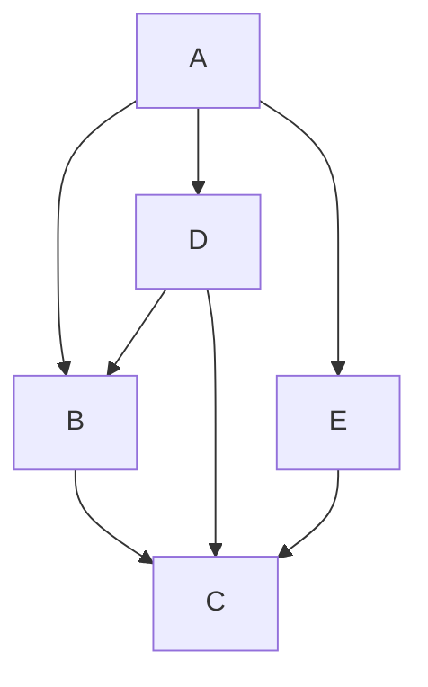
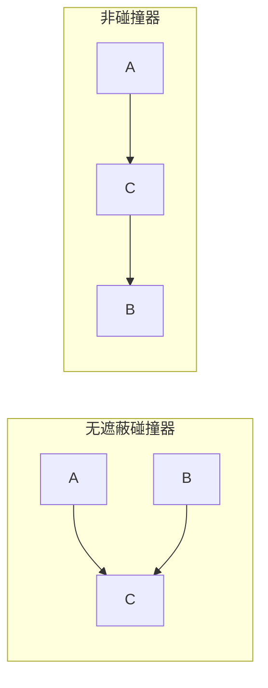
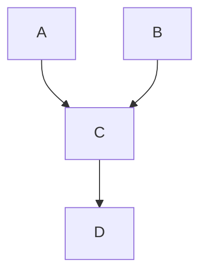
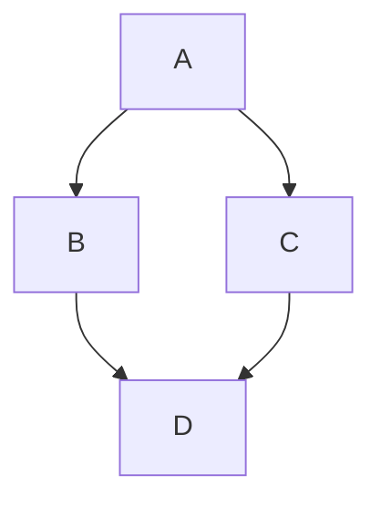
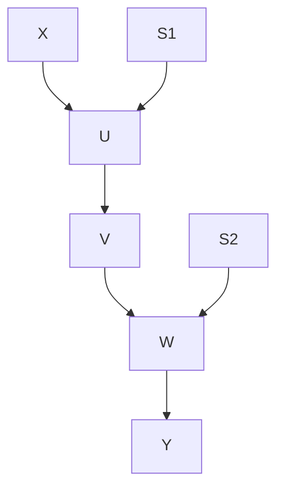
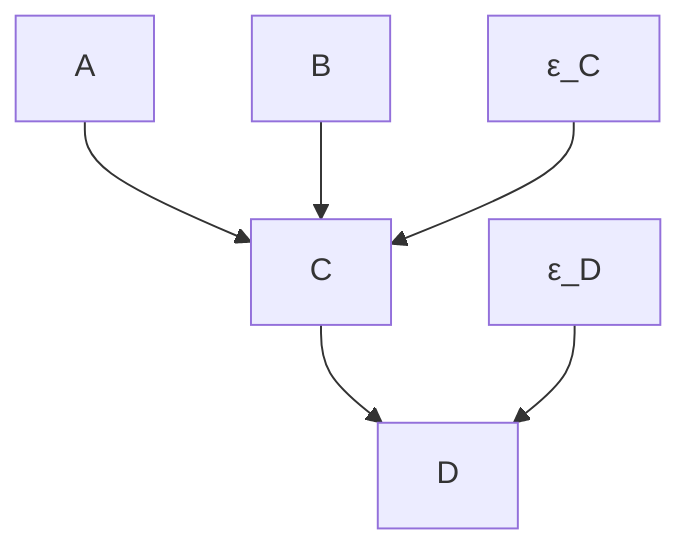
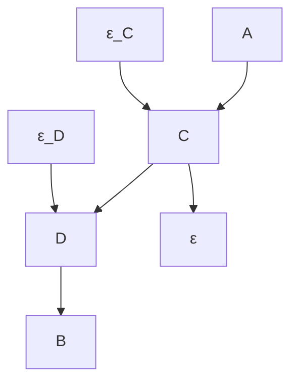
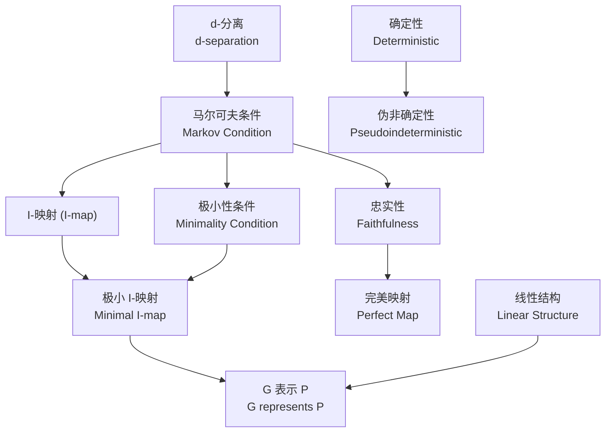

# 第2章 形式化预备知识 —— 系统梳理与详解

---

## 一、本章概述

本章为全书提供数学基础，定义了贯穿后续章节的各种形式化概念。核心内容包括：

- **图的类型**：无向图、有向图、诱导路径图（IPG）、部分定向诱导路径图（POIPG）、模式（Pattern）
- **概率论基础**：独立性、条件独立性、正分布、边际分布
- **图与分布的桥梁**：马尔可夫条件、极小性条件、忠实性、d-分离
- **特殊系统**：确定性系统与伪非确定性系统、线性结构

> **阅读建议**：初读可跳过，但需注意作者使用了图论中标准概念的**非标准定义**。

---

## 二、图的统一形式化定义

### 2.1 图的三元组定义

本书用**有序三元组**来统一所有类型的图：

$$G = \langle \mathbf{V}, \mathbf{M}, \mathbf{E} \rangle$$

其中：
- $\mathbf{V}$：非空**顶点集合**（vertices）
- $\mathbf{M}$：非空**标记集合**（marks）
- $\mathbf{E}$：形如 $\{[V_1, M_1], [V_2, M_2]\}$ 的**边集合**，其中 $V_1, V_2 \in \mathbf{V}$，$V_1 \neq V_2$，$M_1, M_2 \in \mathbf{M}$

**约定**：任意一对顶点之间至多有一条边（无多重边）。

### 2.2 边与边端（Edge-end）

每条边由两个**边端**构成。例如：

$$\{[A, \circ], [B, \circ]\} \quad \text{表示边 } A \circ\!\!-\!\!\circ B$$

$$ \{[A, EM], [B, >]\} \quad \text{表示边 } A \rightarrow B$$

其中 $EM$ 表示**空标记**（empty mark），$>$ 表示**箭头标记**。边是无序集合，因此 $\{[A, EM], [B, >]\}$ 和 $\{[B, >], [A, EM]\}$ 是同一条边。

> **邻接（Adjacent）**：$V_1$ 与 $V_2$ 相邻 $\iff$ $\mathbf{E}$ 中存在一条以 $V_1$ 和 $V_2$ 为端点的边。

---

### 2.3 五种图类型

| 图类型 | 标记集合 $\mathbf{M}$ | 可含的边 | 说明 |
|--------|----------------------|---------|------|
| **无向图** | $\{EM\}$ | $A - B$ | 仅无向边 |
| **有向图** | $\{EM, >\}$，且每条边一端为 $EM$，另一端为 $>$ | $A \rightarrow B$ | 仅有向边 |
| **诱导路径图 (IPG)** | $\{EM, >\}$ | $A \rightarrow B$, $A \leftrightarrow B$ | 第6章详述 |
| **部分定向诱导路径图 (POIPG)** | $\{EM, >, \circ\}$ | $A \rightarrow B$, $A \leftrightarrow B$, $A \circ\!\!-\!\!\circ B$, $A \circ\!\!\rightarrow B$ | 第6章详述 |
| **模式 (Pattern)** | $\{EM, >\}$ | $A - B$, $A \rightarrow B$ | 第5章详述 |

**举例**——图2.2的有向图可形式化表示为：

$$\langle \{A,B,C,D,E\},\ \{EM, >\},\ \{ \{[A,EM],[B,>]\}, \{[A,EM],[E,>]\}, \{[A,EM],[D,>]\}, \{[D,EM],[B,>]\}, \{[D,EM],[C,>]\}, \{[B,EM],[C,>]\}, \{[E,EM],[C,>]\} \} \rangle$$

---

### 2.4 有向边的方向术语

- 边 $\{[A, EM], [B, >]\}$ 是一条**从 $A$ 到 $B$ 的有向边**
- 该边**指向（into）** $B$
- 该边**从（out of）** $A$ 出发
- $A$ 是 $B$ 的**父节点（parent）**，$B$ 是 $A$ 的**子节点（child）**

**度（Degree）**：
- **入度（indegree）** = 父节点的数量
- **出度（outdegree）** = 子节点的数量
- **度（degree）** = 与 $V$ 相邻的顶点数 = 入度 + 出度

> **例**：图2.2中 $B$ 的父节点是 $A$ 和 $D$，子节点是 $C$，因此入度=2，出度=1，度=3。

---

### 2.5 路径（Paths）

#### 无向路径（Undirected Path）

$A$ 和 $B$ 之间的无向路径：以 $A$ 开始、$B$ 结束的顶点序列，序列中相邻顶点对在图中有对应的边。

> **有向边方向不影响无向路径的存在性**。例如在图2.2中，$\langle A, B, C, D \rangle$ 是一条无向路径（尽管 $B$ 和 $D$ 之间只有 $D \rightarrow B$）。

#### 有向路径（Directed Path）

从 $A$ 到 $B$ 的有向路径：以 $A$ 开始、$B$ 结束的顶点序列，序列中按顺序相邻的每对 $X, Y$ 都满足 $X \rightarrow Y$（即边为 $\{[X, EM], [Y, >]\}$）。

- $A$ = **源（source）**，$B$ = **汇（sink）**
- 有向路径必定是无向路径，反之不成立

> **例**：图2.2中 $\langle A, B, C \rangle$ 是有向路径（$A \rightarrow B$，$B \rightarrow C$），但 $\langle A, B, D \rangle$ 不是（因为 $B \rightarrow D$ 不存在，只有 $D \rightarrow B$）。

#### 半有向路径（Semidirected Path）

从 $A$ 到 $B$ 的半有向路径：无向路径，且路径上没有任何边在靠 $A$ 的一侧有箭头。

> 每条有向路径都是半有向路径，但反之不然（在有 $\circ\!\!\rightarrow$ 标记的图中可能有非有向的半有向路径）。

#### 关键辅助概念

| 概念 | 定义 |
|------|------|
| **空路径（Empty path）** | 只含单个顶点的序列 |
| **无环路径（Acyclic）** | 不含重复顶点 |
| **有环路径（Cyclic）** | 含重复顶点 |
| **路径相交（Intersect）** | 两路径有公共顶点 |
| **连接（Concatenation）** | $U = \langle U_1,\ldots,U_n\rangle$，$V = \langle U_n,V_1,\ldots,V_m\rangle$，连接为 $\langle U_1,\ldots,U_n,V_1,\ldots,V_m\rangle$，记作 $U \frown V$ |

---

### 2.6 碰撞器与非碰撞器（Collider & Noncollider）

在无向路径 $U$ 上，顶点 $V$ 是**碰撞器（collider）** $\iff$ $U$ 上有两条不同的边以 $V$ 为端点，且**都指向 $V$**。

> **直观**：两条箭头在 $V$ 处"碰撞"——$X \rightarrow V \leftarrow Y$

否则 $V$ 是 $U$ 上的**非碰撞器（noncollider）**。

**无遮蔽碰撞器（Unshielded Collider）**：$V$ 是碰撞器，且与 $V$ 相邻的两个顶点 $V_1, V_2$ 之间**没有边**。

> **例1**：在图 $\boxed{A \rightarrow C \leftarrow B}$ 中，路径 $\langle A, C, B \rangle$ 上 $C$ 是碰撞器（且 $A$ 和 $B$ 不相邻，故 $C$ 是无遮蔽碰撞器）。

> **例2**：在图 $\boxed{A \rightarrow C \rightarrow B}$ 中，路径 $\langle A, C, B \rangle$ 上 $C$ 是非碰撞器。

---

### 2.7 祖先与后代（Ancestor & Descendant）

- **祖先（Ancestor）**：$W$ 是 $V$ 的祖先 $\iff$ 存在一条从 $W$ 到 $V$ 的有向路径
- **后代（Descendant）**：$W$ 是 $V$ 的后代 $\iff$ 存在一条从 $V$ 到 $W$ 的有向路径

**关键性质**：每个顶点既是自身的祖先，也是自身的后代（通过空路径），但**不是**自身的父节点或子节点。

> **例**：图2.2中，$C$ 的祖先集合 = $\{A, B, C, D, E\}$（因为 $A \rightarrow B \rightarrow C$、$D \rightarrow B \rightarrow C$、$E \rightarrow C$ 都是有向路径）。

---

### 2.8 有向无环图（DAG）

> **定义**：不包含有向环路径（directed cyclic path）的有向图。

DAG 是全书最核心的图结构。

---

### 2.9 完全性、连通性、子图、团

| 概念 | 定义 |
|------|------|
| **完全图（Complete）** | 每对顶点都相邻 |
| **连通图（Connected）** | 任意两顶点间存在无向路径 |
| **子图（Subgraph）** | $\mathbf{V}' \subseteq \mathbf{V}$，$\mathbf{M}' \subseteq \mathbf{M}$，$\mathbf{E}' \subseteq \mathbf{E}$ |
| **团（Clique）** | 完全子图 |
| **极大团（Maximal Clique）** | 不被任何其他团真包含的团 |
| **三角形（Triangle）** | 三个顶点构成的完全子图 |

---

## 三、概率论基础

### 3.1 随机变量与联合分布

图的顶点始终是**随机变量**，取值于实数轴、非负实数或整数区间。图顶点上的**联合分布**是这些对象笛卡尔积上的可数可加概率测度。

### 3.2 独立性

- **边缘独立**：$X \perp\!\!\!\perp Y$ $\iff$ 对所有 $x, y$，$f(x,y) = f(x)f(y)$
- **条件独立**：$X \perp\!\!\!\perp Y \mid Z$ $\iff$ 对所有 $x, y, z$（$f(z) \neq 0$），$f(x,y \mid z) = f(x \mid z)f(y \mid z)$

> 条件独立的**阶（order）** = 条件变量集 $Z$ 中变量的数量

- **联合独立**：集合中任意两个不相交子集彼此独立

### 3.3 正分布（Positive Distribution）

> **定义**：$\mathbf{V}$ 上的分布是**正的** $\iff$ 对所有 $\mathbf{v}$，$P(\mathbf{v}) \neq 0$（离散）或密度函数对所有 $\mathbf{v}$ 非零（连续）。

正分布是后面许多定理（如定理2.1）的前提条件。

### 3.4 边际分布（Marginal Distribution）

若 $\mathbf{V} \subseteq \mathbf{V}'$，则：

$$P(\mathbf{V}) = \sum_{\mathbf{V}' \setminus \mathbf{V}} P(\mathbf{V}')$$

称为 $P(\mathbf{V}')$ 在 $\mathbf{V}$ 上的边际分布。

---

## 四、图与概率分布 —— 核心框架

### 4.1 马尔可夫条件（Markov Condition）⭐

> **定义**：DAG $G$ 与概率分布 $P(\mathbf{V})$ 满足马尔可夫条件 $\iff$ 对每个 $W \in \mathbf{V}$，给定 $\text{Parents}(W)$，$W$ 独立于 $\mathbf{V} \setminus (\text{Descendants}(W) \cup \text{Parents}(W))$。

> **通俗理解**：在已知直接原因（父节点）的条件下，变量与其非后代中的非父节点独立。

**例**：对于图2.8的DAG：

马尔可夫条件蕴含：

$$A \perp\!\!\!\perp B \quad \text{（边缘独立，A和B没有公共父节点）}$$

$$D \perp\!\!\!\perp \{A, B\} \mid C \quad \text{（给定C后，D独立于A和B）}$$

**密度分解公式**：

$$f(\mathbf{V}) = \prod_{V \in \mathbf{V}} f(V \mid \text{Parents}(V))$$

> 注意：若 $\text{Parents}(V) = \emptyset$，则 $f(V \mid \text{Parents}(V)) = f(V)$。

**离散示例**：

$$P(A,B,C,D) = P(A)\,P(B)\,P(C \mid A,B)\,P(D \mid C)$$

---

### 4.2 I-映射（I-map）

> Pearl (1988) 术语：若 $\langle G, P \rangle$ 满足马尔可夫条件，则 $G$ 是 $P$ 的一个 **I-map**（independence map）。

---

### 4.3 极小性条件（Minimality Condition）⭐

> **定义**：$\langle G, P \rangle$ 满足极小性条件 $\iff$ 对 $G$ 的任何**真子图** $H$（相同顶点集），$\langle H, P \rangle$ 都不满足马尔可夫条件。

> **直观理解**：图中的每条边都是"必需的"——删除任一条边都会导致某个应该成立的条件独立关系不再成立。

**例**：如果有一个分布满足图2.8的马尔可夫条件，但额外有 $A \perp\!\!\!\perp \{B, C, D\}$，则不满足极小性条件，因为可以删除边 $A \rightarrow C$ 而马尔可夫条件仍成立。

> Pearl (1988) 术语：满足马尔可夫条件 + 极小性条件时，$G$ 是 $P$ 的**极小I-映射（minimal I-map）**。

---

### 4.4 "表示"（Represents）与相关性来源

若 $G$ 对 $P$ 满足马尔可夫条件和极小性条件，称 $G$ **表示（represents）** $P$。

此时，若 $A$ 和 $B$ 统计相关，则必满足以下至少一个条件：

1. **直接因果**：$A \rightarrow \cdots \rightarrow B$ 的有向路径存在；或
2. **反向因果**：$B \rightarrow \cdots \rightarrow A$ 的有向路径存在；或
3. **共同原因**：存在 $C$ 使 $C \rightarrow \cdots \rightarrow A$ 且 $C \rightarrow \cdots \rightarrow B$

---

### 4.5 路径（Trek）

> **定义**：不同顶点 $A$ 和 $B$ 之间的**路径（trek）**是一对无序的有向路径，两者有相同的源点且仅在源点相交。该源点也是这条 trek 的源点。其中一条有向路径可以是空路径。

> **直观**：trek 表示 $A$ 和 $B$ 之间通过共同源点 $C$ 的关联：
> $$A \leftarrow \cdots \leftarrow C \rightarrow \cdots \rightarrow B$$
> 或直接因果 $C \rightarrow \cdots \rightarrow A \rightarrow \cdots \rightarrow B$（此时一条路径为空）。

---

### 4.6 有向独立图（Directed Independence Graph）

> Whittaker (1990)：给定顶点顺序 $>$，DAG $G$ 是 $P(\mathbf{V})$ 的**有向独立图** $\iff$ $A \rightarrow B$ 在 $G$ 中当且仅当 $\sim(A \perp\!\!\!\perp B \mid \mathbf{K}(B))$

其中 $\mathbf{K}(B) = \{V \neq A \mid V > B\}$（即顺序上在 $B$ 之后的所有变量，除 $A$ 本身）。

> **定理 2.1**：若 $P(\mathbf{V})$ 是**正分布**，则对 $\mathbf{V}$ 中变量的任何顺序，$P$ 都满足该顺序下有向独立图的马尔可夫条件和极小性条件。

> **意义**：正分布保证了有向独立图与极小I-映射的一致性。对于非正分布，有向独立图可能只是某个满足马尔可夫和极小性条件的DAG的子图。

---

### 4.7 忠实性（Faithfulness）⭐

> **核心洞见**：马尔可夫条件确定的独立关系可能"意外地"蕴含额外的独立关系（如参数恰好抵消）。

**例**：图2.9

马尔可夫条件**不蕴含** $A \perp\!\!\!\perp D$，但在线性模型中，若 $A \rightarrow C \rightarrow D$ 的偏回归系数乘积恰好与 $A \rightarrow B \rightarrow D$ 的相应乘积抵消，则可能出现 $A \perp\!\!\!\perp D$。这种"意外"独立不是图结构的必然结果。

> **定义**：$P$ 和 $G$ **相互忠实（faithful）** $\iff$ $P$ 中成立的所有且仅有的条件独立关系都是马尔可夫条件应用于 $G$ 所蕴含的。

> Pearl (1988) 术语：
> - 若互忠实，则 $G$ 是 $P$ 的**完美映射（perfect map）**
> - $P$ 是 $G$ 的 **DAG-同构（DAG-Isomorph）**

**忠实性下的相关性条件**：

$$X \text{ 与 } Y \text{ 相关} \iff X \text{ 与 } Y \text{ 之间存在一条 trek}$$

---

### 4.8 d-分离（d-separation）⭐

d-分离是 Pearl (1988) 提出的图论判据，用于从图结构**读出**条件独立关系。

> **定义**：$X \neq Y$，$\mathbf{W}$ 不含 $X, Y$。给定 $\mathbf{W}$，$X$ 和 $Y$ 在 $G$ 中是 **d-分离** 的 $\iff$ 不存在 $X$ 和 $Y$ 之间的无向路径 $U$ 同时满足：
> - (i) $U$ 上的每个**碰撞器**在 $\mathbf{W}$ 中有一个后代
> - (ii) $U$ 上没有其他顶点在 $\mathbf{W}$ 中

**d-连接（d-connected）** = 非 d-分离。

**集合版本**：不相交集合 $\mathbf{U}, \mathbf{V}$ 给定 $\mathbf{W}$ 是 d-分离的 $\iff$ $\mathbf{U} \times \mathbf{V}$ 中每一对都 d-分离。

#### d-分离的直观判据

**打开路径（active path）**的条件：

| 路径上的顶点类型 | 在条件集中？ | 路径状态 |
|:---:|:---:|:---:|
| 非碰撞器（链/叉） | ❌ 不在 | ✅ 打开 |
| 非碰撞器（链/叉） | ✅ 在 | ❌ 阻断 |
| 碰撞器 | ❌ 不在 | ❌ 阻断 |
| 碰撞器 | ✅ 在（或其某个后代在） | ✅ 打开 |

#### 示例——图2.10

- **给定 $\emptyset$**：$X$ 和 $Y$ 是 **d-分离**的。原因：路径 $X \rightarrow U \rightarrow V \rightarrow W \rightarrow Y$ 上，$V$ 在 $U,V,W$ 之间都是非碰撞器且不在条件集中——等等，这里需要仔细看。实际上这条路径上没有碰撞器，所有非碰撞器都不在条件集中，所以路径应该是打开的……除非图中还有别的结构。让我重新审视：$X \rightarrow U$，$U \rightarrow V$，$V \rightarrow W$，$W \rightarrow Y$——这些都是链状非碰撞器，空集条件下路径打开，$X$ 和 $Y$ 应该是 d-连接的。不过原文明确说"给定空集，$X$ 和 $Y$ 是 d-分离的"，可能图中还有 $\leftrightarrow$ 双向边等结构。无论如何，关键看下面的变化：

- **给定 $\{S_1, S_2\}$**：$X$ 和 $Y$ 是 **d-连接**的

- **给定 $\{S_1, S_2, V\}$**：$X$ 和 $Y$ 是 **d-分离**的

> **核心思想**：条件化于碰撞器（或其后代）会**打开**路径；条件化于非碰撞器会**阻断**路径。

---

### 4.9 线性结构（Linear Structures）

> **定义**：DAG $G$ **线性表示（linearly represents）** 分布 $P(\mathbf{V})$ $\iff$ 存在扩展图 $G'$ 和分布 $P''(\mathbf{V}')$ 满足：
> - (i) $\mathbf{V} \subseteq \mathbf{V}'$
> - (ii) 对每个内生变量 $X \in \mathbf{V}$（入度 $> 0$），存在唯一的**误差变量** $\varepsilon_X \in \mathbf{V}' \setminus \mathbf{V}$，入度为零、方差为正、出度为一，且 $\varepsilon_X \rightarrow X$
> - (iii) $G$ 是 $G'$ 在 $\mathbf{V}$ 上的子图
> - (iv) 每个内生变量是其 $G'$ 中父节点的**线性函数**
> - (v) $G'$ 中任意两个外生变量（包括误差变量）之间相关性为零
> - (vi) $P(\mathbf{V})$ 是 $P''(\mathbf{V}')$ 的边际分布

> **线性蕴含**：$G$ 线性蕴含 $\rho_{AB.\mathbf{H}} = 0$ $\iff$ 在所有由 $G$ 线性表示的分布中，$\rho_{AB.\mathbf{H}} = 0$。

---

## 五、无向独立图

### 5.1 定义

> 无向独立图 $G$ **表示**概率分布 $P$ $\iff$ $A$ 和 $B$ 之间没有边，当且仅当在 $P$ 中 $A \perp\!\!\!\perp B \mid \mathbf{V} \setminus \{A, B\}$。

### 5.2 全局马尔可夫性质

若 $G$ 表示 $P$，则：

$$A \perp\!\!\!\perp B \mid \mathbf{C} \iff A \text{ 和 } B \text{ 之间的每条无向路径都包含 } \mathbf{C} \text{ 中的成员}$$

### 5.3 与有向图的关系

设 DAG $G$ 有忠实分布 $P$，$U$ 是 $G$ 的**底层邻接无向图**（去方向），$I$ 是 $P$ 的无向独立图。则：

$$U \text{ 总是 } I \text{ 的子图}$$

$$U = I \iff G \text{ 不含任何无遮蔽碰撞器}$$

> **重要推论**：DAG 中无遮蔽碰撞器的存在会使得某些在底层无向图中相邻的变量在无向独立图中失去边——这解释了为何无向图和有向图表示条件独立的能力有本质差异。

---

## 六、确定性与伪非确定性系统

### 6.1 确定性系统（Deterministic System）

> **定义**：$\langle G, P \rangle$ 是**确定性的** $\iff$ $G$ 中每个入度非零的顶点都是其父节点的**函数**（即父节点值唯一确定该顶点值）。

**例**：图2.11

若系统确定性的，但 $\varepsilon_C, \varepsilon_D$ 未被测量，则仅看 $\{A,B,C,D\}$ 时**看起来是非确定性的**——这就是伪非确定性的来源。

### 6.2 伪非确定性（Pseudoindeterministic）

> **定义**：$\langle G, P \rangle$（定义在 $\mathbf{V}$ 上）是**伪非确定性**的 $\iff$ $G$ 不是 $P$ 的确定性图，但存在扩展 $G'$（定义在 $\mathbf{V}' \supset \mathbf{V}$ 上）满足：
> - (i) $G'$ 是 $P'$ 的确定性图
> - (ii) $G$ 是 $G'$ 在 $\mathbf{V}$ 上的子图
> - (iii) $\mathbf{V}$ 中无顶点是 $\mathbf{V}' \setminus \mathbf{V}$ 中顶点的祖先（隐藏变量不是被测量变量的后果）
> - (iv) $\mathbf{V}' \setminus \mathbf{V}$ 中无顶点是连接 $\mathbf{V}$ 中两顶点的 trek 的源点
> - (v) $P$ 是 $P'$ 的边际分布
> - (vi) $G$ 表示 $P$

> **线性伪非确定性**：额外要求 $G'$ 中每个顶点是其父节点的线性函数。

**图2.12 的对比**：

在这种情况下，无法通过添加不相关的隐藏变量使系统变为确定性（因为 $A, C, D, B$ 构成的链结构使得仅靠独立误差变量不足以消除所有非确定性）。

---

## 七、概念关系总结

---

## 八、关键术语对照表

| 中文 | 英文 | 符号/标记 |
|------|------|-----------|
| 有向无环图 | Directed Acyclic Graph (DAG) | — |
| 马尔可夫条件 | Markov Condition | — |
| 极小性条件 | Minimality Condition | — |
| 忠实性 | Faithfulness | — |
| d-分离 | d-separation | $X \perp_d Y \mid \mathbf{Z}$ |
| 碰撞器 | Collider | $X \rightarrow V \leftarrow Y$ |
| 非碰撞器 | Noncollider | — |
| 无遮蔽碰撞器 | Unshielded Collider | — |
| 路径 | Trek | — |
| I-映射 | I-map | — |
| 完美映射 | Perfect Map | — |
| 正分布 | Positive Distribution | $P(\mathbf{v}) > 0$ |
| 确定性 | Deterministic | — |
| 伪非确定性 | Pseudoindeterministic | — |
| 祖先/后代 | Ancestor/Descendant | — |
| 父节点/子节点 | Parent/Child | — |
| 团 | Clique | — |
| 半有向路径 | Semidirected Path | — |

---

## 九、总结

本章建立了全书的形式化语言：

1. **图的精确定义**通过三元组 $\langle \mathbf{V}, \mathbf{M}, \mathbf{E} \rangle$ 统一了五种图类型，其中边端标记 $\{EM, >, \circ\}$ 的组合区分了不同的边类型。

2. **图与概率的桥梁**由马尔可夫条件搭建，它使 DAG 能编码条件独立性关系：每个变量在给定其父节点后独立于其非后代中的非父节点。

3. **极小性**确保图结构中每条边都有因果意义；**忠实性**确保图结构完全捕获分布中的独立性模式（无"意外"独立）。

4. **d-分离**提供从图结构直接读取条件独立关系的图论算法，其核心是碰撞器/非碰撞器在条件化下的不同行为。

5. **线性结构**和**伪非确定性**为后续章节中将图模型与参数模型（线性回归等）联系提供了基础。

这些概念在第3章将被赋予**因果解释**，从而从纯形式化的数学对象转变为因果推断的有力工具。