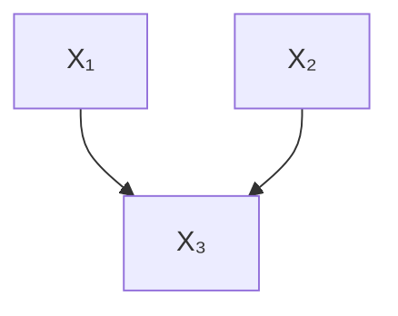
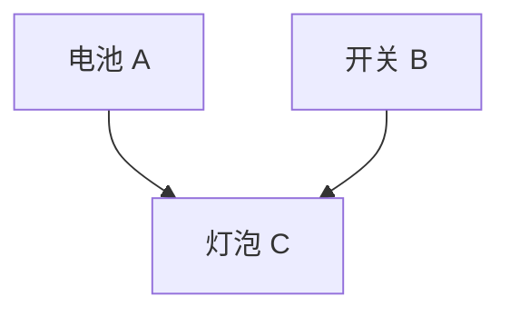
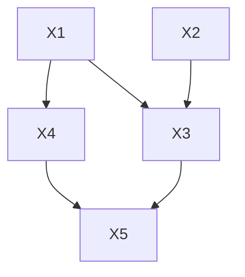
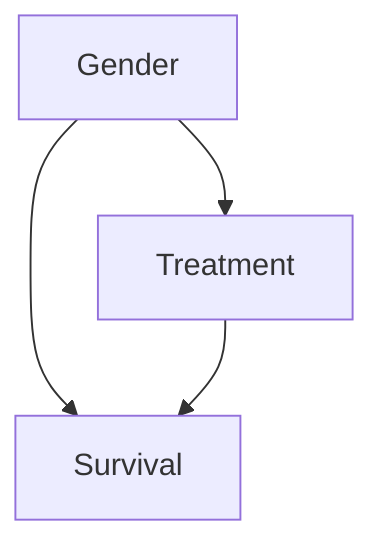
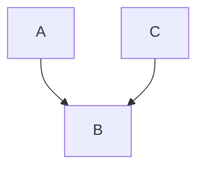
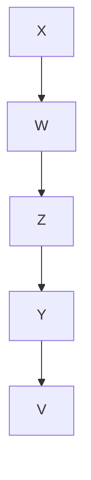
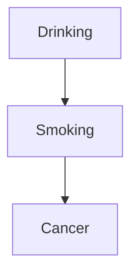
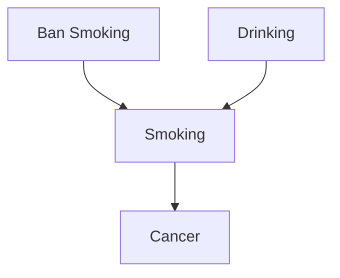
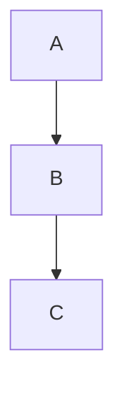
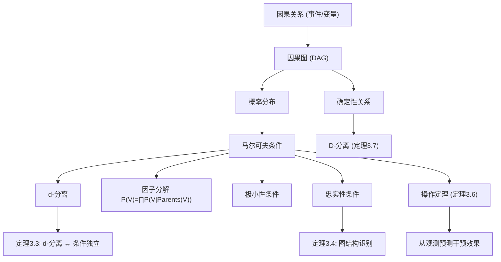

# 第三章 因果与预测：公理与阐释 — 系统梳理与学习材料

---

## 一、章节总览

本章旨在**系统化地阐明因果结构与概率、反事实及操纵之间的关系**，而不提倡任何一种特定的因果定义。作者通过引入一组公理（因果马尔可夫条件、因果极小性条件、忠实性条件），建立起因果图与概率分布之间的形式化联系，并由此推导出 d-分离、操作定理等重要工具。全章内容构成后续各章因果发现与因果推断的理论基础。

---

## 二、条件句（Conditionals）— §3.1

### 核心思想

智能规划需要预测行动的后果。由于行动会改变事态，评估尚未采取的行动需要判断**未来条件句**（若 $X$ 成立，则 $Y$ 就会成立），而评估过去政策的效果需要判断**反事实条件句**（若 $X$ 当时成立，则 $Y$ 当时就会成立）。

### 关键洞见

> **因果规律性蕴含反事实条件句，而偶然成立的概括则不蕴含。**

**例1（偶然概括）**："你口袋里的所有硬币都是银制的"——这并不蕴含"若这枚便士在你口袋里，它就是银制的"。

**例2（因果律）**："所有电子与正电子的碰撞都会释放能量"——这确实蕴含"若这个电子与这个正电子碰撞，则能量就会被释放"。

### 对实践的启示

一个线性回归方程 $$\text{死亡率} = \beta \times \text{汽车重量}$$ 可能对给定总体成立，但除非它描述了世界的**稳健因果特征**，否则对于预测通过立法操纵汽车重量时死亡率的变化是**无用的**。这意味着：仅有关联不足以指导干预。

---

## 三、因果关系（Causation）— §3.2

### 3.2.1 事件层面的因果关系

因果关系被理解为**特定事件**之间的关系：某事发生并导致另一件事发生。基本性质：

| 性质 | 含义 | 符号表达 |
|------|------|----------|
| **传递性 (Transitive)** | 若 $A \to B$ 且 $B \to C$，则 $A \to C$ | $(A \to B) \wedge (B \to C) \Rightarrow (A \to C)$ |
| **非自反性 (Irreflexive)** | 事件不能是自身的原因 | $A \not\to A$ |
| **反对称性 (Antisymmetric)** | 若 $A \to B$，则 $B \not\to A$ | $(A \to B) \Rightarrow \neg(B \to A)$ |

**过度决定 (Overdetermination)**：一个事件可以有多个原因，每个原因集单独就足以导致该事件发生。

### 3.2.2 直接因果与间接因果

> **直接原因将间接原因与结果屏蔽开来。**

**形式化定义**：给定事件集 $V$，$C$ 是 $A$ 相对于 $V$ 的**直接原因**，当且仅当 $C$ 是某个集合 $\mathbf{C} \subseteq V \setminus \{A\}$ 的成员，满足：

1. $\mathbf{C}$ 中的事件是 $A$ 的原因；
2. $\mathbf{C}$ 中的事件若发生，无论 $V \setminus (\{A\} \cup \mathbf{C})$ 中的事件是否发生，都会导致 $A$；
3. 没有 $\mathbf{C}$ 的真子集满足上述两条。

**因果中介 (Causal Mediary)**：若 $C \to B \to A$，则 $B$ 是 $C$ 和 $A$ 之间的因果中介。

**例（水痘传播）**：
- 接触水痘 $\to$ 感染病毒 $\to$ 出现皮疹
- 感染事件将接触事件与皮疹**屏蔽**：一旦知道她已被感染，皮疹是否发生就与她是在日托中心还是在游戏组接触病毒无关。

### 3.2.3 事件与变量

为使因果关系与概率建立联系，需将事件**分类聚合**为变量。

- **布尔变量 (Boolean Variables)**：取值于 $\{1, 0\}$，分别表示事件发生与否。布尔变量 $C$ 导致布尔变量 $A$，当且仅当 $(C, \neg C)$ 中至少一个成员导致 $(A, \neg A)$ 中至少一个成员。

- **尺度变量 (Scale Variables)**：在系统 $S$ 中，尺度变量 $Q$ 导致尺度变量 $R$，若存在 $Q$ 的值 $q$ 和 $R$ 的值 $r$，使得 $Q=q$ 的事件导致 $R=r$ 的事件。

**变量层面的直接原因**：推广事件层面定义——变量 $C$ 是变量 $A$ 相对于 $V$ 的直接原因，条件是存在 $\mathbf{C} \subseteq V$、$\mathbf{c}$ 值和 $a$ 值，使得 $\mathbf{C}=\mathbf{c}$ 导致 $A=a$，无论 $V$ 中其他变量的值如何。

**关键定义链**：

| 概念 | 定义 |
|------|------|
| **共同原因 (Common Cause)** | $X$ 同时是 $Y$ 和 $Z$ 相对于 $\{X,Y,Z\}$ 的直接原因 |
| **因果链 (Causal Chain)** | 从 $A$ 到 $B$ 的变量序列，相邻变量间存在直接因果关系 |
| **间接原因 (Indirect Cause)** | 存在长度 > 2 的因果链 |
| **潜变量 (Latent Variable)** | 未被测量的原因变量 |
| **因果连接 (Causally Connected)** | 一个变量是另一个的原因，或二者有共同原因 |
| **因果结构 (Causal Structure)** | 有序对 $\langle V, E \rangle$，$\langle X, Y \rangle \in E$ 当且仅当 $X$ 是 $Y$ 相对于 $V$ 的直接原因 |
| **因果充分性 (Causal Sufficiency)** | $V$ 中任意两个或多个变量的每个共同原因都在 $V$ 中，或对所有单位取相同值 |

**两个基本假设**：
1. 若 $A$ 是 $B$ 的原因，则 $A$ 是 $B$ 相对于 $V$ 的直接原因或间接原因；
2. 若存在从 $A$ 到 $B$ 不包含 $C$ 的因果链，则在任何包含 $A$ 和 $B$ 的集合中也存在不包含 $C$ 的因果链。

### 3.2.4 示例：数字逻辑电路

**例1：与门 (AND Gate)**



$$X_3 = X_1 \cdot X_2 \quad (\text{布尔乘法})$$

$X_1$ 取值 1 的事件和 $X_2$ 取值 1 的事件各自是 $X_3$ 取值 1 的事件的**原因**。

**例2：加法器**


$$X_3 = X_1 + X_2$$

因果结构与例1同构，尽管函数形式不同。

> **关键区分**：因果依赖 $\neq$ 函数依赖。方程 $X_3 = X_1 + X_2$ 和 $X_2 = X_3 - X_1$ 代数等价，但从 $X_1, X_2 \to X_3$ 不能推出 $X_3, X_1 \to X_2$。

### 3.2.5 因果表示约定

> **因果表示约定 (Causal Representation Convention)**：有向无环图 $G = \langle V, E \rangle$ 的顶点表示因果充分结构中的变量，存在从 $A$ 到 $B$ 的有向边当且仅当 $A$ 是 $B$ 相对于 $V$ 的直接原因。

**局限性**：
1. **交互作用**：药物 A 和 B 各自对症状 C 有影响，但 A 单独效果微弱而 B 不同——仅靠图结构无法表达此类差异。
2. **开关效应 (Switch)**：电池-开关-灯泡系统中，A 和 C 的相关性完全源于 $B=1$ 的条件（当 $B=0$ 时独立），但简单图示如下无法反映此信息：



---

## 四、因果关系与概率 — §3.3

### 4.1 确定性因果结构

> **线性确定性因果结构**：每个效果是其直接原因的线性函数。

- **外生变量 (Exogenous)**：因果图中无父节点（入度为零）的变量
- **内生变量 (Endogenous)**：非外生的变量

在确定性结构中，外生变量的值唯一决定所有内生变量的值。

**概率化**：当外生变量被赋予概率分布时，整个系统变量的联合分布随之确定。

**例**：设 AND 门外生变量分布为：
$$P(X_1=1, X_2=1)=0.2,\; P(X_1=1, X_2=0)=0.3$$
$$P(X_1=0, X_2=1)=0.2,\; P(X_1=0, X_2=0)=0.3$$

则 $(X_1, X_2, X_3)$ 联合分布完全确定（8 个状态中 4 个概率非零，4 个为零）。称此分布由因果结构**生成**。

**关键假设**：在因果充分结构中，外生变量是**联合独立**的。若外生变量不独立，则说明因果图不完整——要么存在未被表示的因果机制，要么遗漏了共同原因。

### 4.2 伪非确定性与非确定性因果结构

| 类型 | 含义 |
|------|------|
| **非确定性因果结构** | 某些变量不是其直接原因的确定性函数 |
| **伪非确定性 (Pseudoindeterministic)** | 实际是确定性的，但部分原因未被测量（隐藏在误差项中） |

**形式定义**：因果结构 $C = \langle V, E \rangle$ 是伪非确定性的，当且仅当它不是确定性的，但存在真包含 $V$ 的结构 $C' = \langle V', E' \rangle$ 满足：

- (i) $C'$ 是确定性因果结构；
- (ii) $V$ 中变量间的边在 $C$ 和 $C'$ 中一致；
- (iii) $V$ 中无变量是 $V' \setminus V$ 中变量的原因；
- (iv) $V' \setminus V$ 中无变量是 $V$ 中两个变量的共同原因。

**线性伪非确定性因果结构**：$C'$ 中所有函数依赖为线性的——这即是计量经济学和社会科学中的**结构方程模型 (Structural Equation Models)**，其误差项被解释为**被省略的原因**。

**例**：AND 门中若隐藏 $X_2$（仅观测 $X_1$ 和 $X_3$），则 $X_3$ 看似不是 $X_1$ 的确定性函数，表现为伪非确定性。

---

## 五、三大公理 — §3.4

本章核心是将概率与因果图联系起来的三个条件：

### 5.1 因果马尔可夫条件 (Causal Markov Condition)

$$\boxed{W \perp\!\!\!\perp V \setminus (\text{Descendants}(W) \cup \text{Parents}(W)) \mid \text{Parents}(W)}$$

> **内容**：在给定其直接原因（父节点）的条件下，任何变量与其非后代（且非父节点）的变量独立。

**因子分解公式**：
$$P(V) = \prod_{V \in \mathbf{V}} P(V \mid \text{Parents}(V))$$

**例（图 3.7）**：



马尔可夫条件导出的独立性：
$$\begin{aligned}
X_1 &\perp\!\!\!\perp X_2 \\
X_2 &\perp\!\!\!\perp \{X_1, X_4\} \\
X_3 &\perp\!\!\!\perp X_4 \mid \{X_1, X_2\} \\
X_4 &\perp\!\!\!\perp \{X_2, X_3\} \mid X_1 \\
X_5 &\perp\!\!\!\perp \{X_1, X_2\} \mid \{X_3, X_4\}
\end{aligned}$$

### 5.2 因果极小性条件 (Causal Minimality Condition)

$$\boxed{\text{移除任何一条边后，马尔可夫条件不再成立}}$$

> **内容**：对于 $G$ 的每个真子图 $H$（相同的顶点集），$\langle H, P \rangle$ 不满足马尔可夫条件。

**直觉**：每条直接的因果边都阻止了一个本会成立的（条件）独立关系。若移除 $C \to A$ 后分布仍满足马尔可夫条件，则 $C \to A$ 是多余的。

### 5.3 忠实性条件 (Faithfulness Condition)

$$\boxed{P \text{ 中的每个条件独立性关系都由应用于 } G \text{ 的马尔可夫条件所蕴含}}$$

> **内容**：分布 $P$ 中**所有且仅有**的那些独立性关系是马尔可夫条件应用于 $G$ 所推出的。不存在"额外的"独立关系。

**逻辑关系**：

```
忠实性 + 马尔可夫 ⟹ 极小性
极小性 + 马尔可夫 ⟹/ 忠实性
```

---

## 六、条件讨论 — §3.5

### 6.1 马尔可夫条件与极小性条件的合理性

**成立场景**：
1. 对于确定性或伪非确定性系统，若外生变量独立分布，马尔可夫条件必然成立（最后一章有证明）
2. 极小性条件对所有伪非确定性系统成立（作者猜想）
3. 科学和工程的广大领域——从汽车机械到化学动力学再到数字电路——都依赖这些原理

**表面上的反例：混合总体（Yule, 1903）**

> Yule 的"虚构遗传"例子：在男性和女性系中各自无遗传，但混合后显示出"相当大但虚幻的遗传"。

**问题的解决**：
- 混合总体的"虚幻关联"源自**未被测量的共同原因**——子总体成员身份的原因
- 当子总体成员身份原因被恰当地纳入因果图作为共同原因时，马尔可夫条件并未被违反
- Yule 例子中缺失的共同原因是**性别**

**定理 3.1**：若线性模型 M 和 M' 具有相同的因果图 G，且 M' 中的线性系数是随机变量（与 M 中其他变量联合独立，期望与 M 的系数相等），则在 M' 中 $\rho_{AB.\mathbf{C}} = 0$ 当且仅当在 M 中 $\rho_{AB.\mathbf{C}} = 0$。

> 这意味着：由**相同因果图、参数独立分布**的线性系统混合而成的总体仍满足该图的马尔可夫条件。

**对量子力学挑战的回应**：
- 贝尔不等式在某些量子实验中被违反，可能意味着因果马尔可夫条件不普遍成立
- 但这不构成在宏观系统中放弃该条件的充分理由
- 类比：我们不会因为经典动力学严格来说是错的，就放弃使用经典物理学

### 6.2 忠实性与辛普森悖论

**辛普森悖论 (Simpson's Paradox)**：两个变量在子群体中都呈正相关，但在合并总体中关联消失（或反向）。

**辛普森的例子**：治疗在男性和女性中都对存活有益，但合并后治疗与存活无关联。

| 分组 | 未治疗-存活 | 治疗-存活 | 未治疗-死亡 | 治疗-死亡 |
|------|:----------:|:---------:|:----------:|:---------:|
| 男性 | 4/52 | 8/52 | 3/52 | 5/52 |
| 女性 | 2/52 | 12/52 | 3/52 | 15/52 |



此分布满足该图的马尔可夫条件，但 $T$ 和 $S$ 独立——这并非马尔可夫条件所蕴含。因此该分布**不忠实**于此图。

**忠实于什么图？** 该分布忠实于以下图（其中 $A$ 和 $C$ 都是 $B$ 的原因，但彼此无直接边）：



这正是 Pearl 的"汽车无法启动"例子：电池有电 (A) 和油箱有油 (C) 独立，但给定汽车无法启动 (B) 后二者变得相关。

**定理 3.2**：在线性模型中，产生马尔可夫条件未蕴含的消失偏相关的参数值集合具有**勒贝格测度零**。这意味着：
> 不忠实的分布在参数空间中几乎处处不出现——忠实的分布是"正常的"或"通用的"。

---

## 七、贝叶斯解释 — §3.6

在贝叶斯框架下：
- 马尔可夫条件和极小性条件约束智能体在参数 $\Theta$ 和因果结构 $G$ 条件下的信念程度
- 无条件联合分布通常**不**满足这些条件（因为参数上的先验引入了混合）
- 这些条件因此被理解为关于"合理"信念程度的**规范性原则**

---

## 八、公理的推论 — §3.7

### 8.1 d-分离 (d-Separation)

d-分离是条件独立性的**纯图形化刻画**，用于判断在给定 $W$ 的条件下 $X$ 和 $Y$ 是否独立。

**定义（一）**：$X$ 和 $Y$ 在给定 $W$ 时是 **d-分离**的，当且仅当 $X$ 与 $Y$ 之间不存在无向路径 $U$ 使得：
- (i) $U$ 上每个碰撞点 (collider) 在 $W$ 中有后代，且
- (ii) $U$ 上没有其他顶点在 $W$ 中

**定义（二，直观版）**：无向路径 $U$ 相对于 $W$ 是**活跃**的，当且仅当 $U$ 上每个顶点相对于 $W$ 活跃。顶点活跃条件：

| 顶点类型 | 活跃条件 | 不活跃条件 |
|----------|----------|------------|
| **非碰撞点** (Non-collider) | 不在 $W$ 中 | 在 $W$ 中 |
| **碰撞点** (Collider) | 本身或其后代在 $W$ 中 | 本身及其后代都不在 $W$ 中 |

> 碰撞点 = 路径上两条有向边的"头"汇聚于此的顶点（形如 $\to V \leftarrow$）

**核心直觉**：
- 对非碰撞点条件化 → **阻断**信息流（不活跃）
- 对碰撞点条件化 → **激活**信息流（活跃）
- 对碰撞点的后代条件化 → 同样激活碰撞点

**图例说明**：



- $X$ 和 $V$ 被空集 d-分离（因为 $Y$ 是碰撞点，不在条件集中，不活跃）
- $X$ 和 $V$ 在给定 $\{Y\}$ 时 d-连接（对 $Y$ 条件化激活了它）

**定理 3.3**：$P(V)$ 忠实于有向无环图 $G$ 当且仅当对所有不相交顶点集 $X, Y, Z$：
$$X \perp\!\!\!\perp Y \mid Z \;\Longleftrightarrow\; X \text{ 和 } Y \text{ 在给定 } Z \text{ 时是 d-分离的}$$

**定理 3.4**：若 $P(V)$ 忠实于某有向无环图，则它忠实于 $G$ 当且仅当：
- (i) $X$ 与 $Y$ 相邻 $\Longleftrightarrow$ 对所有不包含 $X,Y$ 的集合，二者都条件依赖
- (ii) $X \to Y \leftarrow Z$（$X$ 与 $Z$ 不相邻） $\Longleftrightarrow$ $X,Z$ 在包含 $Y$ 的每个集合上都条件依赖

**定理 3.5** (线性忠实性)：对于线性系统，$G$ 线性蕴含 $\rho_{AB.\mathbf{H}} = 0$ 当且仅当 $A$ 和 $B$ 在给定 $\mathbf{H}$ 时 d-分离。这统一了 Wright (1934)、Simon (1954)、Blalock (1961) 等人的**路径分析**工作。

### 8.2 操作定理 (The Manipulation Theorem)

这是**从观测分布预测干预效果**的核心工具。

**问题设定**：如何利用观测分布 $P$ 和因果结构来预测施加于某些变量上的政策效果？

**示例**：卫生局局长考虑禁止吸烟以降低癌症。



- **未操作图 $G_{Unman}$**（实际人群）和**操作图 $G_{Man}$**（假设人群）不同
- 引入**政策变量**（如"禁止吸烟"变量）后形成**组合图 $G_{Comb}$**



**形式定义**：
- 将 $W$ 的值从 $\mathbf{w}_1$ 改为 $\mathbf{w}_2$ 是 $G_{Comb}$ 相对于 $V$ 的一次**操作**，当 $W$ 相对于 $V$ 外生，且条件分布不同
- $\text{Manipulated}(W)$：受操作变量直接影响的变量集合
- $P_{Unman(W)}(V) = P(V \mid W = \mathbf{w}_1)$
- $P_{Man(W)}(V) = P(V \mid W = \mathbf{w}_2)$

**定理 3.6（操作定理）**：
$$P_{Man(W)}(V) = \prod_{X \in \text{Manipulated}(W)} P_{Man(W)}(X \mid \text{Parents}(G_{Man}, X)) \times \prod_{X \in V \setminus \text{Manipulated}(W)} P_{Unman(W)}(X \mid \text{Parents}(G_{Unman}, X))$$

**核心含义**：
- 操作后分布 = (被直接操作变量的新条件分布) × (未被直接操作变量的旧条件分布)
- 若因果结构和操作的直接效应已知，联合分布可从未操作人群估计

**关键应用条件**：
1. 因果机制**不可逆**（如手指发黄不能导致吸烟）
2. 正确判断哪些变量受直接操作
3. 因果结构完整（变量间依赖关系正确表示）
4. 操作定理是马尔可夫条件的直接推论

**实践陷阱**：
- 汽车尺寸与死亡率回归被错误用于预测缩小车队的政策效果（忽略了车队中其他车尺寸的分布效应）
- 盲法和双盲设计正是为了确保实验操作"仅对目标变量"进行直接操作

---

## 九、确定性关系 — §3.8

当变量间存在确定性函数关系时，忠实性可能被违反，且马尔可夫条件不足以导出所有条件独立性。

**关键概念**：
- 若 $Z$ **决定了** $A$（$A$ 是 $Z$ 的确定性函数），则 $A \perp\!\!\!\perp V \setminus (Z \cup \{A\}) \mid Z$
- **D-分离 (D-separation)**：d-分离的推广——将"在条件集中"替换为"被 $Z$ 函数式决定 (functionally determined)"

**D-分离定义**：$X$ 和 $Y$ 在给定 $Z$ 和 $\text{Deterministic}(V)$ 时是 D-分离的，当且仅当 $X$ 与 $Y$ 之间不存在无向路径 $U$，使得：
- $U$ 上每个碰撞点在 $Z$ 中有后代，且
- $U$ 上没有其他顶点在 $\text{Det}(Z)$ 中

**定理 3.7**：若 $P(V)$ 满足 $G$ 的马尔可夫条件和 $\text{Deterministic}(V)$，且 $X$ 和 $Y$ 在给定 $Z$ 和 $\text{Deterministic}(V)$ 时是 D-分离的，则在 $P$ 中 $X \perp\!\!\!\perp Y \mid Z$。

**示例（图 3.20）**：



| 确定性关系 | 推出的独立性 |
|-----------|-------------|
| $A$ 决定 $C$ | $C \perp\!\!\!\perp B \mid A$ |
| $B$ 决定 $C$ | $C \perp\!\!\!\perp A \mid B$ |
| $C$ 决定 $B$ | $B \perp\!\!\!\perp A \mid C$ |

此外，确定性关系与某些因果图可能**不兼容**（若蕴含的依赖关系与马尔可夫条件冲突），且可能使极小性条件无法被任何分布满足。

---

## 十、关键定理汇总

| 定理 | 内容 |
|------|------|
| **定理 3.1** | 具有相同因果图、参数独立分布的线性系统混合总体仍满足马尔可夫条件 |
| **定理 3.2** | 在线性模型中，产生不忠实分布的参数集勒贝格测度为零 |
| **定理 3.3** | d-分离等价于忠实的条件独立性 |
| **定理 3.4** | 忠实图的等价刻画：相邻性与 $X \to Y \leftarrow Z$ 结构的条件依赖特征 |
| **定理 3.5** | 线性系统：$G$ 线性蕴含 $\rho_{AB.\mathbf{H}} = 0$ 当且仅当 d-分离 |
| **定理 3.6** | 操作定理——从观测分布和因果结构预测干预效果 |
| **定理 3.7** | D-分离（推广的 d-分离）蕴含确定性关系下的条件独立性 |

---

## 十一、整体逻辑结构图



---

本章通过一套公理化体系，将**因果直觉**（原因→结果、屏蔽、干预）与**统计工具**（概率分布、条件独立、d-分离）紧密结合，为全书后续的因果发现算法和因果推断方法论奠定了严格的理论基础。