# 第四章 统计不可区分性（Statistical Indistinguishability）

## —— 系统学习与参考材料

---

## 目录

1. [引言与核心问题](#1-引言与核心问题)
2. [强统计不可区分性 (s.s.i.)](#2-强统计不可区分性-ssi)
3. [忠实不可区分性 (f.i.)](#3-忠实不可区分性-fi)
4. [弱统计不可区分性 (w.s.i.)](#4-弱统计不可区分性-wsi)
5. [刚性不可区分性 (r.s.i.)](#5-刚性不可区分性-rsi)
6. [线性情况](#6-线性情况)
7. [重新定义变量](#7-重新定义变量)
8. [总结与关系图谱](#8-总结与关系图谱)

---

## 1. 引言与核心问题

### 1.1 核心动机

在没有实验操作的条件下，我们仅能从观测数据的统计关系中推断因果结构。然而，这种推断的**分辨能力**存在根本性限制——如果两个不同的因果结构能够**同样好地解释相同的统计数据**，那么没有任何统计方法能够区分它们。这就是**统计不可区分性（Statistical Indistinguishability）**的核心问题。

### 1.2 不可区分性的层次

统计不可区分性并非一个单一的概念。它依赖于我们假定的**图与分布之间联系的公理**：

| 假定的条件 | 对应的不可区分性 |
|---|---|
| 马尔可夫条件 + 最小性条件 | **强统计不可区分性** (s.s.i.) |
| 忠实性条件 | **忠实不可区分性** (f.i.) |
| 存在某个共同分布满足两个图的公理 | **弱统计不可区分性** (w.s.i.) |
| 即使嵌入更大变量集也无法区分 | **刚性不可区分性** (r.s.i.) |

### 1.3 基本研究问题

本章围绕以下核心问题展开：

1. **图论刻画**：两个图必须共享什么样的图论结构，才能共享至少一个满足公理的概率分布？
2. **逆向问题**：给定一个概率分布 $P$，所有与 $P$ 和公理一致的有向无环图的集合是什么？
3. **测度论问题**：当更严格假设（如忠实性）下的推断程序在较弱假设下失败时，失败的概率有多大？

---

## 2. 强统计不可区分性 (s.s.i.)

### 2.1 定义

> **定义 4.1（强统计不可区分性）**：两个有向无环图 $G$ 和 $G'$ 是**强统计不可区分的（strongly statistically indistinguishable, s.s.i.）**，当且仅当：
> 1. 它们具有相同的顶点集 $V$；
> 2. 每个在 $V$ 上满足 $G$ 的最小性条件和马尔可夫条件的分布 $P$，也满足 $G'$ 的这两个条件，**反之亦然**。

用符号表示：

$$G \sim_{\text{ssi}} G' \iff \mathcal{P}_{\text{Markov+Minimal}}(G) = \mathcal{P}_{\text{Markov+Minimal}}(G')$$

其中 $\mathcal{P}_{\text{Markov+Minimal}}(G)$ 表示满足 $G$ 的马尔可夫条件和最小性条件的所有概率分布的集合。

### 2.2 定理 4.1：s.s.i. 的图论刻画

> **定理 4.1**：两个有向无环图 $G_1, G_2$ 是强统计不可区分的，当且仅当：
> - (i) 它们具有相同的顶点集 $V$；
> - (ii) 在 $G_1$ 中顶点 $V_1$ 和 $V_2$ 相邻，当且仅当它们在 $G_2$ 中也相邻（**相同骨架**）；
> - (iii) 对于 $V$ 中的每一个三元组 $V_1, V_2, V_3$，结构 $V_1 \rightarrow V_2 \leftarrow V_3$ 是 $G_1$ 的子图，当且仅当它也是 $G_2$ 的子图（**相同碰撞结构**）。

#### 解释与说明

定理 4.1 告诉我们，决定两个图是否 s.s.i. 的图论特征有两个：

1. **相同的基础无向图（骨架）**：即忽略所有边的方向后，两个图的边集相同。
2. **相同的碰撞结构**：即对于任意三个顶点，它们之间的碰撞关系（$V_1 \rightarrow V_2 \leftarrow V_3$，其中 $V_2$ 是**碰撞器/collider**）在两个图中一致。

> **重要说明**：条件 (iii) 要求**所有**碰撞结构相同，包括**被屏蔽的碰撞器（shielded collider）**——即 $V_1$ 和 $V_3$ 相邻的情况。这与忠实不可区分性形成关键区别（见第 3 节）。

#### 构造方法

给定任意有向无环图 $G$，所有与 $G$ 是 s.s.i. 的图可以通过以下方式获得：对 $G$ 中的边方向进行任意一组反转，但这些反转必须**保留 $G$ 中的所有碰撞结构**。

#### 计算复杂度

判断两个图是否 s.s.i. 需要 $O(n^3)$ 次计算，其中 $n$ 是顶点数。

### 2.3 示例：图 4.1

考虑图 4.1 中的五个图：

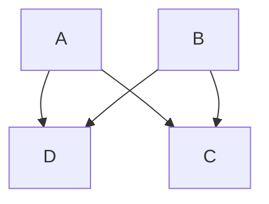
> **$G_1$**：边集 = $\{A \rightarrow D, A \rightarrow C, B \rightarrow D, B \rightarrow C\}$

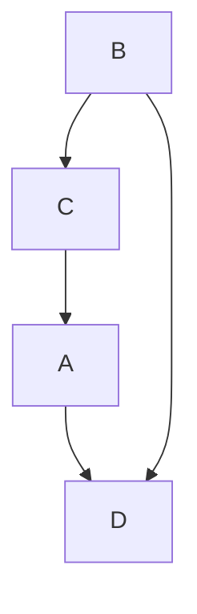
> **$G_2$**：与 $G_1$ 骨架相同，但边 $A—C$ 的方向反转为 $C \rightarrow A$。碰撞结构：三元组 $\{A, D, B\}$ 有 $A \rightarrow D \leftarrow B$（$G_1$ 中也是），三元组 $\{C, D, B\}$ 有 $C \rightarrow D \leftarrow B$（$G_1$ 中也是）。没有三元组在 $G_1$ 中是被屏蔽碰撞器但在 $G_2$ 中不同。

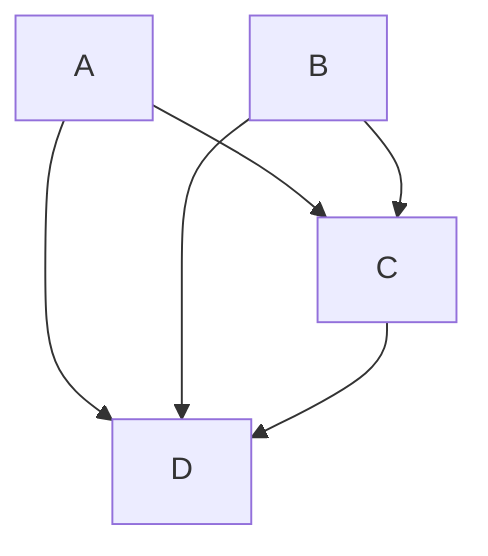
> **$G_3$**：比 $G_1$ 多了一条边 $C \rightarrow D$，骨架不同。

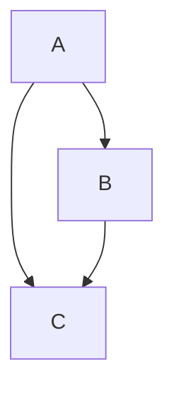
> **$G_4$**：$A \rightarrow B \rightarrow C$ 且 $A \rightarrow C$。三元组 $\{A, B, C\}$ 中 $B$ 不是碰撞器（$A \rightarrow B \rightarrow C$）。

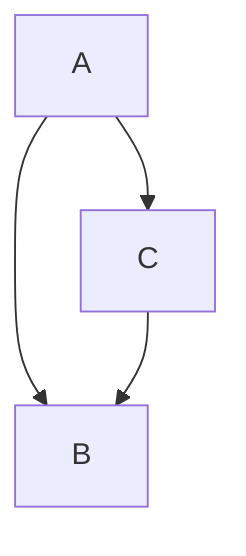
> **$G_5$**：$A \rightarrow C \leftarrow B$ 且 $A \rightarrow B$。三元组 $\{A, C, B\}$ 中 $C$ 是碰撞器，但 $A$ 和 $B$ **相邻**，所以这是一个**被屏蔽的碰撞器（shielded collider）**。

#### 分析

- **$G_1$ 和 $G_2$ 是 s.s.i.**：它们骨架相同，且所有碰撞结构（包括可能的被屏蔽碰撞器）相同。
- **$G_1$ 和 $G_3$ 不是 s.s.i.**：$G_3$ 有额外的边 $C \rightarrow D$，骨架不同。
- **$G_2$ 和 $G_3$ 不是 s.s.i.**：同理。
- **$G_4$ 和 $G_5$ 不是 s.s.i.**：虽然骨架相同，但 $G_5$ 中有碰撞结构 $A \rightarrow C \leftarrow B$（尽管是被屏蔽的），而 $G_4$ 中没有对应的碰撞结构。被屏蔽的碰撞器在 s.s.i. 中也被要求匹配。

### 2.4 重要补充

> **Pearl (1988) 推论 3**：如果一组变量 $V$ 是**完全有序的**（例如按已知的时间顺序），并且 $P(\mathbf{V})$ 是**正的**，那么存在**唯一**的图使得 $P(\mathbf{V})$ 满足最小性条件和马尔可夫条件。

这意味着在时间信息可用且分布为正的条件下，s.s.i. 的问题实际上被消解了。

---

## 3. 忠实不可区分性 (f.i.)

### 3.1 定义

> **定义 4.2（忠实不可区分性）**：两个有向无环图 $G$ 和 $G'$ 是**忠实不可区分的（faithfully indistinguishable, f.i.）**，当且仅当每个对 $G$ 忠实的分布也对 $G'$ 忠实，反之亦然。

$$G \sim_{\text{fi}} G' \iff \mathcal{P}_{\text{Faithful}}(G) = \mathcal{P}_{\text{Faithful}}(G')$$

### 3.2 定理 4.2：f.i. 的图论刻画

> **定理 4.2**：两个有向无环图 $G$ 和 $H$ 是忠实不可区分的，当且仅当：
> - (i) 它们具有相同的顶点集；
> - (ii) 任意两个顶点在 $G$ 中相邻，当且仅当它们在 $H$ 中也相邻（**相同骨架**）；
> - (iii) 任意三个顶点 $X, Y, Z$，其中 $X$ 与 $Y$ 相邻，$Y$ 与 $Z$ 相邻，但 $X$ 与 $Z$ **在 $G$ 或 $H$ 中不相邻**，在 $G$ 中方向为 $X \rightarrow Y \leftarrow Z$，当且仅当在 $H$ 中也是同样的方向（**相同的无屏蔽碰撞器**）。

#### 关键区别：s.s.i. vs f.i.

| 特征 | s.s.i.（定理 4.1） | f.i.（定理 4.2） |
|---|---|---|
| 骨架 | 必须相同 | 必须相同 |
| 碰撞器匹配范围 | **所有**碰撞器（包括被屏蔽的） | 仅**无屏蔽碰撞器**（unshielded colliders） |
| 关系 | s.s.i. ⇒ f.i. | f.i. ⇏ s.s.i. |

> **无屏蔽碰撞器（Unshielded Collider）**：三元组 $X, Y, Z$ 中，$Y$ 是碰撞器 $X \rightarrow Y \leftarrow Z$，且 $X$ 与 $Z$ **不相邻**（即边 $X—Z$ 被"屏蔽"掉了）。

### 3.3 示例说明

回到 $G_4$ 和 $G_5$：

- **$G_4$**：$A \rightarrow B \rightarrow C$，$A \rightarrow C$
  - 三元组 $\{A, B, C\}$：$A$ 与 $C$ **相邻**，$B$ 不是碰撞器 → 无无屏蔽碰撞器
  - 三元组检查完毕，无无屏蔽碰撞器

- **$G_5$**：$A \rightarrow B$，$A \rightarrow C$，$C \leftarrow B$（即 $A \rightarrow C \leftarrow B$，加上 $A \rightarrow B$）
  - 三元组 $\{A, C, B\}$：$C$ 是碰撞器 $A \rightarrow C \leftarrow B$，但 $A$ 与 $B$ **相邻** → $C$ 是**被屏蔽的**碰撞器
  - 三元组 $\{A, B, C\}$：$B$ 不是碰撞器

$G_4$ 和 $G_5$ 都**没有无屏蔽碰撞器**。因此，根据定理 4.2，它们是 f.i.。但 $G_5$ 有一个被屏蔽的碰撞器而 $G_4$ 没有，所以根据定理 4.1，它们不是 s.s.i.。

> **结论**：$G_4$ 和 $G_5$ 不是 s.s.i.，但它们是 f.i.。这完美地展示了 s.s.i. 比 f.i. 更严格。

### 3.4 模式（Pattern）

忠实不可区分图类可以用一个**模式（Pattern）** $\pi$ 来表示——$\pi$ 是一个混合图，包含有向边和无向边。

> **定义**：图 $G$ 属于由模式 $\pi$ 表示的图集合，当且仅当：
> - (i) $G$ 与 $\pi$ 具有相同的邻接关系；
> - (ii) 如果在 $\pi$ 中 $A$ 和 $B$ 之间的边方向为 $A \rightarrow B$，那么在 $G$ 中该方向也是 $A \rightarrow B$；
> - (iii) 如果在 $G$ 中 $Y$ 是路径 $\langle X, Y, Z \rangle$ 上的无屏蔽碰撞器，那么在 $\pi$ 中 $Y$ 也是 $\langle X, Y, Z \rangle$ 上的无屏蔽碰撞器。

#### 例子

三个顶点上的所有完全有向无环图构成一个忠实不可区分性类，可以用**完全无向图**（即三条边均无方向）作为其模式。当模式的边全部无向时，该有向图所表示的统计假设等价于与该模式对应的**无向独立图**的统计假设。

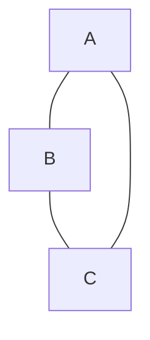
> 三个顶点上完全DAG的f.i.类的模式：完全无向图

这表示该 f.i. 类包含所有三个顶点的完全 DAG（如 $A \rightarrow B \rightarrow C$、$A \leftarrow B \rightarrow C$ 等），只要它们不引入无屏蔽碰撞器即可。

### 3.5 计算复杂度

判断两个图是否忠实不可区分可以在 $O(n^3)$ 时间内完成。

---

## 4. 弱统计不可区分性 (w.s.i.)

### 4.1 动机：从图到分布，再到图

前两节从**图**出发：给定两个图，它们是否容纳相同类别的分布？本节反过来，从**分布**出发：给定一个分布 $P$，哪些图与 $P$ 一致？

### 4.2 弱不可区分性的定义

> **定义 4.3**：
> - 两个图是**弱忠实不可区分的（weakly faithfully indistinguishable, w.f.i.）**，当且仅当**存在**一个对两者都忠实的概率分布。
> - 两个图是**弱统计不可区分的（weakly statistically indistinguishable, w.s.i.）**，当且仅当**存在**一个同时满足两者最小性条件和马尔可夫条件的概率分布。

关键区别：强/忠实不可区分性要求**所有**分布都兼容（$\forall$），而弱不可区分性只要求**存在**一个共同分布（$\exists$）。

$$\text{s.s.i. / f.i. : } \forall P \quad \text{vs} \quad \text{w.s.i. / w.f.i. : } \exists P$$

### 4.3 定理 4.3：w.f.i. = f.i.

> **定理 4.3**：两个有向无环图是忠实不可区分的（f.i.），当且仅当某个对一个图忠实的分布也对另一个图忠实，反之亦然；也就是说，它们是 f.i. 当且仅当它们是 w.f.i.。

$$\text{f.i.} \iff \text{w.f.i.}$$

#### 深远含义

这个定理告诉我们：**忠实性将顶点集上的概率分布集合划分为等价类**，这些等价类恰好对应于由忠实不可区分性诱导的图的等价类。因此：

> 如果一个分布 $P$ 对某个图 $G$ 是忠实的，那么它恰好对所有与 $G$ 忠实不可区分的图忠实，并且**只**对这些图忠实。

这意味着在忠实性假设下，分布忠实的图集合形成了一个**清晰划分的等价类**——不会出现一个分布对一个图忠实而对另一个非 f.i. 的图也忠实的"模糊"情况。

### 4.4 马尔可夫+最小性条件下的 w.s.i.：更复杂的情况

对于仅假设马尔可夫条件和最小性条件的情况，**没有**类似定理 4.3 的完美匹配。

#### 反例：图 4.2

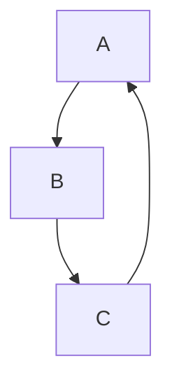
> **$G_1$**（三角形）：$A \rightarrow B \rightarrow C \rightarrow A$

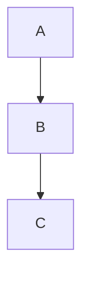
> **$G_2$**（链）：$A \rightarrow B \rightarrow C$

$G_1$ 和 $G_2$ **不是 s.s.i.**（骨架不同），但存在一个分布同时满足两者的马尔可夫条件和最小性条件。这就是辛普森"悖论"情境的推广。

#### 核心猜想

> 如果一个分布满足两个图 $G$ 和 $G'$ 的最小性条件和马尔可夫条件，那么 $G$ 和 $G'$ 具有相同的边和相同的碰撞器，唯一不同的是，一个图中的**三角形**可以被另一个图中的**碰撞结构**所替代，前提是其他边满足适当的条件。

### 4.5 定理 4.4 和 4.5：满足 G 的马尔可夫条件且对 H 忠实的分布

> **定理 4.4**：如果概率分布 $P$ 满足有向无环图 $G$ 和 $H$ 的马尔可夫条件和最小性条件，并且 $P$ 对 $H$ 忠实，那么对于所有顶点 $X, Y$，如果 $X, Y$ 在 $H$ 中相邻，则它们在 $G$ 中也相邻。

即：$H$ 的边集是 $G$ 的边集的子集（在忠实方向上）。

> **定理 4.5**：如果概率分布 $P$ 满足有向无环图 $G$ 和 $H$ 的马尔可夫条件和最小性条件，并且 $P$ 对图 $H$ 忠实，那么：
> - (i) 对于所有 $X, Y, Z$，如果 $X \rightarrow Y \leftarrow Z$ 在 $H$ 中且 $X$ 与 $Z$ 在 $H$ 中不相邻，那么在 $G$ 中**要么** $X \rightarrow Y \leftarrow Z$，**要么** $X, Z$ 在 $G$ 中相邻；
> - (ii) 对于每个顶点三元组 $X, Y, Z$，如果 $X \rightarrow Y \leftarrow Z$ 在 $G$ 中且 $X$ 与 $Z$ 在 $G$ 中不相邻，如果 $X$ 与 $Y$ 在 $H$ 中相邻且 $Y$ 与 $Z$ 在 $H$ 中相邻，那么 $X \rightarrow Y \leftarrow Z$ 在 $H$ 中也成立。

#### 直观解释

定理 4.5(i) 说：$H$ 中的无屏蔽碰撞器在 $G$ 中要么保持为碰撞器，要么被"屏蔽"掉（$X$ 和 $Z$ 变成相邻）。

定理 4.5(ii) 说：$G$ 中的无屏蔽碰撞器如果涉及的边在 $H$ 中都存在，则在 $H$ 中也必须是碰撞器。

### 4.6 推论 4.1

> **推论 4.1**：如果概率分布 $P$ 满足有向无环图 $G$ 的马尔可夫条件，$P$ 对有向无环图 $H$ 忠实，并且 $G$ 和 $H$ 在变量的排序上一致（例如按时间排序），使得 $X \rightarrow Y$ 仅当在排序中 $X < Y$，那么 **$H$ 是 $G$ 的子图**。

#### 实际意义

如果我们错误地假设忠实性（但实际不成立），由特殊参数值导致的条件独立性只会产生**省略了真实因果联系的错误因果推断**——即我们推断出的图是真实图的一个子图，而不会错误地添加不存在的边。

### 4.7 从分布生成一致图集合的算法

仅假设马尔可夫条件和最小性条件时（在正性条件下），可以通过以下方式生成所有与 $P$ 一致的图：

> **Pearl (1988) 算法**：
> - 令 $\text{Ord}$ 为变量的一个全序，$\text{Predecessors}(\text{Ord}, X)$ 为排序中 $X$ 的前驱。
> - 对于每个变量 $X$，令 $G$ 中 $X$ 的父节点为 $\text{Predecessors}(\text{Ord}, X)$ 的一个**最小子集** $R$，使得在 $P$ 中给定 $R$ 时 $X$ 与 $\text{Predecessors}(\text{Ord}, X) \setminus R$ 独立。
> - 如此得到的 $G$ 满足 $P$ 的最小性条件和马尔可夫条件。

对于 $P$ 中变量的**每一种**排序，都存在一个与该排序兼容的有向无环图。如果假设忠实性，则替代方案更加有限，下一章将介绍专门的算法。

---

## 5. 刚性不可区分性 (r.s.i.)

### 5.1 动机：嵌入更大系统

一个自然的问题是：如果我们在原有变量集 $O$ 的基础上测量**更多变量**，原本不可区分的因果结构是否可能变得可区分？


> $G_1$：$A \rightarrow B$

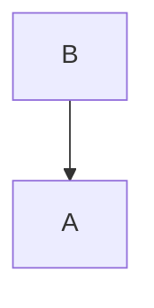
> $G_2$：$B \rightarrow A$

$G_1$ 和 $G_2$ 是 s.s.i. 和 f.i. 的。但如果我们测量一个变量 $C$（$A$ 的原因），则：

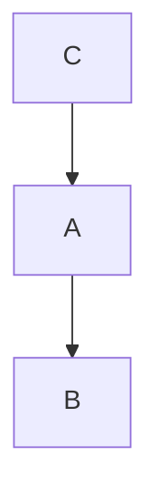
> $H_1$：嵌入 $G_1$

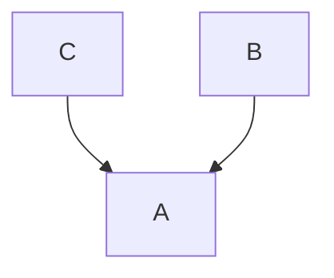
> $H_2$：嵌入 $G_2$

$H_1$ 和 $H_2$ **不是** s.s.i. 或 f.i. 的——通过测量额外变量，原本不可区分的结构变得可区分。

### 5.2 平行嵌入（Parallel Embedding）

> **定义 4.4（平行嵌入）**：设 $G_1, G_2$ 是具有共同顶点集 $O$ 的有向无环图。设 $H_1, H_2$ 是有向图，具有包含 $O$ 的共同顶点集 $U$，满足：
> - (i) $H_1$ 在 $O$ 上的子图是 $G_1$，$H_2$ 在 $O$ 上的子图是 $G_2$；
> - (ii) $H_1$ 中但不在 $G_1$ 中的每条有向边都在 $H_2$ 中，$H_2$ 中但不在 $G_2$ 中的每条有向边都在 $H_1$ 中（即额外边的集合相同）。

则称 $G_1$ 和 $G_2$ 在 $H_1$ 和 $H_2$ 上关于 $O$ 和 $U$ 有一个**平行嵌入**。

#### 图 4.4 的示例

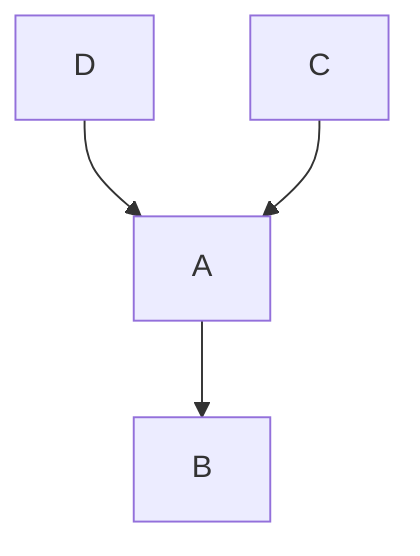
> $H_1$：$D \rightarrow A, C \rightarrow A, A \rightarrow B$。在 $O=\{A,B\}$ 上的子图 $G_1$ 是 $A \rightarrow B$

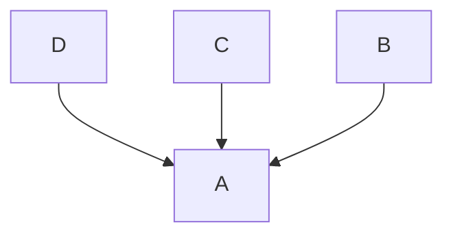
> $H_2$：$D \rightarrow A, C \rightarrow A, B \rightarrow A$。在 $O=\{A,B\}$ 上的子图 $G_2$ 是 $B \rightarrow A$

额外边 $\{D \rightarrow A, C \rightarrow A\}$ 在 $H_1$ 和 $H_2$ 中相同。因此 $G_1$ 和 $G_2$ 在 $H_1, H_2$ 上有平行嵌入。

### 5.3 刚性统计不可区分性

> **定义 4.5（刚性统计不可区分性）**：两个 s.s.i. 结构 $G_1$ 和 $G_2$ 是**刚性统计不可区分的（rigidly statistically indistinguishable, r.s.i.）**，如果**不存在**不是 s.s.i. 的平行嵌入。

换句话说，如果**所有**平行嵌入都保持 s.s.i.，那么无论测量多少额外变量，都无法区分这两个结构。

### 5.4 定理 4.6

> **定理 4.6**：**没有**两个不同的、具有相同顶点集的 s.s.i. 有向无环图是刚性统计不可区分的。

#### 重大含义

> 只要存在且能够测量具有正确因果结构的额外变量，那么一个因果充分的测量变量集合中的因果结构**原则上总是可以被识别的**。

这一定理为因果推断的可能性提供了强有力的正面结论：s.s.i. 的限制并非绝对的——通过扩展变量集，总能打破不可区分性。

定理的证明也展示了忠实不可区分结构的**并行结果**。作者还推测，在假设正性的条件下，定理 4.6 的类似物对弱统计不可区分性也成立。

---

## 6. 线性情况

### 6.1 参数诱导的"巧合"独立性

在线性结构方程模型中，参数的特殊值可能导致图未线性蕴含的消失偏相关。这是对忠实性条件的参数级违反。

#### 图 4.5 的示例

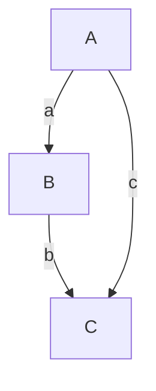
> **(i)** $G$（三角形）：$A \rightarrow B \rightarrow C$，$A \rightarrow C$

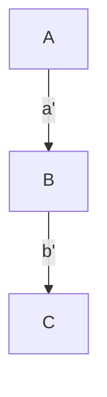
> **(ii)** $H$（链）：$A \rightarrow B \rightarrow C$

在结构 (i) 中，若 $ab = -c$，则 $A$ 和 $C$ 之间的相关性为零：

$$\rho_{AC} = ab + c = 0$$

此时，尽管真实图是 (i)，但 $A$ 和 $C$ 表现为不相关，仿佛图是 (ii)。

### 6.2 路径和（Trek Sum）

> **路径（Trek）**：一个无序对，由两条有向无环路径组成，它们共享一个共同的顶点（源）。其中一条路径可以是空路径。
>
> **路径和（Trek Sum）**：对于标准化模型（每个变量均值为零，非误差变量单位方差），两个变量 $X$ 和 $Y$ 的相关性等于连接 $X$、$Y$ 的所有路径上，每条路径中与该路径边相关的线性系数的乘积之和。

数学上，若 $\mathcal{T}(X, Y)$ 是 $X$ 和 $Y$ 之间所有路径的集合，对于路径 $T \in \mathcal{T}(X, Y)$，令 $\pi(T)$ 为该路径上所有边系数的乘积，则：

$$\rho_{XY} = \sum_{T \in \mathcal{T}(X, Y)} \pi(T)$$

例如图 4.5(i)：$\rho_{AC} = ab + c$

### 6.3 偏相关的递推公式

偏相关通过以下递推公式计算：

$$\rho_{XY.\mathbf{Z} \cup \{R\}} = \frac{\rho_{XY.\mathbf{Z}} - \rho_{XR.\mathbf{Z}} \times \rho_{YR.\mathbf{Z}}}{\sqrt{1 - \rho_{XR.\mathbf{Z}}^2} \times \sqrt{1 - \rho_{YR.\mathbf{Z}}^2}}$$

一个消失的偏相关对应于标准化系统系数中的一个（非线性）方程组。

### 6.4 定理 3.2：测度论论证

> **定理 3.2**：设 $M$ 是具有有向无环图 $G$ 的线性模型，线性系数为 $a_1, \ldots, a_n$，外生变量正方差为 $\nu_1, \ldots, \nu_k$。设 $Q$ 是系数和方差值的向量集合，使得 $M(q)$ 中的每个概率分布都有一个 $G$ 未线性蕴含的消失偏相关。那么在 $\Re^{n+k}$ 上关于参数值的任何与勒贝格测度绝对连续的概率测度 $P$ 下，$P(Q) = 0$。

#### 含义

> 导致"巧合"消失偏相关的参数集合具有**勒贝格测度零**。在"典型"的参数值下，忠实性成立。

然而，作者指出这种论证是一把双刃剑：因果联系的缺失也由值为零的线性系数标记（测度为零），按同样逻辑，似乎"一切事物都与其它一切事物有因果联系"。

### 6.5 Cartwright 的批评与回应

**Nancy Cartwright (1989)** 认为，由于在线性结构中独立关系可能由参数的特殊值以及因果结构共同产生，从这些关系推断因果结构是不合法的。她实际上拒绝了任何无法区分真实因果结构与 w.s.i. 备选方案的推理过程。

#### 回应

1. **时间顺序**：如果变量有时间顺序且分布为正，则存在**唯一**一个与该顺序一致的图（Pearl & Verma, 1988）。
2. **错误类型**：如果错误地假设忠实性但实际不成立，特殊参数值只能导致**省略边**的错误（推论 4.1），不会错误添加不存在的边。
3. **可检测性**：产生巧合消失偏相关的特殊参数值通常通过非消失偏相关关系的**特殊相关约束**"暴露自身"。

#### 图 4.6 的分析

考虑以下情况：

- **情况 (i) 和 (iii)**：可以选择系数和方差使一条边看似不存在，但这要求某个系数等于 $\pm 1$，进而要求某个误差项方差为零——即该变量是其父节点的确定性线性函数。这种极端情况可以通过相关性检测。

- **情况 (ii)**：对于真实图的**任何**参数值选择，都无法使 $X$ 和 $Z$ 之间的边看似被消除——根本不存在这样的参数解。

核心推测：除非三条边在 $G$ 中形成三角形，否则如果 $G$ 的参数值恰好确定了由 $H$ 线性蕴含的消失偏相关集合，那么相关性上就会存在**额外的约束**（并非由消失偏相关所蕴含），从而暴露参数的特殊性。

---

## 7. 重新定义变量

### 7.1 变量变换与因果图

新的随机变量总可以通过对已有变量的变换（线性或布尔组合）来定义。这引出了新的不可区分性问题。

#### 图 4.7 的示例

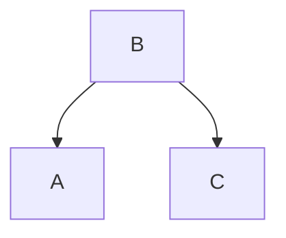
> **(i)** 原始图：$B$ 是 $A$ 和 $C$ 的共同原因（$B$ 时间上先于 $A$ 和 $C$）

定义新变量：$D = A' - C'$ 和 $E = A' + C'$（其中 $A', C'$ 是标准化后的变量）。

$\text{Cov}(D, E) = E[A'^2 - C'^2] = 0$（因为标准化后方差均为 1），但给定 $B$ 时 $D$ 和 $E$ 的偏相关不消失。因此变换后的分布忠实于：

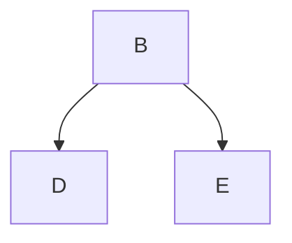
> **(ii)** 变换后的图：$B$ 仍是共同原因，但效应变量变成了 $D$ 和 $E$

这里的关键问题是：图 (ii) 中 $B$ 发生在 $D$ 和 $E$ 之前，这与时间顺序一致。但如果变换导致了"后发生事件导致先发生事件"的图，那将是严重的问题。

### 7.2 图 4.8 的线性模型分析

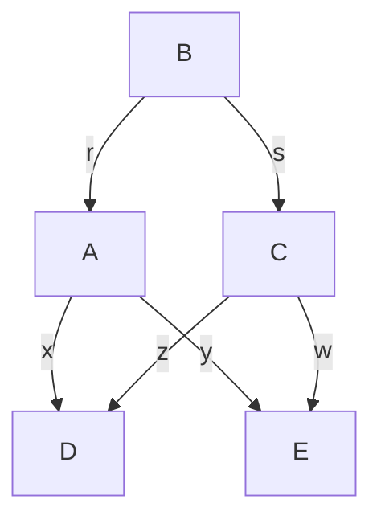

标准化后：

$$\rho_{DE} = xy + zw + rs(yz + xw)$$

由于 $rs = \rho_{A'C'}$，当 $\rho_{DE} = 0$ 时，忠实性条件被违反。

产生"巧合"零相关的 $A$ 和 $C$ 的线性变换条件，与 $A$ 和 $C$ 之间的路径在违反忠实性条件时恰好相互抵消的条件是**相同**的。

#### 不稳定性

刚刚说明的变换是**不稳定**的：如果 $A'$ 和 $C'$ 的方差有微小差异，或者变换系数不精确满足条件，那么变换后的分布的边缘分布将忠实于完全图的所有无环定向——一个与时间顺序不矛盾的平凡假设。

### 7.3 测度论结论

> 违反忠实性的参数值集合具有勒贝格测度零，因此产生"巧合"零相关的 $A$ 和 $C$ 的线性变换集合**也具有勒贝格测度零**。

这意味着在实际应用中，除非有特殊理由认为参数恰好取某些极特殊的值，否则因变量变换导致的巧合独立性在概率上是可以忽略的。

---

## 8. 总结与关系图谱

### 8.1 不可区分性层次结构

```
s.s.i. (最强约束: 相同骨架 + 所有碰撞器相同)
  ⬇ (s.s.i. ⇒ f.i.)
f.i. (中等约束: 相同骨架 + 无屏蔽碰撞器相同)
  ⬇ (定理4.3: f.i. ⇔ w.f.i.)
w.f.i. (存在共同忠实分布)

w.s.i. (存在满足马尔可夫+最小性的共同分布) — 独立维度，不与上述直接嵌套
```

### 8.2 核心定理一览

| 定理 | 内容 | 关键结论 |
|---|---|---|
| **4.1** | s.s.i. ⇔ 相同骨架 + 相同碰撞结构 | $O(n^3)$ 可判定 |
| **4.2** | f.i. ⇔ 相同骨架 + 相同无屏蔽碰撞器 | $O(n^3)$ 可判定 |
| **4.3** | f.i. ⇔ w.f.i. | 忠实性划分等价类 |
| **4.4** | $P$ 满足 $G, H$ 的 M&M + 对 $H$ 忠实 ⇒ $H$ 的边 ⊆ $G$ 的边 | 忠实方向边更少 |
| **4.5** | 同上条件下的碰撞器关系 | 无屏蔽碰撞器在 $G$ 中被保留或屏蔽 |
| **推论 4.1** | 加时间顺序 ⇒ $H$ 是 $G$ 的子图 | 错误忠实假设只导致漏边 |
| **4.6** | 无不同 s.s.i. 图是 r.s.i. | 扩展变量总可打破不可区分性 |
| **3.2** | 巧合消失偏相关的参数集测度为零 | 忠实性"几乎必然"成立 |

### 8.3 概念关系图

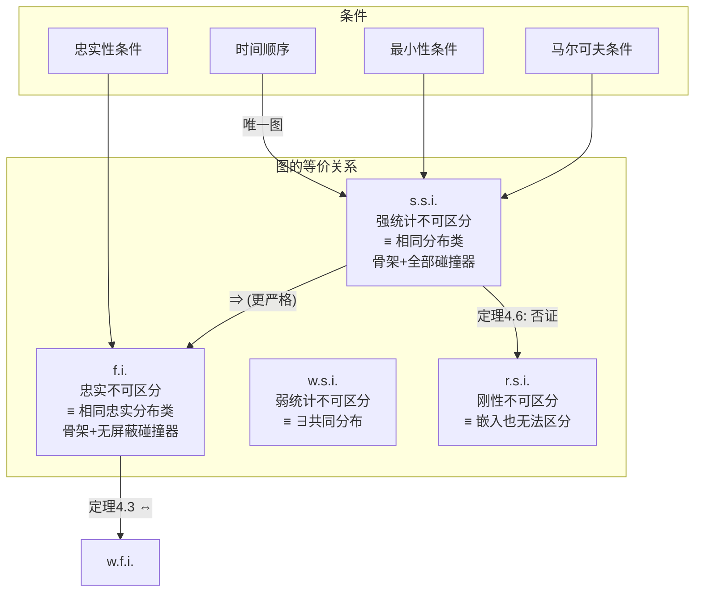

### 8.4 关键洞见

1. **s.s.i. 是最强的不可区分性**：它在仅假设马尔可夫和最小性条件下定义，要求两个图容纳完全相同的分布集合。

2. **f.i. 是实践中更相关的概念**：在忠实性假设下，f.i. 等价于 w.f.i.，分布空间被清晰地划分为等价类。这构成了后续章节中因果发现算法（如 PC 算法）的理论基础。

3. **刚性不可区分性的否定结果意义重大**：定理 4.6 告诉我们，原则上总可以通过测量更多变量来区分 s.s.i. 结构。这为因果推断的可能性提供了根本性的保证。

4. **线性情况下的"巧合"具有测度零**：虽然参数的特殊值可能导致误导性的独立性，但这些情况在参数空间中"几乎不可能"发生。此外，推论 4.1 指出，即使发生，错误也仅限于遗漏边而非错误添加边。

5. **模式（Pattern）是 f.i. 类的紧凑表示**：模式用混合图（有向边 + 无向边）编码了 f.i. 等价类中所有图的共同结构，这是因果发现算法输出的自然形式。

---

> **参考文献提示**：本章的核心结果（定理 4.2、模式概念）归功于 Verma 和 Pearl (1990b)。Suppes 和 Zanotti (1981) 的结果（每个离散分布都是某个含有潜变量共同原因结构的边缘分布）可视为因果不足情况下的弱不可区分性定理。工具变量方法的精神与定理 4.6（刚性可区分性）一致。