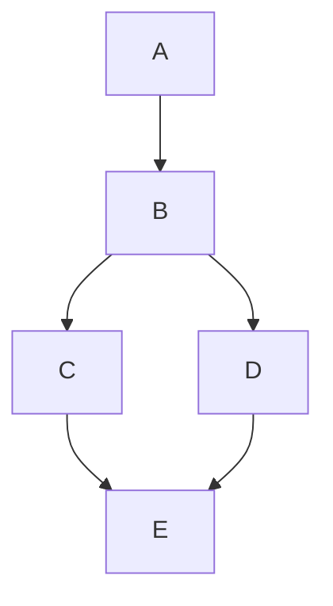
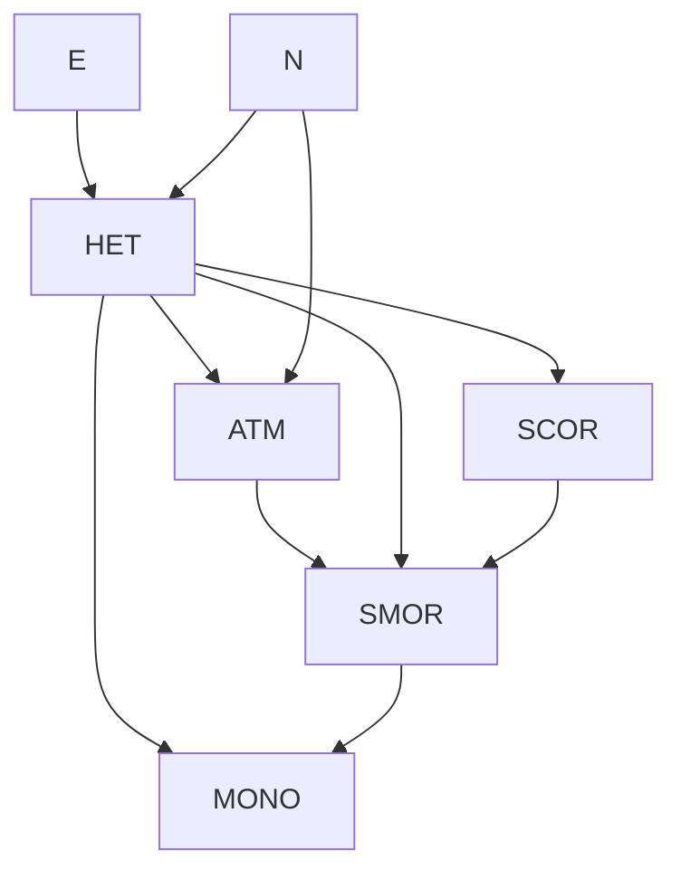

# 第五章：因果充分结构的发现算法 —— 系统学习与参考资料

---

## 目录

1. [发现问题（§5.1）](#1-发现问题)
2. [统计学中的搜索策略（§5.2）](#2-统计学中的搜索策略)
3. [Wermuth–Lauritzen 算法（§5.3）](#3-wermuthlauritzen-算法)
4. [新算法（§5.4）](#4-新算法)
   - 定理 5.1：算法的正确性
   - SGS 算法
   - PC 算法
   - PC\* 算法
   - 加速启发式方法
   - IG（独立图）算法
   - 变量选择问题
   - 融入背景知识
5. [统计决策（§5.5）](#5-统计决策)
6. [可靠性与错误概率（§5.6）](#6-可靠性与错误概率)
7. [估计（§5.7）](#7-估计)
8. [示例与应用（§5.8）](#8-示例与应用)
9. [结论与背景注释（§5.9–5.10）](#9-结论与背景注释)

---

## 1. 发现问题

### 1.1 定义

> **发现问题（Discovery Problem）** 由一组备选结构组成，其中一个是数据的真实来源，但在研究开始前，研究者不知道哪一个为真。

一个发现问题包含三个要素：

1. **备选结构集合** — 通常是有向无环图（DAG）与顶点上联合概率分布的配对。
2. **需要查明的内容** — 可能是验证某个假设，也可能是了解某一类现象的完整因果理论。
3. **可用的证据** — 可能是实际概率、条件独立性关系，或仅仅是从随机样本中获得的变量取值。

### 1.2 极限可解性

> 如果随着样本量无界增长，方法**收敛于问题的真实答案**（无论真实情况是什么，只要与先验知识一致），则称该方法在**极限意义上**解决了发现问题。

哪些因果发现问题在极限意义上是可解的、通过什么方法解决，都是确定的数学问题。本章及后续章节将系统研究这些形式问题。

---

## 2. 统计学中的搜索策略

### 2.1 仅最优束搜索（Best-Only Beam Searches）

统计学文献中广泛使用的搜索策略多为**仅最优束搜索**，可分为：

| 类型                     | 起点                     | 方向         |
| ------------------------ | ------------------------ | ------------ |
| **前向搜索（forward）**  | 所有变量独立（完全约束） | 逐步释放参数 |
| **后向搜索（backward）** | 无约束的完整结构         | 逐步固定参数 |

**历史渊源**：

- Dempster (1972)：协方差结构的"前向"过程
- Wermuth (1976)：对数线性系统的"后向"过程（对某个 DAG 满足马尔可夫条件）
- Byron (1972)/Sörbom (1975)：多元正态线性系统的拟合优度前向搜索 → LISREL、EQS 软件
- 逻辑回归中的逐步回归也是同一策略的版本

### 2.2 传统策略的三大缺陷

当目标不仅是估计分布，而且是要**识别因果结构**或**预测操纵结果**时，一般统计搜索策略面临三个核心问题：

#### (i) 错误的假设空间

> **核心原则**：备选假设空间应尽可能包括所有未被背景知识排除的**因果假设**，且不包含没有因果解释的假设。

**对数线性形式体系的局限性**：

Birch (1963) 引入的对数线性形式体系为分析任意维度的列联表提供了通用框架。对于四个变量，单元格期望值的对数形式为：

$$
\ln(m_{ijkl}) = u + u_{1i} + u_{2j} + u_{3k} + u_{4l} + u_{12ij} + u_{13ik} + \cdots + u_{1234ijkl}
$$

其中各项 $u$ 是带有相关索引集的参数。

**关键局限**：基本的碰撞结构 $A \rightarrow B \leftarrow C$（$A$ 与 $C$ 不相邻）对应的条件独立性事实——$A$ 和 $C$ 在给定不包含 $B$ 的集合时独立，在给定包含 $B$ 的集合时依赖——**无法通过消失的 $u$ 项在对数线性形式体系中表达**。

> Birch 本人观察到：在三变量系统中，边际分布中两个变量独立的假设无法通过将一般对数线性展开中的任何参数子集设为零来表达。

**LISREL 形式体系的局限性**：

LISREL 源于因子分析传统（Thurstone, 1935），其先验地排除了：

- 测量变量之间的因果关系
- 测量变量是未测量变量原因的可能性
- 潜在变量之间的因果结构（只能确定相关性）

> Thurstone 本人谨慎强调"因子"不应被视为真实原因，但实践中因子立即被当作假设原因处理。

#### (ii) 计算和统计限制

1. **迭代算法开销大**：LISREL 每次检验新假设都重新估计整个模型，导致无法充分搜索假设空间。
2. **高阶条件独立性检验不可靠**：许多搜索需要估计给定大量变量时的条件概率。例如，对于 37 个三值变量，检验所有 $3^{35}$ 个状态在合理样本量下不可行。
3. **指数增长的单元格数**：对 $n$ 个二值变量，需计算 $2^n$ 个单元格的期望值——$n=50$ 时是天文学数字。

> **重要观点**：这些困难并非所有搜索程序的固有缺陷。本章介绍的新算法可以有效规避它们。

#### (iii) 生成单一假设

> **充分性原则**：如果证据无法可靠区分几个备选假设，一个充分的搜索程序应通过**输出所有备选假设**来反映这一事实。

LISREL 和 EQS 程序的反例：它们只输出单个线性模型，使用任意的平局打破程序，忽略任何统计上无法区分的备选模型。

### 2.3 其他方法

**Edwards 和 Havranek (1987)**：提出了按序测试模型的程序，跟踪"被拒绝假设的边界集"和"被接受假设的边界集"，直到所有可能假设都被分类。

> 同样的思想更早在人工智能文献中以 **"版本空间（Version Spaces）"**（Mitchell 1977）的名称得到阐述。

### 2.4 贝叶斯方法

**Leamer (1978)**：讨论了贝叶斯视角下的搜索问题，但未给出可靠的搜索方法——他建议分别分析相关回归变量集并各自进行贝叶斯更新，而"哪些变量实际影响结果"的问题被有效忽略。

**Cooper 和 Herskovits (1991, 1992)**：开发了更有前景的贝叶斯搜索方法：

- **适用范围**：离散变量，需要全序（后面变量不能导致前面变量）
- **核心机制**：
  1. 每个与顺序兼容的有向图被赋予先验概率
  2. 使用狄利克雷先验为图参数施加密度函数
  3. 通过贝叶斯规则更新
  4. 图的概率 = 与该图兼容的分布上密度函数的积分
  5. 边的概率 = 包含它的所有图的概率之和
- **贪心算法**：对每个顶点 $X$，逐步添加能最大程度提高局部结构后验概率的前驱父节点
- **优点**：可融入先验信念；可输出后验分布比率；在适当假设下收敛到正确图
- **局限性**：需要先验顺序；目前限于离散变量；扩展到连续变量需找到合适的共轭先验族

---

## 3. Wermuth–Lauritzen 算法

### 3.1 递归图定义

> **递归图（Recursive Diagram）**（Wermuth & Lauritzen, 1983）：一个 DAG $G$ 连同顶点的全序，使得 $V_1 \rightarrow V_2$ 仅当 $V_1 < V_2$，且 $V_i$ 是 $V_k$ 的父节点当且仅当 $V_i < V_k$ 并且 $V_i$ 和 $V_k$ 在以顺序中所有其他先于 $V_k$ 的变量集为条件时是**依赖的**。

Whittaker (1990) 称此类系统为**有向独立性图（Directed Independence Graphs）**。

### 3.2 算法流程

给定一个变量顺序和条件独立性关系列表：

1. 按时间顺序遍历变量
2. 对每个变量 $V_k$，检验每个满足 $V_i < V_k$ 的 $V_i$ 与 $V_k$ 的依赖性
3. 若检验通过（依赖），添加 $V_i \rightarrow V_k$

### 3.3 局限性与待解问题

该算法从忠实分布的顺序和独立性关系中正确恢复有向图，但存在三个问题：

- **(i)** 如何消除事先知道变量顺序的要求？
- **(ii)** 如何提高计算效率和降低统计要求？
- **(iii)** 如何消除因果充分性的默认限制？

> 本章解决 (i) 和 (ii)，第 6 章讨论 (iii)（潜变量问题）。

---

## 4. 新算法

### 4.0 基本假设

本章所有算法在以下假设下可证明能恢复忠实于总体分布的图特征：

1. 观察到的变量集是**因果充分**的
2. 总体中每个单元的变量间具有**相同的因果关系**
3. 观察变量的分布**忠实于**因果结构的 DAG（离散情况），或**线性忠实于**该 DAG（线性情况）
4. 算法所需的统计决策对总体是**正确的**

### 4.0.1 关键概念：模式（Pattern）

> **模式（Pattern）** 是同时包含有向边和无向边的单一混合对象，代表一组 DAG。图 $G$ 在模式 $\pi$ 中当且仅当：
>
> - (i) $G$ 与 $\pi$ 具有相同的邻接关系
> - (ii) 若 $\pi$ 中 $A \rightarrow B$，则 $G$ 中也是 $A \rightarrow B$
> - (iii) 若 $G$ 中 $Y$ 是路径 $\langle X, Y, Z \rangle$ 上的非屏蔽碰撞器，则 $\pi$ 中 $Y$ 也是

> **定理 5.1（正确性）**：若任何算法的输入是对 $G$ 忠实的数据，则每个算法的输出是一个代表 $G$ 的忠实不可区分性类别的模式。

---

### 4.1 SGS 算法

#### 理论基础：定理 3.4

> 若 $P$ 忠实于某个 DAG，则 $P$ 忠实于 $G$ 当且仅当：
>
> (i) 对所有顶点 $X, Y$：$X$ 和 $Y$ 相邻 $\iff$ $X$ 和 $Y$ 在以每个不包含 $X$ 或 $Y$ 的顶点集为条件时都依赖；
>
> (ii) 对所有满足 $X$ 与 $Y$ 相邻、$Y$ 与 $Z$ 相邻、且 $X$ 与 $Z$ 不相邻的顶点 $X, Y, Z$：$X \rightarrow Y \leftarrow Z$ 是 $G$ 的子图 $\iff$ $X$ 和 $Z$ 在以每个包含 $Y$ 但不包含 $X$ 或 $Z$ 的集为条件时都依赖。

#### 算法步骤

**步骤 A**：在顶点集 $\mathbf{V}$ 上形成完全无向图 $H$。

**步骤 B**：对每对顶点 $A, B$，若存在子集 $S \subseteq \mathbf{V} \setminus \{A, B\}$ 使得在给定 $S$ 时 $A$ 和 $B$ 是 d-分离的，则从 $H$ 中移除边 $A-B$。

**步骤 C**：令 $K$ 为步骤 B 得到的无向图。对每个三元组 $A-B-C$（$A$ 与 $C$ 不相邻），当且仅当不存在 $\{B\} \cup \mathbf{V} \setminus \{A, C\}$ 的子集 $S$ 能 d-分离 $A$ 和 $C$ 时，将 $A-B-C$ 定向为 $A \rightarrow B \leftarrow C$。

**步骤 D**：重复以下操作直到无更多边可定向：

- 若 $A \rightarrow B$，$B$ 和 $C$ 相邻，$A$ 和 $C$ 不相邻，且 $B$ 处无箭头，则定向 $B \rightarrow C$；
- 若存在从 $A$ 到 $B$ 的有向路径，且存在边 $A-B$，则定向 $A \rightarrow B$。

#### 复杂度分析

步骤 B 要求对每对相邻变量检查所有可能子集——这是**指数级的搜索**。但最坏情况下这种复杂度不可避免：两个变量可能在给定某集合 $U$ 时条件依赖，但在 $U$ 的超集或子集上条件独立。

#### 稳定性分析

- **步骤 B（稳定）**：输入出错的传播范围有限。
- **步骤 C（不稳定）**：碰撞中的边决定其他边的定向，一个输入错误可能通过定向传播影响图中许多其他边。

> 如果假设被违反，输出可能不是 DAG 集合——可能出现双箭头边 $\leftrightarrow$，这在识别未测量共同原因时具有理论作用（第 6 章讨论）。

---

### 4.2 PC 算法

#### 设计动机

SGS 算法对于**稀疏图**极其低效：即使对于真实图中的边，在步骤 B 中必须进行的 d-分离测试次数也不受连通性影响。此外，从样本分布中确定高阶条件独立关系远不如确定低阶独立关系可靠。

> **核心思想**：从完全无向图开始，先通过零阶条件独立性移除边，再使用一阶、二阶……逐步"细化"。条件化的变量集只需是其中一个变量邻接集的子集。

#### 算法步骤

**步骤 A**：在顶点集 $\mathbf{V}$ 上形成完全无向图 $C$。设 $n = 0$。

**步骤 B**（重复直到收敛）：

- 选择在 $C$ 中相邻的有序变量对 $X, Y$，使得 $\text{Adjacencies}(C, X) \setminus \{Y\}$ 的基数 $\geq n$
- 选择该集合的一个基数为 $n$ 的子集 $S$
- 若 $X$ 和 $Y$ 在给定 $S$ 时 d-分离，则删除边 $X-Y$，并将 $S$ 记录在 $\text{Sepset}(X, Y)$ 中
- 对所有满足条件的对和子集测试完后，$n = n + 1$

**步骤 C**：对每个三元组 $X-Y-Z$（$X$ 与 $Z$ 不相邻），当且仅当 $Y \notin \text{Sepset}(X, Z)$ 时，定向 $X \rightarrow Y \leftarrow Z$。

**步骤 D**：与 SGS 算法的步骤 D 相同。

#### 复杂度公式

令 $k$ 为任何顶点的最大度数，$n$ 为顶点数。最坏情况下所需条件独立测试次数受限于：

$$
2\binom{n}{2}\sum_{i=0}^{k}\binom{n-1}{i}
$$

进一步受限于：

$$
\frac{n^2 (n-1)^{k-1}}{(k-1)!}
$$

> 对于最大度数为 $k$ 的图，最坏情况极为罕见；实践中可恢复多达 100 个变量的稀疏图。

#### 示例：PC 算法的执行过程

**真实图**：

| 阶段   | 操作                            | 结果                                                                                                                                                              |
| ------ | ------------------------------- | ----------------------------------------------------------------------------------------------------------------------------------------------------------------- |
| 初始   | 完全无向图（5 个顶点，10 条边） | 所有对都相邻                                                                                                                                                      |
| $n=0$  | 零阶独立性检验                  | 无零阶独立性                                                                                                                                                      |
| $n=1$  | 一阶独立性检验                  | 发现 $A \perp\!\!\!\perp C \mid B$, $A \perp\!\!\!\perp D \mid B$, $A \perp\!\!\!\perp E \mid B$, $C \perp\!\!\!\perp D \mid B$ → 移除 $A-C$, $A-D$, $A-E$, $C-D$ |
| $n=2$  | 二阶独立性检验                  | 发现 $B \perp\!\!\!\perp E \mid \{C, D\}$ → 移除 $B-E$                                                                                                            |
| 步骤 C | 碰撞定向                        | 三元组 $C-E-D$：$E \notin \text{Sepset}(C, D)$ → 定向 $C \rightarrow E \leftarrow D$                                                                              |

**最终模式**：$A \rightarrow B \rightarrow C \rightarrow E \leftarrow D \leftarrow B$（等价类允许 $B$ 处无碰撞的所有定向）

#### PC 算法的稳定性

- **步骤 B** 可能不稳定：若早期错误移除一条边，可能导致其他不在真实图中的边被错误包含
- **步骤 C** 不稳定的原因与 SGS 步骤 C 相同

**PC vs. SGS 在非忠实输入下的差异**：

PC 算法只测试给定邻接点子集的条件独立性，而 SGS 测试所有子集。这意味着：

- 若 PC 遗漏了正确的 d-分离集合（不在邻接子集中），可能错误保留边
- 若 SGS 测试了不相关的集合（不在邻接子集中），可能错误移除边

---

### 4.3 PC\* 算法

#### 动机

PC 算法在样本数据上承担了不必要的风险。对于忠实于 DAG 的分布：

> 如果 $A$ 和 $B$ 在给定 $\text{Parents}(A)$ 或 $\text{Parents}(B)$ 时条件独立，那么它们在给定这些父节点中仅包含位于 $A$ 和 $B$ 之间无向路径上的顶点的子集时也是条件独立的。

因此，PC\* 只测试：

- 与 $A$ 相邻且在 $A$ 和 $B$ 之间无向路径上的变量子集
- 与 $B$ 相邻且在该路径上的变量子集

#### 权衡

- **优点**：避免 PC 算法中的一类错误
- **代价**：必须在步骤 B 的每个阶段跟踪所有无向路径——无向路径数量通常非常大，内存需求不可行（除非变量数量较少）

> **实用策略**：对于大量变量，可先用 PC 算法，待无向图平均度数变小后切换到 PC\*。

---

### 4.4 加速启发式方法

三种选择测试顺序的变体：

| 变体     | 策略                                                                             | 直觉                                    |
| -------- | -------------------------------------------------------------------------------- | --------------------------------------- |
| **PC-1** | 字典序测试                                                                       | 基线方法                                |
| **PC-2** | 先测试概率依赖程度最低的对                                                       | 低依赖性的对最不可能相邻                |
| **PC-3** | 对给定的 $A$，先测试对 $A$ 依赖程度最低的 $B$，条件化于对 $A$ 依赖程度最高的变量 | 高依赖性变量最可能是 $A$ 的真实相邻变量 |

> PC-3 的运行时间显著小于其他变体，且运行时间不随平均度数急剧增加。

---

### 4.5 IG（独立图）算法

#### 思想来源

Verma 和 Pearl (1990) 提出：搜索 DAG 的第一步是构建**无向独立图（Undirected Independence Graph）** $N$——当且仅当两个变量在给定所有其他变量时是依赖的，在它们之间引入无向边。

在忠实分布的独立图中，任何变量的父节点集构成一个**最大完全子图（团）**。

#### IG 算法

修改 PC 算法的步骤 A：将初始图设为无向独立图（而非完全无向图），然后以相同方式继续。

#### 构建独立图的效率

- **线性情况**：标准化逆相关矩阵的非对角线元素是偏相关系数的相反数 → 通过在非零条目处放置边来高效构建
- **离散情况**：Fung 和 Crawford (1990) 提出了快速算法

---

### 4.6 变量选择问题

> **核心警告**：正确的变量选择对可靠推断至关重要，而算法本身无法提供帮助。

#### 聚合问题

将两个或多个具有不同因果结构的独立变量聚合到同一量表中，可能产生严重后果：

**Pearl 的聚合示例**：

假设 $A$ 引起 $C_1$，$B$ 引起 $C_2$，且二者相互独立。引入聚合变量 $C$ 对 $(C_1, C_2)$ 的不同值对编码：

在联合分布中，$A$ 和 $B$ 在给定 $C$ 的条件下是**独立**的——这是不忠实分布的经典示例。

> 这类情况在实践中可能发生，但**可以被检验和识别**：通过以 $A$ 为条件将 $C$ 的值划分为等价类，以 $B$ 为条件划分另一组等价类，可恢复 $C_1$ 和 $C_2$。

#### 归并问题

如果用代理变量 $C'$（比精确原因 $C$ 粗糙）替代 $C$，且 $C'$ 与 $C$ 不完全相关，则原本在给定 $C$ 时独立的变量可能在给定 $C'$ 时变得依赖。

---

### 4.7 融入背景知识

算法可以融入两类背景知识：

**时间顺序**：

- (i) 不检验在包含晚于 $A$ 的变量的集合条件下的独立性
- (ii) 若 $A$ 和 $B$ 相邻且 $B$ 晚于 $A$，定向 $A \rightarrow B$

**因果关系**：

- 若先验信念禁止某邻接关系 → 跳过检验
- 若先验信念要求直接影响 → 施加有向边并作为定向过程中的假设

> 这些过程假设先验信念应覆盖无约束搜索的结果——这一偏好可能并非总是明智的。

---

## 5. 统计决策

### 5.1 决策模块化

算法是**完全模块化**的，可以使用任何做条件独立性或偏相关系数为零的统计决策程序。

### 5.2 线性连续情况

使用 **Fisher 的 z 检验** 检验 $\rho_{XY.\mathbf{C}} = 0$：

$$
z(\rho_{XY.\mathbf{C}}, n) = \frac{1}{2}\sqrt{n - |\mathbf{C}| - 3} \ln\left[\frac{|1 + \rho_{XY.\mathbf{C}}|}{|1 - \rho_{XY.\mathbf{C}}|}\right]
$$

其中 $|\mathbf{C}|$ 是条件集中的变量数。若 $X, Y, \mathbf{C}$ 正态分布，则 $z(\rho_{XY.\mathbf{C}}, n) - z(r_{XY.\mathbf{C}}, n)$ 服从标准正态分布。

### 5.3 离散情况

在独立性假设下，单元格 $(i,j)$ 的期望值为：

$$
E(x_{ij}) = \frac{x_{i+} x_{+j}}{N}
$$

条件独立性假设下（例如 $X$ 在给定 $Z$ 条件下与 $Y$ 独立）：

$$
E(x_{ijk}) = \frac{x_{i+k} x_{+jk}}{x_{++k}}
$$

#### 检验统计量

**Pearson 卡方**：

$$
X^2 = \sum \frac{(\text{Observed} - \text{Expected})^2}{\text{Expected}}
$$

**似然比 $G^2$**：

$$
G^2 = 2\sum (\text{Observed}) \ln\left(\frac{\text{Observed}}{\text{Expected}}\right)
$$

两者都渐近服从 $\chi^2$ 分布。自由度：

$$
df = (\text{Cat}(A) - 1) \times (\text{Cat}(B) - 1) \times \prod_{i=1}^{n} \text{Cat}(C_i)
$$

> **实践启发式**：对于离散数据使用 $G^2$（模拟中表现更好）；若样本量小于待拟合单元格数的十倍，假设依赖。

---

## 6. 可靠性与错误概率

### 6.1 错误分类

| 错误类型             | 定义                             |
| -------------------- | -------------------------------- |
| **边存在-误报 (Co)** | 输出中相邻但真实模式中不相邻     |
| **边存在-漏报 (Om)** | 真实模式中相邻但输出中不相邻     |
| **边方向-误报 (Co)** | 输出中某处有箭头但真实模式中没有 |
| **边方向-漏报 (Om)** | 真实模式中有箭头但输出中没有     |

### 6.2 为什么显著性水平不直接给出错误概率

搜索过程中对独立性假设的**重复检验**，使得某个真实假设被拒绝的概率远高于单次检验的显著性水平。此外：

- 哪些假设被检验以复杂方式依赖于实际结构
- 即使某些决策出错，算法仍可能产生正确输出（因为存在多条路径判定同一事实）

> 对于特定模型 $M$ 和 $M^*$ 的错误概率，可通过**蒙特卡洛模拟**凭经验估计。

---

## 7. 估计

在获得因果结构后：

**正态假设下**（即使存在未测量变量）：
有众所周知的最大似然估计方法（Jöreskog 1981; Lohmöller 1989），以及在放弃正态性时的普通最小二乘法和广义最小二乘法。

**离散情况**（正的多项分布）：
在图的独立性约束下，最大似然估计可通过以下分解直接获得（Kiiveri & Speed 1982）：

$$
P(\mathbf{V}) = \prod_{V \in \mathbf{V}} P(V \mid \text{Parents}(V))
$$

---

## 8. 示例与应用

### 8.1 出版生产力的原因（Rodgers & Maranto, 1989）

**研究背景**：162 名学术心理学家的数据，变量包括能力（ABILITY）、研究生项目质量（GPQ）、发表前生产力（PREPROD）、第一份工作质量（QFJ）、性别（SEX）、引用率（CITES）和发表率（PUBS）。

**关键发现**：Rodgers 和 Maranto 估计了六组基于不同社会科学理论的因果模型，经过繁琐的"理论梳理"后提出了一个复合模型。然而，当 PC 算法应用于他们的相关性数据（结合时间顺序，$\alpha = 0.1$）时：

- 几乎相同的结构在几分钟内**直接从数据和常识中生成了**
- 该模型的 $\chi^2 = 13.58, df = 11, p = 0.257$

> **结论**：声称需要社会科学理论才能找到的模型要点，实际上仅靠数据和常识即可发现。

### 8.2 教育与生育（Rindfuss, Bumpass & St. John, 1980）

**变量**：教育水平（ED）、生育第一个孩子的年龄（AGE）以及 9 个背景变量。

**研究者的理论模型**包含 AGE → ED 的路径，但估计发现该参数为零。PC 算法（$\alpha = 0.05$）直接找到了更为简约的模型。

### 8.3 女性性高潮研究（Bentler & Peeler, 1979）

**变量**：外向性（E）、神经质（N）、对手淫态度（ATM）、异性恋行为（HET）、单性恋行为（MONO）、性交体验（SCOR）、手淫体验（SMOR）。

**原结论（模型 2）**：E、N、ATM 仅通过 HET 和 MONO 间接影响 SCOR 和 SMOR。

**PC 算法的发现**：到模型获得 $\chi^2 = 17, df = 12, p = 0.148$，但发现了一个 ATM → SMOR 有直接影响的备选模型，挑战了原结论。

> PC 算法发现的模式：

### 8.4 美国职业结构（Blau & Duncan, 1967）

**变量**：父亲教育水平（FE）、父亲职业（FO）、教育（ED）、第一份工作（$J_1$）、1962 年职业（OCC）。

**Blau & Duncan 的理论**：FE 仅通过 FO 和 ED 影响职业。该模型在传统检验中被明确拒绝（$p < 0.001$）。

**PC 算法**（$\alpha = 0.05$，融入时间顺序）：添加了 FE → $J_1$ 的直接连接。输出模型通过同样的似然比检验（$p > 0.3$）。

> 要消除 FE → $J_1$ 的连接，需将显著性水平降至 $0.0002$。在 $0.0001$ 水平下，数据中的条件独立性与 Blau & Duncan 的 DAG 忠实。

### 8.5 ALARM 网络

**37 个变量，模拟急诊医学中的因果关系。**

**线性数据（$n = 10,000$，10 次试验）**：

| 错误类型 | 边存在-误报 | 边存在-漏报 | 边方向-误报 | 边方向-漏报 |
| -------- | :---------: | :---------: | :---------: | :---------: |
| 平均     |    0.06%    |    4.1%     |     17%     |    3.5%     |

- PC-1 运行时间：约 15 秒（Decstation 3100）
- PC-3 在 100 变量图上：平均 16 秒（vs. PC-1 的 134 秒）

**离散数据（$n = 10,000$，2 次试验）**：几乎重建了所有无向图，正确定向了大部分边。

### 8.6–8.9 其他示例

| 示例                                | 关键结论                                                                                                       |
| ----------------------------------- | -------------------------------------------------------------------------------------------------------------- |
| **贞洁研究**（Reiss et al., 1975）  | $E \rightarrow V \rightarrow C$（态度 → 性行为 → 诊所使用）                                                    |
| **领先群体**（Coleman, 1964）       | PC 算法产生的模式与 Fienberg 的期望计数几乎相同；几乎是完全图，可能反映子总体混合                              |
| **大学计划**（Sewell & Shah, 1968） | PC 输出与 Sewell 和 Shah 的因果假设一致；允许估计具体概率（如低 SES 低 IQ 无鼓励的孩子计划上大学概率为 0.011） |
| **堕胎意见**（Christensen, 1990）   | PC\* 算法与 Christensen 的"最佳"模型存在差异；揭示了不同显著性水平下的敏感度                                   |

### 8.10 随机图模拟测试

**实验设计**：平均度数 $\in \{2,3,4,5\}$；变量数 $\in \{10,50\}$；样本量 $\in \{100, 200, 500, 1000, 2000, 5000\}$。

**主要结论**：

1. **遗漏率随样本量急剧下降**至 $n \approx 1000$，之后趋于平缓
2. **包含率随样本量变化不显著**——对边的添加非常可靠（如果真实图中不相邻，很少被错误输出）
3. **高平均度数下可靠性显著下降**：样本量 5000、平均度数 5 时，PC-1 仍遗漏超过 30% 的真实边
4. **箭头包含错误远大于边的包含错误**
5. PC-3 运行时间显著最短，但在高平均度数下产生更多边包含错误
6. 为使方法以概率 1 收敛，显著性水平应随样本量增加而降低

---

## 9. 结论与背景注释

### 9.1 核心贡献

本章介绍了几种能够**可靠恢复稀疏因果结构**的算法，即使对于相当大量的变量也适用：

| 算法                  | 特点                       | 适用场景           |
| --------------------- | -------------------------- | ------------------ |
| **SGS**               | 最全面但指数级复杂度       | 10 变量以下        |
| **PC**                | 利用邻接子集；对稀疏图高效 | 可达 100+ 变量     |
| **PC\***              | 更精确但内存需求大         | 较小变量集         |
| **IG**                | 从独立图开始               | 配合快速独立图构建 |
| **Cooper–Herskovits** | 贝叶斯方法，需先验顺序     | 离散数据           |

### 9.2 算法比较总结

$$
\begin{array}{l|cccc}
\hline
\text{算法} & \text{顺序需求} & \text{复杂度} & \text{稳定性} & \text{统计需求} \\
\hline
\text{Wermuth-Lauritzen} & \text{必须} & \text{低} & \text{N/A} & \text{所有对} \\
\text{SGS} & \text{无} & O(2^n) & \text{B稳定/C不稳定} & \text{所有子集} \\
\text{PC} & \text{无} & O(n^{k}) & \text{B/C不稳定} & \text{邻接子集} \\
\text{PC*} & \text{无} & \text{高(内存)} & \text{较好} & \text{路径子集} \\
\text{IG} & \text{无} & \text{取决于独立图构建} & \text{较好} & \text{团子集} \\
\hline
\end{array}
$$

### 9.3 历史脉络

- **Spearman (1904)**：最早的系统性因果/统计假设搜索
- **Thurstone (1935)**：因子分析作为数据简化方法（非因果发现）
- **Putnam (1965) / Gold (1965)**：发现问题的一般概念推广
- **SGS 算法 (1989)**：Glymour & Spirtes
- **Verma & Pearl (1990b)**：基于团的更高效版本
- **PC 算法 (1990)**：Spirtes & Glymour（步骤 C 吸收了 Pearl & Verma 的改进）
- **贝叶斯发现过程**：Herskovits 博士论文 (1992)

### 9.4 开放问题

1. 如何在高平均度数下提高可靠性（特别是边的遗漏和箭头的包含）
2. 对生成的图进行局部"修复"
3. 显著性水平的自适应调整（随样本量降低）
4. 将贝叶斯方法扩展到连续变量和无需先验顺序
5. 处理潜变量问题（第 6 章讨论）

---

> **本章核心信息**：在因果充分、分布忠实的假设下，存在**不需要先验变量顺序**、**计算可行**、**渐近可靠**的因果发现算法。PC 算法及其变体在稀疏图上表现优异，而传统统计搜索策略（对数线性逐步搜索、LISREL 自动模型重规范等）存在假设空间错配、计算负担过重和输出单一的固有问题。实际数据的示例反复证明：在许多社会科学研究中，被归因于"理论"的发现，往往可以直接从数据和常识中通过算法自动获得。
