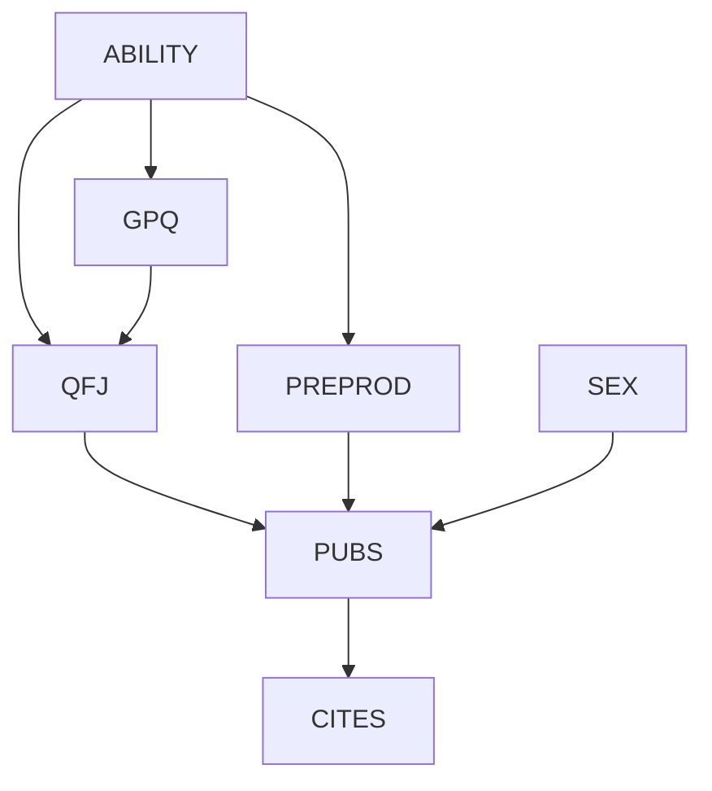
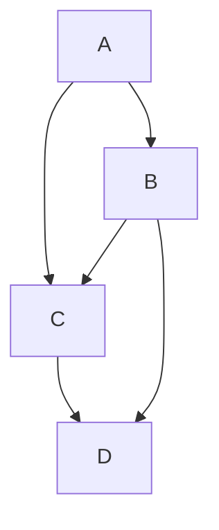
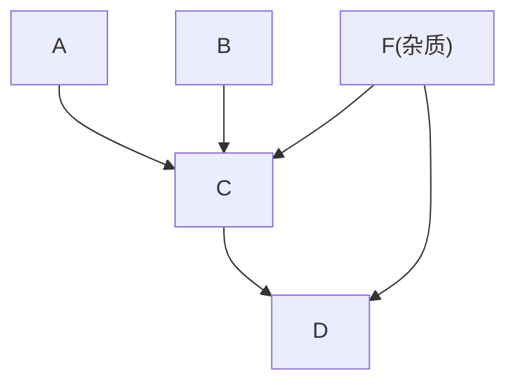
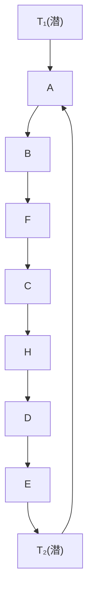
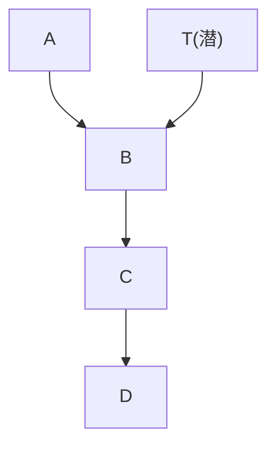
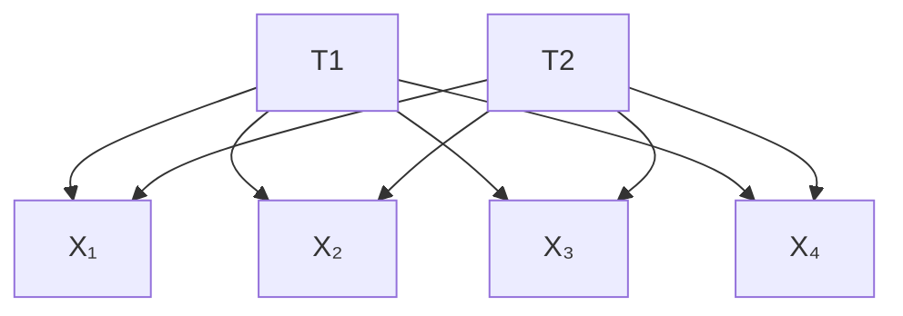
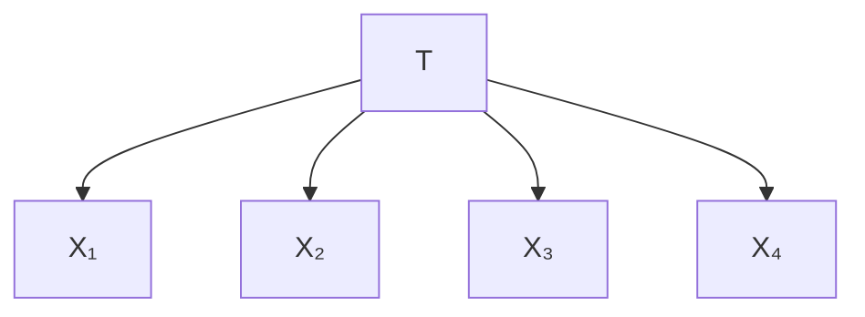
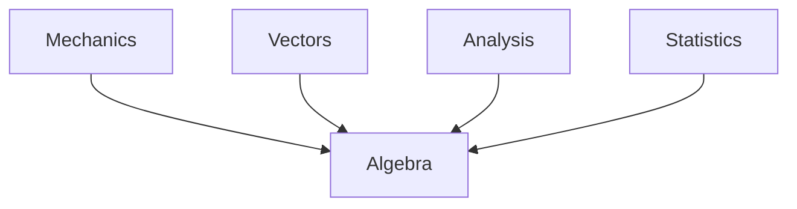
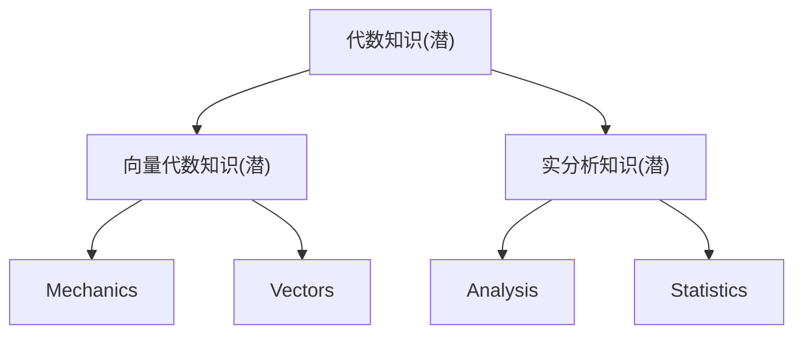

现在我已经完整阅读了整章内容，下面提供一份系统、全面的梳理总结。

---

# 第六章：无因果充分性的发现算法 —— 全面系统总结

---

## 一、引言：为什么因果充分性假设不可靠？

### 1.1 问题背景

前一章（第五章）的 PC 算法依赖于一个关键假设：**因果充分性（Causal Sufficiency）**——即对于任意一对被测量的变量，它们的共同原因也都被测量了。但在实际研究中，这个假设几乎总是不成立的：

- 社会科学数据集中，变量常常"跨研究相关"，暗示存在未测量的共同原因；
- 心理测量学中的潜在变量（智力、人格特质等）从未被直接测量；
- 流行病学中，几乎无法排除所有可能的"混杂因素"；
- 计量经济学中，变量常因记录限制而被省略。

> **核心论点**：如果不考虑未测量变量，大多数来自观测数据的因果推断"充其量是猜测，最坏则是伪科学"。

### 1.2 对流行病学传统标准的批判

《吸烟与健康》(1964) 总报告提出了评估因果关联的五条标准：

| 标准 | 含义 | 本章的批判 |
|------|------|-----------|
| (i) 剂量-反应关系 | 风险随暴露增加 | 不能区分共同原因与因果关系 |
| (ii) 特异性 | 关联应限于特定亚组 | 同上 |
| (iii) 关联强度 | 强关联更可能是因果 | 多重共同原因下逻辑不成立 |
| (iv) 时间顺序 | 因在前，果在后 | 对区分共同原因无帮助 |
| (v) 无替代解释 | 排除混杂 | 替代解释太多，实际上无法穷尽 |

**关键批判（针对标准 iii）**：如果存在两个或更多共同原因，它们中没有一个需要比假定的原因更有预测力——这在多重因果机制普遍的医学领域是一个致命问题。

### 1.3 本章的核心目标

> 展示如何仅假设**马尔可夫条件（Markov Condition）**和**忠实性条件（Faithfulness Condition）**，在**不假设因果充分性**的情况下，从数据中做出可靠的因果推断。

---

## 二、修改后的 PC 算法及其局限性

### 2.1 基本思想

假设真实因果图 $G$ 定义在变量集 $V$ 上，但我们只能观测 $O \subset V$。设 $P$ 是忠实于 $G$ 的分布 $P'$ 在 $O$ 上的边际分布。修改 PC 算法以允许：

- **双向边** $A \leftrightarrow B$：表示存在 $A$ 和 $B$ 的未测量共同原因；
- **"o"标记**：表示该端点的箭头头是否存在不确定（用 $A \text{ o}\rightarrow B$ 或 $A \text{ o-o } B$ 表示）。

### 2.2 修改后的 PC 算法步骤

**A.** 在 $O$ 上构建完全无向图 $C$。

**B.** $n = 0$，重复以下过程：
- 对 $C$ 中每对相邻变量 $X, Y$，取 $\text{Adjacencies}(C,X)\backslash\{Y\}$ 的一个基数为 $n$ 的子集 $S$；
- 若 $X \perp\!\!\!\perp Y \mid S$，则删除边 $X - Y$，并将 $S$ 记录在 $\text{Sepset}(X,Y)$ 中；
- $n$ 递增，直到没有足够基数的子集可测试。

**C.** 将剩余边标记为 $X \text{ o-o } Y$。

**D.** 定向 v-结构（colliders）：若 $X, Y$ 不相邻但 $X-Z-Y$ 相邻，且 $Z \notin \text{Sepset}(X,Y)$，则定向为 $X^* \rightarrow Z \leftarrow^* Y$。

**E.** 重复应用定向规则：
- 若 $A^*\!\rightarrow B$，$B^*\text{-}^* C$，$A$ 与 $C$ 不相邻，且 $B$ 处无箭头头（即 $B \rightarrow C$），则定向 $B \rightarrow C$；
- 若有从 $A$ 到 $B$ 的有向路径且 $A$ 与 $B$ 有边，则定向 $A^*\!\rightarrow B$。

### 2.3 修改后算法的输出示例

以 Rodgers 和 Maranto 数据为例：



输出表明：GPQ 和 ABILITY 可能共享一个未测量共同原因，但 PUBS 是 CITES 的直接原因且未被混淆。

### 2.4 "o"符号的约束

当单个顶点（如 ABILITY）连接两个不相邻顶点（如 GPQ 和 PREPROD），且两条边在 ABILITY 端都是"o→"，则两个"o"不能同时是箭头头——否则 GPQ 和 PREPROD 在给定 ABILITY 时将是依赖的，与数据矛盾。

---

## 三、修改后 PC 算法的两类根本性错误

### 3.1 错误一：虚假直接连接（Spurious Direct Connection）

**化学家的例子**：化学家想证明 A 和 B 产 D 存在不经中间体 C 的替代路径（图 $G_1$）。他在控制 C 后发现 A 与 D 仍相关，便宣布证明了替代机制。



> $G_1$：化学家设想的机制（存在 A→D 的替代路径）

然而，真实情况可能是 $G_2$：试剂中的杂质 $F$ 是 $C$ 和 $D$ 的共同原因（未被测量），导致了给定 $C$ 时 $A$ 与 $D$ 的虚假相关：



> $G_2$：真实的机制——未测量变量 F 造成虚假直接连接

**核心教训**：
> 当 $\mathbf{O}$ 不因果充分时，若 $A$ 和 $D$ 在给定 $\mathbf{O}\backslash\{A,D\}$ 的每个子集条件下都依赖，这**不能推出** $A$ 是 $D$ 的直接原因（相对于 $O$）。还有第三种可能：存在未测量共同原因。

事实上，$G_1$ 和 $G_2$ 在 $\{A, C, D\}$ 上具有**完全相同的 d-分离关系**，仅凭条件独立性无法区分。

### 3.2 错误二：局部邻接信息不足以判定边的删除

在图 6.3 所示结构中（$T_1, T_2$ 未测量）：



在测量变量中，$\text{Parents}(A)=\{D\}$，$\text{Parents}(E)=\{B\}$。然而 $A$ 和 $E$ 在给定 $\{B\}$ 或 $\{D\}$ 的任何子集条件下都**不是** d-分离的！唯一能 d-分离它们的集合必须包含 $\{F, C, H\}$ 中的变量。但修改后的 PC 算法在发现 $C, F, H$ 与 $A, E$ 不相邻后，不会测试包含它们的条件集，因此**错误地保留了 $A$ 和 $E$ 之间的边**。

> 这意味着：当允许双向边存在时，**仅检查图的局部邻接结构不足以判定边的删除和定向**。

---

## 四、诱导路径（Inducing Paths）——核心理论工具

由于上述问题，需要全新的理论框架。Verma 和 Pearl 引入了**诱导路径**和**诱导路径图**的概念。

### 4.1 直觉动机

在因果充分系统中，有等价关系：
$$A \text{ 和 } B \text{ 相邻 } \iff A \not\!\perp\!\!\!\perp B \mid \text{任何其他变量子集}$$

但在因果不充分系统中，需要刻画：在 $O$ 中两个变量何时在给定 $O\backslash\{A,B\}$ 的**每个**子集条件下都依赖。

### 4.2 诱导路径的严格定义

> **定义（诱导路径）**：设 $G$ 是 $V$ 上的有向无环图，$O \subseteq V$ 包含 $A, B$（$A \neq B$）。$A$ 和 $B$ 之间的一条无向路径 $U$ 是**相对于 $O$ 的诱导路径（inducing path）**，当且仅当：
> 1. $U$ 上除端点外属于 $O$ 的每个成员都是 $U$ 上的**碰撞点（collider）**；
> 2. $U$ 上的每个碰撞点都是 $A$ 或 $B$ 的**祖先（ancestor）**。

### 4.3 举例说明


在路径 $U = \langle A, B, C, D, E, F \rangle$ 中：
- 碰撞点：$B$（$A \to B \leftarrow C$？实际上要看路径方向），$D$（$C \to D \leftarrow E$？）；
- 对于 $\mathbf{O} = \{A, B, D, F\}$：$U$ 上属于 $O$ 的中间变量是 $B$ 和 $D$，它们都是碰撞点，且每个碰撞点都是端点 $A$ 或 $F$ 的祖先 → $U$ 是诱导路径。
- 对于 $\mathbf{O} = \{A, B, C, D, F\}$：$C \in O$ 但不是碰撞点 → $U$ 不是诱导路径。

### 4.4 定理 6.1（诱导路径的基本特征）

> **定理 6.1**：$A$ 和 $B$ 不被 $\mathbf{O}\backslash\{A, B\}$ 的**任何**子集 d-分离，当且仅当在 $A$ 和 $B$ 之间存在一条相对于 $O$ 的诱导路径。

**意义**：该定理将"在任何观测条件下都依赖"这一统计/概率性质，转化为纯粹的图论条件——存在诱导路径。这为算法设计提供了理论基础。

---

## 五、诱导路径图（Inducing Path Graphs）

### 5.1 定义

> **定义（诱导路径图）**：$G'$ 是 $G$ 相对于 $O$ 的**诱导路径图**，当且仅当 $O$ 的成员间存在一条边进入 $A$ 端，当且仅当在 $G$ 中存在一条相对于 $O$ 的、进入 $A$ 的诱导路径。

诱导路径图只有两种边：
- $A \rightarrow B$：$A$ 和 $B$ 之间每条相对于 $O$ 的诱导路径都离开 $A$、进入 $B$；
- $A \leftrightarrow B$：存在一条同时进入 $A$ 和 $B$ 的诱导路径（暗示潜在共同原因）。

### 5.2 示例

对于图 $G_3$，不同 $O$ 的选择产生不同的诱导路径图：

| $O$ | 诱导路径图特征 |
|-----|---------------|
| $\{A,B,D,E,F\}$ | $A\to B$, $B\leftrightarrow D$, $D\leftrightarrow E$, $E\leftrightarrow F$, $A$ 和 $F$ 无边 |
| $\{A,B,D,F\}$ | $A$ 和 $F$ 之间有边 |
| $\{A,B,F\}$ | 只有 $A, B, F$ 三者及其间边 |

### 5.3 d-分离在诱导路径图中的保持

> **重要性质**：$X$ 和 $Y$ 在 $G$ 中给定 $S$ 时 d-分离，当且仅当它们在 $G'$ 中给定 $S$ 时 d-分离。

### 5.4 关键区别：父节点不再足够

在 DAG 中，如果 $A$ 和 $B$ 可被某集合 d-分离，则它们必可被 $\text{Parents}(A)$ 或 $\text{Parents}(B)$ d-分离。但在诱导路径图中**不成立**！

如前图 6.3 的例子，$\text{Parents}(A) = \{D\}$，$\text{Parents}(E) = \{B\}$，但给定 $\{B\}$ 或 $\{D\}$ 的任何子集都无法 d-分离 $A$ 和 $E$。

### 5.5 D-Sep —— 诱导路径图中的"父节点替代品"

> **定义（D-Sep）**：在诱导路径图 $G'$ 中，$V \in \text{D-Sep}(A, B)$ 当且仅当 $V \neq A$，且存在一条 $A$ 和 $V$ 之间的无向路径 $U$，使得 $U$ 上每个顶点是 $A$ 或 $B$ 的祖先，且除端点外都是碰撞点。

> **定理 6.2**：若 $A$ 不是 $B$ 的祖先且 $A$ 和 $B$ 不相邻，则给定 $\text{D-Sep}(A, B)$ 的某个子集，$A$ 和 $B$ 是 d-分离的。

**D-Sep 的作用**：类似于父节点集在 DAG 中的作用——它提供了"需要测试的条件集"的候选范围。

### 5.6 引理 6.1.4 —— 从诱导路径到因果方向

> **引理 6.1.4**：若 $G$ 包含一条 $A$ 和 $B$ 之间相对于 $O$ 的、**离开 $A$** 的诱导路径，则 $G$ 中存在一条从 $A$ 到 $B$ 的有向路径。

**意义**：如果我们能从数据确定诱导路径的方向（离开 $A$），就可推断 $A$ 是 $B$ 的（间接）原因。

---

## 六、部分定向诱导路径图（POIPG）

### 6.1 定义与边类型

**部分定向诱导路径图（Partially Oriented Inducing Path Graph, POIPG）** 旨在表示具有相同 d-连接关系的所有诱导路径图共有的定向特征。

边的六种类型：
1. $A \to B$ —— 确定的单向因果关系
2. $A \leftarrow B$ —— $B$ 是 $A$ 的直接原因
3. $A \leftrightarrow B$ —— 确定存在潜在共同原因
4. $A \text{ o}\rightarrow B$ —— $B$ 端有箭头，$A$ 端不确定
5. $B \text{ o}\rightarrow A$ —— 对称
6. $A \text{ o-o } B$ —— 两端都不确定

### 6.2 $\text{Equiv}(G')$ 与最大信息性

令 $\text{Equiv}(G')$ 是与 $G'$ 具有相同 d-连接关系的所有诱导路径图的集合。

POIPG 的条件：
- 若 $A \leftrightarrow B$，则 $\text{Equiv}(G')$ 中每个图都有 $A \leftrightarrow B$；
- 若 $A \to B$，则 $\text{Equiv}(G')$ 中每个图都有 $A \to B$；
- 若 $A \text{ o}\rightarrow B$，则每个等价图中 $A$ 端要么是箭头（$A\leftarrow B$），要么是双向箭头（$A\leftrightarrow B$）；
- 若 $A \text{ o-o } B$，则可能是 $A\to B$、$A\leftarrow B$ 或 $A\leftrightarrow B$。

**最大信息性 POIPG**：尽可能多地使用 $A\to B$ 和 $A\leftrightarrow B$ 等定向边，仅当定向在等价类中不统一时才使用"o"。

---

## 七、因果推断算法（CI 和 FCI）

### 7.1 因果推断算法（CI Algorithm）

**步骤**：
- **A.** 在 $O$ 上构建完全无向图 $Q$。
- **B.** 若 $A$ 和 $B$ 在给定 $O$ 的**任何**子集条件下独立，则删除边并记录分离集。
- **C.** 将边定向为 o-o；对未屏蔽的三元组 $A-B-C$（$A$ 与 $C$ 不相邻），若 $B \notin \text{Sepset}(A,C)$ 则定向为 $A^*\!\to B \leftarrow\!^* C$；否则标记为非碰撞点。
- **D.** 重复应用定向规则（包括判别路径规则）。

> **定理 6.3**：若 CI 算法的输入是来自对 $G$ 忠实的 $O$ 上数据，则输出是 $G$ 在 $O$ 上的一个 POIPG。

**CI 算法的问题**：需测试 $O\backslash\{A,B\}$ 的**所有**子集——对大量变量不可行。

### 7.2 快速因果推断算法（FCI Algorithm）

FCI 通过 **Possible-D-Sep** 机制大幅减少测试量：

**FCI 算法三阶段**：

**第一阶段（同 PC 算法 B 步骤）**：
- 仅用与 $X$ 或 $Y$ 当前相邻的变量子集测试条件独立性。
- 这会消除大部分但可能不是全部的虚假边。

**第二阶段（初步定向）**：
- 像 PC 算法 C 步骤那样定向 v-结构。

**第三阶段（D-Sep 精炼）**：
- 对每一对仍相邻的变量 $A, B$，计算 $\text{Possible-D-Sep}(A,B)$：
  > $V \in \text{Possible-D-Sep}(A,B)$ 当且仅当存在 $A$ 和 $V$ 之间的无向路径 $U$，使得 $U$ 上每个子路径 $\langle X,Y,Z\rangle$ 中，要么 $Y$ 是碰撞点，要么 $Y$ 不是确定非碰撞点且 $X,Y,Z$ 形成三角形。
- 若 $A$ 和 $B$ 在给定 $\text{Possible-D-Sep}(A,B)$ 或 $\text{Possible-D-Sep}(B,A)$ 的某个子集条件下独立，则删除边。
- 取消所有定向，重新定向（同 CI 算法的 C 和 D）。

> **定理 6.4**：若 FCI 算法的输入是来自对 $G$ 忠实的 $O$ 上数据，则输出是 $G$ 在 $O$ 上的一个 POIPG。

**FCI 与 CI 的比较**：

| 特性 | CI | FCI |
|------|-----|------|
| 条件集范围 | $O\backslash\{A,B\}$ 所有子集 | 仅 Possible-D-Sep 子集 |
| 计算可行性 | 仅小变量集可行 | 大变量集可行 |
| 定向完备性 | 是 | 未知（可能不完备） |
| 输出等价性 | POIPG | POIPG |

### 7.3 推论

> **推论 6.4.1**：两个 DAG $G$ 和 $G'$ 在 $O$ 中具有相同的 d-分离关系，当且仅当它们在 $O$ 上有相同的 FCI 部分定向诱导路径图。

> **推论 6.4.2**：$X$ 在 $G$ 中给定 $Z$ 时 d-连接到 $Y$，当且仅当 $X$ 在 POIPG $\pi$ 中给定 $Z$ 时**确定地** d-连接到 $Y$。

---

## 八、可检测因果影响定理

POIPG 不仅表示等价类，还能直接用于读取因果结论：

| 定理 | 内容 | 意义 |
|------|------|------|
| **6.5** | 若 POIPG 中存在 $A$ 到 $B$ 的有向路径 $U$，则 $G$ 中存在 $A$ 到 $B$ 的有向路径 | 定向路径 ⇒ 因果关系 |
| **6.6** | 若 POIPG 中不存在 $A$ 到 $B$ 的**半有向路径**，则 $G$ 中不存在 $A$ 到 $B$ 的有向路径 | 无半有向路径 ⇒ 无因果关系 |
| **6.7** | 若 $A, B$ 相邻且除该边外无其他连接路径，则 $G$ 中存在不经过 $O$ 其他变量的长途路径 | 隔离边 ⇒ 直接或几乎直接的因果连接 |
| **6.8** | 若 POIPG 中 $A$ 到 $B$ 的每条半有向路径都经过 $C$，则 $G$ 中每条 $A\to B$ 有向路径也经过 $C$ | 中介/混杂的必然性 |
| **6.9** | 若 POIPG 中有 $A \leftrightarrow B$，则 $G$ 中存在 $A$ 和 $B$ 的潜在共同原因 | 双向边 ⇒ 未测量混杂 |

**半有向路径（semidirected path）**：从 $A$ 到 $B$ 的无向路径，其中没有边包含指向 $A$ 的箭头。

**长途路径（trek）**：从 $A$ 到 $B$ 的有向路径，或从 $B$ 到 $A$ 的有向路径，或从某顶点 $C$ 分别到 $A$ 和 $B$ 的一对有向路径（仅在 $C$ 处相交）。

### 应用例子

在图 6.13 的 POIPG 中：
- **定理 6.5** ⇒ 吸烟导致纤毛损伤、肺活量和呼吸功能障碍；
- **定理 6.6** ⇒ 吸烟**不**导致心脏病、收入或父母吸烟习惯；
- **定理 6.9** ⇒ 纤毛损伤和心脏病有潜在共同原因。

---

## 九、非独立性约束：Verma 约束

FCI 算法仅利用条件独立关系。但马尔可夫+忠实性条件还会施加非条件独立形式的约束。

**图 6.19 的例子**（$T$ 未测量）：



联合分布必须满足：
$$\sum_B P(B|A) \, P(D|B,C,A) \quad \text{仅是 } C \text{ 和 } D \text{ 的函数}$$

推导：
$$\begin{aligned} 
&\sum_B P(B|A) P(D|B,C,A) \\
&= \sum_T \sum_B P(B|A) P(D|B,C,A,T) P(T|B,C,A) \\
&= \sum_T P(D|C,T) \sum_B P(B|A) P(T|B,A) \\
&= \sum_T P(D|C,T) P(T|A) \\
&= \sum_T P(D|C,T) P(T) = g(C,D)
\end{aligned}$$

如果在 $A$ 和 $D$ 之间添加有向边，此约束消失。这说明**存在超越条件独立关系的边缘结构信息**，原则上可用于区分更多因果结构。

---

## 十、线性约束与消失四元组差

### 10.1 线性假设的力量



结构 (i)：两个潜变量



结构 (ii)：一个潜变量

两种结构在 POIPG 上**完全相同**（都是完全无向图），仅凭条件独立关系无法区分。但若假设**线性**，结构 (ii) 额外蕴含两条消失四元组约束：

$$\rho_{12}\rho_{34} - \rho_{14}\rho_{23} = 0$$
$$\rho_{13}\rho_{24} - \rho_{12}\rho_{34} = 0$$

而结构 (i) 只有第一个约束成立。这就是**消失四元组差（vanishing tetrad differences）**——Spearman (1904) 的经典贡献。

### 10.2 四元组表示定理

先定义：

> **踪迹（trek）** $T(I,J)$：$I$ 和 $J$ 之间由有向边组成的路径，它要么是从某源点到 $I$ 和 $J$ 的两条有向路径，要么是从 $I$ 到 $J$（或 $J$ 到 $I$）的有向路径。

> **瓶颈点（choke point）**：一个顶点 $Q$，使得所有 $I$ 和 $J$ 之间以及 $K$ 和 $L$ 之间的踪迹都在 $Q$ 处相交。

> **定理 6.10（四元组表示定理）**：在有向无环图 $G$ 中，存在一个 $LJ$ 瓶颈点或 $IK$ 瓶颈点，当且仅当 $G$ 线性蕴含：
> $$\rho_{IJ}\,\rho_{KL} - \rho_{IL}\,\rho_{JK} = 0$$

该定理提供了判断任意 DAG 是否线性蕴含特定消失四元组差的纯图论判据。

> **定理 6.11**：$G$ 线性蕴含 $\rho_{IJ}\rho_{KL} - \rho_{IL}\rho_{JK} = 0$ 仅当：
> - 要么 $G$ 线性蕴含 $\rho_{IJ}=0$（或 $\rho_{KL}=0$）且 $\rho_{IL}=0$（或 $\rho_{JK}=0$）；
> - 要么存在变量集 $\mathbf{Q}$，使得 $G$ 线性蕴含所有偏相关为零：
>   $$\rho_{IJ.\mathbf{Q}} = \rho_{KL.\mathbf{Q}} = \rho_{IL.\mathbf{Q}} = \rho_{JK.\mathbf{Q}} = 0$$

---

## 十一、实例分析：数学成绩数据

### 11.1 数据

Whittaker (1990) 使用的 88 名学生在五门数学科目上的成绩（Mardia, Kent & Bibby, 1979）：

| | Mechanics | Vectors | Algebra | Analysis | Statistics |
|---|:---:|:---:|:---:|:---:|:---:|
| Mechanics | 302.29 | | | | |
| Vectors | 125.78 | 170.88 | | | |
| Algebra | 100.43 | 84.19 | 111.60 | | |
| Analysis | 105.07 | 93.60 | 110.84 | 217.88 | |
| Statistics | 116.07 | 97.89 | 120.49 | 153.77 | 294.37 |

### 11.2 PC 算法输出



Algebra 是中心枢纽——所有其他科目都与其直接相连。

### 11.3 引入潜变量的解释

应用定理 6.11，发现存在**四个**无法用测量变量间消失偏相关解释的消失四元组差 → 提示引入潜变量。

一种自然的因果解释：



假设忠实分布和线性，该模型被 TETRAD II 程序的检验所支持（$p > 0.7$），似然比检验 $p \approx 0.9$。

**方法论启示**：设计研究时，不仅要测量可能中介 A-B 因果路径的变量，**还应测量 A 的可能原因**——原因之间的碰撞（collider at A）有助于定向从 A 出发的边。

---

## 十二、核心概念总结

### 12.1 关键定义一览

| 概念 | 定义 |
|------|------|
| **因果充分性** | 对于任意一对测量变量，它们的共同原因也被测量 |
| **诱导路径** | 端点之间一条无向路径，中间所有属于 $O$ 的顶点都是碰撞点，且所有碰撞点都是某端点的祖先 |
| **诱导路径图** | 顶点为 $O$，边表示存在对应方向的诱导路径 |
| **D-Sep** | 诱导路径图中具有类似"父节点集"性质的顶点集 |
| **POIPG** | 部分定向诱导路径图——表示等价类中所有图共有的定向特征 |
| **Possible-D-Sep** | FCI 算法中用于近似 D-Sep 的可计算集合 |
| **四元组差** | $\rho_{IJ}\rho_{KL} - \rho_{IL}\rho_{JK}$，在线性模型中提供额外约束 |
| **瓶颈点** | 所有相关踪迹的交叉点——四元组消失的图论判据 |

### 12.2 核心定理一览

| 定理 | 内容简述 |
|------|---------|
| 6.1 | 在所有条件下都依赖 ⟺ 存在诱导路径 |
| 6.2 | D-Sep 可 d-分离不相邻的非祖孙对 |
| 6.3 | CI 算法输出 POIPG |
| 6.4 | FCI 算法输出 POIPG |
| 6.5 | POIPG 中有向路径 ⇒ 真实因果路径 |
| 6.6 | POIPG 中无半有向路径 ⇒ 真实无因果路径 |
| 6.7 | 隔离边 ⇒ 不经过其他观测变量的长途路径 |
| 6.9 | 双向边 ⇒ 存在潜在共同原因 |
| 6.10 | 瓶颈点 ⟺ 线性蕴含消失四元组差 |

### 12.3 算法层次关系

```
SGS 算法 (因果充分)
    │
    ├── PC 算法 (因果充分, 高效)
    │       │
    │       └── 修改后 PC (允许潜变量, 有缺陷)
    │
    ├── CI 算法 (因果不充分, 完整但低效)
    │
    └── FCI 算法 (因果不充分, 高效, 可能不完备)
            │
            └── 结合四元组约束 (线性系统中更强)
```

---

## 十三、方法论总结与哲学启示

### 13.1 因果发现的核心困境

在因果不充分的观测数据中，**仅凭条件独立关系**无法区分以下三种情况：
1. $A$ 是 $B$ 的直接原因（相对于 $O$）
2. $B$ 是 $A$ 的直接原因（相对于 $O$）
3. $A$ 和 $B$ 有未测量共同原因

这正是**诱导路径**概念产生的动机——它将这三种情况统一刻画为"$A$ 和 $B$ 之间相对于 $O$ 存在诱导路径"。

### 13.2 什么可以（和不可以）被学习

| 可以学习的 | 不可以学习的 |
|-----------|-------------|
| 是否存在诱导路径（即：是否在所有条件下都依赖） | 诱导路径具体对应哪种结构（因果/反向因果/混杂）——除非能确定方向 |
| 离开 $A$ 的诱导路径 ⇒ $A$ 是 $B$ 的原因 | 某些等价类中边方向的精确定向 |
| 是否存在潜变量共同原因（$\leftrightarrow$） | 潜变量的具体数量和结构（除非借助额外约束） |
| 在线性情况下，通过四元组约束区分更多结构 | 一般非线性情况下的完整等价类 |

### 13.3 实验设计的启示

> 为了检测 $A$ 是否导致 $B$，应当测量 $A$ 的**原因**（这些原因在 $A$ 处形成碰撞，帮助定向 $A \to B$），而不仅仅是 $A$ 和 $B$ 之间的中介变量。

---

这份总结涵盖了第六章从引言到背景注释的全部内容，系统梳理了无因果充分性条件下的因果发现理论——从修改 PC 算法的失败教训，到诱导路径的理论基础，再到 CI/FCI 算法的完整构造，最后到线性约束与四元组表示定理的深化。核心思想是：即使存在未测量的混杂变量，通过马尔可夫条件和忠实性条件，从观测数据的条件独立关系（以及线性情况下的四元组约束）中，仍然可以提取大量关于因果结构的信息。