# 第七章：预测（Prediction）——系统梳理与学习参考

---

## 一、引言与研究动机

### 1.1 核心问题

实证科学中，一个根本性的问题是：**如果我们改变系统中的某个变量（例如实施一项政策、施加一种处理），系统中其他变量将如何变化？** 例如：

- 减少环境铅污染是否提高儿童智力？
- 增加香烟税收是否减少肺癌？
- 如果所有儿童接种脊髓灰质炎疫苗，病例数会减少多少？
- 如果每加仑汽油加征一美元税收，汽油消费量下降多少？

在**随机试验（Randomized Trials）**中，实验设计的核心思想是创建这样一个样本：从统计上看，这些样本恰好来自"如果该处理成为普遍政策而各处实施"所会产生的分布。此时统计推断是常规的，预测原则上不成问题。

然而在社会科学、流行病学、经济学等领域，**我们通常并不知道、也无法合理假设观测样本来自政策实施后所产生的分布**。政策实施可能以观测样本中未体现的方式改变相关变量。因此，核心的统计推断问题变为：

> 从被动观察（或准实验操纵）对应的分布样本，过渡到"如果实施某项政策将会产生什么分布"的结论——这种推断何时可行？如何实现？

**莫斯特勒（Mosteller）和图基（Tukey）**的回答是："永远不可能。" 本章将检验这个答案是否经得起分析。

---

## 二、预测问题的三种情形

预测的可能性可以在以下三种情形下分析：

### 情形 1：已知因果图和操纵变量

- 已知完整的**因果图（Causal Graph）**
- 知道哪些变量将被直接操纵（设为 $X$）
- 知道直接操纵会对这些变量产生什么影响，即已知操纵分布中 $P(X \mid \text{Parents}(X))$
- 操纵总体中 $X$ 的父节点集是未操纵总体中 $X$ 的父节点集的子集

> **解决工具**：因果图 + **操纵定理（Manipulation Theorem）**可直接给出根据未操纵分布的边际/条件概率计算操纵分布的公式。

### 情形 2：已知操纵变量，因果充分但因果图未知

- 知道被操纵的变量集合 $X$
- 测量变量集合是**因果充分的（Causally Sufficient）**（即不存在未测量的共同原因）
- 但**不知道因果图**，需要从样本数据中推断

> **解决工具**：**PC 算法**（或其他算法）确定一个表示有向图等价类的**模式（Pattern）**；模式的性质决定是否能预测。

### 情形 3：因果不充分——最困难的情形

- 知道被操纵的变量 $X$ 和相关条件
- 但测量变量**可能存在未测量的共同原因**（即因果不充分）
- 因果图未知，且无法假设没有未测量混杂

> **Mosteller 和 Tukey 的悲观论断正是指这种情形。** 本章的核心目标就是为这种情形寻找预测的充分条件和必要条件，展示如何从观测分布中计算预测分布。

---

## 三、鲁宾-霍兰德-普拉特-施莱弗理论

### 3.1 鲁宾框架的基本直觉

鲁宾框架基于一个直观的哲学概念——**倾向性（Dispositional）属性**：

- 每个单元（儿童、国民经济、化学样品等）都有对某种处理做出反应的**倾向**
- 例如：玻璃花瓶是"易碎的"——它有在被猛烈撞击时破碎的**倾向**，但除非施加撞击，否则这种倾向不会表现出来
- 类似地，每个儿童对于每个阅读项目，都有"如果接触该项目则表现出的后测分数倾向"

### 3.2 形式化框架

鲁宾将每个倾向性量 $Q$ 与处理变量 $X$ 的每个值 $x$ 关联一个随机变量 $Q_{Xf=x}$：

> **定义（反事实随机变量）**：$Q_{Xf=x}$ 在总体中每个单元上的值，就是该单元如果被给予处理 $x$ 时 $Q$ 会取的值——即如果系统被迫使 $X = x$ 时 $Q$ 的值。

- 如果单元 $i$ 实际被给予处理 $x_1$，且测量了 $Q$，则测量值 $q$ 等于 $Q_{Xf=x_1}$ 的值
- 但我们不知道同一单元如果接受 $x_2$ 处理时 $Q$ 会取何值（即 $Q_{Xf=x_2}$ 未知）

### 3.3 普拉特和施莱弗的"可观性"条件

**普拉特和施莱弗（Pratt & Schlaifer）**声称：当所有单元都是 $Y$ 是 $X$ 的效应（可能还有其他变量）的系统，且除 $X$ 外未测量其他原因时，使：

$$P(Y \mid X = x) = P(Y_{Xf=x}) \quad \forall x$$

成立（即**条件分布"可观测"或"不变"**）的**充分且"几乎必要"条件**是：

> **$X$ 与每个随机变量 $Y_{Xf=x}$（$x$ 取遍 $X$ 所有可能值）统计独立。**

用本章的术语：当 $Y$ 在 $X = x$ 上的条件分布等于 $Y_{Xf=x}$ 的分布时，称 $P(Y|X)$ 在直接操纵 $X$ 下是**不变的（Invariant）**。

---

### 3.4 举例说明（三个具体例子）

#### 例 1：不变性成立的简单情况

**因果图（图 7.1）**：

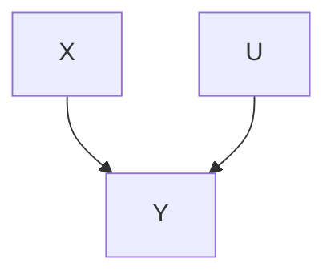

结构方程：$Y = X + U$，且 $X$ 与 $U$ 无因果联系。

**表 7.1（数据分布）**：

| X | Y | U | $U_{Xf=1}$ | $Y_{Xf=1}$ |
|---|---|---|---|---|
| 1 | 1 | 0 | 0 | 1 |
| 1 | 2 | 1 | 1 | 2 |
| 1 | 3 | 2 | 2 | 3 |
| 2 | 2 | 0 | 0 | 1 |
| 2 | 3 | 1 | 1 | 2 |
| 2 | 4 | 2 | 2 | 3 |

**关键观察**：
- $Y_{Xf=1} = 1 + U_{Xf=1}$（强制 $X=1$ 时）
- $Y_{Xf=1}$ 与 $X$（原始观测值）独立
- $Y$ 在 $X=1$ 上的条件分布 = $Y_{Xf=1}$ 的分布 ✅

> 这意味着：如果我们观察到 $X=1$ 的子总体中 $Y$ 的分布，就能直接知道强制所有人 $X=1$ 时 $Y$ 的分布。

---

#### 例 2：存在共同原因导致不变性失败

**因果图（图 7.2）**：

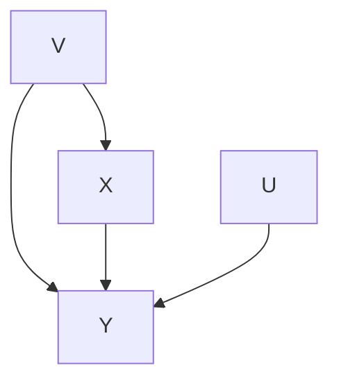

结构方程：
$$Y = X + V + U$$
$$X = V$$

这里 $V$ 是 $X$ 和 $Y$ 的未测量共同原因。

**表 7.2（数据分布）**：

| X | Y | U | $U_{Xf=1}$ | $Y_{Xf=1}$ |
|---|---|---|---|---|
| 1 | 1 | 0 | 0 | 1 |
| 1 | 2 | 1 | 1 | 2 |
| 1 | 3 | 2 | 2 | 3 |
| 2 | 2 | 0 | 0 | 1 |
| 2 | 3 | 1 | 1 | 2 |
| 2 | 4 | 2 | 2 | 3 |

**关键观察**：
- 当 $Xf=1$ 强制时，$Y_{Xf=1} = 1 + V_{Xf=1} + U_{Xf=1}$（仍假设 $V_{Xf=1} = V$, $U_{Xf=1} = U$）
- 但 $Y_{Xf=1}$ 依赖于 $V$ 的值，而 $V$ 在原始总体中与 $X$ 相关
- 因此 $Y$ 在 $X=1$ 上的条件分布 **不等于** $Y_{Xf=1}$ 的分布 ❌

> **直观解释**：当存在 $X$ 和 $Y$ 的共同原因 $V$ 时，条件 $X=1$ 的子总体中 $V$ 的分布 ≠ 总体中 $V$ 的分布（因为 $X=V$），因此条件分布与操纵分布不同。

---

#### 例 3：存在对结果的后代依赖但仍保持不变的例子

**因果图（图 7.4）**：

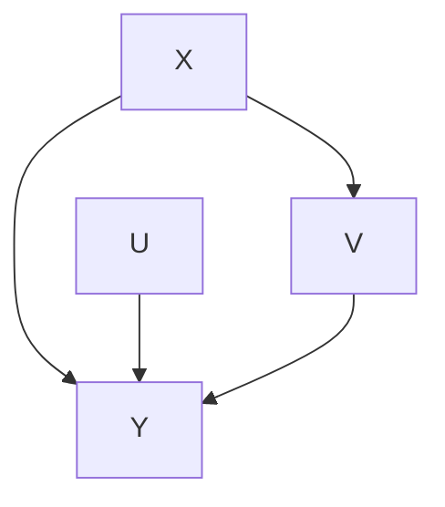

结构方程：$Y = X + U$，$V = Y + X$。

**表 7.3（数据分布）**：

| X | Y | V | U | $V_{Xf=1}$ | $U_{Xf=1}$ | $Y_{Xf=1}$ |
|---|---|---|---|---|---|---|
| 0 | 0 | 0 | 0 | 2 | 0 | 1 |
| 0 | 1 | 1 | 1 | 3 | 1 | 2 |
| 0 | 2 | 2 | 2 | 4 | 2 | 3 |
| 1 | 1 | 2 | 0 | 2 | 0 | 1 |
| 1 | 2 | 3 | 1 | 3 | 1 | 2 |
| 1 | 3 | 4 | 2 | 4 | 2 | 3 |

**关键观察**：
- 图中存在 $X \to V \to Y$ 的路径，$V$ 是 $Y$ 的原因且是 $X$ 的后代
- 但是 $Y_{Xf=1}$ 仍与 $X$ 独立，$Y$ 在 $X=1$ 上的条件分布仍等于 $Y_{Xf=1}$ 的分布 ✅

> 这说明即使存在 $X$ 通过后代变量影响 $Y$ 的路径，只要没有"进入 $X$ 的 d-连接路径"在给定空集下连接 $X$ 和 $Y$，不变性仍可成立。

---

### 3.5 定理 7.1：不变性的图论充分条件

**设定**：
- $G_{Comb}$ 是 $\mathbf{V} \cup \mathbf{W}$ 上的 DAG
- $\mathbf{W}$ 在 $G_{Comb}$ 中相对于 $\mathbf{V}$ 是**外生的（Exogenous）**
- $\mathbf{Y}$ 和 $\mathbf{Z}$ 是 $\mathbf{V}$ 的不相交子集
- $\text{Manipulated}(\mathbf{W}) = \mathbf{X}$（即 $\mathbf{X}$ 是被操纵的策略变量）
- $P(\mathbf{V} \cup \mathbf{W})$ 满足 $G_{Comb}$ 的马尔可夫条件

> **定理 7.1**：如果满足以下条件，则 $P(\mathbf{Y} \mid \mathbf{Z})$ 在通过将 $\mathbf{W}$ 从 $\mathbf{w}_1$ 改变为 $\mathbf{w}_2$ 对 $\mathbf{X}$ 的直接操纵下是**不变的**：
> 
> 1. 在 $G_{Unman}$ 中，$\mathbf{X} \cap \mathbf{Z}$ 中没有成员属于 $\mathbf{IP}(\mathbf{Y}, \mathbf{Z})$
> 2. 在 $G_{Unman}$ 中，$\mathbf{X} \setminus \mathbf{Z}$ 中没有成员属于 $\mathbf{IV}(\mathbf{Y}, \mathbf{Z})$

**更简单但等价的表述**：
> $P(\mathbf{Y}|\mathbf{Z})$ 在对 $\mathbf{X}$ 的直接操纵下不变，当且仅当在 $G_{Unman}$ 中，给定 $\mathbf{Z}$ 时 $\mathbf{Y}$ 与策略变量 $\mathbf{X}$ 是 **d-分离的（d-separated）**。

---

### 3.6 推论 7.1：普拉特-施莱弗条件的图论表述

> **推论 7.1**：$P(\mathbf{Y} \mid \mathbf{X})$ 在对 $\mathbf{X}$ 的直接操纵下不变的充分条件是：在 $G_{Unman}$ 中，没有进入 $\mathbf{X}$ 的无向路径在给定空集下 **d-连接** $\mathbf{X}$ 和 $\mathbf{Y}$。

等价地：
1. $\mathbf{Y}$ 不是 $\mathbf{X}$ 的（直接或间接）原因
2. 在 $G_{Unman}$ 中 $\mathbf{X}$ 和 $\mathbf{Y}$ 没有共同原因

> **"几乎必要"的含义**：存在前件不成立但后件成立的情况，但此时条件概率必须满足特殊的参数约束。因此条件在一般意义上（除测度为零的参数空间外）是必要的。

---

### 3.7 鲁宾的教育实验例子

**问题设定（图 7.5）**：

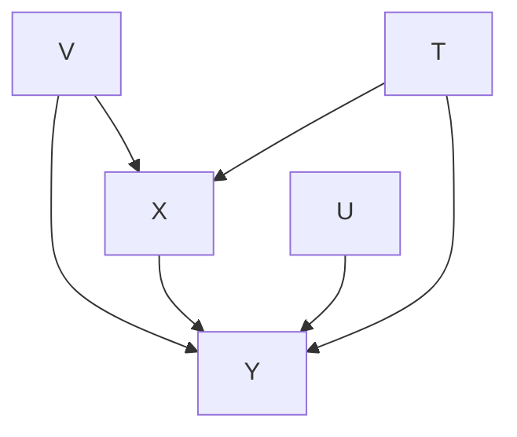

- $T$：阅读计划分配（处理变量）
- $X$：前测分数
- $Y$：后测分数
- $V$：未测量的共同原因（如天赋）

处理分配 $T$ 基于前测变量 $X$ 的随机抽样值，而 $X$ 与 $Y$ 共享未测量共同原因 $V$。

**目标**：预测如果所有学生接受 $T=1$ 处理 vs $T=2$ 处理，$Y$ 的平均差异。

**鲁宾的估计策略**：

令 $\overline{Y}_{Tf=1}$ 为所有单元强制 $T=1$ 时 $Y$ 的期望值，则：

$$\overline{Y}_{Tf=1} = \sum_{k=1}^{K} \frac{n_{1k} + n_{2k}}{n_1 + n_2} \cdot \overline{Y}_{1k}$$

其中 $\overline{Y}_{1k}$ 是 $T=1$ 且 $X=k$ 条件下 $Y$ 的均值，$n_{1k}$ 是样本中 $T=1$ 且 $X=k$ 的单元数。

**处理效应**：

$$\sum_{k=1}^{K} \frac{n_{1k} + n_{2k}}{n_1 + n_2} \cdot (\overline{Y}_{1k} - \overline{Y}_{2k})$$

**推导逻辑**：

$$\overline{Y}_{Tf=1} = \sum_Y Y \times P(Y_{Tf=1})$$

$$= \sum_Y Y \times \sum_{k=1}^K P(Y_{Tf=1} \mid X_{Tf=1}=k, T_{Tf=1}=1) \cdot P(X_{Tf=1}=k \mid T_{Tf=1}=1) \cdot P(T_{Tf=1}=1)$$

由于 $P(T_{Tf=1}=1) = 1$（强制处理），且鲁宾**默认假设** $X_{Tf=1}$ 和 $T_{Tf=1}$ 独立（见图 7.6）：

$$\overline{Y}_{Tf=1} = \sum_{k=1}^K P(X=k) \times \sum_Y Y \times P(Y \mid X=k, T=1)$$

然后使用样本中的经验频率 $P(X=k) = \frac{n_{1k} + n_{2k}}{n_1 + n_2}$ 和 $\overline{Y}_{1k}$ 来估计。

> **关键**：鲁宾隐含假设被操作总体的因果图是图 7.6（$T$ 独立于 $X$ 的父节点），而非图 7.5。这正是定理 7.1 的应用——在给定 $X$ 的条件下，$T$ 与 $Y$ 是 d-分离的。

---

## 四、因果充分性下的预测

### 4.1 预测目标的形式化

在因果充分的设定下：
- 研究者知道（或估计）分布 $P_{Unman}(\mathbf{O})$，忠实于未知因果图 $G_{Unman}$
- 知道 $\mathbf{X}$ 是被直接操纵的变量
- 知道 $\text{Parents}(G_{Man}, X)$（操纵图中 $X$ 的直接原因）
- 知道 $P_{Man}(X \mid \text{Parents}(G_{Man}, X))$（操纵后 $X$ 的分布）

> **可预测性定义**：如果无论未知因果图是什么、无论未观测变量上的分布如何、无论操纵如何实现，$P_{Man}(\mathbf{Y} \mid \mathbf{Z})$ 都是**唯一确定的**，则 $\mathbf{Y}$ 对 $\mathbf{Z}$ 的条件分布是**可预测的**。

### 4.2 忠实性假设的潜在问题

**关键假设**：$P_{Unman}(\mathbf{O})$ 忠实于 $G_{Unman}$。

这个假设可能因以下原因而不成立：
- **参数抵消**：分布的特定参数值可能使独立性"意外"成立（如 $a = -bc$ 的例子）
- **策略变量子总体的依赖结构差异**：例如电池-开关-灯泡电路中，开关断开时灯泡状态独立于电池状态；开关闭合时则不独立。但 $G_{Comb}$ 中包含电池→灯泡的边，因此 $G_{Unman}$ 中也有该边。这意味着未操纵子总体（开关断开）的分布**不忠实于** $G_{Unman}$。

> **预测算法仅在操作不引入额外依赖关系时才可靠。**

### 4.3 模式方法与可预测性示例

**PC 算法**产生一个表示 DAG 等价类的**模式（Pattern）**。

#### 示例：模式 $X - Y - Z$

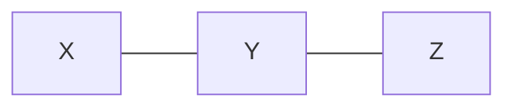

该模式代表以下三个可能的 DAG（图 7.7）：

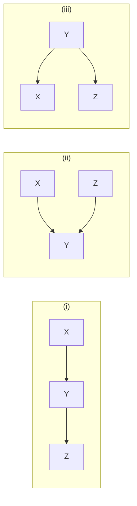

对每个图应用操纵定理：
- 图 (i)：$P_{Man}(Y) \neq P_{Unman}(Y)$（因为 $X$ 是 $Y$ 的直接原因）
- 图 (ii) 和 (iii)：$P_{Man}(Y) = P_{Unman}(Y)$（因为 $X$ 不是 $Y$ 的原因）

**结论**：由于模式不能区分这些结构，**无法预测**对 $X$ 操纵时 $Y$ 的分布。

#### 示例：模式 $U - X \to Y \to Z$

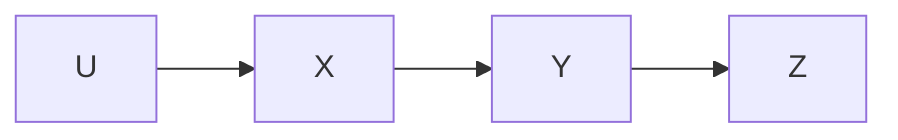

每个完整定向都给出相同结果：
$$P_{Man}(Y) = \sum_X P_{Unman}(Y \mid X) \cdot P_{Man}(X)$$

**结论**：$P_{Man}(Y)$ 是**可预测的**（但联合分布 $P_{Man}(U, X, Y, Z)$ 未必可预测）。

### 4.4 一般策略

当因果充分时：
1. 找到模式的每个完整定向
2. 对每个定向应用**操纵定理**并取适当边际
3. 如果所有图给出相同结果 → **可预测**
4. 如果不同图给出不同结果 → **不可预测**

---

## 五、无因果充分性下的预测（核心理论）

### 5.1 问题的严峻性

这是 **Mosteller 和 Tukey** 认为在非实验研究中具有典型性的情况：

> - 被操纵系统的因果结构**可能**不同于观测系统的因果结构
> - 观测系统的因果结构是**未知**的
> - 观测到的统计依赖性**可能**由未观测到的共同原因造成

**核心问题**：尽管如此，预测是否有时是可能的？如果是，何时以及如何进行？

---

### 5.2 基本示例：吸烟与肺癌

只测量吸烟（Smoking, S）和肺癌（Lung cancer, L），它们相关。相关性可能来自以下三种因果结构之一（图 7.9）：

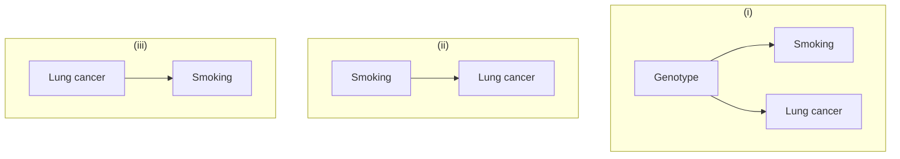

所有三个图产生相同的**最信息量部分定向诱导路径图**（图 7.10）：

```mermaid
graph LR
  Smoking o--o Lung Cancer
```

- 在图 (i) 或 (iii) 中操纵吸烟，$P(\text{Lung cancer})$ **不变**
- 在图 (ii) 中操纵吸烟，$P(\text{Lung cancer})$ **改变**

**结论**：仅从两个变量的边际分布，**无法预测**操纵吸烟的效果。

---

### 5.3 从不充分到充分：推广的策略

在因果充分情况下，策略很简单：
$$P_{Unman}(\mathbf{V}) = \prod_{V \in \mathbf{V}} P_{Unman}(V \mid \text{Parents}(G_{Unman}, V))$$

操纵时只需替换被操纵变量的条件分布：
$$P_{Man}(\mathbf{V}) = P_{Man}(X \mid \text{Parents}(G_{Man}, X)) \times \prod_{V \neq X} P_{Unman}(V \mid \text{Parents}(G_{Unman}, V))$$

这有效的关键在于：除了 $P(X \mid \text{Parents}(G_{Unman}, X))$ 外，所有因子在对 $X$ 的直接操纵下都是**不变的**。

**推广到因果不充分情况**：
- 使用 **FCI 算法**构造 $G_{Unman}$ 在 $\mathbf{O}$ 上的**部分定向诱导路径图** $\mathcal{I}$
- 寻找 $P(\mathbf{O})$ 的某种因子化，使得除了 $P(X \mid \mathbf{M}(X))$ 外每个项在**所有**以 $\mathcal{I}$ 为其部分定向诱导路径图的 DAG 中对 $X$ 的直接操纵下都是不变的
- 然后用 $P_{Man}(X \mid \text{Parents}(G_{Man}, X))$ 替换 $P_{Unman}(X \mid \mathbf{M}(X))$

---

### 5.4 详细示例：五变量吸烟-癌症系统

**测量变量**（图 7.11）：基因型（Genotype, G）、吸烟（Smoking, S）、收入（Income, I）、父母吸烟习惯（PSH）、肺癌（Lung cancer, L）

**部分定向诱导路径图（图 7.11）**：

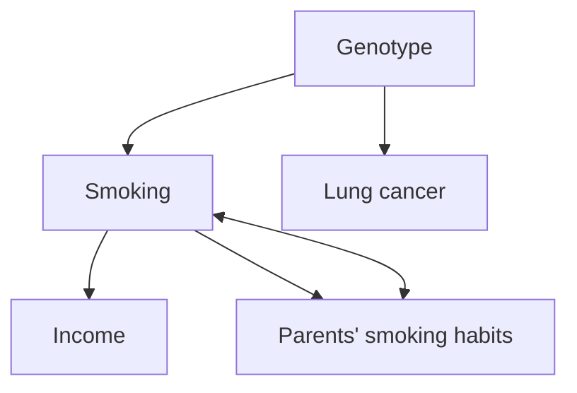

**目标**：预测直接操纵吸烟后肺癌的分布 $P_{Man}(L)$。

**步骤 1：因子化被操纵图的联合分布**

从部分定向诱导路径图确定：

$$P_{Man}(I, PSH, S, G, L) = P_{Man}(I) \times P_{Man}(PSH) \times P_{Man}(S) \times P_{Man}(G) \times P_{Man}(L \mid G, S)$$

**步骤 2：确定相关因子**

计算 $P_{Man}(L)$ 只需：

$$P_{Man}(L) = \sum_{G, S} P_{Man}(S) \times P_{Man}(G) \times P_{Man}(L \mid G, S)$$

**步骤 3：识别不变因子**

从部分定向诱导路径图确定：
- $P_{Man}(G) = P_{Unman}(G)$（不变）
- $P_{Man}(L \mid G, S) = P_{Unman}(L \mid G, S)$（不变）
- $P_{Man}(S)$ 已知（因为是被操纵的量）

因此 $P_{Man}(L)$ **可预测**！

> **关键洞察**：即使 $P(L)$ 在操纵 $S$ 下绝对不保持不变，$P_{Man}(L)$ 仍然可预测。

---

## 六、预测算法（Prediction Algorithm）

### 6.1 算法输入与假设

**已知**：
- $P_{Unman}(\mathbf{O})$：观测变量上的未操纵分布
- $\mathbf{X}$：被直接操纵的变量
- $\text{Parents}(G_{Man}, X)$：操纵图中 $X$ 的直接原因
- $P_{Man}(X \mid \text{Parents}(G_{Man}, X))$：操纵后 $X$ 的分布
- 希望预测：$P_{Man}(\mathbf{Y} \mid \mathbf{Z})$

**假设**：$P_{Unman}(\mathbf{O})$ 忠实于 $G_{Unman}$ 在 $\mathbf{O}$ 上的边际。

---

### 6.2 算法流程

```
A.) 初始化：P_Man(Y|Z) = unknown

B.) 从 P_Unman(O) 生成部分定向诱导路径图（使用 FCI 算法）

C.) 对每个可接受的变量排序（X 的前驱 = Parents(G_Man, X) ∪ Definite-Nondescendants(X)）：

  C1.) 生成 P_Unman(O) 的最小 I-映射 F
  C2.) 从 F 中提取 P_Unman(Y|Z) 的表达式 E
  C3.) 测试：E 中每个 P_Unman(V | Parents(F, V))（V ≠ X）
       在 G_Man 中对 X 的直接操纵下是否不变？
       
       如果是：
         C3a.) 返回 P_Man(Y|Z) = E'，
                其中 P_Unman(X | Parents(F, X)) 被替换为
                P_Man(X | Parents(G_Man, X))
         C3b.) 退出
```

---

### 6.3 关键定义

**确定-非后代（Definite-Nondescendants）**：在部分定向诱导路径图 $\mathcal{I}$ 中，$X$ 是 $\mathbf{Y}$ 的确定-非后代，当且仅当不存在从任何 $Y \in \mathbf{Y}$ 到 $X$ 的**半有向路径（semidirected path）**。

**信息变量（Informative Variables）** $\mathbf{IV}(\mathbf{Y}, \mathbf{Z})$：当 $\mathbf{Y} \cap \mathbf{Z} = \emptyset$ 时，$\mathbf{V} \in \mathbf{IV}(\mathbf{Y}, \mathbf{Z})$ 当且仅当：
- $\mathbf{V}$ 给定 $\mathbf{Z}$ 时与 $\mathbf{Y}$ 是 d-连接的
- $\mathbf{V}$ 不在 $\mathbf{ND}(\mathbf{YZ})$ 中

**信息父节点（Informative Parents）** $\mathbf{IP}(\mathbf{Y}, \mathbf{Z})$：$\mathbf{W} \in \mathbf{IP}(\mathbf{Y}, \mathbf{Z})$ 当且仅当：
- $\mathbf{W}$ 是 $\mathbf{Z}$ 的成员
- $\mathbf{W}$ 在 $\mathbf{IV}(\mathbf{Y}, \mathbf{Z}) \cup \mathbf{Y}$ 中有一个父节点

**可能 d-连接路径（Possibly d-connecting path）**：部分定向诱导路径图中 $\mathbf{A}$ 和 $\mathbf{B}$ 之间给定 $\mathbf{Z}$ 的无向路径 $\mathbf{U}$ 是可能 d-连接的，当且仅当：
- $\mathbf{U}$ 上的每个碰撞器都是一条到 $\mathbf{Z}$ 中某成员的半有向路径的源点
- 每个确定非碰撞器都不在 $\mathbf{Z}$ 中

**Possibly-IV 和 Possibly-IP**：与 IV 和 IP 平行，但基于可能 d-连接路径定义。

---

### 6.4 定理 7.2：最小 I-映射中的父节点集约束

> **定理 7.2**：如果 $P(\mathbf{O})$ 忠实于 $\mathbf{V}$ 上 $G$ 的分布的边际分布，$\pi$ 是 $G$ 在 $\mathbf{O}$ 上的部分定向诱导路径图，Ord 是一个对某诱导路径图可接受的排序，则存在 $P(\mathbf{O})$ 的最小 I-映射 $G_{Min}$，其中：
> 
> $$\text{Definite-SP}(\text{Ord}, X) \subseteq \text{Parents}(G_{Min}, X) \subseteq \text{Possible-SP}(\text{Ord}, X)$$

这为搜索提供了启发式边界。

---

### 6.5 定理 7.3 和 7.4：不变性判定

> **定理 7.3**：如果 $\mathbf{X}$ 包含在 $\mathbf{Z}$ 中，且 $\pi$ 中 $\mathbf{X}$ 的任何成员都不在 $\text{Possibly-IP}(\mathbf{Y}, \mathbf{Z})$ 中，则 $P(\mathbf{Y}|\mathbf{Z})$ 在对 $\mathbf{X}$ 的直接操纵下是**不变的**。

> **定理 7.4**：如果 $\mathbf{X}$、$\mathbf{Y}$、$\mathbf{Z}$ 两两不相交，且 $\pi$ 中 $\mathbf{X}$ 的任何成员都不在 $\text{Possibly-IV}(\mathbf{Y}, \mathbf{Z})$ 中，则 $P(\mathbf{Y}|\mathbf{Z})$ 在对 $\mathbf{X}$ 的直接操纵下是**不变的**。

---

### 6.6 引理 3.3.5：条件分布的表达式

> 如果 $P$ 满足 DAG $G$ 的马尔可夫条件，则：
> 
> $$P(\mathbf{Y} \mid \mathbf{Z}) = \frac{\sum_{\mathbf{IV}(\mathbf{Y},\mathbf{Z})}^{\rightarrow} \prod_{W \in \mathbf{IV}(\mathbf{Y},\mathbf{Z}) \cup \mathbf{IP}(\mathbf{Y},\mathbf{Z}) \cup \mathbf{Y}} P(W \mid \text{Parents}(W))}{\sum_{\mathbf{IV}(\mathbf{Y},\mathbf{Z}) \cup \mathbf{Y}}^{\rightarrow} \prod_{W \in \mathbf{IV}(\mathbf{Y},\mathbf{Z}) \cup \mathbf{IP}(\mathbf{Y},\mathbf{Z}) \cup \mathbf{Y}} P(W \mid \text{Parents}(W))}$$

其中 $\sum^{\rightarrow}$ 表示对有向无环图可接受的求和。

---

### 6.7 忠实性假设的再讨论

**图 7.14** 的例子说明了一个重要警告：

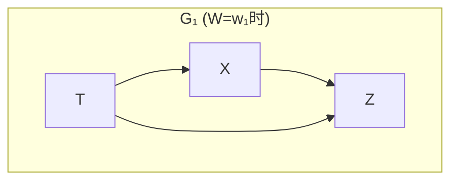

当参数满足 $a = -bc$ 时，$X$ 和 $Z$ 上的边际分布在 $W=w_1$ 下看起来独立（忠实于无边的图），但真实因果图包含 $X \to Z$ 边。因此：
- 仅从边际分布学到的因果图是错的
- 基于错误图的操纵预测也会错

**定理 7.5**：如果未操纵分布忠实于 $G_{Unman}$，预测算法是正确的。

**结论**：预测算法仅在未操纵分布忠实于未操纵图时才保证正确——这在实践中通过选择合适的测量变量集和排除仅在被操纵总体中起作用的变量来满足。

---

## 七、综合示例：呼吸功能障碍预测

### 7.1 问题设定

变量：收入（I）、父母吸烟习惯（PSH）、吸烟（S）、纤毛损伤（C）、心脏病（H）、肺活量（L）、测量的呼吸功能障碍（M）。

**真实 DAG（图 7.17）**和**部分定向诱导路径图（图 7.18）**：

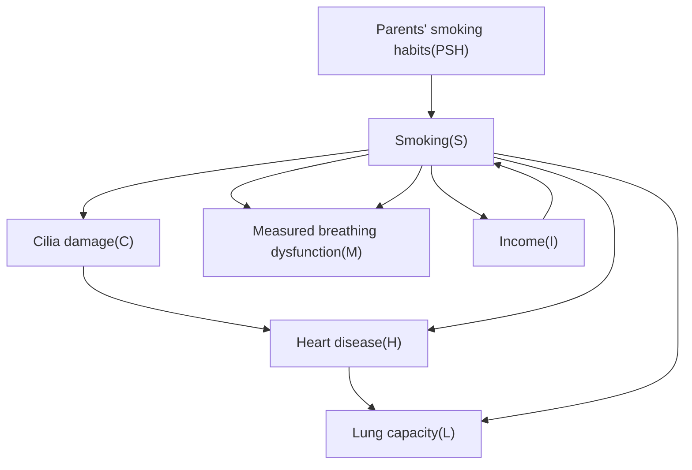

### 7.2 算法执行

**步骤 C：选择排序**

排序约束：确定-非后代(S) = {I, PSH, H} 排在 S 前；S、C、L、M 必须按此顺序。选 Ord = {I, PSH, H, S, C, L, M}。

**步骤 C1：最小 I-映射**

得到因子化：
$$P_{Unman}(I, PSH, H, S, C, L, M) = P_{Unman}(I) \times P_{Unman}(PSH) \times P_{Unman}(H) \times P_{Unman}(S \mid I, PSH) \times P_{Unman}(C \mid S, H) \times P_{Unman}(L \mid C, H, S) \times P_{Unman}(M \mid C, H, L)$$

**步骤 C3：不变性检验**

| 项 | 定理 | 不变？ | 理由 |
|---|---|---|---|
| $P_{Unman}(I)$ | 7.4 | ✅ | 从 S 到 I 不存在半有向路径 |
| $P_{Unman}(PSH)$ | 7.4 | ✅ | 从 S 到 PSH 不存在半有向路径 |
| $P_{Unman}(H)$ | 7.4 | ✅ | 从 S 到 H 不存在半有向路径 |
| $P_{Unman}(C \mid S, H)$ | 7.3 | ✅ | 给定 H，每个可能 d-连接 S→C 的路径从 S 出发 |
| $P_{Unman}(L \mid C, H, S)$ | 7.3 | ✅ | 给定 C 和 H，可能 d-连接 S→L 的路径从 S 出发 |
| $P_{Unman}(M \mid C, H, L)$ | 7.4 | ✅ | 给定 C、H、L，S 和 M 之间无可能 d-连接路径 |

**最终预测**：

$$P_{Man}(I, PSH, H, S, C, L, M) = P_{Unman}(I) \times P_{Unman}(PSH) \times P_{Unman}(H) \times P_{Man}(S) \times P_{Unman}(C \mid S, H) \times P_{Unman}(L \mid C, H, S) \times P_{Unman}(M \mid C, H, L)$$

---

### 7.3 更多变体的讨论

**吸烟-肺癌-收入系统**：

| 真实图 | 部分定向诱导路径图 | 可预测？ | 说明 |
|---|---|---|---|
| $G_2$（无因果关系） | Income → Smoking，Smoking → Lung cancer | ✅ 可预测 | 可确定吸烟不导致肺癌，$P_{Man}(L) = P_{Unman}(L)$ |
| $G_1$（有因果关系+共同原因） | Income → Smoking，Smoking o-o Lung cancer | ❌ 不可预测 | Smoking o-o Lung cancer 边阻止不变性检验 |
| $G_3$（有因果关系无混杂） | Income → Smoking，Smoking o-o Lung cancer | ❌ 不可预测 | 同上（但可用更多变量来定向） |

> **关键限制**：当被操纵变量 $X$ 和 $Y$ 之间存在在 $X$ 端带有 "o" 的边时，预测算法无法预测 $Y$ 的条件分布。

**克服限制的方法**：
1. 测量 $X$ 和 $Y$ 之间的中介变量（如焦油沉积）和中介变量的其他原因
2. 测量 $X$ 和 $Y$ 的所有共同原因（如基因型）
3. 利用背景知识来定向边（如已知收入不直接导致肺癌）

**测量共同原因后的预测**（图 7.27，$G_3$ 中测基因型后）：

$$P_{Man}(\text{Lung Cancer}) = \sum_{\text{Smoking, Genotype}} P_{Man}(\text{Smoking}) \cdot P_{Unman}(\text{Genotype}) \cdot P_{Unman}(\text{Lung Cancer} \mid \text{Smoking}, \text{Genotype})$$

---

## 八、结论

本章发展的理论表明：

1. **存在一些可能的情况**，在这些情况下可以从对未操纵系统的观察中获得对操纵效果的预测——即使存在未测量的共同原因。

2. **Mosteller 和 Tukey 的悲观结论并非基于充分根据**：虽然从非受控观测进行预测面临严重困难，但并非"永远不可能"。

3. **预测算法的核心思想**是：
   - 从数据中学习**部分定向诱导路径图**（使用 FCI 算法）
   - 寻找 $P(\mathbf{O})$ 的因子化，其中除被操纵变量的条件分布外所有项在操纵下不变
   - 用已知的操纵分布替换被操纵变量的条件分布

4. **算法的完备性**尚未建立——当原则上可预测时，算法可能仍说"未知"。关于最大信息量的充分条件，仍有大量理论工作有待完成。

5. 该理论的先驱包括 **Strotz 和 Wold（1960）**、**Robins（1986）** 以及**鲁宾（Rubin）**开创的工作传统。操纵定理的一个特例由 Fienberg（1991）独立提出，Pearl（1995）进一步发展了从干预计算预测的规则（见第 12 章）。

---

## 九、核心定理汇总

| 定理 | 内容 |
|---|---|
| **定理 7.1** | $P(\mathbf{Y} \mid \mathbf{Z})$ 在操纵 $\mathbf{X}$ 下不变的图论条件（给定 $\mathbf{Z}$ 时 $\mathbf{Y}$ 与 $\mathbf{X}$ d-分离） |
| **推论 7.1** | Pratt-Schlaifer 条件的图论表述：无进入 $X$ 的 d-连接路径连接 $X$ 和 $Y$ |
| **定理 7.2** | 最小 I-映射中父节点集的边界：$\text{Definite-SP} \subseteq \text{Parents} \subseteq \text{Possible-SP}$ |
| **定理 7.3** | $\mathbf{X} \subseteq \mathbf{Z}$ 且 $\mathbf{X} \notin \text{Possibly-IP}$ → 不变 |
| **定理 7.4** | $\mathbf{X} \cap \mathbf{Z} = \emptyset$ 且 $\mathbf{X} \notin \text{Possibly-IV}$ → 不变 |
| **定理 7.5** | 忠实性成立时预测算法的正确性 |
| **引理 3.3.5** | 基于信息变量和信息父节点的条件分布表达式 |

---

这份材料涵盖了第七章的核心内容：从三种预测情形的分类，到鲁宾框架的形式化及其与图模型理论的联系，再到因果充分和不充分条件下的预测策略，最后以预测算法的完整描述和详细示例收尾。核心的数学工具是**操纵定理**、**d-分离**、**部分定向诱导路径图**以及**不变性定理**，它们共同构成了从观测数据预测干预效果的统一理论框架。