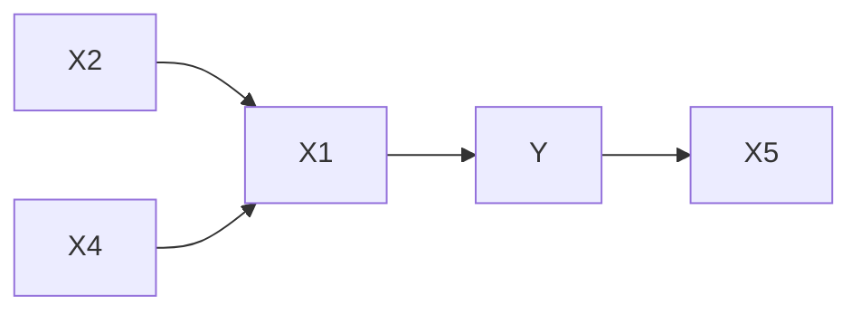
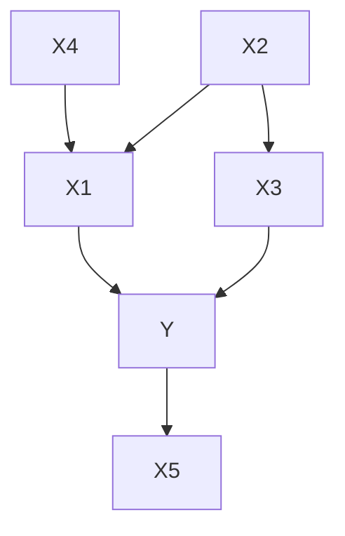
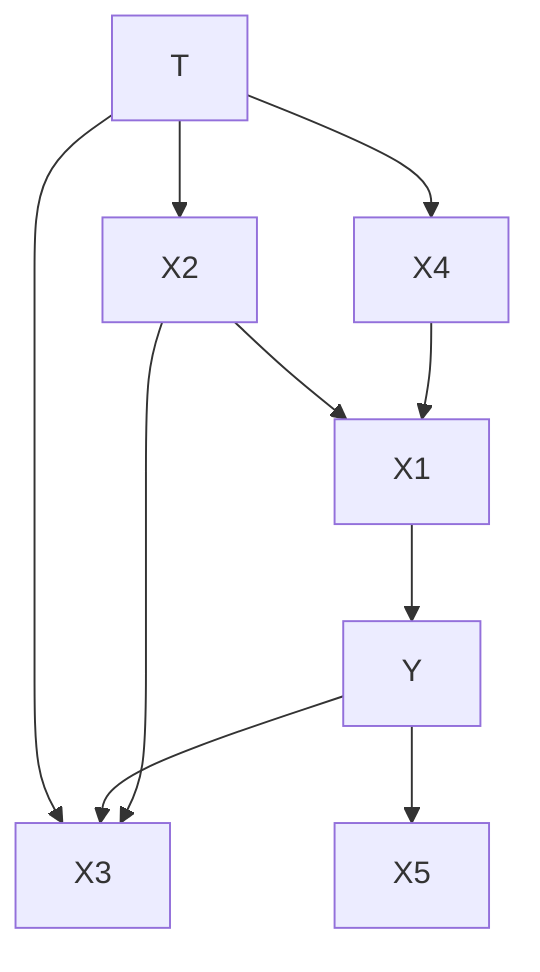
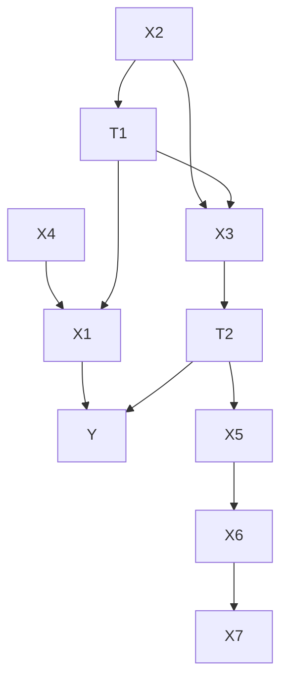
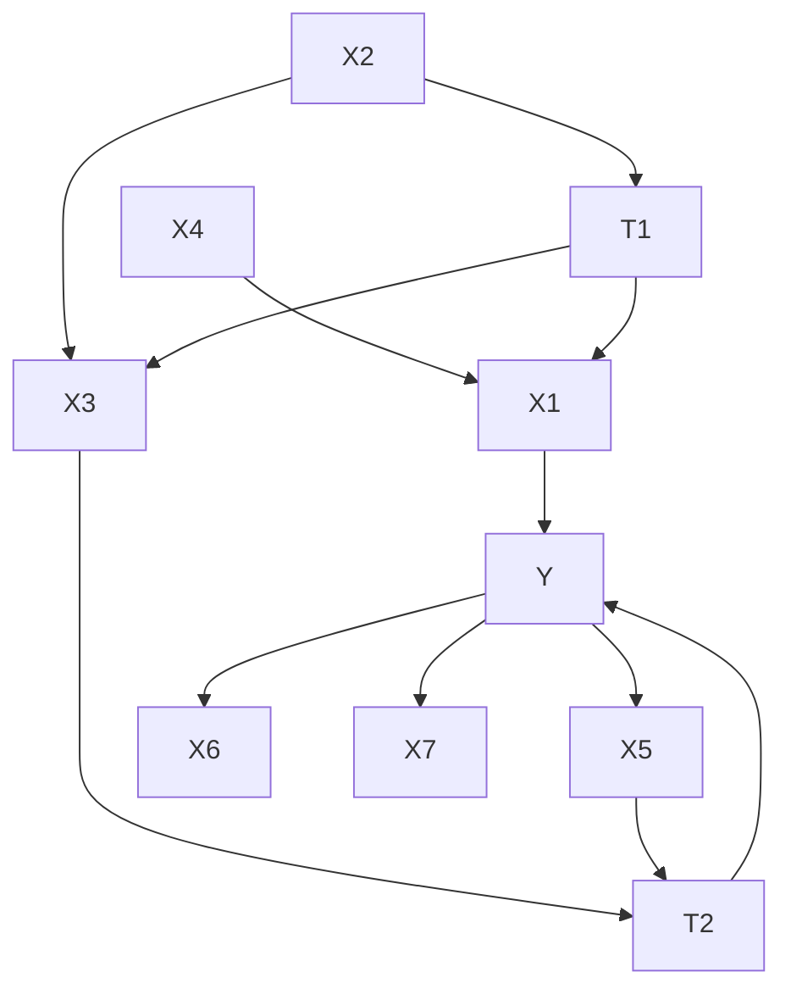
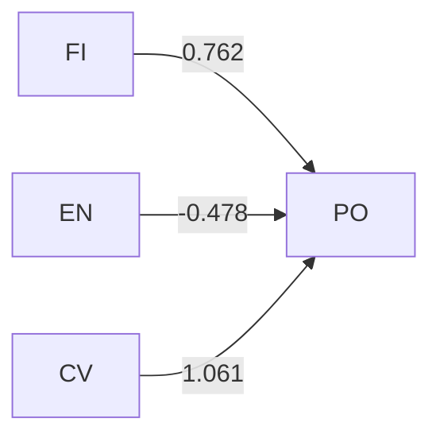
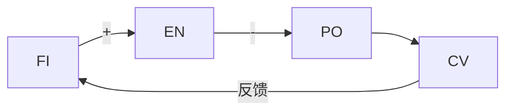
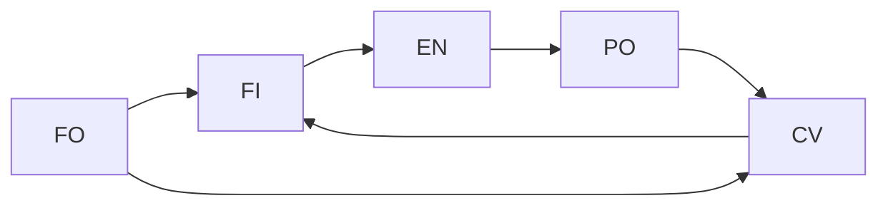
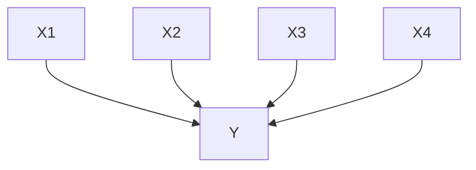
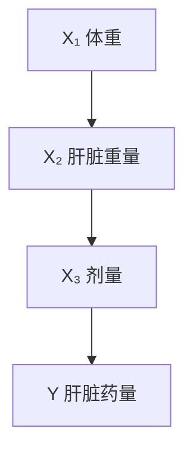

# 第8章 回归、因果与预测 —— 全面系统梳理

---

## 目录

1. [核心论点总览](#1-核心论点总览)
2. [回归在因果推断中的失效机制](#2-回归在因果推断中的失效机制)
3. [图8.1四种结构的深入分析](#3-图81四种结构的深入分析)
4. [定理3.4与回归标准的不充分性](#4-定理34与回归标准的不充分性)
5. [解决方案：PC算法与FCI算法](#5-解决方案pc算法与fci算法)
6. [实证案例分析](#6-实证案例分析)
7. [设定搜索的误差概率](#7-设定搜索的误差概率)
8. [结论与警示](#8-结论与警示)

---

## 1. 核心论点总览

本章的核心论点是：

> **回归（Regression）并非一个特殊的因果推断工具，而只是一个特例。** 回归在因果推断领域的独特之处恰恰在于：**一种如此不适合因果推断的技术，竟然被如此广泛地应用。**

作者围绕这一论点，系统地论证了：

- 为什么多元线性回归在存在未测量的共同原因（unmeasured common causes）或当回归变量是结果变量的效应（effect）时会产生严重偏误；
- 为什么教科书式的变量选择程序（如逐步回归 STEPWISE、基于 $C_p$ 或调整 $R^2$ 的选择）无法可靠地识别真正的因果变量；
- 基于有向图（directed graph）的因果发现算法（PC算法、FCI算法）如何从根本上解决这些问题；
- 如何通过模拟来评估搜索过程的误差概率。

---

## 2. 回归在因果推断中的失效机制

### 2.1 基本问题设定

考虑线性模型：

$$Y = \sum_i \alpha_i X_i + \varepsilon$$

其中参数 $\alpha_i$ 被解释为：**当所有其他 $X$ 变量保持不变时，$X_i$ 的单位变化所引起的 $Y$ 的预期变化**。

### 2.2 已知的失效情形：直接混杂

如果 $X_i$ 和 $Y$ 存在**未测量的共同原因**（即 $Y$ 的误差项 $\varepsilon_Y$ 与 $X_i$ 相关），则 $\alpha_i$ 的回归估计是**有偏且不一致的**。这是计量经济学和统计学中经典的「遗漏变量偏误」（omitted variable bias）。

> **传统建议**（Pratt & Schlaifer, 1988）：扩大回归变量集合，观察原回归系数是否保持稳定。若系数稳定，则视为不存在共同原因的证据。

### 2.3 被忽视的失效情形：传染性偏误

本章揭示了一个更微妙且同样严重的失效模式：

> 当回归变量 $X_i$ 与 $Y$ 之间存在未测量的共同原因时，这种偏误会**传染**到其他回归变量 $X_k$ 的系数估计上，即使 $X_k$ 对 $Y$ **完全没有影响**，甚至与 $Y$ **没有任何共同原因**。

此外，如果某个已测量的候选回归变量是 $Y$ 的**效应**（而非原因），也会导致类似的困难。

#### 示例说明

考虑一个简化的因果结构：

在此结构中：
- $X_1$ 直接影响 $Y$
- $X_5$ 是 $Y$ 的直接效应（而非原因）
- $X_2$ 通过 $X_1$ 间接与 $Y$ 关联，但对 $Y$ **没有直接影响**
- $X_4$ 仅影响 $X_1$，与 $Y$ 无直接关联

然而，当我们将 $Y$ 对所有 $\{X_1, X_2, X_4, X_5\}$ 做线性多元回归时，**所有变量都可能获得非零的显著回归系数**——包括那些对 $Y$ 完全没有影响的变量。

> **关键直觉**：回归的偏回归系数本质上是在控制其他变量后的条件相关性。而条件相关性不等于因果关系——当控制对撞子（collider）或中介变量时，原本独立的变量可能变得条件相关。

---

## 3. 图8.1四种结构的深入分析

图8.1给出了四个具体的因果结构，其中回归方法系统性地失败。我们用标准因果图术语重新表述。原始文献使用了带有方程编号的图示，我们统一用 mermaid 重新绘制。

### 结构 (i)

**线性方程表示**：

$$
\begin{aligned}
Y &= a_1 X_1 + a_2 X_5 + \varepsilon_Y \\
X_1 &= a_3 X_2 + a_4 X_4 + \varepsilon_1 \\
X_3 &= a_5 X_2 + a_6 Y + \varepsilon_3
\end{aligned}
$$

**关键特征分析**：

| 变量 | 角色 | 对 $Y$ 的真实直接影响 |
|------|------|----------------------|
| $X_1$ | $Y$ 的直接原因 | ✅ 有（系数 $a_1$） |
| $X_2$ | $X_1$ 和 $X_3$ 的直接原因，$Y$ 的间接原因 | ❌ 无直接影响 |
| $X_3$ | $Y$ 的**效应**（被 $Y$ 因果指向） | ❌ 无，反而是 $Y$ 的果 |
| $X_4$ | $X_1$ 的直接原因 | ❌ 无 |
| $X_5$ | $Y$ 的**效应** | ❌ 无，反而是 $Y$ 的果 |

**回归的失败**：多元回归对 $\{X_1, X_2, X_3, X_5\}$ 中的所有变量都给出非零系数。$X_2$ 和 $X_3$ 被错误地识别为「显著影响 $Y$ 的变量」。

**为何失败**：
- $X_3$ 是 $Y$ 的效应（collider 的后代），将其纳入回归会打开后门路径
- $X_2$ 与 $Y$ 通过 $X_1$ 和 $X_3$ 产生复杂关联，条件化后产生虚假相关

**正确的做法**：仅使用 $\{X_1, X_5\}$ 或仅使用 $\{X_1\}$，回归就给出一致且无偏的估计。但标准变量选择程序（STEPWISE、$C_p$、调整 $R^2$）都无法识别出这一正确的子集。

### 结构 (ii)

**线性方程表示**：

$$
\begin{aligned}
Y &= a_1 X_1 + a_2 X_5 + a_3 T + \varepsilon_Y \\
X_1 &= a_4 X_2 + a_5 X_4 + \varepsilon_1 \\
X_3 &= a_6 X_2 + a_7 T + \varepsilon_3
\end{aligned}
$$

**关键特征**：$T$ 是**未测量的共同原因**（latent confounder），同时影响 $X_2$、$X_3$、$X_4$ 和 $Y$。

**FCI 算法的结果**：$X_1$ 被明确判定为直接影响 $Y$；$X_2, X_3, X_4$ 被明确判定为无直接影响；$X_5$ 无法确定。

### 结构 (iii)

**线性方程表示**（$T_1, T_2$ 为未测量的潜在变量）：

$$
\begin{aligned}
Y &= a_1 X_1 + a_2 X_5 + a_3 T_2 + a_4 X_3 + \varepsilon_Y \\
X_1 &= a_5 X_2 + a_6 X_4 + \varepsilon_1 \\
X_2 &= a_7 T_1 + \varepsilon_2 \\
X_3 &= a_8 T_1 + a_9 T_2 + \varepsilon_3 \\
X_5 &= a_{10} X_6 + a_{11} X_7 + \varepsilon_5
\end{aligned}
$$

**FCI 算法的结果**：$X_1$ 被明确判定为直接影响 $Y$；$X_4$ 被明确判定为无直接影响；$X_2, X_3, X_5$ 无法确定。

### 结构 (iv)

**FCI 算法的结果**：$X_1, X_5$ 被明确判定为直接影响 $Y$；$X_4, X_6, X_7$ 被明确判定为无直接影响；$X_2, X_3$ 无法确定。

### 四种结构汇总表

| 结构 | 直接影响 $Y$ | 明确无直接影响 | 无法确定 |
|------|-------------|---------------|---------|
| (i) | $X_1$ | $X_2, X_3$ | $X_5$ |
| (ii) | $X_1$ | $X_2, X_3, X_4$ | $X_5$ |
| (iii) | $X_1$ | $X_4$ | $X_2, X_3, X_5$ |
| (iv) | $X_1, X_5$ | $X_4, X_6, X_7$ | $X_2, X_3$ |

> 在所有这些结构中，多元回归始终将 $X_2$ 和 $X_3$ 纳入「显著」变量集合，而 FCI 算法要么明确排除它们，要么诚实地表示无法确定。

### 模拟验证

作者对结构 (i) 进行了 20 次模拟（每次 5000 个样本，系数绝对值 > 0.5）：

- **MINITAB 回归**：始终选择 $\{X_1, X_2, X_3, X_5\}$
- **STEPWISE**：约一半情况选择上述集合，另一半额外加入 $X_4$
- **PC 算法**：每次都正确选择 $\{X_1, X_5\}$
- **FCI 算法**：每次都指出 $X_1$ 直接影响 $Y$，$X_5$ 可能影响，其余无影响

---

## 4. 定理3.4与回归标准的不充分性

### 4.1 定理3.4的表述

**定理 3.4**：如果概率分布 $P$ 忠实（faithful）于某个图，那么 $P$ 忠实于 $G$ 当且仅当：

- **(i)** 对于 $G$ 中的所有顶点 $X$, $Y$，$X$ 和 $Y$ 相邻当且仅当在 $G$ 中每个不包含 $X$ 或 $Y$ 的顶点集合条件下，$X$ 和 $Y$ 是依赖的；
- **(ii)** 对于所有顶点 $X$, $Y$, $Z$，使得 $X$ 与 $Y$ 相邻，$Y$ 与 $Z$ 相邻，且 $X$ 与 $Z$ 不相邻，$X \rightarrow Y \leftarrow Z$ 是 $G$ 的一个子图当且仅当在包含 $Y$ 但不包含 $X$ 或 $Z$ 的每个集合条件下，$X$ 和 $Z$ 是依赖的。

### 4.2 定理关键概念解释

**忠实性条件（Faithfulness Condition）**：概率分布 $P$ 忠实于因果图 $G$，当且仅当 $P$ 中所有的条件独立关系都由 $G$ 的马尔可夫条件蕴含，而 $P$ 中所有的条件依赖关系都由 $G$ 的结构反映。换言之，不存在由恰好平衡的参数值导致的「偶然」独立性。

**马尔可夫条件（Markov Condition）**：在因果图中，给定一个变量的所有直接原因（父节点），该变量与其非后代变量条件独立。

### 4.3 回归标准的本质缺陷

线性回归判断「$X_i$ 影响 $Y$」的标准是：

> 在控制所有其他 $X$ 变量后，$X_i$ 和 $Y$ 的**偏相关系数不为零**。

而定理 3.4 第 (i) 部分表明：**两变量相邻的充分必要条件是它们在给定任意不包含二者的变量集条件下都依赖**——这是比回归标准强得多的要求。回归标准仅检查了「在所有其他回归变量条件下的相关性」，而非「在*所有可能*的不包含二者的变量集条件下的相关性」。

> **定理的直接推论**：假设马尔可夫条件和忠实性条件成立，$Y$ 对一组变量 $\mathbf{X}$ 的回归只有在真实结构中**没有一个 $\mathbf{X}$ 变量是 $Y$ 的效应或与 $Y$ 有未测量的共同原因**时，才能产生 $\mathbf{X}$ 变量的无偏或一致的影响估计。

### 4.4 举例说明

回顾结构 (i)，$X_2$ 和 $Y$ 在控制 $\{X_1, X_3, X_5\}$ 时是条件相关的（这正是回归所检验的），但它们在控制空集（即无条件下）或控制 $\{X_1\}$ 时也是相关的——这似乎「支持」$X_2$ 影响 $Y$。但定理 3.4(i) 要求：$X_2$ 与 $Y$ 相邻当且仅当它们在**每一个**不包含二者的变量子集条件下都依赖。实际上，如果我们控制 $\{X_1, X_3\}$（不包含 $X_2$ 和 $Y$），$X_2$ 与 $Y$ 应该是独立的（因为 $X_2$ 仅通过 $X_1$ 和 $X_3$ 与 $Y$ 关联，控制二者即阻断所有路径）。这个更严格的检验暴露了 $X_2$ 并非 $Y$ 的直接邻居。

---

## 5. 解决方案：PC算法与FCI算法

### 5.1 整体框架

核心思想是：**先用因果发现算法确定因果结构，再估计因果效应。**

$$
\text{数据} \xrightarrow{\text{PC/FCI 算法}} \text{因果结构（或等价类）} \xrightarrow{\text{后门准则等}} \text{因果效应估计}
$$

### 5.2 PC 算法

**假设**：因果充分性（causal sufficiency）——不存在未测量的共同原因。

**核心操作**：
1. 从完全连通的无向图出发
2. 逐步检验边际独立性和条件独立性（从零阶到高阶）
3. 删除独立性成立的边
4. 利用 v-结构（colliders）定向部分边
5. 应用定向传播规则

**在本章语境下的应用**：PC 算法能够正确识别出与 $Y$ 相邻的变量（即有直接因果联系的变量），从而排除那些仅因为混杂或对撞偏误而显得相关的变量。

### 5.3 FCI 算法

**假设**：允许存在未测量的共同原因（即不假设因果充分性）。

**输出**：**部分定向诱导路径图（Partially Oriented Inducing Path Graph, POIPG）**，其中边可以表示：
- 直接的因果关系（$X \rightarrow Y$）
- 可能存在未测量的共同原因（$X \leftrightarrow Y$）
- 不确定的方向（$X \circ\!-\!\circ Y$）

**在本章语境下的应用**：FCI 算法能够诚实地区分三种情况——明确有直接影响、明确无直接影响、以及根据现有数据无法确定。

### 5.4 图8.1的FCI结果与回归结果对比

| 结构 | 回归的结论 | FCI 的结论 |
|------|-----------|-----------|
| (i) | $X_2, X_3$ 显著影响 $Y$（❌错误） | $X_2, X_3$ 无直接影响（✅正确） |
| (ii) | $X_2, X_3$ 显著影响 $Y$（❌错误） | $X_2, X_3, X_4$ 无直接影响 |
| (iii) | $X_2, X_3$ 显著影响 $Y$（❌错误） | $X_2, X_3, X_5$ 无法确定 |
| (iv) | $X_2, X_3$ 显著影响 $Y$（❌错误） | $X_2, X_3$ 无法确定 |

---

## 6. 实证案例分析

### 6.1 武装部队资格测试（AFQT）的组成部分

**背景**：AFQT 是美军使用的测试组合，由算术推理（AR）、数值运算（NO）和词汇知识（WK）线性组合而成。此外还有数学知识（MK）、电子学信息（EI）、普通科学（GS）、机械理解（MC）等相关测试。

**数据**：$n=6224$，8个变量的协方差矩阵已知。

**回归结果**：将 AFQT 对其他 7 个变量进行多元回归，除 EI 和 MC 外，所有变量系数均显著。**回归未能区分出真正构成 AFQT 的三个测试**。

**PC 算法结果**：正确地将 $\{AR, NO, WK\}$ 识别为唯一与 AFQT 相邻的变量，因此也是唯一可能构成 AFQT 的测试。

> **洞察**：已知 AFQT 并非其他任何变量的原因（它只是各分测试的线性组合/效应），这恰好使 PC 算法能够通过正确的条件独立性检验来识别真正的构成成分。

### 6.2 大米草（Spartina）生物量的原因

**背景**：Linthurst (1979) 在北卡罗来纳州河口采集样本，测量了 14 个土壤和植物变量，目标是找出影响大米草生物量（BIO）的最重要变量。这是一个明确的**因果问题**。

**变量**：BIO（生物量）、$H_2S$（游离硫化物）、SAL（盐度）、$EH_7$（氧化还原电位）、PH（土壤 pH）、BUF（缓冲酸度）、P（磷）、K（钾）、CA（钙）、MG（镁）、NA（钠）、MN（锰）、ZN（锌）、CU（铜）、$NH_4$（铵）。

**回归分析的结果（Rawlings, 1988）**：

| 方法 | 显著变量 | 问题 |
|------|---------|------|
| 全部变量多元回归 | 仅 K, CU | 预期重要的变量不显著 |
| 逐步回归（两种） | PH, MG, CA, CU | 结果不一致 |
| 简单回归（逐个） | PH, BUF, CA, ZN, $NH_4$ | 与前两种方法矛盾 |

Rawlings 本人的评价：
> 「没有任何结果令生物学家满意；结果的不一致性令人困惑。」

最终他承认：
> 「使用回归结果来赋予自变量『相对重要性』（无论是否具有因果意义）是特别危险的。」

**PC 算法结果（在 $\alpha = 0.05, 0.10, 0.20$ 下均稳健）**：

> **PH 且仅有 PH 可能与 BIO 直接相连。**

**推理依据**：当控制 PH 时，除 MG 外所有其他变量与 BIO 的偏相关性均消失或减弱；而当控制 BUF 时，PH 和 BIO 的相关性并未消失。这种**不对称性**是关键诊断信号：PH 是原因，BUF 仅是与 PH 高度相关（$r = -0.95$）的伴随变量。

**因果马尔可夫条件的推论**：在该群体中，如果 PH 保持恒定，其他回归变量对 BIO 的任何影响都将被阻断。

**实验验证（Linthurst 的温室实验）**：
- 在 pH = 6 时，生长随 SAL 变化
- 在 pH = 4 和 8 时，SAL 的变化对生长**无影响**
- 在所有 SAL 值下，pH 的变化都影响生长
- 观察性数据中的 pH 值几乎全部集中在极端值（< 5 或 > 7）

> **结论**：PC 算法的推断与实验证据高度吻合——在观察到的 pH 极端值范围内，pH 是主导因素，SAL 微变无影响。

### 6.3 外国投资对政治压制的影响

**背景**：Timberlake & Williams (1984) 使用回归声称外国投资（FI）助长独裁统治（PO）。

**变量**：
- PO：政治排斥（独裁程度）
- FI：外国投资渗透率
- EN：能源发展水平
- CV：公民自由（1-7 有序量表，越低越自由）

**回归模型**：

$$PO = 0.762 \cdot FI - 0.478 \cdot EN + 1.061 \cdot CV + \varepsilon$$

**SGS 算法模型**（假设无潜在变量）：

SGS 算法不会确定 FI-EN 和 EN-PO 边的方向。最大似然估计表明 FI 对 PO 的影响是**负的**（如果有的话），与回归结论相反。

**FCI 算法模型**（允许潜在变量）：

> **FCI 的结论**：外国投资和能源消费有一个共同原因；外国投资和公民自由也有一个共同原因（标注为 FO）；能源发展对政治排斥没有影响；而外国投资对政治排斥**没有直接或间接的影响**。

> **诊断**：Timberlake & Williams 的回归模型正是图 8.1 中结构 (i) 的实例——**结果变量的效应（CV 是 PO 的效应）被错误地当作回归变量**，导致了严重的偏误。

---

## 7. 设定搜索的误差概率

### 7.1 基本框架

由于因果发现算法涉及一连串的统计决策（条件独立性检验），其总体的误差概率不能简单地由单个检验的显著性水平或检验力来刻画。作者提出使用**蒙特卡洛方法**来评估搜索过程的整体表现。

**定义**：

- **第一类错误（Type I error）**：当真实模型 $M$ 为真时，搜索过程从样本中得到的不是 $M$ 的概率。
- **第二类错误（Type II error）**：当备择模型 $M'$ 为真时，搜索过程从样本中得到 $M$ 的概率。

**蒙特卡洛估计方法**：
1. 从样本中估计模型 $M$
2. 用估计的模型生成大量相同大小的模拟样本
3. 对每个样本运行搜索过程
4. 统计找到非 $M$ 模型的频率 $\rightarrow$ 第一类错误的估计
5. 估计备择模型 $M'$，重复步骤 2-4，统计找到 $M$ 的频率 $\rightarrow$ 第二类错误的估计

### 7.2 模拟研究：图8.4结构

**真实因果结构**：

**模拟设置**：
- 线性数据和二值离散数据
- 样本量：$n=2000$ 和 $n=10000$
- 算法：SGS（假设因果充分性）、PC（线性/三值离散）

**主要结果**：

| 算法 | 数据类型 | $n$ | 边存在存伪错误% | 边存在弃真错误% | 两边正确% | 一边正确% |
|------|---------|-----|---------------|---------------|----------|----------|
| SGS  | 线性    | 2000 | 1.4 | 3.6 | 85.7 | 3.6 |
| SGS  | 线性    | 10000 | 1.6 | 1.0 | 90.0 | 7.0 |
| SGS  | 二值    | 2000 | 0.6 | 16.6 | 38.0 | 34.0 |
| SGS  | 二值    | 10000 | 1.2 | 7.4 | 60.0 | 25.0 |
| PC   | 线性    | 2000 | 6.0 | 2.0 | 80.0 | 15.0 |
| PC   | 线性    | 10000 | 0.0 | 1.0 | 95.0 | 0.0 |
| PC   | 三值    | 2000 | 3.0 | 1.0 | 65.0 | 35.0 |
| PC   | 三值    | 10000 | 3.0 | 2.0 | 85.0 | 15.0 |

**关键发现**：
- 在大样本下，过程相当可靠地找到 $Y$ 的真正原因
- 当离散变量取值更多时（三值 vs 二值），检验力更高
- 在相同结构下，**回归会发现所有回归变量都影响 $Y$**——这正是根本问题所在

### 7.3 药物实验案例：第一类错误的蒙特卡洛估计

**Weisberg (1985) 的大鼠肝脏药物实验**：

- 19只大鼠
- $Y$：肝脏中药物百分比
- $X_1$：体重
- $X_2$：肝脏重量
- $X_3$：相对剂量（由体重决定）

**实验假设**：$Y$ 与 $(X_1, X_2, X_3)$ 没有关系。

**回归结果（矛盾）**：
$$Y = -3.902 X_1 + 0.197 X_2 + 3.995 X_3 + \varepsilon$$

$X_1$ 和 $X_3$ 的系数显著，尽管二者高度共线（由体重决定剂量）。

但单独回归均不显著。这种模式（零阶相关为零，但偏相关非零）是典型的存在隐藏混杂或对撞偏误的信号。

**PC 算法的输出**：

> PC 算法正确地得出结论：**没有 $X$ 变量导致 $Y$**——因为 $Y$ 与任何 $X$ 的零阶相关都不显著，而算法仅需这一点即可判定无影响。

**第一类错误估计**：
- 从该模型的最大似然估计生成 100 个 $n=19$ 的模拟样本
- PC 算法在 4% 的样本中错误地在 $Y$ 和某个 $X$ 之间引入了一条边

**第二类错误（检验力）估计**：

| 备择假设 | $n=19$ | $n=50$ | $n=100$ | $n=1000$ |
|---------|--------|--------|---------|----------|
| 回归模型（近似不忠实，$X_1$ 与 $X_3$ 相关 0.99） | 高错误率 | 较高 | 较低 | **0%** |
| $X_1 \to Y$ 加入，系数 0.228 | 极高 | 高 | 高 | **55%** |
| $X_1 \to Y$ 加入，系数 1.0 | 高 | 中 | 中 | **2%** |

> **关键教训**：即使样本量达到 1000，对于微小的因果效应（系数 0.228），搜索过程的检验力仍然只有 45%（即第二类错误率 55%）。这揭示了因果发现中「无影响」结论需要审慎对待。

---

## 8. 结论与警示

### 8.1 核心结论

1. **回归不能用于因果变量选择**：在缺乏非常强的先验因果知识时，不应使用多元回归从非受控研究的数据中选择影响结果变量的变量。

2. **自动回归搜索过程应被放弃**：在涉及因果推断的背景下，根本不应使用流行的自动回归搜索过程（如逐步回归、基于 $C_p$、调整 $R^2$ 的选择）。

3. **应采用基于图的因果发现算法**：应使用 PC、FCI 等算法的改进版本来选择那些可以通过回归可靠估计其对结果影响的变量。

4. **蒙特卡洛方法评估搜索可靠性**：通过模拟可以确定设定搜索对数据合理备择解释的检验力。

### 8.2 当前算法的局限

作者坦率地指出了当前方法的不足：

> 在某些情况下，部分定向诱导路径图中包含从 $X$ 到 $Y$ 的有向边，即使 $X$ 不是 $Y$ 的**直接**原因（尽管确实存在一条从 $X$ 到 $Y$ 的有向路径）。

定理 6.8 提供了一个充分条件，使得 POIPG 中的有向边能够推断 $X$ 是 $Y$ 的直接原因，但基于 Verma 和 Pearl 约束的检验尚未被开发或实现。

### 8.3 方法论启示归纳

| 传统回归方法的错误 | 根本原因 | 图模型方法的解决 |
|-------------------|---------|----------------|
| 将效应误认为原因 | 回归不区分因果方向 | 通过 v-结构等确定方向 |
| 虚假的「显著」变量 | 条件化对撞子产生虚假相关 | 系统性条件独立性检验 |
| 变量选择不稳定 | 共线性下任意选择 | 输出等价类，诚实报告不确定性 |
| 无法识别混杂 | 回归需假设无遗漏变量 | FCI 显式建模潜在混杂 |
| 误差概率不可知 | 多步决策误差累积 | 蒙特卡洛模拟评估 |

### 8.4 最终警示

> 「统计方法最普遍的用途之一似乎不过是精心设计的猜测而已。」

这一章的终极信息是：**在非实验（观察性）研究中，当因果问题是核心关注点时，回归分析在方法论上是根本不足的。** 因果推断需要因果假设和因果工具——有向图、条件独立性检验、忠实性假设和系统的搜索算法——才能产生可靠的结论。