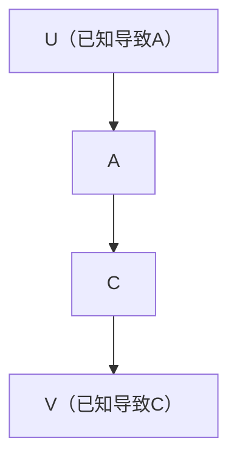
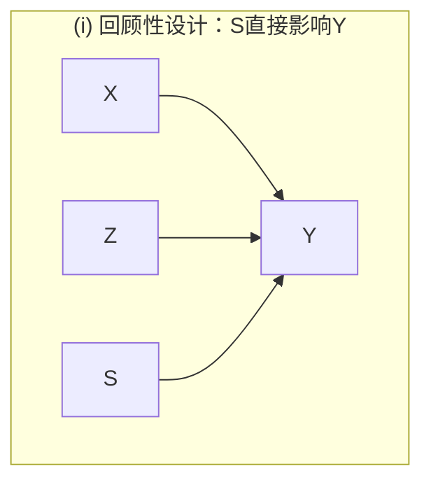
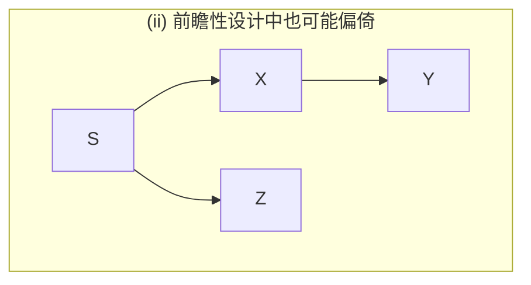
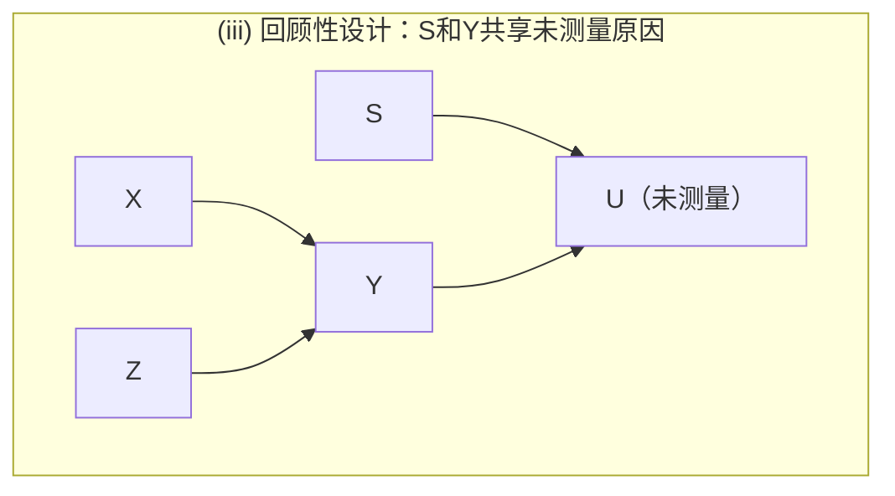
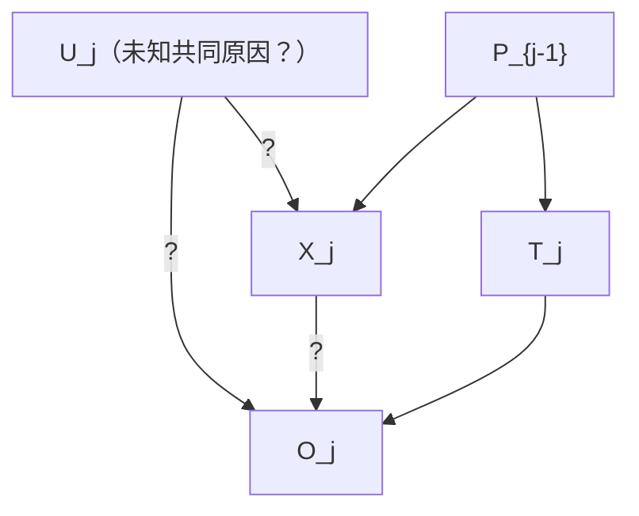
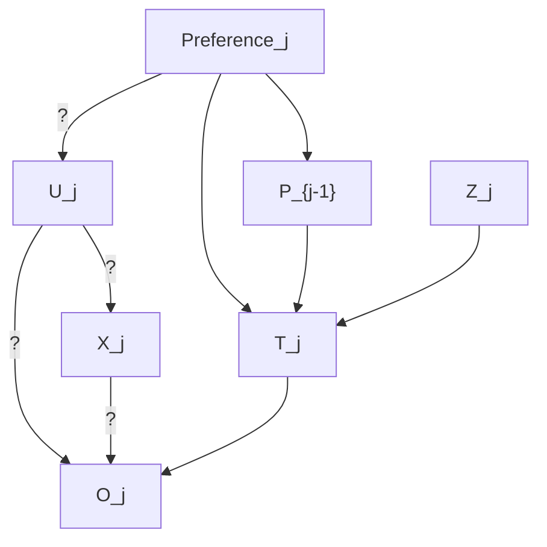

# 第9章 实证研究的设计 —— 系统学习与参考材料

---

## 目录

1. [本章概述与核心问题](#1-本章概述与核心问题)
2. [9.1 观测研究还是实验研究？](#2-91-观测研究还是实验研究)
   - 2.1 问题背景
   - 2.2 随机化实验的逻辑与局限
   - 2.3 受控实验：三种基本因果结构的区分
   - 2.4 非实验情形下的因果结构识别
   - 2.5 更复杂的因果结构
   - 2.6 两条因果通路的区分与辛普森悖论
   - 2.7 实验与非实验的效力互补
   - 2.8 不完全受控实验
3. [9.2 选择变量](#3-92-选择变量)
4. [9.3 抽样](#4-93-抽样)
   - 4.1 定理 9.1：条件概率的不变性
   - 4.2 定理 9.2：条件独立性的不变性
   - 4.3 前瞻性抽样与回顾性抽样
5. [9.4 实验设计中的伦理问题](#5-94-实验设计中的伦理问题)
   - 5.1 两个伦理困境
   - 5.2 Kadane/Sedransk/Seidenfeld 设计
   - 5.3 实验设计中的因果推理
   - 5.4 患者偏好与工具变量
   - 5.5 迈向伦理性试验
6. [9.5 示例：吸烟与肺癌](#6-95-示例吸烟与肺癌)
7. [9.6 附录：形式化证明](#7-96-附录形式化证明)
8. [核心概念与定理汇总](#8-核心概念与定理汇总)

---

## 1. 本章概述与核心问题

本章在前几章建立的因果图理论（FCI算法、马尔可夫条件、忠实性条件、干预定理等）基础上，系统探讨**实证研究设计**的若干基本问题：

- **观测研究与实验研究的效力比较**：何时实验是必需的？何时仅凭观测就足以区分因果结构？
- **变量选择**：应测量哪些变量以最大化因果推断的信息量？
- **抽样设计**：抽样属性如何影响条件概率和条件独立性的推断？
- **实验伦理设计**：如何在满足伦理要求的同时获得可靠的因果预测？
- **历史案例分析**：以吸烟与肺癌的著名争论为例，审视因果推断的逻辑与谬误。

---

## 2. 9.1 观测研究还是实验研究？

### 2.1 问题背景

核心问题是：对于一个**处理变量 $T$** 和**结果变量 $O$**，我们关心 $T$ 是否导致 $O$。在因果图的框架下，三种互斥且穷尽的替代因果结构为：

1. **(i) $T \rightarrow O$**：$T$ 导致 $O$
2. **(ii) $B \rightarrow T,\; B \rightarrow O$**：存在潜在的共同原因 $B$ 同时导致 $T$ 和 $O$
3. **(iii) $O \rightarrow T$**：$O$ 导致 $T$（因果方向反转）

> **核心议题**：是否必须通过实验来区分这三种结构，还是在某些条件下仅凭被动观测就能够做到？

---

### 2.2 随机化实验的逻辑与局限

#### Fisher 的论点

根据 Fisher (1959)，**随机化实验**的核心优势在于：如果 $T$ 的值是随机分配的，则可以排除 $O \rightarrow T$ 和 $T$ 与 $O$ 存在未测量共同原因的假设。在随机化下，$T$ 是否导致 $O$ 的问题简化为 $T$ 与 $O$ 是否统计上依赖的问题——当然，这依赖于**马尔可夫条件**和**忠实性条件**的成立。

#### 对随机化的批评

Howson 和 Urbach (1989) 及 Fisher 自己也指出了局限性：

> **香烟例子**：假设我们随机分配被试到"吸烟组"与"不吸烟组"，但实验者不知道香烟包装纸中的某种化学物质才是肺癌的真实原因。此时，即使吸入烟草烟雾不导致肺癌，肺癌与吸烟之间仍存在统计依赖——因为**随机分配本身**同时是吸烟和肺癌的共同原因。

Fisher 的应对是：如果处理在因果顺序上是"时间上最后的处理"，则随机化保证有效性。但这并未解决**实验者不知道所有可能的共同原因**这一根本问题。此外，随机化常导致变量间的确定性关系，从而违反忠实性条件。

> **本章的基本假设**：我们暂时搁置上述困难，假定实验者能以某种方式正确排除 $O \rightarrow T$ 和 $T$ 与 $O$ 存在共同原因的可能性。因果推断的原理统一适用于实验和非实验数据；实验的优势在于它提供了额外的**背景因果知识**。

---

### 2.3 受控实验：三种基本因果结构的区分

#### 受控实验的定义

一个过程被称为**受控实验（controlled experiment）**，如果：

- 非实验总体因果图中所有指向 $A$ 的边被打断；
- 插入一条从新变量 $U$ 到 $A$ 的边；
- $U$ 与任何其他变量之间不存在不经过 $A$ 的无向路径（即 $U$ 仅通过 $A$ 与系统中其余变量相连）。

关于 $U$ 我们知道三个有用的事实：
1. $U$ 导致 $A$；
2. 不存在 $U$ 和 $C$ 的共同原因；
3. 如果 $U$ 导致 $C$，该机制在 $A$ 保持不变时被阻断（即所有 $U \to C$ 的有向路径都经过 $A$）。

#### 图 9.1 的三类实验分析

我们对 $A$ 进行实验操作（**A-实验**），或对 $C$ 进行实验操作（**C-实验**）。考虑三种因果模型：

| 模型 | 真实因果结构 | A-实验后的因果图 |
|:---|:---|:---|
| (i) | $A \to C$ | $U \to A \to C$ |
| (ii) | $B \to A,\; B \to C$ | $U \to A,\; B \to C$（进入A的边被打断） |
| (iii) | $C \to A$ | $U \to A,\; C \to A$（被打断） |

**关键诊断规则**（通过部分定向诱导路径图 POIPG）：

- 若 **A-实验**的 POIPG 中 $A$ 和 $C$ 之间是 $A\; \circ\!\!\circ\; C$（即边存在但方向未定），则推断 **$A \to C$**（模型 (i)）。
- 若 **C-实验**的 POIPG 中 $A$ 和 $C$ 之间是 $A\; \circ\!\!\circ\; C$，则推断 **$C \to A$**（模型 (iii)）。
- 若 A-实验和 C-实验的 POIPG 均为 $A\; C$（无边），但在非实验总体中 $A$ 和 $C$ 依赖，则推断存在 **潜在共同原因**（模型 (ii)）。

---

### 2.4 非实验情形下的因果结构识别

#### 使用已知因果关系的背景变量

假设在非实验总体中，已知变量 $U$ 和 $V$ 与 $A$ 和 $C$ 的关系与实验设置中相同（即 $U$ 导致 $A$、$U$ 与 $C$ 无共同原因、$U$ 到 $C$ 的路径必经过 $A$；$V$ 对称地导致 $C$）。

图 9.2 给出了与图 9.1 三种模型对应的非实验因果图及其 POIPG：



- **若 POIPG 为 (io\*)**：$U \circ\!\to C$ 边意味着存在 $U$ 和 $C$ 的共同原因或 $U \to C$ 的有向路径。由于已知 $U$ 和 $C$ 无共同原因，故必有 $U \to C$ 的有向路径，且必经过 $A$，因此 **$A \to C$**。
- **若 POIPG 为 (iiio\*)**：类似推理得 **$C \to A$**。
- **若 POIPG 为 (iio\*)**：由定理 6.9 知存在 $A$ 和 $C$ 的潜在共同原因，且由定理 6.6 知 $A \nrightarrow C$ 且 $C \nrightarrow A$。

> **结论**：当存在足够且适当的背景变量（如 $U$ 和 $V$）时，**无需实验即可区分三种因果结构**。

#### 使用更丰富的测量变量模式

即使没有任何先验知识，如果测量了足够多且处于正确因果位置的变量（如图 9.3 中的 $W, U, V, X$），FCI 算法仍能在无实验的情况下区分三种结构。

---

### 2.5 更复杂的因果结构

考虑三种可能性：

- **(i)** $A \to C$ 且存在 $A$ 和 $C$ 的潜在共同原因 $B$
- **(ii)** 仅存在 $A$ 和 $C$ 的潜在共同原因 $B$（无直接因果关系）
- **(iii)** $C \to A$ 且存在 $A$ 和 $C$ 的潜在共同原因 $B$

#### 实验方法

通过 A-实验和 C-实验的组合，可以区分这三种结构（图 9.4）。

#### 非实验方法

在已知 $U$ 和 $V$ 背景知识的情况下，通过 FCI 算法产生的 POIPG（图 9.5）可以推断：

- **(io\*)**：存在 $U \circ\!\to C$ 边 → $U$ 和 $C$ 无共同原因 → 存在 $U \to C$ 有向路径 → 经过 $A$ → **$A \to C$**。
  此外，也可证明存在 $A$ 和 $C$ 的潜在共同原因（证明见附录 9.6）。
- **(iiio\*)**：同理得 **$C \to A$** 且存在潜在共同原因。
- **(iio\*)**：仅有潜在共同原因，无直接因果关系。

#### 实验相对于被动观测的定量优势

在受控实验下，我们可以对操纵 $A$ 在三种模型中的后果进行**定量预测**。但在模型 (i) 的非实验情形下，即使知道了因果结构，也可能无法使用**预测算法（Prediction Algorithm）** 来定量预测操纵 $A$ 的效果——除非在线性情况下 $U$ 充当**工具变量（instrumental variable）**。

---

### 2.6 两条因果通路的区分与辛普森悖论

考虑图 9.7 中更精细的区分问题：是否存在从 $A$ 到 $C$ 的**两条因果通路**？假设 $B$ 未测量。

三种模型：
- **(i)** $B \to A$，$A \to C$，$B \to C$（$A$ 导致 $C$，且 $A$ 和 $C$ 有共同原因）
- **(ii)** $A \leftarrow B \to C$（仅有共同原因）
- **(iii)** $B \to A$，$B \to C$，$C \to A$（$C$ 导致 $A$，且二者有共同原因）

这与 **Blyth 版本的辛普森悖论**密切相关。

#### 实验方法的局限

A-实验可以区分 (ii) 与 (i)/(iii)，但**无法区分 (i) 与 (iii)**——因为两种情况下 A-实验的 POIPG 是相同的。

#### 非实验方法的优势

在有背景知识（$U$ 和 $V$）的情况下，**非实验方法可以区分 (i) 和 (iii)**（图 9.8）：

- 若 POIPG 为 **(iiio\*)**：$U$ 与 $A$ 之间的边不与 $A$ 和 $C$ 之间的边碰撞 → 存在 $A \to C$ 的有向路径 → **$A \to C$**，且 $A$ 和 $C$ 无潜在共同原因（因为 POIPG 中无指向 $A$ 的边）。
- 若 POIPG 为 **(io\*)**：背景知识蕴涵 **$A \to C$** 且存在**潜在共同原因**。

> **违反直觉的重要结论**：有时，受控实验无法区分的因果结构（如模型 (i) 与 (iii)），在没有实验干预的观测研究中反而可以区分！这是因为受控实验打破了 $A$ 对 $B$ 的依赖，从而丢失了区分两种结构所需的关键信息。

---

### 2.7 实验与非实验的效力互补

仅凭受控实验无法区分图 9.7 中的 (i) 和 (iii)，但**观察性研究 + 受控实验**的组合可以：

- 从 A-实验确定存在 $A \to C$ 的路径（因此排除 $C \to A$）；
- 比较非实验总体和实验总体中 $P(C|A)$ 的差异：
  - 若两者**不同** → 存在指向 $A$ 的路径（trek）→ $A$ 和 $C$ 有共同原因；
  - 若两者**相同** → 要么无共同原因，要么参数"巧合地"产生了不变性（依赖于忠实性条件）。

> **实验研究在识别（非测量）因果关系方面的优势需要重新审视**。非实验研究的主要缺点在于：(a) 需要事先了解某些变量的因果关系，或 (b) 需要"幸运地"测量到正确因果位置的变量。实验的主要优势在于：我们有时**知道如何创造**恰当的因果关系，并且实验可以处理混合样本的因果结构（操纵变量与被操纵变量的因果关系对所有单元已知且相同）。

---

### 2.8 不完全受控实验

实验中未必需要打破所有指向 $A$ 的边。若只对 $P(A|U)$ 强制施加分布，$U$ 仅为影响 $A$ 值变量集的真子集，而其他直接原因仅直接连接 $A$，则满足**不变性条件**（定理 7.1），此时 $f(O|T,X)$ 在操纵下保持不变。这种实验可以区分图 9.7 中的 (i) 和 (iii)，且与相同背景知识下的非实验分析等价——唯一区别在于所使用的背景知识。

---

## 3. 9.2 选择变量

本节给出了变量选择的若干指导原则：

### 3.1 基本原则

1. **糟糕的变量选择**通常**不会**导致错误因果结论，但会导致**信息丢失**。

2. **连续变量的离散化**和**离散变量的连续近似**都可能改变关于条件独立性的统计决策。

3. **核心建议**：应尝试测量至少两个满足以下条件的变量：
   - 与 $A$ 相关；
   - 如果 $A$ 对 $C$ 有影响，则仅通过 $A$ 影响 $C$；
   - 对 $C$ 也应有对称的考虑。

   这类变量对于判断因果方向（$A \to C$、$C \to A$ 或仅有共同原因）具有特殊的信息价值。

### 3.2 危险策略

测量每一个可能是 $A$ 和 $B$ 共同原因的变量并**以其为条件**是危险的：

- 若某个额外变量实际上是 $B$ 的效应，或与 $A$ 共享共同原因且与 $B$ 共享共同原因，则对其条件化将产生 **$A$ 和 $B$ 之间的虚假依赖（spurious dependency）**。
- 正确的做法：若测量了这些变量，应使用第 5、6 章的因果图方法（如 FCI 算法），而非**多元回归**。

### 3.3 实用建议

选择那些有良好**条件独立性检验**可用的变量。

---

## 4. 9.3 抽样

### 核心问题

抽样设计可视为指定一个抽样属性 $S$，从具有特定 $S$ 值的子总体中抽取样本。核心问题是：

> $S$ 必须满足什么因果和统计约束，才能让子总体中变量的条件概率和条件独立性关系与总体 $P$ 中的关系一致？

假设：
- 总体因果图 $G$ 可扩展为包含 $S$ 的图 $G(S)$；
- 存在忠实于 $G(S)$ 的分布 $P(S)$，其关于 $S$ 求和的边缘分布为 $P$；
- 抽样分布由 $P(\cdot|S)$ 决定。

---

### 4.1 定理 9.1：条件概率的不变性

**定理 9.1**：若 $P(S)$ 忠实于 $G(S)$，且 $\mathbf{X}$ 和 $\mathbf{Y}$ 是 $G(S)$ 中不包含 $S$ 的变量集合，则

$$
P(\mathbf{Y} | \mathbf{X}) = P(\mathbf{Y} | \mathbf{X}, S)
$$

成立**当且仅当**在 $G(S)$ 中 $\mathbf{X}$ **d-分离** $\mathbf{Y}$ 和 $S$。

**直观解释**：抽样属性 $S$ 不应是 $Y$ 的直接或间接原因/结果（除非通过被 $\mathbf{X}$ 阻断的机制），且 $\mathbf{X}$ 不应同时是 $\mathbf{Y}$ 和 $S$ 的直接或间接结果。后者实际上保证了在忠实分布中避免**辛普森悖论**。

**实践含义**：要从 $S=1$ 的样本中估计 $P(Y|X, Z)$，应确保：
- (i) $Y$ 与 $S$ 之间无直接边；
- (ii) $Y$ 与 $S$ 之间不存在不含 $\mathbf{X}$ 中变量的路径（trek）；
- (iii) 不存在从 $Y$ 到 $\mathbf{X}$ 中某变量以及从 $S$ 到同一 $\mathbf{X}$ 变量的成对有向路径。

图 9.11 展示了违反这些条件的三种典型情况：







---

### 4.2 定理 9.2：条件独立性的不变性

当目标仅为**确定因果结构**（而非估计条件概率）时，前瞻性和回顾性抽样的不对称性消失。

**定理 9.2**：对于忠实于图 $G$ 的分布 $P$，在 $P$ 中，
$$X \perp Y \mid Z \quad \text{和} \quad X \perp Y \mid Z \cup \{S\}$$

中恰好有一个成立，当且仅当在 $G$ 中，$Z$ d-分离 $X, Y$ 和 $Z \cup \{S\}$ d-分离 $X, Y$ 中恰好有一个成立。

**两种误差的条件**：

- **$P$ 中独立而 $P(S)$ 中依赖**（"发现虚假依赖"）：存在无向路径 $U$ 使得：
  - $U$ 上无非碰撞点在 $Z \cup \{S\}$ 中；
  - $U$ 上每一碰撞点在 $Z \cup \{S\}$ 中有后代；
  - $U$ 上某碰撞点在 $Z$ 中无后代。

- **$P$ 中依赖而 $P(S)$ 中独立**（"遗漏真实依赖"）：存在无向路径 $U$ 使得：
  - $U$ 上每一碰撞点在 $Z$ 中有后代；
  - $U$ 上无非碰撞点在 $Z$ 中；
  - 且 $S$ 是每条此类路径上的非碰撞点。

**实践启示**：通过随机抽样（或任何与感兴趣变量因果无关的属性 $S$ 抽样），两种误差均可渐近避免。随机化的特殊之处仅在于人们**相信**随机的 $S$ 在因果上与所有变量无关。

---

### 4.3 前瞻性抽样 vs 回顾性抽样

- **条件概率估计**：前瞻性设计（$S$ 仅由 $X$ 导致且不引起任何变量）更可靠，$P(Y|X,Z)$ 的估计无偏；回顾性设计容易产生偏倚。
- **因果结构发现**：两种设计等效——定理 9.2 表明条件独立性的判定不受 $S$ 方向的非对称影响。

---

## 5. 9.4 实验设计中的伦理问题

### 5.1 两个伦理困境

(1) **分配伦理**：当试验过程中怀疑增长到近乎确信某种疗法更优时，继续将人分配到较差疗法是否伦理？

(2) **自主权伦理**：要求或诱导患者放弃自由选择治疗是否伦理？

核心问题：是否存在既能避免或减轻这些伦理问题，又能对一般总体中治疗效果进行合理预测的实验设计？

---

### 5.2 Kadane/Sedransk/Seidenfeld 设计

#### 设计概要

1. **引出专家信念**：对于专家小组每位成员，在每个治疗方案 $T$ 和患者特征 $X_1,\ldots,X_n$ 的每个取值组合下，引出对结果 $O$ 的信念度。

2. **指定先验分布**：引出的判断用于指定治疗结果模型的先验分布，参数向量为 $\theta$（关键：$\theta$ 的参数不涉及 $X$ 的分布）。

3. **治疗分配规则**：每位专家 $i$ 基于 $X$ 值推荐优先治疗方案 $p_i(X)$，治疗 $T$ 由规则 $T = h(X, p_1,\ldots,p_k)$ 决定（可能含随机因素）。**保证**：除非至少一位专家推荐，否则患者不会被给予某治疗。

4. **更新与停止规则**：通过贝叶斯条件化更新 $\theta$ 的后验分布。若所有专家一致认为某治疗对特定 $X$ 组合患者非最优，则暂停该治疗。

5. **核心假设（公式 (1)）**：
   $$f_\theta(O_j \mid T_j, X_j, P_{j-1}) = f_\theta(O_j \mid T_j, X_j)$$
   即条件于 $\theta$、$T_j$ 和 $X_j$，过去证据 $P_{j-1}$ 对预测 $O_j$ 无额外信息。

6. **后验推断**：
   $$f_\theta(P_J) \propto \prod_{j=1}^J f_\theta(O_j \mid T_j, X_j)$$

   利用此比例关系更新 $\theta$，得到后验分布，进而可用于新患者的治疗预测。

---

### 5.3 实验设计中的因果推理

#### 图 9.12 的因果结构



专家不确定带有 "?" 的边是否存在，但**确信**不存在图 9.13 中粗体所示的边（即 $U_j$ 不直接影响 $T_j$，$P_{j-1}$ 仅通过 $X_j$ 影响 $O_j$，等等）。

#### 不变性的因果推导

由马尔可夫条件和定理 7.1：$f_\theta(O_j \mid T_j, X_j)$ 在对 $T_j$ 的**直接操纵**下是不变的。

**论证**：$T_j$ 和 $O_j$ 之间每条包含某 $X_j$ 变量的无向路径均满足定理 7.1 的条件（$X_j$ 中的某成员是路径上的非碰撞点），且无包含 $P_{j-1}$ 的无向路径连接 $T_j$ 和 $O_j$。

因此，**即使专家的信念是多种因果结构的混合**，只要每种结构都类似于图 9.12（而非图 9.13），不变性仍然成立：

$$f_{\theta, Exp}(O_j \mid T_j, X_j) = f_{\theta, Pol}(O_j \mid T_j, X_j)$$

#### 为什么不允许患者偏好影响治疗分配？

若允许未记录的患者偏好 $Y$ 影响治疗分配，因果图变为图 9.14：

```mermaid
graph TD
  Y -->|?| "U_j"
  Y -->|?| Xj["X_j"]
  Pj1["P_{j-1}"] --> Xj
  Xj -->|?| Oj["O_j"]
  Y --> Tj["T_j"]
  Xj --> Tj
  Tj --> Oj
```

若 $U_j \to Y$ 和 $U_j \to O_j$ 的边均存在，则 $O_j$ 和 $T_j$ 之间存在包含 $Y$ 的 trek。此时 $f(O_j \mid T_j, X_j)$ 在操纵 $T_j$ 下**不是不变的**（除非参数"巧合"），导致对政策效果的预测不可靠。

---

### 5.4 患者偏好与工具变量

#### 偏好与治疗结果无混杂的情形

若**偏好（Preference）**与 $O_j$ 之间的每条无向路径都包含 $X_j$ 中某成员作为非碰撞点，则：

- 给定 $T_j$ 和 $X_j$ 时 $O_j$ 的概率在操纵 $T_j$ 下**不变**；
- 无论是否以偏好为条件，无论公布的实验结果是否改变偏好分布，**预测仍然准确**。

#### 使用工具变量检测混杂

假设 $Z$ 是随患者变化的特征，专家一致同意：
- $Z$ 与患者对治疗的偏好独立；
- $Z$ 仅通过治疗影响结果。

在实验中使治疗成为偏好、$X$、$P_{j-1}$ 和 $Z$ 的函数。图 9.16 给出了相应的因果结构：



若给定 $T_j$ 和 $X_j$ 时 $O_j$ 与 $Z_j$ **独立**，则（假设忠实性）偏好和 $O_j$ 之间不存在 d-连接路径——偏好与结果**无混杂**。在线性假设下，$Z_j$ 充当**工具变量**，可从相关性和偏相关性计算 $T$ 对 $O$ 的条件因果效应。

**试点研究策略**：
1. 先进行试点研究，治疗分配基于 $X_j, P_{j-1}, Z_j$ 和偏好；
2. 若试点研究表明偏好与 $O$ 无混杂，则可在更大规模研究中允许患者自我分配治疗；
3. 否则采用 Kadane/Sedransk/Seidenfeld 设计。

---

### 5.5 迈向伦理性试验

#### 自主权与知情同意

一项简单的修正确保了伦理要求：在初始试验中，治疗分配基于 $X_j, P_{j-1}, Z_j$ 和偏好；若发现偏好与 $O$ 无混杂，则允许患者自我分配。这在某些条件下可以同时满足**自主权**（autonomy）和**知情同意**（informed consent）的伦理要求。

#### 实验与政策人群的差异

根本问题：实验人群中偏好与其他变量的因果关系可能与政策人群中的因果关系存在多种合理差异：

- 实验人群中治疗分配不依赖收入，但真实人群中依赖；
- 实验人群中的信息和建议可标准化，政策人群中不行；
- 政策人群中偏好可能不稳定（受时尚、广告、新信息影响）。

这意味着即使实验人群中偏好与 $O$ 无混杂，政策人群中也可能有混杂，导致 $P(O|X,T)$ 在两组人群中不同。

**反事实预测的可靠性**：若实验人群中偏好与 $O$ 无混杂，则可以准确预测"若在无患者选择的情况下给予特定治疗"这一反事实情境下的 $P(O|X,T)$，以供患者做出知情决定。

#### 实验中的建议与信息提供

向患者提供建议（基于 $X$ 概况）会创造出偏好和 $O$ 的共同原因。但如图 9.17 所示，只要该 trek 包含 $X$ 中某成员作为非碰撞点，就不会破坏 $P(O|X,T)$ 在操纵 $T$ 下的不变性。

---

## 6. 9.5 示例：吸烟与肺癌

这是因果推断历史上最著名的争论之一，完美展示了本章理论框架所要解决的实践问题。

### 6.1 争论的历史脉络

| 时期 | 人物/事件 | 立场 |
|:---|:---|:---|
| 1950年代 | Doll & Hill 回顾性研究 | 吸烟与肺癌强相关 |
| 1959 | Fisher 反驳 | 遗传共同原因假说 |
| 1959 | Cornfield 等综述 | 吸烟导致肺癌 |
| 1964 | 第一份《卫生局长报告》 | 吸烟被确立为肺癌的无混杂原因 |
| 1965 | Brownlee 批评 | 报告论证有严重缺陷 |
| 1979 | 第二份《卫生局长报告》 | 重申因果结论 |
| 1982-83 | Burch 批评 | 系统反驳报告的逻辑 |
| 1980s | 随机干预试验 | 结果为零甚至为负 |

### 6.2 Fisher 的核心论证

Fisher 认为：任何非受控观察到的统计关联，总是允许两类替代理论：

1. 假定的效应实际上是原因（$O \to T$）；
2. 吸烟和肺癌受共同原因（基因型）影响。

在因果图框架下，Fisher 意识到三种互斥结构无法仅凭相关性区分。他认为遗传因素可能同时导致吸烟倾向和肺癌易感性。

**Fisher 的证据**：同卵双胞胎的吸烟行为比异卵双胞胎更相似，可用遗传或环境因素解释。

### 6.3 Cornfield 等的回应

包括八个方面的证据：
1. 剂量-反应关系（吸烟量$\uparrow$ → 肺癌发病率$\uparrow$）
2. 城乡差异
3. 性别差异
4. 多种已知风险因素条件下关联仍存在
5. 癌症的组织学特异性
6. 纤毛抑制的实验证据
7. 动物实验（香烟焦油致癌）
8. 化学致癌物分离

以及一项**敏感性分析**：若要解释观察到的关联，假设的二元潜变量（共同原因）必须与肺癌几乎完全相关且与吸烟强烈相关。

**根本问题**：该分析忽略了 (a) 存在多个共同原因的可能性和 (b) 关联既来自直接影响又来自共同原因的混合假设。

### 6.4 "流行病学因果关系标准"及其缺陷

1964年卫生局长报告提出的五个标准：
- **一致性**：不同研究结果应相同
- **强度**：关联越强越可能因果
- **特异性**：原因应几乎唯一地与效应关联
- **时间关系**：原因先于效应
- **连贯性**：无其他可能解释

**批评**：所有标准均模糊且无法可靠区分因果结构与共同因果结构。特异性在吸烟数据中明显被违反（吸烟与多种疾病相关）。

### 6.5 Brownlee 的批评

Brownlee (1965) 指出：
- Fisher 的替代假说未被真正排除也未被严肃对待；
- 时间序列数据与多种因素混杂；
- 诊断方法的变化、其他因素的变化导致时间序列论证薄弱。

Brownlee 提出的"统计分析方法"（要求 $E_1$ 和 $E_2$ 在所有其他变量每个可能取值组合条件下都相依）是**完全错误的**——$E_j$ 同时是 $E_1$ 和 $E_2$ 的直接效应时这一条件会被满足，即使没有因果关系。

### 6.6 双胞胎研究

Cederlöf, Friberg & Lundman (1977) 的斯堪的纳维亚双胞胎研究：
- 异卵双胞胎：2 名非吸烟者死于肺癌 vs 10 名重度吸烟者
- 同卵双胞胎：2 名低量/非吸烟者 vs 2 名重度吸烟者

**Burch 的批评**：数字太小无统计意义；如果暗示了什么，就是"控制了遗传变异后吸烟者和非吸烟者肺癌发病率无差异"。

### 6.7 随机干预试验的教训

Rose 等 (1982) 和 MRFIT (1982) 的随机干预试验：
- 干预组被鼓励戒烟，部分人确实戒烟；
- 结果显示干预组肺癌发生率**未降低**，总死亡率**反而更高**。

**启示**：
- 非对照观察中戒烟者更低肺癌风险的比较，不能用于预测干预效果；
- 存在**自我选择偏倚**：选择戒烟的人可能与未戒烟的人在健康意识、基线健康状况等方面存在系统差异，即存在共同原因；
- 这恰好印证了 Fisher 和 Burch 的核心担忧。

### 6.8 总结性评价

| 阵营 | 立场 | 方法论的贡献与局限 |
|:---|:---|:---|
| 统计学家（Fisher, Brownlee, Burch） | 质疑因果结论 | 正确指出相关性的逻辑局限，但未能完全理清因果关系和概率的精确联系 |
| 医学界（Cornfield, Lilienfeld, 卫生局长） | 支持因果结论 | 非正式地使用"合理性"论证，赋予遗传假说极低先验概率；提出的"流行病学标准"站不住脚 |

**根本教训**：
- 双方都未完全理解非对照研究能或不能确定关于因果和干预效果的哪些内容；
- 若吸烟与癌症的关系被共同原因混杂，则消除吸烟的效果无法从样本条件概率（"风险比"）中预测；
- 随机干预试验的结果对此提供了最直接的经验证据。

---

## 7. 9.6 附录：形式化证明

### 证明目标

图 9.18 中的部分定向诱导路径图 (io\*)，结合以下假设：
1. $U$ 导致 $A$；
2. $U$ 和 $C$ 没有共同原因；
3. 从 $U$ 到 $C$ 的每条有向路径都包含 $A$；

**推导出**：$A$ 导致 $C$，并且 $A$ 和 $C$ 存在潜在的共同原因。

### 证明概要

(io\*) 中的 $U \circ\!\to C$ 边意味着在诱导路径图中存在 $U \to C$ 边（排除 $U \leftrightarrow C$ 因为与假设 2 矛盾）。因此存在从 $U$ 到 $C$ 的有向路径，且必定包含 $A$，故 **$A \to C$**。

接下来证明 $A$ 和 $C$ 有潜在共同原因。设 $Z$ 为从 $U$ 到 $C$ 的诱导路径。由于 $A$ 是 $Z$ 上的非碰撞点，$Z$ 不能是诱导路径，因此 $Z$ 必包含碰撞点。

通过反证法：若 $Z$ 上某碰撞点是 $U$ 的祖先，则在两种情况下都会产生不在 O 中的变量 $Q$（为 $Z$ 上的非碰撞点），它是 $U$ 和 $C$ 的潜在共同原因——与假设矛盾。

故 $Z$ 上没有碰撞点是 $U$ 的祖先。令 $X$ 为 $Z$ 上最靠近 $U$ 的碰撞点，存在从 $X$ 到 $C$ 的有向路径。$Z(U,X)$ 是从 $U$ 到 $X$ 的有向路径。连接后得到从 $U$ 到 $C$ 的有向路径，包含 $A$。$A$ 不在 $U$ 和 $X$ 之间，因此 $A$ 位于从 $X$ 到 $C$ 的每条有向路径上。

令 $R$ 为 $Z$ 上最靠近 $C$ 的碰撞点使得存在从 $R$ 到 $C$ 且包含 $A$ 的有向路径 $D$。通过两种情况的论证（$R$ 和 $C$ 之间有无碰撞点），都找到不在 O 中的变量 $Q$（$Z$ 上的非碰撞点），它是 $A$ 和 $C$ 的**潜在共同原因**。$\square$

---

## 8. 核心概念与定理汇总

### 核心概念

| 概念 | 定义 | 关键性质 |
|:---|:---|:---|
| **受控实验** | 打断所有指向 $A$ 的边，插入仅通过 $A$ 连接系统其余部分的 $U \to A$ | $U$ 导致 $A$；$U$ 与 $C$ 无共同原因；$U \to C$ 路径必经过 $A$ |
| **A-实验 / C-实验** | 分别对 $A$ 或 $C$ 进行受控操作 | 通过 POIPG 可诊断因果方向 |
| **部分定向诱导路径图 (POIPG)** | FCI 算法输出的图结构 | 在实验/非实验中编码可区分的因果信息 |
| **路径 (trek)** | 连接两变量且方向一致的边序列 | 存在 trek → 变量间存在因果关联 |
| **工具变量 (IV)** | 与处理相关，与结果仅通过处理相关的变量 | 在线性模型可估计因果效应 |
| **前瞻性抽样** | $S$ 仅由 $X$（原因）导致 | 条件概率估计无偏 |
| **回顾性抽样** | $S$ 由 $Y$（结果）或与 $Y$ 共享原因 | 条件概率估计可能偏倚；因果结构发现仍有效 |
| **不变性** | $f(O\|T,X)$ 在操纵 $T$ 下不变 | 定理 7.1 给出充分条件 |

### 核心定理

| 定理 | 内容 | 意义 |
|:---|:---|:---|
| **定理 9.1** | $P(Y\|X) = P(Y\|X,S) \iff$ $X$ d-分离 $Y$ 和 $S$ | 确定抽样属性何时不影响条件概率估计 |
| **定理 9.2** | 条件独立性在 $P$ 和 $P(\cdot\|S)$ 中的差异由 d-分离关系决定 | 确定抽样属性何时不影响因果结构发现 |
| **定理 7.1（引用）** | 在满足特定 d-分离条件的图结构下，$f(O\|T,X)$ 在操纵 $T$ 下不变 | 确保从实验到政策的预测可迁移 |

### 关键方法论原则

1. **背景知识是关键**：实验的优势在于提供已知的因果背景知识（$U$ 的性质），但非实验若有足够的背景知识也可达到同样甚至更好的区分力。

2. **观察与实验互补**：有时仅实验无法区分的结构，结合观察性研究可以区分；观察无法区分的，结合实验可以区分。

3. **变量选择的因果原则**：应选择有良好条件独立性检验且处于适当因果位置的变量；盲目以所有可能共同原因为条件可能导致虚假依赖。

4. **伦理实验设计的核心**：只要 $f(O|T,X)$ 在操纵下不变（满足图 9.12 类结构），即可在尊重患者自主权的同时进行有效因果推断。

5. **吸烟-肺癌争论的教训**：(a) 相关不足以保证因果；(b) 非对照研究中戒烟者的低风险不等于干预戒烟的效果；(c) "流行病学因果关系标准"不足以可靠区分因果和混杂；(d) 遗传共同原因假说从未被真正排除。

---

> **结语**：本章的核心贡献在于，将前几章发展的因果图形式体系应用于实证研究设计的实践问题，系统阐明了实验与观测的各自优势与局限、抽样设计的因果约束、以及伦理实验设计的因果逻辑基础。吸烟与肺癌的历史案例则生动展示了这些理论要点在真实科学争论中的体现。