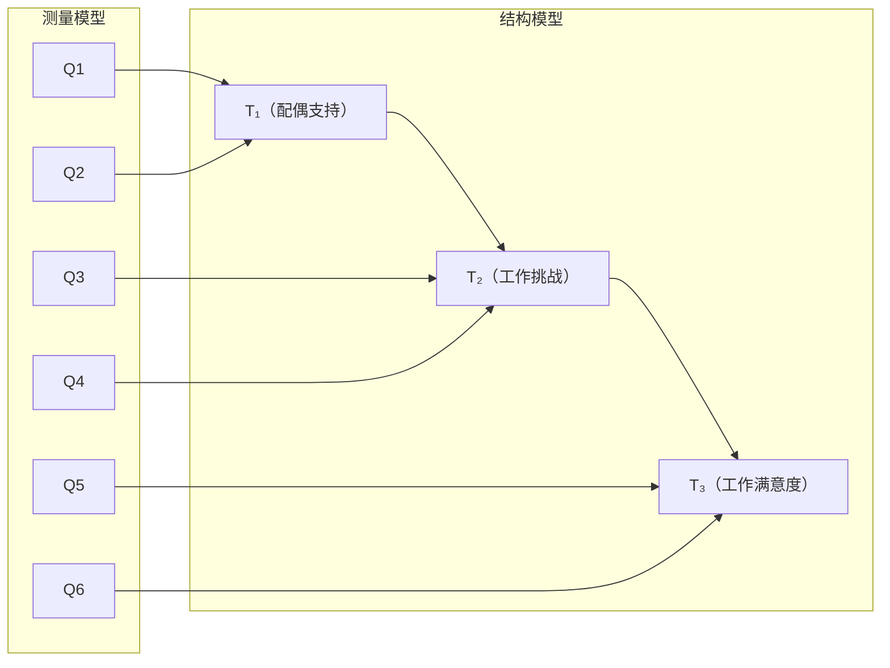
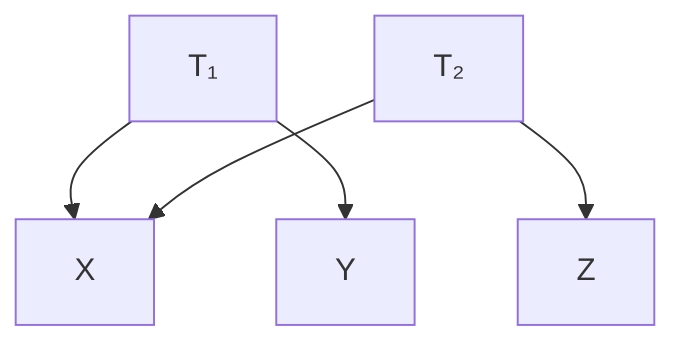
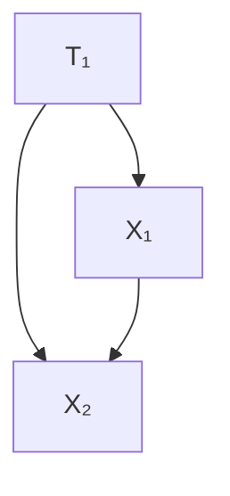
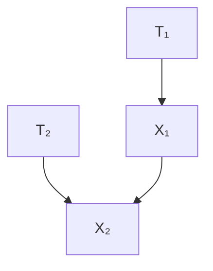
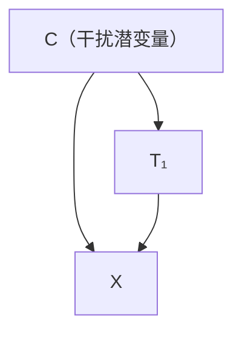
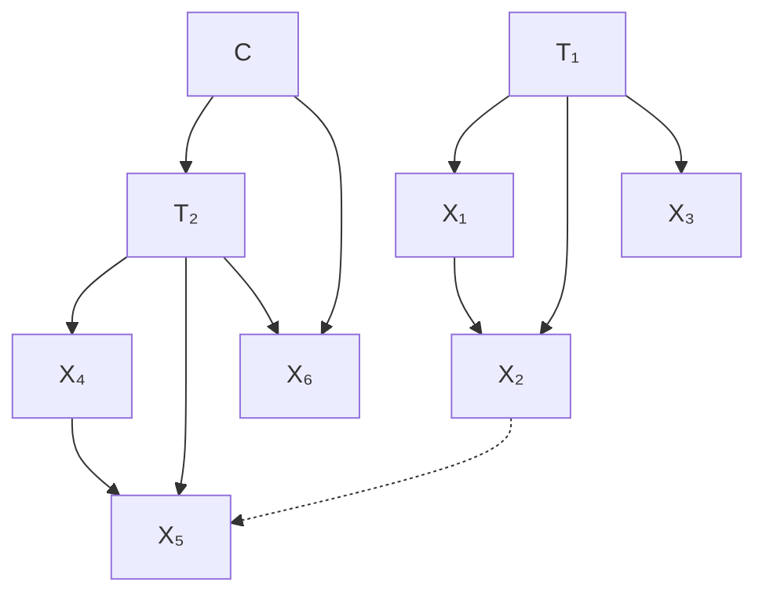
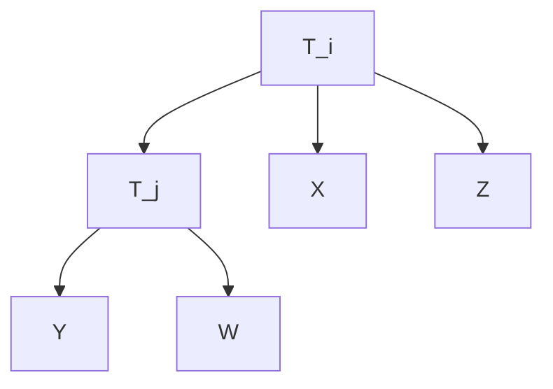
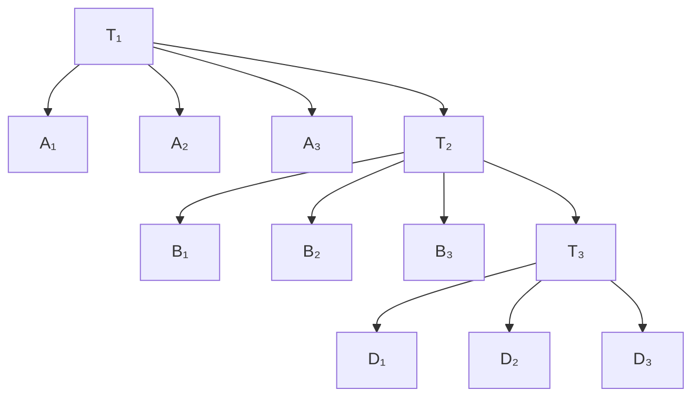
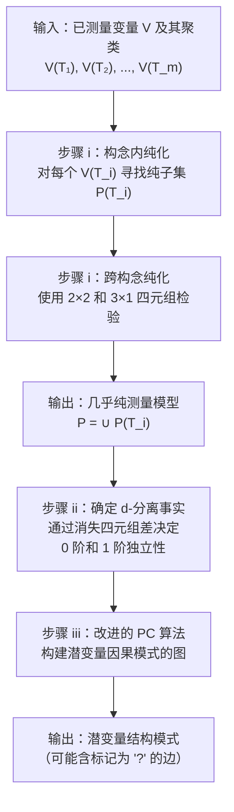
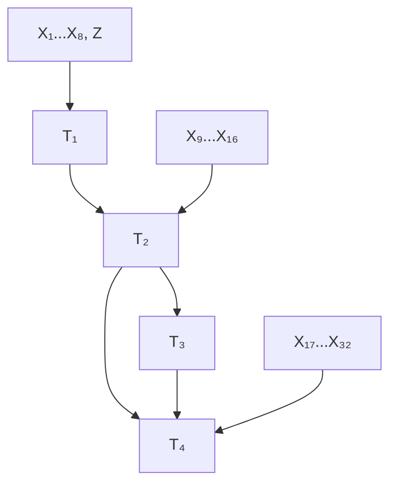

# 第十章：未观测变量的结构 —— 系统梳理与深度学习材料

---

## 目录

1. [引言与问题背景](#1-引言与问题背景)
2. [核心概念与定义体系](#2-核心概念与定义体系)
3. [算法总览：三步骤策略](#3-算法总览三步骤策略)
4. [寻找几乎纯测量模型](#4-寻找几乎纯测量模型)
5. [由观测变量确定的未观测变量事实](#5-由观测变量确定的未观测变量事实)
6. [整合各部分：MIMBuild 算法](#6-整合各部分mimbuild-算法)
7. [模拟检验与实证表现](#7-模拟检验与实证表现)
8. [结论与开放问题](#8-结论与开放问题)

---

## 1. 引言与问题背景

### 1.1 核心研究问题

在许多社会科学研究中（计量经济学、心理测量学、社会学等），研究者假设存在一些**未被直接测量**但对**已测量变量**产生影响的潜在变量。典型场景包括：

- 通过问卷项目 $Q_1, Q_2, ..., Q_{12}$ 测量"工作满意度"、"配偶支持"等潜变量
- 每个潜变量通常由多个测量指标（问卷项目）来反映
- 研究者真正感兴趣的是**潜变量之间的因果结构**，而非测量指标之间的关系

### 1.2 传统方法的局限性

传统做法存在严重缺陷：

> **传统做法**：对视为同一潜变量代理变量的多个测量值取平均，形成聚合量表，然后研究量表间的相关性。

**问题**：由此获得的相关性与潜变量之间的因果关系**没有简单的系统性联系**。换言之，聚合量表的相关矩阵并不忠实地反映潜变量因果结构。

### 1.3 本章的核心贡献

本章试图回答一个根本问题：

> 将关于测量指标的实质性知识与指标的统计观测相结合，能否揭示未观测变量的因果结构？在分布假设和线性假设下，能揭示到什么程度？

---

## 2. 核心概念与定义体系

### 2.1 变量集合的划分

设全体变量分为三类：

| 符号 | 含义 | 性质 |
|------|------|------|
| $\mathbf{T}$ | 潜变量集合（感兴趣的未测量变量） | 假设**因果充分**（causally sufficient） |
| $\mathbf{V}$ | 已测量变量集合（如问卷回答） | 可观测，有统计数据 |
| $\mathbf{C}$ | 干扰潜共同原因集合 | $\mathbf{T} \cup \mathbf{V}$ 中两个或多个变量的未观测共同原因，不在 $\mathbf{T}$ 中 |

### 2.2 测量模型与结构模型

在**含潜变量的结构方程模型**中，图 $G$ 被分为两部分：



- **结构模型**：仅涉及潜变量之间的因果连接
- **测量模型**：$G$ 中除 $\mathbf{T}$ 成员之间边之外的所有边

> ⚠️ 重要说明：这种区分仅标志着**研究兴趣和可及性的差异**，而非形式属性上的区别。连接图、概率和原因的相同原则同时适用于两者。

### 2.3 测量变量的聚类

研究者能够根据先验知识将 $\mathbf{V}$ 划分为聚类 $\mathbf{V}(T_i)$，使得 $\mathbf{V}(T_i)$ 中的变量都是 $T_i$ 的**直接效应**（即测量指标）。

**示例**：
- $\mathbf{V}(T_1) = \{X_1, X_2, X_3\}$ 测量 $T_1$
- $\mathbf{V}(T_2) = \{X_4, X_5, X_6\}$ 测量 $T_2$

### 2.4 四种不纯类型（关键定义）

在一个理想情况下，每个测量变量应**仅**是其目标潜变量的直接效应。但现实中存在四种使其"不纯"的原因（穷尽列举）：

#### 类型 (i)：潜-测量不纯（Latent-Measured Impure）

> 存在从 $T_i$ 到 $V \in \mathbf{V}(T_i)$ 的有向边，但也存在 $V$ 与 $T_j$ 之间的**路径（trek）**，该路径不经过 $T_i$ 或其他 $\mathbf{V}$ 成员。



$X$ 同时受 $T_1$ 和 $T_2$ 的影响 → 潜-测量不纯。

#### 类型 (ii)：构念内不纯（Intra-Construct Impure）

> 来自同一聚类 $\mathbf{V}(T_i)$ 的两个变量 $V_1, V_2$ 之间存在一条不包含 $\mathbf{T}$ 任何成员的路径。



$X_1$ 和 $X_2$ 之间存在直接边 → 构念内不纯。

#### 类型 (iii)：跨构念不纯（Cross-Construct Impure）

> 来自不同聚类 $\mathbf{V}(T_i)$ 和 $\mathbf{V}(T_j)$ 的两个变量 $V_1, V_2$ 之间存在一条不包含 $\mathbf{T}$ 任何成员的路径。



#### 类型 (iv)：共同原因不纯（Common Cause Impure）

> $\mathbf{C}$ 中存在一个变量，它是 $T_i$ 与 $\mathbf{V}(T_i)$ 某成员 $V$ 之间路径的源头。



### 2.5 综合示例

下图展示了所有四种不纯类型：



其中 $\mathbf{V}(T_1) = \{X_1, X_2, X_3\}$，$\mathbf{V}(T_2) = \{X_4, X_5, X_6\}$：

| 变量 | 不纯类型 | 判断理由 |
|------|----------|----------|
| $X_4$ | 潜-测量不纯 | 存在 $X_4$ 到 $T_1$ 的路径（通过 $X_5$） |
| $X_1, X_2$ | 构念内不纯 | $X_1 \to X_2$ 是不经过 $\mathbf{T}$ 的路径 |
| $X_2, X_5$ | 跨构念不纯 | $X_2$ 与 $X_5$ 间存在不经过 $\mathbf{T}$ 的路径 |
| $X_6$ | 共同原因不纯 | $C$ 是 $T_2$ 和 $X_6$ 的共同原因 |
| $X_3$ | **纯测量** ✅ | 仅由 $T_1$ 导致，无其他不纯来源 |

### 2.6 几乎纯测量模型（Almost Pure Measurement Model）

> **定义**：如果已测量变量中唯一的不纯类型是**共同原因不纯**（类型 iv），则称该测量模型为**几乎纯**的。

> **几乎纯潜变量图**：具有几乎纯测量模型的有向无环图。

---

## 3. 算法总览：三步骤策略

MIMBuild 算法包含三个核心步骤：

| 步骤 | 目标 | 方法 |
|------|------|------|
| **步骤 (i)** | 消除已测量变量，找到最大的几乎纯测量模型（每个潜变量至少两个指标） | 构念内四元组 + 跨构念四元组检验 |
| **步骤 (ii)** | 确定 $\mathbf{T}$ 中变量间的零阶和一阶独立关系 | 消失四元组差（vanishing tetrad differences） |
| **步骤 (iii)** | 构建潜变量因果结构的模式（pattern） | 改进的 PC 算法（仅用 0 阶和 1 阶信息） |

---

## 4. 寻找几乎纯测量模型

### 4.1 四元组类型

```mermaid
graph TD
    subgraph 构念内四元组
        T1a["T₁"] --> x1["x₁"]
        T1a --> x2["x₂"]
        T1a --> x3["x₃"]
        T1a --> x4["x₄"]
    end
    subgraph 跨构念四元组（2×2）
        T1b["T₁"] --> y1["x₁"]
        T1b --> y2["x₂"]
        T2b["T₂"] --> y3["x₃"]
        T2b --> y4["x₄"]
    end
```

- **构念内四元组**：四个变量全部来自 $\mathbf{V}(T_i)$
- **跨构念四元组（2×2）**：两个来自 $\mathbf{V}(T_i)$，两个来自 $\mathbf{V}(T_j)$，$i \neq j$
- **跨构念四元组（3×1）**：三个来自 $\mathbf{V}(T_i)$，一个来自 $\mathbf{V}(T_j)$，$i \neq j$

### 4.2 原则 P-1：构念内纯度检验

> **(P-1)** 如果一个有向无环图线性地蕴含 $\mathbf{V}(T_i)$ 中所有变量间的四元组差都消失，则 $\mathbf{V}(T_i)$ 中**没有一对变量是构念内不纯的**。

**四元组差（Tetrad Difference）**定义：
$$\tau = \rho_{ij}\rho_{kl} - \rho_{ik}\rho_{jl}$$

其中 $\rho_{ab}$ 是变量 $a$ 和 $b$ 之间的总体相关系数。

如果一个四元组差等于 0，称为**消失四元组差**（vanishing tetrad difference）。

### 4.3 构念内纯化算法

```
算法：构念内纯化
输入：V(T_i) —— 测量 T_i 的变量集合
输出：P(T_i) —— V(T_i) 的最大纯子集

1. 初始化 P(T_i) = V(T_i)
2. 如果 P(T_i) 中所有四元组差通过统计检验 → 退出
3. 否则，对每个变量 X ∈ P(T_i) 评分：
   - 对每个涉及 X 的四元组差 t：
     - 若 t 通过检验 → X 加分
     - 若 t 未通过检验 → X 减分
4. 移除得分最低的变量
5. 返回步骤 2
```

**统计检验准则**：包含 $n$ 个四元组差的集合在显著性水平 $\text{Sig}$ 下通过检验，当且仅当每个单独的四元组差在显著性水平 $\text{Sig}/n$ 下通过统计检验（Bonferroni 校正）。

**惩罚机制**：倾向于更大的子集，因为：
- 大小为 4 的子集：仅需检验 3 个四元组差
- 大小为 5 的子集：需检验 15 个四元组差
- 更大的集合偶然通过所有检验的概率更低 → 更可信

### 4.4 2×2 跨构念四元组：剔除跨构念不纯

在纯测量模型中，无论 $T_i$ 和 $T_j$ 之间的因果联系如何，2×2 四元组都**恰好蕴含一个消失的四元组差方程**：

$$\rho_{XY}\rho_{WZ} - \rho_{XW}\rho_{YZ} = 0$$



**关键性质**：

> 如果 2×2 四元组的四元组差**不消失**，则至少有一对变量（每个构念各一个）是**不纯的**。

通过交叉检验共享变量的多个 2×2 四元组，可以精确定位不纯变量对。

**示例**（图 10.6 情景）：

- $\mathbf{P}(T_1) = \{U, X, W\}$，$\mathbf{P}(T_2) = \{Y, Z, V\}$
- 仅 $\langle W, Y \rangle$ 不纯

| 四元组 | 成员 | 结论 |
|--------|------|------|
| $F_1 = \langle X, W, Y, Z \rangle$ | $\{W,Y\}, \{W,Z\}, \{X,Y\}, \{X,Z\}$ | 其中某对不纯 |
| $F_2 = \langle X, W, Z, V \rangle$ | 均纯 | 排除 $\{X,Z\}, \{W,Z\}$ |
| $F_3 = \langle U, X, Y, Z \rangle$ | 均纯 | 排除 $\{X,Y\}$ |
| **推断** | | $\{W, Y\}$ 不纯 ✅ |

### 4.5 3×1 跨构念四元组：剔除潜-测量不纯

3×1 四元组的性质因不纯位置而异：

```mermaid
graph TD
    subgraph 纯模型（i）
        Ti1["T_i"] --> Tj1["T_j"]
        Ti1 --> X1["X"]
        Ti1 --> Y1["Y"]
        Ti1 --> Z1["Z"]
        Tj1 --> W1["W"]
    end
```

**情况 (i) 纯模型**：$T_i$ 是瓶颈点，所有三个四元组差消失。

```mermaid
graph TD
    subgraph Tj侧不纯（ii）
        Ti2["T_i"] --> X2["X"]
        Ti2 --> Y2["Y"]
        Ti2 --> Z2["Z"]
        Ti2 --> Tj2["T_j"]
        Tj2 --> W2["W"]
    end
```

**情况 (ii) $W$ 不纯**（$\mathbf{P}(T_j)$ 侧）：$T_i$ 仍是瓶颈点，所有三个方程仍被蕴含 → **无法通过 2×2 检测的不纯仍存在**。

```mermaid
graph TD
    subgraph Ti侧不纯（iii）
        Ti3["T_i"] --> X3["X"]
        Ti3 --> Y3["Y"]
        Ti3 --> Z3["Z"]
        Tj3["T_j"] --> W3["W"]
        X3 --> Z3
        Y3 --> Z3
        Z3 --> W3
    end
```

**情况 (iii) $Z$ 不纯**（$\mathbf{P}(T_i)$ 侧）：包含 $\langle Z, W \rangle$ 的四元组差**不消失** → 可以唯一识别 $Z$ 为潜-测量不纯。

> **关键结论**：3×1 四元组中非消失的四元组差可以将**唯一一个测量变量**识别为潜-测量不纯。

**最终结果**：如果每个 $\mathbf{P}(T_i)$ 至少有三个变量，完成所有 3×1 检验后得到 $\mathbf{V}$ 的子集 $\mathbf{P}$，其上的子模型 $G_P$ 是**几乎纯测量模型**。

---

## 5. 由观测变量确定的未观测变量事实

### 5.1 相关性确定零阶独立性

在一个几乎纯潜变量模型中：

> 两个测量变量**不相关** $\iff$ 它们是不同潜变量的效应，且这些潜变量之间**不存在路径**（即给定空集时 d-分离）。

换言之：
$$\rho_{XY} = 0 \iff X \in \mathbf{P}(T_i), Y \in \mathbf{P}(T_j), \text{且 } T_i \text{ 与 } T_j \text{ 之间无路径}$$

### 5.2 定理 10.1：消失四元组差确定一阶 d-分离

这是本章最重要的理论结果，是**四元组表示定理（Tetrad Representation Theorem）**的推论：

> **定理 10.1**：设 $G$ 是定义在 $\mathbf{V} \cup \mathbf{T} \cup \mathbf{C}$ 上的几乎纯潜变量图，$\mathbf{T}$ 因果充分，每个 $T \in \mathbf{T}$ 至少有两个测量指标。则潜变量 $T_1$ 和 $T_3$（测量指标分别包含 $J$ 和 $L$）在给定潜变量 $T_2$（测量指标包含 $I$ 和 $K$）的条件下是 d-分离的，**当且仅当** $G$ 线性蕴含：

$$\rho_{JI}\rho_{LK} = \rho_{JL}\rho_{KI} = \rho_{JK}\rho_{IL}$$

**解释**：
- 三个同时消失的四元组方程等价于 $T_1 \perp\!\!\!\perp T_3 \mid T_2$（给定 $T_2$ 时 $T_1$ 与 $T_3$ d-分离）
- 这是 $1 \times 2 \times 1$ 结构的四元组（一个来自 $T_1$ 的指标，两个来自 $T_2$，一个来自 $T_3$）

### 5.3 图示说明



对于上图，$T_1 \perp\!\!\!\perp T_3 \mid T_2$，这蕴含：对所有 $m, n, o, p$（其中 $o \neq p$），有：

$$\rho_{A_m D_n} \rho_{B_o B_p} = \rho_{A_m B_o} \rho_{D_n B_p} = \rho_{A_m B_p} \rho_{D_n B_o}$$

### 5.4 从四元组差到 d-分离决策

由于通常存在多个 $1 \times 2 \times 1$ 四元组（来自同一对潜变量的不同指标组合），需要聚合：

**聚合策略**：
- 对每个 $1 \times 2 \times 1$ 四元组差进行显著性检验
- 通过检验 → 加 1 分
- 未通过检验 → 减 1 分
- 若最终得分 > 0 → 判定 $T_1$ 与 $T_3$ 被 $T_2$ d-分离

---

## 6. 整合各部分：MIMBuild 算法

### 6.1 完整流程



### 6.2 改进的 PC 算法

标准 PC 算法的两处修改：

1. **限制 d-分离检验的阶数**：从不检验阶数 > 1 的 d-分离关系（PC 算法步骤 B 中 $n$ 的最大值为 1）

2. **限制边定向**：步骤 D 中不对边进行定向以避免环

3. **新增步骤 E**：标记不确定边

**步骤 E 详述**：

> 令 $\mathcal{P}$ 为模式中 $X$ 和 $Y$ 之间所有长度 $\geq 2$ 的无向路径集合。如果 $X$ 和 $Y$ 在模式中相邻，则标记 $X$—$Y$ 为 "?"，除非满足以下任一条件：

| 条件 | 含义 |
|------|------|
| (i) $\mathcal{P}$ 中无路径 | 不存在替代解释 |
| (ii) $\mathcal{P}$ 中每条路径都包含碰撞点 | 替代路径被阻断 |
| (iii) 存在 $Z$ 是 $\mathcal{P}$ 中每条路径的确定非碰撞点 | 公共原因解释被阻断 |
| (iv) $\mathcal{P}$ 中每条路径包含相同子路径 $\langle A, B, C \rangle$ | 结构等价 |

**确定非碰撞点（Definite Noncollider）**：在模式中，$Y$ 是路径 $U$ 上的确定非碰撞点，当且仅当 $X \text{*-*} Y \text{*-*} Z$ 或 $X \leftarrow Y^{*-*} Z$ 是 $U$ 的子路径，或 $X$ 和 $Z$ 不相邻且不是 $X \rightarrow Y \leftarrow Z$ 在 $U$ 上。

### 6.3 定理 10.2：MIMBuild 的保证

> **定理 10.2**：设 $G$ 是几乎纯潜变量图，$\mathbf{T}$ 因果充分，每个 $T \in \mathbf{T}$ 至少有两个测量指标。MIMBuild 的输入为 $G$ 线性蕴含的所有 0 阶和 1 阶消失偏相关性，输出为模式图。则：

**邻接保证（Adjacency）**：

- **A-1**（避免假阳性）：若 $X$ 和 $Y$ 在输出中**不相邻**，则它们在 $G$ 中也**不相邻**。
- **A-2**（避免假阴性）：若 $X$ 和 $Y$ 在输出中**相邻**且边**未被标记为 "?"**，则它们在 $G$ 中也**相邻**。

**定向保证（Orientation）**：

- **O-1**：若输出中有 $X \to Y$，则 $G$ 中 $X$ 和 $Y$ 之间的每条**迹（trek）**都指向 $Y$。
- **O-2**：若输出中有 $X \to Y$ 且边**未被标记为 "?"**，则 $G$ 中有 $X \to Y$。

**解释**：
- 输出包含 $G$ 中**所有必然的边**（未被标记 "?" 的边）
- 输出**可能包含额外边**（标记为 "?" 的边）
- 定向在迹（trek）意义上保守但正确

### 6.4 复杂度分析

| 参数 | 含义 | 复杂度 |
|------|------|--------|
| $n$ | 测量变量总数 | — |
| $m$ | 潜变量数量 | — |
| $s$ | 每个潜变量的测量变量数 | — |

- 最坏情况四元组数量：$O(n^4)$
- 实际检验数量：$O(m^3 \times s^4) = O(n^3 \times s)$
- 由于 $m \times s = n$，复杂度为 $O(n^3 \times s)$

---

## 7. 模拟检验与实证表现

### 7.1 模拟设计

基于图 10.13 的因果图（含 11 个不纯指标）生成数据：



- 外生变量：标准正态分布
- 线性系数：$[0.5, 1.5]$ 内随机选择
- 样本量：100、500、2000
- 每种条件：20 次试验

### 7.2 评估指标

| 指标 | 含义 |
|------|------|
| 0 阶错误纳入（Commission） | 错误地将不相关的潜变量判为相关 |
| 0 阶错误遗漏（Omission） | 错误地将相关的潜变量判为不相关 |
| 1 阶错误纳入 | 错误地判定条件独立性不成立 |
| 1 阶错误遗漏 | 错误地判定条件独立性成立 |
| 完美比例 | 完美识别所有 d-分离关系的样本比例 |

### 7.3 结果

| 样本量 | 0 阶 Commission | 0 阶 Omission | 1 阶 Commission | 1 阶 Omission | 完美比例 |
|--------|:---:|:---:|:---:|:---:|:---:|
| 100 | 2.50% | 0.00% | 3.20% | 5.00% | 65.00% |
| 500 | 1.25% | 0.00% | 0.90% | 0.00% | 95.00% |
| 2000 | 0.00% | 0.00% | 0.00% | 0.00% | **100.00%** |

**关键发现**：
- 随样本量增大，错误率快速下降
- 在 $n=2000$ 时达到完美表现
- 0 阶和 1 阶错误遗漏率更低（保守性偏好）
- 每个潜变量有更多指标时，d-分离决策更可靠
- 混杂比例 > 50% 时，若每个潜变量有十个指标，大样本下仍表现良好

---

## 8. 结论与开放问题

### 8.1 替代策略的局限性

考虑以下替代策略：纯化测量集 → 设定每对潜变量直接相关的"理论模型" → 用 LISREL 等做最大似然估计得潜变量相关矩阵 → 输入 PC/FCI 算法。

**两个明显缺点**：
1. 估计依赖**正态性假设**
2. 初步模拟研究表明：基于**多个消失四元组差的加权平均**来决策，比基于**估计相关性的消失偏相关**更可靠

### 8.2 当前算法的局限性

| 局限 | 说明 |
|------|------|
| 因果充分性假设 | 假设 $\mathbf{T}$ 因果充分，开放问题：不依赖此假设的可靠算法？ |
| 不完备性（方向信息） | 0 阶和 1 阶消失偏相关还蕴含额外定向信息 |
| 不完备性（"?" 边） | 不知 0 阶和 1 阶偏相关是否蕴含关于必然存在边的进一步信息 |
| "?" 边的组合约束 | 有时对于每条标记 "?" 的边，存在不含该边的兼容模式，但不存在同时不含两条或更多此类边的模式 |
| 多重因果路径 | 对具有变量间多重因果路径的潜变量结构提供信息量不大 |

### 8.3 未来方向

> **最重要的扩展方向**：除四元组差外，检验对测量相关性的**高阶约束**（如五个或更多相关性的代数组合），利用由此产生的决策来确定潜变量之间的**高阶 d-分离关系**。

> "必要的理论尚未发展出来。"

---

## 附录：关键公式速查

### 四元组差
$$\tau(i,j;k,l) = \rho_{ij}\rho_{kl} - \rho_{ik}\rho_{jl}$$

### 定理 10.1 核心方程
$$T_1 \perp\!\!\!\perp T_3 \mid T_2 \iff \rho_{JI}\rho_{LK} = \rho_{JL}\rho_{KI} = \rho_{JK}\rho_{IL}$$

### 几乎纯测量模型的构造
$$\mathbf{P} = \bigcup_{T_i \in \mathbf{T}} \mathbf{P}(T_i)$$

### 复杂度
$$O(n^3 \times s) = O(m^3 \times s^4)$$

---

## 附录：读图指南

| 英文术语 | 中文翻译 | 符号 |
|----------|----------|------|
| Latent variable | 潜变量 | $\mathbf{T}$ |
| Measured variable / Indicator | 已测量变量 / 指标 | $\mathbf{V}$ |
| Nuisance latent common cause | 干扰潜共同原因 | $\mathbf{C}$ |
| Almost pure measurement model | 几乎纯测量模型 | — |
| Vanishing tetrad difference | 消失四元组差 | $\tau = 0$ |
| Intra-construct foursome | 构念内四元组 | — |
| Cross-construct foursome | 跨构念四元组 | — |
| d-separation | d-分离 | $\perp\!\!\!\perp$ |
| Trek | 迹 | — |
| Choke point | 瓶颈点 | — |
| Pattern | 模式 | — |
| Definite noncollider | 确定非碰撞点 | — |