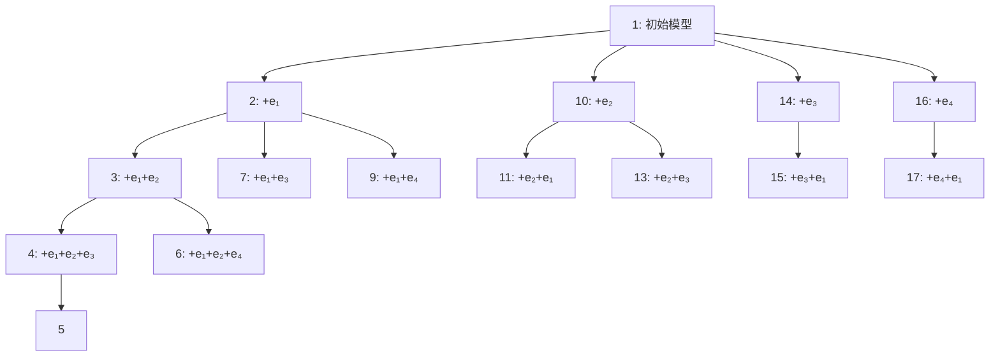
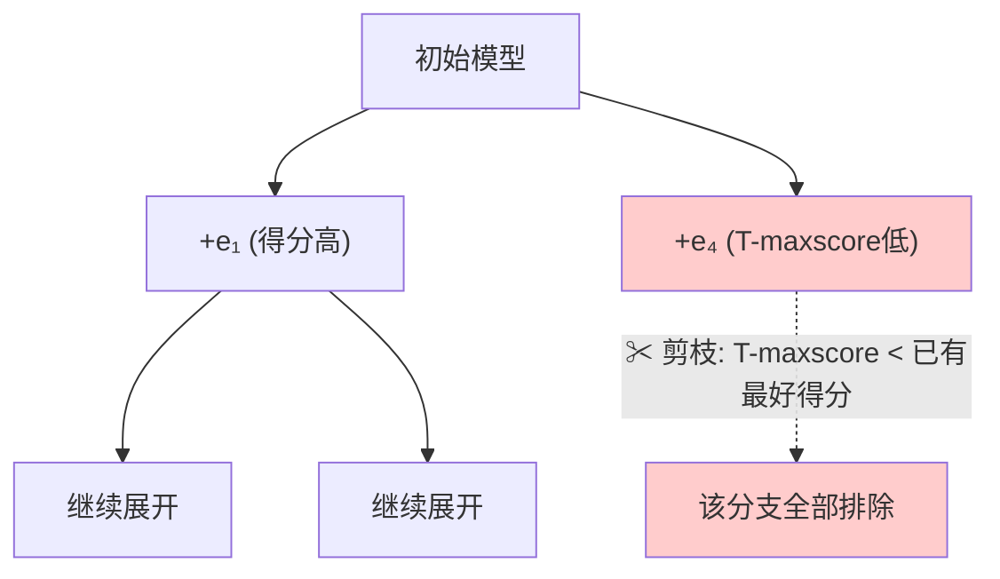
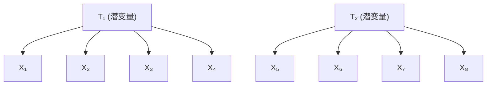

# 第11章：用未测量变量阐述线性理论 —— 系统学习与参考材料

---

## 一、引言与核心问题

### 1.1 什么是"阐述问题"（Elaboration Problem）

在许多实证研究中，研究者面临这样的困境：

> 他们持有一个有一定信心的因果理论，但不确定模型是否包含了**所有重要的因果连接**——或者他们知道模型不完整，却不清楚缺少哪些依赖关系。

**阐述问题**就是：给定一个不完整的初始因果模型和观测数据，如何自动发现缺失的因果连接，从而"阐述"出一个更完整的模型？

这一问题也天然地出现在 **PC** 和 **FCI** 等因果发现算法的输出中——当两个相关变量在输出的模式（pattern）中断开连接时，意味着可能存在未在模式中表示的隐藏机制。

### 1.2 本章的研究范围

本章将阐述问题限制在以下特殊情形：

- **线性结构方程模型**（Linear Structural Equation Models）
- 包含**未测量的共同原因**（潜变量 / latent variables），每个潜变量有一个或多个测量指标
- 变量服从**联合正态分布**

> 作者指出，所开发的通用策略可以适用于无潜变量的模型和离散变量模型。此外，Cooper 和 Herskovits 的贝叶斯方法也是可行的替代方案。

### 1.3 与商业软件的关系

当时已有两个商业软件包能处理不完整结构方程模型的重新设定问题：

| 软件 | 开发者 |
|------|--------|
| **LISREL** | Jöreskog & Sörbom (1984) |
| **EQS** | Bentler (1985) |

本章将对这两个程序的自动搜索程序进行详细的可靠性测试。总体结论是：**它们非常不可靠，但并非完全无用**。

---

## 二、TETRAD II 程序

TETRAD II 程序接受以下输入：

1. **样本量** $N$
2. **相关矩阵或协方差矩阵**
3. **初始线性结构方程模型的有向无环图**（DAG）

### 2.1 方法论三原则

程序基于三个核心方法论原则：

#### 原则一：证伪原则（Falsification Principle）

> 在其他条件相同的情况下，优先选择**不线性蕴含被判断为在总体中不成立的约束**的模型。

直觉：好的模型不应该"预测"那些在数据中被明确拒绝的约束条件。

#### 原则二：解释原则（Explanatory Principle）

> 在其他条件相同的情况下，优先选择**线性蕴含被判断为在总体中成立的约束**的模型。

直觉：如果数据中存在某种规律性（如消失的四元组差异），模型应能从因果结构上解释它，而非将其归因于参数的特殊取值。

#### 原则三：简约原则（Simplicity Principle）

> 在其他条件相同的情况下，优先选择**更简单**（自由参数更少，即边更少）的模型。

#### 原则间的冲突与解决

这三个原则可能相互冲突。例如：在初始模型 $M$ 中添加一条边得到 $M'$：
- $M'$ 蕴含的"成立的约束"更少 → **解释原则**劣势
- $M'$ 蕴含的"不成立的约束"也更少 → **证伪原则**优势
- $M'$ 更复杂 → **简约原则**劣势

TETRAD II 引入了一个**启发式评分函数**来平衡这些维度。

### 2.2 消失的四元组差异（Vanishing Tetrad Differences）

#### 定义

对任意四个不同的测量变量 $I, J, K, L$，其总体相关矩阵为：

$$
\mathbf{R} = \begin{pmatrix}
1 & \rho_{IJ} & \rho_{IK} & \rho_{IL} \\
\rho_{JI} & 1 & \rho_{JK} & \rho_{JL} \\
\rho_{KI} & \rho_{KJ} & 1 & \rho_{KL} \\
\rho_{LI} & \rho_{LJ} & \rho_{LK} & 1
\end{pmatrix}
$$

三个**四元组差异**（Tetrad Differences）定义为：

$$
\begin{aligned}
t_1 &= \rho_{IJ}\rho_{KL} - \rho_{IL}\rho_{JK} \\[4pt]
t_2 &= \rho_{IL}\rho_{JK} - \rho_{IK}\rho_{JL} \\[4pt]
t_3 &= \rho_{IK}\rho_{JL} - \rho_{IJ}\rho_{KL}
\end{aligned}
$$

注意：$t_1 + t_2 + t_3 = 0$，因此这三个差异中仅有两个是独立的。

#### 为什么使用四元组差异

- 某些因果结构会**线性蕴含**某些四元组差异为零（即 $t_i = 0$），不论参数的取值如何。
- 产生图中**不线性蕴含**但参数巧合导致四元组差异消失的系数集合，其**勒贝格测度为零**——即"几乎不可能"偶然出现。

因此，消失的四元组差异是模型对数据施加的**可检验约束**。

#### Wishart 检验

Wishart（1928）证明了在正态性假设下，消失四元组差异 $\rho_{IJ}\rho_{KL} - \rho_{IL}\rho_{JK}$ 的抽样分布方差为：

$$
\text{Var}(t) = \frac{D_{12}D_{34}(N+1)}{(N-1)(N-2)} - D
$$

其中：
- $D$ 是四个变量总体相关矩阵的行列式
- $D_{12}$ 是左上角 $2\times 2$ 子矩阵的行列式
- $D_{34}$ 是右下角 $2\times 2$ 子矩阵的行列式
- $N$ 是样本量

用样本协方差替换总体协方差后，计算 $P(t)$——即假设总体中四元组差异为零时，观察到样本差异不小于实际值的概率。通过查标准正态分布表获得。

Bollen（1990）后来描述了一种渐近分布自由的替代检验方法。

### 2.3 评分函数：Tetrad-score

#### 判定规则

设显著性水平为 $\alpha$（程序中使用 0.05）：

- 若 $P(t_i) > \alpha$：判定该四元组差异在总体中**消失**
- 若 $P(t_i) < \alpha$ 且其他两个差异的 $P > \alpha$：忽略 $t_i$
- 若 $P(t_i) < \alpha$：判定该四元组差异在总体中**不消失**

#### 记号定义

- $\mathbf{Implied_H}$：由模型 $M$ 线性蕴含、且被判定在总体中消失的四元组差异集合
- $\mathbf{Implied_{\sim H}}$：由模型 $M$ 线性蕴含、但被判定在总体中**不**消失的四元组差异集合

#### 评分公式

$$
\boxed{T = \sum_{t \in \mathbf{Implied_H}} P(t) \;-\; \sum_{t \in \mathbf{Implied_{\sim H}}} \text{weight} \times (1 - P(t))}
$$

其中：
- **第一项** $\sum P(t)$ 实现了**解释原则**：模型蕴含的约束成立，得分增加
- **第二项** $\sum \text{weight} \times (1-P(t))$ 实现了**证伪原则**：模型蕴含的约束不成立，得分减少
- **weight（权重）**：控制解释与证伪的相对重要性
- **简约原则**：得分相同时，选择边更少的模型

#### 关键参数

| 参数 | 作用 | 典型取值（大样本） | 典型取值（小样本） |
|------|------|-------------------|-------------------|
| 显著性水平 $\alpha$ | 判定四元组差异是否为零 | 0.05 | 0.05 |
| 权重 weight | 平衡解释与证伪 | 0.1 | 1 |
| 百分比参数 | 限定搜索范围 | 0.95 | 0.90 |

### 2.4 搜索算法

#### 核心思想：树搜索与剪枝

搜索生成初始模型的每一种可能的**单边阐述**（即每次添加一条边），按 Tetrad-score 排序，消除得分低的阐述，然后对保留的每个模型递归重复此过程。

#### 关键量：T-maxscore

对于给定模型 $M$，定义：

$$
\boxed{T\text{-maxscore} = \sum_{t \in \mathbf{Implied_H}} P(t)}
$$

这是 $M$ 的**任何阐述**可能达到的最大 Tetrad-score（因为添加边只会破坏约束，不会增加约束）。

#### 定理 11.1（单调性定理）

> 若 $G$ 是有向无环图 $G'$ 的子图，则 $G'$ 线性蕴含的（$G$ 变量间的）四元组方程集合是 $G$ 线性蕴含的集合的**子集**。

**解释**：向图中添加边只会破坏（或保持）原有的四元组约束，永远不会产生新的四元组约束。

**推论（剪枝规则）**：若模型 $M$ 的 T-maxscore 小于某模型 $M'$ 的实际 Tetrad-score，则 $M$ 及其所有阐述都不可能比 $M'$ 更好，因此可以安全地从搜索空间中**剪除**。

#### 搜索示意图

下图展示了搜索空间的组织（节点内数字表示访问顺序）：

剪枝示意：

#### 搜索策略特点

- **深度优先**：沿着得分最高的分支深入，直到无法改进
- **分支探索**：当多个阐述的 T-maxscore 相近时，并行考虑多个分支（而 LISREL/EQS 只能任意选一个）
- **深度限制**：对于过大的搜索空间，设置深度上限以保证在合理时间内完成

---

## 三、LISREL VI 和 EQS 程序

### 3.1 输入与输出

两个程序共同接受的输入：

1. 样本量
2. 样本协方差矩阵
3. 自变量的初始方差估计
4. 线性系数的初始估计
5. 初始因果模型（以固定为零的参数指定缺失的边）
6. 不允许释放的参数列表
7. 显著性水平
8. 参数估计迭代次数上限

输出：单一估计模型 + 诊断信息 + 建议修订的 $\chi^2$ 值及相关概率。

### 3.2 极大似然估计与拟合函数

两个程序使用极大似然估计，最小化以下拟合函数：

$$
\boxed{F = \log|\Sigma| + \operatorname{tr}(S\Sigma^{-1}) - \log|S| - t}
$$

其中：
- $S$：样本协方差矩阵
- $\Sigma$：模型预测的协方差矩阵
- $t$：指标总数（测量变量个数）
- $|A|$：方阵 $A$ 的行列式
- $\operatorname{tr}(A)$：方阵 $A$ 的迹

在极限情况下，最小化 $F$ 等价于最大化给定因果结构下协方差矩阵的似然。

对于嵌套模型 $M_1 \subset M_2 \subset \dots \subset M_k$，两模型 $\chi^2$ 值之差渐近服从 $\chi^2$ 分布，自由度为两模型自由度之差。

### 3.3 LISREL VI 的搜索：修正指数

**修正指数（Modification Index, MI）** 是拟合函数相对于固定参数的导数的函数：

$$
\text{MI} = \frac{N}{2} \cdot \frac{(\text{一阶导数})^2}{\text{二阶导数}}
$$

其中 $N$ 是样本量。

- MI 提供了释放该参数后 $\chi^2$ **可能减少量**的下界估计
- 释放一个被固定为零的系数等同于在因果图中添加一条对应的边
- LISREL VI 每次释放 MI 最大的参数，然后用新模型重新估计，重复直到 $\chi^2$ 差异不显著

### 3.4 EQS 的搜索：拉格朗日乘数检验

EQS 计算**拉格朗日乘数统计量（LM statistic）**，该统计量渐近服从 $\chi^2$ 分布：

- 执行**单变量 LM 检验**，确定释放每个固定参数对 $\chi^2$ 的近似独立影响
- 释放估计会导致 $\chi^2$ 降低最多的参数
- **关键差异**：与 LISREL VI 不同，EQS 释放参数后不重新估计整个模型

---

## 四、蒙特卡洛模拟研究

### 4.1 研究设计要点

#### 九个因果结构

使用九个不同的含潜变量的结构方程模型，各生成 80 个数据集（40 个 $N=200$，40 个 $N=2000$）。

模型涵盖了：
- **单因子模型**（5 个测量变量）
- **双潜因子多指标模型**（8 个测量变量，2 个潜变量）× 7
- **三潜因子多指标模型**（8 个测量变量，3 个潜变量）× 1

#### 研究设计的理想要求

| 维度 | 说明 |
|------|------|
| 因果结构 | 应覆盖实证研究中常见的类型 |
| 参数大小和符号 | 随机生成（均匀分布 $[0.5, 2.5]$，随机正负号），避免偏向任一程序 |
| 设定错误方式 | 多种类型：潜变量间边、潜变量到测量变量的边、相关误差、测量变量间边 |
| 样本量 | 200 和 2000 两个水平 |
| 完全算法化 | 排除人工判断的干扰 |

#### 起始模型

对于模型 2-8，起始模型为纯因子模型（两个不相关的潜变量，各自影响四个测量指标）：

> 用图论术语来说，起始模型是**树（Trees）**。

#### 数据生成与条件化

- 通过伪随机抽样从标准正态分布生成外生变量值
- 相关误差通过引入新的外生共同原因获得
- 为了消除"条件不良"的影响，研究重复进行，使用**伪相关矩阵**（pseudocorrelation matrix）

---

## 五、结果与性能比较

### 5.1 核心结果

| 指标 | TETRAD II | LISREL VI | EQS |
|------|-----------|-----------|-----|
| **正确率 $N=2000$** | **95.0%** | 18.8% | 13.3% |
| **正确率 $N=200$** | **52.2%** | 15.0% | 10.0% |
| 输出模型数（宽度）$N=2000$ | 1~11.3 | 1 | 1 |
| 输出模型数（宽度）$N=200$ | 1~8.4 | 1 | 1 |

> TETRAD II 的"正确"定义为真实模型出现在其输出的顶级模型集合中。

### 5.2 错误分类

#### TETRAD II 的错误类型

| 错误类型 | 含义 |
|----------|------|
| **过拟合（Overfit）** | 推荐模型是真实模型的细化（多了边） |
| **欠拟合（Underfit）** | 真实模型是推荐模型的细化（少了边） |
| **其他（Other）** | 不属于以上任一类别 |

#### LISREL/EQS 的错误类型

除上述类型外，还包括：

| 错误类型 | 含义 |
|----------|------|
| **在 TETRAD 顶级组中** | 推荐虽不正确，但在 TETRAD II 的最佳备选集合中 |
| **正确变量对** | 推荐的模型连对了被省略边涉及的变量对 |

---

## 六、可靠性与信息量的权衡

### 6.1 两个评价标准

本章提出评价自动搜索程序的两个正交标准：

**可靠性（Reliability）** $P(\text{正确})$
: 程序建议的模型（集合）包含真实模型的概率

**大胆性（Boldness）** $= 1 / (\text{建议模型数})$
: 建议越集中（模型数越少），越大胆

> TETRAD II 在可靠性上远超 LISREL/EQS，但在大胆性上通常不如（因为它输出一个模型集合而非单一模型）。

### 6.2 期望单一模型可靠性

假设从 TETRAD II 的 $n$ 个建议模型中随机选择一个，则期望正确率为：

| 样本量 | TETRAD II（随机选） | LISREL VI | EQS |
|--------|---------------------|-----------|-----|
| 2000 | **42.3%** | 18.8% | 13.3% |
| 200 | **30.2%** | 15.0% | 10.0% |

即使在"最坏情况"下，TETRAD II 的单一模型可靠性仍显著高于 LISREL/EQS。

### 6.3 输出候选集的优势

作者论证了输出一个模型集合而非单一模型的多重优势：

1. **可靠性透明**：用户知道该对建议抱有多大信心
2. **重叠区域可用**：若所有候选模型在某个因果连接上一致，则无需选择单一模型即可得出可靠结论
3. **指导进一步研究**：知道哪些备选模型需要被实验区分，可以设计针对性实验

---

## 七、程序间的一致性与互补性

### 7.1 TETRAD + LISREL/EQS 的协同效应

当两个程序**一致**时（即 LISREL/EQS 的建议在 TETRAD 的顶级组中），两者的正确率均大幅提升：

| 条件 | TETRAD 正确率 | LISREL 正确率 | EQS 正确率 |
|------|--------------|--------------|-----------|
| 总体（$N=2000$） | 95.0% | 18.8% | 13.3% |
| 两者一致时 | **100.0%** | **61.8%** | **53.3%** |
| 两者不一致时 | 92.1% | **0.0%** | **0.0%** |

| 条件 | TETRAD 正确率 | LISREL 正确率 | EQS 正确率 |
|------|--------------|--------------|-----------|
| 总体（$N=200$） | 52.2% | 15.0% | 10.0% |
| 两者一致时 | **75.7%** | **39.4%** | **43.7%** |
| 两者不一致时 | 46.9% | 9.5% | 2.7% |

> 关键发现：在大样本下，当 LISREL/EQS 与 TETRAD II **不一致**时，它们**从未正确过**。一致性是正确性的强信号。

### 7.2 将 LISREL/EQS 作为辅助工具

两种结合使用方式：

1. **TETRAD 生成候选 → LISREL/EQS 筛选**：用 LISREL/EQS 估计 TETRAD 输出的候选模型，丢弃关联概率过低的模型
2. **并行运行**：利用一致性作为可靠性信号

---

## 八、TETRAD II 的局限性

### 8.1 参数巧合导致的消失四元组

如果存在大量并非由真实模型线性蕴含、而是因自由参数巧合取值的消失四元组差异：
- TETRAD II 可能无法找到正确模型
- 但研究表明，在参数服从均匀分布等"自然"分布下，这种情况并非常见

### 8.2 不能保证找到全局最优

搜索并非穷举，不保证找到具有最高 Tetrad-score 的**所有**模型。对于大搜索空间，完全搜索是不切实际的。

### 8.3 简约原则的代价

对于包含对分数无贡献的"冗余边"的模型：
- 简约原则可能导致程序错过正确模型
- 但这些结构通常是**欠识别**的，因此 LISREL/EQS 也无法找到它们

### 8.4 变量数量限制

搜索过程对不超过几十个变量的情况实用。对于更多变量，建议使用第 10 章描述的 **MIMBuild 算法**。

### 8.5 四元组差异的区分能力有限

存在许多潜变量模型，无法通过其蕴含的消失四元组差异区分，但**原则上在统计上是可区分的**。LISREL/EQS 的更可靠版本可能能够发现此类结构。

---

## 九、统计搜索的启示

作者总结了 TETRAD II 优于 LISREL/EQS 的三个根本原因及其方法论启示：

### 原因一：无需参数估计即可搜索

> LISREL/EQS 必须在错误的初始模型上进行参数估计，经常无法收敛或产生高度不准确的估计，进而破坏搜索。

**启示**：
> 尽可能避免迭代数值过程。

### 原因二：分支搜索 vs. 任意选择

> 当多个模型的得分并列时，TETRAD II 考虑**每个**模型的细化；而 LISREL/EQS 任意选择**一个**模型进行细化。

**启示**：
> 结构化搜索，以便在备选步骤看起来同样好时能够进行**分支**。

### 原因三：更可靠的停止准则

> LISREL/EQS 在决定何时停止添加边方面的可靠性低于 TETRAD II。

**启示**：
> - 寻找能够可靠修剪搜索树的**结构属性**。
> - 为计算效率起见，尽可能使用**局部属性**。
> - 在没有充分证据表明统计检验作为停止标准可靠的情况下，**不要依赖它们**。

### 最终启示

> 一旦目标被清晰且坦诚地给出，如果短期内甚至长期内都无法提供可靠性的理论证明，**计算机提供了在受控条件下对程序进行可靠性实验测试的机会**。

---

## 十、核心公式与概念汇总

| 概念 | 公式/定义 |
|------|----------|
| 四元组差异 $t_1$ | $\rho_{IJ}\rho_{KL} - \rho_{IL}\rho_{JK}$ |
| 四元组差异 $t_2$ | $\rho_{IL}\rho_{JK} - \rho_{IK}\rho_{JL}$ |
| 四元组差异 $t_3$ | $\rho_{IK}\rho_{JL} - \rho_{IJ}\rho_{KL}$ |
| Wishart 方差 | $\frac{D_{12}D_{34}(N+1)}{(N-1)(N-2)} - D$ |
| Tetrad-score | $T = \sum_{\text{Implied}_H} P(t) - \sum_{\text{Implied}_{\sim H}} w \cdot (1-P(t))$ |
| T-maxscore | $\sum_{t \in \text{Implied}_H} P(t)$ |
| LISREL/EQS 拟合函数 | $F = \log|\Sigma| + \operatorname{tr}(S\Sigma^{-1}) - \log|S| - t$ |
| 修正指数 (MI) | $\frac{N}{2} \cdot \frac{(\partial F / \partial \theta)^2}{\partial^2 F / \partial \theta^2}$ |
| 可靠性 | $P(\text{正确模型} \in \text{输出})$ |
| 大胆性 | $1 / (\text{建议模型数})$ |

---

## 十一、总结

本章系统研究了**用未测量变量阐述不完整线性因果模型**的问题，核心贡献包括：

1. **提出了基于消失四元组差异的阐述方法**（TETRAD II），其搜索策略利用了四元组约束的单调性（定理 11.1）进行高效剪枝
2. **通过大规模蒙特卡洛模拟**，在九种因果结构、两种样本量下全面比较了 TETRAD II 与当时主流商业软件 LISREL VI 和 EQS
3. **证明了 TETRAD II 的显著优越性**：大样本下正确率 95% vs. LISREL 18.8%、EQS 13.3%
4. **揭示了统计搜索的一般原则**：避免迭代数值过程、采用分支搜索、使用结构属性剪枝、不过度依赖渐近检验作为停止准则
5. **提出了可靠性与大胆性的权衡框架**：输出模型集合而非单一猜测，在保持高可靠性的同时为后续研究提供信息

这一章不仅是因果发现方法的技术展示，更是关于**自动化统计搜索哲学**的深刻反思——"计算很重要，在大型搜索空间中，计算的重要性远超过使用那些在计算免费的情况下本应最优的检验。"