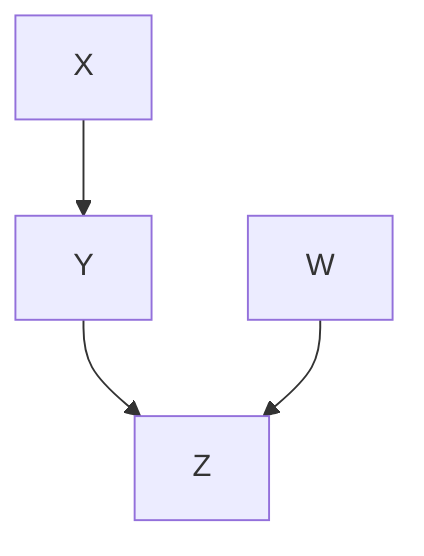
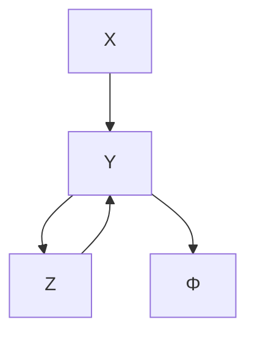
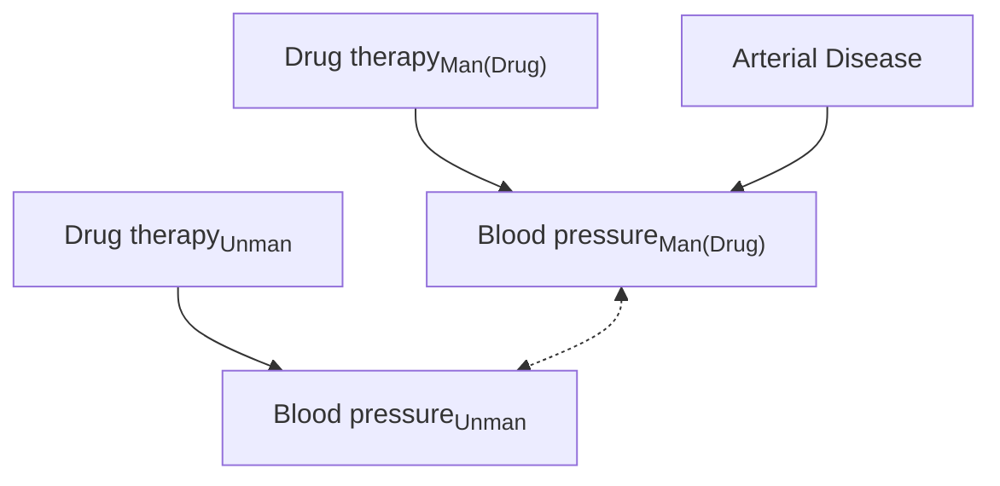
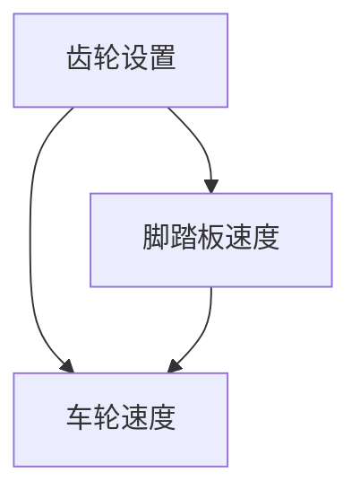
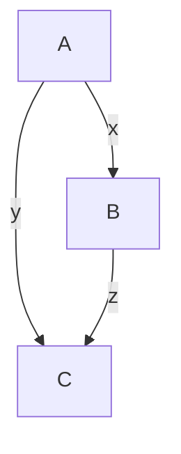
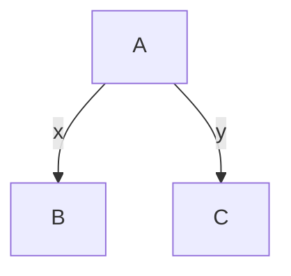
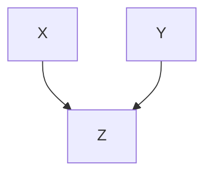
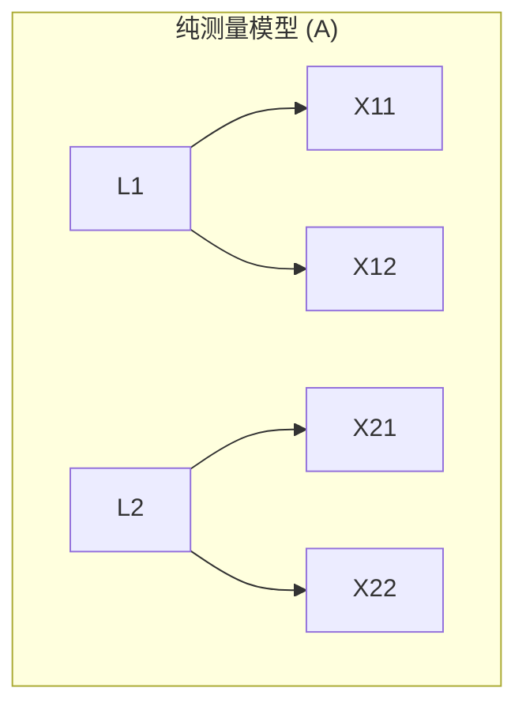
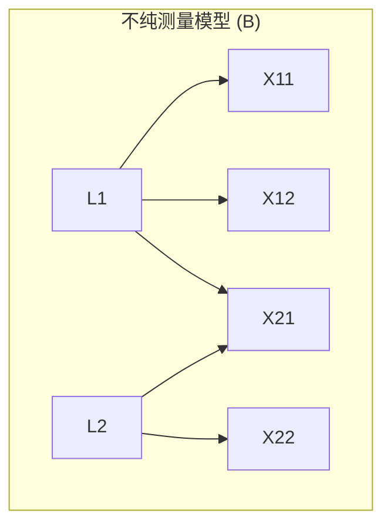

Now I have the complete content. Let me produce a comprehensive, well-structured learning and reference document covering this entire chapter.

---

# 第十二章：前传与续篇（Prequels and Sequels）——系统学习与参考材料

---

## 目录

1. [图形表示、独立性与数据生成过程](#12.1)
2. [等价性](#12.2)
3. [预测与操控](#12.3)
4. [一致性](#12.4)
5. [搜索](#12.5)
6. [有限样本](#12.6)
7. [结构方程模型](#12.7)
8. [应用](#12.8)
9. [基础性问题及与其他学科的关系](#12.9)

---

## 12.1 图形表示、独立性与数据生成过程

### 核心思想

本章系统梳理了多种用于表示概率分布约束和数据生成过程的图形对象。每种对象都伴随将图形结构与条件独立性联系起来的**马尔可夫性质（Markov properties）**。

按 Lauritzen 等人（1990）的术语：
- **局部马尔可夫性质**：第 2 章中的马尔可夫条件
- **全局马尔可夫性质**：d-分离

---

### 12.1.1 马尔可夫条件（Markov Conditions）

#### 定义与解释

**因果马尔可夫条件（Causal Markov Condition）**：对局部马尔可夫性质的因果解释。它必然适用于任何可由 DAG 表示的系统，其中：
- **外生变量（exogenous variables）**（零入度顶点表示的变量）是独立分布的
- 每个变量是其父变量（直接原因）与唯一、联合独立的噪声/误差的任何可测、确定性函数

#### 因果马尔可夫条件可能不成立的七种情况

| 序号 | 情况 | 说明 |
|------|------|------|
| 1 | 抽样误差 | 样本不一定反映总体 |
| 2 | 抽样机制与观测变量的因果关系 | 选择偏差 |
| 3 | 缺乏因果充分性 | 存在未观测的潜变量 |
| 4 | 变量值聚合 | 如将血压表示为"低/中/高"而非实数 |
| 5 | 定义性函数关系 | 如 $X$ 和 $X^2$ |
| 6 | 单元间因果异质性 | 某些单元 $A \to B$，另一些 $B \to A$ |
| 7 | 可逆系统 | 反馈系统 |

#### 举例说明：Sober 的面包价格与海平面

> **Sober (1987) 的批评**：英国面包价格与威尼斯海平面都上涨因而相关，但无因果关系。

> **回应**：不清楚单元是什么。若单元是年份，则存在单元间因果关系。取差分消除单元间因果关系后，没有理由相信差值相关。若不同年份的变量是不同的变量，则只有一个单元，无法定义相关。

---

### 12.1.2 有向循环图（Directed Cyclic Graphs, DCGs）

#### 与结构方程模型（SEM）的关系

DCG 是结构方程模型（SEM）的图形表示（在 SEM 文献中称"**路径图（path diagram）**"）。

**基本设定**：
- **误差项 $\varepsilon_i$**：为系统提供所有外生随机变异
- **实质性变量**：由方程 $X_i = f_i(\text{pa}(X_i)) + \varepsilon_i$ 决定
- 若误差项独立，则不在路径图中显式连接
- 若误差项相依，用**双头边 $\leftrightarrow$** 连接

#### 示例：图 12.1 的线性 SEM

$$
\begin{aligned}
X &= \varepsilon_X \\
Y &= a \times X + b \times Z + \varepsilon_Y \\
W &= \varepsilon_W \\
Z &= c \times W + d \times Y + \varepsilon_Z
\end{aligned}
$$

其中 $\varepsilon_X, \varepsilon_Y, \varepsilon_Z, \varepsilon_W$ 联合独立的标准高斯分布。

#### 关键结论

1. **d-分离直接推广到 DCG**：DAG 中 d-分离的定义可原封不动沿用。
2. Spirtes (1994, 1995) 和 Koster (1995, 1996) 证明：若在线性 SEM 对应的 DCG 中 $X$ 和 $Z$ 在给定 $Y$ 下 d-分离，则蕴含 $\mathbf{X} \bot\bot \mathbf{Z} \mid \mathbf{Y}$。
3. **分解条件不能天真推广**：对 DCG，$P(Y,Z) = P(Y|Z)P(Z|Y)$ 隐含 $Y$ 和 $Z$ 独立——这是荒谬的。
4. Pearl 和 Dechter (1996) 证明：若外生变量联合独立且唯一决定内生变量值，则即使路径图有环，d-分离仍蕴含条件独立性。

#### 混合总体的 DCG 表示

考虑两个子总体分别具有因果 DAG (i) 和 (ii)，合并后可用 DCG (iii) 表示，其中 $\Phi$ 编码哪条路径成立：

---

### 12.1.3 部分祖先图（Partial Ancestral Graphs, PAGs）

#### 动机

任何图模型都不可避免地遗漏某些方面（如机制细节、时间延迟）。PAG 是对一类 DAG 或特定 DAG 的不完整描述，能表示 **马尔可夫等价类** 或 **O-马尔可夫等价类** 的共同特征。

#### 关键概念

- **潜变量（latent/hidden variables）**：所有单元都未观测到的变量
- **选择变量（selection variables）** $S_X$：对 $X$ 被测量的单元为 1，否则为 0
- **选择偏差（selection bias）**：选择变量与观测变量有因果关系
- **O-马尔可夫等价**：两个图 $G_1(O,S,L)$ 和 $G_2(O,S,L)$ 关于 $\mathbf{O}$ 中变量蕴含相同的条件独立关系

#### PAG 的定义（Definition 12.1.1）

PAG 可包含四种边：
- 有向边：$\rightarrow$
- 双箭头边：$\leftrightarrow$
- 半有向边：$\circ\!\!\rightarrow$
- 无向边：$\circ\!\!-\!\!\circ$

$\mathcal{P}$ 是表示类 $\Delta$ 的 PAG 当且仅当满足七条规则（定义 12.1.1）：

1. 所有顶点在 $\mathbf{O}$ 中
2. $A$ 和 $B$ 之间存在边，当且仅当对每个 $\mathbf{W} \subseteq \mathbf{O}\setminus\{A,B\}$，在 $\Delta$ 的每个图中 $A$ 和 $B$ 在给定 $\mathbf{W} \cup \mathbf{S}$ 下是 d-连通的
3. $A \to B$ 或 $A\circ\!\!\to B$：在 $\Delta$ 的每个图中 $A$ 是 $B$ 或 $\mathbf{S}$ 的祖先
4. $A \leftarrow B$ 或 $A \leftrightarrow B$：在 $\Delta$ 的每个图中 $B$ 不是 $A$ 或 $\mathbf{S}$ 的祖先
5. 下划线连接结构 $A *\!\!-\!\!* B *\!\!-\!\!* C$：$B$ 是 $A$、$C$ 或 $\mathbf{S}$ 中至少一个的祖先
6. $A \to B \leftarrow C$ 的虚下划线：$B$ 不是 $A$ 和 $C$ 共同子节点的后代
7. 其余端点保留小圆圈 `o`

#### FCI 算法的输出

**FCI 算法**输出关于 DAG 的 O-马尔可夫等价类的 PAG。在假设非忠实分布概率为零且因果马尔可夫条件成立时，大样本极限下以概率 1 正确，即使存在潜变量和选择偏差。

---

### 12.1.4 混合祖先图（Mixed Ancestral Graphs, MAGs）

#### 引入动机

1. 提供判断两个 DAG 是否在边缘分布中蕴含相同条件独立性的直接方法
2. 仅对观测变量蕴含独立性/条件独立性约束，且具有**明确定义的维度**，便于计算 BIC/AIC/MDL 分数

#### MAG 的定义（Definition 12.1.2）

MAG $M$ 表示 DAG $G(O,S,L)$ 当且仅当：

| 条件 | MAG 中的边 | DAG 中的含义 |
|------|-----------|--------------|
| (1) | $A$ 和 $B$ 之间有边 | 对所有 $\mathbf{W} \subseteq \mathbf{O}\setminus\{A,B\}$，$A$ 和 $B$ 在给定 $\mathbf{W} \cup \mathbf{S}$ 时 d-连通 |
| (2) | $A \to B$ | $A$ 是 $B$ 的祖先，但**不是** $\mathbf{S}$ 的祖先 |
| (3) | $A \leftrightarrow B$ | $A$ 不是 $B$ 或 $\mathbf{S}$ 的祖先 |
| (4) | $A \circ\!\!\to B$ 或 $A\circ\!\!-\!\!\circ B$ | $A$ 是 $\mathbf{S}$ 的祖先 |

#### m-分离（m-separation）——d-分离到 MAG 的自然推广

**基本概念**：
- **路径**：任意类型边的序列
- **有向路径**：仅有向边 $X_i \to X_{i+1}$
- **祖先**：$V = X_i$ 或存在从 $V$ 到 $X_i$ 的有向路径
- **碰撞点（collider）**：路径上的 $X_{i-1}\,*\!\!\to X_i \leftarrow\!\!*\,X_{i+1}$

**m-连通**：存在一条路径 $U$ 连接某个 $X \in \mathbf{X}$ 和某个 $Y \in \mathbf{Y}$，使得：
- $U$ 上每个碰撞点是 $\mathbf{Z}$ 中某成员的后代
- $U$ 上无非碰撞点在 $\mathbf{Z}$ 中

**m-分离**：给定 $\mathbf{Z}$ 时 $\mathbf{X}$ 和 $\mathbf{Y}$ 不是 m-连通的。

> **重要性质**：当应用于 DAG 时，m-分离与 d-分离等价。

#### MAG 与摘要图（Summary Graph）的区别

| 特征 | MAG | 摘要图 |
|------|-----|--------|
| 缺失边的含义 | 蕴含条件独立关系 | 不蕴含 |
| 多边 | 一对变量间最多一条边 | 可有多条边 |
| 高斯情况可识别性 | 总是可识别 | 不总是 |
| 约束类型 | 仅条件独立性 | 可能有非条件独立性约束 |

---

### 12.1.5 链图（Chain Graphs, CGs）

#### 定义

链图可包含有向边和无向边，但**不能包含部分有向环**（即 $n$ 条边组成的序列中至少有一条有向边，且构成环）。

#### 两种马尔可夫条件

**1. Lauritzen-Wermuth-Frydenberg (LWF) 全局马尔可夫性质**：

- **前位（anterior）**：$V$ 是 $W$ 的前位，若存在从 $V$ 到 $W$ 的路径 $P$，且 $P$ 上每条有向边 $X \to Y$ 均有 $Y$ 在 $X$ 和 $W$ 之间
- **复合结构（complex）**：$X \to V_1 - \ldots - V_n \leftarrow Y, n \geq 1$
- **道德图 Moral(CG)**：将复合结构的端点 $X$ 和 $Y$ 用无向边连接，再将所有有向边替换为无向边
- $CG$ 蕴含 $\mathbf{X} \bot\bot \mathbf{Z} \mid \mathbf{Y}$，如果在 $Moral(CG(Ant(\mathbf{Z} \cup \mathbf{Y} \cup \mathbf{X})))$ 中 $\mathbf{X}$ 被 $\mathbf{Y}$ 从 $\mathbf{Z}$ 分离

**2. Andersson-Madigan-Perlman (AMP) 全局马尔可夫性质**：

- **连通（connected）**：$V$ 和 $W$ 之间存在仅含无向边的路径
- **三叉结构（triplex）**：$X \to Y - Z$、$X \to Y \leftarrow Z$ 或 $X - Y \leftarrow Z$
- **双旗结构（bi-flag）**：$<X, A, B, Y>$ 诱导子图有 $X \to A$、$Y \to B$ 和 $A - B$
- **增广图 Aug(CG)**：增广所有三叉和双旗结构（添加 $X-Z$ 或 $X-Y$ 边），替换所有有向边为无向边
- $CG$ 蕴含 $\mathbf{X} \bot\bot \mathbf{Z} \mid \mathbf{Y}$，如果在 $Aug[CG; X, Y, Z]$ 中 $\mathbf{X}$ 被 $\mathbf{Y}$ 从 $\mathbf{Z}$ 分离

#### 链图与数据生成过程

Lauritzen 提出：像 $CG_1$ 这样的链图（LWF）给出某些**动力系统极限分布**中的条件独立关系。过程类似迭代抽样：
1. $t=0$：抽取 $A_0, B_0$，设定 $Y_0$
2. 从 $P(X|Y_0, A_0)$ 抽 $X_1$，从 $P(Y|X_1, B_0)$ 抽 $Y_1$
3. 重复迭代直到收敛

---

## 12.2 等价性（Equivalence）

### 基本概念

#### 分布等价（Distribution Equivalence）

两个 DAG $G_1$ 和 $G_2$ 是分布等价的，当且仅当 $P(\mathbf{V})$ 满足 $G_1$ 的局部马尔可夫性质等价于满足 $G_2$ 的局部马尔可夫性质。

#### O-分布等价（O-Distribution Equivalence）

$G_1(\mathbf{O}, \mathbf{S}, \mathbf{L})$ 和 $G_2(\mathbf{O}, \mathbf{S}, \mathbf{L}')$ 是 O-分布等价的，如果观测分布 $P(\mathbf{O}|\mathbf{S}=\mathbf{1})$ 满足二者之一的局部马尔可夫性质当且仅当满足另一个。

> **重要关系**：无潜变量和选择偏差时，O-分布等价当且仅当 O-马尔可夫等价。但存在潜变量或选择偏差时，这通常不成立。

### 定理 12.2.1（Spirtes 和 Verma）

两个 DAG $G$ 和 $H$ 在 $\mathbf{O}$ 上蕴含相同的独立性和条件独立关系，当且仅当以 $G$ 为 O-预言机的 FCI 算法输出等于以 $H$ 为 O-预言机的 FCI 算法输出。

### Tarski 可判定性方法（Geiger 和 Meek, 1999）

**基本思想**：
1. 将线性高斯 SEM 的协方差写为参数的**多项式函数**
2. 分布等价性可表示为**实闭域（RCF）**中的一阶句子
3. Tarski 定理保证了 RCF 的完备性和量词消去
4. 因此**存在判定分布等价性的算法**

> **局限**：Tarski 的决策过程是**超指数级**的，目前仅能处理约 3 个变量的情况。

---

## 12.3 预测与操控（Prediction and Manipulation）

### 12.3.1 因果性与虚拟条件句

#### Rubin 方法的问题

- 引入虚拟变量 $Y_{X=0}$（表示"如果 $X$ 被操控为 0 时 $Y$ 的值"）
- 需要虚拟变量与实然变量的联合分布
- 人们难以对虚拟变量与实然变量的独立性做出准确判断

#### DAG 策略变量方法

- 不引入新虚拟变量，而是添加**策略变量（policy variable）**
- 从策略变量指向 $X$ 的边
- 以策略变量为条件进行计算
- 引出**定理 7.1**（Pearl 的"干预演算"）

#### 虚拟变量的结构方程解释（Balke-Pearl 方法）

将操控变量拆分为操控版本和未操控版本：

$$
\begin{aligned}
\text{Blood pressure}_{\text{Man(Drug)}} &= a \times \text{Drug therapy}_{\text{Man(Drug)}} + b \times \text{Arterial disease} + 100 + \varepsilon_{bp} \\
\text{Blood pressure}_{\text{Unman}} &= a \times \text{Drug therapy}_{\text{Unman}} + b \times \text{Arterial disease} + 100 + \varepsilon_{bp}
\end{aligned}
$$

对应图 12.7：

**m-分离分析**：
$$P(\text{Arterial disease} \mid \text{Blood pressure}_{Unman}, \text{Drug therapy}_{Man(Drug)}) = P(\text{Arterial disease} \mid \text{Blood pressure}_{Unman})$$

即在给定实际血压的人群中，该药物没有因果效应。

#### 充分性、必要性和必要充分因果

在 Pearl (2000) 的符号中，$Y_x(u)$ 表示外生变量取 $u$ 时将 $X$ 操控为 $x$ 时 $Y$ 的响应：

| 缩写 | 全称 | 定义 |
|------|------|------|
| PS | 充分性概率 (Probability of Sufficiency) | $P(y_x \mid x', y')$ |
| PN | 必要性概率 (Probability of Necessity) | $P(y'_{x'} \mid x, y)$ |
| PNS | 必要充分因果概率 | $P(y_x, y'_{x'})$ |

**可识别性条件**（Pearl 2000）：
- $X$ 外生于 $Y$（无共同原因）
- $X$ 单调于 $Y$（$y'_x \land y_{x'}$ 为假）
- 则 PS, PN, PNS 均可识别

#### 结构方程语义的两个公理

1. **组合性（Composition）**：若 $W_{\mathbf{x}}(u)=w$，则 $Y_{\mathbf{x}w}(u)=Y_{\mathbf{x}}(u)$
2. **有效性（Effectiveness）**：$X_{xw}(u)=x$

---

### 12.3.2 计算干预效应

#### 历史发展脉络

1. **Strotz 和 Wold (1960)**：将方程中被操纵变量替换为干预值 → 操纵定理
2. **Robins (1986)**：G-计算公式（等价于操纵定理，非图形化表述）
3. **Pearl 和 Robins (1995)**：将 G-计算转化为图形术语
4. **Pearl (1995)**：干预演算的三条规则
5. **Galles 和 Pearl (1995)**：识别干预效应的多项式时间算法

#### 干预演算与定理 7.1

定理 7.1 和干预演算都等价于：当策略变量在给定 $\mathbf{Z}$ 下与 $Y$ 是 **d-分离** 时，$P(Y|\mathbf{Z})$ 在操控下保持不变。

#### 预测算法 vs. Pearl 的方法

| 维度 | 预测算法 | Pearl 的方法 |
|------|----------|-------------|
| 输入 | 数据 → POIPG | 可能含潜变量的 DAG |
| 方法 | 定理 7.1 的推论 | 干预演算 |
| 目标 | 操作量表示为观测变量的函数 | 递归计算可识别的量 |

#### 因果关系可逆情况的扩展

考虑自行车齿轮系统：
- 踏板转速 + 齿轮设置 → 后轮转速
- 反向推动后轮 → 影响踏板转速但**不**影响齿轮设置

---

## 12.4 一致性（Consistency²）

### 核心问题

**什么假设能保证从观测数据中得出因果结论的"可靠"过程的存在？**

本节讨论三种逐渐增强的一致性概念，均基于 Robins, Scheines, Spirtes, and Wasserman (1999)。

### 示例：图 12.11 中的三个模型

**模型 M**：$B = xA + \varepsilon_B,\; C = yA + zB + \varepsilon_C$

**模型 N**：$B = \varepsilon_B,\; C = \varepsilon_C$（无因果关系）

**模型 Q**：$B = xA + \varepsilon_B,\; C = yA + \varepsilon_C$（仅共同原因）

#### 关键参数

- $\rho(B,C) = (x \times y) + z$（模型 M），$=0$（模型 N），$= x \times y$（模型 Q）
- **处理效应**：B 对 C 的处理效应 = $z$
- **不忠实参数值**：$\rho(B,C)=0$ 但 $z \neq 0$（即 $z = -x \times y \neq 0$）

#### 不忠实参数曲面的三个特征

1. **曲面是二维的**，而模型 M 的参数空间更高维 → 勒贝格测度为 0
2. **$z$ 的任何合法值与 $\rho(B,C)=0$ 兼容** → 处理效应任意大小均可与零相关共存
3. **对每个 $z$ 值，存在任意接近但不等于不忠实曲面的点** → 无法严格分离

---

### 12.4.1 贝叶斯一致性（Bayes Consistency）

#### 定义 12.1

检验 $\phi$ 相对于先验 $\Pr(\mathbf{B}\Gamma)$ 和映射 $\gamma$ 是**贝叶斯一致的**，如果：

$$
\lim_{n \to \infty} \Pr(H_0) \Pr^n(\varphi_n(\mathbf{O}^n)=1 \mid H_0) + \Pr(H_1) \Pr^n(\varphi_n(\mathbf{O}^n)=0 \mid H_1) = 0
$$

**直观**：在大样本极限下，检验在先验下的**零测集**上出错。

#### 定理 12.1

若 $\Gamma = \{G_M, G_N, G_Q\}$，$\theta = z$，$\theta_0 = 0$，则存在相对于任何关于勒贝格测度绝对连续的参数先验的贝叶斯一致检验。

**证明思路**：利用零相关 vs 非零相关的逐点一致检验 $\eta$。当 $\eta$ 返回 0 时返回 0，否则返回"不知道"。因为从不返回 1（声称有处理效应），且 $z = -x \times y \neq 0$ 的概率为 0（先验绝对连续），所以贝叶斯一致。

#### 定理 12.2

若对每个 DAG 的参数赋予**不忠实分布零概率**的先验，且存在条件独立性的逐点一致检验，则存在关于 O-马尔可夫等价类成员资格的贝叶斯一致检验。

---

### 12.4.2 逐点一致性（Pointwise Consistency）

#### 定义 12.2

检验 $\phi$ 在 $\Pi_{\Gamma 0}, \Pi_{\Gamma 1}$ 上是逐点一致的，如果：

- (i) $\forall P \in \Pi_{\Gamma 0}: \lim_{n\to\infty} P^n(\phi_n(\mathbf{O}^n)=1)=0$
- (ii) $\forall P \in \Pi_{\Gamma 1}: \lim_{n\to\infty} P^n(\phi_n(\mathbf{O}^n)=0)=0$

与贝叶斯一致性的区别：要求在 $\mathbf{B}\Gamma$ 中**所有** $(\beta, G)$ 上不失败，即使在一个零测集上失败也不行。

#### 定理 12.3（负面结果）

相对于 $\Pi_{\Gamma 0}$ 和 $\Pi_{\Gamma 1}$，**不存在**关于 $\theta = \theta_0$ vs $\theta \neq \theta_0$ 的逐点一致检验。

**原因**：$\Pi_{\Gamma 0}$ 中存在分布 $P$（来自模型 N 或 Q）与 $\Pi_{\Gamma 1}$ 中的 $P'$（来自模型 M 的不忠实参数值）在观测边缘上完全不可区分。

#### 定理 12.4（忠实性假设下的正面结果）

若将分布限制为**忠实分布**（$\Omega_{\Gamma}$），则存在关于 $\theta = \theta_0$ vs $\theta \neq \theta_0$ 的逐点一致检验。

#### 定理 12.5

在忠实性假设下，若存在条件独立性的逐点一致检验，则存在关于 O-马尔可夫等价类成员资格的逐点一致检验。

---

### 12.4.3 一致一致性（Uniform Consistency）

#### 定义 12.3

检验 $\phi$ 是**一致一致的**，如果：

- (i) $\lim_{n\to\infty} \sup_{P \in \Pi_{\Gamma 0}} P^n(\phi_n(\mathbf{O}^n)=1) = 0$
- (ii) $\forall \delta > 0, \lim_{n\to\infty} \sup_{P \in \Pi_{\Gamma \delta 0}} P^n(\phi_n(\mathbf{O}^n)=0) = 0$

**关键区别**：对每个 $\delta > 0$，存在**单一最小 $n$**，使得从任意 $P \in \Pi_{\Gamma\delta 0}$ 抽取的大小为 $n$ 的样本极有可能落入拒绝域。

#### 定理 12.6（即使是忠实分布下也是负面结果）

即使排除不忠实分布，关于 $\Omega_{\Gamma 0}$ 和 $\Omega_{\Gamma\delta 0}$，**不存在**关于 $\theta = \theta_0$ vs $\theta \neq \theta_0$ 的一致一致检验。

**原因**：虽然排除了 $\rho(B,C)=0$ 的不忠实点，但对任意 $\delta > 0$，总存在 $P \in \Omega_{\Gamma\delta 0}$ 使得 $\rho_P(B,C)$ 任意接近零。利用 Kullback-Leibler 距离的连续性，不存在对所有 $\delta$ 一致的 $n$。

#### 定理 12.7（无"接近不忠实"分布假设下的正面结果）

若进一步假设无"**接近不忠实**"参数值（即 $\lvert z + (x \times y) \rvert > \kappa\lvert z\rvert$），则存在**一致一致检验**。

---

### 12.4.5 其他类型的背景知识

我们推测：

| 背景知识 | 一致一致检验 |
|----------|-------------|
| 时间顺序 + 可能潜变量（忠实性） | ❌ 不存在 |
| 时间顺序 + 无潜变量 + 忠实性 | ✅ 存在 |
| 无时间顺序 + 无潜变量 + 忠实性 | ❌ 不存在 |

---

### 12.4.6 从负面结果得出的结论

#### 核心论点

负面结果适用于**任何方法**，不限于本书描述的方法。没有方法能绕过这些基本限制。

#### 四种应对策略

| 策略 | 具体做法 |
|------|----------|
| (i) 加强证据 | 如随机试验 |
| (ii) 加强背景假设 | 假设无"接近不忠实"分布 |
| (iii) 弱化成功标准 | 满足于贝叶斯一致性、逐点一致性或条件检验/界限 |
| (iv) 放弃 | 停止从观测数据推断因果关系 |

> **本章的立场**：(iv) 不是正确的选择。虽然无法实现强一致性，但较弱的成功标准（如贝叶斯一致性）足以支撑有意义的因果推断。

---

## 12.5 搜索（Search）

### 12.5.1 贝叶斯方法

#### 与基于约束方法的对比

| 维度 | 基于约束的方法 | 贝叶斯方法 |
|------|---------------|------------|
| 独立性判断 | 二分决策（是/否） | 概率度量 |
| 不确定性处理 | 通过阈值 | 天然编码在概率分布中 |
| 输出 | 与约束一致的结构集 | 结构的后验概率分布 |

#### 贝叶斯公式体系

**后验概率**：
$$p(\mathbf{m} \mid D) = \frac{p(\mathbf{m}) p(D \mid \mathbf{m})}{\sum_{\mathbf{m}'} p(\mathbf{m}') p(D \mid \mathbf{m}')} \tag{12.1}$$

**参数后验**：
$$p(\boldsymbol{\theta}_m \mid D, \mathbf{m}) = \frac{p(\boldsymbol{\theta}_m \mid \mathbf{m}) p(D \mid \boldsymbol{\theta}_m, \mathbf{m})}{p(D \mid \mathbf{m})} \tag{12.2}$$

**边际似然**：
$$p(D \mid \mathbf{m}) = \int p(D \mid \boldsymbol{\theta}_m, \mathbf{m}) p(\boldsymbol{\theta}_m \mid \mathbf{m}) d\boldsymbol{\theta}_m \tag{12.3}$$

**模型平均**：
$$p(h \mid D) = \sum_m p(\mathbf{m} \mid D) p(h \mid D, \mathbf{m}) \tag{12.4}$$

#### 多项分布示例

在离散情况下，使用**狄利克雷先验**：

$$p(D \mid \mathbf{m}) = \prod_{i=1}^{n} \prod_{j=1}^{q_i} \frac{\Gamma(\alpha_{ij})}{\Gamma(\alpha_{ij} + N_{ij})} \prod_{k=1}^{r_i} \frac{\Gamma(\alpha_{ijk} + N_{ijk})}{\Gamma(\alpha_{ijk})} \tag{12.11}$$

**预测**（下次观测的概率）：
$$p(\mathbf{x}_{N+1} \mid D, \mathbf{m}) = \prod_{i=1}^{n} \frac{\alpha_{ijk} + N_{ijk}}{\alpha_{ij} + N_{ij}} \tag{12.12}$$

---

### 12.5.2 模型选择与搜索

#### 计算瓶颈

完全贝叶斯方法的不实用性：$n$ 个变量的可能 DAG 数量是 $n$ 的超指数级。

#### 应对策略

1. **模型选择**：选一个"好"模型作为正确模型
2. **选择性模型平均**：选少量好模型假设穷尽

> Chickering (1996a)：寻找最高后验概率的模型是 **NP 完全**的。

#### 实际搜索方法

- **贪婪搜索**（greedy search）在实践中有良好效果
- 基于约束的方法可作为初始启发式
- 在**马尔可夫等价类空间**中搜索提升性能

---

### 12.5.3 先验

#### 12.5.3.1 模型参数的先验

**两个关键概念**：

1. **马尔可夫等价**：编码相同条件独立性断言的结构
2. **分布等价**：表示相同联合概率分布集合的结构

> 对多项分布和高斯噪声线性回归，马尔可夫等价 ⇒ 分布等价。

**似然等价**：分布等价的结构在任意数据上有 $p(D|\mathbf{m}_1) = p(D|\mathbf{m}_2)$。

**约束狄利克雷解**（Geiger and Heckerman 1995）：
$$\alpha_{ijk} = \alpha \cdot p(x_i^k, \mathbf{pa}_i^j \mid \mathbf{m}_c) \tag{12.13}$$

其中 $\alpha$ 是**等价样本量**。

**参数模块性假设**：若 $X_i$ 在两个结构中具有相同的父节点，则 $p(\boldsymbol{\theta}_{ij} \mid \mathbf{m}_1) = p(\boldsymbol{\theta}_{ij} \mid \mathbf{m}_2)$。

#### 12.5.3.2 模型结构的先验

| 方法 | 描述 |
|------|------|
| 均匀先验 | 每个结构等可能 |
| 排序 + 弧独立性（Buntine 1991） | $n(n-1)/2$ 个评估决定所有概率 |
| 先验模型惩罚（Heckerman 1995） | 按与先验模型的偏差惩罚 |
| 想象数据（Madigan 1995） | 领域专家创建假设数据计算先验 |

---

### 12.5.4 示例：三变量因果发现

生成模型（图 12.13）：

在 25 个可能模型上计算 $p(\text{"}X \text{ 导致 } Z\text{"} \mid D)$：

| 案例数 | 贝叶斯平均 | 贝叶斯选择 | PC 算法 |
|--------|-----------|-----------|---------|
| 150 | 0.036 | X和Z无关 | X和Z无关 |
| 250 | 0.123 | X和Z无关 | X导致Z |
| 500 | 0.141 | 歧义 | 不一致 |
| 1000 | 0.593 | X导致Z | X导致Z |
| 2000 | 0.926 | X导致Z | X导致Z |

**贝叶斯模型平均的优势**：
1. 输出概率强度而非分类决策
2. 不依赖统计显著性阈值
3. 结论不被单个模型的错误所决定

---

### 12.5.5 不完整数据和隐变量的方法

#### 核心公式（缺失数据下的后验）

$$p(\boldsymbol{\theta}_{ij} \mid \mathbf{y}, \mathbf{m}) = (1 - p(\mathbf{pa}_i^j \mid \mathbf{y}, \mathbf{m})) \{p(\boldsymbol{\theta}_{ij} \mid m)\} + \sum_{k=1}^{r_i} p(x_i^k, \mathbf{pa}_i^j \mid \mathbf{y}, \mathbf{m}) p(\boldsymbol{\theta}_{ij} \mid x_i^k, \mathbf{pa}_i^j, \mathbf{m}) \tag{12.14}$$

**关键问题**：每个缺失案例使后验变为**狄利克雷混合的混合**（指数增长）→ 需要近似。

#### 12.5.5.1 蒙特卡洛方法——吉布斯采样

**步骤**：
1. 初始化缺失值 → 获得完整数据集 $D_c$
2. 对每个未观测变量 $X_{il}$，按 $p(x_{il}' \mid D_c \setminus x_{il}, \mathbf{m})$ 重抽样
3. 生成新完整数据集 $D_c'$，计算 $p(\boldsymbol{\theta}_m \mid D_c', \mathbf{m})$
4. 迭代并用平均值近似

**边际似然的蒙特卡洛**（Chib 1995）：
$$p(D \mid \mathbf{m}) = \frac{p(\boldsymbol{\theta}_m \mid \mathbf{m}) p(D \mid \boldsymbol{\theta}_m, \mathbf{m})}{p(\boldsymbol{\theta}_m \mid D, \mathbf{m})} \tag{12.15}$$

#### 12.5.5.2 高斯近似（拉普拉斯近似）

利用二阶泰勒展开：
$$g(\boldsymbol{\theta}_m) \approx g(\overline{\boldsymbol{\theta}}_m) - \frac{1}{2}(\boldsymbol{\theta}_m - \overline{\boldsymbol{\theta}}_m) A (\boldsymbol{\theta}_m - \overline{\boldsymbol{\theta}}_m)^t \tag{12.17}$$

**拉普拉斯近似**：
$$\log p(D \mid \mathbf{m}) \approx \log p(D \mid \overline{\boldsymbol{\theta}}_m, \mathbf{m}) + \log p(\overline{\boldsymbol{\theta}}_m \mid \mathbf{m}) + \frac{d}{2}\log(2\pi) - \frac{1}{2}\log|A| \tag{12.19}$$

**BIC 近似**（Schwarz 1978）：
$$\log p(D \mid \mathbf{m}) \approx \log p(D \mid \hat{\boldsymbol{\theta}}_m, \mathbf{m}) - \frac{d}{2}\log(N) \tag{12.20}$$

> BIC = -MDL（最小描述长度），不依赖先验，仅保留随 $N$ 增长的项。

#### 12.5.5.3 MAP/ML 近似与 EM 算法

**期望最大化（EM）算法**：
- **E 步**：计算期望充分统计量
$$E_{p(\mathbf{x} \mid D, \boldsymbol{\theta}_m, \mathbf{m})}(N_{ijk}) = \sum_{l=1}^{N} p(x_i^k, \mathbf{pa}_i^j \mid \mathbf{y}_l, \boldsymbol{\theta}_m, \mathbf{m}) \tag{12.21}$$
- **M 步**：用期望充分统计量更新参数
$$\theta_{ijk} = \frac{E(N_{ijk})}{\sum_k E(N_{ijk})} \quad \text{(ML)}$$
$$\theta_{ijk} = \frac{\alpha_{ijk} + E(N_{ijk})}{\sum_k (\alpha_{ijk} + E(N_{ijk}))} \quad \text{(MAP)}$$

---

### 12.5.7 MAG 搜索和 PAG 搜索

#### MAG 搜索的优势

| 特征 | MAG 搜索 | DAG 搜索（隐变量） |
|------|----------|-------------------|
| 引入隐变量 | 不需要 | 需要 |
| BIC 近似精度 | $O_p(1)$ | 未知 |
| 维度计算 | 简单 | 计算昂贵 |
| 蕴含约束 | 仅条件独立性 | 可能含非独立性约束 |

#### PAG 搜索

PAG 作为 MAG 的 O-马尔可夫等价类表示：
- 将 PAG 转换为代表的任意 MAG 进行评分
- 在 PAG 空间上爬山搜索
- 同等价类中所有 MAG 有相同 BIC 分数

---

### 12.5.9 其他搜索方法

| 方法 | 描述 |
|------|------|
| **遗传算法** (De Campos & Huete 1999) | 交叉+变异，模仿自然选择 |
| **模拟退火** | 以概率 $e^{-\Delta E/T}$ 接受更高能量配置 |
| **MDL 搜索** (Wedelin 1996) | 先搜索无向图，再定向 |
| **MML 搜索** (Wallace 1996) | 最小消息长度评分 |
| **结构 EM** (Friedman 1997) | EM 与结构搜索交织 |
| **稀疏候选** (Friedman 1999c) | 限制可能父节点候选集 |

---

## 12.6 有限样本（Finite Samples）

### 核心问题

给定图 12.11 模型间选择，什么样的先验使得在给定 $B$ 和 $C$ 之间小相关性时，后验将高概率放在 $B$ 对 $C$ 的小处理效应上？

### 12.6.1 参数上的先验

#### 参数空间几何

以 $\rho(B,C)=0$ 为条件时，$|z|$（处理效应大小）的条件密度为：

$$f(z \mid \rho(B,C)=0) = 0.3183298862 \times \log\left|\frac{\sqrt{z^2+1}}{z}\right|$$

**重要发现**：即使在均匀先验下，以 $\rho(B,C)=0$ 为条件也增加 $|z|$ 取小值的概率。

- $|z| < 0.2$ 的概率 ≈ 0.33
- $|z| < 1$ 的概率 ≈ 0.72

### 12.6.2 多父节点变量的参数先验

设有 $k$ 个外生共同原因 $U_i$：
$$B = \sum_{i=1}^k \beta_i U_i + \beta_0 \varepsilon_B, \quad C = \sum_{i=1}^k \delta_i U_i + \delta_0 \varepsilon_C$$

| 先验类型 | $\operatorname{var}(B)$ 均值 | $\operatorname{var}(B)$ 方差 | $\rho(B,C)$ 方差 |
|----------|-----------|-----------|----------|
| $\beta,\delta \sim N(0,1)$ | $\infty$ | $\infty$ | 0 |
| $\beta,\delta \sim N(0, 1/(k+1)^2)$ | 1 | 0 | 0 |

**关键发现**：不相关的高斯先验意味着当 $k$ 大时，存在显著混杂的先验概率很小。

**近似简单相关先验**：将线性系数关联，使得大量系数同时大的概率极低 → 近似于赋予"少量混杂因素"高概率的 DAG 先验。

### 12.6.3 DAG 上的先验

#### DAG 等概率先验的问题

- 赋予真实 DAG 为复杂 DAG 高概率
- 复杂 DAG 数量远超简单 DAG
- 模型 N 的马尔可夫等价类中 DAG 数：$3^k$
- 总 DAG 数：$2 \times 4^k$
- 模型 N 先验概率：$\frac{1}{2} \times (3/4)^k$ → 随 $k$ 指数衰减

#### 改进方案

| 方案 | 描述 |
|------|------|
| 结构类等概率 | 以 DAG 的"结构类"而非 DAG 计数 |
| 简单 DAG 高概率 | 弥补复杂等价类中 DAG 数量多的偏差 |

---

## 12.7 结构方程模型（Structural Equation Models）

### 12.7.1 推广 MIMbuild

#### Purify 过程

检查测量模型是否为"纯"的（每个指标恰好测量一个潜变量）：

#### General MIMbuild

- 从纯测量模型开始
- 构建嵌套 SEM 测试潜变量间的任意阶独立性
- 对 $L_i \bot\bot L_j \mid \mathbf{Q}$ 的检验：构建 $M_0$（$L_i$ 和 $L_j$ 间无边）和 $M_1$（有边 $L_i \to L_j$）
- 通过 $\chi^2$ 检验（自由度=1）比较

### 12.7.2 SEM 的贝叶斯估计

#### 似然函数

$$\log L(\theta \mid \mathbf{S}) = -\frac{n-1}{2} \left\{\log|\Sigma(\theta)| + \operatorname{tr}[\mathbf{S}\Sigma^{-1}(\theta)]\right\}$$

#### MCMC 方法

- **吉布斯采样器**从后验分布生成依赖样本
- BUGS 程序适用于图模型
- TETRAD III 实现用于线性 SEM

#### 多峰性问题

Scheines, Hoijtink, and Boomsma (1997) 发现：含潜变量的 SEM 似然曲面在小 $N$ 时不仅是**非正态的，而且是多峰的**。

### 12.7.3 铅与智商案例

**模型**（图 12.19）：
- 潜变量：实际铅暴露、环境刺激、遗传因素
- 测量变量：铅（lead）、医疗（med）、智商（ciq）、父母智商（piq）
- **欠识别问题**：测量误差未知

**先验信息**：
- 铅：0%-40% 方差来自测量误差，20% 是最佳猜测
- 医疗和父母智商：0%-60% 方差来自测量误差，30% 是最佳猜测

**贝叶斯结果**：
$$\hat{\beta}_{1,EAP} = -0.215, \quad \text{95% 可信区间: } [-0.420, -0.038]$$

> 结论：即使无需零测量误差假设，环境铅暴露对儿童智商确实有负面影响。

---

## 12.8 应用

### 12.8.1 大学辍学率（Druzdzel & Glymour 1999）

- 使用 TETRAD II 分析《美国新闻与世界报道》数据库
- **发现**：新生班级 SAT/ACT 平均百分位数是"控制"变量——控制该变量后其他变量与辍学率独立
- **实际影响**：卡内基梅隆大学据此改变奖学金政策，辍学率随后下降

### 12.8.2 卫星质谱仪重新校准（Waldemark & Norqvist 1999）

- 瑞典 Freja 卫星的三维离子成分光谱仪（TICS）发射前校准有误
- 使用 TETRAD II + 主成分分析 + 神经网络重新校准
- TETRAD II 发现在大多数轨道上仪器无法区分氦离子和氢离子
- 重新校准后误差减少一半，灵敏度显著提高

### 12.8.3 经济分析与预测（Bessler 等）

- PC 算法和 FCI 算法的改进版应用于计量经济学
- 玉米出口汇率依赖性研究中，图形化方法预测**优于** Hsiao 搜索
- 应用于 GNP 增长与农业部门规模关系研究

### 12.8.4 医学因果判断（Cooper & Spirtes 1998）

#### 定理 12.8.1（IV 算法理论基础）

若：
- $E$ 是外生的
- 每个含 $\{E,A,B\}$ 且 $E$ 外生的 DAG 有非零先验
- 使用 BDe 先验
- $E \to A \to B$ 有最高后验

则：大样本下以概率 1，$A$ 是 $B$ 的祖先且**不存在未测量混杂**。

#### 肺炎 PORT 数据库结果

- 2287 名患者
- IV 算法输出 10 对因果关系
- 专家判断所有 10 对存在因果关系
- Fisher 精确检验：算法与专家判断独立（$p = .0002$）
- 得分最低的 4/5 个可疑因果关系涉及"当前就业状况"作为原因

### 12.8.5 婴儿死亡率（Mani & Cooper 1999）

使用 **LCD2 算法**在 41,155 条出生/婴儿死亡记录上发现 9 个因果关系：
- 母亲教育程度 → 分娩指导者
- 母亲教育程度 → 母亲年龄
- 出生体重 → 婴儿一年后结局
- 产前护理充分性 → 产前护理开始时间（实际上是定义性的）
- 其余均合理

### 12.8.6 生物学应用（Shipley 等）

- 应用于叶片质量和面积变异的因果分析
- 开发小样本自举技术（Shipley 1997）
- 提供从 DAG 获得独立偏相关系数约束的算法
- 正在撰写关于 SEM 和生物学因果解释的专著

### 12.8.7 自动矿物识别（DeFazio 等 1999）

火星机器人碳酸盐检测：
- 简化版 PC 算法正确识别 12/13 碳酸盐样本，无假阳性
- 回归：正确识别 11/13，但有 4 个假阳性
- 专家系统：正确识别 9/13，无假阳性
- 外部测试集上 PC 算法显著优于人类专家、回归和商业程序 Model 1

---

## 12.9 基础性问题及与其他学科的关系

本章最后讨论了因果推断与其他学科的关联：

| 领域 | 代表工作 | 核心问题 |
|------|---------|---------|
| 反事实逻辑 | Lewis (1973) | 反事实条件句是否有真值？ |
| 因果定义 | Sosa & Tooley (1993) | 多种因果定义尝试 |
| 决策论 | Heckerman & Shachter (1995) | 从决策论定义因果关系 |
| 事件树 | Shafer (1996) | 用事件树解释因果概念 |
| 信念修正 | Alchourrón et al. (1985) | 面临新证据时的信念修正公理 |
| 信念更新 | Katsumo & Mendelson (1991) | 外部干预下的信念更新 |
| 定性因果 | Goldszmidt & Pearl (1992) | 因果马尔可夫条件的定性版本 |
| 形式学习理论 | Kelly (1996) | 不依赖概率的长期因果学习 |
| 动态方程图表示 | Iwasaki & Simon (1994) | 微分方程的图形表示 |
| 条件独立性结构 | Matuš & Studený | 4变量间 18300 组可实现的条件独立关系 |

> **Matuš & Studený 的重要发现**：
> - 4 个变量之间存在 **18300 组**可由概率分布实现的条件独立性关系
> - 这远远超出可用图形模型表示的数量
> - **不存在对概率条件独立性的有限完备刻画**（Studený 1992）

---

## 总结

本章是对因果图模型理论与方法的全面拓展与深化，涵盖了以下核心内容：

1. **图形表示体系**：DAG → DCG → PAG → MAG → 链图，逐层扩展表示能力
2. **等价性理论**：马尔可夫等价、分布等价、O-等价，及其判定方法
3. **干预与操控**：从 Rubin 的虚拟变量到 Pearl 的结构方程语义和干预演算
4. **一致性层级**：贝叶斯一致性 → 逐点一致性 → 一致一致性，揭示了从观测数据进行因果推断的根本性限制
5. **搜索方法论**：基于约束 vs. 贝叶斯方法，完整数据 vs. 缺失数据，DAG vs. MAG/PAG 空间
6. **有限样本分析**：参数先验和结构先验如何影响小样本推断
7. **SEM 新进展**：MIMbuild 推广、贝叶斯估计、多峰性问题
8. **跨领域应用**：从教育政策到卫星仪器校准，从生态学到医学诊断
9. **哲学基础**：因果性的逻辑、形而上学和认知论基础

这些内容共同构成了现代因果推断理论的完整图景，为读者理解和使用因果发现方法提供了坚实的理论支撑和实践指导。