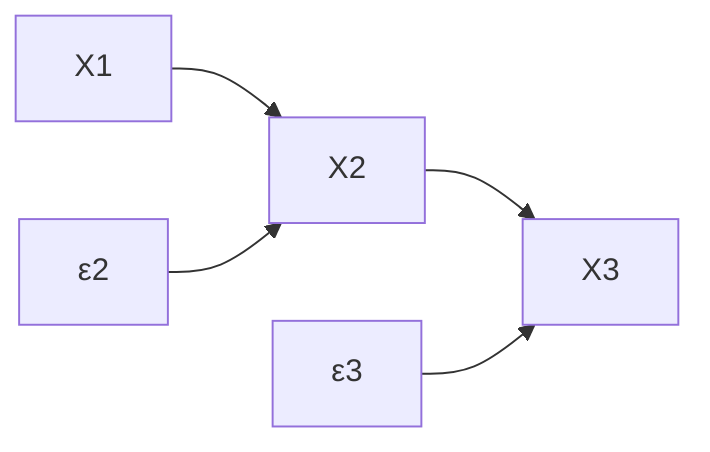
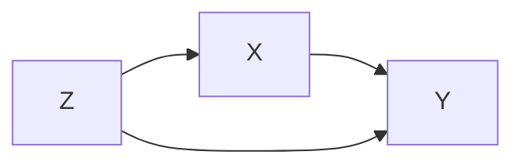
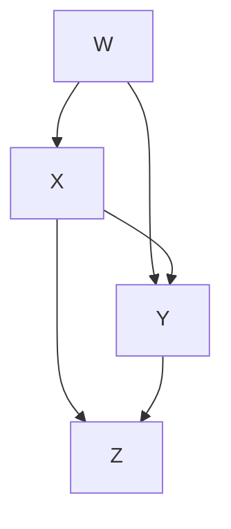
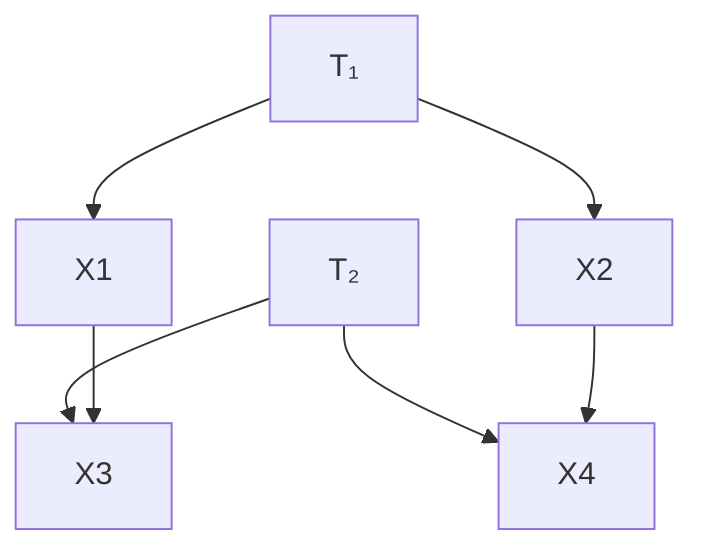
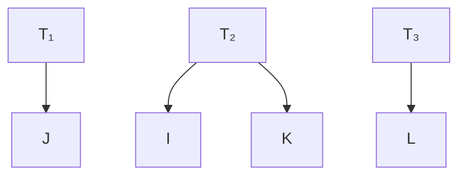

# 第13章 定理证明（Proofs of Theorems）—— 全面系统梳理

---

## 目录

1. [符号约定与预备知识](#1)
2. [定理2.1：正分布的有向独立图](#2)
3. [定理3.1：线性因果理论与随机系数LCT的偏相关系数等价性](#3)
4. [定理3.2：消失偏相关系数的测度论性质](#4)
5. [定理3.3：忠实性与d-分离的等价性](#5)
6. [定理3.4：忠实性的图论刻画](#6)
7. [定理3.5：d-分离与线性蕴含的零偏相关系数](#7)
8. [定理3.6：操纵定理](#8)
9. [定理3.7：带确定性关系的D-分离](#9)
10. [定理4.1–4.6：图的统计不可区分性](#10)
11. [定理5.1：搜索算法的正确性](#11)
12. [定理6.1–6.11：诱导路径图与四元组表示定理](#12)
13. [定理7.1–7.5：预测与操纵定理](#13)
14. [定理9.1–9.2：条件独立与d-分离](#14)
15. [定理10.1–10.2：潜变量模型与MIMBuild](#15)
16. [定理11.1：子图的四元组继承](#16)
17. [关键术语表](#17)

---

## 1. 符号约定与预备知识

本章采用以下符号约定：

- **w.l.g.** = without loss of generality（不失一般性）
- **r.h.s.** = right hand side（右侧）
- **l.h.s.** = left hand side（左侧）
- 空集求和 = 0，空集乘积 = 1
- $R(I,J)$：从 $I$ 到 $J$ 的有向路径
- $U(X,Y)$：无向路径 $U$ 在 $X$ 和 $Y$ 之间的子路径
- $T(I,J)$：$\mathbf{T}(I,J)$ 中的一条 **跋（trek）**

> **跋（Trek）** 的定义（§13.6）：两个不同顶点 $I$ 和 $J$ 之间的一条 trek $T(I,J)$ 是一个无序对，由分别从某个顶点 $K$（称为**源点**）到 $I$ 和 $J$ 的两条有向无环路径组成，且这两条路径仅在 $K$ 处相交。

---

## 2. 定理2.1（Theorem 2.1）

### 定理陈述

> 如果 $P(V)$ 是一个**正分布**（positive distribution），那么对于 $V$ 中变量的任意排序，$P$ 满足该排序下 $P(V)$ 的**有向独立图**的**马尔可夫条件**和**最小性条件**。

### 证明
参见 Pearl 1988。

### 解释说明

**正分布**意味着每个变量的每种取值组合都有非零概率。在此条件下，分布必然满足其有向无环图（DAG）所编码的条件独立性约束（马尔可夫条件），并且不会有多余的边（最小性条件）。

---

## 3. 定理3.1（Theorem 3.1）

### 核心定义

#### 线性因果理论（Linear Causal Theory, LCT）

一个 LCT 定义为 $S = \langle \langle \mathbf{R}, \mathbf{M}, \mathbf{E} \rangle, (\Omega, f, P), \text{EQ}, \text{L}, \text{Err} \rangle$，其中：

- (i) $(\Omega, f, P)$ 是概率空间
- (ii) $\langle \mathbf{R}, \mathbf{M}, \mathbf{E} \rangle$ 是有向无环图
- (iii) $\mathbf{R}$ 中的变量具有联合分布，每个变量具有非零方差
- (iv) 对于入度 $>0$ 的每个 $X_i$，有结构方程：

$$X_i = \sum_{X_j \in \mathbf{Parents}(X_i)} a_{ij} X_j$$

其中每个 $a_{ij}$ 是非零实数。

- (v) 外生变量两两统计独立
- (vi) $L(e) = a_{ij}$ 是边 $e$ 的标签；无环无向路径 $U$ 的标签 $L(U)$ 是其边标签的乘积
- (vii) 误差变量入度为0、出度为1，每个内生变量恰好有一个误差变量指向它

#### 随机系数线性因果理论（Random Coefficient LCT）

与 LCT 相同，只是每个线性系数 $a_{ij}'$ 是一个**随机变量**，独立于模型中所有其他随机变量。

#### 线性因果形式（Linear Causal Form, LCF）

一个未估计的 LCT，其中线性系数和外生变量的方差是**实变量**而非常数。形式上：
- $C$ 是边系数变量 $c_{ij}$ 的集合
- $\mathbf{V}$ 是外生变量方差变量 $\sigma_i^2$ 的集合
- 结构方程中的系数是 $C$ 中的变量。

### 重要引理

**引理3.1.1**（梅森规则的特例）：在 LCF $S$ 中，若 $J$ 是独立变量，则

$${}^{\text{Ind}}a_{IJ} = \sum_{U \in \mathbf{D}(J, I)} L(U)$$

其中 $\mathbf{D}(J,I)$ 是从 $J$ 到 $I$ 的所有有向路径集合。此即变量 $J$ 对 $I$ 的**总效应**。

**引理3.1.2**（协方差的线性组合公式）：若

$$Y = \sum_{I \in \mathbf{Q}} a_{YI} I, \quad Z = \sum_{J \in \mathbf{Q}} a_{ZJ} J$$

则

$$\gamma_{YZ} = \sum_{I \in \mathbf{Q}} \sum_{J \in \mathbf{Q}} a_{YI} a_{ZJ} \gamma_{IJ}$$

**引理3.1.4**（用独立变量表示协方差）：

$$\gamma_{YZ} = \sum_{I \in \mathbf{U}_{YZ}} {}^{\text{Ind}}a_{YI} {}^{\text{Ind}}a_{ZI} \sigma_I^2$$

其中 $\mathbf{U}_{YZ} = \mathbf{U}_Y \cap \mathbf{U}_Z$，$\mathbf{U}_X$ 是所有通向 $X$ 的有向路径起点的独立变量集合。

### 定理3.1陈述

> 如果 $S$ 是一个 LCT，而 $S'$ 是一个随机系数 LCT，具有相同的有向无环图、相同的非系数随机变量集合、每个外生变量相同的方差，并且对于 $S'$ 中的每个随机系数 $a_{IJ}'$，有 $E(a_{IJ}') = a_{IJ}$（其中 $a_{IJ}$ 是 $S$ 中的常数系数），那么在 $S$ 中一个偏相关系数等于0当且仅当它在 $S'$ 中也等于0。

### 证明思路

协方差 $\gamma_{IJ}$ 可展开为：

$$\gamma_{IJ} = \sum_{K \in \mathbf{U}_{IJ}} \sum_{R \in \mathbf{D}(K, I)} \sum_{R' \in \mathbf{D}(K, J)} L(R) L(R') \sigma_K^2$$

路径标签 $L(U) = \prod_{\text{edge} \in U} L(\text{edge})$。由于随机系数相互独立且独立于非系数变量，

$$E\left(\prod_{\text{edge} \in U} L(\text{edge})\right) = \prod_{\text{edge} \in U} E(L(\text{edge}))$$

将变量变换为均值为0，则 $\gamma_{IJ} = E(IJ)$。展开后利用外生变量的正交性（$E(HF)=0$ 除非 $H=F$），得到 $\gamma_{IJ}$ 在随机系数和常数系数下相同。偏相关系数是协方差矩阵的函数，因此在两种情况下相同。

### 举例说明

考虑简单的三变量模型：

- LCT：$X_2 = a_{12} X_1 + \varepsilon_2$，$X_3 = a_{23} X_2 + \varepsilon_3$
- 随机系数 LCT：$X_2 = a_{12}' X_1 + \varepsilon_2$，$X_3 = a_{23}' X_2 + \varepsilon_3$，其中 $E(a_{12}')=a_{12}$，$E(a_{23}')=a_{23}$

定理3.1保证：$\rho_{13.2}=0$ 在 LCT 中成立当且仅当在随机系数 LCT 中成立。这为使用常数系数模型进行因果推断提供了理论基础。

---

## 4. 定理3.2（Theorem 3.2）

### 定理陈述

> 设 $M$ 为一个具有 $n$ 个自由线性系数 $a_1, ..., a_n$ 和 $k$ 个正方差 $\nu_1, ..., \nu_k$ 的 LCF。设 $M(\langle u_1, ..., u_{n+k} \rangle)$ 为与指定参数值一致的分布。设 $P$ 为在参数空间 $\Re^{n+k}$ 上的概率测度集合，使得对任何勒贝格测度零的子集 $V$，有 $P(\mathbf{V})=0$。设 $\mathbf{Q}$ 为参数值向量的集合，使得 $M(q)$ 的每个分布都有一个并非由 $M$ 线性蕴含的消失偏相关系数。则对所有 $P$ 有 $P(\mathbf{Q})=0$。

### 引理3.2.1

> $\rho_{ij.\mathbf{X}} = 0$ 等价于关于线性系数和自变量方差的多项式方程。

**证明**：通过偏协方差阶数（pc-order）的归纳。基础情形（pc-order=0）直接由引理3.1.2得出。归纳情形利用偏协方差的递推公式：

$$\gamma_{ij.\mathbf{Y} \cup r} = \gamma_{ij.\mathbf{Y}} - \frac{\gamma_{ir.\mathbf{Y}} \gamma_{jr.\mathbf{Y}}}{\gamma_{rr.\mathbf{Y}}}$$

### 定理意义

该定理表明：在参数空间中，"意外"消失的偏相关系数只出现在一个**勒贝格测度零**的集合上。这意味着在实际数据中，如果我们观察到一个消失的偏相关系数，它几乎必然是由图结构本身蕴含的，而非偶然的参数取值所致。这为基于条件独立性检验的因果发现算法提供了统计保证。

---

## 5. 定理3.3（Theorem 3.3）——忠实性定理

### 定理陈述

> $P(V)$ 对顶点集为 $V$ 的有向无环图 $G$ 是**忠实的（faithful）**，当且仅当对于所有互不相交的顶点集 $X$、$Y$ 和 $Z$：
> $$X \perp\!\!\!\perp Y \mid Z \text{ 在 } P \text{ 中} \quad \iff \quad X \text{ 和 } Y \text{ 在给定 } Z \text{ 时在 } G \text{ 中是 d-分离的}$$

### 核心概念

#### 忠实性（Faithfulness）

分布 $P$ 对 DAG $G$ 忠实，当且仅当 $P$ 中成立的条件独立关系**恰好**是 $G$ 的马尔可夫条件所蕴含的那些——不多也不少。

#### 诱导路径图（Inducing Path Graph）

$G'$ 是 $G$ 关于 $O$（观测变量集）的诱导路径图，当且仅当：$A, B \in O$，在 $G'$ 中存在 $A$ 和 $B$ 之间的边，当且仅当在 $G$ 中存在一条连接 $A$ 和 $B$ 且相对于 $O$ 的**诱导路径**。

> **诱导路径**：$A$ 和 $B$ 之间的一条无向路径 $U$ 是相对于 $O$ 的诱导路径，当且仅当 $U$ 上除端点外的每个 $O$ 中成员都是碰撞点，且 $U$ 上的每个碰撞点都是 $A$ 或 $B$ 的祖先。

#### 信息变量 IV 和 IP

- $V \in \text{IV}(\mathbf{Y}, \mathbf{Z})$：$V$ 在给定 $\mathbf{Z}$ 时与 $\mathbf{Y}$ d-连通，且 $V$ 在 $\mathbf{Y} \cup \mathbf{Z}$ 中有后代
- $W \in \text{IP}(\mathbf{Y}, \mathbf{Z})$：$W \in \mathbf{Z}$，且 $W$ 有一个父节点属于 $\text{IV}(\mathbf{Y}, \mathbf{Z}) \cup \mathbf{Y}$

### 关键引理与证明思路

**引理3.3.5**（条件概率的局部化公式）：若 $P$ 满足马尔可夫条件，

$$P(\mathbf{Y} \mid \mathbf{Z}) = \frac{\sum_{\mathbf{IV}(\mathbf{Y},\mathbf{Z})} \prod_{W \in \mathbf{IV} \cup \mathbf{IP} \cup \mathbf{Y}} P(W \mid \text{Parents}(W))}{\sum_{\mathbf{IV}(\mathbf{Y},\mathbf{Z}) \cup \mathbf{Y}} \prod_{W \in \mathbf{IV} \cup \mathbf{IP} \cup \mathbf{Y}} P(W \mid \text{Parents}(W))}$$

这证明了条件分布的计算可以局部化到信息变量上。

**引理3.3.8**：若 $X$ 和 $Y$ 在给定 $Z$ 时 d-分离，且 $P$ 满足马尔可夫条件，则 $X \perp\!\!\!\perp Y \mid Z$。这一方向的证明通过引理3.3.5证明了 $\mathbf{IV}(\mathbf{Y}, \mathbf{XZ}) = \mathbf{IV}(\mathbf{Y}, \mathbf{Z})$ 和 $\mathbf{IP}(\mathbf{Y}, \mathbf{XZ}) = \mathbf{IP}(\mathbf{Y}, \mathbf{Z})$，从而推出 $P(\mathbf{Y} \mid \mathbf{XZ}) = P(\mathbf{Y} \mid \mathbf{Z})$。

**引理3.5.8**：存在一个忠实于 $G$ 的分布，为"仅当"方向提供了构造性证明。

**"仅当"方向**：由引理3.5.8，若 $X$ 和 $Y$ 在给定 $Z$ 时不 d-分离，则存在一个满足马尔可夫条件的分布使它们依赖，因此马尔可夫条件本身不蕴含其独立。

### 举例说明

在此图中，$X$ 和 $Y$ 在给定 $Z$ 时不 d-分离（因为 $Z$ 是 $X$ 和 $Y$ 的共同原因，条件化 $Z$ 会打开路径 $X \leftarrow Z \rightarrow Y$）。若分布忠实于该图，则 $\rho_{XY.Z} \neq 0$。

---

## 6. 定理3.4（Theorem 3.4）

### 定理陈述

> 若 $P(V)$ 对某个 DAG 是忠实的，则 $P(V)$ 对 DAG $G$ 是忠实的，当且仅当：
> - (i) $X$ 和 $Y$ 相邻 $\iff$ $X$ 和 $Y$ 在给定任何不含 $X$ 或 $Y$ 的集合时都是条件依赖的
> - (ii) $X \rightarrow Y \leftarrow Z$（$X$ 与 $Z$ 不相邻）$\iff$ $X$ 和 $Z$ 在给定每个包含 $Y$ 但不含 $X$ 或 $Z$ 的集合时都是条件依赖的

### 意义

该定理提供了从条件独立/依赖关系推断图结构的理论基础：邻接关系由"不可被任何集合分离"来识别，碰撞点结构（V-结构）由"仅在包含特定顶点时才依赖"来识别。SGS 和 PC 算法正是基于此原理。

---

## 7. 定理3.5（Theorem 3.5）

### 定理陈述

> 设 $S$ 是一个 LCT，其 DAG $G$ 的顶点集为非误差变量 $V$。则对 $V$ 中任意两个非误差顶点 $A, B$ 以及 $V \setminus \{A, B\}$ 的任意子集 $H$：
> $$G \text{ 线性蕴含 } \rho_{AB.\mathbf{H}} = 0 \quad \iff \quad A, B \text{ 在给定 } H \text{ 时是 d-分离的}$$

### 核心概念

#### I-映射、最小I-映射、D-映射

- **I-映射**：$G$ 是 $P$ 的 I-映射当且仅当 $G$ 中 d-分离蕴含 $P$ 中独立
- **最小 I-映射**：任何真子图不再是 I-映射
- **D-映射**：$G$ 中不 d-分离蕴含 $P$ 中不独立

#### 证明关键引理

**引理3.5.3**：对于具有误差变量和正态外生变量的无环 LCT，$G$ 在非误差变量上的子图是 $P(V)$ 的最小 I-映射。

**引理3.5.7**：对于每个带误差变量的 DAG $G$，存在一个 LCT 使得 $G$ 是其分布的 D-映射。证明通过对 $Z$ 的基数进行归纳，利用偏相关系数的递推公式。

**引理3.5.10**（"如果"方向）：若 $Y$ d-分离 $X$ 和 $Z$，则 $S$ 线性蕴含 $\rho_{XZ.\mathbf{Y}} = 0$。证明通过构造具有相同系数和方差的正态分布，利用正态分布中独立等价于零偏相关的事实。

### 推论

- **推论3.5.1**：若 $\rho_{XZ.\mathbf{Y}}$ 被线性蕴含为零，则 $X \perp\!\!\!\perp Z \mid Y$
- **推论3.5.2**：若 $P$ 忠实于 $G$，则 $\rho_{XZ.\mathbf{Y}}=0$ 被线性蕴含 $\iff$ $X \perp\!\!\!\perp Z \mid Y$

---

## 8. 定理3.6（Theorem 3.6）——操纵定理

### 定理陈述

> 给定顶点集 $\mathbf{V} \cup \mathbf{W}$ 上的 DAG $G_{Comb}$ 以及满足 $G_{Comb}$ 马尔可夫条件的分布 $P(\mathbf{V} \cup \mathbf{W})$，若将 $\mathbf{W}$ 的值从 $\mathbf{w1}$ 改变为 $\mathbf{w2}$ 是 $G_{Comb}$ 关于 $\mathbf{V}$ 的一次操纵，则：

$$P_{Man(\mathbf{W})}(\mathbf{V}) = \prod_{X \in \mathbf{Manipulated}(\mathbf{W})} P_{Man(\mathbf{W})}(X \mid \mathbf{Parents}(G_{Man}, X)) \times \prod_{X \in \mathbf{V} \setminus \mathbf{Manipulated}(\mathbf{W})} P_{Unman(\mathbf{W})}(X \mid \mathbf{Parents}(G_{Unman}, X))$$

### 核心定义

- **外生性（Exogeneity）**：$\mathbf{W}$ 关于 $\mathbf{V}$ 是外生的，当且仅当 $G$ 中不存在从 $\mathbf{V}$ 到 $\mathbf{W}$ 的有向边
- **操纵**：将 $\mathbf{W}$ 的值从 $\mathbf{w1}$ 改变为 $\mathbf{w2}$，当且仅当 $\mathbf{W}$ 关于 $\mathbf{V}$ 是外生的且 $P(\mathbf{V} \mid \mathbf{W}=\mathbf{w1}) \neq P(\mathbf{V} \mid \mathbf{W}=\mathbf{w2})$
- **Manipulated(W)**：$\mathbf{W}$ 在 $\mathbf{V}$ 中的直接子节点
- **操纵图 $G_{Man}$**：$G_{Unman}$ 的子图，不同之处至多在于 Manipulated(W) 中成员的父节点集

### 证明要点

操纵后的分布满足 $G_{Man}$ 的马尔可夫条件。对非直接操纵的变量，其条件分布等于未操纵条件下的条件分布（因为 $\mathbf{W}$ 在给定其父节点时与这些变量 d-分离）。

### 举例说明

这里 $\mathbf{W} = \{W\}$（策略变量），$\mathbf{V} = \{X, Y, Z\}$。将 $W$ 从 $w_1$ 改变为 $w_2$ 时：
- $\mathbf{Manipulated}(W) = \{X, Y\}$（$W$ 的直接子节点）
- 操纵后：$P_{Man}(X,Y,Z) = P_{Man}(X \mid W=w_2) \times P_{Man}(Y \mid X, W=w_2) \times P_{Unman}(Z \mid X, Y)$

---

## 9. 定理3.7（Theorem 3.7）——确定性关系的D-分离

### 定理陈述

> 若 $G$ 是定义在 $V$ 上的 DAG，$X$、$Y$ 和 $Z$ 是 $V$ 的不相交子集，$P(V)$ 满足 $G$ 的马尔可夫条件以及 $\text{Deterministic}(V)$ 中的确定性关系。那么若 $X$ 和 $Y$ 在给定 $Z$ 和 $\text{Deterministic}(V)$ 下是 **D-分离** 的，则 $P$ 中 $X \perp\!\!\!\perp Y \mid Z$。

### 核心定义

#### 确定性关系

$\text{Deterministic}(V)$ 是 $V$ 中变量的有序元组集合。若 $\langle V_1, ..., V_n \rangle \in \text{Deterministic}(V)$，则 $V_n$ 是 $V_1, ..., V_{n-1}$ 的确定性函数。

#### D-分离（带确定性关系）

$X$ 和 $Y$ 在给定 $Z$ 和 $\text{Deterministic}(V)$ 下是 D-分离的，当且仅当在 $G$ 中不存在介于 $X$ 和 $Y$ 之间的无向路径 $U$，使得：
- $U$ 上的每个碰撞点在 $Z$ 中有后代
- $U$ 上没有其他顶点在 $\text{Det}(Z)$ 中

#### Mod(G)

$G' \in \text{Mod}(G)$（相对于 $\text{Deterministic}(V)$ 和 $Z$），当且仅当对 $V$ 中每个 $V$：
- 若存在 $Z$ 中的集合确定了 $V$，则 $\text{Parents}(G', V)$ 是某个这样的集合
- 否则 $\text{Parents}(G', V) = \text{Parents}(G, V)$

#### Det-分离

$X$ 和 $Y$ 在给定 $Z$ 和 $\text{Deterministic}(V)$ 下是 det-分离的，当且仅当要么：
- 在某个 $G' \in \text{Mod}(G)$ 中，$X$ 和 $Y$ 在给定 $Z \cup \text{Det}(Z)$ 下是 d-分离的，要么
- $X$ 或 $Y$ 在 $\text{Det}(Z)$ 中

### 证明策略

引理3.7.2 证明 det-分离蕴含独立（通过证明 $P(V)$ 满足 $\text{Mod}(G)$ 中每个图的马尔可夫条件）。定理3.7则证明 D-分离等价于 det-分离，从而 D-分离蕴含独立。

---

## 10. 定理4.1–4.6：图的统计不可区分性

### 定理4.1（强统计不可区分性 s.s.i.）

> 两个 DAG $G_1$、$G_2$ 是 **s.s.i.** 的，当且仅当：
> - (i) 相同顶点集
> - (ii) 相同的邻接关系
> - (iii) 相同的非屏蔽碰撞点（unshielded colliders）

**证明概要**：$\Leftarrow$ 方向利用定理3.4——相同的邻接关系和碰撞点意味着相同的 d-分离关系，因此相同的最小 I-映射。$\Rightarrow$ 方向通过分析四种不同情况（顶点集不同、邻接关系不同、非屏蔽碰撞点不同、屏蔽碰撞点不同）构造反例分布。

### 定理4.2（忠实不可区分性 f.i.）

> 两个 DAG $G$ 和 $H$ 是 **f.i.** 的，当且仅当：
> - (i) 相同顶点集
> - (ii) 相同的邻接关系
> - (iii) 相同的非屏蔽碰撞点

### 定理4.3（f.i. = w.f.i.）

> 两个 DAG 是 f.i. 的当且仅当它们是 w.f.i.（弱忠实不可区分）的。

### 定理4.4

> 若 $P$ 满足 $G$ 的马尔可夫条件且忠实于 $H$，则 $H$ 中的邻接关系都是 $G$ 中的邻接关系。

### 定理4.5

> 若 $P$ 满足 $G$ 的马尔可夫条件和最小性条件且忠实于 $H$，则：
> - (i) $H$ 中的非屏蔽碰撞点在 $G$ 中要么是碰撞点，要么其端点在 $G$ 中相邻
> - (ii) $G$ 中的非屏蔽碰撞点若在 $H$ 中边都存在，则在 $H$ 中也是碰撞点

### 定理4.6

> 没有两个不同的 s.s.i. DAG 是刚性统计不可区分的（r.s.i.）。

---

## 11. 定理5.1——搜索算法的正确性

### 定理陈述

> 若输入到 PC、SGS、PC-1、PC-2、PC* 或 IG 算法的数据忠实于 DAG $G$，则输出是一个表示 $G$ 的忠实不可区分性类的**模式（pattern）**。

### 关键引理

**引理5.1.1**：若 $X$ 不是 $Y$ 的后代且不相邻，则 $X$ 在给定 $\text{Parents}(Y) \cap \text{Undirected}(X,Y)$ 时与 $Y$ d-分离。

**引理5.1.2**：若 $X$ 与 $Y$ 相邻、$Y$ 与 $Z$ 相邻、$X$ 与 $Z$ 不相邻，则边定向为 $X \rightarrow Y \leftarrow Z$ 当且仅当对每个不含 $X, Z$ 的子集 $S$，$X$ 在给定 $\{Y\} \cup S$ 时与 $Z$ d-连接。

**引理5.1.3**（Pearl 1990a）：在上述三元组中，$Y$ 要么出现在**每个** d-分离 $X$ 和 $Z$ 的集合中，要么不出现在**任何**这样的集合中。

### 证明方法

- SGS 算法直接检验定理3.4的条件
- 其他算法通过对定向规则应用次数的归纳证明定向的正确性
- 邻接关系：输出中的非邻接蕴含 $G$ 中的非邻接；输出中的邻接（在给定邻接点集时不 d-分离）蕴含 $G$ 中的邻接

---

## 12. 定理6.1–6.11：诱导路径图、潜在变量与四元组

### 定理6.1（Verma & Pearl）

> $A$ 和 $B$ 不被 $O \setminus \{A, B\}$ 的任何子集 d-分离，当且仅当在子集 $O$ 上存在一条 $A$ 和 $B$ 之间的**诱导路径**。

**意义**：该定理将"不可被任何观测变量集分离"这一统计性质与诱导路径这一图论概念联系起来，为在存在潜在变量的情况下进行因果推断奠定了基础。

### 定理6.2

> 在关于 $O$ 的诱导路径图 $G'$ 中，若 $A$ 不是 $B$ 的祖先且不相邻，则 $A$ 和 $B$ 被 **D-SEP(A,B)** 的一个子集 d-分离。

**D-SEP(A,B)** 的定义：$V \in \text{D-SEP}(A,B)$ 当且仅当存在 $A$ 到 $V$ 的无向路径 $U$，$U$ 上除端点外的每个顶点都是碰撞点，且每个顶点都是 $A$ 或 $B$ 的祖先。

### 定理6.3和6.4

> CI 算法和 FCI 算法的输出是 $G$ 关于 $O$ 的**部分定向诱导路径图**。

FCI 算法是 CI 算法的快速版本，通过 Possible-D-SEP 减少需要检验的条件独立关系数量。

### 定理6.5–6.9（部分定向诱导路径图的性质）

- **6.5**：若 $\pi$ 中存在从 $A$ 到 $B$ 的有向路径，则 $G$ 中也存在
- **6.6**：若 $\pi$ 中不存在从 $A$ 到 $B$ 的半有向路径，则 $G$ 中不存在从 $A$ 到 $B$ 的有向路径
- **6.7**：若 $\pi$ 中 $A$ 和 $B$ 相邻且除该边外不存在其他无向路径，则 $G$ 中存在不包含其他观测变量的 trek
- **6.8**：半有向路径的包含关系对应有向路径的包含关系
- **6.9**：$A \leftrightarrow B$（双箭头）意味着 $G$ 中存在 $A$ 和 $B$ 的潜在共同原因

### 定理6.10（四元组表示定理 Tetrad Representation Theorem）

这是本章最重要的定理之一。

#### 瓶颈点（Choke Point）的定义

- **$LJ(T(I,J), T(K,L))$ 瓶颈点**：所有 $L(T(K,L))$ 和所有 $J(T(I,J))$ 相交于顶点 $Q$
- **$LJ(T(I,J), T(K,L), T(I,L), T(J,K))$ 瓶颈点**：上述条件加上所有 $L(T(I,L))$ 和所有 $J(T(J,K))$ 也相交于 $Q$

类似定义 $IK$ 瓶颈点。

#### 定理陈述

> 在无环 LCF $G$ 中，存在一个 $LJ(T(I,J), T(K,L), T(I,L), T(J,K))$ 瓶颈点或一个 $IK(T(I,J), T(K,L), T(I,L), T(J,K))$ 瓶颈点，当且仅当 $G$ 线性蕴含：
> $$\rho_{IJ} \rho_{KL} - \rho_{IL} \rho_{JK} = 0$$

#### 证明核心

**"仅当"方向**（引理6.10.16-6.10.19）：若 $G$ 线性蕴含四元组消失但无瓶颈点，则可通过复杂路径构造产生矛盾或找到违反引理6.10.7条件的 trek 对，从而 $G$ 不蕴含四元组消失。

**"当"方向**（引理6.10.21）：若存在瓶颈点 $X$，构造集合 $\mathbf{Q} = \{X \text{ 与 } J \text{ 或 } X \text{ 与 } L \text{ 之间 treks 的源点}\}$。证明给定 $\mathbf{Q}$ 时，所有四对变量都 d-分离，从而四个偏相关系数都为零。然后利用引理6.10.20（通过偏相关系数的递推公式进行归纳）得出零阶四元组消失。

#### 举例说明

在此图中，$T_2$ 是一个瓶颈点（位于所有 $T(X_1, X_4)$ 和 $T(X_2, X_3)$ 的交点），因此 $\rho_{X_1 X_3} \rho_{X_2 X_4} - \rho_{X_1 X_4} \rho_{X_2 X_3} = 0$ 被线性蕴含。

### 定理6.11

> 无环 LCF $G$ 线性蕴含四元组 $\rho_{IJ} \rho_{KL} - \rho_{IL} \rho_{JK} = 0$，当且仅当：
> - 它线性蕴含 $\rho_{IJ}$ 或 $\rho_{KL} = 0$ 且 $\rho_{IL}$ 或 $\rho_{JK} = 0$，或
> - 存在随机变量集合 $\mathbf{Q}$（不同时包含 $I$ 和 $K$ 或 $J$ 和 $L$），使得 $\rho_{IJ.\mathbf{Q}} = \rho_{KL.\mathbf{Q}} = \rho_{IL.\mathbf{Q}} = \rho_{JK.\mathbf{Q}} = 0$

---

## 13. 定理7.1–7.5：预测定理

### 定理7.1

> 在满足一定条件（$\mathbf{W}$ 外生、无 $X \cap Z$ 的成员是 IP(Y,Z) 的成员、无 $X \setminus Z$ 的成员是 IV(Y,Z) 的成员）下，$P(\mathbf{Y} \mid \mathbf{Z})$ 在操纵 $\mathbf{X}$ 下不变。

### 定理7.2

> 存在 $P(\mathbf{O})$ 的最小 I-映射 $G_{Min}$，其中 $\mathbf{Definite\text{-}SP}(Ord, X) \subseteq \mathbf{Parents}(G_{Min}, X) \subseteq \mathbf{Possible\text{-}SP}(Ord, X)$。

### 定理7.3和7.4

> 操纵下条件概率不变性的充分条件，可通过 FCI 部分定向诱导路径图中的 **Possibly-IV** 和 **Possibly-IP** 来检验。

**可能 d-连接路径**：无向路径 $U$ 是给定 $Z$ 下的可能 d-连接路径，当且仅当 $U$ 上的每个碰撞点都是通往 $Z$ 中成员的半有向路径的源点，且每个确定非碰撞点不在 $Z$ 中。

### 定理7.5（预测算法的正确性）

> 预测算法（Prediction Algorithm）正确计算操纵后的条件概率 $P(\mathbf{Y} \mid \mathbf{Z})$。

**算法步骤**：
- A) 输入数据，建立 $P_{Unman}$ 的最小 I-映射 $F$
- B) 用 FCI 算法构建部分定向诱导路径图
- C1) 确定 $\mathbf{Parents}(G_{Man}, X)$
- C2) 用引理3.3.5的公式计算操纵前后的条件概率

---

## 14. 定理9.1–9.2

### 定理9.1

> 若 $P(S)$ 忠实于 $G(S)$，则 $P(\mathbf{Y} \mid \mathbf{X}) = P(\mathbf{Y} \mid \mathbf{X}, S)$ 当且仅当 $\mathbf{X}$ 在 $G(S)$ 中 d-分离 $\mathbf{Y}$ 和 $S$。

**直观含义**：条件化于 $S$ 不改变 $\mathbf{Y}$ 的预测分布，当且仅当 $\mathbf{X}$ 已经"屏蔽"了 $S$ 对 $\mathbf{Y}$ 的所有因果影响路径。

### 定理9.2

> 在忠实分布中，命题 $\langle Y \perp\!\!\!\perp X \mid \mathbf{Z}; Y \perp\!\!\!\perp X \mid \mathbf{Z} \cup \{S\} \rangle$ 恰好有一个为真，当且仅当 $G$ 中对应的 d-分离命题恰好有一个为真。

---

## 15. 定理10.1–10.2：潜变量模型与MIMBuild

### 核心概念

- **几乎纯潜变量图**：测量模型中仅存在共同原因不纯性
- **因果充分性**：变量的所有共同原因都在模型中被观测或建模

### 定理10.1

> 在几乎纯潜变量图中，$T_1$ 和 $T_3$（其测量指标包含 $J$ 和 $L$）在给定 $T_2$（其测量指标包含 $I$ 和 $K$）时 d-分离，当且仅当：
> $$\rho_{JI} \rho_{LK} = \rho_{JL} \rho_{KI} = \rho_{JK} \rho_{IL}$$

**证明思路**：利用四元组表示定理（定理6.10），证明 $T_2$ 是瓶颈点当且仅当 d-分离成立。

### 定理10.2（MIMBuild的正确性）

> MIMBuild 的输出 $\Pi$ 满足：
> - **A-1**：$\Pi$ 中不相邻 $\implies$ $G$ 中不相邻
> - **A-2**：$\Pi$ 中相邻且无边标记 "?" $\implies$ $G$ 中相邻
> - **O-1**：$\Pi$ 中 $X \rightarrow Y$ $\implies$ $G$ 中每条 $X$ 与 $Y$ 之间的 trek 指向 $Y$
> - **O-2**：$\Pi$ 中 $X \rightarrow Y$ 且无边标记 "?" $\implies$ $G$ 中 $X \rightarrow Y$

---

## 16. 定理11.1

> 若 $G$ 是 $G'$ 的子图，则 $G$ 中由 $G'$ 线性蕴含的四元组方程集合是 $G$ 线性蕴含的四元组方程的子集。

**证明**：若 $G'$ 中存在瓶颈点（因此线性蕴含四元组消失），则 $G$ 中也存在相应的瓶颈点（因为路径是子集）。

---

## 17. 关键术语表

| 术语 | 定义 |
|------|------|
| **LCT** | 线性因果理论：具有常数系数和独立外生变量的线性结构方程模型 |
| **LCF** | 线性因果形式：系数是变量而非常数的 LCT |
| **随机系数 LCT** | 系数是独立随机变量的 LCT |
| **Trek（跋）** | 从同一源点出发分别到达两个端点的两条有向路径，仅在源点处相交 |
| **瓶颈点（Choke Point）** | 一个顶点，特定 trek 集合的特定分支都在该点相交 |
| **d-分离** | 图论概念：给定 $Z$，$X$ 和 $Y$ 之间所有路径都被"阻塞" |
| **D-分离** | d-分离在确定性关系下的推广 |
| **忠实性（Faithfulness）** | 分布的条件独立关系恰好与图的 d-分离关系一致 |
| **I-映射 / D-映射** | I-映射：d-分离 $\implies$ 独立；D-映射：不 d-分离 $\implies$ 不独立 |
| **诱导路径** | 除端点外所有观测变量都是碰撞点的无向路径 |
| **诱导路径图** | 边表示存在诱导路径的图 |
| **s.s.i. / f.i.** | 强统计不可区分 / 忠实不可区分 |
| **四元组差（Tetrad Difference）** | $\rho_{IJ}\rho_{KL} - \rho_{IL}\rho_{JK}$ |
| **Possibly-IV / Possibly-IP** | 部分定向图中可能的信息变量/信息变量的父节点 |
| **半有向路径** | 无向路径，没有边在 $A$ 端有箭头，且每条边离开靠近 $A$ 的端点 |

---

## 总结

本章是因果推断数学基础的集大成之作，系统地证明了从图到分布、从观测到干预、从完全观测到存在潜在变量的各种核心定理。主要贡献包括：

1. **建立了图论条件（d-分离）与统计条件（条件独立/零偏相关）之间的等价性桥梁**（定理3.3、3.5）
2. **证明了操纵（干预）下分布的因式分解公式**（定理3.6、3.7）
3. **刻画了不同 DAG 的统计等价类**（定理4.1-4.6）
4. **保证了主要因果发现算法的正确性**（定理5.1、6.3、6.4）
5. **通过四元组表示定理揭示了消失四元组差的图论本质**（定理6.10）
6. **将因果推断扩展到存在潜在变量和确定性关系的场景**（定理6.1-6.11、7.1-7.5、10.1-10.2）