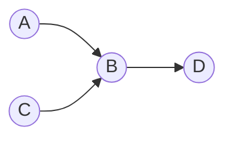
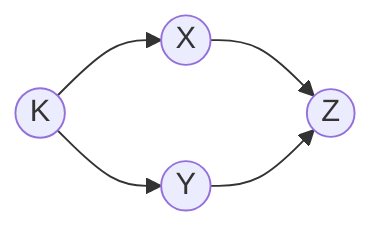
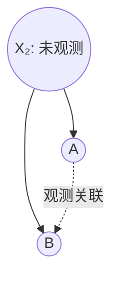
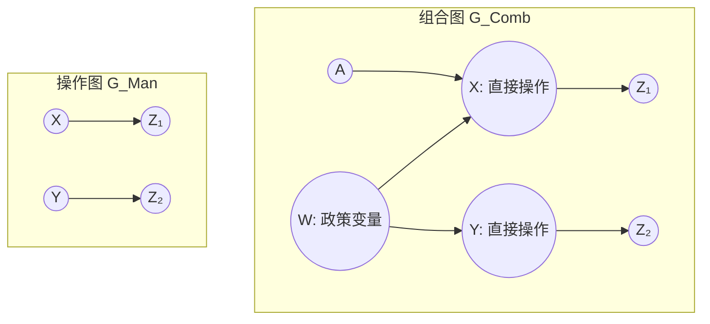
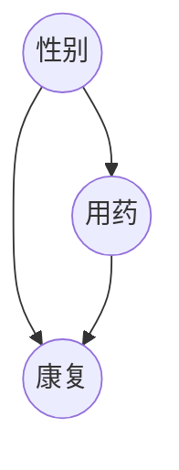
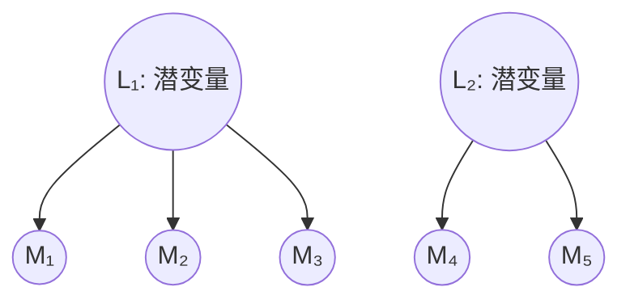
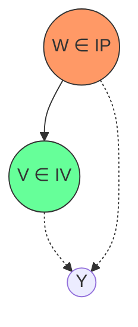
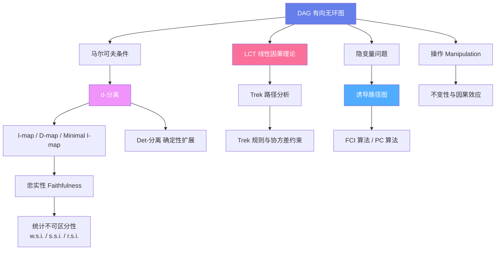

# 因果发现与图模型：注释与术语表 系统梳理

---

## 第一部分：核心数学基础与符号约定

### 1.1 图论基本概念

**有向无环图（Directed Acyclic Graph, DAG）** 是整个理论的基石。一个 DAG $G = \langle \mathbf{V}, \mathbf{E} \rangle$ 由顶点集 $\mathbf{V}$（代表随机变量）和有向边集 $\mathbf{E}$ 组成，且不存在有向环。

- **父节点（Parents）**：若存在边 $X \to Y$，则 $X$ 是 $Y$ 的父节点，记作 $X \in \mathbf{Parents}(Y)$。
- **祖先/后代（Ancestors/Descendants）**：若存在从 $X$ 到 $Y$ 的有向路径，则 $X$ 是 $Y$ 的祖先，$Y$ 是 $X$ 的后代。
- **之前/之后（Before/After）**：若存在 $X$ 到 $Y$ 的有向路径，称 $X$ 在 $Y$ **之前**，$Y$ 在 $X$ **之后**。

### 1.2 边的标记约定

在诱导路径图等扩展框架中，边端点的标记集合为 $\{>, \circ\}$：

| 标记 | 含义 |
|------|------|
| $A \to B$ | $A$ 端为箭头，指向 $B$ |
| $A \circ\!-\!B$ | $A$ 端为空标记"出自"$A$ |
| $A \circ\!\to B$ | $A$ 端为空，$B$ 端为箭头 |
| $A \leftrightarrow B$ | 两端均为箭头（表示存在未观测的共同原因） |

> **注释（Ch.2, Note 1）**：有序对通常用尖括号 $\langle A, B \rangle$ 表示，但边的端点用方括号以避免与箭头混淆。

---

## 第二部分：概率条件与图结构 —— d-分离理论

### 2.1 马尔可夫条件与最小性

**定义（马尔可夫条件，Markov Condition）**：在 DAG $G$ 中，每个变量 $X$ 在给定其父节点 $\mathbf{Parents}(X)$ 的条件下，与其所有非后代 $\mathbf{Nondescendants}(X)$ 独立。

**定义（最小性条件，Minimality）**：若 $G$ 的任何真子图不再满足马尔可夫条件，则称 $G$ 满足最小性条件。

### 2.2 d-分离（d-separation）

这是因果图理论中最重要的概念，连接了图结构与概率独立性。

**定义（d-分离）**：设 $G$ 为 DAG，$X, Y$ 为不同顶点，$Z$ 为不包含 $X, Y$ 的顶点集。$X$ 和 $Y$ 在给定 $Z$ 下 **d-分离**，当且仅当 $G$ 中不存在 $X$ 和 $Y$ 之间的无向路径 $U$，使得：

1. $U$ 上的每个**碰撞器（collider）**在 $Z$ 中有一个后代；
2. $U$ 上没有其他顶点在 $\mathbf{Det}(Z)$ 中。

若不存在这样的 d-分离关系，则称 $X$ 和 $Y$ 在给定 $Z$ 下 **d-连接（d-connected）**。

**碰撞器结构**：$A \to B \leftarrow C$ 中 $B$ 是碰撞器。控制碰撞器会**打开**信息通道，而非碰撞器的控制会**阻断**信息通道。

**举例**：在上图中：
- $A$ 和 $C$ 边缘独立（无条件独立），因为 $B$ 是碰撞器且未被控制。
- 给定 $B$ 或 $D$ 后，$A$ 和 $C$ 变得相关（因为 $D$ 是碰撞器 $B$ 的后代）。
- $A$ 和 $D$ 在给定 $B$ 下独立（$B$ 是非碰撞器，阻断了路径）。

### 2.3 I-图与 D-图

| 概念 | 定义 | 方向 |
|------|------|------|
| **I-图（I-map）** | 图中 d-分离 $\Rightarrow$ 分布中独立 | 图蕴含的独立都在分布中成立 |
| **D-图（D-map）** | 分布中独立 $\Rightarrow$ 图中 d-分离 | 分布中的独立都被图蕴含 |
| **最小 I-图（Minimal I-map）** | 是 I-图且没有任何真子图是 I-图 | 最精简的 I-图 |

一个图同时是 I-map 和 D-map 时，称为**完美图（perfect map）**。

### 2.4 忠实性（Faithfulness）

**定义**：若分布 $P$ 中成立的每一个条件独立关系都对应于图 $G$ 中的某个 d-分离关系，则称 $P$ **忠实于** $G$。

> **注释（Ch.5, Note 4）**：对于线性结构，若某个与图 $G$ 兼容的线性分布 $P$ 蕴含了 $G$ 未线性蕴含的消失偏相关，$P$ 是否对 $G$ 不忠实？这个问题至今未有定论。

**忠实不可区分（Faithfully Indistinguishable, f.i.）**：两个 DAG $G$ 和 $G'$ 是忠实不可区分的，当且仅当每个忠实于 $G$ 的分布也忠实于 $G'$，反之亦然。

**弱忠实不可区分（w.f.i.）**：存在至少一个对两者都忠实的分布。

---

## 第三部分：线性因果理论（LCT）与线性因果形式（LCF）

### 3.1 形式化定义

**线性因果理论（LCT）** 是一个七元组：

$$S = \langle \langle \mathbf{R}, \mathbf{M}, \mathbf{E} \rangle, (\Omega, f, P), \mathbf{EQ}, \mathbf{L}, \mathbf{Err} \rangle$$

其中：
- $\langle \mathbf{R}, \mathbf{M}, \mathbf{E} \rangle$ 是 DAG，$\mathbf{R}$ 为随机变量集，$\mathbf{E}$ 为有向边集
- $(\Omega, f, P)$ 是概率空间
- $\mathbf{EQ}$ 是一组线性方程：对每个入度为正的 $X_i$，有

$$X_i = \sum_{X_j \in \mathbf{Parents}(X_i)} a_{ij} X_j$$

- $a_{ij} \neq 0$ 是**方程系数（equation coefficient）**
- 外生变量两两统计独立
- $\mathbf{Err}$ 是误差变量集，每个误差变量入度为 0、出度为 1

**线性因果形式（LCF）** 与 LCT 结构相同，但系数 $c_{ij}$ 和外生方差 $\sigma_i^2$ 是实变量而非常数——可视为"未赋值的模板"。

### 3.2 路径（Trek）与协方差分解

**路径（Trek）** 是连接两个变量的基本结构单元：

**定义**：$I$ 和 $J$ 之间的路径 $T(I, J)$ 是从某个源点 $K$ 分别到 $I$ 和 $J$ 的两条有向路径的无序对，这两条路径仅在 $K$ 处相交。

$$
T(I,J) = \{K \to \cdots \to I,\; K \to \cdots \to J\}
$$

其中：
- $S(T(I,J))$ 是路径的**源点**
- $I(T(I,J))$ 是从源点到 $I$ 的有向路径
- $J(T(I,J))$ 是从源点到 $J$ 的有向路径
- $\mathbf{T}(I,J)$ 是 $I$ 和 $J$ 之间所有路径的集合

> **注释（Ch.3, Note 10）**：$X$ 和 $Y$ 之间的路径有三种类型：(i) $X$ 到 $Y$ 的有向路径；(ii) $Y$ 到 $X$ 的有向路径；(iii) 从 $Z$ 分别到 $X$ 和 $Y$ 的一对有向路径，仅在 $Z$ 处共享。

**举例**：在下图中：

$X$ 和 $Y$ 之间有一个 trek，源点为 $K$：
$$T(X,Y) = \{K \to X,\; K \to Y\}$$

协方差可通过 trek 的标签乘积展开：

$$\operatorname{Cov}(X,Y) = \sum_{T \in \mathbf{T}(X,Y)} L(I(T)) \cdot L(J(T)) \cdot \sigma^2_{S(T)}$$

其中 $L(U)$ 是路径 $U$ 上所有边标签（系数）的乘积。

### 3.3 瓶颈点（Choke Point）

在有向无环图中，若 $\mathbf{T}(K,L)$ 和 $\mathbf{T}(I,J)$ 中的所有 treks 的某条腿都相交于顶点 $Q$，则 $Q$ 是一个 $LJ(T(I,J), T(K,L))$ **瓶颈点**。瓶颈点概念在分析协方差约束时起关键作用。

---

## 第四部分：因果充分性与可识别性

### 4.1 因果充分性（Causal Sufficiency）

> **注释（Ch.3, Note 1）**：对于总体 $\mathbf{V}$，要求 $\mathbf{V}$ 具有因果充分性——即若 $X$ 不在 $\mathbf{V}$ 中，且 $X$ 是 $\mathbf{V}$ 中两个或更多变量的共同原因，则 $\mathbf{V}$ 中所有变量的联合概率在 $X$ 的每个取值上都应相同。

**实质含义**：因果充分性要求不存在未观测的混杂变量。违反因果充分性时，观测到的关联可能不是因果关系。

### 4.2 可识别性（Identifiability）

> **注释（Ch.3, Note 2）**：Simon (1953) 利用可识别性概念提出了从方程组推导因果结构的通用方法；还提出了利用线性系数在扰动下的不变性来解释因果关系。

**核心思想**：若一组方程的结构能够从联合分布中唯一确定（在等价类内），则称该因果结构是可识别的。

### 4.3 因果关系的传递性与非自反性

> **注释（Ch.3, Note 3）**：因果关系是**传递的（transitive）**和**非自反的（irreflexive）**，因此表示因果结构的有向图必须是无环的。引入循环有向图需要进行系统性的重新解释。

- **传递性**：若 $X$ 导致 $Y$，$Y$ 导致 $Z$，则 $X$ 导致 $Z$
- **非自反性**：$X$ 不能导致自身

---

## 第五部分：操作（Manipulation）与政策变量

### 5.1 操作的形式化定义

设 $G_{Comb}$ 是定义在 $\mathbf{V} \cup \mathbf{W}$ 上的 DAG，$\mathbf{W}$ 相对于 $\mathbf{V}$ **外生**。将 $\mathbf{W}$ 的值从 $\mathbf{w}_1$ 改变为 $\mathbf{w}_2$ 是一次**操作**，当且仅当：

$$P(\mathbf{V} \mid \mathbf{W} = \mathbf{w}_1) \neq P(\mathbf{V} \mid \mathbf{W} = \mathbf{w}_2)$$

**关键术语**：
- **组合图 $G_{Comb}$**：包含操作变量和被操作变量的完整 DAG
- **未操作图 $G_{Unman}$**：$G_{Comb}$ 在 $\mathbf{V}$ 上的子图
- **操作图 $G_{Man}$**：操作后的图结构，被直接操作变量的父节点被移除
- **政策变量（Policy Variables）**：$\mathbf{W}$ 中的变量
- **直接操作变量**：$\mathbf{Children(W)} \cap \mathbf{V}$

### 5.2 不变性（Invariance）

给定外生的 $\mathbf{W}$，$P(\mathbf{Y} \mid \mathbf{Z})$ 在通过改变 $\mathbf{W}$ 对 $\mathbf{X}$ 的直接操作下是**不变的**，当且仅当：

$$P(\mathbf{Y} \mid \mathbf{Z}, \mathbf{W} = \mathbf{w}_1) = P(\mathbf{Y} \mid \mathbf{Z}, \mathbf{W} = \mathbf{w}_2)$$

> **注释（Ch.9, Note 2）**：即使变量未被直接操纵，在实验总体和非实验总体中，变量之间的因果关系也可能不同。

---

## 第六部分：诱导路径图与隐变量处理

### 6.1 诱导路径（Inducing Path）

设 $G$ 为 $\mathbf{V}$ 上的 DAG，$\mathbf{O} \subseteq \mathbf{V}$ 为**观测变量**集。$A$ 和 $B$ 之间相对于 $\mathbf{O}$ 的**诱导路径**是一条无向路径 $U$，满足：

1. $U$ 上除端点外的每个 $\mathbf{O}$ 中成员都是碰撞器；
2. $U$ 上的每个碰撞器都是 $A$ 或 $B$ 的祖先。

**直观理解**：当存在未观测的隐变量时，两个观测变量可能始终相关（无法被任何观测变量集 d-分离），诱导路径捕捉了这种"不可消除"的关联。

### 6.2 诱导路径图（Inducing Path Graph）

$G'$ 是 $G$ 在 $\mathbf{O}$ 上的**诱导路径图**，当且仅当 $A$ 和 $B$ 之间存在一条边，当且仅当在 $G$ 中存在 $A$ 和 $B$ 之间相对于 $\mathbf{O}$ 的诱导路径。每条边带有表示方向的标记 $\{>, \circ\}$。

**边的含义**：

| 边类型 | 因果含义 |
|--------|----------|
| $A \to B$ | $A$ 是 $B$ 的原因 |
| $A \leftrightarrow B$ | $A$ 和 $B$ 有未观测的共同原因 |
| $A \circ\!-\!B$ | 方向不确定 |
| $A \circ\!\to B$ | $B$ 不是 $A$ 的原因 |

### 6.3 部分定向诱导路径图（Partially Oriented Inducing Path Graph）

这是 FCI 算法的输出形式，包含四种边标记：
- $\to$（有向边）
- $\circ\!\to$（部分有向）
- $\leftrightarrow$（双向边，表示隐混杂）
- $\circ\!-\!\circ$（完全不确定）

### 6.4 判别路径（Discriminating Path）

判别路径用于确定边的方向。$U$ 是 $B$ 的**判别路径**，满足：
- $U$ 是 $X$ 和 $Y$ 之间的无向路径，包含 $B$（$B \neq X, B \neq Y$）
- 路径上除 $B$ 和端点外的每个顶点都是碰撞器
- $X$ 和 $Y$ 不相邻
- 满足特定的方向条件

**确定判别路径（Definite Discriminating Path）** 是判别路径的加强版，要求路径上的顶点是**确定碰撞器**或**确定非碰撞器**。

---

## 第七部分：统计不可区分性层级

### 7.1 三个层级的不可区分性

| 层级 | 缩写 | 定义 |
|------|------|------|
| **弱统计不可区分** | w.s.i. | 存在一个同时满足两者最小性和马尔可夫条件的分布 |
| **强统计不可区分** | s.s.i. | 每个满足 $G$ 的最小性和马尔可夫条件的分布也满足 $G'$ |
| **刚性统计不可区分** | r.s.i. | s.s.i. 且每一个平行嵌入也是 s.s.i. |

$$ \text{r.s.i.} \subset \text{s.s.i.} \subset \text{w.s.i.} $$

### 7.2 平行嵌入（Parallel Embedding）

$G_1$ 和 $G_2$ 在 $H_1$ 和 $H_2$ 中具有平行嵌入，当：
- $G_1$ 是 $H_1$ 在 $\mathbf{O}$ 上的子图，$G_2$ 是 $H_2$ 在 $\mathbf{O}$ 上的子图
- $H_1$ 中特有的有向边都在 $H_2$ 中，反之亦然

**平行嵌入的经济学直觉**：两种因果理论在"共同的因果骨架"外加上了各自额外的因果箭头，但这些额外箭头指向相同的方向。

---

## 第八部分：算法相关核心概念

### 8.1 PC 算法相关

PC 算法（以发明者 Peter Spirtes 和 Clark Glymour 命名）是经典的约束型因果发现算法。

- **$\mathbf{D-SEP}(A, B)$**：FCI 算法中用于条件独立性检验的备选条件集。$V \in \mathbf{D-SEP}(A, B)$ 当存在 $A$ 和 $V$ 之间的无向路径，其上每个顶点都是 $A$ 或 $B$ 的祖先且（除端点外）是碰撞器。

- **Possible-D-SEP(A,B)**：在部分定向图中，$V$ 属于此集当存在 $A$ 和 $V$ 之间的无向路径满足更宽松的条件（允许三角形结构）。

### 8.2 CI 算法

> **注释（Ch.6, Note 1）**：Thomas Verma 指出了 CI 算法原始公式中的一个错误。

CI（Conditional Independence）算法通过系统地检验条件独立性来搜索因果结构。

### 8.3 贪婪算法问题

> **注释（Ch.5, Note 1）**：由于贪婪算法，当一对非相邻变量（如 $X$ 和 $Y$）之间存在两条或更多路径，导致紧密统计关联时，搜索过程在渐近意义上是不可靠的。这正是 ALARM 网络中错误引入一条边的情况。

**启示**：启发式搜索可能在复杂因果结构中产生系统性错误。

---

## 第九部分：辛普森悖论与 Yule 问题

### 9.1 Yule 的 Q 系数

> **注释（Ch.3, Note 5）**：$Q = (ad - bc)/(ad + bc)$，用于 $2 \times 2$ 列联表：

| | B | B' |
|--|---|---|
| A | a | b |
| A' | c | d |

### 9.2 辛普森悖论（Simpson's Paradox）

> **注释（Ch.3, Note 8）**：Colin Blyth (1972) 描述的"辛普森悖论"可以同时满足：

$$P(A \mid B) < P(A \mid B')$$

但在子总体中：

$$P(A \mid BC) \geq P(A \mid B'C)$$
$$P(A \mid BC') \geq P(A \mid B'C')$$

**举例**：某种药物在总体上看似乎有害（$P(\text{康复} \mid \text{用药}) < P(\text{康复} \mid \text{未用药})$），但在男性和女性子群体中分别都有益。原因是性别既是用药的预测因子也是康复的预测因子。

### 9.3 Yule 的相反问题

> **注释（Ch.3, Note 7）**：Yule (1903) 实际上讨论的是**相反的混合问题**——变量在总体中统计相关但在子总体中独立的情况。这与辛普森悖论不同且答案各异，但后续文献常将两者混淆。

---

## 第十部分：线性回归中的直接效应

### 10.1 "直接影响"的四种解释

> **注释（Ch.8, Note 1）**：在线性回归中，$X_i$ 对 $Y$ 的"直接影响"有四种可能含义：

| 解释 | 定义 | 条件 |
|------|------|------|
| (i) 个体因果效应 | 固定其他 $X$，$X_i$ 单位变化时每个个体的 $Y$ 变化 | 需要单位同质性 |
| (ii) 平均因果效应 | 固定其他 $X$，$X_i$ 单位变化时 $Y$ 的总体平均变化 | 同质性下等价于 (i) |
| (iii) 总效应（个体） | $X_i$ 单位变化时每个个体 $Y$ 的总变化 | 包含间接效应 |
| (iv) 总效应（平均） | $X_i$ 单位变化时 $Y$ 的平均总变化 | 包含间接效应 |

**关键洞察**：当 $X_i$ 也影响其他回归变量时，在解释 (iii) 和 (iv) 下回归系数不可靠。特殊情况下（如线性系数作为随机变量独立分布时），分析仍然适用。

---

## 第十一部分：确定性与 Det-分离

### 11.1 Det-分离（Det-separation）

当存在确定性关系时（如一个变量是其父节点的确定性函数），d-分离需要扩展为 Det-分离。

**定义**：$X$ 和 $Y$ 在给定 $Z$ 和 $\mathbf{Deterministic(V)}$ 下 **det-分离**，当且仅当在某 $\mathbf{Mod}(G)$ 中，$X$ 和 $Y$ 在给定 $Z \cup \mathbf{Det}(Z)$ 下 d-分离，或 $X$ 或 $Y$ 在 $\mathbf{Det}(Z)$ 中。

**Mod(G)** 的定义：对于每个 $V$：
- 若存在 $Z$ 的子集能确定 $V$（且不是 $V$ 的后代），则将 $\mathbf{Parents}(G', V)$ 替换为该集合
- 否则保持不变

这推广了 d-分离以处理函数依赖。

---

## 第十二部分：贝叶斯方法与模型选择

### 12.1 贝叶斯评分

> **注释（Ch.12, Note 3-6）**：Heckerman, Meek 和 Cooper 发展的贝叶斯方法使用 BDe 评分（Bayesian Dirichlet equivalent）来评估图结构。

**核心理念**：

$$P(G \mid D) \propto P(D \mid G) \cdot P(G)$$

其中 $P(D \mid G)$ 通过积分参数得到：

$$P(D \mid G) = \int P(D \mid G, \theta) P(\theta \mid G) \, d\theta$$

### 12.2 先验选择问题

> **注释（Ch.12, Notes 12-14）**：各种先验的合理性是争论焦点。关键问题包括：
>
> 1. **强似然等价性（Strong Likelihood Equivalence）** 与参数独立性/参数模块性不一致（Heckerman 1995）
> 2. Robins 和 Wasserman 提出的替代先验与常见先验在本质上结果相似
> 3. 等效样本量（equivalent sample size）的选择影响后验——参见 Winkler 1967

### 12.3 模型搜索软件

| 软件 | 功能 |
|------|------|
| **TETRAD II** | 自动搜索因果结构，可生成 EQS 输入文件 |
| **LISREL** | 结构方程建模，使用修改指数（Modification Index）建议模型修改 |
| **EQS** | 类似 LISREL，支持多种搜索类型 |
| **Hugin** | 贝叶斯网络更新与构建 |
| **BIFROST** | 构建块递归模型，可与 Hugin 结合使用 |
| **Pronel** | PC 算法的修改版实现 |

> **注释（Ch.11, Note 7）**：拉格朗日乘子统计量与 LISREL VI 的修改指数一样估计释放参数对 $\chi^2$ 的影响，因此术语"修改指数"可泛指这类统计量。

---

## 第十三部分：测量模型与潜变量图

### 13.1 纯潜变量图（Pure Latent Variable Graph）

每个**测量变量（measured variable）**恰好是一个潜变量的子节点，且不是任何其他变量的父节点。这是因子分析模型的图论表示。

### 13.2 几乎纯净的（Almost Pure）

若测量模型中唯一的杂质类型是**共同原因杂质（common cause impurities）**——即测量变量之间存在未观测的共同原因——则称测量模型是几乎纯净的。

---

## 第十四部分：路径图与约束推导

### 14.1 Treks 的形式化

给定 I 和 J 之间的 trek $T(I, J)$：
- $I(T(I, J))$：从源点到 $I$ 的路径
- $J(T(I, J))$：从源点到 $J$ 的路径
- $S(T(I, J))$：源点

**端点与源点**：I 和 J 称为 trek 的端点（termini），K 称为源点（source）。trek 中最多一条腿是空路径。

### 14.2 路径形式（Path Form）

协方差乘积的**路径形式**是按所有 trek 展开后的表达式：

$$\gamma_{IJ} = \sum_{U \in \mathbf{U}_{IJ}} \left(\sum_{R \in \mathbf{P}_{UI}} \sum_{R' \in \mathbf{P}_{UJ}} L(R) L(R') \sigma_U^2\right)$$

而 $\gamma_{IJ}\gamma_{KL}$ 的路径形式是两个此类展开的乘积展开（不执行加法合并）。

---

## 第十五部分：独立变量与方程结构

### 15.1 独立变量（Independent Variables）

在 LCT/LCF 中，**独立变量**指入度为零的变量（没有指向它的边），与外生变量概念对应。注意这与统计独立性的概念完全不同。

### 15.2 独立方程（Independent Equational）

因变量 $X_j$ 的**独立方程**由 $\mathbf{EQ}$ 蕴含，且方程右端出现的 $\mathbf{R}$ 中变量是独立的且最多出现一次。这类方程具有特殊的因果解释力。

### 15.3 $\mathbf{U}_X$ 与 $\mathbf{U}_{XY}$

- $\mathbf{U}_X$：通向 $X$ 的所有有向路径的源点集合（若 $X$ 本身独立则 $X \in \mathbf{U}_X$）
- $\mathbf{U}_{XY} = \mathbf{U}_X \cap \mathbf{U}_Y$：$X$ 和 $Y$ 的共同源点

这两个集合在 trek 规则和协方差分解中起核心作用。

---

## 第十六部分：SP 与 IV 框架

### 16.1 分离前驱（SP, Separating Predecessors）

对于诱导路径图 $G'$ 和可接受全序 $\text{Ord}$，$W \in \mathbf{SP}(\text{Ord}, G', V)$ 当存在 $W$ 和 $V$ 之间的无向路径 $U$，其上除 $V$ 外的每个顶点在 Ord 中排在 $V$ 之前，且除端点外每个顶点是碰撞器。

**Possible-SP** 是其放宽版本，不要求顶点是确定碰撞器。

### 16.2 信息变量（IV）与信息父节点（IP）

**$\mathbf{IV}(\mathbf{Y}, \mathbf{Z})$**：给定 $\mathbf{Z}$ 下 $\mathbf{Y}$ 的信息变量集——这些变量与 $\mathbf{Y}$ d-连接且不在 $\mathbf{ND}(\mathbf{YZ})$ 中。

**$\mathbf{IP}(\mathbf{Y}, \mathbf{Z})$**：$\mathbf{Z}$ 中在 $\mathbf{IV}(\mathbf{Y}, \mathbf{Z}) \cup \mathbf{Y}$ 中有父节点的成员。

---

## 第十七部分：可逆机制与因果方向

> **注释（Ch.3, Note 11）**：Marek Druzdel 提出的可逆机制问题——某些物理系统在时间反演下方程形式不变，这对因果方向的确定提出了挑战。传统的因果发现依赖时间顺序或方程的不对称性，可逆机制则暴露了这种依赖的局限性。

---

## 第十八部分：算法实践问题总结

### 18.1 显著性水平选择

> **注释（Ch.12, Note 11）**：FCI 和 PC 算法将显著性水平作为参数。对于样本量 $n \in [100, 10000]$，通常选择 $\alpha \in [0.001, 0.1]$。

### 18.2 零单元格问题

> **注释（Ch.5, Note 5）**：对于含零单元格的列联表，计算自由度减少的精确通用规则尚不清楚（参见 Bishop, Fienberg, and Holland 1975）。

### 18.3 随机系数模型

**随机系数线性因果理论（Random Coefficient LCT）**：每个线性系数本身是随机变量，且与所有其他随机变量独立。这比固定系数模型更一般，但分析更复杂。

### 18.4 可替代性（Substituability）

在包含无向路径 $U$ 的图中，边 $(V, W)$ 在 $U$ 中是可替代的，若用图中直接边替换路径段后，碰撞器状态保持不变。这一概念用于简化路径分析。

---

## 总结：概念层级图

这份材料系统梳理了两章内容中涉及的所有重要定义、定理和概念，涵盖了从基础图论到高级因果发现算法的完整知识体系。每个概念都配备了形式化定义、直观解释和图例说明，可作为深入学习因果推断与图模型方法的参考资料。