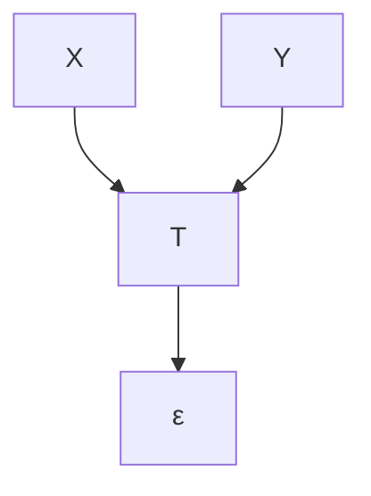
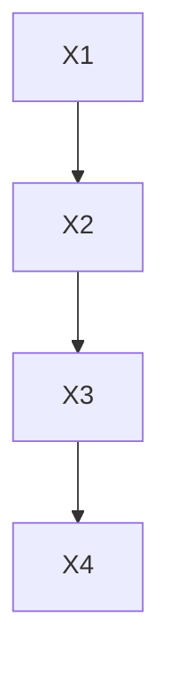

# Causation, Prediction, and Search

## Adaptive Computation and Machine Learning

Peter Spirtes,
Clark Glymour, and
Richard Scheines

## Comments

It is with data affected by numerous causes that Statistics is mainly concerned. Experiment seeks to disentangle a complex of causes by removing all but one of them, or rather by concentrating on the study of one and reducing the others, as far as circumstances permit, to comparatively small residium. Statistics, denied this resource, must accept for analysis data subject to the influence of a host of causes, and must try to discover from the data themselves which causes are the important ones and how much of the observed effect is due to the operation of each.

—G. U. Yule and M. G. Kendall, 1950

The Theory of Estimation discusses the principles upon which observational data may be used to estimate, or to throw light upon the values of theoretical quantities, not known numerically, which enter into our specification of the causal system operating.

—Sir Ronald Fisher, 1956

George Box has [almost] said “The only way to find out what will happen when a complex system is disturbed is to disturb the system, not merely to observe it passively.” These words of caution about “natural experiments” are uncomfortably strong. Yet in today’s world we see no alternative to accepting them as, if anything, too weak.

—G. Mosteller and J. Tukey, 1977

Causal inference is one of the most important, most subtle, and most neglected of all the problems of Statistics.

—P. Dawid, 1979

## Preface to the Second Edition

This second edition of Causation, Prediction, and Search is the culmination of almost twenty years of research on automation and causal inference, beginning in 1980 with a chapter of Glymour’s Theory and Evidence, continuing with our book, Discovering Causal Structure, written with Kevin Kelly in 1987, and with an essay in 1990 (Spirtes et al. 1990) which layed out much of the research project we have followed in subsequent years. The thought—which one of us had—that the subject was more or less exhausted in 1993, when the first edition of this book appeared, has been proved entirely wrong.

For this edition we have substituted a new and briefer introduction, a discussion of dseparation that eliminates a misleading didacticism of the first edition, and an entirely new twelfth chapter, surveying and summarizing relevant results and applications since 1993. The original twelfth chapter was chiefly a series of conjectures, most of which have been proved correct, concerning cyclic graphs and feedback systems.

Our first debt for this edition is to our two former students, Chris Meek and Thomas Richardson. Much of the new work we describe is theirs. We are almost equally indebted to Gregory Cooper, David Heckerman, and Larry Wasserman, who have been wonderful, helpful colleagues and collaborators, and to Jaimie Robins, who, though often unhappy with the very idea of this book, helped with his insightfulness and fairness of mind. We have been encouraged by Judea Pearl’s support, by his development of ideas presented here, particularly those on prediction first presented in chapter 7 of this book, and by his explorations of a multitude of new aspects of causal inference not considered here. We have been equally encouraged by the ingenious uses and modifications of our procedures provided by a number of scientists, including Bill Shipley, David Bessler and his collaborators, and Ludwig Litzka and his students. We owe a particular thanks to Cooper, Heckerman and Meek for permitting us to use in chapter 12 their survey of Bayesian search methods, and to Thomas Richardson for providing us with information about recent unpublished developments on chain graphs.

## Preface

This book is intended for anyone, regardless of discipline, who is interested in the use of statistical methods to help obtain scientific explanations or to predict the outcomes of actions, experiments or policies.

Much of G. Udny Yule’s work illustrates a vision of statistics whose goal is to investigate when and how causal influences may be reliably inferred, and their comparative strengths estimated, from statistical samples. Yule’s enterprise has been largely replaced by Ronald Fisher’s conception, in which there is a fundamental cleavage between experimental and non-experimental inquiry, and statistics is largely unable to aid in causal inference without randomized experimental trials. Every now and then members of the statistical community express misgivings about this turn of events, and, in our view, rightly so. Our work represents a return to something like Yule’s conception of the enterprise of theoretical statistics and its potential practical benefits.

If intellectual history in the twentieth century had gone otherwise, there might have been a discipline to which our work belongs. As it happens, there is not. We develop material that belongs to statistics, to computer science, and to philosophy; the combination may not be entirely satisfactory for specialists in any of these subjects. We hope it is nonetheless satisfactory for its purpose. We are not statisticians by training or by association, and perhaps for that reason we tend to look at issues differently, and, from the perspective common in the discipline, no doubt oddly. We are struck by the fact that in the social and behavioral sciences, epidemiology, economics, market research, engineering, and even applied physics, statistical methods are routinely used to justify causal inferences from data not obtained from randomized experiments, and sample statistics are used to predict the effects of policies, manipulations, or experiments. Without these uses the profession of statistics would be a far smaller business. It may not strike many professional statisticians as particularly odd that the discipline thriving from such uses assures its audience that they are unwarranted, but it strikes us as very odd indeed. From our perspective outside the discipline, the most urgent questions about the application of statistics to such ends concern the conditions under which causal inferences and predictions of the effects of manipulations can and cannot reliably be made, and the most urgent need is a principled, rigorous theory with which to address these problems. To judge from the testimony of their books, a good many statisticians think any such theory is impossible. We think the common arguments against the possibility of inferring causes from statistics outside of experimental trials are unsound, and radical separations of the principles of experimental and observational study designs are unwise. Experimental and observational design may not always permit the same inferences, but they are subject to uniform principles.

The theory we develop follows necessarily from assumptions laid down in the statistical community over the last fifteen years. The underlying structure of the theory is essentially axiomatic. We will give two independent axioms on the relation between causal structures and probability distributions and deduce from them features of causal relationships and predictions that can and that cannot be reliably inferred from statistical constraints under a variety of background assumptions. Versions of all of the axioms can be found in papers by Lauritzen, Wermuth, Speed, Pearl, Rubin, Pratt, Schlaifer, and others. In most cases we will develop the theory in terms of probability distributions that can be thought of loosely as propensities that determine long run frequencies, but many of the probability distributions can alternatively be understood as (normative) subjective degrees of belief, and we will occasionally note Bayesian applications. From the axioms there follow a variety of theorems concerning estimation, sampling, latent variable existence and structure, regression, indistinguishability relations, experimental design, prediction, Simpson’s paradox, and other topics. Foremost among the “other topics” are the discovery that statistical methods commonly used for causal inference are radically suboptimal, and that there exist asymptotically reliable, computationally efficient search procedures that conjecture causal relationships from the outcomes of statistical decisions made on the basis of sample data. (The procedures we will describe require statistical decisions about the independence of random variables; when we say such a procedure is “asymptotically reliable” we mean it provides correct information if the outcome of each of the requisite statistical decisions is true in the population under study.)This much of the book is mathematics: where the axioms are accepted, so must the theorems be, including the existence of search procedures. The procedures we describe are applicable to both linear and discrete data and can be feasibly applied to a hundred or more variables so long as the causal relations between the variables are sufficiently sparse and the sample sufficiently large. These procedures have been implemented in a computer program, TETRAD II, which at the time of writing is publicly available.1

The theorems concerning the existence and properties of reliable discovery procedures of themselves tell us nothing about the reliabilities of the search procedures in the short run. The methods we describe require an unpredictable sequence of statistical decisions, which we have implemented as hypothesis tests. As is usual in such cases, in small samples the conventional p values of the individual tests may not provide good estimates of type 1 error probabilities for the search methods. We provide the results of extensive tests of various procedures on simulated data using Monte Carlo methods, and these tests give considerable evidence about reliability under the conditions of the simulations. The simulations illustrate an easy method for estimating the probabilities of error for any of the search methods we describe. The book also contains studies of one large pseudoempirical data set—a body of simulated data created by medical researchers to model emergency medicine diagnostic indicators and their causes—and a great many empirical data sets, most of which have been discussed by other authors in the context of specification searches.

A further aim of this work is to show that a proper understanding of the relationship between causality and probability can help to clarify diverse topics in the statistical literature, including the comparative power of experimentation versus observation,Simpson’s paradox, errors in regression models, retrospective versus prospective sampling, the perils of variable selection, and other topics. There are a number of relevant topics we do not consider. They include problems of estimation with discrete latent variables, optimizing statistical decisions, many details of sampling designs, time series, and a full theory of “nonrecursive” causal structures—that is, finite graphical representations of systems with feedback.

Causation, Prediction, and Search is not intended to be a textbook, and it is not fitted out with the associated paraphernalia. There are open problems but no exercises. In a textbook everything ought to be presented as if it were complete and tidy, even if it isn’t. We make no such pretenses in this book, and the chapters are rich in unsolved problems and open questions. Textbooks don’t usually pause much to argue points of view; we pause quite a lot.

The various theorems in this book often have a graph theoretic character; many of them are long, difficult case arguments of a kind quite unfamiliar in statistics. In order not to interrupt the flow of the discussion we have placed all proofs but one in a chapter at the end of the book. In the few cases where detailed proofs are available in the published literature, we have simply referred the reader to them. Where proofs of important results have not been published or are not readily available we have given the demonstrations in some detail.

The structure of the book is as follows. Chapter 1 concerns the motivation for the book in the context of current statistical practice and advertises some of the results. Chapter 2 introduces the mathematical ideas necessary to the investigation, and chapter 3 gives the formal framework a causal interpretation, lays down the axioms, notes circumstances in which they are likely to fail, and provides a few fundamental theorems. The next two chapters work out the consequences of two of the axioms for some fundamental issues in contexts in which it is known, or assumed, that there are no unmeasured common causes affecting measured variables. In chapter 4 we give graphical characterizations of necessary and sufficient conditions for causal hypotheses to be statistically indistinguishable from one another in each of several senses. In chapter 5 we criticize features of model specification procedures commonly recommended in statistics, and we describe feasible algorithms that from properties of population distributions extract correct information about causal structure, assuming the axioms apply and that no unmeasured common causes are at work. The algorithms are illustrated for a variety of empirical and simulated samples. Chapter 6 extends the analysis of chapter 5 to contexts in which it cannot be assumed that no unmeasured common causes act on measured variables. From both a theoretical and practical perspective, this chapter and the next form the center of the book, but they are especially difficult. Chapter 7 addresses the fundamental issue of predicting the effects of manipulations, policies, or experiments. As an easy corollary, the chapter unifies directed graphical models with Donald Rubin’s “counterfactual” framework for analyzing prediction. Chapter 8 applies the results of the preceding chapters to the subject of regression. We argue that even when standard statistical assumptions are satisfied multiple regression is a defective and unreliable way to assess causal influence even in the large sample limit, and various automated regression model specification searches only make matters worse. We show that the algorithms of chapter 6 are more reliable in principle, and we compare the performances of these algorithms against various multiple regression procedures on a variety of simulated and empirical data sets. Chapter 9 considers the design of empirical studies in the light of the results of earlier chapters, including issues of retrospective and prospective sampling, the comparative power of experimental and observational designs, selection of variables, and the design of ethical clinical trials. The chapter concludes with a look back at some aspects of the dispute over smoking and lung cancer. Chapters 10 and 11 further consider the linear case, and analyze algorithms for discovering or elaborating causal relations among measured and unmeasured variables in linear systems. Chapter 12 is a brief consideration of a variety of open questions. Proofs are given in chapter 13.

We have tried to make this work self-contained, but it is admittedly and unavoidably difficult. The reader will be aided by a previous reading of Pearl 1988, Whittaker 1990, or Neopolitan 1990.

## Acknowledgments

One source of the ideas in this book is in work we began ten years ago at the University of Pittsburgh. We drew many ideas about causality, statistics, and search from the psychometric, economic, and sociological literature, beginning with Charles Spearman’s project at the turn of the century and including the work of Herbert Simon, Hubert Blalock, and Herbert Costner.

We obtained a new perspective on the enterprise from Judea Pearl’s Probabilistic Reasoning in Intelligent Systems, which appeared the next year. Although not principally concerned with discovery, Pearl’s book showed us how to connect conditional independence with causal structure quite generally, and that connection proved essential to establishing general, reliable discovery procedures. We have since profited from correspondence and conversation with Pearl and with Dan Geiger and Thomas Verma, and from several of their papers. Pearl’s work drew on the papers of Wermuth (1980), Kiiveri and Speed (1982), Wermuth and Lauritzen (1983), and Kiiveri, Speed, and Carlin (1984), which in the early 1980s had already provided the foundations for a rigorous study of causal inference. Paul Holland introduced one of us to the Rubin framework some years ago, but we only recently realized it’s logical connections with directed graphical models. We were further helped by J. Whittaker’s (1990) excellent account of the properties of undirected graphical models.

We have learned a great deal from Gregory Cooper at the University of Pittsburgh who provided us with data, comments, Bayesian algorithms and the picture and description of the ALARM network which we consider in several places. Over the years we have learned useful things from Kenneth Bollen. Chris Meek provided essential help in obtaining an important theorem that derives various claims made by Rubin, Pratt, and Schlaifer from axioms on directed graphical models.

Steve Fienberg and several students from Carnegie Mellon’s department of statistics joined with us in a seminar on graphical models from which we learned a great deal. We are indebted to him for his openness, intelligence, and helpfulness in our research, and to Elizabeth Slate for guiding us through several papers in the Rubin framework. We are obliged to Nancy Cartwright for her courteous but salient criticism of the approach taken in our previous book and continued here. Her comments prompted our work on parameters in chapter 4. We are indebted to Brian Skyrms for his interest and encouragement over many years, and to Marek Druzdzel for helpful comments and encouragement. We have also been helped by Linda Bouck, Ronald Christensen, Jan Callahan, David Papineau, John Earman, Dan Hausman, Joe Hill, Michael Meyer, Teddy Seidenfeld, Dana Scott, Jay Kadane, Steven Klepper, Herb Simon, Peter Slezak, Steve Sorensen, John Worrall, and Andrea Woody. We are indebted to Ernest Seneca for putting us in contact with Dr. Rick Linthurst, and we are especially grateful to Dr. Linthurst for making his doctoral thesis available to us.

Our work has been supported by many institutions. They, and those who made decisions on their behalf, deserve our thanks. They include Carnegie Mellon University, the National Science Foundation programs in History and Philosophy of Science, in Economics, and in Knowledge and Database Systems, the Office of Naval Research, the Navy Personnel Research and Development Center, the John Simon Guggenheim Memorial Foundation, Susan Chipman, Stanley Collyer, Helen Gigley, Peter Machamer, Steve Sorensen, Teddy Seidenfeld, and Ron Overmann. The Navy Personnel Research and Development Center provided us the benefit of access to a number of challenging data analysis problems from which we have learned a great deal.

## Notational Conventions

 Text

In the text, each technical term is written in boldface where it is defined.

<table><tr><td>Variables:</td><td>capitalized, and in italics, e.g.,  $X$ </td></tr><tr><td>Values of variables:</td><td>lower case, and in italics, e.g.,  $X = x$ </td></tr><tr><td>Sets:</td><td>capitalized, and in boldface, e.g.,  $\mathbf{V}$ </td></tr><tr><td>Values of sets of variables:</td><td>lower case, and in boldface, e.g.,  $\mathbf{V} = \mathbf{v}$ </td></tr><tr><td>Members of  $\mathbf{X}$  that are not members of  $\mathbf{Y}$ :</td><td> $\mathbf{X} \backslash \mathbf{Y}$ </td></tr><tr><td>Error variables:</td><td> $\varepsilon, \delta, e$ </td></tr><tr><td>Independence of  $\mathbf{X}$  and  $\mathbf{Y}$ :</td><td> $\mathbf{X} \perp \perp \mathbf{Y}$ </td></tr><tr><td>Independence of  $\mathbf{X}$  and  $\mathbf{Y}$  conditional on  $\mathbf{Z}$ :</td><td> $\mathbf{X} \perp \perp \mathbf{Y} \mid \mathbf{Z}$ </td></tr><tr><td> $\mathbf{X} \cup \mathbf{Y}$ :</td><td> $\mathbf{X} \mathbf{Y}$ </td></tr><tr><td>Covariance of  $X$  and  $Y$ :</td><td> $\text{COV}(X,Y)$  or  $\gamma_{XY}$ </td></tr><tr><td>Correlation of  $X$  and  $Y$ :</td><td> $\rho_{XY}$ </td></tr><tr><td>Sample correlation of  $X$  and  $Y$ :</td><td> $r_{XY}$ </td></tr><tr><td>Partial Correlation of  $X$  and  $Y$ ,controlling for all members of set  $\mathbf{Z}$ :</td><td> $\rho_{XY,\mathbf{Z}}$ </td></tr></table>

In all of the graphs that we consider, the vertices are random variables. Hence we use the terms “variables in a graph” and “vertices in a graph” interchangeably.

Figure numbers occur just below a figure, starting at 1 within each chapter. Where necessary, we distinguish between measured and unmeasured variables by boxing measured variables and circling unmeasured variables (except for error terms). Variables beginning with e, - or are understood to be “error,” or “disturbance,” variables. For example, in the figure below, X and Y are measured, T is not, and is an error term.

> Figure n.1

We will neither box nor circle variables in graphs in which no distinction need be made between measured and unmeasured variables, for example, figure n.2.

> Figure n.2

For simplicity, we state and prove our results for probability distributions over discrete random variables. However, under suitable integrability conditions, the results can be easily generalized to continuous distributions that have density functions by replacing the discrete variables by continuous variables, probability distributions by density functions, and summations by integrals.

If a description of a set of variables is a function of a graph G and variables in G, then we make G an optional argument to the function. For example, Parents(G,X) denotes the set of variables that are parents of X in graph $G ;$ if the context makes clear which graph is being referred to we will simply write Parents(X).

If a distribution is defined over a set of random variables O then we refer to the distribution as P(O). An equation between distributions over random variables is understood to be true for all values of the random variables for which all of the distributions in the equation are defined. For example if X and Y each take the values 0 or 1 and $P ( X = 0 ) \neq 0$ and $P ( X = 1 ) \neq 0$ then $P ( Y \vert X ) = P ( Y )$ means $P ( Y = 0 | X = 0 ) = P ( Y =$ 0), P(Y = 0|X= 1) = P(Y = 0), P(Y = 1|X= 0) = P(Y = 1), and $P ( Y = 1 \vert X = 1 ) = P ( Y = 1 )$ .

We sometimes use a special summation symbol, $\vec { \Sigma }$ which has the following properties:

- (i) when sets of random variables are written beneath the special summation symbol, it is understood that the summation is to be taken over sets of values of the random variables, not the random variables themselves,
- (ii) if a conditional probability distribution appears in the scope of such a summation symbol, the summation is to be taken only over values of the random variables for which the conditional probability distributions are defined,
- (iii) if there are no values of the random variables under the special summation symbol for which the conditional probability distributions in the scope of the symbol are defined, then the summation is equal to zero.

For example, suppose that X, Y, and Z can each take on the values 0 or 1. Then if $P ( Y = 0 , Z = 0 )$ 0

$$
\sum_ {X} ^ {\rightarrow} P (X \mid Y = 0, Z = 0) = P (X = 0 \mid Y = 0, Z = 0) + P (X = 1 \mid Y = 0, Z = 0)
$$

However, if $P ( Y { = } 0 , Z { = } 0 ) = 0$ , then $P ( X { = } 0 | Y { = } 0 , Z { = } 0 )$ and $P ( X { = } 1 | Y { = } 0 , Z { = } 0 )$ are not defined, so

$$
\sum_ {X} ^ {\rightarrow} P (X | Y = 0, Z = 0) = 0
$$

We will adopt the following conventions for empty sets of variables. If $\mathbf { Y } = \emptyset$ then

- (i) P(X|Y) means P(X).
- (ii) $\rho _ { \mathbf { X Z . Y } }$ means XZ.
- (iii) A B|Y means A B.
- (iv) A Y is always true.