# Formal Preliminaries

This chapter introduces some mathematical concepts used throughout the book. The chapter is meant to provide mathematically explicit definitions of the formal apparatus we use. It may be skipped in a first reading and referred to as needed, although the reader should be warned that for good reason we occasionally use nonstandard definitions of standard notions in graph theory. We assume the reader has some background in finite mathematics and statistics, including correlation analysis, but otherwise this chapter contains all of the mathematical concepts needed in this book. Some of the same mathematical objects defined here are given special interpretations in the next chapter, but here we treat everything entirely formally.

We consider a number of different kinds of graphs: directed graphs, undirected graphs, inducing path graphs, partially oriented inducing path graphs, and patterns. These different kinds of objects all contain a set of vertices and a set of edges. They differ in the kinds of edges they contain. Despite these differences, many graphical concepts such as undirected path, directed path, parent, etc., can be defined uniformly for all of these different kinds of objects. In order to provide this uniformity for the objects we need in our work, we modify the customary definitions in the theory of graphs.

## 2.1 Graphs

The undirected graph shown in figure 2.1 contains only undirected edges $( \mathbf { e } . \mathbf { g } . , A - B )$

> Figure 2.1

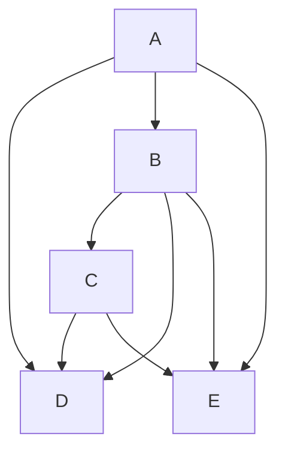

A directed graph, shown in figure 2.2, contains only directed edges (e.g., A → B).

> Figure 2.2

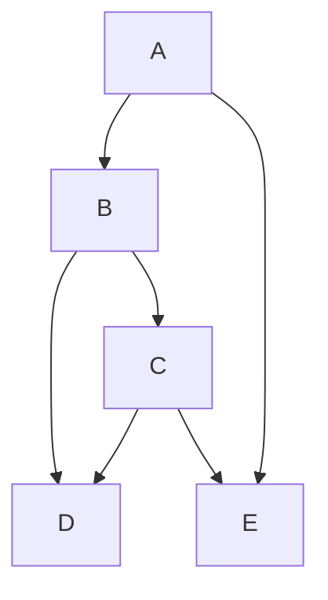

An inducing path graph, shown in figure 2.3, contains both directed edges $( \mathrm { e . g . , } A \to $ B) and bi-directed edges (e.g., $B  C )$ . (Inducing path graphs and their uses are explained in detail in chapter 6.)

> Figure 2.3

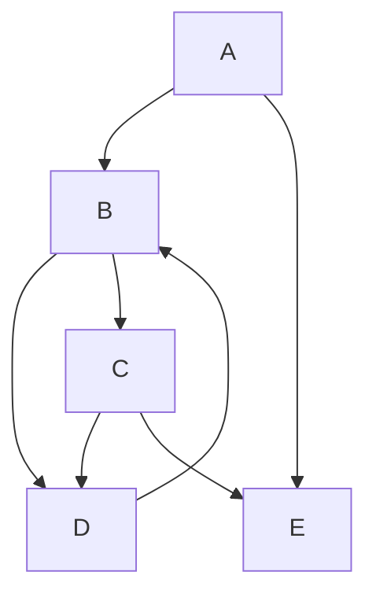

A partially oriented inducing path graph, shown in figure 2.4, contains directed edges $( \mathrm { e . g . } , B \to F )$ , bi-directed edges $( \mathrm { e . g } \ B  C )$ , nondirected edges $( { \mathrm { e . g . , ~ } } E { \mathrm { ~ o - o ~ } } D )$ , and partially directed edges $( \mathrm { e . g . } , A \ 0 \to B . )$ . (Partially oriented inducing path graphs and their uses are explained in detail in chapter 6.)

> Figure 2.4

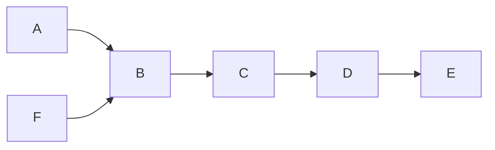

A pattern, shown in fi gure 2.5, contains undirected edges $( \mathbf { e } . \mathbf { g } . , A - B )$ and directed edges $( \mathrm { e . g . , } A \to E )$ . (Patterns and their uses are explained in detail in chapter 5.)

> Figure 2.5

In the usual graph theoretic definition, a graph is an ordered pair ${ \bf < V , E > }$ where V is a set of vertices, and E is a set of edges. The members of E are pairs of vertices (an ordered pair in a directed graph and an unordered pair in an undirected graph). For example, the edge $A  B$ is represented by the ordered pair ${ \tt < A , B > }$ . In directed graphs the ordering of the pair of vertices representing an edge in effect marks an arrowhead at one end of the edge. For our purposes we need to represent a larger variety of marks attached to the ends of undirected edges. In general, we allow that the end of an edge can be unmarked, or can be marked with an arrowhead, or can be marked with an “o.”

In order to specify completely the type of an edge, therefore, we need to specify the variables and marks at each end. For example, the left end of $\ " { A }  B ^ { \prime \prime }$ can be represented as the ordered pair $[ A , { \mathrm { o } } ] , { } ^ { 1 }$ and the right end can be represented as the ordered pair $[ B , > ]$ . The first member of the ordered pair is called an endpoint of an edge, for example, in $[ A , 0 ]$ the endpoint is A. The entire edge is a set of ordered pairs representing the endpoints, for example, $\{ [ A , { \mathrm { o } } ] , [ B , { \mathrm { > } } ] \}$ . The edge $\{ [ B , > ] , [ A , 0 ] \}$ is the same as {[A, $\mathbf { o } ] , [ B , > ] \}$ since it doesn’t matter which end of the edge is listed first.

Note that a directed edge such as $A  B$ has no mark at the A endpoint; we consider the mark at the A endpoint to be empty, but when we write out the ordered pair we will use the notation EM to stand for the empty mark, for example, [A,EM].

More formally, we say a graph is an ordered triple ${ \bf < V , M , E > }$ where V is a non-empty set of vertices, M is a non-empty set of marks, and E is a set of sets of ordered pairs of the form $\{ [ V _ { 1 } , M _ { 1 } ] , [ V _ { 2 } , M _ { 2 } ] \}$ , where $V _ { 1 }$ and $V _ { 2 }$ are in V, $V _ { 1 } \neq V _ { 2 }$ , and $M _ { 1 }$ and $M _ { 2 }$ are in M. Except in our discussion of systems with feedback we will always assume that in any graph, any pair of vertices $V _ { 1 }$ and $V _ { 2 }$ occur in at most one set in $\mathbf { E } , \mathbf { o r } .$ , in other words, that there there is at most one edge between any two vertices. If $G = < { \bf V } , { \bf M } , { \bf E } >$ we say that G is over V.

For example, the directed graph of figure 2.2 can be represented as $< \{ A , B , C , D , E \}$ , $\{ E M , ~ > \} , ~ \{ \{ ~ [ A , E M ] , [ B , ~ > ] \} , ~ \{ [ A , E M ] , [ E , ~ > ] \} , ~ \{ [ A , E M ] , [ D , ~ > ] \} , ~ \{ [ D , E M ] , [ B , ~ > ] \}$ , $\{ [ D , E M ] , [ C , > ] \} , \{ [ B , E M ] , [ C , > ] \} , \{ [ E , E M ] , [ C , > ] \} \} >$ .

Each member $\{ [ V _ { 1 } , M _ { 1 } ] , [ V _ { 2 } , M _ { 2 } ] \}$ of E is called an edge $( { \bf e . g . } , \ \{ [ A , E M ] , [ B , > ] \}$ in figure 2.2.) Each ordered pair $[ V _ { 1 } , M _ { 1 } ]$ in an edge is called an edge-end $( \mathrm { e . g . , } [ A , E M ]$ is an edge-end of $\{ [ A , E M ] , [ B , > ] \} . )$ Each vertex $V _ { 1 }$ in an edge $\{ [ V _ { 1 } , M _ { 1 } ] , [ V _ { 2 } , M _ { 2 } ] \}$ is called an endpoint of the edge (e.g., A is an endpoint of $\{ [ A , E M ] , [ B , > ] \} . ) \ V _ { 1 }$ and $V _ { 2 }$ are adjacent in G if and only if there is an edge in E with endpoints $V _ { 1 }$ and $V _ { 2 } \left( \mathrm { e . g } \right.$ ., in figure 2.2, A and B are adjacent, but A and C are not.)An undirected graph is a graph in which the set of marks $M = \{ E M \}$ . A directed graph is a graph in which the set of marks $M = \{ E M , > \}$ and for each edge in E, one edge-end has mark EM and the other edge-end has mark $\ddot { \cdot } \stackrel {  } { > } . \dot { }$

An edge $\{ < [ A , E M ] , [ B , > ] \}$ is a directed edge from A to B. (Note that in an undirected graph there are no directed edges.) An edge $\{ [ A , M _ { 1 } ] , [ B , ~ > ] \}$ is into B. An edge $\{ [ A , E M ] , [ B , M _ { 2 } ] \}$ is out of A. If there is a directed edge from A to B then A is a parent of B and B is a child (or daughter) of B. We denote the set of all parents of vertices in V as Parents(V) and the set of all children of vertices in V as Children(V). The indegree of a vertex V is equal to the number of its parents; the outdegree is equal to the number of its children; and the degree is equal to the number of vertices adjacent to V. (In a directed graph, the degree of a vertex is equal to the sum of it’s indegree and outdegree.) In figure 2.2, the parents of B are A and D, and the child of B is C. Hence, B is of indegree 2, outdegree 1, and degree 3.

We will treat an undirected path in a graph as a sequence of vertices that are adjacent in the graph. In other words for every pair X, Y adjacent on the path, there is an edge $\{ [ X , M _ { 1 } ] , [ Y , M _ { 2 } ] \}$ in the graph. For example, in figure 2.2, the sequence ${ < A , B , C , D > }$ is an undirected path because each pair of variables adjacent in the sequence (A and B, B and C, and C and D) have corresponding edges in the graph. The set of edges in a path consists of those edges whose endpoints are adjacent in the sequence. In figure 2.2 the edges in path ${ < A , B , C , D > }$ are $\{ [ A , E M ] , [ B , > ] \}$ , {[B,EM],[C, >]}, and $\{ [ C , > ] , [ D , E M ] \}$ .

More formally, an undirected path between A and B in a graph G is a sequence of vertices beginning with A and ending with B such that for every pair of vertices X and Y that are adjacent in the sequence there is an edge $\{ [ X , M _ { 1 } ] , [ Y , M _ { 2 } ] \}$ in G. An edge $\left\{ [ X , M _ { 1 } ] , [ Y , M _ { 2 } ] \right\}$ is in path $U$ if and only if X and Y are adjacent to each other (in either order) in $U .$ If an edge between X and Y is in path $U$ we also say that X and Y are adjacent on U. If the edge containing X in an undirected path between X and Y is out of X then we say that the path is out of X; similarly, if the edge containing X in a path between X and Y is into X then we say that the path is into X. In order to simplify proofs we call a sequence that consists of a single vertex an empty path. A path that contains no vertex more than once is acyclic; otherwise it is cyclic. Two paths intersect iff they have a vertex in common; any such common vertex is a point of intersection. If path U is $< U _ { 1 } , \ldots , U _ { n } >$ > and pat and path $V \mathrm { i s } < U _ { n } , V _ { 1 } , . . . , V _ { m } >$ hen the concatenation of U and , then the concatenation of U and $V { \mathrm { i s } } < U _ { 1 } , \ldots$ $U _ { n } , V _ { 1 } , \dots . . . , V _ { m } { > }$ denoted by $U$ andV. The concatenation of U with an empty path is $U ,$ and the concatenation of an empty path with U is $U$ . Ordinarily when we use the term “path” we will mean acyclic path; in referring to cyclic path we will always use the adjective.

A directed path from A to B in a graph $G$ is a sequence of vertices beginning with A and ending with B such that for every pair of vertices X, Y, adjacent in the sequence and occurring in the sequence in that order, there is an edge $\{ [ X , E M ] , [ Y , > ] \}$ in G. A is the source and B the sink of the path. For example, in figure $2 . 2 < A , B , C >$ is a directed path with source A and sink C. In contrast, in figure $2 . 2 < A , B , D >$ is an undirected path, but not a directed path because B and D occur in the sequence in that order, but the edge $\{ [ B , E M ] , [ D , > ] \}$ is not in G (although $\{ [ D , E M ] , [ B , > ] \}$ is in $G . )$ Directed paths are therefore special cases of undirected paths. For a directed edge $e$ from $U$ to $V ( U  V )$ , head $( e ) = V$ and $\mathbf { t a i l } ( e ) = U .$ . A directed acyclic graph is a directed graph that contains no directed cyclic paths.

A semidirected path between A and B in a partially oriented inducing path graph is an undirected path U from A to B in which no edge contains an arrowhead pointing toward A (i.e., there is no arrowhead at A on $U ,$ and if X and Y are adjacent on the path, and X is between A and Y on the path, then there is no arrowhead at the X end of the edge between X and Y.) Of course every directed path is semidirected, but in graphs with $" _ { 0 } \cdot >$ end marks there may be semidirected paths that are not directed.

A graph is complete if every pair of its vertices are adjacent. Figure 2.6 illustrates a complete undirected graph.

> Figure 2.6

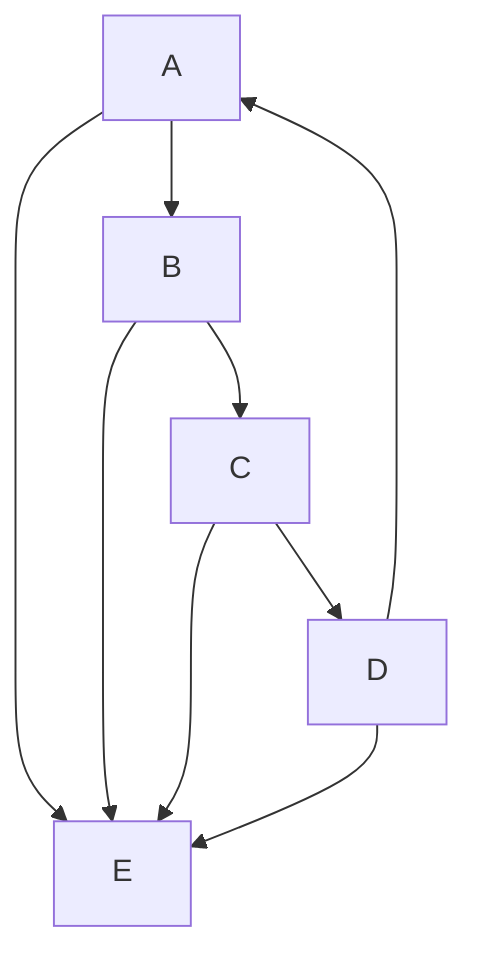

A graph is connected if there is an undirected path between any two vertices. Figures 2.1–2.6 are connected, but figure 2.7 is not.

> Figure 2.7

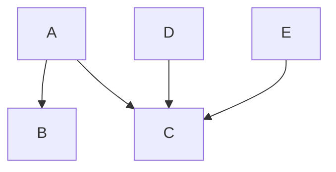

A subgraph of ${ \bf < V , M , E > }$ is any graph $< \mathbf { V } ^ { \prime } , \mathbf { M } ^ { \prime } , \mathbf { E } ^ { \prime } >$ such that $\mathbf { V } ^ { \prime }$ is included in V, M is included in M, and $\mathbf { E ^ { \prime } }$ is included in E. Figure 2.7 is a subgraph of figure 2.2. The2.1.

subgraph of <V,M,E> over $\mathbf { V ^ { \prime } } ,$ where V is included in V, is the subgraph $< \mathbf { V } ^ { \prime } , \mathbf { M } , \mathbf { E } ^ { \prime } >$ in which an edge is in E if and only if it is in E and has both endpoints in $\mathbf { V ^ { \prime } } .$ .

A clique in graph G is any subgraph of G that is complete. In figure 2.1, for example, the subgraph $G ^ { \prime } =$

$$
<   \{A, B, D \}, \{E M \}, \{\{[ A, E M ], [ B, E M ] \}, \{[ B, E M ], [ D, E M ] \}, \{[ A, E M ], [ D, E M ] \} \} >
$$

is a clique with vertices A, B and D. A clique in G whose vertex set is not properly contained in any other clique in G is maximal. In figure 2.1, both $G ^ { \prime }$ and $\boldsymbol { G } ^ { \prime \prime } =$ $< \{ A , B \} , \{ E M \} , \ \{ \{ [ A , E M ] , [ B , E M ] \} \} > .$ , are cliques, but $G ^ { \prime \prime } ,$ unlike $G ^ { \prime } ,$ is not maximal because $G ^ { \prime \prime }$ is properly contained in $G ^ { \prime } . ^ { 2 }$

A triangle in a graph G is a complete subgraph of G with three vertices; in other words, vertices X, Y and Z form a triangle if and only if X and Y are adjacent, Y and Z are adjacent and X and Z are adjacent. In graph G a vertex V is a collider on undirected path U if and only if there are two distinct edges on U containing V as an endpoint and both are into V. Otherwise V is a noncollider on U. In graph G, vertex V is an unshielded collider on U if V is a collider on U, V is adjacent to distinct vertices $V _ { 1 }$ and $V _ { 2 }$ on $U ,$ and $V _ { 1 }$ and $V _ { 2 }$ are not adjacent in G. An ancestor of a vertex V is any vertex W such that there is a directed path from W to V. A descendant of a vertex V is any vertex W such that there is a directed path from V to W. In figure 2.2, A, B, C, D, and E are all ancestors of C, although neither A nor C is a parent of C. Similarly, C is a descendant of A, B, C, D, and E, although it is not a child of A or C. Since every vertex V is the source of a directed (empty) path from V to V, each vertex is its own descendant and its own ancestor, but not of course its own parent or its own child.

## 2.2 Probability

The vertices of the graphs we consider will always be random variables taking values in one of the following: a copy of the real line; a copy of the nonnegative reals; an interval of integers.

By a joint distribution on the vertices of a graph we mean a countably additive probability measure on the Cartesian product of these objects. We say that two random variables, X, Y are independent when the joint density of (X,Y) is the product of the density of X and the density of Y for all values of X and Y. We write this as X Y. We generalize in the obvious way when asserting that one set of variables is independent of another set of variables. When we say a set of random variables is jointly independent we mean that any two disjoint subsets of the set are independent of one another. We say that random variables X, Y are independent conditional on Z (or given $\mathbf { Z } ) .$ , when the density of X, Y given Z equals the product of the density of X given Z and the density of Y given Z, for all values of X, Y, and for all values z of Z for which the density of z is not equal to 0. We generalize in the obvious way for sets of random variables, X, Y, Z. If X is independent of Y given Z we write X Y|Z, and we say that the order of the conditional independence is equal to the number of variables in Z.

In the discrete case, we say that a distribution over V is positive if and only if for all values v of V, $P ( \mathbf { v } ) \neq 0 .$ . (In general, a distribution over V is positive if the density function is nonzero for all v.) If V is included in V and

$$
P (\mathbf {V}) = \sum_ {\mathbf {V} ^ {\prime} \setminus \mathbf {V}} ^ {\rightarrow} P (\mathbf {V} ^ {\prime})
$$

we will say that P(V) is the marginal of P(V ) over V.

## 2.3 Graphs and Probability Distributions

We will examine several different graphical representations of conditional independence relations true in a distribution.

## 2.3.1 Directed Acyclic Graphs

A directed acyclic graph can be used to represent conditional independence relations in a probability distribution.

For a given graph G and vertex W let Parents(W) be the set of parents of W, and Descendants(W) be the set of descendants of W.

Markov Condition: A directed acyclic graph G over V and a probability distribution P(V) satisfy the Markov condition if and only if for every W in V, W is independent of V\(Descendants(W) ∪ Parents(W)) given Parents(W).

> Figure 2.8

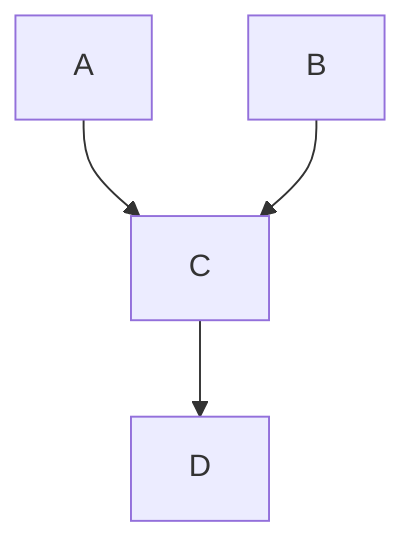

(Recall that W is its own descendant.) In the terminology of Pearl (1988) G is an Imap of P. In figure 2.8, the Markov Condition entails the following conditional independence relations:3

$$
A \perp B
$$

$$
D \perp \perp \{A, B \} \mid C
$$

For all values of v of V for which $f ( \mathbf { v } ) \neq 0 ,$ , the joint density function $f ( \mathbf { V } )$ satisfying the Markov Condition is given by

$$
f (\mathbf {V}) = \prod_ {V \in \mathbf {V}} f (V | \text { Parents } (V))
$$

where f(V| Parents(V)) denotes the density of V conditional on the (possibly empty) set of vertices that are parents of V. (See Kiiveri and Speed 1982. Recall our notation convention that if Parents $\boldsymbol { V } ) = \boldsymbol { \mathcal { O } }$ , then $f ( V | \mathbf { P a r e n t s } ( V ) ) = f ( V ) . )$

If a joint distribution over discrete variables satisfies the Markov Condition for figure 2.8 it can be factored in the following way:

$$
P (A, B, C, D) = P (A) P (B) P (C \mid A, B) P (D \mid C)
$$

for all values of A, B, C, D such that $P ( A , B , C , D ) \neq 0$ . In a directed acyclic graph $G ,$ vertices of zero indegree are said to be exogenous. If G satisfies the Markov Condition for a distribution P, then for every pair of exogenous variables $V _ { 1 }$ and $V _ { 2 } , V _ { 1 } \perp \perp V _ { 2 }$ in P.

The Minimality Condition says, intuitively, that each edge in the graph prevents some conditional independence relation that would otherwise obtain.

Minimality Condition: If G is a directed acyclic graph over V and P a probability distribution over $\mathbf { V } , < G , P >$ satisfies the Minimality Condition if and only if for every proper subgraph H of G with vertex set $\mathbf { V } , { < } H { , } P { > }$ does not satisfy the Markov Condition.

Returning to the example of figure 2.8, a distribution $P ^ { \prime }$ which satisfies the Markov Condition, but in which A is independent of $\{ B , C , D \}$ does not satisfy the Minimality Condition, because $P ^ { \prime }$ also satisfies the Markov Condition for the subgraph in which the edge between A and C is removed. In the terminology of Pearl (1988) if a distribution P(V) satisifies the Markov and Minimality conditions for a directed acyclic graph $G ,$ then G is a minimal I-map of P.

If a distribution P satisfies the Markov and Minimality Conditions for directed acyclic graph $G ,$ we will say that $G$ represents P. For any directed acyclic graph $G$ and for any probability distribution P satisfying the Markov and Minimality Conditions, if variables A and B are statistically dependent, then either:

- (i) there is a directed path in G from A to $B ;$ or
- (ii) there is a directed path in G from B to A: or
- (iii) there is a variable C and directed paths in G from C to B and from C to A.

A trek between distinct vertices A and B is an unordered pair of directed paths between A and B that have the same source, and intersect only at the source. The source of the pair of paths is also called the source of the trek. Note that one of the paths in a trek may be an empty path.

## 2.3.2 Directed Independence Graphs2.3.2 Directed Independence Graphs

Directed independence graphs are another (almost equivalent) way of representingDirected independence graphs (Whittaker 1990) are another (almost equivalent) way of conditional independence relations true of a probability distribution. Say that directedrepresenting conditional independence relations true of a probability distribution. Say that acyclic graph G is a directed independence graph of P(V) (Whittaker 1990) for andirected acyclic graph G is a directed independence graph of P(V) for an ordering > of ordering > of the vertices of G if and only if A → B occurs in the vertices in G if and only if A → B occurs in G if and only $\operatorname { i f } \sim ( A \perp \perp B \mid \mathbf { K } ( B ) )$ B |, where K(B)), where K(B) is the set of all vertices V such that VK(B) is the set of all vertices V such that V ≠ A and V > B.

THEOREM 2.1: If P(V) is a positive distribution, then for any ordering of the variables in V, P satisfies the Markov and Minimality conditions for the directed independence graph of P(V) for that ordering.

If a distribution P is not positive, it is possible that the directed independence graph of P for a given ordering of variables is a subgraph of a directed acyclic graph for which P satisfies the Minimality and Markov conditions (Pearl 1988).

## 2.3.3 Faithfulness

Given any graph, the Markov condition determines a set of independence relations. These independence relations in turn may entail others, in the sense that every probability distribution having the independence relations given by the Markov condition will also have these further independence relations. In general, a probability distribution P on a graph G satisfying the Markov condition may include other independence relations besides those entailed by the Markov condition applied to the graph. For example, A and D might be independent in a distribution satisfying the Markov Condition for the graph in figure 2.9, even though the graph does not entail their independence.

> Figure 2.9

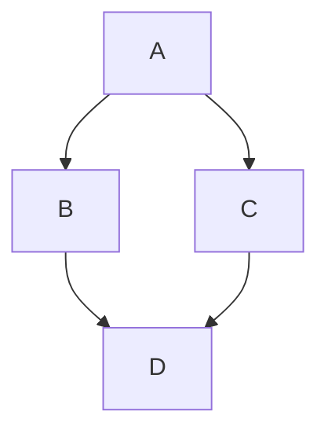

In linear models such an independence can arise if the product of the partial regressionIn linear models such an independence can arise if the product of the partial regression coefficients for D on C and C on A cancels the corresponding product of D on B and B oncoeffi cients for D on C and C on A cancels the corresponding product of D on B and B A.on A.

If all and only the conditional independence relations true in P are entailed by the Markov condition applied to G, we will say that P and G are faithful to one another. We will, moreover, say that a distribution P is faithful provided there is some directed acyclic graph to which it is faithful. In the terminology of Pearl (1988) if P and G are faithful to one another then G is a perfect map of P and P is a DAG-Isomorph of G. If distribution P is faithful to directed acyclic graph G, X and Y are dependent if and only if distribution P is faithful to direthere is a trek between X and Y.

## 2.3.4 d-separation

Following Pearl (1988), we say that for a graph G, if X and Y are vertices in $G , X \neq Y ,$ and W is a set of vertices in G not containing X or Y, then X and Y are d-separated given W in G if and only if there exists no undirected path U between X and Y, such that (i) every collider on U has a descendent in W and (ii) no other vertex on U is in W. We say that if $X \neq Y ,$ and X and Y are not in W, then X and Y are d-connected given set W if and only if they are not d-separated given W. If U, V, and W are disjoint sets of vertices in G and U and V are not empty then we say that U and V are d-separated given W if and only if every pair ${ < } U , V { > }$ in the cartesian product of U and V is d-separated given W. If U, V, and W are disjoint sets of vertices in G and U and V are not empty then we say that U and V are d-connected given W if and only if U and V are not d-separated given W. An illustration of d-connectedness is given in the directed acyclic graph in figure 2.10 (but note that the definition also applies to other sorts of graphs such as inducing path graphs, as explained in chapter 6).

> Figure 2.10

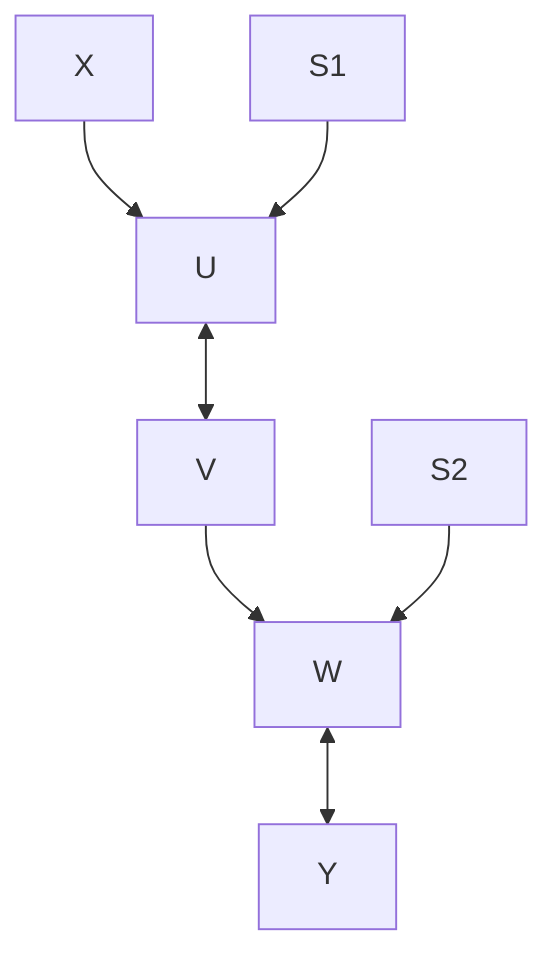

X and Y are d-separated given the empty set

X and Y are d-connected given set $\{ S _ { 1 } , S _ { 2 } \}$

X and Y are d-separated given the set $\{ S _ { 1 } , S _ { 2 } , V \}$

## 2.3.5 Linear Structures

A directed acyclic graph G over V linearly represents a distribution $P ( \mathbf { V } )$ if and only if there exists a directed acyclic graph $G ^ { \prime }$ over $\mathbf { V } ^ { \prime }$ and a distribution $P ^ { \prime \prime } ( \mathbf { V } ^ { \prime } )$ such that

- (i) V is included in $\mathbf { V } ^ { \prime } ;$
- (ii) for each endogenous (that is, with positive indegree) variable X in V, there is a unique variable $\varepsilon _ { X }$ in V \V with zero indegree, positive variance, outdegree equal to one, and a directed edge from $\varepsilon _ { X }$ to $X ;$
- (iii) G is the subgraph of $G ^ { \prime }$ over V;
- (iv) each endogenous variable in G is a linear function of its parents in $G ^ { \prime } ;$
- (v) in $P ^ { \prime \prime } ( \mathbf { V } ^ { \prime } )$ the correlation between any two exogenous variables in $G ^ { \prime }$ is zero;
- (vi) P(V) is the marginal of $P ^ { \prime \prime } ( \mathbf { V } ^ { \prime } )$ over V.

The members of V \V are called error variables and we call $G ^ { \prime }$ the expanded graph. Directed acyclic graph G linearly implies $\rho _ { A B . \mathbf { H } } = 0$ if and only if $\rho _ { A B . \mathbf { H } } = 0$ in all distributions linearly represented by G. (We assume all partial correlations exist for the distribution.) If G linearly represents $P ( \mathbf { V } )$ we say that the pair ${ < G , P ( \mathbf { V } ) > }$ is a linear model with directed acyclic graph G.

## 2.4 Undirected Independence Graphs

There is a well-known representation of statistical hypotheses about conditional independence by undirected graphs. The two representations, by directed and by undirected graphs, are closely related, but it is important not to confuse them.

An undirected independence graph G with a set of vertices V represents a probability distribution P if and only if there is no undirected edge between A and B just when A and B are conditionally independent given $\mathbf { V } \backslash \{ A , B \}$ in P. If an undirected independence graph G represents a distribution P, A and B are independent conditional on some set C if and only if every undirected path between A and B contains a member of C.

Suppose we consider a particular directed acyclic graph G and faithful probability distribution P. Let U be the undirected graph of adjacencies underlying $G ;$ that is, U is the undirected graph with the same vertex set as $G$ and the same adjacencies as G. Suppose that I is the undirected independence graph for the distribution P formed according to the definition just given. Then I and U are not in general the same, but U is always a subgraph of I. I and U will be the same if and only if G contains no unshielded colliders (Wermuth and Lauritzen 1983).

## 2.5 Deterministic and Pseudoindeterministic Systems

We will use the notion of a deterministic system in a technical sense: A joint probability distribution P on a set V of random variables represented by a directed acyclic graph G is deterministic if each of the vertices of G of nonzero indegree is a function of the vertices that are its immediate parents in $G ;$ we will also say that G is a deterministic graph of P. By “function” we mean that for each assignment of a unique value to each of the parent vertices, there is a unique value of the dependent vertex.

> Figure 2.11

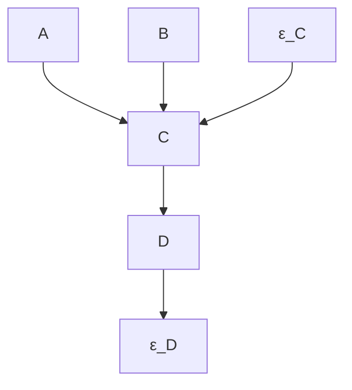

Suppose that the graph/distribution pair represented in figure 2.11 is deterministic, but that $\varepsilon _ { C }$ and $\varepsilon _ { D }$ are not measured. Were we to consider only the measured variables, that is,A, B, C, and $D ,$ we would find that no variable has its value uniquely determined by the values of the others, although some of the variables are statistically dependent. The system looks indeterministic, although $\varepsilon _ { C }$ and $\varepsilon _ { D }$ are “hidden” variables which make it deterministic when added. Furthermore, it is not necessary to posit that two measureddeterministic when they are added. Furthermore, it is not necessary to posit that two variables depend upon the same hidden variable, nor is it necessary to posit anymeasured variables depend upon the same hidden variable, nor is it necessary to posit dependence among the “hidden” variables in order to make the system deterministic.dependence among the “hidden” variables in order to make deterministic. When a distribution represented by a directed acyclic graph among measured variables isdistribution represented by a directed acyclic among measured variables is not deterministic, but is embeddable in this way in a distribution represented by anot deterministic, but is embeddable in this way in distribution represented by directed acyclic graph that is, we say the distribution is pseudoindeterministicdirected acyclic graph that is, we say the distribution is pseudoindeterministic.

In contrast, consider figure 2.12. Again suppose that only A, B, C, and D, were measured. In this case we could not make the system deterministic by adding hidden variables unless either the hidden variables were associated or at least one hidden variable is adjacent to at least two of the measured variables.

> Figure 2.12

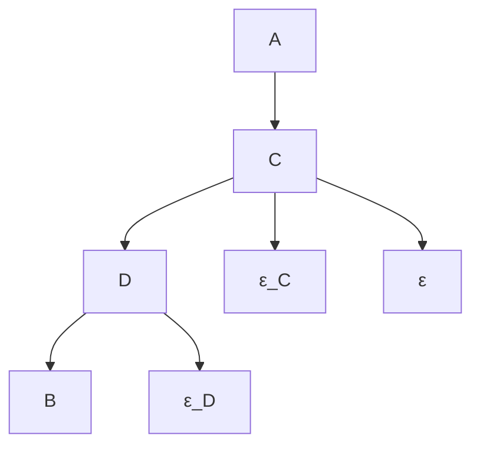

More formallyformally, ${ < } G { , } P \mathrm { > }$ P> is pseudo indeterministic, where P is a probability is pseudoindeterministic, where P is a probability distribution distribution over V and G is a directed acyclic graph over V, if and only if G is not aover V and G is a directed acyclic graph over V, if and only if G is not a deterministic deterministic graph of P and there exists graph of P and there exists a distribution $P ^ { \prime }$ istribution P and a directed and a directed acyclic graph $G ^ { \prime }$ clic graph Gover a set of over a sevariables $\mathbf { V } ^ { \prime }$ variables V that properly includethat properly includes V such that

- (i) $G ^ { \prime }$ is a deterministic graph of $P { \mathrm { ? } }$
- (ii) G is the subgraph of $G ^ { \prime }$ over $\mathbf { V } ;$
- (iii) no vertex in V is an ancestor of a vertex in V \V;
- (iv) no vertex in V \V, is the source of a trek connecting two vertices in $\mathbf { V } ;$ ;
- (v) P is the marginal of $P ^ { \prime } { ; }$
- (vi) G represents P.

If we say thIf we say that ${ < } P , G { > }$ > is linear pseudo indeterministic we me is linear pseudoindeterministic we mean that ${ < } P , G { > }$ <P,G> is is pseudopseudoindeterministic and in addindeterministic and in addition in $G ^ { \prime } ,$ n in G , each v each vertex in $\mathbf { V } ^ { \prime }$ x in V is a linear function of itsis a linear function of its parents. parents. A distribution linearly represented by a directed acyclic graph isA distribution linearly represented by a directed acyclic graph is pseudoindeterministic. pseudoindeterministic. (Analogous definitions apply to Boolean pseudo indeterministic(Analogous definitions apply to Boolean pseudoindeterministic pairs of graphs and pairs of graphs andistributions, etc.)

## 2.6 Background Notes

Drawing from purely graph-theoretical work of Lauritzen, Speed, and Vijayan (1978), and on statistical work in log-linear models (Bishop, Fienberg, and Holland 1975), in 1980 Darroch, Lauritzen, and Speed introduced undirected graphical representations of log-linear hypotheses of conditional independence. Based on Kiiveri’s thesis work, Kiiveri and Speed (1982) introduced versions of the Markov Condition, defined the notion of recursive causal model, obtained maximum likelihood estimates for a multinomial distribution and provided a systematic survey of applications with both discrete and continuous variables. Shortly after, Kiiveri, Speed, and Carlin (1984) further developed the formal foundations. Wermuth and Lauritzen (1983) introduced the notion of a recursive diagram, or what we have called a directed independence graph. The definitions of minimality, d-separation, and faithfulness are due to Pearl (1988).