# Causation and Prediction: Axioms and Explications

Views about the nature of causation divide very roughly into those that analyze causal influence as some sort of probabilistic relation, those that analyze causal influence as some sort of counterfactual relation (sometimes a counterfactual relation having to do with manipulations or interventions), and those that prefer not to talk of causation at all. We advocate no definition of causation, but in this chapter we try to make our usage systematic, and to make explicit our assumptions connecting causal structure with probability, counterfactuals and manipulations. With suitable metaphysical gyrations the assumptions could be endorsed from any of these points of view, perhaps including even the last.

## 3.1 Conditionals

Intelligent planning usually requires predicting the consequences of actions. Since actions change the states of affairs, assessing the consequences of actions not yet taken requires judging the truth or falsity of future conditional sentences—If X were to be the case, then Y would be the case. Judging the effects of past practice or policy requires judging the truth or falsity of counterfactual sentences—If X had been the case , then Y would havetruth or falsity of counterfactual sentences—If X had been the case, they Y would have been been the the case.

Giving a detailed description of the conditions under which a future conditional or counterfactual conditional is true is a well-known and difficult philosophical problem. Lewis (1973) notes that If kangaroos had no tails, they would topple over is true even though we can imagine circumstances in which kangaroos use crutches. We mean that if things were pretty much as they are—given the scarcity of crutches for kangaroos and the disinclination of kangaroos to use crutches—if kangaroos had no tails they would topple over. But making this intuition precise is not easy.

It is widely recognized that causal regularities entail counterfactual conditionals; indeed this is often taken to be the feature that distinguishes a causal law from generalizations that are true, as it were, by accident. All of the coins in your pocket are made of silver does not entail the counterfactual If this penny were in your pocket then it would be made of silver. But the causal law All collisions of electrons and positrons release energy does entail the counterfactual If this electron were to collide with this positron then energy would be released.

The connection between causal regularities and the truth of future conditional and counterfactual sentences makes the discovery of causal structure essential for intelligent planning in many contexts. A linear equation relating the fatality rate in automobile accidents to car weight may be true of a given population, but unless it describes a robust feature of the world it is useless for predicting what would happen to the fatality rate if car weight was manipulated through legislation. Even quite accurate parametric representations of the distribution of values in a population may be useless for planning unless they also reflect the causal structure among the variables.

## 3.2 Causation

We understand causation to be a relation between particular events: something happens and causes something else to happen. Each cause is a particular event and each effect is a particular event. An event A can have more than one cause, none of which alone suffice to produce A. An event A can also be overdetermined: it can have more than one set of causes that suffice for A to occur. We assume that causation is (usually) transitive, irreflexive, and antisymmetric. That is, i) if A is a cause of B and B is a cause of C, then A is also a cause of C, ii) an event A cannot cause itself, and iii) if A is a cause of B then B is not a cause of A.

## 3.2.1 Direct vs. Indirect Causation

The distinction between direct and indirect causes is relative to a set of events. If C is the event of striking a match, and A is the event of the match catching on fire, and no other events are considered, then C is a direct cause of A. If, however, we added B: the sulfur on the match tip achieved sufficient heat to combine with the oxygen, then we would no longer say that C directly caused A, but rather that C directly caused B and B directly caused A. Accordingly, we say that B is a causal mediary between C and A if C causes B and B causes A.

Having fixed a context and a set of events, what is it for one event to be a direct cause of another? The intuition is this: once the events that are direct causes of A occur, then whether A occurs or not no longer has anything to do with whether the events that are indirect causes of A occur. The direct causes screen off the indirect causes from the effect. If a child is exposed to chicken pox at her daycare center, becomes infected with the virus, and later breaks out in a rash, the infection screens off the event of exposure from the occurrence of the rash. Once she is infected, whether she gets the rash has nothing to do with whether she was exposed to the virus from her daycare or from her Saturday morning playgroup.

Suppose V is a set of events including C and A. C is a direct cause of A relative to V just in case C is a member of some set C included in V\{A} such that (i) the events in C are causes of A, (ii) the events in C, were they to occur, would cause A no matter whether the events in $\mathbf { V } \backslash ( \{ A \} \cup \mathbf { C } )$ were or were not to occur, and (iii) no proper subset of C satisfies (i) and (ii).

## 3.2.2 Events and Variables

In order for causation to be connected with probabilities that can be estimated empirically, events must be sorted; some actual or possible events must be gathered together, declared to be of a type, and distinguished from other actual or possible events perhaps gathered into other types. The simplest classifications describe events as of a kind, for example, solar eclipses, or declines in the Dow-Jones Industrial Average, and pair each event, A, of a kind with the event, ¬A, the nonoccurrence of A. Such classifications permit us to speak intelligibly of variables as causes. We do so through the introduction of Boolean variables that take events of a kind, or their absences, as values. We say that Boolean variable C causes Boolean variable A if and only if at least one member of a pair (C, ¬C) causes at least one member of a pair (A, ¬A). Ordinarily no one would bother with collecting events into a type and examining causal relations among such variables unless the causal relations among events of the two types had some generality—that is, lots of events of type A have events of type C as causes and lots of events of type C have effects of type A, or none do.

Events can be aggregated into variables X and Y, such that some events of kind X cause some events of kind Y and some events of kind Y cause some events of kind X. In such cases there will be no unambiguous direction to the causal relation between the variables.

Some events are of a quantity taking a certain value, such as bringing a particular pot of water to a temperature of 100 degrees centigrade. Scales of many kinds are associated with an array of possible events in which a particular system takes on a scale value or takes on a value within a set of scale values. We can also speak of the variables of such scales as causes and effects, at least for particular systems over particular time intervals. For any particular system S we say that scaled variable Q causes scaled variable R in S provided that there is a value (or set of values) q for Q and a value (or set of values) r for R and a possible event in which Q taking value q in S would cause an event in which R takes value r in S. In practice we usually form scales only when we think the causal relations among values of different measures are not confined to particular values or particular systems but are more general. We sometimes say that the value r for R is caused by the value q for Q if the system taking on the value q for Q caused it to take on the value r for R. If K is a collection of systems, we say that variable Q causes variable R in K provided that for every system S in K, Q causes R in S.

If our notion of causation between variables were strictly applied, almost every natural variable would count as a cause of almost every other natural variable, for no matter how remote two variables, A and B, may be, there is usually some physically possible—even if very unlikely—arrangement of systems such that variation in some values of A produces variation in some values of B. (A dictator could, we suppose, arrange circumstances so that the number of childbirths in Chicago is a function of the price of tea in China.) In practice, we always consider a restricted range of variation of other variables in judging whether A causes B. Strictly, therefore, our definitions of causal relations for variables should be relative to a set of possible values for other variables, but we will ignore this formality and trust to context. The notion of direct cause generalizes from events to variables in obvious parallel to the definition of causal dependence between variables: Variable C is a direct cause of variable A relative to V provided (i) C is a member of a set C of variables included in V, (ii) there exists a set of values c for variables in C and a value a for A such that were the variables in C to take on values c, they would cause A to take on value a no matter what the values of other variables in V, and (iii) no proper subset of C satisfies (i) and (ii). We say that a variable X is a common cause of variables Y and Z if and only if X is a direct cause of Y relative to {X,Y,Z} and a direct cause of Z relative to {X,Y,Z}. If there is a sequence of variables in V beginning with A and ending with B such that for each pair of variables X and Y that are adjacent in the sequence in that order X is a direct cause of Y relative to V, then we say that there is a causal chain from A to B relative to V. A is an indirect cause of B relative to V if there is a causal chain from A to B relative to V of length greater than 2. We make the following two fundamental assumptions about causal relations: (i) if A is a cause of B then A is a direct cause or an indirect cause of B relative to V; (ii) if A, B, and C are in V, and there exists a causal chain from A to B relative to V that does not contain C, then for any set $\mathbf { V } ^ { \prime }$ that contains A and B there is a causal chain from A to B relative to $\mathbf { V } ^ { \prime }$ that does not contain C. When a cause is unmeasured it is sometimes called a latent variable. We say that two variables are causally connected in a system if one of them is the cause of the other or if they have a common cause. A causal structure for a population is an ordered pair ${ \bf < V , E > }$ where V is a set of variables, and E is a set of ordered pairs of V, where ${ < } X , Y { > }$ is in E if and only X is a direct cause of Y relative to V. We assume that in the population A is a direct cause of B either for all units in the population or no units in the population, unless explicitly noted otherwise. If it is obvious which population is intended we do not explicitly mention it. If P(V) is a distribution over V in a population with causal structure $C = < \mathbf { V } , \mathbf { E } >$ , we say that C generated P(V). Two causal structures ${ \bf < V , E > }$ and $< \mathbf { V } ^ { \prime } , \mathbf { E } ^ { \prime } >$ are isomorphic if and only if there is a one-to-one function f from V onto V such that for any two members of A and B of $\mathbf { V } , { < } A , B { > }$ is in E if and only if ${ < f ( A ) , f ( B ) > }$ is in E . A set V of variables is causally sufficient for a population if and only if in the population every common cause of any two or more variables in V is in V, or has the same value for all units in the population.1 We will often use the notion of causal sufficiency without explicitly mentioning the population.

## 3.2.3 Examples

Simple digital logic circuit elements present concrete examples of causal structures. They are not of much intrinsic interest to most people, but they have the virtue that given a description of such a circuit element almost everyone can agree about which events pertaining to the circuit cause which other events. In the element illustrated below, the variables $X _ { 1 } , X _ { 2 }$ and $X _ { 3 }$ have two values, 1 and 0, accordingly as there is or is not a current through the corresponding line, and the semicircle represents an “and” gate. Current flows from top to bottom. The value of the variable $X _ { 3 }$ is thus a simple Boolean function of the values of $X _ { 1 }$ and $X _ { 2 } . \mathrm { H } ^ { \bullet \bullet ^ { \prime \prime } }$ represents Boolean multiplication, $X _ { 3 } = X _ { 1 } \cdot X _ { 2 }$ .


> Figure 3.1

X₁
X₂
X₃

We understand the event of $X _ { 1 }$ taking on value 1 and the event of $X _ { 2 }$ taking on value 1 each to be a cause of the event in which $X _ { 3 }$ takes on the value 1. We say that the Boolean variables $X _ { 1 }$ and $X _ { 2 }$ are each causes of the Boolean variable $X _ { 3 }$ .

The form of the causal structure does not depend on the sort of variables involved or the particular class of functions among them. Isomorphic causal structures might be realized by a system of linear dependencies of continuous variables. Thus consider three different variables $X _ { 1 } , X _ { 2 } ,$ , and $X _ { 3 } ,$ that represent the voltage in a given line and therefore range over the non-negative reals. Suppose we have a mechanism that outputs the sum of the voltage into it (figure 3.2).


> Figure 3.2

X₁
X₂
+
X₃

In this case $X _ { 3 } = X _ { 1 } + X _ { 2 }$ , but the causal structure is isomorphic to the causal structure in figure 1: $X _ { 1 }$ and $X _ { 2 }$ each are causes of $X _ { 3 }$ .

These examples suggest that the causal dependencies and the functional dependencies are related; $X _ { 3 }$ is the effect of $X _ { 1 }$ and $X _ { 2 } ,$ and $X _ { 3 }$ is a function of $X _ { 1 }$ and $X _ { 2 }$ . In systems in which variables that are effects have their values uniquely determined by the values of all of the variables that are their direct causes, functional dependence can be inferred from causal dependence by expressing each variable or event as a function of its direct causes. The converse does not hold: from the fact that an equation correctly describes a system one cannot infer that the direct causal dependencies in the system are reflected in the functional dependencies in the equation. For example, if the equation $X _ { 3 } = X _ { 1 } + X _ { 2 }$ is true of a system then the equation $X _ { 2 } = X _ { 3 } \cdot X _ { 1 }$ is equally true of that system, but if $X _ { 1 }$ and $X _ { 2 }$ cause $X _ { 3 } ,$ , then ordinarily $X _ { 3 }$ and $X _ { 1 }$ do not cause $X _ { 2 } .$ 2

## 3.2.4 Representing Causal Relations with Directed Graphs

Using the notion of a direct cause, it is trivial to represent causal structures with directed graphs:

Causal Representation Convention: A directed graph $G = < \mathbf { V }$ , E> represents a causally sufficient causal structure C for a population of units when the vertices of G denote the variables in C, and there is a directed edge from A to B in G if and only if A is a direct cause of B relative to $\mathbf { V . } ^ { 3 }$

We call a directed acyclic graph that represents a causal structure a causal graph. Figure 3.3 is a causal graph for the circuit devices shown in figures 3.1 and 3.2.


> Figure 3.3

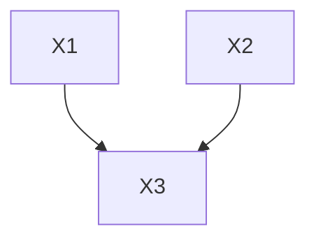

Consistently with our previous definition, if G is a causal graph and there is a vertex X in G and a directed path from X to Y that does not contain $Z ,$ and a directed path from X to Z that does not contain Y, we will say X is a common cause of Y and Z.

There are important limitations to the Causal Representation Convention. Suppose drugs A and B both reduce symptoms C, but the effect of A without B is quite trivial, while the effect of B alone is not. The directed graph representations we have considered in this chapter offer no means to represent this interaction and to distinguish it from other circumstances in which A and B alone each have an effect on C. The interaction is only represented through the probability distribution associated with the graph. Consider another example, a simple switch. Suppose as in figure 4 battery A has two states:another example, a simple switch. Suppose as in fi gure 3.4 battery A has two states: charged and uncharged. Charge in battery A will cause bulb C to light up provided the switch B is on, but not otherwise. If A and B are independent random variables, then A and C are dependent conditional on B and on the empty set, and B and C are dependent conditional on A and the empty set, and A and B are dependent conditional on C. The directed acyclic graph representing the distribution over A, B, and C therefore looks like the directed graph shown above. There is nothing wrong with this conclusion except that it is not fully informative. The dependence of A and C arises entirely through the condition B = 1. When $B = 0 .$ , A and C are independent.


A
C
B


> Figure 3.4

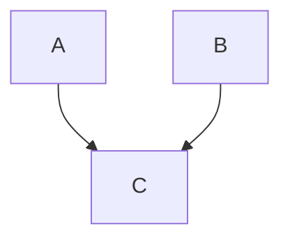

Since in discrete data the conditional independence facts, if known, identify the switch variables, a better representation would identify certain parents of a variable as switches. But a general representation of this sort would often not be very easy to grasp.4 RecentBut a general representation of this sort would often not be very easy to grasp.4 Work work on extending the directed acyclic graph representation to represent switches isextending the directed acyclic graph representation to represent switches is described in described in Geiger and HeckerGeiger and Heckerman (1991).

## 3.3 Causality and Probability

## 3.3.1 Deterministic Causal Structures

To good approximation the devices in figures 3.1 and 3.2 are deterministic, that is, the effects are deterministic functions of their direct causes. If each effect is a linear function of its direct causes in the population, we say the system is a linear deterministic causal structure in the population.

Variables in a causal graph that have zero indegree, that is, no causal input, are said to be exogenous. $X _ { 1 }$ and $X _ { 2 }$ are exogenous variables in the causal graph in figure 3.3. Variables that are not exogenous are endogenous. In a deterministic causal structure values for the exogenous variables determine unique values for the remaining variables.


> $X _ { 3 }$

X₁
X₂


> Causal Graph Circuit Diagram Figure 3.5


Consider the circuit element in figure 3.1 and its causal graph, both of which are shown in figure 3.5. Imagine an experiment to verify whether or not the device works as described. We would assign values to the exogenous variables, that is, decide whether to put current into $X _ { 1 }$ and $X _ { 2 } .$ , and then read whether or not $X _ { 3 }$ has current. We can represent the experiment with the following table.

<table><tr><td> $X_1$ </td><td> $X_1$ </td><td> $X_3$ </td></tr><tr><td>1</td><td>1</td><td>?</td></tr><tr><td>1</td><td>0</td><td>?</td></tr><tr><td>0</td><td>1</td><td>?</td></tr><tr><td>0</td><td>0</td><td>?</td></tr></table>

Suppose we were satisfied that the device usually worked as designed, but we wanted to know how often and in what way it fails. For each of a number of trials, we could randomly assign values to $X _ { 1 }$ and $X _ { 2 } .$ , and then read whether or not $X _ { 3 }$ has current. That is, we could assign a probability to each state the set of exogenous variables could occupy. For example,

$$
P (X _ {1} = 1, X _ {2} = 1) = 0. 2
$$

$$
P (X _ {1} = 1, X _ {2} = 0) = 0. 3
$$

$$
P (X _ {1} = 0, X _ {2} = 1) = 0. 2
$$

$$
P (X _ {1} = 0, X _ {2} = 0) = 0. 3
$$

Because this causal structure is deterministic (even though the exogenous variables are random), a probability distribution over the exogenous variables determines a joint distribution for the entire set of variables in the system. For this example the joint distribution over $( X _ { 1 } , X _ { 2 } , X _ { 3 } )$ is:

$$
\begin{array}{l} P \left(X _ {1} = 1, X _ {2} = 1, X _ {3} = 1\right) = 0. 2 \\ P \left(X _ {1} = 1, X _ {2} = 1, X _ {3} = 0\right) = 0. 0 \\ P \left(X _ {1} = 1, X _ {2} = 0, X _ {3} = 1\right) = 0. 0 \\ P (X _ {1} = 1, X _ {2} = 0, X _ {3} = 0) = 0. 3 \\ P \left(X _ {1} = 0, X _ {2} = 1, X _ {3} = 1\right) = 0. 0 \\ P \left(X _ {1} = 0, X _ {2} = 1, X _ {3} = 0\right) = 0. 2 \\ P \left(X _ {1} = 0, X _ {2} = 0, X _ {3} = 1\right) = 0. 0 \\ P (X _ {1} = 0, X _ {2} = 0, X _ {3} = 0) = 0. 3 \\ \end{array}
$$

We say that this distribution is generated by the causal structure of figure 3.5.

We use this example not to investigate sampling schemes for circuits but rather to illustrate how probability distributions are generated by deterministic causal devices. The only assumption we make about the connection between deterministic causal structures and the probability distributions they may generate involves the distributions we will allow over the exogenous variables. We assume that the exogenous variables are jointly independent in a probability distribution over the variables in a causally sufficient structure. This is in part a substantive assumption—that statistical dependence is produced by causal connection—and in part a convention about representation. If exogenous variables in a structure are not independent, we expect that the causal graph is incomplete and there is some further causal mechanism, not represented in the graph, responsible for the statistical dependence. Either some of the input variables are causes of others (in which case we have equivocated, and the causal graph is not actually the graph of the causal structure of the structure) or else some nonconstant common causes of observed variables have not been included in the description of the structure.

## 3.3.2 Pseudoindeterministic and Indeterministic Causal Structures

In practice, the variables people measure are seldom deterministic functions of one another. We call a causal structure over a set V of variables for a population in which some variable is not a determinate function of its immediate causes in V an indeterministic causal structure for the population. An indeterministic causal structure might be pseudoindeterministic. That is, a deterministic causal structure for which not all of the causes of variables in V are also members of V may appear to be indeterministic, even though there is no genuine indeterminism if the set of variables is enlarged by adding variables that are not common causes of variables in V. For example, suppose again that the device shown in figures 3.1 and 3.5 governs the current in line $X _ { 3 }$ . Suppose also that $X _ { 2 }$ is hidden from us so that only $X _ { 1 }$ and $X _ { 3 }$ occur in the causal structure we investigate. We might still hypothesize that $X _ { 1 }$ is a cause of $X _ { 3 } ,$ thereby forming the causal graph on the right side of figure 3.6.


> Actual Circuit Actual Circuit Diagram

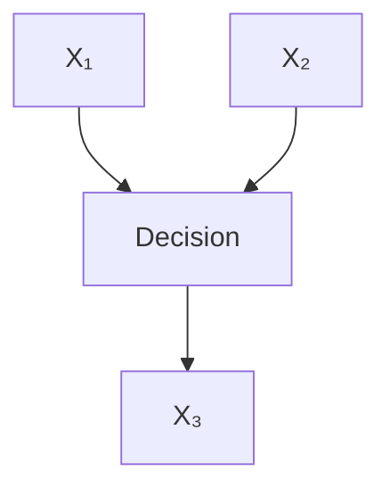


> pothesized Causal Hypothesized Causal Graph Figure 3.6

Assuming that the joint distribution $P ( X _ { 1 } , X _ { 2 } , X _ { 3 } )$ generated by the actual circuit device is the same as the one given for figure 5 in section 3.3.1, the observed distributionis the same as the one given for fi gure 3.5 in section 3.3.1, the observed distribution $P ( X _ { 1 }$ ,, $X _ { 3 } )$ is just the marginal of $P ( X _ { 1 } , X _ { 2 } , X _ { 3 } )$ , namely:

$$
\begin{array}{l} P (X _ {1} = 1, X _ {3} = 1) = 0. 2 \\ P (X _ {1} = 1, X _ {3} = 0) = 0. 3 \\ P (X _ {1} = 0, X _ {3} = 1) = 0. 0 \\ P (X _ {1} = 0, X _ {3} = 0) = 0. 5 \\ \end{array}
$$

In the observed distribution $X _ { 3 }$ is clearly not a function of its immediate parent $X _ { 1 }$ and the causal structure appears to be indeterministic. We say the structure is pseudoindeterministic. More formally, causal structure $\begin{array} { r l r } { C } & { { } = } & { < { \bf V } , { \bf E } > } \end{array}$ is pseudoindeterministic for a population, if and only if C is not a deterministic causal structure for the population and there exists a causal structure $C ^ { \prime }$ ---		

-- set of variables $\mathbf { V } ^ { \prime }$ that properly includes V such that

- (i) $C ^ { \prime }$ -
--


-
-

---		


- (ii) If A and B are in V, then ${ \mathrm { < } } A , B { \mathrm { > } }$ is in E if and only $\mathrm { i f } < A , B >$ is in $\mathbf { E ^ { \prime } }$ ;
- (iii) no variable in V is a cause of a variable in $\mathbf { V } ^ { \pmb { \eta } } \mathbf { W }$ ;
- (iv) no variable in V \V, is a common cause of two variable in $\mathbf { V } ;$

We say a structure is linear pseudoindeterministic if all functional dependencies in $C ^ { \prime }$ --
-

-

--
--
-
--

-
-- pseudoindeterministic causal structures. The error terms in such models are often interpreted as omitted causes.

It is at least conceivable that there are genuinely indeterministic structures, even genuinely indeterministic macroscopic structures, whose variables have a causal structure. We will assume that the same relations between conditional independence and causal structure that obtain for pseudoindeterministic structures hold as well for genuinely indeterministic causal relations, although as we will see later, there appear to be quantum mechanical systems for which that assumption must be carefully qualified. For a discussion of the case in which measured variables are exact functions of other measured variables see section 3.8.

## 3.4 The Axioms

We consider three conditions connecting probabilities with causal graphs: The Causal Markov Condition, the Causal Minimality Condition, and the Faithfulness Condition. These axioms are not independent. Consequences of various subsets of the conditions are investigated in the course of this book. We will consider justifications and objections to the conditions in the next section, but their importance—if not their truth—is evidenced by the fact that nearly every statistical model with a causal significance we have come upon in the social scientific literature satisfies all three: if the model were true, all three conditions would be met. While it is easy enough to construct models that violate the third of these conditions, Faithfulness, such models rarely occur in contemporary practice, and when they do, the fact that they have properties that are consequences of unfaithfulness is taken as an objection to them. In chapters 5 and 8 we will consider published log-linear models, regression models, and structural equation models satisfying the three conditions.

## 3.4.1 The Causal Markov Condition

The intuitions connecting causal graphs with the probability distributions they generate are unified and generalized in one fundamental condition:

Causal Markov Condition: Let G be a causal graph with vertex set V and P be a probability distribution over the vertices in V generated by the causal structure represented by G. G and P satisfy the Causal Markov Condition if and only if for every W in V, W is independent of V\(Descendants(W) ∪ Parents(W)) given Parents(W).

When G describes causal dependencies in a population with variables distributed as P satisfying the Causal Markov condition for G, we will sometimes say that P is generated by G. If V is not causally sufficient and V is a proper subset of the variables in a causal graph G generating a distribution P, we do not assume that the Causal Markov condition holds for the marginal over V of P.

The factorization results described in chapter 2 apply to the joint probability distribution for a set V of variables in a population of systems with a causal structure satisfying the Causal Markov Condition. If P(V | Parents (V)) denotes the probability of V conditional on the (possibly empty) set of vertices that are direct causes of V, then

$$
P (\mathbf {V}) = \prod_ {V \in \mathbf {V}} P (V | \text { Parents } (V))
$$

for all values of V for which each P(V|Parents(V)) is defined.


> Figure 3.7

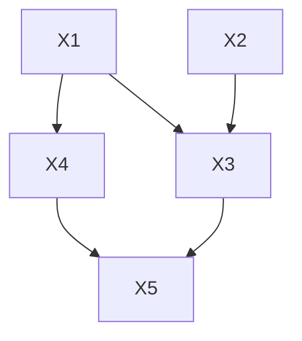

For the graph in figure 3.7 direct application of the Markov Condition yields a list ofFor the graph in fi gure 3.7, direct application of the Markov Condition yields a list of independence facts about the distribution generated by G.independence facts about the distribution generated by G.

$$
\begin{array}{l} X _ {1} \perp \perp X _ {2} \\ X _ {2} \perp \perp \{X _ {1}, X _ {4} \} \\ X _ {3} \perp \perp X _ {4} | \{X _ {1}, X _ {2} \} \\ X _ {4} \perp \left\{X _ {2}, X _ {3} \right\} \mid X _ {1} \\ X _ {5} \perp \left\{X _ {1}, X _ {2} \right\} \mid \left\{X _ {3}, X _ {4} \right\} \\ \end{array}
$$

Other independence relations are entailed by these, for example

$$
\{X _ {4}, X _ {5} \} \perp \perp X _ {2} \mid \{X _ {1}, X _ {3} \}
$$

A discussion of axioms for conditional independence is found in Pearl 1988.

## 3.4.2 The Causal Minimality Condition

We will usually impose a further condition connecting probability with causality. The principle says that each direct causal connection prevents some independence or conditional independence relation that would otherwise obtain. For example, in the following causal graph G, C is a direct cause of A .


> Figure 3.8

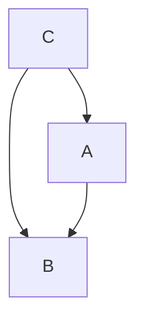

In a distribution P over {A,B,C} for which C A, P satisfies the Markov condition even if the edge between C and A is removed from the graph.

Causal Minimality Condition: Let G be a causal graph with vertex set V and P a probability distribution on V generated by G. <G, P> satisfies the Causal Minimality condition if and only if for every proper subgraph H of G with vertex set V, the pair <H,P> does not satisfy the Causal Markov condition.

Since we will almost always give the graphs we consider a causal interpretation, we will in most cases hereafter simply describe these two conditions as the Markov and Minimality Conditions.

## 3.4.3 The Faithfulness Condition

Given a causal graph, the Markov condition determines a set of independence relations. These independence relations in turn may entail others, in the sense that every probability distribution having the independence relations given by the Markov condition will also have these further independence relations. In general a probability distribution P on a causal graph G satisfying the Markov condition may include other independence relations besides those entailed by the Markov condition applied to the graph. If, however, that does not occur, and all and only the independence relations of P are entailed by the Markov condition applied to G, we will say that P and G are faithful to one another. We will, moreover, say that a distribution P is faithful provided there is some directed acyclic graph to which it is faithful. So we consider a further axiom:

Faithfulness Condition: Let G be a causal graph and P a probability distribution generated by G. <G, P> satisfies the Faithfulness Condition if and only if every conditional independence relation true in P is entailed by the Causal Markov Condition applied to G.

Note that a distribution P is faithful to G if and only if it satisfies both the Markov and Faithfulness Conditions. The Faithfulness and Markov Conditions entail Minimality, but Minimality and Markov do not entail Faithfulness. We will sometimes use the weaker axiom or axioms and more often the stronger one. Faithfulness turns out to be important to discovering causal structure, and it also turns out to be the “normal” relation between probability distributions and causal structures.

## 3.5 Discussion of the Conditions

When and why should it be thought that probability and causality together satisfy these conditions, and when can we expect the conditions to be violated? When should the values of variables in a population be thought to be distributed in accordance with the conditions?

## 3.5.1 The Causal Markov and Minimality ConditionThe Causal Markov and Minimality Conditions

If we consider probability distributions for the vertices of causal graphs of deterministicgraphs or pseudoindeterministic systems in which the exogenous variables are independentlypseudoindeterministic systems in the exogenous are independently distributed, then the Markov Condition must be satisfied. A proof is given in the lastthen the Markov Condition must be satisfied. We conjecture the Minimality chapter. We conjecture the Minimality Condition is true of all pseudoindeterministicCondition is true of all pseudoindeterministic systems. The warrant for the conditions lies systems. The warrant for the conditions lies in this fact, and in the history of humanin this fact, and in the history of human experience with systems that we can largely experience with systems that we can largely control or manipulate. Electrical devices,control or manipulate. Electrical devices, mechanical devices, chemical devices all satisfy mechanical devices, chemical devices all satisfy the condition. Large areas of science andthe condition. Large areas of science and engineering—from auto mechanics to chemical engineering—from auto mechanics to chemical kinetics to digital circuit design—wouldkinetics to digital circuit design—would be impossible without using the principles to be impossible without using the principdiagnose failures and infer mechanisms.

In an important class of cases the application of the Minimality and Markov Conditions may be unclear. In 1903 G. Udny Yule concluded his fundamental paper on the theory of association of attributes in statistics with a section “On the fallacies that may be caused by the mixing of distinct records.” (Yule uses |AB | C| to denote “the association between A and B in the universe of C’s” [p. 131]):

It follows from the preceding work that we cannot infer independence of a pair of attributes within a sub-universe from the fact of independence within the universe at large. . . . The theorem is of considerable practical importance from its inverse application; that is, even if |AB| have a sensible positive or negative value we cannot be sure that nevertheless |AB | C | and |AB | | are not both zero. Some given attribute might, for instance, be inherited neither in the male line nor the female line; yet a mixed record might exhibit a considerable apparent inheritance. Suppose for instance that 50% of the fathers and of the sons exhibit the attribute, but only 10% of the mothers and daughters. Then if there be no inheritance in either line of descent the record must give (approximately)

<table><tr><td>fathers with attribute and sons with attribute:</td><td>25%</td></tr><tr><td>fathers with attribute and sons without attribute:</td><td>25%</td></tr><tr><td>fathers without attribute and sons with attribute:</td><td>25%</td></tr><tr><td>fathers without attribute and sons without attribute:</td><td>25%</td></tr></table>

<table><tr><td>mothers with attribute and daughters with attribute:</td><td>1%</td></tr><tr><td>mothers with attribute and daughters without attribute:</td><td>9%</td></tr><tr><td>mothers without attribute and daughters with attribute:</td><td>9%</td></tr><tr><td>mothers without attribute and daughters without attribute</td><td>81%</td></tr></table>

If these two records be mixed in equal proportions we get

<table><tr><td>parents with attribute and offspring with attribute</td><td>13%</td></tr><tr><td>parents with attribute and offspring without attribute</td><td>17%</td></tr><tr><td>parents without attribute and offspring with attribute</td><td>17%</td></tr><tr><td>parents without attribute and offspring without attribute</td><td>53%</td></tr></table>

Here $1 3 / 3 0 = 4 3 $ [and] 1/3% of the offspring of parents with the attribute possess the attribute themselves, but only 30% of offspring in general, that is, there is quite a large but illusory inheritance created simply by the mixture of the two distinct records. A similar illusory association, that is to say an association to which the most obvious physical meaning must not be assigned, may very probably occur in any other case in which different records are pooled together or in which only one record is made of a lot of heterogeneous material.

The fictitious association caused by mixing records finds its counterpart in the spurious correlation to which the same process may give rise in the case of continuous variables, a case to which attention was drawn and which was fully discussed by Professor Pearson in a recent memoir. If two separate records, for each of which the correlation is zero, be pooled together, a spurious correlation will necessarily be created unless the mean of one of the variables, at least, be the same in the two cases.

Yule’s example seems to present a problem for the Causal Markov condition. Let a mixture over V be any population that consists of a combination of some finite number of subpopulations $P _ { i }$ each having different joint distributions over the variables in V, with each distribution satisfying the Causal Markov Condition for some graph. Consider a population that is a mixture of structures ${ < } G , P _ { 1 } { > }$ and ${ < } G , P _ { 2 } { > }$ where $P _ { 1 }$ and $P _ { 2 }$ are distinct and satisfy the Markov Condition for G. Let the proportions in the mixture be n:m.

Let $P ( X , Y , Z ) = n P _ { 1 } ( X , Y , Z ) + m P _ { 2 } ( X , Y , Z )$ , with $n + m = 1$ . A little algebra shows that $P ( X Y \vert Z ) = P ( X \vert Z ) P ( Y \vert Z )$ if and only if

$$
\begin{array}{l} n ^ {2} P _ {1} (X, Y, Z) P _ {1} (Z) + n m P _ {2} (X, Y, Z) P _ {1} (Z) + m n P _ {1} (X, Y, Z) P _ {2} (Z) + m ^ {2} P _ {2} (X, Y, Z) P _ {2} (Z) = \\ n ^ {2} P _ {1} (X, Z) P _ {1} (Y, Z) + n m P _ {1} (X, Z) P _ {2} (Y, Z) + m n P _ {2} (X, Z) P _ {1} (Y, Z) + m ^ {2} P _ {2} (X, Z) P _ {2} (Y, Z). \\ \end{array}
$$

If $n , \ m > 0$ and in both distributions, X,Y are independent conditional on $Z ,$ that is, $P _ { 1 } ( X , Y \vert Z ) = P _ { 1 } ( X \vert Z ) P _ { 1 } ( Y \vert Z )$ and $P _ { 2 } ( X , Y \vert Z ) = P _ { 2 } ( X \vert Z ) P _ { 2 } ( Y \vert Z )$ , then equation (1) reduces to

$$
P _ {2} (X | Z) P _ {2} (Y | Z) + P _ {1} (X | Z) P _ {1} (Y | Z) = P _ {1} (X | Z) P _ {2} (Y | Z) + P _ {2} (X | Z) P _ {1} (Y | Z)
$$

The old but still rather surprising conclusion is that when we mix probability distributions we may find all possible conditional dependence relations. Thus, it seems, in many mixed populations conditional independence and dependence will not be a reliable guide to causal structure.

In the case of linear pseudoindeterministic systems, when populations with two different distributions each associated with a linear structure are mixed, vanishing correlations in each separate distribution will not produce vanishing correlations in the mixed distribution, and vanishing partial correlations in each separate distribution will not produce vanishing partial correlations in the mixed distribution. It is easy to verify that for any mixture of two distributions—based on linear structures or not—the covariance of two variables vanishes in the mixture if and only if

$$
k _ {1} \mathrm{COV} _ {1} (X Y) + k _ {2} \mathrm{COV} _ {2} (X Y) = k _ {1} k _ {2} [ \mu_ {1} X \mu_ {2} Y + \mu_ {1} Y \mu_ {2} X ] +
$$

$$
k _ {1} (k _ {1} - 1) \mu_ {1} X \mu_ {1} Y + k _ {2} (k _ {2} - 1) \mu_ {2} X \mu_ {2} Y
$$

where the proportion of population 1 to population 2 is n: m and $k _ { 1 } = n / ( n { + } m ) , k _ { 2 } =$ m/(n+m), and $\mathrm { ^ { * } } \mu _ { \mathrm { i } } \mathrm { ^ { , * } }$ denotes the mean in population i.

So the situation is that we can have population 1 with causal graph $G _ { 1 }$ and population 2 with causal graph $G _ { 2 } ,$ and the joint population will have a distribution that does not satisfy the Markov Condition for either graph. The question is whether such a mixed population violates the Causal Markov Condition. When a cause of membership in a subpopulation is rightly regarded as a common cause of the variables in V, the Causal Markov Condition is not violated in a mixed population; instead, we have a population of systems satisfying the Causal Markov Condition but with a common cause (or causes) that may not have been measured. In some cases the cause of membership in a subpopulation may act like a latent switch variable of the kind considered in section 3.2.4; the distributions conditional on different values of the latent variable determine probability relations that are faithful to distinct causal graphs. In Yule’s example, the missing common cause is gender. If, to take another example, we form a mixed sample of lead and copper pennies, within each subpopulation density and electrical conductivity will be independent, but in the mixed population they will be statistically dependent. We should say that is because chemical composition is a common cause of density and conductivity. In other cases the cause or causes of membership in relevant subpopulations may seem like unnatural kinds, or may at least not be the sort of causes a scientist seeks. Thus an important controversy (Caramazza 1986) in contemporary cognitive neuropsychology concerns the use of statistical results for samples of people selected by syndrome, for example subjects with Broca’s aphasia. One aim of studying such groups may be to discover if two or more normal capacities have a common cause damaged in Broca’s aphasics. Suppose in a sample of Broca’s aphasics a correlation is observed in scores on tests of two cognitive skills. Should the psychologist conclude that the test performances have a common latent cause? Perhaps, but the common cause need not be any functional capacity—damaged or otherwise—that causes both skills. Instead, the sample of Broca’s aphasics might be a mixture of people with different sorts of brain damage, and within each subgroup the skills in question might be independently distributed. The common cause is only a variable representing membership in a subpopulation.

There are contexts in which the statistics of mixtures do not reflect any variable for population membership. In linear models the correlations and partial correlations are determined by the linear coefficients and the variances of exogenous variables. These parameters themselves may be treated as random variables and the resulting population distribution is a (generally uncountable) mixture of distributions. Statistical, but not causal, inference has been extensively studied in such settings (Swamy 1971). If X is a random variable, we denote the expected value of X by E(X).

THEOREM 3.1: Let M be a linear model with directed acyclic graph G and linear coefficients $a _ { i j } .$ . Let M - - - 
- - 
- 
- 
- 	- G, such that the linear coefficients in M ---
 $\boldsymbol { a } _ { \ i j } ^ { \prime }$ that are jointly independent of all other random variables in M , and $E ( a _ { i j } ^ { \prime } ) = a _ { i j }$ . Suppose the variances of the exogenous noncoefficient random variables are the same in M and M . Then $\rho _ { A B . \mathbf { C } } = 0$ in M - 
-  only if $\rho _ { A B . } ( \mathbf { \vec { \rho } } = 0$ in M.

Thus a population that is a mixture of linear pseudoindeterministic causally sufficient systems with the same causal graph and with parameters independently distributed will satisfy the Causal Markov Condition for that graph without any unmeasured common cause.

Professional philosophers have offered a spate of criticisms of consequences of the Causal Markov Condition. Most of them appear to depend on omitting relevant latent variables. Wesley Salmon (1984) claims that “[t]here is another, basically different, sort of common cause situation” that cannot appropriately be characterized in terms of the Causal Markov Condition. Salmon calls this other causal relation an “interactive fork.”

One putative example of an “interactive fork” is from Davis (1988):

Imagine a television set with a balky switch: it usually turns the set on, but not always. When the set is on, it produces both sound and picture. Then the probability of a picture given that the switch is on and given sound is greater than the probability of a picture given just that the switch is on. (Davis 1988, p. 156)


> Figure 3.9

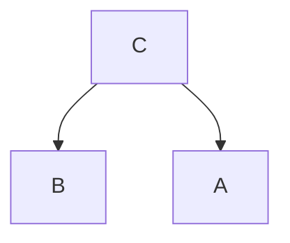

$$
C = \text { Switch   On }
$$

$$
B = \mathrm{SoundOn}
$$

$$
A = \text { Screen   On }
$$

So, P(B|C) < P(B|A and C).

Davis’s example gives an inaccurate picture of the causal situation, which is better depicted in figure 3.10.


> Figure 3.10

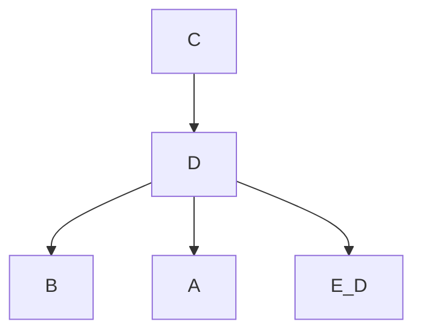

$$
C = \text { Switch   On }
$$

$$
B = \text { Sound   On }
$$

$$
A = \text { Screen   On }
$$

$$
D = \text { Circuit   Closed }
$$

The state of the circuit, or some variable downstream from the switch event, makes A and B independent.

Salmon’s own illustration uses a slight variant of the following example from the game of pool (where we replace his events by Boolean variables).

C is the description of causal conditions relevant to both A and B, but A and B are not independent conditional on C.


> Figure 3.11

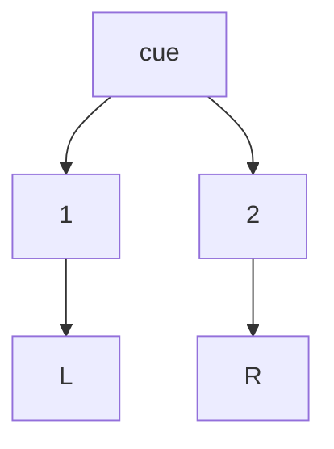

$$
\mathrm{A} = 1 \text {   ball   in   L. }
$$

$$
\mathrm{B} = 2 \text {   ball   in   R. }
$$

$$
\begin{array}{c} \text {C = Collision of any sort between} \\ \text {cue ball and either 1 or 2 ball.} \end{array}
$$

Knowing C (that there was a collision) and A (that ball 1 dropped into its pocket) tells us more about whether B occurred (the 2 ball dropped into its pocket) than just knowingC. A and B are not directly causally connected, and they are not independent conditional on C.

In Salmon’s example, event C does not completely describe all of the common causes of A and B. C tells us that there was a collision of some sort between the cue ball and the 1 or 2 balls, but it does not tell us the nature of the collision. A informs us about the nature of the collision and therefore tells us more about B. Were the prior event more informative—for example, were it to specify the exact momentum of the cue ball on striking the two target balls—conditional independence would be regained. The example simply reflects a familiar problem in real data analysis that arises whenever some proxy variable is used in causal analysis or distinct values of a variable are collapsed. In our view these examples give no reason to doubt the Causal Markov Condition.

Elliott Sober (1987) argues that we routinely find correlations for which there are no common causes, or for which residual correlations remain after conditioning on known common causes. The correlation of bread prices in England and the sea level in Venice may have some common causes (perhaps the industrial revolution), but not enough to account for all of the dependency. His point seems to be Yule’s: if we consider a series in which variable A increases with time and a series in which variable B increases with time, then A and B will be correlated in the population formed from all the units-at-times, even though A and B have no causal connection. Any such combined population is obviously a mixture of populations given by the time values.

There is a more fundamental objection to the Causal Markov Condition, namely that there exist nondeterministic causal systems for which, to the best of current knowledge, the condition is false. Consider pair production: a quantum mechanical event produces two particles which move off in different directions. Because of conservation laws, dynamical variables in the two particles must be correlated; if one has a component of spin up, for example, the other must have that spin component down. We can do experiments in which for pairs we measure either of two different components of spin at two spatially separated sensors and compute the correlations. Suppose there is some state S of the system at the moment the pair of particles is produced such that, conditional on S, the dynamical variables of the two particles are uncorrelated. J. S. Bell (1964) argued that on such an assumption there follows an inequality constraining the correlations of the measured dynamical variables. While the assumptions needed for the derivation are controversial, the empirical facts seem beyond doubt: Bell’s inequality is violated in certain quantum mechanical experiments. In such experiments the correlated variables are associated with spatially remote subsystems, so unless principles constraining causal processes to act “locally” that is, not instantaneously over a distance, are abandoned, any statistical dependency is presumably not due to the effect of one sub-system on the other or to a common cause. Thus unless the locality principles are abandoned, the Causal Markov Condition appears to be false (Elby 1992).

In our view the apparent failure of the Causal Markov Condition in some quantum mechanical experiments is insufficient reason to abandon it in other contexts. We do not, for comparison, abandon the use of classical physics when computing orbits simply because classical dynamics is literally false. The Causal Markov Condition is used all the time in laboratory, medical and engineering settings, where an unwanted or unexpected statistical dependency is prima facie something to be accounted for. If we give up the Condition everywhere, then a statistical dependency between treatment assignment and the value of an outcome variable will never require a causal explanation and the central idea of experimental design will vanish. No weaker principle seems generally plausible; if, for example, we were to say only that the causal parents of Y make Y independent of more remote causes, then we would introduce a very odd discontinuity: So long as X has the least influence on Y, X and Y are independent conditional on the parents of X. But as soon as X has no influence on Y whatsoever, X and Y may be statistically dependent conditional on the parents of Y.

The basis for the Causal Markov Condition is, first, that it is necessarily true of populations of structurally alike pseudoindeterministic systems whose exogenous variables are distributed independently, and second, it is supported by almost all of our experience with systems that can be put through repetitive processes and whose fundamental propensities can be tested. Any persuasive case against the Condition would have to exhibit macroscopic systems for which it fails and give some powerful reason why we should think the macroscopic natural and social systems for which we wish causal explanations also fail to satisfy the condition. It seems to us that no such case has been made.

## 3.5.2 Faithfulness and Simpson’s Paradox

Faithfulness can be violated in cases that realize variants of Simpson’s “paradox” as Simpson originally presented it. We have already seen that both Yule and Pearson observed that two variables may be independent in subpopulations but dependent in a combined population. In 1948, M. G. Kendall used an example in his Advanced Theory of Statistics illustrating the reverse situation: two binary variables are independent but are dependent conditional on a third variable. Kendall’s case was given a twist in a paper by Simpson (1951) a few years later, who thought his example introduced difficulties about the relation between causal dependencies and contingency tables. Subsequently the phenomenon the example exhibits has been referred to as “Simpson’s paradox.” Like examples have since become standard puzzlers in discussions of the connection between causality and probability.

Kendall’s example5 was as follows:

Consider the case in which a number of patients are treated for a disease and there is noted the number of recoveries. Denoting A by recovery, \~A by nonrecovery, B by treatment, \~B by not-treatment,6 suppose the frequencies are

<table><tr><td></td><td>B</td><td>~B</td><td>Totals</td></tr><tr><td>A</td><td>100</td><td>200</td><td>300</td></tr><tr><td>~A</td><td>50</td><td>100</td><td>150</td></tr><tr><td>Totals</td><td>150</td><td>300</td><td>450</td></tr></table>

Here $( A B ) = 1 0 0 = ( A ) ( B ) / N ,$ so that the attributes are independent. So far as can be seen, treatment exerts no effect on recovery. Denoting male sex by $S _ { M }$ and female sex by $S _ { F , \ l }$ suppose the frequencies among males and females are

**Males**

<table><tr><td></td><td> $BS_M$ </td><td> $\sim B S_M$ </td><td>Totals</td></tr><tr><td> $AS_M$ </td><td>80</td><td>100</td><td>180</td></tr><tr><td> $\sim AS_M$ </td><td>40</td><td>80</td><td>120</td></tr><tr><td>Totals</td><td>120</td><td>180</td><td>300</td></tr></table>

**Females**

<table><tr><td></td><td> $BS_F$ </td><td> $\sim B S_F$ </td><td>Totals</td></tr><tr><td> $AS_F$ </td><td>20</td><td>100</td><td>120</td></tr><tr><td> $\sim AS_F$ </td><td>10</td><td>20</td><td>30</td></tr><tr><td>Totals</td><td>30</td><td>120</td><td>150</td></tr></table>

In the male group we now have

$$
Q _ {A B. S M} = 0. 2 3 1
$$

and in the female group

$$
Q _ {A B. S F} = - 0. 4 2 9
$$

Thus among the males treatment is positively associated with recovery, and among the females negatively associated. The apparent independence in the two together is due to canceling of these associations in the sub-populations.

Kendall’s example is thus of a mixture of two distributions, one for males and one for females, such that the positive association between two variables in one population is exactly canceled by the negative association in the other. There is nothing paradoxical in that, and one may find empirical examples for which the same structure is claimed. The mixed distribution will violate the Faithfulness Condition, because it will exhibit a statistical independence relation that does not follow from the Markov condition applied to the causal graph common to all units.

Kendall’s explanation of his contingency table depends on the fact that in one population the association of two variables is positive, and in the other negative. But what can be going on if in both sub-populations the association is positive, and yet in the mixed population it vanishes? That is exactly the question Simpson posed in 1951.7 Simpson gave the following table and commentary:

<table><tr><td></td><td colspan="2">Male</td><td colspan="2">Female</td></tr><tr><td></td><td>Untreated</td><td>Treated</td><td>Untreated</td><td>Treated</td></tr><tr><td>Alive</td><td>4/52</td><td>8/52</td><td>2/52</td><td>12/52</td></tr><tr><td>Dead</td><td>3/52</td><td>5/52</td><td>3/52</td><td>15/52</td></tr></table>

This time . . . there is a positive association between treatment and survival both among males and among females; but if we combine the tables we...find that there is no association between treatment and survival in the combined population. What is the “sensible” interpretation here? The treatment can hardly be rejected as valueless to the race when it is beneficial when applied to males and to females.

The question is what causal dependencies can produce such a table, and that question is properly known as “Simpson’s paradox.”8

In Simpson’s example the variables G (male or female), T (treated or untreated) and S (survives or does not) are given an interpretation that imposes tacit restrictions on causal structure. When we read the example we naturally assume that gender G cannot be caused by treatment T or survival S, but may cause them. As with Kendall’s example, the distribution in Simpson’s table satisfies the Causal Markov Condition for a graph in which G causes T and S and T causes S. Simpson’s distribution is not, however, faithful to such a graph, because T and S are independent in the distribution even though T is a parent of S in the graph.

Suppose for a moment that we ignore the interpretation that Simpson gave to the variables in his example, which was, after all, entirely imaginary, and let ourselves consider causal structures that would be excluded by that interpretation. To avoid substantive associations, we substitute A for T, B for G, and C for S and obtain graph (i) in figure 3.12. Distributions such as Simpson’s and Kendall’s can also be realized by a graph in which A and C are not adjacent but each causes B, as in graph (ii) in figure 3.12.9

With the substitution of variables just noted, Simpson’s distribution is faithful to graph (ii) but not to graph (i); moreover (ii) is the only graph faithful to the distribution.


> (i) (i)

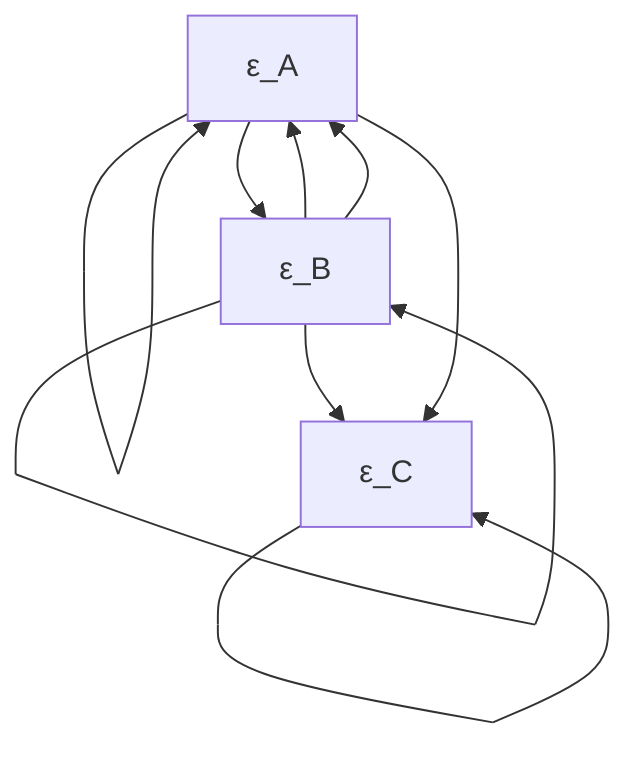


> ((ii) Figure 3.12

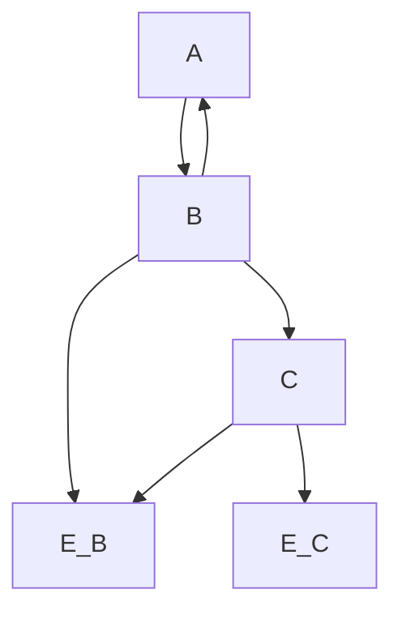

Judea Pearl (1988) offers a Bayesian example that illustrates why, when a causal structure like that in graph (ii) obtains, one should expect that A and C, though independent, are dependent conditional on B: Whether or not your car starts depends on whether or not the battery is charged and also on whether or not there is fuel in the tank, but these conditions are independent of one another. Suppose you find that your car won’t start, and you hold in that case that there is some probability that the fuel tank is empty and some probability that the battery is dead. Suppose next you find that the battery is not dead. Doesn’t the probability that the fuel tank is empty change when that information is added?

Were we to find that A and C are independent but dependent conditional on B, the Faithfulness Condition requires that if any causal structure obtains, it is structure (ii). Still, structure (i) is logically possible, and if the variables had the significance Simpson gives them we would of course prefer it. But if prior knowledge does not require structure (i), what do we lose by applying the Faithfulness Condition; what, in other words, do we lose by excluding causal structures that are not faithful to the distribution?

In the linear case, the parameter values—values of the linear coefficients and exogenous variances of a structure—form a real space, and the set of points in this space that create vanishing partial correlations not implied by the Markov Condition have Lebesgue measure zero.

THEOREM 3.2: Let M be a linear model with directed acyclic graph G and n linear coefficients $a _ { 1 } , . . . , a _ { n }$ and k positive variances of exogenous variables $\nu _ { 1 } ~ , . . . , ~ \nu _ { k } .$ . Let $M ( < u _ { 1 } , . . . , u _ { n } , u _ { n + 1 } , . . . , u _ { n + k } > )$ be the distributions consistent with specifying values $< u _ { 1 } , . . . , u _ { n } ,$ $u _ { n + 1 } , . . . , u _ { n + k } >$ for $a _ { 1 } , . . . , a _ { n }$ and $\nu _ { 1 } , \dots \nu _ { k }$ . Let be the set of probability measures P on the space $\Re ^ { n + k }$ of values of the parameters of M such that for every subset V of $\Re ^ { n + k }$ havingLebesgue measure zero, $P ( \mathbf { V } ) = 0$ . Let Q be the set of vectors of coefficient and variance values such that for all q in Q every probability distribution in with $M ( q )$ has a vanishing partial correlation that is not linearly implied by G. Then for all P in - $P ( \mathbf { Q } ) = 0$ .

The theorem can be strengthened a little; it is not really necessary that the set of exogenous and error variables be jointly independent—pairwise independence is sufficient. In the pseudoindeterministic case, faithfulness can be violated, if at all, only by very special choices of the functional dependencies between variables. Consider a population of linear, pseudoindeterministic systems in which the exogenous variables are independently and normally distributed. The conditional independence relations required by the Markov Condition will be automatically fulfilled for every possible value of the linear coefficients—they are guaranteed just by the way the device acts to compose linear functions. But conditional independence relations that are not required by the Markov Condition—the sorts of conditional independence relations that characterize distributions that are unfaithful to the causal structure of the devices—either cannot be produced at all or can only be produced if the linear coefficients satisfy very strong constraints.

The same moral applies to other classes of functions. While for discrete variables we have not attempted a formal proof of a theorem analogous to 3.2, such a result should be expected on intuitive grounds. The factorization formula for distributions satisfying the Markov Condition for a graph provides a natural parametrization of the distributions. If an exogenous variable has n values, it determines n–1 parametric dimensions consisting of a copy of the open interval (0,1). If an endogenous variable X has n values, a conditional probability P(X|Parents(X)) in the factorization determines another n–1 parametric dimensions consisting of a copy of (0,1) for each vector of values of the parents of X. One expects that the set of probability values that generate conditional independence relations not entailed by the factorization itself will be measure zero in this parameter space. (Meek [1995] provides a proof of this conjecture.]

## 3.6 Bayesian InterpretationsBayesian Interpretations

We have interpreted the conditions as about frequencies in populations in which all unitsinterpreted the as about frequencies in populations which all units have the same causal structure. We wish to consider how the conditions can be given ahave We to consider how the conditions can be Bayesian interpretation in which the probabilities are subjective. Current subjectivistBayesian interpretation in subjective. interpretations hold that probability is an idealization of rational, subjective degree ofinterpretations hold that probability is idealization of rational, subjective degree of belief. On a strict subjectivist view there can be finite frequencies, but there is no suchOn a strict there can be finite frequencies, but there is no thing as objective probability. One assumes the systems under study in the sciences areassumes the under study in the deterministic, and any appearance of indeterminacy is due simply to ignorance. Thedeterministic, and any appearance of indeterminacy is due simply to ignorance. likelihood structures of Bayesian statistical models often look like ordinary un-BayesianBayesian statistical models often like ordinary statistical models; Bayesians add a prior probability distribution over the free parameters.a prior probability distribution over the free For example, Bayesian linear models specify a distribution over a parameter For example, Bayesian linear models specify a distribution over , representing linear representing linear coefficients, variances, means, and so on. The Bayesian model is thuscoefficients, variances, means, and so on. The Bayesian model is thus a mixture of a mixture of ordinary linear models, and the joint distribution over the measured variablesordinary linear models, and the joint distribution over the measured variables does not does not satisfy the conditions we have considered in thsatisfy the conditions we have considered in this section.

Consider a study of systems with causal graph G. Suppose a Bayesian agent’s degrees of belief are represented by a density, $f ,$ satisfying the condition $f ( X | \mathbf { P a r e n t s } ( G , X ) ) =$ h(Parents(G,X); ), where $\Theta$ is a parameter whose values determine a density for X conditional on its parents. Let the Bayesian agent also have a distribution over . In such a case we understand the Causal Markov and Causal Minimality conditions to constrain the agent’s degrees of belief conditional on . The subjective joint distribution over the variables conditional on will satisfy the conditions, but typically the unconditional joint distribution will not.

Suppose now that the agent entertains a set G of alternative possible causal structures, and holds that in each structure G in $\mathbf { G } ~ f ( X | \mathbf { P a r e n t s } ( G , X ) ) = h ( \mathbf { P a r e n t s } ( G , X ) ; ~ \theta _ { G } )$ , as before. Then we understand the Causal Markov and Causal Minimality conditions to constrain the agent’s degrees of belief conditional on $\Theta _ { G } , G .$ .

So understood, the conditions are normative principles about “reasonable” degrees of belief. In a later chapter we will consider in some detail a Bayesian proposal for clinical trials and argue that the assumptions the proposal makes about the degrees of belief of scientific experts accords with the Markov Condition.

## 3.7 Consequences of the Axioms

Consequences of the Causal Markov, Minimality, and Faithfulness Conditions are developed throughout this book, but some important connections between causal dependency and statistical dependency should be noted here.

## 3.7.1 d-Separation

Given a causal graph G, the Markov Condition axiomatizes the set of independence and conditional independence relations true of any distribution P faithful to G. But which conditional independence relations follow from the Markov Condition for a given graph may not be obvious. Suppose one wanted to know, for each pair of vertices X and Y and each set of vertices Q not containing X and Y, whether or not X and Y are independent conditional on Q, that is, all the atomic independence facts among sets of variables. Applying the Markov Condition directly to G, that is, applying the definition for each vertex, does not in general suffice.


> Figure 3.13

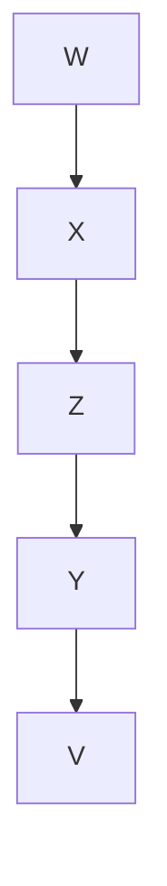

For example, in a distribution faithful to the graph in figure 13, suppose we wanted to know whether X and Y are independent conditional on the set $\mathbf { Q } = \{ Z \}$ . Applying the Markov Condition directly to figure 3.13, we obtain:

$$
\begin{array}{l} w \perp \perp \{Z, Y, V \} \\ X \perp \perp \{Y, V \} | \{W, Z \} \\ z \perp \perp \{W, V \} \\ Y \perp \perp \{W, X \} \mid \{V, Z \} \\ V \perp \perp \{W, X, Z \} \\ \end{array}
$$

It is not obvious that these facts entail X Y | {Z}. Pearl proposed a purely graphical characterization—which he called d-separation—of conditional independence, and Geiger, Pearl, and Verma (Geiger and Pearl 1989a; Verma 1987) proved that d-separation in fact characterizes all and only the conditional independence relations that follow from satisfying the Markov condition for a directed acyclic graph.

We define d-separation twice - first concisely and then in terms that make the idea more accessible and, in our experience, much easier to remember and apply.

D-separation (Definition 1): If X and Y are distinct vertices in a directed graph G, and W a set of vertices in G not containing X or Y, then X and Y are d-separated given W in G just in case there exists no undirected path U between X and Y, such that

- (i) every collider on U has a descendent in W, and
- (ii) no other vertex on U is in W.

X and Y are d-connected given W if and only if they are not d-separated by W. If U, V, and W are disjoint sets of vertices in G and U and V are not empty then we say that U and V are d-separated given W if and only if every pair <U,V> in the cartesian product of U and V is d-separated given W. Similarly for d-connection among sets.

The second definition of d-separation relies on the notions of an “active path” and an “active vertex” on a path, where active can be thought of as carrying association. Again, X and Y must be distinct, W cannot contain X or Y, and the concepts are all relative to a directed graph G.

D-separation (Definition 2): X and Y are d-separated given W just in case there is no undirected path between X and Y that is active relative to W.

An undirected path U is active relative to W just in case every vertex on U is active relative to W.

A vertex V is active on a path relative to W just in case either i) V is a collider, and V or any of its descendents is in W, or ii) V is a noncollider and is not in W.

Consider first the situation when W = ∅, which we call the “unconditional” case. If W = ∅, then each vertex on an undirected path U is active just in case it is a noncollider. Since all the vertices on a path must be active for the whole path to be active, U is unconditionally active just in case all of its vertices are noncolliders. Unconditionally active paths are just treks.10

For example, in the causal graph in figure 14, X and V are d-separated by the empty setexample, in the causal graph in figure 3.14, X and V are d-separated by the empty because Y is a collider (inactive) on the only path between them.set because Y is a collider (inactive) on the only path between them.

Conditioning on a node flip-flops its status. Whereas X and Y are unconditionally dconnected in figure 3.14, they are d-separated given {W}, {Z}, or {W,Z}. This is because the vertices on the path between X and Y are W and Z, which are noncolliders and thus unconditionally active. Conditioning flips their status from active to inactive, and if either is inactive the whole path between X and Y become inactive. That conditioning on a noncollider makes it inactive is similar to the intuition behind the Markov Condition. A noncollider is either a common cause (Z in figure 3.14) or part of a directed path, for example, W. Effects are made independent when we condition on their common causes, and effects are made independent of their remote causes when we condition on their more proximate ones.


> Figure 3.14

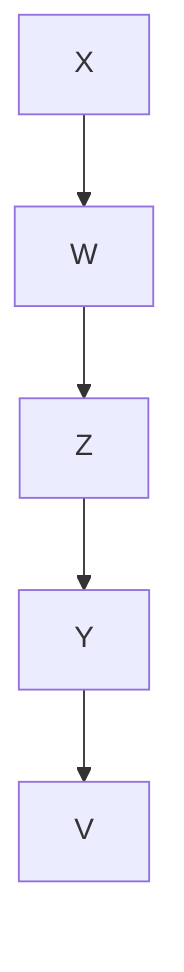

X and V are unconditionally d-separated in figure 3.14, but are d-connected given {Y}. This is because unconditionally, Y is the only inactive node on the path between X and V. Conditioning on Y makes it and thus the whole path active. That conditioning on a collider makes it active was discussed in section 3.5.2 above.

There is one additional twist, however. While conditioning on a collider activates it, soadditional twist, While conditioning it, does conditioning on any of its descendants. In the graph in figure 15, for example, X andconditioning on any of its descendants. In the graph in figure 3.15, for example, X Y are d-connected given W. This is because although U is a collider on the only pathand Y are d-connected given W. This is because although U is a collider on the only path between X and Y and thus unconditionally inactive, it is activated because one of itsbetween X and Y and thus unconditionally inactive, it is activated because one of its descendents W is in the conditioning setdescendents W is in the conditioning set.


> Figure 3.15

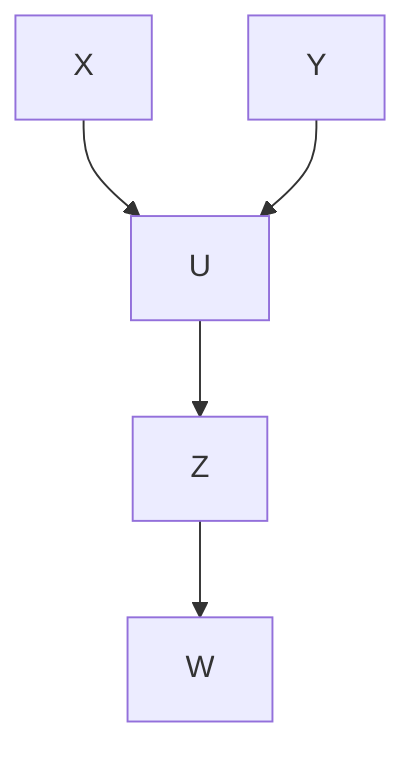

Checking whether two vertices X and Y are d-separated by a set Q in a graph G, and thus whether X and Y are independent conditional on Q in a distribution faithful to G should now be relatively straightforward. Check each undirected path between X and Y until one is found that is active relative to Q, in which case X and Y are d-connected by Q, or all paths have been checked and are inactive, in which case X and Y are d-separated by Q. For each path, check each vertex on the path. If any are inactive the path is inactive. A vertex is inactive if it is a noncollider in Q or a collider with no descendents in Q. A vertex is active if it is a noncollider not in Q or a collider with a descendant in Q. In figure 16, for example, X and Y are d-connected given {U}, but they are d-separatedU}, give n{V,Z}.given {V, Z}.


> Figure 3.16

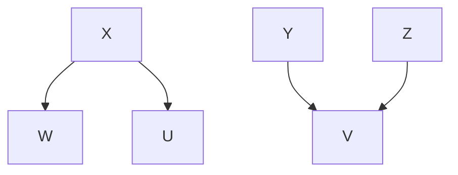

In the first case, conditioning on U activates the $X \right. U \left. Y$ path, and all it takes is one active path for {U} to d-connect X and Y. In the second case, conditioning on {V,Z} activates V on the $X  W  Z  V  Y$ path, but conditioning inactivates Z on this path and thus makes it inactive; the $X \right. U \left. Y$ path is also inactive given {V,Z} because U is a collider on the path that is not in {V,Z} and has no descendent in {V,Z}. Because all of the undirected paths between X and Y are inactive given {V,Z}, X and Y are d-separated given {V,Z}.

The essential results are the following:

THEOREM 3.3: P(V) is faithful to directed acyclic graph G with vertex set V if and only if for all disjoint sets of vertices X, Y, and Z, X and Y are independent conditional on Z if and only if X and Y are d-separated given Z.

Theorem 3.4 provides a slightly more intuitive characterization of faithfulness, which motivates algorithms developed in chapter 5.

THEOREM 3.4: If P(V) is faithful to some directed acyclic graph, then P(V) is faithful to directed acyclic graph G with vertex set V if and only if

- (i) for all vertices X, Y of G, X and Y are adjacent if and only if X and Y are dependent conditional on every set of vertices of G that does not include X or Y; and
- (ii) for all vertices X, Y, Z such that X is adjacent to Y and Y is adjacent to Z and X and Z are not adjacent, $X \right. Y \left. Z$ is a subgraph of G if and only if X, Z are dependent conditional on every set containing Y but not X or Z.

The study of correlation is historically tied to the normal distribution, and for that distribution vanishing partial correlations and conditional independence are equivalent. But the Markov and Faithfulness Conditions tie vanishing correlation and partial correlation to graphical and causal structure for linear systems, without any normality assumption. Thus, for linear systems, correlational structure is a guide to causal structure. We will say that a distribution P is linearly faithful to a graph G if and only if for vertices A and B of G and all subset C of the vertices of G, A and B are d-separated given C if and only $\rho _ { A B . C } = 0$ .

THEOREM 3.5: If G is a directed acyclic graph with vertex set V, A and B are in V, and H is included in V, then G linearly implies $\rho _ { A B . \mathbf { H } } = 0$ if and only A and B are d-separated given H.

It follows that a distribution P is linearly faithful to a graph G if and only if for vertices A and B of G and all subsets C of the vertices of G, A and B are d-separated given C if and only $\rho _ { A B . \mathbf { C } } = 0$ . Theorem 3.5 is the general principle behind all of the path analysis examples (Wright 1934; Simon 1954; Blalock 1961; Heise 1975) connecting causal structure in “recursive” (i.e., acyclic) linear models with vanishing partial correlations.

In the chapters that follow we will frequently remark that some conditional independence or conditional dependence relation, or vanishing or nonvanishing partial correlation, follows from a causal structure, assuming the distribution is faithful. Conversely, we will often observe that given certain conditional independence and dependence relations, or partial correlation facts, the causal structure must have certain properties if the distribution is faithful. Whenever we make such claims, we are using tacit corollaries of theorems 3.3, 3.4, and 3.5.

## 3.7.2 The Manipulation Theorem

The fundamental aim of many empirical studies is to predict the effects of changes, whether the changes come about naturally or are imposed by deliberate policy. How can an observed distribution P be used to obtain reliable predictions of the effects of alternative policies that would impose a new marginal distribution on some set ofimpose variables? The very idea of imposing a policy that would directly change the distribution of some variable (e.g., drug use) necessitates that the resulting distribution $P _ { M a n }$ will be different from P. P alone cannot be used to predict $P _ { M a n } ,$ but P and the causal structure can be.

Suppose that the Surgeon General is considering discouraging smoking, and he asks “What would the distribution of Cancer be if no one in the U.S were allowed to smoke?” Let V = {Drinking, Smoking, and Cancer}. For the purpose of illustration assume that in the actual population in the U.S. the causal structure shown in figure 3.17population, the causal structure shown in fi gure 3.17 is correct.


> Figure 3.17

```mermaid
graph TD
  A["Drinking"] --> B["Smoking"]
  B --> C["Cancer"]
  C --> A
    style A fill:#fff,stroke:#000
    style B fill:#fff,stroke:#000
    style C fill:#fff,stroke:#000
    note right of B "G_Unman"
```

Let us call the population actually sampled (or produced by sampling and some experimental procedure) the unmanipulated population, and the hypothetical population for which smoking is banned the manipulated population. Suppose that if the policy of banning smoking were put into effect it would be completely effective, stopping everyone from smoking, but would not affect the value of Drinking in the population. Then the causal graph for the hypothetical manipulated population will be different than for the unmanipulated population, and the distribution of Smoking is different in the two populations. The manipulated causal graph is shown in figure 3.18.


> Figure 3.18

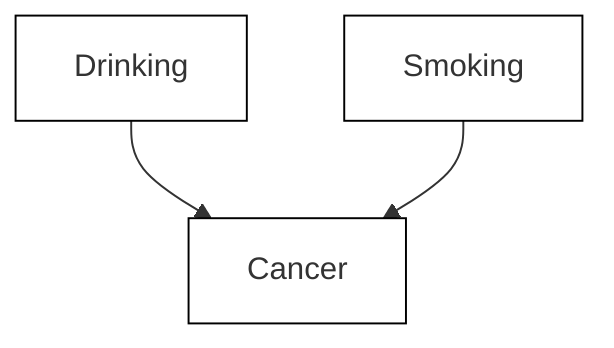

The difference between the unmanipulated graph and the manipulated graph is that some vertices that are parents of the manipulated variables in $G _ { U n m a n }$ may not (depending upon the precise form of the manipulation) be parents of manipulated variables in $G _ { M a n }$ and vice-versa.

How can we describe the change in the distribution of Smoking that will result from banning smoking? One way is to note that the value of a variable that represents the policy of the federal government is different in the two populations. So we could introduce another variable into the causal graph, the Ban Smoking variable, which is a cause of Smoking. The full causal graph, including the new variable representing smoking policy, is then shown in figure 3.19. In the actual unmanipulated population the Ban Smoking variable is $o f ,$ and in the hypothetical population the Ban Smoking variable is on. In the actual population we measure P(Smoking|Ban Smoking = off); in the hypothetical population that would be produced if smoking were banned $P ( S m o k i n g = 0$ |Ban $S m o k i n g = o n ) = 1$ . For any subset X of V = {Smoking, Drinking, Cancer} in the causal graph, let $P _ { U n m a n ( B a n S m o k i n g ) } ( \mathbf { X } )$ be P(X|Ban Smoking = off) and let $P _ { M a n ( B a n S m o k i n g ) } ( \mathbf { X } )$ be P(V|Ban Smoking = on).X


> Figure 3.19

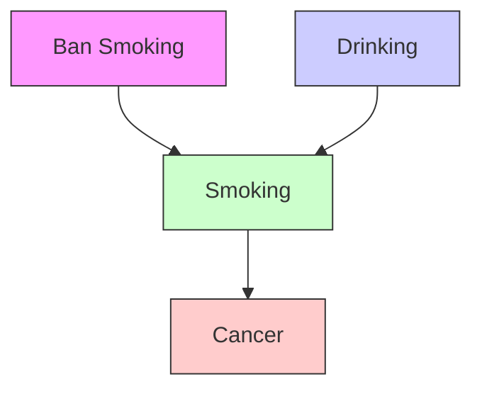

We can now ask $\begin{array} { r l r l r } { \mathrm { i f } } & { { } \ P _ { U n m a n ( B a n } } & { \quad S m o k i n g ) ( C a n c e r | S m o k i n g ) } & { { } = } & { \ P _ { M a n ( B a n } } \end{array}$ Smoking)(Cancer|Smoking) (for those values of Smoking for which $P _ { M a n ( B a n }$ Smoking)(Cancer|Smoking) is defined, namely $S m o k i n g \ = \ 0 ) ?$ Clearly the answer is affirmative exactly when Cancer and Ban Smoking are independent given Smoking; but if the distribution is faithful this just reduces to the question of whether Cancer and Ban Smoking are d-separated given Smoking, which they are not in this causal graph. Further, $P _ { U n m a n ( B a n ~ S m o k i n g ) } ( C a n c e r ) \ne P _ { M a n ( B a n ~ S m o k i n g ) } ( C a n c e r )$ because Cancer is not d-separated from Ban Smoking given the empty set. But in contrast $P _ { U n m a n ( B a n }$ Smoking)(Cancer|Smoking,Drinking) = PMan(Ban Smoking)(Cancer|Smoking,Drinking) (for those values of Smoking for which $P _ { M a n ( B a n ~ S m o k i n g ) } ( C a n c e r | S m o k i n g , D r i n k i n g )$ is defined, namely $S m o k i n g = 0 )$ , because Ban Smoking and Cancer are d-separated by {Smoking, Drinking}. The importance of this invariance is that we can predict the distribution of cancer if smoking is banned by considering the conditional distribution of cancer given drinking in the observed subpopulation of nonsmokers, and by considering the distribution of drinking in the unmanipulated population.

Note that one of the inputs to our conclusion about $P _ { M a n ( B a n ~ S m o k i n g ) } ( C a n c e r )$ is that the ban on smoking is completely successful and that it does not affect Drinking; this knowledge does not come from the measurements that we have made on Smoking, Drinking and Cancer, but is assumed to come from some other source. Of course, if the assumption is incorrect, there is no guarantee that our calculation of $P _ { M a n ( B a n }$ $_ { S m o k i n g ) } ( C a n c e r )$ will yield the correct result. If we had instead considered a policy that does not effectively ban smoking, but intervenes to make smoking less likely without affecting drinking, then the graph of the entire system including the manipulation variable Ban Smoking, would be the same as in figure 19, and the graphvariable Ban Smoking, would be the same as in fi gure 3.19, and the $G _ { U n m a n }$ would be would as in figure 3.17, but the manipulated graph $G _ { M a n }$ would look like figure 3.17 rather than 3.18. Intervention would alter but not remove the influence of drinking on smoking.

The analysis of prediction for a system involves three distinct graphs: a causal graph $G _ { C o m b }$ which includes variables W representing manipulations, and a causal graph $G _ { U n m a n }$ which is the subgraph of $G _ { C o m b }$ over a set of variables V not including the variables representing manipulations, and a graph $G _ { M a n }$ over V which represents the causal relations among variables in V that result from a manipulation. $G _ { M a n }$ may be a subgraph of $G _ { U n m a n }$ if the manipulation “breaks” causal dependencies in $G _ { U n m a n } ;$ otherwise $G _ { U n m a n }$ and $G _ { M a n }$ will be the same graph.

Here are the formal definitions: If G is a directed acyclic graph over a set of variables $\mathbf { V } \cup \mathbf { W }$ , and $\mathbf { V } \cap \mathbf { W } = \emptyset$ , then W is exogenous with respect to V in G if and only if there is no directed edge from any member of V to any member of W. If $G _ { C o m b }$ is a directed acyclic graph over a set of variables $\mathbf { V } \cup \mathbf { W }$ , and $P ( \mathbf { V } \cup \mathbf { W } )$ satisfies the Markov condition for $G _ { C o m b } .$ , then changing the value of W from $\mathbf { w _ { 1 } }$ to ${ \bf w } _ { 2 }$ is a manipulation of $G _ { C o m b }$ with respect to V if and only if W is exogenous with respect to V, and $P ( \mathbf { V } | \mathbf { W } =$ $\mathbf { w _ { 1 } } ) \neq P ( \mathbf { V } | \mathbf { W } = \mathbf { w } _ { 2 } )$ .

We define $P _ { U n m a n ( \mathbf { W } ) } ( \mathbf { V } ) = P ( \mathbf { V } | \mathbf { W } = \mathbf { w _ { 1 } } )$ , and $P _ { M a n ( \mathbf { W } ) } ( \mathbf { V } ) = \mathrm { P } ( \mathbf { V } | \mathbf { W } = \mathbf { w } _ { 2 } )$ , and similarly for various marginal and conditional distributions formed from P(V).

We refer to $G _ { C o m b }$ as the combined graph, and the subgraph of $G _ { C o m b }$ over V as the unmanipulated graph $G _ { U n m a n } .$ . (Note that while $P _ { U n m a n ( \mathbf { W } ) } ( \mathbf { V } )$ satisfies the Markov Condition for $G _ { U n m a n } ,$ it may also satisfy the Markov Condition for a subgraph of $G _ { U n m a n } .$ . This is because because $G _ { C o m b } ,$ , and hence its subgraph $G _ { U n m a n } ,$ may contain edges that are needed to represent the distribution of the manipulated subpopulation but not needed to represent the distribution of the unmanipulated subpopulation.)

V is in Manipulated(W) (that is, V is a variable directly influenced by one of the manipulation variables) if and only if V is in $\mathbf { C h i l d r e n ( W ) } \cap \mathbf { V }$ ; we will also say that the variables in Manipulated(W) have been directly manipulated. We will refer to the variables in W as policy variables.

The manipulated graph, $G _ { M a n }$ is a subgraph of $G _ { U n m a n }$ for which $P _ { M a n ( \mathbf { W } ) } ( \mathbf { V } )$ satisfies the Markov Condition and which differs from $G _ { U n m a n }$ in at most the parents of members of Manipulated(W). Exactly which subgraph $G _ { M a n }$ is depends upon the details of the manipulation and what the causal graph of the subpopulation where $\mathbf { W } = \mathbf { w } _ { 2 }$ is. For example, if smoking is banned, then $G _ { M a n }$ contains no edge between income and smoking. On the other hand, if taxes are raised on cigarettes, $G _ { M a n }$ does contain an edge between income and smoking. We will prove (in chapter 13) that given a manipulation as defined, there always exists a subgraph of $G _ { U n m a n }$ for which $P _ { M a n ( \mathbf { W } ) } ( \mathbf { V } )$ satisfies the Markov Condition. All of our theorems about manipulations hold for any $G _ { M a n }$ that is a subgraph of $G _ { U n m a n }$ for which $P _ { M a n ( \mathbf { W } ) } ( \mathbf { V } )$ satisfies the Markov Condition, and which differs from $G _ { U n m a n }$ in at most the parents of members of Manipulated(W).

These definitions entail the Manipulation Theorem:

THEOREM 3.6: (Manipulation Theorem): Given directed acyclic graph $G _ { C o m b }$ over vertex set $\mathbf { V } \cup \mathbf { W }$ and distribution $P ( \mathbf { V } \cup \mathbf { W } )$ that satisfies the Markov condition for $G _ { C o m b } ,$ if changing the value of W from $\mathbf { w _ { 1 } }$ to ${ \bf w } _ { 2 }$ is a manipulation of $G _ { C o m b }$ with respect to V, $G _ { U n m a n }$ is the unmanipulated graph, $G _ { M a n }$ is the manipulated graph, and

$$
P _ {U n m a n (\mathbf {W})} (\mathbf {V}) = \prod_ {X \in \mathbf {V}} P _ {U n m a n (\mathbf {W})} (X | \text { Parents } (G _ {U n m a n}, X))
$$

for all values of V for which the conditional distributions are defined, then

$$
\begin{array}{l} P _ {M a n (\mathbf {W})} (\mathbf {V}) = \\ \prod_{\substack{X\in \mathbf{Manipulated} (\mathbf{W})}}P_{Man(\mathbf{W})}(X|\mathbf{Parents}(G_{Man},X))\times \\ \prod_{\substack{X\in \mathbf{V}\setminus \text{Manipulated} (\mathbf{W})}}P_{\text{Unman} (\mathbf{W})}(X|\text{Parents}(G_{\text{Unman}},X)) \\ \end{array}
$$

for all values of V for which each of the conditional distributions is defined.

The importance of this theorem is that if the causal structure and the direct effects of the manipulation the manipulation $( \mathrm { i . e . , } P _ { M a n ( \mathbf { W } ) } ( X | \mathbf { P a r e n t s } ( X ) )$ for each X in Manipulated(W) are known, for each X in Manipulated(W) are known, then the joint distribution can be estimated from the unmanipulated population.

The Manipulation Theorem is not applicable when a causal mechanism between a pair of variables is reversible, in which case there can be two subpopulations in which the direction of the causal relationship between a pair of variables is reversed. For example, the movement of a motor of a car may cause the wheels to turn (as when the gas pedal is pressed), but also the turning of the wheels can cause the motor to move (as when the car 11rolls downhill).11 An intervention in a causal system which reverses the direction of some causal relationship is not a manipulation in our technical sense because there is no one combined graph representing the causal relations in the combined population. We are not suggesting any non-experimental methods for determining whether a given mechanism is reversible. In some cases, such as smoking and yellow fingers, it is obvious from background knowledge that the mechanism is not reversible, because yellow fingers cannot cause smoking. In other cases, the relevant background knowledge may not be available, in which case it is not known whether the Manipulation Theorem is applicable.

Rubin (1977; 1978), and following him Pratt and Schlaifer (1988), have offered rules for when conditional probabilities in an observed population of systems will equal conditional probabilities for the same variables if the population is altered by a direct manipulation of some variables for all population units. We will show in chapter 7 that their various rules are direct consequences of the special case of the Manipulation Theorem, illustrated in the discussion of figures 3.17, 3.18, and 3.19, in which one variable is manipulated and the intervention makes that variable independent of its causes in the unmanipulated graph.

Because the Manipulation Theorem is a consequence of the Markov condition, it requires no separate justification. Although the Manipulation Theorem is abstract, it is just the general formulation of inferences that are routine, if not always correct. When, for example, a regression model is used to predict the effects of a policy that would force values on some of the regressors, we have an application of the Manipulation Theorem. Of course the prediction may be incorrect if the causal or statistical assumptions of the regression model are false, or if the changes actually carried out do not satisfy the conditions for a manipulation. There are striking examples of both sorts of failure. Application of the Manipulation Theorem may give misleading predictions if the values of variables for each unit depend on the values of other units and if that dependency is not represented in the causal graph. Some public policy debates illustrate absurd violations of this requirement. Recently a research institute funded by automobile insurers carried out a nonlinear regression of the rate of fatalities of occupants of various kinds of cars against car length, weight and other variables, finding unsurprisingly that the smaller the car the higher the fatality rate. This statistical analysis was then used by others to argue that proposed federal policies to downsize the American automobile fleet would increase highway fatalities. But of course the fatality rate in cars of a given size depends on the distribution of sizes of other cars in the fleet.

One can mistake which variables will be directly affected by a policy or intervention. Tacit applications of the Manipulation Theorem in such cases can lead to disappointment. As we will see in a later chapter, the literature on smoking, lung cancer and mortality provides vivid examples of predictions that went wrong, arguably because of misjudgments as to which variables would be directly manipulated by an intervention.

There is no reason why every intervention to deliberately alter the distribution of values of a set of variables V among units in a population (or sample) must satisfy the conditions for a direct manipulation of V and no others. But one of the chief aims in the design of experiments is to see to it that experimental manipulations are in fact direct manipulations of the intended variables and no others. The point of blind and double blind designs, for example, is exactly to obtain in experiment a direct manipulation of only the treatment variables. The concern with chronic wounding in drug trials with animals is essentially a worry that with respect to the outcome variables of interest, outcome variables as well as pharmacological variables have been directly manipulated. Typically, when we mistake the variables an intervention will directly manipulate, predictions of the outcomes of intervention will fail.

Our discussion in this section has assumed that the causal structure of the system is fully known. In chapters 6 and 7 we will consider when and how the effects of interventions can be predicted from an unmanipulated distribution, assuming the distribution is the marginal over the measured variables of a distribution faithful to an unknown causal graph, and assuming the intervention constitutes a direct manipulation in the sense we have defined here.

## 3.8 Determinism

Another way that the Faithfulness Condition can be violated is when there are deterministic relationships between variables. In this section, we will give some rules for determining what extra conditional independence relations are entailed by deterministic relationships among variables.

We will say that a set of variables Z determines the set of variables A, when every variable in A is a deterministic function of the variables in Z, and not every variable in A is a deterministic function of any proper subset of Z. When there are deterministic relationships among variables in a graph, there are conditional independencies that are entailed by the deterministic relationships and the Markov condition that are not entailed by the Markov condition alone. For example, if G is a directed acyclic graph over V, V contains Z and A, and Z determines A, then A is independent of $\mathbf { V } \backslash ( \mathbf { Z } \cup \{ A \} )$ given Z. If Z is a proper subset of the parents of A then this entails that A is independent of its other parents given Z, and also independent of its descendants as well as its nondescendants given Z. But it could also be the case that the members of Z are children of A, in which case given its children, A is independent of all other variables including its parents. It is also possible that Z could contain nonparental ancestors of A. Each of these cases entails conditional independence relations not entailed by the Markov condition alone. For example, consider the graph in figure 3.20.


> Figure 3.20

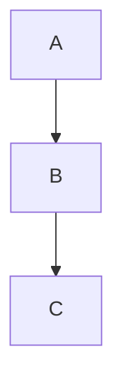

No conditional independence relations among A, B, or C are entailed by the Markov Condition alone. However, if the grandparent A determines the grandchild C, then C B|A. If the parent B determines the child C then C A|B. If the child C determines the parent B then B A|C.

Hence d-separability relations do not capture all of the conditional independencies entailed by the Markov condition and a set of deterministic relations. We will look for a graphical condition which entails the conditional independence of variables given the Markov condition and a set of deterministic relations among variables.

Geiger has proposed a simple, provably complete rule for graphically determining the conditional independencies entailed by the Markov and Minimality conditions and one kind of deterministic relationship among variables. Following Geiger (1990), in a directed acyclic graph G over V that includes A and Z, say that vertex A is a deterministic variable if it is a deterministic function of its parents in G. (Note that if a variable A has no parents in G, but has a constant value, then A is a deterministic variable.) A is functionally determined by Z if and only if A is in Z, or A is a deterministic variable and all of its parents are functionally determined by Z. If X, Y, and Z are three disjoint subsets of variables in V, X and Y are D-separated given Z if and only if there is no undirected path U between any member of X and any member of Y such that each collider has a descendant in Z and no other variable on U is functionally determined by Z. Geiger has shown that X and Y are D-separated given Z if and only if for every distribution that satisfies the Markov and Minimality Conditions for G, and the deterministic relations, X and Y are independent given Z. We will prove that Geiger’s rule is correct for a much wider class of deterministic relations; we do not know if it is complete for this wider class of deterministic relationships.

Suppose G is a directed acyclic graph over V, and Deterministic(V) is a set of ordered tuples of variables in V, where for each tuple D in Deterministic(V), if D is ${ < V _ { 1 } , . . . , V _ { n } > }$ then $V _ { n }$ is a deterministic function of $V _ { 1 } , . . . , V _ { n - 1 }$ and is not a deterministic function of any subset of $V _ { 1 } , . . . , V _ { n - 1 } ;$ we also say $\{ V _ { 1 } , . . . , V _ { n - 1 } \}$ determines $V _ { n } .$ . Note that $V _ { n }$ could be an ancestor in G of members of $V _ { 1 } , . . . , V _ { n - 1 }$ . Also, if A determines B and B determines A then Deterministic(V) contains both ${ \mathrm { < } } A , B { \mathrm { > } }$ and $^ { < B , A > }$ . We assume that Deterministic(V) is complete in the sense that if it entails some deterministic relationships among variables, those deterministic relations are in Deterministic(V). (For example, if A determines B and B determines C, then A determines C.) Det(Z) is the set of variables determined by some subset of Z. If a variable A has a constant value, then we say that it is determined by the empty set, and is in Det(Z) for all Z.

Note that Deterministic(V) can entail dependencies between variables as well as independencies. If Z determines A, and Z is a member of Z, then A is dependent on $\mathbf { Z } \backslash \{ Z \}$ given Z. (Other dependencies may be entailed by Deterministic(V) as well.) These dependencies may conflict with independencies entailed by satisfying the Markov Condition for a directed acyclic graph $G ,$ so not every Deterministic(V) is compatible with every directed acyclic graph with vertex set V. If Deterministic(V) and directed acyclic graph G are incompatible, theorem 3.7 stated below is vacuously true, but obviously it would be desirable to have a test for determining whether Deterministic(V) and G are compatible.

We will expand Geiger’s concept of D-separability so that it is not limited to the kind of deterministic relations that he considers. If G is a directed acyclic graph with vertex set V, Z is a set of vertices not containing X or $Y , X \neq Y ,$ , then X and Y are D-separated given Z and Deterministic(V) if and only if there is no undirected path U in G between X and Y such that each collider on U has a descendant in Z, and no other vertex on U is in Det(Z); otherwise if $X \neq Y$ and X and Y are not in Z, then X and Y are D-connected given Z and Deterministic(V). Similarly, if X, Y, and Z are disjoint sets of variables, and X and Y are non-empty, then X and Y are D-separated given Z and Deterministic(V) if and only if each pair <X,Y> in the Cartesian product of X and Y are D-separated given Z and Deterministic(V); otherwise if X, Y, and Z are disjoint, and X and Y are non-empty, then X and Y are D-connected given Z and Deterministic(V).

THEOREM 3.7: If G is a directed acyclic graph over V, X, Y, and Z are disjoint subsets of V, and P(V) satisfies the Markov condition for G and the deterministic relations in Deterministic(V) then if X and Y are D-separated given Z and Deterministic(V), X and Y are independent given Z in P.

For example, suppose G is the graph in figure 3.21, and Deterministic $\mathbf { \Omega } ( \mathbf { V } ) = \{ < A , B >$ , $< B , C > , < A , C > \}$ .


> Figure 3.21


B and C are D-separated given A and Deterministic(V), and A and C are Dseparated given B and Deterministic(V).

Suppose that G is still the graph in figure 3.21, but now Deterministic $\mathbf { \vec { V } } ) = \{ < A , B >$ , $< B , A > , ~ < B , C > , ~ < C , B > , ~ < A , C > , ~ < C , A > \}$ . In addition to the previous D-separability relations, now A and B are D-separated given C and Deterministic(V) because C determines A.

In some cases, conditional independencies are entailed because a parent is determined by its child. Consider the graph in figure 3.22, where Deterministic(V) = $\{ < Y , W , Z > , < Z , Y > , < Z , W > \}$ . X and T are D-separated given Z and Deterministic(V)because Z determines Y and W, and Y and W are noncolliders on the only undirected path between X and T.


> Figure 3.22

Finally, we note that it is possible that some nonparental ancestor X of Z determines Z, even though X does not determine any of the parents of Z. Let G be the graph in figure 3.23 and Deterministic( $\mathbf { V } ) = \{ { < X , Z > } \}$ . Suppose X, R, and Z each have two values, and Y has four values. Consider the following distribution (where we give the probability of each variable conditional on its parents):

$$
\begin{array}{l} P (X = 0) = . 2 \\ P (R = 0) = . 3 \\ P (Y = 0 | X = 0, R = 0) = 1 \\ P (Y = 1 \mid X = 0, R = 1) = 1 \\ P (Y = 2 | X = 1, R = 0) = 1 \\ P (Y = 3 \mid X = 1, R = 1) = 1 \\ P (Z = 0 \mid Y = 0) = 1 \\ P (Z = 0 \mid Y = 1) = 1 \\ P (Z = 1 \mid Y = 2) = 1 \\ P (Z = 1 \mid Y = 3) = 1 \\ \end{array}
$$

In effect Y encodes the values of both R and X, and Z decodes Y to match the value of X.


> Figure 3.23

```mermaid
graph TD
  X --> Y
  Y --> Z
  Y --> R
```

It follows that Y and Z are D-separated given X and Deterministic(V), and X and Z are D-separated given Y and Deterministic(V).

The following example points up an interesting difference between the set of distributions that satisfy the Markov condition for a given directed acyclic graph G, and the set of distributions that satisfy the Markov condition and a set of deterministic relationships among the variables in G. Suppose G is the graph shown in figure 3.24. For any directed acyclic graph, the set of probability distributions that satisfy the Markov condition for the graph includes some distributions that also satisfy the Minimality Condition for the graph. Suppose however, that Deterministic(V) = {<X,Y>}. In this case, among the distributions that satisfy the Markov Condition and the specified deterministic relations, there is no distribution that also satisfies the Minimality Condition. All distributions that satisfy the Markov Condition and the specified deterministic relation are faithful to the subgraph of figure 3.24 that does not contain the $Z \to Y$ edge. This suggests that to find all of the conditional independence relations entailed by satisfying the Markov Condition for a directed acyclic graph G and a set of deterministic relations, one would need to test for D-separability in various subgraphs $G ^ { \prime }$ of G with vertex set V in which for each Y in V no subset of Parents(G ,Y) determines Y.


> Figure 3.24

We will not consider algorithms for constructing causal graphs when such deterministic relations obtain, nor will we consider tests for deciding whether a set of variables X determines a variable Y.

## 3.9 Background Notes

The ambiguous use of hypotheses to represent both causal and statistical constraints is nearly as old as statistics. In modern form the use of the idea by Spearman (1904) early in the century might be taken to mark the origins of statistical psychometrics. Directed graphs at once representing both statistical hypotheses and causal claims were introduced by Sewell Wright (1934) and have been used ever since, especially in connection with linear models. For a number of particular graphs the connections between linear models and partial correlation constraints were described by Simon (1954) and by Blalock (1961) for theories without unmeasured common causes, and by Costner (1971) and Lazarsfeld and Henry (1968) for theories with latent variables, but no general characterization emerged. A distribution-free connection of graphical structure for linear models with partial correlation was developed in Glymour, Scheines, Spirtes and Kelly (1987), for first order partials only, but included cyclic graphs. Geiger and Pearl (1989a) showed that for any directed acyclic graph there exists a faithful distribution. The general characterization given here as theorem 3.5 is due to Spirtes (1989), but the connection between the Markov Condition, linearity and partial correlation seems to have been understood already by Simon and Blalock and is explicit in Kiiveri and Speed (1982). The Manipulation Theorem has been used tacitly innumerable times in experimental design and in the analysis of shocks in econometrics but seems never to have previously been explicitly formulated. A special case of it was first given in Spirtes, Glymour, Scheines, Meek, Fienberg, and Slate 1991. The Minimality Condition and the idea of d-separability are due to Pearl (1988), and the proof that d-separability determines the consequences of the Markov condition is due to Verma (1987), Pearl (1988), and Geiger (1989a). A result entailing theorem 3.4 was stated by Pearl, Geiger, and Verma (1990). Theorem 3.4 was used as the basis for a causal inference algorithm in Spirtes, Glymour, and Scheines (1990c). D-separability is described in Geiger (1990).