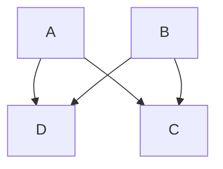
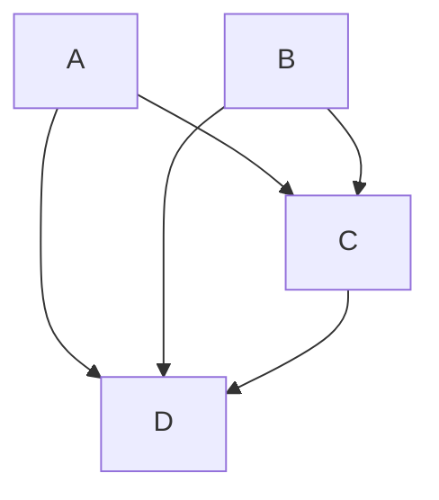
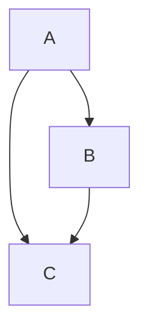
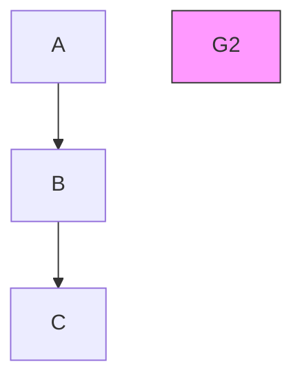
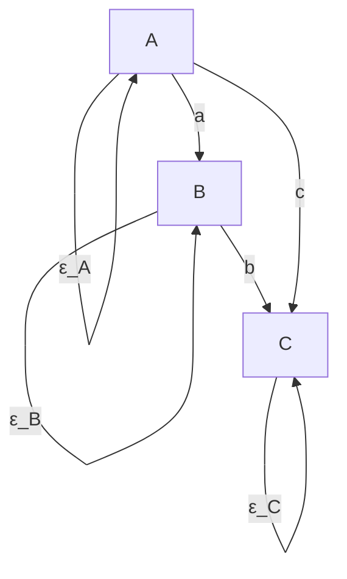
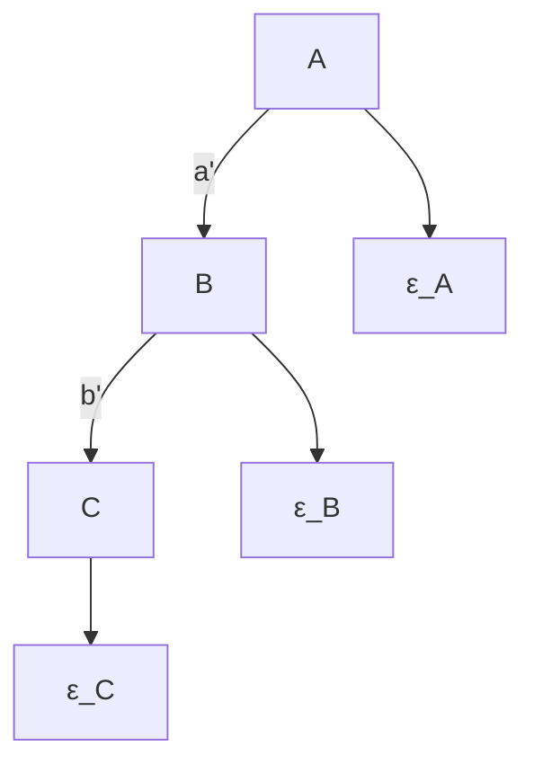
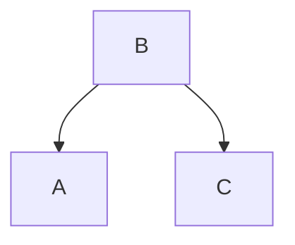
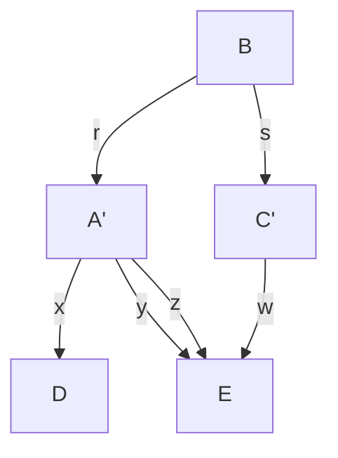

# Statistical Indistinguishability 

Without experimental manipulations, the resolving power of any possible method for inferring causal structure from statistical relationships is limited by statistical indistinguishability. If two causal structures can equally account for the same statistics, then no statistics can distinguish them. The notions of statistical indistinguishability for causal hypotheses vary with the restrictions one imposes on the connections between directed graphs representing causal structure and probabilities representing the associated joint distribution of the variables. If one requires only that the Markov and Minimality Conditions be satisfied, then two causal graphs will be indistinguishable if the same class of distributions satisfy those conditions for one of the graphs as for the other. A different statistical indistinguishability relation is obtained if one requires that distributions be faithful to graph structure; and still another is obtained if the distributions must be consistent with a linear structure, and so on. For each case of interest, the problem is to characterize the indistinguishability classes graph-theoretically, for only then will one have a general understanding of the causal structures that cannot be distinguished under the general assumptions connecting causal graphs and distributions.

There are a number of related considerations about the resolving power of any possible method of causal inference from statistical properties. Given axioms about the connections between graphs and distributions, what graph theoretic structure must two graphs share in order also to share at least one probability distribution satisfying the axioms? When, for example, do two distinct graphs admit one and the same distribution satisfying the Minimality and Markov Conditions? When do two distinct graphs admit one and the same distribution satisfying the Minimality and Markov Conditions for one and the Faithfulness and Markov Conditions for the other? Reversing the question, for any given probability distribution that satisfies the Markov and Minimality Conditions (or in addition the Faithfulness Condition) for some directed acyclic graph, what is the set of all such graphs consistent with the distribution and these conditions? Finally, there are relevant measure-theoretic questions. If procedures exist that will identify causal structure under a more restrictive assumption such as Faithfulness, but not always under weaker assumptions such as the Markov and Minimality Conditions, how likely are the cases in which the procedures fail? Under various natural measures on sets of distributions, for example, what is the measure of the set of distributions that satisfy the Minimality and Markov Conditions for a graph but are not faithful to the graph?

These are fundamental questions about the limits of any possible inference procedure—whether human or computerized—from non-experimental data to structure. We will provide answers for many of these questions when the system of measured variables is causally sufficient. Statistical indistinguishability is less well understood when graphs can contain variables representing unmeasured common causes.


> G1




> G2


> G3




> $G _ { 4 }$




> Figure 4.1


## 4.1 Strong Statistical IndistinguishabilityStatistical Indistinguishability

Two directed acyclic graphs G, G are stWe say that two directed acyclic graphs $G , G ^ { \prime }$ statistically indistinguishable (s.s.i) if are strongly statistically indistinguishand only if they have the same vertex set V and every distribution P on V satisfying theable (s.s.i) if and only if they have the same vertex set V and every distribution P on V Minimality and Markov Conditions for G satisfies those conditions for G , and vsatisfying the Minimality and Markov Conditions for G satisfies those conditions for $G ^ { \prime } { \mathrm { : } }$ , versa.and vice-versa.

That two structures are s.s.i. of course does not mean that the causal structures are one and the same, or that the difference between them is undetectable by any means whatsoever. From the correlation of two variables, X and Y, one cannot distinguish whether X causes Y, Y causes X or there is a third common cause, Z. But these alternatives may be distinguished by experiment or, as we will see, by other means.

Strong statistical indistinguishability is characterized by a simple relationship, namely that two graphs have the same underlying undirected graph and the same collisions:

THEOREM 4.1: Two directed acyclic graphs $G _ { 1 } , \ G _ { 2 } .$ , are strongly statistically indistinguishable if and only if (i) they have the same vertex set V, (ii) vertices $V _ { 1 }$ and $V _ { 2 }$ are adjacent in $G _ { 1 }$ if and only if they are adjacent in $G _ { 2 } .$ , and (iii) for every triple $V _ { 1 } , V _ { 2 } , V _ { 3 }$ in V, the graph $V _ { 1 } \right. V _ { 2 } \left. V _ { 3 }$ is a subgraph of $G _ { 1 }$ if and only if it is a subgraph of $G _ { 2 }$ .

Given an arbitrary directed acyclic graph G, the graphs s.s.i. from G are exactly those that can be obtained by any set of reversals of the directions of edges in G that preserves all collisions in G. A decision as to whether or not two graphs are s.s.i. requires ${ \mathrm { O } } ( n ^ { 3 } )$ computations, where n is the number of vertices.

In figure 4.1 graphs $G _ { 1 }$ and $G _ { 2 }$ are $\mathrm { s . s . i . }$ , but $G _ { 1 }$ and $G _ { 3 } ,$ , and $G _ { 2 }$ and $G _ { 3 }$ are not s.s.i.

Note, however, if a set of variables V is totally ordered, as for example by a known time order, and $P ( \mathbf { V } )$ is positive, then there is a unique graph for which $P ( \mathbf { V } )$ satisfies the Minimality and Markov conditions. (See corollary 3 in Pearl 1988.)

## 4.2 Faithful Indistinguishability

Suppose we assume that all pairs <G, P> are faithful: all and only the conditional independence relations true in P are a consequence of the Markov condition for G. We will say that two directed acyclic graphs, $G , G ^ { \prime }$ are faithfully indistinguishable (f.i.) if and only if every distribution faithful to G is faithful to $G ^ { \prime }$ and vice-versa. The problem is to characterize faithful indistinguishability graphically.

THEOREM 4.2: Two directed acyclic graphs G and H are faithfully indistinguishable if and only if (i) they have the same vertex set, (ii) any two vertices are adjacent in G if and only if they are adjacent in H, and (iii) any three vertices, X, Y, Z, such that X is adjacent to Y and Y is adjacent to Z but X is not adjacent to Z in G or H, are oriented as $X \right. Y \left. Z$ in G if and only if they are so oriented in H.

The question of faithful indistinguishability for two graphs can be decided in ${ \mathrm { O } } ( n ^ { 3 } )$ where n is the number of vertices.

It is immediate from theorems 4.1 and 4.2 that if two graphs are strongly statistically indistinguishable they are faithfully indistinguishable, but not necessarily conversely. The graphs $G _ { 4 }$ and $G _ { 5 }$ in figure 4.1 are not s.s.i. but they are f.i.

A class of f.i. graphs may be represented by a pattern. A pattern is a mixed graph with directed and undirected edges. A graph G is in the set of graphs represented by if and only if:

- (i) G has the same adjacency relations as $\pi ;$
- (ii) if the edge between A and B is oriented $A  B$ in , then it is oriented $A  B$ in G;
- (iii) if Y is an unshielded collider on the path ${ < X , Y , Z > }$ in G then Y is an unshielded collider on ${ < X , Y , Z > }$ in .

For example, the set of all complete, acyclic directed graphs on three vertices forms adirected acyclic faithful indistinguishability class that can be represented by a pattern consisting of the complete undirected graph on the same vertex set. When the pattern of the faithful indistinguishability class of a directed acyclic graph has no directed edges, and so is purely undirected, the statistical hypothesis represented by the directed graph is equivalent to the statistical hypothesis of the undirected independence graph corresponding to the pattern.

## 4.3 Weak Statistical Indistinguishability

The indistinguishability relations characterized in the two previous sections ask for the graphs that can accommodate the same class of probability distributions as a given graph. We can turn the tables, at least partly, by starting with a particular probability distribution on a set of variables and asking for the set of all directed acyclic graphs on those vertices that are consistent with the given distributions. The answers characterize how much the probabilities and our assumptions about the connection between probabilities and causes underdetermine the causal structure. Assuming Markov and Minimality only, the equivalence of these two conditions (under positivity) with the defining conditions for a directed independence graph provides an (impractical) algorithm for generating the set of all graphs that satisfy the two conditions for a given distribution P. For every ordering of the variables in P there is a directed acyclic graph G compatible with that ordering (i.e., A precedes B in the ordering only if A is not a descendant of B in G) satisfying the Minimality and Markov Conditions for P. It can be generated by assuming the ordering and the conditional independence relations in P and applying the definition of directed independence graph. An algorithm that does not assume positivity is given by Pearl (1988). According to that algorithm let Ord be a total ordering of the variables, and Predecessors(Ord,X) be the predecessors of X in the ordering Ord. For each variable X, let the parents of X in G be a smallest subset R of Predecessors(Ord,X) such that X is independent of Predecessors(Ord,X)\R given R in P. It follows that P satisfies the Minimality and Markov Conditions for P.G.

The alternatives are more limited if we start with P and assume that any graph must be faithful to P. In that case all of the graphs faithful to P form a faithful indistinguishability class, that is, the set of all graphs f.i. from any one graph faithful to P. The next chapter presents a number of algorithms that generate the faithful indistinguishability classesa number of algorithms that generate the faithful indistinguishability class from from properties of distribuproperties of distributions.

Given axioms connecting causal graphs with probability distributions it makes sense to ask for which pairs G, G of graphs there exists some probability distribution satisfying the axioms for both G and G . Let us say that two graphs are weakly faithfully indistinguishable (w.f.i.) if and only if there exists a probability distribution faithful to both of them. We say that two graphs are weakly statistically indistinguishable (w.s.i.) if and only if there exists a probability distribution meeting the Minimality and Markov Conditions for both of them. Weak faithful indistinguishability proves to be equivalent to faithful indistinguishability:

THEOREM 4.3: Two directed acyclic graphs are faithfully indistinguishable if and only ifTHEOREM 4.3: Two directed acyclic graphs are faithfully indistinguishable if and only if some distribution faithful to one is faithful to the other and conversely; that is, they aresome is faithful to the conversely; is, f.i. if and only if they are w.f.i.f.i. if and only if they are w.f.i.

vertex set into equivalence classes that exactly correspond to the equivalence classes ofThis theorem tells us that faithfulness divides the set of probability distributions over a graphs induced by faithful indistinguishability. It follows that if a distribution is faithfulvertex set into equivalence classes that exactly correspond to the equivalence classes of to some graph G then it is faithful to all and only the graphs faithfully indistinguishablegraphs induced by faithful indistinguishability. It follows that if a distribution is faithful from G.to some graph G then it is faithful to all and only the graphs faithfully indistinguishable Therfrom G.

inimality and Markov Conditions. Under what conditions will there exist a distributionThere is no reason to expect so nice a match in general. Suppose we assume only the P satisfying those axioms for two distinct graphs, G, and G ? The answer is not: exactlyMinimality and Markov Conditions. Under what conditions will there exist a distribution when G and G are strongly statistically indistinguishabP satisfying those axioms for two distinct graphs, G, and $G ^ { \prime } 2$ The two graphs shown in The answer is not: exactly figure 4.2 arwhen G and $G ^ { \prime }$ ot s.s.i., but there exist distributions that satisfy the Minimality and are strongly statistically indistinguishable. The two graphs shown in Markov Conditions for both.figure 4.2 are not s.s.i., but there exist distributions that satisfy the Minimality and Markov Conditions for both.


```mermaid
graph TD
  A --> B
  B --> C
  C --> A
    style A fill:#fff,stroke:#000
    style B fill:#fff,stroke:#000
    style C fill:#fff,stroke:#000
    note bottom of A "G₁"
```


> Figure 4.2



The distributions in Simpson’s “paradox” provide an example, as we have alreadyThe distributions in Simpson’s “paradox” provide another example, as we have already seen in chapter 3. We conjecture that if a distribution satisfies the Minimality and Markov Conditions for two graphs G and $G ^ { \prime } ,$ then $G$ and $G ^ { \prime }$ have the same edges and the same colliders, save that triangles such as $G _ { 1 }$ in one graph may be replaced by collisions such as $G _ { 2 }$ in the other, provided appropriate conditions are met by other edges. We don’t know how to characterize the “appropriate” conditions. There is, however, a related property of interest we can characterize.

No distribution that is faithful to graph $G _ { 1 }$ in figure 4.2 can be faithful to graph $G _ { 2 } .$ , but a distribution that satisfies the Minimality and Markov Conditions for $G _ { 1 }$ can be faithful to graph $G _ { 2 } .$ . Just when can this sort of thing happen? When, in other words, can the generalization of Simpson’s “paradox” arise? If probability distribution P satisfies the Minimality and Markov Conditions for G, and $P$ is faithful to graph H, what is the relation between G and H?

THEOREM 4.4: If probability distribution P satisfies the Markov and Minimality Conditions for directed acyclic graphs G and H, and P is faithful to H, then for all vertices X, Y, if X, Y are adjacent in H they are adjacent in G.

THEOREM 4.5: If probability distribution P satisfies the Markov and Minimality Conditions for directed acyclic graphs G and H, and P is faithful to graph H, then (i) for all X, Y, Z such that $X \right. Y \left. Z$ is in H and X is not adjacent to Z in $H ,$ either $X \right. Y \left. Z$ in G or $X , Z$ are adjacent in G and (ii) for every triple X, Y, Z of vertices such that $X  Y$ $ Z$ is in G and X is not adjacent to Z in G, if X is adjacent to Y in H and Y is adjacent to Z in H then $X \right. Y \left. Z .$COROLLARY 4.1: If probability distribution P satisfies the Markov Condition for directed acyclic graph G, P is faithful to directed acyclic graph H, and G and H agree on an ordering of the variables (as, for example, by time) such that $X  Y$ only if $X < Y$ in the order, then H is a subgraph of G.

## 4.4 Rigid Indistinguishability

In addition to the notions of strong, faithful and weak statistical indistinguishability, there is still another. Suppose two directed acyclic graphs, G and $G ^ { \prime } ,$ are statistically indistinguishable in some sense over a common set O of vertices. Then without experiment, no measurement of the variables in O will reliably determine which of the graphs correctly describes the causal structure that generated the data. It might be, however, that G and $G ^ { \prime }$ can be distinguished if other variables besides those in $G \ \mathrm { o r } \ G ^ { \prime }$ are measured and stand in appropriate causal relations to the variables in O. For example, the following simple graphs are both s.s.i., and f.i. (where A and B are assumed to be measured and in O).


> Figure 4.3

But if we also measure a variable C that is a cause of A or has a common cause with A that cause common cause with and no connection with B save possibly through A, then the two structures can beconnection with B possibly through two structures can distinguished.distinguished.

The graphs in figure 4.4 are not f.i. or s.s.i. It is equally easy to give examples of w.s.i.For example, the graphs in figure 4.4 are not f.i. or s.s.i. It is equally easy to give structures that can be embedded in graphs that are not w.s.i. Which causally sufficientexamples of w.s.i. structures that can be embedded in graphs that are not w.s.i. Which structures can be distinguished by measuring extra variables? To answer the question wecausally sufficient structures can be distinguished by measuring extra variables? To require some further definitions.answer the question we require some further definitions.

Let $G _ { 1 } , G _ { 2 }$ be two directed acyclic graphs with common vertex set O. Let  acyclic graphs with vertex set Let $H _ { 1 } , H _ { 2 }$ be directed graphs having a common set U of vertices that includes O and sucdirected graphs having a common set U of vertices that includes O such that


```mermaid
graph TD
  D --> A
  C --> A
  A --> B
    style A fill:#f9f,stroke:#333
    style B fill:#bbf,stroke:#333
    style C fill:#bfb,stroke:#333
    style D fill:#dfd,stroke:#333
    note right of A "H₁"
```


> Figure 4.4

```mermaid
graph TD
  D --> A
  C --> A
  A --> B
    style A fill:#f9f,stroke:#333
    style B fill:#ccf,stroke:#333
    style C fill:#cfc,stroke:#333
    style D fill:#fcc,stroke:#333
    note right of A H2
```

- (i) the subgraph of $H _ { 1 }$ over O is $G _ { 1 }$ and the subgraph of $H _ { 2 }$ over $\mathbf { o }$ is $G _ { 2 } ;$
- (ii) every directed edge in $H _ { 1 }$ but not in $G _ { 1 }$ is in $H _ { 2 }$ and every directed edge in $H _ { 2 }$ but not in $G _ { 2 }$ is in $H _ { 1 }$ .

We will say then that directed acyclic graphs $G _ { 1 }$ and $G _ { 2 }$ with common vertex set O have a parallel embedding in $H _ { 1 }$ and $H _ { 2 }$ over O and U. In figures 4.3 and $4 . 4 , G _ { 1 }$ and $G _ { 2 }$ have a parallel embedding in $H _ { 1 }$ and $H _ { 2 }$ over $\mathbf { O } = \{ A , B \}$ and $\mathbf { U } = \{ A , B , C , D \}$ . The question of whether two s.s.i. structures can be distinguished by measuring further variables then becomes the following: do the structures have parallel embeddings that are not s.s.i.? If no such embedding exists we will say the structures $G _ { 1 }$ and $G _ { 2 }$ are rigidly statistically indistinguishable (r.s.i.).

THEOREM 4.6: No two distinct s.s.i. directed acyclic graphs with the same vertex set are rigidly statistically indistinguishable.

In other words, provided additional variables with the right causal structure exist and can be measured, the causal structure among a causally sufficient collection of measured variables can in principle be identified. The proof of theorem 4.6 also demonstrates a parallel result for faithfully indistinguishable structures. We conjecture that an analog of theorem 4.6 also holds for weak statistical indistinguishability assuming positivity.

## 4.5 The Linear Case

Parameter values can force conditional independencies or zero partial correlations that are not linearly implied by a graph. The graphs in figure 4.2 (reproduced in figure 4.5 with error variables explicitly included) illustrate the possibility: treat the vertices of the graphs as each attached to an “error” variable, and let the graphs plus error variables determine a set of linear equations. (We assume that any pair of exogenous variables, including the error terms, have zero covariance.) The result is, up to specification of the joint distribution of the exogenous variables, a structural equation model. A linear coefficient is attached to each directed edge. The correlation matrix, and hence all partial correlations, is determined by the linear coefficients and the variances of the exogenous variables.


> (i)




> (ii) Figure 4.5



If in the structure on the left aIf, in the structure on the left, $a b = - c .$ then A, C will be uncorrelated as in the model on, the  uncorrelated the right. This sort of phenomenon—vanishing partial correlations produced by values of linear coefficients rather than by graphical structure—is bound to mislead any attempt to infer causal structure from correlations. When can it happen? We have already answered that question in the previous chapter, when we considered the conditions under which linear faithfulness might fail. In the linear case, the parameter values—values of the linear coefficients and exogenous variances of a structure with a directed acyclic graph G—form a real space, and the set of points in this space that create vanishing partial correlations not linearly implied by G have Lebesgue measure zero.

THEOREM 3.2: Let M be a linear model with directed acyclic graph G and n linear coefficients $a _ { 1 } , . . . , a _ { n }$ and k positive variances of exogenous variables $\nu _ { 1 } ~ , . . . , ~ \nu _ { k }$ . Let $M ( < u _ { 1 } , . . . , u _ { n } , u _ { n + 1 } , . . . , u _ { n + k } > )$ be the distributions consistent with specifying values $< u _ { 1 } , . . . , u _ { n } ,$ $u _ { n + 1 } , . . . , u _ { n + k } >$ for $a _ { 1 } , . . . , a _ { n }$ and $\nu _ { 1 } , . . . \nu _ { k } .$ . Let be the set of probability measures P on the space $\Re ^ { n + k }$ of values of the parameters of M such that for every subset V of $\Re ^ { n + k }$ having Lebesgue measure zero, $P ( \mathbf { V } ) = 0$ . Let Q be the set of vectors of coefficient and variance values such that for all q in Q every probability distribution in with $M ( q )$ has a vanishing partial correlation that is not linearly implied by G. Then for all P in - $P ( \mathbf { Q } ) = 0$ .

Measure theoretic arguments of this sort are interesting but may not be entirely convincing. One could, after all, argue that in the general linear model absence of causal connection is marked by linear coefficients with the value zero, and thus form a set of measure zero, so by parity of reasoning everything is causally connected to everything else. In a recent book Nancy Cartwright (1989) objects that since in linear structures independence relations may be produced by special values of the linear coefficients and variances as well as by the causal structure, it is illegitimate to infer causal structure from such relations. In effect, she rejects any inference procedure that is unable to distinguish the true causal structure from w.s.i. alternatives. Such a position may be extreme, but it does serve to focus attention on two interesting questions: when is it impossible for two structures to be w.s.i. but not f.i. or s.s.i., and are there special marks or indicators that a distribution satisfies the Markov and Minimality conditions for two w.s.i. but not s.s.i. or f.i. causal structures? The answers to these questions are essentially just applications to the linear case of the theorems of the preceding sections.

We will assume, with Cartwright, that a time ordering of the variables is known. Pearl and Verma (Pearl 1988) have proved that for a positive distribution P and a given ordering of variables, there is only one directed acyclic graph for which P satisfies the Minimality and Markov Conditions. It follows that for a positive distribution with a given correlation matrix and a given ordering of a causally sufficient set of variables there is a unique directed acyclic graph that linearly represents the distribution and is consistent with the ordering.

In some cases at least, the positivity of a distribution can be tested for. (For example, in a bi-variate normal distribution the density function is everywhere nonzero if the correlation is not equal to one.) It follows for those cases that for a given ordering of variables either there is a unique directed acyclic graph for which P satisfies the Markov and Minimality Conditions, or it is detectable that more than one such directed acyclic graph exists. However, even if for a given ordering of variables there is a unique directed acyclic graph for which P satisfies the Markov and Minimality Conditions, algorithms for finding that graph are not feasible for large numbers of variables, because of the number and order of the conditional independence relations that they require be tested.

Suppose that we wrongly assume that a distribution is faithful to the causal graph that generated it. Then corollary 4.1 applies, which means, informally, that if faithfulness is assumed but not true, then conditional independence relations or vanishing partial correlations due to special parameter values can only produce erroneous causal inferences in which a true causal connection is omitted; no other sorts of error may arise. We will consider when this circumstance is revealed in the correlations.

Recall that a trek is an unordered pair of directed acyclic paths having a single common vertex that is the source of both paths (one of the paths in a pair may be the empty path defined in chapter 2). For standardized models, in which the mean of each variable is zero and non-error variables have unit variance, the correlation of two variables is given by the sum over all treks connecting X, Y of the product for each trek of the linear coefficients associated with the edges in that trek (we call this quantity the trek sum). For example, in directed acyclic graph (i) in figure 4.5, the trek sum between A and C is ab + c. We will use standardized systems throughout our examples in this section. The system of correlations determines all partial correlations of every order through the following formula.

$$
\rho_ {X Y. \mathbf {Z} \cup \{R \}} = \frac {\rho_ {X Y . \mathbf {Z}} - \rho_ {X R . \mathbf {Z}} \times \rho_ {Y R . \mathbf {Z}}}{\sqrt {1 - \rho_ {X R . \mathbf {Z}} ^ {2}} \times \sqrt {1 - \rho_ {Y R . \mathbf {Z}} ^ {2}}}
$$

Since the recursion relations give the same partial correlation between two variables on a set U no matter in what sequence the partials on the members of U are taken, a vanishing partial correlation corresponds to a system of equations in the coefficients of a standardized system.

Suppose now that special values of the linear parameters in a normal, standardized system G produce vanishing partial correlations that are exactly those linearly implied only by some false causal structure, say H. Then the parameter values must generate extra vanishing partial correlations not linearly implied by G. Any partial correlation is a function just of the trek sums connecting pairs of variables, and the trek sums in this case involve just the linear parameters in G. Hence each additional vanishing partial correlation not linearly implied by G determines a system of (nonlinear) equations in the parameters of G that must be satisfied in order to produce the coincidental vanishing partial correlation. (For example, in directed acyclic graph (i) of figure 4.5, the correlation between A and C is 0 only if the single equation ab = -c is satisfied). Now for some G and some H (a sub-graph of G), these systems of equations may have no simultaneous solution. In that case there are no values for the parameters of G that will produce partial correlations that are exactly those linearly implied by H. For other choices of G and a subgraph H, it may be that the system of equations has a solution, but only solutions that allow only a finite number of alternative values for one or more parameters and that require some error variance to vanish. Such a solution must “give itself away” by special correlation constraints that are not themselves vanishing partial correlation relations. Consider the following choices of G and H, where in each pair G is on the left hand side and H is on the right hand side.

In (i) and (iii), coefficients and variances can be chosen for the graph on the left handConsider Figure 4.6. In (i) (iii), coefficients and variances can be chosen for the side so that it appears as though an edge does not occur, but only by making thegraph on the left hand side so that it appears as though an edge does not occur, but only coefficient labeled b equal to either 1 or –1. Since the variables are standardized, thisby making the coefficient labeled b equal to either 1 or –1. Since the variables are requires that the error term for Y have zero variance and zero mean—that is, it vanishes.standardized, this requires that the error term for Y have zero variance and zero Thus in order for the true graph to be the one on the left hand side and the parametermean—that is, it vanishes. Thus in order for the true graph to be the one on the left hand values to produce vanishing partial correlations that are exactly those linearly implied byside and the parameter values to produce vanishing partial correlations that are exactly the graph on the right hand side, variable Y must be a linear function of variable X andthose linearly implied by the graph on the right hand side, variable Y must be a linear only variable X. The same result obtains if the edges that are not eliminated in the firstfunction of variable X and only variable X. The same result obtains if the edges that are and last examples are replaced by directed paths of any length. Clearly in these casesnot eliminated in the first and last examples are replaced by directed paths of any length. special parameter values that create vanishing partial correlations not linearly implied byClearly in these cases special parameter values that create vanishing partial correlations the true graph will be revealed by the correlations. In (ii) the edge between variables Xnot linearly implied by the true graph will be revealed by the correlations. In (ii) the edge and Z cannot be made to appear to be eliminated by any choice of parameter values forbetween variables X and Z cannot be made to appear to be eliminated by any choice of the true graph.parameter values for the true graph.


$$
{\rho_ {X Y}} {= 1, - 1}
$$

Figure 4.6

We conjecture that even without a prior time order, unless three edges form a triangle in G, if parameter values of G determine exactly the collection of vanishing partial correlations linearly implied by a graph H—whether or not H is a subgraph of G—then there are extra constraints on the correlations not entailed by the vanishing partial correlations.

## 4.6 Redefining Variables

The indistinguishability results so far considered relate alternative graphs over the same set of vertices. The vertices are interpreted as random variables whose values are subject to some system of measurement. New random variables can always be defined from a given set, for example by taking linear or Boolean combinations. For any specified apparatus of definitions, and any axioms connecting graphs with distributions, questions about indistinguishability classes arise parallel to those we have considered for fixed sets of variables. A distribution $P$ over variable set V may correspond to a graph G, and a distribution $P ^ { \prime }$ --
- $\mathbf { V } ^ { \prime }$ may correspond to a different graph $G ^ { \prime }$ (with $P ^ { \prime }$ - $\mathbf { V } ^ { \prime }$ obtained from P and V by defining new variables, ignoring old ones, and marginalizing). The differences between $G$ and $G ^ { \prime }$ may in some cases be unimportant, and one may simply want to say that each graph correctly describes causal relations among its respective set of variables. That is not so, however, when the original variables are ordered by time, and redefinition of variables results in a distribution whose corresponding graphs have later events causing earlier events. Consider the following pair of graphs.


> (i)




> (ii) Figure 4.7

B
(A - C)          (A + C)

In directed acyclic graph (i), A and C are effects of $B ;$ suppose that B occurs prior to A and C. By the procedure of definition and marginalization, a distribution faithful to graph (i) can be transformed into a distribution faithful to graph (ii). First, standardize A and C to form variables $A ^ { \prime }$ -- $C ^ { \prime }$ -
-

-
--
--
- $( A ^ { \prime } \cdot C ^ { \prime } )$ and $( A ^ { \prime } { + } C ^ { \prime } )$ . Their covariance is equal to the expected value of $A ^ { \prime 2 } - C ^ { \prime 2 }$ which is zero. Simple algebra shows that the partial correlation of $( A ^ { \prime } - C ^ { \prime } )$ and $( A ^ { \prime } { + } C ^ { \prime } )$ given B does not vanish. The marginal of the original distribution is therefore linearly faithful to (ii), and faithful to (ii) if the original distribution is normal.

Note that the transformation just illustrated is unstable; if the variances of $A ^ { \prime }$ - $C ^ { \prime }$ are unequal in the slightest, or if the transformation gives $( x A ^ { \prime } + z C ^ { \prime } )$ and $( y A ^ { \prime } + w C ^ { \prime } )$ for any values of $x , y , z ,$ and w such that $x y + w z + \rho _ { A ^ { \prime } C } ( z y + x w ) \neq 0$ then the marginal on the transformed distribution will be faithful, not to (ii), but to all acyclic orientations of the complete graph on the three variables, a hypothesis that is not inconsistent with the time order.

Viewed from another perspective, a transformation of variables that produces a “coincidental” vanishing partial correlation is just another violation of the Faithfulness Condition. Consider the linear model in figure 4.8.


> Figure 4.8



Let $A ^ { \prime } = r B + \varepsilon _ { A } ; \ C ^ { \prime } = s B + \varepsilon _ { C } ; \ D = x A ^ { \prime } + \ z C ^ { \prime } + \varepsilon _ { D } ,$ and ${ \cal E } = y { \cal A } ^ { \prime } + w { \cal C } ^ { \prime } + \varepsilon _ { \cal E } .$ . If the variables are standardized, $\rho _ { D E }$ is equal to $x y + z w + r y s z + r x s w = x y + z w + r s ( y z + x w )$ , which, since $r s \ = \ \rho _ { A ^ { \prime } C ^ { \prime } }$ is the formula of the previous paragraph. If $\rho _ { D E } = 0 ,$ , the Faithfulness Condition is violated. Hence the conditions under which we obtain a linear transformation of A and C that produces a “coincidental” zero correlation are identical to the conditions under which the treks between A and C exactly cancel each other in a violation of the Faithfulness Condition. We get the example of figure 4.7 when $D = A ^ { \prime } +$ $C ^ { \prime } \left( \mathrm { i . e . , } x = z = 1 \right)$ , and $E = A ^ { \prime } - C ^ { \prime } \left( \mathrm { i . e . , } y = - w = 1 \right)$ where the variances and means of the error terms have been set to zero. Since the set of parameter values that violate Faithfulness in this example has Lebesgue measure zero, so does the set of linear transformations of A and C that produce a “coincidental” zero correlation.

## 4.7 Background Notes

The underdetermination of linear statistical models by values of measured variables has been extensively discussed as the “identification problem,” especially in econometrics (Fisher 1966) where the discussion has focused on the estimation of free parameters. The device of “instrumental variables,” widely used for linear models, is in the spirit of Theorem 4.6 on rigid distinguishability, although instrumental variables are used to identify parameters in cyclic graphs or in systems with latent variables. The possibility of “rewriting” a pure linear regression model so that the outcome variable is treated as a cause seems to have been familiar for a long while, and we do not know the original source of the observation, which was brought to our attention by Judea Pearl.

Accounts of statistical indistinguishability in something like one or another of the senses investigated in this chapter have been proposed by Basmann (1965), Stetzl (1986) and Lee (1987). Basmann argued, in our terms, that for every simultaneous equation model with a cyclic graph (i.e., “nonrecursive”) there exists a statistically indistinguishable model with an acyclic graph. The result is a weak indistinguishability theorem (see chapter 12). Stetzl and Lee focus exclusively on linear structural equation models with free parameters for linear coefficients and variances, and they define equivalence in terms of maximum likelihood estimates of the parameters and hence of the covariance matrix. No general graph theoretic characterizations are provided, although interesting attempts were made in Lee’s thesis.

The notion of a pattern and theorem 4.2 are due to Verma and Pearl (1990b). We state some results about indistinguishability relations for causally insufficient graphs in chapter 6. A well-known result due to Suppes and Zanotti (1981) asserts that every joint distribution P on a set X of discrete variables is the marginal of some joint distribution $P ^ { * }$ on $\mathbf { X } \cup \{ T \}$ satisfying the Markov Condition for a graph G in which T is the common cause of all variables in X and there are no other directed edges. The result can be viewed as a weak indistinguishability theorem when causally insufficient structures are admitted. Except in special cases, $P ^ { * }$ cannot be faithful to $G .$