# Discovery Algorithms for Causally Sufficient Structures

## 5.1 Discovery Problems

A discovery problem is composed of a set of alternative structures, one of which is the source of data, but any of which, for all the investigator knows before the inquiry, could be the structure from which the data are obtained. There is something to be found out about the actual structure, whichever it is. It may be that we want to settle a particular hypothesis that is true in some of the possible structures and false in others, or it may be that we want to know the complete theory of a certain sort of phenomenon. In this book, and in much of the social sciences and epidemiology, the alternative structures in a discovery problem are typically directed acyclic graphs paired with joint probability distributions on their vertices. We usually want to know something about the structure of the graph that represents causal influences, and we may also want to know about the distribution of values of variables in the graph for a given population.

A discovery problem also includes a characterization of a kind of evidence; for example, data may be available for some of the variables but not others, and the data may include the actual probability or conditional independence relations or, more realistically, simply the values of the variables for random samples. Our theoretical discussions will usually consider discovery problems in which the data include the true conditional independence relations among the measured variables, but our examples and applications will always involve inferences from statistical samples.

A method solves a discovery problem in the limit if as the sample size increases, without bound the method converges to the true answer to the question or to the truewithout bound, theory, whatever (consistent with prior knowledge) the truth might be. A procedure for inferring causes does not solve the problem posed if for some of the alternative possibilities it gives no answer or the wrong answer, although it may solve another, easier problem that arises when some of the alternative structures are excluded. Which causal discovery problems are solvable in the limit, and by what methods, are determinate, mathematical questions. The metaphysical wrangling lies entirely in motivating the problems, not in solving them. The remainder of this book is an introduction to the study of these formal questions and to the practical applications of particular answers.

## 5.2 Search Strategies in Statistics

The statistical literature is replete with procedures that use data to guide a search for some restricted parametrization of alternative distributions. When the representation of the statistical hypothesis is used to guide policy or practice, to predict what will happen if some of the variables are manipulated or to retrodict what would have happened if some of the variables had in the past been manipulated, then the statistical hypotheses are usually also causal hypotheses. In that case the first question is whether the search procedures are any good at finding causal structure.

Many of the search strategies proposed in the statistical literature are best-only beam searches, beginning either with an arbitrary model, or with a complete (or almost complete) structure that entails no constraints, or with a completely (or almost completely) constrained structure in which all variables are independent. Statisticians sometimes refer to the latter procedure as “forward” search, and the former procedures as “backward” search. Depending on which order is followed, the procedures iteratively apply a fit measure of some kind to determine which fixed parameter in the parametrization will most improve fit when freed—or which free parameter should be fixed. They then reestimate the modified structure to determine if a stopping criterion is satisfied. A “forward” procedure of this kind was proposed by Arthur Dempster (1972) for covariance structures, and a “backward” procedure was proposed by his student, Nanny Wermuth (1976), for both log-linear and linear systems whose distributions are “multiplicative”—in our terms, satisfy the Markov condition for some directed acyclic graph. Forward search algorithms using goodness of fit statistics were proposed for mutinormal linear systems by Byron (1972) and by Sorbom (1975) and versions of them have been automated in the LISREL (Joreskog and Sorbom 1984) and EQS (Bentler 1985) estimation packages. The latter program also contains a backward search procedure. Versions of the general strategy for log-linear parametrizations are described by Bishop, Fienberg and Holland (1975), by Fienberg (1977) by Aitkin (1979), by Christensen (1990) and many others. The same representations and search strategies have been used in the systems science literature by Klir and Parviz (1976) and others under the title of “reconstructability” analysis. Stepwise regression procedures in logistic regression can be viewed as versions of the same strategies. The same strategies have been applied to undirected and directed graph representations. They are illustrated for a variety of examples by Whittaker (1990).

In each of these cases the general statistical search strategy is unsatisfactory if the goal is not just to estimate the distribution but also to identify the causal structure or to predict the results of manipulations of some of the variables. When used to these ends, these searches are inefficient and unreliable for at least three reasons: (i) they often search a hypothesis space that excludes many causal hypotheses and includes many hypotheses of no causal significance; (ii) the specifications of distributions typically force the use of numerical procedures that for statistical or computational reasons unnecessarily limit search; (iii) restrictions requiring the search to output a single hypothesis entail that the search fails to output alternative hypotheses that may be indistinguishable given the evidence. We will consider each of these points in more detail.

## 5.2.1 The Wrong Hypothesis Space

In searching for the correct causal hypothesis the space of alternatives should, insofar as possible, include all causal hypotheses that have not been ruled out by background knowledge and no hypotheses that do not have a causal interpretation. The log-linear formalism, introduced by Birch in 1963, provides an important example of a search space poorly adapted to the goal of finding correct causal hypotheses. For discrete data a more appropriate search space turns out to be a sub-class of conjunctions of log-linear hypotheses.

The log-linear formalism provides a general framework for the analysis of contingency tables of any dimension. In the discrete case we are concerned with variables that take a finite number of values, whether ordered or not. For a system with four variables, for example, we will let i range over the values of the first variable, j the second, k the third and l the fourth. In a particular sample or population, $x _ { i j k l }$ will then denote the number of units that have value i for the first variable, value j for the second variable, k for the third and l for the fourth. We will refer to a particular vector of values for the four (or other number of) variables as a “cell.” In the formalism the joint distribution over the cells is given by an equation for the logarithm of the expected value of each cell, expressed as the sum of a number of parameters. For example, in Birch’s notation in which $m _ { i j k }$ denotes the expected number in cell i, j, k,

$$
\ln (m _ {i j k}) = u + u _ {1 i} + u _ {2 j} + u _ {3 k} + u _ {1 2 i j} + u _ {1 3 i k} + u _ {2 3 j k} + u _ {1 2 3 i j k}
$$

The various $\boldsymbol { u ^ { \prime } { s } }$ are arbitrary parameters with an associated set of indices; only seven of the u terms can be independent for a system of three binary variables. The power of Birch’s parametrization lies in at least two features. First, associations in multidimensional contingency tables that had long been studied in statistics can be represented as hypotheses that certain of the parameters are zero. For example Bartlett’s representation of the hypothesis of no “three factor interaction” among three binary variables is given by the following relation among the cell probabilities:

$$
p _ {1 1 1} p _ {1 2 2} p _ {2 1 2} p _ {2 2 1} = p _ {2 2 2} p _ {2 1 1} p _ {1 2 1} p _ {1 1 2}
$$

Birch shows that a generalization of this condition to variables of any finite number of categories obtains if and only if various of the u terms are zero. Second, for each hypothesis obtained by setting some of the u terms to zero, there exist iterative methods for obtaining maximum likelihood estimates for a variety of sampling procedures.

Birch’s results were extended by several researchers. A hypothesis in the log-linear parametrization has come to be treated as a specification that particular u terms vanish. There are direct maximum likelihood estimates of the expected cell counts for certain forms of such specifications, and for other specifications iterative algorithms have been developed that converge to the maximum likelihood estimates. Various formal motivations have been developed for focusing on particular classes of log-linear parametrizations. Using his information-based distance measure, for example, Kullback (1959) derived a class of log-linear relations that could be obtained in the same way from a slightly different perspective, the maximum entropy principle. Fienberg (1977) and others have urged restricting attention to “hierarchical models”—log linear parametrizations in which if a u term with a set of indices is put to zero so are all other u terms whose indices contain the first set. The motivation for the restriction is that these parametrizations bear a formal analogy to analysis of variance, so that the $u _ { 1 }$ term, for example, may be thought of as the variation from the grand mean due to the action of the first variable.

To see the difficulties in representing causal structure in the log-linear formalism, consider the most fundamental causal relation of the preceding chapters, namely any collider $A \right. B \left. C$ in which A and C are not adjacent. Such a structure corresponds (assuming faithfulness) to two facts about conditional independence: first, A and C are independent conditional on some set of variables that does not contain $B ;$ second, A and C are dependent conditional on every set that does contain B but not A or C. In the very simplest case of this kind, in which A, B, and C are the only variables, A and B are independent, but dependent conditional on C. The hypothesis that these relations obtain cannot be expressed in the log-linear formalism by vanishing u terms. Birch himself observed that in a three variable system the hypothesis that in the marginal distribution two of the variables are independent cannot be expressed by the vanishing of any subset of parameters in the general log-linear expansion for the three variables. There are of course log-linear hypotheses that are consistent with marginal independence hypotheses, but do not entail them.

Another inappropriate search space is provided by the LISREL program. The LISREL formalism—at least as intended by its authors, Joreskog and Sorbom—allows search for structures corresponding to causal relations among measured variables when there are no unmeasured common causes, but when the search includes structures with unmeasured common causes, causal relations among measured variables are forbidden. Users have found ways around these restrictions (Glymour et al. 1987; Bollen 1989), rather to the dissatisfaction of the authors of the program (Joreskog and Sorbom 1990). LISREL owes these peculiarities to its ancestry in factor analysis, which provides still another example of an artificially contracted search space. Thurstone (1935) carefully and repeatedly emphasized that his “factors” were not to be taken as real causes but only as a mathematical simplifications of the measured correlations. Of course factors were immediately treated as hypothetical causes. But so applied, Thurstone’s methods exclude a priori any causal relations among measured variables themselves, they exclude the possibility that measured variables are causes of unmeasured variables, and they cannot determine causal structure—only correlations—among the latent variables.

## 5.2.2 Computational and Statistical Limitations

Some searches examine only a small portion of the possible space of hypotheses because they require computationally intensive iterative algorithms in order to test each hypothesis. For example, the automatic model respecification procedure in LISREL reestimates the entire model every time it examines a new hypothesis. One consequence is that the slowness of the search prohibits the procedure from examining large portions of the hypothesis space where the truth may be hiding.

Another common problem is that many searches require the determination of conditional independence relations that cannot be reliably tested. Many log-linear search procedures implicitly require the estimation of probabilities conditional on a set of variables whose size equals the total number of variables minus two, no matter what the true structure turns out to be. Estimates of higher order conditional probabilities and tests of higher order conditional independencies tend to be unreliable (especially with variables taking several discrete values) because at reasonable sample sizes most cells corresponding to an array of values of the variables will be empty or nearly empty. This disadvantage is not inherent in the log-linear formalism. A recent algorithm proposed bydisadvantage is not inherent in the log-linear formalism. An algorithm proposed by Fung and Crawford (1990) for searching the set of graphical models (the subset of the hierarchical log-linear models that can be represented by undirected independence graphs) reduces the need for testing high order conditional independencies. A version of the same problem arises for linear regression with a large number of regressors and small sample size, since in tests of the hypothesis that a regression coefficient vanishes, the sample size is effectively reduced by the number of other regressors, or the degrees of freedom are altered, so that the test may have little power against reasonable alternatives.

A related but equally fundamental difficulty is that searches for models of discrete data that use some measure of fit requiring model estimation at each (or any) stage are subject to an exponential increase in the number of cells that must be estimated as the number of variables increases. If, to take the simplest case, the variables are binary, then the number of cells for which an expected value must be computed is 2n . When $n = 5 0$ , say, the number of cells is astronomical.

One might think that these difficulties will beset any possible reliable search procedure. As we will see in this chapter and the next, that is not the case.

## 5.2.3 Generating a Single Hypothesis

If a kind of evidence is incapable of reliably distinguishing when one rather than another of several alternative hypotheses is correct, then an adequate search procedure should reflect this fact by outputting all of them. Producing only a single hypothesis in such circumstances misleads the user, and denies her information that may be vital in making decisions.

An example of this sort of flaw is illustrated by the LISREL and EQS programs. Beginning with a structure constructed from background knowledge, each of these programs searches for causal models among linear structures using a best-only beam search. At each stage they free the fixed parameter that is judged will most increase the fit of the model to the data. Since freeing a number of different fixed parameters may result in the very same improvement in fit, the programs employ an arbitrary tie-breaking procedure. The output of the search is a single linear model and any alternative statistically indistinguishable models are ignored.

In a later chapter we will describe a large simulation study of the reliabilities of the statistical search procedures implemented in the LISREL and EQS programs for linear models. Because of the computational problems and arbitrary choices from among indistinguishable models at various stages of search, we find that the procedures are of little value in discovering dependencies in the structures from which the data are

generated, even when the programs are given most of the structure correctly to start with, including even correct linear coefficients and variances. The study involves systems with unmeasured variables, but we expect that similar results would be obtained in studies with causally sufficient systems.

## 5.2.4 Other Approaches

There are several exceptions to the generalization that statistical search strategies have been confined to generate-and-test-best-only procedures. Edwards and Havranek (1987) describe a form of procedure that tests models in sequence, under the assumption that if a model passes the test so will any more general model and if a model fails the test so will any more restricted model. Their proposal is to keep track of a bounding set of rejected hypotheses and a bounding set of accepted hypotheses until all possible hypotheses (in some parametrization) are classified. Apparently unknown to Edwards and Havranek, the same idea was earlier developed at length in the artificial intelligence literature under the name of “version spaces” (Mitchell 1977). For the applications they have in mind, no analysis of complexity or reliability is available.

## 5.2.5 Bayesian Methods

The best known discussion of search problems in statistics from a Bayesian perspective is Leamer’s (1978). Leamer’s book contains a number of interesting points, including a consideration of what a Bayesian should do upon meeting a novel hypothesis, but it does not contain a method for reliable search. Considering the use of regression methods in causal inference, for example, Leamer subsequntly recommended analyzing separately the sets of relevant regressors endorsed by any opinion, and giving separate Bayesian updates of distributions of parameters for each of these sets of regressors. The problem of deciding which variables actually influence an outcome of interest is effectively ignored.

A much more promising Bayesian approach to search has been developed by Cooper and Herskovits (1991, 1992). At present, their procedure is restricted to discrete variables and requires a total ordering such that no later variable can cause an earlier variable. Each directed graph compatible with the order is assigned a prior probability. The joint distribution of the variables assigns each vertex in the graph a distribution conditional on its parents, and these conditional probabilities parametrize the distributions for each graph. Using Dirchelet priors, a density function is imposed on the parameters for each graph. The data are used to update the density function by Bayes’s rule. The probability of a graph is then just the integral of the density function over the distributions compatible with the graph. The probability of an edge is the sum of the probabilities of all graphs that contain it. Cooper and Herskovits use a greedy algorithm to construct the output graph in stages. For each vertex X in the graph, the algorithm considers the effect of adding to the parent set of X each individual predecessor of X that is not already a parent of of $X ;$ it chooses the vertex whose addition to the parent set of X most increases the it chooses the vertex whose addition to the parent set of X most increases of X that will increase the posterior probability of the local structure. The program runsthe posterior probability of the local structure consisting of X and its parents. Parents are very well even on quite large sets of variables provided the true graph is sparse, and onadded to X in this fashion until there is no single vertex that can be added to the parent set discrete data with a prior ordering appears to determine adjacencies with remarkableof X that will increase the posterior probability of the local structure. The program runs accuracy. Its accuracy on dense graphs is not known at this time.very well even on quite large sets of variables provided the true graph is sparse, and on The Bayesian approach developed by Cooper and Herskovits has the advantages thatdiscrete data with a prior ordering appears to determine adjacencies with remarkable appropriate prior degrees of belief can be used in search, thaaccuracy. Its accuracy on dense graphs is not known at this time.

ios of posterior distributions consistent with the specified prior distribution and theThe Bayesian approach developed by Cooper and Herskovits has the advantages that data, and that under appropriate assumptions1 the method converges to the correct graph.appropriate prior degrees of belief can be used in search, that models are output with Because the method can calculate the ratio of the posterior probabilities of any pair ofratios of posterior distributions consistent with the specified prior distribution and the graphs, it is possible to make inferences over multiple graphs weighted by the probabilitydata, and that under appropriate assumptions1 the method converges to the correct graph. of the graph (although generally some heuristic to consider only the most probable graphsBecause the method can calculate the ratio of the posterior probabilities of any pair of must be used because of the sheer number of possibilities.) The method works withgraphs, it is possible to make inferences over multiple graphs weighted by the probability Dirchelet priors because the relevant integrals are available analytically and posteriorof the graph (although generally some heuristic to consider only the most probable graphs densities can therefore be rapidly evaluated without any numerical analysis. In view ofmust be used because of the sheer number of possibilities.) The method works with the combinatorics of graphs, any other application of the search architecture must haveDirchelet priors because the relevant integrals are available analytically and posterior the same feature. One problem is to extend the method to continuous variables, whichdensities can therefore be rapidly evaluated without any numerical analysis. In view of depends on finding a family of conjugate priors that can be rapidly updated forthe combinatorics of graphs, any other application of the search architecture must have parameters that describe graphs. Another, more fundamental, problem concerns whetherthe same feature. One problem is to extend the method to continuous variables, which the requirement of a prior ordering of the variables can be relaxed while preservingdepends on finding a family of conjugate priors that can be rapidly updated for computational feasibility. Using a fixed ordering of the variables reduces theparameters that describe graphs. Another, more fundamental, problem concerns whether combinatorics enormously, but in many applied cases any such ordering may bethe requirement of a prior ordering of the variables can be relaxed while preserving uncertain. Since the procedure is reasonably fast, requiring about 15 minutes (on acomputational feasibility. Using a fixed ordering of the variables reduces the Macintosh II) to analyze data from the ALARM network described in chapter 1, Coopercombinatorics enormously, but in many applied cases any such ordering may be and his colleagues are investigating procedures that use a number of orderingsuncertain. More recent work on Beyesian search algorithms is described in chapter 12.

## search algorithms is described in chapter 5.3 The Wermuth-Lauritzen Algorithm

In 1983 Wermuth and Lauritzen defined what they called a recursive diagram. A 5.3 The Wermuth-Lauritzen Algorithmrecursive diagram is a directed acyclic graph G together with a total ordering of the In 1983 Wermuth and Laurivertices of the graph such that $V _ { 1 }  V _ { 2 }$ ined what the occurs only if $V _ { 1 } < V _ { 2 }$ d a recursive diagram. A in the ordering. In addition recursive diagram is a directed acyclic graph G together wthere is a probability distribution P on the vertices such that $V _ { i }$ a total orderiis a parent of $V _ { k }$ of the if and verticeonly if $V _ { i } < V _ { k }$ grap and $V _ { i }$ uch tand $V _ { k }$ V1 → V2 occurs only if V1 < V2 in the ordering. In addition are dependent conditional on the set of all other variables there is a pprevious to $V _ { k }$ bability distribution P on the vertices such that Vi is a parent of Vk if and in the ordering. Following Whittaker (1990), we call such systems directed only if Vi < Vk and Vindependence graphs.

vious to Vk in the ordering. Following Whittaker (1990), we call such systems directedWe can view this definition as an algorithm for constructing causal graphs from independence graphs.conditional independence relations and a time ordering of the variables. It has in fact We can view this definition as an algorithm for constructing causal graphs frombeen used in this way by some authors (Whittaker 1990). Given an ordering of the conditional independence relations and a time ordering of the variables. It has in factvariables and a list of the conditional independence relations, proceed through the been used in this way by some authors (Whittavariables in their time order, and for each variable $V _ { k }$ r 1990). Given  to each variable $V _ { i }$ ordering such that $V _ { i } < V _ { k }$ variables and a list of the conditional independenapply the dependence test in the definition, and add $V _ { i } \to V _ { k }$ ons, proceed through the if the test is passed. The variables in their time order, and for each variable Vk to each variable Vi such that Vi < Vkpr o c e dur e wi l l co r r e c t l y r procedure will correctly recover the directed graph from the order and the independence e c ove r the di r e c t e d gr a ph f r om the or de r and the inde p e nde n c e relations of a faithful distribution in which, for discrete variables, every combination of variable values has positive probability. In a sense, the discovery problem for causally sufficient faithful systems is solved. In practice, however, the Wermuth-Lauritzen algorithm is not feasible save for very small variable sets. The remaining issues are therefore these:

- (i) how to remove the requirement that an ordering of the variables be known beforehand;
- (ii) how to improve on the computational efficiency and statistical requirements of the Wermuth-Lauritzen procedure;
- (iii) how to remove the tacit restriction to causally sufficient systems of variables.

In this chapter we will address the first two of these problems. The problem of causal inference when unmeasured common causes, or “latent variables,” may be acting will be taken up in chapter 6.

## 5.4 New Algorithms

We will describe several algorithms for discovering causal structure (assuming causal sufficiency); they eliminate the need for a prior ordering of the variables and all but two of them improve computational efficiency and reduce the difficulty of statistical decisions in comparison with the Wermuth-Lauritzen algorithm. Some of the improvements are dramatic, others less so. Each of the search procedures described can also be used on discrete data to search for graphical log-linear models. (For each triple of variables, if $X \right. Y \left. Z$ occurs in the directed graph, and X is not adjacent to $Z ,$ add an undirected edge between X and $Z ;$ then remove all arrowheads from the graph. The result is an undirected independence graph.)

Under the following assumptions all of the algorithms presented in this section provably recover features of graphs faithful to the population distribution:

- (i) The set of observed variables is causally sufficient.
- (ii) Every unit in the population has the same causal relations among the variables.
- (iii) The distribution of the observed variables is faithful to an acyclic directed graph of the causal structure (in the discrete case) or linearly faithful to such a graph (in the linear case).
- (iv) The statistical decisions required by the algorithms are correct for the population.

The fourth requirement is unnecessarily strong, since the algorithms will in many cases succeed even if some statistical decisions are in error. Nonetheless, this is a strong set of assumptions that is often not met in practice, but it is no stronger than the assumptions that would be required to warrant most of the particular statistical models with a causal interpretation found in the medical, behavioral, and social scientific literature. In subsequent chapters we will examine the consequences of weakening some of these assumptions.

In practice, the algorithms take as input either a covariance matrix or cell counts. Where d-separation facts are needed by an algorithm, in the discrete case the procedure performs tests of conditional independence and in the linear continuous case tests for vanishing partial correlations. (Recall that if P is a discrete distribution faithful to a graph G, then A and B are d-separated given a set of variables C if and only A and B are conditionally independent given C, and if P is a distribution linearly faithful to a graph G, then A and B are d-separated given C if and only if $\rho _ { A B . } \mathbf { c } = 0 . )$ The algorithms construct the set of directed acyclic graphs that satisfy the given set of d-separability relations, if any such graph exists. Since the results of either kind of test are used only to determine the d-separation relations among the variables, we will speak as if the input to the algorithms is simply the d-separation relations themselves.2

Let us say that a graph G faithfully represents a list of d-separations L if and only if all and only the d-separations in L are true of G. A list L of d-separations is faithful if and only some acyclic directed graph faithfully represents L. In practice, even if a distribution is faithful to the causal structure that generates it, sampling error or minor violations of the assumptions of the statistical tests employed can lead to errors in judgment about the properties of the population. The robustness of the procedures to erroneous specification of the distribution family or to sampling variation can be investigated by Monte Carlo simulation methods.

Each of the following algorithms can have as output either a class of directed acyclic graphs, or else a single mixed object with both directed and undirected edges—the pattern that represents a class of graphs. Recall that pattern represents a set of directed acyclic graphs. A graph G is in the set of graphs represented by if and only if:

- (i) G has the same adjacency relations as $\pi ;$
- (ii) if the edge between A and B is oriented $A  B$ in , then it is oriented $A  B$ in G;
- (iii) if Y is an unshielded collider on the path ${ < X , Y , Z > }$ in G then Y is an unshielded collider on ${ < X , Y , Z > }$ in .

If any of the algorithms use as input a covariance matrix from a distribution linearly faithful to G, or cell counts from a distribution faithful to G, we will say the input is data faithful to G. All of the algorithms we will discuss in this section have the following correctness property:

THEOREM 5.1: If the input to any of the algorithms is data faithful to G, the output of eachdata faithful to of the algorithms is a pattern that represents the faithful indistinguishability class of Gthe algorithms is a pattern that represents the faithful indistinguishability class of G.

of the orientation information implicit in the d-separation facts; a pattern may beThe algorithms do not, however, always provide a pattern that explicitly characterizes produced that is consistent only with one orientation of an edge but does not explicitlyall of the orientation information implicit in the d-separation facts; a pattern may be contain the corresponding arrowhead.produced that is consistent only with one orientation of an edge but does not explicitly contain the corresponding arrowhead.

## 5.4.1 The SGS Algorithm

The correctness of the SGS algorithm (Spirtes, Glymour, and Scheines 1990c) follows from theorem 3.4:

THEOREM 3.4: If P is faithful to some directed acyclic graph, then P is faithful to G if and only if

(i) for all vertices, X, Y of G, X and Y are adjacent if and only if X and Y are dependent conditional on every set of vertices of G that does not include X or Y; and

(ii) for all vertices X, Y, Z such that X is adjacent to Y and Y is adjacent to Z and X and Z are not adjacent, $X \right. Y \left. Z$ is a subgraph of G if and only if X, Z are dependent conditional on every set containing Y but not X or Z.

## SGS Algorithm

- A.) Form the complete undirected graph H on the vertex set V.
- B.) For each pair of vertices A and B, if there exists a subset S of $\scriptstyle \mathbf { V } \backslash \{ A , B \}$ such that A and B are d-separated given S, remove the edge between A and B from H.
- C.) Let K be the undirected graph resulting from step B). For each triple of vertices A, B, and C such that the pair A and B and the pair B and C are each adjacent in K (written as A $\mathbf { \partial } - B - C )$ but the pair A and C are not adjacent in K, orient $A \mathrm { ~ - ~ } B \mathrm { ~ - ~ } C$ as $A \right. B \left. C$ if and only if there is no subset S of $\{ B \} \cup \mathbf { V } \{ A , C \}$ that d-separates A and C.
- D.) repeat

If A → B, B and C are adjacent, A and C are not adjacent, and there is no arrowhead at B, then orient $B - C$ as $B  C .$

If there is a directed path from A to B, and an edge between A and B, then orient A - B as $A  B .$

until no more edges can be oriented.

## 5.4.1.1 Complexity

Reliability is one thing, efficiency another. Step B) of the SGS algorithm requires that for each pair of variables adjacent in G we look at all possible subsets of the remaining variables, and that, of course, is an exponential search. In the worst case that complexity is unavoidable if reliability is to be maintained. Two variables can be dependent conditional on a set U but independent on a superset or subset of U. Any procedure that in the worst case does not examine the conditional independence relations of variables X, Y on all subsets of vertices not containing that pair will fail—there will be some structure the procedure does not get correctly.

## 5.4.1.2 Stability of SGS

We need to consider whether an algorithm remains reasonably reliable when the data are imperfect. We will use the notion of stability informally: If intuitively small errors of input produce intuitively large errors of output, the algorithm is not stable. For the SGS algorithm, an intuitively small error in input consists of a few d-separation relations that are falsely included or falsely excluded from the input. An intuitively small error for Step B is a few undirected edges erroneously included in or omitted from the output. An intuitively small error for Step C is a few edges misoriented.

Step B) of the SGS algorithm is stable. If, for example, a single correct d-separation relation is omitted from the input, the algorithm will nonetheless produce the correct undirected graph unless there is no other set besides U on which X, Y are d-separated. Even in that case Step B will make an error in postulating an X - Y connection, but no other errors. If X and Y are adjacent in the true graph, but it is incorrectly judged that X and Y are d-separated given U, the algorithm will fail to connect X and Y but no other error will be made.

Step C) of the SGS algorithm is less stable. A small error in either component of the input, either the undirected graph or the list of d-separation relations, can (and often will) produce large errors in the output. That is because the edges that occur in collisions determine the orientations of other edges in the graph, and if input errors lead the algorithm erroneously to include or exclude a collision, the error may affect the orientations of many other edges in the graph.

Suppose, for example, an edge connecting X, Z is erroneously omitted in the undirected graph input to step C), and X - Y - Z correctly occurs in the input. Then if X and Z are not d-separated by any subset of variables containing Y but not X, Z, the algorithm will mistakenly require a collision at Y, and this requirement will ramify through orientations of other edges. Or, if the true structure contains a collision at Y but X - Y is omitted in the input to step C), no unique orientation will be given to Y - Z, and this uncertainty may ramify through the orientations of other edges on paths including Z.

Instabilities may also arise in Step C) because of errors in the list of d-separation relations input, even when the underlying undirected graph is correct. If in the input to C), X is adjacent to Y and Y to Z but not X to Z and a d-separation relation between X and Z given S containing Y is omitted from the input, no orientation error will result unless no other set containing Y d-separates X and Z. But if in the true directed graph, the edges between X and Y and between Y and Z collide at Y, and a d-separation relation involving X and Z and some set U containing Y but not X or Z is erroneously included in the input, the algorithm will conclude that there is no collision at Y, and this error may be ramified to other edges.

A little reflection on Step C) reveals that its output may not be a collection of directed acyclic graphs if one of the four assumptions listed at the beginning of this section is violated. This is not necessarily a defect of the algorithm. If the algorithm finds that the edges X - Y - Z collide at Y, and Y - Z - W collide at Z, it will create a pattern with an edge $Y  Z .$ . Double headed edges can occur when the causal structure is not causally sufficient, or when there is an error in input (as from sampling variation). They have a theoretical role in identifying the presence of unmeasured common causes, an issue discussed further in the next chapter.

## 5.4.2 The PC Algorithm

In the worst case, the SGS algorithm requires a number of d-separation tests that increases exponentially with the number of vertices, as must any algorithm based on conditional independence relations or vanishing partial correlations. But the SGS algorithm is very inefficient because for edges in the true graph the worst case is also the expected case. For any undirected edge that is in the graph G, the number of d-separation tests that must be conducted in stage B) of the algorithm is unaffected by the connectivity of the true graph, and therefore even for sparse graphs the algorithm rapidly becomes infeasible as the number of vertices increases. Besides problems of computational feasibility, the algorithm has problems of reliability when applied to sample data. The determination of higher order conditional independence relations from sample distributions is generally less reliable than is the determination of lower order independence relations. With, say, 37 variables taking three values each, to determine the conditional independence of two variables on the set of all remaining variables requires considering the relations among the frequencies of $3 ^ { 3 5 }$ distinct states, only a fraction of which will be instantiated even in very large samples.

We should like an algorithm that has the same input/output relations as the SGS procedure for faithful distributions but which for sparse graphs does not require the testing of higher order independence relations in the discrete case, and in any case requires testing as few d-separation relations as possible. The following procedure (Spirtes, Glymour, and Scheines 1991) starts by forming the complete undirected graph, then “thins” that graph by removing edges with zero order conditional independence relations, thins again with first order conditional independence relations, and so on. The set of variables conditioned on need only be a subset of the set of variables adjacent to one or the other of the variables conditioned.

Let Adjacencies(C,A) be the set of vertices adjacent to A in directed acyclic graph C., A) be the set of vertices adjacent to A in directed graph C. (In the algorithm, the graph C is continually updated, so Adjacencies(C,A) is constantlythe the graph C is continually updated, so Adjacencies(C, ) is constantly changing as the algorithm progresses.)progresses.)

## PC Algorithm

A.) Form the complete undirected graph C on the vertex set V.

$$
n = 0.
$$

repeat

repeat

select an ordered pair of variables X and Y that are adjacent in C such that Adjacencies(C,X)\{Y} has cardinality greater than or equal to n, and a subset S of Adjacencies(C,X)\{Y} of cardinality n, and if X and Y are d-separated given S delete edge X - Y from C and record S in Sepset(X,Y) and Sepset(Y,X);until all ordered pairs of adjacent variables X and Y such that Adjacencies(C,X)\{Y} has cardinality greater than or equal to n and all subsets S of Adjacencies(C,X)\{Y} of cardinality n have been tested for d-separation;

$$
n = n + 1;
$$

until for each ordered pair of adjacent vertices X, Y, Adjacencies(C,X)\{Y} is of cardinality less than n.

C.) For each triple of vertices X, Y, Z such that the pair X, Y and the pair Y, Z are each adjacent in C but the pair X, Z are not adjacent in C, orient X - Y - Z as $X \right. Y \left. Z$ if and only if Y is not in Sepset(X,Z).

D.) repeat

If A → B, B and C are adjacent, A and C are not adjacent, and there is no arrowhead at B, then orient B - C as B → C.

If there is a directed path from A to B, and an edge between A and B, then orient A - B as A → B.

until no more edges can be oriented.

Figure 5.1 traces the operation of the first two parts of the PC algorithm.

Although it does not in this case, stage B) of the algorithm may continue testing for some steps after the set of adjacencies in the true directed graph has been identified. The undirected graph at the bottom of figure 5.1 is now partially oriented in step C). The triples of variables with only two adjacencies among them are:

$$
\begin{array}{l} A - B - C; \\ A - B - D; \\ C - B - D; \\ B - C - E; \\ B - D - E; \\ C - E - D \\ \end{array}
$$

E is not in Sepset(C,D) so C - E and E - D collide at E. None of the other triples form colliders. The final pattern produced by the algorithm is shown in figure 5.2.

The pattern in figure 5.2 characterizes a faithful indistinguishability class. Every orientation of the undirected edges in figure 5.2 is permissible that does not include a collision at B.

## 5.4.2.1 Complexity

The complexity of the algorithm for a graph G is bounded by the largest degree in G. Let k be the maximal degree of any vertex and let n be the number of vertices. Then in the worst case the number of conditional independence tests required by the algorithm is bounded by

$$
2 \binom {n} {2} \sum_ {i = 0} ^ {k} \binom {n - 1} {i}
$$

which is bounded by

$$
\frac {n ^ {2} (n - 1) ^ {k - 1}}{(k - 1) !}
$$


> True Graph

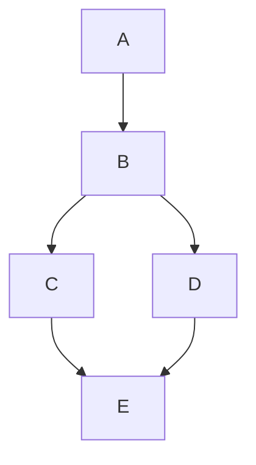


> Complete Undirected Graph

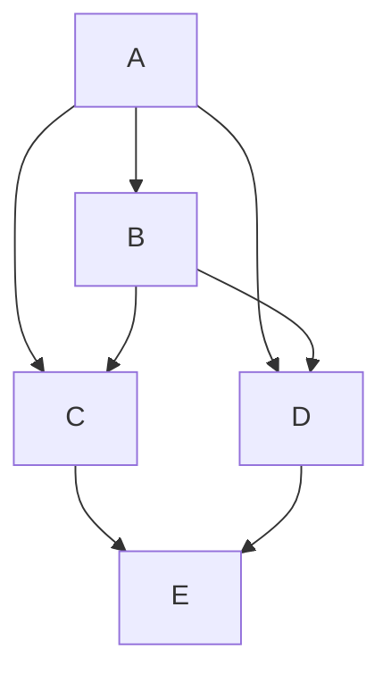

n = 0 No zero order independencies

n = 1 First order independencies

A C B |

$A \perp \perp D \mid _ { B }$

$A \perp \perp E \perp B$

$c \perp \perp D \mid B$

Resulting Adjacencies


n = 2: Second order independencies

B E  | {C,D}

Resulting Adjacencies


> Figure 5.1


This is a loose upper bound even in the worst case; it assumes that in the worst case for n and k, no two variables are d-separated by a set of less than cardinality k, and for many values of n and k we have been unable to find graphs with that property. While we have no formal expected complexity analysis of the problem, the worst case is clearly rare, and the average number of conditional independence tests required for graphs of maximal degree k is much smaller. In practice it is possible to recover sparse graphs with as many as a hundred variables. Of course the computational requirements increase exponentially with k.


> Figure 5.2


The structure of the algorithm and the fact that it continues to test even after having found the correct graph suggest a natural heuristic for very large variable sets whose causal connections are expected to be sparse, namely to fix a bound on the order of conditional independence relations that will be tested.

## 5.4.2.2 Stability of PC

In theory, the PC Algorithm is unstable in both steps B) and C) although in practice step B) has proved to be much more reliable than step C).

If an edge is mistakenly removed from the true graph at an early stage of step B) of the algorithm, then other edges which are not in the true graph may be included in the output. Consider the following example.


> Figure 5.3

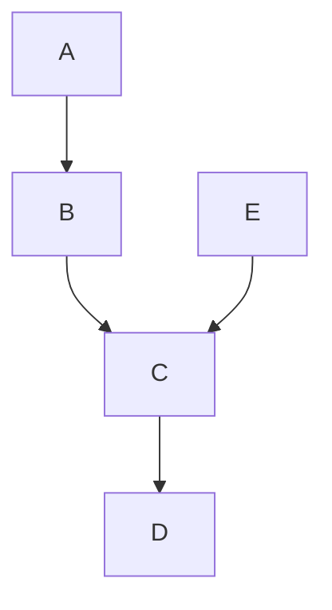

If the edge E - D is mistakenly removed from the initial complete graph then at a subsequent stage of the search the edge B - D will not be removed, because E will no longer be in the adjacency set for D, and B and D are dependent on every subset of A and C. The omission of an edge can also lead to orientation errors. If an edge is mistakenly left in the graph and there are no additional errors in the list of d-separations in the input, the only further errors that result are that some edges which theoretically could be oriented, will not be oriented.

Step C) of the algorithm is unstable for the same reasons as in step C) of the SGS algorithm.

The PC algorithm is faster than the SGS algorithm because it tests fewer d-separation relations. Given a faithful list of d-separability relations, the two algorithms output the same set of pattern graphs. But if the list of d-separability relations is not faithful, due to sampling error for example, the two algorithms can output different pattern graphs. Consider the following example.


> Figure 5.4

According to this graph, A and E are d-separated from each other given any non-empty subset of B, C, and D. If, after the A - C and E - C edges have been removed from the initial undirected graph, the procedure incorrectly judges that A and E are not d-separated given any non-empty subset of B and D, the PC algorithm will incorrectly include an edge between A and E, because it only tests whether A and E are d-separated given subsets of the adjacencies of A and E. On the other hand, because the SGS algorithm tests whether A and E are d-separated given any subset of V\{A,B}, it would properly recognize that there is not an edge between A and E because A and E are d-separated given C.

In contrast, if after the A - E and B - E edges are removed from the initial undirected graph, it is mistakenly judged that A and B are d-separated given E, the SGS algorithm will mistakenly remove the A → B edge. If the A - E and B - E edges are removed first, the PC algorithm, would correctly leave the A → B edge in, because it would not test whether A and B are d-separated given E.

Because the PC algorithm attempts to use “local” information to judge whether an edge exists or not, it is not guaranteed to produce a graph that is in some sense “closest” to an unfaithful distribution. Consider the example shown in figure 5.5.

In a distribution faithful to this graph, every variable is dependent on every other variable. Suppose a test determines that A and B are independent conditional on some other variable, either because of some coincidental parameter values, or because of sampling error. The PC algorithm would then remove the A - B edge in order to satisfy that constraint. In doing so, however, it would disconnect the graph. The resulting graph would entail that A and all of its descendants to the left are independent of B and all of its descendants. So, in order to satisfy one conditional independence constraint, the PC algorithm may produce a graph that violates a great many independence constraints. In a number of data sets the correlations between two variables do not vanish but the output pattern disconnects them. For greater reliability the procedure should be supplemented with a repair algorithm, for which the Cooper and Herskovits Bayesian procedure might suffice in the discrete case; alternatively, a variation of the procedure described in chapter 11 could be applied.


> Figure 5.5

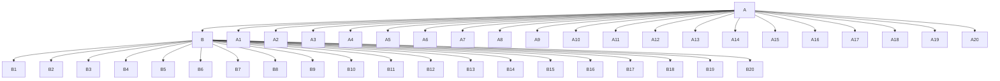

## 5.4.2.3 The PC\* Algorithm

The PC algorithm is computationally efficient and asymptotically reliable, but on sample data the procedure takes unnecessary risks. In determining whether to eliminate an undirected edge between variables A and B, the procedure may test every subset of the adjacency set of A and of the adjacency set of B. But the independence or dependence of A and B on many of these subsets of variables may be entirely irrelevant to the causal relations between A and B. For a distribution faithful to a directed acyclic graph, if variables A and B are independent conditional given Parents(A) or given Parents(B) then they are independent given a subset of Parents(A) or given a subset of Parents(B) consisting only of vertices lying on undirected paths between A and B. It is sufficient, then, to test for the conditional independence of A and B given subsets of variables adjacent to A and subsets of variables adjacent to B that are on undirected paths between A and B. Call the modified algorithm $\mathrm { P C ^ { \ast } }$ .

The PC and $\mathrm { P C } ^ { \ast }$ algorithms yield the same output given a faithful list of conditional independence relations or correlations as input, but they may differ given conditional independence relations determined from tests on sample data. The $\mathrm { P C } ^ { \ast }$ algorithm avoids one kind of error made by the PC algorithm. If, however, at an early stage the $\mathrm { P C ^ { \ast } }$ algorithm mistakenly disconnects a path between X and Y it may then mistakenly leave the $X  { - } Y$ edge in the undirected graph, while the PC algorithm, given the same data, might avoid that error. Moreover, whatever increased reliability the $\mathrm { P C } ^ { \ast }$ algorithm may have is bought at great cost, since the algorithm must at each stage of step B) keep track of all of the undirected paths in the graph it considers at that stage. The number of undirected paths is typically very large, and the memory requirements of the $\mathrm { P C ^ { \ast } }$ algorithm are not feasible save for relatively small numbers of variables, in which case it may be the algorithm of choice. For large numbers of variables the PC algorithm must be used instead, although if the true graph is sparse, the PC algorithm can be used until the average degree of the undirected graph C is small, after which stage the PC\* algorithm may be used. Later in this chapter we will describe the performance of the two algorithms on discrete data taken from Christensen 1990.

## 5.4.2.4 Speed-Up Heuristics for Ordering Tests

Step B of the PC algorithm selects some variable pair and some subset S of a given size to test for d-separation. The faster edges are eliminated from the complete graph, the smaller the search that has to be conducted at later stages of the algorithm, and the faster the algorithm runs. Hence, it is best to select first for testing those variable pairs A and B and subsets S for which A and B are most likely to be d-separated by S. We have considered three variants of the PC algorithm that use different methods of selecting the order of tests.

Heuristic 1 Test the variable pairs and subsets S in lexicographic order. (We will call this PC–1.)

Heuristic 2 First test those variables pairs that are least dependent3 in probability. The conditioning subsets are selected by lexicographic order. (We will call this PC–2.)

Heuristic 3 For a given variable A, first test those variables B that are least probabilistically dependent on A, conditional on those subsets of variables that are most probabilistically dependent on A. (We will call this PC–3.)

The intuition behind heuristic 2 is that variables with the highest probabilistic dependence are most likely to be adjacent in the true graph, and hence not ever eliminated from the graph being constructed, while those with the smallest probabilistic dependence are least likely to be adjacent in the true graph. Of course, no such relation strictly holds.

The intuition behind heuristic 3 is similar. A variable B that is not genuinely adjacent to a variable A is d-separated from A given some subset of the variables that are adjacent to A or given some subset of the variables that are adjacent to B in the true graph. Assuming that variables with the highest probabilistic dependence upon A are most likely to be adjacent to A in the true graph, this suggests testing whether A is d-separated from variables with a low probabilistic dependence on A, conditional on variables with a high probabilistic dependence upon A.

## 5.4.3 The IG (Independence Graph) Algorithm

Verma and Pearl (1990) have suggested a variation of the SGS algorithm. In their alternative, the first step in searching for the directed acyclic graph is to construct the undirected independence graph N, that is, for each pair of variables A, B introduce an undirected edge between them if they are dependent conditional on the set of all other variables. In the undirected independence graph for a distribution faithful to a directed acyclic graph the parents of any variable form a maximal complete subgraph—a clique. Again for each pair of variables A, B adjacent in N, determine if A and B are d-separated given any subsets of variables in the cliques in N containing A or B. If so A is not adjacent to B in G. The complexity is thus a function of the size of the largest clique in N.

Determining the cliques in a graph would appear to require unnecessary computation, and in other than the worst case, testing for conditional independence of two variables conditional on all members of the maximal clique of one or the other will involve a test of unnecessarily high order. A better idea might be to blend the procedure with the PC algorithm: modify step A of the PC algorithm by setting the initial graph in the PC procedure to the undirected independence graph, rather than the complete undirected graph, and then proceed in the same way. We will call this algorithm IG (independence graph.)

The efficiency of these algorithms obviously depends upon how easily the independence graph can be constructed. The off-diagonal elements of the standardized inverse of the correlation matrix are the negatives of the partial correlation coefficients between the corresponding variables given the remaining variables (see e.g., Whittaker 1990). Hence in the linear case, the independence graph can be efficiently constructed by placing an edge between A and B if and only if the entry in the standardized inverse correlation matrix is nonzero. In the discrete case, Fung and Crawford (1990) have recently proposed a fast algorithm for constructing an independence graph from discrete data. We have not tested their procedure as a preprocessor for the PC algorithm.

## 5.4.4 Variable Selection

While prior knowledge of causal structure can sometimes make the results of the algorithms we have described more informative on real samples, correct selection of variables is essential for reliable inference, and for that algorithms (at least these algorithms) provide no help.

We can aggregate variables or we can aggregate distinct values of a variable. As in Salmon’s imaginary example discussed in chapter 3, we sometimes measure a variable that is an imprecise version of a more precise natural variable; we fail, in other words, to distinguish values that have differing effects on other variables. Continuous variables are often deliberately collapsed into a few discrete categories, sometimes because contingency table methods offer the promise of statistical analysis free of the substantive assumptions that would otherwise be required about the form of the functional dependencies—e.g., linear or otherwise—and sometimes because some of the variables to be analyzed are necessarily discrete and there are few methods available for problems with mixtures of discrete and continuous variables. Sometimes, whether through ignorance or even deliberately, we may aggregate two or more distinct variables with distinct causal structures into a single scale. What effects can aggregation and collapse have on the reliability of causal inference?

We have already observed that if C is a cause of A and B and some proxy $C ^ { \prime }$ --C is used that is not so precise as C and not perfectly correlated with C, it may be that A and B are statistically dependent conditional on $C ^ { \prime } .$ Examples of this sort appear whenever a theory postulates a cause that is measured by proxies. Friedman (1957), for example, advocated a much discussed theory in which consumption is caused by “permanent” income which can only be measured by proxies; if Friedman’s theory were true, regression of consumption on measured income would provide a biased estimate of the regression coefficient of consumption on permanent income and might leave unexplained correlations between consumption and other variables. Klepper (1988) has shown how, in the linear normal case, such errors may be bounded.

Suppose we are given variables A, B, C such that A and B are independent conditional on C. Let $C ^ { \prime } = P R O J ( C )$ where PROJ(C) is a projection mapping the set of n values of C to a set of $m < n$ values. If there exist values $c _ { 1 } , \ c _ { 2 }$ for C such that $P ( A , B | C = c _ { 1 } ) \neq$ $P ( A , B | C = c _ { 2 } )$ and $P R O J ( C { = } c _ { 1 } ) \ = \ P R O J ( C { = } c _ { 2 } )$ , then A and B are not independent conditional on $C ^ { \prime } .$ Independence relations can be made to appear rather than disappear by collapsing values of a variable. Suppose that variable B, C are dependent. Let $C ^ { \prime } =$ PROJ(C) where PROJ(C) is a projection mapping the set of n values of C to a set of $m <$ < n values. If there exists a value $c _ { 1 }$ of C such that $P ( C = c _ { 1 } \mid B ) = P ( C = c _ { 1 } )$ and $P R O J ( c _ { 1 } )$ 号 has a unique inverse and $P R O J ( c _ { k } ) = P R O J ( c _ { j } )$ for all $k , j$ not equal to 1, then B and $C ^ { \prime }$ - independent.

Pearl (personal communication) has pointed out that a very simple sort of aggregation can produce an unfaithful distribution. Suppose A causes $C _ { 1 }$ and B causes $C _ { 2 } .$ , and $C _ { 1 }$ and $C _ { 2 }$ are each binary, and there is no other causal connection among the variables. So {A, $C _ { 1 } \}$ is independent of the set $\{ B , C _ { 2 } \}$ , but A and $C _ { 1 }$ are dependent and so are B and $C _ { 2 } .$ . Introduce variable C taking values 0, 1, 2, 3 coding the different value pairs for $C _ { 1 }$ and $C _ { 2 } .$ . Then the actual causal structure among A, B and C is shown in figure 5.6.


> Figure 5.6


But in the joint distribution A and B are independent conditional on $C ,$ and so the joint distribution is not faithful to any causal structure whatsoever. In this case the unfaithfulness of the distribution is due to the fact that it is the marginal of a distribution that is unfaithful because of deterministic relationships among the variables: the independence of A and B given C follows directly from the application of D-separability (see chapter 3) to figure 5.6. This sort of thing may sometimes happen in practice, but it could always be tested for and in principle identified: Conditioning on A divides the values of C into two equivalence classes each containing values of C with the same conditional probability, and conditioning on B divides the values of C into a distinct pair of equivalence classes. Letting the equivalence classes induced by A be values of one variable and the equivalence classes induced by B be values of another variable recovers $C _ { 1 }$ and $C _ { 2 }$ .

## 5.4.5 Incorporating Background Knowledge

A user of any of these algorithms may have a great deal of background knowledge—or at least belief—that could constrain the search. This knowledge might be about the existence or non-existence of certain edges in the graph, or it might be about the orientation of some of the edges, or it might be about the time order of the variables. How can this background knowledge be used by the algorithms?

The most common sort of reliable prior belief orders or partially orders the variables by time of occurrence: either measurements of A were taken before measurements of B, or A and B are believed to be exact measures of events that are so ordered. Any of the algorithms of this section can be easily modified to make two uses of such knowledge:

- (i) In determining whether A and B are adjacent in the true graph by testing whether B is independent of A conditional on some subset of the current adjacencies of A, do not test for independence conditional on any set of variables that includes a variable that is later than A.
- (ii) If A and B are adjacent and B is later than A, orient the edge as A → B.

In the examples we give throughout this book the algorithms have been so modified, and we sometimes make use of common sense time order, always noting where such assumptions have been made.

Prior belief about whether one variable directly influences another can also be incorporated in these algorithms: if prior belief forbids an adjacency, for example, the algorithms need not bother to test for that adjacency; if prior belief requires than there be a direct influence of one variable on another, the corresponding directed edge is imposed and assumed in the orientation procedures for other edges. These procedures assume that prior belief should override the results of unconstrained search, a preference that may not always be judicious; they are nonetheless incorporated in versions of the TETRAD II program with the PC algorithm.

## 5.5 Statistical Decisions

The algorithms we have described are completely modular, and can be applied given any procedures for making the requisite statistical decisions about conditional independence or vanishing partial correlations. The better the decisions the better the performance to be expected from the algorithms. While tests of conditional independence relations form the most obvious class of such decisions, any statistical constraints that give d-separability relations for graphical structure will suffice. For example, in the linear normal case, vanishing partial correlation is equivalent to conditional independence, and the statistical decisions required by the algorithms could be provided by t-tests of the hypotheses that partial correlations vanish. But vanishing partial correlation marks d-separability whether or not the distribution is normal, so long as linearity and linear Faithfulness hold.4 Hence under these assumptions the test of any statistic that vanishes when partial correlations vanish would suffice; one might, for example, use an F test for the square of the semipartial correlation coefficient, which equals the square of the t-test for a corresponding regression coefficient (Edwards 1976).

In the examples in this book we test whether $\rho _ { X Y . \mathbf { C } } = 0$ using Fisher’s z:

$$
z (\rho_ {X Y. \mathbf {C}}, n) = \frac {1}{2} \sqrt {n - | \mathbf {C} | - 3} \ln \left[ \frac {\left(| 1 + \rho_ {X Y . \mathbf {C}} |\right)}{\left(| 1 - \rho_ {X Y . \mathbf {C}} |\right)} \right]
$$

XY.C = population partial correlation of X and Y given C, and |C| equals the number of variables in C. If X, Y, and C are normally distributed and $r _ { X Y . \mathbf { C } }$ denotes the sample partial correlation of X and Y given C, the distribution of $z ( \rho _ { X Y . \mathbf { C } } , n ) - z ( r _ { X Y . \mathbf { C } } , n )$ is standard normal (Anderson 1984).

In the discrete case, for simplicity consider two variables. Recall that we view the count in a particular cell, $x _ { i j } ,$ as the value of a random variable obtained from sampling N units from a multinomial distribution. Let $x _ { i + }$ denote the sum of the counts in all cells in which the first variable has the value i, and similarly let $x _ { + j }$ denote the sum of the counts in all cells in which the second variable has the value $j .$ On the hypothesis that the first and second variables are independent, the expected value of the random variable $x _ { i j }$ is:

$$
E (x _ {i j}) = \frac {x _ {i +} x _ {+ j}}{N}
$$

Analogously, we can compute the expected values of cells on any hypothesis of conditional independence from appropriate marginals. For example, on the hypothesis that the first variable is independent of the second conditional on the third, the expected value of the cell $x _ { i j k }$ is

$$
E (x _ {i j k}) = \frac {x _ {i + k} x _ {+ j k}}{x _ {+ + k}}
$$

If there are more than three variables this formula applies to the expected value of the marginal count of the $i , j ,$ k values of the first three variables, obtained by summing over all other variables. The number of independent constraints that a conditional independence hypothesis places on a distribution is an exponential function of the order of the conditional independence relation and also depends on the number of distinct values each variable can assume.

Tests of such independence hypotheses have used—among others—two statistics:

$$
\mathrm{X} ^ {2} = \sum \frac {\left(\text { Observed } - \text { Expected }\right) ^ {2}}{\text { Expected }}
$$

$$
G ^ {2} = 2 \sum (\text { Observed }) \ln \left(\frac {\text { Observed }}{\text { Expected }}\right)
$$

- 	
- 


- - $\chi ^ { 2 }$ with appropriate degrees of freedom. In the examples in this book we calculate the degrees of freedom for a test of the independence of A and B conditional on C in the following way. Let Cat(X) be a function which returns the number of categories of the variable X, and n be the number of variables in C. Then the number of degrees of freedom (df) in the test is:

$$
d f = (C a t (A) - 1) \times (C a t (B) - 1) \times \prod_ {i = 1} ^ {n} C a t (C _ {i})
$$

We assume that there are no structural zeroes. As a heuristic, for each cell of the distribution that has a zero entry, we reduce the number of degrees of freedom by one.5

Because the number of cells grows exponentially with the number of variables, it is easy to construct cases with far more cells than there are data points. In that event most cells in the full joint distribution will be empty, and even non-empty cells may have only small counts. Indeed, it can readily happen that some of the marginal totals are zero and in these cases the number of degrees of freedom must be reduced in the test. For reliable estimation and testing, Fienberg recommends that the sample size be at least five times the number of cells whose expected values are determined by the hypothesis under test.

For discrete data we fill out the PC algorithm with tests for independence using $G ^ { 2 }$ which in simulations we have found more often leads to the correct graph than does $X ^ { 2 } .$ . In testing the conditional independence of two variables given a set of other variables, if the sample size is less than ten times the number of cells to be fitted we assume the variables are conditionally dependent.

## 5.6 Reliability and Probabilities of Error

Most of the algorithms we have described require statistical decisions which, as we have just noted, can be implemented in the form of hypothesis tests. But the parameters of the tests cannot be given their ordinary significance. The usual comforts of a statistical test are the significance level, which offers assurance as to the limiting frequency with which a true null hypothesis would erroneously be failed by the test, and the power against an alternative, which is a function of the limiting frequency with which a false null hypothesis would not be rejected when a specified alternative hypothesis is true. Except in very large samples, neither the significance level nor the power of tests used within the search algorithms to decide statistical dependence measures the long run frequency of anything interesting about the search. What does?

The error probabilities one might naturally want to know for a search procedure include:

- 1. Given that model M is true, what is the probability that the procedure will return a conclusion inconsistent with M on sample size n?
- 2. Given that model $M ^ { * }$ is true, what is the probability that the procedure will return a conclusion inconsistent with $M ^ { * }$ but consistent with M on sample size $n ?$
- 3. Given that model M is true, for samples of size n what is the probability that a search procedure will specify an adjacency not in M? What is the probability that a search procedure will omit an adjacency in M? What is the probability that a search procedure will add an arrowhead not in M to an edge that is in M? What is the probability that a search procedure will omit an arrowhead in M? What are these probabilities for any particular variable pair, A, B?

For large models, where we expect some errors of specification from most samples, questions of kind 3 are the most important.

There is little hope of obtaining analytic answers to these questions. In repeated tests of independence hypotheses in a sample, each using the same significance level, the probability that some true hypothesis will be rejected is not given by the significance level; depending on the number of hypotheses and the sample size, that probability may in fact be much higher than the significance level, but in any case the probability of some erroneous decision depends on which hypotheses are tested, and for all of the algorithms considered that in turn depends in a complex way on the actual structure. Further, each of the algorithms can produce correct output even though some required statistical decisions are made incorrectly. For example, suppose in graph G, vertices A and B are not adjacent. Suppose in fact A and B are independent conditional on C, on D, on C and D, and so on. If the hypothesis that A and B are independent conditional on C is rejected in the search procedure, and the algorithm goes on to test whether A and B are independent conditional on D, and decides in favor of the latter independence, then despite the earlier error the procedure will correctly conclude that A and B are not adjacent. Chapter 12 discusses various senses in which there do or do not exist confidence intervals for any search procedure for causal models.

For any particular M and M\* estimates of the answers to questions 1, 2, and 3 can be found empirically by Monte Carlo methods. Simulation packages for linear normal models are now common in commercial statistical packages, and the TETRAD II program contains a simulation package for linear and for discrete variable models with a variety of distributions. For small models it takes only a few minutes to generate a hundred or more samples and run the samples through the search procedures. Most of the time required is in counting the outcomes, a process that we have automated ad hoc for our simulations, and that can and should be automated in a general way for testing the reliabilities of particular search outcomes.

## 5.7 Estimation

There are wel- known methods for obtaining maximum likelihood estimates subject to a causal hypothesis under the assumption of normality, even with unmeasured variables (Joreskog 1981; Lohmoller 1989). A variety of computerized estimation methods, including ordinary and generalized least squares, are also available when the normality assumption is given up. In the discrete case, for a positive multinomial distribution, the maximum likelihood estimates (when they exist) for a cell subject to the independence constraints of the graph over a set of variables V can be obtained by substituting the marginal frequencies for probabilities in the factorization formula of chapter 3 (Kiiveri and Speed 1982).

$$
P (\mathbf {V}) = \prod_ {V \in \mathbf {V}} P (V | \text { Parents } (V))
$$

When there are unmeasured variables that act as common causes of measured variables, the pattern obtained from the procedures we have described can have edges with arrows at each end. In that rather common circumstance we do not know how to obtain a maximum likelihood estimate for the joint distribution of discrete measured variables.

## 5.8 Examples and Applications

We illustrate the algorithms for simulated and real data sets. With simulated data the examples illustrate the properties of the algorithms on samples of realistic sizes. In the empirical cases we often do not know whether an algorithm produces the truth. But it is at the very least interesting that in cases in which investigators have given some care to the treatment and explanation of their data, the algorithm reproduces or nearly reproduces the published accounts of causal relations. It is also interesting that in cases without these virtues the algorithm suggests quite different explanations from those advocated in published reports.

Studies of regression models and alternatives produced by the PC algorithm and by another procedure, the Fast Causal Inference (FCI) algorithm, are postponed until chapter 8, after latent variables and prediction have been considered in chapters 6 and 7, respectively.

## 5.8.1 The Causes of Publishing Productivity

In the social sciences there is a great deal of talk about the importance of “theory” in constructing causal explanations of bodies of data. Of course in explaining a data set one will always eliminate causal graphs that contradict common sense or that violate the time order of variables. But in addition, many practitioners require that every attempt to provide a causal explanation of observational data in the social sciences proceed through the particulars of principles in sociology, psychology, economics, political science, or whatever, and come accompanied with a denial of the possibility of determining a correct explanation from the statistical dependencies and common sense alone. In many of these cases the necessity of theory is badly exaggerated. Indeed, for every “recursive” structural equation model in the entire scientific literature, if the assumptions of the model are correct and no unmeasured common causes are postulated, then if the distribution is faithful the statistical dependencies in the population uniquely determine the undirected graph underlying the directed graph of causal relations. And in many cases the population statistics alone determine a direction of some, or even all, edges. When the variables are linearly ordered by time, so that variable A can be a cause of variable B only if A occurs later than B, the statistical dependencies and the time order determine a unique directed graph assuming only that the distribution is positive and the Markov and Minimality Conditions are satisfied. The efforts spent citing literature to justify specifications of causal dependencies are not misplaced, but in many cases effort would be better directed toward establishing the fundamental statistical assumptions, including the approximate homogeneity of the units, the correctness of the sampling assumptions, and sometimes the linearity of dependencies.

Here is a recent and rather vivid example. There is a considerable literature on causes of academic success, including publication and citation rates. A recent paper by Rodgers and Maranto (1989) considers hypotheses about the causes of academic productivity drawn from sociology, economics, and psychology, and produces a combined “theoretically based” model.

Their data were obtained in the following way: solicitations and questionnaires were sent to 932 members of the American Psychological Association who obtained doctoral degrees between 1966 and 1976 and were currently working academic psychologists. Equal numbers of male and female psychologists were sampled, and after deleting respondents who did not have degrees in psychology, did not take their first job in psychology, etc. a sample of 86 men and 76 women was obtained.

The response items were clustered into groups. For example, the ABILITY group consisted of measures of the mean ACT, NMSQT, and selectivity scores of the subject’s undergraduate institution, together with membership in Phi Beta Kappa and undergraduate honors at graduation. Graduate Program Quality (GPQ) consisted of the scholarly quality of department faculty and program effectiveness using national rankings, the fraction of faculty with publications between 1978 and 1980, and whether an editor of a journal was on the department faculty. These response items were treated as indicators—that is, as effects—of the unmeasured variables GPQ, and ABILITY. Other measures were quality of first job (QFJ), SEX, citation rate (CITES) and publication rate (PUBS). In preliminary analyses they also used an aggregated measure of productivity (PROD). The various hypotheses Rodgers and Maranto considered were then treated as linear “structural equation models”6 They report the following correlations among the cluster variables

<table><tr><td>ABILITY</td><td>GPQ</td><td>PREPROD</td><td>QFJ</td><td>SEX</td><td>CITES</td><td>PUBS</td></tr><tr><td>1.0</td><td></td><td></td><td></td><td></td><td></td><td></td></tr><tr><td>.62</td><td>1.0</td><td></td><td></td><td></td><td></td><td></td></tr><tr><td>.25</td><td>.09</td><td>1.0</td><td></td><td></td><td></td><td></td></tr><tr><td>.16</td><td>.28</td><td>.07</td><td>1.0</td><td></td><td></td><td></td></tr><tr><td>-.10</td><td>.00</td><td>.03</td><td>.10</td><td>1.0</td><td></td><td></td></tr><tr><td>.29</td><td>.25</td><td>.34</td><td>.37</td><td>.13</td><td>1.0</td><td></td></tr><tr><td>.18</td><td>.15</td><td>.19</td><td>.41</td><td>.43</td><td>.55</td><td>1.0</td></tr></table>

There follows a very elaborate explanation of causal theories suggested by the pieces of sociological, economic and psychological literature. Rodgers and Maranto estimate no fewer than six different sets of structural equations and corresponding causal theories. The six structures they consider are as shown in figure 5.7.

The labels on the graphs indicate simply the social scientific theory from which Rodgers and Maranto derived the causal graph. For example, the “Human Capital” and the “Screening” graphs were obtained from economic theory in the following way:

In the human capital model (Becker 1964) education has a direct effect on productivity because it conveys relevant knowledge. People invest in education until its marginal cost (the extra expenses and foregone earnings for an additional year of education) is equal to its marginal benefit (the increase in lifetime earnings caused by another year of education). More able individuals are more productive in both work and the acquisition of skills than their less able counterparts. Thus, ability has a direct effect on productivity and an indirect effect through education, because more able individuals gain more from school. Work experience also increases productivity by providing on-the-job training. The quality as well as the quantity of education is relevant to the human capital framework.

The screening hypothesis implicitly views ability as the primary determinant of productivity. Employers wish to hire the most productive applicants, but ability is not directly observable. Individuals invest in education as a means of signaling their ability to employers. The marginal cost of education is inversely related to ability, inducing a positive correlation between ability and the level of education. Therefore, by selecting applicants based on their education, employers hire by ability (Spence 1973). In this model, education does not affect productivity directly, but only through its association with ability. Variations in the quality of education are consistent with the screening model. (Wise 1975)


> Figure 5.7

The “empirical model” was obtained from a previous study that did not appeal to social theory.

None of the structural equation systems based on these models save the phenomena. But combining all of the edges in the “theoretical” models, adding two more that seem plausible, and then throwing out statistically insignificant (at .05) dependencies, leads Rodgers and Maranto instead to propose a different causal structure that fits the data quite well.

It would appear that the tour through “theory” was nearly useless, but Rodgers and Maranto say otherwise:


> Figure 5.8

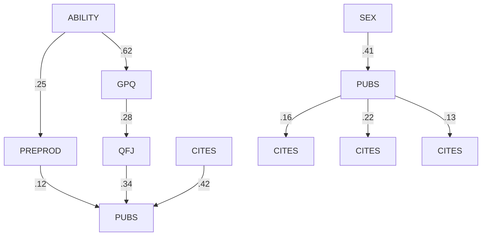

Causal models based solely on the pattern of observed correlations are highly suspect. Any data can be fitted by several alternative models. The construction of the best-fit model was thus guided by theory-based expectations. By using the two measures of productivity, PUBS and CITES, and the five causal antecedents, we initially estimated a composite model with all of the paths identified by the six theories. This model produced a large positive deviation between the observed and predicted correlation of ABILITY with PREPROD, suggesting that we omitted one or more important paths. Reexamination of our initial interpretation of the six theories led us to conclude that two paths had been overlooked. One such path is from ABILITY to PREPROD. . . . The other previously unspecified path is from ABILITY to PUBS. These two paths were added and all nonsignificant paths were deleted from the composite model to arrive at the best-fit model.

If the Rodgers and Maranto theory were completely correct, the undirected graph underlying their directed graph would be uniquely determined by the conditional independence relations, and the orientation would be almost uniquely determined; only the directions of the GPQ → QFJ, ABILITY → GPQ and ABILITY → PREPROD edges could be changed, and only in a way that does not create a new collision.

When the PC algorithm is applied to their correlations with the common sense time order using a significance level of .1 for tests of zero partial correlations, the output is the graph on the left side of figure 5.9, which we show alongside the Rodgers and Maranto model.


> PC Output

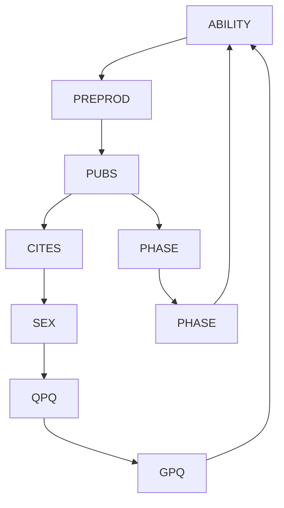


> Rodgers and Maranto Graph Figure 5.9

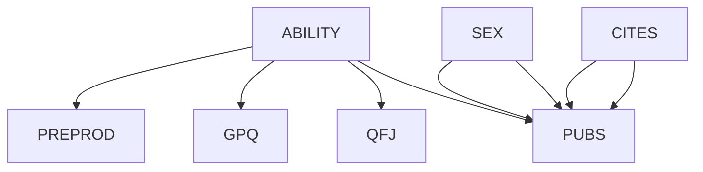

All but one of the edges in the Rodgers and Maranto model is produced instantaneously from the data and common sense knowledge of the domain—the time ---
-!"-
-
- $\mathbf { a } \chi ^ { 2 }$ of 13.58 with 11 degrees of freedom and $p = . 2 5 7$ . If the search procedure is repeated using .05 as the significance level, the program deletes the PREPROD → PUBS edge. When that model is estimated and tested 
--!"-	--
- $\chi ^ { 2 }$ is 19.2 with 12 degrees of freedom and a p value of .08, figures that should be taken as estimates of fit rather than of the probability of error.

Any claim that social scientific theory—other than common sense—is required to find the essentials of the Rodgers and Maranto model is clearly false. Nor do the preliminary results of Rodgers and Maranto’s search afford any reason for confidence in social scientific theory. In contrast, we know a good deal about the reliability and limitations of the PC algorithm. The entire study with TETRAD and EQS takes a few minutes. A slight variant of the model is obtained using the SGS algorithm rather than the PC algorithm.

## 5.8.2 Education and Fertility

Rindfuss, Bumpass, and St. John (1980) were interested in the mutual influence in married women of education at time of marriage (ED) and age at which a first child is born (AGE). On theoretical grounds they argue at length for the model on the left in figure 5.10, where the regressors from top to bottom are as follows:

<table><tr><td>DADSO =</td><td>father&#x27;s occupation</td></tr><tr><td>RACE =</td><td>race</td></tr><tr><td>NOSIB =</td><td>absence of siblings</td></tr><tr><td>FARM =</td><td>farm background</td></tr><tr><td>REGN =</td><td>region of the United States</td></tr><tr><td>ADOLF =</td><td>presence of two adults in the subject&#x27;s childhood family</td></tr><tr><td>REL =</td><td>religion</td></tr><tr><td>YCIG =</td><td>cigarette smoking</td></tr><tr><td>FEC =</td><td>whether the subject had a miscarriage.</td></tr></table>

Regressors are correlated. The sample size is 1766, and the covariances are given belowcorrelated. The sample size is 1766, and the covariances are given below.

<table><tr><td>DADSO</td><td>RACE</td><td>NOSIB</td><td>FARM</td><td>REGN</td><td>ADOLF</td><td>REL</td><td>YCIG</td><td>FEC</td><td>ED</td><td>AGE</td></tr><tr><td>456.676</td><td></td><td></td><td></td><td></td><td></td><td></td><td></td><td></td><td></td><td></td></tr><tr><td>-.9201</td><td>.089</td><td></td><td></td><td></td><td></td><td></td><td></td><td></td><td></td><td></td></tr><tr><td>-15.825</td><td>.1416</td><td>9.212</td><td></td><td></td><td></td><td></td><td></td><td></td><td></td><td></td></tr><tr><td>-3.2442</td><td>.0124</td><td>.3908</td><td>.2209</td><td></td><td></td><td></td><td></td><td></td><td></td><td></td></tr><tr><td>-1.3205</td><td>.0451</td><td>.2181</td><td>.0491</td><td>.2294</td><td></td><td></td><td></td><td></td><td></td><td></td></tr><tr><td>-.4631</td><td>.0174</td><td>-.0458</td><td>-.0055</td><td>.0132</td><td>.1498</td><td></td><td></td><td></td><td></td><td></td></tr><tr><td>.4768</td><td>-.0191</td><td>.0179</td><td>-.0295</td><td>-.0489</td><td>-.0085</td><td>.1772</td><td></td><td></td><td></td><td></td></tr><tr><td>-0.3143</td><td>.0031</td><td>.0291</td><td>-.0096</td><td>-.0018</td><td>.0089</td><td>-.0014</td><td>.1170</td><td></td><td></td><td></td></tr><tr><td>.2356</td><td>.0031</td><td>.0018</td><td>-.0045</td><td>-.0039</td><td>.0021</td><td>-.0003</td><td>.0009</td><td>.0888</td><td></td><td></td></tr><tr><td>18.66</td><td>-.1567</td><td>-2.349</td><td>-.2052</td><td>-.2385</td><td>-.1434</td><td>-.0119</td><td>-.1380</td><td>.0267</td><td>5.5696</td><td></td></tr><tr><td>16.213</td><td>-.2305</td><td>-1.4237</td><td>-.2262</td><td>-.3458</td><td>.1752</td><td>.1683</td><td>-.1702</td><td>.2626</td><td>3.6580</td><td>16.6832</td></tr></table>

Apparently to their surprise, the investigators found on estimating coefficients that theApparently to their surprise, the investigators on estimating coefficients that the AGE → ED parameter is zero. Given the prior information that ED and AGE are notAGE → ED parameter is zero. Given the prior information that ED and AGE are not causes of the other variables, the PC algorithm (using .the 05 significance level for tests)causes of the other variables, the PC algorithm (using .the 05 significance level for tests) directly finds the model on the right in figure 5.10, where connections among thedirectly finds the model on the right in figure 5.10, where connections among the regressors are not pictured. This case is discussed further in chapter 12, section 5.10regressors are not pictured. This case is discussed further in chapter 12, section 5.10.

## 5.8.3 The Female Orgasm5.8.3 The Female Orgasm

Bentler and Peeler (1979) obtained data from 281 female university undergraduatesBentler and Peeler (1979) obtained data from 281 female university undergraduates regarding personality and sexual response. They include the Eysenck Personalityregarding personality and sexual response. They include the Eysenck Personality Inventory which measured neuroticism (N) and extraversion (E); a heterosexual behaviorInventory which measured neuroticism (N) and extraversion (E); a heterosexual behavior inventory (HET), a monosexual behavior inventory (MONO); a scale of negative attitudesinventory (HET), a monosexual behavior inventory (MONO); a scale of negative attitudes toward masturbation (ATM) and an inventory of subjective assessments of coital andtoward masturbation (ATM) and an inventory of subjective assessments of coital and masturbatory experiences. Using factor analysis the investigators formed scales, thoughtmasturbatory experiences. Using factor analysis the investigators formed scales, thought to be unidimensional, from these responses, including two scales (SCOR) and (SMOR)to be unidimensional, from these responses, including two scales (SCOR) and (SMOR) from the subjective assessments of coital and masturbatory experiencesfrom the subjective assessments of coital and masturbatory experiences.

The investigators were interested in two hypotheses: (1) subjective orgasm responsesThe investigators were interested in two hypotheses: (1) subjective orgasm responses in masturbation and coitus are due to distinct internal processes; (2) extraversionin masturbation and coitus are due to distinct internal processes; (2) extraversion,


> Rindfuss, et al.theoretical model; AGE -> ED coefficient not statistically significant

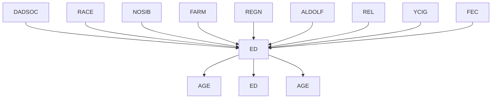


> TETRAD II model Figure 5.10

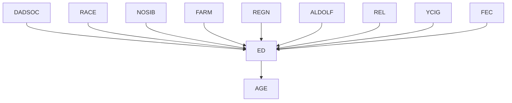

neuroticism and attitudes toward masturbation have no direct effect on orgasmic responsiveness, measured by SCOR and SMOR, but influence that phenomenon only through the history of the individual’s sexual experience measured by HET and MONO.

We will not discuss the formation of the scales in this case, since the only data presented are the correlations of the scales and inventory scores, which are:

<table><tr><td>E</td><td>N</td><td>ATM</td><td>HET</td><td>MONO</td><td>SCOR</td><td>SMOR</td></tr><tr><td>1.0</td><td></td><td></td><td></td><td></td><td></td><td></td></tr><tr><td>-.132</td><td>1.0</td><td></td><td></td><td></td><td></td><td></td></tr><tr><td>.009</td><td>-.136</td><td>1.0</td><td></td><td></td><td></td><td></td></tr><tr><td>.22</td><td>-.166</td><td>.403</td><td>1.0</td><td></td><td></td><td></td></tr><tr><td>-.008</td><td>.008</td><td>.598</td><td>.282</td><td>1.0</td><td></td><td></td></tr><tr><td>.119</td><td>-.076</td><td>.264</td><td>.514</td><td>.176</td><td>1.0</td><td></td></tr><tr><td>.118</td><td>-.137</td><td>.368</td><td>.414</td><td>.336</td><td>.338</td><td>1.0</td></tr></table>

Bentler and Peeler offer two linear models to account for the correlations. The models --	

-
---
-	
 $\chi ^ { 2 }$ are shown in figure 5.11.


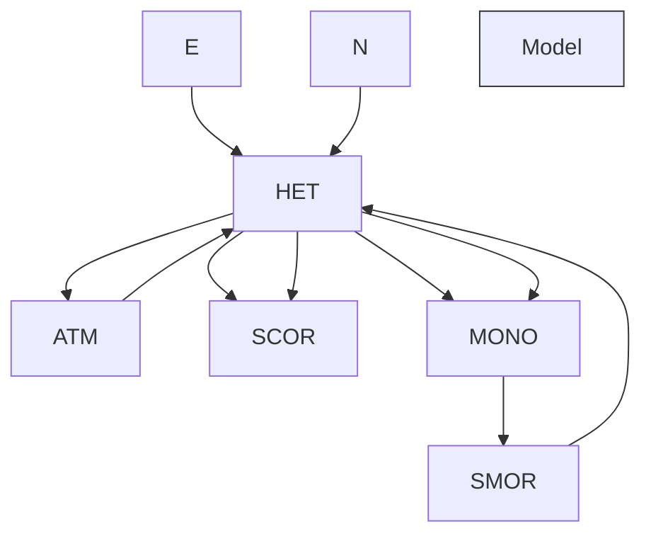


> Figure 5.11

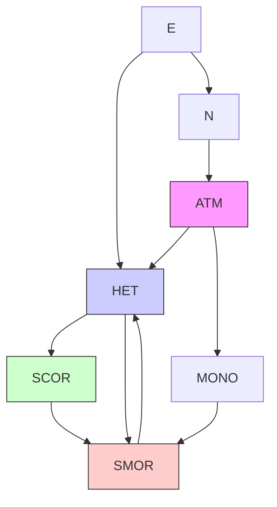

Only the second model saves the phenomena. The authors write that

it proved possible to develop a model of orgasmic responsiveness consistent with the hypothesis that extraversion (e), neuroticism (n), and attitudes toward masturbation (atm) influence orgasmic responsiveness only through the effect these variables have on heterosexual (het) and masturbatory (mono) experience. Consequently hypothesis 2 appears to be accepted. (p. 419)

The logic of the argument is not apparent. As the authors note “it must be remembered that other modes (sic) could conceivably also be developed that would equally well describe the data” (p. 419). But if the data could equally well be described, for example, by a model in which ATM has a direct effect on SCOR or on SMOR, there is no reason why hypothesis 2 should be accepted. Using the PC algorithm, one readily finds such a model.

The model on--
--

-#\$%---	
 $\chi ^ { 2 }$ value of 17 with 12 degrees of freedom, with $p ( \chi ^ { 2 } ) = . 1 4 8$ .

The PC algorithm finds a model that cannot be rejected on the basis of the data and that postulates a direct effect of attitude toward masturbation on orgasmic experience during masturbation, contrary to Bentler and Peeler.

## 5.8.4 The American Occupational Structure

Blau and Duncan’s (1967) study of the American occupational structure has been praised by the National Academy of Sciences as an exemplary piece of social research and criticized by one statistician (Freedman 1983a) as an abuse of science. Using a sample of 20,700 subjects, Blau and Duncan offered a preliminary theory of the role of education (ED), first job $\left( J _ { 1 } \right)$ , father’s education (FE), and father’s occupation (FO) in determining one’s occupation (OCC) in 1962. They present their theory in the graph in figure 5.13, in which the undirected edge represents an unexplained correlation.


> TETRAD pattern at .05 significance level

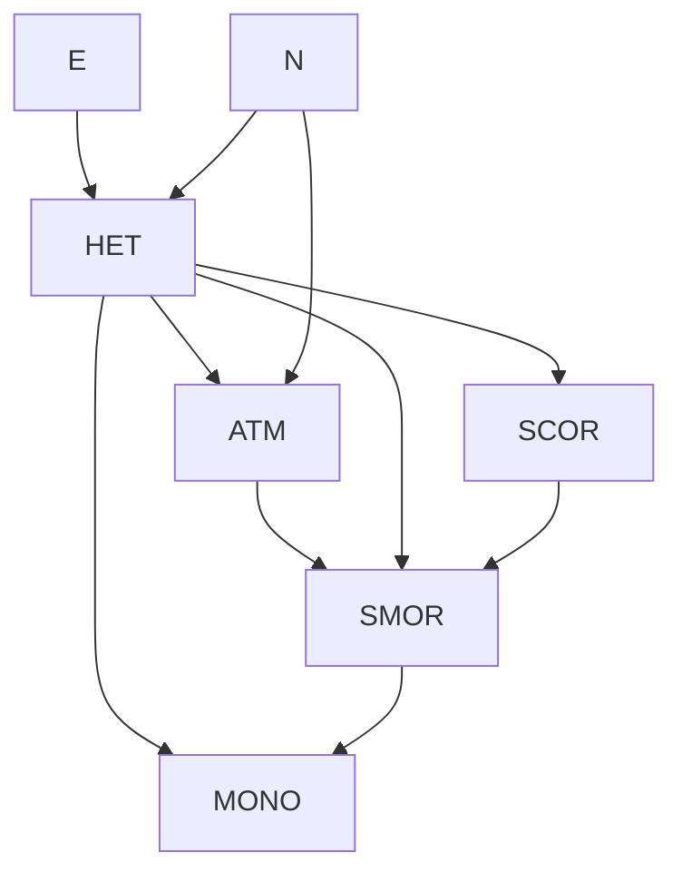


> TETRAD pattern at .10 significance level

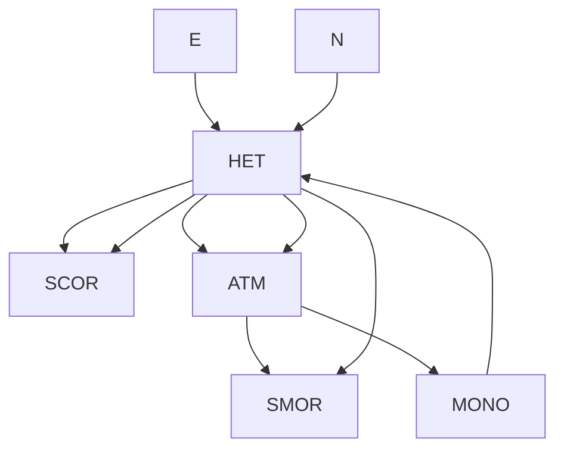

$$
p = . 1 4 8
$$

Figure 5.12

Blau and Duncan argue that the dependencies are linear. Their salient conclusions are that father’s education affects occupation and first job only through the father’s occupation and the subject’s education.


> Figure 5.13

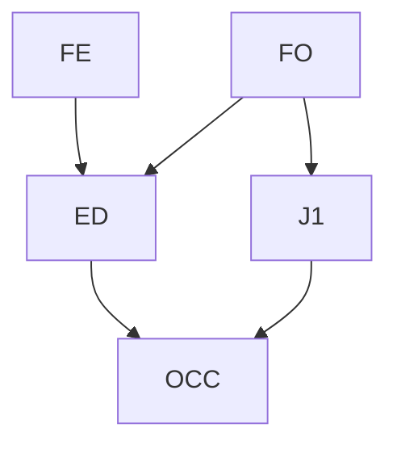

Blau and Duncan’s theory was criticized by Freedman as arbitrary, unjustified, and statistically inadequate (Freedman 1983a). Indeed, if the theory is subjected to the 	
 $\chi ^ { 2 }$ likelihood ratio test of the EQS (Bentler 1985) or LISREL (Joreskog and Sorbom 1984) programs the model is decisively rejected $( p \ < . 0 0 1 )$ , and Freedman reports it is also rejected by a bootstrap test.

If the conventional .05 significance level is used to test for vanishing partial correlations, given a common sense ordering of the variables by time, from Blau and Duncan’s covariances the PC algorithm produces the following graph shown in fDuncan’s covariances the algorithm produces the graph shown in fi gure 5.14.


> Figure 5.14

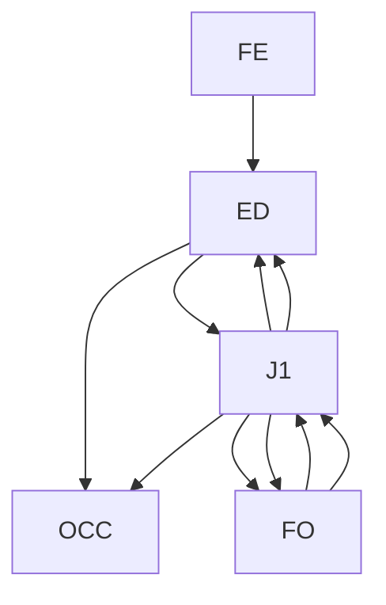

In this case every collider occurs in a triangle and there are no unshielded colliders. The data therefore do not determine the directions of the causal connections, but the time order of course determines the direction of each edge. We emphasize that the adjacencies are produced by the program entirely from the data, without any prior constraints. The model shown passes the same likelihood ratio test with $p > . 3$ .

The algorithm adds to Blau and Duncan’s theory a direct connection between FE and $J _ { 1 }$ . The connection between FE and $J _ { 1 }$ would only disappear if the significance level used to test for vanishing partial correlations were .0002. To determine a collection of vanishing partial correlations that are consistent with a directed edge from FE to OCC in 1962 one would have to reject hypotheses of vanishing partial correlations at a significance level greater than .3. The conditional independence relations found in the data at a significance level of .0001 are faithful to Blau and Duncan’s directed graph.

Freedman argues that in the American population we should expect that the influences among these variables differ from family to family, and therefore that the assumption that all units in the population have the same structural coefficients is unwarranted. A similar conclusion can be reached in another way. We noted in chapter 3 that if a population consists of a mixture of subpopulations of linear systems with the same causal structure but different variances and linear coefficients, then unless the coefficients are independently distributed or the mixture is in special proportions, the population correlations will be different from those of any of the subpopulations, and variables independent in each subpopulation may be correlated in the whole. When subpopulations with distinct linear structures are mixed and these special conditions do not obtain, the directed graph found from the correlations will typically be complete. We see that in order to fit Blau and Duncan’s data we need a graph that is only one edge short of being complete.

The same moral is if anything more vivid in another linear model built from the same empirical study by Duncan, Featherman, and Duncan (1972). They developed the following model of socioeconomic background and occupational achievement, where FE signifies father’s education, FO father’s occupational status, SIB the number of the respondent’s siblings, ED the respondent’s education, OCC the respondent’s occupational status and INC the respondent’s income.


> Figure 5.15

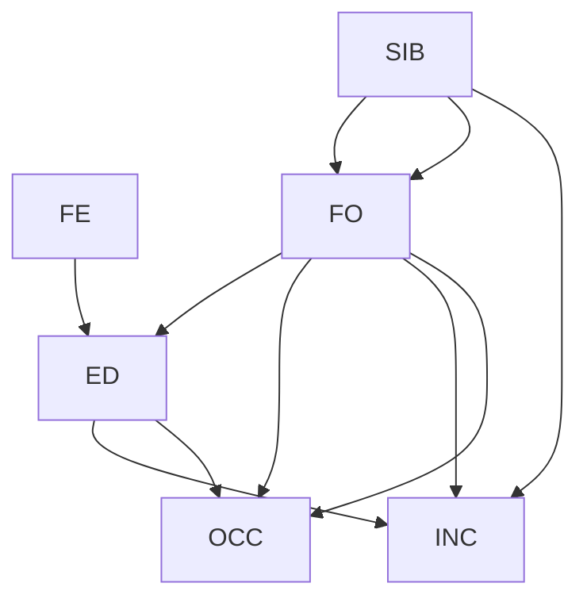

In this case the double headed arrows merely indicate a residual correlation. The --
-----
-
--!"-
&
-
- $( \chi ^ { 2 }$ is 165). When the correlation matrix is given to the TETRAD II program along with an obvious time ordering of the variables, the PC algorithm produces a complete graph.


> Figure 5.16

```mermaid
graph TD
  n1["1"] --> n25["25"]
  n25 --> n1
  n25 --> n18["18"]
  n26["26"] --> n26
  n26 --> n3["3"]
  n27["27"] --> n4["4"]
  n27 --> n29["29"]
  n29 --> n7["7"]
  n29 --> n8["8"]
  n29 --> n9["9"]
  n30["30"] --> n8
  n30 --> n9
  n4 --> n5["5"]
  n5 --> n6["6"]
  n6 --> n10["10"]
  n6 --> n17["17"]
  n7 --> n28["28"]
  n8 --> n9
  n9 --> n30
  n10 --> n21["21"]
  n11["11"] --> n31["31"]
  n12["12"] --> n32["32"]
  n13["13"] --> n13
  n14["14"] --> n33["33"]
  n15["15"] --> n34["34"]
  n16["16"] --> n37["37"]
  n17 --> n25
  n18 --> n18
  n19["19"] --> n4
  n20["20"] --> n27
  n21 --> n22["22"]
  n22 --> n35["35"]
  n23["23"] --> n36["36"]
  n24["24"] --> n36
  n25 --> n1
  n26 --> n2["2"]
  n27 --> n11
  n28 --> n29
  n29 --> n7
  n30 --> n9
  n31 --> n11
  n32 --> n34
  n33 --> n14
```

## 5.8.5 The ALARM Network

Recall the ALARM network developed to simulate causal relations in emergency medicine (figure 5.16).

The SGS and $\mathrm { P C } ^ { \ast }$ algorithms will not run on a problem this large. We have applied the PC algorithm to a linear version of the ALARM network. Using the same directed graph, linear coefficients with values between .1 and .9 were randomly assigned to each directed edge in the graph. Using a joint normal distribution on the variables of zero indegree, three sets of simulated data were generated, each with a sample size of 2,000.

program with an implementation of the PC–1 algorithm. This implementation takes asThe covariance matrix and sample size were given to a version of the TETRAD II program input a covariance matrix, and it outputs a pattern. No information about the orientationwith an implementation of the PC–1 algorithm. This implementation takes as input a covaof the variables was given to the program. Run on a Decstation 3100, for each data set theriance matrix, and it outputs a pattern. No information about the orientation of the variables program required less than fifteen seconds to return a pattern. In each trial the outputwas given to the program. In each trial the output pattern omitted two edges in the ALARM pattern omitted two edges in the ALARM network; in one of the cases it also added onenetwork; in one of the cases it also added one edge that was not present in the ALARM edge thatnetwork.

In a related test, another ten samples were generated, each with 10,000 units. The results were scored as follows: We call the pattern the PC algorithm would generate given the population correlations the true pattern. We call the pattern the algorithm infers from the sample data the output pattern. An edge existence error of commission (Co) occurs when any pair of variables are adjacent in the output pattern but not in the true pattern. If an edge e between A and B occurs in both the true and output patterns, there is an edge direction error of commission when e has an arrowhead at A in the output pattern but not in the true pattern (and similarly for B.) Errors of omission (Om) are defined analogously in each case. The results are tabulated as the average over the trial distributions of the ratio of the number of actual errors to the number of possible errors of each kind. The results at sample size 10,000 are summarized below:

<table><tr><td>#trials</td><td colspan="2">%Edge Existence Errors</td><td colspan="2">%Edge Direction Errors</td></tr><tr><td></td><td>Commission</td><td>Omission</td><td>Commission</td><td>Omission</td></tr><tr><td>10</td><td>.06</td><td>4.1</td><td>17</td><td>3.5</td></tr></table>

For similar data from a similarly connected graph with 100 variables, for ten trials the PC–1 algorithm required an average of 134 seconds and the PC–3 algorithm required an average of 16 seconds.

Herskovits and Cooper (1990) generated discrete data for the ALARM network, using variables with two, three and four values. Given their data, the TETRAD II program with the PC algorithm reconstructs almost all of the undirected graph (it omitted two edges in one trial; and in another also added one edge) and orients most edges correctly. In most orientation errors an edge was oriented in both directions. Broken down by the same measures as were used for the linear data from the same network (with simulated data obtained from Herskovits and Cooper at sample size 10,000) the results are:

<table><tr><td>trial</td><td colspan="2">%Edge Existence Errors</td><td colspan="2">%Edge Direction Errors</td></tr><tr><td></td><td>Commission</td><td>Omission</td><td>Commission</td><td>Omission</td></tr><tr><td>1</td><td>0</td><td>4.3</td><td>27.1</td><td>10.0</td></tr><tr><td>2</td><td>0.2</td><td>4.3</td><td>5.0</td><td>10.4</td></tr></table>

## 5.8.6 Virginity

A retrospective study by Reiss, Banwart, and Foreman (1975) considered the relationship among a sample of undergraduate females between a number of attitudes, including attitude toward premarital intercourse, use of a university contraceptive clinic, and virginity. Two samples were obtained, one of women who had used the clinic and one of women who had not; the samples did not differ significantly in relevant background variables such as age, education, parental education, and so on. Fienberg gives the crossclassified data for three variables: Attitude toward extramarital intercourse (E) (always wrong; not always wrong); virginity (V) and use of the contraceptive clinic (C) (used; not used). All variables are binary. The PC and SGS procedures immediately produces the following pattern shown in figure 5.17, which is consistent with any of the orientations of the edges that do not produce a collision at V. One sensible interpretation is that attitude affects sexual behavior which causes clinic use. Fienberg (1977) obtains the same result with log linear methods.

E V C

Figure 5.17

## 5.8.7 The Leading Crowd

Coleman (1964) describes a study in which 3398 schoolboys were interviewed twice. At each interview each subject was asked to judge whether or not he was a member of the “leading crowd” and whether his attitude toward the leading crowd was favorable or unfavorable. The data have been reanalyzed by Goodman (1973a,b) and by Fienberg (1977). Using Fienberg’s notation, let A and B stand for the questions at the first interview and C and D stand for the corresponding questions at the second interview. The data are given by Fienberg as follows:

<table><tr><td colspan="7">Second Interview</td></tr><tr><td colspan="3">Membership Attitude</td><td>+</td><td>+</td><td>-</td><td>-</td></tr><tr><td colspan="3"></td><td>+</td><td>-</td><td>+</td><td>-</td></tr><tr><td colspan="3">Membership Attitude</td><td></td><td></td><td></td><td></td></tr><tr><td rowspan="4">First Interview</td><td>+</td><td>+</td><td>458</td><td>140</td><td>110</td><td>49</td></tr><tr><td>+</td><td>-</td><td>171</td><td>182</td><td>56</td><td>87</td></tr><tr><td>-</td><td>+</td><td>184</td><td>75</td><td>531</td><td>281</td></tr><tr><td>-</td><td>-</td><td>85</td><td>97</td><td>338</td><td>554</td></tr></table>

Fienberg summarizes his conclusions after a log-linear analysis in the path diagram in figure 5.18. He does not explain what interpretation is to be given to the double-headed arrow.


> Figure 5.18

```mermaid
graph TD
  A --> C
  C --> D
  D --> B
  B --> A
  B --> C
  C --> D
```


> Figure 5.19

```mermaid
graph TD
  A --> C
  A --> B
  B --> D
  C --> D
  B --> D
```

When the PC algorithm is told that C and D occur after A and B, with the usual .05 significance level for tests the program produces the pattern in figure 5.19.

Orienting the undirected edge in the PC model as a directed edge from A to B produces expected values for the various cell counts that are almost identical with Fienberg’s (p. 127) expected counts.7 Note, however, this is a nearly complete graph, which may indicate that the sample is a mixture of different causal structures.

## 5.8.8 Influences on College Plans

Sewell and Shah (1968) studied five variables from a sample of 10,318 Wisconsin high school seniors. The variables and their values are:

$$
\begin{array}{l} S E X \\ [ \text { male } = 0, \text { female } = 1 ] \\ I Q = \text { Intelligence   Quotient }, \\ [ \text { lowest } = 0, \text { highest } = 2 ] \\ C P = \text {   college   plans   } \\ [ \mathrm{yes} = 0, \mathrm{no} = 1 ] \\ P E = \text { parental   encouragement } \\ [ \text { low } = 0, \text { high } = 1 ] \\ S E S = \text { socioeconomic   status } \\ [ \text { lowest } = 0, \text { highest } = 3 ] \\ \end{array}
$$

They offer the causal hypothesis shown in figure 5.20.


> Figure 5.20

```mermaid
graph TD
  SES --> PE
  SEX --> PE
  IQ --> PE
  PE --> CP
```

The data were reanalyzed by Fienberg (1977), who attempted to give a causal interpretation using log-linear models, but found a model that could not be given a graphical interpretation.

Given prior information that orders the variables by time as follows:

- 1 SEX
- PE SES

so that later variables cannot be specified to be causes of earlier variables, the output with the PC algorithm is the structure shown in figure 5.21.


> Figure 5.21

```mermaid
```mermaid
graph TD
  A["SES"] --> B["PE"]
  C["SEX"] --> B["PE"]
  D["IQ"] --> B["PE"]
  B["PE"] --> E["CP"]
  B["PE"] --> F["CP"]
  B["PE"] --> G["CP"]
  B["PE"] --> H["CP"]
  B["PE"] --> I["CP"]
  B["PE"] --> J["CP"]
  B["PE"] --> K["CP"]
  B["PE"] --> L["CP"]
  B["PE"] --> M["CP"]
  B["PE"] --> N["CP"]
  B["PE"] --> O["CP"]
  B["PE"] --> P["CP"]
  B["PE"] --> Q["CP"]
  B["PE"] --> R["CP"]
  B["PE"] --> S["CP"]
  B["PE"] --> T["CP"]
  B["PE"] --> U["CP"]
  B["PE"] --> V["CP"]
  B["PE"] --> W["CP"]
  B["PE"] --> X["CP"]
  B["PE"] --> Y["CP"]
  B["PE"] --> Z["CP"]
  B["PE"] --> AA["CP"]
  B["PE"] --> AB["CP"]
  B["PE"] --> AC["CP"]
  B["PE"] --> AD["CP"]
  B["PE"] --> AE["CP"]
  B["PE"] --> AF["CP"]
  B["PE"] --> AG["CP"]
  B["PE"] --> AH["CP"]
  B["PE"] --> AI["CP"]
  B["PE"] --> AJ["CP"]
  B["PE"] --> AK["CP"]
  B["PE"] --> AL["CP"]
  B["PE"] --> AM["CP"]
  B["PE"] --> AN["CP"]
  B["PE"] --> AO["CP"]
  B["PE"] --> AP["CP"]
  B["PE"] --> AQ["CP"]
  B["PE"] --> AR["CP"]
  B["PE"] --> AS["CP"]
  B["PE"] --> AT["CP"]
  B["PE"] --> AU["CP"]
  B["PE"] --> AV["CP"]
  B["PE"] --> AW["CP"]
  B["PE"] --> AX["CP"]
  B["PE"] --> AY["CP"]
  B["PE"] --> AZ["CP"]
  B["PE"] --> BA["CP"]
  B["PE"] --> BB["CP"]
  B["PE"] --> BC["CP"]
  B["PE"] --> BD["CP"]
  B["PE"] --> BE["CP"]
  B["PE"] --> BF["CP"]
  B["PE"] --> BG["CP"]
  B["PE"] --> BH["CP"]
  B["PE"] --> BI["CP"]
  B["PE"] --> BJ["CP"]
  B["PE"] --> BK["CP"]
  B["PE"] --> BL["CP"]
  B["PE"] --> BM["CP"]
  B["PE"] --> BN["CP"]
  B["PE"] --> BO["CP"]
  B["PE"] --> BP["CP"]
  B["PE"] --> BQ["CP"]
  B["PE"] --> BR["CP"]
  B["PE"] --> BS["CP"]
  B["PE"] --> BT["CP"]
  B["PE"] --> BU["CP"]
  B["PE"] --> BV["CP"]
  B["PE"] --> BW["CP"]
  B["PE"] --> BX["CP"]
  B["PE"] --> BY["CP"]
  B["PE"] --> BZ["CP"]
  B["PE"] --> CA["CP"]
  B["PE"] --> CB["CP"]
  B["PE"] --> CC["CP"]
  B["PE"] --> CD["CP"]
  B["PE"] --> CE["CP"]
  B["PE"] --> CF["CP"]
  B["PE"] --> CG["CP"]
  B["PE"] --> CH["CP"]
  B["PE"] --> CI["CP"]
  B["PE"] --> CJ["CP"]
  B["PE"] --> CK["CP"]
  B["PE"] --> CR["CP"]
  B["PE"] --> CS["CP"]
  B["PE"] --> CT["CP"]
  B["PE"] --> CU["CP"]
  B["PE"] --> CV["CP"]
  B["PE"] --> DW["CP"]
  B["PE"] --> DX["CP"]
  B["PE"] --> DY["XPX"]
```

The program cannot orient the edge between IQ and SES. It seems very unlikely that the child’s intelligence causes the family socioeconomic status, and the only sensible interpretation is that SES causes IQ, or they have a common unmeasured cause. Choosing the former, we have a directed graph whose joint distribution can be estimated directly from the sample. We find, for example, that the maximum likelihood estimate of the probability that males have college plans (CP) is .35, while the probability for females is .31. Judged by this sample the probability a child with low IQ, no parental encouragement (PE) and low socioeconomic status (SES) plans to go to college is .011; more distressing, the probability that a child otherwise in the same conditions but with a high IQ plans to go to college is only .124.

## 5.8.9 Abortion Opinions

Christensen (1990) illustrates log-linear model selection and search procedures with a data set whose variables are Race (R) [white, nonwhite], Sex (S), Age (A) [six categories] and Opinion (O) on legalized abortion (supports, opposes, undecided). Forward selection procedures require fitting 43 log-linear models. A backward elimination method requires 22 fits; a method due to Aitkin requires 6 fits; another backward method due to Wermuth requires 23 fits. None of these methods would work at all on large variable sets.


> Figure 5.22

R
O
S
A

Christensen suggests that the “best” log-linear model is an undirected conditional independence graphical model whose maximal cliques are [RSO] and [OA]. This is shown in figure 5.22.

Subsequently, Christensen proposes a recursive causal model (in the terminology of Kiiveri and Speed 1982) for the data. He suggests on substantive grounds a mixed graph and says “The undirected edge between R and S...represents an interaction between R and S.” Figure 5.23 is not a causal model in the sense we have described. It can be interpreted as a pattern representing the equivalence class of causal graphs whose members are the two orientations of the R - S edge, but R and S in Christensen’s data are very nearly independent.


> Figure 5.23

```mermaid
graph TD
  R --> O
  S --> O
  O --> A
```


> Figure 5.24

```mermaid
graph TD
  R --> O
  S --> O
  O --> A
```

This example is small enough to use the PC\* algorithm, which with significance levelexample small to use the PC\* algorithm, which, with signifi cance level .05 for independence tests gives exactly figure 5.24. Assuming faithfulness, the statisticalindependence tests, gives exactly fi gure 5.24. Assuming faithfulness, hypothesis of figure 5.24 is inconsistent with the independence of {R,S} and A conditional on O, required by the log-linear model of figure 5.22.

At a slightly lower significance level (.01) R and O are judged independent, and the same algorithm omits the $R  O$ connection. On this data with significance level .05 the PC algorithm also produces the graph of figure 5.24 but with the $R  O$ connection omitted. The difference in the outputs of the $\mathrm { P C ^ { \ast } }$ and PC algorithms occur in the following way. Both algorithms produce at an intermediate stage the undirected graph underlying figure 5.24. In that undirected graph A does not lie on any undirected path between R and O. For that reason, the $\mathrm { P C } ^ { \ast }$ algorithm never tests the conditional independence of R and O on A, and leaves the $R \mathrm { ~ - ~ } O$ edge in. In contrast, the PC algorithms does test the conditional independence of R and O on A, with a positive result, and removes the $R \mathrm { ~ - ~ } O$ edge.

## 5.8.10 Simulation Tests with Random Graphs

In order to test the speed and the reliability of the algorithms discussed in this chapter, we have tested the algorithms SGS, PC–1, PC–2, PC–3, and IG on a large number of simulated examples. The graphs themselves, the linear parameters, and the samples were all pseudorandomly generated. This section describes the sample generation procedures for both linear and discrete data and gives simulation results for the linear case. Simulation results with discrete data are considered in the chapter on regression.

The average degree of the vertices in the graphs considered are 2, 3, 4, or 5; the number of variables is 10 or 50; and the sample sizes are 100, 200, 500, 1000, 2000, and 5000. For each combination of these parameters, 10 graphs were generated, and a single distribution obtained faithful to each graph, and a single sample taken from each such distribution.

Because of its computational limitations, the SGS algorithm was tested only with graphs of 10 variables.

## 5.8.10.1 Sample Generation

All pseudorandom numbers were generated by the UNIX “random” utility. Each sample is generated in three stages:

- (i) The graph is pseudorandomly generated.
- (ii) The linear coefficients (in the linear case) or the conditional probabilities (in the discrete case) are pseudorandomly generated.
- (iii) A sample for the model is pseudorandomly generated.

We will discuss each of these steps in more detail.

(i) The input to the random graph generator is an average degree and the number of variables. The variables are ordered so that an edge can only go from a variable lower in the order to a variable higher in the order, eliminating the possibility of cycles. Since some of the procedures use a lexicographic ordering, variable names were then randomly scrambled so that no systematic lexicographic relations obtained among variable pairs connected by edges. Each variable pair is assigned a probability p equal to

average degree

number of variables - 1

For each variable pair a number is drawn from a uniform distribution over the interval 0 to 1. The edge is placed in the graph if and only if the number drawn is less than or equal

(ii) For simulated continuous distributions, an “error” variable was introduced for each endogenous variable and values for the linear coefficients between .1 and .9 were generated randomly for each edge in the graph. For the discrete case, a range of values of variables is selected by hand, and for each variable taking n values, the unit interval is divided into n sub-intervals by random choice of cut-off points. A distribution (e.g., uniform) is then imposed on the unit interval.

(iii) In the discrete case for each such distribution produced, each sample unit is obtained by generating, for each exogenous variable, a random number between 0 and 1.0 according to the distribution and assigning the variable value according to the category into which the number falls. Values for the endogenous variables were obtained by choosing a value randomly with probability given by the conditional probabilities on the obtained values of the parents of the variable. In the linear case, the exogenous variables—including the error terms—were generated independently from a standard normal distribution, and values of endogenous variables were computed as linear functions of their parents.

## 5.8.10.2 Results

As before, reliability has several dimensions. A procedure may err by omitting undirected edges in the true graph or by including edges—directed or undirected—between vertices that are not adjacent in the true graph. For an edge that is not in the true graph, there is no fact of the matter about its orientation, but for edges that are in the true graph, a procedure may err by omitting an arrowhead in the true graph or by including an arrowhead not in the true graph. We count errors in the same way as in section 5.8.5.

Each of the procedures was run using a significance level of .05 on all trials. The five procedures tested are not equally reliable or equally fast. The SGS algorithm is much the slowest, but in several respects it proves reliable. The graphs on the following pages show the results. Each point on the graph is a number, which represents the average degree of the vertices in the directed graphs generating the data. We plot the run times and reliabilities of the PC–1 PC–2, PC–3, IG, and SGS algorithms against sample size for data from linear models based on randomly generated graphs with 10 variables, and similarly the reliabilities of the first four of these algorithms for linear models based on randomly generated graphs with 50 variables. In each case the results are plotted separately for graphs of degree 2, 3, 4, and 5.

The following qualitative conclusions can be drawn.

The rates of arrow and edge omission decrease dramatically with sample size up to about sample size 1000; after that the decreases are much more gradual. The rates of arrow and edge commission vary much less dramatically with sample size than do the rates of arrow and edge omission. As the average degree of the variables increases, the average error rates increase in a very roughly linear fashion, but the PC–2 algorithm tends to be less reliable than the other algorithms with respect to edge omissions when the average degree of the graph is high.

The PC–1, PC–3, IG, and SGS algorithms have compensating virtues and disadvantages. None of the procedures are reliable on all dimensions when the graphs are not sparse. One reliable dimension is the addition of edges: If two vertices are not adjacent in the true graph, there is very little chance they will be mistakenly output by any of these four procedures, no matter what the average degree of the graph and no matter what the sample size.

In contrast, at high average degree and low sample sizes the output of each of the procedures tends to omit over 50% of the edges in the true graph. At large sample sizes and low average degree only a few percent of the true edges are omitted, but with high average degree the percentage of edges omitted even at large sample sizes is significant. For example, at sample size 5000 and average degree 5, PC–1 omits over 30% of the edges in the true graph.

Arrow commission errors are much more common than edge commission errors. If an arrow does not occur in a graph, there is a considerable probability for any of the procedures that the arrow will be output, unless the sample size is large and the true graph is of low degree. For 10 variables with average degree about 2 and sample sizes of 1,000 or more, the SGS and IG algorithms are quite reliable, with errors of commission for arrows around 6%. Under the same conditions the error rates for the PC–1 and PC–2 algorithms run about 20%. In the case of the SGS algorithm, these relations are reversed for the question of arrow omission—if an arrow occurs in the true graph, what is the chance that the procedure will fail to include the arrow in its output? The answer is about 8% for PC–1 and PC–2 and about 20% for the SGS procedure. The IG algorithm, while much less reliable for arrow omissions at low sample sizes, is only slightly more unreliable at high sample sizes.

The return time of the PC–3 algorithm is dramatically smaller than the other algorithms. It’s run time also does not increase as sharply with average degree, but the procedure does produce many more edge commission errors as the average degree increases.

The results suggest that the programs can reasonably be used in various ways according to the size of the problem, the questions one wants answered, and the character of the output. Roughly the same conclusions about reliability can be expected for the discrete case, but with lower absolute reliabilities. For larger number of variables the same patterns should hold, save that the SGS algorithm cannot be run at all.

More research needs to be done on local “repairs” to the graphs generated by these procedures, especially for edge omission errors and arrow commission errors. In order for the method to converge to the correct decisions with probability 1, the significance level used in making decisions should decrease as the sample sizes increase, and the use of higher significance levels (e.g., .2 at samples sizes less than 100, and .1 at sample sizes between 100 and 300) may improve performance at small sample sizes.


> Figure 5.24b

## 5.9 Conclusion

This chapter describes several algorithms that can reliably recover sparse causal structures even for quite large numbers of variables, and illustrates their application. The algorithms have each been implemented using tests for conditional independence in the discrete case and for vanishing partial correlations in the linear case. We make no claim that these uses of tests to decide relevant probability relations is optimal, but any improvements in the statistical decision methods can be prefixed to the algorithms. With the exception of the PC\* and SGS algorithms, the procedures described are feasible for large numbers of variables so long as the true causal graphs are sparse.

The algorithms we have described scarcely exhaust the possibilities, and a number of very simple alternative procedures should work reasonably well, at least for finding adjacency relations in the causal graph.

## 5.10 Background Notes

The idea of discovery problems is already contained in the notion of an estimation problem, and the requirement that an estimator be consistent is essentially a demand that it solve a particular kind of discovery problem. An extension of the idea to general nonstatistical settings was proposed by Putnam (1965) and independently by Gold (1965) and has subsequently been extensively developed in the literature of computer science, mathematical linguistics and logic (Osherson, Stob, and Weinstein 1986).

A more or less systematic search procedure for causal/statistical hypotheses can be found in the writings of Spearman (1904) and his students early in this century. ABayesian version of stepwise search was proposed by Harold Jeffreys (1957). Thurstone’s (1935) factor analysis inaugurated a form of algorithmic search separated from any precise discovery problem: Thurstone did not view factor analysis as anything more than a device for finding simplifications of the data, and a similar view has been expressed in many subsequent proposals for statistical search. The vast statistical literature on search has focused almost exclusively on optimizing fitting functions.

The SGS algorithm was proposed by Glymour and Spirtes in 1989, and appeared in Spirtes, Glymour and Scheines (1990c). Verma and Pearl (1990b) subsequently proposed a more efficient version that examines cliques. A version of the PC algorithm was developed by Spirtes and Glymour (1990). The version presented here contains an improvement suggested by Pearl and Verma in the efficiency of step C) of the algorithm. Bayesian discovery procedures have been studied in Herskovits’s thesis (1992).

The maximum likelihood estimation procedure for “recursive causal models” was developed in Kiiveri’s (1982) doctoral thesis. The mathematical properties of the structures are further described in Kiiveri, Speed, and Carlin (1984).