# Discovery Algorithms without Causal Sufficiency

## 6.1 Introduction

The preceding chapter complied with a common statistical fantasy, namely that in typical data sets it is known that no part of the statistical dependencies among measured variables are due to unmeasured common causes. We almost always fail to measure all of the causes of variables we do measure, and we often fail to measure variables that are causes of two or more measured variables. Any examination of collections of social science data gives the striking impression that variables in one study often seem relevant to those in other studies. Record keeping practices sometimes force econometricians to ignore variables in studies of one economy thought to have a causal role in studies of other economies (Klein 1961). In many studies in psychometrics, social psychology, and econometrics, the real variables of interest are unmeasured or measured only by proxies or “indicators.” In epidemiological studies that claim to show that exposure to a risk factor causes disease, a burden of the argument is to show that the statistical association is not due to some common cause of risk factor and disease; since not everything imaginably relevant can be measured, the argument is radically incomplete unless a case can be made that unmeasured variables do not “confound” the association. If, as we believe, no reliable empirical study can proceed without considering whether relevant variables are unmeasured, then few published uncontrolled empirical studies are reliable.

In both experimental and non-experimental studies the unrecognized presence of unmeasured variables can lead to erroneous conclusions about the causal relations among the variables that are measured, and to erroneous predictions of the effects of policies that manipulate some of these variables. Until reliable, data-based methods are used to identify the presence or absence of unmeasured common causes, most causal inferences from observational data can be no more than guesswork at best and pseudoscience at worst. Are such methods possible? That question surely ought to be among the most important theoretical issues in statistics.

Statistical methods for detecting unmeasured common causes, or “confounding” in the terminology epidemiologists prefer, has been chiefly developed in psychometrics, where criteria for the existence and numbers of common causes have been sought since the turn of the century for special statistical models. The results include a literature on linear systems that contain criteria (e.g., Charles Spearman’s [1904] vanishing tetrad differences) for latent variables that proved, however, to be neither necessary nor sufficient even assuming linearity. Criteria for two latent common causes were introduced by Kelley (1928), and related criteria are used in factor analysis, but they are not correct unless it is assumed that all statistical dependencies are due to unmeasured common causes. For problems in which the measured variables are discrete and their values a stochastic function of an unobserved continuous vector parameter , a number of criteria have been developed for the dimensionality of (Holland and Rosenbaum 1986). Suppes and Zanotti (1981) showed that for discrete variables there always exists a formal latent variable model in which all measured variables are effects of an unmeasured common cause and all pairs of measured variables are independent conditional on the latent variable. Their argument assumes the model must satisfy only the Markov Condition; the result does not hold if it is required that the distributions be faithful.

Among epidemiologists (Breslow and Day 1980; Kleinbaum, Kupper, and Morgenstern 1982) the criteria introduced by the Surgeon General’s report on Smoking and Health (1964) are sometimes still advocated as a means for deciding whether a statistical dependency between exposure to risk factor A and disease B is “causal,” apparently meaning that A causes B and A and B have no common causes. The criteria include (i) increase in response with dosage; (ii) that the statistical dependency between a risk factor and disease be specific to particular disease subgroups and to particular conditions of risk exposure; (iii) that the statistical association be strong; (iv) that exposure to a risk factor precede the period of increased risk; (v) lack of alternative explanations.

E i ll ffi i t t h ll f d i blEven in causally sufficient systems, where all common causes of measured variables are themselves measured, such criteria do not separate causes from correlated variables. They fail even to come to grips with the problem of unmeasured “confounders.” The problem with criterion (v) is exactly that there are too many alternative explanations of the data. Criterion (iv) is often of no use in deciding whether there are measured or unmeasured common causes at work. Criterion (iii) is defended on the grounds that “If an observed association is not causal, but simply the reflection of a causal association between some other factor and disease, then this latter factor must be more strongly related to disease (in terms of relative risk) than is the former factor,” (Breslow and Day 1980). But the inference is incorrect: if there are two or more common causes, measured or not, none of them need be more strongly related to the disease than is the putative measured cause; and if A causes B and A and B also have a common cause, the latter need not be more strongly associated with B than is A. On behalf of Breslow and Day one might appeal to simplicity against all hypotheses of multiple common causes, but that would be an implausible claim in medical science, where multiple causal mechanisms abound. Nothing about the first two criteria separates the situation in which A and B have common causes from circumstances in which they do not.

In this chapter we present a more or less systematic account of how the presence of unmeasured common causes can mislead an investigator about causal relationships among measured variables, and of how the presence of unmeasured common causes can be detected. We deal with these questions separately for the general case and for the case in which all structures are linear. But the central aim of this chapter is to show how, assuming the Markov and Faithfulness conditions, reliable causal inferences can somecan be made from appropriate sample data without any prior knowledge as to whether thetimes be made from appropriate sample data without any prior knowledge as to whether system of measured variables is causally sufficient.the system of measured variables is causally suffi cient.

## 6.2 The PC Algorithm and Latent Variables

A natural idea is that a slight modification of the PC algorithm will give correct information about causal structure even when unmeasured variables may be present. Suppose that P - 
- - 



- - V that is faithful to a causal graph, and P is the marginal of $P ^ { \prime }$ - O, properly included in V. We will refer to the members of O as measured or observed variables. As we have already seen, if there are unmeasured common causes, the output of the PC algorithm can include bi-directed edges of the form $A  B .$ . We could interpret a bi-directed edge between A and B to mean that there is an unmeasured cause C that directly causes A and B relative to O. We modify the algorithm by using a “o” on the end of an arrow to indicate that it is not known whether an arrowhead should occur in that place. We use a “\*” as a metasymbol to stand for any of the three kinds of endmarks that an arrow can have: EM (empty mark), “>,” or “o.”

## Modified PC Algorithm

A.) Form the complete undirected graph C on the vertex set V.

B.)

$$
n = 0.
$$

reprepeat

repeat

select an ordered pair of variables X and Y that are adjacent in C such that Adjacencies(C,X)\{Y} has cardinality greater than or equal to n, and a subset S of Adjacencies(C,X)\{Y} of cardinality n, and if X and Y are d-separated given S delete edge X - Y from C and record S in Sepset(X,Y) and Sepset(Y,X)

until all ordered pairs of adjacent variables X and Y such that Adjacencies(C,X)\{Y} has cardinality greater than or equal to n and all subsets of Adjacencies(C,X)\{Y} of cardinality n have been tested for d-separation.

$$
n = n + 1.
$$

until for each ordered pair of adjacent vertices X, Y, Adjacencies $( C , X ) \backslash \{ Y \}$ is of cardinality less than n.

C.) Let F be the graph resulting from step B). If X and Y are adjacent in F, orient the edge between X and Y as X o-o Y.

D.) For each triple of vertices X, Y, Z such that the pair X, Y and the pair Y, Z are each adjacent in F but the pair X, Z are not adjacent in F, orient X \*-\* Y \*-\* Z as $X ^ { * } { \right. } Y { \left. } ^ { * } Z$ if and only if Y is not in Sepset(X,Z).

E.) repeat

If $A ^ { * } {  } B , B ^ { * } { \mathrm { - } } ^ { * } C , A$ and C are not adjacent, and there is no arrowhead at B on $B ^ { * } { \ast } C ,$ then orient $B ^ { * } { } _ { - } { } ^ { * } C$ as $B  C$ .

If there is a directed path from A to B, and an edge between A and B, then orient the edge as $A \ ^ { * }  B .$ .

until no more edges can be oriented.

(When we say orient $X ^ { * . * } Y$ as $X \stackrel { * } {  } Y$ we mean leave the same mark on the X end of the edge and put an arrowhead at the Y end of the edge.)

The result of this modification applied to the examples of the previous chapter is perfectly sensible. For example, in figure 6.1 we show both the model obtained from the Rodgers and Marantodata at significance level .1 by the PC algorithm and the model that would be obtained by the modified PC algorithm from a distribution faithful to the the graph in the PC output. (In each case with the known time order of the variables imposed as a constraint.)


> PC Output

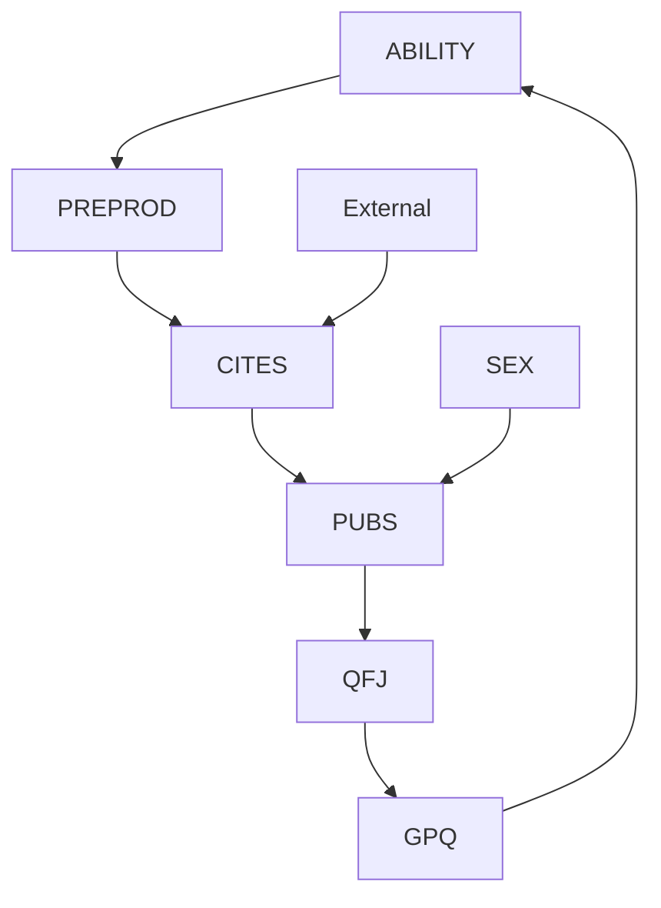


> Modified PC Output Figure 6.1

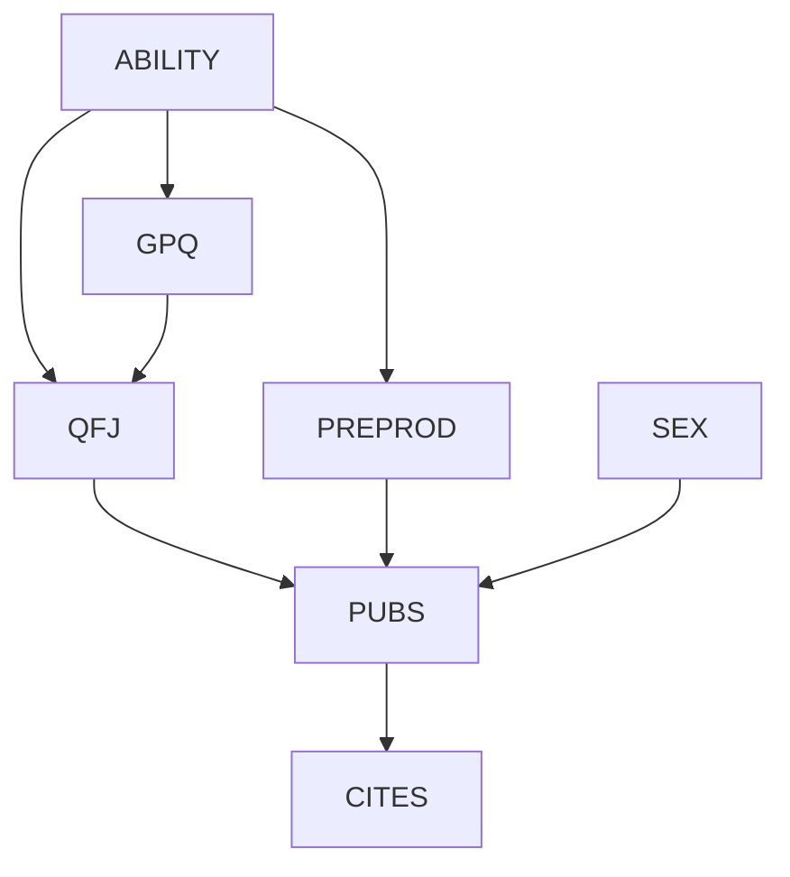

The output of the Modified PC Algorithm indicates that GPQ and ABILITY, for example, may be connected by an unmeasured common cause, but that PUBS is a direct cause of CITES, unconfounded by a common cause. Where a single vertex has “o” symbols for two or more edges connecting it with vertices that are not adjacent, a special restriction applies. ABILITY, for example has an edge to GPQ and to PREPROD, each with an $" _ { 0 } \cdot >$ at the ABILITY end, and GPQ and PREPROD are not adjacent to one another. In that case the two “o” symbols cannot both be arrowheads. There cannot be an unmeasured cause of ABILITY and GPQ and an unmeasured cause of ABILITY and PREPROD, because if there were, GPQ and PREPROD would be dependent conditional on ABILITY, and the modified pattern entails instead that they are independent.

In many cases—perhaps most practical cases—in which the sampled distribution is the marginal of a distribution faithful to a graph with unmeasured variables, this simple modification of the PC algorithm gives a correct answer if the required statistical decisions are correctly made.

## 6.3 Mistakes

Unfortunately, this straightforward modification of the PC algorithm is not correct in general. An imaginary example will show why.

Everyone is familiar with a simple mistake occasioned by failing to recognize an unmeasured common cause of two variables, X, Y, where X is known to precede Y. The mistake is to think that X causes Y, and so to predict that a manipulation of X will change the distribution of Y. But there are more interesting cases that are seldom noticed, cases in which omitting a common cause of X and Y might lead one to think, erroneously, that some third variable Z directly causes Y. Consider an imaginary case:

A chemist has the following problem. According to received theory, which he very much doubts, chemicals A and B combine in a low yield mechanism to form chemical D through an intermediate C. Our chemist thinks there is another mechanism in which A and B combine to form D without the intermediate C. He wishes to do an experiment to establish the existence of the alternative mechanism. He can readily obtain reagents A and B, but available samples may be contaminated with varying quantities of D and other impurities. He can measure the concentration of the unstable alleged intermediate C photometrically, and he can measure the equilibrium concentration of D by standard methods. He can manipulate the concentrations of A and B, but he has no means to manipulate the concentration of C.

The chemist decides on the following experimental design. For each of ten different values of the concentration of A and B, a hundred trials will be run in which the reagents are mixed, the concentration of C is monitored, and the equilibrium concentration of D is measured. Then the chemist will calculate the partial correlation of A with D conditional on C, and likewise the partial correlation of B with D conditional on C. If there is an alternative mechanism by which A and B produce D without C, the chemist reasons, then there should be a positive correlation of A with D and of B with D in the samples in which the concentration of C is all the same; and if there is no such alternative mechanism, then when the concentration of C is controlled for, the concentrations of A, B on the one hand, and D on the other, should have zero correlation.

The chemist finds that the equilibrium concentrations of A, B on the one hand and of D on the other hand are correlated when C is controlled for—as they should be if A and B react to produce D directly—and he announces that he has established an alternative mechanism.

Alas, within the year his theory is disproved. Using the same reagents, another chemist performs a similar experiment in which, however, a masking agent reacts with

the intermediate C preventing it from producing D. The second chemist finds no correlation in his experiment between the concentrations of A and B and the concentration of D. What went wrong with the first chemist’s procedure?

By substituting a statistical control for the manipulation of C the chemist has run afoul of the fact that the marginal probability distribution with unmeasured variables can give the appearance of a spurious direct connection between two variables. The chemist’s picture of the mechanism is given in graph $G _ { 1 } ,$ and that is one way in which the observed results can be produced. Unfortunately, they can also be produced by the mechanism inbe Unfortunately, they can also be produced by the mechanisms graph $G _ { 2 } ,$ , which is what happened in the chemist’s case: impurities (F) in the reagents are causes of both C and D:


> 1 G1

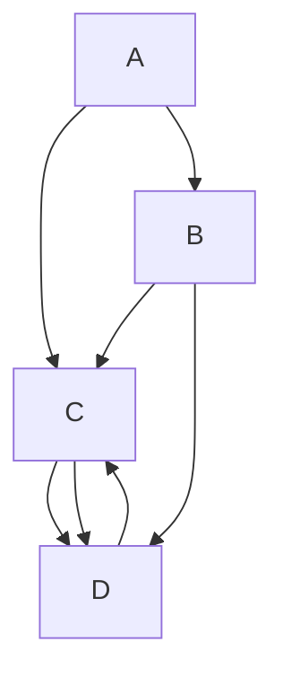


> G2 Figure 6.2

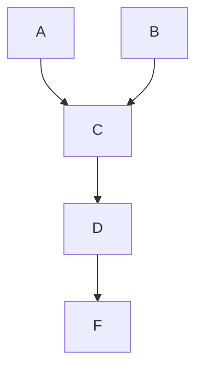

The general point is that a theoretical variable F acting on two measured variables Cpoint is that a latent variable F acting on two measured variables C and and D can produce statistical dependencies that suggest causal relations between A and DD can produce statistical dependencies that suggest causal relations between A and and between B and D that do not exist. For faithful distributions, if we use the SGS or PC algorithms, a structure such as $G _ { 2 }$ will produce a directed edge from A to D in the output.

We can see the same point more analytically as follows: In a directed acyclic graph G over a set of variables V, if A and D are adjacent in G, then A and D are not d-separated given any subset of V\{A,D}. Hence under the assumption of causal sufficiency, either A is a direct cause of D or D is a direct cause of A relative to V if and only if A and D are independent conditional on no subset of V\{A,D}. However, if O is not causally sufficient, it is not the case that if A and D are independent conditional on every subset of $\mathbf { O } \backslash \{ A , D \}$ that either A is a direct cause of D relative to O, or D is a direct cause of A relative to O, or there is some latent variable F that is a common cause of both A and D.

This is illustrated by $G _ { 2 }$ in figure 6.2, where $\mathbf { V } = \{ A , B , C , D , F \}$ and $\mathbf { O } = \{ A , C , D \}$ . O is not causally sufficient because F is a cause of both C and D which are in O, but F itself is not in O. A and D are not d-separated given any subset of $\mathbf { O } \backslash \{ A , D \}$ , so in any marginal of a distribution faithful to G, A and D are not independent conditional on any subset of $\mathbf { O } \backslash \{ A , D \}$ , and the modified PC algorithm would leave an edge between A and D. Yet A is not a direct cause of D relative to O, D is not a direct cause of A relative to O, and there is no latent common cause of A and D. The directed acyclic graph $G _ { 1 }$ shown in figure 6.2, in which A is a direct cause of D, and in which there is a path from A to D that does not go through C, has the same set of d-separation relations over $\{ A , C , D \}$ as does graph $G _ { 2 }$ . Hence, given faithful distributions, they cannot be distinguished by their conditional independence relations alone.

A further fundamental problem with the simple modification of the PC algorithm described above is that if we allow bi-directed edges in the graphs constructed by the PC algorithm, it is no longer the case that if A and B are d-separated given some subset of O, then they are d-separated given a subset of Adjacencies(A) or Adjacencies(B). Consider the graph in figure 6.3, where $T _ { 1 }$ and $T _ { 2 }$ are assumed to be unmeasured.


> Figure 6.3

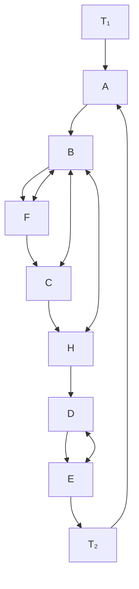

Among the measured variables, Parents(A) = {D} and Parents $\mathbf { \vec { \cal E } } ) = \{ \boldsymbol { B } \}$ , but A and E are not d-separated given any subset of {B} or any subset of {D}; the only sets that dseparate them are sets that contain F, C, or H. The Modified PC algorithm would correctly find that C, F, and H are not adjacent to A or E. It would then fail to test whether A and E are d-separated given any subset containing C. Hence it would fail to find that A and E are d-separated given $\{ B , C , D \}$ and would erroneously leave A and E adjacent. This means that it is not possible to determine which edges to remove from the graph by examining only local features (i.e., the adjacencies) of the graph constructed at a given stage of the algorithm. Similarly, once bi-directed edges are allowed in the output of the PC algorithm, it is not possible to extract all of the information about the orientation of edges by examining local features (i.e., pairs of edges sharing a common endpoint) of the graph constructed at a given stage of the algorithm.

Because of these problems, for full generality we must make major changes to the PC algorithm and in the interpretation of the output. We will show that there is a procedure, which we optimistically call the Fast Causal Inference (FCI) algorithm, that is feasible in large variable sets provided the true graph is sparse and there are not many bidirected edges chained together. The algorithm gives asymptotically correct information about causal structure when latent variables may be acting, assuming the measured distribution is the marginal of a distribution satisfying the Markov and Faithfulness conditions for the true graph. The FCI algorithm avoids the mistakes of the modified PC algorithm, and in some cases provides more information.

For example, with a marginal distribution over the boxed variables from the imaginary structure in figure 6.4, the modified PC algorithm gives the correct output shown in the first diagram in figure 6.5, whereas the FCI algorithm produces the correct and much more informative result in the second diagram in figure 6.5.

In figure 6.5, the double headed arrows indicate the presence of unmeasured common causes, and as in the modified PC algorithm the edges of the form o→ indicate that the algorithm cannot determine whether the circle at one end of the edge should be an arrowhead. Notice that the adjacencies among the set of variables {Cilia damage, Heart disease, Lung capacity, Measured breathing dysfunction} form a complete graph, but even so the edges can be completely oriented by the FCI algorithm.

The derivation of the FCI algorithm requires a variety of new graphical concepts and a rather intricate theory. We introduce Verma and Pearl’s notions of an inducing path and an inducing path graph, and show that these objects provide information about causal structure. Then we consider algorithms that infer a class of inducing path graphs from the data.

## 6.4 Inducing Paths

Given a directed acyclic graph G over a set of variables V, and O a subset of V, Verma and Pearl (1991) have characterized the conditions under which two variables in O are not d-separated given any subset of O\{A,B}. If G is a directed acyclic graph over a set of variables V, O is a subset of V containing A and B, and A ≠ B, then an undirected path U between A and B is an inducing path relative to O if and only if every member of O on U except for the endpoints is a collider on U, and every collider on U is an ancestor of either A or B. We will sometimes refer to members of O as observed variables.


> Figure 6.4

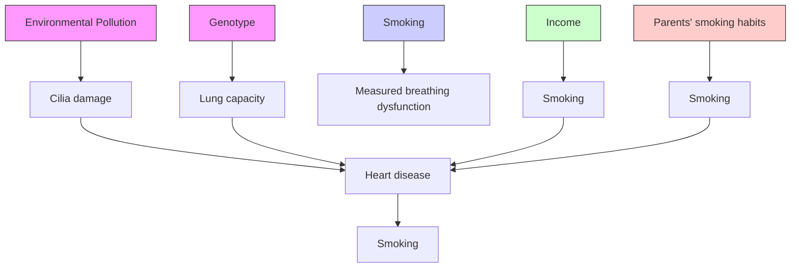

For example, in graph $G _ { 3 } ,$ the path $U = < A , B , C , D , E , F >$ is an inducing path over $\mathbf { O } =$ $\{ A , B , D , F \}$ because each collider on U (B and D) is an ancestor of one of the endpoints, and each variable on U that is in O (except for the endpoints of $U )$ is a collider on U. Similarly, U is an inducing path over $\mathbf { O } = \{ A , B , F \}$ . However, U is not an inducing path over $\mathbf { O } = \{ A , B , C , D , F \}$ because C is in O, but C is not a collider on U.

THEOREM 6.1: If G is a directed acyclic graph with vertex set V, and O is a subset of V containing A and B, then A and B are not d-separated by any subset Z of $\scriptstyle \mathbf { O } \backslash \{ A , B \}$ if and only if there is an inducing path over the subset O between A and B.

It follows from theorem 6.1 and the fact that U is an inducing path over $\mathbf { O } = \{ A , B , D , F \}$ that A and F are d-connected given every subset of $\{ B , D \}$ . Because in graph $G _ { 3 }$ there is no inducing path between A and F over $\mathbf { O } = \{ A , B , C , D , F \}$ it follows that A and F are dseparated given some subset of $\{ B , C , D \}$ (in this case, {B,C,D} itself.)


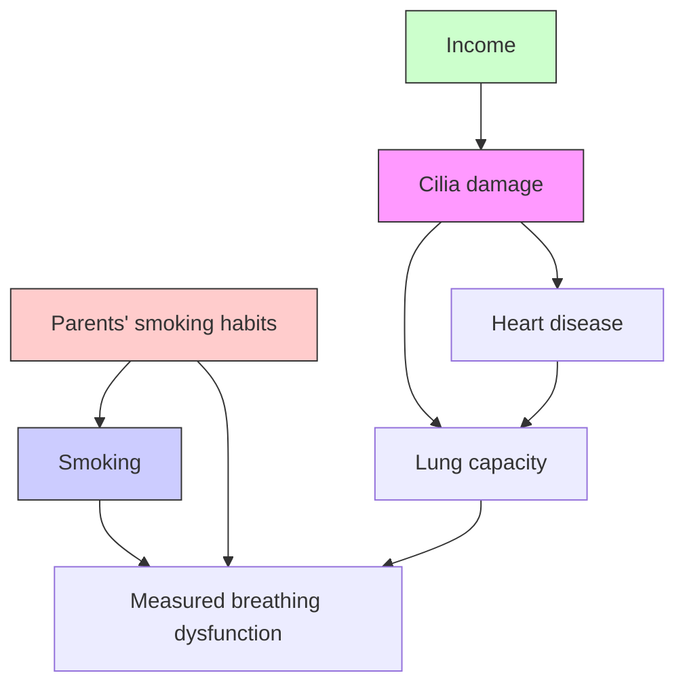


> Figure 6.5

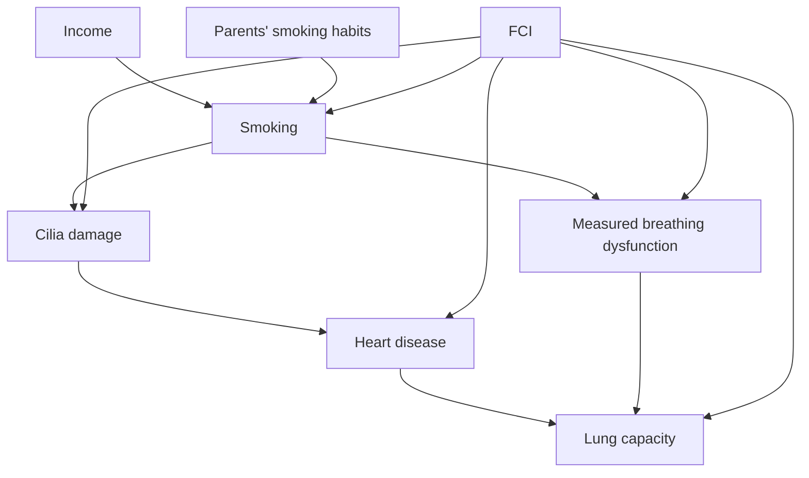

## 6.5 Inducing Path Graphs

The inducing paths relative to O in a graph G over V can be represented in the following structure described (but not named) in Verma and Pearl (1990b). $G ^ { \prime }$ is an inducing path graph over O for directed acyclic graph G if and only if O is a subset of the vertices in G, there is an edge between variables A and B with an arrowhead at A if and only if A and B are in O, and there is an inducing path in G between A and B relative to O that is into are in O


> Figure 6.6: Graph ${ \bf G } _ { 3 }$

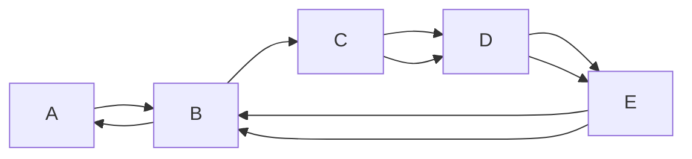

A. (Using the notation of chapter 2, the set of marks in an inducing path graph is $\{ > ,$ EM}.) In an inducing path graph, there are two kinds of edges: $A  B$ entails that every inducing path over O between A and B is out of A and into B, and $A  B$ entails that there is an inducing path over O that is into A and into B. This latter kind of edge can only occur when there is a latent common cause of A and B.

Figures 6.7 through 6.9 depict the inducing path graphs of $G _ { 3 }$ over $\mathbf { O } = \{ A , B , D , E , F \}$ , $\mathbf { O } = \{ A , B , D , F \}$ and $\mathbf { O } = \{ A , B , F \}$ respectively. Note that in $G _ { 3 } < B , D >$ is an inducing path between B and D over $\mathbf { O } = \{ A , B , D , E , F \}$ that is out of D. However, in the inducing path graph the edge between B and D has an arrowhead at D because there is another inducing path $< B , C , D > \mathrm { o v e r } \ \mathbf { O } = \{ A , B , D , E , F \}$ that is into D. There is no edge between A and F in the inducing path graph over $\mathbf { O } = \{ A , B , D , E , F \}$ , but there is an edge between A and F in the inducing path graphs over $\mathbf { O } = \{ A , B , D , F \}$ and $\mathbf { O } = \{ A , B , F \}$ .


> Figure 6.7

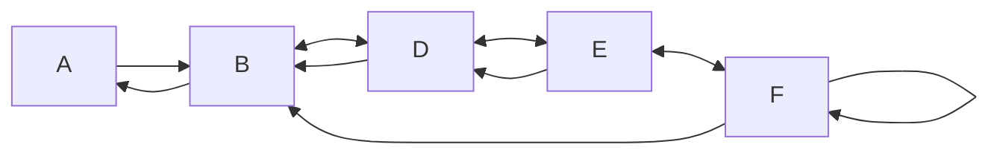


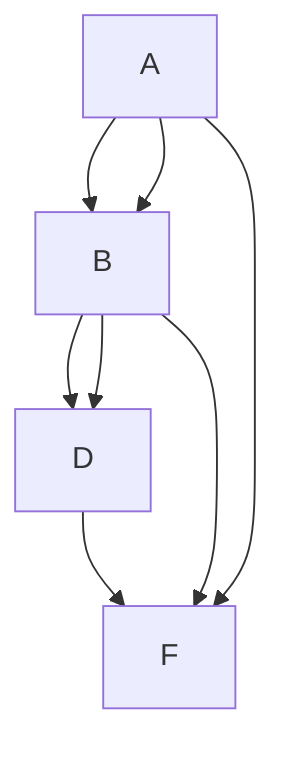


> Figure 6.8 Figure 6.9. Inducing path graph of $G _ { 3 }$ over $\{ A , B , F \}$

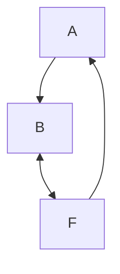

We can extend without modification the concept of d-separability to inducing path graphs if the only kinds of edges that can occur on a directed path are edges with one arrowhead, and undirected paths may contain edges with either single or double arrowheads. If G is a directed acyclic graph, $G ^ { \prime }$ is the inducing path graph for G over O, and X, Y, and S are disjoint sets of variables included in O, then X and Y are dseparated given S in $G ^ { \prime }$ if and only they are d-separated given S in G.

Double-headed arrows make for a very important difference between d-separability relations in an inducing path graph and in a directed acyclic graph. In a directed acyclic graph over O, if A and B are d-separated given any subset of $\scriptstyle \mathbf { O } \backslash \{ A , B \}$ then A and B are dseparated given either Parents(A) or Parents(B). This is not true in inducing path graphs. For example, in inducing path graph $G _ { 4 } ,$ , which is the inducing path graph of figure 6.3 over $\mathbf { O } = \{ A , B , C , D , E , F , H \}$ , $\mathbf { P a r e n t s } ( A ) = \{ D \}$ and $\mathbf { P a r e n t s } ( E ) = \{ B \}$ , but A and E are not d-separated given any subset of {B} or any subset of {D}; all of the sets that dseparate A and E contain C, H, or F.


> Figure 6.10. Inducing path graph $G _ { 4 }$

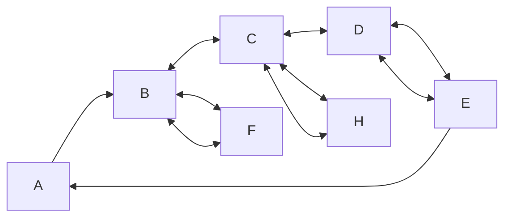

There is, however, a kind of set of vertices in inducing path graphs that, so far as dseparability is concerned, behaves much like the parent sets in directed acyclic graphs.

If $G ^ { \prime }$ is an inducing path graph over O and $A \neq B ,$ , let $V \in { \bf \delta D - S E P } ( A , B )$ if and only if A $\neq V$ and there is an undirected path U between A and V such that every vertex on $U$ is an ancestor of A or B and (except for the endpoints) is a collider on U.

THEOREM 6.2: In an inducing path graph $G ^ { \prime }$ over O, where A and B are in O, if A is not an ancestor of B, and A and B are not adjacent then A and B are d-separated given a subset of $\mathbf { D - S E P } ( A , B )$ .

In an inducing path graph either A is not an ancestor of B or B is not an ancestor of A. Thus we can determine whether A and B are adjacent in an inducing path graph without determining whether A and B are dependent conditional on all subsets of O.

If O is not a causally sufficient set of variables, then although we can infer the existence of an inducing path between A and B if A and B are dependent conditional on every subset of $\scriptstyle \mathbf { O } \backslash \{ A , B \}$ , we cannot infer that either A is a direct cause of B relative to O, or that B is a direct cause of A relative to O, or that there is a latent common cause of A and B. Nevertheless, the existence of an inducing path between A and B over O does contain information about the causal relationships between A and B, as the following lemma shows.

LEMMA 6.1.4: If G is a directed acyclic graph over V, O is a subset of V that contains A and B, and G contains an inducing path over O between A and B that is out of A, and A and B are in O, then there is a directed path from A to B in G.

It follows from lemma 6.1.4 that if O is a subset of V and we can determine that there is an inducing path between A and B over O that is out of A, then we can infer that A is a (possibly indirect) cause of B. Hence, if we can infer properties of the inducing path graph over O from the distribution over O, we can draw inferences about the causal relationships among variables, regardless of what variables we have failed to measure. In the next section we describe algorithms for inferring properties of the inducing path graph over O from the distribution over O.

## 6.6 Partially Oriented Inducing Path Graphs

A partially oriented inducing path graph can contain several sorts of edges: $A \to B , A$ o→ B, A o-o B, or $A  B$ . We use $\boldsymbol { \cdot } ( \xi _ { \xi } , \eta )$ as a metasymbol to represent any of the three kinds of ends (EM (the empty mark), $\ " > , " \mathrm { o r } \ \ " \mathrm { o } ^ { , * } )$ ; the “\*” symbol itself does not appear in a partially oriented inducing path graph. (We also use “\*” as a metasymbol to represent the two kinds of ends $( \mathrm { E M } \mathrm { o r } ^ { \cdots \mathrm { } } > ^ { \cdots } )$ that can occur in an inducing path graph.)

A partially oriented inducing path graph for directed acyclic graph G with inducing path graph $G ^ { \prime }$ over $\mathbf { o }$ is intended to represent the adjacencies in $G ^ { \prime } ,$ , and some of the orientations of the edges in $G ^ { \prime }$ that are common to all inducing path graphs with the same d-connection relations as $G ^ { \prime } .$ . If $G ^ { \prime }$ is an inducing path graph over $\mathbf { o } ,$ , Equiv(G ) is the set of inducing path graphs over the same vertices with the same d-connections as $G ^ { \prime } .$ . Every inducing path graph in Equiv(G ) shares the same set of adjacencies. We use the following definition:

   	

 
	
  	   
	
 
   	 inducing path graph $\mathbf { G } ^ { \prime }$ over O if and only if

- (i). if there is any edge between A and B in $\pi ,$ it is one of the following kinds:
- (ii). and $G ^ { \prime }$ have the same vertices;
- (iii). and $G ^ { \prime }$ have the same adjacencies;
- (iv). if $A \ 0 {  } \ B$ is in $\pi ,$ then in every inducing path graph X in $\mathbf { E q u i v } ( G ^ { \prime } )$ either $A  B$ or $A  B$ is in X;
- (v). if $A  B$ is in $\pi ,$ then $A  B$ is in every inducing path graph in $\mathbf { E q u i v } ( G )$ ;
- (vi). if $A \ ^ { * } { \underline { { ^ { * } } } } \ B \ ^ { * } { \underline { { ^ { * } } } } \ C$ is in $\pi ,$ then the edges between A and B, and B and $C$ do not collide at B in any inducing path graph in Equiv(G );

$$
A \rightarrow B, B \rightarrow A, A \text { o } \rightarrow B, B \text { o } \rightarrow A, A \text { o } - \text { o } B, \text { or } A \leftrightarrow B;
$$

- (vii). if $A  B$ is in , then $A  B$ is in every inducing path graph in Equiv $( G ^ { \prime } )$ ;
- (viii). if A o-o B is in , then in every inducing path graph X in Equiv(G ), either $A  B ,$ $A  B , \operatorname { o r } A \gets B$ is in X.

(Strictly speaking a partially oriented inducing path graph is not a graph as we have defined it because of the extra structure added by the underlining.) Note that an edge $A ^ { \ast } -$ o B does not constrain the edge between A and B either to be into or to be out of B in any subset of $\mathbf { E q u i v } ( G )$ . The adjacencies in a partially oriented inducing path graph for G can be constructed by making A and B adjacent in if and only if A and B are dconnected given every subset of $\scriptstyle \mathbf { O } \backslash \{ A , B \}$ .

Once the adjacencies have been determined, it is trivial to construct an uninformative partially oriented inducing path graph for $G .$ Simply orient each edge $A \ ^ { * } { } _ { - } { } ^ { * } \ B$ as A o-o B. Of course this particular partially oriented inducing path graph $\pi$ for $G$ is very uninformative about what features of the orientation of $G ^ { \prime }$ are common to all inducing path graphs in $\mathbf { E q u i v } ( G )$ . For example, figure 6.11 shows again the imaginary graph of causes of measured breathing dysfunction. Figure 6.12 shows an uninformative partially oriented inducing path graphs of graph $G _ { 5 }$ over O = {Cilia damage, Smoking, Heart disease, Lung capacity, Measured breathing dysfunction, Income, Parents’ smoking habits}.

Let us say that B is a definite noncollider on undirected path U if and only if either B is an endpoint of $U ,$ or there exist vertices A and C such that $U$ contains one of the subpaths $A \left. B ^ { * _ { - } * } C , A ^ { * _ { - } * } B \right. C ,$ or $A \ ^ { * } { \underline { { ^ { * } } } } \ B \ ^ { * } { \underline { { ^ { * } } } } \ C$ . In a maximally informative partially oriented inducing path graph for G with inducing path graph $G ^ { \prime }$ ,

- (i) an edge $A \ { ^ * } { _ { - } } 0$ B appears only if the edge between A and B is into B in some members of $\mathbf { E q u i v } ( G )$ , and out of B in other members of $\mathbf { E q u i v } ( G ^ { \prime } . )$ , and
- (ii) for every pair of edges between A and B, and B and $C ,$ either the edges collide at $B ,$ or they are definite noncolliders at $B ,$ unless the edges collide in some members of Equiv(G) and not in others.


> Figure 6.11. Graph $G _ { 5 }$

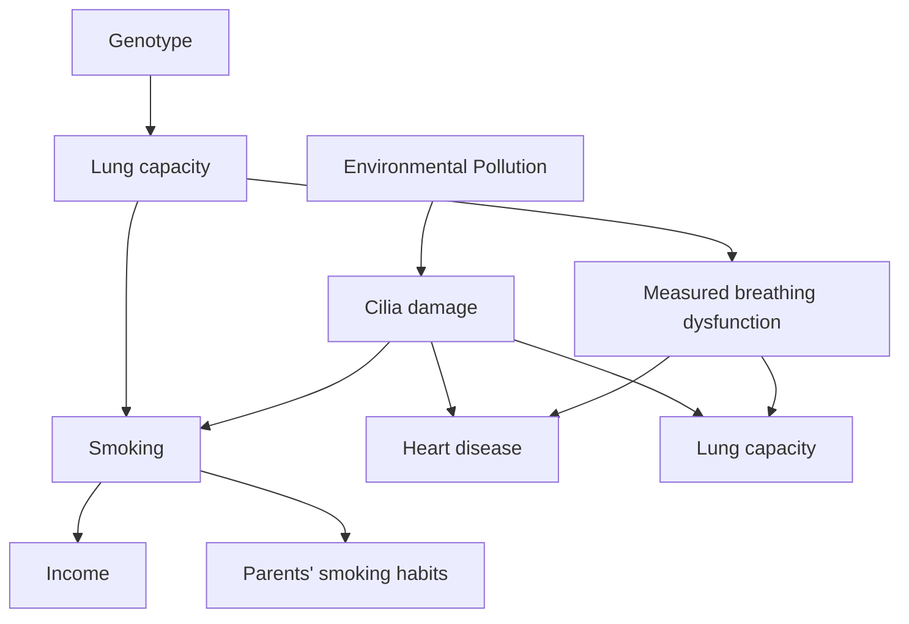


> Figure 6.12. Uninformative partially oriented inducing graph of $G _ { 5 }$ over $\mathrm { o }$

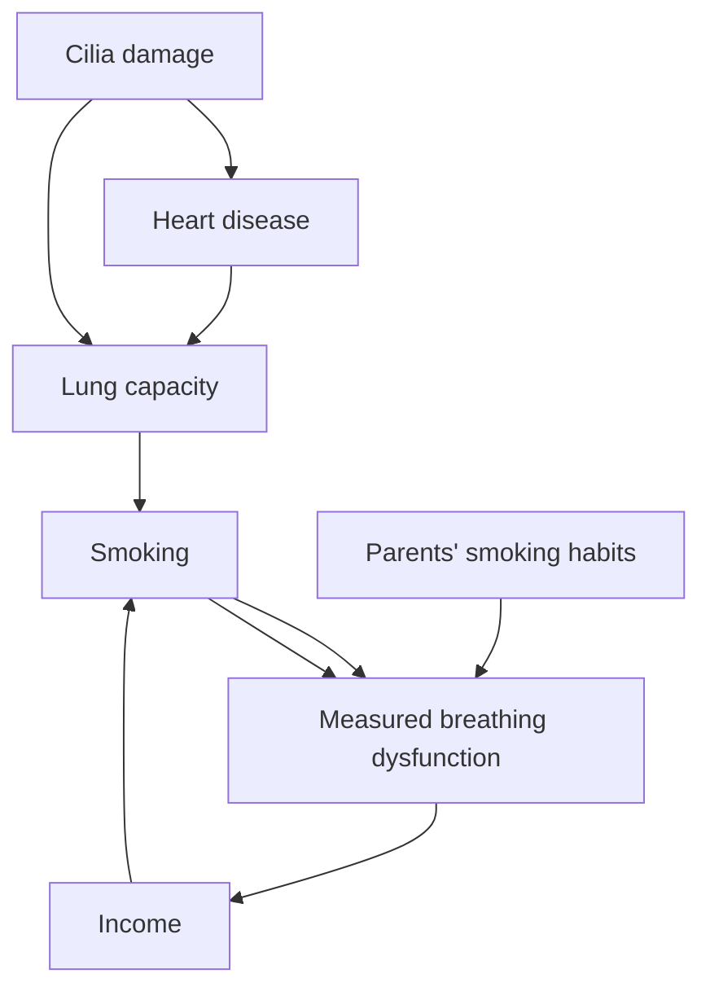

Such a maximally informative partially oriented inducing path graph $\pi$ for $G$ could be oriented by the simple but inefficient algorithm of constructing every possible inducing path graph with the same adjacencies as $G ^ { \prime } ,$ throwing out the ones that do not have the same d-connection relations as $G ^ { \prime } ,$ and keeping track of which orientation features are common to all members of $\mathbf { E q u i v } ( G ^ { \prime } )$ . Of course, this is completely computationally infeasible. Figure 6.13 shows the maximally oriented partially oriented inducing path graph of graph $G _ { 5 }$ over $\mathbf { O } = \{ C i l i a$ damage, Smoking, Heart disease, Lung capacity, Measured breathing dysfunction, Income, Parents’ smoking habits}.


> Figure 6.13. Maximally informative partially oriented inducing path graph of $G _ { 5 }$ over O

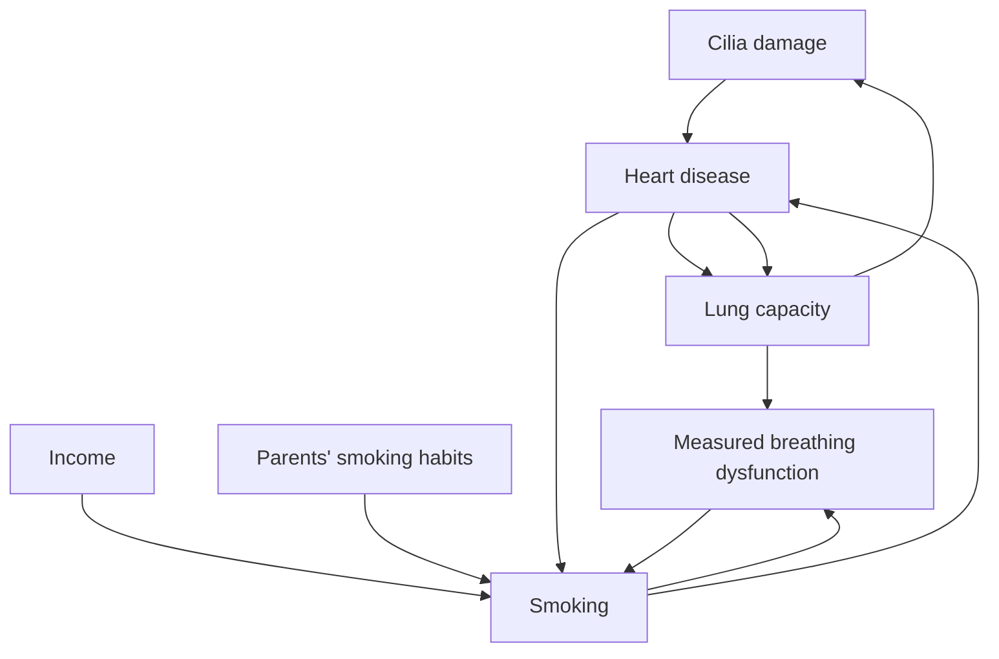

Our goal is to state algorithms that construct a partially oriented inducing path graph for a directed acyclic graph G containing as much orientation information as is consistent with computational feasibility. The algorithm we propose is divided into two main parts. First, the adjacencies in the partially oriented inducing path graph are determined. Then the edges are oriented in so far as possible.

## 6.7 Algorithms for Causal Inference with Latent Common Causes

In order to state the algorithm, a few more definition are needed. In a partially orientedorder state the algorithm, a few more defi nitions are needed. In partially inducing path graph :

- (i). A is a parent of B if and only if $A  B$ in .
- (ii). B is a collider along path ${ < A , B , C > }$ if and only if $A { ^ { * } \right. } B \left. { ^ { * } } C$ in .
- (iii). An edge between B and A is into A if and only if $A  ^ { * } B$ in .
- (iv). An edge between B and A is out of A if and only if $A  B$ in .
- (v). In a partially oriented inducing path graph $\pi ^ { \ast }$ , U is a definite discriminating path for B if and only if U is an undirected path between X and Y containing $B , B \neq X , B \neq Y ,$ every vertex on $U$ except for B and the endpoints is a collider or a definite noncollider on $U ,$ and

(i) if V and $V ^ { \prime }$ are adjacent on $U ,$ and $V ^ { \prime }$ is between V and B on U, then $V ^ { * } {  } V ^ { \prime }$ on $U ,$

- (ii) if V is between X and B on U and V is a collider on U then $V  Y$ in , else $V  { } ^ { * }$ Y in ,
- (iii) if V is between Y and B on U and V is a collider on U then $V  X$ in , else $V  { } ^ { * }$ X in .
- (iv) X and Y are not adjacent in .


> Figure 6.14 illustrates the concept of a definite discriminating paFigure 6.14 illustrates the concept of a defi nite discriminating path. Figure 6.14. $< E , F , G , A , C , B >$ is a definite discriminating path for C

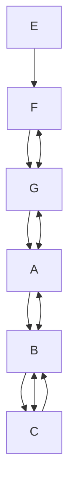

In practice, the Causal Inference Algorithm and the Fast Causal Inference Algorithm (described later in this section) take as input either a covariance matrix or cell counts. Where d-separation facts are needed by the algorithms, the procedure performs tests of conditional independence (in the discrete case) or of vanishing partial correlations in the linear, continuous case. (Recall that if P is a discrete distribution faithful to a graph $G ,$ then A and B are d-separated given a set of variables C if and only A and B are conditionally independent given $\mathbf { C } ,$ and if P is a distribution linearly faithful to a graph $G ,$ then A and B are d-separated given C if and only $\mathrm { i f } \rho _ { A B . \mathbf { C } } = 0 . \mathrm { ) }$ Both algorithms construct a partially oriented inducing path graph of some directed acyclic graph $G ,$ where $G$ contains both measured and unmeasured variables.

## Causal Inference Algorithm1

- A.) Form the complete undirected graph Q on the vertex set V.
- B.) If A and B are d-separated given any subset S of V, remove the edge between A and B, and record S in Sepset(A,B) and $\mathbf { S e p s e t } ( B , A )$ .
- C.) Let F be the graph resulting from step B). Orient each edge as o-o. For each triple of vertices A, B, C such that the pair A, B and the pair $B , C$ are each adjacent in F but the pair A, C are not adjacent in F, orient $A \ ^ { * \_ * } B \ ^ { * \_ * } C$ as $A { } ^ { * } \to B  { } ^ { * } C$ if and only if B is not in Sepset(A,C), and orient $A \ ^ { * \_ * } \ B \ ^ { * \_ * } \ C$ as $A \ ^ { * \_ * } \ B \ ^ { * \_ * } \ C$ if and only if B is in Sepset(A,C).

## D.) repeat

If there is a directed path from A to B, and an edge $A \ ^ { * } { } _ { - } { } ^ { * } \ B ,$ orient $A \ ^ { * } { } _ { - } { } ^ { * } { } _ { B }$ as $A \ ^ { * }  B ,$ , else if B is a collider along ${ < A , B , C > }$ in , B is adjacent to D, and D is in Sepset(A,C), then orient $B ^ { * } { } _ { - } { } ^ { * } D$ as $B \gets { ^ * D }$ ,

else if U is a definite discriminating path between A and B for M in , and P and R are adjacent to M on U, and $P - M - R$ is a triangle, then

if M is in Sepset(A,B) then M is marked as a noncollider on subpath $P ^ { * } { \underline { { * } } } \ast \underline { { M } } ^ { * } { \ast } ^ { * } R$ else $P ^ { * _ { - } * } M ^ { * _ { - } * } R$ is oriented as $P ^ { * } { \right. } M \left. { } ^ { * } R .$ .

else if $P ^ { * } {  } M ^ { * } { - } ^ { * } R$ then orient as $P ^ { * } {  } M  R . ^ { 2 }$ until no more edges can be oriented.

If the CI or FCI algorithms use as input a covariance matrix from the marginal over O of a distribution linearly faithful to G, or cell counts from the marginal over O of a distribution faithful to $G ,$ we will say the input is data over O that is faithful to G.

THEOREM 6.3: If the input to the CI algorithm is data over O that is faithful to $G ,$ the output is a partially oriented inducing path graph of G over O.

If data over O = {Cilia damage, Smoking, Heart disease, Lung capacity, Measured breathing dysfunction, Income, Parents’ smoking habits} that is faithful to the graph in figure 6.11 is input to the CI algorithm, the output is the maximally informative partially oriented inducing path graph over O shown in figure 6.13.

Unfortunately, the Causal Inference (CI) algorithm as stated is not practical for large numbers of variables because of the way the adjacencies are constructed. While it is theoretically correct to remove an edge between A and B from the complete graph if and only if A and B are d-separated given some subset of $\scriptstyle \mathbf { O } \backslash \{ A , B \}$ , this is impractical for two reasons. First, there are too many subsets of $\scriptstyle \mathbf { O } \backslash \{ A , B \}$ on which to test the conditional independence of A and B. Second, for discrete distributions, unless the sample sizes are enormous there are no reliable tests of independence of two variables conditional on a large set of other variables.

In order to determine that a given pair of vertices, such as X and Y are not adjacent in the inducing path graph, we have to find that X and Y are d-separated given some subset of $\mathbf { O } \backslash \{ X , Y \}$ . Of course, if X and Y are adjacent in the inducing path graph, they are dconnected given every subset of $\mathbf { O } \backslash \{ X , Y \}$ . We would like to be able to determine that X and Y are d-connected given every subset of $\mathbf { O } \backslash \{ X , Y \}$ without actually examining every subset of O\{X ,Y}.

In a directed acyclic graph over a causally sufficient set V, by using the PC algorithm we are able to reduce the order and number of d-separation tests performed because of the following fact: if X and Y are d-separated by any subset of $\mathbf { V } \backslash \{ X , Y \}$ , then they are dseparated either by Parents(X) or Parents(Y). While the PC algorithm is constructing the graph it does not know which variables are in Parents(X) or in Parents(Y), but as the algorithm progresses it is able to determine that some variables are definitely not in Parents(X) or Parents(Y) because they are definitely not adjacent to X or Y. This reduces the number and the order of the d-separation tests that the PC algorithm performs (as compared to the SGS algorithm).

In contrast, an inducing path graph over O it is not the case that if X and Y are dseparated given some subset of $\mathbf { O } \backslash \{ X , Y \}$ , then X and Y are d-separated given either Parents(X) or given Parents(Y). However, if X and Y are d-separated given some subset of O\{X,Y}, then X and Y are d-separated given either D-Sep(X) or given D-Sep(Y). If we know that some variable V is not in D-Sep(X) and not in D-Sep(Y), we do not need to test whether X and Y are d-separated by any set containing V. Once again, we do not know which variables are in D-Sep(X) or D-Sep(Y) until we have constructed the graph. But there is an algorithm that can determine that some variables are not in D-Sep(X) or D-Sep(Y) as the algorithm progresses.

Let G be the directed acyclic graph of figure 6.3 (reproduced in figure 6.15). Let $G ^ { \prime }$ be the inducing path graph of G over $\mathbf { O } = \{ A , B , C , D , E , F , H \}$ . A and E are not d-separated given any subset of the variables adjacent to A or adjacent to D (in both cases {B,D}). Because A and E are not adjacent in the inducing path graph of A and E, they are dseparated given some subset of $\scriptstyle \mathbf { O } \backslash \{ A , E \}$ . Hence they are d-separated by either D-Sep(A,E) (equal to $\{ B , D , F \} )$ ) or by $\mathbf { D - S e p } ( E , A ) )$ (equal to $\{ B , D , H \} )$ . (In this case A and E are d-separated by both D-Sep(A,E) and by D-Sep(E,A).) The problem is: how can we know to test whether A and E are d-separated given {B,D,H} or $\{ B , D , F \}$ without testing whether A and E are d-separated given every subset of O\{A,E}?

A variable V is in D-Sep(A,E) in $G ^ { \prime }$ if and only if V ≠ A and there is an undirected path between A and V on which every vertex except the endpoints is a collider, and each vertex is an ancestor of A or E. If we could find some method of determining that a variable V does not lie on such a path, then we would not have to test whether A and E were d-separated given any set containing V (unless of course V was in $\mathbf { D } { \cdot } \mathbf { S e p } ( E { , } A ) . )$ We will illustrate the strategy on G. At any given stage of the algorithm we will call the graph constructed thus far .


> Figure 6.15

The FCI algorithm determines which edges to remove from the complete graph in three stages. The first stage is just like the first stage of the PC Algorithm. We intialize to the complete undirected graph, and then we remove an edge between X and Y if they are d-separated given subsets of vertices adjacent to X or Y in . This will eliminate many, but perhaps not all of the edges that are not in the inducing path graph. When this operation is performed on data faithful to the graph in figure 6.15, the result is the graph in figure 6.16.

Note that A and E are still adjacent at this stage of the procedure because the algorithm, having correctly determined that A is not adjacent to F or H or C, and that E is not adjacent to F or H or C, never tested whether A and E are d-separated by any subset of variables containing F, H, or C.


> Figure 6.16

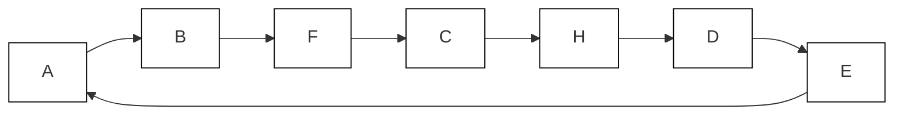

Second, we orient edges by determining whether they collide or not, just as in the PC algorithm. The graph at this stage of the algorithm is show in figure 6.17.

Figure 6.17 is essentially the graph constructed by the PC algorithm given data faithful to the graph in figure 6.15, after steps A), B), and C) have been performed.


> Figure 6.17

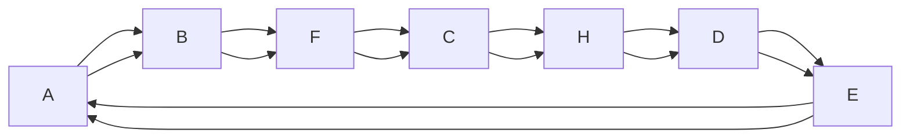

We can now determine that some vertices are definitely not in D-Sep(A,E) or in D-Sep(E,A); it is not necessary to test whether A and E are d-separated given any subset of $\scriptstyle \mathbf { O } \backslash \{ A , E \}$ that contains these vertices in order to find the correct adjacencies. At this stage of the algorithm, a necessary condition for a vertex V to be in $\mathbf { D } { \cdot } \mathbf { S e p } ( A { , } E )$ in $G ^ { \prime }$ is that in there is an undirected path $U$ between A and V in which each vertex except for the endpoints is either a collider, or has its orientation hidden because it is in a triangle. Thus C and H are definitely not in D-Sep(A,E) and C and F are definitely not in D-Sep(E,A). All of the vertices that we have not definitely determined are not in $\mathbf { D } { \cdot } \mathbf { S e p } ( A { , } E )$ in $G ^ { \prime }$ we place in Possible-D-Sep(A,E), and similarly for Possible-D-Sep(E,A). In this case, Possible-D-Sep(A,E) is $\{ B , F , D \}$ and Possible-D-Sep(E,A) is $\{ B , D , H \}$ . We now know that if A and E are d-separated given any subset of $\scriptstyle \mathbf { O } \backslash \{ A , E \}$ then they are d-separated given some subset of Possible-D-Sep(A,E) or some subset of Possible-D-Sep(E,A). In this case we find that A and E are d-separated given a subset of Possible-D-Sep(A,E) (in this case the entire set) and hence remove the edge between A and E.

Once we have obtained the correct set of adjacencies, we unorient all of the edges, and then proceed to reorient them exactly as we did in the Causal Inference Algorithm. The resulting output is shown in figure 6.18.


> FCI Output Figure 6.18

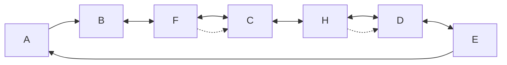

For a given partially constructed partially oriented inducing path graph , Possible-D-$\mathbf { S E P } ( A , B )$ is defined as follows: If $A \neq B ,$ , V is in Possible-D-Sep(A,B) in if and only if $V \neq A$ , and there is an undirected path U between A and V in such that for every subpath ${ < X , Y , Z > }$ of U either Y is a collider on the subpath, or Y is not a definite noncollider and on U, and X, Y, and Z form a triangle in .

Using this definition of Possible-D-Sep(A,E), we can prove that every vertex not in Possible-D-Sep(A,E) in is not in D-Sep(A,E) in G . However, it may be possible to determine from that some members that we are including in Possible-D-Sep(A,E) are not in D-Sep(A,E) in $G ^ { \prime } .$ There is clearly a trade-off between reducing the size of Possible-D-Sep(A,E) (so that the number and order of tests of d-separability performed by the algorithm is reduced) and performing the extra work required to reduce the size of the set, while ensuring that it is still a superset of D-Sep(A,E) in $G ^ { \prime } .$ We do not know what the optimal balance is. If G is sparse (i.e., each vertex is not adjacent to a large number of other vertices in G), then the algorithm does not need to determine whether A and B are d-separated given C for any C containing a large number of variables.

## Fast Causal Inference Algorithm

A). Form the complete undirected graph Q on the vertex set V.

B). $n = 0 .$

repeat

repeat

select an ordered pair of variables X and Y that are adjacent in Q such that Adjacencies(Q,X)\{Y} has cardinality greater than or equal to n, and a subset S of Adjacencies(Q,X)\{Y} of cardinality n, and if X and Y are d-separated given S delete the edge between X and Y from Q, and record S in Sepset(X,Y) and Sepset(Y,X)until all ordered variable pairs of adjacent variables X and Y such that Adjacencies(Q,X)\{Y} has cardinality greater than or equal to n and all subsets S of Adjacencies(Q,X)\{Y} of cardinality n have been tested for d-separation;

$$
n = n + 1;
$$

until for each ordered pair of adjacent vertices X, Y, Adjacencies $( Q , X ) \backslash \{ Y \}$ is of cardinality less than n.

C). Let $F ^ { \prime }$ ---

-	- 

- -	-'(-)
-----\* each triple of vertices A, B, C such that the pair A, B and the pair B, C are each adjacent in $F ^ { \prime }$ 
--	
-A, C are not adjacent in $F ^ { \prime }$ , orient A $* _ { - } * B * _ { - } *$ C as $A { ^ { * } \right. } B \left. { ^ { * } } C$ if and only if B is not in Sepset(A,C).

D). For each pair of variables A and B adjacent in F’, if A and B are d-separated given any subset S of $\mathbf { P o s s i b l e - D - S E P } ( A , B ) \backslash \{ A , B \}$ or any subset S of Possible-D-$\mathbf { S E P } ( B , A ) \backslash \{ A , B \}$ in F remove the edge between A and B, and record S in Sepset(A,B) and $\mathbf { S e p s e t } ( B , A )$ .

The algorithm then reorients an edge between any pair of variables X and Y as X o-o $Y ,$ and proceeds to reorient the edges in the same way as steps C) and D) of the Causal Inference algorithm.

THEOREM 6.4: If the input to the FCI algorithm is data over O that is faithful to $G ,$ , the output is a partially oriented inducing path graph of G over O.

The Fast Causal Inference Algorithm (FCI) always produces a partially oriented inducing path graph for a graph G given correct statistical decisions from the marginal over the measured variables of a distribution faithful to G. We do not know whether the algorithm is complete, that is, whether it in every case produces a maximally informative partially oriented inducing path graph.

As with the CI algorithm, if the input to the FCI algorithm is data faithful to the graph of figure 6.11, the output is the maximally informative partially oriented inducing path graph of figure 6.13.

Two directed acyclic graphs G and $G ^ { \prime }$ that have the same FCI partially oriented inducing path graph over O have the same d-connection relations involving just members of O.

COROLLARY 6.4.1: If G is a directed acylic graph over V, $G ^ { \prime }$ is a directed acyclic graph over V , and O is a subset of V and of $\mathbf { V ^ { \prime } }$ , then G and $G ^ { \prime }$ have the same d-separation relations among only the variables in O if and only if they have the same FCI partially oriented inducing path graph over O.

Given a directed acyclic graph G, it is possible to determine what d-separation relations involving just members of O are true of $G$ from the FCI partially oriented inducing path graph of $G$ over O. In a partially oriented inducing path graph $\pi ,$ if $X \neq Y ,$ and X and Y are not in Z, then an undirected path U between X and Y definitely dconnects X and Y given Z if and only if every collider on U has a descendant in Z, every definite noncollider on U is not in Z, and every other vertex on U is not in Z but has a descendant in Z. In a partially oriented inducing path graph , if X, Y, and Z are disjoint sets of variables, then X is definitely d-connected to Y given Z if and only if some member of X is d-connected to some member of Y given Z.

COROLLARY 6.4.2: If G is a directed acylic graph over V, O is a subset of V, is the FCI partially oriented inducing path graph of G over O, and X, Y, and Z are disjoint subsets of O, then X is d-connected to Y given Z in G if and only if X is definitely d-connected to Y given Z in .

These corollaries are proved in Spirtes and Verma 1992.

## 6.8 Theorems on Detectable Causal Influence

In this section we show that a number of different kinds of causal inferences can be drawn from a partially oriented inducing path graph.

THEOREM 6.5: If is a partially oriented inducing path graph of directed acyclic graph G over O, and there is a directed path U from A to B in , then there is a directed path from A to B in G.

If G is a directed acyclic graph over V, and O is included in V, if the input to the CI algorithm is data faithful to G over O, then we call the output of the CI algorithm the CI partially oriented inducing path graph of G over O. We adopt a similar terminology for the FCI algorithm. A semidirected path from A to B in partially oriented inducing path graph is an undirected path U from A to B in which no edge contains an arrowhead pointing toward A, that is, there is no arrowhead at A on U, and if X and Y are adjacent on the path, and X is between A and Y on the path, then there is no arrowhead at the X end of the edge between X and Y.

THEOREM 6.6: If is the CI partially oriented inducing path graph of directed acyclic graph G over O, and there is no semidirected path from A to B in , then there is no directed path from A to B in G.

Recall that a trek between distinct variables A and B is either a directed path from A to B, a directed path from B to A, or a pair of directed paths from a vertex C to A and B respectively that intersect only at C. The following theorem states a sufficient condition for when the edges in a partially oriented inducing path graph indicate a trek in the graph that contains no measured vertices except for the endpoints.

THEOREM 6.7: If is a partially oriented inducing path graph of directed acyclic graph G over O, A and B are adjacent in , and there is no undirected path between A and B in except for the edge between A and B, then in G there is a trek between A and B that contains no variables in O other than A or B.

THEOREM 6.8: If is the CI partially oriented inducing path graph of directed acyclic graph G over O, and every semidirected path from A to B contains some member of C in , then every directed path from A to B in G contains some member of C.

THEOREM 6.9: If is a partially oriented inducing path graph of directed acyclic graph G over O, and $A  B$ in , then there is a latent common cause of A and B in G.

Parallel results holds for the FCI algorithm.

To illustrate the application of these theorems, condsider the maximally informative partially oriented inducing path graph in figure 6.13 of the causal structure of $G _ { 5 } .$ . Applying theorem 6.5 we infer that Smoking causes Cilia damage, Lung capacity, and Measured breathing dysfunction. Applying theorem 6.6, we infer that Smoking does not cause Heart disease or Income or Parents’ Smoking Habits. It is impossible to determine from the conditional independence relations among the measured variables whether Income causes Smoking, or there is a common cause of Smoking and Income. The statistics among the measured variables determine that Cilia damage and Heart disease have a latent common cause, Cilia damage does not cause Heart disease, and Heart disease does not cause Cilia damage.

We note here a topic that will be more fully explored in the next chapter. In the example from figure 6.11, in order to infer that smoking causes breathing dysfunction, it is necessary to measure two causes of Smoking (whose collision at Smoking orients the edge from Smoking to Cilia damage.) In general, this suggests that in the design of studies intended to determine if there is a causal path from variable A to variable B, it is useful to measure not only variables that might mediate the connection between A and B, but also to measure possible causes of A.

## 6.9 Nonindependence Constraints

The Markov and Faithfulness conditions applied to a causally insufficient graph may entail constraints on the marginal distribution of measured variables that are not conditional independence relations, and hence are not used in the FCI algorithm. Consider, the example in figure 6.19, due to Thomas Verma (Verma and Pearl 1991).

Assume T is unmeasured. Then a joint distribution faithful to the entire graph must satisfy the constraint that the quantity


> Figure 6.19

```mermaid
graph TD
  A["A"] --> B["B"]
  B --> C["C"]
  C --> D["D"]
  T["T"] --> B
```

$$
\sum_ {B} ^ {\rightarrow} P (B | A) P (D | B, C, A)
$$

is a function only of the values of C and D.

$$
\begin{array}{l} \sum_ {B} ^ {\rightarrow} P (B | A) P (D | B, C, A) = \sum_ {T} ^ {\rightarrow} \sum_ {B} ^ {\rightarrow} P (B | A) P (D | B, C, A, T) P (T | B, C, A) = \\ \sum_ {T} ^ {\rightarrow} P (D | C, T) \sum_ {B} ^ {\rightarrow} P (B | A) P (T | B, A) \\ \end{array}
$$

(because A, B are independent of D given {C, T} and C is independent of T given {A, B}). Hence

$$
\begin{array}{l} \sum_ {T} ^ {\rightarrow} P (D | C, T) \sum_ {B} ^ {\rightarrow} P (B | A) P (T | B, A) = \sum_ {T} ^ {\rightarrow} P (D | C, T) P (T | A) = \\ \stackrel {\rightarrow} {\sum_ {T}} P (D | C, T) P (T) = g (C, D) \\ \end{array}
$$

(because T and A are independent).

This constraint is not entailed if a directed edge from A to D is added to the graph. The moral is that there is further marginal structure not in the form of conditional independence relations that could in principle be used to help identify latent structure. We will see a similar point when we turn to linear models in the next section. A general theory of how Verma constraints arise is given by Desjardins (1999).

## 6.10 Generalized Statistical Indistinguishability and Linearity

Suppose that for whatever reasons an investigation were to be confined to linear structures and to probability distributions that are consistent with the assumption that each random variable is a linear function of its parents and of unmeasured factors. The effect of restrictions such as linearity is to make distinguishable causal structures that would otherwise be indistinguishable. That happens because the restriction, whatever it is, together with the conditional dependence and independence relations required by the Markov, Minimality or Faithfulness Conditions, entails additional constraints on the measured variables. These additional constraints may not be in the form of conditional independence relations. In the linear case they typically are not. Consider for example the two structures shown below, where the X variables are measured and the T variables are unmeasured.


```mermaid
graph TD
  T1["T1"] --> X1["X1"]
  T1 --> X2["X2"]
  T1 --> X3["X3"]
  T1 --> X4["X4"]
  T2["T2"] --> X1
  T2 --> X2
  T2 --> X3
  T2 --> X4
  X1 --> ε1["ε₁"]
  X2 --> ε2["ε₂"]
  X3 --> ε3["ε₃"]
  X4 --> ε4["ε₄"]
```


> Figure 6.20

```mermaid
graph TD
  T["T"] --> X1["X₁"]
  T --> X2["X₂"]
  T --> X3["X₃"]
  T --> X4["X₄"]
  X1 --> ε1["ε₁"]
  X2 --> ε2["ε₂"]
  X3 --> ε3["ε₃"]
  X4 --> ε4["ε₄"]
```

These structures each imply that in the marginal distribution over the measured variables every pair of variables is dependent conditional on every other set of measured variables. In each case the maximally informative partially oriented inducing path graph on the X variables is a complete undirected graph. By examining conditional independence relations among these variables, one could not tell which structure obtains. But if linearity is required, then it is easy to tell which structure obtains. For under the linearity assumption, the second structure entails all three of the following constraints on the correlations of the measured variables, while the first structure entails only the first of these constraints (where we denote the correlation between $X _ { 1 }$ and $X _ { 2 }$ as $\rho _ { 1 2 }$ in order to avoid subscripts with subscripts):

$$
\rho_ {1 3} \rho_ {2 4} - \rho_ {1 4} \rho_ {2 3} = 0
$$

$$
\rho_ {1 2} \rho_ {3 4} - \rho_ {1 4} \rho_ {2 3} = 0
$$

$$
\rho_ {1 3} \rho_ {2 4} - \rho_ {1 2} \rho_ {3 4} = 0
$$

Early in this century Charles Spearman (1928) called constraints of these sorts vanishing tetrad differences, and we will use his terminology.

Characterizing statistical indistinguishability under the linearity restriction thus presents an entirely new problem, and one for which we will offer no general solution. It is not true, for example, that conditional independence relations and vanishing tetrad differences jointly determine the faithful indistinguishability classes of linear structures with unmeasured variables. For example, each of the following linear structures entails that a single tetrad difference vanishes in the marginal distribution over A, B, C, and D, and has a partially oriented inducing path graph for these variables consisting of a complete undirected graph:


> Figure 6.21

But the two graphs are not faithfully indistinguishable over the class of linear structures. Structure (ii) permits distributions consistent with linearity in which the correlation of A and B is positive, the correlation of B and C is positive and the correlation of A and C is negative. Structure (i) admits no distributions consistent with linearity whose marginals satisfy this condition.

Structures (i) and (ii) are not typical of the linear causal structures with unmeasured variables one finds in the social science literature. For practical purposes, the examination of vanishing tetrad constraints provides a powerful means to distinguish between alternative causal structures, even in structures that are only partially linear. Tests for hypotheses of vanishing tetrad differences were introduced by Wishart in the 1920s assuming normal variates, and asymptotically distribution free tests have been described by Bollen (1989).

Algorithms that take advantage of vanishing tetrad differences will be described and illustrated later in this book. In order to take that advantage, we need to be able to determine algorithmically when a structure with or without unmeasured common causes entails a particular vanishing tetrad difference among the measured variables. This question leads to an important theorem.

## 6.11 The Tetrad Representation Theorem

We wish to characterize entirely in graph theoretic terms a necessary and sufficient condition for a distribution on the vertices of an arbitrary directed acyclic graph G to linearly imply a vanishing tetrad difference, that is the tetrad difference vanishes in all of the distributions linearly represented by G. We will call a distribution linearly represented by some directed acyclic graph G a linear model. (A slightly more formal definition is given in chapter 13.) A linear model is uniquely determined by the directed acyclic graph G that represents it, and linear coefficients and the independent marginal distributions on the variables (including error terms) of zero indegree.

First some terminology: Given a trek $T ( I , J )$ between vertices I and $J , I ( T ( I , J ) )$ denotes the directed path in $T ( I , J )$ from the source of $T ( I , J )$ to I and $J ( T ( I , J ) )$ denotes the directed path in $T ( I , J )$ from the source of $T ( I , J )$ to J. (Recall that one of the directed paths in a trek may be an empty path.) $\mathbf { T } ( I , J )$ denotes the set of all treks between I and J.

In a directed acyclic graph $G ,$ if for all $T ( K , L )$ in $\mathbf { T } ( K , L )$ and all $T ( I , J )$ in $\mathbf { T } ( I , J )$ , $L ( T ( K , L ) )$ and ${ \cal J } ( T ( I , { \cal J } ) )$ intersect at a vertex $Q ,$ then $Q$ is an $L J ( T ( I , J ) , T ( K , L ) )$ choke point. Similarly, if for all $T ( K , L )$ in $\mathbf { T } ( K , L )$ and all $T ( I , J )$ in $\mathbf { T } ( I , J ) , L ( T ( K , L ) )$ and all $J ( T ( I , J ) )$ intersect at a vertex $Q ,$ and for all $T ( I , L )$ in $\mathbf { T } ( I , L )$ and all $T ( J , K )$ in $\mathbf { T } ( J , K )$ , $L ( T ( I , L ) )$ and ${ \cal J } ( T ( J , K ) )$ also intersect at $Q ,$ , then $Q$ is an $L J ( T ( I , J ) , T ( K , L ) , T ( I , L ) , T ( J , K ) )$ choke point. Also see the definition of trek.

The fundamental theorem for vanishing tetrad differences in linear models is this:

TETRAD REPRESENTATION THEOREM 6.10: In a directed acyclic graph $G ,$ there exists an $L J ( T ( I , J ) , T ( K , L ) , T ( I , L ) , T ( J , K ) )$ or an $I K ( T ( I , J ) , T ( K , L ) , T ( I , L ) , T ( J , K ) )$ choke point if and only if G linearly implies $\rho _ { I J } \rho _ { K L } - \rho _ { I L } \rho _ { J K } = 0$ .

## A consequence of theorem 6.10 is

THEOREM 6.11: A directed acyclic graph G linearly implies $\rho _ { I J } \rho _ { K L } \cdot \rho _ { I L } \rho _ { J K } = 0$ only if either it linearly implies that $\rho _ { I J }$ or $\rho _ { K L } = 0$ , and $\rho _ { I L }$ or $\rho _ { J K } = 0 .$ , or there is a (possibly empty) set Q of random variables in G that does not contain both I and K or both J and L such that G linearly implies that $\rho _ { I J . \mathbf { Q } } = \rho _ { K L . \mathbf { Q } } = \rho _ { I L . \mathbf { Q } } = \rho _ { J K . \mathbf { Q } } = 0 .$ .

Theorem 6.10 provides a fast algorithm for calculating the vanishing tetrad differences linearly implied by any directed acyclic graph. Theorem 6.11 provides a means to determine when unmeasured common causes are acting in linear structures. In later chapters we describe some of the implications of these facts for investigating the structure of causal relations among unmeasured variables.

## 6.12 An Example: Math Marks and Causal Interpretation

In several places in his recent text on graphical models in statistics, Whittaker (1990) discusses a data set from Mardia, Kent and Bibby (1979) concerning the grades of 88 students on examinations in five mathematical subjects: mechanics, vectors, algebra, analysis and statistics. The example illustrates one of the uses of the Tetrad Representation Theorem, and provides occasion to comment on some important differences of interpretation between our methods and those Whittaker describes. The variance/covariance matrix for the data is as follows:

<table><tr><td>Mechanics</td><td>Vectors</td><td>Algebra</td><td>Analysis</td><td>Statistics</td></tr><tr><td>302.29</td><td></td><td></td><td></td><td></td></tr><tr><td>125.78</td><td>170.88</td><td></td><td></td><td></td></tr><tr><td>100.43</td><td>84.19</td><td>111.60</td><td></td><td></td></tr><tr><td>105.07</td><td>93.60</td><td>110.84</td><td>217.88</td><td></td></tr><tr><td>116.07</td><td>97.89</td><td>120.49</td><td>153.77</td><td>294.37</td></tr></table>

When given these data, the PC algorithm immediately determines the pattern show in figure 6.22.

Whittaker obtains the same graph under a different interpretation. Recall that an undirected independence graph is any pair ${ < } G , P { > }$ where G is an undirected graph and P is a distribution such that vertices, X, Y in G are not adjacent if they are independent conditional on the set of all other vertices of $G ;$ or to state the contrapositive: if X, Y are dependent conditional on the set of all other vertices of $G ,$ then X, Y are adjacent in G. Undirected independence graphs hide much of the causal structure, and sometimes many of the independence relations. Thus if variables X and Z are causes of variable Y but X and Z are statistically independent and have no causal relations whatsoever, the undirected independence graph has an edge between X and Z. In effect, the independence graph fails to represent the conditional independence relations that hold among proper subsets of a set of variables.


> Figure 6.22

```mermaid
graph TD
  A["Mechanics"] --> C["Algebra"]
  B["Vectors"] --> C["Algebra"]
  D["Analysis"] --> C["Algebra"]
  E["Statistics"] --> C["Algebra"]
```

Every undirected pattern graph obtained from a faithful distribution (or sample) is a subgraph of the undirected independence graph obtained from that distribution. In the case at hand the two graphs are the same, but they need not be in general.

Whittaker claims that identifying the undirected independence graph is important for four reasons: (i) it reduces the complex five dimensional object into two simpler three dimensional objects—the two maximal cliques in the graph; (ii) it groups the variables into two sets; (iii) it highlights Algebra as the one crucial examination in analyzing the interrelationship between different subjects in exam performance; (iv) it asserts that Algebra and Analysis alone will be sufficient to predict Statistics and that Algebra and Vectors will be sufficient to predict Mechanics; but that all four marks are needed to predict Algebra (p. 6)

The second reason seems simply a consequence of the first, and the first seems of little consequence: the cognitive burden of noting that there are five variables is not very great. There is a long tradition in statistics of introducing representations on grounds that they simplify the data and in practice treating the objects of such reductions as causes. That is, for example, the history of factor analysis after Thurstone. But as with factor analysis, causal conclusions drawn from independence graphs would be unreliable. The third reason seems too vague to be worth much trouble. The assertion given in the fourth reason is sound, but only if “predict” is understood in all cases to have nothing to do with predicting the values of variables when they are deliberately altered, as by coaching. We suspect statistical analyses of such educational data are apt to be given a causal significance, and for such purposes directed graphical models better represent the hypotheses.

Applying theorem 6.11, the vanishing tetrad test for latent variables, we find that there are four vanishing tetrad differences that cannot be explained by vanishing partial correlations among the measured variables. This suggests that they are entailed by vanishing partial correlations involving latent variables, and thus suggests the introduction of latent variables. A natural idea in view of the mathematical structure of the subjects tested is that Algebra is an indicator of Algebraic knowledge, which is a factor in the Knowledge of vector algebra measured by Vector and Mechanics and is also a factor in Knowledge of real analysis that affects Analysis and Statistics. The explanation of the data then looks as shown in figure 6.23.


> Figure 6.23

```mermaid
graph TD
  A["Algebraic knowledge"] --> B["Knowledge of vector algebra"]
  A --> C["Knowledge of real analysis"]
  B --> D["Mechanics"]
  B --> E["Vector"]
  C --> F["Analysis"]
  C --> G["Statistics"]
  D --> H["↑"]
  E --> I["↑"]
  F --> J["↑"]
  G --> K["↑"]
```

The arrows without notation attached to them indicate other sources of variation. Assuming a faithful distribution and linearity, this graph does not entail the vanishing first order partial correlations among the measured variables that the data suggest. But if the variance in Algebra due to factors other than algebraic knowledge is sufficiently small, a linear distribution faithful to this graph will to good approximation give exactly those vanishing partial correlations.

This structure (assuming linearity) entails eight vanishing tetrad differences, all of which the TETRAD II program identifies and tests and cannot reject $( p > . 7 )$ . The model itself, when treated as the null hypotheses in a likelihood ratio test, yields a p value of about .9, roughly the value Whittaker reports for the undirected graphical independence model.

## 6.13 Background Notes

In a series of papers (Pearl and Verma 1990, 1991, Verma and Pearl 1990a, 1990b, 1991) Verma and Pearl describe an “Inductive Causation” algorithm that outputs a structure that they call a pattern (or sometimes a “completed hybrid graph”) of a directed acyclic graph G over a set of variables O. The most complete description of their theory appears in Verma and Pearl (1990b). The key ideas of an inducing path, an inducing path graph, and the proof of (what we call) theorem 6.1 all appear in this paper. Unfortunately, the two main claims about the output of the Inductive Causation Algorithm made in the paper, given in their lemma A2 and their theorem 2, are false (see Spirtes 1992).

Early versions of the Inductive Causation Algorithm did not distinguish between A → B and A o→ B, and hence could not be used to infer that A causes B as in theorem 6.5. This distinction was introduced (in a different notation) in order to prove a version of theorem 6.5 and theorem 6.6 in Spirtes and Glymour (1990); Verma and Pearl incorporated it in a subsequent version of the Inductive Causation Algorithm. The Inductive Causation Algorithm does not use definite discriminating paths to orient edges, and hence in some cases gives less orientation information than the FCI procedure. The output of the Inductive Causation Algorithm has no notation distinguishing between edges in triangles that definitely do not collide and merely unoriented edges. Like the CI algorithm, the Inductive Causation Algorithm cannot be applied to large numbers of variables because testing the independence of some pairs of variables conditional on every subset of O\{A,B} is required.

The vanishing tetrad difference was used as the principle technique in model specification by Spearman and his followers. A brief account of their methods is given in Glymour, Scheines, Spirtes, and Kelly (1987). Spearman’s inference to common causes from vanishing tetrad differences was challenged by Godfrey Thomson in a series of papers between 1916 and 1935. In our terms, Thomson’s models all violated linear faithfulness.