# Prediction

## 7.1 Introduction

The fundamental aim of many empirical studies is to predict the effects of changes, whether the changes come about naturally or are imposed by deliberate policy: Will the reduction of sources of environmental lead increase the intelligence of children in exposed regions? Will increased taxation of cigarettes decrease lung cancer? How large will these effects be? What will be the differential yield if a field is planted with one species of wheat rather than another; or the difference in number of polio cases per capita if all children are vaccinated against polio as against if none are; or the difference in recidivism rates if parolees are given \$600 per month for six months as against if they are given nothing; or the reduction of lung cancer deaths in middle aged smokers if they are given help in quitting cigarette smoking; or the decline in gasoline consumption if an additional dollar tax per gallon is imposed?

One point of experimental designs of the sort found in randomized trials is to attempt to create samples that, from a statistical point of view, are from the very distributions that would result if the corresponding treatments were made general policy and applied everywhere. For such experiments under such assumptions, the problems of statistical inference are conventional, which is not to say they are easy, and the prediction of policy outcomes is not problematic in principle. But in empirical studies in the social sciences, in epidemiology, in economics, and in many other areas, we do not know or cannot reasonably assume that the observed sample is from the very distribution that would result if a policy were adopted. Implementing a policy may change relevant variables in ways not represented in the observed sample. The inference task is to move from a sample obtained from a distribution corresponding to passive observation or quasiexperimental manipulation, to conclusions about the distribution that would result if a policy were imposed. In our view one of the most fundamental questions of statistical inference is when, if ever, such inferences are possible, and, if ever they are possible, by what means. The answer, according to Mosteller and Tukey, is “never.” We will see whether that answer withstands analysis.

## 7.2 Prediction Problems

The possibilities of prediction may be analyzed in a number of different sorts of circumstances, including at least the following:

Case 1: We know the causal graph, which variables will be directly manipulated, and what the direct manipulation will do to those variables. We want to predict the distribution of variables that will not be directly manipulated. More formally, we know the set X of variables being directly manipulated, P(X|Parents(X)) in the manipulatedset X of variables being directly manipulated, P(X | Parents(X)) in the distribution, and that Parents(X) in the manipulated population is a subset of Parents(X) in the unmanipulated population. That is essentially the circumstance that Rubin, Holland, Pratt, and Schlaifer address, and in that case the causal graph and the Manipulation Theorem specify a relevant formula for calculating the manipulated distribution in terms of marginal conditional probabilities from the unmanipulated distribution. The latter can be estimated from samples; we can find the distribution of Y (or of Y conditional on Z) under direct manipulation of X by taking the appropriate marginal of the calculated manipulated distribution.

Case 2: We know the set X of variables being directly manipulated, P(X|Parents(X)) in2: We know the set X of variables being directly manipulated, P(X | Parents(X)) the manipulated distribution, that Parents(X) in the manipulated population is a subset of Parents(X) in the unmanipulated population, and that the measured variables are causally sufficient; unlike case 1, we do not know the causal graph. The causal graph must be conjectured from sample data. In this case the sample and the PC (or some other) algorithm determine a pattern representing a class of directed graphs, and properties of that class determine whether the distribution of Y following a direct manipulation of X can be predicted.

Case 3: The difficult, interesting and realistic case arises when we know the set X of variables being directly manipulated, we know P(X|Parents(X)) in the manipulatedvariables being directly manipulated, we know P(X | Parents(X)) in the population, and that Parents(X) in the manipulated population is a subset of Parents(X) in the unmanipulated population, but prior knowledge and the sample leave open the possibility that there may be unmeasured common causes of the measured variables. If observational studies were treated without unsupported preconceptions, surely that would be the typical circumstance. It is chiefly because of this case that Mosteller and Tukey concluded that prediction from uncontrolled observations is not possible. One way of viewing the fundamental problem of predicting the distribution of Y or conditional distribution of Y on Z upon a direct manipulation of X can be formulated this way: find conditions sufficient for prediction, and conditions necessary for prediction, given only a partially oriented inducing path graph and conditional independence facts true in the marginal (over the observed variables) of the unmanipulated distribution. Show how to calculate features of the predicted distribution from the observed distribution. The ultimate aim of this chapter is to provide a partial solution to this problem.

We will take up these cases in turn. Case 1 is easy but we take time with it because of the connection with Rubin’s theory. Case 2 is dealt with very briefly. In our view Case 3 describes the more typical and theoretically most interesting inference problems. The reader is warned that even when the proofs are postponed the issue is intricate and difficult.

## 7.3 Rubin-Holland-Pratt-Schlaifer Theory1

Rubin’s framework has a simple and appealing intuition. In experimental or observational studies we sample from a population. Each unit in the population, whether a child or a national economy or a sample of a chemical, has a collection of properties. Among the properties of the units in the population, some are dispositional—they are propensities of a system to give a response to a treatment. A glass vase, for example, may be fragile, meaning that it has a disposition to break if struck sharply. A dispositional property isn’t exhibited unless the appropriate treatment is applied—fragile vases don’t break unless they are struck. Similarly, in a population of children, for each reading program each child has a disposition to produce a certain post-test score (or range of test scores) if exposed to that reading program. In experimental studies when we give different treatments to different units, we are attempting to estimate dispositional properties of units (or their averages, or the differences of their averages) from data in which only some of the units have been exposed to the circumstances in which that disposition is manifested. Rubin associates with each such dispositional quantity, $Q ,$ and each value x of relevant treatment variable $X ,$ a random variable, $Q _ { X f = x , }$ whose value for each unit in the population is the value $Q$ would have if that unit were to be given treatment x, or in other words if the system were forced to have X value equal to x. If unit i is actually given treatment x1 and a value of $Q$ is measured for that unit, the measured value of $Q$ equals the value of $Q _ { X f = x 1 }$ .

Experimentation may give a set of paired values $\scriptstyle < x , y _ { X f = x } >$ , where $y _ { X f = x }$ is the value of the random variable $Y _ { X f = x }$ . But for a unit i that is given treatment x1, we also want to know the value of $Y _ { X f = x 2 } , \ Y _ { X f = x 3 } ,$ and so on for each possible value of $X ,$ representing respectively the values for Y unit i is disposed to exhibit if unit i were exposed to treatment $x 2$ or $x 3 .$ , that is, if the X value for these units were forced to be $x 2$ or $x 3$ rather than x1. These unobserved values depend on the causal structure of the system. For example, the value of Y that unit i is disposed to exhibit on treatment $x 2$ might depend on the treatments given to other units. We will suppose that there is no dependence of this kind, but we will investigate in detail other sorts of connections between causal structure and Rubin’s counterfactual random variables.

A typical inference problem in Rubin’s framework is to estimate the distribution of $Y _ { X f = x }$ for some value x of X, over all units in the population, from a sample in which only some members have received the treatment x. A number of variations arise. Rather than forcing a unique value on $X ,$ we may contemplate forcing some specified distribution of values on $X ,$ or we may contemplate forcing different specified distributions on X depending on the (unforced) values of some other variables $Z ;$ our “experiment” may be purely observational so that an observed value $q$ of variable $Q$ for unit i when X is observed to have value x is not necessarily the same as $Q _ { X f = x }$ . Answers to various problems such as these can be found in the papers cited. For example, in our paraphrasing, Pratt and Schlaifer claim the following:When all units are systems in which Y is an effect of X and possibly of other variables, and no causes of Y other than X are measured, in order for the conditional distribution of Y on $X = x$ to equal $Y _ { X f = x } f o r$ all values x of X, it is sufficient and “almost necessary” that X and each of the random variables $Y _ { X f = }$ x (where x ranges over all possible values of X) be statistically independent.

In our terminology, when the conditional distribution of Y on X = x equals $Y _ { X f = x }$ for all values x of X we say that the conditional distribution of Y on X is “invariant”; in their terminology it is “observable.” Pratt and Schlaifer’s claim may be clarified with several examples, which will also serve to illustrate some tacit assumptions in the application of the framework. Suppose X and U, which is unobserved, are the only causes of Y, and they have no causal connection of any kind with one another, a circumstance that we will represent by the graph in figure 7.1.

**Table 7.1**

<table><tr><td>X</td><td>Y</td><td>U</td><td>Xf</td><td> $U_{Xf=1}$ </td><td> $Y_{Xf=1}$ </td></tr><tr><td>1</td><td>1</td><td>0</td><td>1</td><td>0</td><td>1</td></tr><tr><td>1</td><td>2</td><td>1</td><td>1</td><td>1</td><td>2</td></tr><tr><td>1</td><td>3</td><td>2</td><td>1</td><td>2</td><td>3</td></tr><tr><td>2</td><td>2</td><td>0</td><td>1</td><td>0</td><td>1</td></tr><tr><td>2</td><td>3</td><td>1</td><td>1</td><td>1</td><td>2</td></tr><tr><td>2</td><td>4</td><td>2</td><td>1</td><td>2</td><td>3</td></tr></table>


> Figure 7.1

For simplicity let’s suppose the dependencies are all linear, and that for all possible values of X, Y and U, and all units, $Y = X + U .$ . Let Xf represent values of X that could possibly be forced on all units in the population. X is an observed variable; Xf is not. X is a random variable; Xf is not. Consider values in table 7.1.

Suppose for simplicity that each row (ignoring Xf, which is not a random variable) is equally probable. Here the X and Y columns give possible values of the measured variables. The U column gives possible values of the unmeasured variable U. Xf is a variable whose column indicates values of X that might be forced on a unit; we have not continued the table beyond $X f = 1$ . The $U _ { X f = 1 }$ 1 column represents the range of values of U when X is forced to have the value 1; the $Y _ { X f = I }$ gives the range of values of Y when X is forced to have the value 1. Notice that in the table $Y _ { X f = 1 }$ is uniquely determined by the value of Xf and the value of $U _ { X f = 1 }$ and is independent of the value of X.

The table illustrates Pratt and Schlaifer’s claim: $Y _ { X f = 1 }$ is independent of X and the distribution of Y conditional on X = 1 equals the distribution of $Y _ { X f = 1 }$ . We constructed the table by letting $U = U _ { X f = 1 }$ , and $Y _ { X f = 1 } = 1 + U _ { X f = 1 }$ . In other words, we obtained the table by assuming that save for the distribution of X, the causal structure and probabilistic structure are completely unaltered if a value of X is forced on all units. By applying the same procedure with $Y _ { X f = 2 } = 2 + U _ { X f = 2 }$ , the table can be extended to obtain values when Xf = 2 that satisfy Pratt and Schlaifer’s claim.

Consider a different example in which, according to Pratt and Schlaifer’s rule, the conditional probability of Y on X is not invariant under direct manipulation. In this case X causes Y and U causes Y, and there is no causal connection of any kind between X and U, as before, but in addition an unmeasured variable V is a common cause of both X and Y, a situation represented in figure 7.2.


> Figure 7.2

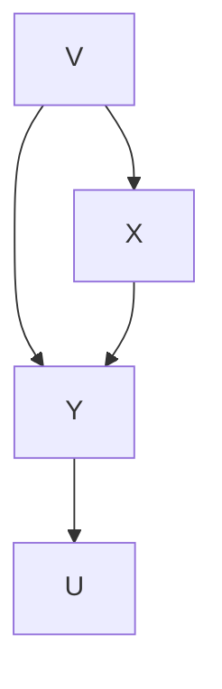

Consider the distribution shown in table 7.2, with the same conventions as in table 7.1. Again, assume all rows are equally probable, ignoring the value of Xf which is not a random variable. Notice that $Y _ { x f = 1 }$ is now dependent on the value of X. And, just as Pratt and Schlaifer require, the conditional distribution of Y on $X = 1$ is not equal to the distribution of $Y _ { X f = 1 }$ .

**Table 7.2**

<table><tr><td>X</td><td>Y</td><td>U</td><td>Xf</td><td> $U_{Xf=1}$ </td><td> $Y_{Xf=1}$ </td></tr><tr><td>1</td><td>1</td><td>0</td><td>1</td><td>0</td><td>1</td></tr><tr><td>1</td><td>2</td><td>1</td><td>1</td><td>1</td><td>2</td></tr><tr><td>1</td><td>3</td><td>2</td><td>1</td><td>2</td><td>3</td></tr><tr><td>2</td><td>2</td><td>0</td><td>1</td><td>0</td><td>1</td></tr><tr><td>2</td><td>3</td><td>1</td><td>1</td><td>1</td><td>2</td></tr><tr><td>2</td><td>4</td><td>2</td><td>1</td><td>2</td><td>3</td></tr></table>

The table was constructed so that when $X = 1$ is forced, and hence $X f = 1$ , the distributions of $U _ { X f = 1 }$ , and $V _ { X f = 1 }$ are independent of Xf. In other words, while the system of equations

$$
Y = X + V + U
$$

$$
X = V
$$

was used to obtain the values of X, Y, and U, the assumptions $U _ { X f = 1 } = U , V _ { X f = 1 } = V$ and the equation

$$
Y _ {X f = 1} = X f + V _ {X f = 1} + U _ {X f = 1}
$$

were used to determine the values of $U _ { X f = 1 } , V _ { X f = 1 }$ and $Y _ { X f = 1 }$ . The forced system was treated as if it were described by the diagram depicted in figure 7.3.


> Figure 7.3

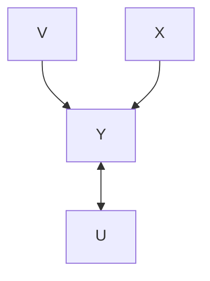


> Figure 7.4

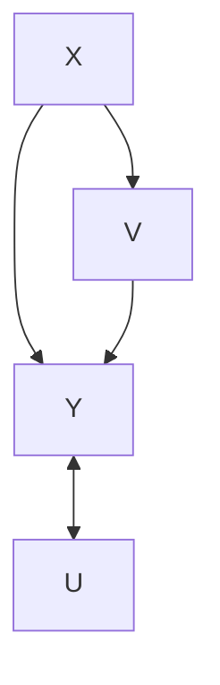

For another example, suppose $Y = X + U ,$ but there is also a variable V that is dependent on both Y and X, so that the system can be depicted as in figure 7.4.

Table 7.3 is a table of values, obtained by assumiTable 7.3 is a table of values obtained by assuming $Y = X + U$ + U  and $V = Y + X$ + X, and and these these relations are unaltered by a direct manipulationrelations are unaltered by a direct manipulation of X.

**Table 7.3**

<table><tr><td>X</td><td>Y</td><td>V</td><td>U</td><td>Xf</td><td> $V_{Xf=1}$ </td><td> $U_{Xf=1}$ </td><td> $Y_{Xf=1}$ </td></tr><tr><td>0</td><td>0</td><td>0</td><td>0</td><td>1</td><td>2</td><td>0</td><td>1</td></tr><tr><td>0</td><td>1</td><td>1</td><td>1</td><td>1</td><td>3</td><td>1</td><td>2</td></tr><tr><td>0</td><td>2</td><td>2</td><td>2</td><td>1</td><td>4</td><td>2</td><td>3</td></tr><tr><td>1</td><td>1</td><td>2</td><td>0</td><td>1</td><td>2</td><td>0</td><td>1</td></tr><tr><td>1</td><td>2</td><td>3</td><td>1</td><td>1</td><td>3</td><td>1</td><td>2</td></tr><tr><td>1</td><td>3</td><td>4</td><td>2</td><td>1</td><td>4</td><td>2</td><td>3</td></tr></table>

Again assume all rows are equally probable. Note that $Y _ { X f = 1 }$ is independent of $X ,$ and $Y _ { X f = 1 }$ has the same distribution as Y conditional on $X = ~ 1$ . So Pratt and Schlaifer’s principle is again satisfied, and in addition the conditional probability of Y on X is invariant. The table was constructed by supposing the manipulated system satisfies the very same system of equations as the unmanipulated system, and in effect that the graph of dependencies in figure 7.4 is unaltered by forcing values on X.

Pratt and Schlaifer’s rules, as we have reconstructed them, are consequences of the Markov Condition. So are other examples described by Rubin. To make the connection explicit we require some results. We will assume the technical definitions introduced in chapter 3, and we will need some further definitions.

If G is a directed acyclic graph over a set of variables V ∪ W, W is exogenous with respect to V in G, Y and Z are disjoint subsets of V, P(V ∪ W) is a distribution that satisfies the Markov condition for G, and Manipulated(W) = X, then P(Y|Z) is invariant under direct manipulation of X in G by changing W from $\mathbf { w _ { 1 } }$ to ${ \bf w } _ { 2 }$ if and only if $P ( \mathbf { Y } | \mathbf { Z } , \mathbf { W } = \mathbf { w } _ { 1 } ) = P ( \mathbf { Y } | \mathbf { Z } , \mathbf { W } = \mathbf { w } _ { 2 } )$ wherever they are both defined. Note that a sufficient condition for P(Y|Z) to be invariant under direct manipulation of X in G by changing W is that W be d-separated from Y given Z in G. In a directed acyclic graph G containing Y and Z, ND(Y) is the set of all vertices that do not have a descendant in Y. If $\mathbf { Y } \cap \mathbf { Z } = \emptyset .$ , then V is in IV(Y,Z) (informative variables for Y given Z) if and only if V is d-connected to Y given Z, and V is not in ND(YZ). (Note that this entails that V is not in $\mathbf { Y } \cup \mathbf { Z } . )$ If Y $\cap \mathbf { Z } = \emptyset \boxed { } \ W$ is in IP(Y,Z) (W has a parent who is an informative variable for Y given Z) if and only if W is a member of Z, and W has a parent in $\mathbf { I V } ( \mathbf { Y } , \mathbf { Z } ) \cup \mathbf { Y }$ . We will use the following result.

THEOREM 7.1: If $G _ { C o m b }$ is a directed acyclic graph over V ∪ W, W is exogenous with respect to V in $G _ { C o m b } , \textbf { Y }$ and Z are disjoint subsets of V, P(V ∪ W) is a distribution that satisfies the Markov condition for $G _ { C o m b } ,$ , no member of X ∩ Z is a member of IP(Y,Z) in $G _ { U n m a n } ,$ and no member of X\Z is a member of IV(Y,Z) in $G _ { U n m a n } ,$ , then P(Y|Z) is invariant under a direct manipulation of X in $G _ { C o m b }$ by changing W from $\mathbf { w _ { 1 } }$ to ${ \bf w } _ { 2 }$ .

The importance of theorem 7.1 is that whether P(Y|Z) is invariant under a direct manipulation of X in $G _ { C o m b }$ by changing W from $\mathbf { w _ { 1 } }$ to ${ \bf w } _ { 2 }$ is determined by properties of $G _ { U n m a n }$ alone. Therefore, we will sometimes speak of the invariance of P(Y|Z) under a direct manipulation of X in $G _ { U n m a n }$ without specifying W or $G _ { C o m b } .$ (As the proofs show, a simpler but equivalent way of formulating theorem 7.1 is that P (Y|Z) is invariant under manipulation of X when Y is d-separated from the policy variables given Z.)

Each of the preceding examples, and Pratt and Schlaifer’s general rule, are consequences of a corollary to theorem 7.1:

COROLLARY 7.1: If $G _ { C o m b }$ is a directed acyclic graph over $\mathbf { V } \cup \mathbf { W }$ , W is exogenous with respect to V in $G _ { C o m b } ,$ X and Y are in V, and $P ( \mathbf { V } \cup \mathbf { W } )$ is a distribution that satisfies the Markov condition for $G _ { C o m b } ,$ then P(Y|X) is invariant under direct manipulation of X in $G _ { C o m b }$ by changing W from $\mathbf { w _ { 1 } }$ to $\mathbf { w } _ { 2 }$ if in $G _ { U n m a n }$ no undirected path into X d-connects X and Y given the empty set of vertices. Equivalently, if (1) Y is not a (direct or indirect) cause of X, and (2) there is no common cause of X and Y in $G _ { U n m a n } .$ .

In graphical terms, Pratt and Schlaifer’s claim amounts to requiring that for “observability” (invariance) G and $G ^ { \prime }$ —the graph of a manipulated system obtained by removing from G all edges into X—and their associated probabilities must give the same conditional distribution of Y on X. Corollary 7.1 characterizes the sufficiency side of this claim. Pratt and Schlaifer say their condition is “almost necessary.” What they mean, we take it, is that there are cases in which the antecedent of their condition fails to hold and the consequent does hold, and, furthermore, that when the antecedent fails to hold the consequent will not hold unless a special constraint is satisfied by the conditional probabilities. Parallel remarks apply to the graphical condition we have given. There exist cases in which there are d-connecting paths between X and Y given the empty set that are into X and the probability of Y when X is directly manipulated is equal to the original conditional probability of Y on X. Again the antecedent will fail and the consequent will hold only if a constraint is satisfied by the conditional probabilities, so the condition is “almost necessary.”It may happen that the distribution of Y when a value is forced on X cannot be predicted from the unforced conditional distribution of Y on X but, nonetheless, the conditional distribution of Y on Z when a value is forced on X can be predicted from the unforced conditional distribution of Y on X and Z. Pratt and Schlaifer consider the general case in which, besides X and Y, some further variables Z are measured. Pratt and Schlaifer say that the law relating Y to X is “observable with concomitant $\mathbf { Z } ^ { \dag }$ when the unforced conditional distribution of Y on X and Z equals the conditional distribution of Y on Z in the population in which X is forced to have a particular value.

Pratt and Schlaifer claim sufficient and “almost necessary” conditions for observability with concomitants, namely that for any value x of X the distribution of X be independent of the conditional distribution of $Y _ { X f = x }$ on the value of z of $Z _ { X f = x }$ when X is forced to have the value x. This rule, too, is a special case of theorem 7.1.

Consider an example due to Rubin. (Rubin’s X is Pratt and Schlaifer’s Z; Rubin’s T is Pratt and Schlaifer’s X). In an educational experiment in which reading program assignments T are assigned on the basis of a randomly sampled value of some pretest variable X which shares one or more unmeasured common causes, V, with Y, the score on a post-test, we wish to predict the average difference in Y values if all students in the population were given treatment T = 1 as against if all students were given treatment $T =$ 2. The situation in the experiment is represented in figure 7.5.


> Figure 7.5

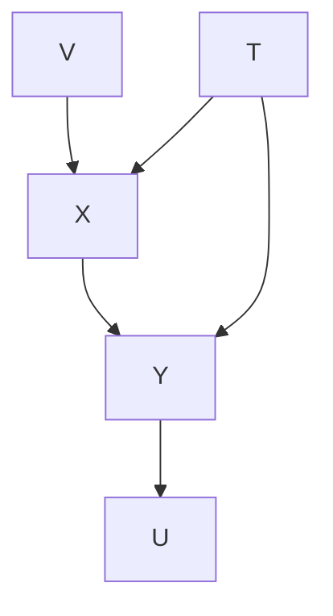

Provided the experimental sample is sufficiently representative, Rubin says that an unbiased estimate of can be obtained as follows: Let k range over values of X, from 1 to K, let Y1k be the average value of Y conditional on T = 1 and X = k, and analogously forlet Y1k be the of Y conditional on T = 1 and X = k, and analogously Y 2k . Let n1k be the number of units in the sample with T = 1 and for Y2k. Let n1k be the number of units in the sample with T = 1 and $X = k ,$ and analogously for n2k. The numbers n1 and n2 represent the total number of units in the sample with T = 1 and T = 2 respectively.

Let $\begin{array} { r } { Y _ { T f = 1 } = } \end{array}$ expected value of Y if treatment 1 is forced on all units. According to Rubin, estimate $Y _ { T f = 1 } \ \mathrm { b y }$ :

$$
\sum_ {k = 1} ^ {K} \frac {n 1 k + n 2 k}{n 1 + n 2} \overline {{Y 1 k}}
$$

and estimate by:

$$
\sum_ {k = 1} ^ {K} \frac {n 1 k + n 2 k}{n 1 + n 2} \left(\overline {{Y 1 k}} - \overline {{Y 2 k}}\right)
$$

The basis for this choice may not be apparent. If we look at the hypothetical population in which every unit is forced to have $T = 1$ , then it is clear from Rubin’s tacit independence assumptions that he treats the manipulated population as if it had the causal structure shown in figure 7.6, as the following derivation shows.

$$
\overline {{Y}} _ {T f = 1} = \sum_ {Y} ^ {\rightarrow} Y \times P (Y _ {T f = 1}) =
$$

$$
\begin{array}{l} \sum_ {Y} ^ {\rightarrow} Y \times \sum_ {k = 1} ^ {K} P (Y _ {T f = 1} | X _ {T f = 1} = k, T _ {T f = 1} = 1) P (X _ {T f = 1} = k | T _ {T f = 1} = 1) P (T _ {T f = 1} = 1) = \\ \sum_ {Y} ^ {\rightarrow} Y \times \sum_ {k = 1} ^ {K} P (Y _ {T f = 1} | X _ {T f = 1} = k, T _ {T f = 1} = 1) P (X _ {T f = 1} = k) \\ \end{array}
$$

The second equality in the above equations hold because $P ( T _ { T f = 1 } = 1 ) = 1$ , and $X _ { T \ J = 1 }$ and $T _ { T \ / = 1 }$ are independent according to the causal graph shown in figure 7.6. By theorem 7.1, both $P ( Y _ { T f = 1 } | X _ { T f = 1 } , T _ { T f = 1 } )$ and $P ( X _ { T \ J = 1 } )$ are invariant under direct manipulation of T in the graph of figure 7.5. This entails the following equation.

$$
\overline {{Y}} _ {T f = 1} = \sum_ {Y} ^ {\rightarrow} Y \times \sum_ {k = 1} ^ {K} P (Y _ {T f = 1} | X _ {T f = 1} = k, T _ {T f = 1} = 1) P (X _ {T f = 1} = k) =
$$

$$
\sum_ {k = 1} ^ {K} P (X = k) \times \sum_ {Y} ^ {\rightarrow} Y \times P (Y | X = k, T = 1) = \frac {n 1 k + n 2 k}{n 1 + n 2} \times \overline {{Y 1 k}}
$$


> Figure 7.6

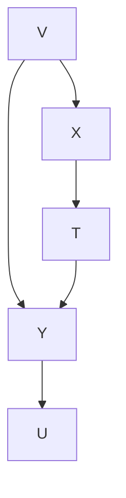

Note that X and T, unlike $X _ { T \ J = 1 }$ and $T _ { T \ / = 1 }$ are not independent. Rubin’s tacit assumption that $X _ { T \ J = 1 }$ and $T _ { T \ / = 1 }$ are independent indicates that he is implicitly assuming that the causal graph of the manipulated population is the graph of figure 7.6, not the graph of figure 7.5, which is the causal structure of the unmanipulated population.structure the unmanipulated population. $\overline { { Y } } _ { T f = 2 }$ 2 can be derived in can be derived in an an analogous fashianalogous fashion.

The reconstruction we have given to Rubin’s theory assumes that all units in the population have the same causal structure for the relevant variables, but not, of course, that the units are otherwise homogenous. It is conceivable that someone might know the counterfactuals required for prediction according to the Pratt and Schlaifer rules even though the relevant causal structure in the population (and in the sample from which inferences are to be made) differs from unit to unit. For example, it might somehow be known that A and B have no unmeasured common cause and that B does not cause A, and the population might in fact be a mixture of systems in which A causes B and systems in which A and B are independent. In that case the distribution of B if A is forced to have the value $A = a$ can be predicted from the conditional probability of B given $A = a .$ , indeed the probabilities are the same. For this, and analogously for other cases of prediction for populations with a mixture of causal structures, the predictions obtained by applying Pratt and Schlaifer’s rule can be derived from the Markov Condition by considering whether the relevant conditional probabilities are invariant in each of the causally homogenous subpopulations. Thus if A and B have no causal connection, $P ( B \mathsf { M } = a )$ equals the probability of B when A is forced to have value a, and if A causes B, $P ( B \mathsf { M } = a )$ equals the probability of B when A is forced to have value a, and so the probability is also the same in any mixture of systems with these two causal structures.

## 7.4 Prediction with Causal Sufficiency

The Rubin framework is specialized in two dimensions. It assumes known various counterfactual (or causal) properties, and it addresses invariance of conditional probability. But we very often don’t know the causal structure or the counterfactuals before considering the data, and we are interested not in invariance per se but only as an instrument in prediction. We need to be clearer about the goal. We suppose that the investigator knows (or estimates) a distribution $P _ { U n m a n } ( \mathbf { O } )$ which is the marginal over O of a distribution faithful to an unknown causal graph $G _ { U n m a n } ,$ with unknown vertex set V that includes O. She also knows the variable, X, that is the member of O that will be directly manipulated, and the variables Parents $( G _ { M a n } , X )$ that will be direct causes of X in $G _ { M a n }$ . She knows that X is the only variable directly manipulated. Finally she knows what the manipulation will do to X, that is, she knowmanipulation will do to X, that is, she knows $P _ { M a n } ( X$ X| $\mathbf { P a r e n t s } ( G _ { M a n } , X ) )$ . The. The distribution of Y conditional on Z is predictable if in these circumstances $P _ { M a n } ( { \bf Y } | { \bf Z } )$ is uniquely determined no matter what the unknown causal graph, no matter what the manipulated and unmanipulated distributions over unobserved variables, and no matter how the manipulation is brought about consistent with the assumptions just specified. The goal is to discover when the distribution of Y conditional on Z is predictable, and how to obtain a prediction.

The assumption that $P _ { U n m a n } ( \mathbf { O } )$ is the marginal over O of a distribution faithful to the unmanipulated graph $G _ { U n m a n }$ may fail for several reasons. First, it may fail because of the particular parameters values of the distribution. If W is a set of policy variables, it also may fail because the ${ \bf w } _ { 2 }$ (manipulated) subpopulation contains dependencies that are not in the $\mathbf { w _ { 1 } }$ (unmanipulated) subpopulation. For example, suppose that a battery is connected to a light bulb by a circuit that contains a switch. Let W be the state of the switch, $w _ { 1 }$ be the unmanipulated subpopulation where the switch is off and $w _ { 2 }$ be the manipulated subpopulation where the switch is on. In the $w _ { 1 }$ subpopulation the state of the light bulb (on or off) is independent of the state of the battery (charged or not) because the bulb is always off. On the other hand in the $w _ { 2 }$ subpopulation the state of the light bulb is dependent on the state of the battery. Hence in $G _ { C o m b }$ there is an edge from the state of the battery to the state of the light bulb; it follows that there is also an edge from the state of the battery to the state of the light bulb in $G _ { U n m a n }$ (which is the subgraph of $G _ { C o m b }$ that leaves out W.) This implies that the joint distribution over the state of the battery and the state of the light bulb in the $w _ { 1 }$ subpopulation is not faithful to $G _ { U n m a n }$ .The results of the Prediction Algorithm are reliable only in circumstances where a manipulation does not introduce additional dependencies (which may or may not be part of one’s background knowledge.)

Suppose we wish to make a prediction of the effect of an intervention or policy from observations of variables correctly believed to be causally sufficient for systems with a common but unknown causal structure. In that case the sample and the PC (or some other) algorithm determine a pattern representing a class of directed graphs, and properties of that class determine whether the distribution of Y following a direct manipulation of X can be predicted. Suppose for example that the pattern is $X \mathrm { ~ - ~ } Y \mathrm { ~ - ~ } Z$ which represents the set of graphs in figure 7.7.


> Figure 7.7

For each of these causal graphs, the distribution of Y after a direct manipulation of X can be calculated, but the result is different for the first graph than for the two others. $P _ { M a n } ( Y )$ for each of the graphs can be calculated from the Manipulation Theorem and taking the appropriate marginal; the results for each graph are given below:

If every unit in the population is forced to have the same value of X, then for (i) the manipulated distribution of Y does not equal the unmanipulated distribution of Y. For (ii) and (iii) the manipulated distribution of Y equals the unmanipulated distribution. Since the pattern does not tell us which of these structures is correct, the distribution of Y on a manipulation of X cannot be predicted.

If a different pattern had been obtained a prediction would have been possible; for example the pattern $U - X \to Y  Z$ can represent either of the graphs in figure 7.8.


> (i)(i)

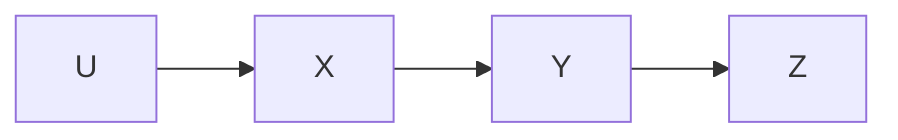


> Figure 7.8


$P _ { M a n } ( Y )$ for each of the graphs can be calculated from the Manipulation Theorem and taking the appropriate marginal; the results for each graph are given below:

- $P _ { M a n } ( Y ) = \sum _ { X } ^ {  } P _ { U n m a n } ( Y \vert X ) P _ { M a n } ( X )$
- $P _ { M a n } ( Y ) = \sum _ { X } ^ {  } P _ { U n m a n } ( Y \vert X ) P _ { M a n } ( X )$

(Note, however, that while $P _ { M a n } ( Y )$ is the same for (i) and (ii), $P _ { M a n } ( U , X , Y , Z )$ is not the same for (i) and (ii), so $P _ { M a n } ( U , X , Y , Z )$ is not predictable.)

When it is known that the structure is causally sufficient, we can decide the predictability of the distribution of a variable (or conditional distribution of one set of variables on another set) by finding the pattern and applying the Manipulation Theorem and taking the appropriate marginal for every graph represented by the pattern. If all graphs give the same result, that is the prediction. Various computational shortcuts are possible, some of which are described in the Prediction Algorithm stated in the next section.

## 7.5 Prediction without Causal Sufficiency

We come finally to the most serious case, in which for all we know the causal structure of the manipulated systems will be different from the causal structure of the observed systems, the causal structure of the observed systems is unknown, and for all we know the observed statistical dependencies may be due to unobserved common causes. This is the situation that Mosteller and Tukey seem to think typical in non-experimental studies, and we agree. The question is whether, nonetheless, prediction is sometimes possible, and if so when and how.

Consider the following trivial example. If we have measured only smoking and lung cancer, we will find that they are correlated. The correlation could be produced by any of the three causal graphs depicted in figure 7.9.


> Figure 7.9

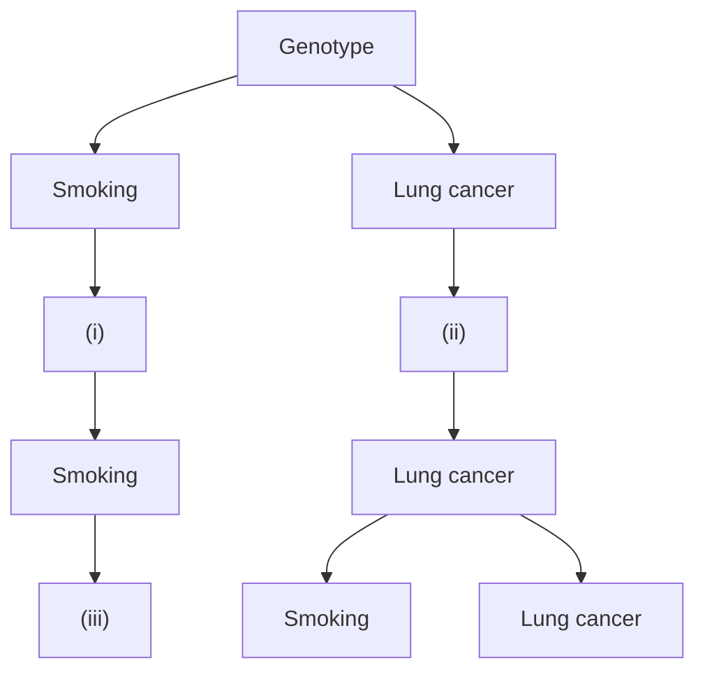

All three graphs yield the same maximally informative partially oriented inducing path graph, shown in figure 7.10.


> Figure 7.10

If Smoking is directly manipulated in graphs (i) or (iii), then P(Lung cancer) will not change; but if Smoking is directly manipulated in graph (ii) then P(Lung cancer) will change. So it is not possible to predict the effects of the direct manipulation of Smoking from the marginal distribution of the measured variables.

In the causally sufficient case each complete orientation of the pattern yields a directedsuffi cient case each complete orientation of pattern yields directed acyclic graph G. According to the Manipulation Theorem, for each directed acyclic graphAccording to Manipulation graph $G _ { U n m a n }$ when we factor the distribution into a product of terms  when we factor the distribution into a product of terms of the form $P _ { U n m a n ( \mathbf { W } ) } ( V \mid$ PUnman(W)Parents $G _ { U n m a n } , V ) )$ s(GUnman,V)) we can calculate the effect of manipulating a variable X we can calculate the effect of manipulating a variable X simply by simply breplacing $P _ { U n m a n ( \mathbf { W } ) } ( X \mid \mathbf { P a r e n t s } ( G _ { U n m a n } , X ) )$ s(GU with $P _ { M a n ( { \bf W } ) } ( X \mid { \bf P a r e n t s } ( G _ { M a n } , X ) )$ nts(GM (where $G _ { M a n }$ (where GMan is the manipulated graph). This simple substitution works because each ofis the manipulated graph). This simple substitution works because each of the terms in the terms in the factorizatifactorization other than $P _ { U n m a n ( \mathbf { W } ) } ( X \mid \mathbf { P a r e n t s } ( G _ { U n m a n } , X ) )$ s(GUnman,X)) is guaranteed to is guaranteed to be invariant be invariant under any direct manipunder any direct manipulation of X in $G _ { U n m a n } ,$ of X in GUnman, and hence can be estimated, and hence can be estimated from frequencies from frequencies in the unmanipin the unmanipulated population.

Let us now try and generalize this strategy to the causally nonsufficient case, where P(O) is the marginal of a distribution P(V) that is faithful to a directed acyclic graph $G _ { U n m a n } ,$ and is the partially oriented inducing path graph of $G _ { U n m a n } .$ . We could search for a factorization of the distribution of P(O) that is a product of terms of the form $P _ { U n m a n } ( V \mid \mathbf { M } ( V ) )$ (where membership in the set M(V) is a function of V) in which each of (where membership in the set M(V) is a function of V) in which each the terms exceptterms except $P _ { U n m a n } ( X \mid \mathbf { M } ( X ) )$ s invariant under all direct manipulations of X in all is invariant under all direct manipulations of X in all directed acyclic graphs for which is a partially oriented inducing path graph over O. If we find such a factorization, then we can predict the effect of the manipulation by substituting the termthe term $P _ { M a n } ( X$ || $\mathbf { P a r e n t s } ( G _ { M a n } , X ) )$ for  for $P _ { U n m a n } ( V \mid \mathbf { M } ( X ) )$ (where  where $G _ { M a n }$ is the is the manipulated graph), just as we did in the causally sufficient case. We will not know which of the many directed acyclic graphs for which is a partially oriented inducing path graph over O actually generated the distribution; however, it will not matter, because $P _ { M a n } ( { \bf Y } | { \bf Z } )$ will be the same for each of them. This is essentially the strategy that we adopt. However, the task of finding such a factorization is considerably more difficult in the causally nonsufficient case: unlike the causally sufficient case where we can simply construct a factorization in which each term excepconstruct a factorization in which each term except $P ( X \mid \mathbf { P a r e n t s } ( G _ { U n m a n } , X ) )$ is invariant under direct manipulation of X in $G _ { U n m a n } ,$ in the causally nonsufficient case we have to search among different factorizations in order to find a factorization in which each term exceptterm except $P _ { U n m a n } ( X \mid \mathbf { M } ( X ) )$ is invariant under all direct manipulations of X for all is invariant under all direct manipulations of X for directed acyclic graphs G that have partially oriented inducing path graph over O equal to . Fortunately, as we will see, we do not have to search though every possible factorization of $P ( \mathbf { O } )$ .

We will flesh out the details of this strategy and provide examples. We will use the FCI algorithm to construct a partially oriented inducing path graph over O of $G _ { U n m a n } .$ Note that in view of Verma and Pearl’s example described in chapter 6, it may be that some graphs for which is a partially oriented inducing path graph over O may not represent any distribution with marginal $P _ { U n m a n } ( \mathbf { O } )$ because of nonindependence constraints. From the theory developed in this book, we cannot hope to provide a computational procedure that decides predictability and obtains predictions whenever they are possible in principle, because we have no understanding of all constraints that graphs may entail for marginal distributions. But by considering only conditional independence constraints we can provide a sufficient condition for predictability.

Here is an example that provides a more detailed illustration of the strategy: Suppose we measure Genotype (G), Smoking (S), Income (I), Parents’ smoking habits (PSH) and Lung cancer (L). Suppose the unmanipulated distribution is faithful to the unmanipulated graph that has the partially oriented inducing path graph shown in figure 7.11.


> Figure 7.11

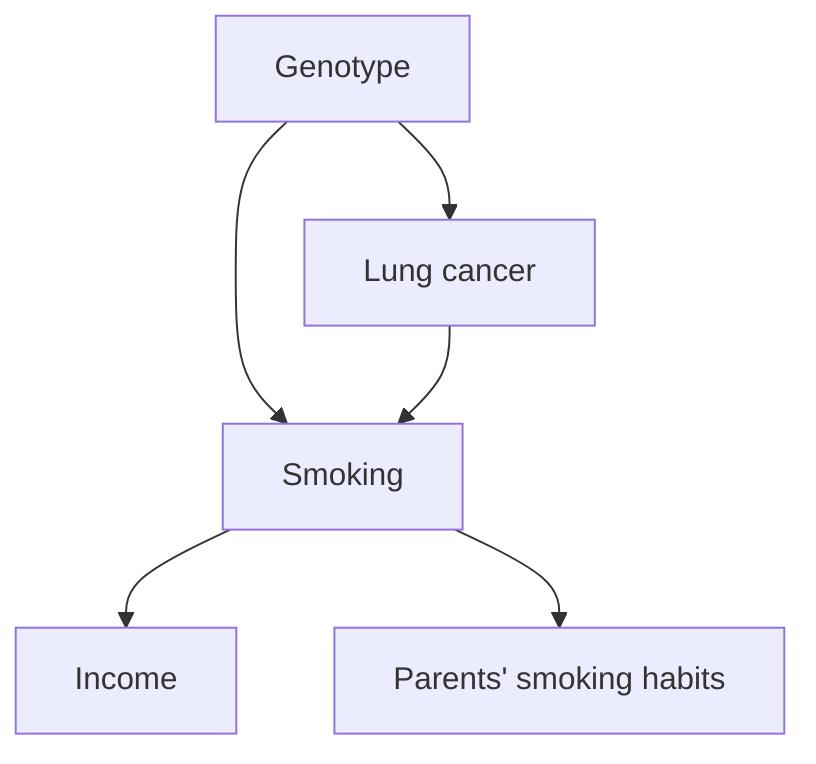

The partially oriented inducing path graph does not tell us whether Income and Smoking have a common unmeasured cause, or Parents’ smoking habits and Smoking have a common unmeasured cause, and so on. The measured distribution might be produced by any of several structures, including, for example those in figure 7.12, where $T _ { 1 }$ and $T _ { 2 }$ are unmeasured.

If we directly manipulate Smoking so that Income and Parents’ smoking habits are not parents of Smoking in the manipulated graph, then no matter which graph produced the marginal distribution, the partially oriented inducing path graph and the Manipulation Theorem tell us that if Smoking is directly manipulated then in the manipulated population the resulting causal graph will look like the graph shown in figure 7.13.

In this case, we can determine the distribution of Lung cancer given a direct manipulation of Smoking. Three steps are involved. Here, we simply give the results of carrying out each step. How each step is carried out is explained in more detail in the next section.

First, from the partially oriented inducing path graph we find a way to factor the joint distribution in the manipulated graph. Let $P _ { U n m a n }$ be the distribution on the measured


> Figure 7.12

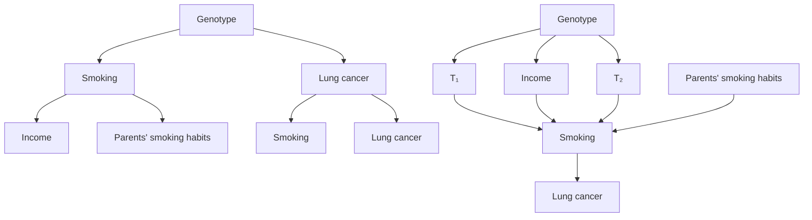

variables and let $P _ { M a n }$ be the distribution that results from a direct manipulation of Smoking. It can be determined from the partially oriented inducing path graph that

$$
P _ {M a n} (I, P S H, S, G, L) = P _ {M a n} (I) \times P _ {M a n} (P S H) \times P _ {M a n} (S) \times P _ {M a n} (G) \times P _ {M a n} (L \mid G, S)
$$


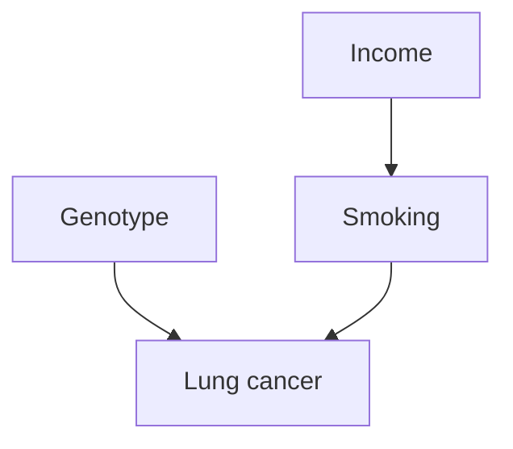

Parents’ smokinsmoking habithabits

Figure 7.13

where I = Income, $P S H = P a r e n t s ^ { \prime }$ smoking habits, S = Smoking, G = Genotype, and $L =$ Lung cancer. This is the factorization of $P _ { M a n }$ corresponding to the immediately preceding graph that represents the result of a direct manipulation of Smoking.

Second, we can determine from the partially oriented inducing path graph which factors in the expression just given for the joint distribution are needed to calculate $P _ { M a n } ( L )$ . In this case $P _ { M a n } ( I )$ and $P _ { M a n } ( P S H )$ prove irrelevant and we have:

$$
P _ {M a n} (L) = \sum_ {G, S} ^ {\rightarrow} P _ {M a n} (S) \times P _ {M a n} (G) \times P _ {M a n} (L | G, S)
$$

Third, we can determine from the partially oriented inducing path graph that $P _ { M a n } ( G )$ and $P _ { M a n } ( L | G , S )$ are equal respectively to the corresponding unmanipulated probabilities, $P _ { U n m a n } ( G )$ and $P _ { U n m a n } ( L \vert G , S )$ . Furthermore,. Furthermore, $P _ { M a n } ( S )$ is assumed to be known, since it is the quantity being manipulated. Hence, all three factors in the expression for $P _ { M a n } ( L )$ are known, and $P _ { M a n } ( L )$ can be calculated.

Note that $P _ { M a n } ( L )$ can be predicted even though $P ( L )$ is most definitely not invariant under a direct manipulation of S. The example should be enough to show that while Mosteller and Tukey’s pessimism about prediction from observation may have been justified when they wrote, it was not well-founded.

The algorithm sketched in the example is described more formally below, where we have labeled each step by a letter for easy reference. Suppose $P _ { U n m a n } ( { \bf V } )$ is the distribution before the manipulation, $P _ { M a n } ( { \mathbf V } )$ the manipulation after the distribution, and a single variable X in X is manipulated to have distribution$P _ { M a n } ( X$ Pa| $\mathbf { P a r e n t s } ( G _ { M a n } , X ) )$ where G, where $G _ { M a n }$ s the manipulated graph. We assume that is the manipulated graph. We assume that $P _ { U n m a n } ( \mathbf { V } )$ is faithful to the unmanipulated graph to the unmanipulaated graph $G _ { U n m a n } ,$ that  that $\mathbf { P a r e n t s } ( G _ { M a n } , X )$ is known, is known, that that $P _ { M a n } ( X \mid$ a $\mathbf { P a r e n t s } ( G _ { M a n } , X ) )$ s known, and that we are interested in predicting is known, and that we are interested in predicting $P _ { M a n } ( { \bf Y } | { \bf Z } )$ . The Prediction Algorithm is simplified by the fact that if $P _ { U n m a n } ( \mathbf { O } )$ satisfies the Markov Condition for a graph $G _ { U n m a n } ,$ , then so does $P _ { M a n } ( \mathbf { O } )$ , and hence any factorized expression for $P _ { U n m a n } ( { \bf Y } | { \bf Z } )$ is also an expression for $P _ { M a n } ( { \bf Y } | { \bf Z } )$ . Recall that a total order Ord of variables in a graph $G ^ { \prime }$ is acceptable for $G ^ { \prime }$ if and only if whenever $A \ne B$ and there is a directed path from A to B in $G ^ { \prime } , A$ precedes B in Ord. If is the FCI partially oriented inducing path graph of G over O, then X is in Definite-Nondescendants(Y) if and only if there is no semidirected path from any Y in Y to X in . Recall that a directed acyclic graph G is a minimal I-map of distribution P if and only if P satisfies the Markov and Minimality Conditions for G.

## Prediction Algorithm

- A.) $P _ { M a n } ( { \bf Y } | { \bf Z } ) = \mathrm { u n k n o w n }$ .
- B.) Generate partially oriented inducing path graph from $P _ { U n m a n } ( \mathbf { O } )$ .
- C.) For each ordering of variables acceptable for in which the predecessors of X in Ord equals Parents $( G _ { M a n } , X ) \cup$ Definite-Nondescendants(X)

- C1.) Form the minimal I-map F of $P _ { U n m a n } ( \mathbf { O } )$ for that ordering;
- C2.) Extract an expression for $P _ { U n m a n } ( { \bf Y } | { \bf Z } )$ from F; call it E;
- C3.) If for each $V \neq X ,$ , the term $P _ { U n m a n } ( V | \mathbf { P a r e n t s } ( F , V ) )$ in E is invariant in $G _ { M a n }$ when X is directly manipulated then

C3a). return $\begin{array} { r l r } { P _ { M a n } ( { \bf Y } | { \bf Z } ) } & { { } = } & { E ^ { \prime } , } \end{array}$ where E - 
- 
- - E except that $P _ { U n m a n } ( X \mid \mathbf { P a r e n t s } ( F , X ) )$ s replaced by P is replaced by $P _ { M a n } ( X \mid \mathbf { P a r e n t s } ( G _ { M a n } , X ) )$

C3b). exit

(The algorithm can also be applied to the case where a set X of variables is manipulated, as long as it is possible to find an ordering of variables such that for each X in X all of the predecessors of X are in Definite-Nondescendants(X) or Parents $( G _ { M a n } , X )$ , there are no causal connections among the variables in X, and if some X in X is a parent of some variable V not in X, then every member of X is a predecessor of V.) The description leaves out important details. How can we find the partially oriented inducing path graph (step B), the graph for which $P _ { U n m a n } ( { \bf V } )$ satisfies the Minimality and Markov conditions for a given ordering of variables (step C1), the expression E for $P _ { M a n } ( { \bf Y } | { \bf Z } )$ (step C2); how do we determine if a given conditional probability term that appears in the expression for $P _ { U n m a n } ( { \bf Y } | { \bf Z } )$ is invariant under a direct manipulation of X in $G _ { U n m a n }$ when we do not know what $G _ { U n m a n }$ is (step C3)? The details are described below.

Step B: We carry out step B) with the FCI Algorithm.

Step C: Say steps C1) and C2) are successful if they produce an expression for $P _ { U n m a n } ( { \bf Y } | { \bf Z } )$ in which for every V in in which for every V in ${ \bf O } \backslash \{ X \} , P _ { U n m a n } ( V$ |Parents(F,V)) is invariant under| Parents(F,V)) is invariant direct manipulation of X in $G _ { U n m a n } .$ . We conjecture that if there is an ordering of variables for which some directed acyclic graph makes C1) and C2) successful, then there is such an ordering that is acceptable for . (Notice that the correctness of the algorithm does not depend upon the correctness of this conjecture, although if it is wrong the algorithm will be less informative than some other algorithm that searches a larger set of variable orderings.)

Step C1: For a given ordering Ord, let Predecessors(Ord,V) be the predecessors of V in Ord. For each V in F over O, let Parents(V) be the smallest subset of Predecessors(V) such that V is independent of Predecessors(Ord,V)\Parents(V) given Parents(V). Then F is a minimal I-map of $P ( \mathbf { O } )$ . See Pearl 1988. Under the assumption that $P ( \mathbf { O } )$ is the marginal of a faithful distribution P(V) we can test whether V is independent of Predecessors(Ord,V)\Parents(V) given Parents(V) by testing whether each member of Predecessors(Ord,V)\Parents(V) is independent of V given Parents(V). This clearly suggests testing whether small sets of variables are equal to Parents(V) first.

For inducing path graph $G ^ { \prime }$ and acceptable total ordering Ord, W is in $\mathbf { S P } ( O r d , G ^ { \prime } , V )$ (separating predecessors of V in $G ^ { \prime }$ for ordering Ord) if and only if W precedes V in Ord and there is an undirected path U between W and V such that each vertex on U except for the endpoints precedes V in $o r d$ and is a collider on U. If G is a directed acyclic graph over V, $G _ { I P }$ is the inducing path graph of G over O, Ord is an ordering acceptable for $G _ { I P } ,$ , and P(V) is faithful to $G ,$ then the directed acyclic graph $G _ { M i n }$ in which for each X in O Parents(X) = SP(Ord,X) is a minimal I-map of $P ( \mathbf { O } )$ . Of course we are not generally given $G _ { I P }$ . However, we can construct a partially oriented inducing path graph and identify sets of variables that narrow down the search for $\mathbf { S P } ( O r d { , } X )$ . For a partially oriented inducing path graph and ordering Ord acceptable for $\pi ,$ let V be in Possible-$\mathbf { S P } ( O r d { , } X )$ if and only if $V \neq X$ and there is an undirected path $U$ in $\pi$ between V and X such that every vertex on $U$ except for X is a predecessor of X in $o r d ,$ and no vertex on U except for the endpoints is a definite-noncollider on $U .$ For a partially oriented inducing path graph over O and ordering Ord acceptable for $\pi ,$ V is in Definite-SP(Ord,X) if and only if $V \neq X$ and there is an undirected path U in $\pi$ between V and X such that every vertex on $U$ except for X is a predecessor of X in Ord, and every vertex on $U$ except for the endpoints is a collider on U.

THEOREM 7.2: If P(O) is the marginal of a distribution faithful to $G$ over V, $\pi$ is a partially oriented inducing path graph of G over O, and Ord is an ordering of variables in O acceptable for some inducing path graph over O with partially oriented inducing path graph $\pi ,$ then there is a minimal I-map $G _ { M i n }$ of $P ( \mathbf { O } )$ in which Definite- ${ \bf S P } ( O r d \mathrm { , } X )$ in $\pi$ is included in $\mathbf { P a r e n t s } ( G _ { M i n } , X )$ which is included in Possible-SP(Ord,X) in .

We can use theorem 7.2 as a heuristic for searching for a minimal I-map of P(O). The procedure is only a heuristic for the following reason. While from we can identify orderings that are not acceptable for any inducing path graph over O with partially oriented inducing path graph , we cannot always definitely tell that some ordering acceptable for is acceptable for some inducing path graph over O with partially oriented inducing path graph . For orderings not acceptable for any such inducing path graph over O, it is possible that making SP(Ord,X) the parents of X in $G _ { M i n }$ does not make $G _ { M i n }$ a minimal I-map, in which case it may be that no set M including Definite-SP(Ord,X) and included in Possible-SP(Ord,X) makes Predecessors(Ord,V)\M independent of X given M. If that is the case, we must conduct a wider search.

Step C2: If P satisfies the Markov condition for directed acyclic graph G, the following lemma shows how to determine an expression E for P(Y|Z). (For a related result see Geiger, Verma, and Pearl 1990)

LEMMA 3.3.5: If P satisfies the Markov condition for directed acyclic graph G over V, then

$$
P (\mathbf {Y} | \mathbf {Z}) = \frac {\sum_ {\mathbf {I V} (\mathbf {Y} , \mathbf {Z})} ^ {\rightarrow} \prod_ {W \in \mathbf {I V} (\mathbf {Y} , \mathbf {Z}) \cup \mathbf {I P} (\mathbf {Y} , \mathbf {Z}) \cup \mathbf {Y}} P (W | \text { Parents } (W))}{\sum_ {\mathbf {I V} (\mathbf {Y} , \mathbf {Z}) \cup \mathbf {Y}} ^ {\rightarrow} \prod_ {W \in \mathbf {I V} (\mathbf {Y} , \mathbf {Z}) \cup \mathbf {I P} (\mathbf {Y} , \mathbf {Z}) \cup \mathbf {Y}} P (W | \text { Parents } (W))}
$$

for all values of V for which the conditional distributions in the factorization are defined, and for which $P ( \mathbf { z } ) \neq 0$ .

Step C3: We use theorems 7.3 and 7.4 below to determine from whether a given conditional distribution is invariant under a direct manipulation of X in $G _ { U n m a n } .$ If is a partially oriented inducing path graph over O, then a vertex B on an undirected path U in a partially oriented inducing path graph over O is a definite noncollider on U if and only if B is an endpoint of U or there are edges $A \ ^ { * } \ – ^ { * } B \ ^ { * } \ – ^ { * } \ C , A \ ^ { * } \ – ^ { * } B \right. \mathsf C , \mathrm { o r } A \left. B \ ^ { * } -$ \* C on U. If $A \neq B ,$ , and A and B are not in Z, then an undirected path U between A and B in a partially oriented inducing path graph over O is a possibly d-connecting path between A and B given Z if and only if every collider on U is the source of a semidirected path to a member of Z, and every definite noncollider is not in Z. If Y and Z are disjoint, then X is in Possibly-IP(Y,Z) if and only if X is in Z, and there is a possibly d-connecting path between X and some Y in Y given $\mathbf { Z } \backslash \{ X \}$ that is not out of X. If Y and Z are disjoint, X is in Possibly-IV(Y,Z) if and only if X is not in Z, there is a possibly d-connecting path between X and some Y in Y given Z, and there is a semidirected path from X to a member of $\mathbf { Y } \cup \mathbf { Z } .$ . Note that theorems 7.3 and 7.4 also entail that if there is a directed acyclic graph G for which an ordering of variables is acceptable that makes steps C1 and C2 successful, then so does the minimal I-map for which that ordering is acceptable.

THEOREM 7.3: If G is a directed acyclic graph over $\mathbf { V } \cup \mathbf { W } .$ , W is exogenous with respect to V in G, O is included in ${ \mathbf { V } } , G _ { U n m a n }$ is the subgraph of G over V, is the FCI partially oriented inducing path graph over O of $G _ { U n m a n } , \mathbf { Y }$ and Z are included in O, X is included in Z, Y and Z are disjoint, and no X in X is in Possibly-IP(Y,Z) in , then P(Y|Z) is invariant under direct manipulation of X in G by changing the value of W from $\mathbf { w _ { 1 } }$ to $\mathbf { W } _ { 2 } .$ .

THEOREM 7.4: If G is a directed acyclic graph over $\mathbf { V } \cup \mathbf { W } .$ , W is exogenous with respect to V in G, O is included in ${ \mathbf { V } } , G _ { U n m a n }$ is the subgraph of G over V, is the FCI partially oriented inducing path graph over O of $G _ { U n m a n } , \mathbf { X }$ , Y and Z are included in O, X, Y and Z are pairwise disjoint, and no X in X is in Possibly-IV(Y,Z) in , then P(Y|Z) is invariant under direct manipulation of X in G by changing the value of W from $\mathbf { w _ { 1 } }$ to ${ \bf w } _ { 2 }$ .

The Prediction Algorithm is based upon the construction of a partially oriented inducing path graph from $P _ { U n m a n ( \mathbf { W } ) } ( \mathbf { V } )$ . Consider the model in figure 7.14, where the relationships among X, Z, and T are linear in graph $G _ { 1 }$ , and W is a policy variable.

Although the distribution over X, Z, and T is not faithful to $G _ { 1 }$ when $W = w _ { 1 }$ if $a = - b c .$ , the distribution over X and Z is faithful to $G _ { 1 } { } ^ { * }$ . In effect, although the distribution over X and Z when $W = w 1$ is faithful to a directed acyclic graph, it is not faithful to the graph of the causal process that generated the distribution. Graph $G _ { 2 }$ depicts the model when X is directly manipulated by changing the value of W from $w _ { 1 }$ to $w _ { 2 } ;$ this makes the coefficient of T in the equation for X equal to 0, and imposes some new distribution upon X. The manipulated distribution over X and $Z$ does not satisfy the Markov condition for $G _ { 1 } { ' } ;$ rather it satisfies the Markov condition for graph $G _ { 2 } ^ { \prime }$ , which contains an edge between X and $Z$ that $G _ { 1 } { ' }$ ---
-,----
--	
-
-


-	 graph from the unmanipulated distribution over X and $Z$ it would contain no edges, and make the prediction that the distribution of $Z$ would be the same in the manipulated and unmanipulated distributions, we would be wrong. Hence the Prediction Algorithm is only guaranteed to be correct when the unmanipulated distribution is faithful to the unmanipulated graph (which includes the $X  Z$ edge because the combined graph contains the $X \to Z { \mathrm { e d g e . } } )$


$$
a = - b c
$$

Figure 7.14

This assumption is not as restrictive as it might first appear. Suppose that we perform an experiment of the effects of Smoking upon Cancer. We decide to assign each subject a number of cigarettes smoked per day in the following way. For each subject in the experiment, we roll a die: if the die comes up 1, they are assigned to smoke no cigarettes, if the die comes up 2, they are assigned to smoke 10 cigarettes per day, etc. Let $\mathbf { W } =$ {Experiment} and $\mathbf { V } = \{ D i e$ , Smoking, Drinking, Cancer}. Figure 7.15 shows the causal graph for the combined population of experimental and non-experimental subjects, and $G _ { U n m a n }$ . The policy variable is Experiment: it has the same value (0) for everyone in the non-experimental population, and the same value (1) for everyone in the experimental population. Die is not a policy variable because it takes on different values for members of the experimental population.


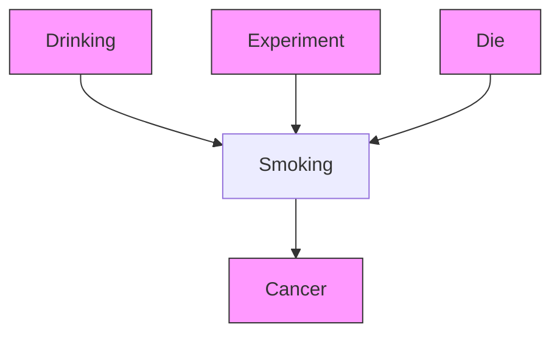


> Figure 7.15

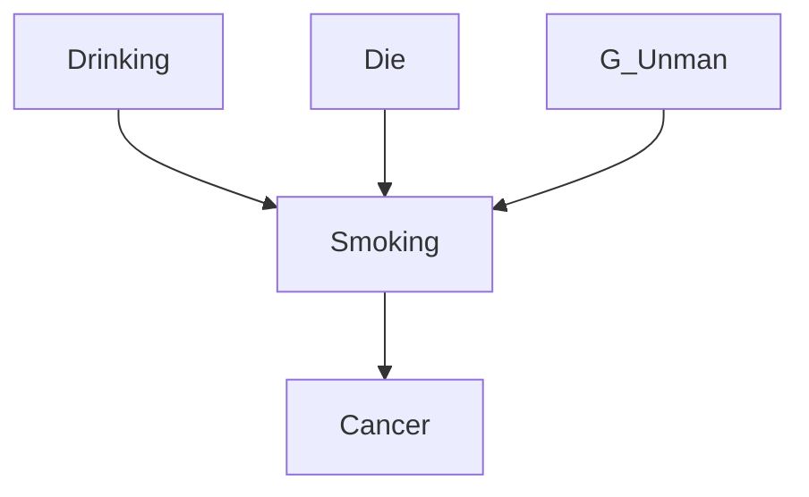

In this case, the assumption that $P _ { U n m a n } ( \mathrm { V } )$ is faithful to $G _ { U n m a n }$ is clearly false because the outcome of the roll of a die and the number of cigarettes smoked by a subject are independent in the non-experimental population, but there is an edge between them in $G _ { U n m a n } .$ Suppose, however that we consider the subset of variables V - - -Smoking, Drinking, Cancer}. The causal graphs that result from marginalizing over $\mathrm { V } ^ { \prime }$ -- in figure 7.16. In this case, $P _ { U n m a n } ( \mathrm { V } ^ { \prime } )$ (-
-

- $G _ { U n m a n } .$ . Since variables that are causes of Smoking in the manipulated population but not in the unmanipulated population complicate the analysis, we will in general simply not consider them. There is no problem in leaving them out of the causal graphs, as long as relative to the set of measured variables they are direct causes only of the manipulated variable. This guarantees that the set of variables that remain after they are removed is causally sufficient.


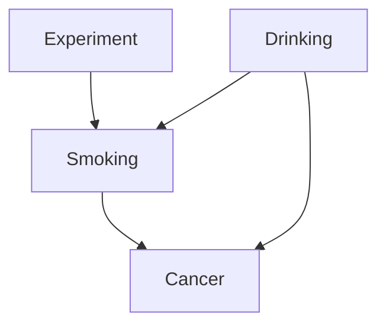


> Figure 7.16

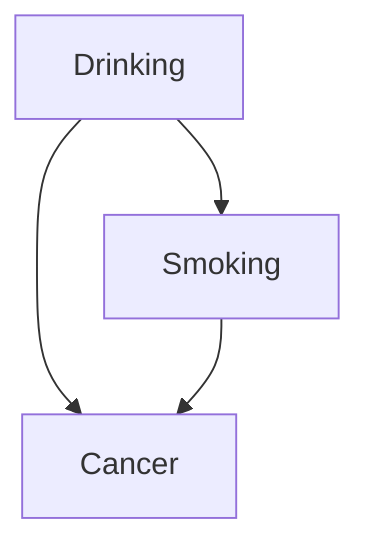

THEOREM 7.5: If G is a directed acyclic graph over V ∪ W, W is exogenous with respect to V in $G , G _ { U n m a n }$ is the subgraph of G over V, $P _ { U n m a n ( \mathbf { W } ) } ( \mathbf { V } ) = P ( \mathbf { V } | \mathbf { W } = \mathbf { w _ { 1 } } )$ is faithful to $G _ { U n m a n } ,$ and changing the value of W from $\mathbf { w _ { 1 } }$ to $\mathbf { w } _ { 2 }$ is a direct manipulation of X in $G ,$ then the Prediction Algorithm is correct.

The Prediction Algorithm is not complete; it may say that $P _ { M a n } ( { \bf Y } | { \bf Z } )$ is unknown when it is calculable in principle.

## 7.6 Examples

First we consider our hypothetical example from the previous chapter, with the directed acyclic graph depicted in figure 7.17, and the partially oriented inducing path graph over O = {Income, Parents’ smoking habits, Smoking, Cilia damage, Heart disease, Lung capacity, Measured breathing dysfunction} depicted in figure 7.18. We assume that $P _ { U n m a n }$ is faithful to $G _ { U n m a n } .$ , and that in the manipulated graph that Income and Parents’ smoking habits are not parents of Smoking. We will use the Prediction Algorithm to draw our conclusions.


> Figure 7.17

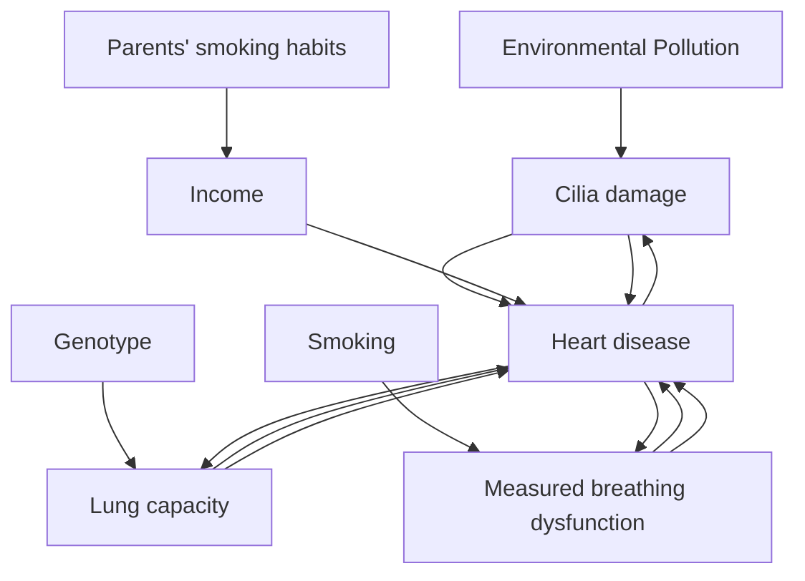

We will show in some detail the process of determining that the entire joint distribution of {Income, Parents’ smoking habits, Heart disease, Lung capacity and Measured breathing dysfunction} is predictable given a direct manipulation of Smoking. Let us abbreviate the names of the variables in the following way:

<table><tr><td>Income</td><td>I</td></tr><tr><td>Parents’ Smoking Habits</td><td>PSH</td></tr><tr><td>Smoking</td><td>S</td></tr><tr><td>Cilia damage</td><td>C</td></tr><tr><td>Heart disease</td><td>H</td></tr><tr><td>Measured breathing dysfunction</td><td>M</td></tr><tr><td>Lung capacity</td><td>L</td></tr></table>


> Figure 7.18

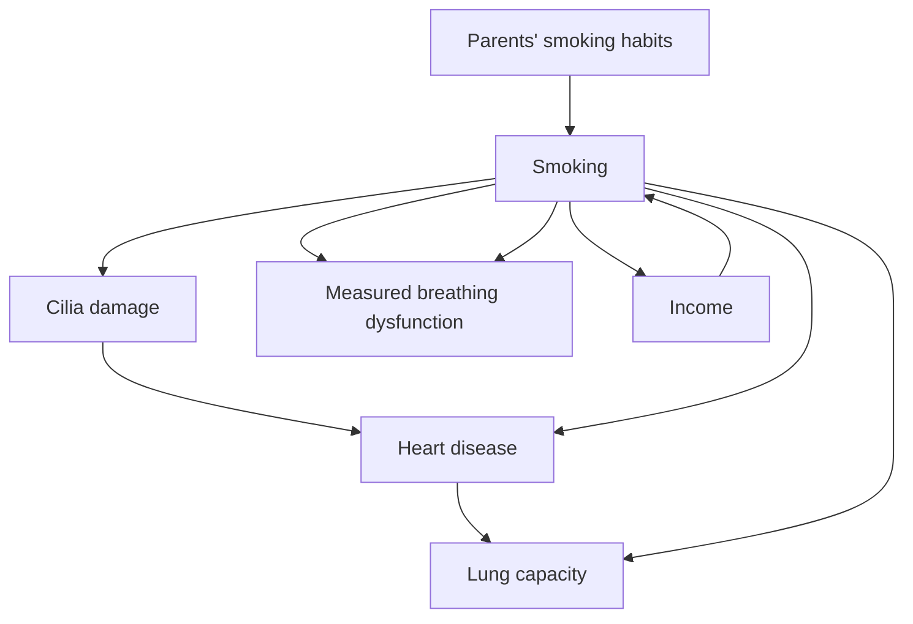

We begin by choosing an ordering for the variables. There are two constraints we impose upon the orderings. First, the only variables that precede S are those variables that are in Definite-Nondescendant(S), and second, the ordering is acceptable for the partially oriented inducing path graph. That means that I, PSH, and H precede S. Second, in order to be acceptable for the partially oriented inducing path graph, S, C, L, and M have to occur in that order. We arbitrarily choose one ordering Ord compatible with these constraints: I, PSH, H, S, C, L M. (Note that the ordering among the variables that are predecessors of the directly manipulated variable never matters because each term containing only variables that are predecessors of the directly manipulated variable is always invariant.)

We generate a directed graph for which $P _ { U n m a n } ( I , P S H , S , C , H , M , L C )$ satisfies the Minimality and Markov conditions. In this case we can determine that any ordering acceptable for the partially oriented inducing path graph in figure 7.18 is also an ordering acceptable for the inducing path graph. Hence, we can apply theorem 7.2. The resulting factorization is $P _ { U n m a n } ( I ) \mathrm {  ~ x ~ } P _ { U n m a n } ( P S H ) \mathrm {  ~ x ~ } P _ { U n m a n } ( H ) \mathrm {  ~ x ~ } P _ { U n m a n } ( S | I , P S H ) \mathrm {  ~ x ~ } P _ { U n m a n } ( C | S , H ) \mathrm {  ~ x ~ }$ $P _ { U n m a n } ( L \vert C , H , S ) \mathrm { ~ x ~ } P _ { U n m a n } ( M \vert C , H , L )$ .

We now determine which terms in the factorized distribution are needed in order to predict the conditional distribution under consideration. Because we are predicting the entire joint distribution, it is trivial that we need every term in the factorized distribution.

Finally, we use the partially oriented inducing path graph to test whether each of the terms except $P _ { U n m a n } ( S | I , P S H )$ in the factorized distribution is invariant under direct manipulation of S in $G _ { U n m a n } . \ P _ { U n m a n } ( I ) , \ P _ { U n m a n } ( P S H )$ , and $P _ { U n m a n } ( H )$ are invariant by theorem 7.4 because there are no semidirected paths from S to I, H, or PSH. $P _ { U n m a n } ( C | S , H )$ is invariant by theorem 7.3 because every path possibly d-connecting pathS to C given H is out of S. $P _ { U n m a n } ( L | C , S , H )$ , is invariant by theorem 7.3 because every path possibly d-connecting path between S and L given C and H is out of S. Finally $P _ { U n m a n } ( M \mid C , H , L )$ s invariant by theorem 7.4 because there is no possibly d-connecting is invariant by theorem 7.4 because there is no possible path between S and M given C, H, and L.

$$
\begin{array}{c} \text {Hence, P_{Man} (I,PSH,H,S,C,L,M) = P_{Unman} (I)\times P_{Unman} (PSH)\times P_{Unman} (H)\times P_{Man} (S)\times} \\ P _ {U n m a n} (C \mid S, H) \times P _ {U n m a n} (L \mid C, H, S) \times P _ {U n m a n} (M \mid C, H, L). \end{array}
$$

In this case, the search was simple because for the given ordering of variables, every term in the expression for $P _ { U n m a n } ( I , P S H , H , S , C , L , M )$ except for $P _ { M a n } ( S )$ is invariant under direct manipulation of Smoking in $G _ { U n m a n } .$ . If the expression had failed this test we would have repeated the process by generating different orderings of variables, until we had found a factorized expression of $P ( I , P S H , H , S , C , L , M )$ in which each term except $P _ { M a n } ( S )$ （2号 was invariant or we ran out of orderings.

For the next example, consider three alternative models of the relationship between Smoking and Lung cancer depicted in figure 7.19. In $G _ { 1 } ,$ , Smoking causes Lung cancer, and there is a common cause of Smoking and Lung cancer; in $G _ { 2 } .$ Smoking does not cause Lung cancer, but there is a common cause of Lung cancer and Smoking; and in $G _ { 3 } ,$ Smoking causes Lung cancer, but there is no common cause of Smoking and Lung cancer.

The maximally informative partially oriented inducing path graph of $G _ { 1 } , G _ { 2 } ,$ and $G _ { 3 }$ over O = {Smoking, Lung cancer} is shown in figure 7.20.

From this partially oriented inducing path graph it is impossible to determine whether Smoking causes Lung cancer (as in $G _ { 3 } )$ or Smoking does not cause Lung cancer but there is a common cause of Smoking and Lung cancer (as in $G _ { 2 } )$ , or Smoking causes Lung cancer and there is also a common cause (as in $G _ { 1 } )$ . In addition, we cannot predict the distribution of Lung cancer when Smoking is directly manipulated. If we try the ordering of variables <Smoking,Lung cancer> then in order to apply the Prediction Algorithm, we need to show that P(Lung cancer|Smoking) is invariant under direct manipulation of Smoking in $G _ { U n m a n } .$ . But we cannot use theorem 7.3 to show that P(Lung cancer|Smoking) is invariant because the Smoking o-o Lung cancer edge guarantees that there is a possibly d-connecting path between Smoking and Lung cancer given the empty set that is not out of Smoking. This is a quite general feature of the method; it cannot be used to predict a conditional distribution of Y whenever there is an edge between the variable X being directly manipulated and Y that has a $\because \mathrm { o } ^ { \prime \prime }$ at the X end. Of course, this feature does not of itself show that P(Lung cancer) is not predictable by some other method (although in this example it clearly is not.)

Suppose, however, that O = {Smoking, Lung cancer, Income}. If the true graph is $G _ { 2 } ,$ the partially oriented inducing path graph is shown in figure 7.21.


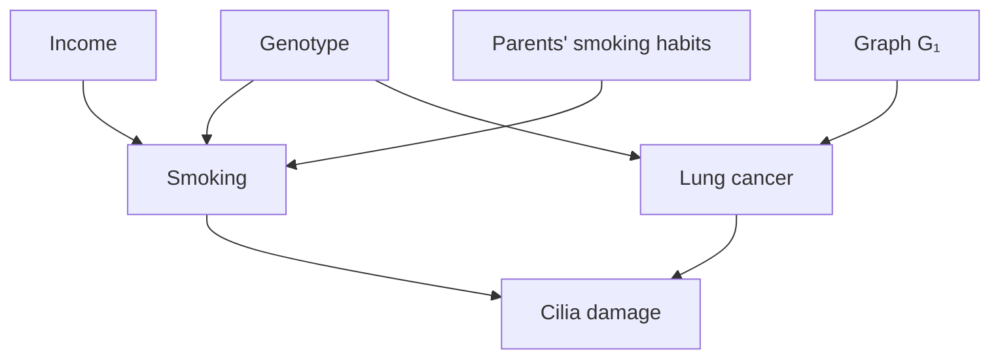


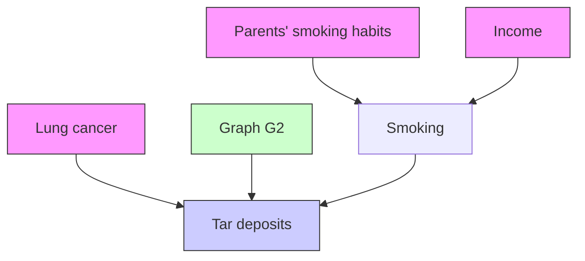


> Figure 1.19

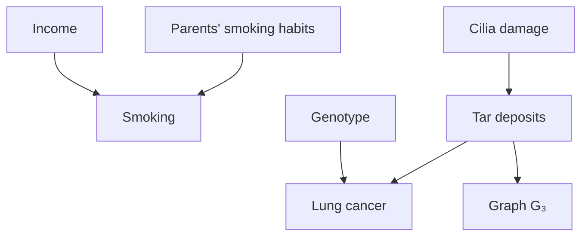


> Figure 7.20

```mermaid
graph LR
  A["Smoking"] --> B["Lung cancer"]
```


> Figure 7.21

```mermaid
graph LR
  A["Income"] --> B["Smoking"]
  B --> C["Lung cancer"]
```

By the results of the previous chapter, we can conclude that Smoking does not cause Lung cancer, because there is no semidirected path from Smoking to Lung cancer. In this case P(Lung cancer) is invariant under direct manipulation of Smoking in $G _ { U n m a n } ,$ so $P _ { M a n } ( L u n g c a n c e r )$ is predictable.


```mermaid
graph LR
  A["Income"] --> B["Smoking"]
  B --> C["Lung cancer"]
    A -.-> C
```

Over O = {Lung Cancer, Smoking, Partially Oriented Inducing Path Graph of $G _ { 1 }$ come} over O = {Lung Cancer, Smoking, Income}


```mermaid
graph LR
  A["Income"] --> B["Smoking"]
  B --> C["Lung cancer"]
```

Over O = {Lung Cancer, Smoking, Partially Oriented Inducing Path Graph of $G _ { 3 }$ come} over O = {Lung Cancer, Smoking, Income}

Figure 7.22

The partially oriented inducing path graphs for $G _ { 1 }$ and $G _ { 3 }$ over O = {Lung cancer, Smoking, Income} (shown in figure 7.22) do not contain enough information in order to determine whether Smoking causes Lung cancer. Because in each case there is a Smoking o-o Lung cancer edge it follows that we cannot use the Prediction Algorithm to predict $P _ { M a n } ( L u n g c a n c e r )$ .

If the true graph is $G _ { 3 }$ it is possible to determine that Smoking causes Lung cancer by also measuring two causes of Smoking that are not directly connected in the partially oriented inducing path graph, as in figure 7.23. Because there is a directed path fromSmoking to Lung cancer in the partially oriented inducing path graph, by the results of the preceding chapter there is a directed path from Smoking to Lung cancer in the causal graph of the process that generated the data, and Smoking causes Lung cancer. The output of the Prediction Algorithm is:

$$
P _ {M a n} (L u n g C a n c e r) = \sum_ {S m o k i n g} ^ {\rightarrow} P _ {M a n} (S m o k i n g) P _ {U n m a n} (L u n g C a n c e r | S m o k i n g)
$$

Note that it is not necessary that Parents’ Smoking Habits and Income be uncorrelated, or direct parents of Smoking. The Smoking to Lung cancer edge is oriented by any pair of variables that have edges that collide at a third variable V, that are not adjacent in the partially oriented inducing path graph, and such that there is a directed path U from V to Smoking and for every subpath ${ < X , Y , Z > }$ of U, X, Y, and Z do not form a triangle.


> Figure 7.23

```mermaid
graph TD
  A["Parents' Smoking Habits"] --> B["Smoking"]
  C["Income"] --> B
  B --> D["Lung cancer"]
```

Unfortunately, it is more difficult to determine whether Smoking is a cause of Lung cancer if $G _ { 1 }$ is the true causal graph. If O = {Smoking, Lung cancer, Income, Parents’ Smoking Habits} and $G _ { 1 }$ is the true causal graph, without further background knowledge we cannot determine whether Smoking causes Lung cancer. Figure 7.24 shows that in the partially oriented inducing path graph the Smoking to Lung cancer edge is in triangles with Income and Parents’ smoking habits and hence is oriented with an $\cdot _ { \mathbf { 0 } } ,$ at each end. It follows from the existence of the Smoking o-o Lung cancer edge that we cannot use the Prediction Algorithm to predict P(Lung cancer) when Smoking is directly manipulated.

It is plausible that Income does not cause Lung cancer directly. If we know from background knowledge that if there is a causal connection between Income and Lung cancer it contains a causal path from Smoking to Lung cancer, then we can conclude from the partially oriented inducing path graph that Smoking does cause Lung cancer.


> Figure 7.24

```mermaid
graph TD
  A["Parents' Smoking Habits"] --> B["Smoking"]
  C["Income"] --> B
  B --> D["Lung cancer"]
  D --> A
  B --> C
  D --> C
```

Alternatively, if $G _ { 1 }$ is the correct model, we might try to determine that Smoking is a cause of cancer by measuring a variable such as Tar deposits, that is causally between Smoking and Lung cancer. While there is still an induced edge between Income and Lung Cancer in the partially oriented inducing path graph, Income, Smoking, and Tar deposits are not in a triangle, and the edge from Smoking to Tar deposits can be oriented. Unfortunately, as figure 7.25 illustrates, this now leaves one end of the edge between Tar deposits and Lung cancer oriented with a “o” at one end, so the partially oriented inducing path graph still does not entail that Smoking causes Lung cancer. And because there is a Smoking o-o Lung cancer edge, $P _ { M a n } ( L u n g c a n c e r )$ is not predictable using the Prediction Algorithm.


> Figure 7.25

```mermaid
graph TD
  A["Parents' Smoking Habits"] --> B["Smoking"]
  B --> C["Tar deposits"]
  C --> D["Lung cancer"]
  D --> A
  B --> E["Income"]
  E --> B
  C --> D
  D --> E
```

However, if $G _ { 1 }$ is the correct model, and we measure a variable between Smoking and Lung cancer, such as Tar deposits, and another cause of Tar deposits, such as Cilia damage, we can determine that Smoking causes Lung cancer. (See figure 7.26.) However, we cannot predict $P _ { m a n } ( L u n g c a n c e r )$ using the Prediction Algorithm because of the Smoking o→ Lung cancer edge.


> Figure 7.26

```mermaid
graph TD
  A["Parents' Smoking Habits"] --> B["Smoking"]
  C["Income"] --> B
  B --> D["Tar deposits"]
  D --> E["Lung cancer"]
  F["Cilia damage"] --> B
  F --> E
  B --> G["O"]
  D --> H["O"]
  E --> I["O"]
  G --> B
  H --> B
  I --> E
```

We can also determine that Smoking is a cause of Lung cancer by breaking the Income-Smoking-Lung cancer triangle by measuring all of the common causes of Smoking and Lung cancer (in this case, Genotype). By measuring all of the common causes of Smoking and Lung cancer, the edge between Income and Lung cancer is removed from the partially oriented inducing path graph. This breaks triangles involving Income, Smoking, and Lung cancer, so that the Smoking to Lung cancer edge can be oriented by the edge between Income and Smoking, as in figure 7.27. In addition, $P _ { M a n } ( L u n g c a n c e r )$ is predictable. The output of the Prediction Algorithm is:

$$
P _ {M a n} (L u n g C a n c e r) =
$$

$\sum _ { S m o k i n g , G e n o t y p e } ^ {  } P _ { M a n } ( S m o k i n g ) P _ { U n m a n } ( G e n o t y p e ) P _ { U n m a n } ( L u n g C a n c e r ! S m o k i n g , G e n o t y p e )$

Of course, measuring all of the common causes of Smoking and Lung cancer may be difficult both because of the number of such common causes, and because of measurement difficulties (as in the case of Genotype). So long as even one common cause remains unmeasured, the inducing path graph has an Income - Smoking - Lung cancer triangle, and the edge between Smoking and Lung cancer cannot be oriented.

Although we cannot determine from the partially oriented inducing path graph in figure 7.27 whether Genotype is a common cause of Smoking and Lung cancer, we can determine that there is some common cause of Smoking and Lung cancer.


> Figure 7.27

```mermaid
graph TD
  A["Genotype"] --> B["Smoking"]
  A --> C["Lung cancer"]
  D["Income"] --> B
  E["Parents' smoking habits"] --> B
```

## 7.7 Conclusion

The results developed here show that there exist possible cases in which predictions of the effects of manipulations can be obtained from observations of unmanipulated systems, and predictions of experimental outcomes can be made from uncontrolled observations. Some examples from real data analysis problems will be considered in the next chapter. We do not know whether our sufficient conditions for prediction are close to maximally informative, and a good deal of theoretical work remains to be done on the question.

## 7.8 Background Notes

Anticipations of the theory developed in this chapter can be found in Strotz and Wold 1960, in Robins 1986, and in the tradition of work inaugurated by Rubin. The special case of the Manipulation Theorem that applies when an intervention makes a single directly manipulated variable X independent of its parents was independently conjectured by Fienberg in a seminar in 1991. Subsequently, Pearl (1995) has given rules for calculating predictions from interventions. the rules, which follow from theorem 7.1, areThe rules, which follow from theorem 7.1, discussed in chapter 12.