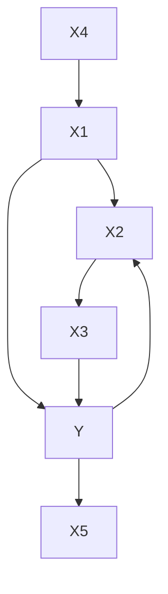
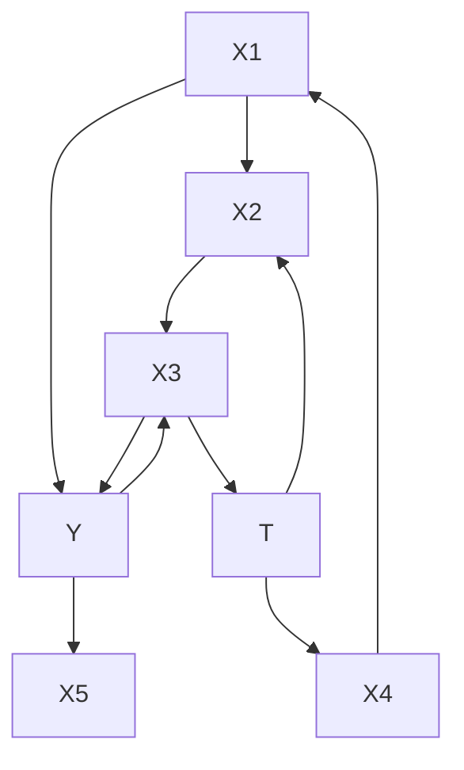
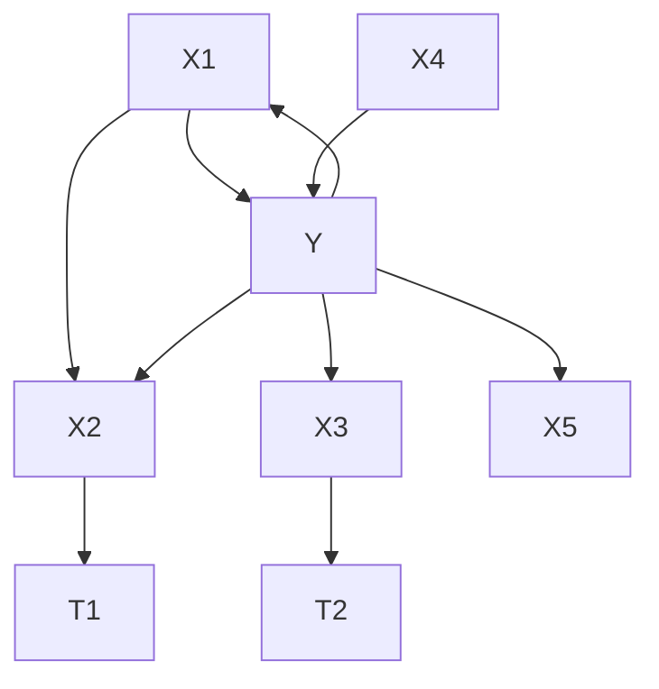
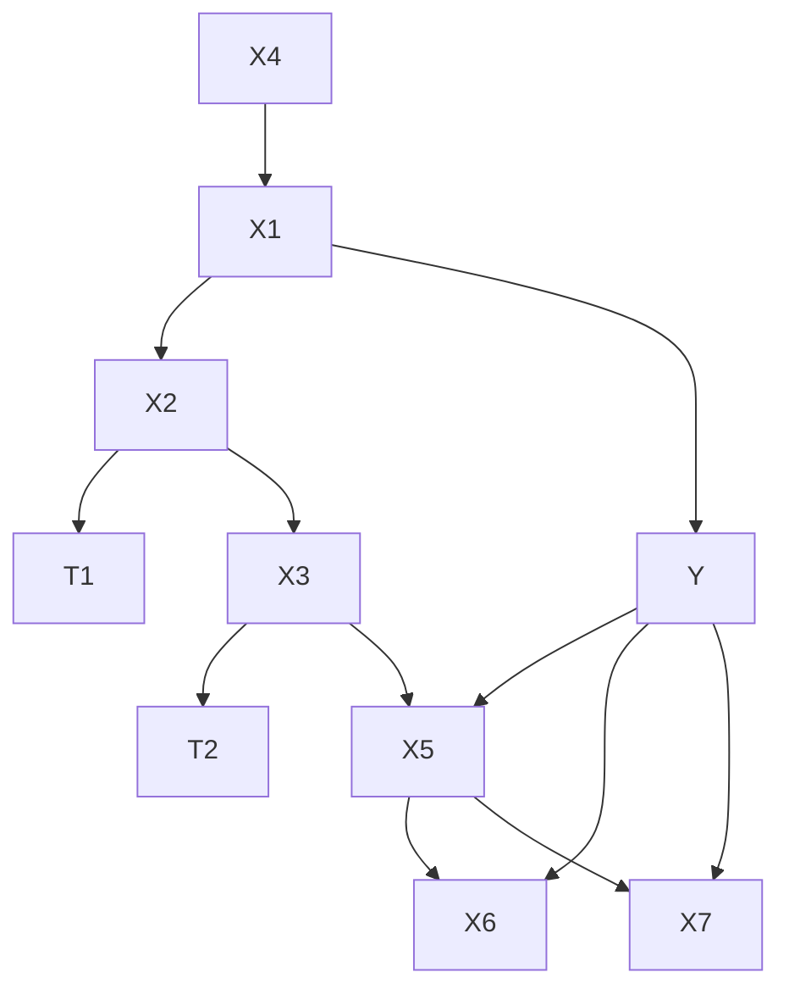
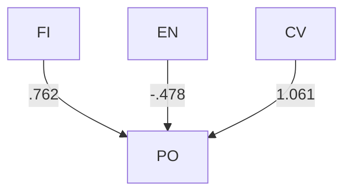
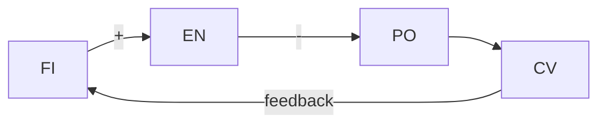
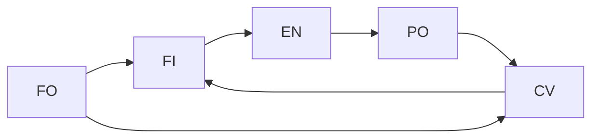
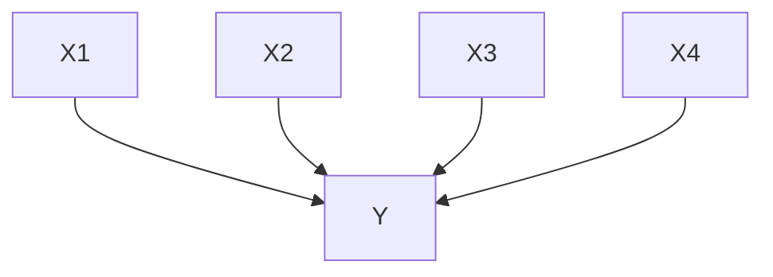
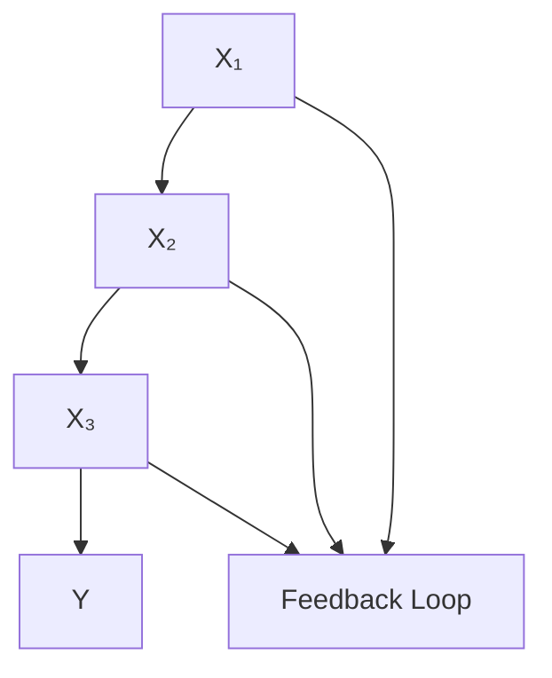
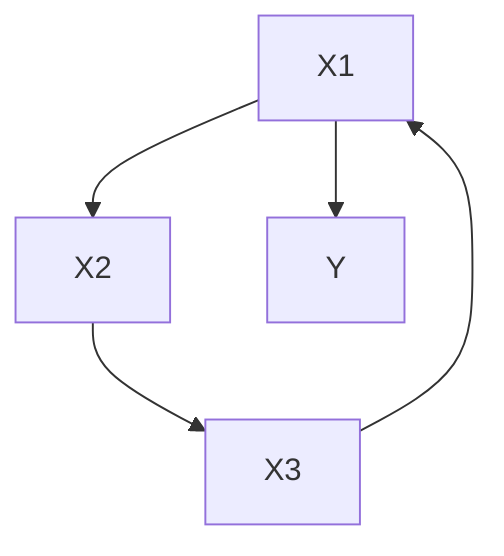

# Regression, Causation, and Prediction

Regression is a special case, not a special subject. The problems of causal inference in regression studies are instances of the problems we have considered in the previous chapters, and the solutions are to be found there as well. What is singular about regression is only that a technique so ill suited to causal inference should have found such wide employment to that purpose.

## 8.1 When Regression Fails to Measure Influence

Regression models are commonly used to estimate the “influence” that regressors X have on an outcome variable, $Y . ^ { 1 }$ If the relations among the variables are linear then for each $X _ { i }$ the expected change in Y that would be produced by a unit change in $X _ { i }$ if all other X variables are forced to be constant can be represented by a parameter, say $\alpha _ { i } .$ It is obvious and widely noted (see, e.g., Fox 1984) that the regression estimate of $\alpha _ { i }$ will be incorrect if $X _ { i }$ and Y have one or more unmeasured common causes, or in more conventional statistical terminology, the estimate will be biased and inconsistent if the error variable for Y is correlated with $X _ { i } .$ To avoid such errors, it is often recommended (Pratt and Schlaifer 1988) that investigators enlarge the set of potential regressors and determine if the regression coefficients for the original regressors remain stable, in the hope that confounding common causes, if any, will thereby be measured and revealed. Regression estimates are known often to be unstable when the number of regressors is enlarged, because, for example, additional regressors may be common causes of previous regressors and the outcome variable (Mosteller and Tukey 1977). The stability of a regression coefficient for X when other regressors are added is taken to be evidence that X and the outcome variable have no common cause.

It does not seem to be recognized, however, that when regressors are statistically dependent, the existence of an unmeasured common cause of regressor $X _ { i }$ and outcome variable Y may bias estimates of the influence of other regressors, $X _ { k } ;$ variables having no influence on Y whatsoever, nor even a common cause with Y, may thereby be given significant regression coefficients. The error may be quite large. The strategy of regressing on a larger set of variables and checking stability may compound rather than remedy this problem. A similar difficulty may arise if one of the measured candidate regressors is an $e f f e c t$ , rather than a cause, of Y, a circumstance that we think may sometimes occur in uncontrolled studies.

To illustrate the problem, consider the linear structures in figure 8.1, where for concreteness we specify that exogenous and error variables are all uncorrelated and jointly normally distributed, the error variables have zero means, and linear coefficients are not zero. Only the X variables and Y are assumed to be measured. Each set of linear equations is accompanied by a directed graph illustrating the assumed causal and functional dependencies among the non-error variables. In large samples, for data from each of these structures linear multiple regression will give all variables in the set $\{ X _ { 1 } , X _ { 2 } ,$ $X _ { 3 } , X _ { 5 } \}$ nonzero regression coefficients, even though $X _ { 2 }$ has no direct influence on Y in any of these structures, and $X _ { 3 }$ has no influence direct or indirect on Y in structures (i), and (ii), and the effect of $X _ { 3 }$ in structures (iii) and (iv) is confounded by an unmeasured common cause. The regression estimates of the influences of $X _ { 2 }$ and $X _ { 3 }$ will in all four cases be incorrect. If a specification search for regressors had selected $X _ { 1 }$ alone or $X _ { 1 }$ and $X _ { 5 }$ in (i) or (ii), or $X _ { 5 }$ alone in (i), (ii), (iii), or (iv), a regression on these variables would give consistent, unbiased estimates of their influence on Y. But the textbook procedures in commercial statistical packages will in all of these cases fail to identify $\{ X _ { 1 } \}$ or $\{ X _ { 5 } \}$ or $\{ X _ { 1 } , X _ { 5 } \}$ as the appropriate subset of regressors.

It is easy to produce examples of the difficulty by simulation. Using structure (i), twenty sets of values for the linear coefficients were generated, half positive and half negative, each with absolute value greater than .5. For each system of coefficient values a random sample of 5,000 units was generated by substituting those values for the coefficients of structure (i) and using uncorrelated standard normal distributions for the exogenous variables. Each sample was given to MINITAB, and in all cases MINITAB found that $\{ X _ { 1 } , X _ { 2 } , X _ { 3 } , X _ { 5 } \}$ is the set of regressors with significant regression coefficients. The STEPWISE procedure in MINITAB selected the same set in approximately half the cases and in the others added $X _ { 4 }$ to boot; selection by the lowest value of Mallow’s $C _ { p }$ or adjusted $R ^ { 2 }$ gave results similar to the STEPWISE procedure.

The difficulty can be remedied if one measures all common causes of the outcome variable and the candidate regressors, but unfortunately nothing in regression methods informs one as to when that condition has been reached. And the addition of extra candidate regressors may create the problem rather than remedy it; in structures (i) and (ii), if $X _ { 3 }$ were not measured the regression estimate of $X _ { 2 }$ would be consistent and unbiased.

The problem we have illustrated is quite general; it will lead to error in the estimate of the influence of any regressor $X _ { k }$ that directly causes or has a common direct unmeasured common cause with any regressor $X _ { i }$ such that $X _ { i }$ and Y have an unmeasured common cause (or $X _ { i }$ is an effect of Y). Depending on the true structure and coefficient values the error may be quite large. It is easy to construct cases in which a variable with no influence on the outcome variable has a standardized regression coefficient larger than any other single regressor. Completely parallel problems arise for categorical data. Recall theorem 3.4:

$$
Y = a _ {1} X _ {1} + a _ {2} X _ {5} + \varepsilon_ {\mathrm{Y}} \quad Y = a _ {1} X _ {1} + a _ {2} X _ {5} + a _ {3} T + \varepsilon_ {\mathrm{Y}}
$$

$$
X _ {1} = a _ {3} X _ {2} + a _ {4} X _ {4} + \varepsilon_ {1} \quad X _ {1} = a _ {4} X _ {2} + a _ {5} X _ {4} + \varepsilon_ {1}
$$

$$
X _ {3} = a _ {5} X _ {2} + a _ {6} Y + \varepsilon_ {3} \quad X _ {3} = a _ {6} X _ {2} + a _ {7} T + \varepsilon_ {3}
$$

> (i)

$$
Y = a _ {1} X _ {1} + a _ {2} X _ {5} + a _ {3} T _ {2} + a _ {4} X _ {3} + \varepsilon_ {\mathrm{Y}} \quad Y = a _ {1} X _ {1} + a _ {2} X _ {5} + a _ {3} T _ {2} + a _ {4} X _ {3} + \varepsilon_ {\mathrm{Y}}
$$

$$
X _ {1} = a _ {5} X _ {2} + a _ {6} X _ {4} + \varepsilon_ {1} \quad X _ {1} = a _ {5} X _ {2} + a _ {6} X _ {4} + \varepsilon_ {1}
$$

$$
X _ {2} = a _ {7} T _ {1} + \varepsilon_ {2} \quad X _ {2} = a _ {7} T _ {1} + \varepsilon_ {2}
$$

$$
X _ {3} = a _ {8} T _ {1} + a _ {9} T _ {2} + \varepsilon_ {3} \quad X _ {3} = a _ {8} T _ {1} + a _ {9} T _ {2} + \varepsilon_ {3}
$$

$$
X _ {5} = a _ {1 0} X _ {6} + a _ {1 1} X _ {7} + \varepsilon_ {5}
$$

> (iii)

> (iv) Figure 8.1

THEOREM 3.4: If P is faithful to some graph, then P is faithful to G if and only if (i) for all vertices, X, Y of G, X and Y are adjacent if and only if X and Y are dependent conditional on every set of vertices of G that does not include X or Y; and (ii) for all vertices X, Y, Z such that X is adjacent to Y and Y is adjacent to Z and X and Z are not adjacent, $X \right. Y \left. Z$ is a subgraph of G if and only if X, Z are dependent conditional on every set containing Y but not X or Z.

Consideration of the first part of this theorem explains why in structure (i) in figure 8.1 regression procedures incorrectly select $X _ { 2 }$ as a variable directly influencing Y: The structure and distribution satisfy the Markov and Faithfulness conditions, but linear regression takes a variable $X _ { i }$ to influence Y provided the partial correlation of $X _ { i }$ and Y controlling for all of the other X variables does not vanish. Part (i) of theorem 3.4 shows that the regression criterion is insufficient. It follows immediately from theorem 3.4 that, assuming the Markov and Faithfulness Conditions, regression of Y on a set X of variables will only yield an unbiased or consistent estimate of the influences of the X variables provided in the true structure no X variable is the effect of Y or has a common unmeasured cause with Y.

Since typical empirical data sets to which multiple regression methods are applied have some correlated regressors, and in uncontrolled studies it is rare to know that unmeasured common causes are not acting on both the outcome variable and the regressors, the problem is endemic. One of the most common uses of statistical methods thus appears to be little more than elaborate guessing.

## 8.2 A Solution and Its Application

Assuming the right variables have been measured, there is a straightforward solution to these problems: apply the PC, FCI, or other reliable algorithm, and appropriate theorems from the preceding chapters, to determine which X variables influence the outcome Y, which do not, and for which the question cannot be answered from the measurements; then estimate the dependencies by whatever methods seem appropriate and apply the results of the previous chapter to obtain predictions of the effect of manipulating the X variables. No extra theory is required. We will give a number of illustrations, both empirical and simulated.

We begin by noting that for the twenty samples from structure (i), in every case our implementation of the PC algorithm—which of course assumes there are no latent variables—selects $\{ X _ { 1 } , X _ { 5 } \}$ as the variables that directly influence Y. Our implementation of the FCI algorithm, which makes no such assumption, in every case says that $X _ { 1 }$ directly influences Y, that $X _ { 5 }$ may, and that the other variables do not.

In each of the other three structures in figure 8.1 with sufficiently large samples multiple regression methods will make errors, always including $X _ { 2 }$ and $X _ { 3 }$ among the “significant” or “best” or “important” variables. In contrast the FCI algorithm together with theorems 6.5 through 6.8 give the following results:

<table><tr><td>Structure</td><td>Direct Influence</td><td>No Direct Influence</td><td>Undetermined</td></tr><tr><td>(ii)</td><td> $X_{1}$ </td><td> $X_{2}, X_{3}, X_{4}$ </td><td> $X_{5}$ </td></tr><tr><td>(iii)</td><td> $X_{1}$ </td><td> $X_{4}$ </td><td> $X_{2}, X_{3}, X_{5}$ </td></tr><tr><td>(iv)</td><td> $X_{1}, X_{5}$ </td><td> $X_{4}, X_{6}, X_{7}$ </td><td> $X_{2}, X_{3}$ </td></tr></table>

In all of these cases the FCI procedure either determines definitely that $X _ { 2 }$ and $X _ { 3 }$ have no direct influence on Y, or determines that it cannot be decided whether they have any unconfounded direct influence.

## 8.2.1 Components of the Armed Forces Qualification Test

The AFQT is a test battery used by the United States armed forces. It has a number of component tests, including those listed below:

Arithmetical Reasoning (AR)

Numerical Operations (NO)

Word Knowledge (WK)

In addition a number of other tests, including those listed below, are not part of the AFQT but are correlated with it and with its components:

Mathematical Knowledge (MK)

Electronics Information (EI)

General Science (GS)

Mechanical Comprehension (MC)

Given scores for these 8 measures on 6224 armed forces personnel, a linear multiple regression of AFQT on the other seven variables gives significant regression coefficients to all except EI and MC and thus fails to distinguish the tests that are in fact linear components of AFQT. The covariance matrix is shown below.

$$
n = 6 2 2 4
$$

<table><tr><td>AFQT</td><td>NO</td><td>WK</td><td>AR</td><td>MK</td><td>EI</td><td>MC</td><td>GS</td></tr><tr><td colspan="8">253.9850</td></tr><tr><td colspan="8">29.649051.7649</td></tr><tr><td>60.3604</td><td>6.2931</td><td>41.967</td><td></td><td></td><td></td><td></td><td></td></tr><tr><td colspan="2">57.656614.5143</td><td>16.0226</td><td>40.9329</td><td></td><td></td><td></td><td></td></tr><tr><td colspan="2">29.376318.2701</td><td>13.2055</td><td>20.6052</td><td>40.7386</td><td></td><td></td><td></td></tr><tr><td>36.2318</td><td>2.10733</td><td>22.6958</td><td>16.3664</td><td>12.1773</td><td>63.1039</td><td></td><td></td></tr><tr><td>35.8244</td><td>4.45539</td><td>17.4155</td><td>20.3952</td><td>16.459</td><td>35.1981</td><td>62.9647</td><td></td></tr><tr><td>38.2510</td><td>5.61516</td><td>27.1492</td><td>14.7402</td><td>14.8442</td><td>29.9095</td><td>26.6842</td><td>48.9300</td></tr></table>

Given the prior information that AFQT is not a cause of any of the other variables, the PC algorithm in TETRAD II correctly picks out {AR, NO, WK} as the only variables adjacent to AFQT, and hence the only variables that can be components of AFQT. (Spirtes, Glymour, Scheines, and Sorensen 1990).2

## 8.2.2 The Causes of Spartina Biomass

A recent textbook on regression (Rawlings 1988) skillfully illustrates regression principles and techniques for a biological study in which it is reasonable to think there is a causal process at work relating the variables. The question at issue is plainly causal: among a set of 14 variables, which have the most influence on an outcome variable, the weight of Spartina grass? Since the example is the principal application given for an entire textbook on regression, the reader who reaches the 13th chapter may be surprised to find that the methods yield almost no useful information about that question.

According to Rawlings, Linthurst (1979) obtained five samples of Spartina grass and soil from each of nine sites on the Cape Fear Estuary of North Carolina. Besides the mass of Spartina (BIO), fourteen variables were measured for each sample:

<table><tr><td>Free Sulfide ( $H_{2}S$ )</td></tr><tr><td>Salinity (SAL)</td></tr><tr><td>Redox potentials at pH 7 ( $EH_{7}$ )</td></tr><tr><td>Soil pH in water (PH)</td></tr><tr><td>Buffer acidity at pH 6.6 (BUF)</td></tr><tr><td>Phosphorus concentration (P)</td></tr><tr><td>Potassium concentration (K)</td></tr><tr><td>Calcium concentration (CA)</td></tr><tr><td>Magnesium concentration (MG)</td></tr><tr><td>Sodium concentration (NA)</td></tr><tr><td>Manganese concentration (MN)</td></tr><tr><td>Zinc concentration (ZN)</td></tr><tr><td>Copper concentration (CU)</td></tr><tr><td>Ammonium concentration ( $NH_{4}$ )</td></tr></table>

**The correlation matrix is as follows3 :**

<table><tr><td> $BIO$ </td><td> $H_{2}S$ </td><td> $SAL$ </td><td> $EH_{7}$ </td><td> $PH$ </td><td> $BUF$ </td><td> $P$ </td><td> $K$ </td><td> $CA$ </td><td> $MG$ </td><td> $NA$ </td><td> $MN$ </td><td> $ZN$ </td><td> $CU$ </td><td> $NH_{4}$ </td></tr><tr><td>1.0</td><td></td><td></td><td></td><td></td><td></td><td></td><td></td><td></td><td></td><td></td><td></td><td></td><td></td><td></td></tr><tr><td>.33</td><td>1.0</td><td></td><td></td><td></td><td></td><td></td><td></td><td></td><td></td><td></td><td></td><td></td><td></td><td></td></tr><tr><td>-.10</td><td>.10</td><td>1.0</td><td></td><td></td><td></td><td></td><td></td><td></td><td></td><td></td><td></td><td></td><td></td><td></td></tr><tr><td>.05</td><td>.40</td><td>.31</td><td>1.0</td><td></td><td></td><td></td><td></td><td></td><td></td><td></td><td></td><td></td><td></td><td></td></tr><tr><td>.77</td><td>.27</td><td>-.05</td><td>.09</td><td>1.0</td><td></td><td></td><td></td><td></td><td></td><td></td><td></td><td></td><td></td><td></td></tr><tr><td>-.73</td><td>-.37</td><td>-.01</td><td>-.15</td><td>-.95</td><td>1.0</td><td></td><td></td><td></td><td></td><td></td><td></td><td></td><td></td><td></td></tr><tr><td>-.35</td><td>-.12</td><td>-.19</td><td>-.31</td><td>-.40</td><td>.38</td><td>1.0</td><td></td><td></td><td></td><td></td><td></td><td></td><td></td><td></td></tr><tr><td>-.20</td><td>.07</td><td>-.02</td><td>.42</td><td>.02</td><td>-.07</td><td>-.23</td><td>1.0</td><td></td><td></td><td></td><td></td><td></td><td></td><td></td></tr><tr><td>.64</td><td>.09</td><td>.09</td><td>-.04</td><td>.88</td><td>-.79</td><td>-.31</td><td>-.26</td><td>1.0</td><td></td><td></td><td></td><td></td><td></td><td></td></tr><tr><td>-.38</td><td>-.11</td><td>-.01</td><td>.30</td><td>-.18</td><td>.13</td><td>-.06</td><td>.86</td><td>-.42</td><td>1.0</td><td></td><td></td><td></td><td></td><td></td></tr><tr><td>-.27</td><td>.00</td><td>.16</td><td>.34</td><td>-.04</td><td>-.06</td><td>-.16</td><td>.79</td><td>-.25</td><td>.90</td><td>1.0</td><td></td><td></td><td></td><td></td></tr><tr><td>-.35</td><td>.14</td><td>-.25</td><td>-.11</td><td>-.48</td><td>.42</td><td>.50</td><td>-.35</td><td>-.31</td><td>-.22</td><td>-.31</td><td>1.00</td><td></td><td></td><td></td></tr><tr><td>-.62</td><td>-.27</td><td>-.42</td><td>-.23</td><td>-.72</td><td>.71</td><td>.56</td><td>.07</td><td>-.70</td><td>.35</td><td>.12</td><td>.60</td><td>1.0</td><td></td><td></td></tr><tr><td>.09</td><td>.01</td><td>-.27</td><td>.09</td><td>.18</td><td>-.14</td><td>-.05</td><td>.69</td><td>-.11</td><td>.71</td><td>.56</td><td>-.23</td><td>.21</td><td>1.0</td><td></td></tr><tr><td>-.63</td><td>-.43</td><td>-.16</td><td>-.24</td><td>-.75</td><td>.85</td><td>.49</td><td>-.12</td><td>-.58</td><td>.11</td><td>-.11</td><td>.53</td><td>.72</td><td>.01</td><td>1.0</td></tr></table>

The aim of the data analysis was to determine for a later experimental study which of these variables most influenced the biomass of Spartina in the wild. Greenhouse experiments would then try to estimate causal dependencies out of the wild. In the best case one might hope that the statistical analyses of the observational study would correctly select variables that influence the growth of Spartina in the greenhouse. In the worst case, one supposes, the observational study would find the wrong causal structure, or would find variables that influence growth in the wild (e.g., by inhibiting or promoting growth of a competing species) but have no influence in the greenhouse.

Using the SAS statistical package, Rawlings analyzed the variable set with a multiple regression and then with two stepwise regression procedures. A search through all possible subsets of regressors was not carried out, presumably because the candidate set of regressors is too large. The results were as follows:

- (i) a multiple regression of BIO on all other variables gives only K and CU significant regression coefficients;
- (ii) two stepwise regression procedures4 both yield a model with PH, MG, CA, and CU as the only regressors, and multiple regression on these variables alone gives them all significant coefficients;
- (iii) simple regressions one variable at a time give significant coefficients to PH, BUF, CA, ZN, and $N H _ { 4 }$ .

What is one to think? Rawling’s reports that “None of the results was satisfying to the biologist; the inconsistencies of the results were confusing and variables expected to be biologically important were not showing significant effects” (p. 361). This analysis is supplemented by a ridge regression, which increases the stability of the estimates of coefficients, but the results for the point at issue—identifying the important variables— are much the same as with least squares. Rawlings also provides a principal components factor analysis and various geometrical plots of the components. These calculations provide no information about which of the measured variables influence Spartina growth.

Noting that PH, for example, is highly correlated with BUF, and using BUF instead of PH along with MG, CA and CU would also result in significant coefficients, Rawlings effectively gives up on this use of the procedures his book is about:

Ordinary least squares regression tends either to indicate that none of the variables in a correlated complex is important when all variables are in the model, or to arbitrarily choose one of the variables to represent the complex when an automated variable selection technique is used. A truly important variable may appear unimportant because its contribution is being usurped by variables with which it is correlated. Conversely, unimportant variables may appear important because of their associations with the real causal factors. It is particularly dangerous in the presence of collinearity to use the regression results to impart a “relative importance,” whether in a causal sense or not, to the independent variables. (p. 362)

Rawling’s conclusion is correct about multiple regression and about conventional methods for choosing regressors, but it is not true of more reliable inference procedures. If we apply the PC algorithm to the Linthurst data then there is one robust conclusion: the only variable that may directly influence biomass in this population5 is PH; PH is distinguished from all other variables by the fact that the correlation of every other variable (except MG) with BIO vanishes or vanishes when PH is controlled for.6 The relation is not symmetric; the correlation of PH and BIO, for example, does not vanish when BUF is controlled. The algorithm finds PH to be the only variable adjacent to BIO no matter whether we use a significance level of .05 to test for vanishing partial correlations, or a level of 0.1, or a level of 0.2. In all of these cases, the PC algorithm or the FCI algorithm yield the result that PH and only PH can be directly connected with BIO. If the system is linear normal and the Causal Markov Condition obtains, then in this population any influence of the other regressors on BIO would be blocked if PH were held constant. Of course, over a larger range of values of the variables there is little reason to think that BIO depends linearly on the regressors, or that factors that have no influence in producing variation within this sample would continue to have no influence. Nor can the analysis determine whether the relationship between PH and BIO is confounded by one or more unmeasured common causes, but the principles of the theory in this case suggest otherwise. If PH and BIO have a common unmeasured cause T, say, and any other variable, Z, among the 13 others either causes PH or has a common unmeasured cause with PH, then Z and BIO should be correlated conditional on PH, which appears not to be the case.

The program and theory lead us to expect that if PH is forced to have values like those in the sample—which are almost all either below PH 5 or above PH 7—then manipulations of other variables within the ranges evidenced in the sample will have no effect on the growth of Spartina. The inference is a little risky, since growing plants in a greenhouse under controlled conditions may not be a direct manipulation of the variables relevant to growth in the wild. If for example, in the wild variations in PH affect Spartina growth chiefly through their influence on the growth of competing species not present in the greenhouse, a greenhouse experiment will not be a direct manipulation of PH for the system.

The fourth chapter of Linthurst’s thesis partly confirms the PC algorithm’s analysis. In the experiment Linthurst describes, samples of Spartina were collected from a salt marsh creekbank (presumably at a different site than those used in the observational study). Using a 3 x 4 x 2 (PH x SAL x AERATION) randomized complete block design with four blocks, after transplantation to a greenhouse the plants were given a common nutrient solution with varying values PH and SAL and AERATION. The AERATION variable turned out not to matter in this experiment. Acidity values were PH 4, 6 and 8. SAL for the nutrient solutions was adjusted to 15, 25, 35 and 45 %.

Linthurst found that growth varied with SAL at PH 6 but not at the other PH values, 4 and 8, while growth varied with PH at all values of SAL (p. 104). Each variable was correlated with plant mineral levels. Linthurst considered a variety of mechanisms by which extreme PH values might control plant growth:

At pH 4 and 8, salinity had little effect on the performance of the species. The pH appeared to be more dominant in determining the growth response. However, there appears to be no evidence for any causal effects of high or low tissue concentrations on plant performance unless the effects of pH and salinity are also accounted for. (p. 108)

The overall effect of pH at the two extremes is suggestive of damage to the root directly, thereby modifying its membrane permeability and subsequently its capacity for selective uptake. (p. 109)

A comparison of the observational and experimental data suggests that the PC Algorithm result was essentially correct and can be extrapolated through the variation in the populations sampled in the two procedures, but cannot be extrapolated through PH values that approach neutrality. The result of the PC search was that in the non-experimental sample, observed variations in aerial biomass were perhaps caused by variations in PH, but were not caused by variations in other variables. In the observational data Rawlings reports (p. 358) almost all SAL measurements are around 30—the extremes are 24 and 38. Compared to the experimental study rather restricted variation was observed in the wild sample. The observed values of PH in the wild, however, are clustered at the two extremes; only four observations are within half a PH unit of 6, and no observations at all occurred at PH values between 5.6 and 7.1. For the observed values of PH and SAL, the experimental results appear to be in very good agreement with our results from the observational study: small variations in SAL have no effect on Spartina growth if the PH value is extreme. The is further discussion of this case in chapter 12, section 5.10.

## 8.2.3 The Effects of Foreign Investment on Political Repression

Timberlake and Williams (1984) used regression to claim foreign investment in thirdworld countries promotes dictatorship. They measured political exclusion (PO) (i.e., dictatorship), foreign investment penetration in 1973 (FI), energy development in 1975 (EN), and civil liberties (CV). Civil liberties was measured on an ordered scale from 1 to 7, with lower values indicating greater civil liberties. Their correlations for 72 “noncore” countries are:

<table><tr><td>PO</td><td>FI</td><td>EN</td><td>CV</td></tr><tr><td>1.0</td><td></td><td></td><td></td></tr><tr><td>-.175</td><td>1.0</td><td></td><td></td></tr><tr><td>-.480</td><td>.330</td><td>1.0</td><td></td></tr><tr><td>.868</td><td>-.391</td><td>-.430</td><td>1.0</td></tr></table>

Their inference is unwarranted. Their model and the model obtained from the SGS algorithm using a .12 significance level to test for vanishing partial correlations) are shown in figure 8.2.7

> Regression Model

> ModelSGS Algorithm Model Figure 8.2

The SGS Algorithm will not orient the FI-EN and EN-PO, edges, or determine whether they are due to at least one unmeasured common cause. Maximum likelihood estimates of any of the SGS Algorithm models require that the influence of FI on PO (if any) be negative, and the models easily pass a likelihood ratio test with the EQS program. If one of the SGS Algorithm models is correct, Timberlake and William’s regression model appears to be a case in which an effect of the outcome variable is taken as a regressor, as in structure (i) of figure 8.1.

This analysis of the data assumes their are no unmeasured common causes. If we run the correlations through the FCI algorithm using the same significance level, we obtain the partially oriented inducing path graph shown in figure 8.3.

> Figure 8.3

The graph together with the required signs of the dependencies, says that foreign investment and energy consumption have a common cause, as do foreign investment and civil liberties, that energy development has no influence on political exclusion, but political exclusion may have a negative effect on energy development, and that foreign investment has no influence, direct or indirect, on political exclusion.

## 8.2.4 More Simulation Studies

In the following simulation study we used data generated from the graph of figure 8.4, which illustrates some of the confusions that seem to be present in the regression produced by Timberlake and Williams.

> Figure 8.4

For both the linear and the discrete cases with binary variables, one hundred trials were run at each of sample sizes 2,000 and 10,000 using the SGS algorithm. A similar set was run using the PC algorithm for linear and ternary variables. (Each of these algorithms assumes causal sufficiency.) Results were scored separately for errors concerning the existence and the directions of edges, and for correct choice of regressors. Let us call the pattern of the graph in figure 8.4 the true pattern. Recall that an edge existence error of commission (Co) occurs when any pair of variables are adjacent in the output pattern but not in the true pattern. An edge direction error of commission occurs when in an edge occurring in both the true pattern and the output pattern there is an arrowhead in the output pattern but not the true pattern. Errors of omission (Om) are defined analogously in each case. The results are tabulated as the average over the trial distributions of the ratio of the number of actual errors to the number of possible errors of each kind. The proportion of trials in which both (Both) actual causes of Y were correctly identified (with no incorrect causes), and in which one (One) but not both causes of Y were correctly identified (again with no incorrect causes) were recorded for each sample size:

<table><tr><td>Variable Type</td><td>#trials</td><td>n</td><td colspan="2">%Edge Existence</td><td colspan="2">%Edge Direction</td><td>%Both Correct</td><td>%One Correct</td></tr><tr><td colspan="3"></td><td>Co</td><td>Om</td><td>Co</td><td>Om</td><td colspan="2"></td></tr><tr><td colspan="9">SGS</td></tr><tr><td>Linear</td><td>100</td><td>2000</td><td>1.4</td><td>3.6</td><td>3.0</td><td>5.4</td><td>85.7</td><td>3.6</td></tr><tr><td>Linear</td><td>100</td><td>10000</td><td>1.6</td><td>1.0</td><td>2.7</td><td>2.2</td><td>90.0</td><td>7.0</td></tr><tr><td>Binary</td><td>100</td><td>2000</td><td>0.6</td><td>16.6</td><td>29.5</td><td>21.8</td><td>38.0</td><td>34.0</td></tr><tr><td>Binary</td><td>100</td><td>10000</td><td>1.2</td><td>7.4</td><td>30.0</td><td>9.1</td><td>60.0</td><td>25.0</td></tr><tr><td colspan="9">PC</td></tr><tr><td>Linear</td><td>100</td><td>2000</td><td>6.0</td><td>2.0</td><td>1.0</td><td>6.2</td><td>80.0</td><td>15.0</td></tr><tr><td>Linear</td><td>100</td><td>10000</td><td>0.0</td><td>1.0</td><td>2.5</td><td>2.9</td><td>95.0</td><td>0.0</td></tr><tr><td>Ternary</td><td>100</td><td>2000</td><td>3.0</td><td>1.0</td><td>29.1</td><td>8.3</td><td>65.0</td><td>35.0</td></tr><tr><td>Ternary</td><td>100</td><td>10000</td><td>3.0</td><td>2.0</td><td>10.8</td><td>1.2</td><td>85.0</td><td>15.0</td></tr></table>

The differences in the results with the SGS and PC algorithms for discrete data are due to the choice of binary variables in the former case and ternary variables in the latter case. The tests for statistical independence with discrete variables appear to have more power when variables can have more than two values.

For purposes of prediction and policy, the numbers in the last two columns suggest that the procedure quite reliably finds real causes of the outcome variable when the statistical assumptions of the simulations are met, the sample is large and a causal structure like that in figure 8.4 obtains. Regression will in these cases find that all of the regressors influence the outcome variable.

## 8.3 Error Probabilities for Specification Searches

We have shown that various algorithms for specifying causal structure from the data are correct if the requisite statistical decisions are correctly made, but we have given no results about the probability of various sorts of errors in small and medium size samples. The Neyman-Pearson account of testing has made popular two measures of error: the probability of rejecting the null hypothesis when it is true (type I), and the probability of not rejecting the null hypothesis when an alternative is true (type II). Correspondingly, when a search procedure yields a model M from a sample, we can ask for the probability that, were the model M true, the procedure would not find it on samples of that size, and given an alternative M , we can ask for the probability that were $M ^ { \prime }$ - 
- -  procedure would find M on samples of that size. We shall also refer to the error probabilities for the outcomes of search procedures as probabilities of type I and type II errors respectively. Especially in small samples, the significance levels and powers of the tests used in deciding conditional independence may not be reliable indicators of the probabilities of corresponding errors in the search procedure.

Error probabilities for search procedures are nearly impossible to obtain analytically, and we have recommended that Monte Carlo methods be used instead. (A discussion of assumptions under which confidence intervals for search do or do not exist is given in chapter 12.) When a procedure yields M from a sample of size n, estimate M and use the estimated model to generate a number of samples of size n, run the search procedure on each and count the frequency with which something other than M is found. For plausible or interesting alternative models $M ^ { \prime } ,$ estimate $M ^ { \prime } ,$ use the estimated model to generate a number of samples of size n, run the search procedure on each and count the frequency with which M is found. We will illustrate the determination of error probabilities for specification searches with a case in which probability of type II error is quite high.

Weisberg (1985) illustrates a procedure for detecting outliers with an experimental study for which regression produces anomalous results:

An experiment was conducted to investigate the amount of a particular drug present in the liver of a rat. Nineteen rats were randomly selected, weighed, placed under light ether anesthesia and given an oral dose of the drug. Because it was felt that large livers would absorb more of a given dose than smaller liver, the actual dose an animal received was approximately determined as 40 mg of the drug per kilogram of body weight.

The experimental hypothesis was that, for the method of determining the dose, there is no relationship between the percentage of the dose in the liver (Y) and the body weight $( X _ { 1 } )$ , liver weight $( X _ { 2 } )$ , and relative dose $( X _ { 3 } )$ . (pp. 121–124)

Regressing Y on $( X _ { 1 } , X _ { 2 } , X _ { 3 } )$ gives a result not in agreement with the hypothesis; the coefficients of $Y$ on body weight $( X _ { 1 } )$ and dose $( X _ { 3 } )$ are both significant, even though one is determined by the other. We find the following regression values for Weisberg’s data (standard errors are parenthesized and below the coefficients, and t statistics are shown just below the standard errors):

$$
\begin{array}{l} Y = - 3. 9 0 2 ^ {*} X _ {1} +. 1 9 7 ^ {*} X _ {2} + 3. 9 9 5 ^ {*} X _ {3} + \varepsilon \\ (1. 3 4 5) \quad (. 2 1 8) \quad (1. 3 3 6) \\ - 2. 9 0 1 \quad . 9 0 3 \quad 2. 9 8 9 \\ \end{array}
$$

A multiple regression not includingA multiple regression not including $X _ { 2 }$ also yields significant regressors for also yields significant regressors for $X _ { 1 }$ and and $X _ { 3 }$ at at the .05 level. Yet, Weisberg observes that no individual regression of Y on any one of thethe .05 level. Yet, Weisberg observes that no individual regression of Y on any one of the X variables is significant at that level. The results of the several statistical decisions areX variables is significant at that level. The results of the several statistical decisions are therefore inconsistent; we have, for example, ttherefo r e in con sistent; w e have, f or ex am ple, th at $\rho _ { X _ { 1 } Y } = 0 , \rho _ { X _ { 2 } Y } = 0 , \rho _ { X _ { 3 } Y } = 0$ 0 ,  bu t $\rho _ { X _ { 1 } Y . X _ { 3 } } \neq 0$ . but X Y. X ≠ 0 . One might take any of several views about such inconsistencies. OneOne might take any of several views about such inconsistencies. One is that it is largely is that it is largely an artifact of the particular significance level used. If the .01 level werean artifact of the particular significance level used. If the .01 level were used to reject used to reject hypotheses of vanishing correlations and partial correlations, thehypotheses of vanishing correlations and partial correlations, the correlations with Y correlations with Y would vanish and so would the partial correlations controlling for onewould vanish and so would the partial correlations controlling for one other variable. But other variable. But the pthe partial correlation of $X _ { 1 }$ ial correlation of X1 with Y controlling for both of the other with Y controlling for both of the other regressors could not regressors could not be rejected, and an inconsistency would remain. Another view is thatbe rejected, and an inconsistency would remain. Another view is that inconsistencies in inconsistencies in the outcomes of sequential statistical decisions are to be expected,the outcomes of sequential statistical decisions are to be expected, especially in small especially in small samples, and where possible, inferences should be based on thesamples, and where possible, inferences should be based on the statistical decisions that statistical decisions that are most reliable. In the case at hand the power of any of theare most reliable. In the case at hand the power of any of the statistical tests is low statistical tests is low because of the sample size, but the lower the order of the partialbecause of the sample size, but the lower the order of the partial correlation the greater correlation the greater the power. The rule of thumb is that to control for an extra variablethe power. The rule of thumb is that to control for an extra variable is to throw away a is to throw away a data point. Thus in this case the PC algorithm never considers thedata point. Thus in this case the PC algorithm never considers the partial correlations and partial correlations and concludes solely from the vanishing correlations that none of theconcludes solely from the vanishing correlations that none of the X variables cause the Y X variables cause the Y variable. Weisberg instead recommends excluding one of the 19variable. Weisberg instead recommends excluding one of the 19 data points, after which data points, after which a multiple regression using the remaining data gives no (.05)a multiple regression using the remaining data gives no (.05) significant regression significant rcoefficients.

From the experimental setup we can assume that body weight and liver weight are causally prior to dose, which itself is prior to the outcome, that is, the amount of the drug found in the rat’s liver. Applying the PC algorithm to the original data set with this background knowledge, and using the .05 significance level in the program’s tests, we get the pattern in figure 8.5.

The PC algorithm gives the supposed correct result in this case because no correlation of an X variable with Y is significant, and that is all the program needs to decide absence of influence. The regression of Y against each individual X variable alone is an essentially equivalent test. To estimate the type I error of the PC search, we obtained a maximum likelihood estimate (assuming normal distributions) of the model shown in figure 8.5 and used it to generate 100 simulated data sets each of size 19. The PC algorithm was then applied to each data set. In four of the 100 samples the procedure erroneously introduced an edge between Y and one or another of the X variables.

$$
X _ {1} = \text { Body   Weight }
$$

$$
X _ {2} = L i v e r W e i g h t
$$

$$
X _ {3} = D o s e
$$

$$
{ Y } { = D r u g F o u n d i n L i v e r }
$$

> AlgorithmModel Output by the PC Algorithm

To investigate the power of the procedure against alternatives, we consider three models in which Y is connected to at least one X variable. The first is simply the regression model with correlations among the regressors estimated from the sample. With a correlation of about .99 between $X _ { 1 }$ and $X _ { 3 } ,$ the regression model with correlated errors is nearly unfaithful, and we should expect the search to be liable not to find the structure. We generated 100 samples at each of the sizes 19, 50, 100, and 1000. We then ran the PC algorithm on each sample, counting the output as a type 2 error if it included no edge between Y and some X variable. Figure 8.6 gives the results for the first three sample sizes.

In 100 trials at sample size 1,000 PC never makes a type 2 error against this alternative.

The second alternative is an elaboration of the original PC output. We add an edge from body weight to the outcome, giving the graph in figure 8.7.

$$
X _ {1} = \text { Body   Weight }
$$

$$
X _ {2} = L i v e r W e i g h t
$$

$$
X _ {3} = D o s e
$$

$$
Y = D r u g F o u n d i n L i v e r
$$

> Figure 8.7

We estimated this model with the EQS program, which found a value of .228 for the linear coefficient associated with the $X _ { 1 }  Y$ edge, and then used the estimated model to again generate 100 samples at each of the four sample sizes. The results for the first three sample sizes are shown in figure 8.8.

Even at sample size 1,000 the search makes an error of type 2 against this alternative in 55% of the cases. “Small” influences of body weight on Y cannot be detected. We would expect the same to be true of dose.

In the third case we increased the linear coefficient connecting $X _ { 1 }$ and Y in the model in figure 8.7 to 1.0.

At sample size 1,000 the search makes an error against this alternative in 2% of the cases.

For this problem at small sample sizes the search has little power against some alternatives, and little power even at large sample sizes against alternatives that may not be implausible.

## 8.4 Conclusion

In the absence of very strong prior causal knowledge, multiple regression should not be used to select the variables that influence an outcome or criterion variable in data from uncontrolled studies. So far as we can tell, the popular automatic regression search procedures should not be used at all in contexts where causal inferences are at stake. Such contexts require improved versions of algorithms like those described here to select those variables whose influence on an outcome can be reliably estimated by regression. In applications, the power of the specification searches against reasonable alternative explanations of the data is easy to determine by simulation and ought to be investigated.

It should be noted that the present state of the algorithm is scarcely the last word on selecting direct causes. There are cases in which a partially oriented inducing path graph of a directed acyclic graph G over O contains a directed edge from X to Y even though X is not a direct cause of Y relative to O (although of course there is a directed path from X to Y in G). However, theorem 6.8 states a sufficient condition for a directed edge in a partially oriented inducing path graph to entail that X is a direct cause of Y. In some cases tests based on constraints such as Verma and Pearl’s, noted in section 6.9, would help with the problem, but they have not been developed or implemented.