# The Design of Empirical Studies

Simple extensions of the results of the preceding chapters are relevant to the design of empirical studies. In this chapter we consider only a few fundamental issues. They include a comparison of the powers of observational and experimental designs, some implications for sampling and variable selection, and some considerations regarding ethical experimental design. We conclude with a reconsideration from the present perspective of the famous dispute over the causal conclusions that could legitimately be drawn from epidemiological studies of smoking and health.

## 9.1 Observational or Experimental Study?

There are any number of practical issues about both experimental and non-experimental studies that will not concern us here. Questions of the practical difficulty of obtaining an adequate random sample aside, when can alternative possible causal structures be distinguished without experiment and when only by experiment?

Suppose that one is interested in whether a treatment T causes an outcome O. According to Fisher (1959) one important advantage of a randomized experiment is that it eliminates from consideration several alternatives to the causal hypothesis to be tested. If the value of T is assigned randomly, then the hypothesis that O causes T or that there is an unmeasured common cause of O and T can be eliminated. Fisher argues that the elimination of this alternative hypothesis greatly simplifies causal inference; the question of whether T causes O is reduced to the question of whether T is statistically dependent on O. (This assumes, of course, instances of the Markov and Faithfulness Conditions.)

Critics of randomized experiments, for example, Howson and Urbach (1989), have correctly questioned whether randomization in all cases does eliminate this alternative hypothesis. The treatments given to people are typically very complex and change the values of many random variables. For example, suppose one is interested in the question of whether inhaling tobacco smoke from cigarettes causes lung cancer. Imagine a randomized experiment in which one group of people is randomly assigned to a control group (not allowed to smoke) and another group is randomly assigned to a treatment group (forced to smoke 20 cigarettes a day). Further imagine that the experimenter does not know that an unrecorded feature of the cigarettes, such as the presence of a chemical in some of the paper wrappings of the cigarettes, is the actual cause of lung cancer, and inhaling tobacco smoke does not cause lung cancer. In that case lung cancer and inhaling tobacco smoke from cigarettes are statistically dependent even though inhaling tobacco smoke from cigarettes does not cause lung cancer. They are dependent because assignment to the treatment group is a common cause of inhaling tobacco smoke from cigarettes and of lung cancer.

Fisher (1951, p. 20) suggests that “the random choice of the objects to be treated in different ways would be a complete guarantee of the validity of the test of significance, if these treatments were the last in time of the stages in the physical history of the objects which might affect their experimental reaction.” But this does not explain how an experimenter who does not even suspect that cigarette paper might be treated with some cancer causing chemical could know that he had not eliminated all common causes of lung cancer and inhaling tobacco smoke from cigarettes, even though he had randomized assignment to the treatment group. This is an important and difficult question about randomization, made more difficult by the fact that randomization often produces deterministic relationships between such variables as drug dosage and treatment group, producing violations of the Faithfulness Condition.

In this section we will put aside this question, and simply assume that an experimenter has some method that correctly eliminates the possibility that O causes T or that there are common causes of O and T. In general, causal inferences from experiments are based on the principles described in chapters 6 and 7. The theory applies uniformly to inferences from experimental and from non-experimental data. Inferences to causal structure are often more informative when experimental data is available, not because causation is somehow logically tied to experimental manipulations, but because the experimental setup provides relevant background causal knowledge that is not available about nonexperimental data. (See Pearl and Verma 1991 for a similar point.)

There are, of course, besides the argument that randomization eliminates some alternative causal hypotheses from consideration, a variety of other arguments that have been given for randomization. It has been argued that it reduces observer bias; that it warrants the experimenter assigning a probability distribution to features of the outcomes conditional on the null (causal) hypothesis being true, thereby allowing him to perform a statistical test and calculate the probability of type I error; that for discrete random variables it can increase the power of a test by simulating continuity; and that by bypassing ‘nuisance factors’ it provides a basis for precise confidence levels. We will not address these arguments for randomization here; for a discussion of these arguments from a Bayesian perspective see, for example, Kadane and Seidenfeld 1990.

Consider three alternative causal structures, and let us suppose for the moment that they exhaust the possibilities and are mutually exclusive: (i) A causes C, (ii) some third variable B causes both A and C, or (iii) C causes A. If by experimental manipulation we can produce a known distribution on A not caused by B or C, and if we can produce a known distribution on C not caused by A or B, we can distinguish these causal structures. In the experiment, all of the edges into A in the causal graph of the non-experimental population are broken, and replaced by an edge from U to A; furthermore there is no nonempty undirected path between U and any other variable in the graph that does not contain the edge from U to A. Any procedure in which A is caused only by a variable U with these properties we will call a controlled experiment. In a controlled experiment we know three useful facts about U: U causes A, there is no common cause of U and C, and if U causes C it does so by a mechanism that is blocked if A is held constant (i.e., in the causal graph if there is a directed path from U to C it contains A.). As we noted in chapter 7, U is not a policy variable and is not included in the combined, manipulated or unmanipulated causal graphs.

The controlled experimental setups for the three alternative causal structures are shown in figure 9.1, where an A-experiment represents a manipulation of A breaking the edges into A, and a C-experiment represents a manipulation of C breaking edges into C. If we do an A-experiment and find partially oriented inducing path graph (ia\*) over {A,C} then we know that A causes C because we know that we have broken all edges into A. (We do not include U (or V) in the partially oriented inducing path graphs in figure 9.1 because including them does not strengthen the conclusions that can be drawn in this case, but does complicate the analysis because of the possible deterministic relationships between U and A.) Similarly, if we perform a C-experiment and find partially oriented inducing path graph (iiic\*) then we know that C causes A. If we perform an A-experiment and get $( \ddot { 1 } \dot { 1 } \mathrm { a } ^ { * } )$ and a C-experiment and get (iic\*) then we know that there is a latent common cause of A and C (assuming that A and C are dependent in the non-experimental population.)

**Figure 9.1**

<table><tr><td>Model</td><td>A-Experiment</td><td>Partially Oriented Inducing Path Graph</td><td>C-Experiment</td><td>Partially Oriented Inducing Path Graph</td></tr><tr><td>(i)</td><td> $\boxed{U} \rightarrow \boxed{A} \rightarrow \boxed{C}$ (ia)</td><td> $\boxed{A} \circ \circ \boxed{C}$ (ia*)</td><td> $\boxed{A} \boxed{C} \leftarrow \boxed{V}$ (ic)</td><td> $\boxed{A} \boxed{C}$ (ic*)</td></tr><tr><td>(ii)</td><td> $\boxed{U} \rightarrow \boxed{A} \boxed{C}$ (iia)</td><td> $\boxed{A} \boxed{C}$ (iia*)</td><td> $\boxed{B} \boxed{A} \boxed{C} \leftarrow \boxed{V}$ (iic)</td><td> $\boxed{A} \boxed{C}$ (iic*)</td></tr><tr><td>(iii)</td><td> $\boxed{U} \rightarrow \boxed{A} \boxed{C}$ (iiiia)</td><td> $\boxed{A} \boxed{C}$ (iiiia*)</td><td> $\boxed{A} \leftarrow \boxed{C} \leftarrow \boxed{V}$ (iiic)</td><td> $\boxed{A} \circ \circ \boxed{C}$ (iiic*)</td></tr></table>

Now suppose that in the non-experimental population there are variables U and V known to bear the same relations to A and C respectively as in the experimental setup. (We assume in the non-experimental population that A is not a deterministic function of $U ,$ and C is not a deterministic function of V.) That is, U causes A, there is no common cause of U and C, and if there is any directed path from U to C it contains A; also, V causes C, there is no common cause of V and A, and if there is any directed path from V to A it contains C. Can we still distinguish (i), (ii), and (iii) from each other without an experiment? The answer is yes. In figure 9.2, (io\*), (iio\*), and $( \mathrm { i i i o } ^ { * } )$ are the partially oriented inducing path graphs corresponding to (io), (iio), and (iiio) respectively. Suppose the FCI algorithm constructs $( \mathrm { i } 0 ^ { \ast } )$ . If it is known that U causes A, then from the fact that the edge between U and A and the edge between A and C do not collide, we can conclude that the edge between A and C is oriented as $A  C$ in the inducing path graph. It follows that A causes C. Similarly, if the FCI algorithm constructs $( \mathrm { i i i o } ^ { * } )$ ideally we can conclude that C causes A. The partially oriented inducing path graph in $( \mathrm { i } \mathrm { i } 0 ^ { \ast } )$ indicates by theorem 6.9 that there is a latent common cause of A and $C ,$ and by theorem 6.6 that A does not cause C, and C does not cause A.


> (io) (io)


> (io\*)


> (iio) (iio)

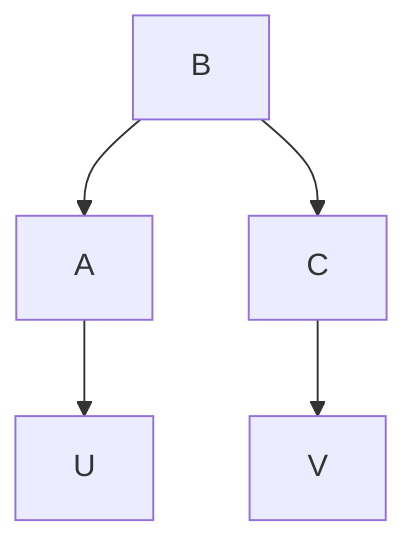


> (iio\*)


> (iiio) (iiio)


> (iiio\*) Figure 9.2

Note that if we had measured variables such as W, U, V, and X in figure 9.3 then the corresponding partially oriented inducing path graphs would enable us to distinguish (i), (ii), and (iii) without experimentation and without the use of any prior knowledge about the causal relations among the variables.


> (io)

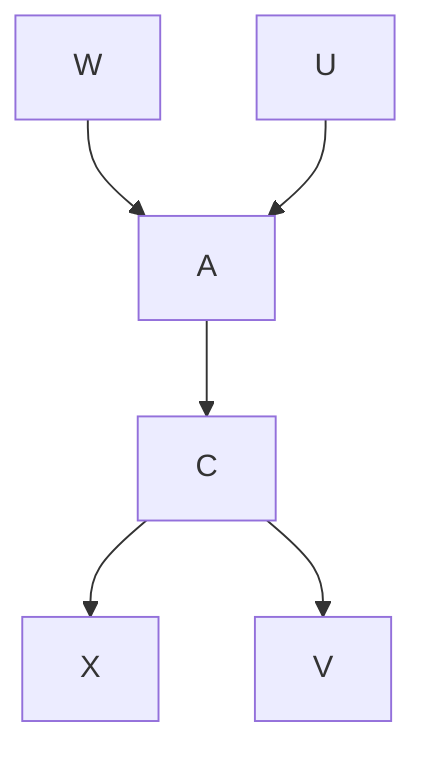


> (io\*\*)

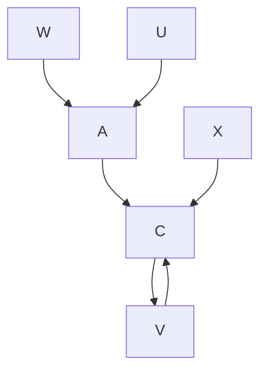


> (iio)(iio)

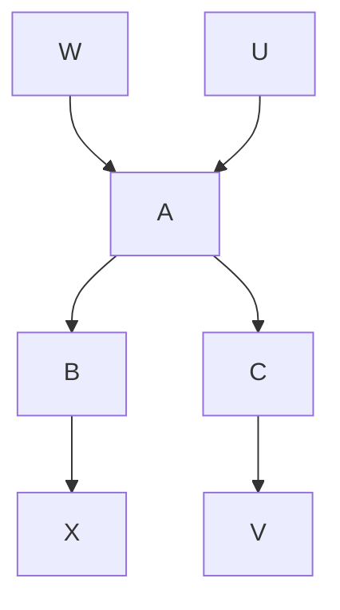


> (iio\*\*)

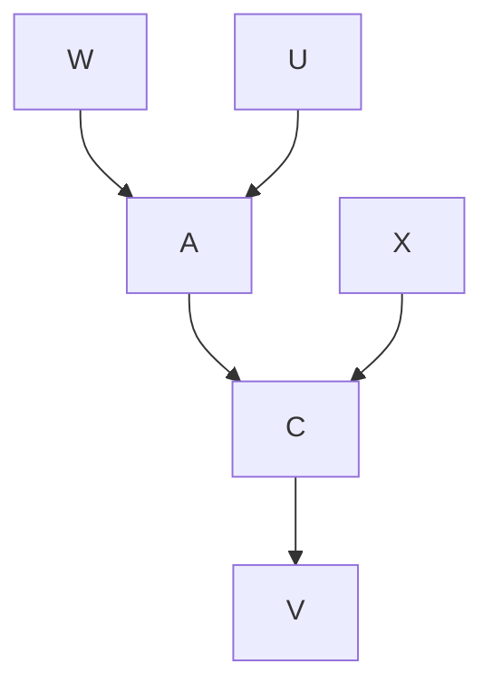


> (iiio\*\*) Figure 9.3


Consider now the more complex cases in which the possibilities are (i) A causes C and there is a latent common cause B of A and C, (ii) there is a latent common cause B of A and C, and (iii) C causes A and there is a latent common cause B of A and C. Each of the structures (i), (ii), and (iii) can be distinguished from the others by experimental manipulations in which for a sample of systems we break the edges into A and impose a distribution on A and for another sample we break the edges into C and impose a distribution on C. The corresponding graphs are presented in figure 9.4, and the analysis of the experiment is essentially the same as in the previous case.


> Figure 9.4

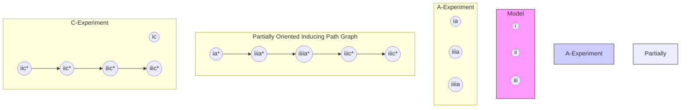

The analysis of the corresponding non-experimental case is more complicated. Assume that there is a variable U and it is known that U causes A, there is no common cause of U and A, and if there is any directed path from U to C it contains A, and that there is a variable V and it is known that V causes C, there is no common cause of V and A, and if there is any directed path from V to A it contains C. The directed acyclic graphs and their corresponding partially oriented inducing path graphs are shown in figure 9.5. Now suppose that the directed acyclic graphs are true of an observed non-experimental population. Can we still distinguish (i), (ii), and (iii) from each other?

Once again the answer is yes. For example, suppose that an application of the FCI algorithm produces $( \mathrm { i } 0 ^ { \ast } )$ . The existence of the $U _ { \mathrm { \Phi } } { \circ } { \to } \thinspace C$ edge entails that either there is a common cause of U and C or a directed path from U to C. By assumption, there is no common cause of U and C, so there is a directed path from U to C. Also by assumption, all directed paths from U to C contain A, so there is a directed path from A to C. Given that there is an edge between U and C in the partially oriented inducing path graph, and the same background knowledge, it also follows that there is a latent common cause of A and C. (The proof is somewhat complex and we have placed it in an Appendix to this chapter.) Similarly, if we obtain $( \mathrm { i i i o } ^ { * } )$ then we know that C causes A and there is a latent common cause of A and C. If we obtain $( \mathrm { i } \mathrm { i } 0 ^ { \ast } )$ then we know that A and C have a latent common cause but that A does not cause C and C does not cause A. It is also possible to distinguish (i), (ii), and (iii) from each other without any prior knowledge of particular causal relations, but it requires a more complex pattern of measured variables, as shown in figure 9.6. If we obtain $( \mathrm { i o } ^ { \ast \ast } )$ then we know without using any such prior knowledge about the causal relationships between the variables that A causes C and that there is a latent common cause of A and C, and similarly for $( \mathrm { i } \mathrm { i } 0 ^ { \ast \ast } )$ and $( \mathrm { i i i o } ^ { * * } )$ .


> (io) (io)

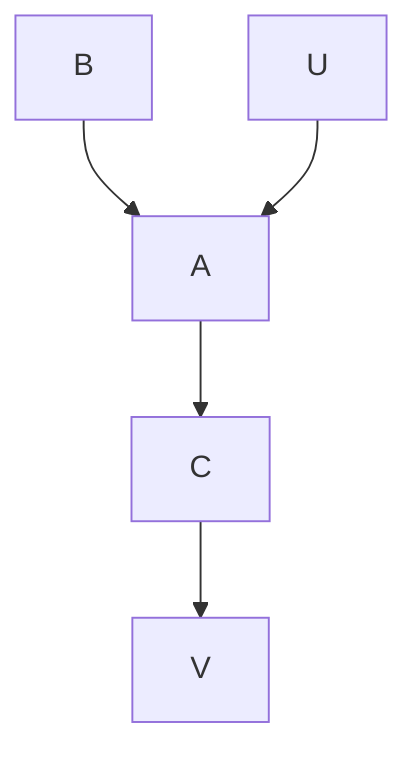


> (io\*)

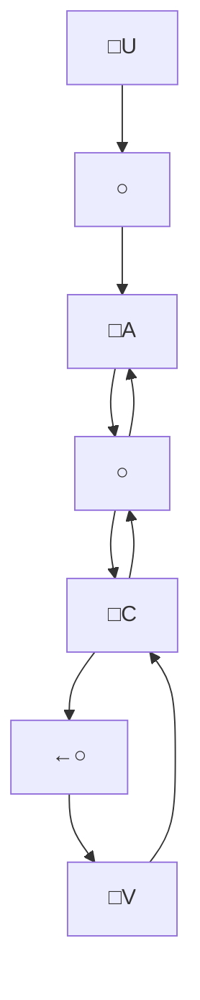


> (iio\*)


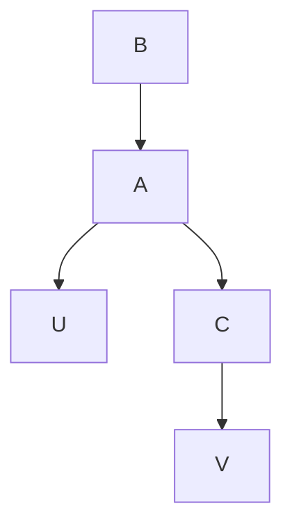


> (iiio\*) Figure 9.5

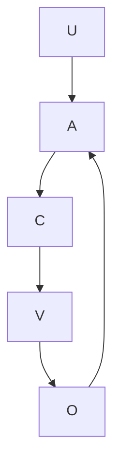

There is an important advantage to experimentation over passive observation in one of these cases. By performing an experiment we can make a quantitative prediction about the consequences of manipulating A in (i), (ii), and (iii). But if (i) is the correct causal model, we cannot use the Prediction Algorithm to make a quantitative prediction of the effects of manipulating A. (In the linear case, a prediction could be made because U serves as an “instrumental variable.”)


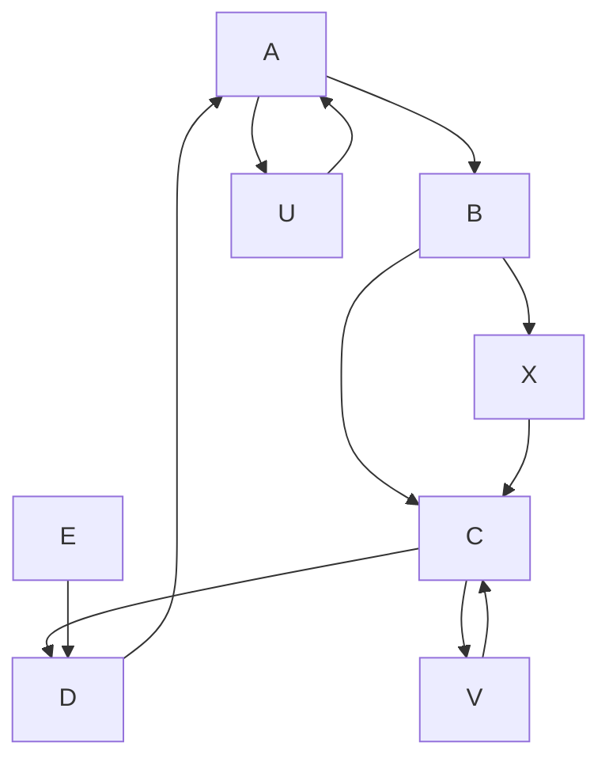


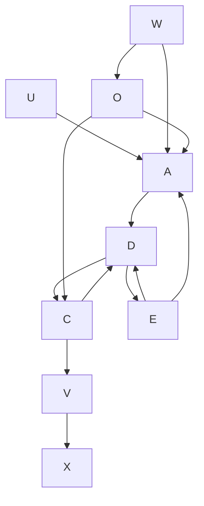


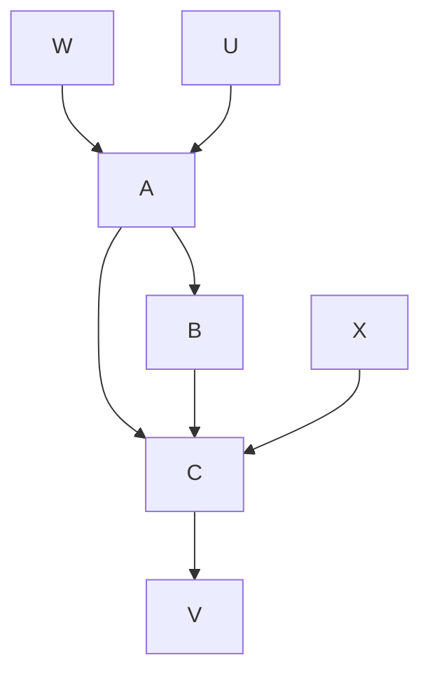


> (iio\*)


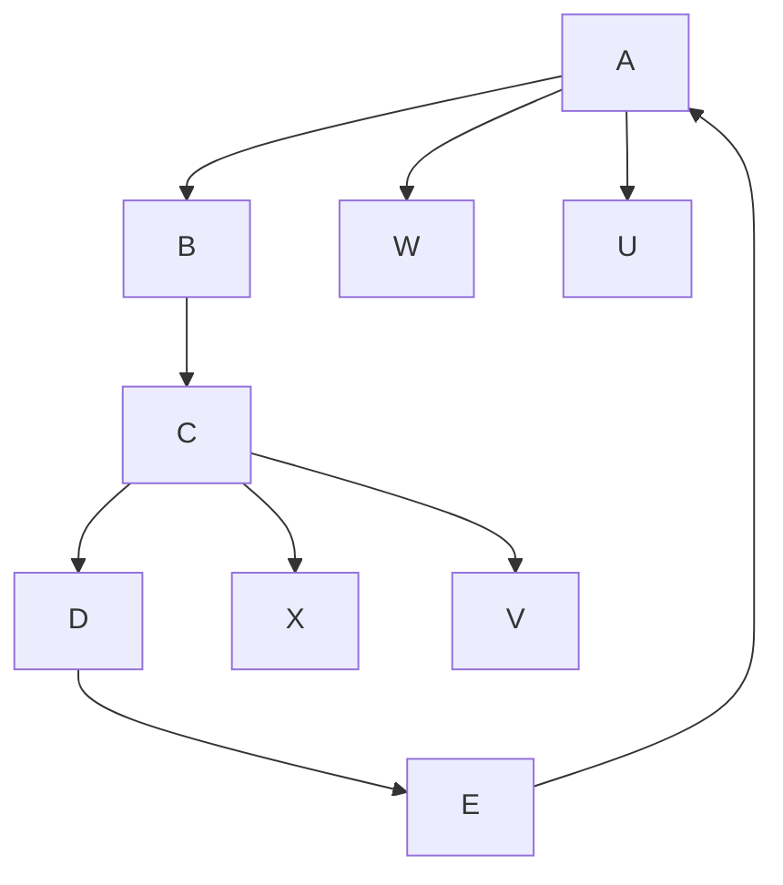


> (iiio\*) Figure 9.6

System architecture flowchart with nodes A, D, C, V and labeled components W, U, E, X, showing bidirectional connections and feedback loops.

Suppose finally that we want to know whether there are two causal pathways that lead from A to C. More specifically, suppose we want to distinguish which of (i), (ii), and (iii) in figure 9.7 obtains, remembering again that B is unmeasured.

The question is fairly close to Blyth’s version of Simpson’s paradox. By experimental manipulation that breaks the edges directing into A and imposes a distribution on A, we can distinguish structures (i) and (iii) from structure (ii) but not from one another. Note that in figure 9.7 the partially oriented inducing path graph (ia\*) is identical to (iiia\*) and (ic\*) is identical to (iiic\*).


> Figure 9.7

```mermaid
graph TD
    subgraph Model
  A1["Model"] --> B1["B"]
  B1 --> A2["A"] --> C1["C"]
  C1 --> A3["(i)"]
  A3 --> B2["B"]
  B2 --> U1["U"] --> A4["A"] --> C2["C"]
  C2 --> A5["ia*"]
  A5 --> A6["A"] --> O1["C"] --> C3["ai*"]
  C3 --> A7["(iic)"]
  A7 --> A8["A"] --> C4["C"] --> V1["V"]
  C4 --> A9["(iic)"]
  A9 --> A10["A"] --> C5["C"] --> V2["V"]
  C5 --> A11["ii*"]
  A11 --> A12["A"] --> C6["C"] --> V3["V"]
  C6 --> A13["iii*"]
  A13 --> A14["A"] --> C7["C"] --> V4["V"]
  C7 --> A15["ivic*"]
    end

    subgraph A_Experiment["A-Experiment"]
  B1 --> B2
  B2 --> U2["U"] --> A3["A"] --> C3["C"]
  C3 --> A4["ia*"]
  A4 --> A5["ai*"]
  A5 --> A6["A"] --> C4["C"] --> V4["V"]
  C4 --> A7["iiia*"]
  A7 --> A8["A"] --> C5["C"] --> V5["V"]
  C5 --> A9["iiiia*"]
  A9 --> A10["A"] --> C6["C"] --> V6["V"]
  C6 --> A11["viia*"]
  A11 --> A12["A"] --> C7["C"] --> V7["V"]
  C7 --> A13["viic*"]
    end

    subgraph Partially Oriented Inducing Path Graph
  B2 --> B3["B"]
  B3 --> U3["U"] --> A4["A"] --> C4["C"]
  C4 --> A5["ia*"]
  A5 --> A6["A"] --> C5["C"] --> V5["V"]
  C5 --> A7["iiic*"]
  A7 --> A8["A"] --> C6["C"] <--_V5["V"]
  C6 --> A9["viic*"]
    end

    subgraph Partially Oriented Inducing Path Graph
  B3 --> B4["B"]
  B4 --> U4["U"] --> A5["A"] <--_C6["C"] <--_V6["V"]
  C6 --> B5["B"] <--_B6["A"] <--_C7["C"] <--_V7["V"]
  B5 --> B7["B"]
  B7 --> U7["U"] <--_C8["A"] <--_C9["C"] <--_V8["V"]
  C8 --> B9["B"] <--_B10["A"] <--_C10["C"] <--_V9["V"]
  B9 --> B10
  B10 --> B11["A"] <--_B12["C"] <--_V10["V"]
  B11 --> B12
  B12 --> B13["A"] <--_B14["C"] <--_V15["V"]
  B13 --> B14
  B14 --> B15["A"] <--_B16["C"] <--_V16["V"]
  B15 --> B16
  B16 --> B17["A"] <--_B18["C"] <--_V17["V"]
  B17 --> B18
  B18 --> B19["A"] <--_B20["C"] <--_V18["V"]
  B19 --> B20
    end
```

Assume once again that in a non-experimental population it is known that U causes A, there is no common cause of U and C, and if there is any path from U to C it contains A, and V causes C, there is no common cause of V and A, and if there is any path from V to A it contains C. The directed acyclic graphs and their corresponding partially oriented inducing path graphs are shown in figure 9.8.


> (io) (io)

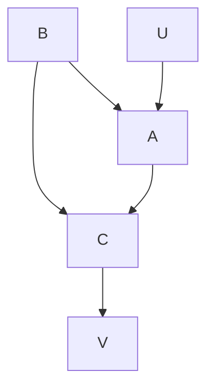


```mermaid
graph TD
  U["∪"] --> O1["o"]
  O1 --> O2["o"]
  O2 --> A["∪"]
  A --> O3["o"]
  O3 --> C["∪"]
  C --> O4["o"]
  O4 --> V["∪"]
  C --> V
    O1 -.-> C
```


```mermaid
graph TD
  B --> A
  B --> C
  A --> U
  C --> V
```


> (iio\*)


```mermaid
graph TD
  U --> A
  A --> C
  C --> V
  B --> A
```


> (iiio\*) Figure 9.8

```mermaid
graph LR
  U --> A --> C --> V
```

Unlike the controlled experimental case, where (i) and (iii) cannot be distinguished, in the non-experimental case they can be distinguished. Suppose we obtain (iiio\*). We know from the background knowledge that U causes A, and from $( \mathrm { i i i o } ^ { * } )$ that the edge between U and A does not collide with the edge between A and C. Hence in the corresponding inducing path graph there is an edge from A to C and in the corresponding directed acyclic graph there is a path from A to C. (Of course we cannot tell how many paths from A to C there are; $( \mathrm { i i i o } ^ { * } )$ is compatible with a graph like (iiio) but in which the ${ < A , B , C > }$ path does not exist.) We also know that there is no latent common cause of A and C because $( \mathrm { i i i o } ^ { * } )$ together with our background knowledge entails that there is no path in the inducing path graph between A and C that is into A. Suppose on the other hand that we obtain $( \mathrm { i o } ^ { \ast } )$ . Recall that the background knowledge together with the partially oriented inducing path graph entail that A is a cause of C and that there is a latent common cause of A and C. (We have placed the proof in an appendix to this chapter.)Once again if more variables are measured, it is also possible to distinguish these three cases without any background knowledge about the causal relationships among the variables, as shown in figure 9.9.


> (io)

```mermaid
graph TD
  A --> B
  B --> C
  C --> D
  D --> A
  D --> E
  E --> D
  W --> A
  U --> A
  X --> C
  V --> C
```


> (io\*)

```mermaid
graph TD
  U --> A
  W --> A
  A --> D
  D --> C
  E --> C
  C --> V
  X --> C
  V --> C
  A --> O
  O --> W
  D --> O
  O --> V
```


> (iio)

```mermaid
graph TD
  A["A"] --> B["B"]
  B --> C["C"]
  C --> D["X"]
  C --> E["V"]
  F["W"] --> A
  G["U"] --> A
```


> (iio\*)

```mermaid
graph TD
  W --> A
  U --> A
  A --> C
  C --> V
  X --> C
  V --> C
```


> (iiio) (iiio)

```mermaid
graph TD
  W --> A
  U --> A
  A --> C
  B --> C
  C --> V
  X --> C
```


> (iiio\*) Figure 9.8

```mermaid
graph TD
  W --> A
  U --> A
  A --> C
  C --> V
  X --> C
  V --> C
```

Thus all three structures can be distinguished without experimental manipulation or prior knowledge.

It may seem extraordinary to claim that structure (i) in figure 9.7 cannot be distinguished from structure (iii) by a controlled experiment, but can be distinguished without experimental control if the structure is appropriately embedded in a larger structure whose variables are measured. It runs against common sense to claim that when A causes C, a controlled experiment cannot distinguish A and C also having an unmeasured common cause from A also having a second mechanism through which it effects B, but that observation without experiment sometimes can distinguish these situations. But controlled experimental manipulation that forces a distribution on A breaks the dependency (in the experimental sample) of A on B in structure (i), and thus information that is essential to distinguish the two structures is lost.

While a controlled experiment alone cannot distinguish (i) from (iii) in figure 9.7 the combination of a simple observational study and controlled experimentation can distinguish (i) from (iii). We can determine from an A-experiment that there is a path from A to C, and hence no path from C to A. We know if P(C|A) is not invariant under manipulation of A then there is a trek between C and A that is into A. Hence if P(C|A) is different in the non-experimental population and the A-experimental population we can conclude that there is a common cause of A and C. If P(C|A) is invariant under manipulation of A then we know that either there is no common cause of A and C or the particular parameter values of the model “coincidentally” produce the invariance. By combining information from an observational study and an experimental study it is sometimes possible to infer causal relations that cannot be inferred from either alone. This is often done in an informal way. For example, suppose that in both an A-experiment and a C-experiment A and C are independent. This indicates that there is no directed path from A to C or C to A. But it does not distinguish between the case where there is no common cause of A and C (i.e., there is no trek at all between A and C) and the case where there is a common cause of A and C. Of course in practice these two models are distinguished by determining whether A and C are independent in the non-experimental population; assuming faithfulness, there is a trek between A and C if and only if A is not independent of C.

In view of these facts the advantages of experimental procedures in identifying (as distinct from measuring) causal relations need to be recast. There are, of course, well known practical difficulties in obtaining adequate non-experimental random samples without missing values but we are interested in issues of principle. One disadvantage of non-experimental studies is that in order to make the distinctions in structure just illustrated either one has to know something in advance about some of the causal relations of some of the measured variables, or else one must be lucky in actually measuring variables that stand in the right causal relations. The chief advantage of experimentation is that we sometimes know how to create the appropriate causal relations. A further advantage to experimental studies is in identifying causal structures in mixed samples. In the experimental population the causal relation between a manipulating variable and a manipulated variable is known to be common to every system so treated. Mixing different causal structures acts like the introduction of a latent variable, which makes inferences about other causal relations from a partially oriented inducing path graph more difficult. Similar conclusions apply to cases in which experimental and statistical controls are combined.

In the “controlled” experiments we have discussed thus far, we have assumed that the experimental manipulation breaks all of the edges into A in the causal graph of the nonexperimental population, and that the variable U used to manipulate the value of A has no common cause with C. However, it is possible to do informative experiments that satisfy neither of these assumptions. Suppose, for example, the causal graph of figure 9.10 describes a non-experimental population.


> Figure 9.10

```mermaid
graph TD
  B --> U
  B --> C
  U --> A
  A --> C
```

Suppose that in an experiment in which we manipulate A, we force a distribution upon P(A|U). In this case the causal graph of the experimental population is the same as the causal graph of the non-experimental population, although of course the parametrization of the graph is different in the two populations. This kind of experiment does not break the edges into A. More generally, we assume that there is a set of variables U used to influence the value of A such that any direct cause V of A that is not in U is connected to some outcome variable C only by undirected paths that contain A as a definite noncollider. (This may occur for example, if U is a proper subset of the variables used to fix the value of A, and the other variables used to fix the value of A are directly connected only to A.) These are just the conditions that we need in order to guarantee the invariance of the distribution of a variable C given U and A, and hence allows the use of the Prediction Algorithm. (A more extensive discussion of this kind of experiment is given in section 9.4.) With an experiment of this kind, it is possible to distinguish model (i) from model (iii) in figure 9.7. Of course, with the same background knowledge assumptions it is also possible to distinguish (i) from (iii) in a non-experimental study in which the distribution of P(A|U) is not changed. Indeed with this kind of experiment, the only difference between the analysis of the experimental population and a non-experimental population lies in the background knowledge employed.

## 9.2 Selecting Variables

The selection of variables is the part of inference that at present depends almost entirely on human judgment. We have seen that poor variable selection will usually not of itself lead to incorrect causal conclusions, but can very well result in a loss of information. Discretizing continuous variables and using continuous approximations for discrete variables both risk altering the results of statistical decisions about conditional independence.

One fundamental new consideration in the selection of variables is that in the absence of prior knowledge of the causal structure, empirical studies that aim to measure the influence, if any, of A on C or of C on A, should try to measure at least two variables correlated with A that are thought to influence C, if at all, only through A, and likewise for C. As the previous section illustrates, variables with these properties are especially informative about whether A causes C, or C causes A, or neither causes the other but there is a common cause of A and C.

The strategy of measuring every variable that might be a common cause of A and B and conditioning on all such variables is hazardous. If one of the additional variables is in fact an effect of B, or shares a common cause with A and a common cause with B, conditioning on that variable will produce a spurious dependency between A and B. That is not to say that extra variables should not be measured if it is thought that they may be common causes; but if they are measured, they should be analyzed by the methods of chapters 5 and 6 rather than by multiple regression.

Finally, if methods like those described in chapters 5, 6, and 7 are to be employed, we offer the obvious but unusual suggestion that variables be selected for which good conditional independence tests are available.

## 9.3 Sampling

We can view many sampling designs as procedures that specify a property S, which may have two values or several, and from subpopulations with particular S values draw a sample in which the distribution of values of the $i ^ { \mathrm { t h } }$ unit drawn is distributed independently of and identically to the distribution of all other sample places from that subpopulation. In the simplest case S can be viewed as a binary variable with the value 1 indicating that a unit has the sample property, which of course does not mean that the unit occurs in any particular actual sample. We distinguish the sample property S from any treatments that might be applied to members of the sample. In sampling according to a property S we obtain information directly not about the general population but about the segments of the population that have various values of S. Our general questions therefore concern when conditioning on any value of S in the population leaves unaltered the conditional probabilities or conditional independence relations for variables in the causal graph G describing the causal structure of each unit in the population. That is, suppose there is a population in which the causal structure of all units is described by a directed graph G, and let the values of the variables be distributed as P, where P is faithful to G. What are the causal and statistical constraints a sampling property S must satisfy in order that a sub-population consisting of all units with a given value of S will accurately reflect the conditional independence relations in P—and thus the causal structure G—and under what conditions will the conditional probabilities for such sub-populations be as in P? The answers to these questions bear on a number of familiar questions about sampling, including the appropriateness of retrospective versus prospective sampling and of random sampling as against other sampling arrangements. We will not consider questions about the sampling distributions obtained by imposing various constraints on the distribution of values of S in a sample. Our discussion assumes that S (which may be identical to one of the variables in G) is not determined by any subset of the other variables in G.

We assume in our discussion that S is defined in such a way that if the sampling procedure necessarily excludes any part of the population from occurring in a sample, then the excluded units have the same S value. For example, if a sample is to be drawn from the sub-population of people over six feet tall, then we will assume that $S = 0$ corresponds to people six feet tall or under and S = 1 corresponds to people over 6 feet tall.

The causal graph G relating the variables of interest can be expanded to a graph G(S) that includes S and whatever causal relations S and the other variables realize. We assume a distribution P(S) faithful to G(S) whose marginal distribution summing over S values will of course be P. We suppose that the sampling distribution is determined by theof course be P. We suppose that the sampling distribution is determined by the conconditional distribution P( | S). Our questions are then, more precisely, when thisditional distribution P( |S). Our questions are then, more precisely, when this conditional conditional distribution has the same conditional probabilities and conditionaldistribution has the same conditional probabilities and conditional independence relations independence relations as P. We require, moreover, that the answer be given in terms ofas P. We require, moreover, that the answer be given in terms of the properties of the graph the properties of the graph G(S). The following theorem isG(S). The following theorem is obvious and will notbe proved.

THEOREM 9.1: If P(S) is faithful to G(S), and X and Y are sets of variables in G(S) not THEOREM 9.1: If containing S, then $P ( \mathbf { Y } | \mathbf { X } ) = P ( \mathbf { Y } | \mathbf { X } , S )$ (S), and X and Y are sets of variables in G if and only if X d-separates Y and S in G(S).

Our sampling property should not be the direct or indirect cause or effect of Y save Our sampling property should not be the direct or indirect cause or effect of Y savethrough a mechanism blocked by X, and X should not be the effect, direct or indirect of through a mechanism blocked by X, and X should not be the effect, direct or indirect ofboth Y and the sampling property. (The second clause in effect guarantees that Simpson’s both Y and the sampling property. (The second clause in effect guarantees that Simpson’sparadox is avoided in a faithful distribution). The theorem is essentially the observation parathat $P ( \mathbf { Y } | \mathbf { X } \cup \mathbf { Z } ) = P ( \mathbf { Y } | \mathbf { X } \cup \mathbf { Z } \cup \{ S \} )$ on). The theorem is essentially the observation if and only if in P Y and S are independent that P(Y|X ∪conditional on $\mathbf { X } \cup \mathbf { Z }$ (Y|X ∪ Z ∪ {S}) if and only if in P Y and S are independent. It entails, for example, that if we wish to estimate the conditional conditional on X ∪ Z. It entails, for example, that if we wish to estimate the conditionalprobability of Y on X from a sample of units with an S property (say, S = 1), we should probability of Y on X frtry to ensure that there is

- (i) no direct edge between any Y in Y and S,
- (i) no direct edge between any Y in Y and S,(ii) no trek between any Y in Y and S that does not contain some X in X, and
- (ii) no trek between any Y in Y and S that does not contain some X in X, an(iii) no pair of directed paths from any Y in Y to an X in X and from S to X.

Figure 9.11 illustrates some of the ways estimation from the sampling property can bias Figure 9.11 illustrates some of the ways estimation from thestimates of the conditional probability of Y given X and Z.

timates of the conditional probability of Y given X and Z.Cases (i) and (iii) are typical of retrospective designs. In case (ii) the sampling Cases (i) and (iii) are typical of retrospective designs. In case (ii) the samplingproperty biases estimates of P(Y|X,Z) because Y and the sample property S are dependent property biases estimates of P(Y|X,Z) because Y and the sample property S are dependentconditional on {X,Z}. Theorem 9.1 amounts to a (very) partial justification of the notion conditional on {X,Z}. Theorem 9.1 amounts to a (very) partial justification of the notionthat: “prospective” sampling is more reliable than “retrospective” sampling, if by the that: “prospective” sampling is more reliable than “retrospective” sampling, if by theformer is meant a procedure that selects by a property that causes or is caused by Y, effect, if at all only through X, the cause, and by the latter is meant a procedure that selects by a property that causes or is caused by X only through Y. In a prospective sampling design in which X is the only direct cause of S, and S does not cause any variable, the estimate of P(Y|X,Z) is not biased. But case (ii) shows that under some conditions prospective samples can bias estimates as well.


> (i)

```mermaid
graph TD
  X --> Y
  Z --> Y
  S --> Y
```


> (ii)

```mermaid
graph TD
  S --> X
  S --> Z
  X --> A
  X --> Y
  Z --> B
  A --> Y
  Z --> B
```


> (iii)(iii) Figure 9.11

```mermaid
graph TD
  X --> Y
  Z --> Y
  S --> U
  Y --> U
```

Similar conclusions should be drawn about random sampling. Suppose as before that the goal is to estimate the conditional probability P(Y|X) in distribution P. In drawing a random sample of units from P we attempt to sample according to a property S that is entirely disconnected with the variables of interest in the system. If we succeed in doing that then we ensure that S has no causal connections that can bias the estimate of the conditional probability. Of course even a random sample may fail if the very property of being selected for a study (a property, it should be noted, different from having some particular value of S) affects the outcome, which is part of the reason for blinding treatments. Further, any property that has the same causal disconnection will do as a basis for sampling; there is nothing special in this respect about randomization, except that a random S is believed to be causally disconnected from other variables.

When the aim is only to determine the causal structure, and not to estimate the distribution P or the conditional probabilities in P, the asymmetry between prospective and retrospective sampling vanishes.

In model (iii) of figure 9.11, which is an example of retrospective design, for any three disjoint sets of variables A, B, and C not containing S, A is d-separated from B given C if and only if A is d-separated from B given C ∪ S. So these cases in which conditional probability in P cannot be determined from S samples are nonetheless cases in which conditional independence in P, and hence causal structure, can be determined from S samples.

Theorem 9.2 states conditions under which the set of conditional independence relations true in the population as a whole is different from the set of conditional independence relations true in a subpopulation with a constant value of S. In theorem 9.2 let Z be any set of variables in G not including X and Y.

THEOREM 9.2: For a joint distribution P, faithful to graph G, exactly one of <Y X|Z; Y $X | Z \cup \{ S \} >$ is true in P if and only if the corresponding member and only that member of <Z d-separates X,Y; Z ∪ {S} d-separates X, Y> is true in G.

Although theorem 9.2 is no more than a restatement of theorem 3.3, its consequences are rather intricate. Suppose that X and Y are independent conditional on Z in distribution P. When will sample property S make it appear that X and Y are instead dependent conditional on Z? The answer is exactly when X, Y are dependent conditional on $\mathbf z \cup S$ in P(S). This circumstance—conditional independence in P and conditional dependence in P(S)—can occur for faithful distributions when and only when there exists an undirected path U from X in X to Y in Y such that

- i. no noncollider on U is in $\mathbf { Z } \cup \{ S \}$ ;
- ii. every collider on U has a descendant in $\mathbf { Z } \cup \{ S \}$ ;
- iii. some collider on U does not have a descendant in Z.

The converse error involves conditional dependence in P and conditional independence in P(S). That can happen in a faithful distribution when and only when there exists an undirected path U from X to Y such that

i. every collider on U has a descendant in Z;

ii. no noncollider in U is in Z;

and S is a noncollider on every such path. Again, asymptotically both of these errors can be avoided by sampling randomly, or by any property S that is unconnected with the variables of interest.

In experimental designs the aim is sometimes to sample from an ambient population, apply a spectrum of treatments to the sampled units, and then infer from the outcome the effect a policy of treatment would have if applied to the general population. In the next section we consider some relations between experimental design, policy prediction, and causal reasoning.

## 9.4 Ethical Issues in Experimental Design

Clinical trials of alternative therapies have at least two ethical problems. (1) In the course of the trials (or even beforehand) suspicion may grow to near certainty that some treatments are better than others; is it ethical to assign people to treatments, or to continue treatments, found to be less efficacious? (2) In clinical trials, whether randomized or other, patients are generally assigned to treatment categories; if the patients were not part of an experimental design, presumably they would be free to choose their treatment (free, that is, if they could pay for it, or persuade their insurer to); is it ethical to ask or induce patients to forego choosing? Suppose the answer one gives to each of these questions is negative. Are there experimental designs for clinical trials that avoid or mitigate the ethical problems but still permit reasonable predictions of the effects of treatment throughout the population from which the experimental subjects are obtained?

Kadane and Sedransk (1980) describes a design (jointly proposed by Kadane, Sedransk, and Seidenfeld) to meet the first problem. Their design has been used in trials of drugs for post-operative heart patients and in other applications. The inferences Kadane and Seidenfeld (1990) make in explaining the design are in accord with the Markov Condition, and indeed follow from it, and the case nicely illustrates the role of causal reasoning in experimental design. Furthermore, combining the Markov and Faithfulness Conditions, and using the Manipulation Theorem and fheorem 7.1 leads to two novel conclusions:

1. The efficacy of treatments in an experiment can be reliably assessed in an experimental procedure that takes patient preference into account in allocating treatment, but except in special cases the knowledge so acquired could not be used to predict the effects of a general policy of treatment.

2. Perhaps of more practical interest, given comparatively weak causal knowledge on the part of the experts, another design in which treatment allocation depends on patient preference can be used to determine whether or not patient self-assignment in the experiment will confound prediction of the outcome of a treatment policy in the general population. When all influences are linear, the effects of treatment policy can be predicted even if confounding occurs.

## 9.4.1 The Kadane/Sedransk/Seidenfeld Design

In the Kadane/Sedransk/Seidenfeld experimental design (described in Kadane and Seidenfeld 1990), for each member of a panel of experts, degrees of belief are elicited about the outcome O of each treatment T conditional on each profile of values of $X _ { 1 } . . . X _ { n } .$ .

The elicited judgments are used to specify some prior distribution over parameters in a model of the treatment process. For each experimental subject, the panel of experts receives information on the variables $X _ { 1 } , . . . , X _ { n }$ . Nothing else about the patient is known to the experts. Based on the values of $X _ { 1 } , . . . , X _ { n }$ each expert i recommends a preferred treatment $p _ { i } ( X )$ to the patient, and the patient is assigned to treatment by some rule $T =$ $h ( X , p _ { 1 } , . . . , p _ { k } )$ that is a function of the X values and the experts’ treatment preferences $( p _ { 1 } , . . . . p _ { k } )$ for patients described by X, and perhaps some random factor. The rule guarantees that no patient is given a treatment unless at least one expert recommends it for patients with that profile. The model determines the likelihood, for each vector of parameter values, of outcomes conditional on X and T values. As data are collected on patients, the prior distribution over the parameters is updated by conditioning. If the evidence reaches a stage at which all the experts agree that some treatment $T$ for patients with profile X is not the best treatment for the patient, then treatment T is suspended for such patients. As evidence accrues, the experts’ degrees of belief about the parameter values of the likelihood model should converge.

Let $X _ { j }$ be a vector of observed characteristics of the $j ^ { \mathrm { t h } }$ patient, “including those that are used as a basis for deciding what treatment each patient is to receive, and possibly other characteristics as well.” (We do not place $X _ { j }$ in boldface in order to match Kadane and Seidenfeld’s notation.) Let $T _ { j }$ be the treatment assigned to patient j. Let $O _ { j }$ be the outcome for patient j. Let $P _ { j } = ( O _ { j } , T _ { j } , X _ { j } , O _ { j - 1 } , T _ { j - 1 } , X _ { j - 1 } , . . . , X _ { 1 } )$ be the past evidence up to and including what is known about patient j. Let $\theta$ be a vector of the parameters of interest, those that determine the probabilities of outcomes $O _ { j }$ for a patient j given characteristics $X _ { j }$ and treatment $T _ { j } .$ . For example, the degrees of belief of an expert might be represented by a mixture of linear models parametrized by exogenous variances, means and linear coefficients. A unique value of these parameters then “determines” the probability of an outcome given X values. For reasons that will become clear, it is essential to the definition of $\theta$ that alternative values for the parameter not give alternative specifications of the distribution of X variables.

The expression $f _ { \theta } \ ( P _ { J } )$ represents the expert’s conditional degree of belief, given $\theta ,$ that the total evidence is $P _ { J }$ . Kadane and Seidenfeld add that “It is part of the definition of $\theta$ as the parameter that

$$
f _ {\theta} (O _ {j} | T _ {j}, X _ {j}, P _ {j - 1}) = f _ {\theta} (O _ {j} | T _ {j}, X _ {j}) \quad (1 \leq j \leq J) \tag {1}
$$

What this means is that $\theta$ contains all the information contained in $P _ { j - 1 }$ that might be useful for predicting $O _ { j }$ from $T _ { j }$ and $X _ { j } . ^ { \dag }$ The factorization of degree of belief,

$$
f _ {\theta} (P _ {J}) = \left[ \prod_ {j = 1} ^ {J} f _ {\theta} (O _ {j} | T _ {j}, X _ {j}, P _ {j - 1}) \right] \left[ \prod_ {j = 1} ^ {J} f _ {\theta} (T _ {j} | X _ {j}, P _ {j - 1}) \right] \left[ \prod_ {j = 1} ^ {J} f _ {\theta} (X _ {j} | P _ {j - 1}) \right]
$$

follows by the definition of conditional probability. The terms are marked 1, 2, and 3. Kadane and Seidenfeld claim that term 3 does not depend on $\theta$ if one believes that the features, treatments and outcomes for earlier subjects in the experimental trial have no influence on “the kinds of people” who subsequently become subjects. (Recall that parameters relevant to the distribution of $X _ { 1 } . . . X _ { n }$ are not included in $\theta . )$ . Kadane and Seidenfeld also say that term 2 does not depend on $\theta$ because there is a fixed rule for treatment assignment as a function of X values and the history of the experimental outcomes.

It follows from (1) that

$$
\prod_ {j = 1} ^ {J} f _ {\theta} (O _ {j} | T _ {j}, X _ {j}, P _ {j - 1}) = \prod_ {j = 1} ^ {J} f _ {\theta} (O _ {j} | T _ {j}, X _ {j})
$$

Kadane and Seidenfeld say the proportionality given by this term:

$$
f _ {\theta} (P _ {J}) \propto \prod_ {j = 1} ^ {J} f _ {\theta} (O _ {j} | T _ {j}, X _ {j})
$$

${ } ^ { 6 6 } \mathrm { \ddot { 1 } s }$ the form that we use to evaluate the results of a clinical trial of the kind considered here.” That is for each value here.” is for each value $\theta _ { i }$ f ,of $\theta ,$ ultiplying f  multiplying $f _ { \theta _ { i } } ( P _ { J } )$ ) by the prior density o by the prior density of $\theta _ { i }$ gives a quantity proportional to the posterior density of $\theta _ { i } .$ . The ratios of the posterior densities of two values of $\theta _ { i }$ can therefore be found.

Now for a new case, each value of $\theta$ determines a probability of treatment outcome given an $X$ profile and a treatment $T ,$ and so the posterior distribution of $\theta$ yields, for any one expert, degrees of belief in the outcomes of various treatment regimes to various classes of patients. Although Kadane and Seidenfeld say nothing explicit about predicting the effects of policies of treatment, these degrees of belief may be transformed into expected values if outcome is somehow quantified. In any case, an expert who began believing that a rule of treatment given by $T = k ( X )$ would most often result in a successful outcome, may come instead to predict that a different rule of treatment, say $T$ $= g ( X )$ will more often be successful.

Why can’t the experiment let the subjects simply choose their own treatments, and seek any advice that they want? Kadane and Seidenfeld give two reasons. One is that if patients were to determine their own treatment, the argument that term 2 in the factorization does not depend on would no longer hold. The other is that “It would now be necessary to explain statistically the behavior of patients in choosing their treatments, and there might well be contamination between these choices and the effect of the treatment itself.” We will consider the force of these considerations in the next subsection.

## 9.4.2 Causal Reasoning in the Experimental Design

What is it that the experts believe that warrants this analysis of the experiment, or the derivation of any predictions? The expert surely entertains the possibility that some unknown common causes U may influence both the X features of a patient and the outcome of the patient’s treatment. And yet the analysis assumes that in the expert’s degrees of belief, treatment is independent of any such U conditional on X values. That is implicit in the claim that term 2 in the factorization is independent of . Why should treatment T and unknown causes U be conditionally independent given X? The reason, clearly, is that in the experiment the only factors that influence the treatment a patient receives are the X values for that patient and $P _ { j - 1 } ;$ any such U, should it exist, has no influence on T except through X. A causal fact is the basis for independence of probabilities.

Aspects of the expert’s understanding of the experimental set-up are pictured in figure 9.12 (where we have made $X _ { j }$ a single variable.)


> Figure 9.12

```mermaid
graph TD
  Uj["Uj"] -->|?| Xj["Xj"]
  Uj -->|?| Oj["Oj"]
  Pj-1["Pj-1"] --> Xj
  Xj -->|?| Oj
  Tj["Tj"] --> Xj
  Tj --> Oj
```

The expert may not be at all sure that the edges with “?” correspond to real influences, but she is sure there is no influence of the kind in figure 9.13 in boldface.

The experimental design, which makes treatment assignment a function of the X variables and $P _ { j - 1 }$ only, is contrived to exclude such influences. The expert’s thought seems to be that if U influences T only through X, then U and T are independent conditional on X. That thought is an instance of the Markov Condition. The probabilities in the Markov Condition can be understood either objectively or subjectively. But in theKadane/Sedransk/Seidenfeld design the probability in the Markov Condition cannot be the expert’s unconditional degrees of belief, because those probabilities are mixtures over of distributions conditional on - and mixtures of distributions satisfying the Markov Condition do not always satisfy the Markov Condition. We will assume the distributions conditional on do so.


> Figure 9.13

```mermaid
graph TD
  Uj["U_j"] -->|?| Xj["X_j"]
  Uj -->|?| Oj["O_j"]
  Pj_minus_1["P_{j-1}"] --> Xj
  Pj_minus_1 --> Tj["T_j"]
  Xj -->|?| Oj
  Tj --> Oj
  Oj --> Out
```

Consider another feature of the idealized expert belief. An idealized expert in Kadane and Seidenfeld’s experiment changes his probability distribution for a parameter whose values specify a model of the experimental process. At the end of the experiment the expert has a view not only about the outcome to be expected for a new patient with profile X if that patient were assigned treatment according to the rule $T = h ( X , P _ { j - 1 } )$ used in the experiment, but also about the outcome to be expected for a new patient with profile X if that patient were assigned treatment according to the rule $T = g ( X )$ that the expert now, in light of the evidence, prefers. In principle, the expert’s probabilities for outcomes if the new patient were treated by the experimental rule $T = h ( X , P _ { j - 1 } )$ is easy to compute because that probability is determinate for each value of , and we know the expert’s posterior distribution of . But what determines the expert’s probability for outcomes if the patient with profile X is now treated according the preferred rule, $T = g ( X ) \ d Y$ Why doesn’t changing the rule change the dependence of O on X and T? The sensible answer, implicit in Kadane and Seidenfeld’s analysis, is that the outcome for any patient depends on the X profile of the patient and the treatment given to the patient, but not on the “rule” by which treatments are assigned. Changing the assignment rule changes the probability of treatment T given profile X, but has no effect on other relevant conditional probabilities; the probability O given T and X is unaltered. We can derive this more formally in the following way.

If for a fixed value of the distribution $f _ { \theta } ( O _ { j } , T _ { j } , X _ { j } , P _ { j - 1 } )$ satisfies the Markov condition for graphs of the type in figure 9.12, then theorem 7.1 entails that $f _ { \theta } ( O _ { j } | T _ { j } , X _ { j } )$ is invariant under a manipulation of $T _ { j } .$ . According to theorem 7.1, in a distribution that satisfies the Markov condition for graphs of the type in figure 9.12, $f _ { \theta } ( O _ { j } | T _ { j } , X _ { j } )$ is invariant under a manipulation of $T _ { j }$ if there is no path that d-connects $O _ { j }$ and $X _ { j }$ given $T _ { j }$ that is into $T _ { j } .$ Every undirected path between $T _ { j }$ and $O _ { j }$ that contains some $X _ { j }$ variable satisfies this condition because some member of $X _ { j }$ is a noncollider on such a path. There are no undirected paths between $T _ { j }$ and $O _ { j }$ that contain $P _ { j - 1 }$ . Hence $f _ { \theta } ( O _ { j } | T _ { j } , X _ { j } )$ is invariant under manipulation of $T _ { j } .$ .

But does the Markov condition reasonably apply in an experiment designed according to the Kadane/Sedransk/Seidenfeld specifications in which $f _ { \theta } ~ ( O _ { j } , T _ { j } , X _ { j } , P _ { j - 1 } )$ does not represent frequencies but an expert’s opinions? We are concerned with the circumstance in which the experiment is concluded, and the expert’s degrees of belief, we will suppose, have converged so far as they will. The expert is uncertain as to whether there are common causes of X and outcome, or how many there are, but all of the causal structures she entertains are like figure 9.12 and none are like figure 9.13. Conditional on $\theta$ and any particular causal hypothesis we suppose the Markov condition is satisfied, but the expert’s actual degrees of belief are some mixture over different causal structures. Should $f _ { \theta } ( O _ { j } | T _ { j } , X _ { j } )$ be invariant under manipulation of $T _ { j }$ in the opinion of the expert when her distribution for a given value of $\theta$ is a mixture of several different causal hypotheses? The answer is yes, as the following argument shows.

Let us call the experimental (unmanipulated in the sense of chapter 7) population $E x p .$ , and the hypothetical population subjected to some policy based on the results of the experiment Pol. Let $f _ { \theta , { E x p } } ( O _ { j } , T _ { j } , X _ { j } , P _ { j - 1 } )$ represent the expert’s degrees of belief about $O _ { j } ,$ $T _ { j } , X _ { j } ,$ , and $P _ { j - 1 }$ conditional on $\theta$ in the experimental population, and $f _ { \theta , P o l } ( O _ { j } , T _ { j } , X _ { j } , P _ { j - 1 } )$ represent the expert’s degrees of belief about $O _ { j } , T _ { j } , X _ { j } ,$ , and $P _ { j - 1 }$ conditional on $\theta$ in the hypothetical population subjected to some policy. Let CS be a random variable that denotes a causal structure. We have already noted that it follows from theorem 7.1 that

$$
f _ {\theta , E x p} (O _ {j} | T _ {j}, X _ {j}, C S) = f _ {\theta , P o l} (O _ {j} | T _ {j}, X _ {j}, C S)
$$

Because $\theta$ determines the density of $O _ { j }$ conditional on $T _ { j }$ and $X _ { j } ,$ ,

$$
f _ {\theta , E x p} (O _ {j} | T _ {j}, X _ {j}, C S) = f _ {\theta , E x p} (O _ {j} | T _ {j}, X _ {j})
$$

$$
f _ {\theta , P o l} (O _ {j} | T _ {j}, X _ {j}, C S) = f _ {\theta , P o l} (O _ {j} | T _ {j}, X _ {j})
$$

Hence,

$$
f _ {\theta , E x p} (O _ {j} | T _ {j}, X _ {j}) = f _ {\theta , P o l} (O _ {j} | T _ {j}, X _ {j})
$$

Consider next the question of “bias” raised by Kadane and Seidenfeld. The very notion requires us to consider not just degrees of belief but also some facts and some potential facts. We suppose there is really a correct (or nearly correct) value for the parameters in the likelihood model, and the true values describe features of the process that go on in the experiment. We suppose the expert converges to the truth, so that her posterior distribution is concentrated around the true values. What the public that pays for these experiments cares about is whether the expert’s views about the best treatment are correct: Would a policy that puts in place the expert’s preferred rule of treatment, say T $= g ( X )$ , result in better outcomes than alternative policies under consideration? One way to look at that question is to ask if the expert’s expected values for outcome conditional on X profile and treatment roughly equal the population mean for outcome under these conditions. If degrees of belief accord with population distributions, that is just to ask when the frequency of $o$ conditional on T and X that would result if every relevant person in the population were treated on the basis of the experimental assignment rule $T =$ $h ( X , P _ { j - 1 } )$ would be roughly the same as the frequency of $o$ conditional on T and X for the general population if a revised rule $T = g ( X )$ for assigning treatments were used. In other words: Will the frequency of O conditional on T and X be invariant under a direct manipulation of T?

As we have just seen for this case, the Markov Condition and theorem 7.1 entail that for the graph in figure 9.12, and all others like it (those in which every trek whose source is a common cause of $O _ { j }$ and $T _ { j }$ contains an $X _ { j }$ variable, $O _ { j }$ does not cause $T _ { j } ,$ and every common cause of an $X _ { j }$ variable and $T _ { j }$ is an $X _ { j }$ variable) the probability of $O _ { j }$ on $T _ { j }$ and $X _ { j }$ is invariant under a direct manipulation of $T _ { j } .$ . No other assumptions are required. The example is a very special case of a general sufficient condition for the invariance of conditional probabilities under a direct manipulation.

Consider next why the experimental design forbids that treatment assignment depend directly on “unrecorded” features of the patients, such as Y. Suppose such assignments were allowed; Kadane and Seidenfeld say the outcome might be “contaminated” which we understand to mean that some unrecorded causes of the patient preference, and hence of $T _ { j } ,$ , might also be causes of $O _ { j }$ . So that we have the causal picture in figure 9.14.

The question marks indicate that, we (or the expert), are uncertain about whether the corresponding causal influences exist. Suppose the directed edges from $U _ { j }$ to Y and from $U _ { j }$ to $O _ { j }$ exist. Then there is an undirected path between $O _ { j }$ and $T _ { j }$ that contains $Y .$ In this case the Markov condition entails that the probability of $O _ { j }$ conditional on $T _ { j }$ and the $X _ { j }$ variables is not invariant under a direct manipulation of $T _ { j }$ except for “coincidental” parameter values. So if unrecorded Y values were allowed to influence assignments then for all we or the experts know, the expert’s prediction of the effects of his proposed rule T $= g ( X )$ would be wrong.


> Figure 9.14

```mermaid
graph TD
  Y --> node["?"] --> Uj
  Y --> node --> Xj
  Xj --> node --> Oj
  Xj --> node --> Tj
  Tj --> node --> Oj
  Pj1["Pj-1"] --> node --> Xj
  node --> Uj
  node --> Oj
```

Let us now return to the question of why patient preference cannot be used to influence treatment. The reason why patient preferences cannot be used to determine treatment assignment in the experiment is not only because there may be, for all one knows, a causal interaction between patient preference and treatment outcome. It is true that if it were known that no such confounding occurs, then patient preference could be used in treatment assignment, but why cannot such assignment be used even if there is confounding? In order to make treatment assignments depend on patient preference (and presumably also on other features, such as the $X _ { j }$ variables) the patients’ preferences must be ascertained. If the preferences are known, why not conditionalize outcome on Preference, T and the $X _ { j }$ variables, just as we have conditionalized outcome on $T$ and the $X _ { j }$ variables? The probability of $O _ { j }$ conditional on Preference, the $X _ { j }$ variables, and $T _ { j }$ has no formally different role than the probability of $O _ { j }$ conditional on the $X _ { j }$ variables and $T _ { j } .$ If in figure 9.14 we make $Y = P r e f e r e n c e ,$ , then according to the Markov condition and theorem 7.1, the probability of $O _ { j }$ conditional on $T _ { j } , X _ { j }$ and Preference is invariant under a manipulation of $T _ { j } .$ . Of course some precautions would have to be taken in the course of an experiment that allows patient preference to influence treatment assignment. There is not much point to allowing a patient to choose his or her treatment unless the choice is informed. In the experimental setting, it would be necessary to standardize the information and advice that each patient received.

Could this design actually be used to predict the effects of a policy of treatment? At the end of the study the expert has a density function of outcomes given T, X, and Preference; subsequent patients’ preferences for treatment would have to be recorded (but not necessarily used in determining treatment). If the announced results of the study alter Preference, the probability of outcome conditional on Preference, X and T depends on whether influences represented by the edges adjacent to $U$ in figure 9.12 exist. But if patients are informed of the experimental results we must certainly expect in many cases that their preferences will be changed, that is, announcing the result of the experiment is a direct manipulation of Preference. Reliable predictions could only be made if the experimental outcome were kept secret!

The reason that patient preferences cannot be used for assigning treatment is therefore, not just because their preferences might have complicated interactions with the outcome of the treatment—so might the X variables. No analysis that does not also consider how a policy changes variables that were relevant to outcome in an experimental study can give a complete account of when predictions can be relied upon. As Kadane has pointed out,1 it is more likely that the causes of Preference in the experimental population are different from the causes of Preference in the non-experimental population than it is that the causes of X in the experimental population are different from the causes of X in the nonexperimental population. In the case we are considering, announcements of experimental results (or of recommendations) about policies that use patient preferences for assigning treatment can generally be expected to directly change those very preferences—whereas policies that use the X variables for assigning treatment do not generally change the values of the X variables for people in the population. (Of course, there may be instances where the results of a study that does not base treatment on patient preference also directly manipulates the distribution of the X variables, in which case the prediction of outcome conditional on treatment and the X variables would also be unreliable. Suppose, fancifully, in experimental trials that assign treatment as a function of cholesterol levels, it were found that a certain drug is very effective against cancer for subjects with low cholesterol.)

The Kadane/Sedransk/Seidenfeld design thus reveals an ethical conundrum that conventional methodological prejudices against nonrandomized trials has hidden. There is an obligation to find the most effective and cost effective treatments, and an obligation to take into account in treatment the preferences of people who participate as subjects in clinical trials. Both can be satisfied. But there is also an obligation fully to inform patients about the relevant scientific results that bear on decisions about their treatment. This obligation is incompatible with the others.

## 9.4.3 Toward Ethical Trials

Finally, we can use the causal analysis to obtain some more optimistic results about patient selection of treatment in experimental trials. Suppose in an experiment treatment assignment is a function $T = h ( X _ { j } , P r e f e r e n c e , P _ { j - 1 } )$ , and every undirected path between Preference and $O _ { j }$ contains some member of $X _ { j }$ as a noncollider. (If this is the case then we will say that Preference is not confounded with O.) Then it can be shown strictly as a consequence of the Markov and Faithfulness Conditions that the probability of $O _ { j }$ conditional on $T _ { j }$ and $X _ { j }$ is invariant under a direct manipulation of $T _ { j } ;$ we may or may not conditionalize on Preference, or take Preference into account in the treatment rule used in policy, and in that case whether or not the announced experimental results changes the distribution of preferences is irrelevant to the accuracy of predictions. Now in some cases it may very well be that patient preference is not confounded with treatment outcome. If investigators could in fact discover that Preference is not confounded with $O ,$ then they could let such preferences be a factor both in treatment assignments in the experimental protocol and in the recommended policy. Kadane and Seidenfeld say that such dependencies, if they exist, are undetectable. If the experts are completely ignorant about what factors do not influence the outcome of treatment, Kadane and Seidenfeld are right; but if the experts know something, anything, that varies with patients and that has no effect on outcome except through treatment and has no common cause with outcome, we disagree. The something could be the phase of the moon on the patient’s last birthday, the angular separation of the sun and Jupiter on the celestial sphere on the day of the patient’s mother’s day of birth, or simply the output of some randomizing device assigned to each patient. How is that?

In any distribution faithful to the graph of figure 9.15, E and C are dependent conditional on B. The relation is necessary in linear models, without assuming faithfulness.


> Figure 9.15

```mermaid
graph TD
  D --> E
    D <--> A
  A --> B
  C --> B
```

Now, returning to our problem, let $Z$ be any feature whatsoever that varies from patient to patient, and that the experts agree in regarding as independent of patients’ preferences for treatments and as affecting outcome only through treatment. Adopt a rule in the experiment that makes treatment a function of Preference, the patient’s X profile, $P _ { j - 1 }$ , and the patient’s $Z$ value. Then the expert view of the causal process in the experiment looks something like figure 9.16.

If $O _ { j }$ and $Z _ { j }$ are independent conditional on $T _ { j }$ and $X _ { j }$ then there is (assuming faithfulness) no path d-connecting Preferencej and $O _ { j }$ given $X _ { j }$ that is into Preferencej. A confounding relation between Preferencej and $O _ { j } ,$ if it exists, can be discovered from the experimental data. (Similarly, if $T _ { j }$ and $O _ { j }$ are dependent given $X _ { j }$ because the experimental population consists of a mixture of causal structures, then $O _ { j }$ and $Z _ { j }$ are dependent conditional on $T _ { j }$ and $X _ { j }$ unless some particular set of parameter values produces a “coincidental” independence.) Indeed, on the rather brave assumption that all dependencies are linear, $Z _ { j }$ is an instrumental variable (Bowden and Turkington 1984) and the linear coefficient representing the influence of $T$ conditional on $o$ and X can be calculated from the correlations and partial correlations.


> Figure 9.16

```mermaid
graph TD
  A["Preference_j"] -->|?| B["U_j"]
  A --> C["P_{j-1}"]
  A --> D["T_j"]
  B -->|?| E["X_j"]
  C --> D
  D -->|?| F["O_j"]
  E --> F
  F --> G["Z_j"]
  G --> D
  D --> H["Z_j"]
  H --> F
```

This suggests that it is possible to do a pilot study to determine whether Preference is confounded with O in the experimental population. In the pilot study, Preference can be a factor influencing, but not completely determining, T. If the results of the pilot study indicate that Preference is not confounded with O in the experimental population, a larger study in which Preference completely determines T can be done; otherwise, the Kadane/Sedransk/Seidenfeld design can be employed.

The goal of a medical experiment might be to predict outcomes in a population where a policy of assigning treatments without consulting patient preference is adopted. For example, the question might be “What would the death rate be if only halothane were used as a general anesthetic?” In this case, patient preference has little or nothing to do with the assigned treatment. If patient preference is not used to assign treatment in the policy population there is no reason to think that predictions of P(O|X,T) in the policy population will be inaccurate when based upon experiments in which patients choose (or at least influence) their treatment, and Preference and O are not confounded.

It might be, however, that the goal of the experiment is to predict P(O|X,T) in the policy population, and to let the patients choose or at least influence the choice of the treatment they receive. For example, in choosing between lumpectomy and mastectomy, patient preference may be the deciding factor. In this case there are a number of reasons to question the accuracy of a prediction of P(O|X,T) in the policy population based upon the design we propose. But in this case every design meets the same difficulties, whether or not patients have assigned themselves in experimental treatments. These are equally good reasons for questioning the accuracy of a prediction of P(O|X,T) (interpreted as frequencies or propensities and not as degrees of belief) in the policy population based upon the Kadane/Sedransk/Seidenfeld or a classical randomized design. The fundamental problem is that there are any number of plausible ways in which the causal relationships among preference and other variables in the experimental population may be different from the causal relationships in the policy population.2 For example, in the experimental population the assignment of treatment will not depend on the patient’s income.

However, in the actual population, the choice of treatment may very well depend upon income. There could easily be a common causal pathway connecting income and outcome that does not contain any variable in the patient’s X profile. Again, in the experimental population the information and advice patients receive can be standardized. We can also try and ensure that the advice given is a function only of the patient’s X profile. In the policy population, however, the advice and information that patients receive cannot be controlled in this way. If this is the case, the determination of preference may be a mixture of different causal structures in the policy population. Finally, the determination of patient preference in the policy population could easily be unstable. There are fads and fashions among patients, and also fads and fashions among doctors. New information could be released, or an intensive advertising campaign introduced. Any of these might create a trek between Preference and $O ,$ , and hence between T and O, that does not contain any member of the X profile as a noncollider.

So even if in the experimental population Preference and O are not confounded, they very well might be in the policy population. If they are confounded in the policy population then P(O|X,T) will not be the same in the experimental and policy populations (unless the parameters of the different causal structures coincidentally have values that make them equal.) Note that the same is true of predictions of P(O|X,T) based on the Kadane/Sedransk/Seidenfeld design or of a prediction of P(O|T) based upon a randomized experiment. This does not mean that no useful predictions can be made in situations where patient preference will be used to influence treatment in the policy population. It is still possible to inform the patient what P(O|X,T) would be if a particular treatment were given without patient choice The patient can use this information to help make an informed decision. And with the design we have proposed, this (counterfactual) prediction is accurate as long as Preference and $o$ are not confounded in the experimental population, regardless of how Preference is causally connected to O in the policy population.

Suppose then that we are merely trying to predict P(O|X,T) in a population in which everyone is assigned a treatment. Is the design we have suggested practical? One potential problem is the obligation to give patients who are experimental subjects advice and information about their treatments; if this were not done the experiment would be unethical. If patients have access to advice from physicians, the advice is likely to be based upon their X profile. Even if the only information subjects receive is that all of the experts agree that they should not choose treatment $T _ { 1 }$ , their X profile is a cause of their preference. Will giving this advice and information make it unlikely that P(O|X,T) is invariant under manipulation of T? It is true that the variables in the X profiles were chosen to be variables thought to be causes of $o$ or to have common causes with O. Hence advice of this kind is very likely to create a common cause of Preference and O in the experimental population. Hence, it is likely that in the experimental population there will be a trek between T and O that is into T and contains Preference. However, such a trek would not d-connect T and O given X because it would also contain some member ofX as a noncollider. (See figure 9.17.) Hence such a trek does not invalidate the invariance of $P ( O | X , T )$ under manipulation of T. Moreover, there is no problem with changing the advice as the experiment progresses, under the assumption that $P _ { j - I }$ is causally connected to $O _ { j }$ only through Preferencej.


> Figure 9.17

```mermaid
graph TD
  A["P_{j-1}"] --> B["Preference_j"]
  B --> C["X_j"]
  B --> D["T_j"]
  C --> E["O_j"]
  D --> E
  E --> F["..."]
```

Can we let patients choose their own treatment, or merely influence the choice of treatment? As long as we are merely trying to predict $P ( O | X , T )$ in a population in which everyone is assigned a treatment we can let patients choose their own treatment, as long as this doesn’t result in all patients with a particular X profile always failing to choose some treatment $T _ { 1 }$ . In that case, $P ( O | X , T \ = \ T _ { 1 } )$ is undefined in the experimental population and cannot be used to predict $P ( O | X , T = T _ { 1 } )$ in a population where that quantity is defined.

In summary, so long as the goal is to predict P(O|X,T) in a population where everyone is assigned a treatment, and there is enough variation of choice of treatments among the patients, and the experimental population is not a mixture of causal structures, and Preference and O are not confounded in the experimental population (an issue that must be decided empirically) it is possible to make accurate predictions from an experimental population in which informed patients choose their own treatment. If it is really important to let patient preferences influence their treatment in experiments, then it is worth risking some cost to realize that condition if it is possible to do so consistent with reliable prediction. How much it is worth, either in money or in degradation in confidence about the reliability of predictions, is not for us to say. But a simple modification of the Kadane/Sedransk/Seidenfeld design which has initial trials base treatment assignment on $X _ { j } , P _ { j - 1 } , Z _ { j } ,$ and $P r e f e r e n c e _ { j } ,$ , and then allows patient self-assignment if Preferencej and $O _ { j }$ are discovered to be unconfounded, would in some cases permit investigators to conduct clinical trials that conform to ethical requirements of autonomy and informed consent.

## 9.5 An Example: Smoking and Lung Cancer

The fascinating history of the debates over smoking and lung cancer illustrates the difficulties of causal inference and prediction from policy studies, and also illustrates some common mistakes. Perhaps no other hypothetical cause and effect relationship has been so thoroughly studied by non-experimental methods or has so neatly divided the professions of medicine and statistics into opposing camps. The theoretical results of this and the preceding chapters provide some insight into the logic and fallacies of the dispute.

The thumbnail sketch is as follows: In the 1950s a retrospective study by Doll and Hill (1952) found a strong correlation between cigarette smoking and lung cancer. That initial research prompted a number of other studies, both retrospective and prospective, in the United States, the United Kingdom, and soon after in other nations, all of which found strong correlations between cigarette smoking and lung cancer, and more generally between cigarette smoking and cancer and between cigarette smoking and mortality. The correlations prompted health activists and some of the medical press to conclude that cigarette smoking causes death, cancer, and most particularly, lung cancer. Sir Ronald Fisher took very strong exception to the inference, preferring a theory in which smoking behavior and lung cancer are causally connected only through genetics. Fisher wrote letters, essays, and eventually a book against the inference from the statistical dependencies to the causal conclusion. Neyman ventured a criticism of the evidence from retrospective studies. The heavyweights of the statistical profession were thus allied against the methods of the medical community. A review of the evidence containing a response to Fisher and Neyman was published in 1959 by Cornfield, Haenszel, Hammond, Lilienfeld, Shimkin, and Wynder. The Cornfield paper became part of the blueprint for the Report of the Surgeon General on Smoking and Health in 1964, which effectively established that as a political fact smoking would be treated as an unconfounded cause of lung cancer, and set in motion a public health campaign that is with us still. Brownlee (1965) reviewed the 1964 report in the Journal of the American Statistical Association and rejected its arguments as statistically unsound for many of the reasons one can imagine Fisher would have given. In 1979, the Surgeon General published a second report on smoking and health, repeating the arguments of the first report but with more extensive data, but offering no serious response to Brownlee’s criticisms. The report made strong claims from the evidence, in particular that cigarette smoking was the largest preventable cause of death in the United States. The foreword to the report, by Joseph Califano, was downright vicious, and claimed that any criticism of the conclusions of the report was an attack on science itself. That did not stop P. Burch (1983), a physicist turned theoretical biologist turned statistician, from publishing a lengthy criticism of the second report, again on grounds that were detailed extensions of Fisher’s criticisms, but buttressed as well by the first reports of randomized clinical trials of the effects of smoking intervention, all of which were either null or actually suggested that intervention programs increased mortality. Burch’s remarks brought a reply by A. Lilienfeld (1983), which began and ended with an ad hominem attack on Burch.

Fisher’s criticisms were directed against the claim that uncontrolled observations of a correlation between smoking and cancer, no matter whether retrospective or prospective, provided evidence that smoking causes lung cancer, as against the alternative hypothesis that there are one or more common causes of smoking and lung cancer. His strong views can be understood in the light of features of his career. Fisher had been largely responsible for the introduction of randomized experimental designs, one of the very points of which was to obtain statistical dependencies between a hypothetical cause and effect that could not be explained by the action of unmeasured common causes. Another point of randomization was to insure a well-defined distribution for tests of hypotheses, something Fisher may have doubted was available in observational studies. Throughout his adult life Fisher’s research interests had been in heredity, and he had been a strong advocate of the eugenics movement. He was therefore disposed to believe in genetic causes of very detailed features of human behavior and disease. Fisher thought a likely explanation of the correlation of lung cancer and smoking was that a substantial fraction of the population had a genetic predisposition both to smoke and to get lung cancer.

One of Fisher’s (1959, p. 8) fundamental criticisms of these epidemiological arguments was that correlation underdetermines causation: besides smoking causing cancer, wrote Fisher “there are two classes of alternative theories which any statistical association, observed without the precautions of a definite experiment, always allows— namely, (1) that the supposed effect is really the cause, or in this case that incipient cancer, or a precancerous condition with chronic inflammation, is a factor in inducing the smoking of cigarettes, or (2) that cigarette smoking and lung cancer, though not mutually causative, are both influenced by a common cause, in this case the individual genotype.” Not even Fisher took (1) seriously. To these must be added others Fisher did not mention, for example that smoking and lung cancer have several distinct unmeasured common causes, or that while smoking causes cancer, something unmeasured also causes both smoking and cancer.

If we interpret “statistical association” as statistical dependence, Fisher is correct that given observation only of a statistical dependence between smoking and lung cancer in an uncontrolled study, the possibility that smoking does not cause lung cancer cannot be ruled out. However, he does not mention the possibility that this hypothesis, if true, could have been established without experimentation by finding a factor associated with smoking but independent, or conditionally independent (on variables other than smoking) of cancer. By the 1960s a number of personal and social factors associated with smoking had been identified, and several causes of lung cancer (principally associated with occupational hazards and radiation) potentially independent of smoking had been identified, but their potential bearing on questions of common causes of smoking and lung cancer seems to have gone unnoticed. The more difficult cases to distinguish are the hypotheses that smoking is an unconfounded cause of lung cancer versus the joint hypotheses that smoking causes cancer and that there is also an unmeasured common cause—or causes—of smoking and cancer.

Fisher’s hypothesis that genotype causes both smoking behavior and cancer was speculative, but it wasn’t a will-o-the-wisp. Fisher obtained evidence that the smoking behavior of monozygotic twins was more alike than the smoking behavior of dizygotic twins. As his critics pointed out, the fact could be explained on the supposition that monozygotic twins are more encouraged by everyone about them to do things alike than are dizygotic twins, but Fisher was surely correct that it could also be explained by a genetic disposition to smoke. On the other side, Fisher could refer to evidence that some forms of cancer have genetic causes.

The paper by Cornfield et al. (including Lilienfeld) argued that while lung cancer may well have other causes besides, cigarette smoking causes lung cancer. This view had already been announced by official study groups in the United States and Great Britain. Cornfield’s paper is of more scientific interest than the Surgeon General’s report five years later, in part because the former is not primarily a political document. Cornfield et al. claimed the existing data showed several things:

- 1. Carcinomas of the lung found at autopsy had systematically increased since 1900, although different studies gave different rates of increase. Lung cancers are found to increase monotonically with the amount of cigarette smoking and to be higher in current than in former cigarette smokers. In large prospective studies diagnoses of lung cancer may have an unknown error rate, but the total death rate also increases monotonically with cigarette smoking.
- 2. Lung cancer mortality rates are higher in urban than in rural populations, and rural people smoke less than city people, but in both populations smokers have higher death rates from lung cancer than do nonsmokers.
- 3. Men have much higher death rates from lung cancer than women, especially among persons over 55, but women smoked much less and as a class had taken up the habit much later than men.
- 4. There are a host of causes of lung cancer, including a variety of industrial pollutants and unknown circumstances associated with socioeconomic class, with the poorer and less well off more likely than the better off to contract the disease, but no more likely to smoke. Cornfield et al. emphasize that “The population exposed to established industrial carcinogens is small, and these agents cannot account for the increasing lung-cancer risk in the remainder of the population. Also, the effects associated with socioeconomic class and related characteristics are smaller than those noted for smoking history, and the smoking class differences cannot be accounted for in terms of these other effects” (p. 179). This passage states that the difference in cancer rates for smokers and nonsmokers

could not be explained by socioeconomic differences. While this claim was very likely true, no analysis was given in support of it, and the central question of whether smoking and lung cancer were independent or nearly independent conditional on all subsets of the known risk factors that are not effects of smoking and cancer—area of residence, exposure to known carcinogens, socioeconomic class, and so on, was not considered. Instead, Cornfield et al. note that different studies measured different variables and “The important fact is that in all studies when other variables are held constant, cigarette smoking retains its high association with lung cancer.”

- 5. Cigarette smoking is not associated with increased cancer of the upper respiratory tract, the mouth tissues or the fingers. Carcinoma of the trachea, for example, is a rarity. But, Cornfield et al. point out, “There is no a priori reason why a carcinogen that produces bronchogenic cancer in man should also produce neoplastic changes in the anspharynx or in other sites” (p. 186).
- 6. Experimental evidence shows that cigarette smoke inhibits the action of the cilia in cows, rats and rabbits. Inhibition of the cilia interferes with the removal of foreign material from the surface of the bronchia. Damage to ciliated cells is more frequent in smokers than in nonsmokers.
- 7. Application of cigarette tar directly to the bronchia of dogs produced changes in the cells, and in some but not other experiments applications of tobacco tar to the skin ofand in some but not all other experiments applications of tobacco tar to the skin mice produced cancers. Exposure of mice to cigarette smoke for up to 200 days produced cell changes but no cancers.
- 8. A number of aromatic polycyclic compounds have been isolated in tobacco smoke, and one of them, the form of benzopyrene, was known to be a carcinogen.

Perhaps the most original technical part of the argument was a kind of sensitivity analysis of the hypothesis that smoking causes lung cancer. Cornfield et al. considered a single hypothetical binary latent variable causing lung cancer and statistically dependent on smoking behavior. They argued such a latent cause would have to be almost perfectly associated with lung cancer and strongly associated with smoking to account for the observed association. The argument neglected, however, the reasonable possibility of multiple common causes of smoking and lung cancer, and had no clear bearing on the hypothesis that the observed association of smoking and lung cancer is due both to a direct influence and to common causes.

In sum, Cornfield et al. thought they could show a mechanism for smoking to cause cancer, and claimed evidence from animal studies, although their position in that regard tended to trip over itself (compare items 5 and 7). They didn’t put the statistical case entirely clearly, but their position seems to have been that lung cancer is also caused by a number of measurable factors that are not plausibly regarded as effects of smoking but which may cause smoking, and that smoking and cancer remain statistically dependent conditional on these factors. Against Fisher they argued as follows:The difficulties with the constitutional hypothesis include the following considerations: (a) changes in lung-cancer mortality over the last half century; (b) the carcinogenicity of tobacco tars for experimental animals; (c) the existence of a large effect from pipe and cigar tobacco on cancer of the buccal cavity and larynx but not on cancer of the lung; (d) the reduced lung-cancer mortality among discontinued cigarette smokers. No one of these considerations is perhaps sufficient by itself to counter the constitutional hypothesis, ad hoc modification of which can accommodate each additional piece of evidence. A point is reached, however, when a continuously modified hypothesis becomes difficult to entertain seriously. (p. 191)

Logically, Cornfield et al. visited every part of the map. The evidence was supposed to be inconsistent with a common cause of smoking and lung cancer, but also consistent with it. Objections that a study involved self-selection—as Fisher and company would object to (d)—was counted as an “ad hoc modification” of the common cause hypothesis. The same response was in effect given to the unstated but genuine objections that the time series argument ignored the combined effects of dramatic improvements in diagnosis of lung cancer, a tendency of physicians to bias diagnoses of lung cancer for heavy smokers and to overlook such a diagnosis for light smokers, and the systematic increase in the same period of other factors implicated in lung cancer, such as urbanization. The rhetoric of Cornfield et al. converted reasonable demands for sound study designs into ad hoc hypotheses. In fact none of the evidence adduced was inconsistent with the “constitutional hypothesis.”

A reading of the Cornfield paper suggests that their real objection to a genetic explanation was that it would require a very close correlation between genotypic differences and differences in smoking behavior and liability to various forms of cancer. Pipe and cigar smokers would have to differ genotypically from cigarette smokers; light cigarette smokers would have to differ genotypically from heavy cigarette smokers; those who quit cigarette smoking would have to differ genotypically from those who did not. Later the Surgeon General would add that Mormons would have to differ genotypically from non-Mormons and Seventh Day Adventists from nonseventh Day Adventists. The physicians simply didn’t believe it. Their skepticism was in keeping with the spirit of a time in which genetic explanations of behavioral differences were increasingly regarded as politically and morally incorrect, and the moribund eugenics movement was coming to be viewed in retrospect as an embarrassing bit of racism.

In 1964 the Surgeon General’s report reviewed many of the same studies and arguments as had Cornfield, but it added a set of “Epidemiological Criteria for Causality,” said to be sufficient for establishing a causal connection and claimed that smoking and cancer met the criteria. The criteria were indefensible, and they did not promote any good scientific assessment of the case. The criteria were the “consistency” of the association, the “strength” of the association, the “specificity” of the association, the temporal relationship of the association and the “coherence” of the association.

All of these criteria were left quite vague, but no way of making them precise would suffice for reliably discriminating causal from common causal structures. Consistency meant that separate studies should give the “same” results, but in what respects results should be the same was not specified. Different studies of the relative risk of cigarette smoking gave very different multipliers depending on the gender, age and nationality of the subjects. The results of most studies were the same in that they were all positive; they were plainly not nearly the same in the seriousness of the risk. Why stronger associations should be more likely to indicate causes than weaker associations was not made clear by the report. Specificity meant the putative cause, smoking, should be associated almost uniquely with the putative effect, lung cancer. Cornfield et al. had rejected this requirement on causes for good reason, and it was palpably violated in the smoking data presented by the Surgeon General’s report. “Coherence” in the jargon of the report meant that no other explanation of the data was possible, a criterion the observational data did not meet in this case. The temporal issue concerned the correlation between increase in cigarette smoking and increase in lung cancer, with a lag of many years. Critics pointed out that the time series were confounded with urbanization, diagnostic changes and other factors, and that the very criterion Cornfield et al. had used to avoid the issue of the unreliability of diagnoses, namely total mortality, was, when age-adjusted, uncorrelated with cigarette consumption over the century.

Brownlee (1965) made many of these points in his review of the report in the Journal of the American Statistical Association. His contempt for the level of argument in the report was plain, and his conclusion was that Fisher’s alternative hypothesis had not been eliminated or even very seriously addressed. In Brownlee’s view, the Surgeon General’s report had only two arguments against a genetic common cause: (a) the genetic hypothesis would allegedly have to be very complicated to explain the dose/response data, and (b) the rapid historical rise in lung cancer following by about 20 years a rapid historical rise in cigarette smoking. Brownlee did not address (a), but he argued strongly that (b) is poor evidence because of changes in diagnostics, changes in other factors of known and unknown relevance, and because of changes in the survival rate of weak neonates whom, as adults, might be more prone to lung cancer.

One of the more interesting aspects of the review was Brownlee’s “very simplified” proposal for a statistical analysis of ${ } ^ { 6 6 } E _ { 2 }$ causes $E _ { 1 } ^ { \ \mathsf { , \curlyeq } }$ which was that $E _ { 1 }$ and $E _ { 2 }$ be dependent conditional on every possible vector of values for all other variables of the system. Brownlee realized, of course, that his condition did not separate ${ } ^ { 6 6 } E _ { 2 }$ causes $E _ { 1 } ^ { \mathbf { \Phi } ^ { \prime } \mathbf { \Phi } ^ { \prime } }$ from $E _ { 1 }$ causes $E _ { 2 } , \ "$ but that was not a problem with smoking and cancer. But even ignoring the direction of causation, Brownlee’s condition—perhaps suggested to him by the fact that the same principle is used (erroneously) in regression—is quite wrong. It would be satisfied, for example, if, $E _ { 1 }$ and $E _ { 2 }$ had no causal connection whatsoever provided some measured variable $E _ { j }$ were a direct effect of both $E _ { 1 }$ and $E _ { 2 }$ .

Brownlee thought his way of considering the matter was important for prediction and intervention:

If the inequality holds only for, say, one particular subset $E _ { j } , . . . , E _ { k } ,$ and for all other subsets equality holds, and if the subset $E _ { j } , . . . , E _ { k }$ occurs in the population with low probability, then $\mathrm { P r } \{ E _ { 1 } | E _ { 2 } \}$ , while not strictly equal to $\mathrm { P r } \{ E _ { 1 } | E _ { 2 } ^ { \textit { c } } \}$ , will be numerically close to it, and then $E _ { 2 }$ as a cause of $E _ { 1 }$ may be of small practical importance. These considerations are related to the Committee’s responsibility for assessment of the magnitude of the health hazard (page 8). Further complexities arise when we distinguish between cases in which one of the required secondary conditions $E _ { j } , . . . , E _ { k }$ is, on the one hand, presumably controllable by the individual, e.g., the eating of parsnips, or uncontrollable, e.g., the presence of some genetic property. In the latter case, it further makes a difference whether the genetic property is identifiable or nonidentifiable: for example it could be brown eyes which is the significant subsidiary condition $E _ { j } ,$ and we could tell everybody with not-brown eyes it was safe for them to smoke. (p. 725)

No one seems to have given any better thought than this to the question of how to predict the effects of public policy intervention against smoking. Brownlee regretted that the Surgeon General’s report made no explicit attempt to estimate the expected increase in life expectancy from not smoking or from quitting after various histories.

Fifteen years later, in 1979, the second Surgeon General’s Report on Smoking and Health was able to report studies that showed a monotonic increase in mortality rates with virtually every feature of smoking practice that increased smoke in the lungs: number of cigarettes smoked per day, number of years of smoking, inhaling versus not inhaling, low tar and nicotine versus high tar and nicotine, length of cigarette habitually left unsmoked. The monotonic increase in mortality rates with cigarette smoking had been shown in England, the continental United States, Hawaii, Japan, Scandinavia and elsewhere, for whites and blacks, for men and women. The report dismissed Fisher’s hypothesis in a single paragraph by citing a Scandinavian study (Cederlof, Friberg, and Lundman 1977) that included monozygotic and dizygotic twins:

When smokers and nonsmokers among the dizygotic pairs were compared, a mortality ratio of 1.45 for males and 1.21 for females was observed. Corresponding mortality ratios for the monozygotic pairs were 1.5 for males and 1.222 for females. Commenting on the constitutional hypothesis and lung cancer, the authors observed that “the constitutional hypothesis as advanced by Fisher and still supported by a few, has here been tested in twin studies. The results from the Swedish monozygotic twin series speak strongly against the constitutional hypothesis.”The second Surgeon General’s report claimed that tobacco smoking is responsible for 30% of all cancer deaths; cigarette smoking is responsible for 85% of all lung cancer deaths.

A year before the report appeared, in a paper for the British Statistical Association P. Burch (1978) had used the example of smoking and lung cancer to illustrate the problems of distinguishing causes from common causes without experiment. In 1982 he published a full fledged assault on the second Surgeon General’s report. The criticisms of the argument of the report were similar to Brownlee’s criticisms of the 1964 report, but Burch was less restrained and his objections more pointed. His first criticism was that while all of the studies showed a increase in risk of mortality with cigarette smoking, the degree of increase varied widely from study to study. In some studies the age adjusted multiple regression of mortality on cigarettes, beer, wine and liquor consumption gave a smaller partial correlation with cigarettes than with beer drinking. Burch gave no explanation of why the regression model should be an even approximately correct account of the causal relations. Burch thought the fact that the apparent dose/response curve for various culturally, geographically, and ethnically distinct groups were very different indicated that the effect of cigarettes was significantly confounded with environmental or genetic causes. He wanted the Surgeon General to produce a unified theory of the causes of lung cancer, with confidence intervals for any relevant parameter estimates: Where, he asked, did the 85% figure come from?

Burch pointed out, correctly, that the cohort of 1487 dizygotic and 572 monozygotic twins in the Scandinavian study born between 1901 and 1925 gave no support at all to the claim that the constitutional explanation of the connection between smoking and lung cancer had been refuted, despite the announcements of the authors of that study. The study showed that of the dizygotes exactly 2 nonsmokers or infrequent smokers had died of lung cancer and 10 heavy smokers had died of lung cancer; of the monozygotes, 2 low non smokers and 2 heavy smokers had died of the disease. The numbers were useless, but if they suggested anything, it was that if genetic variation was controlled there is no difference in lung cancer rates between smokers and nonsmokers. The Surgeon General’s report of the conclusion of the Scandinavian study was accurate, but not the less misleading for that.

Burch also gave a novel discussion of the time series data, arguing that it virtually refuted the causal hypothesis. The Surgeon General and others had used the time series in a direct way. In the U.K. for example, male cigarette consumption per capita had increased roughly a hundredfold between 1890 and 1960, with a slight decrease thereafter. The age-standardized male death rate from lung cancer began to increase steeply about 1920, suggesting a thirty-year lag, consistent with the fact that people often begin smoking in their twenties and typically present lung cancer in their fifties. According to Burch’s data, the onset of cigarette smoking for women lagged behind males by some years, and did not begin until the 1920s. The Surgeon General’s report noted that the death rate from lung cancer for women had also increased dramatically between 1920 and 1980. Burch pointed out that the autocorrelations for the male series and female series didn’t mesh: there was no lag in death rates for the women. Using U.K. data, Burch plotted the percentage change in the age-standardized death rate from lung cancer for both men and women from 1900 to 1980. The curves matched perfectly until 1960. Burch’s conclusion is that whatever caused the increase in death rates from lung cancer affected both men and women at the same time, from the beginning of the century on, although whatever it is had a smaller absolute effect on women than on men. But then the whatever-it-was could not have been cigarette smoking, since increases in women’s consumption of cigarettes lagged twenty to thirty years behind male increases.

Burch was relentless. The Surgeon General’s report had cited the low occurrence of lung cancer among Mormons. Burch pointed out that Mormon’s in Utah not only have lower age-adjusted incidences of cancer than the general population, but also have higher incidences than non-Mormon nonsmokers in Utah. Evidently their lower lung cancer rates could not be simply attributed to their smoking habits.

Abraham Lilienfeld, who only shortly before had written a textbook on epidemiology and who had been involved with the smoking and cancer issue for more than twenty years, published a reply to Burch that is of some interest. Lilienfeld gives the impression of being at once defensive and disdainful. His defense of the Surgeon General’s report began with an ad hominem attack, suggesting that Burch was so out of fashion as to be a crank, and ended with another ad hominem, demanding that if Burch wanted to criticize others’ inferences from their data he go get his own. The most substantive reply Lilienfeld offered is that the detailed correlation of lung cancer with smoking habits in one subpopulation after another makes it seem very implausible that the association is due to a common cause. Lilienfeld said, citing himself, that the conclusion that 85% of lung cancer deaths are due to cigarettes is based on the relative risk for cigarette smokers and the frequency of cigarette smoking in the population, predicting, in effect, that if cigarette smoking ceased the death rate from lung cancer would decline by that percentage. (The prediction would only be correct, Burch pointed out in response, provided cigarette smoking is a completely unconfounded cause of lung cancer.) Lilienfeld challenged the source of Burch’s data on female cigarette consumption early in the century, which Burch subsequently admitted were estimates.

Both Burch and Lilienfeld discussed a then recent report by Rose et al. (1982) on a ten-year randomized smoking intervention study. The Rose study, and another that appeared at nearly the same time with virtually the same results, illustrates the hazards of prediction. Middle-aged male smokers were assigned randomly to a treatment or nontreatment group. The treatment group was encouraged to quit smoking and given counseling and support to that end. By self-report, a large proportion of the treatment group either quit or reduced cigarette smoking. The difference in self-reported smoking levels between the treatment and nontreatment groups was thus considerable, although the difference declined toward the end of the ten-year study. To most everyone’s dismay, Rose found that there was no statistically significant difference in lung cancer between the two groups after ten years (or after five), but there was a difference in overall mortality—the group that had been encouraged to quit smoking, and had in part done so, suffered higher mortality.

Fully ignoring their own evidence, the authors of the Rose study concluded nonetheless that smokers should be encouraged to give up smoking, which makes one wonder why they bothered with a randomized trial. Burch found the Rose report unsurprising; Lilienfeld claimed the numbers of lung cancer deaths in the sample are too small to be reliable, although he did not fault the Surgeon General’s report for using the Scandinavian data, where the numbers are even smaller, and he simply quoted the conclusion of the report, which seems almost disingenuous. To Burch’s evident delight, as Lilienfeld’s defense of the Surgeon General appeared so did yet further experimental evidence that intervening in smoker’s behavior has no benign effect on lung cancer rates. The Multiple Risk Factor Intervention Trial Research Group (1982) reported the results after six years of a much larger randomized experimental intervention study producing roughly three times the number of lung cancer deaths as in the Rose study. But the intervention group showed more lung cancer deaths than the usual care group! The absolute numbers were small in both studies but there could be no doubt that nothing like the results expected by the epidemiological community had materialized.

The results of the controlled intervention trials illustrate how naive it is to think that experimentation always produces unambiguous results, or frees one from requirements of prior knowledge. One possible explanation for the null effects of intervention on lung cancer, for example, is that the reduced smoking produced by intervention was concentrated among those whose lungs were already in poor health and who were most likely to get lung cancer in any case. (Rose et al. gave insufficient information for an analysis of the correlation of smoking behavior and lung cancer within the intervention group.) This possibility could have been tested by experiments using blocks more finely selected by health of the subjects.

In retrospect the general lines of the dispute were fairly simple. The statistical community focused on the want of a good scientific argument against a hypothesis given prestige by one of their own; the medical community acted like Bayesians who gave the “constitutional” hypothesis necessary to account for the dose/response data so low a prior that it did not merit serious consideration. Neither side understood what uncontrolled studies could and could not determine about causal relations and the effects of interventions. The statisticians pretended to an understanding of causality and correlation they did not have; the epidemiologists resorted to informal and often irrelevant criteria, appeals to plausibility, and in the worst case to ad hominem.

Fisher’s prestige as well as his arguments set the line for statisticians, and the line was that uncontrolled observations cannot distinguish among three cases: smoking causes cancer, something causes smoking and cancer, or something causes smoking and cancer and smoking causes cancer. The most likely candidate for the “something” was genotype. Fisher was wrong about the logic of the matter, but the issue never was satisfactorily clarified, even though some statisticians, notably Brownlee and Burch, triedclarified, even though some statisticians, notably Brownlee and Burch, tried unsuccessunsuccessfully to characterize more precisely the connection between probability andfully to characterize more precisely the connection between probability and causality. causality. While the statisticians didn’t get the connection between causality andWhile the statisticians didn’t get the connection between causality and probability right, probability right, the Surgeon General’s “epidemiological criteria for causality” were anthe Surgeon General’s “epidemiological criteria for causality” were inadequate and arguintellectual disgrace, and the level of argument in defense of the conclusions of thements in defense of the conclusions of the Surgeon General’s Report were flawed. The Surgeon General’s Report was sometimes more worthy of literary critics than scientists.real view of the medical community seems to have been that it was just too implausible to The real view of the medical community seems to have been that it was just toosuppose that genotype strongly influenced how much one smoked, whether one smoked implausible to suppose that genotype strongly influenced how much one smoked,at all, whether one smoked cigarettes as against a cigar or pipe, whether one was a whether one smoked at all, whether one smoked cigarettes as against a cigar or pipe,Mormon or a Seventh day Adventist, and whether one quit smoking or not. After Cornwhether one was a Mormon or a Seventh day Adventist, and whether one quit smoking orfield’s survey the medical and public health communities gave the common cause not. After Cornfield’s survey the medical and public health communities gave thehypothesis more invective than serious consideration. And, finally, in contrast to Burch, common cause hypothesis more invective than serious consideration. And, finally, inwho was an outsider and maverick, leading epidemiologists, such as Lilienfeld, seem contrast to Burch, who was an outsider and maverick, leading epidemiologists, such assimply not to have understood that if the relation between smoking and cancer is con-Lilienfeld, seem simply not to have understood that if the relation between smoking andfounded by one or more common causes, the effects of abolishing smoking cannot be cancer is confounded by one or more common causes, the effects of abolishing smokingpredicted from the “risk ratios,” that is, from sample conditional probabilities. The subsecannot be predicted from the “risk ratios,” that is, from sample conditional probabilities.quent controlled smoking intervention studies gave evidence of how very bad were the The subsequent controlled smoking intervention studies gave evidence of how very badexpectations based on uncontrolled observation of the relative risks of lung cancer in were the expectations based on uncontrolled observathose who quit smoking compared to those who did not.

## 9.6 Appendix


> Figure 9.18

```mermaid
graph TD
  U --> A
  A --> C
  C --> V
  U -->|O| U
  A -->|O| A
  C -->|O| C
  C -->|O| V
    style U fill:#fff,stroke:#000
    style A fill:#fff,stroke:#000
    style C fill:#fff,stroke:#000
    style V fill:#fff,stroke:#000
    note bottom (io*)
```

We will prove that the partially oriented inducing path graph $( \mathrm { i o } ^ { \ast } )$ in figure 9.18, together with the assumptions that U causes A, that there is no common cause of U and C, and that every directed path from U to C contains A, entail that A causes C and that there is a latent common cause of A and C. We assume that A is not a deterministic function of U.

Let $\mathbf { O } = \{ A , C , U , V \}$ , and G be the directed acyclic graph that generated $( \mathrm { i o } ^ { * } )$ . The U $\mathrm { ~ o } \to C$ edge in $( \mathrm { i } 0 ^ { \ast } )$ entails that in the inducing path graph of G either $U \to C$ or $U  C$ . If there is a $U  C$ edge, then there is a latent common cause of U and C, contrary to our assumption. Hence the inducing path graph contains a $U  C$ edge. It follows that in G there is a directed path from U to C. Because every directed path from U to C contains A, there is a directed path from A to C in G. Hence A causes C.

The $U \to C$ edge in the inducing path graph of G entails that there is an inducing path Z relative to O that is out of $U$ and into C in G. If Z does not contain a collider then Z is a directed path from $U$ to $C$ and hence it contains A. But then A is a noncollider on $Z ,$ and $Z$ is not an inducing path relative to $\mathbf { o }$ (because $Z$ contains a member of $\mathbf { o } ,$ namely A, that is a noncollider on $Z )$ contrary to our assumption. Hence $Z$ contains a collider.

We will now show that no collider on $Z$ is an ancestor of $U .$ Suppose, on the contrary that there is a collider on $Z$ that is an ancestor of $U ;$ let M be the closest such collider on $Z$ to C. No directed path from M to $U$ contains C, because there is a directed path from $U$ to C, and hence no directed path from C to $U .$ . There are two cases.

Suppose first that there is no collider between M and C. Then there is a variable $Q$ on Z, such that $Z ( Q , C )$ is a directed path from $Q$ to $C$ and $Z ( Q , M )$ is a directed path from Q to M. (As in the proofs in chapter 13, we adopt the convention that on an acyclic path Z containing $Q$ and $C , Z ( Q , C )$ represents the subpath of $Z$ between $Q$ and C.) $U \neq M$ because M is a collider on $Z$ and $U$ is not. $U$ does not lie on $Z ( Q , C )$ or $Z ( Q , M )$ because Z is acyclic. The concatenation of $Z ( Q , M )$ and a directed path from M to $U$ contains a directed path from $Q$ to $U$ that does not contain C. $Z ( Q , C )$ is a directed path from $Q$ to C that does not contain U. $Q$ is a noncollider on $Z ,$ and because $Z$ is an inducing path relative to $\mathbf { o } , Q$ is not in O. Hence $Q$ is a latent common cause of $U$ and $C ,$ contrary to our assumption.

Suppose next that there is a collider between M and C, and N is the collider on Z closest to M and between M and C. Then there is a variable $Q$ on $Z ,$ such that $Z ( Q , N )$ is a directed path from $Q$ to N and $Z ( Q , M )$ is a directed path from $Q$ to M. $U \neq M$ because M is a collider on $Z$ and U is not. U does not lie on $Z ( Q , N )$ or $Z ( Q , M )$ because Z is acyclic. The concatenation of $Z ( Q , M )$ and a directed path from M to $U$ contains a directed path from $Q$ to $U$ that does not contain C. There is a directed path from N to $C ,$ and by hypothesis no such directed path contains $U .$ The concatenation of $Z ( Q , N )$ and a directed path from $N$ to $C$ contains a directed path from $Q$ to $C$ that does not contain U. Q is a noncollider on $Z ,$ and because $Z$ is an inducing path relative to $\mathbf { o }$ , Q is not in O. Hence $Q$ is a latent common cause of $U$ and $C ,$ contrary to our assumption.

It follows that no collider on $Z$ is an ancestor of $U .$ .

Let X be the collider on Z closest to $U .$ There is a directed path from X to $C . Z ( U , X )$ is a directed path from $U$ to X. The concatenation of $Z ( U , X )$ and a directed path from X to $C$ contains a directed path from $U$ to $C .$ By assumption, such a path contains A. A does not lie between $U$ and $X$ on $Z ,$ because every vertex between $U$ and $X$ on $Z$ is a noncollider, and if A occurs on $Z$ it is a collider on $Z .$ Hence A lies on every directed path from X to C. Hence there exists a collider on $Z$ that is the source of a directed path to C that contains A. Let R be the collider on $Z$ closest to $C$ such that there is a directed path D from R to C that contains A. There are again two cases.

If there is no collider between R and C on Z, then there is a vertex $Q$ on $Z$ such that $Z ( Q , C )$ is a directed path from $Q$ to C and $Z ( Q , R )$ is a directed path from Q to R. A does not lie on $Z ( Q , C )$ because no vertex on $Z ( Q , C )$ is a collider on Z. C does not lie on$D ( R { , } A )$ because the directed graph is acyclic. $C \neq Q$ because $Z$ has an edge into $C$ but not $Q . \ C \neq R$ because $R$ is a collider on $Z$ and C is not. Hence, C does not lie on $Z ( Q , R )$ because $Z$ is acyclic. The concatenation of $Z ( Q , R )$ and $D ( R { , } A )$ contains a directed path from $Q$ to A that does not contain $C . Q$ is not a collider on $Z ,$ so it not in $\mathbf { o } .$ . Hence $Q$ is a latent common cause of A and $C .$

Suppose next that there is a collider between R and C on $Z ,$ and N is the closest such collider to R on Z. Then there is a vertex $Q$ on $Z$ such that $Z ( Q , N )$ is a directed path from $Q$ to N and $Z ( Q , R )$ is a directed path from $Q$ to R. $Q \neq N$ because by hypothesis there is a path from $N$ to C that does not contain A. A does not lie on $Z ( Q , N )$ because no vertex on $Z ( Q , N )$ except N is a collider on $Z .$ There is a directed path from N to $C ,$ but it does not contain A by hypothesis. Hence the concatenation of $Z ( Q , N )$ and a directed path from N to $C$ contains a directed path that does not contain A. C does not lie on $D ( R { , } A )$ because the directed graph is acyclic. $C \neq Q$ because $Z$ has an edge into $C$ but not $Q . \ C \neq R$ because $R$ is a collider on $Z$ and C is not. Hence, C does not lie on $Z ( Q , R )$ because $Z$ is acyclic. The concatenation of $Z ( Q , R )$ and $D ( R { , } A )$ contains a directed path from $Q$ to A that does not contain $C . \ Q$ is not a collider on $Z ,$ so it not in $\mathbf { o }$ . Hence $Q$ is a latent common cause of A and C.

Hence in either case, A and C have a latent common cause in $G .$