# The Structure of the Unobserved

## 10.1 Introduction

Many theories suppose there are variables that have not been measured but that influence measured variables. In studies in econometrics, psychometrics, sociology and elsewhere the principal aim may be to uncover the causal relations among such “latent” variables. In such cases it is usually assumed that one knows that the measured variables (e.g., responses to questionnaire items) are not themselves causes of unmeasured variables of interest (e.g., attitude), and the measuring instruments are often designed with fairly definite ideas as to which measured items are caused by which unmeasured variables. Survey questionnaires may involve hundreds of items, and the very number of variables is ordinarily an impediment to drawing useful conclusions about structure. Although there are a number of procedures commonly used for such problems, their reliability is doubtful. A common practice, for example, is to form aggregated scales by averaging measures of variables that are held to be proxies for the same unmeasured variable, and then to study the correlations of the scales. The correlations thus obtained have no simple systematic connection with causal relations among the unmeasured variables.

What can a mixture of substantive knowledge about the measured indicators and statistical observations of those indicators reveal about the causal structure of the unobserved variables? And under what assumptions about distributions, linearity, etc.? This chapter begins to address these questions. The procedures for forming scales, or “pure measurement models,” that we will describe in this chapter have found empirical application in the study of large psychometric data sets (Callahan and Sorensen 1992).

## 10.2 An Outline of the Algorithm

Consider the problem of determining the causal structure among a set of unmeasured variables of interest in linear pseudoindeterministic models, commonly called “structural equation models with latent variables.” Assume the distributions are linearly faithful. Structural equation models with latent variables are sometimes presented in two parts: the “measurement model,” and the “structural model” (see figure 10.1). The structural model involves only the causal connections among the latent variables; the remainder is the measurement model. From a mathematical point of view, the distinction marks only a difference in the investigator’s interests and access and not any distinction in formal properties. The same principles connecting graphs, probabilities and causes apply to the measurement model as to the structural model. In figure 10.1 we give an example of a latent variable model in which the measured variables $( Q _ { 1 } – Q _ { 1 2 } )$ might be answers to survey questions.

Let T be a set of latent variables and V a set of measured variables. We will assume that T is causally sufficient, although that is clearly not the general case. We let C denote the set of “nuisance” latent common causes, that is, unobserved common causes, not in $\mathbf { T } ,$ of two or more variables in $\mathbf { T } \cup \mathbf { V } .$ Call a subgraph of G that contains all of the edges in G except for edges between members of T a measurement model of $G .$

> Figure 10.1

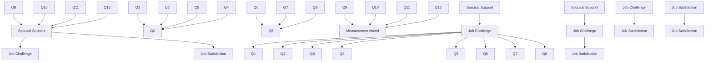

In actual research the set V is often chosen so that for each $T _ { i }$ in T, a subset of V is intended to measure $T _ { i \cdot }$ In Kohn’s (1969) study of class and attitude in America, for example, various questionnaire items where chosen with the intent of measuring the same attitude; factor analysis of the data largely agreed with the clustering one might expect on intuitive grounds. Accordingly, we suppose the investigator can partition V into $\mathbf { V } ( T _ { i } )$ , such that for each i the variables in $\mathbf { V } ( T _ { i } )$ are direct effects of $T _ { i \cdot }$ We then seek to eliminate those members of $\mathbf { V } ( T _ { i } )$ that are impure measures of $T _ { i } ,$ either because they are also the effects of some other unmeasured variable in T, because they are also causes or effects of some other measured variable, or because they share an unmeasured common cause in C with another measured variable.

In the class of models we are considering, a measured variable can be an impure measure for four reasons, which are exhaustive:

- (i) If there is a directed edge from some $T _ { i }$ in T to some V in $\mathbf { V } ( T _ { i } )$ but also a trek between V and $T _ { j }$ that does not contain $T _ { i }$ or any member of V except V then V is latent-measured impure.
- (ii) If there is a trek between a pair of measured variables $V _ { 1 } , \ V _ { 2 }$ from the same cluster $\mathbf { V } ( T _ { i } )$ that does not contain any member of T then $V _ { 1 }$ and $V _ { 2 }$ are intra-construct impure.
- (iii) If there is a trek between a pair of measured variables $V _ { 1 } , \ V _ { 2 }$ from distinct clusters $\mathbf { V } ( T _ { i } )$ and ${ \bf V } ( T _ { j } )$ that does not contain any member of T then we say $V _ { 1 }$ and $V _ { 2 }$ are crossconstruct impure. (iv) If there is a variable in C that is the source of a trek between $T _ { i }$ and some member V of $\mathbf { V } ( T _ { i } )$ we say V is common cause impure.

In figure 10.2, for example, if ${ \bf V } ( T _ { 1 } ) = \{ X _ { 1 } , X _ { 2 } , X _ { 3 } \}$ and ${ \bf V } ( T _ { 2 } ) = \{ X _ { 4 } , X _ { 5 } , X _ { 6 } \}$ then $X _ { 4 }$ is latent-measured impure, $X _ { 1 }$ and $X _ { 2 }$ are intra-construct impure, $X _ { 2 }$ and $X _ { 5 }$ are crossconstruct impure, and $X _ { 6 }$ is common cause impure. Only $X _ { 3 }$ is a pure measure of $T _ { 1 }$ .

> Figure 10.2

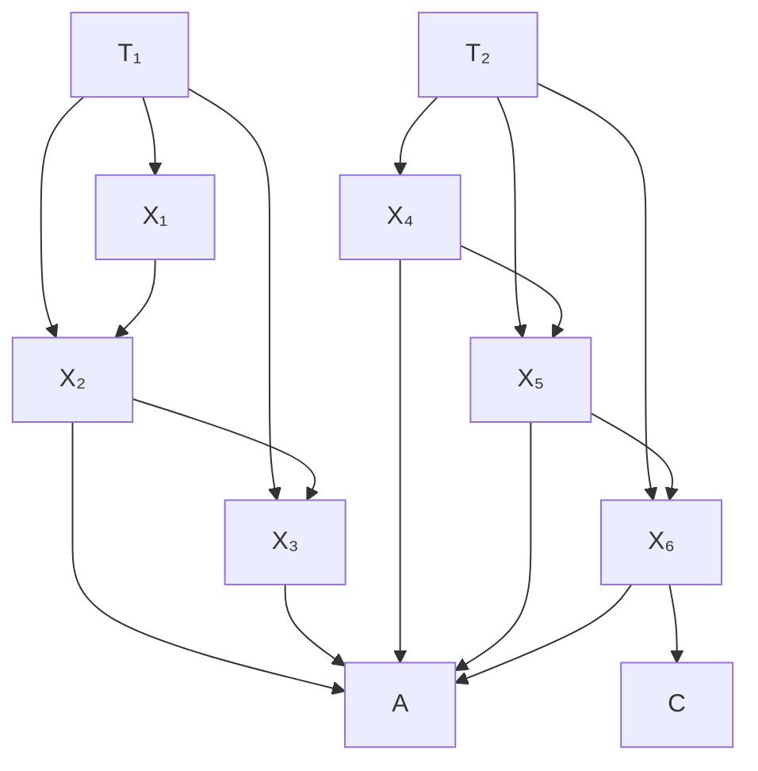

We say that a measurement model is almost pure if the only kind of impurities among the measured variables are common cause impurities. An almost pure latent variable graph is a directed acyclic graph with an almost pure measurement model. In an almost pure latent variable graph we continue to refer throughout the rest of this chapter to the set of measured variables as V, a subset of the latent variables as T, and the “nuisance” latent variables that are common causes of members of T and V as C.

The strategy that we employ has three steps:

(i) Eliminate measured variables until the variables that remain form the largest almost pure measurement model with at least two indicators for each latent variable.

- (ii) Use vanishing tetrad differences among variables in the measurement model from (i) to determine the zero and first order independence relations among the variables in T.
- (iii) Use the PC algorithm to construct a pattern from the zero and first order independence relations among the variables in T.

The next section describes a procedure for identifying the appropriate measured variables. The details are rather intricate; the reader should bear in mind that the procedures have all been automated, that they work very well in simulation tests, and they all derive from fundamental structural principles. Given the population correlations the inference techniques would be reliable (in large samples) for any conditions under which the Tetrad Representation Theorem holds. The statistical decisions involve a substantial number of joint tests, and no doubt could be improved. We occasionally resort to heuristics for cases in which each latent variable has a large number of measured indicators.

## 10.3 Finding Almost Pure Measurement Models

If G is the true model over $\mathbf { V } \cup \mathbf { T } \cup \mathbf { C }$ with measurement model $G _ { M }$ , then our task in this section is to find a subset P of V (the larger the better) such that the sub-model of $G _ { M }$ on vertex set $\mathbf { P } \cup \mathbf { T } \cup \mathbf { C }$ is an almost pure measurement model, if one exists with at least two indicators per latent variable. Our strategy is to use different types of foursomes of variables to sequentially eliminate impure measures.

As in figure 10.3, we call four measured variables an intra-construct foursome if all four are in $\mathbf { V } ( T _ { i } )$ for some $T _ { i }$ in $\mathbf { T } ;$ otherwise call it a cross-construct foursome.

## 10.3.1 Intra-Construct Foursomes

In this section we discuss what can be learned about the measurement model for $T _ { i }$ from $\mathbf { V } ( T _ { i } )$ alone. We take advantage of the following principle, which is a consequence of the Tetrad Representation Theorem.

(P–1) If a directed acyclic graph linearly implies all tetrad differences among the variables in $\mathbf { V } ( T _ { i } )$ vanish, then no pair of variables in $\mathbf { V } ( T _ { i } )$ is intra-construct impure.

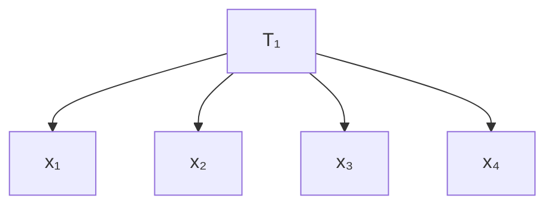

> Figure 10.3

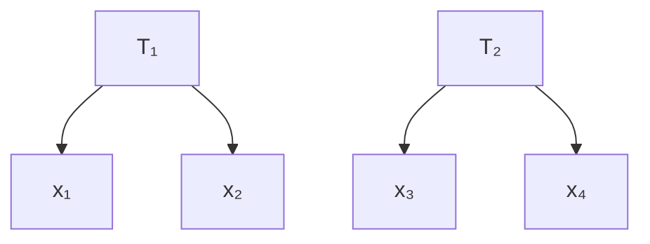

So given a set, $\mathbf { V } ( T _ { i } )$ , of variables that measure $T _ { i } ,$ we seek the largest subset, $\mathbf { P } ( T _ { i } )$ , of $\mathbf { V } ( T _ { i } )$ such that all tetrad differences are judged to vanish among $\mathbf { P } ( T _ { i } )$ . The number of subsets of $\mathbf { V } ( T _ { i } )$ i s 2 V ( Ti ) , $2 ^ { | \mathbf { V } ( T _ { i } ) | }$ so it is not generally feasible to examine each of them. Further, in realistic samples we won’t find a sizable subset in which all tetrad differences are judged to vanish. A more feasible strategy is to prune the set iteratively, removing at each stage the variable that improves the performance of the remaining set ${ \bf P } ( T _ { i } )$ on easily computable heuristic criteria derived from principle $\mathrm { P } { - } 1$ . In practice, if the set $\mathbf { V } ( T _ { i } )$ is large, some small subset of $\mathbf { V } ( T _ { i } )$ may by chance do well on these two criteria. For example, if $\mathbf { V } ( T _ { i } )$ has 12 variables, then there are 495 subsets of size 4, each of which has only 3 possible vanishing tetrad differences. There are $7 9 2$ subsets of size 5, but there are 15 possible tetrad differences that must all be judged to vanish among each set instead of 3. Because the larger the size of $\mathbf { P } ( T _ { i } )$ the more unlikely it is that all tetrad differences among $\mathbf { P } ( T _ { i } )$ will be judged to vanish by chance, and because we might eliminate variables from ${ \bf P } ( T _ { i } )$ later in the process, we want $\mathbf { P } ( T _ { i } )$ to be as large as possible. On the other hand, no matter how well a set ${ \bf P } ( T _ { i } )$ does on the first criterion above, some subset of it will do at least as well or better. Thus, in order to avoid always choosing the smallest possible subsets we have to penalize smaller sets.

We use the following simple algorithm. We initialize ${ \bf P } ( T _ { i } )$ to $\mathbf { V } ( T _ { i } )$ . If the set of tetrad differences among variables in $\mathbf { P } ( T _ { i } )$ passes a statistical test, we exit. (We count a set of n tetrad differences as passing a statistical test at a given significance level Sig if each individual tetrad difference passes a statistical test at significance level Sig/n. The details of the statistical tests that we employ on individual tetrad differences are described in chapter 11.) If the set does not pass a statistical test, we look for a variable to eliminate from $\mathbf { P } ( T _ { i } )$ . We score each measured variable X in the following way. For each tetrad difference t among variables in ${ \bf P } ( T _ { i } )$ in which X appears we give X credit if t passes a statistical test, and discredit if t fails a statistical test. We then eliminate the variable with the lowest score from $\mathbf { P } ( T _ { i } )$ . We repeat this process until we arrive at a set $\mathbf { P } ( T _ { i } )$ that passes the statistical test, or we run out of variables.

## 10.3.2 Cross-Construct Foursomes

Having found, for each latent variable $T _ { i } ,$ a subset $\mathbf { P } ( T _ { i } )$ of $\mathbf { V } ( T _ { i } )$ in which no variables are intra-construct impure, we form a subset P of V such that

$$
\mathbf {P} = \bigcup_ {T _ {i} \in \mathbf {T}} \mathbf {P} (T _ {i}).
$$

We next eliminate members of P that are cross-construct impure.

2x2 foursomes involve two measured variables from ${ \bf P } ( T _ { i } )$ and two from $\mathbf { P } ( T _ { j } )$ , where i and j are distinct. A 2x2 foursome in a pure latent variable model linearly implies exactly one tetrad equation, regardless of the nature of the causal connection between $T _ { i }$ and $T _ { j }$ in the structural model. For example, the graph in figure 10.4 linearly implies the vanishing tetrad difference $\rho _ { X Y } \rho _ { W Z } - \rho _ { X W } \rho _ { Y Z } = 0$ . Graphs in which $T _ { j }$ causes $T _ { i }$ and graphs in which $T _ { i }$ and $T _ { j }$ are not causally connected (i.e., there is no trek between them) also linearly imply $\rho _ { X Y } \rho _ { W Z } - \rho _ { X W } \rho _ { Y Z } = 0$ .

> Figure 10.4

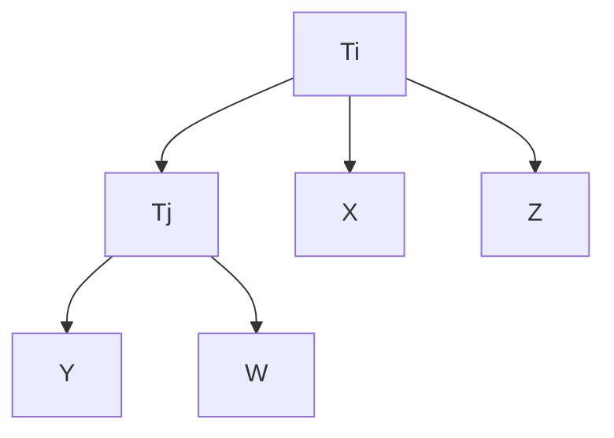

If one variable in $\mathbf { V } ( T _ { i } )$ is latent-measured impure because of a trek containing $T _ { j } ,$ and one variable in ${ \bf V } ( T _ { j } )$ is latent-measured impure because of a trek containing $T _ { i } ,$ then the tetrad differences among the foursome are not linearly implied to vanish by the graph. If $T _ { i }$ and $T _ { j }$ are connected by some trek and a pair of variables in $\mathbf { V } ( T _ { i } )$ and ${ \bf V } ( T _ { j } )$ respectively are cross-construct impure then again the tetrad difference is not linearly implied to vanish by the graph. (The case where $T _ { i }$ and $T _ { j }$ are not connected by some trek is considered below.) In figure 10.5, for example, model (i) implies the tetrad equation $\rho _ { X Y } \rho _ { W Z } = \rho _ { X W } \rho _ { Y Z }$ but models (ii) and (iii) do not.

So if we test a 2x2 foursome $F _ { 1 }$ and the hypothesis that the appropriate tetrad difference vanishes can be rejected, then we know that in at least one of the four pairs in which there is a measured variable from each construct, both members of the pair are impure. We don’t yet know which pair. We can find out by testing other $2 \mathbf { x } 2$ foursomes that share variables with $F _ { 1 }$ . Suppose the largest subgraph of the true model containing $\mathbf { P } ( T _ { 1 } )$ and ${ \bf P } ( T _ { 2 } )$ is the graph in figure 10.6.

> (i) (i)

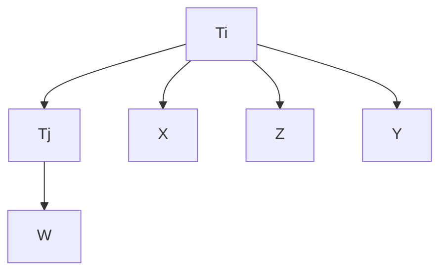

> (ii)(ii)

> (iii)(iii) Figure 10.5

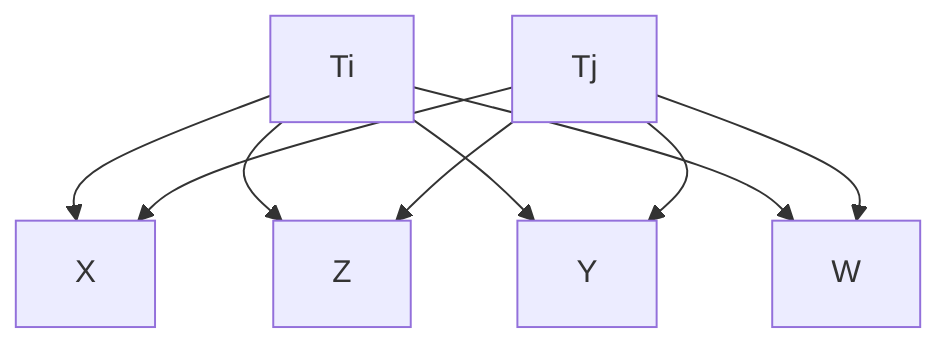

> Figure 10.6

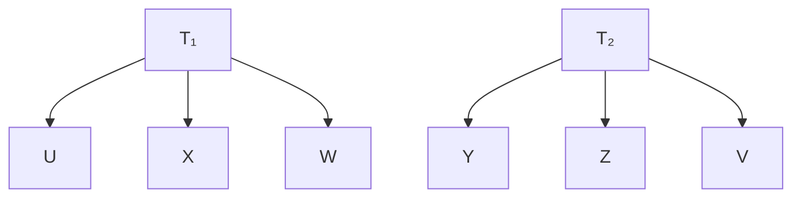

Only $2 \mathbf { x } 2$ foursomes involving the pair ${ < } W , Y { > }$ will be recognizably impure. When we test vanishing tetrad differences in the foursome $F _ { 1 } = < X , W , Y , Z >$ , we won’t know which of the pairs $< W , Z > , < X , Y > , < X , Z > , < W , Y >$ is impure. When we test the foursome $F _ { 2 } =$ $< X , W , Z , V >$ , however, we find that no pair among $< X , Z > , < X , V > , < W , Z > , \mathrm { o r } < W , V >$ is impure. We know therefore that the pairs ${ < } X , Z { > }$ and ${ < } W , Z { > }$ are not impure in $F _ { 1 }$ . By testing the foursome $F _ { 3 } = < U , X , Y , Z >$ we find that ${ < } X , Y { > }$ is not impure, entailing ${ < } W , Y { > }$ is impure in $F _ { 1 }$ . If there are at least two pure indicators within each construct, then we can detect exactly which of the other indicators are impure in this way.

By testing all the $2 \mathbf { x } 2$ foursomes in $\mathbf { P } ,$ we can in principle eliminate all variables that are cross-construct impure. We cannot yet eliminate all the variables that are latentmeasured impure, because if there is only one such variable it is undetectable from 2x2 foursomes.

Foursomes that involve three measured variables from ${ \bf P } ( T _ { i } )$ and one from ${ \bf P } ( T _ { j } )$ , where i and $j$ are distinct, are called 3x1 foursomes. All 3x1 foursomes in a pure measurement model linearly imply all three possible vanishing tetrad differences (see model (i) in figure 10.7 for example), no matter what the causal connection between $T _ { i }$ and $T _ { j } .$ If the variable from ${ \bf P } ( T _ { j } )$ in a 3x1 foursome is impure because it measures both latents (model (ii) in figure 10.7), then $T _ { i }$ is still a choke point and all three equations are linearly implied. If a variable Z from ${ \bf P } ( T _ { i } )$ is impure because it measures both latents (model (iii) in figure 10.7), however, then the latent variable model does not linearly imply that the tetrad differences containing the pair ${ < } Z , W >$ vanish. This entails that a nonvanishing tetrad differences among the variables in a 3x1 foursome can identify a unique measured variable as latent-measured impure.

> (i)(i)

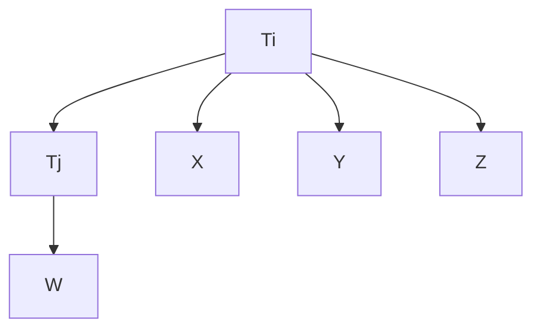

> (ii)

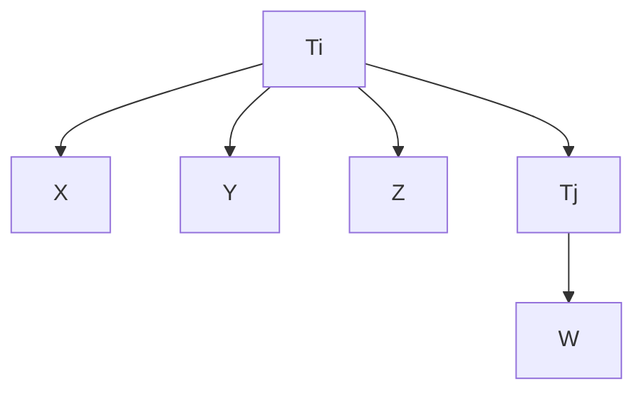

> (iii) Figure 10.7

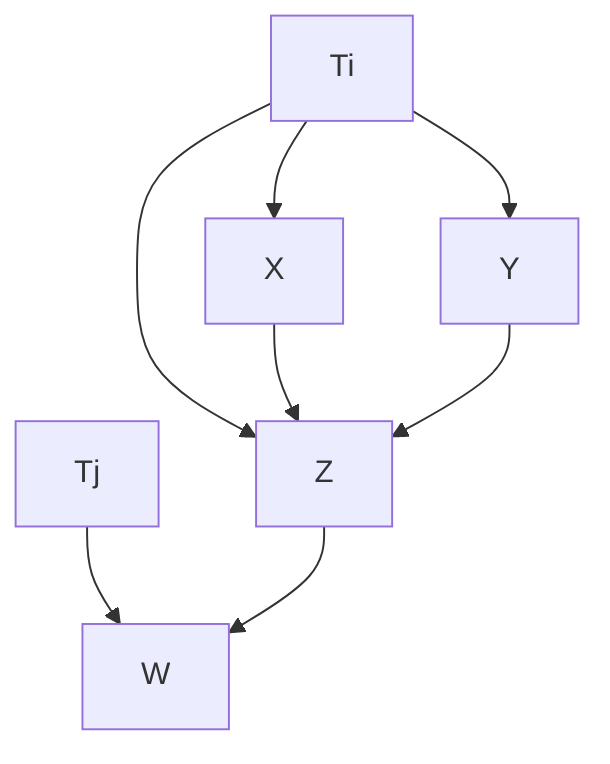

Also if $T _ { i }$ and $T _ { j }$ are not trek-connected and a pair of variables $V _ { 1 }$ and $V _ { 2 }$ in $\mathbf { P } ( T _ { i } )$ and ${ \bf P } ( T _ { j } )$ respectively are cross-construct impure, then the correlation between $V _ { 1 }$ and $V _ { 2 }$ does not vanish, and a tetrad difference among a 3x1 foursome that contains $V _ { 1 }$ and $V _ { 2 }$ is not linearly implied to vanish; hence the impure member of ${ \bf P } ( T _ { j } )$ will be recognized.

If there are least three variables in $\mathbf { P } ( T _ { i } )$ for each i, then when we finish examining all 3x1 foursomes we will have a subset P of V such that the sub-model of the true measurement model over P (which we call $G _ { P } )$ is an almost pure measurement model.

## 10.4 Facts about the Unobserved Determined by the Observed

In an almost pure latent variable model constraints on the correlation matrix among the measured variables determine

- (i) for each pair A, B, of latent variables, whether A, B are uncorrelated,
- (ii) for each triple A, B, C of latent variables, whether A and B are d-separated given {C}.

Part (i) is obvious: two measured variables are uncorrelated in an almost pure latent variable model if and only if they are effects of distinct unmeasured variables that are not trek connected (i.e., there is no trek between them) and hence are d-separated given the empty set of variables. Part (ii) is less obvious, but in fact certain d-separation facts are determined by vanishing tetrad differences among the measured variables.

Theorem 10.1 is a consequence of the Tetrad Representation Theorem:

THEOREM 10.1: If G is an almost pure latent variable graph over $\mathbf { V } \cup \mathbf { T } \cup \mathbf { C } .$ , T is causally sufficient, and each latent variable in T has at least two measured indicators, then latent variables $T _ { 1 }$ and $T _ { 3 } ,$ whose measured indicators include J and L respectively, are d-separated given latent variable $T _ { 2 } ,$ whose measured indicators include I and K, if and only if G linearly implies $\rho _ { J I } \rho _ { L K } = \rho _ { J L } \rho _ { K I } = \rho _ { J K } \rho _ { I L }$ .

For example, in the model in figure 10.8, the fact that $T _ { 1 }$ and $T _ { 3 }$ are d-separated given $T _ { 2 }$ is entailed by the fact that for all m, n, o, and $p$ between 1 and 3, where o and $p$ are distinct:

$$
\rho_ {A _ {m} D _ {n}} \rho_ {B _ {o} B _ {p}} = \rho_ {A _ {m} B _ {o}} \rho_ {D _ {n} B _ {p}} = \rho_ {A _ {m} B _ {p}} \rho_ {D _ {n} B _ {o}}
$$

By testing for such vanishing tetrad differences we can test for first order dseparability relations among the unmeasured variables in an almost pure latent variable model. (If A and B are d-separated given D, we call the number of variables in D the order of the d-separability relation.) These zero and first order d-separation relations can then be used as input to the PC algorithm, or to some other procedure, to obtain information about the causal structure among the latent variables. In the ideal case, the pattern among the latents that is output will always contain the pattern that would result from applying the PC algorithm directly to d-separation facts among the latents, but it may contain extra edges and fewer orientations.

> Figure 10.8

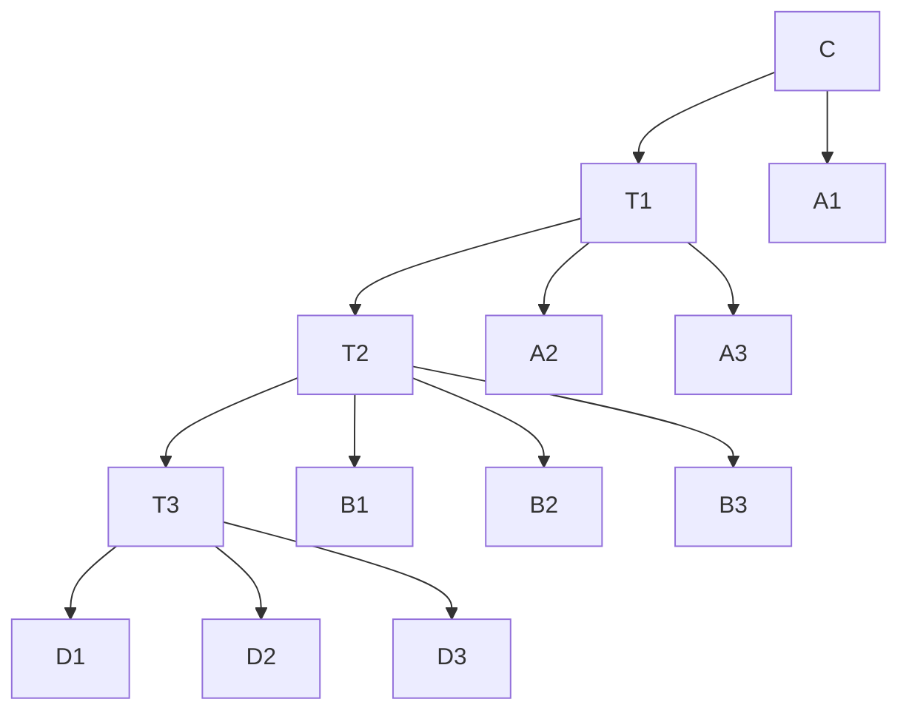

## 10.5 Unifying the Pieces

Suppose the true but unknown graph is shown in figure 10.9.

> Figure 10.9. True causal structure

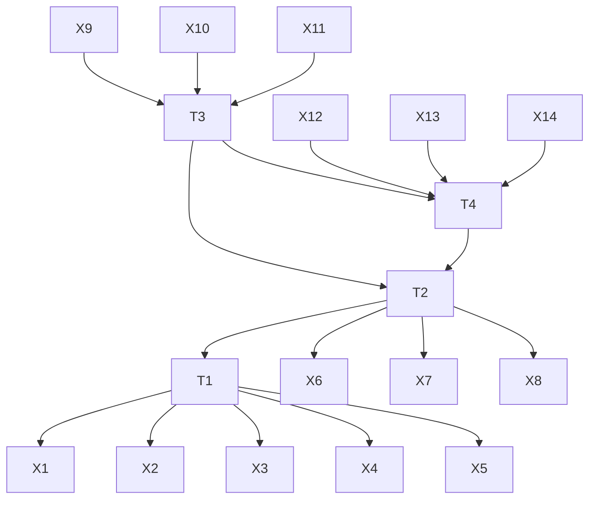

We assume that a researcher can accurately cluster the variables in the specified measurement model, for example, figure 10.10.

> Figure 10.10. Specifi ed measurement model

The actual measurement model is then the graph in fi gure 10.11.

> Figure 10.11. Actual measurement model

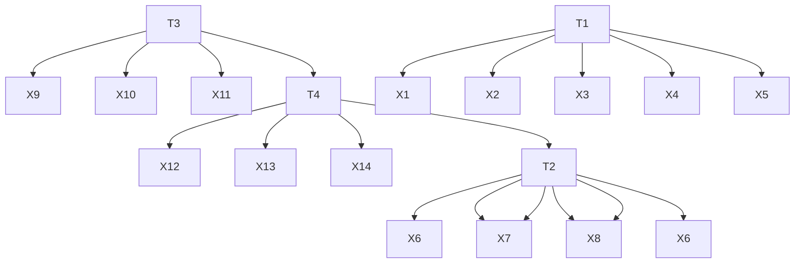

Figure 10.12 shows a subset of the variables in G (one that leaves out $X _ { 1 } , X _ { 6 } ,$ and $X _ { 1 4 } )$ that do form an almost pure measurement model.

> Figure 10.12. Almost pure measurement model

Assuming the sequence of vanishing tetrad difference tests finds such an almost pure measurement model, a sequence of tests of 1x2x1 vanishing tetrad difference tests then decides some d-separability facts for the PC or other algorithm through theorem 10.1. Since in figure 10.12 there are many 1x2x1 tetrad tests with measured variables drawn respectively from the clusters for $T _ { 1 } , T _ { 2 }$ and $T _ { 3 } ,$ , the results of the tests must somehow be aggregated. For each $1 \mathbf { x } 2 \mathbf { x } 1$ tetrad difference among variables in ${ \mathbf V } ( T _ { 1 } ) , { \mathbf V } ( T _ { 2 } )$ , and ${ \bf V } ( T _ { 3 } )$ we give credit if the tetrad difference passes a significance test and discredit if it fails a significance test; if the final score is greater than 0, we judge that $T _ { 1 }$ and $T _ { 3 }$ are dseparated by $T _ { 2 }$With two slight modifications, the PC algorithm can be applied to the zero and first order d-separation relations determined by the vanishing tetrad differences. The first modification is of course that the algorithm never tries to test any d-separation relation of order greater than 1 (i.e., in the loop in step B) of the PC Algorithm the maximum value of n is 1.) The second is that in step D) of the PC algorithm we do not orient edges to avoid cycles.

Without all of the d-separability facts available, the PC algorithm may not find the correct pattern of the graph. It may include extra edges and fail to orient some edges. However, it is possible to recognize from the pattern that some edges are definitely in the graph that generated the pattern, while others may or may not be. We add the following step to the PC algorithm to label with a “?” edges that may or may not be in the graph. Y is a definite noncollider on an undirected path U in pattern if and only if either X \*-\* $Y \right. Z , \mathrm { o r } X \left. Y ^ { * _ { - } * } Z$ are subpaths of U, or X and Z are not adjacent and not $X \right. Y \left. Z$ on U.

E.) Let P be the set of all undirected paths in between X and Y of length ≥ 2. If X and Y are adjacent in , then mark the edge between X and Y with a “?” unless either

- (i) no paths are in P, or
- (ii) every path in P contains a collider, or
- (iii) there exists a vertex Z such that Z is a definite noncollider on every path in P, or
- (iv) every path in P contains the same subpath ${ < A , B , C > }$ .

We refer to the combined procedure as the Multiple Indicator Model Building (MIMBuild) Algorithm.

THEOREM 10.2: If G is an almost pure latent variable graph over $\mathbf { V } \cup \mathbf { T } \cup \mathbf { C } ,$ T is causally sufficient, each variable in T has at least two measured indicators, the input to MIMBuild is a list of all vanishing zero and first order correlations among the latent variables linearly implied by G, and is the output of the MIMBuild Algorithm then:

- A–1) If X and Y are not adjacent in , then they are not adjacent in G.
- A–2) If X and Y are adjacent in and the edge is not labeled with a “?,” then X and Y are adjacent in G.

- O–1) If X → Y is in , then every trek in G between X and Y is into Y.
- O–2) If X → Y is in and the edge between X and Y is not labeled with a $" ? , "$ then $X $ Y is in G.

The algorithm’s complexity is bounded by the number of tetrad differences it must test, which in turn is bounded by the number of foursomes of measured variables. If there are n measured variables the number of foursomes is $O ( n ^ { 4 } )$ . We do not test each possible foursome, however, and the actual complexity depends on the number of latent variables and how many variables measure each latent. If there are m latent variables and s measured variables for each, then the number of foursomes is $O ( m ^ { 3 } \times s ^ { 4 } )$ . Since $m \times s =$ n, this is $O ( n ^ { 3 } \times s )$ .

## 10.6 Simulation Tests

The procedure we have sketched has been fully automated in the TETRAD II program, with sensible but rather arbitrary weighting principles where required. To test the behavior of the procedure we generated data from the causal graph in figure 10.13, which has 11 impure indicators.

The distribution for the exogenous variables is standard normal. For each sample, the linear coefficients were chosen randomly between .5 and 1.5.

We conducted 20 trials each at sample sizes of 100, 500, and 2000. We counted errors of commission and errors of omission for detecting uncorrelated latents (0-order dseparation) and for detecting 1st-order d-separation. In each case we counted how many errors the procedure could have made and how many it actually made. We also give the number of samples in which the algorithm identified the d-separations perfectly. The results are shown in table 10.1, where the proportions in each case indicate the number of errors of a given kind over all samples divided by the number of possible errors of that kind over all samples.

Extensive simulation tests with a variety of latent topologies for as many as six latent variables, and 60 normally distributed measured variables, show that for a given sample size the reliability of the procedure is determined by the number of indicators of each latent and the proportion of indicators that are confounded. Increased numbers of almost pure indicators make decisions about d-separability more reliable, but increased proportions of confounded variables makes identifying the almost pure indicators more difficult. For large samples with ten indicators per latent the procedure gives good results until more than half of the indicators are confounded.

> Figure 10.13. Impure Indicators =

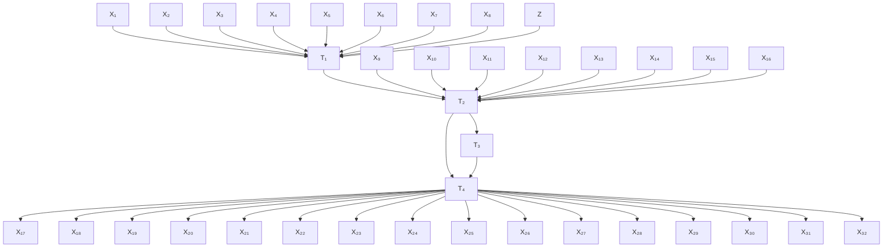

**Table 10.1**

<table><tr><td>Sample Size</td><td>0-order Commission</td><td>0-order Omission</td><td>1st-Order Commission</td><td>1st-Order Omission</td><td>Perfect</td></tr><tr><td>100</td><td>2.50%</td><td>0.00%</td><td>3.20%</td><td>5.00%</td><td>65.00%</td></tr><tr><td>500</td><td>1.25%</td><td>0.00%</td><td>0.90%</td><td>0.00%</td><td>95.00%</td></tr><tr><td>2000</td><td>0.00%</td><td>0.00%</td><td>0.00%</td><td>0.00%</td><td>100.00%</td></tr></table>

## 10.7 Conclusion

Alternative strategies are available. One could, for example, purify the measurement sets, and specify a “theoretical model” in which each pair of latent variables is directly correlated. A maximum likelihood estimate of this structure will then give an estimate of the correlation matrix for the latents. The correlation matrix could then be used as input to the PC or FCI algorithms. The strategy has two apparent disadvantages. One is that these estimates typically depend on an assumption of normality. The other is that in preliminary simulation studies with normal variates and using LISREL to estimate the latent correlations, we have found the strategy less reliable than the procedure described in this chapter. Decisions about d-separation facts among latent variables seem to be more reliable if they are founded on a weighted average of a number of decisions about vanishing tetrad differences based on measured correlations than if they are founded on decisions about vanishing partial correlations based on estimated correlations.

The MIMBuild algorithm assumes T is causally sufficient; an interesting open question is whether there are reliable algorithms that do not make this assumption. In addition, although the algorithm is correct, it is incomplete in a number of distinct ways. There is further orientation information linearly implied by the zero and first order vanishing partial correlations. Further, we do not know whether there is further information about which edges definitely exist (i.e., should not be marked with a “?”) that is linearly implied by the vanishing zero and first order partial correlations. Moreover, it is sometimes the case that for each edge labeled with a “?” in the MIMBuild output there exists a pattern compatible with the vanishing zero and first order partial correlations that does not contain that edge, but no pattern compatible with the vanishing zero and first order partial correlations that does not contain two or more of the edges so labeled.

Finally, and most importantly, the strategy we have described is not very informative about latent structures that have multiple causal pathways among variables. An extension of the strategy might be more informative and merits investigation. In addition to tetrad differences, one could test for higher-order constraints on measured correlations (e.g., algebraic combinations of five or more correlations) and use the resulting decisions to determine higher-order d-separation relations among the latent variables. The necessary theory has not been developed.