# Elaborating Linear Theories with Unmeasured Variables

## 11.1 Introduction

In many cases investigators have a causal theory in which they place some confidence, but they are unsure whether the model contains all important causal connections, or they believe it to be incomplete but don’t know which dependencies are missing. How can further unknown causal connections be discovered? The same sort of question arises for the output of the PC or FCI algorithms when, for example, two correlated variables are disconnected in the pattern; in that case we may think that some mechanism not represented in the pattern accounts for the dependency, and the pattern needs to be elaborated. In this chapter we consider a special case of the “elaboration problem,” confined to linear theories with unmeasured common causes each having one or more measured indicators. The general strategy we develop for addressing the elaboration problem can be adapted to models without latent variables, and also to models for discrete variables. Other strategies than those we consider here are also promising; the Bayesian methods of Cooper and Herskovits, in particular, could be adapted to the elaboration problem.

The problem of elaborating incomplete “structural equation models” has been addressed in at least two commercial computer packages, the LISREL program (Joreskog and Sorbom 1984) and the EQS program (Bentler 1985). We will describe detailed tests of the reliabilities of the automated search procedures in these packages. Generally speaking, we find them to be very unreliable, but not quite useless, and the analysis of why they fail when other methods succeed suggests an important general lesson about computerized search in statistics: in specification search computation matters, and in large search spaces it matters far more than does using tests that would, were computation free, be optimal.

We will compare the EQS and LISREL searches with a search procedure based on tests of vanishing tetrad differences. In principle, the collection of tetrad tests is less informative than maximum likelihood tests of an entire model used by the LISREL and EQS searches. In practice, this disadvantage is overwhelmed by the computational advantages of the tetrad procedure. Under some general assumptions, the procedure we describe gives correct (but not necessarily fully informative) answers if correct decisions are made about vanishing tetrad differences in the population. We demonstrate that for many problems the procedure obtains very reliable conclusions from samples of realistic sizes.

## 11.2. The Procedure

The procedure we will describe is implemented in the TETRAD II program. It takes as input:

- (i) a sample size,
- (ii) a correlation or covariance matrix, and
- (iii) the directed acyclic graph of an initial linear structural equation model.

A number of specifications of internal parameters can also be input. The graph is given to the program simply by specifying a list of paired causes and effects. The algorithm can be divided into two parts, a scoring procedure and a search procedure.

## 11.2.1 Scoring

The procedure uses the following methodological principles.

Falsification Principle: Other things being equal, prefer models that do not linearly imply constraints that are judged not to hold in the population.

Explanatory Principle: Other things being equal, prefer models that linearly imply constraints that are judged to hold in the population.

Simplicity Principle: Other things being equal, prefer simpler models.

The intuition behind the Explanatory Principle is that an explanation of a constraint based on the causal structure of a model is superior to an explanation that depends upon special values of the free parameters of a model. This intuition has been widely shared in the natural sciences; it was used to argue for the Copernican theory of the solar system, the General Theory of Relativity, and the atomic hypothesis. A more complete discussion of the Explanatory Principle can be found in Glymour et al. 1987, Scheines 1988, and Glymour 1983. As with vanishing partial correlations, the set of values of linear coefficients associated with the edges of a graph that generate a vanishing tetrad difference not linearly implied by the graph has Lebesgue measure zero.

Unfortunately, the principles can conflict. Suppose, for example, that model M is a modification of model M, formed by adding an extra edge to M. Suppose further that M linearly implies fewer constraints that are judged to hold in the population, but also linearly implies fewer constraints that are judged not to hold in the population. Then M is superior to M with respect to the Falsification Principle, but inferior to M with respect to the Simplicity and Explanatory Principles. The procedure we use introduces a heuristic scoring function that balances these dimensions.2

In order to calculate the Tetrad-score we first calculate the associated probability P(t) of a vanishing tetrad difference, which is the probability of obtaining a tetrad difference as large or larger than the one actually observed in the sample, under the assumption that the tetrad difference vanishes in the population. Assuming normal variates, Wishart (1928) showed that the variance of the sampling distribution of the vanishing tetrad difference $\rho _ { I J } \rho _ { K L } - \rho _ { I L } \rho _ { J K }$ is equal to

$$
\frac {D _ {1 2} D _ {3 4} (N + 1)}{(N - 1) (N - 2)} - D
$$

where D is the determinant of the population correlation matrix of the four variables $I , J ,$ $K ,$ and $L , D _ { 1 2 }$ is the determinant of the two-dimensional upper left-corner submatrix, $D _ { 3 4 }$ is the determinant of the lower right-corner submatrix and $I , J , K ,$ and L, have a joint normal distribution. In calculating $P ( t )$ we substitute the sample covariances for the corresponding population covariances in the formula. $P ( t )$ is determined by lookup in a chart for the standard normal distribution. An asymptotically distribution free test has been described by Bollen (1990).

Among any four distinct measured variables I, J, K, and L we compute three tetrad differences:

$$
t _ {1} = \rho_ {I J} \rho_ {K L} - \rho_ {I L} \rho_ {J K}
$$

$$
t _ {2} = \rho_ {I L} \rho_ {J K} - \rho_ {I K} \rho_ {J L}
$$

$$
t _ {3} = \rho_ {I K} \rho_ {J L} - \rho_ {I J} \rho_ {K L}
$$

and their associated probabilities $P ( t _ { i } )$ on the hypothesis that the tetrad difference vanishes. If $P ( t _ { i } )$ is larger than the given significance level, the procedure takes the tetrad difference to vanish in the population. If $P ( t _ { i } )$ is smaller than the significance level, but the other two tetrad differences have associated probabilities higher than the significance level, then $t _ { i }$ is ignored. Otherwise, if $P ( t _ { i } )$ is smaller than the significance level, the tetrad difference is judged not to vanish in the population.

Let $\mathbf { I m p l i e d _ { H } }$ be the set of vanishing tetrads linearly implied by a model M that are judged to hold in the population and $\mathbf { I m p l i e d } _ { \mathrm { { \sim } H } }$ be the set of vanishing tetrads linearly implied by M that are judged not to hold in the population. Let Tetrad-score be the score of model M for a given significance level assigned by the algorithm, and let weight be a parameter (whose significance is explained below). Then we define

$$
T = \sum_ {t \in \mathbf {I m p l i e d} _ {\mathbf {H}}} P (t) - \sum_ {t \in \mathbf {I m p l i e d} _ {\sim \mathbf {H}}} w e i g h t * (1 - P (t))
$$

The first term implements the explanatory principle while the second term implements the falsification principle. The simplicity principle is implemented by preferring, among models with identical Tetrad-scores, those with fewer free parameters—which amounts to preferring graphs with fewer edges. The weight determines how conflicts between the explanatory and falsification principles are resolved by determining the relative importance of explanation relative to residual reduction.

The scoring function is controlled by two parameters. The significance level is used to judge when a given tetrad difference is zero in the population. The weight is used to determine the relative importance of the Explanatory and Falsification Principles. The scoring function has several desirable asymptotic properties, but we do not know whether the particular value for weight we use is optimal.

## 11.2.2 Search

The TETRAD II procedure searches a tree of elaborations of an initial model. The search is comparatively fast because there is an easy algorithm for determining the vanishing tetrad differences linearly implied by a graph (using the Tetrad Representation Theorem), because most of the computational work required to evaluate a model can be stored and reused to evaluate elaborations, and because the scoring function is such that if a model can be conclusively eliminated from consideration because of a poor score, so can any elaboration of it.

The search generates each possible one-edge elaboration of the initial model, orders them by the tetrad score, and eliminates any that score poorly. It then repeats this process recursively on each model generated, until no improvements can be made to a model.

The search is guided by a quantity called T-maxscore, which for a given model M represents the maximum Tetrad-score that could possibly be obtained by any elaboration of M. T-maxscore is equal to:

$$
T \text {-maxscore} = \sum_ {t \in \mathbf {I m p l i e d} _ {\mathbf {H}}} P (t)
$$

The use we make of this quantity is justified by the following theorem.

THEOREM 11.1. If G is a subgraph of directed acyclic graph $G ^ { \prime } ,$ than the set of tetrad equations among variables of G that are linearly implied by $G ^ { \prime }$ is a subset of those linearly implied by G.

In order to keep the following example small, suppose that there are just 4 edges, $e _ { 1 } .$ , $e _ { 2 } , e _ { 3 } , \mathrm { o r } e _ { 4 }$ which could be added to the initial model. The example illustrates the search procedure in a case where each possible elaboration of the initial model is considered. Node 1 in figure 11.1 represents the initial model. Each node in the graph represents the model generated by adding the edge next to the node to its parent. For example, node 2 represents the initial model $+ \ e _ { 1 } ;$ node 7 represents node $2 + e _ { 4 }$ , which is the initial model $+ \ e _ { 1 } \ + \ e _ { 4 }$ . We will say that a program visits a node when it creates the model M corresponding to the node and then determines whether any elaboration of M has a higher Tetrad-score than M. (Note that the algorithm can generate a model M without visiting M if it generates M but does not determine whether any elaboration of M has a higherTetrad-score than M.) The numbers inside each node indicate the order in which the models are visited. Thus for example, when the algorithm visits node 2, it first generates all possible one edge additions of the initial model $+ \ e _ { 1 } ,$ , and orders them according to their T-maxscore. It then first visits the one with the highest T-maxscore (in this case, node 3 that represents the initial model $+ \boldsymbol { e } _ { 1 } + \boldsymbol { e } _ { 2 } )$ . Note that the program does not visit the initial model $+ \ e _ { 2 }$ (node 10) until after it has visited all elaborations of the initial model + $e _ { 1 }$ .

> Figure 11.1

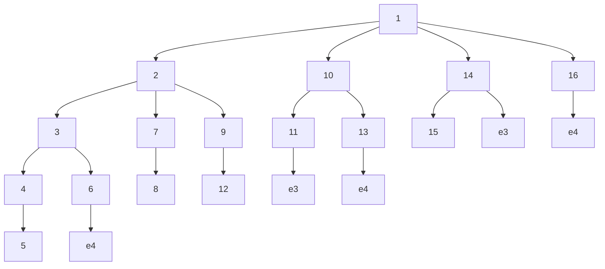

In practice, this kind of complete search could not possibly be carried out in a reasonable amount of time. Fortunately we are able to eliminate many models from consideration without actually visiting them. Addition of edges to a graph may defeat the linear implication of tetrad equations, but in view of theorem 11.1 will never cause more tetrad equations to be linearly implied by the resulting graph. If the T-maxscore of a model M is less than the Tetrad-score of some model $M ^ { \prime }$ --

---& that neither M nor any elaboration of M has a Tetrad-score as high as that of M . Hence we need never visit M or any of its elaborations. This is illustrated in figure 11.2. If we find that T-maxscore of the initial $\mathrm { m o d e l } + e _ { 4 }$ is lower than the Tetrad-score of the initial model $+ \thinspace e _ { 1 } .$ , we can eliminate from the search all models that contain the edge $e _ { 4 } .$ .

> Figure 11.2

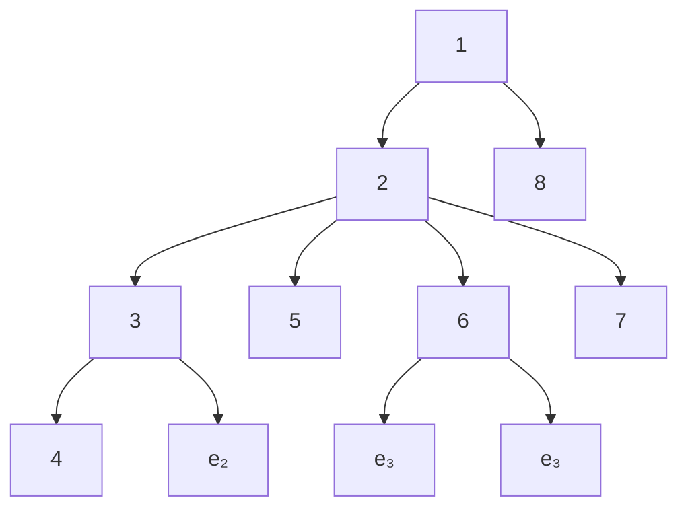

In some cases in the simulation study described later, the procedure described here is too slow to be practical. In those cases the time spent on a search is limited by restricting the depth of search. (We made sure that in every case the depth restriction was large enough that the program had a chance to err by overfitting.) The program adjusts the search to a depth that can be searched in a reasonable amount of time; in many of the Monte Carlo simulation cases no restriction on depth was necessary.3

## 11.3. The LISREL and EQS Procedures

LISREL VI and EQS are computer programs that perform a variety of functions, such as providing maximum likelihood estimates of the free parameters in a structural equation model. The feature we will consider automatically suggests modifications to underspecified models.

## 11.3.1 Input and Output

Both programs take as input:

- (i) a sample size,
- (ii) a sample covariance matrix,
- (iii) initial estimates of the variances of independent variables,
- (iv) initial estimates of the linear coefficients,
- (v) an initial causal model (specified by fixing at zero the linear coefficient of A in the equation for B if and only if A is not a direct cause of B), in the form of equations (EQS) or a system of matrices (LISREL VI)
- (vi) a list of parameters not to be freed during the course of the search,
- (vii) a significance level, and
- (viii) a bound on the number of iterations in the estimation of parameters.

The output of both programs includes a single estimated model that is an elaboration of the initial causal model, various diagnostic information as well as a $\chi ^ { 2 }$ value for the suggested revision, and the associated probability of the $\chi ^ { 2 }$ measure.

## 11.3.2 Scoring

LISREL VI and EQS provide maximum likelihood estimates of the free parameters in a structural equation model. More precisely, the estimates are chosen to minimize the fitting function

$$
F = \log | \Sigma | + t r (S \Sigma^ {- 1}) - \log | S | - t
$$

where S is the sample covariance matrix, Σ is the predicted covariance matrix, t is the total number of indicators, and if A is a square matrix then |A| is the determinant of A and tr (A) is the trace of A. In the limit, the parameters that minimize the fitting function F also maximize the likelihood of the covariance matrix for the given causal structure.

After estimating the parameters in a given model, LISREL VI and EQS test the null hypothesis that Σ is of the form implied by the model against the hypothesis that Σ is unconstrained. If the associated probability is greater than the chosen significance level, the null hypothesis is accepted, and the discrepancy is attributed to sample error; if the probability is less than the significance level, the null hypothesis is rejected, and the discrepancy is attributed to the falsity of M. For a “nested” series of models $M _ { 1 } , . . . , M _ { k }$ in which for all models $M _ { i }$ in the sequence the free parameters of $M _ { i }$ are a subset of the free parameters of $M _ { i + 1 }$ , asymptotically, the difference between the $\chi ^ { 2 }$ values of two nested models also has a $\chi ^ { 2 }$ distribution, with degrees of freedom equal to the difference between the degrees of freedom of the two nested models.

## 11.3.3 The LISREL VI Search4

The LISREL VI search is guided by the “modification indices” of the fixed parameters. Each modification index is a function of the derivatives of the fitting function with respect to a given fixed parameter. More precisely, the modification index of a given fixed parameter is defined to be N/2 times the ratio between the squared first-order derivative and the second-order derivative (where N is the sample size). Each modification index provides a lower bound on the decrease in the $\chi ^ { 2 }$ obtained if that parameter is freed and all previously estimated parameters are kept at their previously estimated values.5 (Note that if the coefficient for variable A in the linear equation for B is fixed at zero, then freeing that coefficient amounts to adding an edge from A to B to the graph of the model.) LISREL VI first makes the starting model the current best model in its search. It then calculates the modification indices for all of the fixed parameters6 in the starting model. If LISREL VI estimates that the difference between the $\chi ^ { 2 }$ statistics of M, the current best model, and $M ^ { \prime } ,$ the model obtained from M by freeing the parameter with the largest modification index, is not significant, then the search ends, and LISREL VI suggests model M. Otherwise, it makes M --
----	--	

## 11.3.4 The EQS Search

EQS computes a Lagrange Multiplier statistic, which is asymptotically distributed as $\chi ^ { 2 7 }$ EQS performs univariate Lagrange Multiplier tests to determine the approximate separate effects on the $\chi ^ { 2 }$ statistic of freeing each fixed parameter in a set specified by the user. It frees the parameter that it estimates will result in the largest decrease in the $\chi ^ { 2 }$ value. The program repeats this procedure until it estimates that there are no parameters that will significantly decrease the $\chi ^ { 2 } .$ . Unlike LISREL VI, when EQS frees a parameter it does not reestimate the model.8

It should be noted that both LISREL VI and EQS are by now quite complicated programs. An understanding of their flexibility and limitations can only be obtained through experimentation with the programs.

## 11.4. The Primary Study

Eighty data sets, forty with a sample size of 200 and forty with a sample size of 2,000, were generated by Monte Carlo methods from each of nine different structural equation models with latent variables. The models were chosen because they involve the kinds of causal structures that are often thought to arise in social and psychological scientific work. In each case part of the model used to generate the data was omitted and the remainder, together in turn with each of the data sets for that model, was given to the LISREL VI, EQS, and TETRAD II programs. A variety of specification errors are represented in the nine cases. Linear coefficient values used in the true models were generated at random to avoid biasing the tests in favor of one or another of the procedures. In addition, a number of ancillary studies were suggested by the primary studies and bear on the reliability of the three programs.

## 11.4.1 The Design of Comparative Simulation Studies

To study the reliability of automatic respecification procedure under conditions in which the general structural equation modeling assumptions are met, the following factors should be varied independently:

- (i) the causal structure of the true model;
- (ii) the magnitudes and signs of the parameters of the true model;
- (iii) how the starting model is misspecified;
- (iv) the sample size.

In addition, an ideal study should:

(i) Compare fully algorithmic procedures, rather than procedures that require judgment on the part of the user. Procedures that require judgment can only adequately be tested by carefully blinding the user to the true model; further, results obtained by one user may not transfer to other users. With fully algorithmic procedures, neither of these problems arises.

(ii) Examine causal structures that are of a kind postulated in empirical research, or that there are substantive reasons to think occur in real domains.

(iii) Generate coefficients in the models randomly. Costner and Herting showed that the size of the parameters affects LISREL’s performance. Further, the reliability of TETRAD II depends on whether vanishing tetrad differences hold in a sample because of the particular numerical values of the coefficients rather than because of the causal structure, and it is important not to bias the study either for or against this possibility.

(iv) Ensure insofar as possible that all programs compared must search the same space of alternative models.

## 11.4.2 Study Design

## 11.4.2.1 Selection of Causal Structures

The nine causal structures studied are illustrated in figures 3, 4, and 5. For simplicity of depiction we have omitted uncorrelated error terms in the figures, but such terms were included in the linear models. The heavier directed or undirected lines in each figure represent relationships that were included in the model used to generate simulated data, but were omitted from the models given to the three programs; that is, they represent the dependencies that the programs were to attempt to recover. The starting models are shown in figure 11.6. The models studied include a one factor model with five measured variables, seven multiple indicator models each with eight measured variables and two latent variables, and one multiple indicator model with three latent variables and eight measured variables.

One factor models commonly arise in psychometric and personality studies (see Kohn 1969); two latent factor models are common in longitudinal studies in which the same measures are taken at different times (see McPherson et al. 1977), and also arise in psychometric studies; the triangular arrangement of latent variables is a typical geometry (see Wheaton et al. 1977).

The set of alternative structures determines the search space. Each program was forced to search the same space of alternative elaborations of the initial model, and the set of alternatives was chosen to be as large as possible consistent with that requirement.

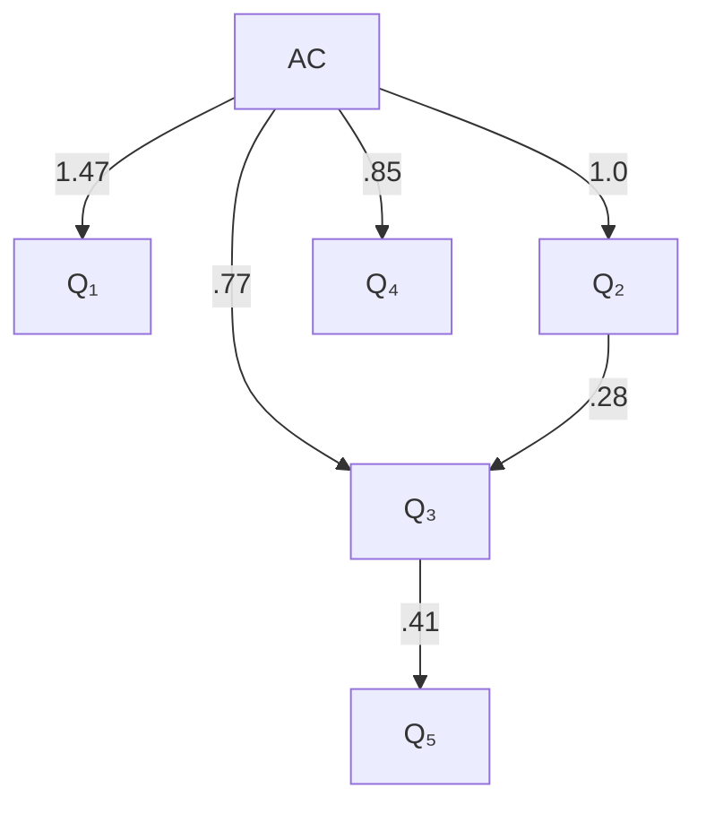

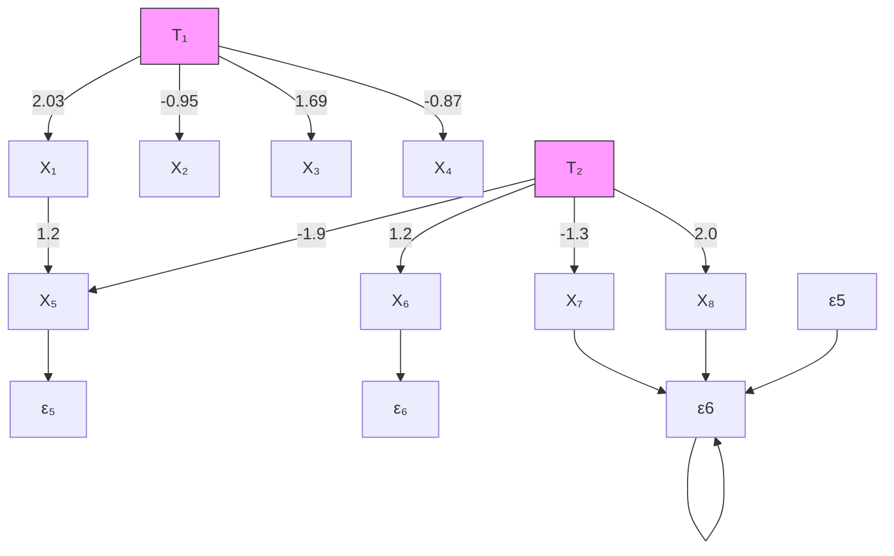

> Figure 11.3

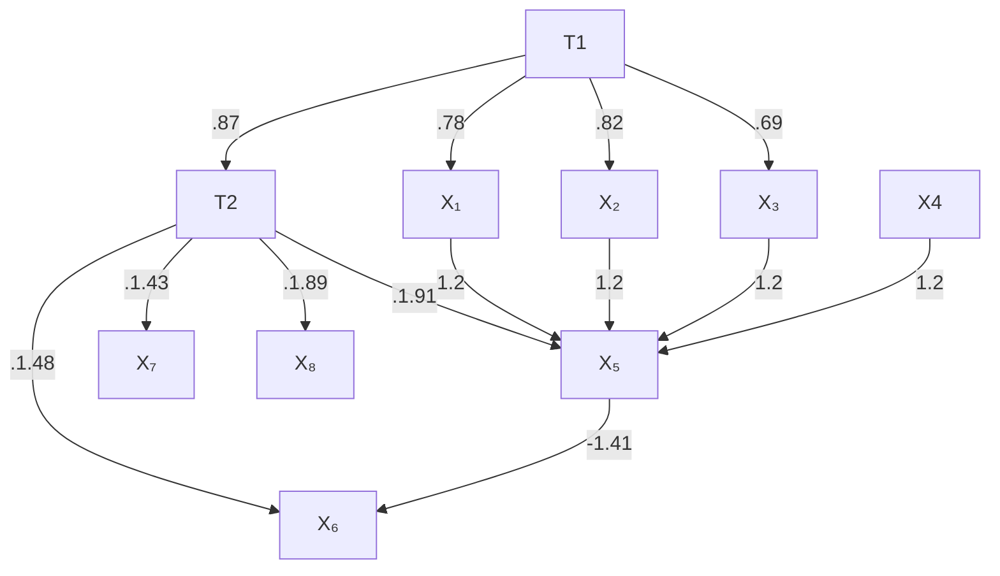

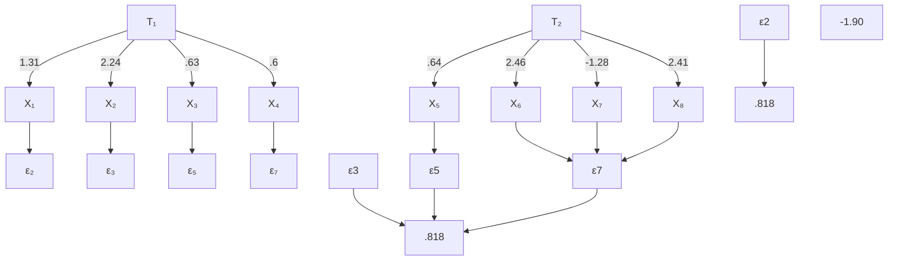

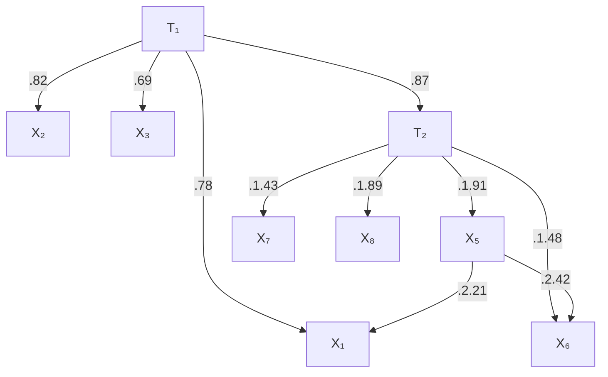

> Figure 11.4

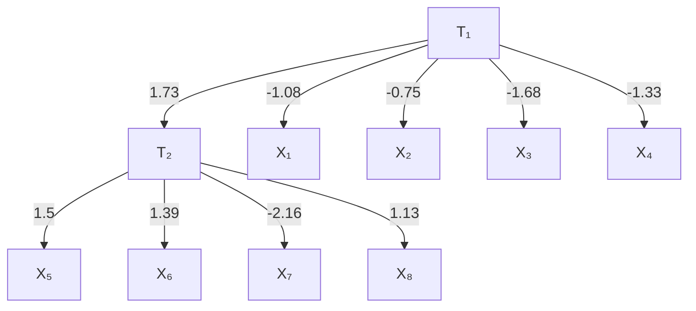

> Model 8

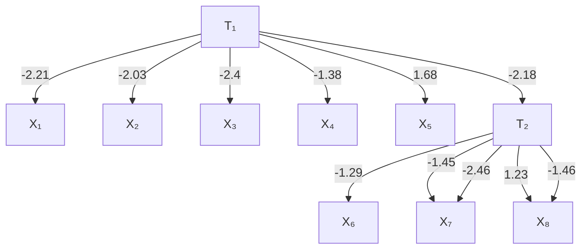

> ModModel 9 Figure 11.5

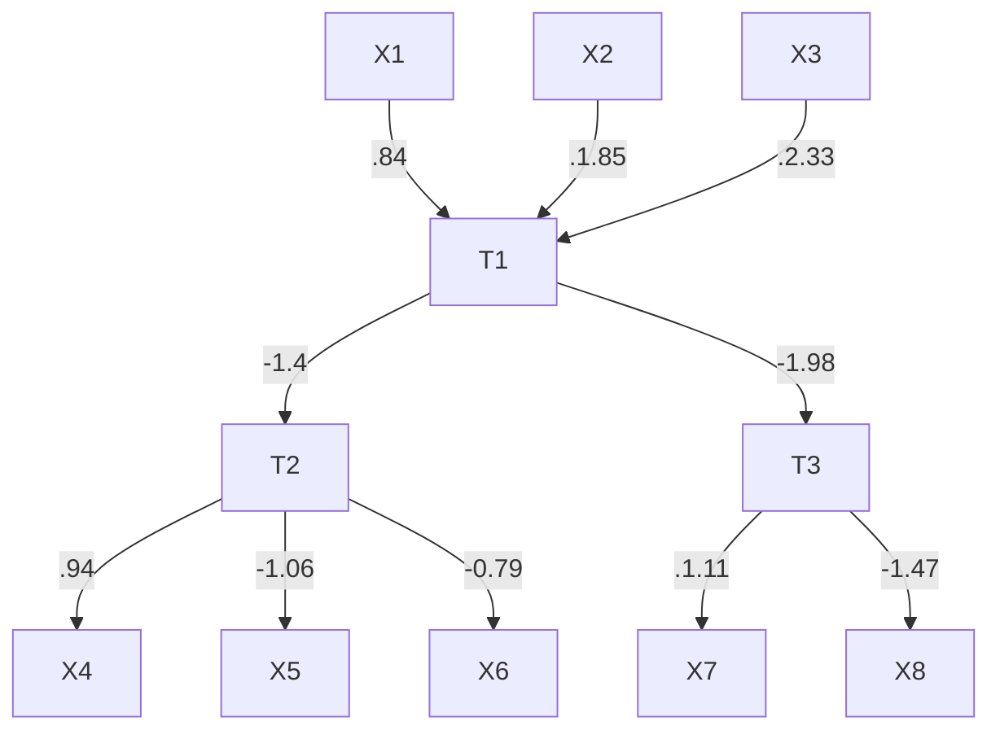

> Start for ModelStart for Model 1

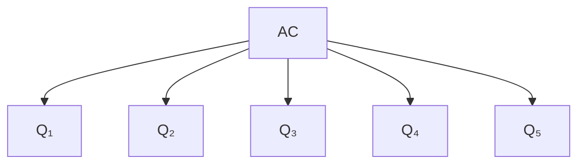

> Start for Models 2 - 8

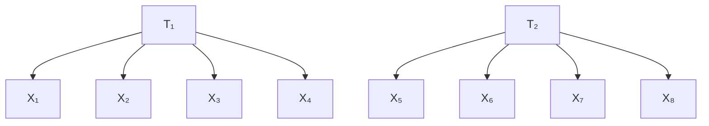

> Start for MoStart for Model 9 Figure 11.6

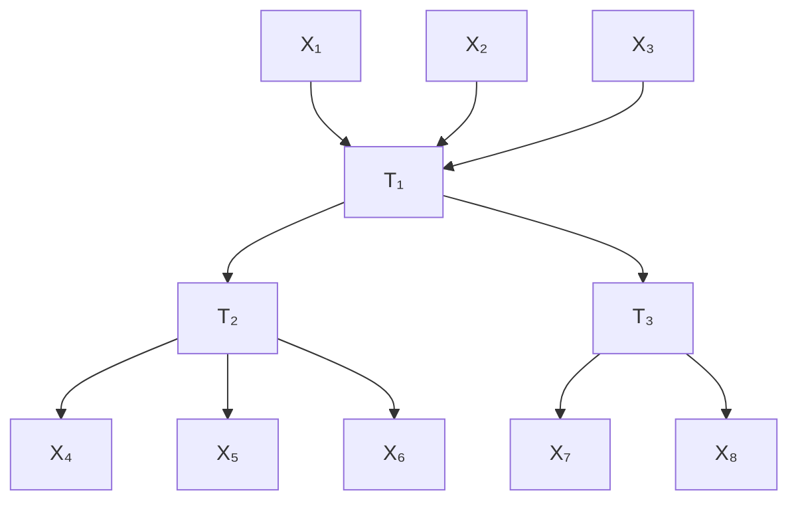

## 1.4.2.2 Selection of Connections to Be Recovered

The connections to be recovered include:

- (i) Directed edges from latent variables to latent variables; relations of this kind are often the principal point of empirical research. See Maruyama and McGarvey (1980) for an example.
- (ii) Edges from latent variables to measured variables; connections of this kind may arise when measures are impure, and in other contexts. See Costner and Schoenberg (1973) for an example.
- (iii) Correlated errors between measured variables; relationships of this kind are perhaps the most frequent form of respecification.
- (iv) Directed edges from measured variables to measured variables. Such relations cannot obtain, for example, between social indices, but they may very well obtain between responses to survey or psychometric instruments (see Campbell et al. 1966), and of course between measured variables such as interest rates and housing sales.

We have not included cases that we know beforehand cannot be recovered by one or another of the programs. Details are given in a later section.

## 11.4.2.3 Selection of Starting Models

Only three starting models were used in the nine cases. The starting models are, in causal modeling terms, pure factor models or pure multiple indicator models. In graph theoretic terms they are trees.trees.

## 11.4.2.4 Selection of Parameters

In the figures showing the true models the numbers next to directed edges represent the values given to the associated linear coefficients. The numbers next to undirected lines represent the values of specified covariances. In all cases, save for models 1 and 5, the coefficients were chosen by random selection from a uniform distribution between .5 and 2.5. The value obtained was then randomly given a sign, positive or negative.

In model 1, all linear coefficients were made positive. The values of the causal connections between indicators were specified nonrandomly. The case was constructed to simulate a psychometric or other study in which the loadings on the latent factor are known to be positive, and in which the direct interactions between measured variables are comparatively small.

Model 5 was chosen to provide a comparison with model 3 in which the coefficients of the measured-measured edges were deliberately chosen to be large relative to those in model 3.

## 11.4.2.5 Generation of Data

For each of the nine cases, twenty data sets with sample size 200 and twenty data sets with sample 2,000 were generated by Monte Carlo simulation methods.

Pseudorandom samples were generated by the method described in chapter 5. In order to optimize the performance of each of the programs, we assumed that all of the exogenous variables had a standard normal distribution. This assumption made it possible to fix a value for each exogenous variable for each unit in the population by pseudo random sampling from a standard normal distribution. Correlated errors were obtained in the simulation by introducing a new exogenous common cause of the variables associated with the error terms.

## 11.4.2.6 Data Conditioning

The entire study we discuss here was performed twice. In the original study, we gave LISREL VI and EQS positive starting values for all parameters. If either program had difficulty estimating the starting model, we reran the case with the initial values set to the correct sign.

LISREL and EQS employ iterative procedures to estimate the free parameters of a model. These procedures are sensitive to “poorly conditioned” variables and will not perform optimally unless the data are transformed. For example, it is a rule of thumb with these procedures that no two variances should vary by more than an order of magnitude in the measured variables. After generating data in the way we describe above, a small but significant percentage of our covariance matrices were ill conditioned in this way.

To check the possibility that the low reliability we obtained in the first study for the LISREL VI and EQS procedures was due to “ill-conditioned” data, the entire study was repeated. Sample covariances were transformed into sample correlations by dividing each cell [I,J] in the covariance matrix by $s _ { I } s _ { J } ,$ , where $s _ { I }$ is the sample standard deviation of I. To avoid sample variances of widely varying magnitudes, we transformed each cell [I,J] in the sample covariance matrix by dividing it by $\sigma _ { I } \sigma _ { J }$ where $\sigma _ { I }$ is the population standard deviation of $I ^ { 9 . }$ We call the result of this transformation the pseudocorrelation matrix. The transformation makes all of the variances of the measured variables almost equal, without using a data-dependent transformation. Of course in empirical research, this transformation could not be performed, since the population parameters would not be known.

In practice, we found that conditioning the data and giving the population parameters as starting values did little to change the performance of LISREL VI or EQS. The performance of the TETRAD II procedure was essentially the same in both cases. Conditioning the data improved LISREL VI’s reliability very slightly for small samples, and degraded it slightly for large samples.

## 11.4.2.7 Starting Values for the Parameters

We selected the linear coefficients for our models randomly, allowing some to be negative and some to be positive. Models with negative parameters actually represent a harder case for the TETRAD procedures. If a model implies a vanishing tetrad difference then the signs of its parameters make no difference. If a model does not imply that a tetrad difference vanishes, however, but instead implies that the tetrad difference is equal to the sum of two or more terms, then it is possible, if not all of the model’s parameters are positive, that these terms sum to zero. Thus, in data generated by a model with negative parameters, we are more likely to observe vanishing tetrad differences that are not linearly implied by the model.

The iterative estimation procedures for LISREL and EQS begin with a vector of parameters $\theta .$ They update this vector until the likelihood function converges to a local maximum. Inevitably, the iterative procedures are sensitive to starting values. Given the same model and data, but two different starting vectors $\boldsymbol { \theta } ^ { i }$ and $\theta ^ { j } ,$ the procedures might converge for one but not for the other. This is especially true when the parameters are of mixed signs. To give LISREL and EQS the best chance possible in the second study, we set the starting values of each parameter to its actual value whenever possible. For the linear coefficients that correspond to edges in the generating model left out of the starting model, we assigned a starting value of 0. For all other parameters, however, we started LISREL and EQS with the exact value in the population.

## 11.4.2.8 Significance Levels

EQS and LISREL VI continue to free parameters as long as the associated probability of - - 
 $\chi ^ { 2 }$ exceeds the user-specified significance level. For both LISREL and EQS, we set the significance level to .01. (This is the default value for LISREL; the default value for EQS is .05.) The lower the significance level, the fewer the parameters that each program tends to set free. Since both LISREL and EQS both tend to overfit even at .01, we did not attempt to set the significance level any higher. (It may appear in our results that LISREL VI and EQS both underfit more than they overfit, but almost all of the “underfitting” was due to aborted searches that did not employ the normal stopping criterion.)

## 11.4.2.9 Number of Iterations

The default number of maximum iterations for estimating parameters for LISREL VI on a personal computer is 250. We set the number of maximum iterations to 250 for both our LISREL VI and EQS tests.

## 11.4.2.10 Specifying Starting Models in LISREL VI

LISREL VI, like previous editions of the program, requires the user to put variables into distinct matrices according to whether they are exogenous, endogenous but unmeasured, measured but dependent on exogenous latent, measured but dependent on endogenous latent, and so forth. Variables in certain of these categories cannot have effects on variables in other categories. When formulated as recommended in the LISREL manual, LISREL VI would be in principle unable to detect many of the effects considered in this study. However, these restrictions can in most cases be overcome by a system of substitutions of phantom variables in which measured variables are actually represented as endogenous latent variables.11 In the current study, we were not able to get LISREL VI -	-
 $\zeta$ -
-
--.
--- $\eta$ variables, which are endogenous and latent. This had the unfortunate effect that LISREL would not consider adding any edges into $T _ { 1 }$ -	-- $\zeta$ variable). To ensure a comparable search problem, we restricted TETRAD II and EQS in the same way.

## 11.4.2.11 Implementation

The LISREL VI runs were performed with the personal computer version of the program, run on a Compaq 386 computer with a math coprocessor. EQS runs were performed on an IBM XT clone with a math coprocessor. All TETRAD II runs were performed on Sun 3/50 workstations. For TETRAD II, which also runs on IBM clones, the processing time for the Compaq 386 and the Sun 3/50 are roughly the same.

## 11.4.2.12 Specification of TETRAD II Parameters

TETRAD II requires that the user set a value of the weight parameter, a value for the significance level used in the test for vanishing tetrad differences, and a value for a percentage parameter that bounds the search. In all cases we set the significance level at 0.05. At sample size 2000, we set the weight to .1 and the percentage to 0.95.

At smaller sample size the estimates of the population covariances are less reliable, and more tetrad differences are incorrectly judged to vanish in the population. This makes judgments about the Explanatory Principle less reliable. For this reason, at sample size 200, we set the weight to 1, in order to place greater importance upon the Falsification Principle. Less reliable judgments about the Explanatory Principle also make lowering the percentage for small sample sizes helpful. At sample size 200, we set the percentage to 0.90. We do not know if these parameter settings are optimal.

## 11.5 Results

For each data set and initial model, TETRAD II produces a set of best alternative elaborations. In some cases that set consists of a single model; typically it consists of two or three alternatives. EQS and LISREL VI, when run in their automatic search mode, produce as output a single model elaborating the initial model. The information provided by each program is scored “correct” when the output contains the true model. But it is important to see how the various programs err when their output is not correct, and we have provided a more detailed classification of various kinds of error. We have classified the output of TETRAD II as follows (where a model is in TETRAD’s top group if and only if it is tied for the highest Tetrad score, and no model with the same Tetrad-score has fewer edges):Correct—the true model is in TETRAD’s top group.

Width—the average number of alternatives in TETRAD’s top group.

## Errors:

Overfit—TETRAD’s top group does not contain the true model but contains a model that is an elaboration of the true model.

Underfit—TETRAD’s top group does not contain the true model but does contain a model of which the true model is an elaboration.

Other—none of the previous categories apply to the output.

We have scored the output of the LISREL VI and EQS programs as follows:

Correct—the true model is recommended by the program.

## Errors:

In TETRAD’s Top Group—the recommended model is not correct, but is among the best alternatives suggested by the TETRAD II program for the same data.

Overfit—the recommended model is an elaboration of the true model.

Underfit—the true model is an elaboration of the recommended model.

Right Variable Pairs—the recommended model is not in any of the previous categories, but it does connect the same pairs of variables as were connected in the omitted parts of the true model.

Other—none of the previous categories apply to the output.

In most cases no estimation problems occurred for either LISREL VI or EQS. In a number of data sets for cases 3 and 5, LISREL VI and EQS either issued warnings about estimation problems or aborted the search due to computational problems. Since our input files were built to minimize convergence problems, we ignored such warnings in our tabulation of the results. If either program recommended freeing a parameter, we counted that parameter as freed regardless of what warnings or estimation problems occurred before or after freeing it. If either program failed to recommend freeing any parameters because of estimation problems in the starting model, we counted it as an underfit. The results are shown in the next table and figure.

For a sample size of 2000, TETRAD II’s set included the correct respecification in 95% of the cases. LISREL VI found the right model 18.8% of the time and EQS 13.3%. For a sample size of 200, TETRAD II’s set included the correct respecification 52.2% of the time, while LISREL VI corrected the misspecification 15.0% of the time, and EQS corrected the misspecification 10.0 % of the time. A more detailed characterization of the errors is given in figure 11.8.

**Table 11.1**

<table><tr><td colspan="10">Width, n=2000</td></tr><tr><td>Case</td><td>1</td><td>2</td><td>3</td><td>4</td><td>5</td><td>6</td><td>7</td><td>8</td><td>9</td></tr><tr><td>LISREL VI</td><td>1</td><td>1</td><td>1</td><td>1</td><td>1</td><td>1</td><td>1</td><td>1</td><td>1</td></tr><tr><td>EQS</td><td>1</td><td>1</td><td>1</td><td>1</td><td>1</td><td>1</td><td>1</td><td>1</td><td>1</td></tr><tr><td>TETRAD</td><td>4</td><td>2.1</td><td>2</td><td>1</td><td>1.1</td><td>3</td><td>7.1</td><td>11.3</td><td>2.9</td></tr><tr><td colspan="10">Width, n=200</td></tr><tr><td>Case</td><td>1</td><td>2</td><td>3</td><td>4</td><td>5</td><td>6</td><td>7</td><td>8</td><td>9</td></tr><tr><td>LISREL VI</td><td>1</td><td>1</td><td>1</td><td>1</td><td>1</td><td>1</td><td>1</td><td>1</td><td>1</td></tr><tr><td>EQS</td><td>1</td><td>1</td><td>1</td><td>1</td><td>1</td><td>1</td><td>1</td><td>1</td><td>1</td></tr><tr><td>TETRAD</td><td>1.9</td><td>3.5</td><td>1.5</td><td>1</td><td>1</td><td>3.2</td><td>5.9</td><td>8.4</td><td>3</td></tr></table>

> Figure 11.8

## 11.6 Reliability and Informativeness

There are two criteria by which the suggestions of each of these programs can be judged. The first is reliability. Let the reliability of a program be defined as the probability that its set of suggested models includes the correct one. In these cases, the TETRAD search procedures are clearly more reliable than either LISREL VI and EQS. One can achieve higher reliability simply by increasing the number of guesses. A program that outputs the top million models might be quite reliable, but its suggestions would be uninformative. Thus we call the second criterion boldness. Let the boldness of a program’s suggestions be the reciprocal of the number of models suggested. On this measure, our procedure does worse than LISREL VI or EQS in seven of the nine cases considered.

Since neither our procedure nor the modification index procedures dominate on both of these criteria, it is natural to ask whether the greater reliability of the former is due simply to reduced boldness. This question can be interpreted in at least two ways:

- (i) If TETRAD II were to increase its boldness to match LISREL VI and EQS, that is., if it were to output a single model, would it be more or less reliable than LISREL VI or EQS?
- (ii) If LISREL VI or EQS were to decrease their boldness to match TETRAD II, that is, were they to output a set of models as large as does TETRAD II, would they be more or less reliable than TETRAD II?

If we have no reason to believe that any one model in the TETRAD II output is more likely than any other to be correct, we could simply choose a model at random. We can calculate the expected single model reliability of our procedure in the following way. We assume that when TETRAD II outputs a list of n models for a given covariance matrix, the probability of selecting any particular one of the models as the best guess is 1/n. So instead of counting a list of length n that contains the correct model as a single correct answer, we would count it as 1/n correct answers.12 Then simply divide the expected number of correct answers by the number of trial runs.

Were TETRAD II to be as bold as LISREL VI or EQS, its single model reliability at sample size 2000 would drop from 95% to about 42.3%. On our data, LISREL VI has a reliability of 18.8% and EQS has a reliability of 13.3%. At sample size 200 the TETRAD II single model reliability is 30.2% LISREL has a reliability of 15.0% for sample size 200 and EQS 10.0%. In a more realistic setting one might have substantive reasons to prefer one model over another. If substantive knowledge is worth anything, and we use it to select a single model M, then M is more likely to be true than a model selected at random from TETRAD II’s set of suggested models. Thus, in a sense the numbers given in the paragraph above are worst case.

An alternative strategy is to cut down the size of the set before one picks a model. We can often eliminate some of the TETRAD II suggestions by running them through EQS or LISREL VI and discarding those that were not tied for the highest associated probability. There is little effect. We raise the (worst case) single model reliability of TETRAD II at sample size 2000 from 42.3% to about 46%, and at sample size 200 from 30.2 to approximately 32%.

There are a number of good reasons to want a list of equally good suggestions rather than a single guess. All have to do with the reliability and informativeness of the output.

First, it is important for the user of a program to have a good idea of how reliable the output of a program is. At sample size 2000, in the range of cases that we considered, the reliability of the TETRAD II output was very stable, ranging from a low of 90% to a high of 100%. For reasons explained below, the single model output by LISREL VI and EQS is at best in effect a random selection from a list of models that contains all of the models whose associated probabilities are equal to that of the true model (and possibly others of lower associated probabilities as well). Unfortunately, the size of the list from which the suggested model is randomly selected varies a great deal depending on the structure of the model, and is not known to the user. Thus, even ignoring the cases where LISREL VI had substantial computational difficulties, the reliability of LISREL VI’s output at sample size 2000 ranged from 0 out of 20 to 11 out of 20. So it is rather difficult for a user of LISREL VI or EQS to know how much confidence to have in the suggested models.

Second, more than one model in a suggested set might lead to the same conclusion. For example, many of the models suggested by TETRAD II might overlap, that is, they might agree on a substantial number of the causal connections. If one’s research concerns are located within those parts of the models that agree, then choosing a single model is not necessary. In this case one need not sacrifice reliability by increasing boldness, because all competitors agree.

Finally, having a well-defined list of plausible alternatives is more useful than a single less reliable suggestion for guiding further research. In designing experiments and in gathering more data it is useful to know exactly what competing models have to be eliminated in order to establish a conclusive result. For example, consider case 3. The correct model contains edges from $X _ { 1 }$ to $X _ { 5 }$ and $X _ { 5 }$ to $X _ { 6 } ,$ . TETRAD II suggests the correct model, as well as a model containing edges from $X _ { 1 }$ to $X _ { 5 }$ and $X _ { 1 }$ to $X _ { 6 } .$ An experiment which varied $X _ { 1 } ,$ and examined the effect on $X _ { 6 }$ would not distinguish between these two alternatives (since both predict that varying $X _ { 1 }$ would cause $X _ { 6 }$ to change), but an experiment which varied $X _ { 5 }$ and examined the effect on $X _ { 6 }$ would distinguish between these alternatives. Only by knowing the plausible alternatives can we decide which of these experiments is more useful.

If LISREL VI or EQS were to output a set of models as large as does our procedure, would they be as reliable? The answer depends upon how the rest of the models in the set were chosen. In many cases LISREL VI and EQS find several parameters tied, or almost tied, for the highest modification index. Currently both programs select one, and only one, of these parameters to free, on the basis of an arbitrary ordering of parameters. For example, if after evaluating the initial model it found that $X _ { 3 }  X _ { 5 }$ and $X _ { 3 } \thinspace \mathrm { C } \thinspace X _ { 5 } ^ { 1 3 }$ were tied for the highest modification indices, LISREL VI or EQS would choose one of them (say $X _ { 3 }  X _ { 5 } )$ and continue until the search found no more parameters to free. Then they would suggest the single model that had the highest associated probability. If LISREL VI or EQS searched all branches corresponding to tied modification indices, instead of arbitrarily choosing one, their reliability would undoubtedly increase substantially. For example, after freeing $X _ { 3 }  X _ { 5 }$ and then freeing parameters until no more should be freed, LISREL VI or EQS could return to the initial model, free $X _ { 3 } \mathrm { ~ C ~ } X _ { 5 } ,$ , and again continue freeing parameters until no more should be freed. They could then suggest all of the models tied for the highest associated probability. This is essentially the search strategy followed by the TETRAD II program.

If the LISREL VI search were expanded in this way on case 1 at sample size 2000, it would increase the number of correct outputs from 3 to 16 out of 20. In other cases, this strategy would not improve the performance of LISREL VI or EQS much at all. For example, in case 5 at sample size 2000, LISREL VI was incorrect on every sample in part because of a variety of convergence and computational problems, while TETRAD II was correct in every case. In case 4 at sample size 2000, LISREL VI missed the correct answer on nine samples (while TETRAD II missed the correct answer on only two samples) for reasons having nothing to do with the method of breaking ties.

LISREL VI and EQS would pay a substantial price for expanding their searches; their processing time would increase dramatically. A branching procedure that retained three alternatives at each stage and which stopped on all branches after freeing two parameters in the initial model, would increase the time required by about a factor of 7. In general, the time required for a branching search increases exponentially as the number of alternatives considered at each stage. Could such a search be run in a reasonable amount of time? Without a math coprocessor, a typical LISREL VI run on a Compaq 386 took roughly 20 minutes; with a math coprocessor it took about 4 minutes. EQS runs were done on a LEADING EDGE (an IBM XT clone that is considerably slower than the COMPAQ 386) with a math coprocessor and the average EQS run was about 5 minutes. This suggests that a branching strategy is possible for LISREL VI even for medium-sized models only on relatively fast machines; a branching search is practical on slower machines for the faster, but less reliable EQS search.

## 11.7 Using LISREL and EQS as Adjuncts to Search

There are two ways in which the sort of search TETRAD II illustrates can profitably be used in conjunction with LISREL VI or EQS. A procedure such as ours can be used to generate a list of alternative revisions of an initial model, which can then be estimated by LISREL or EQS, discarding those alternatives that have very low, or comparatively low associated probabilities.14 We found that in only three cases could the associated probabilities distinguish among models suggested by TETRAD II. In case 6, one of the three models suggested by TETRAD II had a lower associated probability that the other two. In case 7, one of the six models suggested by TETRAD II had a lower associated probability that the other five. The largest reduction in TETRAD II’s suggestions came in case 8, where 8 of the 12 models suggested by TETRAD II had associated probabilities lower than the top four. These results were obtained when LISREL VI was given the correct starting values for all of the edges in the true model, and a starting value of zero for edges not in the true model; in previous tests when LISREL VI was not given the true parameters as initial values, it often suffered convergence problems.

It is also instructive to run the both the automatic searches of TETRAD II and LISREL VI or EQS together. When LISREL VI and TETRAD II agree (that is when the model suggested by LISREL VI is in TETRAD II’s top group) both programs are correct a higher percentage of times than their respective averages; conversely when they disagree, both programs are wrong a higher percentage of times than their average. The same holds true of EQS when used in conjunction with TETRAD II. Indeed, at sample size 2000, neither EQS nor LISREL VI was ever correct when it disagreed with TETRAD II. In contrast, at sample size 2000 LISREL VI was correct 61.8% of the time when it agreed with TETRAD II, and EQS was correct 53.3% of the time when it agreed with TETRAD II. Again, at sample size 2000, TETRAD II was always correct when it agreed with either LISREL VI or EQS. At sample size 200, while TETRAD II was correct on average 52.2% of the time, when it agreed with LISREL VI it was correct 75.7% of the time, and when it agreed with EQS it was correct 75.0% of the time. These results are summarized below:

**Sample size 2000:**

<table><tr><td>P(TETRAD correct)</td><td>95.0</td></tr><tr><td>P(LISREL VI correct)</td><td>18.8</td></tr><tr><td>P(EQS correct)</td><td>13.3</td></tr><tr><td>P(TETRAD correct | LISREL VI agree)</td><td>100.0</td></tr><tr><td>P(TETRAD correct | LISREL VI disagree)</td><td>92.1</td></tr><tr><td>P(TETRAD correct | EQS agree)</td><td>100 0</td></tr><tr><td>P(TETRAD correct | EQS disagree)</td><td>92.6</td></tr><tr><td>P(LISREL VI correct | TETRAD II agree)</td><td>61.8</td></tr><tr><td>P(LISREL VI correct | TETRAD II disagree)</td><td>0.0</td></tr><tr><td>P(EQS correct | TETRAD II agree)</td><td>53.3</td></tr><tr><td>P(EQS correct | TETRAD II disagree)</td><td>0.0</td></tr></table>

**Sample size 200:**

<table><tr><td>P(TETRAD correct)</td><td>52.2</td></tr><tr><td>P(LISREL VI correct)</td><td>15.0</td></tr><tr><td>P(EQS correct)</td><td>10.0</td></tr><tr><td>P(TETRAD correct | LISREL VI agree)</td><td>75.7</td></tr><tr><td>P(TETRAD correct | LISREL VI disagree)</td><td>46.9</td></tr><tr><td>P(TETRAD correct | EQS agree)</td><td>75.0</td></tr><tr><td>P(TETRAD correct | EQS disagree)</td><td>47.2</td></tr><tr><td>P(LISREL VI correct | TETRAD II agree)</td><td>39.4</td></tr><tr><td>P(LISREL VI correct | TETRAD II disagree)</td><td>9.5</td></tr><tr><td>P(EQS correct | TETRAD II agree)</td><td>43.7</td></tr><tr><td>P(EQS correct | TETRAD II disagree)</td><td>2.7</td></tr></table>

## 11.8 Limitations of the TETRAD II Elaboration Search

The TETRAD II procedure cannot find the correct model if there are a large number of vanishing TETRAD differences that are not linearly implied by the true model, but hold because of coincidental values of the free parameters. Our study indicates that this occurrence is unusual, at least given the uniform distribution that we placed on the linear coefficients in the models that generated our data, but it certainly does occur. The same results can be expected for any other “natural” distribution on the parameters. Further, the search does not guarantee that it will find all of the models that have the highest Tetradscore. But in many cases, depending upon the size of the model, the amount of background knowledge, the structure of the model, and the sample size, the search space is so large that a search that guarantees finding the models with the highest Tetrad-score is not practical. One way the procedure limits search is through the application of the simplicity principle. This is a substantive assumption that may be false. The simplicity assumption is not needed for some small models, but in many problems with more variables there may be a large number of models that have maximal scores but contain many redundant edges that do not contribute to the score. Without the use of the simplicity principle, it is often difficult to search this space of models and if it is searched, there may be so many models tied for the highest score that the output is uninformative. If a model with “redundant” edges is correct, then our procedure will not find it. Typically these structures are underidentified, and so they could not be found by either LISREL VI or EQS.

The search procedure we have described here is practical for no more than several dozen variables. However, for larger numbers of variables, the MIMBuild algorithm described in chapter 10 may be applicable.

Finally, there exist many latent variable models that cannot be distinguished by the vanishing tetrad differences they imply, but are nonetheless in principle statistically distinguishable. More reliable versions of the LISREL or EQS procedures might succeed in discovering such structures when the TETRAD procedures fail.

## 11.9 Some Morals for Statistical Search

There were three reasons why the TETRAD II procedure proved more reliable over the problems considered here than either of the other search procedures.

(i) TETRAD II, unlike LISREL VI or EQS, does not need to estimate any parameters in order to conduct its search. Because the parameter estimation must be performed on an initial model that is wrong, LISREL VI and EQS often failed to converge, or calculated highly ina accurate parameter estimates. This in turn, led to problems in their respectiveinaccurate parameter estimates. This in turn, led to problems in respective searches.

- (ii) In the TETRAD II search, when the scores of several different models are tied, the program considers elaborations of each model. In contrast, LISREL VI and EQS arbitrarily chose a single model to elaborate.
- (iii) Both LISREL VI and EQS are less reliable than TETRAD II in deciding when to stop adding edges.

The morals for statistical search are evident: avoid iterative numerical procedures wherever possible; structure search so that it is feasible to branch when alternative steps seem equally good; find structural properties that permit reliable pruning of the search tree; for computational efficiency use local properties whenever possible; don’t rely on statistical tests as stopping criteria without good evidence that they are reliable in that role.

Statistical searches cannot be adequately evaluated without clarity about the goals of search. We think in the social, medical and psychological uses of statistics the goals are often to find and estimate causal influence. The final moral for search is simple: once the goals are clearly and candidly given, if theoretical justifications of reliability are unavailable for the short run or even the long run, the computer offers the opportunity to subject the procedures to experimental tests of reliability under controlled conditions.