# Prequels and Sequels

## 12.1 Graphical Representations, Independence, and Data Generating Processes

A variety of graphical objects have been introduced to represent both constraints on probability distributions and aspects of data generating processes. Each family of objects is accompanied by one or more principles relating graphical structure to conditional independence properties, just as undirected graphs are paired with separability and directed acyclic graphs are paired with the Markov Condition or with d-separation. Lauritzen et al. (1990) describe various Markov properties for different kinds of graphical models, and the relationships between the Markov properties. In their terminology, the Markov Condition of chapter 2 is a “local” Markov property, while d-separation is a “global” Markov property. Graphical objects consist of vertices, edges, and marks on edges or edge pairs (chapter 2), and families of such objects may restrict the possibilities in various ways. For example, undirected graphs (chapter 2, section 4) contain only undirected edges, and the natural global undirected Markov property for such objects specifies that if disjoint sets X, Y, Z are such that Y separates X and Z, in the sense that every path connecting a member of X with a member of Z contains a member of Y, then X Z | Y.

In some cases—directed cyclic graphs for example—the representations have been in use for many years, without any general articulation either of the principle that relates graphical structure to independence properties, or of the data generating processes such structures describe. In this section we will consider directed acyclic graphs (DAGs), directed cyclic graphs (DCGs), partial ancestral graphs (PAGs), mixed ancestral graphs (MAGs), and chain graphs (CGs). The set of directed graphs (DGs) is the union of DAGs and DCGs. These representations are studied not merely because they represent one or another family of conditional independence relations, but because they describe the relations between causal hypotheses and conditional independence relations in a variety of models commonly used in applied statistics. For a discussion of these and other structures, as well as other distributional families representable by graphs, see Lauritzen 1996, Shafer 1996, and Edwards 1995. For a discussion of causal inference from graphical models see Lauritzen 2000.

## 12.1.1 Markov Conditions

As presented in chapter 3, the Causal Markov Condition gives a causal interpretation to a formal condition usually known as the local Markov property. The Causal Markov Condition is necessarily true of any system representable by a DAG in which the exogenous variables—those represented by vertices of zero indegree—are independently distributed, and each variable is any (measurable, deterministic) function of its parents (direct causes) and unique, jointly independent noises or “errors.” It is also necessarily true of the subgraph and marginal probability distribution obtained by eliminating any subset of vertices with zero indegree and unit outdegree, and marginalizing accordingly.

It is a matter of some debate whether it applies to quantum mechanical systems (chapter 3 and Maudlin 1994). The Causal Markov Condition does not apply to systems of variables in which some variables are defined in terms of other variables, nor to systems with interunit causation (e.g., epidemics, where the units are people), although if the units are redefined so there is no interunit causation, it will apply (e.g., in an epidemic among a group of people, the group can be taken as a single unit). As we emphasized in chapter 6, even when it is true of the population described by some data-generating process, it may not characterize the conditional independence relations found for measured variables in a sample due to:

- 1. sampling error;
- 2. causal relations between the sampling mechanism and the observed variables (chapter 9, section 12.1.3);
- 3. lack of causal sufficiency among the measured variables (chapter 6);
- 4. aggregation of variable values (chapter 3, for example, representing blood pressure by “low,” “medium,” or “high,” instead of two real numbers);
- 5. when one variable is a function of another variable by definition (e.g., X and $X ^ { 2 } )$ ;
- 6. samples in which for some units A causes B and for other units B causes A;
- 7. reversible systems.

Sober (1987) criticized a consequence of the Causal Markov Condition on the grounds that two time series, such as the price of bread in England and the sea level in Venice may both be rising, and hence correlated, even though there is no causal connection between them. However, in this example it is not clear what the units are, and what the variables are. If the variables are bread price and sea level, then the units are years, and there is interunit causation (since the sea level at one year affects the sea level at another year). If one removes the interunit causation by taking differences of bread prices and differences of sea levels, there is no reason to believe the differences are correlated. On the other hand, if sea levels in different years are distinct variables, and bread prices in different years are distinct variables, then there is only one unit, and hence no correlation.

The Causal Markov Condition may not apply to samples from feedback systems (section 12.1.2) which are generated by time series, because depending upon what the process is and what the units are taken to be, there is interunit causation, or mixing units for which A causes B and units for which B causes A, or aggregation of variable values (e.g., by time averaging.)

The constituent implications of causal claims have been carefully analyzed by Hausman (1998) and the Causal Markov Condition has been defended at length in an interesting essay by Hausman and Woodward (in press) which emphasizes the close connections between the condition and the relations between interventions and mechanisms. The condition or its consequences have also been criticized (even for systems not in the list of exceptions noted above) by several writers (Lemmer 1996, Cartwright 1993, Artzenius1992 Humphreys and Freedman 1996, which also criticizes some of the models in Chapter 5); replies to these criticisms are in Hausman and Woodward (in press), Spirtes et al. 1997, and Korb and Wallace 1997. A qualitative version of the Causal Markov Condition (not using probabilities) has been proposed in Goldszmidt and Pearl 1992.

## 12.1.2 Directed Cyclic Graphs

The models that we called pseudoindeterministic causal structures in chapters 2 and 3 are special cases of what are generally called structural equation models (SEMs). The variables in a SEM can be divided into two sets, the “error variables” or “error terms,” and the substantive variables. Corresponding to each substantive variable $X _ { i }$ is an equation with $X _ { i }$ on the left hand side of the equation, and the direct substantive causes of $X _ { i }$ plus the error term $\varepsilon _ { i }$ on the right hand side of the equation, where $\varepsilon _ { i }$ represents the combined effect of all of causes other than the substantive ones. (We write the equation ${ } ^ { \ast } X _ { i } = \varepsilon _ { i } { } ^ { \ast }$ for an exogenous substantive variable $X _ { i } ;$ this is nonstandard but serves to give the error terms a unified and special status as providing all the exogenous source of stochastic variation for the system.) Associated with each SEM is a graph (“path diagram” in the SEM literature.) There is a directed edge from $X _ { i }$ to $X _ { j }$ in the associated path diagram if and only if Xj is a function of $X _ { i }$ in the corresponding structural equation. Directed cycles are allowed in path diagrams. A distribution is associated with a SEM by assigning a probability distribution to the exogenous variables (which in turn determines the joint distribution over all of the variables.) An error term is generally not included in the path diagram of a SEM unless the error term is dependent upon some other error term. If two error terms are dependent, then they are included in the path diagram, and they are connected by a double-headed edge $( ^ { 6 6 }  { ^ { 6 6 } } )$ . In other words, all error terms are assumed independent unless they are explicitly connected by double-headed edges in the path diagram. A SEM in which each vertex is a linear function of its associated error term and its parents in the associated path diagram is a linear SEM. (See figure 12.1 for an example of a linear SEM and its associated path diagram.) A good introduction to SEMs is Bollen 1989.

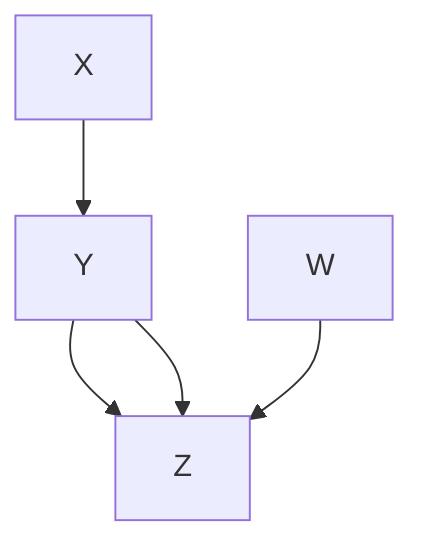

$$
X = \varepsilon_ {X} \quad Y = a \times X + b \times Z + \varepsilon_ {Y}
$$

$$
W = \varepsilon_ {W} \qquad Z = c \times W + d \times Y + \varepsilon_ {Z}
$$

$\varepsilon _ { X } , \varepsilon _ { Y } , \varepsilon _ { Z } , \varepsilon _ { W }$ are jointly independent standard Gaussians

Figure 12.1

The distribution associated with the DCG in figure 12.1 does not in general satisfy the natural extension of the local Markov property to DCGs. It follows from the linear equations associated with this DCG, and from the assumed joint independence of the exogenous variables, that X W and $X \bot \bot W \vert \{ Y , Z \}$ , but, contrary to the natural extension of the local Markov property to DCGs, X is not independent of Z conditional on {Y, W}, the set of parents of Z. There is however a straightforward extension of the d-separation relation to cyclic directed graphs; the definition for d-separation in DAGs can be carried over unchanged. Spirtes (1994, 1995), and separately, Koster (1995, 1996), show that if X and Z are d-separated given Y in the DCG corresponding to a linear SEM, then the linear SEM entails that $\mathbf { X } \bot \bot \mathbf { Z } \mid \mathbf { Y } .$ Spirtes (1995) shows that if a linear SEM (without dependent errors) entails that $\mathbf { X } \bot \bot \mathbf { Z } \mid \mathbf { Y }$ for all values of the free parameters then X and Z are d-separated given Y in the corresponding DCG. Spirtes (1994) also provides a sufficient condition for entailed conditional independence in nonlinear SEMs. For linear SEMs with dependent errors, Spirtes et al. (1998) proved that if each double-headed arrow between dependent errors is replaced with an independent latent common cause of the errors, the conditional independence relations among the substantive variables are still characterized by d-separation. Thus d-separation characterizes the independence relations entailed by path diagrams associated with linear SEMs generally (which is also shown in Koster forthcoming). Koster (1996) also generalizes chain graphs to include cycles.

Naive attempts to extend factorization conditions for DAGs (where the joint distribution is equal to the product over the vertices of the distribution of each vertex conditional on its parents) to DCGs can lead to absurdities. For example, with binary variables one might try to represent distributions for the graph in figure 12.2 by the factorization $P ( Y , Z ) = P ( Y | Z ) P ( Z | Y )$ . However, the factorization implies that Y and Z are independent.

> Figure 12.2

Pearl and Dechter (1996) have shown that in structual equation models of discrete variables in which (i) the exogenous variables (including the error terms) are jointly independent, and (ii) the values of the exogenous variables uniquely determine the values of the endogenous variables, if X and Z are d-separated given Y then X Z | Y even if the associated path diagram is cyclic. It is not always the case, however, that if a graph is cyclic, and each vertex is a function of its parents in the graph and its associated error term, that the non-error term variables are functions of the error terms alone. Neal (2000) shows that in order to derive their result, Pearl and Dechter actually need the stronger assumption that each variable is a function of its ancestral error terms.

The data generating processes that are appropriately described by DCGs are still not well understood. Consider a population composed of two subpopulations, one with the causal DAG (i) of figure 12.3, and the other with the causal DAG (ii).

> (i)

> (ii)

> (iii) Figure 12.3

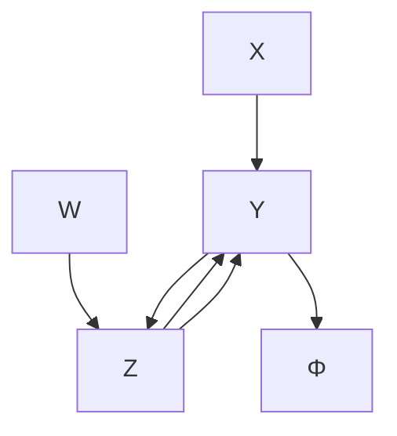

Assume the joint distribution of X, W is the same in both sub-populations. Then the independencies and the causal structure in the combined population can be represented by the DG in figure 12.3 (iii). For each unit in the sample, the value of codes which pathway, $Y  Z$ , or $Z \gets Y$ obtains.

Certain DCGs can describe aspects of the causal structure and conditional independencies in corresponding feedback systems represented by time series, but there does not exist a recipe for writing an interesting time series for an arbitrary DCG, or vice-versa. Particular cases are known (Fisher 1970, Richardson 1996a, Wermuth et al. 1999).

A theory of intervention for linear simultaneous equation models was given by Strotz and Wold (1960), and consists in simply replacing a manipulated variable in an equation by the value given it by an intervention. This account fits nicely with Fisher’s time series model. There is not a developed theory of intervention for DCGs whose variables take a finite set of values. The importance of such a theory depends largely on whether there is an interesting class of data generating processes described by such DCGs.

## 12.1.3 Partial Ancestral Graphs

Any graphical model inevitably leaves out interesting aspects of the causal system it tries to describe. A DAG, for example, may specify $X  Y$ , but the mechanism referred to by $X  Y$ is unspecified; it might, for example, contain a feedback loop in unrecorded variables, or it might not. Nor do DAGs or DCGs say anything about the time required for a variation in a cause to result in a variation in an effect, a feature that is often important in understanding dynamical systems.

Similarly, patterns can be viewed as descriptions of a class of causal processes described by various DAGs, or as an incomplete description of the process represented by some specific DAG. Again, partially ordered inducing path graphs, described in chapter 6, represent both a (generally infinite) class of DAGs or, alternatively, incompletely describe a particular DAG.

Search is often based on data from a marginal distribution that omits causally relevant variables. Variables that are not observed for any unit in a sample we will call latent or hidden variables; otherwise they are observed. Observational data is often obtained by conditioning on some variable (e.g., we do observations on hospitalized pneumonia patients). We associate with each measured variable X in a DAG a selection variable $S _ { X }$ that has the value 1 for each unit in the sample for which the value of X has been measured, and 0 otherwise. We do not place restrictions on how the selection variables are causally related to each other or to the other variables. Selection bias occurs when a selection variable is causally related to the observed (nonselection) variables. For a given DG G and a partition of the variable set V of G into observed (O), selection (S), and latent (L) variables, we will write $G ( \mathbf { 0 } , \mathbf { S } , \mathbf { L } )$ . When every selection variables equals 1 $( \mathbf { S } = \mathbf { 1 } )$ for a given unit there is no missing data for the measured variables for that unit. If X, Y, and Z are included in O, and $\mathbf { X } \bot \bot \mathbf { Z } | ( \mathbf { Y } \cup ( \mathbf { S } = \mathbf { 1 } ) )$ , then we say it is an observed conditional independence relation.

Recall that in chapter 4 we said that two DAGs $G _ { 1 }$ and $G _ { 2 }$ are faithfully indistinguishable when the set of distributions that satisfied the Markov and Faithfulness conditions for $G _ { 1 }$ was the same set of distributions that satisfied the Markov and Faithfulness conditions for $G _ { 2 } .$ . This is equivalent to saying that $G _ { 1 }$ and $G _ { 2 }$ have the same set of d-separation relations. Faithful indistinguishability is more commonly called Markov equivalence now, so henceforth we will adopt that terminology. Markov equivalence extends straightforwardly to DGs as well as DAGs. We now extend the concept of Markov equivalence to DGs that may have latent variables or selection bias. Say that two graphs $G _ { 1 } ( \mathbf { O } , \mathbf { S } , \mathbf { L } )$ and $G _ { 2 } ( \mathbf { O } , \mathbf { S } , \mathbf { L } )$ are O-Markov equivalent if and only if for X, Y, and ${ \bf Z } \subseteq { \bf O } , G _ { 1 } ( { \bf O } , { \bf S } , { \bf L } )$ entails that $\mathbf { X } \bot \bot \mathbf { Z } | ( \mathbf { Y } \cup ( \mathbf { S } = \mathbf { 1 } ) )$ ) if and only if $G _ { 2 } ( \mathbf { O } , \mathbf { S } , \mathbf { L } ^ { 9 } )$ entails that $\mathbf { X } \bot \bot \mathbf { Z } | ( \mathbf { Y } \cup ( \mathbf { S } = \mathbf { 1 } ) )$ ).

Richardson (1996a, 1996b) introduces a class of objects, Partial Ancestral Graphs (PAGs), which represents features common to Markov equivalence classes of DGs (that is DGs without selection bias or latent variables.) Spirtes et al. (1996, 1998, 1999) and Scheines et al. (1998) extend the structure to represent O-Markov equivalence classes of DAGs with latent variables and selection bias. One important feature of PAGs is that they give an uniform representation to the Markov equivalence classes of DGs and the O-Markov equivalence class of DAGs.

PAGs may contain directed edges (→), double-headed edges (↔), semidirected edges with an “o” symbol at the tail (o→), or undirected edges with “o” symbols at both ends $( \mathrm { o } \mathrm { - } \mathrm { } 0 )$ . The symbol “\*” does not occur in PAGs, but we use it as a meta-symbol to stand for any kind of endpoint $( \mathrm { i . e . , ~ } ^ { \mathrm { < } } \mathrm { o } , ^ { \mathrm { > } \mathrm { ~ } \mathrm { < } } \mathrm { , ~ } ^ { \mathrm { > } } \mathrm { o r ~ } ^ { \mathrm { < } } \mathrm { ~ } \mathrm { ~ - ~ } ^ { \mathrm { > } } )$ For example, “\*→” stands for ${ \bf \vec { \tilde { \mathbf { \Lambda } } } } ( \mathbf { 0 } \longrightarrow , \mathbf { \vec { \mu } } )$ or ${ } ^ { \cdots } \left. , { } ^ { \prime \prime } \mathrm { o r } \ { } ^ { \cdots } \right. . { } ^ { \prime \prime }$ Let D be a subset of an O-Markov equivalence class.

DEFINITION 12.1.1:  is a partial ancestral graph (PAG) that represents class  if and only if

- (1) Every vertex in  is in O.
- (2) If A and B are in O, there is an edge between A and B in  if and only if for every W $\subseteq \mathbf { O } \backslash \{ A , B \}$ , A and B are d-connected given $\mathbf { W } \cup \mathbf { S }$ in every graph in
- (3) If there is an edge in $T , A - ^ { * } B ,$ , out of A (not necessarily into B), then in every graph in , A is an ancestor of B or S.
- (4) If there is an edge in $T , A \ { ^ { * } }  B ,$ , into B, then in every graph in , B is not an ancestor of A or of S.
- (5) If there is an underlining $A ^ { * } { - } { \stackrel { * } { \operatorname { B } } } ^ { * } { - } ^ { * } C$ in  then B is an ancestor of (at least one of) A or C or S in every graph in .
- (6) If there are edges in , from A to B and from C to B, $( A \to B  C )$ , then the arrow heads at B are joined by dotted underlining $( A \to B  C )$ , only if in every graph in $\varDelta , B$ is not a descendant of a common child of A and C.
- (7) Any edge endpoint not marked in one of the above ways is left with a small circle thus o–\* $_ { 0 ^ { - } } { } ^ { * }$

If a DG $G ( \mathbf { 0 } , \mathbf { S } , \mathbf { L } )$ is in the class  represented by a PAG , we also say that the PAG represents G(O,S,L). When the output of the FCI algorithm is interpreted as a PAG that represents an O-Markov equivalence class of DAGs, assuming a zero probability for unfaithful distributions, and an extension of the Causal Markov Condition to cases where there may be selection bias, in the large sample limit the algorithm is correct with probability 1 even when there are latent variables and selection bias (Spirtes et al. 1995, 1999). A PAG output by the FCI algorithm has enough orientations to represent a unique O-Markov equivalence class of DAGs with latent variables and selection bias. Similarly, the output of the cyclic discovery algorithm described in Richardson (1996a, 1996b) is a PAG with respect to the Markov equivalence class of DGs (without latent variables or selection bias), and represents a unique Markov equivalence class.

For example, there is a Markov equivalence class of DGs that contains only $G _ { 1 }$ and $G _ { 2 }$ of figure 12.4, and which is represented by the PAG in figure 12.4. The undirected edge between X and Y in the PAG indicates that X is an ancestor of Y, and Y is an ancestor of X in every member of the Markov equivalence class represented by the PAG, and hence no DAG has the same set of d-separation relations as $G _ { 1 }$ and $G _ { 2 } .$ .

As with POIPGs, a graph may have several PAGs, all sharing the same adjacencies but some with more orientation information than others. Not every graphical object written with the marks and underlinings of PAGs is a PAG that represents an O-Markov equivalence class of DAGs. While there are consistency tests, there is no available direct algorithm for determining whether, for an arbitrary PAG-like structure, there exists an O-Markov equivalence class of DAGs represented by the PAG-like structure. Applications of PAGs are given in section 12.5.7.

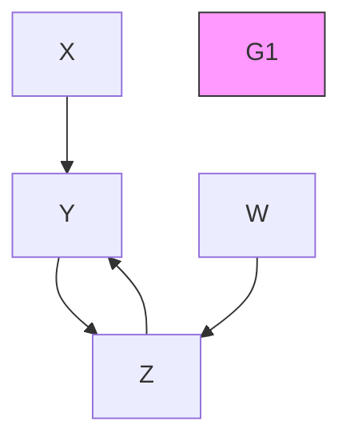

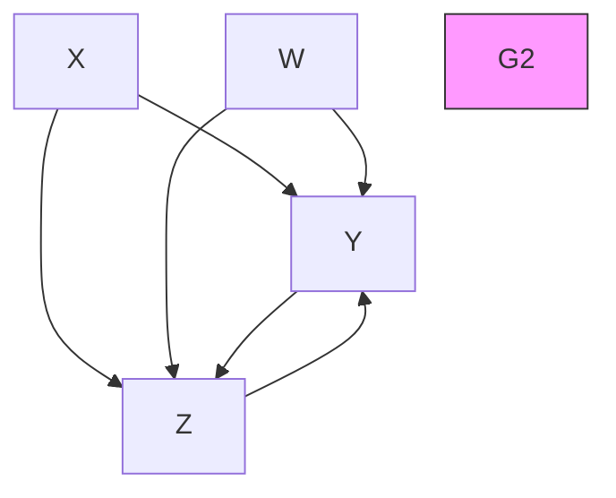

> Figure 12.4

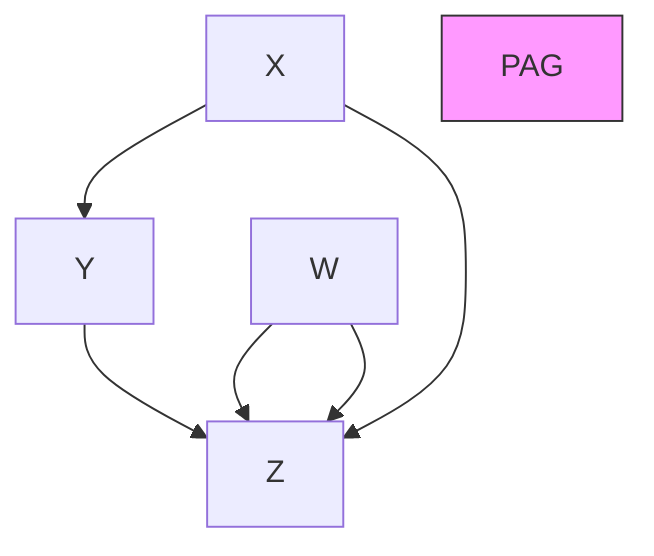

## 12.1.4 Mixed Ancestral Graphs

Mixed ancestral graphs were introduced in Spirtes and Richardson 1996 and investigated in Spirtes, Richardson, and Meek 1996 for two technical reasons connected with search. First, mixed ancestral graphs provide a direct means to decide whether any two DAGs imply (by the local Markov property) the same conditional independencies in any distribution obtained by marginalizing latent variables and conditioning on selection variables.

Second, DAGs with latent variables imply nonindependence constraints, illustrated by Verma’s example in chapter 6. Other constraints of this sort have been investigated in Desjardins 1999, Settimi and Smith 1999, and Geiger et al. 1996. Nonindependence constraints make it difficult to determine the dimensionality of the marginal distribution over the observed variables of a latent variable model. Indeed, the marginal of a latent variable model often has no well defined dimension (Geiger et al. 1999). The dimension is a parameter that is used in many methods (BIC, AIC, MDL) of assigning data based scores to models. (For a description of the BIC and MDL scores, see section 12.5.5.2.) Since scores for models are desirable for several reasons (section 12.5), it is important to find an appropriate representation for scoring models with latent variables from data with selection bias. MAGs describe aspects of the causal relations of such structures, but they imply only independence and conditional independence constraints on the observed variables, and have a well defined dimension that in the Gaussian case can be easily calculated.

MAGs may contain directed edges (→), double-headed edges (↔), semidirected edges with an $" \mathrm { o } ^ { \mathrm { , 5 } }$ symbol at the tail (o→), or undirected edges with “o” symbols at both ends (oo). The symbol “\*” does not occur in MAGs, but we use it as a meta-symbol to indicate any kind of endpoint $( \mathrm { i . e . , ~ } ^ { \mathrm { * } } \mathrm { o } , ^ { \mathrm { * } } \mathrm { < } , ^ { \mathrm { * } } \mathrm { o r ~ } ^ { \mathrm { * } } \mathrm { - } . ^ { \mathrm { * } } )$ For example $^ { 6 6 } \vec { \cdot } \vec { \cdot }  ^ { 6 6 }$ stands for $^ { 6 6 } 0  , ^ { 5 5 }$ or $\ "  , \ " 0 \mathrm { r } \ \stackrel {  } {  } \ \mathrm { ? }$ .

DEFINITION 12.1.2: MAG  represents DAG G(O,S.L) if and only if:

- 1. If A and B are in O, there is an edge between A and B in  if and only if for any subset ${ \bf W } \subseteq { \bf O } \backslash \{ A , B \}$ , A and B are d-connected given $\mathbf { W } \cup \mathbf { S }$ in $G ( \mathbf { 0 } , \mathbf { S } , \mathbf { L } )$ .
- 2. There is an edge $A  B$ in  if and only if A is an ancestor of B but not of S in $G ( \mathbf { 0 } , \mathbf { S } , \mathbf { L } )$ .
- 3. There is an edge $A  ^ { * } B$ in  if and only if A is not an ancestor of B or S in $G ( \mathbf { 0 } , \mathbf { S } , \mathbf { L } )$ .
- 4. There is an edge $A { \mathrm { ~ o - } } ^ { * } B$ in  if and only if A is an ancestor of S in $G ( \mathbf { 0 } , \mathbf { S } , \mathbf { L } )$ .(Note that $" _ { 0 } \cdot >$ has a different meaning in PAGS.)

There is a natural extension of d-separation to MAGs which is called m-separation. The definition requires extending the notions of collider and directed path to graphs with selection bias and latent variables. A path from $X _ { 1 }$ to $X _ { n }$ in MAG M is a sequence of distinct vertices $< X _ { 1 } , \ldots X _ { n } >$ such that for every $i < n ,$ there is an edge (of any kind) between $X _ { i }$ and $X _ { i + 1 }$ in M. A directed path from $X _ { 1 }$ to $X _ { n }$ in MAG M is a sequence of distinct vertices $< X _ { 1 } , \ldots X _ { n } >$ such that for every $i < n ,$ there is a directed edge from $X _ { i }$ to $X _ { i + 1 }$ in M. A vertex V is an ancestor of $X _ { i }$ if and only if $V { = } X _ { i } ,$ , or there is a directed path from V to $X _ { i \cdot } X _ { \mathrm { i } }$ is a collider on a path U in M, if there are edges $X _ { i - 1 } { ^ { * } \right. X _ { i } \left. ^ { * } X _ { i + 1 } }$ on U. For disjoint sets of vertices X, Y, and Z in MAG M, X is m-connected to Y if there is a path $U$ between some $X \in \mathbf { X }$ and some $Y \in \textbf { Y }$ such that every collider on $U$ is an ancestor of a member of $\mathbf { Z } ,$ and no noncollider on U is in $\mathbf { Z } ;$ otherwise X is m-separated from Y given Z. This entails that m-separation (m-connection) when applied to a DAG is identical to d-separation (d-connection). Applications of MAGs are given in section 12.5.7.

The problem of representing DAGs that may have latent variables and selection bias in a graphical structure that contains only observed variables was posed by Wermuth et al. (1994, 1998). The representation they propose is called a summary graph. Several differences between MAGs and summary graphs are (1) in MAGs, but not in summary graphs, a missing edge entails a conditional independence relation; (2) in summary graphs, but not in MAGs, there can be multiple edges between a pair of observed variables; (3) a Gaussian MAG is always identifiable, but a Gaussian summary graph is not always identifiable (4) a MAG entails only conditional independence constraints, while a summary graph may entail nonconditional independence constraints (which means a summary graph may contain more information about the DAGs it represents than a MAG does.) For further details see Cox and Wermuth et al. 1994.

## 12.1.5 Chain Graphs

Chain graphs are a much-studied (see Cox and Wermuth 1996, Lauritzen 1996) class of graphical objects introduced to represent situations in which there are “symmetric associations” between variables. Chain graphs may contain both directed and undirected edges, but may not contain partially directed cycles, that is, they do not contain a sequence of n distinct edges with endpoints $X _ { 1 } , X _ { n + 1 }$ , such that $X _ { 1 } = X _ { n + 1 }$ and for all i, $1 \leq i < n + 1$ , either $X _ { i } { - } X _ { i + 1 }$ or $X _ { i } \to X _ { i + 1 }$ 1, and for some $j , 1 \le j < n + 1 , X _ { j } \to X _ { j + 1 }$ .

Two different Markov Conditions have been proposed for chain graphs, one by Lauritzen, Wermuth and Frydenberg (Lauritzen and Wermuth 1989; Frydenberg 1990), and another by Andersson, Madigan, and Perlman (1996). The conditions are not equivalent to one another, although for undirected graphs both reduce to separation and for DAGs both reduce to d-separation. The respective Markov properties determine whether a conditional independence relation $\mathbf { X } \bot \bot \mathbf { Z } | \mathbf { Y }$ is entailed by a chain graph in a two step process. First, they associate a chain graph with an undirected graph. Second, $\mathbf { X } \bot \bot \mathbf { Z } | \mathbf { Y }$ is entailed by the chain graph if X is separated from Z by Y in the associated undirected graph. But the undirected graphs constructed by the two methods differ in their separation properties. The following summary is based on Richardson 1998.

A vertex V in a chain graph is anterior to a set W of vertices if there is a path P from V to some W in W and for all directed edges $X  Y$ on P, Y is between X and W. Ant(W) is the set of vertices anterior to W. For chain graph CG, with vertex set V and $\mathbf { W } \subseteq \mathbf { V }$ , the induced subgraph CG(W) is obtained by removing all vertices in V\W and all edges with an endpoint in V\W. A complex is an induced subgraph of the form: $X \to V _ { 1 } { \mathrm { - } } \ldots - V _ { n }$ $ Y , n \geq 1$ . Moral(CG) is the undirected graph obtained by connecting X, Y with an undirected edge if they are the endpoints of a complex, and then replacing each directed edge with an undirected edge. The Lauritzen-Wermuth-Frydenberg (LWF) global Markov Property says that CG entails X Z|Y if X is separated from Z by Y in the undirected graph $M o r a l ( C G ( \mathbf { A n t } ( \mathbf { Z } \cup \mathbf { Y } \cup \mathbf { X } ) )$ .

The Andersson-Madigan-Perlman chain graph global Markov property is defined as follows. In a chain graph CG, vertices V and W are connected if there is a path betweenV and W containing only undirected edges. $\mathbf { C o n } ( \mathbf { W } ) = \{ V \mid V$ is connected to some $W \in$ W}. Ext(CG,W) contains the vertex set Con(W), and all the directed edges in CG(W), and all undirected edges in $C G ( \mathbf { C o n } ( \mathbf { W } ) )$ . V is an ancestor of W if there is a path from V to $W \in \textbf { W }$ such that all edges on the path are directed $( X  Y )$ and are such that Y is between X and W on the path. $\mathbf { A n c ( W ) } = \{ V \mid V \mid$ is an ancestor of some $W \in \textbf { W } _  \}$ . A triple of vertices $< X , Y , Z >$ is a triplex if $C G ( \{ X , Y , Z \} )$ is either $X \to Y { \mathrm { - } } Z , X \to Y  Z ,$ or $X { - } Y {  } Z . \operatorname { A }$ triplex is augmented by adding the $X { - } Z$ edge. Four vertices $< X , A , B , Y >$ form a bi-flag if the edges $X \to A , Y \to B$ , and $A - B$ occur in the induced subgraph over $\{ X , A , B , Y \}$ . A bi-flag is augmented by adding an $X { - } Y$ edge. Aug(CG) is the undirected graph that is formed by augmenting all triplexes and bi-flags in $C G ,$ and replacing all of the directed edges with undirected edges. Let Aug[CG; X, Y, $\mathbf { Z } ] = \operatorname { A u g } ( \mathbf { E x t } ( C G , \mathbf { A n c }$ $( \mathbf { X } \cup \mathbf { Y } \cup \mathbf { Z } ) )$ . The Andersson-Madigan-Perlman (AMP) global Markov property is that CG entails that $\mathbf { X } \bot \bot \mathbf { Z } | \mathbf { Y }$ if X is separated from Z by Y in the undirected graph $\operatorname { A u g } [ C G ;$ $\mathbf { X } , \mathbf { Y } , \mathbf { Z } ] .$ .

An interesting discussion has developed about what data generating processes are explained by the extra structure allowed by chain graph Markov properties. For example, two simple chain graphs among four variables are shown in figure 12.5.

> Figure 12.5

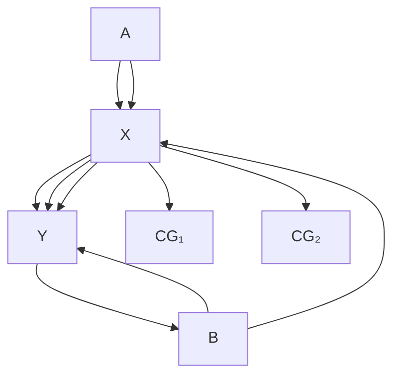

Richardson (1998) shows that the local Lauritzen-Wermuth-Frydenberg Markov Property applied to $C G _ { 1 }$ implies a different set of independence and conditional independence relations than do any of the known ways of producing symmetrical associations by causal processes (marginalizing out a latent common cause, conditioning on a common effect, feedback) representable by DGs, and similarly for $C G _ { 2 }$ and the AMP Markov property. (The set of conditional independencies entailed by the LWF intepretation of $C G _ { 1 }$ is $\{ A \perp \perp B , A \perp \perp Y | \{ B , X \} , B \perp \perp X | \{ A , Y \} \}$ ; the set of conditional independencies entailed by the AMP interpretation of $C G _ { 2 } \operatorname { i s } \{ { A \bot \bot B , A \bot \bot B } | \{ Y \} , A \bot \bot Y , A \bot Y | \{ B \} , B \bot \lfloor Y | \{ A , X \} \} . )$

In as yet unpublished work, Lauritzen has proposed that chain graph models (with the LWF global Markov property) such as $C G _ { 1 }$ give the independencies and conditional independencies in the limiting distribution of certain dynamical systems. The procedure is as follows: Specify P(A), P(B), P(X|A,Y) and P(Y|X,B). For each unit in a population, at $t =$ 0 draw a value $A _ { 0 }$ of A from P(A) and a value $B _ { 0 }$ of B from $P ( B )$ . Pick an arbitrary starting value for Y, say $Y _ { 0 } .$ Now draw $X _ { 1 }$ from $P ( X | Y _ { 0 } , A _ { 0 } )$ and draw $Y _ { 1 }$ from $P ( \boldsymbol { Y } | \boldsymbol { X } _ { 1 } , B _ { 0 } )$ . Repeat many times, drawing $X _ { i + 1 }$ from $P ( X | Y _ { i } . A _ { 0 } )$ and $Y _ { i + 1 }$ from $P ( Y | X _ { i + 1 } , B _ { 0 } )$ . After sufficiently long, $( A _ { 0 } , B _ { 0 } , X _ { n } , Y _ { n } )$ is, with some further restrictions, a sample from a distribution that satisfies the LWF global Markov property for $C G _ { 1 }$ above. The further restrictions are required because X and Y are treated asymmetrically, which implies that some restriction on the transition probabilities is required to generate a distribution that satisfies the LWF global Markov property.1Cox and Wermuth (1999), and Wermuth, Cox, Richardson, and Glonek (1999) also consider what data-generating processes might lead to distributions represented by chain graphs.

## 12.2 Equivalence

Equivalence of models is always with respect to some selected set of variables, representing either a set O of observed variables, or a set S of selection variables, or both, and features of distributions obtained by conditioning on the selection variables and marginalizing out the variables that are unobserved. The distributional features in question may be the independence and conditional independence relations in the conditional marginal distributions, or other constraints such as vanishing tetrad differences, or, most generally, the entire conditional marginal distributions. Say that $P ( \mathbf { O } | \mathbf { S } \mathbf { \mathrm { = } } \mathbf { 1 } )$ is an observed distribution that satisfies the Markov condition for ${ \cal G } ( { \bf 0 } , { \bf S } , { \bf L } )$ if it is formed by conditionalization and marginalization from a distribution $P ( \mathbf { 0 } , \mathbf { S } , \mathbf { L } )$ that satisfies the Markov condition for G(O,S,L). Two DAGs $G _ { 1 }$ and $G _ { 2 }$ with vertex set V are distribution equivalent if and only if P(V) satisfies the local Markov property for $G _ { 1 }$ if and only if P(V) satisfies the local Markov property for $G _ { 2 }$ . Two DAGs $G _ { 1 } ( \mathbf { O } , \mathbf { S } , \mathbf { L } )$ and $G _ { 2 } ( \mathbf { O } , \mathbf { S } , \mathbf { L } ^ { \prime } )$ are O-distribution equivalent when an observed distribution $P ( \mathbf { O } | \mathbf { S } \mathbf { \mathrm { = } } \mathbf { 1 } )$ satisfies the local Markov property for $G _ { 1 } ( \mathbf { O } , \mathbf { S } , \mathbf { L } )$ if and only if $P ( \mathbf { O } | \mathbf { S } \mathbf { \bar { \mathbf { \equiv } } } \mathbf { 1 } )$ ) satisfies the local Markov property for $G _ { 2 } ( \mathbf { O } , \mathbf { S } , \mathbf { L } ^ { \prime } )$ . Distribution equivalence and O-distribution equivalence can be defined similarly for restricted families of distributions (e.g., Gaussian, or multinomial.) Similar notions apply to DGs and to chain graphs.

If the family of distributions represented by the DAG is multivariate Gaussian, multinomial, or unrestricted, two DAGs without latent variables or selection bias are O-distribution equivalent if and only if they are O-Markov equivalent That relation does not, however, obtain in general if the DAGs contain latent variables or if there is sample selection bias.

The equivalence relation with respect to a data feature essentially characterizes a limit of resolution for search procedures that exclusively use estimates of that feature from the data. For example, O-Markov equivalence characterizes the limits of algorithms such as FCI that depend on conditional independence relations. From a Bayesian perspective, equivalence results are of less theoretical interest, since even asymptotically, O-Markov equivalent models need not have the same posterior probabilities. However, for searches such as those discussed in section 12.5, Bayesian search procedures that attempt to distinguish between latent variable models that are O-Markov equivalent face some difficult theoretical and computational problems.

Using the following result, Spirtes and Verma (1992) showed there is a more or less feasible (depending on the structure of the graphs) decision procedure for the equivalence of two DAGS which may contain unobserved (latent) variables, but no selection bias. Say that FCI uses a DAG G with vertices V as an O-oracle when it only tests d-separation relations among variables in $\mathbf { O } \subseteq \mathbf { V }$ , and uses the d-separation relations in G among the variables in O to decide questions of d-separation.

THEOREM 12.2.1: (Spirtes and Verma): Two DAGs G, H, entail the same independence and conditional independence relations among variables in a common subset O of variables in G and H if and only if the output of the FCI algorithm using G as an O-oracle is equal to the output of the FCI algorithm using H as an O-oracle.

Using MAGs, Spirtes and Richardson (1996) provides a polynomial time decision procedure for O-Markov equivalence of models with latent variables and selection variables. Richardson (1996c) shows there is a polynomial time algorithm $( O ( n ^ { 5 } ) )$ ), where n is the number of vertices) for deciding the Markov equivalence of DGs (without selection bias or latent variables.)

Geiger and Meek (1999) have obtained theoretically fascinating, but as yet impractical, results about distributional equivalence and other “structural” features of graphical models, such as the identification problem—the problem of deciding whether a model parameter can be uniquely estimated from the marginal probability distribution over observed variables. Their results show a remarkable sequence of connections between mathematical logic, probability theory, and methodology.

Tarski axiomatized ordinary real algebra—the theory of real closed fields, RCF—and proved that the theory is complete, hence decidable, and admits elimination of quantifiers. That is, for every formula F in the language of RCF there is a formula H without quantifiers such that $\operatorname { R C F } \models \operatorname { F } \Leftrightarrow \operatorname { H }$ . One can use the theory to test distributional equivalence of two linear, Gaussian structural equation models M and N as follows. The variance/ covariance matrix of the observed variables in Model M can be written as polynomial functions of the model parameters, which are real variables. Model M asserts that there exist values of the parameters such that each covariance of the observed variables equals the specified function of the parameters. That claim is a sentence $\mathrm { S } _ { M }$ of a simple extension of RCF, for which Tarski’s theorem holds. Hence there is a sentence $\mathrm { Q } _ { M }$ without quantification over the model parameters and without names of values of the model parameters such that $\mathrm { R C F } \models \mathbf { Q } _ { M } \Leftrightarrow \mathbf { S } _ { M } .$ For model N with the same observables there is likewise a sentence $\mathrm { S } _ { N }$ asserting the existence of values of parameters in N such that covariances of observed variables are specified functions of the parameters, and likewise an equivalent sentence $\mathrm { Q } _ { N }$ without quantifiers. Models M and N are therefore distribution equivalent if and only if $\mathrm { R C F } \models \mathrm { Q } _ { M } \Leftrightarrow \mathrm { Q } _ { N } .$

Since RCF is decidable, there is an algorithm to decide distribution equivalence in linear Gaussian structural equation models—no matter whether acyclic (“recursive”) or cyclic (“nonrecursive”), and with or without latent variables. Identification problems are solvable by a similar strategy, since the identifiability of a parameter corresponds to an RCF formula saying that if two values of a parameter result in equal values of the polynomial functions for the covariances, then the two values are identical. Quantifier elimination then results in a sentence, using only the vocabulary for observable correlations, which is a theorem of RCF if and only if the parameter is identifiable.

The same argument works for any family of distributions whose marginal distribution over observables can be described by a finite set of polynomial functions of real valued model parameters. Graphical models with categorical variables can therefore be treated in the same way, since the marginal distributions over measured variables are sums of products of conditional probabilities, and the latter are real valued variables with a restricted range.

But the solution is not yet practical. Tarski’s decision procedure is hyper-exponential. Although faster algorithms have since been found, they are still hyper-exponential, and Geiger and Meek are able to work out an example for only three variables. Even for these faster algorithms, a problem with six variables is hopeless. Since, however, decisions about equivalence, identifiability, and bounding of parameter values require deciding only formulas of special logical forms, there is still hope that more efficient algorithms may be possible for these special cases.

## 12.3 Prediction and Manipulation

## 12.3.1 Causation and Subjunctives

The Rubin approach to making predictions about manipulations of causal models (discussed in chapter 7) introduces subjunctive variables, such as $Y _ { X = 0 } ,$ to represent the value that Y would have if X were manipulated to have the value 0. Rubin’s approach also uses judgments about the conditional independence of subjunctive variables from occurent variables. Two problems arise with this approach; interpreting what it means to have a joint distribution over subjunctive and occurrent variables, and whether people can make judgments about the independence of subjunctive and occurrent variables (especially in light of the fact that that without using graphical methods people are poor at making judgments about conditional independence even for occurrent variables alone.)

In contrast, in chapter 7, we used DAGs to make predictions from causal models. Instead of introducing a new subjunctive variable to represent the value that Y would have if X were manipulated to 0, we added a policy variable and an edge from the policy variable to X, and took the value that Y would have if X were manipulated to 0 to be the value of Y conditional on the policy variable equaling 1 (i.e., the manipulation had occurred). Two advantages of the DAG approach are that it does not require a joint probability distribution over subjunctive and occurrent random variables (since we always condition on a value of the policy variable in all of our calculations), and it uses causal DAGs to calculate conditional independence relations. This approach led to theorem 7.1 (equivalent to what Pearl later called the “Calculus of Interventions” in Pearl 1995) which gives sufficient graphical conditions for conditional probabilities to remain invariant under a manipulation. It is not known whether the conditions of theorem 7.1 are also necessary. This theorem has interesting applications discussed in section 12.3.2.

While the DAG supplemented with policy variables does not require joint distributions of subjunctive and occurent variables, it also does not allow representation of a joint distribution over subjunctive and occurent variables, or a joint distribution over subjunctive variables corresponding to different manipulations, which in some cases is desirable. For example, suppose a patient who is not on drug treatment presents with high blood pressure. The physician believes the causal relations are those shown in figure 12.6.

Suppose that Drug therapy = 1 represents being given drug therapy, and Arterial disease = 1 represents the occurrence of arterial disease. Consider the probability that a patient would have Arterial disease if Drug therapy were to be manipulated to be present (a subjunctive variable) conditional on the patient’s actual Blood pressure. Here Blood pressure is actually measured (without intervention on the causal process), but Drug therapy and Arterial disease are subjunctive variables in this case, that is they are features that are actual only if the intervention subsequently occurs. This is in general not equal to the probability a patient would have Arterial disease if Drug therapy were manipulated to 1 (a subjunctive variable) conditional on the Blood pressure a patient would have if Drug therapy were manipulated to 1 (another subjunctive variable). In the language of chapter 7 the latter probability is $P _ { M a n ( D r u g ) }$ (Arterial disease|Blood pressure), and can be calculated from theorem 7.1. There is no way in the language of chapter 7 to express the former probability and it cannot be directly calculated by an application of Theorem 7.1. In this section we consider how Balke and Pearl (1994), Pearl (1999), and Galles and Pearl (1998a) use structural equation semantics to clarify the meaning of a joint distribution over subjunctive and occurent variables, and use DAGs to calculate the required conditional independence relations between subjunctive and occurent variables.

> Figure 12.6

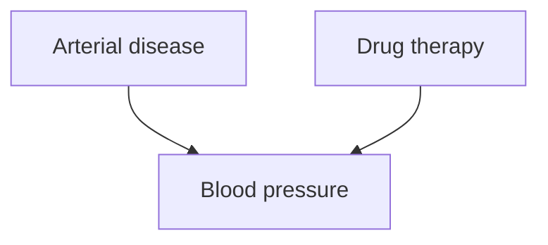

For the sake of illustration, suppose that the statistical model associated with the DAG in figure 12.6 is a linear structural equation model. Suppose the structural equation for Blood pressure is of the following form:

$$
B l o o d \quad p r e s s u r e = a \times D r u g \text {   therapy } + b \times A r t e r i a l \text {   disease } + 1 0 0 + \varepsilon_ {b p}
$$

Assume that Arterial disease is binary (1 representing having the disease) and Drug therapy is binary (1 representing being given the drug), that the probabilities of Arterial disease and Drug therapy are given, $\varepsilon _ { b p }$ follows a standard Gaussian distribution, and Arterial disease, Drug therapy, and $\varepsilon _ { b p }$ are mutually independent.

We need a notation to express the probability Arterial disease would have if Drug therapy were to be manipulated to the value 1, conditional on the actual value of Blood pressure. In order to do that we (following Rubin as in chapter 7, Balke and Pearl 1994, and Pearl 1999) split Drug therapy, and all its descendants into two variables, one variable representing the value that would occur if Drug therapy were manipulated to the value 1, and the other variable representing the unmanipulated value of Drug therapy. In this example there is Drug $t h e r a p y _ { M a n ( D r u g ) }$ and Drug $t h e r a p y _ { U n m a n } ,$ and Blood $p r e s s u r e _ { M a n ( D r u g ) }$ and Blood $p r e s s u r e _ { U n m a n }$ . Note that because Arterial disease and $\varepsilon _ { b p }$ are not descendants of Drug therapy and hence (by the Manipulation Theorem) are unaffected by the manipulation, the manipulated and unmanipulated values of Arterial disease and $\varepsilon _ { b p }$ have the same distribution, so we do not need to split these variables. Using the structural equation model, we can write:

$$
\begin{array}{l} \text {Blood pressure} _ {\text {Man(Drug)}} = a \times \text {Drug therapy} _ {\text {Man(Drug)}} + b \times \text {Arterial disease} + 1 0 0 + \varepsilon_ {b p} \\ \text {Blood pressure} _ {\text {Unman}} = a \times \text {Drug therapy} _ {\text {Unman}} + b \times \text {Arterial disease} + 1 0 0 + \varepsilon_ {b p} \end{array}
$$

If the assumption is made that the manipulated value of Drug therapy does not depend on the unmanipulated value of Drug therapy, then by the Causal Markov Condition Drug $t h e r a p y _ { U n m a n }$ and Drug $t h e r a p y _ { M a n ( D r u g ) }$ are independent of each other. The joint distribution over the subjunctive and occurent variables then follows from this assumption, the joint distribution over the exogenous occurrent variables, and the structural equations. (Balke and Pearl [1994], and Pearl [1999] use a DAG with latent variables rather than double-headed arrows. Madigan [1999] also considers graphical representations of subjunctive variables.)

> Figure 12.7

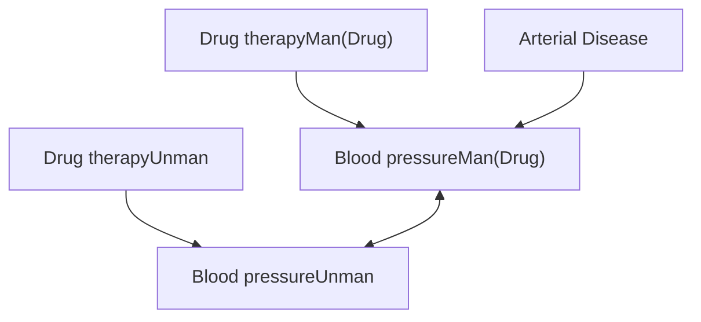

When we make the modifications to the causal DAG in figure 12.6, the result is the MAG in figure 12.7. There is a correlated error between Blood pressure $M a n ( D r u g )$ and Blood $p r e s s u r e _ { U n m a n }$ because $\varepsilon _ { b p }$ is a cause of both, as seen in their respective equations. Blood $p r e s s u r e _ { U n m a n }$ is not caused by Drug $t h e r a p y _ { M a n ( D r u g ) }$ according to its structural equation.

Now m-separation applied to the causal MAG of figure 12.7 shows that P(Arterial disease|Blood $p r e s s u r e _ { U n m a n } ,$ Drug $t h e r a p y _ { M a n ( D r u g ) } ) ~ = ~ P ($ (Arterial disease|Blood pres-$s u r e _ { U n m a n } )$ , that is the drug has no effect among a group of people with a given actual Blood pressure.

There are equality constraints among the parameters in the causal MAG (e.g., the distribution of Blood $p r e s s u r e _ { M a n ( D r u g ) }$ conditional on its parents Drug $t h e r a p y _ { M a n ( D r u g ) }$ and Arterial disease equals the distribution of Blood $p r e s s u r e _ { U n m a n }$ conditional on its parents Drug $t h e r a p y _ { U n m a n }$ and Arterial disease). Hence there may be an equality between a conditional probability among the unmanipulated variables (e.g., $P ( B l o o d p r e s s u r e _ { M a n ( D r u g ) } |$ Arterial disease,Drug $t h e r a p y _ { M a n ( D r u g ) } )$ and the corresponding conditional probability among the manipulated variables (e.g., P(Blood $p r e s s u r e _ { U n m a n } | A r t e r i a l$ disease,Drug $t h e r a p y _ { U n m a n } )$ , an equality that is not entailed by the m-separation relations in the causal MAG, but is entailed by d-separation in the causal DAG representation of chapter 7 using policy variables. So there are advantages to using the causal DAG representation of chapter 7 as long as the quantities of interest are not mixtures of subjunctive and occurrent variables.

Graphs similar in structure to figure 12.7 can also be used to represent Drug therapy at different times, instead of unmanipulated and manipulated Drug therapy, where the variables are indexed by time, instead of whether or not Drug therapy has been manipulated. Theorem 7.1 can be applied directly to such temporal graphs. See Boyen et al. (1999) for one representation of dynamic systems.

It is also possible to use (a minor modification of) the Balke-Pearl graphical representation (using MAGs instead of DAGs) to calculate some conditional probabilities of subjunctive and occurent variables in the following special case that is of particular interest for reasons described below. A special case of a manipulation arises when the manipulated variable is set to a constant value. Interpreting the causal DAG as a structural equation model gives an especially clear interpretation to subjunctive variables in this case. (This view also seems implicit in the use of subjunctives by some analyses based on Rubin’s subjunctive variables). Suppose Drug therapy is manipulated to have the value 1 in all cases (i.e., everyone is given the drug.) Using the structural equation model, we can write:

$$
\text { Blood   pressure } _ {\text { Man(Drug   Therapy } = 1)} = a + b \times \text { Arterial   disease } + 1 0 0 + \varepsilon_ {b p}
$$

setting Drug therapy to the constant 1. (This is the approach to manipulation taken in Strotz and Wold 1960.) All of the subjunctive variables are now simple functions of occurent variables, so the joint distribution over the subjunctive and occurent variables follows from the distribution over the exogenous occurrent variables and the structural equations.

> Figure 12.8

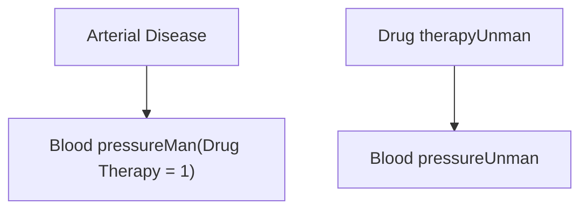

More generally if one wants a joint probability distribution on the values of $B , C ,$ and $D ,$ and E when A is manipulated to 0, and the unmanipulated variables A, B, C, and D, and E, then split each of the descendants of A into the unmanipulated and manipulated versions (in the case of figure 12.9, B, C, and D on the one hand, and $B _ { M a n ( A = 0 ) } , C _ { M a n ( A = 0 ) } ,$ and $D _ { M a n ( A = 0 ) }$ on the other hand), add double-headed edges between each new variable and its counterpart, and an edge between two of the new variables if and only if there is an edge between their counterparts. Then apply m-separation. (See figure 12.9.) $( A _ { M a n ( A = 0 ) }$ just has the constant value 0, so we do not include it in the MAG.)

Part of the price that is paid for the structural equation interpretation of subjunctive variables is that it posits the existence of a deterministic world with independent error terms. Dawid (1997) questions the existence of such independent error terms, and at the microscopic level, determinism is not compatible with the standard interpretation of quantum mechanics. The method of representation described here does not allow for arbitrary causal DAGs or MAGs among subjunctive and occurrent variables.

> Figure 12.9

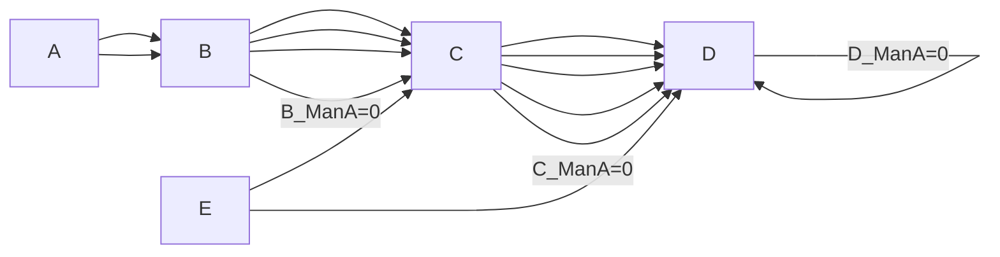

Joint distributions over subjunctive and occurent variables play an important role in Pearl’s (2000) analysis of several different notions of causation. In Pearl’s notation, $Y _ { x } ( u )$ is the response of variable Y to manipulating X to value x, when the exogenous variables take on value u (in Pearl’s structural equation semantics of causal DAGs, the response of variable Y to manipulating X is a function of U). Let X and Y be binary variables, where x is the proposition that X takes the value true and x' is the proposition that X takes the value false. $y _ { x }$ is the proposition that Y takes the value true if X were manipulated to true, and $y _ { x } ^ { \prime }$ is the proposition that Y takes the value false if X were manipulated to true. PS (the probability of sufficiency) is equal to $P ( y _ { x } | x ^ { \prime } , y ^ { \prime } )$ , PN (the probability of necessity) is $P ( \boldsymbol { y } _ { x ^ { \prime } } ^ { \prime } | \boldsymbol { x } , \boldsymbol { y } )$ , and PNS (the probability of necessary and sufficient causation) is $P ( y _ { x } , y _ { x ^ { \prime } } ^ { \prime } )$ . (In the notation of chapter $7 P ( y _ { x } )$ is $P _ { M a n ( X = t r u e ) } ( Y = t r u e ) , P ( y _ { x } ^ { \prime } )$ is $P _ { M a n ( X = t r u e ) } ( Y = f a l s e )$ , $P ( y _ { x ^ { \prime } } )$ is $P _ { M a n ( X = f a l s e ) } ( Y = t r u e )$ , and $P ( \gamma _ { x ^ { \prime } } ^ { \prime } )$ is $P _ { M a n ( X = f a l s e ) } ( Y = f a l s e )$ . However, there is no way in that notation to express $P ( y _ { x } , y _ { x ^ { \prime } } ^ { \prime } ) , P ( y _ { x } ^ { \prime } , | x , y )$ , or $P ( y _ { x } | x ^ { \prime } , y ^ { \prime } )$ , which mix occurrent and subjunctive variables, or subjunctive variables corresponding to different manipulations.)There are several assumptions relevant to the conditions under which PN, PS, and PNS are identifiable. X is exogenous with respect to Y when there is no common cause of X and Y. X is stochastically monotonic with respect to Y when the probability of $Y = t r u e$ given X is manipulated to true is greater than the probability of $Y = t r u e$ given X is manipulated to false. X is monotonic with respect to Y when $y _ { x } ^ { \prime } \wedge y _ { x ^ { \prime } }$ is false. Robins and Greenland (1989) showed that even under the assumptions of exogenity of X with respect to Y and stochastic monotonicity of X with respect to Y, PN is not identifiable; however they do calculate bounds for PN. Pearl (2000) showed that under the stronger assumptions of exogenity of X with respect to Y and monotonicity of X with respect to Y, then PN, PS, and PNS are all identifiable. Pearl also showed that under the assumption of monotonicity, PN, PS, and PNS are all identifiable whenever $P ( y _ { x } )$ is identifiable.

In chapter 3, we discussed the relationship between causal DAGs and the Rubin (1978) subjunctive variable approach. Robins (1986, 1987) extended Rubin’s theory to deal with time-varying treatments, outcomes, and covariates. Robins (1995) showed that causal DAGs can always be interpreted as subjunctive variable models. Galles and Pearl (1998) showed that for acyclic graphs, all of the conjunctive subjunctives derivable in structural equation semantics are entailed by the following two features of structural equation semantics:

- • Composition: For any two singleton variables Y and W, and any set of variables X in a causal model, if $W _ { \mathrm { x } } ( u ) = w$ then $Y _ { \mathrm { x } w } ( u ) = Y _ { \mathrm { x } } ( u )$ .
- • Effectiveness: For all variables X and W, $X _ { x w } ( u ) = x .$

(According to Galles and Pearl [1998] Robins suggested composition to Pearl in a personal communication.) Halpern (1997) found a complete set of axioms for the case of structural equation models represented by cyclic directed graphs.

## 12.3.2 Calculating the Effects of Interventions

Strotz and Wold (1960) pointed out that the effects of manipulating a variable X in structural equation models could be calculated by replacing the equation for X by an equation that set X to its manipulated value; this is the basic idea behind the Manipulation Theorem and Pearl’s structural equation semantics. Robins (1986) derived the G-computation formula, which is equivalent to the Manipulation Theorem, though not formulated graphically.

An important special case of calculability (synonymous with “identifiability”) is the case of sequential randomized trials, where the covariates may be affected by earlier treatments, and each treatment is a function of all of the earlier treatments. This has been studied since Robins (1986) under the name “G-computation algorithm formula.” The theory has been translated into graphical terms in Pearl and Robins 1995. The formula expresses the probability of an outcome under a sequential randomized manipulation in terms of a sum and product of probabilities involving only the observed occurrent variables and the values the treatments were manipulated to. This formula can also be extended to the case in which there is a vector of outcomes included in the covariates, and the assumption that each treatment is a function of all earlier treatments can be relaxed. Robins (1986, 1987) also considers the extension to the case where the value that a treatment is manipulated to is a function of the preceding covariates.

One problem with the direct application of the G-computation formula is that standard parametric models of the conditional distributions that appear in it lead to a parameterization that will make the direct effect and total effect null hypotheses be rejected even when the null hypothesis of no direct effect is true. Robins (1993, 1994, 1997, 1998) develops the theory of structural nested models, which do not suffer from this defect. The only parametric models needed to test the no-direct effect hypothesis or estimate the size of the effect are parametric models of the probabilities of treatment.

Pearl (1995) proposes three rules, which he calls the “Calculus of Interventions.” For disjoint sets X, Y, Z, W of variables, it states rules for when various conditional probabilities containing manipulated quantities are equal to conditional probabilities that have fewer manipulated quantities. The rules are sound and all follow from Theorem 7.1. Theorem 7.1 and the Calculus of interventions are both equivalent to P(Y|Z) being invariant under manipulation when the policy variables are d-separated from Y given Z.

In chapter 7 we defined a conditional manipulated probability as calculable if it was a function of the unmanipulated distribution, and of the manipulation. In chapter 7, the Prediction Algorithm (i) takes data as input, (ii) constructs a POIPG from the data, and (iii) uses consequences of theorem 7.1 to search for a way to express the manipulated quantity of interest in terms of other quantities, involving only observed variables, that, given the POIPG, are known to be invariant under manipulation. Pearl (1995) takes this method a step further, and shows how to use the Calculus of Interventions to write a manipulated conditional probability in terms of quantities which are not themselves invariant, but which are calculable, and hence ultimately functions of unmanipulated distributions. In contrast to our procedure, Pearl (1995) starts not with data but with a DAG that may contain latent variables, and searches for a way to express the manipulated quantity of interest in terms of other quantities involving only observed variables that, given the DAG, are known to be identifiable under manipulation. Galles and Pearl (1995) describe a set of rules for determining when a manipulated quantity is identifiable from applications of the Calculus of Interventions, and show that the identification of the causal effect between two variables (and a formula for calculating the quantity) can be established in a time polynomial in the number of variables in the graph.

The extension of predictions from interventions to circumstances where causal relations are reversible has also been investigated. Consider a bicycle with gears, so arranged that changing the speed the pedals rotate and the value of the gear setting influences the speed with which the rear wheel rotates, while changing the speed with which the rear wheel rotates (e.g., by pushing it by hand) changes the speed with which the pedals rotate but does not change the gear setting. One might try to represent the system by the cyclic graph of figure 12.10. Alternatively, one can introduce the kind of graph shown in figure 12.3 (iii). The predictions for each kind of intervention can be analyzed via the Manipulation Theorem. See also Richardson 1996a and Shafer 1996.

> Figure 12.10

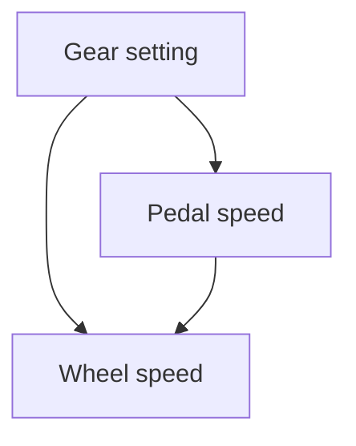

Further research is needed in this area, because neither procedure fully captures the dependencies in a simple dynamical system; for example, they do not tell us the speed of either the wheel or the pedal when countervailing forces are applied, although we have no difficulty making that calculation from elementary physical principles.

## 12.4 Consistency2

What assumptions guarantee the existence of “reliable” procedure for drawing causal conclusions from observational data, by any agent that has unlimited resources for search and computation? In this section, we will answer this question for several increasingly strong senses of “reliable.” First we will consider what assumptions are needed to guarantee Bayes consistency, then what (stronger) assumptions are needed to guarantee the stronger condition of pointwise consistency, and finally what (still stronger) assumptions are needed to guarantee the still stronger condition of uniform consistency. (In every case we will assume the Causal Markov Condition and that causal relations for a population can be represented by a DAG.) We will then discuss the plausibility of the assumptions. We emphasize that the negative results described in this section apply to any method, not just the methods described in this book. We will consider what conclusions should be drawn by someone unwilling to make the assumptions required for the existence of reliable procedures for causal inference. The notation in this section, the negative results about the existence of uniformly consistent tests under some sets of assumptions, and some of the implications of the negative results, are based on Robins, Scheines, Spirtes, and Wasserman 1999.

As an illustration, consider the linear structural equation models in figure 12.11. We assume background knowledge gives a time order (B precedes C) and rules out selection bias, but does not rule out the possibility of latent common causes. In all three models $\varepsilon _ { A } ,$ $\varepsilon _ { B } ,$ and $\varepsilon _ { C }$ are independent Gaussians, A, B, and C are standard Gaussians, A is a latent variable, and B and C are observed. $\rho ( B , C )$ is the correlation between B and C. In those cases in which several different population probability distributions are being discussed, $\rho _ { P } ( B , C )$ represents the correlation between B and C in the population with distribution P. Because the variables are standardized, x in Model M and in Model $Q$ is a real valued variable that represents a linear coefficient in the structural equations which has values that range between –1 and 1. In Model N and Model $Q , z$ is fixed at 0. (In Model M there is one other independent constraint on $x , y ,$ , and z, namely that var $( C ) = \operatorname { v a r } ( \varepsilon _ { C } ) + y ^ { 2 } + z ^ { 2 } +$ $2 x \times y \times z = 1$ , and hence $y ^ { 2 } + z ^ { 2 } + 2 x \times y \times z \leq 1 . )$ In Model M, $\rho ( B , C ) = ( x \times y ) + z ,$ in Model $N \rho ( B , C ) = 0$ , and in Model $Q \rho ( B , C ) = x \times y$ . In order to make Models M, N, and $Q$ disjoint, $z = 0$ is not a legitimate parameter value in Model M, and $x = y = 0$ are not legitimate parameter values of Model Q.

> Model M: Graph ${ \bf { \delta G } } _ { M }$

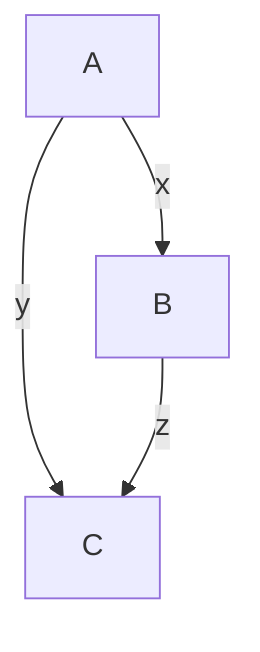

$$
\begin{array}{l} {A = \varepsilon_ {A}} \\ {B = x A + \varepsilon_ {B}} \\ {C = y A + z B + \varepsilon_ {C}} \end{array}
$$

B

$$
\begin{array}{c c} \text {A} & A = \varepsilon_ {A} \\ & B = \varepsilon_ {B} \\ & C = \varepsilon_ {C} \end{array}
$$

Model N: Graph $G _ { N }$

> Model Q: Graph $G _ { Q }$ Figure 12.11. Model M, Model N, and Model Q

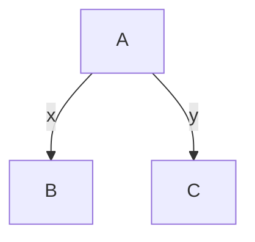

$$
\begin{array}{l} {A = \varepsilon_ {A}} \\ {B = x A + \varepsilon_ {B}} \\ {C = y A + \varepsilon_ {C}} \end{array}
$$

Model M and Model N entail the same observable population distribution $( \rho ( B , C ) = 0 )$ （号 whenever $( x \times y ) + z = 0$ in Model M. Model N and Model Q never entail the same population distribution. Call the ratio of a consequent change in C to a manipulated change in B the treatment effect of B on C. In Model N and Model Q, the treatment effect of B onC is 0, while in Model M it is equal to z. Hence, Model M disagrees with Model N and Model Q on the treatment effect of B on C. In Model M, all of the legitimate values of x, y, and z that produce $\rho ( B , C ) = 0$ are unfaithful to DAG $G _ { M } .$ We will call these “unfaithful” parameter values for Model M and say that a distribution corresponding to an unfaithful parameter value is unfaithful to $G _ { M } .$

Suppose that the sample estimate of $\rho ( B , C )$ is zero. In that case, many methods for drawing causal conclusions from observational data would conclude that there is no treatment effect of B on C. For example, in many studies, a variable B is eliminated from consideration when the regression coefficient of B on the outcome variable is not significant. In this example, the regression coefficient of B for C is zero when $\rho ( B , C )$ is zero. In addition, in the large sample limit, with probability 1, the BIC score of Model N is infinitely larger than the BIC score of Model M or Model Q. When $\rho ( B , C ) = 0 .$ , for any prior which places a non-zero probability on Model N, and for which the distribution over the parameters is absolutely continuous with Lebesgue measure, in the large sample limit, the ratio of the posterior of Model N to the posterior of Model M or to Model Q approaches infinity. Also, the FCI algorithm (and the PC algorithm as well), concludes that the treatment effect of B on C is zero. Hence, in the large sample limit with probability 1, both the constraint based algorithms and various Bayesian scores prefer Model N to Model M or Model Q when $\rho ( B , C ) = 0$ . If the true model is Model M with unfaithful parameter values so $z \neq 0$ then even in the large sample limit all of these search models will prefer Model $N ,$ and be incorrect; otherwise in the large sample limit they are all correct.

Figure 12.12 shows the $z = 0$ plane and part of the surface of parameters for which in Model M $\rho ( B , C ) = ( x \times y ) + z = 0$ . The two lines $x = 0$ and $y = 0$ in the $z = 0$ plane are also shown in figure 12.12. Henceforth, we will refer to the $\rho ( B , C ) = 0$ surface, excluding the non-legitimate parameter values $z = 0$ , as the surface of unfaithful parameter values. (There are other unfaithful parameter values in the model, but only those shown lead to distributions that are unfaithful in the observed margin.) There are three important features of the surface of unfaithful parameter values. The first feature is that the surface is 2 dimensional, while the parameter space of Model M is higher dimensional. Hence the Lebesgue measure of the surface of unfaithful parameter values is 0.

The second feature is that in Model M any legitimate value of z is compatible with $\rho ( B , C ) = 0$ (because each value of z occurs somewhere on the surface of unfaithful parameter values.) For example, the four $( x , y , z )$ points $( 1 , 1 , - 1 ) , ( - 1 , - 1 , - 1 ) , ( 1 , - 1 , 1 )$ and $( - 1 , 1 , 1 )$ all occur on the surface of unfaithful parameters values. (The point $( - 1 , - 1 , - 1 )$ is hidden by the $z = 0$ plane in figure 12.12.) So in Model M the treatment effects $( 1 \ \mathrm { o r - } 1 )$ of B on C are both compatible with $\rho ( B , C ) = 0$ , as well as with every other value.

The third feature is that for every value of z, there are points that are not on the surface of unfaithful parameter values that are arbitrarily close to the surface of unfaithfulness parameter values.

These three features of the surface of unfaithful parameter values are behind all of the various results about the possibility or impossibility of “reliably” discovering causal relations from observational data, in various senses of “reliability,” under a variety of different assumptions.

## 12.4.1 Bayes Consistency

Let the set of vertices associated with DAG G be $\mathbf { V } _ { G } .$ . Let Γ be a set of DAGs, such that for each $G \in \Gamma _ { : }$ , for a set of “observed” variables O, $\mathbf { O } \subseteq \mathbf { V } _ { G } .$ . Let $\mathtt { B } _ { G }$ be the set of legitimate parameter values for the parameters of G. Let $\Pi _ { G }$ be the set of distributions over $\mathbf { V } _ { G }$ that satisfy the Markov condition for G. Let  be a function that maps $( \mathrm { B } _ { G } , G )$ onto $\Pi _ { G } .$ . In the examples of Model M, N, and Q of figure 12.11,  is the usual function mapping linear structural equation model parameters $( x , y , z )$ into Gaussian distributions. In the case of Model N,  maps the parameters into a Gaussian distribution with a correlation matrix that is the identity matrix. In the case of Model M,  maps $( x , y , z )$ into a Gaussian distribution with correlation matrix

$$
\begin{array}{c c c} & A & B \\ A & 1 & x \\ B & x & 1 \\ C & y + (x \times z) & z + (x \times y) \\ & & 1 \end{array} \qquad \qquad \qquad \qquad \qquad \qquad \qquad \qquad \qquad \qquad \qquad \qquad \qquad \qquad \qquad \qquad \qquad \qquad \qquad \qquad \qquad \qquad \qquad \qquad \qquad \qquad \qquad \qquad \qquad \qquad \qquad \qquad \qquad \qquad
$$

In the case of Model Q,  maps $( x , y )$ into a Gaussian distribution with correlation matrix

$$
\begin{array}{c c c} A & B & C \\ A \left( \begin{array}{c c c} 1 & x & y \\ x & 1 & x \times y \\ y & x \times y & 1 \end{array} \right) \end{array}
$$

Let $\Pi _ { \Gamma } = \textstyle \bigcup _ { G \in \Gamma } \Pi _ { G }$ Let $O ^ { n } = O \times \ldots \times O$ where O is the range of the random variables in O. Assume we have a random sample $\mathbf { O } ^ { n } = ( \mathbf { O } _ { 1 } , . . . , \mathbf { O } _ { n } )$ from some $P ( \mathbf { O } ) \in \Pi _ { \Gamma } ( \mathbf { O } )$ . $P ^ { n }$ is the n-fold product measure of $P$ on $O _ { n }$ Let  map $\begin{array} { r } { \mathbf { B } \Gamma = \bigcup _ { G \in \Gamma } \bigcup _ { \beta \in \mathbf { B } _ { G } } ( \beta , G ) } \end{array}$ into the reals, i.e. is a parameter that for the moment we leave unspecified (e.g. the treatment effect of

$$
\Pi_ {\Gamma 0} = \bigcup_ {G \in \Gamma} \left\{P \in \Pi_ {G}: \exists \beta \in \mathrm{B} _ {G}, \theta = \theta_ {0} \& \gamma (\beta , G) = P \right\}
$$

$$
\Pi_ {\Gamma 1} = \bigcup_ {G \in \Gamma} \left\{P \in \Pi_ {G}: \exists \beta \in \mathrm{B} _ {G}, \theta \neq \theta_ {0} \& \gamma (\beta , G) = P \right\}
$$

B on C in Model M in figure 12.11). Let

Intuitively $\Gamma 0$ is the set of distributions compatible with $\begin{array} { r } { \theta = \theta _ { 0 } , } \end{array}$ and $\Gamma 1$ is the set of distributions compatible with $\theta \neq \theta _ { 0 } .$ . Note that there may be a $ { \mathcal { P } } _ { 1 } \in  { \mathcal { ~ \mathrm { ~  ~ \pi ~ } ~ } } _ { 0 }$ and a $\qquad P _ { 2 } \in \mathrm { ~  ~ \sigma ~ } _ { 1 }$ such that $P _ { 1 } ( \mathbf { O } ) = P _ { 2 } ( \mathbf { O } )$ .

Suppose that there is a prior density $P r ( \mathrm { B } \Gamma )$ , such that for $( \beta , G ) \in { \bf \beta B } \Gamma _ { 3 }$ , $P r ( \beta , G ) =$ $P r ( G ) P r ( \beta | G )$ . This prior, together with  induces a prior Pr over (ΒΓ,O). Suppose that we test $H _ { 0 } \colon \theta = \theta _ { 0 }$ versus $\begin{array} { r } { H _ { 1 } \colon \theta \neq \theta _ { 0 } . } \end{array}$ For our purposes, a test is a function $\varphi _ { n } \colon \mathbf { O } ^ { n } \to \{ 0 , 1 , 2 \}$ , where $\phi _ { n } ( \mathbf { O } ^ { n } ) = 0$ means “choose $H _ { 0 } ^ { \prime 3 } , \phi _ { n } ( \mathbf { O } ^ { n } ) = 1$ means “choose $H _ { 1 } ^ { \mathbf { \alpha } , \bullet }$ , and $\phi _ { n } ( \mathbf { O } ^ { n } ) = 2$ means “don’t know”. We specify a test $\phi _ { n }$ for each sample size n. In what follows all limits refer to the sample size n tending to ∞. Let $P r ^ { n } ( \mathbf { O } ^ { n } | \mathbf { B } \Gamma )$ be the n-fold product measure of Pr(O|ΒΓ)). A test that always returns “don’t know” is trivially always correct, so we will eliminate such tests from consideration. A test is non-trivial if either

- (i) for some ${ \cal P } \in \Pi _ { \Gamma } \underbrace { l i m } _ { n  \infty } { \cal P } ^ { n } \Big ( \varphi ^ { n } \big ( { \bf O } ^ { n } \big ) = 0 \Big ) = 1 ,$ or
- (ii) for some $P \in \Pi _ { \Gamma } \operatorname* { l i m } _ { n \to \infty } P ^ { n } \Big ( \varphi ^ { n } \big ( \mathbf O ^ { n } \big ) = 1 \Big ) = 1 .$

We will henceforth consider only non-trivial tests.

Definition 12.1: A test  is Bayes consistent with respect to a prior Pr(ΒΓ) and a mapping $\gamma$ which induces a prior Pr over (ΒΓ,O) if

$$
\lim _ {n \to \infty} P r (H _ {0}) P r ^ {n} (\varphi_ {n} (\mathbf {O} ^ {n}) = 1 \mid H _ {0}) + P r (H _ {1}) P r ^ {n} (\varphi_ {n} (\mathbf {O} ^ {n}) = 0 \mid H _ {1}) = 0
$$

Intuitively, a test is Bayes consistent with respect to a prior when in the large sample limit the test is incorrect on a set of measure 0 under the prior. One trivial way to guarantee Bayes consistency is to have a prior that places all of its mass on a single point. The results in this section are more interesting, however, because we will consider diffuse priors. In the following theorem, $G _ { M } , G _ { N } ,$ and $G _ { Q }$ refer to the models in figure 12.11. Although it is non-standard to allow a test to return “don’t know”, we have allowed this for the following reason. An algorithm such as the FCI algorithm performs a statistical test of zero correlation, and returns 0 when the correlation is judged to be zero, and returns 2 (“don’t know”) when the correlation is judged to be non-zero. This is because a zero correlation entails a zero treatment effect except when there is a violation of faithfulness (which is of Lebesgue measure 0), but a non-zero correlation is compatible with either a direct effect of B on C (Model M), or with no direct effect and a common cause of of B and C (Model Q). (Although for the sake of simplicity, in the following discussion we do not consider all of the alternative models when B and C are the only variables measured, including the other models would not substantially change any of the arguments or conclusions.)

Theorem 12.1: $\mathrm { I f } \ \Gamma = \{ G _ { M } , G _ { N } , G _ { O } \} , \theta = z ,$ , and $\theta _ { 0 } = 0$ , then there is a Bayes consistent test of $\theta = \theta _ { 0 }$ against $\theta \neq \theta _ { 0 }$ with respect to any prior Pr such that

$$
P r (B _ {G _ {M}} \mid G _ {M}), P r (B _ {G _ {N}} \mid G _ {N}), a n d P r (B _ {G _ {Q}} \mid G _ {Q})
$$

are absolutely continuous with respect to Lebesgue measure.

Proof. There is a pointwise consistent test  (see section 12.4.2) of zero correlations against non-zero correlations. Let $\phi$ return 0 when  returns 0, and return 2 otherwise. Because $\phi$ never returns 1,

$$
\lim _ {n \rightarrow \infty} P r ^ {n} (\phi_ {n} (\mathbf {O} ^ {n}) = 1 \mid H _ {0}) = 0.
$$

Because  is pointwise consistent, for every P for which $\rho _ { P } ( B , C ) \neq 0$ ,

$$
\lim _ {n \to \infty} P r ^ {n} (\eta_ {n} (\mathbf {O} ^ {n}) = 0) = 0
$$

Hence

$$
\lim _ {n \rightarrow \infty} \operatorname * {P r} ^ {n} (\phi_ {n} (\mathbf {O} ^ {n}) = 0 \mid \rho (B, C) \neq 0) = 0
$$

$\rho _ { P } ( B , C ) = 0$ is incompatible with Model $Q ,$ and in Model M, $\rho _ { P } ( B , C ) = 0$ only when $\scriptstyle z = - x \times y \neq 0$ . Because $P r ( B _ { G _ { M } } \mid G _ { M } )$ is absolutely continuous with respect to Lebesgue measure, $P r ( z = - x \times y = 0 \mid G _ { m } ) = 0$ . If $P r ( H _ { 1 } ) \neq 0$ , then

$$
\lim _ {n \to \infty} P r ^ {n} (\phi_ {n} (\mathbf {O} ^ {n}) = 0 \mid H _ {1}) = 0
$$

$$
\text { Otherwise,   if } \operatorname * {P r} (H _ {1}) = 0, \lim _ {n \rightarrow \infty} \operatorname * {P r} (H _ {1}) \operatorname * {P r} ^ {n} (\phi_ {n} (\mathbf {O} ^ {n}) = 0 \mid H _ {1}) = 0 \text { Q.E.D }
$$

In addition to Bayesian statistical tests, there are Bayesian versions of confidence intervals and estimators for a zero treatment effect of B on $C .$

The prior plays an important role in determining the existence of Bayesian consistent tests of $\theta = \theta _ { 0 }$ versus $\theta \neq \theta _ { 0 }$ . Whenever $\rho ( B , C ) = 0$ there are two different kinds of theories that explain this: either $z = 0$ (Model N), or $z = - x \times y \neq 0$ (Model M). Because both of these theories make exactly the same prediction about the marginal population distribution over B and $C ,$ no sample from the marginal population distribution can ever distinguish between them. Whatever the ratio of the probability of $z = 0$ to the probability of $z = - x \times y \neq 0$ was prior to seeing the sample, it remains exactly the same after seeing the sample. So the choice between the faithful explanation and the unfaithful explanation is entirely based on the prior, and not on the evidence. The prior in this example assigned a zero probability to $z = - x \times y \neq 0$ , so Bayes consistent tests exist for the example. For a different prior which assigned a non-zero prior probability to $z = - x \times y \neq 0$ , there is no Bayes consistent test of $\theta = \theta _ { 0 }$ versus $\theta \neq \theta _ { 0 }$ with respect to that prior.

More generally, with a prior over the parameters for each DAG that assigns zero probability to unfaithful distributions, there are Bayes consistent tests of whether or not the DAG that generated a given sample is a member of a given O-Markov equivalence class. Theorem 12.2 is a slight variation of results proved in Robins and Wasserman (1999).

Theorem 12.2: Let Γ be a countable set of DAGs each of which contains at least the variables in $\mathbf { o , }$ , and $F$ an O-Markov equivalence class of DAGs that intersects Γ. Let $H _ { 0 }$ be $^ { 6 6 } G$ is a member of $F ^ { \ast } , H _ { 1 }$ be $^ { 6 6 } G$ is not a member of $F ^ { \ast }$ , and $\mathbf { B } _ { \mathrm { G } , U }$ be the set of parameters $\beta$ such that $\gamma ( { \boldsymbol { \beta } } , G )$ is unfaithful to $G .$ If in $\Pi _ { \Gamma } ,$ there are pointwise consistent tests of each conditional independence relation among the variables in $\mathbf { o , }$ and for each $G \in \Gamma ,$ , $P r ( \mathbf { B } _ { \mathrm { G } , U } | G ) = 0$ , then there is a test $\phi$ of $H _ { 0 }$ against $H _ { 1 }$ that is Bayes consistent with respect to $P r$ .

Proof. Suppose there are pointwise consistent tests (see section 12.4.2) of conditional independence relations among the observed variables. Then there is a pointwise consistent test of a finite set of conditional independence relations, and hence a pointwise consistent test $\phi$ of membership in F. (Each O-Markov equivalence class of DAGs entails a finite unique set of conditional independence relations among the variables in $\mathbf { 0 . ) }$ By reasoning analogous to the proof of Theorem 12.4.1, in the large sample limit, the output of $\phi$ is wrong in the large sample limit about membership in $F$ only when the distribution generated by the true DAG is unfaithful to that DAG. But this has probability 0 by hypothesis. Q.E.D.

For both multinomial distributions, and Gaussian distributions, the Lebesgue measure of the usual parameterizations that produce unfaithful distributions conditional on a given G is 0. Hence for these distribution families and the usual priors (described in section 12.5.3) there is a Bayes consistent test. However, for a stronger sense of Bayes consistency which requires stronger assumptions for success, see Robins and Wasserman 1999.

## 12.4.2 Pointwise Consistency

Definition 12.2: A test $\phi$ is pointwise consistent over a set of distributions $\Pi _ { \Gamma 0 } , \Pi _ { \Gamma 1 }$ if

- (i) for every $P \in \Pi _ { \Gamma 0 } , \operatorname* { l i m } _ { n \to \infty } P ^ { n } ( \phi _ { n } ( \mathbf { O } ^ { n } ) = 1 ) = 0$ , and
- (ii) for every $P \in \Pi _ { \Gamma 1 } , \operatorname* { l i m } _ { n \to \infty } P ^ { n } ( \phi _ { n } ( \mathbf { O } ^ { n } ) = 0 ) = 0 .$

In constrast to Bayes consistency, this definition requires that with probability 1 the test does not fail in the large sample limit over all pairs $( \beta , G ) \in \mathrm { { B r } }$ . Failing on a non-trivial set of measure 0 of pairs $( \beta , G ) \in \mathbb { B } \Gamma$ is enough to rule out pointwise consistency. Suppose now that $\Gamma = \{ G _ { M } , G _ { N } , G _ { Q } \}$ from figure 12.11, $\theta = z , \theta _ { 0 } = 0$ , and we test $\theta = \theta _ { 0 }$ against $\theta \neq \theta _ { 0 }$ .

Theorem 12.3: If $\Gamma = \{ G _ { M } , G _ { N } , G _ { O } \}$ from figure 12.11, $\theta = z ,$ and $\theta _ { 0 } = 0$ , then there is no pointwise consistent test of $\theta = \theta _ { 0 }$ against $\theta \neq \theta _ { 0 }$ with respect to $\Pi _ { \Gamma 0 }$ and $\Pi _ { \Gamma 1 }$ .

Proof. For every $P \in \Pi _ { \Gamma 0 }$ with margin P(O) (from Model N or Model Q) there is a $P ^ { \prime } \in$ $\Pi _ { \Gamma 1 }$ (from Model M) such that $P ( \mathbf { O } ) = P ^ { \prime } ( \mathbf { O } )$ , and vice-versa. Because any test $\phi$ depend only on the marginal distribution, it follows that there is no pointwise consistent test of $\mathbf { \epsilon } = \theta _ { 0 }$ against $\begin{array} { r } { \theta \neq \theta _ { 0 } . \mathrm { ~ Q . E . D } . } \end{array}$ .

However, if the intersection of $\Pi _ { \Gamma 0 }$ and $\Pi _ { \Gamma 1 }$ in the observed margin are distributions where $\rho ( B , C ) = 0$ , there is a pointwise consistent test of $\theta = \theta _ { 0 }$ against $\theta \neq \theta _ { 0 }$ . Since the distributions in $\Pi _ { \Gamma 1 }$ with $\rho ( B , C ) = 0$ in the observed margin are just those corresponding to the surface of unfaithful parameter values in Model $M ,$ if those distributions are removed, there is a pointwise consistent test of test of $\theta = \theta _ { 0 }$ against $\theta \neq \theta _ { 0 }$ . Let $\Omega _ { G }$ be the set of distributions that satisfy the Markov condition for G and are faithful to $G .$ . Let $\Omega _ { \Gamma } = \bigcup _ { G \in \Gamma } \Omega _ { G }$ Let .

$$
\Omega_ {\Gamma 0} = \bigcup_ {G \in \Gamma} \{P \in \Omega_ {G}: \exists \beta \in \mathrm{B} _ {G}, \theta = \theta_ {0} \& \gamma (\beta , G) = P \}
$$

$$
\Omega_ {\Gamma 1} = \bigcup_ {G \in \Gamma} \left\{P \in \Omega_ {G}: \exists \beta \in \mathrm{B} _ {G}, \theta \neq \theta_ {0} \& \gamma (\beta , G) = P \right\}.
$$

Theorem 12.4: If $\Gamma = \{ G _ { M } , G _ { N } , G _ { Q } \}$ , there is a pointwise consistent test of $\theta = \theta _ { 0 }$ against $\theta \neq \theta _ { 0 }$ with respect to $\Omega _ { \Gamma 0 } , \Omega _ { \Gamma 1 }$ .

Proof. There is a pointwise consistent test  of zero correlation against non-zero correlations. Let $\phi$ return 0 when  returns 0, and otherwise $\phi$ returns 2. Since $\phi$ never returns 1, for every $P \in \Omega _ { \Gamma 0 } , P ^ { n } ( \phi _ { n } ( \mathbf { O } ^ { n } ) = 1 ) = 0$ . Under the assumption of faithfulness, $\Omega _ { \Gamma 1 }$ contains only distributions for which $\rho _ { P } ( B , C ) \neq 0$ . Since for every $P \in \Omega _ { \Gamma 1 }$ , limn $P ^ { n } ( \eta _ { n } ( \mathbf { O } ^ { n } ) = 0 ) =$ $0 ,$ it follows that lim $P ^ { n } ( \phi _ { n } ( \mathbf { O } ^ { n } ) = 0 ) = 0 . \mathrm { Q . E . D }$ .

Theorem 12.5: Let Γ be a countable set of DAGs each of which contains at least the variables in $\mathbf { o , }$ and $F$ an O-Markov equivalence class of DAGs that intersects Γ. Let $H _ { 0 }$ be $^ { 6 6 } G$ is a member of $F ^ { \prime \prime }$ , and $H _ { 1 }$ be $^ { 6 6 } G$ is not a member of $F ^ { \ast }$ . If in $\Omega _ { \Gamma } ,$ , there are pointwise consistent tests of each conditional independence relation among the variables in $\mathbf { O } ,$ , there is a pointwise consistent test $\phi$ of $H _ { 0 }$ against $H _ { 1 }$ with respect to a set of distributions $\Omega _ { \Gamma 0 } , \Omega _ { \Gamma 1 }$ .

Proof. Under the assumption of faithfulness, a distribution P is compatible with a DAG G in O-Markov equivalence class F if and only if it satisfies a certain finite set of conditional independence relations in the margin. No distribution from a DAG that is not in F satisfies the same set of conditional independence relations in the margin. If there are pointwise consistent tests of each conditional independence relation among the variables in $\mathbf { o } ,$ , then there is a pointwise consistent test of the set of conditional independence relations that F entails, and hence a pointwise consistent test of membership in F. Q.E.D.

In the case of both multivariate Gaussian and multinomial distributions, there are pointwise consistent tests of conditional independence, and hence pointwise consistent tests of membership in an O-Markov equivalence class.

## 12.4.3 Uniform Consistency

$$
\text {Let} \Pi_ {\Gamma \delta 0} = \bigcup_ {G \in \Gamma} \{P \in \Pi_ {G}: \exists   \beta \in \mathrm{B} _ {G}, |   \theta - \theta_ {0}   | > \delta   \&   \gamma (\beta , G) = P \}    ,
$$

that is the set of distributions in $\Pi _ { \Gamma }$ compatible with being more than $\delta$ away from $\theta _ { 0 } .$ . (The $\cdot _ { 0 } ,$ in the subscript of $\Pi _ { \boldsymbol { \mathrm { T } } \delta 0 }$ refers to $\theta _ { 0 } ,$ , and the $\mathit { \Omega } ^ { \bullet } \delta ^ { \bullet }$ refers to the distance from $\theta _ { 0 } . )$

Definition 12.3: A test $\phi$ of $\theta = \theta _ { 0 }$ against $\theta \neq \theta _ { 0 }$ is uniformly consistent over a set of distributions $\Pi _ { \Gamma 0 }$ and $\Pi _ { \Gamma \delta 0 }$ if

- ${ \mathrm { ( i ) } \atop { n  \infty } } \operatorname* { s u p } _ { P \in \Pi _ { \Gamma 0 } } P ^ { n } ( \phi _ { n } ( \mathbf { O } ^ { n } ) = 1 ) = 0$ n P→ ∞ ∈ Π Γ 0
- $\operatorname { ( i i ) } \forall \delta > 0 , \operatorname* { l i m } _ { n  \infty } \operatorname* { s u p } _ { P \in \Pi _ { \Gamma \delta 0 } } P ^ { n } ( \phi _ { n } ( \mathbf { O } ^ { n } ) = 0 ) = 0$ n P→∞ ∈Π

Suppose for the moment that $\Gamma = \{ G _ { M } , G _ { N } \}$ from figure 12.11, $\theta _ { 0 }$ is $z = 0$ , and we test $\theta$ $\mathit { \Theta } = \theta _ { 0 }$ against $\theta \neq \theta _ { 0 }$ . Consider for the moment a $\phi$ that either returns 0 or 1. Since $\phi$ is a function of the observed data, at each sample size it divides samples into those judged to come from $H _ { 0 } ,$ those judged to come from $H _ { 1 }$ . For a test of a null hypothesis of independence, those samples judged to come from $H _ { 1 }$ are in the rejection region, and those judged to come from $H _ { 0 }$ are in the acceptance region. If $\phi$ is pointwise consistent, then for any $\delta > 0$ , for any $P \in \Omega _ { \Gamma \delta 0 }$ it is possible to find an n such that a sample of size n drawn from P is very likely to fall into the rejection region for $\phi _ { n }$ where n depends upon $P .$ However, uniform consistency is stronger than pointwise consistency because the definition requires that for every $\delta > 0$ , it is possible to find a single minimal n such that a sample of size n drawn from any $P \in \Omega _ { \Gamma \delta 0 }$ is very likely to fall into the rejection region for $\phi _ { n }$ . The same idea generalizes to tests which allow “don’t know” as an answer.

If no uniformly consistent test of $\theta = \theta _ { 0 }$ exists, then there are no uniformly consistent non-trivial confidence intervals around $\theta ,$ and no uniformly consistent estimators of $\theta .$ Uniform consistency is required in order to bound the error on $\theta$ (in the worst case over all models.)

Robins, Scheines, Spirtes, and Wasserman (1999) show that even when the unfaithful distributions are removed, for parameterizations of $\Gamma = \{ G _ { M } , G _ { N } \}$ in which A, B and $C$ are discrete, there is no non-trivial uniformly consistent test of $\theta = \theta _ { 0 }$ against $\theta \neq \theta _ { 0 } .$ The original proof in Robins, Scheines, Spirtes, and Wasserman (1999) assumed that a test is nontrivial in the stronger sense that in the limit it does not return “don’t know” for all of the distributions in the null hypothesis, or all of the distributions in the alternative. The proof has since been extended to cover the weaker sense of non-triviality proposed here.

Even if the unfaithful distributions are ruled out by assumption, for $\Gamma = \{ G _ { M } , G _ { N } , G _ { Q } \}$ , there is no uniformly consistent test of $\theta = \theta _ { 0 }$ against $\theta \neq \theta _ { 0 }$ . Informally, there is no uniformly consistent test because even after the surface of unfaithful parameter values have been removed from $\Pi _ { \Gamma 0 } ,$ , for any $\delta > 0$ , it is still possible to find a $P \in \Omega _ { \Gamma \delta 0 }$ for which $\rho _ { P } ( B , C )$ is arbitrarily close to $0 .$ . Consider the sequence of rejection regions for a test $\phi$ that is pointwise consistent with respect to $\Omega _ { \Gamma 0 } \cup \Omega _ { \Gamma 1 }$ . For any given $P \in \Omega _ { \Gamma \otimes 0 } .$ , no matter how close $\rho _ { P } ( B , C )$ is to $\operatorname { z e r o } ,$ as long as it is not equal to $0 ,$ it is possible to find an n such that it is likely that a sample of size n falls into the rejection regions for $\phi _ { n }$ . But there is always some other $P ^ { \prime } \in \Omega _ { \Gamma \delta 0 }$ with $\rho _ { P ^ { \prime } } ( B , C )$ even closer to zero, such that it is not likely that a sample of size n from $P ^ { \prime }$ will fall into the rejection region for $\phi _ { n } .$ . Let

$$
\Omega_ {\Gamma \delta 0} = \bigcup_ {G \in \Gamma} \{P \in \Omega_ {G}: \exists \beta \in \mathrm{B} _ {G}, | \theta - \theta_ {0} | > \delta \& \gamma (\beta , G) = P \}.
$$

Theorem 12.6: If $\begin{array} { r } { \varGamma = \{ G _ { M } , G _ { N } , G _ { O } \} , \theta = z _ { 1 } } \end{array}$ , and $\theta _ { 0 } = 0$ , there is no uniformly consistent test of $\theta = \theta _ { 0 }$ against $\theta \neq \theta _ { 0 }$ with respect to $\Omega _ { \Gamma 0 }$ and $\Omega _ { \Gamma \delta 0 }$ .

Proof. Suppose that on the contrary there is a uniformly consistent test $\phi$ of $\theta = \theta _ { 0 }$ against $\theta \neq \theta _ { 0 }$ . Because $\phi$ is non-trivial, either

- (i) for some $P \in \Omega _ { \Gamma } \operatorname* { l i m } _ { n \to \infty } P ^ { n } \left( \varphi ^ { n } ( \mathbf O ^ { n } ) = 0 \right) = 1$ , or
- (ii) for some $P \in \Omega _ { \Gamma } \operatorname* { l i m } _ { n \to \infty } P ^ { n } \left( \varphi ^ { n } ( \mathbf O ^ { n } ) = 1 \right) = 1$

Suppose that (ii) is the case. If P is in $\Omega _ { \Gamma 0 } , \varphi$ is not uniformly consistent. Suppose then that P is in $\Omega _ { \Gamma \delta 0 }$ . For every distribution P in $\Omega _ { \Gamma \delta 0 }$ (from Model M) there is a distribution D in $\Omega _ { \Gamma 0 }$ (from Model Q) with the same marginal over O. Because $\phi$ is a function of just the margin over O, $P ^ { n } ( \phi _ { n } ( \mathbf { O } ^ { n } ) = 1 ) = D ^ { n } ( \phi _ { n } ( \mathbf { O } ^ { n } ) = 1 )$ . Hence in the large sample limit there is a $D \in \Omega _ { \Gamma 0 }$ such that $D ^ { n } ( \phi _ { n } ( \mathbf { O } ^ { n } ) = 1 ) = 1$ , and is not uniformly consistent.

Suppose now that (i) is the case. If P is in $\Omega _ { \Gamma \delta 0 } , \varphi$ is not uniformly consistent. Suppose then that P is in $\Omega _ { \Gamma 0 }$ . It follows that P is compatible with $z = 0$ . Consider first the case where $\rho _ { P } ( B , C ) = r \neq 0 { \mathrm { ~ ( i . e . ~ i f ~ } } z = 0 , P$ is compatible with Model Q but not Model N). There is a $\delta > 0$ and some distribution $D \in \Omega _ { \Gamma \otimes 0 } .$ , such that $\rho _ { D } ( B , C ) = r ,$ but D is compatible with $\vert z \vert > \delta , ( \mathrm { i } . \mathbf { e } . \ D$ is compatible with Model M, and has the same margin over B and C as $P . )$ Because $\phi$ is a function of just the margin over B and $C , P ^ { n } ( \phi _ { n } ( \mathbf { O } ^ { n } ) = 0 ) = D ^ { n } ( \phi _ { n } ( \mathbf { O } ^ { n } ) = 0 )$ . Hence there is a $D \in \Omega _ { \Gamma \delta 0 }$ such that in the large sample limit $D ^ { n } ( \phi _ { n } ( \mathbf { O } ^ { n } ) = 0 ) = 1$ , and hence $\phi$ is not uniformly consistent.

Consider finally the case where $z = 0$ and $\rho _ { P } ( B , C ) = 0$ (i.e. P is from Model N.) There is a $\delta > 0$ , and a distribution $D \in \Pi _ { \Gamma \delta 0 }$ (compatible with Model M with a z value of $z _ { 1 } ,$ where $| z _ { 1 } | > \delta )$ and the same marginal as P over B and C. However, D is not faithful to Model M, and hence not a member of $\Omega _ { \Gamma \delta 0 } .$ . But there is an interval around zero such that for every value r in the interval, except for $r = 0$ , there is some $D _ { n } \in \Omega _ { \Gamma \delta 0 }$ compatible with Model M and $z = z _ { 1 }$ such that $\rho _ { D n } ( B , C ) = r .$ . The Kullback-Liebler distance $\operatorname { I } ( \tilde { D } ; \tilde { D } _ { n } )$ equals $- 1 / 2 \log ( 1 - r ^ { 2 } )$ , which is a continuous function of r (where $\tilde { D }$ is the marginal of D over B and C). Hence $1 ( \tilde { D } ^ { n } ; \tilde { D } _ { n } ^ { n } )$ equals – $\cdot n / 2 \log ( 1 - r ^ { 2 } )$ . For every event A in the sample space,

$$
\sup _ {A} | \tilde {D} ^ {n} (A) - \tilde {D} _ {n} ^ {n} (A) | \leq \frac {1}{2} \left\{I \left(\tilde {D} ^ {n}; \tilde {D} _ {n} ^ {n}\right) \right\} ^ {1 / 2}
$$

By choosing r small enough, there are distributions in $\Omega _ { \Gamma \delta 0 }$ with marginals that are arbitrarily close to $\tilde { D }$ and compatible with Model M and $z = z _ { 1 }$ . Hence for all n, and all $\varepsilon / 2$ , there is a distribution $D _ { n } \in \Omega _ { \Gamma \delta 0 }$ (and hence faithful to Model M with $z = z _ { 1 } )$ such that $| \tilde { D } ^ { n } ( \phi _ { n } ( \mathbf { O } ^ { n } ) = 0 ) - \tilde { D } _ { n } ^ { n } \left( \phi _ { n } ( \mathbf { O } ^ { n } ) = 0 \right) | < \varepsilon / 2$ .

Because $\phi$ is a function of just the margin over B and $C , P ^ { n } ( \phi _ { n } ( \mathbf { O } ^ { n } ) = 0 ) = \tilde { P } ^ { n } ( \phi _ { n } ( \mathbf { O } ^ { n } ) = 0 )$ $= \tilde { D } ^ { n } ( \phi _ { n } ( \mathbf { O } ^ { n } ) = 0 ) \leq \tilde { D } _ { n } ^ { n } ( \phi _ { n } ( \mathbf { O } ^ { n } ) = 0 ) + \varepsilon / 2 = D _ { n } ^ { n } ( \phi _ { n } ( \mathbf { O } ^ { n } ) = 0 ) + \varepsilon / 2$ . Because $P ^ { n } ( \phi _ { n } ( \mathbf { O } ^ { n } ) = 0 )$ 号 converges to $1 , ( \forall \varepsilon / 2 > 0 ) ( \exists N ) ( \forall n > N ) ( P ^ { n } ( \phi _ { n } ( \mathbf { O } ^ { n } ) = 0 ) > 1 - \varepsilon / 2$ It follows then that .

$$
(\forall \varepsilon > 0) (\exists N) (\forall n > N) (D _ {n} ^ {n} (\phi_ {n} (\mathbf {O} ^ {n}) = 0) > 1 - \varepsilon / 2 - \varepsilon / 2) = 1 - \varepsilon .
$$

Since each $D _ { n } \in \Pi _ { \Omega \delta 0 } .$ , it follows that

$$
\lim _ {n \to \infty} \sup _ {P \in \Omega_ {\Gamma \delta 0}} P ^ {n} (\phi_ {n} (\mathbf {O} ^ {n}) = 0) = 1
$$

and hence $\phi$ is not uniformly consistent. Q.E.D.

However if instead of assuming only that there are no unfaithful parameter values of Model M, suppose we assume that there are no “close to unfaithful” parameter values of M (and hence that there are no “close to unfaithful” distributions to M.) For example, in Model M, for any given fixed $\kappa > 0$ , one could allow only those parameters such that $\lvert z +$ $( x \times y ) | > \kappa | z |$ , i.e. those parameter values for which the correlation is greater than a fixed percentage of the size of the treatment effect of B on $C .$ If j were 0.001, the assumption means that the correlation is a least 1/1000 the size of the treatment effect of B on C. For a fixed $\kappa ,$ call the set of parameter values such that $| z + ( x \times y ) | < \kappa | z |$ “close to unfaith-$\mathrm { f u l } ^ { \prime \prime }$ . The assumption that parameter values are not close to unfaithful is the assumption that small population correlations guarantee small treatment effects.

Let $\operatorname { H } _ { G }$ be the set of distributions that satisfy the Markov condition for G and are not close to unfaithful to $G ,$ for some fixed $\kappa ,$ and

$$
\mathrm{H} _ {\Gamma} = \bigcup_ {G \in \Gamma} \mathrm{H} _ {G}, \theta = z, \theta_ {0} = 0
$$

and

$$
\mathrm{H} _ {\Gamma \delta 0} = \bigcup_ {G \in \Gamma} \left\{P \in \mathrm{H} _ {G}: \exists \beta \in \mathrm{B} _ {G}, | \theta - \theta_ {0} | > \delta \& \gamma (\beta , G) = P \right\}
$$

(i.e. H $0$ is the set of distributions that satisfy the Markov Condition, are not close to unfaithful to $G ,$ and for which h is more than $\delta$ from $\theta _ { 0 }$ .

Theorem 12.7: If $\Gamma = \{ G _ { M } , G _ { N } , G _ { Q } \}$ , there is a uniformly consistent test of $\theta = \theta _ { 0 }$ against $\theta \neq \theta _ { 0 }$ with respect to $\mathrm { H } _ { \Gamma 0 }$ and $\mathrm { H } _ { \Gamma \delta 0 }$ .

Proof. There is a uniformly consistent test  of $\rho ( B , C ) = 0$ against $\rho ( B , C ) \neq 0$ . Let $\phi$ return 0 when returns 0, and let $\phi$ return 2 otherwise. Because $\phi$ never returns 1, for all $P \in \Gamma _ { \Gamma 0 } , P ^ { n } ( \varphi _ { n } ( \mathbf { O } ^ { n } ) = 1 ) = 0 . \operatorname { L e t } \Gamma _ { \Gamma \delta 0 } = \bigcup _ { G \in \Gamma } \{ P \in \Pi _ { G } \colon | \rho _ { P } ( B , C ) | > \delta \}$ .

By the assumption of no “close to unfaithful” parameter values, if the absolute value of the treatment effect of B on C is greater than $\delta$ then the absolute value of the correlation of B and C is greater than . For every distribution P in $\mathrm { H } _ { \Gamma \delta 0 } , P$ is in $\mathrm { T } _ { \Gamma ( \kappa \delta ) 0 }$ . Because $\phi _ { n } ( \mathbf { O } ^ { n } ) = 0$ if and only if $\eta _ { n } ( \mathbf { O } ^ { n } ) = 0$ , it follows that

$$
\forall \kappa \delta > 0, \lim _ {n \rightarrow \infty} \sup _ {P \in \mathrm{T} _ {\Gamma (\kappa \delta) 0}} P ^ {n} \left(\eta_ {n} \left(\mathbf {O} ^ {n}\right) = 0\right) = 0 \Rightarrow
$$

$$
\forall \delta > 0, \lim _ {n \rightarrow \infty} \sup _ {P \in \mathrm{H} _ {\Gamma \delta 0}} P ^ {n} (\phi_ {n} (\mathbf {O} ^ {n}) = 0) = 0
$$

The antecedent is true because  is a uniformly consistent test of zero correlation. Hence is a uniformly consistent test of $\theta = \theta _ { 0 }$ against $\theta \neq \theta _ { 0 }$ with respect to $\mathrm { H } _ { \Gamma 0 }$ and $\mathrm { H } _ { \Gamma \delta 0 }$ . Q.E.D.

A zero treatment effect of B on C is a special case of a treatment effect that can in some cases be calculated from the Prediction Algorithm. Extending results about the existence of uniformly consistent tests of the size of treatment effects to all treatment effects that can be calculated from the Prediction Algorithm would require generalizing the concept of “close to unfaithful parameters” and generalizing the distance metric used in theorem 12.4.2. We conjecture that there are natural generalizations such that there is a uniformly consistent test of every treatment effect that can be calculated from the Prediction Algorithm, under the assumption of no “close to unfaithful” distributions. Similarly, extending results about uniform consistency to tests of membership in a given O-Markov equivalence class requires generalizing the concept of “close to unfaithful” to conditional independencies, and a metric measuring the distance between a pair $( \beta , G )$ and an O-Markov equivalence class. We conjecture that there is a natural generalization of “close to unfaithful” and a natural metric under which there is a uniformly consistent test of membership in a given O-Markov equivalence class.

## 12.4.3 Interval Testing

Returning to Model M of figure 12.11, for a fixed $\varepsilon > 0$ let $H _ { 0 }$ be $\mathbf { \hat { \rho } } ^ { 6 } | _ { Z } | \le \varepsilon ^ { 3 }$ , and $H _ { 1 }$ be $^ { 6 6 } | z | >$ $\vec { \varepsilon ^ { \prime } }$ . If Pr(ΒΓ) is a prior that assigns measure 0 to the close to unfaithful parameter values, then there is a test of $H _ { 0 }$ against $H _ { 1 }$ that is Bayes consistent with respect to Pr. Similarly,Pr. there are tests that are pointwise consistent tests with respect tthere are tests that are pointwise consistent tests with respect to $\mathrm { H } _ { \Gamma 0 } , \mathrm { H } _ { \Gamma 1 }$ to HΓ0  (where $\mathrm { H } _ { \Gamma 0 }$ Γ1 is (where HΓ0 is the set ofthe set of distributions in $\mathrm { H } _ { \Gamma }$ stributions in HΓ  compatible with $H _ { 0 } ,$ mpat and $\mathrm { H } _ { \Gamma 1 }$ with H0, and HΓ1 is the se is the set of distributions in $\mathrm { H } _ { \Gamma }$ distributions in compatible with $H _ { 1 } )$ ompatible with H1), and uniformly consist, and uniformly consistent with repect to $\mathrm { H } _ { \Gamma 0 }$ with  and $\mathrm { H } _ { \Gamma \delta 0 }$ ct to HΓ (where $\mathrm { H } _ { \Gamma \delta 0 }$ HΓδ0 (where HΓδ0 is the seis the set of distributions in $\mathrm { H } _ { \Gamma }$ f distributions in H at leasts a distance $\delta$ at least a distance  from the nullfrom the null hypothesis.) The proof hypothesis.) The proof of the existence of the uniformly consistent test is analogous toof the existence of the uniformly consistent test is analogous to the proof of Theorem 12.7 the proof of Error! Reference source not found. and the existence of the pointwiseand the existence of the pointwise consistent test and the Bayes consistent test follow from consistent test and the Bayes consistent test fthe existence of the uniformly consistent tests.

## 12.4.5 Other Kinds of Background Knowledge

In the examples of figure 12.11, the background knowledge fixed a time order, but there was a possibility of unmeasured common causes. Consistency questions analogous to the ones considered in the previous sections can be raised for other kinds of background knowledge. For example, one kind of background knowledge is that there is no given time order, and also no unmeasured common causes; another is that there is a given time order but there are no unmeasured common causes. We conjecture that there is in generalorder but there are no unmeasured common causes. Assuming just faithfulness and no non-trivial uniformly consistent test of membership in a Markov equivalence class,Markov, we conjecture that there is in general no non-trivial uniformly consistent test of given that there are no latents, but not given a time. We conjecture that given a timemembership in a Markov equivalence class, given that there are no latents, but not given order, no latent variables, and no determinism, that there is a non-trivial uniformlya time order. Given a time order, no latent variables, and no determinism, there is a nonconsistent test of membership in a Markov equivalence class.trivial uniformly consistent test of membership in a Markov equivalence class.

## 12.4.6 Conclusions to Be Drawn from the Negative Results

We emphasize once more that the negative results described in this section apply to any method, not just the methods described in this book. Even given time order, without assuming faithfulness, or additional background knowledge such as that available for randomized clinical trials, there are no pointwise or uniformly consistent tests of zero treatment effect of B on C. It follows that there is no (non-trivial) uniformly consistent confidence interval for the size of the treatment effect of B on C, and no uniformly consistent estimator of the size of the treatment effect. No kind of search (constraintbased, greedy, Monte Carlo, simulated annealing, genetic, etc.), no kind of model selection based on any kind of score (posterior probabilities, BIC, AIC, MDL, etc.), no kind of model averaging, and no kind of test $( \chi ^ { 2 }$ test, Fisher’s exact test, t-tests, ztransformations), can get around these basic limitations. Nor can any informal method (using human judgements or “insight”) escape these basic limitations.

What conclusions should we draw from the negative results? There are typically four strategies to follow when it is shown that no method can solve a given problem in a given sense of reliability (Kelly 1996): (i) strengthen the evidence; (ii) strengthen the background assumptions; (iii) weaken the sense of success required; or (iv) give up. We will discuss each of these strategies in turn.

One way of adding to the evidence is to provide the results of randomized trials. Certainly this is preferable when possible, but in most human studies and in psychology, randomized trials are not possible for practical, ethical, or theoretical reasons.

We have already seen several ways in which adding background assumptions can lead to success. Thus, if one adds the background assumption that there are no almost unfaithful distributions there are uniformly consistent tests of zero treatment effects.

We have also seen several ways of weakening the sense of success required, e.g. settling for Bayes consistency instead of pointwise consistency, or pointwise consistency instead of uniform consistency.

Another way of weakening the sense of success is to provide tests that are conditional on the strength of the association owing to unmeasured common causes. (See, e.g.,

Rosenbaum 1995. This method also applies to many cases where some of the algorithms proposed in this book simply say “don’t know.”) There are good reasons to carry out such sensitivity analyses; for example, the analysis clearly separates what are the assumptions and what role the data is playing in the analysis. But while this method makes clear what assumptions about the strength of confounding are needed for particular conclusions about the size of the treatment effect, if one is not willing to make these assumptions, then conclusions about the size of the treatment effect cannot be drawn. Without endorsing one or another of these additional background assumptions, a decision maker cannot make decisions that are uniformly consistent on the basis of such sensitivity analyses.

A third way of weakening the sense of success required is to calculate bounds on the size of the treatment effect (see Manski 1995). We have already seen however, that in the example of figure 12.11, if $\rho ( B , C ) = 0$ , then there are no (non-trivial) bounds on the size of the treatment effect z. Howevof the treatment effect z. Even if $\rho ( B , C ) = a$ ) = a where a is positive, then there are non- where a is positive, there are no (non-trivial) trivial bounds on how negative the treatment effect might be. Unfortunately, withoutbounds on how negative the treatment effect might be. Unfortunately, without further further assumptions, regardless of howassumptions, regardless of how large $\rho ( B , C )$ (B,C) might be, the bounds always include might be, the bounds always include zero zero as a possibility, and if the correlation is not 1, the bounds will always include someas a possibility, and the bounds will always include some negative treatment effects. negative treatment effects. Although there are interesting and useful bounds that can beAlthough there are interesting and useful bounds that can be obtained under a variety of obtained under a variety of assumptions, without these further assumptions, the boundsassumptions, without these further assumptions, the bounds are generally not useful in are generally not tight enoupractical decision making.

If someone insists on uniformly consistent tests as the minimally acceptable sense of success, is unwilling to accept the assumption that there are no nearly unfaithful distributions, and is unable to provide appropriate randomized trials, then that person should give up on the enterprise of inferring causal relations from observational data. “Giving up” does not mean substituting informal methods, or “human judgement” for automated techniques. Informal methods and “human judgement” are equally as subject to the limitations of the negative results as are formal or automated methods. “Giving up” means one should simply stop collecting data for such purposes, and stop looking at data in an attempt to make such inferences. This would involve halting most causal studies in epidemiology, sociology, psychology, and economics.

Is “giving up” the right policy? We still have to make decisions regarding health policy, social policy, economic policy, and so on. The question is whether, because we cannot obtain uniformly consistent tests without making an assumption such as “no nearly unfaithful distributions”, we are better off giving up collecting evidence all together, or applying methods that do not satisfy strong consistency requirements, but dotogether, or instead applying methods that do not satisfy strong consistencey requiresatisfy weaker consistency requirements. We believe the latter.ments, but do satisfy weaker consistency requirements. We believe the latter.

This argument is not intended to show that any of the automated search algorithms that we have described are ultimately going to turn out to be useful tools. That question depends upon their performance on real data sets at real sample sizes, where the assumptions made are not going to hold exactly. It is intended to suggest however, that the non-existence of algorithms that satisfy strong consistency requirements making only weak assumptions about background knowledge is not by itself good reason to give up all attempts to draw causal inferences from observational data.

## 12.5 Search

Sections 12.5.1 through 12.5.6 originally appeared in a slightly altered form in Heckerman, Meek, and Cooper 1999, which contains some additional details.1 Sections 12.5.1 and 12.5.2 review the Bayesian approach to model averaging and model selection and its applications to the discovery of causal DAG models. Section 12.5.3 discusses methods for assigning priors to model structures and their parameters. Section 12.5.4 compares the Bayesian and constraint-based methods for causal discovery with complete data, highlighting some of the advantages of the Bayesian approach. Section 12.5.5 notes computational difficulties associated with the Bayesian approach when data sets are incomplete—for example, when some variables are hidden—and discusses more efficient approximation methods including Monte-Carlo and asymptotic approximations. Section 12.5.6 discusses open problems in searching over models with latent variables, section 12.5.7 discusses search over equivalence classes of latent variable models, and section 12.5.8 discusses search over cyclic directed graphs. Section 12.5.9 describes some other recent approaches to search, and section 12.5.10 discusses what attitude should be adopted toward the output of a causal search algorithm. Other overviews of learning in Bayesian networks include Heckerman 1998, Buntine 1996, and Jordan 1998.

## 12.5.1 The Bayesian Approach

In a constraint-based approach to the discovery of causal DAG models, $\mathrm { w e ^ { 4 } }$ use data to make categorical decisions about whether or not particular conditional-independence constraints hold. We then piece these decisions together by looking for those sets of causal structures that are consistent with the constraints. To do so, we use the Causal Markov condition (discussed in chapter 3) to link lack of cause with conditional independence.

In the Bayesian approach, we also use the Causal Markov condition to look for structures that fit conditional-independence constraints. In contrast to constraint-based methods, however, we use data to make probabilistic inferences about conditionalindependence constraints. For example, rather than conclude categorically that, given data, variables X and Y are independent, we conclude that these variables are independent with some probability. This probability encodes our uncertainty about the presence or absence of independence. Furthermore, because the Bayesian approach uses a probabilistic framework, we no longer need to make decisions about individual independence facts. Rather, we compute the probability that the independencies associated with an entire causal structure are true. Then, using such probabilities, we can average a particular hypothesis of interest—such as, “Does X cause $Y ? ^ { \ast }$ “—over all possible causal structures.

Let us examine the Bayesian approach in some detail. Suppose our problem domain consists of variables $\mathbf { X } = \{ X _ { 1 } , . . . , X _ { n } \}$ . In addition, suppose that we have some data $D =$ $\{ \mathbf { x } _ { 1 } , . . . , \mathbf { x } _ { N } \}$ , which is a random sample from some unknown probability distribution for X. For the moment, we assume that each case x in $D$ consists of an observation of all the variables in X. We assume that the unknown probability distribution can be encoded by some causal model with structure m. We assume that the structure of this causal model is a DAG that encodes conditional independencies via the Causal Markov condition. We are uncertain about the structure and parameters of the model; and—using the Bayesian approach—we encode this uncertainty using probability. In particular, we define a discrete variable M whose states m correspond to the possible true models, and encode our uncertainty about M with the probability distribution $p ( \mathbf { m } )$ . In addition, for each model structure m--
--


-
-
- $\Theta _ { m } ,$ whose values $\pmb { \theta } _ { m }$ 	- - - 	
- 
- 	- /- - 
- 

- 
- $\Theta _ { m }$ using the (smooth) probability density function $p ( \pmb \theta _ { m } | \mathbf { m } )$ . The assumption that $p ( \pmb \theta _ { m } | \mathbf { m } )$ is a smooth probability density function entails (measure 1) the assumption of faithfulness employed in constraint-based methods for causal discovery (Meek 1995).

Given random sample $D ,$ we compute the posterior distributions for each m and $\pmb { \theta } _ { m }$ using Bayes’s rule:

$$
p (\mathbf {m} \mid D) = \frac {p (\mathbf {m}) p (D \mid \mathbf {m})}{\sum_ {\mathbf {m} ^ {\prime}} p (\mathbf {m} ^ {\prime}) p (D \mid \mathbf {m} ^ {\prime})} \tag {12.1}
$$

$$
p (\boldsymbol {\theta} _ {m} \mid D, \mathbf {m}) = \frac {p (\boldsymbol {\theta} _ {m} \mid \mathbf {m}) p (D \mid \boldsymbol {\theta} _ {m} , \mathbf {m})}{p (D \mid \mathbf {m})} \tag {12.2}
$$

where

$$
p (D \mid \mathbf {m}) = \int p (D \mid \boldsymbol {\theta} _ {m}, \mathbf {m}) p (\boldsymbol {\theta} _ {m} \mid \mathbf {m}) d \boldsymbol {\theta} _ {m} \tag {12.3}
$$

is called the marginal likelihood. Given some hypothesis of interest, $h ,$ we determine the probability that h is true given data D by averaging over all possible models and their parameters:

$$
p (h \mid D) = \sum_ {m} p (\mathbf {m} \mid D) p (h \mid D, \mathbf {m}) \tag {12.4}
$$

$$
p (h \mid D, \mathbf {m}) = \int p (h \mid \boldsymbol {\theta} _ {m}, \mathbf {m}) p (\boldsymbol {\theta} _ {m} \mid D, \mathbf {m}) d \boldsymbol {\theta} _ {m} \tag {12.5}
$$

For example, h may be the event that the next case ${ \bf X } _ { N + 1 }$ is observed in configuration $\mathbf { X } _ { N + 1 }$ In this situation, we obtain

$$
p (\mathbf {x} _ {N + 1} \mid D) = \sum_ {m} p (\mathbf {m} \mid D) \int p (\mathbf {x} _ {N + 1} \mid \boldsymbol {\theta} _ {m}, \mathbf {m}) p (\boldsymbol {\theta} _ {m} \mid D, \mathbf {m}) d \boldsymbol {\theta} _ {m} \tag {12.6}
$$

where $p ( \mathbf { x } _ { N + 1 } | \boldsymbol { \theta } _ { m } , \mathbf { m } )$ is the likelihood for the model. As another example, h may be the hypothesis that “X causes $Y _ { \cdot } ^ { \ast }$ We consider such a situation in detail in section 12.5.4.

Under certain assumptions, these computations can be done efficiently and in closed form. One assumption is that the likelihood term $p ( \mathbf { x } | \boldsymbol { \theta } _ { m } , \mathbf { m } )$ factors as follows:

$$
p (\mathbf {x} \mid \boldsymbol {\theta} _ {m}, \mathbf {m}) = \prod_ {i = 1} ^ {n} p (x _ {i} \mid \mathbf {p a} _ {i}, \boldsymbol {\theta} _ {i}, \mathbf {m}) \tag {12.7}
$$

where each local likelihood $p ( x _ { i } \mid \mathbf { p a } _ { i } , \pmb { \theta } _ { i } , \mathbf { m } )$ is in the exponential family. In this expression, $\mathbf { p } \mathbf { a } _ { i }$ denotes the configuration of the variables corresponding to parents of node $x _ { i } ,$ and $\pmb { \theta } _ { i }$ denotes the set of parameters associated with the local likelihood for variable $x _ { i } .$ One example of such a factorization occurs when each variable $X _ { i } \in \textbf { X }$ is discrete, having $r _ { i }$ possible values $\boldsymbol { x } _ { i } ^ { 1 } , \ldots , \boldsymbol { x } _ { i } ^ { r _ { i } }$ and each local likelihood is a collection of multinomial distributions, one distribution for each configuration of $\mathbf { P a } _ { i }$ i —that is,

$$
p (x _ {i} ^ {k} \mid \mathbf {p a} _ {i} ^ {j}, \boldsymbol {\theta} _ {i}, \mathbf {m}) = \theta_ {i j k} > 0 \tag {12.8}
$$

where $\mathbf { p a } _ { i } ^ { 1 } , . . . , \mathbf { p a } _ { i } ^ { q _ { i } } \quad ( q _ { i } = \prod _ { x _ { i } \in \mathbf { P a } _ { i } } r _ { i } )$ denote the configurations of $\mathbf { P a } _ { i }$ and

$$
\pmb {\theta} _ {i} = \left(\left(\pmb {\theta} _ {i j k}\right) _ {k = 2} ^ {r _ {i}}\right) _ {j = 1} ^ {q _ {i}}
$$

are the parameters. The parameter $\theta _ { i j 1 }$ is given by

$$
1 - \sum_ {k = 2} ^ {r _ {i}} \theta_ {i j k}
$$

We shall use this example to illustrate many of the concepts in this paper. For convenience, we define the vector of parameters $\pmb { \theta } _ { i j } = ( \theta _ { i j 2 } , . . . , \theta _ { i j r _ { i } } )$ for all i and j. A second assumption for efficient computation is that the parameters are mutually independent. For example, given the discrete-multinomial likelihoods, we assume that the parameter vectors $\theta _ { i j }$ are mutually independent.

Let us examine the consequences of these assumptions for our multinomial example. Given a random sample D that contains no missing observations, the parameters remain independent:

$$
p (\boldsymbol {\theta} _ {m} \mid D, \mathbf {m}) = \prod_ {i = 1} ^ {n} \prod_ {j = 1} ^ {q _ {i}} p (\boldsymbol {\theta} _ {i j} \mid D, \mathbf {m}) \tag {12.9}
$$

Thus, we can update each vector of parameters $\theta _ { i j }$ independently. Assuming each vector $\theta _ { i j }$ has a conjugate $\mathrm { p r i o r } ^ { 5 _ { - } }$ —namely, a Dirichlet distribution $\operatorname { D i r } ( \pmb { \theta } _ { i j } | \alpha _ { i j 1 } , . . . , \alpha _ { i j r _ { i } } )$ —we obtain the posterior distribution for the parameters

$$
p (\boldsymbol {\theta} _ {i j} \mid D, \mathbf {m}) = \operatorname{Dir} (\boldsymbol {\theta} _ {i j} \mid \alpha_ {i j 1} + N _ {i j 1},..., \alpha_ {i j r _ {i}} + N _ {i j r _ {i}}) \tag {12.10}
$$

where $N _ { i j k }$ is the number of cases in D in which $X _ { i } = \boldsymbol { x } _ { i } ^ { k }$ and $\mathbf { P a } _ { i } = \mathbf { p } \mathbf { a } _ { i } ^ { j }$ . Note that the collection of counts $N _ { i j k }$ are sufficient statistics of the data for the model m. In addition, we obtain the marginal likelihood (derived in Cooper and Herskovits 1992):

$$
p (D \mid \mathbf {m}) = \prod_ {i = 1} ^ {n} \prod_ {j = 1} ^ {q _ {i}} \frac {\Gamma (\alpha_ {i j})}{\Gamma (\alpha_ {i j} + N _ {i j})} \prod_ {k = 1} ^ {r _ {i}} \frac {\Gamma (\alpha_ {i j k} + N _ {i j k})}{\Gamma (\alpha_ {i j k})} \tag {12.11}
$$

where

$$
\alpha_ {i j} = \sum_ {k = 1} ^ {r _ {i}} \alpha_ {i j k} \text {   and   } N _ {i j} = \sum_ {k = 1} ^ {r _ {i}} N _ {i j k}
$$

We then use equation (12.1) and equation (12.11) to compute the posterior probabilities $p ( { \bf m } | D )$ . Cooper and Yoo (1999) show that equation (12.11) also applies to a mixture of experimental and observational data, if $N _ { i j k }$ counts only those cases where $X _ { i }$ has not been experimentally manipulated.

As a simple illustration of these ideas, suppose our hypothesis of interest is the outcome of ${ \bf X } _ { N + 1 }$ , the next case to be seen after D. Also suppose that, for each possible outcome ${ \bf X } _ { N + 1 }$ of ${ \bf { X } } _ { N + 1 }$ , the value of $X _ { i }$ is $x _ { i } ^ { k }$ and the configuration of $\mathbf { P a } _ { i }$ is $\mathbf { p } \mathbf { a } _ { i } ^ { j }$ , where k and j depend on i. To compute $p ( \mathbf { x } _ { N + 1 } | D )$ , we first average over our uncertainty about the parameters. Using equations (12.2), (12.7.), and (12.8), we obtain

$$
p \left(\mathbf {x} _ {N + 1} \mid D, \mathbf {m}\right) = \int \left(\prod_ {i = 1} ^ {n} \theta_ {i j k}\right) p \left(\boldsymbol {\theta} _ {m} \mid D, \mathbf {m}\right) d \boldsymbol {\theta} _ {m}
$$

Because parameters remain independent given D, we get

$$
p \left(\mathbf {x} _ {N + 1} \mid D, \mathbf {m}\right) = \prod_ {i = 1} ^ {n} \int \theta_ {i j k} p \left(\boldsymbol {\theta} _ {i j} \mid D, \mathbf {m}\right) d \boldsymbol {\theta} _ {i j}
$$

Because each integral in this product is the expectation of a Dirichlet distribution, we have

$$
p \left(\mathbf {x} _ {N + 1} \mid D, \mathbf {m}\right) = \prod_ {i = 1} ^ {n} \frac {\alpha_ {i j k} + N _ {i j k}}{\alpha_ {i j} + N _ {i j}} \tag {12.12}
$$

Finally, we average this expression for $p ( \mathbf { x } _ { N + 1 } | D , \mathbf { m } )$ over the possible models using equation (12.5) to obtain $p ( \mathbf { x } _ { N + 1 } | D )$ .

## 12.5.2 Model Selection and Search

The full Bayesian approach is often impractical, even under the simplifying assumptions that we have described. One computation bottleneck in the full Bayesian approach is averaging over all models in equation (12.4). If we consider causal models with n variables, the number of possible structure hypotheses is at least exponential in n. Consequently, in situations where we can not exclude almost all of these hypotheses, the approach is intractable. Statisticians, who have been confronted by this problem for decades in the context of other types of models, use two approaches to address this problem: model selection and selective model averaging. The former approach is to select a “good” model (i.e., structure hypothesis) from among all possible models, and use that model as if it were the correct model. The latter approach is to select a manageable number of good models from among all possible models and pretend that these models are exhaustive. These related approaches raise several important questions. In particular, do these approaches yield accurate results when applied to causal structures? If so, how do we search for good models?

The question of accuracy is difficult to answer in theory. Nonetheless, several researchers have shown experimentally that the selection of a single model that is likely a posteriori often yields accurate predictions (Cooper and Herskovits 1992; Aliferis and Cooper 1994; Heckerman et al. 1995) and that selective model averaging using Monte-Carlo methods can sometimes be efficient and yield even better predictions (Herskovits 1991; Madigan et al. 1996).

Chickering (1996a) has shown that for certain classes of prior distributions the problem of finding the model with the highest posterior is NP-Complete. However, aNP-complete. number of researchers have demonstrated that greedy search methods over a search space of DAGs work well. Also, constraint-based methods have been used as a first-step heuristic search for the most likely causal model (Singh and Valtorta 1993; Spirtes and Meek 1995). In addition, performing greedy searches in a space where Markov equivalent models (see definition below) are represented by a single model has improved performance (Spirtes and Meek 1995; Chickering 1996).

## 12.5.3 Priors

To compute the relative posterior probability of a model structure, we must assess the structure prior p(m) and the parameter priors $p ( \pmb \theta _ { m } | m )$ . Unfortunately, when many model structures are possible, these assessments will be intractable. Nonetheless, under certain assumptions, we can derive the structure and parameter priors for many model structures from a manageable number of direct assessments.

## 12.5.3.1 Priors for Model Parameters

First, let us consider the assessment of priors for the parameters of model structures. We consider the approach of Heckerman et al. (1995) who address the case where the local likelihoods are multinomial distributions and the assumption of parameter independence holds.

Their approach is based on two key concepts: Markov equivalence and distributionTheir approach is based on two key concepts: Markov equivalence and distribuequivalence. Recall that two model structures for X are Markov equivalenttion equivalence. Recall that two model structures for X are Markov equivalent (synonymous with faithfully indistinguishable) if they can represent the same set of conditional-independence assertions for X (Verma and Pearl 1990). For example, given $\mathbf { X } = \{ X , Y , Z \}$ , the model structures $X \to Y \to Z , X  Y \to Z ,$ and $X  Y  Z ,$ represent only the independence assertion that X and Z are conditionally independent given Y. Consequently, these model structures are equivalent. Another example of Markov equivalence is the set of complete model structures on $\mathbf { X } ;$ a complete model is one that has no missing edge and which encodes no assertion of conditional independence. When X contains n variables, there are n! possible complete model structures; one model structure for each possible ordering of the variables. All complete model structures for $p ( \mathbf { x } )$ are Markov equivalent. In general, two model structures are Markov equivalent if and only if they have the same structure ignoring arc directions and the same unshielded colliders (Verma and Pearl 1990; also see chapter 4).

The concept of distribution equivalence is closely related to that of Markov equivalence. Suppose that all causal models for X under consideration have local likelihoods in the family ${ \mathcal { F } } .$ . This is not a restriction, per se, because $\mathcal { F }$ can be a large family. We say that two model structures $\mathbf { m } _ { 1 }$ and $\mathbf { m } _ { 2 }$ for X are distribution equivalent with respect to (wrt) $\mathcal { F }$ if they represent the same joint probability distributions for $\mathbf { X } -$ that is, if, for every $\pmb { \theta } _ { m 1 }$ , there exists a $\pmb { \theta } _ { m 2 }$ such that $p ( \mathbf { x } | \pmb { \theta } _ { m 1 } , \mathbf { m } _ { 1 } ) = p ( \mathbf { x } | \pmb { \theta } _ { m 2 } , \mathbf { m } _ { 2 } )$ , and vice versa. (This is a special case of O-distribution equivalence defined in section 12.2, where O is the entire set of variables in the DAG.)

Distribution equivalence wrt some $\mathcal { F }$ implies Markov equivalence, but the converse does not hold. For example, when $\mathcal { F }$ is the family of generalized linear-regression models, the complete model structures for $n \geq 3$ variables do not represent the same sets of distributions. Nonetheless, there are families ${ \mathcal { F } } .$ —for example, multinomial distributions and linear-regression models with Gaussian noise—where Markov equivalence implies distribution equivalence wrt $\mathcal { F }$ (Heckerman and Geiger 1996). The notion of distribution equivalence is important, because if two model structures $\mathbf { m } _ { 1 }$ and $\mathbf { m } _ { 2 }$ are distribution equivalent wrt to a given $\mathcal { F }$ , then it is often reasonable to expect that data can not help to discriminate them. That is, we expect $p ( D | { \bf m } _ { 1 } ) = p ( D | { \bf m } _ { 2 } )$ for any data set D. Heckerman et al. (1995) call this property likelihood equivalence. Note that the constraint-based approach also does not discriminate among Markov equivalent structures.

Now let us return to the main issue of this section: the derivation of priors from a manageable number of assessments. Geiger and Heckerman (1995) show that the assumptions of parameter independence and likelihood equivalence imply that the parameters for any complete model structure $\mathbf { m } _ { c }$ must have a Dirichlet distribution with constraints on the hyperparameters given by

$$
\alpha_ {i j k} = \alpha p (x _ {i} ^ {k}, \mathbf {p a} _ {i} ^ {j} \mid \mathbf {m} _ {c}) \tag {12.13}
$$

where $\alpha$ is the user’s equivalent sample size,4 and6

$$
p (x _ {i} ^ {k}, \mathbf {p a} _ {i} ^ {j} | \mathbf {m} _ {c})
$$

is computed from the user’s joint probability distribution $p ( \mathbf { x } | \textbf { m } )$ . This result is rather remarkable, as the two assumptions leading to the constrained Dirichlet solution are qualitative.

To determine the priors for parameters of incomplete model structures, Heckerman et al. (1995) use the assumption of parameter modularity, which says that if $X _ { i }$ has the same parents in model structures $\mathbf { m } _ { 1 }$ and $\mathbf { m } _ { 2 } .$ , then

$$
p (\boldsymbol {\theta} _ {i j} \mid \mathbf {m} _ {1}) = p (\boldsymbol {\theta} _ {i j} \mid \mathbf {m} _ {2})
$$

for $j = 1 , . . . , q _ { i }$ . They call this property parameter modularity, because it says that the distributions for parameters $\theta _ { i j }$ depend only on the structure of the model that is local to variable $X _ { i } { \mathrm { - } } { \mathrm { n a m e l y } } , X _ { i }$ and its parents.

Given the assumptions of parameter modularity and parameter independence, it is a simple matter to construct priors for the parameters of an arbitrary model structure given the priors on complete model structures. In particular, given parameter independence, we construct the priors for the parameters of each node separately. Furthermore, if node $X _ { i }$ has parents $\mathbf { P a } _ { i }$ in the given model structure, we identify a complete model structure where $X _ { i }$ has these parents, and use equation (12.13) and parameter modularity to determine the priors for this node. The result is that all terms $\alpha _ { i j k }$ for all model structures are determined by equation (12.13). Thus, from the assessments  and $p ( \mathbf { x } | \mathbf { m } _ { c } )$ , we can derive the parameter priors for all possible model structures. We can assess $p ( \mathbf { x } | \mathbf { m } _ { c } )$ by constructing a causal model called a prior model, that encodes this joint distribution. Heckerman et al. (1995) discuss the construction of this model.

## 12.5.3.2 Priors for Model Structures

Now, let us consider the assessment of priors on model structures. The simplest approach for assigning priors to model structures is to assume that every structure is equally likely. Of course, this assumption is typically inaccurate and used only for the sake of convenience. A simple refinement of this approach is to ask the user to exclude various structures (perhaps based on judgments of cause and effect), and then impose a uniform prior on the remaining structures.

Buntine (1991) describes a set of assumptions that leads to a richer yet efficient approach for assigning priors. The first assumption is that the variables can be ordered (e.g., through a knowledge of time precedence). The second assumption is that the presence or absence of possible arcs are mutually independent. Given these assumptions, n(n–1)/2 probability assessments (one for each possible arc in an ordering) determines the prior probability of every possible model structures. One extension to this approach is to allow for multiple possible orderings. One simplification is to assume that the probability that an arc is absent or present is independent of the specific arc in question. In this case, only one probability assessment is required.

An alternative approach, described by Heckerman et al. (1995) uses a prior model. The basic idea is to penalize the prior probability of any structure according to some measure of deviation between that structure and the prior model. Heckerman et al. (1995) suggest one reasonable measure of deviation.

Madigan et al. (1995) give yet another approach that makes use of imaginary data from a domain expert. In their approach, a computer program helps the user create a hypothetical set of complete data. Then, using techniques such as those in section 12.5.1, they compute the posterior probabilities of model structures given this data, assuming the prior probabilities of structures are uniform. Finally, they use these posterior probabilities as priors for the analysis of the real data.

## 12.5.4 Example

In this section, we provide a simple example that applies Bayesian model averaging and Bayesian model selection to the problem of causal discovery. In addition, we compare these methods with a constraint-based approach.

Let us consider a simple domain containing three binary variables X, Y, and Z. Let h denote the hypothesis that variable X causally influences variable Z. For brevity, we will sometimes state h as “X causes Z.”

First, let us consider Bayesian model averaging. In this approach, we use equation (12.4) to compute the probability that h is true given data D. Because our models are causal, the expression p(D|m) reduces to an index function that is true when m contains an arc from node X to node Z. Thus, the right-hand-side of equation 12.4 reduces to

$$
\sum_ {m ^ {\prime \prime}} p (\mathbf {m} ^ {\prime \prime} | D)
$$

where the sum is taken over all causal models m that contain an arc from X to Z. For our three-variable domain, there are 25 possible causal models and, of these, there are eight models containing an arc from X to Z.

To compute p(m|D), we apply equation (12.1), where the sum over m is taken over the 25 models just mentioned. We assume a uniform prior distribution over the 25 possible models, so that $p ( \mathbf { m ^ { \prime } } ) = 1 / 2 5$ for every $\mathbf { m ^ { \prime } } .$ . We use equation (12.11) to compute the marginal likelihood $p ( D$ |m). In applying equation (12.11), we use the prior given by $\alpha _ { i j k } = 1 / r _ { i } q _ { i }$ , which we obtain from equation (12.13) using a uniform distribution for p(x| $\mathbf { m } _ { c } )$ and an equivalent sample  = 1. Because this equivalent sample size is small, the data strongly influences the posterior probabilities for h that we derive .

$$
p (X = \text {true}) = 0. 3 4
$$

$$
p (Y = \text { true }) = 0. 5 7
$$

$$
p (Z = \text {true} \mid X = \text {true}, Y = \text {true}) = 0. 3 6
$$

$$
p (Z = \text {true} \mid X = \text {true}, Y = \text {false}) = 0. 6 4
$$

$$
p (Z = \text {true} \mid X = \text {false}, Y = \text {true}) = 0. 4 2
$$

$$
p (Z = \text {true} \mid X = \text {false}, Y = \text {false}) = 0. 8 1
$$

Figure 12.13. A causal model used to generate data

To generate data, we first selected the model structure $X \right. Z \left. Y$ and randomly sampled its probabilities from a uniform distribution. The resulting model is shown in figure 12.13. Next, we sampled data from the model according to its joint distribution. As we sampled the data, we kept a running total of the number cases seen in each possible configuration of {X,Y,Z}. These counts are sufficient statistics of the data for any causal model m. These statistics are shown in table 12.1 for the first 150, 250, 500, 1000, and 2000 cases in the data set.

**Table 12.1**

<table><tr><td>Number of cases</td><td colspan="8">Sufficient Statistics</td></tr><tr><td></td><td> $\bar{x}\bar{y}\bar{z}$ </td><td> $\bar{x}\bar{y}z$ </td><td> $\bar{x}y\bar{z}$ </td><td> $\bar{x}yz$ </td><td> $x\bar{y}\bar{z}$ </td><td> $x\bar{y}z$ </td><td> $xy\bar{z}$ </td><td> $xyz$ </td></tr><tr><td>150</td><td>5</td><td>36</td><td>38</td><td>15</td><td>7</td><td>16</td><td>23</td><td>10</td></tr><tr><td>250</td><td>10</td><td>60</td><td>51</td><td>27</td><td>15</td><td>25</td><td>41</td><td>21</td></tr><tr><td>500</td><td>23</td><td>121</td><td>103</td><td>67</td><td>19</td><td>44</td><td>79</td><td>44</td></tr><tr><td>1000</td><td>44</td><td>242</td><td>222</td><td>152</td><td>51</td><td>80</td><td>134</td><td>75</td></tr><tr><td>2000</td><td>88</td><td>476</td><td>431</td><td>311</td><td>105</td><td>180</td><td>264</td><td>145</td></tr></table>

**Table 12.2**

<table><tr><td>number of cases</td><td>p(“X causes Z”|D)</td><td>output of Bayesian model selection</td><td>output of PC algorithm</td></tr><tr><td>150</td><td>0.036</td><td>X and Z unrelated</td><td>X and Z unrelated</td></tr><tr><td>250</td><td>0.123</td><td>X and Z unrelated</td><td>X causes Z</td></tr><tr><td>500</td><td>0.141</td><td>X causes Z or Z causes X</td><td>X and Z unrelated (with inconsistency)</td></tr><tr><td>1000</td><td>0.593</td><td>X causes Z</td><td>X causes Z</td></tr><tr><td>2000</td><td>0.926</td><td>X causes Z</td><td>X causes Z</td></tr></table>

The second column in table 12.2 shows the results of applying equation (12.4) under the assumptions stated above for the first N cases in the data set. When $N = 0 .$ , the data set is empty, in which case probability of hypothesis h is just the prior probability of $^ { 6 6 } X$ causes $Z '$ : $8 / 2 5 { = } 0 . 3 2$ . Table 12.2 shows that as the number of cases in the database increases, the probability that $^ { 6 6 } X$ causes $Z '$ increases monotonically as the number of cases increases. Although not shown, the probability increases toward 1 as the number of cases increases beyond 2000. Column 3 in table 12.2 shows the results of applying Bayesian model selection. Here, we list the causal relationship(s) between X and Z found in the model or models with the highest posterior probability $p ( \mathbf { m } | D )$ . For example, when $N = 5 0 0$ , there are three models that have the highest posterior probability. Two of the models have Z as a cause of $X ;$ and one has X as a cause of Z.

Column 4 in table 12.2 shows the results of applying the PC constraint-based causal discovery algorithm, which is part of the Tetrad II system (Scheines et al. 1994). PC is designed to discover causal relationships that are expressed using $\mathrm { D A G s . } ^ { 7 }$ We applied PC using its default settings, which include a statistical significance level of 0.05. Note that, for $N = 5 0 0$ , the PC algorithm detected an inconsistency. In particular, the independence tests yielded (1) X and $Z$ are dependent, (2) Y and $Z$ are dependent, (3) X and Y are independent given $Z ,$ and (4) X and $Z$ are independent given $Y .$ These relationships are not consistent with the assumption underlying the PC algorithm that the only independence facts found to hold in the sample are those entailed by the Causal Markov condition applied to the generating model. In general, inconsistencies may arise due to the use of thresholds in the independence tests.

There are several weaknesses of the Bayesian-model-selection and constraintbased approaches illustrated by our results. One is that the output is categorical—there is no indication of the strength of the conclusion. Another is that the conclusions may be incorrect in that they disagree with the generative model. Model averaging (column 2)does not suffer from these weaknesses, because it indicates the strength of a causal hypothesis.

Although not illustrated here, another weakness of constraint-based approaches is that their output depends on the threshold used in independence tests. For causal conclusions to be correct asymptotically, the threshold must be adjusted as a function of sample size (N). In practice, however, it is unclear what this function should be.

Finally, we note that there are practical problems with model averaging. In particular, the domain can be so large that there are too many models over which to average. In such situations, the exact probabilities of causal hypotheses can not be calculated. However, we can use selective model averaging to derive approximate posterior probabilities, and consequently give some indication of the strength of causal hypotheses.

## 12.5.5 Methods for Incomplete Data and Hidden Variables

Among the assumptions that we described in section 12.5.1, the one that is most often violated is the assumption that all variables are observed in every case. In this section, we examine Bayesian methods for relaxing this assumption.

An important distinction for this discussion is that of hidden versus observable variable. A hidden variable is one that is unknown in all cases. An observable variable is one that is known in some (but not necessarily all) of the cases. We note that constraintbased and Bayesian methods differ significantly in the way that they represent missing data. Whereas constraint-based methods typically throw out cases that contain an observable variable with a missing value, Bayesian methods do not.

Another important distinction concerning missing data is whether or not the absence of an observation is dependent on the actual states of the variables. For example, a missing datum in a drug study may indicate that a patient became too sick—perhaps due to the side effects of the drug—to continue in the study. In contrast, if a variable is hidden, then the absence of this data is independent of state. Although Bayesian methods and graphical models are suited to the analysis of both situations, methods for handling missing data where absence is independent of state are simpler than those where absence and state are dependent. Here, we concentrate on the simpler situation. Readers interested in the more complicated case should see Rubin 1978, Robins 1986, Cooper 1995, and Spirtes et al. 1995, 1999.

Continuing with our example using discrete-multinomial likelihoods, suppose we observe a single incomplete case. Let $\mathbf { Y } \subset \mathbf { X }$ and Z =X\Y denote the observed and and Z = X\Y unobserved variables in the case, respectively. Under the assumption of parameter independence, we can compute the posterior distribution of $\theta _ { i j }$ for model structure m as follows:

$$
p (\boldsymbol {\theta} _ {i j} \mid \mathbf {y}, \mathbf {m}) = \sum_ {z} p (\mathbf {z} \mid \mathbf {y}, \mathbf {m}) p (\boldsymbol {\theta} _ {i j} \mid \mathbf {y}, \mathbf {z}, \mathbf {m}) \tag {12.14}
$$

$$
= (1 - p \left(\mathbf {p a} _ {i} ^ {j} \mid \mathbf {y}, \mathbf {m}\right)) \left\{p \left(\boldsymbol {\theta} _ {i j} \mid m\right) \right\} + \sum_ {k = 1} ^ {r _ {i}} p \left(x _ {i} ^ {k}, \mathbf {p a} _ {i} ^ {j} \mid \mathbf {y}, \mathbf {m}\right) p \left(\boldsymbol {\theta} _ {i j} \mid x _ {i} ^ {k}, \mathbf {p a} _ {i} ^ {j}, \mathbf {m}\right)
$$

(See Spiegelhalter and Lauritzen 1990, for a derivation.) Each term

$$
p (\pmb {\theta} _ {i j} \mid x _ {i} ^ {k}, \mathbf {p a} _ {i} ^ {j}, \mathbf {m})
$$

in equation (12.14) is a Dirichlet distribution. Thus, unless both $X _ { i }$ and all the variables in $\mathbf { P a } _ { i }$ are observed in case Y, the posterior distribution of $\theta _ { i j }$ will be a linear combination of Dirichlet distributions—that is, a Dirichlet mixture with mixing coefficientsm

$$
(1 - p (\mathbf {p a} _ {i} ^ {j} \mid \mathbf {y}, \mathbf {m})) \mathrm{and} p (x _ {i} ^ {k}, \mathbf {p a} _ {i} ^ {j} \mid \mathbf {y}, \mathbf {m}), k = 1, \dots , r _ {i}
$$

When we observe a second incomplete case, some or all of the Dirichlet components in equation (12.14) will again split into Dirichlet mixtures. That is, the posterior distribution for $\pmb { \theta } _ { i j }$ will become a mixture of Dirichlet mixtures. As we continue to observe incomplete cases, each missing values for $\mathbf { Z } ,$ the posterior distribution for $\theta _ { i j }$ will contain a number of components that is exponential in the number of cases. In general, for any interesting set of local likelihoods and priors, the exact computation of the posterior distribution for $\pmb { \theta } _ { m }$ will be intractable. Thus, we require an approximation for incomplete data.

## 12.5.5.1 Monte-Carlo Methods

One class of approximations is based on Monte-Carlo or sampling methods. These approximations can be extremely accurate, provided one is willing to wait long enough for the computations to converge.

In this section, we discuss one of many Monte-Carlo methods known as Gibbs sampling, introduced by Geman and Geman (1984). Given variables $\mathbf { X } = \{ X _ { 1 } , . . . , X _ { n } \}$ with some joint distribution $p ( \mathbf { x } )$ , we can use a Gibbs sampler to approximate the expectation of a function $f ( \mathbf { x } )$ , with respect to $p ( \mathbf { x } )$ , as follows. First, we choose an initial state for each of the variables in X somehow (e.g., at random). Next, we pick some variable $X _ { i } ,$ unassign its current state, and compute its probability distribution given the states of the other $n { - } 1$ variables. Then, we sample a state for $X _ { i }$ based on this probability distribution, and compute $f ( \mathbf { x } )$ . Finally, we iterate the previous two steps, keeping track of the average value of $f ( \mathbf { x } )$ . In the limit, as the number of cases approach infinity, this average is equal to $\mathrm { E } _ { p ( \mathbf { x } ) } ( f ( \mathbf { x } ) )$ provided two conditions are met. First, the Gibbs sampler must be irreducible. That is, the probability distribution $p ( \mathbf { x } )$ must be such that we can eventually sample any possible configuration of X given any possible initial configuration of X. For example, if $p ( \mathbf { x } )$ contains no zero probabilities, then the Gibbs sampler will be irreducible. Second, each $X _ { i }$ must be chosen infinitely often. In practice, an algorithm for deterministically rotating through the variables is typically used. Introductions to Gibbs sampling and other Monte-Carlo methods—including methods for initialization and a discussion of convergence—are given by Neal (1993) and Madigan and York (1995).

To illustrate Gibbs sampling, let us approximate the probability density $p ( \pmb \theta _ { m } | D , \mathbf m )$ for some particular configuration of $\theta _ { m } ,$ given an incomplete data set $D = \{ \mathbf { y } _ { 1 } , . . . , \mathbf { y } _ { N } )$ and a causal model for discrete variables with independent Dirichlet priors. To approximate $p ( \pmb \theta _ { m } | D , \mathbf m )$ , we first initialize the states of the unobserved variables in each case somehow. As a result, we have a complete random sample $D _ { c } .$ Second, we choose some variable $X _ { i l }$ (variable $X _ { i }$ in case l) that is not observed in the original random sample $D ,$ and reassign its state according to the probability distribution

$$
p (x _ {i l} ^ {\prime} \mid D _ {c} \setminus x _ {i l}, \mathbf {m}) = \frac {p (x _ {i l} ^ {\prime} , D _ {c} \setminus x _ {i l} \mid \mathbf {m})}{\sum_ {x _ {i l} ^ {\prime \prime}} p (x _ {i l} ^ {\prime \prime} , D _ {c} \setminus x _ {i l} \mid \mathbf {m})}
$$

where $D _ { c } \mathrm { \backslash } x _ { i l }$ denotes the data set $D _ { c }$ with observation $x _ { i l }$ removed, and the sum in the denominator runs over all states of variable $X _ { i l } .$ . As we have seen, the terms in the numerator and denominator can be computed efficiently (see equation (12.11)). Third, we repeat this reassignment for all unobserved variables in $D ,$ producing a new complete random sample $D _ { { c } } ^ { \prime } .$ . Fourth, we compute the posterior density $p ( \pmb \theta _ { m } | D _ { c } ^ { \prime } , \mathbf m )$ as described in equations (12.9) and (12.10). Finally, we iterate the previous three steps, and use the average of $p ( \pmb \theta _ { m } | D _ { c } ^ { \prime } , \mathbf m )$ as our approximation.

Monte-Carlo approximations are also useful for computing the marginal likelihood given incomplete data. One Monte-Carlo approach, described by Chib (1995) and Raftery (1996), uses Bayes’s theorem:

$$
p (D \mid \mathbf {m}) = \frac {p (\boldsymbol {\theta} _ {m} \mid \mathbf {m}) p (D \mid \boldsymbol {\theta} _ {m} , \mathbf {m})}{p (\boldsymbol {\theta} _ {m} \mid D , \mathbf {m})} \tag {12.15}
$$

For any configuration of $\pmb { \theta } _ { m } ,$ , the prior term in the numerator can be evaluated directly. In addition, the likelihood term in the numerator can be computed using causal-model inference (Jensen et al. 1990). Finally, the posterior term in the denominator can be computed using Gibbs sampling, as we have just described. Other, more sophisticated Monte-Carlo methods are described by DiCiccio et al. (1995).

## 12.5.5.2 The Gaussian Approximation

Monte-Carlo methods yield accurate results, but they are often intractable—for example, when the sample size is large. Another approximation that is more efficient than Monte-Carlo methods and often accurate for relatively large samples is the Gaussian approximation (e.g., Kass et al. 1988; Kass and Raftery 1995).

The idea behind this approximation is that, for large amounts of data, $p ( \pmb \theta _ { m } | D , \mathbf m )$ ∝ $p ( D | \pmb { \theta } _ { m } , \mathbf { m } ) \times p ( \pmb { \theta } _ { m } | \mathbf { m } )$ can often be approximated as a multivariate-Gaussian distribution. In particular, let

$$
g \left(\boldsymbol {\theta} _ {m}\right) \equiv \log \left(p (D \mid \boldsymbol {\theta} _ {m}, \mathbf {m}) \times p \left(\boldsymbol {\theta} _ {m} \mid \mathbf {m}\right)\right) \tag {12.16}
$$

Also, define ${ \overline { { \theta } } } _ { m }$ to be the configuration of $\pmb { \theta } _ { m }$ that maximizes $g ( \pmb \theta _ { m } )$ . This configuration also maximizealso maximizes $p ( \pmb \theta _ { m } | D , \mathbf m )$ m), and is known as the maximum a posteriori (MAP), and is known as the maximum a posteriori (MAP) confi guraconfigution of $\pmb { \theta } _ { m }$ ion of . Using a second degree Taylor polyn. Using a second degree Taylor polynomial of $g ( \pmb \theta _ { m } )$ of g(h about $\overline { { \theta } } _ { m }$ about the −  toh to approximate $g ( \pmb \theta _ { m } )$ , we obtain

$$
g \left(\boldsymbol {\theta} _ {m}\right) \approx g \left(\overline {{\boldsymbol {\theta}}} _ {m}\right) - \frac {1}{2} \left(\boldsymbol {\theta} _ {m} - \overline {{\boldsymbol {\theta}}} _ {m}\right) A \left(\boldsymbol {\theta} _ {m} - \overline {{\boldsymbol {\theta}}} _ {m}\right) ^ {t} \tag {12.17}
$$

where $( \pmb \theta _ { m } - \overline { \pmb \theta } _ { m } ) ^ { t }$ is the transpose of row vector $( \pmb { \theta } _ { m } - \overline { { \pmb { \theta } } } _ { m } )$ , and A is the negative Hessian of $g ( \pmb \theta _ { m } )$ evaluated at $\overline { { \theta } } _ { m }$ . Raising $g ( \pmb { \theta } _ { m } )$ to the power of e and using equation (12.16), we obtain

$$
\begin{array}{l} p \left(\boldsymbol {\theta} _ {m} \mid \mathbf {m}, D\right) \propto p (D \mid \boldsymbol {\theta} _ {m}, \mathbf {m}) p \left(\boldsymbol {\theta} _ {m} \mid \mathbf {m}\right) \\ \approx p (D \mid \overline {{\boldsymbol {\theta}}} _ {m}, \mathbf {m}) p (\overline {{\boldsymbol {\theta}}} _ {m} \mid \mathbf {m}) \exp \left\{- \frac {1}{2} (\boldsymbol {\theta} _ {m} - \overline {{\boldsymbol {\theta}}} _ {m}) A (\boldsymbol {\theta} _ {m} - \overline {{\boldsymbol {\theta}}} _ {m}) ^ {t} \right\} \tag {12.18} \\ \end{array}
$$

Hence, the approximation for $p ( \pmb \theta _ { m } | D , \mathbf m )$ is Gaussian.

To compute the Gaussian approximation, we must compute $\overline { { \pmb { \theta } } } _ { m }$ as well as the negative Hessian of $g ( \pmb \theta _ { m } )$ evaluated at $\overline { { \theta } } _ { m }$ . In the following section, we discuss methods for finding $\overline { { \theta } } _ { m }$ . Meng and Rubin (1991) describe a numerical technique for computing the second derivatives. Raftery (1995) shows how to approximate the Hessian using likelihood-ratio tests that are available in many statistical packages. Thiesson (1995) demonstrates that, for multinomial distributions, the second derivatives can be computed using causal-model inference.

Using the Gaussian approximation, we can also approximate the marginal likelihood. Substituting equation (12.18) into equation (12.3), integrating, and taking the logarithm of the result, we obtain the approximation:

$$
\log p (D \mid \mathbf {m}) \approx \log p (D \mid \overline {{\boldsymbol {\theta}}} _ {m}, \mathbf {m}) + \log p (\overline {{\boldsymbol {\theta}}} _ {m} \mid \mathbf {m}) + \frac {d}{2} \log (2 \pi) - \frac {1}{2} \log | A | \tag {12.19}
$$

where d is the dimension of $g ( \pmb { \theta } _ { m } )$ . For a causal model with multinomial distributions, this dimension is typically given by

$$
\prod_ {i = 1} ^ {n} q _ {i} (r _ {i} - 1)
$$

Sometimes, when there are hidden variables, this dimension is lower. See Geiger et al. (1996) for a discussion of this point. This approximation technique for integration is known as Laplace’s method, and we refer to equation (12.19) as the Laplace approximation. Kass et al. (1988) have shown that, under certain regularity conditions, the relative error of this approximation is $O _ { p } ( 1 / N )$ , where N is the number of cases in D. Thus, the Laplace approximation can be extremely accurate. For more detailed discussions of this approximation, see, for example, Kass et al. (1988) and Kass and Raftery (1995).

Although Laplace’s approximation is efficient relative to Monte-Carlo approaches, the computation of |A| is nevertheless intensive for large-dimension models. One simplification is to approximate |A| using only the diagonal elements of the Hessian A. Although in so doing, we incorrectly impose independencies among the parameters, researchers have shown that the approximation can be accurate in some circumstances (see, e.g., Becker and Le Cun 1989, and Chickering and Heckerman 1997). Another efficient variant of Laplace’s approximation is described by Cheeseman and Stutz (1995) and Chickering and Heckerman (1997).

We obtain a very efficient (but less accurate) approximation by retaining only those terms in equation (12.19) that increase with terms in equation (12.19) that increase with $N ;$ log log $p ( D | \overline { { \theta } } _ { m } , \mathbf { m } )$ , which increases linearly, which increases linearly with N, and log |A|, which increases as d logN. Also, for large N, $\overline { { \theta } } _ { m }$ can be approximated by $\hat { a }$ , the maximum likelihood configuration of $\pmb { \theta } _ { m }$ (see the following section). Thus, we obtain

$$
\log p (D \mid \mathbf {m}) \approx \log p (D \mid \hat {\boldsymbol {\theta}} _ {m}, \mathbf {m}) - \frac {d}{2} \log (N) \tag {12.20}
$$

This approximation is called the Bayesian information criterion (BIC). Schwarz (1978) has shown that the relative error of this approximation is $O _ { p } ( 1 )$ for a limited class of models. Haughton (1988) has extended this result to curved exponential models.

The BIC approximation is interesting in several respects. First, roughly speaking, it does not depend on the prior. Consequently, we can use the approximation without assessing a prior.6 Second, the approximation is quite intuitive. Namely, it contains aassessing a prior.8 Second, the approximation is quite intuitive. Namely, it contains a term measuring how well the parameterized model predicts the data logterm measuring how well the parameterized model predicts the data log $p ( D | \hat { \pmb \theta } _ { m } , \mathbf m )$ and a and a term that punishes the complexity of the model (d/2 log(N)). Third, the BICterm that punishes the complexity of the model (d/2 log (N)). Third, the BIC approximaapproximation is exactly minus the Minimum Description Length (MDL) criteriontion is exactly minus the Minimum Description Length (MDL) criterion described by described by RissRissanen (1987).

## 12.5.5.3 The MAP and ML Approximations and the Algorithm

As the sample size of the data increases, the Gaussian peak will become sharper, tending to a delta function at the MAP configuration $\overline { { \theta } } _ { m }$ . In this limit, we can replace the integral over $\pmb { \theta } _ { m }$ in equation (12.5) with $p ( h | \overline { { \pmb \theta } } _ { m } , \mathbf { m } )$ . A further approximation is based on the. observation that, as the sample size increases, the effect of the prior $p ( \pmb { \theta } _ { m } | \mathbf { m } )$ diminishes. Thus, we can approximate $\pmb { \theta } _ { m }$ by the maximum likelihood (ML) configuration of $\pmb \theta _ { m } .$

$$
\hat {\boldsymbol {\theta}} _ {m} = \arg \max _ {\boldsymbol {\theta} _ {m}} p (D \mid \boldsymbol {\theta} _ {m}, \mathbf {m})
$$

One class of techniques for finding a ML or MAP is gradient-based optimization. For example, we can use gradient ascent, where we follow the derivatives of $g ( \pmb \theta _ { m } )$ or the likelihood $p ( D | \pmb \theta _ { m } , \mathbf m )$ ) to a local maximum. Russell et al. (1995) and Thiesson (1995) show how to compute the derivatives of the likelihood for a causal model with multinomial distributions. Buntine (1994) discusses the more general case where the likelihood comes from the exponential family. Of course, these gradient-based methods find only local maxima.

Another technique for finding a local ML or MAP is the expectation—maximization (EM) algorithm (Dempster et al. 1977). To find a local MAP or ML, we begin by assigning a configuration to $\pmb { \theta } _ { m }$ somehow (e.g., at random). Next, we compute the expected sufficient statistics for a complete data set, where expectation is taken with respect to the joint distribution for X conditioned on the assigned configuration of $\pmb { \theta } _ { m }$ and the known data D. In our discrete example, we compute

$$
E _ {p (\mathbf {x} \mid D, \boldsymbol {\theta} _ {s}, \mathbf {m})} (N _ {i j k}) = \sum_ {l = 1} ^ {N} p \left(x _ {i} ^ {k}, \mathbf {p a} _ {i} ^ {j} \mid \mathbf {y} _ {l}, \boldsymbol {\theta} _ {m}, \mathbf {m}\right) \tag {12.21}
$$

where $\mathbf { y } _ { l }$ is the possibly incomplete $l ^ { \mathrm { t h } }$ case in D. When $X _ { i }$ and all the variables in $\mathbf { P a } _ { i }$ are observed in case $x _ { l } ,$ the term for this case requires a trivial computation: it is either zero or one. Otherwise, we can use any causal-model inference algorithm to evaluate the term. This computation is called the expectation step of the EM algorithm.

Next, we use the expected sufficient statistics as if they were actual sufficient statistics from a complete random sample $D _ { c }$ . If we are doing an ML calculation, then we determine the configuration of $\pmb { \theta } _ { m }$ that maximizes $p ( D _ { c } | \boldsymbol { \theta } _ { m } , \mathbf { m } )$ . In our discrete example,In our discrete example9 we have

$$
\theta_ {i j k} = \frac {E _ {p (\mathbf {x} | D , \boldsymbol {\theta} _ {s} , \mathbf {m})} (N _ {i j k})}{\sum_ {k = 1} ^ {r _ {i}} E _ {p (\mathbf {x} | D , \boldsymbol {\theta} _ {s} , \mathbf {m})} (N _ {i j k})}
$$

If we are doing a MAP calculation, then we determine the configuration of $\pmb { \theta } _ { m }$ that maximizes $p ( \pmb { \theta } _ { m } | D _ { c } , \mathbf { m } )$ . In our discrete example, we have7

$$
\theta_ {i j k} = \frac {\alpha_ {i j k} + E _ {p (\mathbf {x} | D , \boldsymbol {\theta} _ {s} , \mathbf {m})} (N _ {i j k})}{\sum_ {k = 1} ^ {r _ {i}} \left(\alpha_ {i j k} + E _ {p (\mathbf {x} | D , \boldsymbol {\theta} _ {s} , \mathbf {m})} (N _ {i j k})\right)}
$$

This assignment is called the maximization step of the EM algorithm. Under certain regularity conditions, iteration of the expectation and maximization steps will converge to a local maximum. The EM algorithm is typically applied when sufficient statistics exist (i.e., when local likelihoods are in the exponential family), although generalizations of the EM algorithm have been used for more complicated local distributions (see, e.g., McLachlan and Krishnan 1997).

## 12.5.6 Open Problems in Latent Variable Search

The Bayesian framework gives us a conceptually simple framework for learning causal models. Nonetheless, the Bayesian solution often comes with a high computational cost. For example, when we learn causal models containing hidden variables, both the exact computation of marginal likelihood and model averaging/selection can be intractable. Although the approximations described in section 12.5.5 can be applied to address the difficulties associated with the computation of the marginal likelihood, model averaging and model selection remain difficult. The number of possible models with hidden variables is significantly larger than the number of possible DAGs over a fixed set of variables. Without constraining the set of possible models with hidden variables—for instance, by restricting the number of hidden variables—the number of possible models is infinite. On a positive note, the FCI algorithm has shown that constraint-based methods under suitable assumptions can sometimes indicate the existence of a hidden common cause between two variables. Thus, it may be possible to use the constraint-based methods to suggest an initial set of plausible models containing hidden variables that can then be subjected to a Bayesian analysis.

Another problem associated with learning causal models containing hidden variables is the assessment of parameter priors. The approach in section 12.5.5 can be applied in such situations, although the assessment of a joint distribution p(x|mc) in which x includes hidden variables can be difficult. Another approach may be to employ a property called strong likelihood equivalence (Heckerman 1995). According to this property, data should not help to discriminate among two models that are distribution equivalent with respect to the nonhidden variables. Heckerman (1995) showed that any method that uses this property will yield priors that differ from those obtained using a prior network.810

One possibility for avoiding this problem with hidden-variable models, when the sample size is sufficiently large, is to use BIC-like approximations. Such approximations are commonly used (Crawford 1994; Raftery 1995). Nonetheless, the regularity conditions that guarantee $O _ { p } ( 1 )$ or better accuracy do not typically hold when choosing among causal models with hidden variables. Additional work is needed to obtain accurate approximations for the marginal likelihood of these models.

Even in models without hidden variables there are many interesting issues to be addressed. In this section we discussed only discrete variables having one type of local likelihood: the multinomial. Thiesson (1995) discusses a class of local likelihoods for discrete variables that use fewer parameters. Geiger and Heckerman (1994) and Buntine (1994) discuss simple linear local likelihoods for continuous nodes that have continuous and discrete variables. Buntine (1994) also discusses a general class of local likelihoods from the exponential family for nodes having no parents. Nonetheless, alternative likelihoods for discrete and continuous variables are desired. Local likelihoods with fewer parameters might allow for the selection of correct models with less data. In addition, local likelihoods that express more accurately the data generating process would allow for easier interpretation of the resulting models.

## 12.5.7 MAG Search and PAG Search

Searching over latent variable DAG models faces several important computational and theoretical difficulties. Structuring the search can be difficult, because in addition to introducing, removing, or orienting edges, it requires deciding when to introduce latent variables. The exact calculation of a posterior distribution is typically computationally intractable. In the Gaussian and discrete cases, it is not known whether the BIC score is an $O _ { p } ( 1 )$ approximation to the posterior in the case of latent variable models (Geiger et al. 1999). In addition, the calculation of the dimension of a latent variable model is computationally expensive (Geiger et al. 1996) And none of this even begins to consider the problem of selection bias.

Some of the search difficulties can be overcome by searching the space of MAGs, rather than the space of latent variable DAGs. First, because every variable in a MAG is observed, a search over MAGs never requires the introduction of latent variables. Second, a MAG represents the conditional independence relations entailed by a DAG with both latent variables and selection bias. Third, in the Gaussian case, it is known how to parameterize MAGs (indeed each Gaussian MAG is a special case of a linear structural equation model—see Richardson and Spirtes 1999) in such a way that the only constraints imposed on the distributions are the conditional independence relations entailed by m-separation. In addition, in the case of a Gaussian MAG model it is known that the BIC score is an $O _ { p } ( 1 )$ approximation to the posterior. Assuming the Causal Markov Condition and a prior over the parameters which assigns zero probability to unfaithful parameter values, in the large sample limit, with probability 1, one of the MAGs with the highest BIC score (there may be several O-Markov equivalent MAGs with the same score) represents the true causal DAG with latent variables and selection bias. Moreover, calculating the dimension of a Gaussian MAG model is trivial (Spirtes et al. 1997). Standard structural equation model estimation techniques, available in such programs as EQS (Bentler 1985) and LISREL (Joreskog and Sorbom 1984) can be used to perform maximum likelihood estimates of the parameters. Examples of MAG search applied to actual data are given in Richardson and Spirtes 1999 and Richardson et al. 1999.

It is not currently known how to parameterize a MAG with discrete variables in such a way that the only constraints it imposes (other than the distributional family) are the conditional independence relations entailed by m-separation. However, Richardson (1999) has worked out a local Markov property of MAGs that is equivalent to mseparation, which may provide some guidance in devising a parameterization.

The limitations of searching over the space of MAGs, rather than the space of latent variable DAGs, is that a MAG gives only partial information about the DAGs it represents. Hence, even given the correct MAG, it may not be possible to predict the effects of some manipulations. Furthermore, latent variable DAGs that have very different posterior distributions might be represented by the same MAG; hence a latent variable DAG search, if it were feasible to carry out, could be more informative than a MAG search. And at small samples sizes, the MAG selected as the best may not represent the latent variable DAG that would be selected as the best, if the search over latent variable DAGs were feasible. However, the output of a MAG search could be used as the starting point of a DAG search.

PAGs were introduced as a representation of O-Markov equivalence class of DAGs. They can also be interpreted as a representation of an O-Markov equivalence class of MAGs. And just as searching over the space of patterns has some advantages over searching over the space of DAGs, searching over the space of PAGs has some advantages over the space of MAGs. However, a BIC (AIC, MDL) score based search over the space of PAGs is still difficult, because the different DAGs represented by a given PAG impose different nonindependence constraints on the margin, and hence receive different BIC (AIC, MDL) scores on the same data. In contrast, every MAG represented by a given PAG has the same BIC score for a given data set (because MAGs impose no nonindependence constraints on the margin.) Hence one can score a PAG by turning it into an arbitrary MAG that is represented by the PAG, scoring the MAG, and assigning that score to the PAG. The PAG score is not necessarily the highest BIC score among all of the DAGs represented by the PAG, but assuming the Causal Markov Condition and a prior over the parameters which assigns zero probability to unfaithful parameter values, in the large sample limit with probability 1, the PAG representing the true causal graph will have the highest score. Given a score for PAGs, it is possible to do a hill-climbing score-based search over the space of PAGs. A score-based PAG search of this kind is described in more detail in Spirtes et al. 1996.

## 12.5.8 Search over Cyclic Directed Graphs

Richardson (1996a, 1996b) describes constraint based methods of search over cyclic directed graphs, where it is assumed that the natural extension of d-separation to cyclic directed graphs characterizes the conditional independence constraints entailed by the graph. The input to Richardson’s algorithm is a data set generated by an unknown cyclic directed graph $G ,$ which is used to test d-separation relations in G by performing tests of conditional independence. The output is a PAG with respect to a Markov equivalence class of directed graphs. The algorithm is polynomial in the number of variables if the maximum number of adjacencies of a vertex in all graphs is constant. The algorithm is correct with probability 1 in the large sample limit, assuming the Causal Markov and Faithfulness Conditions. For example, if the data is generated by the directed cyclic graph in figure 12.1, in the large sample limit with probability 1 the output of the algorithm is the PAG with respect to the Markov equivalence class of figure 12.1, which is shown in figure 12.4.

Score-based searches over cyclic directed graphs face some of the same problems that score-based searches over latent variable models face. Linear models represented by cyclic directed graphs entail nonconditional independence constraints. It is not known whether cyclic directed graphs represent curved exponential families, or whether the conditions under which BIC is an $O _ { p } ( 1 )$ approximation to the posterior distribution obtain.

## 12.5.9 Other Approaches to Search

One of the major obstacles to searching the space of DAGs is the problem of local maxima. There are several kinds of algorithms which can be used to overcome the problem of local maxima. For example, a Bayesian network search tecnhique which uses both genetic algorithms and simulated annealing is given in De Campos and Huete (1999).

Genetic algorithms are intended to mimic natural selection. Each individual is a potential solution to a problem, the set of individuals is a population, and there is a function which measures the fitness of each individual. An initial population is created, and then the most fit individuals are combined to get new individuals (crossover). Individuals can also spontaneously change (mutation) in order to get out of local maxima. The new individuals are added to the population, and the process is repeated for a fixed number of generations. The most fit individuals are then selected.

In a simulated annealing algorithm, there is a system of N variables and an “energy” E which is a function of the configuration $c _ { i }$ of the N variables, and which is to be minimized. In one step of the algorithm, a new configuration is generated by randomly perturbing the previous configuration. If the perturbation decreases the energy, the change is accepted. If the perturbation increases the energy it is accepted with probability .	 E/T), where T is a “temperature” parameter that is systematically decreased as the number of iterations increases. This allows the algorithm to get out of local maxima.

Stopping criteria can be functions of the energy, the temperature, or the number of iterations.

Wedelin (1996) describes a search based on MDL (Minimum Description Length). The search proceeds in two steps. First, the algorithm searches for an undirected graph (representing a random Markov field), and then the undirected graph is oriented, if possible. The original set of variables is transformed, and then the search starts by looking for first order interactions among the transformed variables. Search for higher order interactions is based on the heuristic that if there are k–1 order interactions among $\mathbf { Z _ { 1 } }$ and $\mathbf { Z } _ { 2 } .$ , and $\mathbf { Z } = \mathbf { Z _ { 1 } } \cup \mathbf { Z _ { 2 } } ,$ , then a k order interaction among the variables in Z is tested. If the k order interaction is found, then Z is made in to an undirected clique. Once the undirected graph is found, the algorithm takes all cliques of size greater than or equal to 3, and tests each possible ordering of the variables. If the test eliminates all but one of the directions, add those orientations are added to the undirected gradirections, those orientations are added to the indirected graph.

Wallace et al. (1996) and Dai et al. (1997) describe a search over linear structural equation DAG models that is based on a minimum message length score, where message length is a joint encoding of the sample data and the causal model. The total message length can be expressed as the sum of the message length for data given the causal model plus the message length of the causal model; the latter in turn can be broken into the message length encoding the DAG, and the message length encoding the DAG parameters. (For larger models, they are not able to calculate the exact score.) In their encoding, Markov equivalent DAGs can receive different minimum message length scores. They report that when the edges in a DAG are weak, that at small sample sizes an MML based search out-performs the PC algorithm when the signficance level is set to 0.05, although they do not test whether the difference is statistically significant. (We generally have found that PC works better at small sample sizes when the significance level is set to higher than 0.05.)

Friedman (1997) considers the case where data are missing or there are hidden variables, and bases a search on a modification of the EM algorithm described in section 12.5.5.3. The structural EM algorithm maintains a current Bayesian network candidate, and at each iteration of the EM algorithm it estimates the sufficient statistics that are needed to evaluate alternative networks. Since the evaluation is done from complete data, Bayesian networks search techniques designed for no missing data can be used can be used at this point to look for improved structures. Thus the search for structure is interleaved into steps of the EM algorithm. In Boyer et al. 1999 the structural EMBoyen algorithm is applied to learning Bayesian networks representing dynamic systems. Ramoni (1996) also describes a Bayesian network search when there is missing data.

Friedman et al. (1999c) propose a class of algorithms called “sparse candidate” searches for searches over Bayesian networks without hidden variables. First, the set of possible parents of each vertex is restricted to a small number of candidates. Then, the procedure searches for the best Bayesian network that satisfies the candidate constraints. The best Bayesian network found is then used to generate a new set of possible candidates for each vertex. For example, if X and Y are selected as the initial candidate parents of $Z ,$ but X is not a parent of Z in the best Bayesian network with this restriction, at the next stage, another variable with a weaker connection to Z can replace X as a candidate parent.

Discretization of continuous variables can be considered a kind of nonparametric estimation technique. One problem with discretization is that continuous variables which are conditionally independent may have discretized counterparts that are not conditionally independent; preserving at least approximate conditional independence is important if the discretized variables are to be used to construct a Bayesian network that approximates the Bayesian network among the underlying continuous variables. So choosing a discretization policy that takes into account the interactions of the variables is important for Bayesian network search. Friedman and Goldszmidt (1996) propose a discretization policy that is based on MDL. Monti and Cooper (1998) represent discretization as a process that is itself represented in a Bayesian network $B _ { D }$ that is a modification of a Bayesian network B among the underlying continuous variables. Hence different discretization policies corresponding to different parameterization of $B _ { D }$ can be evaluated by the posterior probability of the network. However, this also implies that during search, when an alternative Bayesian network $B ^ { \prime }$ among the underlying continuous variables is considered, the Bayesian network $B _ { D } ^ { \prime }$ representing the discretization process also changes, and the discretization policy has to be re-evaluated.

## 12.5.10 Attitude toward the Output of Search Algorithms

Some of the algorithms we have described are known (assuming the Causal Markov and Faithfulness Conditions) to pointwise converge to the truth in the large sample limit, while others are not. In either case, in practice, some of the assumptions made by the search algorithm applied will typically be only approximately true, and the sample size will not be infinite. What attitude should one have toward the output of causal search algorithms in these circumstances? First we will consider constraint based searches, and then we will consider Bayesian searches.

## 12.5.10.1 Constraint Based Search Algorithms

The power of the constraint based search algorithms against alternative models is an unknown and extremely complex function of the power of the statistical tests that the algorithm employs, and the distribution over the models tested. For that reason, the best answer that we can give about the reliability of these algorithm is based upon simulation studies, and actual cases (chapter 5, chapter 8, section 12.8). We, and others, have provided the results of a variety of simulation tests. The simulation studies should be interpreted as an upper bound on the reliability of the particular algorithm used, because in general the distributional assumptions are exactly satisfied in the simulations, and if a causal connection exists between variables in a study, we have limited how weak that causal connection can be. These studies suggest that one should be skeptical about the output at very small sample sizes, or when in the output there are variables with a large number of parents.

In general, the correctness of the output of a constraint based search depends upon nine factors:

- 1. The correctness of the background knowledge input to the algorithm (e.g., an initial starting model or no feedback.)
- 2. How closely the Causal Markov Condition holds (e.g., no interunit causation, no mixtures of subpopulations in which causal connections are in opposite directions).
- 3. How closely the Faithfulness Condition holds (e.g., no deterministic relations, no attempt to detect very small causal effects).
- 4. Whether the distributional assumptions made by the statistical tests hold (e.g., joint normality.)
- 5. The power of the statistical tests against alternatives.
- 6. The significance level used in the statistical tests.
- 7. The sample size.
- 8. The sampling method.
- 9. The sparseness of the true graphical model.

We do not have a formal mechanism for combining these factors into a score for the reliability of the output. However, there are some steps that can be taken to evaluate the output of the searches we have discussed.

Some of the factors that affect the reliability of the results can be judged from background knowledge. For example, the output may contain an edge which is known on substantive grounds not to exist (because e.g., it points from an earlier event to a later event.) Or the output may indicate that a distributional assumption has been violated. For example, in the education and fertility example of chapter 5 (Rindfuss et al. 1980), the variables of interest (education and age at which first child is born) can both be treated as continuous), but other variables, such as race and whether or not one lived on a farm, can not. The PC algorithm was run under the assumption of linearity. The edges of interest in that case point into education and age at first child, and are compatible with the assumption of linearity. However, other edges in the output pointed from continuous variables to binary variables, and hence are problematic because they indicate a violation of the assumption of linearity that the algorithm was run under.

In addition, the output may be very sensitive to the significance level chosen. Thus in the Spatina biomass example of chapter 8 (Rawlings 1988), the pH → BIO (where BIO represents the biomass of the grass) edge was quite robust over different significance levels, but the edges that appeared among the other variables changed at different significance levels.

It is also possible to test the output by various kinds of cross-validation. In chapter 8 we recommended performing a kind of parametric bootstrapping in which the search algorithm is run on a sample, the output of the search algorithm is turned into a DAG, the parameters of the DAG model are estimated, and Monte Carlo simulation techniques are used on the resulting parameterized DAG models to generate further samples. The search algorithm is then run on the additional samples, and the percentage of the time the search algorithm finds some feature of interest is calculated. We performed such a parametric bootstrap on the Weisberg (1985) rat liver data. In nonparametric bootstrapping, repeated subsamples of size N are drawn with replacement from the original sample, the search algorithm is run on each of the subsamples of size N, and the percentage of the time the search algorithm finds some feature of interest is calculated. Shipley (1997) applied nonparametric bootstrapping to search algorithms on small sample sizes. Friedman et al. (1999a and 1999b) also discuss the application of parametric and nonparametric bootstrapping to Bayesian network search.

In some cases the output of our search methods can be turned into a model on which a statistical test can be performed (as in the case of linear models.) In such cases, if there is a particular feature of interest, such as the existence of an edge from X to Y, a search can be run twice, once with the feature required, and once with the feature forbidden, and the two results compared; for example, one might pass a statistical test, while the other might fail a test. Alternatively the p-values can be used as a kind of informal score for the two models.

## 12.5.10.2 Score based Search Algorithms

For a Bayesian who can calculate the posterior of each causal model from a prior that represents his degrees of belief before seeing the data, it is clear how much confidence to put in each causal model. However, in practice, Bayesian searches cannot calculate posterior probabilities of causal models, they can only calculate the ratios of posteriors of different causal models, and priors are heavily influenced by mathematical convenience rather than conviction. This still leaves the question of how much confidence one should put in the output of a Bayesian (or other score-based) search algorithms.

Most of the same considerations that were used to judge the output of constraint based searches can also be used to judge the output of score-based searches. However, scorebased searches have the major advantage that any two models in the space searched can be compared, and the investigator can get a sense of whether one model is overwhelmingly preferred to every other model visited during the search, or only slightly better than some alternatives.

## 12.6 Finite Samples

The question we consider here is the following: given a choice between the models of figure 12.11, what are the qualitative features of a prior distribution that, conditional on a small sample correlation between B and C, has a resulting posterior that places a high probability on the treatment effect of B on C being small? Since the FCI algorithm draws the conclusion that the treatment effect of B on C is zero when the sample correlation is small enough, this is related to the question of what qualitative features of prior distributions would make the output of the FCI algorithm (as typically employed)9 a goodtypically employed)11 a approximation of Bayesian updating.

Note that for “approximate agreement” between the FCI algorithm we do not demand that the posterior place a high probability on the Markov equivalence class output by the FCI algorithm. This is because in many cases, concluding that a treatment effect is zeroFCI algorithm being exactly true. This is because in many cases, concluding that a treatwhen it is actually very small is of no practical significance. (However, there may bement effect is zero when it is actually very small is of no practical signifi cance. (Howcases, especially in the medical domain where very small effects are important.) Inever, there may be cases, especially in the medical domain where very small effects are addition, note that “approximate agreement” is defined here only for the kind of simpleimportant.) In addition, note that “approximate agreement” is defi ned here only for the cases considered in figure 12.11. We leave it as an open problem to generalize thiskind of simple cases considered in fi gure 12.11. We leave it as an open problem to genconcept to more complex cases.eralize this concept to more complex cases.

The prior over BΓ has two distinct parts, the prior over the parameters given a DAGThe prior over BC (defi ned in Section 12.4) has two distinct parts, the prior over the and the prior over the DAGs. We will discuss each of these in turn. Because theparameters given a DAG and the prior over the DAGs. We will discuss each of these in plausibility of a prior depends upon both the prior over the parameters and the prior overturn. Because the plausibility of a prior depends upon both the prior over the parameters the DAGs, we will comment on the plausibility of various combinations of DAG priorsand the prior over the DAGs, we will comment on the plausibility of various combinaand DAG parameter priors after we have pointed out the properties of the priors over thetions of DAG priors and DAG parameter priors after we have pointed out the properties parameters.of the priors over the parameters.

There are three basic qualitative results that will be described in the following sections. First, the geometry of the parameter space favors small values of |z| conditional on $\rho ( B , C ) = 0$ (that is even given a uniform distribution over the parameters, conditioning on $\rho ( B , C ) = 0$ increases the probability of small values of |z|.) Second, while there is one superficially plausible kind of prior probability P that leads to a high prior on “close to unfaithful” distributions, this prior also has the unintuitive consequence that there is almost certainly no significant confounding due to hidden variables. And finally, an obvious modification of P which avoids the unintuitive consequence that there is almost certainly no significant confounding due to hidden variables, is also a prior which gives a high posterior probability of a small value of |z| conditional on a small value of $\rho ( B , C )$ .

## 12.6.1 The Prior over the Parameters1012

In Model M, whenIn Model M, when $\rho ( B , C )$ is zero, z ranges anywhere between –1 and 1. However, the z = is zero, z ranges anywhere between –∞ and ∞. However, when $z = 0$ e int and $\rho ( B , C ) = 0 ,$ ) = 0 in two lines, x = 0 and y = 0. In contrast, the z = 1 and z = – x can take on any value between –1 and 1. In contrast, as $| z |$ planes each intersect (approaches infi nity and $\rho ( B , C ) = 0$ a single point. This suggests that even with a uniform, the only legitimate values of |x| approach 1. This sugprior over the legal parameter values of x, y, and z, (B,C) = 0 favors small vgests that even with a uniform prior over the legitimate parameter values of $x , y ,$ s of | and $z ,$ $\rho ( B , C ) = 0$ calculate f(z| (B,C) = 0) favors small values of $| z | .$ here f is a uniform de. In order to calculate $\displaystyle \# z | \rho ( B , C ) = 0 )$ , the var, where $f$ blesis a x, y, z can be transformed to r1, r2, and r3 in uniform density over the legitimate values of $x , y , z ,$ owing way: the variables x, $y , z { \mathrm { c a n } }$ be transformed to $r _ { 1 } , r _ { 2 } ,$ , and $r _ { 3 }$ in the following way:

$$
\begin{array}{l} r _ {1} = z + x \times y \quad x = (r _ {1} - r _ {3}) / r _ {2} \\ r _ {2} = y \quad y = r _ {2} \\ r _ {3} = z \quad z = r _ {3} \\ \end{array}
$$

$r _ { 1 }$ is equal to $\rho ( B , C )$ . Let |J| be the absolute value of the Jacobian of the transformation.

$$
| J | = \left| \det \left( \begin{array}{c c c} \frac {1}{r _ {2}} & \frac {r _ {3} - r _ {1}}{r _ {2} ^ {2}} & - \frac {1}{r _ {2}} \\ 0 & 1 & 0 \\ 0 & 0 & 1 \end{array} \right) \right| = \left| \frac {1}{r _ {2}} \right|
$$

When $\rho ( B , C ) = 0 , z = - x \times y$ Because of the constraints on the variances, x varies from –1 to 1, and it follows that for a given value of $\cdot _ { z , y }$ varies from $| z |$ to $\sqrt { z ^ { 2 } + 1 }$ , and from $- | z |$ $\scriptstyle \mathrm { t o } - { \sqrt { z ^ { 2 } + 1 } }$ . Also, when $\rho ( B , C ) = 0 , z$ z varies from –∞ to ∞. Hence, when $r _ { 1 } = 0$ , for a given value of $r _ { 3 } , r _ { 2 }$ varies from $\left| r _ { 3 } \right|$ to $\sqrt { { r _ { 3 } } ^ { 2 } + 1 }$ , and from $- | r _ { 3 } | \ \mathrm { t o } - \sqrt { { r _ { 3 } } ^ { 2 } + 1 }$ ; and when $r _ { 1 } = 0 , r _ { 3 }$ varies from –∞ to ∞. For a uniform density, $f ( x , y , z )$ is a constant c. In the transformed variables, $f ( r _ { 1 } , r _ { 2 } , r _ { 3 } ) = \left| c / r _ { 2 } \right|$ . Hence one natural version of the conditional density is

$$
f (z \mid \rho (B, C) = 0) = f (r _ {3} \mid r _ {1} = 0) =
$$

$$
\frac {f \left(r _ {1} = 0 , r _ {3}\right)}{f \left(r _ {1} = 0\right)} = \frac {c \left(\int_ {\left| r _ {3} \right|} ^ {+ \sqrt {r _ {3} ^ {2} + 1}} \frac {d r _ {2}}{r _ {2}} + \int_ {- \left| r _ {3} \right|} ^ {- \sqrt {r _ {3} ^ {2} + 1}} \frac {- d r _ {2}}{r _ {2}}\right)}{c \left(\int_ {- \infty} ^ {\infty} \int_ {\left| r _ {3} \right|} ^ {+ \sqrt {r _ {3} ^ {2} + 1}} \frac {d r _ {2}}{r _ {2}} d r _ {3} + \int_ {- \infty} ^ {\infty} \int_ {- \left| r _ {3} \right|} ^ {- \sqrt {r _ {3} ^ {2} + 1}} \frac {- d r _ {2}}{r _ {2}} d r _ {3}\right)} = 0. 3 1 8 3 2 9 8 8 6 2 \times \log \left| \frac {\sqrt {r _ {3} ^ {2} + 1}}{r _ {3}} \right|
$$

The uniform cumulative distribution of |z| conditional onz $\rho ( B , C ) = 0$ is shown in figure 12.14. Notice that conditional on $\rho ( B , C ) = 0$ , the uniform measure tends to favor smaller values of |z|. For example, the probability of |z|z|. For example, the probability of |z $< 0 . 2$ 2 is approximately 0.5. In figure 12.15 is approximately 0.33. In fi gure 12.15 we compare the marginal distribution of |z| and the distribution of |z| conditional on $\rho ( B , C ) = 0$ for the uniform prior.

Priors that have less masNote that the probability of $| z |$ n the corners of the x, y, z cube where (B,C) = 0 than a being larger than 1 is approximately .28, and that while uniform measurconditioning on $\rho ( B , C ) = 0$ to increase the concentration of the poste substantially increases the probability of $| z |$ r around |z| = 0 being less than $0 . 5 ,$ en (B,C) = 0. This is also illustrated in figure 12., it does not substantially change the probability of $| z |$ . In each case, the prior over the being less than 1. Priors that put parameters are truncated indless mass on large values of $x , y ,$ dent Gau z where $\rho ( B , C ) = 0$ ariance (prior to truncation) of 10, 1, than a uniform measure does, tend and 0.1 respectively.11 The truncated Gaussian of v13to increase the concentration of the posterior around $| z | = 0$ e 10 i when $\rho ( B , C ) = 0$ ilar to . When $| z | ;$ uniform measure. For the truncated Gaussian of variance 0.1, the probability of |z| < is large, the constraints on the variances of the observed variables also imply that $| y |$ is is over 80%. (Nlarge, and the $| x |$ that this analysis assumes Model M is true; placing posit is near 1. Hence any prior which makes a large value of $| y | .$ probability or a value onof $| x |$ odel N being true greatly increases the probability of |z| < 0.1, near 1 unlikely also makes the probability of a large value of $| z |$ one would expect.) unlikely. (Note that this analysis assumes Model $M$ is true; placing positive probability on Model N being true greatly increases the probability of $| z |$ being small, as one would expect.)

## 12.6.2 The Prior over the Parameters of a Variable with Many Parents

Suppose that B and C are two time-ordered measured variables, and that B and C have k exogenous common causes exogenous common causes $U _ { 1 }$ through through $U _ { k } ,$ , where each, where each $U _ { i }$ i has and $\varepsilon _ { \beta }$ n in and $\varepsilon _ { c }$ pendent standard has an indepen-Gaussian distribution withdent standard Gaussian distribution with

$$
B = \sum_ {i = 1} ^ {k} \beta_ {i} U _ {i} + \beta_ {0} \varepsilon_ {B} \quad C = \sum_ {i = 1} ^ {k} \delta_ {i} U _ {i} + \delta_ {0} \varepsilon_ {C}
$$

It follows that if B and C have mean $0 ,$

$$
\operatorname{var} (B) = E \left(B ^ {2}\right) = \sum_ {i = 0} ^ {k} \beta_ {i} ^ {2} \operatorname{var} (C) = E \left(C ^ {2}\right) = \sum_ {i = 0} ^ {k} \delta_ {i} ^ {2} \operatorname{cov} (B, C) = \sum_ {i = 1} ^ {k} \beta_ {i} \delta_ {i}
$$

We will examine the consequences of several different kinds of prior distributions over the linear coefficients.

## 1. Independent Standard Gaussians

If the prior over the $\beta$ and $\delta$ parameters are independent standard Gaussian distributions, then the prior distributions over $\operatorname { v a r } ( B )$ and ${ \mathrm { v a r } } ( C )$ (- $\chi ^ { 2 }$ distributions with $k + 1$ degrees of freedom. It follows that in the prior over var(B) and $\mathrm { v a r } ( C )$ the mean of $\operatorname { v a r } ( B )$ and $\mathrm { v a r } ( C )$ is $k + 1$ , and the variance of $\operatorname { v a r } ( B )$ and $\mathrm { v a r } ( C )$ is $2 ( k + 1 )$ . Hence, both the mean and the variance of $\operatorname { v a r } ( B )$ and $\mathbf { v a r } ( C )$ approach ∞ as $k$ approaches ∞. Also, it follows that the mean of $\operatorname { c o v } ( B , C )$ is zero, and the variance of cov $( B , C )$ approaches ∞ as k approaches $\infty .$ However, simulations (see figure 12.16) show that while the mean of $\rho ( B , C )$ is zero, the variance of $\rho ( B , C ) \approx 1 / k .$ . Thus, the distribution over the correlation is quite different than the distribution over the covariances, because the variance of $\rho ( B , C )$ approaches zero as $k$ approaches $\infty .$ This means that the prior probability of significant confounding conditional on large $k$ is small. The consequences of this kind of prior in combination with a prior over DAGs will be discussed in section 12.6.3.

## 2. Independent Gaussians with Variance $1 / ( k + 1 ) ^ { 2 }$

Suppose that the prior distributions over $\beta$ and $\delta$ are independent Gaussians with mean 0 and variance $1 / ( k { + } 1 ) ^ { 2 }$ , where $k$ is the number of latent variables. (This is equivalent to drawing each $\beta$ and $\delta$ from a standard Gaussian, and multiplying the value drawn by $1 / ( k { + } 1 )$ . This multiplication decreases the sample mean by a factor of $1 / ( k { + } 1 )$ , and the sample variance by $1 / ( k { + } 1 ) ^ { 2 } . )$ Hence the mean of $\operatorname { v a r } ( B )$ and $\mathbf { v a r } ( C )$ is 1, regardless of k. However, the variance of $\operatorname { v a r } ( B )$ and $\mathrm { v a r } ( C )$ approaches zero as $k$ approaches $\infty .$ . In addition, the mean of $\rho ( B , C )$ is zero, and the variance of $\rho ( B , C ) \approx 1 / k ,$ , so the variance of $\rho ( B , C )$ approaches zero as $k$ approaches $\infty .$ . These facts are summarized in table 12.3. This implies that the prior probability of significant confounding conditional on large k (i.e., many parents) is small. The consequences of this kind of prior in combination with a prior over DAGs will be discussed in section 12.6.3.

## 3. Place Prior Directly Over Mean and Variance

If the parents of a pair of observed variable are unobserved, it is possible to directly specify a prior over the variances and correlations of the observed variables, instead of deriving such a prior from a prior distribution over DAGs and DAG parameters. This represents the combined effect of all of the different latents as a single latent. However, if the parents are themselves observed, it is necessary to have a prior distribution over the DAGs and the DAG parameters.

## 4. Correlated Standard Gaussians

If the linear coefficients are correlated, there exist induced prior distributions over the variances of variables with many parents that have neither very high mean nor very low variance, unlike the priors discussed in 1 and 2. For example, a prior could require that if 5 linear coefficients are large, then all of the others are almost certainly very much smaller. (If instead of placing a prior over linear coefficients, the prior is placed over standardized linear coefficients, then the prior necessarily correlates some coefficients being large with other coefficients being small, since the variance of each measured variable is 1.) If an edge coefficient in a model $M _ { 1 }$ is very close to zero, $M _ { 1 }$ can be approximated by a model $M _ { 2 }$ in which the edge coefficient is zero (i.e., in which the edge is actually removed from the corresponding DAG.) Hence, a prior in which the linear coefficients are correlated in such a way that the probability is very large that the vast majority of edges from confounding latents have almost zero coefficients is approximately the same as a prior distribution in which probability is very large that the vast majority of edges from confounding latents have exactly zero coefficients. (This assumes that the coefficients are small enough that even the combined effect of a large number of them is negligible.) But the latter prior is a prior which places a high probability on there not being many confounders. So there are priors in which the linear coefficients are correlated in such a way that the prior approximates a prior over DAGs which places a high probability on there being few confounders; we will call these “approximately simple correlated priors”.

**Table 12.3**

<table><tr><td colspan="5">Prior over Linear Coefficients</td></tr><tr><td></td><td colspan="2">N(0,1)</td><td colspan="2"> $N(0,1/(k+1)^2)$ </td></tr><tr><td></td><td>mean</td><td>variance</td><td>mean</td><td>variance</td></tr><tr><td>var(B)</td><td>∞</td><td>∞</td><td>1</td><td>0</td></tr><tr><td>var(C)</td><td>∞</td><td>∞</td><td>1</td><td>0</td></tr><tr><td>cov(B,C)</td><td>0</td><td>∞</td><td>0</td><td>0</td></tr><tr><td>ρ(B,C)</td><td>0</td><td>0</td><td>0</td><td>0</td></tr></table>

A prior with correlated coefficients also places a lower probability on someA prior with correlated coeffi cients can also place a lower probability on some combinations of parameters that are almost unfaithful than does a corresponding prior that does not correlate the values of x, y, and z. For example in Model M, an almost unfaithful set of parameters occurs when |z| is large and $\rho ( B , C )$ is small; this occurs when |x| and |y| are also large. Hence a prior that correlates low values of |x| and |y| with large values of |z|, has a smaller probability of almost unfaithful sets of parameters than does a corresponding prior that does not correlate x, y, and z.

## 12.6.3 Prior Over DAGs

In this section, we will examine how the different priors over the DAG parameters described in section 12.6.1 interact with different priors over the DAGs.

## 1. Equal Probabilities For DAGs

The FCI algorithm outputs a Markov equivalence class of DAGs, rather than a single DAG. Let FM be the Markov equivalence class of Model M, and FN be the Markov equivalence class of Model N of figure 12.11. Any prior P such that the posterior probability of FN (conditioned on a small sample correlation) is extremely small compared to the posterior probability of FM (conditional on a small sample correlation), will not approximate the behavior of the FCI algorithm. However, as Robins and Wasserman (1999) point out, for a fixed number of possible unmeasured common causes, there are many more DAGs in the Markov equivalence class of Model M than there are in the Markov equivalence class of Model $N . ^ { 1 3 }$ Consider the following simplified extension of Model M. Suppose there are $k$ exogenous standardized latent variables $U _ { 1 } , . . . , U _ { n } ,$ , as well as the observed variables B and $C .$ (Because the $U _ { i }$ are exogenous, there are no edges between them, simplifying the calculations.) Then for each latent variable $U _ { i } ,$ there are four possible cases: (i) there are edges from $U _ { i }$ to B and $C ,$ , or (ii) there is no edge from $U _ { i }$ to B but an edge from $U _ { i }$ to $C ,$ or (iii) there is no edge from $U _ { i }$ to C but an edge from $U _ { i }$ to B, or (iv) there are no edges out of $U _ { i } .$ . In order to belong to the Markov equivalence class of Model $N ,$ there is no edge from B to $C ,$ and for each $U _ { i } ,$ one of cases (ii), (iii), or (iv) holds. So there are $3 ^ { k } \mathrm { D A G s }$ in the Markov equivalence class of Model N. There are $2 \times$ $4 ^ { k }$ DAGs total (because each combination of latents can either have the edge from B to C or not). Hence a prior that puts equal weight on each DAG, places a prior on a DAG being in the Markov equivalence class of Model N of $1 / 2 \times ( 3 / 4 ) ^ { k }$ . With this prior, even though an observed small correlation might boost the probability of the Markov equivalence class of Model N a great deal, it will not make it more probable than the Markov equivalence class of Model M, except at very large sample sizes. In other words, given a prior that places approximately equal weight on each DAG, the sample size not only has to be large in order for this prior to approximate the results of the FCI algorithm, it has to be large relative to the number of possible confounders.

One problem with placing equal probability over DAGs is that the prior places a high probability on the true DAG being complex (i.e., with many edges.) Thus the marginal prior (over all of the DAGs) approximates the prior conditional on a complex DAG. But if the DAG is complex, and there are independent standard Gaussians over the coefficients of parents of B, then the variance and the mean of ${ \bf v a r } ( B )$ both approach ∞.

On the other hand, if there are independent Gaussians with variancOn the other hand, if there are independent Gaussians with variances $1 ( k { + } 1 ) ^ { 2 }$ over the over the coefficients of parents of B, then the variance of var(B) approaches 0. Neither of these alternatives seems plausible. Approximately simple correlated priors avoids both these problems, but then has the consequence that the prior probability that the actual distribution can be closely approximated by a simple DAG is high. While such a prior places very low probability on the output of the FCI algorithm being exactly correct, it can also place a high probability on the output of the FCI algorithm (in terms of the treatment effect of B on C) being approximately correct.

## 2. Equal Probabilities for Structural Classes of DAGs

In some cases, it makes sense to consider the number of distinct alternative causal structures to be less than the number of distinct DAGs. Suppose there are two unmeasured common causes $U _ { 1 }$ and $U _ { 2 }$ . In DAG $G _ { 1 }$ there are edges from $U _ { 1 }$ to both B and C while there are no edges out of $U _ { 2 }$ . In DAG $G _ { 2 }$ there are edges from $U _ { 2 }$ to both B and C while there are no edges out of $U _ { 1 }$ . Are these two graphs really describing different facts, or should $G _ { 2 }$ simply be considered a relabeling of $G _ { 1 } ?$ If the list of possible unmeasured common causes is a list of actual variables such as Intelligence or Socio-Economic Status then clearly $G _ { 1 }$ and $G _ { 2 }$ are describing different possible facts. If however, someone has no particular unmeasured common causes in mind, then $G _ { 2 }$ is simply a relabeling of $G _ { 1 }$ and they should not count as two distinct DAGs. So we should consider alternatives to the priors that put equal probability on each DAG.

Given a set of k exogenous unmeasured variables, and two time ordered measured variables B and $C ,$ say that two DAGs are in the same structural class if they have the same number of unmeasured variables which are parents of both B and $C ,$ the same number of unmeasured variables which are parents of B but not $C ,$ the same number of unmeasured variables which are parents of C and not B, the same number of unmeasured variables which are parents of neither B nor $C ,$ and the same number of edges (0 or 1) from B to C. The total number of different structural classes with no latent confounding and no edge from B to $C$ (i.e., in the same Markov equivalence class as Model N) is equal to

$$
\sum_ {r = 0} ^ {k} k - r + 1 = \binom{k + 2}{2}
$$

This is because if there is no latent confounding, each latent variable falls into one of three classes (is a parent of B but not C, a parent of C but not $B ,$ or is a parent of neither). If there are r latent variables in the first class, then the remaining $k - r$ latents can be divided among the two remaining classes in $k - r + 1$ different ways.

The total number of structural classes is

$$
2 \sum_ {s \neq 0} ^ {k} \sum_ {r \neq 0} ^ {k - s} k - r - s + 1 = 2 \left(\frac {k + 3}{3}\right)
$$

The reasoning is similar to the previous case. The factor of 2 occurs because each possible structural class of latent variables may be combined either with an edge from B to C or no edge from B to C.

The ratio of the number of structural classes in the Markov equivalence class of Model N to the total number of structural classed is

$$
\left. \frac {\left(\frac {k + 2}{2}\right)}{2 \left(\frac {k + 3}{3}\right)} = \frac {3}{2 (k + 3)} \right.
$$

For a given k, the prior that places equal probability on each structural class puts a much higher probability on the Markov equivalence class of Model N than does the prior which places equal probability on each DAG. Nevertheless, for very large n, the prior that placesk equal probability on each structural class still places a relatively low probability on the Markov equivalence class of Model N.

## 3. Higher probability on Simple DAGs

A prior that places higher probability on simpler DAGs than complex DAGs (i.e., with many edges) more closely approximates the behavior of the FCI algorithm, because it makes up for the greater number of DAGs that occur in a Markov equivalence class with many edges, by making those greater number of DAGs less probable. Such a prior also implies that while the induced prior distribution over the variances and correlations of observed variables conditional on a DAG G in which the observed variables have many parents has very low variance (assuming the linear coeffi cients are uncorrelated). However, the marginal induced prior (over all of the DAGs) over the variances and correlations of observed variables does not necessarily have either very low variance or very high variance.

## 12.7 Structural Equation Models

There have been many developments in SEM theory since 1993, most of which we cannot cover here. We will focus on work that extends the ideas in chapter 10. The MIMbuild procedure described in chapter 10 uses vanishing tetrad differences to test 0 and 1st order independence among the latent variables of a SEM with a pure measurement model. Spirtes (1996) generalized MIMbuild so that it can now test independence relations of any order among the latent variables of a SEM with a pure measurement model. This allows, in effect, the PC or FCI algorithm to be applied to the latent variables in a SEM. The procedure has been tested on simulated data, and performs well at large sample sizes with data generated by models that satisfy the assumptions required by the algorithm (Spirtes 1996). In another development, Scheines, Boomsma, and Hoijtink (1999) applied Markov Chain Monte Carlo methods in order to do Bayesian estimation of SEMs, and the technique has been used to make inferences about the effect of Lead exposure on IQ in children (Scheines 1997).

## 12.7.1 Generalizing MIMbuild

In a “pure” measurement model, each indicator variable measures exactly one latent variable, and is d-separated from every other variable in the model by its associated latent. This corresponds to the Local Independence Assumption in IRT models, Latent Class models, and other Factor Analytic models. Anderson and Gerbing (1982) recommend a two-step model search in which the first step detects whether a measurement model is “uni-dimensional” (or in the terminology of chapter 10 “pure”), and then if the measurement model is pure, conducts a search over connections between latent variables. They stated necessary but not sufficient conditions for purity. In chapter 10, and in Scheines 1993, we describe necessary and sufficient conditions for there being10, and in Scheines 1993, we describe (assuming faithfulness) necessary and suffi cient at least three pure indicators for each latent variable in a linear SEM model, and describeconditions for there being at least three pure indicators for each latent variable in a linear a search for finding a pure measurement model that is a sub-model of the originalSEM model, and describe a search for fi nding a pure measurement model that is a submeasurement model, if one exists.model of the original measurement model, if one exists.

For example, figure 12.17 (A) shows a pure measurement model and (B) shows an impure one. The novelty of the Purify procedure is that in the multivariate Gaussian case it allows an initially specified measurement model to be modified until it can be confirmed by the data to be pure without making any assumptions about the causal structure among the latent variables. The General MIMbuild procedure begins with a pure measurement model, and constructs test models to investigate independence of any order among the latents.

> Figure 12.17. Pure and impure measurement models

Suppose that we have a pure measurement model with latents $\mathbf { L } = \{ L _ { 1 } \ . . . \ L _ { k } \}$ . This means that for each latent $L _ { i } ,$ there is a a set of pure indicators $I ( L _ { i } ) = \{ X _ { i 1 } . . . X _ { i m } \}$ . Suppose that we wish to test $L _ { i } \bot \bot L _ { j } \uplus $ , where $\mathbf { Q } \subseteq \mathbf { L }$ and contains neither $L _ { i }$ nor $L _ { j } .$ The strategy is to construct two nested SEMs containing $L _ { i } , L _ { j } , \mathbf { Q }$ , and their measurement models, such that testing one model against the other is a test of the constraint $L _ { i } \bot \bot L _ { j } \uplus $ .

> Figure 12.18. Model $M _ { 0 }$ for testing $L _ { i } \bot \bot L _ { j } | \mathbf { Q }$

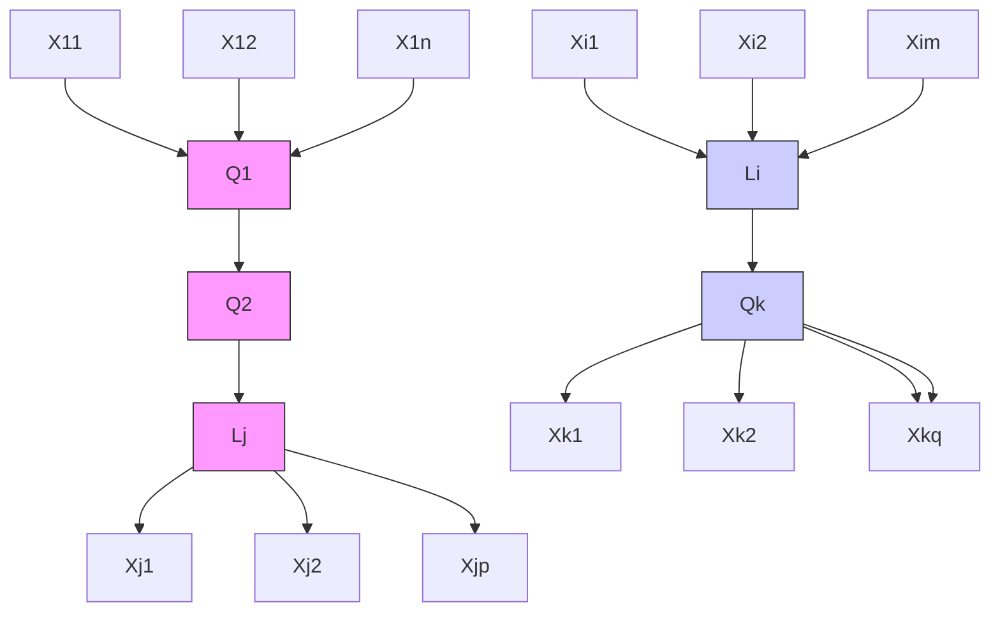

The simpler model $M _ { 0 }$ is constructed so that there is a complete graph among the variables in Q (it does not matter which complete graph) and there is an edge from each variable in Q both to $L _ { \mathrm { i } }$ and to $L _ { j } ,$ but no edge from $L _ { i }$ to $L _ { j } .$ . (See figure 12.18.) The model $M _ { 1 }$ is the same as $M _ { 0 } ,$ , except that it also includes the edge $L _ { i } \to L _ { j }$ . The models can be 	---
-
-
 $\chi ^ { 2 }$ --
-
-
-


- $\chi ^ { 2 }$ distribution with one degree of freedom (Bollen 1989). Alternatively, one can simply estimate model $M _ { 1 }$ and perform a significance test on the parameter associated with the edge $L _ { i } \to L _ { j } .$ .

## 12.7.2 Bayesian Estimation of SEM

Maximum Likelihood (ML) estimation for Structural Equation Models has been available since the 1970s, and is now standard with statistical programs like LISREL, EQS, AMOS, and SAS Proc-Calis. Programs like LISREL (Jöreskog and Sörbom 1993) calculate the ML estimate $\theta _ { \mathrm { M I } }$ L as well as estimates of the asymptotic standard errors of each parameter estimate. Because it relies on asymptotic theory, appropriate statistical inferences for the ML estimates require a large sample size. Several robustness studies show that SEM estimators behave badly at small $n ;$ see for instance Bearden, Sharma, and Teel 1982; Boomsma 1982, 1983; Baldwin 1986; Chou, Bentler, and Satorra 1991; Hu, Bentler, and Kano 1992;Yung and Bentler 1994; and Hoogland and Boomsma 1998. Further, the distribution of likelihood-ratio fit statistics is not known for small N. These problems hold for other estimation methods as well, like generalized least squares (GLS) and weighted least squares (WLS).

Given a prior distribution over the parameters of a SEM, $p ( \theta )$ , if the likelihood function is known then joint and marginal posterior distributions, $p ( \theta )$ and $p ( \boldsymbol { \theta } | \mathbf { S } )$ (where S is the sample covariance matrix) can be numerically approximated to arbitrary precision, for any finite sample size n, with Markov Chain Monte Carlo (MCMC) methods, and in particular with a single-component Metropolis-Hastings algorithm, a specific case of which is the Gibbs sampler (Geman and Geman 1984; Chib and Greenberg 1995). Given a sample covariance matrix S, and the assumption that the variables are distributed as multivariate normal, the log-likelihood for a SEM is:

$$
\log L (\theta | \mathbf {S}) = - (n - 1) / 2 \left\{\log | \Sigma (\theta) | + \operatorname{tr} [ \mathbf {S} \Sigma^ {- 1} (\theta) ] \right\},
$$

where $\Sigma ( \theta )$ is the covariance matrix implied by the model as a function of its parameters .

The Gibbs sampler (section 12.5.5.1) is an iterative procedure that, after it has converged, renders a dependent sample from the posterior $p ( \boldsymbol { \theta } | \mathbf { S } )$ . In each iteration $m =$ $1 , . . . , M ,$ , each parameter is sampled from its posterior conditional on the current values of the other parameters, any constraints appropriate for the parameter at hand, and the sample covariance matrix S. An accessible but detailed introduction to the Gibbs sampler can be found in Casella and George 1992, and more elaborate discussions are in Gelfand and Smith 1990, Tierney 1994, and Smith and Roberts 1993. BUGS is a general purposeGibbs sampling program developed by Spiegelhalter, Thomas, Best, and Gilks that can be applied to graphical models and can be obtained from <http://www.iph.cam.ac.uk/ bugs/mainpage.html>.

Scheines, Hoijtink, and Boomsma (1999) implemented a Gibbs Sampler for linear SEM in TETRAD III, and used it to estimate the effect of low levels of Lead Exposure on the cognitive capacities (IQ) of children (Scheines 1997), and to show that the likelihood surface for SEMs with latent variables is not only nonnormal at small N, but actually multimodal (Scheines, Hoijtink, and Boomsma 1997). Here we briefly describe the Lead-IQ case and the problem of multimodality in the likelihood surface.

## 12.7.3 Lead and IQ

The description of this case is based on Scheines, Hoijtink, and Boomsma (1999), which contains additional details. In a 1985 article in Science, Needleman, Geiger, and Frank reanalyzed data they had previously collected on the effect of lead exposure on the verbal IQ score of 221 suburban children. After eliminating approximately 35 potential confounders with backward stepwise regression, they settled on regressing child’s IQ on measured lead exposure, controlling for measures of genetic factors, environmentalmeasured lead exposure, controlling for fi ve measures of genetic factors, environmental stimulation, and physical factors that might compromise the child’s cognitive endowment. Using the Build Module in TETRAD II (Scheines et al. 1994), Scheines, Hoijtink, and Boomsma were able to eliminate all the physical factor variables with almost no predictive loss.13 The final set of variables they used are as follows:14

ciq the child’s verbal IQ score

lead the measured concentration of lead in the child’s baby teeth

med the mother’s level of education, in years

piq the parent’s IQ scores

Standardizing all the measured variables (which we do throughout this analysis), the regression solution is as follows, with t-statistics in parentheses:

$$
c \hat {i} q = -. 1 7 7 \text {   lead } +. 2 5 1 \text {   med } +. 2 5 3 \text {   piq }.
$$

(2.89) (3.50)

All coefficients are significant at 0.05, $\mathrm { R } ^ { 2 } = . 2 4 3$ , and the estimates are very close to those obtained by including the physical factor variables (see Scheines 1997).

As Klepper (1988) points out, however, the measured regressor variables are really proxies that almost surely contain substantial measurement error. Although an errors-inall-variables SEM explicitly modeling the regressor variables as latents as in figure 12.19 seems a more reasonable specification, unless the amount of measurement error for each regressor is known precisely, this model is underidentified.

Several strategies have been discussed for handling models of this type and underidentified models in general. One is instrumental variable estimation (Bollen 1989), another is a sensitivity analysis (Greene and Ernhart 1993) and still another is to bound parameters rather than produce a point estimate for them (Klepper and Leamer 1984). An additional strategy, made possible by the Gibbs sampler, is Bayesian estimation.

> Figure 12.19 An errors-in-variables model for the lead exposure and IQ

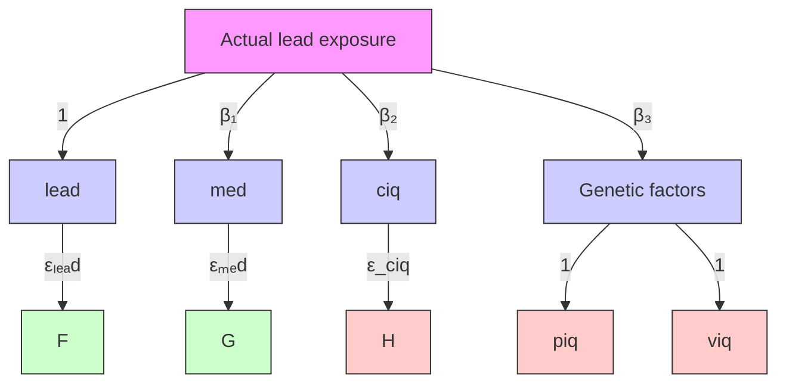

If we standardize the measured variables in the model shown in figure 12.19, then the amount of measurement error for lead, which measures Actual Lead Exposure, and for med, which measures Environmental Stimulation, and for piq, which measures Genetic factors, is parameterized by $\mathrm { v a r } ( \varepsilon _ { l e a d } )$ , $\mathrm { v a r } ( \varepsilon _ { m e d } )$ , and $\mathrm { v a r } ( \varepsilon _ { p i q } )$ , respectively. Since the model implies that var(lead) = var(Actual Lead Exposure)l e $+ \mathrm { v a r } ( \varepsilon _ { l e a d } )$ , for example, and we are constraining var(lead) to unity, then if we were to set $\mathrm { v a r } ( \varepsilon _ { l e a d } ) = 0 . 2 5$ , we would be asserting that 25% of the variance of measured lead comes from measurement error, while 75% comes from Actual Lead Exposure. In this case, and many others like it, therel e is reasonable prior information about the amount of measurement error present, but it is not specific enough to assign a unique value to the parameters associated with measurement error. Needleman pioneered a technique of inferring cumulative lead exposure from measures of the accumulated lead in a child’s baby teeth. In Needleman’s view,14 between 0% and 40% of the variance in Needleman’s proxy is probably from15 measurement error, with 20% a conservative best guess. For the measures of environmental stimulation and genetic factors, he is less confident, so guesses that between 0% and 60% of the variance in med and piq is from measurement error, with 30% his best guess.

Using a normal prior distribution truncated by removing below 0 values for the measurement error parameters, and flat prior elsewhere, Scheines, Hoijtink, and Boomsma produced 50,000 iterations with the Gibbs sampler in TETRAD III as a sample from the posterior. The histogram in figure 12.20 shows the shape of the marginalthe posterior. The histogram in fi gure 12.20 shows the shape of the marginal posteposteriorrior over $\beta _ { 1 }$ ver 1, the crucial coefficient representing the influence of Actual Lead, the crucial coeffi cient representiong the infl uence of Actual lead exposure Exposure on on children’s $I Q$ d.

The results support Needleman’s original conclusion, but do not require the unrealistic assumption of zero measurement error. The Bayesian point estimate of the effect of Actual Lead Exposure on IQ, lead exposure $\hat { \beta } _ { \scriptscriptstyle { 1 , E A P } }$ is –0.215, and since the central 95% region of its marginal posterior lies between –0.420 and –0.038, we conclude that exposure to environmental lead is indeed deleterious conditional on this model and our prior uncertainty as specified.

## 12.8 Applications

The practical value of the methods of search and prediction we have described comes from their use in applied sciences for classification, for forecasting, for predicting the effects of interventions, and for reconstructing causal relations independently known by other means. Chapter 5, chapter 8, and section 12.7.3 give some examples, and in this final section we will review a number of other studies conducted since 1993. We do not consider applications of Bayesian networks which are not generated by search, nor do we consider any nonconstraint-based search applications.

## 12.8.1 College Dropouts

Druzdzel and Glymour (1999) used the U.S. News and World Report database on American colleges and universities for 1992 and 1993 to investigate policies for lowering dropout rates. Using the TETRAD II program, they found that the average percentile score of the freshman class on ACT or SAT examinations is a “controlling” variable, analogous to the role of pH in the study of Spartina grass in chapter 8. That is, other variables in the database are independent of dropout rate conditional on average test scores of the entering class. The independence held quite closely in 1992, and less closely in 1993. (Regression predicted that other variables in the database directly influence dropout rate in both years.) Of course, this relation is not causal—SAT scores are a proxy for whatever background, resources and skills enable students to find their first year of college to be satisfactory.

The study was conducted at the request of the provost of Carnegie Mellon University, an institution with a history of high dropout rates in its freshman classes in the 1980s and early 1990s. Glymour and Druzdzel reported that the university could reduce its dropout rate by increasing the average SAT scores of the freshman class, but proposed no mechanism to do so. Beginning with the class of 1994, the university changed its formula for awarding scholarships, and received a larger number of applicants allowing for more selectivity, and there was a resulting increase in mean SAT scores of the entering class in that year and every succeeding one. In every year except one (1997) the dropout rate of the freshman class declined from the rate in the preceding year. The direction of the change is in accordance with the predictions of the Glymour and Druzdzel model, but they did not compare the quantitative prediction of the model with subsequent events at Carnegie Mellon University. Other unknown factors may also have affected the dropout rate.

## 12.8.2 In Flight Recalibration of a Mass Spectrometer Aboard an Earth Satellite

The Swedish Freja satellite carried a number of instruments to study the composition of the lower magnetosphere and upper ionosphere. One of these instruments, a three dimensional ion composition spectrometer (TICS) is essentially a mass spectrometer designed to measure hydrogen and oxygen ions and the two ions of helium. The instrument had 32 distinct detection channels, and calibration required matching signals at a particular channel with particular ion species. The correct matching depends on the incident energy of the ions, which varies within and between orbits. Unfortunately, the instrument was miscalibrated before launch, and two kinds of errors resulted: TICS values for the relative frequencies of the various species differed widely from their relative frequencies calculated theoretically from data from another instrument (a plasma detector); and the densities of ions according to TICS were a quarter to a fifth of the densities calculated from the plasma detector. Working at the University of Umea and the Swedish Institute for Space Physics, Waldemark and Norqvist (1999) recalibrated the instrument after launch using TETRAD II, principal components, and neural networks with backpropagation.

Ideally, different ions would be recorded at different channels, and there would be no leakage of signal from one channel to others spatially close to it. The correct causal description would then have four latent variables, one for each species, with directed edges from each latent into a set of channels for that species. If the sources are uncorrelated, in that ideal case, an analysis of the correlations of the 32 channel signals should yield four cliques, one for each distinct ion source. A TETRAD II analysis instead found two clusters of channels, with a few channels connected to both clusters. Principal components also gave a two factor model. The physical significance is that, at most orbits, the instrument cannot distinguish between helium and hydrogen ions (although for data from special orbits TETRAD II found a distinct cluster of channels for helium) because there is leakage between channels and because of instrument errors in determining physical locations on the detector. The clusterings differed with different energy levels.

Waldemark and Norqvist then used backpropagation in a neural network to find the channels that worked best for hydrogen and helium ions as against oxygen ions over a range of energies. The differences between the recalibrated TICS relative frequencies and those theoretically calculated from the plasma detector were reduced by half and the sensitivity of the instrument was increased considerably.

## 12.8.3 Economic Analysis and Forecasting

Bessler and his collaborators (Guven and Bessler 1997; Akleman and Bessler 1998;Bessler his collaborators (Guven and Bessler, 1997; Akleman and Bessler, 1998; Akleman et al. 1998; Loper and Bessler 1999) have applied the PC and FCI algorithmsAkleman al., 1998) have applied the PC and FCI algorithms and modifi cations of them and modifications of them to a number of econometric data sets. In a study of theto a number of econometric data sets. In a study of the dependency of corn exports on dependency of corn exports on exchange rates, Akleman et al. found that graphicalexchange rates, Akleman et al. found that graphical methods produced better forecasts methods produced better forecasts than did a search procedure (Hsiao search) widelythan did a search procedure (Hsiao search) widely used in econometric forecasting. They used in econometric forecasting. They have also used the techniques to study the relationhave also used the techniques to study the relation between farm and retail meat prices, between farm and retail meat prices, and, most recently, Loper and Bessler have used theand, most recently, Loper and Bessler have used the methods on international data on methods on international data on GNP increases and the size of the agricultGNP increases and the size of the agricultural sector in developing nations.

## 12.8.4 Comparing Machine and Expert Causal Judgment in Medicine

12.8.4 Comparing Machine and Expert Causal Judgment in MedicineIdeal tests of the usefulness of search algorithms in domains such as medicine and Ideal tests of the usefulness of search algorithms in domains such as medicine andepidemiology would compare predictions obtained by applying the algorithms to well epidemiology would compare predictions obtained by applying the algorithms to welldesigned observational databases with the outcomes of randomized clinical trials. designed observational databases with the outcomes of randomized clinical trials.Unfortunately, because of the rarity of adequate observational data sets paired with Unfortunately, because of the rarity of adequate observational data sets paired withappropriate randomized clinical trials, and the inaccessibility of data, to our knowledge appropriate randomized clinical trials, and the inaccessibility of data, to our knowledgeno such comparisons have been made. A second best alternative is to compare predictions no such comparisons have been made. A second best alternative is to compare predictionsfrom observational data with human expert judgment. Cooper and Spirtes (1998) from observational data with human expert judgment. Cooper and Spirtes (1998)compared predictions from a simplified (but correct) algorithm applied to a database on compared predictions from a simplified (but correct) algorithm applied to a database onhospitalized pneumonia patients with the judgments of physicians. There studies shows hospitalized pneumonia patients with the judgments of physicians. There studies showssome of the difficulties of this sort of test, not least because of the considerable variation some of the difficulties of this sort of test, not least because of the considerable variationin expert medical judgment of causal relations, and because of the difficulty of in expert medical appropriate controls.

Recall that a measured variable V is exogenous in a causal DAG if there is no arrow directed into it. Assume that there is no causal relation between the sampling mechanism and the measured variables (i.e., there is no selection bias). Then the following theorem follows simply from Cooper (1997) and Spirtes et al. (1995).

## THEOREM 12.8.1: Assuming the Causal Markov Condition, if

- • E is exogenous, and
- • each causal DAG containing the variables ${ < } E , A , B { > }$ in which E is exogenous has a nonzero prior probability,
- • the prior probability of the parameters of each DAG is absolutely continuous with the BDe metric (Heckerman et al. 1994),
- • $E  A  B$ has the highest posterior probability among all DAGs containing the variables ${ < } E , A , B { > }$ in which E is exogenous,

then with probability 1 in the large sample limit, in the true causal DAG, A is an ancestor of B (i.e., A is a cause of B) and there are no latent causes (i.e., unmeasured confounders) of A and B.

This result justifies a simple algorithm for causal inference with background knowledge, the Instrumental Variable (IV) algorithm. The IV algorithm takes as input background knowledge about which variables are exogenous, and a database consisting of patient records. An exogenous variable is also called an instrumental variable. The algorithm outputs a list of causal conclusions of the form “A causes $B . ^ { \prime \prime }$ The algorithm consists of the following steps:

- 1. Select a subset of variables E that are known to be exogenous. In the case of the pneumonia data (see below), the exogenous variables we used were race, age, and gender.
- 2. For each vertex E in E, search for measured variables A and B such that A is highly dependent on E, B is highly dependent on A, and E is independent of B given A. In the case of the data, we defined “highly dependent” to mean that the p value of thep value $g ^ { 2 }$ statistic measuring the dependence of discrete variables was less than 0.01, and $^ { 6 6 } E$ is independent of B given $A ^ { \prime \prime }$ means that the p value of the $g ^ { 2 }$ statistic measuring the conditional dependence of E and B given A is greater than 0.5.
- 3. For each triple of vertices ${ < } E , A , B { > }$ selected in step 2, for each DAG G that can be constructed out of the triple in which E is exogenous, calculate the posterior probability of G. If no DAG has a higher posterior probability than the DAG $E  A  B$ then output $^ { 6 6 } A$ causes B.”

Cooper and Spirtes assume each DAG compatible with the exogeneity of E has an equal prior probability. For each DAG, the prior probability over the parameters is the BDe prior described in Heckerman et al. 1994. The IV algorithm was tested on a pneumonia database of community acquired pneumonia patients (see Fine 1997 for details), which is called the pneumonia PORT database. Based on chart review, hundreds of data items were collected for each of the 2287 patients in the database. The causal conclusions of the IV algorithm applied to the database are shown in table 12.4.

A physician familiar with the pneumonia database but not with the algorithm was presented with a set of pairs of variables, some output by the algorithm as bearing a cause-effect relation to each other, and some chosen at random; the order of the pairs of variables was listed randomly. The physician was asked to classify each pair of variables into one of three classes: “Confident that A does cause B,” “Don’t know whether A causes B,” or “Confident that A does not cause B.” The results were that for all 10 pairs of variables suggested by the IV algorithm, the physician judge was confident that the relationship was cause and effect. For the randomly chosen pairs of variables, he wasrelationship was cause and effect. (One pair of variables suggested by the IV algorithm confident that the relationship between 5 of the 22 pairs was cause and effect; he waswhich are defi nitionally related is not shown in Table 12.4) For the randomly chosen confident that 10 were not cause and effect; and in 7 cases he was not sure. Thepairs of variables, he was confi dent that 10 were not cause and effect; and in 7 cases he hypothesis that the algorithm’s decision that a relationship is causal is independent of thewas not sure. The hypothesis that the algorithm’s decision that a relationship is causal is physician’s is rejected by Fisher’s exact test (p = .0002).independent of the physician’s is rejected by Fisher’s exact test (p = .0002).

A second test used five physicians who regularly see pneumonia patients as part of their practice. Given a series of variable pairs and asked to judge whether the pairs were causally related, the physicians showed poor agreement across raters. To control as much as possible for the fact that the pairs selected by the IV algorithm were very highly correlated, the variable pairs selected by the IV algorithm were interspersed with other variable pairs that were also highly correlated. When the pooled judgments of the physicians were used in a test similar to the first, the hypothesis of independence (of the algorithm’s causal claims and the pooled physician’s claims) could not be rejected.

However, the results obtained did suggest some obvious improvements to the IV algorithm. Among the pairs selected by the IV algorithm, the 5 pairs that the physicians were most dubious about all involved current employment status as a cause. There are a number of obviously relevant features that the more dubious pairs output by the IV algorithm have in common.

**Table 12.4**

<table><tr><td>Instrument</td><td>Cause</td><td>Effect</td><td>Score</td></tr><tr><td>age</td><td>coronary artery disease</td><td>myocardial infarction</td><td>18.41</td></tr><tr><td>age</td><td>current employment status</td><td>intravenous drug use (non-prescribed)</td><td>14.52</td></tr><tr><td>age</td><td>nausea</td><td>vomiting</td><td>9.28</td></tr><tr><td>gender</td><td># of comorbid conditions</td><td>dire outcome (i.e., mortality or serious complications</td><td>8.47</td></tr><tr><td>gender</td><td>sputum</td><td>cough</td><td>7.99</td></tr><tr><td>age</td><td>current employment status</td><td>chronic obstructive pulmonary disease</td><td>7.55</td></tr><tr><td>age</td><td>current employment status</td><td>prior hospitalization within 30 days</td><td>4.87</td></tr><tr><td>age</td><td>current employment status</td><td>a history of chronic obstructive pulmonary disease requiring prior ICU admission</td><td>4.42</td></tr><tr><td>age</td><td>current employment status</td><td>days since last hospital discharge</td><td>0.56</td></tr></table>

- • 4 of the 5 dubious causal relations have the 4 lowest scores.
- • If the Bayes Information Criterion were used to score the models rather than the posterior probability, 2 of the dubious causal relations (the 2 with the lowest scores) would not have been suggested by the algorithm at all.
- • All of the dubious effects contained categories with relatively few members, in contrast with the effects chosen by the IV algorithm that the doctors agreed with.
- • When conducting statistical tests of the association of the cause with the effect, on four of the five dubious effects the statistical program we used issued a warning that the chi-squared test of independence may not be appropriate because the expected value of some cells was less than 5. It did not issue this warning on any of the 4 nondubious effects.

These features suggest that the performance of the IV algorithm could be improved by eliminating pairs of variables for which the test of independence is dubious because some expected cell sizes are less than 5, and/or by raising the score threshold of what is considered a positive result for the algorithm.

## 12.8.5 Infant Mortality

Mani and Cooper (1999) used an algorithm related to the IV algorithm to look for causal relations in a random sample of size 41,155 form the U.S. Linked Birth/Infant Death database. They selected a set of 85 clinically interesting, nonredundant variables to examine. The LCD2 algorithm searches for triples of variables with causal relations $W $ $X  Y ,$ where W is known from background knowledge to be exogenous. Given a set of exogenous variables W, the algorithm outputs “X causes $Y ^ { \prime }$ if there is an exogenous variable W such that W and Y are dependent, W and X are dependent, W and X are dependent given Y, X and Y are dependent, X and Y are dependent given W, and W and Y are independent given X. Assuming Causal Markov, Causal Faithfulness, the correctness of the independence tests, and the exogeneity of W, it can be shown that the algorithm is correct. It is not complete because there are cases where, using higher order conditional independence tests, it may be possible to determine that X causes Y, but the $X  Y$ pair will not be in the algorithm’s output. However, it has advantages both in terms of reliability at small sample sizes and speed over more complete searches.

The exogenous variables were race of the mother and child gender. The algorithm found 9 causal relations: Maternal education → Delivery conductor, Maternal education → Maternal age, Marital status mother → Delivery conductor, Marital status mother → Maternal age, Prenatal care start → Delivery facility, Prenatal care start → Delivery conductor, Prenatal care adequacy → Prenatal care start, Birth weight → Infant outcome one year, Birth weight → Delivery conductor. In all 9 cases, the exogenous variable was Maternal race. The meanings of the variables are described in table 12.5.

The relationship between Prenatal care adequacy and Prenatal care start is actually definitional, because Prenatal care adequacy is defined (in part) in terms of Prenatal care start. The other 8 causal relations all appear plausible. Maternal education → Delivery conductor is plausible because education can have an important effect on access to health care. Birth weight → Infant outcome one year is a well-documented causal relationship. The authors plan to ask OB/GYN clinicians to judge the plausibility of each member of a list of causal relations, including the 9 suggested by the algorithm intermixed with randomly generated variable pairs.

**Table 12.5**

<table><tr><td>Variable Name</td><td>Variable meaning</td></tr><tr><td>Maternal education</td><td>Years of education of the mother</td></tr><tr><td>Delivery conductor</td><td>Care giver conducting delivery</td></tr><tr><td>Maternal age</td><td>Age of mother at delivery</td></tr><tr><td>Marital status mother</td><td>Marital status of the mother</td></tr><tr><td>Prenatal care start</td><td>Trimester prenatal care began</td></tr><tr><td>Delivery facility</td><td>Place or facility of delivery</td></tr><tr><td>Prenatal care adequacy</td><td>Adequacy of care</td></tr><tr><td>Birth weight</td><td>Weight of infant at birth</td></tr><tr><td>Infant outcome one year</td><td>If the child was alive on first birthday</td></tr></table>

## 12.8.6 Biological Applications

Experimental research is difficult in ecology, and explanations founded on observational data are common, although sample sizes are often quite small. Shipley has applied directed graph search techniques, with a number of innovations, to ecological studies and to plant physiology. Shipley (1995) and his collaborators (Pyankov et al. 1999) have applied the techniques to study the causes of variation in leaf mass and area among related species, and causes of variation in relative growth between species (McKenna and Shipley 1999) He has developed a number of new search methods, including a bootstrapping technique for small samples (Shipley 1997) that generalizes the bootstrapping idea in the Weisberg example of chapter 8, and is discussed in section 12.5.10 (see also Friedman 1999b), and performs much better on small samples than the PC algorithm. Shipley (1999) has also provided an algorithm for obtaining, from any directed acyclic graph without latent variables, a set of independent partial correlation constraints; the output of the procedure can be used to test entire models by chi-square. He is preparing a monograph on structural equation models and search methods for causal explanations in biology.

## 12.8.7 Automated Mineral Identification from Near Infra-red Spectra

For many reasons, including power demands and limits on available antenna time, it would be valuable to have extra-planetary robots do some scientific analysis autonomously, on-board, rather than transmit all data to Earth for analysis. Visible and near infrared spectrometry has long been a standard tool in the identification of chemical species and minerals, and very light weight instruments have recently become available. An issue is whether fast computational procedures can be found that can identify minerals from rock and soil targets in situ from reflectance spectra, with a reliability comparable to that of expert human geophysical spectroscopists. The identification of water, hydrates and carbonates is of particular interest. In recent work for NASA on carbonate recognition, DeFazio et al. (1999) compared a simplified version of the PC algorithm with regression, with an expert system, and with a human expert.

Samples of spectra from rocks and soils in situ near Silver Lake, California were obtained from NASA field trials of a robot in the winter of 1999. Paul Gazis of NASA Ames Research Center provided an automated test for excess noise (owing to instrument error or atmospheric effects), and after that test was applied, 21 samples suitable for analysis were obtained. Each sample was examined in the field by expert geologists, and many of the samples were tested chemically and by analysis of transmitted light through thin slices. 13 of the samples were judged to be carbonates and eight were judged to be non-carbonates

The spectra were then given to a simplified version of the PC algorithm (essentially the PC algorithm in this book, but ignoring associations among causes), a regression algorithm from MiniTab, and an expert system modeled on a human expert spectroscopist. The PC algorithm and regression used a reference library of spectra from the Jet Propulsion Laboratory. Each procedure was tuned to give the best possible separation of carbonates from noncarbonates. Thirteen of the samples actually contained carbonates, according to the field geologists. The PC algorithm identified 12 of the 13 carbonates, and misidentified no non-carbonates. Regression identified 11 of the carbonate samples, and misidentified 4 noncarbonates. The expert system identified 9 of the carbonates and misidentified no noncarbonates.

As a further test, the PC algorithm, regression and the human expert (rather than the program simulating him) attempted to identify samples with carbonate composiiton from a library of spectra from Johns Hopkins University of 192 rock and soil samples, 91 of which actually contained some carbonate minerals. In addition, a commercial program, Model 1, was given the same task. The tuning of the PC algorithm and regression was the same as that used in the previous experiment. The PC algorithm identified 38 samples with carbonates, and misclassified 3 non-carbonate samples; the human expert correctly identified 24 carbonate samples and misidentified 1; regression claimed 154 of the samples contained carbonate, including 75 of the samples actually with carbonate and 79 of the samples without carbonate. The Model 1 program found 27 actual carbonate samples of 41 samples it claimed were carbonates.

Properly tuned, the simplified PC algorithm performs considerably better at this task than does regression, a human expert, and a commercial program, and requires minimal computational resources.

## 12.9 Foundational Issues and Relations to Other Disciplines

There is a voluminous literature on such questions as whether counterfactual conditionals have truth values (or merely acceptability conditions), what the truth conditions are, whether they can be meaningfully nested, etc. (e.g., Lewis 1973). Various representative attempts at definitions of causality, and the relationship between causation and counterfactuals, are explored in Sosa and Tooley (1993). Heckerman and Shachter (1995) attempt to define causal relations in terms of decision theory. Shafer (1996) explicates various related concepts of causality in terms of event trees.

There have been several attempts to find models of belief change which, like deductive logic are qualitative and deductively closed, but like probability can be held with varying degrees of firmness and can be retracted. Alchourrón et al. (1985) propose a set of axioms appropriate for revising a data-base in the face of new evidence (belief revision), while Katsumo and Mendelson (1991) propose a system for revising a database in the face of an external intervention (belief update). Goldszmidt and Pearl (1992) propose a system $Z ^ { + }$ for both belief revision and belief update that incorporates a qualitative version of the Causal Markov Condition. Formal learning theory also studies learning without probabilities. Kelly (1996) considers the problem of learning causes in the long run without using probabilities.

Iwasaki and Simon (1994) describe graphical representations of dynamic equations that are expressed as differential equations, and hence often involve both a variable and its differential. They do not relate the graphical representation to any conditional independence relations or statistical model.

Matuš and Studený have shown that there are 18300 sets of conditional independence relations among four variables that can be realized by some probability distribution, which is far larger than the number of different subsets of conditional independence relations that can be represented by graphical models. Matuš and Studený (1995) and Matuš (1995) investigate properties common to all of the realizeable sets of conditional independence relations among four variables. Studený (1992) shows that there is no finite complete characterization of probabilistic conditional independence.