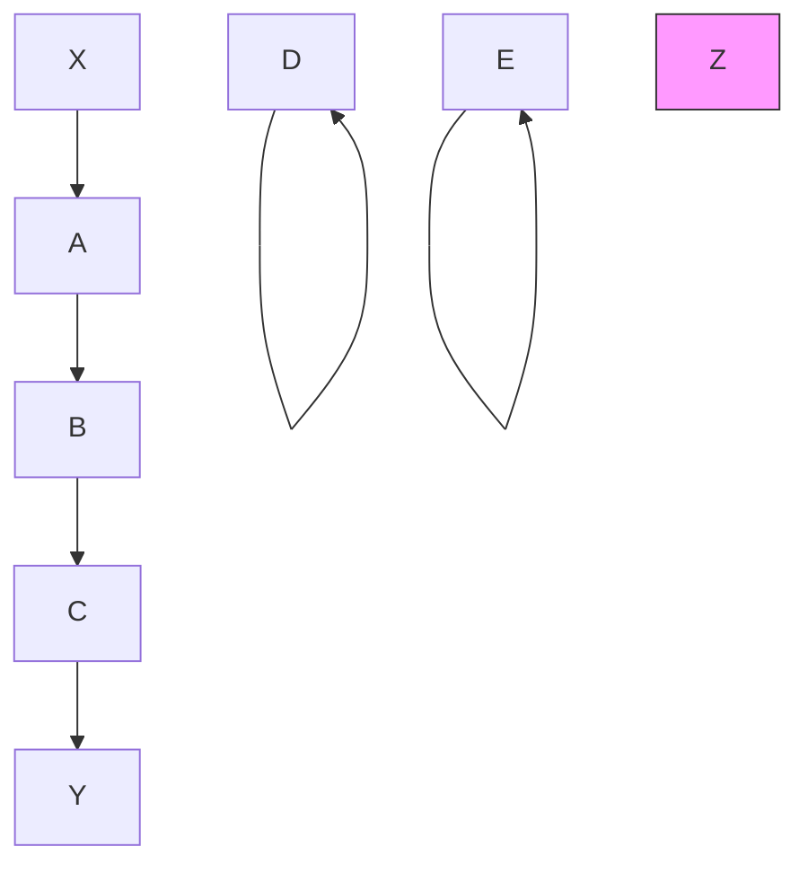
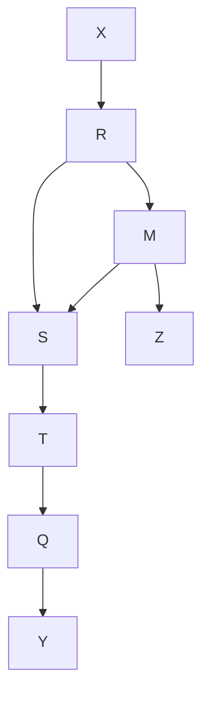
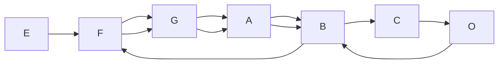
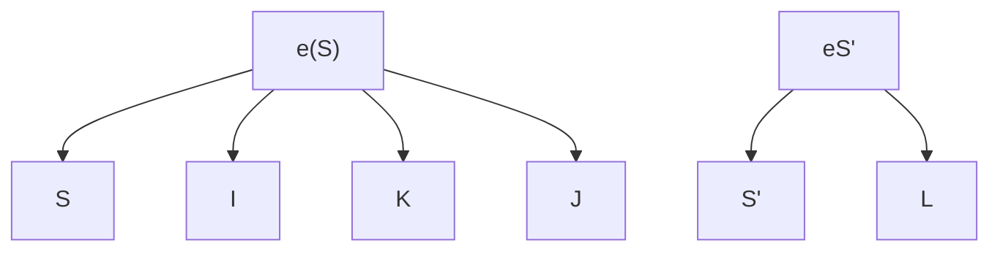
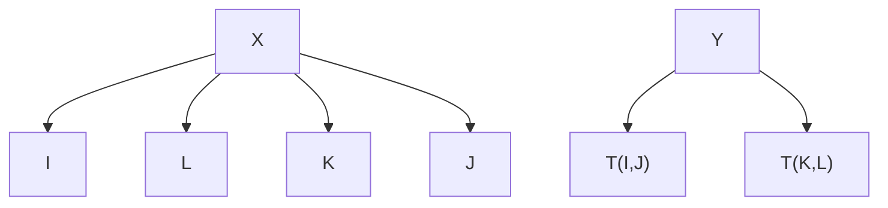
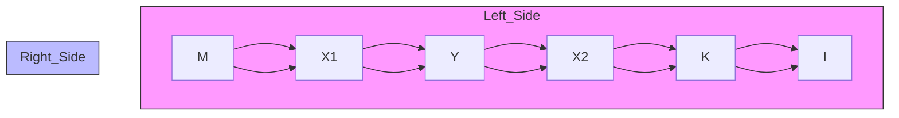
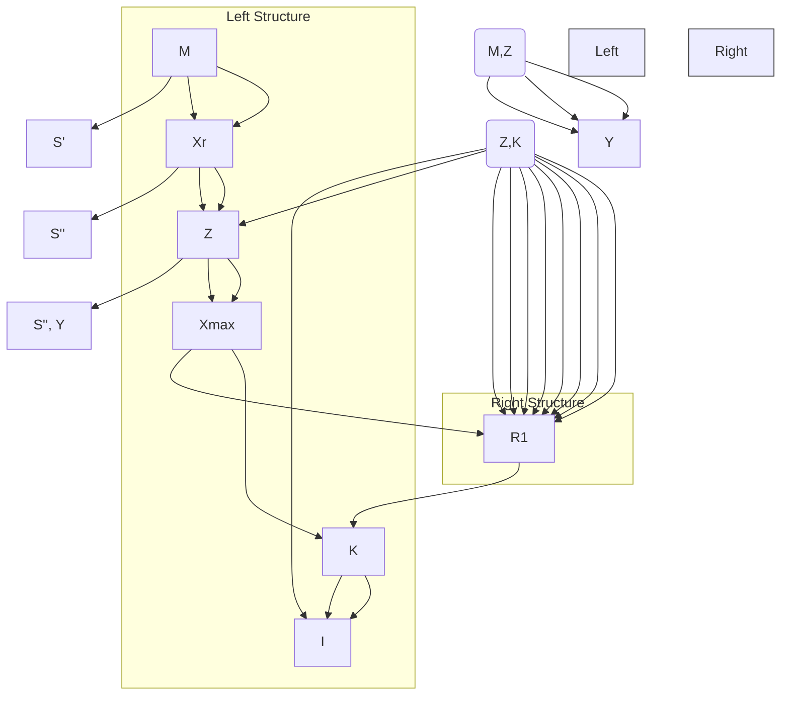
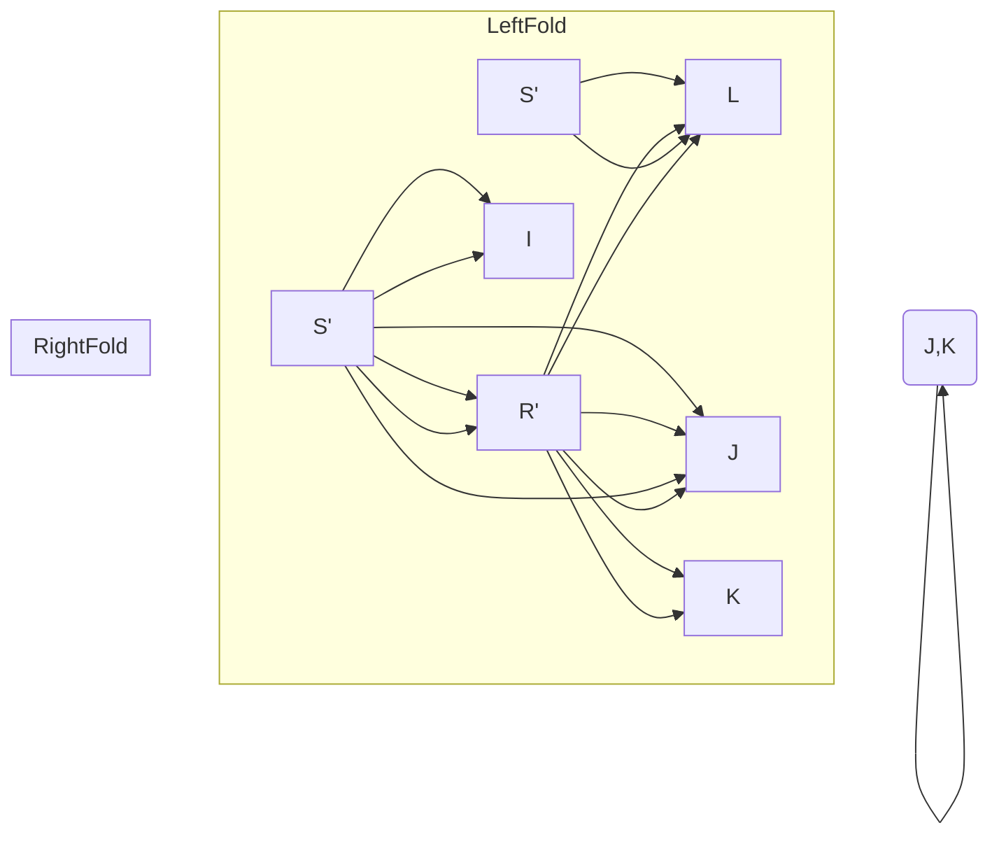
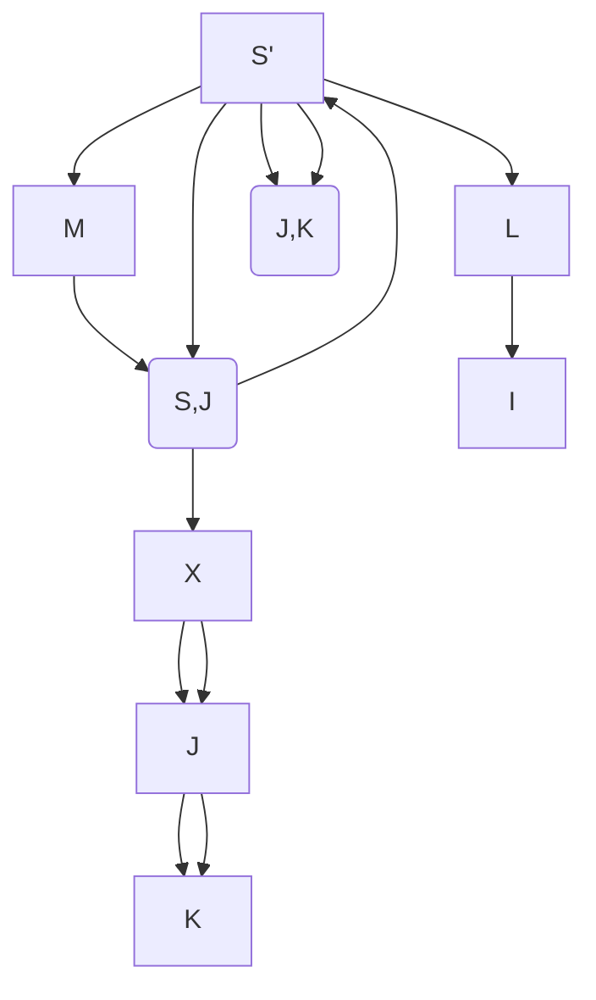
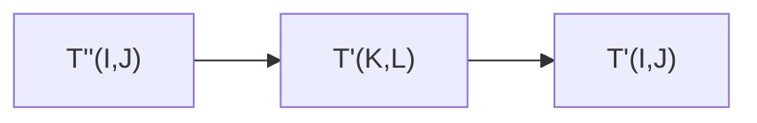

# Proofs of Theorems

We will adopt the following notational conventions. “w.l.g.” abbreviates “without loss of generality,” “r.h.s.” abbreviates “right hand side,” and “l.h.s.” abbreviates “left hand side.” Any sum over the empty set is equal to 0 and any product over the empty set is 1. R(I,J) represents a directed path from I to J. If U is an undirected path from A to B, and X and Y occur on U, then we will denote the subpath of U between X and Y as U(X,Y). T(I,J) represents a trek in T(I,J). The definitions of all technical terms in this chapter that a1have not been defined in chapters 2 or 3 have been placed in a glossary following thehave not been defi ned in chapters 2 or 3 have been placed in a glossary following the chapter.chapter.

## 13.1 Theorem 2.1

THEOREM 2.1: If P(V) is a positive distribution, then for any ordering of the variables in V, P satisfies the Markov and Minimality conditions for the directed independence graph of P(V) for that ordering.

Proof. See Pearl 1988.

## 13.2 Theorem 3.1

THEOREM 3.1: If S is an LCT, and $S ^ { \prime }$ is a random coefficient LCT with the same directed acyclic graph, the same set of noncoefficient random variables, the same variances for each noncoefficient exogenous variable, and for each random coefficient $\boldsymbol { a } _ { \mathit { I J } } ^ { \prime }$ in $S ^ { \prime } , E ( a _ { I J } ^ { \prime } )$ $= a _ { I J }$ in S, then a partial correlation is equal to zero in S if and only if it is equal to 0 in S in S, then a partial correlation is equal to 0 in S if and only if it is equal to 0 in $S ^ { \prime }$

Let a linear causal theory be (LCT) be $< < \mathbf { R , M , E } > , ( \varOmega , f , P )$ , EQ,L,Err> where

- (i) $( \Omega , f , P )$ is a probability space, where is the sample space, f is a sigma-field over $\varOmega ,$ and P is a probability distribution over f.
- (ii) $< \mathbf { R , M , E } >$ is a directed acyclic graph. R is a set of random variables over $( \Omega , f , P )$ .
- (iii) The variables in R have a joint distribution. Every variable in R has a nonzero variance. E is a set of directed edges between variables in R. (M is the set of marks that occur in a directed graph, that is, {EM, >}.
- (iv) EQ is a consistent set of independent homogeneous linear equations in random variables in R. For each $X _ { i }$ in R of positive indegree there is an equation in EQ of the form

$$
X _ {i} = \sum_ {X _ {j} \in \mathbf {P a r e n t s} (X _ {i})} a _ {i j} X _ {j}
$$

where each $a _ { i j }$ is a nonzero real number and each $X _ { i }$ is in R. This implies that each vertex $X _ { i }$ in R of positive indegree can be expressed as a linear function of all and only its parents. There are no other equations in EQ. A nonzero value of $a _ { i j }$ is the equation coefficient of $X _ { j }$ in the equation for $X _ { i } .$

- (v) If vertices (random variables) $X _ { i }$ and $X _ { j }$ are exogenous, then $X _ { i }$ and $X _ { j }$ are pairwise statistically independent.
- (vi) L is a function with domain E such that for each e in $E , L ( e ) = a _ { i j }$ iff $\mathbf { h e a d } ( e ) = X _ { j }$ and tai $\mathfrak { l } ( e ) = X _ { j } . L ( e )$ will be called the label of e. By extension, the product of labels of edges in any acyclic undirected path U will be denoted by $L ( U )$ , and $L ( U )$ will be called the label of U. The label of an empty path is fixed at 1.
- (vii) There is a subset of S of R called the error variables, each of indegree 0 and outdegree 1. For every $X _ { i }$ in R of indegree $\neq 0$ there is exactly one error variable with an edge into $X _ { i } .$ . We assume that the partial correlations of all orders involving only nonerror variables are defined.

Note that the variance of any endogenous variable I conditional on any set of variables that does not contain the error variable of I is not equal to zero.

The definition of a random coefficient linear causal theory is the same as that of a linear causal theory except that each linear coefficient is a random variable independent of the set of all other random variables in the model.

A linear causal form is an unestimated LCT in which the linear coefficients and the variances of the exogenous variables are real variables instead of constants. This entails that an edge label in an LCF is a real variable instead of a constant (except that the label of an edge from an error variable is fixed at one.) More formally, let a linear causal form (LCF) be $< < \mathbf { R , M , E } >$ , C, V, EQ,L,Err> where

(i) $< \mathbf { R , M , E } >$ is a directed acyclic graph. Err is a subset of R called the error variables. Each error variable is of indegree 0 and outdegree 1. For every $X _ { i }$ in R of indegree $\neq 0$ there is exactly one error variable with an edge into $X _ { i } .$ .

(ii) $c _ { i j }$ is a unique real variable associated with an edge from $X _ { j }$ to $X _ { i } ,$ , and C is the set of $c _ { i j } . \mathbf { V }$ is the set of variables $\boldsymbol { \sigma } _ { i } ^ { \scriptscriptstyle < }$ , where $X _ { i }$ is an exogenous variable in $< \mathbf { R , M , E } >$ and $\boldsymbol { \sigma } _ { i } ^ { \scriptscriptstyle 2 }$ is a variable that ranges over the positive real numbers.

(iii) L is a function with domain E such that for each e in $E , L ( e ) = c _ { i j }$ iff $h e a d ( e ) = X _ { j }$ and $t a i l ( e ) = X _ { i } . ~ L ( e )$ will be called the label of e. By extension, the product of labels of edges in any acyclic undirected path U will be denoted by $L ( U )$ , and $L ( U )$ will be called the label of U. The label of an empty path is fixed at 1.

iv. EQ is a consistent set of independent homogeneous linear equationals in variables in R. For each $X _ { i }$ in R of positive indegree there is an equation in EQ of the form

$$
X _ {i} = \sum_ {X _ {j} \in \mathbf {P a r e n t s} (X _ {i})} c _ {i j} X _ {j}
$$

where each $c _ { i j }$ is a real variable in C and each $X _ { i }$ is in R. There are no other equations in EQ. $c _ { i j }$ is the equation coefficient of $X _ { j }$ in the equation for $X _ { i } .$

An LCT S is an instance of an LCF F if and only if the directed acyclic graph of S is isomorphic to the directed acyclic graph of F. In an LCF, a quantity (e.g., a covariance) X is equivalent to a polynomial in the coefficients and variances of exogenous variables if and only if for each LCF $F = < < { \bf R , M , E } >$ , C, V, EQ,L,Err> and in every LCT $S =$ $< < \mathbf { R } ^ { \prime } , \mathbf { M } ^ { \prime } , \mathbf { E } ^ { \prime } > , ( \varOmega , f , P )$ , EQ ,L’,Err’> that is an instance of $F ,$ there is a polynomial in the variables in C and V such that X is equal to the result of substituting the linear coefficients of S in as values for the corresponding variables in $\mathbf { C } ,$ , and the variances of the exogenous variables in S as values for the corresponding variables in V.

In an LCT or LCF S , a variable $X _ { i }$ is independent iff $X _ { i }$ has zero indegree (i.e., there are no edges directed into it); otherwise it is dependent. Note that the property of independence is completely distinct from the relation of statistical independence. The context will make clear in which of these senses the term is used. For a directed acyclic graph $G ,$ Ind is the set of independent variables in G. Given a directed acyclic graph $G ,$ $\mathbf { D } ( X _ { i } , \ X _ { j } )$ is the set of all directed paths from $X _ { i }$ to $X _ { j }$ . In an $\mathrm { L C F < < R , M , E > }$ , C, V, $\mathbf { E Q } , \mathbf { L } , \mathbf { S } >$ an equation is an independent equational for a dependent variable $X _ { j }$ if and only if it is implied by EQ and the variables in R which appear on the r.h.s. are independent and occur at most once. $^ { I n d } { \bf { a } } _ { I J }$ is the coefficient of J in the independent equational for I.

LEMMA 3.1.1: In an LCF S, if J is an independent variable, then

$$
{ } ^ { I n d } a _ { I J } = \sum _ { U \in \mathbf { D } ( J , I ) } L ( U )
$$

Proof. This is a special case of Mason’s rule for calculating the “total effect” of a variable J on a variable I. See Glymour et al. 1987. ∴

The following two lemmas show how to calculate the variance of random variables and covariances between random variables in terms of the covariances between other random variables. The proofs of these lemmas can be found in Freund and Walpole 1980. We denote the covariance of I and J by $\gamma _ { I J } ,$ the variance of I by $\boldsymbol { \mathcal { O } } _ { I } ^ { 2 } ,$ the correlation of I and J by $\rho _ { I J } ,$ the partial correlation of I and J given the set H by $\gamma _ { I J . \mathbf { H } }$ , and the partial covariance of I and J given H by $\rho _ { I J . \mathbf { H } }$ . The correlation of two subscripted variables such as $X _ { i }$ and $X _ { j }$ we will write as $\rho _ { i j }$ for legibility, and similarly for partial correlations, etc.

LEMMA 3.1.2: If Q is a set of random variables with a joint probability distribution and

$$
Y = \sum_ {I \in \mathbf {Q}} a _ {Y I} I
$$

and

$$
Z = \sum_ {J \in \mathbf {Q}} a _ {Z J} J
$$

then

$$
\gamma_ {Y Z} = \sum_ {I \in \mathbf {Q}} \sum_ {J \in \mathbf {Q}} a _ {Y I} a _ {Z J} \gamma_ {I J}
$$

Lemmas 3.1.3, 3.1.5, and 3.1.7 are not used in the proof of theorem 3.1, but they are used in later theorems, and we include them here because they follow easily from the other lemmas in this section.

LEMMA 3.1.3: If Q is a set of random variables with a joint probability distribution and

$$
Y = \sum_ {I \in \mathbf {Q}} a _ {Y I} I
$$

then

$$
\sigma_ {Y} ^ {2} = \sum_ {I \in \mathbf {Q}} \sum_ {J \in \mathbf {Q}} a _ {Y I} a _ {Y J} \gamma_ {I J}
$$

In an LCF S, $\mathbf { U } _ { X }$ is the set of all independent variables that are the source of a directed path to X. (Note that if X is independent then $X \in \ \mathbf { U } _ { X }$ since there is an empty path from every vertex to itself.) In an LCF S, $\mathbf { U } _ { X Y }$ is $\mathbf { U } _ { X } \cap \mathbf { U } _ { Y }$ .

LEMMA 3.1.4: If S is an LCF,

$$
Y = \sum_ {I \in \mathbf {I n d}} ^ {I n d} a _ {Y I} I
$$

and

$$
Z = \sum_ {I \in \mathbf {I n d}} ^ {I n d} a _ {Z I} I
$$

then

$$
\gamma_ {Y Z} = \sum_ {I \in {\bf U} _ {Y Z}} ^ {I n d} a _ {Y I} ^ {I n d} a _ {Z I} \sigma_ {I} ^ {2}
$$

Proof. Ind-
----
	-
-,-- $\gamma _ { I J }$ is equal to 0 if $I \neq J ,$ - $\gamma _ { I J }$ is equal to $\sigma _ { I } ^ { 2 }$ if $I = J .$ -



--
- $\gamma _ { I J }$ into the r.h.s. of the equation for $\gamma _ { Y Z }$ in lemma 3.1.2 shows that

$$
\gamma_ {Y Z} = \sum_ {I \in \mathbf {I n d}} ^ {I n d} a _ {Y I} ^ {I n d} a _ {Z I} \sigma_ {I} ^ {2} \tag {13.1}
$$

If I is in Ind, but I is not in $\mathbf { U } _ { Y Z }$ then there is no pair of directed acyclic paths from I to Y and Z. By lemma 3.1.1, if there is no pair of directed acyclic paths from I to Y and $Z ,$ then the coefficient of I in the independent equation for either Y or $Z$ is zero. So, the only nonzero terms in equation 1 are for $I \in \mathbf { U } _ { Y Z } .$ ∴

LEMMA 3.1.5: If S is an LCF,

$$
Y = \sum_ {I \in \mathbf {I n d}} ^ {I n d} a _ {Y I} I
$$

then

$$
\sigma_ {Y} ^ {2} = \sum_ {I \in \mathbf {U} _ {Y}} ^ {I n d} a _ {Y I} ^ {2} \sigma_ {I} ^ {2}
$$

Proof. Ind-
----
	--
-,-- $\gamma _ { I J }$ is equal to 0 if $I \neq$ $J ,$ - $\gamma _ { I J }$ is equal to $\sigma _ { I } ^ { 2 }$ if $I = J .$ - 



- - 
- - $\gamma _ { I J }$ into the r.h.s. of the equation for $\sigma _ { Y } ^ { 2 }$ in lemma 3.1.1 proves that

$$
\sigma_ {Y} ^ {2} = \sum_ {I \in \mathbf {I n d}} ^ {I n d} a _ {Y I} ^ {2} \sigma_ {I} ^ {2} \tag {13.2}
$$

If I is in Ind, but I is not in $\mathbf { U } _ { Y } ,$ then there is no directed path from I to Y. It follows from lemma 3.1.1 that $a _ { Y I }$ is zero. Hence the only nonzero terms in equation 2 come from $I \in$ $\mathbf { U } _ { Y }$ . ∴

LEMMA 3.1.6: If S is an LCF,

$$
\gamma_ {I J} = \sum_ {K \in \mathbf {U} _ {I J}} \sum_ {R \in \mathbf {D} (K, I)} \sum_ {R ^ {\prime} \in \mathbf {D} (K, J)} L (R) L (R ^ {\prime}) \sigma_ {K} ^ {2}
$$

Proof. This follows immediately from lemmas 3.1.2 and 3.1.4. ∴

LEMMA 3.1.7: If S is an LCF,

$$
\sigma_ {I} ^ {2} = \sum_ {K \in \mathbf {U} _ {I}} \left(\left(\sum_ {R \in \mathbf {D} (K, L)} L (R)\right) ^ {2} \sigma_ {K} ^ {2}\right)
$$

Proof. This follows immediately from lemmas 3.1.1 and 3.1.5. ∴

THEOREM 3.1: If S is an LCT, and $S ^ { \prime }$ is a random coefficient LCT with the same directed acyclic graph, the same set of noncoefficient random variables, the same variances for each exogenous variable, and for each random coefficient $\boldsymbol { a ^ { \prime } } _ { I J }$ in S , $E ( a _ { I J } ^ { \prime } ) = a _ { I J }$ in $S ,$ , then a partial correlation is equal to zero in S if and only if it is equal to 0 into 0 in S if and only if it is equal to 0 in S'.

$$
\gamma_ {I J} = \sum_ {K \in \mathbf {U} _ {I J}} \sum_ {R \in \mathbf {D} (K, I)} \sum_ {R ^ {\prime} \in \mathbf {D} (K, J)} L (R) L (R ^ {\prime}) \sigma_ {K} ^ {2}
$$

IJThe label of a path is equal to the product of the labels of the edges and because the random coefficients are independent of each other and all the random variables that are not coefficients, it follows that

$$
E \left(\prod_ {e d g e \in U} L (e d g e)\right) = \prod_ {e d g e \in U} E (L (e d g e))
$$

Transform all of the variables so that they have mean $0 ;$ this does not affect the value of Transform all of the variaany of the covariances. In $T , \gamma _ { I J } = E ( I J )$ hey  and

$$
\begin{array}{l} E (I J) = E \left(\sum_ {H \in \mathbf {U} _ {I}} \sum_ {U \in \mathbf {D} (H, X)} \sum_ {F \in \mathbf {U} _ {J}} \sum_ {V \in \mathbf {D} (F, Y)} L (U) L (V) H F\right) = \\ \sum_ {H \in \mathbf {U} _ {I J}} \sum_ {U \in \mathbf {D} (H, X)} \sum_ {V \in \mathbf {D} (H, Y)} E (L (U) L (V) H ^ {2}) = \\ \sum_ {H \in \mathbf {U} _ {I J}} \sum_ {U \in \mathbf {D} (H, X)} \sum_ {V \in \mathbf {D} (H, Y)} E (\prod_ {e d g e \in U} L (e d g e) \prod_ {e d g e \in V} L (e d g e) H ^ {2})) = \\ \sum_ {H \in \mathbf {U} _ {I J}} \sum_ {U \in \mathbf {D} (H, X)} \sum_ {V \in \mathbf {D} (H, Y)} \prod_ {e d g e \in U} E (L (e d g e)) \prod_ {e d g e \in V} E (L (e d g e)) E (H ^ {2}) \\ \end{array}
$$

because for exogenous variables $E ( H F ) = 0$ unless $H = F$ .

By hypothesis, $E ( L ( e d g e ) )$ in $S ^ { \prime } = L ( e d g e )$ in S-0--.	
 $\gamma _ { I J }$ is the same for both random and constant coefficients. The partial correlations are a function of the covariance matrix so the partial correlations are the same in S and $S ^ { \prime } \cdot \cdot \cdot$

## 13.3 Theorem 3.2

THEOREM 3.2: Let M be an LCF with n free linear coefficients $a _ { 1 } , . . . , a _ { n }$ and k positive variances $\nu _ { 1 } , . . . , \nu _ { k } .$ k. Let. Let $M ( < u _ { 1 } , . . . , u _ { n } , u _ { n + 1 } , . . . , u _ { n + k } > )$ ) be the distributions consistent with be the distributions consistent specifying values $< u _ { 1 } , . . . , u _ { n } , \ u _ { n + 1 } , . . . , u _ { n + k } >$ for $a _ { 1 } , . . . , a _ { n }$ and $\nu _ { 1 } , . . . , \nu _ { k }$ . Let be the set of probability measures P on the space $\Re _ { n + k }$ of values of the parameters of M such that for every subset V of $\Re _ { n + k }$ k having Lebesgue measure zero, $P ( \mathbf { V } ) = 0$ . Let Q be the set of vectors of coefficient and variance values such that for all q in Q every probability distribution consistent with $M ( q )$ has a vanishing partial correlation that is not linearly implied by M. Then for all P in $P ( \mathbf { Q } ) = 0$ .

LEMMA 3.2.1: In an LCF S, $\rho _ { i j . \mathbf { X } } = 0$ is equivalent to a polynomial equation in the linear coefficients and variances of the independent variables.

Proof. We will prove more generally that a polynomial equation in partial covariances is equivalent to a polynomial equation in the linear coefficients and variances of the independent variables. If X contains n- 

- 
- - - $\rho _ { i j . \mathbf { X } }$ is a partial correlation of order n. Let the pc-order (partial covariance order) of a polynomial in partial covariances be the highest order of any partial covariance appearing in the polynomial. The proof is by induction on the pc-order of the polynomials.

Base Case: If polynomial Q is of pc-order 0, then by lemma 3.1.2, Q is equivalent to a polynomial equation in the linear coefficients and variances of the independent variables.

Induction Case: Suppose that the lemma is true for polynomials of pc-order $n { - } 1$ , and let Q be a polynomial of pc-order n. The recursion formula for partial covariances is

$$
\gamma_ {i j. \mathbf {Y} \cup r} = \gamma_ {i j. \mathbf {Y}} - \frac {\gamma_ {i r . \mathbf {Y}} \gamma_ {j r . \mathbf {Y}}}{\gamma_ {r r . \mathbf {Y}}}
$$

Form $Q ^ { \prime }$ by using this recursion formula to replace each covariance of pc-order n appearing in Q by an algebraic combination of covariances of pc-order n–1. Form $Q ^ { \prime \prime }$ by multiplying $Q ^ { \prime }$ by the lowest common denominator of all of the terms in $\begin{array} { r } { Q ^ { \prime } , } \end{array}$ producing a polynomial of pc-order n–1. By the induction hypothesis, $Q ^ { \prime \prime }$ is equivalent to a polynomial equation in the linear coefficients and variances of the independent variables. Hence, a polynomial equation in partial covariances is equivalent to a polynomial equation in the linear coefficients and variances of the independent variables.

By definition,

$$
\rho_ {i j. \mathbf {X}} = \frac {\gamma_ {i j . \mathbf {X}}}{\sqrt {\gamma_ {i i . \mathbf {X}}} \sqrt {\gamma_ {j j . \mathbf {X}}}}
$$

so $\rho _ { i j . \mathbf { X } } = 0 \ \mathrm { i f f } \ \gamma _ { i j . \mathbf { X } } = 0$ . Since the latter is a polynomial equation in partial covariances, it. is equivalent to a polynomial equation in the linear coefficients and variances of the independent variables. It follows that the former is also equivalent to a polynomial equation in the linear coefficients and variances of the independent variables. ∴

THEOREM 3.2: Let M be a linear model with directed acyclic graph G and n linear coefficients $a _ { 1 } , . . . , a _ { n }$ and k positive variances of exogenous variables $\nu _ { 1 } ~ , . . . , ~ \nu _ { k }$ . Let $M ( < u _ { 1 } , . . . , u _ { n } , u _ { n + 1 } , . . . , u _ { n + k } > )$ be the distributions consistent with specifying values $< u _ { 1 } , . . . , u _ { n } ,$ $u _ { n + 1 } , . . . , u _ { n + k } >$ for $a _ { 1 } , . . . , a _ { n }$ and $\nu _ { 1 } , \ldots , \nu _ { k }$ . Let be the set of probability measures P on the space $\Re ^ { n + k }$ of values of the parameters of M such that for every subset V of $\Re ^ { n + k }$ having Lebesgue measure zero, $P ( \mathbf { V } ) = 0$ . Let Q be the set of vectors of coefficient and variance values such that for all q in Q every probability distribution in with M(q) has a vanishing partial correlation that is not linearly implied by G. Then for all P in $P ( \mathbf { Q } ) = 0$ .

Proof. For any LCF, each partial correlation is equivalent to a polynomial in the linear coefficients and the variances of the exogenous variables: the rest of the features of the distribution have no bearing on the partial correlation. Hence for a vanishing partial correlation to be linearly implied by the directed acyclic graph of the theory, it is necessary and sufficient that the corresponding polynomial in the linear coefficient and variance parameters vanish identically. Thus any vanishing partial correlation not linearly implied by an LCF represents a polynomial P in variables consisting of the linear coefficients and variances of that theory, and the polynomial does not vanish identically.

So the set of linear coefficient and variance values satisfying P is an algebraic variety in $\Re ^ { n + k }$ k. Any connected component of such a variety has Lebesgue measure zero. But an. algebraic variety has at most a finite number of connected components (Whitney 1957). ∴

## 13.4 Theorem 3.3

THEOREM 3.3: P(V) is faithful to directed acyclic graph G with vertex set V if and only if for all disjoint sets of vertices X, Y, and Z, X, and Y are independent conditional on Z if and only if X and Y are d-separated given Z.

The $\mathrm { \Omega ^ { 6 6 } \vec { 1 } f { \Sigma } }$ portion of the theorem was first proved in Verma 1986 and the “only $\mathrm { i f } ^ { \prime }$ portion of the theorem was first proved in Geiger and Pearl 1989a. The proof produced here is considerably different, but since the bulk of it is a series of lemmas that we also need to prove other theorems, we state it here.

$G ^ { \prime }$ is an inducing path graph over O for directed acyclic graph G if and only if O is a subset of the vertices in $G ,$ there is an edge between variables A and B with an arrowhead at A if and only if A and B are in O, and there is an inducing path in G between A and B relative to O that is into A. (Using the notation of chapter 2, the set of marks in an inducing path graph is {>, EM}.) We will refer to the variables in O as observed variables. Unlike a directed acyclic graph, an inducing path graph can contain double-headed arrows. However, it does not contain any edges with no arrowheads. If there is an inducing path between A and B in G that is into A, then the edge between A and B in $G ^ { \prime }$ is into A. However, if there is an inducing path between A and B in G that is out of A, it does not follow that the edge in $G ^ { \prime }$ between A and B is out of A. Only if no inducing path between A and B in G is into A is the edge between A and B in $G ^ { \prime }$ out of A. The definitions of directed path, d-separability, inducing path, collider, ancestor, and descendant are the same as those for directed graphs, that is, a directed path in an inducing path graph, as in an acyclic directed graph, contains only directed edges (e.g., A $ B )$ . However, an undirected path in an inducing path graph can contain either directed edges, or bi-directed edges $( \mathrm { e . g . , } C  D . )$ Also, if $A  B$ in an inducing path graph, A is not a parent of B. Note that if G is a directed acyclic graph, and $G ^ { \prime }$ the inducing path graph for G over O, then there are no directed cycles in $G ^ { \prime }$ .

Lemma 3.3.1 states a method for constructing a path between X and Y that d-connects X and Y given Z out of a sequence of paths.

LEMMA 3.3.1: In a directed acyclic graph G (or an inducing path graph G) over V, if X and Y are not in $\mathbf { Z } ,$ there is a sequence S of distinct vertices in V from X to $Y ,$ and there is a set T of undirected paths such that

(i). for each pair of adjacent vertices V and W in S there is a unique undirected path in T that d-connects V and W given $\mathbf { Z } \backslash \{ V , W \}$ , and

- (ii). if a vertex $Q$ in S is in $\mathbf { Z } ,$ then the paths in $T$ that contain $Q$ as an endpoint collide at Q, and
- (iii). if for three vertices V, W, Q occurring in that order in S the d-connecting paths in T between V and W, and W and $Q$ collide at W then W has a descendant in Z,

then there is a path $U$ in G that d-connects X and Y given $\mathbf { Z } .$ In addition, if all of the edges in all of the paths in T that contain X are into (out of) X then $U$ is into (out of) $X ,$ and similarly for Y.

Proof. Let $U ^ { \prime }$ be the concatenation of all of the paths in T in the order of the sequence S. $U ^ { \prime }$ may not be an acyclic undirected path, because it may contain some vertices more than once. Let $U$ be the result of removing all of the cycles from $U ^ { \prime } .$ . If each edge in $U ^ { \prime }$ that contains X is into (out of) $X ,$ then U is into (out of) X, because each edge in $U$ is an edge in $U ^ { \prime } .$ Similarly, if each edge in $U ^ { \prime }$ that contains Y is into (out of) Y, then $U$ is into (out of) $Y ,$ because each edge in $U$ is an edge in $U ^ { \prime } .$ We will prove that U d-connects X and Y given Z.

We will call an edge in $U$ containing a given vertex V an endpoint edge if V is in the sequence S, and the edge containing V occurs on the path in T between V and its predecessor or successor in $S ;$ otherwise the edge is an internal edge.

First we prove that every member R of Z that is on $U$ is a collider on U. If there is an endpoint edge containing R on $U$ then it is into R because by assumption the paths in T containing R collide at R. If an edge on U is an internal edge with endpoint R then it is into R because it is an edge on a path that d-connects two variables A and B not equal to R given $\mathbf { Z } \backslash \{ A , B \}$ , and R is in Z. All of the edges on paths in T are into R, and hence the subset of those edges that occur on $U$ are into R.

Next we show that every collider R on U has a descendant in Z. R is not equal to either of the endpoints X or $Y ,$ because the endpoints of a path are not colliders along the path. If R is a collider on any of the paths in T then R has a descendant in Z because it is an edge on a path that d-connects two variables A and B not equal to R given $\mathbf { Z } \backslash \{ A , B \}$ . If R is a collider on two endpoint edges then it has a descendant in $\mathbf { Z }$ by hypothesis. Suppose then that R is not a collider on the path in T between A and $B ,$ and not a collider on the path in T between C and $D ,$ but after cycles have been removed from $U ^ { \prime } ,$ R is a collider on $U .$ In that case $U ^ { \prime }$ contains an undirected cycle containing R. Because $G$ is acyclic, the undirected cycle contains a collider. Hence R has a descendant that is a collider on $U ^ { \prime } .$ Each collider on $U ^ { \prime }$ has a descendant in Z. Hence R has a descendant in Z. ∴

LEMMA 3.3.2: If $G$ is a directed acyclic graph (or an inducing path graph), R is dconnected to Y given Z by undirected path U, and W and X are distinct vertices on $U$ not in Z, then $U ( W , X )$ d-connects W and X given $\mathbf { Z } = \mathbf { Z } \backslash \{ W , X \}$ .

Proof. Suppose $G$ is a directed acyclic graph, R is d-connected to Y given Z by undirected path $U ,$ and W and X are distinct vertices on $U$ not in Z. Each noncollider on $U ( W , X )$except for the endpoints is a noncollider on $U ,$ and hence not in $\mathbf { Z } .$ Every collider on $U ( W , X )$ has a descendant in Z because each collider on $U ( W , X )$ is a collider on $U ,$ which d-connects R and $Y$ given Z. It follows that $U ( W , X )$ d-connects W and X given ${ \bf Z } =$ ${ \mathbf { Z } } \backslash \{ W { \mathcal { X } } \} . \therefore$

LEMMA 3.3.3: If G is a directed acyclic graph (or an inducing path graph), R is dconnected to Y given $\mathbf { Z }$ by undirected path U, there is a directed path $D$ from R to X that does not contain any member of $\mathbf { Z } ,$ and X is not on $U ,$ then X is d-connected to Y given Z by a path $U ^ { \prime }$ that is into X. If D does not contain $Y ,$ then $U ^ { \prime }$ is into Y if and only if U is.

Proof. Let D be a directed path from R to X that does not contain any member of $\mathbf { Z } ,$ and U an undirected path that d-connects R and Y given Z and does not contain X. Let Q be the point of intersection of D and U that is closest to $Y$ on $U . Q$ is not in Z because it is on D.

If D does contain $Y ,$ then $Y = Q$ , and $D ( Y , X )$ is a path into X that d-connects X and Y given Z because it contains no colliders and no members of Z.

If D does not contain Y then $Q \neq Y . X \neq Q$ because X is not on U and Q is. By lemma $3 . 3 . 2 ~ U ( Q , Y )$ d-connects Q and Y given ${ \bf Z } \backslash \{ Q , Y \} = { \bf Z } .$ . Also, $D ( Q , X )$ d-connects $Q$ and X given ${ \bf Z } \backslash \{ Q , X \} = { \bf Z } . { \cal D } ( Q , X )$ is out of $Q ,$ and Q is not in Z. By lemma 3.3.1, there is a path $U ^ { \prime }$ that d-connects X and Y given Z that is into X. If Y is not on $D _ { ; }$ , then all of the edges containing $Y$ in $U ^ { \prime }$ are in $U ( Q , Y )$ , and hence by lemma 3.3.1 $U ^ { \prime }$ is into Y if and only if $U$ is. ∴

In a directed acyclic graph G, ND(Y) is the set of all vertices that do not have a descendant in Y

LEMMA 3.3.4: If P(V) satisfies the Markov condition for directed acyclic graph $G$ over V, S is a subset of V, and $\mathbf { N D } ( \mathbf { Y } )$ is included in S, then

$$
\sum_ {\mathbf {S}} ^ {\rightarrow} \left(\prod_ {V \in \mathbf {V}} P (V | \text { Parents } (V))\right) = \sum_ {\mathbf {S} \setminus \mathbf {N D} (\mathbf {Y})} ^ {\rightarrow} \left(\prod_ {V \in \mathbf {V} \setminus \mathbf {N D} (\mathbf {Y})} P (V | \text { Parents } (V))\right)
$$

Proof. S can be partitioned into S\ND(Y) and $\mathbf S \cap \mathbf { N D } ( \mathbf Y ) = \mathbf N \mathbf D ( \mathbf Y )$ . If V is in $\mathbf { V } \backslash \mathbf { N D } ( \mathbf { Y } )$ then no variable occurring in the term P(V|Parents(V)) occurs in $\mathbf { N D } ( \mathbf { Y } )$ ; hence for each V in V\ND(Y), P(V|Parents(V)) can be removed from the scope of the summation over the values of variables in $\mathbf { N D } ( \mathbf { Y } )$ .

$$
\begin{array}{l} \sum_ {\mathbf {S}} ^ {\rightarrow} \left(\prod_ {V \in \mathbf {V}} P (V | \text {Parents} (V))\right) = \tag {1} \\ \sum_ {\mathbf {S} \backslash \mathbf {N D} (\mathbf {Y})} ^ {\rightarrow} \left(\prod_ {V \in \mathbf {V} \backslash \mathbf {N D} (\mathbf {Y})} P (V | \text { Parents } (V)) \times \left(\sum_ {\mathbf {N D} (\mathbf {Y})} ^ {\rightarrow} \left(\prod_ {V \in \mathbf {N D} (\mathbf {Y})} P (V | \text { Parents } (V))\right)\right)\right) \\ \end{array}
$$

We will now show thatWe will now show that

$$
\sum_ {\mathbf {N D} (\mathbf {Y})} ^ {\rightarrow} \left(\prod_ {V \in \mathbf {N D} (\mathbf {Y})} P (V | \text { Parents } (V))\right) = 1
$$

unless for some value of S\ND(Y) the set of values of ND(Y) such that P(V|Parents(V)) is defined for each V in ND(Y) is empty, in which case on the l.h.s of (1) no term containing that value of S\ND(Y) appears in the sum, and on the r.h.s.of (1) every term in the scope of the summation over S\ND(Y) that contains that value of S\ND(Y) is zero.

Let P(W|Parents(W))be a term in the factorization such that W does not occur in any other term, that is, W is not the parent of any other variable. If ND(Y) is not empty W is in ND(Y).

$$
\begin{array}{l} \sum_ {\mathbf {N D} (\mathbf {Y})} ^ {\rightarrow} \left(\prod_ {V \in \mathbf {N D} (\mathbf {Y})} P (V | \text { Parents } (V))\right) = \\ \sum_ {\mathbf {N D} (\mathbf {Y}) \backslash \{W \}} ^ {\rightarrow} \left(\prod_ {V \in \mathbf {N D} (\mathbf {Y}) \backslash \{W \}} P (V | \text { Parents } (V))\right) \times \left(\sum_ {W} ^ {\rightarrow} P (W | \text { Parents } (W))\right) \\ \end{array}
$$

The latter expression can now be written as

$$
\sum_ {\mathbf {N D} (\mathbf {Y}) \setminus \{W \}} ^ {\rightarrow} \left(\prod_ {V \in \mathbf {N D} (\mathbf {Y}) \setminus \{W \}} P (  V | \text { Parents } (V))\right)
$$

because $\sum _ { W } ^ { } P ( W \mathbf { l } \mathbf { p } \mathbf { a r e n t s } ( W ) )$ s equal to one. Now some element in ND(Y)\{W} is not a parent of any other member of ND(Y)\{W}, and the process can be repeated until each element is removed from ND(Y). ∴

In a directed acyclic graph G, if $\mathbf { Y } \cap \mathbf { Z } = \emptyset .$ , then V is in IV(Y,Z) (informative variables for Y given Z) if and only if V is d-connected to Y given Z, and V is not in ND(YZ). (This entails that V is not in $\mathbf { Y } \cup \mathbf { Z }$ by definition of d-connection.) In a directed acyclic graph G, if $\mathbf { Y } \cap \mathbf { Z } = \emptyset .$ , W is in IP(Y,Z) (W has a parent that is an informative variable for Y given Z) if and only if W is a member of Z, and W has a parent in IV(Y,Z) ∪ Y.

LEMMA 3.3.5: If P satisfies the Markov condition for directed acyclic graph G over V, then

$$
P (\mathbf {Y} | \mathbf {Z}) = \frac {\sum_ {\mathbf {I V} (\mathbf {Y} , \mathbf {Z})} ^ {\rightarrow} \prod_ {W \in \mathbf {I V} (\mathbf {Y} , \mathbf {Z}) \cup \mathbf {I P} (\mathbf {Y} , \mathbf {Z}) \cup \mathbf {Y}} P (W | \text {Parents} (W))}{\sum_ {\mathbf {I V} (\mathbf {Y} , \mathbf {Z}) \cup \mathbf {Y}} ^ {\rightarrow} \prod_ {W \in \mathbf {I V} (\mathbf {Y} , \mathbf {Z}) \cup \mathbf {I P} (\mathbf {Y} , \mathbf {Z}) \cup \mathbf {Y}} P (W | \text {Parents} (W))}
$$

for all values of V for which the conditional distributions in the factorization are defined, and for which $P ( \mathbf { z } ) \neq 0$ .

Proof. Let $\mathbf { V ^ { \prime } } = \mathbf { V } \mathbf { \backslash } \mathbf { N D } ( \mathbf { Y } \mathbf { Z } )$ , that is, the subset of V with descendants in YZ. It follows from the definition of conditional probability that

$$
P (\mathbf {Y} | \mathbf {Z}) = \frac {P (\mathbf {Y Z})}{P (\mathbf {Z})} = \frac {\sum_ {\mathbf {V} \setminus \mathbf {Y Z}} ^ {\rightarrow} \prod_ {W \in \mathbf {V}} P (W | \text { Parents } (W))}{\sum_ {\mathbf {V} \setminus \mathbf {Z}} ^ {\rightarrow} \prod_ {W \in \mathbf {V}} P (W | \text { Parents } (W))}
$$

By lemma 3.3.4,

$$
\frac {\sum_ {\mathbf {V} \setminus \mathbf {Y Z}} ^ {\rightarrow} \prod_ {W \in \mathbf {V}} P (W | \text { Parents } (W))}{\sum_ {\mathbf {V} \setminus \mathbf {Z}} ^ {\rightarrow} \prod_ {W \in \mathbf {V}} P (W | \text { Parents } (W))} = \frac {\sum_ {\mathbf {V} ^ {\prime} \setminus \mathbf {Y Z}} ^ {\rightarrow} \prod_ {W \in \mathbf {V} ^ {\prime}} P (W | \text { Parents } (W))}{\sum_ {\mathbf {V} ^ {\prime} \setminus \mathbf {Z}} ^ {\rightarrow} \prod_ {W \in \mathbf {V} ^ {\prime}} P (W | \text { Parents } (W))}
$$

First we will show that we can factor the numerator and the denominator into a product of two sums. The second term in both the numerator and the denominator is the same, so it cancels. In the case of the denominator, we show that

$$
\sum_{\substack{\mathbf{V}^{\prime}\setminus \mathbf{Z}}}\prod_{W\in \mathbf{V}^{\prime}}P(W|\textbf{Parents}(W)) =\\\sum_{\substack{\mathbf{IV}(\mathbf{Y},\mathbf{Z})\cup \mathbf{Y}\\W\in \mathbf{IV}(\mathbf{Y},\mathbf{Z})\cup \mathbf{IP}(\mathbf{Y},\mathbf{Z})\cup \mathbf{Y}}}^{\rightarrow}\prod_{W\in \mathbf{IV}(\mathbf{Y},\mathbf{Z})\cup \mathbf{IP}(\mathbf{Y},\mathbf{Z})\cup \mathbf{Y}}P(W|\textbf{Parents}(W))\\\times \sum_{\substack{\mathbf{V}^{\prime}\setminus (\mathbf{IV}(\mathbf{Y},\mathbf{Z})\cup \mathbf{YZ})\\W\in \mathbf{V}^{\prime}\setminus (\mathbf{IV}(\mathbf{Y},\mathbf{Z})\cup \mathbf{IP}(\mathbf{Y},\mathbf{Z})\cup \mathbf{Y})}}^{\rightarrow}\prod_{W\in \mathbf{V}^{\prime}\setminus (\mathbf{IV}(\mathbf{Y},\mathbf{Z})\cup \mathbf{IP}(\mathbf{Y},\mathbf{Z})\cup \mathbf{Y})}\prod_{W\in \mathbf{V}^{\prime}\setminus (\mathbf{IV}(\mathbf{Y},\mathbf{Z})\cup \mathbf{IP}(\mathbf{Y},\mathbf{Z})\cup \mathbf{Y})}
$$

by demonstrating that if W is in $\mathbf { I V } ( \mathbf { Y } , \mathbf { Z } ) \cup \mathbf { I P } ( \mathbf { Y } , \mathbf { Z } ) \cup \mathbf { Y }$ , then neither W nor any parent of W occurs in the scope of the summation over $\mathbf { V } \backslash ( \mathbf { I V } ( \mathbf { Y } , \mathbf { Z } ) \cup \mathbf { Y } \mathbf { Z } )$ , and also that if W is in $\mathbf { V } \mathsf { \uparrow } ( \mathbf { I } \mathbf { V } ( \mathbf { Y } , \mathbf { Z } ) \cup \mathbf { I } \mathbf { P } ( \mathbf { Y } , \mathbf { Z } ) \cup \mathbf { Y } )$ then neither W nor any parent of W is in the scope of the summation over $\mathbf { I V } ( \mathbf { Y } , \mathbf { Z } ) \cup \mathbf { Y }$ .

First we demonstrate that if W is in $\mathbf { I V } ( \mathbf { Y } , \mathbf { Z } ) \cup \mathbf { I P } ( \mathbf { Y } , \mathbf { Z } ) \cup \mathbf { Y }$ then W is not in $\mathbf { V } \cap ( \mathbf { I V } ( \mathbf { Y } , \mathbf { Z } ) \cup \mathbf { Y } \mathbf { Z } )$ . If W is in $\mathbf { I V } ( \mathbf { Y } , \mathbf { Z } ) \cup \mathbf { Y }$ then trivially it is not in $\mathbf { V } ^ { \prime } \backslash ( \mathbf { I V } ( \mathbf { Y } , \mathbf { Z } ) \cup$ YZ). If W is in IP(Y,Z) then W is in Z, so W is not in $\mathbf { V } \backslash ( \mathbf { I V } ( \mathbf { Y } , \mathbf { Z } ) \cup \mathbf { Y } \mathbf { Z } )$ .

Now we will demonstrate that if W is in $\mathbf { I V } ( \mathbf { Y } , \mathbf { Z } ) \cup \mathbf { I P } ( \mathbf { Y } , \mathbf { Z } ) \cup \mathbf { Y }$ then no parent of W is in $\mathbf { V } \backslash ( \mathbf { I V } ( \mathbf { Y } , \mathbf { Z } ) \cup \mathbf { Y } \mathbf { Z } )$ . Suppose first that W is in IV(Y,Z) and T is a parent of W. If T is in $\mathbf { I V } ( \mathbf { Y } , \mathbf { Z } ) \cup \mathbf { I P } ( \mathbf { Y } , \mathbf { Z } ) \cup \mathbf { Y }$ this reduces to the previous case. Assume then that T is not in $\mathbf { I V } ( \mathbf { Y } , \mathbf { Z } ) \cup \mathbf { I P } ( \mathbf { Y } , \mathbf { Z } ) \cup \mathbf { Y }$ . We will show that T is in YZ. T is not d-connected to Y given Z. However, W, a child of T, is d-connected to Y given Z by some path U. If T is on U then T is d-connected to Y given $\mathbf { Z } ,$ contrary to our assumption, unless T is in YZ. If T is not on $U ,$ and U is not into W, then the concatenation of the edge between T and W with U d-connects T and Y given Z, contrary to our assumption, unless T is in YZ. If T is not on $U ,$ but $U$ is into $W ,$ then because W is in $\mathbf { I V } ( \mathbf { Y } , \mathbf { Z } )$ it has a descendant in YZ. If W has a descendant in $\mathbf { Z } ,$ then W is a collider on the concatentation of the edge between T and W with $U ,$ and has a descendant in $\mathbf { Z } ;$ hence T is d-connected to Y given $\mathbf { Z } ,$ contrary to our assumption, unless T is in YZ. If W does not have a descendant in Z, then there is a directed path D from W to Y that does not contain any member of Z. The concatenation of the edge from T to W and D d-connects T and Y given Z, contrary to our assumption, unless T is in YZ. In any case, T is in YZ, and not in $\mathbf { V } \cap ( \mathbf { I V } ( \mathbf { Y } , \mathbf { Z } ) \cup \mathbf { Y } \mathbf { Z } )$ .

Suppose next that W is in ${ \bf I P } ( { \bf Y } , { \bf Z } )$ and T is a parent of W. It follows that some parent R of W is in $\mathbf { I V } ( \mathbf { Y } , \mathbf { Z } )$ or in Y, and W is in Z. If T is in $\mathbf { I V } ( \mathbf { Y } , \mathbf { Z } ) \cup \mathbf { I P } ( \mathbf { Y } , \mathbf { Z } ) \cup \mathbf { Y }$ this reduces to the previous case. Assume then that T is not in $\mathbf { I V } ( \mathbf { Y } , \mathbf { Z } ) \cup \mathbf { I P } ( \mathbf { Y } , \mathbf { Z } ) \cup \mathbf { Y } .$ . If R is in Y, then T is d-connected to Y given Z by the concatenation of the edge from R to W and the edge from W to T, contrary to our assumption, unless T is in YZ. Hence T is in $\mathbf { Y Z } ,$ and not in $\mathbf { V } \backslash ( \mathbf { I V } ( \mathbf { Y } , \mathbf { Z } ) \cup \mathbf { Y } \mathbf { Z } )$ . Assume then that R is in $\mathbf { I V } ( \mathbf { Y } , \mathbf { Z } )$ . R is d-connected to Y given Z by some path U. If T is on U then T is d-connected to Y given Z unless T is in YZ. If W is on $U ,$ but T is not, then W is a collider on $U ,$ because W is in Z. W is also a collider on the concatenation of the edge from T to W with the subpath of U from W to Y; hence this path d-connects T and Y given Z unless T is in YZ. If neither T nor W is on U, then the concatentation of the edge between T and W, the edge between W and R, and U, is a path on which W is a collider and R is not a collider (because R is a parent of W); hence this path d-connects T and Y given Z, unless W is in YZ. By hypothesis, T is not dconnected to Y given Z because T is not in $\mathbf { I V } ( \mathbf { Y } , \mathbf { Z } ) ;$ ; it follows that T is in YZ. Hence T is not in $\mathbf { V } ^ { \prime } \backslash ( \mathbf { I V } ( \mathbf { Y } , \mathbf { Z } ) \cup \mathbf { Y } \mathbf { Z } )$ .

Suppose finally that W is in Y and T is a parent of W. It follows that T is d-connected to Y given Z unless T is in YZ. By hypothesis, T is not d-connected to Y given Z because T is not in $\mathbf { I V } ( \mathbf { Y } , \mathbf { Z } )$ so T is in YZ. Hence T is not in $\mathbf { V } \cap ( \mathbf { I V } ( \mathbf { Y } , \mathbf { Z } ) \cup \mathbf { Y } \mathbf { Z } )$ .

Now we will demonstrate by contraposition that if W is in $\mathbf { V } ^ { \prime } \backslash ( \mathbf { I V } ( \mathbf { Y } , \mathbf { Z } ) \cup \mathbf { I P } ( \mathbf { Y } , \mathbf { Z } ) \cup$ Y) then neither W nor any parent of W is in the scope of the summation over $\mathbf { I V } ( \mathbf { Y } , \mathbf { Z } ) \cup$ Y. Suppose W or some parent T of W is in $\mathbf { I V } ( \mathbf { Y } , \mathbf { Z } ) \cup \mathbf { Y }$ . If W is in $\mathbf { I V } ( \mathbf { Y } , \mathbf { Z } ) \cup \mathbf { Y }$ it follows trivially that W is not in $\mathbf { V } ^ { \prime } \backslash ( \mathbf { I V } ( \mathbf { Y } , \mathbf { Z } ) \cup \mathbf { I P } ( \mathbf { Y } , \mathbf { Z } ) \cup \mathbf { Y } )$ . Suppose T is in IV(Y,Z) ∪ Y but W is not. We will show that W is in YZ. If T is in Y, then W is d-connected to Y given Z, contrary to our assumption, unless T is in YZ. If T is in IV(Y,Z) it follows that there is a path U d-connecting T and Y given Z. If W is on U, then W is d-connected to Y given Z, contrary to our hypothesis, unless W is in YZ. If W is not on U, then the concatenation of the edge between W and T with U d-connects W and Y given Z (because T is not a collider and not in Z), contrary to our hypothesis, unless W is in YZ. It follows that W is in YZ. If W is in Z, then W is in IP(Y,Z), and hence not in $\mathbf { V } ^ { \prime } \backslash ( \mathbf { I V } ( \mathbf { Y } , \mathbf { Z } ) \cup$ $\mathbf { I P } ( \mathbf { Y } , \mathbf { Z } ) \cup \mathbf { Y } )$ . If W is in Y, then W is not in $\mathbf { V } \mathsf { \backslash } ( \mathbf { I } \mathbf { V } ( \mathbf { Y } , \mathbf { Z } ) \cup \mathbf { I } \mathbf { P } ( \mathbf { Y } , \mathbf { Z } ) \cup \mathbf { Y } )$ . Hence by contraposition, if W is in $\mathbf { V } \uparrow ( \mathbf { I V } ( \mathbf { Y } , \mathbf { Z } ) \cup \mathbf { I P } ( \mathbf { Y } , \mathbf { Z } ) \cup \mathbf { Y } )$ then neither W nor any parent of W is in the scope of the summation over $\mathbf { I V } ( \mathbf { Y } , \mathbf { Z } ) \cup \mathbf { Y }$ .

The proof for the numerator is essentially the same. Hence,

$$
\begin{array}{l} \frac {\sum_ {\mathbf {V} ^ {\prime} \backslash \mathbf {Y Z}} ^ {\rightarrow} \prod_ {W \in \mathbf {V} ^ {\prime}} P (W | \text { Parents } (W))}{\sum_ {\mathbf {V} ^ {\prime} \backslash \mathbf {Z}} ^ {\rightarrow} \prod_ {W \in \mathbf {V} ^ {\prime}} P (W | \text { Parents } (W))} = \\ \frac {\sum_ {\mathbf {I V} (\mathbf {Y} , \mathbf {Z})} ^ {\rightarrow} \prod_ {W \in \mathbf {I V} (\mathbf {Y} , \mathbf {Z}) \cup \mathbf {I P} (\mathbf {Y} , \mathbf {Z}) \cup \mathbf {Y}} P (W | \text { Parents } (W))}{\sum_ {\mathbf {I V} (\mathbf {Y} , \mathbf {Z}) \cup \mathbf {Y}} ^ {\rightarrow} \prod_ {W \in \mathbf {I V} (\mathbf {Y} , \mathbf {Z}) \cup \mathbf {I P} (\mathbf {Y} , \mathbf {Z}) \cup \mathbf {Y}} P (W | \text { Parents } (W))} \times \\ \frac {\sum_ {\mathbf {V} ^ {\prime} \setminus (\mathbf {I V} (\mathbf {Y} , \mathbf {Z}) \cup \mathbf {Y Z})} ^ {\rightarrow} \prod_ {W \in \mathbf {V} ^ {\prime} \setminus (\mathbf {I V} (\mathbf {Y} , \mathbf {Z}) \cup \mathbf {I P} (\mathbf {Y} , \mathbf {Z}) \cup \mathbf {Y})} P (W | \text { Parents } (W))}{\sum_ {\mathbf {V} ^ {\prime} \setminus (\mathbf {I V} (\mathbf {Y} , \mathbf {Z}) \cup \mathbf {Y Z})} ^ {\rightarrow} \prod_ {W \in \mathbf {V} ^ {\prime} \setminus (\mathbf {I V} (\mathbf {Y} , \mathbf {Z}) \cup \mathbf {I P} (\text { Y } , \mathbf {Z}) \cup \text { Y })}} = \\ \frac {\sum_ {\mathbf {I V} (\mathbf {Y} , \mathbf {Z})} ^ {\rightarrow} \prod_ {W \in \mathbf {I V} (\mathbf {Y} , \mathbf {Z}) \cup \mathbf {I P} (\mathbf {Y} , \mathbf {Z}) \cup \mathbf {Y}} P (W | \text { Parents } (W))}{\sum_ {\mathbf {I V} (\mathbf {Y} , \mathbf {Z}) \cup \mathbf {Y}} ^ {\rightarrow} \prod_ {W \in \mathbf {I V} (\mathbf {Y} , \mathbf {Z}) \cup \mathbf {I P} (\mathbf {Y} , \mathbf {Z}) \cup \mathbf {Y}} P (W | \text { Parents } (W))} \\ \end{array}
$$

separated from Y given Z, then V is d-connected to Y given XZ.LEMMA 3.3.6: In a directed acyclic graph G, if V is d-connected to Y given Z, and X is dseparated from Y given Z, then V is d-connected to Y given XZ.

but d-connected to Y given Z, then there is a path U that d-connects V and some Y in YProof. Suppose X is d-separated from Y given Z. If V is d-separated from Y given XZ, but d-connected to Y given Z, then there is a path U that d-connects V and some Y in Y given $\mathbf { Z } ,$ but not given XZ. It follows that some noncollider X on U is in X. Hence U(X,Y) d-connects X and Y given Z. ∴LEMMA 3.3.7: In a directed acyclic graph G, if V is d-connected to Y given XZ, and X is d-separated from Y given Z, then V is d-connected to Y given Z.

Proof. Suppose X is d-separated from Y given Z. If V is d-separated from Y given Z, but d-connected to Y given XZ, then there is a path U that d-connects V and Y given XZ, but not given Z. Some vertex on U is a collider with a descendant in X, but not in Z. Let C be the vertex on $U$ closest to Y that is the source of a directed path to some X in X that contains no member of Z. C is d-connected to Y given Z. If X is on U then U(X,Y) dconnects X and Y given Z. If X is not on U, then there is a directed path from C to X that does not contain any member of Z, and hence X is d-connected to Y given Z, contrary to our assumption. ∴

LEMMA 3.3.8: In a directed acyclic graph G, if X is d-separated from Y given Z, and P satisfies the Markov condition for G, then X is independent of Y given Z.

Proof. We will show if X is d-separated from Y given Z that $P ( \mathbf { Y } | \mathbf { X } \mathbf { Z } ) = P ( \mathbf { Y } | \mathbf { Z } )$ by showing that $\mathbf { I V } ( \mathbf { Y } , \mathbf { X Z } ) = \mathbf { I V } ( \mathbf { Y } , \mathbf { Z } )$ and $\mathbf { I P } ( \mathbf { Y } , \mathbf { X Z } ) = \mathbf { I P } ( \mathbf { Y } , \mathbf { Z } )$ and applying lemma 3.3.5.

Suppose that V is in IV(Y,Z). V is d-connected to Y given Z and has a descendant in YZ. Hence V has a descendant in XYZ. It follows by lemma 3.3.6 that V is d-connected to Y given XZ. Hence V is in IV(Y,XZ).

Suppose then that V is in IV(Y,XZ); we will show that V is also in $\mathbf { I V } ( \mathbf { Y } , \mathbf { Z } )$ . Because V is in IV(Y,XZ), V is not in XYZ, V has a descendant in XYZ and is d-connected to Y given XZ. Because V is not in XYZ it is not in XZ. By lemma 3.3.7 V is d-connected to Y given Z. If V has a member X of X as a descendant, but no member of YZ as a descendant then there is a directed path from V to X that contains no member of Y or Z. It follows by lemma 3.3.3 that X is d-connected to Y given Z, contrary to our hypothesis. Hence V has a member of YZ as a descendant, and is in IV(Y,Z).

Suppose that V is in IP(Y,Z). If V has a parent in Y, then V is in IP(Y,XZ). If V has a parent T in IV(Y,Z) then T is in IV(Y,XZ) because $\mathbf { I V } ( \mathbf { Y } , \mathbf { Z } ) = \mathbf { I V } ( \mathbf { Y } , \mathbf { X } \mathbf { Z } )$ . Hence V is in $\mathbf { I P } ( \mathbf { Y } , \mathbf { X } \mathbf { Z } )$ .

Suppose that V is in IP(Y,XZ). Because V is in IP(Y,XZ) V is in XZ and has a parent in $\mathbf { I V } ( \mathbf { Y } , \mathbf { X Z } ) \cup \mathbf { Y }$ . We have already shown that $\mathbf { I V } ( \mathbf { Y } , \mathbf { X Z } ) \cup \mathbf { Y } = \mathbf { I V } ( \mathbf { Y } , \mathbf { Z } ) \cup \mathbf { Y }$ . We will now show that V is not in X. If V is in X and has a member of Y as a parent, then X is dconnected to Y given Z, contrary to our hypothesis. If V is in X and has some W in $\mathbf { I V } ( \mathbf { Y } , \mathbf { X } \mathbf { Z } )$ as a parent, then W is in $\mathbf { I V } ( \mathbf { Y } , \mathbf { Z } )$ . It follows that X is d-connected to Y given Z, contrary to our hypothesis. Hence V is not in X, and $\mathbf { I P } ( \mathbf { Y } , \mathbf { X Z } ) = \mathbf { I P } ( \mathbf { Y } , \mathbf { Z } )$ .

By lemma 3.3.5, $P ( \mathbf { Y } | \mathbf { X } \mathbf { Z } ) = P ( \mathbf { Y } | \mathbf { Z } )$ , and hence X is independent of Y given Z. ∴LEMMA 3.3.9: In a directed acyclic graph G, if X is not a descendant of Y, and X and Y are not adjacent, then X and Y are d-separated by Parents(Y).

Proof. (A slight variant of this is stated in Pearl 1989.) Suppose on the contrary that some undirected path U d-connects X and Y given Parents(X). If U is into Y then it contains some member of Parents(Y) not equal to X as a noncollider. Hence it does not d-connect X and Y given Parents(Y), contrary to our assumption. If U is out of Y, then because X is not a descendant of Y, U contains a collider. Let C be the collider on U closest to Y. If U d-connects X and Y given Parents(Y) then C has a descendant in Parents(Y). But then C is an ancestor of Y, and Y is an ancestor of C, so G is cyclic, contrary to our assumption. Hence no undirected path between X and Y d-connects X and Y given Parents(Y). ∴

THEOREM 3.3: P(V) is faithful to directed acyclic graph G with vertex set V if and only if for all disjoint sets of vertices X, Y, and Z, X, and Y are independent conditional on Z if and only if X and Y are d-separated given Z.

Proof. ⇒ Suppose that P is faithful to G. It follows that P satisfies the Markov condition for G. By lemma 3.3.8 if X and Y are d-separated given Z then X and Y are independent conditional on Z. By lemma 3.5.8 (proved below) there is a distribution P that satisfies the Markov condition for G such that if X and Y are not d-separated given Z then X and Y are not independent conditional on Z. It follows that if X and Y are not d-separated given Z then the Markov condition does not entail that X and Y independent conditional on Z.

⇐Suppose that X and Y are independent conditional on Z in P if and only if X and Y are d-separated given Z. It follows from lemma 3.3.9 that that P satisfies the Markov condition for G because Parents(V) d-separates V from V\(Descendants(V) ∪ Parents(V)). Hence all of the conditional independence relations entailed by the Markov condition are true of P. If the independence of X and Y conditional on Z is not entailed by the Markov condition for G then by lemma 3.5.8 X and Y are not d-separated in G, and X and Y are not independent conditional on Z. It follows that P is faithful to G. ∴

## 13.5 Theorem 3.4

THEOREM 3.4: If P(V) is faithful to some directed acyclic graph, then P(V) is faithful to directed acyclic graph G with vertex set V if and only if

(i) for all vertices X, Y of G, X, and Y are adjacent if and only if X and Y are dependent conditional on every set of vertices of G that does not include X or Y; and(ii) for all vertices $X , Y , Z$ such that X is adjacent to Y and Y is adjacent to Z and X and Z are not adjacent, $X \right. Y \left. Z$ is a subgraph of G if and only if X, Z are dependent conditional on every set containing Y but not X or Z.

Proof. The theorem follows from a theorem first proved in Verma and Pearl 1990b. ∴

## 13.6 Theorem 3.5

THEOREM 3.5: Let S be an LCT with directed acyclic graph G over the set of non-error variables V. Then for any two non-error vertices A, B in V and any subset H of $\scriptstyle \mathbf { V } \backslash \{ A , B \}$ , G linearly implies that $\rho _ { A B . \mathbf { H } } = 0$ if and only if A, B are d-separated given H .

The distributed form of an expression or equation E is the result of carrying out every multiplication, but no additions, subtractions, or divisions in E. If there are no divisions in an equation then its distributed form is a sum of terms. For example, the distributed form of the equation $u = ( a + b ) ( c + d ) \nu { \mathrm { ~ i s ~ } } u = a c \nu + a d \nu + b c \nu + b d \nu$ . In an LCF or LCT T, if an expression is equal to $c e ,$ where c is a nonzero constant, and e is a product of equation coefficients raised to positive integral powers, then e is the equation coefficient factor(e.c.f.) of $c e ,$ and c is the constant factor (c.f.) of ce.

An acyclic directed graph G over V is an I-map of probability distribution P(V) iff for every X, Y, and Z that are disjoint sets of random variables in V, if X is d-separated from Y given Z in G then X is independent of Y given Z in $P ( \mathbf { V } )$ . An acyclic graph G is a minimal I-map of probability distribution P iff G is an I-map of $P ,$ and no proper subgraph of G is an I-map of P. An acyclic graph G over V is a D-map of probability distribution $P ( \mathbf { V } )$ iff for every X, Y, and Z that are disjoint sets of random variables in V, if X is not d-separated from Y given Z in G then X is not independent of Y given Z in $P ( \mathbf { V } )$ . However, when minimal I-map, I-map, or D-map is applied to the graph in an LCT or LCF, the quantifiers in the definitions apply only to sets of non-error variables.

A trek $T ( I , J )$ between two distinct vertices I and J is an unordered pair of acyclic directed paths from some vertex K to I and J respectively that intersect only at K. The source of the paths in the trek is called the source of the trek. I and J are called the termini of the trek. Given a trek $T ( I , J )$ between I and $J , I ( T ( I , J ) )$ will denote the path in $T ( I , J )$ from the source of $T ( I , J )$ to I and $J ( T ( I , J ) )$ will denote the path in $T ( I , J )$ from the source of $T ( I , J )$ to J. One of the paths in a trek may be an empty path. However, since the termini of a trek are distinct, only one path in a trek can be empty. $\mathbf { T } ( I , J )$ is the set of all treks between I and $J . \ T ( I , J )$ will represent a trek in $\mathbf { T } ( I , J ) . S ( T ( I , J ) )$ represents the source of the trek $T ( I , J )$ .

The proofs of the following two lemmas are trivial.

LEMMA 3.5.1: In a directed acyclic graph G, every undirected path $V = < V _ { 1 } , V _ { 2 } , . . . V _ { n - 1 } , V _ { n } >$ without colliders contains a vertex $V _ { k }$ such that ${ < V _ { k } , . . . , V _ { 1 } > }$ and $< V _ { k } , . . . , V _ { n } >$ are directed subpaths of V that intersect only at $V _ { k } .$ .

Hence, corresponding to each undirected path $V = < V _ { 1 } , V _ { 2 } , . . . V _ { n - 1 } , V _ { n } >$ without colliders is a trek $T = ( < V _ { k } , . . . , V _ { 1 } > , < V _ { k } , . . . , V _ { n } > )$ . When V is a directed path, one of the paths is empty; for example, $V _ { k } = V _ { 1 }$ .

LEMMA 3.5.2: In a directed acyclic graph G, for every trek $( < V _ { 1 } , . . . , V _ { n } > , < V _ { 1 } , . . . , V _ { m } > )$ , the concatenation of $< V _ { n } , . . . , V _ { 1 } > \mathrm { w i t h } < V _ { 1 } , . . . , V _ { m } >$ is an undirected path from $V _ { n }$ to $V _ { m }$ without colliders.

We will say that a directed acyclic graph has error variables if every vertex of indegree not equal to 0 has an edge into it from a vertex of indegree 0 and outdegree 1. If each independent random variable in an LCT S is normally distributed, then the joint distribution of the set of all random variables in the LCT is multivariate normal. We will say the random variables in such an LCT have a linear multivariate normal distribution. The next series of lemmas demonstrate that every directed acyclic graph with error variables is faithful to some LCT S in which the joint distribution Q of the random variables in S is linear multivariate normal.

LEMMA 3.5.3: If S is an acyclic multivariate normal LCT with directed acyclic graph $G ^ { \prime }$ and distribution P, V is the set of non-error terms in S, G is the subgraph of $G ^ { \prime }$ over V, and the exogenous variables are jointly independent, then G is a minimal I-map of P(V).

Proof. Let V be the set of non-error terms in S, and G be the subgraph of $G ^ { \prime }$ over V. First we will show that if A and B are distinct variables in V, and B is not a descendant of A or a parent of A in G, then A is independent of B given Parents $( G { \mathcal { A } } )$ . $\varepsilon _ { A }$ is normally distributed and uncorrelated with any of the parents of A or B. B is not a linear function of Parents $( G { \mathcal { A } } )$ because the distribution is positive. Hence, if we write A as a linear function of Parents $^ { ( G , A ) }$ , B, and $\mathcal { E } _ { A }$ , this is a regression model of A. The coefficient of B in such an equation is zero. The coefficient of B in such a linear equation for A is zero if and only if A and B are independent conditional on Parents $( G { \mathcal { A } } )$ . (See Whittaker 1990.) Hence B is independent of A given Parents(G,A). Because the joint distribution is normal, it follows that A is independent of the set of its nonparental nondescendants given its parents. Hence G is an I-map of P(V).

We will now show that P(V) satisfies the Minimality Condition for G. Suppose, on the contrary, that G is not a minimal I-map of P(V). It follows that some some subgraph of G is an I-map of P(V). Let $G _ { S u b }$ be a subgraph of G that is an I-map of P(V), and in which the only difference between G and $G _ { S u b }$ is that X is a parent of Y in G, but not in $G _ { S u b }$ Because Parents $( G _ { S u b } , Y ) \cup \{ X \} = \mathbf { P a r e n t s } ( G , Y )$ , when Y is written as a linear function of Parents $( G _ { S u b } , Y )$ , X, and $\varepsilon _ { Y }$ , the coefficient of X is not zero. But because X is not a parent of Y in $G _ { S u b } .$ , and not a descendant of Y in $G _ { S u b } ,$ it follows that X and Y are d-separated given Parents $( G _ { S u b } , Y )$ . Because $G _ { S u b }$ is an I-map of $P ( \mathbf { V } )$ , X and Y are independent given $\mathbf { P a r e n t s } ( G _ { S u b } , Y )$ . But this entails that the coefficient of X in the linear equation for Y in terms of Parents(G,Y) and $\varepsilon _ { Y }$ is zero, which is a contradiction. $\therefore$LEMMA 3.5.4: If a polynomial equation $Q$ in real variables ${ < X _ { 1 } , . . . , X _ { n } > }$ is not an identity, then for every solution a of $Q ,$ and for every $\varepsilon > 0$ there is a nonsolution b of $Q$ such that $| b - a | < \varepsilon ,$ where |b - a| is the Euclidean distance between a and b.

Proof. The proof is by induction on the number n of variables in $Q .$

Base case: If $n = 1$ , then there are only a finite number of solutions of Q. It follows that for every solution a of $Q ,$ , and for every $\varepsilon > 0$ there is a nonsolution b of Q such that |b - a| $< \varepsilon .$ .

Induction case: Suppose that $Q$ is a polynomial equation in $< X _ { 1 } , . . . , X _ { n } > , ~ Q$ is not an identity, and the lemma is true for $n { - } 1$ . Take an arbitrary solution $< a _ { 1 } , . . . , a _ { n } >$ of $Q .$ Transform $Q$ into a polynomial equation $Q ^ { \prime }$ in $X _ { n }$ by fixing the variables ${ < X _ { 1 } , . . . , X _ { n - 1 } > }$ at the value $< a _ { 1 } , . . . , a _ { n - 1 } >$ . There are two cases.

In the first case, $Q ^ { \prime }$ is not an identity. Hence, by the induction hypothesis, there is a nonsolution of $Q ^ { \prime }$ whose distance from $a _ { n }$ is $< \varepsilon .$ Let $\boldsymbol { a } _ { \ n } ^ { \prime }$ be this nonsolution of $Q ^ { \prime } .$ Then $a ^ { \prime }$ $= < a _ { 1 } , . . . a _ { n - 1 } , a _ { n } ^ { \prime } >$ is a nonsolution of $Q ,$ , and $| a - a ^ { \dagger } | < \varepsilon$ .

In the second case, $Q ^ { \prime }$ is an identity. Rewrite Q so that it is of the form

$$
\sum_ {m} Q _ {m} X _ {n} ^ {m}
$$

where each $Q _ { m }$ is a polynomial in at most $X _ { 1 } , . . . , X _ { n - 1 }$ .

For each $m ,$ the equation $Q _ { m } = 0$ is a polynomial equation in less than n variables. If $Q ^ { \prime }$ is an identity, then when terms of the same power of $X _ { n }$ are added together, the coefficient of each power of $X _ { n }$ is zero. This implies that $< a _ { 1 } , . . . , a _ { n - 1 } >$ is a solution to $Q _ { m } =$ 0 for each $m .$ . If, for each m, $Q _ { m } = 0$ is an identity, then so is $Q ;$ hence for some m, $Q _ { m } = 0$ is not an identity. For this value of $m ,$ by the induction hypothesis, there is a nonsolution $< a _ { 1 } ^ { \prime } , . . . , a _ { n - 1 } ^ { \prime } >$ to $Q _ { m } = 0$ that is less than distance $\varepsilon$ from $< a _ { 1 } , . . . , a _ { n - 1 } >$ . If $< a _ { 1 } ^ { \prime } , . . . , a _ { n - 1 } ^ { \prime } >$ is substituted for ${ < X _ { 1 } , . . . , X _ { n - 1 } > }$ in $Q ,$ , the resulting polynomial equation in $X _ { n }$ is not an identity. This reduces to the first case. ∴

LEMMA 3.5.5: If $G ^ { \prime }$ is a subgraph of $G ,$ and there is some LCT $S ^ { \prime }$ with directed acyclic graph $G ^ { \prime }$ and distribution $P ^ { \prime }$ such that $\rho _ { I J . \mathbf { Z } } \neq 0$ in $P ^ { \prime } { } _ { ; }$ , then there is some LCT S containing $G$ and distribution P such that $\rho _ { I J . \mathbf { Z } } \neq 0$ in $P .$ .

Proof. By lemma 3.2.1, in $S ^ { \prime } \rho _ { I J . \mathbf { z } } { = 0 }$ is equivalent to a polynomial equation in the linear coefficients and variances of independent variables in $S ^ { \prime } .$ Since there is some LCT $S ^ { \prime }$ containing $G ^ { \prime }$ such that $\rho _ { I J . \mathbf { Z } } \neq 0$ in $S ^ { \prime } ,$ the polynomial equation is not an identity.

Let S be an LCT with directed acyclic graph G such that for all variables $J , I ,$ if the coefficient $c ^ { \prime }$ of J in the equation for I in $S ^ { \prime }$ is not equal to zero, then the coefficient of J in the equation for I in $S$ is equal to $c ^ { \prime } .$ In S, $\rho _ { I J . \mathbf { Z } } = 0$ is equivalent to a polynomial equation $E$ in the linear coefficients and variances of independent variables in S. When labels of the edges in $G$ but not in $G ^ { \prime }$ are set to zero, the polynomial in $E$ equals the polynomial in $E ^ { \prime } .$ No label of an edge in $G$ but not in $G ^ { \prime }$ occurs in $E ^ { \prime } .$ Hence when the labels of the edges in $G$ but not in $G ^ { \prime }$ are set to nonzero values, the polynomial in $E$ contains all of the terms that are in $E ^ { \prime }$ and possibly some extra terms. Let us say that two terms in a polynomial equation are like terms if they contain the same variables raised to the same powers. Each of the terms that are in $E$ but not $E ^ { \prime }$ contain some linear coefficient that does not appear in any term in $E { ' } ;$ hence each of the additional terms in $E$ is not like any term in $E ^ { \prime }$ .

If E were an identity, then the sum of the coefficients of like terms in E would be equal to zero. Since $E ^ { \prime }$ is not an identity, there are like terms in $E ^ { \prime }$ such that the sum of their coefficients is not zero. These same like terms appear in $E .$ Furthermore, since the only additional terms in E that are not in $E ^ { \prime }$ are not like any term in $E ^ { \prime } ,$ it follows that if the sum of the coefficients of like terms in $E ^ { \prime }$ is not zero, then the sum of the coefficients of the same like terms in $E$ is not identically zero. Hence $E$ is not identically zero, and there is some LCT S containing $G$ such that $\rho _ { I J . \mathbf { Z } } \neq 0$ in $S . \cdot .$

The next lemma states that given a set Z of partial correlations and a directed acyclic graph $G ,$ if it is possible to construct a set S of LCTs with directed acyclic graph $G$ such that each $Z$ in $\mathbf { Z }$ fails to vanish for some one of the LCTs in $\mathbf { s } ,$ then it is possible to construct a single LCT with directed acyclic graph $G$ such that all of the $Z$ in $\mathbf { Z }$ fail to vanish.

LEMMA 3.5.6: Given a set of partial correlations Z and a directed acyclic graph $G ,$ if for all $Z$ in $\mathbf { Z }$ there exists an LCT $S ^ { \prime }$ with directed acyclic graph $G$ and distribution $P ^ { \prime }$ such that $Z \neq 0$ in $P ^ { \prime } { } _ { ; }$ , then there exists a single LCT S with directed acyclic graph G and distribution P such that for all $Z$ in $\mathbf { Z } , Z \neq 0$ in $P .$ .

Proof. The proof is by induction on the cardinality of Z.

Base Case: If the only member of Z is $Z ,$ then by assumption there is an LCT S containing G such that $Z \neq 0$ .

Induction Case: Suppose that the lemma is true for each set of cardinality $n { - } 1$ , Z is of cardinality $n ,$ and for each $Z _ { i }$ in $\mathbf { Z } ,$ there is an LCT $S ^ { \prime }$ with directed acyclic graph G and distribution $P ^ { \prime }$ such that $Z _ { i } \neq 0$ in $P ^ { \prime }$ . By the induction hypothesis, there is an LCT S with directed acyclic graph $G$ and distribution P such that $Z _ { i } \neq 0 , i \leq 1 \leq n { - } 1$ . Let V be a set of values for the linear coefficients and variances of independent variables such that $Z _ { i } \neq 0 .$ , i $\leq 1 \leq n - 1$ . The valuation V either makes $Z _ { n }$ equal to zero or it doesn’t. If it doesn’t, then the proof is done. If it does, we will show how to perturb V by a small amount to make $Z _ { n }$ $\neq 0 ,$ , while keeping each $Z _ { i } \neq 0 , i \leq 1 \leq n { - } 1$ .

By lemma 3.2.1, each of the partial correlations in $Z _ { i }$ in Z is equivalent to a polynomial $Q _ { i }$ in the linear coefficients and the variances of independent variables in G. Suppose that the smallest nonzero value for any of the $Q _ { i }$ under the valuation V is . By lemma 3.5.4, for arbitrarily small there is a nonsolution $V ^ { \prime }$ to $Z _ { n } = 0$ within distance of V. Choose an small enough so that the largest possible change in any of the $Q _ { i }$ is less than $\delta .$ For the valuation $\mathbf { V } ^ { \prime }$ then $Z _ { i } \neq 0 , i \leq 1 \leq n . \ .$

Recall that if a graph with error variables is a D-map of some distribution P, then we consider only dependencies among the non-error variables.

LEMMA 3.5.7: For every directed acyclic graph G with error variables, there is an LCT S with directed acyclic graph G and joint linear multivariate normal distribution $Q ,$ such that G is a D-map of Q.

Proof. In order to show that G is a D-map of $Q ,$ we must show that for all disjoint sets of variables X, Y, and Z, if X and Y are not d-separated in G, then X is not independent of Y given Z in Q. In a linear multivariate normal distribution, if X, Y, and Z are disjoint sets of variables, then X Y|Z iff X Y|Z for each X in X and Y in Y; similarly if X, Y, and Z are disjoint sets of variables then X and Y are d-separated given Z iff for all X in X and Y in Y, X and Y are d-separated given Z. Hence, we need consider only dependency statements of the form X and Y are not independent given Z, where X and Y are individual variables. Also in a linear multivariate normal distribution, $\rho _ { X Y , \mathbf { Z } } = 0$ iff X Y|Z. So it suffices to prove that there is an LCT S with directed acyclic graph G and distribution P such that for each X, Y, and Z in G such that X and Y are not d-separated given Z in $G , \rho _ { X Y , \mathbf { Z } } \neq 0$ in P. The proof is by induction. We assume that in all of the LCTs constructed, the independent random variables are normally distributed.

Base Case: If Z is empty, then by lemma 3.5.1, X and Y are not d-separated given Z iff there is a trek connecting them. Form a subgraph $G ^ { \prime }$ and a sub-LCT $S ^ { \prime }$ with directed acyclic graph $G ^ { \prime }$ and distribution $P ^ { \prime } ,$ such that there is exactly one trek between X and Y. It was proved in Glymour et al. (1987) that in this case the covariance between X and Y is equal to the product of the labels of the edges in the trek (the linear coefficients) times the variance of the source of the trek. If each of these quantities is nonzero, so is the covariance, and also the correlation in P . By lemma 3.5.5 if $\rho _ { X Y }$ is not identically zero in $S ^ { \prime }$ it is also not identically zero in some LCT S with directed acyclic graph G. By lemma 3.5.6 there exists a LCT containing G in which for all X and Y, if X and Y are not dseparated by the empty set then the correlation between X and Y is not zero.

Induction Case: Suppose that there is an LCT S with directed acyclic graph G and distribution P such that for each X, Y, and for each A of cardinality less than n that does not contains X or $Y ,$ such that X and Y are not d-separated given A in $G , \rho _ { X Y , \mathbf { A } } \neq 0$ in P. Let Z be of cardinality n. Suppose that X and Y are not d-separated by Z in G. It follows that there is an undirected path U between X and Y such that every noncollider is not in Z, and every vertex $V _ { i }$ on $U$ that is a collider is the source of a directed path $U _ { i }$ from $V _ { i }$ to a variable in Z. Form a subgraph $G ^ { \prime } ,$ such that $G ^ { \prime }$ contains only the undirected path $U ,$ one directed path $U _ { i }$ from each collider $V _ { i }$ on U, the vertices in those paths, and the vertices in Z. Shorten each $U _ { i }$ so that it contains only one variable in Z. Finally, if two variables $V _ { n }$ and $V _ { m }$ that are colliders on $U$ are the sources of directed paths $U _ { n }$ and $U _ { m }$ that intersect, let F be the first point of intersection of $U _ { n }$ and $U _ { m } .$ . Replace the subpath of $U$ from $V _ { n }$ to $V _ { m }$ by the concatenation of the subpaths of $U _ { n } ( V _ { n } , F )$ and $U _ { m } ( F , V _ { m } )$ , and replace $U _ { n }$ and $U _ { m }$ by $U _ { n } ( F , Z )$ , where $Z$ is in $\mathbf { Z } .$ The new path has one fewer collider than the old path. Repeat this process until none of the $U _ { i }$ intersect each other or there are no colliders on $U .$ . There are two cases.

In the first case, U contains no vertices with a collider, and hence no vertices in Z. By lemma 3.5.1 there is a trek between X and Y that contains no vertices in Z. Let R be an arbitrary vertex in Z, and $\mathbf { W } = \mathbf { Z } \backslash \{ R \}$ . There is a trek between X and Y that contains no vertices in W. It follows that W does not d-separate X and Y, so by the induction hypothesis, there is an LCT with directed acyclic graph $G ^ { \prime }$ and distribution $P ^ { \prime }$ such that $\rho _ { X Y . \mathbf { W } } \neq 0$ . It follows from lemma 3.5.3 that in P' that $\rho _ { X R . \mathbf { W } } = 0$ and $\rho _ { Y R . \mathbf { W } } = 0$ because by construction there are no undirected paths from X to R or Y to R. By the recursion formula for partial correlation, $\rho _ { X Y . \mathbf { W } } = 0$ iff $\rho _ { X Y . \mathbf { W } } = \rho _ { X R . \mathbf { W } } \times \rho _ { Y R . \mathbf { W } }$ . But $\rho _ { X Y . \mathbf { W } }$ is nonzero in $P ^ { \prime } { } _ { ; }$ , and $\rho _ { X R . \mathbf { W } } \times \rho _ { Y R . \mathbf { W } }$ is zero in $P ^ { \prime }$ . Hence $\rho _ { X Y , \mathbf { Z } } \neq 0$ in P'. By lemma 3.5.5, there is some LCT $S ^ { \prime \prime }$ with directed acyclic graph G and distribution $P ^ { \prime \prime }$ such that $\rho _ { X Y , \mathbf { Z } } \neq 0$ in $P ^ { \prime \prime }$ .

In the second case, U contains vertices with colliders, but every vertex that is not a collider is not in Z. (See figure 13.1.)


> Figure 13.1



Let E be the vertex that is the sink of the directed path from the collider closest to $Y$ on $U ,$ and $\mathbf { W } = \mathbf { Z } \backslash \{ E \}$ . Since by construction there is a trek between Y and E that does not contain any variables in W, Y and E are not d-separated by W. There is also an undirected path from X to E such that every vertex that is not a collider is not in W, and every vertex that does contain a collider has a descendant in W. Hence X and E are not dseparated by W. By the induction hypothesis, there is an LCT $S ^ { \prime }$ with directed acyclic graph $G ^ { \prime }$ and distribution $P ^ { \prime }$ such that $\rho _ { X E . \mathbf { W } } \neq 0 .$ 0, an, and $\rho _ { Y E . \mathbf { W } } \neq 0$ 0  in $P ^ { \prime } .$ POn the other hand, since path U was constructed so that each vertex that is a collider has only one descendant in $\mathbf { Z } ,$ and W does not contain E, X and Y are d-separated by W. Hence by lemma 3.5.3 $\rho _ { X Y . \mathbf { W } } = 0$ 0 i in $P ^ { \prime }$ .

$\rho _ { X Y . \mathbf { W } } = 0 \operatorname { i f f } \rho _ { X Y . \mathbf { W } } = \rho _ { X E . \mathbf { W } } \times \rho _ { Y E . \mathbf { W } } .$ YE.W.. Since $\rho _ { X Y . \mathbf { W } } = 0$ Y.W = , while $\rho _ { X E . \mathbf { W } } \times \rho _ { Y E . \mathbf { W } } \neq 0 , \rho _ { X Y . \mathbf { Z } } \neq 0$ 0, in $P ^ { \prime } .$ Y.Z ≠ 0 in P . By lemma 3.5.5, th. By lemma 3.5.5, there is an LCT $S ^ { \prime \prime }$ is an LCT S with directed acyclic graph G a with directed acyclic graph G and distribution $P ^ { \prime \prime }$ distributisuch that $\rho _ { X Y , \mathbf { Z } } \neq 0$ h  in $P ^ { \prime \prime }$ t.

Since for each triple X, Y, Z such that X and Y are not d-separated given Z in G there is an LCT $S ^ { \prime }$ with directed acyclic graph G and distribution $P ^ { \prime }$ such that $\rho _ { X Y . \mathbf { Z } } \neq 0$ in in $P ^ { \prime } ,$ , by lemma 3.5.6 there is an LCT $S ^ { \prime \prime }$ with directed acyclic graph G and distribution $P ^ { \prime \prime }$ such that for each triple X, Y, Z for which X and Y are not d-separated given $\mathbf { Z }$ in $G , \rho _ { X Y . \mathbf { Z } } \neq 0$ in $P ^ { \prime \prime } .$ Because the LCTs constructed in lemmas 3.5.5 and 3.5.6 don’t change the normality of the independent variables, the joint distribution of the random variables in S is linear multivariate normal. Hence there is an LCT S such that $Q$ is a linear multivariate normal distribution and G is a D-map of $Q . \therefore$

LEMMA 3.5.8: For every directed acyclic graph G with error variables, there is an LCT S containing G with a linear multivariate normal distribution $Q$ such that G is faithful to Q.

Proof. This follows immediately from lemmas 3.5.7 and 3.5.3. ∴

The next theorem states that the d-separability relations between sets of non-error variables can be determined from a subgraph that does not include error terms.

LEMMA 3.5.9: In an acyclic LCT S with directed acyclic graph $G ,$ let $G ^ { \prime }$ be the subgraph of $G$ over the non-error variables. Given three disjoint sets X, Y, and Z of non-error variables, X is d-separated from Y given Z in G iff X is d-separated from Y given Z in $G ^ { \prime } .$

Proof. If an error variable occurs on an undirected path, then that error variable is either the source or the sink of the undirected path. Hence, error variables do not occur on any undirected path between non-error variables. It follows that the undirected paths in G and $G ^ { \prime }$ between non-error variables are exactly the same. The lemma then follows from the definition of d-separability. ∴

A directed acyclic graph G linearly implies $\rho _ { A B . \mathbf { H } } = 0$ if and only if  if only if $\rho _ { A B . \mathbf { H } } = 0$ in all in distributions linearly represented by G. (We assume all partial correlations exist for the distribution.) Kiiveri and Speed (1982) explicitly notes the connection between the Markov Condition and zero partial correlations.

LEMMA 3.5.10: In an LCT S with directed acyclic graph G over the set of non-error variables V and the distribution P(V), if Y d-separates X and Z, then S linearly implies that $\rho _ { X Z . \mathbf { Y } } = 0$ 0..

Proof. Suppose Y d-separates X and Zin G. The values of the partial correlations in P(V) are completely determined by the values of the linear coefficients and the variances of the independent variables. Consider a multivariate normal distribution $P ^ { \prime } ( \mathbf { V } )$ in the LCT with the same linear coefficients and the same variances of independent variables as S, but in which the independent variables are normally distributed and jointly independent. By lemma 3.5.3, G is an I-map of $P ^ { \prime } ( \mathbf { V } )$ , and because Y d-separates X and $Z , X \perp \perp Z | \mathbf { Y }$ in $P ^ { \prime } ( \mathbf { V } )$ . Because $P ^ { \prime } ( \mathbf { V } )$ is a multivariate normal distribution, X Z|Y if and only if and only $\rho _ { X Z . \mathbf { Y } } =$ 0. It follows that $\rho _ { X Z . \mathbf { Y } } = 0$ in $P ^ { \prime } ( \mathbf { V } )$ , and hence $\rho _ { X Z . \mathbf { Y } } = 0$ in P(V). ∴ in P(V).

THEOREM 3.5: Let S be an LCT with directed acyclic graph G over the set of non-error variables V. Then for any two non-error vertices A, B in V and any subset H of $\scriptstyle \mathbf { V } \backslash \{ A , B \}$ , G linearly implies that $\rho _ { A B . \mathbf { H } } = 0$ if and only if A, B are d-separated given H.

Proof. The if clause follows from lemma 3.5.10.

The only if clause follows from lemma 3.5.7. By lemma 3.5.7 there is an LCT S such that Q, the joint distribution of the random variables is linear multivariate normal, and G is a D-map of Q. In S, if A and B are not d-separated given H, then A and B are not independent given H, and $\rho _ { A B . \mathbf { H } } \neq 0$ . Hence if A and B are not d-separated given H, G. does not linearly imply that $\rho _ { A B . \mathbf { H } } = 0 .$ . ∴.

COROLLARY 3.5.1: In an LCT S = <G, $( \Omega , f , P )$ , EQ, L> in which the exogenous variables are jointly independent, if X and Z are distinct non-error variables, and Y is a set of nonerror variables not including X and Z,variables not including X and Z, if $\rho _ { X Z . \mathbf { Y } }$ XZ.Y is linearly implied to vanish then X,Zis linearly implied to vanish then X Z | Y.

COROLLARY 3.5.2: In an LCT S = <G, ( ,f,P), EQ, L>, if P is faithful to G, X and Z are COROLLARY 3.5.2: In an LCT S = <G, ( ,f,P), EQ, L>, if P is faithful to G, X and Z aredistinct non-error variables, and Y is a set of non-error variables not including X and Z ,, distinct non-error variG linearly implies that $\rho _ { X Z . \mathbf { Y } } = 0$ Y is a set of non-error v0 if and only if X Z|Y. if and only if X Z | Y.

## 13.7 Theorem 3.6 (Manipulation Theorem)

THEOREM 3.6: (Manipulation Theorem): Given directed acyclic graph $G _ { C o m b }$ over vertex THset $\mathbf { V } \cup \mathbf { W }$ .6: (Manipulatio and distribution $P ( \mathbf { V } \cup \mathbf { W } )$ : Given directed acyclic graph GComb ov that satisfies the Markov condition for $G _ { C o m b } ,$ tex, if set V ∪ W and distribution P(V ∪ W) that satisfies the Markchanging the value of W from w1 to w2 is a manipulation of $G _ { C o m b }$ dition for GComb, if with respect to V, $G _ { U n m a n }$ ng the value of W from w1 is the unmanipulated graph, $G _ { M a n }$ 2 is a manipulation of GComb  is the manipulated graph, and the

$$
P _ {U n m a n (\mathbf {W})} (\mathbf {V}) = \prod_ {X \in \mathbf {V}} P _ {U n m a n (\mathbf {W})} (X | \text { Parents } (G _ {U n m a n}, X))
$$

for all values of V for which the conditional distributions are defined, then

$$
\begin{array}{l} P _ {M a n (\mathbf {W})} (\mathbf {V}) = \\ \prod_{\substack{X\in \mathbf{Manipulated} (\mathbf{W})}}P_{Man(\mathbf{W})}(X|\mathbf{Parents}(G_{Man},X))\times \\ \prod_{\substack{X\in \mathbf{V}\setminus \text{Manipulated} (\mathbf{W})}}P_{Unman(\mathbf{W})}(X|\text{Parents}(G_{Unman},X)) \\ \end{array}
$$

for all values of V for which each of the conditional distributions is defined.

If G is a directed acyclic graph over a set of variables $\mathbf { V } \cup \mathbf { W } .$ , and $\mathbf { V } \cap \mathbf { W } = \emptyset$ , then W is exogenous with respect to V in G if and only if there is no directed edge from any member of V to any member of W. If $G _ { C o m b }$ is a directed acyclic graph over a set of variables $\mathbf { V } \cup \mathbf { W }$ , and $P ( \mathbf { V } \cup \mathbf { W } )$ satisfies the Markov condition for $G _ { C o m b } ,$ then changing the value of W from w1 to w2 is a manipulation of $G _ { C o m b }$ with respect to V if and only if W is exogenous with respect to V, and $P ( \mathbf { V } | \mathbf { W } = \mathbf { w } \mathbf { 1 } ) \neq P ( \mathbf { V } | \mathbf { W } = \mathbf { w } \mathbf { 2 } )$ .

We defindefi ne $P _ { U n m a n ( \mathbf { W } ) } ( \mathbf { V } ) = P ( \mathbf { V } | \mathbf { W } = \mathbf { w } \mathbf { 1 } )$ w1),, and $P _ { M a n ( \mathbf { W } ) } ( \mathbf { V } ) = P ( \mathbf { V } | \mathbf { W } = \mathbf { w } 2 )$ W = w2), and, and similarly similarly for various marginal and conditional distributions formed frfor various marginal and conditional distributions formed from P(V).

We refer to $G _ { C o m b }$ as the combined graph, and the subgraph of $G _ { C o m b }$ over V as the unmanipulated graph $G _ { U n m a n } .$ .

V is in Manipulated(W) (that is, V is a variable directly influenced by one of the manipulation variables) if and only if V is in $\mathbf { C h i l d r e n ( W ) } \cap { \mathbf { V } } ;$ ; we will also say that the variables in Manipulated(W) have been directly manipulated. We will refer to the variables in W as policy variables.

The manipulated graph, $G _ { M a n }$ is a subgraph of $G _ { U n m a n }$ for which $P _ { M a n ( \mathbf { W } ) } ( \mathbf { V } )$ ) satisfies satisfies the Markov Condition and which differs from $G _ { U n m a n }$ in at most the parents of members of Manipulated(W).

Lemmas 3.6.1 and 3.6.2 show that distributions satisfying the antecedent of theorem 3.6 exist.

In a directed acyclic graph G over V, X is in Nondescendants(G,Y) if and only if X is in V and there is no directed path from any member of Y to X in G.

LEMMA 3.6.1: Given directed acyclic graph $G _ { C o m b }$ over vertex set $\mathbf { V } \cup \mathbf { W }$ and distribution $P ( \mathbf { V } \cup \mathbf { W } )$ that satisfies the Markov condition for G, if changing the value of W from w1 to w2 is a manipulation of $G _ { C o m b }$ with respect to V, and $G _ { U n m a n }$ is the unmanipulated graph, then $P _ { U n m a n ( \mathbf { W } ) } ( \mathbf { V } )$ ) satisfies the Markov Condition fo satisfi es the Markov Condition for $G _ { U n m a n } .$ n.

Proof. $P _ { U n m a n ( \mathbf { W } ) } ( \mathbf { V } )$ ) satisfies the Markov Condition for satisfi es the Markov Condition $G _ { U n m a n }$ if for each vertex V in V, V is independent of Nondescendants $\mathbf { \chi } _ { G _ { U n m a n } , V ) \backslash \mathbf { P a r e n t s } ( G _ { U n m a n } , V ) }$ conditional on $\mathbf { P a r e n t s } ( G _ { U n m a n } , V ) \cup \mathbf { W }$ . Suppose that on the contrary that for some V in V, V is dependent on Nondescendants(GUnman,V)\Parents $( G _ { U n m a n } , V )$ conditional on Parents $( G _ { U n m a n } , V ) \cup \mathbf { W }$ . It follows that there is some path U in $G _ { C o m b }$ that d-connects V and some member X in Nondescendants $( G _ { U n m a n } , V )$ given Parents $G _ { U n m a n } , V ) \cup \mathbf { W }$ . Every member of W that occurs on U is a collider on U because U d-connects X and V given Parents $( G _ { U n m a n } , V ) \cup \mathbf { W }$ . Because W is exogenous to V, U contains no member of W. It follows that no collider on U has a descendant in W. Hence U d-connects V and X given Parents $( G _ { U n m a n } , V )$ in $G _ { C o m b }$ . The path corresponding to U in $G _ { U n m a n }$ also d-connects V and X given Parents $( G _ { U n m a n } , V )$ . But this contradicts lemma 3.3.9. ∴LEMMA 3.6.2: Given directed acyclic graph $G _ { C o m b }$ over vertex set $\mathbf { V } \cup \mathbf { W }$ and distribution $P ( \mathbf { V } \cup \mathbf { W } )$ that satisfies the Markov condition for $G _ { C o m b }$ , if changing the value of W from w1 to w2 is a manipulation of $G _ { C o m b }$ with respect to V, and $G _ { U n m a n }$ is the unmanipulated graph, thgraph, then $P _ { M a n ( \mathbf { W } ) } ( \mathbf { V } )$ )(V) satisfies the Markov Condition for som satisfi es the Markov Condition for some subgraph subgraph oof GUnman. $G _ { U n m a n } .$

Proof. The proof that $P _ { M a n ( \mathbf { W } ) } ( \mathbf { V } )$ ) satisfies the Markov Condition for $G _ { U n m a n }$ is essentially the same as that of lemma 3.6.1. Because $G _ { U n m a n }$ is an (improper) subgraph of itself, $P _ { M a n ( \mathbf { W } ) } ( \mathbf { V } )$ (V) satisfies the Markov Condition for some subgraph satisfi es the Markov Condition for some subgraph of $G _ { U n m a n }$ m.

THEOREM 3.6: (Manipulation Theorem): Given directed acyclic graph $G _ { C o m b }$ over vertex set $\mathbf { V } \cup \mathbf { W }$ and distribution $P ( \mathbf { V } \cup \mathbf { W } )$ that satisfies the Markov condition for $G _ { C o m b } ,$ , if changing the value of W from w1 to w2 is a manipulation of $G _ { C o m b }$ with respect to V, $G _ { U n m a n }$ is the unmanipulated graph, $G _ { M a n }$ is the manipulated graph, and

$$
P _ {U n m a n (\mathbf {W})} (\mathbf {V}) = \prod_ {X \in \mathbf {V}} P _ {U n m a n (\mathbf {W})} (X | \text { Parents } (G _ {U n m a n}, X))
$$

for all values of V for which the conditional distributions are defined, then

$$
\begin{array}{l} P _ {M a n (\mathbf {W})} (\mathbf {V}) = \\ \prod_{\substack{X\in \mathbf{Manipulated} (\mathbf{W})}}P_{Man(\mathbf{W})}(X|\mathbf{Parents}(G_{Man},X))\times \\ \prod_{\substack{X\in \mathbf{V}\setminus \text{Manipulated} (\mathbf{W})}}P_{\text{Unman} (\mathbf{W})}(X|\text{Parents}(G_{\text{Unman}},X)) \\ \end{array}
$$

for all values of V for which each of the conditional distributions is defined.

Proof. By assumption, $P _ { M a n ( \mathbf { W } ) } ( \mathbf { V } )$ ) satisfies the Markov Condition fo satisfi es the Markov Condition for $G _ { M a n } .$ an. Henc. Hence

$$
P _ {\text { Man } (\mathbf {W})} = \prod_ {X \in \mathbf {V}} P (X | \text { Parents } (G _ {\text { Man }}, X)) =
$$

$$
\prod_ {X \in \text {Manipulated} (\mathbf {W})} P (X | \text {Parents} (G _ {\text {Man}}, X)) \times \prod_ {X \in \mathbf {V} \setminus \text {Manipulated} (\mathbf {W})} P (X | \text {Parents} (G _ {\text {Man}}, X))
$$

for all values of V for which the conditional distributions exist. No member of W is a descendant of any variable in V in $G _ { C o m b } ,$ so for each V in V\Manipulated(W), W is dseparated from V given $\mathbf { P a r e n t s } ( G _ { C o m b } , V )$ in $G _ { C o m b } .$ For any member X of V\Manipulated(W), Parents $( G _ { C o m b } , X ) \ =$ ParentsParents $( G _ { U n m a n } , X ) \ = \ \mathrm { P a r e n t s } ( G _ { M a n } , X )$ . It follows that $\begin{array} { r l r } { P ( V | \mathrm { { \bf P a r e n t s } } ( G M a n , X ) , \mathrm { W } } & { { } = } & { { \bf w } 2 ) \mathrm { ~  ~ \psi ~ } = \mathrm { ~  ~ \psi ~ } P ( V | \mathrm { { \bf P a r e n t s } } ( G _ { M a n } , X ) ) \mathrm { ~  ~ \psi ~ } = } \end{array}$ P(V|Parents $( G _ { M a n } , X ) , { \bf W } = { \bf w 1 } ) = P ( { \cal V } | { \bf P a r e n t s } ( G _ { U n m a n } , X ) , { \bf W } = { \bf w 1 } )$ . Hence

$$
P _ {M a n (\mathbf {W})} (\mathbf {V}) =
$$

$$
\prod_{\substack{X\in \text{Manipulated} (\mathbf{W})}}P_{Man(\mathbf{W})}(X|\text{Parents}(G_{Man},X))\times \prod_{\substack{X\in \mathbf{V}\setminus \text{Manipulated} (\mathbf{W})}}P_{Unman(\mathbf{W})}(X|\text{Parents}(G_{Unman},X))
$$

for all values of V for which the conditional distributions are defined. ∴

## 13.8 Theorem 3.7

THEOREM 3.7: If G is a directed acyclic graph over V, X, Y, and Z are disjoint subsets of V, and P(V) satisfies the Markov condition for G and the deterministic relations in Deterministic(V) then if X and Y are D-separated given Z and Deterministic(V), X and Y are independent given Z in P.

We will say that a set of variables Z determines the set of variables A, when every variable in A is a deterministic function of the variables in $\mathbf { Z } ,$ and not every variable in A is a deterministic function of any proper subset of Z. Suppose G is a directed acyclic graph over V, and Deterministic(V) is a set of ordered tuples of variables in V, where for each tuple D in Deterministic(V), if D is ${ < V _ { 1 } , . . . , V _ { n } > }$ then $V _ { n }$ is a deterministic function of $V _ { 1 } , . . . , V _ { n - 1 }$ and is not a deterministic function of any subset of $V _ { 1 } \ , . . . , V _ { n - 1 } ;$ we also say $\left\{ \begin{array} { l } { { V _ { 1 } , . . . , V _ { n - 1 } } } \end{array} \right\}$ determines $V _ { n } .$ For a given Deterministic(V), if Z is included in V, then Det(Z) is the set of variables determined by any subset of Z. Note that Z is included in Det(Z).

If G is a directed acyclic graph over V, and Z is included in V, then $G ^ { \prime }$ is in Mod(G) relative to Deterministic(V) and Z if and only if for each V in V

- (i) if there exists a set of vertices included in Z that are nondescendants of V in G and that determine V, then Parents ${ \cal G } ^ { \prime } , { \cal V } ) = { \bf X } ,$ , where X is some set of vertices included in Z that are nondescendants of V in G and that determine V;
- (ii) if there is no set X of vertices included in Z that are nondescendants of V in G and that determine V, then Parents $( G ^ { \prime } , V ) = \mathbf { P a r e n t s } ( G , V )$ .

If G is a directed acyclic graph with vertex set V, Z is a set of vertices not containing X or Y, and $X \neq Y ,$ then X and Y are D-separated given Z and Deterministic(V) if and only if there is no undirected path U in G between X and Y such that each collider on U has a descendant in Z, and no other vertex on U is in Det(Z); otherwise if X ≠ Y and X and Y are not in Z, then X and Y are D-connected given Z and Deterministic(V). Similarly, if X, Y, and Z are disjoint sets of variables, and X and Y are non-empty, then X and Y are D-separated given Z and Deterministic(V) if and only if each pair <X,Y> in the Cartesian product of X and Y are D-separated given Z and Deterministic(V); otherwise if X, Y, and Z are disjoint, and X and Y are non-empty, then X and Y are D-connected given Z and Deterministic(V).

If G is a directed acyclic graph over V, Z is a subset of V that does not contain X or Y, and X ≠ Y, then X and Y are det-separated given Z and Deterministic(V) if and only if either X and Y are d-separated given Z ∪ Det(Z) in some Mod(G) relative to Deterministic(V) and Z, or X or Y is in Det(Z); otherwise if X ≠ Y and X and Y are not in Z, then X and Y are det-connected given Z and Deterministic(V). If X, Y and Z are disjoint sets of variables in V, and X and Y are non-empty, then X and Y are detseparated given Z if and only if every member X of X and every member Y of Y are detseparated given Z; otherise if X, Y and Z are disjoint sets of variables in V, and X and Y are non-empty, then X and Y are det-connected given Z and Deterministic(V).

LEMMA 3.7.1: Let G be a directed acyclic graph with vertex set V, Ord an ordering of variables in V such that if A is before B in Ord then A is not a descendant of B in G, Predecessors(Ord,V) the set of all vertices before V in Ord, and P(V) a distribution over V. P(V) satisfies the Minimality and Markov Conditions for G if and only if for each V in V, V is independent of Predecessors(Ord,V)\Parents(G,V) given Parents(G,V) and for no proper subset X(V) of Parents(G,V), V is independent of Predecessors(Ord,V)\X(V) given X(V).

Proof. See Pearl 1988. ∴

LEMMA 3.7.2: If G is a directed acyclic graph over V, and X, Y, and Z are disjoint subsets of V, and P(V) satisfies the Markov condition for G and the deterministic relations in Deterministic(V), then if X and Y are det-separated given Z and Deterministic(V), X and Y are independent given Z in P.

Proof. First we will prove that P(V) satisfies the Markov condition for each directed acylic graph G in Mod(G). First form an acceptable ordering Ord of the variables in V for G. Let Predecessors(Ord,V) be the variables that precede V in Ord. From lemma 3.7.1 it follows that if G is a directed acyclic graph in which for each V in V, V is independent of Predecessors(V)\Parents(V) given Parents(V), then G is an I-map ofP(V). If X is a subset of Parents(V) that determines $V ,$ it follows that V is independent of Predecessors(V)\X given X. Hence if in G - Parents(V) = X, G is still an I-map of $P ( \mathbf { V } )$ .

If either X or Y is included in Det(Z), it follows that X and Y are independent given Z $\cup \mathbf { p e t } ( \mathbf { Z } )$ . Suppose then that neither X nor Y is included in Det(Z). By definition of detseparability, X\Det(Z) and Y\Det(Z) are d-separated given $\mathbf { Z } \cup \mathbf { D e t } ( \mathbf { Z } )$ . Hence

$$
P ((\mathbf {X} \cup \mathbf {Y}) \setminus \operatorname{Det} (\mathbf {Z}) | \mathbf {Z} \cup \operatorname{Det} (\mathbf {Z})) = P (\mathbf {X} \setminus \operatorname{Det} (\mathbf {Z}) | \mathbf {Z} \cup \operatorname{Det} (\mathbf {Z})) P (\mathbf {Y} \setminus \operatorname{Det} (\mathbf {Z}) | \mathbf {Z} \cup \operatorname{Det} (\mathbf {Z}))
$$

It now follows that X is independent of Y given Z because

$$
\begin{array}{l} P (\mathbf {X} \cup \mathbf {Y} | \mathbf {Z}) = P (\mathbf {X} \cup \mathbf {Y} | \mathbf {Z} \cup \mathbf {D e t} (\mathbf {Z})) = P ((\mathbf {X} \cup \mathbf {Y}) \setminus \mathbf {D e t} (\mathbf {Z}) | \mathbf {Z} \cup \mathbf {D e t} (\mathbf {Z})) = \\ P (\mathbf {X} \setminus \operatorname{Det} (\mathbf {Z}) | \mathbf {Z} \cup \operatorname{Det} (\mathbf {Z})) P (\mathbf {Y} \setminus \operatorname{Det} (\mathbf {Z}) | \mathbf {Z} \cup \operatorname{Det} (\mathbf {Z})) = \\ P (\mathbf {X} | \mathbf {Z} \cup \mathbf {D e t} (\mathbf {Z})) P (\mathbf {Y} | \mathbf {Z} \cup \mathbf {D e t} (\mathbf {Z})) = P (\mathbf {X} | \mathbf {Z}) P (\mathbf {Y} | \mathbf {Z}) \\ \end{array}
$$

V, and P(V) satisfies the Markov condition for G and the deterministic relations inTHEOREM 3.7: If G is a directed acyclic graph over V, X, Y, and Z are disjoint subsets of Deterministic(G) then if X and Y are D-separated given Z and Deterministic(V), X andV, and P(V) satisfies the Markov condition for G and the deterministic relations in Y are independent given Z in P.Deterministic(G) then if X and Y are D-separated given Z and Deterministic(V), X and Y are independent given Z in P.

then X and Y are D-connected given Z and Deterministic(V). It follows then that if X andProof. We will prove that if X and Y are det-connected given Z and Deterministic(V), Y are D-separated given Z and Deterministic(V), then X and Y are det-separated given Zthen X and Y are D-connected given Z and Deterministic(V). It follows then that if X and and Deterministic(V), and by lemma 3.7.1, X and Y are independent given Z in P.Y are D-separated given Z and Deterministic(V), then X and Y are det-separated given Z Suppose some X in X is det-connected to some Y in Y given Z and Determinisand Deterministic(V), and by lemma 3.7.1, X and Y are independent given Z in P.

follows by definition that X and Y are not in Z and not in Det(Z). Because X and Y areSuppose some X in X is det-connected to some Y in Y given Z and Deterministic(V). det-connected given Z there is an undirected path U that d-connects X and Y given Z inIt follows by definition that X and Y are not in Z and not in Det(Z). Because X and Y are some graph G in Mod(G).det-connected given Z there is an undirected path $U ^ { \prime }$ that d-connects X and Y given Z in First, wesome graph $G ^ { \prime }$ ll show thatin Mod(G).

at U D-connects X and Y given Z and Deterministic(First, we will show that the path U corresponding to $U ^ { \prime }$ n G. exists in $G ;$ then we will show No member of Det(Z) is a noncollider on U because U d-cothat U D-connects X and Y given Z and Deterministic(V) in G.

et(Z). Hence for each noncollider A on No member of Det(Z) is a noncollider on $U ^ { \prime }$ , Parenbecause $U ^ { \prime }$ G ,A) equals Parents(G,A d-connects X and Y given $\mathbf { Z } \cup$ follows that if there is an edge into A in G , tDet(Z). Hence for each noncollider A on $U ^ { \prime } { \mathrm { , } }$ is a corre Parents $( G ^ { \prime } { \mathcal { A } } )$ ing edge into A in G. equals Parents(G,A). It Suppose then that A is a collider onfollows that if there is an edge into A in $G ^ { \prime }$ . If there is an edge into A in G that does, there is a corresponding edge into A in G.

ist in G, then every parent of A is in Suppose then that A is a collider on $U ^ { \prime } .$ t follows that either the endp. If there is an edge into A in $G ^ { \prime }$ s of U are inthat does not Z, or soexist in $G ,$ e noncollider on U is in Z. But then U does not d-connect X and Y g, then every parent of A is in Z. It follows that either the endpoints of $U ^ { \prime }$ n Z ∪are in Det(Z) in G . Hence if therZ, or some noncollider on $U ^ { \prime }$ an edge into A ois in Z. But then $U ^ { \prime }$ , then the corresponding edge exidoes not d-connect X and Y given $\mathbf { Z } \cup$ G.Det(Z) in $G ^ { \prime } .$ Hence if there is an edge into A on $U ^ { \prime } ,$ then the corresponding edge exists in G.

The endpoints of U are not in Z ∪ Det(Z), becIt follows that the path U in G corresponding to $U ^ { \prime }$ e  in $G ^ { \prime }$ y are eexists.

, which are not in Z ∪ Det(Z).The endpoints of U are not in $\mathbf { Z } \cup \mathbf { D e t } ( \mathbf { Z } )$ , because they are equal to the endpoints of $U ^ { \prime } ,$ which are not in $\mathbf { Z } \cup \mathbf { D e t } ( \mathbf { Z } )$ .

No noncollider on U is in $\mathbf { Z } \cup \mathbf { D e t } ( \mathbf { Z } )$ , because each noncollider on U is a noncollider on $U ^ { \prime } ,$ and no noncollier on $U ^ { \prime }$ is in $\mathbf { Z } \cup \mathbf { D e t } ( \mathbf { Z } )$ .

Finally suppose that A is a collider on $U ^ { \prime } .$ . It follows that A has a descendant in $\mathbf { Z } \cup$ Det(Z) in $G ^ { \prime } .$ There are two cases.

If A has a descendant in Z in $G ^ { \prime } ,$ then it has a descendant in Z in G. Suppose that A has a descendant X in Z in $G ,$ and let $D ( A , X )$ be a directed path from A to X in G . Let Z be the member of Z closest to A on $D ( A , X )$ . Every edge that is in $G ^ { \prime }$ but not in G is out of a member of Z. $D ( A , Z )$ has no edges out of a member of Z. Hence every edge in $D ( A , Z )$ exists in $G ,$ , and A has a descendant in Z in G.

Suppose A does not have a descendant in Z in G . It follows that there is a directed path $D ( A , X )$ from A to a member X of Det(Z)\Z in G . If A itself is in Det(Z) then it has parents not in $\mathbf { Z } ,$ because $U ^ { \prime }$ d-connects X and Y given $\mathbf { Z } \cup \mathbf { D e t } ( \mathbf { Z } )$ . Because $G ^ { \prime }$ is in Mod(G), it follows from the fact that A has a parent not in Z that A has a descendant in Z in G. If A is not in Det(Z) then $D ( A , X )$ is not an empty path, and it does not contain any member of $\mathbf { Z } .$ Hence X has a parent that is not in Z. Because $G ^ { \prime }$ is in Mod(G), it follows from the fact that X has a parent not in Z that X has a descendant in Z in $G . D ( A , X )$ exists in G because every edge in $G ^ { \prime }$ but not in G is out of a member of $\mathbf { Z } ,$ and $D ( A , X )$ contains no member of Z. Hence A has a descendant in Z in G.

It follows that U D-connects X and Y given Z and Deterministic(V) in $G . \cdot$

## 13.9 Theorem 4.1

THEOREM 4.1: Two directed acyclic graphs $G _ { 1 } , \ G _ { 2 } ,$ are strongly statistically indistinguishable if and only if (i) they have the same vertex set V, (ii) vertices $V _ { 1 }$ and $V _ { 2 }$ are adjacent in $G _ { 1 }$ if and only if they are adjacent in $G _ { 2 } .$ , and (iii) for every triple $V _ { 1 } , V _ { 2 } , V _ { 3 }$ in V, the graph $V _ { 1 } \right. V _ { 2 } \left. V _ { 3 }$ is a subgraph of $G _ { 1 }$ if and only if it is a subgraph of $G _ { 2 }$ .

Proof. ⇐ Suppose two directed acyclic graphs $G _ { 1 }$ and $G _ { 2 }$ contain the same vertices, the same adjacencies and the same colliders, and $G _ { 1 }$ is a minimal I-map of P. By theorem 3.4 the same distributions are faithful to $G _ { 1 }$ and $G _ { 2 }$ so they have the same d-separability relations, and hence $G _ { 2 }$ is also an I-map of P.

$G _ { 2 }$ is also minimal. Every subgraph of $G _ { 1 }$ has the same d-separability relations as does the corresponding subgraph of $G _ { 2 }$ because removing corresponding vertices and adjacencies from both graphs leaves subgraphs that contain the same vertices, adjacencies and colliders. Hence, if a subgraph of $G _ { 2 }$ is an I-map of P, then the corresponding subgraph of $G _ { 1 }$ is an I-map of P. But by supposition, no proper subgraph of $G _ { 1 }$ is an Imap of P. Hence no proper subgraph of $G _ { 2 }$ is an I-map of P. By definition, $G _ { 2 }$ is a minimal I-map of P. It follows that $G _ { 1 }$ and $G _ { 2 }$ are $\mathrm { s . s . i }$ .

$\Rightarrow$ Now consider the case where $G _ { 1 }$ and $G _ { 2 }$ differ either in their sets of vertices, their adjacencies, or their colliders. We will show that there exists a distribution P such that $G _ { 1 }$ is a minimal I-map of P, while $G _ { 2 }$ is not. By definition, it follows that $G _ { 1 }$ and $G _ { 2 }$ are not s.s.i.

Case 1. Suppose first that $G _ { 1 }$ and $G _ { 2 }$ differ in their sets of vertices. By definition they are not s.s.i.

Case 2. Suppose that $G _ { 1 }$ and $G _ { 2 }$ differ in their adjacencies. Suppose without loss of generality that $G _ { 1 }$ contains an adjacency not in $G _ { 2 }$ . Then there is a pair of vertices X and Y such that X and Y are d-separated given a subset S in $G _ { 2 } .$ , while X and Y are not dseparated given S in $G _ { 1 }$ . There is a distribution P faithful to $G _ { 1 } . \ G _ { 1 }$ is also a minimal Imap of P. In $G _ { 1 } ,$ , X and Y are dependent conditional on S. But because X and Y are dseparated given a subset S in $G _ { 2 } , G _ { 2 }$ is not an I-map of P. Hence $G _ { 1 }$ and $G _ { 2 }$ are not s.s.i.

Case 3. Suppose that $G _ { 1 }$ and $G _ { 2 }$ differ in their unshielded colliders but not in any adjacencies. Let Y be an unshielded collider on the path ${ < X , Y , Z > }$ in $G _ { 1 }$ , but not in $G _ { 2 }$ . Let P be a distribution faithful to $G _ { 1 }$ . It follows that $G _ { 1 }$ is a minimal I-map of P. In $G _ { 2 } ,$ X and Z are d-separated given a set S containing Y, while in $G _ { 1 }$ X and Z are not d-separated given S. Since $G _ { 1 }$ is faithful to P, X and Z are dependent conditional on S. Hence $G _ { 2 }$ is not a minimal I-map of P, and $G _ { 1 }$ and $G _ { 2 }$ are not s.s.i.

Case 4. Finally, suppose that $G _ { 1 }$ and $G _ { 2 }$ differ in their shielded colliders but not in any adjacencies or unshielded colliders. Let Y be a shielded collider on the path ${ < X , Y , Z > }$ in $G _ { 1 } ,$ , but not in $G _ { 2 }$ . Suppose $G _ { 2 } { ' }$ is the subgraph of $G _ { 2 }$ with the edge between X and Z removed. $G _ { 2 } ^ { \prime }$ is faithful to some distribution P. $G _ { 2 }$ is not a minimal I-map of P (because it contains a subgraph which is an I-map of P). We will now show that $G _ { 1 }$ is a minimal Imap of P.

First, $G _ { 1 }$ is an I-map of $P . \ G _ { 1 }$ is f.i. to $G _ { 2 } . G _ { 2 }$ is a proper supergraph of $G _ { 2 } ^ { \prime }$ , and so the d-separation relations true of $G _ { 2 }$ are included in the d-separation relations true of $G _ { 2 } " \mathrm { : }$ ; hence the d-separation relations true of $G _ { 1 }$ are included in the d-separation relations true of $G _ { 2 } { ' }$ . It follows that $G _ { 1 }$ is an I-map of P.

$G _ { 1 }$ is also minimal. If $G _ { 1 } { ' }$ is a subgraph obtained by deleting from $G _ { 1 }$ any edge other than the $X - Z$ edge, by Case 2, the subgraph is not an I-map of P. If $G _ { 1 } { ' }$ is a subgraph obtained by deleting from $G _ { 1 }$ just the $X - Z$ edge, then $G _ { 1 } { ' }$ contains an unshielded collider at Y that does not occur in $G _ { 2 } ^ { \prime }$ . By Case $3 , G _ { 1 } { ' }$ is not an I-map of P.

Because $G _ { 1 }$ is a minimal I-map of P, and $G _ { 2 }$ is not, $G _ { 1 }$ and $G _ { 2 }$ are not s.s.i. ∴

## 13.10 Theorem 4.2

THEOREM 4.2: Two directed acyclic graphs G and H are faithfully indistinguishable if and only if (i) they have the same vertex set, (ii) any two vertices are adjacent in G if and only if they are adjacent in H, and (iii) any three vertices, X, Y, Z, such that X is adjacent to Y and Y is adjacent to Z but X is not adjacent to Z in G or H, are oriented as $X \right. Y \left. Z$ in G if and only if they are so oriented in H.

Proof. This was proved in Verma and Pearl 1990b. It also follows directly from theorem 3.4. ∴

## 13.11 Theorem 4.3

THEOREM 4.3: Two directed acyclic graphs are faithfully indistinguishable if and only if some distribution faithful to one is faithful to the other and conversely; that is, they are f.i. if and only if they are w.f.i.

Proof. Suppose $G _ { 1 }$ and $G _ { 2 }$ are f.i. By lemma 3.5.8 there is some distribution P faithful to $G _ { 1 } .$ . Hence P is faithful to $G _ { 2 }$ , and $G _ { 1 }$ and $G _ { 2 }$ are w.f.i.

Suppose that $G _ { 1 }$ and $G _ { 2 }$ are w.f.i. Then there is some distribution P faithful to $G _ { 1 }$ and $G _ { 2 }$ . It follows that $G _ { 1 }$ and $G _ { 2 }$ have the same d-separation relations, so any distribution faithful to $G _ { I }$ is also faithful to $G _ { 2 }$ and vice-versa. ∴

## 13.12 Theorem 4.4

THEOREM 4.4: If probability distribution P satisfies the Markov Condition for directed acyclic graphs G and H, and P is faithful to H, then for all vertices X, Y, if X, Y are adjacent in H they are adjacent in G.

Proof. If P is faithful to H then X is adjacent to Y in H only if X, Y are dependent conditional on every set of vertices not containing X or Y. Suppose then that P satisfies the Markov condition for G but, contrary to the claim, X and Y are not adjacent in G. Then X is not a parent of Y and Y is not a parent of X. Either X is not a descendant of Y or Y is not a descendant of X; suppose without loss of generality that X is not a descendant of Y. Then by the Markov Condition, X and Y are independent in P conditional on the set of all parents of Y, which is a contradiction. ∴

## 13.13 Theorem 4.5

THEOREM 4.5: If probability distribution P satisfies the Markov and Minimality Conditions for directed acyclic graphs G , and P is faithful to graph H, then (i) for all X, Y, Z such that $X \right. Y \left. Z$ is in H and X is not adjacent to Z in H, either $X \right. Y \left. Z$ in G or X, Z are adjacent in G and (ii) for every triple X, Y, Z of vertices such that $X \right. Y \left. Z$ is in G and X is not adjacent to Z in G, if X is adjacent to Y in H and Y is adjacent to Z in H then $X \right. Y \left. Z$ in H.

## Proof.

(i) Suppose that P satisfies the Markov and Minimality Conditions for directed acyclic graphs G , and P is faithful to graph H. Suppose $X \right. Y \left. Z$ is in H and X is not adjacent to Z in H. By theorem 4.4, X is adjacent to Y and Y is adjacent to Z in G. Suppose Y is not a collider on <X, Y, $Z >$ in G and X and Z are not adjacent in G. Then by the Markov Condition X and Z are independent conditional on some set containing Y; but since H is faithful, this is impossible.

(ii) Suppose Y is an unshielded collider on the path ${ < } X , Y { \mathrm { { , } } } Z { > }$ in G. Then X and Z are dseparated in G given some set of vertices, and hence d-separated given Parents(G,X) or Parents(G,Z). It follows that X and Z are independent given Parents(G,X) or Parents(G,Z) in P. Y is not a parent of X or Z in G; hence in P, X and Z are independent given some set not containing Y. But if X, Y and Y, Z are adjacent in H and Y is not a collider on <X, Y, Z>, then there is a trek between X and Z containing only X, Y, and Z; hence in H, X and Z are not d-separated given any set of variables not containing Y. Because P is faithful to H, X and Z are not independent given any set of variables containing Y. This is a contradiction.∴

COROLLARY 4.1: If probability distribution P satisfies the Markov condition for directed acyclic graph G and P is faithful to directed acyclic graph H and G and H agree on an ordering of the variables (as, for example, by time) such that $X  Y$ only if $X < Y$ in the order, then H is a subgraph of G.

Proof. An immediate consequence of theorem 4.4.

## 13.14 Theorem 4.6

THEOREM 4.6: No two distinct s.s.i. directed acyclic graphs with the same vertex set are rigidly statistically indistinguishable.

Proof. Suppose $G _ { 1 }$ and $G _ { 2 }$ are distinct s.s.i. directed acyclic graphs with vertex set V. Because they are s.s.i they have the same adjacencies; hence if they are distinct graphs there is some edge $A  B$ in $G _ { 1 }$ and $B  A$ in $G _ { 2 }$ . Let $U _ { 1 }$ and $U _ { 2 }$ be variables not in V. Embed $G _ { 1 }$ and $G _ { 2 }$ in $H _ { 1 }$ and $H _ { 2 }$ respectively by adding edges from $U _ { 1 }$ to A and $U _ { 2 }$ to B. Then $H _ { 1 }$ and $H _ { 2 }$ are not s.s.i because they have different colliders. ∴

## 13.15 Theorem 5.1

THEOREM 5.1: If the input to the PC, SGS, PC–1, PC–2, PC\* or IG algorithms is data faithful to directed acyclic graph G, the output is a pattern that represents the faithful indistinguishability class of G.

In a graph G, let V be in Undirected(X,Y) if and only if V lies on some undirected path between X and Y.

LEMMA 5.1.1: In a directed acyclic graph G, if X is not a descendant of Y, and Y and X are not adjacent in G, then X is d-separated from Y given Parents(Y) ∩ Undirected(X,Y).

Proof. Suppose on the contrary that some undirected path U d-connects X and Y given Parents(X) ∩ Undirected(X,Y). If U is into Y then it contains some member of Parents(Y) ∩ Undirected(X,Y) not equal to X as a noncollider. Hence it does not dconnect X and Y given Parents(Y) ∩ Undirected(X,Y), contrary to our assumption. If U is out of Y, then because X is not a descendant of Y, U contains a collider in Undirected(X,Y). Let C be the collider on U closest to Y. If U d-connects X and Y given Parents(Y) ∩ Undirected(X,Y) then C has a descendant in Parents(Y) ∩ Undirected(X,Y). But then C is an ancestor of Y, and Y is an ancestor of C, so G is cyclic, contrary to our assumption. Hence no undirected path between X and Y d-connects X and Y given Parents(Y) ∩ Undirected(X,Y). ∴

LEMMA 5.1.2: In a directed acyclic graph G, if X is adjacent to Y, and Y is adjacent to Z, and X is not adjacent to Z, then the edges are oriented as $X \right. Y \left. Z$ if and only for every subset S of V, X is d-connected to Z given $\{ Y \} \cup \mathbf { S } \backslash \{ X , Z \}$ .

Proof. This follows from theorem 3.4. ∴

LEMMA 5.1.3 was suggested in Pearl(1990a).

LEMMA 5.1.3: In a directed acyclic graph G, if X is adjacent to Y, and Y is adjacent to Z, and X is not adjacent to Z, then either Y is in every set of variables that d-separates X and Z, or it is in no set of variables that d-separates X and Z.

Proof. Assume that in G, X, Z are not adjacent but X is adjacent to Y and Y is adjacent toProof. Assume that in G, X and Z are not adjacent but X is adjacet to Y and Y is adjacent Z. Since X, Z are not adjacent, they are d-separated given some subset S\{X,Z}. In G, the X - Y and Y - Z edges collide at Y if and only if there is no set S containing Y and not X or Z such that X, Z are d-separated given S. If the X - Y and Y - Z edges do not collide at Y,such that  and Z are d-separated given S. If the X - Y and Y - Z edges do not collide at Y, then there is an undirected path U between X and Z that contains no colliders (including Y). Any set S\{X,Z} that does not contain Y will fail to d-separate X and Z because of this path. ∴

faithful to directed acyclic graph G, the output is a pattern that represents the faithfulTHEOREM 5.1: If the input to the PC, SGS, PC–1, PC–2, PC\* or IG algorithms is data indistinguishability class of G.faithful to directed acyclic graph G, the output is a pattern that represents the faithful indistinguishability class of G.

Proof. The correctness of the SGS algorithm is evident from theorem 3.4 since the procedure simply verifies the conditions for faithfulness given in that theorem.

Let $G ^ { \prime }$ be the output of one any of the algorithms except SGS. Suppose that X and Y are not adjacent in $G ^ { \prime } .$ . None of the algorithms removes an edge between X and Y unless X and Y are d-separated given some subset of $\mathbf { V } \backslash \{ X , Y \}$ . If X and Y are d-separated given some subset of $\mathbf { V } \backslash \{ X , Y \}$ , then they are not adjacent in G. Hence if X and Y are not adjacent in $G ^ { \prime } , X$ and Y are not adjacent in G.

Suppose X and Y are adjacent in the output $G ^ { \prime }$ of any of the algorithms except $\mathrm { P C ^ { * } }$ . It follows that in $G ,$ X and Y are not d-separated given any subset of the adjacencies of X or any of the adjacencies of Y in $G ^ { \prime }$ From what we have just proved, the adjacencies of X in $G ^ { \prime }$ are a superset of Parents $( G , X )$ and the adjacencies of Y in $G ^ { \prime }$ are a superset of Parents $( G , Y )$ . Hence X and Y are not d-separated given Parents(X,G) or Parents $( Y , G )$ in G . It follows from lemma 3.5.9 that X and Y are adjacent in $G .$

Suppose X and Y are adjacent in the output $G ^ { \prime }$ of $\mathrm { P C ^ { \ast } }$ . Undirected(X,Y) in $G ^ { \prime }$ is a superset of Undirected(X,Y) in G. This, together with lemmas 3.5.9 and 5.1.1 entails that X and Y are adjacent in G.

We will show by induction on the number of applications of orientation rules in the repeat loop of the algorithm that the orientations are correct in the output $G ^ { \prime } { \mathrm { . } }$

Base Case: Suppose that $X  Y$ is oriented by the rule that if X is adjacent to Y, and Y is adjacent to $Z ,$ and X is not adjacent to $Z ,$ then the edges are oriented as $X \right. Y \left. Z$ if and only Y is not in $\mathbf { S e p s e t } ( X , Z )$ . This is a correct orientation by lemmas 5.1.2 and 5.1.3.

Induction Case: Suppose that the orientations of $G ^ { \prime }$ after n applications of orientation rules are correct. Suppose first that $X  Y$ is oriented because there is a directed path from X to Y in $G ^ { \prime } .$ It follows from the induction hypothesis that there is a directed path from X to Y in $G ,$ and hence $X  Y$ in G because G is acyclic. Suppose next that $X  Y$ is oriented because there is an edge $Z \to X$ and the edge between X and Y in $G ^ { \prime }$ has no arrowhead at X. It follows that Y is in $\mathbf { S e p s e t } ( X , Z )$ , and hence Y is not a collider on the path ${ < X , Y , Z > }$ in $G .$ Also by the induction hypothesis $Z \to X \mathrm { i n } \ G ,$ and hence $X  Y$ in $G .$ ∴

## 13.16 Theorem 6.1

THEOREM 6.1: (Verma and Pearl): If V is a set of vertices, O is a subset of V containing A and B, and G is a directed acyclic graph over V (or an inducing path graph over O) then A and B are not d-separated by any subset of $\scriptstyle \mathbf { O } \backslash \{ A , B \}$ if and only if there is an inducing path over the subset O between A and B.

(Theorem 6.1 was first stated and proved in Verma and Pearl 1990 for directed acyclic graphs, but that paper did not include the parts of the lemmas relating the existence of an inducing path that is into (or out of) its endpoints to the existence of d-connecting paths that are into (or out of) their endpoints.)If G is a directed acyclic graph over a set of variables V, O is a subset of V containing A and B, and A ≠ B, then an undirected path U between A and B is an inducing path relative to O if and only if every member of O on U except for the endpoints is a collider on U, and every collider on U is an ancestor of either A or B. We will sometimes refer to members of O as observed variables. In a graph G, an edge between A and B is into A if and only if the mark at the A end of edge is an “>.” If an undirected path U between A and B contains an edge into A we will say that U is into A. In a graph G, an edge between A and B is out of A if and only if the mark at the A endpoint is the empty mark. If an undirected path U between A and B contains an edge out of A we will say that U is out of A.

LEMMA 6.1.1: If V is a set of vertices, O is a subset of V, G is a directed acyclic graph over V (or an inducing path graph over O) if there is an inducing path relative to O between A and B that is out of A and into B, then for any subset Z of O\{A,B} there is an undirected path C that d-connects A and B given Z that is out of A and into B.

Proof. Let U be an inducing path over O between A and B that is out of A and into B. Every observed vertex on U except for the endpoints is a collider, and every collider is an ancestor of either A or B.

If every collider on U has a descendant in Z, then let C = U. C d-connects A and B given Z because every collider has a descendant in Z, and no noncollider is in Z. C is out of A and into B.

Suppose that not every collider on U has a descendant in Z. Let R be the collider on U closest to A that does not have a descendant in Z, and W be the collider on U closest to A. R ≠ A and R ≠ B because A and B are not colliders on U.

Suppose first that R = W. There is a directed path from R to B that does not contain A, because otherwise there is a cycle in G. R is not in Z because R has no descendant in Z. B is not on U(A,R). U(A,R) d-connects A and R given Z, and is out of A. By lemma 3.3.3 there is a d-connecting path C between A and B given Z that is out of A and into B.

Suppose then that R ≠ W. Because U is out of A, W is a descendant of A. W has a descendant in Z by definition of R. It follows that every collider on U that is an ancestor of A has a descendant in Z. Hence R is an ancestor of B, and not of A. B is not on $U ( A , R ) . U ( A , R )$ d-connects A and R given Z and is out of A. By hypothesis, there is a directed path D from R to B that does not contain A or any member of Z. By lemma 3.3.3, there is a path that d-connects A and B given Z that is out of A and into B. ∴

LEMMA 6.1.2: If V is a set of vertices, O is a subset of V, G is a directed acyclic graph over V (or an inducing path graph over O), and there is an inducing path U over O between A and B that is into A and into B, then for every subset Z of O\{A,B} there is an undirected path C that d-connects A and B given Z that is into A and into B.

Proof. If every collider on U has a descendant in Z, then U is a d-connecting path between A and B given Z that is into A and into B. Suppose then that there is a collider that does not have a descendant in Z. Let W be the collider on U closest to A that does not have a descendant in Z. Suppose that W is the source of a directed path D to B that does not contain A. B is not on $U ( A , W ) . U ( A , W )$ is a path that d-connects A and W given Z, and is into A. By lemma 3.3.3, there is an undirected path C that d-connects A and B given Z and is into A and into B. Similarly, if the first collider W on U after B that does not have a descendant in Z is the source of a directed path D to A that does not contain B, then by lemma 3.3.3, A and B are d-connected given Z by an undirected path into A and into B.

Suppose then that the collider W on U closest to A that does not have a descendant in Z is not the source of a directed path to B that does not contain A, and that the collider R on U closest to B that does not have a descendant in Z is not the source of a directed path to A that does not contain B. It follows that there exist two colliders E and F on U such that E is an ancestor of A, F is an ancestor of B, and every collider between E and F is an ancestor of a member of Z. U(E,F) d-connects E and F given $\mathbf { Z } \backslash \{ E , F \}$ because no member of O is a noncollider on $U ( E , F )$ except for the endpoints, and every collider on $U ( E , F )$ has a descendant in Z. The directed path from E to A d-connects E and A given $\mathbf { Z } \backslash \{ E , A \}$ and the directed path from F to B d-connects F and B given $\mathbf { Z } \backslash \{ F , B \}$ . By lemma 3.3.3 there is an undirected path that d-connects A and B given Z that is into A and into B. ∴

In a graph G, Let $\mathbf { A } ( A , B )$ be the union of the ancestors of A or B.

LEMMA 6.1.3: If V is a set of vertices, O is a subset of V, G is a directed acyclic graph over V (or an inducing path graph over O) and an undirected path U in G d-connects A and B given $( \mathbf { A } ( A , B ) \cap \mathbf { O } ) \backslash \{ A , B \}$ then U is an inducing path between A and B over O.

Proof. If there is a path U that d-connects A and B given $( \mathbf { A } ( A , B ) \cap \mathbf { O } ) \backslash \{ A , B \}$ then every collider on U is an ancestor of a member of $( \mathbf { A } ( A , B ) \cap \mathbf { O } ) \backslash \{ A , B \}$ , and hence an ancestor of A or B. Every vertex on U is an ancestor of either A or B or a collider on U, and hence every vertex on U is an ancestor of A or B. If U d-connects A and B given $( \mathbf { A } ( A , B ) \cap$ $\mathbf { O } ) \backslash \{ A , B \}$ , then every member of $( \mathbf { A } ( A , B ) \cap \mathbf { O } ) \backslash \{ A , B \}$ that is on U, except for the endpoints, is a collider. Since every vertex on U is in $\mathbf { A } ( A , B )$ , every member of O that is on U, except for the endpoints, is a collider. Hence U is an inducing path between A and B over O. ∴

The following pair of lemmas state some basic properties of inducing paths.

LEMMA 6.1.4: If G is a directed acyclic graph over V, O is a subset of V that contains A and B, and G contains an inducing path over O between A and B that is out of A, then there is a directed path from A to B in G.

Proof. Let U be an inducing path between A and B relative to O that is out of A. If U does not contain a collider, then U is a directed path from A to B. If U does contain a collider, let C be the first collider after A. By definition of inducing path, there is a directed path from C to B or C to A. There is no path from C to A because there is no cycle in G; hence there is a directed path from C to B. Because U is out of A, and C is the first collider after A, there is a directed path from A to C. Hence there is a directed path from A to B. ∴

LEMMA 6.1.5: If V is a set of vertices, O is a subset of V, G is a directed acyclic graph over V (or an inducing path graph over O) that contains an inducing path relative to O between A and B that is out of A, then every inducing path relative to O between A and B is into B.

Proof. By lemma 6.1.4, if there an inducing path out of A, and an inducing path out of B, there is a cycle in G. ∴

THEOREM 6.1: (Verma and Pearl): If V is a set of vertices, O is a subset of V containing A and B, G is a directed acyclic graph over V (or an inducing path graph over O) A and B are not d-separated by any subset of O\{A,B} if and only if there is an inducing path over the subset O between A and B.

Proof. This follows from lemmas 6.1.1, 6.1.2, 6.1.3, and 6.1.5. ∴

## 13.17 Theorem 6.2

THEOREM 6.2: In an inducing path graph G over O, where A and B are in O, if A is not an ancestor of B, and A and B are not adjacent then A and B are d-separated given a subset of D-SEP(A,B).

If G is an inducing path graph over O and A ≠ B, let $V \in { \bf \delta D - S E P } ( A , B )$ if and only if A ≠ V and there is an undirected path U between A and V such that every vertex on U is an ancestor of A or B, and (except for the endpoints) is a collider on U.

LEMMA 6.2.1: If G is the inducing path graph for G over O and there is a directed path from A to B in G , then there is a directed path from A to B in G.

Proof. Suppose there is a directed path D from A to B in G . Let X and Y be any two vertices adjacent on the directed path and that occur in that order. There is a directed edge from X to Y in G . By the definition of inducing path graph, there is an inducing path between X and Y in G that is out of X. Hence by lemma 6.1.4, there is a directed path from X to Y in G.

In G, the concatenation of the directed paths between vertices that are adjacent on D contains a subpath that is a directed path from A to B. ∴LEMMA 6.2.2: If $G ^ { \prime }$ is the inducing path graph for $G$ over $\mathbf { o , }$ and there is a path U dconnecting A and B given $\mathbf { Z }$ in $G ^ { \prime }$ then there is a path d-connecting A and B given Z in G.

Proof. Suppose that U d-connects A and B in $G ^ { \prime } .$ If there are vertices R, S, and T on U such that R and S are adjacent on $U ,$ and S and T are adjacent on $U ,$ and S is in $\mathbf { Z } ,$ then S is a collider on U. By the definition of inducing path graph, in $G$ there are inducing paths over O between R and S, and S and $T ,$ such that each of them is into S. By lemmas 6.1.1 and 6.1.2, in G there is a d-connecting path given ${ \bf Z } \backslash \{ R , S \}$ between R and S, and a dconnecting path given $\mathbf { Z } \backslash \{ S , T \}$ between S and T, such that each of them is into S.

If there are vertices R, S, and $T$ on U such that R and S are adjacent on $U ,$ and S and T are adjacent on $U ,$ and S is a collider on $U ,$ then S has a descendant in Z in $G ^ { \prime } .$ By the definition of inducing path graph, in G there are inducing paths between R and S, and S and $T ,$ that are both into S. By lemmas 6.1.1 and 6.1.2, in G there is a d-connecting path given ${ \bf Z } \backslash \{ R , S \}$ between R and S, and a d-connecting path given $\mathbf { Z } \backslash \{ S , T \}$ between S and T, and both are into S. If S has a descendant in $\mathbf { Z }$ in $G ^ { \prime }$ then by lemma 6.2.1 it has a descendant in Z in $G .$

By lemma 3.3.1, there is a path in G that d-connects A and B given $\mathbf { Z } , : ,$

LEMMA 6.2.3: If $G ^ { \prime }$ is the inducing path graph for directed acyclic graph $G$ over O and there is an inducing path U over O between A and C in $G ^ { \prime } ,$ , then there is an edge between A and C in $G ^ { \prime } .$

Proof. Suppose there is an inducing path over O between A and C in G . By lemmas 6.1.1 and 6.1.2, in $G ^ { \prime }$ there is an undirected path d-connecting A and C given $\mathbf { A } ( A , C ) \cap$ $\scriptstyle \mathbf { O } \backslash \{ A , C \}$ . Hence by lemma 6.2.2 there is an undirected path in G such that A and C are dconnected given $\mathbf { A } ( A , C ) \cap \mathbf { O } \backslash \{ A , C \}$ in G. By lemma 6.1.3 there is an inducing path over O between A and C in G. It follows by definition that there is an edge between A and C in $G ^ { \prime } \cdot \cdot .$

Let a total order Ord of variables in an inducing path graph or directed acyclic graph $G ^ { \prime }$ be acceptable if and only if whenever $A \neq B$ and there is a directed path from A to B in $G ^ { \prime } , A$ precedes B in Ord. In a graph $G ,$ vertex X is after vertex Y if and only if there is a directed path from Y to X in $G ,$ and it is before vertex Y if and only if there is a directed path from X to Y in G. For inducing path graph $G ^ { \prime }$ and acceptable total ordering Ord, let Predecessors(Ord,V) equal the set of all variables that precede $V$ (not including V) according to $o r d .$ For inducing path graph $G ^ { \prime }$ and acceptable total ordering $o r d ,$ W is in $\mathbf { S P } ( O r d , G ^ { \prime } , V )$ (separating predecessors of V in $G ^ { \prime }$ for ordering $O r d )$ if and only if $W \neq V$ and there is an undirected path $U$ between W and V such that each vertex on $U$ except for V precedes V in Ord and every vertex on $U$ except for the endpoints is a collider on $U .$ Notice that by this definition each parent of V is in $\mathbf { S P } ( O r d , G ^ { \prime } , V )$ . For example in figure 13.2, if $\begin{array} { r } { O r d \ = \ < X , S , T , R , M , Z , Q , Y > } \end{array}$ , then ${ \bf S P } ( O r d , G ^ { \prime } , Y ) ~ = ~ \{ Q , T , S \}$ and if $o r d \ =$ $< X , S , T , R , M , Z , Y , Q >$ then $\mathbf { S P } ( O r d , G ^ { \prime } , Y ) = \emptyset$ .

LEMMA 6.2.4: If $G ^ { \prime }$ is an inducing path graph and $o r d$ an acceptable total ordering then Predecessors ${ \bf \langle } O r d , X ) \backslash { \bf S P } ( O r d , G ^ { \prime } , X )$ is d-separated from X given $\mathbf { S P } ( O r d , G ^ { \prime } , X )$ .

Proof. Suppose on the contrary that there is a path U that d-connects some V in Predecessors $( O r d , X ) \backslash { \bf S P } ( O r d , G ^ { \prime } , X )$ to X given $\mathbf { S P } ( O r d , G ^ { \prime } , X )$ . There are three cases.


> Figure 13.2



First suppose U has an edge into X that is not a double-headed arrow. (By a doubleheaded arrow we mean $\mathrm { e . g . } , A  B . )$ Then some parent R of X is on $U ,$ and is not a collider on U. R is in $\mathbf { S P } ( O r d , G ^ { \prime } , X )$ and hence is not equal to V. Because R is not a collider on U, U does not d-connect V to X given $\mathbf { S P } ( O r d , G ^ { \prime } , X )$ , contrary to our assumption.

Next suppose U has an edge out of X. Since V is in Predecessors $( O r d , X ) \backslash { \bf S P } ( O r d , G ^ { \prime } , X )$ it precedes X in $O r d ;$ hence there is no directed path from X to V. It follows that U contains a collider. Let the first collider after X on U be R. R is a descendant of $X ,$ and the descendants of R are descendants of X. It follows that no descendant of R (including R itself) is in $\mathbf { S P } ( O r d , G ^ { \prime } , X )$ , and hence U does not d-connect V and $X ,$ contrary to our assumption.

Suppose finally that U contains a double-arrow into X. Because U d-connects X and Vfi nally that U contains a double-headed arrow into X. Because U d-connects X and given SV given ${ \bf S P } ( O r d , G ^ { \prime } , X )$ ach collider along U has a descendant in SP(Ord,, each collider along U has a descendant in SP(Ord, $G ^ { \prime } X )$ and hence and hence precedes X in $O r d ;$ it follows that every ancestor of a collider on $U$ precedes X in Ord. Let W be the vertex on $U$ closest to X not in $\mathbf { S P } ( O r d , G , X )$ , and R be the vertex adjacent to $W$ on $U$ and between $W$ and X. If R is not a collider on $U ,$ , then $U$ does not d-connect V and X given $\mathbf { S P } ( O r d , G ^ { \prime } , X )$ . If R is a collider on $U ,$ then $W \stackrel { * } {  } R$ on $U .$ W is either an ancestor of V or of a collider on $U ,$ in which case it precedes X, and is a member of $\mathbf { S P } ( O r d , G ^ { \prime } , X )$ , contrary to our assumption. $\therefore$

THEOREM 6.2: In an inducing path graph $G ^ { \prime }$ over O, where A and B are in $\mathbf { o , }$ if A is not an ancestor of $B ,$ and A and B are not adjacent then A and B are d-separated given a subset of $\mathbf { D - S E P } ( A , B )$ .

Proof. Suppose that A and B are not adjacent, and A is not an ancestor of B. Let the total order Ord on the variables in $G ^ { \prime }$ be such that all ancestors of A and all ancestors of B except for A are prior to A, and all other vertices are after A. Then ${ \bf S P } ( O r d , G ^ { \prime } , A )$ is a subset of $\mathbf { D - S E P } ( A , B )$ . Hence by lemma 6.2.4, if B is not in $\mathbf { D - S E P } ( A , B )$ then D-$\mathbf { S E P } ( A , B )$ d-separates A from B in G. B is in $\mathbf { D - S E P } ( A , B )$ if and only if there is a path from A to B in which each vertex except the endpoints is a collider on the path, and each vertex on the path is an ancestor of A or B. But then there is an inducing path between A and B, and, by lemma, 6.2.3 A and B are adjacent, contrary to our assumption. ∴

## 13.18 Theorem 6.3

THEOREM 6.3: If the input to the CI algorithm is data over O that is faithful to $G ,$ the output is a partially oriented inducing path graph of G over O.

It is proved in lemma 7.3.2 that if $G ^ { \prime }$ is the inducing path graph for G over O, and there is a path U d-connecting A and B given Z in G then there is a path d-connecting A and B given Z in $G ^ { \prime } { \mathrm { . } }$

In an inducing path graph $G ^ { \prime } ,$ U is a discriminating path for B if and only if U is an undirected path between X and Y containing B, $B \neq X , B \neq Y ,$ , and

- (i) if V and $V ^ { \prime }$ are adjacent on U, and V is between V and B on U, then $V ^ { * } {  } V ^ { \prime }$ on U,
- (ii) if V is between X and B on U and V is a collider on U then $V  Y \mathrm { i n } G ^ { \prime } ,$ else $V  { } ^ { * } Y$ in $G ^ { \prime } ,$
- (iii) if V is between Y and B on U and V is a collider on U then $V  X$ in $G ^ { \prime } ,$ else $V  { } ^ { * } X$ in $G ^ { \prime } ,$
- (iv) X and Y are not adjacent in $G ^ { \prime } { \mathrm { . } }$ .

B is a definite noncollider on undirected path U if and only if either B is an endpoint of U, or there exist vertices A and C such that U contains one of the subpaths $A  B ^ { * \_ * } C ,$ $A \ ^ { * \_ * } B  C ,$ or $A ^ { * } { \underline { { - } } } { \stackrel { * } { \_ } } B ^ { * } { \underline { { - } } } { } ^ { * } C .$

In a partially oriented inducing path graph , U is a definite discriminating path for B if and only if U is an undirected path between X and Y containing B, $B \neq X , B \neq Y ,$ every vertex on $U$ except for B and the endpoints is a collider or a definite noncollider on U, and

- (i) if V and $V ^ { \prime }$ are adjacent on U, and V is between V and B on U, then $V ^ { * } {  } V ^ { \prime }$ on U,
- (ii) if V is between X and B on U and V is a collider on U then $V  Y$ in $\pi ,$ else $V  { ^ { * } Y }$ in ,
- (iii) if V is between Y and B on U and V is a collider on U then $V  X$ in $\pi ,$ else $V  { } ^ { * } X$ in ,
- (iv) X and Y are not adjacent in .

LEMMA 6.3.1: If G is an inducing path graph, U is a discriminating path for B between X and Y, and X and Y are d-separated given S, then for every vertex V on U not equal to B, V is in S if and only if V is a collider on U.


> Figure 13.3. <E,F,G,A,C,B> is a definite discriminating path for C



Proof. First we will prove for each vertex V on U between X and B that V is in S if and only if V is a collider on U. The proof is by induction on the number of vertices between X and V on U.

Base Case: Let A be the first vertex on U after X. If A = B, then trivially for every vertex V between X and A, V is in S if and only if V is a collider on U. Suppose then that $A \neq B ,$ . If A is a collider on U then there is an edge from A to Y. A is not a collider on the concatenation of $U ( X , A )$ and the edge between A and Y, and hence that path d-connects X and Y given S unless A is in S. If A is not a collider on U then there is an edge between Y and A that is into A. By definition of discriminating path, the edge between X and A is into A. Hence A is a collider on the concatenation of $U ( X , A )$ and the edge between A and Y. Hence that path d-connects X and Y given S unless A is not in S.

Induction Case: Suppose that if there are n or fewer vertices between X and V on U, then V is in S if and only if V is a collider on U. If there are only n vertices between X and B then we are done. Otherwise let A be the vertex such that there are n+1 vertices between X and A on U. Except for the endpoints, if V is on U(X,A) then V is a collider on U if and only if U is in S. If A is a collider on U, then there is a directed edge from A to Y. A is not a collider on the concatenation of $U ( X , A )$ and the edge from A to Y, so that path dconnects X and Y given S unless A is in S. If A is not a collider on U, then there is an edge between A and Y that is into A. Hence A is a collider on the concatenation of $U ( X , A )$ and the edge from A to Y, so that path d-connects X and Y given S unless A is not in S.

Similarly, if V is between Y and B, V is in S if and only if V is a collider on U. ∴

LEMMA 6.3.2: If G is an inducing path graph, U is a discriminating path for B between X and Y, and X and Y are d-separated given S, then B is in S if and only if B is not a collider on U.

Proof. By lemma 6.3.1, for every vertex V on U not equal to B, V is a collider on U if and only if V is in S. If B is a collider and in S, then U d-connects X and Y given S, contrary to our assumption. If B is not a collider and not in S, then U d-connects X and Y given S, contrary to our assumption. Hence B is in S if and only if B is not a collider on U. ∴

THEOREM 6.3: If the input to the CI algorithm is data over O that is faithful to $G ,$ the output is a partially oriented inducing path graph of G over O.

Proof. The proof is by induction on the number of applications of orientation rules in the repeat loop of the Causal Inference Algorithm. Let $G ^ { \prime }$ be the inducing path graph of G. Let the object constructed by the algorithm after the $n ^ { \mathrm { t h } }$ iteration of the repeat loop be $\pi _ { n } .$ .

Base Case: Suppose that the only orientation rule that has been applied is that if $A \ ^ { * } { } _ { - } { } ^ { * } \ B$ $* _ { - } * C$ in F, but A and C are not adjacent in $F , A ^ { * \_ * } B ^ { * \_ * } C$ is oriented as $A { ^ { * } \right. } B \left. { ^ { * } } C$ if B is not a member of $\mathbf { S e p s e t } ( A , C )$ and as $A \ ^ { * } - { \underline { { ^ { * } } } } \ B \ ^ { * } - { ^ { * } } \ C$ if B is a member of Sepset(A,C). Suppose $A \ ^ { * } \to B \  { * } \ C$ in $\pi _ { 0 } .$ , but not in $G ^ { \prime } .$ It follows that B is not a member of Sepset(A,C), and either B is a parent of A or a parent of C in G . If B is a parent of either A or C in $G ^ { \prime } ,$ then there is an undirected path between A and C that does not collide at B, and except for the endpoints contains only B. For any subset S, if that path in $G ^ { \prime }$ does not d-connect A and C given S, then S contains B. It follows that Sepset(A,C) contains B, which is a contradiction.

Suppose that $A \ ^ { * } { \underline { { * } } } \ { \underline { { * } } } \ B \ ^ { * } { \underline { { * } } } \ ^ { * }$ C in $\pi _ { 0 } ,$ , but the edges between A and B, and B and C collide at B in $G ^ { \prime } .$ It follows that Sepset(A,C) does contain B but every set that d-separates A and C in $G ^ { \prime }$ does not contain B. Hence Sepset(A,C) does not contain B, which is a contradiction.

Induction Case: Suppose $\pi _ { n }$ is a partially oriented inducing path graph of G. We will now show $\operatorname { t h a t } \pi _ { n + 1 }$ is a partially oriented inducing path graph of G.

Case 1: There is a directed path from A to B and an edge $A \ ^ { * } { } _ { - } { } ^ { * } \ B$ in $\pi _ { n } ,$ so $A \ ^ { * } { } _ { - } { } ^ { * } \ B$ is oriented as $A \ ^ { * }  B$ . By the induction hypothesis if there is an edge $R  S$ in $\pi _ { n } ,$ then there is an edge $R \to S$ in $G ^ { \prime } .$ It follows that if there is a directed path from A to B in $\pi _ { n } ,$ then there is a directed path from A to B in $G ^ { \prime } .$ . Because $G ^ { \prime }$ is acyclic, $A \stackrel { * } {  } B$ in $G ^ { \prime }$ .

then orient B \*-\* D as B ←Case 2: If B is a collider along ${ < A , B , C > }$ th in $\pi _ { n } , B$ uction hypoth is adjacent to $D ,$ is, B is a collider along and D is in Sepset(A,C), <A,B,C> anthen orient $B \ ^ { * } { } _ { - } { } ^ { * } \ D$ jace as $B  { } ^ { * } D$ G . If in G A and C are not d-connected given D by. By the induction hypothesis, B is a collider along ${ < A , B , C > }$ then B has no descendant in {D}. Hencand D is adjacent to B in G . If in G and D is adjacent to B in G'. If in $G ^ { \prime } \ A$ → B in G . C are not d-connected given D by and C are not d-connected given <A,B,C> then B has no descendant inSepset(A,C) (which contains D) by ${ < A , B , C > }$ nce D \*→ B in G . then B has no descendant in {D}. Hence $D \mathrel { \ast } \to B$ f U is  in G'.

Cas 3: If U is a defi nite discriminationg path between A and B for M in $\pi _ { n } .$ , and P and R are adjacent to M on U, and P-M-R is a trangle, then

if M is in Sepset(A,B) then mark M as a noncollider on subpath $P ^ { * } { \underline { { * } } } \ast \underline { { M } } ^ { * } { \ast } ^ { * } R$ else orient $P ^ { * _ { - } * } M ^ { * _ { - } * } R$ as $P ^ { * } { \right. } M \left. { } ^ { * } R .$ .

By the induction hypothesis, if U is a definite discriminating path for M in $\pi _ { n } ,$ then it is a discriminating path for M in $G ^ { \prime } { \mathrm { . } }$ By lemma 6.3.2, in $G ^ { \prime } ,$ if U is a discriminating path for M , then M is a collider on ${ < } P { , } Q { , } R { > }$ if and only if M is not in Sepset(A,B).

Case 4: If $P \ ^ { * } {  } \underline { { M \ ^ { * } } } { } ^ { * } \ R$ then the orientation is changed to $P \ ^ { * } {  } \ M  R$ . By the induction hypothesis, if $P ^ { * } {  } M ^ { * } { - } ^ { * } R$ in $\pi _ { n } ,$ then in $G ^ { \prime }$ the edge from P to M is into M, but M is not a collider on $P ^ { * } {  } M ^ { * \ll } R .$ . It follows that $P \stackrel { * } {  } M  R$ in $G ^ { \prime } \cdot \cdot ^ { \prime }$

## 13.19 Theorem 6.4

THEOREM 6.4: If the input to the FCI algorithm is data over O that is faithful to $G ,$ the output is a partially oriented inducing path graph of G over O.

If $A \ne B$ in partially oriented inducing path graph , V is in Possible-D-Sep(A,B) in if and only if $V \neq A$ , and there is an undirected path U between A and V in such that for every subpath ${ < X , Y , Z > }$ of U either Y is a collider on the subpath, or Y is not a definite noncollider on U, and X, Y, and Z form a triangle in .

LEMMA 6.4.1: If $G ^ { \prime }$ is the inducing path graph of directed acyclic graph G over O, and $F ^ { \prime }$ is the partially oriented graph constructed in step C) of Fast Causal Inference Algorithm for G over O, A and B are in O, and A is not an ancestor of B in $G ^ { \prime } ,$ then every vertex in $\mathbf { D - S E P } ( A , B )$ in $G ^ { \prime }$ is in Possible-D-SEP(A,B) in F.

Proof. Suppose that A is not an ancestor of B. If V is in $\mathbf { D - S E P } ( A , B )$ in $G ^ { \prime } ,$ , then there is an undirected path U from A to V in which every vertex except the endpoints is a collider. It follows that in $G ^ { \prime }$ for every subpath ${ < X , Y , Z > }$ of U, Y is a collider on the subpath. Hence in $\pi ,$ Y is either a collider, or X, Y, and Z form a triangle in and Y is not a definite noncollider. ∴

THEOREM 6.4: If the input to the FCI algorithm is data over O that is faithful to $G ,$ the output is a partially oriented inducing path graph of G over O.

Proof. This follows immediately from theorem 6.3 and lemma 6.4.1. ∴

## 13.20 Theorem 6.5

THEOREM 6.5: If is a partially oriented inducing path graph of directed acyclic graph G over O, and there is a directed path U from A to B in , then there is a directed path from A to B in G.

LEMMA 6.5.1: If is a partially oriented inducing path graph of directed acyclic graph G over O, and A → B in , then there is a directed path from A to B in G.

Proof. Let G be the inducing path graph of G. If A → B in , then A → B in G . If A → B in G , then in G there is an inducing path from A to B that is not into A. Hence by lemma 6.1.4 there is a directed path from A to B in G. ∴

THEOREM 6.5: If is a partially oriented inducing path graph of directed acyclic graph G over O, and there is a directed path U from A to B in , then there is a directed path from A to B in G.

Proof. By lemma 6.5.1, for each edge between R and S in U there is a directed path from R to S in G. The concatenation of the directed paths in G contains a subpath that is a directed path from A to B in G. ∴

## 13.21 Theorem 6.6

THEOREM 6.6: If is the CI partially oriented inducing path graph of directed acyclic graph G over O, and there is no semidirected path from A to B in , then there is no directed path from A to B in G.

LEMMA 6.6.1: Suppose that G is a directed acyclic graph, and in G there is a sequence of vertices M starting with A and ending with C, and a set of paths F such that for every pair of vertices I and J adjacent in M there is exactly one inducing path W over O between I and J in F. Suppose further that if J ≠ C then W is into J, and if I ≠ A then W is into I, and I and J are ancestors of either A or C. Then in G there is an inducing path T over O between A and C such that if the path in F between A and its successor in M is into A then U is into A, and if the path in F between C and its predecessor in M is into C then U is into C.

Proof. Suppose that in G there is a sequence M of vertices in O starting with A and ending with C, and a set of paths F such that for every pair of vertices I and J adjacent in M there is exactly one inducing path W over O between I and J, and if $J \neq C$ then W is into J, and if I ≠ A then W is into A, and I and J are ancestors of either A or C. Let T be the concatenation of the paths in F. T may not be an acyclic undirected path because it might contain undirected cycles. Let T be an acyclic undirected subpath of $T ^ { \prime }$ between A and C. We will now show that except for the endpoints, every vertex in O on T is a collider, and every collider on T is an ancestor of A or C.

If V is a vertex in O that is on T but that is not equal to A or C, every edge on every path in F is into V. Hence, every edge on T that contains V is into V because the edges on T are a subset of the edges on inducing paths in F.

Let R and S be the endpoints of W. We will now show that every vertex on W is either an ancestor of A or an ancestor of C. By hypothesis, R is an ancestor of either A or $C ,$ and S is an ancestor of either A or C. Because W is an inducing path over O, every collider on W is an ancestor of either R or S, and hence an ancestor of either A or C. Every noncollider on W is either an ancestor of R or S, or an ancestor of a collider on W. Hence every vertex on W is an ancestor of either A or C. It follows that every collider on T is an ancestor of A or C, because the vertices on T are a subset of the vertices on paths in F.

By definition, T is an inducing path between A and C over O. Suppose the path in F between A and its successor is into A. If the edge on T with endpoint A is on path in F on which A is an endpoint, then T is into A because by hypothesis that inducing path is into A. If the edge on T with endpoint A is on an inducing path over O in which A is not an endpoint of the path, then T is into A because A is in O, and hence a collider on every inducing path for which it is not an endpoint. Similarly, T is into C if in F the path between C and its predecessor is into A. ∴

In an inducing path or directed acyclic graph G that contains an undirected path U between X and Y, the the edge between V and W is substitutable for $U ( V , W )$ in U if and only if V and W are on U, V is between X and W on U, G contains an edge between V and W, V is a collider on the concatenation of $U ( X , V )$ and the edge between V and W if and only if it is a collider on $U ,$ and W is a collider on the concatenation of $U ( Y , W )$ and the edge between V and W if and only if it is a collider on U.

LEMMA 6.6.2: If $G ^ { \prime }$ is an inducing path graph for directed acyclic graph G over O, C is a descendant of B in $G _ { : }$ and $U$ is an undirected path in $G ^ { \prime }$ between X and R containing subpath $A \ ^ { * } { \right. } B \left. C$ where A is between X and B, then in $G ^ { \prime }$ there is a vertex E on U between X and A inclusive and an edge between E and C that is substitutable for $U ( E , C )$ in U. Furthermore the concatenation of $U ( X , E )$ and the edge between E and C is into C, and if U is into X, then the concatenation of $U ( X , E )$ and the edge between E and C is into X.

Proof. Suppose $G ^ { \prime }$ is an inducing path graph for directed acyclic graph G over O, C is a descendant of B in $G ,$ and U is an undirected path in $G ^ { \prime }$ between X and R containing subpath $A \ ^ { * } { \right. } B \left. C$ where A is between X and B. If E and F are on U, we will say that F is the successor of E on U if and only if there is an edge between E and F on U and E is between X and F or $E = X .$ Let Y be the successor of X on U.

First we consider the case where there is no vertex V on U between X and A inclusive such that the edge from $V$ to C is substitutable for $U ( V , C )$ in $U ,$ but each vertex on U between Y and A inclusive is adjacent to C in $G ^ { \prime } .$ We will show that there is a directed path from Y to B.

Suppose that $U ( Y , B )$ is not a directed path from Y to B. Let E be the vertex on U closest to B such that $U ( E , B )$ is not a directed path from E to B. Let F be the successor of $E$ on $U , F$ is an ancestor of B in $G ^ { \prime } ,$ not a collider on $U$ unless $F = B$ , and by assumption $F$ is adjacent to $C .$ The edge between C and $F$ is not out of C and into $F ,$ because $G ^ { \prime }$ is acyclic. Hence it is into C. If $F = B _ { ; }$ , then $A  B  C$ in $G ^ { \prime } .$ It follows that in G there is an inducing path betweeen A and C that is into A and $C ,$ and hence $A  C$ in $G ^ { \prime } ,$ and the edge between A and C is substitutable for the subpath of $U$ between A and C. Suppose then that $F \neq B . \ U ( F , B )$ is a directed path from F to B in $G ^ { \prime } .$ Because the edge between $F$ and C is not substitutable for $U ( F , C )$ in $U$ it follows that $F$ is a collider on the concatenation of $U ( X , F )$ with the edge between $F$ and C. Hence the edge between $F$ and C is into $F$ and into C, and the edge between E and $F$ on $U$ is into $F .$ It follows that the edge between E and F is also into E because E is not an ancestor of $B ,$ and F is. Hence $G ^ { \prime }$ contains the path $E  F  C$ Because $F$ is an ancestor of $B$ in $G ^ { \prime } ,$ , it is an ancestor of B in $G .$ Since $F$ is an ancestor of B in $G ,$ and B is an ancestor of $C$ in $G , F$ is an ancestor of B in $G .$ It follows by lemma 6.6.1 that there is an inducing path between $E$ and C in G relative to O that is into E and into C. But then in $G ^ { \prime }$ the edge between $E$ and $C$ is substitutable for $U ( E , C )$ in U, which is a contradiction.

We have shown that $U ( Y , B )$ is a directed path from Y to B. It follows that Y is an ancestor of B in $G ,$ and because B is an ancestor of C in G, Y is an ancestor of C in $G .$ . We have shown that the edge between Y and its successor on $U$ is out of Y. Hence Y is not a collider on $U .$ By assumption there is an edge between $Y$ and C in $G ^ { \prime } .$ . If the edge between Y and C is not substitutable for $U ( Y , C )$ in $U ,$ then the edge between $Y$ and C is into $Y ,$ and because $G ^ { \prime }$ is acyclic $( \mathrm { i . e . }$ , there is no directed cycle in $G ^ { \prime } )$ , the edge between Y and C is also into C. Because the edge between Y and $C$ is not substitutable for $U ( Y , C )$ in $U ,$ and the edge between $Y$ and C is into $Y ,$ it follows that the edge between X and Y is into $Y .$ Hence $G ^ { \prime }$ contains the path $X ^ { * } { \right. } Y \left. C ,$ and Y is an ancestor of C in $G .$ It follows that there is an inducing path between $X$ and C in G relative to $\mathbf { o }$ that is into $C ,$ and if $U$ is into X, also into X. But then the edge between X and C is substitutable for $U ( X , C )$ in $U ,$ which is a contradiction.

Next we consider the case where there is no vertex V on U between X and A inclusive such that the edge from V to C is substitutable for $U ( V , C )$ in $U ,$ but some vertex on U between Y and A inclusive is not adjacent to C. Let E be the vertex on $U$ closest to C and between X and C that is not adjacent to $C ,$ and let F be the successor of $E$ on U. $E \neq A$ , because by lemma $6 . 6 . 1$ there is an inducing path between A and C in $G ,$ and hence A is adjacent to C in $G ^ { \prime } .$ From the previous case, it follows that either there is an edge between V on $U ( E , C )$ and C that is substitutable for $U ( V , C )$ in $U ( E , C )$ or $F$ is an ancestor of B in $G ^ { \prime } .$ Suppose first that there is an edge between V on $U ( E , C )$ and C that is substitutable for$U ( V , C )$ in $U ( E , C )$ . E is not adjacent to C, so $V \neq E ,$ , and V lies on $U ( F , C )$ . If the edge between V and C is substitutable for $U ( V , C )$ in $U ( E , C )$ , then it is also substitutable for $U ( V , C )$ in $U ,$ which is a contradiction. Hence F is an ancestor of B in $G ^ { \prime } .$ . By the definition of E, F is adjacent to C in $G ^ { \prime } .$ The edge between F and C is not out of C and into $F ,$ because $G ^ { \prime }$ is acyclic. The edge between F and C is not out of F and into C because the edge between F and C is not substitutable for $U ( F , C )$ in $U ( E , C )$ , and $U ( F , B )$ is a directed path from F to B. Hence the edge between F and C is into F and C. If the edge $E  F$ is on $U ,$ then the $F  C$ edge is substitutable for $U ( F , C )$ in U. If $E \stackrel { * } {  } F$ in $G ^ { \prime }$ then $G ^ { \prime }$ contains the path $E ^ { * } { \right. } F \left. C .$ , and F is an ancestor of C in $G ^ { \prime }$ and hence in $G ;$ it follows that there is an inducing path between E and C relative to O in $G ,$ and E is adjacent to C in $G ^ { \prime } .$ This is a contradiction.

It follows that for some vertex E on U between X and A inclusive there is an edge from E to C that is substitutable for $U ( E , C )$ in U and is into C. If $E = X$ then there is an inducing path between X and C that contains the edge on $U$ with X as endpoint. If $E \neq X$ then there is some vertex $E \neq X$ on U such that there is an edge between E and C that is substitutable for $U ( E , C )$ in $U .$ In the first case, the inducing path is into X if U is into X and hence the edge between C and X is into X. In the second case the path consisting of the concatenation of $U ( X , V )$ and the edge between V and C contains the edge on U with X as endpoint, and hence is into X if U is. ∴

LEMMA 6.6.3: If $\pi$ is the CI partially oriented inducing path graph of graph G over O, and $A \stackrel { * } {  } B$ in $\pi ,$ then every inducing path in G between A and B is into B.

Proof. We will prove that each orientation rule in the Causal Inference Algorithm is such that if the rule orients the edge between A and B as $A \ ^ { * }  B .$ , then every inducing path between A and B over O in G is into B. Let $G ^ { \prime }$ be the inducing path graph of G.

Case 1: By lemma 6.5.1 any of the rules that orients the edge between A and B as $A  B$ in entails that there is a directed path from A to B in G. If there is an inducing path over O between A and B in G that is out of B, and there is a directed path from B to A in G. But G is not cyclic, so there is no inducing path between A and B in G that is not into B.

Case 2: Suppose the edge between A and B is oriented as $A \ ^ { * }  B$ in order to avoid a cycle in because there is a directed path from A to B in . By theorem 6.5 there is a directed path from A to B in G. If there is an inducing path over O between A and B in G that is out of $B ,$ then there is a directed path from B to A in G. But G is not cyclic, so there is no inducing path over O between A and B in G that is out of B.

Case 3: Suppose that the edge between A and B is oriented as $A \ ^ { * }  B$ because there is a vertex C such that A and B are adjacent in $\pi , B$ and C are adjacent in $\pi , A$ and C are not adjacent in $\pi ,$ and B is not in $\mathbf { S e p s e t } ( A , C )$ . It follows that $A \ ^ { * } \to B  { * } \ C$ in G . By the construction of $G ^ { \prime }$ it follows that in G there is an inducing path over O between A and B into $B ,$ and an inducing path over O between B and C into B. Suppose contrary to the theorem that there is another inducing path over O between A and B in G that is out of B. By lemma 6.1.4, A is a descendant of B in G. By lemma 6.6.1 there is an inducing path over O between A and C. But if there is an inducing path over O between A and C in $G ,$ then A and C are adjacent in , contrary to our assumption.

Case 4: Suppose that the edge between A and B is oriented as $A \ ^ { * }  B$ because B is a collider along <along ${ < C , B , D > }$ , B is adjacent to A, and C and D are not d-connected given A. in p, B is adjacent to A, and A is not in Sepset (C,D). Suppose, contrary to the theorem, that in G there is an inducing path over O between A and B that is out of B. It follows that A is a descendant of B in G. Because there is an edge between C and B that is into B in , there is an edge between C and B that is into B in $G ^ { \prime } .$ The edge between C and B in $G ^ { \prime }$ d-connects C and B given A and is into B. By lemmas 6.1.1 and 6.1.2 there is a path in G that d-connects C and B given A that is into B. Similarly, there is a path in G that d-connects $D$ and B given A that is into B. By lemma 3.3.1, C and D are d-connected given A in G. This is a contradiction.By lemma 5.1.3, this is a contradiction.

Case 5: Suppose the edge between A and B in is oriented as $A \ ^ { * } {  } B$ because in $\pi U$ is a definite discriminating path for B between X and $Y ,$ B is in a triangle on $U ,$ and B is not in Sepset(X,Y). Let A and C be the vertices adjacent to B on $U$ . If $U$ is a definite discriminating path for B in $\pi ,$ then by the induction hypothesis, the corresponding path $U ^ { \prime }$ in $G ^ { \prime }$ is a discriminating path for B. In $G ^ { \prime } ,$ X and Y are d-separated given Sepset(X,Y) because by definition of definite discriminating path they are not adjacent. If X and Y are d-separated given Sepset(X,Y) in $G ^ { \prime } ,$ , then by lemma 6.3.1 every collider on $U ^ { \prime }$ except for B is in Sepset(X,Y), and every noncollider on $U ^ { \prime }$ is not in Sepset(X,Y).

Suppose that there is an inducing path over O between B and A in G that is out of B. It follows that there is a directed path from B to A in $G$ and that $A  B$ in $G ^ { \prime } .$ By definition of discriminating path it follows that A is a collider on $U ^ { \prime }$ or $A = X$ . By lemma 6.3.1 A is in Sepset(X,Y). Hence B is a collider on $U ^ { \prime }$ in $G ^ { \prime } ,$ , and B has a descendant in Sepset(X,Y) in G.

If some vertex $Z$ on U is in Sepset(X,Y) then Z is a collider on U. Let R and T be the vertices on $U ^ { \prime }$ that are adjacent to $Z$ on $U ^ { \prime } .$ . By the definition of inducing path graph, in G there are inducing paths over $\mathbf { o }$ between R and $Z ,$ and $Z$ and $T ,$ such that each of them is into $Z .$ By lemmas 6.1.1 and 6.1.2, in G there is a d-connecting path given S\{R,Z} between R and $Z ,$ and a d-connecting path given S\{Z,T} between $Z$ and $T ,$ such that each of them is into Z.

If there are vertices R, Z, and T on $U ^ { \prime }$ such that R and Z are adjacent on $U ,$ and Z and T are adjacent on $U ^ { \prime } ,$ and Z is a collider on $U ^ { \prime } ,$ , then either Z is in Sepset(X,Y) (if $Z \neq B )$ , or Z has a descendant in Sepset(X,Y) in G (if $Z = B )$ . In either case Z has a descendant in Sepset(X,Y) in $G .$ By the definition of inducing path graph, in $G$ there are inducing paths over O between R and $Z ,$ and Z and $T ,$ that are both into Z. By lemmas 6.1.1 and 6.1.2, inG there is a d-connecting path given Sepset(X,Y)\{R,Z} between R and Z, and a dconnecting path given Sepset(X,Y)\{Z,T} between Z and T, that are both into Z. By lemma 3.3.1, there is a path in G that d-connects X and Y given Sepset(X,Y). But this contradicts the assumption that X and Y are d-separated given Sepset(X,Y). Hence there is no inducing path in G that is out of B. ∴

A semidirected path from A to B in partially oriented inducing path graph is an undirected path U from A to B in which no edge contains an arrowhead pointing toward A, that is, there is no arrowhead at A on U, and if X and Y are adjacent on the path, and X is between A and Y on the path, then there is no arrowhead at the X end of the edge between X and Y.

THEOREM 6.6: If is the CI partially oriented inducing path graph of directed acyclic graph G over O, and there is no semidirected path from A to B in , then there is no directed path from A to B in G.

Proof. Suppose there is a directed path P from A to B in G. Let P in be the sequence of vertices in O along P in the order in which they occur. P is an undirected path in because for each pair of vertices X and Y adjacent in P for which X is between A and Y or X = A there is an inducing path over O in G that is out of X. P is a semidirected path from X to Y in because by lemma 6.6.3, there is no arrowhead into X on P . ∴

## 13.22 Theorem 6.7

THEOREM 6.7: If is a partially oriented inducing path graph of directed acyclic graph G over O, A and B are adjacent in , and there is no undirected path between A and B in except for the edge between A and B, then in G there is a trek between A and B that contains no variables in O other than A or B.

Proof. Suppose that every trek between A and B in G contains some member of O other than A or B. Because there is an edge between A and B in , there is an inducing path between A and B in G. Hence, A and B are d-connected given the empty set in G, and there is a trek T between A and B. Let U be the sequence of observed vertices on T. Each subpath of T between variables adjacent in U is an inducing path relative to O. Hence U is an undirected path in that contains a member of O other than A or B. ∴

## 13.23 Theorem 6.8

graph G over O, and every semidirected path from A to B contains some member of C inTHEOREM 6.8: If is the CI partially oriented inducing path graph of directed acyclic , then every directed path from A to B in G contains some member of C.graph G over O, and every semidirected path from A to B contains some member of C in , then every directed path from A to B in G contains some member of C.

Proof. Suppose that U is a directed path in G from A to B that does not contain a member of C. Let the sequence of observed variables on U in G be $U ^ { \prime } .$ Let X and Y be two adjacent vertices in $U ^ { \prime } ,$ where X is between A and Y. U(X,Y) is a directed subpath of U that contains no observed variables except for the endpoints. Hence $U ( X , Y )$ is an inducing path between X and Y given O that is out of X. It follows that there is an edge between X and Y in $\pi ,$ and by lemma 6.6.3 the edge between X and Y is not into X. Hence $U ^ { \prime }$ is a semidirected path from A to B in that does not contain any member of $\mathrm { { C . } } \therefore$

## 13.24 Theorem 6.9

THEOREM 6.9: If is a partially oriented inducing path graph of directed acyclic graph G over O, and $A  B$ in , then there is a latent common cause of A and B in G.

Proof. By theorem 6.6, every inducing path over O in G between A and B is into B and into A. By lemma 6.1.2, there is in G a d-connecting path U between A and B given the empty set that is into A and into B in G. Because U d-connects A and B given the empty set in G it contains no colliders, and hence no members of O except A and B. Because U contains an edge into A and an edge into B, U is not a single edge between A and B. Hence there is some vertex C not in O on U that is a common cause of A and $B , \therefore$

## 13.25 Theorem 6.10 (Tetrad Representation Theorem)

TETRAD REPRESENTATION THEOREM 6.10: In an acyclic LCF G, there exists an $L J ( T ( I , J ) , T ( K , L ) , T ( I , L ) , T ( J , K ) )$ choke point or an $I K ( T ( I , J ) , T ( K , L ) , T ( I , L ) , T ( J , K ) )$ choke point iff G linearly implies $\rho _ { I J } \rho _ { K L } - \rho _ { I L } \rho _ { J K } = 0$ .

In a graph G, the length of a path equals the number of vertices in the path minus one. In a graph $G ,$ a path $U$ of length n is an initial segment of path V of length m iffm $m \geq n$ , and for $1 \leq i \leq n + 1$ , the $i ^ { \mathrm { t h } }$ vertex of V equals the $i ^ { \mathrm { t h } }$ vertex of $U .$ In a graph $G ,$ path $U$ of length n is a final segment of path V of length m, iff $m \geq n ,$ and for $1 \leq i \leq n + 1$ , the $i ^ { \mathrm { t h } }$ vertex of $U$ equals the $( m { - } n { + } i ) ^ { \mathrm { t h } }$ vertex of V. A path $U$ of length n is a proper initial segment of path V of length m iff U is an initial segment of V and $U \neq V , \mathbf { A }$ path $U$ of length n is a proper final segment of path V of length m iff U is a final segment of V and $U \neq V .$ .

The proofs of the following lemma are obvious.

LEMMA 6.10.1: In a directed graph $G ,$ if $R ( U , I )$ is an acyclic path, and X is a vertex on $R ( U , I )$ , then there is a unique initial segment of $R ( U , I )$ from U to X.

Because the proofs refer to many different paths, we will usually designate a directed path by $R ( X , Y )$ where X and Y are the endpoints of the path. When there is a path $R ( U , I )$ （号 in a proof, and a vertex X on $R ( U , I ) , R ( U , X )$ will refer to the unique initial segment of $R ( U , I )$ from U to I, and $R ( X , I )$ will refer to the unique final segment of $R ( U , I )$ from X to I.

In a directed acyclic graph $G ,$ the last point of intersection of directed path $R ( U , I )$ with directed path $R ( V , J )$ is the last vertex on $R ( U , I )$ that is also on $R ( V , J )$ . Note that if G is a directed acyclic graph, the last point of intersection of directed path $R ( U , I )$ with directed path $R ( V , J )$ equals the last point of intersection of $R ( V , J )$ with $R ( U , I )$ ; this is not true of directed cyclic paths.

LEMMA 6.10.2: If G is a directed acyclic graph, for all variables Y and $Z$ in $G ,$ if $Y \neq Z$ and R and $R ^ { \prime }$ are two intersecting directed paths with sinks Y and Z respectively then there is a trek between Y and Z that consists of subpaths of R and $R ^ { \prime }$ .

Proof. Since R and $R ^ { \prime }$ intersect, they have a last point of intersection X. Let the source of the trek to be constructed be $X , R ( X , Y )$ and $R ( X , Z )$ do not intersect anywhere except at X. Since $Y \neq Z ,$ one of $R ( X , Y )$ and $R ( X , Z )$ is not empty. Hence $\{ R ( X , Y ) , R ( X , Z ) \}$ is a trek. ∴

In a directed acyclic graph, directed paths $R ( U , I )$ and $R ( U , J )$ contain trek T iff $I ( T ( I , J ) )$ is a final segment of $R ( U , I )$ and ${ \cal J } ( T ( I , J ) )$ is a final segment of $R ( U , J )$ .

LEMMA 6.10.3: In a directed acyclic graph, if $R ( U , I )$ and $R ( U , J )$ are directed paths that contain both $T ( I , J )$ and $T ^ { \prime } ( I , J )$ , then $T ( I , J ) = T ^ { \prime } ( I , J )$ .

Proof. In a directed acyclic graph, there is a unique last point of intersection of $R ( U , I )$ and $R ( U , J )$ , and unique final segments of R and $R ^ { \prime }$ whose source is the last point of intersection of $R ( U , I )$ and $R ( U , J ) . ~ .$

If G is a directed acyclic graph, let Let $\mathbf { P } _ { X Y }$ be the set of all directed paths in G from X to $Y .$ In an LCF S, the path form of a product of covariances $\gamma _ { I J } \gamma _ { K L }$ is the distributed form of

$$
\left(\sum_ {U \in \mathbf {U} _ {I J}} \left(\sum_ {R \in \mathbf {P} _ {U I}} \sum_ {R ^ {\prime} \in \mathbf {P} _ {U J}} L (R) L (R ^ {\prime}) \sigma_ {U} ^ {2}\right)\right) \left(\sum_ {V \in \mathbf {U} _ {K L}} \left(\sum_ {R ^ {\prime \prime} \in \mathbf {P} _ {V K}} \sum_ {R ^ {\prime \prime \prime} \in \mathbf {P} _ {V L}} L (R ^ {\prime \prime}) L (R ^ {\prime \prime \prime}) \sigma_ {V} ^ {2}\right)\right)
$$

$\gamma _ { I J } \gamma _ { K L } - \gamma _ { I L } \gamma _ { J K }$ is in path form iff both terms are in path form.

Henceforth, we will assume that all variances, covariances, products of covariances, and tetrad differences are in path form unless otherwise stated.

We will adopt the following terminology. Suppose that m is a term in the path form of a product of covariances $\gamma _ { I J } \gamma _ { K l } .$ By definition, m is of the form

$L ( R ( U , I ) ) L ( R ( U , J ) ) L ( R ( V , K ) ) L ( R ( V , L ) )$ $\sigma _ { U } ^ { 2 } \sigma _ { V } ^ { 2 }$ . Let the paths associated with m be the. Let the paths associated with m be the ordered quadruple $< R ( U , I ) , R ( U , J ) , R ( V , K ) , R ( V , L ) >$ . There is a one-to-one correspondence between terms in the path form of a product of covariances, and such ordered quadruples. We will consider terms m and $m ^ { \prime }$ ---

--
-
-
-	--
 (i.e., the terms may contain the same number of occurrences of the same edge labels, but in different orders.) Note that under this criterion of identity of terms, no term appears twice in the path form of a product of covariances or tetrad difference. Henceforth when we consider sets of terms appearing in some expression, we will do so under the assumption that each term occurs at most once in the expression (although distinct terms that have identically equal values may occur in the expression). We will say that a term m contains a path or trek X if its associated quadruple contains X.

LEMMA 6.10.4: A tetrad difference $\gamma _ { I J } \gamma _ { K L } \textit { - } \gamma _ { I L } \gamma _ { J K }$ is not linearly implied to vanish by an LCF S if there is a term m in the path form of $\gamma _ { I J } \gamma _ { K L }$ such that every term $m ^ { \prime }$ - 
- -	 form of $\gamma _ { I L } \gamma _ { J K }$ contains an edge not in m.

Proof. Suppose that there is a term m in the path form of $\gamma _ { I J } \gamma _ { K l }$ such that every term $m ^ { \prime }$ -
 the path form of $\gamma _ { I L } \gamma _ { J K }$ contains an edge not in m. Set every variable not in m to be zero. Then $\gamma _ { I L } \gamma _ { J K }$ is zero since every term in $\gamma _ { I L } \gamma _ { J K }$ contains a variable not in m. Set every variable in m to be positive. Then every nonzero term in the path form of $\gamma _ { I J } \gamma _ { K \mathrm { { L } } }$ is positive, since the e.c.f. of each nonzero term is positive, and the c.f. of each nonzero term is positive. $\gamma _ { I J } \gamma _ { K L }$ is not zero since every term in it is either 0 or positive, and some are positive. Hence the tetrad difference is not linearly implied to vanish. ∴

LEMMA 6.10.5: In an LCF S, if the paths in a term m in the path form of a tetrad difference have different sources than the paths in a term $m ^ { \prime } ,$ then m contains some variable not in $m ^ { \prime } .$

Proof. Each of the sources of the paths in m and $m ^ { \prime }$ -
	- - 
 and it is not the case that all of the paths in m or $m ^ { \prime }$ --	-2- $\{ I , J \}$ be the sources of the paths in $m ,$ and $\{ K , Z \}$ be the sources of the paths in $m ^ { \prime }$ - 
		- - $\{ I , J \} \neq$ $\{ K , Z \}$ . Suppose w.l.g. that $I \neq K .$ Since I, K, and $Z$ are independent I does not occur on any paths with source K or Z. m contains at least one edge X out of I. Since I does not occur on any path with source K or Z, X does not occur on any path with source K or $Z .$ Hence m contains a variable (the label of X) that does not occur in $m ? . :$

In an LCF $F , { \bf e } ( { \bf S } )$ is equal to S if S is an independent variable, and it is equal to the error variable into S if S is not an independent variable.

LEMMA 6.10.6: In an LCF S, if there exist $T ( I , J ) \in \mathbf { T } ( I , J )$ and $T ( K , L ) \in \mathbf { \delta T } ( K , L )$ such that $I ( T ( I , J ) ) \cap K ( T ( K , L ) ) = \emptyset , J ( T ( I , J ) ) \cap L ( T ( K , L ) ) = \emptyset .$ , and $I ( T ( I , J ) ) \cap L ( T ( K , L ) ) = \emptyset$ , then there exists a term m in $\gamma _ { I J } \gamma _ { K L }$ such that every term $m ^ { \prime }$ -
 $\gamma _ { I L } \gamma _ { J K }$ contains an edge not in m.

Proof. Let S be the source of $T ( I , J )$ and $S ^ { \prime }$ be the source of $T ( K , L )$ . (Note that since $I ( T ( I , J ) )$ does not intersect $L ( T ( K , L ) )$ , the source of $T ( I , J )$ does not equal the source of $T ( K , L )$ , and hence $e ( S )$ does not equal $e ( S ^ { \prime } )$ . (See figure 13.4.)Let $m = L ( R ( e ( S ) , I ) ) L ( R ( e ( S ) , J ) ) L ( R ( e ( S ^ { \prime } ) , K ) ) L ( R ( e ( S ^ { \prime } ) , L ) )$ . m is the coefficient of a term in $\gamma _ { I J } \gamma _ { K L }$ (the full term also contains a factor equal to the product of the variances of the sources of paths in m.)


> Figure 13.4



Suppose there is a term $m ^ { \prime }$  $\gamma _ { I L } \gamma _ { J K }$ whose associated paths contain only edges in $m , m ^ { \prime }$ contains the product of the labels of edges in a trek $T ( I , L )$ . Let the source of $T ( I , L )$ be $S ^ { \prime \prime } .$ . If $S ^ { \prime \prime } \ne S$ and $S ^ { \prime \prime } \ne S ^ { \prime } ,$ then $e ( S ^ { \prime \prime } ) \neq e ( S )$ and $e ( S ^ { \prime \prime } ) \neq e ( S ^ { \prime } )$ . Since $e ( S ^ { \prime \prime } )$ is an independent variable, and the only independent variables in m are $e ( S )$ and $e ( S ^ { \prime } )$ , if $e ( S ^ { \prime \prime } ) \neq e ( S )$ and $e ( S ^ { \prime \prime } ) \neq e ( S ^ { \prime } )$ , then $T ( I , L )$ contains an edge label not in $m .$ Suppose then w.l.g. that $S ^ { \prime \prime } { = } S$ . There is a path $R ( S , L )$ containing edge labels only in m. Since $J ( T ( I , J ) ) \cap L ( T ( K , L ) ) = \emptyset$ , and $I ( T ( I , J ) ) \cap L ( T ( K , L ) ) = \emptyset$ , the only path in m that contains L is $L ( T ( K , L ) )$ . Hence $R ( S , L )$ intersects $L ( T ( K , L ) )$ at some vertex. The only two paths in m with source $s$ are $I ( T ( I , J ) )$ and ${ \cal J } ( T ( I , { \cal J } ) )$ , and neither of them intersects $L ( T ( K , L ) )$ . Hence one of them intersects some other paths that in turn intersects $L ( T ( K , L ) )$ . The only other path in m that intersects $L ( T ( K , L ) )$ is $K ( T ( K , L ) )$ . So $R ( S , L )$ intersects $K ( T ( K , L ) )$ . Since the last point of intersection of $L ( T ( K , L ) )$ and $K ( T ( K , L ) )$ is $S ^ { \prime } , R ( S , L )$ intersects $K ( T ( K , L ) )$ at or before $S ^ { \prime } .$ But the only paths with source S in m are ${ \cal J } ( T ( I , J ) )$ and $I ( T ( I , J ) )$ , and neither of them intersects $K ( T ( K , L ) )$ at or before $S ^ { \prime } .$ Hence, there is no path from S to $L$ containing only edge labels in m. Similarly it can be shown that there is no path from $S ^ { \prime }$ to I containing only edge labels in m. Hence $m ^ { \prime }$ -
-----
-m. ∴

LEMMA 6.10.7: In an LCF S, if there exists a $T ( I , J ) \in \textbf { T } ( I , J )$ and $T ( K , L ) \in \mathbf { \delta T } ( K , L )$ such that $I ( T ( I , J ) \cap K ( T ( K , L ) ) = \emptyset$ , and $L ( T ( K , L ) ) \cap J ( T ( I , J ) ) = \emptyset$ , or there exists a $T ( I , L ) \in$ $\mathbf { T } ( I , L )$ and $T ( J , K ) \in \ \mathbf { T } ( J , K )$ such that $I ( T ( I , L ) ) \cap K ( T ( J , K ) ) = \emptyset$ , and $L ( T ( I , L ) ) \cap$ $J ( T ( J , K ) ) = \emptyset$ , then S does not linearly imply that $\gamma _ { I J } \gamma _ { K l } - \gamma _ { I L } \gamma _ { J K }$ vanishes.

Proof. Suppose w.l.g. that $I ( T ( I , J ) ) \cap K ( T ( K , L ) ) = \emptyset$ , and $L ( T ( K , L ) ) \cap J ( T ( I , J ) ) = \emptyset$ . There are four cases: either $\mathrm { ( i ) } I ( T ( I , J ) ) \cap L ( T ( K , L ) ) = \emptyset$ and $J ( T ( I , J ) ) \cap K ( T ( K , L ) ) = \emptyset$ , or (ii) $I ( T ( I , J ) ) \cap L ( T ( K , L ) ) = \emptyset$ and $J ( T ( I , J ) ) \cap K ( T ( K , L ) ) \neq \emptyset$ , or (iii) $I ( T ( I , J ) ) \cap$ $L ( T ( K , L ) ) \neq \emptyset$ and $J ( T ( I , J ) ) \cap K ( T ( K , L ) ) = \emptyset , { \mathrm { ~ o r ~ } } ( { \mathrm { i v } } ) \ I ( T ( I , J ) ) \cap L ( T ( K , L ) ) \neq \emptyset$ and $J ( T ( I , J ) ) \cap K ( T ( K , L ) ) \neq \emptyset$ .

In the first three cases, by lemma 6.10.6 there exists a term m in $\gamma _ { I J } \gamma _ { K L }$ such that every $m ^ { \prime }$ -
 $\gamma _ { I L } \gamma _ { J K }$ contains an edge label not in m.

In the fourth case, let X be the last point of intersection of $I ( T ( I , J ) )$ and $L ( T ( K , L ) )$ , and Y be the last point of intersection of $J ( T ( I , J ) )$ and $K ( T ( K , L ) )$ . X is not the source of either trek, since otherwise $I ( T ( I , J ) ) \cap K ( T ( K , L ) ) \neq \emptyset \mathrm { o r } J ( T ( I , J ) ) \cap L ( T ( K , L ) ) \neq \emptyset$ Similarly, Y is not the source of either trek. $\{ R ( X , I ) , R ( X , L ) \}$ is a trek $T ( I , L )$ between I and $L ,$ by lemma 6.10.2. Similarly, $\{ R ( Y , J ) , R ( Y , K ) \}$ form a trek $T ( J , K )$ . (See figure 13.5.)


> Figure 13.5



Now we will show that $T ( I , L ) \cap T ( J , K ) = \emptyset . I ( T ( I , L ) ) \cap J ( T ( J , K ) ) = \emptyset$ since $I ( T ( I , L ) )$ is a proper subpath of $I ( T ( I , J ) )$ and ${ \cal J } ( T ( J , K ) )$ is a proper subpath of ${ \cal J } ( T ( I , { \cal J } ) )$ , and the last point of intersection of $I ( T ( I , J ) )$ and ${ \cal J } ( T ( I , J ) )$ is the source of $T ( I , J ) . I ( T ( I , L ) ) \cap K ( T ( J , K ) )$ $= \emptyset$ , since $I ( T ( I , L ) )$ is a subpath of $I ( T ( I , J ) )$ and $K ( T ( J , K ) )$ is a subpath of $K ( T ( K , L ) )$ , and $I ( T ( I , J ) ) \cap K ( T ( K , L ) ) = \emptyset$ by hypothesis. For similar reasons, $L ( T ( I , L ) ) \cap J ( T ( J , K ) ) = \emptyset$ , and $L ( T ( I , L ) ) \cap K ( T ( J , K ) ) = \emptyset$ . It follows from lemma 6.10.6 there exists a term m in $\gamma _ { I L } \gamma _ { J K }$ such that every $m ^ { \prime }$ -
 $\gamma _ { I J } \gamma _ { K L }$ contains an edge label not in m.

Since there exists a term m in $\gamma _ { I L } \gamma _ { J K }$ such that every $m ^ { \prime }$ -
 $\gamma _ { I J } \gamma _ { K L }$ contains an edge not in m, by lemma 6.10.4 $\gamma _ { I J } \gamma _ { K L } - \gamma _ { I L } \gamma _ { J K }$ is not linearly implied. ∴

A vanishing tetrad difference is a constraint upon the covariances of four pairs of variables: $< I , J > , < K , L > , < I , L >$ and ${ < } J , K { > }$ . Roughly speaking, a choke point for such a foursome of variable pairs is a point where all of the treks between I and J intersect all of the treks between K and $L ,$ and all of the treks between I and $L$ intersect all of the treks between J and K. (A more precise definition is given later.) In this section, we will prove that in an LCF G, the existence of such a choke point is a necessary condition for the corresponding tetrad difference to vanish in distributions perfectly represented by G. We will prove this by showing that the existence of a choke point in G is equivalent to a condition that has already been proved to be a necessary condition for S to linearly imply a vanishing tetrad difference; namely, the trek intersection condition described in lemma 6.10.7. Unfortunately, this proof is long and tedious because there are many different ways in which a choke point can fail to exist, depending upon which treks are assumed to intersect and which treks are assumed not to intersect. In each case we show that the nonexistence of a choke point implies the violation of the necessary condition described in lemma 6.10.7.

Two strategies are employed in the proofs. The first is to show that the assumptions about which treks intersect and don’t intersect lead to contradictions. The second is to show that it is possible to construct a pair of treks $T ^ { \prime } ( I , J )$ and $T _ { \mathit { \left( K , L \right) } }$ such that $I ( T ^ { \prime } ( I , J ) )$ and $K ( T ^ { \prime } ( K , L ) )$ don’t intersect, and $J ( T ^ { \prime } ( I , J ) )$ and $L ( T ^ { \prime } ( K , L ) )$ don’t intersect, or to construct a pair of treks $T ^ { \prime } ( I , L )$ and $T ^ { \prime } ( J , K )$ such that $I ( T ^ { \prime } ( I , L ) )$ and $K ( T ^ { \prime } ( J , K ) )$ don’t intersect, and ${ \cal J } ( T ^ { \prime } ( J , K ) )$ and $L ( T ^ { \prime } ( I , L ) )$ don’t intersect. In either case, by lemma 6.10.7, it follows that $\gamma _ { I J } \gamma _ { K L ^ { - } } \gamma _ { I L } \gamma _ { J K }$ is not linearly implied by $G .$

In general, when constructing a trek $T ( I , J )$ we will speak as if it suffices to show how to construct a pair of (acyclic) directed paths R and $R ^ { \prime }$ from a common source S to sinks I and J respectively, without showing that the pair of directed paths constructed do not intersect. This is because even if R and $R ^ { \prime }$ do not form a trek because they intersect each other at some vertex other than S, we have shown in lemma 6.10.2 that directed subpaths of R and $R ^ { \prime }$ do form a trek, and the existence of the directed subpaths of R and $R ^ { \prime }$ is enough for our purposes. We are generally interested in showing that particular pairs of trek branches fail to intersect. If $R _ { 1 }$ and $R _ { 2 }$ fail to intersect, then directed subpaths of $R _ { 1 }$ and $R _ { 2 }$ also fail to intersect. Hence, if the goal is to show that trek branches T and $T ^ { \prime }$ fail to intersect, it suffices to show that $R _ { 1 }$ and $R _ { 2 }$ fail to intersect, even if T and $T ^ { \prime }$ are actually equal to directed subpaths of $R _ { 1 }$ and $R _ { 2 }$ respectively.

Let S be a set of vertices, and ${ \bf R } _ { \bf K } ( { \bf S } )$ be the set of all directed paths with sink K and a source in S. Let $R ( S , I )$ be a directed path from S in S to I. Let $X _ { n }$ be the $n ^ { \mathrm { t h } }$ vertex on $R ( S , I )$ such that some directed path in ${ \bf R } _ { { \bf K } } ( { \bf S } )$ intersects it. Let the set of sources of directed paths in ${ \bf R } _ { \bf K } ( { \bf S } )$ whose first point of intersection with $R ( S , I )$ is $X _ { n }$ be $\mathbf { S _ { n } }$ . Let the last vertex in $R ( S , I )$ that is the first intersection of some directed path in ${ \bf R } _ { { \bf K } } ( { \bf S } )$ with $R ( S , I )$ be $X _ { m a x } .$ . Note that $X _ { m a x }$ is not necessarily the last point of intersection of some directed path in ${ \bf R } _ { \bf K } ( { \bf S } )$ with $R ( S , I )$ ; it is merely the last of the first points of intersection. (See figure 13.6.)

LEMMA 6.10.8: In a directed acyclic graph $G ,$ if $R ( M , I )$ is a directed path, and ${ \bf R } _ { \bf K } ( { \bf S } )$ is the set of all directed paths to K from a given set of sources S, and there does not exist a vertex Z such that all of the directed paths in ${ \bf R } _ { \bf K } ( { \bf S } )$ intersect $R ( M , I )$ at $Z ,$ then there is a pair of directed paths, R and $R ^ { \prime } ,$ with the following properties: M is the source of $R , R ^ { \prime }$ has a source in S, either R has sink I and $R ^ { \prime }$ has sink K or R has sink K and $R ^ { \prime }$ has sink I, and R does not intersect $R ^ { \prime } .$Proof. If there is a path $R ^ { \prime }$ in ${ \bf R } _ { { \bf K } } ( { \bf S } )$ that does not intersect $R ( M , I )$ the proof is done. Assume then that every path in ${ \bf R } _ { \bf K } ( { \bf S } )$ intersects $R ( M , I )$ . Let $S ^ { \prime \prime }$ be the source of a path in $\mathbf { S _ { m a x } }$ (the set of all sources of paths in ${ \bf R } _ { \bf K } ( { \bf S } )$ whose first intersection with $R ( M , I )$ is $X _ { m a x } . )$ The proof is by induction on the number of distinct vertices in which the paths in ${ \bf R } _ { \bf K } ( { \bf S } )$ intersect $R ( M , I )$ .


> Figure 13.6

```mermaid
graph TD
  M --> X1
  X1 --> S1
  X1 --> S2
  X1 --> S3
  X2Xmax["X2 = Xmax"] --> X3
  X3 --> I
  K --> X1
    style M fill:#f9f,stroke:#333
    style X1 fill:#ccf,stroke:#333
    style X2 fill:#cfc,stroke:#333
    style X3 fill:#fcc,stroke:#333
    style I fill:#fff,stroke:#333
    note right of M: R(M, I)
    note right of I: R(S1, K)
    note right of I: R(S2, K)
    note right of I: R(S3, K)
    note right of I: S1 = {S1, S2}
    note right of I: S2 = {S3}
```

Base Case: Suppose the antecedent in the statement of the lemma is true. The paths in ${ \bf R } _ { \bf K } ( { \bf S } )$ intersect $R ( M , I )$ in two distinct vertices. There is a path $R ( S ^ { \prime } , K )$ that does not intersect $R ( M , I )$ at $X _ { 2 } ~ ( = X _ { m a x } )$ , since otherwise all paths in ${ \bf R } _ { \bf K } ( { \bf S } )$ would intersect $X _ { 2 } ,$ contrary to our hypothesis. In addition, $R ( S ^ { \prime } , K )$ does not intersect $R ( M , I )$ at any vertex prior to $X _ { 1 } ,$ , since otherwise the paths in ${ \bf R } _ { \bf K } ( { \bf S } )$ would intersect $R ( M , I )$ at more than two distinct vertices, contrary to our hypothesis. Similarly, there is a path $R ( S ^ { \prime \prime } { , } K )$ that intersects $R ( M , I )$ only at $X _ { 2 }$ .

Let $R ( X _ { 1 } , K )$ be a final segment of $R ( S ^ { \prime } , K )$ and $R ( S ^ { \prime \prime } , X _ { 2 } )$ an initial segment of $R ( S ^ { \prime \prime } , K )$ . There are two cases.

1. $R ( X _ { 1 } , K )$ does not intersect $R ( S ^ { \prime \prime } , X _ { 2 } )$ . (See figure 13.7.) Let $R ( M , X _ { 1 } )$ be an initial segment of $R ( M , I ) , R ( X _ { 2 } , I )$ be a final segment of $R ( M , I ) , R = R ( M , X _ { 1 } ) \& R ( X _ { 1 } , K )$ and $R ^ { \prime }$ $= R ( S ^ { \prime \prime } , X _ { 2 } ) \& R ( X _ { 2 } , I )$ . R and $R ^ { \prime }$ do not intersect for the following reasons.

$R ( M , X _ { 1 } )$ does not intersect $R ( S ^ { \prime \prime } , X _ { 2 } ) . ~ R ( S ^ { \prime \prime } , X _ { 2 } )$ is a subpath of $R ( S ^ { \prime \prime } { , } K )$ , which, by hypothesis intersects R(M,I) only at $X _ { 2 } .$ . Since $X _ { 2 }$ occurs after $X _ { 1 }$ on $R ( M , I ) , X _ { 2 }$ does not occur on $R ( M , X _ { 1 } ) . ~ R ( M , X _ { 1 } )$ does not intersect $R ( X _ { 2 } , I ) . ~ R ( M , X _ { 1 } )$ and $R ( X _ { 2 } , I )$ are both subpaths of $R ( M , I )$ , G is acyclic, and by hypothesis $X _ { 1 }$ occurs before $X _ { 2 } . R ( X _ { 1 } , K )$ does not intersect $R ( S ^ { \prime \prime } , X _ { 2 } )$ by hypothesis. $R ( X _ { 1 } , K )$ does not intersect $R ( X _ { 2 } , I ) . R ( X _ { 1 } , K )$ is a subpath of $R ( S ^ { \prime } , K )$ and $R ( X _ { 2 } , I )$ is a subpath of $R ( M , I )$ ; by hypothesis $R ( S ^ { \prime } , K )$ intersects $R ( M , I )$ only at $X _ { 1 }$ , which does not occur on $R ( X _ { 2 } , I )$ .


> Figure 13.7

```mermaid
graph TD
  M --> X1
  X1 --> K
  K --> I
  X2 --> X1
  X2 --> X2
  X2 --> K
  S["S'"] --> X1
  S2["S''"] --> X2
  S --> X2
  M --> R(M, X)1
  M --> R(S'', X2)
  K --> R(X1, K)
  K --> R(X2, I)
  R(M, I) --> R(S', K)
  R(S'', K) --> R(X'', K)
  R --> R2["R'"]
  R'(X1, K) --> R(X1, K)
  R(X1, K) --> I
  R(X2, I) --> I
```


> Figure 13.8



2. $R ( X _ { 1 } , K )$ does intersect $R ( S ^ { \prime \prime } , X _ { 2 } )$ at Y. (See figure 13.8.) Let $R ( S ^ { \prime \prime } , Y )$ be an initial segment of $R ( S ^ { \prime \prime } , K )$ , $R ( Y , K )$ be a final segment of $R ( S ^ { \prime } , K )$ , $R \ = \ R ( M , I )$ and $R ^ { \prime } =$ $R ( S ^ { \prime \prime } , Y )$ &R(Y,K). R and $R ^ { \prime }$ do not intersect for the following reasons.

First we will show that R(M,I) does not intersect $R ( S ^ { \prime \prime } , Y )$ . $Y \ne X _ { 2 }$ since $R ( X _ { 1 } , K )$ intersect R(M,I) only at $X _ { 1 }$ . Also, G is acyclic, Y is prior to $X _ { 2 }$ on $R ( S ^ { \prime \prime } , K )$ , and $X _ { 2 }$ is the first point of intersection of $R ( S ^ { \prime \prime } , K )$ with $R ( M , I )$ . Next we will show that $R ( M , I )$ does not intersect $R ( Y , K )$ . Y is on $R ( S ^ { \prime \prime } , K )$ which does not contain $X _ { 1 } ;$ hence Y is not equal to $X _ { 1 }$ . It follows that R(Y,K) does not contain $X _ { 1 }$ , since Y occurs after $X _ { 1 }$ on $R ( S ^ { \prime } , K )$ , and $R ( S ^ { \prime \prime } , K )$ . By hypothesis $R ^ { \prime } ( M , K )$ intersects $R ( M , I )$ only at $X _ { 1 }$ , so that $R ( Y , K )$ does not intersect $R ( M , I )$ at all.

Induction Case: Assume that the antecedent is true, and that the theorem is true for all m $< n$ . If there is a path in ${ \bf R } _ { \bf K } ( { \bf S } )$ that does not intersect $R ( M , I )$ , the proof is done. Suppose then that every path in ${ \bf R } _ { \bf K } ( { \bf S } )$ intersects $R ( M , I )$ and that the set of paths in ${ \bf R } _ { \bf K } ( { \bf S } )$ intersects $R ( M , I )$ at exactly n distinct vertices. Let $R ( X _ { m a x } , I )$ be a final segment of $R ( M , I )$ . Since not every path in ${ \bf R } _ { \bf K } ( { \bf S } )$ intersects $R ( M , I )$ at $X _ { m a x } ,$ there is a point of intersection prior to $X _ { m a x }$ on $R ( M , I )$ . Hence the number of distinct points of intersection of the paths in ${ \bf R } _ { \bf K } ( { \bf S } )$ with $R ( X _ { m a x } , I )$ is less than n. By the induction hypothesis, there is a path $R _ { 1 }$ with source $X _ { m a x }$ and a path $R _ { 1 } ^ { \prime }$ with a source $S ^ { \prime }$ in the sources of ${ \bf R } _ { \bf K } ( { \bf S } )$ , such that one of $R _ { 1 }$ and ${ { R } _ { 1 } } ^ { \prime }$ has a sink I, the other has sink K, and $R _ { 1 }$ and $\boldsymbol { R _ { 1 } } ^ { \prime }$ do not intersect. Suppose w.l.g.

that $R _ { 1 }$ has sink I and $R _ { 1 } ^ { \prime }$ has sink K. Since $R _ { 1 } ^ { \prime }$ does not contain $X _ { m a x } ,$ its first point of intersection with $R ( M , I )$ is some vertex $X _ { r } ,$ which occurs on $R ( M , I )$ before $X _ { m a x }$ (by definition of $X _ { m a x } . )$ Let $R _ { 1 } ^ { \prime } ( X _ { r } , K )$ be a final segment of $R _ { 1 } ^ { \prime } , R ( S ^ { \prime \prime } , K )$ be a path in ${ \bf R } _ { \bf K } ( { \bf S } )$ （号 whose first point of intersection with $R ( M , I )$ is $X _ { m a x } ,$ and $R ( S ^ { \prime \prime } , X _ { m a x } )$ an initial segment of $R ( S ^ { \prime \prime } , K )$ . There are two cases.

1. Assume that R(X,K) does not intersect $R ( S ^ { \prime \prime } , X _ { m a x } )$ . Let ${ \cal R } = { \cal R } ( M , X _ { r } ) \& { \cal R } _ { 1 } ^ { \ \prime } ( X _ { r } , K )$ and $R ^ { \prime } =$ $R ( S ^ { \prime \prime } , X _ { m a x } )$ and& $R _ { 1 }$ . R and $R ^ { \prime }$ do not intersect for reasons analogous to those in case 1 of the base case (with $X _ { r }$ substituted for $X _ { 1 } ,$ , and $X _ { m a x }$ substituted for $X _ { 2 } ;$ see figure 13.9.)

2. Assume that $R _ { 1 } ^ { \prime } ( X _ { r } , K )$ does intersect $R ( S ^ { \prime \prime } , X _ { m a x } )$ , and the last point of intersection is Y. $Y \neq X _ { m a x }$ because it lies on $R _ { 1 } ^ { \prime } ( X _ { r } , K )$ and $R _ { 1 } ^ { \prime } ( X _ { r } , K )$ does not contain $X _ { m a x } .$ . Let $R _ { 1 } { ' } ( Y { , } K )$ be a final segment of $R _ { 1 } ^ { \prime } ( X _ { r } , K )$ . There are two cases.

a. Assume that $R _ { 1 } { ' } ( Y { , } K )$ intersects $R ( M , X _ { m a x } )$ and the first point of intersection is Z. Let $R ( S ^ { \prime \prime } , Y )$ be an initial segment of $R ( S ^ { \prime \prime } , X _ { m a x } )$ , R(Y,Z) an initial segment of $R _ { 1 } { ' } ( Y { , } K )$ , and $R ( M , Z )$ an initial segment of R(M,I). $Z \neq X _ { m a x }$ because ${ R _ { 1 } } ^ { \prime } ( Y { , } K )$ does not intersect $X _ { m a x } .$ (See figure 13.9.)

We will now prove $Z$ is not after $X _ { m a x } .$ . Consider the path $R ( S ^ { \prime \prime } , Y ) \& R ( Y , Z ) . ~ R ( S ^ { \prime \prime } , Y )$ does not intersect $R ( M , I )$ because Y occurs before $X _ { m a x } , R ( S ^ { \prime \prime } , Y )$ is an initial segment of $R ( S ^ { \prime \prime } { , } K )$ and the first point of intersection of $R ( M , I )$ and $R ( S ^ { \prime \prime } { , } K )$ is $X _ { m a x }$ . The first point of intersection of $R ( Y , Z ) \& R ( M , I )$ is Z, since $R ( Y , Z )$ is an initial segment of $R _ { 1 } { } ^ { \prime } ( Y , K )$ and $Z$ is the first point of intersection of $R _ { 1 ^ { \prime } } ( Y , K )$ and R(M,I). Hence the first point of intersection of $R ( S ^ { \prime \prime } , Y ) \& R ( Y , Z )$ with $R ( M , I )$ is Z. $R ( S ^ { \prime \prime } , Y ) \& R ( Y , Z )$ is an initial segment of a path from $S ^ { \prime \prime }$ to K that is in ${ \bf R } _ { { \bf K } } ( { \bf S } )$ . It follows that there is a path in ${ \bf R } _ { \bf K } ( { \bf S } )$ whose first point of intersection with R(M,I) is Z. If Z is after $X _ { m a x } ,$ , then there is a path in ${ \bf R } _ { \bf K } ( { \bf S } )$ whose first point of intersection with R(M,I) is after $X _ { m a x } ,$ contrary to the definition of $X _ { m a x }$ .

Let ${ \cal R } \ = \ { \cal R } ( M , Z ) \& \ { \cal R } _ { 1 } ^ { \prime } ( Z , K )$ and $R ^ { \prime } = R ( S ^ { \prime \prime } , X _ { m a x } ) \& R _ { 1 }$ . R(M,Z) does not intersect $R ( S ^ { \prime \prime } , X _ { m a x } )$ since $R ( S ^ { \prime \prime } , X _ { m a x } )$ is an initial segment of $R ( S ^ { \prime \prime } { , } K )$ and R(M,Z) is an initial segment of R(M,I) and the first point of intersection of R(M,I) and $R ( S ^ { \prime \prime } { , } K )$ is $X _ { m a x } .$ $R ( M , Z )$ does not intersect $R _ { 1 }$ (which has source $X _ { m a x } )$ since Z occurs before $X _ { m a x }$ and the directed graph is acyclic. $R _ { 1 } ^ { \prime } ( Z , K )$ does not intersect $R _ { 1 }$ since $R _ { 1 } { } ^ { \prime } ( Z , K )$ is a subpath of $R _ { 1 } ^ { ' }$ that does not intersect $R _ { 1 }$ by construction. $R _ { 1 } ^ { \prime } ( Z , K )$ does not intersect $R ( S ^ { \prime \prime } , X _ { m a x } )$ since $R _ { 1 } ^ { \prime } ( Z , K )$ is a final segment of $R _ { 1 } ^ { \prime } ( X _ { r } , K )$ , Z is after Y, and Y is the last point of intersection, of $R _ { 1 } ^ { \prime } ( X _ { r } , K )$ and $R ( S ^ { \prime \prime } , X _ { m a x } )$ .


> Figure 13.9



b. Assume that $R _ { 1 } ^ { \prime } ( Y , K )$ does not intersect $R ( M , X _ { m a x } )$ . (This is similar to part 2 of the Base case, with $X _ { m a x }$ substituted for $X _ { 2 } .$ . See figure 13.8.) Let $R ^ { \prime } = R ( S ^ { \prime \prime } , Y ) \& R _ { 1 } ^ { \prime } ( Y , K )$ and $R =$ $R ( M , X _ { m a x } ) \& R _ { 1 }$ . We have already shown that $R ( S ^ { \prime \prime } , Y )$ does not intersect $R ( M , I )$ and $R ( M , X _ { m a x } )$ is an initial segment of $R ( M , I ) . ~ R ( S ^ { \prime \prime } , Y )$ does not intersect $R _ { 1 }$ because Y is before $X _ { m a x } ,$ and the directed graph is acyclic. $R _ { 1 } { ' } ( Y { , } K )$ does not intersect $R ( M , X _ { m a x } )$ by hypothesis, and $R _ { 1 } ^ { \prime } ( Y , K )$ does not intersect $R _ { 1 }$ because it is a subpath of $R _ { 1 } ^ { ' }$ that does not intersect $R _ { 1 }$ by construction. ∴

In a directed acyclic graph $G ,$ if all $L ( T ( K , L ) )$ and all $J ( T ( I , J ) )$ intersect at a vertex $Q ,$ then $Q$ is an $L J ( T ( I , J ) , T ( K , L ) )$ choke point. Similarly, if all $L ( T ( K , L ) )$ and all ${ \cal J } ( T ( I , J ) )$ intersect at a vertex $Q ,$ and all $L ( T ( I , L ) )$ and all ${ \cal J } ( T ( J , K ) )$ also intersect at $Q ,$ then $Q$ is a $L J ( T ( I , J ) , T ( K , L ) , T ( I , L ) , T ( J , K ) )$ choke point.

LEMMA 6.10.9: In a directed acyclic graph G, if there is no $L J ( T ( I , J ) , T ( K , L ) )$ choke point, then either there is a trek $T ( K \mathcal { L } )$ such that there is no vertex $V ^ { \prime }$ that occurs in the intersection of all $J ( T ( I , J ) )$ with $L ( T ^ { \prime } ( K , L ) )$ , or there is a trek $T ^ { \prime } ( I , J )$ such that there is no vertex $V ^ { \prime }$ that occurs in the intersection of all $L ( T ( K , L ) )$ with $J ( T ^ { \prime } ( I , J ) )$

Proof. Suppose that the lemma is false. Then, for each trek $T _ { \mathit { \left( K , L \right) } }$ there is a non-empty set of points $\mathbf { P } ( T ^ { \prime } ( K , L ) )$ such that every point in $\mathbf { P } ( T ^ { \prime } ( K , L ) )$ is in the intersection of all$J ( T ( I , J ) )$ with $L ( T ^ { \prime } ( K , L ) )$ . Similarly, for each trek $T ^ { \prime } ( I , J )$ there is a non-empty set of points $\mathbf { P } ( T ^ { \prime } ( I , J ) )$ such that every point in $\mathbf { P } ( T ^ { \prime } ( I , J ) )$ is in the intersection of all $L ( T ( K , L ) )$ with $J ( T ^ { \prime } ( I , J ) )$ . Every ${ \cal J } ( T ( I , { \cal J } ) )$ contains every vertex in $\bigcup \mathbf { P } ( T ( K , L ) )$ T (K, L)∈T(K,L)

(since every ${ \cal J } ( T ( I , J ) )$ intersects each $L ( T ^ { \prime } ( K , L ) )$ at some vertex in $\mathbf { P } ( T ^ { \prime } ( K , L ) ) )$ , and every vertex in $\bigsqcup _ { T ( K , L ) \in \mathbf { T } ( K , L ) }$ occurs on some trek $L ( T ^ { \prime } ( K , L ) )$ . Similarly, every $L ( T ( K , L ) )$

contains every vertex in $\underset { T ( I , J ) \in \mathbf { T } ( I , J ) } { \bigcup \mathbf { P } ( T ( I , J ) ) }$ .

Furthermore, for every vertex in $\underset { T ( K , L ) \in \mathbf { T } ( K , L ) } { \bigcup \mathbf { P } ( T ( K , L ) ) }$ P(T( K, L)) there is some L(T (K,L)) that does $L ( T ^ { \prime } ( K , L ) )$

not contain it (else all ${ \cal J } ( T ( I , J ) )$ and all $L ( T ( K , L ) )$ intersect at a single vertex), and some $L ( T ^ { \prime \prime } ( K , L ) )$ that does contain it. Similarly, for every vertex in $\bigcup \mathbf { P } ( T ( I , J ) )$ there is --T (I,J )∈T(I,J )

some $J ( T ^ { \prime } ( I , J ) )$ that does not contain it and some $J ( T ^ { \prime \prime } ( I , J ) )$ that does contain it.

Since every vertex in $\bigsqcup _ { T ( K , L ) \in \mathbf { T } ( K , L ) }$ occurs on every $J ( T ( I , J ) )$ , they can be ordered

by the order of their occurrence on some $J ( T ( I , J ) ) ;$ ; similarly every vertex in $\bigcup \mathbf { P } ( T ( I , J ) )$ can be ordered. By the antecedent of the lemma, there are at least two $T ( I , J ) { \in } \mathbf { T } ( I , J )$

vertices in each of P(T( K, L)) and P(T (I , J)) . --T (K, L)∈T(K,L) --T (I,J )∈T(I,J )

(See figure 13.10.) Let A be the first vertex in $\underset { T ( I , J ) \in \mathbf { T } ( I , J ) } { \bigcup \mathbf { P } ( T ( I , J ) ) }$ and B be the first vertex T (I,J )∈T(I,J )

in $\bigsqcup _ { T ( K , L ) \in \mathbf { T } ( K , L ) }$ . Suppose w.l.g. that A is before B. There exists an $L ( T ^ { \prime } ( K , L ) )$ that

contains A (since every $L ( T ( K , L ) )$ contains A), that does not contain B, but that does contain some vertex $C \left( \neq B \right) \operatorname* { i n } \bigcup _ { T ( K , L ) \in \mathbf { T } ( K , L ) } \bigcup _ { } ^ { }$ .

There is also a $J ( T ^ { \prime } ( I , J ) )$ that contains A. Let S be the source of $T ^ { \prime } ( I , J ) , R ( S , A )$ an initial segment of $J ( T ^ { \prime } ( I , J ) ) , R ( A , C )$ a segment of $L ( T ^ { \prime } ( K , L ) )$ , and $R ( C , J )$ a final segment of $J ( T ^ { \prime } ( I , J ) )$ . Let $J ( T ^ { \prime \prime } ( I , J ) ) = R ( S , A ) \& R ( A , C ) \& R ( C , J )$ , and $I ( T ^ { \prime \prime } ( I , J ) ) = I ( T ^ { \prime } ( I , J ) ) . ~ J ( T ^ { \prime \prime } ( I , J ) )$ does not contain B for the following reasons. $R ( S , A )$ does not contain B because A occurs before $B . R ( A , C )$ does not contain B because it is a segment of $L ( T ^ { \prime } ( K , L ) )$ which does not contain B. $R ( C , J )$ does not contain B because it is a segment of $J ( T ^ { \prime } ( I , J ) )$ , and since B is the first vertex in $\bigcup \mathbf { P } ( T ( K , L ) )$ it occurs before C on $J ( T ^ { \prime } ( I , J ) )$ .

$$
T (K, L) \in \mathbf {T} (K, L)
$$

But this contradicts the fact that for every $T ( I , J ) , J ( T ( I , J ) )$ contains $B , \therefore$


> Figure 13.10

```mermaid
graph TD
  S --> A
  A --> R(S,A)
  R(S,A) --> B
  B --> C
  C --> J
  R(A,C) --> C
  C --> L
  R(C,J) --> J
  L --> J(T'(I,J))
  J(T'(I,J)) --> J(T''(I,J))
  J(T''(I,J)) --> L
  S --> A
  A --> R(S,A)
  R(S,A) --> B
  B --> C
  C --> J
  J --> L
  L --> J(T'(K,L))
  J(T'(K,L)) --> J(T'(I,J))
  J(T'(I,J)) --> J(T''(I,J))
```

LEMMA 6.10.10: In a directed acyclic graph $G ,$ if there is no $I K ( T ( I , J ) , T ( K , L ) )$ choke point, then either there is a trek $T _ { \mathit { \left( K , L \right) } }$ such that there is no vertex $V ^ { \prime }$ that occurs in the intersection of all $I ( T ( I , J ) )$ with $K ( T ^ { \prime } ( K , L ) )$ , or there is a trek $T ^ { \prime } ( I , J )$ such that there is no vertex $V ^ { \prime }$ that occurs in the intersection of all $K ( T ( K L ) )$ with $I ( T ^ { \prime } ( I , J ) )$

Proof. The proof of lemma 6.10.10 is the same as that of lemma 6.10.9 with I, J, K, L permuted. ∴

LEMMA 6.10.11: In an acyclic LCF $G ,$ if there is a trek $T ^ { \prime } ( K \mathcal { L } )$ such that there is no vertex V that occurs in the intersection of all ${ \cal J } ( T ( I , J ) )$ with $L ( T ^ { \prime } ( K , L ) )$ , then either there are treks $T ^ { \prime \prime } ( I , J )$ and $T ^ { \prime \prime } ( K \mathcal { L } )$ such that $J ( T ^ { \prime \prime } ( I , J ) )$ does not intersect $L ( T ^ { \prime \prime } ( K , L ) )$ or $\rho _ { I J } \rho _ { K l } - \rho _ { I L } \rho _ { J K }$ is not linearly implied by $G .$ .

Proof. Let S be the source of $T ( K \mathcal { L } )$ , and S be the set of sources of treks between I and J. By lemma 6.10.8 it is possible to construct a pair of paths R and $R ^ { \prime } ,$ with sources S and $S ^ { \prime }$ (in S), and sinks J and $L ,$ such that R and $R ^ { \prime }$ do not intersect. There are two cases.

1. If R is a path from S to $L ,$ and $R ^ { \prime }$ is a path from $S ^ { \prime }$ to J, then the following treks can be formed from subpaths of R and R . (See figure 13.11.) $J ( T ^ { \prime \prime } ( I , J ) ) = R ^ { \prime } , I ( T ^ { \prime \prime } ( I , J ) ) =$ $I ( T ^ { \prime } ( I , J ) )$ ), $K ( T ^ { \prime \prime } ( K , L ) ) = K ( T ^ { \prime } ( K , L ) )$ , and $L ( T ^ { \prime \prime } ( K , L ) ) = R$ . By construction R does not intersect $R ^ { \prime } ;$ hence $J ( T ^ { \prime \prime } ( I , J ) )$ does not intersect $L ( T ^ { \prime \prime } ( K , L ) )$ .


> Figure 13.11

```mermaid
graph TD
    subgraph Left
  S'[S'] --> I["I"]
  S'[S'] --> J["J"]
  S'[S'] --> L["L"]
  S'[S'] --> R["R'"]
  R["R'"] --> S'[S']
  R["R'"] --> S'[S']
  S'[S'] --> KI["KI"]
  S'[S'] --> R'R["R'"]
  RRR["R'R'R"] --> K["K"]
  S'[S'] --> J["J"]
  S'[S'] --> L["L"]
  S'[S'] --> K["K"]
    end
    subgraph Right
  S["S'"] --> T'[T'(I,J)]
  S["S'"] --> T'[T''(I,J)]
  S["S'"] --> T'[T''(K,L)]
  T'[T'(I,J)] --> T'[T'(K,L)]
  T'[T''(I,J)] --> T'[T''(K,L)]
  T'[T''(K,L)] --> K["K"]
```

- 2. If R is a path from S to J, and $R ^ { \prime }$ is a path from $S ^ { \prime }$ to $L ,$ , there are two cases.
- a. $K ( T ^ { \prime } ( K , L ) )$ intersects $I ( T ^ { \prime } ( I , J ) )$ , and the first vertex of intersection is Y. Let $R ( S , Y )$ be an initial segment of $K ( T ^ { \prime } ( K , L ) )$ , $R ( Y , K )$ a final segment of $K ( T ^ { \prime } ( K , L ) ) , \ R ( S ^ { \prime } , Y )$ an initial segment of $I ( T ^ { \prime } ( I , J ) ) , R ( Y , I )$ a final segment of $I ( T ^ { \prime } ( I , J ) ) , J ( T ^ { \prime \prime } ( I , J ) ) = R , I ( T ^ { \prime \prime } ( I , J ) ) =$ $R ( S , Y ) \& R ( Y , I ) , K ( T ^ { \prime \prime } ( K , L ) ) = R ( S ^ { \prime } , Y ) \& R ( Y , K )$ , and $L ( T ^ { \prime \prime } ( K , L ) ) = R ^ { \prime }$ . (See figure 13.12.) By construction, $J ( T ^ { \prime \prime } ( I , J ) )$ and $L ( T ^ { \prime \prime } ( K , L ) )$ do not intersect.


> Figure 13.12

Two diagrams illustrating vector relationships between points S, Y, K, L, J and their transformations R, R', R' with labeled arrows and mathematical expressions.

b. If $K ( T ^ { \prime } ( K , L ) )$ does not intersect $I ( T ^ { \prime } ( I , J ) )$ , the following treks can be formed. (See figure 13.13.) $I ( T ^ { \prime } ( I , L ) ) = I ( T ^ { \prime } ( I , J ) )$ ), $L ( T ^ { \prime } ( I , L ) ) = R ^ { \prime } ;$ , $J ( T ^ { \prime } ( J , K ) ) = R ,$ , and $K ( T ^ { \prime } ( J , K ) ) =$ $K ( T ^ { \prime } ( K , L ) )$ . By hypothesis, $K ( T ^ { \prime } ( J , K ) )$ does not intersect $I ( T ^ { \prime } ( I , L ) )$ . By construction, $L ( T ^ { \prime } ( I , L ) )$ does not intersect $J ( T ^ { \prime } ( J , K ) )$ . Hence by lemma 6.10.7, $\rho _ { I J } \rho _ { K L } \texttt { - } \rho _ { I L } \rho _ { J K }$ is not linearly implied by $G . \cdot .$

LEMMA 6.10.12: In an acyclic LCF G, if there is a trek $T ^ { \prime } ( I , J )$ such that there is no vertex $V ^ { \prime }$ that occurs in the intersection of all $L ( T ( K , L ) )$ with $J ( T ^ { \prime } ( I , J ) )$ , then either there are treks $T ^ { \prime \prime } ( I , J )$ and $T ^ { \prime \prime } ( K \mathcal { L } )$ such that $J ( T ^ { \prime \prime } ( I , J ) )$ does not intersect $L ( T ^ { \prime \prime } ( K , L ) ) \mathrm { o r } \rho _ { I J } \rho _ { K L } - \rho _ { I L } \rho _ { J K } = 0$ is not linearly implied by G.


> Figure 13.13



LEMMA 6.10.13: In an acyclic LCF G, if there is a trek $T ^ { \prime } ( I , J )$ such that there is no vertex $V ^ { \prime }$ that occurs in the intersection of all $K ( T ( K , L ) )$ with $I ( T ^ { \prime } ( I , J ) )$ , then either there are treks $T ^ { \prime \prime } ( I , J )$ and $T ^ { \prime \prime } ( K \mathcal { L } )$ such that $I ( T ^ { \prime \prime } ( I , J ) )$ does not intersect $K ( T ^ { \prime \prime } ( K , L ) )$ or $\rho _ { I J } \rho _ { K L } - \rho _ { I L } \rho _ { J K } = 0$ is not linearly implied by $G .$ .

LEMMA 6.10.14: In an acyclic LCF G, if there is a trek $T ^ { \prime } ( K \mathcal { L } )$ such that there is no vertex $V ^ { \prime }$ that occurs in the intersection of all $I ( T ( I , J ) )$ with $K ( T ^ { \prime } ( K , L ) )$ , then either there are treks $T ^ { \prime \prime } ( I , J )$ and $T ^ { \prime \prime } ( K \mathcal { L } )$ such that $I ( T ^ { \prime \prime } ( I , J ) )$ does not intersect $K ( T ^ { \prime \prime } ( K , L ) )$ or $\rho _ { I J } \rho _ { K L } - \rho _ { I L } \rho _ { J K } = 0$ is not linearly implied by G.

The proofs of lemmas 6.10.12, 6.10.13, and 6.10.14 can all be obtained from the proof of lemma 6.10.11 by permuting I, J, K, and L.

LEMMA 6.10.15: In an acyclic LCF G, if there is no $\mathrm { L J } ( T ( I , J ) , T ( K , L ) )$ choke point, and there is no $I K ( T ( I , J ) , T ( K , L ) )$ choke vertex, then there exist treks $T ^ { \prime } ( I , J ) \ , T ^ { \prime } ( K , L ) , \ T ^ { \prime \prime } ( I , J )$ , and $T ^ { \prime \prime } ( K \mathcal { L } )$ such that $I ( T ^ { \prime } ( I , J ) )$ does not intersect $K ( T ^ { \prime } ( K , L ) )$ and $J ( T ^ { \prime \prime } ( I , J ) )$ does not intersect $L ( T ^ { \prime \prime } ( K , L ) ) , \mathrm { o r } \rho _ { I J } \rho _ { K L } - \rho _ { I L } \rho _ { J K } = 0$ is not linearly implied by $G _ { \cdot }$ .

Proof. This follows directly from lemmas 6.10.9 through 6.10.14. ∴

LEMMA 6.10.16: In an acyclic LCF G, if there is no $L J ( T ( I , J ) , T ( K , L ) )$ choke point, and there is no $I K ( T ( I , J ) , T ( K , L ) )$ choke point, then $\rho _ { I J } \rho _ { K L } - \rho _ { I L } \rho _ { J K } = 0$ is not linearly implied by G.

Proof. Assume that there is no $L J ( T ( I , J ) , T ( K , L ) )$ choke point, and there is no $I K ( T ( I , J ) , T ( K , L ) )$ choke point. By lemma 6.10.15 either $\rho _ { I J } \rho _ { K L } - \rho _ { I L } \rho _ { J K } = 0$ is not linearly implied by $G$ or there exist treks $T ^ { \prime } ( I , J ) , T ^ { \prime } ( K , L ) , T ^ { \prime \prime } ( I , J )$ , and $T ^ { \prime \prime } ( K \mathcal { L } )$ such that $I ( T ^ { \prime } ( I , J ) )$ does not intersect $K ( T ^ { \prime } ( K , L ) )$ and $J ( T ^ { \prime \prime } ( I , J ) )$ does not intersect $L ( T ^ { \prime \prime } ( K , L ) ) . \operatorname { I f } \rho _ { I J } \rho _ { K L } - \rho _ { I L } \rho _ { J K }$ $= 0$ is not linearly implied by $G ,$ , the proof is done. Assume then that there exist treks $T ^ { \prime } ( I , J ) , T ^ { \prime } ( K , L ) , T ^ { \prime \prime } ( I , J )$ , and $T ^ { \prime \prime } ( K \mathcal { L } )$ such that $I ( T ^ { \prime } ( I , J ) )$ does not intersect $K ( T ^ { \prime } ( K , L ) )$ and $J ( T ^ { \prime \prime } ( I , J ) )$ does not intersect $L ( T ^ { \prime \prime } ( K , L ) )$ . There are three cases.

1. Suppose for all $T ( I , J ) , J ( T ( I , J ) )$ intersects $L ( T ^ { \prime } ( K , L ) )$ at each vertex in a non-empty set of vertices $\mathbf { P ^ { \prime } } _ { \ast }$ and all $L ( T ( K , L ) )$ intersects $J ( T ^ { \prime } ( I , J ) )$ at each vertex in a non-empty set of vertices P. Hence, all $L ( T ( K , L ) )$ contain every vertex in P and all $J ( T ( I , J ) )$ contain every vertex in $\mathbf { P ^ { \prime } } .$ Since there is no $L J ( T ( I , J ) , T ( K , L ) )$ choke point, there is no vertex Z such that for all $T ( I , J )$ and all $T ( K , L )$ , Z occurs in the intersection of $L ( T ( I , J ) )$ and $J ( T ( I , J ) )$ . Hence P and $\mathbf { P ^ { \prime } }$ do not intersect.

Let A be the first vertex in P, and B be the first vertex in $\mathbf { P ^ { \prime } } _ { \prime }$ . Suppose w.l.g. that A occurs before B. Let $S ^ { \prime } ( I , J )$ be the source of $T ^ { \prime } ( I , J ) , S ^ { \prime } ( K , L )$ the source of $T ^ { \prime } ( K \mathcal { L } )$ and $S ^ { \prime \prime } ( I , J )$ the source of $T ^ { \prime \prime } ( I , J )$ , and $S ^ { \prime \prime } ( K \mathcal { L } )$ the source of $T ^ { \prime \prime } ( K , L ) . ~ L ( T ^ { \prime \prime } ( K , L ) )$ contains A (since all $L ( T ( K , L ) )$ contain $A )$ , and $J ( T ^ { \prime \prime } ( I , J ) )$ contains B (since all $J ( T ( I , J ) )$ contain $B . )$ There are two cases.

a. Suppose $K ( T ^ { \prime \prime } ( K , L ) )$ does not intersect $I ( T ^ { \prime \prime } ( I , J ) )$ . Then, since $K ( T ^ { \prime \prime } ( K , L ) )$ does not intersect $I ( T ^ { \prime \prime } ( I , J ) )$ and $J ( T ^ { \prime \prime } ( K , L ) )$ does not intersect $L ( T ^ { \prime \prime } ( K , L ) )$ , by lemma $6 . 1 0 . 7 , \rho _ { I J } \rho _ { K L } -$ $\rho _ { I L } \rho _ { J K } = 0$ is not linearly implied by $G .$ .

b. Suppose $K ( T ^ { \prime \prime } ( K , L ) )$ does intersect $I ( T ^ { \prime \prime } ( I , J ) )$ at a vertex X. (See figure 13.14.) Let $R ( S ^ { \prime \prime } ( I , J ) , X )$ be an initial segment of $I ( T ^ { \prime \prime } ( I , J ) ) , R ( X , K )$ a final segment of $L ( T ^ { \prime \prime } ( K , L ) )$ . Let $R ( S ^ { \prime \prime } ( I , J ) , B )$ be an initial segment of $J ( T ^ { \prime \prime } ( I , J ) )$ and $R ( B , L )$ be a final segment of $L ( T ^ { \prime } ( K , L ) )$ . Form the trek $K ( T ^ { \prime \prime \prime } ( K , L ) ) ~ = ~ R ( S ^ { \prime \prime } ( I , J ) , X ) \& R ( X , K )$ , and $L ( T ^ { \prime \prime \prime } ( K , L ) ) ~ =$ $R ( S ^ { \prime \prime } ( I , J ) , B ) \& R ( B , L ) . \ R ( S ^ { \prime \prime } ( I , J ) , B )$ does not contain $A ,$ , since it is a subpath of $J ( T ^ { \prime \prime } ( I , J ) )$ which does not intersect $L ( { \sf t ^ { \prime \prime } } ( K , L ) )$ , which does contain A. $R ( B , L )$ does not contain A, since A occurs before B. Hence $L ( T ^ { \prime \prime \prime } ( K , L ) )$ does not contain $A ;$ but this is a contradiction.

2. All $L ( T ( K , L ) )$ intersect $J ( T ^ { \prime } ( I , J ) )$ , but not at a single vertex, or all $J ( T ( I , J ) )$ intersect $L ( T ^ { \prime } ( K , L ) )$ but not at a single vertex. Assume w.l.g. that the latter is the case. Let $S ^ { \prime }$ be the source of $T ^ { \prime } ( I , J )$ and S be the source of $T _ { \mathit { \left( K , L \right) } }$ . Let S be the set of sources of treks between I and J. By lemma 6.10.8, it is possible to form two paths $R ( S ^ { \prime \prime } { , } L )$ and $R ( S , J )$ or $R ( S ^ { \prime \prime } { } _ { , } J )$ and $R ( S , L )$ that don’t intersect, where $S ^ { \prime \prime }$ is in S. Assume that it is possible to form the paths $R ( S ^ { \prime \prime } { , } L )$ and $R ( S , J )$ that don’t intersect. (If the paths that don’t intersect are $R ( S ^ { \prime \prime } { } _ { } \mathcal { I } )$ and $R ( S , L )$ the proof is the same except that the indices are permuted.) Let $T ^ { \prime \prime } ( I , J )$ be a trek with source $S ^ { \prime \prime }$ (See figure 13.15.) Let the first point of intersection of $I ( T ^ { \prime \prime } ( I , J ) )$ with $I ( T ^ { \prime } ( I , J ) )$ be M. There are two cases.


> Figure 13.14

```mermaid
graph TD
    subgraph LeftDiagram
  K --> S'(K,L) --> S'(I,J) --> I
  X --> S''(K,L) --> A
  R(S''(I,J),X) --> S''(I,J) --> B
  S''(I,J) --> R(S''(I,J),B)) --> B
  R(B,L) --> J --> L
    end
    subgraph RightDiagram
  K --> S''(I,J) --> A --> B --> J --> L
  X --> S''(I,J) --> A --> B --> J --> L
  S''(I,J) --> T'(I,J) --> T'(K,L) --> T''(I,J) --> T''(K,L)
    end
```

a. Assume that $I ( T ^ { \prime \prime } ( I , J ) )$ does not intersect $K ( T ^ { \prime } ( K , L ) )$ before it intersects $I ( T ^ { \prime } ( I , J ) )$ at M. (See figure 13.15.) Let $R ( M , I )$ be a final segment of $I ( T ^ { \prime } ( I , J ) )$ and $R ( S ^ { \prime \prime } { , } M )$ be an initial segment of $I ( T ^ { \prime \prime } ( I , J ) )$ . Let $I ( T ^ { \prime } ( I , L ) ) = R ( S ^ { \prime \prime } , M ) \& R ( M , I ) , L ( T ^ { \prime } ( I , L ) ) = R ( S ^ { \prime \prime } , L ) , J ( T ^ { \prime } ( J , K ) ) =$ $R ( S , J )$ and $K ( T ^ { \prime } ( J , K ) ) = K ( T ^ { \prime } ( K , L ) ) . \ R ( S ^ { \prime \prime } , M )$ and $R ( M , I )$ do not intersect $K ( T ^ { \prime } ( K , L ) )$ by hypothesis. By lemma $6 . 1 0 . 7 \rho _ { I J } \rho _ { K L } - \rho _ { I L } \rho _ { J K } = 0$ is not linearly implied by G.


```mermaid
graph TD
  I --> M
  M --> R(M,I)
  R(M,I) --> X
  X --> L
  L --> J
  J --> K
  S["S'"] --> S
  S2["S''"] --> S
  S --> J
    style T'(I,J) fill:#f9f,stroke:#333
    style T'(K,L) fill:#ccf,stroke:#333
    style T''(I,J) fill:#cfc,stroke:#333
```


> Figure 13.15



- b. Assume that $I ( T ^ { \prime \prime } ( I , J ) )$ does intersect $K ( T ^ { \prime } ( K , L ) )$ before it intersects $I ( T ^ { \prime } ( I , J ) )$ , and the first point of intersection is Q. Let $R ( Q , K )$ be a final segment of $K ( T ^ { \prime } ( K , L ) )$ and $R ( S ^ { \prime \prime } , Q )$ be an initial segment of $I ( T ^ { \prime \prime } ( I , J ) )$ . Let Y be the first point of intersection of . $R ( S , J )$ and $J ( T ^ { \prime } ( I , J ) )$ , and $R ( S ^ { \prime } , Y )$ be an initial segment of $J ( T ^ { \prime } ( I , J ) )$ . There are two cases.
- 1. Assume that $R ( S ^ { \prime \prime } { , } L )$ intersects $R ( S ^ { \prime } , Y )$ and the first point of intersection is Z. Let $R ( S ^ { \prime } { \mathcal { L } } )$ be an initial segment of $J ( T ^ { \prime } ( I , J ) ) , R ( Z , L )$ be a final segment of $R ( S ^ { \prime \prime } , L ) , L ( T ^ { \prime } ( I , L ) )$ 号 $= R ( S ^ { \prime } , Z ) \& R ( Z , L ) , I ( T ^ { \prime } ( I , L ) ) = I ( T ^ { \prime } ( I , J ) ) , J ( T ^ { \prime } ( J , K ) ) = R ( S , J )$ , and $K ( T ^ { \prime } ( J , K ) ) = K ( T ^ { \prime } ( K , L ) )$ . (See figure 13.16.)


```mermaid
graph TD
  S["S'"] --> R(S',Z)
  R(S',Z) --> Y
  Y --> X
  X --> L
  L --> I
  I --> S2["S''"]
  S2 --> J
  J --> K
  K --> Q
  Q --> Y
  X --> Z
  Z --> S
    style S' fill:#f9f,stroke:#333
    style R(S',Z) fill:#ccf,stroke:#333
    style Y fill:#cfc,stroke:#333
    style X fill:#fcc,stroke:#333
    style L fill:#cff,stroke:#333
    style I fill:#ffc,stroke:#333
    style K fill:#fcc,stroke:#333
    style Q fill:#ffc,stroke:#333
    style Z fill:#cfc,stroke:#333
```


> Figure 13.16

```mermaid
graph TD
  S["S'"] --> R(S',Z)
  S --> Y
  S --> X
  S --> J
  S --> K
  R(Z,L) --> X
  R(S'',L) --> L
  I --> S2["S''"]
  X --> Y
  Y --> Q
  K --> Q
    style S' fill:#f9f,stroke:#333
    style R(S',Z) fill:#ccf,stroke:#333
    style Y fill:#cfc,stroke:#333
    style X fill:#fcc,stroke:#333
    style J fill:#cff,stroke:#333
    style K fill:#ffc,stroke:#333
    style L fill:#cfc,stroke:#333
    style M fill:#fcc,stroke:#333
    style N fill:#ffc,stroke:#333
    style O fill:#cfc,stroke:#333
    style P fill:#fcc,stroke:#333
    style Q fill:#ffc,stroke:#333
    note bottom of M T'(I,L) → T'(J,K)
```

$K ( T ^ { \prime } ( J , K ) )$ does not intersect $I ( T ^ { \prime } ( I , L ) )$ by hypothesis. ${ \cal J } ( T ^ { \prime } ( J , K ) )$ does not intersect $L ( T ^ { \prime } ( I , L ) )$ for the following reasons. $R ( S ^ { \prime } { \mathcal { L } } )$ does not intersect $R ( S , J )$ because $R ( S ^ { \prime } { \mathcal { L } } )$ is a subpath of $J ( T ^ { \prime } ( I , J ) )$ , Z is before Y, and the first point of intersection of $J ( T ^ { \prime } ( I , J ) )$ and $R ( S , J )$ is $Y . R ( Z , L )$ does not intersect $R ( S , J )$ because it is a subpath of $R ( S ^ { \prime \prime } { , } L )$ which does not intersect $R ( S , J )$ by construction. By lemma 6.10.7 $\rho _ { I J } \rho _ { K L } \cdot \rho _ { I L } \rho _ { J K } = 0$ is not linearly implied by G.

2. Assume that $R ( S ^ { \prime \prime } { , } L )$ does not intersect $R ( S ^ { \prime } , Y )$ . Let $L ( T ^ { \prime \prime } ( K , L ) ) = R ( S ^ { \prime \prime } , L ) , K ( T ^ { \prime \prime } ( K , L ) ) =$ $R ( S ^ { \prime \prime } , Q ) \& R ( Q , K ) , I ( T ^ { \prime \prime \prime } ( I , J ) ) = I ( T ^ { \prime } ( I , J ) )$ , and $J ( T ^ { \prime \prime \prime } ( I , J ) ) = R ( S ^ { \prime } , Y ) \& R ( Y , J )$ . (See figure 13.17.) $K ( T ^ { \prime \prime } ( K , L ) )$ does not intersect $I ( T ^ { \prime \prime \prime } ( I , J ) )$ for the following reasons. $R ( S ^ { \prime \prime } , Q )$ does not intersect $I ( T ^ { \prime } ( I , J ) )$ since $R ( S ^ { \prime \prime } , Q )$ is an initial segment of $I ( T ^ { \prime \prime } ( I , J ) )$ , and Q occurs before the first point of intersection of $I ( T ^ { \prime \prime } ( I , J ) )$ and $I ( T ^ { \prime } ( I , J ) ) . R ( Q , K )$ does not intersect $I ( T ^ { \prime } ( I , J ) )$ because it is a final segment of $K ( T ^ { \prime } ( K , L ) )$ , which does not intersect $I ( T ^ { \prime } ( I , J ) )$ by hypothesis. $L ( T ^ { \prime \prime } ( K , L ) )$ does not intersect $J ( T ^ { \prime \prime } ( I , J ) )$ for the following reasons. $R ( S ^ { \prime } , Y )$ does not intersect $R ( S ^ { \prime \prime } { , } L )$ by hypothesis, and $R ( Y , J )$ is a subpath of $R ( S , J )$ which does not intersect $R ( S ^ { \prime \prime } { , } L )$ by construction. By lemma 6.10.7 $\rho _ { I J } \rho _ { K L } \textbf { - } \rho _ { I L } \rho _ { J K } = 0$ is not linearly implied by G.


> Figure 13.17

```mermaid
graph TD
    subgraph LeftDiagram
  S'[S'] --> R["S,J"]
  R["S"] --> Y["Y"]
  Y["Y"] --> X["X"]
  X["X"] --> J["J"]
  J["J"] --> K["K"]
  K["K"] --> I["I"]
  I["I"] --> R["S'',L"]
  R["S'',L"] --> S["S''"]
  S --> I
    end
    subgraph RightDiagram
  S'[S'] --> R["S,J"]
  R["S"] --> Y["Y"]
  Y["Y"] --> X["X"]
  X["X"] --> J["J"]
  J["J"] --> K["K"]
  K["K"] --> I["I"]
  I["I"] --> R["S'',L"]
  R["S'',L"] --> S
  S --> I
    end
  T'(I,J) --> R(S,J)
  K(T'(K,L)) --> R(S'',L)
  I(T''(I,J)) --> R(S'',L)
  T''(K,L) --> R(Y,J)
  T'''(I,J) --> R(Y,J)
  Q["Q"] --> Y["Y"]
  Q --> J["J"]
  Q --> K["K"]
```

- 3. Either there is an $L ( T ^ { \prime \prime } ( K , L ) )$ that does not intersect $J ( T ^ { \prime } ( I , J ) )$ or there is a $J ( T ^ { \prime \prime } ( I , J ) )$ ) that does not intersect $L ( T ^ { \prime } ( K , L ) )$ . Assume w.l.g. that $J ( T ^ { \prime \prime } ( I , J ) )$ with source $S ^ { \prime \prime } ( I , J )$ does not intersect $L ( T ^ { \prime } ( K , L ) )$ . There are two cases.
- a. Suppose that $I ( T ^ { \prime \prime } ( I , J ) )$ does not intersect $K ( T ^ { \prime } ( K , L ) )$ before it intersects $I ( T ^ { \prime } ( I , J ) )$ at vertex X. (See figure 13.18.)


```mermaid
graph TD
  S'[S'(I,J)] --> X
  S'[S'(K,L)] --> Z
  X --> I
  X --> L
  Z --> J
  I --> R["R(X,I)"]
  L --> R
  J --> S''(I,J)
  K --> S["S''"]
  R["S''(I,J),X"] --> S''(I,J)
```





```mermaid
graph TD
  I --> R(X,I)
  I --> R(S''(I,J),X)
  R(X,I) --> X
  X --> Z
  Z --> L
  L --> J
  J --> K
  K --> S'(K,L)
  S'(K,L) --> S''(I,J)
  S''(I,J) --> S''(I,J)
    style I fill:#f9f,stroke:#333
    style J fill:#f9f,stroke:#333
    style K fill:#f9f,stroke:#333
    style L fill:#ccf,stroke:#333
    style Z fill:#cfc,stroke:#333
    style S'(I,J) fill:#fcc,stroke:#333
```


> Figure 13.18

Let R(X,I) be a final segment of $I ( T ^ { \prime } ( I , J ) )$ and $R ( S ^ { \prime \prime } ( I , J ) , X )$ be an initial segment of $I ( T ^ { \prime \prime } ( I , J ) )$ . The trek $T ^ { \prime \prime \prime } ( I , J )$ can be formed as follows. $J ( T ^ { \prime \prime \prime } ( I , J ) ) ~ = ~ J ( T ^ { \prime \prime } ( I , J ) )$ and $I ( T ^ { \prime \prime \prime } ( I , J ) ) = R ( S ^ { \prime \prime } ( I , J ) , X ) \& R ( X , I )$ . $R ( S ^ { \prime \prime } ( I , J ) , X )$ does not intersect $K ( T ^ { \prime } ( K , L ) )$ because by hypothesis X occurs on $I ( T ^ { \prime \prime } ( I , J ) )$ before it intersects $K ( T ^ { \prime } ( K , L ) )$ . $R ( X , I )$ does not intersect $K ( T ^ { \prime } ( K , L ) )$ because it is a subpath of $I ( T ^ { \prime } ( I , J ) )$ which does not intersect $K ( T ^ { \prime } ( K , L ) )$ by hypothesis. Hence $I ( T ^ { \prime \prime } ( I , J ) )$ does not intersect $K ( T ^ { \prime } ( K , L ) ) . \ J ( T ^ { \prime \prime \prime } ( I , J ) ) = J ( T ^ { \prime \prime } ( I , J ) )$ does not intersect $L ( T ^ { \prime } ( K , L ) )$ by hypothesis. By lemma 6.10.7, $\rho _ { I J } \rho _ { K L } - \rho _ { I L } \rho _ { J K } = 0$ is not linearly implied by G.

- b. Suppose $I ( T ^ { \prime \prime } ( I , J ) )$ intersects $K ( T ^ { \prime } ( I , J ) )$ at Y before it intersects $I ( T ^ { \prime } ( I , J ) )$ at X. Let Z be the first point of intersection of $J ( T ^ { \prime } ( I , J ) )$ and $L ( T ^ { \prime } ( K , L ) )$ . (If no such vertex exists, then $J ( T ^ { \prime } ( I , J ) )$ and $L ( T ^ { \prime } ( K , L ) )$ do not intersect, $I ( T ^ { \prime } ( I , J ) )$ and $K ( T ^ { \prime } ( K , L ) )$ do not intersect by hypothesis, and by lemma 6.10.7 $\rho _ { I J } \rho _ { K L } \cdot \rho _ { I L } \rho _ { J K } = 0$ is not linearly implied by G.). Let $R ( S ^ { \prime } ( I , J ) , Z )$ be an initial segment of $I ( T ^ { \prime } ( I , J ) )$ ), and $R ( Z , L )$ be a final segment of $L ( T ^ { \prime } ( K , L ) )$ . There are two cases.
- 1. Suppose that $J ( T ^ { \prime \prime } ( I , J ) )$ does not intersect $R ( S ^ { \prime } ( I , J ) , Z )$ . (See figure 13.19.)


> Figure 13.19

```mermaid
graph TD
    subgraph LeftDiagram
  I --> X
  X --> R(X,I)
  X --> L
  L --> J
  J --> K
  X --> S'(I,J)
  S'(I,J) --> Z
  Z --> Y
  Y --> K
    end
    subgraph RightDiagram
  X --> R(X,I)
  R(X,I) --> S''(I,J)
  S''(I,J) --> Y
  Y --> K
  X --> L
  L --> J
  J --> K
  S'(I,J) --> T''(I,J) & T'(K,L) & T'(I,J) & T'(J,K) & T'(I,L) & T'(J,K) & T'(I,L) & T'(J,K) & T'(I,L) & T'(J,K) & T'(I,J) & T'(K,L) & T'(I,J) & T'(J,K) & T'(I,L) & T'(J,K) & T'(I,J) & T'(K,L) & T'(I,J) & T'(J,K) & T'(I,L) & T'(J,K) & T'(I,J) & T'(K,L) & T'(I,J) & T'(J,K) & T'(I,L) & T'(J,K) & T'(I,J) & T'((X,I))
    end
```

Let $R ( Y , K )$ be a final segment of $K ( T ^ { \prime } ( K , L ) )$ and $R ( S ^ { \prime \prime } ( I , J ) , Y )$ be an initial segment of $I ( T ^ { \prime \prime } ( I , J ) )$ . Let $J ( T ^ { \prime } ( J , K ) ) = J ( T ^ { \prime \prime } ( I , J ) ) , K ( T ^ { \prime } ( J , K ) ) = R ( S ^ { \prime \prime } ( I , J ) , Y ) \& R ( Y , K )$ , $I ( T ^ { \prime } ( I , L ) ) ~ =$ $I ( T ^ { \prime } ( I , J ) ) , L ( T ^ { \prime \prime } ( I , L ) ) = R ( S ^ { \prime } ( I , J ) , Z ) \& R ( Z , L ) . I ( T ^ { \prime } ( I , L ) )$ and $K ( T ^ { \prime } ( J , K ) )$ do not intersect for the following reasons. $I ( T ^ { \prime } ( I , L ) )$ does not intersect $R ( S ^ { \prime \prime } ( I , J ) , Y )$ because by hypothesis, $I ( T ^ { \prime \prime } ( I , J ) )$ intersects $K ( T ^ { \prime } ( K , L ) )$ at Y before it intersects $I ( T ^ { \prime } ( I , J ) )$ . $I ( T ^ { \prime } ( I , L ) )$ does not intersect $R ( Y , K )$ because $I ( T ^ { \prime } ( I , L ) ) = I ( T ^ { \prime } ( I , J ) )$ and $R ( Y , K )$ is a subpath of $K ( T ^ { \prime } ( K , L ) )$ , which does not intersect $I ( T ^ { \prime } ( I , J ) )$ by hypothesis. $J ( T ^ { \prime } ( J , K ) )$ does not intersect $L ( T ^ { \prime } ( I , L ) )$ for the following reasons. ${ \cal J } ( T ^ { \prime } ( J , K ) )$ does not intersect $R ( S ^ { \prime } ( I , J ) , Z )$ because $J ( T ^ { \prime } ( J , K ) ) =$ $J ( T ^ { \prime \prime } ( I , J ) )$ , which does not intersect $R ( S ^ { \prime } ( I , J ) , Z )$ by hypothesis. ${ \cal J } ( T ^ { \prime } ( J , K ) )$ does not intersect $R ( Z , L )$ because $J ( T ^ { \prime } ( J , K ) ) \ = \ J ( T ^ { \prime \prime } ( I , J ) )$ which does not intersect $L ( T ^ { \prime } ( K , L ) )$ (which contains $R ( Z , L ) )$ by hypothesis. By lemma 6.10.7, $\rho _ { I J } \rho _ { K L } - \rho _ { I L } \rho _ { J K } = 0$ is not linearly implied by G.

2. Suppose that $J ( T ^ { \prime \prime } ( I , J ) )$ does intersect $R ( S ^ { \prime } ( I , J ) , Z )$ and the first point of intersection is M. (See figure $1 3 . 2 0 . ) \ M \neq Z$ because $J ( T ^ { \prime \prime } ( I , J ) )$ does not intersect $L ( T ^ { \prime } ( K , L ) )$ which contains Z. Let $R ( S ^ { \prime } ( I , J ) , M )$ be an initial segment of $J ( T ^ { \prime } ( I , J ) )$ and $R ( M , J )$ be a final segment of $J ( T ^ { \prime \prime } ( I , J ) )$ . Let $I ( T ^ { \prime \prime \prime } ( I , J ) ) = I ( T ^ { \prime } ( I , J ) )$ and $J ( T ^ { \prime \prime \prime } ( I , J ) ) = R ( S ^ { \prime } ( I , J ) , M ) \& R ( M , J )$ . $I ( T ^ { \prime \prime \prime } ( I , J ) )$ does not intersect $K ( T ^ { \prime } ( K , L ) )$ by hypothesis. $J ( T ^ { \prime \prime } ( I , J ) )$ does not intersect $L ( T ^ { \prime } ( K , L ) )$ for the following reasons. $R ( S ^ { \prime } ( I , J ) , M )$ does not intersect $L ( T ^ { \prime } ( K , L ) )$ since M is before Z on $J ( T ^ { \prime } ( I , J ) )$ , and the first point of intersection of $J ( T ^ { \prime } ( I , J ) )$ with $L ( T ^ { \prime } ( K , L ) )$ is Z. $R ( M , J )$ does not intersect $L ( T ^ { \prime } ( K , L ) )$ because it is a subpath of $J ( T ^ { \prime \prime } ( I , J ) )$ which does not intersect $L ( T ^ { \prime } ( K , L ) )$ by hypothesis. By lemma 6.10.7, $\rho _ { I J } \rho _ { K L } \cdot \rho _ { I L } \rho _ { J K } = 0$ is not linearly implied by G.


> Figure 13.20

```mermaid
graph TD
    subgraph LeftDiagram
  S'[I,J] --> R["S'(I,J),M"]
  R --> M
  M --> S'[K,L]
        S'[(I,J)]
  I --> S["S''"]
        R["M,J"]
  L --> J
  J --> S2["S'"]
        S''[(I,J)]
  Z --> S2
    end
    subgraph RightDiagram
  S'[I,J] --> R["S'(I,J),M"]
  R --> M
  M --> S'[K,L]
        S'[(I,J)]
  Z --> L
  L --> J
  J --> S2
        S''[(I,J)]
  Z --> K
  K --> S2
    end
  T''[(I,J)] --> T'[K,L]
  T''[(I,J)] --> T''[(I,J)]
  T'''(I,J) --> T'''(I,J)
```

LEMMA 6.10.17: In an acyclic LCF G, if there is no $L J ( T ( I , L ) , T ( J , K ) )$ choke point, and there is no $I K ( T ( I , L ) , T ( J , K ) )$ choke point, then $\rho _ { I J } \rho _ { K L } - \rho _ { I L } \rho _ { J K } = 0$ is not linearly implied by G.

Proof. The proof is the same as that of lemma 6.10.16, with the indices permuted. ∴

LEMMA 6.10.18: In an acyclic LCF G, if G linearly implies $\rho _ { I J } \rho _ { K L } - \rho _ { I L } \rho _ { J K } = 0$ , then either there is an $L J ( T ( I , J ) , T ( K , L ) )$ choke point and an $L J ( T ( I , L ) , T ( J , K ) )$ choke point, or there is an $I K ( T ( I , J ) , T ( K , L ) )$ choke point and an $I K ( T ( I , L ) , T ( J , K ) )$ choke point.

Proof. Assume that G linearly implies $\rho _ { I J } \rho _ { K L } - \rho _ { I L } \rho _ { J K } = 0$ . By lemmas 6.10.16 and 6.10.17, if G linearly implies $\rho _ { I J } \rho _ { K L } \cdot \rho _ { I L } \rho _ { J K } = 0$ then either there is an $L J ( T ( I , J ) , T ( K , L ) )$ choke point or an $I K ( T ( I , J ) , T ( K , L ) )$ choke point, and there is either an $L J ( T ( I , L ) , T ( J , K ) )$ choke point or an $I K ( T ( I , L ) , T ( J , K ) )$ choke point. If there is an $L J ( T ( I , J ) , T ( K , L ) )$ choke point and an $L J ( T ( I , L ) , T ( J , K ) )$ choke point, or there is an $I K ( T ( I , J ) , T ( K , L ) )$ choke point and an $I K ( T ( I , L ) , T ( J , K ) )$ choke point, the proof is done. Suppose then that there is an $L J ( T ( I , J ) , T ( K , L ) )$ choke point and an $I K ( T ( I , L ) , T ( J , K ) )$ choke point, but no$I K ( T ( I , J ) , T ( K , L ) )$ choke point and no $L J ( T ( I , L ) , T ( J , K ) )$ choke point. (The case where there is an $L J ( T ( I , L ) , T ( J , K ) )$ choke point and an $I K ( T ( I , J ) , T ( K , L ) )$ choke point, but no $L J ( T ( I , J ) , T ( K , L ) )$ choke point and no $I K ( T ( I , L ) , T ( J , K ) )$ choke point is essentially the same, with the indices permuted.)

By lemmas 6.10.9 through 6.10.14, if there is no $L J ( T ( I , L ) , T ( J , K ) )$ choke point, then either there is a pair of treks $T ^ { \prime } ( I , L )$ and $T ^ { \prime } ( J , K )$ such that $L ( T ^ { \prime } ( I , L ) )$ does not intersect ${ \cal J } ( T ^ { \prime } ( J , K ) )$ or $\rho _ { I J } \rho _ { K L } \cdot \rho _ { I L } \rho _ { J K } = 0$ is not linearly implied by G. Since the latter possibility contradicts our hypothesis, assume that there is a pair of treks $T ^ { \prime } ( I , L )$ and $T ^ { \prime } ( J , K )$ such that $L ( T ^ { \prime } ( I , L ) )$ does not intersect ${ \cal J } ( T ^ { \prime } ( J , K ) )$ . There are two cases.

If $I ( T ^ { \prime } ( I , L ) )$ does not intersect $K ( T ^ { \prime } ( J , K ) )$ then by lemma 6.10.7, G does not linearly imply $\rho _ { I J } \rho _ { K L } \cdot \rho _ { I L } \rho _ { J K } = 0 .$ , contrary to our hypothesis. Suppose then that $I ( T ^ { \prime } ( I , L ) )$ does intersect $K ( T ^ { \prime } ( J , K ) )$ at a vertex Y. (See figure 13.21.)


```mermaid
graph TD
  S -->|RS,Y| S["S'"]
  S -->|RS',Y| S
  S -->|RY,K| L
  S -->|RY,I| K
  S -->|RY,K| I
  S --> J
  L --> T'(I,L) --> T(J,K) --> J
```


> Figure 13.21

```mermaid
graph TD
  S -->|RS,Y| S["S'"]
  S -->|RY,K| K
  S -->|RS',Y| S
  S -->|RY,I| I
  L --> K
  I --> J
  J --> T'(I,J) → T'(K,L)
```

Let S be the source of $T ^ { \prime } ( I , L ) , S ^ { \prime }$ the source of $T ^ { \prime } ( J , K ) , R ( S , Y )$ an initial segment of $I ( T ^ { \prime } ( I , L ) ) , R ( Y , K )$ a final segment of $K ( T ^ { \prime } ( J , K ) ) , R ( S ^ { \prime } , Y )$ an initial segment of $K ( T ^ { \prime } ( J , K ) )$ , $R ( Y , I )$ a final segment of $I ( T ^ { \prime } ( I , L ) ) , I ( T ^ { \prime } ( I , J ) ) = R ( S ^ { \prime } , Y ) \& R ( Y , I ) , J ( T ^ { \prime } ( I , J ) ) = J ( T ^ { \prime } ( J , K ) )$ , $K ( T ^ { \prime } ( K , L ) ) = R ( S , Y ) \& R ( Y , K )$ , and $L ( T ^ { \prime } ( K , L ) ) = L ( T ^ { \prime } ( I , L ) )$ . But since $J ( T ^ { \prime } ( I , J ) ) = J ( T ^ { \prime } ( J , K ) )$ does not intersect $L ( T ^ { \prime } ( K , L ) ) = L ( T ^ { \prime } ( I , L ) )$ , there is no $L J ( T ( I , J ) , T ( K , L ) )$ choke point, contrary to our hypothesis. ∴

LEMMA 6.10.19: In an acyclic LCF G, if G linearly implies $\rho _ { I J } \rho _ { K L } - \rho _ { I L } \rho _ { J K } = 0$ , then either there is an $L J ( T ( I , J ) , T ( K , L ) , T ( I , L ) , T ( J , K ) )$ choke point, or there is an $I K ( T ( I , J ) , T ( K , L ) , T ( I , L ) , T ( J , K ) )$ choke point.

Proof. Assume that G linearly implies $\rho _ { I J } \rho _ { K L } - \rho _ { I L } \rho _ { J K } = 0$ . By lemma 6.10.18, either there is an $L J ( T ( I , J ) , T ( K , L ) )$ choke point and an $L J ( T ( I , L ) , T ( J , K ) )$ choke point, or there is an$I K ( T ( I , J ) , T ( K , L ) )$ choke point and an $I K ( T ( I , L ) , T ( J , K ) )$ choke point. Suppose w.l.g. that the former is the case. If some $L J ( T ( I , J ) , T ( K , L ) )$ choke point is also an $L J ( T ( I , L ) , T ( J , K ) )$ choke point, the proof is done. Suppose then that no $L J ( T ( I , J ) , T ( K , L ) )$ choke point is also an $L J ( T ( I , L ) , T ( J , K ) )$ choke point. Let C be an $L J ( T ( I , J ) ) , T ( K , L ) )$ choke point. By hypothesis C is not an $L J ( T ( I , L ) , T ( J , K ) )$ choke point, so there exist a pair of treks $T ^ { \prime } ( I , L )$ and $T ^ { \prime } ( J , K )$ with sources S and $S ^ { \prime }$ respectively, such that $L ( T ^ { \prime } ( I , L ) )$ and $J ( T ^ { \prime } ( J , K ) )$ do not intersect at C. (See figure 13.22.)


> Figure 13.22

```mermaid
graph TD
  S1["S"] --> R1["R(S,Y)"]
  S1 --> R2["R(Y,J)"]
  S1 --> R3["R(Y,L)"]
  S2["S'"] --> Y1["R(S',Y)"]
  S2 --> Y2["R(Y,L)"]
  S3["S"] --> Y3["R(S,Y)"]
  S3 --> Y4["R(Y,J)"]
  S3 --> Y5["R(Y,L)"]
  S4["S'"] --> Y6["R(S',Y)"]
  S4 --> Y7["R(Y,L)"]
  I1["I"] --> T1["T'(I,L)"]
  J1["J"] --> T2["T'(J,K)"]
  L1["L"] --> T3["T'(I,J)"]
  K1["K"] --> T4["T'(K,L)"]
  I1 --> T1
  J1 --> T2
  L1 --> T3
  K1 --> T4
```

Hence there is at most one occurrence of C in the pair of paths $L ( T ^ { \prime } ( I , L ) )$ and ${ \cal J } ( T ^ { \prime } ( J , K ) )$ . Since there is an $L J ( T ( I , L ) , T ( J , K ) )$ choke point, $L ( T ^ { \prime } ( I , L ) )$ and ${ \cal J } ( T ^ { \prime } ( J , K ) )$ intersect at a point Y. Let $R ( S , Y )$ be an initial segment of $L ( T ^ { \prime } ( I , L ) ) , R ( Y , J )$ be a final segment of $J ( T ^ { \prime } ( J , K ) ) , R ( S ^ { \prime } , Y )$ an initial segment of $J ( T ^ { \prime } ( J , K ) )$ , R(Y,L) a final segment of $L ( T ^ { \prime } ( I , L ) ) , I ( T ^ { \prime } ( I , J ) ) = I ( T ^ { \prime } ( I , L ) ) , J ( T ^ { \prime } ( I , J ) ) = R ( S , Y ) \& R ( Y , J ) , K ( T ^ { \prime } ( K , L ) ) = K ( T ^ { \prime } ( J , K ) )$ and $L ( T ^ { \prime } ( K , L ) ) = R ( S ^ { \prime } , Y ) \& R ( Y , L )$ . Since $L ( T ^ { \prime } ( K , L ) )$ and $J ( T ^ { \prime } ( I , J ) )$ are rearrangements of the vertices in ${ \cal J } ( T ^ { \prime } ( J , K ) )$ and $L ( T ^ { \prime } ( I , L ) )$ , the number of occurrences of any vertex in $L ( T ^ { \prime } ( K , L ) )$ and $J ( T ^ { \prime } ( I , J ) )$ is less than or equal to the number of occurrences of that vertex in ${ \cal J } ( T ^ { \prime } ( J , K ) )$ and $L ( T ^ { \prime } ( I , L ) )$ . Since C occurs at most once in ${ \cal J } ( T ^ { \prime } ( J , K ) )$ and $L ( T ^ { \prime } ( I , L ) )$ , it occurs at most once in $L ( T ^ { \prime } ( K , L ) )$ and $J ( T ^ { \prime } ( I , J ) )$ . Hence $L ( T ^ { \prime } ( K , L ) )$ and $J ( T ^ { \prime } ( I , J ) )$ do not intersect at C, contrary to the hypothesis that C is an $L J ( T ( I , J ) , T ( K , L ) )$ choke point. ∴

LEMMA 6.10.20: For any probability distribution over a set of random variables W, if there exists a subset P of V such thatW $\rho _ { I J . \mathbf { P } } \rho _ { K L . \mathbf { P } } - \rho _ { I L . \mathbf { P } } \rho _ { J K . \mathbf { P } } = 0$ , and for all variables U in P and all subsets V of P not containing U, either $\rho _ { I U . \mathbf { V } } = 0$ and $\rho _ { K U . \mathbf { V } } = 0$ , or $\rho _ { J U . \mathbf { V } } = 0$ and $\rho _ { L U . \mathbf { V } } = 0$ , then $\rho _ { I J } \rho _ { K L ^ { - } } \rho _ { I L } \rho _ { J K } = 0$ .

Proof. The proof is by induction on the cardinality of P.

Base Case: Suppose the cardinality of P is zero. Then $\rho _ { I J } \rho _ { K l } - \rho _ { I L } \rho _ { J K } = 0$ is equivalent to $\rho _ { I J . \mathbf { P } } \rho _ { K L . \mathbf { P } } - \rho _ { I L . \mathbf { P } } \rho _ { J K . \mathbf { P } } = 0$ .

Induction Case: Suppose that the lemma is true for all sets of cardinality n or less. Let P have cardinality $n { + 1 }$ . Assume that $\rho _ { I J . \mathbf { P } } \rho _ { K L . \mathbf { P } } - \rho _ { I L . \mathbf { P } } \rho _ { J K . \mathbf { P } } = 0$ .

Let Y be a variable in P, and $\mathbf { P } ^ { \prime } = \mathbf { P } - \{ Y \}$ . Since $\rho _ { I J . \mathbf { P } } \rho _ { K L . \mathbf { P } } - \rho _ { I L . \mathbf { P } } \rho _ { J K . \mathbf { P } } ,$ , by the recursion formula for partial correlation,

$$
\begin{array}{l} \left(\frac {\rho_ {I J , \mathbf {P} ^ {\prime}} - \rho_ {I Y , \mathbf {P}} \rho_ {J Y , \mathbf {P} ^ {\prime}}}{\left(\sqrt {1 - \rho_ {I Y , \mathbf {P} ^ {\prime}} {} ^ {2}}\right) \left(\sqrt {1 - \rho_ {J Y , \mathbf {P} ^ {\prime}} {} ^ {2}}\right)}\right) \left(\frac {\rho_ {K L , \mathbf {P} ^ {\prime}} - \rho_ {K Y , \mathbf {P} ^ {\prime}} \rho_ {L Y , \mathbf {P} ^ {\prime}}}{\left(\sqrt {1 - \rho_ {K Y , \mathbf {P} ^ {\prime}} {} ^ {2}}\right) \left(\sqrt {1 - \rho_ {L Y , \mathbf {P} ^ {\prime}} {} ^ {2}}\right)}\right) = \\ \left(\frac {\rho_ {I L , \mathbf {P} ^ {\prime}} - \rho_ {I Y , \mathbf {P} ^ {\prime}} \rho_ {L Y , \mathbf {P} ^ {\prime}}}{\left(\sqrt {1 - \rho_ {I Y , \mathbf {P} ^ {\prime}} {} ^ {2}}\right) \left(\sqrt {1 - \rho_ {L Y , \mathbf {P} ^ {\prime}} {} ^ {2}}\right)}\right) \left(\frac {\rho_ {J K , \mathbf {P}} - \rho_ {J Y , \mathbf {P} ^ {\prime}} \rho_ {K Y , \mathbf {P} ^ {\prime}}}{\left(\sqrt {1 - \rho_ {J Y , \mathbf {P} ^ {\prime}} {} ^ {2}}\right) \left(\sqrt {1 - \rho_ {K Y , \mathbf {P} ^ {\prime}} {} ^ {2}}\right)}\right) \\ \end{array}
$$

The denominator of the l.h.s. equals the denominator of the r.h.s., so the numerator of the The denominator of the l.h.s. equals the denominator of the r.h.s., so the numel.h.s. equals the numerator of the r.h.s. Expanding the numerators of each side,

$$
\begin{array}{l} \rho_ {I J. \mathbf {P} ^ {\prime}} \rho_ {K L. \mathbf {P} ^ {\prime}} - \rho_ {I J. \mathbf {P} ^ {\prime}} \rho_ {K Y. \mathbf {P} ^ {\prime}} \rho_ {L Y. \mathbf {P} ^ {\prime}} - \rho_ {K L. \mathbf {P} ^ {\prime}} \rho_ {I Y. \mathbf {P} ^ {\prime}} \rho_ {J Y. \mathbf {P} ^ {\prime}} - \rho_ {I Y. \mathbf {P} ^ {\prime}} \rho_ {J Y. \mathbf {P} ^ {\prime}} \rho_ {K Y. \mathbf {P} ^ {\prime}} \rho_ {L Y. \mathbf {P} ^ {\prime}} = \\ \rho_ {I L. \mathbf {P} ^ {\prime}} \rho_ {J K. \mathbf {P} ^ {\prime}} - \rho_ {I L. \mathbf {P} ^ {\prime}} \rho_ {J Y. \mathbf {P} ^ {\prime}} \rho_ {K Y. \mathbf {P} ^ {\prime}} - \rho_ {J K. \mathbf {P} ^ {\prime}} \rho_ {I Y. \mathbf {P} ^ {\prime}} \rho_ {L Y. \mathbf {P} ^ {\prime}} - \rho_ {I Y. \mathbf {P} ^ {\prime}} \rho_ {J Y. \mathbf {P} ^ {\prime}} \rho_ {K Y. \mathbf {P} ^ {\prime}} \rho_ {L Y. \mathbf {P} ^ {\prime}} \\ \end{array}
$$

The fourth terms on both sides are equal. By hypothesis, either $\rho _ { I Y . \mathbf { P } ^ { \prime } } = \rho _ { K Y . \mathbf { P } ^ { \prime } } = 0$ , or $\rho _ { J Y , \mathbf { P ^ { \prime } } }$ ${ \bf \mu } = \rho _ { L Y . \bf { P ^ { \prime } } } = 0$ . In either case, the second and third terms on each side are equal to zero. It LY.Pfollows that $\rho _ { I J . \mathbf { P } ^ { \prime } } \rho _ { K L . \mathbf { P } ^ { \prime } } - \rho _ { I L . \mathbf { P } ^ { \prime } } \rho _ { J K . \mathbf { P } ^ { \prime } } = 0$ . Since $\mathbf { P ^ { \prime } }$ IY.P KY.P JY.P  has one less member than P, by the LY.P IJ.P KL.induction hypothesis, $\rho _ { I J } \rho _ { K L } - \rho _ { I L } \rho _ { J K } = 0 .$ . ∴

IJ KL IL JK LEMMA 6.10.21: In an acyclic LCF G, if there exists an $L J ( T ( I , J ) , T ( K , L ) , T ( I , L ) , T ( J , K ) )$ choke point or an $I K ( T ( I , J ) , T ( K , L ) , T ( I , L ) , T ( J , K ) )$ choke point, then G linearly implies $\rho _ { I J } \rho _ { K L } - \rho _ { I L } \rho _ { J K } = 0$ .

IJ KL IL JK Proof. Suppose w.l.g. that X is the last $L J ( T ( I , J ) , T ( K , L ) , T ( I , L ) , T ( J , K ) )$ choke point. There are two cases.

First consider the case where there is no trek between at least one of the pairs I and J, and K and L, and there is no trek between at least one of the pairs I and $L ,$ and J and K. It follows that at least one of $\rho _ { I J }$ and $\rho _ { K L }$ equals 0, and at least one of $\rho _ { I L }$ and $\rho _ { J K }$ is equal to zero. Hence $\rho _ { I J } \rho _ { K L } - \rho _ { I L } \rho _ { J K } = 0$ .

IJ KL IJ KL  IL JK Next suppose w.l.g. that there are treksNext suppose w.l.g. that there are treks $T ^ { \prime } ( I , J )$ and and $T ( K \mathcal { L } )$ IL JK. We will prove that. We will prove that $\rho _ { I J } \rho _ { K L } -$ $\rho _ { I I } \rho _ { J K } = 0$ IJ KL  IL JK uppose w.l.g. that there are treks by proving that there exists a set by proving that there exists a set $\mathbf { Q } ^ { \prime }$ (I,J) and T (K,L). We   of variables such that of variables such that $\rho _ { I J . \mathbf { Q } ^ { \prime } } \rho _ { K L . \mathbf { Q } ^ { \prime } } - \rho _ { I L . \mathbf { Q } ^ { \prime } } \rho _ { J K . \mathbf { Q } ^ { \prime } }$ ${ \ o } = 0 .$ , and for all variables U in $\mathbf { Q } ^ { \prime }$ and all subsets V of $\mathbf { Q } ^ { \prime }$ not containing $U ,$ either $\rho _ { I U . \mathbf { V } } = 0$ and $\rho _ { K U . \mathbf { V } } = 0 , \operatorname { o r } \rho _ { J U . \mathbf { V } } = 0$ and $\rho _ { L U . \mathbf { V } } = 0$ , and applying lemma 6.10.20.

Let $\mathbf { Q } =$ {sources of treks between X and J or X and $L \}$ . Since X is on $J ( T ^ { \prime } ( I , J ) )$ and $L ( T ^ { \prime } ( K , L ) )$ , and by definition the sink of $J ( T ^ { \prime } ( I , J ) )$ is J, and the sink of $L ( T ^ { \prime } ( K , L ) )$ is $L ,$ there are directed paths $R ( X , J )$ and $R ( X , L )$ ; hence X is in Q. We will now demonstrate that $I \perp \perp { \boldsymbol { J } } | \mathbf { 0 }$ by showing that I and J are d-separated given Q. We will show that I and J are d-separated given Q by showing that every undirected path between I and J either contains a vertex V that is a collider that is not the source of a directed path from V to any vertex in Q, or it contains some vertex in Q that is not a collider.

Consider first the undirected paths between I and J without colliders. If there is an undirected path with no collider between I and J that does not contain X, there is a trek between I and J that does not contain X. But, every $T ( I , J )$ contains X, since X is a choke point. Hence, there does not exist an undirected path between I and J without colliders that does not contain X. Since X is in Q, every undirected path that does not contain a collider contains a vertex in Q.

Consider now undirected paths between I and J that contain colliders. If some vertex W is a collider and is not the source of a directed path from $W$ to some vertex in $\mathbf { Q } ,$ the proof is done. Suppose then that every vertex W that is a collider is the source of a directed path from W to some vertex in Q. Consider w.l.g. an arbitrary undirected path $R ( J , I )$ from J to I. Let Z be the first vertex on $R ( J , I )$ that is a collider. By hypothesis, there is a directed path $R ( Z , U )$ where U is a vertex in Q. Since the undirected path from J to Z does not contain any colliders, there is a vertex S that is the source of a pair of directed paths $R ( S , J )$ and $R ( S , Z )$ . Since Z has an edge directed into it, $S \neq Z .$ There are two cases.

a. $S = J .$ (See figure 13.23.) There is a directed path $R ( J , Z )$ . There is a directed path $R ( Z , U )$ . Since $U$ is the source of a trek between X and J, there is a directed path $R ( U , X )$ . We have already shown that there is a directed path $R ( X , J )$ . Hence there is a cyclic path $R ( J , Z ) \& R ( Z , U ) \& R ( U , X ) \& R ( X , J )$ .

b. $S \neq J .$ (See figure 13.24.) There is a directed path $R ( S , J )$ , and a directed path $R ( S , Z ) \& R ( Z , U ) \& R ( U , X )$ . By lemma 6.10.2 there is a trek $T ^ { \prime } ( J , X )$ with source $M ,$ where M is the last point of intersection of $R ( S , J )$ and $R ( S , Z ) \& R ( Z , U ) \& R ( U , X )$ , and $J ( T ^ { \prime } ( J , X ) )$ is a subpath of $R ( S , J )$ . Since M is on $R ( S , J )$ , and S occurs before Z on $R ( J , I )$ , M occurs before Z on $R ( J , I )$ . Hence there is no collision at M in $R ( J , I )$ . Also, M is in Q, since it is the source of a trek between X and J. The undirected path $R ( J , I )$ contains a vertex in Q that is not a collider.


> Figure 13.23

```mermaid
graph TD
  I --> X
  X --> R(U,X)
  X --> U
  X --> R(X,J)
  R(U,X) --> JS["J=S"]
  U --> JS
  R(X,J) --> JS
  JS --> Z
  Z --> R(J,Z)
  R(J,Z) --> R(Z,U)
  K --> R(Z,U)
```

In either case Q d-separates X and Y, so I J|Q. Similarly, it can be shown that $K \perp \perp L | \mathbf { Q } , I \perp \perp L | \mathbf { Q }$ , and $J \perp \perp K \mathbf { Q } .$ . It follows that $\rho _ { I J . \mathbf { Q } } { = 0 , \rho _ { K L . \mathbf { Q } } } = 0 , \rho _ { I L . \mathbf { Q } } { = 0 }$ , and $\rho _ { J K . \mathbf { Q } } =$ 0. Let $\mathbf { Q } ^ { \prime } = \mathbf { Q } \ \backslash \{ X \}$ . By the recursion formula for partial correlation, $\rho _ { I J . \mathbf { Q } ^ { \prime } } = \rho _ { I X . \mathbf { Q } ^ { \prime } } \rho _ { J X . \mathbf { Q } ^ { \prime } } ,$ $\rho _ { K L . \mathbf { Q } ^ { \prime } } = \rho _ { K X . \mathbf { Q } ^ { \prime } } \rho _ { L X . \mathbf { Q } ^ { \prime } } , \rho _ { I L . \mathbf { Q } ^ { \prime } } = \rho _ { I X . \mathbf { Q } ^ { \prime } } \rho _ { L X . \mathbf { Q } ^ { \prime } }$ , and $\rho _ { J K . \mathbf { Q } ^ { \prime } } = \rho _ { J X . \mathbf { Q } ^ { \prime } } \rho _ { K X . \mathbf { Q } ^ { \prime } }$ . Hence $\rho _ { I J . 0 ^ { \prime } } \rho _ { K L . 0 ^ { \prime } } =$ $\rho _ { I X . \mathbf { Q } ^ { \prime } } \rho _ { J X . \mathbf { Q } ^ { \prime } } \rho _ { K X . \mathbf { Q } ^ { \prime } } \rho _ { L X . \mathbf { Q } ^ { \prime } } = \rho _ { I X . \mathbf { Q } ^ { \prime } } \rho _ { L X . \mathbf { Q } ^ { \prime } } \rho _ { J X . \mathbf { Q } ^ { \prime } } \rho _ { K X . \mathbf { Q } ^ { \prime } } = \rho _ { I L . \mathbf { Q } ^ { \prime } } \rho _ { J K . \mathbf { Q } ^ { \prime } }$ .


> Figure 13.24

```mermaid
graph TD
  I --> X
  X --> R(U,X)
  X --> U
  X --> R(M,J)
  X --> J
  X --> M
  X --> Z
  L --> R(M,J)
  L --> J
  J --> M
  M --> R(M,U)
  M --> S
  S --> Z
  K --> R(M,U)
```

We will next demonstrate that for each variable $U$ in $\mathbf { Q ^ { \prime } } ,$ , and each subset V of $\mathbf { Q } ^ { \prime }$ not containing $U , I \perp \perp U | \mathbf { V } .$ , by showing that I and $U$ are d-separated given V. We will show that I and $U$ are d-separated given $V$ by showing that every undirected path between I and U either contains a vertex W that is a collider that is not the source of a directed path from W to any vertex in V, or it contains some vertex in V that is not a collider.

For $U$ in $\mathbf { Q ^ { \prime } } ,$ , consider an arbitrary undirected path $R ( I , U )$ that contains colliders. Let $Z$ be the first point of $R ( I , U )$ after I that is a collider, and $R ( I , Z )$ be an initial segment of $R ( I , U )$ . If $Z$ is not the source of a path to some vertex M in V, then the path does not dconnect I and $U$ given V, and the proof is done. Suppose then that there is a directed path $R ( Z , M )$ to some M in V. Since $R ( I , Z )$ contains no colliders, there is a vertex $s$ on $R ( I , Z )$ 号 that is the source of directed paths $R ( S , I )$ and $R ( S , Z )$ . Hence S is the source of directed paths to I and M, $R ( S , I )$ and $R ( S , M ) = R ( S , Z ) \& R ( Z , M )$ respectively. (If $R ( I , U )$ is an undirected path that contains no colliders, then it still follows that there is a vertex $S$ on $R ( I , U )$ that is the source of directed paths $R ( S , I )$ and $R ( S , U ) . )$ ) M is either the source of a trek between X and J or $X$ and $L .$ Suppose w.l.g. that M is the source of a trek between X and J. Then M is the source of a directed path $R ( M , J )$ and a directed path $R ( M , X )$ . M does not equal $X$ by hypothesis. Hence $R ( M , J )$ does not contain $X ,$ since $R ( M , J )$ is a branch of a trek between $J$ and $X ,$ and the two branches of the trek intersect only at M. $R ( S , M )$ does not contain $X ,$ else there is a cycle. Because X is not on the J branch of the trek between I and J just constructed, it is not an $L J ( T ( I , J ) , T ( K , L ) , T ( I , L ) , T ( J , K ) )$ choke point, contrary to the assumption. $\therefore$

TETRAD REPRESENTATION THEOREM 6.10: In an acyclic LCF $G ,$ there exists an $L J ( T ( I , J ) , T ( K , L ) , T ( I , L ) , T ( J , K ) )$ choke point or an $I K ( T ( I , J ) , T ( K , L ) , T ( I , L ) , T ( J , K ) )$ choke point iff G linearly implies $\rho _ { I J } \rho _ { K L } - \rho _ { I L } \rho _ { J K } = 0$ .

Proof. This follows directly from lemma 6.10.19 and lemma 6.10.21. $\therefore$

COROLLARY 6.10.1: If an acyclic LCF $G ^ { \prime }$ is a subgraph of an acyclic LCF $G ,$ and $G$ linearly implies $\rho _ { I J } \rho _ { K L } - \rho _ { I L } \rho _ { J K } = 0$ , then $G ^ { \prime }$ linearly implies $\rho _ { I J } \rho _ { K L } - \rho _ { I L } \rho _ { J K } = 0$ .

Proof. If G linearly implies $\rho _ { I J } \rho _ { K L } \cdot \rho _ { I L } \rho _ { J K } = 0$ , then by lemma 6.10.21 G has either an $L J ( T ( I , J ) , T ( K , L ) , T ( I , L ) , T ( J , K ) )$ choke point or an $I K ( T ( I , J ) , T ( K , L ) , T ( I , L ) , T ( J , K ) )$ choke point. If G has either an $L J ( T ( I , J ) , T ( K , L ) , T ( I , L ) , T ( J , K ) )$ choke point or an $I K ( T ( I , J ) , T ( K , L ) , T ( I , L ) , T ( J , K ) )$ choke point, then $G ^ { \prime }$ has either $L J ( T ( I , J ) , T ( K , L ) , T ( I , L ) , T ( J , K ) )$ choke point or an $I K ( T ( I , J ) , T ( K , L ) , T ( I , L ) , T ( J , K ) )$ choke point. By lemma 6.10.21, $G ^ { \prime }$ linearly implies $\rho _ { I J } \rho _ { K L } - \rho _ { I L } \rho _ { J K } = 0 .$ ∴

## 13.26 Theorem 6.11

THEOREM 6.11: An acyclic LCF G linearly implies $\rho _ { I J } \rho _ { K L } \cdot \rho _ { I L } \rho _ { J K } = 0$ only if either it linearly implies that $\rho _ { I J }$ or $\rho _ { K L } = 0 ;$ , and $\rho _ { I L } \mathrm { o r } \rho _ { J K } = 0 .$ , or there is a (possibly empty) set Q of random variables in G that does not contain both I and K or both J and L such that G linearly implies that $\rho _ { I J . \mathbf { Q } } = \rho _ { K L . \mathbf { Q } } = \rho _ { I L . \mathbf { Q } } = \rho _ { J K . \mathbf { Q } } = 0 ,$ .

Proof. By theorem 6.10, if G linearly implies $\rho _ { I J } \rho _ { K L } \cdot \rho _ { I L } \rho _ { J K } = 0$ , then there is either an $L J ( T ( I , J ) , T ( K , L ) , T ( I , L ) , T ( J , K ) )$ choke point or an $I K ( T ( I , J ) , T ( K , L ) , T ( I , L ) , T ( J , K ) )$ choke point in G. In the proof of lemma 6.10.21 we demonstrated that the existence of an $L J ( T ( I , J ) , T ( K , L ) , T ( I , L ) , T ( J , K ) )$ choke point or an $I K ( T ( I , J ) , T ( K , L ) , T ( I , L ) , T ( J , K ) )$ choke point then either $\rho _ { I J }$ or $\rho _ { K L } = 0$ , and $\rho _ { I L }$ or $\rho _ { J K } = 0$ , or there exists a set Q of random variables such that $\rho _ { I J . \mathbf { Q } } = 0 , \rho _ { K L . \mathbf { Q } } = 0 , \rho _ { I L . \mathbf { Q } } = 0$ , and $\rho _ { J K . \mathbf { Q } } = 0 .$ .

Suppose without loss of generality that G does not linearly entail that $\rho _ { I J }$ or $\rho _ { K L }$ equals 0, does not linearly entail that $\rho _ { I L } \mathrm { o r } \rho _ { J K }$ equals 0, there is a $J L ( T ( I , J ) , T ( K , L ) , T ( I , L ) , T ( J , K ) )$ choke point C, and Q is the set of sources of treks between C and J or C and L. Now we will show that Q does not contain both I and K, and Q does not contain both J and L.

If $J \neq C ,$ , then J is not the source of a trek between J and C for the following reasons. Because $\rho _ { I J }$ or $\rho _ { J K }$ is not linearly entailed to be zero, there is a trek between I and J, or between J and K. Suppose without loss of generality that there is a trek t between I and J. Because C is a $J L ( T ( I , J ) , T ( K , L ) , T ( I , L ) , T ( J , K ) )$ choke point, it lies on the J branch of t. If J $\neq C ,$ , then J cannot the source of t. Hence C lies on a directed path from the source of t to $J ,$ and there is a directed path from C to J. If J is the source of trek between J and C, then there is a directed path from J to C. It follows then that the directed graph is cyclic, contrary to our assumption. Similarly, if $L \neq C .$ , then L is not the source of a trek between L and C.

Suppose that Q contains J and L. Consider first the case where $J = C .$ . Because $L \neq J ,$ it follows that $L \neq C , L$ is the source of a trek between C and L or C and J. There is no trek between C and J, because $C = J .$ Because $L \neq C , L$ is not the source of a trek between C and L. This is a contradiction, so $J \neq C .$ . Similarly, $L \neq C .$ .

Consider the case where $J \neq C .$ , and $L \neq C .$ . It follows that J is the source of a trek between C and $L ,$ and L is the source of a trek between C and J. If J is the source of a trek between C and L, there is a directed path from J to L, and if L is the source of a trek between C and J, there is a directed path from L to J. Hence they cannot both be in Q because the graph is acyclic.

Suppose then that Q contains both I and K. It follows that I and K are sources of treks between C and J or C and L. If $I \neq C$ then I is the source of a trek between C and J or C and $L ,$ and there is a directed path from I to J or I to L that does not contain C. That directed path is a trek that does not contain C, and hence C is not a $J L ( T ( I , J ) , T ( K , L ) , T ( I , L ) , T ( J , K ) )$ choke point, contrary to the hypothesis. If $I = C ,$ then K is the source of a trek between I and J or I and L. It follows that there is directed path fromK to J or K to L that does not contain C, and hence C is not a $J L ( T ( I , J ) , T ( K , L ) , T ( I , L ) , T ( J , K ) )$ choke point, contrary to the hypothesis. ∴

## 13.27 Theorem 7.1

If G is a directed acyclic graph over a set of variables V ∪ W, W is exogenous with respect to V in G, Y and Z are disjoint subsets of V, P(V ∪ W) is a distribution that satisfies the Markov condition for G, and Manipulated(W) = X, then P(Y|Z) is invariant under direct manipulation of X in G by changing W from $\mathbf { w _ { 1 } }$ to ${ \bf w } _ { 2 }$ if and only if $P ( \mathbf { Y } | \mathbf { Z } , \mathbf { W } = \mathbf { w } _ { 1 } ) = P ( \mathbf { Y } | \mathbf { Z } , \mathbf { W } = \mathbf { w } _ { 2 } )$ wherever they are both defined. .

THEOREM 7.1: If $G _ { C o m b }$ is a directed acyclic graph over V ∪ W, W is exogenous with respect to V in $G _ { C o m b } ,$ Y and Z are disjoint subsets of V, P(V ∪ W) is a distribution that satisfies the Markov condition for $G _ { C o m b } . \mathrm { ~ }$ , no member of X ∩ Z is a member of IP(Y,Z) in $G _ { U n m a n } ,$ and no member of X\Z is a member of IV(Y,Z) in $G _ { U n m a n } ,$ , then P(Y|Z) is invariant under a direct manipulation of X in $G _ { C o m b }$ by changing W from $\mathbf { w _ { 1 } }$ to ${ \bf w } _ { 2 }$ .

Proof. Suppose that $G _ { C o m b }$ is a directed acyclic graph over V ∪ W, W is exogenous with respect to V, $G _ { U n m a n }$ is the subgraph of $G _ { C o m b }$ over V, P(V ∪ W) is a distribution that satisfies the Markov condition for $G _ { C o m b } ,$ X = Manipulated(W), $P ( \mathbf { Y } | \mathbf { Z } , \mathbf { W } = \mathbf { \mu _ { W _ { 1 } } } ) \neq$ $P ( \mathbf { Y } | \mathbf { Z } , \mathbf { W } = \mathbf { w } _ { 2 } )$ when $G _ { C o m b }$ is manipulated by changing the value of W from $\mathbf { w _ { 1 } }$ to w2, Y and Z are disjoint subsets of V, no member of $\mathbf { X } \cap \mathbf { Z }$ is a member of IP(Y,Z) in $G _ { U n m a n } ,$ and no member of X\Z is a member of IV(Y,Z) in $G _ { U n m a n } ,$ but P(Y|Z) is not invariant when X is manipulated. Hence there is an undirected path U in $G _ { C o m b }$ that d-connects some R in W to some Y in Y given Z. Let W be the vertex on U closest to Y that is in W. By lemma 3.3.2, U(W,Y) d-connects W and Y given ${ \bf Z } \backslash \{ W , Y \} = { \bf Z }$ . Because U(W,Y) contains no member of W except W, every subpath of $U ( W , Y )$ that does not contain W is an undirected path in $G _ { U n m a n }$ . Because $U ( W , Y )$ is an undirected path between W and Y, it contains some variable X in Manipulated(W). There are two cases: either X is in Z or it is not in Z.

If X is in Z then X is a collider on U in $G _ { U n m a n }$ , and the vertex T adjacent to X on U and between X and Y is a parent of X, and hence not a collider on U. Because T is not a collider on U, T is not in Z, and ${ \bf Z } \backslash \{ T \} = { \bf Z } .$ . If T is in Y, then X is in IP(Y,Z), contrary to our assumption. If T is not in Y, then U(T,Y) d-connects T and Y given ${ \bf Z } \backslash \{ T , Y \} = { \bf Z }$ in $G _ { U n m a n }$ . T has a descendant (X) in Z in $G _ { U n m a n } ,$ and hence T is in IV(Y,Z) in $G _ { U n m a n } .$ . But then X is in IP(Y,Z) in G, contrary to our assumption.

If X is not in Z, then U(X,Y) d-connects Y and X given $\mathbf { Z } \backslash \{ X \} = \mathbf { Z }$ in $G _ { U n m a n }$ . If X is a collider on U then X has a descendant in Z in $G _ { U n m a n } .$ . If X is not a collider on U then U(X,Y) is out of X because X is a child of W. Either X is an ancestor of a collider on $U ( X , Y )$ , in which case it is an ancestor of some member of Z in $G _ { C o m b } ,$ or $U ( X , Y )$ is a directed path to Y, in which case it is an ancestor of some member of Y in $G _ { C o m b }$ . If X has a descendant in $\mathbf { Z } \cup \mathbf { Y }$ in $G _ { C o m b } ,$ , then X has a descendant in $\mathbf { Z } \cup \mathbf { Y }$ in $G _ { U n m a n } ,$ , because W is exogenous with respect to V. Hence X has a descendant in $\mathbf { Y } \cup \mathbf { Z }$ in $G _ { U n m a n } .$ It follows that X is in $\mathbf { I V } ( \mathbf { Y } , \mathbf { Z } )$ in $G _ { U n m a n } ,$ contrary to our assumption. ∴

## 13.28 Theorem 7.2

THEOREM 7.2: If P(O) is the marginal of a distribution faithful to G over $\mathbf { V } , \pi$ is a partially oriented inducing path graph of G over O, and Ord is an ordering of variables in O acceptable for some inducing path graph over O with partially oriented inducing path graph , then there is a minimal I-map $G _ { M i n }$ of $P ( \mathbf { O } )$ in which $\mathbf { D e f i n i t e { - } S P } ( O r d , X )$ in is included in $\mathbf { P a r e n t s } ( G _ { M i n } , X )$ which is included in Possible-SP(Ord,X) in .

Proof. Suppose that $G _ { I P }$ is an inducing path graph over O with partially oriented inducing path graph . By lemma 6.2.4 if $G _ { I P }$ is an inducing path graph over O and Ord an acceptable total ordering of variables for $G _ { I P } ,$ , then Predecessors $( O r d , X ) \backslash { \bf S P } ( O r d , G _ { I P } , X )$ is d-separated from X given $\mathbf { S P } ( O r d , G _ { I P } , X )$ . Hence, if Parents $\mathbf { \chi } _ { } G _ { M i n } , X ) = \mathbf { S } \mathbf { P } _ { } ( O r d , G _ { I P } , X )$ then $G _ { M i n }$ is an I-map of $P ( \mathbf { O } )$ .

We will now show that no subgraph of $G _ { M i n }$ is an I-map of P(O). Suppose in $G _ { S u b }$ $\mathbf { P a r e n t s } ( G _ { S u b } , X )$ is properly included in $\mathbf { P a r e n t s } ( G _ { M i n } , X )$ and hence properly included in $\mathbf { S P } ( O r d , G _ { I P } , X )$ . Let V be some variable in $\mathbf { P a r e n t s } ( G _ { M i n } , X ) \backslash \Psi \mathbf { a r e n t s } ( G _ { S u b } , X )$ . Because V is in $\mathbf { S P } ( O r d , G _ { I P } , X )$ there is an undirected path U in $G _ { I P }$ between V and X on which all of the vertices except the endpoints are colliders, and precede X in Ord. Let W be the vertex on U closest to X but not equal to X that is in $\mathbf { P a r e n t s } ( G _ { M i n } , X ) \backslash$ ${ \bf P a r e n t s } ( G _ { S u b } , X )$ . It follows that $U ( W , X )$ is an undirected path in $G _ { I P }$ between W and X such that every vertex on $U ( W , X )$ except for the endpoints is a collider and in Parents $( G _ { S u b } , X )$ . Hence W is in Predecessors $( O r d , X ) \backslash \mathbf { P a r e n t s } ( G _ { S u b } , X )$ and is d-connected to X given ${ \bf P a r e n t s } ( G _ { S u b } , X )$ in $G _ { I P }$ . Hence W is d-connected to X given ${ \bf P a r e n t s } ( G _ { S u b } , X )$ in $G ,$ and because P(V) is faithful to G, W and X are dependent given ${ \bf P a r e n t s } ( G _ { S u b } , X )$ . Hence $P ( \mathbf { O } )$ does not satisfy the Markov Condition for $G _ { S u b }$ .

For a partially oriented inducing path graph and ordering Ord acceptable for , V is in $\mathbf { P o s s i b l e - S P } ( O r d , X )$ if and only if $V \neq X$ and there is an undirected path U in between V and X such that every vertex on U except for X is a predecessor of X in $o r d ,$ and no vertex on U except for the endpoints is a definite-noncollider on U. For a partially oriented inducing path graph and ordering Ord acceptable for , V is in Definite-$\mathbf { S P } ( O r d { , } X )$ if and only if $V \neq X$ and there is an undirected path U in between V and X such that every vertex on U except for X is a predecessor of X in Ord, and every vertex on U except for the endpoints is a collider on U. From these definitions and the definition of partially oriented inducing path graph it follows that $\mathbf { D e f i n i t e { - } S P } ( O r d , X )$ is included in $\mathbf { P a r e n t s } ( G _ { M i n } , X )$ which is included in $\mathbf { P o s s i b l e - S P } ( O r d , X )$ . ∴

## 13.29 Theorem 7.3

THEOREM 7.3: If G is a directed acyclic graph over $\mathbf { V } \cup \mathbf { W } .$ , W is exogenous with respect to V in $G , \mathbf { 0 }$ is included in ${ \mathbf { V } } , G _ { U n m a n }$ is the subgraph of G over V, is the FCI partially oriented inducing path graph over O of $G _ { U n m a n } , \mathbf { Y }$ and Z are included in O, X is included in Z, Y and Z are disjoint, and no X in X is in Possibly-IP(Y,Z) in $\pi ,$ then P(Y|Z) is invariant under direct manipulation of X in G by changing the value of W from $\mathbf { w _ { 1 } }$ to $\mathbf { W } _ { 2 } .$ .

If A and B are not in $\mathbf { Z } ,$ and $A \neq B ,$ , then an undirected path $U$ between A and B in a partially oriented inducing path graph over O is a possibly d-connecting path of A and B given Z if and only if every collider on U is the source of a semidirected path to a member of $\mathbf { Z } ,$ and every definite noncollider is not in Z.

LEMMA 7.3.1: If G is a directed acyclic graph, U is a path that d-connects V and Y given Z, X is in Z, and X is on $U ,$ then there is a path that d-connects X and Y given $\mathbf { Z } \backslash \{ X \}$ that is into X and that contains only edges that lie on a directed path to X, and a subpath of $U ( X , Y )$ .

Proof. Suppose that G is a directed acyclic graph, U is a path that d-connects V and Y given $\mathbf { Z } , X$ is in $\mathbf { Z } ,$ and X is on U. Because X is in Z and on $U ,$ it follows that X is a collider on $U ,$ and hence $U ( X , Y )$ is into X. No noncollider on $U ( X , Y )$ except for the endpoints is in Z, so no noncollider on $U ( X , { \mathrm { Y } } )$ except for the endpoints is in $\mathbf { Z } \backslash \{ X \}$ . Every collider on $U ( X , Y )$ has a descendant in Z. If every collider on $U ( X , Y )$ has a descendant in $\mathbf { Z } \backslash \{ X \}$ then $U ( X , Y )$ d-connects X and Y given $\mathbf { Z } \backslash \{ X \}$ . Suppose then that some collider on $U ( X , Y )$ has X as a descendant but no other member of Z as a descendant, and let C be the closest such collider on $U$ to Y. U(C,Y) d-connects C and Y given $\mathbf { Z } \backslash \{ X \}$ because C is not in $\mathbf { Z } \backslash \{ X \}$ , every collider on $U ( C , Y )$ has a descendant in $\mathbf { Z } \backslash \{ X \}$ , and no noncollider on $U ( C , Y )$ is in $\mathbf { Z } \backslash \{ X \}$ . There is a directed path from C to X that contains no member of $\mathbf { Z } \backslash \{ X \}$ . Hence by lemma 3.3.3 X is d-connected to Y given $\mathbf { Z } \backslash \{ X \}$ by a path that is into X, and that contains only edges that lie on a directed path to X and a subpath of $U ( X , Y )$ .

LEMMA 7.3.2: If $G ^ { \prime }$ is the inducing path graph for G over O, X and Y are in $\mathbf { 0 } , \mathbf { Z }$ is included in O, and there is a path U d-connecting X and Y given Z in G, then there is a path T d-connecting X and Y given Z in $G ^ { \prime }$ such that if U is into X in G, then T is into X in $G ^ { \prime }$ and if U is into Y in G then T is into Y in $G ^ { \prime }$ .

Proof. Suppose that in G with inducing path graph $G ^ { \prime }$ that U is a path d-connecting X and Y given Z. We will use the following algorithm to construct two sequences of vertices, Ancestor, and D-Path. (We are actually interested only in the undirected path D-path; Ancestor is used solely as a device to construct $D \mathrm { - } p a t h . )$ The vertices in D-Path are always observed (i.e., vertices in O), but might not be on $U ;$ vertices in Ancestor are always on the path $U ,$ but might not be observed. For any sequence of vertices R of vertices, R(n) refers to the $n ^ { \mathrm { t h } }$ vertex in R. We will say that for any pair of variables V and W on U that W is after V on U if V is between W and X on U or V = X.

## Algorithm D-Path

Ancestor(0) = <X>.

D-path(0) = <X>.

n = 0.

repeat

if Ancestor(n) = D-path(n) then

if there is no collider between Ancestor(n) and the next observed variable V on $U ,$ Ancestor(n+1) = D-path(n+1) = V;

else Ancestor(n+1) = first collider on U after Ancestor(n) and $D / - p a t h ( n + 1 ) = \mathrm { f i }$ rst observed variable on a path from Ancestor(n+1) to a member of Z;

else if Ancestor(n) ≠ D-path(n) then

if on U there is no collider C after Ancestor(n) that has D-path(n) as the first observed variable on a directed path from C to a member of Z, then Ancestor(n+1)

= D-path(n+1) = first observed variable on U after Ancestor (n)

else

let $C _ { 2 }$ be the collider closest to Y that has D-path(n) as the first observed variable on a directed path from $C _ { 2 }$ to a member of Z;

if there is no collider between $C _ { 2 }$ and the first observed variable after $C _ { 2 }$ on U then Ancestor(n+1) = D-path(n+1) = first observed variable after $C _ { 2 }$ on $U ;$

else let $C _ { 1 }$ be the first collider after $C _ { 2 } ,$ let $A n c e s t o r ( n + 1 ) = C _ { 1 }$ and D-path(n+1) = the first observed variable on a directed path from $C _ { 1 }$ to a member of $\mathbf { Z } ;$

n = n + 1.

until Y is in D-path.


> Figure 13.25

```mermaid
graph TD
  X --> R
  R --> M
  M --> Z
    R <--> S
    S <--> T
    T <--> Q
    Q <--> Y
  T --> M
```

For example, when the algorithm is applied to the graph in figure 13.25 (where the circled vertices are not observed, and ${ \bf Z } = \{ Z , Q \} )$ , for $U = < X , R , S , T , Q , Y >$ , and the result is Ancestor = <X,R,Q,Y> and $D \ / { - p a t h } = < X , M , Q , Y >$ .

We will now show that either D-path d-connects X and Y given Z in $G ^ { \prime } ,$ or some other path in $G ^ { \prime }$ d-connects X and Y given Z.

All of the vertices in $D \mathrm { - } p a t h$ are observed variables, and hence in $G ^ { \prime } .$ . By the way that $D \mathrm { - } p a t h$ is constructed, each adjacent pair of vertices A and B in $D \mathrm { - } p a t h$ is connected in G by a trek $T ( A , B )$ that contains no observed variables, except for the endpoints. If A and B are both on $U$ then $T ( A , B )$ contains the edges in $U ( A , B )$ ; if A is on $U$ and $B$ is not then $T ( A , B )$ contains the edges in $U ( A , A n c e s t o r ( B ) )$ and a directed path from Ancestor(B) to $B ;$ if A is not on $U$ and B is, then $T ( A , B )$ consists of a directed path from Ancestor(A) to A and $U ( A n c e s t o r ( A ) , B )$ ; and if neither is on $U ,$ then $T ( A , B )$ contains the edges in a directed path from Ancestor(A) to $A ,$ , U(Ancestor(A),Ancestor(B)), and a directed path from Ancestor(B) to B. T(A,B) is constructed out of subpaths of $U ,$ and subpaths of directed paths from colliders on $U$ to vertices in Z. $T ( A , B )$ is an inducing path in $G ,$ and hence each adjacent pair of vertices in $D \mathrm { - } p a t h$ is adjacent in $G ^ { \prime } .$ The method of construction of D-path makes D-path acyclic. It follows that $D \mathrm { - } p a t h$ is an acyclic undirected path from X to Y in $G ^ { \prime } .$ .

If W is on $D \mathrm { - } p a t h$ , but is not a collider on $D \mathrm { - } p a t h$ , then $W$ is on U in $G ,$ and is not a collider on U. It follows that W is not in Z.

We will now show that we can transform D-path into a path $D / - p a t h ^ { \prime }$ in $G ^ { \prime }$ such that every collider B on $D / - p a t h ^ { \prime }$ has a descendant in Z in $G .$ Let B be the vertex on $D – P a t h$ closest to X that is a collider on $D \mathrm { - } p a t h$ but that in $G$ does not have a descendant in $\mathbf { Z } ,$ and A be the predecessor of $B$ on $D \mathrm { - } p a t h .$ , and C be the successor of $B$ on $D \mathrm { - } p a t h$ . If in $G$ $T ( A , B )$ and $T ( B , C )$ are both into $B ,$ then by the construction of $D \mathrm { - } p a t h ,$ , B has a descendant in $\mathbf { Z }$ in $G .$ Hence at least one of $T ( A , B )$ and $T ( B , C )$ is out of $B$ in $G .$ Suppose without loss of generality that $T ( B , C )$ is out of B in $G ,$ and B is between $X$ and $C$ on $D \mathrm { - } p a t h .$ . It follows that B is an ancestor of $C$ in $G .$ In addition since there is an arrowhead at $B$ in $G ^ { \prime } ,$ there is an inducing path between B and $C$ that is into B and $C .$ By lemma 6.6.2, there is a vertex $V$ on $D \cdot p a t h ( X , C )$ such that there is an edge between V and $C$ in $G ^ { \prime }$ that is substitutable for $D \cdot p a t h ( V , C )$ . Let $D / - p a t h ^ { \prime }$ be the concatenation of $D \cdot p a t h ( X , V )$ with the edge between $V$ and $C .$ By lemma 6.6.2, $D / - p a t h ^ { \prime }$ is into X if $D \mathrm { - } p a t h$ is. Every collider on $D / - p a t h ^ { \prime }$ is a collider on $D \mathrm { - } p a t h .$ , and every noncollider on $D / - p a t h ^ { \prime }$ is a noncollider on $D \mathrm { - } p a t h .$ . Furthermore, $D / - p a t h ^ { \prime }$ does not contain the vertex B which in $G$ does not have a descendant in Z. Repeat this process until every vertex on the modified $D \mathrm { - } p a t h$ that in $G$ does not have a descendant in Z has been removed from the path. Call the result $D \mathrm { - } p a t h ^ { \prime } .$ .

Suppose now that some collider B on $D / - p a t h ^ { \prime }$ has a descendant in Z in G but not in $G ^ { \prime } .$ We will show how to transform $D / - p a t h ^ { \prime }$ into a path in $G ^ { \prime }$ in which every collider has a descendant in Z in G . Let P be a directed path in G from B to some $Z$ that is a member of $\mathbf { Z } .$ In $G ^ { \prime } ,$ let $P ^ { \prime }$ be the undirected path from B to $Z$ that consists of the observed variables on $P$ in the order in which they occur. $P ^ { \prime }$ is an undirected path in $G ^ { \prime }$ because in $G$ the directed path between any two observed variables on $P$ is an inducing path. Let S be the vertex on $P ^ { \prime }$ closest to B such that there is no directed path from B to S in $G ^ { \prime } .$ Let R be the predecessor of $S$ on $P ^ { \prime } .$ . If $P ^ { \prime } ( B , R )$ is not a directed path from B to R then form $P ^ { \prime \prime }$ by substituting some directed path from $B$ to R in $G ^ { \prime }$ for $P ^ { \prime } ( B , R )$ in $P ^ { \prime } .$ . There is an inducing path between R and S in G that is into $S ,$ so in $G ^ { \prime }$ the edge between R and S is into S. Because $P ^ { \prime \prime } ( B , S )$ is not a directed path from B to S, but $P ^ { \prime \prime } ( B , R )$ is a directed path from B to R, it follows that $R  S$ in $G ^ { \prime } { \mathrm { . } }$We will now demonstrate that there is an edge $B  S$ in $G ^ { \prime } .$ . If $B = R ,$ , it follows from what we have just shown. Suppose then that $R \neq B ,$ . In that case let Q be the predecessor of R on $P ^ { \prime \prime } .$ . Because $P ^ { \prime \prime } ( B , R )$ is a directed path from B to $R ,$ $Q  R$ in $G ^ { \prime } .$ By lemma $6 . 6 . 2 .$ , there is a vertex E on $P ^ { \prime \prime } ( B , R )$ such that there is an edge between E and S that is into S and is substitutable for $P ^ { \prime \prime } ( E , S )$ in $P ^ { \prime \prime } ( B , S )$ . If the edge between E and S is out of $E ,$ then there is a directed path from B to S in $G ^ { \prime } ,$ contrary to our assumption. It follows that the edge between E and S is into E. But because $P ^ { \prime \prime } ( B , R )$ is a directed path from B to R, if the edge between E and S is into E, the edge between E and S is not substitutable for $P ^ { \prime \prime } ( E , S )$ in $P ^ { \prime \prime } ( B , S )$ unless $E = B$ . It follows then that $B  S$ in $G ^ { \prime }$ .

We will now form a path $D / { p a t h } ^ { \prime \prime }$ between X and Y by the following iteration, where at each stage of the iteration the vertices B and S are defined as above. Let the $0 ^ { \mathrm { t h } }$ stage D-$p a t h ^ { \prime \prime }$ equal $D \mathrm { - } p a t h ^ { \prime } .$ If S is on the $n { - } 1 ^ { \mathrm { t h } }$ stage $D \cdot p a t h ^ { \prime \prime } ( X , B )$ let the $n ^ { \mathrm { t h } }$ stage $D \ / { - } p a t h ^ { \prime \prime } ( X , S )$ equal the $n { - } 1 ^ { \mathrm { t h } }$ stage $D \cdot p a t h ^ { \prime \prime } ( X , S )$ . If S is not on the $n { - } 1 ^ { \mathrm { t h } }$ stage $D \cdot p a t h ^ { \prime \prime } ( X , B )$ let V equal the concatenation of the $n { - } 1 ^ { \mathrm { t h } }$ stage $D \cdot p a t h ^ { \prime \prime } ( X , B )$ and $B  S .$ By lemma $_ { 6 . 6 . 2 }$ there is a vertex E on V that is not equal to B and not equal to S such that there is an edge from $E$ to S that is into S, and is a collider on V if and only if it is a collider on the concatenation of $V ( X , E )$ with the edge between E and S. Let the $n ^ { \mathrm { t h } }$ stage $D \cdot p a t h ^ { \prime \prime } ( X , S )$ equal the concatenation of $V ( X , E )$ and the edge between $E$ and S. Similarly, form the $n ^ { \mathrm { t h } }$ stage $D -$ path ${ } ^ { \prime \prime } ( Y , S )$ . The $n ^ { \mathrm { t h } }$ stage $D \cdot p a t h ^ { \prime \prime } ( X , S )$ does not intersect the $n ^ { \mathrm { t h } }$ stage $D / { - } p a t h ^ { \prime \prime } ( Y , S )$ except at $s$ because except for the edges containing S, they are subpaths of paths that do not intersect except possibly at S. Let the $n ^ { \mathrm { t h } }$ stage $D / { p a t h } ^ { \prime \prime }$ be the concatenation of $D -$ $p a t h ^ { \prime \prime } ( X , S )$ and $D / { - } p a t h ^ { \prime \prime } ( Y , S )$ . If S does not have a descendant in $Z$ in $G ^ { \prime } ,$ , repeat this process until some vertex M on $P ^ { \prime }$ that does have a descendant in $Z$ in $G ^ { \prime }$ is on $D / { - } p a t h ^ { \prime \prime }$ . (See figure 13.26, where $D / - p a t h ^ { \prime }$ is $< X , E , B , F , Y >$ and $D / { p a t h } ^ { \prime \prime }$ consists of the edges in boldface.)


> Figure 13.26

```mermaid
graph TD
  X --> E
  E --> B
  B --> F
  F --> Y
  E --> R
  R --> S
  S --> B
  B --> F
  F --> Y
```

The $n ^ { \mathrm { t h } }$ stage $D / { p a t h } ^ { \prime \prime }$ is into X if the $n { - } 1 ^ { \mathrm { t h } }$ stage $D / { p a t h } ^ { \prime \prime }$ is, and into Y if the $n { - } 1 ^ { \mathrm { t h } }$ stage $D / { p a t h } ^ { \prime \prime }$ is. Moreover, the $0 ^ { \mathrm { t h } }$ stage $D { \cdot } p a t h ^ { \prime \prime } \left( D { \cdot } p a t h ^ { \prime } \right)$ is into X if U is, and into Y if U is. Every noncollider on the $n ^ { \mathrm { t h } }$ stage $D / { p a t h } ^ { \prime \prime }$ is a noncollider on the $n { - } 1 ^ { \mathrm { t h } }$ stage D-$p a t h ^ { \prime \prime } .$ . Because every noncollider on $D / - p a t h ^ { \prime }$ is not in $\mathbf { Z } ,$ every noncollider on the $n ^ { \mathrm { t h } }$ stage $D / { p a t h } ^ { \prime \prime }$ is not in Z. Every collider on the $n ^ { \mathrm { t h } }$ stage $D / { - } p a t h ^ { \prime \prime }$ with the possible exception of M is a collider on the $n { - } 1 ^ { \mathrm { t h } }$ stage $D – p a t h ^ { \prime \prime } ,$ and hence a collider on $D \mathrm { - } p a t h ^ { \prime } .$ M is a collider on the $n ^ { \mathrm { t h } }$ stage $D – p a t h ^ { \prime \prime } ,$ , but it has a descendant in $\mathbf { Z } .$ . There is at least one fewer collider on $n ^ { \mathrm { t h } }$ stage $D / { p a t h } ^ { \prime \prime }$ that does not have a descendant in Z than there is on $D / - p a t h ^ { \prime }$ (because $D / - p a t h ^ { \prime }$ contains B, and the $n ^ { \mathrm { t h } }$ stage $D / { p a t h } ^ { \prime \prime }$ does not.) This process can be repeated until every collider on $D / { p a t h } ^ { \prime \prime }$ has a descendant in Z. The resulting path d-connects X and Y given Z in $G ^ { \prime } ,$ is into X if U is, and into Y if U is. ∴

LEMMA 7.3.3: If G is a directed acyclic graph over V, is the FCI partially oriented inducing path graph of G over O, and some path U in G d-connects X and Y given Z, then there is a path $U ^ { \prime \prime }$ in that possibly d-connects X and Y given Z. Furthermore if U is into X, then $U ^ { \prime \prime }$ is not out of X.

Proof. Suppose that some path U in G d-connects X and Y given Z. Let $G ^ { \prime }$ be the inducing path graph of G. By lemma 7.3.2, there is a path $U ^ { \prime }$ in $G ^ { \prime }$ that d-connects X and Y given Z, and if U is into X then $U ^ { \prime }$ is into X. Let $U ^ { \prime \prime }$ be the path in that corresponds to $U ^ { \prime }$ in $G ^ { \prime } .$ If R is a collider on $U ^ { \prime \prime } ,$ , then by the definition of partially oriented inducing path graph R is a collider on $U ^ { \prime } .$ Because R is a collider on $U ^ { \prime } ,$ and $U ^ { \prime }$ d-connects X and Y given Z, R has a descendant in Z in $G ^ { \prime } .$ By theorem 6.6, there is a semidirected path from R to a member of Z in $\pi .$ If R is a definite noncollider on $U ^ { \prime \prime } { } .$ , then by definition of partially oriented inducing path graph R is a noncollider on $U ^ { \prime } .$ . Because R is a noncollider on $U ^ { \prime } ,$ and $U ^ { \prime }$ d-connects X and Y given Z, R is not in Z. Hence $U ^ { \prime \prime }$ is a possibly d-connecting path between X and Y given Z. Furthermore, if $U ^ { \prime }$ is into X, then by definition of partially oriented inducing path graph $U ^ { \prime \prime }$ is not out of X. ∴If is a partially oriented inducing path graph of G over O, then X is in Possibly-IV(Y,Z) if and only if X is not in Z, there is a possibly d-connecting path between X and some Y in Y given Z, and there is a semidirected path from X to a member of Y ∪ Z. If is a partially oriented inducing path graph of G over O, then X is in Possibly-IP(Y,Z) if and only if Y and Z are disjoint, X is in Z, and there is a possibly d-connecting path between X and some Y in Y given Z\{X} that is not out of X. If is the FCI partially oriented inducing path graph of G over O, then X is in Definite-Nondescendants(Y) if and only if there is no semidirected path from any member of Y to X in .

LEMMA 7.3.4: If X is in IV(Y,Z) in directed acyclic graph G, Y and Z are disjoint subsets of O, X is in O, and is the FCI partially oriented inducing path graph of G over O, then X is in Possibly-IV(Y,Z) in .

Proof. Suppose that X is in IV(Y,Z) in G, Y and Z are disjoint subsets of O, X is in O, and is the FCI partially oriented inducing path graph of G over O. Because X is in IV(Y,Z) in G, X has a descendant in Y ∪ Z in G. Hence, by theorem 6.6, there is a semidirected path from X to a member of Y ∪ Z in . Also, there is a path that d-connects X and some member Y of Y given Z in G. Hence, by lemma 7.3.3 there is a path that possibly d-connects X and some member Y of Y given Z in . By definition X is in Possibly-IV(Y,Z) in . ∴

LEMMA 7.3.5: If X is in IP(Y,Z) in directed acyclic graph G, Y and Z are disjoint subsets of O, and is the FCI partially oriented inducing path graph of G over O, then X is in Possibly-IP(Y,Z) in .

Proof. Suppose that X is in IP(Y,Z) in G, Y and Z are disjoint subsets of O, and is the FCI partially oriented inducing path graph of G over O. Because X is in IP(Y,Z) in G, some variable T in G is a parent of X and in IV(Y,Z) or Y. If T is in Y then there is a directed path from a member T of Y to X that d-connects T and X given $\mathbf { Z } \backslash \{ X \}$ . If T is in IV(Y,Z) then T is d-connected to some Y in Y given Z by some path U. If X is on U then X is a collider on U and U(X,Y) is into X; furthermore, by lemma 7.3.1 there is an undirected path that d-connects X and Y given Z\{X} that is into X. If X is not on U then the concatenation of the edge from T to X and U is a path that d-connects X and Y given Z\{X} and is into X. Hence, by lemma 7.3.3 there is a path that possibly d-connects X and Y given Z\{X} in that is not out of X. By definition X is in Possibly-IP(Y,Z) in . ∴

THEOREM 7.3: If G is a directed acyclic graph over V ∪ W, W is exogenous with respect to V in G, O is included in V, $G _ { U n m a n }$ is the subgraph of G over V, is the FCI partially oriented inducing path graph over O of $G _ { U n m a n } , \mathbf { Y }$ and Z are included in O, X is included in Z, Y and Z are disjoint, and no X in X is in Possibly-IP(Y,Z) in , then P(Y|Z) is invariant under direct manipulation of X in G by changing the value of W from $\mathbf { w _ { 1 } }$ to $\mathbf { W } _ { 2 } .$ .

Proof. Suppose that G is a directed acyclic graph over V ∪ W, O is included in V, W is exogenous with respect to V in $G , \ G _ { U n m a n }$ is the subgraph of G over V, is the FCI partially oriented inducing path over O of $G _ { U n m a n } ,$ Y and Z are included in O, X is included in Z, Y and Z are disjoint, and no X in X is in Possibly-IP(Y,Z) in . If P(Y|Z) is not invariant when X is manipulated by changing the value of W from $\mathbf { w _ { 1 } }$ to $\mathbf { w } _ { 2 }$ then W is d-connected to Y given Z in G. Suppose that W is d-connected to Y given Z in G. Let W be a member of W that is d-connected to some Y in Y by an undirected path U in G that contains no other member of W. No noncollider on U is in Z, and every collider on U has a descendant in Z.

Note that if R and N are in V and R is a descendant of N in G, then R is a descendant of N in $G _ { U n m a n } ,$ because there is no edge from any member of V into a member of W. In G, U contains some X in X. Because X is in Z, X is a collider on U, and U(X,Y) is into X. By lemma 7.3.1 in G there is an undirected path M that d-connects X and Y given Z\{X}, is into X, and contains only edges that lie on a directed path to X and a subpath of U(X,Y). Hence M is an undirected path in $G _ { U n m a n } \mathrm { { n o } }$ noncollider on M is in $\mathbf { Z } \backslash \{ X \}$ , and every collider on M has a descendant in Z\{X} in G, and hence in $G _ { U n m a n } .$ . It follows that M dconnects X and Y given Z\{X} in $G _ { U n m a n } .$ . Let T be the vertex adjacent to X on M. If $T = Y$ then X is in IP(Y,Z) in $G _ { U n m a n } .$ . If $T \neq Y$ then T has a descendant in Z (namely X) in $G _ { U n m a n } .$ . Also T is not a collider on U(X,Y), and hence not in Z. By lemma 3.3.2 T is dconnected to Y given Z\{T} = Z in $G _ { U n m a n } .$ . It follows that T is in IV(Y,Z) in $G _ { U n m a n } ,$ and hence X is in IP(Y,Z) in $G _ { U n m a n } .$ In either case X is in ${ \bf I P } ( { \bf Y } , { \bf Z } )$ in $G _ { U n m a n }$ and by lemma 7.3.5, X is in Possibly-IP(Y,Z) in , contrary to our assumption. ∴

## 13.30 Theorem 7.4

THEOREM 7.4: If G is a directed acyclic graph over V ∪ W, W is exogenous with respect to V in G, O is included in ${ \mathbf { V } } , G _ { U n m a n }$ is the subgraph of G over V, is the FCI partially oriented inducing path graph over O of $G _ { U n m a n } , \mathbf { X } ,$ , Y and Z are included in O, X, Y and Z are pairwise disjoint, and no X in X is in Possibly-IV(Y,Z) in , then P(Y|Z) is invariant under direct manipulation of X in G by changing the value of W from $\mathbf { w _ { 1 } }$ to ${ \bf w } _ { 2 }$ .

Proof. Suppose G is a directed acyclic graph over $\mathbf { V } \cup \mathbf { W }$ , W is exogenous with respect to V in $G , \mathbf { 0 }$ is included in $\mathbf { V } , G _ { U n m a n }$ is the subgraph of G over V, is the FCI partially oriented inducing path over O of $G _ { U n m a n } ,$ Y and Z are included in O, X, Y and Z are pairwise disjoint, and no X in X is in Possibly-IV(Y,Z). If P(Y|Z) is not invariant when X is manipulated by changing the value of W from $\mathbf { w _ { 1 } }$ to ${ \bf w } _ { 2 }$ then W is d-connected to Y given Z in G. Let W be a member of W that is d-connected to some Y in Y given Z by an undirected path U in G that contains no other member of W.

Because U d-connects W and Y given Z, no noncollider on U is in Z, and every collider on U has a descendant in Z. U contains some X in X. By lemma 3.3.2 U(X,Y) is an undirected path that d-connects X and Y given Z in G. There is a path $U ^ { \prime } ( X , Y )$ in$G _ { U n m a n }$ with the same edges as U(X,Y) in G, because $U ( X , Y )$ contains no member of W. No noncollider on $U ^ { \prime } ( X , Y )$ is in Z. In G, every collider on $U ( X , Y )$ has a descendant in $\mathbf { Z } ;$ hence every collider on $U ^ { \prime } ( X , Y )$ has a descendant in Z in $G _ { U n m a n } .$ Hence $U ( X , Y )$ dconnects X and Y given Z in $G _ { U n m a n } .$ . By lemma 7.3.3 there is a possibly d-connecting path between X and some Y in Y given Z in .

Now we will show that X has a descendant in $\mathbf { Y } \cup \mathbf { Z }$ in $G _ { U n m a n } .$ . If X is a collider on U, then X has a descendant in Z in G, and hence in $G _ { U n m a n } .$ . Suppose then that X is not a collider on U. The edge from W to X on U is into X, so the edge containing X on $U ( X , Y )$ is out of X. If U(X,Y) contains no colliders then Y is a descendant of X. If $U ( X , Y )$ contains a collider, then the collider on $U ( X , Y )$ closest to X is a descendant of X, and an ancestor of a member of Z. Hence X is an ancestor of a member of Z. In either case, X has a descendant in $\mathbf { Y } \cup \mathbf { Z }$ in G, and hence in $G _ { U n m a n } .$

It follows that X is in $\mathbf { I V } ( \mathbf { Y } , \mathbf { Z } )$ in $G _ { U n m a n } .$ and hence by lemma 7.3.4 X is in in Possibly-IV(Y,Z), contrary to our assumption. ∴

## 13.31 Theorem 7.5

THEOREM 7.5: If G is a directed acyclic graph over $\mathbf { V } \cup \mathbf { W }$ , W is exogenous with respect to V in $G , G _ { U n m a n }$ is the subgraph of G over V, $P _ { U n m a n ( \mathbf { W } ) } ( \mathbf { V } ) = P ( \mathbf { V } | \mathbf { W } = \mathbf { w _ { 1 } } )$ is faithful to $G _ { U n m a n } ,$ and changing the value of W from $\mathbf { w _ { 1 } }$ to $\mathbf { w } _ { 2 }$ is a direct manipulation of X in $G ,$ then the Prediction Algorithm is correct.

Proof. Let $G _ { M a n }$ be the manipulated graph, and F the minimal I-map of $P _ { U n m a n \ ( \mathbf { W } ) } ( \mathbf { V } )$ constructed by the algorithm for the given ordering of variables Ord. Step A) is trivial. Step B) is correct by theorem 6.4. Step C1) is correct by theorem 7.2. In step C2, by lemma 3.3.5, for all values of V for which the conditional distributions in the factorization are defined

$$
P _ {U n m a n (\mathbf {W})} (\mathbf {Y} | \mathbf {Z}) = \frac {\sum_ {\mathbf {I V} (\mathbf {Y} , \mathbf {Z}) V \in \mathbf {I V} (\mathbf {Y} , \mathbf {Z}) \cup \mathbf {I P} (\mathbf {Y} , \mathbf {Z}) \cup \mathbf {Y}} ^ {\rightarrow} \prod_ {} P _ {U n m a n (\mathbf {W})} (V | \textbf {P a r e n t s} (F , V))}{\sum_ {\mathbf {I V} (\mathbf {Y} , \mathbf {Z}) \cup \mathbf {Y} V \in \mathbf {I V} (\mathbf {Y} , \mathbf {Z}) \cup \mathbf {I P} (\mathbf {Y} , \mathbf {Z}) \cup \mathbf {Y}} ^ {\rightarrow} \prod_ {} P _ {U n m a n (\mathbf {W})} (V | \textbf {P a r e n t s} (F , V))}
$$

for all values z of Z such that $P _ { M a n } ( { \bf z } ) \ne 0$

Because $G _ { M a n }$ is a subgraph of $G _ { U n m a n } ,$ , if F is an I-map of $P _ { U n m a n \ : ( \mathbf { W } ) } ( \mathbf { V } _ { }$ )then F is an Imap of $P _ { M a n \mathrm { ~ } ( \mathbf { W } ) } ( \mathbf { V } )$ . Hence $P _ { M a n \mathrm { ~ } ( \mathbf { W } ) } ( \mathbf { V } )$ satisfies the Markov condition for $F ,$ and by lemma 3.3.5(1)

$$
P _ {M a n (\mathbf {W})} (\mathbf {Y} | \mathbf {Z}) = \frac {\sum_ {\mathbf {I V} (\mathbf {Y} , \mathbf {Z}) V \in \mathbf {I V} (\mathbf {Y} , \mathbf {Z}) \cup \mathbf {I P} (\mathbf {Y} , \mathbf {Z}) \cup \mathbf {Y}} ^ {\rightarrow} \prod_ {} P _ {M a n (\mathbf {W})} (V | \text { Parents } (F , V))}{\sum_ {\mathbf {I V} (\mathbf {Y} , \mathbf {Z}) \cup \mathbf {Y}} ^ {\rightarrow} \prod_ {} P _ {M a n (\mathbf {W})} (V | \text { Parents } (F , V))}
$$

for all values z of Z such that $P _ { M a n } \left( \mathbf { z } \right) \neq 0$ , and for all values for which the conditional distributions in the factorization exist.

$P _ { M a n ( \mathbf { W } ) } ( \mathbf { V } )$ satisfies the Markov condition for GM satisfi es the Markov condition for $G _ { M a n }$ hypothesis. Hence in PMan by hypothesis. Hence in $P _ { M a n ( \mathbf { W } ) } ( \mathbf { V } )$ is independent of its nonparental nondescendants in GMan gi X is independent of its nonparental nondescendants in $G _ { M a n }$ arents given $\mathbf { P a r e n t s } ( G _ { M a n } , X )$ predecessors of X in Ord by hypothesis are either in Definite-. The predecessors of X in Ord by hypothesis are either in Defi nite-Nondescendants( ,X), in which case they are in Nondescendants $( G _ { U n m a n } , X )$ or they are in Parents $( G _ { M a n } , X ) . \ G _ { M a n }$ is a subgraph of $G _ { U n m a n } ,$ so any vertex that is a nondescendant of X in $G _ { U n m a n }$ is a nondescendant of X in $G _ { M a n }$ . Hence each predecessor of X in Ord is a nondescendant of X in $G _ { M a n } .$ . The algorithm guarantees that $\mathbf { P a r e n t s } ( G _ { M a n } , X )$ is included in Predecessors(Ord,X). It follows that $\mathbf { P a r e n t s } ( G _ { M a n } , X )$ is a subset of Predecessors (Ord,X) such that Predecessors(Ord,X)\Parents $( G _ { M a n } , X )$ is independent of X given Parents $( G _ { M a n } , X )$ in $P _ { M a n ( \mathbf { W } ) } ( \mathbf { V } )$ . Hence, if $\mathbf { P a r e n t s } ( G _ { M a n } , X )$ is substituted for Parents (F,X) in F, the resulting graph is still an I-map of $P _ { M a n ( \mathbf { W } ) } ( \mathbf { V } )$ , by lemma 3.7.1. So in (1) we can substitute $P ( X | \mathbf { P a r e n t s } ( G _ { M a n } , X ) )$ for P(X|Parents(F,X)) By assumption the algorithm returns a value only returns a value only if $P _ { M a n ( \mathbf { W } ) } ( V | \mathbf { P a r e n t s } ( F , V ) ) = P _ { U n m a n ( \mathbf { W } ) } ( V | \mathbf { P a r e n t s } ( F , V ) )$ ,V)) for for each $V \neq X$ V ≠ X, so , so we can substitute $P _ { U n m a n ( \mathbf { W } ) } ( V | \mathbf { P a r e n t s } ( F , V ) )$ PUnm for $P _ { M a n ( { \bf W } ) } ( V | { \bf P a r e n t s } ( F , V ) )$ for in PMan(W(1). ∴

## 13.32 Theorem 9.1

THEOREM 9.1: If P(S) is faithful to $G ( S )$ , and X and Y are sets of variables in $G ( S )$ not containing S, then $P ( \mathbf { Y } | \mathbf { X } ) = P ( \mathbf { Y } | \mathbf { X } , S )$ if and only if X d-separates Y and S in G(S).

Proof. This follows from theorem 3.3. ∴

## 13.33 Theorem 9.2

THEOREM 9.2: For a joint distribution, P ,faithful to graph G, exactly one of <Y X|Z; $Y ~ \bot \bot ~ X \vert \mathbf { Z } \cup \{ S \} >$ is true in P if and only if the corresponding member and only that member of <Z d-separates X, Y; $\mathbf { Z } \cup \{ S \}$ d-separates X, Y> is true in G.

Proof. This follows from theorem 3.3. ∴

## 13.34 Theorem 10.1

THEOREM 10.1: If G is an almost pure latent variable graph over $\mathbf { V } \cup \mathbf { T } \cup \mathbf { C } .$ , T is causally sufficient, and each latent variable in T has at least two measured indicators, then latent variables $T _ { 1 }$ and $T _ { 3 } ,$ whose measured indicators include J and L respectively, are d-separated given latent variable $T _ { 2 } .$ , whose measured indicators include I and K, if and only if G linearly implies $\rho _ { J I } \rho _ { L K } = \rho _ { J L } \rho _ { K I } = \rho _ { J K } \rho _ { I L }$ .


> Figure 13.27

```mermaid
graph TD
  T1["T₁"] --> J["J"]
  T2["T₂"] --> I["I"]
  T2["T₂"] --> K["K"]
  T3["T₃"] --> L["L"]
```

We say that a measurement model is almost pure if the only kind of impurities among the measured variables are common cause impurities. An almost pure latent variable graph is one in which the measurement model is almost pure.

LEMMA 10.1.1: If $G ^ { \prime }$ is an almost pure latent variable graph over $\mathbf { V } \cup \mathbf { T } \cup \mathbf { C } ,$ T is causally sufficient, and each latent variable in T has at least two measured indicators, and latent variables $T _ { 1 }$ and $T _ { 3 }$ , whose measured indicators include J and L respectively, are dseparated given latent variable $T _ { 2 } .$ whose measured indicators include I and $K ,$ then $G ^ { \prime }$ linearly implies $\rho _ { J I } \rho _ { L K } = \rho _ { J I L } \rho _ { K I } = \rho _ { J K } \rho _ { I L }$ .

Proof. Let G be a pure latent variable subgraph of $G ^ { \prime } ,$ formed by removing the sources of all treks creating common cause impurities. If $T _ { 1 }$ and $T _ { 2 }$ are d-separated given $T _ { 2 }$ in $G ^ { \prime }$ then they are d-separated given $T _ { 2 }$ in G. BecauseI and K are pure indicators oBecause I and are pure indicators of $T _ { 2 }$ 2 in  and $G ^ { \prime }$ and thus children only of $T _ { 2 } , T _ { 2 }$ is a noncollider on all undirected paths between I and any other indicator or K and any other indicator. Therefore J and I are d-separated given $T _ { 2 }$ , K and L are d-separated given $T _ { 2 } ,$ , and K and I are d-separated given $T _ { 2 }$ .

Since $T _ { 1 }$ and $T _ { 3 }$ are d-separated given $T _ { 2 } ,$ and again J and L are children only of $T _ { 1 }$ and $T _ { 3 }$ respectively, then J and L are d-separated given $T _ { 2 }$ . X and Z are d-separated given Y if and and only if G linearly implies $P X Z . T = 0$ . Hence G linearly implies $\rho _ { I J . T _ { 2 } } ~ = ~ 0$ 0, and, and $\rho _ { I J } = \rho _ { I T _ { 2 } } \times \rho _ { J T _ { 2 } }$ JT . Similarly, G lin. Similarly, G linearly implies $\rho _ { K L } = \rho _ { K T _ { 2 } } \times \rho _ { L T _ { 2 } } , \rho _ { J L } = \rho _ { J T _ { 2 } } \times \rho _ { L T _ { 2 } }$ ×   and $\rho _ { I K } =$ $\rho _ { I T _ { 2 } } \times \rho _ { K T _ { 2 } } .$ × and =. Hence G linearly implies $\rho _ { J I } \rho _ { L K } = \rho _ { J T _ { 2 } } \times \rho _ { I T _ { 2 } } \times \rho _ { L T _ { 2 } } \times \rho _ { K T _ { 2 } } = \rho _ { J T _ { 2 } } \times \rho _ { L T _ { 2 } } \times \rho _ { K T _ { 2 } } \times$ $\begin{array} { r } { \rho _ { I T _ { 2 } } = \rho _ { J L } \rho _ { K I } . } \end{array}$ 2 2 2. G linearly implies the same vanishing tetrad differences as $G ^ { \prime } ,$ so $G ^ { \prime }$ linearly JT2 ×implies $\rho _ { J I } \rho _ { L K } { = } \rho _ { J L } \rho _ { K I }$ KT2 J. The proof that $\rho _ { J L } \rho _ { K I } = \rho _ { J K } \rho _ { I L }$ KT2 × IT2 JL  is linearly implied by $G ^ { \prime }$ is essentially the same. ∴implies the same vanishing tetrad differences as G , so G linearly imLEMMA 10.1.2: If G is an almost pure latent variable graph over $\mathbf { V } \cup \mathbf { T } \cup \mathbf { C } .$ JL KI., T is The proof that JL KI = JK IL is linearly implied by G is essentially the same. ∴causally sufficient, and each latent variable in T has at least two measured indicators, then latent variables $T _ { 1 }$ and $T _ { 3 }$ , whose measure indicators respectively include J and $L ,$ LEMMA 10.1.2: If G is an almost are d-separated given latent variable $T _ { 2 } .$ e latent variable graph over V ∪ T ∪ C, T is, whose measured indicators include I and K, if G causally sufficilinearly implies $\rho _ { J I } \rho _ { L K } = \rho _ { J L } \rho _ { K I }$ l.

are d-separated given latent variable T2,Proof. Suppose that G linearly implies $\rho _ { J I } \rho _ { L K } = \rho _ { J L } \rho _ { K I }$ ed i but $T _ { 1 }$ cator and $T _ { 3 }$ nclude I and K, if G are not d-separated lineargiven $T _ { 2 }$ i.

By the Tetrad Representation Theorem, if G linearly implies $\rho _ { J I } \rho _ { L K } = \rho _ { J L } \rho _ { K I }$ then either Proof. Suppose ththere is an $I L ( T ( I , J ) , T ( L , K ) , T ( L , J ) , T ( I , K ) )$ JL KI but T1 and T3 are not d-separated choke point, or there is a $J K ( T ( I , J ) , T ( L , K ) , T ( L , J ) , T ( I , K ) )$ choke point.

By Let $T ( I , K )$ rad Representation Theorem, if G linearly be the trek consisting of the edges from $T _ { 2 }$ plies JI to I and $T _ { 2 }$ = JL KI then either to K. Suppose first there is anthat there is an $I L ( T ( I , J ) , T ( L , K ) , T ( L , J ) , T ( I , K ) )$ K)) choke point, or there is a choke point. The choke point is either I or $T _ { 2 }$ (T(I,J),T(L,K),T(L,J),T(I,K)) choke po because those are the only vertices in $I ( T ( I , K ) )$ . I is not the choke point because it does Let T(I,K) be the trek consisting of the enot lie on any trek between L and K. Hence $T _ { 2 }$ es from T2 to I and T2 to K. Suppose first is the choke point. Similarly, if there is a $J K ( T ( I , J ) , T ( L , K ) , T ( L , J ) , T ( I , K ) )$ ),T(L,J),T(I,K)) ch choke point it is $T _ { 2 }$ e point. The choke poin. Hence, in either case $T _ { 2 }$ either I or is a choke T2 becpoint.

t lie on any trek betweenThere are two ways that $T _ { 1 }$ and $T _ { 3 }$ Hence T2 is the choke point. Sim might fail to be d-separated given $T _ { 2 } .$ ly, if there is a. Either there is JK(T(I,J),T(L,Ka trek between $T _ { 1 }$ (L,J), and $T _ { 3 }$ (I,K)) choke point it is  that does not contain $T _ { 2 } ,$ Hence, in either case T2 is a choke or there is some undirected path U point.between $T _ { 1 }$ and $T _ { 3 }$ such that $T _ { 2 }$ is a descendent of every collider on $U ,$ and $T _ { 2 }$ is not a There are two noncollider on U.

trek between T1 and T3 that does not containFirst assume that there is some trek between $T _ { 1 }$ 2, or and $T _ { 3 }$ ere is some undirecte that does not contain $T _ { 2 } .$ ath U. Then between T1 and T3 such that T2 is a descendent of there is a trek between J and L that does not contain $T _ { 2 }$ ry collide. But then $T _ { 2 }$ n U, and T2 is not a is not a choke point, noncollider on U.contrary to what we have just proved.

First assume that there is some trek between T1 and T3 thatNow assume that there is some undirected path U between $T _ { 1 }$ oes n and $T _ { 3 }$ contain T such that $T _ { 2 }$ hen is a there is a trek between J and L tdescendent of every collider on $U ,$ does and $T _ { 2 }$ t contain T2. But then T2 is not a choke point, is not a noncollider on U. In that case U dcontrary connects $T _ { 1 }$ wha and $T _ { 3 }$ e have given $T _ { 2 }$ st proved.. Again there are two cases.

Now assume that Suppose first that $T _ { 2 }$ re is  is an $I L ( T ( I , J ) , T ( L , K ) , T ( L , J ) , T ( I , K ) )$ T1 and T3 such that T2 is a choke point. Let C be the descendent of every collider on U, and T2 is nocollider on the undirected path U that is closest to $T _ { 3 }$ noncollider on U. I. (See figure 13.28.)


> Figure 13.28

```mermaid
graph TD
  T1["T₁"] --> J["J"]
  T1 --> T2["T₂"]
  T2 --> I["I"]
  T2 --> K["K"]
  T2 --> C["C"]
  T3["T₃"] --> L["L"]
  C --> W["W"]
  T3 --> W
  U --> C
```

$U ( T _ { 3 } , C )$ does not contain any colliders on U except C because C is the closest collider to $T _ { 3 }$ on $U ;$ hence $U ( T _ { 3 } , C )$ is a trek between $T _ { 3 }$ and C. There is a vertex W on $U ( T _ { 3 } , C )$ that is the source of a trek between $T _ { 3 }$ and $C . \ W \neq C$ because W is not a collider on $U ,$ but C is. Hence $U ( W , T _ { 3 } )$ contains no colliders on U. It follows that $U ( W , T _ { 3 } )$ does not contain $T _ { 2 } ,$ because $T _ { 2 }$ is not a noncollider on U. Hence there is a trek $T ( K , L )$ between K and L whose K branch consists of the concatenation of $U ( W , C )$ , a directed path from C to $T _ { 2 } ,$ and the edge from $T _ { 2 }$ to $K ,$ and whose L branch consists of the concatenation of $U ( W , T _ { 3 } )$ and the edge from $T _ { 3 }$ to L. Because neither $U ( W , T _ { 3 } )$ nor the edge from $T _ { 3 }$ to L contains $T _ { 2 } , T _ { 2 }$ is not in $L ( T ( K , L ) )$ , and hence is not an $I L ( T ( I , J ) , T ( L , K ) , \ T ( L , J ) , T ( I , K ) )$ choke point, contranot in $L ( T ( K , L ) )$ hypothesis., and hence is not an $I L ( T ( I , J ) , T ( L , K ) , T ( L , J ) , T ( I , K ) )$ choke point, contrary A similar arguto our hypothesis.

such that $T _ { 2 }$ is a descendent of every collider on U and $T _ { 2 }$ is not a noncollider on $U ,$ then there is no $J K ( T ( I , J ) , T ( L , K ) , T ( L , J ) , T ( I , K ) )$ choke point.

Therefore $T _ { 1 }$ and $T _ { 3 }$ are d-separated given $T _ { 2 } .$ ∴

THEOREM 10.1: If G is an almost pure latent variable graph over $\mathbf { V } \cup \mathbf { T } \cup \mathbf { C } .$ , T is causally sufficient, each latent variable in T has at least two measured indicators, then latent variables $T _ { 1 }$ and $T _ { 3 } ,$ , whose measured indicators include J and L respectively, are dseparated given latent variable $T _ { 2 } .$ whose measured indicators include I and K, if and only if G linearly implies $\rho _ { J I } \rho _ { L K } = \rho _ { J L } \rho _ { K I } = \rho _ { J K } \rho _ { I L }$ .

Proof. The theorem follows from lemmas 10.1.1 and 10.1.2.

## 13.35 Theorem 10.2

THEOREM 10.2: If G is an almost pure latent variable graph over $\mathbf { V } \cup \mathbf { T } \cup \mathbf { C } ,$ T is causally sufficient, each variable in T has at least two measured indicators, the input to MIMBuild is a list of all vanishing zero and first order correlations among the latent variables linearly implied by G, and is the output of MIMBuild then

- A–1) If X and Y are not adjacent in , then they are not adjacent in G.
- A–2) If X and Y are adjacent in and the edge is not labeled with $\mathrm { ~ a ~ } ^ { 6 6 9 } ,$ then X and Y are adjacent in G.
- O–1) If X → Y is in , then every trek in G between X and Y is into Y.
- O–2) If X → Y is in and the edge between X and Y is not labeled with a $" ? , "$ then $X $ Y is in G.

LEMMA 10.2.1: If G is an almost pure latent variable graph over $\mathbf { V } \cup \mathbf { T } \cup \mathbf { C } ,$ T is causally sufficient, each variable in T has at least two measured indicators, the input to MIMBuild is a list of all vanishing zero and first order correlations among the latent variables linearly implied by G, is the output of MIMBuild, and X and Y are not adjacent in , then they are not adjacent in G.

Proof. This follows directly from theorem 3.4.

LEMMA 10.2.2: If G is an almost pure latent variable graph over $\mathbf { V } \cup \mathbf { T } \cup \mathbf { C } ,$ T is causally sufficient, each variable in T has at least two measured indicators, the input to MIMBuild is a list of all vanishing zero and first order correlations among the latent variables linearly implied by G, is the output of MIMBuild, and $X  Y$ is in , then every trek in G between X and Y is into Y.

Proof. Suppose $X  Y$ is in . The proof is by induction on the number of iterations of the repeat loop in step D) in the PC Algorithm.

Base Case: There is a trek between X and Y in G, because otherwise X and Y are dseparated given the empty set and therefore not adjacent in . Suppose that $X  Y$ is oriented as $X \right. Y \left. Z$ by step C) of the PC Algorithm (i.e., X and Z are d-separated by some set not containing Y.) If in G, there is a trek between X and Y, and a trek between Y and Z that are not both into Y, then there is a trek between X and Z and hence X and Z are not d-separated given the empty set. Suppose then that X and Z are d-separated by some $W \ne Y$ in G. Because X and Y are adjacent in , W does not d-separate X and Y in G. Similarly, W does not d-separate Y and Z. If there is a trek in G between X and Y that is out of Y then there is a directed path U from Y to X in G. If U does not contain W then U d-connects X and Y given W in G. There is also a path V in G that d-connects Y and Z given W. Because U is out of Y, U and V do not collide at Y in G. Hence by lemma 3.3.1 X and Z are d-connected given W in G, contrary to our assumption. If U does contain W, then W is a descendant of Y, and by lemma 3.3.1 X and Z are d-connected given W, contrary to our assumption. Hence no trek in G between X and Y is out of Y.

Induction Case: Suppose after n–1 iterations of the repeat loop in step D) of the PC Algorithm, if $Z \to X$ in , then every trek between Z and X in G is into X. Suppose that the $X  Y$ edge is oriented because there is some vertex $Z$ such that $Z \to X \textrm { - } Y$ in and Z is not adjacent to Y in . Because the edge between X and Y in was not oriented into $Y ,$ $X$ and $Z$ are d-separated given Y. There are treks between X and $Y ,$ and between Y and Z in $G ,$ because they are adjacent in . If there is a trek between Y and X that is into $X ,$ then by lemma 3.3.1, X and $Z$ are d-connected given $Y ,$ contrary to our assumption. ∴Y is a definite noncollider on an undirected path U in pattern if and only if either $X ^ { \ast } -$ $^ { * } Y  Z ,$ or $X  Y ^ { * \_ * } 2$ Z are subpaths of U, or X and $Z$ are not adjacent and not $X \right. Y \left.$ $Z$ on $U .$ .

LEMMA 10.2.3: If $G$ is an almost pure latent variable graph over $\mathbf { V } \cup \mathbf { T } \cup \mathbf { C } ,$ , T is causally sufficient, each variable in T has at least two measured indicators, the input to MIMBuild is a list of all vanishing zero and first order correlations among the latent variables linearly implied by $G ,$ is the output of MIMBuild, and Y is a definite noncollider on undirected path $U$ in $P ,$ and the corresponding path $U ^ { \prime }$ exists in $G ,$ then Y is a noncollider on $U ^ { \prime } .$

Proof. If $U$ contains $X ^ { * \lrcorner * } Y  Z$ in , then by lemma 10.2.2, if the corresponding path $U ^ { \prime }$ exists in $G ,$ then the edge between Y and Z in G is out of $Y ;$ hence Y is not a collider on $U ^ { \prime } .$ Similarly, if $X  Y ^ { * _ { - } * } Z$ in , then Y is not a collider on $U ^ { \prime } .$ Suppose then that X and $Z$ are not adjacent and not $X \right. Y \left. Z$ on $U$ in . It follows that X and $Z$ are d-separated given Y in G. Hence if the edges between X and Y and between Y and $Z$ exist in $G ,$ they do not collide at Y.

LEMMA 10.2.4: If G is an almost pure latent variable graph over $\mathbf { V } \cup \mathbf { T } \cup \mathbf { C } ,$ T is causally sufficient, each variable in T has at least two measured indicators, the input to MIMBuild is a list of all vanishing zero and first order correlations among the latent variables linearly implied by $G , \varPi$ is the output of MIMBuild, and $X - Y$ or $X  Y$ is in $\varPi ,$ and the edge is not labeled by a “?,” then X and Y are adjacent in G.

Proof. Suppose that $X \mathrm { ~ - ~ } Y$ or $X  Y$ is in -the edge is not labeled by a $^ { 6 6 9 } ? , ^ { 5 }$ but that X and Y are not adjacent in G. Then there is some set S that d-separates X and Y in G. Let P be the set of undirected paths in P between X and Y of length $\geq 2 .$ . Any such S has cardinality $\geq 2$ , because otherwise MIMBuild would have found it with some test of vanishing zero or first order partial correlations. $X  { - } Y$ or $X  Y$ was not labeled with a $\mathbf { \omega } ^ { 6 6 9 } \mathbf { \gamma } ^ { 5 }$ so either (i) P is empty, or (ii) every path in P contains a collider, or (iii) there is some vertex $Z$ that is a definite noncollider on every path in P, or (iv) every path in P contains some subpath ${ < A , B , C > }$ .

Suppose P is empty. Because by lemma 10.2.1 nonadjacencies in $\varPi$ are nonadjacencies in $G ,$ the adjacencies in are a superset of those in $G ,$ and thus the set of undirected paths in is a superset of the undirected paths in G. It follows that there is no undirected path of length ≥ 2 in G. If in G there is also no edge between X and Y, then X and Y are d-separated given the empty set in G. But since there is an edge between X and Y in , X and Y are not d-separated given the empty set in G. Hence there is an edge between X and Y in G.

Suppose every path in P contains a collider and there is no edge between X and Y in G. By lemmas 10.2.1 and 10.2.2 every path in G between X and Y contains a collider. Hence there is no trek between X and Y in G. But then there is no edge between X and Y in , contrary to our assumption.

Suppose there is some vertex Z that is a definite noncollider on every path in P. It follows from lemma 10.2.1, 10.2.2, and 10.2.3 that if there is no edge between X and Y in G, then Z is a noncollider on every undirected path between X and Y in G. Hence X and Y are d-separated by Z. It follows that there is no edge between X and Y in , contrary to our assumption.

Suppose every path in P contains some subpath <A,B,C>. If there is no edge between X and Y in G, then every undirected path in G between X and Y contains ${ < A , B , C > } ,$ . It follows that B is either a collider on every path between X and Y in G, in which case X and Y are d-separated given the empty set, or B is a noncollider on every path between X and Y in G, in which case, X and Y are d-separated given B in G. In either case, there is no edge between X and Y in , contrary to our assumption. ∴

LEMMA 10.2.5: If G is an almost pure latent variable graph over $\mathbf { V } \cup \mathbf { T } \cup \mathbf { C } ,$ T is causally sufficient, each variable in T has at least two measured indicators, the input to MIMBuild is a list of all vanishing zero and first order correlations among the latent variables linearly implied by G, is the output of MIMBuild, and X → Y is in , and the edge is not labeled by a “?,” then X → Y is in G.

Proof. This follows from lemmas 10.2.2 and 10.2.4. ∴

THEOREM 10.2: If G is an almost pure latent variable graph over V ∪ T ∪ C, T is causally sufficient, each variable in T has at least two measured indicators, the input to MIMBuild is a list of all vanishing zero and first order correlations among the latent variables linearly implied by G, and is the output of MIMBuild then

A–1) If X and Y are not adjacent in , then they are not adjacent in G.

A–2) If X and Y are adjacent in and the edge is not labeled with a “?,” then X and Y are adjacent in G.

O–1) If X → Y is in , then every trek in G between X and Y is into Y.

O–2) If X → Y is in and the edge between X and Y is not labeled with a “?,” then X → Y is in G.

Proof. This follows from lemmas 10.2.1 through 10.2.5. ∴

## 13.36 Theorem 11.1

THEOREM 11.1: If G is a subgraph of directed acyclic graph $G ^ { \prime } ,$ than the set of tetrad equations among variables of $G$ that are linearly implied by $G ^ { \prime }$ is a subset of those linearly implied by $G .$ .

Proof. If G is a subgraph of directed acyclic graph $G ^ { \prime } ,$ then the treks in $G$ are a subset of the treks in $G ^ { \prime } .$ Hence if there is a choke point in $G ^ { \prime } ,$ , there is a choke point in $G .$ By the Tetrad Representation Theorem, if $G ^ { \prime }$ linearly implies that a tetrad difference t vanishes, then G linearly implies t vanishes. ∴