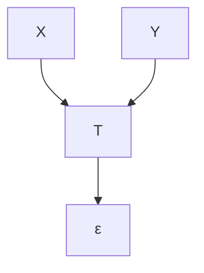
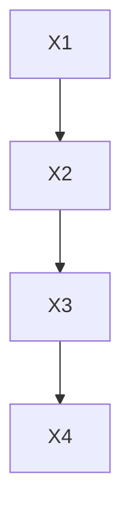

# 因果、预测与搜索（Causation, Prediction, and Search）

## 自适应计算与机器学习（Adaptive Computation and Machine Learning）

彼得·斯珀特斯（Peter Spirtes）、
克拉克·格莱莫尔（Clark Glymour）与
理查德·沙因斯（Richard Scheines）

## 评论（Comments）

正是受众多原因影响的数据构成了统计学的主要关注对象。实验试图通过去除所有原因中除一个之外的其他原因，或者更确切地说，通过集中研究一个原因并将其他原因尽可能减少到相对较小的残余量，来解开复杂的原因网络。统计学缺乏这一资源，必须接受受大量原因影响的数据进行分析，并必须尝试从数据本身发现哪些原因是重要的，以及观察到的效应中有多少是由于每个原因的作用而产生的。

——G. U. 尤尔（G. U. Yule）与 M. G. 肯德尔（M. G. Kendall），1950

估计理论（The Theory of Estimation）讨论了如何利用观测数据来估计或阐明那些数值未知的理论量值的原则，这些量值进入我们对运行中的因果系统的规范说明中。

——罗纳德·费希尔爵士（Sir Ronald Fisher），1956

乔治·博克斯（George Box）[几乎]说过："要发现当一个复杂系统受到扰动时会发生什么，唯一的方法就是扰动该系统，而不仅仅是被动地观察它。"这些关于"自然实验"的告诫之词强烈得令人不安。然而在当今世界，我们别无选择，只能接受它们——如果说有什么不足的话，那就是它们还不够强烈。

——G. 莫斯特勒（G. Mosteller）与 J. 图基（J. Tukey），1977

**因果推断（Causal inference）**是统计学所有问题中最重要、最微妙、也最被忽视的问题之一。

——P. 道威德（P. Dawid），1979

## 第二版前言（Preface to the Second Edition）

《因果、预测与搜索》第二版是近二十年关于自动化和因果推断研究的结晶，始于1980年格莱莫尔《理论与证据》中的一章，随后是我们于1987年与凯文·凯利（Kevin Kelly）合著的《发现因果结构》（Discovering Causal Structure），以及1990年的一篇论文（Spirtes et al. 1990），该论文阐述了我们在随后几年中所遵循的大部分研究计划。我们中有人曾认为，当本书第一版于1993年问世时，这个课题已基本穷尽，但这一想法已被证明是完全错误的。

在本版中，我们替换了更简短的新引言，讨论了**d-分离（d-separation）**——消除了第一版中一个误导性的说教方式，并新增了第十二章，对1993年以来的相关成果和应用进行了综述和总结。原第十二章主要是关于循环图（cyclic graphs）和反馈系统的一系列猜想，其中大部分已被证明是正确的。

在本版中，我们首先感谢两位前学生克里斯·米克（Chris Meek）和托马斯·理查森（Thomas Richardson）。我们描述的新工作大部分属于他们。我们同样感谢格雷戈里·库珀（Gregory Cooper）、大卫·赫克曼（David Heckerman）和拉里·瓦瑟曼（Larry Wasserman），他们一直是出色的、乐于助人的同事和合作者；以及杰米·罗宾斯（Jaimie Robins），尽管他常常对本书的基本理念感到不满，但他以其洞察力和公正的思维为我们提供了帮助。我们受到朱迪亚·珀尔（Judea Pearl）的支持的鼓舞，他发展了本书中提出的思想，特别是本书第七章首次提出的关于预测的思想，并探索了许多本书未涉及的新因果推断方面的内容。同样令我们鼓舞的是许多科学家对我们方法的巧妙使用和修改，包括比尔·希普利（Bill Shipley）、大卫·贝斯勒（David Bessler）及其合作者，以及路德维希·利茨卡（Ludwig Litzka）和他的学生们。我们特别感谢库珀、赫克曼和米克允许我们在第十二章中使用他们对**贝叶斯搜索方法（Bayesian search methods）**的综述，并感谢托马斯·理查森为我们提供了关于链图（chain graphs）最近未发表进展的信息。

## 前言（Preface）

本书面向任何学科中、对使用统计方法帮助获取科学解释或预测行动、实验或政策结果感兴趣的读者。

G. 尤德尼·尤尔（G. Udny Yule）的大部分工作阐述了一种统计学的愿景，其目标是研究何时以及如何能够从统计样本中可靠地推断出因果影响，并估计其相对强度。尤尔的事业在很大程度上已被罗纳德·费希尔（Ronald Fisher）的概念所取代，该概念认为实验性研究与非实验性研究之间存在根本性的断裂，而没有随机化实验，统计学在很大程度上无法帮助进行因果推断。统计界成员时常对这一转变表示疑虑，在我们看来，这种疑虑是合理的。我们的工作代表了回归到类似于尤尔对理论统计学事业及其潜在实际效益的构想。

如果二十世纪的思想史走向不同，可能会有一个学科属于我们的工作范畴。但事实是，并没有。我们发展的材料属于统计学、计算机科学和哲学；这种组合可能不完全令这些学科中的任何一个领域的专家满意。但我们希望它仍能令人满意地实现其目的。我们并非统计学出身或与之有密切联系，也许正因为如此，我们倾向于以不同的方式看待问题，并且从该学科常见的角度来看，无疑是奇怪的。我们感到震惊的是，在社会科学和行为科学、流行病学、经济学、市场研究、工程学，甚至应用物理学中，统计方法被常规地用于证明从非随机化实验获得的数据中得出的因果推断，并且样本统计量被用于预测政策、操作或实验的效果。没有这些用途，统计学这个职业将小得多。对于一个从这些用途中蓬勃发展的学科却向其受众保证这些用途是不正当的，这可能不会让许多专业统计学家感到特别奇怪，但对我们来说却确实非常奇怪。从我们学科之外的视角来看，关于统计学应用于此类目的的最紧迫问题涉及在什么条件下可以以及不能可靠地进行因果推断和操作效果预测，最迫切的需求是一个有原则的、严谨的理论来应对这些问题。从他们著作的证词来看，相当多的统计学家认为任何这样的理论都是不可能的。我们认为，那些反对在实验性试验之外从统计学推断原因的可能性的一般论点是不成立的，而将实验性和观察性研究设计的原则截然分开也是不明智的。实验性和观察性设计可能并不总是允许相同的推断，但它们遵循统一的原则。

我们发展的理论必然遵循统计界在过去十五年中确立的假设。该理论的基本结构本质上是**公理化的（axiomatic）**。我们将给出关于因果结构与概率分布之间关系的两个独立公理，并从中推导出因果关系的特征以及在一系列背景假设下可以从统计约束中可靠和不可靠地推断出的预测。所有公理的版本都可以在劳里岑（Lauritzen）、沃穆特（Wermuth）、斯皮德（Speed）、珀尔（Pearl）、鲁宾（Rubin）、普拉特（Pratt）、施莱弗（Schlaifer）等人的论文中找到。在大多数情况下，我们将根据可以粗略地视为决定长期频率的倾向的概率分布来发展理论，但许多概率分布也可以被理解为（规范性的）主观信念度，我们将偶尔注意到贝叶斯应用。从这些公理中，可以推导出关于估计、抽样、潜变量存在性与结构、回归、不可区分性关系、实验设计、预测、**辛普森悖论（Simpson's paradox）**以及其他主题的各种定理。在这些"其他主题"中，最重要的是发现：通常用于因果推断的统计方法从根本上来说是次优的，并且存在渐近可靠、计算高效的搜索程序，这些程序根据基于样本数据做出的统计决策结果来推断因果关系。（我们将描述的程序需要对随机变量的独立性做出统计决策；当我们说这样的程序是"渐近可靠的"时，我们的意思是，如果每个必要的统计决策的结果在所研究的总体中为真，则该程序提供正确的信息。）本书的这一部分是数学：如果接受公理，那么定理也必须被接受，包括搜索程序的存在性。我们描述的程序适用于线性和离散数据，并且只要变量之间的因果关系足够稀疏且样本足够大，就可以实际应用于一百个或更多变量。这些程序已在计算机程序 **TETRAD II** 中实现，在撰写本文时该程序是公开可用的。¹

关于可靠发现程序的存在性和属性的定理本身并不能告诉我们这些搜索程序在短期内的可靠性。我们描述的方法需要一个不可预测的统计决策序列，我们将其实现为假设检验。像通常情况一样，在小样本中，单个检验的常规 p 值可能无法为搜索方法提供良好的第一类错误概率估计。我们提供了使用蒙特卡洛方法对各种程序在模拟数据上进行广泛测试的结果，这些测试提供了在模拟条件下可靠性的重要证据。这些模拟说明了一种估计我们描述的任何搜索方法的错误概率的简便方法。本书还包含对一个大型伪经验数据集的研究——这是由医学研究人员创建的模拟数据体，用于模拟急诊医学诊断指标及其原因——以及大量经验数据集，其中大多数已被其他作者在规范搜索（specification searches）的背景下讨论过。

这项工作的另一个目标是展示对因果关系与概率之间关系的正确理解有助于澄清统计学文献中的各种主题，包括实验与观察的比较效力、辛普森悖论、回归模型中的错误、回顾性抽样与前瞻性抽样、变量选择的危险以及其他主题。我们未涉及许多相关主题。它们包括离散潜变量的估计问题、统计决策的优化、抽样设计的许多细节、时间序列，以及"非递归"因果结构（即具有反馈系统的有限图形表示）的完整理论。

《因果、预测与搜索》并非旨在成为教科书，也没有配备相应的辅助材料。存在未解决的问题，但没有习题。在教科书中，一切都应该呈现得完整而整洁，即使事实并非如此。在本书中，我们不做这样的伪装，各章节充满了未解决的问题和开放性问题。教科书通常不会花太多时间争论观点；我们则花了相当多的时间。

本书中的各种定理通常具有**图论（graph theoretic）**特征；其中许多是长而困难的案例论证，这在统计学中相当陌生。为了不打断讨论的流畅性，我们将所有证明（除一个外）放在书末的一章中。在少数情况下，详细证明已在已发表文献中提供，我们仅引导读者查阅它们。在重要结果的证明尚未发表或不易获得的情况下，我们提供了相当详细的论证。

本书的结构如下。

- **第一章**涉及在当前统计实践背景下本书的动机，并预告了一些结果。
- **第二章**介绍了研究所需的数学思想，
- **第三章**给出了**因果解释的形式框架**，确立了**公理**，指出了它们**可能失效的情况**，并提供了一些**基本定理**。接下来的两章阐述了在已知或假设没有未测量的共同原因影响测量变量的情况下，两个公理对某些基本问题的后果。
- 在**第四章**中，我们给出了**因果假设** **在几种意义上彼此统计不可区分的必要和充分条件的图形刻画**。
- 在**第五章**中，我们批评了统计学中通常推荐的模型规范程序的特性，并描述了可行的算法，这些算法在假设公理适用且没有未测量的共同原因起作用的情况下，**从总体分布的性质中提取有关因果结构的正确信息**。这些算法通过各种经验和模拟样本进行了说明。
- **第六章**将第五章的分析扩展到不能假设没有未测量的共同原因作用于测量变量的情况。从理论和实践的角度来看，这一章和下一章构成了本书的核心，但它们特别困难。
- **第七章**讨论了预测操作、政策或实验效果的基本问题。作为一个简单的推论，该章将**有向图模型（directed graphical models）**与唐纳德·鲁宾（Donald Rubin）用于分析预测的"反事实"（counterfactual）框架统一起来。
- **第八章**将前几章的结果应用于**回归**主题。我们认为，即使满足标准的统计假设，多元回归在大样本极限下也是一种有缺陷且不可靠的评估因果影响的方法，而各种自动回归模型规范搜索只会使情况变得更糟。我们表明第六章的算法在原则上更可靠，并在各种模拟和经验数据集上比较了这些算法与各种多元回归程序的性能。
- **第九章**根据前几章的结果考虑了实证研究的设计，包括回顾性和前瞻性抽样问题、实验性和观察性设计的比较效力、变量的选择以及伦理临床试验的设计。本章最后回顾了关于吸烟与肺癌争议的一些方面。
- **第十和第十一章**进一步考虑了线性情况，并分析了在线性系统中发现或阐述测量变量和未测量变量之间因果关系的算法。
- **第十二章**简要考虑了各种开放性问题。
- **第十三章**给出了证明。

我们努力使这项工作自成一体，但不可否认且不可避免地是困难的。读者将受益于事先阅读珀尔1988年、惠特克（Whittaker）1990年或尼奥波利坦（Neopolitan）1990年的著作。

## 致谢（Acknowledgments）

本书中的一些思想源于我们十年前在匹兹堡大学开始的工作。我们从心理测量学、经济学和社会学文献中汲取了许多关于因果、统计和搜索的思想，始于世纪之交查尔斯·斯皮尔曼（Charles Spearman）的项目，并包括赫伯特·西蒙（Herbert Simon）、休伯特·布莱洛克（Hubert Blalock）和赫伯特·科斯特纳（Herbert Costner）的工作。

我们从朱迪亚·珀尔（Judea Pearl）次年出版的《智能系统中的概率推理》（Probabilistic Reasoning in Intelligent Systems）中获得了关于这一事业的新视角。珀尔的书虽然主要不关注发现，但它向我们展示了如何将条件独立性与因果结构普遍地联系起来，这一联系被证明对于建立通用的、可靠的发现程序至关重要。此后，我们受益于与珀尔、丹·盖格（Dan Geiger）和托马斯·维尔马（Thomas Verma）的通信和对话，以及他们的几篇论文。珀尔的工作借鉴了沃穆特（1980）、基维里（Kiiveri）和斯皮德（1982）、沃穆特和劳里岑（1983）以及基维里、斯皮德和卡林（Carlin）（1984）的论文，这些论文在20世纪80年代初期已经为因果推断的严谨研究奠定了基础。保罗·霍兰德（Paul Holland）几年前向笔者之一介绍了鲁宾框架，但我们直到最近才意识到它与有向图模型的逻辑联系。J. 惠特克（1990）关于无向图模型属性的出色阐述进一步帮助我们。

我们从匹兹堡大学的格雷戈里·库珀（Gregory Cooper）那里学到了很多，他为我们提供了数据、评论、贝叶斯算法以及我们在多个地方讨论的ALARM网络的图片和描述。多年来，我们从肯尼思·博伦（Kenneth Bollen）那里学到了有用的东西。克里斯·米克（Chris Meek）在推导一个重要定理方面提供了关键帮助，该定理从有向图模型公理中推导出鲁宾、普拉特和施莱弗提出的各种主张。

史蒂夫·芬伯格（Steve Fienberg）和卡内基梅隆大学统计学系的几位学生与我们一同参加了关于图模型的研讨会，我们从中受益匪浅。我们感谢他的开放、智慧和在我们研究中的帮助，并感谢伊丽莎白·斯莱特（Elizabeth Slate）引导我们阅读鲁宾框架中的几篇论文。我们感谢南希·卡特赖特（Nancy Cartwright）对我们上一本书中所采取并在此延续的方法的礼貌但尖锐的批评。她的评论促使我们在第四章中进行了关于参数的工作。我们感谢布赖恩·斯基尔姆斯（Brian Skyrms）多年来的兴趣和鼓励，以及马雷克·德鲁兹德尔（Marek Druzdzel）的有益评论和鼓励。我们还得到了琳达·布克（Linda Bouck）、罗纳德·克里斯滕森（Ronald Christensen）、简·卡拉汉（Jan Callahan）、大卫·帕皮诺（David Papineau）、约翰·厄曼（John Earman）、丹·豪斯曼（Dan Hausman）、乔·希尔（Joe Hill）、迈克尔·迈耶（Michael Meyer）、特迪·塞登菲尔德（Teddy Seidenfeld）、达纳·斯科特（Dana Scott）、杰伊·卡达内（Jay Kadane）、史蒂文·克莱珀（Steven Klepper）、赫伯·西蒙（Herb Simon）、彼得·斯莱扎克（Peter Slezak）、史蒂夫·索伦森（Steve Sorensen）、约翰·沃勒尔（John Worrall）和安德烈娅·伍迪（Andrea Woody）的帮助。我们感谢欧内斯特·塞内卡（Ernest Seneca）使我们与里克·林瑟斯特博士（Dr. Rick Linthurst）取得联系，并特别感谢林瑟斯特博士向我们提供了他的博士论文。

我们的工作得到了许多机构的支持。他们以及代表他们做出决定的人值得我们感谢。这些机构包括卡内基梅隆大学、国家科学基金会的历史与科学哲学项目、经济学项目以及知识与数据库系统项目、海军研究办公室、海军人事研究与发展中心、约翰·西蒙·古根海姆纪念基金会、苏珊·奇普曼（Susan Chipman）、斯坦利·科利尔（Stanley Collyer）、海伦·吉格利（Helen Gigley）、彼得·马查默（Peter Machamer）、史蒂夫·索伦森、特迪·塞登菲尔德和罗恩·奥弗曼（Ron Overmann）。海军人事研究与发展中心为我们提供了接触许多具有挑战性的数据分析问题的机会，我们从中受益匪浅。

## 符号约定（Notational Conventions）

### 正文（Text）

在正文中，每个技术术语在定义处以**粗体**书写。

| 变量（Variables）： | 大写斜体，例如 $X$ |
| :--- | :--- |
| 变量的值（Values of variables）： | 小写斜体，例如 $X = x$ |
| 集合（Sets）： | 大写粗体，例如 $\mathbf{V}$ |
| 变量集合的值（Values of sets of variables）： | 小写粗体，例如 $\mathbf{V} = \mathbf{v}$ |
| 属于 $\mathbf{X}$ 但不属于 $\mathbf{Y}$ 的成员： | $\mathbf{X} \backslash \mathbf{Y}$ |
| 误差变量（Error variables）： | $\varepsilon, \delta, e$ |
| $\mathbf{X}$ 与 $\mathbf{Y}$ 的独立性： | $\mathbf{X} \perp \perp \mathbf{Y}$ |
| 在 $\mathbf{Z}$ 条件下 $\mathbf{X}$ 与 $\mathbf{Y}$ 的独立性： | $\mathbf{X} \perp \perp \mathbf{Y} \mid \mathbf{Z}$ |
| $\mathbf{X} \cup \mathbf{Y}$： | $\mathbf{X} \mathbf{Y}$ |
| $X$ 与 $Y$ 的协方差： | $\text{COV}(X,Y)$ 或 $\gamma_{XY}$ |
| $X$ 与 $Y$ 的相关系数： | $\rho_{XY}$ |
| $X$ 与 $Y$ 的样本相关系数： | $r_{XY}$ |
| $X$ 与 $Y$ 的偏相关系数，控制集合 $\mathbf{Z}$ 中的所有成员： | $\rho_{XY,\mathbf{Z}}$ |

在我们考虑的所有图中，顶点都是随机变量。因此，我们互换使用"图中的变量"和"图中的顶点"这两个术语。

图号出现在每个图的下方，从每章的第1个开始。在必要时，我们通过将测量变量放入方框、将未测量变量放入圆圈（误差项除外）来区分测量变量和未测量变量。以 e、$\varepsilon$ 或 $\delta$ 开头的变量被理解为"误差"或"扰动"变量。例如，在下图中，$X$ 和 $Y$ 是测量变量，$T$ 不是，$\varepsilon$ 是误差项。

> 图 n.1

在不需要区分测量变量和未测量变量的图中，我们将不对变量加方框或圆圈，例如图 n.2。

> 图 n.2

为简单起见，我们针对离散随机变量的概率分布陈述和证明我们的结果。然而，在适当的可积性条件下，通过将离散变量替换为连续变量、概率分布替换为密度函数、求和替换为积分，这些结果可以很容易地推广到具有密度函数的连续分布。

如果一组变量的描述是图 $G$ 和 $G$ 中变量的函数，那么我们将 $G$ 作为该函数的可选参数。例如，$\text{Parents}(G,X)$ 表示图 $G$ 中 $X$ 的父变量集合；如果上下文清楚所指的图，我们将直接写作 $\text{Parents}(X)$。

如果一个分布定义在一组随机变量 $O$ 上，我们称该分布为 $P(O)$。随机变量分布之间的等式被理解为对于所有使该等式中所有分布都有定义的随机变量取值成立。例如，如果 $X$ 和 $Y$ 各取值 0 或 1，且 $P ( X = 0 ) \neq 0$ 和 $P ( X = 1 ) \neq 0$，那么 $P ( Y \vert X ) = P ( Y )$ 意味着 $P ( Y = 0 | X = 0 ) = P ( Y = 0)$, $P(Y = 0|X= 1) = P(Y = 0)$, $P(Y = 1|X= 0) = P(Y = 1)$ 和 $P ( Y = 1 \vert X = 1 ) = P ( Y = 1 )$。

我们有时使用一个特殊的求和符号 $\vec { \Sigma }$，它具有以下性质：

- (i) 当随机变量集合写在该特殊求和符号下方时，理解为对随机变量的取值集合进行求和，而不是对随机变量本身求和。
- (ii) 如果条件概率分布出现在该求和符号的作用域内，则仅对使条件概率分布有定义的随机变量取值进行求和。
- (iii) 如果在该特殊求和符号下方没有使该符号作用域内的条件概率分布有定义的随机变量取值，则该求和等于零。

例如，假设 $X$, $Y$ 和 $Z$ 各可取值为 0 或 1。那么如果 $P ( Y = 0 , Z = 0 ) \neq 0$，则

$$
\sum_ {X} ^ {\rightarrow} P (X \mid Y = 0, Z = 0) = P (X = 0 \mid Y = 0, Z = 0) + P (X = 1 \mid Y = 0, Z = 0)
$$

然而，如果 $P ( Y = 0 , Z = 0 ) = 0$，那么 $P ( X = 0 | Y = 0 , Z = 0 )$ 和 $P ( X = 1 | Y = 0 , Z = 0 )$ 未定义，因此

$$
\sum_ {X} ^ {\rightarrow} P (X | Y = 0, Z = 0) = 0
$$

我们将采用以下关于空变量集合的约定。如果 $\mathbf { Y } = \emptyset$，则

- (i) $P(X|Y)$ 表示 $P(X)$。
- (ii) $\rho _ { \mathbf { X Z . Y } }$ 表示 $\rho_{XZ}$。
- (iii) $A B|Y$ 表示 $A B$。
- (iv) $A \perp \perp Y$ 总是成立。