# 形式化预备知识（Formal Preliminaries）

本章介绍贯穿全书的一些数学概念。本章旨在为我们所使用的形式化工具提供数学上明确的定义。初读时可以跳过本章，并在需要时参考，但读者应注意，我们有时会出于充分理由使用图论中标准概念的非标准定义。我们假设读者具备有限数学和统计学（包括相关分析）的基础知识，除此之外，本章包含了本书所需的所有数学概念。本章定义的一些数学对象将在下一章中赋予特殊解释，但在此我们完全以形式化的方式处理它们。

我们考虑几种不同类型的图：**有向图（directed graphs）**、**无向图（undirected graphs）**、**诱导路径图（inducing path graphs）**、**部分定向诱导路径图（partially oriented inducing path graphs）** 和 **模式（patterns）**。这些不同类型的对象都包含一个**顶点（vertices）** 集合和一个**边（edges）** 集合。它们所包含的边的类型不同。尽管存在这些差异，许多图形概念（如无向路径、有向路径、父节点等）可以统一地定义于所有这些不同类型的对象上。为了在我们工作中所需的对象上提供这种统一性，我们修改了图论中的常规定义。

## 2.1 图（Graphs）

图 2.1 所示的无向图仅包含无向边（例如，$A - B$）。

> 图 2.1

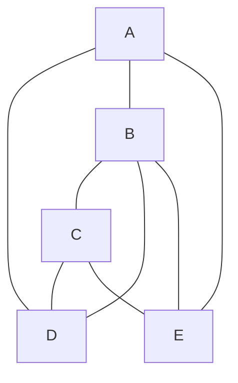

图 2.2 所示的有向图仅包含有向边（例如，$A \rightarrow B$）。

> 图 2.2

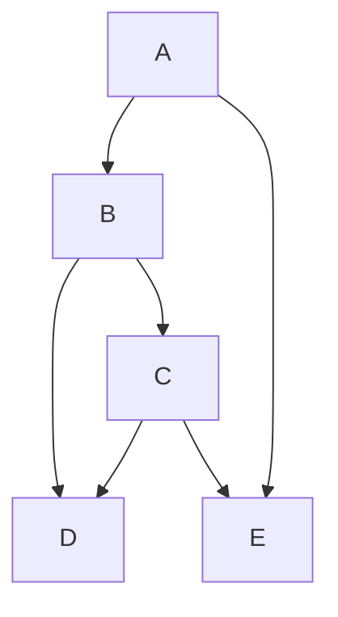

图 2.3 所示的诱导路径图包含有向边（例如，$A \rightarrow B$）和双向边（例如，$B \leftrightarrow C$）。（诱导路径图及其用途将在第 6 章详细解释。）

> 图 2.3

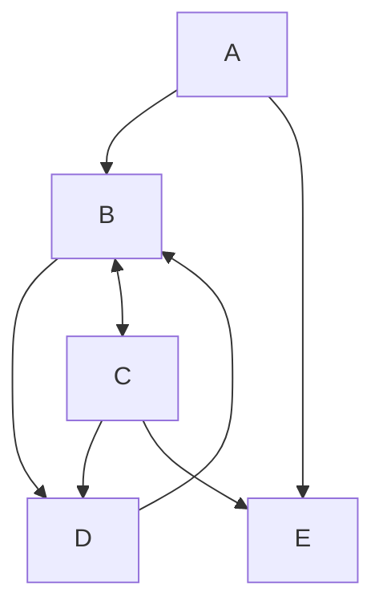

图 2.4 所示的部分定向诱导路径图包含有向边（例如，$B \rightarrow F$）、双向边（例如，$B \leftrightarrow C$）、无向边（例如，$E \circ - \circ D$）和部分有向边（例如，$A \circ \rightarrow B$）。（部分定向诱导路径图及其用途将在第 6 章详细解释。）

> 图 2.4

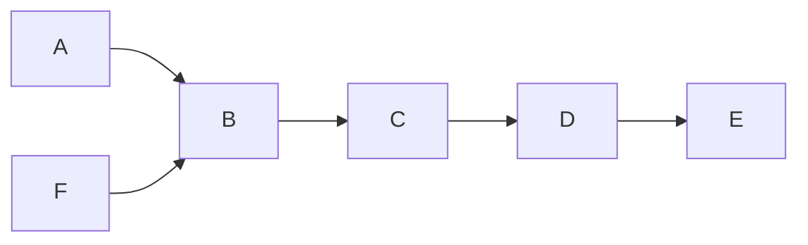

图 2.5 所示的模式包含无向边（例如，$A - B$）和有向边（例如，$A \rightarrow E$）。（模式及其用途将在第 5 章详细解释。）

> 图 2.5

在通常的图论定义中，图是一个有序对 $< \mathbf{V}, \mathbf{E} >$，其中 $\mathbf{V}$ 是一个顶点集合，$\mathbf{E}$ 是一个边集合。$\mathbf{E}$ 中的成员是顶点对（有向图中为有序对，无向图中为无序对）。例如，边 $A \rightarrow B$ 由有序对 $< A, B >$ 表示。在有向图中，表示边的顶点对的顺序实际上标记了边一端的箭头。出于我们的目的，我们需要表示附着在无向边两端的大量不同类型的标记。一般来说，我们允许边的端点可以是无标记的，可以标有箭头，也可以标有“o”。

因此，为了完全指定边的类型，我们需要指定每一端的变量和标记。例如，边 $"A \circ - \circ B"$ 的左端可以表示为有序对 $[A, \circ]$，右端可以表示为有序对 $[B, \circ]$。边 $"A \circ - \circ B"$ 的左端可以表示为有序对 $[A, \circ]$，右端可以表示为有序对 $[B, \circ]$。边 $"A \circ - \circ B"$ 的左端可以表示为有序对 $[A, \circ]$，右端可以表示为有序对 $[B, \circ]$。边 $"A \circ - \circ B"$ 的左端可以表示为有序对 $[A, \circ]$，右端可以表示为有序对 $[B, \circ]$。有序对的第一个成员称为边的端点（endpoint），例如，在 $[A, \circ]$ 中端点是 $A$。整个边是表示端点的有序对的集合，例如，$\{ [A, \circ], [B, \circ] \}$。边 $\{ [B, \circ], [A, \circ] \}$ 与 $\{ [A, \circ], [B, \circ] \}$ 相同，因为边的哪一端先列出并不重要。

注意，像 $A \rightarrow B$ 这样的有向边在 $A$ 端点处没有标记；我们认为 $A$ 端点处的标记是空的，但当我们写出有序对时，我们将使用符号 $EM$ 表示空标记（empty mark），例如 $[A, EM]$。

更形式化地说，我们称一个图是一个有序三元组 $< \mathbf{V}, \mathbf{M}, \mathbf{E} >$，其中 $\mathbf{V}$ 是一个非空的顶点集合，$\mathbf{M}$ 是一个非空的标记集合，$\mathbf{E}$ 是形如 $\{ [V_1, M_1], [V_2, M_2] \}$ 的有序对的集合的集合，其中 $V_1$ 和 $V_2$ 属于 $\mathbf{V}$，$V_1 \neq V_2$，且 $M_1$ 和 $M_2$ 属于 $\mathbf{M}$。除了在讨论具有反馈的系统时，我们总是假设在任何图中，任意一对顶点 $V_1$ 和 $V_2$ 至多出现在 $\mathbf{E}$ 中的一个集合中，换句话说，任意两个顶点之间至多有一条边。如果 $G = < \mathbf{V}, \mathbf{M}, \mathbf{E} >$，我们称 $G$ 定义于 $\mathbf{V}$ 之上。

例如，图 2.2 的有向图可以表示为：

$$
< \{A, B, C, D, E\}, \{EM, >\}, \{ \{ [A, EM], [B, >] \}, \{ [A, EM], [E, >] \}, \{ [A, EM], [D, >] \}, \{ [D, EM], [B, >] \}, \{ [D, EM], [C, >] \}, \{ [B, EM], [C, >] \}, \{ [E, EM], [C, >] \} \} >.
$$

$\mathbf{E}$ 中的每个成员 $\{ [V_1, M_1], [V_2, M_2] \}$ 称为一条边（例如，图 2.2 中的 $\{ [A, EM], [B, >] \}$）。边中的每个有序对 $[V_1, M_1]$ 称为一个**边端（edge-end）**（例如，$[A, EM]$ 是 $\{ [A, EM], [B, >] \}$ 的一个边端）。边 $\{ [V_1, M_1], [V_2, M_2] \}$ 中的每个顶点 $V_1$ 称为该边的一个端点（例如，$A$ 是 $\{ [A, EM], [B, >] \}$ 的一个端点）。$V_1$ 和 $V_2$ 在 $G$ 中**相邻（adjacent）** 当且仅当 $\mathbf{E}$ 中存在一条以 $V_1$ 和 $V_2$ 为端点的边（例如，在图 2.2 中，$A$ 和 $B$ 相邻，但 $A$ 和 $C$ 不相邻）。

**无向图（Undirected graph）** 是标记集合 $\mathbf{M} = \{ EM \}$ 的图。**有向图（Directed graph）** 是标记集合 $\mathbf{M} = \{ EM, > \}$ 的图，并且对于 $\mathbf{E}$ 中的每条边，一个边端的标记为 $EM$，另一个边端的标记为 $>$。

边 $\{ [A, EM], [B, >] \}$ 是一条从 $A$ 到 $B$ 的**有向边（directed edge）**。（注意在无向图中没有有向边。）边 $\{ [A, M_1], [B, >] \}$ 是**指向（into）** $B$ 的。边 $\{ [A, EM], [B, M_2] \}$ 是**从（out of）** $A$ 出发的。如果存在一条从 $A$ 到 $B$ 的有向边，那么 $A$ 是 $B$ 的**父节点（parent）**，$B$ 是 $A$ 的**子节点（child）**（或女儿节点）。我们将 $\mathbf{V}$ 中所有顶点的父节点集合记为 $\text{Parents}(\mathbf{V})$，所有子节点集合记为 $\text{Children}(\mathbf{V})$。顶点 $V$ 的**入度（indegree）** 等于其父节点的数量；**出度（outdegree）** 等于其子节点的数量；**度（degree）** 等于与 $V$ 相邻的顶点数量。（在有向图中，顶点的度等于其入度与出度之和。）在图 2.2 中，$B$ 的父节点是 $A$ 和 $D$，$B$ 的子节点是 $C$。因此，$B$ 的入度为 2，出度为 1，度为 3。

我们将图中的**无向路径（undirected path）** 视为图中相邻顶点的序列。换句话说，对于路径上相邻的每一对 $X, Y$，图中存在一条边 $\{ [X, M_1], [Y, M_2] \}$。例如，在图 2.2 中，序列 $< A, B, C, D >$ 是一条无向路径，因为序列中相邻的每一对变量（$A$ 和 $B$、$B$ 和 $C$、$C$ 和 $D$）在图中都有对应的边。路径中的边集由那些端点在序列中相邻的边组成。在图 2.2 中，路径 $< A, B, C, D >$ 中的边是 $\{ [A, EM], [B, >] \}$、$\{ [B, EM], [C, >] \}$ 和 $\{ [C, >], [D, EM] \}$。

更形式化地说，图 $G$ 中 $A$ 和 $B$ 之间的**无向路径**是一个以 $A$ 开始、以 $B$ 结束的顶点序列，使得对于序列中相邻的每一对顶点 $X$ 和 $Y$，$G$ 中都存在一条边 $\{ [X, M_1], [Y, M_2] \}$。当且仅当 $X$ 和 $Y$ 在路径 $U$ 中彼此相邻（无论顺序如何）时，边 $\{ [X, M_1], [Y, M_2] \}$ 位于路径 $U$ 中。如果 $X$ 和 $Y$ 之间的边位于路径 $U$ 中，我们也称 $X$ 和 $Y$ 在 $U$ 上相邻。如果 $X$ 和 $Y$ 之间的无向路径中包含 $X$ 的边是从 $X$ 出发的，则称该路径是从 $X$ 出发的；类似地，如果路径中包含 $X$ 的边是指向 $X$ 的，则称该路径是指向 $X$ 的。为了简化证明，我们将只包含单个顶点的序列称为**空路径（empty path）**。不包含重复顶点的路径是**无环的（acyclic）**；否则是**有环的（cyclic）**。两条路径**相交（intersect）** 当且仅当它们有一个公共顶点；任何这样的公共顶点称为**交点（point of intersection）**。如果路径 $U$ 是 $< U_1, \ldots, U_n >$，路径 $V$ 是 $< U_n, V_1, \ldots, V_m >$，则 $U$ 和 $V$ 的**连接（concatenation）** 是 $< U_1, \ldots, U_n, V_1, \ldots, V_m >$，记为 $U$ 和 $V$。$U$ 与空路径的连接是 $U$，空路径与 $U$ 的连接是 $U$。通常，当我们使用术语“路径”时，我们指的是无环路径；在指代有环路径时，我们总是会使用形容词。

图 $G$ 中从 $A$ 到 $B$ 的**有向路径（directed path）** 是一个以 $A$ 开始、以 $B$ 结束的顶点序列，使得对于序列中按此顺序相邻的每一对顶点 $X, Y$，$G$ 中都存在一条边 $\{ [X, EM], [Y, >] \}$。$A$ 是路径的**源（source）**，$B$ 是路径的**汇（sink）**。例如，在图 2.2 中，$< A, B, C >$ 是一条以 $A$ 为源、$C$ 为汇的有向路径。相比之下，在图 2.2 中，$< A, B, D >$ 是一条无向路径，但不是有向路径，因为 $B$ 和 $D$ 按此顺序出现在序列中，但边 $\{ [B, EM], [D, >] \}$ 不在 $G$ 中（尽管 $\{ [D, EM], [B, >] \}$ 在 $G$ 中）。因此，有向路径是无向路径的特例。对于从 $U$ 到 $V$ 的有向边 $e$（$U \rightarrow V$），$\text{head}(e) = V$ 且 $\text{tail}(e) = U$。**有向无环图（Directed acyclic graph, DAG）** 是不包含有向环路径的有向图。

部分定向诱导路径图中 $A$ 和 $B$ 之间的**半有向路径（semidirected path）** 是从 $A$ 到 $B$ 的无向路径 $U$，其中没有边包含指向 $A$ 的箭头（即，在 $U$ 上 $A$ 处没有箭头，并且如果 $X$ 和 $Y$ 在路径上相邻，且 $X$ 在路径上位于 $A$ 和 $Y$ 之间，则在 $X$ 和 $Y$ 之间的边的 $X$ 端没有箭头）。当然，每条有向路径都是半有向的，但在具有 $" \circ - >"$ 端点标记的图中，可能存在不是有向路径的半有向路径。

如果图中每一对顶点都相邻，则该图是**完全的（complete）**。图 2.6 展示了一个完全无向图。

> 图 2.6

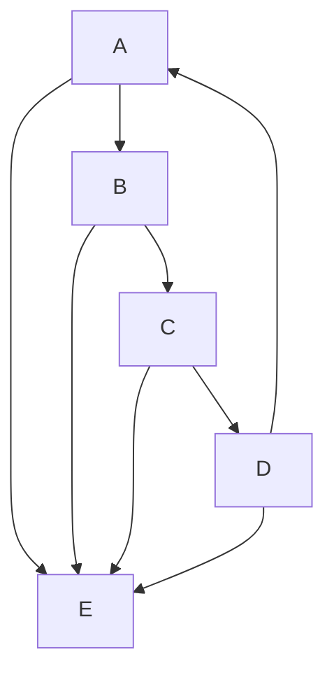

如果任意两个顶点之间存在无向路径，则该图是**连通的（connected）**。图 2.1–2.6 是连通的，但图 2.7 不是。

> 图 2.7

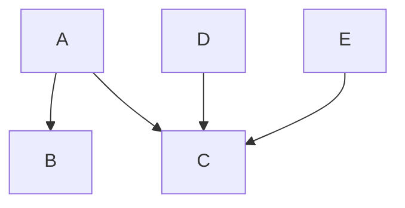

$< \mathbf{V}, \mathbf{M}, \mathbf{E} >$ 的**子图（subgraph）** 是任何满足 $\mathbf{V}' \subseteq \mathbf{V}$、$\mathbf{M}' \subseteq \mathbf{M}$ 且 $\mathbf{E}' \subseteq \mathbf{E}$ 的图 $< \mathbf{V}', \mathbf{M}', \mathbf{E}' >$。图 2.7 是图 2.2 的一个子图。

$< \mathbf{V}, \mathbf{M}, \mathbf{E} >$ 在 $\mathbf{V}'$（$\mathbf{V}' \subseteq \mathbf{V}$）上的子图是子图 $< \mathbf{V}', \mathbf{M}, \mathbf{E}' >$，其中一条边属于 $\mathbf{E}'$ 当且仅当它属于 $\mathbf{E}$ 且其两个端点都在 $\mathbf{V}'$ 中。

图 $G$ 中的**团（clique）** 是 $G$ 的任何完全子图。例如，在图 2.1 中，子图

$$
G' = < \{A, B, D\}, \{EM\}, \{\{[A, EM], [B, EM]\}, \{[B, EM], [D, EM]\}, \{[A, EM], [D, EM]\} \} >
$$

是一个顶点为 $A$、$B$ 和 $D$ 的团。$G$ 中顶点集不被 $G$ 中任何其他团真包含的团是**极大团（maximal）**。在图 2.1 中，$G'$ 和 $G'' = < \{A, B\}, \{EM\}, \{\{[A, EM], [B, EM]\}\} >$ 都是团，但 $G''$ 不是极大团，因为 $G''$ 被真包含在 $G'$ 中。$^2$

图 $G$ 中的**三角形（triangle）** 是 $G$ 的一个具有三个顶点的完全子图；换句话说，顶点 $X$、$Y$ 和 $Z$ 构成一个三角形当且仅当 $X$ 和 $Y$ 相邻、$Y$ 和 $Z$ 相邻且 $X$ 和 $Z$ 相邻。

在图 $G$ 中，顶点 $V$ 是无向路径 $U$ 上的**碰撞器（collider）** 当且仅当在 $U$ 上有两条不同的边以 $V$ 为端点，且两者都指向 $V$。否则，$V$ 是 $U$ 上的**非碰撞器（noncollider）**。在图 $G$ 中，顶点 $V$ 是 $U$ 上的**无遮蔽碰撞器（unshielded collider）** 如果 $V$ 是 $U$ 上的碰撞器，$V$ 与 $U$ 上不同的顶点 $V_1$ 和 $V_2$ 相邻，且 $V_1$ 和 $V_2$ 在 $G$ 中不相邻。

顶点 $V$ 的**祖先（ancestor）** 是任何顶点 $W$，使得存在从 $W$ 到 $V$ 的有向路径。顶点 $V$ 的**后代（descendant）** 是任何顶点 $W$，使得存在从 $V$ 到 $W$ 的有向路径。在图 2.2 中，$A$、$B$、$C$、$D$ 和 $E$ 都是 $C$ 的祖先，尽管 $A$ 和 $C$ 都不是 $C$ 的父节点。类似地，$C$ 是 $A$、$B$、$C$、$D$ 和 $E$ 的后代，尽管它不是 $A$ 或 $C$ 的子节点。由于每个顶点 $V$ 都是从 $V$ 到 $V$ 的有向（空）路径的源，每个顶点既是自身的后代，也是自身的祖先，但当然不是自身的父节点或子节点。

## 2.2 概率（Probability）

我们考虑的图的顶点始终是**随机变量（random variables）**，其取值于以下之一：实数轴的副本；非负实数的副本；整数区间。

图顶点上的**联合分布（joint distribution）** 是指这些对象的笛卡尔积上的可数可加概率测度。我们说两个随机变量 $X$、$Y$ 是**独立的（independent）**，当对于 $X$ 和 $Y$ 的所有取值，$(X, Y)$ 的联合密度等于 $X$ 的密度与 $Y$ 的密度的乘积。我们将其记为 $X \perp Y$。当断言一组变量与另一组变量独立时，我们以明显的方式推广。当我们说一组随机变量是**联合独立的（jointly independent）** 时，我们指的是该集合的任意两个不相交子集彼此独立。我们说随机变量 $X$、$Y$ 在给定 $Z$ 的条件下是**条件独立的（independent conditional on Z）**（或给定 $\mathbf{Z}$），当对于 $X$、$Y$ 的所有取值，以及对于 $z$ 的密度不为 0 的所有 $z$ 值，给定 $Z$ 时 $X$、$Y$ 的密度等于给定 $Z$ 时 $X$ 的密度与给定 $Z$ 时 $Y$ 的密度的乘积。对于随机变量集合 $X$、$Y$、$Z$，我们以明显的方式推广。如果 $X$ 在给定 $Z$ 的条件下独立于 $Y$，我们记为 $X \perp Y \mid Z$，并称条件独立的阶等于 $Z$ 中变量的数量。

在离散情况下，我们说 $\mathbf{V}$ 上的分布是**正的（positive）** 当且仅当对于 $\mathbf{V}$ 的所有取值 $\mathbf{v}$，$P(\mathbf{v}) \neq 0$。（一般来说，如果密度函数对所有 $\mathbf{v}$ 非零，则 $\mathbf{V}$ 上的分布是正的。）如果 $\mathbf{V} \subseteq \mathbf{V}'$ 且

$$
P(\mathbf{V}) = \sum_{\mathbf{V}' \setminus \mathbf{V}} P(\mathbf{V}')
$$

我们将称 $P(\mathbf{V})$ 是 $P(\mathbf{V}')$ 在 $\mathbf{V}$ 上的**边际分布（marginal）**。

## 2.3 图与概率分布（Graphs and Probability Distributions）

我们将研究分布中成立的**条件独立性关系**的几种不同图形表示。

## 2.3.1 有向无环图（Directed Acyclic Graphs）

**有向无环图（Directed Acyclic Graph, DAG）**可用于表示概率分布中的条件独立性关系。

对于给定图 $G$ 和顶点 $W$，令 $\text{Parents}(W)$ 为 $W$ 的父节点集合，$\text{Descendants}(W)$ 为 $W$ 的后代节点集合。

**马尔可夫条件（Markov Condition）**：定义在 $V$ 上的有向无环图 $G$ 与概率分布 $P(V)$ 满足马尔可夫条件，当且仅当对于 $V$ 中的每一个 $W$，在给定 $\text{Parents}(W)$ 的条件下，$W$ 独立于 $V \setminus (\text{Descendants}(W) \cup \text{Parents}(W))$。

> 图 2.8

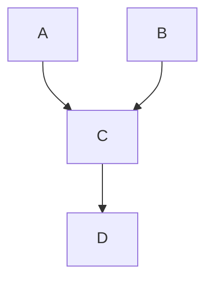

（回顾：$W$ 是其自身的后代。）用 Pearl（1988）的术语来说，$G$ 是 $P$ 的一个 **I 映射（Imap）**。在图 2.8 中，马尔可夫条件蕴含以下条件独立性关系³：

$$
A \perp B
$$

$$
D \perp \perp \{A, B \} \mid C
$$

对于所有使 $f(\mathbf{v}) \neq 0$ 的 $V$ 值 $\mathbf{v}$，满足马尔可夫条件的联合密度函数 $f(\mathbf{V})$ 由下式给出：

$$
f(\mathbf{V}) = \prod_{V \in \mathbf{V}} f(V \mid \text{Parents}(V))
$$

其中 $f(V \mid \text{Parents}(V))$ 表示在给定 $V$ 的父节点（可能为空）集合条件下 $V$ 的密度。（参见 Kiiveri and Speed 1982。回顾我们的符号约定：如果 $\text{Parents}(V) = \emptyset$，那么 $f(V \mid \text{Parents}(V)) = f(V)$。）

如果一个关于离散变量的联合分布满足图 2.8 的马尔可夫条件，它可以按以下方式分解：

$$
P(A, B, C, D) = P(A) P(B) P(C \mid A, B) P(D \mid C)
$$

对于所有使 $P(A, B, C, D) \neq 0$ 的 $A, B, C, D$ 值成立。在一个有向无环图 $G$ 中，入度为零的顶点被称为**外生变量（exogenous）**。如果 $G$ 对分布 $P$ 满足马尔可夫条件，那么对于每一对外生变量 $V_1$ 和 $V_2$，在 $P$ 中有 $V_1 \perp \perp V_2$。

**极小性条件（Minimality Condition）**直观上表明，图中的每条边都阻止了本应成立的某些条件独立性关系。

**极小性条件**：如果 $G$ 是定义在 $V$ 上的有向无环图，$P$ 是定义在 $\mathbf{V}$ 上的概率分布，那么 $\langle G, P \rangle$ 满足极小性条件，当且仅当对于 $G$ 的顶点集为 $\mathbf{V}$ 的每个真子图 $H$，$\langle H, P \rangle$ 都不满足马尔可夫条件。

回到图 2.8 的例子，一个满足马尔可夫条件但 $A$ 独立于 $\{B, C, D\}$ 的分布 $P'$ 不满足极小性条件，因为 $P'$ 也满足删除了 $A$ 和 $C$ 之间边的子图的马尔可夫条件。用 Pearl（1988）的术语来说，如果分布 $P(V)$ 对有向无环图 $G$ 满足马尔可夫条件和极小性条件，那么 $G$ 是 $P$ 的一个**极小 I 映射（minimal I-map）**。

如果一个分布 $P$ 对有向无环图 $G$ 满足马尔可夫条件和极小性条件，我们将称 $G$ **表示（represents）** $P$。对于任何有向无环图 $G$ 和任何满足马尔可夫条件与极小性条件的概率分布 $P$，如果变量 $A$ 和 $B$ 在统计上相关，那么要么：

- (i) 在 $G$ 中存在一条从 $A$ 到 $B$ 的有向路径；或
- (ii) 在 $G$ 中存在一条从 $B$ 到 $A$ 的有向路径；或
- (iii) 存在一个变量 $C$，并且在 $G$ 中存在从 $C$ 到 $B$ 和从 $C$ 到 $A$ 的有向路径。

**路径（trek）**是不同顶点 $A$ 和 $B$ 之间一对无序的有向路径，这两条路径具有相同的源点，并且仅在源点相交。这对路径的源点也称为该路径的源点。注意，路径中的一条路径可以是空路径。

## 2.3.2 有向独立图（Directed Independence Graphs）

**有向独立图（Directed Independence Graphs）**（Whittaker 1990）是表示概率分布中成立的条件独立性关系的另一种（几乎等价的）方式。称有向无环图 $G$ 是 $P(V)$ 关于顶点顺序 $>$ 的**有向独立图**（Whittaker 1990），当且仅当 $A \rightarrow B$ 出现在 $G$ 中，当且仅当 $\sim (A \perp \perp B \mid \mathbf{K}(B))$，其中 $\mathbf{K}(B)$ 是所有满足 $V \neq A$ 且 $V > B$ 的顶点 $V$ 的集合。

**定理 2.1**：如果 $P(V)$ 是一个正分布，那么对于 $V$ 中变量的任何顺序，$P$ 都满足该顺序下 $P(V)$ 的有向独立图的马尔可夫条件和极小性条件。

如果一个分布 $P$ 不是正分布，那么对于给定变量顺序，$P$ 的有向独立图可能是某个有向无环图的一个子图，而 $P$ 满足该有向无环图的极小性条件和马尔可夫条件（Pearl 1988）。

## 2.3.3 忠实性（Faithfulness）

给定任何图，**马尔可夫条件**确定了一组独立性关系。这些独立性关系反过来又可能蕴含其他关系，这意味着每个具有马尔可夫条件所给出的独立性关系的概率分布也将具有这些进一步的独立性关系。一般来说，在满足马尔可夫条件的图 $G$ 上的概率分布 $P$，除了图所应用的马尔可夫条件所蕴含的那些独立性关系之外，还可能包含其他独立性关系。例如，在图 2.9 中，即使图并不蕴含 $A$ 和 $D$ 的独立性，但在满足该图马尔可夫条件的分布中，$A$ 和 $D$ 可能是独立的。

> 图 2.9

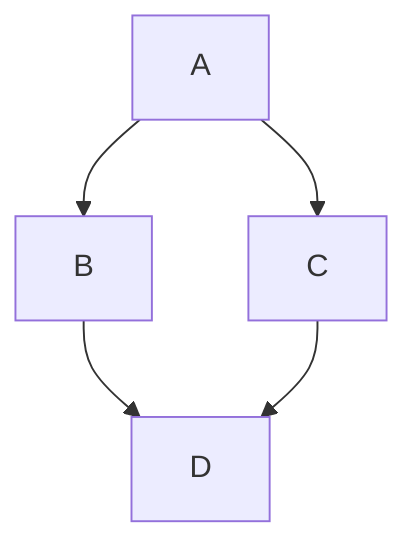

在线性模型中，如果 $D$ 对 $C$ 和 $C$ 对 $A$ 的**偏回归系数（partial regression coefficients）**的乘积抵消了 $D$ 对 $B$ 和 $B$ 对 $A$ 的相应乘积，就可能出现这种独立性。

如果在 $P$ 中成立的所有且仅有的条件独立性关系都是由应用于 $G$ 的马尔可夫条件所蕴含的，我们将称 $P$ 和 $G$ 是**相互忠实（faithful to one another）**的。此外，如果存在某个有向无环图使得 $P$ 对该图是忠实的，我们将称分布 $P$ 是**忠实的（faithful）**。用 Pearl（1988）的术语来说，如果 $P$ 和 $G$ 相互忠实，那么 $G$ 是 $P$ 的一个**完美映射（perfect map）**，而 $P$ 是 $G$ 的一个 **DAG 同构（DAG-Isomorph）**。如果分布 $P$ 对有向无环图 $G$ 是忠实的，那么 $X$ 和 $Y$ 相关当且仅当在 $X$ 和 $Y$ 之间存在一条路径。

## 2.3.4 d-分离（d-separation）

根据 Pearl（1988），我们定义：对于图 $G$，如果 $X$ 和 $Y$ 是 $G$ 中的顶点，$X \neq Y$，并且 $W$ 是 $G$ 中不包含 $X$ 或 $Y$ 的顶点集合，那么给定 $W$，$X$ 和 $Y$ 在 $G$ 中是 **d-分离（d-separated）** 的，当且仅当在 $X$ 和 $Y$ 之间不存在无向路径 $U$，使得 (i) $U$ 上的每个**碰撞器（collider）** 在 $W$ 中有一个后代，并且 (ii) $U$ 上没有其他顶点在 $W$ 中。我们说，如果 $X \neq Y$，并且 $X$ 和 $Y$ 不在 $W$ 中，那么给定集合 $W$，$X$ 和 $Y$ 是 **d-连接（d-connected）** 的，当且仅当它们给定 $W$ 时不是 d-分离的。如果 $U$、$V$ 和 $W$ 是 $G$ 中互不相交的顶点集合，且 $U$ 和 $V$ 非空，那么我们说给定 $W$，$U$ 和 $V$ 是 d-分离的，当且仅当 $U$ 和 $V$ 的笛卡尔积中的每一对 $\langle U, V \rangle$ 给定 $W$ 都是 d-分离的。如果 $U$、$V$ 和 $W$ 是 $G$ 中互不相交的顶点集合，且 $U$ 和 $V$ 非空，那么我们说给定 $W$，$U$ 和 $V$ 是 d-连接的，当且仅当 $U$ 和 $V$ 给定 $W$ 时不是 d-分离的。图 2.10 中的有向无环图给出了 d-连接性的一个示例（但注意，该定义也适用于其他类型的图，如第 6 章所述的诱导路径图（inducing path graphs））。

> 图 2.10

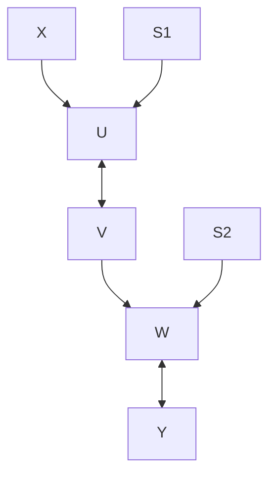

给定空集，$X$ 和 $Y$ 是 d-分离的

给定集合 $\{S_1, S_2\}$，$X$ 和 $Y$ 是 d-连接的

给定集合 $\{S_1, S_2, V\}$，$X$ 和 $Y$ 是 d-分离的

## 2.3.5 线性结构（Linear Structures）

定义在 $V$ 上的有向无环图 $G$ **线性表示（linearly represents）** 一个分布 $P(\mathbf{V})$，当且仅当存在一个定义在 $\mathbf{V}'$ 上的有向无环图 $G'$ 和一个分布 $P''(\mathbf{V}')$，使得：

- (i) $V$ 包含在 $\mathbf{V}'$ 中；
- (ii) 对于 $V$ 中的每个**内生变量（endogenous）** $X$（即入度为正），在 $\mathbf{V}' \setminus V$ 中存在一个唯一的变量 $\varepsilon_X$，其入度为零、方差为正、出度为一，并且存在一条从 $\varepsilon_X$ 到 $X$ 的有向边；
- (iii) $G$ 是 $G'$ 在 $V$ 上的子图；
- (iv) $G$ 中的每个内生变量是其 $G'$ 中父节点的线性函数；
- (v) 在 $P''(\mathbf{V}')$ 中，$G'$ 中任意两个外生变量之间的相关性为零；
- (vi) $P(V)$ 是 $P''(\mathbf{V}')$ 在 $V$ 上的边际分布。

$\mathbf{V}' \setminus V$ 中的成员被称为**误差变量（error variables）**，我们称 $G'$ 为**扩展图（expanded graph）**。有向无环图 $G$ **线性蕴含（linearly implies）** $\rho_{AB.\mathbf{H}} = 0$，当且仅当在所有由 $G$ 线性表示的分布中，$\rho_{AB.\mathbf{H}} = 0$。（我们假设分布的所有偏相关系数都存在。）如果 $G$ 线性表示 $P(\mathbf{V})$，我们称配对 $\langle G, P(\mathbf{V}) \rangle$ 是一个具有有向无环图 $G$ 的**线性模型（linear model）**。

## 2.4 无向独立图（Undirected Independence Graphs）

存在一种通过**无向图（undirected graphs）**表示关于条件独立性的统计假设的著名表示方法。有向图和无向图这两种表示方法密切相关，但重要的是不要混淆它们。

具有顶点集 $V$ 的**无向独立图** $G$ **表示**一个概率分布 $P$，当且仅当在 $P$ 中，给定 $\mathbf{V} \setminus \{A, B\}$ 的条件下，$A$ 和 $B$ 条件独立时，$A$ 和 $B$ 之间才没有无向边。如果一个无向独立图 $G$ 表示一个分布 $P$，那么 $A$ 和 $B$ 在给定某个集合 $C$ 的条件下独立，当且仅当 $A$ 和 $B$ 之间的每条无向路径都包含 $C$ 中的一个成员。

假设我们考虑一个特定的有向无环图 $G$ 和一个忠实的概率分布 $P$。令 $U$ 为 $G$ 的底层邻接无向图；也就是说，$U$ 是与 $G$ 具有相同顶点集和相同邻接关系的无向图。假设 $I$ 是根据刚刚给出的定义形成的分布 $P$ 的无向独立图。那么 $I$ 和 $U$ 通常并不相同，但 $U$ 总是 $I$ 的一个子图。$I$ 和 $U$ 相同当且仅当 $G$ 不包含任何**无屏蔽碰撞器（unshielded colliders）**（Wermuth and Lauritzen 1983）。

## 2.5 确定性与伪非确定性系统（Deterministic and Pseudoindeterministic Systems）

我们将在技术意义上使用**确定性系统（deterministic system）**的概念：由有向无环图 $G$ 表示的随机变量集 $V$ 上的联合概率分布 $P$ 是**确定性的（deterministic）**，如果 $G$ 中每个入度非零的顶点都是其在 $G$ 中直接父节点的函数；我们也将称 $G$ 是 $P$ 的**确定性图（deterministic graph）**。所谓“函数”，我们意指对于父节点的每个唯一值分配，依赖顶点都有一个唯一的值与之对应。

> 图 2.11

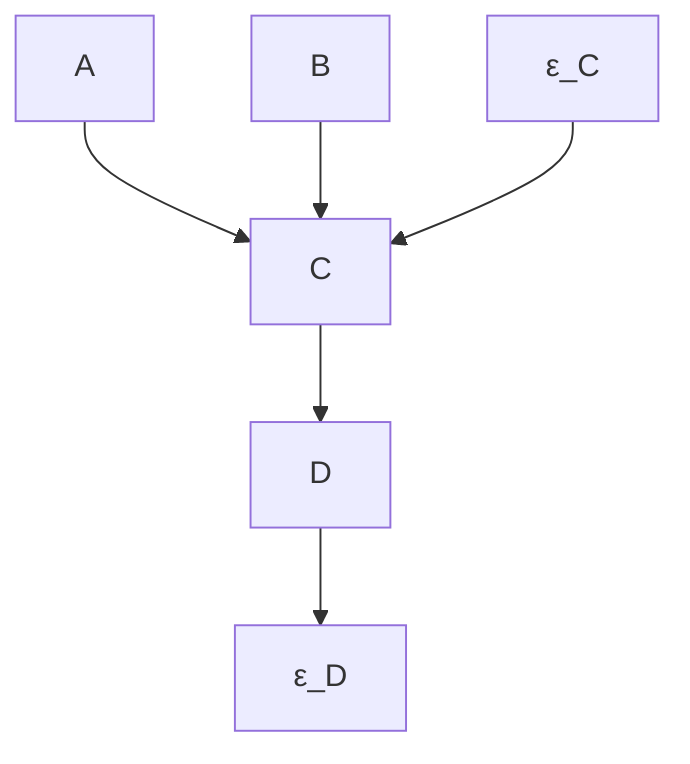

假设图 2.11 中表示的图/分布对是确定性的，但 $\varepsilon_C$ 和 $\varepsilon_D$ 未被测量。如果我们只考虑被测量的变量，即 $A$、$B$、$C$ 和 $D$，我们会发现没有变量的值能由其他变量的值唯一确定，尽管其中一些变量是统计相关的。该系统看起来是**非确定性的（indeterministic）**，尽管 $\varepsilon_C$ 和 $\varepsilon_D$ 是“隐藏”变量，当它们被加入时使系统变得确定性。此外，没有必要假定两个被测量的变量依赖于同一个隐藏变量，也没有必要假定“隐藏”变量之间存在依赖关系以使系统变得确定性。当一个由测量变量上的有向无环图表示的分布不是确定性的，但可以通过这种方式嵌入到一个由有向无环图表示的分布中时，我们说该分布是**伪非确定性的（pseudoindeterministic）**。

相反，考虑图 2.12。再次假设只测量了 $A$、$B$、$C$ 和 $D$。在这种情况下，我们无法通过添加隐藏变量使系统变得确定性，除非隐藏变量之间是相关的，或者至少一个隐藏变量与至少两个被测量变量相邻。

> 图 2.12

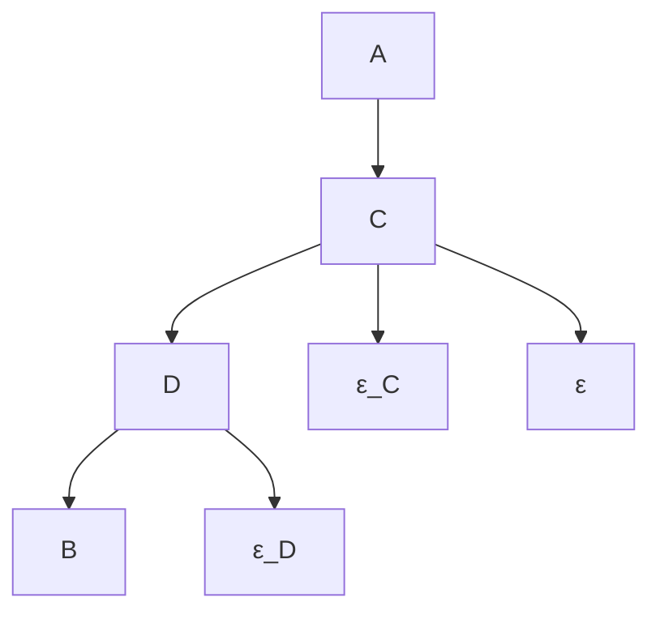

更正式地说，$\langle G, P \rangle$ 是**伪非确定性的（pseudoindeterministic）**，其中 $P$ 是定义在 $V$ 上的概率分布，$G$ 是定义在 $V$ 上的有向无环图，当且仅当 $G$ 不是 $P$ 的确定性图，并且存在一个定义在变量集 $\mathbf{V}'$ 上的分布 $P'$ 和一个定义在 $\mathbf{V}'$ 上的有向无环图 $G'$，使得 $\mathbf{V}'$ 真包含 $V$，并且满足：

- (i) $G'$ 是 $P'$ 的确定性图；
- (ii) $G$ 是 $G'$ 在 $\mathbf{V}$ 上的子图；
- (iii) $V$ 中没有顶点是 $\mathbf{V}' \setminus V$ 中顶点的祖先；
- (iv) $\mathbf{V}' \setminus V$ 中没有顶点是连接 $\mathbf{V}$ 中两个顶点的路径的源点；
- (v) $P$ 是 $P'$ 的边际分布；
- (vi) $G$ 表示 $P$。

如果我们说 $\langle P, G \rangle$ 是**线性伪非确定性的（linear pseudoindeterministic）**，我们的意思是 $\langle P, G \rangle$ 是伪非确定性的，并且此外，在 $G'$ 中，$\mathbf{V}'$ 中的每个顶点是其父节点的线性函数。由有向无环图线性表示的分布是伪非确定性的。（类似的定义适用于布尔伪非确定性图分布对等。）

## 2.6 背景注释（Background Notes）

基于 Lauritzen、Speed 和 Vijayan（1978）纯粹的图论工作，以及在对数线性模型方面的统计工作（Bishop, Fienberg, and Holland 1975），Darroch、Lauritzen 和 Speed 于 1980 年引入了条件独立性的对数线性假设的无向图形表示。基于 Kiiveri 的论文工作，Kiiveri 和 Speed（1982）引入了马尔可夫条件的版本，定义了递归因果模型的概念，获得了多项分布的最大似然估计，并为离散和连续变量的应用提供了系统性的综述。不久之后，Kiiveri、Speed 和 Carlin（1984）进一步发展了形式化基础。Wermuth 和 Lauritzen（1983）引入了递归图的概念，也就是我们所说的有向独立图。极小性、d-分离和忠实性的定义归功于 Pearl（1988）。