# 因果与预测：公理与阐释（Causation and Prediction: Axioms and Explications）

关于**因果关系（causation）**本质的观点大致可分为：将因果影响分析为某种概率关系的观点、将因果影响分析为某种反事实关系（有时是与操纵或干预相关的反事实关系）的观点，以及倾向于完全不讨论因果关系的观点。我们不提倡任何关于因果关系的定义，但在本章中，我们试图使我们的用法系统化，并明确阐明我们关于因果结构与概率、反事实和操纵之间关系的假设。通过适当的形而上学调整，这些假设可以从上述任何一种观点（或许甚至包括最后一种观点）中得到认可。

## 3.1 条件句（Conditionals）

智能规划通常需要预测行动的后果。由于行动会改变事态，评估尚未采取的行动的后果需要判断未来条件句的真假——如果 $X$ 成立，那么 $Y$ 就会成立。判断过去实践或政策的效果需要判断反事实条件句的真假——如果 $X$ 当时成立，那么 $Y$ 当时就会成立。

详细描述未来条件句或反事实条件句为真的条件是一个众所周知且困难的哲学问题。Lewis (1973) 指出，**如果袋鼠没有尾巴，它们就会摔倒** 这句话是真的，尽管我们可以想象袋鼠使用拐杖的情况。我们的意思是，如果情况与现状大致相同——考虑到袋鼠拐杖的稀缺性和袋鼠不愿使用拐杖——那么如果袋鼠没有尾巴，它们就会摔倒。但要将这种直觉精确化并不容易。

人们普遍认识到，**因果规律性（causal regularities）**蕴含反事实条件句；事实上，这通常被认为是区分因果律与偶然成立的概括的特征。**你口袋里的所有硬币都是银制的** 并不蕴含反事实条件句 **如果这枚便士在你口袋里，那么它就是银制的**。但因果律 **所有电子与正电子的碰撞都会释放能量** 确实蕴含反事实条件句 **如果这个电子与这个正电子碰撞，那么能量就会被释放**。

因果规律性与未来条件句和反事实条件句的真值之间的联系，使得发现因果结构在许多情境下对于智能规划至关重要。一个将车祸死亡率与汽车重量联系起来的线性方程可能对给定总体成立，但除非它描述了世界的一个稳健特征，否则对于预测如果通过立法操纵汽车重量时死亡率会发生什么变化是无用的。即使是对总体中数值分布的相当精确的参数化表示，也可能对规划无用，除非它们也反映了变量之间的因果结构。

## 3.2 因果关系（Causation）

我们将因果关系理解为特定事件之间的关系：某事发生并导致另一件事发生。每个原因都是一个特定事件，每个结果也是一个特定事件。一个事件 $A$ 可以有多个原因，其中没有一个单独足以产生 $A$。一个事件 $A$ 也可以是**过度决定的（overdetermined）**：它可以有多个足以使 $A$ 发生的原因集。我们假设因果关系（通常）是**传递的（transitive）**、**非自反的（irreflexive）**和**反对称的（antisymmetric）**。即：i) 如果 $A$ 是 $B$ 的原因，且 $B$ 是 $C$ 的原因，那么 $A$ 也是 $C$ 的原因；ii) 事件 $A$ 不能成为自身的原因；iii) 如果 $A$ 是 $B$ 的原因，那么 $B$ 不是 $A$ 的原因。

## 3.2.1 直接因果与间接因果（Direct vs. Indirect Causation）

直接原因与间接原因的区别是相对于一组事件而言的。如果 $C$ 是划火柴的事件，$A$ 是火柴着火的事件，并且不考虑其他事件，那么 $C$ 是 $A$ 的直接原因。然而，如果我们添加 $B$：火柴头上的硫磺达到了足以与氧气结合的热量，那么我们将不再说 $C$ 直接导致了 $A$，而是说 $C$ 直接导致了 $B$，并且 $B$ 直接导致了 $A$。因此，如果 $C$ 导致 $B$ 且 $B$ 导致 $A$，我们称 $B$ 是 $C$ 和 $A$ 之间的**因果中介（causal mediary）**。

在确定了背景和一组事件之后，一个事件成为另一个事件的直接原因意味着什么？直觉是这样的：一旦作为 $A$ 直接原因的事件发生，$A$ 是否发生就不再与作为 $A$ 间接原因的事件是否发生有任何关系。**直接原因将间接原因与结果屏蔽开来**。如果一个孩子在日托中心接触了水痘，感染了病毒，后来出现了皮疹，那么感染事件将接触事件与皮疹的发生屏蔽开来。一旦她被感染，她是否出皮疹就与她是在日托中心还是在周六早上的游戏组接触病毒无关。

假设 $V$ 是一组包含 $C$ 和 $A$ 的事件。$C$ 是 $A$ 相对于 $V$ 的直接原因，当且仅当 $C$ 是某个集合 $\mathbf{C}$（包含于 $V \setminus \{A\}$）的成员，使得：(i) $\mathbf{C}$ 中的事件是 $A$ 的原因；(ii) $\mathbf{C}$ 中的事件，如果它们发生，无论 $\mathbf{V} \setminus (\{A\} \cup \mathbf{C})$ 中的事件是否发生，都会导致 $A$ 发生；以及 (iii) 没有 $\mathbf{C}$ 的真子集满足 (i) 和 (ii)。

## 3.2.2 事件与变量（Events and Variables）

为了使因果关系与可经验估计的概率联系起来，必须对事件进行分类；一些实际或可能的事件必须被汇集在一起，被声明为某一类型，并与其他可能被汇集到其他类型的实际或可能事件区分开来。最简单的分类将事件描述为某种类型，例如，日食或道琼斯工业平均指数的下跌，并将每种类型的事件 $A$ 与事件 $\neg A$（$A$ 的不发生）配对。这种分类使我们能够明智地谈论作为原因的变量。我们通过引入**布尔变量（Boolean variables）**来实现这一点，这些变量将某种类型的事件或其缺失作为值。我们说布尔变量 $C$ 导致布尔变量 $A$，当且仅当一对 $(C, \neg C)$ 中的至少一个成员导致一对 $(A, \neg A)$ 中的至少一个成员。通常，除非两种类型事件之间的因果关系具有一定的一般性——即，许多 $A$ 类型的事件以 $C$ 类型的事件为原因，并且许多 $C$ 类型的事件以 $A$ 类型的事件为结果，或者两者都没有——否则没有人会费心将事件收集到一个类型中并检查此类变量之间的因果关系。

事件可以聚合成变量 $X$ 和 $Y$，使得某些 $X$ 类型的事件导致某些 $Y$ 类型的事件，并且某些 $Y$ 类型的事件导致某些 $X$ 类型的事件。在这种情况下，变量之间的因果关系将没有明确的方向。

有些事件是数量取某个特定值，例如将一壶特定的水加热到 100 摄氏度。许多类型的尺度都与一系列可能事件相关联，在这些事件中，特定系统取得一个尺度值或取得一组尺度值中的一个值。我们也可以将这些尺度的变量称为原因和结果，至少对于特定时间间隔内的特定系统是如此。对于任何特定系统 $S$，我们说尺度变量 $Q$ 导致 $S$ 中的尺度变量 $R$，前提是存在 $Q$ 的一个值（或一组值）$q$ 和 $R$ 的一个值（或一组值）$r$，以及一个可能事件，其中 $Q$ 在 $S$ 中取值 $q$ 会导致一个事件，其中 $R$ 在 $S$ 中取值 $r$。在实践中，我们通常只在认为不同度量值之间的因果关系不局限于特定值或特定系统，而是更一般时，才形成尺度。如果系统取得 $Q$ 的值 $q$ 导致它取得 $R$ 的值 $r$，我们有时会说 $R$ 的值 $r$ 是由 $Q$ 的值 $q$ 引起的。如果 $K$ 是一个系统集合，我们说变量 $Q$ 在 $K$ 中导致变量 $R$，前提是对于 $K$ 中的每个系统 $S$，$Q$ 在 $S$ 中导致 $R$。

如果我们严格应用变量之间的因果关系概念，那么几乎每个自然变量都会被算作几乎所有其他自然变量的原因，因为无论两个变量 $A$ 和 $B$ 多么遥远，通常总存在某种物理上可能（即使非常不可能）的系统安排，使得 $A$ 的某些值的变化会导致 $B$ 的某些值的变化。（我们假设，独裁者可以安排环境，使得芝加哥的出生人数是中国茶叶价格的函数。）在实践中，在判断 $A$ 是否导致 $B$ 时，我们总是考虑其他变量的一个受限变化范围。因此，严格来说，我们对变量间因果关系的定义应该相对于其他变量的一组可能值，但我们将忽略这个形式性，并依赖上下文。**直接原因**的概念从事件推广到变量，与变量间因果依赖的定义明显平行：变量 $C$ 是变量 $A$ 相对于 $V$ 的直接原因，前提是 (i) $C$ 是包含在 $V$ 中的变量集 $\mathbf{C}$ 的成员；(ii) 存在一组 $\mathbf{C}$ 中变量的值 $\mathbf{c}$ 和 $A$ 的一个值 $a$，使得如果 $\mathbf{C}$ 中的变量取值 $\mathbf{c}$，它们将导致 $A$ 取值 $a$，无论 $V$ 中其他变量的值如何；以及 (iii) 没有 $\mathbf{C}$ 的真子集满足 (i) 和 (ii)。我们说变量 $X$ 是变量 $Y$ 和 $Z$ 的**共同原因（common cause）**，当且仅当 $X$ 是 $Y$ 相对于 $\{X, Y, Z\}$ 的直接原因，并且是 $Z$ 相对于 $\{X, Y, Z\}$ 的直接原因。如果在 $V$ 中存在一个从 $A$ 开始到 $B$ 结束的变量序列，使得对于序列中相邻的每一对变量 $X$ 和 $Y$（按此顺序），$X$ 是 $Y$ 相对于 $V$ 的直接原因，那么我们说存在一个从 $A$ 到 $B$ 相对于 $V$ 的**因果链（causal chain）**。如果存在一个从 $A$ 到 $B$ 相对于 $V$ 的长度大于 2 的因果链，则 $A$ 是 $B$ 相对于 $V$ 的**间接原因（indirect cause）**。我们对因果关系做出以下两个基本假设：(i) 如果 $A$ 是 $B$ 的原因，那么 $A$ 是 $B$ 相对于 $V$ 的直接原因或间接原因；(ii) 如果 $A$、$B$ 和 $C$ 在 $V$ 中，并且存在一个从 $A$ 到 $B$ 相对于 $V$ 的不包含 $C$ 的因果链，那么对于任何包含 $A$ 和 $B$ 的集合 $\mathbf{V}'$，存在一个从 $A$ 到 $B$ 相对于 $\mathbf{V}'$ 的不包含 $C$ 的因果链。当一个原因未被测量时，它有时被称为**潜变量（latent variable）**。我们说两个变量在一个系统中是**因果连接的（causally connected）**，如果其中一个变量是另一个变量的原因，或者它们有一个共同原因。一个总体的**因果结构（causal structure）**是一个有序对 $\mathbf{<V, E>}$，其中 $V$ 是一个变量集，$E$ 是 $V$ 上的有序对集，并且 $\mathbf{<X, Y>}$ 在 $E$ 中当且仅当 $X$ 是 $Y$ 相对于 $V$ 的直接原因。除非另有明确说明，我们假设在总体中，$A$ 要么是总体中所有单位 $B$ 的直接原因，要么不是总体中任何单位 $B$ 的直接原因。如果意图中的总体是明显的，我们不明确提及它。如果 $P(V)$ 是在具有因果结构 $C = \mathbf{<V, E>}$ 的总体中 $V$ 上的分布，我们说 $C$ **生成了（generated）** $P(V)$。两个因果结构 $\mathbf{<V, E>}$ 和 $\mathbf{<V', E'>}$ 是**同构的（isomorphic）**，当且仅当存在一个从 $V$ 到 $V'$ 的一一映射 $f$，使得对于 $\mathbf{V}$ 中任意两个成员 $A$ 和 $B$，$\mathbf{<A, B>}$ 在 $E$ 中当且仅当 $\mathbf{<f(A), f(B)>}$ 在 $E'$ 中。一组变量 $V$ 对于一个总体是**因果充分的（causally sufficient）**，当且仅当在该总体中，$V$ 中任意两个或多个变量的每个共同原因都在 $V$ 中，或者对于总体中的所有单位具有相同的值。¹ 我们经常使用因果充分性的概念而不明确提及总体。

## 3.2.3 示例（Examples）

简单的数字逻辑电路元件提供了因果结构的具体例子。它们对大多数人来说没有太多内在兴趣，但它们的优点在于，给定此类电路元件的描述，几乎每个人都能就与电路相关的哪些事件导致哪些其他事件达成一致。在下面图示的元件中，变量 $X_1$、$X_2$ 和 $X_3$ 有两个值，1 和 0，分别对应相应线路是否有电流通过，半圆形代表一个**"与"门（"and" gate）**。电流从上到下流动。因此，变量 $X_3$ 的值是 $X_1$ 和 $X_2$ 值的简单布尔函数。$\mathrm{H}^{\bullet\bullet^{\prime\prime}}$ 代表布尔乘法，$X_3 = X_1 \cdot X_2$。


> 图 3.1

X₁
X₂
X₃

我们将 $X_1$ 取值 1 的事件和 $X_2$ 取值 1 的事件都理解为 $X_3$ 取值 1 的事件的**原因（cause）**。我们说布尔变量 $X_1$ 和 $X_2$ 各自是布尔变量 $X_3$ 的原因。

因果结构的形式不依赖于所涉及的变量类型或它们之间的特定函数类别。同构的因果结构可能由连续变量的线性依赖系统实现。因此考虑三个不同的变量 $X_1$、$X_2$ 和 $X_3$，它们代表给定线路中的电压，因此取值范围为非负实数。假设我们有一个输出其输入电压之和的机制（图 3.2）。


> 图 3.2

X₁
X₂
+
X₃

在这种情况下，$X_3 = X_1 + X_2$，但因果结构同构于图 1 中的因果结构：$X_1$ 和 $X_2$ 各自是 $X_3$ 的原因。

这些例子表明，**因果依赖关系（causal dependencies）** 和**函数依赖关系（functional dependencies）** 是相关的；$X_3$ 是 $X_1$ 和 $X_2$ 的结果，并且 $X_3$ 是 $X_1$ 和 $X_2$ 的函数。在结果变量的值由其所有直接原因变量的值唯一确定的系统中，可以通过将每个变量或事件表示为其直接原因的函数，从因果依赖推断出函数依赖。反之则不成立：从一个方程正确描述了一个系统这一事实，不能推断出系统中的直接因果依赖关系反映在方程的函数依赖关系中。例如，如果方程 $X_3 = X_1 + X_2$ 对一个系统成立，那么方程 $X_2 = X_3 - X_1$ 同样对该系统成立，但如果 $X_1$ 和 $X_2$ 导致 $X_3$，那么通常 $X_3$ 和 $X_1$ 不会导致 $X_2$。²

## 3.2.4 用有向图表示因果关系（Representing Causal Relations with Directed Graphs）

利用**直接原因（direct cause）**的概念，用有向图表示因果结构是直观的：

**因果表示约定（Causal Representation Convention）**：一个有向图 $G = <\mathbf{V}$，E> 表示一个针对单位总体的因果充分（causally sufficient）的因果结构 C，当且仅当 G 的顶点表示 C 中的变量，并且在 G 中有一条从 A 到 B 的有向边，当且仅当 A 是 B 相对于 $\mathbf{V}$ 的直接原因 $^{3}$。

我们将表示因果结构的**有向无环图（directed acyclic graph）**称为**因果图（causal graph）**。图 3.3 是图 3.1 和图 3.2 中所示电路器件的因果图。


> 图 3.3

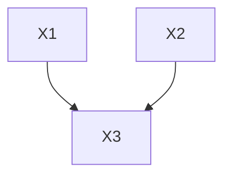

与我们之前的定义一致，如果 G 是一个因果图，并且在 G 中存在一个顶点 X 以及一条从 X 到 Y 且不包含 $Z$ 的有向路径，以及一条从 X 到 Z 且不包含 Y 的有向路径，那么我们将称 X 是 Y 和 Z 的一个**共同原因（common cause）**。

因果表示约定存在重要的局限性。假设药物 A 和 B 都能减轻症状 C，但单独使用 A 的效果微乎其微，而单独使用 B 的效果则不然。我们在本章中考虑的有向图表示无法表示这种交互作用，也无法将其与 A 和 B 各自对 C 都有影响的其他情况区分开来。这种交互作用只能通过与图相关的概率分布来表示。考虑另一个例子，一个简单的开关。如图 3.4 所示，假设电池 A 有两种状态：充电和未充电。当开关 B 闭合时，电池 A 中的电荷将使灯泡 C 点亮，否则不会。如果 A 和 B 是独立的随机变量，那么 A 和 C 在给定 B 和空集条件下相关，B 和 C 在给定 A 和空集条件下相关，并且 A 和 B 在给定 C 条件下相关。因此，表示 A、B 和 C 上分布的有向无环图类似于上面所示的有向图。这个结论本身并无不妥，只是信息不够完整。A 和 C 的相关性完全源于 B=1 的条件。当 $B=0$ 时，A 和 C 是独立的。


A
C
B


> 图 3.4

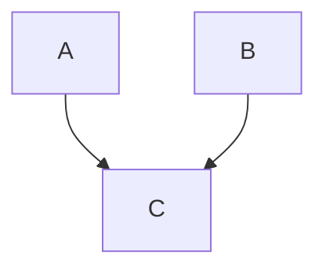

由于在离散数据中，条件独立性事实（如果已知）能够识别开关变量，因此更好的表示方法是将变量的某些父节点识别为开关。但这种通用表示通常不太容易理解 $^{4}$。最近，Geiger 和 Heckerman（1991）描述了将有向无环图表示扩展到表示开关的工作。

## 3.3 因果关系与概率（Causality and Probability）

## 3.3.1 确定性因果结构（Deterministic Causal Structures）

近似而言，图 3.1 和 3.2 中的器件是确定性的，即效果是其直接原因的确定性函数。如果在总体中每个效果是其直接原因的线性函数，我们称该系统为总体中的**线性确定性因果结构（linear deterministic causal structure）**。

因果图中入度为零（即没有因果输入）的变量称为**外生变量（exogenous）**。$X_{1}$ 和 $X_{2}$ 是图 3.3 因果图中的外生变量。非外生的变量是**内生变量（endogenous）**。在确定性因果结构中，外生变量的值决定了其余变量的唯一值。


> $X_{3}$

X₁
X₂


> 因果图电路图 图 3.5


考虑图 3.1 中的电路元件及其因果图，两者均显示在图 3.5 中。设想一个实验来验证该器件是否按描述工作。我们将为外生变量赋值，即决定是否向 $X_{1}$ 和 $X_{2}$ 输入电流，然后读取 $X_{3}$ 是否有电流。我们可以用下表来表示该实验。

<table><tr><td> $X_1$ </td><td> $X_1$ </td><td> $X_3$ </td></tr><tr><td>1</td><td>1</td><td>?</td></tr><tr><td>1</td><td>0</td><td>?</td></tr><tr><td>0</td><td>1</td><td>?</td></tr><tr><td>0</td><td>0</td><td>?</td></tr></table>

假设我们确信该器件通常按设计工作，但我们想知道它失效的频率和方式。在若干次试验中，我们可以随机为 $X_{1}$ 和 $X_{2}$ 赋值，然后读取 $X_{3}$ 是否有电流。也就是说，我们可以为外生变量集合可能占据的每个状态分配一个概率。例如：

$$
P (X_{1} = 1, X_{2} = 1) = 0.2
$$

$$
P (X_{1} = 1, X_{2} = 0) = 0.3
$$

$$
P (X_{1} = 0, X_{2} = 1) = 0.2
$$

$$
P (X_{1} = 0, X_{2} = 0) = 0.3
$$

由于此因果结构是确定性的（即使外生变量是随机的），外生变量上的概率分布决定了系统整个变量集合的联合分布。对于此例，$(X_{1}, X_{2}, X_{3})$ 上的联合分布为：

$$
\begin{array}{l} P (X_{1} = 1, X_{2} = 1, X_{3} = 1) = 0.2 \\ P (X_{1} = 1, X_{2} = 1, X_{3} = 0) = 0.0 \\ P (X_{1} = 1, X_{2} = 0, X_{3} = 1) = 0.0 \\ P (X_{1} = 1, X_{2} = 0, X_{3} = 0) = 0.3 \\ P (X_{1} = 0, X_{2} = 1, X_{3} = 1) = 0.0 \\ P (X_{1} = 0, X_{2} = 1, X_{3} = 0) = 0.2 \\ P (X_{1} = 0, X_{2} = 0, X_{3} = 1) = 0.0 \\ P (X_{1} = 0, X_{2} = 0, X_{3} = 0) = 0.3 \\ \end{array}
$$

我们说这个分布是由图 3.5 的因果结构生成的。

我们使用这个例子不是为了研究电路的抽样方案，而是为了说明概率分布是如何由确定性因果器件生成的。关于确定性因果结构与其可能生成的概率分布之间的联系，我们唯一做出的假设涉及我们允许在外生变量上存在的分布。我们假设，在一个因果充分结构中的变量概率分布中，外生变量是联合独立的。这既是部分实质性假设——即统计相关性是由因果联系产生的——也是部分关于表示的约定。如果结构中的外生变量不独立，我们预期因果图是不完整的，并且存在某种图中未表示的、导致统计依赖性的进一步因果机制。要么某些输入变量是其他变量的原因（在这种情况下我们犯了歧义错误，因果图实际上并非该结构因果结构的图），要么观察变量的某些非常数共同原因未被包含在结构描述中。

## 3.3.2 伪非确定性和非确定性因果结构（Pseudoindeterministic and Indeterministic Causal Structures）

在实践中，人们测量的变量很少是彼此之间的确定性函数。我们将一个总体中，某个变量不是其在 V 中直接原因的确定性函数的、关于变量集合 V 的因果结构称为该总体的**非确定性因果结构（indeterministic causal structure）**。一个非确定性因果结构可能是**伪非确定性的（pseudoindeterministic）**。也就是说，一个确定性因果结构，如果 V 中变量的原因并未全部包含在 V 中，那么即使通过添加不是 V 中变量共同原因的变量来扩大变量集合后并不存在真正的非决定论，它也可能表现为非确定性的。例如，再次假设图 3.1 和 3.5 所示的器件控制着线路 $X_{3}$ 中的电流。再假设 $X_{2}$ 对我们隐藏，因此只有 $X_{1}$ 和 $X_{3}$ 出现在我们研究的因果结构中。我们可能仍然假设 $X_{1}$ 是 $X_{3}$ 的一个原因，从而形成图 3.6 右侧的因果图。


> 实际电路 实际电路图

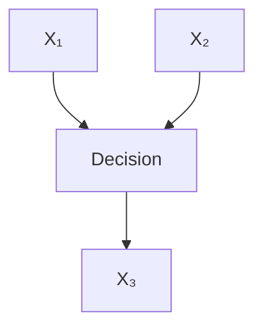


> 假设的因果图 假设的因果图 图 3.6

假设实际电路器件生成的联合分布 $P(X_{1}, X_{2}, X_{3})$ 与 3.3.1 节中给图 3.5 的分布相同，那么观察到的分布 $P(X_{1}, X_{3})$ 就是 $P(X_{1}, X_{2}, X_{3})$ 的边际分布，即：

$$
\begin{array}{l} P (X_{1} = 1, X_{3} = 1) = 0.2 \\ P (X_{1} = 1, X_{3} = 0) = 0.3 \\ P (X_{1} = 0, X_{3} = 1) = 0.0 \\ P (X_{1} = 0, X_{3} = 0) = 0.5 \\ \end{array}
$$

在观察到的分布中，$X_{3}$ 显然不是其直接父节点 $X_{1}$ 的函数，因果结构表现为非确定性的。我们说这个结构是伪非确定性的。更正式地说，对于一个总体，因果结构 $C = <\mathbf{V}, \mathbf{E}>$ 是伪非确定性的，当且仅当 C 不是该总体的确定性因果结构，并且存在一个因果结构 $C' = <\mathbf{V}', \mathbf{E}'>$，其变量集合 $\mathbf{V}'$ 真包含 V，使得：

- (i) $C'$ 是该总体的确定性因果结构；
- (ii) 如果 A 和 B 在 V 中，那么 $<A, B>$ 在 E 中当且仅当 $<A, B>$ 在 $\mathbf{E}'$ 中；
- (iii) V 中没有变量是 $\mathbf{V}' \backslash \mathbf{V}$ 中变量的原因；
- (iv) $\mathbf{V}' \backslash \mathbf{V}$ 中没有变量是 V 中两个变量的共同原因；

如果一个结构在 $C'$ 中的所有函数依赖关系都是线性的，则称该结构是**线性伪非确定性的（linear pseudoindeterministic）**。线性伪非确定性因果结构在计量经济学和社会科学文献中很常见，通常被称为**结构方程模型（structural equation models）**。这些模型中的误差项通常被解释为被省略的原因。

至少可以设想存在真正非确定性的结构，甚至是真正非确定性的宏观结构，其变量具有因果结构。我们将假设，对于伪非确定性结构成立的**条件独立性（conditional independence）**与因果结构之间的相同关系，对于真正非确定性的因果关系也同样成立，尽管我们稍后将看到，似乎存在一些量子力学系统，对于这些系统，该假设必须仔细限定。关于测量变量是其他测量变量的精确函数的情况的讨论，请参见第 3.8 节。

## 3.4 公理（The Axioms）

我们考虑将概率与因果图联系起来的三个条件：**因果马尔可夫条件（Causal Markov Condition）**、**因果极小性条件（Causal Minimality Condition）** 和 **忠实性条件（Faithfulness Condition）**。这些公理并非独立。本书将在后续章节中研究各种条件子集的推论。我们将在下一节讨论这些条件的合理性和反对意见，但它们的重要性——即使不是其真实性——通过以下事实得到证明：我们在社会科学文献中遇到的几乎所有具有因果意义的统计模型都满足全部三个条件：如果模型为真，则三个条件都将满足。虽然很容易构造违反第三个条件（忠实性）的模型，但这种模型在当代实践中很少出现，即使出现，它们具有不忠实性后果这一事实也会被视为反对它们的理由。在第 5 章和第 8 章中，我们将考虑满足这三个条件的已发表的对数线性模型、回归模型和结构方程模型。

## 3.4.1 因果马尔可夫条件（The Causal Markov Condition）

将因果图与其生成的概率分布联系起来的直觉被统一并概括为一个基本条件：

**因果马尔可夫条件（Causal Markov Condition）**：设 G 是一个顶点集为 V 的因果图，P 是由 G 表示的因果结构在顶点 V 上生成的概率分布。G 和 P 满足因果马尔可夫条件，当且仅当对于 V 中的每一个 W，在给定 Parents(W) 的条件下，W 与 V \ (Descendants(W) ∪ Parents(W)) 独立。

当 G 描述了总体中的因果依赖关系，且变量分布为 P 并满足关于 G 的因果马尔可夫条件时，我们有时会说 P 是由 G 生成的。如果 V 不是因果充分的，并且 V 是生成分布 P 的因果图 G 中变量的一个真子集，我们则不假设因果马尔可夫条件对 P 在 V 上的边际分布成立。

第 2 章中描述的因子分解结果适用于具有满足因果马尔可夫条件的因果结构的系统总体中变量集合 V 的联合概率分布。如果 $P(V | \text { Parents }(V))$ 表示在给定 V 的直接原因（可能为空）顶点集条件下 V 的概率，那么对于所有使得每个 $P(V|\text{Parents}(V))$ 有定义的 V 值，有：

$$
P (\mathbf{V}) = \prod_{V \in \mathbf{V}} P (V | \text { Parents } (V))
$$


> 图 3.7

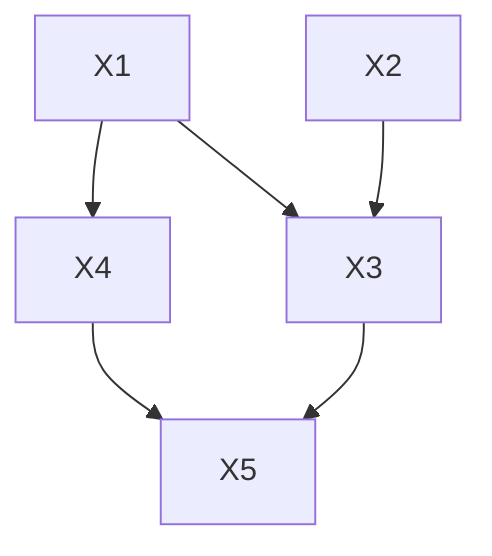

对于图 3.7 中的图，直接应用马尔可夫条件可以得到一个由 G 生成的分布所满足的独立性事实列表。

$$
\begin{array}{l} X_{1} \perp \perp X_{2} \\ X_{2} \perp \perp \{X_{1}, X_{4} \} \\ X_{3} \perp \perp X_{4} | \{X_{1}, X_{2} \} \\ X_{4} \perp \left\{X_{2}, X_{3} \right\} \mid X_{1} \\ X_{5} \perp \left\{X_{1}, X_{2} \right\} \mid \left\{X_{3}, X_{4} \right\} \\ \end{array}
$$

其他独立性关系由这些关系蕴含，例如：

$$
\{X_{4}, X_{5} \} \perp \perp X_{2} \mid \{X_{1}, X_{3} \}
$$

关于条件独立性公理的讨论见 Pearl 1988。

## 3.4.2 因果极小性条件（The Causal Minimality Condition）

我们通常还会施加一个进一步的条件来连接概率与因果关系。该原则指出，每个直接的因果连接都会阻止一个原本会成立的独立性或条件独立性关系。例如，在下面的因果图 G 中，C 是 A 的一个直接原因。


> 图 3.8

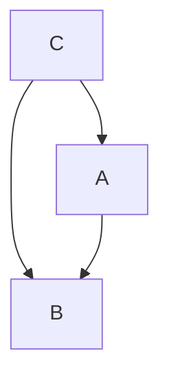

在 {A,B,C} 上的一个分布 P 中，即使从图中移除 C 和 A 之间的边，P 也满足马尔可夫条件。

**因果极小性条件（Causal Minimality Condition）**：设 G 是一个顶点集为 V 的因果图，P 是由 G 在 V 上生成的概率分布。<G, P> 满足因果极小性条件，当且仅当对于 G 的每一个以 V 为顶点集的真子图 H，<H, P> 都不满足因果马尔可夫条件。

由于我们几乎总是赋予我们考虑的图以因果解释，因此在大多数情况下，我们此后将简单地将这两个条件描述为马尔可夫条件和极小性条件。

## 3.4.3 忠实性条件（The Faithfulness Condition）

给定一个因果图，马尔可夫条件确定了一组独立性关系。这些独立性关系反过来可能蕴含其他关系，这意味着每个具有马尔可夫条件所给独立性关系的概率分布也将具有这些进一步的独立性关系。通常，在满足马尔可夫条件的因果图 G 上的概率分布 P 可能包含除马尔可夫条件应用于该图所蕴含的独立性关系之外的其他独立性关系。然而，如果这种情况没有发生，并且 P 的所有且仅有的独立性关系都是由应用于 G 的马尔可夫条件所蕴含的，那么我们将说 P 和 G 彼此**忠实（faithful）**。此外，如果存在某个有向无环图，使得 P 对其忠实，则称分布 P 是忠实的。因此，我们考虑一个进一步的公理：

**忠实性条件（Faithfulness Condition）**：设 G 是一个因果图，P 是由 G 生成的概率分布。<G, P> 满足忠实性条件，当且仅当在 P 中成立的每一个条件独立性关系都是由应用于 G 的因果马尔可夫条件所蕴含的。

注意，分布 P 对 G 忠实，当且仅当它同时满足马尔可夫条件和忠实性条件。忠实性条件和马尔可夫条件蕴含极小性，但极小性条件和马尔可夫条件并不蕴含忠实性。我们有时会使用较弱的公理，而更常使用较强的公理。事实证明，忠实性对于发现因果结构非常重要，而且它也是概率分布与因果结构之间的“正常”关系。

## 3.5 条件讨论（Discussion of the Conditions）

何时以及为何应该认为概率和因果关系共同满足这些条件？何时我们可以预期这些条件会被违反？何时应该认为总体中变量的值分布符合这些条件？

## 3.5.1 因果马尔可夫条件与最小性条件（The Causal Markov and Minimality Condition）

如果我们考虑**确定性系统（deterministic systems）**或**伪非确定性系统（pseudoindeterministic systems）**的因果图顶点上的概率分布，其中外生变量是独立分布的，那么**马尔可夫条件（Markov Condition）**必然成立。相关证明见最后一章。我们猜想**最小性条件（Minimality Condition）**对所有伪非确定性系统都成立。这些条件的依据在于这一事实，以及人类在那些我们能够很大程度上控制或操纵的系统上的历史经验。电气设备、机械设备、化学设备都满足该条件。科学和工程的广大领域——从汽车机械到化学动力学再到数字电路设计——如果不使用这些原理来诊断故障和推断机制，将是不可行的。

在一类重要情形中，最小性条件和马尔可夫条件的应用可能并不明确。1903 年，G. 尤尔·尤尔（G. Udny Yule）在其关于统计学中属性关联理论的奠基性论文的最后一节中，以“论不同记录混合可能导致的谬误”为题得出结论。（尤尔用 $|AB|C|$ 表示“在 C 的总体中 A 与 B 之间的关联”[第 131 页]）：

> 根据前述工作，我们不能从整个总体中独立的这一事实推断子总体中一对属性也是独立的……该定理在其逆应用方面具有相当大的实际重要性；也就是说，即使 $|AB|$ 具有显著的正值或负值，我们也不能确定 $|AB|C|$ 和 $|AB||$ 是否都不为零。例如，某个给定属性可能既不在男性系中遗传，也不在女性系中遗传；然而，一个混合记录可能会显示出相当大的表观遗传。假设 50% 的父亲和儿子具有该属性，但只有 10% 的母亲和女儿具有该属性。那么，如果在两个谱系中都没有遗传，记录必须给出（近似）：

<table><tr><td>具有属性的父亲和具有属性的儿子：</td><td>25%</td></tr><tr><td>具有属性的父亲和不具属性的儿子：</td><td>25%</td></tr><tr><td>不具属性的父亲和具有属性的儿子：</td><td>25%</td></tr><tr><td>不具属性的父亲和不具属性的儿子：</td><td>25%</td></tr></table>

<table><tr><td>具有属性的母亲和具有属性的女儿：</td><td>1%</td></tr><tr><td>具有属性的母亲和不具属性的女儿：</td><td>9%</td></tr><tr><td>不具属性的母亲和具有属性的女儿：</td><td>9%</td></tr><tr><td>不具属性的母亲和不具属性的女儿：</td><td>81%</td></tr></table>

如果这两份记录以相等的比例混合，我们得到：

<table><tr><td>具有属性的父母和具有属性的后代</td><td>13%</td></tr><tr><td>具有属性的父母和不具属性的后代</td><td>17%</td></tr><tr><td>不具属性的父母和具有属性的后代</td><td>17%</td></tr><tr><td>不具属性的父母和不具属性的后代</td><td>53%</td></tr></table>

这里 $13/30 = 43$ [且] 具有属性的父母的后代中有 1/3% 本身具有该属性，但总体上只有 30% 的后代具有该属性，也就是说，仅仅通过混合两个不同的记录就产生了一个相当大但虚幻的遗传。类似的虚幻关联，即一种不能赋予最明显的物理意义的关联，很可能在以下任何其他情况下发生：将不同记录汇集在一起，或者仅对大量异质材料做出一份记录。

由混合记录引起的虚构关联，在连续变量的情况下，与由同一过程可能产生的**伪相关（spurious correlation）**相对应，皮尔逊教授（Professor Pearson）在最近的一篇回忆录中注意到了并充分讨论了这种情况。如果将两个各自相关系数为零的独立记录汇集在一起，除非至少其中一个变量的均值在两个情况下相同，否则必然会产生伪相关。

尤尔的例子似乎给因果马尔可夫条件带来了一个问题。设 V 上的一个混合总体是任意一个总体，它由有限个子总体 $P_i$ 的组合构成，每个子总体对 V 中的变量具有不同的联合分布，且每个分布都满足某个图的因果马尔可夫条件。考虑一个由结构 $<G, P_1>$ 和 $<G, P_2>$ 混合而成的总体，其中 $P_1$ 和 $P_2$ 是不同的，并且满足 G 的马尔可夫条件。设混合中的比例为 n:m。

设 $P(X, Y, Z) = nP_1(X, Y, Z) + mP_2(X, Y, Z)$，其中 $n + m = 1$。简单的代数运算表明，$P(XY|Z) = P(X|Z)P(Y|Z)$ 当且仅当

$$
\begin{array}{l} n^2 P_1(X, Y, Z) P_1(Z) + n m P_2(X, Y, Z) P_1(Z) + m n P_1(X, Y, Z) P_2(Z) + m^2 P_2(X, Y, Z) P_2(Z) = \\ n^2 P_1(X, Z) P_1(Y, Z) + n m P_1(X, Z) P_2(Y, Z) + m n P_2(X, Z) P_1(Y, Z) + m^2 P_2(X, Z) P_2(Y, Z). \\ \end{array}
$$

如果 $n, m > 0$ 并且在两个分布中，X、Y 在给定 $Z$ 的条件下独立，即 $P_1(X, Y|Z) = P_1(X|Z)P_1(Y|Z)$ 且 $P_2(X, Y|Z) = P_2(X|Z)P_2(Y|Z)$，那么方程 (1) 简化为

$$
P_2(X | Z) P_2(Y | Z) + P_1(X | Z) P_1(Y | Z) = P_1(X | Z) P_2(Y | Z) + P_2(X | Z) P_1(Y | Z)
$$

这个古老但依然相当令人惊讶的结论是，当我们混合概率分布时，我们可能会发现所有可能的条件依赖关系。因此，似乎在许多混合总体中，条件独立性和依赖性将不是因果结构的可靠指南。

在线性伪非确定性系统的情况下，当具有两种不同分布（每个分布与一个线性结构相关联）的总体混合时，每个单独分布中的消失相关性不会在混合分布中产生消失的相关性，并且每个单独分布中的消失偏相关也不会在混合分布中产生消失的偏相关。很容易验证，对于任意两个分布的混合——无论是否基于线性结构——两个变量的协方差在混合中消失当且仅当

$$
k_1 \mathrm{COV}_1 (X Y) + k_2 \mathrm{COV}_2 (X Y) = k_1 k_2 [ \mu_1 X \mu_2 Y + \mu_1 Y \mu_2 X ] +
$$

$$
k_1 (k_1 - 1) \mu_1 X \mu_1 Y + k_2 (k_2 - 1) \mu_2 X \mu_2 Y
$$

其中总体 1 与总体 2 的比例为 n:m，且 $k_1 = n / (n + m)$，$k_2 = m / (n + m)$，而 $\mu_i$ 表示总体 i 中的均值。

因此，情况可能是这样的：总体 1 具有因果图 $G_1$，总体 2 具有因果图 $G_2$，而联合总体将具有一个分布，该分布不满足任一图的马尔可夫条件。问题是，这样的混合总体是否违反了**因果马尔可夫条件（Causal Markov Condition）**。当子总体成员身份的原因被恰当地视为 V 中变量的共同原因时，因果马尔可夫条件在混合总体中并未被违反；相反，我们拥有一个满足因果马尔可夫条件的系统总体，但存在一个（或多个）可能未被测量的共同原因。在某些情况下，子总体成员身份的原因可能像一个潜在开关变量（如第 3.2.4 节所考虑的那样）起作用；依赖于潜在变量不同值的条件分布决定了忠实于不同因果图的概率关系。在尤尔的例子中，缺失的共同原因是性别。如果，再举一个例子，我们形成一个铅币和铜币的混合样本，在每个子总体中，密度和电导率是独立的，但在混合总体中，它们在统计上是依赖的。我们应该说这是因为化学成分是密度和电导率的共同原因。在其他情况下，相关子总体成员身份的一个或多个原因可能看起来像是非自然的种类，或者至少不是科学家所寻求的那种原因。因此，当代认知神经心理学中一场重要的争论（Caramazza 1986）涉及对按综合征选择的人群样本使用统计结果，例如患有布罗卡失语症（Broca’s aphasia）的受试者。研究这类群体的一个目的可能是发现两种或多种正常能力是否有一个在布罗卡失语症患者中受损的共同原因。假设在一个布罗卡失语症患者的样本中，观察到两项认知技能测试得分的相关性。心理学家是否应该得出结论，认为测试表现有一个共同的潜在原因？也许是的，但这个共同原因不一定是一种导致这两种技能的功能性能力——无论是受损的还是其他的。相反，布罗卡失语症患者的样本可能是患有不同类型脑损伤的人的混合体，并且在每个亚组中，所讨论的技能可能是独立分布的。这个共同原因只是一个代表子总体成员身份的变量。

在某些情境下，混合的统计量并不反映任何总体成员身份变量。在线性模型中，相关性和偏相关性由线性系数和外生变量的方差决定。这些参数本身可以被视为随机变量，由此产生的总体分布是一个（通常不可数的）混合分布。在这种情况下，统计推断（而非因果推断）已被广泛研究（Swamy 1971）。如果 X 是一个随机变量，我们用 E(X) 表示 X 的期望值。

**定理 3.1：** 设 M 是一个线性模型，具有有向无环图 G 和线性系数 $a_{ij}$。设 M' 是一个与 M 具有相同有向无环图 G 的线性模型，使得 M' 中的线性系数 $a_{ij}'$ 是随机变量，这些随机变量与 M 中所有其他随机变量联合独立，并且 $E(a_{ij}') = a_{ij}$。假设外生非系数随机变量的方差在 M 和 M' 中相同。那么，在 M' 中，$\rho_{AB.\mathbf{C}} = 0$ 当且仅当在 M 中 $\rho_{AB.\mathbf{C}} = 0$。

因此，一个由线性伪非确定性因果充分系统混合而成的总体，如果这些系统具有相同的因果图且参数独立分布，那么该总体将在没有任何未测量的共同原因的情况下满足该图的因果马尔可夫条件。

专业哲学家们对因果马尔可夫条件的后果提出了一系列批评。其中大多数似乎依赖于忽略相关的潜在变量。韦斯利·萨尔蒙（Wesley Salmon，1984）声称，“存在另一种根本不同的共同原因情况”，无法用因果马尔可夫条件恰当地刻画。萨尔蒙将这种其他因果关系称为“交互叉（interactive fork）”。

一个所谓的“交互叉”例子来自戴维斯（Davis，1988）：

> 想象一台带有不灵敏开关的电视机：它通常能打开电视，但并非总是如此。当电视打开时，它会产生声音和图像。那么，在开关打开且有声音的情况下出现图像的概率，大于仅在开关打开的情况下出现图像的概率。（Davis 1988，第 156 页）


> 图 3.9

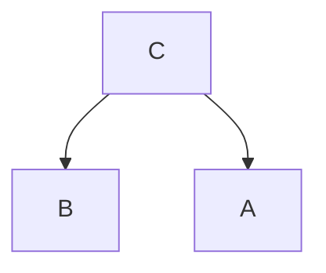

$$
C = \text { 开关打开 }
$$

$$
B = \text { 声音打开 }
$$

$$
A = \text { 屏幕打开 }
$$

因此，$P(B|C) < P(B|A \text{ and } C)$。

戴维斯的例子对因果情境的描述不准确，图 3.10 更好地描绘了这种情境。


> 图 3.10

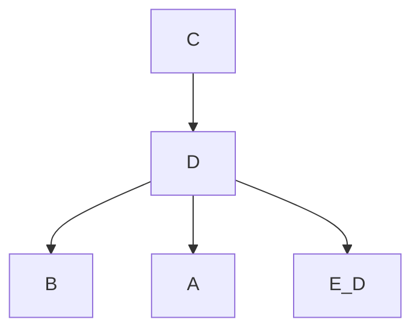

$$
C = \text { 开关打开 }
$$

$$
B = \text { 声音打开 }
$$

$$
A = \text { 屏幕打开 }
$$

$$
D = \text { 电路闭合 }
$$

电路的状态，或者开关事件下游的某个变量，使得 A 和 B 独立。

萨尔蒙自己的说明使用了以下台球游戏例子的一个微小变体（我们用布尔变量替换他的事件）。

C 是对与 A 和 B 都相关的因果条件的描述，但 A 和 B 在给定 C 的条件下并不独立。


> 图 3.11

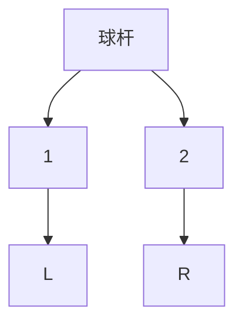

$$
\mathrm{A} = 1 \text { 球进左袋. }
$$

$$
\mathrm{B} = 2 \text { 球进右袋. }
$$

$$
\begin{array}{c} \text {C = 母球与1号球或2号球之间的任何碰撞.} \end{array}
$$

知道 C（存在一次碰撞）和 A（1 号球落入袋中）比仅仅知道 C 能告诉我们更多关于 B 是否发生（2 号球落入袋中）的信息。A 和 B 没有直接的因果联系，并且在给定 C 的条件下它们并不独立。

在萨尔蒙的例子中，事件 C 并没有完全描述 A 和 B 的所有共同原因。C 告诉我们母球与 1 号或 2 号球之间存在某种碰撞，但它没有告诉我们碰撞的性质。A 告知了我们碰撞的性质，因此也告诉了我们更多关于 B 的信息。如果先前的事件信息更丰富——例如，如果它指定了母球击中两个目标球时的精确动量——那么条件独立性就会恢复。这个例子仅仅反映了实际数据分析中一个常见的问题，每当在因果分析中使用某个**代理变量（proxy variable）**或合并一个变量的不同值时就会出现。我们认为，这些例子没有提供任何理由来怀疑因果马尔可夫条件。

埃利奥特·索伯（Elliott Sober，1987）认为，我们经常发现一些相关性，它们没有共同原因，或者在以已知共同原因为条件后仍有残差相关性。英格兰面包价格和威尼斯海平面的相关性可能有一些共同原因（也许是工业革命），但不足以解释所有的依赖关系。他的观点似乎是尤尔的观点：如果我们考虑一个变量 A 随时间增加的序列和一个变量 B 随时间增加的序列，那么 A 和 B 在由所有时间单位组成的总体中将是相关的，即使 A 和 B 没有因果联系。任何这样的组合总体显然是由时间值给出的总体的混合。

对因果马尔可夫条件有一个更根本的反对意见，即存在一些非确定性因果系统，根据目前的认识，该条件在这些系统中不成立。考虑**粒子对产生（pair production）**：一个量子力学事件产生两个向不同方向运动的粒子。由于守恒定律，这两个粒子的动力学变量必须是相关的；例如，如果一个粒子具有自旋向上的分量，那么另一个粒子必须具有该自旋向下的分量。我们可以进行实验，在实验中，我们在两个空间分离的传感器上测量每对粒子的两个不同自旋分量，并计算相关性。假设在产生粒子对的时刻，系统存在某个状态 S，使得在给定 S 的条件下，两个粒子的动力学变量是不相关的。J. S. 贝尔（J. S. Bell，1964）认为，在这样的假设下，可以推导出一个约束所测动力学变量相关性的不等式。虽然推导所需的假设存在争议，但经验事实似乎无可置疑：在某些量子力学实验中，贝尔不等式被违反。在这些实验中，相关变量与空间上遥远的子系统相关联，因此，除非放弃约束因果过程“局域”作用（即不超距瞬时作用）的原理，否则任何统计依赖性大概都不是由于一个子系统对另一个子系统的影响或共同原因造成的。因此，除非放弃局域性原理，否则因果马尔可夫条件似乎不成立（Elby 1992）。

我们认为，因果马尔可夫条件在某些量子力学实验中的明显失效，并不足以成为在其他情境下放弃它的理由。作为比较，我们不会仅仅因为经典动力学严格来说是错误的，就在计算轨道时放弃使用经典物理学。因果马尔可夫条件在实验室、医学和工程环境中一直被使用，在这些环境中，一个不需要的或意外的统计依赖性在表面上就是需要解释的东西。如果我们在任何地方都放弃该条件，那么处理分配与结果变量值之间的统计依赖性将永远不需要因果解释，实验设计的核心思想也将消失。似乎没有更弱的原理是普遍合理的；例如，如果我们只说 Y 的因果父节点使 Y 独立于更遥远的原因，那么我们将引入一个非常奇怪的间断性：只要 X 对 Y 有哪怕一点点影响，X 和 Y 在给定 X 的父节点的条件下就是独立的。但是一旦 X 对 Y 完全没有影响，X 和 Y 在给定 Y 的父节点的条件下就可能统计上依赖。

因果马尔可夫条件的基础是，首先，对于结构相似的伪非确定性系统的总体（其外生变量独立分布），该条件必然成立；其次，它几乎得到了我们所有关于那些能够经历重复过程且其基本倾向可以被检验的系统的经验的支持。任何反对该条件的有说服力的论证都必须展示出它不成立的宏观系统，并给出强有力的理由，说明为什么我们应该认为我们希望获得因果解释的宏观自然系统和社会系统也不满足该条件。在我们看来，这样的论证尚未提出。

## 3.5.2 忠实性（Faithfulness）与辛普森悖论（Simpson’s Paradox）

在出现辛普森最初提出的"悖论"（paradox）的各种变体时，**忠实性（Faithfulness）**可能被违反。我们已经看到，尤尔（Yule）和皮尔逊（Pearson）都观察到，两个变量在子群体中可能独立，但在合并后的总体中却相关。1948年，M. G. 肯德尔（M. G. Kendall）在其《高等统计理论》（Advanced Theory of Statistics）中使用了一个例子来说明相反的情况：两个二元变量是独立的，但在给定第三个变量的条件下却相关。几年后，辛普森（Simpson，1951）在一篇论文中对肯德尔的例子进行了改编，他认为自己的例子给因果关系与列联表之间的关系带来了困难。随后，该例子所展示的现象被称为"**辛普森悖论（Simpson's paradox）**"。此后，类似的例子已成为讨论因果关系与概率之间联系时的标准难题。

肯德尔的例子5如下：

考虑这样一种情况：若干患者接受某种疾病的治疗，并记录其康复人数。用 $A$ 表示康复，$\sim A$ 表示未康复，$B$ 表示接受治疗，$\sim B$ 表示未接受治疗，6 假设频数如下：

|       | $B$ | $\sim B$ | 合计 |
| :---- | :-: | :------: | :--: |
| $A$   | 100 |   200    | 300  |
| $\sim A$ | 50  |   100    | 150  |
| 合计  | 150 |   300    | 450  |

这里 $(AB) = 100 = (A)(B)/N$，因此属性是独立的。就目前所见，治疗对康复没有影响。用 $S_M$ 表示男性，$S_F$ 表示女性，假设男性和女性中的频数如下：

**男性**

|         | $BS_M$ | $\sim B S_M$ | 合计 |
| :------ | :----: | :----------: | :--: |
| $AS_M$  |   80   |     100      | 180  |
| $\sim AS_M$ |   40   |      80      | 120  |
| 合计    |  120   |     180      | 300  |

**女性**

|         | $BS_F$ | $\sim B S_F$ | 合计 |
| :------ | :----: | :----------: | :--: |
| $AS_F$  |   20   |     100      | 120  |
| $\sim AS_F$ |   10   |      20      | 30   |
| 合计    |   30   |     120      | 150  |

在男性组中，我们现在有

$$
Q_{AB.S_M} = 0.231
$$

在女性组中，我们有

$$
Q_{AB.S_F} = -0.429
$$

因此，在男性中，治疗与康复呈正相关，而在女性中则呈负相关。两者合并后表现出的独立性是由于这些关联在子群体中相互抵消所致。

因此，肯德尔的例子是两个分布的混合，一个是男性的分布，一个是女性的分布，使得一个总体中两个变量之间的正相关恰好被另一个总体中的负相关所抵消。这并没有什么悖论可言，人们可能会发现声称具有相同结构的经验例子。混合分布将违反**忠实性条件（Faithfulness Condition）**，因为它会表现出一种统计独立性关系，而这种关系并非由应用于所有个体共有的因果图的**马尔可夫条件（Markov Condition）**所蕴含。

肯德尔对其列联表的解释依赖于这样一个事实：在一个总体中，两个变量的关联是正的，而在另一个总体中则是负的。但是，如果在两个子群体中关联都是正的，而在混合总体中它却消失了，这又是怎么回事呢？这正是辛普森在1951年提出的问题。7 辛普森给出了下面的表格和评论：

|       | 男性       |       | 女性       |       |
| :---- | :--------- | :---- | :--------- | :---- |
|       | 未治疗     | 治疗  | 未治疗     | 治疗  |
| 存活  | 4/52       | 8/52  | 2/52       | 12/52 |
| 死亡  | 3/52       | 5/52  | 3/52       | 15/52 |

这一次……在男性和女性中，治疗与存活之间都存在正相关；但如果我们合并表格……会发现，在合并后的总体中，治疗与存活之间没有关联。这里的"合理"解释是什么？当治疗对男性和女性都有益时，很难认为该治疗对人类毫无价值。

问题在于，什么样的因果关系能够产生这样的表格，而这个问题恰当地被称为"**辛普森悖论（Simpson's paradox）**"。8

在辛普森的例子中，变量 $G$（男性或女性）、$T$（治疗或未治疗）和 $S$（存活或未存活）被赋予了一种解释，这种解释对因果结构施加了隐含的限制。当我们阅读这个例子时，我们自然假设性别 $G$ 不能由治疗 $T$ 或存活 $S$ 引起，但可能引起它们。与肯德尔的例子一样，辛普森表格中的分布满足图（在该图中 $G$ 引起 $T$ 和 $S$，且 $T$ 引起 $S$）的**因果马尔可夫条件（Causal Markov Condition）**。然而，辛普森的分布并不忠实于这样的图，因为在分布中 $T$ 和 $S$ 是独立的，尽管在图中 $T$ 是 $S$ 的一个父节点。

暂时假设我们忽略辛普森对其例子中变量所赋予的解释（毕竟这完全是虚构的），并让我们考虑那些会被该解释排除的因果结构。为了避免实质性的关联，我们将 $T$ 替换为 $A$，将 $G$ 替换为 $B$，将 $S$ 替换为 $C$，得到图 3.12 中的图 (i)。像辛普森和肯德尔的分布也可以通过一个图来实现，在该图中 $A$ 和 $C$ 不相邻，但每个都引起 $B$，如图 3.12 中的图 (ii) 所示。9

通过刚才提到的变量替换，辛普森的分布忠实于图 (ii) 但不忠实于图 (i)；此外，(ii) 是唯一忠实于该分布的图。


> (i)

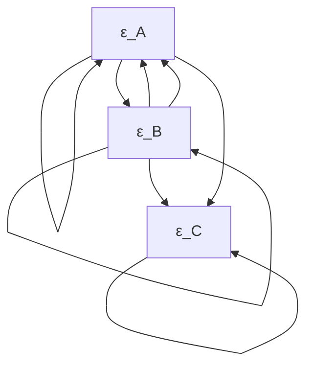


> (ii) 图 3.12

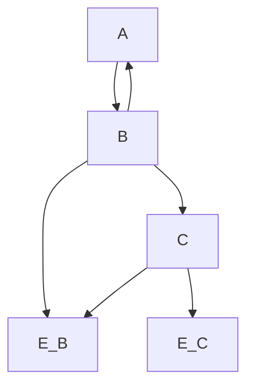

**朱迪亚·珀尔（Judea Pearl，1988）** 提供了一个贝叶斯例子，说明了为什么当像图 (ii) 这样的因果结构成立时，人们应该预期 $A$ 和 $C$ 尽管独立，但在给定 $B$ 的条件下是相关的：你的车能否启动取决于电池是否有电，也取决于油箱里是否有油，但这些条件是相互独立的。假设你发现你的车无法启动，并且在这种情况下你认为油箱是空的有一定概率，电池没电也有一定概率。接下来假设你发现电池没电了。当添加这个信息后，油箱是空的概率难道不会改变吗？

如果我们发现 $A$ 和 $C$ 是独立的，但在给定 $B$ 的条件下是相关的，**忠实性条件（Faithfulness Condition）**要求，如果存在任何因果结构，那么它就是结构 (ii)。尽管如此，结构 (i) 在逻辑上是可能的，如果变量具有辛普森赋予它们的意义，我们当然会更倾向于它。但是，如果先验知识不要求结构 (i)，那么应用忠实性条件我们会失去什么？换句话说，通过排除不忠实于分布的因果结构，我们会失去什么？

在线性情况下，参数值——一个结构的线性系数和外生方差的数值——构成了一个实数空间，而在这个空间中，产生马尔可夫条件未蕴含的消失偏相关的点集具有**勒贝格测度（Lebesgue measure）**为零。

**定理 3.2：** 令 $M$ 为一个线性模型，具有有向无环图 $G$、$n$ 个线性系数 $a_1, ..., a_n$ 和 $k$ 个外生变量的正方差 $\nu_1, ..., \nu_k$。令 $M(<u_1, ..., u_n, u_{n+1}, ..., u_{n+k}>)$ 为与为 $a_1, ..., a_n$ 和 $\nu_1, ..., \nu_k$ 指定值 $<u_1, ..., u_n, u_{n+1}, ..., u_{n+k}>$ 一致的分布。令 $\mathcal{P}$ 为 $M$ 参数值空间 $\Re^{n+k}$ 上概率测度 $P$ 的集合，使得对于 $\Re^{n+k}$ 的每个勒贝格测度为零的子集 $V$，有 $P(V) = 0$。令 $Q$ 为系数和方差值向量的集合，使得对于 $Q$ 中的所有 $q$，在 $\mathcal{P}$ 中每个具有 $M(q)$ 的概率分布都有一个未被 $G$ 线性蕴含的消失偏相关。那么对于所有 $P$ 在 $\mathcal{P}$ 中，有 $P(Q) = 0$。

该定理可以稍微加强；外生变量和误差变量的集合不必是联合独立的——两两独立就足够了。在**伪确定性（pseudoindeterministic）**情况下，忠实性最多只能在变量间函数依赖关系非常特殊的选择下被违反。考虑一个线性伪确定性系统的总体，其中外生变量是独立且正态分布的。马尔可夫条件所要求的条件独立关系对于线性系数的每一个可能值都会自动满足——它们仅通过设备组合线性函数的方式得到保证。但是，马尔可夫条件未要求的条件独立关系——那些表征不忠实于设备因果结构的分布的条件独立关系——要么根本无法产生，要么只能在线性系数满足非常强的约束时才能产生。

同样的道理也适用于其他函数类。虽然对于离散变量，我们尚未尝试给出类似于定理 3.2 的定理的形式化证明，但凭直觉应该可以预期这样的结果。对于满足图马尔可夫条件的分布，其分解公式提供了分布的自然参数化。如果一个外生变量有 $n$ 个值，它决定了 $n-1$ 个参数维度，由开区间 $(0,1)$ 的一份拷贝组成。如果一个内生变量 $X$ 有 $n$ 个值，则分解中的条件概率 $P(X|Parents(X))$ 决定了另外 $n-1$ 个参数维度，对于 $X$ 的父节点值的每个向量，由 $(0,1)$ 的一份拷贝组成。人们预期，产生分解本身未蕴含的条件独立关系的概率值集合，在此参数空间中测度为零。（Meek [1995] 提供了这一猜想的证明。）

## 3.6 贝叶斯解释（Bayesian Interpretations）

我们将这些条件解释为关于总体的频率，其中所有单位都具有相同的因果结构。我们希望考虑如何赋予这些条件一种**贝叶斯解释（Bayesian interpretation）**，其中概率是主观的。当前的主观主义解释认为，概率是理性的、主观的信念程度的理想化。在严格的主观主义观点下，存在有限频率，但不存在客观概率这种东西。人们假设科学中所研究的系统是确定性的，任何不确定性的表现都仅仅源于无知。贝叶斯统计模型的似然结构通常看起来像普通的非贝叶斯统计模型；贝叶斯学派在自由参数上增加了一个**先验概率分布（prior probability distribution）**。例如，贝叶斯线性模型指定了一个关于参数 $\Theta$ 的分布，该参数代表线性系数、方差、均值等。因此，贝叶斯模型是普通线性模型的混合，并且关于测量变量的联合分布不满足我们在本节中考虑的条件。

考虑对具有因果图 $G$ 的系统进行的一项研究。假设一个贝叶斯智能体的信念程度由一个密度 $f$ 表示，满足条件 $f ( X | \mathbf { P a r e n t s } ( G , X ) ) = h(\mathbf{Parents}(G,X); \Theta)$，其中 $\Theta$ 是一个参数，其值决定了 $X$ 在其父节点条件下的密度。让该贝叶斯智能体也对 $\Theta$ 有一个分布。在这种情况下，我们理解**因果马尔可夫条件（Causal Markov Condition）**和**因果极小性条件（Causal Minimality Condition）**约束了智能体在 $\Theta$ 条件下的信念程度。在 $\Theta$ 条件下，关于变量的主观联合分布将满足这些条件，但通常无条件联合分布则不满足。

现在假设智能体考虑一组备选的因果结构 $G$，并认为在每个结构 $G \in \mathbf{G}$ 中，$f ( X | \mathbf { P a r e n t s } ( G , X ) ) = h ( \mathbf { P a r e n t s } ( G , X ) ; ~ \theta _ { G } )$，如前所述。那么，我们理解因果马尔可夫条件和因果极小性条件约束了智能体在 $\Theta_G, G$ 条件下的信念程度。

如此理解，这些条件是关于“合理”信念程度的规范性原则。在后面的章节中，我们将详细考虑一个用于临床试验的贝叶斯方案，并论证该方案关于科学专家信念程度的假设与**马尔可夫条件（Markov Condition）**是一致的。

## 3.7 公理的推论（Consequences of the Axioms）

**因果马尔可夫条件（Causal Markov Condition）**、**极小性条件（Minimality Condition）**和**忠实性条件（Faithfulness Condition）**的推论贯穿本书，但这里应指出因果依赖与统计依赖之间的一些重要联系。

### 3.7.1 d-分离（d-Separation）

给定一个因果图 $G$，马尔可夫条件公理化了任何忠实于 $G$ 的分布 $P$ 所成立的独立性和条件独立性关系的集合。但是，对于一个给定的图，哪些条件独立性关系是从马尔可夫条件推出的可能并不明显。假设我们想知道，对于每一对顶点 $X$ 和 $Y$ 以及每个不包含 $X$ 和 $Y$ 的顶点集 $Q$，$X$ 和 $Y$ 是否在给定 $Q$ 的条件下独立，也就是说，想知道变量集之间所有原子独立性事实。直接对 $G$ 应用马尔可夫条件，即对每个顶点应用定义，通常是不够的。


> 图 3.13

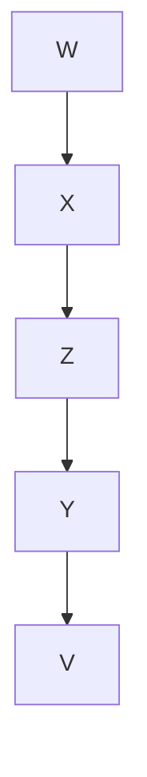

例如，在忠实于图 3.13 的分布中，假设我们想知道 $X$ 和 $Y$ 是否在给定集合 $\mathbf { Q } = \{ Z \}$ 的条件下独立。直接对图 3.13 应用马尔可夫条件，我们得到：

$$
\begin{array}{l} w \perp \perp \{Z, Y, V \} \\ X \perp \perp \{Y, V \} | \{W, Z \} \\ z \perp \perp \{W, V \} \\ Y \perp \perp \{W, X \} \mid \{V, Z \} \\ V \perp \perp \{W, X, Z \} \\ \end{array}
$$

从这些事实中推出 $X \perp \perp Y | \{Z\}$ 并不明显。Pearl 提出了条件独立性的一个纯图形化刻画——他称之为 **d-分离（d-separation）**，而 Geiger、Pearl 和 Verma（Geiger and Pearl 1989a; Verma 1987）证明了，对于有向无环图，d-分离实际上刻画了所有且仅有的那些从满足马尔可夫条件推出的条件独立性关系。

我们分两次来定义 d-分离——首先简洁地定义，然后用更易于理解且根据我们的经验更容易记忆和应用的方式来定义。

**D-分离（定义 1）**：如果 $X$ 和 $Y$ 是有向图 $G$ 中不同的顶点，而 $W$ 是 $G$ 中不包含 $X$ 或 $Y$ 的顶点集，那么在 $G$ 中给定 $W$ 时 $X$ 和 $Y$ 是 d-分离的，当且仅当在 $X$ 和 $Y$ 之间不存在这样的无向路径 $U$，使得：

- (i) $U$ 上的每个碰撞点（collider）在 $W$ 中都有一个后代，并且
- (ii) $U$ 上没有其他顶点在 $W$ 中。

$X$ 和 $Y$ 在给定 $W$ 时是 d-连接的（d-connected），当且仅当它们不被 $W$ d-分离。如果 $U$、$V$ 和 $W$ 是 $G$ 中不相交的顶点集，且 $U$ 和 $V$ 非空，那么当且仅当 $U$ 和 $V$ 的笛卡尔积中的每一对 $<u,v>$ 在给定 $W$ 时都是 d-分离的，我们称 $U$ 和 $V$ 在给定 $W$ 时是 d-分离的。集合间的 d-连接类似定义。

d-分离的第二个定义依赖于“活跃路径”和路径上“活跃顶点”的概念，其中“活跃”可以理解为携带关联。同样，$X$ 和 $Y$ 必须不同，$W$ 不能包含 $X$ 或 $Y$，并且这些概念都是相对于有向图 $G$ 而言的。

**D-分离（定义 2）**：$X$ 和 $Y$ 在给定 $W$ 时是 d-分离的，当且仅当在 $X$ 和 $Y$ 之间不存在相对于 $W$ 活跃的无向路径。

无向路径 $U$ 相对于 $W$ 是活跃的，当且仅当 $U$ 上的每个顶点相对于 $W$ 都是活跃的。

顶点 $V$ 在路径上相对于 $W$ 是活跃的，当且仅当要么 i) $V$ 是碰撞点，并且 $V$ 或其任何后代在 $W$ 中，要么 ii) $V$ 是非碰撞点并且不在 $W$ 中。

首先考虑 $W = \emptyset$ 的情况，我们称之为“无条件”情况。如果 $W = \emptyset$，那么无向路径 $U$ 上的每个顶点当且仅当它是非碰撞点时才活跃。由于路径上的所有顶点都必须活跃才能使整条路径活跃，因此 $U$ 是无条件活跃的，当且仅当其所有顶点都是非碰撞点。无条件活跃的路径就是 **trek**。¹⁰

例如，在图 3.14 的因果图中，$X$ 和 $V$ 被空集 d-分离，因为 $Y$ 是它们之间唯一路径上的碰撞点（不活跃）。

对节点进行条件化会翻转其状态。虽然 $X$ 和 $Y$ 在图 3.14 中是无条件 d-连接的，但它们在给定 $\{W\}$、$\{Z\}$ 或 $\{W,Z\}$ 时是 d-分离的。这是因为 $X$ 和 $Y$ 之间路径上的顶点是 $W$ 和 $Z$，它们是非碰撞点，因此是无条件活跃的。条件化将其状态从活跃翻转为不活跃，如果其中任何一个不活跃，那么 $X$ 和 $Y$ 之间的整条路径就变得不活跃。对非碰撞点进行条件化使其不活跃，这与马尔可夫条件背后的直觉相似。非碰撞点要么是共同原因（图 3.14 中的 $Z$），要么是有向路径的一部分，例如 $W$。当我们对其共同原因进行条件化时，结果变量变得独立；当我们对其更近端的原因进行条件化时，结果变量与其远因变得独立。


> 图 3.14

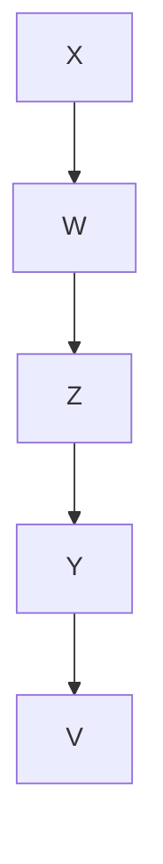

在图 3.14 中，$X$ 和 $V$ 是无条件 d-分离的，但在给定 $\{Y\}$ 时是 d-连接的。这是因为在无条件情况下，$Y$ 是 $X$ 和 $V$ 之间路径上唯一不活跃的节点。对 $Y$ 进行条件化使其活跃，从而使整条路径活跃。关于对碰撞点进行条件化使其活跃这一点，已在上述 3.5.2 节中讨论过。

然而，还有一个额外的转折。虽然对碰撞点进行条件化会激活它，但对其任何后代进行条件化也会激活它。例如，在图 3.15 的图中，$X$ 和 $Y$ 在给定 $W$ 时是 d-连接的。这是因为尽管 $U$ 是 $X$ 和 $Y$ 之间唯一路径上的碰撞点，因此无条件不活跃，但由于其后代之一 $W$ 在条件化集合中，它被激活了。


> 图 3.15

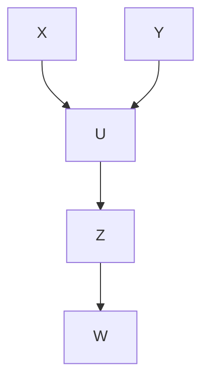

现在，检查两个顶点 $X$ 和 $Y$ 是否被图 $G$ 中的集合 $Q$ d-分离，从而检查在忠实于 $G$ 的分布中 $X$ 和 $Y$ 是否在给定 $Q$ 的条件下独立，应该相对直接了。检查 $X$ 和 $Y$ 之间的每条无向路径，直到找到一条相对于 $Q$ 活跃的路径，在这种情况下 $X$ 和 $Y$ 被 $Q$ d-连接；或者检查所有路径后都发现不活跃，在这种情况下 $X$ 和 $Y$ 被 $Q$ d-分离。对于每条路径，检查路径上的每个顶点。如果有任何一个不活跃，该路径就不活跃。如果顶点是 $Q$ 中的非碰撞点，或者是 $Q$ 中没有后代的碰撞点，则该顶点不活跃。如果顶点是不在 $Q$ 中的非碰撞点，或者是 $Q$ 中有后代的碰撞点，则该顶点活跃。例如，在图 3.16 中，$X$ 和 $Y$ 在给定 $\{U\}$ 时是 d-连接的，但在给定 $\{V, Z\}$ 时它们是 d-分离的。


> 图 3.16

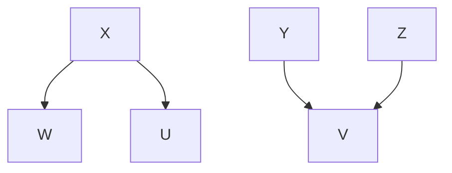

在第一种情况下，对 $U$ 进行条件化激活了 $X \right. U \left. Y$ 路径，而 $\{U\}$ 要 d-连接 $X$ 和 $Y$ 只需要一条活跃路径即可。在第二种情况下，对 $\{V, Z\}$ 进行条件化激活了 $X  W  Z  V  Y$ 路径上的 $V$，但条件化使该路径上的 $Z$ 不活跃，从而使整条路径不活跃；$X \right. U \left. Y$ 路径在给定 $\{V, Z\}$ 时也是不活跃的，因为 $U$ 是路径上的碰撞点，不在 $\{V, Z\}$ 中，并且在 $\{V, Z\}$ 中没有后代。由于 $X$ 和 $Y$ 之间的所有无向路径在给定 $\{V, Z\}$ 时都不活跃，因此 $X$ 和 $Y$ 在给定 $\{V, Z\}$ 时是 d-分离的。

基本结果如下：

**定理 3.3**：$P(V)$ 忠实于以 $V$ 为顶点集的有向无环图 $G$，当且仅当对于所有不相交的顶点集 $X$、$Y$ 和 $Z$，$X$ 和 $Y$ 在给定 $Z$ 的条件下独立当且仅当 $X$ 和 $Y$ 在给定 $Z$ 时是 d-分离的。

**定理 3.4** 给出了忠实性一个更直观的刻画，这激发了第 5 章中开发的算法。

**定理 3.4**：如果 $P(V)$ 忠实于某个有向无环图，那么 $P(V)$ 忠实于以 $V$ 为顶点集的有向无环图 $G$，当且仅当

- (i) 对于 $G$ 的所有顶点 $X$、$Y$，$X$ 和 $Y$ 相邻当且仅当 $X$ 和 $Y$ 在 $G$ 中不包含 $X$ 或 $Y$ 的每个顶点集上都是条件依赖的；并且
- (ii) 对于所有顶点 $X$、$Y$、$Z$，使得 $X$ 与 $Y$ 相邻，$Y$ 与 $Z$ 相邻，且 $X$ 与 $Z$ 不相邻，$X \right. Y \left. Z$ 是 $G$ 的子图当且仅当 $X$、$Z$ 在包含 $Y$ 但不包含 $X$ 或 $Z$ 的每个集合上都是条件依赖的。

相关性的研究历史上与正态分布相关联，对于该分布，消失的偏相关与条件独立性是等价的。但是，马尔可夫条件和忠实性条件将消失的相关性和偏相关性与线性系统的图形和因果结构联系起来，而不需要任何正态性假设。因此，对于线性系统，相关结构是因果结构的向导。如果对于 $G$ 的顶点 $A$ 和 $B$ 以及 $G$ 的所有顶点子集 $C$，$A$ 和 $B$ 在给定 $C$ 时是 d-分离的当且仅当 $\rho _ { A B . C } = 0$，那么我们称分布 $P$ 线性忠实于图 $G$。

**定理 3.5**：如果 $G$ 是一个顶点集为 $V$ 的有向无环图，$A$ 和 $B$ 在 $V$ 中，且 $\mathbf{H}$ 包含于 $V$，那么 $G$ 线性蕴含 $\rho _ { A B . \mathbf { H } } = 0$ 当且仅当 $A$ 和 $B$ 在给定 $\mathbf{H}$ 时是 d-分离的。

由此可得，分布 $P$ 线性忠实于图 $G$，当且仅当对于 $G$ 的顶点 $A$ 和 $B$ 以及 $G$ 的所有顶点子集 $C$，$A$ 和 $B$ 在给定 $C$ 时是 d-分离的当且仅当 $\rho _ { A B . \mathbf { C } } = 0$。定理 3.5 是所有**路径分析（path analysis）**示例（Wright 1934; Simon 1954; Blalock 1961; Heise 1975）背后的通用原理，这些示例将“递归”（即无环）线性模型中的因果结构与消失的偏相关联系起来。

在接下来的章节中，我们将经常提到，假设分布是忠实的，某些条件独立性或条件依赖性关系，或者消失或非消失的偏相关，是从因果结构推出的。相反，我们经常会观察到，给定某些条件独立性和依赖性关系，或偏相关事实，如果分布是忠实的，那么因果结构必须具有某些性质。每当我们做出此类断言时，我们都在使用定理 3.3、3.4 和 3.5 的隐含推论。

## 3.7.2 操作定理（The Manipulation Theorem）

许多实证研究的基本目标是预测变化的影响，无论这些变化是自然发生还是由人为政策所强加。如何利用观测到的分布 $P$ 来可靠地预测替代政策的效果，这些政策将在某些变量集上施加新的边际分布？强加一项直接改变某些变量（例如，药物使用）分布的政策这一想法，必然导致结果分布 $P_{Man}$ 与 $P$ 不同。仅凭 $P$ 无法预测 $P_{Man}$，但 $P$ 与因果结构可以。

假设卫生局局长正在考虑劝阻吸烟，他问道：“如果美国不允许任何人吸烟，那么癌症（Cancer）的分布会是什么？” 令 $V = \{\text{饮酒（Drinking）}, \text{吸烟（Smoking）}, \text{癌症（Cancer）}\}$。为了说明起见，假设在美国的实际人群中，图 3.17 所示的因果结构是正确的。


> 图 3.17

```mermaid
graph TD
  A["Drinking"] --> B["Smoking"]
  B --> C["Cancer"]
  C --> A
    style A fill:#fff,stroke:#000
    style B fill:#fff,stroke:#000
    style C fill:#fff,stroke:#000
    note right of B "G_Unman"
```

我们将实际抽样（或通过抽样及某些实验程序产生）的人群称为**未操作人群（unmanipulated population）**，将禁止吸烟的假设人群称为**操作人群（manipulated population）**。假设如果禁止吸烟的政策得以实施，它将完全有效，阻止所有人吸烟，但不会影响人群中饮酒（Drinking）的值。那么，假设的操作人群的因果图将与未操作人群不同，并且吸烟（Smoking）的分布在两个人群中也是不同的。操作后的因果图如图 3.18 所示。


> 图 3.18

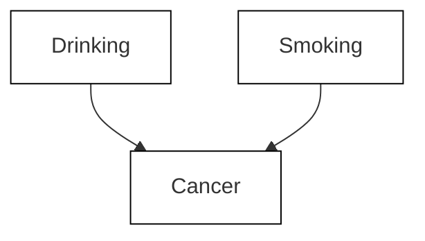

未操作图与操作图之间的区别在于，在 $G_{Unman}$ 中作为被操作变量父节点的某些顶点，在 $G_{Man}$ 中可能不再是（取决于操作的具体形式）被操作变量的父节点，反之亦然。

我们如何描述因禁止吸烟而导致的吸烟分布变化？一种方法是注意到，代表联邦政府政策的变量值在两个人群中是不同的。因此，我们可以在因果图中引入另一个变量，即禁止吸烟（Ban Smoking）变量，它是吸烟（Smoking）的一个原因。包含代表吸烟政策的新变量的完整因果图如图 3.19 所示。在实际的未操作人群中，禁止吸烟变量为“关（off）”；在假设人群中，禁止吸烟变量为“开（on）”。在实际人群中，我们测量 $P(\text{Smoking}|\text{Ban Smoking} = \text{off})$；在如果禁止吸烟将产生的假设人群中，$P(\text{Smoking} = 0|\text{Ban Smoking} = \text{on}) = 1$。对于因果图中 $V = \{\text{Smoking}, \text{Drinking}, \text{Cancer}\}$ 的任意子集 $X$，令 $P_{Unman(\text{Ban Smoking})}(\mathbf{X})$ 为 $P(\mathbf{X}|\text{Ban Smoking} = \text{off})$，并令 $P_{Man(\text{Ban Smoking})}(\mathbf{X})$ 为 $P(\mathbf{V}|\text{Ban Smoking} = \text{on})$。


> 图 3.19

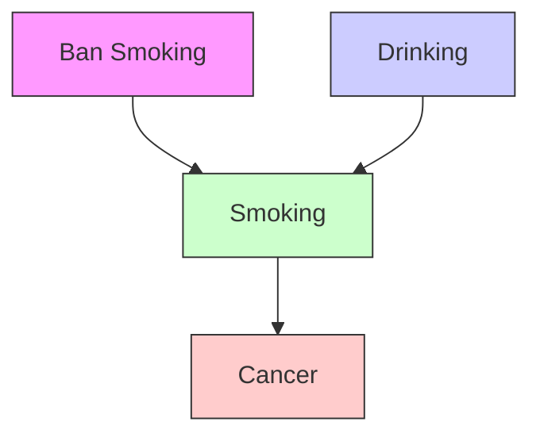

我们现在可以问：是否 $P_{Unman(\text{Ban Smoking})}(\text{Cancer}|\text{Smoking}) = P_{Man(\text{Ban Smoking})}(\text{Cancer}|\text{Smoking})$（对于定义了 $P_{Man(\text{Ban Smoking})}(\text{Cancer}|\text{Smoking})$ 的那些吸烟值，即 $\text{Smoking} = 0$）？显然，当且仅当癌症（Cancer）与禁止吸烟（Ban Smoking）在给定吸烟（Smoking）的条件下独立时，答案才是肯定的；但如果分布是忠实的，这便简化为癌症（Cancer）与禁止吸烟（Ban Smoking）在给定吸烟（Smoking）的条件下是否 **d-分离（d-separated）** 的问题，而在此因果图中它们并非如此。此外，$P_{Unman(\text{Ban Smoking})}(\text{Cancer}) \ne P_{Man(\text{Ban Smoking})}(\text{Cancer})$，因为癌症（Cancer）与禁止吸烟（Ban Smoking）在给定空集时不是 d-分离的。但相比之下，$P_{Unman(\text{Ban Smoking})}(\text{Cancer}|\text{Smoking}, \text{Drinking}) = P_{Man(\text{Ban Smoking})}(\text{Cancer}|\text{Smoking}, \text{Drinking})$（对于定义了 $P_{Man(\text{Ban Smoking})}(\text{Cancer}|\text{Smoking}, \text{Drinking})$ 的那些吸烟值，即 $\text{Smoking} = 0$），因为禁止吸烟（Ban Smoking）和癌症（Cancer）被 $\{\text{Smoking}, \text{Drinking}\}$ d-分离。这种不变性的重要性在于，我们可以通过考虑观测到的非吸烟者子人群中给定饮酒（Drinking）条件下癌症（Cancer）的条件分布，以及考虑未操作人群中饮酒（Drinking）的分布，来预测如果禁止吸烟时癌症的分布。

请注意，我们关于 $P_{Man(\text{Ban Smoking})}(\text{Cancer})$ 的结论的输入之一是，禁止吸烟是完全成功的，并且它不影响饮酒（Drinking）；这一知识并非来自我们对吸烟（Smoking）、饮酒（Drinking）和癌症（Cancer）所做的测量，而是假定来自其他来源。当然，如果假设不正确，就无法保证我们对 $P_{Man(\text{Ban Smoking})}(\text{Cancer})$ 的计算会产生正确结果。如果我们考虑的政策不是有效禁止吸烟，而是干预使吸烟的可能性降低但不影响饮酒（Drinking），那么包含操作变量禁止吸烟（Ban Smoking）的整个系统的图将与图 3.19 相同，$G_{Unman}$ 将如图 3.17 所示，但操作图 $G_{Man}$ 将看起来像图 3.17 而不是图 3.18。干预会改变但不会消除饮酒（Drinking）对吸烟（Smoking）的影响。

对系统的预测分析涉及三个不同的图：一个包含代表操作的变量 $W$ 的因果图 $G_{Comb}$，一个是在不包括代表操作的变量的变量集 $V$ 上的 $G_{Comb}$ 的子图 $G_{Unman}$，以及一个在 $V$ 上的图 $G_{Man}$，它表示由操作产生的 $V$ 中变量间的因果关系。如果操作“破坏”了 $G_{Unman}$ 中的因果依赖关系，则 $G_{Man}$ 可能是 $G_{Unman}$ 的一个子图；否则，$G_{Unman}$ 和 $G_{Man}$ 将是同一个图。

以下是形式化定义：如果 $G$ 是变量集 $\mathbf{V} \cup \mathbf{W}$ 上的有向无环图，且 $\mathbf{V} \cap \mathbf{W} = \emptyset$，那么当且仅当不存在从 $V$ 的任何成员到 $W$ 的任何成员的有向边时，$W$ 在 $G$ 中相对于 $V$ 是**外生的（exogenous）**。如果 $G_{Comb}$ 是变量集 $\mathbf{V} \cup \mathbf{W}$ 上的有向无环图，且 $P(\mathbf{V} \cup \mathbf{W})$ 满足关于 $G_{Comb}$ 的**马尔可夫条件（Markov condition）**，那么当且仅当 $W$ 相对于 $V$ 是外生的，且 $P(\mathbf{V}|\mathbf{W} = \mathbf{w_1}) \ne P(\mathbf{V}|\mathbf{W} = \mathbf{w_2})$ 时，将 $W$ 的值从 $\mathbf{w_1}$ 改变为 $\mathbf{w_2}$ 是 $G_{Comb}$ 相对于 $V$ 的一次**操作**。

我们定义 $P_{Unman(\mathbf{W})}(\mathbf{V}) = P(\mathbf{V}|\mathbf{W} = \mathbf{w_1})$，以及 $P_{Man(\mathbf{W})}(\mathbf{V}) = P(\mathbf{V}|\mathbf{W} = \mathbf{w_2})$，对于由 $P(\mathbf{V})$ 形成的各种边际分布和条件分布也类似。

我们将 $G_{Comb}$ 称为**组合图（combined graph）**，将 $G_{Comb}$ 在 $V$ 上的子图称为**未操作图（unmanipulated graph）** $G_{Unman}$。（注意，虽然 $P_{Unman(\mathbf{W})}(\mathbf{V})$ 满足关于 $G_{Unman}$ 的马尔可夫条件，但它也可能满足关于 $G_{Unman}$ 的某个子图的马尔可夫条件。这是因为 $G_{Comb}$，以及因此它的子图 $G_{Unman}$，可能包含表示操作子人群分布所需的边，但不包含表示未操作子人群分布所需的边。）

当且仅当 $V$ 在 $\mathbf{Children(W)} \cap \mathbf{V}$ 中时，$V$ 在 $\text{Manipulated}(\mathbf{W})$ 中（即 $V$ 是直接受某个操作变量影响的变量）；我们也将说 $\text{Manipulated}(\mathbf{W})$ 中的变量已被**直接操作（directly manipulated）**。我们将 $\mathbf{W}$ 中的变量称为**政策变量（policy variables）**。

**操作图（manipulated graph）** $G_{Man}$ 是 $G_{Unman}$ 的一个子图，$P_{Man(\mathbf{W})}(\mathbf{V})$ 满足该子图的马尔可夫条件，并且该子图与 $G_{Unman}$ 的不同之处最多在于 $\text{Manipulated}(\mathbf{W})$ 成员的父节点。确切地说是哪个子图为 $G_{Man}$，取决于操作的细节以及 $\mathbf{W} = \mathbf{w_2}$ 的子人群的因果图是什么。例如，如果禁止吸烟，那么 $G_{Man}$ 不包含收入（income）和吸烟（smoking）之间的边。另一方面，如果对香烟增税，$G_{Man}$ 确实包含收入（income）和吸烟（smoking）之间的边。我们将（在第 13 章中）证明，给定所定义的操作，总是存在 $G_{Unman}$ 的一个子图，使得 $P_{Man(\mathbf{W})}(\mathbf{V})$ 满足该子图的马尔可夫条件。我们关于操作的所有定理对于任何 $G_{Man}$ 都成立，只要它是 $G_{Unman}$ 的一个子图，$P_{Man(\mathbf{W})}(\mathbf{V})$ 满足该子图的马尔可夫条件，并且它与 $G_{Unman}$ 的不同之处最多在于 $\text{Manipulated}(\mathbf{W})$ 成员的父节点。

这些定义引出了**操作定理（Manipulation Theorem）**：

**定理 3.6（操作定理）**：给定顶点集 $\mathbf{V} \cup \mathbf{W}$ 上的有向无环图 $G_{Comb}$，以及满足关于 $G_{Comb}$ 的马尔可夫条件的分布 $P(\mathbf{V} \cup \mathbf{W})$，如果将 $W$ 的值从 $\mathbf{w_1}$ 改变为 $\mathbf{w_2}$ 是 $G_{Comb}$ 相对于 $V$ 的一次操作，$G_{Unman}$ 是未操作图，$G_{Man}$ 是操作图，并且对于所有定义了条件分布的 $V$ 值，有

$$
P_{Unman(\mathbf{W})}(\mathbf{V}) = \prod_{X \in \mathbf{V}} P_{Unman(\mathbf{W})}(X | \text{Parents}(G_{Unman}, X))
$$

那么，对于所有定义了每个条件分布的 $V$ 值，有

$$
\begin{array}{l} P_{Man(\mathbf{W})}(\mathbf{V}) = \\ \prod_{\substack{X\in \mathbf{Manipulated}(\mathbf{W})}}P_{Man(\mathbf{W})}(X|\mathbf{Parents}(G_{Man},X))\times \\ \prod_{\substack{X\in \mathbf{V}\setminus \text{Manipulated}(\mathbf{W})}}P_{\text{Unman}(\mathbf{W})}(X|\text{Parents}(G_{\text{Unman}},X)) \\ \end{array}
$$

该定理的重要性在于，如果因果结构以及操作的直接效应（即对于 $\text{Manipulated}(\mathbf{W})$ 中的每个 $X$，$P_{Man(\mathbf{W})}(X|\mathbf{Parents}(X))$ 是已知的），那么联合分布可以从未操作人群估计出来。

当一对变量之间的因果机制是可逆的时，操作定理不适用，在这种情况下，可能存在两个子人群，其中一对变量之间的因果关系方向是相反的。例如，汽车发动机的运动可能导致车轮转动（如踩下油门踏板时），但车轮的转动也可能导致发动机运动（如汽车下坡滑行时）。在因果系统中逆转某些因果关系方向的干预，在我们的技术意义上不是一次操作，因为没有单个组合图可以表示组合人群中的因果关系。我们并不建议任何非实验方法来确定给定机制是否可逆。在某些情况下，例如吸烟和手指发黄，从背景知识可以明显看出该机制不可逆，因为手指发黄不能导致吸烟。在其他情况下，相关的背景知识可能不可用，在这种情况下，不知道操作定理是否适用。

**Rubin (1977; 1978)** 以及随后的 **Pratt 和 Schlaifer (1988)** 提出了规则，用于确定观测到的系统人群中的条件概率何时等于如果通过对所有人群单元直接操作某些变量而改变的人群中相同变量的条件概率。我们将在第 7 章中展示，他们的各种规则是操作定理特例的直接结果，如图 3.17、3.18 和 3.19 的讨论中所说明的，其中操作了一个变量，并且干预使该变量独立于它在未操作图中的原因。

由于操作定理是马尔可夫条件的推论，它不需要单独的证明。尽管操作定理是抽象的，但它只是对即使不总是正确也是常规的推理的一般性表述。例如，当使用回归模型来预测一项将强制某些回归变量取值的政策的效果时，我们就应用了操作定理。当然，如果回归模型的因果或统计假设是错误的，或者实际执行的改变不满足操作的条件，那么预测可能不正确。这两种失败都有显著的例子。如果每个单元变量的值依赖于其他单元的值，并且这种依赖关系没有在因果图中表示出来，那么应用操作定理可能会给出误导性的预测。一些公共政策辩论说明了这一要求的荒谬违反。最近，一家由汽车保险公司资助的研究机构对各种汽车乘员死亡率相对于汽车长度、重量及其他变量进行了非线性回归，毫不意外地发现汽车越小，死亡率越高。然后，其他人利用这一统计分析来论证，拟议的缩小美国汽车保有量的联邦政策将增加公路死亡人数。但当然，给定尺寸汽车的死亡率取决于车队中其他汽车尺寸的分布。

人们可能会错误地认为哪些变量会受到政策或干预的直接影响。在这种情况下，对操作定理的默示应用可能导致失望。正如我们将在后面的章节中看到的，关于吸烟、肺癌和死亡率的文献提供了预测出错的生动例子，可以说是因为对哪些变量会受干预直接操作判断失误。

没有理由认为，为了有意改变人群中（或样本中）单元变量集 $V$ 值分布而进行的每一次干预都必须满足对 $V$ 且仅对 $V$ 进行直接操作的条件。但是，实验设计的主要目的之一就是确保实验操作实际上是对预期变量且仅对预期变量的直接操作。例如，盲法和双盲设计的目的正是为了在实验中仅对处理变量进行直接操作。在动物药物试验中对慢性损伤的关注，本质上是一种担忧，即就感兴趣的结果变量而言，结果变量以及药理变量都已被直接操作。通常，当我们误判一项干预将直接操作哪些变量时，对干预结果的预测将会失败。

我们在本节中的讨论假设系统的因果结构是完全已知的。在第 6 章和第 7 章中，我们将考虑何时以及如何从未操作分布预测干预的效果，假设该分布是忠实于一个未知因果图的分布对测量变量的边际分布，并且假设干预构成了我们在此定义意义上的直接操作。

## 3.8 确定性（Determinism）

**忠实条件（Faithfulness Condition）** 可能被违反的另一种方式是变量之间存在**确定性关系（deterministic relationships）**。在本节中，我们将给出一些规则，用于确定变量间的确定性关系蕴含了哪些额外的**条件独立性关系（conditional independence relations）**。

当集合 $A$ 中的每一个变量都是集合 $Z$ 中变量的一个确定性函数，且 $A$ 中的每一个变量都不是 $Z$ 的任何一个真子集的确定性函数时，我们称变量集合 $Z$ **决定了（determines）** 变量集合 $A$。当一个图中的变量之间存在确定性关系时，存在一些由确定性关系和**马尔可夫条件（Markov condition）** 共同蕴含、但仅凭马尔可夫条件无法蕴含的条件独立性关系。例如，如果 $G$ 是定义在 $V$ 上的一个有向无环图，$V$ 包含 $Z$ 和 $A$，并且 $Z$ 决定了 $A$，那么在给定 $Z$ 的条件下，$A$ 与 $\mathbf { V } \backslash ( \mathbf { Z } \cup \{ A \} )$ 独立。如果 $Z$ 是 $A$ 的父节点集合的一个真子集，那么这意味着在给定 $Z$ 的条件下，$A$ 与其它的父节点独立，并且也与它的后代节点以及非后代节点独立。但也有可能 $Z$ 中的成员是 $A$ 的子节点，在这种情况下，给定其子节点，$A$ 与包括其父节点在内的所有其它变量都独立。$Z$ 也可能包含 $A$ 的非父祖节点。这些情况中的每一种都蕴含了仅凭马尔可夫条件无法蕴含的条件独立性关系。例如，考虑图 3.20 中的图。


> 图 3.20

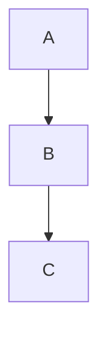

仅凭**马尔可夫条件（Markov Condition）**，$A$、$B$ 或 $C$ 之间没有任何条件独立性关系被蕴含。然而，如果**祖节点（grandparent）** $A$ 决定了**孙节点（grandchild）** $C$，那么 $C \perp B \mid A$。如果**父节点（parent）** $B$ 决定了子节点 $C$，那么 $C \perp A \mid B$。如果子节点 $C$ 决定了父节点 $B$，那么 $B \perp A \mid C$。

因此，**d-分离关系（d-separability relations）** 并未捕捉到由马尔可夫条件和一组确定性关系所蕴含的全部条件独立性。我们将寻找一种**图形化条件（graphical condition）**，该条件能够在给定马尔可夫条件和一组变量间确定性关系的情况下，蕴含变量的条件独立性。

**Geiger** 提出了一种简单且可证明是完备的图形化规则，用于确定由马尔可夫条件、**最小性条件（Minimality conditions）** 以及一种变量间的确定性关系所蕴含的条件独立性。遵循 Geiger (1990) 的观点，在定义在 $V$ 上且包含 $A$ 和 $Z$ 的有向无环图 $G$ 中，如果顶点 $A$ 是其父节点的一个确定性函数，则称顶点 $A$ 为**确定性变量（deterministic variable）**。（注意，如果变量 $A$ 在图 $G$ 中没有父节点，但有一个常数值，那么 $A$ 就是一个确定性变量。）当且仅当 $A$ 在 $Z$ 中，或者 $A$ 是一个确定性变量且它的所有父节点都被 $Z$ **函数式决定（functionally determined）** 时，$A$ 被 $Z$ 函数式决定。如果 $X$、$Y$ 和 $Z$ 是 $V$ 中三个互不相交的变量子集，那么当且仅当在 $X$ 的任何成员和 $Y$ 的任何成员之间不存在一条无向路径 $U$，使得每个**碰撞节点（collider）** 在 $Z$ 中都有一个后代，并且 $U$ 上没有其它变量被 $Z$ 函数式决定时，$X$ 和 $Y$ 在给定 $Z$ 的条件下是 **D-分离（D-separated）** 的。Geiger 已经证明，当且仅当对于每一个满足 $G$ 的马尔可夫条件、最小性条件以及这些确定性关系的分布，$X$ 和 $Y$ 在给定 $Z$ 的条件下都独立时，$X$ 和 $Y$ 在给定 $Z$ 的条件下是 D-分离的。我们将证明，对于更广泛的一类确定性关系，Geiger 的规则是正确的；但我们不知道对于这更广泛的一类确定性关系，该规则是否完备。

假设 $G$ 是定义在 $V$ 上的一个有向无环图，并且 $\text{Deterministic}(V)$ 是 $V$ 中变量的有序元组集合，其中对于 $\text{Deterministic}(V)$ 中的每个元组 $D$，如果 $D$ 是 ${ < V _ { 1 } , . . . , V _ { n } > }$，那么 $V _ { n }$ 是 $V _ { 1 } , . . . , V _ { n - 1 }$ 的一个确定性函数，并且不是 $V _ { 1 } , . . . , V _ { n - 1 }$ 的任何一个子集的确定性函数；我们也称 $\{ V _ { 1 } , . . . , V _ { n - 1 } \}$ **决定了（determines）** $V _ { n }$。注意，$V _ { n }$ 在图 $G$ 中可能是 $V _ { 1 } , . . . , V _ { n - 1 }$ 成员的祖先。此外，如果 $A$ 决定了 $B$ 并且 $B$ 决定了 $A$，那么 $\text{Deterministic}(V)$ 同时包含 ${ \mathrm { < } } A , B { \mathrm { > } }$ 和 ${ < B , A > }$。我们假设 $\text{Deterministic}(V)$ 是**完备的（complete）**，即如果它蕴含了变量间的某些确定性关系，那么这些确定性关系都包含在 $\text{Deterministic}(V)$ 中。（例如，如果 $A$ 决定了 $B$ 且 $B$ 决定了 $C$，那么 $A$ 决定了 $C$。）$\text{Det}(Z)$ 是由 $Z$ 的某个子集决定的变量的集合。如果一个变量 $A$ 有一个常数值，那么我们说它由**空集（empty set）** 决定，并且对于所有 $Z$，它都在 $\text{Det}(Z)$ 中。

注意，$\text{Deterministic}(V)$ 既可以蕴含变量间的**依赖关系（dependencies）**，也可以蕴含**独立关系（independencies）**。如果 $Z$ 决定了 $A$，且 $Z$ 是 $Z$ 的一个成员，那么 $A$ 在给定 $\mathbf { Z } \backslash \{ Z \}$ 的条件下依赖于 $Z$。（$\text{Deterministic}(V)$ 也可能蕴含其它依赖关系。）这些依赖关系可能与满足有向无环图 $G$ 的马尔可夫条件所蕴含的独立关系相冲突，因此并非每个 $\text{Deterministic}(V)$ 都与每个以 $V$ 为顶点集的有向无环图兼容。如果 $\text{Deterministic}(V)$ 和有向无环图 $G$ 不兼容，则下面陈述的**定理 3.7（theorem 3.7）** 是空洞成立的，但显然，拥有一个用于确定 $\text{Deterministic}(V)$ 和 $G$ 是否兼容的测试方法是可取的。

我们将扩展 Geiger 的 **D-可分性（D-separability）** 概念，使其不局限于他所考虑的那类确定性关系。如果 $G$ 是一个顶点集为 $V$ 的有向无环图，$Z$ 是一个不包含 $X$ 或 $Y$ 的顶点集，$X \neq Y$，那么当且仅当在图 $G$ 中 $X$ 和 $Y$ 之间不存在一条无向路径 $U$，使得 $U$ 上的每个碰撞节点都在 $Z$ 中有一个后代，并且 $U$ 上没有其它顶点在 $\text{Det}(Z)$ 中时，$X$ 和 $Y$ 在给定 $Z$ 和 $\text{Deterministic}(V)$ 的条件下是 **D-分离（D-separated）** 的；否则，如果 $X \neq Y$ 且 $X$ 和 $Y$ 不在 $Z$ 中，则 $X$ 和 $Y$ 在给定 $Z$ 和 $\text{Deterministic}(V)$ 的条件下是 **D-连通（D-connected）** 的。类似地，如果 $X$、$Y$ 和 $Z$ 是互不相交的变量集，且 $X$ 和 $Y$ 非空，那么当且仅当 $X$ 和 $Y$ 的笛卡尔积中的每一对 $<X,Y>$ 在给定 $Z$ 和 $\text{Deterministic}(V)$ 的条件下都是 D-分离时，$X$ 和 $Y$ 在给定 $Z$ 和 $\text{Deterministic}(V)$ 的条件下是 D-分离的；否则，如果 $X$、$Y$ 和 $Z$ 互不相交，且 $X$ 和 $Y$ 非空，则 $X$ 和 $Y$ 在给定 $Z$ 和 $\text{Deterministic}(V)$ 的条件下是 D-连通的。

**定理 3.7（THEOREM 3.7）**：如果 $G$ 是定义在 $V$ 上的一个有向无环图，$X$、$Y$ 和 $Z$ 是 $V$ 的互不相交的子集，并且 $P(V)$ 满足 $G$ 的马尔可夫条件以及 $\text{Deterministic}(V)$ 中的确定性关系，那么如果 $X$ 和 $Y$ 在给定 $Z$ 和 $\text{Deterministic}(V)$ 的条件下是 D-分离的，则在 $P$ 中 $X$ 和 $Y$ 在给定 $Z$ 的条件下独立。

例如，假设 $G$ 是图 3.21 中的图，并且 $\text{Deterministic}( \mathbf { V } ) = \{ < A , B >$ ，$< B , C > , < A , C > \}$。


> 图 3.21


$B$ 和 $C$ 在给定 $A$ 和 $\text{Deterministic}(V)$ 的条件下是 D-分离的，而 $A$ 和 $C$ 在给定 $B$ 和 $\text{Deterministic}(V)$ 的条件下是 D-分离的。

假设 $G$ 仍然是图 3.21 中的图，但现在 $\text{Deterministic}( \mathbf { V } ) = \{ < A , B >$ ，$< B , A > , ~ < B , C > , ~ < C , B > , ~ < A , C > , ~ < C , A > \}$。除了之前的 D-可分性关系外，现在 $A$ 和 $B$ 在给定 $C$ 和 $\text{Deterministic}(V)$ 的条件下也是 D-分离的，因为 $C$ 决定了 $A$。

在某些情况下，条件独立性是由于一个**父节点（parent）** 被其**子节点（child）** 决定而蕴含的。考虑图 3.22 中的图，其中 $\text{Deterministic}(V) = \{ < Y , W , Z > , < Z , Y > , < Z , W > \}$。$X$ 和 $T$ 在给定 $Z$ 和 $\text{Deterministic}(V)$ 的条件下是 D-分离的，因为 $Z$ 决定了 $Y$ 和 $W$，而 $Y$ 和 $W$ 是 $X$ 和 $T$ 之间唯一无向路径上的**非碰撞节点（noncolliders）**。


> 图 3.22

最后，我们注意到，$Z$ 的某个非父祖节点 $X$ 有可能决定 $Z$，即使 $X$ 不决定 $Z$ 的任何父节点。令 $G$ 为图 3.23 中的图，且 $\text{Deterministic}( \mathbf { V } ) = \{ { < X , Z > } \}$。假设 $X$、$R$ 和 $Z$ 各有 2 个值，而 $Y$ 有 4 个值。考虑以下分布（其中我们给出每个变量以其父节点为条件的概率）：

$$
\begin{array}{l} P (X = 0) = . 2 \\ P (R = 0) = . 3 \\ P (Y = 0 | X = 0, R = 0) = 1 \\ P (Y = 1 \mid X = 0, R = 1) = 1 \\ P (Y = 2 | X = 1, R = 0) = 1 \\ P (Y = 3 \mid X = 1, R = 1) = 1 \\ P (Z = 0 \mid Y = 0) = 1 \\ P (Z = 0 \mid Y = 1) = 1 \\ P (Z = 1 \mid Y = 2) = 1 \\ P (Z = 1 \mid Y = 3) = 1 \\ \end{array}
$$

实际上，$Y$ 编码了 $R$ 和 $X$ 两者的值，而 $Z$ 解码 $Y$ 以匹配 $X$ 的值。


> 图 3.23

```mermaid
graph TD
  X --> Y
  Y --> Z
  Y --> R
```

由此可得，$Y$ 和 $Z$ 在给定 $X$ 和 $\text{Deterministic}(V)$ 的条件下是 D-分离的，而 $X$ 和 $Z$ 在给定 $Y$ 和 $\text{Deterministic}(V)$ 的条件下是 D-分离的。

下面的例子指出了满足给定有向无环图 $G$ 的马尔可夫条件的分布集，与满足马尔可夫条件和 $G$ 中一组变量间确定性关系的分布集之间的一个有趣差异。假设 $G$ 是图 3.24 所示的图。对于任何有向无环图，满足该图马尔可夫条件的概率分布集包括一些也满足该图**最小性条件（Minimality Condition）** 的分布。然而，假设 $\text{Deterministic}(V) = \{<X,Y>\}$。在这种情况下，在满足马尔可夫条件和指定确定性关系的分布中，不存在也满足最小性条件的分布。所有满足马尔可夫条件和指定确定性关系的分布都忠实于图 3.24 中不包含 $Z \to Y$ 边的子图。这表明，要找到满足有向无环图 $G$ 的马尔可夫条件以及一组确定性关系所蕴含的所有条件独立性关系，就需要测试 $G$ 的各种子图 $G ^ { \prime }$（顶点集为 $V$）中的 D-可分性，在这些子图中，对于 $V$ 中的每个 $Y$，$\text{Parents}(G ,Y)$ 的任何一个子集都不决定 $Y$。


> 图 3.24

我们将不考虑在此类确定性关系存在时构建因果图的算法，也不考虑用于判断一组变量 $X$ 是否决定变量 $Y$ 的检验方法。

## 3.9 背景注释（Background Notes）

用假设来同时表示因果约束和统计约束的这种模糊用法几乎和统计学本身一样古老。在现代形式中，本世纪初 Spearman (1904) 对该思想的使用可被视为**统计心理测量学（statistical psychometrics）** 的起源。同时表示统计假设和因果主张的有向图由 Sewell Wright (1934) 引入，并自此一直被使用，尤其是在与**线性模型（linear models）** 相关的领域。对于许多特定的图，Simon (1954) 和 Blalock (1961) 描述了在没有未测量共同原因的理论中线性模型与**偏相关约束（partial correlation constraints）** 之间的联系；Costner (1971) 以及 Lazarsfeld 和 Henry (1968) 则描述了在包含**潜变量（latent variables）** 的理论中的联系，但并未出现通用的刻画。Glymour、Scheines、Spirtes 和 Kelly (1987) 为线性模型开发了一种与分布无关的图形结构与偏相关之间的联系（仅限于一阶偏相关），但包含了**循环图（cyclic graphs）**。Geiger 和 Pearl (1989a) 证明，对于任何有向无环图，都存在一个忠实分布。这里作为定理 3.5 给出的通用刻画归功于 Spirtes (1989)，但马尔可夫条件、线性与偏相关之间的联系似乎已被 Simon 和 Blalock 所理解，并在 Kiiveri 和 Speed (1982) 中得到了明确阐述。**操纵定理（Manipulation Theorem）** 在实验设计以及计量经济学中的冲击分析中被无数次默认使用，但似乎从未被明确公式化过。它的一个特例首次出现在 Spirtes、Glymour、Scheines、Meek、Fienberg 和 Slate 于 1991 年的工作中。**最小性条件（Minimality Condition）** 和 **d-可分性（d-separability）** 的概念归功于 Pearl (1988)，而证明 d-可分性决定了马尔可夫条件的结果归功于 Verma (1987)、Pearl (1988) 和 Geiger (1989a)。一个蕴含定理 3.4 的结果由 Pearl、Geiger 和 Verma (1990) 陈述。定理 3.4 被用作 Spirtes、Glymour 和 Scheines (1990c) 中一个因果推断算法的基础。**D-可分性（D-separability）** 在 Geiger (1990) 中有所描述。