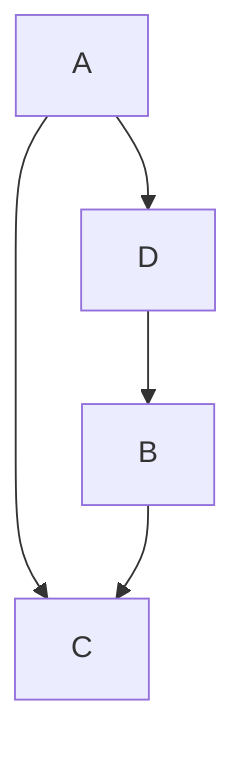
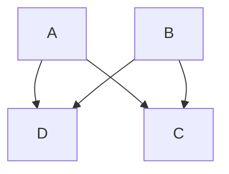
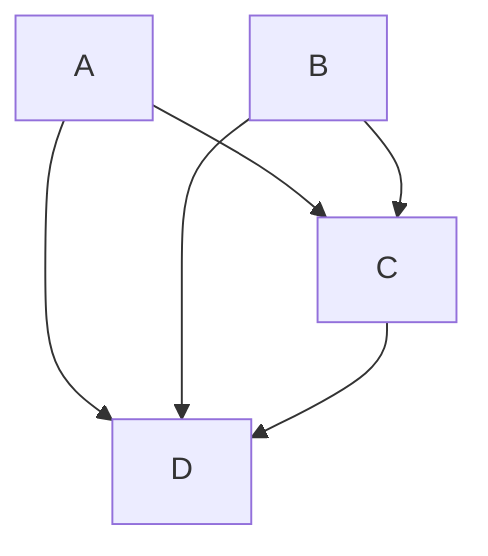
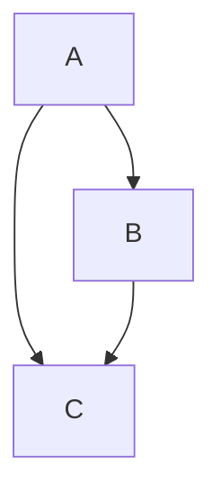
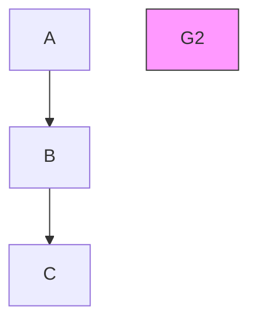
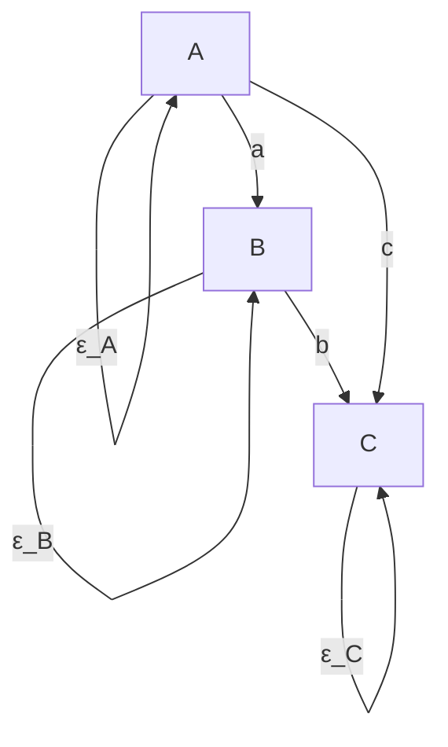
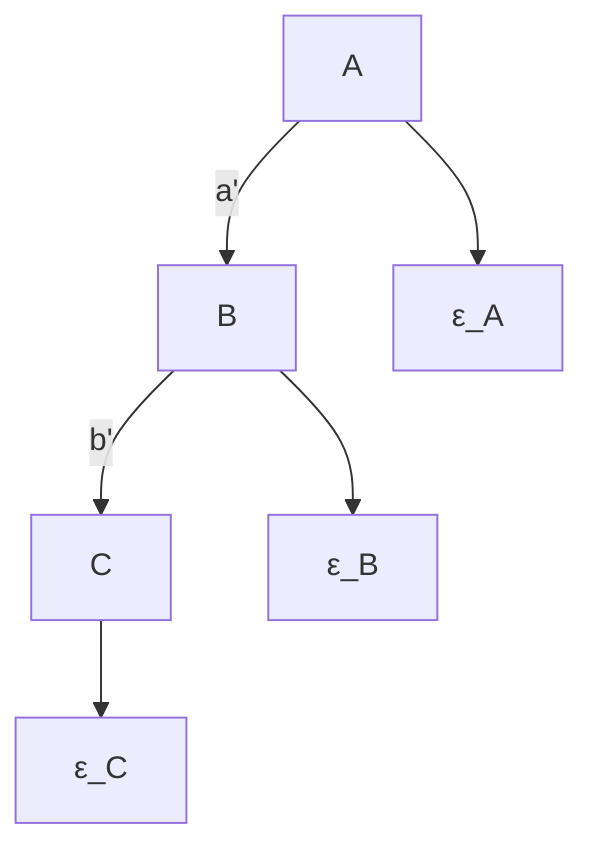
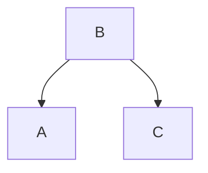
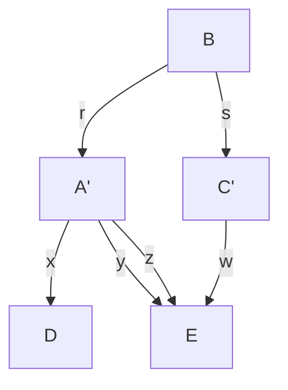

# 统计不可区分性（Statistical Indistinguishability）

在没有实验操作的情况下，任何从统计关系中推断因果结构的方法的分辨能力都受到**统计不可区分性（statistical indistinguishability）**的限制。如果两种因果结构能够同样好地解释相同的统计数据，那么没有任何统计方法能够区分它们。因果假设的统计不可区分性概念随着人们对表示因果结构的有向图与表示变量间联合分布的概率之间关系的限制不同而变化。如果只要求满足**马尔可夫条件（Markov Condition）**和**最小性条件（Minimality Condition）**，那么当同一类分布对两个图分别满足这些条件时，这两个因果图就是不可区分的。如果要求分布对图结构是**忠实（Faithfulness）**的，则会得到另一种统计不可区分性关系；如果分布必须与线性结构一致，又会得到另一种关系，依此类推。对于每种感兴趣的情况，问题在于从图论的角度刻画不可区分性类，因为只有这样，人们才能对在连接因果图与分布的一般假设下无法区分的因果结构有一个总体的理解。

关于任何从统计特性进行因果推断的可能方法的分辨能力，还存在一些相关的考虑。给定关于图与分布之间联系的公理，两个图必须共享什么样的图论结构，才能也共享至少一个满足这些公理的概率分布？例如，两个不同的图何时允许同一个同时满足最小性条件和马尔可夫条件的分布？两个不同的图何时允许同一个满足一个图的最小性条件和马尔可夫条件以及另一个图的忠实条件和马尔可夫条件的分布？反过来问，对于任何给定的概率分布，如果它对于某个有向无环图（directed acyclic graph）满足马尔可夫条件和最小性条件（或者再加上忠实条件），那么与该分布和这些条件一致的所有这样的图的集合是什么？最后，还有一些相关的测度论问题。如果存在能够在更严格的假设（如忠实性）下识别因果结构，但在较弱的假设（如马尔可夫条件和最小性条件）下并不总是有效的程序，那么这些程序失败的可能性有多大？例如，在各种关于分布集合的自然测度下，满足某个图的最小性条件和马尔可夫条件但对该图不忠实的分布集合的测度是多少？

这些都是关于任何可能的推断程序——无论是人类还是计算机——从非实验数据到结构的极限的基本问题。当测量变量系统是因果充分的（causally sufficient）时，我们将为其中许多问题提供答案。当图中可能包含表示未测量共同原因的变量时，统计不可区分性的理解则不那么充分。


> G1




> $G _ { 2 }$




> G3




> $G _ { 4 }$




> 图 4.1（Figure 4.1）


## 4.1 强统计不可区分性（Strong Statistical Indistinguishability）

我们称两个有向无环图 $G, G'$ 是**强统计不可区分的（strongly statistically indistinguishable, s.s.i.）**，当且仅当它们具有相同的顶点集 $V$，并且每个在 $V$ 上满足 $G$ 的最小性条件和马尔可夫条件的分布 $P$ 也满足 $G'$ 的这些条件，反之亦然。

两个结构是 s.s.i. 当然并不意味着因果结构是相同的，也不意味着它们之间的差异无法通过任何手段检测出来。从两个变量 $X$ 和 $Y$ 的相关性来看，无法区分是 $X$ 导致 $Y$、$Y$ 导致 $X$，还是存在第三个共同原因 $Z$。但这些替代方案可以通过实验来区分，或者正如我们将看到的，通过其他手段来区分。

强统计不可区分性由一种简单的关系刻画，即两个图具有相同的基础无向图和相同的碰撞结构（collisions）：

**定理 4.1（THEOREM 4.1）**：两个有向无环图 $G_1, G_2$ 是强统计不可区分的，当且仅当 (i) 它们具有相同的顶点集 $V$，(ii) 在 $G_1$ 中顶点 $V_1$ 和 $V_2$ 相邻当且仅当它们在 $G_2$ 中也相邻，并且 (iii) 对于 $V$ 中的每一个三元组 $V_1, V_2, V_3$，结构 $V_1 \rightarrow V_2 \leftarrow V_3$ 是 $G_1$ 的子图当且仅当它也是 $G_2$ 的子图。

给定任意有向无环图 $G$，与 $G$ 是 s.s.i. 的图恰好是通过对 $G$ 中的边方向进行任意一组反转（这些反转保留了 $G$ 中的所有碰撞结构）而得到的图。判断两个图是否 s.s.i. 需要 $O(n^3)$ 次计算，其中 $n$ 是顶点数。

在图 4.1 中，图 $G_1$ 和 $G_2$ 是 s.s.i.，但 $G_1$ 和 $G_3$，以及 $G_2$ 和 $G_3$ 不是 s.s.i.。

然而请注意，如果一组变量 $V$ 是完全有序的（例如按照已知的时间顺序），并且 $P(\mathbf{V})$ 是正的，那么存在唯一的图使得 $P(\mathbf{V})$ 满足最小性条件和马尔可夫条件。（参见 Pearl 1988 中的推论 3。）

## 4.2 忠实不可区分性（Faithful Indistinguishability）

假设我们假定所有对 <G, P> 都是忠实的：$P$ 中成立的所有且仅有的条件独立关系都是 $G$ 的马尔可夫条件的推论。我们将称两个有向无环图 $G, G'$ 是**忠实不可区分的（faithfully indistinguishable, f.i.）**，当且仅当每个对 $G$ 忠实的分布也对 $G'$ 忠实，反之亦然。问题在于从图论的角度刻画忠实不可区分性。

**定理 4.2（THEOREM 4.2）**：两个有向无环图 $G$ 和 $H$ 是忠实不可区分的，当且仅当 (i) 它们具有相同的顶点集，(ii) 任意两个顶点在 $G$ 中相邻当且仅当它们在 $H$ 中也相邻，并且 (iii) 任意三个顶点 $X, Y, Z$，其中 $X$ 与 $Y$ 相邻，$Y$ 与 $Z$ 相邻，但 $X$ 与 $Z$ 在 $G$ 或 $H$ 中不相邻，在 $G$ 中方向为 $X \rightarrow Y \leftarrow Z$ 当且仅当在 $H$ 中也是同样的方向。

判断两个图是否忠实不可区分可以在 $O(n^3)$ 时间内完成，其中 $n$ 是顶点数。

从定理 4.1 和 4.2 可以立即得出，如果两个图是强统计不可区分的，那么它们也是忠实不可区分的，但反过来不一定成立。图 4.1 中的图 $G_4$ 和 $G_5$ 不是 s.s.i.，但它们是 f.i.。

一个 f.i. 图类可以用一个**模式（pattern）**来表示。模式是一个混合图，包含有向边和无向边。一个图 $G$ 属于由 $\pi$ 表示的图集合中，当且仅当：

- (i) $G$ 与 $\pi$ 具有相同的邻接关系；
- (ii) 如果在 $\pi$ 中 $A$ 和 $B$ 之间的边方向为 $A \rightarrow B$，那么在 $G$ 中该方向也是 $A \rightarrow B$；
- (iii) 如果在 $G$ 中 $Y$ 是路径 $<X, Y, Z>$ 上的无屏蔽碰撞器（unshielded collider），那么在 $\pi$ 中 $Y$ 也是 $<X, Y, Z>$ 上的无屏蔽碰撞器。

例如，三个顶点上的所有完全有向无环图构成一个有向无环忠实不可区分性类，可以用由相同顶点集上的完全无向图构成的模式来表示。当有向无环图的忠实不可区分性类的模式没有有向边，因此完全是无向的时，该有向图所表示的统计假设等价于与该模式对应的无向独立图的统计假设。

## 4.3 弱统计不可区分性（Weak Statistical Indistinguishability）

前两节刻画的不可区分性关系要求找出能够容纳与给定图相同类别的概率分布的图。我们可以至少部分地反过来，从一组变量上的特定概率分布出发，询问该顶点集上所有与给定分布一致的有向无环图的集合。这些答案刻画了概率以及我们对概率与原因之间联系的假设在多大程度上欠定了（underdetermine）因果结构。仅假设马尔可夫条件和最小性条件时，这两个条件（在正性条件下）与有向独立图（directed independence graph）定义条件的等价性，为生成给定分布 $P$ 下满足这两个条件的所有图的集合提供了一种（不实用的）算法。对于 $P$ 中变量的每一种排序，都存在一个与该排序兼容的有向无环图 $G$（即在排序中 $A$ 在 $B$ 之前仅当 $A$ 在 $G$ 中不是 $B$ 的后代），该图满足 $P$ 的最小性条件和马尔可夫条件。可以通过假设排序和 $P$ 中的条件独立关系，并应用有向独立图的定义来生成该图。Pearl (1988) 给出了一个不假设正性的算法。根据该算法，令 Ord 为变量的一个全序，Predecessors(Ord, X) 为在排序 Ord 中 $X$ 的前驱。对于每个变量 $X$，令 $G$ 中 $X$ 的父节点为 Predecessors(Ord, X) 的一个最小子集 $R$，使得在 $P$ 中给定 $R$ 时 $X$ 与 Predecessors(Ord, X)\R 独立。由此可得 $P$ 满足 $G$ 的最小性条件和马尔可夫条件。

如果我们从 $P$ 出发并假设任何图必须对 $P$ 忠实，那么替代方案更加有限。在这种情况下，所有对 $P$ 忠实的图构成一个忠实不可区分性类，即从任何对 $P$ 忠实的图出发得到的 f.i. 图的集合。下一章将介绍一些算法，这些算法从分布的性质出发生成忠实不可区分性类。

给定连接因果图与概率分布的公理，询问对于哪些图对 $G, G'$ 存在某个同时满足 $G$ 和 $G'$ 的公理的概率分布是有意义的。我们称两个图是**弱忠实不可区分的（weakly faithfully indistinguishable, w.f.i.）**，当且仅当存在一个对两者都忠实的概率分布。我们称两个图是**弱统计不可区分的（weakly statistically indistinguishable, w.s.i.）**，当且仅当存在一个同时满足两者最小性条件和马尔可夫条件的概率分布。弱忠实不可区分性被证明等价于忠实不可区分性：

**定理 4.3（THEOREM 4.3）**：两个有向无环图是忠实不可区分的，当且仅当某个对一个图忠实的分布也对另一个图忠实，反之亦然；也就是说，它们是 f.i. 当且仅当它们是 w.f.i.。

这个定理告诉我们，忠实性将顶点集上的概率分布集合划分为等价类，这些等价类恰好对应于由忠实不可区分性诱导的图的等价类。由此可得，如果一个分布对某个图 $G$ 是忠实的，那么它恰好对所有与 $G$ 忠实不可区分的图忠实，并且只对这些图忠实。

一般来说，没有理由期望如此完美的匹配。假设我们只假设最小性条件和马尔可夫条件。在什么条件下会存在一个满足两个不同图 $G$ 和 $G'$ 的这些公理的分布 $P$？答案并不是：恰好当 $G$ 和 $G'$ 是强统计不可区分的时候。图 4.2 中显示的两个图不是 s.s.i.，但存在同时满足两者马尔可夫条件和最小性条件的分布。


```mermaid
graph TD
  A --> B
  B --> C
  C --> A
    style A fill:#fff,stroke:#000
    style B fill:#fff,stroke:#000
    style C fill:#fff,stroke:#000
    note bottom of A "G₁"
```


> 图 4.2（Figure 4.2）



正如我们在第 3 章中已经看到的，辛普森"悖论"（Simpson's "paradox"）中的分布提供了另一个例子。我们猜想，如果一个分布满足两个图 $G$ 和 $G'$ 的最小性条件和马尔可夫条件，那么 $G$ 和 $G'$ 具有相同的边和相同的碰撞器，唯一不同的是，一个图中的三角形（如 $G_1$）可以被另一个图中的碰撞结构（如 $G_2$）所替代，前提是其他边满足适当的条件。我们不知道如何刻画"适当的"条件。然而，我们可以刻画一个相关的有趣性质。

没有对图 4.2 中 $G_1$ 忠实的分布能够同时对 $G_2$ 忠实，但一个满足 $G_1$ 的最小性条件和马尔可夫条件的分布可以对 $G_2$ 忠实。这种情况何时会发生？换句话说，辛普森"悖论"的推广何时会出现？如果概率分布 $P$ 满足 $G$ 的最小性条件和马尔可夫条件，并且 $P$ 对图 $H$ 忠实，那么 $G$ 和 $H$ 之间是什么关系？

**定理 4.4（THEOREM 4.4）**：如果概率分布 $P$ 满足有向无环图 $G$ 和 $H$ 的马尔可夫条件和最小性条件，并且 $P$ 对 $H$ 忠实，那么对于所有顶点 $X, Y$，如果 $X, Y$ 在 $H$ 中相邻，则它们在 $G$ 中也相邻。

**定理 4.5（THEOREM 4.5）**：如果概率分布 $P$ 满足有向无环图 $G$ 和 $H$ 的马尔可夫条件和最小性条件，并且 $P$ 对图 $H$ 忠实，那么 (i) 对于所有 $X, Y, Z$，如果 $X \rightarrow Y \leftarrow Z$ 在 $H$ 中且 $X$ 与 $Z$ 在 $H$ 中不相邻，那么在 $G$ 中要么 $X \rightarrow Y \leftarrow Z$，要么 $X, Z$ 在 $G$ 中相邻；并且 (ii) 对于每个顶点三元组 $X, Y, Z$，如果 $X \rightarrow Y \leftarrow Z$ 在 $G$ 中且 $X$ 与 $Z$ 在 $G$ 中不相邻，如果 $X$ 与 $Y$ 在 $H$ 中相邻且 $Y$ 与 $Z$ 在 $H$ 中相邻，那么 $X \rightarrow Y \leftarrow Z$。

**推论 4.1（COROLLARY 4.1）**：如果概率分布 $P$ 满足有向无环图 $G$ 的马尔可夫条件，$P$ 对有向无环图 $H$ 忠实，并且 $G$ 和 $H$ 在变量的排序上一致（例如按时间排序），使得 $X \rightarrow Y$ 仅当在排序中 $X < Y$，那么 $H$ 是 $G$ 的子图。

## 4.4 刚性不可区分性（Rigid Indistinguishability）

除了强、忠实和弱统计不可区分性的概念之外，还存在另一种概念。假设两个有向无环图，`$G$` 和 `$G^{\prime}$`，在某种意义下于一个共同的顶点集 `$O$` 上是统计不可区分的。那么在没有实验的情况下，对 `$O$` 中变量的测量将无法可靠地确定哪个图正确地描述了生成数据的因果结构。然而，如果除了 `$G$` 或 `$G^{\prime}$` 中的变量之外，还测量了其他变量，并且这些变量与 `$O$` 中的变量处于适当的因果关系中，那么 `$G$` 和 `$G^{\prime}$` 可能是可区分的。例如，以下简单图都是 **s.s.i.** 和 **f.i.**（假设 `$A$` 和 `$B$` 被测量且属于 `$O$`）。


> 图 4.3

但是，如果我们还测量一个变量 `$C$`，它是 `$A$` 的原因，或者与 `$A$` 有一个共同原因，该共同原因与 `$B$` 没有联系（除非可能通过 `$A$`），那么这两个结构就可以被区分。

图 4.4 中的图不是 **f.i.** 或 **s.s.i.** 。同样容易给出 **w.s.i.** 结构的例子，这些结构可以嵌入到不是 **w.s.i.** 的图中。哪些因果充分的结构可以通过测量额外变量来区分？为了回答这个问题，我们需要一些进一步的定义。

设 `$G_{1}, G_{2}$` 是两个具有共同顶点集 `$O$` 的有向无环图。设 `$H_{1}, H_{2}$` 是有向图，它们具有一个包含 `$O$` 的共同顶点集 `$U$`，并且满足：


```mermaid
graph TD
  D --> A
  C --> A
  A --> B
    style A fill:#f9f,stroke:#333
    style B fill:#bbf,stroke:#333
    style C fill:#bfb,stroke:#333
    style D fill:#dfd,stroke:#333
    note right of A "H₁"
```


> 图 4.4

```mermaid
graph TD
  D --> A
  C --> A
  A --> B
    style A fill:#f9f,stroke:#333
    style B fill:#ccf,stroke:#333
    style C fill:#cfc,stroke:#333
    style D fill:#fcc,stroke:#333
    note right of A H2
```

- (i) `$H_{1}$` 在 `$O$` 上的子图是 `$G_{1}$`，并且 `$H_{2}$` 在 `$O$` 上的子图是 `$G_{2}$`；
- (ii) `$H_{1}$` 中但不在 `$G_{1}$` 中的每条有向边都在 `$H_{2}$` 中，并且 `$H_{2}$` 中但不在 `$G_{2}$` 中的每条有向边都在 `$H_{1}$` 中。

于是，我们说具有共同顶点集 `$O$` 的有向无环图 `$G_{1}$` 和 `$G_{2}$` 在 `$H_{1}$` 和 `$H_{2}$` 上关于 `$O$` 和 `$U$` 有一个**平行嵌入（parallel embedding）**。在图 4.3 和 4.4 中，`$G_{1}$` 和 `$G_{2}$` 在 `$H_{1}$` 和 `$H_{2}$` 上关于 `$\mathbf{O} = \{A, B\}$` 和 `$\mathbf{U} = \{A, B, C, D\}$` 有一个平行嵌入。那么，两个 **s.s.i.** 结构是否可以通过测量更多变量来区分的问题就变成了：这些结构是否存在不是 **s.s.i.** 的平行嵌入？如果不存在这样的嵌入，我们就说结构 `$G_{1}$` 和 `$G_{2}$` 是**刚性统计不可区分的（rigidly statistically indistinguishable, r.s.i.）**。

**定理 4.6：** 没有两个不同的、具有相同顶点集的 **s.s.i.** 有向无环图是刚性统计不可区分的。

换句话说，只要存在且能够测量具有正确因果结构的额外变量，那么一个因果充分的测量变量集合中的因果结构原则上是可以被识别的。定理 4.6 的证明也展示了忠实不可区分结构的一个并行结果。我们推测定理 4.6 的一个类似物在假设正性的条件下对于弱统计不可区分性也成立。

## 4.5 线性情况（The Linear Case）

参数值可能导致图未线性蕴含的条件独立性或零偏相关。图 4.2（在图 4.5 中重现，并明确包含了误差变量）说明了这种可能性：将图的每个顶点视为附着一个“误差”变量，并让图加上误差变量决定一组线性方程。（我们假设任何一对外生变量，包括误差项，具有零协方差。）结果是，在指定外生变量联合分布的范围内，得到一个**结构方程模型（structural equation model）**。每条有向边都附有一个线性系数。相关矩阵，以及所有偏相关，由线性系数和外生变量的方差决定。


> (i)




> (ii) 图 4.5



如果在左边的结构中，`$ab = -c$`，那么 `$A$` 和 `$C$` 将不相关，就像右边的模型一样。这类现象——由线性系数的值而非图结构产生的消失偏相关——必然误导任何从相关性推断因果结构的尝试。这种情况何时会发生？我们在前一章中已经回答了这个问题，当时我们考虑了线性忠实性可能失败的条件。在线性情况下，参数值——具有有向无环图 `$G$` 的结构的线性系数和外生方差的值——形成了一个实空间，而该空间中创建了 `$G$` 未线性蕴含的消失偏相关的点集具有**勒贝格测度（Lebesgue measure）**零。

**定理 3.2：** 设 `$M$` 是一个具有有向无环图 `$G$` 的线性模型，其线性系数为 `$a_{1}, ..., a_{n}$`，外生变量的正方差为 `$\nu_{1}, ..., \nu_{k}$`。设 `$M(<u_{1}, ..., u_{n}, u_{n+1}, ..., u_{n+k}>)$` 是与为 `$a_{1}, ..., a_{n}$` 和 `$\nu_{1}, ..., \nu_{k}$` 指定值 `$<u_{1}, ..., u_{n}, u_{n+1}, ..., u_{n+k}>$` 一致的分布。设 `$P$` 是 `$\Re^{n+k}$` 空间上关于 `$M$` 参数值的概率测度集合，使得对于 `$\Re^{n+k}$` 的每个具有勒贝格测度零的子集 `$V$`，有 `$P(\mathbf{V}) = 0$`。设 `$Q$` 是系数和方差值的向量集合，使得对于 `$Q$` 中的所有 `$q$`，`$M(q)$` 中的每个概率分布都有一个 `$G$` 未线性蕴含的消失偏相关。那么对于所有 `$P$`，有 `$P(\mathbf{Q}) = 0$`。

这类测度论论证很有趣，但可能不完全令人信服。毕竟，人们可以争辩说，在一般线性模型中，因果联系的缺失由值为零的线性系数标记，因此形成了一个测度为零的集合，那么按同样的推理，一切事物都与其它一切事物有因果联系。在最近的一本书中，**Nancy Cartwright (1989)** 反对说，由于在线性结构中，独立关系可能由线性系数和方差的特殊值以及因果结构共同产生，因此从这些关系推断因果结构是不合法的。实际上，她拒绝了任何无法区分真实因果结构与 **w.s.i.** 备选方案的推理过程。这样的立场可能有些极端，但它确实有助于将注意力集中在两个有趣的问题上：两个结构何时可能成为 **w.s.i.** 而不是 **f.i.** 或 **s.s.i.**，以及是否存在特殊的标记或指示符表明一个分布满足两个 **w.s.i.**（但不是 **s.s.i.** 或 **f.i.**）因果结构的马尔可夫条件和极小性条件？这些问题的答案本质上是将前面各节的定理应用于线性情况。

我们将与 Cartwright 一样，假设变量有一个时间顺序。**Pearl 和 Verma (Pearl 1988)** 已经证明，对于一个正分布 `$P$` 和一个给定的变量顺序，存在唯一的一个有向无环图，使得 `$P$` 满足极小性条件和马尔可夫条件。由此可知，对于一个具有给定相关矩阵和一组因果充分变量给定顺序的正分布，存在唯一一个线性表示该分布并且与该顺序一致的有向无环图。

至少在某些情况下，可以检验分布的正性。（例如，在二元正态分布中，如果相关系数不等于 1，则密度函数处处非零。）由此可知，对于这些情况，对于给定的变量顺序，要么存在唯一一个有向无环图使得 `$P$` 满足马尔可夫条件和极小性条件，要么可以检测到存在多个这样的有向无环图。然而，即使对于给定的变量顺序存在唯一一个有向无环图使得 `$P$` 满足马尔可夫条件和极小性条件，寻找该图的算法对于大量变量来说也是不可行的，因为它们需要测试的条件独立关系的数量和顺序。

假设我们错误地假设一个分布对于生成它的因果图是忠实的。那么推论 4.1 适用，这非正式地意味着，如果假设了忠实性但事实并非如此，那么由特殊参数值导致的条件独立性关系或消失偏相关只能产生省略了真实因果联系的错误因果推断；不会出现其他类型的错误。我们将考虑这种情况何时会在相关性中显现出来。

回顾一下，**路径（trek）** 是一个无序的对，由两条有向无环路径组成，它们共享一个共同的顶点，该顶点是两条路径的源（一对路径中的一条可能是第二章中定义的空路径）。对于标准化模型，其中每个变量的均值为零，非误差变量具有单位方差，两个变量的相关性由连接 `$X$`、`$Y$` 的所有路径上每条路径中与该路径边相关的线性系数的乘积之和（我们称这个量为**路径和（trek sum）**）给出。例如，在图 4.5 的有向无环图 (i) 中，`$A$` 和 `$C$` 之间的路径和是 `$ab + c$$`。在本节的所有示例中，我们将使用标准化系统。相关系统通过以下公式确定所有阶数的所有偏相关。

$$
\rho_{X Y. \mathbf{Z} \cup \{R \}} = \frac {\rho_{X Y . \mathbf{Z}} - \rho_{X R . \mathbf{Z}} \times \rho_{Y R . \mathbf{Z}}}{\sqrt {1 - \rho_{X R . \mathbf{Z}} ^ {2}} \times \sqrt {1 - \rho_{Y R . \mathbf{Z}} ^ {2}}}
$$

由于无论对集合 `$U$` 的成员进行偏相关的顺序如何，递归关系都给出两个变量关于集合 `$U$` 的相同偏相关，因此一个消失的偏相关对应于标准化系统系数中的一个方程组。

现在假设一个正态标准化系统 `$G$` 中线性参数的特殊值产生了恰好仅由某个错误因果结构 `$H$` 线性蕴含的消失偏相关。那么参数值必须产生 `$G$` 未线性蕴含的额外消失偏相关。任何偏相关都只是连接变量对的路径和的函数，并且在这种情况下，路径和只涉及 `$G$` 中的线性参数。因此，每个 `$G$` 未线性蕴含的额外消失偏相关决定了 `$G$` 参数中的一个（非线性）方程组，必须满足该方程组才能产生巧合的消失偏相关。（例如，在图 4.5 的有向无环图 (i) 中，仅当满足单个方程 `$ab = -c$` 时，`$A$` 和 `$C$` 之间的相关性才为 0）。现在，对于某些 `$G$` 和某些 `$H$`（`$G$` 的一个子图），这些方程组可能没有同时解。在这种情况下，不存在 `$G$` 的参数值能够产生恰好是 `$H$` 线性蕴含的偏相关。对于 `$G$` 和子图 `$H$` 的其他选择，方程组可能有解，但只能解出一个或多个参数的有限个备选值，并且要求某些误差方差为零。这样的解必须通过非消失偏相关关系的特殊相关约束来“暴露自身”。考虑以下 `$G$` 和 `$H$` 的选择，其中每对中 `$G$` 在左侧，`$H$` 在右侧。

考虑图 4.6。在 (i) 和 (iii) 中，可以为左侧的图选择系数和方差，使其看起来好像一条边不存在，但只能通过使标记为 `$b$` 的系数等于 1 或 -1 来实现。由于变量是标准化的，这要求 `$Y$` 的误差项具有零方差和零均值——也就是说，它消失了。因此，为了使真实图是左侧的图，并且参数值产生恰好由右侧图线性蕴含的消失偏相关，变量 `$Y$` 必须是变量 `$X$` 的线性函数，并且只能是变量 `$X$` 的线性函数。如果第一个和最后一个示例中未被消除的边被任意长度的有向路径替换，也会得到相同的结果。显然，在这些情况下，创建了真实图未线性蕴含的消失偏相关的特殊参数值将通过相关性暴露出来。在 (ii) 中，对于真实图的任何参数值选择，都无法使变量 `$X$` 和 `$Z$` 之间的边看起来像被消除了。


$$
{\rho_{X Y}} {= 1, - 1}
$$

图 4.6

我们推测，即使没有先验的时间顺序，除非三条边在 `$G$` 中形成一个三角形，如果 `$G$` 的参数值恰好确定了由图 `$H$` 线性蕴含的消失偏相关的集合——无论 `$H$` 是否是 `$G$` 的子图——那么相关性上就会存在额外的约束，这些约束并非由消失偏相关所蕴含。

## 4.6 重新定义变量（Redefining Variables）

到目前为止所考虑的不可区分性结果涉及同一组顶点上的备选图。这些顶点被解释为**随机变量（random variables）**，其值受某种测量系统支配。新的随机变量总是可以从给定的集合中定义，例如通过线性或布尔组合。对于任何特定的定义体系，以及任何连接图与分布的**公理（axioms）**，都会出现关于不可区分性类的问题，类似于我们为固定变量集所考虑的那些问题。变量集 `$V$` 上的分布 `$P$` 可能对应于一个图 `$G$`，而变量集 `$\mathbf{V}^{\prime}$` 上的分布 `$P^{\prime}$` 可能对应于一个不同的图 `$G^{\prime}$`（其中 `$P^{\prime}$` 是通过定义新变量、忽略旧变量以及边缘化从 `$P$` 和 `$V$` 得到的）。在某些情况下，`$G$` 和 `$G^{\prime}$` 之间的差异可能不重要，人们可能只想说每个图都正确地描述了其各自变量集之间的因果关系。然而，当原始变量按时间排序，并且重新定义变量导致其对应图具有后发生事件导致先发生事件的分布时，情况并非如此。考虑下面的一对图。


> (i)




> (ii) 图 4.7

`$B$`
`$(A - C)$`          `$(A + C)$`

在有向无环图 (i) 中，`$A$` 和 `$C$` 是 `$B$` 的效应；假设 `$B$` 发生在 `$A$` 和 `$C$` 之前。通过定义和边缘化的过程，忠实于图 (i) 的分布可以转换为忠实于图 (ii) 的分布。首先，标准化 `$A$` 和 `$C$` 以形成变量 `$A^{\prime}$` 和 `$C^{\prime}$`，然后形成 `$(A^{\prime} \cdot C^{\prime})$` 和 `$(A^{\prime} + C^{\prime})$`。它们的协方差等于 `$A^{\prime 2} - C^{\prime 2}$` 的期望值，该值为零。简单的代数运算表明，给定 `$B$` 时 `$(A^{\prime} - C^{\prime})$` 和 `$(A^{\prime} + C^{\prime})$` 的偏相关不消失。因此，原始分布的边缘分布线性忠实于 (ii)，并且如果原始分布是正态的，则忠实于 (ii)。

注意，刚刚说明的变换是不稳定的；如果 `$A^{\prime}$` 和 `$C^{\prime}$` 的方差有微小差异，或者如果变换给出 `$(x A^{\prime} + z C^{\prime})$` 和 `$(y A^{\prime} + w C^{\prime})$`，其中 `$x, y, z, w$` 的任意值使得 `$xy + wz + \rho_{A^{\prime}C}(zy + xw) \neq 0$`，那么变换后分布的边缘分布将忠实于（不是 (ii)，而是）三个变量上完全图的所有无环定向，这个假设与时间顺序并不矛盾。

从另一个角度看，产生“巧合”消失偏相关的变量变换只是对**忠实性条件（Faithfulness Condition）**的又一次违反。考虑图 4.8 中的线性模型。


> 图 4.8



设 `$A^{\prime} = rB + \varepsilon_{A}$`；`$C^{\prime} = sB + \varepsilon_{C}$`；`$D = xA^{\prime} + zC^{\prime} + \varepsilon_{D}$`，以及 `$E = yA^{\prime} + wC^{\prime} + \varepsilon_{E}$`。如果变量是标准化的，`$\rho_{DE}$` 等于 `$xy + zw + rysz + rxsw = xy + zw + rs(yz + xw)$`，由于 `$rs = \rho_{A^{\prime}C^{\prime}}$`，这就是上一段的公式。如果 `$\rho_{DE} = 0$`，则忠实性条件被违反。因此，我们获得产生“巧合”零相关的 `$A$` 和 `$C$` 的线性变换的条件，与 `$A$` 和 `$C$` 之间的路径在违反忠实性条件时恰好相互抵消的条件是相同的。当 `$D = A^{\prime} + C^{\prime} (\text{即}，x = z = 1)$`，并且 `$E = A^{\prime} - C^{\prime} (\text{即}，y = -w = 1)$`，且误差项的方差和均值被设为零时，我们得到图 4.7 的例子。由于在此示例中违反忠实性的参数值集合具有勒贝格测度零，因此产生“巧合”零相关的 `$A$` 和 `$C$` 的线性变换集合也具有勒贝格测度零。

## 4.7 背景注释（Background Notes）

由测量变量值导致的线性统计模型欠定性已被广泛讨论为“**识别问题（identification problem）**”，尤其是在计量经济学中 (Fisher 1966)，该讨论集中于自由参数的估计。广泛用于线性模型的“**工具变量（instrumental variables）**”方法，其精神与关于刚性可区分性的定理 4.6 一致，尽管工具变量用于识别循环图或具有潜变量系统中的参数。将纯线性回归模型“重写”为结果变量被视为原因的可能性似乎已经为人熟知很长时间，我们不知道这个观察的原始来源，是 **Judea Pearl** 引起了我们的注意。

**Basmann (1965)**、**Stetzl (1986)** 和 **Lee (1987)** 提出了类似于本章所研究的某种或某些意义上的统计不可区分性的说明。用我们的术语来说，Basmann 论证说，对于每个具有循环图（即“非递归”）的联立方程模型，都存在一个具有无环图的统计不可区分模型。这个结果是一个弱不可区分性定理（见第 12 章）。Stetzl 和 Lee 只关注具有自由参数（用于线性系数和方差）的线性结构方程模型，并根据参数（进而根据协方差矩阵）的**最大似然估计（maximum likelihood estimates）** 来定义等价性。他们没有提供一般的图论刻画，尽管 Lee 的论文中进行了有趣的尝试。

**模式（pattern）**的概念和**定理 4.2** 归功于 **Verma 和 Pearl (1990b)**。我们将在第 6 章中陈述关于因果不足图的不可区分性关系的一些结果。**Suppes 和 Zanotti (1981)** 的一个著名结果断言，离散变量集 `$X$` 上的每个联合分布 `$P$` 都是 `$\mathbf{X} \cup \{T\}$` 上某个联合分布 `$P^{*}$` 的边缘分布，该联合分布满足图 `$G$` 的马尔可夫条件，其中 `$T$` 是 `$X$` 中所有变量的共同原因，并且没有其他有向边。当允许因果不足结构时，该结果可以被视为一个弱不可区分性定理。除了特殊情况外，`$P^{*}$` 不能忠实于 `$G$`。