# 因果充分结构（Causally Sufficient Structures）的发现算法

## 5.1 发现问题（Discovery Problems）

一个发现问题由一组备选结构组成，其中一个是数据的来源，但在研究开始之前，对于研究者而言，这些结构的任何一个都可能是从中获取数据的结构。关于实际结构（无论它是哪一个），总有一些需要查明的内容。可能是我们想要验证一个特定的假设，该假设在某些可能的结构中为真，而在其他结构中为假；也可能是我们想要了解某一类现象的完整理论。在本书以及许多社会科学和流行病学研究中，发现问题中的备选结构通常是**有向无环图（directed acyclic graphs）**与其顶点上的联合概率分布配对。我们通常希望了解代表因果影响（causal influences）的图结构，也可能希望了解对于给定总体而言，图中变量值的分布情况。

一个发现问题还包括对一类证据的表征；例如，数据可能对某些变量可用而对其他变量不可用，并且数据可能包含实际概率或条件独立性关系，或者更现实地，仅仅包含随机样本中变量的取值。我们的理论讨论通常会考虑这样的发现问题：其中数据包含测量变量之间的真实条件独立性关系，但我们的示例和应用总是涉及从统计样本中进行推断。

如果随着样本量的增加而无界增长，该方法收敛于问题的真实答案或真实理论（无论真实情况是什么，只要与先验知识一致），则称该方法在极限意义上解决了发现问题。如果对于某些备选可能性，该方法没有给出答案或给出了错误答案，那么它就没有解决所提出的问题，尽管它可能解决了另一个更简单的问题——当某些备选结构被排除时就会出现该问题。哪些因果发现问题在极限意义上是可解的，以及通过什么方法解决，是确定的数学问题。形而上学的争论完全在于问题的动机，而不在于解决问题。本书的其余部分将介绍对这些形式问题的研究以及特定答案的实际应用。

## 5.2 统计学中的搜索策略（Search Strategies in Statistics）

统计学文献中充满了使用数据来引导搜索某些备选分布的受限参数化的程序。当统计假设的表征被用于指导政策或实践、预测如果操纵某些变量会发生什么，或者回溯推断如果过去操纵了某些变量原本会发生什么时，那么统计假设通常也是因果假设。在这种情况下，首要问题是搜索程序在发现因果结构方面是否有效。

统计学文献中提出的许多搜索策略是**仅最优束搜索（best-only beam searches）**，要么从任意模型开始，要么从没有约束的完整（或几乎完整）结构开始，要么从所有变量都独立的完全（或几乎完全）约束结构开始。统计学家有时将后一种过程称为"前向"搜索，将前一种过程称为"后向"搜索。根据所采用的顺序，这些过程迭代地应用某种拟合度量来确定：在参数化中，哪个固定参数在释放时会最大程度地改善拟合——或者哪个自由参数应该被固定。然后他们重新估计修改后的结构，以确定是否满足停止准则。Arthur Dempster (1972) 为协方差结构提出了一种此类"前向"过程，而他的学生 Nanny Wermuth (1976) 为**对数线性（log-linear）**和线性系统（其分布是"可乘的"——用我们的术语来说，即对某个有向无环图满足**马尔可夫条件（Markov condition）**）提出了一种"后向"过程。Byron (1972) 和 Sorbom (1975) 为多元正态线性系统提出了使用拟合优度统计量的前向搜索算法，其版本已在 LISREL (Joreskog and Sorbom 1984) 和 EQS (Bentler 1985) 估计软件包中自动化。后一个程序还包含一个后向搜索过程。Bishop、Fienberg 和 Holland (1975)、Fienberg (1977)、Aitkin (1979)、Christensen (1990) 以及许多其他人描述了对数线性参数化的一般策略的版本。同样的表征和搜索策略已被 Klir 和 Parviz (1976) 等人在系统科学文献中使用，标题为"可重构性"分析。逻辑回归中的逐步回归过程可以被视为相同策略的版本。同样的策略已被应用于无向图和有向图表征。Whittaker (1990) 通过各种示例对它们进行了说明。

在以上每种情况下，如果目标不仅是估计分布，还要识别因果结构或预测操纵某些变量的结果，那么一般的统计搜索策略就不令人满意。当用于这些目的时，这些搜索效率低下且不可靠，原因至少有三：(i) 它们搜索的假设空间往往排除了许多因果假设，而包含了许多不具有因果意义的假设；(ii) 分布的规范通常强制使用数值程序，这些程序由于统计或计算原因不必要地限制了搜索；(iii) 要求搜索输出单一假设的限制意味着搜索无法输出可能无法根据证据区分的备选假设。我们将更详细地考虑这些要点。

### 5.2.1 错误的假设空间（The Wrong Hypothesis Space）

在搜索正确的因果假设时，备选假设空间应尽可能包括所有未被背景知识排除的因果假设，并且不包含任何没有因果解释的假设。Birch 在 1963 年引入的对数线性形式体系提供了一个重要的例子，说明搜索空间与寻找正确因果假设的目标不相适应。对于离散数据，更合适的搜索空间实际上是对数线性假设的合取的一个子类。

对数线性形式体系为分析任意维度的列联表提供了一个通用框架。在离散情况下，我们关注的是取有限个值的变量，无论这些值是否有序。例如，对于一个包含四个变量的系统，我们让 $i$ 遍历第一个变量的值，$j$ 遍历第二个变量的值，$k$ 遍历第三个变量的值，$l$ 遍历第四个变量的值。在特定的样本或总体中，$x _ { i j k l }$ 表示对第一个变量取值为 $i$、第二个变量取值为 $j$、第三个变量取值为 $k$、第四个变量取值为 $l$ 的单位数。我们将四个（或其他数量）变量的特定值向量称为一个"单元格"。在该形式体系中，单元格上的联合分布由每个单元格期望值的对数方程给出，表示为若干参数的和。例如，在 Birch 的符号中，$m _ { i j k }$ 表示单元格 $i, j, k$ 中的期望数：

$$
\ln (m _ {i j k}) = u + u _ {1 i} + u _ {2 j} + u _ {3 k} + u _ {1 2 i j} + u _ {1 3 i k} + u _ {2 3 j k} + u _ {1 2 3 i j k}
$$

各种 $\boldsymbol { u ^ { \prime } { s } }$ 是带有相关索引集的任意参数；对于一个包含三个二值变量的系统，只有七个 $u$ 项可以是独立的。Birch 参数化的强大之处至少体现在两个特征上。首先，统计学中研究已久的多维列联表中的关联可以表示为某些参数为零的假设。例如，Bartlett 对三个二值变量之间无"三因子交互作用"假设的表征由单元格概率之间的以下关系给出：

$$
p _ {1 1 1} p _ {1 2 2} p _ {2 1 2} p _ {2 2 1} = p _ {2 2 2} p _ {2 1 1} p _ {1 2 1} p _ {1 1 2}
$$

Birch 表明，当且仅当各种 $u$ 项为零时，该条件对任意有限类别数的变量的推广才成立。其次，对于通过将某些 $u$ 项设为零而获得的每个假设，存在针对各种抽样程序获得最大似然估计的迭代方法。

Birch 的结果被几位研究者推广。对数线性参数化中的假设逐渐被视为特定 $u$ 项消失的规范。对于某些形式的此类规范，存在期望单元格计数的直接最大似然估计，而对于其他规范，已开发出收敛于最大似然估计的迭代算法。已经发展出各种形式动机来关注特定类别的对数线性参数化。例如，Kullback (1959) 使用他基于信息的距离度量，推导出了一类可以从略微不同视角——最大熵原理——以相同方式获得的对数线性关系。Fienberg (1977) 和其他人主张将注意力限制在"层次模型"上——即对数线性参数化，其中如果具有某个索引集的 $u$ 项被设为零，则所有其他索引集包含该集合的 $u$ 项也被设为零。这种限制的动机在于，这些参数化与方差分析具有形式上的类比，因此例如 $u _ { 1 }$ 项可以被视为由第一个变量的作用引起的与总均值的变异。

为了理解在对数线性形式体系中表征因果结构的困难，考虑前几章中最基本的因果关系，即任何 $A \right. B \left. C$ 的碰撞器（collider），其中 $A$ 和 $C$ 不相邻。这种结构（假设忠实性（faithfulness））对应于关于条件独立性的两个事实：第一，$A$ 和 $C$ 在给定某个不包含 $B$ 的变量集时是独立的；第二，$A$ 和 $C$ 在给定每个包含 $B$ 但不包含 $A$ 或 $C$ 的变量集时是依赖的。在最简单的此类情况中，$A$、$B$ 和 $C$ 是唯一的变量，$A$ 和 $B$ 是独立的，但在给定 $C$ 时是依赖的。这些关系成立的假设无法通过消失的 $u$ 项在对数线性形式体系中表达。Birch 本人观察到，在三变量系统中，边际分布中两个变量独立的假设无法通过将三个变量的一般对数线性展开中的任何参数子集设为零来表达。当然，存在与边际独立性假设一致的对数线性假设，但并不能推导出它们。

LISREL 程序提供了另一个不适当的搜索空间。LISREL 形式体系——至少如其作者 Joreskog 和 Sorbom 所意图的那样——允许搜索与测量变量之间的因果关系相对应的结构（当没有未测量的共同原因时），但当搜索包含具有未测量共同原因的结构时，测量变量之间的因果关系是被禁止的。用户已经找到了绕过这些限制的方法（Glymour et al. 1987; Bollen 1989），这相当令该程序的作者不满（Joreskog and Sorbom 1990）。LISREL 的这些特性源于其在因子分析中的渊源，而因子分析则提供了另一个人为收缩搜索空间的例子。Thurstone (1935) 谨慎且反复强调，他的"因子"不应被视为真实原因，而只是测量相关性的数学简化。当然，因子立即被当作假设原因来处理。但如此应用时，Thurstone 的方法先验地排除了测量变量本身之间的任何因果关系，排除了测量变量是未测量变量原因的可能性，并且无法确定潜在变量之间的因果结构——只能确定相关性。

### 5.2.2 计算和统计限制（Computational and Statistical Limitations）

一些搜索只检查可能的假设空间的一小部分，因为它们需要计算密集的迭代算法来测试每个假设。例如，LISREL 中的自动模型重新规范过程在每次检查新假设时都会重新估计整个模型。一个后果是，搜索速度慢使得该过程无法检查可能隐藏真相的假设空间的很大部分。

另一个常见问题是，许多搜索需要确定无法可靠测试的条件独立性关系。许多对数线性搜索过程隐含地要求估计在给定一组变量（其大小等于变量总数减二）时的概率，无论真实结构是什么。高阶条件概率的估计和高阶条件独立性的测试往往不可靠（特别是当变量取几个离散值时），因为在合理的样本量下，对应于变量值数组的大多数单元格将是空的或几乎空的。这个缺点并非对数线性形式体系所固有。Fung 和 Crawford (1990) 最近提出的一种用于搜索图模型集（层次对数线性模型中可用无向独立图表示的子集）的算法减少了测试高阶条件独立性的需要。对于具有大量回归变量和小样本量的线性回归，同样的问题也会出现，因为在测试回归系数为零的假设时，样本量实际上因其他回归变量的数量而减少，或者自由度发生改变，因此测试可能对合理的备择假设几乎没有检验力。

一个相关但同样根本的困难是，对于离散数据模型的搜索，如果在每个（或任何）阶段使用需要模型估计的某种拟合度量，则会面临随着变量数量增加而必须估计的单元格数量呈指数增长的问题。以最简单的情况为例，如果变量是二值的，那么必须计算期望值的单元格数量是 $2^n$。例如，当 $n = 50$ 时，单元格数量是天文数字。

人们可能会认为这些困难会困扰任何可能的可靠搜索程序。正如我们将在本章和下一章中看到的，情况并非如此。

### 5.2.3 生成单一假设（Generating a Single Hypothesis）

如果一种证据无法可靠地区分几个备选假设中哪一个正确，那么一个充分的搜索程序应通过输出所有这些假设来反映这一事实。在这种情况下只产生单一假设会误导用户，并剥夺可能对决策至关重要的信息。

LISREL 和 EQS 程序说明了这种缺陷的一个例子。从根据背景知识构建的结构开始，这些程序各自使用仅最优束搜索在线性结构中搜索因果模型。在每个阶段，它们释放被认为会最大程度提高模型对数据拟合度的固定参数。由于释放多个不同的固定参数可能导致完全相同的拟合改善，这些程序采用任意的平局打破程序。搜索的输出是单个线性模型，任何统计上无法区分的备选模型都被忽略。

在后面的章节中，我们将描述一项关于 LISREL 和 EQS 程序中实现的线性模型统计搜索程序可靠性的大型模拟研究。由于计算问题以及在搜索的各个阶段从无法区分的模型中任意选择，我们发现这些程序在发现从中生成数据的结构中的依赖关系方面几乎没有价值，即使程序开始时被正确地给予了大部分结构，包括正确的线性系数和方差。该研究涉及具有未测量变量的系统，但我们预计在因果充分系统的研究中也会得到类似的结果。

## 5.2.4 其他方法（Other Approaches）

对于**统计搜索策略**局限于“生成并仅测试最佳模型”这一概括，存在若干例外情况。Edwards 和 Havranek（1987）描述了一种程序形式，该程序按顺序测试模型，其假设是：如果一个模型通过了测试，那么任何更一般的模型也会通过；如果一个模型未通过测试，那么任何更受限的模型也会失败。他们的提议是跟踪一个**被拒绝假设的边界集**和一个**被接受假设的边界集**，直到所有可能的假设（在某种参数化下）都被分类。显然 Edwards 和 Havranek 并不知晓，同样的想法更早已经在人工智能文献中以“**版本空间（version spaces）**”（Mitchell 1977）的名称得到详细阐述。对于他们设想的应用，目前尚无关于复杂性或可靠性的分析。

## 5.2.5 贝叶斯方法（Bayesian Methods）

从贝叶斯视角讨论统计学中搜索问题的最著名论述是 Leamer（1978）的著作。Leamer 的书中包含许多有趣的观点，包括考虑贝叶斯学派在面对一个新颖假设时应该怎么做，但它并未包含一种可靠的搜索方法。例如，考虑到在因果推断中使用回归方法，Leamer 随后建议分别分析任何观点所认可的相关回归变量集，并针对这些回归变量集中的每一个，对参数分布进行单独的贝叶斯更新。而决定哪些变量实际上影响感兴趣的结果这一问题被有效忽略了。

Cooper 和 Herskovits（1991, 1992）开发了一种更有前景的贝叶斯搜索方法。目前，他们的程序仅限于**离散变量**，并且需要一个**全序**，使得后面的变量不能导致前面的变量。每个与顺序兼容的有向图都被赋予一个**先验概率**。变量的联合分布为图中的每个顶点分配一个以其父节点为条件的分布，并且这些条件概率为每个图参数化了分布。使用**狄利克雷先验（Dirichlet priors）**，为每个图的参数施加一个密度函数。数据通过**贝叶斯规则**用于更新密度函数。一个图的概率就是与该图兼容的分布上密度函数的积分。一条边的概率是包含它的所有图的概率之和。Cooper 和 Herskovits 使用一种**贪心算法**来逐步构建输出图。对于图中的每个顶点 $X$，该算法考虑将 $X$ 的每个尚未成为其父节点的前驱变量添加到 $X$ 的父节点集的效果；它选择那个添加到 $X$ 的父节点集后能最大程度提高由 $X$ 及其父节点组成的局部结构的**后验概率**的顶点。父节点以这种方式被添加到 $X$，直到没有单个顶点可以被添加到 $X$ 的父节点集能提高该局部结构的后验概率。该程序运行得非常好，即使是在相当大的变量集上，只要真实图是稀疏的，并且在具有先验顺序的离散数据上，它似乎能以显著的准确性确定邻接关系。目前尚不清楚其在稠密图上的准确性。

Cooper 和 Herskovits 开发的贝叶斯方法具有以下优点：可以在搜索中使用适当的**先验信念度**；输出的模型附带与指定先验分布和数据一致的后验分布比率；并且在适当的假设下¹，该方法收敛到正确的图。由于该方法可以计算任意一对图的后验概率比率，因此可以基于图的概率对多个图进行加权推断（尽管由于可能性数量巨大，通常必须使用某种启发式方法仅考虑最可能的图）。该方法使用狄利克雷先验，因为相关的积分可以解析求解，因此后验密度可以在无需任何数值分析的情况下快速评估。考虑到图的组合性质，搜索架构的任何其他应用都必须具有相同的特性。一个问题是将该方法扩展到**连续变量**，这取决于找到一族可以快速更新的**共轭先验（conjugate priors）**，用于描述图的参数。另一个更根本的问题涉及，在保持计算可行性的同时，是否可以放宽对变量**先验顺序**的要求。使用变量的固定顺序极大地减少了组合数量，但在许多实际应用中，任何此类顺序可能都是不确定的。由于该过程相当快，大约需要15分钟（在 Macintosh II 上）来分析第1章中描述的 ALARM 网络的数据，Cooper 和他的同事们正在研究使用多种顺序的程序。关于贝叶斯搜索算法的近期工作将在第12章中描述。

## 5.3 Wermuth-Lauritzen 算法（The Wermuth-Lauritzen Algorithm）

1983年，Wermuth 和 Lauritzen 定义了所谓的**递归图（recursive diagram）**。递归图是一个**有向无环图** $G$ 连同图顶点的一个**全序**，使得 $V_1 \rightarrow V_2$ 仅当 $V_1 < V_2$ 在该顺序中时才出现。此外，在顶点上有一个概率分布 $P$，使得 $V_i$ 是 $V_k$ 的父节点当且仅当 $V_i < V_k$ 并且 $V_i$ 和 $V_k$ 在以顺序中所有其他先于 $V_k$ 的变量集为条件时是**依赖的**。遵循 Whittaker（1990），我们将此类系统称为**有向独立性图（directed independence graphs）**。

我们可以将此定义视为一种从**条件独立性关系**和变量的**时间顺序**构建因果图的算法。事实上，一些作者已经以这种方式使用过它（Whittaker 1990）。给定一个变量顺序和一个条件独立性关系列表，按时间顺序遍历变量，对于每个变量 $V_k$，向每个满足 $V_i < V_k$ 的变量 $V_i$ 应用定义中的依赖性检验，如果检验通过，则添加 $V_i \rightarrow V_k$。该过程将正确地从一个忠实分布（在该分布中，对于离散变量，变量值的每种组合都具有正概率）的顺序和独立性关系中恢复有向图。从某种意义上说，因果充分忠实系统的发现问题得到了解决。然而在实践中，除了非常小的变量集之外，Wermuth-Lauritzen 算法并不可行。因此，剩余的问题是：

- (i) 如何消除事先知道变量顺序的要求；
- (ii) 如何提高 Wermuth-Lauritzen 过程的计算效率和统计要求；
- (iii) 如何消除对变量系统因果充分性的默认限制。

在本章中，我们将讨论前两个问题。当可能存在未测量的共同原因或“**潜变量（latent variables）**”时的因果推断问题将在第6章中讨论。

## 5.4 新算法（New Algorithms）

我们将描述几种用于发现**因果结构**的算法（假设因果充分性）；它们消除了对变量先验顺序的需求，并且除了其中两种之外，所有算法都提高了计算效率并降低了统计决策的难度，与 Wermuth-Lauritzen 算法相比。一些改进是显著的，其他则不那么明显。所描述的每种搜索过程也可以用于离散数据，以搜索**图形对数线性模型（graphical log-linear models）**。（对于每个三元组变量，如果在有向图中出现 $X \rightarrow Y \leftarrow Z$，并且 $X$ 与 $Z$ 不相邻，则在 $X$ 和 $Z$ 之间添加一条无向边；然后从图中移除所有箭头。结果是一个无向独立性图。）

在以下假设下，本节介绍的所有算法都可证明能恢复忠实于总体分布的图的特征：

- (i) 观察到的变量集是因果充分的。
- (ii) 总体中的每个单元在变量之间具有相同的因果关系。
- (iii) 观察变量的分布忠实于因果结构的一个有向无环图（在离散情况下），或者线性忠实于这样一个图（在线性情况下）。
- (iv) 算法所需的统计决策对于总体是正确的。

第四个要求过于严格，因为即使在某些统计决策有误的情况下，算法在许多情况下也能成功。尽管如此，这是一组很强的假设，在实践中常常无法满足，但它并不比医学、行为科学和社会科学文献中发现的大多数具有因果解释的特定统计模型所需保证的假设更强。在后续章节中，我们将研究放宽其中一些假设的后果。

在实践中，这些算法将**协方差矩阵**或**单元格计数**作为输入。当算法需要 **d-分离（d-separation）** 事实时，在离散情况下，程序执行条件独立性检验；在线性连续情况下，执行**偏相关系数**为零的检验。（回想一下，如果 $P$ 是忠实于图 $G$ 的离散分布，那么给定变量集 $C$，$A$ 和 $B$ 是 d-分离的当且仅当 $A$ 和 $B$ 在给定 $C$ 条件下是条件独立的；如果 $P$ 是线性忠实于图 $G$ 的分布，那么给定 $C$，$A$ 和 $B$ 是 d-分离的当且仅当 $\rho_{AB.C} = 0$。）这些算法构建满足给定 d-可分性关系集的有向无环图集合（如果存在这样的图）。由于两种检验的结果仅用于确定变量间的 d-分离关系，我们将说算法的输入就是 d-分离关系本身²。

让我们说，当且仅当 $L$ 中的所有且仅有 d-分离关系在 $G$ 中成立时，图 $G$ 忠实地表示一个 d-分离列表 $L$。一个 d-分离列表 $L$ 是忠实的，当且仅当存在某个有向无环图忠实地表示 $L$。在实践中，即使分布忠实于生成它的因果结构，抽样误差或对所使用统计检验假设的轻微违反也可能导致对总体性质的判断错误。可以通过**蒙特卡洛模拟（Monte Carlo simulation）** 方法来研究程序对分布族错误指定或抽样变异的鲁棒性。

以下每个算法的输出可以是**一类有向无环图**，或者是一个同时包含有向边和无向边的单一混合对象——即代表一类图的**模式（pattern）**。回想一下，模式代表一组有向无环图。图 $G$ 在由 $\pi$ 表示的图集合中当且仅当：

- (i) $G$ 与 $\pi$ 具有相同的邻接关系；
- (ii) 如果在 $\pi$ 中 $A$ 和 $B$ 之间的边定向为 $A \rightarrow B$，则在 $G$ 中它也定向为 $A \rightarrow B$；
- (iii) 如果在 $G$ 中 $Y$ 是路径 $<X, Y, Z>$ 上的一个非屏蔽碰撞器（unshielded collider），则在 $\pi$ 中 $Y$ 也是 $<X, Y, Z>$ 上的一个非屏蔽碰撞器。

如果任何算法使用来自线性忠实于 $G$ 的分布的协方差矩阵，或来自忠实于 $G$ 的分布的单元格计数作为输入，我们将说输入是对 $G$ 忠实的数据。我们将在本节中讨论的所有算法都具有以下正确性属性：

**定理 5.1：** 如果任何算法的输入是对 $G$ 忠实的数据，那么每个算法的输出是一个代表 $G$ 的忠实不可区分性类别的模式。

然而，这些算法并不总是提供一个明确表征 d-分离事实中隐含的所有定向信息的模式；可能会产生一个模式，该模式仅与一条边的某一种定向一致，但并不明确包含相应的箭头。

## 5.4.1 SGS 算法（The SGS Algorithm）

SGS 算法（Spirtes, Glymour, and Scheines 1990c）的正确性源于定理 3.4：

**定理 3.4：** 如果 $P$ 忠实于某个有向无环图，那么 $P$ 忠实于 $G$ 当且仅当

(i) 对于 $G$ 的所有顶点 $X, Y$，$X$ 和 $Y$ 相邻当且仅当 $X$ 和 $Y$ 在以每个不包含 $X$ 或 $Y$ 的 $G$ 的顶点集为条件时都是依赖的；并且

(ii) 对于所有顶点 $X, Y, Z$，满足 $X$ 与 $Y$ 相邻，$Y$ 与 $Z$ 相邻，且 $X$ 与 $Z$ 不相邻，$X \rightarrow Y \leftarrow Z$ 是 $G$ 的一个子图当且仅当 $X, Z$ 在以每个包含 $Y$ 但不包含 $X$ 或 $Z$ 的集为条件时都是依赖的。

## SGS 算法（SGS Algorithm）

- A.) 在顶点集 $V$ 上形成完全无向图 $H$。
- B.) 对于每对顶点 $A$ 和 $B$，如果存在一个子集 $S \subseteq \mathbf{V} \setminus \{A, B\}$，使得在给定 $S$ 时 $A$ 和 $B$ 是 **d-分离（d-separated）** 的，则从 $H$ 中移除 $A$ 和 $B$ 之间的边。
- C.) 令 $K$ 为步骤 B) 得到的无向图。对于每个三元组顶点 $A$、$B$ 和 $C$，使得 $A$ 和 $B$ 对以及 $B$ 和 $C$ 对在 $K$ 中分别相邻（记为 $A - B - C$），但 $A$ 和 $C$ 对在 $K$ 中不相邻，当且仅当不存在 $\{B\} \cup \mathbf{V} \setminus \{A, C\}$ 的子集 $S$ 能够 d-分离 $A$ 和 $C$ 时，将 $A - B - C$ 定向为 $A \rightarrow B \leftarrow C$。
- D.) 重复
  - 如果 $A \rightarrow B$，$B$ 和 $C$ 相邻，$A$ 和 $C$ 不相邻，并且在 $B$ 处没有箭头，则将 $B - C$ 定向为 $B \rightarrow C$。
  - 如果存在从 $A$ 到 $B$ 的有向路径，并且 $A$ 和 $B$ 之间存在边，则将 $A - B$ 定向为 $A \rightarrow B$。
  直到没有更多的边可以被定向。

## 5.4.1.1 复杂度（Complexity）

可靠性是一回事，效率是另一回事。SGS 算法的步骤 B) 要求，对于在 $G$ 中相邻的每一对变量，我们检查剩余变量的所有可能子集，这当然是指数级的搜索。在保持可靠性的前提下，最坏情况下的这种复杂度是不可避免的。两个变量可以在给定某个集合 $U$ 时条件依赖，但在 $U$ 的超集或子集上条件独立。任何在最坏情况下不检查变量 $X$、$Y$ 在**不包含该对**的顶点集的所有子集上的条件独立关系的过程都会失败——该过程将无法正确得到某些结构。

## 5.4.1.2 SGS 的稳定性（Stability of SGS）

我们需要考虑当数据不完美时，算法是否仍能保持合理的可靠性。我们将非正式地使用**稳定性（stability）** 的概念：如果直观上微小的输入误差导致了直观上巨大的输出误差，则该算法是不稳定的。对于 SGS 算法，直观上微小的输入误差是指少数 d-分离关系被错误地包含或排除在输入中。对于步骤 B)，直观上的微小误差是指输出中少数无向边被错误地包含或遗漏。对于步骤 C)，直观上的微小误差是指少数边被错误定向。

SGS 算法的步骤 B) 是稳定的。例如，如果一个正确的 d-分离关系从输入中被遗漏，除非除了 $U$ 之外没有其他集合能使 $X$、$Y$ d-分离，否则算法仍会产生正确的无向图。即使在这种情况下，步骤 B 也只会错误地假设一个 $X - Y$ 连接，而不会产生其他错误。如果 $X$ 和 $Y$ 在真实图中相邻，但错误地判断为在给定 $U$ 时 $X$ 和 $Y$ 是 d-分离的，则该算法将无法连接 $X$ 和 $Y$，但不会产生其他错误。

SGS 算法的步骤 C) 稳定性较差。输入中任何一个组成部分（无向图或 d-分离关系列表）的微小错误，都可能（并且通常会）在输出中产生重大错误。这是因为**碰撞（collisions）** 中出现的边决定了图中其他边的定向，如果输入错误导致算法错误地包含或排除一个碰撞，该错误可能会影响图中许多其他边的定向。

例如，假设在输入到步骤 C) 的无向图中，连接 $X$、$Z$ 的边被错误地遗漏，而 $X - Y - Z$ 正确地出现在输入中。那么，如果 $X$ 和 $Z$ 不能被任何包含 $Y$ 但不包含 $X$、$Z$ 的变量子集 d-分离，算法将错误地要求在 $Y$ 处存在一个碰撞，并且这个要求将通过其他边的定向传播开来。或者，如果真实结构在 $Y$ 处包含一个碰撞，但 $X - Y$ 在步骤 C) 的输入中被遗漏，则 $Y - Z$ 将不会被赋予唯一的定向，并且这种不确定性可能会通过包含 $Z$ 的路径上的其他边的定向传播开来。

即使在底层无向图正确的情况下，由于输入到步骤 C) 的 d-分离关系列表中的错误，也可能出现不稳定性。如果在步骤 C) 的输入中，$X$ 与 $Y$ 相邻，$Y$ 与 $Z$ 相邻，但 $X$ 与 $Z$ 不相邻，并且包含 $Y$ 的集合 $S$ 下 $X$ 和 $Z$ 之间的 d-分离关系被从输入中遗漏，那么除非没有其他包含 $Y$ 的集合能 d-分离 $X$ 和 $Z$，否则不会导致定向错误。但是，如果在真实有向图中，$X$ 和 $Y$ 之间以及 $Y$ 和 $Z$ 之间的边在 $Y$ 处碰撞，并且涉及 $X$ 和 $Z$ 以及某个包含 $Y$ 但不包含 $X$ 或 $Z$ 的集合 $U$ 的 d-分离关系被错误地包含在输入中，则算法将得出结论认为 $Y$ 处没有碰撞，并且此错误可能会传播到其他边。

对步骤 C) 稍加思考就会发现，如果本章开头列出的四个假设中有一个被违反，其输出可能不是有向无环图（directed acyclic graphs）的集合。这未必是算法的缺陷。如果算法发现边 $X - Y - Z$ 在 $Y$ 处碰撞，并且 $Y - Z - W$ 在 $Z$ 处碰撞，它将创建一个包含边 $Y \leftrightarrow Z$ 的模式。当因果结构不是因果充分的，或者输入存在错误（例如来自抽样变异）时，可能会出现双箭头边。它们在识别未测量共同原因的存在方面具有理论作用，这个问题将在下一章进一步讨论。

## 5.4.2 PC 算法（The PC Algorithm）

在最坏情况下，SGS 算法所需的 d-分离测试次数随顶点数指数增长，任何基于条件独立关系或偏相关系数消失的算法都必须如此。但是 SGS 算法非常低效，因为对于真实图中的边，最坏情况也是预期情况。对于图 $G$ 中的任何无向边，在算法的阶段 B) 中必须进行的 d-分离测试次数不受真实图连通性的影响，因此即使对于稀疏图，随着顶点数的增加，该算法也迅速变得不可行。除了计算可行性问题外，该算法在应用于样本数据时还存在可靠性问题。从样本分布中确定高阶条件独立关系通常不如确定低阶独立关系可靠。例如，对于 37 个变量，每个取三个值，要确定两个变量在所有剩余变量集合上的条件独立性，需要考虑 $3^{35}$ 个不同状态之间的频率关系，即使在非常大的样本中，也只有其中一小部分会被实例化。

我们期望一种算法，对于**忠实（faithful）** 分布，具有与 SGS 过程相同的输入/输出关系，但对于稀疏图，在离散情况下不需要测试高阶独立关系，并且无论如何都需要尽可能少地测试 d-分离关系。以下过程（Spirtes, Glymour, and Scheines 1991）首先形成完全无向图，然后通过移除具有零阶条件独立关系的边来“细化”该图，接着使用一阶条件独立关系再次细化，依此类推。被条件化的变量集只需是其中一个被条件化变量的邻接变量集的子集。

令 $\text{Adjacencies}(C, A)$ 为有向无环图 $C$ 中与 $A$ 相邻的顶点集。（在算法中，图 $C$ 不断更新，因此随着算法的进行，$\text{Adjacencies}(C, A)$ 也在不断变化。）

## PC 算法（PC Algorithm）

A.) 在顶点集 $V$ 上形成完全无向图 $C$。

$$
n = 0.
$$

**重复**

**重复**

选择一对在 $C$ 中相邻的有序变量 $X$ 和 $Y$，使得 $\text{Adjacencies}(C, X) \setminus \{Y\}$ 的基数大于或等于 $n$，并选择 $\text{Adjacencies}(C, X) \setminus \{Y\}$ 的一个基数为 $n$ 的子集 $S$，如果 $X$ 和 $Y$ 在给定 $S$ 时是 d-分离的，则从 $C$ 中删除边 $X - Y$，并将 $S$ 记录在 $\text{Sepset}(X, Y)$ 和 $\text{Sepset}(Y, X)$ 中；
直到所有满足 $\text{Adjacencies}(C, X) \setminus \{Y\}$ 的基数大于或等于 $n$ 的相邻变量有序对 $X$ 和 $Y$，以及 $\text{Adjacencies}(C, X) \setminus \{Y\}$ 的所有基数为 $n$ 的子集 $S$ 都已经过 d-分离测试；

$$
n = n + 1;
$$

直到对于每对相邻的有序顶点 $X, Y$，$\text{Adjacencies}(C, X) \setminus \{Y\}$ 的基数小于 $n$。

C.) 对于每个三元组顶点 $X$、$Y$、$Z$，使得 $X$、$Y$ 对和 $Y$、$Z$ 对在 $C$ 中分别相邻，但 $X$、$Z$ 对在 $C$ 中不相邻，当且仅当 $Y$ 不在 $\text{Sepset}(X, Z)$ 中时，将 $X - Y - Z$ 定向为 $X \rightarrow Y \leftarrow Z$。

D.) 重复
  - 如果 $A \rightarrow B$，$B$ 和 $C$ 相邻，$A$ 和 $C$ 不相邻，并且在 $B$ 处没有箭头，则将 $B - C$ 定向为 $B \rightarrow C$。
  - 如果存在从 $A$ 到 $B$ 的有向路径，并且 $A$ 和 $B$ 之间存在边，则将 $A - B$ 定向为 $A \rightarrow B$。
  直到没有更多的边可以被定向。

图 5.1 追踪了 PC 算法前两个部分的运行过程。

尽管在此例中并非如此，但算法的阶段 B) 可能会在识别出真实有向图中的邻接关系集之后，继续测试几个步骤。图 5.1 底部的无向图现在在步骤 C) 中被部分定向。其中只有两个邻接关系的变量三元组是：

$$
\begin{array}{l} A - B - C; \\ A - B - D; \\ C - B - D; \\ B - C - E; \\ B - D - E; \\ C - E - D \end{array}
$$

$E$ 不在 $\text{Sepset}(C, D)$ 中，因此 $C - E$ 和 $E - D$ 在 $E$ 处碰撞。其他三元组都不构成碰撞。算法生成的最终模式如图 5.2 所示。

图 5.2 中的模式刻画了一个**忠实不可区分性类（faithful indistinguishability class）**。图 5.2 中无向边的所有定向都是允许的，只要这些定向在 $B$ 处不包含碰撞。

## 5.4.2.1 复杂度（Complexity）

对于图 $G$，该算法的复杂度受限于 $G$ 中的最大度数。令 $k$ 为任何顶点的最大度数，$n$ 为顶点数。那么在最坏情况下，算法所需的条件独立测试次数受限于

$$
2 \binom{n}{2} \sum_{i=0}^{k} \binom{n-1}{i}
$$

这受限于

$$
\frac{n^2 (n-1)^{k-1}}{(k-1)!}
$$


> 真实图（True Graph）

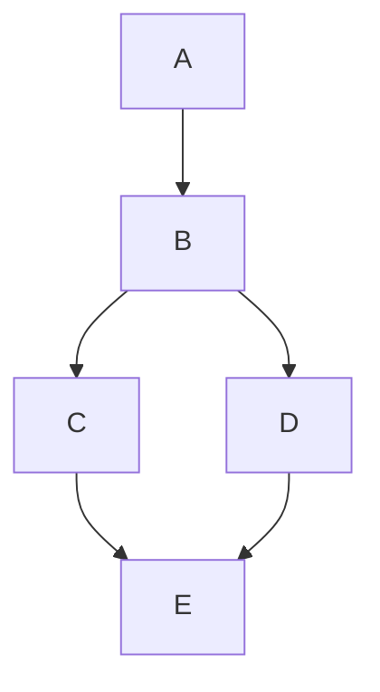


> 完全无向图（Complete Undirected Graph）

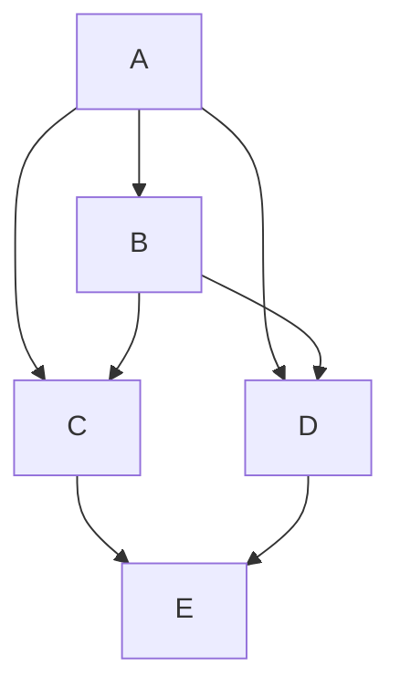

n = 0 无零阶独立性（No zero order independencies）

n = 1 一阶独立性（First order independencies）

$A \perp \perp C \mid B$

$A \perp \perp D \mid B$

$A \perp \perp E \mid B$

$C \perp \perp D \mid B$

结果邻接关系（Resulting Adjacencies）


n = 2: 二阶独立性（Second order independencies）

$B \perp \perp E \mid \{C, D\}$

结果邻接关系（Resulting Adjacencies）


> 图 5.1 (Figure 5.1)


即使在最坏情况下，这也是一个宽松的上界；它假设在最坏情况下，对于 $n$ 和 $k$，没有两个变量能被基数小于 $k$ 的集合 d-分离，并且对于许多 $n$ 和 $k$ 的值，我们无法找到具有该性质的图。虽然我们没有对该问题进行正式的期望复杂度分析，但最坏情况显然很少见，对于最大度数为 $k$ 的图，所需条件独立测试的平均次数要小得多。在实践中，可以恢复多达一百个变量的稀疏图。当然，计算需求随 $k$ 呈指数增长。


> 图 5.2 (Figure 5.2)


该算法的结构以及它在找到正确图后仍继续测试的事实，为处理非常大的变量集（其因果连接预计是稀疏的）提供了一个自然的启发式方法，即固定将要测试的条件独立关系的阶数上限。

## 5.4.2.2 PC 的稳定性（Stability of PC）

理论上，PC 算法在步骤 B) 和 C) 中都是不稳定的，尽管在实践中，步骤 B) 已被证明比步骤 C) 可靠得多。

如果在算法步骤 B) 的早期阶段，一条边被错误地从真实图中移除，那么其他不在真实图中的边可能会被包含在输出中。考虑以下示例。


> 图 5.3 (Figure 5.3)

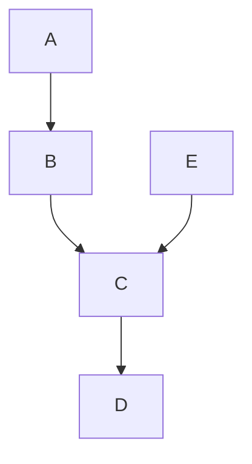

如果边 $E - D$ 被错误地从初始完全图中移除，那么在后续的搜索阶段，边 $B - D$ 将不会被移除，因为 $E$ 将不再位于 $D$ 的邻接集中，并且 $B$ 和 $D$ 在 $A$ 和 $C$ 的每个子集上都是依赖的。遗漏一条边也可能导致定向错误。如果一条边被错误地留在图中，并且输入中的 d-分离列表没有其他错误，那么导致的唯一进一步错误是，一些理论上可以定向的边将不会被定向。

算法的步骤 C) 不稳定的原因与 SGS 算法的步骤 C) 相同。

PC 算法比 SGS 算法更快，因为它测试的 d-分离关系更少。给定一个忠实的 d-可分性关系列表，两种算法输出相同的模式图集。但是，如果 d-可分性关系列表不忠实（例如由于抽样误差），两种算法可能输出不同的模式图。考虑以下示例。


> 图 5.4 (Figure 5.4)

根据此图，给定 $B$、$C$ 和 $D$ 的任何非空子集，$A$ 和 $E$ 彼此 d-分离。如果在从初始无向图中移除 $A - C$ 和 $E - C$ 边之后，该过程错误地判断为给定 $B$ 和 $D$ 的任何非空子集时 $A$ 和 $E$ 不是 d-分离的，那么 PC 算法将错误地包含 $A$ 和 $E$ 之间的边，因为它只测试给定 $A$ 和 $E$ 的邻接点子集时 $A$ 和 $E$ 是否 d-分离。另一方面，因为 SGS 算法测试给定 $V \setminus \{A, B\}$ 的任何子集时 $A$ 和 $E$ 是否 d-分离，它会正确地认识到 $A$ 和 $E$ 之间没有边，因为给定 $C$ 时 $A$ 和 $E$ 是 d-分离的。

相反，如果在从初始无向图中移除 $A - E$ 和 $B - E$ 边之后，错误地判断为给定 $E$ 时 $A$ 和 $B$ 是 d-分离的，SGS 算法将错误地移除 $A \rightarrow B$ 边。如果先移除 $A - E$ 和 $B - E$ 边，PC 算法会正确地保留 $A \rightarrow B$ 边，因为它不会测试给定 $E$ 时 $A$ 和 $B$ 是否 d-分离。

由于 PC 算法试图使用“局部”信息来判断边是否存在，因此不能保证它会在某种意义上产生“最接近”不忠实分布的图。考虑图 5.5 所示的示例。

在与该图忠实的分布中，每个变量都依赖于其他每个变量。假设一个测试确定 $A$ 和 $B$ 在给定某个其他变量时条件独立，要么是由于某些巧合的参数值，要么是由于抽样误差。PC 算法随后将移除 $A - B$ 边以满足该约束。然而，这样做会断开图的连接。结果图将蕴含 $A$ 及其左侧的所有后代与 $B$ 及其所有后代独立。因此，为了满足一个条件独立约束，PC 算法可能产生一个违反大量独立约束的图。在许多数据集中，两个变量之间的相关性并未消失，但输出模式却将它们断开了。为了获得更高的可靠性，该过程应辅以修复算法，对于离散情况，Cooper 和 Herskovits 的贝叶斯过程可能就足够了；或者，可以应用第 11 章描述的过程的一个变体。


> 图 5.5 (Figure 5.5)

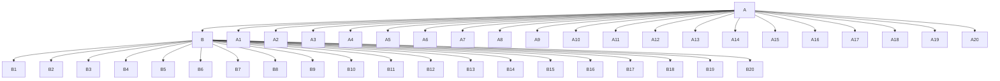

## 5.4.2.3 PC\* 算法（The PC\* Algorithm）

PC 算法计算效率高且渐近可靠，但在样本数据上，该过程会承担不必要的风险。在确定是否消除变量 $A$ 和 $B$ 之间的无向边时，该过程可能会测试 $A$ 的邻接集和 $B$ 的邻接集的每个子集。但是，$A$ 和 $B$ 在这些变量子集中的许多子集上的独立性或依赖性与 $A$ 和 $B$ 之间的因果关系可能完全无关。对于忠实于有向无环图的分布，如果变量 $A$ 和 $B$ 在给定 $\text{Parents}(A)$ 或给定 $\text{Parents}(B)$ 时条件独立，那么它们在给定 $\text{Parents}(A)$ 的子集或给定 $\text{Parents}(B)$ 的子集（仅包含位于 $A$ 和 $B$ 之间无向路径上的顶点）时也是条件独立的。因此，只需测试给定与 $A$ 相邻且在 $A$ 和 $B$ 之间的无向路径上的变量子集以及与 $B$ 相邻且在该路径上的变量子集时，$A$ 和 $B$ 的条件独立性。将修改后的算法称为 $\mathrm{PC}^{\ast}$。

给定一个忠实的关系列表（条件独立关系或相关性）作为输入，PC 和 $\mathrm{PC}^{\ast}$ 算法产生相同的输出，但当输入是基于样本数据测试确定的条件独立关系时，它们可能会有所不同。$\mathrm{PC}^{\ast}$ 算法避免了 PC 算法所犯的一种错误。然而，如果在早期阶段 $\mathrm{PC}^{\ast}$ 算法错误地断开了 $X$ 和 $Y$ 之间的路径，它可能会错误地将 $X - Y$ 边保留在无向图中，而给定相同的数据，PC 算法可能会避免该错误。此外，$\mathrm{PC}^{\ast}$ 算法可能具有的任何更高可靠性都是以巨大的成本为代价的，因为该算法必须在步骤 B) 的每个阶段跟踪它在该阶段考虑的图中的所有无向路径。无向路径的数量通常非常大，除非变量数量相对较少，否则 $\mathrm{PC}^{\ast}$ 算法的内存需求是不可行的；在变量数量较少的情况下，它可能是首选算法。对于大量的变量，必须改用 PC 算法，尽管如果真实图是稀疏的，可以在无向图 $C$ 的平均度数变小之前使用 PC 算法，在此之后可以使用 PC\* 算法。在本章后面，我们将描述这两种算法在取自 Christensen 1990 的离散数据上的性能。

## 5.4.2.4 测试排序的加速启发式方法（Speed-Up Heuristics for Ordering Tests）

PC 算法的步骤 B 选择某个变量对和某个给定大小的子集 $S$ 来测试 d-分离。从完全图中消除边的速度越快，在算法后期阶段需要进行的搜索就越小，算法运行得也就越快。因此，最好优先选择那些 $A$ 和 $B$ 最有可能被 $S$ d-分离的变量对 $A$ 和 $B$ 以及子集 $S$ 进行测试。我们考虑了 PC 算法的三种变体，它们使用不同的测试顺序选择方法。

**启发式方法 1 (Heuristic 1)** 按字典序测试变量对和子集 $S$。（我们将其称为 PC–1。）

**启发式方法 2 (Heuristic 2)** 首先测试那些在概率上依赖程度最低的变量对。条件子集按字典序选择。（我们将其称为 PC–2。）

**启发式方法 3 (Heuristic 3)** 对于给定的变量 $A$，首先测试那些在概率上对 $A$ 依赖程度最低的变量 $B$，条件化于那些在概率上对 $A$ 依赖程度最高的变量子集。（我们将其称为 PC–3。）

启发式方法 2 背后的直觉是，具有最高概率依赖性的变量最有可能在真实图中相邻，因此永远不会从正在构建的图中被消除，而那些具有最低概率依赖性的变量最不可能在真实图中相邻。当然，这种关系并非严格成立。

启发式方法 3 背后的直觉类似。一个不与变量 $A$ 真正相邻的变量 $B$，在给定 $A$ 的某些邻接变量子集或真实图中 $B$ 的某些邻接变量子集时，与 $A$ 是 d-分离的。假设对 $A$ 具有最高概率依赖性的变量最有可能在真实图中与 $A$ 相邻，这表明应该测试 $A$ 是否与那些对 $A$ 具有低概率依赖性的变量 d-分离，条件化于那些对 $A$ 具有高概率依赖性的变量。

## 5.4.3 IG（独立图）算法（The IG (Independence Graph) Algorithm）

Verma 和 Pearl (1990) 提出了 SGS 算法的一个变体。在他们的替代方案中，搜索有向无环图的第一步是构建**无向独立图（undirected independence graph）** $N$，即，对于每对变量 $A$、$B$，如果它们在给定所有其他变量集时是依赖的，则在它们之间引入一条无向边。在与有向无环图忠实的分布的无向独立图中，任何变量的父节点集构成一个**最大完全子图（maximal complete subgraph）**——一个**团（clique）**。再次，对于在 $N$ 中相邻的每对变量 $A$、$B$，确定 $A$ 和 $B$ 在给定 $N$ 中包含 $A$ 或 $B$ 的团中的任何变量子集时是否 d-分离。如果是，则 $A$ 在 $G$ 中不与 $B$ 相邻。因此，复杂度是 $N$ 中最大团大小的函数。

确定图中的团似乎需要不必要的计算，并且除了最坏情况外，测试两个变量在给定其中一个变量的最大团的所有成员时的条件独立性，将涉及不必要的高阶测试。更好的想法可能是将该过程与 PC 算法融合：修改 PC 算法的步骤 A，将 PC 过程中的初始图设置为无向独立图，而不是完全无向图，然后以相同的方式继续进行。我们将此算法称为 IG（独立图）。

这些算法的效率显然取决于构建独立图的难易程度。相关矩阵的标准化逆的非对角线元素是对应变量在给定剩余变量时的偏相关系数的相反数（例如，参见 Whittaker 1990）。因此，在线性情况下，可以通过在且仅在标准化逆相关矩阵中的条目非零时在 $A$ 和 $B$ 之间放置一条边来有效构建独立图。在离散情况下，Fung 和 Crawford (1990) 最近提出了一种从离散数据构建独立图的快速算法。我们尚未测试他们的过程作为 PC 算法的预处理器。

## 5.4.4 变量选择（Variable Selection）

虽然关于因果结构的先验知识有时能使我们所描述的算法在真实样本上产生更具信息量的结果，但**正确的变量选择对于可靠推断至关重要**，而算法（至少是这些算法）在这方面无法提供帮助。

我们可以聚合变量，也可以聚合一个变量的不同取值。正如第三章讨论的 Salmon 的假想例子，有时我们测量到的变量是一个更精确的自然变量的不精确版本；换句话说，我们未能区分那些对其他变量具有不同影响的取值。连续变量常常被有意地归并成几个离散类别，有时是因为列联表方法提供了无需对函数依赖关系的形式（例如线性或其他形式）做出实质性假设即可进行统计分析的前景，有时则是因为某些待分析的变量必然是离散的，而处理离散与连续变量混合问题的方法很少。有时，无论是出于无知还是有意为之，我们可能会将两个或多个具有不同因果结构的独立变量聚合到同一个量表中。聚合和归并对因果推断的可靠性会产生什么影响？

我们已经观察到，如果 C 是 A 和 B 的一个原因，并且使用了某个代理变量 $C ^ { \prime }$ --C，该代理变量不如 C 精确且与 C 不完全相关，那么 A 和 B 在给定 $C ^ { \prime }$ 的条件下可能具有统计依赖性。每当理论假定一个原因由代理变量测量时，就会出现此类例子。例如，弗里德曼（Friedman, 1957）提出了一种被广泛讨论的理论，其中消费是由只能通过代理变量测量的“永久性”收入引起的；如果弗里德曼的理论成立，那么将消费对测量收入进行回归会给出消费对永久性收入的回归系数的有偏估计，并且可能留下消费与其他变量之间无法解释的相关性。克莱珀（Klepper, 1988）展示了在线性正态情况下，此类误差如何被界定。

假设给定变量 A、B、C，使得 A 和 B 在给定 C 的条件下独立。令 $C ^ { \prime } = P R O J ( C )$，其中 PROJ(C) 是一个将 C 的 n 个值集合映射到 $m < n$ 个值集合的投影映射。如果存在 C 的值 $c _ { 1 } , \ c _ { 2 }$，使得 $P ( A , B | C = c _ { 1 } ) \neq$ $P ( A , B | C = c _ { 2 } )$ 且 $P R O J ( C { = } c _ { 1 } ) \ = \ P R O J ( C { = } c _ { 2 } )$，那么 A 和 B 在给定 $C ^ { \prime }$ 的条件下不是独立的。通过归并变量的取值，可以使独立性关系出现而非消失。假设变量 B、C 是依赖的。令 $C ^ { \prime } =$ PROJ(C)，其中 PROJ(C) 是一个将 C 的 n 个值集合映射到 $m <$ < n 个值集合的投影映射。如果存在 C 的一个值 $c _ { 1 }$，使得 $P ( C = c _ { 1 } \mid B ) = P ( C = c _ { 1 } )$ 且 $P R O J ( c _ { 1 } )$ 号具有唯一逆映射，并且对于所有不等于 1 的 $k , j$ 有 $P R O J ( c _ { k } ) = P R O J ( c _ { j } )$，那么 B 和 $C ^ { \prime }$ - 是独立的。

珀尔（Pearl，个人通信）指出，一种非常简单的聚合可以产生一个**不忠实分布（unfaithful distribution）**。假设 A 引起 $C _ { 1 }$，B 引起 $C _ { 2 }$，并且 $C _ { 1 }$ 和 $C _ { 2 }$ 都是二值的，且变量之间没有其他因果联系。因此，集合 $\{A, $C _ { 1 } \}$ 与集合 $\{ B , C _ { 2 } \}$ 独立，但 A 与 $C _ { 1 }$ 是依赖的，B 与 $C _ { 2 }$ 也是如此。引入变量 C，取值为 0、1、2、3，对 $C _ { 1 }$ 和 $C _ { 2 }$ 的不同值对进行编码。那么 A、B 和 C 之间的实际因果结构如图 5.6 所示。


> 图 5.6（Figure 5.6）


但在联合分布中，A 和 B 在给定 $C$ 的条件下是独立的，因此该联合分布对任何因果结构都是不忠实的。在这种情况下，分布的不忠实性是由于它是某个分布的边缘分布，而该分布由于变量间的确定性关系而本身是不忠实的：A 和 B 在给定 C 条件下的独立性直接源于将 **D-分离性（D-separability）**（见第三章）应用于图 5.6。这类情况在实践中有时可能发生，但总是可以被检验并在原则上被识别出来：以 A 为条件将 C 的值划分为两个等价类，每个等价类包含具有相同条件概率的 C 值；以 B 为条件则将 C 的值划分为另一对不同的等价类。令由 A 诱导的等价类作为一个变量的值，由 B 诱导的等价类作为另一个变量的值，即可恢复出 $C _ { 1 }$ 和 $C _ { 2 }$。

## 5.4.5 融入背景知识（Incorporating Background Knowledge）

这些算法的用户可能拥有大量能够约束搜索的背景知识——或者至少是信念。这些知识可能涉及图中某些边的存在或不存在，可能涉及某些边的方向，也可能涉及变量的时间顺序。算法如何利用这些背景知识？

最常见的一类可靠的先验信念是根据发生时间对变量进行排序或部分排序：要么 A 的测量是在 B 的测量之前进行的，要么 A 和 B 被认为是按此顺序发生的事件的精确度量。本节中的任何算法都可以轻松修改，以两种方式利用此类知识：

- (i) 在通过检验 B 是否在给定 A 当前邻接的某个子集条件下独立于 A，来确定 A 和 B 在真实图中是否相邻时，不要检验在包含任何晚于 A 的变量的集合条件下的独立性。
- (ii) 如果 A 和 B 相邻且 B 晚于 A，则将边定向为 A → B。

在我们全书给出的例子中，算法都经过了这样的修改，我们有时会利用常识性的时间顺序，并始终注明在何处做出了此类假设。

关于一个变量是否直接影响另一个变量的先验信念也可以融入这些算法中：例如，如果先验信念禁止某个邻接关系，则算法无需费心去检验该邻接关系；如果先验信念要求一个变量对另一个变量有直接影响，则施加相应的有向边，并在其他边的定向过程中将其作为假设。这些过程假设先验信念应覆盖无约束搜索的结果，这种偏好可能并非总是明智的；尽管如此，它们还是被融入了带有 PC 算法的 TETRAD II 程序版本中。

## 5.5 统计决策（Statistical Decisions）

我们所描述的算法是完全模块化的，并且可以应用于任何做出关于条件独立性或偏相关系数为零的必要统计决策的程序。决策越好，算法的预期性能就越好。虽然条件独立性关系的检验构成了此类决策中最明显的一类，但任何能够为图结构提供 **d-分离性（d-separability）** 关系的统计约束都足够了。例如，在线性正态情况下，偏相关系数为零等价于条件独立性，算法所需的统计决策可以通过检验偏相关系数为零的假设的 t 检验来提供。但是，无论分布是否正态，只要线性和**线性忠实性（linear Faithfulness）** 成立，偏相关系数为零就标志着 d-分离性。4 因此，在这些假设下，任何在偏相关系数为零时也为零的统计量的检验就足够了；例如，可以使用半偏相关系数平方的 F 检验，它等于相应回归系数 t 检验的平方 (Edwards 1976)。

在本书的例子中，我们使用 Fisher 的 z 检验来检验 $\rho _ { X Y . \mathbf { C } } = 0$：

$$
z (\rho_ {X Y. \mathbf {C}}, n) = \frac {1}{2} \sqrt {n - | \mathbf {C} | - 3} \ln \left[ \frac {\left(| 1 + \rho_ {X Y . \mathbf {C}} |\right)}{\left(| 1 - \rho_ {X Y . \mathbf {C}} |\right)} \right]
$$

其中 $\rho_ {X Y . \mathbf { C } }$ 是给定 C 条件下 X 和 Y 的总体偏相关系数，且 $|\mathbf {C}|$ 等于 C 中的变量数。如果 X、Y 和 C 是正态分布的，并且 $r _ { X Y . \mathbf { C } }$ 表示给定 C 条件下 X 和 Y 的样本偏相关系数，则 $z ( \rho _ { X Y . \mathbf { C } } , n ) - z ( r _ { X Y . \mathbf { C } } , n )$ 的分布是标准正态分布 (Anderson 1984)。

在离散情况下，为简单起见，考虑两个变量。回想一下，我们将特定单元格中的计数 $x _ { i j }$ 视为从多项分布中抽样 N 个单位得到的随机变量的值。令 $x _ { i + }$ 表示第一个变量取值为 i 的所有单元格中计数的总和，类似地，令 $x _ { + j }$ 表示第二个变量取值为 $j$ 的所有单元格中计数的总和。在第一个和第二个变量独立的假设下，随机变量 $x _ { i j }$ 的期望值为：

$$
E (x _ {i j}) = \frac {x _ {i +} x _ {+ j}}{N}
$$

类似地，我们可以根据适当的边际和，在任何条件独立性假设下计算单元格的期望值。例如，在第一个变量在给定第三个变量的条件下与第二个变量独立的假设下，单元格 $x _ { i j k }$ 的期望值为：

$$
E (x _ {i j k}) = \frac {x _ {i + k} x _ {+ j k}}{x _ {+ + k}}
$$

如果有三个以上的变量，此公式适用于前三个变量的 $i , j ,$ k 值的边际计数的期望值，该边际计数是通过对所有其他变量求和得到的。条件独立性假设对分布施加的独立约束的数量是条件独立性关系阶数的指数函数，并且也取决于每个变量可以取的不同值的数量。

对这类独立性假设的检验使用了——除其他外——两种统计量：

$$
\mathrm{X} ^ {2} = \sum \frac {\left(\text { 观察值（Observed） } - \text { 期望值（Expected） }\right) ^ {2}}{\text { 期望值（Expected） }}
$$

$$
G ^ {2} = 2 \sum (\text { 观察值（Observed） }) \ln \left(\frac {\text { 观察值（Observed） }}{\text { 期望值（Expected） }}\right)
$$

这两种统计量都渐近服从具有适当自由度的 $\chi ^ { 2 }$ 分布。在本书的例子中，我们按以下方式计算检验 A 和 B 在给定 C 条件下独立性的自由度。令 Cat(X) 是一个返回变量 X 类别数的函数，n 是 C 中的变量数。那么检验的自由度 (df) 为：

$$
d f = (C a t (A) - 1) \times (C a t (B) - 1) \times \prod_ {i = 1} ^ {n} C a t (C _ {i})
$$

我们假设不存在结构性零。作为一种启发式方法，对于分布中每个包含零条目的单元格，我们将自由度减 1。5

由于单元格数量随变量数量呈指数增长，很容易构造出单元格数量远多于数据点的情况。在这种情况下，完整联合分布中的大多数单元格将是空的，即使非空单元格也可能只有很小的计数。事实上，很容易出现某些边际总和为零的情况，在这些情况下，检验中的自由度必须减少。对于可靠的估计和检验，芬伯格（Fienberg）建议样本量至少应是假设检验所确定的期望值单元格数量的五倍。

对于离散数据，我们使用 $G ^ { 2 }$ 来填充 PC 算法中的独立性检验，在模拟中我们发现它比 $X ^ { 2 }$ 更常导致正确的图。在检验两个变量在给定一组其他变量条件下的条件独立性时，如果样本量小于待拟合单元格数量的十倍，我们假设这些变量是条件依赖的。

## 5.6 可靠性与错误概率（Reliability and Probabilities of Error）

我们描述的大多数算法都需要统计决策，正如我们刚刚指出的，这些决策可以以假设检验的形式实现。但是，检验的参数不能赋予其通常的意义。统计检验通常提供的保障是显著性水平，它保证了真实零假设被检验错误拒绝的极限频率，以及针对备择假设的检验功效，它是当指定的备择假设为真时，错误零假设不被拒绝的极限频率的函数。除非样本量非常大，否则在搜索算法中用于判断统计依赖性的检验的显著性水平和功效，都不能衡量搜索中任何感兴趣事物的长期频率。那么什么能衡量呢？

人们自然可能想知道的关于搜索过程的错误概率包括：

- 1. 给定模型 M 为真，该过程在样本量为 n 时返回与 M 不一致的结论的概率是多少？
- 2. 给定模型 $M ^ { * }$ 为真，该过程在样本量为 n 时返回与 $M ^ { * }$ 不一致但与 M 一致的结论的概率是多少？
- 3. 给定模型 M 为真，对于大小为 n 的样本，搜索过程指定一个不在 M 中的邻接关系的概率是多少？搜索过程遗漏一个在 M 中的邻接关系的概率是多少？搜索过程向一个在 M 中的边添加一个不在 M 中的箭头的概率是多少？搜索过程遗漏一个在 M 中的箭头的概率是多少？对于任何特定的变量对 A、B，这些概率是多少？

对于大型模型，我们预计大多数样本都会出现一些设定错误，第 3 类问题最为重要。

获得这些问题的解析答案希望渺茫。在样本中对独立性假设进行重复检验，每次使用相同的显著性水平时，某个真实假设被拒绝的概率并非由显著性水平给出；取决于假设的数量和样本量，该概率实际上可能远高于显著性水平，但无论如何，某些错误决策的概率取决于哪些假设被检验，而对于所有考虑的算法，这又以一种复杂的方式依赖于实际结构。此外，即使某些必要的统计决策被错误地做出，每个算法仍然可以产生正确的输出。例如，假设在图 G 中，顶点 A 和 B 不相邻。假设实际上 A 和 B 在给定 C、给定 D、给定 C 和 D 等条件下都是独立的。如果在搜索过程中，A 和 B 在给定 C 条件下独立的假设被拒绝，而算法继续检验 A 和 B 在给定 D 条件下是否独立，并判定后者独立，那么尽管之前有错误，该过程仍将正确地得出 A 和 B 不相邻的结论。第 12 章讨论了对于因果模型的任何搜索过程，置信区间是否存在或不存在的各种含义。

对于任何特定的 M 和 M\*，对问题 1、2 和 3 的答案的估计可以通过蒙特卡洛方法凭经验找到。线性正态模型的模拟包现在在商业统计软件包中很常见，而 TETRAD II 程序包含一个用于具有多种分布的线性和离散变量模型的模拟包。对于小型模型，生成一百个或更多样本并通过搜索过程运行这些样本只需几分钟。大部分时间花在计数结果上，这是一个我们在模拟中专门自动化的过程，并且可以而且应该以通用方式自动化，以测试特定搜索结果的可靠性。

## 5.7 估计（Estimation）

在正态性假设下，即使存在未测量的变量，也有众所周知的方法来获得受因果假设约束的**最大似然估计（maximum likelihood estimates）** (Joreskog 1981; Lohmoller 1989)。当放弃正态性假设时，也有多种计算机化的估计方法可用，包括普通最小二乘法和广义最小二乘法。在离散情况下，对于正的多项分布，在图的独立性约束下，对一组变量 V 上的一个单元格的最大似然估计（当它们存在时）可以通过将边际频率代入第三章的分解公式中的概率来获得 (Kiiveri and Speed 1982)。

$$
P (\mathbf {V}) = \prod_ {V \in \mathbf {V}} P (V | \text { 父节点（Parents） } (V))
$$

当存在作为测量变量共同原因的未测量变量时，从我们描述的程序获得的模式可以具有两端都有箭头的边。在这种相当常见的情况下，我们不知道如何获得离散测量变量联合分布的最大似然估计。

## 5.8 示例与应用（Examples and Applications）

我们通过模拟数据集和真实数据集来展示这些算法。使用模拟数据时，这些示例说明了算法在具有现实规模样本上的性质。在实证案例中，我们通常不知道算法是否产生了真实结果。但至少有趣的是，在研究者对其数据的处理与解释给予了一定关注的情况下，算法能够重现或几乎重现已发表的因果关系描述。同样有趣的是，在不具备这些优点的案例中，算法所提出的解释与已发表报告中所倡导的解释截然不同。

关于**PC算法（PC algorithm）**和另一种程序——**快速因果推断（Fast Causal Inference, FCI）算法**——所产生的回归模型及其替代方案的研究，将推迟到第8章进行，在此之前，第6章和第7章将分别讨论潜变量和预测问题。

## 5.8.1 出版生产力的原因（The Causes of Publishing Productivity）

在社会科学中，关于“理论”在构建数据集的因果解释方面的重要性，存在着大量讨论。当然，在解释一个数据集时，人们总会排除那些违背常识或违反变量时间顺序的因果图。但除此之外，许多从业者要求，在社会科学中为观测数据提供因果解释的每一次尝试，都必须通过社会学、心理学、经济学、政治学等学科的具体原理来进行，并且同时要否认仅凭统计依赖性和常识就能确定正确解释的可能性。在许多这类案例中，理论的必要性被严重夸大了。事实上，对于整个科学文献中的每一个“递归”结构方程模型，如果模型的假设是正确的，并且没有假设未测量的共同原因，那么如果分布是**忠实（faithful）**的，总体中的统计依赖性就能唯一地确定因果有向图背后的无向图。在许多情况下，仅凭总体统计量就能确定部分甚至所有边的方向。当变量按时间线性排序时，即变量A只有在A发生时间晚于B时才能成为变量B的原因，那么假设分布为正且满足**马尔可夫条件（Markov Condition）**和**最小性条件（Minimality Condition）**，统计依赖性和时间顺序就能确定唯一的有向图。为证明因果依赖关系的设定而引用文献的努力并非错位，但在许多情况下，更好的做法是将努力用于确立基本的统计假设，包括单元的大致同质性、抽样假设的正确性，以及有时还包括依赖关系的线性性。

这里有一个近期且相当生动的例子。关于学术成功原因（包括发表率和引用率）的文献相当丰富。Rodgers 和 Maranto（1989）最近的一篇论文考虑了来自社会学、经济学和心理学的关于学术生产力原因的假设，并提出了一个组合的“基于理论”的模型。

他们的数据是通过以下方式获得的：向932名美国心理学会会员发送了征询函和问卷，这些会员均在1966年至1976年间获得博士学位，且当时是任职的学术心理学家。样本中男女心理学家数量相等，在删除了非心理学学位获得者、未在心理学领域获得第一份工作的受访者等之后，最终获得了86名男性和76名女性的样本。

调查项目被聚类成组。例如，**ABILITY** 组包括被试本科院校的平均 ACT、NMSQT 和选择性分数（selectivity scores）的测量值，以及 Phi Beta Kappa 会员资格和毕业时的本科荣誉。**研究生项目质量（Graduate Program Quality, GPQ）** 包括系科教师的学术质量和项目有效性（使用全国排名）、1978年至1980年间有发表的教师比例，以及期刊编辑是否在该系任教。这些调查项目被视为未测量变量 GPQ 和 ABILITY 的指标——即效应。其他测量指标包括**第一份工作质量（Quality of First Job, QFJ）**、**性别（SEX）**、**引用率（CITATION rate, CITES）** 和**发表率（PUBLICATION rate, PUBS）**。在初步分析中，他们还使用了一个聚合的生产力指标（PROD）。Rodgers 和 Maranto 考虑的各种假设随后被处理为线性“结构方程模型”6。他们报告了以下聚类变量之间的相关性：

<table><tr><td>ABILITY</td><td>GPQ</td><td>PREPROD</td><td>QFJ</td><td>SEX</td><td>CITES</td><td>PUBS</td></tr><tr><td>1.0</td><td></td><td></td><td></td><td></td><td></td><td></td></tr><tr><td>.62</td><td>1.0</td><td></td><td></td><td></td><td></td><td></td></tr><tr><td>.25</td><td>.09</td><td>1.0</td><td></td><td></td><td></td><td></td></tr><tr><td>.16</td><td>.28</td><td>.07</td><td>1.0</td><td></td><td></td><td></td></tr><tr><td>-.10</td><td>.00</td><td>.03</td><td>.10</td><td>1.0</td><td></td><td></td></tr><tr><td>.29</td><td>.25</td><td>.34</td><td>.37</td><td>.13</td><td>1.0</td><td></td></tr><tr><td>.18</td><td>.15</td><td>.19</td><td>.41</td><td>.43</td><td>.55</td><td>1.0</td></tr></table>

接下来是对由社会学、经济学和心理学文献片段所提示的因果理论进行非常详尽的解释。Rodgers 和 Maranto 估计了不少于六组不同的结构方程及相应的因果理论。他们所考虑的六个结构如图5.7所示。

图上的标签仅表示 Rodgers 和 Maranto 推导出因果图的社会科学理论。例如，“人力资本（Human Capital）”图和“筛选（Screening）”图是通过以下方式从经济理论中获得的：

在人力资本模型（Becker 1964）中，教育对生产力有直接影响，因为它传递了相关知识。人们投资于教育，直到其边际成本（额外一年的教育所带来的额外费用和放弃的收入）等于其边际收益（额外一年教育所带来的终身收入的增加）。能力更强的个体在工作能力和技能获取方面都比能力较弱的个体更具生产力。因此，能力对生产力有直接影响，并通过教育产生间接影响，因为能力更强的个体从学校中获益更多。工作经验通过提供在职培训也能提高生产力。教育的质量以及数量都与人力资本框架相关。

筛选假说（screening hypothesis）隐含地将能力视为生产力的主要决定因素。雇主希望雇佣最具生产力的求职者，但能力无法直接观察。个体投资于教育，以此作为向雇主传递其能力信号的手段。教育的边际成本与能力成反比，从而在能力与教育水平之间产生正相关。因此，通过根据教育水平选择求职者，雇主实际上是根据能力来雇佣（Spence 1973）。在这个模型中，教育并不直接影响生产力，而只是通过其与能力的关联来产生影响。教育质量的变化与筛选模型是一致的（Wise 1975）。


> 图5.7

“经验模型（empirical model）”来自一项未诉诸社会理论的先前研究。

基于这些模型的结构方程系统没有一个能够完美拟合数据。但是，将“理论”模型中的所有边结合起来，再添加两条看似合理的边，然后剔除统计上不显著（在0.05水平上）的依赖关系，反而使 Rodgers 和 Maranto 提出了一个与数据拟合得相当好的不同因果结构。

看来，对“理论”的梳理几乎毫无用处，但 Rodgers 和 Maranto 却持不同看法：


> 图5.8

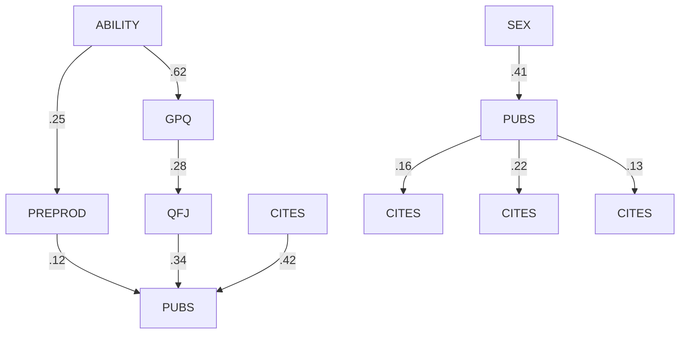

仅基于观测到的相关模式的因果模型是高度可疑的。任何数据都可以由多个替代模型拟合。因此，最佳拟合模型的构建是由基于理论的预期所指导的。通过使用两个生产力指标 PUBS 和 CITES，以及五个因果前因变量，我们初步估计了一个包含六个理论所识别出的所有路径的复合模型。该模型在 ABILITY 与 PREPROD 的观测相关与预测相关之间产生了较大的正偏差，这表明我们遗漏了一条或多条重要路径。重新审视我们对这六个理论的初步解释后，我们得出结论，有两条路径被忽略了。一条路径是从 ABILITY 到 PREPROD……另一条先前未指定的路径是从 ABILITY 到 PUBS。这两条路径被添加进来，并且从复合模型中删除了所有不显著的路径，从而得到了最佳拟合模型。

如果 Rodgers 和 Maranto 的理论完全正确，那么其有向图背后的无向图将由条件独立关系唯一确定，并且方向也几乎是唯一确定的；只有 GPQ → QFJ、ABILITY → GPQ 和 ABILITY → PREPROD 这些边的方向可以改变，而且只能以不产生新的碰撞点（collision）的方式进行改变。

当将 PC 算法应用于他们的相关性数据（并结合常识性的时间顺序），并使用0.1的显著性水平进行零偏相关系数检验时，输出的结果如图5.9左侧所示，我们将其与 Rodgers 和 Maranto 的模型并列展示。


> PC 算法输出

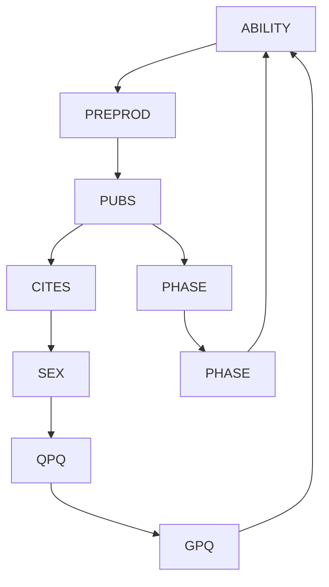


> Rodgers 和 Maranto 图 图5.9

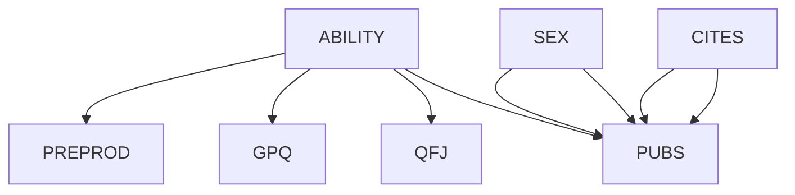

Rodgers 和 Maranto 模型中的边，除了一个之外，其余都是直接从数据和领域常识中即时产生的——时间顺序。该模型的卡方值为 $13.58$，自由度为 11，$p = 0.257$。如果使用0.05作为显著性水平重复搜索过程，程序会删除 PREPROD → PUBS 这条边。当该模型被估计和检验时，卡方值为 $19.2$，自由度为 12，$p$ 值为 0.08，这些数字应被视为拟合优度的估计值，而非误差概率。

任何声称除了常识之外还需要社会科学理论才能找到 Rodgers 和 Maranto 模型要点的说法，显然是错误的。Rodgers 和 Maranto 搜索的初步结果也没有为社会科学理论提供任何信心。相比之下，我们对 PC 算法的可靠性和局限性了解得相当多。使用 TETRAD 和 EQS 的整个研究只需几分钟。如果使用 **SGS算法（SGS algorithm）** 而非 PC 算法，会得到一个略有变异的模型。

## 5.8.2 教育与生育（Education and Fertility）

Rindfuss、Bumpass 和 St. John（1980）对已婚女性在结婚时的教育水平（ED）与生育第一个孩子的年龄（AGE）之间的相互影响感兴趣。基于理论依据，他们详细论证了图 5.10 左侧的模型，其中从顶部到底部的回归变量如下：

<table><tr><td>DADSO =</td><td>父亲的职业</td></tr><tr><td>RACE =</td><td>种族</td></tr><tr><td>NOSIB =</td><td>无兄弟姐妹</td></tr><tr><td>FARM =</td><td>农场背景</td></tr><tr><td>REGN =</td><td>美国地区</td></tr><tr><td>ADOLF =</td><td>研究对象童年家庭中有两名成年人</td></tr><tr><td>REL =</td><td>宗教</td></tr><tr><td>YCIG =</td><td>吸烟</td></tr><tr><td>FEC =</td><td>研究对象是否有过流产</td></tr></table>

回归变量之间存在相关性。样本量为 1766，协方差矩阵如下所示。

<table><tr><td>DADSO</td><td>RACE</td><td>NOSIB</td><td>FARM</td><td>REGN</td><td>ADOLF</td><td>REL</td><td>YCIG</td><td>FEC</td><td>ED</td><td>AGE</td></tr><tr><td>456.676</td><td></td><td></td><td></td><td></td><td></td><td></td><td></td><td></td><td></td><td></td></tr><tr><td>-.9201</td><td>.089</td><td></td><td></td><td></td><td></td><td></td><td></td><td></td><td></td><td></td></tr><tr><td>-15.825</td><td>.1416</td><td>9.212</td><td></td><td></td><td></td><td></td><td></td><td></td><td></td><td></td></tr><tr><td>-3.2442</td><td>.0124</td><td>.3908</td><td>.2209</td><td></td><td></td><td></td><td></td><td></td><td></td><td></td></tr><tr><td>-1.3205</td><td>.0451</td><td>.2181</td><td>.0491</td><td>.2294</td><td></td><td></td><td></td><td></td><td></td><td></td></tr><tr><td>-.4631</td><td>.0174</td><td>-.0458</td><td>-.0055</td><td>.0132</td><td>.1498</td><td></td><td></td><td></td><td></td><td></td></tr><tr><td>.4768</td><td>-.0191</td><td>.0179</td><td>-.0295</td><td>-.0489</td><td>-.0085</td><td>.1772</td><td></td><td></td><td></td><td></td></tr><tr><td>-0.3143</td><td>.0031</td><td>.0291</td><td>-.0096</td><td>-.0018</td><td>.0089</td><td>-.0014</td><td>.1170</td><td></td><td></td><td></td></tr><tr><td>.2356</td><td>.0031</td><td>.0018</td><td>-.0045</td><td>-.0039</td><td>.0021</td><td>-.0003</td><td>.0009</td><td>.0888</td><td></td><td></td></tr><tr><td>18.66</td><td>-.1567</td><td>-2.349</td><td>-.2052</td><td>-.2385</td><td>-.1434</td><td>-.0119</td><td>-.1380</td><td>.0267</td><td>5.5696</td><td></td></tr><tr><td>16.213</td><td>-.2305</td><td>-1.4237</td><td>-.2262</td><td>-.3458</td><td>.1752</td><td>.1683</td><td>-.1702</td><td>.2626</td><td>3.6580</td><td>16.6832</td></tr></table>

令研究者惊讶的是，他们在估计系数时发现 AGE → ED 的参数为零。鉴于先验信息表明 ED 和 AGE 并非其他变量的原因，PC 算法（使用 0.05 显著性水平进行检验）直接找到了图 5.10 右侧的模型，其中回归变量之间的连接未在图中显示。此案例将在第 12 章第 5.10 节进一步讨论。

## 5.8.3 女性性高潮（The Female Orgasm）

Bentler 和 Peeler（1979）从 281 名女大学生中获取了关于人格和性反应的数据。他们采用了艾森克人格问卷（Eysenck Personality Inventory），该问卷测量了神经质（N）和外向性（E）；一个异性恋行为量表（HET），一个单性恋行为量表（MONO）；一个针对手淫的消极态度量表（ATM）；以及一个关于性交和手淫体验的主观评估量表。通过**因子分析（factor analysis）**，研究者从这些反应中构建了他们认为是单维的量表，包括从性交和手淫体验的主观评估中得出的两个量表（SCOR）和（SMOR）。

研究者关注两个假设：（1）手淫和性交中的主观性高潮反应源于不同的内在过程；（2）外向性、


> Rindfuss 等人的理论模型；AGE -> ED 系数在统计上不显著

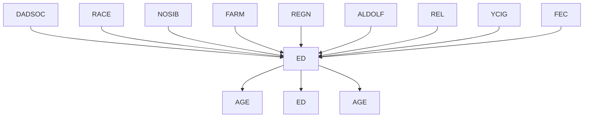


> TETRAD II 模型 图 5.10

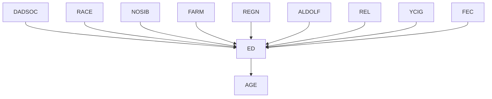

神经质以及对手淫的态度对由 SCOR 和 SMOR 测量的性高潮反应能力没有直接影响，而是通过由 HET 和 MONO 测量的个体性经验历史来影响该现象。

我们在此不讨论这些量表的构建过程，因为所提供的数据仅为量表分数和量表得分的相关性，如下所示：

<table><tr><td>E</td><td>N</td><td>ATM</td><td>HET</td><td>MONO</td><td>SCOR</td><td>SMOR</td></tr><tr><td>1.0</td><td></td><td></td><td></td><td></td><td></td><td></td></tr><tr><td>-.132</td><td>1.0</td><td></td><td></td><td></td><td></td><td></td></tr><tr><td>.009</td><td>-.136</td><td>1.0</td><td></td><td></td><td></td><td></td></tr><tr><td>.22</td><td>-.166</td><td>.403</td><td>1.0</td><td></td><td></td><td></td></tr><tr><td>-.008</td><td>.008</td><td>.598</td><td>.282</td><td>1.0</td><td></td><td></td></tr><tr><td>.119</td><td>-.076</td><td>.264</td><td>.514</td><td>.176</td><td>1.0</td><td></td></tr><tr><td>.118</td><td>-.137</td><td>.368</td><td>.414</td><td>.336</td><td>.338</td><td>1.0</td></tr></table>

Bentler 和 Peeler 提出了两个线性模型来解释这些相关性。这些模型及其 $\chi ^ { 2 }$ 值如图 5.11 所示。


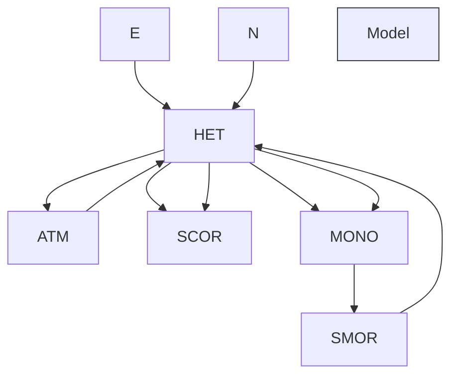


> 图 5.11

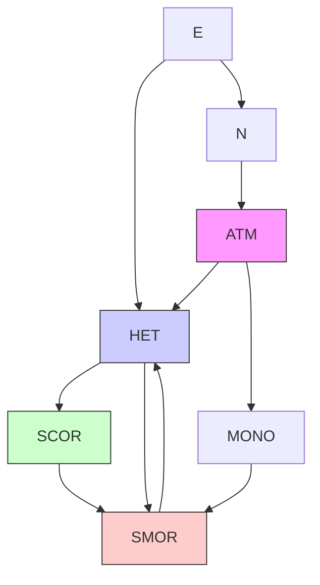

只有第二个模型符合数据。作者写道：

> 事实证明，有可能建立一个与假设一致的高潮反应模型，即外向性（e）、神经质（n）和对手淫的态度（atm）仅通过这些变量对异性恋（het）和手淫（mono）经验的影响来影响高潮反应。因此，假设 2 似乎被接受了。（第 419 页）

该论证的逻辑并不明显。正如作者所指出的，“必须记住，可能还可以开发出其他同样能很好地描述数据的模式（原文如此）”（第 419 页）。但是，如果数据同样可以被一个模型很好地描述，例如，该模型中 ATM 对 SCOR 或 SMOR 有直接影响，那么就没有理由接受假设 2。使用 PC 算法，可以很容易地找到这样的模型。

该模型的 $\chi ^ { 2 }$ 值为 17，自由度为 12，$p ( \chi ^ { 2 } ) = . 1 4 8$。

PC 算法找到了一个基于数据无法拒绝的模型，该模型假设了对手淫的态度对手淫期间性高潮体验的直接影响，这与 Bentler 和 Peeler 的结论相反。

## 5.8.4 美国职业结构（The American Occupational Structure）

Blau 和 Duncan（1967）对美国职业结构的研究被美国国家科学院誉为一项杰出的社会研究范例，同时也被一位统计学家（Freedman 1983a）批评为对科学的滥用。Blau 和 Duncan 使用 20,700 名受试者的样本，提出了一个关于教育（ED）、第一份工作（$J _ { 1 }$）、父亲的教育水平（FE）和父亲的职业（FO）在决定一个人 1962 年职业（OCC）中所起作用的初步理论。他们在图 5.13 的图表中展示了他们的理论，其中无向边表示未解释的相关性。


> 0.05 显著性水平下的 TETRAD 模式

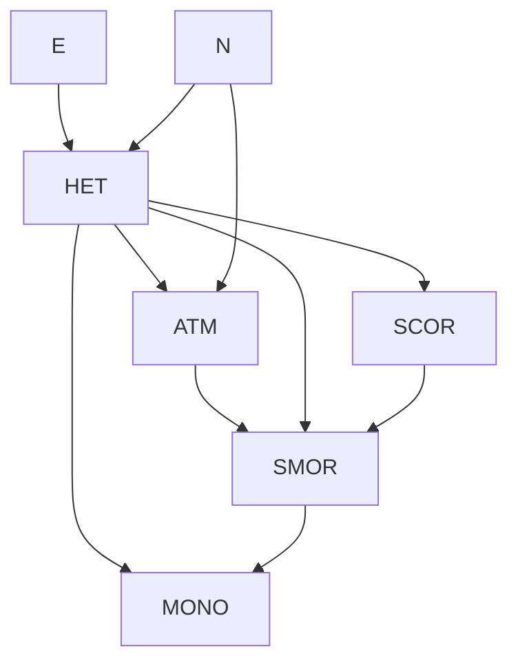


> 0.10 显著性水平下的 TETRAD 模式

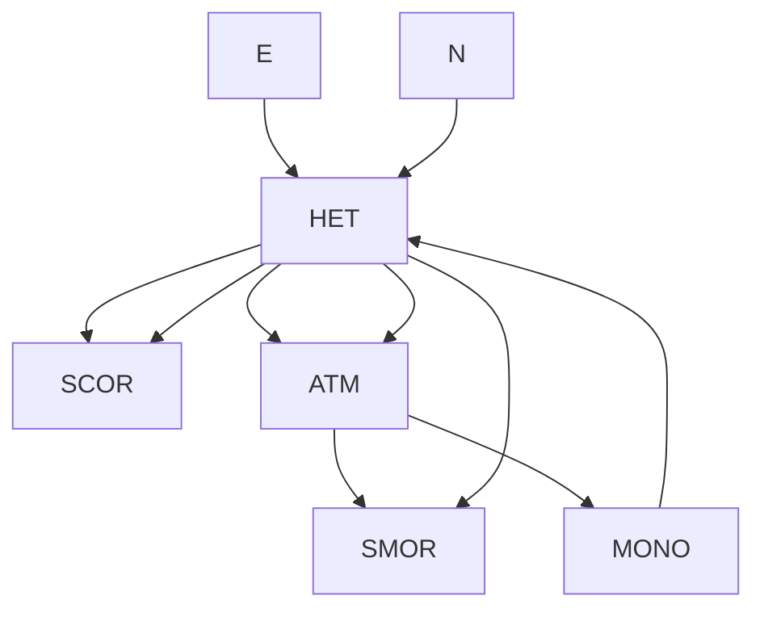

$$
p = . 1 4 8
$$

图 5.12

Blau 和 Duncan 认为这些依赖关系是线性的。他们的显著结论是，父亲的教育水平仅通过父亲的职业和受试者的教育水平来影响职业和第一份工作。


> 图 5.13

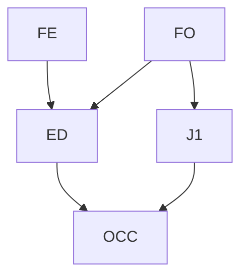

Blau 和 Duncan 的理论被 Freedman 批评为武断、缺乏依据且在统计上不充分（Freedman 1983a）。事实上，如果将该理论用于 EQS（Bentler 1985）或 LISREL（Joreskog and Sorbom 1984）程序的 $\chi ^ { 2 }$ 似然比检验，该模型被明确拒绝 $( p \ < . 0 0 1 )$ ，并且 Freedman 报告称，它也被**自助法（bootstrap）**检验拒绝。

如果使用传统的 0.05 显著性水平来检验偏相关系数为零，并根据常识按时间顺序对变量进行排序，那么根据 Blau 和 Duncan 的协方差矩阵，PC 算法会生成图 5.14 所示的图形。


> 图 5.14

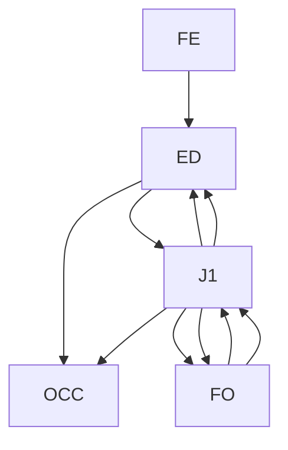

在这种情况下，每个碰撞节点都出现在一个三角形中，并且没有无屏蔽的碰撞节点。因此，数据无法确定因果连接的方向，但时间顺序当然决定了每条边的方向。我们强调，这些邻接关系完全由程序根据数据生成，没有任何先验约束。所展示的模型通过了相同的似然比检验，$p > . 3$。

该算法在 Blau 和 Duncan 的理论基础上增加了 FE 和 $J _ { 1 }$ 之间的直接连接。只有当用于检验偏相关系数为零的显著性水平为 0.0002 时，FE 和 $J _ { 1 }$ 之间的连接才会消失。要确定一组与 1962 年 FE 到 OCC 的有向边一致的偏相关系数为零的集合，就必须在大于 0.3 的显著性水平上拒绝偏相关系数为零的假设。在 0.0001 的显著性水平下，数据中发现的**条件独立性（conditional independence）**关系与 Blau 和 Duncan 的有向图是忠实（faithful）的。

Freedman 认为，在美国人口中，我们应该预期这些变量之间的影响因家庭而异，因此假设总体中所有单位都具有相同的结构系数是没有根据的。类似结论也可以通过另一种方式得出。我们在第 3 章中指出，如果一个总体由具有相同因果结构但不同方差和线性系数的线性系统的子总体混合而成，那么除非系数是独立分布的或者混合比例特殊，否则总体相关性将与任何子总体的相关性不同，并且在每个子总体中独立的变量可能在整体中相关。当具有不同线性结构的子总体混合在一起并且这些特殊条件不满足时，从相关性中发现的有向图通常是完全的。我们看到，为了拟合 Blau 和 Duncan 的数据，我们需要一个仅比完全图少一条边的图。

同样的道理在 Duncan、Featherman 和 Duncan（1972）根据同一项实证研究构建的另一个线性模型中更加明显。他们建立了以下关于社会经济背景和职业成就的模型，其中 FE 表示父亲的教育水平，FO 表示父亲的职业地位，SIB 表示受访者的兄弟姐妹数量，ED 表示受访者的教育水平，OCC 表示受访者的职业地位，INC 表示受访者的收入。


> 图 5.15

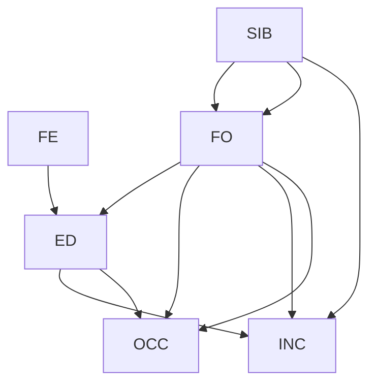

在这种情况下，双箭头仅表示残差相关性。该模型的 $\chi ^ { 2 }$ 值为 165。当将相关矩阵与变量的明显时间顺序一起提供给 TETRAD II 程序时，PC 算法会生成一个完全图。


> 图 5.16

```mermaid
graph TD
  n1["1"] --> n25["25"]
  n25 --> n1
  n25 --> n18["18"]
  n26["26"] --> n26
  n26 --> n3["3"]
  n27["27"] --> n4["4"]
  n27 --> n29["29"]
  n29 --> n7["7"]
  n29 --> n8["8"]
  n29 --> n9["9"]
  n30["30"] --> n8
  n30 --> n9
  n4 --> n5["5"]
  n5 --> n6["6"]
  n6 --> n10["10"]
  n6 --> n17["17"]
  n7 --> n28["28"]
  n8 --> n9
  n9 --> n30
  n10 --> n21["21"]
  n11["11"] --> n31["31"]
  n12["12"] --> n32["32"]
  n13["13"] --> n13
  n14["14"] --> n33["33"]
  n15["15"] --> n34["34"]
  n16["16"] --> n37["37"]
  n17 --> n25
  n18 --> n18
  n19["19"] --> n4
  n20["20"] --> n27
  n21 --> n22["22"]
  n22 --> n35["35"]
  n23["23"] --> n36["36"]
  n24["24"] --> n36
  n25 --> n1
  n26 --> n2["2"]
  n27 --> n11
  n28 --> n29
  n29 --> n7
  n30 --> n9
  n31 --> n11
  n32 --> n34
  n33 --> n14
```

## 5.8.5 ALARM网络（The ALARM Network）

回顾用于模拟急诊医学中因果关系的ALARM网络（图5.16）。

SGS算法和 $\mathrm {P C} ^ { \ast }$ 算法无法在如此大规模的问题上运行。我们将PC算法应用于ALARM网络的线性版本。使用相同的有向图，图中每条有向边被随机分配了介于0.1和0.9之间的线性系数。利用变量上的联合正态分布（零入度），生成了三组模拟数据，每组样本量为2,000。

协方差矩阵和样本量被输入到带有PC–1算法实现的TETRAD II程序版本中。该实现将协方差矩阵作为输入，并输出一个模式（pattern）。没有关于变量定向的信息被提供给该程序。在Decstation 3100上运行，对于每个数据集，该程序返回一个模式所需的时间不到十五秒。在每次试验中，输出模式都遗漏了ALARM网络中的两条边；在其中一次试验中，它还添加了一条在ALARM网络中不存在的边。

在一次相关的测试中，又生成了十个样本，每个样本包含10,000个单位。结果评分如下：我们将PC算法在给定总体相关性时生成的模式称为**真实模式（true pattern）**。我们将算法从样本数据中推断出的模式称为**输出模式（output pattern）**。当任何一对变量在输出模式中相邻但在真实模式中不相邻时，就会发生**误报边存在错误（Edge Existence Error of Commission, Co）**。如果变量A和B之间的边e同时出现在真实模式和输出模式中，那么当e在输出模式中在A处有一个箭头，但在真实模式中没有时（对于B同理），就会发生**误报边方向错误（Edge Direction Error of Commission）**。**漏报错误（Errors of Omission, Om）** 在每种情况下类似地定义。结果以实际错误数量与每种可能错误数量的比率在试验分布上的平均值列示。样本量为10,000的结果总结如下：

<table><tr><td>#试验次数</td><td colspan="2">%边存在错误</td><td colspan="2">%边方向错误</td></tr><tr><td></td><td>误报（Commission）</td><td>漏报（Omission）</td><td>误报（Commission）</td><td>漏报（Omission）</td></tr><tr><td>10</td><td>.06</td><td>4.1</td><td>17</td><td>3.5</td></tr></table>

对于来自一个具有100个变量的类似连接图的相似数据，在十次试验中，PC–1算法平均需要134秒，而PC–3算法平均需要16秒。

Herskovits和Cooper（1990）为ALARM网络生成了离散数据，使用的变量具有两个、三个和四个值。根据他们的数据，使用PC算法的TETRAD II程序重建了几乎所有的无向图（在一次试验中遗漏了两条边；在另一次试验中还添加了一条边），并正确定向了大部分边。在大多数方向错误中，一条边被定向为双向。按照与来自同一网络的线性数据（使用来自Herskovits和Cooper的模拟数据，样本量为10,000）相同的度量标准进行分类，结果如下：

<table><tr><td>试验</td><td colspan="2">%边存在错误</td><td colspan="2">%边方向错误</td></tr><tr><td></td><td>误报（Commission）</td><td>漏报（Omission）</td><td>误报（Commission）</td><td>漏报（Omission）</td></tr><tr><td>1</td><td>0</td><td>4.3</td><td>27.1</td><td>10.0</td></tr><tr><td>2</td><td>0.2</td><td>4.3</td><td>5.0</td><td>10.4</td></tr></table>

## 5.8.6 贞洁（Virginity）

Reiss、Banwart和Foreman（1975）进行的一项回顾性研究考察了一组女性本科生样本中多种态度之间的关系，包括对婚前性行为的态度、对大学避孕诊所的使用情况以及贞洁状况。获得了两个样本，一个是曾使用过诊所的女性，另一个是未使用过的女性；这些样本在年龄、教育程度、父母教育程度等相关背景变量上没有显著差异。Fienberg给出了三个变量的交叉分类数据：对婚外性行为的态度（E）（总是错误的；并非总是错误的）；贞洁（V）和使用避孕诊所的情况（C）（使用过；未使用过）。所有变量都是二元的。PC和SGS程序立即产生了图5.17所示的以下模式，该模式与任何不在V处产生碰撞（collision）的边定向方式一致。一种合理的解释是，态度影响性行为，而性行为又导致诊所的使用。Fienberg（1977）使用对数线性方法也得到了相同的结果。

E V C

图5.17

## 5.8.7 领先群体（The Leading Crowd）

Coleman（1964）描述了一项研究，其中对3398名男学生进行了两次访谈。每次访谈中，每位受试者都被要求判断自己是否是“领先群体”的成员，以及自己对领先群体的态度是赞成还是反对。这些数据已被Goodman（1973a,b）和Fienberg（1977）重新分析。使用Fienberg的符号，令A和B代表第一次访谈中的问题，C和D代表第二次访谈中相应的问题。Fienberg给出的数据如下：

<table><tr><td colspan="7">第二次访谈</td></tr><tr><td colspan="3">成员身份 态度</td><td>+</td><td>+</td><td>-</td><td>-</td></tr><tr><td colspan="3"></td><td>+</td><td>-</td><td>+</td><td>-</td></tr><tr><td colspan="3">成员身份 态度</td><td></td><td></td><td></td><td></td></tr><tr><td rowspan="4">第一次访谈</td><td>+</td><td>+</td><td>458</td><td>140</td><td>110</td><td>49</td></tr><tr><td>+</td><td>-</td><td>171</td><td>182</td><td>56</td><td>87</td></tr><tr><td>-</td><td>+</td><td>184</td><td>75</td><td>531</td><td>281</td></tr><tr><td>-</td><td>-</td><td>85</td><td>97</td><td>338</td><td>554</td></tr></table>

Fienberg在对数线性分析后，将他的结论总结在图5.18的路径图中。他没有解释双箭头应如何解释。


> 图5.18

```mermaid
graph TD
  A --> C
  C --> D
  D --> B
  B --> A
  B --> C
  C --> D
```


> 图5.19

```mermaid
graph TD
  A --> C
  A --> B
  B --> D
  C --> D
  B --> D
```

当PC算法被告知C和D发生在A和B之后，并且使用通常的0.05显著性水平进行检验时，程序产生了图5.19中的模式。

将PC模型中的无向边定向为从A到B的有向边，得到的各种单元格计数的期望值与Fienberg（第127页）的期望计数几乎相同。7 然而，请注意，这几乎是一个完全图，这可能表明该样本是不同因果结构的混合体。

## 5.8.8 对大学计划的影响（Influences on College Plans）

Sewell和Shah（1968）研究了来自10,318名威斯康星州高中毕业班学生样本中的五个变量。变量及其取值如下：

$$
\begin{array}{l} S E X \\ [ \text { 男性 } = 0, \text { 女性 } = 1 ] \\ I Q = \text { 智商（Intelligence Quotient）}, \\ [ \text { 最低 } = 0, \text { 最高 } = 2 ] \\ C P = \text { 大学计划（college plans）} \\ [\mathrm{是} = 0, \mathrm{否} = 1 ] \\ P E = \text { 父母鼓励（parental encouragement）} \\ [ \text { 低 } = 0, \text { 高 } = 1 ] \\ S E S = \text { 社会经济地位（socioeconomic status）} \\ [ \text { 最低 } = 0, \text { 最高 } = 3 ] \\ \end{array}
$$

他们提出了图5.20中所示的因果假设。


> 图5.20

```mermaid
graph TD
  SES --> PE
  SEX --> PE
  IQ --> PE
  PE --> CP
```

这些数据由Fienberg（1977）重新分析，他试图使用对数线性模型给出因果解释，但发现了一个无法用图形解释的模型。

给定按时间顺序排列变量的先验信息如下：

- 1 SEX
- PE SES

这样，较晚的变量就不能被指定为较早变量的原因，PC算法的输出是图5.21所示的结构。


> 图5.21

```mermaid
graph TD
  A["SES"] --> B["PE"]
  C["SEX"] --> B["PE"]
  D["IQ"] --> B["PE"]
  B["PE"] --> E["CP"]
```

该程序无法定向IQ和SES之间的边。孩子的智力导致家庭社会经济地位的可能性似乎非常小，唯一合理的解释是SES导致IQ，或者它们有一个共同的未测量原因。选择前者，我们得到一个有向图，其联合分布可以直接从样本中估计。例如，我们发现，男性有大学计划（CP）的概率的最大似然估计是0.35，而女性的概率是0.31。根据这个样本判断，一个智商低、无父母鼓励（PE）且社会经济地位（SES）低的孩子计划上大学的可能性是0.011；更令人沮丧的是，一个处于相同条件但智商高的孩子计划上大学的可能性仅为0.124。

## 5.8.9 堕胎意见（Abortion Opinions）

Christensen（1990）用一个数据集来说明对数线性模型的选择和搜索过程，该数据集的变量包括种族（Race, R）[白人，非白人]、性别（Sex, S）、年龄（Age, A）[六个类别]和对堕胎合法化的意见（Opinion, O）（支持，反对，未决定）。向前选择法需要拟合43个对数线性模型。向后消除法需要22次拟合；一种归因于Aitkin的方法需要6次拟合；另一种归因于Wermuth的向后方法需要23次拟合。这些方法在变量集较大时都无法工作。


> 图5.22

R
O
S
A

Christensen提出，“最佳”对数线性模型是一个无向的条件独立图模型，其最大团（maximal cliques）为[RSO]和[OA]。这如图5.22所示。

随后，Christensen为这些数据提出了一个递归因果模型（使用Kiiveri和Speed 1982的术语）。他基于实质性理由提出了一个混合图，并说：“R和S之间的无向边……代表了R和S之间的交互作用。”图5.23并不是我们所说的因果模型。它可以解释为一个表示因果图等价类的模式，该等价类的成员是R - S边的两种定向方式，但在Christensen的数据中，R和S几乎是独立的。


> 图5.23

```mermaid
graph TD
  R --> O
  S --> O
  O --> A
```


> 图5.24

```mermaid
graph TD
  R --> O
  S --> O
  O --> A
```

这个例子足够小，可以使用 $\mathrm {P C} ^ { \ast }$ 算法，该算法在独立性检验的显著性水平为0.05时，恰好给出图5.24。假设忠实性（faithfulness），图5.24的假设与图5.22的对数线性模型所要求的在给定O条件下{R,S}与A独立是不一致的。

在稍低的显著性水平（0.01）下，R和O被判断为独立，同一算法省略了 $R - O$ 连接。在此数据上，显著性水平为0.05时，PC算法也产生了图5.24的图，但省略了 $R - O$ 连接。$\mathrm {P C} ^ { \ast }$ 算法和PC算法输出的差异以如下方式产生。两种算法在中间阶段都生成了图5.24底层的无向图。在该无向图中，A不位于R和O之间的任何无向路径上。因此，$\mathrm {P C} ^ { \ast }$ 算法从未检验在给定A条件下R和O的条件独立性，并保留了 $R - O$ 边。相反，PC算法检验了在给定A条件下R和O的条件独立性，并得到了正结果，从而移除了 $R - O$ 边。

## 5.8.10 随机图模拟测试（Simulation Tests with Random Graphs）

为了测试本章所讨论算法的速度和可靠性，我们在大量模拟示例上测试了 SGS、PC-1、PC-2、PC-3 和 IG 算法。图本身、线性参数以及样本均为伪随机生成。本节描述了线性和离散数据的样本生成过程，并给出了线性情况下的模拟结果。离散数据的模拟结果将在有关回归的章节中讨论。

所考虑的图中顶点的**平均度数（average degree）**为 2、3、4 或 5；变量数为 10 或 50；样本量为 100、200、500、1000、2000 和 5000。对于这些参数的每种组合，生成了 10 个图，并为每个图获得了一个忠实（faithful）的单一分布，并从每个这样的分布中抽取了一个单一样本。

由于其计算限制，SGS 算法仅在使用 10 个变量的图上进行了测试。

## 5.8.10.1 样本生成（Sample Generation）

所有伪随机数均由 UNIX “random” 实用程序生成。每个样本分三个阶段生成：

- (i) 伪随机生成图。
- (ii) 伪随机生成线性系数（在线性情况下）或条件概率（在离散情况下）。
- (iii) 伪随机生成模型的样本。

我们将更详细地讨论这些步骤中的每一步。

(i) 随机图生成器的输入是**平均度数**和**变量数**。变量被排序，使得一条边只能从顺序中较低的变量指向顺序中较高的变量，从而消除了形成环的可能性。由于某些过程使用**字典序（lexicographic ordering）**，变量名称随后被随机打乱，以便在由边连接的变量对之间不存在系统的字典序关系。每个变量对被分配一个概率 $p$，等于

$$\frac{\text{average degree}}{\text{number of variables} - 1}$$

对于每个变量对，从 0 到 1 的均匀分布中抽取一个数字。当且仅当抽取的数字小于或等于 $p$ 时，该边被放置在图中。

(ii) 对于模拟的连续分布，为每个**内生变量（endogenous variable）**引入一个“误差”变量，并为图中的每条边随机生成介于 0.1 和 0.9 之间的线性系数值。对于离散情况，手动选择变量的取值范围，对于取 $n$ 个值的每个变量，通过随机选择**分界点（cut-off points）**将单位区间划分为 $n$ 个子区间。然后在单位区间上施加一个分布（例如，均匀分布）。

(iii) 在离散情况下，对于生成的每个这样的分布，通过为每个**外生变量（exogenous variable）**根据分布生成一个介于 0 和 1.0 之间的随机数，并根据该数字落入的类别分配变量值，来获得每个样本单元。内生变量的值是通过根据该变量父节点已获得值上的条件概率随机选择一个值而获得的。在线性情况下，外生变量（包括误差项）是独立地从**标准正态分布（standard normal distribution）**生成的，内生变量的值则计算为其父节点的线性函数。

## 5.8.10.2 结果（Results）

与之前一样，**可靠性（reliability）**有多个维度。一个过程可能因遗漏真实图中的无向边，或包含了真实图中不相邻顶点之间的边（有向或无向）而出错。对于不在真实图中的边，不存在关于其方向的事实，但对于真实图中的边，一个过程可能因遗漏了真实图中的箭头方向或包含了真实图中不存在的箭头方向而出错。我们按照第 5.8.5 节中的相同方式统计错误。

每个过程在所有的试验中都使用了 0.05 的**显著性水平（significance level）**。测试的五种过程在可靠性或速度上并不相同。SGS 算法要慢得多，但在几个方面被证明是可靠的。以下各页的图表显示了结果。图上的每个点都是一个数字，表示生成数据的**有向图（directed graphs）**中顶点的平均度数。我们针对基于具有 10 个变量的随机生成图的线性模型的数据，绘制了 PC-1、PC-2、PC-3、IG 和 SGS 算法的运行时间和可靠性随样本量的变化情况，并类似地针对基于具有 50 个变量的随机生成图的线性模型，绘制了前四种算法的可靠性。在每种情况下，结果都分别按度数为 2、3、4 和 5 的图绘制。

可以得出以下定性结论。

**箭头和边的遗漏率（arrow and edge omission rates）**随样本量的增加而急剧下降，直到样本量约为 1000；此后下降变得平缓得多。箭头和边的包含率（arrow and edge commission rates）随样本量的变化远不如遗漏率那样显著。随着变量的平均度数增加，平均错误率大致呈线性增加，但当图的平均度数较高时，PC-2 算法在边的遗漏方面往往不如其他算法可靠。

PC-1、PC-3、IG 和 SGS 算法各有其优点和缺点。当图不稀疏时，没有一种过程在所有维度上都是可靠的。一个可靠的维度是**边的添加（addition of edges）**：如果两个顶点在真实图中不相邻，那么无论图的平均度数如何，也无论样本量大小如何，这四种过程中的任何一个错误地输出它们的可能性都非常小。

相比之下，在高平均度数和低样本量的情况下，每个过程的输出往往会遗漏真实图中超过 50% 的边。在大样本量和低平均度数的情况下，只有百分之几的真实边被遗漏，但在高平均度数的情况下，即使在大样本量下，被遗漏的边的百分比也是显著的。例如，在样本量为 5000 且平均度数为 5 时，PC-1 遗漏了真实图中超过 30% 的边。

**箭头的包含错误（Arrow commission errors）**比边的包含错误常见得多。如果图中不存在某个箭头，那么除非样本量很大且真实图度数较低，否则任何过程都有相当大的概率输出该箭头。对于具有 10 个变量、平均度数约为 2 且样本量为 1000 或更大的情况，SGS 和 IG 算法相当可靠，箭头的包含错误率约为 6%。在相同条件下，PC-1 和 PC-2 算法的错误率约为 20%。对于 SGS 算法，在箭头遗漏问题上，这些关系相反——如果真实图中存在一个箭头，该过程在其输出中未能包含该箭头的概率有多大？对于 PC-1 和 PC-2，答案约为 8%，对于 SGS 过程，约为 20%。IG 算法虽然在低样本量下箭头遗漏的可靠性差得多，但在高样本量下只是稍微更不可靠一些。

PC-3 算法的**返回时间（return time）**显著小于其他算法。它的运行时间也不随平均度数急剧增加，但随着平均度数的增加，该过程确实产生了更多的边包含错误。

结果表明，这些程序可以根据问题的大小、想要回答的问题以及输出的特征，以各种方式合理地使用。对于离散情况，可以预期关于可靠性的结论大致相同，但绝对可靠性较低。对于更大数量的变量，应保持相同的模式，只是 SGS 算法根本无法运行。

需要对由这些过程生成的图的局部“修复”进行更多研究，特别是针对边的遗漏错误和箭头的包含错误。为了使方法以概率 1 收敛到正确的决策，用于做出决策的**显著性水平**应随着样本量的增加而降低，并且使用更高的显著性水平（例如，在样本量小于 100 时使用 0.2，在样本量介于 100 和 300 之间时使用 0.1）可能会提高小样本量下的性能。


> 图 5.24b

## 5.9 结论（Conclusion）

本章描述了几种能够可靠地恢复稀疏因果结构（即使对于数量相当大的变量）的算法，并说明了它们的应用。这些算法均已实现，在离散情况下使用**条件独立性（conditional independence）**检验，在线性情况下使用**偏相关系数为零（vanishing partial correlations）**检验。我们并不声称使用这些检验来决定相关概率关系是最优的，但统计决策方法的任何改进都可以前置到这些算法中。除了 PC\* 和 SGS 算法之外，只要真实的因果图是稀疏的，所描述的过程对于大量变量是可行的。

我们描述的算法几乎没有穷尽所有可能性，并且一些非常简单的替代过程应该也能工作得相当好，至少在寻找因果图中的邻接关系方面。

## 5.10 背景注释（Background Notes）

**发现问题（discovery problems）**的思想已经包含在**估计问题（estimation problem）**的概念中，并且要求估计量是**一致的（consistent）**本质上就是要求它解决一种特定类型的发现问题。将该思想推广到一般的非统计环境是由 Putnam (1965) 和 Gold (1965) 独立提出的，随后在计算机科学、数理语言学和逻辑学的文献中得到了广泛发展 (Osherson, Stob, and Weinstein 1986)。

在本世纪初，Spearman (1904) 及其学生的著作中可以找到一种或多或少系统性的因果/统计假设搜索过程。Harold Jeffreys (1957) 提出了贝叶斯版本的逐步搜索。Thurstone (1935) 的**因子分析（factor analysis）**开创了一种与任何精确发现问题相分离的算法搜索形式：Thurstone 并不认为因子分析除了作为寻找数据简化方法的手段之外还有别的用途，并且在随后的许多统计搜索提案中也表达了类似的观点。关于搜索的庞大统计文献几乎完全集中在优化拟合函数上。

SGS 算法由 Glymour 和 Spirtes 于 1989 年提出，并出现在 Spirtes, Glymour 和 Scheines (1990c) 中。Verma 和 Pearl (1990b) 随后提出了一种更高效的版本，该版本检查**团（cliques）**。PC 算法的一个版本由 Spirtes 和 Glymour (1990) 开发。此处呈现的版本包含了 Pearl 和 Verma 在算法步骤 C) 效率方面提出的改进。贝叶斯发现过程已在 Herskovits 的博士论文 (1992) 中进行了研究。

“**递归因果模型（recursive causal models）**”的**最大似然估计（maximum likelihood estimation）**过程在 Kiiveri 的博士论文 (1982) 中得到了发展。这些结构的数学性质在 Kiiveri, Speed 和 Carlin (1984) 中有进一步描述。