# 无因果充分性的发现算法（Discovery Algorithms without Causal Sufficiency）

## 6.1 引言（Introduction）

前一章遵循了一种常见的统计学幻想，即在典型数据集中，已知测量变量之间的统计依赖关系中没有一部分是由未测量的共同原因造成的。我们几乎总是未能测量我们所测量变量的所有原因，并且常常未能测量那些是两个或更多测量变量原因的变量。任何对社会科学数据集的审视都会给人留下一个显著印象，即一项研究中的变量常常似乎与其他研究中的变量相关。记录保存实践有时迫使计量经济学家在某一经济体研究中忽略那些被认为在其他经济体研究中具有因果作用的变量（Klein 1961）。在心理测量学、社会心理学和计量经济学的许多研究中，真正感兴趣的变量要么未被测量，要么仅通过代理变量或"指标"进行测量。在声称暴露于风险因素会导致疾病的流行病学研究中，论证的负担在于表明统计关联并非由于风险因素和疾病的某个共同原因所致；由于并非所有可以想象的相关因素都能被测量，除非能够证明未测量变量不会"混淆"该关联，否则该论证从根本上是不完整的。如果如我们所相信的那样，没有可靠的实证研究可以在不考虑相关变量是否未被测量的情况下进行，那么很少有已发表的非受控实证研究是可靠的。

在实验和非实验研究中，未测量变量的未被识别存在可能导致关于测量变量之间因果关系的错误结论，以及对操纵其中某些变量的政策效果的错误预测。在可靠、基于数据的方法被用于识别未测量共同原因的存在与否之前，大多数来自观测数据的因果推断充其量只能是猜测，最坏情况下则是伪科学。这样的方法是否可能？这个问题无疑应该是统计学中最重要的理论问题之一。

检测未测量共同原因（或流行病学家偏好的术语"混杂"）的统计方法主要在心理测量学中得到发展，自本世纪初以来，人们就在特殊统计模型中寻求共同原因存在性和数量的标准。这些结果包括关于线性系统的文献，这些文献包含了潜变量的标准（例如，查尔斯·斯皮尔曼 [Charles Spearman, 1904] 的**消失四元组差异（vanishing tetrad differences）**），但即使假设线性，这些标准也被证明既非必要也非充分。凯利（Kelley, 1928）引入了两个潜在共同原因的标准，因子分析中也使用了相关标准，但除非假设所有统计依赖关系都是由未测量的共同原因造成的，否则这些标准并不正确。对于测量变量是离散的且其值是一个未观测连续向量参数 $\theta$ 的随机函数的问题，已经发展出了一些关于 $\theta$ 维度的标准（Holland and Rosenbaum 1986）。苏佩斯（Suppes）和扎诺蒂（Zanotti, 1981）表明，对于离散变量，总是存在一个形式化的潜变量模型，其中所有测量变量都是一个未测量共同原因的结果，并且所有测量变量对在给定潜变量条件下是独立的。他们的论证假设模型必须仅满足**马尔可夫条件（Markov Condition）**；如果要求分布是**忠实（faithful）** 的，该结果则不成立。

在流行病学家中（Breslow and Day 1980; Kleinbaum, Kupper, and Morgenstern 1982），外科医生总报告《吸烟与健康》（Smoking and Health, 1964）中引入的标准有时仍被倡导作为判断风险因素 A 暴露与疾病 B 之间的统计依赖关系是否"因果"的手段，这显然意味着 A 导致 B 并且 A 和 B 没有共同原因。这些标准包括：（i）反应随剂量增加；（ii）风险因素与疾病之间的统计依赖关系应特定于特定疾病亚组和特定风险暴露条件；（iii）统计关联应强；（iv）风险因素暴露应发生在风险增加期之前；（v）缺乏替代解释。

即使在因果充分系统中，即所有测量变量的共同原因本身都被测量，这些标准也无法将原因与相关变量区分开来。它们甚至未能真正解决未测量"混杂因素"的问题。标准（v）的问题恰恰在于存在太多对数据的替代解释。标准（iv）在判断是否存在测量或未测量的共同原因起作用时通常毫无用处。标准（iii）的辩护理由是："如果观察到的关联不是因果性的，而仅仅是其他因素与疾病之间因果关联的反映，那么这后一个因素必须比前一个因素与疾病（以相对风险衡量）的关系更强"（Breslow and Day 1980）。但这个推论是不正确的：如果存在两个或更多共同原因，无论是否被测量，它们中没有一个需要比假定的测量原因与疾病的关系更强；并且如果 A 导致 B 且 A 和 B 也有一个共同原因，后者与 B 的关联不一定比 A 更强。为 Breslow 和 Day 辩护，人们可以诉诸简洁性来反对所有多重共同原因的假设，但这在医学科学中是一个不可信的主张，因为多重因果机制比比皆是。前两个标准中没有任何一个能够区分 A 和 B 有共同原因的情况与它们没有共同原因的情况。

在本章中，我们将或多或少系统地阐述未测量的共同原因如何误导研究者关于测量变量之间的因果关系，以及如何检测未测量共同原因的存在。我们将分别针对一般情况和所有结构都是线性的情况来处理这些问题。但本章的核心目标是展示，如何假设**马尔可夫条件（Markov Condition）**和**忠实性条件（Faithfulness Condition）**，在没有任何关于测量变量系统是否因果充分的先验知识的情况下，有时可以从适当的样本数据中做出可靠的因果推断。

## 6.2 PC 算法与潜变量（The PC Algorithm and Latent Variables）

一个自然的想法是，即使可能存在未测量的变量，对 PC 算法进行轻微修改也能给出关于因果结构的正确信息。假设 $P'$ 是忠实于某个因果图 $G$ 的关于顶点集 $V$ 的分布，而 $P$ 是 $P'$ 在 $O$ 上的边际分布，$O$ 严格包含于 $V$。我们将 $O$ 的成员称为测量或观测变量。正如我们已经看到的，如果存在未测量的共同原因，PC 算法的输出可能包含形如 $A \leftrightarrow B$ 的双向边。我们可以将 $A$ 和 $B$ 之间的双向边解释为存在一个未测量的原因 $C$，它直接导致 $A$ 和 $B$（相对于 $O$）。我们修改算法，在箭头末端使用"o"来表示是否应该在该位置出现箭头头。我们使用"*"作为元符号，代表箭头可能具有的三种末端标记：空标记（EM）、">"或"o"。

## 修改后的 PC 算法（Modified PC Algorithm）

A.) 在顶点集 $V$ 上形成完全无向图 $C$。

B.)

$$
n = 0.
$$

重复

重复

选择 $C$ 中相邻的有序变量对 $X$ 和 $Y$，使得 $\text{Adjacencies}(C,X)\backslash\{Y\}$ 的基数大于或等于 $n$，并选择 $\text{Adjacencies}(C,X)\backslash\{Y\}$ 的一个基数为 $n$ 的子集 $S$，如果 $X$ 和 $Y$ 在给定 $S$ 条件下 d-分离，则从 $C$ 中删除边 $X - Y$，并在 $\text{Sepset}(X,Y)$ 和 $\text{Sepset}(Y,X)$ 中记录 $S$

直到所有相邻变量 $X$ 和 $Y$ 的有序对（满足 $\text{Adjacencies}(C,X)\backslash\{Y\}$ 的基数大于或等于 $n$，且 $\text{Adjacencies}(C,X)\backslash\{Y\}$ 的所有基数为 $n$ 的子集）都已被测试 d-分离。

$$
n = n + 1.
$$

直到对于每个相邻顶点对 $X, Y$，$\text{Adjacencies}(C, X) \backslash \{Y\}$ 的基数小于 $n$。

C.) 令 $F$ 为步骤 B) 得到的图。如果 $X$ 和 $Y$ 在 $F$ 中相邻，则将 $X$ 和 $Y$ 之间的边定向为 $X \text{ o-o } Y$。

D.) 对于每个三元组顶点 $X, Y, Z$，使得 $X, Y$ 对和 $Y, Z$ 对在 $F$ 中各自相邻，但 $X, Z$ 对在 $F$ 中不相邻，当且仅当 $Y$ 不在 $\text{Sepset}(X,Z)$ 中时，将 $X \text{ *-* } Y \text{ *-* } Z$ 定向为 $X^* \rightarrow Y \leftarrow ^* Z$。

E.) 重复

如果 $A^* \rightarrow B, B^* \text{-}^* C$，$A$ 和 $C$ 不相邻，并且在 $B^* \rightarrow ^* C$ 上 $B$ 处没有箭头头，则将 $B^* \rightarrow ^* C$ 定向为 $B \rightarrow C$。

如果存在从 $A$ 到 $B$ 的有向路径，并且 $A$ 和 $B$ 之间有一条边，则将这条边定向为 $A^* \rightarrow B$。

直到没有更多边可以被定向。

（当我们说将 $X^*\text{-}^*Y$ 定向为 $X^*\rightarrow Y$ 时，我们的意思是在边的 $X$ 端保留相同的标记，并在边的 $Y$ 端放置一个箭头头。）

将这个修改应用于前一章的例子的结果是完全合理的。例如，在图 6.1 中，我们展示了通过 PC 算法在显著性水平 0.1 下从 Rodgers 和 Maranto 数据获得的模型，以及通过修改后的 PC 算法从忠实于 PC 输出中图的分布获得的模型。（在每种情况下，都施加了已知的变量时间顺序作为约束。）


> PC 输出

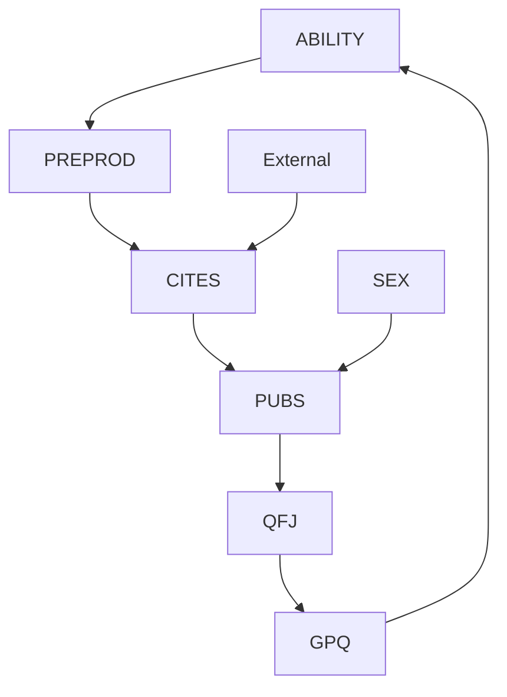


> 修改后的 PC 输出 图 6.1

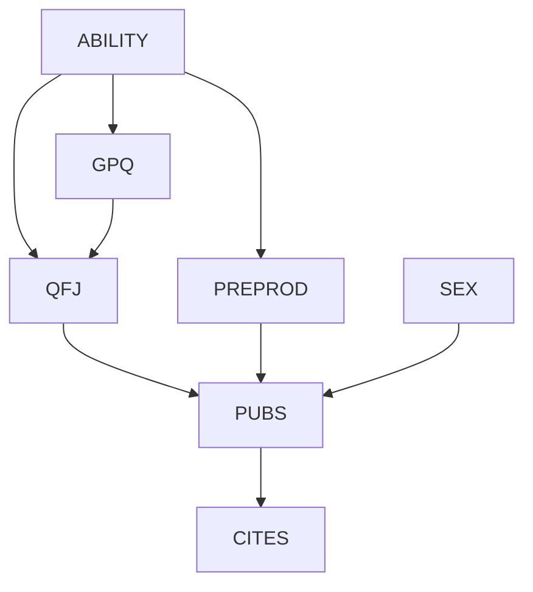

修改后的 PC 算法的输出表明，例如，GPQ 和 ABILITY 可能由一个未测量的共同原因连接，但 PUBS 是 CITES 的直接原因，且未被共同原因混淆。当单个顶点与不相邻的顶点连接的两条或多条边上带有"o"符号时，适用一个特殊限制。例如，ABILITY 有一条到 GPQ 和一条到 PREPROD 的边，每条边在 ABILITY 端都有一个"o->"，而 GPQ 和 PREPROD 彼此不相邻。在这种情况下，两个"o"符号不能都是箭头头。不能存在 ABILITY 和 GPQ 的一个未测量原因以及 ABILITY 和 PREPROD 的一个未测量原因，因为如果存在，GPQ 和 PREPROD 将在给定 ABILITY 条件下是依赖的，而修改后的模式则隐含它们是独立的。

在许多情况下——也许是大多数实际情况——当抽样分布是忠实于一个包含未测量变量的图的分布的边际分布时，如果所需的统计决策正确做出，PC 算法的这种简单修改会给出正确的答案。

## 6.3 错误（Mistakes）

不幸的是，PC 算法的这种直接修改在一般情况下是不正确的。一个虚构的例子将说明原因。

每个人都熟悉一个简单的错误，即未能识别两个变量 $X$ 和 $Y$ 的未测量共同原因，其中已知 $X$ 先于 $Y$。这个错误是认为 $X$ 导致 $Y$，从而预测对 $X$ 的操纵会改变 $Y$ 的分布。但还有一些更有趣的情况很少被注意到，即省略 $X$ 和 $Y$ 的共同原因可能导致人们错误地认为某个第三个变量 $Z$ 直接导致 $Y$。考虑一个虚构的情况：

一位化学家遇到了以下问题。根据他非常怀疑的公认理论，化学物质 A 和 B 通过一种低产率机制，经由中间体 C 结合形成化学物质 D。我们的化学家认为存在另一种机制，其中 A 和 B 结合形成 D 而不经过中间体 C。他希望做一个实验来证明替代机制的存在。他可以轻易获得试剂 A 和 B，但可用的样品可能被不同数量的 D 和其他杂质污染。他可以用光度法测量不稳定的所谓中间体 C 的浓度，并用标准方法测量 D 的平衡浓度。他可以操纵 A 和 B 的浓度，但他没有办法操纵 C 的浓度。

化学家决定采用以下实验设计。对于 A 和 B 浓度的十个不同值中的每一个，将进行一百次试验，在其中混合试剂，监测 C 的浓度，并测量 D 的平衡浓度。然后化学家将计算给定 C 条件下 A 与 D 的偏相关，以及给定 C 条件下 B 与 D 的偏相关。化学家推理道，如果存在 A 和 B 产生 D 而不经过 C 的替代机制，那么在 C 浓度相同的样本中，A 与 D 以及 B 与 D 应该存在正相关；如果没有这样的替代机制，那么当控制 C 的浓度时，一方面 A、B 的浓度与另一方面 D 的浓度应该具有零相关。

化学家发现，当控制 C 时，一方面 A、B 的平衡浓度与另一方面 D 的平衡浓度是相关的——正如如果 A 和 B 直接反应产生 D 时所应该的那样——于是他宣布他已经证明了替代机制的存在。

唉，不到一年他的理论就被推翻了。另一位化学家使用相同的试剂进行了类似的实验，但在实验中，一种掩蔽剂与中间体 C 反应，阻止其产生 D。第二位化学家在他的实验中未发现 A 和 B 的浓度与 D 的浓度之间存在相关性。第一位化学家的程序出了什么问题？

通过用统计控制替代对 C 的操纵，化学家遇到了这样一个事实，即带有未测量变量的边际概率分布可能会给出两个变量之间存在虚假直接连接的假象。化学家对机制的设想如图 $G_1$ 所示，这是产生观察结果的一种方式。不幸的是，这些结果也可以由图 $G_2$ 中的机制产生，而这正是化学家案例中发生的情况：试剂中的杂质（F）是 C 和 D 的共同原因：


> G1

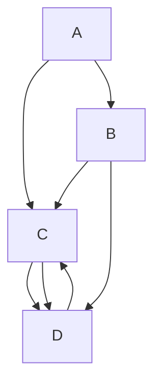


> G2 图 6.2

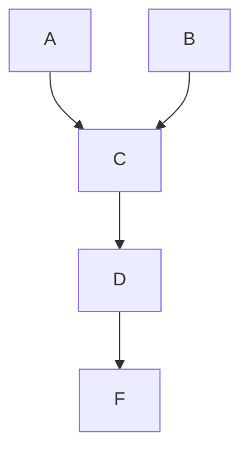

一般观点是，一个作用于两个测量变量 $C$ 和 $D$ 的理论变量 $F$（即潜变量 $F$）可以产生统计依赖关系，这些依赖关系暗示 $A$ 和 $D$ 之间以及 $B$ 和 $D$ 之间存在不存在的因果关系。对于忠实分布，如果我们使用 SGS 或 PC 算法，像 $G_2$ 这样的结构将在输出中产生从 $A$ 到 $D$ 的有向边。

我们可以更分析地看到同一点：在一个变量集 $V$ 上的有向无环图 $G$ 中，如果 $A$ 和 $D$ 在 $G$ 中相邻，那么 $A$ 和 $D$ 在给定 $V\backslash\{A,D\}$ 的任何子集条件下都不是 d-分离的。因此，在因果充分性假设下，当且仅当 $A$ 和 $D$ 在给定 $V\backslash\{A,D\}$ 的每个子集条件下都不是独立的时，要么 $A$ 是 $D$ 的直接原因（相对于 $V$），要么 $D$ 是 $A$ 的直接原因（相对于 $V$）。然而，如果 $O$ 不是因果充分的，那么情况并非如此：如果 $A$ 和 $D$ 在给定 $\mathbf{O}\backslash\{A,D\}$ 的每个子集条件下都是独立的，那么要么 $A$ 是 $D$ 的直接原因（相对于 $O$），要么 $D$ 是 $A$ 的直接原因（相对于 $O$），要么存在某个潜变量 $F$ 是 $A$ 和 $D$ 的共同原因。

这一点由图 6.2 中的 $G_2$ 说明，其中 $\mathbf{V} = \{A, B, C, D, F\}$ 且 $\mathbf{O} = \{A, C, D\}$。$O$ 不是因果充分的，因为 $F$ 是 $C$ 和 $D$ 的原因（两者都在 $O$ 中），但 $F$ 本身不在 $O$ 中。$A$ 和 $D$ 在给定 $\mathbf{O}\backslash\{A,D\}$ 的任何子集条件下都不是 d-分离的，因此在忠实于 $G$ 的分布的任何边际分布中，$A$ 和 $D$ 在给定 $\mathbf{O}\backslash\{A,D\}$ 的任何子集条件下都不是独立的，并且修改后的 PC 算法会在 $A$ 和 $D$ 之间留下一条边。然而，$A$ 不是 $D$ 的直接原因（相对于 $O$），$D$ 不是 $A$ 的直接原因（相对于 $O$），并且不存在 $A$ 和 $D$ 的潜在共同原因。图 6.2 中所示的有向无环图 $G_1$（其中 $A$ 是 $D$ 的直接原因，并且存在一条从 $A$ 到 $D$ 不经过 $C$ 的路径）在 $\{A, C, D\}$ 上具有与图 $G_2$ 相同的 d-分离关系集。因此，给定忠实分布，它们无法仅通过条件独立关系来区分。

上述 PC 算法简单修改的另一个根本问题是，如果我们允许在 PC 算法构建的图中存在双向边，那么如果 $A$ 和 $B$ 在给定 $O$ 的某个子集条件下是 d-分离的，则它们不一定在给定 $\text{Adjacencies}(A)$ 或 $\text{Adjacencies}(B)$ 的子集条件下是 d-分离的。考虑图 6.3 中的图，其中假设 $T_1$ 和 $T_2$ 是未测量的。


> 图 6.3

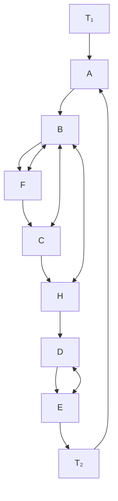

在测量变量中，$\text{Parents}(A) = \{D\}$ 且 $\text{Parents}(E) = \{B\}$，但 $A$ 和 $E$ 在给定 $\{B\}$ 的任何子集或 $\{D\}$ 的任何子集条件下都不是 d-分离的；唯一能使它们 d-分离的集合是包含 $F$、$C$ 或 $H$ 的集合。修改后的 PC 算法会正确发现 $C$、$F$ 和 $H$ 与 $A$ 或 $E$ 不相邻。然后它会无法测试 $A$ 和 $E$ 在给定任何包含 $C$ 的子集条件下是否 d-分离。因此，它会无法发现 $A$ 和 $E$ 在给定 $\{B, C, D\}$ 条件下是 d-分离的，并错误地保留 $A$ 和 $E$ 相邻。这意味着通过仅检查算法在给定阶段构建的图的局部特征（即邻接关系）来确定应从图中删除哪些边是不可能的。类似地，一旦在 PC 算法的输出中允许双向边，通过仅检查算法在给定阶段构建的图的局部特征（即共享共同端点的边对）来提取关于边定向的所有信息也是不可能的。

由于这些问题，为了完全的通用性，我们必须对 PC 算法以及对输出的解释做出重大改变。我们将展示存在一种过程，我们乐观地称之为**快速因果推断（Fast Causal Inference, FCI）算法**，只要真实图是稀疏的并且没有很多双向边链在一起，该算法在大变量集中是可行的。该算法在潜变量可能起作用时，给出关于因果结构的渐近正确信息，假设测量分布是满足真实图的马尔可夫条件和忠实性条件的分布的边际分布。FCI 算法避免了修改后的 PC 算法的错误，并且在某些情况下提供更多信息。

例如，对于来自图 6.4 中虚构结构的方框变量的边际分布，修改后的 PC 算法给出了图 6.5 中第一个图所示的正确输出，而 FCI 算法则产生了图 6.5 中第二个图中正确且信息量更大的结果。

在图 6.5 中，双箭头表示存在未测量的共同原因，并且与修改后的 PC 算法一样，o→ 形式的边表示算法无法确定边一端的圆圈是否应该是箭头头。请注意，变量集 {Cilia damage, Heart disease, Lung capacity, Measured breathing dysfunction} 中的邻接关系形成了一个完全图，但即便如此，FCI 算法也可以完全定向这些边。

FCI 算法的推导需要各种新的图论概念和相当复杂的理论。我们引入 Verma 和 Pearl 的**诱导路径（inducing path）** 和**诱导路径图（inducing path graph）** 概念，并展示这些对象提供关于因果结构的信息。然后我们考虑从数据中推断一类诱导路径图的算法。

## 6.4 诱导路径（Inducing Paths）

给定一个变量集 $V$ 上的有向无环图 $G$，以及 $V$ 的一个子集 $O$，Verma 和 Pearl (1991) 刻画了在给定 $O \setminus \{A, B\}$ 的任一子集时，$O$ 中两个变量不满足 d-分离（d-separated）的条件。若 $G$ 是变量集 $V$ 上的一个**有向无环图（directed acyclic graph）**，$O$ 是包含 $A$ 和 $B$ 的 $V$ 的子集，且 $A \neq B$，则 $A$ 和 $B$ 之间的一条无向路径 $U$ 是相对于 $O$ 的**诱导路径（inducing path）**，当且仅当 $U$ 上除端点外属于 $O$ 的每个成员都是 $U$ 上的碰撞点（collider），并且 $U$ 上的每个碰撞点都是 $A$ 或 $B$ 的祖先（ancestor）。我们将有时把 $O$ 中的成员称为**观测变量（observed variables）**。


> 图 6.4

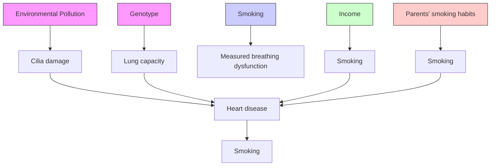

例如，在图 $G _ { 3 }$ 中，路径 $U = < A , B , C , D , E , F >$ 是相对于 $\mathbf { O } =$ $\{ A , B , D , F \}$ 的一条诱导路径，因为 $U$ 上的每个碰撞点（$B$ 和 $D$）都是其中一个端点的祖先，并且 $U$ 上属于 $O$ 的每个变量（除了 $U$ 的端点）都是 $U$ 上的碰撞点。类似地，$U$ 也是相对于 $\mathbf { O } = \{ A , B , F \}$ 的一条诱导路径。然而，$U$ 不是相对于 $\mathbf { O } = \{ A , B , C , D , F \}$ 的诱导路径，因为 $C$ 属于 $O$，但 $C$ 不是 $U$ 上的碰撞点。

**定理 6.1：** 若 $G$ 是一个顶点集为 $V$ 的**有向无环图**，且 $O$ 是包含 $A$ 和 $B$ 的 $V$ 的子集，则 $A$ 和 $B$ 不会被 $\scriptstyle \mathbf { O } \backslash \{ A , B \}$ 的任一子集 $Z$ 所 d-分离，当且仅当在 $A$ 和 $B$ 之间存在一条相对于子集 $O$ 的诱导路径。

由定理 6.1 以及 $U$ 是相对于 $\mathbf { O } = \{ A , B , D , F \}$ 的一条诱导路径这一事实可知，给定 $\{ B , D \}$ 的任一子集，$A$ 和 $F$ 都是 d-连通的（d-connected）。因为在图 $G _ { 3 }$ 中，相对于 $\mathbf { O } = \{ A , B , C , D , F \}$，$A$ 和 $F$ 之间不存在诱导路径，因此给定 $\{ B , C , D \}$ 的某个子集（在此情况下即为 $\{B, C, D\}$ 本身），$A$ 和 $F$ 是 d-分离的。


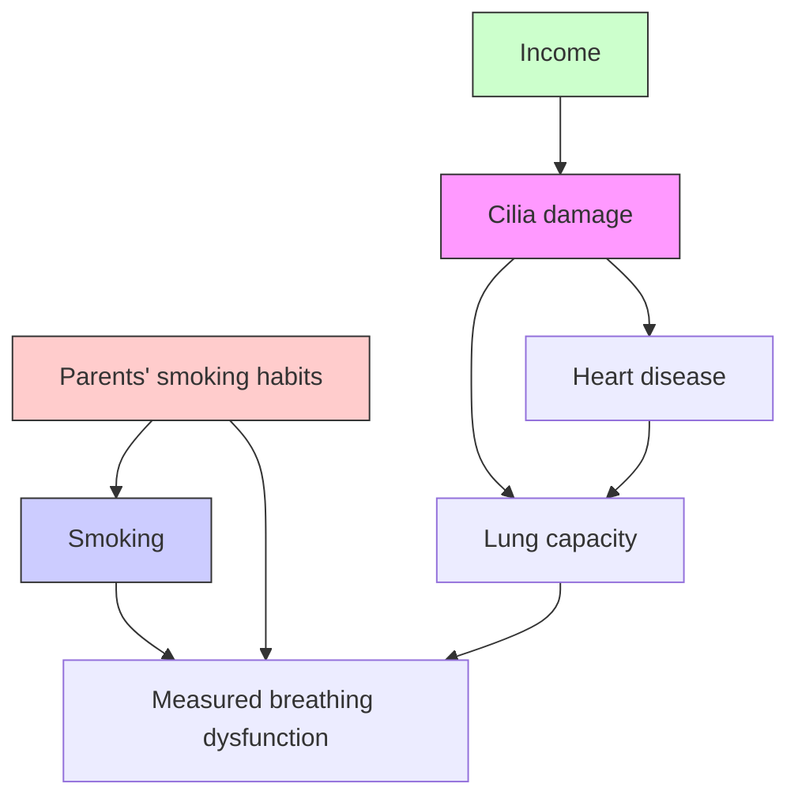


> 图 6.5

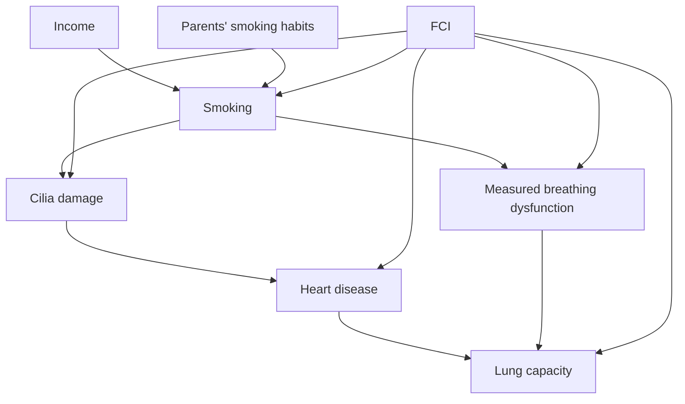

## 6.5 诱导路径图（Inducing Path Graphs）

在 $V$ 上的图 $G$ 中，相对于 $O$ 的诱导路径可以用以下结构来表示，该结构在 Verma 和 Pearl (1990b) 中被描述（但未命名）。$G ^ { \prime }$ 是**有向无环图** $G$ 相对于 $O$ 的**诱导路径图（inducing path graph）**，当且仅当 $O$ 是 $G$ 中顶点的一个子集，变量 $A$ 和 $B$ 之间存在一条指向 $A$ 的箭头边，当且仅当 $A$ 和 $B$ 属于 $O$，并且在 $G$ 中存在一条相对于 $O$ 的、进入 $A$ 的诱导路径。


> 图 6.6：图 ${ \bf G } _ { 3 }$

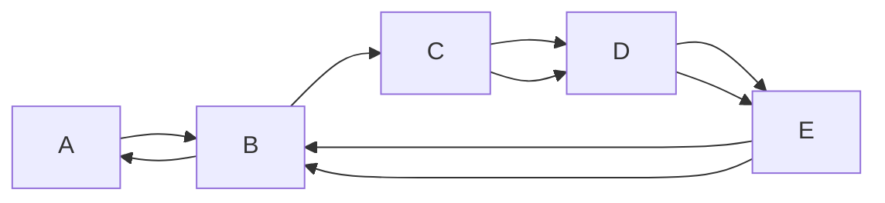

（使用第 2 章的符号，诱导路径图中的标记集为 $\{ > ,$ EM}。）在诱导路径图中，有两种边：$A \rightarrow B$ 意味着 $A$ 和 $B$ 之间相对于 $O$ 的每条诱导路径都是离开 $A$ 并进入 $B$ 的；而 $A \leftrightarrow B$ 意味着存在一条相对于 $O$ 的诱导路径，该路径同时进入 $A$ 和 $B$。后一种边仅当 $A$ 和 $B$ 存在一个潜在的共同原因（latent common cause）时才可能出现。

图 6.7 至图 6.9 分别描绘了 $G _ { 3 }$ 相对于 $\mathbf { O } = \{ A , B , D , E , F \}$、$\mathbf { O } = \{ A , B , D , F \}$ 和 $\mathbf { O } = \{ A , B , F \}$ 的诱导路径图。注意，在 $G _ { 3 }$ 中，$< B , D >$ 是 $B$ 和 $D$ 之间相对于 $\mathbf { O } = \{ A , B , D , E , F \}$ 的一条离开 $D$ 的诱导路径。然而，在诱导路径图中，$B$ 和 $D$ 之间的边在 $D$ 处有一个箭头，因为存在另一条相对于 $\mathbf { O } = \{ A , B , D , E , F \}$ 的诱导路径 $< B , C , D >$，该路径是进入 $D$ 的。在相对于 $\mathbf { O } = \{ A , B , D , E , F \}$ 的诱导路径图中，$A$ 和 $F$ 之间没有边，但在相对于 $\mathbf { O } = \{ A , B , D , F \}$ 和 $\mathbf { O } = \{ A , B , F \}$ 的诱导路径图中，$A$ 和 $F$ 之间存在边。


> 图 6.7

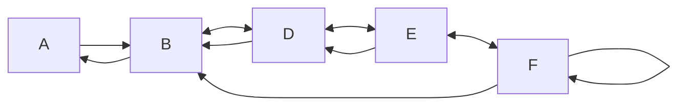


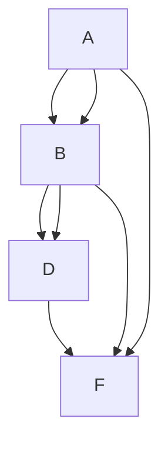


> 图 6.8 图 6.9. $G _ { 3 }$ 相对于 $\{ A , B , F \}$ 的诱导路径图

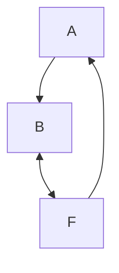

如果出现在有向路径上的边只能是带有一个箭头的边，并且无向路径可能包含带有单箭头或双箭头的边，那么我们可以不加修改地将 d-可分性（d-separability）的概念扩展到诱导路径图。若 $G$ 是一个**有向无环图**，$G ^ { \prime }$ 是 $G$ 相对于 $O$ 的诱导路径图，且 $X$、$Y$ 和 $S$ 是包含在 $O$ 中的不相交变量集，则当且仅当在 $G$ 中给定 $S$ 时 $X$ 和 $Y$ 是 d-分离的，在 $G ^ { \prime }$ 中给定 $S$ 时 $X$ 和 $Y$ 也是 d-分离的。

双箭头导致了诱导路径图中的 d-可分性关系与**有向无环图**中的 d-可分性关系之间存在一个非常重要的区别。在一个关于 $O$ 的**有向无环图**中，如果给定 $\scriptstyle \mathbf { O } \backslash \{ A , B \}$ 的任一子集，$A$ 和 $B$ 都是 d-分离的，那么给定 $\text{Parents}(A)$ 或 $\text{Parents}(B)$，$A$ 和 $B$ 就是 d-分离的。这在诱导路径图中并不成立。例如，在诱导路径图 $G _ { 4 }$ 中（即图 6.3 相对于 $\mathbf { O } = \{ A , B , C , D , E , F , H \}$ 的诱导路径图），$\mathbf { P a r e n t s } ( A ) = \{ D \}$ 且 $\mathbf { P a r e n t s } ( E ) = \{ B \}$，但给定 $\{B\}$ 的任一子集或 $\{D\}$ 的任一子集，$A$ 和 $E$ 都不是 d-分离的；所有 d-分离 $A$ 和 $E$ 的集合都包含 $C$、$H$ 或 $F$。


> 图 6.10. 诱导路径图 $G _ { 4 }$

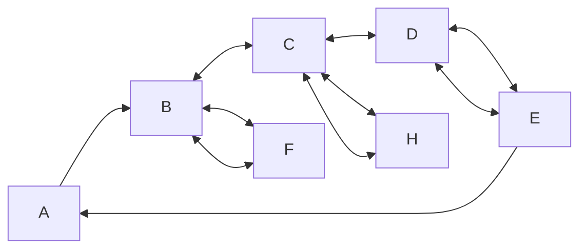

然而，在诱导路径图中存在一种顶点集，就 d-可分性而言，其行为与**有向无环图**中的父节点集非常相似。

若 $G ^ { \prime }$ 是关于 $O$ 的诱导路径图且 $A \neq B$，则定义 $V \in { \bf \delta D - S E P } ( A , B )$，当且仅当 $A \neq V$，并且存在一条 $A$ 和 $V$ 之间的无向路径 $U$，使得 $U$ 上的每个顶点都是 $A$ 或 $B$ 的祖先，并且（除端点外）都是 $U$ 上的碰撞点。

**定理 6.2：** 在一个关于 $O$ 的诱导路径图 $G ^ { \prime }$ 中，其中 $A$ 和 $B$ 属于 $O$，若 $A$ 不是 $B$ 的祖先，且 $A$ 和 $B$ 不相邻，则给定 $\mathbf { D - S E P } ( A , B )$ 的一个子集，$A$ 和 $B$ 是 d-分离的。

在诱导路径图中，要么 $A$ 不是 $B$ 的祖先，要么 $B$ 不是 $A$ 的祖先。因此，我们可以在不确定 $A$ 和 $B$ 在 $O$ 的所有子集上是否条件依赖的情况下，确定 $A$ 和 $B$ 在诱导路径图中是否相邻。

如果 $O$ 不是一个**因果充分（causally sufficient）** 的变量集，那么尽管我们可以推断，若 $A$ 和 $B$ 在 $\scriptstyle \mathbf { O } \backslash \{ A , B \}$ 的每个子集上都是条件依赖的，则 $A$ 和 $B$ 之间存在一条诱导路径，但我们不能推断出 $A$ 是 $B$ 相对于 $O$ 的直接原因，或者 $B$ 是 $A$ 相对于 $O$ 的直接原因，或者 $A$ 和 $B$ 存在一个潜在的共同原因。尽管如此，如下引理所示，$A$ 和 $B$ 之间相对于 $O$ 存在诱导路径这一事实，确实包含了关于 $A$ 和 $B$ 之间因果关系的某些信息。

**引理 6.1.4：** 若 $G$ 是 $V$ 上的一个**有向无环图**，$O$ 是包含 $A$ 和 $B$ 的 $V$ 的子集，且 $G$ 包含一条 $A$ 和 $B$ 之间相对于 $O$ 的、离开 $A$ 的诱导路径，并且 $A$ 和 $B$ 属于 $O$，则在 $G$ 中存在一条从 $A$ 到 $B$ 的有向路径。

由引理 6.1.4 可知，如果 $O$ 是 $V$ 的一个子集，并且我们能够确定存在一条 $A$ 和 $B$ 之间相对于 $O$ 的、离开 $A$ 的诱导路径，那么我们可以推断 $A$ 是 $B$ 的一个（可能是间接的）原因。因此，如果我们能够从 $O$ 上的分布推断出关于诱导路径图的性质，那么无论我们未能测量到哪些变量，我们都可以得出关于变量之间因果关系的推论。在下一节中，我们将描述从 $O$ 上的分布推断诱导路径图性质的算法。

## 6.6 部分定向诱导路径图（Partially Oriented Inducing Path Graphs）

**部分定向诱导路径图（Partially Oriented Inducing Path Graph）** 可以包含几种边：$A \to B$、$A$ o→ B、A o-o B 或 $A \leftrightarrow B$。我们使用 $\boldsymbol { \cdot } ( \xi _ { \xi } , \eta )$ 作为元符号来表示三种端点中的任意一种（EM（空标记）、`">"` 或 `"o"`）；"*" 符号本身不会出现在部分定向诱导路径图中。（我们也将 "*" 作为元符号来表示可以在诱导路径图中出现的两种端点（EM 或 `">"`）。）

对于具有在 $\mathbf { o }$ 上的诱导路径图 $G ^ { \prime }$ 的有向无环图 G，其**部分定向诱导路径图**旨在表示 $G ^ { \prime }$ 中的邻接关系，以及 $G ^ { \prime }$ 中那些与所有具有与 $G ^ { \prime }$ 相同 d-连接关系的诱导路径图共有的部分定向边。如果 $G ^ { \prime }$ 是在 $\mathbf { o }$ 上的诱导路径图，则 **Equiv(G)** 是在相同顶点上且具有与 $G ^ { \prime }$ 相同 d-连接关系的诱导路径图的集合。Equiv(G) 中的每个诱导路径图共享相同的邻接集。我们使用以下定义：

如果且仅当满足以下条件，则 $\pi$ 是在 O 上的诱导路径图 $\mathbf { G } ^ { \prime }$ 的**部分定向诱导路径图**：

- (i). 如果 $\pi$ 中 A 和 B 之间存在任何边，则它必须是以下类型之一：
- (ii). $\pi$ 和 $G ^ { \prime }$ 具有相同的顶点；
- (iii). $\pi$ 和 $G ^ { \prime }$ 具有相同的邻接关系；
- (iv). 如果 $\pi$ 中存在 $A \ 0 {  } \ B$，则在 $\mathbf { E q u i v } ( G ^ { \prime } )$ 中的每个诱导路径图 X 中，要么存在 $A \leftarrow B$，要么存在 $A \leftrightarrow B$；
- (v). 如果 $\pi$ 中存在 $A \leftrightarrow B$，则 $A \leftrightarrow B$ 出现在 $\mathbf { E q u i v } ( G )$ 中的每个诱导路径图中；
- (vi). 如果 $\pi$ 中存在 $A \ ^ { * } { \underline { { ^ { * } } } } \ B \ ^ { * } { \underline { { ^ { * } } } } \ C$，则在 Equiv(G) 中的任何诱导路径图中，A 和 B 之间以及 B 和 C 之间的边在 B 处不会发生碰撞；

$$
A \rightarrow B, B \rightarrow A, A \text { o } \rightarrow B, B \text { o } \rightarrow A, A \text { o } - \text { o } B, \text { or } A \leftrightarrow B;
$$

- (vii). 如果 $\pi$ 中存在 $A \leftarrow B$，则 $A \leftarrow B$ 出现在 Equiv $( G ^ { \prime } )$ 中的每个诱导路径图中；
- (viii). 如果 $\pi$ 中存在 A o-o B，则在 Equiv(G) 中的每个诱导路径图 X 中，要么存在 $A \leftarrow B$，$A \leftrightarrow B$，或者 $A \gets B$。

（严格来说，部分定向诱导路径图并不是我们定义意义上的图，因为下划线添加了额外的结构。）注意，边 $A ^ { \ast } -$ o B 并不限制 A 和 B 之间的边在 $\mathbf { E q u i v } ( G )$ 的任何子集中是进入 B 还是离开 B。对于 G 的部分定向诱导路径图中的邻接关系，可以通过以下方式构建：当且仅当给定 $\scriptstyle \mathbf { O } \backslash \{ A , B \}$ 的每个子集时，A 和 B 是 d-连接的，则使 A 和 B 相邻。

一旦确定了邻接关系，就可以轻松地为 $G$ 构建一个非信息性的部分定向诱导路径图。只需将每条边 $A \ ^ { * } { } _ { - } { } ^ { * } \ B$ 定向为 A o-o B。当然，这种特定的部分定向诱导路径图 $\pi$ 对于 $G$ 的定向特征中有哪些是 $\mathbf { E q u i v } ( G )$ 中所有诱导路径图共有的，提供的信息非常少。例如，图 6.11 再次展示了测量到的呼吸功能障碍的虚构原因图。图 6.12 显示了在 O = {纤毛损伤，吸烟，心脏病，肺活量，测量到的呼吸功能障碍，收入，父母吸烟习惯} 上的图 $G _ { 5 }$ 的一个非信息性的部分定向诱导路径图。

让我们说，当且仅当 B 是 $U$ 的端点，或者存在顶点 A 和 C 使得 $U$ 包含子路径 $A \leftrightarrow B ^ { * _ { - } * } C$、$A ^ { * _ { - } * } B \leftrightarrow C$ 或 $A \ ^ { * } { \underline { { ^ { * } } } } \ B \ ^ { * } { \underline { { ^ { * } } } } \ C$ 之一时，B 是无向路径 U 上的**确定非碰撞点（definite noncollider）**。在具有诱导路径图 $G ^ { \prime }$ 的 G 的最大信息性部分定向诱导路径图中，

- (i) 边 $A \ { ^ * } { _ { - } } 0$ B 出现仅当 A 和 B 之间的边在 $\mathbf { E q u i v } ( G )$ 的某些成员中是进入 B 的，而在 $\mathbf { E q u i v } ( G ^ { \prime } . )$ 的其他成员中是离开 B 的，并且
- (ii) 对于 A 和 B 之间以及 B 和 C 之间的每一对边，要么边在 B 处碰撞，要么它们在 B 处是确定非碰撞点，除非这些边在 Equiv(G) 的某些成员中碰撞而在其他成员中不碰撞。


> 图 6.11. 图 $G _ { 5 }$

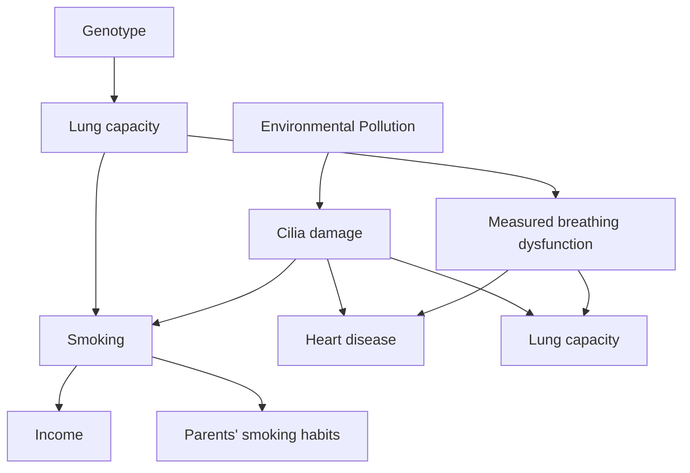


> 图 6.12. 在 $\mathrm { o }$ 上的 $G _ { 5 }$ 的非信息性部分定向诱导图

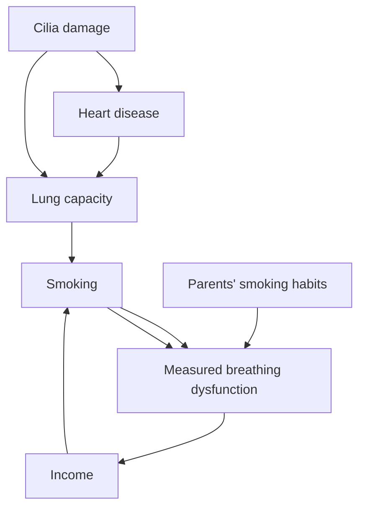

对于 $G$ 的这样一个最大信息性部分定向诱导路径图 $\pi$，可以通过一个简单但低效的算法来定向：构建每一个与 $G ^ { \prime }$ 具有相同邻接关系的可能诱导路径图，剔除那些不具有与 $G ^ { \prime }$ 相同 d-连接关系的图，并记录哪些定向特征是 $\mathbf { E q u i v } ( G ^ { \prime } )$ 所有成员共有的。当然，这在计算上是完全不可行的。图 6.13 显示了在 $\mathbf { O } = \{ 纤毛损伤, 吸烟, 心脏病, 肺活量, 测量到的呼吸功能障碍, 收入, 父母吸烟习惯 \}$ 上的图 $G _ { 5 }$ 的最大定向部分定向诱导路径图。


> 图 6.13. 在 O 上的 $G _ { 5 }$ 的最大信息性部分定向诱导路径图

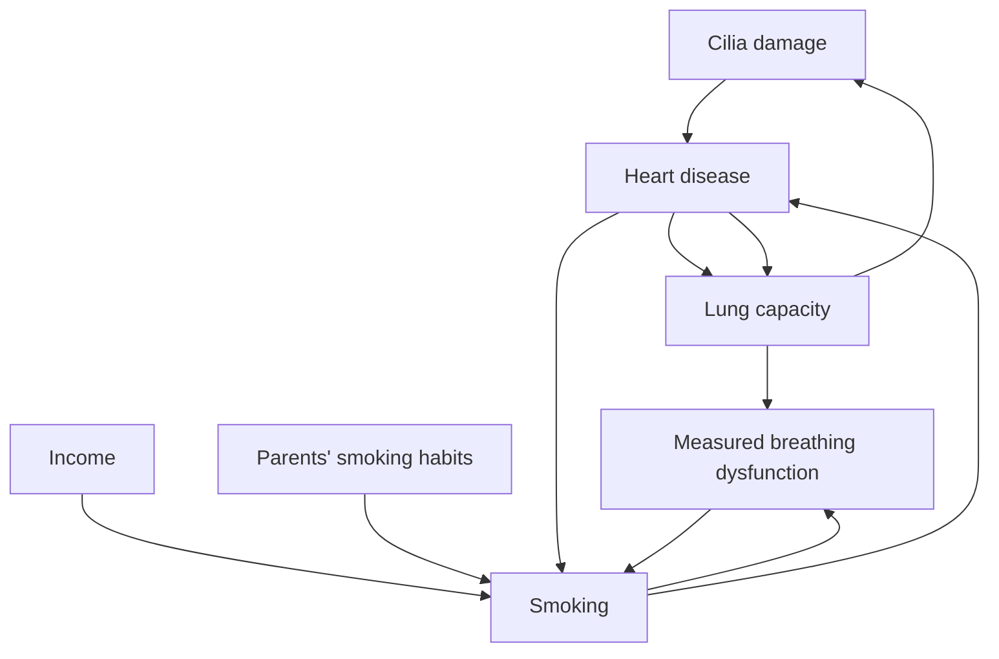

我们的目标是陈述一些算法，这些算法为有向无环图 G 构建一个部分定向诱导路径图，其中包含尽可能多的定向信息，同时又符合计算可行性。我们提出的算法分为两个主要部分。首先，确定部分定向诱导路径图中的邻接关系。然后，尽可能地对边进行定向。

## 6.7 具有潜在共同原因的因果推断算法（Algorithms for Causal Inference with Latent Common Causes）

为了陈述该算法，需要再定义几个概念。在部分定向诱导路径图中：

- (i). 当且仅当 $\pi$ 中存在 $A \rightarrow B$ 时，A 是 B 的父节点。
- (ii). 当且仅当 $\pi$ 中存在 $A { ^ { * } \right. } B \left. { ^ { * } } C$ 时，B 是路径 ${ < A , B , C > }$ 上的碰撞点。
- (iii). 当且仅当 $\pi$ 中存在 $A \leftarrow { } ^ { * } B$ 时，B 和 A 之间的边是进入 A 的。
- (iv). 当且仅当 $\pi$ 中存在 $A \rightarrow { } ^ { * } B$ 时，B 和 A 之间的边是离开 A 的。
- (v). 在部分定向诱导路径图 $\pi ^ { \ast }$ 中，当且仅当 U 是 X 和 Y 之间包含 B 的无向路径，$B \neq X$，$B \neq Y$，U 上除 B 和端点外的每个顶点都是 U 上的碰撞点或确定非碰撞点，并且满足：

(i) 如果 V 和 $V ^ { \prime }$ 在 U 上相邻，并且 $V ^ { \prime }$ 在 U 上位于 V 和 B 之间，则 U 上存在 $V \rightarrow { } ^ { * } V ^ { \prime }$，

- (ii) 如果 V 在 U 上位于 X 和 B 之间，并且 V 是 U 上的碰撞点，则 $\pi$ 中存在 $V \leftrightarrow Y$，否则 $\pi$ 中存在 $V \leftarrow { } ^ { * } Y$，
- (iii) 如果 V 在 U 上位于 Y 和 B 之间，并且 V 是 U 上的碰撞点，则 $\pi$ 中存在 $V \leftrightarrow X$，否则 $\pi$ 中存在 $V \leftarrow { } ^ { * } X$。
- (iv) X 和 Y 在 $\pi$ 中不相邻。


> 图 6.14 说明了确定判别路径的概念。图 6.14. $< E , F , G , A , C , B >$ 是 C 的确定判别路径

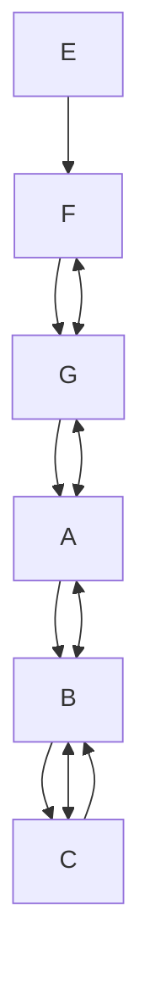

在实践中，**因果推断算法（Causal Inference Algorithm）** 和**快速因果推断算法（Fast Causal Inference Algorithm）**（本节稍后描述）将协方差矩阵或单元格计数作为输入。当算法需要 d-分离事实时，该过程会执行条件独立性检验（在离散情况下）或线性连续情况下的偏相关系数消失检验。（回想一下，如果 P 是忠实于图 $G$ 的离散分布，则当且仅当给定变量集 C 时 A 和 B 条件独立，A 和 B 是 d-分离的；如果 P 是忠实于图 $G$ 的线性分布，则当且仅当 $\rho _ { A B . \mathbf { C } } = 0$ 时，A 和 B 是 d-分离的。）两种算法都构建某个有向无环图 $G$ 的部分定向诱导路径图，其中 $G$ 包含已测量和未测量的变量。

## 因果推断算法 1

- A.) 在顶点集 V 上形成完全无向图 Q。
- B.) 如果给定 V 的任何子集 S，A 和 B 是 d-分离的，则移除 A 和 B 之间的边，并将 S 记录在 Sepset(A,B) 和 $\mathbf { S e p s e t } ( B , A )$ 中。
- C.) 令 F 为步骤 B) 产生的图。将每条边定向为 o-o。对于每个三元组顶点 A、B、C，使得对 A、B 和对 $B , C$ 在 F 中分别相邻，但对 A、C 在 F 中不相邻，当且仅当 B 不在 Sepset(A,C) 中时，将 $A \ ^ { * \_ * } B \ ^ { * \_ * } C$ 定向为 $A { } ^ { * } \to B  { } ^ { * } C$；当且仅当 B 在 Sepset(A,C) 中时，将 $A \ ^ { * \_ * } \ B \ ^ { * \_ * } \ C$ 定向为 $A \ ^ { * \_ * } \ B \ ^ { * \_ * } \ C$。

## D.) 重复（repeat）

如果存在一条从 A 到 B 的有向路径，并且存在一条边 $A \ ^ { * } { } _ { - } { } ^ { * } \ B ,$ ，则将 $A \ ^ { * } { } _ { - } { } ^ { * } { } _ { B }$ 定向为 $A \ ^ { * }  B ,$ ；否则，如果在路径 ${ < A , B , C > }$ 中 B 是一个碰撞点（collider），且 B 与 D 相邻，并且 D 在 Sepset(A,C) 中，则将 $B ^ { * } { } _ { - } { } ^ { * } D$ 定向为 $B \gets { ^ * D }$ ，

否则，如果 U 是 M 在 中的一条介于 A 和 B 之间的**确定判别路径（definite discriminating path）**，并且 P 和 R 在 U 上与 M 相邻，且 $P - M - R$ 构成一个三角形，则

如果 M 在 Sepset(A,B) 中，则将 M 标记为子路径 $P ^ { * } { \underline { { * } } } \ast \underline { { M } } ^ { * } { \ast } ^ { * } R$ 上的一个非碰撞点（noncollider）；否则将 $P ^ { * _ { - } * } M ^ { * _ { - } * } R$ 定向为 $P ^ { * } { \right. } M \left. { } ^ { * } R .$ 。

否则，如果 $P ^ { * } {  } M ^ { * } { - } ^ { * } R$ ，则将其定向为 $P ^ { * } {  } M  R . ^ { 2 }$ ，直到没有更多的边可以被定向为止。

如果 CI 或 FCI 算法输入的协方差矩阵来自对 G 线性忠实（linearly faithful）的分布在 O 上的边缘分布，或者输入的单元格计数来自对 $G ,$ 忠实的分布在 O 上的边缘分布，我们将称输入的数据是来自对 G 忠实的 O 上的数据。

**定理 6.3（THEOREM 6.3）：** 如果 CI 算法的输入是来自对 $G ,$ 忠实的 O 上的数据，则输出是 G 在 O 上的一个**部分定向诱导路径图（partially oriented inducing path graph）**。

如果将来自对图 6.11 忠实的 O = {Cilia damage, Smoking, Heart disease, Lung capacity, Measured breathing dysfunction, Income, Parents’ smoking habits} 上的数据输入 CI 算法，则输出为图 6.13 所示的 O 上的最大信息量部分定向诱导路径图。

不幸的是，由于邻接关系的构建方式，所描述的**因果推断（Causal Inference, CI）**算法对于大量变量来说并不实用。虽然在理论上，当且仅当 A 和 B 在给定 $\scriptstyle \mathbf { O } \backslash \{ A , B \}$ 的某个子集时是 d-分离（d-separated）的，就可以从完全图中移除 A 和 B 之间的边，但这是不切实际的，原因有二。首先，需要测试 A 和 B 条件独立性的 $\scriptstyle \mathbf { O } \backslash \{ A , B \}$ 的子集数量过多。其次，对于离散分布，除非样本量极大，否则不存在可靠的检验两个变量在给定大量其他变量条件下的独立性的方法。

为了确定给定的顶点对（例如 X 和 Y）在诱导路径图中不相邻，我们必须发现 X 和 Y 在给定 $\mathbf { O } \backslash \{ X , Y \}$ 的某个子集时是 d-分离的。当然，如果 X 和 Y 在诱导路径图中相邻，那么它们在给定 $\mathbf { O } \backslash \{ X , Y \}$ 的每个子集时都是 d-连通的（d-connected）。我们希望能够在不必实际检查 O\{X ,Y} 的每个子集的情况下，确定 X 和 Y 在给定 $\mathbf { O } \backslash \{ X , Y \}$ 的每个子集时是 d-连通的。

在一个因果充分集（causally sufficient set）V 上的有向无环图中，通过使用 PC 算法，我们能够减少所执行的 d-分离测试的阶数和数量，原因如下：如果 X 和 Y 被 $\mathbf { V } \backslash \{ X , Y \}$ 的某个子集 d-分离，那么它们要么被 Parents(X) 要么被 Parents(Y) d-分离。虽然 PC 算法在构建图时不知道哪些变量在 Parents(X) 或 Parents(Y) 中，但随着算法的进行，它能够确定某些变量肯定不在 Parents(X) 或 Parents(Y) 中，因为它们肯定不与 X 或 Y 相邻。这减少了 PC 算法执行的 d-分离测试的数量和阶数（与 SGS 算法相比）。

相比之下，对于 O 上的诱导路径图，情况并非如此：如果 X 和 Y 在给定 $\mathbf { O } \backslash \{ X , Y \}$ 的某个子集时是 d-分离的，那么 X 和 Y 在给定 Parents(X) 或 Parents(Y) 时就是 d-分离的。然而，如果 X 和 Y 在给定 O\{X,Y} 的某个子集时是 d-分离的，那么 X 和 Y 在给定 D-Sep(X) 或 D-Sep(Y) 时就是 d-分离的。如果我们知道某个变量 V 不在 D-Sep(X) 中也不在 D-Sep(Y) 中，我们就不需要测试 X 和 Y 是否被任何包含 V 的集合 d-分离。同样，直到我们构建完图，我们才知道哪些变量在 D-Sep(X) 或 D-Sep(Y) 中。但是有一种算法可以在算法进行过程中确定某些变量不在 D-Sep(X) 或 D-Sep(Y) 中。

令 G 为图 6.3（在图 6.15 中复制）中的有向无环图。令 $G ^ { \prime }$ 为 G 在 $\mathbf { O } = \{ A , B , C , D , E , F , H \}$ 上的诱导路径图。A 和 E 在给定任何与 A 或 D 相邻的变量子集（在两种情况下都是 {B,D}）时都不是 d-分离的。因为 A 和 E 在 A 和 E 的诱导路径图中不相邻，所以它们在给定 $\scriptstyle \mathbf { O } \backslash \{ A , E \}$ 的某个子集时是 d-分离的。因此，它们要么被 D-Sep(A,E)（等于 $\{ B , D , F \} )$ ）要么被 $\mathbf { D - S e p } ( E , A ) )$ （等于 $\{ B , D , H \} )$ ）d-分离。（在这种情况下，A 和 E 同时被 D-Sep(A,E) 和 D-Sep(E,A) d-分离。）问题是：我们如何能够知道要测试 A 和 E 在给定 {B,D,H} 或 $\{ B , D , F \}$ 时是否 d-分离，而无需测试 A 和 E 在给定 O\{A,E} 的每个子集时是否 d-分离？

在 $G ^ { \prime }$ 中，变量 V 在 D-Sep(A,E) 中当且仅当 V ≠ A 并且存在一条介于 A 和 V 之间的无向路径，该路径上除端点外的每个顶点都是碰撞点，并且每个顶点都是 A 或 E 的祖先。如果我们能找到某种方法来确定变量 V 不在这样的路径上，那么我们就无需测试 A 和 E 在给定任何包含 V 的集合时是否 d-分离（当然，除非 V 在 $\mathbf { D } { \cdot } \mathbf { S e p } ( E { , } A ) . )$ 我们将在 G 上说明这个策略。在算法的任何给定阶段，我们将迄今为止构建的图称为 。


> 图 6.15

FCI 算法分三个阶段确定要从完全图中移除哪些边。第一阶段与 PC 算法的第一阶段完全相同。我们将 初始化为完全无向图，然后如果 X 和 Y 在给定 中与 X 或 Y 相邻的顶点子集时是 d-分离的，则移除 X 和 Y 之间的边。这将消除许多（但可能不是全部）不在诱导路径图中的边。当对忠实于图 6.15 的数据执行此操作时，结果是图 6.16 中的图。

注意，在此阶段，A 和 E 仍然相邻，因为算法正确地确定了 A 与 F、H 或 C 不相邻，并且 E 与 F、H 或 C 不相邻，因此从未测试过 A 和 E 是否被任何包含 F、H 或 C 的变量子集 d-分离。


> 图 6.16

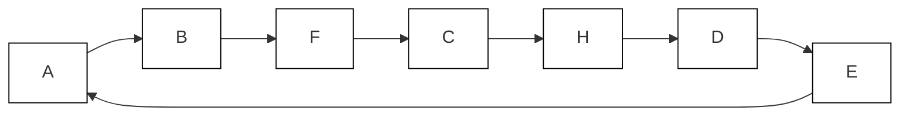

其次，我们通过确定边是否碰撞来定向边，就像在 PC 算法中一样。算法在此阶段的图如图 6.17 所示。

图 6.17 本质上是 PC 算法在给定忠实于图 6.15 的数据后，在执行步骤 A)、B) 和 C) 后构建的图。


> 图 6.17

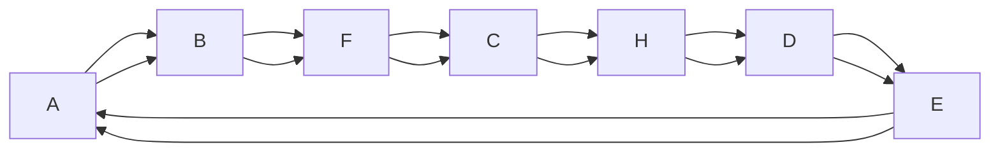

我们现在可以确定某些顶点肯定不在 D-Sep(A,E) 或 D-Sep(E,A) 中；为了找到正确的邻接关系，没有必要测试 A 和 E 是否被 $\scriptstyle \mathbf { O } \backslash \{ A , E \}$ 的任何包含这些顶点的子集 d-分离。在算法的这个阶段，顶点 V 在 $G ^ { \prime }$ 中属于 $\mathbf { D } { \cdot } \mathbf { S e p } ( A { , } E )$ 的一个必要条件是，在 中存在一条介于 A 和 V 之间的无向路径 $U$，其中除端点外的每个顶点要么是碰撞点，要么因其在三角形中而隐藏其定向。因此，C 和 H 肯定不在 D-Sep(A,E) 中，C 和 F 肯定不在 D-Sep(E,A) 中。我们将所有我们尚未确定肯定不在 $G ^ { \prime }$ 中的 $\mathbf { D } { \cdot } \mathbf { S e p } ( A { , } E )$ 中的顶点放入 Possible-D-Sep(A,E) 中，对于 Possible-D-Sep(E,A) 也是如此。在这种情况下，Possible-D-Sep(A,E) 是 $\{ B , F , D \}$，Possible-D-Sep(E,A) 是 $\{ B , D , H \}$。我们现在知道，如果 A 和 E 被 $\scriptstyle \mathbf { O } \backslash \{ A , E \}$ 的任何子集 d-分离，那么它们将被 Possible-D-Sep(A,E) 的某个子集或 Possible-D-Sep(E,A) 的某个子集 d-分离。在这种情况下，我们发现 A 和 E 被 Possible-D-Sep(A,E) 的一个子集（在这种情况下是整个集合）d-分离，因此移除了 A 和 E 之间的边。

一旦我们获得了正确的邻接集，我们就取消所有边的定向，然后像在因果推断算法中那样重新定向它们。最终输出如图 6.18 所示。


> FCI 输出图 6.18

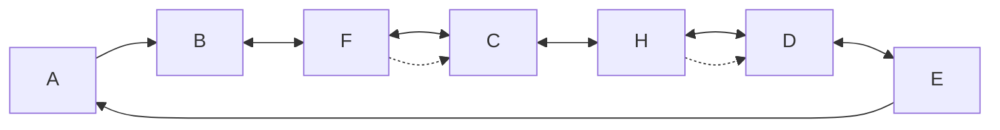

对于一个部分构建的部分定向诱导路径图 ，Possible-D-$\mathbf { S E P } ( A , B )$ 定义如下：如果 $A \neq B ,$ ，则 V 在 中属于 Possible-D-Sep(A,B) 当且仅当 $V \neq A$ ，并且在 中存在一条介于 A 和 V 之间的无向路径 U，使得对于 U 的每个子路径 ${ < X , Y , Z > }$ ，要么 Y 是该子路径上的一个碰撞点，要么 Y 不是一个确定的非碰撞点并且在 U 上，并且 X、Y 和 Z 在 中形成一个三角形。

使用这个 Possible-D-Sep(A,E) 的定义，我们可以证明 中不在 Possible-D-Sep(A,E) 中的每个顶点都不在 G 的 D-Sep(A,E) 中。然而，有可能从 中确定我们包含在 Possible-D-Sep(A,E) 中的某些成员不在 $G ^ { \prime }$ 的 D-Sep(A,E) 中。在减小 Possible-D-Sep(A,E) 的大小（以便减少算法执行的 d-可分离性测试的数量和阶数）和执行减少该集合大小所需的额外工作之间，同时确保它仍然是 $G ^ { \prime }$ 中 D-Sep(A,E) 的超集，显然存在一种权衡。我们不知道最佳平衡点是什么。如果 G 是稀疏的（即，在 G 中，每个顶点不与大量其他顶点相邻），那么算法不需要确定 A 和 B 是否在给定任何包含大量变量的 C 时是 d-分离的。

## 快速因果推断算法（Fast Causal Inference Algorithm）

A). 在顶点集 V 上形成完全无向图 Q。

B). $n = 0 .$

重复

重复

选择一对在 Q 中相邻的有序变量 X 和 Y，使得 Adjacencies(Q,X)\{Y} 的基数大于或等于 n，并且选择一个 Adjacencies(Q,X)\{Y} 的基数为 n 的子集 S，如果 X 和 Y 在给定 S 时是 d-分离的，则从 Q 中删除 X 和 Y 之间的边，并将 S 记录在 Sepset(X,Y) 和 Sepset(Y,X) 中，直到所有满足 Adjacencies(Q,X)\{Y} 的基数大于或等于 n 的相邻变量 X 和 Y 的有序变量对，以及所有 Adjacencies(Q,X)\{Y} 的基数为 n 的子集 S 都已被测试 d-分离；

$$
n = n + 1;
$$

直到对于每对相邻的有序顶点 X、Y，Adjacencies $( Q , X ) \backslash \{ Y \}$ 的基数小于 n。

C). 令 $F ^ { \prime }$ 为 。对于每个三元组顶点 A、B、C，其中 A、B 对和 B、C 对在 $F ^ { \prime }$ 中分别相邻，并且 A、C 在 $F ^ { \prime }$ 中不相邻，将 A $* _ { - } * B * _ { - } *$ C 定向为 $A { ^ { * } \right. } B \left. { ^ { * } } C$ 当且仅当 B 不在 Sepset(A,C) 中。

D). 对于在 F' 中相邻的每一对变量 A 和 B，如果 A 和 B 在给定 F 中 $\mathbf { P o s s i b l e - D - S E P } ( A , B ) \backslash \{ A , B \}$ 的任何子集 S 或 Possible-D-$\mathbf { S E P } ( B , A ) \backslash \{ A , B \}$ 的任何子集 S 时是 d-分离的，则移除 A 和 B 之间的边，并将 S 记录在 Sepset(A,B) 和 $\mathbf { S e p s e t } ( B , A )$ 中。

然后，该算法将任何一对变量 X 和 Y 之间的边重新定向为 X o-o $Y ,$ ，并像因果推断算法的步骤 C) 和 D) 一样重新定向边。

**定理 6.4（THEOREM 6.4）：** 如果 FCI 算法的输入是来自对 $G ,$ 忠实的 O 上的数据，则输出是 G 在 O 上的一个部分定向诱导路径图。

给定来自一个对 G 忠实的分布在可测变量上的边缘分布的正确统计决策，**快速因果推断算法（Fast Causal Inference Algorithm, FCI）**总是为图 G 生成一个部分定向诱导路径图。我们不知道该算法是否完备，即它是否在每种情况下都能生成最大信息量的部分定向诱导路径图。

与 CI 算法一样，如果 FCI 算法的输入是忠实于图 6.11 的数据，则输出是图 6.13 中的最大信息量部分定向诱导路径图。

两个有向无环图 G 和 $G ^ { \prime }$ 如果在 O 上具有相同的 FCI 部分定向诱导路径图，则它们具有仅涉及 O 成员的相同的 d-连接关系。

**推论 6.4.1（COROLLARY 6.4.1）：** 如果 G 是 V 上的一个有向无环图，$G ^ { \prime }$ 是 V 上的一个有向无环图，并且 O 是 V 和 $\mathbf { V ^ { \prime } }$ 的一个子集，那么 G 和 $G ^ { \prime }$ 仅在变量 O 中具有相同的 d-分离关系当且仅当它们在 O 上具有相同的 FCI 部分定向诱导路径图。

给定一个有向无环图 G，可以从 G 在 O 上的 FCI 部分定向诱导路径图中确定哪些仅涉及 O 成员的 d-分离关系对于 $G$ 成立。在一个部分定向诱导路径图 $\pi ,$ 中，如果 $X \neq Y ,$ 并且 X 和 Y 不在 Z 中，那么一条介于 X 和 Y 之间的无向路径 U 在给定 Z 时确定地 d-连接 X 和 Y，当且仅当 U 上的每个碰撞点都有一个后代在 Z 中，U 上的每个确定的非碰撞点不在 Z 中，并且 U 上的每个其他顶点不在 Z 中但有一个后代在 Z 中。在一个部分定向诱导路径图 中，如果 X、Y 和 Z 是不相交的变量集，那么 X 在给定 Z 时确定地 d-连接到 Y，当且仅当 X 的某个成员在给定 Z 时 d-连接到 Y 的某个成员。

**推论 6.4.2（COROLLARY 6.4.2）：** 如果 G 是 V 上的一个有向无环图，O 是 V 的一个子集， 是 G 在 O 上的 FCI 部分定向诱导路径图，并且 X、Y 和 Z 是 O 的不相交子集，那么 X 在 G 中在给定 Z 时 d-连接到 Y，当且仅当 X 在 中在给定 Z 时确定地 d-连接到 Y。

这些推论在 Spirtes and Verma 1992 中得到证明。

## 6.8 可检测因果影响定理（Theorems on Detectable Causal Influence）

在本节中，我们展示可以从一个部分定向诱导路径图中得出许多不同类型的因果推断。

**定理 6.5（THEOREM 6.5）：** 如果 是有向无环图 G 在 O 上的一个部分定向诱导路径图，并且在 中存在一条从 A 到 B 的有向路径 U，那么在 G 中存在一条从 A 到 B 的有向路径。

如果 G 是 V 上的一个有向无环图，并且 O 包含在 V 中，如果 CI 算法的输入是忠实于 G 在 O 上的数据，那么我们将 CI 算法的输出称为 G 在 O 上的 CI 部分定向诱导路径图。我们对 FCI 算法采用类似的术语。部分定向诱导路径图中从 A 到 B 的**半有向路径（semidirected path）**是一条从 A 到 B 的无向路径 U，其中没有一条边包含指向 A 的箭头，即，在 U 上 A 处没有箭头，并且如果 X 和 Y 在路径上相邻，并且 X 在路径上位于 A 和 Y 之间，那么在 X 和 Y 之间的边的 X 端没有箭头。

**定理 6.6（THEOREM 6.6）：** 如果 是有向无环图 G 在 O 上的 CI 部分定向诱导路径图，并且在 中不存在从 A 到 B 的半有向路径，那么在 G 中不存在从 A 到 B 的有向路径。

回忆一下，不同变量 A 和 B 之间的**长途路径（trek）**要么是从 A 到 B 的有向路径，要么是从 B 到 A 的有向路径，要么是从一个顶点 C 分别到 A 和 B 的一对有向路径，且这对路径仅在 C 处相交。以下定理陈述了一个充分条件，在该条件下，部分定向诱导路径图中的边指示了图中不包含除端点外的可测顶点的长途路径。

**定理 6.7（THEOREM 6.7）：** 如果 是有向无环图 G 在 O 上的一个部分定向诱导路径图，A 和 B 在 中相邻，并且在 中除了 A 和 B 之间的边外，不存在 A 和 B 之间的无向路径，那么在 G 中存在一条介于 A 和 B 之间的长途路径，该路径不包含除 A 或 B 之外的 O 中的变量。

**定理 6.8（THEOREM 6.8）：** 如果 是有向无环图 G 在 O 上的 CI 部分定向诱导路径图，并且在 中从 A 到 B 的每条半有向路径都包含 C 的某个成员，那么在 G 中从 A 到 B 的每条有向路径都包含 C 的某个成员。

**定理 6.9（THEOREM 6.9）：** 如果 是有向无环图 G 在 O 上的一个部分定向诱导路径图，并且在 中 $A  B$ ，那么在 G 中存在 A 和 B 的一个**潜在共同原因（latent common cause）**。

对于 FCI 算法也有类似的结果。

为了说明这些定理的应用，考虑图 6.13 中 $G _ { 5 } .$ 的因果结构的最大信息量部分定向诱导路径图。应用定理 6.5，我们推断吸烟导致纤毛损伤、肺活量和测得的呼吸功能障碍。应用定理 6.6，我们推断吸烟不会导致心脏病、收入或父母的吸烟习惯。从可测变量之间的条件独立关系中无法确定收入是否导致吸烟，或者吸烟和收入是否存在共同原因。可测变量之间的统计数据确定纤毛损伤和心脏病有一个潜在的共同原因，纤毛损伤不会导致心脏病，心脏病也不会导致纤毛损伤。

我们在此指出一个将在下一章更全面探讨的主题。在图 6.11 的例子中，为了推断吸烟导致呼吸功能障碍，有必要测量吸烟的两个原因（它们在吸烟处的碰撞定向了从吸烟到纤毛损伤的边）。一般来说，这表明在设计旨在确定变量 A 到变量 B 之间是否存在因果路径的研究时，不仅要测量可能中介 A 和 B 之间联系的变量，还要测量 A 的可能原因。

## 6.9 非独立性约束（Nonindependence Constraints）

应用于因果不充分图的**马尔可夫（Markov）**和**忠实性（Faithfulness）**条件可能会对可测变量的边缘分布施加并非条件独立关系的约束，因此这些约束未在 FCI 算法中使用。考虑图 6.19 中的例子，该例子由 Thomas Verma 提出（Verma and Pearl 1991）。

假设 T 未测量。那么忠实于整个图的联合分布必须满足以下约束：量


> 图 6.19

```mermaid
graph TD
  A["A"] --> B["B"]
  B --> C["C"]
  C --> D["D"]
  T["T"] --> B
```

$$
\sum_ {B} ^ {\rightarrow} P (B | A) P (D | B, C, A)
$$

仅是 C 和 D 值的函数。

$$
\begin{array}{l} \sum_ {B} ^ {\rightarrow} P (B | A) P (D | B, C, A) = \sum_ {T} ^ {\rightarrow} \sum_ {B} ^ {\rightarrow} P (B | A) P (D | B, C, A, T) P (T | B, C, A) = \\ \sum_ {T} ^ {\rightarrow} P (D | C, T) \sum_ {B} ^ {\rightarrow} P (B | A) P (T | B, A) \\ \end{array}
$$

（因为 A、B 在给定 {C, T} 时与 D 独立，并且 C 在给定 {A, B} 时与 T 独立）。因此

$$
\begin{array}{l} \sum_ {T} ^ {\rightarrow} P (D | C, T) \sum_ {B} ^ {\rightarrow} P (B | A) P (T | B, A) = \sum_ {T} ^ {\rightarrow} P (D | C, T) P (T | A) = \\ \stackrel {\rightarrow} {\sum_ {T}} P (D | C, T) P (T) = g (C, D) \\ \end{array}
$$

（因为 T 和 A 独立）。

如果在图中添加一条从 A 到 D 的有向边，则不会蕴含此约束。其寓意是，存在不以条件独立关系形式存在的进一步边缘结构，原则上可用于帮助识别潜在结构。当我们转向下一节的线性模型时，我们将看到一个类似的观点。关于 Verma 约束如何产生的通用理论由 Desjardins (1999) 给出。

## 6.10 广义统计不可区分性与线性（Generalized Statistical Indistinguishability and Linearity）

假设出于某种原因，调查仅限于线性结构以及与每个随机变量是其父变量和未测量因素的线性函数这一假设相一致的概率分布。**线性（linearity）** 等限制的效果是使原本不可区分的因果结构变得可区分。这是因为，该限制（无论其具体形式）与马尔可夫（Markov）、最小性（Minimality）或忠实性（Faithfulness）条件所要求的条件依赖和独立关系一起，对测量变量施加了额外的约束。这些额外的约束可能并非以条件独立关系的形式出现。在线性情况下，它们通常不是。例如，考虑下面所示的两种结构，其中 X 变量是测量的，T 变量是未测量的。


```mermaid
graph TD
  T1["T1"] --> X1["X1"]
  T1 --> X2["X2"]
  T1 --> X3["X3"]
  T1 --> X4["X4"]
  T2["T2"] --> X1
  T2 --> X2
  T2 --> X3
  T2 --> X4
  X1 --> ε1["ε₁"]
  X2 --> ε2["ε₂"]
  X3 --> ε3["ε₃"]
  X4 --> ε4["ε₄"]
```


> 图 6.20

```mermaid
graph TD
  T["T"] --> X1["X₁"]
  T --> X2["X₂"]
  T --> X3["X₃"]
  T --> X4["X₄"]
  X1 --> ε1["ε₁"]
  X2 --> ε2["ε₂"]
  X3 --> ε3["ε₃"]
  X4 --> ε4["ε₄"]
```

这些结构都意味着，在测量变量的边缘分布中，每对变量在给定其他任何测量变量集合的条件下都是依赖的。在每种情况下，X 变量上信息最丰富的**部分定向诱导路径图（partially oriented inducing path graph）** 都是一个完全无向图。通过检查这些变量之间的条件独立关系，无法判断哪种结构成立。但如果要求线性，则很容易判断哪种结构成立。因为在线性假设下，第二种结构对测量变量的相关性施加了以下全部三个约束，而第一种结构仅施加了第一个约束（其中我们将 $X _ { 1 }$ 和 $X _ { 2 }$ 之间的相关性记为 $\rho _ { 1 2 }$ ，以避免下标嵌套）：

$$
\rho_ {1 3} \rho_ {2 4} - \rho_ {1 4} \rho_ {2 3} = 0
$$

$$
\rho_ {1 2} \rho_ {3 4} - \rho_ {1 4} \rho_ {2 3} = 0
$$

$$
\rho_ {1 3} \rho_ {2 4} - \rho_ {1 2} \rho_ {3 4} = 0
$$

在本世纪初，**查尔斯·斯皮尔曼（Charles Spearman）** (1928) 将这类约束称为**消失的四元组差（vanishing tetrad differences）**，我们将沿用他的术语。

因此，刻画线性限制下的统计不可区分性提出了一个全新的问题，对此我们不会提供通用的解决方案。例如，条件独立关系和消失的四元组差并不能共同确定带有未测量变量的线性结构的忠实不可区分性类。例如，以下每个线性结构都意味着在 A、B、C 和 D 的边缘分布中有一个单一的四元组差消失，并且这些变量的部分定向诱导路径图由一个完全无向图组成：


> 图 6.21

但这两个图在线性结构类上并非忠实不可区分。结构 (ii) 允许与线性一致的分布，其中 A 和 B 的相关为正，B 和 C 的相关为正，而 A 和 C 的相关为负。结构 (i) 不允许任何与线性一致且其边缘分布满足此条件的分布。

结构 (i) 和 (ii) 并不典型于社会科学文献中常见的带有未测量变量的线性因果结构。出于实用目的，检查消失的四元组约束提供了一种区分不同因果结构的有力手段，即使在仅部分线性的结构中也是如此。**维沙特（Wishart）** 在 1920 年代引入了检验消失四元组差假设的方法，该方法假设为正态变量，而**博伦（Bollen）** (1989) 则描述了渐近分布自由的检验方法。

利用消失四元组差的算法将在本书后续章节中进行描述和说明。为了利用这一优势，我们需要能够算法性地确定一个带有或不带有未测量共同原因的结构何时会在测量变量之间蕴含一个特定的消失四元组差。这个问题引出了一个重要的定理。

## 6.11 四元组表示定理（The Tetrad Representation Theorem）

我们希望完全用图论术语来刻画一个必要且充分的条件，使得任意有向无环图 G 顶点上的分布在线性意义上蕴含一个消失的四元组差，即该四元组差在 G 线性表示的所有分布中均为零。我们将由某个有向无环图 G 线性表示的分布称为**线性模型（linear model）**。（更正式的定义在第 13 章给出。）线性模型由其表示的有向无环图 G 以及线性系数和零入度变量（包括误差项）上的独立边缘分布唯一确定。

首先是一些术语：给定顶点 I 和 J 之间的一条**踪迹（trek）** $T ( I , J )$ ，$I ( T ( I , J ) )$ 表示 $T ( I , J )$ 中从 $T ( I , J )$ 的源点到 I 的有向路径，$J ( T ( I , J ) )$ 表示 $T ( I , J )$ 中从 $T ( I , J )$ 的源点到 J 的有向路径。（回忆一下，踪迹中的一条有向路径可能为空路径。）$\mathbf { T } ( I , J )$ 表示 I 和 J 之间所有踪迹的集合。

在有向无环图 $G$ 中，如果对于所有 $\mathbf { T } ( K , L )$ 中的 $T ( K , L )$ 和所有 $\mathbf { T } ( I , J )$ 中的 $T ( I , J )$ ，$L ( T ( K , L ) )$ 和 ${ \cal J } ( T ( I , { \cal J } ) )$ 相交于一个顶点 $Q$ ，则称 $Q$ 是一个 $L J ( T ( I , J ) , T ( K , L ) )$ **瓶颈点（choke point）**。类似地，如果对于所有 $\mathbf { T } ( K , L )$ 中的 $T ( K , L )$ 和所有 $\mathbf { T } ( I , J )$ 中的 $T ( I , J )$ ，$L ( T ( K , L ) )$ 和所有 $J ( T ( I , J ) )$ 相交于一个顶点 $Q$ ，并且对于所有 $\mathbf { T } ( I , L )$ 中的 $T ( I , L )$ 和所有 $\mathbf { T } ( J , K )$ 中的 $T ( J , K )$ ，$L ( T ( I , L ) )$ 和 ${ \cal J } ( T ( J , K ) )$ 也相交于 $Q$ ，则称 $Q$ 是一个 $L J ( T ( I , J ) , T ( K , L ) , T ( I , L ) , T ( J , K ) )$ 瓶颈点。另请参见踪迹的定义。

关于线性模型中消失四元组差的基本定理如下：

**四元组表示定理 6.10（Tetrad Representation Theorem 6.10）**：在有向无环图 $G$ 中，存在一个 $L J ( T ( I , J ) , T ( K , L ) , T ( I , L ) , T ( J , K ) )$ 或 $I K ( T ( I , J ) , T ( K , L ) , T ( I , L ) , T ( J , K ) )$ 瓶颈点，当且仅当 G 线性蕴含 $\rho _ { I J } \rho _ { K L } - \rho _ { I L } \rho _ { J K } = 0$ 。

## 定理 6.10 的一个推论是

**定理 6.11（Theorem 6.11）**：有向无环图 G 线性蕴含 $\rho _ { I J } \rho _ { K L } - \rho _ { I L } \rho _ { J K } = 0$ 仅当要么它线性蕴含 $\rho _ { I J }$ 或 $\rho _ { K L } = 0$ ，且 $\rho _ { I L }$ 或 $\rho _ { J K } = 0$ ，要么 G 中存在一个（可能为空的）随机变量集合 Q，该集合不同时包含 I 和 K 或同时包含 J 和 L，使得 G 线性蕴含 $\rho _ { I J . \mathbf { Q } } = \rho _ { K L . \mathbf { Q } } = \rho _ { I L . \mathbf { Q } } = \rho _ { J K . \mathbf { Q } } = 0$ 。

定理 6.10 提供了一个快速算法，用于计算任何有向无环图线性蕴含的消失四元组差。定理 6.11 提供了一种确定未测量共同原因何时在线性结构中起作用的方法。在后面的章节中，我们将描述这些事实对于研究未测量变量间因果结构的一些启示。

## 6.12 一个例子：数学成绩与因果解释（An Example: Math Marks and Causal Interpretation）

**惠特克（Whittaker）** (1990) 在其关于统计中图模型的新著中多次讨论了一个来自 **Mardia、Kent 和 Bibby** (1979) 的数据集，该数据集涉及 88 名学生在五门数学科目（力学、向量、代数、分析和统计学）考试中的成绩。这个例子说明了四元组表示定理的一个用途，并提供了机会来评论我们的方法与惠特克所述方法之间在解释上的一些重要差异。数据的方差/协方差矩阵如下：

<table><tr><td>Mechanics</td><td>Vectors</td><td>Algebra</td><td>Analysis</td><td>Statistics</td></tr><tr><td>302.29</td><td></td><td></td><td></td><td></td></tr><tr><td>125.78</td><td>170.88</td><td></td><td></td><td></td></tr><tr><td>100.43</td><td>84.19</td><td>111.60</td><td></td><td></td></tr><tr><td>105.07</td><td>93.60</td><td>110.84</td><td>217.88</td><td></td></tr><tr><td>116.07</td><td>97.89</td><td>120.49</td><td>153.77</td><td>294.37</td></tr></table>

当给定这些数据时，PC 算法立即确定了图 6.22 所示的模式。

惠特克在不同的解释下得到了相同的图。回想一下，**无向独立图（undirected independence graph）** 是任何一对 ${ < } G , P { > }$ ，其中 G 是一个无向图，P 是一个分布，使得如果 G 中的顶点 X, Y 在给定 $G$ 中所有其他顶点集合的条件下是独立的，则它们不相邻；或者陈述其逆否命题：如果 X, Y 在给定 $G$ 中所有其他顶点集合的条件下是依赖的，则 X, Y 在 G 中相邻。无向独立图隐藏了许多因果结构，有时也隐藏了许多独立关系。因此，如果变量 X 和 Z 是变量 Y 的原因，但 X 和 Z 在统计上独立且没有任何因果关系，则无向独立图在 X 和 Z 之间有一条边。实际上，独立图未能表示变量集合的真子集之间成立的条件独立关系。


> 图 6.22

```mermaid
graph TD
  A["Mechanics"] --> C["Algebra"]
  B["Vectors"] --> C["Algebra"]
  D["Analysis"] --> C["Algebra"]
  E["Statistics"] --> C["Algebra"]
```

从忠实分布（或样本）获得的每个无向模式图都是从该分布获得的无向独立图的一个子图。在当前情况下，这两个图是相同的，但通常并非如此。

惠特克声称识别无向独立图很重要，原因有四：(i) 它将复杂的五维对象简化为两个更简单的三维对象——图中的两个最大团（maximal cliques）；(ii) 它将变量分为两组；(iii) 它突出了代数是分析考试成绩中不同科目之间相互关系的关键考试；(iv) 它断言仅代数和分析就足以预测统计学，而代数和向量足以预测力学；但需要所有四个分数来预测代数（第 6 页）。

第二个原因似乎只是第一个原因的推论，而第一个原因似乎无关紧要：注意到有五个变量的认知负担并不很大。统计学中有一个悠久的传统，即基于简化数据的理由引入表示，并在实践中将这些简化的对象视为原因。例如，这就是瑟斯通（Thurstone）之后的因子分析（factor analysis）历史。但如同因子分析一样，从独立图中得出的因果结论并不可靠。第三个原因似乎过于模糊，不值得大费周章。第四个原因中的断言是合理的，但前提是“预测”在所有情况下都与预测变量在被有意改变（例如通过辅导）时的值无关。我们怀疑对此类教育数据的统计分析往往会被赋予因果意义，而为此目的，有向图模型能更好地表示假设。

应用定理 6.11，即关于潜变量的消失四元组检验，我们发现存在四个无法用测量变量间的消失偏相关来解释的消失四元组差。这表明它们是由涉及潜变量的消失偏相关所蕴含的，从而提示引入潜变量。鉴于所测试科目的数学结构，一个自然的想法是代数是代数知识（Algebraic knowledge）的一个指标，而代数知识是向量代数知识（Knowledge of vector algebra）（由向量和力学测量）的一个因素，也是实分析知识（Knowledge of real analysis）（影响分析和统计学）的一个因素。那么，数据的解释如图 6.23 所示。


> 图 6.23

```mermaid
graph TD
  A["代数知识"] --> B["向量代数知识"]
  A --> C["实分析知识"]
  B --> D["力学"]
  B --> E["向量"]
  C --> F["分析"]
  C --> G["统计学"]
  D --> H["↑"]
  E --> I["↑"]
  F --> J["↑"]
  G --> K["↑"]
```

没有标注的箭头表示其他变异来源。假设忠实分布和线性，该图并不蕴含数据所暗示的测量变量间消失的一阶偏相关。但如果由代数知识以外的因素引起的代数方差足够小，那么忠实于该图的线性分布将很好地近似给出那些恰好消失的偏相关。

该结构（假设线性）蕴含了八个消失的四元组差，TETRAD II 程序识别并检验了所有这些四元组差，且无法拒绝（$p > .7$）。当该模型本身作为似然比检验中的原假设时，产生的 p 值约为 0.9，大致等于惠特克报告的无向图形独立模型的 p 值。

## 6.13 背景注释（Background Notes）

在一系列论文中（Pearl and Verma 1990, 1991, Verma and Pearl 1990a, 1990b, 1991），**弗马（Verma）** 和 **珀尔（Pearl）** 描述了一种“归纳因果（Inductive Causation）”算法，该算法输出一种结构，他们称之为变量集 O 上有向无环图 G 的**模式（pattern）**（有时也称为“完全混合图（completed hybrid graph）”）。他们理论的最完整描述出现在 Verma and Pearl (1990b) 中。**诱导路径（inducing path）**、**诱导路径图（inducing path graph）** 的关键思想以及（我们称之为）定理 6.1 的证明都出现在这篇论文中。不幸的是，该论文中关于归纳因果算法输出的两个主要论断，即其引理 A2 和定理 2，是错误的（参见 Spirtes 1992）。

归纳因果算法的早期版本没有区分 A → B 和 A o→ B，因此不能像定理 6.5 那样用于推断 A 导致 B。为了证明 Spirtes 和 Glymour (1990) 中定理 6.5 和定理 6.6 的一个版本，引入了这种区分（使用不同的符号）；弗马和珀尔将其纳入归纳因果算法的后续版本中。归纳因果算法不使用**明确判别路径（definite discriminating paths）** 来定向边，因此在某些情况下提供的定向信息比 FCI 过程少。归纳因果算法的输出没有符号来区分三角形中明确不碰撞的边和仅仅是未定向的边。与 CI 算法一样，归纳因果算法不能应用于大量变量，因为它需要检验某些变量对在给定 O\{A,B} 的每个子集条件下的独立性。

消失的四元组差被斯皮尔曼及其追随者用作模型规范的主要技术。Glymour, Scheines, Spirtes, and Kelly (1987) 简要介绍了他们的方法。**戈弗雷·汤姆森（Godfrey Thomson）** 在 1916 年至 1935 年间的一系列论文中对斯皮尔曼从消失的四元组差推断共同原因的方法提出了质疑。用我们的术语来说，汤姆森的模型都违反了线性忠实性（linear faithfulness）。