# 预测（Prediction）

## 7.1 引言（Introduction）

许多**实证研究（empirical studies）**的根本目标是预测变化带来的影响，无论这些变化是自然发生的还是由有意的政策所施加的：减少环境铅污染源是否会提高暴露地区儿童的智力？增加香烟税收是否会减少肺癌？这些影响会有多大？如果一块田地种植一种小麦而不是另一种，其产量会有何差异；如果所有儿童都接种脊髓灰质炎疫苗与完全不接种相比，人均脊髓灰质炎病例数会有何差异；如果假释犯在六个月内每月获得 600 美元与不获得任何补助相比，再犯率会有何差异；如果帮助中年吸烟者戒烟，肺癌死亡人数会减少多少；如果每加仑汽油加征一美元税收，汽油消费量会下降多少？

**随机试验（randomized trials）**中采用的实验设计的一个要点是，试图创建这样的样本：从统计学角度来看，这些样本恰恰来自于如果相应处理成为普遍政策并在各处实施时所会产生的分布。对于此类假设下的这类实验，统计推断的问题是常规性的——这并不意味着它们容易解决——而政策结果的预测在原则上并无问题。但在社会科学、流行病学、经济学以及许多其他领域的实证研究中，我们不知道或无法合理假设所观察到的样本来自于政策实施后所产生的分布。实施一项政策可能会以观察样本中未体现的方式改变相关变量。推断任务是从被动观察或准实验操纵所对应的分布中获得的样本，过渡到关于如果实施某项政策将会产生的分布的结论。我们认为，**统计推断**最根本的问题之一是：这种推断何时（如果可能的话）是可行的，以及如果可行，通过何种方式实现。根据**莫斯特勒（Mosteller）**和**图基（Tukey）**的答案，答案是“永远不可能”。我们将考察这个答案是否能经得起分析。

## 7.2 预测问题（Prediction Problems）

预测的可能性可以在多种不同类型的情境下进行分析，至少包括以下几种：

**情形 1**：我们知道**因果图（causal graph）**，知道哪些变量将被直接操纵，以及直接操纵会对这些变量产生什么影响。我们希望预测不会被直接操纵的变量的分布。更正式地说，我们知道被直接操纵的变量集合 $X$，在操纵分布中 $P(X|Parents(X))$，并且操纵总体中 $X$ 的父节点集是未操纵总体中 $X$ 的父节点集的子集。这本质上就是**鲁宾（Rubin）**、**霍兰德（Holland）**、**普拉特（Pratt）**和**施莱弗（Schlaifer）**所讨论的情境，在这种情况下，因果图和**操纵定理（Manipulation Theorem）**指定了一个相关公式，用于根据未操纵分布中的边际条件概率来计算操纵分布。后者可以从样本中估计出来；我们可以通过计算得到的操纵分布的适当边际，找到在直接操纵 $X$ 下 $Y$（或给定 $Z$ 条件下的 $Y$）的分布。

**情形 2**：我们知道被直接操纵的变量集合 $X$，在操纵分布中 $P(X|Parents(X))$，操纵总体中 $X$ 的父节点集是未操纵总体中 $X$ 的父节点集的子集，并且所测量的变量是**因果充分的（causally sufficient）**；与情形 1 不同，我们不知道因果图。必须根据样本数据推断因果图。在这种情况下，样本和 **PC 算法**（或其他算法）确定一个表示有向图类别的**模式（pattern）**，该模式的属性决定了在直接操纵 $X$ 后是否能预测 $Y$ 的分布。

**情形 3**：困难、有趣且现实的情形出现在以下情况：我们知道被直接操纵的变量集合 $X$，在操纵总体中我们知道 $P(X|Parents(X))$，并且操纵总体中 $X$ 的父节点集是未操纵总体中 $X$ 的父节点集的子集，但先验知识和样本都留下了测量变量可能存在未测量的共同原因的可能性。如果**观测研究（observational studies）**在没有未经支持的先入之见的情况下进行处理，这肯定会是典型情况。正是由于这种情形，莫斯特勒和图基得出结论：从非受控观测中进行预测是不可能的。看待在直接操纵 $X$ 后预测 $Y$ 分布或给定 $Z$ 条件下 $Y$ 的条件分布这一基本问题的一种方式是：在仅已知部分定向的**诱导路径图（inducing path graph）**和未操纵分布边际（关于观测变量）中成立的**条件独立性（conditional independence）**事实的情况下，找到预测的充分条件和必要条件。展示如何根据观测分布计算预测分布的特征。本章的最终目标是为这个问题提供部分解决方案。

我们将依次讨论这些情形。**情形 1** 很简单，但我们仍会花时间讨论，因为它与鲁宾的理论有关联。**情形 2** 将非常简要地处理。我们认为**情形 3** 描述了更典型且理论上最有趣的推断问题。需要提醒读者的是，即使证明被推迟，这个问题仍然是复杂而困难的。

## 7.3 鲁宾-霍兰德-普拉特-施莱弗理论（Rubin-Holland-Pratt-Schlaifer Theory）

鲁宾的框架有一种简单而 appealing 的直觉。在实验或观测研究中，我们从总体中抽样。总体中的每个单元，无论是儿童、国民经济还是化学样品，都有一组属性。在总体单元的属性中，有些是**倾向性（dispositional）**的——它们是一个系统对某种处理做出反应的倾向。例如，一个玻璃花瓶可能是易碎的，这意味着它有在受到猛烈撞击时破碎的倾向。除非施加适当的处理，否则倾向性属性不会表现出来——易碎的花瓶只有在被撞击时才会破碎。类似地，在一个儿童总体中，对于每个阅读项目，每个儿童都有一种倾向，即如果接触该阅读项目，会产生一定的后测分数（或分数范围）。在实验研究中，当我们对不同单元给予不同处理时，我们试图从数据中估计单元的倾向性属性（或它们的平均值，或平均值之差），而在这些数据中，只有部分单元暴露在该倾向得以显现的情境中。

鲁宾将每个这样的倾向性量 $Q$ 和相关处理变量 $X$ 的每个值 $x$ 与一个随机变量 $Q_{Xf=x}$ 相关联，该随机变量在总体中每个单元上的值就是该单元如果被给予处理 $x$ 时 $Q$ 会取的值，换句话说，就是如果系统被迫使 $X$ 值等于 $x$ 时 $Q$ 会取的值。如果单元 $i$ 实际被给予处理 $x1$，并且为该单元测量了 $Q$ 的值，那么 $Q$ 的测量值就等于 $Q_{Xf=x1}$ 的值。

实验可能会得到一组配对值 $\scriptstyle < x , y_{Xf=x} >$，其中 $y_{Xf=x}$ 是随机变量 $Y_{Xf=x}$ 的值。但对于一个被给予处理 $x1$ 的单元 $i$，我们也想知道 $Y_{Xf=x2}，\ Y_{Xf=x3}$ 等的值，对于 $X$ 的每个可能值都是如此，它们分别代表单元 $i$ 在暴露于处理 $x2$ 或 $x3$ 时倾向于表现出的 $Y$ 值，也就是说，如果这些单元的 $X$ 值被强制为 $x2$ 或 $x3$ 而不是 $x1$。这些未观测到的值取决于系统的因果结构。例如，单元 $i$ 在处理 $x2$ 下倾向于表现出的 $Y$ 值可能取决于给予其他单元的处理。我们将假设不存在这种依赖性，但我们将详细研究因果结构与鲁宾的反事实随机变量之间的其他类型的联系。

在鲁宾的框架中，一个典型的推断问题是：根据一个只有部分成员接受了处理 $x$ 的样本，估计总体中所有单元在 $X$ 的某个值 $x$ 下 $Y_{Xf=x}$ 的分布。由此产生了许多变体。我们可能考虑的不是强制 $X$ 取唯一值，而是强制 $X$ 取某个指定的分布，或者考虑根据某些其他变量 $Z$ 的（非强制）值强制 $X$ 取不同的指定分布；我们的“实验”可能纯粹是观测性的，因此对于单元 $i$，当 $X$ 被观测到取值为 $x$ 时，变量 $Q$ 的观测值 $q$ 不一定等于 $Q_{Xf=x}$。对于诸如此类的各种问题的答案，可以在所引用的论文中找到。例如，用我们的话来说，普拉特和施莱弗声称：当所有单元都是 $Y$ 是 $X$ 的效应（可能还有其他变量）的系统，并且除了 $X$ 之外没有测量到 $Y$ 的其他原因时，为了使 $Y$ 在 $X = x$ 上的条件分布等于所有 $x$ 值下的 $Y_{Xf=x}$，充分且“几乎必要”的条件是 $X$ 与每个随机变量 $Y_{Xf=x}$（其中 $x$ 取遍 $X$ 的所有可能值）统计独立。

用我们的术语来说，当 $Y$ 在 $X = x$ 上的条件分布等于所有 $x$ 值下的 $Y_{Xf=x}$ 时，我们说 $Y$ 在 $X$ 上的条件分布是“**不变的（invariant）**”；在他们的术语中，它是“**可观测的（observable）**”。可以用几个例子来阐明普拉特和施莱弗的主张，这些例子也将说明该框架应用中的一些隐含假设。假设 $X$ 和 $U$（未观测）是 $Y$ 的唯一原因，并且它们彼此之间没有任何因果联系，我们将用图 7.1 中的图来表示这种情况。

**表 7.1**

| X | Y | U | Xf | $U_{Xf=1}$ | $Y_{Xf=1}$ |
|---|---|---|---|---|---|
| 1 | 1 | 0 | 1 | 0 | 1 |
| 1 | 2 | 1 | 1 | 1 | 2 |
| 1 | 3 | 2 | 1 | 2 | 3 |
| 2 | 2 | 0 | 1 | 0 | 1 |
| 2 | 3 | 1 | 1 | 1 | 2 |
| 2 | 4 | 2 | 1 | 2 | 3 |


> 图 7.1

为简单起见，我们假设所有依赖关系都是线性的，并且对于所有可能的 $X$、$Y$ 和 $U$ 值以及所有单元，有 $Y = X + U$。令 $Xf$ 表示可能被强制施加于总体中所有单元的 $X$ 值。$X$ 是一个观测变量；$Xf$ 不是。$X$ 是一个随机变量；$Xf$ 不是。考虑表 7.1 中的值。

为简单起见，假设每一行（忽略 $Xf$，它不是随机变量）是等概率的。这里 $X$ 和 $Y$ 列给出了测量变量的可能值。$U$ 列给出了未测量变量 $U$ 的可能值。$Xf$ 是一个变量，其列表示可能被强制施加于一个单元的 $X$ 值；我们只列出了到 $Xf = 1$ 为止的部分。$U_{Xf=1}$ 列表示当 $X$ 被强制取值为 1 时 $U$ 的取值范围；$Y_{Xf=I}$ 列给出了当 $X$ 被强制取值为 1 时 $Y$ 的取值范围。注意在表中，$Y_{Xf=1}$ 由 $Xf$ 的值和 $U_{Xf=1}$ 的值唯一确定，并且与 $X$ 的值无关。

该表说明了普拉特和施莱弗的主张：$Y_{Xf=1}$ 与 $X$ 独立，并且 $Y$ 在 $X = 1$ 上的条件分布等于 $Y_{Xf=1}$ 的分布。我们通过令 $U = U_{Xf=1}$ 和 $Y_{Xf=1} = 1 + U_{Xf=1}$ 构建了该表。换句话说，我们通过假设除了 $X$ 的分布之外，如果对所有单元强制施加一个 $X$ 值，因果结构和概率结构完全不变，从而得到了该表。通过应用相同的过程，令 $Y_{Xf=2} = 2 + U_{Xf=2}$，该表可以扩展到获得 $Xf = 2$ 时的值，这些值满足普拉特和施莱弗的主张。

考虑另一个例子，根据普拉特和施莱弗的规则，$Y$ 在 $X$ 上的条件概率在直接操纵下不是不变的。在这种情况下，$X$ 引起 $Y$，$U$ 引起 $Y$，并且 $X$ 和 $U$ 之间没有任何因果联系，与之前一样，但此外，一个未测量的变量 $V$ 是 $X$ 和 $Y$ 的共同原因，这种情况如图 7.2 所示。


> 图 7.2

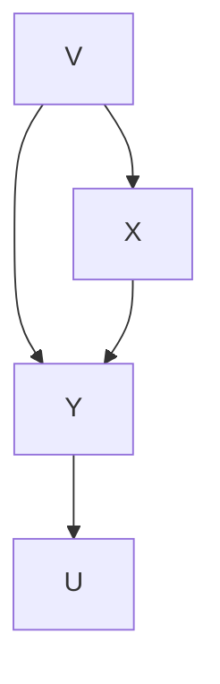

考虑表 7.2 中所示的分布，采用与表 7.1 相同的约定。同样，假设所有行是等概率的，忽略 $Xf$ 的值，它不是随机变量。注意，现在 $Y_{xf=1}$ 依赖于 $X$ 的值。并且，正如普拉特和施莱弗所要求的那样，$Y$ 在 $X = 1$ 上的条件分布不等于 $Y_{Xf=1}$ 的分布。

**表 7.2**

| X | Y | U | Xf | $U_{Xf=1}$ | $Y_{Xf=1}$ |
|---|---|---|---|---|---|
| 1 | 1 | 0 | 1 | 0 | 1 |
| 1 | 2 | 1 | 1 | 1 | 2 |
| 1 | 3 | 2 | 1 | 2 | 3 |
| 2 | 2 | 0 | 1 | 0 | 1 |
| 2 | 3 | 1 | 1 | 1 | 2 |
| 2 | 4 | 2 | 1 | 2 | 3 |

该表是通过以下方式构建的：当强制 $X = 1$，因此 $Xf = 1$ 时，$U_{Xf=1}$ 和 $V_{Xf=1}$ 的分布与 $Xf$ 独立。换句话说，虽然方程组

$$
Y = X + V + U
$$

$$
X = V
$$

被用来获得 $X$、$Y$ 和 $U$ 的值，但假设 $U_{Xf=1} = U$，$V_{Xf=1} = V$ 以及方程

$$
Y_{Xf=1} = Xf + V_{Xf=1} + U_{Xf=1}
$$

被用来确定 $U_{Xf=1}$、$V_{Xf=1}$ 和 $Y_{Xf=1}$ 的值。强制系统被当作如图 7.3 所示的图所描述的那样处理。


> 图 7.3

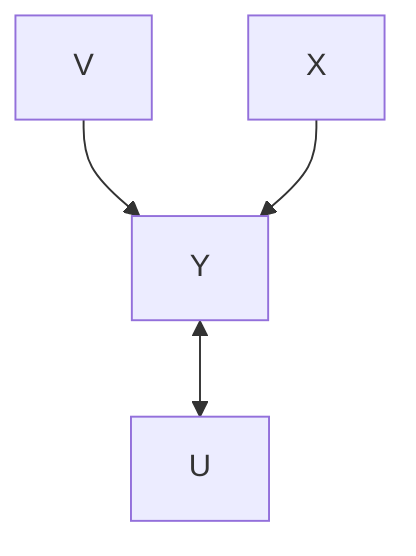


> 图 7.4

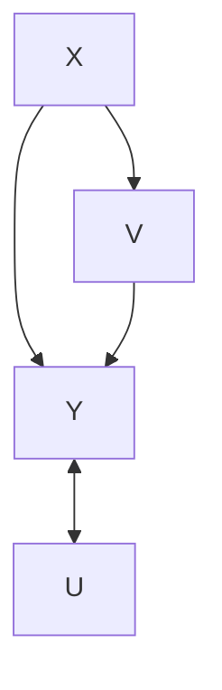

再举一个例子，假设 $Y = X + U$ ，但还有一个变量 **V** 同时依赖于 **Y** 和 **X**，因此该系统可以如图 7.4 所示。

**表 7.3** 是一组数值表，通过假设 $Y = X + U$ 和 $V = Y + X$ 获得，并且这些关系不受对 **X** 的直接操作（direct manipulation）的影响。

**表 7.3**

<table><tr><td>X</td><td>Y</td><td>V</td><td>U</td><td>Xf</td><td> $V_{Xf=1}$ </td><td> $U_{Xf=1}$ </td><td> $Y_{Xf=1}$ </td></tr><tr><td>0</td><td>0</td><td>0</td><td>0</td><td>1</td><td>2</td><td>0</td><td>1</td></tr><tr><td>0</td><td>1</td><td>1</td><td>1</td><td>1</td><td>3</td><td>1</td><td>2</td></tr><tr><td>0</td><td>2</td><td>2</td><td>2</td><td>1</td><td>4</td><td>2</td><td>3</td></tr><tr><td>1</td><td>1</td><td>2</td><td>0</td><td>1</td><td>2</td><td>0</td><td>1</td></tr><tr><td>1</td><td>2</td><td>3</td><td>1</td><td>1</td><td>3</td><td>1</td><td>2</td></tr><tr><td>1</td><td>3</td><td>4</td><td>2</td><td>1</td><td>4</td><td>2</td><td>3</td></tr></table>

再次假设所有行是等概率的。注意 $Y_{Xf=1}$ 与 $X$ 独立，并且 $Y_{Xf=1}$ 与 **Y** 在 $X = 1$ 条件下的分布相同。因此，**Pratt 和 Schlaifer** 的原则再次得到满足，此外，**Y** 对 **X** 的条件概率是不变的。该表的构建基于如下假设：被操作的系统满足与未操作系统完全相同的方程组，并且实际上，图 7.4 中的依赖关系图不受对 **X** 强制赋值的影响。

**Pratt 和 Schlaifer** 的规则，按照我们重构的方式，是**马尔可夫条件（Markov Condition）**的推论。**Rubin** 描述的其他例子也是如此。为了明确建立这种联系，我们需要一些结果。我们将假设第 3 章中引入的技术定义，并且还需要一些进一步的定义。

如果 **G** 是一个关于变量集 **V** ∪ **W** 的有向无环图（directed acyclic graph, DAG），**W** 在 **G** 中相对于 **V** 是外生的（exogenous），**Y** 和 **Z** 是 **V** 的不相交子集，$P(\mathbf{V} \cup \mathbf{W})$ 是满足 **G** 的马尔可夫条件的分布，并且 $\text{Manipulated}(\mathbf{W}) = \mathbf{X}$，那么当且仅当 $P(\mathbf{Y} | \mathbf{Z}, \mathbf{W} = \mathbf{w}_1) = P(\mathbf{Y} | \mathbf{Z}, \mathbf{W} = \mathbf{w}_2)$ 在其两者都有定义的地方成立时，$P(\mathbf{Y}|\mathbf{Z})$ 在 **G** 中通过将 **W** 从 $\mathbf{w}_1$ 改变为 $\mathbf{w}_2$ 对 **X** 的直接操作下是不变的。注意，$P(\mathbf{Y}|\mathbf{Z})$ 在 **G** 中通过改变 **W** 对 **X** 进行直接操作下保持不变的充分条件是，在 **G** 中给定 **Z** 时，**W** 与 **Y** 是 **d-分离的（d-separated）**。在一个包含 **Y** 和 **Z** 的有向无环图 **G** 中，**ND(Y)** 是所有不在 **Y** 中拥有后代的顶点的集合。如果 $\mathbf{Y} \cap \mathbf{Z} = \emptyset$，那么当且仅当 **V** 在给定 **Z** 时与 **Y** 是 **d-连接的（d-connected）**，并且 **V** 不在 **ND(YZ)** 中时，**V** 在 **IV(Y,Z)**（给定 **Z** 时 **Y** 的信息变量（Informative Variables））中。（注意，这意味着 **V** 不在 $\mathbf{Y} \cup \mathbf{Z}$ 中。）如果 $\mathbf{Y} \cap \mathbf{Z} = \emptyset$，那么当且仅当 **W** 是 **Z** 的成员，并且 **W** 在 $\mathbf{IV}(\mathbf{Y}, \mathbf{Z}) \cup \mathbf{Y}$ 中有一个父节点时，**W** 在 **IP(Y,Z)**（**W** 有一个父节点是给定 **Z** 时 **Y** 的信息变量）中。我们将使用以下结果。

**定理 7.1（THEOREM 7.1）**：如果 $G_{Comb}$ 是一个关于 **V** ∪ **W** 的有向无环图，**W** 在 $G_{Comb}$ 中相对于 **V** 是外生的，$\mathbf{Y}$ 和 **Z** 是 **V** 的不相交子集，$P(\mathbf{V} \cup \mathbf{W})$ 是满足 $G_{Comb}$ 的马尔可夫条件的分布，在 $G_{Unman}$ 中 **X** ∩ **Z** 中没有成员是 **IP(Y,Z)** 的成员，并且在 $G_{Unman}$ 中 **X**\**Z** 中没有成员是 **IV(Y,Z)** 的成员，那么 $P(\mathbf{Y}|\mathbf{Z})$ 在 $G_{Comb}$ 中通过将 **W** 从 $\mathbf{w}_1$ 改变为 $\mathbf{w}_2$ 对 **X** 的直接操作下是不变的。

定理 7.1 的重要性在于，$P(\mathbf{Y}|\mathbf{Z})$ 在 $G_{Comb}$ 中通过将 **W** 从 $\mathbf{w}_1$ 改变为 $\mathbf{w}_2$ 对 **X** 的直接操作下是否保持不变，仅由 $G_{Unman}$ 的性质决定。因此，我们有时会说 $P(\mathbf{Y}|\mathbf{Z})$ 在 $G_{Unman}$ 中对 **X** 的直接操作下的不变性，而不指定 **W** 或 $G_{Comb}$。（正如证明所示，定理 7.1 的一个更简单但等价的表述方式是，当给定 **Z** 时，**Y** 与策略变量（policy variables）是 **d-分离** 的，则 $P(\mathbf{Y}|\mathbf{Z})$ 在对 **X** 的操作下是不变的。）

前面的每个例子以及 **Pratt 和 Schlaifer** 的一般规则，都是定理 7.1 的一个推论的结果：

**推论 7.1（COROLLARY 7.1）**：如果 $G_{Comb}$ 是一个关于 $\mathbf{V} \cup \mathbf{W}$ 的有向无环图，**W** 在 $G_{Comb}$ 中相对于 **V** 是外生的，**X** 和 **Y** 在 **V** 中，并且 $P(\mathbf{V} \cup \mathbf{W})$ 是满足 $G_{Comb}$ 的马尔可夫条件的分布，那么如果在 $G_{Unman}$ 中，没有进入 **X** 的无向路径在给定空顶点集的情况下 **d-连接** **X** 和 **Y**，则 $P(\mathbf{Y}|\mathbf{X})$ 在 $G_{Comb}$ 中通过将 **W** 从 $\mathbf{w}_1$ 改变为 $\mathbf{w}_2$ 对 **X** 的直接操作下是不变的。等价地，如果 (1) **Y** 不是 **X** 的（直接或间接）原因，并且 (2) 在 $G_{Unman}$ 中 **X** 和 **Y** 没有共同原因。

用图论的术语来说，**Pratt 和 Schlaifer** 的主张相当于要求：对于“可观测性（observability）”（不变性），**G** 和 $G'$——通过从 **G** 中移除所有进入 **X** 的边得到的被操作系统的图——及其相关的概率必须给出 **Y** 对 **X** 相同的条件分布。推论 7.1 刻画了这一主张的充分性方面。**Pratt 和 Schlaifer** 说他们的条件是“几乎必要的”。据我们理解，他们的意思是，存在一些情况，其中他们条件的前件不成立，但后件成立，并且此外，当前件不成立时，除非条件概率满足一个特殊的约束，否则后件将不成立。类似的评论也适用于我们给出的图论条件。存在一些情况，在给定空集的情况下，**X** 和 **Y** 之间存在进入 **X** 的 **d-连接** 路径，并且当 **X** 被直接操作时 **Y** 的概率等于 **Y** 对 **X** 的原始条件概率。同样，前件将不成立，并且后件仅在条件概率满足一个约束时才成立，所以该条件是“几乎必要的”。可能会发生这样的情况：当对 **X** 强制赋值时 **Y** 的分布无法从 **Y** 对 **X** 的未强制条件分布中预测出来，但是，当对 **X** 强制赋值时 **Y** 对 **Z** 的条件分布却可以从 **Y** 对 **X** 和 **Z** 的未强制条件分布中预测出来。**Pratt 和 Schlaifer** 考虑了更一般的情况，其中除了 **X** 和 **Y** 之外，还测量了一些额外的变量 **Z**。**Pratt 和 Schlaifer** 说，当 **Y** 对 **X** 和 **Z** 的未强制条件分布等于在 **X** 被强制具有特定值的总体中 **Y** 对 **Z** 的条件分布时，关联 **Y** 和 **X** 的规律是“随 **Z** 可观测的（observable with concomitant $\mathbf{Z}$）”。

**Pratt 和 Schlaifer** 声称了随伴随变量可观测性的充分条件和“几乎必要”条件，即对于 **X** 的任何值 **x**，**X** 的分布独立于当 **X** 被强制取值 **x** 时 $Y_{Xf=x}$ 对 $Z_{Xf=x}$ 的值 **z** 的条件分布。这个规则也是定理 7.1 的一个特例。

考虑一个 **Rubin** 提出的例子。（Rubin 的 **X** 是 Pratt 和 Schlaifer 的 **Z**；Rubin 的 **T** 是 Pratt 和 Schlaifer 的 **X**）。在一个教育实验中，阅读计划分配 **T** 是基于某个前测变量 **X** 的随机抽样值来分配的，该变量 **X** 与后测分数 **Y** 共享一个或多个未测量的共同原因 **V**。我们希望预测，如果总体中的所有学生都接受处理 **T = 1** 相比于所有学生都接受处理 $T = 2$ 时，**Y** 值的平均差异。实验中的情况如图 7.5 所示。


> 图 7.5

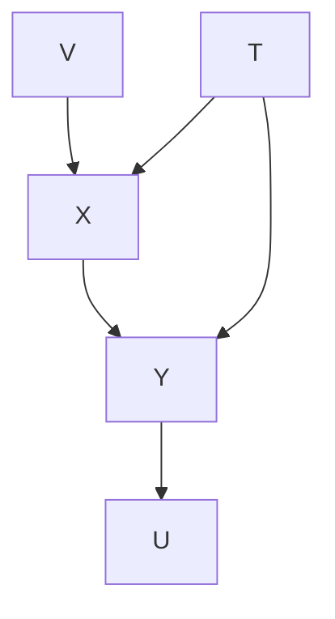

假设实验样本具有足够的代表性，**Rubin** 说可以如下获得无偏估计：让 **k** 取遍 **X** 的值，从 1 到 **K**，让 $\overline{Y1k}$ 是在 **T = 1** 和 **X = k** 条件下 **Y** 的平均值，类似地让 $\overline{Y2k}$ 是在 **T = 2** 和 **X = k** 条件下 **Y** 的平均值。让 $n1k$ 是样本中 **T = 1** 且 $X = k$ 的单元数，类似地 $n2k$ 是对应于 **T = 2** 的单元数。数字 $n1$ 和 $n2$ 分别代表样本中 **T = 1** 和 **T = 2** 的单元总数。

令 $\overline{Y}_{Tf=1}$ 为如果对所有单元强制施加处理 1 时 **Y** 的期望值。根据 **Rubin**，估计 $\overline{Y}_{Tf=1}$ 为：

$$
\sum_{k=1}^{K} \frac{n1k + n2k}{n1 + n2} \overline{Y1k}
$$

并估计处理效应为：

$$
\sum_{k=1}^{K} \frac{n1k + n2k}{n1 + n2} \left(\overline{Y1k} - \overline{Y2k}\right)
$$

这种选择的基础可能不明显。如果我们观察每个单元都被强制具有 $T = 1$ 的假设总体，那么从 **Rubin** 默认的独立性假设中可以清楚地看出，他将被操作总体视为具有如图 7.6 所示的因果结构，如下推导所示。

$$
\overline{Y}_{Tf=1} = \sum_{Y} Y \times P(Y_{Tf=1}) =
$$

$$
\begin{array}{l} \sum_{Y} Y \times \sum_{k=1}^{K} P(Y_{Tf=1} | X_{Tf=1} = k, T_{Tf=1} = 1) P(X_{Tf=1} = k | T_{Tf=1} = 1) P(T_{Tf=1} = 1) = \\ \sum_{Y} Y \times \sum_{k=1}^{K} P(Y_{Tf=1} | X_{Tf=1} = k, T_{Tf=1} = 1) P(X_{Tf=1} = k) \\ \end{array}
$$

上述等式中的第二个等式成立是因为 $P(T_{Tf=1} = 1) = 1$，并且根据图 7.6 所示的因果图，$X_{Tf=1}$ 和 $T_{Tf=1}$ 是独立的。根据定理 7.1，$P(Y_{Tf=1} | X_{Tf=1}, T_{Tf=1})$ 和 $P(X_{Tf=1})$ 在图 7.5 的图中对 **T** 的直接操作下都是不变的。这导致了以下等式。

$$
\overline{Y}_{Tf=1} = \sum_{Y} Y \times \sum_{k=1}^{K} P(Y_{Tf=1} | X_{Tf=1} = k, T_{Tf=1} = 1) P(X_{Tf=1} = k) =
$$

$$
\sum_{k=1}^{K} P(X = k) \times \sum_{Y} Y \times P(Y | X = k, T = 1) = \frac{n1k + n2k}{n1 + n2} \times \overline{Y1k}
$$


> 图 7.6

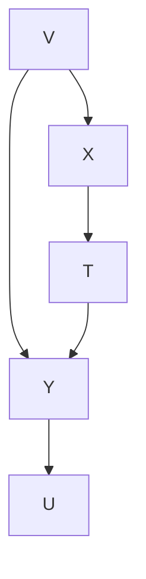

注意，**X** 和 **T**，与 $X_{Tf=1}$ 和 $T_{Tf=1}$ 不同，它们不是独立的。**Rubin** 默认假设 $X_{Tf=1}$ 和 $T_{Tf=1}$ 是独立的，这表明他隐含地假设被操作总体的因果图是图 7.6，而不是图 7.5，后者是未操作总体的因果结构。$\overline{Y}_{Tf=2}$ 可以以类似的方式推导出来。

我们对 **Rubin** 理论的重构假设，总体中的所有单元对于相关变量具有相同的因果结构，但当然不假设这些单元在其他方面是同质的。可以想象，即使从中进行推断的总体（以及样本）中的相关因果结构因单元而异，有人可能仍能知道根据 **Pratt 和 Schlaifer** 规则进行预测所需的反事实。例如，可能以某种方式已知 **A** 和 **B** 没有未测量的共同原因，并且 **B** 不会导致 **A**，而总体实际上可能是 **A** 导致 **B** 的系统与 **A** 和 **B** 独立的系统的混合。在这种情况下，如果 **A** 被强制取值 $A = a$，**B** 的分布可以从给定 $A = a$ 时 **B** 的条件概率中预测出来，实际上概率是相同的。为此，以及对于具有混合因果结构的总体的其他预测情况，通过应用 **Pratt 和 Schlaifer** 规则获得的预测可以通过考虑在每个因果同质的子总体中相关条件概率是否不变，从**马尔可夫条件**推导出来。因此，如果 **A** 和 **B** 没有因果关系，$P(B | A = a)$ 等于当 **A** 被强制取值 **a** 时 **B** 的概率，并且如果 **A** 导致 **B**，$P(B | A = a)$ 也等于当 **A** 被强制取值 **a** 时 **B** 的概率，因此在该两种因果结构的任何混合系统中，概率也是相同的。

## 7.4 因果充分性下的预测（Prediction with Causal Sufficiency）

**Rubin** 框架在两个维度上是特殊的。它假设已知各种反事实（或因果）属性，并且它处理条件概率的不变性。但是我们在考虑数据之前通常不知道因果结构或反事实，并且我们感兴趣的并非不变性本身，而只是将其作为预测的工具。我们需要更清晰地明确目标。我们假设研究者知道（或估计）一个分布 $P_{Unman}(\mathbf{O})$，该分布是 **O** 上的边际分布，它忠实于一个未知因果图 $G_{Unman}$，其顶点集 **V** 未知但包含 **O**。她还知道变量 **X**，它是 **O** 中将被直接操作的成员，以及变量 $\text{Parents}(G_{Man}, X)$，这些变量将在 $G_{Man}$ 中成为 **X** 的直接原因。她知道 **X** 是唯一被直接操作的变量。最后，她知道操作将对 **X** 产生什么影响，也就是说，她知道 $P_{Man}(X | \mathbf{Parents}(G_{Man}, X))$。如果在这种情况下，无论未知的因果图是什么，无论未观测变量上的被操作和未操作分布是什么，也无论操作如何以符合刚刚指定的假设的方式实现，$P_{Man}(\mathbf{Y} | \mathbf{Z})$ 都是唯一确定的，那么 **Y** 对 **Z** 的条件分布就是可预测的。目标是发现 **Y** 对 **Z** 的条件分布何时是可预测的，以及如何获得预测。

假设 $P_{Unman}(\mathbf{O})$ 是忠实于未操作图 $G_{Unman}$ 的分布关于 **O** 的边际分布，这个假设可能由于几个原因而不成立。首先，它可能由于分布的特定参数值而不成立。如果 **W** 是一组策略变量，它也可能因为 $\mathbf{w}_2$（被操作）子总体包含 $\mathbf{w}_1$（未操作）子总体中不存在的依赖关系而不成立。例如，假设一个电池通过一个包含开关的电路连接到灯泡。令 **W** 为开关的状态，$w_1$ 为开关断开的未操作子总体，$w_2$ 为开关闭合的被操作子总体。在 $w_1$ 子总体中，灯泡的状态（亮或灭）与电池的状态（充电或未充电）无关，因为灯泡总是灭的。另一方面，在 $w_2$ 子总体中，灯泡的状态依赖于电池的状态。因此，在 $G_{Comb}$ 中，从电池状态到灯泡状态有一条边；由此可知，在 $G_{Unman}$（它是 $G_{Comb}$ 中排除 **W** 的子图）中，从电池状态到灯泡状态也有一条边。这意味着 $w_1$ 子总体中电池状态和灯泡状态的联合分布并不忠实于 $G_{Unman}$。**预测算法（Prediction Algorithm）** 的结果仅在操作不引入额外依赖关系（这些依赖关系可能是也可能不是背景知识的一部分）的情况下才是可靠的。

假设我们希望从被正确认为对于具有共同但未知因果结构的系统是因果充分的（causally sufficient）变量的观测中，预测干预或政策的效果。在这种情况下，样本和 **PC**（或其他）算法确定了一个表示一类有向图的**模式（pattern）**，并且该类的属性决定了在直接操作 **X** 后 **Y** 的分布是否可以被预测。例如，假设模式是 $X - Y - Z$，它代表图 7.7 中的一组图。


> 图 7.7

对于这些因果图中的每一个，直接操作 **X** 后 **Y** 的分布都可以计算出来，但第一个图的结果与另外两个图不同。每个图的 $P_{Man}(Y)$ 可以通过**操作定理（Manipulation Theorem）**并取适当的边际来计算；每个图的结果如下：

如果总体中的每个单元都被强制具有相同的 **X** 值，那么对于 (i)，**Y** 的被操作分布不等于 **Y** 的未操作分布。对于 (ii) 和 (iii)，**Y** 的被操作分布等于未操作分布。由于该模式没有告诉我们这些结构中哪一个是正确的，因此无法预测在对 **X** 进行操作时 **Y** 的分布。

如果获得了不同的模式，则预测是可能的；例如，模式 $U - X \to Y \to Z$ 可以表示图 7.8 中的任何一个图。


> (i)

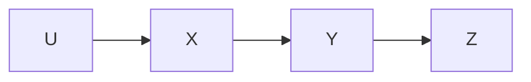


> 图 7.8


每个图的 $P_{Man}(Y)$ 可以通过**操作定理**并取适当的边际来计算；每个图的结果如下：

- $P_{Man}(Y) = \sum_{X} P_{Unman}(Y | X) P_{Man}(X)$
- $P_{Man}(Y) = \sum_{X} P_{Unman}(Y | X) P_{Man}(X)$

（然而，请注意，虽然 $P_{Man}(Y)$ 对于 (i) 和 (ii) 是相同的，但 $P_{Man}(U, X, Y, Z)$ 对于 (i) 和 (ii) 并不相同，因此 $P_{Man}(U, X, Y, Z)$ 是不可预测的。）

当已知结构是因果充分的时，我们可以通过找到模式，对该模式表示的每个图应用**操作定理**并取适当的边际，来决定一个变量（或一组变量对另一组变量的条件分布）的分布的可预测性。如果所有图都给出相同的结果，那就是预测。存在各种计算捷径，其中一些将在下一节所述的**预测算法**中描述。

## 7.5 无因果充分性下的预测（Prediction without Causal Sufficiency）

我们终于来到了最严重的情况：**据我们所知**，被操纵系统的因果结构可能不同于观测系统的因果结构，观测系统的因果结构是未知的，并且**据我们所知**，观测到的统计依赖性可能是由未观测到的共同原因造成的。这就是 Mosteller 和 Tukey 似乎认为在非实验研究中具有典型性的情况，我们同意这一点。问题在于，尽管如此，预测是否有时是可能的，如果是，何时以及如何进行。

考虑以下简单的例子。如果我们只测量了吸烟（Smoking）和肺癌（Lung cancer），我们会发现它们是相关的。这种相关性可能由图 7.9 中描绘的三种因果图之一产生。


> 图 7.9

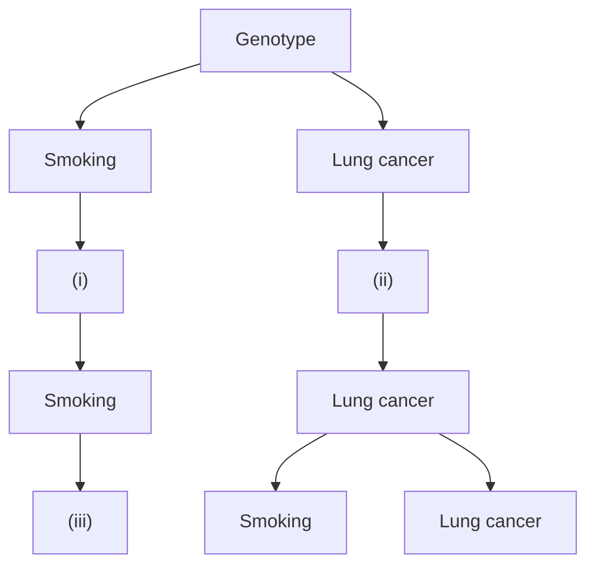

所有三个图都产生相同的信息量最大的**部分定向诱导路径图（partially oriented inducing path graph）**，如图 7.10 所示。


> 图 7.10

如果在图 (i) 或 (iii) 中直接操纵吸烟，那么 $P(Lung\ cancer)$ 不会改变；但是如果在图 (ii) 中直接操纵吸烟，那么 $P(Lung\ cancer)$ 会改变。因此，不可能从测量变量的边际分布来预测直接操纵吸烟的效果。

在因果充分的情况下，模式的每个完整定向都会产生一个**有向无环图（directed acyclic graph, DAG）** $G$。根据**操纵定理（Manipulation Theorem）**，对于每个有向无环图 $G_{Unman}$，当我们把分布分解成形如 $P_{Unman(\mathbf{W})}(V \mid \mathbf{Parents}(G_{Unman}, V))$ 的项的乘积时，我们可以通过简单地用 $P_{Man(\mathbf{W})}(X \mid \mathbf{Parents}(G_{Man}, X))$ 替换 $P_{Unman(\mathbf{W})}(X \mid \mathbf{Parents}(G_{Unman}, X))$（其中 $G_{Man}$ 是被操纵的图）来计算操纵变量 $X$ 的效果。这种简单的替换之所以有效，是因为在 $G_{Unman}$ 中对 $X$ 进行任何直接操纵时，除了 $P_{Unman(\mathbf{W})}(X \mid \mathbf{Parents}(G_{Unman}, X))$ 之外的因子化项都保证是不变的，因此可以从未操纵总体中的频率进行估计。

现在让我们尝试将这种策略推广到因果不充分的情况，其中 $P(\mathbf{O})$ 是忠实于有向无环图 $G_{Unman}$ 的分布 $P(\mathbf{V})$ 的边际分布，并且 $\mathcal{I}$ 是 $G_{Unman}$ 的部分定向诱导路径图。我们可以寻找 $P(\mathbf{O})$ 分布的一种因子化，它是形如 $P_{Unman}(V \mid \mathbf{M}(V))$ 的项的乘积（其中集合 $\mathbf{M}(V)$ 的成员资格是 $V$ 的函数），在该因子化中，除了 $P_{Unman}(X \mid \mathbf{M}(X))$ 之外的每个项在 $\mathcal{I}$ 是其在 $\mathbf{O}$ 上的部分定向诱导路径图的所有有向无环图中，对 $X$ 的所有直接操纵都是不变的。如果我们找到这样一个因子化，那么我们就可以通过用 $P_{Man}(X \mid \mathbf{Parents}(G_{Man}, X))$ 替换 $P_{Unman}(V \mid \mathbf{M}(X))$（其中 $G_{Man}$ 是被操纵的图）来预测操纵的效果，就像我们在因果充分情况下所做的那样。我们不会知道 $\mathcal{I}$ 是其在 $\mathbf{O}$ 上的部分定向诱导路径图的众多有向无环图中，究竟是哪一个实际生成了该分布；然而，这并不重要，因为 $P_{Man}(\mathbf{Y} \mid \mathbf{Z})$ 对于它们每一个都是相同的。这基本上就是我们采用的策略。然而，在因果不充分的情况下，找到这样一个因子化的任务要困难得多：与因果充分的情况不同，在因果充分的情况下，我们可以简单地构造一个因子化，其中除了 $P(X \mid \mathbf{Parents}(G_{Unman}, X))$ 之外的每个项在 $G_{Unman}$ 中对 $X$ 的直接操纵下都是不变的；在因果不充分的情况下，我们必须在不同的因子化之间进行搜索，以便找到一个因子化，其中除了 $P_{Unman}(X \mid \mathbf{M}(X))$ 之外的每个项，对于所有在 $\mathbf{O}$ 上的部分定向诱导路径图等于 $\mathcal{I}$ 的有向无环图 $G$，对 $X$ 的所有直接操纵都是不变的。幸运的是，正如我们将看到的，我们不必搜索 $P(\mathbf{O})$ 的每一个可能的因子化。

我们将充实这个策略的细节并提供示例。我们将使用 **FCI 算法（FCI algorithm）** 来构造 $G_{Unman}$ 在 $\mathbf{O}$ 上的部分定向诱导路径图 $\mathcal{I}$。请注意，鉴于第 6 章描述的 Verma 和 Pearl 的例子，某些 $\mathcal{I}$ 是其 $\mathbf{O}$ 上的部分定向诱导路径图的图，由于非独立性约束，可能并不代表任何具有边际分布 $P_{Unman}(\mathbf{O})$ 的分布。根据本书发展的理论，我们无法希望提供一个计算程序来判定可预测性，并在原则上可能的情况下获得预测，因为我们不了解图可能对边际分布施加的所有约束。但是，通过仅考虑条件独立性约束，我们可以为可预测性提供一个充分条件。

下面是一个更详细说明该策略的例子：假设我们测量了基因型（Genotype, G）、吸烟（Smoking, S）、收入（Income, I）、父母吸烟习惯（Parents' smoking habits, PSH）和肺癌（Lung cancer, L）。假设未操纵的分布忠实于未操纵的图，该图的部分定向诱导路径图如图 7.11 所示。


> 图 7.11

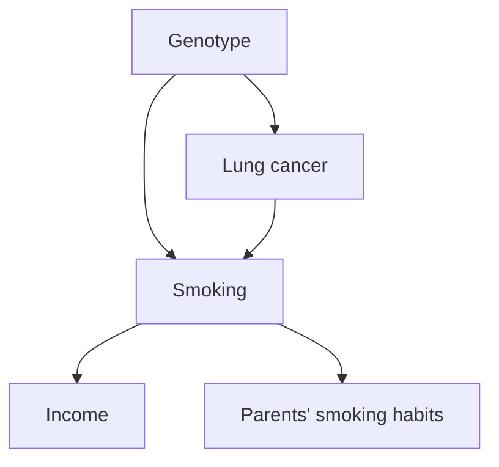

该部分定向诱导路径图没有告诉我们收入和吸烟是否有共同的未测量原因，或者父母吸烟习惯和吸烟是否有共同的未测量原因，等等。测量的分布可能由几种结构中的任何一种产生，例如包括图 7.12 中的那些结构，其中 $T_1$ 和 $T_2$ 是未测量的。

如果我们直接操纵吸烟，使得在被操纵的图中收入和父母吸烟习惯不再是吸烟的父节点，那么无论哪个图产生了边际分布，部分定向诱导路径图和操纵定理都告诉我们，如果吸烟被直接操纵，那么在操纵后的总体中，产生的因果图将类似于图 7.13 所示的图。

在这种情况下，我们可以确定给定直接操纵吸烟后的肺癌分布。这涉及三个步骤。在这里，我们只给出执行每个步骤的结果。每个步骤如何执行将在下一节中更详细地解释。

首先，从部分定向诱导路径图中，我们找到一种方法来因子化被操纵图中的联合分布。令 $P_{Unman}$ 为测量变量上的分布，


> 图 7.12

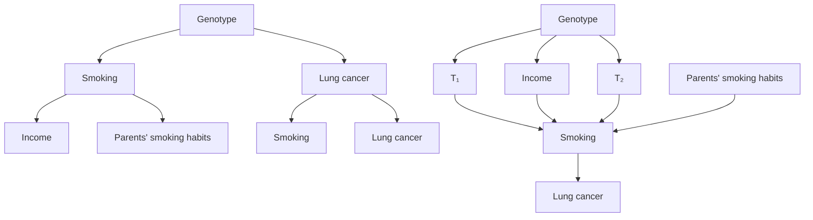

令 $P_{Man}$ 为直接操纵吸烟所产生的分布。根据部分定向诱导路径图可以确定：

$$
P_{Man}(I, PSH, S, G, L) = P_{Man}(I) \times P_{Man}(PSH) \times P_{Man}(S) \times P_{Man}(G) \times P_{Man}(L \mid G, S)
$$


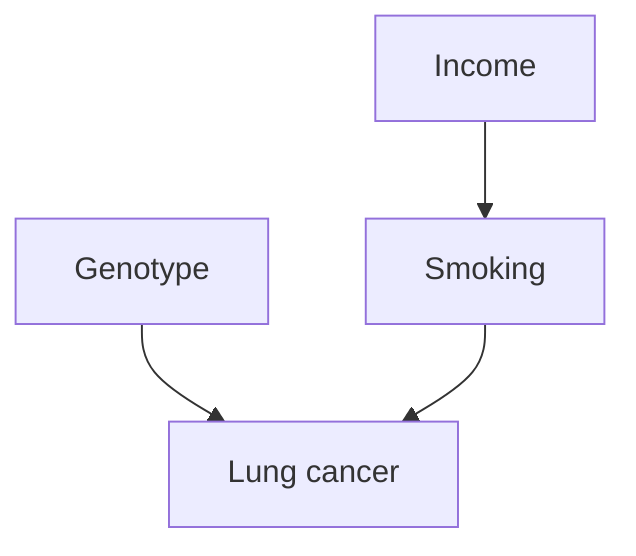

**图 7.13**

其中 $I = \text{Income}$，$PSH = \text{Parents' smoking habits}$，$S = \text{Smoking}$，$G = \text{Genotype}$，$L = \text{Lung cancer}$。这是对应于紧接其上的、表示直接操纵吸烟结果的图的 $P_{Man}$ 的因子化。

其次，我们可以从部分定向诱导路径图中确定，在刚刚给出的联合分布表达式中，哪些因子是计算 $P_{Man}(L)$ 所必需的。在这种情况下，$P_{Man}(I)$ 和 $P_{Man}(PSH)$ 被证明是不相关的，我们有：

$$
P_{Man}(L) = \sum_{G, S} P_{Man}(S) \times P_{Man}(G) \times P_{Man}(L \mid G, S)
$$

第三，我们可以从部分定向诱导路径图中确定，$P_{Man}(G)$ 和 $P_{Man}(L \mid G, S)$ 分别等于相应的未操纵概率 $P_{Unman}(G)$ 和 $P_{Unman}(L \mid G, S)$。此外，$P_{Man}(S)$ 被认为是已知的，因为它是被操纵的量。因此，$P_{Man}(L)$ 表达式中的所有三个因子都是已知的，并且可以计算出 $P_{Man}(L)$。

请注意，即使 $P(L)$ 在直接操纵 $S$ 下绝对不是不变的，$P_{Man}(L)$ 也是可以预测的。这个例子应该足以说明，虽然 Mosteller 和 Tukey 关于从观测进行预测的悲观论调在他们写作时可能是合理的，但它并非基于充分根据。

该示例中概述的算法下面将更正式地描述，其中我们为每个步骤标记了一个字母以便于参考。假设 $P_{Unman}(\mathbf{V})$ 是操纵前的分布，$P_{Man}(\mathbf{V})$ 是操纵后的分布，并且 $\mathbf{X}$ 中的单个变量 $X$ 被操纵为具有分布 $P_{Man}(X \mid \mathbf{Parents}(G_{Man}, X))$，其中 $G_{Man}$ 是被操纵的图。我们假设 $P_{Unman}(\mathbf{V})$ 忠实于未操纵图 $G_{Unman}$，$\mathbf{Parents}(G_{Man}, X)$ 是已知的，$P_{Man}(X \mid \mathbf{Parents}(G_{Man}, X))$ 是已知的，并且我们感兴趣的是预测 $P_{Man}(\mathbf{Y} \mid \mathbf{Z})$。预测算法（Prediction Algorithm）由于以下事实而得以简化：如果 $P_{Unman}(\mathbf{O})$ 满足图 $G_{Unman}$ 的**马尔可夫条件（Markov Condition）**，那么 $P_{Man}(\mathbf{O})$ 也满足，因此 $P_{Unman}(\mathbf{Y} \mid \mathbf{Z})$ 的任何因子化表达式也是 $P_{Man}(\mathbf{Y} \mid \mathbf{Z})$ 的一个表达式。回想一下，图 $G'$ 中变量的一个全序 Ord 对于 $G'$ 是可接受的，当且仅当每当 $A \neq B$ 并且在 $G'$ 中存在从 $A$ 到 $B$ 的有向路径时，$A$ 在 Ord 中先于 $B$。如果 $\mathcal{I}$ 是 $G$ 在 $\mathbf{O}$ 上的 FCI 部分定向诱导路径图，那么 $X$ 在 $\mathbf{Y}$ 的**确定-非后代（Definite-Nondescendants）**中，当且仅当在 $\mathcal{I}$ 中不存在从任何 $Y \in \mathbf{Y}$ 到 $X$ 的半有向路径。回想一下，有向无环图 $G$ 是分布 $P$ 的一个**最小 I-映射（minimal I-map）**，当且仅当 $P$ 满足 $G$ 的马尔可夫条件和**最小性条件（Minimality Condition）**。

## 预测算法（Prediction Algorithm）

- A.) $P _ { M a n } ( { \bf Y } | { \bf Z } ) = \mathrm { u n k n o w n }$ .
- B.) 从 $P _ { U n m a n } ( \mathbf { O } )$ 生成**部分定向诱导路径图（partially oriented inducing path graph）**。
- C.) 对于每个可接受的变量排序，其中 X 在 Ord 中的前驱等于 Parents $( G _ { M a n } , X ) \cup$ 确定非后代（Definite-Nondescendants(X)）

- C1.) 针对该排序，形成 $P _ { U n m a n } ( \mathbf { O } )$ 的**最小 I-映射（minimal I-map）** F；
- C2.) 从 F 中提取 $P _ { U n m a n } ( { \bf Y } | { \bf Z } )$ 的表达式；称其为 E；
- C3.) 如果对于每个 $V \neq X ,$ ，E 中的项 $P _ { U n m a n } ( V | \mathbf { P a r e n t s } ( F , V ) )$ 在 X 被直接操纵时在 $G _ { M a n }$ 中是不变的，则

C3a). 返回 $\begin{array} { r l r } { P _ { M a n } ( { \bf Y } | { \bf Z } ) } & { { } = } & { E ^ { \prime } , } \end{array}$ 其中 E - 
- 
- - E 除了 $P _ { U n m a n } ( X \mid \mathbf { P a r e n t s } ( F , X ) )$ 被替换为 $P _ { M a n } ( X \mid \mathbf { P a r e n t s } ( G _ { M a n } , X ) )$

C3b). 退出

（该算法也可应用于操纵一组变量 X 的情况，只要能够找到一个变量排序，使得对于 X 中的每个 X，X 的所有前驱都在确定非后代（Definite-Nondescendants(X)）或 Parents $( G _ { M a n } , X )$ 中，X 中的变量之间不存在因果联系，并且如果 X 中的某个 X 是某个不在 X 中的变量 V 的父节点，那么 X 中的每个成员都是 V 的前驱。）该描述省略了重要细节。我们如何找到部分定向诱导路径图（步骤 B），即 $P _ { U n m a n } ( { \bf V } )$ 在给定变量排序下满足**最小性（Minimality）**和**马尔可夫条件（Markov conditions）**的图（步骤 C1），以及 $P _ { M a n } ( { \bf Y } | { \bf Z } )$ 的表达式 E（步骤 C2）；当我们不知道 $G _ { U n m a n }$ 是什么时，我们如何确定出现在 $P _ { U n m a n } ( { \bf Y } | { \bf Z } )$ 表达式中的给定条件概率项在 $G _ { U n m a n }$ 中对 X 的直接操纵下是否不变（步骤 C3）？细节如下所述。

**步骤 B：** 我们使用 **FCI 算法（FCI Algorithm）**执行步骤 B)。

**步骤 C：** 如果步骤 C1) 和 C2) 为 $P _ { U n m a n } ( { \bf Y } | { \bf Z } )$ 生成了一个表达式，其中对于 ${ \bf O } \backslash \{ X \}$ 中的每个 V，$P _ { U n m a n } ( V$ |Parents(F,V)) 在 $G _ { U n m a n }$ 中对 X 的直接操纵下是不变的，则称步骤 C1) 和 C2) 成功。我们推测，如果存在一个变量排序使得某个**有向无环图（directed acyclic graph）**能使 C1) 和 C2) 成功，那么存在一个可接受的此类排序。（请注意，算法的正确性并不依赖于该推测的正确性，尽管如果该推测错误，算法将比搜索更大变量排序集的某些其他算法提供的信息更少。）

**步骤 C1：** 对于给定的排序 Ord，令 Predecessors(Ord,V) 为 V 在 Ord 中的前驱。对于 O 上 F 中的每个 V，令 Parents(V) 为 Predecessors(V) 的最小子集，使得在给定 Parents(V) 的条件下，V 独立于 Predecessors(Ord,V)\Parents(V)。那么 F 是 $P ( \mathbf { O } )$ 的最小 I-映射。参见 Pearl 1988。在假设 $P ( \mathbf { O } )$ 是忠实于分布 P(V) 的边缘分布的情况下，我们可以通过检验 Predecessors(Ord,V)\Parents(V) 的每个成员在给定 Parents(V) 的条件下是否独立于 V，来检验 V 是否独立于 Predecessors(Ord,V)\Parents(V)。这清楚地表明，应首先检验小的变量集是否等于 Parents(V)。

对于诱导路径图 $G ^ { \prime }$ 和可接受的**全序（total ordering）** Ord，当且仅当 W 在 Ord 中先于 V，并且 W 和 V 之间存在一条无向路径 U，使得 U 上除端点外的每个顶点在 $o r d$ 中都先于 V 并且是 U 上的**碰撞器（collider）**时，W 在 $\mathbf { S P } ( O r d , G ^ { \prime } , V )$ （在 $G ^ { \prime }$ 中针对排序 Ord 的 V 的分隔前驱）中。如果 G 是 V 上的有向无环图，$G _ { I P }$ 是 G 在 O 上的诱导路径图，Ord 是 $G _ { I P }$ 的可接受排序，并且 P(V) 忠实于 $G$ ，那么有向无环图 $G _ { M i n }$ （其中对于 O 中的每个 X，Parents(X) = SP(Ord,X)）是 $P ( \mathbf { O } )$ 的最小 I-映射。当然，我们通常不会得到 $G _ { I P }$ 。然而，我们可以构建一个部分定向诱导路径图，并识别出缩小 $\mathbf { S P } ( O r d { , } X )$ 搜索范围的变量集。对于部分定向诱导路径图 $\pi$ 和 $\pi$ 可接受的排序 Ord，当且仅当 $V \neq X$ 并且 $\pi$ 中 V 和 X 之间存在一条无向路径 $U$ ，使得 $U$ 上除 X 外的每个顶点在 $o r d$ 中都是 X 的前驱，并且 $U$ 上除端点外的顶点都不是 $U$ 上的**确定非碰撞器（definite-noncollider）**时，V 在 Possible-$\mathbf { S P } ( O r d { , } X )$ 中。对于 O 上的部分定向诱导路径图和 $\pi$ 可接受的排序 Ord，当且仅当 $V \neq X$ 并且 $\pi$ 中 V 和 X 之间存在一条无向路径 U，使得 $U$ 上除 X 外的每个顶点在 Ord 中都是 X 的前驱，并且 $U$ 上除端点外的每个顶点都是 U 上的碰撞器时，V 在 Definite-SP(Ord,X) 中。

**定理 7.2：** 如果 P(O) 是忠实于 V 上 G 的分布的边缘分布，$\pi$ 是 G 在 O 上的部分定向诱导路径图，并且 Ord 是 O 中变量的一个排序，该排序对于某个在 O 上具有部分定向诱导路径图 $\pi$ 的诱导路径图是可接受的，那么存在 $P ( \mathbf { O } )$ 的最小 I-映射 $G _ { M i n }$ ，其中 $\pi$ 中的 Definite- ${ \bf S P } ( O r d \mathrm { , } X )$ 包含在 $\mathbf { P a r e n t s } ( G _ { M i n } , X )$ 中，而后者又包含在 Possible-SP(Ord,X) 中。

我们可以使用定理 7.2 作为搜索 P(O) 的最小 I-映射的启发式方法。该过程仅为启发式方法，原因如下。虽然从 $\pi$ 我们可以识别出对于任何在 O 上具有部分定向诱导路径图 $\pi$ 的诱导路径图都不可接受的排序，但我们不能总是明确地断定某个对 $\pi$ 可接受的排序对于某个在 O 上具有部分定向诱导路径图 $\pi$ 的诱导路径图是可接受的。对于任何此类 O 上的诱导路径图都不可接受的排序，有可能使 SP(Ord,X) 成为 $G _ { M i n }$ 中 X 的父节点并不会使 $G _ { M i n }$ 成为最小 I-映射，在这种情况下，可能没有任何包含 Definite-SP(Ord,X) 且包含在 Possible-SP(Ord,X) 中的集合 M 能使 Predecessors(Ord,V)\M 在给定 M 的条件下独立于 X。如果是这种情况，我们必须进行更广泛的搜索。

**步骤 C2：** 如果 P 满足有向无环图 G 的马尔可夫条件，以下引理展示了如何确定 P(Y|Z) 的表达式 E。（相关结果见 Geiger, Verma, and Pearl 1990）

**引理 3.3.5：** 如果 P 满足 V 上有向无环图 G 的马尔可夫条件，则对于分解中条件分布有定义且 $P ( \mathbf { z } ) \neq 0$ 的所有 V 值，有

$$
P (\mathbf {Y} | \mathbf {Z}) = \frac {\sum_ {\mathbf {I V} (\mathbf {Y} , \mathbf {Z})} ^ {\rightarrow} \prod_ {W \in \mathbf {I V} (\mathbf {Y} , \mathbf {Z}) \cup \mathbf {I P} (\mathbf {Y} , \mathbf {Z}) \cup \mathbf {Y}} P (W | \text { Parents } (W))}{\sum_ {\mathbf {I V} (\mathbf {Y} , \mathbf {Z}) \cup \mathbf {Y}} ^ {\rightarrow} \prod_ {W \in \mathbf {I V} (\mathbf {Y} , \mathbf {Z}) \cup \mathbf {I P} (\mathbf {Y} , \mathbf {Z}) \cup \mathbf {Y}} P (W | \text { Parents } (W))}
$$

**步骤 C3：** 我们使用下面的定理 7.3 和 7.4 从 $\pi$ 确定一个给定的条件分布在 $G _ { U n m a n }$ 中对 X 的直接操纵下是否不变。如果 $\pi$ 是 O 上的部分定向诱导路径图，那么 O 上的部分定向诱导路径图中无向路径 U 上的顶点 B 是 U 上的确定非碰撞器，当且仅当 B 是 U 的端点，或者 U 上存在边 $A \ ^ { * } \ – ^ { * } B \ ^ { * } \ – ^ { * } \ C , A \ ^ { * } \ – ^ { * } B \right. \mathsf C , \mathrm { o r } A \left. B \ ^ { * } -$ \* C。如果 $A \neq B ,$ ，并且 A 和 B 不在 Z 中，那么 O 上的部分定向诱导路径图中 A 和 B 之间的无向路径 U 是给定 Z 下 A 和 B 之间的**可能 d-连接路径（possibly d-connecting path）**，当且仅当 U 上的每个碰撞器都是到 Z 中某个成员的**半有向路径（semidirected path）**的源点，并且每个确定非碰撞器都不在 Z 中。如果 Y 和 Z 不相交，那么 X 在 Possibly-IP(Y,Z) 中，当且仅当 X 在 Z 中，并且存在一条 X 与 Y 中某个 Y 之间的可能 d-连接路径，该路径在给定 $\mathbf { Z } \backslash \{ X \}$ 的条件下不是从 X 出发的。如果 Y 和 Z 不相交，X 在 Possibly-IV(Y,Z) 中，当且仅当 X 不在 Z 中，存在一条 X 与 Y 中某个 Y 之间给定 Z 的可能 d-连接路径，并且存在一条从 X 到 $\mathbf { Y } \cup \mathbf { Z }$ 中某个成员的半有向路径。请注意，定理 7.3 和 7.4 还蕴含：如果存在一个有向无环图 G，其可接受的变量排序能使步骤 C1 和 C2 成功，那么使该排序可接受的最小 I-映射也是如此。

**定理 7.3：** 如果 G 是 $\mathbf { V } \cup \mathbf { W }$ 上的有向无环图，W 在 G 中相对于 V 是**外生的（exogenous）**，O 包含在 ${ \mathbf { V } }$ 中，$G _ { U n m a n }$ 是 G 在 V 上的子图，$\pi$ 是 $G _ { U n m a n }$ 在 O 上的 FCI 部分定向诱导路径图，$\mathbf { Y }$ 和 Z 包含在 O 中，X 包含在 Z 中，Y 和 Z 不相交，并且 $\pi$ 中 X 中的任何 X 都不在 Possibly-IP(Y,Z) 中，那么 P(Y|Z) 在通过将 W 的值从 $\mathbf { w _ { 1 } }$ 改变为 $\mathbf { W } _ { 2 }$ 对 G 中的 X 进行直接操纵下是不变的。

**定理 7.4：** 如果 G 是 $\mathbf { V } \cup \mathbf { W }$ 上的有向无环图，W 在 G 中相对于 V 是外生的，O 包含在 ${ \mathbf { V } }$ 中，$G _ { U n m a n }$ 是 G 在 V 上的子图，$\pi$ 是 $G _ { U n m a n }$ 在 O 上的 FCI 部分定向诱导路径图，$\mathbf { X }$ 、Y 和 Z 包含在 O 中，X、Y 和 Z 两两不相交，并且 $\pi$ 中 X 中的任何 X 都不在 Possibly-IV(Y,Z) 中，那么 P(Y|Z) 在通过将 W 的值从 $\mathbf { w _ { 1 } }$ 改变为 ${ \bf w } _ { 2 }$ 对 G 中的 X 进行直接操纵下是不变的。

**预测算法（Prediction Algorithm）**基于从 $P _ { U n m a n ( \mathbf { W } ) } ( \mathbf { V } )$ 构建部分定向诱导路径图。考虑图 7.14 中的模型，其中 X、Z 和 T 之间的关系在图 $G _ { 1 }$ 中是线性的，W 是一个**策略变量（policy variable）**。

尽管当 $a = - b c$ 时，$W = w _ { 1 }$ 下 X、Z 和 T 上的分布并不忠实于 $G _ { 1 }$ ，但 X 和 Z 上的分布忠实于 $G _ { 1 } { } ^ { * }$ 。实际上，尽管当 $W = w 1$ 时 X 和 Z 上的分布忠实于一个有向无环图，但它并不忠实于生成该分布的因果过程的图。图 $G _ { 2 }$ 描绘了通过将 W 的值从 $w _ { 1 }$ 改变为 $w _ { 2 }$ 直接操纵 X 时的模型；这使得 X 方程中 T 的系数变为 0，并对 X 施加了某种新的分布。操纵后的 X 和 $Z$ 上的分布不满足 $G _ { 1 } { ' }$ 的马尔可夫条件；相反，它满足图 $G _ { 2 } ^ { \prime }$ 的马尔可夫条件，该图包含一条 X 和 $Z$ 之间的边，而 $G _ { 1 } { ' }$ 中没有这条边。如果我们仅从 X 和 $Z$ 的未操纵分布中学习因果图，它将不包含任何边，并预测 $Z$ 的分布在操纵和未操纵分布中相同，那么我们就错了。因此，**预测算法仅在未操纵分布忠实于未操纵图（该图包含 $X \to Z$ 边，因为组合图包含该边）时才能保证正确。**


$$
a = - b c
$$

**图 7.14**

这个假设并不像最初看起来那么严格。假设我们进行一项关于吸烟对癌症影响的实验。我们决定以下列方式为每个受试者分配每天吸烟的数量。对于实验中的每个受试者，我们掷一次骰子：如果骰子显示 1，他们被分配不吸烟；如果骰子显示 2，他们被分配每天吸 10 支烟，等等。令 $\mathbf { W } =$ {实验} 且 $\mathbf { V } = \{ 骰子（Die）$ , 吸烟（Smoking）, 饮酒（Drinking）, 癌症（Cancer）}。图 7.15 显示了实验和非实验受试者总体的因果图，以及 $G _ { U n m a n }$ 。策略变量是实验：它在非实验总体中对每个人都具有相同的值（0），在实验总体中对每个人都具有相同的值（1）。骰子不是策略变量，因为它在实验总体的成员中取不同的值。


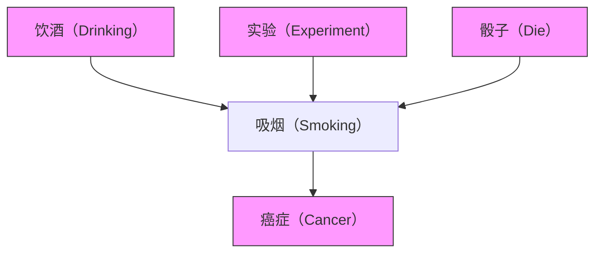


> **图 7.15**

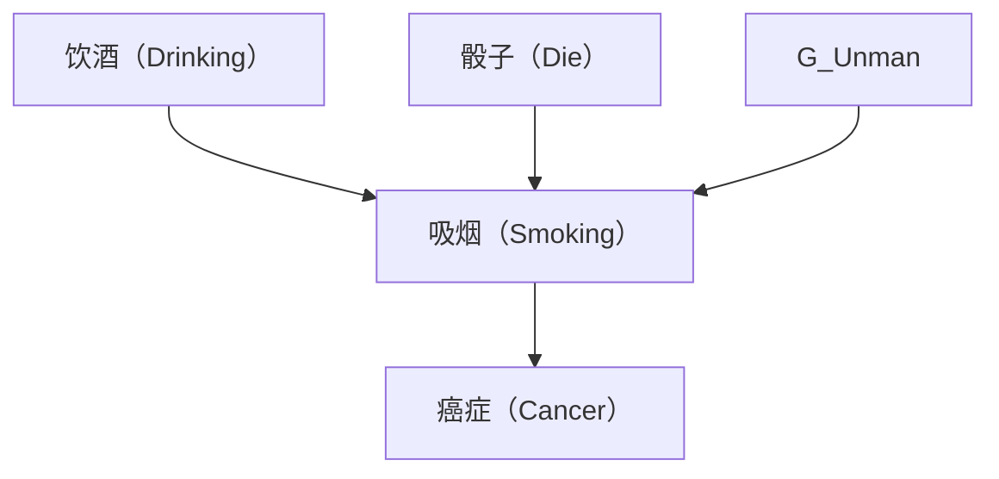

在这种情况下，$P _ { U n m a n } ( \mathrm { V } )$ 忠实于 $G _ { U n m a n }$ 的假设显然是错误的，因为在非实验总体中，掷骰子的结果与受试者吸烟的数量是独立的，但在 $G _ { U n m a n }$ 中它们之间存在一条边。然而，假设我们考虑变量子集 V' = {吸烟, 饮酒, 癌症}。在图 7.16 中，对 $\mathrm { V } ^ { \prime }$ 进行边缘化产生的因果图。在这种情况下，$P _ { U n m a n } ( \mathrm { V } ^ { \prime } )$ 忠实于 $G _ { U n m a n }$ 。由于在操纵总体中导致吸烟但在未操纵总体中不导致吸烟的变量会使分析复杂化，我们通常将简单地不考虑它们。只要相对于测量变量集，它们仅是操纵变量的直接原因，将它们排除在因果图之外就没有问题。这保证了在移除它们之后剩余的变量集是**因果充分的（causally sufficient）**。


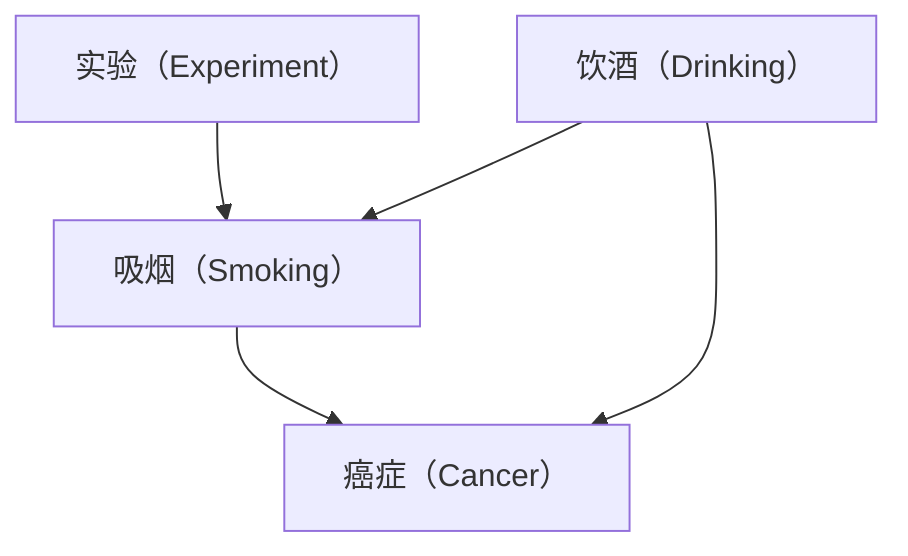


> **图 7.16**

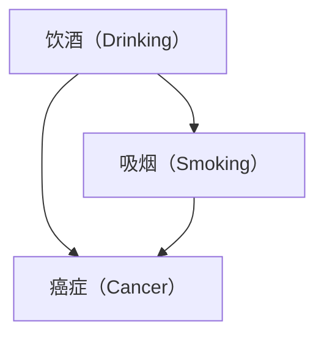

**定理 7.5：** 如果 G 是 V ∪ W 上的有向无环图，W 在 $G$ 中相对于 V 是外生的，$G _ { U n m a n }$ 是 G 在 V 上的子图，$P _ { U n m a n ( \mathbf { W } ) } ( \mathbf { V } ) = P ( \mathbf { V } | \mathbf { W } = \mathbf { w _ { 1 } } )$ 忠实于 $G _ { U n m a n }$ ，并且将 W 的值从 $\mathbf { w _ { 1 } }$ 改变为 $\mathbf { w } _ { 2 }$ 是对 $G$ 中 X 的直接操纵，那么预测算法是正确的。

**预测算法**并不完备；当 $P _ { M a n } ( { \bf Y } | { \bf Z } )$ 原则上可计算时，它可能会说该值是未知的。

## 7.6 示例（Examples）

首先，我们考虑上一章中的假设性示例，其**有向无环图（directed acyclic graph）**如图 7.17 所示，并且基于观测集 O = {收入（Income）, 父母吸烟习惯（Parents' smoking habits）, 吸烟（Smoking）, 纤毛损伤（Cilia damage）, 心脏病（Heart disease）, 肺活量（Lung capacity）, 测量的呼吸功能障碍（Measured breathing dysfunction）} 的**部分定向诱导路径图（partially oriented inducing path graph）**如图 7.18 所示。我们假设 $P _ { U n m a n }$ 对 $G _ { U n m a n }$ 是**忠实（faithful）**的，并且在操纵后的图中，收入（Income）和父母吸烟习惯（Parents' smoking habits）不是吸烟（Smoking）的父节点。我们将使用**预测算法（Prediction Algorithm）**来得出结论。


> 图 7.17

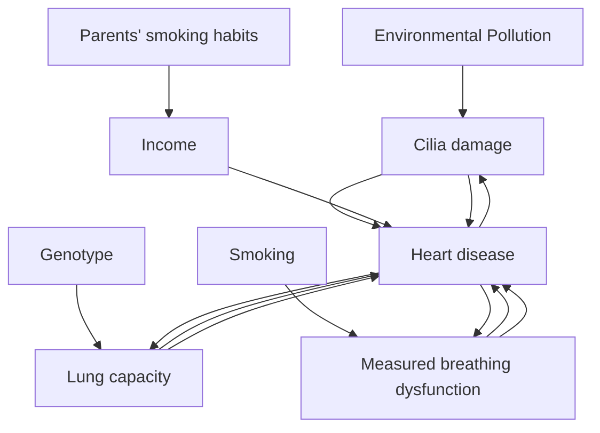

我们将详细展示确定在直接操纵吸烟（Smoking）的情况下，{收入（Income）, 父母吸烟习惯（Parents' smoking habits）, 心脏病（Heart disease）, 肺活量（Lung capacity）, 测量的呼吸功能障碍（Measured breathing dysfunction）} 的整个联合分布是可预测的过程。让我们用以下方式缩写变量名称：

<table><tr><td>收入（Income）</td><td>I</td></tr><tr><td>父母吸烟习惯（Parents’ Smoking Habits）</td><td>PSH</td></tr><tr><td>吸烟（Smoking）</td><td>S</td></tr><tr><td>纤毛损伤（Cilia damage）</td><td>C</td></tr><tr><td>心脏病（Heart disease）</td><td>H</td></tr><tr><td>测量的呼吸功能障碍（Measured breathing dysfunction）</td><td>M</td></tr><tr><td>肺活量（Lung capacity）</td><td>L</td></tr></table>


> 图 7.18

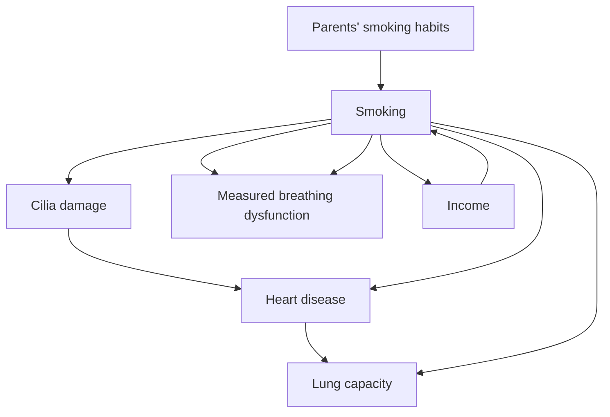

我们首先为变量选择一个排序。我们对排序施加了两个约束。首先，唯一排在 S 之前的变量是那些在**确定-非后代集（Definite-Nondescendant(S)）**中的变量；其次，该排序对于部分定向诱导路径图必须是可接受的。这意味着 I、PSH 和 H 排在 S 之前。其次，为了对部分定向诱导路径图可接受，S、C、L 和 M 必须按此顺序出现。我们任意选择一个与这些约束兼容的排序 Ord：I, PSH, H, S, C, L, M。（注意，作为直接操纵变量前驱的变量之间的排序无关紧要，因为任何仅包含直接操纵变量前驱变量的项总是**不变的（invariant）**。）

我们生成一个有向图，使得 $P _ { U n m a n } ( I , P S H , S , C , H , M , L C )$ 满足**最小性（Minimality）**和**马尔可夫（Markov）**条件。在这种情况下，我们可以确定，任何对图 7.18 中的部分定向诱导路径图可接受的排序，也是对诱导路径图可接受的排序。因此，我们可以应用**定理 7.2**。得到的**因子分解（factorization）**为 $P _ { U n m a n } ( I ) \mathrm {  ~ x ~ } P _ { U n m a n } ( P S H ) \mathrm {  ~ x ~ } P _ { U n m a n } ( H ) \mathrm {  ~ x ~ } P _ { U n m a n } ( S | I , P S H ) \mathrm {  ~ x ~ } P _ { U n m a n } ( C | S , H ) \mathrm {  ~ x ~ }$ $P _ { U n m a n } ( L \vert C , H , S ) \mathrm { ~ x ~ } P _ { U n m a n } ( M \vert C , H , L )$ 。

我们现在确定，为了预测所考虑的条件分布，需要因子分解分布中的哪些项。因为我们预测的是整个联合分布，所以显然我们需要因子分解分布中的每一项。

最后，我们使用部分定向诱导路径图来测试因子分解分布中除 $P _ { U n m a n } ( S | I , P S H )$ 之外的每一项在 $G _ { U n m a n }$ 中对 S 的直接操纵下是否不变。根据**定理 7.4**，$P _ { U n m a n } ( I )$、$P _ { U n m a n } ( P S H )$ 和 $P _ { U n m a n } ( H )$ 是不变的，因为从 S 到 I、H 或 PSH 不存在**半有向路径（semidirected paths）**。根据**定理 7.3**，$P _ { U n m a n } ( C | S , H )$ 是不变的，因为在给定 H 的情况下，每个可能 d-连接 S 到 C 的路径都是从 S 出发的。根据定理 7.3，$P _ { U n m a n } ( L | C , S , H )$ 是不变的，因为在给定 C 和 H 的情况下，S 和 L 之间的每个可能 d-连接路径都是从 S 出发的。最后，根据定理 7.4，$P _ { U n m a n } ( M \mid C , H , L )$ 是不变的，因为在给定 C、H 和 L 的情况下，S 和 M 之间不存在可能 d-连接的路径。

$$
\begin{array}{c} \text {因此，P_{Man} (I,PSH,H,S,C,L,M) = P_{Unman} (I)\times P_{Unman} (PSH)\times P_{Unman} (H)\times P_{Man} (S)\times} \\ P _ {U n m a n} (C \mid S, H) \times P _ {U n m a n} (L \mid C, H, S) \times P _ {U n m a n} (M \mid C, H, L). \end{array}
$$

在这个例子中，搜索很简单，因为对于给定的变量排序，$P _ { U n m a n } ( I , P S H , H , S , C , L , M )$ 的表达式中除了 $P _ { M a n } ( S )$ 之外的每一项，在 $G _ { U n m a n }$ 中对吸烟（Smoking）的直接操纵下都是不变的。如果表达式未能通过此测试，我们将通过生成不同的变量排序来重复此过程，直到找到 $P ( I , P S H , H , S , C , L , M )$ 的一个因子分解表达式，其中除了 $P _ { M a n } ( S )$ 之外的每一项都是不变的，或者我们用尽了所有排序。

对于下一个示例，考虑图 7.19 中描绘的吸烟与肺癌之间关系的三种替代模型。在 $G _ { 1 }$ 中，吸烟导致肺癌，并且存在吸烟和肺癌的共同原因；在 $G _ { 2 }$ 中，吸烟不导致肺癌，但存在肺癌和吸烟的共同原因；在 $G _ { 3 }$ 中，吸烟导致肺癌，但不存在吸烟和肺癌的共同原因。

基于观测集 O = {吸烟（Smoking）, 肺癌（Lung cancer）}，$G _ { 1 }$、$G _ { 2 }$ 和 $G _ { 3 }$ 的最大信息量的**部分定向诱导路径图（maximally informative partially oriented inducing path graph）**如图 7.20 所示。

从这个部分定向诱导路径图，无法确定是吸烟导致肺癌（如 $G _ { 3 }$ 中），还是吸烟不导致肺癌但存在吸烟和肺癌的共同原因（如 $G _ { 2 }$ 中），或者吸烟导致肺癌并且也存在共同原因（如 $G _ { 1 }$ 中）。此外，我们无法预测当吸烟被直接操纵时肺癌的分布。如果我们尝试变量排序 <吸烟（Smoking）, 肺癌（Lung cancer）>，那么为了应用预测算法，我们需要证明 $P(Lung cancer|Smoking)$ 在 $G _ { U n m a n }$ 中对吸烟（Smoking）的直接操纵下是不变的。但我们不能使用定理 7.3 来证明 $P(Lung cancer|Smoking)$ 是不变的，因为吸烟（Smoking） o-o 肺癌（Lung cancer）的边保证了在给定空集的情况下，吸烟（Smoking）和肺癌（Lung cancer）之间存在一条不是从吸烟（Smoking）出发的可能 d-连接路径。这是该方法的一个相当普遍的特征；当被直接操纵的变量 X 和 Y 之间存在一条在 X 端带有“$\because \mathrm { o } ^ { \prime \prime }$”的边时，该方法不能用于预测 Y 的条件分布。当然，这个特征本身并不表明 $P(Lung cancer)$ 不能被其他方法预测（尽管在这个例子中它显然不可预测）。

然而，假设 O = {吸烟（Smoking）, 肺癌（Lung cancer）, 收入（Income）}。如果真实图是 $G _ { 2 }$，那么部分定向诱导路径图如图 7.21 所示。


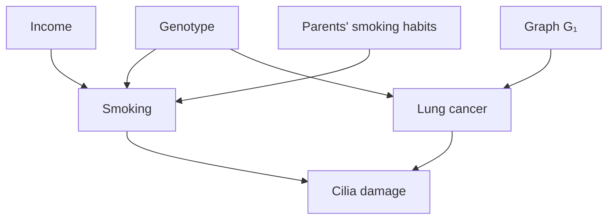


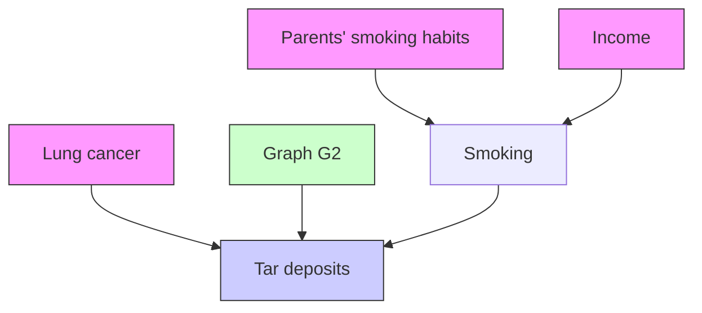


> 图 1.19

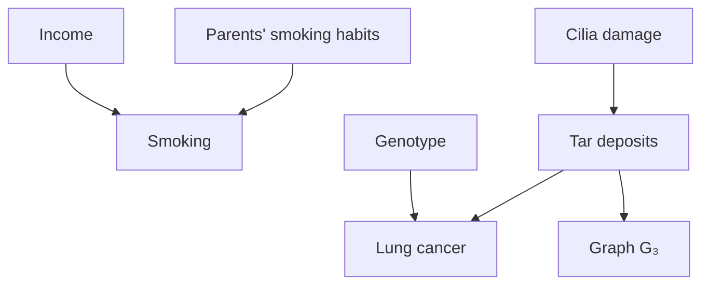


> 图 7.20

```mermaid
graph LR
  A["Smoking"] --> B["Lung cancer"]
```


> 图 7.21

```mermaid
graph LR
  A["Income"] --> B["Smoking"]
  B --> C["Lung cancer"]
```

根据上一章的结果，我们可以得出结论：吸烟不导致肺癌，因为从吸烟到肺癌不存在半有向路径。在这种情况下，$P(Lung cancer)$ 在 $G _ { U n m a n }$ 中对吸烟（Smoking）的直接操纵下是不变的，因此 $P _ { M a n } ( L u n g c a n c e r )$ 是可预测的。


```mermaid
graph LR
  A["Income"] --> B["Smoking"]
  B --> C["Lung cancer"]
    A -.-> C
```

基于 O = {肺癌（Lung Cancer）, 吸烟（Smoking）, 收入（Income）} 的 $G _ { 1 }$ 的部分定向诱导路径图


```mermaid
graph LR
  A["Income"] --> B["Smoking"]
  B --> C["Lung cancer"]
```

基于 O = {肺癌（Lung Cancer）, 吸烟（Smoking）, 收入（Income）} 的 $G _ { 3 }$ 的部分定向诱导路径图

图 7.22

基于 O = {肺癌（Lung cancer）, 吸烟（Smoking）, 收入（Income）} 的 $G _ { 1 }$ 和 $G _ { 3 }$ 的部分定向诱导路径图（如图 7.22 所示）不包含足够的信息来确定吸烟是否导致肺癌。因为在每种情况下都存在一条吸烟（Smoking） o-o 肺癌（Lung cancer）边，因此我们无法使用预测算法来预测 $P _ { M a n } ( L u n g c a n c e r )$ 。

如果真实图是 $G _ { 3 }$，通过同时测量吸烟的两个原因（这两个原因在部分定向诱导路径图中没有直接连接），可以确定吸烟导致肺癌，如图 7.23 所示。因为在部分定向诱导路径图中存在一条从吸烟（Smoking）到肺癌（Lung cancer）的有向路径，根据前一章的结果，在生成数据的过程的因果图中存在一条从吸烟（Smoking）到肺癌（Lung cancer）的有向路径，因此吸烟导致肺癌。预测算法的输出为：

$$
P _ {M a n} (L u n g C a n c e r) = \sum_ {S m o k i n g} ^ {\rightarrow} P _ {M a n} (S m o k i n g) P _ {U n m a n} (L u n g C a n c e r | S m o k i n g)
$$

注意，父母吸烟习惯（Parents’ Smoking Habits）和收入（Income）不必不相关，也不必是吸烟（Smoking）的直接父节点。从吸烟（Smoking）到肺癌（Lung cancer）的边可以通过任意一对变量来定向，这些变量具有在第三个变量 V 处碰撞的边，它们在部分定向诱导路径图中不相邻，并且存在一条从 V 到吸烟（Smoking）的有向路径 U，且对于 U 的每个子路径 ${ < X , Y , Z > }$，X、Y 和 Z 不形成三角形。


> 图 7.23

```mermaid
graph TD
  A["Parents' Smoking Habits"] --> B["Smoking"]
  C["Income"] --> B
  B --> D["Lung cancer"]
```

不幸的是，如果 $G _ { 1 }$ 是真实的因果图，则更难确定吸烟是否是肺癌的原因。如果 O = {吸烟（Smoking）, 肺癌（Lung cancer）, 收入（Income）, 父母吸烟习惯（Parents’ Smoking Habits）} 并且 $G _ { 1 }$ 是真实的因果图，在没有进一步背景知识的情况下，我们无法确定吸烟是否导致肺癌。图 7.24 显示，在部分定向诱导路径图中，从吸烟（Smoking）到肺癌（Lung cancer）的边与收入（Income）和父母吸烟习惯（Parents’ smoking habits）形成三角形，因此其两端都定向为“$\cdot _ { \mathbf { 0 } }$”。由于存在吸烟（Smoking） o-o 肺癌（Lung cancer）边，当吸烟（Smoking）被直接操纵时，我们无法使用预测算法来预测 $P(Lung cancer)$。

收入（Income）不直接导致肺癌（Lung cancer）是合理的。如果我们从背景知识中知道，如果收入（Income）和肺癌（Lung cancer）之间存在因果联系，那么它包含一条从吸烟（Smoking）到肺癌（Lung cancer）的因果路径，那么我们可以从部分定向诱导路径图得出结论：吸烟确实导致肺癌。


> 图 7.24

```mermaid
graph TD
  A["Parents' Smoking Habits"] --> B["Smoking"]
  C["Income"] --> B
  B --> D["Lung cancer"]
  D --> A
  B --> C
  D --> C
```

或者，如果 $G _ { 1 }$ 是正确的模型，我们可以尝试通过测量一个介于吸烟（Smoking）和肺癌（Lung cancer）之间的变量（例如焦油沉积（Tar deposits））来确定吸烟是癌症的原因。虽然在部分定向诱导路径图中收入（Income）和肺癌（Lung cancer）之间仍然存在一条诱导边，但收入（Income）、吸烟（Smoking）和焦油沉积（Tar deposits）不在一个三角形中，并且从吸烟（Smoking）到焦油沉积（Tar deposits）的边可以被定向。不幸的是，如图 7.25 所示，这现在使得焦油沉积（Tar deposits）和肺癌（Lung cancer）之间的边的一端定向为“o”，因此部分定向诱导路径图仍然不蕴含吸烟导致肺癌。并且由于存在吸烟（Smoking） o-o 肺癌（Lung cancer）边，$P _ { M a n } ( L u n g c a n c e r )$ 无法使用预测算法进行预测。


> 图 7.25

```mermaid
graph TD
  A["Parents' Smoking Habits"] --> B["Smoking"]
  B --> C["Tar deposits"]
  C --> D["Lung cancer"]
  D --> A
  B --> E["Income"]
  E --> B
  C --> D
  D --> E
```

然而，如果 $G _ { 1 }$ 是正确的模型，并且我们测量了吸烟（Smoking）和肺癌（Lung cancer）之间的一个变量（例如焦油沉积（Tar deposits）），以及焦油沉积（Tar deposits）的另一个原因（例如纤毛损伤（Cilia damage）），我们可以确定吸烟导致肺癌。（见图 7.26。）但是，由于存在吸烟（Smoking） o→ 肺癌（Lung cancer）边，我们无法使用预测算法预测 $P _ { m a n } ( L u n g c a n c e r )$。


> 图 7.26

```mermaid
graph TD
  A["Parents' Smoking Habits"] --> B["Smoking"]
  C["Income"] --> B
  B --> D["Tar deposits"]
  D --> E["Lung cancer"]
  F["Cilia damage"] --> B
  F --> E
  B --> G["O"]
  D --> H["O"]
  E --> I["O"]
  G --> B
  H --> B
  I --> E
```

我们还可以通过测量吸烟和肺癌的所有共同原因（在本例中为基因型（Genotype）），打破收入-吸烟-肺癌三角形，来确定吸烟是肺癌的原因。通过测量吸烟和肺癌的所有共同原因，收入（Income）和肺癌（Lung cancer）之间的边从部分定向诱导路径图中被移除。这打破了涉及收入（Income）、吸烟（Smoking）和肺癌（Lung cancer）的三角形，从而使得从吸烟（Smoking）到肺癌（Lung cancer）的边可以通过收入（Income）和吸烟（Smoking）之间的边来定向，如图 7.27 所示。此外，$P _ { M a n } ( L u n g c a n c e r )$ 是可预测的。预测算法的输出为：

$$
P _ {M a n} (L u n g C a n c e r) =
$$

$\sum _ { S m o k i n g , G e n o t y p e } ^ {  } P _ { M a n } ( S m o k i n g ) P _ { U n m a n } ( G e n o t y p e ) P _ { U n m a n } ( L u n g C a n c e r ! S m o k i n g , G e n o t y p e )$

当然，测量吸烟和肺癌的所有共同原因可能很困难，既因为这类共同原因的数量，也因为测量困难（如基因型（Genotype）的情况）。只要有一个共同原因未被测量，诱导路径图就存在一个收入（Income）-吸烟（Smoking）-肺癌（Lung cancer）三角形，并且吸烟（Smoking）和肺癌（Lung cancer）之间的边就无法定向。

尽管我们无法从图 7.27 中的部分定向诱导路径图确定基因型（Genotype）是否是吸烟和肺癌的共同原因，但我们可以确定存在吸烟和肺癌的某个共同原因。


> 图 7.27

```mermaid
graph TD
  A["Genotype"] --> B["Smoking"]
  A --> C["Lung cancer"]
  D["Income"] --> B
  E["Parents' smoking habits"] --> B
```

## 7.7 结论（Conclusion）

这里发展的结果表明，存在一些可能的情况，在这些情况下，可以从对未操纵系统的观察中获得对操纵效果的预测，并且可以从非受控观察中做出对实验结果的预测。下一章将考虑一些来自实际数据分析问题的例子。我们不知道我们的预测充分条件是否接近最大信息量，关于这个问题还有大量的理论工作有待完成。

## 7.8 背景注释（Background Notes）

本章所发展的理论的先兆可以在 Strotz 和 Wold 1960、Robins 1986 以及由 Rubin 开创的工作传统中找到。**操纵定理（Manipulation Theorem）**的一个特例，即当干预使单个直接操纵变量 X 独立于其父节点时，由 Fienberg 在 1991 年的一个研讨会上独立提出。随后，Pearl（1995）给出了从干预中计算预测的规则。这些规则源于定理 7.1，将在第 12 章讨论。