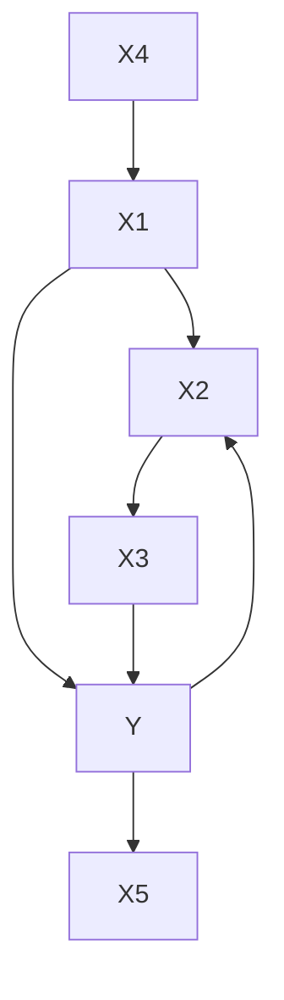
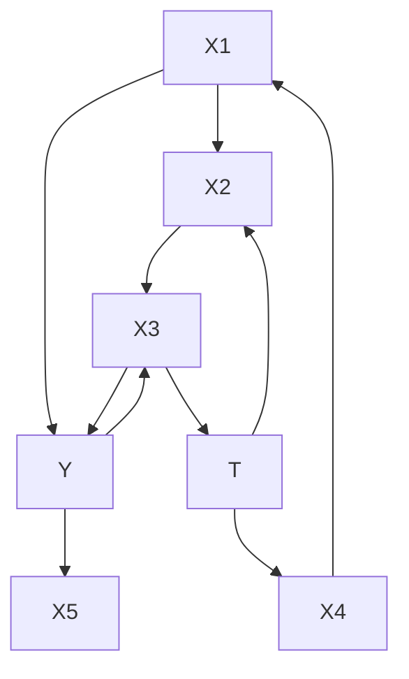
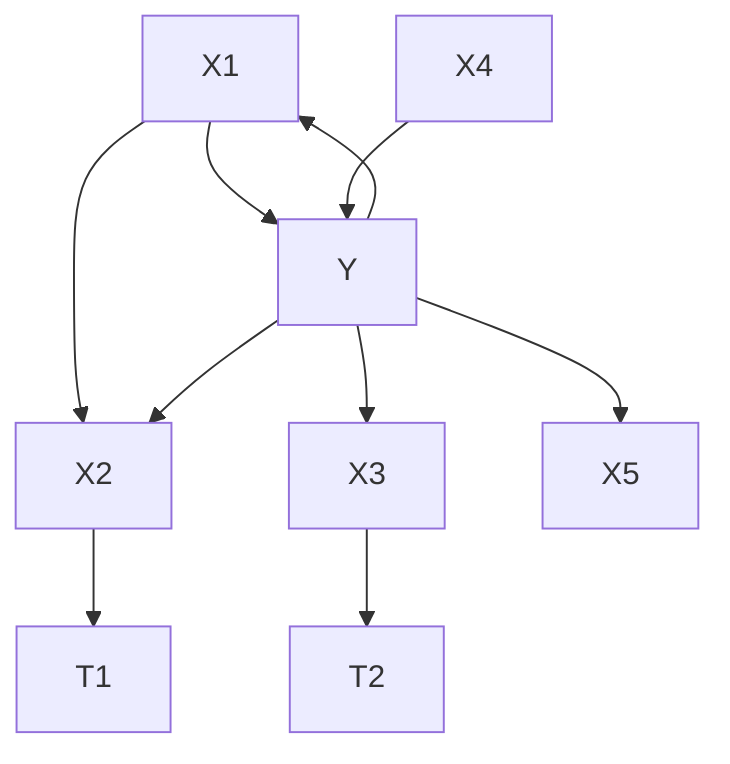
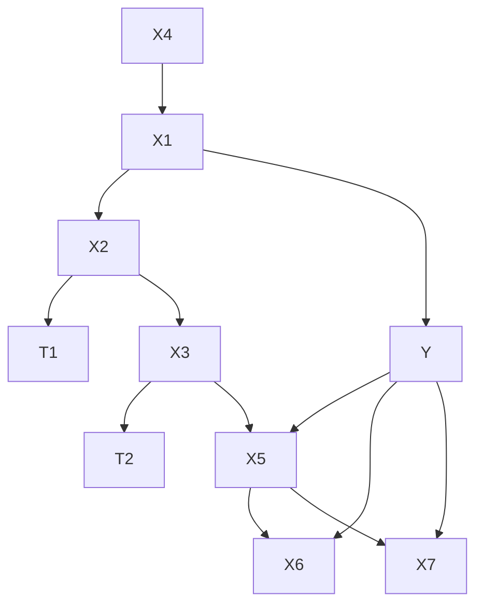
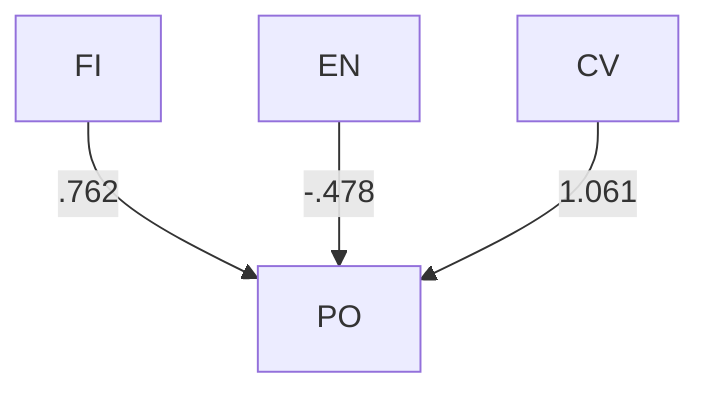
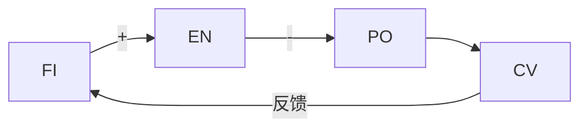
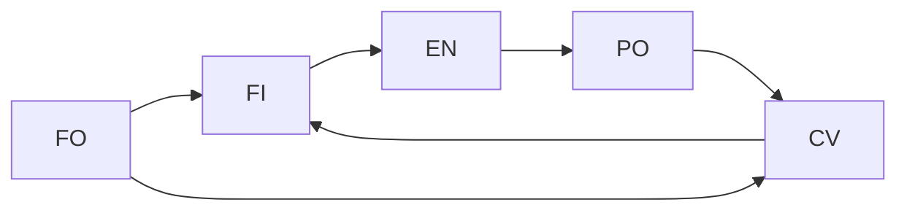
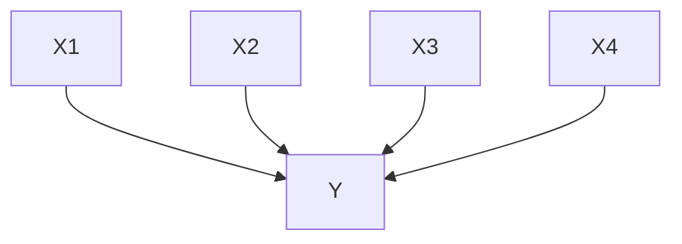
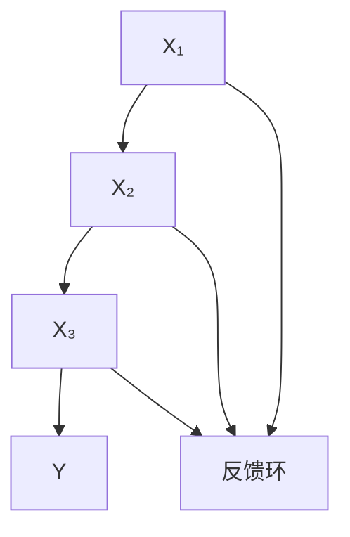
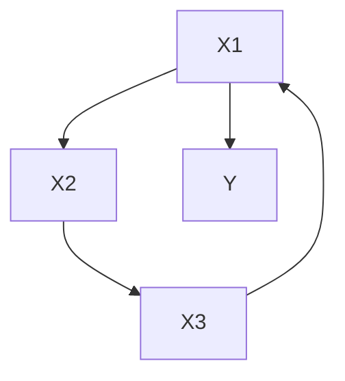

# 回归、因果与预测（Regression, Causation, and Prediction）

**回归**是一个特例，而非一个特殊主题。回归研究中的**因果推断（causal inference）**问题，正是我们在前几章中讨论过的问题的具体实例，其解决方案也应在彼处寻找。回归的独特之处仅在于，**一种如此不适合因果推断的技术，竟然在该领域得到了如此广泛的应用**。

## 8.1 回归在衡量影响时的失效（When Regression Fails to Measure Influence）

**回归模型（Regression models）**通常用于估计回归变量（regressors）$X$ 对结果变量 $Y$ 的"影响"。[1] 如果变量之间的关系是线性的，那么对于每个 $X_i$，当所有其他 $X$ 变量保持不变时，$X_i$ 的单位变化所引起的 $Y$ 的预期变化，可以用一个参数（例如 $\alpha_i$）来表示。显而易见且已被广泛指出（例如，参见 Fox 1984），如果 $X_i$ 和 $Y$ 存在一个或多个**未测量的共同原因（unmeasured common causes）**，那么 $\alpha_i$ 的回归估计将是不正确的；用更传统的统计术语来说，如果 $Y$ 的误差变量与 $X_i$ 相关，则估计将是有偏且不一致的。为了避免此类错误，通常的建议（Pratt and Schlaifer 1988）是研究者扩大潜在回归变量的集合，并确定原始回归变量的回归系数是否保持稳定，以期由此测量并揭示可能存在的混杂共同原因。众所周知，当回归变量数量增加时，回归估计常常不稳定，其原因在于，例如，新增的回归变量可能是先前回归变量和结果变量的共同原因（Mosteller and Tukey 1977）。当添加其他回归变量时，$X$ 的回归系数的稳定性被视为 $X$ 与结果变量没有共同原因的证据。

然而，似乎尚未认识到的是，当回归变量在统计上相互依赖时，回归变量 $X_i$ 与结果变量 $Y$ 之间存在未测量的共同原因，可能会使其他回归变量 $X_k$ 的**影响估计产生偏误**；那些对 $Y$ 完全没有影响、甚至与 $Y$ 也没有共同原因的变量，因此可能获得显著的回归系数。误差可能相当大。在更大的变量集上进行回归并检查稳定性的策略，可能会加剧而非解决这一问题。如果其中一个已测量的候选回归变量是 $Y$ 的**效应（effect）**而非原因，也可能出现类似的困难，我们认为这种情况有时会在非受控研究中发生。

为了说明这个问题，请考虑图 8.1 中的线性结构。为具体起见，我们假定外生变量和误差变量均不相关且服从联合正态分布，误差变量的均值为零，且线性系数不为零。假设只有 $X$ 变量和 $Y$ 被测量。每组线性方程都附有一个**有向图（directed graph）**，用以说明非误差变量之间假定的因果和函数依赖关系。在大样本中，对于来自这些结构中每一个结构的数据，**线性多元回归（linear multiple regression）**将赋予集合 $\{ X_1, X_2, X_3, X_5 \}$ 中的所有变量非零的回归系数，尽管 $X_2$ 在这些结构中均对 $Y$ 没有直接影响，$X_3$ 在结构 (i) 和 (ii) 中对 $Y$ 没有直接或间接的影响，并且在结构 (iii) 和 (iv) 中 $X_3$ 的效应受到未测量的共同原因的混杂。在全部四种情况下，$X_2$ 和 $X_3$ 的影响的回归估计都将是不正确的。如果在 (i) 或 (ii) 中，对回归变量的设定搜索仅选择了 $X_1$ 或 $X_1$ 和 $X_5$，或者在 (i)、(ii)、(iii) 或 (iv) 中仅选择了 $X_5$，则对这些变量的回归将给出其对 $Y$ 影响的一致、无偏估计。然而，在商业统计软件包中的教科书式程序，在所有这些情况下都无法将 $\{ X_1 \}$、$\{ X_5 \}$ 或 $\{ X_1, X_5 \}$ 识别为适当的回归变量子集。

通过模拟很容易产生这种困难的例子。使用结构 (i)，生成了二十组线性系数值，一半为正，一半为负，每个系数的绝对值均大于 0.5。对于每组系数值系统，通过将这些值代入结构 (i) 的系数，并使用不相关的标准正态分布作为外生变量，生成了一个包含 5,000 个单元的随机样本。每个样本被输入 MINITAB，在所有情况下，MINITAB 都发现 $\{ X_1, X_2, X_3, X_5 \}$ 是具有显著回归系数的回归变量集合。MINITAB 中的 **STEPWISE 过程（STEPWISE procedure）** 在大约一半的情况下选择了相同的集合，而在其他情况下则额外添加了 $X_4$；根据 Mallow 的 $C_p$ 最小值或调整后的 $R^2$ 进行选择，其结果与 STEPWISE 过程类似。

如果测量了结果变量和候选回归变量的所有共同原因，则可以解决这一困难，但遗憾的是，回归方法中没有任何信息可以告知人们何时达到了这一条件。而添加额外的候选回归变量可能会制造问题而非解决问题；在结构 (i) 和 (ii) 中，如果 $X_3$ 未被测量，则 $X_2$ 的回归估计将是一致的且无偏的。

我们所说明的问题非常普遍；它将导致对任何回归变量 $X_k$ 的影响估计产生误差，只要 $X_k$ 直接导致或与某个回归变量 $X_i$ 具有直接的未测量的共同原因，并且 $X_i$ 与 $Y$ 具有未测量的共同原因（或者 $X_i$ 是 $Y$ 的一个效应）。根据真实的结构和系数值，误差可能相当大。很容易构造出这样的情况：一个对结果变量没有影响的变量，其标准化回归系数却大于任何其他单个回归变量。对于分类数据，会出现完全类似的问题。回顾**定理 3.4（Theorem 3.4）**：

$$
Y = a_1 X_1 + a_2 X_5 + \varepsilon_{\mathrm{Y}} \quad Y = a_1 X_1 + a_2 X_5 + a_3 T + \varepsilon_{\mathrm{Y}}
$$

$$
X_1 = a_3 X_2 + a_4 X_4 + \varepsilon_1 \quad X_1 = a_4 X_2 + a_5 X_4 + \varepsilon_1
$$

$$
X_3 = a_5 X_2 + a_6 Y + \varepsilon_3 \quad X_3 = a_6 X_2 + a_7 T + \varepsilon_3
$$

> (i)

$$
Y = a_1 X_1 + a_2 X_5 + a_3 T_2 + a_4 X_3 + \varepsilon_{\mathrm{Y}} \quad Y = a_1 X_1 + a_2 X_5 + a_3 T_2 + a_4 X_3 + \varepsilon_{\mathrm{Y}}
$$

$$
X_1 = a_5 X_2 + a_6 X_4 + \varepsilon_1 \quad X_1 = a_5 X_2 + a_6 X_4 + \varepsilon_1
$$

$$
X_2 = a_7 T_1 + \varepsilon_2 \quad X_2 = a_7 T_1 + \varepsilon_2
$$

$$
X_3 = a_8 T_1 + a_9 T_2 + \varepsilon_3 \quad X_3 = a_8 T_1 + a_9 T_2 + \varepsilon_3
$$

$$
X_5 = a_{10} X_6 + a_{11} X_7 + \varepsilon_5
$$

> (iii)

> (iv) 图 8.1（Figure 8.1）

**定理 3.4（THEOREM 3.4）**：如果 $P$ 忠实（faithful）于某个图，那么 $P$ 忠实于 $G$ 当且仅当 (i) 对于 $G$ 中的所有顶点 $X$、$Y$，$X$ 和 $Y$ 相邻当且仅当在 $G$ 中每个不包含 $X$ 或 $Y$ 的顶点集合条件下，$X$ 和 $Y$ 是依赖的；以及 (ii) 对于所有顶点 $X$、$Y$、$Z$，使得 $X$ 与 $Y$ 相邻，$Y$ 与 $Z$ 相邻，且 $X$ 与 $Z$ 不相邻，$X \right. Y \left. Z$ 是 $G$ 的一个子图当且仅当在包含 $Y$ 但不包含 $X$ 或 $Z$ 的每个集合条件下，$X$、$Z$ 是依赖的。

考虑该定理的第一部分，可以解释为什么在图 8.1 的结构 (i) 中，回归过程错误地将 $X_2$ 选为直接影响 $Y$ 的变量：该结构和分布满足**马尔可夫条件（Markov Condition）**和**忠实性条件（Faithfulness Condition）**，但线性回归认为，只要 $X_i$ 和 $Y$ 在控制所有其他 $X$ 变量后的偏相关系数不为零，则 $X_i$ 影响 $Y$。定理 3.4 的第 (i) 部分表明回归标准是不充分的。由定理 3.4 可以立即得出，假设马尔可夫条件和忠实性条件成立，$Y$ 对一组变量 $X$ 的回归只有在真实结构中没有一个 $X$ 变量是 $Y$ 的效应或与 $Y$ 有未测量的共同原因时，才能产生 $X$ 变量的无偏或一致的影响估计。

由于应用多元回归方法的典型经验数据集通常具有一些相关的回归变量，并且在非受控研究中，很少能知道未测量的共同原因不会同时作用于结果变量和回归变量，因此这个问题是普遍存在的。因此，统计方法最普遍的用途之一似乎不过是精心设计的猜测而已。

## 8.2 解决方案及其应用（A Solution and Its Application）

假设已经测量了正确的变量，那么这些问题有一个直接的解决方案：应用 **PC 算法**、**FCI 算法**或其他可靠算法，以及前面章节中的适当定理，来确定哪些 $X$ 变量影响结果 $Y$，哪些不影响，以及哪些问题无法根据测量结果回答；然后通过任何看似合适的方法估计依赖关系，并应用前一章的结果来预测操纵 $X$ 变量的效应。不需要额外的理论。我们将给出一些实例，包括经验性的和模拟性的。

我们首先指出，对于来自结构 (i) 的二十个样本，在每种情况下，我们实现的 PC 算法——当然它假设没有潜在变量——将 $\{ X_1, X_5 \}$ 选为直接影响 $Y$ 的变量。而我们实现的 FCI 算法，它不做这样的假设，在每种情况下都指出 $X_1$ 直接影响 $Y$，$X_5$ 可能影响，而其他变量则不影响。

在图 8.1 的其他三个结构中，如果样本量足够大，多元回归方法将会出错，总是将 $X_2$ 和 $X_3$ 纳入"显著"、"最佳"或"重要"变量中。相比之下，FCI 算法结合定理 6.5 至 6.8 给出了以下结果：

<table><tr><td>结构（Structure）</td><td>直接影响（Direct Influence）</td><td>无直接影响（No Direct Influence）</td><td>未确定（Undetermined）</td></tr><tr><td>(ii)</td><td> $X_{1}$ </td><td> $X_{2}, X_{3}, X_{4}$ </td><td> $X_{5}$ </td></tr><tr><td>(iii)</td><td> $X_{1}$ </td><td> $X_{4}$ </td><td> $X_{2}, X_{3}, X_{5}$ </td></tr><tr><td>(iv)</td><td> $X_{1}, X_{5}$ </td><td> $X_{4}, X_{6}, X_{7}$ </td><td> $X_{2}, X_{3}$ </td></tr></table>

在所有这些情况下，FCI 过程要么明确确定 $X_2$ 和 $X_3$ 对 $Y$ 没有直接影响，要么确定无法判断它们是否具有无混杂的直接影响。

## 8.2.1 武装部队资格测试（Armed Forces Qualification Test, AFQT）的组成部分

**武装部队资格测试（AFQT）**是美国武装部队使用的一套测试组合。它包含若干组成部分测试，包括以下列出的项目：

算术推理（Arithmetical Reasoning, AR）

数值运算（Numerical Operations, NO）

词汇知识（Word Knowledge, WK）

此外，其他一些测试虽然不属于 AFQT，但与其及其组成部分存在相关关系，包括：

数学知识（Mathematical Knowledge, MK）

电子学信息（Electronics Information, EI）

普通科学（General Science, GS）

机械理解（Mechanical Comprehension, MC）

基于 6224 名武装部队人员的这 8 项测量得分，将 AFQT 对其他七个变量进行线性多元回归，结果显示除 EI 和 MC 外，所有变量的回归系数均显著，因此未能区分出实际构成 AFQT 线性组合的测试。协方差矩阵如下所示。

$$
n = 6 2 2 4
$$

<table><tr><td>AFQT</td><td>NO</td><td>WK</td><td>AR</td><td>MK</td><td>EI</td><td>MC</td><td>GS</td></tr><tr><td colspan="8">253.9850</td></tr><tr><td colspan="8">29.649051.7649</td></tr><tr><td>60.3604</td><td>6.2931</td><td>41.967</td><td></td><td></td><td></td><td></td><td></td></tr><tr><td colspan="2">57.656614.5143</td><td>16.0226</td><td>40.9329</td><td></td><td></td><td></td><td></td></tr><tr><td colspan="2">29.376318.2701</td><td>13.2055</td><td>20.6052</td><td>40.7386</td><td></td><td></td><td></td></tr><tr><td>36.2318</td><td>2.10733</td><td>22.6958</td><td>16.3664</td><td>12.1773</td><td>63.1039</td><td></td><td></td></tr><tr><td>35.8244</td><td>4.45539</td><td>17.4155</td><td>20.3952</td><td>16.459</td><td>35.1981</td><td>62.9647</td><td></td></tr><tr><td>38.2510</td><td>5.61516</td><td>27.1492</td><td>14.7402</td><td>14.8442</td><td>29.9095</td><td>26.6842</td><td>48.9300</td></tr></table>

鉴于已知 AFQT 并非其他任何变量的原因，TETRAD II 中的 PC 算法（PC algorithm）正确地将 {AR, NO, WK} 识别为唯一与 AFQT 相邻的变量，因此也是唯一可能构成 AFQT 的变量（Spirtes, Glymour, Scheines, and Sorensen 1990）。²

## 8.2.2 大米草（Spartina）生物量的原因

一本最新的回归分析教材（Rawlings 1988）巧妙地阐述了回归原理和技术在生物学研究中的应用，在该研究中，有理由认为各变量之间存在一个因果关系过程。所讨论的问题显然是因果性的：在一组 14 个变量中，哪些变量对结果变量——大米草（Spartina grass）的重量——影响最大？由于该案例是整本回归教材给出的主要应用实例，当读者读到第 13 章时，可能会惊讶地发现，这些方法几乎没有提供关于该问题的有用信息。

根据 Rawlings 所述，Linthurst（1979）从北卡罗来纳州恐惧角河口（Cape Fear Estuary）的九个地点各采集了五份大米草和土壤样本。除了大米草的质量（BIO）外，还对每份样本测量了十四个变量：

<table><tr><td>游离硫化物（ $H_{2}S$ ）</td></tr><tr><td>盐度（SAL）</td></tr><tr><td>pH 7 条件下的氧化还原电位（ $EH_{7}$ ）</td></tr><tr><td>土壤水 pH 值（PH）</td></tr><tr><td>pH 6.6 条件下的缓冲酸度（BUF）</td></tr><tr><td>磷浓度（P）</td></tr><tr><td>钾浓度（K）</td></tr><tr><td>钙浓度（CA）</td></tr><tr><td>镁浓度（MG）</td></tr><tr><td>钠浓度（NA）</td></tr><tr><td>锰浓度（MN）</td></tr><tr><td>锌浓度（ZN）</td></tr><tr><td>铜浓度（CU）</td></tr><tr><td>铵浓度（ $NH_{4}$ ）</td></tr></table>

**相关矩阵如下³：**

<table><tr><td> $BIO$ </td><td> $H_{2}S$ </td><td> $SAL$ </td><td> $EH_{7}$ </td><td> $PH$ </td><td> $BUF$ </td><td> $P$ </td><td> $K$ </td><td> $CA$ </td><td> $MG$ </td><td> $NA$ </td><td> $MN$ </td><td> $ZN$ </td><td> $CU$ </td><td> $NH_{4}$ </td></tr><tr><td>1.0</td><td></td><td></td><td></td><td></td><td></td><td></td><td></td><td></td><td></td><td></td><td></td><td></td><td></td><td></td></tr><tr><td>.33</td><td>1.0</td><td></td><td></td><td></td><td></td><td></td><td></td><td></td><td></td><td></td><td></td><td></td><td></td><td></td></tr><tr><td>-.10</td><td>.10</td><td>1.0</td><td></td><td></td><td></td><td></td><td></td><td></td><td></td><td></td><td></td><td></td><td></td><td></td></tr><tr><td>.05</td><td>.40</td><td>.31</td><td>1.0</td><td></td><td></td><td></td><td></td><td></td><td></td><td></td><td></td><td></td><td></td><td></td></tr><tr><td>.77</td><td>.27</td><td>-.05</td><td>.09</td><td>1.0</td><td></td><td></td><td></td><td></td><td></td><td></td><td></td><td></td><td></td><td></td></tr><tr><td>-.73</td><td>-.37</td><td>-.01</td><td>-.15</td><td>-.95</td><td>1.0</td><td></td><td></td><td></td><td></td><td></td><td></td><td></td><td></td><td></td></tr><tr><td>-.35</td><td>-.12</td><td>-.19</td><td>-.31</td><td>-.40</td><td>.38</td><td>1.0</td><td></td><td></td><td></td><td></td><td></td><td></td><td></td><td></td></tr><tr><td>-.20</td><td>.07</td><td>-.02</td><td>.42</td><td>.02</td><td>-.07</td><td>-.23</td><td>1.0</td><td></td><td></td><td></td><td></td><td></td><td></td><td></td></tr><tr><td>.64</td><td>.09</td><td>.09</td><td>-.04</td><td>.88</td><td>-.79</td><td>-.31</td><td>-.26</td><td>1.0</td><td></td><td></td><td></td><td></td><td></td><td></td></tr><tr><td>-.38</td><td>-.11</td><td>-.01</td><td>.30</td><td>-.18</td><td>.13</td><td>-.06</td><td>.86</td><td>-.42</td><td>1.0</td><td></td><td></td><td></td><td></td><td></td></tr><tr><td>-.27</td><td>.00</td><td>.16</td><td>.34</td><td>-.04</td><td>-.06</td><td>-.16</td><td>.79</td><td>-.25</td><td>.90</td><td>1.0</td><td></td><td></td><td></td><td></td></tr><tr><td>-.35</td><td>.14</td><td>-.25</td><td>-.11</td><td>-.48</td><td>.42</td><td>.50</td><td>-.35</td><td>-.31</td><td>-.22</td><td>-.31</td><td>1.00</td><td></td><td></td><td></td></tr><tr><td>-.62</td><td>-.27</td><td>-.42</td><td>-.23</td><td>-.72</td><td>.71</td><td>.56</td><td>.07</td><td>-.70</td><td>.35</td><td>.12</td><td>.60</td><td>1.0</td><td></td><td></td></tr><tr><td>.09</td><td>.01</td><td>-.27</td><td>.09</td><td>.18</td><td>-.14</td><td>-.05</td><td>.69</td><td>-.11</td><td>.71</td><td>.56</td><td>-.23</td><td>.21</td><td>1.0</td><td></td></tr><tr><td>-.63</td><td>-.43</td><td>-.16</td><td>-.24</td><td>-.75</td><td>.85</td><td>.49</td><td>-.12</td><td>-.58</td><td>.11</td><td>-.11</td><td>.53</td><td>.72</td><td>.01</td><td>1.0</td></tr></table>

数据分析的目的是为后续的实验研究确定，这些变量中哪些对野外大米草生物量的影响最大。随后将进行温室实验，以估计野外环境之外的因果依赖关系。最好的情况是，人们希望观察性研究的统计分析能够正确选择出在温室中影响大米草生长的变量。最坏的情况是，人们推测观察性研究会发现错误的因果结构，或者找到在野外影响生长（例如，通过抑制或促进竞争物种的生长）但在温室中没有影响的变量。

使用 SAS 统计软件包，Rawlings 对变量集进行了多元回归分析，然后进行了两种逐步回归过程。他没有对所有可能的回归子集进行搜索，大概是因为候选回归变量集太大。结果如下：

- (i) 将 BIO 对所有其他变量进行多元回归，仅 K 和 CU 的回归系数显著；
- (ii) 两种逐步回归过程⁴ 都得出一个仅包含 PH、MG、CA 和 CU 作为回归变量的模型，并且仅对这些变量进行多元回归时，所有系数均显著；
- (iii) 每次只对一个变量进行简单回归，得出 PH、BUF、CA、ZN 和 $NH_{4}$ 的系数显著。

人们该如何看待这些结果？Rawlings 报告说：“没有任何结果令生物学家满意；结果的不一致性令人困惑，预期具有生物学重要性的变量并未显示出显著效应”（第 361 页）。该分析辅以岭回归（ridge regression），以增加系数估计的稳定性，但对于所讨论的问题——识别重要变量——其结果与最小二乘法大致相同。Rawlings 还提供了主成分因子分析（principal components factor analysis）以及成分的各种几何图。这些计算并未提供关于哪些测量变量影响大米草生长的信息。

例如，注意到 PH 与 BUF 高度相关，并且使用 BUF 代替 PH，连同 MG、CA 和 CU，也会产生显著的系数，Rawlings 实际上放弃了他这本书所讨论的方法的这种用途：

普通最小二乘回归往往要么表明，当所有变量都在模型中时，相关复合体中的变量都不重要；要么在使用自动化变量选择技术时，任意选择一个变量来代表该复合体。一个真正重要的变量可能看起来不重要，因为其贡献被与之相关的变量所取代。相反，不重要的变量可能因为与实际因果因素的关联而显得重要。在存在共线性的情况下，使用回归结果来赋予自变量“相对重要性”（无论是否具有因果意义）是特别危险的。（第 362 页）

Rawlings 关于多元回归和传统选择回归变量的方法的结论是正确的，但对于更可靠的推断程序而言则并非如此。如果我们将 PC 算法应用于 Linthurst 的数据，那么会得出一个稳健的结论：在该群体中⁵，唯一可能直接影响生物量的变量是 PH；PH 区别于所有其他变量的事实在于，当控制 PH 时，除 MG 外所有其他变量与 BIO 的相关性均消失或减弱⁶。这种关系不是对称的；例如，当控制 BUF 时，PH 和 BIO 的相关性并未消失。无论我们使用显著性水平 0.05、0.1 还是 0.2 来检验偏相关系数是否为零，该算法都发现 PH 是唯一与 BIO 相邻的变量。在所有情况下，PC 算法或 FCI 算法（FCI algorithm）都得出结果：PH 且仅有 PH 可能与 BIO 直接相连。如果系统是线性正态的，并且满足因果马尔可夫条件（Causal Markov Condition），那么在该群体中，如果 PH 保持恒定，其他回归变量对 BIO 的任何影响都将被阻断。当然，在变量值范围更大的情况下，几乎没有理由认为 BIO 线性地依赖于回归变量，或者认为在此样本中不产生变异影响的因素会继续没有影响。该分析也无法确定 PH 和 BIO 之间的关系是否被一个或多个未测量的共同原因所混淆，但该理论的原则在这种情况下表明并非如此。如果 PH 和 BIO 有一个共同的未测量原因 T，并且其他 13 个变量中的任何一个 Z，要么导致 PH，要么与 PH 有一个共同的未测量原因，那么 Z 和 BIO 应该在给定 PH 的条件下相关，但情况似乎并非如此。

该程序和理论使我们预期，如果 PH 被强制取值与样本中的值相似——这些值几乎全部低于 PH 5 或高于 PH 7——那么在样本中观察到的其他变量范围内的操纵，将对大米草的生长没有影响。这个推断有点风险，因为在受控条件下的温室中种植植物可能不是对与野外生长相关的变量的直接操纵。例如，如果在野外，PH 的变化主要通过影响温室中不存在的竞争物种的生长来影响大米草的生长，那么温室实验将不是对该系统 PH 的直接操纵。

Linthurst 论文的第四章部分证实了 PC 算法的分析。在 Linthurst 描述的实验中，大米草样本是从盐沼河岸（可能是在一个不同于观察性研究所用地点的地方）采集的。使用 3 x 4 x 2（PH x SAL x 通气性 AERATION）的随机完全区组设计，包含四个区组，在移植到温室后，植物被给予含有不同 PH、SAL 和 AERATION 值的共同营养液。在这个实验中，AERATION 变量被证明无关紧要。酸度值为 PH 4、6 和 8。营养液的 SAL 调整为 15、25、35 和 45%。

Linthurst 发现，在 PH 6 时，生长随 SAL 变化，但在其他 PH 值（4 和 8）下则不然；而在所有 SAL 值下，生长都随 PH 变化（第 104 页）。每个变量都与植物矿物质水平相关。Linthurst 考虑了极端 PH 值可能控制植物生长的多种机制：

在 pH 4 和 8 时，盐度对该物种的表现影响很小。pH 似乎在决定生长反应中起主导作用。然而，除非同时考虑 pH 和盐度的影响，否则没有证据表明高或低组织浓度对植物表现有任何因果效应。（第 108 页）

两个极端 pH 值的总体效应表明，这直接损害了根部，从而改变了其膜通透性，进而改变了其选择性吸收的能力。（第 109 页）

观察性数据与实验数据的比较表明，PC 算法的结果基本正确，并且可以通过两种程序中抽样群体的变异进行外推，但不能通过接近中性的 PH 值进行外推。PC 搜索的结果是，在非实验样本中，观察到的地上生物量的变化可能是由 PH 的变化引起的，而不是由其他变量的变化引起的。在观察性数据中，Rawlings 报告（第 358 页）几乎所有 SAL 测量值都在 30 左右——极端值为 24 和 38。与实验研究相比，在野外样本中观察到的变异相当有限。然而，在野外观察到的 PH 值集中在两个极端；只有四个观测值在 PH 6 的半个单位范围内，并且在 PH 5.6 至 7.1 之间完全没有观测值。对于观察到的 PH 和 SAL 值，实验结果与我们从观察性研究中得出的结果非常吻合：如果 PH 值极端，SAL 的微小变化对大米草生长没有影响。关于此案例的进一步讨论见第 12 章第 5.10 节。

## 8.2.3 外国投资对政治压制的影响（The Effects of Foreign Investment on Political Repression）

Timberlake 和 Williams (1984) 使用回归方法声称，**第三世界国家（third-world countries）** 的外国投资会助长 **独裁统治（dictatorship）**。他们衡量了 **政治排斥（political exclusion, PO）**（即独裁）、1973 年的 **外国投资渗透率（foreign investment penetration, FI）**、1975 年的 **能源发展水平（energy development, EN）** 以及 **公民自由（civil liberties, CV）**。公民自由采用从 1 到 7 的有序量表进行测量，数值越低表示公民自由程度越高。他们对 72 个“非核心”国家的相关性分析如下：

<table><tr><td>PO</td><td>FI</td><td>EN</td><td>CV</td></tr><tr><td>1.0</td><td></td><td></td><td></td></tr><tr><td>-.175</td><td>1.0</td><td></td><td></td></tr><tr><td>-.480</td><td>.330</td><td>1.0</td><td></td></tr><tr><td>.868</td><td>-.391</td><td>-.430</td><td>1.0</td></tr></table>

他们的推断是站不住脚的。他们的模型以及使用 SGS 算法（在 0.12 显著性水平下检验偏相关系数是否为零）得到的模型如图 8.2.7 所示。

> 回归模型（Regression Model）

> SGS 算法模型（ModelSGS Algorithm Model） 图 8.2

SGS 算法不会确定 FI-EN 和 EN-PO 边的方向，也不会判断它们是否是由至少一个未被测量的共同原因导致的。任何 SGS 算法模型的最大似然估计都要求 FI 对 PO 的影响（如果有的话）是负的，并且这些模型很容易通过 EQS 程序进行的似然比检验。如果某个 SGS 算法模型是正确的，那么 Timberlake 和 Williams 的回归模型似乎就是图 8.1 中结构 (i) 所示的情况，即结果变量的一个效应被当作了回归变量。

该数据分析假设不存在未被测量的共同原因。如果我们使用相同的显著性水平，通过 **FCI 算法（FCI algorithm）** 对这些相关性进行分析，我们会得到如图 8.3 所示的 **部分定向诱导路径图（partially oriented inducing path graph）**。

> 图 8.3（Figure 8.3）

该图结合依赖关系的所需符号表明：外国投资和能源消费有一个共同原因，外国投资和公民自由也有一个共同原因；能源发展对政治排斥没有影响，但政治排斥可能对能源发展有负向影响；而外国投资对政治排斥没有直接或间接的影响。

## 8.2.4 更多模拟研究（More Simulation Studies）

在下面的模拟研究中，我们使用了由图 8.4 所示的图结构生成的数据，该图说明了 Timberlake 和 Williams 的回归中似乎存在的一些混淆。

> 图 8.4（Figure 8.4）

对于线性情况和具有二值变量的离散情况，在样本量分别为 2,000 和 10,000 时，各使用 SGS 算法进行了 100 次试验。对于线性和三值变量，使用 **PC 算法（PC algorithm）** 进行了一组类似的试验。（这些算法都假设 **因果充分性（causal sufficiency）**。）结果分别针对边的存在性、方向性错误以及回归变量的正确选择进行了评分。我们将图 8.4 中的图模式称为 **真实模式（true pattern）**。回想一下，当输出模式中任何一对变量相邻而在真实模式中不相邻时，就会发生 **边存在的存伪错误（edge existence error of commission, Co）**。当一条边同时出现在真实模式和输出模式中，但输出模式中有一个箭头而真实模式中没有时，就会发生 **边方向的存伪错误（edge direction error of commission）**。**弃真错误（errors of omission, Om）** 在每个类别中作类似定义。结果以每种错误实际发生次数与可能发生次数之比的试验分布平均值的形式进行列表。对于每个样本量，记录了 Y 的实际原因被正确识别（无错误原因）的试验比例（Both），以及 Y 的一个（而非两个）原因被正确识别（同样无错误原因）的试验比例（One）：

<table><tr><td>变量类型</td><td>试验次数</td><td>样本量 n</td><td colspan="2">% 边存在错误</td><td colspan="2">% 边方向错误</td><td>% 两者都正确</td><td>% 一个正确</td></tr><tr><td colspan="3"></td><td>Co</td><td>Om</td><td>Co</td><td>Om</td><td colspan="2"></td></tr><tr><td colspan="9">SGS</td></tr><tr><td>线性</td><td>100</td><td>2000</td><td>1.4</td><td>3.6</td><td>3.0</td><td>5.4</td><td>85.7</td><td>3.6</td></tr><tr><td>线性</td><td>100</td><td>10000</td><td>1.6</td><td>1.0</td><td>2.7</td><td>2.2</td><td>90.0</td><td>7.0</td></tr><tr><td>二值</td><td>100</td><td>2000</td><td>0.6</td><td>16.6</td><td>29.5</td><td>21.8</td><td>38.0</td><td>34.0</td></tr><tr><td>二值</td><td>100</td><td>10000</td><td>1.2</td><td>7.4</td><td>30.0</td><td>9.1</td><td>60.0</td><td>25.0</td></tr><tr><td colspan="9">PC</td></tr><tr><td>线性</td><td>100</td><td>2000</td><td>6.0</td><td>2.0</td><td>1.0</td><td>6.2</td><td>80.0</td><td>15.0</td></tr><tr><td>线性</td><td>100</td><td>10000</td><td>0.0</td><td>1.0</td><td>2.5</td><td>2.9</td><td>95.0</td><td>0.0</td></tr><tr><td>三值</td><td>100</td><td>2000</td><td>3.0</td><td>1.0</td><td>29.1</td><td>8.3</td><td>65.0</td><td>35.0</td></tr><tr><td>三值</td><td>100</td><td>10000</td><td>3.0</td><td>2.0</td><td>10.8</td><td>1.2</td><td>85.0</td><td>15.0</td></tr></table>

离散数据在 SGS 和 PC 算法结果上的差异是由于前者选择了二值变量而后者选择了三值变量。当离散变量可以取两个以上的值时，统计独立性检验似乎具有更高的 **检验力（power）**。

就预测和政策目的而言，最后两列的数字表明，当满足模拟的统计假设、样本量较大且存在类似于图 8.4 的因果结构时，该过程能相当可靠地找到结果变量的真正原因。在这些情况下，回归会发现所有回归变量都影响结果变量。

## 8.3 设定搜索的误差概率（Error Probabilities for Specification Searches）

我们已经证明，如果所需的统计决策正确做出，那么各种从数据中指定因果结构的算法是正确的，但我们没有给出中小样本中各类错误概率的结果。**奈曼-皮尔逊检验理论（Neyman-Pearson account of testing）** 使得两种误差度量变得流行：当原假设为真时拒绝它的概率（**第一类错误（type I error）**），以及当备择假设为真时不拒绝原假设的概率（**第二类错误（type II error）**）。相应地，当一个搜索过程从一个样本中得到一个模型 M 时，我们可以问：如果模型 M 为真，该过程在相同大小的样本上找不到它的概率是多少；给定一个备择模型 $M^{\prime}$，我们可以问：如果 $M^{\prime}$ 为真，该过程在相同大小的样本上找到 M 的概率是多少。我们也将搜索过程结果的误差概率分别称为第一类错误概率和第二类错误概率。特别是在小样本中，用于判定条件独立性的检验的显著性水平和检验力，可能不是搜索过程中相应错误概率的可靠指标。

搜索过程的误差概率几乎无法通过解析方法获得，我们建议改用 **蒙特卡洛方法（Monte Carlo methods）**。（关于搜索的置信区间存在或不存在的假设讨论见第 12 章。）当一个过程从大小为 n 的样本中得到 M 时，估计 M，并使用估计的模型生成若干大小为 n 的样本，对每个样本运行搜索过程，并统计找到 M 以外其他模型的频率。对于合理或有趣的备择模型 $M^{\prime}$，估计 $M^{\prime}$，使用估计的模型生成若干大小为 n 的样本，对每个样本运行搜索过程，并统计找到 M 的频率。我们将通过一个第二类错误概率相当高的案例来说明设定搜索误差概率的确定方法。

Weisberg (1985) 通过一个回归产生异常结果的实验研究，说明了一种检测 **异常值（outliers）** 的过程：

> 进行了一项实验，以研究大鼠肝脏中某种特定药物的含量。随机选取 19 只大鼠，称重后，在轻度乙醚麻醉下口服给药。由于人们认为较大的肝脏比较小的肝脏能吸收更多的给定剂量，因此每只动物实际接受的剂量大约确定为每公斤体重 40 毫克药物。
>
> 实验假设是，对于这种确定剂量的方法，肝脏中药物百分比 (Y) 与 **体重 ( $X_1$ )**、**肝脏重量 ( $X_2$ )** 和 **相对剂量 ( $X_3$ )** 之间没有关系。（第 121–124 页）

将 Y 对 $(X_1, X_2, X_3)$ 进行回归，得到的结果与假设不符；Y 对体重 $(X_1)$ 和剂量 $(X_3)$ 的系数都是显著的，尽管其中一个是由另一个决定的。我们从 Weisberg 的数据中发现以下回归值（标准误在系数下方括号内，t 统计量在标准误下方）：

$$
\begin{array}{l} Y = -3.902^{*} X_1 +.197^{*} X_2 + 3.995^{*} X_3 + \varepsilon \\ (1.345) \quad (.218) \quad (1.336) \\ -2.901 \quad .903 \quad 2.989 \\ \end{array}
$$

一个不包括 $X_2$ 的多元回归也产生了在 0.05 水平上显著的回归变量 $X_1$ 和 $X_3$。然而，Weisberg 观察到，Y 对任何一个 $X$ 变量的单独回归在该水平上都不显著。因此，几个统计决策的结果是不一致的；例如，我们有 $\rho_{X_1Y} = 0, \rho_{X_2Y} = 0, \rho_{X_3Y} = 0$，但 $\rho_{X_1Y.X_3} \neq 0$。对于这种不一致性，人们可能持有几种不同的观点。一种观点是，这在很大程度上是所使用的特定显著性水平造成的人为现象。如果使用 0.01 水平来拒绝相关性和偏相关性为零的假设，那么与 Y 的相关性以及控制一个其他变量后的偏相关性都会消失。但是，$X_1$ 与 Y 同时控制另外两个回归变量后的偏相关性无法被拒绝，不一致性仍然存在。另一种观点是，连续统计决策结果的不一致性是可以预料的，尤其是在小样本中，并且在可能的情况下，推断应基于最可靠的统计决策。在当前情况下，由于样本量小，任何统计检验的检验力都很低，但偏相关的阶数越低，检验力越高。经验法则是，每多控制一个变量就相当于丢失一个数据点。因此，在这种情况下，PC 算法从不考虑偏相关性，仅根据零相关性就得出结论：没有一个 $X$ 变量导致 $Y$ 变量。Weisberg 则建议排除 19 个数据点中的一个，之后使用剩余数据进行的多元回归没有产生任何（在 0.05 水平上）显著的回归系数。

根据实验设置，我们可以假设体重和肝脏重量在因果关系上先于剂量，而剂量本身又先于结果，即在大鼠肝脏中发现的药物含量。在应用 PC 算法处理原始数据集时，结合这一背景知识，并在程序的检验中使用 0.05 的显著性水平，我们得到了图 8.5 中的模式。

在这种情况下，PC 算法给出了假设的正确结果，因为没有 $X$ 变量与 Y 的相关性是显著的，而程序只需要这一点就可以判定不存在影响。Y 对每个单独的 $X$ 变量的回归本质上是一个等价的检验。为了估计 PC 搜索的第一类错误，我们获得了图 8.5 所示模型的最大似然估计（假设正态分布），并用它生成了 100 个模拟数据集，每个数据集大小为 19。然后将 PC 算法应用于每个数据集。在 100 个样本中，有 4 个样本的过程错误地在 Y 与一个或另一个 $X$ 变量之间引入了一条边。

$$
X_1 = \text{体重 (Body Weight)}
$$

$$
X_2 = \text{肝脏重量 (Liver Weight)}
$$

$$
X_3 = \text{剂量 (Dose)}
$$

$$
Y = \text{肝脏中发现药物量 (Drug Found in Liver)}
$$

> PC 算法输出的模型（Model Output by the PC Algorithm）

为了研究该过程针对备择假设的检验力，我们考虑了三个模型，其中 Y 至少与一个 $X$ 变量相连。第一个模型就是回归模型，其回归变量之间的相关性是从样本中估计的。由于 $X_1$ 和 $X_3$ 之间的相关性约为 0.99，这个具有相关误差的回归模型几乎是 **不忠实（unfaithful）** 的，因此我们预计搜索很可能无法找到该结构。我们分别在样本量为 19、50、100 和 1000 时各生成了 100 个样本。然后对每个样本运行 PC 算法，如果输出结果中 Y 与某个 $X$ 变量之间没有边，则将其计为第二类错误。图 8.6 显示了前三个样本量的结果。

在样本量为 1,000 的 100 次试验中，PC 算法从未针对此备择假设犯第二类错误。

第二个备择假设是对原始 PC 输出的细化。我们添加了一条从体重到结果的边，得到图 8.7 中的图。

$$
X_1 = \text{体重 (Body Weight)}
$$

$$
X_2 = \text{肝脏重量 (Liver Weight)}
$$

$$
X_3 = \text{剂量 (Dose)}
$$

$$
Y = \text{肝脏中发现药物量 (Drug Found in Liver)}
$$

> 图 8.7（Figure 8.7）

我们使用 EQS 程序估计了这个模型，该程序发现与 $X_1Y$ 边相关的线性系数值为 0.228，然后使用估计的模型再次在四个样本量下各生成 100 个样本。前三个样本量的结果如图 8.8 所示。

即使在样本量为 1,000 时，针对此备择假设，搜索在 55% 的情况下会犯第二类错误。无法检测到体重对 Y 的“微小”影响。我们可以预期剂量也是如此。

在第三种情况下，我们将图 8.7 模型中连接 $X_1$ 和 Y 的线性系数增加到 1.0。

在样本量为 1,000 时，针对此备择假设，搜索在 2% 的情况下会犯错误。

对于这个问题，在小样本量下，搜索针对某些备择假设的检验力很低；即使在样本量很大时，针对某些可能并非不合理的备择假设，检验力仍然很低。

## 8.4 结论（Conclusion）

在缺乏非常强的先验因果知识的情况下，不应使用多元回归从非受控研究的数据中选择影响结果或标准变量的变量。就我们所知，在涉及因果推断的背景下，根本不应使用流行的自动回归搜索过程。这类背景需要像本文描述的那些算法的改进版本来选择那些可以通过回归可靠估计其对结果影响的变量。在应用中，通过模拟很容易确定设定搜索针对数据合理备择解释的检验力，并且应该对此进行研究。

需要注意的是，当前算法的状态远非选择直接原因的最终结论。在某些情况下，对于变量集 O 上的一个有向无环图 G，其部分定向诱导路径图包含一条从 X 到 Y 的有向边，即使 X 不是相对于 O 的 Y 的直接原因（尽管在 G 中当然存在一条从 X 到 Y 的有向路径）。然而，定理 6.8 陈述了一个充分条件，使得部分定向诱导路径图中的有向边能够推断出 X 是 Y 的直接原因。在某些情况下，基于诸如 Verma 和 Pearl 所提出的约束（见第 6.9 节）的检验可能有助于解决这个问题，但这些检验尚未被开发或实现。