# 实证研究的设计（The Design of Empirical Studies）

前几章结果的简单扩展与实证研究的设计相关。本章我们仅考虑几个基本问题。它们包括**观测研究（observational studies）**与**实验设计（experimental designs）**效力的比较、对抽样和变量选择的一些启示，以及关于**伦理实验设计（ethical experimental design）**的一些考量。最后，我们将从当前视角重新审视那场关于从吸烟与健康的流行病学研究中可以合理得出的因果结论的著名争论。

## 9.1 观测研究还是实验研究？（Observational or Experimental Study?）

关于实验研究和非实验研究，存在许多实际性问题，这里我们不加以讨论。撇开获取适当随机样本的实际困难问题不谈，何时可以在没有实验的情况下区分替代的可能因果结构，而何时只能通过实验来区分？

假设我们关心的是**处理（treatment）** T 是否导致**结果（outcome）** O。根据 Fisher (1959) 的观点，**随机化实验（randomized experiment）**的一个重要优势是，它从考虑中排除了待检验因果假设的几种替代方案。如果 T 的值是随机分配的，那么可以排除 O 导致 T 或者存在 O 和 T 的未测量共同原因的假设。Fisher 认为，排除这种替代假设极大地简化了因果推断；T 是否导致 O 的问题简化为 T 是否与 O 统计上依赖的问题。（当然，这假设了**马尔可夫条件（Markov Condition）**和**忠实性条件（Faithfulness Condition）**的实例。）

随机化实验的批评者，例如 Howson 和 Urbach (1989)，正确地质疑了随机化是否在所有情况下都能排除这种替代假设。给予人们的处理通常非常复杂，并且改变了许多随机变量的值。例如，假设我们关心的是吸入香烟中的烟草烟雾是否导致肺癌。想象一个随机化实验，其中一组人被随机分配到对照组（不允许吸烟），另一组人被随机分配到处理组（被迫每天吸 20 支烟）。进一步想象，实验者不知道香烟的一个未记录特征——例如某些香烟包装纸中存在某种化学物质——才是肺癌的实际原因，而吸入烟草烟雾并不导致肺癌。在这种情况下，即使吸入香烟中的烟草烟雾不导致肺癌，肺癌与吸入香烟中的烟草烟雾在统计上也是依赖的。它们之所以依赖，是因为分配到处理组是吸入香烟中的烟草烟雾和肺癌的共同原因。

Fisher (1951, p. 20) 提出，“如果这些处理是物体物理历史中可能影响其实验反应的阶段中时间上最后的处理，那么随机选择以不同方式处理的物体将是显著性检验有效性的完全保证。”但这并没有解释，一个甚至没有怀疑香烟纸可能经过某种致癌化学物质处理的实验者，如何能够知道他已经排除了肺癌和吸入香烟中烟草烟雾的所有共同原因，即使他已经对处理组进行了随机分配。这是一个关于随机化的重要且困难的问题，由于随机化通常会在诸如药物剂量和处理组等变量之间产生确定性关系，从而导致对忠实性条件的违反，这一问题变得更加困难。

在本节中，我们将搁置这个问题，简单地假设实验者拥有某种方法，能够正确地排除 O 导致 T 或存在 O 和 T 的共同原因的可能性。一般来说，来自实验的因果推断基于第 6 章和第 7 章描述的原理。该理论统一适用于来自实验数据和非实验数据的推断。当实验数据可用时，对因果结构的推断通常信息量更大，这并不是因为因果关系在逻辑上以某种方式与实验操作相关联，而是因为实验设置提供了关于非实验数据所不具备的相关背景因果知识。（关于类似观点，请参见 Pearl 和 Verma 1991。）

当然，除了随机化从考虑中排除了一些替代因果假设的论点之外，还有各种其他支持随机化的论点。有人认为它减少了观察者偏差；它使实验者能够在零（因果）假设为真的条件下，为结果的某些特征分配一个概率分布，从而允许他执行统计检验并计算**第一类错误（type I error）**的概率；对于离散随机变量，它可以通过模拟连续性来增加检验的效力；并且通过绕过“干扰因素”，它为精确的置信水平提供了基础。我们在此不讨论这些支持随机化的论点；关于从贝叶斯视角对这些论点的讨论，请参见例如 Kadane 和 Seidenfeld 1990。

考虑三种替代的因果结构，我们暂时假设它们穷尽了所有可能性并且是互斥的：(i) A 导致 C，(ii) 某个第三个变量 B 同时导致 A 和 C，或者 (iii) C 导致 A。如果通过实验操作，我们可以产生一个已知的、不受 B 或 C 影响的 A 上的分布，并且我们可以产生一个已知的、不受 A 或 B 影响的 C 上的分布，那么我们就可以区分这些因果结构。在实验中，非实验总体因果图中所有进入 A 的边都被打断，并被一条从 U 到 A 的边所取代；此外，在图中，U 与任何其他变量之间不存在不包含从 U 到 A 的边的非空无向路径。任何 A 仅由具有这些性质的变量 U 引起的过程，我们称之为**受控实验（controlled experiment）**。在一个受控实验中，我们知道关于 U 的三个有用事实：U 导致 A，不存在 U 和 C 的共同原因，并且如果 U 导致 C，那么它是通过一种如果 A 保持不变则被阻断的机制来实现的（即在因果图中，如果存在从 U 到 C 的有向路径，则该路径包含 A）。正如我们在第 7 章中指出的，U 不是一个**政策变量（policy variable）**，也不包含在组合的、被操作的或未被操作的因果图中。

三种替代因果结构的受控实验设置如图 9.1 所示，其中 **A-实验**表示对 A 的操作，打断了进入 A 的边，而 **C-实验**表示对 C 的操作，打断了进入 C 的边。如果我们进行一个 A-实验并发现 $\{A,C\}$ 上的**部分定向诱导路径图（partially oriented inducing path graph）** (ia\*)，那么我们就知道 A 导致 C，因为我们知道我们已经打断了所有进入 A 的边。（我们在图 9.1 的部分定向诱导路径图中不包含 U（或 V），因为包含它们不会加强在这种情况下可以得出的结论，但由于 U 和 A 之间可能的确定性关系，会使分析复杂化。）类似地，如果我们进行一个 C-实验并发现部分定向诱导路径图 (iiic\*)，那么我们就知道 C 导致 A。如果我们进行一个 A-实验得到 $( \ddot { 1 } \dot { 1 } \mathrm { a } ^ { * } )$ 并进行一个 C-实验得到 (iic\*)，那么我们就知道存在 A 和 C 的**潜在共同原因（latent common cause）**（假设 A 和 C 在非实验总体中是依赖的）。

**图 9.1**

| 模型 | A-实验 | 部分定向诱导路径图 | C-实验 | 部分定向诱导路径图 |
| :--- | :--- | :--- | :--- | :--- |
| (i) | $\boxed{U} \rightarrow \boxed{A} \rightarrow \boxed{C}$ (ia) | $\boxed{A} \circ \circ \boxed{C}$ (ia*) | $\boxed{A} \boxed{C} \leftarrow \boxed{V}$ (ic) | $\boxed{A} \boxed{C}$ (ic*) |
| (ii) | $\boxed{U} \rightarrow \boxed{A} \boxed{C}$ (iia) | $\boxed{A} \boxed{C}$ (iia*) | $\boxed{B} \boxed{A} \boxed{C} \leftarrow \boxed{V}$ (iic) | $\boxed{A} \boxed{C}$ (iic*) |
| (iii) | $\boxed{U} \rightarrow \boxed{A} \boxed{C}$ (iiiia) | $\boxed{A} \boxed{C}$ (iiiia*) | $\boxed{A} \leftarrow \boxed{C} \leftarrow \boxed{V}$ (iiic) | $\boxed{A} \circ \circ \boxed{C}$ (iiic*) |

现在假设在非实验总体中，存在变量 U 和 V，已知它们分别与 A 和 C 的关系与实验设置中的关系相同。（我们假设在非实验总体中，A 不是 $U$ 的确定性函数，C 也不是 V 的确定性函数。）也就是说，U 导致 A，不存在 U 和 C 的共同原因，并且如果存在任何从 U 到 C 的有向路径，它包含 A；此外，V 导致 C，不存在 V 和 A 的共同原因，并且如果存在任何从 V 到 A 的有向路径，它包含 C。我们能否在不进行实验的情况下仍然区分 (i)、(ii) 和 (iii)？答案是肯定的。在图 9.2 中，(io\*)、(iio\*) 和 $( \mathrm { i i i o } ^ { * } )$ 分别是与 (io)、(iio) 和 (iiio) 对应的部分定向诱导路径图。假设 **FCI 算法（FCI algorithm）**构建了 $( \mathrm { i } 0 ^ { \ast } )$ 。如果已知 U 导致 A，那么从 U 和 A 之间的边以及 A 和 C 之间的边不碰撞这一事实，我们可以得出结论：在诱导路径图中，A 和 C 之间的边被定向为 $A  C$ 。由此得出 A 导致 C。类似地，如果 FCI 算法构建了 $( \mathrm { i i i o } ^ { * } )$ ，理想情况下我们可以得出结论 C 导致 A。$( \mathrm { i } \mathrm { i } 0 ^ { \ast } )$ 中的部分定向诱导路径图根据定理 6.9 表明存在 A 和 $C$ 的潜在共同原因，并且根据定理 6.6 表明 A 不导致 C，C 也不导致 A。


> (io) (io)


> (io\*)


> (iio) (iio)

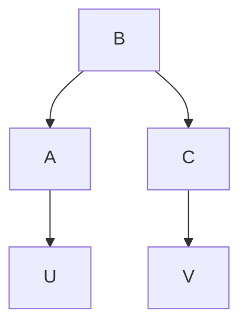


> (iio\*)


> (iiio) (iiio)


> (iiio\*) 图 9.2

请注意，如果我们测量了图 9.3 中的变量，如 W、U、V 和 X，那么相应的部分定向诱导路径图将使我们能够在不进行实验且不使用任何关于变量间因果关系的先验知识的情况下区分 (i)、(ii) 和 (iii)。


> (io)

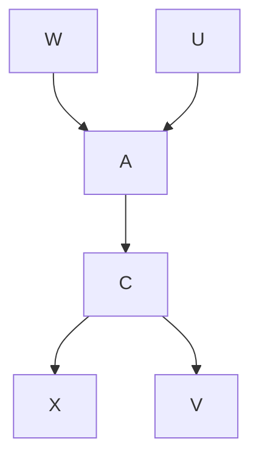


> (io\*\*)

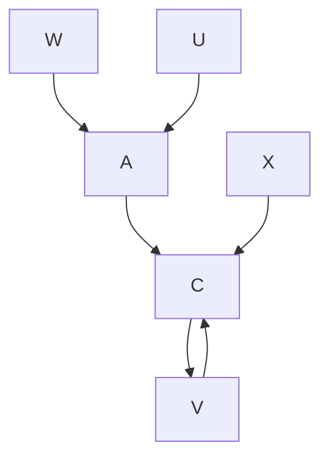


> (iio)(iio)

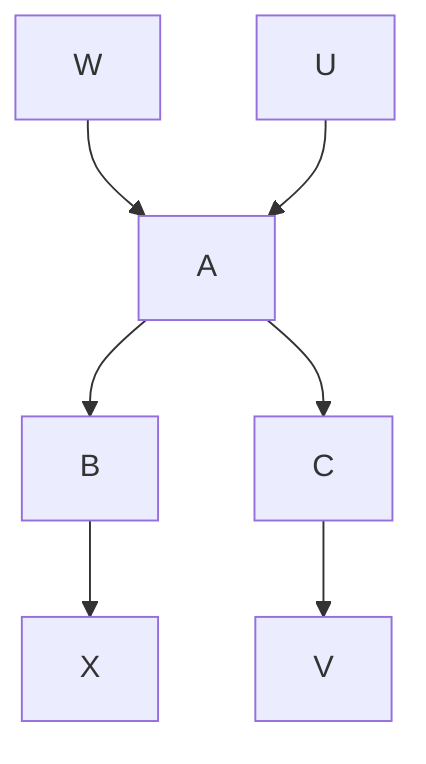


> (iio\*\*)

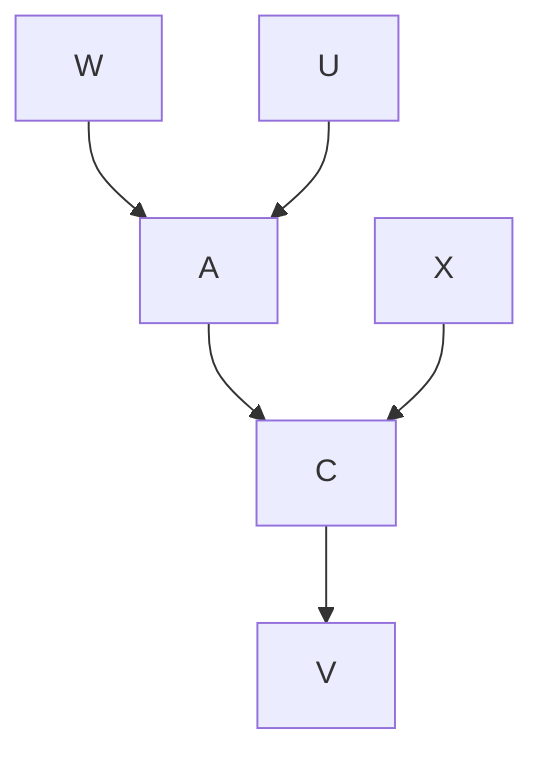


> (iiio\*\*) 图 9.3


现在考虑更复杂的情况，其中可能性为 (i) A 导致 C 并且存在 A 和 C 的潜在共同原因 B，(ii) 存在 A 和 C 的潜在共同原因 B，以及 (iii) C 导致 A 并且存在 A 和 C 的潜在共同原因 B。结构 (i)、(ii) 和 (iii) 中的每一个都可以通过实验操作与其他结构区分开来，在实验中，对于一个系统样本，我们打断进入 A 的边并对 A 施加一个分布，对于另一个样本，我们打断进入 C 的边并对 C 施加一个分布。相应的图呈现在图 9.4 中，并且实验的分析与之前的情况基本相同。


> 图 9.4

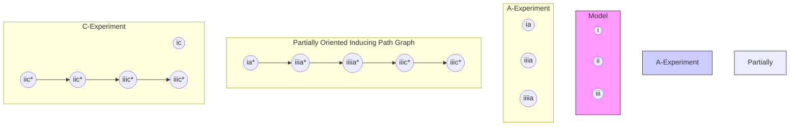

对相应非实验情况的分析更为复杂。假设存在一个变量 U，并且已知 U 导致 A，不存在 U 和 A 的共同原因，并且如果存在任何从 U 到 C 的有向路径，它包含 A；并且存在一个变量 V，已知 V 导致 C，不存在 V 和 A 的共同原因，并且如果存在任何从 V 到 A 的有向路径，它包含 C。有向无环图及其相应的部分定向诱导路径图如图 9.5 所示。现在假设这些有向无环图对于观察到的非实验总体是真实的。我们还能否区分 (i)、(ii) 和 (iii)？

答案再次是肯定的。例如，假设应用 FCI 算法产生了 $( \mathrm { i } 0 ^ { \ast } )$ 。存在 $U _ { \mathrm { \Phi } } { \circ } { \to } \thinspace C$ 边意味着要么存在 U 和 C 的共同原因，要么存在从 U 到 C 的有向路径。根据假设，不存在 U 和 C 的共同原因，所以存在一条从 U 到 C 的有向路径。同样根据假设，所有从 U 到 C 的有向路径都包含 A，所以存在一条从 A 到 C 的有向路径。鉴于部分定向诱导路径图中存在 U 和 C 之间的边，并且基于相同的背景知识，也可以得出存在 A 和 C 的潜在共同原因。（证明有些复杂，我们将其放在本章的附录中。）类似地，如果我们得到 $( \mathrm { i i i o } ^ { * } )$ ，那么我们就知道 C 导致 A 并且存在 A 和 C 的潜在共同原因。如果我们得到 $( \mathrm { i } \mathrm { i } 0 ^ { \ast } )$ ，那么我们就知道 A 和 C 有一个潜在共同原因，但 A 不导致 C，C 也不导致 A。在没有关于特定因果关系的任何先验知识的情况下，也可以区分 (i)、(ii) 和 (iii)，但这需要更复杂的测量变量模式，如图 9.6 所示。如果我们得到 $( \mathrm { i o } ^ { \ast \ast } )$ ，那么在不使用任何关于变量间因果关系的此类先验知识的情况下，我们就知道 A 导致 C 并且存在 A 和 C 的潜在共同原因，对于 $( \mathrm { i } \mathrm { i } 0 ^ { \ast \ast } )$ 和 $( \mathrm { i i i o } ^ { * * } )$ 也是如此。


> (io) (io)

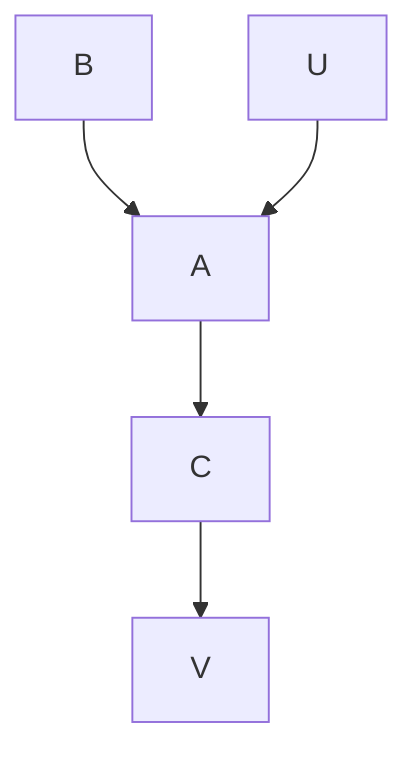


> (io\*)

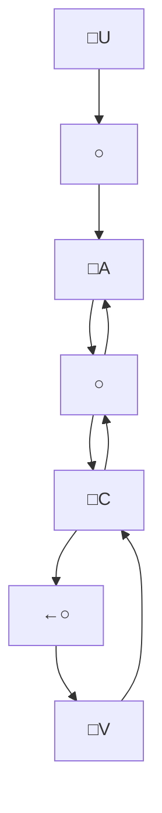


> (iio\*)


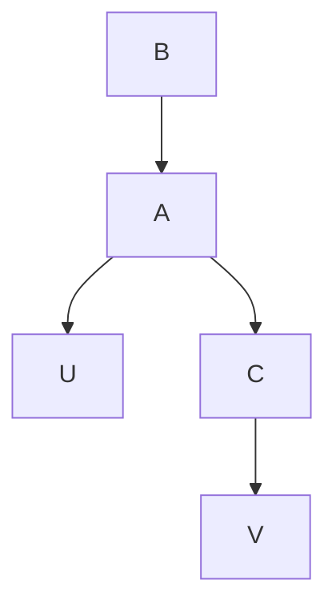


> (iiio\*) 图 9.5

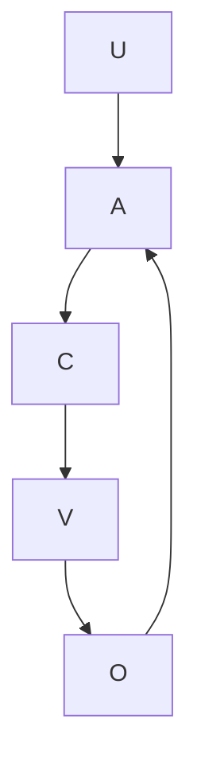

在其中的一种情况下，**实验（experimentation）**相较于**被动观察（passive observation）**具有一个重要优势。通过进行实验，我们可以对操纵 A 在 (i)、(ii) 和 (iii) 中的后果进行**定量预测（quantitative prediction）**。但如果 (i) 是正确的因果模型，我们就无法使用**预测算法（Prediction Algorithm）**来定量预测操纵 A 的效果。（在线性情况下，可以进行预测，因为 U 充当了“**工具变量（instrumental variable）**”。）


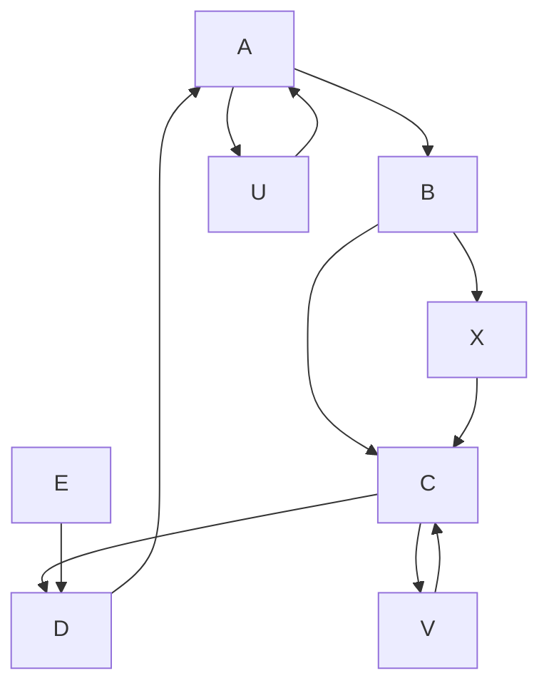


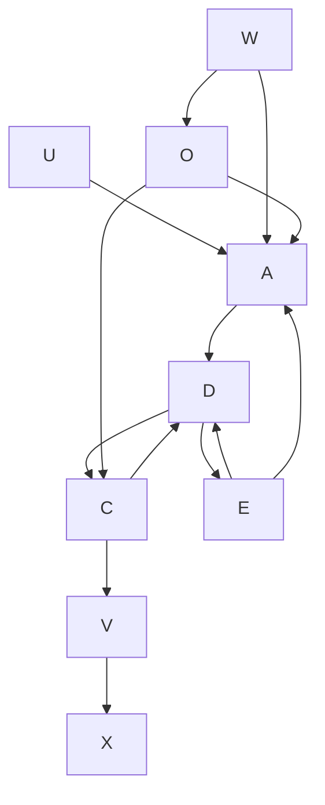


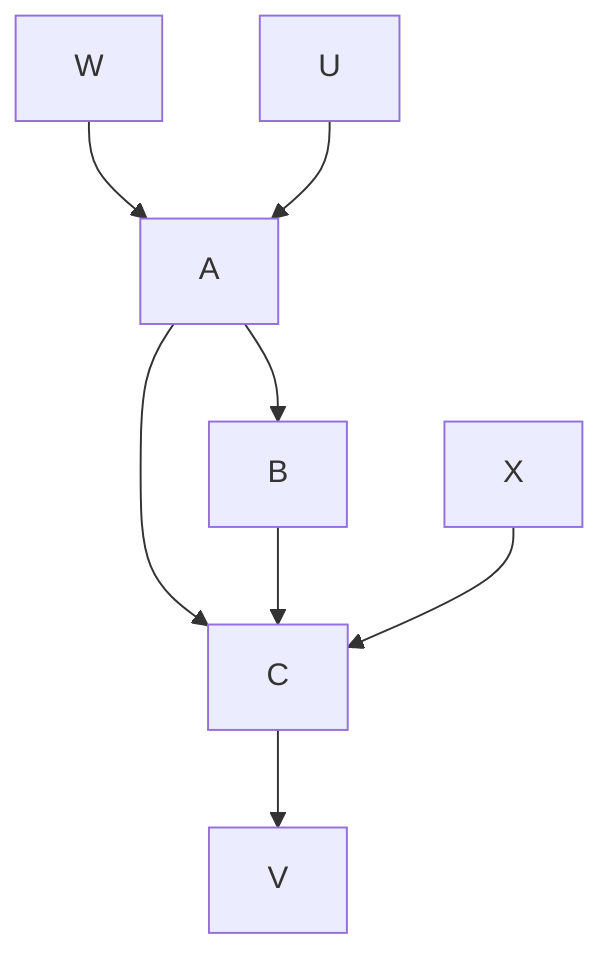


> (iio\*)


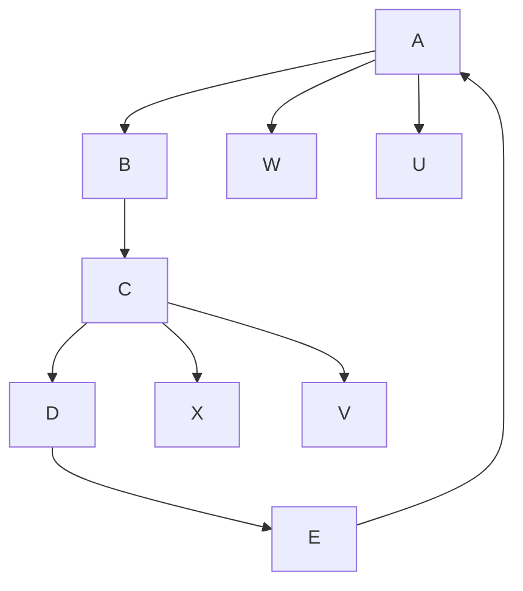


> (iiio\*) 图 9.6

包含节点 A、D、C、V 以及标记组件 W、U、E、X 的系统架构流程图，展示了双向连接和反馈回路。

最后，假设我们想知道是否存在两条从 A 到 C 的**因果通路（causal pathways）**。更具体地说，假设我们想区分图 9.7 中的 (i)、(ii) 和 (iii) 哪种情况成立，再次记住 B 是**未测量的（unmeasured）**。

这个问题非常接近 Blyth 版本的**辛普森悖论（Simpson's paradox）**。通过打破指向 A 的边并对 A 施加一个分布的实验性操纵，我们可以将结构 (i) 和 (iii) 与结构 (ii) 区分开来，但无法将 (i) 和 (iii) 彼此区分。注意，在图 9.7 中，**部分定向诱导路径图（partially oriented inducing path graph）** (ia\*) 与 (iiia\*) 相同，(ic\*) 与 (iiic\*) 相同。


> 图 9.7

```mermaid
graph TD
    subgraph Model
  A1["Model"] --> B1["B"]
  B1 --> A2["A"] --> C1["C"]
  C1 --> A3["(i)"]
  A3 --> B2["B"]
  B2 --> U1["U"] --> A4["A"] --> C2["C"]
  C2 --> A5["ia*"]
  A5 --> A6["A"] --> O1["C"] --> C3["ai*"]
  C3 --> A7["(iic)"]
  A7 --> A8["A"] --> C4["C"] --> V1["V"]
  C4 --> A9["(iic)"]
  A9 --> A10["A"] --> C5["C"] --> V2["V"]
  C5 --> A11["ii*"]
  A11 --> A12["A"] --> C6["C"] --> V3["V"]
  C6 --> A13["iii*"]
  A13 --> A14["A"] --> C7["C"] --> V4["V"]
  C7 --> A15["ivic*"]
    end

    subgraph A_Experiment["A-Experiment"]
  B1 --> B2
  B2 --> U2["U"] --> A3["A"] --> C3["C"]
  C3 --> A4["ia*"]
  A4 --> A5["ai*"]
  A5 --> A6["A"] --> C4["C"] --> V4["V"]
  C4 --> A7["iiia*"]
  A7 --> A8["A"] --> C5["C"] --> V5["V"]
  C5 --> A9["iiiia*"]
  A9 --> A10["A"] --> C6["C"] --> V6["V"]
  C6 --> A11["viia*"]
  A11 --> A12["A"] --> C7["C"] --> V7["V"]
  C7 --> A13["viic*"]
    end

    subgraph Partially Oriented Inducing Path Graph
  B2 --> B3["B"]
  B3 --> U3["U"] --> A4["A"] --> C4["C"]
  C4 --> A5["ia*"]
  A5 --> A6["A"] --> C5["C"] --> V5["V"]
  C5 --> A7["iiic*"]
  A7 --> A8["A"] --> C6["C"] <--_V5["V"]
  C6 --> A9["viic*"]
    end

    subgraph Partially Oriented Inducing Path Graph
  B3 --> B4["B"]
  B4 --> U4["U"] --> A5["A"] <--_C6["C"] <--_V6["V"]
  C6 --> B5["B"] <--_B6["A"] <--_C7["C"] <--_V7["V"]
  B5 --> B7["B"]
  B7 --> U7["U"] <--_C8["A"] <--_C9["C"] <--_V8["V"]
  C8 --> B9["B"] <--_B10["A"] <--_C10["C"] <--_V9["V"]
  B9 --> B10
  B10 --> B11["A"] <--_B12["C"] <--_V10["V"]
  B11 --> B12
  B12 --> B13["A"] <--_B14["C"] <--_V15["V"]
  B13 --> B14
  B14 --> B15["A"] <--_B16["C"] <--_V16["V"]
  B15 --> B16
  B16 --> B17["A"] <--_B18["C"] <--_V17["V"]
  B17 --> B18
  B18 --> B19["A"] <--_B20["C"] <--_V18["V"]
  B19 --> B20
    end
```

再次假设，在一个非实验总体中，已知 U 导致 A，U 和 C 没有共同原因，并且如果存在任何从 U 到 C 的路径，该路径包含 A；V 导致 C，V 和 A 没有共同原因，并且如果存在任何从 V 到 A 的路径，该路径包含 C。**有向无环图（directed acyclic graphs）**及其对应的**部分定向诱导路径图（partially oriented inducing path graphs）**如图 9.8 所示。


> (io) (io)

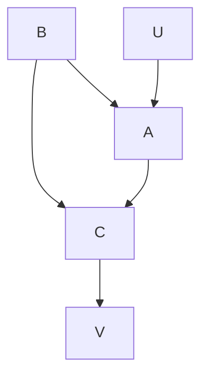


```mermaid
graph TD
  U["∪"] --> O1["o"]
  O1 --> O2["o"]
  O2 --> A["∪"]
  A --> O3["o"]
  O3 --> C["∪"]
  C --> O4["o"]
  O4 --> V["∪"]
  C --> V
    O1 -.-> C
```


```mermaid
graph TD
  B --> A
  B --> C
  A --> U
  C --> V
```


> (iio\*)


```mermaid
graph TD
  U --> A
  A --> C
  C --> V
  B --> A
```


> (iiio\*) 图 9.8

```mermaid
graph LR
  U --> A --> C --> V
```

与受控实验情况不同（在受控实验中 (i) 和 (iii) 无法区分），在非实验情况下它们是可以区分的。假设我们得到 (iiio\*)。根据背景知识，我们知道 U 导致 A，并且根据 $( \mathrm { i i i o } ^ { * } )$，U 和 A 之间的边不与 A 和 C 之间的边发生碰撞。因此，在相应的诱导路径图中存在一条从 A 到 C 的边，并且在相应的有向无环图中存在一条从 A 到 C 的路径。（当然，我们无法判断从 A 到 C 有多少条路径；$( \mathrm { i i i o } ^ { * } )$ 与像 (iiio) 这样的图是兼容的，但在该图中 ${ < A , B , C > }$ 路径不存在。）我们还知道 A 和 C 没有潜在的共同原因，因为 $( \mathrm { i i i o } ^ { * } )$ 与我们的背景知识一起蕴涵了在 A 和 C 之间的诱导路径图中没有指向 A 的路径。另一方面，假设我们得到了 $( \mathrm { i o } ^ { \ast } )$ 。回想一下，背景知识与部分定向诱导路径图一起蕴涵了 A 是 C 的一个原因，并且 A 和 C 存在一个潜在的共同原因。（我们将证明放在本章的附录中。）再次强调，如果测量了更多的变量，即使没有任何关于变量间因果关系的背景知识，也有可能区分这三种情况，如图 9.9 所示。


> (io)

```mermaid
graph TD
  A --> B
  B --> C
  C --> D
  D --> A
  D --> E
  E --> D
  W --> A
  U --> A
  X --> C
  V --> C
```


> (io\*)

```mermaid
graph TD
  U --> A
  W --> A
  A --> D
  D --> C
  E --> C
  C --> V
  X --> C
  V --> C
  A --> O
  O --> W
  D --> O
  O --> V
```


> (iio)

```mermaid
graph TD
  A["A"] --> B["B"]
  B --> C["C"]
  C --> D["X"]
  C --> E["V"]
  F["W"] --> A
  G["U"] --> A
```


> (iio\*)

```mermaid
graph TD
  W --> A
  U --> A
  A --> C
  C --> V
  X --> C
  V --> C
```


> (iiio) (iiio)

```mermaid
graph TD
  W --> A
  U --> A
  A --> C
  B --> C
  C --> V
  X --> C
```


> (iiio\*) 图 9.8

```mermaid
graph TD
  W --> A
  U --> A
  A --> C
  C --> V
  X --> C
  V --> C
```

因此，所有这三种结构都可以在没有实验性操纵或先验知识的情况下被区分。

声称图 9.7 中的结构 (i) 无法通过受控实验与结构 (iii) 区分，但如果该结构被适当地嵌入到一个包含更多测量变量的更大结构中，则可以在没有实验控制的情况下区分，这似乎非同寻常。声称当 A 导致 C 时，受控实验无法区分“A 和 C 还有一个未测量的共同原因”与“A 还有第二个通过 B 起作用的机制”，而有时无实验的观察却可以区分，这违背了常识。但是，在结构 (i) 中，强制对 A 施加一个分布的受控实验性操纵打破了（在实验样本中）A 对 B 的依赖性，因此丢失了对区分这两种结构至关重要的信息。

虽然仅凭受控实验无法区分图 9.7 中的 (i) 和 (iii)，但简单的**观察性研究（observational study）**与**受控实验（controlled experimentation）**相结合却可以区分 (i) 和 (iii)。我们可以从一个 A-实验中确定存在一条从 A 到 C 的路径，因此不存在从 C 到 A 的路径。我们知道，如果 $P(C|A)$ 在操纵 A 下不是不变的，那么 C 和 A 之间存在一条指向 A 的**路径（trek）**。因此，如果非实验总体和 A-实验总体中的 $P(C|A)$ 不同，我们可以得出结论，A 和 C 存在一个共同原因。如果在操纵 A 下 $P(C|A)$ 是不变的，那么我们知道要么 A 和 C 没有共同原因，要么模型的特定参数值“巧合地”产生了这种不变性。通过结合观察性研究和实验性研究的信息，有时可以推断出单独从任何一种研究中都无法推断出的因果关系。这通常以非正式的方式进行。例如，假设在 A-实验和 C-实验中，A 和 C 都是独立的。这表明不存在从 A 到 C 或从 C 到 A 的**有向路径（directed path）**。但这并不能区分“A 和 C 没有共同原因（即 A 和 C 之间根本没有路径）”和“A 和 C 存在一个共同原因”这两种情况。当然，在实践中，这两种模型是通过确定 A 和 C 在非实验总体中是否独立来区分的；假设**忠实性（faithfulness）**，当且仅当 A 与 C 不独立时，A 和 C 之间存在一条路径。

鉴于这些事实，实验程序在识别（区别于测量）因果关系方面的优势需要重新审视。当然，在获取没有缺失值的、充分的非实验随机样本方面存在众所周知的实践困难，但我们关注的是原则性问题。非实验性研究的一个缺点是，为了做出刚刚说明的结构性区分，要么必须事先了解某些测量变量的某些因果关系，要么必须幸运地实际测量到处于正确因果关系中的变量。实验的主要优势在于，我们有时知道如何创造适当的因果关系。实验性研究的另一个优势在于识别混合样本中的因果结构。在实验总体中，操纵变量和被操纵变量之间的因果关系已知对于每个这样处理的系统都是共同的。混合不同的因果结构就像引入了一个**潜变量（latent variable）**，这使得从部分定向诱导路径图中推断其他因果关系变得更加困难。类似的结论也适用于结合实验控制和统计控制的情况。

在我们迄今为止讨论的“受控”实验中，我们假设实验性操纵打破了非实验总体因果图中所有指向 A 的边，并且用于操纵 A 值的变量 U 与 C 没有共同原因。然而，进行一些不满足这些假设但仍能提供信息的实验是可能的。例如，假设图 9.10 的因果图描述了一个非实验总体。


> 图 9.10

```mermaid
graph TD
  B --> U
  B --> C
  U --> A
  A --> C
```

假设在一个我们操纵 A 的实验中，我们对 $P(A|U)$ 强制施加一个分布。在这种情况下，实验总体的因果图与非实验总体的因果图相同，尽管这两个总体的图参数化当然不同。这种实验不会打破指向 A 的边。更一般地，我们假设存在一组用于影响 A 值的变量 U，使得任何不在 U 中的 A 的直接原因 V 仅通过包含 A 作为明确非碰撞点的无向路径连接到某个结果变量 C。（例如，如果 U 是用于固定 A 值的变量的一个真子集，而用于固定 A 值的其他变量仅直接连接到 A，则可能发生这种情况。）这些正是我们为保证给定 U 和 A 时变量 C 分布的**不变性（invariance）** 所需的条件，从而允许使用**预测算法（Prediction Algorithm）**。（关于这种实验的更广泛讨论见第 9.4 节。）通过这种实验，可以区分图 9.7 中的模型 (i) 和模型 (iii)。当然，在相同的背景知识假设下，也可以在 $P(A|U)$ 分布未改变的非实验性研究中区分 (i) 和 (iii)。实际上，通过这种实验，对实验总体和非实验总体进行分析的唯一区别在于所使用的背景知识。

## 9.2 选择变量（Selecting Variables）

变量的选择是推断中目前几乎完全依赖于人类判断的部分。我们已经看到，糟糕的变量选择通常本身不会导致错误的因果结论，但很可能导致信息丢失。将连续变量离散化以及对离散变量使用连续近似都有风险改变关于**条件独立性（conditional independence）** 的统计决策结果。

变量选择中的一个基本的新考虑因素是，在缺乏因果结构先验知识的情况下，旨在测量 A 对 C 或 C 对 A 的影响（如果有的话）的实证研究，应尝试测量至少两个与 A 相关且被认为（如果存在影响）仅通过 A 影响 C 的变量，对于 C 也是如此。正如前一节所说明的，具有这些属性的变量对于判断是 A 导致 C、C 导致 A，还是两者互不因果但存在 A 和 C 的共同原因，提供了特别丰富的信息。

测量每一个可能是 A 和 B 共同原因的变量，并**以所有这些变量为条件（conditioning on）** 的策略是危险的。如果其中一个额外的变量实际上是 B 的一个效应，或者与 A 共享一个共同原因且与 B 共享一个共同原因，那么以该变量为条件将产生 A 和 B 之间的**虚假依赖性（spurious dependency）**。这并不是说，如果认为某些额外变量可能是共同原因就不应该测量它们；但如果测量了它们，应该使用第 5 章和第 6 章的方法进行分析，而不是使用**多元回归（multiple regression）**。

最后，如果要采用像第 5、6 和 7 章所述的方法，我们提出一个显而易见但非比寻常的建议：选择那些有良好**条件独立性检验（conditional independence tests）** 可用的变量。

## 9.3 抽样（Sampling）

我们可以将许多抽样设计视为指定一个属性 S 的程序，该属性可能具有两个或多个值，并且从具有特定 S 值的子总体中抽取一个样本，在该样本中，所抽取的第 $i$ 个单元的值分布与该子总体中所有其他样本位置的值分布独立且同分布。在最简单的情况下，S 可以被视为一个二元变量，其值为 1 表示某个单元具有样本属性，这当然并不意味着该单元出现在任何特定的实际样本中。我们将样本属性 S 与可能应用于样本成员的任何处理区分开来。在根据属性 S 进行抽样时，我们直接获得的信息不是关于一般总体，而是关于总体中具有不同 S 值的各个部分。因此，我们的一般问题涉及：在总体中对 S 的任何值进行条件化时，是否会使描述总体中每个单元因果结构的**因果图（causal graph）** G 中变量的条件概率或条件独立性关系保持不变。也就是说，假设存在一个总体，其中所有单元的因果结构由有向图 G 描述，并且变量值分布为 P，其中 P 忠实于 G。抽样属性 S 必须满足哪些因果和统计约束，才能使得由具有给定 S 值的所有单元组成的子总体能够准确反映 P 中的条件独立性关系（从而反映因果结构 G），以及在什么条件下，此类子总体的条件概率会与 P 中的相同？这些问题的答案涉及许多关于抽样的常见问题，包括回顾性抽样与前瞻性抽样的适当性，以及随机抽样相对于其他抽样安排的适当性。我们不考虑通过对样本中 S 值分布施加各种约束而获得的抽样分布问题。我们的讨论假设 S（可能与 G 中的某个变量相同）不由 G 中任何其他变量的子集决定。

我们在讨论中假设 S 的定义方式使得：如果抽样程序必然排除总体中的任何部分出现在样本中，那么被排除的单元具有相同的 S 值。例如，如果要从身高超过六英尺的人的子总体中抽取样本，那么我们将假设 $S = 0$ 对应身高六英尺或以下的人，S = 1 对应身高超过六英尺的人。

描述感兴趣变量之间关系的因果图 G 可以扩展为包含 S 以及 S 与其他变量实现的任何因果关系的图 G(S)。我们假设存在一个忠实于 G(S) 的分布 P(S)，其关于 S 值求和得到的边缘分布当然是 P。我们假设抽样分布由条件分布 $P(\cdot | S)$ 决定。那么，更精确地说，我们的问题是：这个条件分布何时具有与 P 相同的条件概率和条件独立性关系？此外，我们要求答案必须根据图 G(S) 的性质给出。以下定理是显而易见的，将不予证明。

**定理 9.1（THEOREM 9.1）**：如果 P(S) 忠实于 G(S)，并且 X 和 Y 是 G(S) 中不包含 S 的变量集合，那么当且仅当在 G(S) 中 X d-分离 Y 和 S 时，有 $P(\mathbf{Y} | \mathbf{X}) = P(\mathbf{Y} | \mathbf{X}, S)$。

我们的抽样属性不应是 Y 的直接或间接原因或结果，除非通过被 X 阻断的机制，并且 X 不应是 Y 和抽样属性两者的直接或间接结果。（第二个条款实际上保证了在忠实分布中可以避免**辛普森悖论（Simpson's paradox）**）。该定理本质上是对以下观察的阐述：$P(\mathbf{Y} | \mathbf{X} \cup \mathbf{Z}) = P(\mathbf{Y} | \mathbf{X} \cup \mathbf{Z} \cup \{S\})$ 当且仅当在 P 中 Y 和 S 在条件 $\mathbf{X} \cup \mathbf{Z}$ 下独立。例如，它意味着，如果我们希望从具有 S 属性（例如 S = 1）的单元样本中估计 Y 对 X 的条件概率，我们应该努力确保：

- (i) Y 中的任何 Y 与 S 之间没有直接边，
- (ii) Y 中的任何 Y 与 S 之间不存在不包含 X 中任何 X 的路径（trek），并且
- (iii) 不存在从 Y 中的任何 Y 到 X 中的某个 X 以及从 S 到该 X 的成对有向路径。

图 9.11 说明了根据抽样属性进行估计可能会使 Y 在给定 X 和 Z 下的条件概率估计产生偏差的一些方式。

情况 (i) 和 (iii) 是回顾性设计的典型情况。在情况 (ii) 中，抽样属性会使 $P(Y|X,Z)$ 的估计产生偏差，因为 Y 和样本属性 S 在条件 $\{X,Z\}$ 下是相关的。定理 9.1 在（非常）有限的程度上证明了以下观点：“前瞻性”抽样比“回顾性”抽样更可靠，如果前者指的是根据一个导致或由 Y 引起的属性进行选择的程序（如果产生影响，也只能通过原因 X 产生影响），而后者指的是根据一个仅通过 Y 导致或由 X 引起的属性进行选择的程序。在前瞻性抽样设计中，如果 X 是 S 的唯一直接原因，并且 S 不引起任何变量，那么 $P(Y|X,Z)$ 的估计是无偏的。但情况 (ii) 表明，在某些条件下，前瞻性样本也可能使估计产生偏差。


> (i)

```mermaid
graph TD
  X --> Y
  Z --> Y
  S --> Y
```


> (ii)

```mermaid
graph TD
  S --> X
  S --> Z
  X --> A
  X --> Y
  Z --> B
  A --> Y
  Z --> B
```


> (iii)
> 图 9.11

```mermaid
graph TD
  X --> Y
  Z --> Y
  S --> U
  Y --> U
```

关于随机抽样也应得出类似的结论。像之前一样，假设目标是在分布 P 中估计条件概率 $P(Y|X)$。在从 P 中抽取随机样本时，我们试图根据一个与系统中感兴趣的变量完全无关的属性 S 进行抽样。如果我们成功做到了这一点，那么我们就确保了 S 没有可能使条件概率估计产生偏差的因果联系。当然，即使是随机样本也可能失败，如果被选中参与研究这一属性本身（需要注意的是，这个属性与具有某个特定的 S 值不同）会影响结果，这也是对处理进行盲法处理的部分原因。此外，任何具有相同因果无关性的属性都可以作为抽样的基础；在这方面，随机化并没有什么特别之处，除了人们相信随机的 S 与其他变量在因果上是无关的。

当目标仅仅是确定因果结构，而不是估计分布 P 或 P 中的条件概率时，前瞻性抽样和回顾性抽样之间的不对称性就消失了。

在图 9.11 的模型 (iii)（这是一个回顾性设计的例子）中，对于任何三个不包含 S 的不相交变量集合 A、B 和 C，当且仅当在给定 C ∪ S 时 A 与 B d-分离，则在给定 C 时 A 与 B d-分离。因此，这些在 P 中无法从 S 样本确定条件概率的情况，却是在 P 中可以从 S 样本确定条件独立性（从而确定因果结构）的情况。

定理 9.2 陈述了在什么条件下，整个总体中真实的条件独立性关系集合与具有恒定 S 值的子总体中真实的条件独立性关系集合不同。在定理 9.2 中，令 Z 为 G 中不包含 X 和 Y 的任何变量集合。

**定理 9.2（THEOREM 9.2）**：对于一个忠实于图 G 的联合分布 P，在 P 中，< $X \perp Y | Z$；$X \perp Y | Z \cup \{S\}$ > 中恰好有一个为真，当且仅当在 G 中，< Z d-分离 X, Y；Z ∪ {S} d-分离 X, Y > 中对应的一个且仅该一个成员为真。

虽然定理 9.2 不过是定理 3.3 的重述，但其后果相当复杂。假设在分布 P 中，X 和 Y 在给定 Z 的条件下独立。样本属性 S 何时会使 X 和 Y 看起来在给定 Z 的条件下相关？答案正是当在 P(S) 中，X、Y 在给定 $\mathbf{Z} \cup S$ 的条件下相关时。对于忠实分布，这种情形（P 中条件独立而 P(S) 中条件相关）发生当且仅当存在一条从 X 中的 X 到 Y 中的 Y 的无向路径 U，使得：

- i. U 上的任何非碰撞点（noncollider）都不在 $\mathbf{Z} \cup \{S\}$ 中；
- ii. U 上的每个碰撞点（collider）在 $\mathbf{Z} \cup \{S\}$ 中都有一个后代；
- iii. U 上的某个碰撞点在 Z 中没有后代。

相反的误差涉及 P 中的条件相关和 P(S) 中的条件独立。对于忠实分布，这种情况发生当且仅当存在一条从 X 到 Y 的无向路径 U，使得：

- i. U 上的每个碰撞点在 Z 中都有一个后代；
- ii. U 上的任何非碰撞点都不在 Z 中；

并且 S 是每条此类路径上的一个非碰撞点。同样，从渐近意义上讲，通过随机抽样，或者通过任何与感兴趣变量无关的属性 S，这两种误差都可以避免。

在实验设计中，目标有时是从一个环境总体中抽样，对抽样单元应用一系列处理，然后根据结果推断如果将该处理政策应用于一般总体将会产生的效果。在下一节中，我们将考虑实验设计、政策预测和因果推理之间的一些关系。

## 9.4 实验设计中的伦理问题（Ethical Issues in Experimental Design）

替代疗法的临床试验至少存在两个伦理问题。（1）在试验过程中（甚至在此之前），怀疑可能会增长到近乎确信某些疗法优于其他疗法；将人们分配到被发现有较低疗效的疗法中，或者继续这些疗法，是否符合伦理？（2）在临床试验中，无论是随机化还是其他方式，患者通常被分配到治疗类别；如果患者不是实验设计的一部分，大概他们可以自由选择自己的治疗（也就是说，如果他们能支付得起，或者能说服他们的保险公司支付，他们就可以自由选择）；要求或诱导患者放弃选择是否符合伦理？假设对这两个问题的回答都是否定的。是否存在一些用于临床试验的实验设计，能够避免或减轻这些伦理问题，但仍然允许对从实验对象来源的总体中治疗效果的进行合理预测？

Kadane 和 Sedransk (1980) 描述了一种设计（由 Kadane、Sedransk 和 Seidenfeld 共同提出）以应对第一个问题。他们的设计已用于术后心脏病患者的药物试验及其他应用中。Kadane 和 Seidenfeld (1990) 在解释该设计时所做的推断符合**马尔可夫条件（Markov Condition）**，并且确实源自该条件，这个案例很好地说明了因果推理在实验设计中的作用。此外，结合马尔可夫条件和**忠实性条件（Faithfulness Condition）**，并使用**干预定理（Manipulation Theorem）** 和定理 7.1，可以得出两个新颖的结论：

1.  在一种考虑患者偏好来分配治疗的实验程序中，可以可靠地评估实验中治疗方法的疗效，但除非在特殊情况下，否则通过这种方式获得的知识不能用于预测一般治疗政策的效果。
2.  或许更具实际意义的是，在专家因果知识相对较弱的情况下，另一种设计（其中治疗分配取决于患者偏好）可用于确定实验中的患者自我分配是否会混淆对一般总体中治疗政策结果的预测。当所有影响都是线性时，即使存在混杂，也可以预测治疗政策的效果。

## 9.4.1 卡达内/塞德兰斯克/赛登菲尔德设计（The Kadane/Sedransk/Seidenfeld Design）

在**卡达内/塞德兰斯克/赛登菲尔德实验设计（Kadane/Sedransk/Seidenfeld experimental design）**中（见 Kadane and Seidenfeld 1990 的描述），对于专家小组的每一位成员，需要针对每个治疗方案 $T$ 的结果 $O$，在 $X _ { 1 } . . . X _ { n }$ 的每个取值组合条件下，引出其**信念度（degrees of belief）**。

所引出的判断被用于指定治疗过程模型中参数的某个**先验分布（prior distribution）**。对于每位实验对象，专家小组会收到关于变量 $X _ { 1 } , . . . , X _ { n }$ 的信息。专家们对该患者其他情况一无所知。基于 $X _ { 1 } , . . . , X _ { n }$ 的值，每位专家 $i$ 会向患者推荐一个优先治疗方案 $p _ { i } ( X )$，然后患者被分配到一个治疗方案，该分配由某个规则 $T = h ( X , p _ { 1 } , . . . , p _ { k } )$ 决定，该规则是 $X$ 值以及专家们针对由 $X$ 描述的患者所给出的治疗偏好 $( p _ { 1 } , . . . . p _ { k } )$ 的函数，可能还包含一些随机因素。该规则保证，除非至少有一位专家针对具有该特征组合（profile）的患者推荐了某个治疗方案，否则没有患者会被给予该治疗。该模型确定了，对于每个参数值向量，在 $X$ 和 $T$ 值条件下结果的**似然（likelihood）**。随着患者数据的收集，通过条件化（conditioning）更新参数的先验分布。如果证据达到这样一个阶段，即所有专家都同意，对于具有特征组合 $X$ 的患者，某个治疗方案 $T$ 并非最佳治疗方案，那么对于这类患者，治疗方案 $T$ 将被暂停使用。随着证据的积累，专家们关于似然模型参数值的信念度应当趋于一致。

令 $X _ { j }$ 为第 $j$ 位患者观察到的特征向量，“包括那些用作决定每位患者接受何种治疗基础的变量，可能还包括其他特征”。（为了匹配 Kadane 和 Seidenfeld 的记号，我们不对 $X _ { j }$ 使用粗体。）令 $T _ { j }$ 为分配给患者 $j$ 的治疗方案。令 $O _ { j }$ 为患者 $j$ 的结果。令 $P _ { j } = ( O _ { j } , T _ { j } , X _ { j } , O _ { j - 1 } , T _ { j - 1 } , X _ { j - 1 } , . . . , X _ { 1 } )$ 为截至并包括关于患者 $j$ 已知信息在内的过往证据。令 $\theta$ 为感兴趣的参数向量，这些参数决定了在给定特征 $X _ { j }$ 和治疗方案 $T _ { j }$ 的条件下，患者 $j$ 出现结果 $O _ { j }$ 的概率。例如，一位专家的信念度可以用一个混合线性模型来表示，该模型以外生方差、均值和线性系数为参数。这些参数的唯一值随后“决定”了在给定 $X$ 值条件下结果出现的概率。出于后续将明确的原因，$\theta$ 的定义中至关重要的一点是，参数的不同取值不会导致 $X$ 变量分布的不同设定。

表达式 $f _ { \theta } \ ( P _ { J } )$ 表示，在给定 $\theta$ 的条件下，专家认为总证据为 $P _ { J }$ 的条件信念度。Kadane 和 Seidenfeld 补充道：“作为参数 $\theta$ 的定义的一部分，有

$$
f _ {\theta} (O _ {j} | T _ {j}, X _ {j}, P _ {j - 1}) = f _ {\theta} (O _ {j} | T _ {j}, X _ {j}) \quad (1 \leq j \leq J) \tag {1}
$$

这意味着，$\theta$ 包含了 $P _ { j - 1 }$ 中所有可能有助于根据 $T _ { j }$ 和 $X _ { j }$ 预测 $O _ { j }$ 的信息。$^{\dag}$ 信念度的分解如下：

$$
f _ {\theta} (P _ {J}) = \left[ \prod_ {j = 1} ^ {J} f _ {\theta} (O _ {j} | T _ {j}, X _ {j}, P _ {j - 1}) \right] \left[ \prod_ {j = 1} ^ {J} f _ {\theta} (T _ {j} | X _ {j}, P _ {j - 1}) \right] \left[ \prod_ {j = 1} ^ {J} f _ {\theta} (X _ {j} | P _ {j - 1}) \right]
$$

这是根据条件概率的定义得出的。各项分别标记为 1、2 和 3。Kadane 和 Seidenfeld 声称，如果人们相信实验中早期对象的特征、治疗和结果对随后成为对象的“那类人”没有影响，那么第 3 项不依赖于 $\theta$。（回想一下，与 $X _ { 1 } . . . X _ { n }$ 分布相关的参数不包括在 $\theta$ 中。）Kadane 和 Seidenfeld 还指出，第 2 项不依赖于 $\theta$，因为存在一个固定的治疗分配规则，该规则是 $X$ 值和实验结果的函数。

由 (1) 可得：

$$
\prod_ {j = 1} ^ {J} f _ {\theta} (O _ {j} | T _ {j}, X _ {j}, P _ {j - 1}) = \prod_ {j = 1} ^ {J} f _ {\theta} (O _ {j} | T _ {j}, X _ {j})
$$

Kadane 和 Seidenfeld 指出，由该项给出的比例关系：

$$
f _ {\theta} (P _ {J}) \propto \prod_ {j = 1} ^ {J} f _ {\theta} (O _ {j} | T _ {j}, X _ {j})
$$

“是我们用来评估此类临床试验结果的形式。” 也就是说，对于 $\theta$ 的每个值 $\theta _ { i }$，将 $f _ { \theta _ { i } } ( P _ { J } )$ 乘以 $\theta _ { i }$ 的先验密度，得到一个与 $\theta _ { i }$ 的后验密度成比例的量。因此，可以求出 $\theta _ { i }$ 两个值的后验密度之比。

现在，对于一个新的案例，$\theta$ 的每个值在给定 $X$ 特征组合和治疗方案 $T$ 的条件下，决定了治疗结果的概率，因此 $\theta$ 的后验分布为任何一位专家提供了对各种治疗方案在不同类别患者中结果的信念度。尽管 Kadane 和 Seidenfeld 没有明确提及预测治疗政策的效果，但如果结果以某种方式量化，这些信念度可以转化为期望值。无论如何，一位最初认为由 $T = k ( X )$ 给出的治疗规则最常导致成功结果的专家，可能会转而预测另一个不同的治疗规则，比如 $T = g ( X )$，将更常获得成功。

为什么实验不能让受试者简单地自行选择治疗方案，并寻求他们想要的任何建议呢？Kadane 和 Seidenfeld 给出了两个原因。其一，如果患者自行决定治疗方案，那么分解式中第 2 项不依赖于 $\theta$ 的论点将不再成立。其二，“现在有必要从统计上解释患者选择治疗方案的行为，并且这些选择与治疗效果本身之间很可能存在混杂（contamination）。” 我们将在下一小节中考虑这些论点的说服力。

## 9.4.2 实验设计中的因果推理

专家们究竟相信什么，才能证明这种实验分析或任何预测的推导是合理的呢？专家当然会考虑这样一种可能性：一些未知的共同原因 $U$ 可能同时影响患者的 $X$ 特征和患者的治疗结果。然而，该分析假定，在专家的信念度中，治疗方案在给定 $X$ 值的条件下独立于任何此类 $U$。这隐含在分解式中第 2 项独立于 $\theta$ 的主张中。为什么治疗方案 $T$ 和未知原因 $U$ 在给定 $X$ 的条件下是条件独立的呢？原因很清楚，因为在实验中，影响患者接受何种治疗方案的唯一因素是患者的 $X$ 值和 $P _ { j - 1 }$；任何此类 $U$（如果存在的话）除了通过 $X$ 之外，对 $T$ 没有影响。一个因果事实是概率独立性的基础。

专家对实验设置理解的各个方面如图 9.12 所示（其中我们将 $X _ { j }$ 简化为单个变量）。


> 图 9.12

```mermaid
graph TD
  Uj["Uj"] -->|?| Xj["Xj"]
  Uj -->|?| Oj["Oj"]
  Pj-1["Pj-1"] --> Xj
  Xj -->|?| Oj
  Tj["Tj"] --> Xj
  Tj --> Oj
```

专家可能完全不确定带有“?”的边是否对应真实的影响，但她确信不存在图 9.13 中粗体所示的那种影响。

实验设计使得治疗分配仅作为 $X$ 变量和 $P _ { j - 1 }$ 的函数，其目的就是为了排除此类影响。专家的想法似乎是，如果 $U$ 仅通过 $X$ 影响 $T$，那么 $U$ 和 $T$ 在给定 $X$ 的条件下是独立的。这个想法是**马尔可夫条件（Markov Condition）**的一个实例。马尔可夫条件中的概率可以从客观角度或主观角度来理解。但是，在卡达内/塞德兰斯克/赛登菲尔德设计中，马尔可夫条件中的概率不能是专家的无条件信念度，因为这些概率是条件于 $\theta$ 的分布的混合，而满足马尔可夫条件的分布的混合并不总是满足马尔可夫条件。我们将假定条件于 $\theta$ 的分布满足该条件。


> 图 9.13

```mermaid
graph TD
  Uj["U_j"] -->|?| Xj["X_j"]
  Uj -->|?| Oj["O_j"]
  Pj_minus_1["P_{j-1}"] --> Xj
  Pj_minus_1 --> Tj["T_j"]
  Xj -->|?| Oj
  Tj --> Oj
  Oj --> Out
```

考虑理想化专家信念的另一个特征。在 Kadane 和 Seidenfeld 的实验中，一位理想化的专家会改变其对于一个参数的**概率分布（probability distribution）**，该参数的值指定了实验过程的模型。在实验结束时，专家不仅对具有特征组合 $X$ 的新患者如果按照实验中使用的规则 $T = h ( X , P _ { j - 1 } )$ 分配治疗方案时的预期结果有看法，而且对具有特征组合 $X$ 的新患者如果按照专家现在根据证据偏好的规则 $T = g ( X )$ 分配治疗方案时的预期结果也有看法。原则上，如果新患者接受实验规则 $T = h ( X , P _ { j - 1 } )$ 的治疗，专家对结果的概率计算起来很容易，因为该概率对于 $\theta$ 的每个值都是确定的，而且我们知道专家关于 $\theta$ 的后验分布。但是，如果具有特征组合 $X$ 的患者现在按照偏好的规则 $T = g ( X )$ 进行治疗，又是什么决定了专家对结果的概率呢？为什么改变规则不会改变 $O$ 对 $X$ 和 $T$ 的依赖性？Kadane 和 Seidenfeld 分析中隐含的合理答案是，任何患者的结果取决于患者的 $X$ 特征组合和给予患者的治疗方案，而不取决于分配治疗方案的“规则”。改变分配规则会改变在给定特征组合 $X$ 条件下治疗方案 $T$ 的概率，但不会影响其他相关的条件概率；在给定 $T$ 和 $X$ 条件下 $O$ 的概率保持不变。我们可以通过以下方式更正式地推导出这一点。

如果对于 $\theta$ 的固定值，分布 $f _ { \theta } ( O _ { j } , T _ { j } , X _ { j } , P _ { j - 1 } )$ 满足图 9.12 类型图的马尔可夫条件，那么定理 7.1 必然推出 $f _ { \theta } ( O _ { j } | T _ { j } , X _ { j } )$ 在对 $T _ { j }$ 进行**操纵（manipulation）**下是不变的。根据定理 7.1，在满足图 9.12 类型图马尔可夫条件的分布中，如果不存在将 $O _ { j }$ 和 $X _ { j }$ 在给定 $T _ { j }$ 条件下 d-连接（d-connects）且指向 $T _ { j }$ 的路径，那么 $f _ { \theta } ( O _ { j } | T _ { j } , X _ { j } )$ 在对 $T _ { j }$ 进行操纵下是不变的。$T _ { j }$ 和 $O _ { j }$ 之间每条包含某个 $X _ { j }$ 变量的无向路径都满足此条件，因为 $X _ { j }$ 中的某个成员在这条路径上是非碰撞子（noncollider）。$T _ { j }$ 和 $O _ { j }$ 之间不存在包含 $P _ { j - 1 }$ 的无向路径。因此，$f _ { \theta } ( O _ { j } | T _ { j } , X _ { j } )$ 在对 $T _ { j }$ 进行操纵下是不变的。

但是，在根据 Kadane/Sedransk/Seidenfeld 规范设计的实验中，当 $f _ { \theta } ~ ( O _ { j } , T _ { j } , X _ { j } , P _ { j - 1 } )$ 不表示频率而是表示专家的意见时，马尔可夫条件是否合理地适用？我们关注的是实验结束时的情形，并且我们假设专家的信念度已经收敛到其极限。专家不确定是否存在 $X$ 和结果的共同原因，或者有多少个，但她所考虑的所有因果结构都类似于图 9.12，没有一个类似于图 9.13。我们假设，在条件于 $\theta$ 和任何特定因果假设的情况下，马尔可夫条件得到满足，但专家的实际信念度是不同因果结构的某种混合。当专家对于给定 $\theta$ 值的分布是几种不同因果假设的混合时，$f _ { \theta } ( O _ { j } | T _ { j } , X _ { j } )$ 在专家看来是否应该在对 $T _ { j }$ 的操纵下保持不变？答案是肯定的，如下论证所示。

让我们称实验（在第 7 章意义上未受操纵的）总体为 $E x p$，以及基于实验结果接受某种政策的假设总体为 $Pol$。令 $f _ { \theta , { E x p } } ( O _ { j } , T _ { j } , X _ { j } , P _ { j - 1 } )$ 表示在实验总体中，条件于 $\theta$ 时专家关于 $O _ { j }$、$T _ { j }$、$X _ { j }$ 和 $P _ { j - 1 }$ 的信念度，而 $f _ { \theta , P o l } ( O _ { j } , T _ { j } , X _ { j } , P _ { j - 1 } )$ 表示在受政策影响的假设总体中，条件于 $\theta$ 时专家关于 $O _ { j }$、$T _ { j }$、$X _ { j }$ 和 $P _ { j - 1 }$ 的信念度。令 $CS$ 为一个表示因果结构的随机变量。我们已经注意到，由定理 7.1 可得：

$$
f _ {\theta , E x p} (O _ {j} | T _ {j}, X _ {j}, C S) = f _ {\theta , P o l} (O _ {j} | T _ {j}, X _ {j}, C S)
$$

因为 $\theta$ 决定了 $O _ { j }$ 在条件于 $T _ { j }$ 和 $X _ { j }$ 时的密度，所以有：

$$
f _ {\theta , E x p} (O _ {j} | T _ {j}, X _ {j}, C S) = f _ {\theta , E x p} (O _ {j} | T _ {j}, X _ {j})
$$

$$
f _ {\theta , P o l} (O _ {j} | T _ {j}, X _ {j}, C S) = f _ {\theta , P o l} (O _ {j} | T _ {j}, X _ {j})
$$

因此，

$$
f _ {\theta , E x p} (O _ {j} | T _ {j}, X _ {j}) = f _ {\theta , P o l} (O _ {j} | T _ {j}, X _ {j})
$$

接下来考虑 Kadane 和 Seidenfeld 提出的“偏倚（bias）”问题。这个概念本身就要求我们不仅要考虑信念度，还要考虑一些事实和一些潜在事实。我们假设似然模型中的参数确实存在一个正确的（或接近正确的）值，并且真实值描述了实验过程中所发生过程的特征。我们假设专家收敛于真理，因此她的后验分布集中在真实值附近。资助这些实验的公众关心的是专家关于最佳治疗方案的看法是否正确：实施专家偏好的治疗规则（例如 $T = g ( X )$）是否会导致比正在考虑的其他替代政策更好的结果？审视这个问题的一种方法是询问专家关于条件于 $X$ 特征组合和治疗的期望结果是否大致等于这些条件下总体的结果均值。如果信念度与总体分布一致，那么问题就变成了：如果总体中每个相关个体都根据实验分配规则 $T = h ( X , P _ { j - 1 } )$ 进行治疗，那么条件于 $T$ 和 $X$ 的 $O$ 频率，与如果使用修订后的规则 $T = g ( X )$ 分配治疗时一般总体中条件于 $T$ 和 $X$ 的 $O$ 频率，是否大致相同？换句话说：条件于 $T$ 和 $X$ 的 $O$ 频率在对 $T$ 的直接操纵下是否保持不变？

正如我们刚才针对这种情况所看到的，马尔可夫条件和定理 7.1 必然推出，对于图 9.12 及其所有类似图（其中每条起点为 $O _ { j }$ 和 $T _ { j }$ 共同原因的路径都包含一个 $X _ { j }$ 变量，$O _ { j }$ 不导致 $T _ { j }$，并且 $X _ { j }$ 变量和 $T _ { j }$ 的每个共同原因都是一个 $X _ { j }$ 变量），$O _ { j }$ 在 $T _ { j }$ 和 $X _ { j }$ 上的概率在对 $T _ { j }$ 的直接操纵下是不变的。不需要其他假设。这个例子是条件概率在直接操纵下不变的一般充分条件的一个非常特殊的情况。

接下来考虑为什么实验设计禁止治疗分配直接依赖于患者的“未记录”特征，例如 $Y$。假设允许这种分配；Kadane 和 Seidenfeld 说结果可能会被“污染”，我们理解这意味着患者偏好（因此也是 $T _ { j }$）的一些未记录原因也可能成为 $O _ { j }$ 的原因。因此我们得到图 9.14 中的因果图。

问号表示我们（或专家）不确定相应的因果影响是否存在。假设从 $U _ { j }$ 到 $Y$ 以及从 $U _ { j }$ 到 $O _ { j }$ 的有向边存在。那么 $O _ { j }$ 和 $T _ { j }$ 之间就存在一条包含 $Y$ 的无向路径。在这种情况下，马尔可夫条件必然推出，$O _ { j }$ 条件于 $T _ { j }$ 和 $X _ { j }$ 变量的概率在对 $T _ { j }$ 的直接操纵下并不是不变的，除非参数值非常“巧合”。因此，如果允许未记录的 $Y$ 值影响分配，那么就我们和专家所知，专家对其提出的规则 $T = g ( X )$ 效果的预测将是错误的。


> 图 9.14

```mermaid
graph TD
  Y --> node["?"] --> Uj
  Y --> node --> Xj
  Xj --> node --> Oj
  Xj --> node --> Tj
  Tj --> node --> Oj
  Pj1["Pj-1"] --> node --> Xj
  node --> Uj
  node --> Oj
```

现在让我们回到为什么不能利用患者偏好来影响治疗的问题。在实验中不能使用患者偏好来决定治疗分配的原因，并不仅仅是因为就人们所知，患者偏好和治疗结果之间可能存在因果交互作用。诚然，如果知道不存在这种混杂，那么患者偏好就可以用于治疗分配，但为什么即使存在混杂也不能使用这种分配呢？为了使治疗分配依赖于患者偏好（并且可能还依赖于其他特征，例如 $X _ { j }$ 变量），必须确定患者的偏好。如果偏好已知，为什么不像我们条件化结果于 $T$ 和 $X _ { j }$ 变量那样，将结果条件化于偏好、$T$ 和 $X _ { j }$ 变量呢？$O _ { j }$ 条件于偏好、$X _ { j }$ 变量和 $T _ { j }$ 的概率，与 $O _ { j }$ 条件于 $X _ { j }$ 变量和 $T _ { j }$ 的概率相比，在形式上没有不同的作用。如果在图 9.14 中我们令 $Y = P r e f e r e n c e$（偏好），那么根据马尔可夫条件和定理 7.1，$O _ { j }$ 条件于 $T _ { j }$、$X _ { j }$ 和偏好的概率在对 $T _ { j }$ 的操纵下是不变的。当然，在允许患者偏好影响治疗分配的实验过程中，必须采取一些预防措施。除非选择是知情的，否则允许患者选择他或她的治疗方案意义不大。在实验环境中，有必要标准化每位患者收到的信息和建议。

这种设计真的可以用来预测治疗政策的效果吗？在研究结束时，专家得到了一个给定 $T$、$X$ 和偏好条件下的结果密度函数；后续患者的治疗偏好必须被记录下来（但不一定用于决定治疗）。如果公布的研究结果改变了偏好，那么条件于偏好、$X$ 和 $T$ 的结果概率取决于图 9.12 中与 $U$ 相邻的边所代表的影响是否存在。但是，如果患者被告知实验结果，我们在许多情况下必然预期他们的偏好会改变，也就是说，公布实验结果是对偏好的直接操纵。只有当实验结果保密时，才能做出可靠的预测！

因此，不能使用患者偏好来分配治疗的原因，并不仅仅是因为他们的偏好可能与治疗结果有复杂的交互作用——$X$ 变量也可能如此。任何不考虑政策如何改变实验研究中与结果相关的变量的分析，都无法完整说明何时可以依赖预测。正如 Kadane 所指出的，¹ 实验总体中偏好的原因与非实验总体中偏好的原因不同，这比实验总体中 $X$ 的原因与非实验总体中 $X$ 的原因不同的可能性更大。在我们考虑的情况下，公布使用患者偏好分配治疗的政策实验结果（或建议）通常可以预期会直接改变这些偏好本身——而使用 $X$ 变量分配治疗的政策通常不会改变总体中人群的 $X$ 变量值。（当然，可能存在这样的情况，一项不基于患者偏好进行治疗的研究的结果也会直接操纵 $X$ 变量的分布，在这种情况下，条件于治疗和 $X$ 变量的结果预测也将不可靠。例如，假设在将治疗分配作为胆固醇水平函数的实验试验中，发现某种药物对低胆固醇受试者的癌症非常有效。）

因此，卡达内/塞德兰斯克/赛登菲尔德设计揭示了一个传统方法论对非随机试验的偏见所掩盖的伦理难题。一方面有义务找到最有效和最具成本效益的治疗方法，另一方面有义务在治疗中考虑参与临床试验的受试者的偏好。两者都可以满足。但是，还有义务充分告知患者影响其治疗决策的相关科学结果。这项义务与前两者不相容。

## 9.4.3 迈向伦理试验（Toward Ethical Trials）

最后，我们可以利用因果分析，在实验试验中关于患者治疗选择方面获得一些更乐观的结果。假设在一个实验中，治疗分配是一个函数 $T = h ( X _ { j } , P r e f e r e n c e , P _ { j - 1 } )$ ，并且**偏好（Preference）**与 $O _ { j }$ 之间的每一条无向路径都包含 $X _ { j }$ 中的某个成员作为非碰撞点（noncollider）。（如果是这种情况，那么我们将说偏好与 O 无混杂（not confounded）。）那么，可以严格地证明，作为**马尔可夫条件（Markov Condition）**和**忠实性条件（Faithfulness Condition）**的一个推论，给定 $T _ { j }$ 和 $X _ { j }$ 时 $O _ { j }$ 的概率在直接操纵 $T _ { j }$ 下是不变的；我们可能会或可能不会以偏好为条件，或者在政策中使用的治疗规则中考虑偏好，并且在这种情况下，公布的实验结果是否改变了偏好的分布与预测的准确性无关。现在，在某些情况下，患者的偏好很可能与治疗结果无混杂。如果研究者实际上能够发现偏好与 $O$ 无混杂，那么他们就可以让这些偏好在实验方案的治疗分配和推荐政策中都成为一个因素。**卡达内（Kadane）**和**赛登菲尔德（Seidenfeld）**认为，这种依赖关系（如果存在的话）是无法检测的。如果专家们完全不知道哪些因素不影响治疗结果，那么卡达内和赛登菲尔德是正确的；但如果专家们知道一些随患者变化、除了通过治疗外对结果没有影响、并且与结果没有共同原因的变量，那么我们就不同意他们的观点。这个变量可以是患者上一个生日时的月相，可以是患者母亲出生那天太阳和木星在天球上的角距，或者仅仅是分配给每个患者的某个随机化设备的输出。这是为什么呢？

在任何忠实于图 9.15 的分布中，给定 B 时，E 和 C 是条件依赖的。在线性模型中，这种关系是必然的，无需假设忠实性。


> 图 9.15（Figure 9.15）

```mermaid
graph TD
  D --> E
    D <--> A
  A --> B
  C --> B
```

现在，回到我们的问题，让 $Z$ 是任何随患者变化的特征，并且专家们一致认为它与患者对治疗的偏好独立，并且仅通过治疗影响结果。在实验中采用一条规则，使治疗成为偏好、患者的 X 概况（profile）、$P _ { j - 1 }$ 以及患者的 $Z$ 值的函数。那么，专家对实验中因果过程的看法大致如图 9.16 所示。

如果给定 $T _ { j }$ 和 $X _ { j }$ 时 $O _ { j }$ 和 $Z _ { j }$ 是独立的，那么（假设忠实性）就不存在给定 $X _ { j }$ 时连接 Preferencej 和 $O _ { j }$ 且进入 Preferencej 的 d-连接路径（d-connecting path）。偏好j 和 $O _ { j }$ 之间的混杂关系（如果存在）可以从实验数据中发现。（类似地，如果由于实验人群由因果结构的混合体组成，给定 $X _ { j }$ 时 $T _ { j }$ 和 $O _ { j }$ 是依赖的，那么除非某组特定的参数值产生了“巧合的”独立性，否则给定 $T _ { j }$ 和 $X _ { j }$ 时 $O _ { j }$ 和 $Z _ { j }$ 是条件依赖的。）实际上，基于一个相当大胆的假设，即所有依赖关系都是线性的，$Z _ { j }$ 是一个**工具变量（instrumental variable）**（Bowden and Turkington 1984），并且代表 $T$ 对 $o$ 和 X 条件影响的线性系数可以从相关性和偏相关性中计算出来。


> 图 9.16（Figure 9.16）

```mermaid
graph TD
  A["Preference_j"] -->|?| B["U_j"]
  A --> C["P_{j-1}"]
  A --> D["T_j"]
  B -->|?| E["X_j"]
  C --> D
  D -->|?| F["O_j"]
  E --> F
  F --> G["Z_j"]
  G --> D
  D --> H["Z_j"]
  H --> F
```

这表明，进行一项**试点研究（pilot study）**来确定偏好是否与实验人群中的 O 相混杂是可能的。在试点研究中，偏好可以是影响 T 的因素，但不完全决定 T。如果试点研究的结果表明偏好与实验人群中的 O 无混杂，那么可以进行一项更大的研究，其中偏好完全决定 T；否则，可以采用卡达内/塞德兰斯克（Sedransk）/赛登菲尔德的设计。

医学实验的目标可能是在一个采用不咨询患者偏好而分配治疗政策的人群中预测结果。例如，问题可能是“如果仅使用氟烷作为全身麻醉剂，死亡率会是多少？”在这种情况下，患者偏好与分配的治疗几乎没有关系。如果在政策人群中不使用患者偏好来分配治疗，那么就没有理由认为基于患者选择（或至少影响）其治疗且偏好与 O 无混杂的实验来预测政策人群中的 P(O|X,T) 会不准确。

然而，实验的目标可能是在政策人群中预测 P(O|X,T)，并让患者选择或至少影响他们接受的治疗方案。例如，在保乳手术和乳房切除术之间选择时，患者偏好可能是决定性因素。在这种情况下，有许多理由质疑基于我们提出的设计对政策人群中 P(O|X,T) 预测的准确性。但在这种情况下，无论患者在实验治疗中是否自我分配，每一种设计都面临同样的困难。这些同样是质疑基于卡达内/塞德兰斯克/赛登菲尔德设计或经典随机化设计对政策人群中 P(O|X,T)（解释为频率或倾向性，而非信念程度）预测准确性的充分理由。根本问题在于，实验人群中偏好与其他变量之间的因果关系，与政策人群中的因果关系可能存在许多合理的方式而有所不同²。例如，在实验人群中，治疗分配将不依赖于患者的收入。

然而，在真实人群中，治疗方案的选择很可能依赖于收入。可能存在一条连接收入和结果的共同因果路径，该路径不包含患者 X 概况中的任何变量。同样，在实验人群中，患者获得的信息和建议可以被标准化。我们也可以尝试确保给出的建议仅是患者 X 概况的函数。然而，在政策人群中，患者获得的建议和信息无法以这种方式控制。如果是这种情况，偏好的决定可能是政策人群中不同因果结构的混合体。最后，政策人群中患者偏好的决定可能很容易不稳定。患者中存在一时的风尚和潮流，医生中也存在。可能会有新信息发布，或者进行密集的广告宣传。这些中的任何一个都可能在偏好和 $O$ 之间，进而在 T 和 O 之间，创建一条不包含 X 概况中任何成员作为非碰撞点的**跋涉（trek）**。

因此，即使在实验人群中偏好和 O 无混杂，它们在政策人群中也很可能有混杂。如果它们在政策人群中有混杂，那么 P(O|X,T) 在实验人群和政策人群中就不会相同（除非不同因果结构的参数巧合地具有使它们相等的值）。请注意，基于卡达内/塞德兰斯克/赛登菲尔德设计对 P(O|X,T) 的预测，或者基于随机化实验对 P(O|T) 的预测，情况也是如此。这并不意味着在政策人群中患者偏好将被用来影响治疗的情况下无法做出有用的预测。仍然有可能告知患者，如果在没有患者选择的情况下给予特定治疗，P(O|X,T) 会是什么。患者可以利用这些信息来帮助做出知情决定。并且，通过我们提出的设计，只要实验人群中偏好和 $o$ 无混杂，这个**反事实（counterfactual）**预测就是准确的，无论偏好与政策人群中的 O 在因果上如何关联。

那么，假设我们只是试图预测一个每个人都被分配了治疗的人群中的 P(O|X,T)。我们建议的设计是否实用？一个潜在的问题是，有义务向作为实验对象的患者提供关于其治疗的建议和信息；如果不这样做，实验就是不道德的。如果患者能够获得医生的建议，那么该建议很可能基于他们的 X 概况。即使受试者收到的唯一信息是所有专家都同意他们不应该选择治疗 $T _ { 1 }$ ，他们的 X 概况也是其偏好的一个原因。提供这种建议和信息是否会使 P(O|X,T) 在操纵 T 下不变的可能性变小？确实，X 概况中的变量被选为被认为是 $o$ 的原因或与 O 有共同原因的变量。因此，这类建议很可能在实验人群中创造出偏好和 O 的共同原因。因此，在实验人群中，很可能存在一条进入 T 且包含偏好的 T 和 O 之间的跋涉。然而，这样的跋涉不会在给定 X 的情况下 d-连接 T 和 O，因为它也会包含 X 的某个成员作为非碰撞点。（见图 9.17。）因此，这样的跋涉不会使 $P ( O | X , T )$ 在操纵 T 下的不变性失效。此外，随着实验的进行改变建议也没有问题，前提是假设 $P _ { j - I }$ 仅通过 Preferencej 与 $O _ { j }$ 有因果联系。


> 图 9.17（Figure 9.17）

```mermaid
graph TD
  A["P_{j-1}"] --> B["Preference_j"]
  B --> C["X_j"]
  B --> D["T_j"]
  C --> E["O_j"]
  D --> E
  E --> F["..."]
```

我们可以让患者选择他们自己的治疗，还是仅仅影响治疗的选择？只要我们只是试图预测一个人人都被分配了治疗的人群中的 $P ( O | X , T )$ ，我们就可以让患者选择他们自己的治疗，只要这不会导致具有特定 X 概况的所有患者总是未能选择某种治疗 $T _ { 1 }$ 。在这种情况下，$P ( O | X , T \ = \ T _ { 1 } )$ 在实验人群中是未定义的，因此不能用于预测该量被定义的人群中的 $P ( O | X , T = T _ { 1 } )$ 。

总之，只要目标是预测一个人人都被分配了治疗的人群中的 P(O|X,T)，并且患者中治疗选择有足够的变异性，并且实验人群不是因果结构的混合体，并且实验人群中偏好和 O 无混杂（这是一个必须凭经验决定的问题），那么就有可能从一个知情的患者选择自己治疗的实验人群做出准确的预测。如果在实验中让患者偏好影响他们的治疗确实很重要，那么如果有可能在保证可靠预测的前提下实现这一条件，那么值得冒一些代价来实现这一条件。这个代价值多少，无论是在金钱方面还是在预测可靠性置信度的降低方面，都不是我们能够决定的。但是，对卡达内/塞德兰斯克/赛登菲尔德设计进行一个简单的修改——即初始试验将治疗分配基于 $X _ { j } , P _ { j - 1 } , Z _ { j } ,$ 和 $P r e f e r e n c e _ { j }$ ，然后如果发现 Preferencej 和 $O _ { j }$ 无混杂，则允许患者自我分配——在某些情况下将允许研究者进行符合**自主权（autonomy）**和**知情同意（informed consent）**伦理要求的临床试验。

## 9.5 示例：吸烟与肺癌（An Example: Smoking and Lung Cancer）

关于吸烟与肺癌的辩论史引人入胜，它既说明了从政策研究中进行因果推断和预测的困难，也揭示了一些常见的错误。或许没有其他假设的因果关系曾通过非实验方法得到如此透彻的研究，也没有其他问题曾如此清晰地将医学界和统计界划分为对立的阵营。本章及前一章的理论结果，为我们理解这场争论的逻辑与谬误提供了一些洞见。

简要情况如下：20 世纪 50 年代，**多尔（Doll）** 和 **希尔（Hill）** (1952) 的一项回顾性研究发现，吸烟与肺癌之间存在强相关性。这项初步研究促使了美国、英国以及不久后其他国家的许多其他研究，包括回顾性和前瞻性研究。所有这些研究都发现了吸烟与肺癌之间的强相关性，更普遍地，也发现了吸烟与癌症、吸烟与死亡率之间的强相关性。这些相关性促使健康活动家和部分医学媒体得出结论：吸烟会导致死亡、癌症，尤其是肺癌。**罗纳德·费希尔爵士（Sir Ronald Fisher）** 强烈反对这一推断，他更倾向于认为吸烟行为和肺癌仅通过遗传学产生因果联系。费希尔撰写了信件、文章，并最终出版了一本书，反对从统计相关性得出因果结论。**内曼（Neyman）** 则对回顾性研究的证据提出了批评。因此，统计学界的重量级人物联合起来反对医学界的方法。1959 年，**科恩菲尔德（Cornfield）**、**亨塞尔（Haenszel）**、**哈蒙德（Hammond）**、**利林菲尔德（Lilienfeld）**、**希姆金（Shimkin）** 和 **温德（Wynder）** 发表了一篇包含对费希尔和内曼回应的证据综述。科恩菲尔德的论文成为了 1964 年 **《卫生局长关于吸烟与健康的报告》（Report of the Surgeon General on Smoking and Health）** 的蓝图的一部分，该报告有效地将吸烟作为一种政治事实确立为肺癌的无混杂原因，并启动了一场至今仍在进行的公共卫生运动。**布朗利（Brownlee）** (1965) 在《美国统计协会杂志》（Journal of the American Statistical Association）上评论了 1964 年的报告，并以人们可以想象费希尔会给出的许多理由，驳斥了其论点在统计学上不成立。1979 年，卫生局长发布了第二份关于吸烟与健康的报告，重复了第一份报告的论点，但使用了更广泛的数据，却未对布朗利的批评做出严肃回应。该报告根据证据提出了强有力的主张，特别是认为吸烟是美国最大的可预防死因。该报告的前言由 **约瑟夫·卡利法诺（Joseph Califano）** 撰写，措辞相当恶毒，声称对该报告结论的任何批评都是对科学本身的攻击。但这并未阻止 **P. 伯奇（P. Burch）** (1983)（一位由物理学家转为理论生物学家，再转为统计学家的人）发表对第二份报告的冗长批评，其依据再次是对费希尔批评的详细扩展，但还得到了关于吸烟干预效果的随机临床试验的首批报告的支持，所有这些试验要么结果为零，要么实际上表明干预项目增加了死亡率。伯奇的评论引来了 **A. 利林菲尔德（A. Lilienfeld）** (1983) 的回应，该回应以对伯奇的人身攻击开始和结束。

费希尔的批评针对的是这样一种主张：对吸烟与癌症之间相关性的非受控观察，无论是回顾性还是前瞻性的，都提供了吸烟导致肺癌的证据，而与之对立的假设是存在一个或多个吸烟和肺癌的共同原因。理解他强烈的观点需要结合其职业生涯的特点。费希尔主要负责引入了随机实验设计，其关键点之一就是为了获得假设的因果关系之间的统计相关性，而这种相关性不能用未测量的共同原因的作用来解释。随机化的另一个目的是确保假设检验具有定义明确的分布，费希尔可能怀疑在观察性研究中这一点无法实现。费希尔成年后的研究兴趣一直在于遗传学，并且他是优生学运动的坚定倡导者。因此，他倾向于相信人类行为和疾病的非常细微的特征都有遗传原因。费希尔认为，对肺癌与吸烟相关性的一个可能解释是，相当一部分人口在遗传上既倾向于吸烟，也倾向于患上肺癌。

费希尔 (1959, p. 8) 对这些流行病学论证的一个基本批评是，**相关性不足以确定因果关系（correlation underdetermines causation）**：除了吸烟导致癌症之外，费希尔写道，“任何在没有明确实验预防措施的情况下观察到的统计关联，总是允许存在两类替代理论——即，(1) 假定的效应实际上是原因，或者在这种情况下，是早期癌症，或伴有慢性炎症的癌前病变，是诱导吸烟的一个因素；或者 (2) 吸烟和肺癌，虽然并非互为因果，但都受到一个共同原因的影响，在这种情况下是个体的基因型。”即使是费希尔本人也并不认真对待 (1)。除此之外，还必须加上费希尔未提及的其他可能性，例如吸烟和肺癌有多个不同的未测量共同原因，或者虽然吸烟导致癌症，但某些未测量的因素同时导致了吸烟和癌症。

如果我们把“统计关联”解释为**统计相关性（statistical dependence）**，那么费希尔是正确的：如果在一个非受控研究中仅观察到吸烟与肺癌之间的统计相关性，则不能排除吸烟不导致肺癌的可能性。然而，他没有提到这种可能性：如果这个假设为真，也许无需实验，通过找到一个与吸烟相关但与癌症独立（或在除吸烟外的变量条件下条件独立）的因素，就可以确立该假设。到 20 世纪 60 年代，已经识别出许多与吸烟相关的个人和社会因素，并且也识别出几个可能与吸烟无关的肺癌原因（主要与职业危害和辐射有关），但它们与吸烟和肺癌共同原因问题的潜在关联似乎被忽视了。更难区分的情况是，吸烟是肺癌的无混杂原因的假设，与吸烟导致癌症并且同时存在一个或多个吸烟和癌症的未测量共同原因的联合假设。

费希尔关于基因型同时导致吸烟行为和癌症的假设是推测性的，但并非虚无缥缈。费希尔获得的证据表明，**同卵双胞胎（monozygotic twins）** 的吸烟行为比 **异卵双胞胎（dizygotic twins）** 的吸烟行为更相似。正如他的批评者所指出的，这一事实可以用同卵双胞胎比异卵双胞胎受到周围所有人更多的鼓励去做同样的事情来解释，但费希尔当然也是正确的，即它也可以用吸烟的遗传倾向来解释。另一方面，费希尔可以引用证据表明某些形式的癌症有遗传原因。

科恩菲尔德等人（包括利林菲尔德）的论文认为，尽管肺癌可能还有其他原因，但吸烟会导致肺癌。这一观点已由美国和英国的官方研究小组宣布。科恩菲尔德的论文比五年后的卫生局长报告更具科学意义，部分原因是前者主要不是一份政治文件。科恩菲尔德等人声称现有数据表明了以下几点：

- 1. 自 1900 年以来，尸检发现的肺癌病例系统性地增加，尽管不同研究给出的增长率不同。发现肺癌发病率随吸烟量的增加而单调增加，并且当前吸烟者的发病率高于曾经吸烟者。在大型前瞻性研究中，肺癌诊断可能存在未知的错误率，但总死亡率也随吸烟量单调增加。
- 2. 城市人口的肺癌死亡率高于农村人口，农村人比城市人吸烟少，但在两个人群中，吸烟者的肺癌死亡率都高于非吸烟者。
- 3. 男性的肺癌死亡率远高于女性，尤其是在 55 岁以上的人群中，但女性吸烟少得多，并且作为一个群体，她们养成吸烟习惯的时间也比男性晚得多。
- 4. 肺癌有许多原因，包括各种工业污染物以及与 **社会经济阶层（socioeconomic class）** 相关的未知情况，较贫穷和较不富裕的人比富裕的人更容易患上这种疾病，但他们并不更可能吸烟。科恩菲尔德等人强调：“暴露于已知工业致癌物的人群规模很小，这些因素不能解释其余人群中日益增加的肺癌风险。此外，与社会经济阶层及相关特征相关的效应，比吸烟史所记录的效应要小，并且吸烟阶层的差异不能用这些其他效应来解释”（p. 179）。这段陈述表明，吸烟者和非吸烟者之间的癌症发病率差异不能用社会经济差异来解释。虽然这一说法很可能是正确的，但没有提供分析来支持它，并且没有考虑核心问题：在已知风险因素（非吸烟和癌症的效应）——如居住地区、已知致癌物暴露、社会经济阶层等——的所有子集条件下，吸烟和肺癌是否独立或近乎独立。相反，科恩菲尔德等人指出，不同的研究测量了不同的变量，“重要的事实是，在所有研究中，当其他变量保持不变时，吸烟与肺癌保持着高度的关联性。”

- 5. 吸烟与上呼吸道、口腔组织或手指的癌症增加无关。例如，气管癌很罕见。但是，科恩菲尔德等人指出，“没有先验理由认为，一种能在人类中产生支气管源性癌症的致癌物，也应该在鼻咽部或其他部位产生肿瘤性变化”（p. 186）。
- 6. 实验证据表明，香烟烟雾会抑制牛、大鼠和兔子体内纤毛的活动。抑制纤毛会干扰支气管表面异物的清除。吸烟者纤毛细胞受损的频率高于非吸烟者。
- 7. 将香烟焦油直接涂抹到狗的支气管上会引起细胞变化，并且在某些（但并非所有）实验中，将烟草焦油涂抹到小鼠皮肤上会产生癌症。将小鼠暴露于香烟烟雾中长达 200 天会引起细胞变化，但未产生癌症。
- 8. 在烟草烟雾中分离出多种芳香族多环化合物，其中之一，即苯并芘（benzopyrene）的一种形式，已知是一种致癌物。

该论证中可能最具原创性的技术部分是对吸烟导致肺癌假设的一种**敏感性分析（sensitivity analysis）**。科恩菲尔德等人考虑了一个单一的假设性二元潜变量，它导致肺癌并与吸烟行为统计相关。他们认为，这样的潜原因必须与肺癌几乎完全相关，并与吸烟强烈相关，才能解释观察到的关联。然而，该论证忽略了吸烟和肺癌存在多个共同原因的合理可能性，并且与以下假设没有明确关联：观察到的吸烟与肺癌的关联既源于直接影响，也源于共同原因。

总之，科恩菲尔德等人认为他们可以展示吸烟导致癌症的机制，并声称有来自动物研究的证据，尽管他们在这方面的立场往往自相矛盾（比较第 5 点和第 7 点）。他们没有完全清晰地阐述统计情况，但他们的立场似乎是：肺癌也由许多可测量的因素引起，这些因素不太可能被视为吸烟的效应，但可能导致吸烟，并且在这些因素的条件下，吸烟和癌症仍然保持统计相关。他们针对费希尔进行了如下论证：
> 体质假说面临的困难包括以下几点考虑：(a) 过去半个世纪肺癌死亡率的变化；(b) 烟草焦油对实验动物的致癌性；(c) 烟斗和雪茄烟草对口腔和喉部癌症有显著影响，但对肺癌没有显著影响；(d) 戒烟者肺癌死亡率降低。这些考虑中的每一点或许本身都不足以反驳体质假说，对该假说进行特设性修改可以容纳每一份额外的证据。然而，当不断修改的假说变得难以认真对待时，就达到了一个临界点。(p. 191)

从逻辑上讲，科恩菲尔德等人考虑了地图上的每一个点。证据被认为与吸烟和肺癌的共同原因假设不一致，但也与其一致。对于研究涉及自我选择的反对意见——正如费希尔及其同僚会反对 (d) 那样——被算作是对共同原因假说的“特设性修改”。同样的回应实际上也适用于那些未明说但真实的反对意见，例如：时间序列论证忽略了肺癌诊断的巨大改进、医生倾向于对重度吸烟者做出肺癌诊断偏差而忽视对轻度吸烟者的此类诊断、以及同一时期与肺癌相关的其他因素（如城市化）的系统性增加等综合效应。科恩菲尔德等人的修辞将合理的要求（即进行可靠的研究设计）转化为特设性假设。事实上，所引用的所有证据都与“体质假说”并不矛盾。

阅读科恩菲尔德等人的论文表明，他们反对遗传解释的真正原因是，它要求基因型差异与吸烟行为差异以及对各种癌症的易感性差异之间存在非常密切的相关性。吸烟斗和雪茄的人必须在基因型上与吸香烟的人不同；轻度吸烟者必须在基因型上与重度吸烟者不同；戒烟者必须在基因型上与未戒烟者不同。后来，卫生局长还会补充说，**摩门教徒（Mormons）** 必须在基因型上与非摩门教徒不同，**基督复临安息日会信徒（Seventh Day Adventists）** 必须在基因型上与非基督复临安息日会信徒不同。医生们根本不相信这一点。他们的怀疑符合当时的时代精神，在那个时代，对行为差异的遗传解释越来越被视为政治和道德上的不正确，而垂死的优生学运动在回顾中被视为令人尴尬的种族主义。

1964 年，卫生局长的报告回顾了许多与科恩菲尔德相同的研究和论点，但它增加了一套 **“因果关系的流行病学标准”（Epidemiological Criteria for Causality）**，据称足以确立因果关系，并声称吸烟和癌症符合这些标准。这些标准是站不住脚的，并且它们没有促进对案例进行任何良好的科学评估。这些标准是：关联的 **“一致性”（consistency）**、关联的 **“强度”（strength）**、关联的 **“特异性”（specificity）**、关联的 **时间关系（temporal relationship）** 以及关联的 **“连贯性”（coherence）**。

所有这些标准都相当模糊，但没有任何方法能使它们精确到足以可靠地区分因果结构和共同因果结构。一致性意味着不同的研究应该给出“相同”的结果，但未具体说明结果在哪些方面应该相同。关于吸烟相对风险的不同研究，根据受试者的性别、年龄和国籍，给出了非常不同的乘数。大多数研究的结果相同之处在于它们都是正相关的；但在风险的严重程度上，它们显然远非相同。报告没有阐明为什么强关联比弱关联更可能指示原因。特异性意味着假定的原因（吸烟）应该几乎唯一地与假定的效应（肺癌）相关联。科恩菲尔德等人有充分理由拒绝了这一原因标准，并且在卫生局长报告提供的吸烟数据中，该标准明显被违反。用报告的术语来说，“连贯性”意味着对数据没有其他可能的解释，而观察性数据在这种情况下并不满足这一标准。时间问题涉及吸烟量增加与肺癌增加之间的相关性，并存在多年的滞后。批评者指出，这些时间序列与城市化、诊断变化和其他因素混杂在一起，并且科恩菲尔德等人用来回避诊断不可靠性问题的标准——即总死亡率，在进行年龄调整后，与整个世纪以来的香烟消费量并不相关。

布朗利（Brownlee，1965）在其发表于《美国统计协会杂志》（Journal of the American Statistical Association）的评论中，对这份报告提出了许多上述观点。他对报告论证水平的轻蔑显而易见，其结论是费舍尔（Fisher）的替代假说既未被排除，也甚至未得到真正严肃的对待。在布朗利看来，卫生局长的报告反对遗传共同原因（genetic common cause）的论据只有两点：(a) 遗传假说据称必须非常复杂才能解释剂量/反应数据，以及 (b) 肺癌的历史性快速增长紧随约 20 年前吸烟量的历史性快速增长。布朗利没有处理 (a) 点，但他强烈认为 (b) 点作为证据是薄弱的，原因是诊断方法的变化、其他已知和未知相关因素的变化，以及体弱新生儿（他们成年后可能更易患肺癌）存活率的变化。

该评论中一个更有趣的方面是布朗利提出的一个“非常简化”的统计分析建议，用于判断 ${ } ^ { 6 6 } E _ { 2 }$ 是否导致 $E _ { 1 } ^ { \ \mathsf { , \curlyeq } }$，即要求 $E _ { 1 }$ 和 $E _ { 2 }$ 在系统所有其他变量的每一个可能向量值的条件下都相依。当然，布朗利意识到他的条件并不能将 ${ } ^ { 6 6 } E _ { 2 }$ 导致 $E _ { 1 } ^ { \mathbf { \Phi } ^ { \prime } \mathbf { \Phi } ^ { \prime } }$ 与 $E _ { 1 }$ 导致 $E _ { 2 }$ 区分开来，但这对于吸烟与癌症的关系来说不是问题。但即使忽略因果方向，布朗利的条件——或许是由相同原则被（错误地）用于回归这一事实启发他提出的——也是完全错误的。例如，如果 $E _ { 1 }$ 和 $E _ { 2 }$ 之间完全没有因果关系，只要某个被测量的变量 $E _ { j }$ 同时是 $E _ { 1 }$ 和 $E _ { 2 }$ 的直接效应，这个条件就会被满足。

布朗利认为他考虑问题的方式对于预测和干预至关重要：

> 如果该不等式仅对，比如说，一个特定的子集 $E _ { j } , . . . , E _ { k }$ 成立，而对所有其他子集等式成立，并且该子集 $E _ { j } , . . . , E _ { k }$ 在总体中出现的概率很低，那么 $\mathrm { P r } \{ E _ { 1 } | E _ { 2 } \}$ ，虽然不完全等于 $\mathrm { P r } \{ E _ { 1 } | E _ { 2 } ^ { \textit { c } } \}$ ，但在数值上会接近它，此时 $E _ { 2 }$ 作为 $E _ { 1 }$ 的原因可能只有很小的实际重要性。这些考虑与委员会评估健康危害程度（第 8 页）的责任相关。当我们区分以下情况时，会出现进一步的复杂性：所需的次要条件 $E _ { j } , . . . , E _ { k }$ 之一，一方面是假定可由个体控制的，例如吃欧洲萝卜，或者是不可控制的，例如存在某种遗传特性。在后一种情况下，该遗传特性是可识别的还是不可识别的，也会产生差异：例如，它可能是棕色眼睛，这是一个重要的辅助条件 $E _ { j }$ ，那么我们可以告诉所有非棕色眼睛的人，吸烟对他们来说是安全的。（第 725 页）

对于如何预测针对吸烟的公共政策干预效果，似乎没有人比布朗利思考得更深入。他感到遗憾的是，卫生局长的报告没有明确尝试估计从不吸烟或在各种吸烟史后戒烟所能带来的预期寿命增长。

十五年后，即 1979 年，第二份《吸烟与健康卫生局长报告》（Surgeon General’s Report on Smoking and Health）得以引用了多项研究，这些研究表明死亡率与吸烟实践中几乎所有增加肺部烟量的特征都呈单调递增关系：每日吸烟数量、吸烟年数、深吸与不深吸、低焦油和尼古丁与高焦油和尼古丁、习惯性留存的烟蒂长度。吸烟与死亡率的单调递增关系已在英格兰、美国本土、夏威夷、日本、斯堪的纳维亚及其他地区，在白人和黑人、男性和女性中都得到了证实。该报告仅用一段话就驳斥了费舍尔的假说，引用了包括同卵双胞胎和异卵双胞胎的一项斯堪的纳维亚研究（Cederlof, Friberg, and Lundman 1977）：

> 当比较异卵双胞胎对中的吸烟者和非吸烟者时，观察到男性的死亡率比为 1.45，女性为 1.21。同卵双胞胎对的相应死亡率比男性为 1.5，女性为 1.222。作者在评论体质假说（constitutional hypothesis）和肺癌时指出，“费舍尔提出并仍在被少数人支持的体质假说，已在双胞胎研究中得到检验。瑞典同卵双胞胎系列的结果强烈反对体质假说。”第二份卫生局长报告声称，吸烟导致所有癌症死亡的 30%；吸烟导致所有肺癌死亡的 85%。

在该报告发表前一年，P. 伯奇（Burch，1978）在为英国统计协会（British Statistical Association）撰写的一篇论文中，以吸烟和肺癌为例，说明了在没有实验的情况下区分原因和共同原因的问题。1982 年，他对第二份卫生局长报告发起了一场全面抨击。他对报告论证的批评与布朗利对 1964 年报告的批评类似，但伯奇更为直言不讳，其反对意见也更加尖锐。他的第一个批评是，尽管所有研究都显示吸烟与死亡风险增加有关，但增加的程度在不同研究间差异很大。在一些研究中，死亡率对香烟、啤酒、葡萄酒和烈酒消费量的年龄调整多元回归显示，与啤酒消费相比，香烟的偏相关系数更小。伯奇没有解释为什么回归模型应该是对因果关系大致正确的描述。伯奇认为，对于不同文化、地理和种族群体，表观剂量/反应曲线差异很大这一事实表明，香烟的影响与环境或遗传原因存在显著混杂（confounded）。他希望卫生局长能够提出一个统一的肺癌病因理论，并给出任何相关参数估计的置信区间：他问道，85% 这个数字从何而来？

伯奇正确地指出，斯堪的纳维亚研究中出生于 1901 年至 1925 年间的 1487 对异卵双胞胎和 572 对同卵双胞胎队列，根本未能支持吸烟与肺癌之间关系的体质解释已被驳斥的主张，尽管该研究的作者们如此宣称。该研究表明，在异卵双胞胎中，恰好有 2 名非吸烟者或偶尔吸烟者死于肺癌，10 名重度吸烟者死于肺癌；在同卵双胞胎中，有 2 名低量/非吸烟者和 2 名重度吸烟者死于该疾病。这些数字毫无用处，但如果它们暗示了什么，那就是如果控制了遗传变异，吸烟者和非吸烟者之间的肺癌发病率没有差异。卫生局长报告对斯堪的纳维亚研究结论的陈述是准确的，但尽管如此，其误导性并未减少。

伯奇还对时间序列数据进行了新颖的讨论，认为这些数据实际上驳斥了因果假说。卫生局长和其他人以直接的方式使用了时间序列。例如，在英国，人均男性香烟消费量在 1890 年至 1960 年间大约增长了 100 倍，此后略有下降。年龄标准化的男性肺癌死亡率大约在 1920 年开始急剧上升，暗示着大约 30 年的滞后期，这与人们通常在 20 多岁开始吸烟、典型地在 50 多岁出现肺癌的事实相符。根据伯奇的数据，女性开始吸烟的时间比男性晚几年，直到 1920 年代才开始。卫生局长报告指出，女性的肺癌死亡率在 1920 年至 1980 年间也急剧上升。伯奇指出，男性和女性序列的自相关并不吻合：女性的死亡率没有滞后期。伯奇利用英国数据，绘制了 1900 年至 1980 年间男性和女性年龄标准化肺癌死亡率百分比变化的图表。直到 1960 年，这两条曲线完美匹配。伯奇的结论是，无论是什么导致了肺癌死亡率的上升，从本世纪初开始，它就同时影响了男性和女性，尽管它对女性的绝对影响小于男性。但是，这个“无论是什么”都不可能是吸烟，因为女性香烟消费量的增长比男性晚了 20 到 30 年。

伯奇毫不留情。卫生局长报告引用了摩门教徒中肺癌发病率低的现象。伯奇指出，犹他州的摩门教徒不仅癌症的年龄调整发病率低于普通人群，而且还高于犹他州非摩门教的非吸烟者。显然，他们较低的肺癌发病率不能简单地归因于他们的吸烟习惯。

亚伯拉罕·利林菲尔德（Abraham Lilienfeld）在不久前刚写了一本流行病学教科书，并且参与吸烟与癌症问题已有二十多年，他对伯奇进行了回复，这颇有意思。利林菲尔德给人的印象是既防御又轻蔑。他为卫生局长报告的辩护始于人身攻击，暗示伯奇如此不合时宜以至于像个怪人，并以另一次人身攻击结束，要求伯奇如果想批评他人根据数据做出的推断，就自己去做研究。利林菲尔德提供的最实质性的答复是，在一个又一个亚群中，肺癌与吸烟习惯的详细相关性使得这种关联归因于共同原因显得极不可能。利林菲尔德引用他自己的话说，85% 的肺癌死亡归因于香烟的结论是基于吸烟者的相对风险和人群中吸烟的频率，实际上预测了如果吸烟停止，肺癌死亡率将下降该百分比。（伯奇回应指出，只有当吸烟是完全无混杂的肺癌原因时，这个预测才会正确。）利林菲尔德对伯奇关于本世纪初女性香烟消费数据来源提出质疑，伯奇随后承认这些数据是估计值。

伯奇和利林菲尔德都讨论了当时最近由罗斯等人（Rose et al., 1982）进行的一项为期十年的随机吸烟干预研究。罗斯的研究，以及几乎同时出现的另一项结果几乎相同的研究，说明了预测的风险。中老年男性吸烟者被随机分配到治疗组或非治疗组。治疗组被鼓励戒烟，并为此提供咨询和支持。根据自我报告，治疗组中有很大一部分人要么戒了烟，要么减少了吸烟量。因此，治疗组和非治疗组之间自我报告的吸烟水平差异显著，尽管这种差异在为期十年的研究接近尾声时有所缩小。令大多数人沮丧的是，罗斯发现十年后（或五年后），两组之间的肺癌发生率没有统计学上的显著差异，但总死亡率存在差异——被鼓励戒烟并且部分人确实戒了烟的那组，死亡率反而更高。

完全无视自己的证据，罗斯研究的作者们仍然得出结论，应该鼓励吸烟者戒烟，这让人想知道他们为何还要费心进行随机试验。伯奇对罗斯的研究结果并不感到意外；利林菲尔德声称样本中的肺癌死亡人数太少，不足以可靠，尽管他并没有指责卫生局长报告使用斯堪的纳维亚数据（那里的数字更小），并且他几乎不真诚地引用了该报告的结论。令伯奇明显高兴的是，就在利林菲尔德为卫生局长辩护的同时，出现了进一步的实验证据，表明干预吸烟者的行为对肺癌发病率没有良性影响。多种风险因素干预试验研究组（Multiple Risk Factor Intervention Trial Research Group，1982）报告了一项规模大得多的随机实验性干预研究六年后的结果，产生的肺癌死亡人数大约是罗斯研究的三倍。但干预组显示的肺癌死亡人数多于常规护理组！两项研究的绝对数字都很小，但毫无疑问，流行病学界预期的结果完全没有实现。

对照干预试验的结果说明了认为实验总能产生明确结果，或能让人免于依赖先验知识的想法是多么天真。例如，对干预在肺癌上无效果的一种可能解释是，干预带来的吸烟减少集中在那些肺部健康状况已经不佳且无论如何都最有可能患肺癌的人群中。（罗斯等人未提供足够信息来分析干预组内吸烟行为与肺癌的相关性。）这种可能性本可以通过使用根据受试者健康状况更精细选择的分组实验来检验。

回顾过去，这场争论的大致脉络相当简单。统计界关注的是，缺乏一个良好的科学论证来反对一个由他们自己人赋予声望的假说；医学界的行为则像贝叶斯主义者，他们赋予解释剂量/反应数据所必需的“体质”假说以极低的先验概率，以至于认为它不值得认真考虑。双方都不理解非对照研究能或不能确定关于因果关系和干预效果的哪些内容。统计学家们假装理解了他们并不真正理解的因果关系和相关性；流行病学家们则诉诸非正式且常常不相关的标准、诉诸合理性，最糟糕的情况下还诉诸人身攻击。

费舍尔的声望和他的论点共同为统计学家们划定了界限，即非对照观察无法区分三种情况：吸烟导致癌症、某种因素导致吸烟和癌症、或者某种因素导致吸烟和癌症并且吸烟也导致癌症。这种“某种因素”最可能的候选者是基因型。费舍尔在事情的逻辑上是错误的，但这个问题从未得到令人满意的澄清，尽管一些统计学家，特别是布朗利和伯奇，试图更精确地描述概率和因果关系之间的联系，但未能成功。虽然统计学家们没有正确理解因果关系和概率之间的联系，但卫生局长的“流行病学因果关系标准”是一种知识上的耻辱，而为其报告结论辩护的论证水平也存在缺陷。医学界的真实看法似乎是，假设基因型强烈影响一个人吸烟多少、是否吸烟、是吸香烟还是雪茄或烟斗、是摩门教徒还是基督复临安息日会信徒、以及是否戒烟，这实在太难以置信了。在科恩菲尔德（Cornfield）的调查之后，医学和公共卫生界对共同原因假说更多的是谩骂而非认真考虑。最后，与作为局外人和特立独行者的伯奇形成对比的是，像利林菲尔德这样的顶尖流行病学家似乎根本不理解，如果吸烟与癌症之间的关系被一个或多个共同原因所混杂，那么消除吸烟的效果就不能从“风险比”（即样本条件概率）中预测出来。随后的对照吸烟干预研究提供了证据，表明基于非对照观察那些戒烟者与未戒烟者相比的肺癌相对风险所产生的期望是多么糟糕。

## 9.6 附录（Appendix）


> 图 9.18（Figure 9.18）

```mermaid
graph TD
  U --> A
  A --> C
  C --> V
  U -->|O| U
  A -->|O| A
  C -->|O| C
  C -->|O| V
    style U fill:#fff,stroke:#000
    style A fill:#fff,stroke:#000
    style C fill:#fff,stroke:#000
    style V fill:#fff,stroke:#000
    note bottom (io*)
```

我们将证明，图 9.18 中的部分定向诱导路径图 $( \mathrm { i o } ^ { \ast } )$ ，结合 U 导致 A、U 和 C 没有共同原因、以及从 U 到 C 的每条有向路径都包含 A 的假设，可以推导出 A 导致 C，并且 A 和 C 存在一个潜在的共同原因。我们假设 A 不是 U 的确定性函数。

令 $\mathbf { O } = \{ A , C , U , V \}$ ，并令 G 为生成 $( \mathrm { i o } ^ { * } )$ 的有向无环图。$( \mathrm { i } 0 ^ { \ast } )$ 中的 U $\mathrm { ~ o } \to C$ 边意味着在 G 的诱导路径图中，要么存在 $U \to C$ 边，要么存在 $U \leftrightarrow C$ 边。如果存在 $U \leftrightarrow C$ 边，那么 U 和 C 存在一个潜在的共同原因，这与我们的假设相悖。因此，诱导路径图包含一条 $U \to C$ 边。由此可知，在 G 中存在一条从 U 到 C 的有向路径。因为从 U 到 C 的每条有向路径都包含 A，所以在 G 中存在一条从 A 到 C 的有向路径。因此，A 导致 C。

G 的诱导路径图中的 $U \to C$ 边意味着存在一条相对于 O 的、从 U 出发并进入 C 的诱导路径 Z。如果 Z 不包含碰撞点（collider），那么 Z 是一条从 $U$ 到 $C$ 的有向路径，因此它包含 A。但此时 A 是 $Z$ 上的一个非碰撞点，并且 $Z$ 不是相对于 $\mathbf { o }$ 的诱导路径（因为 $Z$ 包含 $\mathbf { o }$ 的一个成员，即 A，而 A 是 $Z$ 上的一个非碰撞点），这与我们的假设相悖。因此，$Z$ 包含一个碰撞点。

现在我们将证明，$Z$ 上没有碰撞点是 $U$ 的祖先。相反，假设 $Z$ 上存在一个碰撞点是 $U$ 的祖先；令 M 为 $Z$ 上最靠近 C 的此类碰撞点。从 M 到 $U$ 的路径不包含 C，因为存在一条从 $U$ 到 C 的有向路径，因此不存在从 C 到 $U$ 的有向路径。有两种情况。

首先假设 M 和 C 之间没有碰撞点。那么 $Z$ 上存在一个变量 $Q$，使得 $Z ( Q , C )$ 是从 $Q$ 到 $C$ 的一条有向路径，且 $Z ( Q , M )$ 是从 Q 到 M 的一条有向路径。（如同第 13 章的证明，我们约定，在一条包含 $Q$ 和 $C$ 的无环路径 Z 上，$Z ( Q , C )$ 表示 $Z$ 在 $Q$ 和 $C$ 之间的子路径。）$U \neq M$，因为 M 是 $Z$ 上的一个碰撞点，而 U 不是。U 不在 $Z ( Q , C )$ 或 $Z ( Q , M )$ 上，因为 Z 是无环的。将 $Z ( Q , M )$ 和一条从 M 到 $U$ 的有向路径连接起来，得到一条从 $Q$ 到 $U$ 且不包含 C 的有向路径。$Z ( Q , C )$ 是一条从 $Q$ 到 C 且不包含 U 的有向路径。$Q$ 是 $Z$ 上的一个非碰撞点，并且因为 $Z$ 是相对于 $\mathbf { o }$ 的诱导路径，$Q$ 不在 O 中。因此，$Q$ 是 $U$ 和 $C$ 的一个潜在共同原因，这与我们的假设相悖。

接下来假设 M 和 C 之间存在一个碰撞点，令 N 为 Z 上最靠近 M 且位于 M 和 C 之间的碰撞点。那么 $Z$ 上存在一个变量 $Q$，使得 $Z ( Q , N )$ 是从 $Q$ 到 N 的一条有向路径，且 $Z ( Q , M )$ 是从 $Q$ 到 M 的一条有向路径。$U \neq M$，因为 M 是 $Z$ 上的一个碰撞点，而 U 不是。U 不在 $Z ( Q , N )$ 或 $Z ( Q , M )$ 上，因为 Z 是无环的。将 $Z ( Q , M )$ 和一条从 M 到 $U$ 的有向路径连接起来，得到一条从 $Q$ 到 $U$ 且不包含 C 的有向路径。存在一条从 N 到 $C$ 的有向路径，根据假设，这样的有向路径不包含 $U$。将 $Z ( Q , N )$ 和一条从 $N$ 到 $C$ 的有向路径连接起来，得到一条从 $Q$ 到 $C$ 且不包含 U 的有向路径。Q 是 $Z$ 上的一个非碰撞点，并且因为 $Z$ 是相对于 $\mathbf { o }$ 的诱导路径，Q 不在 O 中。因此，$Q$ 是 $U$ 和 $C$ 的一个潜在共同原因，这与我们的假设相悖。

由此可知，$Z$ 上没有碰撞点是 $U$ 的祖先。

令 X 为 Z 上最靠近 $U$ 的碰撞点。存在一条从 X 到 $C$ 的有向路径。$Z ( U , X )$ 是一条从 $U$ 到 X 的有向路径。将 $Z ( U , X )$ 和一条从 X 到 $C$ 的有向路径连接起来，得到一条从 $U$ 到 $C$ 的有向路径。根据假设，这样的路径包含 A。A 不在 $Z$ 上位于 $U$ 和 $X$ 之间，因为 $Z$ 上位于 $U$ 和 $X$ 之间的每个顶点都是非碰撞点，并且如果 A 出现在 $Z$ 上，它将是 $Z$ 上的一个碰撞点。因此，A 位于从 X 到 C 的每条有向路径上。因此，$Z$ 上存在一个碰撞点，它是包含 A 的到 C 的有向路径的起点。令 R 为 $Z$ 上最靠近 $C$ 的碰撞点，使得存在一条从 R 到 C 且包含 A 的有向路径 D。这里又有两种情况。

如果 Z 上 R 和 C 之间没有碰撞点，那么 $Z$ 上存在一个顶点 $Q$，使得 $Z ( Q , C )$ 是从 $Q$ 到 C 的一条有向路径，且 $Z ( Q , R )$ 是从 Q 到 R 的一条有向路径。A 不在 $Z ( Q , C )$ 上，因为 $Z ( Q , C )$ 上没有顶点是 Z 上的碰撞点。C 不在 $D ( R { , } A )$ 上，因为有向图是无环的。$C \neq Q$，因为 $Z$ 有一条进入 $C$ 的边，但没有进入 $Q$ 的边。$C \neq R$，因为 $R$ 是 $Z$ 上的一个碰撞点，而 C 不是。因此，C 不在 $Z ( Q , R )$ 上，因为 $Z$ 是无环的。将 $Z ( Q , R )$ 和 $D ( R { , } A )$ 连接起来，得到一条从 $Q$ 到 A 且不包含 $C$ 的有向路径。$Q$ 不是 $Z$ 上的碰撞点，因此它不在 $\mathbf { o }$ 中。因此，$Q$ 是 A 和 $C$ 的一个潜在共同原因。

接下来假设 $Z$ 上 R 和 C 之间存在一个碰撞点，令 N 为 Z 上最靠近 R 的此类碰撞点。那么 $Z$ 上存在一个顶点 $Q$，使得 $Z ( Q , N )$ 是从 $Q$ 到 N 的一条有向路径，且 $Z ( Q , R )$ 是从 $Q$ 到 R 的一条有向路径。$Q \neq N$，因为根据假设存在一条从 $N$ 到 C 且不包含 A 的路径。A 不在 $Z ( Q , N )$ 上，因为 $Z ( Q , N )$ 上除了 N 之外没有顶点是 $Z$ 上的碰撞点。存在一条从 N 到 $C$ 的有向路径，但根据假设它不包含 A。因此，将 $Z ( Q , N )$ 和一条从 N 到 $C$ 的有向路径连接起来，得到一条不包含 A 的有向路径。C 不在 $D ( R { , } A )$ 上，因为有向图是无环的。$C \neq Q$，因为 $Z$ 有一条进入 $C$ 的边，但没有进入 $Q$ 的边。$C \neq R$，因为 $R$ 是 $Z$ 上的一个碰撞点，而 C 不是。因此，C 不在 $Z ( Q , R )$ 上，因为 $Z$ 是无环的。将 $Z ( Q , R )$ 和 $D ( R { , } A )$ 连接起来，得到一条从 $Q$ 到 A 且不包含 $C$ 的有向路径。$Q$ 不是 $Z$ 上的碰撞点，因此它不在 $\mathbf { o }$ 中。因此，$Q$ 是 A 和 C 的一个潜在共同原因。

因此，在任何一种情况下，A 和 C 在 $G$ 中都存在一个潜在共同原因。