# 未观测变量的结构（The Structure of the Unobserved）

## 10.1 引言（Introduction）

许多理论假设存在一些未被测量但对已测量变量产生影响的变量。在**计量经济学（econometrics）**、**心理测量学（psychometrics）**、**社会学（sociology）**等研究中，主要目标可能是揭示这些"**潜变量（latent variables）**"之间的因果关系。在这种情况下，通常假设已知已测量变量（如对问卷项目的回答）本身并非感兴趣的未测量变量（如态度）的原因，并且测量工具的设计通常基于相当明确的想法，即哪些已测量项目由哪些未测量变量所导致。调查问卷可能包含数百个项目，而变量的数量通常成为得出关于结构的有用结论的障碍。尽管存在一些常用于此类问题的程序，但其可靠性值得怀疑。例如，一种常见做法是通过对被视为同一未测量变量代理变量的多个测量值进行平均来形成聚合量表，然后研究这些量表之间的相关性。由此获得的相关性与未测量变量之间的因果关系没有简单的系统性联系。

关于已测量指标的实质性知识与这些指标的统计观测值的结合，能够揭示出未观测变量的因果结构吗？在关于分布、线性等假设下，又能揭示到什么程度？本章开始探讨这些问题。我们将在本章中描述的构建量表或"**纯测量模型（pure measurement models）**"的程序已在大型心理测量数据集的研究中得到了实证应用（Callahan and Sorensen 1992）。

## 10.2 算法概述（An Outline of the Algorithm）

考虑在线性伪确定性模型（通常称为"**含潜变量的结构方程模型（structural equation models with latent variables）**"）中确定一组感兴趣的未测量变量之间因果结构的问题。假设分布是线性忠实的。含潜变量的结构方程模型有时分为两部分呈现："**测量模型（measurement model）**"和"**结构模型（structural model）**"（见图 10.1）。结构模型仅涉及潜变量之间的因果连接；其余部分为测量模型。从数学角度来看，这种区分仅标志着研究者兴趣和可及性的差异，而非形式属性上的任何区别。连接图、概率和原因的相同原则既适用于测量模型，也适用于结构模型。在图 10.1 中，我们给出了一个潜变量模型的示例，其中已测量变量 $( Q _ { 1 } – Q _ { 1 2 } )$ 可能是对调查问题的回答。

设 $\mathbf{T}$ 为潜变量集合，$\mathbf{V}$ 为已测量变量集合。我们将假设 $\mathbf{T}$ 是因果充分的，尽管这显然不是一般情况。我们用 $\mathbf{C}$ 表示"**干扰（nuisance）**"潜共同原因集合，即 $\mathbf{T} \cup \mathbf{V}$ 中两个或更多变量的未观测共同原因（不在 $\mathbf{T}$ 中）。将 $G$ 的一个子图（包含 $G$ 中除 $\mathbf{T}$ 成员之间的边之外的所有边）称为 $G$ 的测量模型。

> 图 10.1

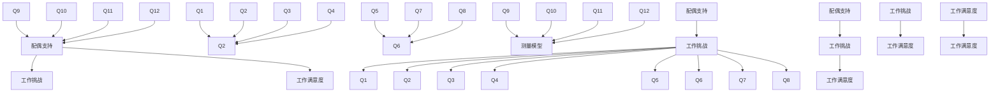

在实际研究中，$\mathbf{V}$ 集合的选择通常使得对于 $\mathbf{T}$ 中的每个 $T _ { i }$，$\mathbf{V}$ 的一个子集旨在测量 $T _ { i \cdot }$ 例如，在 Kohn（1969）关于美国阶级与态度的研究中，选择了各种问卷项目以测量相同的态度；数据的因子分析与人们凭直觉预期的聚类基本一致。因此，我们假设研究者能够将 $\mathbf{V}$ 划分为 $\mathbf { V } ( T _ { i } )$，使得对于每个 $i$，$\mathbf { V } ( T _ { i } )$ 中的变量都是 $T _ { i \cdot }$ 的直接效应。然后，我们试图消除 $\mathbf { V } ( T _ { i } )$ 中那些对 $T _ { i }$ 而言不纯的成员，原因可能是它们也是 $\mathbf{T}$ 中其他未测量变量的效应，或者是其他已测量变量的原因或效应，或者它们与另一个已测量变量共享 $\mathbf{C}$ 中的一个未测量共同原因。

在我们考虑的模型类别中，已测量变量可能因以下四种原因而不纯（这些原因是穷尽的）：

- (i) 如果存在从 $\mathbf{T}$ 中的某个 $T _ { i }$ 到 $\mathbf { V } ( T _ { i } )$ 中的某个 $V$ 的有向边，但也存在一条 $V$ 与 $T _ { j }$ 之间的**路径（trek）**，该路径不包含 $T _ { i }$ 或 $\mathbf{V}$ 中的任何成员（$V$ 除外），则 $V$ 是**潜-测量不纯（latent-measured impure）**的。
- (ii) 如果来自同一聚类 $\mathbf { V } ( T _ { i } )$ 的一对已测量变量 $V _ { 1 } , \ V _ { 2 }$ 之间存在一条不包含 $\mathbf{T}$ 任何成员的路径，则 $V _ { 1 }$ 和 $V _ { 2 }$ 是**构念内不纯（intra-construct impure）**的。
- (iii) 如果来自不同聚类 $\mathbf { V } ( T _ { i } )$ 和 ${ \bf V } ( T _ { j } )$ 的一对已测量变量 $V _ { 1 } , \ V _ { 2 }$ 之间存在一条不包含 $\mathbf{T}$ 任何成员的路径，则我们称 $V _ { 1 }$ 和 $V _ { 2 }$ 是**跨构念不纯（crossconstruct impure）**的。
- (iv) 如果 $\mathbf{C}$ 中存在一个变量，它是 $T _ { i }$ 与 $\mathbf { V } ( T _ { i } )$ 的某个成员 $V$ 之间路径的源头，则我们称 $V$ 是**共同原因不纯（common cause impure）**的。

例如，在图 10.2 中，如果 ${ \bf V } ( T _ { 1 } ) = \{ X _ { 1 } , X _ { 2 } , X _ { 3 } \}$ 且 ${ \bf V } ( T _ { 2 } ) = \{ X _ { 4 } , X _ { 5 } , X _ { 6 } \}$，则 $X _ { 4 }$ 是潜-测量不纯的，$X _ { 1 }$ 和 $X _ { 2 }$ 是构念内不纯的，$X _ { 2 }$ 和 $X _ { 5 }$ 是跨构念不纯的，$X _ { 6 }$ 是共同原因不纯的。只有 $X _ { 3 }$ 是 $T _ { 1 }$ 的纯测量。

> 图 10.2

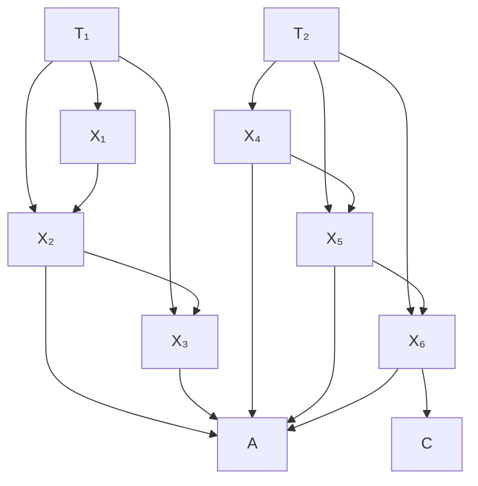

如果已测量变量中唯一的不纯类型是共同原因不纯，则我们称该测量模型是**几乎纯（almost pure）**的。几乎纯潜变量图是一个具有几乎纯测量模型的有向无环图。在几乎纯潜变量图中，我们在本章剩余部分继续将已测量变量集合称为 $\mathbf{V}$，将潜变量子集称为 $\mathbf{T}$，将作为 $\mathbf{T}$ 和 $\mathbf{V}$ 成员共同原因的"干扰"潜变量称为 $\mathbf{C}$。

我们采用的策略包含三个步骤：

(i) 消除已测量变量，直到剩余变量形成最大的几乎纯测量模型，且每个潜变量至少有两个指标。

- (ii) 利用 (i) 中测量模型变量间的**消失四元组差（vanishing tetrad differences）**来确定 $\mathbf{T}$ 中变量间的零阶和一阶独立关系。
- (iii) 使用 **PC 算法（PC algorithm）**从 $\mathbf{T}$ 中变量间的零阶和一阶独立关系构建一个模式。

下一节描述识别适当已测量变量的程序。细节相当复杂；读者应牢记，这些程序均已自动化，在模拟测试中表现良好，并且都源于基本的结构原理。给定总体相关性，对于**四元组表示定理（Tetrad Representation Theorem）**成立的任何条件，推断技术都是可靠的（在大样本中）。统计决策涉及大量的联合检验，无疑可以改进。对于每个潜变量有大量已测量指标的情况，我们偶尔会采用启发式方法。

## 10.3 寻找几乎纯测量模型（Finding Almost Pure Measurement Models）

如果 $G$ 是在 $\mathbf { V } \cup \mathbf { T } \cup \mathbf { C }$ 上的真实模型，其测量模型为 $G _ { M }$，那么本节的任务是找到 $\mathbf{V}$ 的一个子集 $\mathbf{P}$（越大越好），使得 $G _ { M }$ 在顶点集 $\mathbf { P } \cup \mathbf { T } \cup \mathbf { C }$ 上的子模型是一个几乎纯测量模型（如果存在且每个潜变量至少有两个指标）。我们的策略是使用不同类型的四变量组来顺序消除不纯测量。

如图 10.3 所示，如果四个已测量变量全部位于 $\mathbf{T}$ 中某个 $T _ { i }$ 的 $\mathbf { V } ( T _ { i } )$ 中，则称它们为**构念内四元组（intra-construct foursome）**；否则称为**跨构念四元组（cross-construct foursome）**。

### 10.3.1 构念内四元组（Intra-Construct Foursomes）

在本节中，我们讨论仅从 $\mathbf { V } ( T _ { i } )$ 可以了解到关于 $T _ { i }$ 测量模型的哪些信息。我们利用以下原则，该原则是四元组表示定理的推论。

(P–1) 如果一个有向无环图线性地蕴含 $\mathbf { V } ( T _ { i } )$ 中所有变量间的四元组差都消失，则 $\mathbf { V } ( T _ { i } )$ 中没有一对变量是构念内不纯的。

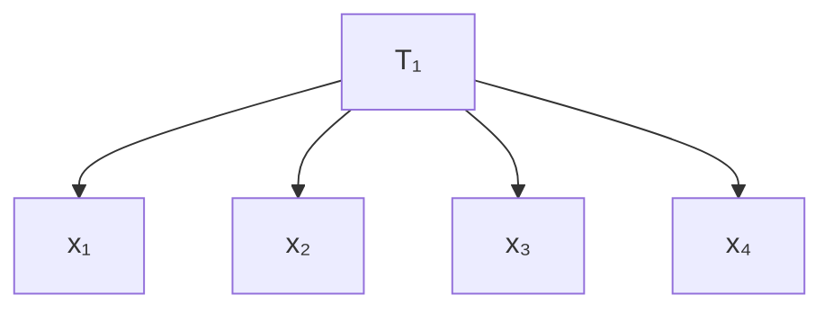

> 图 10.3

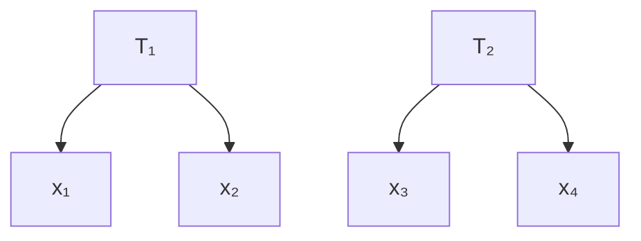

因此，给定测量 $T _ { i }$ 的变量集合 $\mathbf { V } ( T _ { i } )$，我们寻找 $\mathbf { V } ( T _ { i } )$ 的最大子集 $\mathbf { P } ( T _ { i } )$，使得 $\mathbf { P } ( T _ { i } )$ 中所有四元组差被判定为消失。$\mathbf { V } ( T _ { i } )$ 的子集数量为 $2 ^ { | \mathbf { V } ( T _ { i } ) | }$，因此通常不可能检查每一个子集。此外，在实际样本中，我们不太可能找到一个相当大的子集，其中所有四元组差都被判定为消失。一个更可行的策略是迭代地剪枝，在每一阶段移除能够改善剩余集合 ${ \bf P } ( T _ { i } )$ 在由原则 $\mathrm { P } { - } 1$ 导出的易于计算的启发式标准上表现的变量。在实践中，如果 $\mathbf { V } ( T _ { i } )$ 集合很大，其某个小子集可能偶然在这些标准上表现良好。例如，如果 $\mathbf { V } ( T _ { i } )$ 有 12 个变量，则有 495 个大小为 4 的子集，每个子集只有 3 个可能的消失四元组差。有 792 个大小为 5 的子集，但每个集合中必须判定消失的可能的四元组差有 15 个，而不是 3 个。因为 $\mathbf { P } ( T _ { i } )$ 越大，其中所有四元组差都被判定为偶然消失的可能性就越小，并且因为我们可能在后续过程中从 ${ \bf P } ( T _ { i } )$ 中消除变量，所以我们希望 $\mathbf { P } ( T _ { i } )$ 尽可能大。另一方面，无论一个集合 ${ \bf P } ( T _ { i } )$ 在上述第一个标准上表现多好，其某个子集的表现至少一样好或更好。因此，为了避免总是选择尽可能小的子集，我们必须对较小的集合进行惩罚。

我们使用以下简单算法。我们将 ${ \bf P } ( T _ { i } )$ 初始化为 $\mathbf { V } ( T _ { i } )$。如果 $\mathbf { P } ( T _ { i } )$ 中变量间的四元组差集合通过了统计检验，则退出。（如果每个单独的四元组差在显著性水平 Sig/n 下通过了统计检验，则我们称一个包含 n 个四元组差的集合在给定显著性水平 Sig 下通过了统计检验。我们对单个四元组差采用的统计检验的细节在第 11 章中描述。）如果该集合未通过统计检验，则我们寻找要从 $\mathbf { P } ( T _ { i } )$ 中消除的变量。我们按以下方式对每个已测量变量 X 进行评分。对于 ${ \bf P } ( T _ { i } )$ 中变量间每个涉及 X 的四元组差 t，如果 t 通过了统计检验，则给 X 加分；如果 t 未通过统计检验，则给 X 减分。然后，我们从 $\mathbf { P } ( T _ { i } )$ 中消除得分最低的变量。重复此过程，直到我们得到一个通过统计检验的集合 $\mathbf { P } ( T _ { i } )$，或者变量耗尽。

## 10.3.2 跨构造四元组（Cross-Construct Foursomes）

在找到每个潜变量 $T _ { i }$ 在 $\mathbf { V } ( T _ { i } )$ 中的一个子集 $\mathbf { P } ( T _ { i } )$（该子集中不存在**构造内不纯（intra-construct impure）**的变量）后，我们构造 **V** 的一个子集 **P**，使得：

$$
\mathbf {P} = \bigcup_ {T _ {i} \in \mathbf {T}} \mathbf {P} (T _ {i}).
$$

接下来，我们剔除 **P** 中**跨构造不纯（cross-construct impure）**的成员。

**2x2 四元组**涉及来自 ${ \bf P } ( T _ { i } )$ 的两个测量变量和来自 $\mathbf { P } ( T _ { j } )$ 的两个测量变量，其中 $i$ 和 $j$ 互不相同。在一个纯潜变量模型中，无论结构模型中 $T _ { i }$ 和 $T _ { j }$ 之间的因果联系性质如何，一个 2x2 四元组在线性意义上恰好蕴含一个**四元组方程（tetrad equation）**。例如，图 10.4 中的图在线性意义上蕴含消失的四元组差值 $\rho _ { X Y } \rho _ { W Z } - \rho _ { X W } \rho _ { Y Z } = 0$ 。那些 $T _ { j }$ 导致 $T _ { i }$ 的图，以及 $T _ { i }$ 和 $T _ { j }$ 没有因果联系（即它们之间不存在路径）的图，也线性地蕴含 $\rho _ { X Y } \rho _ { W Z } - \rho _ { X W } \rho _ { Y Z } = 0$ 。

> 图 10.4

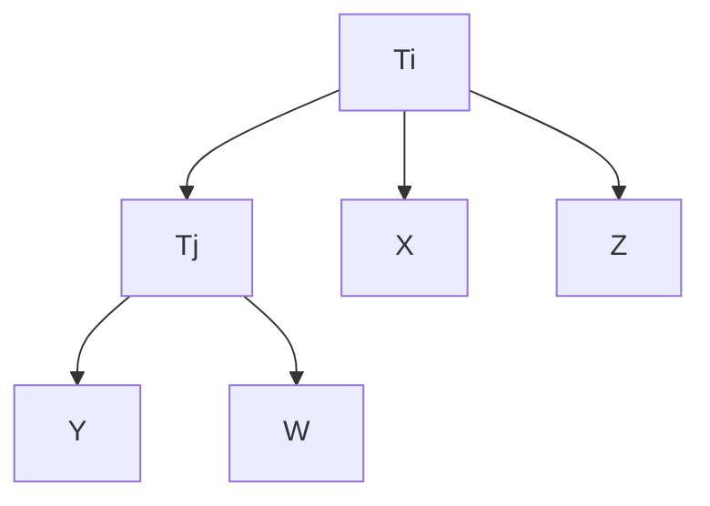

如果 $\mathbf { V } ( T _ { i } )$ 中的一个变量由于包含 $T _ { j }$ 的路径而成为**潜变量测量不纯（latent-measured impure）**，并且 ${ \bf V } ( T _ { j } )$ 中的一个变量由于包含 $T _ { i }$ 的路径而成为潜变量测量不纯，那么该四元组中的四元组差值在图论意义上并不线性蕴含其消失。如果 $T _ { i }$ 和 $T _ { j }$ 通过某条路径连接，并且分别位于 $\mathbf { V } ( T _ { i } )$ 和 ${ \bf V } ( T _ { j } )$ 中的一对变量是跨构造不纯的，那么该四元组差值同样不线性蕴含其消失。（$T _ { i }$ 和 $T _ { j }$ 未通过某条路径连接的情况将在下文讨论。）例如，在图 10.5 中，模型 (i) 蕴含四元组方程 $\rho _ { X Y } \rho _ { W Z } = \rho _ { X W } \rho _ { Y Z }$ ，但模型 (ii) 和 (iii) 则不然。

因此，如果我们检验一个 2x2 四元组 $F _ { 1 }$ ，并且可以拒绝相应的四元组差值为零的假设，那么我们就知道，在涉及来自每个构造的一个测量变量的四对组合中，至少有一对的两个成员都是不纯的。我们尚不知道是哪一对。我们可以通过检验与 $F _ { 1 }$ 共享变量的其他 $2 \mathbf { x } 2$ 四元组来找出答案。假设包含 $\mathbf { P } ( T _ { 1 } )$ 和 ${ \bf P } ( T _ { 2 } )$ 的真实模型的最大子图是图 10.6 中的图。

> (i) (i)

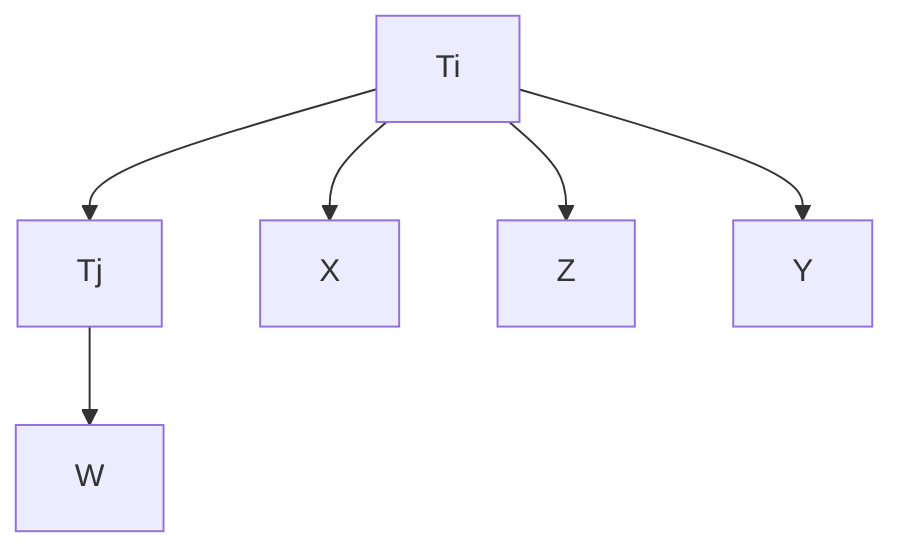

> (ii)(ii)

> (iii)(iii) 图 10.5

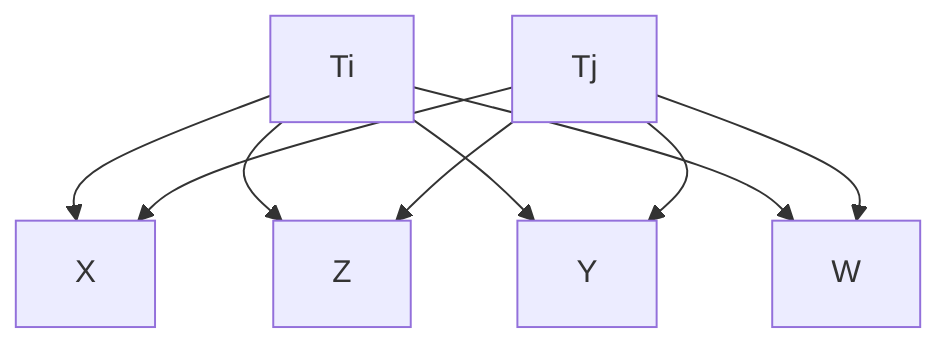

> 图 10.6

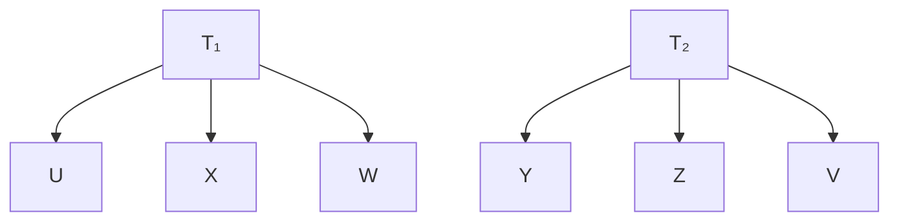

只有涉及 ${ < } W , Y { > }$ 这对变量的 $2 \mathbf { x } 2$ 四元组会被识别为不纯。当我们检验四元组 $F _ { 1 } = < X , W , Y , Z >$ 中消失的四元组差值时，我们不知道 ${ < } W , Z > , < X , Y > , < X , Z > , < W , Y >$ 这些对中哪一对是不纯的。然而，当我们检验四元组 $F _ { 2 } =$ $< X , W , Z , V >$ 时，我们发现 ${ < } X , Z > , < X , V > , < W , Z > , \mathrm { o r } < W , V >$ 这些对中没有任何一对是不纯的。因此我们知道，在 $F _ { 1 }$ 中，对 ${ < } X , Z { > }$ 和 ${ < } W , Z { > }$ 不是不纯的。通过检验四元组 $F _ { 3 } = < U , X , Y , Z >$ ，我们发现 ${ < } X , Y { > }$ 不是不纯的，从而推断出在 $F _ { 1 }$ 中 ${ < } W , Y { > }$ 是不纯的。如果每个构造内至少有两个纯指标，那么我们可以通过这种方式精确检测出其他哪些指标是不纯的。

通过检验 **P** 中所有的 $2 \mathbf { x } 2$ 四元组，原则上我们可以剔除所有跨构造不纯的变量。我们还不能剔除所有潜变量测量不纯的变量，因为如果只有一个这样的变量，它无法通过 2x2 四元组检测出来。

涉及来自 ${ \bf P } ( T _ { i } )$ 的三个测量变量和来自 ${ \bf P } ( T _ { j } )$ 的一个测量变量（其中 $i$ 和 $j$ 互不相同）的四元组称为 **3x1 四元组**。在一个纯测量模型中，无论 $T _ { i }$ 和 $T _ { j }$ 之间的因果联系如何，所有 3x1 四元组都线性蕴含所有三个可能的消失四元组差值（例如，参见图 10.7 中的模型 (i)）。如果 3x1 四元组中来自 ${ \bf P } ( T _ { j } )$ 的变量由于同时测量两个潜变量而变得不纯（图 10.7 中的模型 (ii)），那么 $T _ { i }$ 仍然是一个**瓶颈点（choke point）**，并且所有三个方程都被线性蕴含。然而，如果来自 ${ \bf P } ( T _ { i } )$ 的变量 Z 由于同时测量两个潜变量而变得不纯（图 10.7 中的模型 (iii)），那么潜变量模型并不线性蕴含包含 ${ < } Z , W >$ 这对变量的四元组差值消失。这意味着，3x1 四元组中变量间的非消失四元组差值可以将一个唯一的测量变量识别为潜变量测量不纯。

> (i)(i)

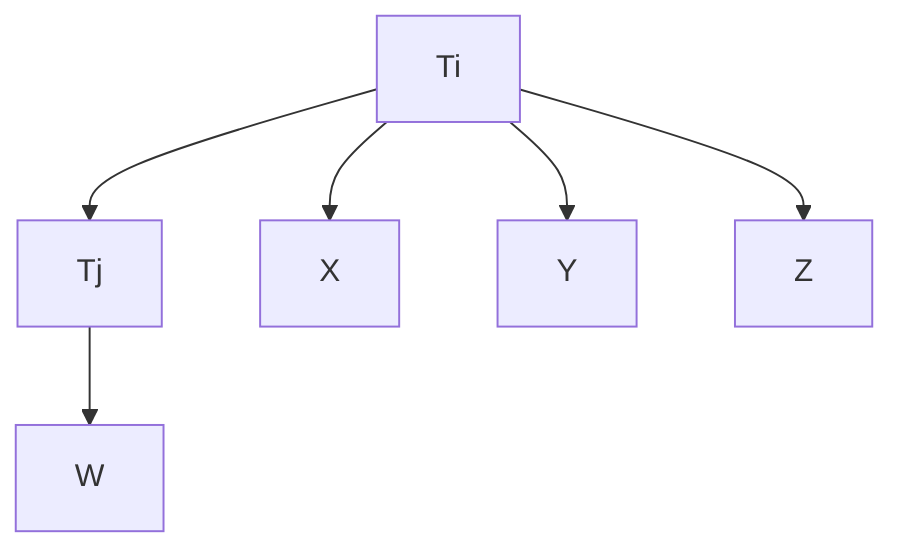

> (ii)

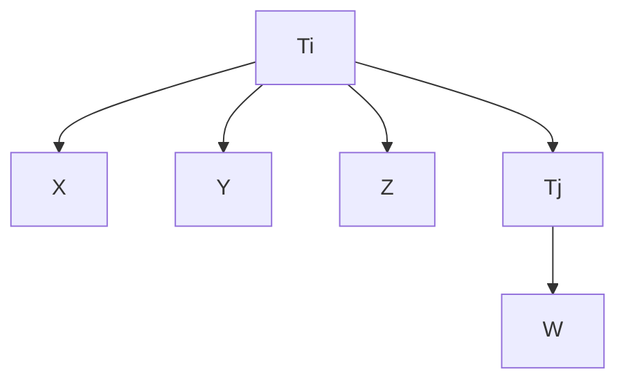

> (iii) 图 10.7

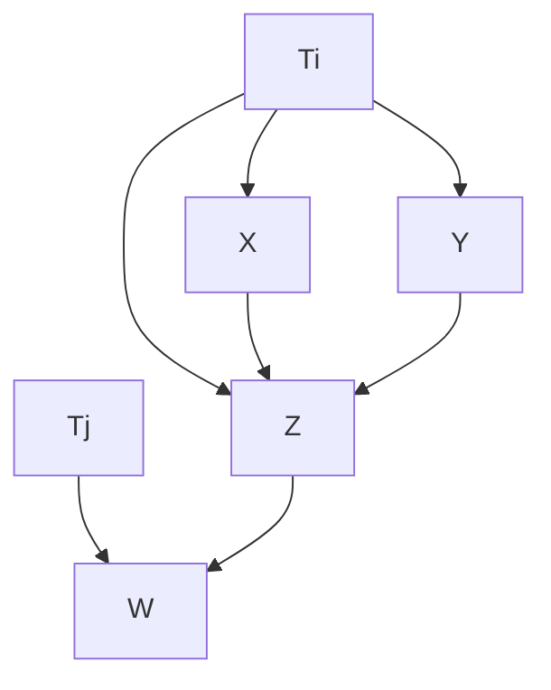

此外，如果 $T _ { i }$ 和 $T _ { j }$ 没有路径相连，并且分别位于 $\mathbf { P } ( T _ { i } )$ 和 ${ \bf P } ( T _ { j } )$ 中的一对变量 $V _ { 1 }$ 和 $V _ { 2 }$ 是跨构造不纯的，那么 $V _ { 1 }$ 和 $V _ { 2 }$ 之间的相关性不会消失，并且包含 $V _ { 1 }$ 和 $V _ { 2 }$ 的 3x1 四元组中的四元组差值并不线性蕴含其消失；因此，${ \bf P } ( T _ { j } )$ 中不纯的成员将被识别出来。

如果对于每个 $i$，$\mathbf { P } ( T _ { i } )$ 中至少有三个变量，那么当我们完成对所有 3x1 四元组的检验后，我们将得到 **V** 的一个子集 **P**，使得真实测量模型在 **P** 上的子模型（我们称之为 $G _ { P }$ ）是一个**几乎纯测量模型（almost pure measurement model）**。

## 10.4 由观测变量确定的未观测变量的事实（Facts about the Unobserved Determined by the Observed）

在一个几乎纯潜变量模型中，对测量变量间相关矩阵的约束决定了：

- (i) 对于每一对潜变量 A、B，A 和 B 是否不相关，
- (ii) 对于每个三元组潜变量 A、B、C，在给定 {C} 的条件下，A 和 B 是否 **d-分离（d-separated）**。

第 (i) 部分是显而易见的：在一个几乎纯潜变量模型中，两个测量变量不相关当且仅当它们是不同未测量变量的效应，而这些未测量变量之间没有路径相连（即它们之间不存在路径），因此给定空变量集时它们是 d-分离的。第 (ii) 部分则不那么明显，但事实上，某些 d-分离事实是由测量变量间消失的四元组差值决定的。

定理 10.1 是**四元组表示定理（Tetrad Representation Theorem）**的一个推论：

**定理 10.1**: 如果 G 是一个定义在 $\mathbf { V } \cup \mathbf { T } \cup \mathbf { C }$ 上的几乎纯潜变量图， **T** 是因果充分的，并且 **T** 中的每个潜变量至少有两个测量指标，那么潜变量 $T _ { 1 }$ 和 $T _ { 3 }$（其测量指标分别包括 J 和 L）在给定潜变量 $T _ { 2 }$（其测量指标包括 I 和 K）的条件下是 d-分离的，**当且仅当** G 线性蕴含 $\rho _ { J I } \rho _ { L K } = \rho _ { J L } \rho _ { K I } = \rho _ { J K } \rho _ { I L }$ 。

例如，在图 10.8 的模型中，$T _ { 1 }$ 和 $T _ { 3 }$ 在给定 $T _ { 2 }$ 的条件下是 d-分离的这一事实，蕴含于以下事实：对于所有介于 1 和 3 之间的 m、n、o 和 $p$ ，其中 o 和 $p$ 互不相同：

$$
\rho_ {A _ {m} D _ {n}} \rho_ {B _ {o} B _ {p}} = \rho_ {A _ {m} B _ {o}} \rho_ {D _ {n} B _ {p}} = \rho_ {A _ {m} B _ {p}} \rho_ {D _ {n} B _ {o}}
$$

通过检验这种消失的四元组差值，我们可以检验一个几乎纯潜变量模型中未测量变量之间的一阶 d-可分性关系。（如果 A 和 B 在给定 D 的条件下是 d-分离的，我们将 D 中变量的数量称为该 d-可分性关系的阶数。）这些零阶和一阶 d-分离关系随后可以作为 **PC 算法（PC algorithm）**或其他一些过程的输入，以获得关于潜变量之间因果结构的信息。在理想情况下，输出的潜变量之间的**模式（pattern）**将始终包含直接对潜变量之间的 d-分离事实应用 PC 算法所得到的模式，但它可能包含额外的边和更少的方向。

> 图 10.8

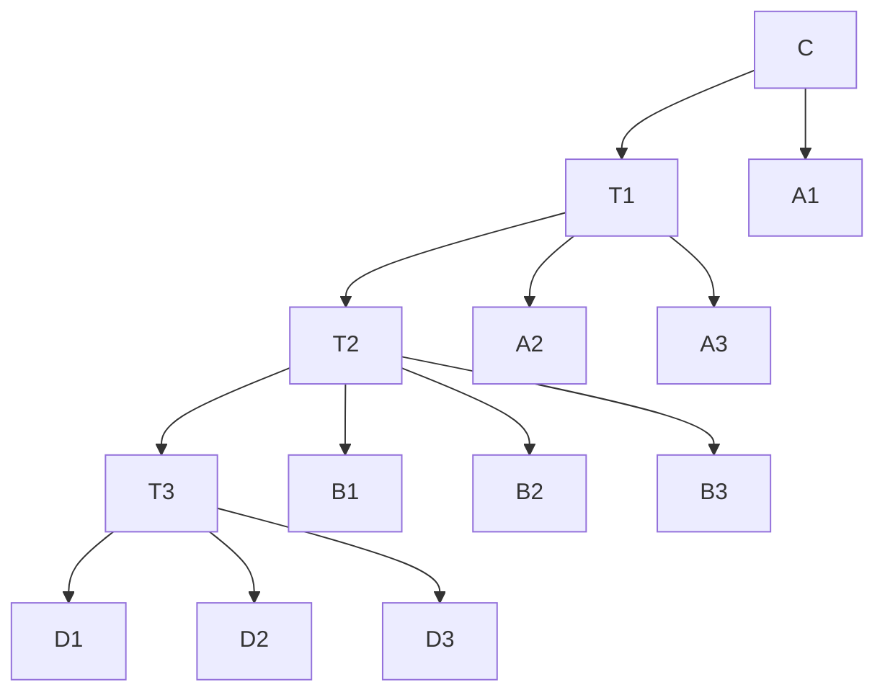

## 10.5 整合各部分（Unifying the Pieces）

假设真实但未知的图如图 10.9 所示。

> 图 10.9. 真实因果结构（True causal structure）

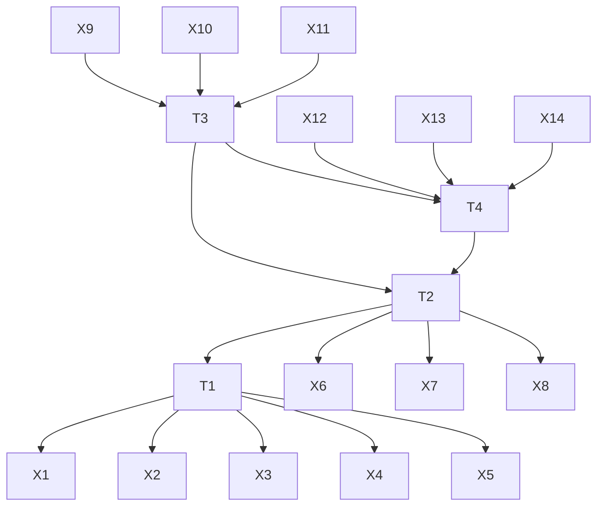

我们假设研究者能够准确地对指定测量模型中的变量进行聚类，例如图 10.10。

> 图 10.10. 指定的测量模型（Specified measurement model）

实际的测量模型则是图 10.11 中的图。

> 图 10.11. 实际测量模型（Actual measurement model）

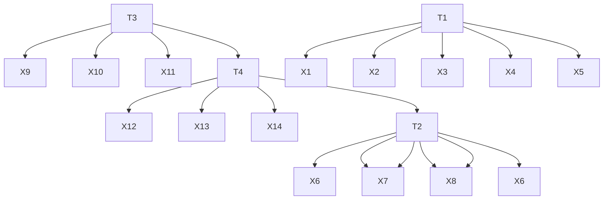

图 10.12 显示了 G 中变量的一个子集（排除了 $X _ { 1 } , X _ { 6 } ,$ 和 $X _ { 1 4 }$），这些变量确实构成了一个**几乎纯测量模型（almost pure measurement model）**。

> 图 10.12. 几乎纯测量模型（Almost pure measurement model）

假设**消失四元组差检验（vanishing tetrad difference tests）**序列找到了这样一个几乎纯测量模型，那么一个 $1 \times 2 \times 1$ 消失四元组差检验序列随后会通过定理 10.1 确定一些用于 PC 或其它算法的 **d-分离性（d-separability）** 事实。由于在图 10.12 中，有许多 $1 \times 2 \times 1$ 四元组检验，其测量变量分别来自 $T _ { 1 } , T _ { 2 }$ 和 $T _ { 3 }$ 的聚类，因此检验结果必须以某种方式聚合。对于 ${ \mathbf V } ( T _ { 1 } ) , { \mathbf V } ( T _ { 2 } )$ 和 ${ \bf V } ( T _ { 3 } )$ 中变量之间的每个 $1 \mathbf { x } 2 \mathbf { x } 1$ 四元组差值，如果该四元组差值通过了显著性检验，我们给予加分；如果未通过，则给予减分；如果最终得分大于 0，我们判断 $T _ { 1 }$ 和 $T _ { 3 }$ 被 $T _ { 2 }$ **d-分离（d-separated）**。经过两处轻微修改，PC 算法可以应用于由消失四元组差值确定的零阶和一阶 d-分离关系。第一处修改是，算法从不尝试检验阶数大于 1 的任何 d-分离关系（即在 PC 算法的步骤 B) 循环中，n 的最大值为 1）。第二处修改是，在 PC 算法的步骤 D) 中，我们不对边进行定向以避免环。

在缺乏所有 d-可分离性事实的情况下，PC 算法可能无法找到图的正确模式。它可能包含多余的边，并且无法对某些边进行定向。然而，有可能从模式中识别出某些边**一定**存在于生成该模式的图中，而其他边则可能存在也可能不存在。我们在 PC 算法中添加以下步骤，用“?”标记那些可能存在也可能不存在的边。在模式中，Y 是路径 U 上的一个**确定非碰撞点（definite noncollider）**，当且仅当 $X \text{ *-* } Y \right. Z$ 或 $X \left. Y ^ { * _ { - } * } Z$ 是 U 的子路径，或者 X 和 Z 不相邻且不是 $X \right. Y \left. Z$ 在 U 上。

E.) 令 P 为 中 X 和 Y 之间所有长度 ≥ 2 的无向路径的集合。如果 X 和 Y 在 中相邻，则标记 X 和 Y 之间的边为“?”，除非满足以下任一条件：

- (i) P 中没有路径，或
- (ii) P 中的每条路径都包含一个碰撞点，或
- (iii) 存在一个顶点 Z，使得 Z 是 P 中每条路径上的确定非碰撞点，或
- (iv) P 中的每条路径都包含相同的子路径 ${ < A , B , C > }$。

我们将这个组合过程称为**多指标模型构建（Multiple Indicator Model Building, MIMBuild）算法**。

**定理 10.2：** 如果 G 是定义在 $\mathbf { V } \cup \mathbf { T } \cup \mathbf { C }$ 上的一个**几乎纯潜变量图（almost pure latent variable graph）**，T 是**因果充分的（causally sufficient）**，T 中的每个变量至少有两个测量指标，MIMBuild 的输入是由 G 线性蕴涵的所有潜变量之间消失的零阶和一阶相关性的列表，并且 是 MIMBuild 算法的输出，那么：

- **A–1)** 如果 X 和 Y 在 中不相邻，则它们在 G 中也不相邻。
- **A–2)** 如果 X 和 Y 在 中相邻，并且该边未被标记为“?”，则 X 和 Y 在 G 中相邻。

- **O–1)** 如果 中有 X → Y，则 G 中 X 和 Y 之间的每条**迹（trek）**都指向 Y。
- **O–2)** 如果 中有 X → Y，并且 X 和 Y 之间的边未被标记为“?”，则 G 中有 $X $ Y。

该算法的复杂度受限于它必须检验的四元组差值的数量，而这又受限于测量变量的四元组数量。如果有 n 个测量变量，则四元组的数量为 $O ( n ^ { 4 } )$。然而，我们并不检验每一个可能的四元组，实际复杂度取决于潜变量的数量以及每个潜变量由多少变量测量。如果有 m 个潜变量，每个潜变量有 s 个测量变量，则四元组的数量为 $O ( m ^ { 3 } \times s ^ { 4 } )$。由于 $m \times s =$ n，这是 $O ( n ^ { 3 } \times s )$。

## 10.6 模拟检验（Simulation Tests）

我们概述的过程已在 TETRAD II 程序中完全自动化，在需要时采用了合理但相当任意的加权原则。为了测试该过程的行为，我们根据图 10.13 中的因果图生成了数据，该图包含 11 个**不纯指标（impure indicators）**。

外生变量的分布是标准正态分布。对于每个样本，线性系数在 0.5 到 1.5 之间随机选择。

我们在样本量分别为 100、500 和 2000 的情况下各进行了 20 次试验。我们统计了在检测不相关潜变量（0 阶 d-分离）和检测一阶 d-分离时的**错误纳入（errors of commission）**和**错误遗漏（errors of omission）**次数。在每种情况下，我们都统计了该过程可能犯的错误次数以及实际犯的错误次数。我们还给出了算法完美识别出 d-分离的样本数量。结果如表 10.1 所示，其中每种情况的比例表示所有样本中某种错误的次数除以所有样本中该种可能错误的总次数。

对多达六个潜变量和 60 个正态分布测量变量的各种潜变量拓扑结构进行的广泛模拟检验表明，对于给定的样本量，该过程的可靠性取决于每个潜变量的指标数量以及受混杂影响的指标比例。增加几乎纯指标的数量会使关于 d-可分离性的决策更可靠，但增加混杂变量的比例会使识别几乎纯指标变得更加困难。对于每个潜变量有十个指标的大样本，当超过一半的指标受到混杂时，该过程仍能给出良好结果。

> 图 10.13. 不纯指标（Impure Indicators）

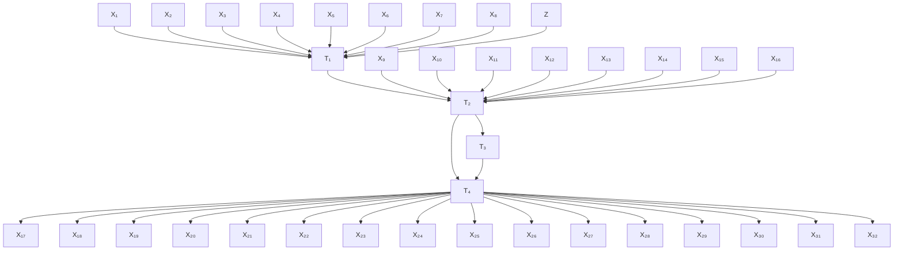

**表 10.1**

<table><tr><td>样本量（Sample Size）</td><td>0 阶错误纳入（0-order Commission）</td><td>0 阶错误遗漏（0-order Omission）</td><td>一阶错误纳入（1st-Order Commission）</td><td>一阶错误遗漏（1st-Order Omission）</td><td>完美（Perfect）</td></tr><tr><td>100</td><td>2.50%</td><td>0.00%</td><td>3.20%</td><td>5.00%</td><td>65.00%</td></tr><tr><td>500</td><td>1.25%</td><td>0.00%</td><td>0.90%</td><td>0.00%</td><td>95.00%</td></tr><tr><td>2000</td><td>0.00%</td><td>0.00%</td><td>0.00%</td><td>0.00%</td><td>100.00%</td></tr></table>

## 10.7 结论（Conclusion）

存在其他可选的策略。例如，可以纯化测量集，并指定一个“**理论模型（theoretical model）**”，其中每对潜变量直接相关。对此结构进行**最大似然估计（maximum likelihood estimate）**将给出潜变量相关矩阵的估计值。然后可以将该相关矩阵用作 PC 或 FCI 算法的输入。该策略有两个明显的缺点。其一，这些估计通常依赖于正态性假设。其二，在初步的模拟研究中，使用正态变量并利用 LISREL 估计潜变量相关性，我们发现该策略不如本章描述的过程可靠。基于测量相关性的多个关于消失四元组差值的决策的加权平均值，来做出关于潜变量之间 d-分离事实的决策，似乎比基于估计相关性的关于消失偏相关性的决策更为可靠。

MIMBuild 算法假设 T 是因果充分的；一个有趣的开放问题是，是否存在不依赖此假设的可靠算法。此外，尽管该算法是正确的，但在多个方面并不完备。零阶和一阶消失偏相关性还线性蕴涵了进一步的定向信息。此外，我们不知道消失的零阶和一阶偏相关性是否线性蕴涵了关于哪些边**一定存在**（即不应标记为“?”）的进一步信息。而且，有时对于 MIMBuild 输出中标记为“?”的每条边，都存在一个与消失的零阶和一阶偏相关性兼容的模式，该模式不包含该边，但不存在一个与消失的零阶和一阶偏相关性兼容的模式，该模式同时不包含两条或更多如此标记的边。

最后，也是最重要的一点，我们描述的策略对于具有变量间多重因果路径的潜变量结构提供的信息量不大。对该策略进行扩展可能会提供更多信息，值得研究。除了四元组差值，还可以检验对测量相关性的高阶约束（例如，五个或更多相关性的代数组合），并利用由此产生的决策来确定潜变量之间的高阶 d-分离关系。必要的理论尚未发展出来。