# 用未测量变量阐述线性理论（Elaborating Linear Theories with Unmeasured Variables）

## 11.1 引言（Introduction）

在许多情况下，研究者持有某种因果理论（causal theory），他们对该理论有一定信心，但不确定模型是否包含所有重要的因果连接，或者他们认为模型不完整但不知道缺少哪些依赖关系。如何发现更多未知的因果连接？当例如两个相关变量在模式中断开连接时，类似的问题也会出现在PC或FCI算法的输出中；在这种情况下，我们可能认为某些未在模式中表示的机制解释了这种依赖关系，并且需要对模式进行阐述。在本章中，我们考虑"阐述问题"的一个特例，仅限于具有未测量共同原因（每个原因有一个或多个测量指标）的线性理论。我们为解决阐述问题开发的通用策略可以适用于没有潜变量（latent variables）的模型，也可以适用于离散变量（discrete variables）的模型。除了我们在此考虑的策略外，其他策略也很有前景；特别是Cooper和Herskovits的贝叶斯方法（Bayesian methods）可以适用于阐述问题。

阐述不完整的"结构方程模型（structural equation models）"的问题已在至少两个商业计算机软件包中得到解决，即LISREL程序（Joreskog和Sorbom 1984）和EQS程序（Bentler 1985）。我们将描述这些软件包中自动搜索程序可靠性的详细测试。总的来说，我们发现它们非常不可靠，但并非完全无用，并且分析它们在其他方法成功时失败的原因，为统计学中的计算机化搜索提供了一个重要的普遍教训：在规范搜索（specification search）中，计算很重要，在大型搜索空间中，计算的重要性远超过使用那些在计算免费的情况下本应最优的检验。

我们将比较EQS和LISREL搜索与基于消失四元组差异（vanishing tetrad differences）检验的搜索程序。原则上，四元组检验的集合所提供的信息少于LISREL和EQS搜索所使用的整个模型的极大似然检验（maximum likelihood tests）。在实践中，这一劣势被四元组程序的计算优势所压倒。在一些一般性假设下，如果对总体中消失的四元组差异做出正确判断，我们描述的程序会给出正确（但不一定完全信息充分）的答案。我们证明，对于许多问题，该程序能够从实际规模样本中获得非常可靠的结论。

## 11.2 程序（The Procedure）

我们将描述的程序已在TETRAD II程序中实现。它接受以下输入：

- (i) 样本量（sample size），
- (ii) 相关矩阵或协方差矩阵（correlation or covariance matrix），以及
- (iii) 初始线性结构方程模型（initial linear structural equation model）的有向无环图（directed acyclic graph）。

还可以输入多个内部参数的规范。图形通过简单指定成对的原因和效果来提供给程序。该算法可分为两部分：评分程序（scoring procedure）和搜索程序（search procedure）。

### 11.2.1 评分（Scoring）

该程序使用以下方法论原则。

**证伪原则（Falsification Principle）**：在其他条件相同的情况下，优先选择不线性蕴含被判断为在总体中不成立的约束的模型。

**解释原则（Explanatory Principle）**：在其他条件相同的情况下，优先选择线性蕴含被判断为在总体中成立的约束的模型。

**简约原则（Simplicity Principle）**：在其他条件相同的情况下，优先选择更简单的模型。

解释原则背后的直觉是，基于模型因果结构对约束的解释优于依赖于模型自由参数特殊值的解释。这种直觉在自然科学中被广泛共享；它曾被用来论证哥白尼太阳系理论、广义相对论和原子假说。关于解释原则的更完整讨论可以在Glymour等人1987、Scheines 1988和Glymour 1983中找到。与消失偏相关（vanishing partial correlations）一样，与图边相关的线性系数集合中，产生图中不线性蕴含的消失四元组差异的系数集的勒贝格测度（Lebesgue measure）为零。

不幸的是，这些原则可能会相互冲突。例如，假设模型 $M'$ 是模型 $M$ 的修改，通过在 $M$ 中添加一条额外边形成。进一步假设 $M'$ 线性蕴含的被判断为在总体中成立的约束较少，但线性蕴含的被判断为在总体中不成立的约束也较少。那么 $M'$ 在证伪原则方面优于 $M$，但在简约原则和解释原则方面劣于 $M$。我们使用的程序引入了一个启发式评分函数（heuristic scoring function）来平衡这些维度。²

为了计算**四元组得分（Tetrad-score）**，我们首先计算消失四元组差异的相关概率 $P(t)$，这是在假设四元组差异在总体中消失的条件下，观察到样本中与实际情况一样大或更大的四元组差异的概率。假设正态变量，Wishart（1928）证明了消失四元组差异 $\rho_{IJ}\rho_{KL} - \rho_{IL}\rho_{JK}$ 的抽样分布方差等于：

$$
\frac{D_{12}D_{34}(N+1)}{(N-1)(N-2)} - D
$$

其中 $D$ 是四个变量 $I, J, K, L$ 的总体相关矩阵的行列式，$D_{12}$ 是左上角二维子矩阵的行列式，$D_{34}$ 是右下角子矩阵的行列式，且 $I, J, K, L$ 具有联合正态分布。在计算 $P(t)$ 时，我们用样本协方差替换公式中相应的总体协方差。$P(t)$ 通过查找标准正态分布表确定。Bollen（1990）描述了一种渐近分布自由的检验。

在任意四个不同的测量变量 $I, J, K, L$ 中，我们计算三个四元组差异：

$$
t_1 = \rho_{IJ}\rho_{KL} - \rho_{IL}\rho_{JK}
$$

$$
t_2 = \rho_{IL}\rho_{JK} - \rho_{IK}\rho_{JL}
$$

$$
t_3 = \rho_{IK}\rho_{JL} - \rho_{IJ}\rho_{KL}
$$

以及它们在四元组差异消失假设下的相关概率 $P(t_i)$。如果 $P(t_i)$ 大于给定的显著性水平（significance level），程序则认为该四元组差异在总体中消失。如果 $P(t_i)$ 小于显著性水平，但其他两个四元组差异的相关概率高于显著性水平，则忽略 $t_i$。否则，如果 $P(t_i)$ 小于显著性水平，则判断该四元组差异在总体中不消失。

设 $\mathbf{Implied_H}$ 为由模型 $M$ 线性蕴含且被判断为在总体中成立的消失四元组的集合，$\mathbf{Implied_{\sim H}}$ 为由 $M$ 线性蕴含且被判断为在总体中不成立的消失四元组的集合。设**四元组得分**为模型 $M$ 在算法分配的给定显著性水平下的得分，设**权重（weight）**为一个参数（其意义将在下面解释）。然后我们定义：

$$
T = \sum_{t \in \mathbf{Implied_H}} P(t) - \sum_{t \in \mathbf{Implied_{\sim H}}} weight * (1 - P(t))
$$

第一项实现了解释原则，而第二项实现了证伪原则。简约原则通过优先选择具有相同四元组得分但自由参数更少的模型来实现——这相当于优先选择边更少的图。权重通过确定解释相对于残差减少的相对重要性，来决定解释原则与证伪原则之间的冲突如何解决。

评分函数由两个参数控制。显著性水平用于判断给定四元组差异在总体中是否为零。权重用于确定解释原则和证伪原则的相对重要性。评分函数具有几个理想的渐近性质，但我们不知道我们使用的权重特定值是否最优。

### 11.2.2 搜索（Search）

TETRAD II程序搜索初始模型阐述的树。该搜索相对较快，因为存在一个简单算法来确定由图形线性蕴含的消失四元组差异（使用四元组表示定理（Tetrad Representation Theorem）），因为评估模型所需的大部分计算工作可以存储并复用于评估阐述，并且因为评分函数的特性使得如果一个模型因得分低而被最终排除考虑，那么它的任何阐述也同样被排除。

搜索生成初始模型的每一种可能的单边阐述，按四元组得分排序，并消除任何得分低的阐述。然后，它对生成的每个模型递归地重复此过程，直到无法对模型进行改进。

搜索由一个称为**T-maxscore**的量引导，对于给定模型 $M$，它表示 $M$ 的任何阐述可能达到的最大四元组得分。T-maxscore等于：

$$
T\text{-maxscore} = \sum_{t \in \mathbf{Implied_H}} P(t)
$$

我们对这个量的使用由以下定理证明是合理的。

**定理11.1**。如果 $G$ 是有向无环图 $G'$ 的子图，那么 $G'$ 线性蕴含的 $G$ 变量间的四元组方程集合是 $G$ 线性蕴含的集合的子集。

为了保持以下示例较小，假设只有4条边 $e_1, e_2, e_3$ 或 $e_4$ 可以添加到初始模型中。该示例说明了在考虑初始模型的每种可能阐述的情况下的搜索过程。图11.1中的节点1代表初始模型。图中的每个节点代表通过将节点旁边的边添加到其父节点而生成的模型。例如，节点2代表初始模型 $+ e_1$；节点7代表节点 $2 + e_4$，即初始模型 $+ e_1 + e_4$。当程序创建对应于节点的模型 $M$，然后确定 $M$ 的任何阐述是否具有比 $M$ 更高的四元组得分时，我们称程序**访问（visits）**一个节点。（注意，如果算法生成模型 $M$ 但不确定 $M$ 的任何阐述是否具有比 $M$ 更高的四元组得分，则算法可以生成模型 $M$ 而不访问 $M$。）每个节点内部的数字表示模型被访问的顺序。因此，例如，当算法访问节点2时，它首先生成初始模型 $+ e_1$ 的所有可能的单边添加，并按它们的T-maxscore排序。然后它首先访问具有最高T-maxscore的节点（在本例中，节点3代表初始模型 $+ e_1 + e_2$）。注意，程序直到访问完初始模型 $+ e_1$ 的所有阐述后，才会访问初始模型 $+ e_2$（节点10）。

> 图11.1

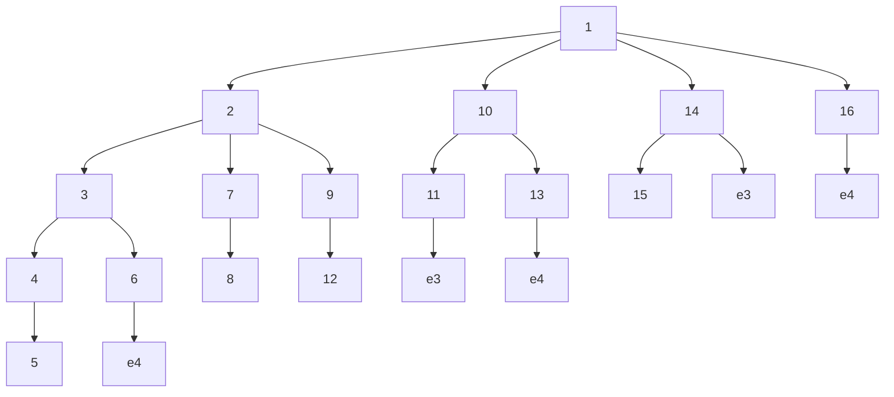

在实践中，这种完全搜索不可能在合理的时间内完成。幸运的是，我们能够在不实际访问的情况下排除许多模型的考虑。向图形添加边可能会破坏四元组方程的线性蕴含，但根据定理11.1，这永远不会导致结果图形线性蕴含更多的四元组方程。如果模型 $M$ 的T-maxscore小于某个模型 $M'$ 的四元组得分，那么 $M$ 和 $M$ 的任何阐述都没有与 $M'$ 一样高的四元组得分。因此，我们永远不需要访问 $M$ 或其任何阐述。这在图11.2中进行了说明。如果我们发现初始模型 $+ e_4$ 的T-maxscore低于初始模型 $+ e_1$ 的四元组得分，我们可以从搜索中消除所有包含边 $e_4$ 的模型。

> 图11.2

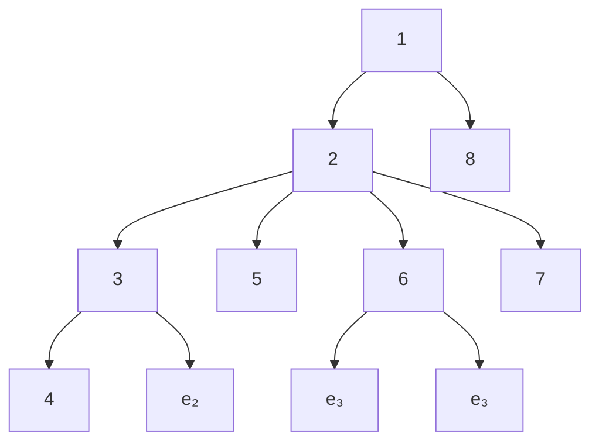

在后文描述的模拟研究的某些情况下，这里描述的程序太慢以至于不实用。在这些情况下，通过限制搜索深度来限制搜索所花费的时间。（我们确保在每种情况下深度限制足够大，使得程序有可能因过拟合而犯错。）程序将搜索调整到可以在合理时间内搜索的深度；在许多蒙特卡洛模拟案例中，不需要深度限制。³

## 11.3 LISREL和EQS程序（The LISREL and EQS Procedures）

LISREL VI和EQS是执行多种功能的计算机程序，例如提供结构方程模型中自由参数的极大似然估计。我们将考虑的特性会自动建议对欠规范模型（underspecified models）的修改。

### 11.3.1 输入和输出（Input and Output）

两个程序都接受以下输入：

- (i) 样本量（sample size），
- (ii) 样本协方差矩阵（sample covariance matrix），
- (iii) 自变量方差的初始估计（initial estimates of the variances of independent variables），
- (iv) 线性系数的初始估计（initial estimates of the linear coefficients），
- (v) 初始因果模型（initial causal model）（通过在变量 $B$ 的方程中将 $A$ 的线性系数固定为零来指定，当且仅当 $A$ 不是 $B$ 的直接原因时），以方程形式（EQS）或矩阵系统形式（LISREL VI），
- (vi) 搜索过程中不允许释放的参数列表（a list of parameters not to be freed during the course of the search），
- (vii) 显著性水平（significance level），以及
- (viii) 参数估计迭代次数的上限（a bound on the number of iterations in the estimation of parameters）。

两个程序的输出都包括一个单一的估计模型，该模型是初始因果模型的阐述、各种诊断信息以及建议修订的 $\chi^2$ 值，以及 $\chi^2$ 度量的相关概率。

### 11.3.2 评分（Scoring）

LISREL VI和EQS提供结构方程模型中自由参数的极大似然估计。更精确地说，选择估计值以最小化拟合函数：

$$
F = \log|\Sigma| + tr(S\Sigma^{-1}) - \log|S| - t
$$

其中 $S$ 是样本协方差矩阵，$\Sigma$ 是预测协方差矩阵，$t$ 是指标的总数，如果 $A$ 是方阵，则 $|A|$ 是 $A$ 的行列式，$tr(A)$ 是 $A$ 的迹。在极限情况下，最小化拟合函数 $F$ 的参数也最大化给定因果结构下协方差矩阵的似然。

在估计给定模型中的参数后，LISREL VI和EQS检验零假设，即 $\Sigma$ 具有模型蕴含的形式，对立假设是 $\Sigma$ 不受约束。如果相关概率大于选定的显著性水平，则接受零假设，并将差异归因于抽样误差；如果概率小于显著性水平，则拒绝零假设，并将差异归因于 $M$ 的虚假性。对于一系列"嵌套"模型 $M_1, ..., M_k$，其中序列中所有模型 $M_i$ 的自由参数是 $M_{i+1}$ 自由参数的子集，渐近地，两个嵌套模型的 $\chi^2$ 值之差也服从 $\chi^2$ 分布，自由度等于两个嵌套模型自由度之差。

## 11.3.3 LISREL VI 搜索（The LISREL VI Search）

LISREL VI 的搜索由固定参数的“**修正指数（modification indices）**”引导。每个修正指数是拟合函数相对于给定固定参数的导数的函数。更精确地说，给定固定参数的修正指数被定义为 $N/2$ 乘以一阶导数平方与二阶导数的比值（其中 $N$ 是样本量）。每个修正指数提供了一个下界，用于估计当该参数被释放且所有先前估计的参数保持其先前估计值时， $\chi^{2}$ 可能减少的最小量 [5]。（注意，如果变量 A 在变量 B 的线性方程中的系数被固定为零，那么释放该系数相当于在模型图中添加一条从 A 到 B 的边。）LISREL VI 首先将起始模型作为其搜索中的当前最佳模型。然后，它计算起始模型中所有固定参数的修正指数。如果 LISREL VI 估计当前最佳模型 M 的 $\chi^{2}$ 统计量与通过释放具有最大修正指数的参数从 M 得到的模型 $M'$ 的 $\chi^{2}$ 统计量之间的差异不显著，则搜索结束，LISREL VI 建议使用模型 M。否则，它将 M --
----	--	

## 11.3.4 EQS 搜索（The EQS Search）

EQS 计算一个**拉格朗日乘数统计量（Lagrange Multiplier statistic）**，该统计量渐近服从 $\chi^{2}$ 分布 [7]。EQS 执行单变量拉格朗日乘数检验，以确定释放用户指定集合中每个固定参数对 $\chi^{2}$ 统计量的近似独立影响。它释放估计会导致 $\chi^{2}$ 值最大下降的参数。程序重复此过程，直到估计出没有参数会显著降低 $\chi^{2}$ 值。与 LISREL VI 不同，当 EQS 释放一个参数时，它不会重新估计模型 [8]。

应该指出，LISREL VI 和 EQS 目前都是相当复杂的程序。只有通过使用这些程序进行实验，才能理解它们的灵活性和局限性。

## 11.4. 主要研究（The Primary Study）

通过**蒙特卡洛方法（Monte Carlo methods）**，从九个不同的含潜变量的结构方程模型（structural equation models with latent variables）中各生成了八十个数据集，其中四十个样本量为 200，四十个样本量为 2000。选择这些模型是因为它们涉及社会和心理科学研究中常被认为会出现的因果结构类型。在每种情况下，用于生成数据的模型的一部分被省略，剩余部分连同该模型的每个数据集一起，被提供给 LISREL VI、EQS 和 TETRAD II 程序。这九种情况代表了各种不同的设定错误（specification errors）。真实模型中使用的线性系数值是随机生成的，以避免使测试偏向于某一种程序。此外，主要研究还提出了一些辅助研究，这些研究涉及三个程序的可靠性。

## 11.4.1 比较模拟研究的设计（The Design of Comparative Simulation Studies）

为了研究在满足一般结构方程模型假设的条件下自动重新设定程序（automatic respecification procedure）的可靠性，应独立变化以下因素：

- (i) 真实模型的因果结构；
- (ii) 真实模型参数的大小和符号；
- (iii) 起始模型被错误设定的方式；
- (iv) 样本量。

此外，一项理想的研究应该：

(i) 比较完全算法化的程序，而不是那些需要用户判断的程序。需要判断的程序只能通过仔细地对用户隐瞒真实模型来进行充分测试；此外，一个用户获得的结果可能无法转移给其他用户。对于完全算法化的程序，这两个问题都不会出现。

(ii) 检查在实证研究中假设的那类因果结构，或者有实质性理由认为在现实领域中存在的因果结构。

(iii) 随机生成模型中的系数。Costner 和 Herting 指出，参数的大小会影响 LISREL 的性能。此外，TETRAD II 的可靠性取决于消失的四元组差异（vanishing tetrad differences）在样本中是否成立，这是由于系数的特定数值而非因果结构所致，因此不使研究偏向于或反对这种可能性非常重要。

(iv) 尽可能确保所有被比较的程序必须搜索相同的备选模型空间。

## 11.4.2 研究设计（Study Design）

## 11.4.2.1 因果结构的选择（Selection of Causal Structures）

所研究的九种因果结构如图 3、图 4 和图 5 所示。为简化图示，我们在图中省略了不相关的误差项，但线性模型中包含了这些项。每张图中较粗的有向或无向线表示包含在用于生成模拟数据的模型中的关系，但已从提供给三个程序的模型中省略；也就是说，它们代表了程序试图恢复的依赖关系。起始模型如图 11.6 所示。研究的模型包括一个具有五个测量变量的单因子模型、七个具有八个测量变量和两个潜变量的多指标模型（multiple indicator models），以及一个具有三个潜变量和八个测量变量的多指标模型。

单因子模型常见于心理测量学和人格研究（见 Kohn 1969）；双潜因子模型常见于对同一测量在不同时间进行的纵向研究（见 McPherson 等人 1977），也出现在心理测量学研究中；潜变量的三角排列是一种典型的几何结构（见 Wheaton 等人 1977）。

备选结构集决定了搜索空间。每个程序都被强制搜索初始模型的相同备选扩展空间，并且在该要求一致的前提下，选择了尽可能大的备选集。

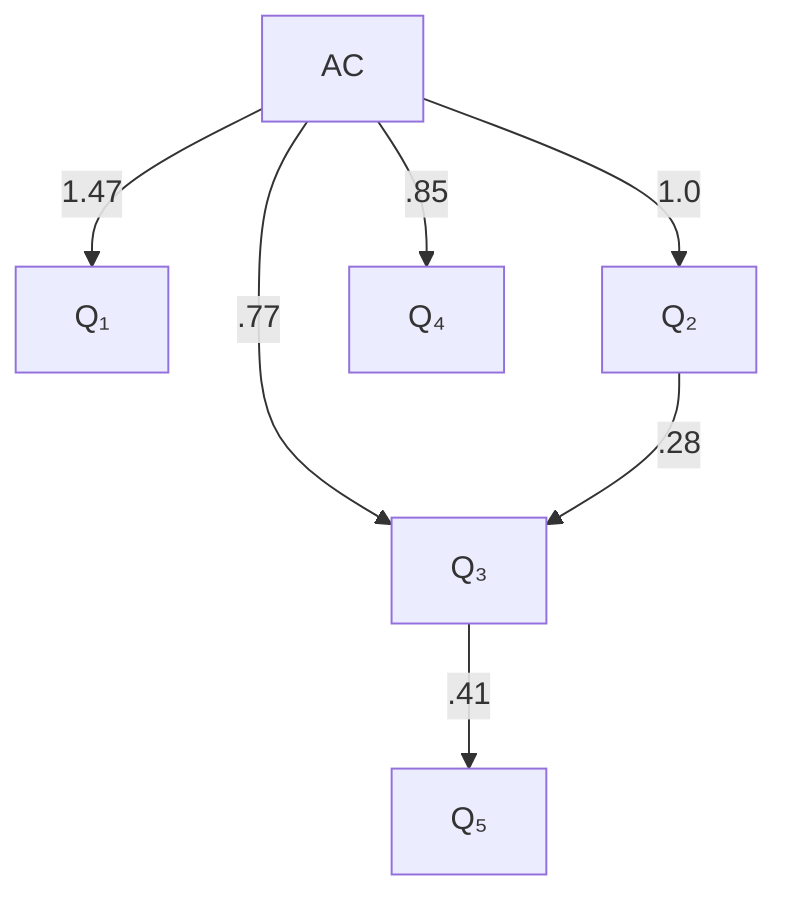

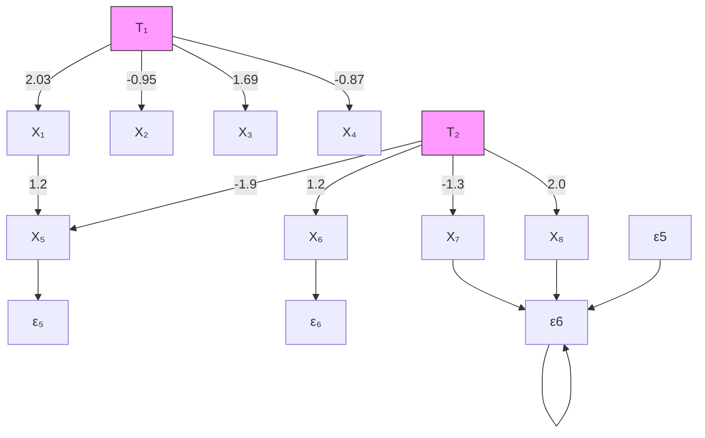

> 图 11.3

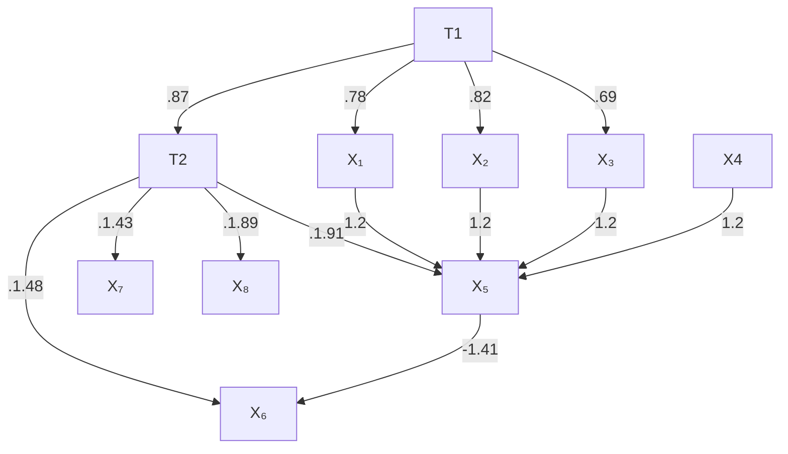

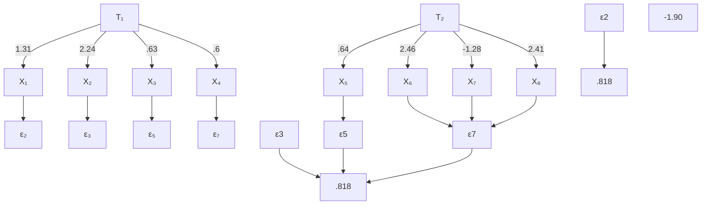

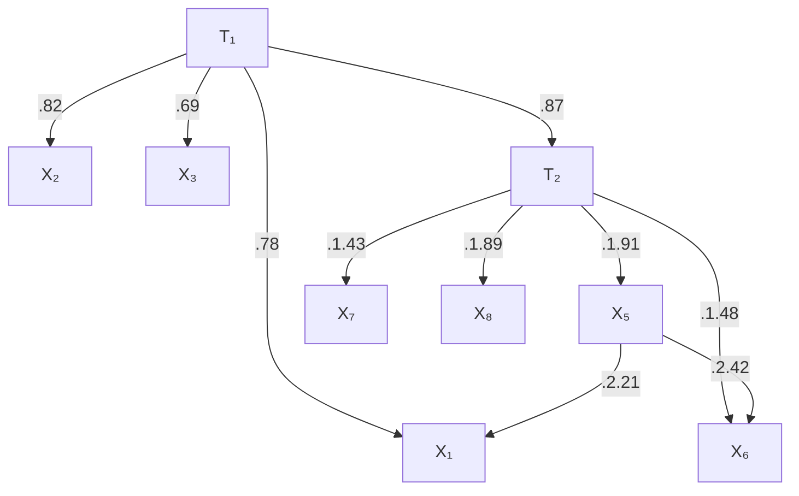

> 图 11.4

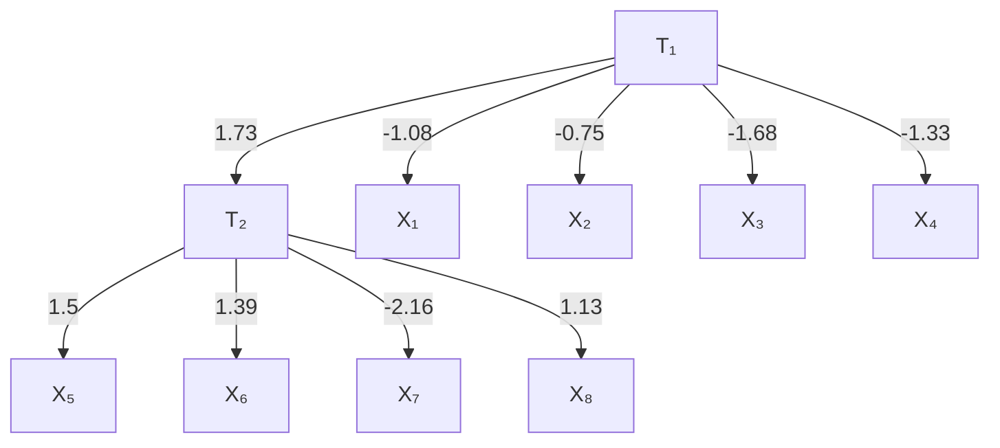

> 模型 8

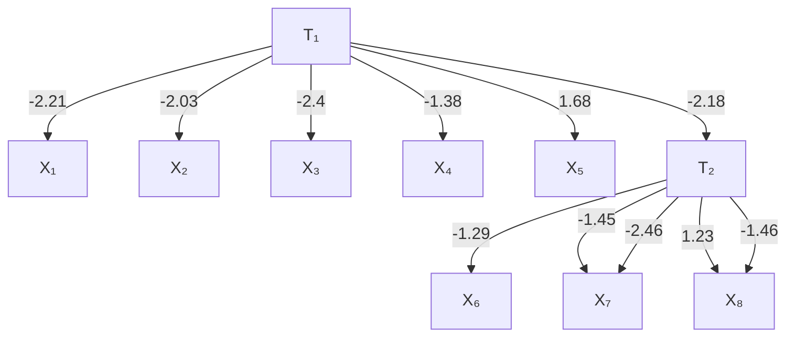

> 模型 9 图 11.5

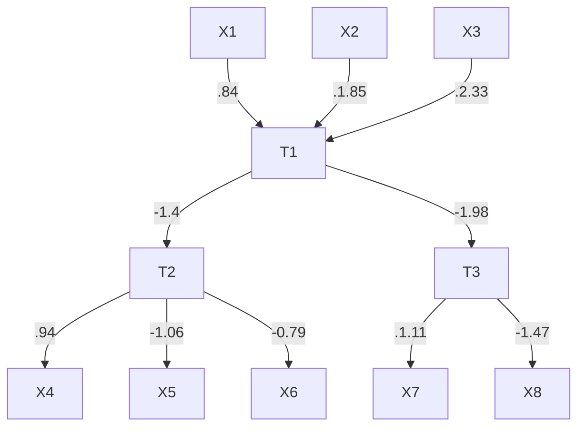

> 模型 1 的起始模型

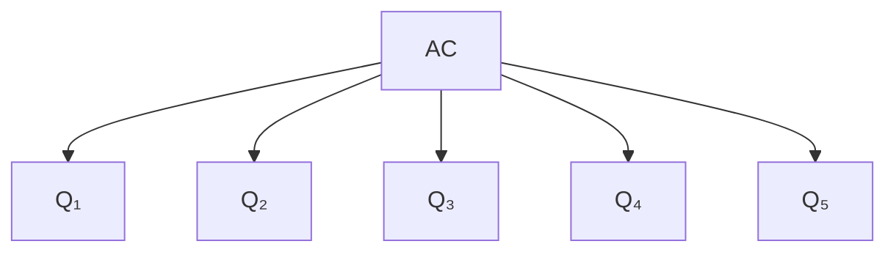

> 模型 2 - 8 的起始模型

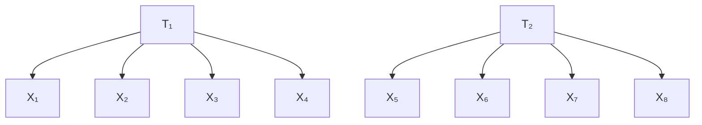

> 模型 9 的起始模型 图 11.6

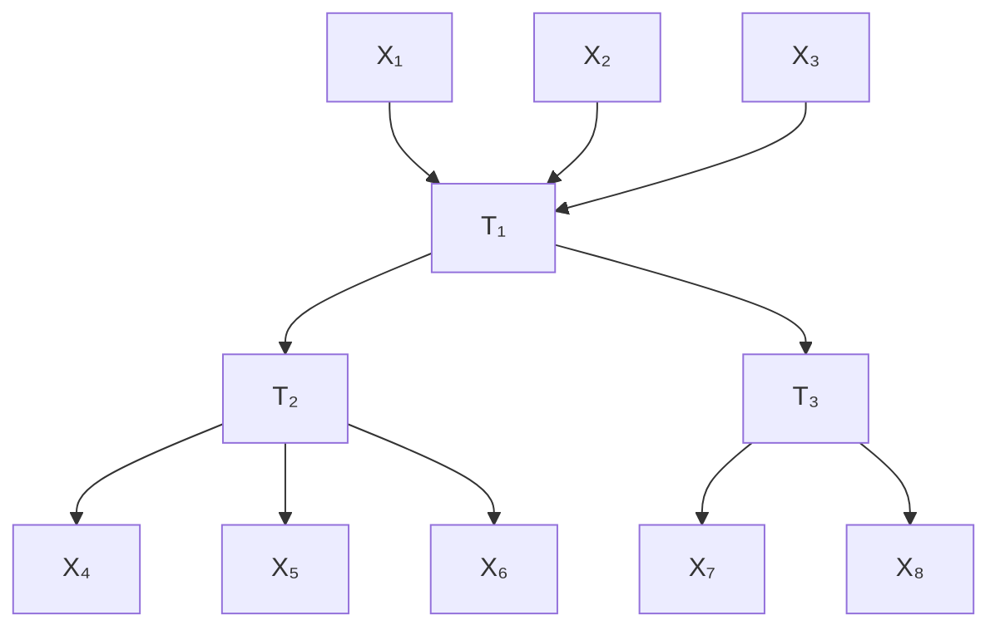

## 1.4.2.2 待恢复连接的选择（Selection of Connections to Be Recovered）

待恢复的连接包括：

- (i) 从潜变量到潜变量的有向边；这类关系通常是实证研究的要点。例如，参见 Maruyama 和 McGarvey (1980)。
- (ii) 从潜变量到测量变量的边；当测量不纯时，以及在其它情况下，可能会出现这类连接。例如，参见 Costner 和 Schoenberg (1973)。
- (iii) 测量变量之间的相关误差；这类关系可能是最频繁的重新设定形式。
- (iv) 从测量变量到测量变量的有向边。例如，社会指标之间不可能存在此类关系，但调查或心理测量工具的反应之间很可能存在此类关系（参见 Campbell 等人 1966），当然，诸如利率和房屋销售等测量变量之间也是如此。

我们没有包括那些我们事先知道无法被某个程序恢复的情况。细节将在后面的章节中给出。

## 11.4.2.3 起始模型的选择（Selection of Starting Models）

在九种情况下只使用了三种起始模型。用因果建模的术语来说，起始模型是纯因子模型（pure factor models）或纯多指标模型（pure multiple indicator models）。用图论术语来说，它们是树（trees）。

## 11.4.2.4 参数的选择（Selection of Parameters）

在显示真实模型的图中，有向边旁边的数字代表赋予相应线性系数的值。无向线旁边的数字代表指定的协方差值。在所有情况下，除模型 1 和模型 5 外，系数都是通过从 0.5 到 2.5 之间的均匀分布中随机选择来确定的。然后，随机赋予得到的值一个正号或负号。

在模型 1 中，所有线性系数均为正。指标之间因果连接的值是非随机指定的。构建这种情况是为了模拟心理测量或其他研究，其中已知潜因子上的载荷为正，并且测量变量之间的直接相互作用相对较小。

选择模型 5 是为了与模型 3 进行比较，其中测量-测量边的系数被有意选择得比模型 3 中的大。

## 11.4.2.5 数据的生成（Generation of Data）

对于九种情况中的每一种，通过蒙特卡洛模拟方法生成了二十个样本量为 200 的数据集和二十个样本量为 2,000 的数据集。

伪随机样本是通过第 5 章描述的方法生成的。为了优化每个程序的性能，我们假设所有外生变量都具有标准正态分布。这个假设使得可以通过从标准正态分布中进行伪随机抽样，为总体中的每个单元固定每个外生变量的值。在模拟中，通过引入一个与误差项相关的变量的新外生共同原因，获得了相关误差。

## 11.4.2.6 数据条件化（Data Conditioning）

我们在此讨论的整个研究进行了两次。在最初的研究中，我们为 LISREL VI 和 EQS 的所有参数提供了正的起始值。如果任一程序在估计起始模型时遇到困难，我们会将初始值设置为正确的符号后重新运行该情况。

LISREL 和 EQS 使用迭代程序来估计模型的自由参数。这些程序对“**条件不良（poorly conditioned）**”的变量很敏感，除非数据经过变换，否则无法达到最佳性能。例如，使用这些程序时有一条经验法则，即测量变量中任意两个方差的差异不应超过一个数量级。在我们按上述方式生成数据后，我们的协方差矩阵中有很小但显著的一部分以这种方式条件不良。

为了检查我们在第一次研究中获得的 LISREL VI 和 EQS 程序的低可靠性是否是由于“条件不良”数据造成的，整个研究被重复进行。通过将协方差矩阵中的每个单元格 [I,J] 除以 $s_{I} s_{J}$，将样本协方差转换为样本相关，其中 $s_{I}$ 是 I 的样本标准差。为了避免样本方差幅度差异过大，我们通过将样本协方差矩阵中的每个单元格 [I,J] 除以 $\sigma_{I} \sigma_{J}$ 来对其进行变换，其中 $\sigma_{I}$ 是 $I$ 的总体标准差 [9]。我们将这种变换的结果称为**伪相关矩阵（pseudocorrelation matrix）**。这种变换在不使用依赖于数据的变换的情况下，使所有测量变量的方差几乎相等。当然，在实证研究中，这种变换无法执行，因为总体参数是未知的。

在实践中，我们发现对数据进行条件化处理并给出总体参数作为起始值，对于改变 LISREL VI 或 EQS 的性能作用甚微。TETRAD II 程序在两种情况下的性能基本相同。对数据进行条件化处理略微提高了 LISREL VI 在小样本下的可靠性，但在大样本下略微降低了其可靠性。

## 11.4.2.7 参数的起始值（Starting Values for the Parameters）

我们随机选择了模型的线性系数，允许一些为负，一些为正。具有负参数的模型实际上对 TETRAD 程序构成了更困难的情况。如果一个模型意味着一个消失的四元组差异，那么其参数的符号无关紧要。然而，如果一个模型并不意味着四元组差异消失，而是意味着四元组差异等于两个或多个项之和，那么如果并非模型的所有参数都为正，这些项之和有可能为零。因此，在由具有负参数的模型生成的数据中，我们更有可能观察到并非由模型线性隐含的消失的四元组差异。

LISREL 和 EQS 的迭代估计程序从一个参数向量 $\theta$ 开始。它们更新这个向量，直到似然函数收敛到一个局部最大值。不可避免地，迭代程序对起始值很敏感。给定相同的模型和数据，但两个不同的起始向量 $\boldsymbol{\theta}^{i}$ 和 $\theta^{j}$，程序可能对其中一个收敛，而对另一个不收敛。当参数符号混合时尤其如此。为了在第二次研究中给 LISREL 和 EQS 提供尽可能最好的机会，只要可能，我们将每个参数的起始值设置为其实际值。对于对应于生成模型中但被排除在起始模型之外的边的线性系数，我们分配的起始值为 0。然而，对于所有其他参数，我们以总体中的确切值启动 LISREL 和 EQS。

## 11.4.2.8 显著性水平（Significance Levels）

只要相关的 $\chi^{2}$ 概率超过用户指定的显著性水平，EQS 和 LISREL VI 就会继续释放参数。对于 LISREL 和 EQS，我们将显著性水平设置为 0.01。（这是 LISREL 的默认值；EQS 的默认值是 0.05。）显著性水平越低，每个程序倾向于释放的参数就越少。由于 LISREL 和 EQS 即使在 0.01 水平下也往往过度拟合，我们没有尝试设置更高的显著性水平。（在我们的结果中，LISREL VI 和 EQS 可能看起来欠拟合多于过拟合，但几乎所有的“欠拟合”都是由未使用正常停止准则的中断搜索造成的。）

## 11.4.2.9 迭代次数（Number of Iterations）

在个人计算机上，LISREL VI 估计参数的最大迭代次数的默认值是 250。我们将 LISREL VI 和 EQS 测试的最大迭代次数都设置为 250。

## 11.4.2.10 在 LISREL VI 中指定起始模型（Specifying Starting Models in LISREL VI）

与以前版本的 LISREL 一样，LISREL VI 要求用户根据变量是外生的、内生的但未测量的、已测量的但依赖于外生潜变量的、已测量的但依赖于内生潜变量等，将变量放入不同的矩阵中。某些类别中的变量不能影响其他类别中的变量。当按照 LISREL 手册推荐的方式表述时，LISREL VI 原则上无法检测到本研究中考虑的许多效应。然而，在大多数情况下，这些限制可以通过一个**虚拟变量（phantom variables）** 替换系统来克服，其中测量变量实际上被表示为内生潜变量 [11]。在当前研究中，我们无法让 LISREL VI 允许 $\zeta$ 变量（内生且潜变量）影响 $\eta$ 变量（内生且潜变量）。这产生了一个不幸的后果，即 LISREL 不会考虑向 $T_{1}$ 添加任何边（$T_{1}$ 是一个 $\zeta$ 变量）。为了确保可比较的搜索问题，我们以相同的方式限制了 TETRAD II 和 EQS。

## 11.4.2.11 实施（Implementation）

LISREL VI 的运行使用了该程序的个人计算机版本，在一台带有数学协处理器的 Compaq 386 计算机上运行。EQS 的运行在一台带有数学协处理器的 IBM XT 兼容机上完成。所有 TETRAD II 的运行都在 Sun 3/50 工作站上完成。对于也可以在 IBM 兼容机上运行的 TETRAD II，其在 Compaq 386 和 Sun 3/50 上的处理时间大致相同。

## 11.4.2.12 TETRAD II 参数的设定（Specification of TETRAD II Parameters）

TETRAD II 要求用户设定**权重参数（weight parameter）**的值、用于检验**四元组差（tetrad differences）**是否消失的**显著性水平（significance level）**的值，以及一个用于限定搜索范围的**百分比参数（percentage parameter）**的值。在所有情况下，我们将显著性水平设定为 0.05。在样本量为 2000 时，我们将权重设为 0.1，百分比设为 0.95。

在样本量较小时，对总体协方差的估计可靠性较低，更多四元组差会被错误地判定为在总体中消失。这使得关于**解释性原则（Explanatory Principle）**的判断可靠性降低。因此，在样本量为 200 时，我们将权重设为 1，以便更加重视**证伪原则（Falsification Principle）**。对解释性原则判断的可靠性降低，也使得在较小样本量时降低百分比参数有所帮助。在样本量为 200 时，我们将百分比设为 0.90。我们不知道这些参数设置是否最优。

## 11.5 结果（Results）

对于每个数据集和初始模型，TETRAD II 都会生成一组最佳的备选**细化模型（elaborations）**。在某些情况下，该集合只包含一个模型；通常它包含两到三个备选模型。EQS 和 LISREL VI 在以其自动搜索模式运行时，会输出一个单一的细化初始模型。当输出包含真实模型时，每个程序提供的信息被评定为“正确”。但更重要的是要了解当输出不正确时，各个程序是如何出错的，因此我们对各种错误类型进行了更详细的分类。我们将 TETRAD II 的输出分类如下（其中，一个模型属于 TETRAD 的**顶级组（top group）**当且仅当它并列获得最高 Tetrad 分数，并且没有具有相同 Tetrad 分数的模型拥有更少的边）：

**正确（Correct）**—真实模型在 TETRAD 的顶级组中。

**宽度（Width）**—TETRAD 顶级组中备选模型的数量平均值。

## 错误（Errors）：

**过拟合（Overfit）**—TETRAD 的顶级组不包含真实模型，但包含一个真实模型的细化模型。

**欠拟合（Underfit）**—TETRAD 的顶级组不包含真实模型，但包含一个模型，而真实模型是该模型的细化。

**其他（Other）**—之前的类别都不适用于该输出。

我们按如下方式对 LISREL VI 和 EQS 程序的输出进行评分：

**正确（Correct）**—程序推荐了真实模型。

## 错误（Errors）：

**在 TETRAD 顶级组中（In TETRAD's Top Group）**—推荐的模型不正确，但属于 TETRAD II 程序针对相同数据建议的最佳备选模型之一。

**过拟合（Overfit）**—推荐的模型是真实模型的细化。

**欠拟合（Underfit）**—真实模型是推荐模型的细化。

**正确变量对（Right Variable Pairs）**—推荐的模型不属于任何之前的类别，但它确实连接了与真实模型省略部分中相同的变量对。

**其他（Other）**—之前的类别都不适用于该输出。

在大多数情况下，LISREL VI 或 EQS 均未出现估计问题。在案例 3 和案例 5 的许多数据集中，LISREL VI 和 EQS 要么发出关于估计问题的警告，要么由于计算问题而中止搜索。由于我们的输入文件旨在最小化收敛问题，我们在结果制表中忽略了此类警告。如果任一程序建议释放一个参数，无论释放之前或之后出现何种警告或估计问题，我们都将该参数视为已释放。如果任一程序由于起始模型中的估计问题而未能建议释放任何参数，我们将其计为欠拟合。结果如下表和下图所示。

对于样本量为 2000 的情况，TETRAD II 的集合在 95% 的案例中包含了正确的重新设定。LISREL VI 在 18.8% 的情况下找到了正确的模型，EQS 为 13.3%。对于样本量为 200 的情况，TETRAD II 的集合在 52.2% 的案例中包含了正确的重新设定，而 LISREL VI 在 15.0% 的情况下纠正了错误设定，EQS 在 10.0% 的情况下纠正了错误设定。图 11.8 给出了更详细的错误特征描述。

**表 11.1（Table 11.1）**

<table><tr><td colspan="10">宽度，n=2000</td></tr><tr><td>案例</td><td>1</td><td>2</td><td>3</td><td>4</td><td>5</td><td>6</td><td>7</td><td>8</td><td>9</td></tr><tr><td>LISREL VI</td><td>1</td><td>1</td><td>1</td><td>1</td><td>1</td><td>1</td><td>1</td><td>1</td><td>1</td></tr><tr><td>EQS</td><td>1</td><td>1</td><td>1</td><td>1</td><td>1</td><td>1</td><td>1</td><td>1</td><td>1</td></tr><tr><td>TETRAD</td><td>4</td><td>2.1</td><td>2</td><td>1</td><td>1.1</td><td>3</td><td>7.1</td><td>11.3</td><td>2.9</td></tr><tr><td colspan="10">宽度，n=200</td></tr><tr><td>案例</td><td>1</td><td>2</td><td>3</td><td>4</td><td>5</td><td>6</td><td>7</td><td>8</td><td>9</td></tr><tr><td>LISREL VI</td><td>1</td><td>1</td><td>1</td><td>1</td><td>1</td><td>1</td><td>1</td><td>1</td><td>1</td></tr><tr><td>EQS</td><td>1</td><td>1</td><td>1</td><td>1</td><td>1</td><td>1</td><td>1</td><td>1</td><td>1</td></tr><tr><td>TETRAD</td><td>1.9</td><td>3.5</td><td>1.5</td><td>1</td><td>1</td><td>3.2</td><td>5.9</td><td>8.4</td><td>3</td></tr></table>

> 图 11.8（Figure 11.8）

## 11.6 可靠性与信息量（Reliability and Informativeness）

判断这些程序建议的标准有两个。第一个是**可靠性（reliability）**。将程序的可靠性定义为其建议的模型集合包含正确模型的概率。在这些案例中，TETRAD 搜索过程显然比 LISREL VI 和 EQS 都更可靠。简单地通过增加猜测数量就可以获得更高的可靠性。一个输出前一百万个模型的程序可能非常可靠，但其建议将缺乏信息量。因此，我们将第二个标准称为**大胆性（boldness）**。将程序建议的大胆性定义为其建议模型数量的倒数。根据这个衡量标准，我们所考虑的几个案例中，我们的程序在七个案例中的表现不如 LISREL VI 或 EQS。

由于我们的程序和**修改指数（modification index）**程序在这两个标准上均未占优，自然会提出一个问题：前者的更高可靠性是否仅仅是由于其较低的大胆性？这个问题至少可以从两个角度来理解：

- (i) 如果 TETRAD II 提高其大胆性以匹配 LISREL VI 和 EQS，即，如果它只输出一个单一模型，那么它会比 LISREL VI 或 EQS 更可靠还是更不可靠？
- (ii) 如果 LISREL VI 或 EQS 降低其大胆性以匹配 TETRAD II，即，如果它们输出与 TETRAD II 一样大的模型集合，那么它们会比 TETRAD II 更可靠还是更不可靠？

如果我们没有理由相信 TETRAD II 输出中的任何一个模型比其他模型更可能是正确的，我们可以简单地随机选择一个模型。我们可以通过以下方式计算我们程序的期望单一模型可靠性。我们假设当 TETRAD II 针对给定的协方差矩阵输出一个包含 $n$ 个模型的列表时，选择其中任何一个特定模型作为最佳猜测的概率是 $1/n$。因此，我们不将一个包含正确模型且长度为 $n$ 的列表计为一个正确答案，而是将其计为 $1/n$ 个正确答案。然后，只需将期望正确答案数除以试验运行次数即可。

如果 TETRAD II 像 LISREL VI 或 EQS 一样大胆，其在样本量为 2000 时的单一模型可靠性将从 95% 下降到约 42.3%。在我们的数据中，LISREL VI 的可靠性为 18.8%，EQS 的可靠性为 13.3%。在样本量为 200 时，TETRAD II 的单一模型可靠性为 30.2%，LISREL 的可靠性为 15.0%，EQS 为 10.0%。在更现实的环境中，人们可能有实质性理由偏好某个模型而非另一个。如果实质性知识有价值，并且我们用其来选择单一模型 $M$，那么 $M$ 比从 TETRAD II 的建议模型集合中随机选择的模型更可能是真实的。因此，从某种意义上说，上段给出的数字是最坏情况。

另一种策略是在选择模型之前缩小集合的大小。我们通常可以通过在 EQS 或 LISREL VI 中运行 TETRAD II 的建议并丢弃那些未并列获得最高关联概率的模型来消除其中一些建议。这影响很小。我们将 TETRAD II 在样本量为 2000 时的（最坏情况）单一模型可靠性从 42.3% 提高到约 46%，在样本量为 200 时从 30.2% 提高到约 32%。

有许多充分的理由希望得到一个包含同等优秀建议的列表，而不是一个单一的猜测。所有这些都涉及输出的可靠性和信息量。

首先，对于程序用户来说，清楚了解程序输出的可靠性非常重要。在样本量为 2000 时，在我们考虑的案例范围内，TETRAD II 输出的可靠性非常稳定，范围从 90% 的低点到 100% 的高点。出于下文解释的原因，LISREL VI 和 EQS 输出的单一模型充其量不过是从一个模型列表中随机选择的结果，该列表包含了所有关联概率等于真实模型的模型（也可能包含其他关联概率较低的模型）。不幸的是，建议模型被随机选择的列表大小因模型结构而异，且用户无从知晓。因此，即使忽略 LISREL VI 遇到严重计算困难的案例，LISREL VI 在样本量为 2000 时的输出可靠性范围也从 0/20 到 11/20。因此，LISREL VI 或 EQS 的用户很难知道应该对其建议的模型抱有多大信心。

其次，建议集合中的多个模型可能导向相同的结论。例如，TETRAD II 建议的许多模型可能重叠，即它们在相当数量的因果连接上可能一致。如果一个人的研究关注点位于这些模型一致的部分内，那么选择一个单一模型就不是必需的。在这种情况下，无需通过增加大胆性来牺牲可靠性，因为所有竞争模型都一致。

最后，拥有一个明确定义的合理备选模型列表比单一的、可靠性较低的建议更有助于指导进一步的研究。在设计实验和收集更多数据时，确切了解必须消除哪些竞争模型才能建立确凿的结果是非常有用的。例如，考虑案例 3。正确模型包含从 $X _ { 1 }$ 到 $X _ { 5 }$ 以及从 $X _ { 5 }$ 到 $X _ { 6 }$ 的边。TETRAD II 建议了正确模型，以及一个包含从 $X _ { 1 }$ 到 $X _ { 5 }$ 和从 $X _ { 1 }$ 到 $X _ { 6 }$ 的边的模型。一个改变 $X _ { 1 }$ 并检验对 $X _ { 6 }$ 影响的实验将无法区分这两个备选方案（因为两者都预测改变 $X _ { 1 }$ 会导致 $X _ { 6 }$ 变化），但一个改变 $X _ { 5 }$ 并检验对 $X _ { 6 }$ 影响的实验则可以区分这些备选方案。只有了解合理的备选方案，我们才能决定这些实验哪个更有用。

如果 LISREL VI 或 EQS 像我们的程序一样输出一个大的模型集合，它们会同样可靠吗？答案取决于集合中其余模型是如何选择的。在许多情况下，LISREL VI 和 EQS 会发现几个参数的修改指数并列或几乎并列最高。目前，这两个程序都基于参数的任意顺序选择其中一个（且仅一个）参数进行释放。例如，如果在评估初始模型后发现 $X _ { 3 }  X _ { 5 }$ 和 $X _ { 3 } \thinspace \mathrm { C } \thinspace X _ { 5 } ^ { 1 3 }$ 并列最高修改指数，LISREL VI 或 EQS 会选择其中一个（例如 $X _ { 3 }  X _ { 5 }$ ）并继续搜索，直到找不到更多可释放的参数。然后它们会建议具有最高关联概率的单一模型。如果 LISREL VI 或 EQS 搜索所有对应于并列修改指数的分支，而不是任意选择一个，它们的可靠性无疑会大幅提高。例如，在释放 $X _ { 3 }  X _ { 5 }$ 并继续释放参数直到不应再释放任何参数后，LISREL VI 或 EQS 可以返回到初始模型，释放 $X _ { 3 } \mathrm { ~ C ~ } X _ { 5 }$ ，并再次继续释放参数直到不应再释放任何参数。然后它们可以建议所有并列最高关联概率的模型。这本质上是 TETRAD II 程序遵循的搜索策略。

如果在案例 1 中，样本量为 2000 时 LISREL VI 的搜索以这种方式扩展，其正确输出数量将从 20 次中的 3 次增加到 16 次。在其他案例中，这种策略对 LISREL VI 或 EQS 性能的提升并不大。例如，在案例 5 中，样本量为 2000 时，LISREL VI 在每个样本上都不正确，部分原因是各种收敛和计算问题，而 TETRAD II 在每个案例上都是正确的。在案例 4 中，样本量为 2000 时，LISREL VI 在九个样本上错过了正确答案（而 TETRAD II 仅错过了两个样本），原因与打破平局的方法无关。

LISREL VI 和 EQS 将为扩展其搜索付出相当大的代价；它们的处理时间将急剧增加。一个在每个阶段保留三个备选方案并在初始模型中释放两个参数后停止所有分支的分支程序，将使所需时间增加约 7 倍。一般来说，分支搜索所需的时间随着每个阶段考虑的备选方案数量呈指数增长。这样的搜索能在合理的时间内运行吗？在没有数学协处理器的情况下，在 Compaq 386 上运行一次典型的 LISREL VI 大约需要 20 分钟；有数学协处理器时大约需要 4 分钟。EQS 运行是在一台 LEADING EDGE（一个比 COMPAQ 386 慢得多的 IBM XT 克隆机）上进行的，带有数学协处理器，平均 EQS 运行时间约为 5 分钟。这表明，对于 LISREL VI 来说，即使是中等规模的模型，分支策略也只有在相对较快的机器上才可能实现；而对于速度较快但可靠性较低的 EQS 搜索，在较慢的机器上进行分支搜索是可行的。

## 11.7 使用 LISREL 和 EQS 作为搜索的辅助工具（Using LISREL and EQS as Adjuncts to Search）

有两种方式可以将 TETRAD II 所展示的那种搜索与 LISREL VI 或 EQS 有效地结合使用。像我们这样的程序可以用来生成初始模型的一系列备选修订方案，然后这些方案可以由 LISREL 或 EQS 进行估计，并丢弃那些关联概率非常低或相对较低的备选方案。我们发现，仅在三个案例中，关联概率能够区分 TETRAD II 建议的模型。在案例 6 中，TETRAD II 建议的三个模型中有一个的关联概率低于其他两个。在案例 7 中，TETRAD II 建议的六个模型中有一个的关联概率低于其他五个。TETRAD II 建议的最大缩减出现在案例 8，其中 TETRAD II 建议的 12 个模型中有 8 个的关联概率低于前四个。这些结果是在 LISREL VI 获得了正确模型中所有边的正确起始值，以及不在正确模型中的边的起始值为零的情况下获得的；在之前的测试中，当 LISREL VI 未获得真实参数作为初始值时，它经常遇到收敛问题。

同时运行 TETRAD II 和 LISREL VI 或 EQS 的自动搜索也很有启发性。当 LISREL VI 和 TETRAD II 一致时（即 LISREL VI 建议的模型在 TETRAD II 的顶级组中），两个程序正确的百分比都高于各自的平均值；相反，当它们不一致时，两个程序错误的百分比都高于其平均值。当 EQS 与 TETRAD II 结合使用时也是如此。事实上，在样本量为 2000 时，当 EQS 或 LISREL VI 与 TETRAD II 不一致时，它们从未正确过。相比之下，在样本量为 2000 时，当 LISREL VI 与 TETRAD II 一致时，其正确率为 61.8%；当 EQS 与 TETRAD II 一致时，其正确率为 53.3%。同样，在样本量为 2000 时，当 TETRAD II 与 LISREL VI 或 EQS 中的任何一个一致时，它总是正确的。在样本量为 200 时，虽然 TETRAD II 的平均正确率为 52.2%，但当它与 LISREL VI 一致时，正确率为 75.7%；当它与 EQS 一致时，正确率为 75.0%。这些结果总结如下：

**样本量 2000（Sample size 2000）：**

<table><tr><td>P(TETRAD 正确)</td><td>95.0</td></tr><tr><td>P(LISREL VI 正确)</td><td>18.8</td></tr><tr><td>P(EQS 正确)</td><td>13.3</td></tr><tr><td>P(TETRAD 正确 | LISREL VI 一致)</td><td>100.0</td></tr><tr><td>P(TETRAD 正确 | LISREL VI 不一致)</td><td>92.1</td></tr><tr><td>P(TETRAD 正确 | EQS 一致)</td><td>100 0</td></tr><tr><td>P(TETRAD 正确 | EQS 不一致)</td><td>92.6</td></tr><tr><td>P(LISREL VI 正确 | TETRAD II 一致)</td><td>61.8</td></tr><tr><td>P(LISREL VI 正确 | TETRAD II 不一致)</td><td>0.0</td></tr><tr><td>P(EQS 正确 | TETRAD II 一致)</td><td>53.3</td></tr><tr><td>P(EQS 正确 | TETRAD II 不一致)</td><td>0.0</td></tr></table>

**样本量 200（Sample size 200）：**

<table><tr><td>P(TETRAD 正确)</td><td>52.2</td></tr><tr><td>P(LISREL VI 正确)</td><td>15.0</td></tr><tr><td>P(EQS 正确)</td><td>10.0</td></tr><tr><td>P(TETRAD 正确 | LISREL VI 一致)</td><td>75.7</td></tr><tr><td>P(TETRAD 正确 | LISREL VI 不一致)</td><td>46.9</td></tr><tr><td>P(TETRAD 正确 | EQS 一致)</td><td>75.0</td></tr><tr><td>P(TETRAD 正确 | EQS 不一致)</td><td>47.2</td></tr><tr><td>P(LISREL VI 正确 | TETRAD II 一致)</td><td>39.4</td></tr><tr><td>P(LISREL VI 正确 | TETRAD II 不一致)</td><td>9.5</td></tr><tr><td>P(EQS 正确 | TETRAD II 一致)</td><td>43.7</td></tr><tr><td>P(EQS 正确 | TETRAD II 不一致)</td><td>2.7</td></tr></table>

## 11.8 TETRAD II 细化搜索的局限性（Limitations of the TETRAD II Elaboration Search）

如果存在大量并非由真实模型线性蕴含，而是由于自由参数的巧合值而成立的消失四元组差，则 TETRAD II 程序无法找到正确模型。我们的研究表明，这种情况并不常见，至少在生成我们数据时对模型线性系数施加的均匀分布下是如此，但它确实会发生。对于参数的任何其他“自然”分布，可以预期得到相同的结果。此外，搜索并不能保证它会找到所有具有最高 Tetrad 分数的模型。但在许多情况下，取决于模型的大小、背景知识的数量、模型的结构以及样本量，搜索空间非常大，以至于保证找到具有最高 Tetrad 分数的模型的搜索是不切实际的。该程序限制搜索的一种方法是通过应用**简洁性原则（simplicity principle）**。这是一个可能为假的实质性假设。对于某些小模型，简洁性假设并非必需，但在许多变量更多的问题中，可能存在大量具有最大分数但包含许多对分数无贡献的冗余边的模型。如果不使用简洁性原则，通常很难搜索这个模型空间，而且如果进行搜索，可能会有太多模型并列最高分数，以至于输出缺乏信息量。如果一个包含“冗余”边的模型是正确的，那么我们的程序将无法找到它。通常这些结构是**欠识别的（underidentified）**，因此 LISREL VI 或 EQS 也无法找到它们。

我们在此描述的搜索过程对于不超过几十个变量的情况是实用的。然而，对于更多数量的变量，第 10 章中描述的 **MIMBuild 算法**可能适用。

最后，存在许多**潜变量模型（latent variable models）**，它们无法通过其蕴含的消失四元组差来区分，但原则上在统计上是可以区分的。当 TETRAD 程序失败时，更可靠的 LISREL 或 EQS 程序版本可能成功发现此类结构。

## 11.9 统计搜索的一些启示（Some Morals for Statistical Search）

TETRAD II 程序在本文所考虑的问题上比其他两种搜索程序更可靠，原因有三。

(i) 与 LISREL VI 或 EQS 不同，TETRAD II 无需估计任何参数即可进行搜索。由于参数估计必须在错误的初始模型上进行，LISREL VI 和 EQS 经常无法收敛，或者计算出高度不准确的参数估计。这反过来又导致了它们各自搜索中的问题。

- (ii) 在 TETRAD II 搜索中，当几个不同模型的分数并列时，程序会考虑每个模型的细化。相比之下，LISREL VI 和 EQS 则任意选择一个单一模型进行细化。
- (iii) 在决定何时停止添加边时，LISREL VI 和 EQS 的可靠性均低于 TETRAD II。

对统计搜索的启示是显而易见的：尽可能避免迭代数值过程；结构化搜索，以便在备选步骤看起来同样好时能够进行分支；寻找能够可靠地修剪搜索树的**结构属性（structural properties）**；为计算效率起见，尽可能使用局部属性；在没有充分证据表明统计检验作为停止标准是可靠的情况下，不要依赖它们。

如果没有明确搜索的目标，就无法充分评估统计搜索。我们认为，在统计学应用于社会、医学和心理学领域时，目标通常是发现和估计因果影响。对搜索的最终启示很简单：一旦目标被清晰且坦诚地给出，如果短期内甚至长期内都无法提供可靠性的理论证明，计算机提供了在受控条件下对程序进行可靠性实验测试的机会。