# 前传与续篇（Prequels and Sequels）

## 12.1 图形表示、独立性与数据生成过程（Graphical Representations, Independence, and Data Generating Processes）

为了表示概率分布上的约束以及数据生成过程的各个方面，人们引入了多种图形对象。每一类对象都伴随着一个或多个将图形结构与条件独立性属性联系起来的原则，正如**无向图（undirected graphs）**与可分离性配对、**有向无环图（directed acyclic graphs, DAGs）**与**马尔可夫条件（Markov Condition）**或 **d-分离（d-separation）**配对一样。Lauritzen 等人（1990）描述了不同类型图形模型的各种**马尔可夫性质（Markov properties）**，以及这些马尔可夫性质之间的关系。按照他们的术语，第 2 章中的马尔可夫条件是一种“局部”马尔可夫性质，而 d-分离则是一种“全局”马尔可夫性质。图形对象由顶点、边以及边或边对上的标记（第 2 章）组成，这类对象的族系可能以各种方式限制可能性。例如，**无向图（undirected graphs）**（第 2 章第 4 节）只包含无向边，这类对象的自然全局无向马尔可夫性质规定：如果互不相交的集合 $X, Y, Z$ 满足以下条件——即 $Y$ 在如下意义上分离了 $X$ 和 $Z$：连接 $X$ 中某成员与 $Z$ 中某成员的每条路径都包含 $Y$ 中的一个成员——那么 $X \bot \bot Z \mid Y$。

在某些情况下——例如**有向循环图（directed cyclic graphs, DCGs）**——这些表示方法已经使用了多年，但从未对将图形结构与独立性属性联系起来的原则，或此类结构所描述的数据生成过程进行过一般性的阐述。在本节中，我们将考虑**有向无环图（directed acyclic graphs, DAGs）**、**有向循环图（directed cyclic graphs, DCGs）**、**部分祖先图（partial ancestral graphs, PAGs）**、**混合祖先图（mixed ancestral graphs, MAGs）**和**链图（chain graphs, CGs）**。**有向图（directed graphs, DGs）**的集合是 DAGs 和 DCGs 的并集。研究这些表示方法不仅是因为它们代表了某种条件独立性关系族系，还因为它们描述了应用统计学中常用多种模型中因果假设与条件独立性之间的关系。关于这些结构及其他结构，以及可通过图形表示的其他分布族系的讨论，请参见 Lauritzen 1996、Shafer 1996 和 Edwards 1995。关于图形模型的因果推断的讨论，请参见 Lauritzen 2000。

### 12.1.1 马尔可夫条件（Markov Conditions）

如第 3 章所述，**因果马尔可夫条件（Causal Markov Condition）** 对一个通常被称为局部马尔可夫性质的形式化条件给出了因果解释。因果马尔可夫条件必然适用于任何可由 DAG 表示的系统，在该系统中，**外生变量（exogenous variables）**——即由零入度顶点表示的变量——是独立分布的，且每个变量是其父变量（直接原因）与唯一、联合独立的噪声或“误差”的任何（可测的、确定性的）函数。该条件也必然适用于通过消除任何零入度且单位出度的顶点子集并进行相应边际化而获得的子图和边际概率分布。

关于该条件是否适用于量子力学系统（第 3 章及 Maudlin 1994），仍存在一些争议。因果马尔可夫条件不适用于某些变量由其他变量定义的系统，也不适用于存在单元间因果关系的系统（例如流行病，其中单元是人），尽管如果重新定义单元使得不存在单元间因果关系，则该条件将适用（例如，在一群人的流行病中，可以将该群体视为一个单一单元）。正如我们在第 6 章中所强调的，即使该条件对某个数据生成过程所描述的总体成立，由于以下原因，它也可能无法表征样本中测量变量所呈现的条件独立性关系：

- 1. **抽样误差（sampling error）**；
- 2. 抽样机制与观测变量之间的因果关系（第 9 章第 12.1.3 节）；
- 3. 测量变量之间缺乏**因果充分性（causal sufficiency）**（第 6 章）；
- 4. 变量值的聚合（例如第 3 章中，用“低”、“中”或“高”而非两个实数来表示血压）；
- 5. 当一个变量在定义上是另一个变量的函数时（例如 $X$ 和 $X^2$）；
- 6. 样本中，对于某些单元，$A$ 导致 $B$，而对于其他单元，$B$ 导致 $A$；
- 7. 可逆系统。

Sober（1987）批评了因果马尔可夫条件的一个推论，理由是：两个时间序列，例如英国的面包价格和威尼斯的**海平面（sea level）**，可能都在上涨，因而相关，尽管它们之间没有因果关系。然而，在这个例子中，不清楚单元是什么，变量又是什么。如果变量是面包价格和海平面，那么单元就是年份，并且存在单元间因果关系（因为某一年的海平面会影响另一年的海平面）。如果通过取面包价格的差值和海平面的差值来消除单元间因果关系，则没有理由相信这些差值之间存在相关。另一方面，如果不同年份的海平面是不同的变量，且不同年份的面包价格也是不同的变量，那么只有一个单元，因此不存在相关关系。

因果马尔可夫条件可能不适用于由时间序列生成的**反馈系统（feedback systems）**（第 12.1.2 节）的样本，因为根据过程是什么以及单元被视为什么，可能存在单元间因果关系，或混合了 $A$ 导致 $B$ 的单元与 $B$ 导致 $A$ 的单元，或变量值的聚合（例如通过时间平均）。

因果主张的组成含义已由 Hausman（1998）仔细分析过，因果马尔可夫条件也在 Hausman 和 Woodward（待发表）的一篇有趣文章中得到了详细辩护，该文章强调了该条件与干预和机制之间关系的密切联系。该条件或其推论也受到了一些作者的批评（即使对于上述例外列表中未列出的系统也是如此）（Lemmer 1996, Cartwright 1993, Artzenius 1992, Humphreys 和 Freedman 1996，后者还批评了第 5 章中的一些模型）；对这些批评的答复见 Hausman 和 Woodward（待发表）、Spirtes 等人 1997 以及 Korb 和 Wallace 1997。Goldszmidt 和 Pearl（1992）提出了因果马尔可夫条件的一个定性版本（不使用概率）。

### 12.1.2 有向循环图（Directed Cyclic Graphs）

我们在第 2 章和第 3 章中称为**伪不确定因果结构（pseudoindeterministic causal structures）** 的模型是通常称为**结构方程模型（structural equation models, SEMs）**的特例。SEM 中的变量可以分为两组：**误差变量（error variables）**或**误差项（error terms）**，以及**实质性变量（substantive variables）**。对应于每个实质性变量 $X_i$ 都有一个方程，方程左侧是 $X_i$，右侧是 $X_i$ 的直接实质性原因加上误差项 $\varepsilon_i$，其中 $\varepsilon_i$ 表示除实质性原因之外所有原因的综合效应。（对于外生实质性变量 $X_i$，我们将方程写为 $X_i = \varepsilon_i$；这不是标准写法，但有助于赋予误差项统一且特殊的地位，即为系统提供所有外生随机变异的来源。）每个 SEM 都关联着一个图（在 SEM 文献中称为“**路径图（path diagram）**”）。在关联的路径图中，当且仅当 $X_j$ 是相应结构方程中 $X_i$ 的函数时，存在一条从 $X_i$ 到 $X_j$ 的有向边。路径图中允许有向环。通过给外生变量分配一个概率分布（这进而决定了所有变量的联合分布），将一个分布与 SEM 关联起来。误差项通常不包含在 SEM 的路径图中，除非该误差项依赖于其他某个误差项。如果两个误差项是相依的，则它们会被包含在路径图中，并通过一条双头边（$\leftrightarrow$）连接。换句话说，除非在路径图中通过双头边显式连接，否则所有误差项都被假定为独立的。一个每个顶点都是其关联误差项及其在关联路径图中父变量的线性函数的 SEM 称为**线性结构方程模型（linear SEM）**。（线性 SEM 及其关联路径图的示例见图 12.1。）关于 SEM 的良好介绍可参见 Bollen 1989。

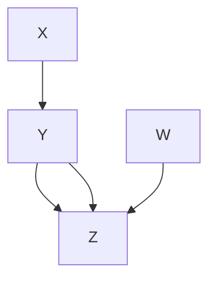

$$
X = \varepsilon_{X} \quad Y = a \times X + b \times Z + \varepsilon_{Y}
$$

$$
W = \varepsilon_{W} \qquad Z = c \times W + d \times Y + \varepsilon_{Z}
$$

$\varepsilon_{X}, \varepsilon_{Y}, \varepsilon_{Z}, \varepsilon_{W}$ 是联合独立的标准高斯分布

图 12.1

与图 12.1 中 DCG 相关联的分布通常不满足局部马尔可夫性质到 DCG 的自然推广。根据与该 DCG 相关联的线性方程以及外生变量联合独立的假设，可以得出 $X \bot \bot W$ 和 $X \bot \bot W \mid \{Y, Z\}$，但与局部马尔可夫性质到 DCG 的自然推广相反，$X$ 在给定 $\{Y, W\}$（$Z$ 的父变量集）的条件下并不独立于 $Z$。然而，**d-分离关系（d-separation relation）** 确实可以直接推广到有向循环图；DAG 中 d-分离的定义可以原封不动地沿用。Spirtes（1994, 1995）以及分别地 Koster（1995, 1996）证明，如果在对应于线性 SEM 的 DCG 中，$X$ 和 $Z$ 在给定 $Y$ 的条件下是 d-分离的，那么该线性 SEM 蕴含 $\mathbf{X} \bot \bot \mathbf{Z} \mid \mathbf{Y}$。Spirtes（1995）证明，如果一个线性 SEM（无相依误差）对所有自由参数值都蕴含 $\mathbf{X} \bot \bot \mathbf{Z} \mid \mathbf{Y}$，那么在相应的 DCG 中，$X$ 和 $Z$ 在给定 $Y$ 的条件下是 d-分离的。Spirtes（1994）还为非线性 SEM 中蕴含的条件独立性提供了一个充分条件。对于具有相依误差的线性 SEM，Spirtes 等人（1998）证明，如果将相依误差之间的每个双头箭替换为一个独立的潜在共同原因，那么实质性变量之间的条件独立性关系仍然由 d-分离来刻画。因此，d-分离刻画了通常与线性 SEM 相关联的路径图所蕴含的独立性关系（这也将在 Koster 即将发表的论文中得到证明）。Koster（1996）还将链图推广到包含循环。

将 DAG 的**分解条件（factorization conditions）**（其中联合分布等于各顶点在其父变量条件下的分布的乘积）天真地推广到 DCG 可能会导致荒谬的结果。例如，对于二元变量，人们可能试图通过分解 $P(Y, Z) = P(Y|Z) P(Z|Y)$ 来表示图 12.2 中图形的分布。然而，该分解隐含了 $Y$ 和 $Z$ 是独立的。

> 图 12.2

Pearl 和 Dechter（1996）已经证明，在离散变量的结构方程模型中，如果（i）外生变量（包括误差项）是联合独立的，且（ii）外生变量的值唯一地决定了内生变量的值，那么即使关联的路径图是循环的，如果 $X$ 和 $Z$ 在给定 $Y$ 的条件下是 d-分离的，则 $X \bot \bot Z \mid Y$。然而，如果一个图是循环的，且每个顶点是其图中父变量及其关联误差项的函数，那么非误差项变量并不总是仅由误差项的函数决定。Neal（2000）指出，为了推导他们的结果，Pearl 和 Dechter 实际上需要更强的假设，即每个变量是其祖先误差项的函数。

适合用 DCG 描述的**数据生成过程（data generating processes）** 仍然没有被很好地理解。考虑一个由两个子总体组成的总体，一个具有图 12.3 中的因果 DAG（i），另一个具有因果 DAG（ii）。

> (i)

> (ii)

> (iii) 图 12.3

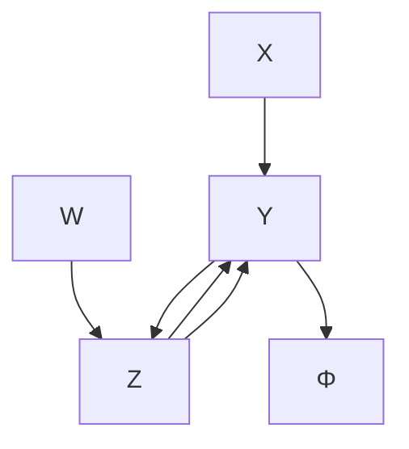

假设 $X$ 和 $W$ 的联合分布在两个子总体中相同。那么合并总体中的独立性和因果结构可以用图 12.3（iii）中的 DG 来表示。对于样本中的每个单元，$\Phi$ 的值编码了哪条路径成立：$Y \to Z$ 或 $Z \gets Y$。

某些 DCG 可以描述由时间序列表示的相应反馈系统中因果结构和条件独立性的某些方面，但不存在将任意 DCG 写成有趣的时间序列的通用方法，反之亦然。已知一些特定案例（Fisher 1970, Richardson 1996a, Wermuth 等人 1999）。

Strotz 和 Wold（1960）给出了线性联立方程模型的**干预理论（theory of intervention）**，其内容很简单：将方程中被操纵的变量替换为通过干预赋予它的值。这种解释与 Fisher 的时间序列模型很好地吻合。对于变量取值有限集的 DCG，还没有发展成熟的干预理论。这样一个理论的重要性在很大程度上取决于是否存在由此类 DCG 描述的有趣的数据生成过程类别。

## 12.1.3 部分祖先图（Partial Ancestral Graphs）

任何**图模型（graphical model）**都不可避免地会遗漏其试图描述的因果系统中的某些重要方面。例如，一个**有向无环图（Directed Acyclic Graph, DAG）**可能指定了 $X \rightarrow Y$，但 $X \rightarrow Y$ 所指涉的机制是未指定的；例如，它可能在未记录的变量中包含一个反馈回路，也可能不包含。DAG 或 **有向循环图（Directed Cyclic Graph, DCG）** 也未说明原因变化导致结果变化所需的时间，这一特征在理解动态系统时通常很重要。

类似地，**模式（patterns）**可以被视为由各种 DAG 描述的一类因果过程的描述，或者是对由某个特定 DAG 表示的过程的不完整描述。同样，第 6 章描述的**偏序诱导路径图（Partially Ordered Inducing Path Graphs, POIPGs）**既代表了一类（通常是无限的）DAG，或者不完整地描述了一个特定的 DAG。

搜索通常基于来自忽略了因果相关变量的边际分布的数据。在样本中任何单元都未被观测到的变量，我们称之为**潜变量（latent variables）**或**隐藏变量（hidden variables）**；否则，它们就是**观测变量（observed variables）**。观测数据通常通过以某个变量为条件来获得（例如，我们对住院肺炎患者进行观察）。在 DAG 中，我们将每个测量变量 $X$ 与一个**选择变量（selection variable）** $S_X$ 相关联，该变量对于样本中 $X$ 值已被测量的每个单元取值为 1，否则取值为 0。我们不限制选择变量之间或选择变量与其他变量之间的因果关系。当一个选择变量与观测到的（非选择）变量有因果关系时，就会发生**选择偏差（selection bias）**。对于给定的**有向图（Directed Graph, DG）** $G$ 以及 $G$ 的变量集 $V$ 的一个划分，分为观测变量（$O$）、选择变量（$S$）和潜变量（$L$），我们将记作 $G(\mathbf{O}, \mathbf{S}, \mathbf{L})$。当对于给定单元，每个选择变量都等于 1 $(\mathbf{S} = \mathbf{1})$ 时，该单元的测量变量没有缺失数据。如果 $X$、$Y$ 和 $Z$ 包含在 $O$ 中，并且 $\mathbf{X} \perp \perp \mathbf{Z} | (\mathbf{Y} \cup (\mathbf{S} = \mathbf{1}))$，那么我们就说这是一个**观测条件独立关系（observed conditional independence relation）**。

回想一下，在第 4 章中，我们说过两个 DAG $G_1$ 和 $G_2$ 是**忠实不可区分（faithfully indistinguishable）**的，当满足 $G_1$ 的**马尔可夫条件（Markov Condition）**和**忠实性条件（Faithfulness Condition）**的分布集与满足 $G_2$ 的马尔可夫条件和忠实性条件的分布集相同时。这等价于说 $G_1$ 和 $G_2$ 具有相同的 **d-分离（d-separation）**关系集。忠实不可区分现在更常被称为**马尔可夫等价（Markov equivalence）**，因此我们将采用该术语。马尔可夫等价可以直接扩展到 DG 以及 DAG。我们现在将马尔可夫等价的概念扩展到可能有潜变量或选择偏差的 DG。称两个图 $G_1(\mathbf{O}, \mathbf{S}, \mathbf{L})$ 和 $G_2(\mathbf{O}, \mathbf{S}, \mathbf{L})$ 是 **O-马尔可夫等价（O-Markov equivalent）**，当且仅当对于 $X$、$Y$ 和 $\mathbf{Z} \subseteq \mathbf{O}$，$G_1(\mathbf{O}, \mathbf{S}, \mathbf{L})$ 蕴含 $\mathbf{X} \perp \perp \mathbf{Z} | (\mathbf{Y} \cup (\mathbf{S} = \mathbf{1}))$ 当且仅当 $G_2(\mathbf{O}, \mathbf{S}, \mathbf{L})$ 蕴含 $\mathbf{X} \perp \perp \mathbf{Z} | (\mathbf{Y} \cup (\mathbf{S} = \mathbf{1}))$。

Richardson (1996a, 1996b) 引入了一类对象——**部分祖先图（Partial Ancestral Graphs, PAGs）**，它表示 DG（即没有选择偏差或潜变量的 DG）的马尔可夫等价类的共同特征。Spirtes 等人 (1996, 1998, 1999) 和 Scheines 等人 (1998) 扩展了该结构以表示具有潜变量和选择偏差的 DAG 的 O-马尔可夫等价类。PAG 的一个重要性在于，它为 DG 的马尔可夫等价类和 DAG 的 O-马尔可夫等价类提供了统一的表示。

PAG 可能包含有向边（→）、双箭头边（↔）、尾部带有“o”符号的半有向边（o→），或者两端都带有“o”符号的无向边（o-o）。符号“*”并不出现在 PAG 中，但我们将其用作一个元符号，代表任意一种端点（即 `o`、`>` 或 `-`）。例如，“*→”代表 `o→`、`→` 或 `-→`。令 $\Delta$ 为一个 O-马尔可夫等价类的一个子集。

**定义 12.1.1：** $\mathcal{P}$ 是一个**部分祖先图（partial ancestral graph, PAG）**，它表示类 $\Delta$，当且仅当

- (1) $\mathcal{P}$ 中的每个顶点都在 $O$ 中。
- (2) 如果 $A$ 和 $B$ 在 $O$ 中，则在 $\mathcal{P}$ 中 $A$ 和 $B$ 之间存在一条边，当且仅当对于每个 $\mathbf{W} \subseteq \mathbf{O} \backslash \{ A, B \}$，在 $\Delta$ 中的每个图中，$A$ 和 $B$ 在给定 $\mathbf{W} \cup \mathbf{S}$ 时是 **d-连通（d-connected）** 的。
- (3) 如果在 $\mathcal{P}$ 中存在一条边 $A \rightarrow B$ 或 $A \circ \rightarrow B$，该边从 $A$ 出发（不一定进入 $B$），则在 $\Delta$ 中的每个图中，$A$ 是 $B$ 或 $S$ 的祖先。
- (4) 如果在 $\mathcal{P}$ 中存在一条边 $A \leftarrow B$ 或 $A \leftrightarrow B$，该边进入 $B$，则在 $\Delta$ 中的每个图中，$B$ 不是 $A$ 或 $S$ 的祖先。
- (5) 如果在 $\mathcal{P}$ 中存在一个下划线连接的结构 $A *-* B *-* C$，则在 $\Delta$ 中的每个图中，$B$ 是 $A$ 或 $C$ 或 $S$ 中（至少一个）的祖先。
- (6) 如果在 $\mathcal{P}$ 中存在边 $A \rightarrow B$ 和 $C \rightarrow B$，即 $A \rightarrow B \leftarrow C$，则只有当在 $\Delta$ 中的每个图中，$B$ 不是 $A$ 和 $C$ 的一个共同子节点的后代时，箭头指向 $B$ 的端点才用虚下划线连接，即 $A \rightarrow B \leftarrow C$。
- (7) 任何未按上述方式标记的边端点都保留一个小圆圈，记作 `o-*` 或 `*-o` 或 `o-o`。

如果一个 DG $G(\mathbf{O}, \mathbf{S}, \mathbf{L})$ 位于由 PAG $\mathcal{P}$ 表示的类 $\Delta$ 中，我们也说该 PAG 表示 $G(O,S,L)$。当 **FCI 算法（FCI algorithm）**的输出被解释为表示 DAG 的一个 O-马尔可夫等价类的 PAG 时，假设非忠实分布的概率为零，并且**因果马尔可夫条件（Causal Markov Condition）**被扩展到可能存在选择偏差的情况，那么在大样本极限下，即使存在潜变量和选择偏差，该算法以概率 1 正确 (Spirtes et al. 1995, 1999)。由 FCI 算法输出的 PAG 具有足够的定向信息来表示一个唯一的、包含潜变量和选择偏差的 DAG 的 O-马尔可夫等价类。类似地，由 Richardson (1996a, 1996b) 描述的**循环发现算法（cyclic discovery algorithm）**的输出是一个关于 DG（没有潜变量或选择偏差）的马尔可夫等价类的 PAG，并表示一个唯一的马尔可夫等价类。

例如，存在一个 DG 的马尔可夫等价类，它仅包含图 12.4 中的 $G_1$ 和 $G_2$，并由图 12.4 中的 PAG 表示。PAG 中 $X$ 和 $Y$ 之间的无向边表明，在该 PAG 表示的马尔可夫等价类的每个成员中，$X$ 是 $Y$ 的祖先，且 $Y$ 是 $X$ 的祖先，因此没有 DAG 具有与 $G_1$ 和 $G_2$ 相同的 d-分离关系集。

与 POIPG 一样，一个图可能有多个 PAG，它们共享相同的邻接关系，但某些 PAG 比其他 PAG 具有更多的定向信息。并非每个使用 PAG 的标记和下划线书写的图形对象都是表示 DAG 的 O-马尔可夫等价类的 PAG。虽然存在一致性检验，但没有现成的直接算法来确定对于一个任意的类 PAG 结构，是否存在一个由其表示的 DAG 的 O-马尔可夫等价类。PAG 的应用在第 12.5.7 节中给出。

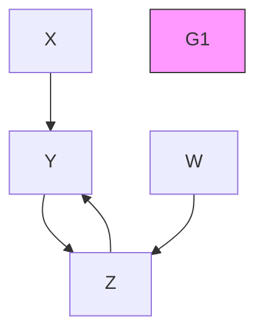

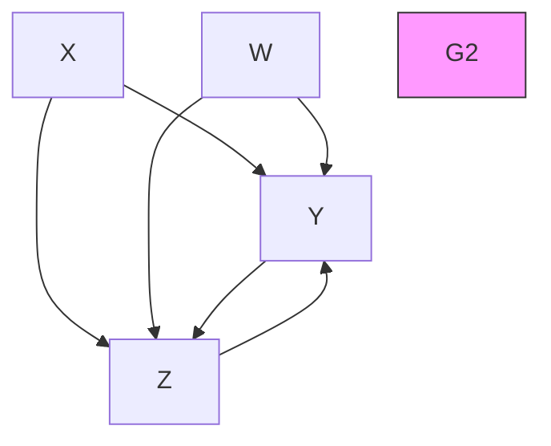

> 图 12.4

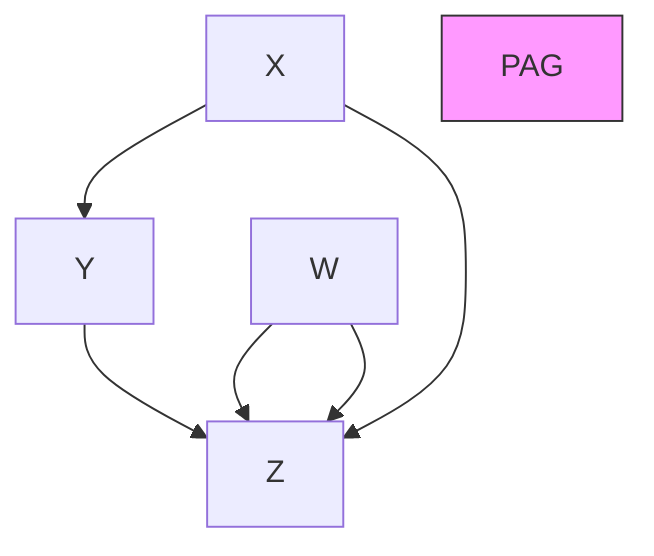

## 12.1.4 混合祖先图（Mixed Ancestral Graphs）

**混合祖先图（Mixed ancestral graphs, MAGs）** 由 Spirtes 和 Richardson 于 1996 年引入，并因两个与搜索相关的技术原因在 Spirtes、Richardson 和 Meek 于 1996 年的工作中进行了研究。首先，混合祖先图提供了一种直接的方法来判断任意两个 DAG 是否（通过**局部马尔可夫性质（local Markov property）**）在通过对潜变量求边际化并以选择变量为条件而获得的任何分布中蕴含相同的条件独立性。

其次，具有潜变量的 DAG 蕴含非独立性约束，如第 6 章中 Verma 的例子所示。其他此类约束已在 Desjardins 1999、Settimi 和 Smith 1999 以及 Geiger 等人 1996 的工作中进行了研究。非独立性约束使得确定潜变量模型观测变量上的边际分布的维度变得困难。事实上，潜变量模型的边际分布通常没有明确定义的维度 (Geiger et al. 1999)。维度是许多基于数据为模型分配分数的方法（如 BIC、AIC、MDL）中使用的参数。（关于 BIC 和 MDL 分数的描述，请参见第 12.5.5.2 节。）由于出于多种原因（第 12.5 节）模型分数是可取的，因此找到一种合适的表示形式来对具有潜变量且存在选择偏差的数据模型进行评分就变得很重要。MAG 描述了此类结构的因果关系的某些方面，但它们仅对观测变量蕴含独立性和条件独立性约束，并且具有明确定义的维度，在高斯情况下可以很容易地计算该维度。

MAG 可能包含有向边（→）、双箭头边（↔）、尾部带有“o”符号的半有向边（o→），或者两端都带有“o”符号的无向边（o-o）。符号“*”并不出现在 MAG 中，但我们将其用作一个元符号，代表任意一种端点（即 `o`、`>` 或 `-`）。例如，“*→”代表 `o→`、`→` 或 `-→`。

**定义 12.1.2：** MAG $M$ 表示 DAG $G(O,S,L)$，当且仅当：

- 1. 如果 $A$ 和 $B$ 在 $O$ 中，则在 $M$ 中 $A$ 和 $B$ 之间存在一条边，当且仅当对于任何子集 $\mathbf{W} \subseteq \mathbf{O} \backslash \{ A, B \}$，在 $G(\mathbf{O}, \mathbf{S}, \mathbf{L})$ 中，$A$ 和 $B$ 在给定 $\mathbf{W} \cup \mathbf{S}$ 时是 d-连通的。
- 2. 在 $M$ 中存在一条边 $A \rightarrow B$，当且仅当在 $G(\mathbf{O}, \mathbf{S}, \mathbf{L})$ 中，$A$ 是 $B$ 的祖先，但不是 $S$ 的祖先。
- 3. 在 $M$ 中存在一条边 $A \leftrightarrow B$，当且仅当在 $G(\mathbf{O}, \mathbf{S}, \mathbf{L})$ 中，$A$ 不是 $B$ 或 $S$ 的祖先。
- 4. 在 $M$ 中存在一条边 $A \circ \rightarrow B$ 或 $A \circ - \circ B$，当且仅当在 $G(\mathbf{O}, \mathbf{S}, \mathbf{L})$ 中，$A$ 是 $S$ 的祖先。（注意，`o->` 在 PAG 中有不同的含义。）

d-分离有一个自然的扩展到 MAG，称为 **m-分离（m-separation）**。该定义需要将**碰撞点（collider）**和**有向路径（directed path）**的概念扩展到具有选择偏差和潜变量的图。在 MAG $M$ 中，从 $X_1$ 到 $X_n$ 的一条路径是一个不同的顶点序列 $< X_1, \ldots, X_n >$，使得对于每个 $i < n$，在 $M$ 中 $X_i$ 和 $X_{i+1}$ 之间存在一条（任意类型的）边。在 MAG $M$ 中，从 $X_1$ 到 $X_n$ 的一条有向路径是一个不同的顶点序列 $< X_1, \ldots, X_n >$，使得对于每个 $i < n$，在 $M$ 中有一条从 $X_i$ 到 $X_{i+1}$ 的有向边。顶点 $V$ 是 $X_i$ 的祖先，当且仅当 $V = X_i$，或者存在一条从 $V$ 到 $X_i$ 的有向路径。在 $M$ 的一条路径 $U$ 上，如果存在边 $X_{i-1} * \rightarrow X_i \leftarrow * X_{i+1}$，则 $X_i$ 是 $U$ 上的一个碰撞点。对于 MAG $M$ 中不相交的顶点集 $X$、$Y$ 和 $Z$，如果存在一条路径 $U$ 连接某个 $X \in \mathbf{X}$ 和某个 $Y \in \mathbf{Y}$，使得 $U$ 上的每个碰撞点都是 $\mathbf{Z}$ 中某个成员的后代，并且 $U$ 上的非碰撞点都不在 $\mathbf{Z}$ 中，则 $X$ 与 $Y$ 是 **m-连通（m-connected）** 的；否则，给定 $Z$，$X$ 与 $Y$ 是 **m-分离（m-separated）** 的。这意味着当应用于 DAG 时，m-分离（m-连通）与 d-分离（d-连通）是相同的。MAG 的应用在第 12.5.7 节中给出。

在仅包含观测变量的图形结构中表示可能具有潜变量和选择偏差的 DAG 的问题是由 Wermuth 等人 (1994, 1998) 提出的。他们提出的表示称为**摘要图（summary graph）**。MAG 和摘要图之间的几个区别是：(1) 在 MAG 中（而非摘要图中），缺失的边蕴含一个条件独立关系；(2) 在摘要图中（而非 MAG 中），一对观测变量之间可以有多条边；(3) 高斯 MAG 总是可识别的，但高斯摘要图并不总是可识别的；(4) MAG 仅蕴含条件独立性约束，而摘要图可能蕴含非条件独立性约束（这意味着摘要图可能比 MAG 包含更多关于其表示的 DAG 的信息）。更多细节请参见 Cox 和 Wermuth 等人 1994。

## 12.1.5 链图（Chain Graphs）

**链图（Chain graphs）**是一类被广泛研究的（参见 Cox 和 Wermuth 1996, Lauritzen 1996）图形对象，用于表示变量之间存在“对称关联”的情况。链图可以包含有向边和无向边，但不能包含部分有向环，也就是说，它们不包含一个由 $n$ 条不同边组成的序列，其端点为 $X _ { 1 } , X _ { n + 1 }$，使得 $X _ { 1 } = X _ { n + 1 }$，且对于所有 $i$，$1 \leq i < n + 1$，有 $X _ { i } { - } X _ { i + 1 }$ 或 $X _ { i } \to X _ { i + 1 }$，并且存在某个 $j$，$1 \le j < n + 1$，使得 $X _ { j } \to X _ { j + 1 }$。

对于链图，已经提出了两种不同的**马尔可夫条件（Markov Conditions）**：一种由 Lauritzen、Wermuth 和 Frydenberg（Lauritzen 和 Wermuth 1989; Frydenberg 1990）提出，另一种由 Andersson、Madigan 和 Perlman（1996）提出。这两个条件彼此并不等价，尽管对于无向图，两者都简化为**分离（separation）**，而对于有向无环图（DAGs），两者都简化为 **d-分离（d-separation）**。各自的马尔可夫性质通过一个两步过程来确定一个条件独立关系 $\mathbf { X } \bot \bot \mathbf { Z } | \mathbf { Y }$ 是否由链图蕴含。首先，它们将一个链图关联到一个无向图。其次，如果在关联的无向图中，$\mathbf { X }$ 被 $\mathbf { Y }$ 与 $\mathbf { Z }$ 分离，则 $\mathbf { X } \bot \bot \mathbf { Z } | \mathbf { Y }$ 由该链图蕴含。但这两种方法构造的无向图在分离性质上是不同的。以下总结基于 Richardson 1998。

链图中的一个顶点 $V$ 是顶点集 $W$ 的**前位（anterior）**，如果存在一条从 $V$ 到 $W$ 中某个 $W$ 的路径 $P$，并且对于 $P$ 上的每条有向边 $X \to Y$，$Y$ 都位于 $X$ 和 $W$ 之间。$\mathbf{Ant}(W)$ 是 $W$ 的前位顶点集。对于链图 $CG$，其顶点集为 $V$，且 $\mathbf { W } \subseteq \mathbf { V }$，**诱导子图（induced subgraph）** $CG(W)$ 通过移除 $\mathbf{V}\backslash\mathbf{W}$ 中的所有顶点以及与 $\mathbf{V}\backslash\mathbf{W}$ 中顶点相连的所有边得到。一个**复合结构（complex）**是如下形式的诱导子图：$X \to V _ { 1 } { \mathrm { - } } \ldots - V _ { n } \leftarrow Y , n \geq 1$。**道德图（Moral(CG)）**是通过以下方式得到的无向图：如果 $X$ 和 $Y$ 是一个复合结构的端点，则用一条无向边连接它们，然后将每条有向边替换为无向边。**Lauritzen-Wermuth-Frydenberg (LWF) 全局马尔可夫性质（Lauritzen-Wermuth-Frydenberg (LWF) global Markov Property）**指出：如果在无向图 $Moral(CG(\mathbf{Ant}(\mathbf{Z} \cup \mathbf{Y} \cup \mathbf{X})))$ 中，$\mathbf{X}$ 被 $\mathbf{Y}$ 与 $\mathbf{Z}$ 分离，则 $CG$ 蕴含 $\mathbf{X} \bot \bot \mathbf{Z} | \mathbf{Y}$。

**Andersson-Madigan-Perlman 链图全局马尔可夫性质（Andersson-Madigan-Perlman chain graph global Markov property）**定义如下。在链图 $CG$ 中，如果顶点 $V$ 和 $W$ 之间存在一条只包含无向边的路径，则称它们是连通的。$\mathbf{Con}(\mathbf{W}) = \{ V \mid V \text{ 与某个 } W \in \mathbf{W} \text{ 连通} \}$。$\mathbf{Ext}(CG, \mathbf{W})$ 包含顶点集 $\mathbf{Con}(\mathbf{W})$、$CG(\mathbf{W})$ 中的所有有向边以及 $CG(\mathbf{Con}(\mathbf{W}))$ 中的所有无向边。$V$ 是 $W$ 的**祖先（ancestor）**，如果存在一条从 $V$ 到 $W \in \mathbf{W}$ 的路径，使得路径上的所有边都是有向的（$X \to Y$），并且 $Y$ 位于 $X$ 和 $W$ 之间。$\mathbf{Anc(W)} = \{ V \mid V \text{ 是某个 } W \in \mathbf{W} \text{ 的祖先} \}$。一个顶点三元组 $< X , Y , Z >$ 是一个**三叉结构（triplex）**，如果 $CG(\{ X , Y , Z \})$ 是 $X \to Y - Z$、$X \to Y \leftarrow Z$ 或 $X - Y \leftarrow Z$。一个三叉结构通过添加 $X - Z$ 边进行**增广（augmented）**。四个顶点 $< X , A , B , Y >$ 形成一个**双旗结构（bi-flag）**，如果在 $\{ X , A , B , Y \}$ 上的诱导子图中存在边 $X \to A$、$Y \to B$ 和 $A - B$。一个双旗结构通过添加 $X - Y$ 边进行增广。$\mathbf{Aug(CG)}$ 是通过增广 $CG$ 中的所有三叉结构和双旗结构，然后将所有有向边替换为无向边而形成的无向图。令 $\mathbf{Aug[CG; X, Y, Z]} = \mathbf{Aug}(\mathbf{Ext}(CG, \mathbf{Anc}(\mathbf{X} \cup \mathbf{Y} \cup \mathbf{Z})))$。**Andersson-Madigan-Perlman (AMP) 全局马尔可夫性质**指出：如果在无向图 $\mathbf{Aug[CG; X, Y, Z]}$ 中，$\mathbf{X}$ 被 $\mathbf{Y}$ 与 $\mathbf{Z}$ 分离，则 $CG$ 蕴含 $\mathbf{X} \bot \bot \mathbf{Z} | \mathbf{Y}$。

关于链图马尔可夫性质所允许的额外结构能够解释哪些数据生成过程，已经展开了一场有趣的讨论。例如，图 12.5 展示了四个变量之间的两个简单链图。

> 图 12.5

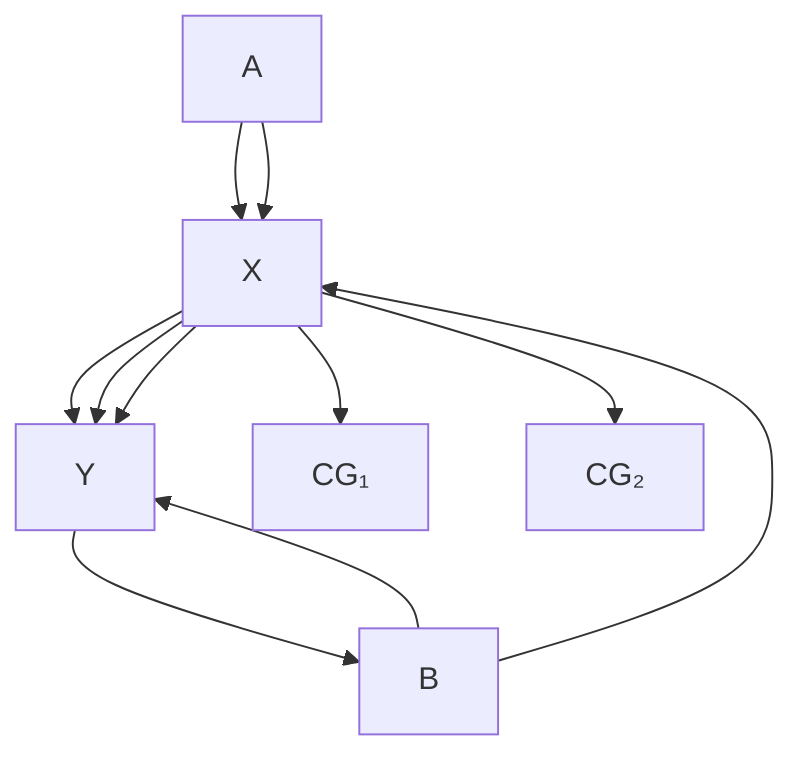

Richardson（1998）指出，应用于 $CG_1$ 的局部 Lauritzen-Wermuth-Frydenberg 马尔可夫性质蕴含了一组不同的独立性和条件独立性关系，这些关系不同于由有向图（DGs）可表示的、通过因果过程（边缘化潜在共同原因、以共同效应为条件、反馈）产生对称关联的任何已知方式所蕴含的关系；对于 $CG_2$ 和 AMP 马尔可夫性质也是如此。（由 $CG_1$ 的 LWF 解释所蕴含的条件独立性集合是 $\{ A \perp \perp B , A \perp \perp Y | \{ B , X \} , B \perp \perp X | \{ A , Y \} \}$；由 $CG_2$ 的 AMP 解释所蕴含的条件独立性集合是 $\{ A \bot \bot B , A \bot \bot B | \{ Y \} , A \bot \bot Y , A \bot \bot Y | \{ B \} , B \bot \bot Y | \{ A , X \} \}$。）

在尚未发表的工作中，Lauritzen 提出，像 $CG_1$ 这样的链图模型（具有 LWF 全局马尔可夫性质）给出了某些动力系统极限分布中的独立性和条件独立性关系。过程如下：指定 $P(A)$、$P(B)$、$P(X|A,Y)$ 和 $P(Y|X,B)$。对于一个总体中的每个单元，在 $t=0$ 时，从 $P(A)$ 中抽取 $A$ 的一个值 $A_0$，从 $P(B)$ 中抽取 $B$ 的一个值 $B_0$。为 $Y$ 选择一个任意的起始值，比如 $Y_0$。然后从 $P(X|Y_0, A_0)$ 中抽取 $X_1$，并从 $P(Y|X_1, B_0)$ 中抽取 $Y_1$。重复多次，从 $P(X|Y_i, A_0)$ 中抽取 $X_{i+1}$，并从 $P(Y|X_{i+1}, B_0)$ 中抽取 $Y_{i+1}$。在经过足够长的时间后，$(A_0, B_0, X_n, Y_n)$ 在满足一些进一步限制的情况下，是来自一个满足上述 $CG_1$ 的 LWF 全局马尔可夫性质的分布的样本。需要这些进一步限制是因为 $X$ 和 $Y$ 被不对称地处理，这意味着需要对转移概率施加一些限制，才能生成一个满足 LWF 全局马尔可夫性质的分布¹。Cox 和 Wermuth（1999），以及 Wermuth、Cox、Richardson 和 Glonek（1999）也考虑了哪些数据生成过程可能导致由链图表示的分布。

## 12.2 等价性（Equivalence）

模型的等价性总是相对于某个选定的变量集而言的，该变量集要么代表一组观测变量 $\mathbf{O}$，要么代表一组选择变量 $\mathbf{S}$，或者两者都代表，并且还涉及通过对选择变量取条件并边缘化未观测变量而获得的分布特征。所讨论的分布特征可以是条件边缘分布中的独立性和条件独立性关系，也可以是其他约束，例如**消失的四元组差（vanishing tetrad differences）**，或者最一般地，是整个条件边缘分布。称 $P(\mathbf{O} | \mathbf{S} = \mathbf{1})$ 是一个满足 $\mathcal{G}(\mathbf{O}, \mathbf{S}, \mathbf{L})$ 的马尔可夫条件的观测分布，如果它通过对一个满足 $G(\mathbf{O},\mathbf{S},\mathbf{L})$ 的马尔可夫条件的分布 $P(\mathbf{O}, \mathbf{S}, \mathbf{L})$ 进行条件化和边缘化而形成。两个具有顶点集 $V$ 的有向无环图 $G_1$ 和 $G_2$ 是**分布等价的（distribution equivalent）**，当且仅当 $P(V)$ 满足 $G_1$ 的局部马尔可夫性质当且仅当 $P(V)$ 满足 $G_2$ 的局部马尔可夫性质。两个有向无环图 $G_1(\mathbf{O}, \mathbf{S}, \mathbf{L})$ 和 $G_2(\mathbf{O}, \mathbf{S}, \mathbf{L}')$ 是 **O-分布等价的（O-distribution equivalent）**，如果观测分布 $P(\mathbf{O} | \mathbf{S} = \mathbf{1})$ 满足 $G_1(\mathbf{O}, \mathbf{S}, \mathbf{L})$ 的局部马尔可夫性质当且仅当 $P(\mathbf{O} | \mathbf{S} = \mathbf{1})$ 满足 $G_2(\mathbf{O}, \mathbf{S}, \mathbf{L}')$ 的局部马尔可夫性质。分布等价性和 O-分布等价性可以类似地针对限制性分布族（例如高斯分布或多项分布）进行定义。类似的概念也适用于有向图（DGs）和链图。

如果由有向无环图表示的分布族是多元高斯分布、多项分布或无限制分布，那么两个没有潜在变量或选择偏差的有向无环图是 O-分布等价的，当且仅当它们是 **O-马尔可夫等价的（O-Markov equivalent）**。然而，如果这些有向无环图包含潜在变量或存在样本选择偏差，这种关系通常不成立。

关于某个数据特征的等价关系本质上是为那些专门使用从数据中估计出的该特征的搜索过程刻画了一个分辨极限。例如，O-马尔可夫等价刻画了像 **FCI** 这类依赖于条件独立性关系的算法的极限。从贝叶斯视角来看，等价结果的理论意义较小，因为即使在渐近情况下，O-马尔可夫等价模型也不一定具有相同的后验概率。然而，对于像 12.5 节中讨论的那些搜索，试图区分 O-马尔可夫等价的潜在变量模型的贝叶斯搜索过程面临一些困难的理论和计算问题。

Spirtes 和 Verma（1992）利用以下结果表明，存在一种或多或少可行（取决于图的结构）的决策程序，用于判断两个可能包含未观测（潜在）变量但没有选择偏差的有向无环图的等价性。当 FCI 仅测试 $\mathbf{O} \subseteq \mathbf{V}$ 中变量间的 d-分离关系，并使用 $G$ 中 $\mathbf{O}$ 内变量间的 d-分离关系来决定 d-分离问题时，称 FCI 使用顶点集为 $V$ 的有向无环图 $G$ 作为一个 **O-预言机（O-oracle）**。

**定理 12.2.1：（Spirtes 和 Verma）**：两个有向无环图 $G$ 和 $H$ 蕴含关于 $G$ 和 $H$ 中共同子集 $\mathbf{O}$ 中变量间的相同独立性和条件独立性关系，当且仅当使用 $G$ 作为 O-预言机的 FCI 算法的输出等于使用 $H$ 作为 O-预言机的 FCI 算法的输出。

Spirtes 和 Richardson（1996）利用 **最大祖先图（MAGs）** 提供了一种多项式时间决策程序，用于判断包含潜在变量和选择变量的模型的 O-马尔可夫等价性。Richardson（1996c）指出，存在一个多项式时间算法（$O(n^5)$，其中 $n$ 是顶点数）用于判断有向图（不含选择偏差或潜在变量）的马尔可夫等价性。

Geiger 和 Meek（1999）获得了关于图模型的分布等价性和其他“结构”特征（例如**识别问题（identification problem）**——即判断一个模型参数能否从观测变量的边缘概率分布中唯一估计的问题）的理论上令人着迷但目前尚不实用的结果。他们的结果展示了数学逻辑、概率论和方法论之间一系列显著的联系。

Tarski 公理化了普通实数代数——**实闭域理论（theory of real closed fields, RCF）**——并证明了该理论是完备的，因此是可判定的，并且允许消去量词。也就是说，对于 RCF 语言中的每个公式 $F$，都存在一个没有量词的公式 $H$，使得 $\operatorname{RCF} \models \operatorname{F} \Leftrightarrow \operatorname{H}$。我们可以利用该理论来检验两个线性高斯结构方程模型 $M$ 和 $N$ 的分布等价性，方法如下：模型 $M$ 中观测变量的方差/协方差矩阵可以写成模型参数（实变量）的多项式函数。模型 $M$ 断言存在一些参数值，使得每个观测变量的协方差等于参数的指定函数。该断言是 RCF 的一个简单扩展中的句子 $\mathrm{S}_M$，Tarski 定理对该扩展成立。因此，存在一个句子 $\mathrm{Q}_M$，它没有对模型参数的量化，也没有模型参数值的名称，使得 $\mathrm{RCF} \models \mathbf{Q}_M \Leftrightarrow \mathbf{S}_M$。对于具有相同可观测变量的模型 $N$，同样存在一个句子 $\mathrm{S}_N$，断言 $N$ 中存在参数值使得观测变量的协方差是参数的指定函数，并且同样存在一个等价的无量词句子 $\mathrm{Q}_N$。因此，模型 $M$ 和 $N$ 是分布等价的，当且仅当 $\mathrm{RCF} \models \mathrm{Q}_M \Leftrightarrow \mathrm{Q}_N$。

由于 RCF 是可判定的，因此存在一个算法来判定线性高斯结构方程模型中的分布等价性——无论模型是非循环的（“递归的”）还是循环的（“非递归的”），也无论是否包含潜在变量。识别问题可以通过类似的策略解决，因为参数的可识别性对应一个 RCF 公式，该公式表明：如果一个参数的两个值导致协方差的多项式函数值相等，那么这两个值相等。然后，量词消去得到一个只使用可观测相关词汇的句子，当且仅当该参数可识别时，该句子是 RCF 的一个定理。

同样的论证适用于任何分布族，只要其关于可观测变量的边缘分布可以由一组有限的、关于实值模型参数的多项式函数来描述。因此，包含分类变量的图模型也可以同样处理，因为关于测量变量的边缘分布是条件概率乘积的和，而条件概率是取值范围受限的实值变量。

但这个解决方案目前还不实用。Tarski 的决策过程是**超指数级（hyper-exponential）**的。尽管后来发现了更快的算法，但它们仍然是超指数级的，而 Geiger 和 Meek 只能处理一个只有三个变量的例子。即使对于这些更快的算法，一个包含六个变量的问题也是无望的。然而，由于关于等价性、可识别性和参数值界限的判断只需要判定特殊逻辑形式的公式，因此对于这些特殊情况，仍有可能找到更高效的算法。

## 12.3 预测与操控（Prediction and Manipulation）

## 12.3.1 因果性与虚拟条件句（Causation and Subjunctives）

鲁宾（Rubin）关于对因果模型进行操控预测的方法（在第7章中讨论）引入了**虚拟变量（subjunctive variables）**，例如 $Y_{X=0}$，表示如果 $X$ 被操控为值 0 时 $Y$ 将取的值。鲁宾的方法还使用了关于虚拟变量与实然变量（occurrent variables）之间条件独立性的判断。这种方法存在两个问题：如何解释在虚拟变量和实然变量上具有联合分布的含义，以及人们是否能够对虚拟变量和实然变量的独立性做出判断（尤其是考虑到，即使仅针对实然变量，不使用图方法的人们也很难对条件独立性做出准确判断）。

相比之下，在第7章中，我们使用**有向无环图（Directed Acyclic Graphs, DAGs）** 从因果模型中进行预测。我们没有引入新的虚拟变量来表示如果 $X$ 被操控为 0 时 $Y$ 将取的值，而是添加了一个**策略变量（policy variable）** 以及一条从策略变量指向 $X$ 的边，并将如果 $X$ 被操控为 0 时 $Y$ 将取的值定义为在策略变量等于 1（即操控已发生）条件下 $Y$ 的值。DAG 方法的两个优点在于：它不需要虚拟随机变量与实然随机变量之间的联合概率分布（因为我们在所有计算中总是以策略变量的某个值为条件），并且它使用因果 DAG 来计算条件独立性关系。这种方法引出了**定理 7.1**（等同于 Pearl 后来在 Pearl 1995 中称之为“干预演算（Calculus of Interventions）”的内容），该定理给出了条件概率在操控下保持不变的充分图条件。目前尚不清楚定理 7.1 的条件是否也是必要的。该定理在 12.3.2 节中讨论的一些有趣应用。

虽然补充了策略变量的 DAG 不需要虚拟变量和实然变量的联合分布，但它也不允许表示虚拟变量和实然变量的联合分布，或者对应于不同操控的虚拟变量之间的联合分布，而在某些情况下这可能是可取的。例如，假设一位未接受药物治疗的患者表现出高血压。医生认为因果关系如图 12.6 所示。

假设药物疗法（Drug therapy）= 1 表示接受了药物治疗，动脉疾病（Arterial disease）= 1 表示发生了动脉疾病。考虑在患者实际血压（Blood pressure）条件下，如果药物疗法被操控为存在（一个虚拟变量）时患者患有动脉疾病的概率。这里血压是实际测量的（未对因果过程进行干预），但药物疗法和动脉疾病在这种情况下是虚拟变量，即它们只有在干预随后发生时才是实际存在的。这通常不等于在如果药物疗法被操控为 1（一个虚拟变量）时患者将有的血压（另一个虚拟变量）条件下，如果药物疗法被操控为 1（一个虚拟变量）时患者患有动脉疾病的概率。用第 7 章的语言来说，后一个概率是 $P_{Man(Drug)}$（动脉疾病|血压），并且可以通过定理 7.1 计算。在第 7 章的语言中无法表达前一个概率，并且它不能通过直接应用定理 7.1 来计算。在本节中，我们考虑 Balke 和 Pearl（1994）、Pearl（1999）以及 Galles 和 Pearl（1998a）如何使用**结构方程语义（structural equation semantics）** 来阐明虚拟变量与实然变量联合分布的含义，并使用 DAG 来计算虚拟变量与实然变量之间所需的条件独立性关系。

> 图 12.6

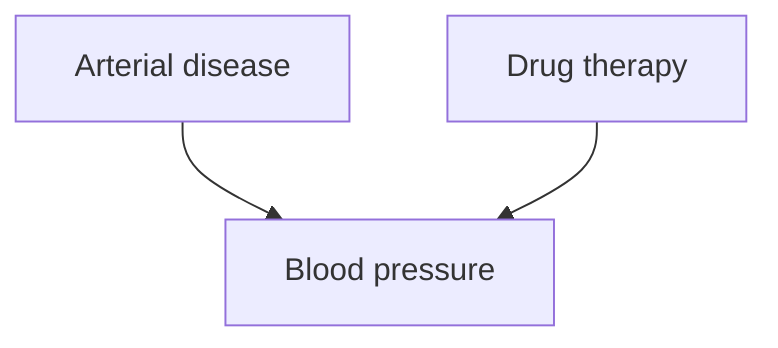

为了说明起见，假设与图 12.6 中 DAG 相关的统计模型是一个**线性结构方程模型（linear structural equation model）**。假设血压（Blood pressure）的结构方程形式如下：

$$
Blood \quad pressure = a \times Drug \text{ therapy} + b \times Arterial \text{ disease} + 100 + \varepsilon_{bp}
$$

假设动脉疾病是二值的（1 表示患有该疾病），药物疗法也是二值的（1 表示服用了药物），动脉疾病和药物疗法的概率是给定的，$\varepsilon_{bp}$ 服从标准高斯分布，并且动脉疾病、药物疗法和 $\varepsilon_{bp}$ 相互独立。

我们需要一种符号来表达：在实际血压值条件下，如果药物疗法被操控为值 1 时动脉疾病将具有的概率。为此，我们（遵循 Rubin 如第 7 章所述，Balke 和 Pearl 1994，以及 Pearl 1999）将药物疗法及其所有后代变量拆分为两个变量：一个变量表示如果药物疗法被操控为值 1 时将出现的值，另一个变量表示药物疗法的未操控值。在这个例子中，有 $Drug \ therapy_{Man(Drug)}$ 和 $Drug \ therapy_{Unman}$，以及 $Blood \ pressure_{Man(Drug)}$ 和 $Blood \ pressure_{Unman}$。注意，由于动脉疾病和 $\varepsilon_{bp}$ 不是药物疗法的后代变量，因此（根据操控定理，Manipulation Theorem）不受操控影响，动脉疾病和 $\varepsilon_{bp}$ 的操控值与未操控值具有相同的分布，所以我们不需要拆分这些变量。使用结构方程模型，我们可以写出：

$$
\begin{array}{l} \text{Blood pressure}_{\text{Man(Drug)}} = a \times \text{Drug therapy}_{\text{Man(Drug)}} + b \times \text{Arterial disease} + 100 + \varepsilon_{bp} \\ \text{Blood pressure}_{\text{Unman}} = a \times \text{Drug therapy}_{\text{Unman}} + b \times \text{Arterial disease} + 100 + \varepsilon_{bp} \end{array}
$$

如果假设药物疗法的操控值不依赖于药物疗法的未操控值，那么根据**因果马尔可夫条件（Causal Markov Condition）**，$Drug \ therapy_{Unman}$ 和 $Drug \ therapy_{Man(Drug)}$ 相互独立。那么，虚拟变量和实然变量上的联合分布就由这个假设、外生实然变量上的联合分布以及结构方程得出。（Balke 和 Pearl [1994]，以及 Pearl [1999] 使用了带有潜变量的 DAG，而不是双箭头。Madigan [1999] 也考虑了虚拟变量的图表示。）

> 图 12.7

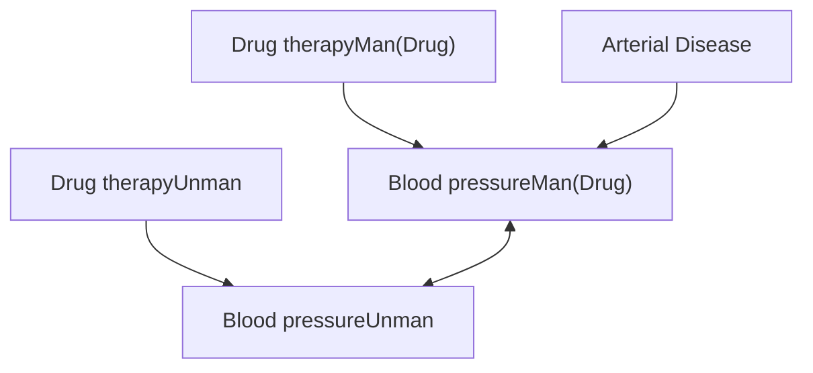

当我们对图 12.6 中的因果 DAG 进行修改时，结果就是图 12.7 中的**混合祖先图（Mixed Ancestral Graph, MAG）**。$Blood \ pressure_{Man(Drug)}$ 和 $Blood \ pressure_{Unman}$ 之间存在相关误差，因为 $\varepsilon_{bp}$ 是两者的共同原因，如它们各自的方程所示。根据其结构方程，$Blood \ pressure_{Unman}$ 不受 $Drug \ therapy_{Man(Drug)}$ 的因果影响。

现在，将 m-分隔（m-separation）应用于图 12.7 的因果 MAG 表明，$P(\text{Arterial disease}|\text{Blood pressure}_{Unman}, \text{Drug therapy}_{Man(Drug)}) = P(\text{Arterial disease}|\text{Blood pressure}_{Unman})$，也就是说，在具有给定实际血压的人群中，该药物没有效果。

因果 MAG 中的参数之间存在等式约束（例如，$Blood \ pressure_{Man(Drug)}$ 在其父节点 $Drug \ therapy_{Man(Drug)}$ 和动脉疾病条件下的分布，等于 $Blood \ pressure_{Unman}$ 在其父节点 $Drug \ therapy_{Unman}$ 和动脉疾病条件下的分布）。因此，未操控变量之间的条件概率（例如，$P(Blood \ pressure_{Man(Drug)}|\text{Arterial disease}, \text{Drug therapy}_{Man(Drug)})$）与操控变量之间的相应条件概率（例如，$P(Blood \ pressure_{Unman}|\text{Arterial disease}, \text{Drug therapy}_{Unman})$）之间可能存在等式关系，这种等式关系并非由因果 MAG 中的 m-分隔关系所蕴含，而是由第 7 章中使用策略变量的因果 DAG 表示中的 d-分隔（d-separation）所蕴含。因此，只要感兴趣的量不是虚拟变量和实然变量的混合，使用第 7 章的因果 DAG 表示就有其优势。

结构上与图 12.7 相似的图也可以用于表示不同时间点的药物疗法，而不是未操控的和被操控的药物疗法，此时变量按时间索引，而不是按药物疗法是否被操控来索引。定理 7.1 可以直接应用于此类时间图。关于动态系统的一种表示，请参见 Boyen 等人（1999）。

也可以使用（稍加修改的）Balke-Pearl 图表示（使用 MAG 而不是 DAG）来计算以下特殊情况下虚拟变量和实然变量的某些条件概率，这个特殊情况由于下面描述的原因特别令人感兴趣。操控的一个特殊情况是被操控变量被设置为一个常数值。将因果 DAG 解释为结构方程模型，在这种情况下为虚拟变量提供了特别清晰的解释。（这种观点似乎也隐含在一些基于鲁宾虚拟变量的分析对虚拟条件句的使用中。）假设在所有情况下药物疗法都被操控为值 1（即每个人都服用了药物）。使用结构方程模型，我们可以写出：

$$
\text{Blood pressure}_{\text{Man(Drug Therapy = 1)}} = a + b \times \text{Arterial disease} + 100 + \varepsilon_{bp}
$$

这里将药物疗法设置为常数 1。（这是 Strotz 和 Wold 1960 中采取的操控方法。）所有虚拟变量现在都是实然变量的简单函数，因此虚拟变量和实然变量的联合分布由外生实然变量的分布和结构方程得出。

> 图 12.8

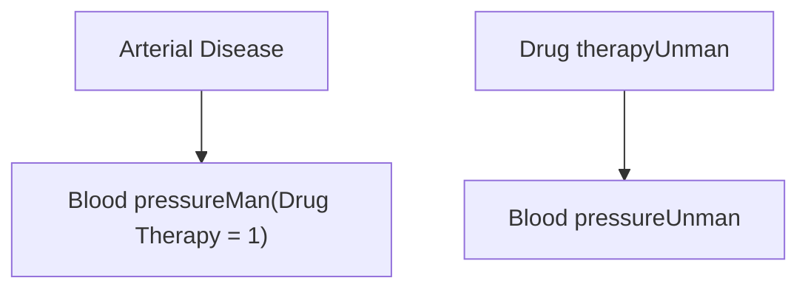

更一般地，如果想要得到当 $A$ 被操控为 0 时 $B, C, D$ 和 $E$ 的值，以及未操控变量 $A, B, C, D$ 和 $E$ 的联合概率分布，那么将 $A$ 的每个后代变量拆分为未操控版本和操控版本（在图 12.9 的情况下，分别是 $B, C, D$ 与 $B_{Man(A=0)}, C_{Man(A=0)}$ 和 $D_{Man(A=0)}$），在每个新变量与其对应变量之间添加双箭头边，并且当且仅当对应变量之间存在边时，在两个新变量之间添加一条边。然后应用 m-分隔。（见图 12.9。）（$A_{Man(A=0)}$ 只有常数值 0，所以我们不将其包含在 MAG 中。）

为虚拟变量的结构方程解释所付出的部分代价是，它假定存在一个具有独立误差项的确定性世界。Dawid（1997）质疑这种独立误差项的存在，并且在微观层面上，决定论与量子力学的标准解释不相容。这里描述的表示方法不允许在虚拟变量和实然变量之间存在任意的因果 DAG 或 MAG。

> 图 12.9

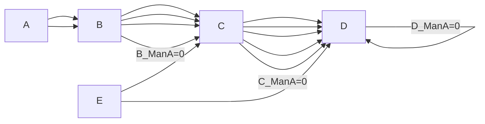

虚拟变量和实然变量上的联合分布在 Pearl（2000）对几种不同因果概念的分析中扮演着重要角色。在 Pearl 的符号中，$Y_x(u)$ 是当外生变量取值为 $u$ 时，变量 $Y$ 对将 $X$ 操控为值 $x$ 的响应（在 Pearl 的因果 DAG 结构方程语义中，变量 $Y$ 对操控的响应是 $U$ 的函数）。设 $X$ 和 $Y$ 为二值变量，其中 $x$ 表示 $X$ 取真值的命题，$x'$ 表示 $X$ 取假值的命题。$y_x$ 表示如果 $X$ 被操控为真则 $Y$ 取真值的命题，$y'_x$ 表示如果 $X$ 被操控为真则 $Y$ 取假值的命题。**PS（充分性的概率，probability of sufficiency）** 等于 $P(y_x | x', y')$，**PN（必要性的概率，probability of necessity）** 是 $P(y'_{x'} | x, y)$，**PNS（必要且充分因果的概率，probability of necessary and sufficient causation）** 是 $P(y_x, y'_{x'})$。（在第 7 章的符号中，$P(y_x)$ 是 $P_{Man(X=true)}(Y=true)$，$P(y'_x)$ 是 $P_{Man(X=true)}(Y=false)$，$P(y_{x'})$ 是 $P_{Man(X=false)}(Y=true)$，$P(\gamma'_{x'})$ 是 $P_{Man(X=false)}(Y=false)$。然而，在该符号中无法表达 $P(y_x, y'_{x'})$、$P(y'_x | x, y)$ 或 $P(y_x | x', y')$，这些表达式混合了实然变量和虚拟变量，或者对应于不同操控的虚拟变量。）存在几个与 PN、PS 和 PNS 可识别条件相关的假设。当 $X$ 和 $Y$ 没有共同原因时，$X$ 相对于 $Y$ 是**外生的（exogenous）**。当给定 $X$ 被操控为真时 $Y=true$ 的概率大于给定 $X$ 被操控为假时 $Y=true$ 的概率时，$X$ 相对于 $Y$ 是**随机单调的（stochastically monotonic）**。当 $y'_x \land y_{x'}$ 为假时，$X$ 相对于 $Y$ 是**单调的（monotonic）**。Robins 和 Greenland（1989）表明，即使在 $X$ 相对于 $Y$ 外生以及 $X$ 相对于 $Y$ 随机单调的假设下，PN 也是不可识别的；然而他们确实计算了 PN 的界限。Pearl（2000）表明，在 $X$ 相对于 $Y$ 外生以及 $X$ 相对于 $Y$ 单调这两个更强的假设下，PN、PS 和 PNS 都是可识别的。Pearl 还表明，在单调性假设下，只要 $P(y_x)$ 是可识别的，那么 PN、PS 和 PNS 就都是可识别的。

在第 3 章中，我们讨论了因果 DAG 与 Rubin（1978）虚拟变量方法之间的关系。Robins（1986, 1987）扩展了 Rubin 的理论以处理随时间变化的治疗、结果和协变量。Robins（1995）表明，因果 DAG 总是可以被解释为虚拟变量模型。Galles 和 Pearl（1998）表明，对于无环图，所有在结构方程语义中可推导的合取虚拟条件句（conjunctive subjunctives）都由结构方程语义的以下两个特征所蕴含：

- **组合性（Composition）**：对于因果模型中的任意两个单元素变量 $Y$ 和 $W$，以及任意变量集 $X$，如果 $W_{\mathrm{x}}(u) = w$，则 $Y_{\mathrm{x}w}(u) = Y_{\mathrm{x}}(u)$。
- **有效性（Effectiveness）**：对于所有变量 $X$ 和 $W$，$X_{xw}(u) = x$。

（根据 Galles 和 Pearl [1998] 的说法，Robins 在个人交流中向 Pearl 提出了组合性。）Halpern（1997）为以循环有向图表示的结构方程模型找到了一个完整的公理集。

## 12.3.2 计算干预效应（Calculating the Effects of Interventions）

斯特罗茨（Strotz）和沃尔德（Wold, 1960）指出，在结构方程模型中操纵变量 $X$ 的效应可以通过将 $X$ 的方程替换为将其设定为操纵值的方程来计算；这是**操纵定理（Manipulation Theorem）**和**珀尔的结构方程语义学（Pearl’s structural equation semantics）**背后的基本思想。罗宾斯（Robins, 1986）推导了**G-计算公式（G-computation formula）**，该公式等价于操纵定理，尽管并非以图形方式表述。

可计算性（calculability，与“可识别性（identifiability）”同义）的一个重要特例是**序贯随机化试验（sequential randomized trials）**，其中协变量可能受到早期处理的影响，且每次处理是所有早期处理的函数。自罗宾斯（Robins, 1986）以来，这一领域一直以“**G-计算算法公式（G-computation algorithm formula）**”的名义进行研究。该理论在珀尔和罗宾斯（Pearl and Robins, 1995）的著作中被转化为图形术语。该公式将序贯随机化操纵下的结果概率表示为仅涉及观测到的发生变量（occurrent variables）和处理被操纵到的值的概率之和与积。该公式还可以扩展到协变量中包含结果向量（a vector of outcomes）的情况，并且可以放宽每次处理是所有早期处理的函数的假设。罗宾斯（Robins, 1986, 1987）还考虑了对处理被操纵到的值是先前协变量的函数的情况的扩展。

直接应用G-计算公式的一个问题是，其中出现的条件分布的标准参数模型会导致一种参数化，即使不存在直接效应的零假设为真，也会拒绝直接效应（direct effect）和总效应（total effect）的零假设。罗宾斯（Robins, 1993, 1994, 1997, 1998）发展了**结构嵌套模型（structural nested models）**的理论，该模型不存在这一缺陷。检验无直接效应假设或估计效应大小所需的唯一参数模型是处理概率的参数模型。

珀尔（Pearl, 1995）提出了三条规则，他称之为“**干预演算（Calculus of Interventions）**”。对于互不相交的变量集 $X, Y, Z, W$，它规定了在何种条件下，包含操纵量的各种条件概率等于具有更少操纵量的条件概率。这些规则是可靠的，并且都遵循**定理 7.1**。定理 7.1 和干预演算都等价于：当策略变量在给定 $Z$ 的条件下与 $Y$ 是 **d-分离（d-separated）** 时，$P(Y|Z)$ 在操纵下保持不变。

在第7章中，如果一个条件操纵概率是未操纵分布和操纵的函数，我们就将其定义为可计算的。在第7章中，**预测算法（Prediction Algorithm）** (i) 将数据作为输入，(ii) 从数据构建一个**部分观测诱导的偏图（POIPG）**，以及 (iii) 利用定理 7.1 的推论，寻找一种方法，将感兴趣的操纵量表示为涉及仅观测变量的其他量的函数，这些量在给定 POIPG 的情况下已知在操纵下保持不变。珀尔（Pearl, 1995）将这种方法向前推进了一步，并展示了如何使用干预演算将操纵条件概率写为那些本身并非不变、但却是可计算的量的函数，因此最终是未操纵分布的函数。与我们的过程相比，珀尔（Pearl, 1995）并非从数据开始，而是从一个可能包含潜变量的**有向无环图（DAG）**开始，并寻找一种方法，将感兴趣的操纵量表示为涉及仅观测变量的其他量的函数，这些量在给定 DAG 的情况下已知在操纵下是可识别的。加勒斯和珀尔（Galles and Pearl, 1995）描述了一套规则，用于确定何时操纵量可以通过应用干预演算来识别，并表明两个变量之间的因果效应的识别（以及计算该量的公式）可以在图变量数的多项式时间内建立。

从干预预测到因果关系可逆情况的扩展也得到了研究。考虑一辆带有齿轮的自行车，其布置使得改变脚踏板的转速和齿轮设置的值会影响后轮的转速，而改变后轮的转速（例如，用手推动它）会改变脚踏板的转速，但不会改变齿轮设置。人们可能会尝试用图12.10的循环图来表示该系统。或者，可以引入图12.3 (iii) 所示的那种图。每种干预的预测都可以通过操纵定理进行分析。另见 Richardson 1996a 和 Shafer 1996。

> 图 12.10

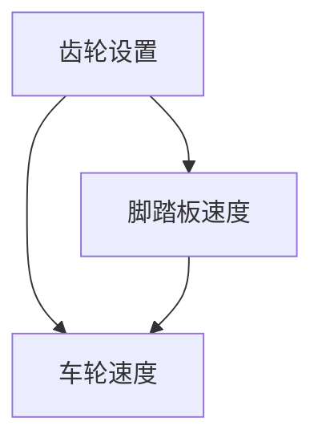

该领域需要进一步研究，因为这两种方法都不能完全捕捉简单动力系统中的依赖关系；例如，当施加反向力时，它们无法告诉我们车轮或脚踏板的速度，尽管我们根据基本的物理原理可以毫无困难地进行计算。

## 12.4 一致性2（Consistency2）

哪些假设能保证任何拥有无限搜索和计算资源的智能体能够从观测数据中得出因果结论的“可靠”过程的存在？在本节中，我们将针对“可靠”的几种越来越强的含义来回答这个问题。首先，我们将考虑需要哪些假设来保证**贝叶斯一致性（Bayes consistency）**，然后考虑需要哪些（更强的）假设来保证更强的**逐点一致性（pointwise consistency）**条件，最后考虑需要哪些（仍然更强的）假设来保证更强的**一致一致性（uniform consistency）**条件。（在每种情况下，我们都将假设**因果马尔可夫条件（Causal Markov Condition）**，并且一个总体的因果关系可以用一个 DAG 来表示。）然后，我们将讨论这些假设的合理性。我们强调，本节描述的负面结果适用于任何方法，而不仅仅是本书中描述的方法。我们将考虑那些不愿为因果推断可靠过程的存在做出必要假设的人应得出什么结论。本节中的符号、关于在某些假设集下存在一致一致检验的负面结果，以及这些负面结果的一些含义，均基于 Robins, Scheines, Spirtes, and Wasserman 1999。

作为说明，请考虑图12.11中的**线性结构方程模型（linear structural equation models）**。我们假设背景知识给出了一个时间顺序（B 在 C 之前）并排除了选择偏差，但不排除存在潜共同原因的可能性。在所有三个模型中，$\varepsilon _ { A } ,$ $\varepsilon _ { B } ,$ 和 $\varepsilon _ { C }$ 是独立的高斯分布，A、B 和 C 是标准高斯分布，A 是潜变量，B 和 C 是观测变量。$\rho ( B , C )$ 是 B 和 C 之间的**相关系数（correlation）**。在讨论多个不同总体概率分布的情况下，$\rho _ { P } ( B , C )$ 表示在分布为 $P$ 的总体中 B 和 C 之间的相关系数。由于变量是标准化的，模型 M 和模型 $Q$ 中的 $x$ 是一个实值变量，代表结构方程中的线性系数，其取值范围在 –1 到 1 之间。在模型 N 和模型 $Q$ 中，$z$ 被固定为 0。（在模型 M 中，$x , y ,$ 和 $z$ 还有一个独立的约束，即 $\operatorname{var}(C) = \operatorname{var}(\varepsilon_C) + y^2 + z^2 +$ $2 x \times y \times z = 1$，因此 $y^2 + z^2 + 2 x \times y \times z \leq 1$。）在模型 M 中，$\rho ( B , C ) = ( x \times y ) + z$，在模型 $N$ 中 $\rho ( B , C ) = 0$，在模型 $Q$ 中 $\rho ( B , C ) = x \times y$。为了使模型 M、N 和 $Q$ 互不相交，$z = 0$ 不是模型 M 中的合法参数值，$x = y = 0$ 也不是模型 Q 中的合法参数值。

> 模型 M: 图 ${ \bf { \delta G } } _ { M }$

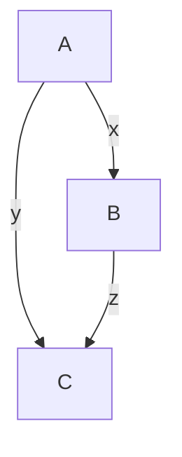

$$
\begin{array}{l} {A = \varepsilon_ {A}} \\ {B = x A + \varepsilon_ {B}} \\ {C = y A + z B + \varepsilon_ {C}} \end{array}
$$

B

$$
\begin{array}{c c} \text {A} & A = \varepsilon_ {A} \\ & B = \varepsilon_ {B} \\ & C = \varepsilon_ {C} \end{array}
$$

模型 N: 图 $G _ { N }$

> 模型 Q: 图 $G _ { Q }$ 图 12.11. 模型 M、模型 N 和模型 Q

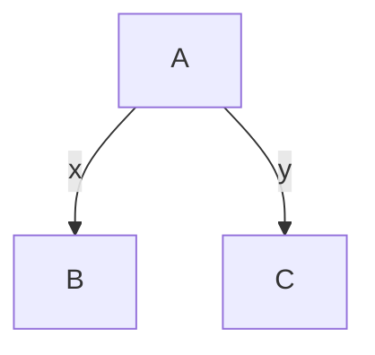

$$
\begin{array}{l} {A = \varepsilon_ {A}} \\ {B = x A + \varepsilon_ {B}} \\ {C = y A + \varepsilon_ {C}} \end{array}
$$

当模型 M 中 $( x \times y ) + z = 0$ 时，模型 M 和模型 N 蕴含相同的可观测总体分布 $( \rho ( B , C ) = 0 )$。模型 N 和模型 Q 从不蕴含相同的总体分布。将 C 的后续变化与 B 的操纵变化之比称为 B 对 C 的**处理效应（treatment effect）**。在模型 N 和模型 Q 中，B 对 C 的处理效应为 0，而在模型 M 中，它等于 $z$。因此，模型 M 与模型 N 和模型 Q 在 B 对 C 的处理效应上存在分歧。在模型 M 中，所有产生 $\rho ( B , C ) = 0$ 的 $x$、$y$ 和 $z$ 的合法值对 DAG $G _ { M }$ 都是**不忠实的（unfaithful）**。我们将这些称为模型 M 的“不忠实”参数值，并称对应于不忠实参数值的分布对 $G _ { M }$ 是不忠实的。

假设 $\rho ( B , C )$ 的样本估计值为零。在这种情况下，许多从观测数据中得出因果结论的方法会得出结论，认为 B 对 C 没有处理效应。例如，在许多研究中，当 B 对结果变量的回归系数不显著时，变量 B 就会被排除考虑。在这个例子中，当 $\rho ( B , C )$ 为零时，B 对 C 的回归系数为零。此外，在大样本极限下，以概率 1，模型 N 的**贝叶斯信息准则（BIC）**得分无限大于模型 M 或模型 Q 的 BIC 得分。当 $\rho ( B , C ) = 0$ 时，对于任何将非零概率赋予模型 N 且参数上的分布关于勒贝格测度绝对连续的先验，在大样本极限下，模型 N 的后验与模型 M 或模型 Q 的后验之比趋近于无穷大。此外，**快速因果推断（FCI）算法**（以及**PC算法**）也得出结论，B 对 C 的处理效应为零。因此，在大样本极限下，以概率 1，当 $\rho ( B , C ) = 0$ 时，基于约束的算法和各种贝叶斯得分都更偏好模型 N 而非模型 M 或模型 Q。如果真实模型是具有不忠实参数值的模型 M，使得 $z \neq 0$，那么即使在大样本极限下，所有这些搜索模型都会偏好模型 $N$，并且是错误的；否则，在大样本极限下，它们都是正确的。

图12.12显示了 $z = 0$ 平面以及模型 M 中 $\rho ( B , C ) = ( x \times y ) + z = 0$ 的参数曲面的一部分。$z = 0$ 平面中的 $x = 0$ 和 $y = 0$ 两条线也显示在图12.12中。此后，我们将排除非合法参数值 $z = 0$ 的 $\rho ( B , C ) = 0$ 曲面称为不忠实参数值曲面。（模型中还有其他不忠实参数值，但只有那些显示的会导致观测边际中的分布不忠实。）不忠实参数值曲面有三个重要特征。第一个特征是曲面是二维的，而模型 M 的参数空间是更高维的。因此，不忠实参数值曲面的勒贝格测度为 0。

第二个特征是在模型 M 中，$z$ 的任何合法值都与 $\rho ( B , C ) = 0$ 兼容（因为 $z$ 的每个值都出现在不忠实参数值曲面的某处）。例如，四个 $( x , y , z )$ 点 $( 1 , 1 , - 1 ) , ( - 1 , - 1 , - 1 ) , ( 1 , - 1 , 1 )$ 和 $( - 1 , 1 , 1 )$ 都出现在不忠实参数值曲面上。（点 $( - 1 , - 1 , - 1 )$ 在图12.12中被 $z = 0$ 平面遮挡。）因此，在模型 M 中，B 对 C 的处理效应 $( 1 \ \mathrm { o r - } 1 )$ 既与 $\rho ( B , C ) = 0$ 兼容，也与所有其他值兼容。

第三个特征是对每一个 $z$ 值，都存在不在不忠实参数值曲面上但任意接近不忠实参数值曲面的点。

不忠实参数值曲面的这三个特征，是在不同假设下，关于从观测数据“可靠”发现因果关系（在各种“可靠性”含义下）的可能性或不可能性的各种结果背后的原因。

## 12.4.1 贝叶斯一致性（Bayes Consistency）

设与 DAG G 关联的顶点集为 $\mathbf { V } _ { G }$。令 Γ 为一组 DAG，使得对于每个 $G \in \Gamma$，对于一组“观测”变量 O，有 $\mathbf { O } \subseteq \mathbf { V } _ { G }$。令 $\mathtt { B } _ { G }$ 为 G 参数的合法参数值集。令 $\Pi _ { G }$ 为满足 G 的马尔可夫条件（Markov condition）的 $\mathbf { V } _ { G }$ 上的分布集。令 γ 为一个函数，将 $( \mathrm { B } _ { G } , G )$ 映射到 $\Pi _ { G }$。在图 12.11 的模型 M、N 和 Q 的例子中，γ 是将线性结构方程模型参数 $( x , y , z )$ 映射到高斯分布的常用函数。在模型 N 的情况下，γ 将参数映射到相关矩阵为单位矩阵的高斯分布。在模型 M 的情况下，γ 将 $( x , y , z )$ 映射到相关矩阵为以下形式的高斯分布：

$$
\begin{array}{c c c} & A & B \\ A & 1 & x \\ B & x & 1 \\ C & y + (x \times z) & z + (x \times y) \\ & & 1 \end{array} \qquad \qquad \qquad \qquad \qquad \qquad \qquad \qquad \qquad \qquad \qquad \qquad \qquad \qquad \qquad \qquad \qquad \qquad \qquad \qquad \qquad \qquad \qquad \qquad \qquad \qquad \qquad \qquad \qquad \qquad \qquad \qquad \qquad \qquad
$$

在模型 Q 的情况下，γ 将 $( x , y )$ 映射到相关矩阵为以下形式的高斯分布：

$$
\begin{array}{c c c} A & B & C \\ A \left( \begin{array}{c c c} 1 & x & y \\ x & 1 & x \times y \\ y & x \times y & 1 \end{array} \right) \end{array}
$$

令 $\Pi _ { \Gamma } = \textstyle \bigcup _ { G \in \Gamma } \Pi _ { G }$。令 $O ^ { n } = O \times \ldots \times O$，其中 O 是 O 中随机变量的取值范围。假设我们从一个 $P ( \mathbf { O } ) \in \Pi _ { \Gamma } ( \mathbf { O } )$ 中得到一个随机样本 $\mathbf { O } ^ { n } = ( \mathbf { O } _ { 1 } , . . . , \mathbf { O } _ { n } )$。$P ^ { n }$ 是 $P$ 在 $O _ { n }$ 上的 n 重乘积测度。令 γ 将 $\begin{array} { r } { \mathbf { B } \Gamma = \bigcup _ { G \in \Gamma } \bigcup _ { \beta \in \mathbf { B } _ { G } } ( \beta , G ) } \end{array}$ 映射到实数，即 γ 是一个参数，目前我们暂不具体指定（例如，图 12.11 模型 M 中 B 对 C 的处理效应）。令

$$
\Pi_ {\Gamma 0} = \bigcup_ {G \in \Gamma} \left\{P \in \Pi_ {G}: \exists \beta \in \mathrm{B} _ {G}, \theta = \theta_ {0} \& \gamma (\beta , G) = P \right\}
$$

$$
\Pi_ {\Gamma 1} = \bigcup_ {G \in \Gamma} \left\{P \in \Pi_ {G}: \exists \beta \in \mathrm{B} _ {G}, \theta \neq \theta_ {0} \& \gamma (\beta , G) = P \right\}
$$

直观上，$\Gamma 0$ 是与 $\theta = \theta _ { 0 }$ 相容的分布集，而 $\Gamma 1$ 是与 $\theta \neq \theta _ { 0 }$ 相容的分布集。注意，可能存在一个 $ { \mathcal { P } } _ { 1 } \in  { \mathcal { ~ \mathrm { ~  ~ \pi ~ } ~ } } _ { 0 }$ 和一个 $P _ { 2 } \in \mathrm { ~  ~ \sigma ~ } _ { 1 }$，使得 $P _ { 1 } ( \mathbf { O } ) = P _ { 2 } ( \mathbf { O } )$。

假设存在一个先验密度 $P r ( \mathrm { B } \Gamma )$，使得对于 $( \beta , G ) \in { \bf \beta B } \Gamma _ { 3 }$，有 $P r ( \beta , G ) =$ $P r ( G ) P r ( \beta | G )$。这个先验，连同 γ，在 (ΒΓ,O) 上诱导出一个先验 Pr。假设我们检验 $H _ { 0 } \colon \theta = \theta _ { 0 }$ 对 $H _ { 1 } \colon \theta \neq \theta _ { 0 }$。出于我们的目的，一个检验是一个函数 $\varphi _ { n } \colon \mathbf { O } ^ { n } \to \{ 0 , 1 , 2 \}$，其中 $\phi _ { n } ( \mathbf { O } ^ { n } ) = 0$ 表示“选择 $H _ { 0 }$”，$\phi _ { n } ( \mathbf { O } ^ { n } ) = 1$ 表示“选择 $H _ { 1 }$”，而 $\phi _ { n } ( \mathbf { O } ^ { n } ) = 2$ 表示“不知道”。我们为每个样本量 n 指定一个检验 $\phi _ { n }$。在下文中，所有极限均指样本量 n 趋向于无穷大。令 $P r ^ { n } ( \mathbf { O } ^ { n } | \mathbf { B } \Gamma )$ 为 Pr(O|ΒΓ) 的 n 重乘积测度。一个总是返回“不知道”的检验显然是永远正确的，因此我们将排除此类检验。如果一个检验满足以下任一条件，则称其为非平凡的（non-trivial）：

- (i) 对于某个 ${ \cal P } \in \Pi _ { \Gamma }$，有 $\underbrace { l i m } _ { n \to \infty } { \cal P } ^ { n } \Big ( \varphi ^ { n } \big ( { \bf O } ^ { n } \big ) = 0 \Big ) = 1$，或者
- (ii) 对于某个 $P \in \Pi _ { \Gamma }$，有 $\operatorname* { l i m } _ { n \to \infty } P ^ { n } \Big ( \varphi ^ { n } \big ( \mathbf O ^ { n } \big ) = 1 \Big ) = 1$。

此后我们只考虑非平凡检验。

**定义 12.1**：一个检验 $\phi$ 相对于一个先验 Pr(ΒΓ) 和一个映射 γ（该映射在 (ΒΓ,O) 上诱导出一个先验 Pr）是**贝叶斯一致的（Bayes consistent）**，如果

$$
\lim _ {n \to \infty} P r (H _ {0}) P r ^ {n} (\varphi_ {n} (\mathbf {O} ^ {n}) = 1 \mid H _ {0}) + P r (H _ {1}) P r ^ {n} (\varphi_ {n} (\mathbf {O} ^ {n}) = 0 \mid H _ {1}) = 0
$$

直观上，当在大样本极限下，检验在先验下的一个零测集上出错时，该检验相对于该先验是贝叶斯一致的。保证贝叶斯一致性的一种平凡方法是让先验将其所有质量都放在一个单点上。然而，本节的结果更有趣，因为我们将考虑扩散先验（diffuse priors）。在下面的定理中，$G _ { M } , G _ { N } ,$ 和 $G _ { Q }$ 指的是图 12.11 中的模型。虽然允许检验返回“不知道”是非标准的，但我们这样做的原因如下。像 FCI 算法这样的算法执行零相关的统计检验，当相关性被判定为零时返回 0，当相关性被判定为非零时返回 2（“不知道”）。这是因为零相关意味着零处理效应，除非存在**忠实性（faithfulness）**违反（其勒贝格测度为 0），但非零相关既可以与 B 对 C 的直接效应（模型 M）相容，也可以与没有直接效应但存在 B 和 C 的共同原因（模型 Q）相容。（尽管为简单起见，在接下来的讨论中，当 B 和 C 是唯一测量的变量时，我们不考虑所有备选模型，但包括其他模型不会实质性地改变任何论点或结论。）

**定理 12.1**：如果 $\Gamma = \{ G _ { M } , G _ { N } , G _ { O } \} , \theta = z$，且 $\theta _ { 0 } = 0$，那么存在一个关于 $\theta = \theta _ { 0 }$ 对 $\theta \neq \theta _ { 0 }$ 的贝叶斯一致检验，该检验相对于任何如下先验 Pr 成立：

$$
P r (B _ {G _ {M}} \mid G _ {M}), P r (B _ {G _ {N}} \mid G _ {N}), a n d P r (B _ {G _ {Q}} \mid G _ {Q})
$$

关于勒贝格测度（Lebesgue measure）是绝对连续的。

**证明**。存在一个关于零相关对非零相关的**逐点一致检验（pointwise consistent test）** η（见第 12.4.2 节）。令 φ 在 η 返回 0 时返回 0，否则返回 2。因为 φ 从不返回 1，所以

$$
\lim _ {n \rightarrow \infty} P r ^ {n} (\phi_ {n} (\mathbf {O} ^ {n}) = 1 \mid H _ {0}) = 0.
$$

因为 η 是逐点一致的，对于每一个使得 $\rho _ { P } ( B , C ) \neq 0$ 的 P，有

$$
\lim _ {n \to \infty} P r ^ {n} (\eta_ {n} (\mathbf {O} ^ {n}) = 0) = 0
$$

因此

$$
\lim _ {n \rightarrow \infty} \operatorname * {P r} ^ {n} (\phi_ {n} (\mathbf {O} ^ {n}) = 0 \mid \rho (B, C) \neq 0) = 0
$$

$\rho _ { P } ( B , C ) = 0$ 与模型 Q 不相容，并且在模型 M 中，只有当 $z = - x \times y \neq 0$ 时 $\rho _ { P } ( B , C ) = 0$。因为 $P r ( B _ { G _ { M } } \mid G _ { M } )$ 关于勒贝格测度是绝对连续的，所以 $P r ( z = - x \times y = 0 \mid G _ { m } ) = 0$。如果 $P r ( H _ { 1 } ) \neq 0$，那么

$$
\lim _ {n \to \infty} P r ^ {n} (\phi_ {n} (\mathbf {O} ^ {n}) = 0 \mid H _ {1}) = 0
$$

$$
\text { 否则，如果 } \operatorname * {P r} (H _ {1}) = 0, \text { 则 } \lim _ {n \rightarrow \infty} \operatorname * {P r} (H _ {1}) \operatorname * {P r} ^ {n} (\phi_ {n} (\mathbf {O} ^ {n}) = 0 \mid H _ {1}) = 0 \text {。证毕。}
$$

除了贝叶斯统计检验之外，还有贝叶斯版本的置信区间和估计量，用于 B 对 C 的零处理效应。

先验在确定是否存在关于 $\theta = \theta _ { 0 }$ 对 $\theta \neq \theta _ { 0 }$ 的贝叶斯一致检验中扮演着重要角色。每当 $\rho ( B , C ) = 0$ 时，有两种不同类型的理论可以解释这一点：要么 $z = 0$（模型 N），要么 $z = - x \times y \neq 0$（模型 M）。因为这两种理论对 B 和 C 的边缘总体分布做出了完全相同的预测，所以来自边缘总体分布的任何样本都无法区分它们。无论看到样本之前 $z = 0$ 的概率与 $z = - x \times y \neq 0$ 的概率之比是多少，看到样本之后它仍然完全相同。因此，在忠实解释和不忠实解释之间的选择完全基于先验，而不是基于证据。这个例子中的先验赋予 $z = - x \times y \neq 0$ 零概率，因此存在针对该例子的贝叶斯一致检验。对于一个赋予 $z = - x \times y \neq 0$ 非零先验概率的不同先验，不存在相对于该先验的关于 $\theta = \theta _ { 0 }$ 对 $\theta \neq \theta _ { 0 }$ 的贝叶斯一致检验。

更一般地，如果对每个 DAG 的参数有一个先验，该先验赋予不忠实分布零概率，那么存在贝叶斯一致检验，用于检验生成给定样本的 DAG 是否属于给定的 **O-马尔可夫等价类（O-Markov equivalence class）**。定理 12.2 是 Robins 和 Wasserman (1999) 证明的结果的一个微小变体。

**定理 12.2**：令 Γ 是一个可数的 DAG 集合，每个 DAG 至少包含 $\mathbf { O }$ 中的变量，且 $F$ 是一个与 Γ 相交的 O-马尔可夫等价类。令 $H _ { 0 }$ 为“G 是 F 的成员”，$H _ { 1 }$ 为“G 不是 F 的成员”，且 $\mathbf { B } _ { \mathrm { G } , U }$ 为使得 $\gamma ( { \boldsymbol { \beta } } , G )$ 对 G 不忠实的参数 β 的集合。如果在 $\Pi _ { \Gamma }$ 中，存在关于 $\mathbf { O }$ 中变量间每个条件独立关系的逐点一致检验，并且对于每个 $G \in \Gamma$，$P r ( \mathbf { B } _ { \mathrm { G } , U } | G ) = 0$，那么存在一个关于 $H _ { 0 }$ 对 $H _ { 1 }$ 的检验 φ，该检验相对于 Pr 是贝叶斯一致的。

**证明**。假设存在关于观测变量间条件独立关系的逐点一致检验（见第 12.4.2 节）。那么存在一个关于有限条件独立关系集的逐点一致检验，因此也存在一个关于 F 成员资格的逐点一致检验 φ。（每个 DAG 的 O-马尔可夫等价类蕴含一组 $\mathbf { O }$ 中变量间唯一的有限条件独立关系集。）通过类似于定理 12.4.1 证明的推理，在大样本极限下，只有当真实 DAG 生成的分布对该 DAG 不忠实时，φ 的输出关于 F 的成员资格才是错误的。但根据假设，这种情况的概率为 0。证毕。

对于多项分布和高斯分布，在给定 G 的条件下产生不忠实分布的常用参数化的勒贝格测度为 0。因此，对于这些分布族和通常的先验（在第 12.5.3 节中描述），存在一个贝叶斯一致检验。然而，对于需要更强假设才能成功的更强的贝叶斯一致性概念，请参见 Robins 和 Wasserman 1999。

## 12.4.2 逐点一致性（Pointwise Consistency）

**定义 12.2**：一个检验 φ 在分布集 $\Pi _ { \Gamma 0 } , \Pi _ { \Gamma 1 }$ 上是**逐点一致的（pointwise consistent）**，如果

- (i) 对于每一个 $P \in \Pi _ { \Gamma 0 }$，有 $\operatorname* { l i m } _ { n \to \infty } P ^ { n } ( \phi _ { n } ( \mathbf { O } ^ { n } ) = 1 ) = 0$，并且
- (ii) 对于每一个 $P \in \Pi _ { \Gamma 1 }$，有 $\operatorname* { l i m } _ { n \to \infty } P ^ { n } ( \phi _ { n } ( \mathbf { O } ^ { n } ) = 0 ) = 0$。

与贝叶斯一致性相反，这个定义要求检验在 $\mathrm { { B r } }$ 中所有对 $( \beta , G )$ 的大样本极限下，以概率 1 不会失败。在 $\mathbb { B } \Gamma$ 中一个非平凡零测集的对 $( \beta , G )$ 上失败就足以排除逐点一致性。现在假设 $\Gamma = \{ G _ { M } , G _ { N } , G _ { Q } \}$ 来自图 12.11，$\theta = z , \theta _ { 0 } = 0$，并且我们检验 $\theta = \theta _ { 0 }$ 对 $\theta \neq \theta _ { 0 }$。

**定理 12.3**：如果 $\Gamma = \{ G _ { M } , G _ { N } , G _ { O } \}$ 来自图 12.11，$\theta = z$，且 $\theta _ { 0 } = 0$，那么相对于 $\Pi _ { \Gamma 0 }$ 和 $\Pi _ { \Gamma 1 }$，不存在关于 $\theta = \theta _ { 0 }$ 对 $\theta \neq \theta _ { 0 }$ 的逐点一致检验。

**证明**。对于每一个具有边缘 P(O) 的 $P \in \Pi _ { \Gamma 0 }$（来自模型 N 或模型 Q），存在一个 $P ^ { \prime } \in \Pi _ { \Gamma 1 }$（来自模型 M），使得 $P ( \mathbf { O } ) = P ^ { \prime } ( \mathbf { O } )$，反之亦然。因为任何检验 φ 只依赖于边缘分布，所以不存在关于 $\theta = \theta _ { 0 }$ 对 $\theta \neq \theta _ { 0 }$ 的逐点一致检验。证毕。

然而，如果 $\Pi _ { \Gamma 0 }$ 和 $\Pi _ { \Gamma 1 }$ 在观测边缘上的交集是 $\rho ( B , C ) = 0$ 的分布，那么存在一个关于 $\theta = \theta _ { 0 }$ 对 $\theta \neq \theta _ { 0 }$ 的逐点一致检验。由于 $\Pi _ { \Gamma 1 }$ 中在观测边缘上 $\rho ( B , C ) = 0$ 的分布恰好对应于模型 M 中不忠实参数值的曲面，如果这些分布被移除，则存在一个关于 $\theta = \theta _ { 0 }$ 对 $\theta \neq \theta _ { 0 }$ 的逐点一致检验。令 $\Omega _ { G }$ 为满足 G 的马尔可夫条件且对 G 忠实的分布集。令 $\Omega _ { \Gamma } = \bigcup _ { G \in \Gamma } \Omega _ { G }$。令

$$
\Omega_ {\Gamma 0} = \bigcup_ {G \in \Gamma} \{P \in \Omega_ {G}: \exists \beta \in \mathrm{B} _ {G}, \theta = \theta_ {0} \& \gamma (\beta , G) = P \}
$$

$$
\Omega_ {\Gamma 1} = \bigcup_ {G \in \Gamma} \left\{P \in \Omega_ {G}: \exists \beta \in \mathrm{B} _ {G}, \theta \neq \theta_ {0} \& \gamma (\beta , G) = P \right\}.
$$

**定理 12.4**：如果 $\Gamma = \{ G _ { M } , G _ { N } , G _ { Q } \}$，那么相对于 $\Omega _ { \Gamma 0 } , \Omega _ { \Gamma 1 }$，存在一个关于 $\theta = \theta _ { 0 }$ 对 $\theta \neq \theta _ { 0 }$ 的逐点一致检验。

**证明**。存在一个关于零相关对非零相关的逐点一致检验 η。令 φ 在 η 返回 0 时返回 0，否则 φ 返回 2。由于 φ 从不返回 1，对于每一个 $P \in \Omega _ { \Gamma 0 }$，有 $P ^ { n } ( \phi _ { n } ( \mathbf { O } ^ { n } ) = 1 ) = 0$。在忠实性假设下，$\Omega _ { \Gamma 1 }$ 只包含那些 $\rho _ { P } ( B , C ) \neq 0$ 的分布。由于对于每一个 $P \in \Omega _ { \Gamma 1 }$，有 $\lim_{n \to \infty} P ^ { n } ( \eta _ { n } ( \mathbf { O } ^ { n } ) = 0 ) = 0$，因此 $\lim_{n \to \infty} P ^ { n } ( \phi _ { n } ( \mathbf { O } ^ { n } ) = 0 ) = 0$。证毕。

**定理 12.5**：令 Γ 是一个可数的 DAG 集合，每个 DAG 至少包含 $\mathbf { O }$ 中的变量，且 $F$ 是一个与 Γ 相交的 O-马尔可夫等价类。令 $H _ { 0 }$ 为“G 是 F 的成员”，$H _ { 1 }$ 为“G 不是 F 的成员”。如果在 $\Omega _ { \Gamma }$ 中，存在关于 $\mathbf { O }$ 中变量间每个条件独立关系的逐点一致检验，那么相对于分布集 $\Omega _ { \Gamma 0 } , \Omega _ { \Gamma 1 }$，存在一个关于 $H _ { 0 }$ 对 $H _ { 1 }$ 的逐点一致检验 φ。

**证明**。在忠实性假设下，一个分布 P 与 O-马尔可夫等价类 F 中的 DAG G 相容，当且仅当它在边缘上满足某个有限的条件独立关系集。来自不在 F 中的 DAG 的任何分布都不满足边缘上相同的条件独立关系集。如果存在关于 $\mathbf { O }$ 中变量间每个条件独立关系的逐点一致检验，那么存在一个关于 F 所蕴含的条件独立关系集的逐点一致检验，因此也存在一个关于 F 成员资格的逐点一致检验。证毕。

在多元高斯分布和多项分布的情况下，都存在关于条件独立性的逐点一致检验，因此也存在关于 O-马尔可夫等价类成员资格的逐点一致检验。

## 12.4.3 一致一致性（Uniform Consistency）

$$
\text {令} \Pi_ {\Gamma \delta 0} = \bigcup_ {G \in \Gamma} \{P \in \Pi_ {G}: \exists   \beta \in \mathrm{B} _ {G}, |   \theta - \theta_ {0}   | > \delta   \&   \gamma (\beta , G) = P \}    ,
$$

即 $\Pi _ { \Gamma }$ 中与距离 $\theta _ { 0 }$ 超过 $\delta$ 相容的分布集合。（$\Pi _ { \boldsymbol { \mathrm { T } } \delta 0 }$ 下标中的 $\cdot _ { 0 }$ 指 $\theta _ { 0 }$，而 $\mathit { \Omega } ^ { \bullet } \delta ^ { \bullet }$ 指与 $\theta _ { 0 }$ 的距离。）

**定义 12.3**：一个检验 $\theta = \theta _ { 0 }$ 对立于 $\theta \neq \theta _ { 0 }$ 的检验 $\phi$ 在分布集合 $\Pi _ { \Gamma 0 }$ 和 $\Pi _ { \Gamma \delta 0 }$ 上是一致一致的（uniformly consistent），如果

- ${ \mathrm { ( i ) } \atop { n  \infty } } \operatorname* { s u p } _ { P \in \Pi _ { \Gamma 0 } } P ^ { n } ( \phi _ { n } ( \mathbf { O } ^ { n } ) = 1 ) = 0$
- $\operatorname { ( i i ) } \forall \delta > 0 , \operatorname* { l i m } _ { n  \infty } \operatorname* { s u p } _ { P \in \Pi _ { \Gamma \delta 0 } } P ^ { n } ( \phi _ { n } ( \mathbf { O } ^ { n } ) = 0 ) = 0$

暂时假设图 12.11 中的 $\Gamma = \{ G _ { M } , G _ { N } \}$，$\theta _ { 0 }$ 是 $z = 0$，我们检验 $\theta = \theta _ { 0 }$ 对立于 $\theta \neq \theta _ { 0 }$。暂时考虑一个返回 0 或 1 的 $\phi$。由于 $\phi$ 是观测数据的函数，在每个样本量下，它将样本划分为判断为来自 $H _ { 0 }$ 的样本和判断为来自 $H _ { 1 }$ 的样本。对于一个独立性零假设的检验，判断为来自 $H _ { 1 }$ 的样本位于拒绝域（rejection region），判断为来自 $H _ { 0 }$ 的样本位于接受域（acceptance region）。如果 $\phi$ 是逐点一致的（pointwise consistent），那么对于任意 $\delta > 0$，对于任意 $P \in \Omega _ { \Gamma \delta 0 }$，都可以找到一个 $n$，使得从 $P$ 抽取的样本量为 $n$ 的样本极有可能落入 $\phi _ { n }$ 的拒绝域，其中 $n$ 依赖于 $P$。然而，一致一致性比逐点一致性更强，因为定义要求：对于每个 $\delta > 0$，都可以找到一个单一的最小 $n$，使得从任意 $P \in \Omega _ { \Gamma \delta 0 }$ 抽取的样本量为 $n$ 的样本极有可能落入 $\phi _ { n }$ 的拒绝域。同样的思想可以推广到允许“不知道”作为答案的检验。

如果不存在 $\theta = \theta _ { 0 }$ 的一致一致检验，那么就不存在关于 $\theta$ 的一致一致非平凡置信区间（uniformly consistent non-trivial confidence intervals），也不存在 $\theta$ 的一致一致估计量（uniformly consistent estimators）。为了在所有模型的最坏情况下限制 $\theta$ 的误差，一致一致性是必要的。

Robins、Scheines、Spirtes 和 Wasserman (1999) 表明，即使去除了不忠实分布（unfaithful distributions），对于 $\Gamma = \{ G _ { M } , G _ { N } \}$ 的参数化（其中 A、B 和 C 是离散的），也不存在 $\theta = \theta _ { 0 }$ 对立于 $\theta \neq \theta _ { 0 }$ 的非平凡一致一致检验。Robins、Scheines、Spirtes 和 Wasserman (1999) 中的原始证明假设检验在更强的意义上是非平凡的：在极限情况下，它不会对零假设中的所有分布或备择假设中的所有分布都返回“不知道”。该证明后来被推广到涵盖本文提出的较弱的非平凡性定义。

即使通过假设排除了不忠实分布，对于 $\Gamma = \{ G _ { M } , G _ { N } , G _ { Q } \}$，也不存在 $\theta = \theta _ { 0 }$ 对立于 $\theta \neq \theta _ { 0 }$ 的一致一致检验。非正式地说，不存在一致一致检验的原因是：即使从 $\Pi _ { \Gamma 0 }$ 中移除了不忠实参数值的曲面，对于任意 $\delta > 0$，仍然可以找到一个 $P \in \Omega _ { \Gamma \delta 0 }$，使得 $\rho _ { P } ( B , C )$ 任意接近于 0。考虑一个检验 $\phi$ 的拒绝域序列，该检验关于 $\Omega _ { \Gamma 0 } \cup \Omega _ { \Gamma 1 }$ 是逐点一致的。对于任意给定的 $P \in \Omega _ { \Gamma \otimes 0 }$，无论 $\rho _ { P } ( B , C )$ 多么接近 0，只要它不等于 0，就可以找到一个 $n$，使得样本量为 $n$ 的样本很可能落入 $\phi _ { n }$ 的拒绝域。但总是存在另一个 $P ^ { \prime } \in \Omega _ { \Gamma \delta 0 }$，其 $\rho _ { P ^ { \prime } } ( B , C )$ 更接近零，使得从 $P ^ { \prime }$ 抽取的样本量为 $n$ 的样本不太可能落入 $\phi _ { n }$ 的拒绝域。令

$$
\Omega_ {\Gamma \delta 0} = \bigcup_ {G \in \Gamma} \{P \in \Omega_ {G}: \exists \beta \in \mathrm{B} _ {G}, | \theta - \theta_ {0} | > \delta \& \gamma (\beta , G) = P \}.
$$

**定理 12.6**：如果 $\begin{array} { r } { \varGamma = \{ G _ { M } , G _ { N } , G _ { O } \} , \theta = z _ { 1 } } \end{array}$，且 $\theta _ { 0 } = 0$，则关于 $\Omega _ { \Gamma 0 }$ 和 $\Omega _ { \Gamma \delta 0 }$，不存在 $\theta = \theta _ { 0 }$ 对立于 $\theta \neq \theta _ { 0 }$ 的一致一致检验。

**证明**。假设相反，存在一个 $\theta = \theta _ { 0 }$ 对立于 $\theta \neq \theta _ { 0 }$ 的一致一致检验 $\phi$。由于 $\phi$ 是非平凡的，因此要么

- (i) 对于某个 $P \in \Omega _ { \Gamma }$，$\operatorname* { l i m } _ { n \to \infty } P ^ { n } \left( \varphi ^ { n } ( \mathbf O ^ { n } ) = 0 \right) = 1$，或者
- (ii) 对于某个 $P \in \Omega _ { \Gamma }$，$\operatorname* { l i m } _ { n \to \infty } P ^ { n } \left( \varphi ^ { n } ( \mathbf O ^ { n } ) = 1 \right) = 1$

假设情况是 (ii)。如果 P 在 $\Omega _ { \Gamma 0 }$ 中，则 $\varphi$ 不是一致一致的。那么假设 P 在 $\Omega _ { \Gamma \delta 0 }$ 中。对于 $\Omega _ { \Gamma \delta 0 }$ 中的每个分布 P（来自模型 M），在 $\Omega _ { \Gamma 0 }$ 中存在一个分布 D（来自模型 Q），其关于 O 的边际相同。由于 $\phi$ 只是关于 O 边际的函数，因此 $P ^ { n } ( \phi _ { n } ( \mathbf { O } ^ { n } ) = 1 ) = D ^ { n } ( \phi _ { n } ( \mathbf { O } ^ { n } ) = 1 )$。因此，在大样本极限下，存在一个 $D \in \Omega _ { \Gamma 0 }$，使得 $D ^ { n } ( \phi _ { n } ( \mathbf { O } ^ { n } ) = 1 ) = 1$，并且 $\phi$ 不是一致一致的。

现在假设情况是 (i)。如果 P 在 $\Omega _ { \Gamma \delta 0 }$ 中，则 $\varphi$ 不是一致一致的。那么假设 P 在 $\Omega _ { \Gamma 0 }$ 中。由此可知 P 与 $z = 0$ 相容。首先考虑 $\rho _ { P } ( B , C ) = r \neq 0$ 的情况（即如果 $z = 0$，P 与模型 Q 相容，但与模型 N 不相容）。存在一个 $\delta > 0$ 和某个分布 $D \in \Omega _ { \Gamma \otimes 0 }$，使得 $\rho _ { D } ( B , C ) = r$，但 D 与 $\vert z \vert > \delta$ 相容（即 D 与模型 M 相容，并且与 P 具有相同的关于 B 和 C 的边际）。由于 $\phi$ 只是关于 B 和 C 边际的函数，因此 $P ^ { n } ( \phi _ { n } ( \mathbf { O } ^ { n } ) = 0 ) = D ^ { n } ( \phi _ { n } ( \mathbf { O } ^ { n } ) = 0 )$。因此，存在一个 $D \in \Omega _ { \Gamma \delta 0 }$，使得在大样本极限下 $D ^ { n } ( \phi _ { n } ( \mathbf { O } ^ { n } ) = 0 ) = 1$，因此 $\phi$ 不是一致一致的。

最后考虑 $z = 0$ 且 $\rho _ { P } ( B , C ) = 0$ 的情况（即 P 来自模型 N）。存在一个 $\delta > 0$ 和一个分布 $D \in \Pi _ { \Gamma \delta 0 }$（与模型 M 相容，z 值为 $z _ { 1 }$，其中 $| z _ { 1 } | > \delta$），且与 P 具有相同的关于 B 和 C 的边际。然而，D 对模型 M 不忠实，因此不是 $\Omega _ { \Gamma \delta 0 }$ 的成员。但在零附近存在一个区间，使得对于区间内的每个值 r（除了 $r = 0$），存在某个 $D _ { n } \in \Omega _ { \Gamma \delta 0 }$，与模型 M 和 $z = z _ { 1 }$ 相容，且 $\rho _ { D n } ( B , C ) = r$。Kullback-Liebler 距离 $\operatorname { I } ( \tilde { D } ; \tilde { D } _ { n } )$ 等于 $- 1 / 2 \log ( 1 - r ^ { 2 } )$，这是 r 的连续函数（其中 $\tilde { D }$ 是 D 关于 B 和 C 的边际）。因此 $1 ( \tilde { D } ^ { n } ; \tilde { D } _ { n } ^ { n } )$ 等于 $-\cdot n / 2 \log ( 1 - r ^ { 2 } )$。对于样本空间中的每个事件 A，

$$
\sup _ {A} | \tilde {D} ^ {n} (A) - \tilde {D} _ {n} ^ {n} (A) | \leq \frac {1}{2} \left\{I \left(\tilde {D} ^ {n}; \tilde {D} _ {n} ^ {n}\right) \right\} ^ {1 / 2}
$$

通过选择足够小的 r，$\Omega _ { \Gamma \delta 0 }$ 中存在边际任意接近 $\tilde { D }$ 且与模型 M 和 $z = z _ { 1 }$ 相容的分布。因此，对于所有 n 和所有 $\varepsilon / 2$，存在一个分布 $D _ { n } \in \Omega _ { \Gamma \delta 0 }$（因此对模型 M 忠实且 $z = z _ { 1 }$），使得 $| \tilde { D } ^ { n } ( \phi _ { n } ( \mathbf { O } ^ { n } ) = 0 ) - \tilde { D } _ { n } ^ { n } \left( \phi _ { n } ( \mathbf { O } ^ { n } ) = 0 \right) | < \varepsilon / 2$。

由于 $\phi$ 只是关于 B 和 C 边际的函数，$P ^ { n } ( \phi _ { n } ( \mathbf { O } ^ { n } ) = 0 ) = \tilde { P } ^ { n } ( \phi _ { n } ( \mathbf { O } ^ { n } ) = 0 )$ $= \tilde { D } ^ { n } ( \phi _ { n } ( \mathbf { O } ^ { n } ) = 0 ) \leq \tilde { D } _ { n } ^ { n } ( \phi _ { n } ( \mathbf { O } ^ { n } ) = 0 ) + \varepsilon / 2 = D _ { n } ^ { n } ( \phi _ { n } ( \mathbf { O } ^ { n } ) = 0 ) + \varepsilon / 2$。因为 $P ^ { n } ( \phi _ { n } ( \mathbf { O } ^ { n } ) = 0 )$ 收敛于 $1$，$(\forall \varepsilon / 2 > 0) (\exists N) (\forall n > N) ( P ^ { n } ( \phi _ { n } ( \mathbf { O } ^ { n } ) = 0 ) > 1 - \varepsilon / 2)$。由此可得

$$
(\forall \varepsilon > 0) (\exists N) (\forall n > N) (D _ {n} ^ {n} (\phi_ {n} (\mathbf {O} ^ {n}) = 0) > 1 - \varepsilon / 2 - \varepsilon / 2) = 1 - \varepsilon .
$$

由于每个 $D _ { n } \in \Pi _ { \Omega \delta 0 }$，因此

$$
\lim _ {n \to \infty} \sup _ {P \in \Omega_ {\Gamma \delta 0}} P ^ {n} (\phi_ {n} (\mathbf {O} ^ {n}) = 0) = 1
$$

因此 $\phi$ 不是一致一致的。证毕（Q.E.D.）。

然而，如果不是仅仅假设模型 M 没有不忠实参数值，而是假设模型 M 没有“接近不忠实”（close to unfaithful）的参数值（因此模型 M 没有“接近不忠实”的分布）。例如，在模型 M 中，对于任意给定的固定 $\kappa > 0$，可以只允许那些满足 $\lvert z + ( x \times y ) | > \kappa | z |$ 的参数，即那些相关性大于 B 对 C 处理效应大小固定百分比的参数值。如果 $\kappa$ 是 0.001，该假设意味着相关性至少是 B 对 C 处理效应大小的 1/1000。对于固定的 $\kappa$，称满足 $| z + ( x \times y ) | < \kappa | z |$ 的参数值集合为“接近不忠实”。参数值不接近不忠实的假设，即假设小的总体相关性保证了小的处理效应。

令 $\operatorname { H } _ { G }$ 是满足 G 的马尔可夫条件（Markov condition）且对于某个固定 $\kappa$ 不接近不忠实于 G 的分布集合，且

$$
\mathrm{H} _ {\Gamma} = \bigcup_ {G \in \Gamma} \mathrm{H} _ {G}, \theta = z, \theta_ {0} = 0
$$

且

$$
\mathrm{H} _ {\Gamma \delta 0} = \bigcup_ {G \in \Gamma} \left\{P \in \mathrm{H} _ {G}: \exists \beta \in \mathrm{B} _ {G}, | \theta - \theta_ {0} | > \delta \& \gamma (\beta , G) = P \right\}
$$

（即 $\mathrm{H} _ { \Gamma \delta 0 }$ 是满足马尔可夫条件、不接近不忠实于 G，且 $\theta$ 与 $\theta _ { 0 }$ 的距离超过 $\delta$ 的分布集合。）

**定理 12.7**：如果 $\Gamma = \{ G _ { M } , G _ { N } , G _ { Q } \}$，则关于 $\mathrm { H } _ { \Gamma 0 }$ 和 $\mathrm { H } _ { \Gamma \delta 0 }$，存在一个 $\theta = \theta _ { 0 }$ 对立于 $\theta \neq \theta _ { 0 }$ 的一致一致检验。

**证明**。存在一个 $\rho ( B , C ) = 0$ 对立于 $\rho ( B , C ) \neq 0$ 的一致一致检验 $\eta$。令 $\phi$ 在 $\eta$ 返回 0 时返回 0，否则返回 2。由于 $\phi$ 从不返回 1，对于所有 $P \in \Gamma _ { \Gamma 0 }$，$P ^ { n } ( \varphi _ { n } ( \mathbf { O } ^ { n } ) = 1 ) = 0$。令 $\Gamma _ { \Gamma \delta 0 } = \bigcup _ { G \in \Gamma } \{ P \in \Pi _ { G } \colon | \rho _ { P } ( B , C ) | > \delta \}$。

根据无“接近不忠实”参数值的假设，如果 B 对 C 的处理效应的绝对值大于 $\delta$，则 B 和 C 的相关性的绝对值大于 $\kappa \delta$。对于 $\mathrm { H } _ { \Gamma \delta 0 }$ 中的每个分布 P，P 在 $\mathrm { T } _ { \Gamma ( \kappa \delta ) 0 }$ 中。因为 $\phi _ { n } ( \mathbf { O } ^ { n } ) = 0$ 当且仅当 $\eta _ { n } ( \mathbf { O } ^ { n } ) = 0$，因此

$$
\forall \kappa \delta > 0, \lim _ {n \rightarrow \infty} \sup _ {P \in \mathrm{T} _ {\Gamma (\kappa \delta) 0}} P ^ {n} \left(\eta_ {n} \left(\mathbf {O} ^ {n}\right) = 0\right) = 0 \Rightarrow
$$

$$
\forall \delta > 0, \lim _ {n \rightarrow \infty} \sup _ {P \in \mathrm{H} _ {\Gamma \delta 0}} P ^ {n} (\phi_ {n} (\mathbf {O} ^ {n}) = 0) = 0
$$

前件成立是因为 $\eta$ 是零相关的一致一致检验。因此，$\phi$ 是关于 $\mathrm { H } _ { \Gamma 0 }$ 和 $\mathrm { H } _ { \Gamma \delta 0 }$ 的 $\theta = \theta _ { 0 }$ 对立于 $\theta \neq \theta _ { 0 }$ 的一致一致检验。证毕（Q.E.D.）。

B 对 C 的零处理效应是处理效应的一个特例，在某些情况下可以通过预测算法（Prediction Algorithm）计算。将关于处理效应大小的一致一致检验存在性的结果推广到所有可以通过预测算法计算的处理效应，需要推广“接近不忠实参数”的概念，并推广定理 12.4.2 中使用的距离度量。我们推测存在自然的推广，使得在假设没有“接近不忠实”分布的情况下，对于每个可以通过预测算法计算的处理效应，都存在一个一致一致检验。类似地，将关于一致一致性的结果推广到给定 O-马尔可夫等价类（O-Markov equivalence class）的成员资格检验，需要将“接近不忠实”的概念推广到条件独立性，并需要一个度量一对参数 $(\beta , G)$ 与一个 O-马尔可夫等价类之间距离的度量。我们推测存在“接近不忠实”的自然推广和自然度量，使得对于给定 O-马尔可夫等价类的成员资格，存在一个一致一致检验。

## 12.4.3 区间检验（Interval Testing）

回到图 12.11 的模型 M，对于固定的 $\varepsilon > 0$，令 $H _ { 0 }$ 为 $|z| \le \varepsilon$，$H _ { 1 }$ 为 $|z| > \varepsilon$。如果 Pr(ΒΓ) 是一个先验，它对接近不忠实的参数值赋予测度 0，那么就存在一个关于 Pr 是贝叶斯一致（Bayes consistent）的 $H _ { 0 }$ 对立于 $H _ { 1 }$ 的检验。类似地，存在关于 $\mathrm { H } _ { \Gamma 0 }$ 和 $\mathrm { H } _ { \Gamma 1 }$ 是逐点一致的检验（其中 $\mathrm { H } _ { \Gamma 0 }$ 是 $\mathrm { H } _ { \Gamma }$ 中与 $H _ { 0 }$ 相容的分布集合，$\mathrm { H } _ { \Gamma 1 }$ 是 $\mathrm { H } _ { \Gamma }$ 中与 $H _ { 1 }$ 相容的分布集合），并且存在关于 $\mathrm { H } _ { \Gamma 0 }$ 和 $\mathrm { H } _ { \Gamma \delta 0 }$ 是一致一致的检验（其中 $\mathrm { H } _ { \Gamma \delta 0 }$ 是 $\mathrm { H } _ { \Gamma }$ 中与零假设至少相距 $\delta$ 的分布集合）。一致一致检验存在性的证明类似于定理 12.7 的证明，而逐点一致检验和贝叶斯一致检验的存在性则由一致一致检验的存在性推出。

## 12.4.5 其他类型的背景知识（Other Kinds of Background Knowledge）

在图 12.11 的示例中，**背景知识（background knowledge）** 固定了一个时间顺序，但存在未测量的共同原因的可能性。类似于前几节讨论的一致性问题，也可以针对其他类型的背景知识提出。例如，一种背景知识是：没有给定的时间顺序，也没有未测量的共同原因；另一种是：有给定的时间顺序，但没有未测量的共同原因。我们推测，一般情况下存在顺序，但没有未测量的共同原因。仅假设**忠实性（faithfulness）** 且不存在非平凡的**均匀一致检验（uniformly consistent test）** 来判断**马尔可夫等价类（Markov equivalence class）** 的成员关系，我们推测，在给定不存在潜变量的情况下，但没有给定时间顺序时，通常不存在非平凡的均匀一致检验。我们推测，在给定时间顺序、无潜变量且无确定性的情况下，存在一个非平凡的均匀一致检验来判断马尔可夫等价类的成员关系。

## 12.4.6 从负面结果中得出的结论（Conclusions to Be Drawn from the Negative Results）

我们再次强调，本节所述的**负面结果（negative results）** 适用于任何方法，而不仅仅是本书中描述的方法。即使给定时间顺序，如果不假设忠实性，或者没有诸如随机临床试验中可用的额外背景知识，就不存在关于 B 对 C 的**零处理效应（zero treatment effect）** 的逐点或均匀一致检验。由此可知，不存在关于 B 对 C 处理效应大小的（非平凡）均匀一致置信区间，也不存在关于处理效应大小的均匀一致估计量。没有任何类型的搜索（基于约束的、贪心的、蒙特卡洛的、模拟退火的、遗传的等），没有任何类型的基于任何评分（后验概率、BIC、AIC、MDL 等）的模型选择，没有任何类型的模型平均，也没有任何类型的检验（$\chi ^ { 2 }$ 检验、费希尔精确检验、t 检验、z 变换），能够绕过这些基本限制。任何非正式的方法（使用人类判断或“洞察力”）也无法逃脱这些基本限制。

我们应该从这些负面结果中得出什么结论？当表明没有方法能在给定的可靠性意义上解决某个问题时，通常有四种策略可供遵循（Kelly 1996）：(i) 加强证据；(ii) 加强背景假设；(iii) 弱化所需的成功标准；或 (iv) 放弃。我们将依次讨论每种策略。

增加证据的一种方法是提供随机试验的结果。当然，在可能的情况下这是更好的选择，但在大多数人类研究和心理学中，由于实际、伦理或理论原因，随机试验并不可行。

我们已经看到了几种通过增加背景假设来取得成功的方法。因此，如果增加背景假设，即不存在**几乎不忠实的分布（almost unfaithful distributions）**，则存在关于零处理效应的均匀一致检验。

我们也看到了几种弱化所需成功标准的方法，例如，满足于**贝叶斯一致性（Bayes consistency）** 而非逐点一致性，或满足于逐点一致性而非均匀一致性。

另一种弱化成功标准的方法是提供**条件检验（conditional tests）**，这些检验以未测量的共同原因所导致的关联强度为条件。（参见，例如，Rosenbaum 1995。这种方法也适用于本书中提出的某些算法仅回答“不知道”的许多情况。）进行此类**敏感性分析（sensitivity analysis）** 的理由很充分；例如，该分析明确区分了哪些是假设，以及数据在分析中扮演什么角色。但是，虽然这种方法明确了关于处理效应大小的特定结论需要哪些关于混杂强度的假设，但如果人们不愿意做出这些假设，则无法得出关于处理效应大小的结论。在不认可这些额外背景假设中的某一种的情况下，决策者无法基于此类敏感性分析做出均匀一致的决策。

弱化所需成功标准的第三种方法是计算处理效应大小的**界限（bounds）**（参见 Manski 1995）。然而，我们已经看到，在图 12.11 的示例中，如果 $\rho ( B , C ) = 0$，则处理效应 z 的大小不存在（非平凡的）界限。即使 $\rho ( B , C ) = a$，其中 a 为正，则对于处理效应可能为负的程度存在非平凡的界限。不幸的是，没有进一步的假设，无论 $\rho ( B , C )$ 有多大，界限总是包括零作为一种可能性，并且如果相关性不为 1，界限将总是包括一些负的处理效应。尽管在各种假设下可以获得一些有趣且有用的界限，但如果没有这些进一步的假设，这些界限在实际决策中通常不够紧，因此没有用处。

如果有人坚持将**均匀一致检验（uniformly consistent tests）** 作为可接受的最低成功标准，不愿意接受不存在几乎不忠实分布的假设，并且无法提供适当的随机试验，那么这个人应该放弃从观测数据中推断因果关系的尝试。“放弃”并不意味着用非正式方法或“人类判断”来替代自动化技术。非正式方法和“人类判断”与形式化或自动化方法一样，都受到负面结果的限制。“放弃”意味着应该完全停止为此目的收集数据，并停止试图通过查看数据来做出此类推断。这将意味着停止流行病学、社会学、心理学和经济学中的大多数因果研究。

“放弃”是正确的政策吗？我们仍然需要就卫生政策、社会政策、经济政策等做出决策。问题在于，由于我们无法在做出“不存在几乎不忠实分布”等假设的情况下获得均匀一致检验，我们是完全放弃收集证据更好，还是应用那些不满足强一致性要求但满足较弱一致性要求的方法更好。我们相信后者。

这个论证并非旨在表明我们描述的任何自动搜索算法最终会被证明是有用的工具。这个问题取决于它们在真实样本量下的真实数据集上的表现，而在这些数据集中，所做出的假设并不完全成立。然而，该论证旨在表明，在仅对背景知识做出弱假设的情况下，不存在满足强一致性要求的算法，这一事实本身并不能成为放弃所有从观测数据中推断因果关系的尝试的充分理由。

## 12.5 搜索（Search）

第 12.5.1 节至第 12.5.6 节最初以略有修改的形式出现在 Heckerman、Meek 和 Cooper 1999 年的论文中，该论文包含一些额外的细节。1 第 12.5.1 节和第 12.5.2 节回顾了**贝叶斯方法（Bayesian approach）** 在模型平均和模型选择中的应用，及其在发现因果 DAG 模型中的应用。第 12.5.3 节讨论了为模型结构及其参数分配先验的方法。第 12.5.4 节比较了在完整数据情况下用于因果发现的贝叶斯方法和基于约束的方法，突出了贝叶斯方法的一些优势。第 12.5.5 节指出了当数据集不完整时（例如，当某些变量被隐藏时）贝叶斯方法所面临的计算困难，并讨论了更有效的近似方法，包括蒙特卡洛近似和渐近近似。第 12.5.6 节讨论了在包含潜变量的模型中进行搜索的开放问题，第 12.5.7 节讨论了在潜变量模型的等价类中进行搜索，第 12.5.8 节讨论了在循环有向图中进行搜索。第 12.5.9 节描述了其他一些近期的搜索方法，第 12.5.10 节讨论了应对因果搜索算法的输出采取何种态度。关于贝叶斯网络学习的其他综述包括 Heckerman 1998、Buntine 1996 和 Jordan 1998。

## 12.5.1 贝叶斯方法（The Bayesian Approach）

在基于约束的**因果有向无环图模型（causal DAG models）**发现方法中，我们利用数据对特定条件独立约束是否成立做出分类决策。然后，我们通过寻找与这些约束一致的那组因果结构来整合这些决策。为此，我们使用**因果马尔可夫条件（Causal Markov condition）**（在第 3 章中讨论）将缺乏因果关系与条件独立性联系起来。

在**贝叶斯方法（Bayesian approach）**中，我们也使用因果马尔可夫条件来寻找符合条件独立约束的结构。然而，与基于约束的方法不同，我们利用数据对条件独立约束进行概率推断。例如，我们并非根据数据绝对地断定变量 $X$ 和 $Y$ 是独立的，而是以某种概率断定这些变量是独立的。这个概率编码了我们对于独立性存在与否的不确定性。此外，由于贝叶斯方法使用概率框架，我们不再需要对单个独立事实做出决策。相反，我们计算与整个因果结构相关的独立关系为真的概率。然后，利用这些概率，我们可以对某个感兴趣的特定假设——例如，"$X$ 是否导致 $Y$？"——在所有可能的因果结构上进行平均。

让我们详细审视一下贝叶斯方法。假设我们的问题域由变量 $\mathbf { X } = \{ X _ { 1 } , . . . , X _ { n } \}$ 组成。此外，假设我们有一些数据 $D =$ $\{ \mathbf { x } _ { 1 } , . . . , \mathbf { x } _ { N } \}$ ，这些数据是来自 $X$ 的某个未知概率分布的随机样本。目前，我们假设 $D$ 中的每个个案 $x$ 包含对 $\mathbf{X}$ 中所有变量的观测。我们假设未知的概率分布可以由某个结构为 $m$ 的因果模型编码。我们假设该因果模型的结构是一个**有向无环图（DAG）**，它通过因果马尔可夫条件编码条件独立性。我们对模型的结构和参数不确定；并且——使用贝叶斯方法——我们利用概率来编码这种不确定性。特别地，我们定义一个离散变量 $M$ ，其状态 $m$ 对应于可能的真实模型，并用概率分布 $p ( \mathbf { m } )$ 来编码我们对 $M$ 的不确定性。此外，对于每个模型结构 $m$ ，我们定义一个（向量值）连续参数变量 $\Theta _ { m }$ ，其值 $\pmb { \theta } _ { m }$ 对应于可能的参数。我们用（平滑的）概率密度函数 $p ( \pmb \theta _ { m } | \mathbf { m } )$ 来编码我们对 $\Theta _ { m }$ 的不确定性。假设 $p ( \pmb \theta _ { m } | \mathbf { m } )$ 是一个平滑的概率密度函数，这包含了（测度 1）因果发现中基于约束方法所使用的忠实性（faithfulness）假设（Meek 1995）。

给定随机样本 $D$ ，我们使用贝叶斯规则计算每个 $m$ 和 $\pmb { \theta } _ { m }$ 的后验分布：

$$
p (\mathbf {m} \mid D) = \frac {p (\mathbf {m}) p (D \mid \mathbf {m})}{\sum_ {\mathbf {m} ^ {\prime}} p (\mathbf {m} ^ {\prime}) p (D \mid \mathbf {m} ^ {\prime})} \tag {12.1}
$$

$$
p (\boldsymbol {\theta} _ {m} \mid D, \mathbf {m}) = \frac {p (\boldsymbol {\theta} _ {m} \mid \mathbf {m}) p (D \mid \boldsymbol {\theta} _ {m} , \mathbf {m})}{p (D \mid \mathbf {m})} \tag {12.2}
$$

其中

$$
p (D \mid \mathbf {m}) = \int p (D \mid \boldsymbol {\theta} _ {m}, \mathbf {m}) p (\boldsymbol {\theta} _ {m} \mid \mathbf {m}) d \boldsymbol {\theta} _ {m} \tag {12.3}
$$

被称为**边际似然（marginal likelihood）**。给定某个感兴趣的假设 $h$ ，我们通过对所有可能的模型及其参数进行平均，来确定在数据 $D$ 下 $h$ 为真的概率：

$$
p (h \mid D) = \sum_ {m} p (\mathbf {m} \mid D) p (h \mid D, \mathbf {m}) \tag {12.4}
$$

$$
p (h \mid D, \mathbf {m}) = \int p (h \mid \boldsymbol {\theta} _ {m}, \mathbf {m}) p (\boldsymbol {\theta} _ {m} \mid D, \mathbf {m}) d \boldsymbol {\theta} _ {m} \tag {12.5}
$$

例如，$h$ 可能是下一个个案 ${ \bf X } _ { N + 1 }$ 在配置 $\mathbf { X } _ { N + 1 }$ 中被观测到的事件。在这种情况下，我们得到

$$
p (\mathbf {x} _ {N + 1} \mid D) = \sum_ {m} p (\mathbf {m} \mid D) \int p (\mathbf {x} _ {N + 1} \mid \boldsymbol {\theta} _ {m}, \mathbf {m}) p (\boldsymbol {\theta} _ {m} \mid D, \mathbf {m}) d \boldsymbol {\theta} _ {m} \tag {12.6}
$$

其中 $p ( \mathbf { x } _ { N + 1 } | \boldsymbol { \theta } _ { m } , \mathbf { m } )$ 是该模型的似然。作为另一个例子，$h$ 可能是 "$X$ 导致 $Y$" 的假设。我们将在第 12.5.4 节中详细考虑这种情况。

在某些假设下，这些计算可以高效地以封闭形式完成。一个假设是似然项 $p ( \mathbf { x } | \boldsymbol { \theta } _ { m } , \mathbf { m } )$ 分解如下：

$$
p (\mathbf {x} \mid \boldsymbol {\theta} _ {m}, \mathbf {m}) = \prod_ {i = 1} ^ {n} p (x _ {i} \mid \mathbf {p a} _ {i}, \boldsymbol {\theta} _ {i}, \mathbf {m}) \tag {12.7}
$$

其中每个局部似然 $p ( x _ { i } \mid \mathbf { p a } _ { i } , \pmb { \theta } _ { i } , \mathbf { m } )$ 属于指数族。在此表达式中，$\mathbf { p } \mathbf { a } _ { i }$ 表示对应于节点 $x _ { i }$ 父节点的变量配置，$\pmb { \theta } _ { i }$ 表示与变量 $x _ { i }$ 的局部似然相关联的参数集。这种分解的一个例子是：当每个变量 $X _ { i } \in \textbf { X }$ 是离散的，具有 $r _ { i }$ 个可能值 $\boldsymbol { x } _ { i } ^ { 1 } , \ldots , \boldsymbol { x } _ { i } ^ { r _ { i } }$ 时，每个局部似然是一组多项分布，每个 $\mathbf { P a } _ { i }$ 的配置对应一个分布——即，

$$
p (x _ {i} ^ {k} \mid \mathbf {p a} _ {i} ^ {j}, \boldsymbol {\theta} _ {i}, \mathbf {m}) = \theta_ {i j k} > 0 \tag {12.8}
$$

其中 $\mathbf { p a } _ { i } ^ { 1 } , . . . , \mathbf { p a } _ { i } ^ { q _ { i } } \quad ( q _ { i } = \prod _ { x _ { i } \in \mathbf { P a } _ { i } } r _ { i } )$ 表示 $\mathbf { P a } _ { i }$ 的配置，并且

$$
\pmb {\theta} _ {i} = \left(\left(\pmb {\theta} _ {i j k}\right) _ {k = 2} ^ {r _ {i}}\right) _ {j = 1} ^ {q _ {i}}
$$

是参数。参数 $\theta _ { i j 1 }$ 由下式给出

$$
1 - \sum_ {k = 2} ^ {r _ {i}} \theta_ {i j k}
$$

我们将用这个例子来说明本文中的许多概念。为方便起见，我们为所有 $i$ 和 $j$ 定义参数向量 $\pmb { \theta } _ { i j } = ( \theta _ { i j 2 } , . . . , \theta _ { i j r _ { i } } )$ 。高效计算的第二个假设是参数是相互独立的。例如，给定离散多项似然，我们假设参数向量 $\theta _ { i j }$ 是相互独立的。

让我们审视这些假设对我们多项示例的后果。给定一个不包含缺失观测的随机样本 $D$ ，参数保持独立：

$$
p (\boldsymbol {\theta} _ {m} \mid D, \mathbf {m}) = \prod_ {i = 1} ^ {n} \prod_ {j = 1} ^ {q _ {i}} p (\boldsymbol {\theta} _ {i j} \mid D, \mathbf {m}) \tag {12.9}
$$

因此，我们可以独立地更新每个参数向量 $\theta _ { i j }$ 。假设每个向量 $\theta _ { i j }$ 有一个共轭先验 $^{5}$ ——即，一个**狄利克雷分布（Dirichlet distribution）** $\operatorname { D i r } ( \pmb { \theta } _ { i j } | \alpha _ { i j 1 } , . . . , \alpha _ { i j r _ { i } } )$ ——我们得到参数的后验分布

$$
p (\boldsymbol {\theta} _ {i j} \mid D, \mathbf {m}) = \operatorname{Dir} (\boldsymbol {\theta} _ {i j} \mid \alpha_ {i j 1} + N _ {i j 1},..., \alpha_ {i j r _ {i}} + N _ {i j r _ {i}}) \tag {12.10}
$$

其中 $N _ { i j k }$ 是 $D$ 中满足 $X _ { i } = \boldsymbol { x } _ { i } ^ { k }$ 且 $\mathbf { P a } _ { i } = \mathbf { p } \mathbf { a } _ { i } ^ { j }$ 的个案数量。注意，计数集合 $N _ { i j k }$ 是模型 $m$ 数据的充分统计量。此外，我们得到边际似然（由 Cooper 和 Herskovits 于 1992 年推导）：

$$
p (D \mid \mathbf {m}) = \prod_ {i = 1} ^ {n} \prod_ {j = 1} ^ {q _ {i}} \frac {\Gamma (\alpha_ {i j})}{\Gamma (\alpha_ {i j} + N _ {i j})} \prod_ {k = 1} ^ {r _ {i}} \frac {\Gamma (\alpha_ {i j k} + N _ {i j k})}{\Gamma (\alpha_ {i j k})} \tag {12.11}
$$

其中

$$
\alpha_ {i j} = \sum_ {k = 1} ^ {r _ {i}} \alpha_ {i j k} \text {   and   } N _ {i j} = \sum_ {k = 1} ^ {r _ {i}} N _ {i j k}
$$

然后我们使用方程 (12.1) 和方程 (12.11) 来计算后验概率 $p ( { \bf m } | D )$ 。Cooper 和 Yoo (1999) 表明，如果 $N _ { i j k }$ 仅计数那些 $X _ { i }$ 未被实验操纵的个案，那么方程 (12.11) 也适用于实验数据和观测数据的混合。

作为这些思想的一个简单说明，假设我们感兴趣的假设是 ${ \bf X } _ { N + 1 }$ 的结果，即 $D$ 之后要看到的下一个个案。还假设，对于 ${ \bf { X } } _ { N + 1 }$ 的每个可能结果 ${ \bf X } _ { N + 1 }$ ，$X _ { i }$ 的值是 $x _ { i } ^ { k }$ ，并且 $\mathbf { P a } _ { i }$ 的配置是 $\mathbf { p } \mathbf { a } _ { i } ^ { j }$ ，其中 $k$ 和 $j$ 依赖于 $i$ 。为了计算 $p ( \mathbf { x } _ { N + 1 } | D )$ ，我们首先对参数的不确定性进行平均。使用方程 (12.2)、(12.7) 和 (12.8)，我们得到

$$
p \left(\mathbf {x} _ {N + 1} \mid D, \mathbf {m}\right) = \int \left(\prod_ {i = 1} ^ {n} \theta_ {i j k}\right) p \left(\boldsymbol {\theta} _ {m} \mid D, \mathbf {m}\right) d \boldsymbol {\theta} _ {m}
$$

因为给定 $D$ 参数保持独立，我们得到

$$
p \left(\mathbf {x} _ {N + 1} \mid D, \mathbf {m}\right) = \prod_ {i = 1} ^ {n} \int \theta_ {i j k} p \left(\boldsymbol {\theta} _ {i j} \mid D, \mathbf {m}\right) d \boldsymbol {\theta} _ {i j}
$$

因为该乘积中的每个积分都是狄利克雷分布的期望，我们有

$$
p \left(\mathbf {x} _ {N + 1} \mid D, \mathbf {m}\right) = \prod_ {i = 1} ^ {n} \frac {\alpha_ {i j k} + N _ {i j k}}{\alpha_ {i j} + N _ {i j}} \tag {12.12}
$$

最后，我们使用方程 (12.5) 对可能的模型平均这个 $p ( \mathbf { x } _ { N + 1 } | D , \mathbf { m } )$ 的表达式，以获得 $p ( \mathbf { x } _ { N + 1 } | D )$ 。

## 12.5.2 模型选择与搜索（Model Selection and Search）

即使在我们所描述的简化假设下，完全的贝叶斯方法通常也是不切实际的。完全贝叶斯方法中的一个计算瓶颈是对方程 (12.4) 中所有模型进行平均。如果我们考虑具有 $n$ 个变量的因果模型，可能的结构假设的数量至少是 $n$ 的指数级。因此，在无法排除几乎所有这些假设的情况下，该方法是难以处理的。几十年来，在处理其他类型模型的背景下一直面临这个问题的统计学家们，采用两种方法来应对：**模型选择（model selection）**和**选择性模型平均（selective model averaging）**。前一种方法是从所有可能的模型中选择一个"好"的模型（即结构假设），并将其视作正确的模型来使用。后一种方法是从所有可能的模型中选择数量可控的好模型，并假设这些模型是穷尽的。这些相关的方法提出了几个重要问题。特别是，当应用于因果结构时，这些方法能否产生准确的结果？如果能，我们如何搜索好的模型？

准确性问题在理论上难以回答。尽管如此，一些研究人员通过实验表明，选择一个后验概率可能较高的单一模型通常能产生准确的预测（Cooper 和 Herskovits 1992; Aliferis 和 Cooper 1994; Heckerman 等人 1995），并且使用蒙特卡洛方法进行选择性模型平均有时可以很高效，并且能产生更好的预测（Herskovits 1991; Madigan 等人 1996）。

Chickering (1996a) 已经证明，对于某些类别的先验分布，寻找具有最高后验概率的模型问题是 **NP 完全（NP-Complete）** 的。然而，许多研究人员已经证明，在 DAG 搜索空间上的**贪婪搜索方法（greedy search methods）**效果很好。此外，基于约束的方法已被用作寻找最可能因果模型的第一步启发式搜索（Singh 和 Valtorta 1993; Spirtes 和 Meek 1995）。另外，在**马尔可夫等价模型（Markov equivalent models）**（定义见下文）由单个模型表示的空间中执行贪婪搜索，提高了性能（Spirtes 和 Meek 1995; Chickering 1996）。

## 12.5.3 先验（Priors）

为了计算模型结构的相对后验概率，我们必须评估结构先验 $p(m)$ 和参数先验 $p ( \pmb \theta _ { m } | m )$ 。不幸的是，当许多模型结构可能时，这些评估将是难以处理的。尽管如此，在某些假设下，我们可以从数量可控的直接评估中推导出许多模型结构的结构和参数先验。

## 12.5.3.1 模型参数的先验（Priors for Model Parameters）

首先，让我们考虑对模型结构参数的先验进行评估。我们考虑 Heckerman 等人 (1995) 的方法，他们处理了局部似然为多项分布且参数独立性假设成立的情况。

他们的方法基于两个关键概念：**马尔可夫等价（Markov equivalence）**和**分布等价（distribution equivalence）**。回顾一下，如果 $\mathbf{X}$ 的两个模型结构能够表示 $\mathbf{X}$ 的同一组条件独立断言，则它们是**马尔可夫等价**的（与忠实不可区分同义）（Verma 和 Pearl 1990）。例如，给定 $\mathbf { X } = \{ X , Y , Z \}$ ，模型结构 $X \to Y \to Z$ 、$X \leftarrow Y \to Z$ 和 $X \leftarrow Y \leftarrow Z$ 仅表示 $X$ 和 $Z$ 在给定 $Y$ 条件下条件独立的断言。因此，这些模型结构是等价的。马尔可夫等价的另一个例子是 $\mathbf{X}$ 上**完备模型结构（complete model structures）**的集合；一个完备模型是没有缺失边且不编码任何条件独立断言的模型。当 $\mathbf{X}$ 包含 $n$ 个变量时，有 $n!$ 种可能的完备模型结构；每个变量的可能排序对应一个模型结构。所有 $p ( \mathbf { x } )$ 的完备模型结构都是马尔可夫等价的。通常，两个模型结构是马尔可夫等价的，当且仅当它们忽略弧的方向具有相同的结构，并且具有相同的**非屏蔽碰撞器（unshielded colliders）**（Verma 和 Pearl 1990；另见第 4 章）。

分布等价的概念与马尔可夫等价密切相关。假设所有考虑的 $\mathbf{X}$ 的因果模型都具有族 ${ \mathcal { F } }$ 中的局部似然。这本身并不是一个限制，因为 $\mathcal { F }$ 可以是一个很大的族。我们说 $\mathbf{X}$ 的两个模型结构 $\mathbf { m } _ { 1 }$ 和 $\mathbf { m } _ { 2 }$ 关于 $\mathcal { F }$ 是分布等价的，如果它们表示 $\mathbf { X }$ 的相同联合概率分布——也就是说，如果对于每个 $\pmb { \theta } _ { m 1 }$ ，存在一个 $\pmb { \theta } _ { m 2 }$ 使得 $p ( \mathbf { x } | \pmb { \theta } _ { m 1 } , \mathbf { m } _ { 1 } ) = p ( \mathbf { x } | \pmb { \theta } _ { m 2 } , \mathbf { m } _ { 2 } )$ ，反之亦然。（这是第 12.2 节中定义的 $\mathbf{O}$-分布等价的一个特例，其中 $\mathbf{O}$ 是 DAG 中所有变量的集合。）

关于某个 $\mathcal { F }$ 的分布等价蕴含马尔可夫等价，但反之则不成立。例如，当 $\mathcal { F }$ 是广义线性回归模型族时，$n \geq 3$ 个变量的完备模型结构并不表示相同的分布集。尽管如此，有些族 ${ \mathcal { F } }$ ——例如，多项分布和具有高斯噪声的线性回归模型——其中马尔可夫等价蕴含关于 $\mathcal { F }$ 的分布等价（Heckerman 和 Geiger 1996）。分布等价的概念很重要，因为如果两个模型结构 $\mathbf { m } _ { 1 }$ 和 $\mathbf { m } _ { 2 }$ 关于给定的 $\mathcal { F }$ 是分布等价的，那么通常有理由期望数据无法帮助区分它们。也就是说，对于任何数据集 $D$ ，我们期望 $p ( D | { \bf m } _ { 1 } ) = p ( D | { \bf m } _ { 2 } )$ 。Heckerman 等人 (1995) 称此性质为**似然等价（likelihood equivalence）**。注意，基于约束的方法也不区分马尔可夫等价结构。

现在让我们回到本节的主要问题：从数量可控的评估中推导先验。Geiger 和 Heckerman (1995) 表明，参数独立性和似然等价的假设意味着，任何完备模型结构 $\mathbf { m } _ { c }$ 的参数必须具有狄利克雷分布，其超参数受以下约束：

$$
\alpha_ {i j k} = \alpha p (x _ {i} ^ {k}, \mathbf {p a} _ {i} ^ {j} \mid \mathbf {m} _ {c}) \tag {12.13}
$$

其中 $\alpha$ 是用户的**等价样本量（equivalent sample size）** $^{4}$，并且

$$
p (x _ {i} ^ {k}, \mathbf {p a} _ {i} ^ {j} | \mathbf {m} _ {c})
$$

是根据用户的联合概率分布 $p ( \mathbf { x } | \textbf { m } )$ 计算得出的。这个结果相当引人注目，因为导致约束狄利克雷解的两个假设是定性的。

为了确定不完备模型结构参数的先验，Heckerman 等人 (1995) 使用了**参数模块性（parameter modularity）**的假设，该假设指出，如果 $X _ { i }$ 在模型结构 $\mathbf { m } _ { 1 }$ 和 $\mathbf { m } _ { 2 }$ 中具有相同的父节点，那么

$$
p (\boldsymbol {\theta} _ {i j} \mid \mathbf {m} _ {1}) = p (\boldsymbol {\theta} _ {i j} \mid \mathbf {m} _ {2})
$$

对于 $j = 1 , . . . , q _ { i }$ 成立。他们称此性质为参数模块性，因为它表明参数 $\theta _ { i j }$ 的分布仅依赖于模型结构中变量 $X _ { i }$ 的局部结构——即 $X _ { i }$ 及其父节点。

给定参数模块性和参数独立性的假设，根据完备模型结构上的先验来构造任意模型结构参数的先验是一件简单的事情。特别地，给定参数独立性，我们分别构造每个节点参数的先验。此外，如果节点 $X _ { i }$ 在给定模型结构中具有父节点 $\mathbf { P a } _ { i }$ ，我们确定一个完备模型结构，其中 $X _ { i }$ 具有这些父节点，并使用方程 (12.13) 和参数模块性来确定该节点的先验。结果是，所有模型结构的所有项 $\alpha _ { i j k }$ 都由方程 (12.13) 确定。因此，从评估 $\alpha$ 和 $p ( \mathbf { x } | \mathbf { m } _ { c } )$ 出发，我们可以推导出所有可能模型结构的参数先验。我们可以通过构建一个称为**先验模型（prior model）**的因果模型来评估 $p ( \mathbf { x } | \mathbf { m } _ { c } )$ ，该模型编码了这个联合分布。Heckerman 等人 (1995) 讨论了该模型的构建。

## 12.5.3.2 模型结构的先验（Priors for Model Structures）

现在，我们来考虑对模型结构（model structures）的先验评估。为模型结构分配先验的最简单方法是假设每个结构都是等可能的。当然，这个假设通常是不准确的，仅为了便利而使用。对该方法的一个简单改进是要求用户排除某些结构（可能基于因果关系的判断），然后对剩余的结构施加均匀先验（uniform prior）。

Buntine (1991) 描述了一组假设，这些假设导致了一种更丰富且高效的方法来分配先验。第一个假设是变量可以排序（例如，通过时间先后的知识）。第二个假设是可能弧（arcs）的存在与否是相互独立的。基于这些假设，`n(n–1)/2` 个概率评估（对应排序中每个可能的弧）决定了每个可能模型结构的先验概率。该方法的一个扩展是允许多个可能的排序。一个简化是假设弧存在或不存在的概率与所讨论的具体弧无关。在这种情况下，只需要一个概率评估。

另一种由 Heckerman 等人 (1995) 描述的方法使用了一个**先验模型（prior model）**。其基本思想是根据某个度量，衡量某个结构与先验模型之间的偏差，并以此惩罚该结构的先验概率。Heckerman 等人 (1995) 提出了一个合理的偏差度量。

Madigan 等人 (1995) 提出了另一种方法，该方法使用了来自领域专家的**想象数据（imaginary data）**。在他们的方法中，一个计算机程序帮助用户创建一组假设的完整数据。然后，使用类似第 12.5.1 节中的技术，他们计算在给定这些数据的情况下模型结构的后验概率，并假设结构的先验概率是均匀的。最后，他们将这些后验概率作为分析真实数据的先验。

## 12.5.4 示例（Example）

在本节中，我们提供一个简单的示例，将**贝叶斯模型平均（Bayesian model averaging）**和**贝叶斯模型选择（Bayesian model selection）**应用于因果发现问题。此外，我们将这些方法与一个基于约束的方法进行比较。

让我们考虑一个包含三个二元变量 `X`、`Y` 和 `Z` 的简单领域。令 `h` 表示假设：变量 `X` 因果性地影响变量 `Z`。为简洁起见，我们有时会将 `h` 表述为“`X` 导致 `Z`”。

首先，让我们考虑贝叶斯模型平均。在这种方法中，我们使用公式 (12.4) 来计算在给定数据 `D` 的情况下假设 `h` 为真的概率。因为我们的模型是因果模型，表达式 `p(D|m)` 简化为一个索引函数，当 `m` 包含从节点 `X` 到节点 `Z` 的弧时，该函数为真。因此，公式 12.4 的右边简化为：

$$
\sum_ {m ^ {\prime \prime}} p (\mathbf {m} ^ {\prime \prime} | D)
$$

其中，求和是对所有包含从 `X` 到 `Z` 的弧的因果模型 `m` 进行的。对于我们的三变量领域，有 25 个可能的因果模型，其中包含从 `X` 到 `Z` 的弧的模型有 8 个。

为了计算 `p(m|D)`，我们应用公式 (12.1)，其中对 `m` 的求和是在刚刚提到的 25 个模型上进行的。我们假设 25 个可能的模型服从均匀先验分布，因此对于每个 $\mathbf { m ^ { \prime } }$，有 $p ( \mathbf { m ^ { \prime } } ) = 1 / 2 5$。我们使用公式 (12.11) 来计算边际似然 $p ( D$ |m)。在应用公式 (12.11) 时，我们使用由 $\alpha _ { i j k } = 1 / r _ { i } q _ { i }$ 给出的先验，这是从公式 (12.13) 中对 `p(x|` $\mathbf { m } _ { c } )$ 使用均匀分布且等效样本量 = 1 得到的。由于这个等效样本量很小，数据对我们推导出的假设 `h` 的后验概率影响很大。

$$
p (X = \text {true}) = 0. 3 4
$$

$$
p (Y = \text { true }) = 0. 5 7
$$

$$
p (Z = \text {true} \mid X = \text {true}, Y = \text {true}) = 0. 3 6
$$

$$
p (Z = \text {true} \mid X = \text {true}, Y = \text {false}) = 0. 6 4
$$

$$
p (Z = \text {true} \mid X = \text {false}, Y = \text {true}) = 0. 4 2
$$

$$
p (Z = \text {true} \mid X = \text {false}, Y = \text {false}) = 0. 8 1
$$

**图 12.13.** 用于生成数据的因果模型

为了生成数据，我们首先选择了模型结构 $X \right. Z \left. Y$，并从一个均匀分布中随机采样其概率。得到的模型如图 12.13 所示。接着，我们根据模型的联合分布从模型中采样数据。在采样数据时，我们持续统计在 `{X,Y,Z}` 的每种可能配置中看到的案例数。这些计数对于任何因果模型 `m` 来说都是数据的充分统计量。对于数据集中前 150、250、500、1000 和 2000 个案例，这些统计量如表 12.1 所示。

**表 12.1**

<table><tr><td>案例数</td><td colspan="8">充分统计量</td></tr><tr><td></td><td> $\bar{x}\bar{y}\bar{z}$ </td><td> $\bar{x}\bar{y}z$ </td><td> $\bar{x}y\bar{z}$ </td><td> $\bar{x}yz$ </td><td> $x\bar{y}\bar{z}$ </td><td> $x\bar{y}z$ </td><td> $xy\bar{z}$ </td><td> $xyz$ </td></tr><tr><td>150</td><td>5</td><td>36</td><td>38</td><td>15</td><td>7</td><td>16</td><td>23</td><td>10</td></tr><tr><td>250</td><td>10</td><td>60</td><td>51</td><td>27</td><td>15</td><td>25</td><td>41</td><td>21</td></tr><tr><td>500</td><td>23</td><td>121</td><td>103</td><td>67</td><td>19</td><td>44</td><td>79</td><td>44</td></tr><tr><td>1000</td><td>44</td><td>242</td><td>222</td><td>152</td><td>51</td><td>80</td><td>134</td><td>75</td></tr><tr><td>2000</td><td>88</td><td>476</td><td>431</td><td>311</td><td>105</td><td>180</td><td>264</td><td>145</td></tr></table>

**表 12.2**

<table><tr><td>案例数</td><td>p(“X 导致 Z”|D)</td><td>贝叶斯模型选择的输出</td><td>PC 算法的输出</td></tr><tr><td>150</td><td>0.036</td><td>X 和 Z 无关</td><td>X 和 Z 无关</td></tr><tr><td>250</td><td>0.123</td><td>X 和 Z 无关</td><td>X 导致 Z</td></tr><tr><td>500</td><td>0.141</td><td>X 导致 Z 或 Z 导致 X</td><td>X 和 Z 无关（存在不一致）</td></tr><tr><td>1000</td><td>0.593</td><td>X 导致 Z</td><td>X 导致 Z</td></tr><tr><td>2000</td><td>0.926</td><td>X 导致 Z</td><td>X 导致 Z</td></tr></table>

表 12.2 中的第二列显示了在数据集中前 `N` 个案例上，根据上述假设应用公式 (12.4) 的结果。当 $N = 0$ 时，数据集为空，在这种情况下，假设 `h` 的概率就是 $^{6 6} X$ 导致 $Z '$ 的先验概率：$8 / 2 5 = 0 . 3 2$。表 12.2 显示，随着数据库中案例数的增加，$^{6 6} X$ 导致 $Z '$ 的概率单调递增。尽管表中未显示，但当案例数超过 2000 时，该概率趋近于 1。表 12.2 中的第 3 列显示了应用贝叶斯模型选择的结果。这里，我们列出了在后验概率 $p ( \mathbf { m } | D )$ 最高的一个或多个模型中找到的 `X` 和 `Z` 之间的因果关系。例如，当 $N = 5 0 0$ 时，有三个模型具有最高的后验概率。其中两个模型将 `Z` 视为 `X` 的原因；一个模型将 `X` 视为 `Z` 的原因。

表 12.2 中的第 4 列显示了应用基于约束的 PC 因果发现算法的结果，该算法是 Tetrad II 系统的一部分 (Scheines et al. 1994)。PC 算法旨在发现使用 $\mathrm { D A G s }$ 表达的因果关系。^7 我们使用 PC 算法的默认设置，其中包括 0.05 的统计显著性水平。注意，对于 $N = 5 0 0$，PC 算法检测到了一个不一致性。具体来说，独立性检验得出：(1) `X` 和 $Z$ 相关，(2) `Y` 和 $Z$ 相关，(3) 给定 $Z$ 时 `X` 和 `Y` 独立，以及 (4) 给定 $Y$ 时 `X` 和 $Z$ 独立。这些关系与 PC 算法所基于的假设不一致，该假设认为在样本中发现的唯一独立性事实是由应用于生成模型的**因果马尔可夫条件（Causal Markov condition）**所蕴含的那些。通常，由于在独立性检验中使用了阈值，可能会出现不一致性。

我们的结果说明了贝叶斯模型选择和基于约束的方法的几个弱点。一个是输出是分类的——没有指示结论的强度。另一个是结论可能不正确，因为它们与生成模型不一致。模型平均（第 2 列）没有这些弱点，因为它指示了因果假设的强度。

虽然这里没有说明，但基于约束的方法的另一个弱点是其输出取决于独立性检验中使用的阈值。为了使因果结论在渐近意义下正确，阈值必须根据样本量 (N) 进行调整。然而，在实践中，这个函数应该是什么尚不清楚。

最后，我们注意到模型平均存在实际问题。特别是，领域可能非常大，以至于需要平均的模型太多。在这种情况下，无法精确计算因果假设的概率。但是，我们可以使用**选择性模型平均（selective model averaging）**来推导近似的后验概率，从而在一定程度上指示因果假设的强度。

## 12.5.5 不完整数据和隐变量的方法（Methods for Incomplete Data and Hidden Variables）

在我们于第 12.5.1 节中描述的假设中，最常被违反的是所有变量在每个案例中都被观测到的假设。在本节中，我们研究放宽这一假设的贝叶斯方法。

对于这个讨论，一个重要的区分是**隐变量（hidden variable）**与**可观测变量（observable variable）**。隐变量是在所有案例中都未知的变量。可观测变量是在某些（但不一定是全部）案例中已知的变量。我们注意到，基于约束的方法和贝叶斯方法在表示缺失数据的方式上存在显著差异。基于约束的方法通常会丢弃包含具有缺失值的可观测变量的案例，而贝叶斯方法则不会。

关于缺失数据的另一个重要区分是，观测的缺失是否依赖于变量的实际状态。例如，药物研究中的缺失数据可能表明患者因药物副作用而病重，无法继续参与研究。相反，如果一个变量是隐变量，那么数据的缺失是与状态无关的。尽管贝叶斯方法和图模型适用于分析这两种情况，但处理缺失与状态无关的缺失数据的方法比处理缺失与状态相关的情况更简单。在这里，我们专注于较简单的情况。对更复杂情况感兴趣的读者应参考 Rubin 1978, Robins 1986, Cooper 1995, 以及 Spirtes et al. 1995, 1999。

继续我们使用离散多项似然的示例，假设我们观测到一个单一的不完整案例。令 $\mathbf { Y } \subset \mathbf { X }$ 和 Z =X\Y 分别表示该案例中观测到的变量和未观测到的变量。在参数独立性假设下，我们可以按如下方式计算模型结构 `m` 的 $\theta _ { i j }$ 的后验分布：

$$
p (\boldsymbol {\theta} _ {i j} \mid \mathbf {y}, \mathbf {m}) = \sum_ {z} p (\mathbf {z} \mid \mathbf {y}, \mathbf {m}) p (\boldsymbol {\theta} _ {i j} \mid \mathbf {y}, \mathbf {z}, \mathbf {m}) \tag {12.14}
$$

$$
= (1 - p \left(\mathbf {p a} _ {i} ^ {j} \mid \mathbf {y}, \mathbf {m}\right)) \left\{p \left(\boldsymbol {\theta} _ {i j} \mid m\right) \right\} + \sum_ {k = 1} ^ {r _ {i}} p \left(x _ {i} ^ {k}, \mathbf {p a} _ {i} ^ {j} \mid \mathbf {y}, \mathbf {m}\right) p \left(\boldsymbol {\theta} _ {i j} \mid x _ {i} ^ {k}, \mathbf {p a} _ {i} ^ {j}, \mathbf {m}\right)
$$

（推导过程参见 Spiegelhalter and Lauritzen 1990。）公式 (12.14) 中的每一项 $p (\pmb {\theta} _ {i j} \mid x _ {i} ^ {k}, \mathbf {p a} _ {i} ^ {j}, \mathbf {m})$ 都是一个**狄利克雷分布（Dirichlet distribution）**。因此，除非在案例 `Y` 中 $X _ { i }$ 和 $\mathbf { P a } _ { i }$ 中的所有变量都被观测到，否则 $\theta _ { i j }$ 的后验分布将是狄利克雷分布的线性组合——即，一个具有混合系数 $(1 - p (\mathbf {p a} _ {i} ^ {j} \mid \mathbf {y}, \mathbf {m}))$ 和 $p (x _ {i} ^ {k}, \mathbf {p a} _ {i} ^ {j} \mid \mathbf {y}, \mathbf {m}), k = 1, \dots , r _ {i}$ 的**狄利克雷混合（Dirichlet mixture）**。

当我们观测到第二个不完整案例时，公式 (12.14) 中的一些或全部狄利克雷分量将再次分裂成狄利克雷混合。也就是说，$\pmb { \theta } _ { i j }$ 的后验分布将变成狄利克雷混合的混合。随着我们继续观测不完整案例，每个 $\mathbf { Z }$ 的缺失值都会导致 $\theta _ { i j }$ 的后验分布包含数量与案例数成指数关系增长的分量。通常，对于任何有意义的局部似然和先验集合，精确计算 $\pmb { \theta } _ { m }$ 的后验分布将是难以处理的。因此，我们需要针对不完整数据的近似方法。

### 12.5.5.1 蒙特卡洛方法（Monte-Carlo Methods）

一类近似方法基于**蒙特卡洛（Monte-Carlo）**或采样方法。只要愿意等待足够长的时间让计算收敛，这些近似方法可以非常精确。

在本节中，我们讨论众多蒙特卡洛方法中的一种，称为**吉布斯采样（Gibbs sampling）**，由 Geman 和 Geman (1984) 提出。给定变量 $\mathbf { X } = \{ X _ { 1 } , . . . , X _ { n } \}$ 及其联合分布 $p ( \mathbf { x } )$，我们可以使用吉布斯采样器来近似函数 $f ( \mathbf { x } )$ 关于 $p ( \mathbf { x } )$ 的期望，具体如下。首先，我们以某种方式（例如，随机地）为 X 中的每个变量选择一个初始状态。接下来，我们挑选某个变量 $X _ { i }$，取消分配其当前状态，并根据其他 $n - 1$ 个变量的状态计算其概率分布。然后，我们基于这个概率分布为 $X _ { i }$ 采样一个状态，并计算 $f ( \mathbf { x } )$。最后，我们迭代前两步，并跟踪 $f ( \mathbf { x } )$ 的平均值。在极限情况下，当案例数趋近于无穷大时，这个平均值等于 $\mathrm { E } _ { p ( \mathbf { x } ) } ( f ( \mathbf { x } ) )$，前提是满足两个条件。第一，吉布斯采样器必须是**不可约的（irreducible）**。也就是说，概率分布 $p ( \mathbf { x } )$ 必须使得我们最终可以从 X 的任何可能初始配置采样到任何可能的配置。例如，如果 $p ( \mathbf { x } )$ 不包含零概率，那么吉布斯采样器将是不可约的。第二，每个 $X _ { i }$ 必须被无限频繁地选中。在实践中，通常使用一种确定性轮换遍历变量的算法。Neal (1993) 以及 Madigan 和 York (1995) 提供了吉布斯采样和其他蒙特卡洛方法的介绍——包括初始化方法和收敛性讨论。

为了说明吉布斯采样，让我们针对不完整数据集 $D = \{ \mathbf { y } _ { 1 } , . . . , \mathbf { y } _ { N } )$ 和具有独立狄利克雷先验的离散变量因果模型，近似 $\pmb \theta _ { m }$ 的某个特定配置的**概率密度** $p ( \pmb \theta _ { m } | D , \mathbf m )$。为了近似 $p ( \pmb \theta _ { m } | D , \mathbf m )$，我们首先以某种方式初始化每个案例中未观测变量的状态。结果，我们得到了一个完整的随机样本 $D _ { c }$。其次，我们选择某个在原始随机样本 $D$ 中未被观测到的变量 $X _ { i l }$（案例 `l` 中的变量 $X _ { i }$），并根据以下概率分布重新分配其状态：

$$
p (x _ {i l} ^ {\prime} \mid D _ {c} \setminus x _ {i l}, \mathbf {m}) = \frac {p (x _ {i l} ^ {\prime} , D _ {c} \setminus x _ {i l} \mid \mathbf {m})}{\sum_ {x _ {i l} ^ {\prime \prime}} p (x _ {i l} ^ {\prime \prime} , D _ {c} \setminus x _ {i l} \mid \mathbf {m})}
$$

其中，$D _ { c } \mathrm { \backslash } x _ { i l }$ 表示从数据集 $D _ { c }$ 中移除观测值 $x _ { i l }$ 后的数据集，分母中的求和遍及变量 $X _ { i l }$ 的所有状态。正如我们所见，分子和分母中的项可以高效计算（参见公式 (12.11)）。第三，我们对 $D$ 中所有未观测变量重复此重新分配过程，生成一个新的完整随机样本 $D _ { { c } } ^ { \prime }$。第四，我们按照公式 (12.9) 和 (12.10) 所述计算后验密度 $p ( \pmb \theta _ { m } | D _ { c } ^ { \prime } , \mathbf m )$。最后，我们迭代前三步，并使用 $p ( \pmb \theta _ { m } | D _ { c } ^ { \prime } , \mathbf m )$ 的平均值作为我们的近似。

蒙特卡洛近似也用于计算给定不完整数据时的边际似然。Chib (1995) 和 Raftery (1996) 描述了一种蒙特卡洛方法，它使用贝叶斯定理：

$$
p (D \mid \mathbf {m}) = \frac {p (\boldsymbol {\theta} _ {m} \mid \mathbf {m}) p (D \mid \boldsymbol {\theta} _ {m} , \mathbf {m})}{p (\boldsymbol {\theta} _ {m} \mid D , \mathbf {m})} \tag {12.15}
$$

对于 $\pmb { \theta } _ { m }$ 的任何配置，分子中的先验项可以直接计算。此外，分子中的似然项可以使用因果模型推理来计算 (Jensen et al. 1990)。最后，分母中的后验项可以使用我们刚刚描述的吉布斯采样来计算。DiCiccio 等人 (1995) 描述了其他更复杂的蒙特卡洛方法。

## 12.5.5.2 高斯近似（The Gaussian Approximation）

**蒙特卡洛方法（Monte-Carlo methods）**能够得出精确结果，但通常难以处理——例如，当样本量较大时。另一种比蒙特卡洛方法更高效、且对于较大样本通常足够精确的近似方法是**高斯近似（Gaussian approximation）**（例如，Kass 等人 1988；Kass 和 Raftery 1995）。

该近似背后的思想是，对于大量数据，$p ( \pmb \theta _ { m } | D , \mathbf m )$ ∝ $p ( D | \pmb { \theta } _ { m } , \mathbf { m } ) \times p ( \pmb { \theta } _ { m } | \mathbf { m } )$ 通常可以近似为一个**多元高斯分布（multivariate-Gaussian distribution）**。特别地，令

$$
g \left(\boldsymbol {\theta} _ {m}\right) \equiv \log \left(p (D \mid \boldsymbol {\theta} _ {m}, \mathbf {m}) \times p \left(\boldsymbol {\theta} _ {m} \mid \mathbf {m}\right)\right) \tag {12.16}
$$

同时，定义 ${ \overline { { \theta } } } _ { m }$ 为最大化 $g ( \pmb \theta _ { m } )$ 的 $\pmb { \theta } _ { m }$ 的配置。该配置同样最大化 $p ( \pmb \theta _ { m } | D , \mathbf m )$，被称为 $\pmb { \theta } _ { m }$ 的**最大后验（maximum a posteriori, MAP）**配置。使用 $g ( \pmb \theta _ { m } )$ 关于 $\overline { { \theta } } _ { m }$ 的二阶泰勒多项式来近似 $g ( \pmb \theta _ { m } )$，我们得到

$$
g \left(\boldsymbol {\theta} _ {m}\right) \approx g \left(\overline {{\boldsymbol {\theta}}} _ {m}\right) - \frac {1}{2} \left(\boldsymbol {\theta} _ {m} - \overline {{\boldsymbol {\theta}}} _ {m}\right) A \left(\boldsymbol {\theta} _ {m} - \overline {{\boldsymbol {\theta}}} _ {m}\right) ^ {t} \tag {12.17}
$$

其中 $( \pmb \theta _ { m } - \overline { \pmb \theta } _ { m } ) ^ { t }$ 是行向量 $( \pmb { \theta } _ { m } - \overline { { \pmb { \theta } } } _ { m } )$ 的转置，而 $A$ 是 $g ( \pmb \theta _ { m } )$ 在 $\overline { { \theta } } _ { m }$ 处求值的**负海森矩阵（negative Hessian）**。将 $g ( \pmb { \theta } _ { m } )$ 取以 $e$ 为底的指数，并使用方程 (12.16)，我们得到

$$
\begin{array}{l} p \left(\boldsymbol {\theta} _ {m} \mid \mathbf {m}, D\right) \propto p (D \mid \boldsymbol {\theta} _ {m}, \mathbf {m}) p \left(\boldsymbol {\theta} _ {m} \mid \mathbf {m}\right) \\ \approx p (D \mid \overline {{\boldsymbol {\theta}}} _ {m}, \mathbf {m}) p (\overline {{\boldsymbol {\theta}}} _ {m} \mid \mathbf {m}) \exp \left\{- \frac {1}{2} (\boldsymbol {\theta} _ {m} - \overline {{\boldsymbol {\theta}}} _ {m}) A (\boldsymbol {\theta} _ {m} - \overline {{\boldsymbol {\theta}}} _ {m}) ^ {t} \right\} \tag {12.18} \\ \end{array}
$$

因此，$p ( \pmb \theta _ { m } | D , \mathbf m )$ 的近似分布是高斯分布。

为了计算高斯近似，我们必须计算 $\overline { { \pmb { \theta } } } _ { m }$ 以及 $g ( \pmb \theta _ { m } )$ 在 $\overline { { \theta } } _ { m }$ 处求值的负海森矩阵。在下一节中，我们讨论寻找 $\overline { { \theta } } _ { m }$ 的方法。Meng 和 Rubin (1991) 描述了一种计算二阶导数的数值技术。Raftery (1995) 展示了如何使用许多统计软件包中可用的**似然比检验（likelihood-ratio tests）**来近似海森矩阵。Thiesson (1995) 证明，对于**多项分布（multinomial distributions）**，二阶导数可以使用**因果模型推理（causal-model inference）**来计算。

利用高斯近似，我们还可以近似**边际似然（marginal likelihood）**。将方程 (12.18) 代入方程 (12.3)，积分，并对结果取对数，我们得到以下近似：

$$
\log p (D \mid \mathbf {m}) \approx \log p (D \mid \overline {{\boldsymbol {\theta}}} _ {m}, \mathbf {m}) + \log p (\overline {{\boldsymbol {\theta}}} _ {m} \mid \mathbf {m}) + \frac {d}{2} \log (2 \pi) - \frac {1}{2} \log | A | \tag {12.19}
$$

其中 $d$ 是 $g ( \pmb { \theta } _ { m } )$ 的维度。对于具有多项分布的因果模型，该维度通常由下式给出

$$
\prod_ {i = 1} ^ {n} q _ {i} (r _ {i} - 1)
$$

有时，当存在**隐变量（hidden variables）**时，此维度会更低。关于这一点的讨论，请参见 Geiger 等人 (1996)。这种积分的近似技术被称为**拉普拉斯方法（Laplace's method）**，我们将方程 (12.19) 称为**拉普拉斯近似（Laplace approximation）**。Kass 等人 (1988) 已经证明，在某些正则条件下，该近似的相对误差为 $O _ { p } ( 1 / N )$，其中 $N$ 是 $D$ 中的案例数。因此，拉普拉斯近似可以非常精确。有关该近似的更详细讨论，请参见例如 Kass 等人 (1988) 以及 Kass 和 Raftery (1995)。

尽管拉普拉斯近似相对于蒙特卡洛方法而言是高效的，但对于大维度模型，$|A|$ 的计算仍然计算量很大。一种简化方法是仅使用海森矩阵 $A$ 的对角元素来近似 $|A|$。尽管这样做会错误地在参数之间施加独立性，但研究人员已经证明，在某些情况下这种近似可以是精确的（参见，例如，Becker 和 Le Cun 1989，以及 Chickering 和 Heckerman 1997）。Cheeseman 和 Stutz (1995) 以及 Chickering 和 Heckerman (1997) 描述了拉普拉斯近似的另一种高效变体。

通过仅保留方程 (12.19) 中随 $N$ 增长的项，我们得到一个非常高效（但不太精确）的近似：$\log p ( D | \overline { { \theta } } _ { m } , \mathbf { m } )$（随 $N$ 线性增长）和 $\log |A|$（随 $d \log N$ 增长）。此外，对于大的 $N$，$\overline { { \theta } } _ { m }$ 可以近似为 $\hat { a }$，即 $\pmb { \theta } _ { m }$ 的**最大似然（maximum likelihood, ML）**配置（参见下一节）。因此，我们得到

$$
\log p (D \mid \mathbf {m}) \approx \log p (D \mid \hat {\boldsymbol {\theta}} _ {m}, \mathbf {m}) - \frac {d}{2} \log (N) \tag {12.20}
$$

这个近似被称为**贝叶斯信息准则（Bayesian information criterion, BIC）**。Schwarz (1978) 已经证明，对于一类有限的模型，该近似的相对误差为 $O _ { p } ( 1 )$。Haughton (1988) 将此结果推广到了**弯曲指数模型（curved exponential models）**。

BIC 近似在几个方面都很有趣。首先，粗略地说，它不依赖于先验。因此，我们可以在不评估先验的情况下使用该近似。其次，该近似非常直观。即，它包含一个衡量参数化模型预测数据效果的项 $\log p ( D | \hat { \pmb \theta } _ { m } , \mathbf m )$ 和一个惩罚模型复杂度的项 $(d/2 \log(N))$。第三，BIC 近似恰好等于 Rissanen (1987) 描述的**最小描述长度（Minimum Description Length, MDL）**准则的负值。

## 12.5.5.3 MAP 和 ML 近似以及算法（The MAP and ML Approximations and the Algorithm）

随着数据样本量的增加，高斯峰值将变得更尖锐，趋向于在 MAP 配置 $\overline { { \theta } } _ { m }$ 处成为一个**狄拉克δ函数（delta function）**。在此极限下，我们可以将方程 (12.5) 中对 $\pmb { \theta } _ { m }$ 的积分替换为 $p ( h | \overline { { \pmb \theta } } _ { m } , \mathbf { m } )$。进一步的近似基于以下观察：随着样本量的增加，先验 $p ( \pmb { \theta } _ { m } | \mathbf { m } )$ 的影响会减弱。因此，我们可以将 $\pmb { \theta } _ { m }$ 近似为 $\pmb \theta _ { m }$ 的最大似然（ML）配置。

$$
\hat {\boldsymbol {\theta}} _ {m} = \arg \max _ {\boldsymbol {\theta} _ {m}} p (D \mid \boldsymbol {\theta} _ {m}, \mathbf {m})
$$

寻找 ML 或 MAP 的一类技术是基于梯度的优化。例如，我们可以使用**梯度上升法（gradient ascent）**，即沿着 $g ( \pmb \theta _ { m } )$ 或似然函数 $p ( D | \pmb \theta _ { m } , \mathbf m )$ 的导数方向移动，直至达到局部最大值。Russell 等人 (1995) 和 Thiesson (1995) 展示了如何计算具有多项分布的因果模型的似然导数。Buntine (1994) 讨论了似然函数来自**指数族（exponential family）**的更一般情况。当然，这些基于梯度的方法只能找到局部最大值。

寻找局部 ML 或 MAP 的另一种技术是**期望最大化（expectation-maximization, EM）算法**（Dempster 等人 1977）。为了找到局部 MAP 或 ML，我们首先以某种方式（例如，随机地）为 $\pmb { \theta } _ { m }$ 分配一个配置。接下来，我们计算一个完整数据集的**期望充分统计量（expected sufficient statistics）**，其中期望是针对 $X$ 在给定 $\pmb { \theta } _ { m }$ 配置和已知数据 $D$ 的条件下的联合分布来计算的。在我们的离散示例中，我们计算

$$
E _ {p (\mathbf {x} \mid D, \boldsymbol {\theta} _ {s}, \mathbf {m})} (N _ {i j k}) = \sum_ {l = 1} ^ {N} p \left(x _ {i} ^ {k}, \mathbf {p a} _ {i} ^ {j} \mid \mathbf {y} _ {l}, \boldsymbol {\theta} _ {m}, \mathbf {m}\right) \tag {12.21}
$$

其中 $\mathbf { y } _ { l }$ 是 $D$ 中可能不完整的第 $l^{th}$ 个案例。当 $X _ { i }$ 和 $\mathbf { P a } _ { i }$ 中的所有变量在案例 $x _ { l }$ 中都被观测到时，该案例的项计算很简单：要么是 0，要么是 1。否则，我们可以使用任何因果模型推理算法来评估该项。此计算被称为 EM 算法的**期望步（expectation step）**。

接下来，我们使用这些期望充分统计量，就好像它们来自一个完整随机样本 $D _ { c }$ 的实际充分统计量一样。如果我们在进行 ML 计算，那么我们确定最大化 $p ( D _ { c } | \boldsymbol { \theta } _ { m } , \mathbf { m } )$ 的 $\pmb { \theta } _ { m }$ 配置。在我们的离散示例中，我们有

$$
\theta_ {i j k} = \frac {E _ {p (\mathbf {x} | D , \boldsymbol {\theta} _ {s} , \mathbf {m})} (N _ {i j k})}{\sum_ {k = 1} ^ {r _ {i}} E _ {p (\mathbf {x} | D , \boldsymbol {\theta} _ {s} , \mathbf {m})} (N _ {i j k})}
$$

如果我们在进行 MAP 计算，那么我们确定最大化 $p ( \pmb { \theta } _ { m } | D _ { c } , \mathbf { m } )$ 的 $\pmb { \theta } _ { m }$ 配置。在我们的离散示例中，我们有

$$
\theta_ {i j k} = \frac {\alpha_ {i j k} + E _ {p (\mathbf {x} | D , \boldsymbol {\theta} _ {s} , \mathbf {m})} (N _ {i j k})}{\sum_ {k = 1} ^ {r _ {i}} \left(\alpha_ {i j k} + E _ {p (\mathbf {x} | D , \boldsymbol {\theta} _ {s} , \mathbf {m})} (N _ {i j k})\right)}
$$

此赋值被称为 EM 算法的**最大化步（maximization step）**。在某些正则条件下，期望步和最大化步的迭代将收敛到一个局部最大值。EM 算法通常在存在充分统计量时（即，当局部似然属于指数族时）应用，尽管 EM 算法的泛化已被用于更复杂的局部分布（参见，例如，McLachlan 和 Krishnan 1997）。

## 12.5.6 隐变量搜索中的开放问题（Open Problems in Latent Variable Search）

贝叶斯框架为我们提供了一个概念上简单的学习因果模型的框架。尽管如此，贝叶斯解决方案通常伴随着高昂的计算成本。例如，当我们学习包含隐变量的因果模型时，边际似然的精确计算以及模型平均/选择都可能难以处理。尽管第 12.5.5 节中描述的近似可以应用于解决与边际似然计算相关的困难，但模型平均和模型选择仍然很困难。包含隐变量的可能模型数量远大于固定变量集上可能的 DAG 数量。如果不约束可能的隐变量模型集合——例如，通过限制隐变量的数量——可能的模型数量是无限的。积极的一面是，**FCI 算法（FCI algorithm）**已经表明，在适当假设下，基于约束的方法有时可以指示两个变量之间存在隐藏的共同原因。因此，有可能使用基于约束的方法来建议一组包含隐变量的初始合理模型，然后对这些模型进行贝叶斯分析。

与学习包含隐变量的因果模型相关的另一个问题是**参数先验（parameter priors）**的评估。第 12.5.5 节中的方法可以应用于此类情况，尽管评估一个包含隐变量 $x$ 的联合分布 $p(x|m_c)$ 可能很困难。另一种方法可能是利用一个称为**强似然等价性（strong likelihood equivalence）**的性质（Heckerman 1995）。根据这个性质，数据不应有助于区分两个对于非隐变量而言分布等价的模型。Heckerman (1995) 表明，任何使用此性质的方法都会产生与使用先验网络得出的先验不同的先验。

避免隐变量模型这个问题的可能性之一是，当样本量足够大时，使用类似 BIC 的近似。这种近似被广泛使用（Crawford 1994; Raftery 1995）。尽管如此，保证 $O _ { p } ( 1 )$ 或更好精度的正则条件在选择包含隐变量的因果模型时通常不成立。需要进一步的工作来获得这些模型边际似然的精确近似。

即使在没有隐变量的模型中，也有许多有趣的问题有待解决。在本节中，我们只讨论了一种局部似然类型的离散变量：多项分布。Thiesson (1995) 讨论了一类使用更少参数的离散变量局部似然。Geiger 和 Heckerman (1994) 以及 Buntine (1994) 讨论了针对具有连续和离散变量的连续节点的简单线性局部似然。Buntine (1994) 还讨论了来自指数族的、针对没有父节点的节点的一类通用局部似然。尽管如此，仍然需要针对离散和连续变量的替代似然。参数更少的局部似然可能允许用更少的数据选择正确的模型。此外，更准确地表达数据生成过程的局部似然将有助于更容易地解释结果模型。

## 12.5.7 MAG 搜索和 PAG 搜索（MAG Search and PAG Search）

在隐变量 DAG 模型上进行搜索面临着几个重要的计算和理论困难。构建搜索结构可能很困难，因为除了引入、移除或定向边之外，它还需要决定何时引入隐变量。后验分布的精确计算通常在计算上难以处理。在高斯和离散情况下，对于隐变量模型，BIC 分数是否是后验的 $O _ { p } ( 1 )$ 近似尚不清楚（Geiger 等人 1999）。此外，计算隐变量模型的维度在计算上是昂贵的（Geiger 等人 1996）。这些甚至还没有开始考虑**选择偏差（selection bias）**的问题。

一些搜索困难可以通过搜索**最大祖先图（Maximal Ancestral Graphs, MAGs）**的空间而不是隐变量 DAG 的空间来克服。首先，因为 MAG 中的每个变量都被观测到，所以在 MAG 上的搜索从不需要引入隐变量。其次，一个 MAG 表示了由同时包含隐变量和选择偏差的 DAG 所蕴含的条件独立关系。第三，在高斯情况下，已知如何参数化 MAG（实际上，每个高斯 MAG 都是**线性结构方程模型（linear structural equation model）**的一个特例——参见 Richardson 和 Spirtes 1999），其方式是对分布施加的唯一约束是由 **m-分离（m-separation）** 蕴含的条件独立关系。此外，在高斯 MAG 模型的情况下，已知 BIC 分数是后验的 $O _ { p } ( 1 )$ 近似。假设**因果马尔可夫条件（Causal Markov Condition）**和参数上的一个先验（该先验对不忠实的参数值赋予零概率），在大样本极限下，以概率 1，具有最高 BIC 分数（可能有几个 **O-马尔可夫等价（O-Markov equivalent）** 的 MAG 具有相同分数）的 MAG 之一代表了具有隐变量和选择偏差的真实因果 DAG。此外，计算高斯 MAG 模型的维度是简单的（Spirtes 等人 1997）。标准的结构方程模型估计技术，如 EQS (Bentler 1985) 和 LISREL (Joreskog and Sorbom 1984) 等程序中可用的技术，可用于执行参数的最大似然估计。MAG 搜索应用于实际数据的例子见 Richardson 和 Spirtes 1999 以及 Richardson 等人 1999。

目前尚不清楚如何参数化具有离散变量的 MAG，使其施加的唯一约束（除了分布族之外）是由 m-分离蕴含的条件独立关系。然而，Richardson (1999) 已经推导出 MAG 的一个**局部马尔可夫性质（local Markov property）**，该性质等价于 m-分离，这可能为设计参数化提供一些指导。

搜索 MAG 空间而不是隐变量 DAG 空间的局限性在于，MAG 只给出了关于它所代表的 DAG 的部分信息。因此，即使给出了正确的 MAG，也可能无法预测某些操作的效果。此外，具有非常不同后验分布的隐变量 DAG 可能由同一个 MAG 表示；因此，如果可行的话，隐变量 DAG 搜索可能比 MAG 搜索提供更多信息。在小样本量下，如果对隐变量 DAG 的搜索可行，被选为最佳的 MAG 可能并不代表会被选为最佳的隐变量 DAG。然而，MAG 搜索的输出可以用作 DAG 搜索的起点。

**部分祖先图（Partial Ancestral Graphs, PAGs）**被引入作为 DAG 的 O-马尔可夫等价类的表示。它们也可以被解释为 MAG 的 O-马尔可夫等价类的表示。并且，就像在**模式（patterns）**空间上搜索比在 DAG 空间上搜索有一些优势一样，在 PAG 空间上搜索比在 MAG 空间上搜索也有一些优势。然而，基于 BIC（AIC, MDL）分数的 PAG 空间搜索仍然很困难，因为给定 PAG 所代表的不同 DAG 对边际分布施加了不同的非独立约束，因此在相同数据上会得到不同的 BIC（AIC, MDL）分数。相比之下，给定 PAG 所代表的每个 MAG 对于给定的数据集具有相同的 BIC 分数（因为 MAG 对边际分布不施加非独立约束）。因此，可以通过将一个 PAG 转换为它所代表的任意一个 MAG，对该 MAG 进行评分，并将该分数分配给该 PAG，从而对 PAG 进行评分。PAG 分数不一定是该 PAG 所代表的所有 DAG 中最高的 BIC 分数，但假设因果马尔可夫条件和参数上的一个先验（该先验对不忠实的参数值赋予零概率），在大样本极限下，以概率 1，代表真实因果图的 PAG 将具有最高分数。给定 PAG 的分数，可以在 PAG 空间上进行基于爬山评分的搜索。这种基于评分的 PAG 搜索在 Spirtes 等人 1996 中有更详细的描述。

## 12.5.8 循环有向图上的搜索（Search over Cyclic Directed Graphs）

Richardson (1996a, 1996b) 描述了在**循环有向图（cyclic directed graphs）**上进行基于约束的搜索方法，该方法假设 d-分离（d-separation）到循环有向图的自然扩展刻画了该图所蕴含的条件独立约束。Richardson 算法的输入是由一个未知的循环有向图 $G$ 生成的数据集，通过执行条件独立性检验来测试 $G$ 中的 d-分离关系。输出是一个相对于有向图的**马尔可夫等价类（Markov equivalence class）**的**部分祖先图（Partial Ancestral Graph, PAG）**。如果所有图中顶点的最大邻接数恒定，则该算法在变量数量上是多项式的。假设**因果马尔可夫条件（Causal Markov Condition）**和**忠实性条件（Faithfulness Condition）**成立，该算法在大样本极限下以概率 1 正确。例如，如果数据由图 12.1 中的有向循环图生成，在大样本极限下，算法以概率 1 输出相对于图 12.1 的马尔可夫等价类的 PAG，如图 12.4 所示。

基于评分的循环有向图搜索面临着与基于评分的潜变量模型搜索相同的一些问题。由循环有向图表示的线性模型蕴含了非条件独立约束。目前尚不清楚循环有向图是否表示**弯曲指数族（curved exponential families）**，也不清楚 BIC 作为后验分布的 $O _ { p } ( 1 )$ 近似所需的条件是否成立。

## 12.5.9 其他搜索方法（Other Approaches to Search）

搜索 DAG 空间的主要障碍之一是**局部最大值（local maxima）**问题。有几种算法可用于克服局部最大值问题。例如，De Campos 和 Huete (1999) 给出了一种同时使用**遗传算法（genetic algorithms）**和**模拟退火（simulated annealing）**的贝叶斯网络搜索技术。

遗传算法旨在模仿自然选择。每个个体是问题的一个潜在解，个体集合构成一个**种群（population）**，并且有一个函数衡量每个个体的**适应度（fitness）**。创建一个初始种群，然后将最适应的个体组合起来以产生新个体（**交叉（crossover）**）。个体也可以自发改变（**变异（mutation）**）以摆脱局部最大值。新个体被添加到种群中，该过程重复固定代数。然后选择最适应的个体。

在模拟退火算法中，存在一个由 N 个变量组成的系统和一个“能量” $E$，它是 N 个变量的配置 $c _ { i }$ 的函数，并且需要被最小化。在算法的一步中，通过随机扰动先前的配置来生成新配置。如果扰动降低了能量，则接受该变化。如果扰动增加了能量，则以概率 $\exp(-\Delta E/T)$ 接受，其中 $T$ 是一个“温度”参数，随着迭代次数的增加而系统地降低。这允许算法跳出局部最大值。

停止准则可以是能量、温度或迭代次数的函数。

Wedelin (1996) 描述了一种基于**最小描述长度（Minimum Description Length, MDL）**的搜索。搜索分两步进行。首先，算法搜索一个无向图（表示一个随机马尔可夫场），然后，如果可能的话，对该无向图进行定向。原始变量集被转换，然后搜索从寻找转换后变量间的一阶交互开始。对高阶交互的搜索基于以下启发式：如果在 $\mathbf { Z _ { 1 } }$ 和 $\mathbf { Z } _ { 2 }$ 之间存在 $k-1$ 阶交互，并且 $\mathbf { Z } = \mathbf { Z _ { 1 } } \cup \mathbf { Z _ { 2 } }$，则测试 Z 中变量间的 k 阶交互。如果找到了 k 阶交互，则将 Z 构成一个无向团。一旦找到无向图，算法会取出所有大小大于或等于 3 的团，并测试变量的每种可能排序。如果测试除一个方向外消除了所有其他方向，则将这些方向添加到无向图中；如果测试消除了除一个方向外的所有方向，则将这些定向添加到无向图中。

Wallace 等人 (1996) 和 Dai 等人 (1997) 描述了一种基于**最小消息长度（minimum message length, MML）**评分的线性结构方程 DAG 模型搜索，其中消息长度是样本数据和因果模型的联合编码。总消息长度可以表示为给定因果模型下数据的消息长度加上因果模型的消息长度之和；后者又可以分解为编码 DAG 的消息长度和编码 DAG 参数的消息长度。（对于较大的模型，他们无法计算精确的评分。）在他们的编码中，马尔可夫等价的 DAG 可能获得不同的最小消息长度评分。他们报告说，当 DAG 中的边较弱时，在样本量较小的情况下，当显著性水平设为 0.05 时，基于 MML 的搜索性能优于 PC 算法，尽管他们没有测试这种差异是否具有统计显著性。（我们通常发现，当显著性水平设为高于 0.05 时，PC 算法在样本量较小时效果更好。）

Friedman (1997) 考虑了数据缺失或存在隐变量的情况，并基于第 12.5.5.3 节中描述的 EM 算法的修改版进行搜索。**结构 EM 算法（structural EM algorithm）**维护一个当前的贝叶斯网络候选，并在 EM 算法的每次迭代中估计评估替代网络所需的充分统计量。由于评估是基于完整数据进行的，此时可以使用为无缺失数据设计的贝叶斯网络搜索技术来寻找改进的结构。因此，结构搜索被交织到 EM 算法的步骤中。在 Boyer 等人 (1999) 中，结构 EM 算法被应用于学习表示动态系统的贝叶斯网络。Ramoni (1996) 也描述了存在缺失数据时的贝叶斯网络搜索。

Friedman 等人 (1999c) 提出了一类称为“**稀疏候选（sparse candidate）**”搜索的算法，用于在没有隐变量的贝叶斯网络上进行搜索。首先，每个顶点的可能父节点集被限制为少量候选。然后，该过程搜索满足候选约束的最佳贝叶斯网络。找到的最佳贝叶斯网络随后用于为每个顶点生成一组新的可能候选。例如，如果 X 和 Y 被选为 Z 的初始候选父节点，但在具有此限制的最佳贝叶斯网络中 X 不是 Z 的父节点，则在下一阶段，另一个与 Z 连接较弱的变量可以替换 X 作为候选父节点。

连续变量的**离散化（discretization）**可以被视为一种非参数估计技术。离散化的一个问题是，条件独立的连续变量可能具有非条件独立的离散化对应变量；如果要使用离散化变量构建一个近似底层连续变量间贝叶斯网络的贝叶斯网络，那么保持至少近似的条件独立性很重要。因此，选择一种考虑变量间交互的离散化策略对于贝叶斯网络搜索至关重要。Friedman 和 Goldszmidt (1996) 提出了一种基于 MDL 的离散化策略。Monti 和 Cooper (1998) 将离散化表示为一个过程，该过程本身由一个贝叶斯网络 $B _ { D }$ 表示，该网络是底层连续变量间贝叶斯网络 B 的一个修改版。因此，对应于 $B _ { D }$ 不同参数化的不同离散化策略可以通过网络的后验概率进行评估。然而，这也意味着在搜索过程中，当考虑底层连续变量间的替代贝叶斯网络 $B ^ { \prime }$ 时，表示离散化过程的贝叶斯网络 $B _ { D } ^ { \prime }$ 也会改变，并且必须重新评估离散化策略。

## 12.5.10 对搜索算法输出的态度（Attitude toward the Output of Search Algorithms）

我们描述的一些算法已知（假设因果马尔可夫条件和忠实性条件成立）在大样本极限下逐点收敛到真实情况，而其他算法则不然。无论哪种情况，在实践中，搜索算法所做的某些假设通常仅近似成立，并且样本量不会是无限的。在这些情况下，应该对因果搜索算法的输出持何种态度？首先我们将考虑基于约束的搜索，然后考虑贝叶斯搜索。

## 12.5.10.1 基于约束的搜索算法（Constraint Based Search Algorithms）

基于约束的搜索算法相对于替代模型的能力是其算法所采用的统计检验的能力以及被测试模型分布的未知且极其复杂的函数。出于这个原因，我们能够给出的关于这些算法可靠性的最佳答案基于模拟研究和实际案例（第 5 章，第 8 章，第 12.8 节）。我们和其他人已经提供了各种模拟测试的结果。模拟研究应被解释为特定算法可靠性的上限，因为在模拟中通常精确满足分布假设，并且如果研究中变量之间存在因果关系，我们限制了该因果关系的强度。这些研究表明，当样本量非常小，或者输出中存在具有大量父节点的变量时，应对输出持怀疑态度。

总的来说，基于约束的搜索输出的正确性取决于九个因素：

- 1. 输入到算法中的背景知识的正确性（例如，初始起始模型或无反馈）。
- 2. 因果马尔可夫条件成立的紧密程度（例如，无单元间因果关系，无因果方向相反的亚群混合）。
- 3. 忠实性条件成立的紧密程度（例如，无确定性关系，不试图检测非常小的因果效应）。
- 4. 统计检验所做的分布假设是否成立（例如，联合正态性）。
- 5. 统计检验相对于备择假设的**检验功效（power）**。
- 6. 统计检验中使用的**显著性水平（significance level）**。
- 7. 样本量。
- 8. 抽样方法。
- 9. 真实图模型的稀疏程度。

我们没有正式的机制来将这些因素组合成一个衡量输出可靠性的评分。然而，可以采取一些步骤来评估我们讨论过的搜索的输出。

影响结果可靠性的一些因素可以从背景知识中判断。例如，输出可能包含一条根据实质性理由已知不存在的边（例如，因为它从较早的事件指向较晚的事件）。或者输出可能表明分布假设已被违反。例如，在第 5 章的教育与生育率示例中（Rindfuss 等人 1980），感兴趣的变量（教育和第一个孩子出生的年龄）都可以被视为连续的，但其他变量，如种族和是否生活在农场，则不能。PC 算法是在线性假设下运行的。该案例中感兴趣的边指向教育和第一个孩子的年龄，并且与线性假设兼容。然而，输出中的其他边从连续变量指向二元变量，因此是有问题的，因为它们表明算法运行所依据的线性假设被违反。

此外，输出可能对选择的显著性水平非常敏感。因此，在第 8 章的 Spatina 生物量示例中（Rawlings 1988），pH → BIO（其中 BIO 代表草的生物量）这条边在不同的显著性水平下相当稳健，但其他变量之间出现的边在不同的显著性水平下发生了变化。

通过不同类型的**交叉验证（cross-validation）**来测试输出也是可能的。在第 8 章中，我们推荐执行一种**参数化自助法（parametric bootstrapping）**，其中在样本上运行搜索算法，将搜索算法的输出转换为 DAG，估计 DAG 模型的参数，并使用**蒙特卡洛模拟（Monte Carlo simulation）**技术对生成的参数化 DAG 模型进行进一步抽样。然后在额外的样本上运行搜索算法，并计算搜索算法找到某些感兴趣特征的次数百分比。我们在 Weisberg (1985) 的大鼠肝脏数据上执行了这种参数化自助法。在**非参数化自助法（nonparametric bootstrapping）**中，从原始样本中有放回地抽取大小为 N 的重复子样本，在每个大小为 N 的子样本上运行搜索算法，并计算搜索算法找到某些感兴趣特征的次数百分比。Shipley (1997) 将非参数化自助法应用于小样本量的搜索算法。Friedman 等人 (1999a 和 1999b) 也讨论了参数化和非参数化自助法在贝叶斯网络搜索中的应用。

在某些情况下，我们的搜索方法的输出可以转换为一个模型，在该模型上可以执行统计检验（如线性模型的情况）。在这种情况下，如果存在某个感兴趣的特征，例如从 X 到 Y 的边的存在性，可以运行两次搜索，一次要求该特征存在，一次禁止该特征存在，并比较两个结果；例如，一个可能通过统计检验，而另一个可能未通过。或者，p 值可以用作这两个模型的非正式评分。

## 12.5.10.2 基于评分的搜索算法（Score based Search Algorithms）

对于一个贝叶斯学派来说，如果能够根据代表其在看到数据前信念程度的先验计算出每个因果模型的后验，那么很清楚应该对每个因果模型抱有多少信心。然而，在实践中，贝叶斯搜索无法计算因果模型的后验概率，它们只能计算不同因果模型的后验比率，并且先验受到数学便利性而非信念的严重影响。这仍然留下了应该对贝叶斯（或其他基于评分的）搜索算法的输出抱有多少信心的问题。

用于判断基于约束搜索输出的大部分考虑因素也可以用来判断基于评分的搜索输出。然而，基于评分的搜索有一个主要优势，即可以比较搜索空间中任意两个模型，并且研究者可以感觉到一个模型是否比搜索过程中遇到的任何其他模型都更受青睐，或者只是比某些替代方案稍好。

## 12.6 有限样本（Finite Samples）

我们在此考虑的问题是：给定图 12.11 中模型之间的选择，先验分布的定性特征是什么，使得在给定 B 和 C 之间的小样本相关性的条件下，其产生的后验将高概率置于 B 对 C 的处理效应很小上？由于 FCI 算法在样本相关性足够小时得出 B 对 C 的处理效应为零的结论，这与以下问题相关：先验分布的哪些定性特征会使 FCI 算法（通常使用时）的输出成为贝叶斯更新的良好近似。

请注意，对于 FCI 算法和贝叶斯更新之间的“近似一致”，我们不要求后验将高概率置于 FCI 算法输出的马尔可夫等价类上。这是因为在许多情况下，当处理效应实际上非常小时，得出它为零的结论没有实际意义。（然而，可能存在一些情况，特别是在医学领域，非常小的效应也很重要。）此外，请注意，“近似一致”在此仅针对图 12.11 中考虑的那类简单案例定义。我们将把这个概念推广到更复杂案例的问题留作开放问题。

$B\Gamma$ 上的先验有两个不同的部分：给定 DAG 下参数上的先验和 DAG 上的先验。我们将依次讨论每一个。因为先验的合理性取决于参数上的先验和 DAG 上的先验两者，我们将在指出参数先验的性质之后，评论各种 DAG 先验和 DAG 参数先验组合的合理性。

以下各节将描述三个基本的定性结果。首先，参数空间的几何形状倾向于在 $\rho ( B , C ) = 0$ 条件下 $|z|$ 取小值（也就是说，即使参数服从均匀分布，以 $\rho ( B , C ) = 0$ 为条件也会增加 $|z|$ 取小值的概率。）其次，虽然有一种表面上合理的先验概率 $P$ 会导致“接近不忠实”的分布具有高先验概率，但这种先验也有一个反直觉的后果，即几乎可以肯定不存在由隐变量引起的显著混杂。最后，对 $P$ 的一个明显修改，避免了几乎可以肯定不存在由隐变量引起的显著混杂这一反直觉后果，也是一个在给定 $\rho ( B , C )$ 小值的条件下赋予 $|z|$ 小值高后验概率的先验。

## 12.6.1 参数上的先验（The Prior over the Parameters）

在模型 M 中，当 $\rho ( B , C )$ 为零时，z 的取值范围从 -∞ 到 ∞。然而，当 $z = 0$ 且 $\rho ( B , C ) = 0$ 时，这在两条线 x=0 和 y=0 上成立。相比之下，z=1 和 z=-1 平面各自与 $\rho ( B , C ) = 0$ 相交于一个单点。这表明，即使在 x、y、z 的合法参数值上使用均匀先验，以 $\rho ( B , C ) = 0$ 为条件也倾向于 $|z|$ 取小值。为了计算 $f(z | \rho ( B , C ) = 0)$，其中 $f$ 是 x、y、z 合法值上的均匀密度，变量 x、y、z 可以按如下方式转换为 $r_1$、$r_2$ 和 $r_3$：

$$
\begin{array}{l} r _ {1} = z + x \times y \quad x = (r _ {1} - r _ {3}) / r _ {2} \\ r _ {2} = y \quad y = r _ {2} \\ r _ {3} = z \quad z = r _ {3} \\ \end{array}
$$

$r _ { 1 }$ 等于 $\rho ( B , C )$。令 $|J|$ 为变换的雅可比行列式的绝对值。

$$
| J | = \left| \det \left( \begin{array}{c c c} \frac {1}{r _ {2}} & \frac {r _ {3} - r _ {1}}{r _ {2} ^ {2}} & - \frac {1}{r _ {2}} \\ 0 & 1 & 0 \\ 0 & 0 & 1 \end{array} \right) \right| = \left| \frac {1}{r _ {2}} \right|
$$

当 $\rho ( B , C ) = 0$ 时，$z = - x \times y$。由于方差的约束，x 的取值范围为 -1 到 1，因此对于给定的 $z$ 值，y 的取值范围为 $| z |$ 到 $\sqrt { z ^ { 2 } + 1 }$，以及从 $- | z |$ 到 $- \sqrt { z ^ { 2 } + 1 }$。此外，当 $\rho ( B , C ) = 0$ 时，z 的取值范围为 -∞ 到 ∞。因此，当 $r _ { 1 } = 0$ 时，对于给定的 $r _ { 3 }$ 值，$r _ { 2 }$ 的取值范围为 $\left| r _ { 3 } \right|$ 到 $\sqrt { { r _ { 3 } } ^ { 2 } + 1 }$，以及从 $- | r _ { 3 } |$ 到 $- \sqrt { { r _ { 3 } } ^ { 2 } + 1 }$；并且当 $r _ { 1 } = 0$ 时，$r _ { 3 }$ 的取值范围为 -∞ 到 ∞。对于均匀密度，$f ( x , y , z )$ 是一个常数 $c$。在变换后的变量中，$f ( r _ { 1 } , r _ { 2 } , r _ { 3 } ) = \left| c / r _ { 2 } \right|$。因此，条件密度的一个自然形式是

$$
f (z \mid \rho (B, C) = 0) = f (r _ {3} \mid r _ {1} = 0) =
$$

$$
\frac {f \left(r _ {1} = 0 , r _ {3}\right)}{f \left(r _ {1} = 0\right)} = \frac {c \left(\int_ {\left| r _ {3} \right|} ^ {+ \sqrt {r _ {3} ^ {2} + 1}} \frac {d r _ {2}}{r _ {2}} + \int_ {- \left| r _ {3} \right|} ^ {- \sqrt {r _ {3} ^ {2} + 1}} \frac {- d r _ {2}}{r _ {2}}\right)}{c \left(\int_ {- \infty} ^ {\infty} \int_ {\left| r _ {3} \right|} ^ {+ \sqrt {r _ {3} ^ {2} + 1}} \frac {d r _ {2}}{r _ {2}} d r _ {3} + \int_ {- \infty} ^ {\infty} \int_ {- \left| r _ {3} \right|} ^ {- \sqrt {r _ {3} ^ {2} + 1}} \frac {- d r _ {2}}{r _ {2}} d r _ {3}\right)} = 0. 3 1 8 3 2 9 8 8 6 2 \times \log \left| \frac {\sqrt {r _ {3} ^ {2} + 1}}{r _ {3}} \right|
$$

以 $\rho ( B , C ) = 0$ 为条件的 $|z|$ 的均匀累积分布如图 12.14 所示。注意，以 $\rho ( B , C ) = 0$ 为条件，均匀测度倾向于支持较小的 $|z|$ 值。例如，$|z| < 0.2$ 的概率约为 0.33。在图 12.15 中，我们比较了均匀先验下 $|z|$ 的边缘分布和以 $\rho ( B , C ) = 0$ 为条件的 $|z|$ 分布。请注意，$|z|$ 大于 1 的概率约为 0.28，并且虽然以 $\rho ( B , C ) = 0$ 为条件显著增加了 $|z|$ 小于 0.5 的概率，但它并没有显著改变 $|z|$ 小于 1 的概率。与均匀测度相比，在 $\rho ( B , C ) = 0$ 处将较少质量放在 x、y、z 立方体角落的先验（其中 $\rho ( B , C ) = 0$）倾向于增加 $\rho ( B , C ) = 0$ 时后验在 $|z| = 0$ 附近的集中度。当 $|z|$ 很大时，观测变量方差的约束也意味着 $|y|$ 很大，并且 $|x|$ 接近 1。因此，任何使 $|y|$ 或 $|x|$ 的大值不太可能的先验也使得 $|z|$ 的大值不太可能。（请注意，此分析假设模型 M 为真；对模型 N 为真赋予正概率会大大增加 $|z|$ 很小的概率，正如人们所预期的那样。）在图 12.16 中，我们展示了在 $\rho ( B , C ) = 0$ 条件下，三种不同先验下 $|z|$ 的累积分布。在每种情况下，参数上的先验都是截断的独立高斯分布（截断前），方差分别为 10、1 和 0.1。方差为 10 的截断高斯分布与均匀测度相似。对于方差为 0.1 的截断高斯分布，$|z| < 0.1$ 的概率超过 80%。（请注意，此分析假设模型 M 为真；对模型 N 为真赋予正概率会大大增加 $|z|$ 很小的概率，正如人们所预期的那样。）

## 12.6.2 具有多个父节点的变量的参数先验（The Prior over the Parameters of a Variable with Many Parents）

假设 $B$ 和 $C$ 是两个按时间顺序测量的变量，并且 $B$ 和 $C$ 具有 $k$ 个外生共同原因（exogenous common causes） $U _ { 1 }$ 到 $U _ { k }$ ，其中每个 $U _ { i }$ 具有独立的**标准高斯分布（standard Gaussian distribution）**，并且 $\varepsilon _ { B }$ 和 $\varepsilon _ { C }$ 也具有独立的标准高斯分布，满足：

$$
B = \sum_ {i = 1} ^ {k} \beta_ {i} U _ {i} + \beta_ {0} \varepsilon_ {B} \quad C = \sum_ {i = 1} ^ {k} \delta_ {i} U _ {i} + \delta_ {0} \varepsilon_ {C}
$$

由此可得，如果 $B$ 和 $C$ 的均值为 $0$ ，则：

$$
\operatorname{var} (B) = E \left(B ^ {2}\right) = \sum_ {i = 0} ^ {k} \beta_ {i} ^ {2} \operatorname{var} (C) = E \left(C ^ {2}\right) = \sum_ {i = 0} ^ {k} \delta_ {i} ^ {2} \operatorname{cov} (B, C) = \sum_ {i = 1} ^ {k} \beta_ {i} \delta_ {i}
$$

我们将研究几种不同类型的线性系数先验分布所导致的结果。

## 1. 独立标准高斯分布（Independent Standard Gaussians）

如果 $\beta$ 和 $\delta$ 参数的先验分布是独立的**标准高斯分布**，那么 $\operatorname { v a r } ( B )$ 和 $\operatorname { v a r } ( C )$ 的先验分布是自由度为 $k + 1$ 的 $\chi ^ { 2 }$ 分布。因此，在 $\operatorname { v a r } ( B )$ 和 $\operatorname { v a r } ( C )$ 的先验中，$\operatorname { v a r } ( B )$ 和 $\operatorname { v a r } ( C )$ 的均值为 $k + 1$ ，方差为 $2 ( k + 1 )$ 。因此，当 $k$ 趋近于 $\infty$ 时，$\operatorname { v a r } ( B )$ 和 $\operatorname { v a r } ( C )$ 的均值和方差都趋近于 $\infty$。此外，$\operatorname { c o v } ( B , C )$ 的均值为零，当 $k$ 趋近于 $\infty$ 时，$\operatorname { c o v } ( B , C )$ 的方差也趋近于 $\infty$。然而，模拟结果（见图 12.16）表明，虽然 $\rho ( B , C )$ 的均值为零，但 $\rho ( B , C )$ 的方差 $\approx 1 / k$。因此，相关系数的分布与协方差的分布截然不同，因为当 $k$ 趋近于 $\infty$ 时，$\rho ( B , C )$ 的方差趋近于零。这意味着，在给定较大 $k$ 的条件下，存在显著混杂（significant confounding）的先验概率很小。这种先验与**有向无环图（Directed Acyclic Graphs, DAGs）**先验相结合的结果将在第 12.6.3 节讨论。

## 2. 方差为 $1 / ( k + 1 ) ^ { 2 }$ 的独立高斯分布（Independent Gaussians with Variance $1 / ( k + 1 ) ^ { 2 }$）

假设 $\beta$ 和 $\delta$ 的先验分布是均值为 0、方差为 $1 / ( k + 1 ) ^ { 2 }$ 的独立高斯分布，其中 $k$ 是潜变量（latent variables）的数量。（这等价于从标准高斯分布中抽取每个 $\beta$ 和 $\delta$，然后将抽取的值乘以 $1 / ( k + 1 )$。这种乘法使样本均值减小 $1 / ( k + 1 )$ 倍，样本方差减小 $1 / ( k + 1 ) ^ { 2 }$ 倍。）因此，无论 $k$ 取何值，$\operatorname { v a r } ( B )$ 和 $\operatorname { v a r } ( C )$ 的均值都是 1。然而，当 $k$ 趋近于 $\infty$ 时，$\operatorname { v a r } ( B )$ 和 $\operatorname { v a r } ( C )$ 的方差趋近于零。此外，$\rho ( B , C )$ 的均值为零，$\rho ( B , C )$ 的方差 $\approx 1 / k$，因此当 $k$ 趋近于 $\infty$ 时，$\rho ( B , C )$ 的方差趋近于零。这些事实总结在表 12.3 中。这意味着，在给定较大 $k$（即多个父节点）的条件下，存在显著混杂的先验概率很小。这种先验与 DAG 先验相结合的结果将在第 12.6.3 节讨论。

## 3. 直接对均值和方差施加先验（Place Prior Directly Over Mean and Variance）

如果一对观测变量的父节点未被观测到，则可以直接指定观测变量方差和相关系数的先验，而不是从 DAG 和 DAG 参数的先验分布中推导出这样的先验。这代表了所有不同潜变量的组合效应，如同一个单一的潜变量。然而，如果父节点本身是可观测的，则有必要对 DAG 和 DAG 参数设置先验分布。

## 4. 相关标准高斯分布（Correlated Standard Gaussians）

如果线性系数是相关的，那么对于具有多个父节点的变量，其方差的诱导先验分布既不会具有非常高的均值，也不会具有非常低的方差，这与 1 和 2 中讨论的先验不同。例如，一个先验可以要求：如果 5 个线性系数很大，那么所有其他系数几乎肯定都非常小。（如果不是对线性系数施加先验，而是对标准化线性系数施加先验，那么由于每个观测变量的方差为 1，该先验必然会将某些系数大与其他系数小相关联起来。）如果模型 $M _ { 1 }$ 中的一条边系数非常接近于零，则 $M _ { 1 }$ 可以近似为一个边系数为零的模型 $M _ { 2 }$（即，该边实际上已从相应的 DAG 中移除）。因此，一个先验，其中线性系数以如此方式相关，使得来自混杂潜变量的绝大多数边的系数为零的概率非常大，这近似于一个先验分布，其中来自混杂潜变量的绝大多数边的系数恰好为零的概率非常大。（这假设系数足够小，以至于即使大量系数的组合效应也可以忽略不计。）但后一种先验是一个赋予“不存在大量混杂因素”以高概率的先验。因此，存在一些先验，其中线性系数以如此方式相关，使得该先验近似于一个赋予“存在少量混杂因素”以高概率的 DAG 先验；我们将这些称为“**近似简单相关先验（approximately simple correlated priors）**”。

**表 12.3（Table 12.3）**

<table><tr><td colspan="5">线性系数的先验（Prior over Linear Coefficients）</td></tr><tr><td></td><td colspan="2">$N(0,1)$</td><td colspan="2"> $N(0,1/(k+1)^2)$ </td></tr><tr><td></td><td>均值（mean）</td><td>方差（variance）</td><td>均值（mean）</td><td>方差（variance）</td></tr><tr><td>$\operatorname{var}(B)$</td><td>$\infty$</td><td>$\infty$</td><td>1</td><td>0</td></tr><tr><td>$\operatorname{var}(C)$</td><td>$\infty$</td><td>$\infty$</td><td>1</td><td>0</td></tr><tr><td>$\operatorname{cov}(B,C)$</td><td>0</td><td>$\infty$</td><td>0</td><td>0</td></tr><tr><td>$\rho(B,C)$</td><td>0</td><td>0</td><td>0</td><td>0</td></tr></table>

一个具有相关系数的先验也会对一些几乎不忠（almost unfaithful）的参数组合赋予比相应的不相关 $x$、$y$ 和 $z$ 值的先验更低的概率。例如，在模型 $M$ 中，当 $|z|$ 很大而 $\rho ( B , C )$ 很小时，就会出现一组几乎不忠的参数；这种情况发生在 $|x|$ 和 $|y|$ 也很大时。因此，一个将 $|x|$ 和 $|y|$ 的低值与 $|z|$ 的大值相关联的先验，比一个不相关 $x$、$y$ 和 $z$ 的相应先验，具有更小的出现几乎不忠参数集的概率。

## 12.6.3 DAG 的先验（Prior Over DAGs）

在本节中，我们将研究第 12.6.1 节中描述的不同 DAG 参数先验如何与不同的 DAG 先验相互作用。

## 1. DAG 等概率先验（Equal Probabilities For DAGs）

**快速因果推断（Fast Causal Inference, FCI）**算法输出一个 DAG 的**马尔可夫等价类（Markov equivalence class）**，而不是单个 DAG。设 $F_M$ 为模型 $M$ 的马尔可夫等价类，$F_N$ 为图 12.11 中模型 $N$ 的马尔可夫等价类。任何使得 $F_N$ 的后验概率（基于小样本相关性）远小于 $F_M$ 的后验概率（基于小样本相关性）的先验 $P$，都不会近似 FCI 算法的行为。然而，正如 **Robins 和 Wasserman（1999）**所指出的，对于固定数量的可能未测量共同原因，模型 $M$ 的马尔可夫等价类中的 DAG 数量远多于模型 $N$ 的马尔可夫等价类中的 DAG 数量 $^{13}$。考虑以下模型 $M$ 的简化扩展。假设有 $k$ 个外生标准化潜变量 $U _ { 1 } , . . . , U _ { n }$ ，以及观测变量 $B$ 和 $C$。（由于 $U _ { i }$ 是外生的，它们之间没有边，这简化了计算。）那么对于每个潜变量 $U _ { i }$ ，有四种可能的情况：(i) 存在从 $U _ { i }$ 到 $B$ 和 $C$ 的边，或者 (ii) 不存在从 $U _ { i }$ 到 $B$ 的边，但存在从 $U _ { i }$ 到 $C$ 的边，或者 (iii) 不存在从 $U _ { i }$ 到 $C$ 的边，但存在从 $U _ { i }$ 到 $B$ 的边，或者 (iv) $U _ { i }$ 没有出边。为了属于模型 $N$ 的马尔可夫等价类，不存在从 $B$ 到 $C$ 的边，并且对于每个 $U _ { i }$ ，情况 (ii)、(iii) 或 (iv) 之一成立。因此，模型 $N$ 的马尔可夫等价类中有 $3 ^ { k }$ 个 DAG。总共有 $2 \times 4 ^ { k }$ 个 DAG（因为潜变量的每种组合都可以有或没有从 $B$ 到 $C$ 的边）。因此，一个对每个 DAG 赋予相等权重的先验，赋予一个 DAG 属于模型 $N$ 的马尔可夫等价类的先验概率为 $1 / 2 \times ( 3 / 4 ) ^ { k }$ 。使用这个先验，即使观测到的小相关性可能会大大增加模型 $N$ 的马尔可夫等价类的概率，除非样本量非常大，否则它不会使其比模型 $M$ 的马尔可夫等价类更可能。换句话说，给定一个对每个 DAG 赋予近似相等权重的先验，样本量不仅要大，而且要相对于可能的混杂因素的数量足够大，才能使这个先验近似 FCI 算法的结果。

对 DAG 赋予等概率的一个问题是，该先验赋予真实 DAG 为复杂（即具有许多边）以高概率。因此，边际先验（在所有 DAG 上）近似于以复杂 DAG 为条件的先验。但如果 DAG 是复杂的，并且 $B$ 的父节点系数上存在独立的标准高斯分布，那么 $\operatorname { v a r } ( B )$ 的方差和均值都趋近于 $\infty$。

另一方面，如果 $B$ 的父节点系数上存在方差为 $1 / ( k + 1 ) ^ { 2 }$ 的独立高斯分布，那么 $\operatorname { v a r } ( B )$ 的方差趋近于 0。这两种替代方案似乎都不合理。**近似简单相关先验**避免了这两个问题，但其后果是，实际分布可以被简单 DAG 很好地近似的先验概率很高。虽然这样的先验赋予 FCI 算法的输出完全正确的概率非常低，但它也可以赋予 FCI 算法的输出（关于 $B$ 对 $C$ 的处理效应）近似正确的概率很高。

## 2. DAG 结构类等概率先验（Equal Probabilities for Structural Classes of DAGs）

在某些情况下，考虑不同的备选因果结构的数量少于不同 DAG 的数量是有意义的。假设有两个未测量的共同原因 $U _ { 1 }$ 和 $U _ { 2 }$ 。在 DAG $G _ { 1 }$ 中，存在从 $U _ { 1 }$ 到 $B$ 和 $C$ 的边，而 $U _ { 2 }$ 没有出边。在 DAG $G _ { 2 }$ 中，存在从 $U _ { 2 }$ 到 $B$ 和 $C$ 的边，而 $U _ { 1 }$ 没有出边。这两个图真的描述了不同的事实，还是 $G _ { 2 }$ 应被视为 $G _ { 1 }$ 的重新标记？如果可能的未测量共同原因的列表是实际变量（如智力或社会经济地位）的列表，那么显然 $G _ { 1 }$ 和 $G _ { 2 }$ 描述了不同的可能事实。然而，如果某人心中没有特定的未测量共同原因，那么 $G _ { 2 }$ 仅仅是 $G _ { 1 }$ 的重新标记，它们不应被视为两个不同的 DAG。因此，我们应该考虑对每个 DAG 赋予等概率的先验的替代方案。

给定一组 $k$ 个外生未测量变量，以及两个按时间顺序测量的变量 $B$ 和 $C$ ，如果两个 DAG 具有相同数量的既是 $B$ 又是 $C$ 的父节点的未测量变量，相同数量的仅是 $B$ 的父节点而非 $C$ 的父节点的未测量变量，相同数量的仅是 $C$ 的父节点而非 $B$ 的父节点的未测量变量，相同数量的既不是 $B$ 也不是 $C$ 的父节点的未测量变量，以及相同数量的从 $B$ 到 $C$ 的边（0 或 1），则称这两个 DAG 属于同一个结构类（structural class）。在没有潜变量混杂且没有从 $B$ 到 $C$ 的边（即，与模型 $N$ 属于同一个马尔可夫等价类）的情况下，不同结构类的总数为：

$$
\sum_ {r = 0} ^ {k} k - r + 1 = \binom{k + 2}{2}
$$

这是因为如果没有潜变量混杂，每个潜变量属于三类之一（是 $B$ 的父节点但不是 $C$ 的父节点，是 $C$ 的父节点但不是 $B$ 的父节点，或者两者都不是）。如果第一类中有 $r$ 个潜变量，那么剩余的 $k - r$ 个潜变量可以以 $k - r + 1$ 种不同方式分配到剩余的两类中。

结构类的总数为：

$$
2 \sum_ {s \neq 0} ^ {k} \sum_ {r \neq 0} ^ {k - s} k - r - s + 1 = 2 \binom{k + 3}{3}
$$

推理与前面的情况类似。因子 2 的出现是因为潜变量的每个可能结构类都可以与从 $B$ 到 $C$ 的边或没有从 $B$ 到 $C$ 的边相结合。

模型 $N$ 的马尔可夫等价类中的结构类数量与结构类总数的比值为：

$$
\left. \frac {\binom{k + 2}{2}}{2 \binom{k + 3}{3}} = \frac {3}{2 (k + 3)} \right.
$$

对于给定的 $k$，对每个结构类赋予等概率的先验，其对模型 $N$ 的马尔可夫等价类赋予的概率远高于对每个 DAG 赋予等概率的先验。尽管如此，对于非常大的 $n$，对每个结构类赋予等概率的先验仍然对模型 $N$ 的马尔可夫等价类赋予相对较低的概率。

## 3. 简单有向无环图上的更高概率（Higher probability on Simple DAGs）

一个将更高概率赋予**简单有向无环图（DAGs）**而非复杂DAGs（即具有许多边的DAGs）的先验，能更近似地逼近**FCI算法（FCI algorithm）**的行为，因为它通过使那些数量更多的具有许多边的DAGs的概率更低，来弥补在一个具有许多边的**马尔可夫等价类（Markov equivalence class）**中出现的更多数量的DAGs。这样的先验也意味着，虽然由该先验诱导出的、以观测变量具有许多父节点的DAG $G$ 为条件的观测变量方差和相关系数的分布（假设线性系数不相关）具有非常低的方差，但是，由该先验诱导出的、关于所有DAGs的观测变量方差和相关系数的边缘分布，不一定具有非常低或非常高的方差。

## 12.7 结构方程模型（Structural Equation Models）

自1993年以来，**结构方程模型（Structural Equation Models, SEM）**理论有了许多发展，其中大部分我们无法在此详述。我们将重点放在扩展第10章思想的工作上。第10章中描述的 **MIMbuild 过程**使用**消失的四元组差异（vanishing tetrad differences）**来测试具有纯测量模型的SEM中潜变量之间的0阶和1阶独立性。Spirtes (1996) 推广了 MIMbuild，使其现在能够测试具有纯测量模型的SEM中潜变量之间的任意阶独立性关系。这实际上使得 PC 或 FCI 算法可以应用于 SEM 中的潜变量。该过程已在模拟数据上进行了测试，并且在由满足算法所需假设的模型生成的大样本数据上表现良好 (Spirtes 1996)。在另一项发展中，Scheines, Boomsma, 和 Hoijtink (1999) 应用**马尔可夫链蒙特卡洛（Markov Chain Monte Carlo, MCMC）**方法进行 SEM 的贝叶斯估计，该技术已被用于推断铅暴露对儿童智商（IQ）的影响 (Scheines 1997)。

### 12.7.1 推广 MIMbuild（Generalizing MIMbuild）

在一个“纯”测量模型中，每个**指标变量（indicator variable）**恰好测量一个潜变量，并且通过其关联的潜变量与模型中的其他所有变量**d-分离（d-separated）**。这对应于**项目反应理论（IRT）**模型、**潜类别模型（Latent Class models）**和其他**因子分析（Factor Analytic）**模型中的**局部独立性假设（Local Independence Assumption）**。Anderson 和 Gerbing (1982) 推荐了一个两步模型搜索法，第一步检测测量模型是否是“单维的”（或使用第10章的术语“纯的”），然后，如果测量模型是纯的，则对潜变量之间的连接进行搜索。他们陈述了纯度的必要但不充分条件。在第10章以及 Scheines (1993) 中，我们描述了在一个线性 SEM 模型中，每个潜变量至少有三个纯指标存在的必要且充分条件，并描述了一种寻找作为原始测量模型子模型的纯测量模型的搜索方法（如果存在的话）。

例如，图12.17 (A) 显示了一个纯测量模型，(B) 显示了一个不纯的测量模型。**Purify 过程**的新颖之处在于，在多元高斯情况下，它允许对最初设定的测量模型进行修改，直到数据能够确认其纯度，而无需对潜变量之间的因果结构做任何假设。**General MIMbuild 过程**从一个纯测量模型开始，并构建测试模型来研究潜变量之间的任意阶独立性。

> 图12.17. 纯测量模型与不纯测量模型

假设我们有一个潜变量为 $\mathbf { L } = \{ L _ { 1 } \ . . . \ L _ { k } \}$ 的纯测量模型。这意味着对于每个潜变量 $L _ { i }$，存在一组纯指标 $I ( L _ { i } ) = \{ X _ { i 1 } . . . X _ { i m } \}$。假设我们想要测试 $L _ { i } \bot \bot L _ { j } \uplus $，其中 $\mathbf { Q } \subseteq \mathbf { L }$ 且不包含 $L _ { i }$ 或 $L _ { j }$。其策略是构建两个嵌套的SEM，它们包含 $L _ { i } , L _ { j } , \mathbf { Q }$ 及其测量模型，使得对一个模型与另一个模型的检验，即是对约束条件 $L _ { i } \bot \bot L _ { j } \uplus $ 的检验。

> 图12.18. 用于测试 $L _ { i } \bot \bot L _ { j } | \mathbf { Q }$ 的模型 $M _ { 0 }$

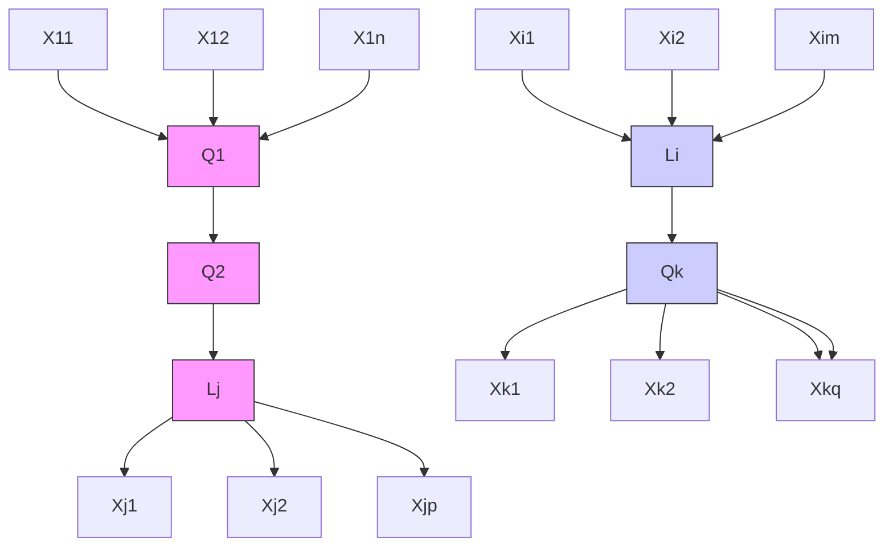

较简单的模型 $M _ { 0 }$ 被构建为：Q中的变量之间存在一个完全图（哪个完全图无关紧要），并且从Q中的每个变量到 $L _ { \mathrm { i } }$ 和 $L _ { j }$ 都有一条边，但从 $L _ { i }$ 到 $L _ { j }$ 没有边。（见图12.18。）模型 $M _ { 1 }$ 与 $M _ { 0 }$ 相同，只是它还包括了边 $L _ { i } \to L _ { j }$。这些模型可以通过 $\chi ^ { 2 }$ 检验进行比较，该检验统计量近似服从自由度为1的 $\chi ^ { 2 }$ 分布 (Bollen 1989)。或者，可以直接估计模型 $M _ { 1 }$，并对与边 $L _ { i } \to L _ { j }$ 相关的参数进行显著性检验。

### 12.7.2 SEM 的贝叶斯估计（Bayesian Estimation of SEM）

自20世纪70年代以来，**极大似然（Maximum Likelihood, ML）**估计已可用于结构方程模型，现在已成为 LISREL、EQS、AMOS 和 SAS Proc-Calis 等统计程序的标准功能。像 LISREL (Jöreskog and Sörbom 1993) 这样的程序可以计算 ML 估计量 $\theta _ { \mathrm { M I } }$ L 以及每个参数估计的渐近标准误估计。由于依赖于渐近理论，ML 估计的适当统计推断需要大样本量。几项稳健性研究表明，SEM 估计量在小样本 $n$ 下表现不佳；例如，参见 Bearden, Sharma, 和 Teel 1982; Boomsma 1982, 1983; Baldwin 1986; Chou, Bentler, 和 Satorra 1991; Hu, Bentler, 和 Kano 1992; Yung 和 Bentler 1994; 以及 Hoogland 和 Boomsma 1998。此外，似然比拟合统计量的分布对于小 N 是未知的。这些问题也存在于其他估计方法中，如**广义最小二乘法（generalized least squares, GLS）**和**加权最小二乘法（weighted least squares, WLS）**。

给定 SEM 参数上的先验分布 $p ( \theta )$，如果似然函数已知，则对于任何有限样本量 n，可以使用**马尔可夫链蒙特卡洛（MCMC）**方法，特别是**单分量Metropolis-Hastings算法（single-component Metropolis-Hastings algorithm）**（其一个特例是**吉布斯采样器（Gibbs sampler）** (Geman and Geman 1984; Chib and Greenberg 1995)），将联合和后验边缘分布 $p ( \theta )$ 和 $p ( \boldsymbol { \theta } | \mathbf { S } )$（其中 S 是样本协方差矩阵）数值近似到任意精度。给定样本协方差矩阵 S，并假设变量服从多元正态分布，SEM 的对数似然函数为：

$$
\log L (\theta | \mathbf {S}) = - (n - 1) / 2 \left\{\log | \Sigma (\theta) | + \operatorname{tr} [ \mathbf {S} \Sigma^ {- 1} (\theta) ] \right\},
$$

其中 $\Sigma ( \theta )$ 是由模型隐含的、作为其参数的函数的协方差矩阵。

吉布斯采样器（第12.5.5.1节）是一个迭代过程，在收敛后，它会从后验分布 $p ( \boldsymbol { \theta } | \mathbf { S } )$ 中生成一个依赖样本。在每次迭代 $m =$ $1 , . . . , M ,$ 中，每个参数都是从其后验分布中采样的，该后验分布以其他参数的当前值、适用于当前参数的任何约束以及样本协方差矩阵 S 为条件。关于吉布斯采样器，Casella 和 George (1992) 提供了一个易懂且详细的介绍，Gelfand 和 Smith (1990)、Tierney (1994) 以及 Smith 和 Roberts (1993) 则提供了更详尽的讨论。BUGS 是由 Spiegelhalter, Thomas, Best, 和 Gilks 开发的一个通用吉布斯采样程序，可应用于图模型，并可从 <http://www.iph.cam.ac.uk/bugs/mainpage.html> 获取。

Scheines, Hoijtink, 和 Boomsma (1999) 在 TETRAD III 中实现了一个用于线性 SEM 的吉布斯采样器，并用它来估计低水平铅暴露对儿童认知能力（IQ）的影响 (Scheines 1997)，并表明具有潜变量的 SEM 的似然曲面在小 N 时不仅非正态，而且实际上是多峰的 (Scheines, Hoijtink, and Boomsma 1997)。这里我们简要描述铅-IQ案例和似然曲面的多峰性问题。

### 12.7.3 铅与智商（Lead and IQ）

本案例的描述基于 Scheines, Hoijtink, 和 Boomsma (1999)，其中包含更多细节。在1985年《科学》杂志的一篇文章中，Needleman, Geiger, 和 Frank 重新分析了他们之前收集的关于铅暴露对221名郊区儿童语言智商分数影响的数据。在通过**向后逐步回归（backward stepwise regression）**消除了大约35个潜在混杂因素后，他们最终将儿童智商对测量的铅暴露进行回归，并控制了对遗传因素、环境刺激以及可能损害儿童认知禀赋的身体因素的测量。使用 TETRAD II (Scheines et al. 1994) 中的 Build 模块，Scheines, Hoijtink, 和 Boomsma 能够消除所有身体因素变量，且几乎没有预测损失。¹³ 他们使用的最终变量集如下：¹⁴

ciq 儿童的语言智商分数
lead 儿童乳牙中测得的铅浓度
med 母亲的教育年限
piq 父母的智商分数

将所有测量变量标准化后（我们在整个分析中都这样做），回归结果如下，括号内为 t 统计量：

$$
c \hat {i} q = -. 1 7 7 \text {   lead } +. 2 5 1 \text {   med } +. 2 5 3 \text {   piq }.
$$

(2.89) (3.50)

所有系数在0.05水平上显著，$\mathrm { R } ^ { 2 } = . 2 4 3$，这些估计值与包含身体因素变量时得到的估计值非常接近（见 Scheines 1997）。

然而，正如 Klepper (1988) 指出的，测量的回归变量实际上是**代理变量（proxies）**，几乎肯定包含大量测量误差。尽管像图12.19那样，将回归变量明确建模为潜变量的**全变量误差（errors-in-all-variables）** SEM 似乎是一个更合理的设定，但除非每个回归变量的测量误差量已知，否则该模型是**欠识别的（underidentified）**。

已经讨论了几种处理此类模型和一般欠识别模型的策略。一种是**工具变量估计（instrumental variable estimation）** (Bollen 1989)，另一种是**敏感性分析（sensitivity analysis）** (Greene and Ernhart 1993)，还有一种是对参数进行**有界估计（bound parameters）**而非产生点估计 (Klepper and Leamer 1984)。另一种由吉布斯采样器实现的策略是**贝叶斯估计（Bayesian estimation）**。

> 图12.19 铅暴露与智商的变量误差模型

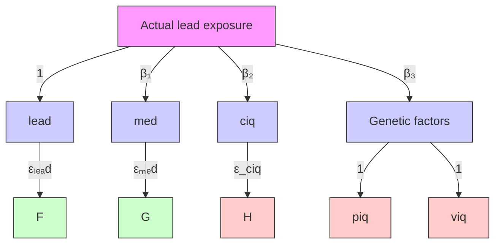

如果我们对图12.19所示模型中的测量变量进行标准化，那么测量铅（测量实际铅暴露）、med（测量环境刺激）和 piq（测量遗传因素）的测量误差量分别由 $\mathrm { v a r } ( \varepsilon _ { l e a d } )$、$\mathrm { v a r } ( \varepsilon _ { m e d } )$ 和 $\mathrm { v a r } ( \varepsilon _ { p i q } )$ 参数化。例如，由于该模型隐含 var(lead) = var(Actual Lead Exposure) + $\mathrm { v a r } ( \varepsilon _ { l e a d } )$，并且我们将 var(lead) 约束为单位1，那么如果我们设定 $\mathrm { v a r } ( \varepsilon _ { l e a d } ) = 0 . 2 5$，我们就断言测量铅方差的25%来自测量误差，而75%来自实际铅暴露。在这种情况下，以及许多其他类似情况中，关于存在的测量误差量有合理的先验信息，但不足以将唯一值赋予与测量误差相关的参数。Needleman 首创了一种根据儿童乳牙中累积铅的测量来推断累积铅暴露的技术。在 Needleman 看来，¹⁴ Needleman 代理变量方差的0%到40%可能来自测量误差，¹⁵ 20%是一个保守的最佳猜测。对于环境刺激和遗传因素的测量，他不太确定，因此猜测 med 和 piq 方差的0%到60%来自测量误差，30%是他的最佳猜测。

使用一个截断正态先验分布（去除测量误差参数低于0的值），并在其他部分使用平坦先验，Scheines, Hoijtink, 和 Boomsma 使用 TETRAD III 中的吉布斯采样器进行了50,000次迭代，作为后验的样本。图12.20中的直方图显示了边缘后验在 $\beta _ { 1 }$ 上的形状，$\beta _ { 1 }$ 是关键系数，代表实际铅暴露对儿童 IQ 的影响。

结果支持 Needleman 最初的结论，但不需要零测量误差这一不切实际的假设。实际铅暴露对 IQ 影响的贝叶斯点估计，铅暴露 $\hat { \beta } _ { \scriptscriptstyle { 1 , E A P } }$ 为 –0.215，并且由于其边缘后验的95%中心区间位于 –0.420 和 –0.038 之间，我们得出结论：在此模型和我们指定的先验不确定性条件下，环境铅暴露确实是有害的。

## 12.8 应用（Applications）

我们所描述的搜索和预测方法的实用价值，源于它们在应用科学中用于分类、预测、干预效果预测，以及重构通过其他方式独立已知的因果关系。第5章、第8章和第12.7.3节给出了一些例子，在本最后一节中，我们将回顾自1993年以来进行的一些其他研究。我们不讨论并非通过搜索生成的**贝叶斯网络（Bayesian networks）**的应用，也不考虑任何非基于约束的搜索应用。

### 12.8.1 大学辍学率（College Dropouts）

Druzdzel 和 Glymour (1999) 使用《美国新闻与世界报道》1992年和1993年的美国学院和大学数据库来研究降低辍学率的政策。使用 TETRAD II 程序，他们发现新生班级在 ACT 或 SAT 考试中的平均百分位数是一个“控制”变量，类似于第8章中 pH 值在研究大米草中的作用。也就是说，在控制入学班级平均考试成绩的条件下，数据库中的其他变量与辍学率独立。这种独立性在1992年非常接近，在1993年则稍差一些。（回归预测数据库中的其他变量在两年中都直接影响辍学率。）当然，这种关系并非因果关系——SAT 分数是那些使学生能够满意地度过大学第一年的背景、资源和技能的代理变量。

这项研究是应卡内基梅隆大学教务长的要求进行的，该大学在1980年代和1990年代初期新生班级的辍学率一直很高。Glymour 和 Druzdzel 报告说，该大学可以通过提高新生班级的平均 SAT 分数来降低其辍学率，但没有提出这样做的机制。从1994届学生开始，该大学改变了奖学金发放公式，并收到了更多的申请者，从而使得选择性更强，结果从那年及以后每一年入学班级的平均 SAT 分数都有所提高。除了一年（1997年）外，新生班级的辍学率每年都比上一年有所下降。变化的方向与 Glymour 和 Druzdzel 模型的预测一致，但他们没有将模型的定量预测与卡内基梅隆大学随后的事件进行比较。其他未知因素也可能影响了辍学率。

## 12.8.2 地球卫星上质谱仪的飞行中重新校准（In Flight Recalibration of a Mass Spectrometer Aboard an Earth Satellite）

瑞典的 **Freja 卫星（Freja satellite）** 携带了多种仪器，用于研究**低层磁层（lower magnetosphere）** 和**高层电离层（upper ionosphere）** 的组成。其中一种仪器，即**三维离子成分光谱仪（three dimensional ion composition spectrometer, TICS）**，本质上是一台**质谱仪（mass spectrometer）**，旨在测量氢离子、氧离子以及两种氦离子。该仪器有 32 个不同的探测通道，校准需要将特定通道的信号与特定的离子种类相匹配。正确的匹配取决于离子的入射能量，而入射能量在轨道内和轨道间都会发生变化。不幸的是，该仪器在发射前校准有误，导致了两种错误：TICS 测得的各种离子相对频率与根据另一台仪器（等离子体探测器）数据理论计算出的相对频率相差甚远；并且 TICS 测得的离子密度仅为等离子体探测器计算出的密度的四分之一到五分之一。在瑞典于默奥大学（University of Umea）和瑞典空间物理研究所（Swedish Institute for Space Physics）工作的 Waldemark 和 Norqvist（1999）在发射后使用 **TETRAD II**、**主成分分析（principal components）** 和**反向传播神经网络（neural networks with backpropagation）** 对仪器进行了重新校准。

理想情况下，不同的离子会在不同的通道被记录，并且信号不会从一个通道泄漏到空间上邻近的其他通道。那么，正确的因果描述将包含四个**潜变量（latent variables）**，每个变量对应一种离子种类，每条有向边从每个潜变量指向该离子种类的一组通道。如果这些源是不相关的，在这种理想情况下，对 32 个通道信号的相关性进行分析应该得到四个**团（cliques）**，每个团对应一个不同的离子源。然而，TETRAD II 分析发现了两个通道簇，其中有几个通道同时连接两个簇。主成分分析也给出了一个双因子模型。其物理意义在于，在大多数轨道上，该仪器无法区分氦离子和氢离子（尽管对于来自特殊轨道的数据，TETRAD II 发现了一个明显的氦离子通道簇），这是因为通道之间存在泄漏，并且仪器在确定探测器上物理位置时存在误差。这种聚类结果随不同能级而变化。

随后，Waldemark 和 Norqvist 在神经网络中使用反向传播，找到在一系列能量范围内，对于氢离子和氦离子（相对于氧离子）工作效果最好的通道。重新校准后的 TICS 相对频率与从等离子体探测器理论计算出的相对频率之间的差异减少了一半，并且仪器的灵敏度显著提高。

## 12.8.3 经济分析与预测（Economic Analysis and Forecasting）

Bessler 及其合作者（Guven and Bessler 1997; Akleman and Bessler 1998; Akleman et al. 1998; Loper and Bessler 1999）已将 **PC 算法（PC algorithm）** 和 **FCI 算法（FCI algorithm）** 及其改进版本应用于多个**计量经济学数据集（econometric data sets）**。在一项关于玉米出口对汇率依赖性的研究中，Akleman 等人发现，图形化方法产生的预测优于广泛用于计量经济学预测的搜索程序（Hsiao 搜索）。他们还使用这些技术研究了农场与零售肉类价格之间的关系。最近，Loper 和 Bessler 将这些方法应用于国际数据，研究发展中国家 GNP 增长与农业部门规模之间的关系。

## 12.8.4 医学中机器与专家因果判断的比较（Comparing Machine and Expert Causal Judgment in Medicine）

对搜索算法在医学和流行病学等领域实用性的理想测试，应将算法应用于设计良好的观察性数据库所得到的预测与**随机临床试验（randomized clinical trials）** 的结果进行比较。不幸的是，由于缺乏足够的观察性数据集与相应的随机临床试验配对，并且数据难以获取，据我们所知，尚未进行过此类比较。次优的选择是将来自观察性数据的预测与人类专家的判断进行比较。Cooper 和 Spirtes（1998）将一种简化（但正确）的算法应用于住院肺炎患者数据库所得到的预测与医生的判断进行了比较。他们的研究显示了这类测试的一些困难，尤其是因为专家对因果关系的医学判断存在相当大的差异，以及难以进行适当的控制。

回忆一下，在一个因果 DAG 中，如果某个测量变量 V 没有箭头指向它，则称其为**外生变量（exogenous）**。假设采样机制与测量变量之间不存在因果关系（即没有选择偏差）。那么，以下定理可以直接从 Cooper（1997）和 Spirtes 等人（1995）推导出来。

## 定理 12.8.1（THEOREM 12.8.1）：假设因果马尔可夫条件（Causal Markov Condition）成立，如果

- • E 是外生的，并且
- • 每个包含变量 ${ < } E , A , B { > }$ 且其中 E 是外生的因果 DAG 都具有非零的先验概率，
- • 每个 DAG 参数的先验概率与 BDe 度量（Heckerman et al. 1994）是绝对连续的，
- • 在所有包含变量 ${ < } E , A , B { > }$ 且其中 E 是外生的 DAG 中，$E \rightarrow A \rightarrow B$ 具有最高的后验概率，

那么，在大样本极限下，以概率 1，在真实的因果 DAG 中，A 是 B 的祖先（即 A 是 B 的一个原因），并且不存在 A 和 B 的共同潜在原因（即未测量的混杂因子）。

这一结果为一种基于背景知识进行因果推断的简单算法——**工具变量（Instrumental Variable, IV）算法** 提供了理论基础。IV 算法的输入是关于哪些变量是外生的背景知识，以及一个由患者记录组成的数据库。外生变量也称为**工具变量（instrumental variable）**。该算法输出一系列形式为“A 导致 B”的因果结论。该算法包括以下步骤：

- 1. 选择一个已知是外生的变量子集 E。在肺炎数据的情况下（见下文），我们使用的外生变量是种族、年龄和性别。
- 2. 对于 E 中的每个顶点 E，搜索测量变量 A 和 B，使得 A 高度依赖于 E，B 高度依赖于 A，并且在给定 A 的条件下 E 独立于 B。在数据的情况下，我们将“高度依赖”定义为衡量离散变量依赖性的 $G^2$ 统计量的 **p 值（p value）** 小于 0.01；而“在给定 A 的条件下 E 独立于 B”意味着衡量 E 和 B 在给定 A 下的条件依赖性的 $G^2$ 统计量的 p 值大于 0.5。
- 3. 对于步骤 2 中选出的每个三元组 ${ < } E , A , B { > }$，对于可以由该三元组构建且 E 是外生的每个 DAG G，计算 G 的后验概率。如果没有 DAG 具有比 DAG $E \rightarrow A \rightarrow B$ 更高的后验概率，则输出“A 导致 B”。

Cooper 和 Spirtes 假设每个与 E 外生性相容的 DAG 具有相等的先验概率。对于每个 DAG，参数的先验概率是 Heckerman 等人 1994 年描述的 BDe 先验。IV 算法在一个社区获得性肺炎患者的肺炎数据库上进行了测试（详情见 Fine 1997），该数据库被称为 **肺炎 PORT 数据库（pneumonia PORT database）**。基于病历审查，为数据库中的 2287 名患者每人收集了数百个数据项。IV 算法应用于该数据库得出的因果结论如表 12.4 所示。

一位熟悉肺炎数据库但不熟悉该算法的医生，被展示了一系列变量对，其中一些是算法输出的、彼此之间存在因果关系的结果，另一些是随机选择的；变量对的顺序是随机列出的。医生被要求将每一对变量分为三类之一：“确信 A 导致 B”、“不知道 A 是否导致 B”或“确信 A 不导致 B”。结果显示，对于 IV 算法建议的所有 10 对变量，该医生判断确信它们之间存在因果关系。对于随机选择的变量对，他确信其中 22 对中的 5 对存在因果关系；他确信 10 对不存在因果关系；对于 7 对，他不确定。算法关于关系是因果性的决策与医生的判断是独立的这一假设，被 **Fisher 精确检验（Fisher’s exact test）** 拒绝（p = .0002）。

第二个测试邀请了五位在日常实践中经常接诊肺炎患者的医生。向他们展示了一系列变量对，并要求判断这些对是否具有因果关系，结果显示医生之间的一致性很差。为了尽可能控制 IV 算法选择的变量对具有高度相关性这一事实，IV 算法选择的变量对与其他也高度相关的变量对混杂在一起。当在类似于第一次测试的测试中使用医生的汇总判断时，独立性假设（即算法的因果主张与汇总的医生主张之间相互独立）无法被拒绝。

然而，所得结果确实为 IV 算法提出了一些明显的改进方向。在 IV 算法选择的变量对中，医生最怀疑的 5 对都涉及将当前就业状况作为原因。IV 算法输出的更可疑的变量对具有一些明显相关的共同特征。

**表 12.4（Table 12.4）**

<table><tr><td>Instrument</td><td>Cause</td><td>Effect</td><td>Score</td></tr><tr><td>age</td><td>coronary artery disease</td><td>myocardial infarction</td><td>18.41</td></tr><tr><td>age</td><td>current employment status</td><td>intravenous drug use (non-prescribed)</td><td>14.52</td></tr><tr><td>age</td><td>nausea</td><td>vomiting</td><td>9.28</td></tr><tr><td>gender</td><td># of comorbid conditions</td><td>dire outcome (i.e., mortality or serious complications</td><td>8.47</td></tr><tr><td>gender</td><td>sputum</td><td>cough</td><td>7.99</td></tr><tr><td>age</td><td>current employment status</td><td>chronic obstructive pulmonary disease</td><td>7.55</td></tr><tr><td>age</td><td>current employment status</td><td>prior hospitalization within 30 days</td><td>4.87</td></tr><tr><td>age</td><td>current employment status</td><td>a history of chronic obstructive pulmonary disease requiring prior ICU admission</td><td>4.42</td></tr><tr><td>age</td><td>current employment status</td><td>days since last hospital discharge</td><td>0.56</td></tr></table>

- • 5 个可疑因果关系中的 4 个得分最低。
- • 如果使用**贝叶斯信息准则（Bayes Information Criterion）** 而非后验概率来对模型评分，那么算法根本不会建议其中 2 个可疑的因果关系（得分最低的 2 个）。
- • 所有可疑的**效应（effects）** 都包含成员相对较少的类别，这与医生同意的 IV 算法选择的效应形成对比。
- • 在进行原因与效应关联的统计检验时，对于五个可疑效应中的四个，我们使用的统计程序发出了警告，指出由于某些单元格的期望值小于 5，卡方独立性检验可能不合适。而对于 4 个无疑问的效应，程序没有发出此警告。

这些特征表明，可以通过消除那些由于某些期望单元格大小小于 5 而导致独立性检验可疑的变量对，和/或提高算法视为阳性结果的得分阈值，来改进 IV 算法的性能。

## 12.8.5 婴儿死亡率（Infant Mortality）

Mani 和 Cooper（1999）使用一种与 IV 算法相关的算法，从美国关联出生/婴儿死亡数据库（U.S. Linked Birth/Infant Death database）中抽取的一个大小为 41,155 的随机样本中寻找因果关系。他们选择了一组 85 个临床上有趣且非冗余的变量进行检查。**LCD2 算法（LCD2 algorithm）** 搜索具有因果关系 $W \rightarrow X \rightarrow Y$ 的三元组，其中根据背景知识已知 W 是外生的。给定一组外生变量 W，如果存在一个外生变量 W 满足：W 与 Y 相关，W 与 X 相关，在给定 Y 下 W 与 X 相关，X 与 Y 相关，在给定 W 下 X 与 Y 相关，并且在给定 X 下 W 与 Y 独立，则该算法输出“X 导致 Y”。假设因果马尔可夫性、因果忠实性（Causal Faithfulness）、独立性检验的正确性以及 W 的外生性，可以证明该算法是正确的。它并不完备，因为在某些情况下，使用更高阶的条件独立性检验，可能能够确定 X 导致 Y，但该 $X \rightarrow Y$ 对不会出现在算法的输出中。然而，与更完备的搜索相比，它在小样本量下的可靠性和速度方面具有优势。

外生变量是母亲的种族和孩子的性别。该算法发现了 9 个因果关系：母亲教育程度 → 分娩指导者，母亲教育程度 → 母亲年龄，母亲婚姻状况 → 分娩指导者，母亲婚姻状况 → 母亲年龄，产前护理开始时间 → 分娩机构，产前护理开始时间 → 分娩指导者，产前护理充分性 → 产前护理开始时间，出生体重 → 婴儿一年后结局，出生体重 → 分娩指导者。在这 9 个案例中，外生变量都是母亲的种族。这些变量的含义在表 12.5 中描述。

产前护理充分性与产前护理开始时间之间的关系实际上是定义性的，因为产前护理充分性（部分地）是根据产前护理开始时间来定义的。其他 8 个因果关系看起来都是合理的。母亲教育程度 → 分娩指导者 是合理的，因为教育可以对获得医疗保健产生重要影响。出生体重 → 婴儿一年后结局 是一个有充分文献记载的因果关系。作者计划请妇产科临床医生判断一份因果关系列表中每个关系的合理性，该列表包括算法建议的 9 个关系以及随机生成的变量对。

**表 12.5（Table 12.5）**

<table><tr><td>Variable Name</td><td>Variable meaning</td></tr><tr><td>Maternal education</td><td>Years of education of the mother</td></tr><tr><td>Delivery conductor</td><td>Care giver conducting delivery</td></tr><tr><td>Maternal age</td><td>Age of mother at delivery</td></tr><tr><td>Marital status mother</td><td>Marital status of the mother</td></tr><tr><td>Prenatal care start</td><td>Trimester prenatal care began</td></tr><tr><td>Delivery facility</td><td>Place or facility of delivery</td></tr><tr><td>Prenatal care adequacy</td><td>Adequacy of care</td></tr><tr><td>Birth weight</td><td>Weight of infant at birth</td></tr><tr><td>Infant outcome one year</td><td>If the child was alive on first birthday</td></tr></table>

## 12.8.6 生物学应用（Biological Applications）

在生态学中进行实验研究是困难的，基于观察数据的解释很常见，尽管样本量通常很小。Shipley 已将**有向图搜索技术（directed graph search techniques）** 及其多项创新应用于生态学研究和植物生理学。Shipley（1995）及其合作者（Pyankov et al. 1999）应用这些技术研究了相关物种间叶片质量和面积变异的原因，以及物种间相对生长变异的原因（McKenna and Shipley 1999）。他开发了许多新的搜索方法，包括一种用于小样本的**自举技术（bootstrapping technique）**（Shipley 1997），该技术推广了第 8 章 Weisberg 例子中的自举思想，并在第 12.5.10 节中讨论（另见 Friedman 1999b），并且在小样本上的表现远优于 PC 算法。Shipley（1999）还提供了一种算法，可以从任何没有潜变量的有向无环图中获得一组独立的偏相关系数约束；该过程的输出可用于通过卡方检验来测试整个模型。他正在撰写一本关于**结构方程模型（structural equation models）** 和生物学因果解释搜索方法的专著。

## 12.8.7 基于近红外光谱的自动矿物识别（Automated Mineral Identification from Near Infra-red Spectra）

出于多种原因，包括功率需求和可用天线时间的限制，让行星外机器人自主地在星上进行一些科学分析，而不是将所有数据传输到地球进行分析，将是非常有价值的。可见光和近红外光谱学长期以来一直是识别化学物质和矿物的标准工具，而非常轻便的仪器最近也已问世。一个问题是，能否找到快速的计算程序，能够根据反射光谱就地识别岩石和土壤目标中的矿物，其可靠性可与人类地球物理光谱学专家相媲美。水、水合物和碳酸盐的识别尤其令人感兴趣。在最近为 NASA 进行的碳酸盐识别工作中，DeFazio 等人（1999）将简化版的 PC 算法与回归、专家系统以及人类专家进行了比较。

1999 年冬季，在 NASA 的机器人现场试验中，从加利福尼亚州银湖（Silver Lake）附近就地采集了岩石和土壤的光谱样本。NASA 艾姆斯研究中心（NASA Ames Research Center）的 Paul Gazis 提供了一种自动测试方法来检测过量噪声（由仪器误差或大气效应引起），经过该测试后，获得了 21 个适合分析的样本。每个样本都由现场的地质学家进行了检查，许多样本还通过化学分析和薄片透射光分析进行了测试。其中 13 个样本被判定为碳酸盐，8 个被判定为非碳酸盐。

然后，将这些光谱分别提供给简化版的 PC 算法（本质上是本书中的 PC 算法，但忽略了原因之间的关联）、来自 MiniTab 的回归算法，以及一个模拟人类光谱学专家的专家系统。PC 算法和回归使用了来自**喷气推进实验室（Jet Propulsion Laboratory）** 的光谱参考库。每个程序都经过调整，以尽可能最好地区分碳酸盐和非碳酸盐。根据现场地质学家的判断，13 个样本实际上含有碳酸盐。PC 算法正确识别了 13 个碳酸盐样本中的 12 个，并且没有误判任何非碳酸盐样本。回归正确识别了 11 个碳酸盐样本，但误判了 4 个非碳酸盐样本。专家系统正确识别了 9 个碳酸盐样本，并且没有误判任何非碳酸盐样本。

作为进一步的测试，PC 算法、回归和人类专家（而非模拟他的程序）尝试从**约翰霍普金斯大学（Johns Hopkins University）** 的 192 个岩石和土壤样本的光谱库中识别出含有碳酸盐成分的样本，其中 91 个样本实际含有一些碳酸盐矿物。此外，一个商业程序 Model 1 也承担了同样的任务。PC 算法和回归的调整参数与之前的实验相同。PC 算法识别出 38 个含有碳酸盐的样本，并错误分类了 3 个非碳酸盐样本；人类专家正确识别了 24 个碳酸盐样本，并错误识别了 1 个；回归声称 154 个样本含有碳酸盐，其中包括 75 个实际含有碳酸盐的样本和 79 个不含碳酸盐的样本。Model 1 程序在其声称是碳酸盐的 41 个样本中，找到了 27 个实际碳酸盐样本。

经过适当调整，简化的 PC 算法在此任务上的表现远优于回归、人类专家和商业程序，并且所需计算资源极少。

## 12.9 基础性问题及与其他学科的关系（Foundational Issues and Relations to Other Disciplines）

关于反事实条件句是否具有真值（或仅仅具有可接受性条件）、真值条件是什么、它们能否有意义地嵌套等问题，存在着大量的文献（例如，Lewis 1973）。Sosa 和 Tooley（1993）探讨了各种具有代表性的因果定义尝试，以及因果关系与反事实之间的关系。Heckerman 和 Shachter（1995）试图从决策理论的角度定义因果关系。Shafer（1996）则用事件树（event trees）来解释各种相关的因果概念。

已经有一些尝试寻找信念变化的模型，这些模型像演绎逻辑一样是定性的且演绎封闭的，但又像概率一样可以持有不同程度的坚定性并且可以被撤回。Alchourrón 等人（1985）提出了一组适用于在面临新证据时修正数据库的**信念修正（belief revision）** 公理，而 Katsumo 和 Mendelson（1991）则提出了一个在面临外部干预时修正数据库的**信念更新（belief update）** 系统。Goldszmidt 和 Pearl（1992）提出了一个 $Z^+$ 系统，该系统同时适用于信念修正和信念更新，并包含了因果马尔可夫条件的定性版本。**形式学习理论（Formal learning theory）** 也研究不依赖概率的学习。Kelly（1996）考虑了在不使用概率的情况下长期学习原因的问题。

Iwasaki 和 Simon（1994）描述了用微分方程表示的动态方程的图形化表示，因此这些方程通常同时涉及变量及其微分。他们没有将图形化表示与任何条件独立性关系或统计模型联系起来。

Matuš 和 Studený 已经证明，在四个变量之间存在 18300 组可以由某个概率分布实现的条件独立性关系，这远远大于可以用图形模型表示的不同条件独立性关系子集的数量。Matuš 和 Studený（1995）以及 Matuš（1995）研究了四个变量之间所有可实现的条件独立性关系集的共同性质。Studený（1992）表明，不存在对概率条件独立性的有限完备刻画。