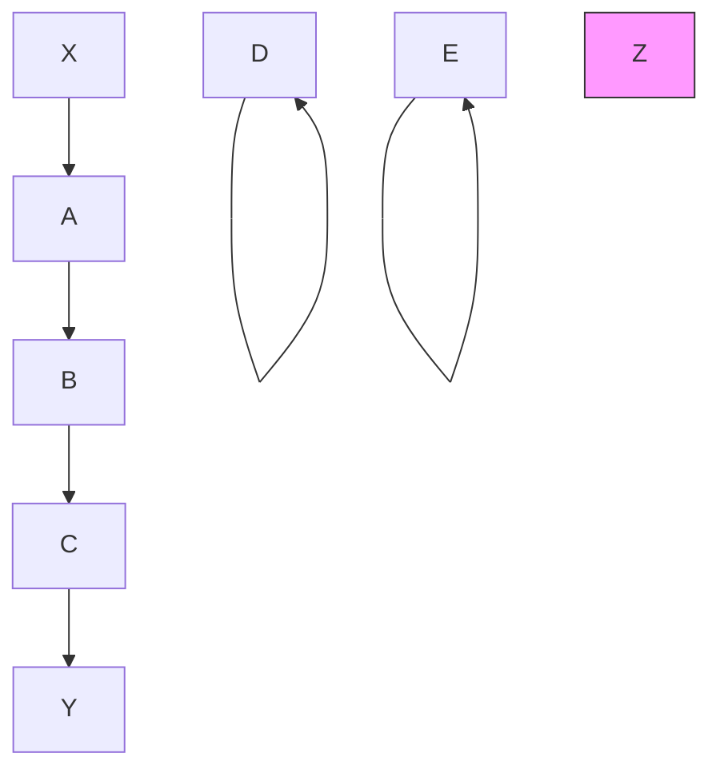
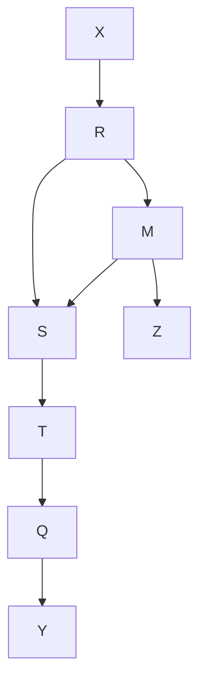
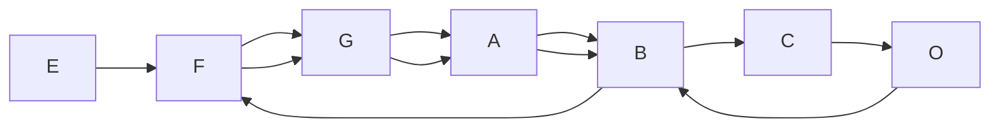
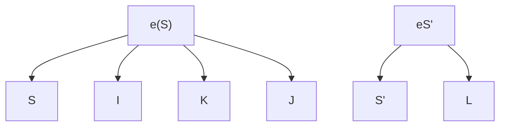
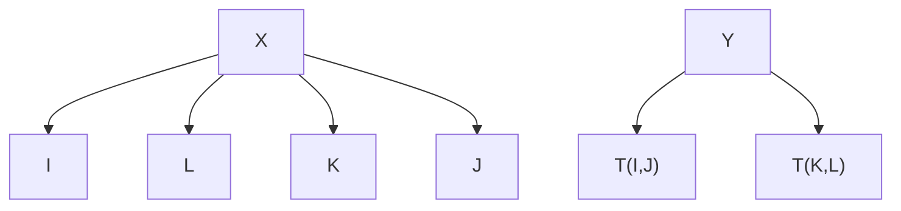
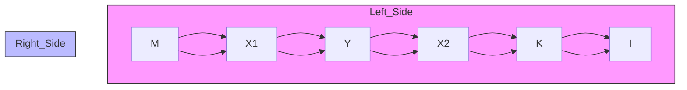
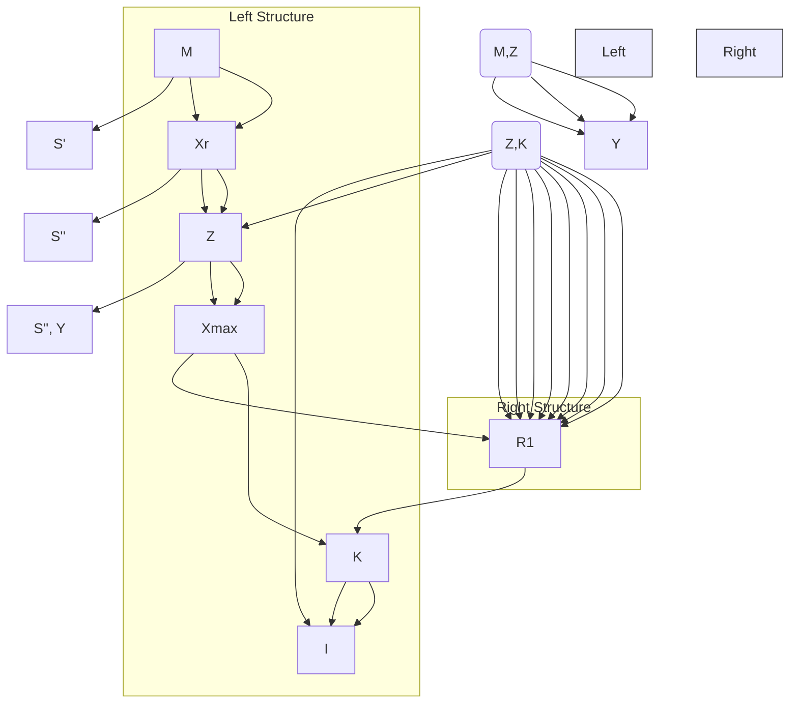
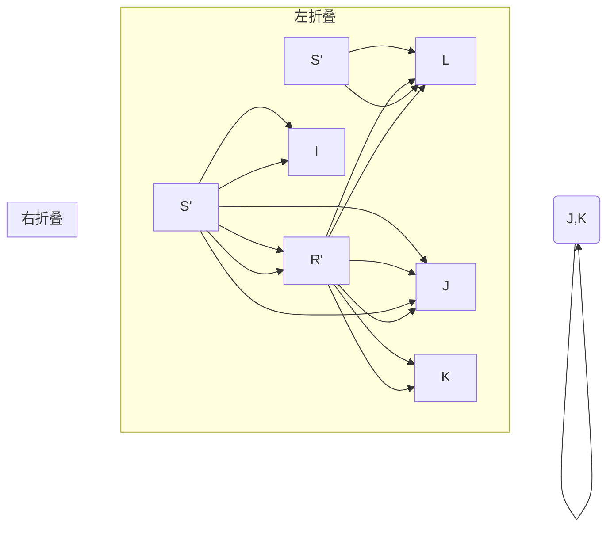
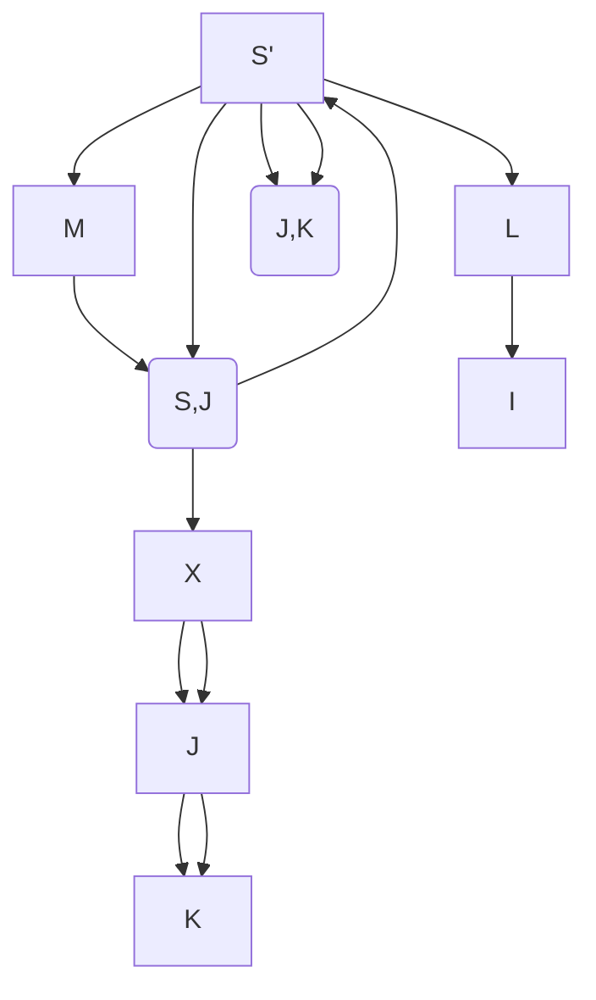
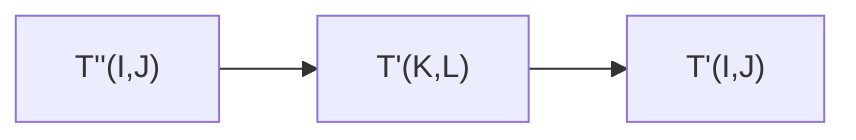

# 定理证明（Proofs of Theorems）

我们将采用以下符号约定。“w.l.g.”代表“不失一般性（without loss of generality）”，“r.h.s.”代表“右侧（right hand side）”，“l.h.s.”代表“左侧（left hand side）”。任何对空集的求和等于 0，任何对空集的乘积等于 1。$R(I,J)$ 表示从 $I$ 到 $J$ 的有向路径。如果 $U$ 是从 $A$ 到 $B$ 的无向路径，并且 $X$ 和 $Y$ 出现在 $U$ 上，那么我们将 $U$ 在 $X$ 和 $Y$ 之间的子路径记为 $U(X,Y)$。$T(I,J)$ 表示 $T(I,J)$ 中的一条**跋（trek）**。本章中所有未在第 2 章或第 3 章定义的技术术语的定义已置于本章末尾的术语表中。

## 13.1 定理 2.1（Theorem 2.1）

**定理 2.1**：如果 $P(V)$ 是一个正分布，那么对于 $V$ 中变量的任意排序，$P$ 满足该排序下 $P(V)$ 的有向独立图（directed independence graph）的**马尔可夫性（Markov conditions）**和**最小性条件（Minimality conditions）**。

**证明**：参见 Pearl 1988。

## 13.2 定理 3.1（Theorem 3.1）

**定理 3.1**：如果 $S$ 是一个**线性因果理论（Linear Causal Theory, LCT）**，而 $S ^ { \prime }$ 是一个**随机系数线性因果理论（random coefficient LCT）**，具有相同的有向无环图、相同的非系数随机变量集合、每个外生变量相同的方差，并且对于 $S ^ { \prime }$ 中的每个随机系数 $\boldsymbol { a } _ { \mathit { I J } } ^ { \prime }$，$E ( a _ { I J } ^ { \prime } ) = a _ { I J }$ 在 $S$ 中成立，那么在 $S$ 中一个**偏相关系数（partial correlation）**等于 0 当且仅当它在 $S ^ { \prime }$ 中也等于 0。

设一个线性因果理论（LCT）为 $< < \mathbf { R , M , E } > , ( \varOmega , f , P )$ , EQ, L, Err>，其中

- (i) $( \Omega , f , P )$ 是一个概率空间，其中 $\Omega$ 是样本空间，$f$ 是 $\Omega$ 上的一个 $\sigma$-域，$P$ 是 $f$ 上的一个概率分布。
- (ii) $< \mathbf { R , M , E } >$ 是一个有向无环图。$R$ 是 $( \Omega , f , P )$ 上的随机变量集合。
- (iii) $R$ 中的变量具有联合分布。$R$ 中的每个变量具有非零方差。$E$ 是 $R$ 中变量之间的有向边集合。（$M$ 是在有向图中出现的标记集合，即 {EM, >}。）
- (iv) $EQ$ 是 $R$ 中随机变量的一个一致的独立齐次线性方程集合。对于 $R$ 中入度为正的每个 $X _ { i }$，在 $EQ$ 中有一个如下形式的方程：

$$
X _ {i} = \sum_ {X _ {j} \in \mathbf {P a r e n t s} (X _ {i})} a _ {i j} X _ {j}
$$

其中每个 $a _ { i j }$ 是一个非零实数，每个 $X _ { i }$ 属于 $R$。这意味着 $R$ 中入度为正的每个顶点 $X _ { i }$ 可以表示为它的所有父变量（且仅这些父变量）的线性函数。$EQ$ 中没有其他方程。$a _ { i j }$ 的非零值是 $X _ { j }$ 在 $X _ { i }$ 方程中的方程系数。

- (v) 如果顶点（随机变量）$X _ { i }$ 和 $X _ { j }$ 是外生的，那么 $X _ { i }$ 和 $X _ { j }$ 是两两统计独立的。
- (vi) $L$ 是一个定义域为 $E$ 的函数，对于 $E$ 中的每个 $e$，$L ( e ) = a _ { i j }$ 当且仅当 $\mathbf { h e a d } ( e ) = X _ { j }$ 且 $\mathbf { t a i l } ( e ) = X _ { i }$。$L ( e )$ 将被称为 $e$ 的**标签（label）**。推广而言，任意无环无向路径 $U$ 中边标签的乘积将记为 $L ( U )$，$L ( U )$ 将被称为 $U$ 的标签。空路径的标签固定为 1。
- (vii) $R$ 的一个子集 $S$ 称为**误差变量（error variables）**，每个误差变量的入度为 0、出度为 1。对于 $R$ 中入度 $\neq 0$ 的每个 $X _ { i }$，恰好有一个误差变量有一条边指向 $X _ { i }$。我们假设所有仅涉及非误差变量的各阶偏相关系数都是定义的。

注意，任何内生变量 $I$ 在任意不包含 $I$ 的误差变量的变量集条件下的方差都不等于零。

**随机系数线性因果理论（random coefficient linear causal theory）**的定义与线性因果理论相同，只是每个线性系数是一个独立于模型中所有其他随机变量的随机变量。

**线性因果形式（Linear Causal Form, LCF）**是一个未经估计的 LCT，其中线性系数和外生变量的方差是实变量而非常数。这意味着 LCF 中的边标签是一个实变量而非常数（除了来自误差变量的边的标签固定为 1）。更形式化地，设一个线性因果形式（LCF）为 $< < \mathbf { R , M , E } >$ , C, V, EQ, L, Err>，其中

(i) $< \mathbf { R , M , E } >$ 是一个有向无环图。$Err$ 是 $R$ 的一个子集，称为误差变量。每个误差变量的入度为 0、出度为 1。对于 $R$ 中入度 $\neq 0$ 的每个 $X _ { i }$，恰好有一个误差变量有一条边指向 $X _ { i }$。

(ii) $c _ { i j }$ 是一个与从 $X _ { j }$ 到 $X _ { i }$ 的边相关联的唯一实变量，$C$ 是 $c _ { i j }$ 的集合。$\mathbf { V }$ 是变量 $\boldsymbol { \sigma } _ { i } ^ { 2 }$ 的集合，其中 $X _ { i }$ 是 $< \mathbf { R , M , E } >$ 中的一个外生变量，$\boldsymbol { \sigma } _ { i } ^ { 2 }$ 是一个取值范围为正实数的变量。

(iii) $L$ 是一个定义域为 $E$ 的函数，对于 $E$ 中的每个 $e$，$L ( e ) = c _ { i j }$ 当且仅当 $\mathbf { h e a d } ( e ) = X _ { j }$ 且 $\mathbf { t a i l } ( e ) = X _ { i }$。$L ( e )$ 将被称为 $e$ 的标签。推广而言，任意无环无向路径 $U$ 中边标签的乘积将记为 $L ( U )$，$L ( U )$ 将被称为 $U$ 的标签。空路径的标签固定为 1。

(iv) $EQ$ 是 $R$ 中变量的一个一致的独立齐次线性方程集合。对于 $R$ 中入度为正的每个 $X _ { i }$，在 $EQ$ 中有一个如下形式的方程：

$$
X _ {i} = \sum_ {X _ {j} \in \mathbf {P a r e n t s} (X _ {i})} c _ {i j} X _ {j}
$$

其中每个 $c _ { i j }$ 是 $C$ 中的一个实变量，每个 $X _ { i }$ 属于 $R$。$EQ$ 中没有其他方程。$c _ { i j }$ 是 $X _ { j }$ 在 $X _ { i }$ 方程中的方程系数。

一个 LCT $S$ 是 LCF $F$ 的一个**实例（instance）**当且仅当 $S$ 的有向无环图与 $F$ 的有向无环图同构。在 LCF 中，一个量（例如协方差）$X$ 等价于系数和外生变量方差的多项式当且仅当对于每个 LCF $F = < < { \bf R , M , E } >$ , C, V, EQ, L, Err> 和每个是 $F$ 实例的 LCT $S =$ $< < \mathbf { R } ^ { \prime } , \mathbf { M } ^ { \prime } , \mathbf { E } ^ { \prime } > , ( \varOmega , f , P )$ , EQ’, L’, Err’>，存在一个 $C$ 和 $V$ 中变量的多项式，使得 $X$ 等于将 $S$ 的线性系数作为 $\mathbf { C }$ 中相应变量的值、将 $S$ 的外生变量方差作为 $V$ 中相应变量的值代入的结果。

在 LCT 或 LCF $S$ 中，变量 $X _ { i }$ 是**独立的（independent）**当且仅当 $X _ { i }$ 的入度为零（即没有边指向它）；否则它是**依赖的（dependent）**。注意，独立性的属性与统计独立性的关系是完全不同的。上下文将明确该术语是在哪种意义上使用的。对于有向无环图 $G$，$Ind$ 是 $G$ 中独立变量的集合。给定有向无环图 $G$，$\mathbf { D } ( X _ { i } , \ X _ { j } )$ 是从 $X _ { i }$ 到 $X _ { j }$ 的所有有向路径的集合。在 $\mathrm { L C F } < < \mathbf { R , M , E } >$ , C, V, $\mathbf { E Q } , \mathbf { L } , \mathbf { S } >$ 中，一个方程是依赖变量 $X _ { j }$ 的**独立方程（independent equational）**当且仅当它由 $EQ$ 蕴涵，且出现在右侧的 $R$ 中的变量是独立的且最多出现一次。$^ { I n d } { \bf { a } } _ { I J }$ 是 $J$ 在 $I$ 的独立方程中的系数。

**引理 3.1.1**：在 LCF $S$ 中，如果 $J$ 是一个独立变量，那么

$$
{ } ^ { I n d } a _ { I J } = \sum _ { U \in \mathbf { D } ( J , I ) } L ( U )
$$

**证明**：这是用于计算变量 $J$ 对变量 $I$ 的“总效应”的**梅森规则（Mason's rule）**的一个特例。参见 Glymour 等人 1987。∴

以下两个引理展示了如何根据其他随机变量之间的协方差来计算随机变量的方差和随机变量之间的协方差。这些引理的证明可以在 Freund 和 Walpole 1980 中找到。我们将 $I$ 和 $J$ 的协方差记为 $\gamma _ { I J }$，$I$ 的方差记为 $\boldsymbol { \mathcal { O } } _ { I } ^ { 2 }$，$I$ 和 $J$ 的相关系数记为 $\rho _ { I J }$，给定集合 $H$ 时 $I$ 和 $J$ 的偏相关系数记为 $\gamma _ { I J . \mathbf { H } }$，给定 $H$ 时 $I$ 和 $J$ 的偏协方差记为 $\rho _ { I J . \mathbf { H } }$。对于像 $X _ { i }$ 和 $X _ { j }$ 这样带下标变量的相关系数，为清晰起见我们将写为 $\rho _ { i j }$，偏相关系数等也类似。

**引理 3.1.2**：如果 $Q$ 是一个具有联合概率分布的随机变量集合，且

$$
Y = \sum_ {I \in \mathbf {Q}} a _ {Y I} I
$$

和

$$
Z = \sum_ {J \in \mathbf {Q}} a _ {Z J} J
$$

那么

$$
\gamma_ {Y Z} = \sum_ {I \in \mathbf {Q}} \sum_ {J \in \mathbf {Q}} a _ {Y I} a _ {Z J} \gamma_ {I J}
$$

引理 3.1.3、3.1.5 和 3.1.7 在定理 3.1 的证明中没有使用，但它们将在后面的定理中使用，我们在此包含它们是因为它们可以很容易地从本节的其他引理推导出来。

**引理 3.1.3**：如果 $Q$ 是一个具有联合概率分布的随机变量集合，且

$$
Y = \sum_ {I \in \mathbf {Q}} a _ {Y I} I
$$

那么

$$
\sigma_ {Y} ^ {2} = \sum_ {I \in \mathbf {Q}} \sum_ {J \in \mathbf {Q}} a _ {Y I} a _ {Y J} \gamma_ {I J}
$$

在 LCF $S$ 中，$\mathbf { U } _ { X }$ 是所有作为通向 $X$ 的有向路径起点的独立变量的集合。（注意，如果 $X$ 是独立的，那么 $X \in \ \mathbf { U } _ { X }$，因为每个顶点到自身有一条空路径。）在 LCF $S$ 中，$\mathbf { U } _ { X Y }$ 是 $\mathbf { U } _ { X } \cap \mathbf { U } _ { Y }$。

**引理 3.1.4**：如果 $S$ 是一个 LCF，

$$
Y = \sum_ {I \in \mathbf {I n d}} ^ {I n d} a _ {Y I} I
$$

和

$$
Z = \sum_ {I \in \mathbf {I n d}} ^ {I n d} a _ {Z I} I
$$

那么

$$
\gamma_ {Y Z} = \sum_ {I \in {\bf U} _ {Y Z}} ^ {I n d} a _ {Y I} ^ {I n d} a _ {Z I} \sigma_ {I} ^ {2}
$$

**证明**：由于独立变量 $\gamma _ { I J }$ 在 $I \neq J$ 时等于 0，在 $I = J$ 时等于 $\sigma _ { I } ^ { 2 }$，将 $\gamma _ { I J }$ 的这些值代入引理 3.1.2 中 $\gamma _ { Y Z }$ 的方程右侧，可得

$$
\gamma_ {Y Z} = \sum_ {I \in \mathbf {I n d}} ^ {I n d} a _ {Y I} ^ {I n d} a _ {Z I} \sigma_ {I} ^ {2} \tag {13.1}
$$

如果 $I$ 在 $Ind$ 中，但 $I$ 不在 $\mathbf { U } _ { Y Z }$ 中，那么不存在从 $I$ 到 $Y$ 和 $Z$ 的一对有向无环路径。根据引理 3.1.1，如果不存在从 $I$ 到 $Y$ 和 $Z$ 的一对有向无环路径，那么 $I$ 在 $Y$ 或 $Z$ 的独立方程中的系数为零。因此，方程 1 中唯一的非零项来自 $I \in \mathbf { U } _ { Y Z }$。∴

**引理 3.1.5**：如果 $S$ 是一个 LCF，

$$
Y = \sum_ {I \in \mathbf {I n d}} ^ {I n d} a _ {Y I} I
$$

那么

$$
\sigma_ {Y} ^ {2} = \sum_ {I \in \mathbf {U} _ {Y}} ^ {I n d} a _ {Y I} ^ {2} \sigma_ {I} ^ {2}
$$

**证明**：由于独立变量 $\gamma _ { I J }$ 在 $I \neq J$ 时等于 0，在 $I = J$ 时等于 $\sigma _ { I } ^ { 2 }$，将 $\gamma _ { I J }$ 的这些值代入引理 3.1.1 中 $\sigma _ { Y } ^ { 2 }$ 的方程右侧，可得

$$
\sigma_ {Y} ^ {2} = \sum_ {I \in \mathbf {I n d}} ^ {I n d} a _ {Y I} ^ {2} \sigma_ {I} ^ {2} \tag {13.2}
$$

如果 $I$ 在 $Ind$ 中，但 $I$ 不在 $\mathbf { U } _ { Y }$ 中，那么不存在从 $I$ 到 $Y$ 的有向路径。根据引理 3.1.1，$a _ { Y I }$ 为零。因此，方程 2 中唯一的非零项来自 $I \in \mathbf { U } _ { Y }$。∴

**引理 3.1.6**：如果 $S$ 是一个 LCF，

$$
\gamma_ {I J} = \sum_ {K \in \mathbf {U} _ {I J}} \sum_ {R \in \mathbf {D} (K, I)} \sum_ {R ^ {\prime} \in \mathbf {D} (K, J)} L (R) L (R ^ {\prime}) \sigma_ {K} ^ {2}
$$

**证明**：这直接由引理 3.1.2 和 3.1.4 推出。∴

**引理 3.1.7**：如果 $S$ 是一个 LCF，

$$
\sigma_ {I} ^ {2} = \sum_ {K \in \mathbf {U} _ {I}} \left(\left(\sum_ {R \in \mathbf {D} (K, L)} L (R)\right) ^ {2} \sigma_ {K} ^ {2}\right)
$$

**证明**：这直接由引理 3.1.1 和 3.1.5 推出。∴

**定理 3.1**：如果 $S$ 是一个 LCT，而 $S ^ { \prime }$ 是一个随机系数 LCT，具有相同的有向无环图、相同的非系数随机变量集合、每个外生变量相同的方差，并且对于 $S$ 中的每个随机系数 $\boldsymbol { a ^ { \prime } } _ { I J }$，$E ( a _ { I J } ^ { \prime } ) = a _ { I J }$ 在 $S$ 中成立，那么在 $S$ 中一个偏相关系数等于 0 当且仅当它在 $S ^ { \prime }$ 中也等于 0。

$$
\gamma_ {I J} = \sum_ {K \in \mathbf {U} _ {I J}} \sum_ {R \in \mathbf {D} (K, I)} \sum_ {R ^ {\prime} \in \mathbf {D} (K, J)} L (R) L (R ^ {\prime}) \sigma_ {K} ^ {2}
$$

路径的标签等于边标签的乘积，并且由于随机系数相互独立且独立于所有非系数的随机变量，因此

$$
E \left(\prod_ {e d g e \in U} L (e d g e)\right) = \prod_ {e d g e \in U} E (L (e d g e))
$$

将所有变量进行变换使其均值为 0；这不会影响任何协方差的值。在 $T$ 中，$\gamma _ { I J } = E ( I J )$，且

$$
\begin{array}{l} E (I J) = E \left(\sum_ {H \in \mathbf {U} _ {I}} \sum_ {U \in \mathbf {D} (H, X)} \sum_ {F \in \mathbf {U} _ {J}} \sum_ {V \in \mathbf {D} (F, Y)} L (U) L (V) H F\right) = \\ \sum_ {H \in \mathbf {U} _ {I J}} \sum_ {U \in \mathbf {D} (H, X)} \sum_ {V \in \mathbf {D} (H, Y)} E (L (U) L (V) H ^ {2}) = \\ \sum_ {H \in \mathbf {U} _ {I J}} \sum_ {U \in \mathbf {D} (H, X)} \sum_ {V \in \mathbf {D} (H, Y)} E (\prod_ {e d g e \in U} L (e d g e) \prod_ {e d g e \in V} L (e d g e) H ^ {2})) = \\ \sum_ {H \in \mathbf {U} _ {I J}} \sum_ {U \in \mathbf {D} (H, X)} \sum_ {V \in \mathbf {D} (H, Y)} \prod_ {e d g e \in U} E (L (e d g e)) \prod_ {e d g e \in V} E (L (e d g e)) E (H ^ {2}) \\ \end{array}
$$

因为对于外生变量，$E ( H F ) = 0$ 除非 $H = F$。

根据假设，$S ^ { \prime }$ 中 $E ( L ( e d g e ) )$ 等于 $S$ 中 $L ( e d g e )$，因此 $\gamma _ { I J }$ 对于随机系数和常数系数是相同的。偏相关系数是协方差矩阵的函数，所以偏相关系数在 $S$ 和 $S ^ { \prime }$ 中是相同的。∴

## 13.3 定理 3.2（Theorem 3.2）

**定理 3.2**：设 $M$ 为一个具有 $n$ 个自由线性系数 $a _ { 1 } , . . . , a _ { n }$ 和 $k$ 个正方差 $\nu _ { 1 } , . . . , \nu _ { k }$ 的 **线性因果模型（Linear Causal Form, LCF）**。设 $M ( < u _ { 1 } , . . . , u _ { n } , u _ { n + 1 } , . . . , u _ { n + k } > )$ 为与指定参数值 $< u _ { 1 } , . . . , u _ { n } , \ u _ { n + 1 } , . . . , u _ { n + k } >$（对应 $a _ { 1 } , . . . , a _ { n }$ 和 $\nu _ { 1 } , . . . , \nu _ { k }$）一致的分布。设 $P$ 为在 $M$ 的参数值空间 $\Re _ { n + k }$ 上的概率测度集合，使得对于 $\Re _ { n + k }$ 中任何具有 **勒贝格测度（Lebesgue measure）** 零的子集 $V$，有 $P ( \mathbf { V } ) = 0$。设 $Q$ 为系数和方差值向量的集合，使得对于 $Q$ 中的所有 $q$，与 $M ( q )$ 一致的每一个概率分布都有一个 **消失偏相关系数（vanishing partial correlation）**，而该系数并非由 $M$ 线性隐含。则对于所有 $P$ 在 $P ( \mathbf { Q } ) = 0$ 中成立。

**引理 3.2.1**：在一个 **线性因果模型（LCF）** $S$ 中，$\rho _ { i j . \mathbf { X } } = 0$ 等价于一个关于线性系数和自变量方差的多项式方程。

**证明**：我们将更一般地证明，关于偏协方差的多项式方程等价于一个关于线性系数和自变量方差的多项式方程。如果 $X$ 包含 $n$ 个变量，则 $\rho _ { i j . \mathbf { X } }$ 是一个 $n$ 阶偏相关系数。设关于偏协方差的多项式的 **偏协方差阶数（partial covariance order, pc-order）** 为该多项式中出现的任何偏协方差的最高阶数。证明通过对多项式的 pc-order 进行归纳来完成。

**基础情形**：如果多项式 $Q$ 的 pc-order 为 0，则由引理 3.1.2，$Q$ 等价于一个关于线性系数和自变量方差的多项式方程。

**归纳情形**：假设该引理对 pc-order 为 $n { - } 1$ 的多项式成立，并设 $Q$ 为 pc-order 为 $n$ 的多项式。偏协方差的递归公式为

$$
\gamma_ {i j. \mathbf {Y} \cup r} = \gamma_ {i j. \mathbf {Y}} - \frac {\gamma_ {i r . \mathbf {Y}} \gamma_ {j r . \mathbf {Y}}}{\gamma_ {r r . \mathbf {Y}}}
$$

通过使用该递归公式将 $Q$ 中出现的每个 pc-order 为 $n$ 的协方差替换为 pc-order 为 $n-1$ 的协方差的代数组合，形成 $Q ^ { \prime }$。将 $Q ^ { \prime }$ 乘以 $Q ^ { \prime }$ 中所有项的最低公分母，得到一个 pc-order 为 $n-1$ 的多项式，从而形成 $Q ^ { \prime \prime }$。根据归纳假设，$Q ^ { \prime \prime }$ 等价于一个关于线性系数和自变量方差的多项式方程。因此，关于偏协方差的多项式方程等价于一个关于线性系数和自变量方差的多项式方程。

根据定义，

$$
\rho_ {i j. \mathbf {X}} = \frac {\gamma_ {i j . \mathbf {X}}}{\sqrt {\gamma_ {i i . \mathbf {X}}} \sqrt {\gamma_ {j j . \mathbf {X}}}}
$$

所以 $\rho _ { i j . \mathbf { X } } = 0 \ \mathrm { i f f } \ \gamma _ { i j . \mathbf { X } } = 0$。由于后者是一个关于偏协方差的多项式方程，它等价于一个关于线性系数和自变量方差的多项式方程。由此可知，前者也等价于一个关于线性系数和自变量方差的多项式方程。∴

**定理 3.2**：设 $M$ 为一个具有有向无环图 $G$ 的线性模型，包含 $n$ 个线性系数 $a _ { 1 } , . . . , a _ { n }$ 和 $k$ 个外生变量的正方差 $\nu _ { 1 } ~ , . . . , ~ \nu _ { k }$。设 $M ( < u _ { 1 } , . . . , u _ { n } , u _ { n + 1 } , . . . , u _ { n + k } > )$ 为与指定参数值 $< u _ { 1 } , . . . , u _ { n } ,$ $u _ { n + 1 } , . . . , u _ { n + k } >$（对应 $a _ { 1 } , . . . , a _ { n }$ 和 $\nu _ { 1 } , \ldots , \nu _ { k }$）一致的分布。设 $P$ 为在 $M$ 的参数值空间 $\Re ^ { n + k }$ 上的概率测度集合，使得对于 $\Re ^ { n + k }$ 中任何具有勒贝格测度零的子集 $V$，有 $P ( \mathbf { V } ) = 0$。设 $Q$ 为系数和方差值向量的集合，使得对于 $Q$ 中的所有 $q$，与 $M(q)$ 一致的每一个概率分布都有一个消失偏相关系数，而该系数并非由 $G$ 线性隐含。则对于所有 $P$ 在 $P ( \mathbf { Q } ) = 0$ 中成立。

**证明**：对于任何线性因果模型（LCF），每个偏相关系数等价于一个关于线性系数和外生变量方差的多项式：分布的其他特征对偏相关系数没有影响。因此，要使一个消失偏相关系数被理论的有向无环图线性隐含，其充分必要条件是相应的线性系数和方差参数的多项式恒为零。因此，任何未被线性因果模型（LCF）线性隐含的消失偏相关系数，都表示一个由该理论的线性系数和方差变量组成的多项式 $P$，并且该多项式并不恒等于零。

所以，满足 $P$ 的线性系数和方差值集合是 $\Re ^ { n + k }$ 中的一个 **代数簇（algebraic variety）**。这种代数簇的任何连通分支都具有勒贝格测度零。但一个代数簇至多具有有限个连通分支（Whitney 1957）。∴

## 13.4 定理 3.3（Theorem 3.3）

**定理 3.3**：$P(V)$ 对顶点集为 $V$ 的有向无环图 $G$ 是 **忠实的（faithful）**，当且仅当对于所有互不相交的顶点集 $X$、$Y$ 和 $Z$，$X$ 和 $Y$ 在给定 $Z$ 条件下独立，当且仅当 $X$ 和 $Y$ 在给定 $Z$ 条件下是 **d-分离的（d-separated）**。

该定理的“如果”部分首次由 Verma 在 1986 年证明，而“仅当”部分首次由 Geiger 和 Pearl 在 1989a 年证明。这里给出的证明有较大不同，但由于其主要部分是一系列我们也需要用来证明其他定理的引理，因此我们在此陈述。

$G ^ { \prime }$ 是相对于有向无环图 $G$ 在 $O$ 上的 **诱导路径图（inducing path graph）**，当且仅当 $O$ 是 $G$ 中顶点的一个子集，变量 $A$ 和 $B$ 之间存在一条指向 $A$ 的箭头边，当且仅当 $A$ 和 $B$ 在 $O$ 中，并且在 $G$ 中存在一条相对于 $O$ 进入 $A$ 的 **诱导路径（inducing path）** 连接 $A$ 和 $B$。（使用第 2 章的符号，诱导路径图中的标记集为 {>, EM}。）我们将 $O$ 中的变量称为 **观测变量（observed variables）**。与有向无环图不同，诱导路径图可以包含 **双箭头（double-headed arrows）**。然而，它不包含没有箭头的边。如果在 $G$ 中存在一条进入 $A$ 的诱导路径连接 $A$ 和 $B$，则 $G ^ { \prime }$ 中 $A$ 和 $B$ 之间的边是进入 $A$ 的。但是，如果在 $G$ 中存在一条离开 $A$ 的诱导路径连接 $A$ 和 $B$，这并不意味着 $G ^ { \prime }$ 中 $A$ 和 $B$ 之间的边是离开 $A$ 的。只有当 $G$ 中没有进入 $A$ 的诱导路径连接 $A$ 和 $B$ 时，$G ^ { \prime }$ 中 $A$ 和 $B$ 之间的边才是离开 $A$ 的。有向路径、d-可分性、诱导路径、碰撞点、祖先和后代的定义与有向图相同，即诱导路径图中的有向路径，如同无环有向图一样，仅包含有向边（例如，$A \rightarrow B$）。然而，诱导路径图中的无向路径可以包含有向边或双向边（例如，$C \leftrightarrow D$）。此外，如果在诱导路径图中 $A \rightarrow B$，则 $A$ 不是 $B$ 的父节点。注意，如果 $G$ 是一个有向无环图，且 $G ^ { \prime }$ 是 $G$ 在 $O$ 上的诱导路径图，则 $G ^ { \prime }$ 中不存在有向环。

**引理 3.3.1** 陈述了一种从一系列路径构建 $X$ 和 $Y$ 之间路径的方法，该路径在给定 $Z$ 条件下 d-连接 $X$ 和 $Y$。

**引理 3.3.1**：在一个（或一个诱导路径图 $G$）有向无环图 $G$ 中，顶点集为 $V$，如果 $X$ 和 $Y$ 不在 $\mathbf { Z }$ 中，则存在一个从 $X$ 到 $Y$ 的不同顶点序列 $S$，以及一个无向路径集合 $T$，使得：

(i). 对于 $S$ 中每对相邻顶点 $V$ 和 $W$，在 $T$ 中存在一条唯一的无向路径，在给定 $\mathbf { Z } \backslash \{ V , W \}$ 条件下 d-连接 $V$ 和 $W$，并且

- (ii). 如果 $S$ 中的顶点 $Q$ 在 $\mathbf { Z }$ 中，则 $T$ 中以 $Q$ 为端点的路径在 $Q$ 处碰撞，并且
- (iii). 如果对于 $S$ 中按顺序出现的三个顶点 $V$、$W$、$Q$，$T$ 中连接 $V$ 和 $W$ 以及 $W$ 和 $Q$ 的 d-连接路径在 $W$ 处碰撞，则 $W$ 在 $Z$ 中有一个后代，

那么在 $G$ 中存在一条路径 $U$，在给定 $\mathbf { Z }$ 条件下 d-连接 $X$ 和 $Y$。此外，如果 $T$ 中所有包含 $X$ 的路径上的所有边都是进入（离开）$X$ 的，则 $U$ 是进入（离开）$X$ 的，对于 $Y$ 同理。

**证明**：设 $U ^ { \prime }$ 为 $T$ 中所有路径按序列 $S$ 顺序的串联。$U ^ { \prime }$ 可能不是一条无环无向路径，因为它可能多次包含某些顶点。设 $U$ 为从 $U ^ { \prime }$ 中移除所有环后的结果。如果 $U ^ { \prime }$ 中每条包含 $X$ 的边都是进入（离开）$X$ 的，则 $U$ 是进入（离开）$X$ 的，因为 $U$ 中的每条边都是 $U ^ { \prime }$ 中的一条边。类似地，如果 $U ^ { \prime }$ 中每条包含 $Y$ 的边都是进入（离开）$Y$ 的，则 $U$ 是进入（离开）$Y$ 的，因为 $U$ 中的每条边都是 $U ^ { \prime }$ 中的一条边。我们将证明 $U$ 在给定 $Z$ 条件下 d-连接 $X$ 和 $Y$。

我们将 $U$ 中包含给定顶点 $V$ 的边称为 **端点边（endpoint edge）**，如果 $V$ 在序列 $S$ 中，并且包含 $V$ 的边出现在 $T$ 中连接 $V$ 与其在 $S$ 中前驱或后继的路径上；否则，该边称为 **内部边（internal edge）**。

首先，我们证明 $U$ 上 $Z$ 中的每个成员 $R$ 都是 $U$ 上的一个碰撞点。如果 $U$ 上有一条包含 $R$ 的端点边，则该边是进入 $R$ 的，因为根据假设，$T$ 中包含 $R$ 的路径在 $R$ 处碰撞。如果 $U$ 上的一条边是以 $R$ 为端点的内部边，则该边是进入 $R$ 的，因为它是某条路径上的一条边，该路径在给定 $\mathbf { Z } \backslash \{ A , B \}$ 条件下 d-连接两个不等于 $R$ 的变量 $A$ 和 $B$，并且 $R$ 在 $Z$ 中。$T$ 中路径上的所有边都是进入 $R$ 的，因此出现在 $U$ 上的那些边的子集也都是进入 $R$ 的。

接下来，我们证明 $U$ 上的每个碰撞点 $R$ 在 $Z$ 中都有一个后代。$R$ 不等于端点 $X$ 或 $Y$，因为路径的端点不是沿路径的碰撞点。如果 $R$ 是 $T$ 中任何一条路径上的碰撞点，则 $R$ 在 $Z$ 中有一个后代，因为它是某条路径上的一条边，该路径在给定 $\mathbf { Z } \backslash \{ A , B \}$ 条件下 d-连接两个不等于 $R$ 的变量 $A$ 和 $B$。如果 $R$ 是两条端点边上的碰撞点，则根据假设，它在 $\mathbf { Z }$ 中有一个后代。假设 $R$ 不是 $T$ 中连接 $A$ 和 $B$ 的路径上的碰撞点，也不是 $T$ 中连接 $C$ 和 $D$ 的路径上的碰撞点，但在从 $U ^ { \prime }$ 中移除环后，$R$ 成为 $U$ 上的一个碰撞点。在这种情况下，$U ^ { \prime }$ 包含一个包含 $R$ 的无向环。由于 $G$ 是无环的，该无向环包含一个碰撞点。因此 $R$ 有一个后代是 $U ^ { \prime }$ 上的碰撞点。$U ^ { \prime }$ 上的每个碰撞点在 $Z$ 中都有一个后代。因此 $R$ 在 $Z$ 中有一个后代。∴

**引理 3.3.2**：如果 $G$ 是一个有向无环图（或一个诱导路径图），$R$ 通过无向路径 $U$ 在给定 $Z$ 条件下 d-连接到 $Y$，并且 $W$ 和 $X$ 是 $U$ 上不在 $Z$ 中的不同顶点，则 $U ( W , X )$ 在给定 $\mathbf { Z } = \mathbf { Z } \backslash \{ W , X \}$ 条件下 d-连接 $W$ 和 $X$。

**证明**：假设 $G$ 是一个有向无环图，$R$ 通过无向路径 $U$ 在给定 $Z$ 条件下 d-连接到 $Y$，并且 $W$ 和 $X$ 是 $U$ 上不在 $Z$ 中的不同顶点。$U ( W , X )$ 上除端点外的每个非碰撞点都是 $U$ 上的非碰撞点，因此不在 $\mathbf { Z }$ 中。$U ( W , X )$ 上的每个碰撞点在 $Z$ 中都有一个后代，因为 $U ( W , X )$ 上的每个碰撞点都是 $U$ 上的碰撞点，而 $U$ 在给定 $Z$ 条件下 d-连接 $R$ 和 $Y$。由此可知，$U ( W , X )$ 在给定 ${ \bf Z } = { \mathbf { Z } } \backslash \{ W { \mathcal { X } } \}$ 条件下 d-连接 $W$ 和 $X$。∴

**引理 3.3.3**：如果 $G$ 是一个有向无环图（或一个诱导路径图），$R$ 通过无向路径 $U$ 在给定 $\mathbf { Z }$ 条件下 d-连接到 $Y$，存在一条从 $R$ 到 $X$ 的有向路径 $D$，该路径不包含 $\mathbf { Z }$ 中的任何成员，并且 $X$ 不在 $U$ 上，则存在一条路径 $U ^ { \prime }$ 在给定 $Z$ 条件下 d-连接 $X$ 和 $Y$，且该路径是进入 $X$ 的。如果 $D$ 不包含 $Y$，则 $U ^ { \prime }$ 是进入 $Y$ 的当且仅当 $U$ 是进入 $Y$ 的。

**证明**：设 $D$ 为一条从 $R$ 到 $X$ 的有向路径，该路径不包含 $\mathbf { Z }$ 中的任何成员，$U$ 为一条在给定 $Z$ 条件下 d-连接 $R$ 和 $Y$ 且不包含 $X$ 的无向路径。设 $Q$ 为 $D$ 和 $U$ 的交点，该交点在 $U$ 上距离 $Y$ 最近。$Q$ 不在 $Z$ 中，因为它在 $D$ 上。

如果 $D$ 包含 $Y$，则 $Y = Q$，并且 $D ( Y , X )$ 是一条进入 $X$ 的路径，在给定 $Z$ 条件下 d-连接 $X$ 和 $Y$，因为它不包含碰撞点，也不包含 $Z$ 中的成员。

如果 $D$ 不包含 $Y$，则 $Q \neq Y$。$X \neq Q$，因为 $X$ 不在 $U$ 上而 $Q$ 在 $U$ 上。根据引理 3.3.2，$U ( Q , Y )$ 在给定 ${ \bf Z } \backslash \{ Q , Y \} = { \bf Z }$ 条件下 d-连接 $Q$ 和 $Y$。此外，$D ( Q , X )$ 在给定 ${ \bf Z } \backslash \{ Q , X \} = { \bf Z }$ 条件下 d-连接 $Q$ 和 $X$。$D ( Q , X )$ 是离开 $Q$ 的，并且 $Q$ 不在 $Z$ 中。根据引理 3.3.1，存在一条路径 $U ^ { \prime }$ 在给定 $Z$ 条件下 d-连接 $X$ 和 $Y$，且该路径是进入 $X$ 的。如果 $Y$ 不在 $D$ 上，则 $U ^ { \prime }$ 中所有包含 $Y$ 的边都在 $U ( Q , Y )$ 中，因此根据引理 3.3.1，$U ^ { \prime }$ 是进入 $Y$ 的当且仅当 $U$ 是进入 $Y$ 的。∴

在有向无环图 $G$ 中，$\mathbf{ND(Y)}$ 是所有在 $Y$ 中没有后代的顶点集合。

**引理 3.3.4**：如果 $P(V)$ 满足有向无环图 $G$（顶点集为 $V$）的 **马尔可夫条件（Markov condition）**，$S$ 是 $V$ 的一个子集，并且 $\mathbf { N D } ( \mathbf { Y } )$ 包含在 $S$ 中，则

$$
\sum_ {\mathbf {S}} ^ {\rightarrow} \left(\prod_ {V \in \mathbf {V}} P (V | \text { Parents } (V))\right) = \sum_ {\mathbf {S} \setminus \mathbf {N D} (\mathbf {Y})} ^ {\rightarrow} \left(\prod_ {V \in \mathbf {V} \setminus \mathbf {N D} (\mathbf {Y})} P (V | \text { Parents } (V))\right)
$$

**证明**：$S$ 可以划分为 $S\setminus\mathbf{ND(Y)}$ 和 $\mathbf S \cap \mathbf { N D } ( \mathbf Y ) = \mathbf N \mathbf D ( \mathbf Y )$。如果 $V$ 在 $\mathbf { V } \backslash \mathbf { N D } ( \mathbf { Y } )$ 中，则项 $P(V|\text{Parents}(V))$ 中出现的任何变量都不在 $\mathbf { N D } ( \mathbf { Y } )$ 中；因此，对于 $V\setminus\mathbf{ND(Y)}$ 中的每个 $V$，$P(V|\text{Parents}(V))$ 可以从对 $\mathbf { N D } ( \mathbf { Y } )$ 中变量值的求和范围中移除。

$$
\begin{array}{l} \sum_ {\mathbf {S}} ^ {\rightarrow} \left(\prod_ {V \in \mathbf {V}} P (V | \text {Parents} (V))\right) = \tag {1} \\ \sum_ {\mathbf {S} \backslash \mathbf {N D} (\mathbf {Y})} ^ {\rightarrow} \left(\prod_ {V \in \mathbf {V} \backslash \mathbf {N D} (\mathbf {Y})} P (V | \text { Parents } (V)) \times \left(\sum_ {\mathbf {N D} (\mathbf {Y})} ^ {\rightarrow} \left(\prod_ {V \in \mathbf {N D} (\mathbf {Y})} P (V | \text { Parents } (V))\right)\right)\right) \\ \end{array}
$$

我们现在将证明

$$
\sum_ {\mathbf {N D} (\mathbf {Y})} ^ {\rightarrow} \left(\prod_ {V \in \mathbf {N D} (\mathbf {Y})} P (V | \text { Parents } (V))\right) = 1
$$

除非对于 $S\setminus\mathbf{ND(Y)}$ 的某个值，使得对于 $\mathbf{ND(Y)}$ 中的每个 $V$，$P(V|\text{Parents}(V))$ 有定义的 $\mathbf{ND(Y)}$ 值集合为空，在这种情况下，在 (1) 的左侧，不包含该 $S\setminus\mathbf{ND(Y)}$ 值的项出现在求和中，而在 (1) 的右侧，在 $S\setminus\mathbf{ND(Y)}$ 求和范围内包含该 $S\setminus\mathbf{ND(Y)}$ 值的每一项都为零。

设 $P(W|\text{Parents}(W))$ 为分解中的一项，使得 $W$ 不出现在任何其他项中，即 $W$ 不是任何其他变量的父节点。如果 $\mathbf{ND(Y)}$ 非空，则 $W$ 在 $\mathbf{ND(Y)}$ 中。

$$
\begin{array}{l} \sum_ {\mathbf {N D} (\mathbf {Y})} ^ {\rightarrow} \left(\prod_ {V \in \mathbf {N D} (\mathbf {Y})} P (V | \text { Parents } (V))\right) = \\ \sum_ {\mathbf {N D} (\mathbf {Y}) \backslash \{W \}} ^ {\rightarrow} \left(\prod_ {V \in \mathbf {N D} (\mathbf {Y}) \backslash \{W \}} P (V | \text { Parents } (V))\right) \times \left(\sum_ {W} ^ {\rightarrow} P (W | \text { Parents } (W))\right) \\ \end{array}
$$

后一个表达式现在可以写为

$$
\sum_ {\mathbf {N D} (\mathbf {Y}) \setminus \{W \}} ^ {\rightarrow} \left(\prod_ {V \in \mathbf {N D} (\mathbf {Y}) \setminus \{W \}} P (  V | \text { Parents } (V))\right)
$$

因为 $\sum _ { W } ^ { } P ( W | \text { Parents } (W))$ 等于 1。现在，$\mathbf{ND(Y)}\setminus\{W\}$ 中的某个元素不是 $\mathbf{ND(Y)}\setminus\{W\}$ 中任何其他成员的父节点，并且该过程可以重复进行，直到每个元素都从 $\mathbf{ND(Y)}$ 中移除。∴

在一个有向无环图 $G$ 中，如果 $\mathbf { Y } \cap \mathbf { Z } = \emptyset$，那么 $V$ 属于 $\text{IV}(\mathbf{Y},\mathbf{Z})$（给定 $\mathbf{Z}$ 时 $\mathbf{Y}$ 的**信息变量（informative variables）**）当且仅当 $V$ 在给定 $\mathbf{Z}$ 时与 $\mathbf{Y}$ **d-连通（d-connected）**，并且 $V$ 不属于 $\text{ND}(\mathbf{Y}\mathbf{Z})$。（根据 d-连通的定义，这意味着 $V$ 不属于 $\mathbf { Y } \cup \mathbf { Z }$。）在一个有向无环图 $G$ 中，如果 $\mathbf { Y } \cap \mathbf { Z } = \emptyset$，那么 $W$ 属于 $\text{IP}(\mathbf{Y},\mathbf{Z})$（$W$ 有一个父节点是给定 $\mathbf{Z}$ 时 $\mathbf{Y}$ 的信息变量）当且仅当 $W$ 是 $\mathbf{Z}$ 的一个成员，并且 $W$ 有一个父节点属于 $\text{IV}(\mathbf{Y},\mathbf{Z}) \cup \mathbf{Y}$。

**引理 3.3.5（Lemma 3.3.5）**：如果 $P$ 满足关于顶点集 $\mathbf{V}$ 上的有向无环图 $G$ 的**马尔可夫条件（Markov condition）**，那么对于 $\mathbf{V}$ 的所有取值，只要因子分解中的条件分布有定义，且 $P ( \mathbf { z } ) \neq 0$，有：

$$
P (\mathbf {Y} | \mathbf {Z}) = \frac {\sum_ {\mathbf {I V} (\mathbf {Y} , \mathbf {Z})} ^ {\rightarrow} \prod_ {W \in \mathbf {I V} (\mathbf {Y} , \mathbf {Z}) \cup \mathbf {I P} (\mathbf {Y} , \mathbf {Z}) \cup \mathbf {Y}} P (W | \text {Parents} (W))}{\sum_ {\mathbf {I V} (\mathbf {Y} , \mathbf {Z}) \cup \mathbf {Y}} ^ {\rightarrow} \prod_ {W \in \mathbf {I V} (\mathbf {Y} , \mathbf {Z}) \cup \mathbf {I P} (\mathbf {Y} , \mathbf {Z}) \cup \mathbf {Y}} P (W | \text {Parents} (W))}
$$

**证明**：令 $\mathbf { V ^ { \prime } } = \mathbf { V } \setminus \mathbf { N D } ( \mathbf { Y } \mathbf { Z } )$，即 $\mathbf{V}$ 中拥有 $\mathbf{Y}\mathbf{Z}$ 中后代的子集。根据条件概率的定义，有：

$$
P (\mathbf {Y} | \mathbf {Z}) = \frac {P (\mathbf {Y Z})}{P (\mathbf {Z})} = \frac {\sum_ {\mathbf {V} \setminus \mathbf {Y Z}} ^ {\rightarrow} \prod_ {W \in \mathbf {V}} P (W | \text { Parents } (W))}{\sum_ {\mathbf {V} \setminus \mathbf {Z}} ^ {\rightarrow} \prod_ {W \in \mathbf {V}} P (W | \text { Parents } (W))}
$$

由引理 3.3.4（Lemma 3.3.4），

$$
\frac {\sum_ {\mathbf {V} \setminus \mathbf {Y Z}} ^ {\rightarrow} \prod_ {W \in \mathbf {V}} P (W | \text { Parents } (W))}{\sum_ {\mathbf {V} \setminus \mathbf {Z}} ^ {\rightarrow} \prod_ {W \in \mathbf {V}} P (W | \text { Parents } (W))} = \frac {\sum_ {\mathbf {V} ^ {\prime} \setminus \mathbf {Y Z}} ^ {\rightarrow} \prod_ {W \in \mathbf {V} ^ {\prime}} P (W | \text { Parents } (W))}{\sum_ {\mathbf {V} ^ {\prime} \setminus \mathbf {Z}} ^ {\rightarrow} \prod_ {W \in \mathbf {V} ^ {\prime}} P (W | \text { Parents } (W))}
$$

首先，我们将证明可以将分子和分母分解为两个和的乘积。分子和分母中的第二项相同，因此可以约去。对于分母的情况，我们证明：

$$
\sum_{\substack{\mathbf{V}^{\prime}\setminus \mathbf{Z}}}\prod_{W\in \mathbf{V}^{\prime}}P(W|\textbf{Parents}(W)) =\\\sum_{\substack{\mathbf{IV}(\mathbf{Y},\mathbf{Z})\cup \mathbf{Y}\\W\in \mathbf{IV}(\mathbf{Y},\mathbf{Z})\cup \mathbf{IP}(\mathbf{Y},\mathbf{Z})\cup \mathbf{Y}}}^{\rightarrow}\prod_{W\in \mathbf{IV}(\mathbf{Y},\mathbf{Z})\cup \mathbf{IP}(\mathbf{Y},\mathbf{Z})\cup \mathbf{Y}}P(W|\textbf{Parents}(W))\\\times \sum_{\substack{\mathbf{V}^{\prime}\setminus (\mathbf{IV}(\mathbf{Y},\mathbf{Z})\cup \mathbf{YZ})\\W\in \mathbf{V}^{\prime}\setminus (\mathbf{IV}(\mathbf{Y},\mathbf{Z})\cup \mathbf{IP}(\mathbf{Y},\mathbf{Z})\cup \mathbf{Y})}}^{\rightarrow}\prod_{W\in \mathbf{V}^{\prime}\setminus (\mathbf{IV}(\mathbf{Y},\mathbf{Z})\cup \mathbf{IP}(\mathbf{Y},\mathbf{Z})\cup \mathbf{Y})}\prod_{W\in \mathbf{V}^{\prime}\setminus (\mathbf{IV}(\mathbf{Y},\mathbf{Z})\cup \mathbf{IP}(\mathbf{Y},\mathbf{Z})\cup \mathbf{Y})}
$$

这是通过证明：如果 $W$ 属于 $\mathbf { I V } ( \mathbf { Y } , \mathbf { Z } ) \cup \mathbf { I P } ( \mathbf { Y } , \mathbf { Z } ) \cup \mathbf { Y }$，那么 $W$ 及其任何父节点都不会出现在对 $\mathbf { V } \setminus ( \mathbf { I V } ( \mathbf { Y } , \mathbf { Z } ) \cup \mathbf { Y } \mathbf { Z } )$ 的求和范围内；同样，如果 $W$ 属于 $\mathbf { V } \setminus ( \mathbf { I V } ( \mathbf { Y } , \mathbf { Z } ) \cup \mathbf { I P } ( \mathbf { Y } , \mathbf { Z } ) \cup \mathbf { Y } )$，那么 $W$ 及其任何父节点都不会出现在对 $\mathbf { I V } ( \mathbf { Y } , \mathbf { Z } ) \cup \mathbf { Y }$ 的求和范围内。

首先我们证明，如果 $W$ 属于 $\mathbf { I V } ( \mathbf { Y } , \mathbf { Z } ) \cup \mathbf { I P } ( \mathbf { Y } , \mathbf { Z } ) \cup \mathbf { Y }$，那么 $W$ 不属于 $\mathbf { V } \setminus ( \mathbf { I V } ( \mathbf { Y } , \mathbf { Z } ) \cup \mathbf { Y } \mathbf { Z } )$。如果 $W$ 属于 $\mathbf { I V } ( \mathbf { Y } , \mathbf { Z } ) \cup \mathbf { Y }$，那么显然它不属于 $\mathbf { V } ^ { \prime } \setminus ( \mathbf { I V } ( \mathbf { Y } , \mathbf { Z } ) \cup \mathbf { Y Z } )$。如果 $W$ 属于 $\text{IP}(\mathbf{Y},\mathbf{Z})$，那么 $W$ 属于 $\mathbf{Z}$，所以 $W$ 不属于 $\mathbf { V } \setminus ( \mathbf { I V } ( \mathbf { Y } , \mathbf { Z } ) \cup \mathbf { Y } \mathbf { Z } )$。

现在我们将证明，如果 $W$ 属于 $\mathbf { I V } ( \mathbf { Y } , \mathbf { Z } ) \cup \mathbf { I P } ( \mathbf { Y } , \mathbf { Z } ) \cup \mathbf { Y }$，那么 $W$ 的任何父节点都不属于 $\mathbf { V } \setminus ( \mathbf { I V } ( \mathbf { Y } , \mathbf { Z } ) \cup \mathbf { Y } \mathbf { Z } )$。首先假设 $W$ 属于 $\text{IV}(\mathbf{Y},\mathbf{Z})$ 且 $T$ 是 $W$ 的一个父节点。如果 $T$ 属于 $\mathbf { I V } ( \mathbf { Y } , \mathbf { Z } ) \cup \mathbf { I P } ( \mathbf { Y } , \mathbf { Z } ) \cup \mathbf { Y }$，则归约到前一种情况。假设 $T$ 不属于 $\mathbf { I V } ( \mathbf { Y } , \mathbf { Z } ) \cup \mathbf { I P } ( \mathbf { Y } , \mathbf { Z } ) \cup \mathbf { Y }$。我们将证明 $T$ 属于 $\mathbf{Y}\mathbf{Z}$。$T$ 在给定 $\mathbf{Z}$ 时不与 $\mathbf{Y}$ d-连通。然而，$T$ 的子节点 $W$ 通过某条路径 $U$ 在给定 $\mathbf{Z}$ 时与 $\mathbf{Y}$ d-连通。如果 $T$ 在 $U$ 上，那么除非 $T$ 属于 $\mathbf{Y}\mathbf{Z}$，否则 $T$ 在给定 $\mathbf{Z}$ 时与 $\mathbf{Y}$ d-连通，这与我们的假设相悖。如果 $T$ 不在 $U$ 上，且 $U$ 不是进入 $W$ 的，那么 $T$ 与 $W$ 之间的边与 $U$ 的连接使得 $T$ 在给定 $\mathbf{Z}$ 时与 $\mathbf{Y}$ d-连通，这与我们的假设相悖，除非 $T$ 属于 $\mathbf{Y}\mathbf{Z}$。如果 $T$ 不在 $U$ 上，但 $U$ 是进入 $W$ 的，那么因为 $W$ 属于 $\mathbf { I V } ( \mathbf { Y } , \mathbf { Z } )$，它有一个后代在 $\mathbf{Y}\mathbf{Z}$ 中。如果 $W$ 有一个后代在 $\mathbf { Z }$ 中，那么 $W$ 是 $T$ 与 $W$ 之间的边与 $U$ 连接路径上的一个**碰撞点（collider）**，并且有一个后代在 $\mathbf { Z }$ 中；因此 $T$ 在给定 $\mathbf { Z }$ 时与 $\mathbf{Y}$ d-连通，这与我们的假设相悖，除非 $T$ 属于 $\mathbf{Y}\mathbf{Z}$。如果 $W$ 没有后代在 $\mathbf{Z}$ 中，那么存在一条从 $W$ 到 $\mathbf{Y}$ 的有向路径 $D$，该路径不包含 $\mathbf{Z}$ 的任何成员。$T$ 到 $W$ 的边与 $D$ 的连接使得 $T$ 在给定 $\mathbf{Z}$ 时与 $\mathbf{Y}$ d-连通，这与我们的假设相悖，除非 $T$ 属于 $\mathbf{Y}\mathbf{Z}$。在任何情况下，$T$ 都属于 $\mathbf{Y}\mathbf{Z}$，而不属于 $\mathbf { V } \setminus ( \mathbf { I V } ( \mathbf { Y } , \mathbf { Z } ) \cup \mathbf { Y } \mathbf { Z } )$。

接下来假设 $W$ 属于 ${ \bf I P } ( { \bf Y } , { \bf Z } )$ 且 $T$ 是 $W$ 的一个父节点。由此可知，$W$ 的某个父节点 $R$ 属于 $\mathbf { I V } ( \mathbf { Y } , \mathbf { Z } )$ 或 $\mathbf{Y}$，且 $W$ 属于 $\mathbf{Z}$。如果 $T$ 属于 $\mathbf { I V } ( \mathbf { Y } , \mathbf { Z } ) \cup \mathbf { I P } ( \mathbf { Y } , \mathbf { Z } ) \cup \mathbf { Y }$，则归约到前一种情况。假设 $T$ 不属于 $\mathbf { I V } ( \mathbf { Y } , \mathbf { Z } ) \cup \mathbf { I P } ( \mathbf { Y } , \mathbf { Z } ) \cup \mathbf { Y }$。如果 $R$ 属于 $\mathbf{Y}$，那么通过 $R$ 到 $W$ 的边和 $W$ 到 $T$ 的边的连接，$T$ 在给定 $\mathbf{Z}$ 时与 $\mathbf{Y}$ d-连通，这与我们的假设相悖，除非 $T$ 属于 $\mathbf{Y}\mathbf{Z}$。因此 $T$ 属于 $\mathbf { Y Z }$，而不属于 $\mathbf { V } \setminus ( \mathbf { I V } ( \mathbf { Y } , \mathbf { Z } ) \cup \mathbf { Y } \mathbf { Z } )$。接下来假设 $R$ 属于 $\mathbf { I V } ( \mathbf { Y } , \mathbf { Z } )$。$R$ 通过某条路径 $U$ 在给定 $\mathbf{Z}$ 时与 $\mathbf{Y}$ d-连通。如果 $T$ 在 $U$ 上，那么除非 $T$ 属于 $\mathbf{Y}\mathbf{Z}$，否则 $T$ 在给定 $\mathbf{Z}$ 时与 $\mathbf{Y}$ d-连通。如果 $W$ 在 $U$ 上，但 $T$ 不在，那么 $W$ 是 $U$ 上的一个碰撞点，因为 $W$ 属于 $\mathbf{Z}$。$W$ 也是 $T$ 到 $W$ 的边与 $U$ 从 $W$ 到 $\mathbf{Y}$ 的子路径连接路径上的一个碰撞点；因此，除非 $T$ 属于 $\mathbf{Y}\mathbf{Z}$，否则这条路径使得 $T$ 在给定 $\mathbf{Z}$ 时与 $\mathbf{Y}$ d-连通。如果 $T$ 和 $W$ 都不在 $U$ 上，那么 $T$ 与 $W$ 之间的边、$W$ 与 $R$ 之间的边以及 $U$ 的连接构成一条路径，在该路径上 $W$ 是碰撞点而 $R$ 不是（因为 $R$ 是 $W$ 的父节点）；因此，除非 $W$ 属于 $\mathbf{Y}\mathbf{Z}$，否则这条路径使得 $T$ 在给定 $\mathbf{Z}$ 时与 $\mathbf{Y}$ d-连通。根据假设，$T$ 在给定 $\mathbf{Z}$ 时不与 $\mathbf{Y}$ d-连通，因为 $T$ 不属于 $\mathbf { I V } ( \mathbf { Y } , \mathbf { Z } )$；因此 $T$ 属于 $\mathbf{Y}\mathbf{Z}$。所以 $T$ 不属于 $\mathbf { V } ^ { \prime } \setminus ( \mathbf { I V } ( \mathbf { Y } , \mathbf { Z } ) \cup \mathbf { Y } \mathbf { Z } )$。

最后假设 $W$ 属于 $\mathbf{Y}$ 且 $T$ 是 $W$ 的一个父节点。由此可知，除非 $T$ 属于 $\mathbf{Y}\mathbf{Z}$，否则 $T$ 在给定 $\mathbf{Z}$ 时与 $\mathbf{Y}$ d-连通。根据假设，$T$ 在给定 $\mathbf{Z}$ 时不与 $\mathbf{Y}$ d-连通，因为 $T$ 不属于 $\mathbf { I V } ( \mathbf { Y } , \mathbf { Z } )$，所以 $T$ 属于 $\mathbf{Y}\mathbf{Z}$。因此 $T$ 不属于 $\mathbf { V } \setminus ( \mathbf { I V } ( \mathbf { Y } , \mathbf { Z } ) \cup \mathbf { Y } \mathbf { Z } )$。

现在我们将通过逆否命题证明，如果 $W$ 属于 $\mathbf { V } ^ { \prime } \setminus ( \mathbf { I V } ( \mathbf { Y } , \mathbf { Z } ) \cup \mathbf { I P } ( \mathbf { Y } , \mathbf { Z } ) \cup \mathbf { Y } )$，那么 $W$ 及其任何父节点都不属于对 $\mathbf { I V } ( \mathbf { Y } , \mathbf { Z } ) \cup \mathbf { Y }$ 的求和范围。假设 $W$ 或其某个父节点 $T$ 属于 $\mathbf { I V } ( \mathbf { Y } , \mathbf { Z } ) \cup \mathbf { Y }$。如果 $W$ 属于 $\mathbf { I V } ( \mathbf { Y } , \mathbf { Z } ) \cup \mathbf { Y }$，则显然 $W$ 不属于 $\mathbf { V } ^ { \prime } \setminus ( \mathbf { I V } ( \mathbf { Y } , \mathbf { Z } ) \cup \mathbf { I P } ( \mathbf { Y } , \mathbf { Z } ) \cup \mathbf { Y } )$。假设 $T$ 属于 $\text{IV}(\mathbf{Y},\mathbf{Z}) \cup \mathbf{Y}$ 但 $W$ 不属于。我们将证明 $W$ 属于 $\mathbf{Y}\mathbf{Z}$。如果 $T$ 属于 $\mathbf{Y}$，那么除非 $T$ 属于 $\mathbf{Y}\mathbf{Z}$，否则 $W$ 在给定 $\mathbf{Z}$ 时与 $\mathbf{Y}$ d-连通，这与我们的假设相悖。如果 $T$ 属于 $\text{IV}(\mathbf{Y},\mathbf{Z})$，则存在一条路径 $U$ 使得 $T$ 在给定 $\mathbf{Z}$ 时与 $\mathbf{Y}$ d-连通。如果 $W$ 在 $U$ 上，那么除非 $W$ 属于 $\mathbf{Y}\mathbf{Z}$，否则 $W$ 在给定 $\mathbf{Z}$ 时与 $\mathbf{Y}$ d-连通，这与我们的假设相悖。如果 $W$ 不在 $U$ 上，那么 $W$ 与 $T$ 之间的边与 $U$ 的连接使得 $W$ 在给定 $\mathbf{Z}$ 时与 $\mathbf{Y}$ d-连通（因为 $T$ 不是碰撞点且不在 $\mathbf{Z}$ 中），这与我们的假设相悖，除非 $W$ 属于 $\mathbf{Y}\mathbf{Z}$。由此可知 $W$ 属于 $\mathbf{Y}\mathbf{Z}$。如果 $W$ 属于 $\mathbf{Z}$，那么 $W$ 属于 $\text{IP}(\mathbf{Y},\mathbf{Z})$，因此不属于 $\mathbf { V } ^ { \prime } \setminus ( \mathbf { I V } ( \mathbf { Y } , \mathbf { Z } ) \cup \mathbf { I P } ( \mathbf { Y } , \mathbf { Z } ) \cup \mathbf { Y } )$。如果 $W$ 属于 $\mathbf{Y}$，那么 $W$ 不属于 $\mathbf { V } \setminus ( \mathbf { I V } ( \mathbf { Y } , \mathbf { Z } ) \cup \mathbf { I P } ( \mathbf { Y } , \mathbf { Z } ) \cup \mathbf { Y } )$。因此，由逆否命题，如果 $W$ 属于 $\mathbf { V } \setminus ( \mathbf { I V } ( \mathbf { Y } , \mathbf { Z } ) \cup \mathbf { I P } ( \mathbf { Y } , \mathbf { Z } ) \cup \mathbf { Y } )$，那么 $W$ 及其任何父节点都不属于对 $\mathbf { I V } ( \mathbf { Y } , \mathbf { Z } ) \cup \mathbf { Y }$ 的求和范围。

对分子的证明本质上相同。因此，

$$
\begin{array}{l} \frac {\sum_ {\mathbf {V} ^ {\prime} \backslash \mathbf {Y Z}} ^ {\rightarrow} \prod_ {W \in \mathbf {V} ^ {\prime}} P (W | \text { Parents } (W))}{\sum_ {\mathbf {V} ^ {\prime} \backslash \mathbf {Z}} ^ {\rightarrow} \prod_ {W \in \mathbf {V} ^ {\prime}} P (W | \text { Parents } (W))} = \\ \frac {\sum_ {\mathbf {I V} (\mathbf {Y} , \mathbf {Z})} ^ {\rightarrow} \prod_ {W \in \mathbf {I V} (\mathbf {Y} , \mathbf {Z}) \cup \mathbf {I P} (\mathbf {Y} , \mathbf {Z}) \cup \mathbf {Y}} P (W | \text { Parents } (W))}{\sum_ {\mathbf {I V} (\mathbf {Y} , \mathbf {Z}) \cup \mathbf {Y}} ^ {\rightarrow} \prod_ {W \in \mathbf {I V} (\mathbf {Y} , \mathbf {Z}) \cup \mathbf {I P} (\mathbf {Y} , \mathbf {Z}) \cup \mathbf {Y}} P (W | \text { Parents } (W))} \times \\ \frac {\sum_ {\mathbf {V} ^ {\prime} \setminus (\mathbf {I V} (\mathbf {Y} , \mathbf {Z}) \cup \mathbf {Y Z})} ^ {\rightarrow} \prod_ {W \in \mathbf {V} ^ {\prime} \setminus (\mathbf {I V} (\mathbf {Y} , \mathbf {Z}) \cup \mathbf {I P} (\mathbf {Y} , \mathbf {Z}) \cup \mathbf {Y})} P (W | \text { Parents } (W))}{\sum_ {\mathbf {V} ^ {\prime} \setminus (\mathbf {I V} (\mathbf {Y} , \mathbf {Z}) \cup \mathbf {Y Z})} ^ {\rightarrow} \prod_ {W \in \mathbf {V} ^ {\prime} \setminus (\mathbf {I V} (\mathbf {Y} , \mathbf {Z}) \cup \mathbf {I P} (\text { Y } , \mathbf {Z}) \cup \text { Y })}} = \\ \frac {\sum_ {\mathbf {I V} (\mathbf {Y} , \mathbf {Z})} ^ {\rightarrow} \prod_ {W \in \mathbf {I V} (\mathbf {Y} , \mathbf {Z}) \cup \mathbf {I P} (\mathbf {Y} , \mathbf {Z}) \cup \mathbf {Y}} P (W | \text { Parents } (W))}{\sum_ {\mathbf {I V} (\mathbf {Y} , \mathbf {Z}) \cup \mathbf {Y}} ^ {\rightarrow} \prod_ {W \in \mathbf {I V} (\mathbf {Y} , \mathbf {Z}) \cup \mathbf {I P} (\mathbf {Y} , \mathbf {Z}) \cup \mathbf {Y}} P (W | \text { Parents } (W))} \\ \end{array}
$$

**引理 3.3.6**：在有向无环图 $G$ 中，若 $V$ 与 $Y$ 在给定 $Z$ 时是 **d-连通的（d-connected）**，且 $X$ 与 $Y$ 在给定 $Z$ 时是 **d-分离的（d-separated）**，则 $V$ 与 $Y$ 在给定 $XZ$ 时是 d-连通的。

证明。假设 $X$ 与 $Y$ 在给定 $Z$ 时是 d-分离的。若 $V$ 与 $Y$ 在给定 $XZ$ 时是 d-分离的，但在给定 $Z$ 时是 d-连通的，则存在一条路径 $U$ 使得 $V$ 与 $Y$ 中的某个 $Y$ 在给定 $\mathbf { Z }$ 时是 d-连通的，但在给定 $XZ$ 时不是。由此可知，$U$ 上的某个非碰撞点（noncollider）$X$ 属于 $X$。因此，$U(X,Y)$ 使得 $X$ 与 $Y$ 在给定 $Z$ 时是 d-连通的。∴

**引理 3.3.7**：在有向无环图 $G$ 中，若 $V$ 与 $Y$ 在给定 $XZ$ 时是 d-连通的，且 $X$ 与 $Y$ 在给定 $Z$ 时是 d-分离的，则 $V$ 与 $Y$ 在给定 $Z$ 时是 d-连通的。

证明。假设 $X$ 与 $Y$ 在给定 $Z$ 时是 d-分离的。若 $V$ 与 $Y$ 在给定 $Z$ 时是 d-分离的，但在给定 $XZ$ 时是 d-连通的，则存在一条路径 $U$ 使得 $V$ 与 $Y$ 在给定 $XZ$ 时是 d-连通的，但在给定 $Z$ 时不是。$U$ 上的某个顶点是一个碰撞点（collider），且该碰撞点有一个后代在 $X$ 中，但不在 $Z$ 中。设 $C$ 为 $U$ 上距离 $Y$ 最近的顶点，且它是通向 $X$ 中某个 $X$ 的有向路径的起点，该路径不包含 $Z$ 中的任何成员。$C$ 与 $Y$ 在给定 $Z$ 时是 d-连通的。若 $X$ 在 $U$ 上，则 $U(X,Y)$ 使得 $X$ 与 $Y$ 在给定 $Z$ 时是 d-连通的。若 $X$ 不在 $U$ 上，则存在一条从 $C$ 到 $X$ 的有向路径，该路径不包含 $Z$ 中的任何成员，因此 $X$ 与 $Y$ 在给定 $Z$ 时是 d-连通的，这与我们的假设矛盾。∴

**引理 3.3.8**：在有向无环图 $G$ 中，若 $X$ 与 $Y$ 在给定 $Z$ 时是 d-分离的，且 $P$ 满足 $G$ 的 **马尔可夫条件（Markov condition）**，则 $X$ 与 $Y$ 在给定 $Z$ 时是独立的。

证明。我们将通过证明 $\mathbf { I V } ( \mathbf { Y } , \mathbf { X Z } ) = \mathbf { I V } ( \mathbf { Y } , \mathbf { Z } )$ 且 $\mathbf { I P } ( \mathbf { Y } , \mathbf { X Z } ) = \mathbf { I P } ( \mathbf { Y } , \mathbf { Z } )$，并应用引理 3.3.5，来证明若 $X$ 与 $Y$ 在给定 $Z$ 时是 d-分离的，则 $P ( \mathbf { Y } | \mathbf { X } \mathbf { Z } ) = P ( \mathbf { Y } | \mathbf { Z } )$。

假设 $V$ 属于 $\mathbf { I V } ( \mathbf { Y } , \mathbf { Z } )$。$V$ 与 $Y$ 在给定 $Z$ 时是 d-连通的，并且有一个后代在 $YZ$ 中。因此，$V$ 有一个后代在 $XYZ$ 中。由引理 3.3.6 可知，$V$ 与 $Y$ 在给定 $XZ$ 时是 d-连通的。因此，$V$ 属于 $\mathbf { I V } ( \mathbf { Y } , \mathbf { X Z } )$。

然后假设 $V$ 属于 $\mathbf { I V } ( \mathbf { Y } , \mathbf { X Z } )$；我们将证明 $V$ 也属于 $\mathbf { I V } ( \mathbf { Y } , \mathbf { Z } )$。由于 $V$ 属于 $\mathbf { I V } ( \mathbf { Y } , \mathbf { X Z } )$，$V$ 不在 $XYZ$ 中，$V$ 有一个后代在 $XYZ$ 中，并且与 $Y$ 在给定 $XZ$ 时是 d-连通的。由于 $V$ 不在 $XYZ$ 中，它也不在 $XZ$ 中。由引理 3.3.7，$V$ 与 $Y$ 在给定 $Z$ 时是 d-连通的。若 $V$ 有一个属于 $X$ 的后代 $X$，但没有属于 $YZ$ 的后代，则存在一条从 $V$ 到 $X$ 的有向路径，该路径不包含 $Y$ 或 $Z$ 中的任何成员。由引理 3.3.3 可知，$X$ 与 $Y$ 在给定 $Z$ 时是 d-连通的，这与我们的假设矛盾。因此，$V$ 有一个属于 $YZ$ 的后代，并且属于 $\mathbf { I V } ( \mathbf { Y } , \mathbf { Z } )$。

假设 $V$ 属于 $\mathbf { I P } ( \mathbf { Y } , \mathbf { Z } )$。若 $V$ 有一个父节点在 $Y$ 中，则 $V$ 属于 $\mathbf { I P } ( \mathbf { Y } , \mathbf { X Z } )$。若 $V$ 有一个父节点 $T$ 在 $\mathbf { I V } ( \mathbf { Y } , \mathbf { Z } )$ 中，则 $T$ 属于 $\mathbf { I V } ( \mathbf { Y } , \mathbf { X Z } )$，因为 $\mathbf { I V } ( \mathbf { Y } , \mathbf { Z } ) = \mathbf { I V } ( \mathbf { Y } , \mathbf { X } \mathbf { Z } )$。因此，$V$ 属于 $\mathbf { I P } ( \mathbf { Y } , \mathbf { X } \mathbf { Z } )$。

假设 $V$ 属于 $\mathbf { I P } ( \mathbf { Y } , \mathbf { X Z } )$。由于 $V$ 属于 $\mathbf { I P } ( \mathbf { Y } , \mathbf { X Z } )$，$V$ 在 $XZ$ 中，并且有一个父节点在 $\mathbf { I V } ( \mathbf { Y } , \mathbf { X Z } ) \cup \mathbf { Y }$ 中。我们已经证明 $\mathbf { I V } ( \mathbf { Y } , \mathbf { X Z } ) \cup \mathbf { Y } = \mathbf { I V } ( \mathbf { Y } , \mathbf { Z } ) \cup \mathbf { Y }$。现在我们将证明 $V$ 不在 $X$ 中。若 $V$ 在 $X$ 中并且有一个属于 $Y$ 的父节点，则 $X$ 与 $Y$ 在给定 $Z$ 时是 d-连通的，这与我们的假设矛盾。若 $V$ 在 $X$ 中并且有一个属于 $\mathbf { I V } ( \mathbf { Y } , \mathbf { X } \mathbf { Z } )$ 的 $W$ 作为父节点，则 $W$ 属于 $\mathbf { I V } ( \mathbf { Y } , \mathbf { Z } )$。由此可知 $X$ 与 $Y$ 在给定 $Z$ 时是 d-连通的，这与我们的假设矛盾。因此，$V$ 不在 $X$ 中，并且 $\mathbf { I P } ( \mathbf { Y } , \mathbf { X Z } ) = \mathbf { I P } ( \mathbf { Y } , \mathbf { Z } )$。

由引理 3.3.5，$P ( \mathbf { Y } | \mathbf { X } \mathbf { Z } ) = P ( \mathbf { Y } | \mathbf { Z } )$，因此 $X$ 与 $Y$ 在给定 $Z$ 时是独立的。∴

**引理 3.3.9**：在有向无环图 $G$ 中，若 $X$ 不是 $Y$ 的后代，且 $X$ 与 $Y$ 不相邻，则 $X$ 与 $Y$ 被 **Parents($Y$)** 所 d-分离。

证明。（该引理的一个轻微变体见于 Pearl 1989。）反之，假设存在一条无向路径 $U$ 使得 $X$ 与 $Y$ 在给定 Parents($Y$) 时是 d-连通的。若 $U$ 进入 $Y$，则它包含 Parents($Y$) 中某个不等于 $X$ 的成员作为非碰撞点。因此，它不能使 $X$ 与 $Y$ 在给定 Parents($Y$) 时是 d-连通的，这与我们的假设矛盾。若 $U$ 离开 $Y$，则由于 $X$ 不是 $Y$ 的后代，$U$ 包含一个碰撞点。设 $C$ 为 $U$ 上距离 $Y$ 最近的碰撞点。若 $U$ 使得 $X$ 与 $Y$ 在给定 Parents($Y$) 时是 d-连通的，则 $C$ 有一个后代在 Parents($Y$) 中。但这样一来，$C$ 是 $Y$ 的祖先，且 $Y$ 是 $C$ 的祖先，因此 $G$ 是循环的，这与我们的假设矛盾。因此，在给定 Parents($Y$) 时，不存在连接 $X$ 和 $Y$ 的无向路径能使它们 d-连通。∴

**定理 3.3**：$P(V)$ 对于顶点集为 $V$ 的有向无环图 $G$ 是 **忠实（faithful）** 的，当且仅当对于所有不相交的顶点集 $X$、$Y$ 和 $Z$，$X$ 和 $Y$ 在给定 $Z$ 时条件独立，当且仅当 $X$ 和 $Y$ 在给定 $Z$ 时是 d-分离的。

证明。 $\Rightarrow$ 假设 $P$ 对 $G$ 是忠实的。由此可知 $P$ 满足 $G$ 的马尔可夫条件。由引理 3.3.8，若 $X$ 和 $Y$ 在给定 $Z$ 时是 d-分离的，则 $X$ 和 $Y$ 在给定 $Z$ 时条件独立。由引理 3.5.8（下文证明）可知，存在一个满足 $G$ 的马尔可夫条件的分布 $P$，使得若 $X$ 和 $Y$ 在给定 $Z$ 时不是 d-分离的，则 $X$ 和 $Y$ 在给定 $Z$ 时不是条件独立的。由此可知，若 $X$ 和 $Y$ 在给定 $Z$ 时不是 d-分离的，则马尔可夫条件并不蕴含 $X$ 和 $Y$ 在给定 $Z$ 时条件独立。

$\Leftarrow$ 假设在 $P$ 中，$X$ 和 $Y$ 在给定 $Z$ 时条件独立，当且仅当 $X$ 和 $Y$ 在给定 $Z$ 时是 d-分离的。由引理 3.3.9 可知，$P$ 满足 $G$ 的马尔可夫条件，因为 Parents($V$) 将 $V$ 与 $V$ \ (Descendants($V$) $\cup$ Parents($V$)) d-分离。因此，马尔可夫条件所蕴含的所有条件独立关系对于 $P$ 都成立。若 $X$ 和 $Y$ 在给定 $Z$ 时的独立性不是由 $G$ 的马尔可夫条件所蕴含的，则由引理 3.5.8 可知，$X$ 和 $Y$ 在 $G$ 中不是 d-分离的，并且 $X$ 和 $Y$ 在给定 $Z$ 时不是条件独立的。由此可知 $P$ 对 $G$ 是忠实的。∴

## 13.5 定理 3.4（Theorem 3.4）

**定理 3.4**：若 $P(V)$ 对某个有向无环图是忠实的，则 $P(V)$ 对顶点集为 $V$ 的有向无环图 $G$ 是忠实的，当且仅当

(i) 对于 $G$ 的所有顶点 $X$ 和 $Y$，$X$ 和 $Y$ 相邻，当且仅当 $X$ 和 $Y$ 在给定 $G$ 中不包含 $X$ 或 $Y$ 的每一个顶点集时都是条件依赖的；且
(ii) 对于所有顶点 $X$、$Y$、$Z$，使得 $X$ 与 $Y$ 相邻，$Y$ 与 $Z$ 相邻，且 $X$ 与 $Z$ 不相邻，$X \right. Y \left. Z$ 是 $G$ 的子图，当且仅当 $X$ 和 $Z$ 在给定每个包含 $Y$ 但不包含 $X$ 或 $Z$ 的集合时都是条件依赖的。

证明。该定理源自 Verma 和 Pearl 1990b 首次证明的一个定理。∴

## 13.6 定理 3.5

**定理 3.5**：设 $S$ 是一个**线性因果理论（Linear Causal Theory, LCT）**，其有向无环图为 $G$，顶点集为**非误差变量（non-error variables）** $V$。那么对于 $V$ 中任意两个非误差顶点 $A, B$ 以及 $V \setminus \{A, B\}$ 的任意子集 $H$，$G$ 线性蕴含 $\rho_{AB.\mathbf{H}} = 0$ 当且仅当 $A, B$ 在给定 $H$ 时是 **d-分离（d-separated）** 的。

表达式或方程 $E$ 的**展开形式（distributed form）** 是指对 $E$ 执行所有乘法运算，但不执行加法、减法或除法运算的结果。如果方程中没有除法，则其展开形式是一个项的和。例如，方程 $u = (a + b)(c + d)\nu$ 的展开形式是 $u = ac\nu + ad\nu + bc\nu + bd\nu$。在一个**线性因果形式（Linear Causal Form, LCF）** 或 LCT $T$ 中，如果一个表达式等于 $ce$，其中 $c$ 是非零常数，$e$ 是方程系数（以正整数幂次出现）的乘积，那么 $e$ 是 $ce$ 的**方程系数因子（equation coefficient factor, e.c.f.）**，而 $c$ 是 $ce$ 的**常数因子（constant factor, c.f.）**。

顶点集 $V$ 上的有向无环图 $G$ 是概率分布 $P(V)$ 的一个 **I-映射（I-map）**，当且仅当对于 $V$ 中任意互不相交的随机变量集合 $X, Y, Z$，如果在 $G$ 中给定 $Z$ 时 $X$ 与 $Y$ 是 d-分离的，那么在 $P(\mathbf{V})$ 中给定 $Z$ 时 $X$ 与 $Y$ 是独立的。有向无环图 $G$ 是概率分布 $P$ 的一个**最小 I-映射（minimal I-map）**，当且仅当 $G$ 是 $P$ 的一个 I-映射，并且 $G$ 的任何真子图都不是 $P$ 的 I-映射。顶点集 $V$ 上的有向无环图 $G$ 是概率分布 $P(\mathbf{V})$ 的一个 **D-映射（D-map）**，当且仅当对于 $V$ 中任意互不相交的随机变量集合 $X, Y, Z$，如果在 $G$ 中给定 $Z$ 时 $X$ 与 $Y$ 不是 d-分离的，那么在 $P(\mathbf{V})$ 中给定 $Z$ 时 $X$ 与 $Y$ 不是独立的。然而，当最小 I-映射、I-映射或 D-映射应用于 LCT 或 LCF 中的图时，定义中的量词仅适用于非误差变量集合。

两个不同顶点 $I$ 和 $J$ 之间的一条 **trek** $T(I, J)$ 是一个无序对，由分别从某个顶点 $K$ 到 $I$ 和 $J$ 的两条有向无环路径组成，并且这两条路径仅在 $K$ 处相交。trek 中路径的源点称为该 trek 的**源点（source）**。$I$ 和 $J$ 称为 trek 的**端点（termini）**。给定 $I$ 和 $J$ 之间的一条 trek $T(I, J)$，$I(T(I, J))$ 表示 $T(I, J)$ 中从源点到 $I$ 的路径，$J(T(I, J))$ 表示 $T(I, J)$ 中从源点到 $J$ 的路径。trek 中的一条路径可以是空路径。然而，由于 trek 的端点是不同的，一条 trek 中只能有一条路径是空路径。$\mathbf{T}(I, J)$ 是 $I$ 和 $J$ 之间所有 treks 的集合。$T(I, J)$ 表示 $\mathbf{T}(I, J)$ 中的一条 trek。$S(T(I, J))$ 表示 trek $T(I, J)$ 的源点。

以下两个引理的证明是平凡的。

**引理 3.5.1**：在一个有向无环图 $G$ 中，每一条无碰撞器的无向路径 $V = <V_1, V_2, ... V_{n-1}, V_n>$ 都包含一个顶点 $V_k$，使得 $<V_k, ..., V_1>$ 和 $<V_k, ..., V_n>$ 是 $V$ 的有向子路径，并且它们仅在 $V_k$ 处相交。

因此，对应于每一条无碰撞器的无向路径 $V = <V_1, V_2, ... V_{n-1}, V_n>$，存在一个 trek $T = (<V_k, ..., V_1>, <V_k, ..., V_n>)$。当 $V$ 是一条有向路径时，其中一条路径是空的；例如，$V_k = V_1$。

**引理 3.5.2**：在一个有向无环图 $G$ 中，对于每一个 trek $(<V_1, ..., V_n>, <V_1, ..., V_m>)$，$<V_n, ..., V_1>$ 与 $<V_1, ..., V_m>$ 的串联是一条从 $V_n$ 到 $V_m$ 的无碰撞器的无向路径。

我们将说一个有向无环图具有**误差变量（error variables）**，如果每一个入度不为 0 的顶点都有一条来自入度为 0 且出度为 1 的顶点的边。如果 LCT $S$ 中的每个独立随机变量都是正态分布的，那么该 LCT 中所有随机变量的联合分布是**多元正态分布（multivariate normal）**。我们将说这样的 LCT 中的随机变量具有**线性多元正态分布（linear multivariate normal distribution）**。下面的一系列引理证明，每个具有误差变量的有向无环图都忠实于某个 LCT $S$，其中 $S$ 中随机变量的联合分布 $Q$ 是线性多元正态的。

**引理 3.5.3**：如果 $S$ 是一个具有有向无环图 $G'$ 和分布 $P$ 的无环多元正态 LCT，$V$ 是 $S$ 中非误差项的集合，$G$ 是 $G'$ 在 $V$ 上的子图，并且外生变量是联合独立的，那么 $G$ 是 $P(V)$ 的一个最小 I-映射。

**证明**：设 $V$ 是 $S$ 中非误差项的集合，$G$ 是 $G'$ 在 $V$ 上的子图。首先我们将证明，如果 $A$ 和 $B$ 是 $V$ 中的不同变量，并且 $B$ 不是 $A$ 的后代或 $A$ 的父节点（在 $G$ 中），那么给定 $\text{Parents}(G, A)$ 时 $A$ 与 $B$ 是独立的。$\varepsilon_A$ 是正态分布的，并且与 $A$ 或 $B$ 的任何父节点不相关。由于分布是正的，$B$ 不是 $\text{Parents}(G, A)$ 的线性函数。因此，如果我们将 $A$ 写成 $\text{Parents}(G, A)$、$B$ 和 $\mathcal{E}_A$ 的线性函数，这就是 $A$ 的一个回归模型。在这样的方程中，$B$ 的系数为零。在 $A$ 的这样一个线性方程中，$B$ 的系数为零当且仅当给定 $\text{Parents}(G, A)$ 时 $A$ 和 $B$ 是条件独立的。（参见 Whittaker 1990。）因此，给定 $\text{Parents}(G, A)$ 时 $B$ 与 $A$ 是独立的。由于联合分布是正态的，由此可知，给定 $A$ 的父节点时，$A$ 与其所有非父节点、非后代节点的集合是独立的。因此 $G$ 是 $P(V)$ 的一个 I-映射。

现在我们将证明 $P(V)$ 满足 $G$ 的**最小性条件（Minimality Condition）**。相反，假设 $G$ 不是 $P(V)$ 的最小 I-映射。那么 $G$ 的某个子图是 $P(V)$ 的一个 I-映射。设 $G_{\text{Sub}}$ 是 $G$ 的一个子图，它是 $P(V)$ 的一个 I-映射，并且 $G$ 与 $G_{\text{Sub}}$ 的唯一区别在于，在 $G$ 中 $X$ 是 $Y$ 的父节点，但在 $G_{\text{Sub}}$ 中不是。因为 $\text{Parents}(G_{\text{Sub}}, Y) \cup \{X\} = \text{Parents}(G, Y)$，当 $Y$ 被写成 $\text{Parents}(G_{\text{Sub}}, Y)$、$X$ 和 $\varepsilon_Y$ 的线性函数时，$X$ 的系数不为零。但是，由于在 $G_{\text{Sub}}$ 中 $X$ 不是 $Y$ 的父节点，并且在 $G_{\text{Sub}}$ 中也不是 $Y$ 的后代，因此给定 $\text{Parents}(G_{\text{Sub}}, Y)$ 时 $X$ 和 $Y$ 是 d-分离的。因为 $G_{\text{Sub}}$ 是 $P(\mathbf{V})$ 的一个 I-映射，给定 $\text{Parents}(G_{\text{Sub}}, Y)$ 时 $X$ 和 $Y$ 是独立的。但这意味着在用 $\text{Parents}(G, Y)$ 和 $\varepsilon_Y$ 表示的 $Y$ 的线性方程中，$X$ 的系数为零，这是一个矛盾。∴

**引理 3.5.4**：如果实变量 $<X_1, ..., X_n>$ 上的一个多项式方程 $Q$ 不是恒等式，那么对于 $Q$ 的每一个解 $a$，以及对于每一个 $\varepsilon > 0$，存在 $Q$ 的一个非解 $b$，使得 $|b - a| < \varepsilon$，其中 $|b - a|$ 是 $a$ 和 $b$ 之间的欧几里得距离。

**证明**：通过对 $Q$ 中变量个数 $n$ 进行归纳来证明。

**基础情况**：如果 $n = 1$，那么 $Q$ 的解只有有限个。因此，对于 $Q$ 的每一个解 $a$，以及对于每一个 $\varepsilon > 0$，存在 $Q$ 的一个非解 $b$，使得 $|b - a| < \varepsilon$。

**归纳步骤**：假设 $Q$ 是 $<X_1, ..., X_n>$ 上的一个多项式方程，$Q$ 不是恒等式，并且引理对于 $n-1$ 成立。取 $Q$ 的一个任意解 $<a_1, ..., a_n>$。通过将变量 $<X_1, ..., X_{n-1}>$ 固定在值 $<a_1, ..., a_{n-1}>$ 处，将 $Q$ 转化为关于 $X_n$ 的多项式方程 $Q'$。有两种情况。

在第一种情况下，$Q'$ 不是恒等式。因此，根据归纳假设，存在 $Q'$ 的一个非解，其与 $a_n$ 的距离 $< \varepsilon$。设 $a_n'$ 为 $Q'$ 的这个非解。那么 $a' = <a_1, ..., a_{n-1}, a_n'>$ 是 $Q$ 的一个非解，并且 $|a - a'| < \varepsilon$。

在第二种情况下，$Q'$ 是恒等式。将 $Q$ 重写为如下形式：

$$
\sum_{m} Q_m X_n^m
$$

其中每个 $Q_m$ 是至多关于 $X_1, ..., X_{n-1}$ 的多项式。

对于每个 $m$，方程 $Q_m = 0$ 是一个变量少于 $n$ 个的多项式方程。如果 $Q'$ 是恒等式，那么当 $X_n$ 同次幂的项相加时，$X_n$ 的每个幂次的系数为零。这意味着 $<a_1, ..., a_{n-1}>$ 是每个 $m$ 对应的方程 $Q_m = 0$ 的一个解。如果对于每个 $m$，$Q_m = 0$ 是恒等式，那么 $Q$ 也是恒等式；因此对于某个 $m$，$Q_m = 0$ 不是恒等式。对于这个 $m$ 值，根据归纳假设，存在 $Q_m = 0$ 的一个非解 $<a_1', ..., a_{n-1}'>$，其与 $<a_1, ..., a_{n-1}>$ 的距离小于 $\varepsilon$。如果将 $<a_1', ..., a_{n-1}'>$ 代入 $Q$ 中的 $<X_1, ..., X_{n-1}>$，得到的关于 $X_n$ 的多项式方程不是恒等式。这归约到第一种情况。∴

**引理 3.5.5**：如果 $G'$ 是 $G$ 的一个子图，并且存在某个具有有向无环图 $G'$ 和分布 $P'$ 的 LCT $S'$，使得在 $P'$ 中 $\rho_{IJ.\mathbf{Z}} \neq 0$，那么存在某个包含 $G$ 的 LCT $S$ 和分布 $P$，使得在 $P$ 中 $\rho_{IJ.\mathbf{Z}} \neq 0$。

**证明**：根据引理 3.2.1，在 $S'$ 中 $\rho_{IJ.\mathbf{Z}} = 0$ 等价于 $S'$ 中独立变量的线性系数和方差的一个多项式方程。由于存在某个包含 $G'$ 的 LCT $S'$，使得在 $S'$ 中 $\rho_{IJ.\mathbf{Z}} \neq 0$，因此该多项式方程不是恒等式。

设 $S$ 是一个具有有向无环图 $G$ 的 LCT，使得对于所有变量 $J, I$，如果在 $S'$ 中 $I$ 的方程里 $J$ 的系数 $c'$ 不等于零，那么在 $S$ 中 $I$ 的方程里 $J$ 的系数等于 $c'$。在 $S$ 中，$\rho_{IJ.\mathbf{Z}} = 0$ 等价于 $S$ 中独立变量的线性系数和方差的一个多项式方程 $E$。当 $G$ 中但不在 $G'$ 中的边的标签被设为零时，$E$ 中的多项式等于 $E'$ 中的多项式。$G$ 中但不在 $G'$ 中的边的任何标签都不会出现在 $E'$ 中。因此，当 $G$ 中但不在 $G'$ 中的边的标签被设为非零值时，$E$ 中的多项式包含 $E'$ 中的所有项，并且可能包含一些额外的项。我们说多项式方程中的两个项是**同类项（like terms）**，如果它们包含相同的变量且这些变量的幂次相同。$E$ 中有但 $E'$ 中没有的每一项都包含某个线性系数，该系数不出现在 $E'$ 的任何项中；因此，$E$ 中的每个额外项与 $E'$ 中的任何项都不是同类项。

如果 $E$ 是恒等式，那么 $E$ 中同类项的系数之和将等于零。由于 $E'$ 不是恒等式，$E'$ 中存在同类项，其系数之和不为零。这些相同的同类项出现在 $E$ 中。此外，由于 $E$ 中不在 $E'$ 中的唯一额外项与 $E'$ 中的任何项都不是同类项，因此，如果 $E'$ 中同类项的系数之和不为零，那么 $E$ 中相同同类项的系数之和不恒为零。因此 $E$ 不恒为零，并且存在某个包含 $G$ 的 LCT $S$，使得在 $S$ 中 $\rho_{IJ.\mathbf{Z}} \neq 0$。∴

下一个引理指出，给定一组偏相关系数 $Z$ 和一个有向无环图 $G$，如果能够构造一组具有有向无环图 $G$ 的 LCT $S$，使得 $\mathbf{Z}$ 中的每个 $Z$ 对于 $\mathbf{S}$ 中的某个 LCT 不消失，那么可以构造一个具有有向无环图 $G$ 的单一 LCT，使得 $\mathbf{Z}$ 中的所有 $Z$ 都不消失。

**引理 3.5.6**：给定一组偏相关系数 $\mathbf{Z}$ 和一个有向无环图 $G$，如果对于 $\mathbf{Z}$ 中的所有 $Z$，存在一个具有有向无环图 $G$ 和分布 $P'$ 的 LCT $S'$，使得在 $P'$ 中 $Z \neq 0$，那么存在一个具有有向无环图 $G$ 和分布 $P$ 的单一 LCT $S$，使得对于 $\mathbf{Z}$ 中的所有 $Z$，在 $P$ 中 $Z \neq 0$。

**证明**：通过对 $\mathbf{Z}$ 的基数进行归纳来证明。

**基础情况**：如果 $\mathbf{Z}$ 的唯一成员是 $Z$，那么根据假设，存在一个包含 $G$ 的 LCT $S$，使得 $Z \neq 0$。

归纳情形（Induction Case）：假设引理对每个基数为 $n - 1$ 的集合成立，$Z$ 的基数为 $n$，并且对于 $\mathbf { Z }$ 中的每个 $Z _ { i }$，存在一个**线性因果理论（LCT）** $S ^ { \prime }$，其有向无环图为 $G$，分布为 $P ^ { \prime }$，使得在 $P ^ { \prime }$ 中 $Z _ { i } \neq 0$。根据归纳假设，存在一个 LCT $S$，其有向无环图为 $G$，分布为 $P$，使得 $Z _ { i } \neq 0 , i \leq 1 \leq n - 1$。设 $V$ 是线性系数和自变量方差的一组值，使得 $Z _ { i } \neq 0 , i \leq 1 \leq n - 1$。赋值 $V$ 要么使 $Z _ { n }$ 等于零，要么不使。如果不使，则证明完成。如果使，我们将展示如何对 $V$ 进行微小扰动，使得 $Z _ { n } \neq 0$，同时保持每个 $Z _ { i } \neq 0 , i \leq 1 \leq n - 1$。

根据引理 3.2.1，$Z$ 中 $Z _ { i }$ 的每个**偏相关系数（partial correlation）** 等价于 $G$ 中线性系数和自变量方差的多项式 $Q _ { i }$。假设在赋值 $V$ 下，任何 $Q _ { i }$ 的最小非零值为 $\delta$。根据引理 3.5.4，对于任意小的 $\epsilon$，存在一个距 $V$ 在 $\epsilon$ 范围内的 $Z _ { n } = 0$ 的非解 $V ^ { \prime }$。选择足够小的 $\epsilon$，使得任何 $Q _ { i }$ 的最大可能变化小于 $\delta$。对于赋值 $\mathbf { V } ^ { \prime }$，则有 $Z _ { i } \neq 0 , i \leq 1 \leq n$。

回顾一下，如果一个带误差变量的图是某个分布 $P$ 的**D-映射（D-map）**，那么我们只考虑非误差变量之间的依赖关系。

**引理 3.5.7**：对于每个带误差变量的有向无环图 $G$，存在一个 LCT $S$，其有向无环图为 $G$，联合分布为线性多元正态分布 $Q$，使得 $G$ 是 $Q$ 的 D-映射。

**证明**。为了证明 $G$ 是 $Q$ 的 D-映射，我们必须证明：对于所有不相交的变量集 $X$、$Y$ 和 $Z$，如果 $X$ 和 $Y$ 在 $G$ 中不是 d-分离的，那么在 $Q$ 中，给定 $Z$ 时 $X$ 不独立于 $Y$。在线性多元正态分布中，如果 $X$、$Y$ 和 $Z$ 是不相交的变量集，那么 $X \perp \perp Y | Z$ 当且仅当对于 $X$ 中的每个 $X$ 和 $Y$ 中的每个 $Y$，有 $X \perp \perp Y | Z$；类似地，如果 $X$、$Y$ 和 $Z$ 是不相交的变量集，那么 $X$ 和 $Y$ 在给定 $Z$ 下是 d-分离的，当且仅当对于 $X$ 中的所有 $X$ 和 $Y$ 中的所有 $Y$，$X$ 和 $Y$ 在给定 $Z$ 下是 d-分离的。因此，我们只需考虑形如“给定 $Z$ 时 $X$ 和 $Y$ 不独立”的依赖陈述，其中 $X$ 和 $Y$ 是单个变量。同样在线性多元正态分布中，$\rho _ { X Y , \mathbf { Z } } = 0$ 当且仅当 $X \perp \perp Y | Z$。因此，只需证明存在一个 LCT $S$，其有向无环图为 $G$，分布为 $P$，使得对于 $G$ 中每个在给定 $Z$ 下不是 d-分离的 $X$、$Y$ 和 $Z$，在 $P$ 中 $\rho _ { X Y , \mathbf { Z } } \neq 0$。证明采用归纳法。我们假设在所有构造的 LCT 中，独立随机变量都是正态分布的。

**基础情形（Base Case）**：如果 $Z$ 为空，那么根据引理 3.5.1，$X$ 和 $Y$ 在给定 $Z$ 下不是 d-分离的，当且仅当存在一条连接它们的**路径（trek）**。构造一个子图 $G ^ { \prime }$ 和一个子 LCT $S ^ { \prime }$，其有向无环图为 $G ^ { \prime }$，分布为 $P ^ { \prime }$，使得 $X$ 和 $Y$ 之间恰好有一条路径。在 Glymour 等人 (1987) 中已证明，在这种情况下，$X$ 和 $Y$ 之间的协方差等于路径上边的标签（线性系数）的乘积乘以路径源变量的方差。如果这些量中的每一个都非零，那么协方差也非零，并且 $P$ 中的相关系数也非零。根据引理 3.5.5，如果 $\rho _ { X Y }$ 在 $S ^ { \prime }$ 中不恒为零，那么它在某个具有有向无环图 $G$ 的 LCT $S$ 中也不恒为零。根据引理 3.5.6，存在一个包含 $G$ 的 LCT，其中对于所有 $X$ 和 $Y$，如果 $X$ 和 $Y$ 不被空集 d-分离，那么 $X$ 和 $Y$ 之间的相关系数不为零。

**归纳情形（Induction Case）**：假设存在一个 LCT $S$，其有向无环图为 $G$，分布为 $P$，使得对于每个 $X$、$Y$ 以及每个基数小于 $n$ 且不包含 $X$ 或 $Y$ 的 $A$，如果 $X$ 和 $Y$ 在给定 $A$ 下在 $G$ 中不是 d-分离的，则在 $P$ 中 $\rho _ { X Y , \mathbf { A } } \neq 0$。设 $Z$ 的基数为 $n$。假设在 $G$ 中 $X$ 和 $Y$ 不被 $Z$ d-分离。由此可知，在 $X$ 和 $Y$ 之间存在一条无向路径 $U$，使得每个非碰撞点都不在 $Z$ 中，并且 $U$ 上的每个作为碰撞点的顶点 $V _ { i }$ 都是从 $V _ { i }$ 到 $Z$ 中某个变量的有向路径 $U _ { i }$ 的源点。构造一个子图 $G ^ { \prime }$，使得 $G ^ { \prime }$ 仅包含无向路径 $U$、从 $U$ 上每个碰撞点 $V _ { i }$ 出发的一条有向路径 $U _ { i }$、这些路径中的顶点以及 $Z$ 中的顶点。缩短每个 $U _ { i }$，使其仅包含 $Z$ 中的一个变量。最后，如果 $U$ 上两个作为碰撞点的变量 $V _ { n }$ 和 $V _ { m }$ 是有向路径 $U _ { n }$ 和 $U _ { m }$ 的源点，并且这两条路径相交，设 $F$ 为 $U _ { n }$ 和 $U _ { m }$ 的第一个交点。将 $U$ 上从 $V _ { n }$ 到 $V _ { m }$ 的子路径替换为 $U _ { n } ( V _ { n } , F )$ 和 $U _ { m } ( F , V _ { m } )$ 的子路径的串联，并将 $U _ { n }$ 和 $U _ { m }$ 替换为 $U _ { n } ( F , Z )$，其中 $Z$ 在 $\mathbf { Z }$ 中。新路径比旧路径少一个碰撞点。重复此过程，直到所有 $U _ { i }$ 互不相交，或者 $U$ 上没有碰撞点。有两种情况。

在第一种情况下，$U$ 不包含任何带有碰撞点的顶点，因此也不包含 $Z$ 中的顶点。根据引理 3.5.1，在 $X$ 和 $Y$ 之间存在一条不包含 $Z$ 中任何顶点的路径。设 $R$ 是 $Z$ 中的任意一个顶点，并设 $\mathbf { W } = \mathbf { Z } \backslash \{ R \}$。存在一条 $X$ 和 $Y$ 之间的路径，不包含 $W$ 中的任何顶点。由此可知，$W$ 不 d-分离 $X$ 和 $Y$，因此根据归纳假设，存在一个 LCT，其有向无环图为 $G ^ { \prime }$，分布为 $P ^ { \prime }$，使得 $\rho _ { X Y . \mathbf { W } } \neq 0$。根据引理 3.5.3，在 $P'$ 中，$\rho _ { X R . \mathbf { W } } = 0$ 且 $\rho _ { Y R . \mathbf { W } } = 0$，因为根据构造，从 $X$ 到 $R$ 或从 $Y$ 到 $R$ 没有无向路径。根据偏相关系数的递推公式，$\rho _ { X Y . \mathbf { Z } } = 0$ 当且仅当 $\rho _ { X Y . \mathbf { W } } = \rho _ { X R . \mathbf { W } } \times \rho _ { Y R . \mathbf { W } }$。但在 $P ^ { \prime }$ 中，$\rho _ { X Y . \mathbf { W } }$ 非零，而 $\rho _ { X R . \mathbf { W } } \times \rho _ { Y R . \mathbf { W } }$ 为零。因此，在 $P'$ 中 $\rho _ { X Y , \mathbf { Z } } \neq 0$。根据引理 3.5.5，存在某个 LCT $S ^ { \prime \prime }$，其有向无环图为 $G$，分布为 $P ^ { \prime \prime }$，使得在 $P ^ { \prime \prime }$ 中 $\rho _ { X Y , \mathbf { Z } } \neq 0$。

在第二种情况下，$U$ 包含带有碰撞点的顶点，但每个非碰撞点都不在 $Z$ 中。（见图 13.1。）


> 图 13.1



设 $E$ 是从 $U$ 上最靠近 $Y$ 的碰撞点出发的有向路径的终点，并设 $\mathbf { W } = \mathbf { Z } \backslash \{ E \}$。由于根据构造，$Y$ 和 $E$ 之间存在一条不包含 $W$ 中任何变量的路径，因此 $Y$ 和 $E$ 不被 $W$ d-分离。还存在一条从 $X$ 到 $E$ 的无向路径，使得每个非碰撞点都不在 $W$ 中，并且每个包含碰撞点的顶点在 $W$ 中都有一个后代。因此，$X$ 和 $E$ 不被 $W$ d-分离。根据归纳假设，存在一个 LCT $S ^ { \prime }$，其有向无环图为 $G ^ { \prime }$，分布为 $P ^ { \prime }$，使得 $\rho _ { X E . \mathbf { W } } \neq 0$ 和 $\rho _ { Y E . \mathbf { W } } \neq 0$ 在 $P ^ { \prime }$ 中。另一方面，由于路径 $U$ 的构造使得每个作为碰撞点的顶点在 $\mathbf { Z }$ 中只有一个后代，并且 $W$ 不包含 $E$，因此 $X$ 和 $Y$ 被 $W$ d-分离。因此，根据引理 3.5.3，在 $P ^ { \prime }$ 中 $\rho _ { X Y . \mathbf { W } } = 0$。

$\rho _ { X Y . \mathbf { Z } } = 0$ 当且仅当 $\rho _ { X Y . \mathbf { W } } = \rho _ { X E . \mathbf { W } } \times \rho _ { Y E . \mathbf { W } }$。由于 $\rho _ { X Y . \mathbf { W } } = 0$，而 $\rho _ { X E . \mathbf { W } } \times \rho _ { Y E . \mathbf { W } } \neq 0$，因此在 $P ^ { \prime }$ 中 $\rho _ { X Y . \mathbf { Z } } \neq 0$。根据引理 3.5.5，存在一个 LCT $S ^ { \prime \prime }$，其有向无环图为 $G$，分布为 $P ^ { \prime \prime }$，使得在 $P ^ { \prime \prime }$ 中 $\rho _ { X Y , \mathbf { Z } } \neq 0$。

由于对于 $G$ 中每个在给定 $Z$ 下不是 d-分离的三元组 $X$、$Y$、$Z$，存在一个 LCT $S ^ { \prime }$，其有向无环图为 $G$，分布为 $P ^ { \prime }$，使得在 $P ^ { \prime }$ 中 $\rho _ { X Y . \mathbf { Z } } \neq 0$，因此根据引理 3.5.6，存在一个 LCT $S ^ { \prime \prime }$，其有向无环图为 $G$，分布为 $P ^ { \prime \prime }$，使得对于 $G$ 中每个在给定 $\mathbf { Z }$ 下不是 d-分离的三元组 $X$、$Y$、$Z$，在 $P ^ { \prime \prime }$ 中 $\rho _ { X Y . \mathbf { Z } } \neq 0$。由于引理 3.5.5 和 3.5.6 中构造的 LCT 不会改变自变量的正态性，$S$ 中随机变量的联合分布是线性多元正态的。因此，存在一个 LCT $S$，使得 $Q$ 是线性多元正态分布，且 $G$ 是 $Q$ 的 D-映射。$\therefore$

**引理 3.5.8**：对于每个带误差变量的有向无环图 $G$，存在一个包含 $G$ 的 LCT $S$，其具有线性多元正态分布 $Q$，使得 $G$ 忠实于 $Q$。

**证明**。这直接由引理 3.5.7 和 3.5.3 推出。$\therefore$

下一个定理指出，非误差变量集合之间的 d-可分离性关系可以从一个不含误差项的子图中确定。

**引理 3.5.9**：在一个具有有向无环图 $G$ 的无环 LCT $S$ 中，设 $G ^ { \prime }$ 是 $G$ 在非误差变量上的子图。给定三个不相交的非误差变量集 $X$、$Y$ 和 $Z$，$X$ 在 $G$ 中在给定 $Z$ 下与 $Y$ d-分离，当且仅当 $X$ 在 $G ^ { \prime }$ 中在给定 $Z$ 下与 $Y$ d-分离。

**证明**。如果一个误差变量出现在一条无向路径上，那么该误差变量要么是该无向路径的源点，要么是终点。因此，误差变量不会出现在非误差变量之间的任何无向路径上。由此可知，$G$ 和 $G ^ { \prime }$ 中非误差变量之间的无向路径完全相同。该引理随后由 d-可分离性的定义推出。$\therefore$

一个有向无环图 $G$ 线性蕴涵 $\rho _ { A B . \mathbf { H } } = 0$，当且仅当在 $G$ 线性表示的所有分布中 $\rho _ { A B . \mathbf { H } } = 0$。（我们假设分布中所有偏相关系数都存在。）Kiiveri 和 Speed (1982) 明确指出了**马尔可夫条件（Markov Condition）** 与零偏相关系数之间的联系。

**引理 3.5.10**：在一个 LCT $S$ 中，其有向无环图 $G$ 定义在非误差变量集 $V$ 上，分布为 $P(V)$，如果 $Y$ d-分离 $X$ 和 $Z$，那么 $S$ 线性蕴涵 $\rho _ { X Z . \mathbf { Y } } = 0$。

**证明**。假设 $Y$ 在 $G$ 中 d-分离 $X$ 和 $Z$。$P(V)$ 中偏相关系数的值完全由线性系数和自变量的方差决定。考虑 LCT 中的一个多元正态分布 $P ^ { \prime } ( \mathbf { V } )$，其具有与 $S$ 相同的线性系数和相同的自变量方差，但其中的自变量是正态分布且联合独立的。根据引理 3.5.3，$G$ 是 $P ^ { \prime } ( \mathbf { V } )$ 的 I-映射，并且由于 $Y$ d-分离 $X$ 和 $Z$，在 $P ^ { \prime } ( \mathbf { V } )$ 中 $X \perp \perp Z | \mathbf { Y }$。因为 $P ^ { \prime } ( \mathbf { V } )$ 是多元正态分布，$X \perp \perp Z | Y$ 当且仅当 $\rho _ { X Z . \mathbf { Y } } = 0$。由此可知，在 $P ^ { \prime } ( \mathbf { V } )$ 中 $\rho _ { X Z . \mathbf { Y } } = 0$，因此在 $P(V)$ 中 $\rho _ { X Z . \mathbf { Y } } = 0$。$\therefore$

**定理 3.5**：设 $S$ 是一个 LCT，其有向无环图 $G$ 定义在非误差变量集 $V$ 上。那么对于 $V$ 中任意两个非误差顶点 $A$、$B$ 以及 $\mathbf { V } \backslash \{ A , B \}$ 的任意子集 $H$，$G$ 线性蕴涵 $\rho _ { A B . \mathbf { H } } = 0$ 当且仅当 $A$、$B$ 在给定 $H$ 下是 d-分离的。

**证明**。“如果”部分由引理 3.5.10 推出。

“仅当”部分由引理 3.5.7 推出。根据引理 3.5.7，存在一个 LCT $S$，使得随机变量的联合分布 $Q$ 是线性多元正态的，并且 $G$ 是 $Q$ 的 D-映射。在 $S$ 中，如果 $A$ 和 $B$ 在给定 $H$ 下不是 d-分离的，那么 $A$ 和 $B$ 在给定 $H$ 下不是独立的，且 $\rho _ { A B . \mathbf { H } } \neq 0$。因此，如果 $A$ 和 $B$ 在给定 $H$ 下不是 d-分离的，那么 $G$ 不线性蕴涵 $\rho _ { A B . \mathbf { H } } = 0$。$\therefore$

**推论 3.5.1**：在一个 LCT $S = <G, ( \Omega , f , P )$，EQ, L> 中，其中外生变量是联合独立的，如果 $X$ 和 $Z$ 是不同的非误差变量，$Y$ 是一个不包含 $X$ 和 $Z$ 的非误差变量集，如果 $\rho _ { X Z . \mathbf { Y } }$ 被线性蕴涵为零，那么 $X \perp \perp Z | Y$。

**推论 3.5.2**：在一个 LCT $S = <G, ( ,f,P), EQ, L>$ 中，如果 $P$ 忠实于 $G$，$X$ 和 $Z$ 是不同的非误差变量，$Y$ 是一个不包含 $X$ 和 $Z$ 的非误差变量集，那么 $G$ 线性蕴涵 $\rho _ { X Z . \mathbf { Y } } = 0$ 当且仅当 $X \perp \perp Z | Y$。

## 13.7 定理 3.6（操纵定理）

**定理 3.6（操纵定理）**：给定顶点集 $\mathbf { V } \cup \mathbf { W }$ 上的有向无环图 $G _ { C o m b }$ 以及满足 $G _ { C o m b }$ 马尔可夫条件（Markov condition）的分布 $P ( \mathbf { V } \cup \mathbf { W } )$，如果 **将 W 的值从 w1 改变为 w2** 是 $G _ { C o m b }$ 关于 V 的一次 **操纵（manipulation）**，$G _ { U n m a n }$ 是 **未操纵图（unmanipulated graph）**，$G _ { M a n }$ 是 **操纵图（manipulated graph）**，并且对于所有使得条件分布有定义的 V 的值，有：

$$
P _ {U n m a n (\mathbf{W})} (\mathbf{V}) = \prod_ {X \in \mathbf{V}} P _ {U n m a n (\mathbf{W})} (X | \text { Parents } (G _ {U n m a n}, X))
$$

那么，对于所有使得每个条件分布均有定义的 V 的值，有：

$$
\begin{array}{l} P _ {M a n (\mathbf{W})} (\mathbf{V}) = \\ \prod_{\substack{X\in \mathbf{Manipulated} (\mathbf{W})}}P_{Man(\mathbf{W})}(X|\mathbf{Parents}(G_{Man},X))\times \\ \prod_{\substack{X\in \mathbf{V}\setminus \text{Manipulated} (\mathbf{W})}}P_{Unman(\mathbf{W})}(X|\text{Parents}(G_{Unman},X)) \\ \end{array}
$$

如果 G 是变量集 $\mathbf { V } \cup \mathbf { W }$ 上的一个有向无环图，且 $\mathbf { V } \cap \mathbf { W } = \emptyset$，那么 **当且仅当** 在 G 中不存在从 V 中任何成员指向 W 中任何成员的有向边时，W 关于 V 是 **外生的（exogenous）**。如果 $G _ { C o m b }$ 是变量集 $\mathbf { V } \cup \mathbf { W }$ 上的有向无环图，且 $P ( \mathbf { V } \cup \mathbf { W } )$ 满足 $G _ { C o m b }$ 的马尔可夫条件，那么 **当且仅当** W 关于 V 是外生的，并且 $P ( \mathbf { V } | \mathbf { W } = \mathbf { w } \mathbf { 1 } ) \neq P ( \mathbf { V } | \mathbf { W } = \mathbf { w } \mathbf { 2 } )$ 时，将 W 的值从 w1 改变为 w2 是 $G _ { C o m b }$ 关于 V 的一次操纵。

我们定义 $P _ { U n m a n ( \mathbf { W } ) } ( \mathbf { V } ) = P ( \mathbf { V } | \mathbf { W } = \mathbf { w } \mathbf { 1 } )$，以及 $P _ { M a n ( \mathbf { W } ) } ( \mathbf { V } ) = P ( \mathbf { V } | \mathbf { W } = \mathbf { w } 2 )$，并且类似地定义由 $P(\mathbf{V})$ 形成的各种边缘分布和条件分布。

我们将 $G _ { C o m b }$ 称为 **组合图（combined graph）**，并将 $G _ { C o m b }$ 在 V 上的子图称为 **未操纵图（unmanipulated graph）** $G _ { U n m a n }$。

**当且仅当** V 位于 $\mathbf { C h i l d r e n ( W ) } \cap { \mathbf { V } }$ 时，V 属于 **Manipulated(W)**（即 V 是直接受某个操纵变量影响的变量）；我们也将称 Manipulated(W) 中的变量已被 **直接操纵（directly manipulated）**。我们将 W 中的变量称为 **策略变量（policy variables）**。

**操纵图（manipulated graph）** $G _ { M a n }$ 是 $G _ { U n m a n }$ 的一个子图，$P _ { M a n ( \mathbf { W } ) } ( \mathbf { V } )$ 为其满足马尔可夫条件，并且 $G _ { M a n }$ 与 $G _ { U n m a n }$ 的不同之处至多在于 Manipulated(W) 中成员的父节点集。

**引理 3.6.1** 和 **引理 3.6.2** 表明满足定理 3.6 前件的分布是存在的。

在 V 上的有向无环图 G 中，**当且仅当** X 属于 V，并且在 G 中不存在从 Y 中任何成员到 X 的有向路径时，X 属于 **Nondescendants(G,Y)**。

**引理 3.6.1**：给定顶点集 $\mathbf { V } \cup \mathbf { W }$ 上的有向无环图 $G _ { C o m b }$ 以及满足 G 马尔可夫条件的分布 $P ( \mathbf { V } \cup \mathbf { W } )$，如果将 W 的值从 w1 改变为 w2 是 $G _ { C o m b }$ 关于 V 的一次操纵，并且 $G _ { U n m a n }$ 是未操纵图，那么 $P _ { U n m a n ( \mathbf { W } ) } ( \mathbf { V } )$ 满足 $G _ { U n m a n }$ 的马尔可夫条件。

**证明**：对于 V 中的每个顶点 V，如果 V 在给定 $\mathbf { P a r e n t s } ( G _ { U n m a n } , V ) \cup \mathbf { W }$ 的条件下独立于 $\mathbf { \chi } _ { G _ { U n m a n } , V ) \backslash \mathbf { P a r e n t s } ( G _ { U n m a n } , V )}$，则 $P _ { U n m a n ( \mathbf { W } ) } ( \mathbf { V } )$ 满足 $G _ { U n m a n }$ 的马尔可夫条件。假设相反，对于 V 中的某个 V，V 在给定 Parents $( G _ { U n m a n } , V ) \cup \mathbf { W }$ 的条件下依赖于 Nondescendants(GUnman,V)\Parents $( G _ { U n m a n } , V )$。由此可知，在 $G _ { C o m b }$ 中存在某条路径 U，它在给定 Parents $G _ { U n m a n } , V ) \cup \mathbf { W }$ 的条件下 d-连接（d-connects）V 和 Nondescendants $( G _ { U n m a n } , V )$ 中的某个成员 X。由于 U 在给定 Parents $( G _ { U n m a n } , V ) \cup \mathbf { W }$ 的条件下 d-连接 X 和 V，因此出现在 U 上的每个 W 成员都是 U 上的一个 **汇合节点（collider）**。因为 W 关于 V 是外生的，所以 U 不包含 W 中的任何成员。由此可知，U 上没有汇合节点在 W 中有后代。因此，在 $G _ { C o m b }$ 中，U 在给定 Parents $( G _ { U n m a n } , V )$ 的条件下 d-连接 V 和 X。$G _ { U n m a n }$ 中与 U 对应的路径也在给定 Parents $( G _ { U n m a n } , V )$ 的条件下 d-连接 V 和 X。但这与引理 3.3.9 矛盾。∴

**引理 3.6.2**：给定顶点集 $\mathbf { V } \cup \mathbf { W }$ 上的有向无环图 $G _ { C o m b }$ 以及满足 $G _ { C o m b }$ 马尔可夫条件的分布 $P ( \mathbf { V } \cup \mathbf { W } )$，如果将 W 的值从 w1 改变为 w2 是 $G _ { C o m b }$ 关于 V 的一次操纵，并且 $G _ { U n m a n }$ 是未操纵图，那么 $P _ { M a n ( \mathbf { W } ) } ( \mathbf { V } )$ 满足 $G _ { U n m a n }$ 的某个子图的马尔可夫条件。

**证明**：证明 $P _ { M a n ( \mathbf { W } ) } ( \mathbf { V } )$ 满足 $G _ { U n m a n }$ 的马尔可夫条件的过程与引理 3.6.1 的证明本质相同。由于 $G _ { U n m a n }$ 是其自身的（非真）子图，因此 $P _ { M a n ( \mathbf { W } ) } ( \mathbf { V } )$ 满足 $G _ { U n m a n }$ 的某个子图的马尔可夫条件。

**定理 3.6（操纵定理）**：给定顶点集 $\mathbf { V } \cup \mathbf { W }$ 上的有向无环图 $G _ { C o m b }$ 以及满足 $G _ { C o m b }$ 马尔可夫条件的分布 $P ( \mathbf { V } \cup \mathbf { W } )$，如果将 W 的值从 w1 改变为 w2 是 $G _ { C o m b }$ 关于 V 的一次操纵，$G _ { U n m a n }$ 是未操纵图，$G _ { M a n }$ 是操纵图，并且对于所有使得条件分布有定义的 V 的值，有：

$$
P _ {U n m a n (\mathbf{W})} (\mathbf{V}) = \prod_ {X \in \mathbf{V}} P _ {U n m a n (\mathbf{W})} (X | \text { Parents } (G _ {U n m a n}, X))
$$

那么，对于所有使得每个条件分布均有定义的 V 的值，有：

$$
\begin{array}{l} P _ {M a n (\mathbf{W})} (\mathbf{V}) = \\ \prod_{\substack{X\in \mathbf{Manipulated} (\mathbf{W})}}P_{Man(\mathbf{W})}(X|\mathbf{Parents}(G_{Man},X))\times \\ \prod_{\substack{X\in \mathbf{V}\setminus \text{Manipulated} (\mathbf{W})}}P_{\text{Unman} (\mathbf{W})}(X|\text{Parents}(G_{\text{Unman}},X)) \\ \end{array}
$$

**证明**：根据假设，$P _ { M a n ( \mathbf { W } ) } ( \mathbf { V } )$ 满足 $G _ { M a n }$ 的马尔可夫条件。因此，对于所有使得条件分布存在的 V 的值，有：

$$
P _ {\text { Man } (\mathbf {W})} = \prod_ {X \in \mathbf {V}} P (X | \text { Parents } (G _ {\text { Man }}, X)) =
$$

$$
\prod_ {X \in \text {Manipulated} (\mathbf {W})} P (X | \text {Parents} (G _ {\text {Man}}, X)) \times \prod_ {X \in \mathbf {V} \setminus \text {Manipulated} (\mathbf {W})} P (X | \text {Parents} (G _ {\text {Man}}, X))
$$

在 $G _ { C o m b }$ 中，W 中没有成员是 V 中任何变量的后代，因此对于 V\Manipulated(W) 中的每个 V，在 $G _ { C o m b }$ 中，W 在给定 $\mathbf { P a r e n t s } ( G _ { C o m b } , V )$ 的条件下与 V d-分离（d-separated）。对于 V\Manipulated(W) 中的任何成员 X，有 Parents $( G _ { C o m b } , X ) \ =$ Parents $( G _ { U n m a n } , X ) \ = \ \mathrm { P a r e n t s } ( G _ { M a n } , X )$。由此可得 $P ( V | \mathrm { { \bf P a r e n t s } } ( G M a n , X ) , \mathrm { W } = \mathbf { w } 2 ) = P ( V | \mathrm { { \bf P a r e n t s } } ( G _ { M a n } , X ) ) = P ( V | \mathrm { { \bf P a r e n t s } } ( G _ { M a n } , X ) , { \bf W } = { \bf w } 1 ) = P ( { \cal V } | { \bf P a r e n t s } ( G _ { U n m a n } , X ) , { \bf W } = { \bf w } 1 )$。因此，对于所有使得条件分布有定义的 V 的值，有：

$$
P _ {M a n (\mathbf{W})} (\mathbf{V}) =
$$

$$
\prod_{\substack{X\in \text{Manipulated} (\mathbf{W})}}P_{Man(\mathbf{W})}(X|\text{Parents}(G_{Man},X))\times \prod_{\substack{X\in \mathbf{V}\setminus \text{Manipulated} (\mathbf{W})}}P_{Unman(\mathbf{W})}(X|\text{Parents}(G_{Unman},X))
$$

∴

## 13.8 定理 3.7（Theorem 3.7）

**定理 3.7**：如果 $G$ 是一个定义在 $V$ 上的**有向无环图（directed acyclic graph）**，$X$、$Y$ 和 $Z$ 是 $V$ 的不相交子集，且 $P(V)$ 满足 $G$ 的**马尔可夫条件（Markov condition）**以及 $\text{Deterministic}(V)$ 中的**确定性关系（deterministic relations）**，那么如果 $X$ 和 $Y$ 在给定 $Z$ 和 $\text{Deterministic}(V)$ 下是 **D-分离（D-separated）** 的，则在 $P$ 中 $X$ 和 $Y$ 在给定 $Z$ 下是独立的。

我们将称一个变量集合 $Z$ **确定（determines）** 变量集合 $A$，当且仅当 $A$ 中的每个变量都是 $\mathbf{Z}$ 中变量的一个**确定性函数（deterministic function）**，并且 $A$ 中的并非每个变量都是 $Z$ 的任何真子集的确定性函数。假设 $G$ 是一个定义在 $V$ 上的有向无环图，且 $\text{Deterministic}(V)$ 是 $V$ 中变量的一个**有序元组（ordered tuples）** 集合，其中对于 $\text{Deterministic}(V)$ 中的每个元组 $D$，如果 $D$ 是 ${ < V _ { 1 } , . . . , V _ { n } > }$，那么 $V _ { n }$ 是 $V _ { 1 } , . . . , V _ { n - 1 }$ 的一个确定性函数，并且不是 $V _ { 1 } \ , . . . , V _ { n - 1 }$ 的任何子集的确定性函数；我们也称 $\left\{ \begin{array} { l } { { V _ { 1 } , . . . , V _ { n - 1 } } } \end{array} \right\}$ 确定了 $V _ { n }$。对于给定的 $\text{Deterministic}(V)$，如果 $Z$ 包含在 $V$ 中，则 $\text{Det}(Z)$ 是由 $Z$ 的任何子集确定的变量集合。注意 $Z$ 包含在 $\text{Det}(Z)$ 中。

如果 $G$ 是一个定义在 $V$ 上的有向无环图，且 $Z$ 包含在 $V$ 中，那么 $G ^ { \prime }$ 在相对于 $\text{Deterministic}(V)$ 和 $Z$ 的意义上属于 $\text{Mod}(G)$，当且仅当对于 $V$ 中的每个 $V$：

- (i) 如果存在一个包含在 $Z$ 中的顶点集合，这些顶点在 $G$ 中是 $V$ 的**非后代（nondescendants）** 并且确定了 $V$，则 $\text{Parents}( G ^ { \prime } , V ) = \mathbf { X }$，其中 $\mathbf { X }$ 是某个包含在 $Z$ 中的顶点集合，这些顶点在 $G$ 中是 $V$ 的非后代并且确定了 $V$；
- (ii) 如果不存在包含在 $Z$ 中的顶点集合 $\mathbf { X }$（这些顶点在 $G$ 中是 $V$ 的非后代并且确定了 $V$），则 $\text{Parents}( G ^ { \prime } , V ) = \mathbf { Parents }( G , V )$。

如果 $G$ 是一个顶点集为 $V$ 的有向无环图，$Z$ 是一个不包含 $X$ 或 $Y$ 的顶点集合，且 $X \neq Y$，那么 $X$ 和 $Y$ 在给定 $Z$ 和 $\text{Deterministic}(V)$ 下是 **D-分离** 的，当且仅当在 $G$ 中不存在一条介于 $X$ 和 $Y$ 之间的**无向路径（undirected path）** $U$，使得 $U$ 上的每个**碰撞点（collider）** 在 $Z$ 中有一个后代，并且 $U$ 上没有其他顶点在 $\text{Det}(Z)$ 中；否则，如果 $X \neq Y$ 且 $X$ 和 $Y$ 不在 $Z$ 中，则 $X$ 和 $Y$ 在给定 $Z$ 和 $\text{Deterministic}(V)$ 下是 **D-连通（D-connected）** 的。类似地，如果 $X$、$Y$ 和 $Z$ 是不相交的变量集合，且 $X$ 和 $Y$ 非空，则 $X$ 和 $Y$ 在给定 $Z$ 和 $\text{Deterministic}(V)$ 下是 **D-分离** 的，当且仅当在 $X$ 和 $Y$ 的笛卡尔积（Cartesian product）中的每一对 $<X,Y>$ 在给定 $Z$ 和 $\text{Deterministic}(V)$ 下都是 D-分离的；否则，如果 $X$、$Y$ 和 $Z$ 不相交，且 $X$ 和 $Y$ 非空，则 $X$ 和 $Y$ 在给定 $Z$ 和 $\text{Deterministic}(V)$ 下是 **D-连通** 的。

如果 $G$ 是一个定义在 $V$ 上的有向无环图，$Z$ 是 $V$ 的一个不包含 $X$ 或 $Y$ 的子集，且 $X \neq Y$，那么 $X$ 和 $Y$ 在给定 $Z$ 和 $\text{Deterministic}(V)$ 下是 **det-分离（det-separated）** 的，当且仅当要么 $X$ 和 $Y$ 在相对于 $\text{Deterministic}(V)$ 和 $Z$ 的某个 $\text{Mod}(G)$ 中，在给定 $Z \cup \text{Det}(Z)$ 下是 **d-分离（d-separated）** 的，要么 $X$ 或 $Y$ 在 $\text{Det}(Z)$ 中；否则，如果 $X \neq Y$ 且 $X$ 和 $Y$ 不在 $Z$ 中，则 $X$ 和 $Y$ 在给定 $Z$ 和 $\text{Deterministic}(V)$ 下是 **det-连通（det-connected）** 的。如果 $X$、$Y$ 和 $Z$ 是 $V$ 中不相交的变量集合，且 $X$ 和 $Y$ 非空，则 $X$ 和 $Y$ 在给定 $Z$ 下是 **det-分离** 的，当且仅当 $X$ 中的每个成员 $X$ 和 $Y$ 中的每个成员 $Y$ 在给定 $Z$ 下都是 det-分离的；否则，如果 $X$、$Y$ 和 $Z$ 是 $V$ 中不相交的变量集合，且 $X$ 和 $Y$ 非空，则 $X$ 和 $Y$ 在给定 $Z$ 和 $\text{Deterministic}(V)$ 下是 **det-连通** 的。

**引理 3.7.1**：设 $G$ 是一个顶点集为 $V$ 的有向无环图，$\text{Ord}$ 是 $V$ 中变量的一个排序，使得如果在 $\text{Ord}$ 中 $A$ 在 $B$ 之前，则 $A$ 在 $G$ 中不是 $B$ 的后代，$\text{Predecessors}(\text{Ord}, V)$ 是在 $\text{Ord}$ 中所有在 $V$ 之前的顶点集合，$P(V)$ 是 $V$ 上的一个分布。$P(V)$ 满足 $G$ 的**最小性条件（Minimality condition）** 和**马尔可夫条件（Markov condition）**，当且仅当对于 $V$ 中的每个 $V$，在给定 $\text{Parents}(G, V)$ 下 $V$ 与 $\text{Predecessors}(\text{Ord}, V) \setminus \text{Parents}(G, V)$ 独立，并且对于 $\text{Parents}(G, V)$ 的任何一个真子集 $X(V)$，在给定 $X(V)$ 下 $V$ 不与 $\text{Predecessors}(\text{Ord}, V) \setminus X(V)$ 独立。

**证明**：参见 Pearl 1988。∴

**引理 3.7.2**：如果 $G$ 是一个定义在 $V$ 上的有向无环图，$X$、$Y$ 和 $Z$ 是 $V$ 的不相交子集，且 $P(V)$ 满足 $G$ 的马尔可夫条件以及 $\text{Deterministic}(V)$ 中的确定性关系，那么如果 $X$ 和 $Y$ 在给定 $Z$ 和 $\text{Deterministic}(V)$ 下是 det-分离的，则在 $P$ 中 $X$ 和 $Y$ 在给定 $Z$ 下是独立的。

**证明**：首先我们将证明 $P(V)$ 满足 $\text{Mod}(G)$ 中每个有向无环图 $G$ 的马尔可夫条件。首先为 $G$ 形成 $V$ 中变量的一个可接受排序 $\text{Ord}$。设 $\text{Predecessors}(\text{Ord}, V)$ 是在 $\text{Ord}$ 中先于 $V$ 的变量。由引理 3.7.1 可知，如果 $G$ 是一个有向无环图，其中对于 $V$ 中的每个 $V$，在给定 $\text{Parents}(V)$ 下 $V$ 与 $\text{Predecessors}(V) \setminus \text{Parents}(V)$ 独立，那么 $G$ 是 $P(V)$ 的一个 **I-映射（I-map）**。如果 $X$ 是 $\text{Parents}(V)$ 的一个确定了 $V$ 的子集，则可知在给定 $X$ 下 $V$ 与 $\text{Predecessors}(V) \setminus X$ 独立。因此，如果在 $G$ 中 $\text{Parents}(V) = X$，则 $G$ 仍然是 $P(\mathbf{V})$ 的一个 I-映射。

如果 $X$ 或 $Y$ 包含在 $\text{Det}(Z)$ 中，则可知 $X$ 和 $Y$ 在给定 $Z \cup \mathbf{Det}(\mathbf{Z})$ 下是独立的。假设 $X$ 和 $Y$ 都不包含在 $\text{Det}(Z)$ 中。根据 det-可分离性的定义，$X \setminus \text{Det}(Z)$ 和 $Y \setminus \text{Det}(Z)$ 在给定 $\mathbf{Z} \cup \mathbf{Det}(\mathbf{Z})$ 下是 d-分离的。因此

$$
P((\mathbf{X} \cup \mathbf{Y}) \setminus \operatorname{Det} (\mathbf{Z}) | \mathbf{Z} \cup \operatorname{Det} (\mathbf{Z})) = P(\mathbf{X} \setminus \operatorname{Det} (\mathbf{Z}) | \mathbf{Z} \cup \operatorname{Det} (\mathbf{Z})) P(\mathbf{Y} \setminus \operatorname{Det} (\mathbf{Z}) | \mathbf{Z} \cup \operatorname{Det} (\mathbf{Z}))
$$

现在可知 $X$ 在给定 $Z$ 下与 $Y$ 独立，因为

$$
\begin{array}{l} P(\mathbf{X} \cup \mathbf{Y} | \mathbf{Z}) = P(\mathbf{X} \cup \mathbf{Y} | \mathbf{Z} \cup \mathbf{Det}(\mathbf{Z})) = P((\mathbf{X} \cup \mathbf{Y}) \setminus \mathbf{Det}(\mathbf{Z}) | \mathbf{Z} \cup \mathbf{Det}(\mathbf{Z})) = \\ P(\mathbf{X} \setminus \operatorname{Det} (\mathbf{Z}) | \mathbf{Z} \cup \operatorname{Det} (\mathbf{Z})) P(\mathbf{Y} \setminus \operatorname{Det} (\mathbf{Z}) | \mathbf{Z} \cup \operatorname{Det} (\mathbf{Z})) = \\ P(\mathbf{X} | \mathbf{Z} \cup \mathbf{Det}(\mathbf{Z})) P(\mathbf{Y} | \mathbf{Z} \cup \mathbf{Det}(\mathbf{Z})) = P(\mathbf{X} | \mathbf{Z}) P(\mathbf{Y} | \mathbf{Z}) \\ \end{array}
$$

$V$，且 $P(V)$ 满足 $G$ 的马尔可夫条件以及 $\text{Deterministic}(G)$ 中的确定性关系。**定理 3.7**：如果 $G$ 是一个定义在 $V$ 上的有向无环图，$X$、$Y$ 和 $Z$ 是 $\text{Deterministic}(G)$ 的不相交子集，那么如果 $X$ 和 $Y$ 在给定 $Z$ 和 $\text{Deterministic}(V)$ 下是 D-分离的，则 $X$ 和 $Y$ 在给定 $Z$ 下在 $P$ 中是独立的。

那么 $X$ 和 $Y$ 在给定 $Z$ 和 $\text{Deterministic}(V)$ 下是 D-连通的。由此可知，如果 $X$ 和 **证明**：我们将证明如果 $X$ 和 $Y$ 在给定 $Z$ 和 $\text{Deterministic}(V)$ 下是 det-连通的，则 $Y$ 在给定 $Z$ 和 $\text{Deterministic}(V)$ 下是 D-分离的，那么 $X$ 和 $Y$ 在给定 $Z$ 下是 det-分离的，并且根据引理 3.7.1，$X$ 和 $Y$ 在 $P$ 中在给定 $Z$ 下是独立的。

假设 $X$ 中的某个 $X$ 在给定 $Z$ 和 $\text{Deterministic}(V)$ 下与 $Y$ 中的某个 $Y$ 是 det-连通的。根据定义可知 $X$ 和 $Y$ 不在 $Z$ 中且不在 $\text{Det}(Z)$ 中。因为 $X$ 和 $Y$ 在给定 $Z$ 下是 det-连通的，所以存在一条无向路径 $U$，该路径在 $\text{Mod}(G)$ 的某个图 $G$ 中，在给定 $Z$ 下 d-连接 $X$ 和 $Y$。

首先，我们将证明在 $G$ 中存在对应 $U ^ { \prime }$ 的路径 $U$；然后我们将证明 $U$ 在 $G$ 中在给定 $Z$ 和 $\text{Deterministic}(V)$ 下 D-连接 $X$ 和 $Y$。

$\text{Det}(Z)$ 中没有成员是 $U$ 上的一个非碰撞点，因为 $U$ 在给定 $Z \cup \text{Det}(Z)$ 下 d-连接 $X$ 和 $Y$。因此，对于 $U ^ { \prime }$ 上的每个非碰撞点 $A$，$\text{Parents}(G ^ { \prime }, A)$ 等于 $\text{Parents}(G, A)$。由此可知，如果在 $G ^ { \prime }$ 中存在一条进入 $A$ 的边，则在 $G$ 中存在一条对应的进入 $A$ 的边。

假设 $A$ 是 $U ^ { \prime }$ 上的一个碰撞点。如果在 $G$ 中不存在一条进入 $A$ 的边，那么 $A$ 的每个父节点都在 $Z$ 中。由此可知，要么 $U$ 的端点在 $Z$ 中，要么 $U$ 上的某个非碰撞点在 $Z$ 中。但那样 $U$ 在给定 $Z \cup \text{Det}(Z)$ 下不会 d-连接 $X$ 和 $Y$。因此，如果在 $U ^ { \prime }$ 上存在一条进入 $A$ 的边，则对应的边存在于 $G$ 中。

由此可知，在 $G$ 中存在对应 $U ^ { \prime }$ 的路径 $U$。

$U$ 的端点不在 $\mathbf{Z} \cup \mathbf{Det}(\mathbf{Z})$ 中，因为它们等于 $U ^ { \prime }$ 的端点，而 $U ^ { \prime }$ 的端点不在 $\mathbf{Z} \cup \mathbf{Det}(\mathbf{Z})$ 中。

$U$ 上没有非碰撞点在 $\mathbf{Z} \cup \mathbf{Det}(\mathbf{Z})$ 中，因为 $U$ 上的每个非碰撞点都是 $U ^ { \prime }$ 上的一个非碰撞点，并且 $U ^ { \prime }$ 上没有非碰撞点在 $\mathbf{Z} \cup \mathbf{Det}(\mathbf{Z})$ 中。

最后，假设 $A$ 是 $U ^ { \prime }$ 上的一个碰撞点。由此可知 $A$ 在 $G ^ { \prime }$ 中有一个后代在 $\mathbf{Z} \cup \text{Det}(Z)$ 中。有两种情况。

如果 $A$ 在 $G ^ { \prime }$ 中有一个后代在 $Z$ 中，那么它在 $G$ 中有一个后代在 $Z$ 中。假设 $A$ 在 $G$ 中有一个后代 $X$ 在 $Z$ 中，并设 $D(A, X)$ 是从 $A$ 到 $X$ 在 $G$ 中的一条有向路径。设 $Z$ 是 $D(A, X)$ 上最接近 $A$ 的 $Z$ 中的成员。存在于 $G ^ { \prime }$ 但不存在于 $G$ 中的每条边都出自 $Z$ 的某个成员。$D(A, Z)$ 没有出自 $Z$ 的任何成员的边。因此 $D(A, Z)$ 中的每条边都存在于 $G$ 中，并且 $A$ 在 $G$ 中有一个后代在 $Z$ 中。

假设 $A$ 在 $G$ 中没有后代在 $Z$ 中。由此可知存在一条有向路径 $D(A, X)$ 从 $A$ 到 $\text{Det}(Z) \setminus Z$ 中的某个成员 $X$ 在 $G$ 中。如果 $A$ 本身在 $\text{Det}(Z)$ 中，那么它有父节点不在 $\mathbf{Z}$ 中，因为 $U ^ { \prime }$ 在给定 $\mathbf{Z} \cup \mathbf{Det}(\mathbf{Z})$ 下 d-连接 $X$ 和 $Y$。因为 $G ^ { \prime }$ 在 $\text{Mod}(G)$ 中，由 $A$ 有一个父节点不在 $Z$ 中这一事实可知 $A$ 在 $G$ 中有一个后代在 $Z$ 中。如果 $A$ 不在 $\text{Det}(Z)$ 中，那么 $D(A, X)$ 不是一条空路径，并且它不包含 $\mathbf{Z}$ 中的任何成员。因此 $X$ 有一个父节点不在 $Z$ 中。因为 $G ^ { \prime }$ 在 $\text{Mod}(G)$ 中，由 $X$ 有一个父节点不在 $Z$ 中这一事实可知 $X$ 在 $G$ 中有一个后代在 $Z$ 中。$D(A, X)$ 存在于 $G$ 中，因为存在于 $G ^ { \prime }$ 但不存在于 $G$ 中的每条边都出自 $\mathbf{Z}$ 的某个成员，而 $D(A, X)$ 不包含 $Z$ 中的成员。因此 $A$ 在 $G$ 中有一个后代在 $Z$ 中。

由此可知，$U$ 在 $G$ 中在给定 $Z$ 和 $\text{Deterministic}(V)$ 下 D-连接 $X$ 和 $Y$。∴

## 13.9 定理 4.1（Theorem 4.1）

**定理 4.1**：两个有向无环图 $G _ { 1 }$、$G _ { 2 }$ 是**强统计不可区分（strongly statistically indistinguishable, s.s.i.）** 的，当且仅当 (i) 它们具有相同的顶点集 $V$，(ii) 顶点 $V _ { 1 }$ 和 $V _ { 2 }$ 在 $G _ { 1 }$ 中相邻当且仅当它们在 $G _ { 2 }$ 中相邻，并且 (iii) 对于 $V$ 中的每个三元组 $V _ { 1 }$、$V _ { 2 }$、$V _ { 3 }$，图形 $V _ { 1 } \right. V _ { 2 } \left. V _ { 3 }$ 是 $G _ { 1 }$ 的子图当且仅当它是 $G _ { 2 }$ 的子图。

**证明**。⇐ 假设两个有向无环图 $G _ { 1 }$ 和 $G _ { 2 }$ 包含相同的顶点、相同的邻接关系和相同的碰撞点，并且 $G _ { 1 }$ 是 $P$ 的一个**最小 I-映射（minimal I-map）**。根据定理 3.4，相同的分布忠实于 $G _ { 1 }$ 和 $G _ { 2 }$，因此它们具有相同的 d-可分离性关系，从而 $G _ { 2 }$ 也是 $P$ 的一个 I-映射。

$G _ { 2 }$ 也是最小的。$G _ { 1 }$ 的每个子图与 $G _ { 2 }$ 的相应子图具有相同的 d-可分离性关系，因为从两个图中移除相应的顶点和邻接关系会留下包含相同顶点、邻接关系和碰撞点的子图。因此，如果 $G _ { 2 }$ 的一个子图是 $P$ 的一个 I-映射，那么 $G _ { 1 }$ 的相应子图也是 $P$ 的一个 I-映射。但根据假设，$G _ { 1 }$ 的任何一个真子图都不是 $P$ 的 I-映射。因此 $G _ { 2 }$ 的任何一个真子图都不是 $P$ 的 I-映射。根据定义，$G _ { 2 }$ 是 $P$ 的一个最小 I-映射。由此可知 $G _ { 1 }$ 和 $G _ { 2 }$ 是 s.s.i.。

⇒ 现在考虑 $G _ { 1 }$ 和 $G _ { 2 }$ 在顶点集、邻接关系或碰撞点上不同的情况。我们将证明存在一个分布 $P$，使得 $G _ { 1 }$ 是 $P$ 的一个最小 I-映射，而 $G _ { 2 }$ 不是。根据定义，可知 $G _ { 1 }$ 和 $G _ { 2 }$ 不是 s.s.i.。

**情况 1**。首先假设 $G _ { 1 }$ 和 $G _ { 2 }$ 的顶点集不同。根据定义，它们不是 s.s.i.。

**情况 2**。假设 $G _ { 1 }$ 和 $G _ { 2 }$ 的邻接关系不同。不失一般性地假设 $G _ { 1 }$ 包含一个不在 $G _ { 2 }$ 中的邻接关系。那么存在一对顶点 $X$ 和 $Y$，使得在 $G _ { 2 }$ 中 $X$ 和 $Y$ 在给定子集 $S$ 下是 d-分离的，而在 $G _ { 1 }$ 中 $X$ 和 $Y$ 在给定 $S$ 下不是 d-分离的。存在一个忠实于 $G _ { 1 }$ 的分布 $P$。$G _ { 1 }$ 也是 $P$ 的一个最小 I-映射。在 $G _ { 1 }$ 中，$X$ 和 $Y$ 在条件 $S$ 下是依赖的。但是因为 $X$ 和 $Y$ 在 $G _ { 2 }$ 中在给定子集 $S$ 下是 d-分离的，所以 $G _ { 2 }$ 不是 $P$ 的一个 I-映射。因此 $G _ { 1 }$ 和 $G _ { 2 }$ 不是 s.s.i.。

**情况 3**。假设 $G _ { 1 }$ 和 $G _ { 2 }$ 在**非屏蔽碰撞点（unshielded colliders）** 上不同，但在任何邻接关系上相同。设 $Y$ 是 $G _ { 1 }$ 中路径 ${ < X , Y , Z > }$ 上的一个非屏蔽碰撞点，但在 $G _ { 2 }$ 中不是。设 $P$ 是一个忠实于 $G _ { 1 }$ 的分布。由此可知 $G _ { 1 }$ 是 $P$ 的一个最小 I-映射。在 $G _ { 2 }$ 中，$X$ 和 $Z$ 在给定包含 $Y$ 的集合 $S$ 下是 d-分离的，而在 $G _ { 1 }$ 中 $X$ 和 $Z$ 在给定 $S$ 下不是 d-分离的。由于 $G _ { 1 }$ 忠实于 $P$，$X$ 和 $Z$ 在条件 $S$ 下是依赖的。因此 $G _ { 2 }$ 不是 $P$ 的一个最小 I-映射，并且 $G _ { 1 }$ 和 $G _ { 2 }$ 不是 s.s.i.。

**情况 4**。最后，假设 $G _ { 1 }$ 和 $G _ { 2 }$ 在**屏蔽碰撞点（shielded colliders）** 上不同，但在任何邻接关系或非屏蔽碰撞点上相同。设 $Y$ 是 $G _ { 1 }$ 中路径 ${ < X , Y , Z > }$ 上的一个屏蔽碰撞点，但在 $G _ { 2 }$ 中不是。假设 $G _ { 2 } ^ { \prime }$ 是 $G _ { 2 }$ 移除 $X$ 和 $Z$ 之间的边后得到的子图。$G _ { 2 } ^ { \prime }$ 忠实于某个分布 $P$。$G _ { 2 }$ 不是 $P$ 的一个最小 I-映射（因为它包含一个子图，该子图是 $P$ 的一个 I-映射）。我们现在将证明 $G _ { 1 }$ 是 $P$ 的一个最小 I-映射。

首先，$G _ { 1 }$ 是 $P$ 的一个 I-映射。$G _ { 1 }$ 与 $G _ { 2 }$ 是 f.i.（形式等价）。$G _ { 2 }$ 是 $G _ { 2 } ^ { \prime }$ 的一个真超图，因此 $G _ { 2 }$ 成立的 d-分离关系包含在 $G _ { 2 } ^ { \prime }$ 成立的 d-分离关系中；因此 $G _ { 1 }$ 成立的 d-分离关系包含在 $G _ { 2 } ^ { \prime }$ 成立的 d-分离关系中。由此可知 $G _ { 1 }$ 是 $P$ 的一个 I-映射。

$G _ { 1 }$ 也是最小的。如果 $G _ { 1 } ^ { \prime }$ 是通过从 $G _ { 1 }$ 中删除除 $X - Z$ 边之外的任何边得到的子图，根据情况 2，该子图不是 $P$ 的一个 I-映射。如果 $G _ { 1 } ^ { \prime }$ 是通过仅从 $G _ { 1 }$ 中删除 $X - Z$ 边得到的子图，那么 $G _ { 1 } ^ { \prime }$ 包含一个在 $Y$ 处的非屏蔽碰撞点，该碰撞点不出现在 $G _ { 2 } ^ { \prime }$ 中。根据情况 3，$G _ { 1 } ^ { \prime }$ 不是 $P$ 的一个 I-映射。

因为 $G _ { 1 }$ 是 $P$ 的一个最小 I-映射，而 $G _ { 2 }$ 不是，所以 $G _ { 1 }$ 和 $G _ { 2 }$ 不是 s.s.i.。∴

## 13.10 定理 4.2（Theorem 4.2）

**定理 4.2**：两个有向无环图（directed acyclic graphs）$G$ 和 $H$ **忠实不可区分（faithfully indistinguishable）** 当且仅当 (i) 它们具有相同的顶点集，(ii) 任意两个顶点在 $G$ 中相邻当且仅当它们在 $H$ 中相邻，以及 (iii) 任意三个顶点 $X, Y, Z$，其中 $X$ 与 $Y$ 相邻，$Y$ 与 $Z$ 相邻，但 $X$ 与 $Z$ 在 $G$ 或 $H$ 中不相邻，在 $G$ 中被定向为 $X \right. Y \left. Z$ 当且仅当它们在 $H$ 中也被如此定向。

**证明**：该证明已在 Verma 和 Pearl 1990b 中给出。它也可以直接从定理 3.4 推导得出。∎

## 13.11 定理 4.3（Theorem 4.3）

**定理 4.3**：两个有向无环图忠实不可区分当且仅当存在某个忠实于其中一个的分布也忠实于另一个，反之亦然；也就是说，它们是 **f.i.** 当且仅当它们是 **w.f.i.**。

**证明**：假设 $G _ { 1 }$ 和 $G _ { 2 }$ 是 **f.i.** 的。根据引理 3.5.8，存在某个分布 $P$ 忠实于 $G _ { 1 }$。因此 $P$ 也忠实于 $G _ { 2 }$，所以 $G _ { 1 }$ 和 $G _ { 2 }$ 是 **w.f.i.** 的。

假设 $G _ { 1 }$ 和 $G _ { 2 }$ 是 **w.f.i.** 的。则存在某个分布 $P$ 同时忠实于 $G _ { 1 }$ 和 $G _ { 2 }$。由此可知 $G _ { 1 }$ 和 $G _ { 2 }$ 具有相同的 **d-分离（d-separation）** 关系，因此任何忠实于 $G _ { I }$ 的分布也忠实于 $G _ { 2 }$，反之亦然。∎

## 13.12 定理 4.4（Theorem 4.4）

**定理 4.4**：如果概率分布 $P$ 对于有向无环图 $G$ 和 $H$ 满足 **马尔可夫条件（Markov Condition）**，并且 $P$ 忠实于 $H$，那么对于所有顶点 $X, Y$，如果 $X, Y$ 在 $H$ 中相邻，则它们在 $G$ 中也相邻。

**证明**：如果 $P$ 忠实于 $H$，则 $X$ 与 $Y$ 在 $H$ 中相邻仅当 $X, Y$ 在给定任何不包含 $X$ 或 $Y$ 的顶点集时是依赖的。假设 $P$ 满足 $G$ 的马尔可夫条件，但与结论相反，$X$ 和 $Y$ 在 $G$ 中不相邻。则 $X$ 不是 $Y$ 的父节点，$Y$ 也不是 $X$ 的父节点。要么 $X$ 不是 $Y$ 的后代，要么 $Y$ 不是 $X$ 的后代；不失一般性，假设 $X$ 不是 $Y$ 的后代。那么根据马尔可夫条件，$X$ 和 $Y$ 在给定 $Y$ 的所有父节点集时在 $P$ 中独立，这与假设矛盾。∎

## 13.13 定理 4.5（Theorem 4.5）

**定理 4.5**：如果概率分布 $P$ 对于有向无环图 $G$ 满足 **马尔可夫条件** 和 **极小性条件（Minimality Conditions）**，并且 $P$ 忠实于图 $H$，那么 (i) 对于所有 $X, Y, Z$，使得在 $H$ 中有 $X \right. Y \left. Z$ 且 $X$ 与 $Z$ 在 $H$ 中不相邻，要么在 $G$ 中有 $X \right. Y \left. Z$，要么 $X, Z$ 在 $G$ 中相邻；并且 (ii) 对于每个三元组 $X, Y, Z$，使得在 $G$ 中有 $X \right. Y \left. Z$ 且 $X$ 与 $Z$ 在 $G$ 中不相邻，如果 $X$ 与 $Y$ 在 $H$ 中相邻且 $Y$ 与 $Z$ 在 $H$ 中相邻，则在 $H$ 中有 $X \right. Y \left. Z$。

**证明**：

(i) 假设 $P$ 对于有向无环图 $G$ 满足马尔可夫条件和极小性条件，并且 $P$ 忠实于图 $H$。假设在 $H$ 中有 $X \right. Y \left. Z$ 且 $X$ 与 $Z$ 在 $H$ 中不相邻。根据定理 4.4，$X$ 与 $Y$ 在 $G$ 中相邻，且 $Y$ 与 $Z$ 在 $G$ 中相邻。假设 $Y$ 在 $G$ 中不是路径 $<X, Y, Z>$ 上的 **碰撞点（collider）**，并且 $X$ 和 $Z$ 在 $G$ 中不相邻。那么根据马尔可夫条件，$X$ 和 $Z$ 在给定某个包含 $Y$ 的集合时独立；但由于 $H$ 是忠实的，这是不可能的。

(ii) 假设 $Y$ 是 $G$ 中路径 ${ < } X , Y { \mathrm { { , } } } Z { > }$ 上的一个 **无遮拦碰撞点（unshielded collider）**。则 $X$ 和 $Z$ 在 $G$ 中给定某个顶点集时是 **d-分离** 的，因此给定 $\text{Parents}(G,X)$ 或 $\text{Parents}(G,Z)$ 时也是 d-分离的。由此可知，在 $P$ 中 $X$ 和 $Z$ 在给定 $\text{Parents}(G,X)$ 或 $\text{Parents}(G,Z)$ 时独立。$Y$ 在 $G$ 中不是 $X$ 或 $Z$ 的父节点；因此在 $P$ 中，$X$ 和 $Z$ 在给定某个不包含 $Y$ 的集合时独立。但如果 $X, Y$ 和 $Y, Z$ 在 $H$ 中相邻，且 $Y$ 不是路径 $<X, Y, Z>$ 上的碰撞点，则 $X$ 和 $Z$ 之间存在一条仅包含 $X, Y$ 和 $Z$ 的 **路径（trek）**；因此在 $H$ 中，$X$ 和 $Z$ 在给定任何不包含 $Y$ 的变量集时不是 d-分离的。由于 $P$ 忠实于 $H$，$X$ 和 $Z$ 在给定任何包含 $Y$ 的变量集时不是独立的。这是一个矛盾。∎

**推论 4.1（Corollary 4.1）**：如果概率分布 $P$ 对于有向无环图 $G$ 满足马尔可夫条件，并且 $P$ 忠实于有向无环图 $H$，且 $G$ 和 $H$ 在变量的一个序上一致（例如，按时间顺序），使得只有当 $X < Y$ 在该序中时才有 $X  Y$，则 $H$ 是 $G$ 的一个子图。

**证明**：由定理 4.4 直接得出。

## 13.14 定理 4.6（Theorem 4.6）

**定理 4.6**：没有两个不同的 **s.s.i.** 有向无环图（具有相同顶点集）是 **刚性统计不可区分（rigidly statistically indistinguishable）** 的。

**证明**：假设 $G _ { 1 }$ 和 $G _ { 2 }$ 是具有顶点集 $V$ 的两个不同的 **s.s.i.** 有向无环图。由于它们是 **s.s.i.** 的，它们具有相同的邻接关系；因此如果它们是不同的图，则在 $G _ { 1 }$ 中存在某条边 $A  B$，在 $G _ { 2 }$ 中存在边 $B  A$。令 $U _ { 1 }$ 和 $U _ { 2 }$ 为不在 $V$ 中的变量。通过在 $G _ { 1 }$ 中添加从 $U _ { 1 }$ 到 $A$ 的边，在 $G _ { 2 }$ 中添加从 $U _ { 2 }$ 到 $B$ 的边，将 $G _ { 1 }$ 和 $G _ { 2 }$ 分别嵌入 $H _ { 1 }$ 和 $H _ { 2 }$。则 $H _ { 1 }$ 和 $H _ { 2 }$ 不是 **s.s.i.** 的，因为它们具有不同的碰撞点。∎

## 13.15 定理 5.1（Theorem 5.1）

**定理 5.1**：如果输入到 PC、SGS、PC–1、PC–2、PC\* 或 IG 算法的数据忠实于有向无环图 $G$，则输出是一个表示 $G$ 的忠实不可区分性类（faithful indistinguishability class）的模式（pattern）。

在图 $G$ 中，当且仅当 $V$ 位于 $X$ 和 $Y$ 之间的某条无向路径上时，令 $V$ 属于 $\text{Undirected}(X,Y)$。

**引理 5.1.1（Lemma 5.1.1）**：在有向无环图 $G$ 中，如果 $X$ 不是 $Y$ 的后代，并且 $Y$ 和 $X$ 在 $G$ 中不相邻，则 $X$ 在给定 $\text{Parents}(Y) \cap \text{Undirected}(X,Y)$ 时与 $Y$ **d-分离**。

**证明**：假设相反，存在某条无向路径 $U$ 在给定 $\text{Parents}(X) \cap \text{Undirected}(X,Y)$ 时 **d-连接** $X$ 和 $Y$。如果 $U$ 指向 $Y$，则它包含 $\text{Parents}(Y) \cap \text{Undirected}(X,Y)$ 中的某个不等于 $X$ 的成员作为非碰撞点。因此它不能 d-连接给定 $\text{Parents}(Y) \cap \text{Undirected}(X,Y)$ 的 $X$ 和 $Y$，与我们的假设矛盾。如果 $U$ 从 $Y$ 出发，由于 $X$ 不是 $Y$ 的后代，$U$ 包含 $\text{Undirected}(X,Y)$ 中的一个碰撞点。令 $C$ 为 $U$ 上最接近 $Y$ 的碰撞点。如果 $U$ 在给定 $\text{Parents}(Y) \cap \text{Undirected}(X,Y)$ 时 d-连接 $X$ 和 $Y$，则 $C$ 在 $\text{Parents}(Y) \cap \text{Undirected}(X,Y)$ 中有一个后代。但这样 $C$ 是 $Y$ 的祖先，$Y$ 是 $C$ 的祖先，因此 $G$ 是循环的，与我们的假设矛盾。因此，在给定 $\text{Parents}(Y) \cap \text{Undirected}(X,Y)$ 时，$X$ 和 $Y$ 之间没有无向路径能 d-连接 $X$ 和 $Y$。∎

**引理 5.1.2（Lemma 5.1.2）**：在有向无环图 $G$ 中，如果 $X$ 与 $Y$ 相邻，$Y$ 与 $Z$ 相邻，且 $X$ 与 $Z$ 不相邻，则边被定向为 $X \right. Y \left. Z$ 当且仅当对于 $V$ 的每个子集 $S$，$X$ 在给定 $\{ Y \} \cup \mathbf { S } \backslash \{ X , Z \}$ 时与 $Z$ **d-连接**。

**证明**：这由定理 3.4 得出。∎

**引理 5.1.3（Lemma 5.1.3）** 由 Pearl(1990a) 提出。

**引理 5.1.3**：在有向无环图 $G$ 中，如果 $X$ 与 $Y$ 相邻，$Y$ 与 $Z$ 相邻，且 $X$ 与 $Z$ 不相邻，则要么 $Y$ 在每一个 d-分离 $X$ 和 $Z$ 的变量集中，要么它不在任何 d-分离 $X$ 和 $Z$ 的变量集中。

**证明**：假设在 $G$ 中，$X$ 和 $Z$ 不相邻，但 $X$ 与 $Y$ 相邻且 $Y$ 与 $Z$ 相邻。由于 $X$ 和 $Z$ 不相邻，它们在给定某个子集 $S\{X,Z\}$ 时是 d-分离的。在 $G$ 中，$X - Y$ 和 $Y - Z$ 边在 $Y$ 处碰撞当且仅当不存在包含 $Y$ 但不包含 $X$ 或 $Z$ 的集合 $S$，使得 $X$ 和 $Z$ 在给定 $S$ 时是 d-分离的。如果 $X - Y$ 和 $Y - Z$ 边不在 $Y$ 处碰撞，则 $X$ 和 $Z$ 之间存在一条不包含碰撞点（包括 $Y$）的无向路径 $U$。任何不包含 $Y$ 的集合 $S\{X,Z\}$ 都会因为这条路径而无法 d-分离 $X$ 和 $Z$。∎

**定理 5.1**：如果输入到 PC、SGS、PC–1、PC–2、PC\* 或 IG 算法的数据忠实于有向无环图 $G$，则输出是一个表示 $G$ 的忠实不可区分性类的模式。

**证明**：SGS 算法的正确性由定理 3.4 显而易见，因为该过程只是验证该定理中给出的忠实性条件。

令 $G ^ { \prime }$ 为除 SGS 外任一算法的输出。假设 $X$ 和 $Y$ 在 $G ^ { \prime }$ 中不相邻。除非 $X$ 和 $Y$ 在给定 $\mathbf { V } \backslash \{ X , Y \}$ 的某个子集时是 d-分离的，否则这些算法都不会移除 $X$ 和 $Y$ 之间的边。如果 $X$ 和 $Y$ 在给定 $\mathbf { V } \backslash \{ X , Y \}$ 的某个子集时是 d-分离的，则它们在 $G$ 中不相邻。因此，如果 $X$ 和 $Y$ 在 $G ^ { \prime }$ 中不相邻，则 $X$ 和 $Y$ 在 $G$ 中也不相邻。

假设 $X$ 和 $Y$ 在除 $\mathrm { P C ^ { * } }$ 外的任一算法的输出 $G ^ { \prime }$ 中相邻。由此可知，在 $G$ 中，$X$ 和 $Y$ 在给定 $G ^ { \prime }$ 中 $X$ 的任意邻接点集或 $Y$ 的任意邻接点集时不是 d-分离的。根据我们刚刚证明的，$G ^ { \prime }$ 中 $X$ 的邻接点是 $\text{Parents}(G,X)$ 的超集，$G ^ { \prime }$ 中 $Y$ 的邻接点是 $\text{Parents}(G,Y)$ 的超集。因此，在 $G$ 中，$X$ 和 $Y$ 在给定 $\text{Parents}(X,G)$ 或 $\text{Parents}(Y,G)$ 时不是 d-分离的。根据引理 3.5.9，$X$ 和 $Y$ 在 $G$ 中相邻。

假设 $X$ 和 $Y$ 在 $\mathrm { P C ^ { \ast } }$ 的输出 $G ^ { \prime }$ 中相邻。$G ^ { \prime }$ 中的 $\text{Undirected}(X,Y)$ 是 $G$ 中 $\text{Undirected}(X,Y)$ 的超集。这结合引理 3.5.9 和 5.1.1 意味着 $X$ 和 $Y$ 在 $G$ 中相邻。

我们将通过对算法循环中定向规则应用次数的归纳来证明输出 $G ^ { \prime }$ 中的定向是正确的。

**基础情况**：假设 $X  Y$ 是由以下规则定向的：如果 $X$ 与 $Y$ 相邻，$Y$ 与 $Z$ 相邻，且 $X$ 与 $Z$ 不相邻，则边被定向为 $X \right. Y \left. Z$ 当且仅当 $Y$ 不在 $\mathbf { S e p s e t } ( X , Z )$ 中。根据引理 5.1.2 和 5.1.3，这是一个正确的定向。

**归纳情况**：假设经过 $n$ 次定向规则应用后，$G ^ { \prime }$ 的定向是正确的。首先假设 $X  Y$ 被定向是因为在 $G ^ { \prime }$ 中存在一条从 $X$ 到 $Y$ 的有向路径。根据归纳假设，在 $G$ 中存在一条从 $X$ 到 $Y$ 的有向路径，因此由于 $G$ 是无环的，在 $G$ 中有 $X  Y$。接下来假设 $X  Y$ 被定向是因为存在一条边 $Z \to X$，并且 $G ^ { \prime }$ 中 $X$ 和 $Y$ 之间的边在 $X$ 处没有箭头。由此可知 $Y$ 在 $\mathbf { S e p s e t } ( X , Z )$ 中，因此 $Y$ 不是 $G$ 中路径 ${ < X , Y , Z > }$ 上的碰撞点。同时根据归纳假设，在 $G$ 中有 $Z \to X$，因此在 $G$ 中有 $X  Y$。∎

## 13.16 定理 6.1（Theorem 6.1）

**定理 6.1**（Verma 和 Pearl）：如果 $V$ 是一个顶点集，$O$ 是 $V$ 的一个包含 $A$ 和 $B$ 的子集，并且 $G$ 是 $V$ 上的一个 **有向无环图**（或 $O$ 上的一个 **诱导路径图（inducing path graph）**），则 $A$ 和 $B$ 不被 $\scriptstyle \mathbf { O } \backslash \{ A , B \}$ 的任何子集 **d-分离** 当且仅当在子集 $O$ 上存在一条 $A$ 和 $B$ 之间的 **诱导路径（inducing path）**。

（定理 6.1 最初在 Verma 和 Pearl 1990 中针对有向无环图提出并证明，但该论文未包含引理中关于存在指向（或离开）其端点的诱导路径与存在指向（或离开）其端点的 d-连接路径之间关系的部分。）

如果 $G$ 是变量集 $V$ 上的一个有向无环图，$O$ 是 $V$ 的一个包含 $A$ 和 $B$ 的子集，且 $A \neq B$，则 $A$ 和 $B$ 之间的一条无向路径 $U$ 是相对于 $O$ 的 **诱导路径** 当且仅当 $U$ 上除端点外的每个 $O$ 中成员都是 $U$ 上的一个碰撞点，并且 $U$ 上的每个碰撞点都是 $A$ 或 $B$ 的祖先。我们有时将 $O$ 中的成员称为 **观测变量（observed variables）**。

在图 $G$ 中，$A$ 和 $B$ 之间的边 **指向** $A$ 当且仅当 $A$ 端的标记是 “>”。如果 $A$ 和 $B$ 之间的一条无向路径 $U$ 包含一条指向 $A$ 的边，我们称 $U$ **指向** $A$。在图 $G$ 中，$A$ 和 $B$ 之间的边 **离开** $A$ 当且仅当 $A$ 端的标记是空标记。如果 $A$ 和 $B$ 之间的一条无向路径 $U$ 包含一条离开 $A$ 的边，我们称 $U$ **离开** $A$。

**引理 6.1.1（Lemma 6.1.1）**：如果 $V$ 是一个顶点集，$O$ 是 $V$ 的一个子集，$G$ 是 $V$ 上的一个有向无环图（或 $O$ 上的一个诱导路径图），并且存在一条相对于 $O$ 的、离开 $A$ 并指向 $B$ 的 $A$ 和 $B$ 之间的诱导路径，则对于 $O\{A,B\}$ 的任何子集 $Z$，存在一条无向路径 $C$，该路径在给定 $Z$ 时 d-连接 $A$ 和 $B$，且离开 $A$ 并指向 $B$。

**证明**：令 $U$ 为 $A$ 和 $B$ 之间的一条相对于 $O$ 的、离开 $A$ 并指向 $B$ 的诱导路径。$U$ 上除端点外的每个观测顶点都是碰撞点，并且每个碰撞点都是 $A$ 或 $B$ 的祖先。

如果 $U$ 上的每个碰撞点都在 $Z$ 中有一个后代，则令 $C = U$。$C$ 在给定 $Z$ 时 d-连接 $A$ 和 $B$，因为每个碰撞点都在 $Z$ 中有一个后代，且没有非碰撞点在 $Z$ 中。$C$ 离开 $A$ 并指向 $B$。

假设 $U$ 上并非每个碰撞点都在 $Z$ 中有一个后代。令 $R$ 为 $U$ 上最接近 $A$ 且在 $Z$ 中没有后代的碰撞点，$W$ 为 $U$ 上最接近 $A$ 的碰撞点。$R \neq A$ 且 $R \neq B$，因为 $A$ 和 $B$ 不是 $U$ 上的碰撞点。

首先假设 $R = W$。存在一条从 $R$ 到 $B$ 且不包含 $A$ 的有向路径，否则 $G$ 中会出现环。$R$ 不在 $Z$ 中，因为 $R$ 在 $Z$ 中没有后代。$B$ 不在 $U(A,R)$ 上。$U(A,R)$ 在给定 $Z$ 时 d-连接 $A$ 和 $R$，并且离开 $A$。根据引理 3.3.3，存在一条在给定 $Z$ 时 d-连接 $A$ 和 $B$ 的路径 $C$，该路径离开 $A$ 并指向 $B$。

接着假设 $R \neq W$。由于 $U$ 离开 $A$，$W$ 是 $A$ 的后代。根据 $R$ 的定义，$W$ 在 $Z$ 中有一个后代。由此可知，$U$ 上每个是 $A$ 祖先的碰撞点都在 $Z$ 中有一个后代。因此 $R$ 是 $B$ 的祖先，而不是 $A$ 的祖先。$B$ 不在 $U(A,R)$ 上。$U(A,R)$ 在给定 $Z$ 时 d-连接 $A$ 和 $R$，并且离开 $A$。根据假设，存在一条从 $R$ 到 $B$ 且不包含 $A$ 或 $Z$ 中任何成员的有向路径 $D$。根据引理 3.3.3，存在一条在给定 $Z$ 时 d-连接 $A$ 和 $B$ 的路径，该路径离开 $A$ 并指向 $B$。∎

**引理 6.1.2（Lemma 6.1.2）**：如果 $V$ 是一个顶点集，$O$ 是 $V$ 的一个子集，$G$ 是 $V$ 上的一个有向无环图（或 $O$ 上的一个诱导路径图），并且存在一条 $A$ 和 $B$ 之间相对于 $O$ 的、指向 $A$ 并指向 $B$ 的诱导路径 $U$，则对于 $O\{A,B\}$ 的每个子集 $Z$，存在一条无向路径 $C$，该路径在给定 $Z$ 时 d-连接 $A$ 和 $B$，且指向 $A$ 并指向 $B$。

**证明**：如果 $U$ 上的每个碰撞点都在 $Z$ 中有一个后代，则 $U$ 是一条在给定 $Z$ 时 d-连接 $A$ 和 $B$ 的路径，且指向 $A$ 并指向 $B$。假设存在一个碰撞点在 $Z$ 中没有后代。令 $W$ 为 $U$ 上最接近 $A$ 且在 $Z$ 中没有后代的碰撞点。假设 $W$ 是一条不包含 $A$ 的、通往 $B$ 的有向路径 $D$ 的源点。$B$ 不在 $U(A,W)$ 上。$U(A,W)$ 是一条在给定 $Z$ 时 d-连接 $A$ 和 $W$ 的路径，且指向 $A$。根据引理 3.3.3，存在一条无向路径 $C$，该路径在给定 $Z$ 时 d-连接 $A$ 和 $B$，且指向 $A$ 并指向 $B$。类似地，如果 $U$ 上 $B$ 之后最接近 $B$ 且在 $Z$ 中没有后代的碰撞点 $W$ 是一条不包含 $B$ 的、通往 $A$ 的有向路径 $D$ 的源点，那么根据引理 3.3.3，$A$ 和 $B$ 在给定 $Z$ 时由一条指向 $A$ 并指向 $B$ 的无向路径 d-连接。

接着假设 $U$ 上最接近 $A$ 且在 $Z$ 中没有后代的碰撞点 $W$ 不是一条不包含 $A$ 的、通往 $B$ 的有向路径的源点，并且 $U$ 上最接近 $B$ 且在 $Z$ 中没有后代的碰撞点 $R$ 不是一条不包含 $B$ 的、通往 $A$ 的有向路径的源点。由此可知，$U$ 上存在两个碰撞点 $E$ 和 $F$，使得 $E$ 是 $A$ 的祖先，$F$ 是 $B$ 的祖先，并且 $E$ 和 $F$ 之间的每个碰撞点都是 $Z$ 中某个成员的后代。$U(E,F)$ 在给定 $\mathbf { Z } \backslash \{ E , F \}$ 时 d-连接 $E$ 和 $F$，因为 $O$ 中除端点外没有成员是 $U(E,F)$ 上的非碰撞点，并且 $U(E,F)$ 上的每个碰撞点都在 $Z$ 中有一个后代。从 $E$ 到 $A$ 的有向路径在给定 $\mathbf { Z } \backslash \{ E , A \}$ 时 d-连接 $E$ 和 $A$，从 $F$ 到 $B$ 的有向路径在给定 $\mathbf { Z } \backslash \{ F , B \}$ 时 d-连接 $F$ 和 $B$。根据引理 3.3.3，存在一条无向路径，该路径在给定 $Z$ 时 d-连接 $A$ 和 $B$，且指向 $A$ 并指向 $B$。∎

在图 $G$ 中，令 $\mathbf { A } ( A , B )$ 为 $A$ 或 $B$ 的祖先的并集。

**引理 6.1.3（Lemma 6.1.3）**：如果 $V$ 是一个顶点集，$O$ 是 $V$ 的一个子集，$G$ 是 $V$ 上的一个有向无环图（或 $O$ 上的一个诱导路径图），并且一条无向路径 $U$ 在 $G$ 中在给定 $( \mathbf { A } ( A , B ) \cap \mathbf { O } ) \backslash \{ A , B \}$ 时 d-连接 $A$ 和 $B$，则 $U$ 是 $A$ 和 $B$ 之间相对于 $O$ 的一条诱导路径。

**证明**：如果存在一条路径 $U$ 在给定 $( \mathbf { A } ( A , B ) \cap \mathbf { O } ) \backslash \{ A , B \}$ 时 d-连接 $A$ 和 $B$，则 $U$ 上的每个碰撞点都是 $( \mathbf { A } ( A , B ) \cap \mathbf { O } ) \backslash \{ A , B \}$ 中某个成员的后代，因此是 $A$ 或 $B$ 的后代。$U$ 上的每个顶点都是 $A$ 或 $B$ 或 $U$ 上某个碰撞点的祖先，因此 $U$ 上的每个顶点都是 $A$ 或 $B$ 的祖先。如果 $U$ 在给定 $( \mathbf { A } ( A , B ) \cap$ $\mathbf { O } ) \backslash \{ A , B \}$ 时 d-连接 $A$ 和 $B$，则 $U$ 上除端点外的每个 $( \mathbf { A } ( A , B ) \cap \mathbf { O } ) \backslash \{ A , B \}$ 中的成员都是碰撞点。由于 $U$ 上的每个顶点都在 $\mathbf { A } ( A , B )$ 中，$U$ 上除端点外的每个 $O$ 中的成员都是碰撞点。因此 $U$ 是 $A$ 和 $B$ 之间相对于 $O$ 的一条诱导路径。∎

以下一对引理陈述了诱导路径的一些基本性质。

**引理 6.1.4（Lemma 6.1.4）**：如果 $G$ 是 $V$ 上的一个有向无环图，$O$ 是 $V$ 的一个包含 $A$ 和 $B$ 的子集，并且 $G$ 包含一条 $A$ 和 $B$ 之间相对于 $O$ 的、离开 $A$ 的诱导路径，则在 $G$ 中存在一条从 $A$ 到 $B$ 的有向路径。

**证明**：令 $U$ 为 $A$ 和 $B$ 之间相对于 $O$ 的、离开 $A$ 的诱导路径。如果 $U$ 不包含碰撞点，则 $U$ 是一条从 $A$ 到 $B$ 的有向路径。如果 $U$ 包含碰撞点，令 $C$ 为 $A$ 之后的第一个碰撞点。根据诱导路径的定义，存在一条从 $C$ 到 $B$ 或从 $C$ 到 $A$ 的有向路径。由于 $G$ 中没有环，不存在从 $C$ 到 $A$ 的路径；因此存在一条从 $C$ 到 $B$ 的有向路径。由于 $U$ 离开 $A$，并且 $C$ 是 $A$ 之后的第一个碰撞点，存在一条从 $A$ 到 $C$ 的有向路径。因此存在一条从 $A$ 到 $B$ 的有向路径。∎

**引理 6.1.5（Lemma 6.1.5）**：如果 $V$ 是一个顶点集，$O$ 是 $V$ 的一个子集，$G$ 是 $V$ 上的一个有向无环图（或 $O$ 上的一个诱导路径图），并且包含一条 $A$ 和 $B$ 之间相对于 $O$ 的、离开 $A$ 的诱导路径，则每条 $A$ 和 $B$ 之间相对于 $O$ 的诱导路径都指向 $B$。

**证明**：根据引理 6.1.4，如果存在一条离开 $A$ 的诱导路径和一条离开 $B$ 的诱导路径，则 $G$ 中会出现环。∎

**定理 6.1**（Verma 和 Pearl）：如果 $V$ 是一个顶点集，$O$ 是 $V$ 的一个包含 $A$ 和 $B$ 的子集，$G$ 是 $V$ 上的一个有向无环图（或 $O$ 上的一个诱导路径图），则 $A$ 和 $B$ 不被 $O\{A,B\}$ 的任何子集 **d-分离** 当且仅当在子集 $O$ 上存在一条 $A$ 和 $B$ 之间的诱导路径。

**证明**：这由引理 6.1.1、6.1.2、6.1.3 和 6.1.5 得出。∎

## 13.17 定理 6.2（Theorem 6.2）

**定理 6.2**：在关于 O 的诱导路径图 G 中，其中 A 和 B 属于 O，如果 A 不是 B 的祖先，且 A 与 B 不相邻，则给定 **D-SEP(A,B)** 的一个子集时，A 和 B 是 **d-分离（d-separated）** 的。

如果 G 是关于 O 的诱导路径图且 A ≠ B，则当且仅当 A ≠ V 且存在一条 A 与 V 之间的无向路径 U，使得 U 上的每个顶点都是 A 或 B 的祖先，并且（除端点外）U 上的每个顶点都是 **碰撞点（collider）** 时，令 $V \in { \bf \delta D - S E P } ( A , B )$。

**引理 6.2.1**：如果 G 是关于 O 的诱导路径图，且在 G 中存在一条从 A 到 B 的有向路径，则在 G 中也存在一条从 A 到 B 的有向路径。

证明：假设在 G 中存在一条从 A 到 B 的有向路径 D。令 X 和 Y 为该有向路径上按顺序相邻的任意两个顶点。在 G 中存在一条从 X 到 Y 的有向边。根据诱导路径图的定义，在 G 中存在一条从 X 出发、介于 X 和 Y 之间的诱导路径。因此，根据引理 6.1.4，在 G 中存在一条从 X 到 Y 的有向路径。

在 G 中，连接 D 上相邻顶点之间的有向路径的串联包含一条从 A 到 B 的有向子路径。∴

**引理 6.2.2**：如果 $G ^ { \prime }$ 是关于 $\mathbf { o , }$ 的 G 的诱导路径图，并且在 $G ^ { \prime }$ 中存在一条路径 U 在给定 $\mathbf { Z }$ 时 d-连接 A 和 B，则在 G 中存在一条路径在给定 Z 时 d-连接 A 和 B。

证明：假设 U 在 $G ^ { \prime }$ 中 d-连接 A 和 B。如果 U 上存在顶点 R、S 和 T，使得 R 和 S 在 U 上相邻，S 和 T 在 U 上相邻，并且 S 属于 $\mathbf { Z }$，则 S 是 U 上的一个碰撞点。根据诱导路径图的定义，在 G 中，R 与 S 之间以及 S 与 T 之间存在关于 O 的诱导路径，且每条路径都进入 S。根据引理 6.1.1 和 6.1.2，在 G 中，存在一条给定 ${ \bf Z } \backslash \{ R , S \}$ 时连接 R 和 S 的 d-连接路径，以及一条给定 $\mathbf { Z } \backslash \{ S , T \}$ 时连接 S 和 T 的 d-连接路径，且每条路径都进入 S。

如果 U 上存在顶点 R、S 和 T，使得 R 和 S 在 U 上相邻，S 和 T 在 U 上相邻，并且 S 是 U 上的一个碰撞点，则 S 在 $G ^ { \prime }$ 中有一个属于 Z 的后代。根据诱导路径图的定义，在 G 中，R 与 S 之间以及 S 与 T 之间存在都进入 S 的诱导路径。根据引理 6.1.1 和 6.1.2，在 G 中，存在一条给定 ${ \bf Z } \backslash \{ R , S \}$ 时连接 R 和 S 的 d-连接路径，以及一条给定 $\mathbf { Z } \backslash \{ S , T \}$ 时连接 S 和 T 的 d-连接路径，且两者都进入 S。如果 S 在 $G ^ { \prime }$ 中有一个属于 $\mathbf { Z }$ 的后代，则根据引理 6.2.1，它在 G 中有一个属于 Z 的后代。

根据引理 3.3.1，在 G 中存在一条路径在给定 $\mathbf { Z }$ 时 d-连接 A 和 B。∴

**引理 6.2.3**：如果 $G ^ { \prime }$ 是关于 O 的有向无环图 G 的诱导路径图，并且在 $G ^ { \prime }$ 中存在一条关于 O 的、介于 A 和 C 之间的诱导路径 U，则在 $G ^ { \prime }$ 中 A 和 C 之间存在一条边。

证明：假设在 G 中存在一条关于 O 的、介于 A 和 C 之间的诱导路径。根据引理 6.1.1 和 6.1.2，在 $G ^ { \prime }$ 中存在一条无向路径，在给定 $\mathbf { A } ( A , C ) \cap \scriptstyle \mathbf { O } \backslash \{ A , C \}$ 时 d-连接 A 和 C。因此，根据引理 6.2.2，在 G 中存在一条无向路径，使得 A 和 C 在给定 $\mathbf { A } ( A , C ) \cap \mathbf { O } \backslash \{ A , C \}$ 时在 G 中被 d-连接。根据引理 6.1.3，在 G 中存在一条关于 O 的、介于 A 和 C 之间的诱导路径。根据定义，在 $G ^ { \prime }$ 中 A 和 C 之间存在一条边。∴

令诱导路径图或有向无环图 $G ^ { \prime }$ 中变量的一个全序 Ord 为**可接受的（acceptable）**，当且仅当只要 $A \neq B$ 且在 $G ^ { \prime }$ 中存在一条从 A 到 B 的有向路径，则 A 在 Ord 中先于 B。在图 $G$ 中，当且仅当在 G 中存在一条从 Y 到 X 的有向路径时，顶点 X 位于顶点 Y 之后；当且仅当在 G 中存在一条从 X 到 Y 的有向路径时，它位于顶点 Y 之前。对于诱导路径图 $G ^ { \prime }$ 和可接受的全序 Ord，令 Predecessors(Ord,V) 等于根据 $o r d$ 先于 $V$（不包括 V）的所有变量的集合。对于诱导路径图 $G ^ { \prime }$ 和可接受的全序 $o r d$，当且仅当 $W \neq V$ 且存在一条 W 与 V 之间的无向路径 U，使得 U 上除 V 外的每个顶点在 Ord 中都先于 V，并且 U 上除端点外的每个顶点都是 U 上的碰撞点时，W 属于 $\mathbf { S P } ( O r d , G ^ { \prime } , V )$（V 在 $G ^ { \prime }$ 中关于序 $O r d$ 的分离前驱）。注意，根据此定义，V 的每个父节点都在 $\mathbf { S P } ( O r d , G ^ { \prime } , V )$ 中。例如在图 13.2 中，如果 $\begin{array} { r } { O r d \ = \ < X , S , T , R , M , Z , Q , Y > } \end{array}$，则 ${ \bf S P } ( O r d , G ^ { \prime } , Y ) ~ = ~ \{ Q , T , S \}$；如果 $o r d \ =$ $< X , S , T , R , M , Z , Y , Q >$，则 $\mathbf { S P } ( O r d , G ^ { \prime } , Y ) = \emptyset$。

**引理 6.2.4**：如果 $G ^ { \prime }$ 是一个诱导路径图，且 $o r d$ 是一个可接受的全序，则 Predecessors ${ \bf \langle } O r d , X ) \backslash { \bf S P } ( O r d , G ^ { \prime } , X )$ 在给定 $\mathbf { S P } ( O r d , G ^ { \prime } , X )$ 时与 X 是 d-分离的。

证明：反证法，假设存在一条路径 U，在给定 $\mathbf { S P } ( O r d , G ^ { \prime } , X )$ 时，d-连接 Predecessors $( O r d , X ) \backslash { \bf S P } ( O r d , G ^ { \prime } , X )$ 中的某个 V 与 X。有三种情况。


> 图 13.2



首先，假设 U 有一条进入 X 的边，该边不是**双箭头（double-headed arrow）**。（我们所说的双箭头是指，例如 $A  B$。）那么，X 的某个父节点 R 在 U 上，并且不是 U 上的碰撞点。R 属于 $\mathbf { S P } ( O r d , G ^ { \prime } , X )$，因此不等于 V。由于 R 不是 U 上的碰撞点，U 在给定 $\mathbf { S P } ( O r d , G ^ { \prime } , X )$ 时不能 d-连接 V 到 X，这与我们的假设相矛盾。

其次，假设 U 有一条从 X 出发的边。由于 V 属于 Predecessors $( O r d , X ) \backslash { \bf S P } ( O r d , G ^ { \prime } , X )$，它在 $O r d$ 中先于 X；因此，不存在从 X 到 V 的有向路径。由此可知，U 包含一个碰撞点。令 U 上 X 之后的第一个碰撞点为 R。R 是 $X$ 的后代，并且 R 的后代也是 X 的后代。由此可知，R 的任何后代（包括 R 本身）都不属于 $\mathbf { S P } ( O r d , G ^ { \prime } , X )$，因此 U 不能 d-连接 V 和 $X$，这与我们的假设相矛盾。

最后，假设 U 包含一个进入 X 的双箭头。由于 U d-连接 X 和 V，并且给定 ${ \bf S P } ( O r d , G ^ { \prime } , X )$，U 上的每个碰撞点在 SP(Ord, $G ^ { \prime } X )$ 中都有一个后代，因此每个碰撞点在 $O r d$ 中都先于 X；由此可知，U 上每个碰撞点的每个祖先在 Ord 中都先于 X。令 W 为 U 上最接近 X 且不属于 $\mathbf { S P } ( O r d , G , X )$ 的顶点，R 为 U 上与 $W$ 相邻且位于 $W$ 和 X 之间的顶点。如果 R 不是 U 上的碰撞点，则 $U$ 在给定 $\mathbf { S P } ( O r d , G ^ { \prime } , X )$ 时不能 d-连接 V 和 X。如果 R 是 U 上的碰撞点，则 $W \stackrel { * } {  } R$ 在 U 上。W 要么是 V 的祖先，要么是 U 上某个碰撞点的祖先，在这种情况下它先于 X，并且是 $\mathbf { S P } ( O r d , G ^ { \prime } , X )$ 的一个成员，这与我们的假设相矛盾。∴

**定理 6.2**：在关于 O 的诱导路径图 $G ^ { \prime }$ 中，其中 A 和 B 属于 $\mathbf { o , }$，如果 A 不是 $B$ 的祖先，且 A 和 B 不相邻，则给定 $\mathbf { D - S E P } ( A , B )$ 的一个子集时，A 和 B 是 d-分离的。

证明：假设 A 和 B 不相邻，且 A 不是 B 的祖先。令 $G ^ { \prime }$ 中变量上的全序 Ord 使得 A 的所有祖先和 B 的所有祖先（除 A 外）都先于 A，并且所有其他顶点都在 A 之后。那么 ${ \bf S P } ( O r d , G ^ { \prime } , A )$ 是 $\mathbf { D - S E P } ( A , B )$ 的一个子集。因此，根据引理 6.2.4，如果 B 不属于 $\mathbf { D - S E P } ( A , B )$，则 $\mathbf { D - S E P } ( A , B )$ 在 G 中 d-分离 A 和 B。B 属于 $\mathbf { D - S E P } ( A , B )$ 当且仅当存在一条从 A 到 B 的路径，其中除端点外的每个顶点都是该路径上的碰撞点，并且该路径上的每个顶点都是 A 或 B 的祖先。但这样一来，A 和 B 之间就存在一条诱导路径，并且根据引理 6.2.3，A 和 B 是相邻的，这与我们的假设相矛盾。∴

## 13.18 定理 6.3（Theorem 6.3）

**定理 6.3**：如果 **CI 算法（CI algorithm）** 的输入是关于 O 且忠实于 $G$ 的数据，则输出是 G 关于 O 的一个**部分定向诱导路径图（partially oriented inducing path graph）**。

引理 7.3.2 证明，如果 $G ^ { \prime }$ 是 G 关于 O 的诱导路径图，并且在 G 中存在一条路径 U 在给定 Z 时 d-连接 A 和 B，则在 $G ^ { \prime } { \mathrm { . } }$ 中存在一条路径在给定 Z 时 d-连接 A 和 B。

在诱导路径图 $G ^ { \prime }$ 中，U 是 B 的**判别路径（discriminating path）**，当且仅当 U 是包含 B 的、介于 X 和 Y 之间的无向路径，$B \neq X , B \neq Y$，并且：

- (i) 如果 V 和 $V ^ { \prime }$ 在 U 上相邻，且 V 在 U 上位于 V 和 B 之间，则 $V ^ { * } {  } V ^ { \prime }$ 在 U 上；
- (ii) 如果 V 在 U 上位于 X 和 B 之间，并且 V 是 U 上的碰撞点，则 $V  Y$ 在 $G ^ { \prime }$ 中，否则 $V  { } ^ { * } Y$ 在 $G ^ { \prime }$ 中；
- (iii) 如果 V 在 U 上位于 Y 和 B 之间，并且 V 是 U 上的碰撞点，则 $V  X$ 在 $G ^ { \prime }$ 中，否则 $V  { } ^ { * } X$ 在 $G ^ { \prime }$ 中；
- (iv) X 和 Y 在 $G ^ { \prime } { \mathrm { . } }$ 中不相邻。

B 是无向路径 U 上的**明确非碰撞点（definite noncollider）**，当且仅当要么 B 是 U 的一个端点，要么存在顶点 A 和 C 使得 U 包含以下子路径之一：$A  B ^ { * \_ * } C$、$A \ ^ { * \_ * } B  C$ 或 $A ^ { * } { \underline { { - } } } { \stackrel { * } { \_ } } B ^ { * } { \underline { { - } } } { } ^ { * } C$。

在**部分定向诱导路径图（partially oriented inducing path graph）** 中，U 是 B 的**明确判别路径（definite discriminating path）**，当且仅当 U 是包含 B 的、介于 X 和 Y 之间的无向路径，$B \neq X , B \neq Y$，U 上除 B 和端点外的每个顶点都是 U 上的碰撞点或明确非碰撞点，并且：

- (i) 如果 V 和 $V ^ { \prime }$ 在 U 上相邻，且 V 在 U 上位于 V 和 B 之间，则 $V ^ { * } {  } V ^ { \prime }$ 在 U 上；
- (ii) 如果 V 在 U 上位于 X 和 B 之间，并且 V 是 U 上的碰撞点，则 $V  Y$ 在 $\pi$ 中，否则 $V  { ^ { * } Y }$ 在 中；
- (iii) 如果 V 在 U 上位于 Y 和 B 之间，并且 V 是 U 上的碰撞点，则 $V  X$ 在 $\pi$ 中，否则 $V  { } ^ { * } X$ 在 中；
- (iv) X 和 Y 在 中不相邻。

**引理 6.3.1**：如果 G 是一个诱导路径图，U 是介于 X 和 Y 之间的、关于 B 的判别路径，并且 X 和 Y 在给定 S 时是 d-分离的，则对于 U 上不等于 B 的每个顶点 V，V 属于 S 当且仅当 V 是 U 上的碰撞点。


> 图 13.3。 <E,F,G,A,C,B> 是 C 的一条明确判别路径



证明：首先，我们将证明对于 U 上位于 X 和 B 之间的每个顶点 V，V 属于 S 当且仅当 V 是 U 上的碰撞点。证明基于 U 上 X 和 V 之间的顶点数量进行归纳。

基础情况：令 A 为 U 上 X 之后的第一个顶点。如果 A = B，则对于 X 和 A 之间的每个顶点 V，V 属于 S 当且仅当 V 是 U 上的碰撞点，这平凡成立。假设 $A \neq B$。如果 A 是 U 上的碰撞点，则存在一条从 A 到 Y 的边。A 不是 $U ( X , A )$ 与 A 和 Y 之间边的串联上的碰撞点，因此除非 A 属于 S，否则该路径在给定 S 时 d-连接 X 和 Y。如果 A 不是 U 上的碰撞点，则存在一条 Y 和 A 之间的边，该边进入 A。根据判别路径的定义，X 和 A 之间的边进入 A。因此，A 是 $U ( X , A )$ 与 A 和 Y 之间边的串联上的碰撞点。因此，除非 A 不属于 S，否则该路径在给定 S 时 d-连接 X 和 Y。

归纳情况：假设如果 U 上 X 和 V 之间的顶点数不超过 n，则 V 属于 S 当且仅当 V 是 U 上的碰撞点。如果 X 和 B 之间只有 n 个顶点，则证明完成。否则，令 A 为 U 上 X 和 A 之间有 n+1 个顶点的顶点。除端点外，如果 V 在 U(X,A) 上，则 V 是 U 上的碰撞点当且仅当 U 属于 S。如果 A 是 U 上的碰撞点，则存在一条从 A 到 Y 的有向边。A 不是 $U ( X , A )$ 与从 A 到 Y 的边的串联上的碰撞点，因此除非 A 属于 S，否则该路径在给定 S 时 d-连接 X 和 Y。如果 A 不是 U 上的碰撞点，则存在一条 A 和 Y 之间的边，该边进入 A。因此，A 是 $U ( X , A )$ 与从 A 到 Y 的边的串联上的碰撞点，因此除非 A 不属于 S，否则该路径在给定 S 时 d-连接 X 和 Y。

类似地，如果 V 位于 Y 和 B 之间，则 V 属于 S 当且仅当 V 是 U 上的碰撞点。∴

**引理 6.3.2**：如果 G 是一个诱导路径图，U 是介于 X 和 Y 之间的、关于 B 的判别路径，并且 X 和 Y 在给定 S 时是 d-分离的，则 B 属于 S 当且仅当 B 不是 U 上的碰撞点。

证明：根据引理 6.3.1，对于 U 上不等于 B 的每个顶点 V，V 是 U 上的碰撞点当且仅当 V 属于 S。如果 B 是碰撞点且属于 S，则 U 在给定 S 时 d-连接 X 和 Y，这与我们的假设相矛盾。如果 B 不是碰撞点且不属于 S，则 U 在给定 S 时 d-连接 X 和 Y，这与我们的假设相矛盾。因此，B 属于 S 当且仅当 B 不是 U 上的碰撞点。∴

**定理 6.3**：如果 CI 算法的输入是关于 O 且忠实于 $G$ 的数据，则输出是 G 关于 O 的一个部分定向诱导路径图。

证明：证明基于因果推断算法（Causal Inference Algorithm）重复循环中定向规则应用次数的归纳。令 $G ^ { \prime }$ 为 G 的诱导路径图。令算法在第 $n ^ { \mathrm { t h } }$ 次重复循环迭代后构造的对象为 $\pi _ { n }$。

基础情况：假设已应用的唯一定向规则是：如果在 F 中存在 $A \ ^ { * } { } _ { - } { } ^ { * } \ B$ $* _ { - } * C$，但 A 和 C 在 $F$ 中不相邻，则如果 B 不是 $\mathbf { S e p s e t } ( A , C )$ 的成员，将 $A ^ { * \_ * } B ^ { * \_ * } C$ 定向为 $A { ^ { * } \right. } B \left. { ^ { * } } C$；如果 B 是 Sepset(A,C) 的成员，则将其定向为 $A \ ^ { * } - { \underline { { ^ { * } } } } \ B \ ^ { * } - { ^ { * } } \ C$。假设在 $\pi _ { 0 }$ 中存在 $A \ ^ { * } \to B \  { * } \ C$，但在 $G ^ { \prime }$ 中不存在。由此可知，B 不是 Sepset(A,C) 的成员，并且在 G 中 B 要么是 A 的父节点，要么是 C 的父节点。如果 B 在 $G ^ { \prime }$ 中是 A 或 C 的父节点，则存在一条 A 和 C 之间的无向路径，该路径在 B 处不碰撞，并且除端点外只包含 B。对于任何子集 S，如果 $G ^ { \prime }$ 中的该路径在给定 S 时不能 d-连接 A 和 C，则 S 包含 B。由此可知，Sepset(A,C) 包含 B，这产生矛盾。

假设在 $\pi _ { 0 }$ 中存在 $A \ ^ { * } { \underline { { * } } } \ { \underline { { * } } } \ B \ ^ { * } { \underline { { * } } } \ ^ { * }$ C，但在 $G ^ { \prime }$ 中 A 与 B 之间的边和 B 与 C 之间的边在 B 处碰撞。由此可知，Sepset(A,C) 确实包含 B，但在 $G ^ { \prime }$ 中每个 d-分离 A 和 C 的集合都不包含 B。因此，Sepset(A,C) 不包含 B，这产生矛盾。

归纳情况：假设 $\pi _ { n }$ 是 G 的一个部分定向诱导路径图。现在我们将证明 $\pi _ { n + 1 }$ 是 G 的一个部分定向诱导路径图。

情况 1：在 $\pi _ { n }$ 中存在一条从 A 到 B 的有向路径和一条边 $A \ ^ { * } { } _ { - } { } ^ { * } \ B$，因此 $A \ ^ { * } { } _ { - } { } ^ { * } \ B$ 被定向为 $A \ ^ { * }  B$。根据归纳假设，如果在 $\pi _ { n }$ 中存在一条边 $R  S$，则在 $G ^ { \prime }$ 中存在一条边 $R \to S$。由此可知，如果在 $\pi _ { n }$ 中存在一条从 A 到 B 的有向路径，则在 $G ^ { \prime }$ 中存在一条从 A 到 B 的有向路径。由于 $G ^ { \prime }$ 是无环的，$A \stackrel { * } {  } B$ 在 $G ^ { \prime }$ 中。

然后，将 B \*-\* D 定向为 B ←

情况 2：如果 B 在 $\pi _ { n }$ 中是沿着 ${ < A , B , C > }$ 的碰撞点，B 与 D 相邻，并且 D 属于 Sepset(A,C)，则根据归纳假设，B 是沿着 <A,B,C> 的碰撞点，因此 B 在 {D} 中没有后代。如果 G 中 A 和 C 在给定 D 时不是 d-连接的，并且 D 在 G 中与 B 相邻，则 $D \mathrel { \ast } \to B$ 在 G 中。

情况 3：如果 U 是 $\pi _ { n }$ 中关于 M 的、介于 A 和 B 之间的明确判别路径，并且 P 和 R 在 U 上与 M 相邻，且 P-M-R 是一个三角形，则：

如果 M 属于 Sepset(A,B)，则将 M 标记为子路径 $P ^ { * } { \underline { { * } } } \ast \underline { { M } } ^ { * } { \ast } ^ { * } R$ 上的非碰撞点；
否则，将 $P ^ { * _ { - } * } M ^ { * _ { - } * } R$ 定向为 $P ^ { * } { \right. } M \left. { } ^ { * } R$。

根据归纳假设，如果 U 是 $\pi _ { n }$ 中关于 M 的明确判别路径，则它是 $G ^ { \prime } { \mathrm { . } }$ 中关于 M 的判别路径。根据引理 6.3.2，在 $G ^ { \prime }$ 中，如果 U 是关于 M 的判别路径，则 M 是 ${ < } P { , } Q { , } R { > }$ 上的碰撞点当且仅当 M 不属于 Sepset(A,B)。

情况 4：如果 $P \ ^ { * } {  } \underline { { M \ ^ { * } } } { } ^ { * } \ R$，则定向更改为 $P \ ^ { * } {  } \ M  R$。根据归纳假设，如果在 $\pi _ { n }$ 中存在 $P ^ { * } {  } M ^ { * } { - } ^ { * } R$，则在 $G ^ { \prime }$ 中，从 P 到 M 的边进入 M，但 M 不是 $P ^ { * } {  } M ^ { * \ll } R$ 上的碰撞点。由此可知，$P \stackrel { * } {  } M  R$ 在 $G ^ { \prime } \cdot \cdot ^ { \prime }$ 中。

## 13.19 定理 6.4（Theorem 6.4）

**定理 6.4**：如果 **FCI 算法（Fast Causal Inference Algorithm）** 的输入是来自集合 $O$ 且忠实于 $G$ 的数据，则输出是 $G$ 在 $O$ 上的一个**部分定向诱导路径图（partially oriented inducing path graph）**。

如果在部分定向诱导路径图中 $A \ne B$，则当且仅当 $V \neq A$，并且存在一条从 $A$ 到 $V$ 的无向路径 $U$，使得对于 $U$ 的每个子路径 ${ < X , Y , Z > }$，要么 $Y$ 是该子路径上的**碰撞器（collider）**，要么 $Y$ 不是 $U$ 上的**明确非碰撞器（definite noncollider）**，且 $X$、$Y$ 和 $Z$ 在该图中形成一个三角形，那么 $V$ 位于图中的 **Possible-D-SEP(A,B)** 中。

**引理 6.4.1**：如果 $G ^ { \prime }$ 是有向无环图 $G$ 在 $O$ 上的诱导路径图，$F ^ { \prime }$ 是**快速因果推断算法（Fast Causal Inference Algorithm）** 针对 $G$ 在 $O$ 上的步骤 C) 中构建的部分定向图，$A$ 和 $B$ 属于 $O$，并且 $A$ 不是 $G ^ { \prime }$ 中 $B$ 的祖先，那么 $G ^ { \prime }$ 中 $\mathbf { D - S E P } ( A , B )$ 的每个顶点都位于 $F$ 中的 **Possible-D-SEP(A,B)** 中。

**证明**：假设 $A$ 不是 $B$ 的祖先。如果 $V$ 是 $G ^ { \prime }$ 中 $\mathbf { D - S E P } ( A , B )$ 的元素，则存在一条从 $A$ 到 $V$ 的无向路径 $U$，其中除端点外的每个顶点都是碰撞器。由此可知，在 $G ^ { \prime }$ 中，对于 $U$ 的每个子路径 ${ < X , Y , Z > }$，$Y$ 是该子路径上的碰撞器。因此在 $\pi$ 中，$Y$ 要么是碰撞器，要么 $X$、$Y$ 和 $Z$ 在该图中形成一个三角形且 $Y$ 不是明确非碰撞器。∴

**定理 6.4**：如果 **FCI 算法** 的输入是来自集合 $O$ 且忠实于 $G$ 的数据，则输出是 $G$ 在 $O$ 上的一个部分定向诱导路径图。

**证明**：这直接由定理 6.3 和引理 6.4.1 得出。∴

## 13.20 定理 6.5（Theorem 6.5）

**定理 6.5**：如果 $\pi$ 是有向无环图 $G$ 在 $O$ 上的一个部分定向诱导路径图，并且 $\pi$ 中存在一条从 $A$ 到 $B$ 的有向路径 $U$，则 $G$ 中存在一条从 $A$ 到 $B$ 的有向路径。

**引理 6.5.1**：如果 $\pi$ 是有向无环图 $G$ 在 $O$ 上的一个部分定向诱导路径图，并且 $\pi$ 中有 $A \rightarrow B$，则 $G$ 中存在一条从 $A$ 到 $B$ 的有向路径。

**证明**：设 $G$ 为 $G$ 的诱导路径图。如果 $\pi$ 中有 $A \rightarrow B$，则 $G$ 中有 $A \rightarrow B$。如果 $G$ 中有 $A \rightarrow B$，则在 $G$ 中存在一条从 $A$ 到 $B$ 的诱导路径，且该路径不指向 $A$。因此，根据引理 6.1.4，$G$ 中存在一条从 $A$ 到 $B$ 的有向路径。∴

**定理 6.5**：如果 $\pi$ 是有向无环图 $G$ 在 $O$ 上的一个部分定向诱导路径图，并且 $\pi$ 中存在一条从 $A$ 到 $B$ 的有向路径 $U$，则 $G$ 中存在一条从 $A$ 到 $B$ 的有向路径。

**证明**：根据引理 6.5.1，对于 $U$ 中每条连接 $R$ 和 $S$ 的边，$G$ 中都存在一条从 $R$ 到 $S$ 的有向路径。$G$ 中这些有向路径的串联包含一条子路径，该子路径是 $G$ 中从 $A$ 到 $B$ 的一条有向路径。∴

## 13.21 定理 6.6（Theorem 6.6）

**定理 6.6**：若 $\pi$ 是有向无环图 $G$ 在顶点集 $O$ 上的 **CI 部分定向诱导路径图（CI partially oriented inducing path graph）**，且在 $\pi$ 中不存在从 $A$ 到 $B$ 的 **半有向路径（semidirected path）**，则在 $G$ 中不存在从 $A$ 到 $B$ 的有向路径。

**引理 6.6.1**：假设 $G$ 是一个有向无环图，且在 $G$ 中存在一个顶点序列 $M$，以 $A$ 开始并以 $C$ 结束，以及一组路径 $F$，使得对于 $M$ 中相邻的每一对顶点 $I$ 和 $J$，在 $F$ 中恰好存在一条 $I$ 与 $J$ 之间在 $O$ 上的 **诱导路径（inducing path）** $W$。进一步假设，若 $J \neq C$，则 $W$ 是进入 $J$ 的；若 $I \neq A$，则 $W$ 是进入 $I$ 的；并且 $I$ 和 $J$ 是 $A$ 或 $C$ 的 **祖先（ancestors）**。则在 $G$ 中存在一条 $A$ 与 $C$ 之间在 $O$ 上的诱导路径 $T$，使得若 $F$ 中 $A$ 与其在 $M$ 中的后继之间的路径是进入 $A$ 的，则 $T$ 是进入 $A$ 的；若 $F$ 中 $C$ 与其在 $M$ 中的前驱之间的路径是进入 $C$ 的，则 $T$ 是进入 $C$ 的。

**证明**：假设在 $G$ 中存在一个 $O$ 中的顶点序列 $M$，以 $A$ 开始并以 $C$ 结束，以及一组路径 $F$，使得对于 $M$ 中相邻的每一对顶点 $I$ 和 $J$，在 $F$ 中恰好存在一条 $I$ 与 $J$ 之间在 $O$ 上的诱导路径 $W$，且若 $J \neq C$，则 $W$ 是进入 $J$ 的；若 $I \neq A$，则 $W$ 是进入 $I$ 的；并且 $I$ 和 $J$ 是 $A$ 或 $C$ 的祖先。令 $T'$ 为 $F$ 中路径的串联。$T'$ 可能不是一条无环无向路径，因为它可能包含无向环。令 $T$ 为 $T'$ 中一条从 $A$ 到 $C$ 的无环无向子路径。我们现在将证明，除端点外，$T$ 上的每个 $O$ 中的顶点都是一个 **碰撞点（collider）**，并且 $T$ 上的每个碰撞点都是 $A$ 或 $C$ 的祖先。

若 $V$ 是 $O$ 中的一个顶点，位于 $T$ 上但不等于 $A$ 或 $C$，则 $F$ 中每条路径上的每条边都进入 $V$。因此，$T$ 上包含 $V$ 的每条边都进入 $V$，因为 $T$ 上的边是 $F$ 中诱导路径上边的子集。

令 $R$ 和 $S$ 为 $W$ 的端点。我们现在将证明 $W$ 上的每个顶点要么是 $A$ 的祖先，要么是 $C$ 的祖先。根据假设，$R$ 是 $A$ 或 $C$ 的祖先，$S$ 是 $A$ 或 $C$ 的祖先。由于 $W$ 是在 $O$ 上的一条诱导路径，$W$ 上的每个碰撞点都是 $R$ 或 $S$ 的祖先，因此也是 $A$ 或 $C$ 的祖先。$W$ 上的每个非碰撞点要么是 $R$ 或 $S$ 的祖先，要么是 $W$ 上某个碰撞点的祖先。因此，$W$ 上的每个顶点都是 $A$ 或 $C$ 的祖先。由此可得，$T$ 上的每个碰撞点都是 $A$ 或 $C$ 的祖先，因为 $T$ 上的顶点是 $F$ 中路径上顶点的子集。

根据定义，$T$ 是 $A$ 与 $C$ 之间在 $O$ 上的一条诱导路径。假设 $F$ 中 $A$ 与其后继之间的路径是进入 $A$ 的。若 $T$ 上以 $A$ 为端点的边位于 $F$ 中 $A$ 作为端点的路径上，则 $T$ 是进入 $A$ 的，因为根据假设该诱导路径是进入 $A$ 的。若 $T$ 上以 $A$ 为端点的边位于一条 $O$ 上的诱导路径上，而 $A$ 不是该路径的端点，则 $T$ 是进入 $A$ 的，因为 $A$ 在 $O$ 中，因此对于每条不以 $A$ 为端点的诱导路径，$A$ 都是一个碰撞点。类似地，若 $F$ 中 $C$ 与其前驱之间的路径是进入 $C$ 的，则 $T$ 是进入 $C$ 的。$\square$

在一条诱导路径或包含 $X$ 和 $Y$ 之间无向路径 $U$ 的有向无环图 $G$ 中，当且仅当 $V$ 和 $W$ 位于 $U$ 上，$V$ 在 $U$ 上位于 $X$ 和 $W$ 之间，$G$ 包含一条 $V$ 和 $W$ 之间的边，且 $V$ 是 $U(X, V)$ 与 $V$ 和 $W$ 之间边的串联上的碰撞点当且仅当它在 $U$ 上是碰撞点，并且 $W$ 是 $U(Y, W)$ 与 $V$ 和 $W$ 之间边的串联上的碰撞点当且仅当它在 $U$ 上是碰撞点时，称 $V$ 和 $W$ 之间的边在 $U$ 中对于 $U(V, W)$ 是 **可替代的（substitutable）**。

**引理 6.6.2**：若 $G'$ 是有向无环图 $G$ 在 $O$ 上的一条诱导路径图，$C$ 是 $B$ 在 $G$ 中的一个 **后代（descendant）**，且 $U$ 是 $G'$ 中 $X$ 和 $R$ 之间的一条无向路径，包含子路径 $A \ ^ { * } { \right. } B \left. C$，其中 $A$ 位于 $X$ 和 $B$ 之间，则在 $G'$ 中，存在 $U$ 上的一个顶点 $E$（位于 $X$ 和 $A$ 之间，含端点），以及一条 $E$ 和 $C$ 之间的边，该边在 $U$ 中对于 $U(E, C)$ 是可替代的。此外，$U(X, E)$ 与 $E$ 和 $C$ 之间边的串联是进入 $C$ 的；并且若 $U$ 是进入 $X$ 的，则 $U(X, E)$ 与 $E$ 和 $C$ 之间边的串联是进入 $X$ 的。

**证明**：假设 $G'$ 是有向无环图 $G$ 在 $O$ 上的一条诱导路径图，$C$ 是 $B$ 在 $G$ 中的一个后代，且 $U$ 是 $G'$ 中 $X$ 和 $R$ 之间的一条无向路径，包含子路径 $A \ ^ { * } { \right. } B \left. C$，其中 $A$ 位于 $X$ 和 $B$ 之间。若 $E$ 和 $F$ 位于 $U$ 上，则当且仅当 $U$ 上存在一条 $E$ 和 $F$ 之间的边，且 $E$ 位于 $X$ 和 $F$ 之间（或 $E = X$）时，称 $F$ 是 $E$ 在 $U$ 上的后继。令 $Y$ 为 $X$ 在 $U$ 上的后继。

首先我们考虑这样一种情况：在 $U$ 上不存在顶点 $V$（位于 $X$ 和 $A$ 之间，含端点），使得从 $V$ 到 $C$ 的边在 $U$ 中对于 $U(V, C)$ 是可替代的，但 $U$ 上位于 $Y$ 和 $A$ 之间（含端点）的每个顶点在 $G'$ 中都与 $C$ 相邻。我们将证明存在一条从 $Y$ 到 $B$ 的有向路径。

假设 $U(Y, B)$ 不是一条从 $Y$ 到 $B$ 的有向路径。令 $E$ 为 $U$ 上最接近 $B$ 的顶点，使得 $U(E, B)$ 不是一条从 $E$ 到 $B$ 的有向路径。令 $F$ 为 $E$ 在 $U$ 上的后继。$F$ 是 $B$ 在 $G'$ 中的一个祖先，除非 $F = B$，否则 $F$ 不是 $U$ 上的碰撞点，并且根据假设 $F$ 与 $C$ 相邻。$C$ 和 $F$ 之间的边不是从 $C$ 出发并进入 $F$ 的，因为 $G'$ 是无环的。因此，该边是进入 $C$ 的。若 $F = B$，则在 $G'$ 中有 $A \ ^ { * } { \right. } B \left. C$。由此可得，在 $G$ 中存在一条 $A$ 与 $C$ 之间的诱导路径，该路径是进入 $A$ 和 $C$ 的，因此在 $G'$ 中有 $A \ ^ { * } { \right. } C$，并且 $A$ 和 $C$ 之间的边在 $U$ 中对于 $A$ 和 $C$ 之间的子路径是可替代的。假设 $F \neq B$。$U(F, B)$ 是 $G'$ 中从 $F$ 到 $B$ 的一条有向路径。由于 $F$ 和 $C$ 之间的边在 $U$ 中对于 $U(F, C)$ 不是可替代的，因此 $F$ 是 $U(X, F)$ 与 $F$ 和 $C$ 之间边的串联上的一个碰撞点。因此，$F$ 和 $C$ 之间的边是进入 $F$ 和进入 $C$ 的，并且 $U$ 上 $E$ 和 $F$ 之间的边是进入 $F$ 的。由此可得，$E$ 和 $F$ 之间的边也是进入 $E$ 的，因为 $E$ 不是 $B$ 的祖先，而 $F$ 是。因此 $G'$ 包含路径 $E \ ^ { * } { \right. } F \left. C$。由于 $F$ 是 $B$ 在 $G'$ 中的一个祖先，因此它也是 $B$ 在 $G$ 中的一个祖先。因为 $F$ 是 $B$ 在 $G$ 中的祖先，并且 $B$ 是 $C$ 在 $G$ 中的祖先，所以 $F$ 是 $C$ 在 $G$ 中的祖先。根据引理 6.6.1，在 $G$ 中相对于 $O$ 存在一条 $E$ 与 $C$ 之间的诱导路径，该路径是进入 $E$ 和进入 $C$ 的。但这样一来，在 $G'$ 中，$E$ 和 $C$ 之间的边在 $U$ 中对于 $U(E, C)$ 就是可替代的，这与假设矛盾。

我们已经证明 $U(Y, B)$ 是一条从 $Y$ 到 $B$ 的有向路径。由此可得，$Y$ 是 $B$ 在 $G$ 中的一个祖先；并且由于 $B$ 是 $C$ 在 $G$ 中的祖先，$Y$ 是 $C$ 在 $G$ 中的一个祖先。我们已经证明 $Y$ 与其在 $U$ 上的后继之间的边是从 $Y$ 出发的。因此，$Y$ 不是 $U$ 上的碰撞点。根据假设，在 $G'$ 中存在一条 $Y$ 和 $C$ 之间的边。若 $Y$ 和 $C$ 之间的边在 $U$ 中对于 $U(Y, C)$ 不是可替代的，则 $Y$ 和 $C$ 之间的边是进入 $Y$ 的；并且由于 $G'$ 是无环的（即 $G'$ 中不存在有向环），$Y$ 和 $C$ 之间的边也是进入 $C$ 的。因为 $Y$ 和 $C$ 之间的边在 $U$ 中对于 $U(Y, C)$ 不是可替代的，并且 $Y$ 和 $C$ 之间的边是进入 $Y$ 的，所以 $X$ 和 $Y$ 之间的边是进入 $Y$ 的。因此 $G'$ 包含路径 $X \ ^ { * } { \right. } Y \left. C$，并且 $Y$ 是 $C$ 在 $G$ 中的一个祖先。由此可得，在 $G$ 中相对于 $O$ 存在一条 $X$ 与 $C$ 之间的诱导路径，该路径是进入 $C$ 的；并且若 $U$ 是进入 $X$ 的，则该路径也是进入 $X$ 的。但这样一来，$X$ 和 $C$ 之间的边在 $U$ 中对于 $U(X, C)$ 就是可替代的，这与假设矛盾。

接下来我们考虑另一种情况：在 $U$ 上不存在顶点 $V$（位于 $X$ 和 $A$ 之间，含端点），使得从 $V$ 到 $C$ 的边在 $U$ 中对于 $U(V, C)$ 是可替代的，但 $U$ 上位于 $Y$ 和 $A$ 之间（含端点）的某个顶点不与 $C$ 相邻。令 $E$ 为 $U$ 上最接近 $C$ 且位于 $X$ 和 $C$ 之间的顶点，该顶点不与 $C$ 相邻；并令 $F$ 为 $E$ 在 $U$ 上的后继。$E \neq A$，因为根据引理 6.6.1，在 $G$ 中存在一条 $A$ 与 $C$ 之间的诱导路径，因此在 $G'$ 中 $A$ 与 $C$ 相邻。根据前一种情况，要么在 $U(E, C)$ 上存在顶点 $V$ 与 $C$ 之间的边，该边在 $U(E, C)$ 中对于 $U(V, C)$ 是可替代的；要么 $F$ 是 $B$ 在 $G'$ 中的一个祖先。首先假设在 $U(E, C)$ 上存在顶点 $V$ 与 $C$ 之间的边，该边在 $U(E, C)$ 中对于 $U(V, C)$ 是可替代的。$E$ 不与 $C$ 相邻，所以 $V \neq E$，且 $V$ 位于 $U(F, C)$ 上。若 $V$ 和 $C$ 之间的边在 $U(E, C)$ 中对于 $U(V, C)$ 是可替代的，那么它在 $U$ 中对于 $U(V, C)$ 也是可替代的，这与假设矛盾。因此，$F$ 是 $B$ 在 $G'$ 中的一个祖先。根据 $E$ 的定义，$F$ 在 $G'$ 中与 $C$ 相邻。$F$ 和 $C$ 之间的边不是从 $C$ 出发并进入 $F$ 的，因为 $G'$ 是无环的。$F$ 和 $C$ 之间的边也不是从 $F$ 出发并进入 $C$ 的，因为 $F$ 和 $C$ 之间的边在 $U(E, C)$ 中对于 $U(F, C)$ 不是可替代的，并且 $U(F, B)$ 是从 $F$ 到 $B$ 的一条有向路径。因此，$F$ 和 $C$ 之间的边是进入 $F$ 和 $C$ 的。若边 $E \ ^ { * } { \right. } F$ 位于 $U$ 上，则 $F \ ^ { * } { \right. } C$ 边在 $U$ 中对于 $U(F, C)$ 是可替代的。若在 $G'$ 中有 $E \stackrel { * } {  } F$，则 $G'$ 包含路径 $E \ ^ { * } { \right. } F \left. C$，并且 $F$ 是 $C$ 在 $G'$ 中（进而在 $G$ 中）的一个祖先；由此可得，在 $G$ 中存在一条 $E$ 与 $C$ 之间相对于 $O$ 的诱导路径，并且 $E$ 在 $G'$ 中与 $C$ 相邻。这与假设矛盾。

由此可得，对于 $U$ 上位于 $X$ 和 $A$ 之间（含端点）的某个顶点 $E$，存在一条从 $E$ 到 $C$ 的边，该边在 $U$ 中对于 $U(E, C)$ 是可替代的，并且是进入 $C$ 的。若 $E = X$，则存在一条 $X$ 与 $C$ 之间的诱导路径，该路径包含 $U$ 上以 $X$ 为端点的边。若 $E \neq X$，则 $U$ 上存在某个顶点 $E \neq X$，使得 $E$ 和 $C$ 之间有一条边，该边在 $U$ 中对于 $U(E, C)$ 是可替代的。在第一种情况下，若 $U$ 是进入 $X$ 的，则诱导路径是进入 $X$ 的，因此 $C$ 和 $X$ 之间的边是进入 $X$ 的。在第二种情况下，由 $U(X, V)$ 与 $V$ 和 $C$ 之间边串联而成的路径包含 $U$ 上以 $X$ 为端点的边，因此若 $U$ 是进入 $X$ 的，则该路径也是进入 $X$ 的。$\square$

**引理 6.6.3**：若 $\pi$ 是图 $G$ 在 $O$ 上的 CI 部分定向诱导路径图，且在 $\pi$ 中有 $A \stackrel { * } {  } B$，则 $G$ 中 $A$ 和 $B$ 之间的每条诱导路径都是进入 $B$ 的。

**证明**：我们将证明因果推断算法（Causal Inference Algorithm）中的每条定向规则都具有如下性质：若该规则将 $A$ 和 $B$ 之间的边定向为 $A \ ^ { * } {  } B$，则 $G$ 中 $A$ 和 $B$ 之间在 $O$ 上的每条诱导路径都是进入 $B$ 的。令 $G'$ 为 $G$ 的诱导路径图。

**情况 1**：根据引理 6.5.1，任何将 $A$ 和 $B$ 之间的边定向为 $A \ ^ { * } {  } B$ 的规则都意味着在 $G$ 中存在一条从 $A$ 到 $B$ 的有向路径。若 $G$ 中存在一条 $A$ 和 $B$ 之间在 $O$ 上且从 $B$ 出发的诱导路径，则在 $G$ 中存在一条从 $B$ 到 $A$ 的有向路径。但 $G$ 是无环的，因此 $G$ 中不存在任何不是进入 $B$ 的 $A$ 和 $B$ 之间的诱导路径。

**情况 2**：假设 $A$ 和 $B$ 之间的边被定向为 $A \ ^ { * } {  } B$ 是为了避免 $\pi$ 中出现环，因为 $\pi$ 中存在一条从 $A$ 到 $B$ 的有向路径。根据定理 6.5，在 $G$ 中存在一条从 $A$ 到 $B$ 的有向路径。若 $G$ 中存在一条 $A$ 和 $B$ 之间在 $O$ 上且从 $B$ 出发的诱导路径，则在 $G$ 中存在一条从 $B$ 到 $A$ 的有向路径。但 $G$ 是无环的，因此 $G$ 中不存在任何在 $O$ 上且从 $B$ 出发的 $A$ 和 $B$ 之间的诱导路径。

**情况 3**：假设 $A$ 和 $B$ 之间的边被定向为 $A \ ^ { * } {  } B$ 是因为存在顶点 $C$，使得在 $\pi$ 中 $A$ 和 $B$ 相邻、$B$ 和 $C$ 相邻、$A$ 和 $C$ 不相邻，并且 $B$ 不在 $\mathbf{S e p s e t}(A, C)$ 中。由此可得，在 $G'$ 中有 $A \ ^ { * } \to B \ ^ { * } { \right. } C$。根据 $G'$ 的构造，在 $G$ 中存在一条 $A$ 和 $B$ 之间在 $O$ 上且进入 $B$ 的诱导路径，以及一条 $B$ 和 $C$ 之间在 $O$ 上且进入 $B$ 的诱导路径。假设与定理相反，在 $G$ 中存在另一条 $A$ 和 $B$ 之间在 $O$ 上且从 $B$ 出发的诱导路径。根据引理 6.1.4，$A$ 是 $B$ 在 $G$ 中的一个后代。根据引理 6.6.1，存在一条 $A$ 和 $C$ 之间在 $O$ 上的诱导路径。但若在 $G$ 中存在一条 $A$ 和 $C$ 之间在 $O$ 上的诱导路径，则 $A$ 和 $C$ 在 $\pi$ 中相邻，这与我们的假设矛盾。

**情况 4**：假设 $A$ 和 $B$ 之间的边被定向为 $A \ ^ { * } {  } B$ 是因为 $B$ 是路径 $\langle C, B, D \rangle$ 上的一个碰撞点，$B$ 与 $A$ 相邻，并且给定 $A$ 时 $C$ 和 $D$ 不是 d-连通的。在 $\pi$ 中，$B$ 与 $A$ 相邻，并且 $A$ 不在 $\mathbf{Sepset}(C, D)$ 中。假设与定理相反，在 $G$ 中存在一条 $A$ 和 $B$ 之间在 $O$ 上且从 $B$ 出发的诱导路径。由此可得，$A$ 是 $B$ 在 $G$ 中的一个后代。因为在 $\pi$ 中存在一条 $C$ 和 $B$ 之间且进入 $B$ 的边，所以在 $G'$ 中存在一条 $C$ 和 $B$ 之间且进入 $B$ 的边。$G'$ 中 $C$ 和 $B$ 之间的边在给定 $A$ 时 d-连接 $C$ 和 $B$，并且是进入 $B$ 的。根据引理 6.1.1 和 6.1.2，在 $G$ 中存在一条路径，该路径在给定 $A$ 时 d-连接 $C$ 和 $B$，并且是进入 $B$ 的。类似地，在 $G$ 中存在一条路径，该路径在给定 $A$ 时 d-连接 $D$ 和 $B$，并且是进入 $B$ 的。根据引理 3.3.1，在 $G$ 中给定 $A$ 时 $C$ 和 $D$ 是 d-连通的。这与假设矛盾。根据引理 5.1.3，这与假设矛盾。

**情况 5**：假设 $\pi$ 中 $A$ 和 $B$ 之间的边被定向为 $A \ ^ { * } {  } B$ 是因为在 $\pi$ 中，$U$ 是一条对于 $B$ 而言介于 $X$ 和 $Y$ 之间的 **确定判别路径（definite discriminating path）**，$B$ 位于 $U$ 上的一个三角形中，并且 $B$ 不在 $\mathbf{Sepset}(X, Y)$ 中。令 $A$ 和 $C$ 为 $U$ 上与 $B$ 相邻的顶点。若 $U$ 是 $\pi$ 中对于 $B$ 的一条确定判别路径，则根据归纳假设，$G'$ 中对应的路径 $U'$ 是对于 $B$ 的一条判别路径。在 $G'$ 中，给定 $\mathbf{Sepset}(X, Y)$ 时 $X$ 和 $Y$ 是 d-分离的，因为根据确定判别路径的定义，它们不相邻。若在 $G'$ 中给定 $\mathbf{Sepset}(X, Y)$ 时 $X$ 和 $Y$ 是 d-分离的，则根据引理 6.3.1，$U'$ 上除 $B$ 外的每个碰撞点都在 $\mathbf{Sepset}(X, Y)$ 中，并且 $U'$ 上的每个非碰撞点都不在 $\mathbf{Sepset}(X, Y)$ 中。

假设在 $G$ 中存在一条 $B$ 和 $A$ 之间在 $O$ 上且从 $B$ 出发的诱导路径。由此可得，在 $G$ 中存在一条从 $B$ 到 $A$ 的有向路径，并且在 $G'$ 中有 $A \ ^ { * } { \right. } B$。根据判别路径的定义，$A$ 是 $U'$ 上的一个碰撞点，或者 $A = X$。根据引理 6.3.1，$A$ 在 $\mathbf{Sepset}(X, Y)$ 中。因此，$B$ 是 $G'$ 中 $U'$ 上的一个碰撞点，并且 $B$ 在 $G$ 中有一个后代在 $\mathbf{Sepset}(X, Y)$ 中。

若 $U$ 上的某个顶点 $Z$ 在 $\mathbf{Sepset}(X, Y)$ 中，则 $Z$ 是 $U$ 上的一个碰撞点。令 $R$ 和 $T$ 为 $U'$ 上与 $Z$ 在 $U'$ 上相邻的顶点。根据诱导路径图的定义，在 $G$ 中存在 $R$ 与 $Z$ 之间以及 $Z$ 与 $T$ 之间在 $O$ 上的诱导路径，每条路径都是进入 $Z$ 的。根据引理 6.1.1 和 6.1.2，在 $G$ 中存在一条给定 $\mathbf{S}\setminus\{R, Z\}$ 时 d-连接 $R$ 和 $Z$ 的路径，以及一条给定 $\mathbf{S}\setminus\{Z, T\}$ 时 d-连接 $Z$ 和 $T$ 的路径，每条路径都是进入 $Z$ 的。

若 $U'$ 上存在顶点 $R$、$Z$ 和 $T$，使得 $R$ 和 $Z$ 在 $U'$ 上相邻、$Z$ 和 $T$ 在 $U'$ 上相邻，并且 $Z$ 是 $U'$ 上的一个碰撞点，则要么 $Z$ 在 $\mathbf{Sepset}(X, Y)$ 中（若 $Z \neq B$），要么 $Z$ 在 $G$ 中有一个后代在 $\mathbf{Sepset}(X, Y)$ 中（若 $Z = B$）。无论哪种情况，$Z$ 在 $G$ 中都有一个后代在 $\mathbf{Sepset}(X, Y)$ 中。根据诱导路径图的定义，在 $G$ 中存在 $R$ 与 $Z$ 之间以及 $Z$ 与 $T$ 之间在 $O$ 上的诱导路径，两者都是进入 $Z$ 的。根据引理 6.1.1 和 6.1.2，在 $G$ 中存在一条给定 $\mathbf{Sepset}(X, Y)\setminus\{R, Z\}$ 时 d-连接 $R$ 和 $Z$ 的路径，以及一条给定 $\mathbf{Sepset}(X, Y)\setminus\{Z, T\}$ 时 d-连接 $Z$ 和 $T$ 的路径，两者都是进入 $Z$ 的。根据引理 3.3.1，在 $G$ 中存在一条给定 $\mathbf{Sepset}(X, Y)$ 时 d-连接 $X$ 和 $Y$ 的路径。但这与假设（给定 $\mathbf{Sepset}(X, Y)$ 时 $X$ 和 $Y$ 是 d-分离的）矛盾。因此，在 $G$ 中不存在从 $B$ 出发的诱导路径。$\square$

在部分定向诱导路径图中，从 $A$ 到 $B$ 的 **半有向路径（semidirected path）** 是一条从 $A$ 到 $B$ 的无向路径 $U$，其中没有边包含指向 $A$ 的箭头，即 $U$ 上 $A$ 处没有箭头；并且若 $X$ 和 $Y$ 在路径上相邻，且 $X$ 在路径上位于 $A$ 和 $Y$ 之间，则 $X$ 和 $Y$ 之间边的 $X$ 端没有箭头。

**定理 6.6**：若 $\pi$ 是有向无环图 $G$ 在顶点集 $O$ 上的 CI 部分定向诱导路径图，且在 $\pi$ 中不存在从 $A$ 到 $B$ 的半有向路径，则在 $G$ 中不存在从 $A$ 到 $B$ 的有向路径。

**证明**：假设在 $G$ 中存在一条从 $A$ 到 $B$ 的有向路径 $P$。令 $P'$ 为 $P$ 上 $O$ 中顶点按出现顺序组成的序列。$P'$ 是 $\pi$ 中的一条无向路径，因为对于 $P'$ 中相邻的每一对顶点 $X$ 和 $Y$（其中 $X$ 位于 $A$ 和 $Y$ 之间，或 $X = A$），在 $G$ 中存在一条 $X$ 和 $Y$ 之间在 $O$ 上且从 $X$ 出发的诱导路径。$P'$ 是 $\pi$ 中从 $X$ 到 $Y$ 的一条半有向路径，因为根据引理 6.6.3，$P'$ 上 $X$ 处没有箭头。$\square$

## 13.22 定理 6.7（Theorem 6.7）

**定理 6.7**：若 $\pi$ 是有向无环图 $G$ 在顶点集 $O$ 上的部分定向诱导路径图，$A$ 和 $B$ 在 $\pi$ 中相邻，且在 $\pi$ 中除了 $A$ 和 $B$ 之间的边外，不存在 $A$ 和 $B$ 之间的无向路径，则在 $G$ 中存在一条 $A$ 和 $B$ 之间的 **trek**，该 trek 除 $A$ 或 $B$ 外不包含 $O$ 中的任何变量。

**证明**：假设 $G$ 中 $A$ 和 $B$ 之间的每条 trek 都包含 $O$ 中除 $A$ 或 $B$ 外的某个成员。由于在 $\pi$ 中存在一条 $A$ 和 $B$ 之间的边，因此在 $G$ 中存在一条 $A$ 和 $B$ 之间的诱导路径。因此，在 $G$ 中给定空集时 $A$ 和 $B$ 是 d-连通的，并且存在一条 $A$ 和 $B$ 之间的 trek $T$。令 $U$ 为 $T$ 上观测到的顶点序列。$T$ 上每对 $U$ 中相邻变量之间的子路径是相对于 $O$ 的一条诱导路径。因此 $U$ 是 $\pi$ 中的一条无向路径，该路径包含 $O$ 中除 $A$ 或 $B$ 外的某个成员。$\square$

## 13.23 定理 6.8（Theorem 6.8）

**定理 6.8**：若 $\pi$ 是有向无环图 $G$ 在顶点集 $O$ 上的 CI 部分定向诱导路径图，并且 $\pi$ 中从 $A$ 到 $B$ 的每条半有向路径都包含 $C$ 中的某个成员，则 $G$ 中从 $A$ 到 $B$ 的每条有向路径都包含 $C$ 中的某个成员。

**证明**：假设 $U$ 是 $G$ 中从 $A$ 到 $B$ 的一条有向路径，该路径不包含 $C$ 中的任何成员。令 $G$ 中 $U$ 上观测到的变量序列为 $U'$。令 $X$ 和 $Y$ 为 $U'$ 中两个相邻的顶点，其中 $X$ 位于 $A$ 和 $Y$ 之间。$U(X, Y)$ 是 $U$ 的一条有向子路径，除端点外不包含任何观测到的变量。因此，$U(X, Y)$ 是给定 $O$ 时 $X$ 和 $Y$ 之间的一条从 $X$ 出发的诱导路径。由此可得，在 $\pi$ 中存在一条 $X$ 和 $Y$ 之间的边；并且根据引理 6.6.3，$X$ 和 $Y$ 之间的边不是进入 $X$ 的。因此，$U'$ 是 $\pi$ 中从 $A$ 到 $B$ 的一条半有向路径，该路径不包含 $\mathrm{C}$ 中的任何成员。$\square$

## 13.24 定理 6.9（Theorem 6.9）

**定理 6.9**：若 $\pi$ 是有向无环图 $G$ 在顶点集 $O$ 上的部分定向诱导路径图，且在 $\pi$ 中有 $A \ ^ { * } { \right. } B$，则在 $G$ 中存在 $A$ 和 $B$ 的一个 **潜在共同原因（latent common cause）**。

**证明**：根据定理 6.6，$G$ 中 $A$ 和 $B$ 之间在 $O$ 上的每条诱导路径都是进入 $B$ 和进入 $A$ 的。根据引理 6.1.2，在 $G$ 中存在一条给定空集时 d-连接 $A$ 和 $B$ 的路径 $U$，该路径

## 13.25 定理 6.10（四元组表示定理）

**四元组表示定理 6.10**：在一个无环 LCF G 中，存在一个 $L J ( T ( I , J ) , T ( K , L ) , T ( I , L ) , T ( J , K ) )$ **瓶颈点（choke point）**或一个 $I K ( T ( I , J ) , T ( K , L ) , T ( I , L ) , T ( J , K ) )$ 瓶颈点，当且仅当 G 线性蕴涵 $\rho _ { I J } \rho _ { K L } - \rho _ { I L } \rho _ { J K } = 0$。

在图 G 中，一条路径的长度等于路径中顶点数减一。在图 $G$ 中，一条长度为 n 的路径 $U$ 是长度为 m 的路径 V 的**初始段（initial segment）**，当且仅当 $m \geq n$，并且对于 $1 \leq i \leq n + 1$，V 的第 $i$ 个顶点等于 $U$ 的第 $i$ 个顶点。在图 $G$ 中，一条长度为 n 的路径 $U$ 是长度为 m 的路径 V 的**末段（final segment）**，当且仅当 $m \geq n$，并且对于 $1 \leq i \leq n + 1$，$U$ 的第 $i$ 个顶点等于 V 的第 $(m - n + i)$ 个顶点。一条长度为 n 的路径 $U$ 是长度为 m 的路径 V 的**真初始段（proper initial segment）**，当且仅当 U 是 V 的初始段且 $U \neq V$。一条长度为 n 的路径 $U$ 是长度为 m 的路径 V 的**真末段（proper final segment）**，当且仅当 U 是 V 的末段且 $U \neq V$。

以下引理的证明是显而易见的。

**引理 6.10.1**：在有向图 $G$ 中，如果 $R ( U , I )$ 是一条无环路径，且 X 是 $R ( U , I )$ 上的一个顶点，则存在一条从 U 到 X 的唯一的 $R ( U , I )$ 的初始段。

由于证明涉及许多不同的路径，我们通常用 $R ( X , Y )$ 来指定一条有向路径，其中 X 和 Y 是路径的端点。当证明中存在一条路径 $R ( U , I )$，并且 X 是 $R ( U , I )$ 上的一个顶点时，$R ( U , X )$ 将指从 U 到 I 的唯一的 $R ( U , I )$ 的初始段，而 $R ( X , I )$ 将指从 X 到 I 的唯一的 $R ( U , I )$ 的末段。

在有向无环图 $G$ 中，有向路径 $R ( U , I )$ 与有向路径 $R ( V , J )$ 的**最后交点（last point of intersection）**是 $R ( U , I )$ 上同时也是 $R ( V , J )$ 上的最后一个顶点。注意，如果 G 是一个有向无环图，则有向路径 $R ( U , I )$ 与有向路径 $R ( V , J )$ 的最后交点等于 $R ( V , J )$ 与 $R ( U , I )$ 的最后交点；这对于有向循环路径不成立。

**引理 6.10.2**：如果 G 是一个有向无环图，对于 $G$ 中的所有变量 Y 和 $Z$，如果 $Y \neq Z$ 且 R 和 $R ^ { \prime }$ 是两条相交的有向路径，其终点分别为 Y 和 Z，则存在一条连接 Y 和 Z 的**路径（trek）**，该路径由 R 和 $R ^ { \prime }$ 的子路径组成。

证明。由于 R 和 $R ^ { \prime }$ 相交，它们有一个最后交点 X。设待构造路径的源点为 $X$，$R ( X , Y )$ 和 $R ( X , Z )$ 除 X 外不再相交。由于 $Y \neq Z$，$R ( X , Y )$ 和 $R ( X , Z )$ 中至少有一个非空。因此 $\{ R ( X , Y ) , R ( X , Z ) \}$ 是一条路径。∴

在有向无环图中，有向路径 $R ( U , I )$ 和 $R ( U , J )$ 包含路径 T，当且仅当 $I ( T ( I , J ) )$ 是 $R ( U , I )$ 的一个末段，且 ${ \cal J } ( T ( I , J ) )$ 是 $R ( U , J )$ 的一个末段。

**引理 6.10.3**：在有向无环图中，如果 $R ( U , I )$ 和 $R ( U , J )$ 是有向路径，它们同时包含 $T ( I , J )$ 和 $T ^ { \prime } ( I , J )$，则 $T ( I , J ) = T ^ { \prime } ( I , J )$。

证明。在有向无环图中，存在唯一的 $R ( U , I )$ 和 $R ( U , J )$ 的最后交点，以及唯一的 R 和 $R ^ { \prime }$ 的末段，其源点是 $R ( U , I )$ 和 $R ( U , J )$ 的最后交点。∴

如果 G 是一个有向无环图，设 $\mathbf { P } _ { X Y }$ 为 G 中从 X 到 $Y$ 的所有有向路径的集合。在 LCF S 中，协方差乘积 $\gamma _ { I J } \gamma _ { K L }$ 的**路径形式（path form）**是以下表达式的展开形式：

$$
\left(\sum_ {U \in \mathbf {U} _ {I J}} \left(\sum_ {R \in \mathbf {P} _ {U I}} \sum_ {R ^ {\prime} \in \mathbf {P} _ {U J}} L (R) L (R ^ {\prime}) \sigma_ {U} ^ {2}\right)\right) \left(\sum_ {V \in \mathbf {U} _ {K L}} \left(\sum_ {R ^ {\prime \prime} \in \mathbf {P} _ {V K}} \sum_ {R ^ {\prime \prime \prime} \in \mathbf {P} _ {V L}} L (R ^ {\prime \prime}) L (R ^ {\prime \prime \prime}) \sigma_ {V} ^ {2}\right)\right)
$$

$\gamma _ { I J } \gamma _ { K L } - \gamma _ { I L } \gamma _ { J K }$ 是路径形式，当且仅当两项都是路径形式。

此后，除非另有说明，我们将假设所有方差、协方差、协方差乘积和**四元组差（tetrad difference）**都以路径形式表示。

我们将采用以下术语。假设 m 是协方差乘积 $\gamma _ { I J } \gamma _ { K l }$ 的路径形式中的一项。根据定义，m 的形式为

$L ( R ( U , I ) ) L ( R ( U , J ) ) L ( R ( V , K ) ) L ( R ( V , L ) )$ $\sigma _ { U } ^ { 2 } \sigma _ { V } ^ { 2 }$ 。设与 m 相关的路径为有序四元组 $< R ( U , I ) , R ( U , J ) , R ( V , K ) , R ( V , L ) >$ 。协方差乘积的路径形式中的项与这样的有序四元组之间存在一一对应关系。我们将项 m 和 $m ^ { \prime }$ 视为**相同（identical）**（即，这些项可能包含相同次数的相同边标签，但顺序不同。）注意，在此项同一性标准下，协方差乘积或四元组差的路径形式中不会出现两次相同的项。此后，当我们考虑出现在某个表达式中的项集时，我们假设每个项在表达式中最多出现一次（尽管表达式中可能出现值完全相等的不同项）。如果项 m 的相关四元组包含路径 X 或路径 X，则称项 m 包含该路径。

**引理 6.10.4**：如果 $\gamma _ { I J } \gamma _ { K L }$ 的路径形式中存在一个项 m，使得 $\gamma _ { I L } \gamma _ { J K }$ 的路径形式中的每个项 $m ^ { \prime }$ 都包含一条不在 m 中的边，则四元组差 $\gamma _ { I J } \gamma _ { K L } - \gamma _ { I L } \gamma _ { J K }$ 不被 LCF S 线性蕴涵为零。

证明。假设 $\gamma _ { I J } \gamma _ { K l }$ 的路径形式中存在一个项 m，使得 $\gamma _ { I L } \gamma _ { J K }$ 的路径形式中的每个项 $m ^ { \prime }$ 都包含一条不在 m 中的边。将不在 m 中的每个变量设为零。则 $\gamma _ { I L } \gamma _ { J K }$ 为零，因为 $\gamma _ { I L } \gamma _ { J K }$ 中的每个项都包含一个不在 m 中的变量。将 m 中的每个变量设为正值。则 $\gamma _ { I J } \gamma _ { K \mathrm { { L } } }$ 的路径形式中的每个非零项都是正的，因为每个非零项的**误差协方差函数（e.c.f.）**是正的，并且每个非零项的**协方差函数（c.f.）**是正的。$\gamma _ { I J } \gamma _ { K L }$ 不为零，因为其中的每个项要么为 0 要么为正，并且有些项是正的。因此，该四元组差不被线性蕴涵为零。∴

**引理 6.10.5**：在 LCF S 中，如果四元组差路径形式中的项 m 中的路径与项 $m ^ { \prime }$ 中的路径具有不同的源点，则 m 包含某个不在 $m ^ { \prime }$ 中的变量。

证明。m 和 $m ^ { \prime }$ 中路径的每个源点都是一个独立变量，并且并非 m 或 $m ^ { \prime }$ 中的所有路径都具有相同的源点。设 $\{ I , J \}$ 为 m 中路径的源点，$\{ K , Z \}$ 为 $m ^ { \prime }$ 中路径的源点，且 $\{ I , J \} \neq \{ K , Z \}$ 。不失一般性地假设 $I \neq K$。由于 I、K 和 $Z$ 是独立的，I 不出现在以 K 或 Z 为源点的任何路径上。m 包含至少一条从 I 出发的边 X。由于 I 不出现在以 K 或 Z 为源点的任何路径上，X 也不出现在以 K 或 $Z$ 为源点的任何路径上。因此，m 包含一个不在 $m ^ { \prime }$ 中出现的变量（X 的标签）。∴

在 LCF $F$ 中，如果 S 是一个独立变量，则 ${\bf e} ( { \bf S } )$ 等于 S；如果 S 不是独立变量，则等于进入 S 的误差变量。

**引理 6.10.6**：在 LCF S 中，如果存在 $T ( I , J ) \in \mathbf { T } ( I , J )$ 和 $T ( K , L ) \in \mathbf { T } ( K , L )$，使得 $I ( T ( I , J ) ) \cap K ( T ( K , L ) ) = \emptyset$，$J ( T ( I , J ) ) \cap L ( T ( K , L ) ) = \emptyset$，且 $I ( T ( I , J ) ) \cap L ( T ( K , L ) ) = \emptyset$，则 $\gamma _ { I J } \gamma _ { K L }$ 中存在一个项 m，使得 $\gamma _ { I L } \gamma _ { J K }$ 中的每个项 $m ^ { \prime }$ 都包含一条不在 m 中的边。

证明。设 S 为 $T ( I , J )$ 的源点，$S ^ { \prime }$ 为 $T ( K , L )$ 的源点。（注意，由于 $I ( T ( I , J ) )$ 不与 $L ( T ( K , L ) )$ 相交，$T ( I , J )$ 的源点不等于 $T ( K , L )$ 的源点，因此 $e ( S )$ 不等于 $e ( S ^ { \prime } )$。（见图 13.4。）设 $m = L ( R ( e ( S ) , I ) ) L ( R ( e ( S ) , J ) ) L ( R ( e ( S ^ { \prime } ) , K ) ) L ( R ( e ( S ^ { \prime } ) , L ) )$。m 是 $\gamma _ { I J } \gamma _ { K L }$ 中一项的系数（完整项还包含一个因子，等于 m 中路径源点方差的乘积）。


图 13.4



假设存在一个项 $m ^ { \prime }$  $\gamma _ { I L } \gamma _ { J K }$，其关联路径仅包含 $m$ 中的边，且 $m ^ { \prime }$ 包含一条踪迹 $T ( I , L )$ 中边的标签的乘积。令 $T ( I , L )$ 的源点为 $S ^ { \prime \prime }$。如果 $S ^ { \prime \prime } \ne S$ 且 $S ^ { \prime \prime } \ne S ^ { \prime }$，则 $e ( S ^ { \prime \prime } ) \neq e ( S )$ 且 $e ( S ^ { \prime \prime } ) \neq e ( S ^ { \prime } )$。由于 $e ( S ^ { \prime \prime } )$ 是一个独立变量，而 $m$ 中唯一的独立变量是 $e ( S )$ 和 $e ( S ^ { \prime } )$，如果 $e ( S ^ { \prime \prime } ) \neq e ( S )$ 且 $e ( S ^ { \prime \prime } ) \neq e ( S ^ { \prime } )$，那么 $T ( I , L )$ 包含一个不在 $m$ 中的边标签。因此，不失一般性地假设 $S ^ { \prime \prime } = S$。存在一条路径 $R ( S , L )$，其边标签仅包含在 $m$ 中。由于 $J ( T ( I , J ) ) \cap L ( T ( K , L ) ) = \emptyset$，且 $I ( T ( I , J ) ) \cap L ( T ( K , L ) ) = \emptyset$，$m$ 中唯一包含 $L$ 的路径是 $L ( T ( K , L ) )$。因此，$R ( S , L )$ 在某个顶点与 $L ( T ( K , L ) )$ 相交。$m$ 中源点为 $S$ 的两条路径是 $I ( T ( I , J ) )$ 和 ${ \cal J } ( T ( I , { \cal J } ) )$，且它们都不与 $L ( T ( K , L ) )$ 相交。因此，其中一条路径与某些其他路径相交，而这些路径又与 $L ( T ( K , L ) )$ 相交。$m$ 中与 $L ( T ( K , L ) )$ 相交的另一条路径是 $K ( T ( K , L ) )$。所以 $R ( S , L )$ 与 $K ( T ( K , L ) )$ 相交。由于 $L ( T ( K , L ) )$ 和 $K ( T ( K , L ) )$ 的最后一个交点是 $S ^ { \prime }$，因此 $R ( S , L )$ 在 $S ^ { \prime }$ 处或之前与 $K ( T ( K , L ) )$ 相交。但 $m$ 中源点为 $S$ 的唯一路径是 ${ \cal J } ( T ( I , J ) )$ 和 $I ( T ( I , J ) )$，且它们都不在 $S ^ { \prime }$ 处或之前与 $K ( T ( K , L ) )$ 相交。因此，不存在从 $S$ 到 $L$ 且仅包含 $m$ 中边标签的路径。类似地，可以证明不存在从 $S ^ { \prime }$ 到 $I$ 且仅包含 $m$ 中边标签的路径。因此 $m ^ { \prime }$ 包含一个不在 $m$ 中的边标签。∴

**引理 6.10.7**：在一个 **线性因果模型（Linear Causal Framework, LCF）** $S$ 中，如果存在一个 $T ( I , J ) \in \textbf { T } ( I , J )$ 和一个 $T ( K , L ) \in \mathbf { \delta T } ( K , L )$，使得 $I ( T ( I , J ) \cap K ( T ( K , L ) ) = \emptyset$ 且 $L ( T ( K , L ) ) \cap J ( T ( I , J ) ) = \emptyset$，或者存在一个 $T ( I , L ) \in$ $\mathbf { T } ( I , L )$ 和一个 $T ( J , K ) \in \ \mathbf { T } ( J , K )$，使得 $I ( T ( I , L ) ) \cap K ( T ( J , K ) ) = \emptyset$ 且 $L ( T ( I , L ) ) \cap$ $J ( T ( J , K ) ) = \emptyset$，则 $S$ 不能线性地蕴含 $\gamma _ { I J } \gamma _ { K l } - \gamma _ { I L } \gamma _ { J K }$ 为零。

**证明**。不失一般性地假设 $I ( T ( I , J ) ) \cap K ( T ( K , L ) ) = \emptyset$ 且 $L ( T ( K , L ) ) \cap J ( T ( I , J ) ) = \emptyset$。存在四种情况：要么 $\mathrm { ( i ) } I ( T ( I , J ) ) \cap L ( T ( K , L ) ) = \emptyset$ 且 $J ( T ( I , J ) ) \cap K ( T ( K , L ) ) = \emptyset$，要么 (ii) $I ( T ( I , J ) ) \cap L ( T ( K , L ) ) = \emptyset$ 且 $J ( T ( I , J ) ) \cap K ( T ( K , L ) ) \neq \emptyset$，要么 (iii) $I ( T ( I , J ) ) \cap$ $L ( T ( K , L ) ) \neq \emptyset$ 且 $J ( T ( I , J ) ) \cap K ( T ( K , L ) ) = \emptyset$，要么 (iv) $I ( T ( I , J ) ) \cap L ( T ( K , L ) ) \neq \emptyset$ 且 $J ( T ( I , J ) ) \cap K ( T ( K , L ) ) \neq \emptyset$。

在前三种情况下，根据引理 6.10.6，在 $\gamma _ { I J } \gamma _ { K L }$ 中存在一个项 $m$，使得每一个 $m ^ { \prime }$ 的 $\gamma _ { I L } \gamma _ { J K }$ 都包含一个不在 $m$ 中的边标签。

在第四种情况下，令 $X$ 为 $I ( T ( I , J ) )$ 和 $L ( T ( K , L ) )$ 的最后一个交点，令 $Y$ 为 $J ( T ( I , J ) )$ 和 $K ( T ( K , L ) )$ 的最后一个交点。$X$ 不是任一踪迹的源点，否则 $I ( T ( I , J ) ) \cap K ( T ( K , L ) ) \neq \emptyset$ 或 $J ( T ( I , J ) ) \cap L ( T ( K , L ) ) \neq \emptyset$。类似地，$Y$ 也不是任一踪迹的源点。根据引理 6.10.2，$\{ R ( X , I ) , R ( X , L ) \}$ 是 $I$ 和 $L$ 之间的一条踪迹 $T ( I , L )$。类似地，$\{ R ( Y , J ) , R ( Y , K ) \}$ 构成一条踪迹 $T ( J , K )$。（见图 13.5。）


> 图 13.5



现在我们将证明 $T ( I , L ) \cap T ( J , K ) = \emptyset$。由于 $I ( T ( I , L ) )$ 是 $I ( T ( I , J ) )$ 的一个真子路径，且 ${ \cal J } ( T ( J , K ) )$ 是 ${ \cal J } ( T ( I , { \cal J } ) )$ 的一个真子路径，而 $I ( T ( I , J ) )$ 和 ${ \cal J } ( T ( I , J ) )$ 的最后一个交点是 $T ( I , J )$ 的源点，因此 $I ( T ( I , L ) ) \cap J ( T ( J , K ) ) = \emptyset$。由于 $I ( T ( I , L ) )$ 是 $I ( T ( I , J ) )$ 的一个子路径，$K ( T ( J , K ) )$ 是 $K ( T ( K , L ) )$ 的一个子路径，且根据假设 $I ( T ( I , J ) ) \cap K ( T ( K , L ) ) = \emptyset$，因此 $I ( T ( I , L ) ) \cap K ( T ( J , K ) ) = \emptyset$。出于类似原因，$L ( T ( I , L ) ) \cap J ( T ( J , K ) ) = \emptyset$，且 $L ( T ( I , L ) ) \cap K ( T ( J , K ) ) = \emptyset$。根据引理 6.10.6，在 $\gamma _ { I L } \gamma _ { J K }$ 中存在一个项 $m$，使得每一个 $m ^ { \prime }$ 的 $\gamma _ { I J } \gamma _ { K L }$ 都包含一个不在 $m$ 中的边标签。

由于在 $\gamma _ { I L } \gamma _ { J K }$ 中存在一个项 $m$，使得每一个 $m ^ { \prime }$ 的 $\gamma _ { I J } \gamma _ { K L }$ 都包含一个不在 $m$ 中的边，根据引理 6.10.4，$\gamma _ { I J } \gamma _ { K L } - \gamma _ { I L } \gamma _ { J K }$ 不是线性蕴含的。∴

一个消失的四元组差（vanishing tetrad difference）是对四对变量的协方差施加的约束：$< I , J >$、$< K , L >$、$< I , L >$ 和 $< J , K >$。粗略地说，对于这样一个四元组变量对，一个**瓶颈点（choke point）** 是指一个点，在该点上，$I$ 和 $J$ 之间的所有踪迹都与 $K$ 和 $L$ 之间的所有踪迹相交，并且 $I$ 和 $L$ 之间的所有踪迹都与 $J$ 和 $K$ 之间的所有踪迹相交。（稍后将给出更精确的定义。）在本节中，我们将证明，在 **线性因果框架（LCF）** $G$ 中，这样一个瓶颈点的存在是相应四元组差在由 $G$ 完美表示（perfectly represented）的分布中消失的必要条件。我们将通过证明 $G$ 中瓶颈点的存在等价于一个已被证明是 $S$ 线性蕴含消失四元组差的必要条件（即引理 6.10.7 中描述的踪迹相交条件）来证明这一点。不幸的是，这个证明冗长而繁琐，因为存在许多不同的方式导致瓶颈点不存在，这取决于假设哪些踪迹相交以及哪些踪迹不相交。在每种情况下，我们都将证明瓶颈点的不存在意味着引理 6.10.7 中描述的必要条件被违反。

证明中采用了两种策略。第一种是证明关于哪些踪迹相交和不相交的假设会导致矛盾。第二种是证明可以构造一对踪迹 $T ^ { \prime } ( I , J )$ 和 $T _ { \mathit { \left( K , L \right) } }$，使得 $I ( T ^ { \prime } ( I , J ) )$ 和 $K ( T ^ { \prime } ( K , L ) )$ 不相交，且 $J ( T ^ { \prime } ( I , J ) )$ 和 $L ( T ^ { \prime } ( K , L ) )$ 不相交；或者构造一对踪迹 $T ^ { \prime } ( I , L )$ 和 $T ^ { \prime } ( J , K )$，使得 $I ( T ^ { \prime } ( I , L ) )$ 和 $K ( T ^ { \prime } ( J , K ) )$ 不相交，且 ${ \cal J } ( T ^ { \prime } ( J , K ) )$ 和 $L ( T ^ { \prime } ( I , L ) )$ 不相交。在任一情况下，根据引理 6.10.7，可以得出 $\gamma _ { I J } \gamma _ { K L ^ { - } } \gamma _ { I L } \gamma _ { J K }$ 不是由 $G$ 线性蕴含的。

通常，在构造踪迹 $T ( I , J )$ 时，我们会说，只需展示如何从公共源点 $S$ 分别构造到汇点 $I$ 和 $J$ 的一对（无环的）有向路径 $R$ 和 $R ^ { \prime }$ 就足够了，而无需证明所构造的这对有向路径是否相交。这是因为，即使 $R$ 和 $R ^ { \prime }$ 由于在 $S$ 以外的某个顶点相交而不构成一条踪迹，我们在引理 6.10.2 中已经证明，$R$ 和 $R ^ { \prime }$ 的有向子路径确实构成一条踪迹，并且这些有向子路径的存在对我们的目的来说已经足够。我们通常感兴趣的是证明特定对踪迹分支不相交。如果 $R _ { 1 }$ 和 $R _ { 2 }$ 不相交，那么 $R _ { 1 }$ 和 $R _ { 2 }$ 的有向子路径也不相交。因此，如果目标是证明踪迹分支 $T$ 和 $T ^ { \prime }$ 不相交，那么只需证明 $R _ { 1 }$ 和 $R _ { 2 }$ 不相交就足够了，即使 $T$ 和 $T ^ { \prime }$ 实际上分别等于 $R _ { 1 }$ 和 $R _ { 2 }$ 的有向子路径。

令 $S$ 为一个顶点集合，${ \bf R } _ { \bf K } ( { \bf S } )$ 为所有以 $K$ 为汇点、源点在 $S$ 中的有向路径的集合。令 $R ( S , I )$ 为一条从 $S$（在 $S$ 中）到 $I$ 的有向路径。令 $X _ { n }$ 为 $R ( S , I )$ 上的第 $n$ 个顶点，使得 ${ \bf R } _ { { \bf K } } ( { \bf S } )$ 中的某条有向路径与该顶点相交。令 $\mathbf { S _ { n } }$ 为 ${ \bf R } _ { \bf K } ( { \bf S } )$ 中那些与 $R ( S , I )$ 的第一个交点是 $X _ { n }$ 的有向路径的源点集合。令 $R ( S , I )$ 上最后一个作为 ${ \bf R } _ { { \bf K } } ( { \bf S } )$ 中某条有向路径与 $R ( S , I )$ 的第一个交点的顶点为 $X _ { m a x }$。注意，$X _ { m a x }$ 不一定是 ${ \bf R } _ { \bf K } ( { \bf S } )$ 中某条有向路径与 $R ( S , I )$ 的最后一个交点；它仅仅是最后一个第一个交点。（见图 13.6。）

**引理 6.10.8**：在一个有向无环图（Directed Acyclic Graph, DAG）$G$ 中，如果 $R ( M , I )$ 是一条有向路径，且 ${ \bf R } _ { \bf K } ( { \bf S } )$ 是从给定源点集合 $S$ 到 $K$ 的所有有向路径的集合，并且不存在一个顶点 $Z$ 使得 ${ \bf R } _ { \bf K } ( { \bf S } )$ 中的所有有向路径都在 $Z$ 处与 $R ( M , I )$ 相交，那么存在一对有向路径 $R$ 和 $R ^ { \prime }$，具有以下性质：$M$ 是 $R$ 的源点，$R ^ { \prime }$ 的源点在 $S$ 中，要么 $R$ 以 $I$ 为汇点且 $R ^ { \prime }$ 以 $K$ 为汇点，要么 $R$ 以 $K$ 为汇点且 $R ^ { \prime }$ 以 $I$ 为汇点，并且 $R$ 与 $R ^ { \prime }$ 不相交。

**证明**。如果存在一条路径 $R ^ { \prime }$ 在 ${ \bf R } _ { { \bf K } } ( { \bf S } )$ 中且不与 $R ( M , I )$ 相交，则证明完成。因此假设 ${ \bf R } _ { \bf K } ( { \bf S } )$ 中的每条路径都与 $R ( M , I )$ 相交。令 $S ^ { \prime \prime }$ 为 $\mathbf { S _ { m a x } }$ 中一条路径的源点（$\mathbf { S _ { m a x } }$ 是 ${ \bf R } _ { \bf K } ( { \bf S } )$ 中那些与 $R ( M , I )$ 的第一个交点为 $X _ { m a x }$ 的路径的源点集合）。证明通过对 ${ \bf R } _ { \bf K } ( { \bf S } )$ 中的路径与 $R ( M , I )$ 相交的不同顶点的数量进行归纳。


> 图 13.6

```mermaid
graph TD
  M --> X1
  X1 --> S1
  X1 --> S2
  X1 --> S3
  X2Xmax["X2 = Xmax"] --> X3
  X3 --> I
  K --> X1
    style M fill:#f9f,stroke:#333
    style X1 fill:#ccf,stroke:#333
    style X2 fill:#cfc,stroke:#333
    style X3 fill:#fcc,stroke:#333
    style I fill:#fff,stroke:#333
    note right of M: R(M, I)
    note right of I: R(S1, K)
    note right of I: R(S2, K)
    note right of I: R(S3, K)
    note right of I: S1 = {S1, S2}
    note right of I: S2 = {S3}
```

**基础情况**：假设引理陈述中的前提为真。${ \bf R } _ { \bf K } ( { \bf S } )$ 中的路径在两个不同的顶点处与 $R ( M , I )$ 相交。存在一条路径 $R ( S ^ { \prime } , K )$ 不与 $R ( M , I )$ 在 $X _ { 2 } ~ ( = X _ { m a x } )$ 处相交，否则 ${ \bf R } _ { \bf K } ( { \bf S } )$ 中的所有路径都会与 $X _ { 2 }$ 相交，这与我们的假设相矛盾。此外，$R ( S ^ { \prime } , K )$ 不会在 $X _ { 1 }$ 之前的任何顶点与 $R ( M , I )$ 相交，否则 ${ \bf R } _ { \bf K } ( { \bf S } )$ 中的路径会在多于两个不同的顶点处与 $R ( M , I )$ 相交，这也与我们的假设相矛盾。类似地，存在一条路径 $R ( S ^ { \prime \prime } { , } K )$ 仅在 $X _ { 2 }$ 处与 $R ( M , I )$ 相交。

令 $R ( X _ { 1 } , K )$ 为 $R ( S ^ { \prime } , K )$ 的一个最终段，$R ( S ^ { \prime \prime } , X _ { 2 } )$ 为 $R ( S ^ { \prime \prime } , K )$ 的一个初始段。存在两种情况。

1. $R ( X _ { 1 } , K )$ 不与 $R ( S ^ { \prime \prime } , X _ { 2 } )$ 相交。（见图 13.7。）令 $R ( M , X _ { 1 } )$ 为 $R ( M , I )$ 的一个初始段，$R ( X _ { 2 } , I )$ 为 $R ( M , I )$ 的一个最终段，$R = R ( M , X _ { 1 } ) \& R ( X _ { 1 } , K )$ 且 $R ^ { \prime }$ $= R ( S ^ { \prime \prime } , X _ { 2 } ) \& R ( X _ { 2 } , I )$。$R$ 和 $R ^ { \prime }$ 不相交的原因如下。

$R ( M , X _ { 1 } )$ 不与 $R ( S ^ { \prime \prime } , X _ { 2 } )$ 相交。$R ( S ^ { \prime \prime } , X _ { 2 } )$ 是 $R ( S ^ { \prime \prime } { , } K )$ 的一个子路径，根据假设，后者仅在 $X _ { 2 }$ 处与 $R ( M , I )$ 相交。由于 $X _ { 2 }$ 在 $R ( M , I )$ 上出现在 $X _ { 1 }$ 之后，$X _ { 2 }$ 不会出现在 $R ( M , X _ { 1 } )$ 上。$R ( M , X _ { 1 } )$ 不与 $R ( X _ { 2 } , I )$ 相交。$R ( M , X _ { 1 } )$ 和 $R ( X _ { 2 } , I )$ 都是 $R ( M , I )$ 的子路径，$G$ 是无环的，并且根据假设 $X _ { 1 }$ 出现在 $X _ { 2 }$ 之前。根据假设，$R ( X _ { 1 } , K )$ 不与 $R ( S ^ { \prime \prime } , X _ { 2 } )$ 相交。$R ( X _ { 1 } , K )$ 不与 $R ( X _ { 2 } , I )$ 相交。$R ( X _ { 1 } , K )$ 是 $R ( S ^ { \prime } , K )$ 的一个子路径，$R ( X _ { 2 } , I )$ 是 $R ( M , I )$ 的一个子路径；根据假设，$R ( S ^ { \prime } , K )$ 仅在 $X _ { 1 }$ 处与 $R ( M , I )$ 相交，而 $X _ { 1 }$ 不会出现在 $R ( X _ { 2 } , I )$ 上。


图 13.7（Figure 13.7）

```mermaid
graph TD
  M --> X1
  X1 --> K
  K --> I
  X2 --> X1
  X2 --> X2
  X2 --> K
  S["S'"] --> X1
  S2["S''"] --> X2
  S --> X2
  M --> R(M, X)1
  M --> R(S'', X2)
  K --> R(X1, K)
  K --> R(X2, I)
  R(M, I) --> R(S', K)
  R(S'', K) --> R(X'', K)
  R --> R2["R'"]
  R'(X1, K) --> R(X1, K)
  R(X1, K) --> I
  R(X2, I) --> I
```


图 13.8（Figure 13.8）



2. $R ( X _ { 1 } , K )$ 与 $R ( S ^ { \prime \prime } , X _ { 2 } )$ 在 Y 处相交。（见图 13.8。）令 $R ( S ^ { \prime \prime } , Y )$ 为 $R ( S ^ { \prime \prime } , K )$ 的**初始段（initial segment）**，$R ( Y , K )$ 为 $R ( S ^ { \prime } , K )$ 的**末段（final segment）**，$R \ = \ R ( M , I )$ 且 $R ^ { \prime } =$ $R ( S ^ { \prime \prime } , Y )$ &R(Y,K)。R 和 $R ^ { \prime }$ 不相交，原因如下。

首先，我们将证明 R(M,I) 与 $R ( S ^ { \prime \prime } , Y )$ 不相交。由于 $R ( X _ { 1 } , K )$ 与 R(M,I) 仅在 $X _ { 1 }$ 处相交，故 $Y \ne X _ { 2 }$。此外，G 是无环的，Y 在 $R ( S ^ { \prime \prime } , K )$ 上位于 $X _ { 2 }$ 之前，而 $X _ { 2 }$ 是 $R ( S ^ { \prime \prime } , K )$ 与 $R ( M , I )$ 的第一个交点。接下来，我们将证明 $R ( M , I )$ 与 $R ( Y , K )$ 不相交。Y 位于 $R ( S ^ { \prime \prime } , K )$ 上，该路径不包含 $X _ { 1 }$；因此 Y 不等于 $X _ { 1 }$。由此可知，R(Y,K) 不包含 $X _ { 1 }$，因为 Y 在 $R ( S ^ { \prime } , K )$ 和 $R ( S ^ { \prime \prime } , K )$ 上均出现在 $X _ { 1 }$ 之后。根据假设，$R ^ { \prime } ( M , K )$ 与 $R ( M , I )$ 仅在 $X _ { 1 }$ 处相交，因此 $R ( Y , K )$ 与 $R ( M , I )$ 完全不相交。

归纳情况（Induction Case）：假设前件成立，并且定理对所有 $m < n$ 成立。如果 ${ \bf R } _ { \bf K } ( { \bf S } )$ 中存在一条不与 $R ( M , I )$ 相交的路径，则证明完成。现在假设 ${ \bf R } _ { \bf K } ( { \bf S } )$ 中的每条路径都与 $R ( M , I )$ 相交，并且这些路径与 $R ( M , I )$ 恰好交于 n 个不同的顶点。令 $R ( X _ { m a x } , I )$ 为 $R ( M , I )$ 的一个末段。由于 ${ \bf R } _ { \bf K } ( { \bf S } )$ 中的路径并非都在 $X _ { m a x }$ 处与 $R ( M , I )$ 相交，因此在 $R ( M , I )$ 上存在一个位于 $X _ { m a x }$ 之前的交点。因此，${ \bf R } _ { \bf K } ( { \bf S } )$ 中的路径与 $R ( X _ { m a x } , I )$ 的不同交点数量小于 n。根据归纳假设，存在一条以 $X _ { m a x }$ 为源点的路径 $R _ { 1 }$，以及一条以 ${ \bf R } _ { \bf K } ( { \bf S } )$ 的源点之一 $S ^ { \prime }$ 为源点的路径 $R _ { 1 } ^ { \prime }$，使得 $R _ { 1 }$ 和 $R _ { 1 } ^ { \prime }$ 中一个的汇点为 I，另一个的汇点为 K，并且 $R _ { 1 }$ 和 $\boldsymbol { R _ { 1 } } ^ { \prime }$ 不相交。不失一般性，假设 $R _ { 1 }$ 的汇点为 I，$R _ { 1 } ^ { \prime }$ 的汇点为 K。由于 $R _ { 1 } ^ { \prime }$ 不包含 $X _ { m a x }$，它与 $R ( M , I )$ 的第一个交点是某个顶点 $X _ { r }$，该顶点在 $R ( M , I )$ 上位于 $X _ { m a x }$ 之前（根据 $X _ { m a x }$ 的定义）。令 $R _ { 1 } ^ { \prime } ( X _ { r } , K )$ 为 $R _ { 1 } ^ { \prime }$ 的一个末段，$R ( S ^ { \prime \prime } , K )$ 为 ${ \bf R } _ { \bf K } ( { \bf S } )$ 中的一条路径，其与 $R ( M , I )$ 的第一个交点为 $X _ { m a x }$，并令 $R ( S ^ { \prime \prime } , X _ { m a x } )$ 为 $R ( S ^ { \prime \prime } , K )$ 的一个初始段。有两种情况。

1. 假设 R(X,K) 与 $R ( S ^ { \prime \prime } , X _ { m a x } )$ 不相交。令 ${ \cal R } = { \cal R } ( M , X _ { r } ) \& { \cal R } _ { 1 } ^ { \ \prime } ( X _ { r } , K )$ 且 $R ^ { \prime } =$ $R ( S ^ { \prime \prime } , X _ { m a x } )$ & $R _ { 1 }$。R 和 $R ^ { \prime }$ 不相交，其原因类似于基础情况（Base case）情况 1 中的推理（将 $X _ { r }$ 替换 $X _ { 1 }$，并将 $X _ { m a x }$ 替换 $X _ { 2 }$；见图 13.9）。

2. 假设 $R _ { 1 } ^ { \prime } ( X _ { r } , K )$ 与 $R ( S ^ { \prime \prime } , X _ { m a x } )$ 相交，且最后一个交点为 Y。由于 Y 位于 $R _ { 1 } ^ { \prime } ( X _ { r } , K )$ 上，而 $R _ { 1 } ^ { \prime } ( X _ { r } , K )$ 不包含 $X _ { m a x }$，故 $Y \neq X _ { m a x }$。令 $R _ { 1 } { ' } ( Y { , } K )$ 为 $R _ { 1 } ^ { \prime } ( X _ { r } , K )$ 的一个末段。有两种情况。

a. 假设 $R _ { 1 } { ' } ( Y { , } K )$ 与 $R ( M , X _ { m a x } )$ 相交，且第一个交点为 Z。令 $R ( S ^ { \prime \prime } , Y )$ 为 $R ( S ^ { \prime \prime } , X _ { m a x } )$ 的一个初始段，R(Y,Z) 为 $R _ { 1 } { ' } ( Y { , } K )$ 的一个初始段，并令 $R ( M , Z )$ 为 R(M,I) 的一个初始段。由于 ${ R _ { 1 } } ^ { \prime } ( Y { , } K )$ 不与 $X _ { m a x }$ 相交，故 $Z \neq X _ { m a x }$。（见图 13.9。）

现在我们将证明 Z 不在 $X _ { m a x }$ 之后。考虑路径 $R ( S ^ { \prime \prime } , Y ) \& R ( Y , Z )$。$R ( S ^ { \prime \prime } , Y )$ 不与 $R ( M , I )$ 相交，因为 Y 出现在 $X _ { m a x }$ 之前，$R ( S ^ { \prime \prime } , Y )$ 是 $R ( S ^ { \prime \prime } { , } K )$ 的一个初始段，而 $R ( M , I )$ 与 $R ( S ^ { \prime \prime } { , } K )$ 的第一个交点是 $X _ { m a x }$。$R ( Y , Z )$ 与 $R ( M , I )$ 的第一个交点是 Z，因为 $R ( Y , Z )$ 是 $R _ { 1 } { } ^ { \prime } ( Y , K )$ 的一个初始段，且 Z 是 $R _ { 1 ^ { \prime } } ( Y , K )$ 与 R(M,I) 的第一个交点。因此，$R ( S ^ { \prime \prime } , Y ) \& R ( Y , Z )$ 与 $R ( M , I )$ 的第一个交点是 Z。$R ( S ^ { \prime \prime } , Y ) \& R ( Y , Z )$ 是从 $S ^ { \prime \prime }$ 到 K 的一条路径的初始段，该路径属于 ${ \bf R } _ { { \bf K } } ( { \bf S } )$。由此可知，存在一条 ${ \bf R } _ { \bf K } ( { \bf S } )$ 中的路径，其与 R(M,I) 的第一个交点为 Z。如果 Z 在 $X _ { m a x }$ 之后，那么存在一条 ${ \bf R } _ { \bf K } ( { \bf S } )$ 中的路径，其与 R(M,I) 的第一个交点在 $X _ { m a x }$ 之后，这与 $X _ { m a x }$ 的定义相矛盾。

令 ${ \cal R } \ = \ { \cal R } ( M , Z ) \& \ { \cal R } _ { 1 } ^ { \prime } ( Z , K )$ 且 $R ^ { \prime } = R ( S ^ { \prime \prime } , X _ { m a x } ) \& R _ { 1 }$。R(M,Z) 不与 $R ( S ^ { \prime \prime } , X _ { m a x } )$ 相交，因为 $R ( S ^ { \prime \prime } , X _ { m a x } )$ 是 $R ( S ^ { \prime \prime } { , } K )$ 的一个初始段，R(M,Z) 是 R(M,I) 的一个初始段，而 R(M,I) 与 $R ( S ^ { \prime \prime } { , } K )$ 的第一个交点是 $X _ { m a x }$。$R ( M , Z )$ 不与 $R _ { 1 }$（其源点为 $X _ { m a x }$）相交，因为 Z 出现在 $X _ { m a x }$ 之前，且有向图是无环的。$R _ { 1 } ^ { \prime } ( Z , K )$ 不与 $R _ { 1 }$ 相交，因为 $R _ { 1 } { } ^ { \prime } ( Z , K )$ 是 $R _ { 1 } ^ { ' }$ 的一条子路径，而根据构造，$R _ { 1 } ^ { ' }$ 不与 $R _ { 1 }$ 相交。$R _ { 1 } ^ { \prime } ( Z , K )$ 不与 $R ( S ^ { \prime \prime } , X _ { m a x } )$ 相交，因为 $R _ { 1 } ^ { \prime } ( Z , K )$ 是 $R _ { 1 } ^ { \prime } ( X _ { r } , K )$ 的一个末段，Z 在 Y 之后，而 Y 是 $R _ { 1 } ^ { \prime } ( X _ { r } , K )$ 与 $R ( S ^ { \prime \prime } , X _ { m a x } )$ 的最后一个交点。


图 13.9（Figure 13.9）



b. 假设 $R _ { 1 } ^ { \prime } ( Y , K )$ 不与 $R ( M , X _ { m a x } )$ 相交。（这类似于基础情况（Base case）的第 2 部分，将 $X _ { m a x }$ 替换 $X _ { 2 }$。见图 13.8。）令 $R ^ { \prime } = R ( S ^ { \prime \prime } , Y ) \& R _ { 1 } ^ { \prime } ( Y , K )$ 且 $R =$ $R ( M , X _ { m a x } ) \& R _ { 1 }$。我们已经证明 $R ( S ^ { \prime \prime } , Y )$ 不与 $R ( M , I )$ 相交，而 $R ( M , X _ { m a x } )$ 是 $R ( M , I )$ 的一个初始段。$R ( S ^ { \prime \prime } , Y )$ 不与 $R _ { 1 }$ 相交，因为 Y 在 $X _ { m a x }$ 之前，且有向图是无环的。根据假设，$R _ { 1 } { ' } ( Y { , } K )$ 不与 $R ( M , X _ { m a x } )$ 相交，并且 $R _ { 1 } ^ { \prime } ( Y , K )$ 不与 $R _ { 1 }$ 相交，因为它是 $R _ { 1 } ^ { ' }$ 的一条子路径，而根据构造，$R _ { 1 } ^ { ' }$ 不与 $R _ { 1 }$ 相交。∴

在一个有向无环图 $G$ 中，如果所有 $L ( T ( K , L ) )$ 和所有 $J ( T ( I , J ) )$ 相交于一个顶点 $Q$，那么 $Q$ 是一个 **$LJ ( T ( I , J ) , T ( K , L ) )$ 瓶颈点（choke point）**。类似地，如果所有 $L ( T ( K , L ) )$ 和所有 ${ \cal J } ( T ( I , J ) )$ 相交于一个顶点 $Q$，并且所有 $L ( T ( I , L ) )$ 和所有 ${ \cal J } ( T ( J , K ) )$ 也相交于 $Q$，那么 $Q$ 是一个 **$LJ ( T ( I , J ) , T ( K , L ) , T ( I , L ) , T ( J , K ) )$ 瓶颈点**。

**引理 6.10.9（LEMMA 6.10.9）**：在一个有向无环图 G 中，如果不存在 $LJ ( T ( I , J ) , T ( K , L ) )$ 瓶颈点，那么要么存在一条路径 $T ( K \mathcal { L } )$，使得没有顶点 $V ^ { \prime }$ 出现在所有 $J ( T ( I , J ) )$ 与 $L ( T ^ { \prime } ( K , L ) )$ 的交集中，要么存在一条路径 $T ^ { \prime } ( I , J )$，使得没有顶点 $V ^ { \prime }$ 出现在所有 $L ( T ( K , L ) )$ 与 $J ( T ^ { \prime } ( I , J ) )$ 的交集中。

证明。假设该引理不成立。那么，对于每条路径 $T _ { \mathit { \left( K , L \right) } }$，存在一个非空的点集 $\mathbf { P } ( T ^ { \prime } ( K , L ) )$，使得 $\mathbf { P } ( T ^ { \prime } ( K , L ) )$ 中的每个点都位于所有 $J ( T ( I , J ) )$ 与 $L ( T ^ { \prime } ( K , L ) )$ 的交集中。类似地，对于每条路径 $T ^ { \prime } ( I , J )$，存在一个非空的点集 $\mathbf { P } ( T ^ { \prime } ( I , J ) )$，使得 $\mathbf { P } ( T ^ { \prime } ( I , J ) )$ 中的每个点都位于所有 $L ( T ( K , L ) )$ 与 $J ( T ^ { \prime } ( I , J ) )$ 的交集中。每个 ${ \cal J } ( T ( I , { \cal J } ) )$ 都包含 $\bigcup \mathbf { P } ( T ( K , L ) )$ 中的每个顶点（因为每个 ${ \cal J } ( T ( I , J ) )$ 与每个 $L ( T ^ { \prime } ( K , L ) )$ 相交于 $\mathbf { P } ( T ^ { \prime } ( K , L ) )$ 中的某个顶点），并且 $\bigsqcup _ { T ( K , L ) \in \mathbf { T } ( K , L ) }$ 中的每个顶点都出现在某条路径 $L ( T ^ { \prime } ( K , L ) )$ 上。类似地，每个 $L ( T ( K , L ) )$ 都包含 $\underset { T ( I , J ) \in \mathbf { T } ( I , J ) } { \bigcup \mathbf { P } ( T ( I , J ) ) }$ 中的每个顶点。

此外，对于 $\underset { T ( K , L ) \in \mathbf { T } ( K , L ) } { \bigcup \mathbf { P } ( T ( K , L ) ) }$ 中的每个顶点，存在某个 $L ( T ^ { \prime } ( K , L ) )$ 不包含它（否则所有 ${ \cal J } ( T ( I , J ) )$ 和所有 $L ( T ( K , L ) )$ 将相交于一个顶点），并且存在某个 $L ( T ^ { \prime \prime } ( K , L ) )$ 包含它。类似地，对于 $\bigcup \mathbf { P } ( T ( I , J ) )$ 中的每个顶点，存在...

某些 $J ( T ^ { \prime } ( I , J ))$ 不包含它，而某些 $J ( T ^ { \prime \prime } ( I , J ))$ 则包含它。

由于 $\bigsqcup _ { T ( K , L ) \in \mathbf { T } ( K , L ) }$ 中的每个顶点都出现在每个 $J ( T ( I , J ))$ 上，因此可以根据它们在某个 $J ( T ( I , J ))$ 上出现的顺序进行排序；类似地，$\bigcup \mathbf { P } ( T ( I , J ))$ 中的每个顶点也可以排序。根据引理的前件，在 $\mathbf { P } ( T ( K , L ))$ 和 $\mathbf { P } ( T ( I , J ))$ 中分别至少有两个 $T ( I , J ) \in \mathbf { T } ( I , J )$ 顶点。-- $T ( K , L ) \in \mathbf { T } ( K , L )$ -- $T ( I , J ) \in \mathbf { T } ( I , J )$

（见图 13.10。）设 $A$ 是 $\underset { T ( I , J ) \in \mathbf { T } ( I , J ) } { \bigcup \mathbf { P } ( T ( I , J ) ) }$ 中的第一个顶点，$B$ 是 $\bigsqcup _ { T ( K , L ) \in \mathbf { T } ( K , L ) }$ 中的第一个顶点 $T ( I , J ) \in \mathbf { T } ( I , J )$。不妨设 $A$ 在 $B$ 之前。存在一个 $L ( T ^ { \prime } ( K , L ))$ 包含 $A$（因为每个 $L ( T ( K , L ))$ 都包含 $A$），但不包含 $B$，却包含某个顶点 $C ( \neq B) \in \bigcup _ { T ( K , L ) \in \mathbf { T } ( K , L ) } \bigcup _ { } ^ { }$。

还存在一个 $J ( T ^ { \prime } ( I , J ))$ 包含 $A$。设 $S$ 为 $T ^ { \prime } ( I , J)$ 的源点，$R ( S , A)$ 为 $J ( T ^ { \prime } ( I , J ))$ 的初始段，$R ( A , C)$ 为 $L ( T ^ { \prime } ( K , L ))$ 的一段，$R ( C , J)$ 为 $J ( T ^ { \prime } ( I , J ))$ 的最终段。设 $J ( T ^ { \prime \prime } ( I , J )) = R ( S , A) \& R ( A , C) \& R ( C , J)$，且 $I ( T ^ { \prime \prime } ( I , J )) = I ( T ^ { \prime } ( I , J ))$。$J ( T ^ { \prime \prime } ( I , J ))$ 不包含 $B$，原因如下：$R ( S , A)$ 不包含 $B$，因为 $A$ 出现在 $B$ 之前；$R ( A , C)$ 不包含 $B$，因为它是 $L ( T ^ { \prime } ( K , L ))$ 的一段，而该段不包含 $B$；$R ( C , J)$ 不包含 $B$，因为它是 $J ( T ^ { \prime } ( I , J ))$ 的一段，并且由于 $B$ 是 $\bigcup \mathbf { P } ( T ( K , L ))$ 中的第一个顶点，它在 $J ( T ^ { \prime } ( I , J ))$ 上出现在 $C$ 之前。

$$
T (K, L) \in \mathbf {T} (K, L)
$$

但这与以下事实矛盾：对于每个 $T ( I , J)$，$J ( T ( I , J ))$ 都包含 $B$。因此，


> 图 13.10

```mermaid
graph TD
  S --> A
  A --> R(S,A)
  R(S,A) --> B
  B --> C
  C --> J
  R(A,C) --> C
  C --> L
  R(C,J) --> J
  L --> J(T'(I,J))
  J(T'(I,J)) --> J(T''(I,J))
  J(T''(I,J)) --> L
  S --> A
  A --> R(S,A)
  R(S,A) --> B
  B --> C
  C --> J
  J --> L
  L --> J(T'(K,L))
  J(T'(K,L)) --> J(T'(I,J))
  J(T'(I,J)) --> J(T''(I,J))
```

引理 6.10.10：在有向无环图 $G$ 中，如果不存在 $IK ( T ( I , J ), T ( K , L ))$ 瓶颈点，那么要么存在一条路径 $T _ { \mathit { \left( K , L \right) } }$，使得所有 $I ( T ( I , J ))$ 与 $K ( T ^ { \prime } ( K , L ))$ 的交集中没有顶点 $V ^ { \prime }$，要么存在一条路径 $T ^ { \prime } ( I , J)$，使得所有 $K ( T ( K L ))$ 与 $I ( T ^ { \prime } ( I , J ))$ 的交集中没有顶点 $V ^ { \prime }$。

证明：引理 6.10.10 的证明与引理 6.10.9 相同，只需交换 $I, J, K, L$ 的角色。因此得证。

引理 6.10.11：在无环 LCF $G$ 中，如果存在一条路径 $T ^ { \prime } ( K \mathcal { L })$，使得所有 ${ \cal J } ( T ( I , J ))$ 与 $L ( T ^ { \prime } ( K , L ))$ 的交集中没有顶点 $V$，那么要么存在路径 $T ^ { \prime \prime } ( I , J)$ 和 $T ^ { \prime \prime } ( K \mathcal { L })$，使得 $J ( T ^ { \prime \prime } ( I , J ))$ 与 $L ( T ^ { \prime \prime } ( K , L ))$ 不相交，要么 $\rho _ { I J } \rho _ { K l } - \rho _ { I L } \rho _ { J K }$ 不是 $G$ 的线性蕴含。

证明：设 $S$ 为 $T ( K \mathcal { L })$ 的源点，$S$ 为 $I$ 和 $J$ 之间路径的源点集。根据引理 6.10.8，可以构造一对路径 $R$ 和 $R ^ { \prime }$，其源点分别为 $S$ 和 $S ^ { \prime }$（在 $S$ 中），终点分别为 $J$ 和 $L$，且 $R$ 和 $R ^ { \prime }$ 不相交。有两种情况。

1. 如果 $R$ 是从 $S$ 到 $L$ 的路径，而 $R ^ { \prime }$ 是从 $S ^ { \prime }$ 到 $J$ 的路径，则可以从 $R$ 和 $R$ 的子路径形成以下路径（见图 13.11）：$J ( T ^ { \prime \prime } ( I , J )) = R ^ { \prime }$，$I ( T ^ { \prime \prime } ( I , J )) = I ( T ^ { \prime } ( I , J ))$，$K ( T ^ { \prime \prime } ( K , L )) = K ( T ^ { \prime } ( K , L ))$，$L ( T ^ { \prime \prime } ( K , L )) = R$。根据构造，$R$ 与 $R ^ { \prime }$ 不相交；因此 $J ( T ^ { \prime \prime } ( I , J ))$ 与 $L ( T ^ { \prime \prime } ( K , L ))$ 不相交。


> 图 13.11

```mermaid
graph TD
    subgraph Left
  S'[S'] --> I["I"]
  S'[S'] --> J["J"]
  S'[S'] --> L["L"]
  S'[S'] --> R["R'"]
  R["R'"] --> S'[S']
  R["R'"] --> S'[S']
  S'[S'] --> KI["KI"]
  S'[S'] --> R'R["R'"]
  RRR["R'R'R"] --> K["K"]
  S'[S'] --> J["J"]
  S'[S'] --> L["L"]
  S'[S'] --> K["K"]
    end
    subgraph Right
  S["S'"] --> T'[T'(I,J)]
  S["S'"] --> T'[T''(I,J)]
  S["S'"] --> T'[T''(K,L)]
  T'[T'(I,J)] --> T'[T'(K,L)]
  T'[T''(I,J)] --> T'[T''(K,L)]
  T'[T''(K,L)] --> K["K"]
```

- 2. 如果 $R$ 是从 $S$ 到 $J$ 的路径，而 $R ^ { \prime }$ 是从 $S ^ { \prime }$ 到 $L$ 的路径，则有两种子情况。
- a. $K ( T ^ { \prime } ( K , L ))$ 与 $I ( T ^ { \prime } ( I , J ))$ 相交，且第一个交点为 $Y$。设 $R ( S , Y)$ 为 $K ( T ^ { \prime } ( K , L ))$ 的初始段，$R ( Y , K)$ 为 $K ( T ^ { \prime } ( K , L ))$ 的最终段，$R ( S ^ { \prime } , Y)$ 为 $I ( T ^ { \prime } ( I , J ))$ 的初始段，$R ( Y , I)$ 为 $I ( T ^ { \prime } ( I , J ))$ 的最终段，$J ( T ^ { \prime \prime } ( I , J )) = R$，$I ( T ^ { \prime \prime } ( I , J )) = R ( S , Y) \& R ( Y , I)$，$K ( T ^ { \prime \prime } ( K , L )) = R ( S ^ { \prime } , Y) \& R ( Y , K)$，$L ( T ^ { \prime \prime } ( K , L )) = R ^ { \prime }$（见图 13.12）。根据构造，$J ( T ^ { \prime \prime } ( I , J ))$ 与 $L ( T ^ { \prime \prime } ( K , L ))$ 不相交。


> 图 13.12

两个图示说明了点 S、Y、K、L、J 及其变换 R、R'、R'' 之间的向量关系，并带有标注箭头和数学表达式。

b. 如果 $K ( T ^ { \prime } ( K , L ))$ 与 $I ( T ^ { \prime } ( I , J ))$ 不相交，则可以形成以下路径（见图 13.13）：$I ( T ^ { \prime } ( I , L )) = I ( T ^ { \prime } ( I , J ))$，$L ( T ^ { \prime } ( I , L )) = R ^ { \prime }$，$J ( T ^ { \prime } ( J , K )) = R$，$K ( T ^ { \prime } ( J , K )) = K ( T ^ { \prime } ( K , L ))$。根据假设，$K ( T ^ { \prime } ( J , K ))$ 与 $I ( T ^ { \prime } ( I , L ))$ 不相交。根据构造，$L ( T ^ { \prime } ( I , L ))$ 与 $J ( T ^ { \prime } ( J , K ))$ 不相交。因此，根据引理 6.10.7，$\rho _ { I J } \rho _ { K L } \texttt { - } \rho _ { I L } \rho _ { J K }$ 不是 $G$ 的线性蕴含。因此得证。

引理 6.10.12：在无环 LCF $G$ 中，如果存在一条路径 $T ^ { \prime } ( I , J)$，使得所有 $L ( T ( K , L ))$ 与 $J ( T ^ { \prime } ( I , J ))$ 的交集中没有顶点 $V ^ { \prime }$，那么要么存在路径 $T ^ { \prime \prime } ( I , J)$ 和 $T ^ { \prime \prime } ( K \mathcal { L })$，使得 $J ( T ^ { \prime \prime } ( I , J ))$ 与 $L ( T ^ { \prime \prime } ( K , L ))$ 不相交，要么 $\rho _ { I J } \rho _ { K L } - \rho _ { I L } \rho _ { J K } = 0$ 不是 $G$ 的线性蕴含。

好的，这是根据您的要求翻译的中文版本。


> 图 13.13



**引理 6.10.13**：在一个无环的线性因果折叠图（acyclic LCF G）中，如果存在一条路径 $T ^ { \prime } ( I , J )$，使得没有顶点 $V ^ { \prime }$ 出现在所有 $K ( T ( K , L ) )$ 与 $I ( T ^ { \prime } ( I , J ) )$ 的交集中，那么要么存在路径 $T ^ { \prime \prime } ( I , J )$ 和 $T ^ { \prime \prime } ( K \mathcal { L } )$，使得 $I ( T ^ { \prime \prime } ( I , J ) )$ 不与 $K ( T ^ { \prime \prime } ( K , L ) )$ 相交，要么 $\rho _ { I J } \rho _ { K L } - \rho _ { I L } \rho _ { J K } = 0$ 并非由 $G$ 线性蕴含。

**引理 6.10.14**：在一个无环的线性因果折叠图 G 中，如果存在一条路径 $T ^ { \prime } ( K \mathcal { L } )$，使得没有顶点 $V ^ { \prime }$ 出现在所有 $I ( T ( I , J ) )$ 与 $K ( T ^ { \prime } ( K , L ) )$ 的交集中，那么要么存在路径 $T ^ { \prime \prime } ( I , J )$ 和 $T ^ { \prime \prime } ( K \mathcal { L } )$，使得 $I ( T ^ { \prime \prime } ( I , J ) )$ 不与 $K ( T ^ { \prime \prime } ( K , L ) )$ 相交，要么 $\rho _ { I J } \rho _ { K L } - \rho _ { I L } \rho _ { J K } = 0$ 并非由 G 线性蕴含。

引理 6.10.12、6.10.13 和 6.10.14 的证明都可以通过置换 I、J、K 和 L 从引理 6.10.11 的证明中得到。

**引理 6.10.15**：在一个无环的线性因果折叠图 G 中，如果不存在 **LJ 阻塞点（choke point）** $L J ( T ( I , J ) , T ( K , L ) )$，并且不存在 **IK 阻塞顶点（choke vertex）** $I K ( T ( I , J ) , T ( K , L ) )$，那么存在路径 $T ^ { \prime } ( I , J ) \ , T ^ { \prime } ( K , L ) , \ T ^ { \prime \prime } ( I , J )$ 和 $T ^ { \prime \prime } ( K \mathcal { L } )$，使得 $I ( T ^ { \prime } ( I , J ) )$ 不与 $K ( T ^ { \prime } ( K , L ) )$ 相交，且 $J ( T ^ { \prime \prime } ( I , J ) )$ 不与 $L ( T ^ { \prime \prime } ( K , L ) )$ 相交，否则 $\rho _ { I J } \rho _ { K L } - \rho _ { I L } \rho _ { J K } = 0$ 并非由 $G _ { \cdot }$ 线性蕴含。

**证明**：这直接由引理 6.10.9 至 6.10.14 得出。∴

**引理 6.10.16**：在一个无环的线性因果折叠图 G 中，如果不存在 **LJ 阻塞点** $L J ( T ( I , J ) , T ( K , L ) )$，并且不存在 **IK 阻塞点** $I K ( T ( I , J ) , T ( K , L ) )$，那么 $\rho _ { I J } \rho _ { K L } - \rho _ { I L } \rho _ { J K } = 0$ 并非由 G 线性蕴含。

**证明**：假设不存在 **LJ 阻塞点** $L J ( T ( I , J ) , T ( K , L ) )$，并且不存在 **IK 阻塞点** $I K ( T ( I , J ) , T ( K , L ) )$。根据引理 6.10.15，要么 $\rho _ { I J } \rho _ { K L } - \rho _ { I L } \rho _ { J K } = 0$ 并非由 $G$ 线性蕴含，要么存在路径 $T ^ { \prime } ( I , J ) , T ^ { \prime } ( K , L ) , T ^ { \prime \prime } ( I , J )$ 和 $T ^ { \prime \prime } ( K \mathcal { L } )$，使得 $I ( T ^ { \prime } ( I , J ) )$ 不与 $K ( T ^ { \prime } ( K , L ) )$ 相交，且 $J ( T ^ { \prime \prime } ( I , J ) )$ 不与 $L ( T ^ { \prime \prime } ( K , L ) )$ 相交。如果 $\rho _ { I J } \rho _ { K L } - \rho _ { I L } \rho _ { J K }$ $= 0$ 并非由 $G$ 线性蕴含，则证明完成。那么，假设存在路径 $T ^ { \prime } ( I , J ) , T ^ { \prime } ( K , L ) , T ^ { \prime \prime } ( I , J )$ 和 $T ^ { \prime \prime } ( K \mathcal { L } )$，使得 $I ( T ^ { \prime } ( I , J ) )$ 不与 $K ( T ^ { \prime } ( K , L ) )$ 相交，且 $J ( T ^ { \prime \prime } ( I , J ) )$ 不与 $L ( T ^ { \prime \prime } ( K , L ) )$ 相交。有三种情况。

1.  假设对于所有 $T ( I , J )$，$J ( T ( I , J ) )$ 与非空顶点集 $\mathbf { P ^ { \prime } } _ { \ast }$ 中的每个顶点相交于 $L ( T ^ { \prime } ( K , L ) )$，并且所有 $L ( T ( K , L ) )$ 与非空顶点集 P 中的每个顶点相交于 $J ( T ^ { \prime } ( I , J ) )$。因此，所有 $L ( T ( K , L ) )$ 包含 P 中的每个顶点，并且所有 $J ( T ( I , J ) )$ 包含 $\mathbf { P ^ { \prime } }$ 中的每个顶点。由于不存在 **LJ 阻塞点** $L J ( T ( I , J ) , T ( K , L ) )$，因此不存在顶点 Z，使得对于所有 $T ( I , J )$ 和所有 $T ( K , L )$，Z 都出现在 $L ( T ( I , J ) )$ 和 $J ( T ( I , J ) )$ 的交集中。因此，P 和 $\mathbf { P ^ { \prime } }$ 不相交。

    令 A 为 P 中的第一个顶点，B 为 $\mathbf { P ^ { \prime } } _ { \prime }$ 中的第一个顶点。不失一般性地假设 A 出现在 B 之前。令 $S ^ { \prime } ( I , J )$ 为 $T ^ { \prime } ( I , J )$ 的源点，$S ^ { \prime } ( K , L )$ 为 $T ^ { \prime } ( K \mathcal { L } )$ 的源点，$S ^ { \prime \prime } ( I , J )$ 为 $T ^ { \prime \prime } ( I , J )$ 的源点，$S ^ { \prime \prime } ( K \mathcal { L } )$ 为 $T ^ { \prime \prime } ( K , L )$ 的源点。$L ( T ^ { \prime \prime } ( K , L ) )$ 包含 A（因为所有 $L ( T ( K , L ) )$ 都包含 $A$），并且 $J ( T ^ { \prime \prime } ( I , J ) )$ 包含 B（因为所有 $J ( T ( I , J ) )$ 都包含 $B$）。有两种子情况。

    a.  假设 $K ( T ^ { \prime \prime } ( K , L ) )$ 不与 $I ( T ^ { \prime \prime } ( I , J ) )$ 相交。那么，由于 $K ( T ^ { \prime \prime } ( K , L ) )$ 不与 $I ( T ^ { \prime \prime } ( I , J ) )$ 相交，且 $J ( T ^ { \prime \prime } ( K , L ) )$ 不与 $L ( T ^ { \prime \prime } ( K , L ) )$ 相交，根据引理 $6 . 1 0 . 7$，$\rho _ { I J } \rho _ { K L } -$ $\rho _ { I L } \rho _ { J K } = 0$ 并非由 $G$ 线性蕴含。

    b.  假设 $K ( T ^ { \prime \prime } ( K , L ) )$ 确实与 $I ( T ^ { \prime \prime } ( I , J ) )$ 相交于顶点 X。（见图 13.14。）令 $R ( S ^ { \prime \prime } ( I , J ) , X )$ 为 $I ( T ^ { \prime \prime } ( I , J ) )$ 的初始段，$R ( X , K )$ 为 $L ( T ^ { \prime \prime } ( K , L ) )$ 的最终段。令 $R ( S ^ { \prime \prime } ( I , J ) , B )$ 为 $J ( T ^ { \prime \prime } ( I , J ) )$ 的初始段，$R ( B , L )$ 为 $L ( T ^ { \prime } ( K , L ) )$ 的最终段。构造路径 $K ( T ^ { \prime \prime \prime } ( K , L ) ) ~ = ~ R ( S ^ { \prime \prime } ( I , J ) , X ) \& R ( X , K )$，以及 $L ( T ^ { \prime \prime \prime } ( K , L ) ) ~ =$ $R ( S ^ { \prime \prime } ( I , J ) , B ) \& R ( B , L )$。$R ( S ^ { \prime \prime } ( I , J ) , B )$ 不包含 $A$，因为它是 $J ( T ^ { \prime \prime } ( I , J ) )$ 的一个子路径，而该路径不与 $L ( { \sf t ^ { \prime \prime } } ( K , L ) )$ 相交，后者确实包含 A。$R ( B , L )$ 不包含 A，因为 A 出现在 B 之前。因此 $L ( T ^ { \prime \prime \prime } ( K , L ) )$ 不包含 $A$；但这是一个矛盾。

2.  所有 $L ( T ( K , L ) )$ 与 $J ( T ^ { \prime } ( I , J ) )$ 相交，但并非在单个顶点处相交；或者所有 $J ( T ( I , J ) )$ 与 $L ( T ^ { \prime } ( K , L ) )$ 相交，但并非在单个顶点处相交。不失一般性地假设后一种情况成立。令 $S ^ { \prime }$ 为 $T ^ { \prime } ( I , J )$ 的源点，S 为 $T _ { \mathit { \left( K , L \right) } }$ 的源点。令 S 为 I 和 J 之间所有路径的源点集。根据引理 6.10.8，可以形成两条不相交的路径 $R ( S ^ { \prime \prime } { , } L )$ 和 $R ( S , J )$，或者 $R ( S ^ { \prime \prime } { } _ { , } J )$ 和 $R ( S , L )$，其中 $S ^ { \prime \prime }$ 属于 S。假设可以形成两条不相交的路径 $R ( S ^ { \prime \prime } { , } L )$ 和 $R ( S , J )$。（如果不相交的路径是 $R ( S ^ { \prime \prime } { } _ { } \mathcal { I } )$ 和 $R ( S , L )$，则证明相同，只是索引被置换。）令 $T ^ { \prime \prime } ( I , J )$ 为一条以 $S ^ { \prime \prime }$ 为源点的路径。（见图 13.15。）令 $I ( T ^ { \prime \prime } ( I , J ) )$ 与 $I ( T ^ { \prime } ( I , J ) )$ 的第一个交点为 M。有两种子情况。


> 图 13.14

```mermaid
graph TD
    subgraph 左图
  K --> S'(K,L) --> S'(I,J) --> I
  X --> S''(K,L) --> A
  R(S''(I,J),X) --> S''(I,J) --> B
  S''(I,J) --> R(S''(I,J),B)) --> B
  R(B,L) --> J --> L
    end
    subgraph 右图
  K --> S''(I,J) --> A --> B --> J --> L
  X --> S''(I,J) --> A --> B --> J --> L
  S''(I,J) --> T'(I,J) --> T'(K,L) --> T''(I,J) --> T''(K,L)
    end
```

a.  假设 $I ( T ^ { \prime \prime } ( I , J ) )$ 在 M 点与 $I ( T ^ { \prime } ( I , J ) )$ 相交之前，不与 $K ( T ^ { \prime } ( K , L ) )$ 相交。（见图 13.15。）令 $R ( M , I )$ 为 $I ( T ^ { \prime } ( I , J ) )$ 的一个最终段，$R ( S ^ { \prime \prime } { , } M )$ 为 $I ( T ^ { \prime \prime } ( I , J ) )$ 的一个初始段。令 $I ( T ^ { \prime } ( I , L ) ) = R ( S ^ { \prime \prime } , M ) \& R ( M , I )$，$L ( T ^ { \prime } ( I , L ) ) = R ( S ^ { \prime \prime } , L )$，$J ( T ^ { \prime } ( J , K ) ) =$ $R ( S , J )$，以及 $K ( T ^ { \prime } ( J , K ) ) = K ( T ^ { \prime } ( K , L ) )$。根据假设，$R ( S ^ { \prime \prime } , M )$ 和 $R ( M , I )$ 不与 $K ( T ^ { \prime } ( K , L ) )$ 相交。根据引理 $6 . 1 0 . 7$，$\rho _ { I J } \rho _ { K L } - \rho _ { I L } \rho _ { J K } = 0$ 并非由 G 线性蕴含。


```mermaid
graph TD
  I --> M
  M --> R(M,I)
  R(M,I) --> X
  X --> L
  L --> J
  J --> K
  S["S'"] --> S
  S2["S''"] --> S
  S --> J
    style T'(I,J) fill:#f9f,stroke:#333
    style T'(K,L) fill:#ccf,stroke:#333
    style T''(I,J) fill:#cfc,stroke:#333
```


> 图 13.15



- b. 假设 $I ( T ^ { \prime \prime } ( I , J ) )$ 在与 $I ( T ^ { \prime } ( I , J ) )$ 相交之前，确实与 $K ( T ^ { \prime } ( K , L ) )$ 相交，且第一个交点为 Q。令 $R ( Q , K )$ 为 $K ( T ^ { \prime } ( K , L ) )$ 的一个最终段，$R ( S ^ { \prime \prime } , Q )$ 为 $I ( T ^ { \prime \prime } ( I , J ) )$ 的一个初始段。令 Y 为 $R ( S , J )$ 与 $J ( T ^ { \prime } ( I , J ) )$ 的第一个交点，$R ( S ^ { \prime } , Y )$ 为 $J ( T ^ { \prime } ( I , J ) )$ 的一个初始段。有两种子情况。
- 1. 假设 $R ( S ^ { \prime \prime } { , } L )$ 与 $R ( S ^ { \prime } , Y )$ 相交，且第一个交点为 Z。令 $R ( S ^ { \prime } { \mathcal { L } } )$ 为 $J ( T ^ { \prime } ( I , J ) )$ 的一个初始段，$R ( Z , L )$ 为 $R ( S ^ { \prime \prime } , L )$ 的一个最终段，$L ( T ^ { \prime } ( I , L ) )$ 号 $= R ( S ^ { \prime } , Z ) \& R ( Z , L )$，$I ( T ^ { \prime } ( I , L ) ) = I ( T ^ { \prime } ( I , J ) )$，$J ( T ^ { \prime } ( J , K ) ) = R ( S , J )$，以及 $K ( T ^ { \prime } ( J , K ) ) = K ( T ^ { \prime } ( K , L ) )$。（见图 13.16。）


```mermaid
graph TD
  S["S'"] --> R(S',Z)
  R(S',Z) --> Y
  Y --> X
  X --> L
  L --> I
  I --> S2["S''"]
  S2 --> J
  J --> K
  K --> Q
  Q --> Y
  X --> Z
  Z --> S
    style S' fill:#f9f,stroke:#333
    style R(S',Z) fill:#ccf,stroke:#333
    style Y fill:#cfc,stroke:#333
    style X fill:#fcc,stroke:#333
    style L fill:#cff,stroke:#333
    style I fill:#ffc,stroke:#333
    style K fill:#fcc,stroke:#333
    style Q fill:#ffc,stroke:#333
    style Z fill:#cfc,stroke:#333
```


> 图 13.16

```mermaid
graph TD
  S["S'"] --> R(S',Z)
  S --> Y
  S --> X
  S --> J
  S --> K
  R(Z,L) --> X
  R(S'',L) --> L
  I --> S2["S''"]
  X --> Y
  Y --> Q
  K --> Q
    style S' fill:#f9f,stroke:#333
    style R(S',Z) fill:#ccf,stroke:#333
    style Y fill:#cfc,stroke:#333
    style X fill:#fcc,stroke:#333
    style J fill:#cff,stroke:#333
    style K fill:#ffc,stroke:#333
    style L fill:#cfc,stroke:#333
    style M fill:#fcc,stroke:#333
    style N fill:#ffc,stroke:#333
    style O fill:#cfc,stroke:#333
    style P fill:#fcc,stroke:#333
    style Q fill:#ffc,stroke:#333
    note bottom of M T'(I,L) → T'(J,K)
```

根据假设，$K ( T ^ { \prime } ( J , K ) )$ 不与 $I ( T ^ { \prime } ( I , L ) )$ 相交。${ \cal J } ( T ^ { \prime } ( J , K ) )$ 不与 $L ( T ^ { \prime } ( I , L ) )$ 相交的原因如下：$R ( S ^ { \prime } { \mathcal { L } } )$ 不与 $R ( S , J )$ 相交，因为 $R ( S ^ { \prime } { \mathcal { L } } )$ 是 $J ( T ^ { \prime } ( I , J ) )$ 的一个子路径，Z 位于 Y 之前，且 $J ( T ^ { \prime } ( I , J ) )$ 与 $R ( S , J )$ 的第一个交点是 $Y$。$R ( Z , L )$ 不与 $R ( S , J )$ 相交，因为它是 $R ( S ^ { \prime \prime } { , } L )$ 的一个子路径，而根据构造，$R ( S ^ { \prime \prime } { , } L )$ 不与 $R ( S , J )$ 相交。根据引理 6.10.7，$\rho _ { I J } \rho _ { K L } \cdot \rho _ { I L } \rho _ { J K } = 0$ 并非由 G 线性蕴涵。

2. 假设 $R ( S ^ { \prime \prime } { , } L )$ 不与 $R ( S ^ { \prime } , Y )$ 相交。设 $L ( T ^ { \prime \prime } ( K , L ) ) = R ( S ^ { \prime \prime } , L )$，$K ( T ^ { \prime \prime } ( K , L ) ) =$ $R ( S ^ { \prime \prime } , Q ) \& R ( Q , K )$，$I ( T ^ { \prime \prime \prime } ( I , J ) ) = I ( T ^ { \prime } ( I , J ) )$，且 $J ( T ^ { \prime \prime \prime } ( I , J ) ) = R ( S ^ { \prime } , Y ) \& R ( Y , J )$。（见图 13.17。）$K ( T ^ { \prime \prime } ( K , L ) )$ 不与 $I ( T ^ { \prime \prime \prime } ( I , J ) )$ 相交的原因如下：$R ( S ^ { \prime \prime } , Q )$ 不与 $I ( T ^ { \prime } ( I , J ) )$ 相交，因为 $R ( S ^ { \prime \prime } , Q )$ 是 $I ( T ^ { \prime \prime } ( I , J ) )$ 的一个初始段，且 Q 出现在 $I ( T ^ { \prime \prime } ( I , J ) )$ 与 $I ( T ^ { \prime } ( I , J ) )$ 的第一个交点之前。$R ( Q , K )$ 不与 $I ( T ^ { \prime } ( I , J ) )$ 相交，因为它是 $K ( T ^ { \prime } ( K , L ) )$ 的一个末尾段，而根据假设，$K ( T ^ { \prime } ( K , L ) )$ 不与 $I ( T ^ { \prime } ( I , J ) )$ 相交。$L ( T ^ { \prime \prime } ( K , L ) )$ 不与 $J ( T ^ { \prime \prime } ( I , J ) )$ 相交的原因如下：根据假设，$R ( S ^ { \prime } , Y )$ 不与 $R ( S ^ { \prime \prime } { , } L )$ 相交，且 $R ( Y , J )$ 是 $R ( S , J )$ 的一个子路径，而根据构造，$R ( S , J )$ 不与 $R ( S ^ { \prime \prime } { , } L )$ 相交。根据引理 6.10.7，$\rho _ { I J } \rho _ { K L } \textbf { - } \rho _ { I L } \rho _ { J K } = 0$ 并非由 G 线性蕴涵。


> 图 13.17

```mermaid
graph TD
    subgraph LeftDiagram
  S'[S'] --> R["S,J"]
  R["S"] --> Y["Y"]
  Y["Y"] --> X["X"]
  X["X"] --> J["J"]
  J["J"] --> K["K"]
  K["K"] --> I["I"]
  I["I"] --> R["S'',L"]
  R["S'',L"] --> S["S''"]
  S --> I
    end
    subgraph RightDiagram
  S'[S'] --> R["S,J"]
  R["S"] --> Y["Y"]
  Y["Y"] --> X["X"]
  X["X"] --> J["J"]
  J["J"] --> K["K"]
  K["K"] --> I["I"]
  I["I"] --> R["S'',L"]
  R["S'',L"] --> S
  S --> I
    end
  T'(I,J) --> R(S,J)
  K(T'(K,L)) --> R(S'',L)
  I(T''(I,J)) --> R(S'',L)
  T''(K,L) --> R(Y,J)
  T'''(I,J) --> R(Y,J)
  Q["Q"] --> Y["Y"]
  Q --> J["J"]
  Q --> K["K"]
```

- 3. 要么存在一个 $L ( T ^ { \prime \prime } ( K , L ) )$ 不与 $J ( T ^ { \prime } ( I , J ) )$ 相交，要么存在一个 $J ( T ^ { \prime \prime } ( I , J ) )$ 不与 $L ( T ^ { \prime } ( K , L ) )$ 相交。不失一般性地假设，源点为 $S ^ { \prime \prime } ( I , J )$ 的 $J ( T ^ { \prime \prime } ( I , J ) )$ 不与 $L ( T ^ { \prime } ( K , L ) )$ 相交。有两种情况。
- a. 假设 $I ( T ^ { \prime \prime } ( I , J ) )$ 在与 $I ( T ^ { \prime } ( I , J ) )$ 相交于顶点 X 之前，不与 $K ( T ^ { \prime } ( K , L ) )$ 相交。（见图 13.18。）


```mermaid
graph TD
  S'[S'(I,J)] --> X
  S'[S'(K,L)] --> Z
  X --> I
  X --> L
  Z --> J
  I --> R["R(X,I)"]
  L --> R
  J --> S''(I,J)
  K --> S["S''"]
  R["S''(I,J),X"] --> S''(I,J)
```





```mermaid
graph TD
  I --> R(X,I)
  I --> R(S''(I,J),X)
  R(X,I) --> X
  X --> Z
  Z --> L
  L --> J
  J --> K
  K --> S'(K,L)
  S'(K,L) --> S''(I,J)
  S''(I,J) --> S''(I,J)
    style I fill:#f9f,stroke:#333
    style J fill:#f9f,stroke:#333
    style K fill:#f9f,stroke:#333
    style L fill:#ccf,stroke:#333
    style Z fill:#cfc,stroke:#333
    style S'(I,J) fill:#fcc,stroke:#333
```


> 图 13.18

设 $R(X,I)$ 为 $I ( T ^ { \prime } ( I , J ) )$ 的一个末尾段，$R ( S ^ { \prime \prime } ( I , J ) , X )$ 为 $I ( T ^ { \prime \prime } ( I , J ) )$ 的一个初始段。路径 $T ^ { \prime \prime \prime } ( I , J )$ 可以如下构成：$J ( T ^ { \prime \prime \prime } ( I , J ) ) ~ = ~ J ( T ^ { \prime \prime } ( I , J ) )$ 且 $I ( T ^ { \prime \prime \prime } ( I , J ) ) = R ( S ^ { \prime \prime } ( I , J ) , X ) \& R ( X , I )$。$R ( S ^ { \prime \prime } ( I , J ) , X )$ 不与 $K ( T ^ { \prime } ( K , L ) )$ 相交，因为根据假设，X 出现在 $I ( T ^ { \prime \prime } ( I , J ) )$ 上，且位于它与 $K ( T ^ { \prime } ( K , L ) )$ 相交之前。$R ( X , I )$ 不与 $K ( T ^ { \prime } ( K , L ) )$ 相交，因为它是 $I ( T ^ { \prime } ( I , J ) )$ 的一个子路径，而根据假设，$I ( T ^ { \prime } ( I , J ) )$ 不与 $K ( T ^ { \prime } ( K , L ) )$ 相交。因此，$I ( T ^ { \prime \prime } ( I , J ) )$ 不与 $K ( T ^ { \prime } ( K , L ) )$ 相交。根据假设，$J ( T ^ { \prime \prime \prime } ( I , J ) ) = J ( T ^ { \prime \prime } ( I , J ) )$ 不与 $L ( T ^ { \prime } ( K , L ) )$ 相交。根据引理 6.10.7，$\rho _ { I J } \rho _ { K L } - \rho _ { I L } \rho _ { J K } = 0$ 并非由 G 线性蕴涵。

- b. 假设 $I ( T ^ { \prime \prime } ( I , J ) )$ 在与 $I ( T ^ { \prime } ( I , J ) )$ 相交于 X 之前，与 $K ( T ^ { \prime } ( I , J ) )$ 相交于 Y。设 Z 为 $J ( T ^ { \prime } ( I , J ) )$ 与 $L ( T ^ { \prime } ( K , L ) )$ 的第一个交点。（如果不存在这样的顶点，则 $J ( T ^ { \prime } ( I , J ) )$ 与 $L ( T ^ { \prime } ( K , L ) )$ 不相交，根据假设 $I ( T ^ { \prime } ( I , J ) )$ 与 $K ( T ^ { \prime } ( K , L ) )$ 不相交，且根据引理 6.10.7，$\rho _ { I J } \rho _ { K L } \cdot \rho _ { I L } \rho _ { J K } = 0$ 并非由 G 线性蕴涵。）设 $R ( S ^ { \prime } ( I , J ) , Z )$ 为 $I ( T ^ { \prime } ( I , J ) )$ 的一个初始段，$R ( Z , L )$ 为 $L ( T ^ { \prime } ( K , L ) )$ 的一个末尾段。有两种情况。
- 1. 假设 $J ( T ^ { \prime \prime } ( I , J ) )$ 不与 $R ( S ^ { \prime } ( I , J ) , Z )$ 相交。（见图 13.19。）


> 图 13.19

```mermaid
graph TD
    subgraph LeftDiagram
  I --> X
  X --> R(X,I)
  X --> L
  L --> J
  J --> K
  X --> S'(I,J)
  S'(I,J) --> Z
  Z --> Y
  Y --> K
    end
    subgraph RightDiagram
  X --> R(X,I)
  R(X,I) --> S''(I,J)
  S''(I,J) --> Y
  Y --> K
  X --> L
  L --> J
  J --> K
  S'(I,J) --> T''(I,J) & T'(K,L) & T'(I,J) & T'(J,K) & T'(I,L) & T'(J,K) & T'(I,L) & T'(J,K) & T'(I,J) & T'(K,L) & T'(I,J) & T'(J,K) & T'(I,L) & T'(J,K) & T'(I,J) & T'(K,L) & T'(I,J) & T'(J,K) & T'(I,L) & T'(J,K) & T'(I,J) & T'(K,L) & T'(I,J) & T'(J,K) & T'(I,L) & T'(J,K) & T'(I,J) & T'((X,I))
    end
```

设 $R ( Y , K )$ 为 $K ( T ^ { \prime } ( K , L ) )$ 的一个末尾段，$R ( S ^ { \prime \prime } ( I , J ) , Y )$ 为 $I ( T ^ { \prime \prime } ( I , J ) )$ 的一个初始段。设 $J ( T ^ { \prime } ( J , K ) ) = J ( T ^ { \prime \prime } ( I , J ) )$，$K ( T ^ { \prime } ( J , K ) ) = R ( S ^ { \prime \prime } ( I , J ) , Y ) \& R ( Y , K )$，$I ( T ^ { \prime } ( I , L ) ) ~ =$ $I ( T ^ { \prime } ( I , J ) )$，$L ( T ^ { \prime \prime } ( I , L ) ) = R ( S ^ { \prime } ( I , J ) , Z ) \& R ( Z , L )$。$I ( T ^ { \prime } ( I , L ) )$ 与 $K ( T ^ { \prime } ( J , K ) )$ 不相交的原因如下：$I ( T ^ { \prime } ( I , L ) )$ 不与 $R ( S ^ { \prime \prime } ( I , J ) , Y )$ 相交，因为根据假设，$I ( T ^ { \prime \prime } ( I , J ) )$ 在与 $I ( T ^ { \prime } ( I , J ) )$ 相交之前，先与 $K ( T ^ { \prime } ( K , L ) )$ 相交于 Y。$I ( T ^ { \prime } ( I , L ) )$ 不与 $R ( Y , K )$ 相交，因为 $I ( T ^ { \prime } ( I , L ) ) = I ( T ^ { \prime } ( I , J ) )$，而 $R ( Y , K )$ 是 $K ( T ^ { \prime } ( K , L ) )$ 的一个子路径，根据假设，$K ( T ^ { \prime } ( K , L ) )$ 不与 $I ( T ^ { \prime } ( I , J ) )$ 相交。$J ( T ^ { \prime } ( J , K ) )$ 不与 $L ( T ^ { \prime } ( I , L ) )$ 相交的原因如下：${ \cal J } ( T ^ { \prime } ( J , K ) )$ 不与 $R ( S ^ { \prime } ( I , J ) , Z )$ 相交，因为 $J ( T ^ { \prime } ( J , K ) ) =$ $J ( T ^ { \prime \prime } ( I , J ) )$，而根据假设，它不与 $R ( S ^ { \prime } ( I , J ) , Z )$ 相交。${ \cal J } ( T ^ { \prime } ( J , K ) )$ 不与 $R ( Z , L )$ 相交，因为 $J ( T ^ { \prime } ( J , K ) ) \ = \ J ( T ^ { \prime \prime } ( I , J ) )$，而根据假设，它不与 $L ( T ^ { \prime } ( K , L ) )$（其中包含 $R ( Z , L )$）相交。根据引理 6.10.7，$\rho _ { I J } \rho _ { K L } - \rho _ { I L } \rho _ { J K } = 0$ 并非由 G 线性蕴涵。

2. 假设 $J ( T ^ { \prime \prime } ( I , J ) )$ 确实与 $R ( S ^ { \prime } ( I , J ) , Z )$ 相交，且第一个交点为 M。（见图 $1 3 . 2 0$。）由于 $J ( T ^ { \prime \prime } ( I , J ) )$ 不与包含 Z 的 $L ( T ^ { \prime } ( K , L ) )$ 相交，故 $M \neq Z$。设 $R ( S ^ { \prime } ( I , J ) , M )$ 为 $J ( T ^ { \prime } ( I , J ) )$ 的一个**初始段（initial segment）**，$R ( M , J )$ 为 $J ( T ^ { \prime \prime } ( I , J ) )$ 的一个**终段（final segment）**。设 $I ( T ^ { \prime \prime \prime } ( I , J ) ) = I ( T ^ { \prime } ( I , J ) )$，$J ( T ^ { \prime \prime \prime } ( I , J ) ) = R ( S ^ { \prime } ( I , J ) , M ) \& R ( M , J )$。根据假设，$I ( T ^ { \prime \prime \prime } ( I , J ) )$ 不与 $K ( T ^ { \prime } ( K , L ) )$ 相交。$J ( T ^ { \prime \prime } ( I , J ) )$ 不与 $L ( T ^ { \prime } ( K , L ) )$ 相交的原因如下：由于 M 在 $J ( T ^ { \prime } ( I , J ) )$ 上位于 Z 之前，且 $J ( T ^ { \prime } ( I , J ) )$ 与 $L ( T ^ { \prime } ( K , L ) )$ 的第一个交点为 Z，故 $R ( S ^ { \prime } ( I , J ) , M )$ 不与 $L ( T ^ { \prime } ( K , L ) )$ 相交；由于 $R ( M , J )$ 是 $J ( T ^ { \prime \prime } ( I , J ) )$ 的一个子路径，而根据假设 $J ( T ^ { \prime \prime } ( I , J ) )$ 不与 $L ( T ^ { \prime } ( K , L ) )$ 相交，故 $R ( M , J )$ 也不与 $L ( T ^ { \prime } ( K , L ) )$ 相交。根据**引理 6.10.7**，$\rho _ { I J } \rho _ { K L } \cdot \rho _ { I L } \rho _ { J K } = 0$ 并非由 G 线性蕴含。


> 图 13.20

```mermaid
graph TD
    subgraph LeftDiagram
  S'[I,J] --> R["S'(I,J),M"]
  R --> M
  M --> S'[K,L]
        S'[(I,J)]
  I --> S["S''"]
        R["M,J"]
  L --> J
  J --> S2["S'"]
        S''[(I,J)]
  Z --> S2
    end
    subgraph RightDiagram
  S'[I,J] --> R["S'(I,J),M"]
  R --> M
  M --> S'[K,L]
        S'[(I,J)]
  Z --> L
  L --> J
  J --> S2
        S''[(I,J)]
  Z --> K
  K --> S2
    end
  T''[(I,J)] --> T'[K,L]
  T''[(I,J)] --> T''[(I,J)]
  T'''(I,J) --> T'''(I,J)
```

**引理 6.10.17**：在无环 LCF G 中，如果不存在 $L J ( T ( I , L ) , T ( J , K ) )$ **阻塞点（choke point）**，且不存在 $I K ( T ( I , L ) , T ( J , K ) )$ 阻塞点，则 $\rho _ { I J } \rho _ { K L } - \rho _ { I L } \rho _ { J K } = 0$ 并非由 G 线性蕴含。

证明：证明过程与引理 6.10.16 相同，仅对指标进行了置换。∴

**引理 6.10.18**：在无环 LCF G 中，如果 G 线性蕴含 $\rho _ { I J } \rho _ { K L } - \rho _ { I L } \rho _ { J K } = 0$，则要么存在一个 $L J ( T ( I , J ) , T ( K , L ) )$ 阻塞点和一个 $L J ( T ( I , L ) , T ( J , K ) )$ 阻塞点，要么存在一个 $I K ( T ( I , J ) , T ( K , L ) )$ 阻塞点和一个 $I K ( T ( I , L ) , T ( J , K ) )$ 阻塞点。

证明：假设 G 线性蕴含 $\rho _ { I J } \rho _ { K L } - \rho _ { I L } \rho _ { J K } = 0$。根据引理 6.10.16 和 6.10.17，如果 G 线性蕴含 $\rho _ { I J } \rho _ { K L } \cdot \rho _ { I L } \rho _ { J K } = 0$，则要么存在一个 $L J ( T ( I , J ) , T ( K , L ) )$ 阻塞点或一个 $I K ( T ( I , J ) , T ( K , L ) )$ 阻塞点，并且要么存在一个 $L J ( T ( I , L ) , T ( J , K ) )$ 阻塞点或一个 $I K ( T ( I , L ) , T ( J , K ) )$ 阻塞点。如果存在一个 $L J ( T ( I , J ) , T ( K , L ) )$ 阻塞点和一个 $L J ( T ( I , L ) , T ( J , K ) )$ 阻塞点，或者存在一个 $I K ( T ( I , J ) , T ( K , L ) )$ 阻塞点和一个 $I K ( T ( I , L ) , T ( J , K ) )$ 阻塞点，则证明完成。假设存在一个 $L J ( T ( I , J ) , T ( K , L ) )$ 阻塞点和一个 $I K ( T ( I , L ) , T ( J , K ) )$ 阻塞点，但不存在 $I K ( T ( I , J ) , T ( K , L ) )$ 阻塞点且不存在 $L J ( T ( I , L ) , T ( J , K ) )$ 阻塞点。（存在一个 $L J ( T ( I , L ) , T ( J , K ) )$ 阻塞点和一个 $I K ( T ( I , J ) , T ( K , L ) )$ 阻塞点，但不存在 $L J ( T ( I , J ) , T ( K , L ) )$ 阻塞点且不存在 $I K ( T ( I , L ) , T ( J , K ) )$ 阻塞点的情况本质相同，仅需置换指标。）

根据引理 6.10.9 至 6.10.14，如果不存在 $L J ( T ( I , L ) , T ( J , K ) )$ 阻塞点，则要么存在一对**路径（treks）** $T ^ { \prime } ( I , L )$ 和 $T ^ { \prime } ( J , K )$，使得 $L ( T ^ { \prime } ( I , L ) )$ 不与 ${ \cal J } ( T ^ { \prime } ( J , K ) )$ 相交，要么 $\rho _ { I J } \rho _ { K L } \cdot \rho _ { I L } \rho _ { J K } = 0$ 并非由 G 线性蕴含。由于后一种可能性与我们的假设矛盾，假设存在一对路径 $T ^ { \prime } ( I , L )$ 和 $T ^ { \prime } ( J , K )$，使得 $L ( T ^ { \prime } ( I , L ) )$ 不与 ${ \cal J } ( T ^ { \prime } ( J , K ) )$ 相交。有两种情况。

如果 $I ( T ^ { \prime } ( I , L ) )$ 不与 $K ( T ^ { \prime } ( J , K ) )$ 相交，则根据引理 6.10.7，G 不线性蕴含 $\rho _ { I J } \rho _ { K L } \cdot \rho _ { I L } \rho _ { J K } = 0$，与我们的假设矛盾。假设 $I ( T ^ { \prime } ( I , L ) )$ 确实与 $K ( T ^ { \prime } ( J , K ) )$ 相交于顶点 Y。（见图 13.21。）


```mermaid
graph TD
  S -->|RS,Y| S["S'"]
  S -->|RS',Y| S
  S -->|RY,K| L
  S -->|RY,I| K
  S -->|RY,K| I
  S --> J
  L --> T'(I,L) --> T(J,K) --> J
```


> 图 13.21

```mermaid
graph TD
  S -->|RS,Y| S["S'"]
  S -->|RY,K| K
  S -->|RS',Y| S
  S -->|RY,I| I
  L --> K
  I --> J
  J --> T'(I,J) → T'(K,L)
```

设 S 为 $T ^ { \prime } ( I , L )$ 的**源点（source）**，$S ^ { \prime }$ 为 $T ^ { \prime } ( J , K )$ 的源点，$R ( S , Y )$ 为 $I ( T ^ { \prime } ( I , L ) )$ 的一个初始段，$R ( Y , K )$ 为 $K ( T ^ { \prime } ( J , K ) )$ 的一个终段，$R ( S ^ { \prime } , Y )$ 为 $K ( T ^ { \prime } ( J , K ) )$ 的一个初始段，$R ( Y , I )$ 为 $I ( T ^ { \prime } ( I , L ) )$ 的一个终段，$I ( T ^ { \prime } ( I , J ) ) = R ( S ^ { \prime } , Y ) \& R ( Y , I )$，$J ( T ^ { \prime } ( I , J ) ) = J ( T ^ { \prime } ( J , K ) )$，$K ( T ^ { \prime } ( K , L ) ) = R ( S , Y ) \& R ( Y , K )$，$L ( T ^ { \prime } ( K , L ) ) = L ( T ^ { \prime } ( I , L ) )$。但由于 $J ( T ^ { \prime } ( I , J ) ) = J ( T ^ { \prime } ( J , K ) )$ 不与 $L ( T ^ { \prime } ( K , L ) ) = L ( T ^ { \prime } ( I , L ) )$ 相交，因此不存在 $L J ( T ( I , J ) , T ( K , L ) )$ 阻塞点，与我们的假设矛盾。∴

**引理 6.10.19**：在无环 LCF G 中，如果 G 线性蕴含 $\rho _ { I J } \rho _ { K L } - \rho _ { I L } \rho _ { J K } = 0$，则要么存在一个 $L J ( T ( I , J ) , T ( K , L ) , T ( I , L ) , T ( J , K ) )$ 阻塞点，要么存在一个 $I K ( T ( I , J ) , T ( K , L ) , T ( I , L ) , T ( J , K ) )$ 阻塞点。

证明：假设 G 线性蕴含 $\rho _ { I J } \rho _ { K L } - \rho _ { I L } \rho _ { J K } = 0$。根据引理 6.10.18，要么存在一个 $L J ( T ( I , J ) , T ( K , L ) )$ 阻塞点和一个 $L J ( T ( I , L ) , T ( J , K ) )$ 阻塞点，要么存在一个 $I K ( T ( I , J ) , T ( K , L ) )$ 阻塞点和一个 $I K ( T ( I , L ) , T ( J , K ) )$ 阻塞点。**不失一般性（w.l.g.）**，假设前者成立。如果某个 $L J ( T ( I , J ) , T ( K , L ) )$ 阻塞点同时也是 $L J ( T ( I , L ) , T ( J , K ) )$ 阻塞点，则证明完成。假设没有 $L J ( T ( I , J ) , T ( K , L ) )$ 阻塞点同时也是 $L J ( T ( I , L ) , T ( J , K ) )$ 阻塞点。设 C 为一个 $L J ( T ( I , J ) , T ( K , L ) )$ 阻塞点。根据假设，C 不是 $L J ( T ( I , L ) , T ( J , K ) )$ 阻塞点，因此存在一对路径 $T ^ { \prime } ( I , L )$ 和 $T ^ { \prime } ( J , K )$，其源点分别为 S 和 $S ^ { \prime }$，使得 $L ( T ^ { \prime } ( I , L ) )$ 和 $J ( T ^ { \prime } ( J , K ) )$ 不在 C 处相交。（见图 13.22。）


> 图 13.22

```mermaid
graph TD
  S1["S"] --> R1["R(S,Y)"]
  S1 --> R2["R(Y,J)"]
  S1 --> R3["R(Y,L)"]
  S2["S'"] --> Y1["R(S',Y)"]
  S2 --> Y2["R(Y,L)"]
  S3["S"] --> Y3["R(S,Y)"]
  S3 --> Y4["R(Y,J)"]
  S3 --> Y5["R(Y,L)"]
  S4["S'"] --> Y6["R(S',Y)"]
  S4 --> Y7["R(Y,L)"]
  I1["I"] --> T1["T'(I,L)"]
  J1["J"] --> T2["T'(J,K)"]
  L1["L"] --> T3["T'(I,J)"]
  K1["K"] --> T4["T'(K,L)"]
  I1 --> T1
  J1 --> T2
  L1 --> T3
  K1 --> T4
```

因此，在路径对 $L ( T ^ { \prime } ( I , L ) )$ 和 ${ \cal J } ( T ^ { \prime } ( J , K ) )$ 中，C 最多出现一次。由于存在一个 $L J ( T ( I , L ) , T ( J , K ) )$ 阻塞点，$L ( T ^ { \prime } ( I , L ) )$ 和 ${ \cal J } ( T ^ { \prime } ( J , K ) )$ 在点 Y 处相交。设 $R ( S , Y )$ 为 $L ( T ^ { \prime } ( I , L ) )$ 的一个初始段，$R ( Y , J )$ 为 $J ( T ^ { \prime } ( J , K ) )$ 的一个终段，$R ( S ^ { \prime } , Y )$ 为 $J ( T ^ { \prime } ( J , K ) )$ 的一个初始段，$R ( Y , L )$ 为 $L ( T ^ { \prime } ( I , L ) )$ 的一个终段，$I ( T ^ { \prime } ( I , J ) ) = I ( T ^ { \prime } ( I , L ) )$，$J ( T ^ { \prime } ( I , J ) ) = R ( S , Y ) \& R ( Y , J )$，$K ( T ^ { \prime } ( K , L ) ) = K ( T ^ { \prime } ( J , K ) )$，$L ( T ^ { \prime } ( K , L ) ) = R ( S ^ { \prime } , Y ) \& R ( Y , L )$。由于 $L ( T ^ { \prime } ( K , L ) )$ 和 $J ( T ^ { \prime } ( I , J ) )$ 是 ${ \cal J } ( T ^ { \prime } ( J , K ) )$ 和 $L ( T ^ { \prime } ( I , L ) )$ 中顶点的重排，因此 $L ( T ^ { \prime } ( K , L ) )$ 和 $J ( T ^ { \prime } ( I , J ) )$ 中任何顶点的出现次数小于或等于该顶点在 ${ \cal J } ( T ^ { \prime } ( J , K ) )$ 和 $L ( T ^ { \prime } ( I , L ) )$ 中的出现次数。由于 C 在 ${ \cal J } ( T ^ { \prime } ( J , K ) )$ 和 $L ( T ^ { \prime } ( I , L ) )$ 中最多出现一次，因此在 $L ( T ^ { \prime } ( K , L ) )$ 和 $J ( T ^ { \prime } ( I , J ) )$ 中最多出现一次。因此 $L ( T ^ { \prime } ( K , L ) )$ 和 $J ( T ^ { \prime } ( I , J ) )$ 不在 C 处相交，这与 C 是 $L J ( T ( I , J ) , T ( K , L ) )$ 阻塞点的假设矛盾。∴

**引理 6.10.20**：对于随机变量集合 W 上的任何概率分布，如果存在 V 的一个子集 P，使得 $\rho _ { I J . \mathbf { P } } \rho _ { K L . \mathbf { P } } - \rho _ { I L . \mathbf { P } } \rho _ { J K . \mathbf { P } } = 0$，并且对于 P 中的所有变量 U 以及 P 中所有不包含 U 的子集 V，要么 $\rho _ { I U . \mathbf { V } } = 0$ 且 $\rho _ { K U . \mathbf { V } } = 0$，要么 $\rho _ { J U . \mathbf { V } } = 0$ 且 $\rho _ { L U . \mathbf { V } } = 0$，则 $\rho _ { I J } \rho _ { K L ^ { - } } \rho _ { I L } \rho _ { J K } = 0$。

证明：通过对 P 的基数进行**归纳法（induction）**来证明。

**基础情况（Base Case）**：假设 P 的基数为零。则 $\rho _ { I J } \rho _ { K l } - \rho _ { I L } \rho _ { J K } = 0$ 等价于 $\rho _ { I J . \mathbf { P } } \rho _ { K L . \mathbf { P } } - \rho _ { I L . \mathbf { P } } \rho _ { J K . \mathbf { P } } = 0$。

归纳步骤（Induction Case）：假设引理对基数为 $n$ 或更小的所有集合成立。设 $P$ 的基数为 $n { + 1 }$ 。假设 $\rho _ { I J . \mathbf { P } } \rho _ { K L . \mathbf { P } } - \rho _ { I L . \mathbf { P } } \rho _ { J K . \mathbf { P } } = 0$ 。

设 $Y$ 是 $P$ 中的一个变量，且 $\mathbf { P } ^ { \prime } = \mathbf { P } - \{ Y \}$ 。由于 $\rho _ { I J . \mathbf { P } } \rho _ { K L . \mathbf { P } } - \rho _ { I L . \mathbf { P } } \rho _ { J K . \mathbf { P } } ,$ ，根据**偏相关系数（partial correlation）**的递推公式，有：

$$
\begin{array}{l} \left(\frac {\rho_ {I J , \mathbf {P} ^ {\prime}} - \rho_ {I Y , \mathbf {P}} \rho_ {J Y , \mathbf {P} ^ {\prime}}}{\left(\sqrt {1 - \rho_ {I Y , \mathbf {P} ^ {\prime}} {} ^ {2}}\right) \left(\sqrt {1 - \rho_ {J Y , \mathbf {P} ^ {\prime}} {} ^ {2}}\right)}\right) \left(\frac {\rho_ {K L , \mathbf {P} ^ {\prime}} - \rho_ {K Y , \mathbf {P} ^ {\prime}} \rho_ {L Y , \mathbf {P} ^ {\prime}}}{\left(\sqrt {1 - \rho_ {K Y , \mathbf {P} ^ {\prime}} {} ^ {2}}\right) \left(\sqrt {1 - \rho_ {L Y , \mathbf {P} ^ {\prime}} {} ^ {2}}\right)}\right) = \\ \left(\frac {\rho_ {I L , \mathbf {P} ^ {\prime}} - \rho_ {I Y , \mathbf {P} ^ {\prime}} \rho_ {L Y , \mathbf {P} ^ {\prime}}}{\left(\sqrt {1 - \rho_ {I Y , \mathbf {P} ^ {\prime}} {} ^ {2}}\right) \left(\sqrt {1 - \rho_ {L Y , \mathbf {P} ^ {\prime}} {} ^ {2}}\right)}\right) \left(\frac {\rho_ {J K , \mathbf {P}} - \rho_ {J Y , \mathbf {P} ^ {\prime}} \rho_ {K Y , \mathbf {P} ^ {\prime}}}{\left(\sqrt {1 - \rho_ {J Y , \mathbf {P} ^ {\prime}} {} ^ {2}}\right) \left(\sqrt {1 - \rho_ {K Y , \mathbf {P} ^ {\prime}} {} ^ {2}}\right)}\right) \\ \end{array}
$$

等式左边的分母等于等式右边的分母，因此等式左边的分子等于等式右边的分子。展开两边的分子，得到：

$$
\begin{array}{l} \rho_ {I J. \mathbf {P} ^ {\prime}} \rho_ {K L. \mathbf {P} ^ {\prime}} - \rho_ {I J. \mathbf {P} ^ {\prime}} \rho_ {K Y. \mathbf {P} ^ {\prime}} \rho_ {L Y. \mathbf {P} ^ {\prime}} - \rho_ {K L. \mathbf {P} ^ {\prime}} \rho_ {I Y. \mathbf {P} ^ {\prime}} \rho_ {J Y. \mathbf {P} ^ {\prime}} - \rho_ {I Y. \mathbf {P} ^ {\prime}} \rho_ {J Y. \mathbf {P} ^ {\prime}} \rho_ {K Y. \mathbf {P} ^ {\prime}} \rho_ {L Y. \mathbf {P} ^ {\prime}} = \\ \rho_ {I L. \mathbf {P} ^ {\prime}} \rho_ {J K. \mathbf {P} ^ {\prime}} - \rho_ {I L. \mathbf {P} ^ {\prime}} \rho_ {J Y. \mathbf {P} ^ {\prime}} \rho_ {K Y. \mathbf {P} ^ {\prime}} - \rho_ {J K. \mathbf {P} ^ {\prime}} \rho_ {I Y. \mathbf {P} ^ {\prime}} \rho_ {L Y. \mathbf {P} ^ {\prime}} - \rho_ {I Y. \mathbf {P} ^ {\prime}} \rho_ {J Y. \mathbf {P} ^ {\prime}} \rho_ {K Y. \mathbf {P} ^ {\prime}} \rho_ {L Y. \mathbf {P} ^ {\prime}} \\ \end{array}
$$

两边的第四项相等。根据假设，要么 $\rho _ { I Y . \mathbf { P } ^ { \prime } } = \rho _ { K Y . \mathbf { P } ^ { \prime } } = 0$ ，要么 $\rho _ { J Y , \mathbf { P ^ { \prime } } }$ ${ \bf \mu } = \rho _ { L Y . \bf { P ^ { \prime } } } = 0$ 。在任一种情况下，每边的第二项和第三项都等于零。由此可得 $\rho _ { I J . \mathbf { P } ^ { \prime } } \rho _ { K L . \mathbf { P } ^ { \prime } } - \rho _ { I L . \mathbf { P } ^ { \prime } } \rho _ { J K . \mathbf { P } ^ { \prime } } = 0$ 。由于 $\mathbf { P ^ { \prime } }$ 的成员比 $P$ 少一个，根据归纳假设，有 $\rho _ { I J } \rho _ { K L } - \rho _ { I L } \rho _ { J K } = 0 .$ 。∴

**引理 6.10.21（Lemma 6.10.21）**：在一个无环的线性因果图（acyclic LCF）$G$ 中，如果存在一个 $L J ( T ( I , J ) , T ( K , L ) , T ( I , L ) , T ( J , K ) )$ 阻塞点（choke point）或一个 $I K ( T ( I , J ) , T ( K , L ) , T ( I , L ) , T ( J , K ) )$ 阻塞点，则 $G$ 线性蕴含 $\rho _ { I J } \rho _ { K L } - \rho _ { I L } \rho _ { J K } = 0$ 。

**证明（Proof）**：不妨设 $X$ 是最后一个 $L J ( T ( I , J ) , T ( K , L ) , T ( I , L ) , T ( J , K ) )$ 阻塞点。有两种情况。

首先考虑，在 $I$ 和 $J$ 这一对与 $K$ 和 $L$ 这一对中至少有一对之间不存在踪迹（trek），并且在 $I$ 和 $L$ 这一对与 $J$ 和 $K$ 这一对中至少有一对之间不存在踪迹。由此可知，$\rho _ { I J }$ 和 $\rho _ { K L }$ 中至少有一个等于 0，且 $\rho _ { I L }$ 和 $\rho _ { J K }$ 中至少有一个等于 0。因此 $\rho _ { I J } \rho _ { K L } - \rho _ { I L } \rho _ { J K } = 0$ 。

接下来，不妨设存在踪迹 $T ^ { \prime } ( I , J )$ 和 $T ( K , L )$ 。我们将通过证明存在一个变量集合 $\mathbf { Q } ^ { \prime }$ 来证明 $\rho _ { I J } \rho _ { K L } - \rho _ { I L } \rho _ { J K } = 0$ ，使得 $\rho _ { I J . \mathbf { Q } ^ { \prime } } \rho _ { K L . \mathbf { Q } ^ { \prime } } - \rho _ { I L . \mathbf { Q } ^ { \prime } } \rho _ { J K . \mathbf { Q } ^ { \prime } }$ ${ \ o } = 0 .$ ，并且对于 $\mathbf { Q } ^ { \prime }$ 中的所有变量 $U$ 以及 $\mathbf { Q } ^ { \prime }$ 中所有不包含 $U$ 的子集 $V$ ，要么 $\rho _ { I U . \mathbf { V } } = 0$ 且 $\rho _ { K U . \mathbf { V } } = 0$ ，要么 $\rho _ { J U . \mathbf { V } } = 0$ 且 $\rho _ { L U . \mathbf { V } } = 0$ ，然后应用引理 6.10.20。

设 $\mathbf { Q } =$ { $X$ 与 $J$ 或 $X$ 与 $L$ 之间踪迹的源点（sources）}。由于 $X$ 位于 $J ( T ^ { \prime } ( I , J ) )$ 和 $L ( T ^ { \prime } ( K , L ) )$ 上，且根据定义，$J ( T ^ { \prime } ( I , J ) )$ 的汇点（sink）是 $J$，$L ( T ^ { \prime } ( K , L ) )$ 的汇点是 $L$，因此存在有向路径 $R ( X , J )$ 和 $R ( X , L )$；故 $X$ 在 $Q$ 中。我们现在将通过证明给定 $Q$ 时 $I$ 和 $J$ 是 d-分离（d-separated）的，来证明 $I \perp \perp { \boldsymbol { J } } | \mathbf { 0 }$ 。我们将通过证明 $I$ 和 $J$ 之间的每一条无向路径要么包含一个顶点 $V$，该顶点是一个碰撞器（collider）且不是从 $V$ 到 $Q$ 中任何顶点的有向路径的源点，要么包含 $Q$ 中某个不是碰撞器的顶点，来证明给定 $Q$ 时 $I$ 和 $J$ 是 d-分离的。

首先考虑 $I$ 和 $J$ 之间没有碰撞器的无向路径。如果存在一条不包含 $X$ 的、$I$ 和 $J$ 之间无碰撞器的无向路径，则存在一条不包含 $X$ 的、$I$ 和 $J$ 之间的踪迹。但是，由于 $X$ 是一个阻塞点，每条 $T ( I , J )$ 都包含 $X$。因此，不存在不包含 $X$ 的、$I$ 和 $J$ 之间无碰撞器的无向路径。由于 $X$ 在 $Q$ 中，每条不包含碰撞器的无向路径都包含 $Q$ 中的一个顶点。

现在考虑 $I$ 和 $J$ 之间包含碰撞器的无向路径。如果某个顶点 $W$ 是碰撞器，并且不是从 $W$ 到 $\mathbf { Q }$ 中某个顶点的有向路径的源点，则证明完成。假设每个是碰撞器的顶点 $W$ 都是从 $W$ 到 $Q$ 中某个顶点的有向路径的源点。不妨考虑一条从 $J$ 到 $I$ 的任意无向路径 $R ( J , I )$ 。设 $Z$ 是 $R ( J , I )$ 上第一个是碰撞器的顶点。根据假设，存在一条有向路径 $R ( Z , U )$ ，其中 $U$ 是 $Q$ 中的一个顶点。由于从 $J$ 到 $Z$ 的无向路径不包含任何碰撞器，存在一个顶点 $S$ 是一对有向路径 $R ( S , J )$ 和 $R ( S , Z )$ 的源点。由于 $Z$ 有一条指向它的边，$S \neq Z$ 。有两种情况。

a. $S = J$ 。（见图 13.23。）存在一条有向路径 $R ( J , Z )$ 。存在一条有向路径 $R ( Z , U )$ 。由于 $U$ 是 $X$ 与 $J$ 之间一条踪迹的源点，存在一条有向路径 $R ( U , X )$ 。我们已经证明存在一条有向路径 $R ( X , J )$ 。因此存在一条循环路径 $R ( J , Z ) \& R ( Z , U ) \& R ( U , X ) \& R ( X , J )$ 。

b. $S \neq J$ 。（见图 13.24。）存在一条有向路径 $R ( S , J )$ ，以及一条有向路径 $R ( S , Z ) \& R ( Z , U ) \& R ( U , X )$ 。根据引理 6.10.2，存在一条以 $M$ 为源点的踪迹 $T ^ { \prime } ( J , X )$ ，其中 $M$ 是 $R ( S , J )$ 与 $R ( S , Z ) \& R ( Z , U ) \& R ( U , X )$ 的最后一个交点，并且 $J ( T ^ { \prime } ( J , X ) )$ 是 $R ( S , J )$ 的一条子路径。由于 $M$ 在 $R ( S , J )$ 上，且 $S$ 在 $R ( J , I )$ 上出现在 $Z$ 之前，因此 $M$ 在 $R ( J , I )$ 上出现在 $Z$ 之前。故在 $R ( J , I )$ 中 $M$ 处不存在碰撞。此外，$M$ 在 $Q$ 中，因为它是 $X$ 与 $J$ 之间一条踪迹的源点。无向路径 $R ( J , I )$ 包含 $Q$ 中一个不是碰撞器的顶点。


> 图 13.23

```mermaid
graph TD
  I --> X
  X --> R(U,X)
  X --> U
  X --> R(X,J)
  R(U,X) --> JS["J=S"]
  U --> JS
  R(X,J) --> JS
  JS --> Z
  Z --> R(J,Z)
  R(J,Z) --> R(Z,U)
  K --> R(Z,U)
```

在任一种情况下，$Q$ 都 d-分离了 $X$ 和 $Y$，因此 $I J|Q$。类似地，可以证明 $K \perp \perp L | \mathbf { Q } , I \perp \perp L | \mathbf { Q }$ 和 $J \perp \perp K \mathbf { Q } .$ 。由此可得 $\rho _ { I J . \mathbf { Q } } { = 0 , \rho _ { K L . \mathbf { Q } } } = 0 , \rho _ { I L . \mathbf { Q } } { = 0 }$ 和 $\rho _ { J K . \mathbf { Q } } =$ 0。设 $\mathbf { Q } ^ { \prime } = \mathbf { Q } \ \backslash \{ X \}$ 。根据偏相关系数的递推公式，有 $\rho _ { I J . \mathbf { Q } ^ { \prime } } = \rho _ { I X . \mathbf { Q } ^ { \prime } } \rho _ { J X . \mathbf { Q } ^ { \prime } } ,$ $\rho _ { K L . \mathbf { Q } ^ { \prime } } = \rho _ { K X . \mathbf { Q } ^ { \prime } } \rho _ { L X . \mathbf { Q } ^ { \prime } } , \rho _ { I L . \mathbf { Q } ^ { \prime } } = \rho _ { I X . \mathbf { Q } ^ { \prime } } \rho _ { L X . \mathbf { Q } ^ { \prime } }$ 和 $\rho _ { J K . \mathbf { Q } ^ { \prime } } = \rho _ { J X . \mathbf { Q } ^ { \prime } } \rho _ { K X . \mathbf { Q } ^ { \prime } }$ 。因此 $\rho _ { I J . 0 ^ { \prime } } \rho _ { K L . 0 ^ { \prime } } =$ $\rho _ { I X . \mathbf { Q } ^ { \prime } } \rho _ { J X . \mathbf { Q } ^ { \prime } } \rho _ { K X . \mathbf { Q } ^ { \prime } } \rho _ { L X . \mathbf { Q } ^ { \prime } } = \rho _ { I X . \mathbf { Q } ^ { \prime } } \rho _ { L X . \mathbf { Q } ^ { \prime } } \rho _ { J X . \mathbf { Q } ^ { \prime } } \rho _ { K X . \mathbf { Q } ^ { \prime } } = \rho _ { I L . \mathbf { Q } ^ { \prime } } \rho _ { J K . \mathbf { Q } ^ { \prime } }$ 。


> 图 13.24

```mermaid
graph TD
  I --> X
  X --> R(U,X)
  X --> U
  X --> R(M,J)
  X --> J
  X --> M
  X --> Z
  L --> R(M,J)
  L --> J
  J --> M
  M --> R(M,U)
  M --> S
  S --> Z
  K --> R(M,U)
```

接下来，我们将证明对于 $\mathbf { Q ^ { \prime } }$ 中的每个变量 $U$ 以及 $\mathbf { Q } ^ { \prime }$ 中每个不包含 $U$ 的子集 $V$ ，有 $I \perp \perp U | \mathbf { V } .$ ，方法是证明给定 $V$ 时 $I$ 和 $U$ 是 d-分离的。我们将通过证明 $I$ 和 $U$ 之间的每一条无向路径要么包含一个顶点 $W$，该顶点是碰撞器且不是从 $W$ 到 $V$ 中任何顶点的有向路径的源点，要么包含 $V$ 中某个不是碰撞器的顶点，来证明给定 $V$ 时 $I$ 和 $U$ 是 d-分离的。

对于 $\mathbf { Q ^ { \prime } }$ 中的 $U$ ，考虑一条包含碰撞器的任意无向路径 $R ( I , U )$ 。设 $Z$ 是 $R ( I , U )$ 上 $I$ 之后第一个碰撞器，$R ( I , Z )$ 是 $R ( I , U )$ 的初始段。如果 $Z$ 不是通向 $V$ 中某个顶点 $M$ 的路径的源点，则该路径在给定 $V$ 时不会 d-连接 $I$ 和 $U$，证明完成。假设存在一条有向路径 $R ( Z , M )$ 通向 $V$ 中的某个 $M$。由于 $R ( I , Z )$ 不包含碰撞器，在 $R ( I , Z )$ 上存在一个顶点 $s$，它是有向路径 $R ( S , I )$ 和 $R ( S , Z )$ 的源点。因此 $S$ 是通向 $I$ 和 $M$ 的有向路径的源点，分别为 $R ( S , I )$ 和 $R ( S , M ) = R ( S , Z ) \& R ( Z , M )$。（如果 $R ( I , U )$ 是一条不包含碰撞器的无向路径，则仍然可以得出 $R ( I , U )$ 上存在一个顶点 $S$，它是有向路径 $R ( S , I )$ 和 $R ( S , U )$ 的源点。）$M$ 要么是 $X$ 与 $J$ 之间踪迹的源点，要么是 $X$ 与 $L$ 之间踪迹的源点。不妨设 $M$ 是 $X$ 与 $J$ 之间一条踪迹的源点。则 $M$ 是一条有向路径 $R ( M , J )$ 和一条有向路径 $R ( M , X )$ 的源点。根据假设，$M$ 不等于 $X$。因此 $R ( M , J )$ 不包含 $X$，因为 $R ( M , J )$ 是 $J$ 与 $X$ 之间一条踪迹的分支，而该踪迹的两个分支只在 $M$ 处相交。$R ( S , M )$ 不包含 $X$，否则会存在一个环。因为 $X$ 不在刚刚构造的 $I$ 与 $J$ 之间踪迹的 $J$ 分支上，所以它不是一个 $L J ( T ( I , J ) , T ( K , L ) , T ( I , L ) , T ( J , K ) )$ 阻塞点，这与假设矛盾。∴

**四元组表示定理 6.10（Tetrad Representation Theorem 6.10）**：在一个无环的线性因果图 $G$ 中，存在一个 $L J ( T ( I , J ) , T ( K , L ) , T ( I , L ) , T ( J , K ) )$ 阻塞点或一个 $I K ( T ( I , J ) , T ( K , L ) , T ( I , L ) , T ( J , K ) )$ 阻塞点，当且仅当 $G$ 线性蕴含 $\rho _ { I J } \rho _ { K L } - \rho _ { I L } \rho _ { J K } = 0$ 。

**证明（Proof）**：这直接由引理 6.10.19 和引理 6.10.21 得出。∴

**推论 6.10.1（Corollary 6.10.1）**：如果一个无环的线性因果图 $G ^ { \prime }$ 是无环的线性因果图 $G$ 的一个子图，且 $G$ 线性蕴含 $\rho _ { I J } \rho _ { K L } - \rho _ { I L } \rho _ { J K } = 0$ ，则 $G ^ { \prime }$ 线性蕴含 $\rho _ { I J } \rho _ { K L } - \rho _ { I L } \rho _ { J K } = 0$ 。

**证明（Proof）**：如果 $G$ 线性蕴含 $\rho _ { I J } \rho _ { K L } \cdot \rho _ { I L } \rho _ { J K } = 0$ ，则根据引理 6.10.21，$G$ 要么有一个 $L J ( T ( I , J ) , T ( K , L ) , T ( I , L ) , T ( J , K ) )$ 阻塞点，要么有一个 $I K ( T ( I , J ) , T ( K , L ) , T ( I , L ) , T ( J , K ) )$ 阻塞点。如果 $G$ 有这样一个阻塞点，则 $G ^ { \prime }$ 也有一个相应的阻塞点。根据引理 6.10.21，$G ^ { \prime }$ 线性蕴含 $\rho _ { I J } \rho _ { K L } - \rho _ { I L } \rho _ { J K } = 0 .$ ∴

## 13.26 定理 6.11（Theorem 6.11）

**定理 6.11**：一个无环的 LCF G 线性蕴含 $\rho _ { I J } \rho _ { K L } \cdot \rho _ { I L } \rho _ { J K } = 0$，当且仅当它线性蕴含 $\rho _ { I J }$ 或 $\rho _ { K L } = 0$，且 $\rho _ { I L }$ 或 $\rho _ { J K } = 0$，或者存在一个（可能为空的）G 中的随机变量集合 Q，该集合不同时包含 I 和 K 或同时包含 J 和 L，使得 G 线性蕴含 $\rho _ { I J . \mathbf { Q } } = \rho _ { K L . \mathbf { Q } } = \rho _ { I L . \mathbf { Q } } = \rho _ { J K . \mathbf { Q } } = 0$。

**证明**：根据定理 6.10，如果 G 线性蕴含 $\rho _ { I J } \rho _ { K L } \cdot \rho _ { I L } \rho _ { J K } = 0$，则在 G 中存在一个 $L J ( T ( I , J ) , T ( K , L ) , T ( I , L ) , T ( J , K ) )$ **瓶颈点（choke point）** 或一个 $I K ( T ( I , J ) , T ( K , L ) , T ( I , L ) , T ( J , K ) )$ 瓶颈点。在引理 6.10.21 的证明中，我们证明了，存在一个 $L J ( T ( I , J ) , T ( K , L ) , T ( I , L ) , T ( J , K ) )$ 瓶颈点或一个 $I K ( T ( I , J ) , T ( K , L ) , T ( I , L ) , T ( J , K ) )$ 瓶颈点意味着要么 $\rho _ { I J }$ 或 $\rho _ { K L } = 0$，且 $\rho _ { I L }$ 或 $\rho _ { J K } = 0$，要么存在一个随机变量集合 Q 使得 $\rho _ { I J . \mathbf { Q } } = 0 , \rho _ { K L . \mathbf { Q } } = 0 , \rho _ { I L . \mathbf { Q } } = 0$ 且 $\rho _ { J K . \mathbf { Q } } = 0$。

不失一般性，假设 G 不线性蕴含 $\rho _ { I J }$ 或 $\rho _ { K L }$ 等于 0，也不线性蕴含 $\rho _ { I L }$ 或 $\rho _ { J K }$ 等于 0，存在一个 $J L ( T ( I , J ) , T ( K , L ) , T ( I , L ) , T ( J , K ) )$ 瓶颈点 C，并且 Q 是 C 与 J 之间或 C 与 L 之间的所有 **路径（treks）** 的源点集合。现在我们将证明 Q 不同时包含 I 和 K，且 Q 不同时包含 J 和 L。

如果 $J \neq C$，则 J 不是 J 与 C 之间路径的源点，原因如下。因为 $\rho _ { I J }$ 或 $\rho _ { J K }$ 未被线性蕴含为零，所以在 I 和 J 之间或在 J 和 K 之间存在一条路径。不失一般性，假设在 I 和 J 之间存在一条路径 t。因为 C 是一个 $J L ( T ( I , J ) , T ( K , L ) , T ( I , L ) , T ( J , K ) )$ 瓶颈点，它位于 t 的 J 分支上。如果 J $\neq C$，则 J 不能是 t 的源点。因此，C 位于从 t 的源点到 $J$ 的一条有向路径上，并且存在一条从 C 到 J 的有向路径。如果 J 是 J 与 C 之间路径的源点，则存在一条从 J 到 C 的有向路径。那么，该有向图就是有环的，这与我们的假设相矛盾。类似地，如果 $L \neq C$，则 L 不是 L 与 C 之间路径的源点。

假设 Q 包含 J 和 L。首先考虑 $J = C$ 的情况。因为 $L \neq J$，可知 $L \neq C$，L 是 C 与 L 之间或 C 与 J 之间路径的源点。C 与 J 之间不存在路径，因为 $C = J$。由于 $L \neq C$，L 不是 C 与 L 之间路径的源点。这是一个矛盾，所以 $J \neq C$。类似地，$L \neq C$。

考虑 $J \neq C$ 且 $L \neq C$ 的情况。由此可知，J 是 C 与 $L$ 之间路径的源点，而 L 是 C 与 J 之间路径的源点。如果 J 是 C 与 L 之间路径的源点，则存在一条从 J 到 L 的有向路径；如果 L 是 C 与 J 之间路径的源点，则存在一条从 L 到 J 的有向路径。因此，它们不能同时存在于 Q 中，因为该图是无环的。

假设 Q 同时包含 I 和 K。由此可知，I 和 K 是 C 与 J 之间或 C 与 L 之间路径的源点。如果 $I \neq C$，则 I 是 C 与 J 之间或 C 与 $L$ 之间路径的源点，并且存在一条从 I 到 J 或 I 到 L 且不包含 C 的有向路径。该有向路径是一条不包含 C 的路径，因此 C 不是一个 $J L ( T ( I , J ) , T ( K , L ) , T ( I , L ) , T ( J , K ) )$ 瓶颈点，这与假设相矛盾。如果 $I = C$，则 K 是 I 与 J 之间或 I 与 L 之间路径的源点。由此可知，存在一条从 K 到 J 或 K 到 L 且不包含 C 的有向路径，因此 C 不是一个 $J L ( T ( I , J ) , T ( K , L ) , T ( I , L ) , T ( J , K ) )$ 瓶颈点，这与假设相矛盾。∴

## 13.27 定理 7.1（Theorem 7.1）

如果 G 是一个定义在变量集 V ∪ W 上的有向无环图，W 在 G 中相对于 V 是 **外生的（exogenous）**，Y 和 Z 是 V 的不相交子集，P(V ∪ W) 是满足 G 的 **马尔可夫条件（Markov condition）** 的分布，并且 Manipulated(W) = X，那么当且仅当 $P ( \mathbf { Y } | \mathbf { Z } , \mathbf { W } = \mathbf { w } _ { 1 } ) = P ( \mathbf { Y } | \mathbf { Z } , \mathbf { W } = \mathbf { w } _ { 2 } )$ 在两者都有定义时成立，P(Y|Z) 在 G 中通过将 W 从 $\mathbf { w _ { 1 } }$ 改变为 ${ \bf w } _ { 2 }$ 对 X 进行直接操作下保持不变。

**定理 7.1**：如果 $G _ { C o m b }$ 是一个定义在 V ∪ W 上的有向无环图，W 在 $G _ { C o m b }$ 中相对于 V 是外生的，Y 和 Z 是 V 的不相交子集，P(V ∪ W) 是满足 $G _ { C o m b }$ 的马尔可夫条件的分布，在 $G _ { U n m a n }$ 中，没有 X ∩ Z 的成员是 IP(Y,Z) 的成员，并且在 $G _ { U n m a n }$ 中，没有 X\Z 的成员是 IV(Y,Z) 的成员，那么 P(Y|Z) 在 $G _ { C o m b }$ 中通过将 W 从 $\mathbf { w _ { 1 } }$ 改变为 ${ \bf w } _ { 2 }$ 对 X 进行直接操作下保持不变。

**证明**：假设 $G _ { C o m b }$ 是一个定义在 V ∪ W 上的有向无环图，W 相对于 V 是外生的，$G _ { U n m a n }$ 是 $G _ { C o m b }$ 在 V 上的子图，P(V ∪ W) 是满足 $G _ { C o m b }$ 的马尔可夫条件的分布，X = Manipulated(W)，当通过将 W 的值从 $\mathbf { w _ { 1 } }$ 改变为 w2 来操作 $G _ { C o m b }$ 时，$P ( \mathbf { Y } | \mathbf { Z } , \mathbf { W } = \mathbf { \mu _ { W _ { 1 } } } ) \neq P ( \mathbf { Y } | \mathbf { Z } , \mathbf { W } = \mathbf { w } _ { 2 } )$，Y 和 Z 是 V 的不相交子集，在 $G _ { U n m a n }$ 中，没有 $\mathbf { X } \cap \mathbf { Z }$ 的成员是 IP(Y,Z) 的成员，并且在 $G _ { U n m a n }$ 中，没有 X\Z 的成员是 IV(Y,Z) 的成员，但当 X 被操作时，P(Y|Z) 并非不变。因此，在 $G _ { C o m b }$ 中存在一条无向路径 U，它在给定 Z 的条件下 d-连接（d-connects）W 中的某个 R 与 Y 中的某个 Y。令 W 为 U 上最接近 Y 且属于 W 的顶点。根据引理 3.3.2，U(W,Y) 在给定 ${ \bf Z } \backslash \{ W , Y \} = { \bf Z }$ 的条件下 d-连接 W 和 Y。因为 U(W,Y) 除了 W 之外不包含 W 的任何成员，所以 $U ( W , Y )$ 的每个不包含 W 的子路径都是 $G _ { U n m a n }$ 中的一条无向路径。由于 $U ( W , Y )$ 是 W 和 Y 之间的一条无向路径，它包含 Manipulated(W) 中的某个变量 X。有两种情况：X 在 Z 中，或者不在 Z 中。

如果 X 在 Z 中，那么 X 是 $G _ { U n m a n }$ 中 U 上的一个 **对撞点（collider）**，并且 U 上 X 与 Y 之间与 X 相邻的顶点 T 是 X 的一个父节点，因此不是 U 上的对撞点。因为 T 不是 U 上的对撞点，所以 T 不在 Z 中，且 ${ \bf Z } \backslash \{ T \} = { \bf Z }$。如果 T 在 Y 中，那么 X 在 IP(Y,Z) 中，这与我们的假设相矛盾。如果 T 不在 Y 中，那么 U(T,Y) 在 $G _ { U n m a n }$ 中给定 ${ \bf Z } \backslash \{ T , Y \} = { \bf Z }$ 的条件下 d-连接 T 和 Y。T 在 $G _ { U n m a n }$ 中有一个后代（X）在 Z 中，因此 T 在 $G _ { U n m a n }$ 中属于 IV(Y,Z)。但这样一来，X 在 G 中属于 IP(Y,Z)，这与我们的假设相矛盾。

如果 X 不在 Z 中，那么 U(X,Y) 在 $G _ { U n m a n }$ 中给定 $\mathbf { Z } \backslash \{ X \} = \mathbf { Z }$ 的条件下 d-连接 Y 和 X。如果 X 是 U 上的一个对撞点，则 X 在 $G _ { U n m a n }$ 中有一个后代在 Z 中。如果 X 不是 U 上的对撞点，那么 U(X,Y) 是从 X 出发的，因为 X 是 W 的一个子节点。要么 X 是 $U ( X , Y )$ 上一个对撞点的祖先，在这种情况下它是 $G _ { C o m b }$ 中 Z 的某个成员的祖先；要么 $U ( X , Y )$ 是一条指向 Y 的有向路径，在这种情况下它是 $G _ { C o m b }$ 中 Y 的某个成员的祖先。如果 X 在 $G _ { C o m b }$ 中有一个后代在 $\mathbf { Z } \cup \mathbf { Y }$ 中，那么 X 在 $G _ { U n m a n }$ 中有一个后代在 $\mathbf { Z } \cup \mathbf { Y }$ 中，因为 W 相对于 V 是外生的。因此，X 在 $G _ { U n m a n }$ 中有一个后代在 $\mathbf { Y } \cup \mathbf { Z }$ 中。由此可知，X 在 $G _ { U n m a n }$ 中属于 $\mathbf { I V } ( \mathbf { Y } , \mathbf { Z } )$，这与我们的假设相矛盾。∴

## 13.28 定理 7.2（Theorem 7.2）

**定理 7.2**：如果 P(O) 是对 G 忠实（faithful）的分布 $\mathbf { V }$ 的边际分布，$\pi$ 是 G 在 O 上的一个 **部分定向诱导路径图（partially oriented inducing path graph）**，并且 Ord 是 O 中变量的一个序，该序对于某个在 O 上具有部分定向诱导路径图的诱导路径图是可接受的，那么存在一个 $P ( \mathbf { O } )$ 的最小 I-映射（minimal I-map）$G _ { M i n }$，其中 $\mathbf { D e f i n i t e { - } S P } ( O r d , X )$ 包含在 $\mathbf { P a r e n t s } ( G _ { M i n } , X )$ 中，而后者又包含在 Possible-SP(Ord,X) 中。

**证明**：假设 $G _ { I P }$ 是 O 上的一个具有部分定向诱导路径图的诱导路径图。根据引理 6.2.4，如果 $G _ { I P }$ 是 O 上的一个诱导路径图，并且 Ord 是 $G _ { I P }$ 的一个可接受的全序，那么 Predecessors $( O r d , X ) \backslash { \bf S P } ( O r d , G _ { I P } , X )$ 在给定 $\mathbf { S P } ( O r d , G _ { I P } , X )$ 的条件下与 X d-分离（d-separated）。因此，如果 Parents $\mathbf { \chi } _ { } G _ { M i n } , X ) = \mathbf { S } \mathbf { P } _ { } ( O r d , G _ { I P } , X )$，那么 $G _ { M i n }$ 是 $P ( \mathbf { O } )$ 的一个 I-映射。

我们现在将证明 $G _ { M i n }$ 的任何一个子图都不是 P(O) 的 I-映射。假设在 $G _ { S u b }$ 中，$\mathbf { P a r e n t s } ( G _ { S u b } , X )$ 被真包含在 $\mathbf { P a r e n t s } ( G _ { M i n } , X )$ 中，因此被真包含在 $\mathbf { S P } ( O r d , G _ { I P } , X )$ 中。令 V 是 $\mathbf { P a r e n t s } ( G _ { M i n } , X ) \backslash \Psi \mathbf { a r e n t s } ( G _ { S u b } , X )$ 中的某个变量。因为 V 在 $\mathbf { S P } ( O r d , G _ { I P } , X )$ 中，所以在 $G _ { I P }$ 中存在一条 V 和 X 之间的无向路径 U，该路径上除端点外的所有顶点都是对撞点，并且在 Ord 中先于 X。令 W 为 U 上最接近 X 但不等于 X 的顶点，且该顶点属于 $\mathbf { P a r e n t s } ( G _ { M i n } , X ) \backslash { \bf P a r e n t s } ( G _ { S u b } , X )$。由此可知，$U ( W , X )$ 是 $G _ { I P }$ 中 W 和 X 之间的一条无向路径，使得 $U ( W , X )$ 上除端点外的每个顶点都是对撞点，并且属于 Parents $( G _ { S u b } , X )$。因此，W 属于 Predecessors $( O r d , X ) \backslash \mathbf { P a r e n t s } ( G _ { S u b } , X )$，并且在 $G _ { I P }$ 中给定 ${ \bf P a r e n t s } ( G _ { S u b } , X )$ 的条件下与 X d-连接。因此，W 在 G 中给定 ${ \bf P a r e n t s } ( G _ { S u b } , X )$ 的条件下与 X d-连接，并且由于 P(V) 对 G 是忠实的，W 和 X 在给定 ${ \bf P a r e n t s } ( G _ { S u b } , X )$ 的条件下是 **依赖的（dependent）**。因此，$P ( \mathbf { O } )$ 不满足 $G _ { S u b }$ 的马尔可夫条件。

对于一个部分定向诱导路径图和一个对该图可接受的序 Ord，当且仅当 $V \neq X$ 并且在中存在一条 V 和 X 之间的无向路径 U，使得 U 上除 X 外的每个顶点在 $o r d$ 中都是 X 的前驱，并且 U 上除端点外的顶点都不是 U 上的 **确定非对撞点（definite-noncollider）** 时，V 属于 $\mathbf { P o s s i b l e - S P } ( O r d , X )$。对于一个部分定向诱导路径图和一个对该图可接受的序 Ord，当且仅当 $V \neq X$ 并且在中存在一条 V 和 X 之间的无向路径 U，使得 U 上除 X 外的每个顶点在 Ord 中都是 X 的前驱，并且 U 上除端点外的每个顶点都是 U 上的对撞点时，V 属于 Definite-$\mathbf { S P } ( O r d { , } X )$。根据这些定义和部分定向诱导路径图的定义，可以推出 $\mathbf { D e f i n i t e { - } S P } ( O r d , X )$ 包含在 $\mathbf { P a r e n t s } ( G _ { M i n } , X )$ 中，而后者又包含在 $\mathbf { P o s s i b l e - S P } ( O r d , X )$ 中。∴

## 13.29 定理 7.3（Theorem 7.3）

**定理 7.3**：如果 G 是一个定义在 $\mathbf { V } \cup \mathbf { W }$ 上的有向无环图，W 在 G 中相对于 V 是外生的，$\mathbf { 0 }$ 包含在 ${ \mathbf { V } }$ 中，$G _ { U n m a n }$ 是 G 在 V 上的子图，是 $G _ { U n m a n }$ 在 O 上的 FCI 部分定向诱导路径图，$\mathbf { Y }$ 和 Z 包含在 O 中，X 包含在 Z 中，Y 和 Z 不相交，并且 $\pi$ 中没有 X 属于 Possibly-IP(Y,Z)，那么 P(Y|Z) 在 G 中通过将 W 的值从 $\mathbf { w _ { 1 } }$ 改变为 $\mathbf { W } _ { 2 }$ 对 X 进行直接操作下保持不变。

如果 A 和 B 不在 $\mathbf { Z }$ 中，且 $A \neq B$，那么在 O 上的一个部分定向诱导路径图中，A 和 B 之间的无向路径 $U$ 是给定 Z 下 A 和 B 的一条 **可能的 d-连接路径（possibly d-connecting path）**，当且仅当 U 上的每个对撞点都是通往 $\mathbf { Z }$ 中某个成员的一条半有向路径（semidirected path）的源点，并且每个确定非对撞点都不在 Z 中。

**引理 7.3.1**：如果 G 是一个有向无环图，U 是一条在给定 Z 的条件下 d-连接 V 和 Y 的路径，X 在 Z 中，并且 X 在 $U$ 上，那么存在一条在给定 $\mathbf { Z } \backslash \{ X \}$ 的条件下 d-连接 X 和 Y 的路径，该路径指向 X，并且只包含位于通往 X 的有向路径上的边，以及 $U ( X , Y )$ 的一个子路径。

**证明**：假设 G 是一个有向无环图，U 是一条在给定 $\mathbf { Z }$ 的条件下 d-连接 V 和 Y 的路径，$X$ 在 $\mathbf { Z }$ 中，并且 X 在 U 上。因为 X 在 Z 中且在 $U$ 上，可知 X 是 $U$ 上的一个对撞点，因此 $U ( X , Y )$ 指向 X。$U ( X , Y )$ 上除端点外的非对撞点都不在 Z 中，因此 $U ( X , { \mathrm { Y } } )$ 上除端点外的非对撞点都不在 $\mathbf { Z } \backslash \{ X \}$ 中。$U ( X , Y )$ 上的每个对撞点都有一个后代在 Z 中。如果 $U ( X , Y )$ 上的每个对撞点都有一个后代在 $\mathbf { Z } \backslash \{ X \}$ 中，那么 $U ( X , Y )$ 在给定 $\mathbf { Z } \backslash \{ X \}$ 的条件下 d-连接 X 和 Y。现在假设 $U ( X , Y )$ 上的某个对撞点以 X 为后代，但不以 Z 的其他成员为后代，令 C 是 $U$ 上最接近 Y 的此类对撞点。U(C,Y) 在给定 $\mathbf { Z } \backslash \{ X \}$ 的条件下 d-连接 C 和 Y，因为 C 不在 $\mathbf { Z } \backslash \{ X \}$ 中，$U ( C , Y )$ 上的每个对撞点都有一个后代在 $\mathbf { Z } \backslash \{ X \}$ 中，并且 $U ( C , Y )$ 上没有非对撞点在 $\mathbf { Z } \backslash \{ X \}$ 中。存在一条从 C 到 X 的有向路径，该路径不包含 $\mathbf { Z } \backslash \{ X \}$ 的任何成员。因此，根据引理 3.3.3，X 在给定 $\mathbf { Z } \backslash \{ X \}$ 的条件下通过一条指向 X 的路径与 Y d-连接，该路径只包含位于通往 X 的有向路径上的边以及 $U ( X , Y )$ 的一个子路径。

**引理 7.3.2**：如果 $G ^ { \prime }$ 是 G 在 O 上的诱导路径图，X 和 Y 在 $\mathbf { 0 }$ 中，$\mathbf { Z }$ 包含在 O 中，并且在 G 中存在一条在给定 Z 的条件下 d-连接 X 和 Y 的路径 U，那么在 $G ^ { \prime }$ 中存在一条在给定 Z 的条件下 d-连接 X 和 Y 的路径 T，使得如果在 G 中 U 指向 X，那么在 $G ^ { \prime }$ 中 T 指向 X；并且如果在 G 中 U 指向 Y，那么在 $G ^ { \prime }$ 中 T 指向 Y。

**证明**：假设在具有诱导路径图 $G ^ { \prime }$ 的 G 中，U 是一条在给定 Z 的条件下 d-连接 X 和 Y 的路径。我们将使用以下算法构造两个顶点序列：Ancestor 和 D-Path。（我们实际上只对无向路径 D-path 感兴趣；Ancestor 仅用作构造 $D \mathrm { - } p a t h$ 的工具。）D-Path 中的顶点总是 **观测变量（observed）**（即 O 中的顶点），但可能不在 $U$ 上；Ancestor 中的顶点总是在路径 $U$ 上，但可能不是观测变量。对于任何顶点序列 R，R(n) 指 R 中的第 $n ^ { \mathrm { t h } }$ 个顶点。我们将称，对于 U 上的任意一对变量 V 和 W，如果 V 在 U 上位于 W 和 X 之间，或者 V = X，则 W 在 U 上位于 V 之后。

## 算法 D-Path

Ancestor(0) = <X>。

D-path(0) = <X>。

n = 0。

重复

如果 Ancestor(n) = D-path(n) 则

如果在 U 上 Ancestor(n) 和下一个观测变量 V 之间没有对撞点，则 Ancestor(n+1) = D-path(n+1) = V；

否则 Ancestor(n+1) = U 上 Ancestor(n) 之后的第一个对撞点，且 $D / - p a t h ( n + 1 ) =$ 从 Ancestor(n+1) 到 Z 中某个成员的一条路径上的第一个观测变量；

否则如果 Ancestor(n) ≠ D-path(n) 则

如果在 U 上 Ancestor(n) 之后没有对撞点 C 使得 D-path(n) 是从 C 到 Z 中某个成员的有向路径上的第一个观测变量，则 Ancestor(n+1) = D-path(n+1) = U 上 Ancestor(n) 之后的第一个观测变量

否则

令 $C _ { 2 }$ 为最接近 Y 的对撞点，使得 D-path(n) 是从 $C _ { 2 }$ 到 Z 中某个成员的有向路径上的第一个观测变量；

如果在 $C _ { 2 }$ 和 U 上 $C _ { 2 }$ 之后的第一个观测变量之间没有对撞点，则 Ancestor(n+1) = D-path(n+1) = U 上 $C _ { 2 }$ 之后的第一个观测变量；

否则令 $C _ { 1 }$ 为 $C _ { 2 }$ 之后的第一个对撞点，令 $A n c e s t o r ( n + 1 ) = C _ { 1 }$ 且 D-path(n+1) = 从 $C _ { 1 }$ 到 $\mathbf { Z }$ 中某个成员的有向路径上的第一个观测变量；

n = n + 1。

直到 Y 在 D-path 中。


> 图 13.25（Figure 13.25）

```mermaid
graph TD
  X --> R
  R --> M
  M --> Z
    R <--> S
    S <--> T
    T <--> Q
    Q <--> Y
  T --> M
```

好的，这是根据您的要求翻译的中文版本。

例如，当算法应用于图 13.25（其中圈出的顶点未被观测，且 ${ \bf Z } = \{ Z , Q \} )$ 时，对于 $U = < X , R , S , T , Q , Y >$ ，结果为 Ancestor = <X,R,Q,Y> 且 $D \ / { - p a t h } = < X , M , Q , Y >$ 。

我们现在将证明，要么 **D-路径（D-path）** 在 $G ^ { \prime }$ 中给定 **Z** 时 **d-连接（d-connects）** X 和 Y，要么 $G ^ { \prime }$ 中的某条其他路径在给定 Z 时 d-连接 X 和 Y。

$D \mathrm { - } p a t h$ 中的所有顶点都是观测变量，因此都在 $G ^ { \prime }$ 中。根据 $D \mathrm { - } p a t h$ 的构造方式，$D \mathrm { - } p a t h$ 中每对相邻的顶点 A 和 B 在 G 中由一条 **跋（trek）** $T ( A , B )$ 连接，该跋除了端点外不包含任何观测变量。如果 A 和 B 都在 $U$ 上，则 $T ( A , B )$ 包含 $U ( A , B )$ 中的边；如果 A 在 $U$ 上而 B 不在，则 $T ( A , B )$ 包含 $U ( A , A n c e s t o r ( B ) )$ 中的边以及一条从 Ancestor(B) 到 $B$ 的有向路径；如果 A 不在 $U$ 上而 B 在，则 $T ( A , B )$ 包含一条从 Ancestor(A) 到 A 的有向路径和 $U ( A n c e s t o r ( A ) , B )$ ；如果两者都不在 $U$ 上，则 $T ( A , B )$ 包含一条从 Ancestor(A) 到 $A$ 的有向路径中的边、U(Ancestor(A),Ancestor(B)) 以及一条从 Ancestor(B) 到 B 的有向路径。T(A,B) 由 $U$ 的子路径和从 $U$ 上的碰撞子（collider）到 Z 中顶点的有向路径的子路径构成。$T ( A , B )$ 是 G 中的一条 **诱导路径（inducing path）**，因此 $D \mathrm { - } p a t h$ 中的每对相邻顶点在 $G ^ { \prime }$ 中都是相邻的。D-path 的构造方法使其成为无环的。由此可知，$D \mathrm { - } p a t h$ 是 $G ^ { \prime }$ 中从 X 到 Y 的一条无环无向路径。

如果 W 在 $D \mathrm { - } p a t h$ 上，但不是 $D \mathrm { - } p a t h$ 上的碰撞子，那么 W 在 G 中位于 U 上，并且不是 U 上的碰撞子。由此可知 W 不在 Z 中。

我们现在将展示，我们可以将 D-path 转换为 $G ^ { \prime }$ 中的一条路径 $D / - p a t h ^ { \prime }$，使得 $D / - p a t h ^ { \prime }$ 上的每个碰撞子 B 在 G 中都有一个后代在 Z 中。设 B 是 $D – P a t h$ 上最接近 X 且在 $D \mathrm { - } p a t h$ 上是碰撞子，但在 G 中没有后代在 $\mathbf { Z }$ 中的顶点，A 是 B 在 $D \mathrm { - } p a t h$ 上的前驱，C 是 B 在 $D \mathrm { - } p a t h$ 上的后继。如果在 G 中 $T ( A , B )$ 和 $T ( B , C )$ 都指向 B，那么根据 $D \mathrm { - } p a t h$ 的构造，B 在 G 中有一个后代在 $\mathbf { Z }$ 中。因此 $T ( A , B )$ 和 $T ( B , C )$ 中至少有一个在 G 中是离开 B 的。不失一般性，假设 $T ( B , C )$ 在 G 中是离开 B 的，并且 B 在 $D \mathrm { - } p a t h$ 上位于 X 和 C 之间。由此可知，B 是 G 中 C 的祖先。此外，由于在 $G ^ { \prime }$ 中 B 处有一个箭头头，因此在 B 和 C 之间存在一条指向 B 和 C 的诱导路径。根据引理 6.6.2，存在一个顶点 V 在 $D \cdot p a t h ( X , C )$ 上，使得在 $G ^ { \prime }$ 中 V 和 C 之间存在一条可替代 $D \cdot p a t h ( V , C )$ 的边。设 $D / - p a t h ^ { \prime }$ 为 $D \cdot p a t h ( X , V )$ 与 V 和 C 之间的边的连接。根据引理 6.6.2，如果 $D \mathrm { - } p a t h$ 是指向 X 的，则 $D / - p a t h ^ { \prime }$ 也是指向 X 的。$D / - p a t h ^ { \prime }$ 上的每个碰撞子都是 $D \mathrm { - } p a t h$ 上的碰撞子，$D / - p a t h ^ { \prime }$ 上的每个非碰撞子都是 $D \mathrm { - } p a t h$ 上的非碰撞子。此外，$D / - p a t h ^ { \prime }$ 不包含顶点 B，该顶点在 G 中没有后代在 Z 中。重复此过程，直到修改后的 $D \mathrm { - } p a t h$ 上所有在 G 中没有后代在 Z 中的顶点都从路径中移除。将结果称为 $D \mathrm { - } p a t h ^ { \prime }$。

现在假设 $D / - p a t h ^ { \prime }$ 上的某个碰撞子 B 在 G 中有后代在 Z 中，但在 $G ^ { \prime }$ 中没有。我们将展示如何将 $D / - p a t h ^ { \prime }$ 转换为 $G ^ { \prime }$ 中的一条路径，其中每个碰撞子在 G 中都有一个后代在 Z 中。设 P 是 G 中从 B 到某个属于 $\mathbf { Z }$ 的 $Z$ 的一条有向路径。在 $G ^ { \prime }$ 中，设 $P ^ { \prime }$ 是从 B 到 $Z$ 的无向路径，由 P 上按出现顺序排列的观测变量组成。$P ^ { \prime }$ 是 $G ^ { \prime }$ 中的一条无向路径，因为在 G 中，P 上任意两个观测变量之间的有向路径是一条诱导路径。设 S 是 $P ^ { \prime }$ 上最接近 B 的顶点，使得在 $G ^ { \prime }$ 中不存在从 B 到 S 的有向路径。设 R 是 $P ^ { \prime }$ 上 S 的前驱。如果 $P ^ { \prime } ( B , R )$ 不是从 B 到 R 的有向路径，则通过在 $P ^ { \prime }$ 中用 $G ^ { \prime }$ 中从 B 到 R 的某条有向路径替换 $P ^ { \prime } ( B , R )$ 来形成 $P ^ { \prime \prime }$。在 G 中，R 和 S 之间存在一条指向 S 的诱导路径，因此在 $G ^ { \prime }$ 中，R 和 S 之间的边是指向 S 的。因为 $P ^ { \prime \prime } ( B , S )$ 不是从 B 到 S 的有向路径，但 $P ^ { \prime \prime } ( B , R )$ 是从 B 到 R 的有向路径，由此可知在 $G ^ { \prime }$ 中 $R  S$。我们现在将证明在 $G ^ { \prime }$ 中存在一条边 $B  S$。如果 $B = R$，则从我们刚刚展示的结论直接可得。假设 $R \neq B$。在这种情况下，设 Q 是 $P ^ { \prime \prime }$ 上 R 的前驱。因为 $P ^ { \prime \prime } ( B , R )$ 是从 B 到 $R$ 的有向路径，所以在 $G ^ { \prime }$ 中 $Q  R$。根据引理 $6 . 6 . 2$，存在一个顶点 E 在 $P ^ { \prime \prime } ( B , R )$ 上，使得 E 和 S 之间存在一条指向 S 的边，并且该边在 $P ^ { \prime \prime } ( B , S )$ 中可替代 $P ^ { \prime \prime } ( E , S )$。如果 E 和 S 之间的边是离开 E 的，那么 $G ^ { \prime }$ 中存在一条从 B 到 S 的有向路径，这与我们的假设相反。由此可知，E 和 S 之间的边是指向 E 的。但是，因为 $P ^ { \prime \prime } ( B , R )$ 是从 B 到 R 的有向路径，如果 E 和 S 之间的边是指向 E 的，那么除非 $E = B$，否则该边在 $P ^ { \prime \prime } ( B , S )$ 中不可替代 $P ^ { \prime \prime } ( E , S )$。由此可知，在 $G ^ { \prime }$ 中 $B  S$。

我们现在通过以下迭代在 X 和 Y 之间形成一条路径 $D / { p a t h } ^ { \prime \prime }$，其中在迭代的每个阶段，顶点 B 和 S 如上定义。令第 $0$ 阶段的 D-$p a t h ^ { \prime \prime }$ 等于 $D \mathrm { - } p a t h ^ { \prime }$。如果 S 在第 $n-1$ 阶段的 $D \cdot p a t h ^ { \prime \prime } ( X , B )$ 上，则令第 $n$ 阶段的 $D \ / { - } p a t h ^ { \prime \prime } ( X , S )$ 等于第 $n-1$ 阶段的 $D \cdot p a t h ^ { \prime \prime } ( X , S )$。如果 S 不在第 $n-1$ 阶段的 $D \cdot p a t h ^ { \prime \prime } ( X , B )$ 上，则令 V 等于第 $n-1$ 阶段的 $D \cdot p a t h ^ { \prime \prime } ( X , B )$ 与 $B  S$ 的连接。根据引理 $_{6.6.2}$，存在一个顶点 E 在 V 上，E 不等于 B 也不等于 S，使得存在一条从 $E$ 到 S 的指向 S 的边，并且当且仅当该边是 $V ( X , E )$ 与 E 和 S 之间边的连接上的碰撞子时，它才是 V 上的碰撞子。令第 $n$ 阶段的 $D \cdot p a t h ^ { \prime \prime } ( X , S )$ 等于 $V ( X , E )$ 与 E 和 S 之间边的连接。类似地，形成第 $n$ 阶段的 $D -$ 路径 ${ } ^ { \prime \prime } ( Y , S )$。第 $n$ 阶段的 $D \cdot p a t h ^ { \prime \prime } ( X , S )$ 与第 $n$ 阶段的 $D / { - } p a t h ^ { \prime \prime } ( Y , S )$ 除了在 $s$ 点外不相交，因为除了包含 S 的边外，它们都是可能仅在 S 处相交的路径的子路径。令第 $n$ 阶段的 $D / { p a t h } ^ { \prime \prime }$ 为 $D -$ $p a t h ^ { \prime \prime } ( X , S )$ 与 $D / { - } p a t h ^ { \prime \prime } ( Y , S )$ 的连接。如果 S 在 $G ^ { \prime }$ 中没有后代在 $Z$ 中，则重复此过程，直到 $P ^ { \prime }$ 上某个在 $G ^ { \prime }$ 中有后代在 $Z$ 中的顶点 M 出现在 $D / { - } p a t h ^ { \prime \prime }$ 上。（见图 13.26，其中 $D / - p a t h ^ { \prime }$ 是 $< X , E , B , F , Y >$，而 $D / { p a t h } ^ { \prime \prime }$ 由粗体边组成。）


> 图 13.26

```mermaid
graph TD
  X --> E
  E --> B
  B --> F
  F --> Y
  E --> R
  R --> S
  S --> B
  B --> F
  F --> Y
```

如果第 $n-1$ 阶段的 $D / { p a t h } ^ { \prime \prime }$ 是指向 X 的，则第 $n$ 阶段的 $D / { p a t h } ^ { \prime \prime }$ 也是指向 X 的；如果第 $n-1$ 阶段的 $D / { p a t h } ^ { \prime \prime }$ 是指向 Y 的，则它也是指向 Y 的。此外，如果 U 是指向 X 的，则第 $0$ 阶段的 $D { \cdot } p a t h ^ { \prime \prime } \left( D { \cdot } p a t h ^ { \prime } \right)$ 是指向 X 的；如果 U 是指向 Y 的，则它也是指向 Y 的。第 $n$ 阶段 $D / { p a t h } ^ { \prime \prime }$ 上的每个非碰撞子都是第 $n-1$ 阶段 D-$p a t h ^ { \prime \prime }$ 上的非碰撞子。因为 $D / - p a t h ^ { \prime }$ 上的每个非碰撞子都不在 $\mathbf { Z }$ 中，所以第 $n$ 阶段 $D / { p a t h } ^ { \prime \prime }$ 上的每个非碰撞子也都不在 Z 中。第 $n$ 阶段 $D / { - } p a t h ^ { \prime \prime }$ 上的每个碰撞子，可能除了 M 之外，都是第 $n-1$ 阶段 $D – p a t h ^ { \prime \prime }$ 上的碰撞子，因此也是 $D \mathrm { - } p a t h ^ { \prime }$ 上的碰撞子。M 是第 $n$ 阶段 $D – p a t h ^ { \prime \prime }$ 上的碰撞子，但它在 $\mathbf { Z }$ 中有一个后代。第 $n$ 阶段 $D / { p a t h } ^ { \prime \prime }$ 上没有后代在 Z 中的碰撞子数量至少比 $D / - p a t h ^ { \prime }$ 上的少一个（因为 $D / - p a t h ^ { \prime }$ 包含 B，而第 $n$ 阶段 $D / { p a t h } ^ { \prime \prime }$ 不包含）。这个过程可以重复，直到 $D / { p a t h } ^ { \prime \prime }$ 上的每个碰撞子都有一个后代在 Z 中。得到的路径在 $G ^ { \prime }$ 中给定 Z 时 d-连接 X 和 Y，如果 U 是指向 X 的，则它指向 X；如果 U 是指向 Y 的，则它指向 Y。∴

**引理 7.3.3**：如果 G 是 V 上的有向无环图， 是 G 在 O 上的 **FCI 部分有向诱导路径图（FCI partially oriented inducing path graph）**，并且 G 中的某条路径 U 在给定 Z 时 d-连接 X 和 Y，那么 中存在一条路径 $U ^ { \prime \prime }$ 可能在给定 Z 时 d-连接 X 和 Y。此外，如果 U 是指向 X 的，那么 $U ^ { \prime \prime }$ 不是离开 X 的。

**证明**：假设 G 中的某条路径 U 在给定 Z 时 d-连接 X 和 Y。设 $G ^ { \prime }$ 是 G 的诱导路径图。根据引理 7.3.2，$G ^ { \prime }$ 中存在一条路径 $U ^ { \prime }$ 在给定 Z 时 d-连接 X 和 Y，并且如果 U 是指向 X 的，则 $U ^ { \prime }$ 也是指向 X 的。设 $U ^ { \prime \prime }$ 是 中对应于 $G ^ { \prime }$ 中 $U ^ { \prime }$ 的路径。如果 R 是 $U ^ { \prime \prime }$ 上的碰撞子，那么根据部分有向诱导路径图的定义，R 是 $U ^ { \prime }$ 上的碰撞子。因为 R 是 $U ^ { \prime }$ 上的碰撞子，并且 $U ^ { \prime }$ 在给定 Z 时 d-连接 X 和 Y，所以 R 在 $G ^ { \prime }$ 中有一个后代在 Z 中。根据定理 6.6，在 中存在一条从 R 到 Z 中某个成员的 **半有向路径（semidirected path）**。如果 R 是 $U ^ { \prime \prime }$ 上的 **确定非碰撞子（definite noncollider）**，那么根据部分有向诱导路径图的定义，R 是 $U ^ { \prime }$ 上的非碰撞子。因为 R 是 $U ^ { \prime }$ 上的非碰撞子，并且 $U ^ { \prime }$ 在给定 Z 时 d-连接 X 和 Y，所以 R 不在 Z 中。因此 $U ^ { \prime \prime }$ 是 X 和 Y 之间给定 Z 时的一条 **可能 d-连接路径（possibly d-connecting path）**。此外，如果 $U ^ { \prime }$ 是指向 X 的，那么根据部分有向诱导路径图的定义，$U ^ { \prime \prime }$ 不是离开 X 的。∴如果 是 G 在 O 上的部分有向诱导路径图，那么当且仅当 X 不在 Z 中，并且存在一条在给定 Z 时连接 X 和 Y 中某个 Y 的可能 d-连接路径，并且存在一条从 X 到 Y ∪ Z 中某个成员的半有向路径时，X 在 **Possibly-IV(Y,Z)** 中。如果 是 G 在 O 上的部分有向诱导路径图，那么当且仅当 Y 和 Z 不相交，X 在 Z 中，并且存在一条在给定 Z\{X} 时连接 X 和 Y 中某个 Y 的、不是离开 X 的可能 d-连接路径时，X 在 **Possibly-IP(Y,Z)** 中。如果 是 G 在 O 上的 FCI 部分有向诱导路径图，那么当且仅当在 中不存在从 Y 中任何成员到 X 的半有向路径时，X 在 **Definite-Nondescendants(Y)** 中。

**引理 7.3.4**：如果 X 在有向无环图 G 中属于 **IV(Y,Z)**，Y 和 Z 是 O 的不相交子集，X 在 O 中，并且 是 G 在 O 上的 FCI 部分有向诱导路径图，那么 X 在 中属于 **Possibly-IV(Y,Z)**。

**证明**：假设 X 在 G 中属于 IV(Y,Z)，Y 和 Z 是 O 的不相交子集，X 在 O 中，并且 是 G 在 O 上的 FCI 部分有向诱导路径图。因为 X 在 G 中属于 IV(Y,Z)，所以 X 在 G 中有一个后代在 Y ∪ Z 中。因此，根据定理 6.6，在 中存在一条从 X 到 Y ∪ Z 中某个成员的半有向路径。此外，在 G 中存在一条路径在给定 Z 时 d-连接 X 和 Y 中的某个成员 Y。因此，根据引理 7.3.3，在 中存在一条路径可能在给定 Z 时 d-连接 X 和 Y 中的某个成员 Y。根据定义，X 在 中属于 Possibly-IV(Y,Z)。∴

**引理 7.3.5**：如果 X 在有向无环图 G 中属于 **IP(Y,Z)**，Y 和 Z 是 O 的不相交子集，并且 是 G 在 O 上的 FCI 部分有向诱导路径图，那么 X 在 中属于 **Possibly-IP(Y,Z)**。

**证明**：假设 X 在 G 中属于 IP(Y,Z)，Y 和 Z 是 O 的不相交子集，并且 是 G 在 O 上的 FCI 部分有向诱导路径图。因为 X 在 G 中属于 IP(Y,Z)，所以 G 中的某个变量 T 是 X 的父节点并且属于 IV(Y,Z) 或 Y。如果 T 在 Y 中，那么存在一条从 Y 中成员 T 到 X 的有向路径，该路径在给定 $\mathbf { Z } \backslash \{ X \}$ 时 d-连接 T 和 X。如果 T 在 IV(Y,Z) 中，那么 T 通过某条路径 U 在给定 Z 时与 Y 中的某个 Y d-连接。如果 X 在 U 上，那么 X 是 U 上的碰撞子，并且 U(X,Y) 是指向 X 的；此外，根据引理 7.3.1，存在一条无向路径在给定 Z\{X} 时 d-连接 X 和 Y，并且该路径是指向 X 的。如果 X 不在 U 上，那么从 T 到 X 的边与 U 的连接是一条在给定 Z\{X} 时 d-连接 X 和 Y 并且指向 X 的路径。因此，根据引理 7.3.3，在 中存在一条路径可能在给定 Z\{X} 时 d-连接 X 和 Y，并且该路径不是离开 X 的。根据定义，X 在 中属于 Possibly-IP(Y,Z)。∴

**定理 7.3**：如果 G 是 V ∪ W 上的有向无环图，W 在 G 中相对于 V 是 **外生的（exogenous）**，O 包含在 V 中，$G _ { U n m a n }$ 是 G 在 V 上的子图， 是 $G _ { U n m a n }$ 在 O 上的 FCI 部分有向诱导路径图，$\mathbf { Y }$ 和 Z 包含在 O 中，X 包含在 Z 中，Y 和 Z 不相交，并且 中没有 X 属于 Possibly-IP(Y,Z)，那么通过将 W 的值从 $\mathbf { w _ { 1 } }$ 改变为 $\mathbf { W } _ { 2 }$ 直接操纵 G 中的 X 时，**P(Y|Z)** 是不变的。

**证明**：假设 G 是 V ∪ W 上的有向无环图，O 包含在 V 中，W 在 $G$ 中相对于 V 是外生的，$G _ { U n m a n }$ 是 G 在 V 上的子图， 是 $G _ { U n m a n }$ 在 O 上的 FCI 部分有向诱导路径，Y 和 Z 包含在 O 中，X 包含在 Z 中，Y 和 Z 不相交，并且 中没有 X 属于 Possibly-IP(Y,Z)。如果通过将 W 的值从 $\mathbf { w _ { 1 } }$ 改变为 $\mathbf { w } _ { 2 }$ 来操纵 X 时 P(Y|Z) 不是不变的，那么 W 在 G 中给定 Z 时与 Y d-连接。假设 W 在 G 中给定 Z 时与 Y d-连接。设 W 是 W 中的一个成员，它通过 G 中一条不包含 W 中其他成员的 **无向路径（undirected path）** U 与 Y 中的某个 Y d-连接。U 上没有非碰撞子在 Z 中，并且 U 上的每个碰撞子都有一个后代在 Z 中。

注意，如果 R 和 N 在 V 中并且 R 是 G 中 N 的后代，那么 R 是 $G _ { U n m a n }$ 中 N 的后代，因为不存在从 V 中任何成员指向 W 中成员的边。在 G 中，U 包含 X 中的某个 X。因为 X 在 Z 中，所以 X 是 U 上的碰撞子，并且 U(X,Y) 是指向 X 的。根据引理 7.3.1，在 G 中存在一条无向路径 M，它在给定 Z\{X} 时 d-连接 X 和 Y，指向 X，并且只包含位于通往 X 的有向路径上的边和 U(X,Y) 的一个子路径。因此 M 是 $G _ { U n m a n }$ 中的一条无向路径，M 上没有非碰撞子在 $\mathbf { Z } \backslash \{ X \}$ 中，并且 M 上的每个碰撞子在 G 中都有一个后代在 Z\{X} 中，因此在 $G _ { U n m a n }$ 中也是如此。由此可知，M 在 $G _ { U n m a n }$ 中给定 Z\{X} 时 d-连接 X 和 Y。设 T 是 M 上与 X 相邻的顶点。如果 $T = Y$，那么 X 在 $G _ { U n m a n }$ 中属于 IP(Y,Z)。如果 $T \neq Y$，那么 T 在 $G _ { U n m a n }$ 中有一个后代在 Z 中（即 X）。此外，T 不是 U(X,Y) 上的碰撞子，因此不在 Z 中。根据引理 3.3.2，T 在 $G _ { U n m a n }$ 中给定 Z\{T} = Z 时与 Y d-连接。由此可知，T 在 $G _ { U n m a n }$ 中属于 IV(Y,Z)，因此 X 在 $G _ { U n m a n }$ 中属于 IP(Y,Z)。无论哪种情况，X 都在 $G _ { U n m a n }$ 中属于 ${ \bf I P } ( { \bf Y } , { \bf Z } )$，并且根据引理 7.3.5，X 在 中属于 Possibly-IP(Y,Z)，这与我们的假设相反。∴

## 13.30 定理 7.4（Theorem 7.4）

**定理 7.4：** 如果 $G$ 是定义在 $\mathbf{V} \cup \mathbf{W}$ 上的有向无环图，$\mathbf{W}$ 在 $G$ 中相对于 $\mathbf{V}$ 是外生的，$\mathbf{O}$ 包含在 ${ \mathbf { V } }$ 中，$G _ { U n m a n }$ 是 $G$ 在 $\mathbf{V}$ 上的子图，$\mathcal{P}$ 是 $G _ { U n m a n }$ 在 $\mathbf{O}$ 上的 **FCI 部分定向诱导路径图（FCI partially oriented inducing path graph）**，$\mathbf{X}$、$\mathbf{Y}$ 和 $\mathbf{Z}$ 包含在 $\mathbf{O}$ 中，$\mathbf{X}$、$\mathbf{Y}$ 和 $\mathbf{Z}$ 两两不相交，并且 $\mathbf{X}$ 中没有 $X$ 属于 $\mathcal{P}$ 中的 **可能-IV（Possibly-IV）**($\mathbf{Y}$，$\mathbf{Z}$)，那么 $P(\mathbf{Y}|\mathbf{Z})$ 在通过将 $\mathbf{W}$ 的值从 $\mathbf { w _ { 1 } }$ 改为 ${ \bf w } _ { 2 }$ 直接操控 $G$ 中的 $\mathbf{X}$ 时保持不变。

**证明：** 假设 $G$ 是定义在 $\mathbf { V } \cup \mathbf { W }$ 上的有向无环图，$\mathbf{W}$ 在 $G$ 中相对于 $\mathbf{V}$ 是外生的，$\mathbf { 0 }$ 包含在 $\mathbf { V }$ 中，$G _ { U n m a n }$ 是 $G$ 在 $\mathbf{V}$ 上的子图，$\mathcal{P}$ 是 $G _ { U n m a n }$ 在 $\mathbf{O}$ 上的 FCI 部分定向诱导路径图，$\mathbf{Y}$ 和 $\mathbf{Z}$ 包含在 $\mathbf{O}$ 中，$\mathbf{X}$、$\mathbf{Y}$ 和 $\mathbf{Z}$ 两两不相交，并且 $\mathbf{X}$ 中没有 $X$ 属于 $\mathcal{P}$ 中的可能-IV($\mathbf{Y}$，$\mathbf{Z}$)。如果当通过将 $\mathbf{W}$ 的值从 $\mathbf { w _ { 1 } }$ 改为 ${ \bf w } _ { 2 }$ 操控 $\mathbf{X}$ 时 $P(\mathbf{Y}|\mathbf{Z})$ 不是不变的，那么 $\mathbf{W}$ 在 $G$ 中给定 $\mathbf{Z}$ 时与 $\mathbf{Y}$ 是 **d-连通（d-connected）** 的。令 $W$ 是 $\mathbf{W}$ 中的一个成员，它在 $G$ 中通过一条不包含 $\mathbf{W}$ 中其他成员的无向路径 $U$，在给定 $\mathbf{Z}$ 时与某个 $Y \in \mathbf{Y}$ 是 d-连通的。

由于 $U$ 在给定 $\mathbf{Z}$ 时 d-连通 $W$ 和 $Y$，因此 $U$ 上的非碰撞节点不在 $\mathbf{Z}$ 中，并且 $U$ 上的每个碰撞节点在 $\mathbf{Z}$ 中都有一个后代。$U$ 包含某个 $X \in \mathbf{X}$。根据引理 3.3.2，$U(X, Y)$ 是一条在 $G$ 中给定 $\mathbf{Z}$ 时 d-连通 $X$ 和 $Y$ 的无向路径。在 $G _ { U n m a n }$ 中存在一条路径 $U ^ { \prime } ( X , Y )$，其边与 $G$ 中的 $U(X, Y)$ 相同，因为 $U ( X , Y )$ 不包含 $\mathbf{W}$ 中的成员。$U ^ { \prime } ( X , Y )$ 上的非碰撞节点不在 $\mathbf{Z}$ 中。在 $G$ 中，$U ( X , Y )$ 上的每个碰撞节点在 $\mathbf { Z }$ 中都有一个后代；因此，在 $G _ { U n m a n }$ 中，$U ^ { \prime } ( X , Y )$ 上的每个碰撞节点在 $\mathbf{Z}$ 中都有一个后代。因此，在 $G _ { U n m a n }$ 中，$U ( X , Y )$ 在给定 $\mathbf{Z}$ 时 d-连通 $X$ 和 $Y$。根据引理 7.3.3，在 $\mathcal{P}$ 中，在给定 $\mathbf{Z}$ 时，$X$ 与某个 $Y \in \mathbf{Y}$ 之间存在一条 **可能 d-连接路径（possibly d-connecting path）**。

现在我们将证明，在 $G _ { U n m a n }$ 中，$X$ 在 $\mathbf { Y } \cup \mathbf { Z }$ 中有一个后代。如果 $X$ 是 $U$ 上的一个碰撞节点，那么在 $G$ 中 $X$ 在 $\mathbf{Z}$ 中有一个后代，因此在 $G _ { U n m a n }$ 中也是如此。假设 $X$ 不是 $U$ 上的碰撞节点。在 $U$ 上从 $W$ 到 $X$ 的边指向 $X$，因此在 $U ( X , Y )$ 上包含 $X$ 的边是从 $X$ 出发的。如果 $U(X, Y)$ 不包含碰撞节点，那么 $Y$ 是 $X$ 的一个后代。如果 $U ( X , Y )$ 包含一个碰撞节点，那么 $U ( X , Y )$ 上离 $X$ 最近的碰撞节点是 $X$ 的一个后代，并且是 $\mathbf{Z}$ 中某个成员的一个祖先。因此，$X$ 是 $\mathbf{Z}$ 中某个成员的一个祖先。无论哪种情况，在 $G$ 中 $X$ 在 $\mathbf { Y } \cup \mathbf { Z }$ 中都有一个后代，因此在 $G _ { U n m a n }$ 中也是如此。

由此可知，在 $G _ { U n m a n }$ 中，$X$ 属于 $\mathbf { I V } ( \mathbf { Y } , \mathbf { Z } )$，因此根据引理 7.3.4，$X$ 属于 $\mathcal{P}$ 中的可能-IV($\mathbf{Y}$，$\mathbf{Z}$)，这与我们的假设相矛盾。∴

## 13.31 定理 7.5（Theorem 7.5）

**定理 7.5：** 如果 $G$ 是定义在 $\mathbf { V } \cup \mathbf { W }$ 上的有向无环图，$\mathbf{W}$ 在 $G$ 中相对于 $\mathbf{V}$ 是外生的，$G _ { U n m a n }$ 是 $G$ 在 $\mathbf{V}$ 上的子图，$P _ { U n m a n ( \mathbf { W } ) } ( \mathbf { V } ) = P ( \mathbf { V } | \mathbf { W } = \mathbf { w _ { 1 } } )$ 忠实于 $G _ { U n m a n }$，并且将 $\mathbf{W}$ 的值从 $\mathbf { w _ { 1 } }$ 改为 $\mathbf { w } _ { 2 }$ 是 $G$ 中 $\mathbf{X}$ 的一次直接操控，那么 **预测算法（Prediction Algorithm）** 是正确的。

**证明：** 令 $G _ { M a n }$ 为操控后的图，$F$ 为算法针对给定的变量顺序 Ord 构建的 $P _ { U n m a n \ ( \mathbf { W } ) } ( \mathbf { V } )$ 的 **最小 I-映射（minimal I-map）**。步骤 A) 是平凡的。步骤 B) 根据定理 6.4 是正确的。步骤 C1) 根据定理 7.2 是正确的。在步骤 C2 中，根据引理 3.3.5，对于 $\mathbf{V}$ 的所有使得分解中的条件分布有定义的取值，有

$$
P _ {U n m a n (\mathbf {W})} (\mathbf {Y} | \mathbf {Z}) = \frac {\sum_ {\mathbf {I V} (\mathbf {Y} , \mathbf {Z}) V \in \mathbf {I V} (\mathbf {Y} , \mathbf {Z}) \cup \mathbf {I P} (\mathbf {Y} , \mathbf {Z}) \cup \mathbf {Y}} ^ {\rightarrow} \prod_ {} P _ {U n m a n (\mathbf {W})} (V | \textbf {P a r e n t s} (F , V))}{\sum_ {\mathbf {I V} (\mathbf {Y} , \mathbf {Z}) \cup \mathbf {Y} V \in \mathbf {I V} (\mathbf {Y} , \mathbf {Z}) \cup \mathbf {I P} (\mathbf {Y} , \mathbf {Z}) \cup \mathbf {Y}} ^ {\rightarrow} \prod_ {} P _ {U n m a n (\mathbf {W})} (V | \textbf {P a r e n t s} (F , V))}
$$

对于 $\mathbf{Z}$ 的所有使得 $P _ { M a n } ( { \bf z } ) \ne 0$ 的取值 $\mathbf{z}$ 成立。

因为 $G _ { M a n }$ 是 $G _ { U n m a n }$ 的一个子图，如果 $F$ 是 $P _ { U n m a n \ : ( \mathbf { W } ) } ( \mathbf { V } _ { } )$ 的一个 I-映射，那么 $F$ 也是 $P _ { M a n \mathrm { ~ } ( \mathbf { W } ) } ( \mathbf { V } )$ 的一个 I-映射。因此，$P _ { M a n \mathrm { ~ } ( \mathbf { W } ) } ( \mathbf { V } )$ 满足关于 $F$ 的 **马尔可夫条件（Markov condition）**，并且根据引理 3.3.5(1)，有

$$
P _ {M a n (\mathbf {W})} (\mathbf {Y} | \mathbf {Z}) = \frac {\sum_ {\mathbf {I V} (\mathbf {Y} , \mathbf {Z}) V \in \mathbf {I V} (\mathbf {Y} , \mathbf {Z}) \cup \mathbf {I P} (\mathbf {Y} , \mathbf {Z}) \cup \mathbf {Y}} ^ {\rightarrow} \prod_ {} P _ {M a n (\mathbf {W})} (V | \text { Parents } (F , V))}{\sum_ {\mathbf {I V} (\mathbf {Y} , \mathbf {Z}) \cup \mathbf {Y}} ^ {\rightarrow} \prod_ {} P _ {M a n (\mathbf {W})} (V | \text { Parents } (F , V))}
$$

对于 $\mathbf{Z}$ 的所有使得 $P _ { M a n } \left( \mathbf { z } \right) \neq 0$ 的取值 $\mathbf{z}$ 成立，并且对于分解中条件分布存在的所有取值也成立。

$P _ { M a n ( \mathbf { W } ) } ( \mathbf { V } )$ 满足关于 $G _ { M a n }$ 的马尔可夫条件（由假设）。因此，在 $P _ { M a n ( \mathbf { W } ) } ( \mathbf { V } )$ 中，$X$ 在给定 $\mathbf { P a r e n t s } ( G _ { M a n } , X )$ 时独立于其在 $G _ { M a n }$ 中的非父代非后代节点。根据假设，Ord 中 $X$ 的前驱要么属于 **确定-非后代（Definite-Nondescendants）**($G _ { U n m a n }$, $X$)，在这种情况下它们属于 **非后代（Nondescendants）**$( G _ { U n m a n } , X )$，要么属于 **父代（Parents）**$( G _ { M a n } , X )$。$G _ { M a n }$ 是 $G _ { U n m a n }$ 的一个子图，因此任何在 $G _ { U n m a n }$ 中是 $X$ 的非后代的顶点，在 $G _ { M a n }$ 中也是 $X$ 的非后代。因此，Ord 中 $X$ 的每个前驱在 $G _ { M a n }$ 中都是 $X$ 的非后代。该算法保证 $\mathbf { P a r e n t s } ( G _ { M a n } , X )$ 包含在 **前驱（Predecessors）**(Ord, $X$) 中。由此可得，$\mathbf { P a r e n t s } ( G _ { M a n } , X )$ 是 Predecessors(Ord, $X$) 的一个子集，使得在 $P _ { M a n ( \mathbf { W } ) } ( \mathbf { V } )$ 中，Predecessors(Ord, $X$) \ Parents $( G _ { M a n } , X )$ 在给定 Parents $( G _ { M a n } , X )$ 时独立于 $X$。因此，根据引理 3.7.1，如果在 $F$ 中将 Parents $( G _ { M a n } , X )$ 替换为 Parents (F, $X$)，得到的图仍然是 $P _ { M a n ( \mathbf { W } ) } ( \mathbf { V } )$ 的一个 I-映射。所以在 (1) 中，我们可以用 $P ( X | \mathbf { P a r e n t s } ( G _ { M a n } , X ) )$ 替换 $P(X|\text{Parents}(F, X))$。根据假设，该算法仅当对于每个 $V \neq X$，有 $P _ { M a n ( \mathbf { W } ) } ( V | \mathbf { P a r e n t s } ( F , V ) ) = P _ { U n m a n ( \mathbf { W } ) } ( V | \mathbf { P a r e n t s } ( F , V ) )$ 时才返回一个值，因此我们可以在 $P _ { M a n ( \mathbf {W}) } ( \mathbf {Y} | \mathbf {Z})$ 中用 $P _ { U n m a n ( \mathbf { W } ) } ( V | \mathbf { P a r e n t s } ( F , V ) )$ 替换 $P _ { M a n ( { \bf W } ) } ( V | { \bf P a r e n t s } ( F , V ) )$。∴

## 13.32 定理 9.1（Theorem 9.1）

**定理 9.1：** 如果 $P(S)$ 忠实于 $G(S)$，并且 $X$ 和 $Y$ 是 $G(S)$ 中不包含 $S$ 的变量集，那么 $P ( \mathbf { Y } | \mathbf { X } ) = P ( \mathbf { Y } | \mathbf { X } , S )$ 当且仅当 $X$ 在 $G(S)$ 中 **d-分离（d-separates）** $Y$ 和 $S$。

**证明：** 这由定理 3.3 得出。∴

## 13.33 定理 9.2（Theorem 9.2）

**定理 9.2：** 对于一个忠实于图 $G$ 的联合分布 $P$，在 $P$ 中，命题 <$Y \perp \perp X \vert \mathbf { Z }$; $Y ~ \bot \bot ~ X \vert \mathbf { Z } \cup \{ S \}$> 恰好有一个为真，当且仅当在 $G$ 中，命题 <$\mathbf{Z}$ d-分离 $X$, $Y$; $\mathbf { Z } \cup \{ S \}$ d-分离 $X$, $Y$> 中对应的成员且仅有该成员为真。

**证明：** 这由定理 3.3 得出。∴

## 13.34 定理 10.1（Theorem 10.1）

**定理 10.1**：如果 $G$ 是一个关于 $\mathbf { V } \cup \mathbf { T } \cup \mathbf { C }$ 的**几乎纯潜变量图（almost pure latent variable graph）**，$T$ 是**因果充分的（causally sufficient）**，且 $T$ 中的每个潜变量至少有两个**测量指标（measured indicators）**，那么潜变量 $T _ { 1 }$ 和 $T _ { 3 }$（其测量指标分别包含 $J$ 和 $L$）在给定潜变量 $T _ { 2 }$（其测量指标包含 $I$ 和 $K$）时是 **d-分离（d-separated）** 的，当且仅当 $G$ 线性蕴含 $\rho _ { J I } \rho _ { L K } = \rho _ { J L } \rho _ { K I } = \rho _ { J K } \rho _ { I L }$。


> 图 13.27（Figure 13.27）

```mermaid
graph TD
  T1["T₁"] --> J["J"]
  T2["T₂"] --> I["I"]
  T2["T₂"] --> K["K"]
  T3["T₃"] --> L["L"]
```

如果测量变量中唯一的不纯性是**共同原因不纯性（common cause impurities）**，则称该**测量模型（measurement model）**是几乎纯的。一个几乎纯潜变量图是指其测量模型是几乎纯的。

**引理 10.1.1**：如果 $G ^ { \prime }$ 是一个关于 $\mathbf { V } \cup \mathbf { T } \cup \mathbf { C }$ 的几乎纯潜变量图，$T$ 是因果充分的，且 $T$ 中的每个潜变量至少有两个测量指标，并且潜变量 $T _ { 1 }$ 和 $T _ { 3 }$（其测量指标分别包含 $J$ 和 $L$）在给定潜变量 $T _ { 2 }$（其测量指标包含 $I$ 和 $K$）时是 d-分离的，那么 $G ^ { \prime }$ 线性蕴含 $\rho _ { J I } \rho _ { L K } = \rho _ { J I L } \rho _ { K I } = \rho _ { J K } \rho _ { I L }$。

**证明**：令 $G$ 为 $G ^ { \prime }$ 的一个纯潜变量子图，通过移除所有产生共同原因不纯性的**径迹（treks）**的源点得到。如果在 $G ^ { \prime }$ 中 $T _ { 1 }$ 和 $T _ { 3 }$ 在给定 $T _ { 2 }$ 时是 d-分离的，那么在 $G$ 中它们也在给定 $T _ { 2 }$ 时是 d-分离的。因为 $I$ 和 $K$ 在 $G ^ { \prime }$ 中是 $T _ { 2 }$ 的纯指标，因此仅是 $T _ { 2 }$ 的子节点，所以 $T _ { 2 }$ 是 $I$ 与任何其他指标之间，以及 $K$ 与任何其他指标之间所有无向路径上的非碰撞点。因此，$J$ 和 $I$ 在给定 $T _ { 2 }$ 时是 d-分离的，$K$ 和 $L$ 在给定 $T _ { 2 }$ 时是 d-分离的，并且 $K$ 和 $I$ 在给定 $T _ { 2 }$ 时也是 d-分离的。

由于 $T _ { 1 }$ 和 $T _ { 3 }$ 在给定 $T _ { 2 }$ 时是 d-分离的，并且 $J$ 和 $L$ 分别仅是 $T _ { 1 }$ 和 $T _ { 3 }$ 的子节点，因此 $J$ 和 $L$ 在给定 $T _ { 2 }$ 时也是 d-分离的。$X$ 和 $Z$ 在给定 $Y$ 时是 d-分离的，当且仅当 $G$ 线性蕴含 $\rho _ { X Z . Y } = 0$。因此，$G$ 线性蕴含 $\rho _ { I J . T _ { 2 } } = 0$，并且 $\rho _ { I J } = \rho _ { I T _ { 2 } } \times \rho _ { J T _ { 2 } }$。类似地，$G$ 线性蕴含 $\rho _ { K L } = \rho _ { K T _ { 2 } } \times \rho _ { L T _ { 2 } }$，$\rho _ { J L } = \rho _ { J T _ { 2 } } \times \rho _ { L T _ { 2 } }$，以及 $\rho _ { I K } = \rho _ { I T _ { 2 } } \times \rho _ { K T _ { 2 } }$。因此，$G$ 线性蕴含 $\rho _ { J I } \rho _ { L K } = \rho _ { J T _ { 2 } } \times \rho _ { I T _ { 2 } } \times \rho _ { L T _ { 2 } } \times \rho _ { K T _ { 2 } } = \rho _ { J T _ { 2 } } \times \rho _ { L T _ { 2 } } \times \rho _ { K T _ { 2 } } \times \rho _ { I T _ { 2 } } = \rho _ { J L } \rho _ { K I }$。$G$ 与 $G ^ { \prime }$ 线性蕴含相同的消失四元组差，因此 $G ^ { \prime }$ 线性蕴含 $\rho _ { J I } \rho _ { L K } = \rho _ { J L } \rho _ { K I }$。$\rho _ { J L } \rho _ { K I } = \rho _ { J K } \rho _ { I L }$ 由 $G ^ { \prime }$ 线性蕴含的证明本质上是相同的。∴

**引理 10.1.2**：如果 $G$ 是一个关于 $\mathbf { V } \cup \mathbf { T } \cup \mathbf { C }$ 的几乎纯潜变量图，$T$ 是因果充分的，且 $T$ 中的每个潜变量至少有两个测量指标，那么潜变量 $T _ { 1 }$ 和 $T _ { 3 }$（其测量指标分别包含 $J$ 和 $L$）在给定潜变量 $T _ { 2 }$（其测量指标包含 $I$ 和 $K$）时是 d-分离的，如果 $G$ 线性蕴含 $\rho _ { J I } \rho _ { L K } = \rho _ { J L } \rho _ { K I }$。

**证明**：假设 $G$ 线性蕴含 $\rho _ { J I } \rho _ { L K } = \rho _ { J L } \rho _ { K I }$，但 $T _ { 1 }$ 和 $T _ { 3 }$ 在给定 $T _ { 2 }$ 时不是 d-分离的。

根据**四元组表示定理（Tetrad Representation Theorem）**，如果 $G$ 线性蕴含 $\rho _ { J I } \rho _ { L K } = \rho _ { J L } \rho _ { K I }$，那么要么存在一个 $I L ( T ( I , J ) , T ( L , K ) , T ( L , J ) , T ( I , K ) )$ **瓶颈点（choke point）**，要么存在一个 $J K ( T ( I , J ) , T ( L , K ) , T ( L , J ) , T ( I , K ) )$ 瓶颈点。

令 $T ( I , K )$ 为由从 $T _ { 2 }$ 到 $I$ 和从 $T _ { 2 }$ 到 $K$ 的边构成的径迹。首先假设存在一个 $I L ( T ( I , J ) , T ( L , K ) , T ( L , J ) , T ( I , K ) )$ 瓶颈点。瓶颈点要么是 $I$，要么是 $T _ { 2 }$，因为它们是 $I ( T ( I , K ) )$ 中仅有的顶点。$I$ 不是瓶颈点，因为它不在 $L$ 和 $K$ 之间的任何径迹上。因此 $T _ { 2 }$ 是瓶颈点。类似地，如果存在一个 $J K ( T ( I , J ) , T ( L , K ) , T ( L , J ) , T ( I , K ) )$ 瓶颈点，它也是 $T _ { 2 }$。因此，在任一情况下，$T _ { 2 }$ 都是一个瓶颈点。

$T _ { 1 }$ 和 $T _ { 3 }$ 在给定 $T _ { 2 }$ 时可能无法 d-分离有两种方式：要么存在一条在 $T _ { 1 }$ 和 $T _ { 3 }$ 之间不包含 $T _ { 2 }$ 的径迹，要么存在一条 $T _ { 1 }$ 和 $T _ { 3 }$ 之间的无向路径 $U$，使得 $T _ { 2 }$ 是 $U$ 上每个碰撞点的后代，并且 $T _ { 2 }$ 不是 $U$ 上的非碰撞点。

首先假设存在一条在 $T _ { 1 }$ 和 $T _ { 3 }$ 之间不包含 $T _ { 2 }$ 的径迹。那么存在一条在 $J$ 和 $L$ 之间不包含 $T _ { 2 }$ 的径迹。但这样一来 $T _ { 2 }$ 就不是瓶颈点，这与我们刚刚证明的结论相矛盾。

现在假设存在一条 $T _ { 1 }$ 和 $T _ { 3 }$ 之间的无向路径 $U$，使得 $T _ { 2 }$ 是 $U$ 上每个碰撞点的后代，并且 $T _ { 2 }$ 不是 $U$ 上的非碰撞点。在这种情况下，$U$ 在给定 $T _ { 2 }$ 时连接了 $T _ { 1 }$ 和 $T _ { 3 }$。同样有两种情况。

首先假设存在一个 $I L ( T ( I , J ) , T ( L , K ) , T ( L , J ) , T ( I , K ) )$ 瓶颈点。令 $C$ 为无向路径 $U$ 上最接近 $T _ { 3 }$ 的碰撞点。（见图 13.28。）


> 图 13.28（Figure 13.28）

```mermaid
graph TD
  T1["T₁"] --> J["J"]
  T1 --> T2["T₂"]
  T2 --> I["I"]
  T2 --> K["K"]
  T2 --> C["C"]
  T3["T₃"] --> L["L"]
  C --> W["W"]
  T3 --> W
  U --> C
```

$U ( T _ { 3 } , C )$ 不包含 $U$ 上除 $C$ 之外的任何碰撞点，因为 $C$ 是 $U$ 上最接近 $T _ { 3 }$ 的碰撞点；因此 $U ( T _ { 3 } , C )$ 是 $T _ { 3 }$ 和 $C$ 之间的一条径迹。在 $U ( T _ { 3 } , C )$ 上存在一个顶点 $W$，它是 $T _ { 3 }$ 和 $C$ 之间一条径迹的源点。$W \neq C$，因为 $W$ 不是 $U$ 上的碰撞点，而 $C$ 是。因此 $U ( W , T _ { 3 } )$ 不包含 $U$ 上的碰撞点。由此可知，$U ( W , T _ { 3 } )$ 不包含 $T _ { 2 }$，因为 $T _ { 2 }$ 不是 $U$ 上的非碰撞点。因此存在一条 $K$ 和 $L$ 之间的径迹 $T ( K , L )$，其 $K$ 分支由 $U ( W , C )$、一条从 $C$ 到 $T _ { 2 }$ 的有向路径以及从 $T _ { 2 }$ 到 $K$ 的边连接而成，其 $L$ 分支由 $U ( W , T _ { 3 } )$ 和从 $T _ { 3 }$ 到 $L$ 的边连接而成。由于 $U ( W , T _ { 3 } )$ 和从 $T _ { 3 }$ 到 $L$ 的边均不包含 $T _ { 2 }$，因此 $T _ { 2 }$ 不在 $L ( T ( K , L ) )$ 中，从而不是 $I L ( T ( I , J ) , T ( L , K ) , T ( L , J ) , T ( I , K ) )$ 瓶颈点，这与假设矛盾。类似的论证表明，如果存在一条 $T _ { 1 }$ 和 $T _ { 3 }$ 之间的无向路径 $U$，使得 $T _ { 2 }$ 是 $U$ 上每个碰撞点的后代并且 $T _ { 2 }$ 不是 $U$ 上的非碰撞点，那么不存在 $J K ( T ( I , J ) , T ( L , K ) , T ( L , J ) , T ( I , K ) )$ 瓶颈点。

因此，$T _ { 1 }$ 和 $T _ { 3 }$ 在给定 $T _ { 2 }$ 时是 d-分离的。∴

**定理 10.1**：如果 $G$ 是一个关于 $\mathbf { V } \cup \mathbf { T } \cup \mathbf { C }$ 的几乎纯潜变量图，$T$ 是因果充分的，$T$ 中的每个潜变量至少有两个测量指标，那么潜变量 $T _ { 1 }$ 和 $T _ { 3 }$（其测量指标分别包含 $J$ 和 $L$）在给定潜变量 $T _ { 2 }$（其测量指标包含 $I$ 和 $K$）时是 d-分离的，当且仅当 $G$ 线性蕴含 $\rho _ { J I } \rho _ { L K } = \rho _ { J L } \rho _ { K I } = \rho _ { J K } \rho _ { I L }$。

**证明**：该定理由引理 10.1.1 和 10.1.2 得出。

## 13.35 定理 10.2（Theorem 10.2）

**定理 10.2**：如果 $G$ 是一个关于 $\mathbf { V } \cup \mathbf { T } \cup \mathbf { C }$ 的**几乎纯潜变量图（almost pure latent variable graph）**，$T$ 是**因果充分的（causally sufficient）**，$T$ 中的每个变量至少有两个**测量指标（measured indicators）**，MIMBuild 的输入是 $G$ 线性蕴含的所有**潜变量（latent variables）**之间消失的零阶和一阶相关列表，且 $\varPi$ 是 MIMBuild 的输出，则：

- **A–1)** 如果 $X$ 和 $Y$ 在 $\varPi$ 中不相邻，则它们在 $G$ 中也不相邻。
- **A–2)** 如果 $X$ 和 $Y$ 在 $\varPi$ 中相邻，且该边未标记为 `"?"`，则 $X$ 和 $Y$ 在 $G$ 中相邻。
- **O–1)** 如果 $X \rightarrow Y$ 在 $\varPi$ 中，则 $G$ 中 $X$ 与 $Y$ 之间的每条**路径（trek）**都指向 $Y$。
- **O–2)** 如果 $X \rightarrow Y$ 在 $\varPi$ 中，且 $X$ 与 $Y$ 之间的边未标记为 `"?"`，则 $X \rightarrow Y$ 在 $G$ 中。

**引理 10.2.1**：如果 $G$ 是一个关于 $\mathbf { V } \cup \mathbf { T } \cup \mathbf { C }$ 的几乎纯潜变量图，$T$ 是因果充分的，$T$ 中的每个变量至少有两个测量指标，MIMBuild 的输入是 $G$ 线性蕴含的所有潜变量之间消失的零阶和一阶相关列表，$\varPi$ 是 MIMBuild 的输出，且 $X$ 和 $Y$ 在 $\varPi$ 中不相邻，则它们在 $G$ 中也不相邻。

**证明**：这直接由**定理 3.4（theorem 3.4）**得出。∴

**引理 10.2.2**：如果 $G$ 是一个关于 $\mathbf { V } \cup \mathbf { T } \cup \mathbf { C }$ 的几乎纯潜变量图，$T$ 是因果充分的，$T$ 中的每个变量至少有两个测量指标，MIMBuild 的输入是 $G$ 线性蕴含的所有潜变量之间消失的零阶和一阶相关列表，$\varPi$ 是 MIMBuild 的输出，且 $X \rightarrow Y$ 在 $\varPi$ 中，则 $G$ 中 $X$ 与 $Y$ 之间的每条路径都指向 $Y$。

**证明**：假设 $X \rightarrow Y$ 在 $\varPi$ 中。证明通过对 **PC 算法（PC Algorithm）**步骤 D）中重复循环的迭代次数进行归纳。

**基础情况**：$G$ 中 $X$ 与 $Y$ 之间存在一条路径，否则 $X$ 和 $Y$ 在给定空集条件下是 **d-分离的（d-separated）**，因此不会在 $\varPi$ 中相邻。假设 $X \rightarrow Y \leftarrow Z$ 是由 PC 算法的步骤 C）定向的（即 $X$ 和 $Z$ 被某个不包含 $Y$ 的集合 d-分离）。如果在 $G$ 中，$X$ 与 $Y$ 之间存在一条路径，且 $Y$ 与 $Z$ 之间存在一条路径，但并非两者都指向 $Y$，则 $X$ 与 $Z$ 之间存在一条路径，因此 $X$ 和 $Z$ 在给定空集条件下不是 d-分离的。现在假设 $X$ 和 $Z$ 在 $G$ 中被某个 $W \neq Y$ d-分离。因为 $X$ 和 $Y$ 在 $\varPi$ 中相邻，$W$ 在 $G$ 中不能 d-分离 $X$ 和 $Y$。类似地，$W$ 不能 d-分离 $Y$ 和 $Z$。如果在 $G$ 中有一条从 $X$ 到 $Y$ 的路径是离开 $Y$ 的，则 $G$ 中存在一条从 $Y$ 到 $X$ 的有向路径 $U$。如果 $U$ 不包含 $W$，则 $U$ 在给定 $W$ 条件下 d-连接 $X$ 和 $Y$。$G$ 中也存在一条路径 $V$ 在给定 $W$ 条件下 d-连接 $Y$ 和 $Z$。因为 $U$ 是离开 $Y$ 的，$U$ 和 $V$ 在 $G$ 中的 $Y$ 处不会碰撞。因此，由**引理 3.3.1（lemma 3.3.1）**，$X$ 和 $Z$ 在给定 $W$ 条件下是 d-连接的，这与我们的假设相悖。如果 $U$ 确实包含 $W$，则 $W$ 是 $Y$ 的一个后代，由引理 3.3.1，$X$ 和 $Z$ 在给定 $W$ 条件下是 d-连接的，同样与假设相悖。因此，$G$ 中 $X$ 与 $Y$ 之间没有路径是离开 $Y$ 的。

**归纳情况**：假设经过 PC 算法步骤 D）中重复循环的 n–1 次迭代后，如果 $Z \rightarrow X$ 在 $\varPi$ 中，则 $G$ 中 $Z$ 与 $X$ 之间的每条路径都指向 $X$。假设 $X \rightarrow Y$ 边被定向是因为存在某个顶点 $Z$，使得 $Z \rightarrow X - Y$ 在 $\varPi$ 中，且 $Z$ 在 $\varPi$ 中与 $Y$ 不相邻。因为 $\varPi$ 中 $X$ 与 $Y$ 之间的边未被定向为指向 $Y$，$X$ 和 $Z$ 在给定 $Y$ 条件下是 d-分离的。$G$ 中存在 $X$ 与 $Y$ 之间以及 $Y$ 与 $Z$ 之间的路径，因为它们在 $\varPi$ 中相邻。如果在 $G$ 中有一条 $Y$ 与 $X$ 之间的路径是指向 $X$ 的，则由引理 3.3.1，$X$ 和 $Z$ 在给定 $Y$ 条件下是 d-连接的，与假设相悖。∴ 在模式（pattern）$\varPi$ 中，$Y$ 是无向路径 $U$ 上的一个**确定非碰撞点（definite noncollider）**，当且仅当要么 $X \rightarrow Y \rightarrow Z$ 或 $X \leftarrow Y \leftarrow Z$ 是 $U$ 的子路径，要么 $X$ 和 $Z$ 在 $U$ 上不相邻且不是 $X \rightarrow Y \leftarrow Z$。

**引理 10.2.3**：如果 $G$ 是一个关于 $\mathbf { V } \cup \mathbf { T } \cup \mathbf { C }$ 的几乎纯潜变量图，$T$ 是因果充分的，$T$ 中的每个变量至少有两个测量指标，MIMBuild 的输入是 $G$ 线性蕴含的所有潜变量之间消失的零阶和一阶相关列表，$\varPi$ 是 MIMBuild 的输出，$Y$ 是 $\varPi$ 中无向路径 $U$ 上的一个确定非碰撞点，且 $G$ 中存在对应的路径 $U'$，则 $Y$ 是 $U'$ 上的一个非碰撞点（noncollider）。

**证明**：如果 $\varPi$ 中 $U$ 包含 $X \rightarrow Y \rightarrow Z$，则由引理 10.2.2，如果 $G$ 中存在对应的路径 $U'$，则 $G$ 中 $Y$ 与 $Z$ 之间的边是离开 $Y$ 的；因此 $Y$ 不是 $U'$ 上的碰撞点。类似地，如果 $\varPi$ 中 $X \leftarrow Y \leftarrow Z$，则 $Y$ 不是 $U'$ 上的碰撞点。现在假设 $X$ 和 $Z$ 在 $\varPi$ 中的 $U$ 上不相邻且不是 $X \rightarrow Y \leftarrow Z$。由此可得，$X$ 和 $Z$ 在 $G$ 中给定 $Y$ 条件下是 d-分离的。因此，如果 $G$ 中存在 $X$ 与 $Y$ 之间以及 $Y$ 与 $Z$ 之间的边，它们不会在 $Y$ 处碰撞。

**引理 10.2.4**：如果 $G$ 是一个关于 $\mathbf { V } \cup \mathbf { T } \cup \mathbf { C }$ 的几乎纯潜变量图，$T$ 是因果充分的，$T$ 中的每个变量至少有两个测量指标，MIMBuild 的输入是 $G$ 线性蕴含的所有潜变量之间消失的零阶和一阶相关列表，$\varPi$ 是 MIMBuild 的输出，且 $\varPi$ 中包含 $X - Y$ 或 $X \rightarrow Y$，并且该边未标记为 `"?"`，则 $X$ 和 $Y$ 在 $G$ 中相邻。

**证明**：假设 $\varPi$ 中包含 $X - Y$ 或 $X \rightarrow Y$，该边未标记为 `"?"`，但 $X$ 和 $Y$ 在 $G$ 中不相邻。那么存在某个集合 $S$ 在 $G$ 中 d-分离 $X$ 和 $Y$。设 $P$ 为 $\varPi$ 中 $X$ 与 $Y$ 之间长度 $\geq 2$ 的无向路径的集合。任何这样的 $S$ 的基数 $\geq 2$，否则 MIMBuild 会通过某个消失的零阶或一阶偏相关检验找到它。$X - Y$ 或 $X \rightarrow Y$ 未标记为 `"?"`，因此要么 (i) $P$ 为空，要么 (ii) $P$ 中的每条路径都包含一个碰撞点，要么 (iii) 存在某个顶点 $Z$，它是 $P$ 中每条路径上的确定非碰撞点，要么 (iv) $P$ 中的每条路径都包含某个子路径 ${<A,B,C>}$。

假设 $P$ 为空。由引理 10.2.1，$\varPi$ 中的非相邻关系在 $G$ 中也是非相邻关系，因此 $\varPi$ 中的相邻关系是 $G$ 中相邻关系的超集，从而 $\varPi$ 中的无向路径集合是 $G$ 中无向路径的超集。由此可得，$G$ 中不存在长度 ≥ 2 的无向路径。如果在 $G$ 中 $X$ 与 $Y$ 之间也没有边，则 $X$ 和 $Y$ 在 $G$ 中给定空集条件下是 d-分离的。但由于 $\varPi$ 中 $X$ 与 $Y$ 之间存在边，$X$ 和 $Y$ 在 $G$ 中给定空集条件下不是 d-分离的。因此，$G$ 中 $X$ 与 $Y$ 之间存在边。

假设 $P$ 中的每条路径都包含一个碰撞点，且 $G$ 中 $X$ 与 $Y$ 之间没有边。由引理 10.2.1 和 10.2.2，$G$ 中 $X$ 与 $Y$ 之间的每条路径都包含一个碰撞点。因此，$G$ 中 $X$ 与 $Y$ 之间没有路径。但这样一来 $\varPi$ 中 $X$ 与 $Y$ 之间也没有边，与假设相悖。

假设存在某个顶点 $Z$，它是 $P$ 中每条路径上的确定非碰撞点。由引理 10.2.1、10.2.2 和 10.2.3 可得，如果 $G$ 中 $X$ 与 $Y$ 之间没有边，则 $Z$ 是 $G$ 中 $X$ 与 $Y$ 之间每条无向路径上的非碰撞点。因此，$X$ 和 $Y$ 被 $Z$ d-分离。由此可得，$\varPi$ 中 $X$ 与 $Y$ 之间没有边，与假设相悖。

假设 $P$ 中的每条路径都包含某个子路径 ${<A,B,C>}$。如果 $G$ 中 $X$ 与 $Y$ 之间没有边，则 $G$ 中 $X$ 与 $Y$ 之间的每条无向路径都包含 ${<A,B,C>}$。由此可得，$B$ 要么是 $G$ 中 $X$ 与 $Y$ 之间每条路径上的碰撞点（此时 $X$ 和 $Y$ 在给定空集条件下是 d-分离的），要么是 $G$ 中 $X$ 与 $Y$ 之间每条路径上的非碰撞点（此时 $X$ 和 $Y$ 在 $G$ 中给定 $B$ 条件下是 d-分离的）。无论哪种情况，$\varPi$ 中 $X$ 与 $Y$ 之间都没有边，与假设相悖。∴

**引理 10.2.5**：如果 $G$ 是一个关于 $\mathbf { V } \cup \mathbf { T } \cup \mathbf { C }$ 的几乎纯潜变量图，$T$ 是因果充分的，$T$ 中的每个变量至少有两个测量指标，MIMBuild 的输入是 $G$ 线性蕴含的所有潜变量之间消失的零阶和一阶相关列表，$\varPi$ 是 MIMBuild 的输出，且 $\varPi$ 中包含 $X \rightarrow Y$，并且该边未标记为 `"?"`，则 $G$ 中包含 $X \rightarrow Y$。

**证明**：这由引理 10.2.2 和 10.2.4 得出。∴

**定理 10.2**：如果 $G$ 是一个关于 $\mathbf { V } \cup \mathbf { T } \cup \mathbf { C }$ 的几乎纯潜变量图，$T$ 是因果充分的，$T$ 中的每个变量至少有两个测量指标，MIMBuild 的输入是 $G$ 线性蕴含的所有潜变量之间消失的零阶和一阶相关列表，且 $\varPi$ 是 MIMBuild 的输出，则：

- **A–1)** 如果 $X$ 和 $Y$ 在 $\varPi$ 中不相邻，则它们在 $G$ 中也不相邻。
- **A–2)** 如果 $X$ 和 $Y$ 在 $\varPi$ 中相邻，且该边未标记为 `"?"`，则 $X$ 和 $Y$ 在 $G$ 中相邻。
- **O–1)** 如果 $X \rightarrow Y$ 在 $\varPi$ 中，则 $G$ 中 $X$ 与 $Y$ 之间的每条路径都指向 $Y$。
- **O–2)** 如果 $X \rightarrow Y$ 在 $\varPi$ 中，且 $X$ 与 $Y$ 之间的边未标记为 `"?"`，则 $X \rightarrow Y$ 在 $G$ 中。

**证明**：这由引理 10.2.1 至 10.2.5 得出。∴

## 13.36 定理 11.1（Theorem 11.1）

**定理 11.1**：如果 $G$ 是有向无环图 $G'$ 的一个**子图（subgraph）**，则 $G$ 中由 $G'$ 线性蕴含的变量之间的**四元组方程（tetrad equations）**集合是 $G$ 线性蕴含的四元组方程的子集。

**证明**：如果 $G$ 是有向无环图 $G'$ 的一个子图，则 $G$ 中的路径是 $G'$ 中路径的子集。因此，如果 $G'$ 中存在一个**瓶颈点（choke point）**，则 $G$ 中也存在一个瓶颈点。由**四元组表示定理（Tetrad Representation Theorem）**，如果 $G'$ 线性蕴含某个四元组差 $t$ 为零，则 $G$ 也线性蕴含 $t$ 为零。∴