# 第 2 章 因果关系推断理论 —— 全面系统梳理

---

## 一、引言与基本直觉（2.1 节）

### 1.1 核心问题

本章探讨一个根本性问题： **统计关联虽然在逻辑上不蕴含因果关系，但二者之间是否存在某种较弱的关系？** 具体来说，三个问题：

1.  **什么线索** 让人们从被动观察中感知到因果关系？
2.  需要什么样的 **假定** 才能从这些线索中推导出因果模型？
3.  推导出的模型能否告诉我们关于因果机制的 **有用信息** ？

### 1.2 非传递依赖模式：对撞结构的关键直觉

考虑三个事件 $A, B, C$ 之间一种特殊的依赖模式：

> $A$ 与 $B$ 相关， $B$ 与 $C$ 相关，但 $A$ 与 $C$ **独立** 。

如果你让人举例，几乎总是得到这样的解释： **$A$ 和 $C$ 是两个独立的原因，而 $B$ 是它们的共同结果** ，即：

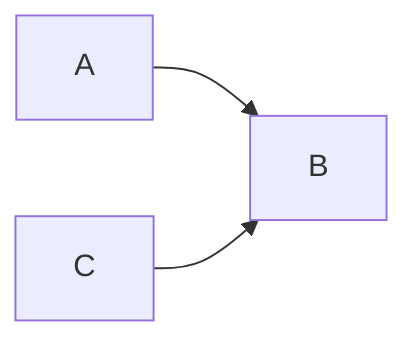

这是 **对撞结构** （collider structure）： $A \rightarrow B \leftarrow C$ 。

> **举例** ： $A$ 和 $C$ 是两枚公平硬币的抛掷结果， $B$ 代表一个铃铛——只要 **任意一枚** 硬币正面朝上，铃铛就会响。两枚硬币互相独立（ $A \perp C$ ），但都与铃铛相关。

将依赖模式反过来（ $B$ 为原因， $A$ 和 $C$ 为结果）在数学上可行但极不自然。这表明： **依赖模式本身就携带了关于因果方向的信息。**

---

## 二、因果发现框架（2.2 节）

### 2.1 核心比喻：科学家与自然的归纳博弈

- **大自然** 拥有一套稳定的因果机制，以无环结构组织变量间的确定性函数关系。
- **科学家** 只能观测变量的一个子集 $O \subseteq V$ ，从中推断因果结构。

---

### 定义 2.2.1：因果结构（Causal Structure）

> 一组变量 $V$ 的 **因果结构** 是一个有向无环图（DAG），其中每个节点对应 $V$ 中的一个变量，每条有向边表示对应变量之间的直接函数关系。

**解释** ：因果结构是一张"蓝图"——它只说明"谁直接影响谁"（定性），不涉及具体的函数形式和参数值。

**举例** ：下面是一个三变量的因果结构：

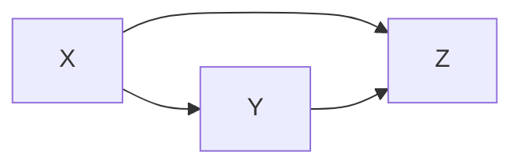

表示 $X$ 直接影响 $Y$ 和 $Z$ ， $Y$ 也直接影响 $Z$ 。

---

### 定义 2.2.2：因果模型（Causal Model）

> 因果模型 $M = \langle D, \Theta_D \rangle$ 由因果结构 $D$ 和参数集 $\Theta_D$ 组成。参数集为每个变量 $X_i \in V$ 赋予：
>
> $$ x_i = f_i(pa_i, u_i) $$
>
> 以及 $P(u_i)$ ，其中 $PA_i$ 是 $D$ 中 $X_i$ 的父代变量， $U_i$ 是相互 **独立** 的随机扰动。

**关键假定——马尔可夫条件** ：

> 对每个变量，以其父代变量为条件时，该变量独立于所有非后代变量：
>
> $$ (X_i \perp \!\!\! \perp \text{NonDescendants}(X_i) \mid PA_i) $$

**解释** ：

- 如果 $PA_i$ 包括了 $X_i$ 的 **所有** 直接原因，那么其他变量不会再提供关于 $X_i$ 的额外信息。
- 如果扰动 $U_i$ 相互独立，马尔可夫性自然成立。
- 如果存在同时影响多个变量的共同扰动，则违反了马尔可夫性——这种情况用 **潜变量** 来处理。

  **举例** ：对于线性结构方程模型：
  $$ x = u_x, \quad y = \alpha x + u_y, \quad z = \beta x + \gamma y + u_z $$

其中 $u_x \perp\!\!\!\perp u_y \perp\!\!\!\perp u_z$ 。结构为 $X \rightarrow Y \rightarrow Z$ 且 $X \rightarrow Z$ 。这里 $(Z \perp\!\!\!\perp X \mid Y)$ ，体现了马尔可夫性。

---

## 三、模型偏好与奥卡姆剃刀（2.3 节）

### 3.1 为什么需要模型偏好？

如果没有限制，任何观测分布都可以用无数种因果结构来解释。例如：

- 所有观测变量可以只是一个共同潜变量 $U$ 的结果；
- 任何完全连通的有向无环图，通过合适的参数选择，可以拟合任何分布。

  **奥卡姆剃刀原则** ：在都能拟合数据的情况下，偏好 **更简单** （表达能力更弱、更易证伪）的理论。

---

### 定义 2.3.2：潜在结构（Latent Structure）

> $L = \langle D, O \rangle$ ，其中 $D$ 是 $V$ 上的因果结构， $O \subseteq V$ 是可观测变量集。

**解释** ：潜在结构承认有些变量是不可观测的（"隐藏"的），只对 $O$ 上的分布做出断言。

---

### 定义 2.3.3：结构偏好（Structure Preference）

> $L \preceq L'$ 当且仅当 $D'$ 可以在 $O$ 上 **模拟** $D$ ，即对于每个 $\Theta_D$ ，存在 $\Theta_{D'}'$ 使得：
> $$ 
> P_{[O]}(\langle D', \Theta*{D'}' \rangle) = P_{[O]}(\langle D, \Theta_D \rangle) 
> $$

**解释** ： $L$ 优于 $L'$ ，意味着 $L'$ 能产生的所有可观测分布， $L$ 也能产生—— $L$ 的表达能力不超过 $L'$ （即 $L$ 有更多约束、更简单）。

---

### 定义 2.3.4：极小性（Minimality）

> $L$ 是 **极小的** ，当且仅当不存在严格优于 $L$ 的结构，即对于每个 $L' \preceq L$ ，都有 $L \equiv L'$ 。

---

### 定义 2.3.5：一致性（Consistency）

> $L$ 与观测分布 $\hat{P}$ **一致** ，若存在参数使得 $P_{[O]}(\langle D, \Theta_D \rangle) = \hat{P}$ 。

---

### 定义 2.3.6：因果推断（规范定义）

> 给定 $\hat{P}$ ，变量 $C$ 对 $E$ 有 **因果影响** ，当且仅当在每个与 $\hat{P}$ 一致的 **极小** 潜在结构中，存在从 $C$ 到 $E$ 的有向路径。

**核心思想** ：因果关系不是从单一最优模型中读出的，而是在 **所有** 极小模型中"稳健"存在的有向路径。

---

### 3.2 极小性示例（图 2.1）

观测数据揭示了两个独立性：

- $(a \perp b)$
- $(d \perp \{a, b\} \mid c)$

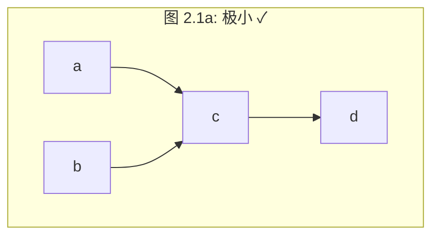

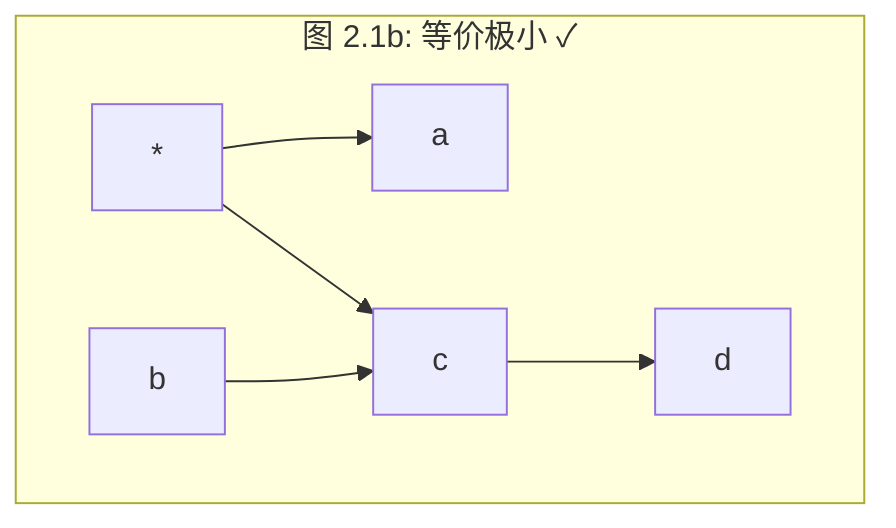

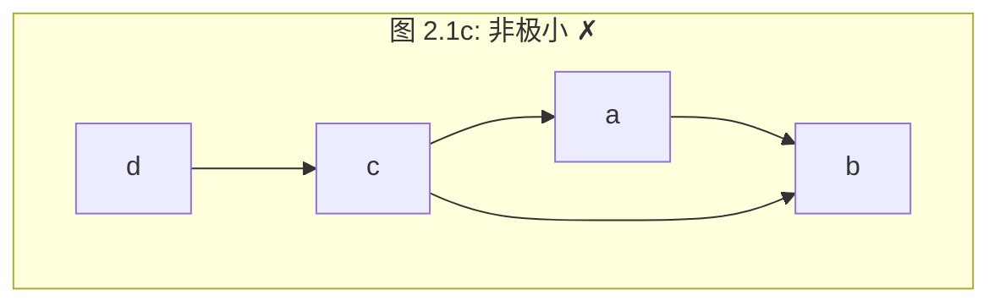

> 图 2.1a 和图 2.1b 都是极小的——它们精确地蕴含了观察到的独立性，不多不少。两者共同的有向边 $c \rightarrow d$ 在所有极小模型中一致存在，因此根据定义 2.3.6， ** $c$ 对 $d$ 有因果影响** 。

---

## 四、稳定分布（2.4 节）

### 4.1 病态参数化问题

**极小性原则** 虽然给出规范定义，但有两个局限：

1. 实际数据生成结构未必是极小的；
2. 在极小模型空间中搜索计算上不可行。

**病态示例** ：二值变量 $C$ 当两枚公平硬币 $A, B$ 结果相同时取 1。此时：

- 任意两个变量边缘独立；
- 给定第三个变量时条件相关。

三个极小因果结构（ $A \rightarrow C \leftarrow B$ 、 $C \rightarrow A \leftarrow B$ 、 $B \rightarrow A \leftarrow C$ ）都能产生这一分布——无法区分。

---

### 定义 2.4.1：稳定性（Stability / Faithfulness）

> 分布 $P$ 对于因果模型 $M = \langle D, \Theta_D \rangle$ 是 **稳定的** ，当且仅当 $P$ 中 **所有** 独立性都由 $D$ 的结构所蕴含（没有"偶然的"独立性）：
>
> $$ (X \perp\!\!\!\perp Y \mid Z)\_P \iff (X \perp\!\!\!\perp Y \mid Z)\_D $$

**直觉** ：

- **结构性独立** ：对 $D$ 的所有参数化都成立（如链 $X \rightarrow Z \rightarrow Y$ 中 $(X \perp\!\!\!\perp Y \mid Z)$ ）。
- **偶然独立** ：只在特定参数取值下成立（如式(2.2)中当 $\alpha = -\beta\gamma$ 时的 $(Y \perp\!\!\!\perp X)$ ）。

稳定性假定认为 **数据中观察到的所有独立性都是结构性的** 。

---

### 4.2 极小性与稳定性的关系（椅子类比）

| 原则       | 椅子图片类比                                                   | 因果模型类比                                         |
| ---------- | -------------------------------------------------------------- | ---------------------------------------------------- |
| **极小性** | 偏好"一把椅子"而非"一把椅子+一把藏在后面的椅子"                | 偏好更受约束（表达能力更弱）的模型                   |
| **稳定性** | 先验排除"一把椅子完美隐藏在另一把后面"——微小的视角变化就会破坏 | 排除"参数精确抵消产生的独立"——微小的参数扰动就会破坏 |

**举例** ：图 2.1c：

- 极小性拒绝它：因为它表达能力过强（适合的分布范围比图 2.1a 更广）。
- 稳定性拒绝它：因为 $(a \perp b)$ 需要 $a \rightarrow b$ 的关系恰好抵消路径 $a \leftarrow c \rightarrow b$ 的关系——这是不稳定的精确抵消。

---

## 五、获取 DAG 结构：IC 算法（2.5 节）

### 5.1 理论保证

**定理 1.2.8** ：当没有隐藏变量时，两个 DAG 等价（能互相模拟）当且仅当它们有相同的 **骨架** （忽略方向的图）和相同的 ** $v$ -结构** （对撞结构 $X \rightarrow Z \leftarrow Y$ ）。

**模式（Pattern）** ：等价类的图表示——有向边表示等价类中所有成员共有的箭头，无向边表示方向有歧义。

---

### 5.2 IC 算法（Inductive Causation）

**输入** ：变量集 $V$ 上的稳定分布 $\hat{P}$
**输出** ：与 $\hat{P}$ 相容的模式

#### 步骤 1：发现骨架

对每对变量 $a, b$ ，寻找分离集 $S_{ab}$ 使 $(a \perp\!\!\!\perp b \mid S_{ab})$ 。若找不到这样的 $S_{ab}$ ，则在 $a$ 和 $b$ 之间放置无向边。

#### 步骤 2：定向 $v$ -结构

对每对非邻接但共享邻居 $c$ 的变量 $a, b$ ：

- 若 $c \notin S_{ab}$ ，则定向为 $a \rightarrow c \leftarrow b$ 。

#### 步骤 3：传播定向

递归应用以下规则：

- **(i)** 避免产生新的 $v$ -结构；
- **(ii)** 避免产生有向环。

---

### 5.3 四条定向规则 ( $R_1$ ～ $R_4$ )

- ** $R_1$ ** ：若 $a \rightarrow b$ 且 $a$ 与 $c$ 不邻接，则 $b \rightarrow c$ 。
- ** $R_2$ ** ：若 $a \rightarrow c \rightarrow b$ ，则 $a \rightarrow b$ 。
- ** $R_3$ ** ：若 $a - c \rightarrow b$ 和 $a - d \rightarrow b$ ，且 $c$ 与 $d$ 不邻接，则 $a \rightarrow b$ 。
- ** $R_4$ ** ：若 $a - c \rightarrow d$ 和 $c \rightarrow d \rightarrow b$ ，且 $c$ 与 $b$ 不邻接而 $a$ 与 $d$ 邻接，则 $a \rightarrow b$ 。

> Meek (1995) 证明：反复应用 $R_1$ ～ $R_4$ 足以定向等价类中所有共有箭头。若起始定向仅限于 $v$ -结构， $R_4$ 可以不要。

---

### 5.4 PC 算法（Spirtes & Glymour, 1991）

IC 算法的系统化改进：

- 从空集开始搜索 $S_{ab}$ ，逐步增加分离集大小。
- 在节点度有限的图中为 **多项式时间复杂度** 。

---

## 六、重建潜在结构：IC\* 算法（2.6 节）

### 6.1 投影（Projection）

当存在隐藏变量时，需要处理无限大的潜在结构空间。 **定理 2.6.2** （Verma, 1993）提供了一个关键简化：

> **定义 2.6.1（投影）** ： $L_{[O]}$ 是 $L$ 的投影，当且仅当：
>
> 1.  $L_{[O]}$ 中的每个未观测变量恰好是两个非邻近可观测变量的共同原因，且无父代；
> 2.  $L_{[O]}$ 能产生与 $L$ 相同的条件独立集。

> **定理 2.6.2** ：任何潜在结构都至少有一个投影。

**解释** ：这意味着搜索可以限制在 **有限** 的投影结构中。投影可用 **双向图** 表示——双向边 $a \leftrightarrow b$ 表示隐藏的共同原因。

---

### 6.2 IC\* 算法

**输出** ：标记的模式（core），包含四种边：

| 边类型                          | 含义                                                                      |
| ------------------------------- | ------------------------------------------------------------------------- |
| $a \stackrel{*}{\rightarrow} b$ | **真实因果** ：每个极小模型中都存在 $a \rightarrow b$                     |
| $a \rightarrow b$               | **潜在因果** ：可能是 $a \rightarrow b$ 或 $a \leftarrow L \rightarrow b$ |
| $a \leftrightarrow b$           | **虚假关联** ：存在隐藏共同原因                                           |
| $a - b$                         | **未确定** ：三种可能均存在                                               |

#### 算法步骤：

**步骤 1** ：同 IC——找出所有条件独立的变量对，其余用无向边连接。

**步骤 2** ：同 IC——定向 $v$ -结构。

**步骤 3** ：应用两条规则：

- **$R_1$** ：若 $a \rightarrow c$ 且 $b$ 与 $c$ 的边无箭指向 $c$ （即 $b \leftarrow c$ 或 $b - c$ ），且 $a$ 与 $b$ 不邻接，则添加 $c \stackrel{*}{\rightarrow} b$ 。

- **$R_2$** ：若 $a$ 和 $b$ 相邻，且存在一条从 $a$ 到 $b$ 的 **全标记路径** ，则添加箭头指向 $b$ 。

---

### 6.3 IC\* 示例（图 2.3）

真实潜在结构：

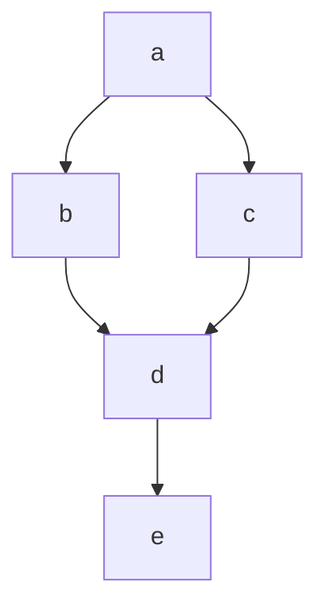

**步骤 1** 得到的骨架——全无向完全连通图（除分离集能分离的对）后得到：

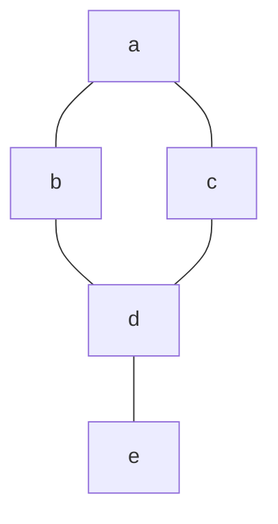

**步骤 2** 识别 $(a, d, b)$ 和 $(a, d, c)$ 中的对撞结构，得：

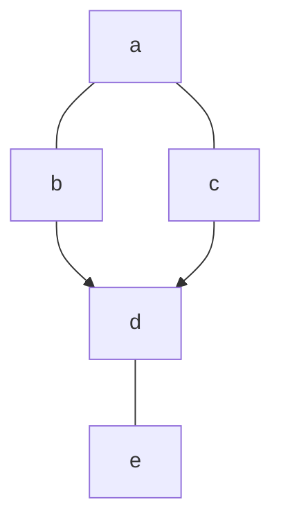

**步骤 3** 应用 $R_1$ ： $b \rightarrow d$ 而 $e - d$ 无箭头向 $d$ ，且 $b$ 与 $e$ 不邻接 → $d \stackrel{*}{\rightarrow} e$ ：

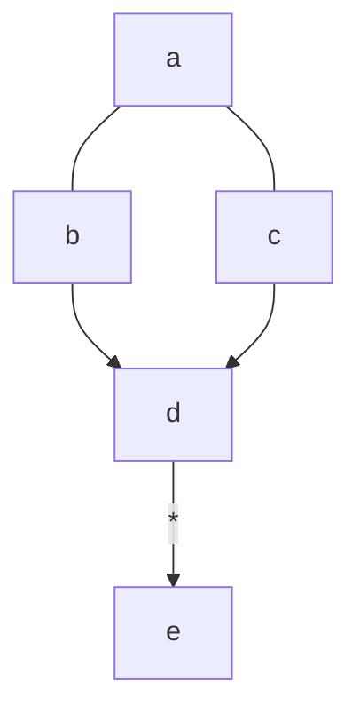

**结论** ： $d \stackrel{*}{\rightarrow} e$ 表示在所有等价极小潜在结构中， $d$ 都是 $e$ 的 **真实原因** 。而 $b \rightarrow d$ 无标记，表示可能是直接原因或虚假关联（见图 2.4 的等价结构）。

---

## 七、因果推断的局部准则（2.7 节）

### 7.1 潜在原因

> **定义 2.7.1** ： $X$ 对 $Y$ 有 **潜在因果影响** ，如果：
>
> 1.  $X$ 和 $Y$ 在每个情形下均相关；
> 2.  存在变量 $Z$ 和情形 $S$ ，使得：
>     - (i) $(X \perp\!\!\!\perp Z \mid S)$
>     - (ii) $(Z \not\!\!{\perp\!\!\!\perp} Y \mid S)$

**举例** （图 2.3a）： $Z = c$ ， $S = a$ ，则 $(b \perp\!\!\!\perp c \mid a)$ 且 $c$ 与 $d$ 相关 → $b$ 是 $d$ 的潜在原因。

---

### 7.2 真实原因

> **定义 2.7.2** ： $X$ 对 $Y$ 有 **真实因果影响** ，如果存在 $Z$ ：
>
> 1.  $X$ 和 $Y$ 在任何情形中均相关，且存在 $S$ 满足：
>
> - (i) $Z$ 是 $X$ 的潜在原因；
> - (ii) $(Z \not\!\!{\perp\!\!\!\perp} Y \mid S)$ ；
> - (iii) $(Z \perp\!\!\!\perp Y \mid S \cup X)$ —— **以 $X$ 为条件后， $Z$ 和 $Y$ 变为独立** 。
>
> 2. 或在此关系的传递闭包中。

**核心直觉** ：条件 (iii) 是关键——如果控制了 $X$ 后， $Z$ 与 $Y$ 的相关性消失，说明 $Z$ 对 $Y$ 的影响完全由 $X$ 中介。

**举例** ： $X = d$ ， $Y = e$ ， $Z = b$ ， $S = \emptyset$ ：

- $b$ 是 $d$ 的潜在原因（定义 2.7.1）
- $b$ 与 $e$ 相关
- $(b \perp\!\!\!\perp e \mid d)$ ——以 $d$ 为条件， $b$ 和 $e$ 独立
  → ** $d$ 是 $e$ 的真实原因** 。

---

### 7.3 虚假关联

> **定义 2.7.3** ： $X$ 和 $Y$ 是 **虚假关联** 的，如果存在 $Z_1, Z_2$ 和 $S_1, S_2$ ：
>
> 1.  $(Z_1 \not\!\!{\perp\!\!\!\perp} X \mid S_1)$ 且 $(Z_1 \perp\!\!\!\perp Y \mid S_1)$ ——排除 $Y$ 是 $X$ 的原因
> 2.  $(Z_2 \not\!\!{\perp\!\!\!\perp} Y \mid S_2)$ 且 $(Z_2 \perp\!\!\!\perp X \mid S_2)$ ——排除 $X$ 是 $Y$ 的原因

剩下的唯一解释是隐藏的共同原因。结构形如 $Z_1 \rightarrow X \rightarrow Y \leftarrow Z_2$ 。

---

### 7.4 带时间信息的简化版本

> **定义 2.7.4（真实因果，有时间信息）** ： $X$ 对 $Y$ 有因果影响，若存在在 $X$ 之前的 $Z$ 和 $S$ ：
> $$ (Z \not\!\!{\perp\!\!\!\perp} Y \mid S) \quad \text{且} \quad (Z \perp\!\!\!\perp Y \mid S \cup X) $$

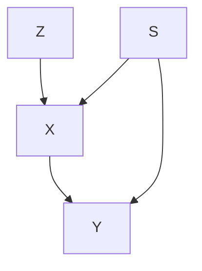

> **定义 2.7.5（虚假关联，有时间信息）** ： $X$ 和 $Y$ 虚假相关，若 $X$ 先于 $Y$ ，且存在 $Z$ ：
> $$ (Z \perp\!\!\!\perp Y \mid S) \quad \text{且} \quad (Z \not\!\!{\perp\!\!\!\perp} X \mid S) $$

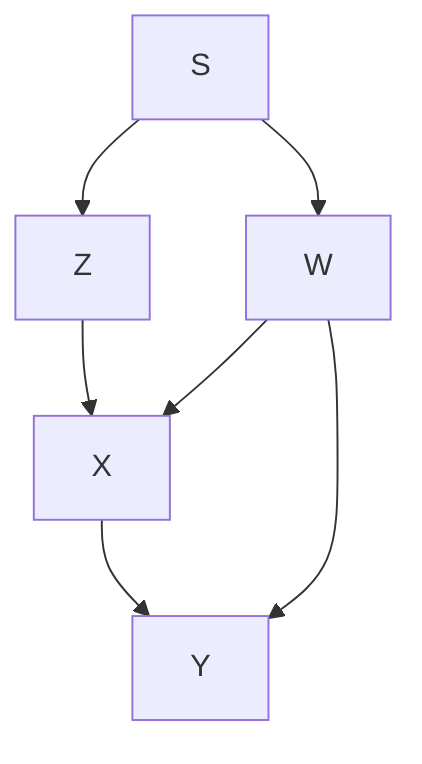

---

## 八、非时间因果与统计时间（2.8 节）

### 8.1 核心问题

因果解释需满足两个期望：

- **时间方面** ：原因先于结果；
- **统计方面** ：完整的因果解释应使其各效应条件独立（Reichenbach 的"共因准则"）。

几个世纪以来这两者并存且无冲突——这意味着自然现象的统计结构存在某种 **时序偏好** 。

---

### 定义 2.8.1：统计时间（Statistical Time）

> 给定分布 $P$ ，其 **统计时间** 是满足以下条件的变量排序：与至少一个与 $P$ 相容的极小因果结构一致。

**举例** ：两个耦合的马尔可夫链：
$$ X*t = \alpha X*{t-1} + \beta Y*{t-1} + \xi_t $$
$$ Y_t = \gamma X*{t-1} + \delta Y\_{t-1} + \eta_t $$

对该过程运行 IC 算法（不使用时间信息），会识别出 $X_{t-1}$ 和 $Y_{t-1}$ 是 $X_t$ 和 $Y_t$ 的真实原因——即 **统计时间与物理时间一致** 。

---

### 猜想 2.8.2：时序偏好

> **在大多数自然现象中，物理时间与至少一个统计时间一致。**

**深层讨论** ：

Reichenbach 将这归因于热力学第二定律。但作者指出，通过坐标变换（如线性组合 $X_t' = aX_t + bY_t$ ），可以使统计时间与物理时间 **相反** ：

$$ X_t' = aX_t + bY_t, \quad Y_t' = cX_t + dY_t $$

在 $(X', Y')$ 坐标系中，变量以未来值而非过去值为条件时相互独立。

这暗示 **物理时间与统计时间的一致性是语言选择的副产品** ——人类偏好那种"正向扰动相互正交"的坐标系。Pearl 和 Verma 推测这是一种 **进化趋势** ：预测未来比事后解释过去更有生存价值。

---

## 九、结论与哲学讨论（2.9 节）

### 9.1 核心主张

> **"没有原因存在，就找不到原因；有奥卡姆剃刀，就能找出某些原因。"**

- 在极小性和稳定性假定下，存在可揭示真实因果的相关模式。
- IC\* 算法提供逻辑保证：如果 $a$ 对 $b$ 没有因果影响且分布是稳定的，则算法 **不会** 标记 $a \rightarrow b$ 。
- 仿真研究：包含数十个变量的网络仅需少于 5000 个样本即可恢复结构。
- 真实案例：Sewall Wright 的"玉米与生猪价格"——算法正确识别玉米价格（ $X$ ）是生猪价格（ $Y$ ）的原因。

---

### 9.2 关于马尔可夫假定的辩护

**批评者** （Cartwright, Lemmer）提出宏观的非马尔可夫反例，如交互式分叉：

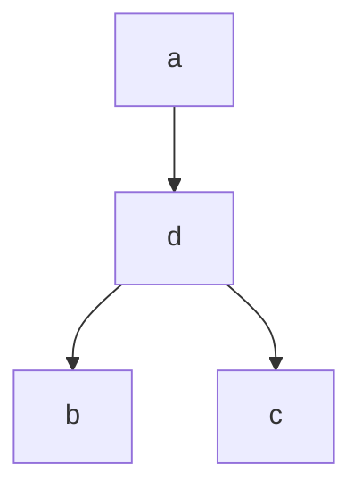

当中间节点 $d$ 未观测时，似乎违反马尔可夫性。但图 2.6b 的潜在结构可以完美模拟：

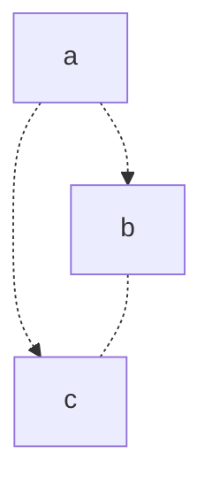

**作者回应** ：

1. 只有量子力学现象表现出无法归因于潜变量的关联——在宏观世界发现这种关联将是科学奇迹。
2. "概率因果关系"哲学纲领（Cartwright 本人也是支持者）的持续存在本身就表明马尔可夫条件的反例罕见且可用潜变量解释。

---

### 9.3 关于稳定性假定的辩护

**Freedman 质疑** ：为什么某些等式（如条件独立性约束）被视为"稳定"而另一些被视为"偶然"？

例如，链模型 $Y \rightarrow X \rightarrow Z$ 蕴含等式约束：
$$ \rho*{YZ} = \rho*{XZ} \cdot \rho\_{YX} $$

**作者回应——自治（Autonomy）概念** （Aldrich, 1989）：

> 因果模型的本质是每个变量由一组其他变量通过 **机制** 决定，当其他机制受外界影响时，该机制保持不变。这意味着 **结构系数可以独立改变** ，而派生参数（如相关系数）则不能。

因此，形如 $\alpha = -\beta\gamma$ 的约束与自治理念相悖，在自然条件下很少发生。正是 **对稳定性的追求** ，解释了为什么人们无法自然地想象"两个独立原因的共同效应"以外的非传递相关模式。

---

### 9.4 与贝叶斯方法的关系

- **极小性和稳定性也是贝叶斯因果发现的基础** 。
- 贝叶斯方法：给候选因果网络配置先验概率 → 用贝叶斯法则打分 → 搜索最大后验结构。
- 贝叶斯方法的 **参数独立性假定** 本质上等价于对极小性（偏好参数少的模型）和稳定性（机制可以独立变化）的承诺。
- 优点：小样本表现好；困难：处理隐变量。

---

## 十、核心概念总结表

| 概念                 | 定义                                              | 关键性质                                            |
| -------------------- | ------------------------------------------------- | --------------------------------------------------- |
| **因果结构**         | 变量集上的 DAG                                    | 定性描述直接影响关系                                |
| **因果模型**         | 结构 + 参数化（含独立扰动）                       | 蕴含马尔可夫性                                      |
| **马尔可夫条件**     | $(X_i \perp\!\!\!\perp \text{NonDesc} \mid PA_i)$ | 父代"屏蔽"其他影响                                  |
| **极小性**           | 不存在严格更优的模型                              | 奥卡姆剃刀的语义版本                                |
| **稳定性（忠实性）** | 所有独立性都是结构性的                            | 排除参数偶然抵消                                    |
| ** $v$ -结构**       | $X \rightarrow Z \leftarrow Y$                    | 对撞结构， $X \perp\!\!\!\perp Y$ 但给定 $Z$ 后相关 |
| **模式**             | 等价类的部分有向图表示                            | 有向边=共有，无向边=歧义                            |
| **投影**             | 潜变量"投影"到观测变量                            | 每个潜变量变为两个观测变量的共同原因                |
| **统计时间**         | 与某极小因果结构一致的变量排序                    | 通常与物理时间一致                                  |
| **潜在原因**         | 条件独立模式暗示的可能原因                        | 可能被共同原因"污染"                                |
| **真实原因**         | 以中介变量为条件后独立性消失                      | 在所有极小模型中稳健                                |
| **虚假关联**         | 双向排除因果关系后的剩余解释                      | 由隐藏共同原因造成                                  |

---

## 十一、算法流程总结

```mermaid
flowchart TD
    A[观测分布   $\hat{P}$  ] --> B{有隐藏变量?}
    B -->|无| C[IC 算法]
    B -->|有| D[IC* 算法]

    C --> C1["步骤1: 条件独立性检验<br/>构建无向骨架"]
    C1 --> C2["步骤2: 识别 v-结构<br/>a → c ← b"]
    C2 --> C3["步骤3: 传播定向<br/>规则 R1~R4"]
    C3 --> E[模式 Pattern]

    D --> D1["步骤1: 同IC构建骨架"]
    D1 --> D2["步骤2: 同IC识别v-结构"]
    D2 --> D3["步骤3: 规则R1和R2<br/>标记真实因果/潜在因果"]
    D3 --> F[标记的模式 core]

    E --> G[从所有极小模型<br/>中读取稳健因果]
    F --> G
```

---

这就是第 2 章的核心内容。本章建立了一个从 **纯观测数据** 中推断因果关系的完整理论框架：以奥卡姆剃刀（极小性）为规范基础，以稳定性（忠实性）为操作条件，通过 IC/IC\* 算法系统地识别因果结构、真实原因与虚假关联，并在哲学层面为这些假定提供了基于"自治性"概念的深度辩护。
