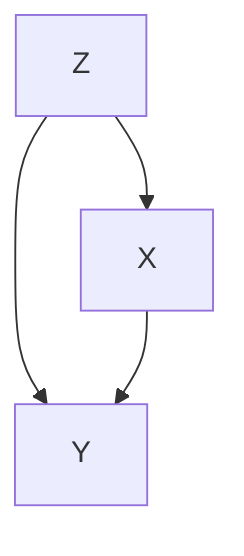
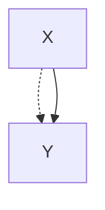
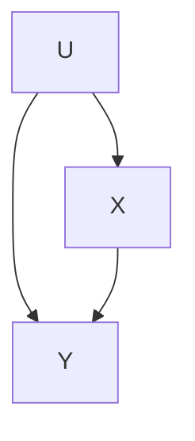
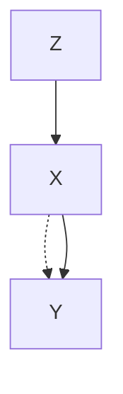
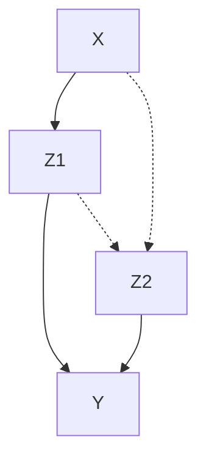
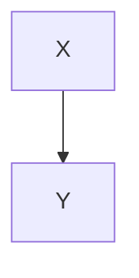
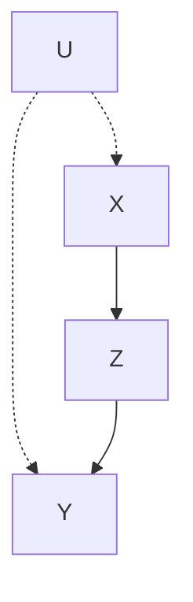

您说得对，之前的回答中存在多处自我纠正和混淆。让我基于章节原文认真重新梳理，给出一份准确、干净的解释。

---

# 可识别性（Identifiability）深度解析（修正版）

---

## 一、问题的起源：因果量为什么不能直接从数据中"读"出来？

### 1.1 因果量 vs 统计量的本质差异

书中在 3.2.4 节开篇就点明了一个根本性的认识论问题：

> _"不同于统计参数，因果量值是相对于因果模型 $M$ 来定义的，而不是相对于观测变量集合 $V$ 上的联合分布 $P_M(v)$ 。由于非实验数据仅提供关于 $P_M(v)$ 的信息，并且不同的模型可能产生相同的分布，因此存在这样的危险：即使获取了无限多的样本，也无法从数据中明确地识别出所需的量值。"_

这段话揭示了如下逻辑链：

$$
\text{世界} \rightarrow M \text{（因果模型）} \xrightarrow{\text{蕴含}} P_M(v) \text{（观测分布）} \xleftarrow{\text{无限样本可估计}} \text{我们}
$$

问题是： **从 $P_M(v)$ 反推 $M$ 不是一一映射** 。不同的因果机制可能恰好产生完全相同的观测联合分布。如果 $M_1$ 和 $M_2$ 在观测上不可区分，但它们对干预 $do(x)$ 的预测不同，那么仅凭观察数据就无法确定哪个预测是对的。

### 1.2 直观比喻

两艘船在水面上以完全相同的轨迹航行（观测分布相同），但一艘顺流而下，另一艘逆流而上加足马力（因果机制不同）。如果你问"关掉发动机后船的速度是多少"，仅从表面的航行轨迹无法回答——需要知道水下的洋流结构。因果图 $G$ 提供的就是这种"洋流结构"的定性知识。

---

## 二、定义 3.2.3 —— 一般意义上的可识别性

### 2.1 定义原文

> 令 $Q(M)$ 是模型 $M$ 的任何可计算量值。如果对于一类模型 $\mathbf{M}$ 中的任何一对模型 $M_1$ 和 $M_2$ ，只要 $P_{M_1}(v) = P_{M_2}(v)$ ，就有 $Q(M_1) = Q(M_2)$ ，那么称 $Q$ 在模型类 $\mathbf{M}$ 中 **可识别** 。

### 2.2 逐要素解读

**(a) "模型类 $\mathbf{M}$ "** ：我们并不考虑宇宙中所有可能的模型，而是限制在一组共享定性假定的模型之内。在本书中，这个类由 **因果图 $G$ ** 定义——所有拥有相同父子关系结构的模型归为一类。

**(b) " $P_{M_1}(v) = P_{M_2}(v)$ "** ：两个模型在所有观测变量上产生完全相同的联合分布。这是从数据角度能获得的全部信息（在无限样本极限下）。

**(c) " $Q(M_1) = Q(M_2)$ "** ：尽管两个模型内部机制不同，但我们关心的量 $Q$ 必须相等。换言之， $Q$ 的值被观测分布唯一确定。

**(d) 逻辑结构** ：
$$ P*{M_1}(v) = P*{M_2}(v) \quad \Longrightarrow \quad Q(M_1) = Q(M_2) $$

如果存在反例——两个模型观测上不可区分但 $Q$ 值不同——则 $Q$ **不可识别** 。

### 2.3 可识别性的实用意义

书中强调：

> _"可识别性确保 $M$ 表达的附加假定（如因果图或结构方程中的零系数）能够提供缺失的信息，而不要求完全详细地说明 $M$ 。"_

这意味着：我们 **不需要** 知道函数 $f_i$ 的具体形式和扰动项的分布 $P(u)$ ，只需要知道因果图 $G$ 的定性结构，加上观测数据 $P(v)$ ，就足以唯一确定 $Q$ 。这是在不完全知识下进行可靠推断的关键保证。

---

## 三、定义 3.2.4 —— 因果效应可识别性

### 3.1 定义原文

> 如果量值 $P(y \mid \hat{x})$ 可从观测变量的任何正概率中唯一地计算，即对于任何满足 $P_{M_1}(v) = P_{M_2}(v) > 0$ 且 $G(M_1) = G(M_2) = G$ 的模型对 $M_1$ 和 $M_2$ ，有 $P_{M_1}(y \mid \hat{x}) = P_{M_2}(y \mid \hat{x})$ ，那么 $X$ 对 $Y$ 的因果效应在图 $G$ 中 **可识别** 。

### 3.2 三个关键要素

**(i) 共享因果图 $G$ ** ：模型类由同一个因果图定义。所有人必须先就"谁影响谁"的结构达成一致——例如都同意"年龄同时影响服药行为和康复结果"，但年龄的具体效应大小可以不同。

**(ii) 正分布 $P(v) > 0$ ** ：每个变量组合都有正概率。这保证了条件概率分母不为零。如果某个 $X = x'$ 在数据中从未出现过，则无法推断 $do(X = x')$ 的效应（干预后的世界在数据中没有对应信息）。

**(iii) 可由 $P(v)$ 唯一计算** ：存在一个仅涉及观测概率的表达式来计算 $P(y \mid \hat{x})$ 。

### 3.3 两个信息来源的交汇

可识别性确保从以下两个信息源的组合中可以唯一确定因果效应：

| 信息源     | 提供的内容                             | 获取方式                 |
| ---------- | -------------------------------------- | ------------------------ |
| 观测数据   | $P(v)$ ——变量之间的统计关联            | 被动观察、调查、历史记录 |
| 因果图 $G$ | 定性因果结构——哪些变量参与确定哪些变量 | 领域知识、理论、先验实验 |

当 $P(y \mid \hat{x})$ 可识别时，存在一个表达式将其写成仅含 $P(v)$ 中可估计项的公式，无需知道 $f_i$ 或 $P(u)$ 的具体形式。

---

## 四、定理 3.2.5 与推论 3.2.6 —— 充分条件

### 4.1 定理 3.2.5（直接原因校正）

> 给定任意马尔可夫模型的因果图 $G$ ，其中变量的子集 $V$ 是可测量的，只要 $\{X \cup Y \cup PA_X\} \subseteq V$ ，即只要 $X$ 、 $Y$ 以及 $X$ 的所有父代变量是可测量的，那么因果效应 $P(y \mid \hat{x})$ 是 **可识别** 的。表达式为：
>
> $$ P(y \mid \hat{x}) = \sum\_{pa} P(y \mid x, pa) \, P(pa) \tag{3.13} $$

**含义** ：如果你能测量 $X$ 的所有直接原因（父节点），就可以通过"在各父节点取值层内计算 $X$ 与 $Y$ 的条件关联，再按父节点分布加权平均"来一致地估计因果效应。这是可识别性最直接的情形。

**举例** ：设 $Z$ （年龄）是该病康复 $Y$ 的唯一混杂因素，同时影响服药 $X$ 和康复 $Y$ ：



这里 $PA_X = \{Z\}$ 可观测，因此：
$$ P(y \mid do(x)) = \sum_z P(y \mid x, z) \, P(z) $$

### 4.2 推论 3.2.6（全观测情形）

> 给定任意马尔可夫模型的因果图 $G$ ，其中 **所有变量都可测量** ，那么对于变量 $X$ 和 $Y$ 的任意两个子集，因果效应 $P(y \mid \hat{x})$ 都是 **可识别** 的，通过截断因子分解公式 (3.14) 可获得其值。

**含义** ：在一个完全被观测的世界中，不存在识别问题。这是理想化的参照基准，反过来说明识别困难的根本来源是 **隐变量** 的存在。

---

## 五、不可识别性的证明：弓形模式

### 5.1 弓形模式的定义



> **图 3.7a 弓形模式** ：一条混杂弧（虚线双向弧，代表未观测共同原因 $U$ ）包容了 $X \to Y$ 的因果链接。

书中解释：

> _"弓形模式表示方程 $y = f_Y(x, u, \varepsilon_Y)$ ，其中 $U$ 是未观测变量且与 $X$ 相关。这样的方程导致因果效应无法识别，因为 $X$ 和 $Y$ 之间任何观察到的相关都可能被归因于由 $U$ 中介的虚假相关。"_

### 5.2 为什么不可识别：两类解释的不可区分性

弓形模式对应的完整因果图（展开隐变量 $U$ ）：



观测分布 $P(x, y)$ 显示 $X$ 与 $Y$ 存在关联。这种关联有两个来源：

$$
\text{关联} = \underbrace{X \rightarrow Y}_{\text{因果路径}} \quad + \quad \underbrace{X \leftarrow U \rightarrow Y}_{\text{混杂路径}}
$$

仅从 $P(x, y)$ 无法分解这两种贡献，因为 $U$ 没有被测量。

### 5.3 不可识别性的构造性证明

书中给出了方法论提示：

> _"为了证明不可识别性，只要找到两组结构方程就足够了，这两组结构方程满足在观测变量上产生相同的分布，但有不同的因果效应。"_

我们来构造这样一对模型。设 $X, Y, U$ 均为二值变量 $\{0, 1\}$ 。

**模型 $M_1$ （ $X$ 对 $Y$ 有强因果效应）** ：

$$ U \sim \text{Bernoulli}(0.5) $$
$$ \varepsilon_X \sim \text{Bernoulli}(0.1) $$
$$ \varepsilon_Y \sim \text{Bernoulli}(0.1) $$
$$ X = U \oplus \varepsilon_X $$
$$ Y = X \oplus \varepsilon_Y $$

**模型 $M_2$ （ $X$ 对 $Y$ 无因果效应，仅由 $U$ 驱动）** ：

$$ U \sim \text{Bernoulli}(0.5) $$
$$ \varepsilon_X \sim \text{Bernoulli}(0.1) $$
$$ \tilde{\varepsilon}\_Y \sim \text{Bernoulli}(0.1) $$
$$ X = U \oplus \varepsilon_X $$
$$ Y = U \oplus \tilde{\varepsilon}\_Y $$

两个模型的因果图相同（均为 $U \to X$ , $U \to Y$ , $X \to Y$ ），但方程中对 $Y$ 的赋值不同：

- $M_1$ 中 $Y$ 直接依赖 $X$ （因果效应存在）
- $M_2$ 中 $Y$ 仅依赖 $U$ （因果效应为零）

**关键** ：在 $M_2$ 中，利用 $U = X \oplus \varepsilon_X$ ，可改写 $Y = (X \oplus \varepsilon_X) \oplus \tilde{\varepsilon}_Y = X \oplus (\varepsilon_X \oplus \tilde{\varepsilon}_Y)$ 。当 $\varepsilon_X \oplus \tilde{\varepsilon}_Y$ 与 $\varepsilon_Y$ 同分布时， $M_1$ 和 $M_2$ 产生完全相同的 $P(x, y)$ 。

**干预下的分歧** ：当 $do(X = 1)$ 时，

- $M_1$ 中：切断了 $U \to X$ ， $Y$ 通过 $X=1$ 和 $\varepsilon_Y$ 确定
- $M_2$ 中： $X$ 被固定为 $1$ ，但 $Y$ 仍由 $U$ 驱动，而 $U$ 不再与 $X$ 关联

两个模型的 $P(y \mid do(1))$ 截然不同，但观测上完全无法区分。

---

## 六、可识别 vs 不可识别的图模型检验

### 6.1 图 3.7：不可识别模型

**(a) 弓形模式（基本形式）**


$X$ 与 $Y$ 之间的混杂弧直接包容了因果链接 → **不可识别** 。

**(b) 加工具变量——非参数下仍不可识别**



书中明确区分：

| 模型类型                    | 识别状态     | 理由                                                                       |
| --------------------------- | ------------ | -------------------------------------------------------------------------- |
| **线性模型**                | **可识别**   | 工具变量公式 $b = \frac{E(Y \mid z)}{E(X \mid z)} = \frac{r_{yz}}{r_{xz}}$ |
| **非参数模型** （本章立场） | **不可识别** | 仅有 Manski 边界，无法点识别                                               |

> 这是本章的关键洞察之一： **线性假设是一种极强的约束** ，它强制了效应同质性，从而使得原本不可识别的量变得可识别。本章坚持非参数立场，因此图 3.7b 被视为不可识别。

实际对应场景：不完全依从性的随机试验——随机分配 $Z$ （如治疗组/对照组），但患者实际是否接受治疗 $X$ 取决于不可观测的个人因素，这些因素也同时影响疗效 $Y$ 。

**(c) 无弓形的最小不可识别图**



这是不包含 $X$ 与 $Y$ 之间弓形弧但仍不可识别的最小图。特点是：

- $P(z_1 \mid \hat{x})$ **可** 识别
- $P(z_2 \mid \hat{x})$ **可** 识别
- $P(y \mid \hat{z}_1)$ **可** 识别
- $P(y \mid \hat{z}_2)$ **可** 识别
- $P(z_1, z_2 \mid \hat{x})$ **不可** 识别（联合分布无法确定）
- 因此 $P(y \mid \hat{x})$ **不可** 识别

这说明了 **局部可识别 ≠ 全局可识别** ：路径上每个环节都可识别，不等于整体效应可识别。这是非参数模型与线性模型的核心区别之一（线性模型中，路径系数可识别就意味着总效应可识别）。

---

### 6.2 图 3.8：可识别模型（部分代表性示例）

**(a) 无混杂**



$P(y \mid \hat{x}) = P(y \mid x)$ —— 直接等同。

**(b) 协变量满足后门准则**


$Z$ 不是 $X$ 的后代，且阻断了唯一的后门路径 $X \leftarrow Z \rightarrow Y$ 。

$$ P(y \mid \hat{x}) = \sum_z P(y \mid x, z) \, P(z) \tag{3.19} $$

**(c) 前门准则模型（图 3.5）**



$X$ 与 $Y$ 之间存在混杂（通过 $U$ ），但中介变量 $Z$ 满足前门准则的前三个条件，使得两步校正可行：

$$ P(y \mid \hat{x}) = \sum*z P(z \mid x) \sum*{x'} P(y \mid x', z) \, P(x') \tag{3.29} $$

---

## 七、"正分布"条件的含义

定义 3.2.4 要求 $P(v) > 0$ 。书中解释：

> _"将可识别性限制为正分布可以确保在适当情况的数据中表示条件 $X = x'$ 出现，从而避免式（3.11）中的分母为零。"_

回顾截断因子分解公式 (3.11)：
$$ P(x_1, \dots, x_n \mid \hat{x}\_i') = \frac{P(x_1, \dots, x_n)}{P(x_i' \mid pa_i)} $$

若对某些 $pa_i$ 取值 $P(x_i' \mid pa_i) = 0$ ，则分母为零，公式失效。实质原因：若干预值 $x'$ 在数据中从未自然出现，我们就没有任何经验信息来推断该干预下的行为。

**举例** ：若想估计"每天服用 1000mg 药物"的因果效应，但观察数据中无人服用超过 500mg（ $P(X=1000)=0$ ），则 $P(y \mid do(X=1000))$ 无法从数据中识别——这需要外推而非识别。

---

## 八、可识别性与 do-演算的关系

### 推论 3.4.2

> 如果存在有限的转换序列可将因果效应 $q = P(y_1, \dots, y_k \mid \hat{x}_1, \dots, \hat{x}_m)$ 约简为仅涉及观察量的概率表达式，其中每个转换都符合定理 3.4.1 中的一条推断规则，那么 $q$ 在图 $G$ 刻画的模型中 **可识别** 。

### 后来证明的完备性（第 2 版附言）

Shpitser 和 Pearl（2006a）证明了 **逆命题也成立** ：如果一个因果效应可识别，则一定能通过 do-演算的三个规则将其约简为无 do 表达式。这意味着：

> **do-演算是一个完备的推导系统** ——它是判定可识别性的 **充要条件** 。

---

## 九、不可识别 ≠ 束手无策

当某个量值不可识别时，书中指出了三条出路：

1.  **添加辅助实验** ：如果 $X$ 不能被随机化，可随机化一个代理变量 $Z$ （3.4.4 节），条件是 $X$ 截断所有 $Z \to Y$ 的有向路径，且 $P(y \mid \hat{x})$ 在 $G_{\bar{z}}$ 中可识别。

2.  **补充因果假定** ：将半马尔可夫模型转化为马尔可夫模型（测量更多变量），或添加排除限制（如某些直接效应为零）。

3.  **计算边界** ：即使不可点识别，如工具变量模型（图 3.7b），仍然可以计算 $P(y \mid \hat{x})$ 的上下界（Manski 边界，详见第 8 章）。

---

## 十、可识别性层次结构总图

```
                      可识别性判定
                           │
        ┌──────────────────┼──────────────────┐
        │                  │                  │
  所有变量可观测      父节点可观测       仅有图结构 G
  (推论 3.2.6)      (定理 3.2.5)      (半马尔可夫模型)
        │                  │                  │
   永远可识别          通过 PA_x 校正     需图模型检验
        │                  │                  │
        │           P(y|do(x)) =       ┌──────┴──────┐
        │           Σ P(y|x,pa)P(pa)   │             │
        │                          后门准则      前门准则
        │                          (3.3.1)       (3.3.2)
        │                              │             │
        │                         可识别/校正    可识别/两步校正
        │                              │             │
        └──────────────────────────────┼─────────────┘
                                       │
                               do-演算 (定理 3.4.1)
                               (完备推导系统)
                                       │
                               定理 3.6.1 (一般条件)
                               X 与其子节点无双向路径
```

---

## 十一、总结

| 要素                 | 说明                                                                          |
| -------------------- | ----------------------------------------------------------------------------- |
| **可识别性的本质**   | 因果量 $Q$ 被观测分布 $P(v)$ 和因果图 $G$ 唯一确定                            |
| **判定标准（正面）** | 可通过 do-演算约简为无 do 表达式；或 $X$ 与其子节点间无双向路径（定理 3.6.1） |
| **判定标准（反面）** | 存在弓形模式（混杂弧包容 $X \to Y$ ）；局部可识别不能保证全局可识别           |
| **正分布要求**       | $P(v) > 0$ ，确保干预值在数据中有对应信息                                     |
| **不可识别时的出路** | 添加辅助实验、补充因果假定、计算边界                                          |
| **与 do-演算的关系** | do-演算是判定可识别性的充要推导系统                                           |

可识别性作为因果推断的基石概念，将"我们能知道什么"这一认识论问题精确地数学化：它不要求我们完全知晓世界的运行细节，但要求我们拥有的定性结构知识（因果图）足够强大，使得观测数据能够唯一地确定干预后果——这正是从被动观察到主动决策的桥梁。
