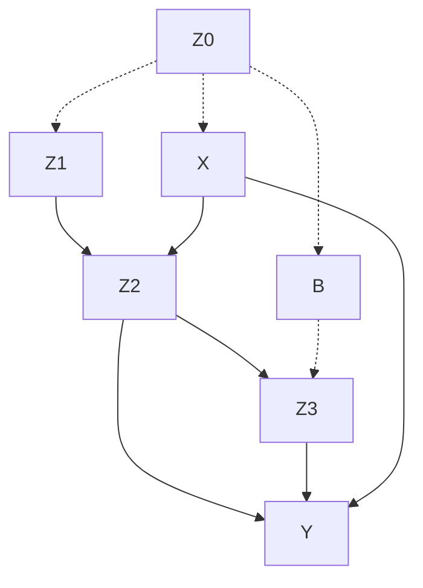
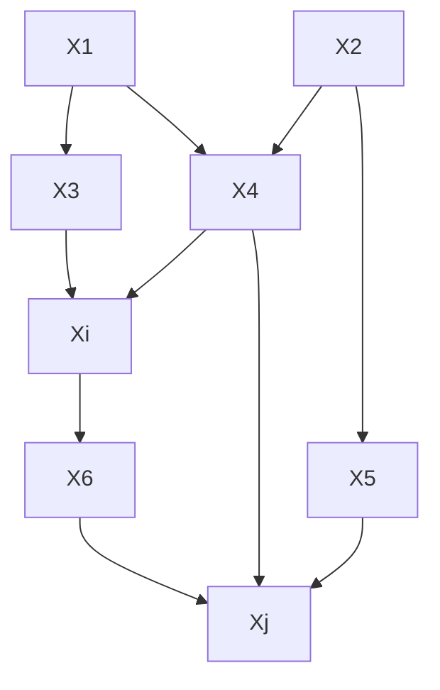
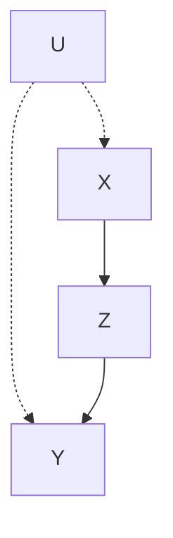
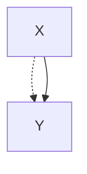

我先通读全章内容，然后进行系统梳理。让我分批次读取剩余部分。

现在我已完整阅读全章内容。下面进行系统性的全面梳理。

---

# 第 3 章 因果图与因果效应识别 —— 全面系统总结

---

## 一、章节总览

本章的核心使命是： **基于非实验的观察数据，辅以定性的因果图假定，推断因果效应的强度** 。全章围绕四个核心问题展开：

1. 说明模型背后的因果假定；
2. 判断假定是否足以获得因果效应的一致性估计（ **可识别性** 问题）；
3. 如果可识别，给出因果效应基于观察分布的解析表达式；
4. 如果不可识别，提出需要哪些额外的观察或实验。

本章引入的核心工具包括： **后门准则、前门准则、do-演算** ，以及与潜在结果框架的关系。

---

## 二、因果图的构建与语义（3.1 节 & 3.2 节）

### 2.1 结构方程模型（SEM）的非参数形式

因果图 $G$ 中每一对父子关系 $(PA_i, X_i)$ 对应一个确定性函数：

$$ x_i = f_i(pa_i, \varepsilon_i), \quad i = 1, \dots, n \tag{3.2} $$

其中 $\varepsilon_i$ 是联合独立的随机扰动项，代表忽略的背景因素。

> **关键解释** ：这里的等号不是普通数学等式，而是 **非对称的因果赋值** ——右边变量"决定"左边变量。每个方程代表一个 **自治的稳定机制** 。

- 若所有背景变量独立 → **马尔可夫模型**
- 若存在不可观测的相关背景变量（通过空心节点或虚线弧表示）→ **半马尔可夫模型**

观测变量的联合分布满足递归分解（贝叶斯网络的特性）：

$$ P(x_1, \dots, x_n) = \prod_i P(x_i \mid pa_i) \tag{3.5} $$

**举例** （图 3.1 熏蒸剂例子）：

对应的分解：
$$ P(z_0, x, z_1, b, z_2, z_3, y) = P(z_0) P(x|z_0) P(z_1|z_0) P(b|z_0) P(z_2|x,z_1) P(z_3|z_2,b) P(y|x,z_2,z_3) $$

---

### 2.2 干预的正式定义

#### 定义 3.2.1（因果效应）

> 给定不相交变量集 $X$ 和 $Y$ ， $X$ 对 $Y$ 的 **因果效应** 表示为 $P(y \mid do(x))$ （也记为 $P(y \mid \hat{x})$ ）。它是从模型中 **删除** $X$ 中变量对应的方程，并代入 $X = x$ 后，从剩余方程中推导出的 $Y = y$ 的概率。

**图操作** ：干预 $do(X = x)$ 在图 $G$ 中对应于删除所有指向 $X$ 的入边，保留出边。得到子图 $G_{\bar{X}}$ 。

#### 干预 vs 条件作用

| 概念   | $P(Y \mid X=x)$          | $P(Y \mid do(X=x))$          |
| ------ | ------------------------ | ---------------------------- |
| 含义   | 观察 $X=x$ 时 $Y$ 的分布 | 强制设定 $X=x$ 时 $Y$ 的分布 |
| 图操作 | 不变                     | 删除指向 $X$ 的所有边        |
| 场景   | 被动观察                 | 主动实验/政策干预            |

---

### 2.3 截断因子分解公式（定理 3.2.2）

干预 $do(X_i = x_i')$ 后，联合分布变为 **截断因子分解** ：

$$ P(x*1, \dots, x_n \mid \hat{x}\_i') = \begin{cases} \prod*{j \neq i} P(x_j \mid pa_j) & x_i = x_i' \\ 0 & x_i \neq x_i' \end{cases} \tag{3.10} $$

即从式 (3.5) 的乘积中 **移除** $P(x_i \mid pa_i)$ 项。

#### 定理 3.2.2（直接原因校正）

若 $PA_i$ 是 $X_i$ 的直接原因集且均可观测， $Y$ 与 $\{X_i \cup PA_i\}$ 不相交，则：

$$ P(y \mid \hat{x}_i') = \sum_{pa_i} P(y \mid x_i', pa_i) P(pa_i) \tag{3.13} $$

> **直观解释** ：先按 $X_i$ 的直接原因分层，在各层内看 $X_i$ 与 $Y$ 的关系，然后按 $PA_i$ 的先验分布加权平均。这就是 **"通过 $PA_i$ 校正"** 。

---

### 2.4 可识别性

#### 定义 3.2.3（可识别性）

> 对于模型类 $\mathbf{M}$ 中任意两个产生相同观测分布 $P(v)$ 的模型 $M_1$ 和 $M_2$ ，如果恒有 $Q(M_1) = Q(M_2)$ ，则 $Q$ 在 $\mathbf{M}$ 中 **可识别** 。

#### 定义 3.2.4（因果效应可识别性）

> 若对任意满足 $P_{M_1}(v) = P_{M_2}(v) > 0$ 且 $G(M_1) = G(M_2) = G$ 的模型对，都有 $P_{M_1}(y \mid \hat{x}) = P_{M_2}(y \mid \hat{x})$ ，则 $P(y \mid \hat{x})$ 在图 $G$ 中可识别。

#### 定理 3.2.5

> 在马尔可夫模型中，若 $\{X \cup Y \cup PA_X\} \subseteq V$ （即 $X$ 、 $Y$ 及 $X$ 的所有父节点可测），则 $P(y \mid \hat{x})$ 可识别，由式 (3.13) 给出。

#### 推论 3.2.6

> 若 **所有变量可观测** ，则任意 $P(y \mid \hat{x})$ 均可识别，通过截断因子分解获得。

---

## 三、后门准则与前门准则（3.3 节）

这是本章最核心的识别工具。

### 3.1 后门准则

#### 定义 3.3.1（后门准则）

> 变量集 $Z$ 满足 $(X_i, X_j)$ 的 **后门准则** ，当且仅当：
>
> 1.  $Z$ 中 **无** 节点是 $X_i$ 的后代；
> 2.  $Z$ 阻塞了 $X_i$ 和 $X_j$ 之间所有 **指向 $X_i$ ** 的路径（后门路径）。

> **图 3.4** ： $Z_1 = \{X_3, X_4\}$ 满足后门准则； $Z_2 = \{X_4, X_5\}$ 也满足；但 $Z_3 = \{X_4\}$ 不满足（路径 $(X_i, X_3, X_1, X_4, X_2, X_5, X_j)$ 未被阻塞）。

#### 定理 3.3.2（后门校正公式）

$$ P(y \mid \hat{x}) = \sum_z P(y \mid x, z) P(z) \tag{3.19} $$

> **直观** ：这是 **分层—平均** 的标准操作。对满足后门条件的协变量 $Z$ 进行条件化（分层），然后用 $Z$ 的边际分布加权求和，即可消除混杂偏差。

**为什么叫"后门"？** 因为指向 $X$ 的路径相当于从"后门"进入 $X$ ，而我们需要堵住这些后门。

---

### 3.2 前门准则

后门准则要求协变量不受处理影响。但如果所有可观测协变量都在 $X$ 到 $Y$ 的因果通路上（即受 $X$ 影响），该怎么办？前门准则提供了解决方案。

#### 定义 3.3.3（前门准则）

> 变量集 $Z$ 满足 $(X, Y)$ 的 **前门准则** ，当且仅当：
>
> 1.  $Z$ 截断所有从 $X$ 到 $Y$ 的有向路径；
> 2.  从 $X$ 到 $Z$ 没有被阻断的后门路径；
> 3.  从 $Z$ 到 $Y$ 的所有后门路径都被 $X$ 阻断。

#### 定理 3.3.4（前门校正公式）

$$ P(y \mid \hat{x}) = \sum*z P(z \mid x) \sum*{x'} P(y \mid x', z) P(x') \tag{3.29} $$

> **结构解释** ：这相当于两步后门校正的组合：
>
> - 第一步： $P(z \mid \hat{x}) = P(z \mid x)$ （ $X \to Z$ 无后门路径）
> - 第二步： $P(y \mid \hat{z}) = \sum_{x'} P(y \mid x', z) P(x')$ （用 $X$ 阻断 $Z \to Y$ 的后门路径）
> - 合成： $P(y \mid \hat{x}) = \sum_z P(y \mid \hat{z}) P(z \mid \hat{x})$

---

### 3.3 吸烟与肺癌实例（前门准则应用）

考虑： $X$ = 吸烟， $Y$ = 肺癌， $Z$ = 焦油沉积量（ $U$ = 致癌基因型，未观测）。

给定假设数据：

| 分组           | $P(x,z)$ % | $P(Y=1\mid x,z)$ % |
| :------------- | :--------: | :----------------: |
| 不吸烟，无焦油 |    47.5    |         10         |
| 吸烟，无焦油   |    2.5     |         90         |
| 不吸烟，有焦油 |    2.5     |         5          |
| 吸烟，有焦油   |    47.5    |         85         |

应用前门公式 (3.29)：

$$ P(Y=1 \mid do(X=1)) = 0.05 \times 0.50 + 0.95 \times 0.45 = 0.4525 $$

$$ P(Y=1 \mid do(X=0)) = 0.95 \times 0.50 + 0.05 \times 0.45 = 0.4975 $$

> 在这个（虚构）数据中，吸烟反而略微降低了肺癌风险。这展示了 **辛普森悖论** 的本质：看似矛盾的结论源于未观测的混杂变量 $U$ 的影响。前门公式通过中介变量 $Z$ 正确恢复了因果效应。

---

## 四、do-演算（3.4 节）

### 4.1 符号约定

- $G_{\bar{X}}$ ：删除所有指向 $X$ 的边后的图
- $G_{\underline{X}}$ ：删除所有从 $X$ 出发的边后的图
- $G_{\bar{X}\underline{Z}}$ ：同时删除指向 $X$ 的边和从 $Z$ 出发的边
- $P(y \mid \hat{x}, z) \triangleq P(y, z \mid \hat{x}) / P(z \mid \hat{x})$ ：干预 $do(X=x)$ 之后观察到 $Z=z$ 时 $Y$ 的分布

### 4.2 定理 3.4.1（do-演算三规则）

**规则 1（插入/删除观测）** ：

$$ \text{若} (Y \perp\!\!\!\perp Z \mid X, W)_{G_{\bar{X}}}, \quad 则 \quad P(y \mid \hat{x}, z, w) = P(y \mid \hat{x}, w) \tag{3.31} $$

**规则 2（干预/观察交换）** ：

$$ \text{若} (Y \perp\!\!\!\perp Z \mid X, W)_{G_{\bar{X}\underline{Z}}}, \quad 则 \quad P(y \mid \hat{x}, \hat{z}, w) = P(y \mid \hat{x}, z, w) \tag{3.32} $$

**规则 3（插入/删除干预）** ：

$$ \text{若} (Y \perp\!\!\!\perp Z \mid X, W)_{G_{\bar{X}, \overline{Z(W)}}}, \quad 则 \quad P(y \mid \hat{x}, \hat{z}, w) = P(y \mid \hat{x}, w) \tag{3.33} $$

> **核心思想** ：
>
> - 规则 1：干预后的模型中， $d$ -分离依然有效。
> - 规则 2：当 $Z$ 到 $Y$ 的后门路径被 $\{X,W\}$ 阻断时，观察 $Z=z$ 等价于干预 $do(Z=z)$ 。
> - 规则 3：当干预 $Z$ 不影响 $Y$ （在给定 $(X,W)$ 条件下）时，可以删除该干预。

### 4.3 推论 3.4.2

> 若通过有限次应用规则 1-3，能将 $P(y \mid \hat{x})$ 转化为仅含观测量的表达式，则因果效应可识别。

> ⚠️ **完备性** ：后来证明，规则 1-3 是 **完备的** ——所有在半马尔可夫模型中可识别的因果效应都可以通过这三个规则推导出来。

### 4.4 符号推导实例（图 3.5 的前门公式推导）

以图 3.5（ $U \to X$ , $U \to Y$ , $X \to Z$ , $Z \to Y$ ）为例：

- **任务 1** ： $P(z \mid \hat{x}) = P(z \mid x)$ （规则 2， $G_{\underline{X}}$ 中 $X \perp\!\!\!\perp Z$ ）
- **任务 2** ： $P(y \mid \hat{z}) = \sum_x P(y \mid x, z) P(x)$ （后门公式的特例）
- **任务 3** ： $P(y \mid \hat{x}) = \sum_z P(z \mid x) \sum_{x'} P(y \mid x', z) P(x')$ （= 前门公式）

---

## 五、可识别性的图模型检验（3.5 节）

### 5.1 弓形模式与不可识别性

**弓形模式** （混杂弧包容因果链接）是 $P(y \mid \hat{x})$ 不可识别的标志性图模式。它表示存在一个同时影响 $X$ 和 $Y$ 的未观测变量 $U$ 。

#### 关键区别：非参数 vs 线性模型

| 模型类型   | 有弓形 + 工具变量 $Z$                       | $P(y \mid \hat{x})$ |
| ---------- | ------------------------------------------- | ------------------- |
| 线性模型   | 可识别（通过 IV 公式 $b = r_{yz}/r_{xz}$ ） | ✓                   |
| 非参数模型 | 仅有边界，不可点识别                        | ✗                   |

### 5.2 识别模型（图 3.8）

图 3.8 展示了 $P(y \mid \hat{x})$ 可识别的七类典型因果图：

- **(a)** 无混杂： $P(y \mid \hat{x}) = P(y \mid x)$
- **(b)(c)(d)** 协变量 $Z$ 阻断后门路径： $P(y \mid \hat{x}) = \sum_z P(y \mid x, z) P(z)$
- **(e)(f)(g)** 需要两步或多步校正（前门型/混合型）

> **重要观察** ：图 (e)(f)(g) 中的协变量 $Z$ 受 $X$ 影响（是 $X$ 的后代），这与传统统计教科书 "不要校正受处理影响的变量" 的警告矛盾。本章证明，只要采用正确的 **多步校正** 而非简单的单步校正，这些变量反而有助于识别。

### 5.3 非识别模型（图 3.9）

图 3.9 展示了 $P(y \mid \hat{x})$ 不可识别的典型模式。

**充分条件** ： $X$ 与其任何 $X \to Y$ 路径上的子节点之间存在混杂弧。

> **局部 ≠ 全局** ：图 3.9g 中 $P(z_1 \mid \hat{x})$ 、 $P(z_2 \mid \hat{x})$ 、 $P(y \mid \hat{z}_1)$ 、 $P(y \mid \hat{z}_2)$ 均可识别，但 $P(y \mid \hat{x})$ 不可识别。这说明 **局部可识别性不是全局可识别性的充分条件** ——这是非参数模型与线性模型的关键区别。

---

## 六、重要扩展与相关讨论（3.6 节）

### 6.1 定理 3.6.1（Tian & Pearl, 2002a）——最终识别条件

> $P(y \mid do(x))$ 可识别的充分条件是： ** $X$ 与其任何子节点之间不存在双向路径** （即仅由双向弧组成的路径）。

这个定理统一了本章所有识别准则。图 3.8 全部满足，图 3.9 全部不满足。

### 6.2 替代试验（3.4.4 节）

若 $X$ 不能被随机化，可考虑随机化代理变量 $Z$ 。 $Z$ 的充分条件：

1.  $X$ 截断所有 $Z \to Y$ 的有向路径；
2.  $P(y \mid \hat{x})$ 在 $G_{\bar{z}}$ 中可识别。

$$
P(y \mid \hat{x}) = P(y \mid x, \hat{z}) = \frac{P(y, x \mid \hat{z})}{P(x \mid \hat{z})} \tag{3.45}
$$

### 6.3 从因果图到潜在结果（3.6.3 节）

结构方程框架与 Neyman-Rubin 潜在结果框架在数学上 **等价** 。转换关键：

$$ Y(x, u) \triangleq Y\_{M_x}(u) \tag{3.51} $$

即 $Y(x,u)$ 是子模型 $M_x$ 中给定 $U=u$ 时 $Y$ 的唯一解。

**转换规则** ：

1.  **排斥性约束** ： $Y(pa_Y) = Y(pa_Y, s)$ （缺失边的含义）
2.  **独立性限制** ： $Y(pa_Y) \perp\!\!\!\perp \{Z_1(pa_{Z_1}), \dots, Z_k(pa_{Z_k})\}$ （缺失虚线弧的含义）

**后门准则与条件可忽略性的等价性** ：
$$ \underbrace{Y(x) \perp\!\!\!\perp X \mid Z}_{\text{条件可忽略性}} \quad \Longleftrightarrow \quad \underbrace{Z \text{满足后门准则}}_{\text{图模型准则}} $$

### 6.4 与 Robins 的 G-估计的关系（3.6.4 节）

Robins 的序贯可忽略性条件：
$$ (Y(x) \perp\!\!\!\perp X*k \mid \bar{L}\_k, \bar{X}*{k-1} = \bar{x}\_{k-1}) \tag{3.62} $$

对应 **G-计算公式** ：
$$ P(y \mid g = x) = \sum*{\bar{l}\_K} P(y \mid \bar{l}\_K, \bar{x}\_K) \prod*{k=1}^K P(l*k \mid \bar{l}*{k-1}, \bar{x}\_{k-1}) \tag{3.63} $$

这为第 4 章的 **序贯后门准则** 奠定了基础。

---

## 七、核心概念总结表

| 概念            | 公式/准则                                                                | 用途                   |
| --------------- | ------------------------------------------------------------------------ | ---------------------- |
| 截断因子分解    | $\prod_{j \neq i} P(x_j \mid pa_j)$                                      | 干预后分布的基本定义   |
| 直接原因校正    | $P(y \mid \hat{x}) = \sum_{pa} P(y \mid x, pa) P(pa)$                    | 父节点可观测时的识别   |
| 后门准则        | $Z$ 无 $X$ 的后代，且阻塞所有指向 $X$ 的路径                             | 选择校正协变量         |
| 后门校正        | $P(y \mid \hat{x}) = \sum_z P(y \mid x, z) P(z)$                         | 消除混杂偏差           |
| 前门准则        | $Z$ 截断 $X \to Y$ ， $X \to Z$ 无后门， $Z \to Y$ 的后门被 $X$ 阻断     | 通过中介变量识别       |
| 前门校正        | $P(y \mid \hat{x}) = \sum_z P(z \mid x) \sum_{x'} P(y \mid x', z) P(x')$ | 两步后门校正           |
| do-演算规则 1-3 | 基于 $d$ -分离的三条符号推演规则                                         | 系统化推导可识别性     |
| 双向路径条件    | $X$ 与其子节点无双向路径                                                 | 可识别性的一般充分条件 |

---

## 八、章节路线图（主要结果）

1.  **混杂控制** → 后门准则（定理 3.3.2）
2.  **策略评估** → do-演算（定理 3.4.1）+ 前门准则（定理 3.3.4）+ 一般识别条件（定理 3.6.1）
3.  **反事实评估** → 结构语义 $Y(x,u) = Y_{M_x}(u)$ （式 3.51），为第 7-11 章奠定基础

---

本章通过引入因果图的形式化语言、后门/前门准则以及 do-演算，构建了一套完整的非参数因果效应识别理论体系，使得研究者可以从定性因果知识和观察数据的组合中，系统化地推导出定量因果结论。
