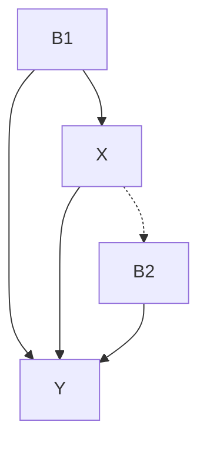
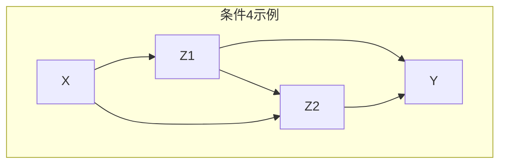
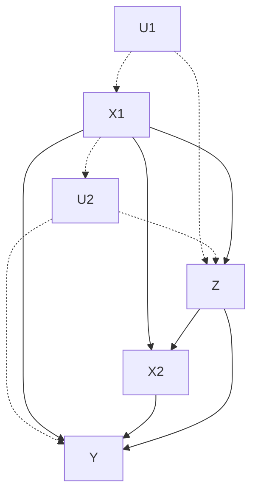
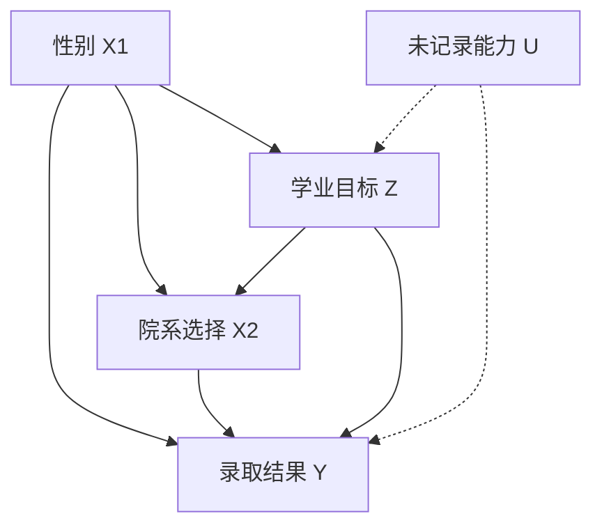
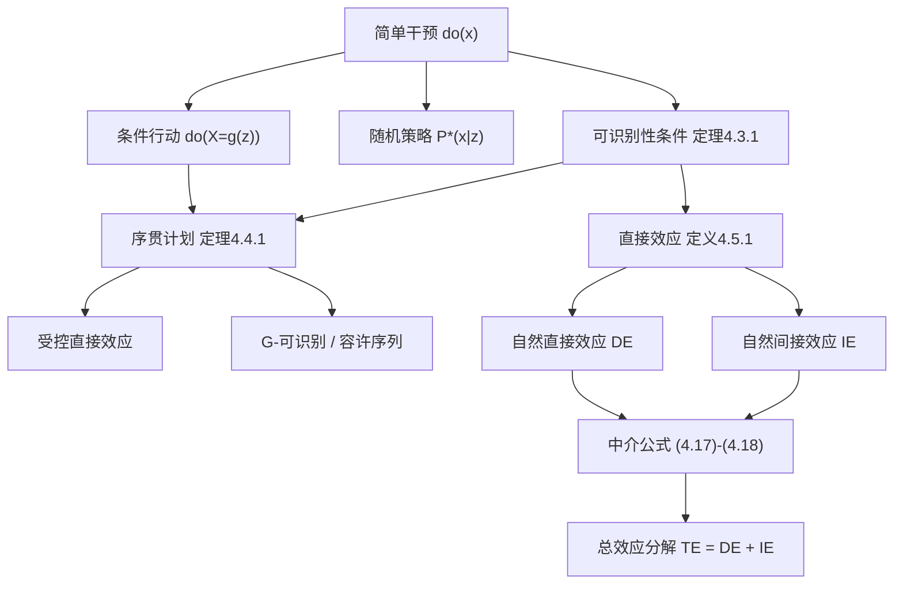

# 第 4 章 行动、计划和直接效应 — 全面系统梳理

---

## 一、整体框架

本章在 $do(x)$ 简单干预的基础上，从四个维度进行了扩展：

```
第4章结构
├── 4.1 行动的本体论：动作 vs 行动、概率中的行动、决策论中的行动、反事实
├── 4.2 条件行动与随机策略（复杂干预的识别）
├── 4.3 可识别性的图准则（定理4.3.1及其算法）
├── 4.4 序贯计划的可识别性（序贯后门准则）
└── 4.5 直接效应与间接效应（受控直接效应、自然直接效应、中介公式）
```

---

## 二、4.1 行动的本体论与哲学基础

### 2.1 动作（Act）与行动（Action）的区别

> **核心区分：**

|          | 动作 (Act)                              | 行动 (Action)                   |
| -------- | --------------------------------------- | ------------------------------- |
| 性质     | **反应式** ，由信念、性情、环境自动触发 | **应变式** ，经过深思熟虑的选择 |
| 可预测性 | 可被预测，预测可作为动机的证据          | 不可被预测（尚在思考中）        |
| 概率角色 | 服从概率分布，是模型的一部分            | 改变概率分布，通过 $do(x)$ 操作 |
| 数学表示 | $P(y \mid x)$ （条件化）                | $P(y \mid do(x))$ （干预）      |

**举例** ：

- 「亚当吃了苹果是因为夏娃把苹果给了他」→ 这是 **动作** ，可被预测
- 「亚当想知道如果他吃了苹果，上帝会怎么做」→ 这是 **行动** ，是假设性选择

### 2.2 Newcomb 悖论与两种决策理论

混淆动作与行动导致了 **Newcomb 悖论** 。

- **常识（因果）决策理论** ：最大化

$$
U(x) = \sum_{y} P(y \mid do(x)) \, u(y)
$$

- **证据决策理论** （Jeffrey, 1965）：最大化

$$
U_{\mathrm{ev}}(x) = \sum_{y} P(y \mid x) \, u(y)
$$

**悖论实例** ：

- 患者应避免去看医生以减少患重病的「可能性」
- 学生不应该准备考试，以免证明他们在学习上落后了

所有这些悖论的根源在于：将行动视为受过去支配的 **观测事件** （ $P(y|x)$ ），而非可自由选择的 **干预操作** （ $P(y|do(x))$ ）。行动改变概率结构，而观测只是读取概率结构。

> **顺口溜** ：行动之后看效果，可以评价好与否，但对事先做选择，一点帮助也没有。

### 2.3 因果模型的独特优势

**因果模型的一个主要优点是，能够预测干预的结果，而无须事先枚举这些干预行动。**

- 在统计决策理论（如 Savage, 1954）中，所有联合行动的结果必须预先一一指定，行动之间不能互相推断
- 因果模型通过刻画「每个行动强制执行什么」，利用变量间的因果结构 **自动推导** 出间接后果
- 例如：如果已建模「税收水平」和「利率」的因果效应，则复合行动「提高税收且降低利率」的结果可被推导，无需新增变量

### 2.4 成像（Imaging）方法与机制修改

哲学家（Lewis, 1976）提出的「成像」方法：被条件 $e$ 排除的状态 $s$ 转移概率质量到最近的不被排除的状态集合 $S^{*}(s)$ 。

**本书的方法** ：将干预建立在因果机制的 **不变性** 和 **自主性** 基础上——干预 = 局部修改因果机制，而非「找最近的可能世界」。这种「机制修改」方法已通过第 3 章的 do 算子被运算化。

---

## 三、4.2 条件行动与随机策略

### 3.1 条件行动的识别

考虑更复杂的策略：当观测到 $Z = z$ 时，将 $X$ 设置为 $g(z)$ 。

**核心结论** ：

$$
P(y \mid do(X = g(z))) = E_z\left[ P(y \mid \hat{x}, z) \big|_{x = g(z)} \right]
$$

推导依赖于两个关键事实：

- $P(z \mid do(X = g(z))) = P(z)$ （因为 $Z$ 不是 $X$ 的后代）
- $P(y \mid do(X = g(z)), z) = P(y \mid \hat{x}, z)|_{x=g(z)}$

因此，条件策略的因果效应可通过 $P(y \mid \hat{x}, z)$ 代入 $x = g(z)$ 并取 $Z$ 的期望值来评估。

### 3.2 随机策略

若以概率 $P^{*}(x \mid z)$ 来实施 $do(X = x)$ ：

$$
P(y)\big|_{P^{*}(x|z)} = \sum_x \sum_z P(y \mid \hat{x}, z) \, P^{*}(x \mid z) \, P(z)
$$

**关键启示** ： $P(y \mid \hat{x}, z)$ 的可识别性是任何随机策略可识别性的 **充要条件** 。

### 3.3 STRIPS 类行动

对满足前提条件 $C(w)$ 才触发的行动：

$$
P^{*}(x \mid z) = \begin{cases}
P(x \mid pa_X) & \text{当} C(w) = \text{假} \\
1 & \text{当} C(w) = \text{真且} X = x \\
0 & \text{当} C(w) = \text{真且} X \neq x
\end{cases}
$$

即不满足条件时按自然机制运行，满足条件时强制执行。

---

## 四、4.3 行动结果的可识别性

### 4.3.1 定理 4.3.1（四种充分条件）

令 $X$ 和 $Y$ 为半马尔可夫模型 DAG $G$ 中的两个变量， $P(y \mid \hat{x})$ 可识别的 **充分条件** 是满足以下任一：

| 条件       | 内容                                                     | 识别公式                                                      |
| ---------- | -------------------------------------------------------- | ------------------------------------------------------------- |
| **条件 1** | 无后门路径： $(X \perp Y)_{G_{\underline{X}}}$           | $P(y \mid \hat{x}) = P(y \mid x)$                             |
| **条件 2** | 无有向路径                                               | $P(y \mid \hat{x}) = P(y)$ （无因果效应）                     |
| **条件 3** | 存在 $B$ 阻断所有后门路径，且 $P(b \mid \hat{x})$ 可识别 | $P(y \mid \hat{x}) = \sum_b P(y \mid x, b) P(b \mid \hat{x})$ |
| **条件 4** | 存在 $Z_1, Z_2$ 满足四条子条件                           | 见下详述                                                      |

**条件 4 的四条子条件** ：

- (i) $Z_1$ 阻断所有 $X \to Y$ 有向路径
- (ii) $Z_2$ 阻断所有 $Z_1$ 和 $Y$ 之间的后门路径
- (iii) $Z_2$ 阻断所有 $X$ 和 $Z_1$ 之间的后门路径
- (iv) $Z_2$ 不激活任何 $X$ 到 $Y$ 的后门路径

当条件 4 满足时：

$$
P(y \mid \hat{x}) = \sum_{z_1, z_2} \sum_{x'} P(y \mid z_1, z_2, x') \, P(x' \mid z_2) \, P(z_1 \mid x, z_2) \, P(z_2)
$$

**图例说明（条件 3）** ：



$B = \{B_1, B_2\}$ 阻断了从 $X$ 到 $Y$ 的所有后门路径，且 $P(b_1, b_2 \mid \hat{x}) = P(b_1, b_2)$ 。

**图例说明（条件 4）** ：



$Z_1$ 阻断 $X \to Y$ 的有向路径， $Z_2$ 阻断所有相关的后门路径。

### 4.3.2 识别效率定理

**定理 4.3.2** ：若存在一个最小集合 $B_i$ 使 $P(b_i \mid \hat{x})$ 可识别，则 **任何** 其他最小集合 $B_j$ 也可识别。这让我们只需测试 **一个** 最小阻断集合。

**定理 4.3.5** ：若存在满足条件 4 的 $Z_1$ ，则 $X$ 的子节点与 $Y$ 的父节点的交集也满足条件 4 的所有要求。这消除了对 $Z_1$ 的全局搜索。

### 4.3.3 解析解算法 CloseForm

```
CloseForm(P(y|hat{x})):
  1. 若 (X⊥Y)_{G_{X̄}} → 返回 P(y)
  2. 若 (X⊥Y)_{G_{X̱}} → 返回 P(y|x)
  3. 设 B = BlockingSet(X,Y); Pb = CloseForm(P(b|hat{x}))
     若 Pb ≠ FAIL → 返回 Σ_b P(y|b,x)·Pb
  4. 设 Z₁ = Children(X)∩(Y∪Ancestors(Y))
     若 Y∉Z₁ 且 Y∉Z₂ → 返回Σ_{z₁,z₂} Σ_{x'} P(y|z₁,z₂,x')P(x'|z₂)P(z₁|x,z₂)P(z₂)
  5. 否则返回 FAIL
```

---

## 五、4.4 动态计划的可识别性（序贯后门准则）

### 5.1 问题动机：艾滋病治疗案例



- $X_1, X_2$ ：两个阶段医生开的抗生素剂量
- $Z$ ：PCP 发病状态（介于治疗之间的观测）
- $Y$ ：患者存活
- $U_1, U_2$ ：未记录的病史和免疫状态

**关键挑战** ：

- 若将 $X_1, X_2$ 合并为单一变量 $X$ → 形成弓形模式 → **不可识别**
- 分离的因果效应 $P(y \mid \hat{x}_1)$ 也不可识别
- 但联合效应 $P(y \mid \hat{x}_1, \hat{x}_2)$ 通过序贯分解是 **可识别的**

### 5.2 符号体系

有序的控制变量 $X = \{X_1, X_2, \ldots, X_n\}$ ，每个 $X_k$ 是 $X_{k+j}$ 的非后代。

- $N_k$ ：在 $\{X_k, X_{k+1}, \ldots, X_n\}$ 中无后代的观测节点集合
- $G_{\bar{x}}$ ：删除指向 $X$ 的箭头
- $G_{\underline{x}}$ ：删除由 $X$ 指出的箭头

### 5.3 定理 4.4.1（序贯后门准则）⭐

若存在协变量序列 $Z_1, Z_2, \ldots, Z_n$ 满足对每个 $1 \leq k \leq n$ ：

1.  $Z_k \subseteq N_k$ （ $Z_k$ 不是任何当前或未来控制变量的后代）
2.  $(Y \perp X_k \mid X_1, \ldots, X_{k-1}, Z_1, \ldots, Z_k)_{G_{\underline{X}_k, \bar{X}_{k+1}, \ldots, \bar{X}_n}}$

则计划可识别，且：

$$
\boxed{P(y \mid \hat{x}_1, \ldots, \hat{x}_n) = \sum_{z_1, \ldots, z_n} P(y \mid z_1, \ldots, z_n, x_1, \ldots, x_n) \prod_{k=1}^{n} P(z_k \mid z_1, \ldots, z_{k-1}, x_1, \ldots, x_{k-1})}
$$

**直觉** ：每个阶段在已观测变量和已干预变量的条件下，当前干预 $X_k$ 与结果 $Y$ 被 d-分离——即不存在未阻断的后门路径。

**艾滋病案例的应用** ：

- $Z_1 = \emptyset$ ， $Z_2 = \{Z\}$
- 检验通过，得：

$$
P(y \mid \hat{x}_1, \hat{x}_2) = \sum_z P(y \mid z, x_1, x_2) \, P(z \mid x_1)
$$

### 5.4 定义 4.4.2（容许序列和 G-可识别）

满足条件 (4.4)–(4.5) 的序列 $\{Z_k\}$ 称为 **可容许的** 。通过定理 4.4.1 检验可识别的表达式称为 ** $G$ -可识别的** 。

### 5.5 推论 4.4.3

当且仅当控制问题有一个容许序列时，它是 $G$ -可识别的。

> ⚠️ 注意： $G$ -可识别是计划可识别的 **充分但不必要** 条件。前门准则等情况可能需要以 $X_k$ 的后代为条件。

### 5.6 定理 4.4.4 与推论 4.4.5（有效算法）

**定理 4.4.4** ：若存在容许序列，则对每个极小容许子序列 $Z_1, \ldots, Z_{k-1}$ ，都存在容许集合 $Z_k$ 。这保证了 **贪心算法** 的正确性。

**推论 4.4.5 算法** ：

```
令 k = 1
while k ≤ n:
  选择最小的 Z_k ⊆ N_k 满足 (4.5)
  若不存在 → 失败
  否则 k = k + 1
成功 → G-可识别
```

### 5.7 定理 4.4.6（显式协变量序列）

当且仅当：

$$
(Y \perp X_k \mid X_1, \ldots, X_{k-1}, W_1, \ldots, W_k)_{G_{\underline{X}_k, \bar{X}_{k+1}, \ldots, \bar{X}_n}}
$$

其中 $W_k$ 是满足以下条件的所有协变量：(1) 不是 $\{W_k, X_{k+1}, \ldots, X_n\}$ 的后代；(2) 在修改后的图中 $Y$ 或 $X_k$ 是其后代。

**注意** ：识别对控制变量的排序敏感。图 4.8 中 $(X_1, X_2)$ 排序可识别， $(X_2, X_1)$ 不可识别。

---

## 六、4.5 直接效应与间接效应

### 6.1 概念区别

- **总效应** $P(y \mid \hat{x})$ ： $X$ 通过所有因果路径（直接 + 间接）对 $Y$ 的影响
- **直接效应** ：固定所有其他变量，仅通过 $X \to Y$ 箭头传递的效应

**避孕药的例子** ：

```
避孕药 → 血栓（直接效应，负面的生理关系）
避孕药 → 怀孕↓ → 血栓↓（间接效应，正面的）
总效应 = 直接效应 + 间接效应（可能正负相抵）
```

### 6.2 定义 4.5.1（直接效应）

$$
P(y \mid \hat{x}, \hat{s}_{XY})
$$

其中 $S_{XY}$ 是系统中除 $X$ 和 $Y$ 之外的 **所有** 内生变量。这模拟了一个理想实验：固定所有其他因素。

### 6.3 推论 4.5.2（简化版）

**只需固定 $Y$ 的其他父节点** ：

$$
P(y \mid \hat{x}, \widehat{pa}_{Y \setminus X})
$$

若 $X$ 不是 $Y$ 的父节点 → 直接效应为零（常数分布）。

### 6.4 定理 4.5.3

若 $PA_Y = \{X_1, \ldots, X_m\}$ 且计划 $(\hat{x}_1, \ldots, \hat{x}_m)$ 在推论 4.4.5 下可识别，则每个父节点 $X_k$ 对 $Y$ 的直接效应可识别，由式 (4.8) 给出。

### 6.5 推论 4.5.4

若存在任何 $X_k \to Y$ 的 **混杂弧** （confounding arc），则 $X_j$ 的直接效应 **不可识别** 。

### 6.6 案例：伯克利大学性别歧视问题



**错误的调整** （按院系条件化）：

$$
E_{x_2} P(y \mid \hat{x}_1, x_2) = \sum_{x_2} P(y \mid x_1, x_2) P(x_2) \tag{4.9}
$$

这会产生伪相关——通过 $U$ （未记录的能力）形成 $X_1$ 与 $Y$ 的虚假关联。

**正确的直接效应估计** ：

$$
P(y \mid \hat{x}_1, \hat{x}_2) = \sum_z P(y \mid z, x_1, x_2) P(z \mid x_1) \tag{4.10}
$$

**数值例子** （表 4.1）：

|        | 男性录取/申请 | 女性录取/申请 |
| ------ | ------------- | ------------- |
| A 系   | 50/50         | 0/0           |
| B 系   | 0/50          | 50/100        |
| 未调整 | 50%           | 50%           |
| 调整后 | 25%           | 37.5%         |

调整后错误地显示 37.5:25 = 3:2 偏向女性，而实际上录取完全取决于资格，无性别歧视。

> **核心教训** ：不检查因果可识别性假设，任何调整都不能保证公正估计直接或间接效应。

### 6.7 自然直接效应（4.5.4 节）

受控直接效应对 $pa_{Y \setminus X}$ 的取值敏感。在非线性系统中引入 **自然直接效应** 的概念（Pearl, 2001c）：

$$
\mathrm{DE}_{x, x'}(Y) = E[(Y(x', Z(x))) - E(Y(x))] \tag{4.11}
$$

**含义** ： $Z$ 固定在 $X = x$ 时的自然取值，而 $X$ 被干预为 $x'$ 。

在「无混杂」假设下，可约简为：

$$
\mathrm{DE}_{x, x'}(Y) = \sum_z [E(Y \mid do(x', z)) - E(Y \mid do(x, z))] \, P(z \mid do(x)) \tag{4.12}
$$

即受控直接效应的加权平均，权重为 $P(z \mid do(x))$ 。

### 6.8 自然间接效应与中介公式（4.5.5 节）

**自然间接效应** （从 $x$ 到 $x'$ ）：

$$
\mathrm{IE}_{x, x'}(Y) \triangleq E[(Y(x, Z(x'))) - E(Y(x))] \tag{4.14}
$$

保持 $X$ 不变，让 $Z$ 取 $X = x'$ 时的值。

**分解公式** ：

$$
\mathrm{TE}_{x, x'}(Y) = \mathrm{DE}_{x, x'}(Y) - \mathrm{IE}_{x', x}(Y) \tag{4.15}
$$

在线性模型中简化为标准加法：

$$
\mathrm{TE}_{x, x'}(Y) = \mathrm{DE}_{x, x'}(Y) + \mathrm{IE}_{x, x'}(Y) \tag{4.16}
$$

**中介公式** （无混杂中介变量，适用任意非线性系统）：

$$
\boxed{\mathrm{DE}_{x, x'}(Y) = \sum_z [E(Y \mid x', z) - E(Y \mid x, z)] \, P(z \mid x)} \tag{4.17}
$$

$$
\boxed{\mathrm{IE}_{x, x'}(Y) = \sum_z E(Y \mid x, z) \, [P(z \mid x') - P(z \mid x)]} \tag{4.18}
$$

这两个公式是 **通用的中介分析方法** ，适用于任何非线性系统、任何分布、任何变量类型。

### 6.9 路径特定效应

更一般的应用需要对 **特定路径效应** 进行分析——通过选定的因果路径分析 $X$ 对 $Y$ 的效应（Avin et al., 2005）。

**Pearl 的核心观点** ：对于因果关系概念而言， **信息感知比操作行为更为基础** ——后者只是实验中引发前者的一种方式。

---

## 七、本章核心概念总结

| 概念           | 符号                                             | 核心思想                                                 |
| -------------- | ------------------------------------------------ | -------------------------------------------------------- |
| 行动 vs 动作   | $do(x)$ vs $x$                                   | 干预改变机制，观测读取机制                               |
| 条件策略       | $do(X = g(z))$                                   | 通过 $P(y \mid \hat{x}, z)$ 评估                         |
| 随机策略       | $P^{*}(x \mid z)$                                | 无条件干预的加权混合                                     |
| 可识别性四条件 | 定理 4.3.1                                       | 后门/前门/阻断集的图准则                                 |
| 序贯后门准则   | 定理 4.4.1                                       | $G_{\underline{X}_k, \bar{X}_{k+1}, \ldots}$ 中的 d-分离 |
| 受控直接效应   | $P(y \mid \hat{x}, \widehat{pa}_{Y\setminus X})$ | 固定中介变量                                             |
| 自然直接效应   | $E[Y(x', Z(x)) - Y(x)]$                          | 中介取自然值                                             |
| 自然间接效应   | $E[Y(x, Z(x')) - Y(x)]$                          | 保持 $X$ ，改变中介                                      |
| 中介公式       | 式 (4.17)–(4.18)                                 | 非线性系统的通用分解                                     |

---

## 八、本章的逻辑脉络图



---

本章从单一干预出发，逐步构建了复杂策略评估、序贯计划识别和效应分解的完整理论框架，展示了因果图模型和 $do$ 算子在处理现实世界决策问题中的强大能力。
