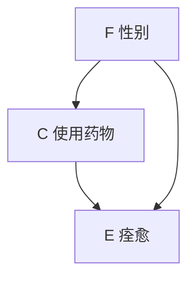
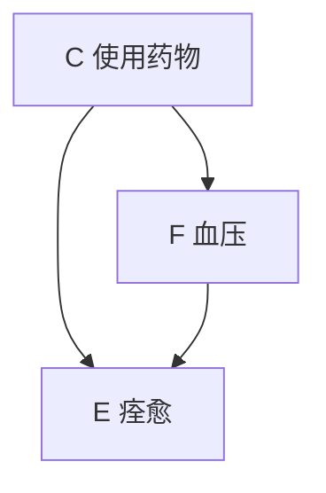
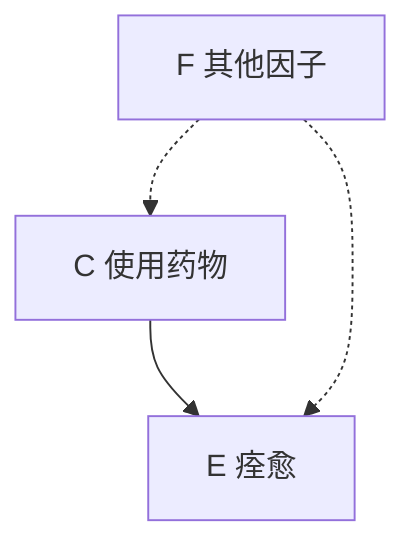
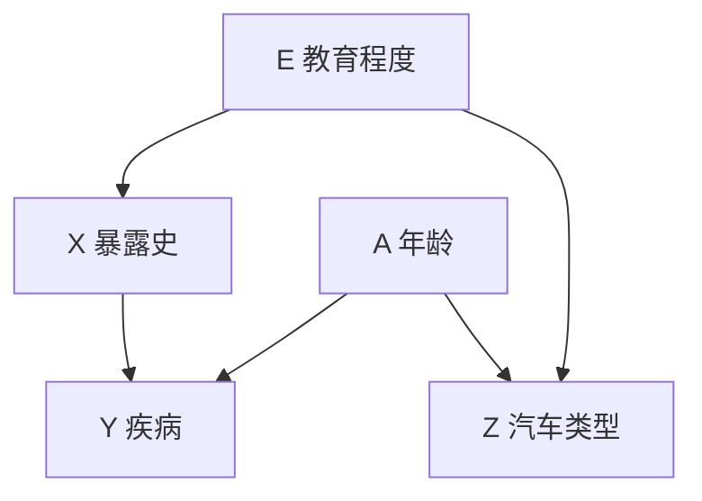
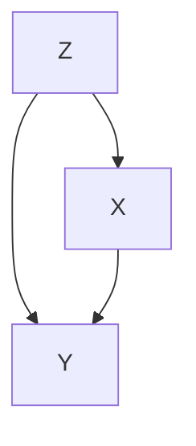
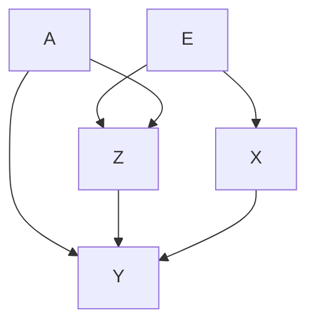

# 第6章 辛普森悖论、混杂与可压缩性 —— 系统学习材料

---

## 一、章节目录与结构概览

本章围绕因果推断中最核心的障碍—— **混杂（confounding）** ，展开层层深入的分析：

```
6.1 剖析辛普森悖论
    6.1.1 一个有关悖论的示例
    6.1.2 统计学中苦恼的事情
    6.1.3 因果关系与可交换性
    6.1.4 悖论已解决（或，人是什么类型的机器）
6.2 为什么没有关于混杂的统计检验
    6.2.1 简介
    6.2.2 因果定义与关联定义
6.3 关联性准则如何失效
    6.3.1 凭借边缘化使充分性失效
    6.3.2 凭借封闭世界假定使充分性失效
    6.3.3 凭借无益代理使必要性失效
    6.3.4 凭借偶然抵消使必要性失效
6.4 稳定无偏与偶然无偏
    6.4.1 动机
    6.4.2 形式化定义
    6.4.3 稳定无混杂的运算检验
6.5 混杂、可压缩性与可交换性
    6.5.1 混杂与可压缩性
    6.5.2 混杂与混杂因子
    6.5.3 可交换性与混杂结构分析
6.6 结论
```

---

## 二、核心主题与关键论断

本章的中心论点是： **混杂是一个因果概念，无法用纯统计语言表达。** 任何试图仅用关联数据来定义和检验混杂的做法，在理论上注定是失败的。然而，通过引入 **稳定无偏（stable unbiasedness）** 的概念，可以在统计关联与混杂之间建立一种有限的、但实用的桥梁。

---

## 三、6.1 剖析辛普森悖论

### 3.1 定义与示例

**辛普森悖论（Simpson's Paradox）** ：在总体人群中，事件 $C$ 增加了事件 $E$ 的发生概率，但在每个亚群（子群组）中， $C$ 却减小了 $E$ 的发生概率。形式化表达为：

$$
\begin{aligned}
P(E \mid C) &> P(E \mid \neg C) \\
P(E \mid C, F) &< P(E \mid \neg C, F)  \\
P(E \mid C, \neg F) &< P(E \mid \neg C, \neg F)
\end{aligned}
$$

**数值实例（图6.1）** ：

| 分组     | 状态            | $E$ （痊愈） | $\neg E$ | 合计 | 痊愈率  |
| -------- | --------------- | :----------: | :------: | :--: | :-----: |
| **总体** | 服药 $C$        |      20      |    20    |  40  | **50%** |
|          | 未服药 $\neg C$ |      16      |    24    |  40  |   40%   |
| **男性** | 服药 $C$        |      18      |    12    |  30  |   60%   |
|          | 未服药 $\neg C$ |      7       |    3     |  10  | **70%** |
| **女性** | 服药 $C$        |      2       |    8     |  10  |   20%   |
|          | 未服药 $\neg C$ |      9       |    21    |  30  | **30%** |

直观解释：总体看起来药物有效（50% vs 40%），但分性别看，药物对男性和女性都有害！

### 3.2 悖论的本质——观测 vs 干预

悖论之"悖"，源于将 **条件概率** 错误地等同于 **因果效应** ：

- ❌ 错误表达： $P(E \mid C) > P(E \mid \neg C)$ —— 这仅表示"观测到服药"与痊愈的 **关联**
- ✅ 正确表达： $P(E \mid do(C)) > P(E \mid do(\neg C))$ —— 这才表示"强制服药"对痊愈的 **因果效应**

> **关键区分** ： $P(E|C)$ 是"看到"（seeing）， $P(E|do(C))$ 是"做"（doing）。悖论的本质是将两者混为一谈。

在图中， $F$ （性别）既是服药 $C$ 的原因（男性更倾向于服药），也是痊愈 $E$ 的原因（男性天生痊愈率高）—— $F$ 是 **混杂因子** （confounder）。

### 3.3 因果图模型

该悖论对应的三种因果结构：



**图6.2a** ： $F$ 是 $C$ 和 $E$ 的共同原因（混杂因子）——应 **按性别分层** 评估药效。



**图6.2b** ： $F$ 是 $C$ 到 $E$ 因果路径上的中介变量——应使用 **总体表** ，不应以 $F$ 为条件（否则会阻断药物的间接效应）。



**图6.2c** ： $F$ 与 $C$ 和 $E$ 均无因果关系（虚线表示不存在影响）——同样应使用 **总体表** 。

> **核心启示** ：相同的数据可以对应完全不同的因果结构。选择哪张表格作为决策依据，是 **因果问题，而非统计问题** ——仅凭数据本身无法判断。

### 3.4 确实原理与悖论的形式化解决

#### 定理 6.1.1（确实原理，Sure-Thing Principle）

> 假设行动 $C$ 不改变亚群分布，如果 $C$ 提高了每个亚群中事件 $E$ 发生的概率，那么 $C$ 也必定会提高在整个总体中 $E$ 发生的概率。

**证明思路** ：假设药物不影响性别分布：

$$
P(F \mid do(C)) = P(F \mid do(\neg C)) = P(F)
$$

展开 $P(E \mid do(C))$ ：

$$
\begin{aligned}
P(E \mid do(C)) &= P(E \mid do(C), F)P(F \mid do(C)) + P(E \mid do(C), \neg F)P(\neg F \mid do(C)) \\
&= P(E \mid do(C), F)P(F) + P(E \mid do(C), \neg F)P(\neg F)
\end{aligned}
$$

同理：

$$
P(E \mid do(\neg C)) = P(E \mid do(\neg C), F)P(F) + P(E \mid do(\neg C), \neg F)P(\neg F)
$$

如果式（6.4）和（6.5）成立（即药物对男女均有害），则式（6.8）的每一项都小于式（6.9）的对应项，从而：

$$
P(E \mid do(C)) < P(E \mid do(\neg C))
$$

这说明： **如果药物对每个亚群都有害且不改变亚群分布，那么药物对总体也必然有害** 。式（6.1）~（6.3）同时成立意味着 $C$ 改变了 $F$ 的分布，即存在混杂。因而，图6.1中的数据不可能来自 $C$ 不影响 $F$ 的随机化实验。

> **人类直觉的本质** ：人类的因果直觉天然地区分"观测"和"干预"，并默认假设"行动不改变亚群分布"。辛普森悖论之所以令人"震惊"，正是因为这种直觉与纯统计推理产生了冲突。

---

## 四、6.2 为什么没有关于混杂的统计检验

### 4.1 混杂的因果定义

#### 定义 6.2.1（无混杂的因果定义）

设 $M$ 为数据生成机制的因果模型。对于所有 $x, y$ ， $X$ 和 $Y$ 在 $M$ 中 **无混杂** ，当且仅当：

$$
P(y \mid do(x)) = P(y \mid x)
$$

> **解释** ：因果效应等于统计关联。即观察到的条件概率正确地反映了干预下的因果效应。

其中 $P(y \mid do(x))$ 可以通过后门校正公式计算：

$$
P(y \mid do(x)) = \sum_s P(y \mid x, s) P(s)
$$

这里 $S$ 是满足后门准则的变量集合。

### 4.2 混杂的关联性准则

#### 定义 6.2.2（无混杂的关联性准则）

令 $T$ 为不受 $X$ 影响的变量集合。如果 $T$ 中的每个变量 $Z$ 至少满足下列条件之一，则称 $X$ 和 $Y$ 无混杂：

- $(U_1)$ ： $Z$ 与 $X$ 无关，即 $P(x \mid z) = P(x)$
- $(U_2)$ ：在 $X$ 条件下 $Z$ 与 $Y$ 无关，即 $P(y \mid z, x) = P(y \mid x)$

反过来说，如果 $T$ 中任一变量 $Z$ 同时违反 $(U_1)$ 和 $(U_2)$ ，则称 $X$ 和 $Y$ **混杂** 。

> **注意** ：即使这个"关联性"定义也并非纯统计的——它需要判断"不受 $X$ 影响"，这本身就是因果知识。

---

## 五、6.3 关联性准则如何失效

本节系统地论证了 **关联性准则既非充分也非必要** 。

### 5.1 充分性失效一：边缘化问题（6.3.1）

**反例** ： $Z_1$ 和 $Z_2$ 是两枚独立均匀硬币的抛掷结果，每个都影响 $X$ 和 $Y$ 。假设：

- 当 $Z_1 = Z_2$ 时， $X$ 发生
- 当 $Z_1 \neq Z_2$ 时， $Y$ 发生

则 $(Z_1, Z_2)$ 联合起来高度混杂 $X$ 和 $Y$ （ $X$ 和 $Y$ 完全负相关），但单独看：

- $Z_1$ 与 $X$ 无关（ $P(x|z_1) = 1/2$ ）
- $Z_2$ 与 $X$ 无关（ $P(x|z_2) = 1/2$ ）

**教训** ：逐变量检验满足 $(U_1)$ 或 $(U_2)$ ，不能保证联合无混杂。

### 5.2 充分性失效二：封闭世界假定（6.3.2）

现实应用中，我们永远无法确定潜在混杂因子集合 $T$ 是否完整。任何统计检验都只能检查已知变量，无法保证不存在未知混杂因子。因此， **任何统计检验注定不充分** 。

### 5.3 必要性失效一：无益代理（6.3.3）

#### 例 6.3.1（无益代理）



汽车类型 $Z$ 既是教育程度 $E$ 的代理，也是年龄 $A$ 的代理。因此：

- $Z$ 与 $X$ 相关（通过 $E \to Z$ 和 $E \to X$ ）
- 在 $X$ 条件下 $Z$ 与 $Y$ 相关（通过 $A \to Z$ 和 $A \to Y$ ）

$Z$ 同时违反 $(U_1)$ 和 $(U_2)$ ，但 $X$ 和 $Y$ 实际是 **无混杂** 的！因为 $Z$ 只是一个"无益代理"——它本身对 $X$ 和 $Y$ 都没有因果效应，仅仅是其他变量的代理。

> **对 $Z$ 进行校正反而会引入偏差** ：
> $$ \sum_z P(Y=y \mid X=x, Z=z)P(Z=z) \neq P(Y=y \mid do(x)) $$

#### 定义 6.3.2（修正的关联性准则）

将 $T$ 限制为不受 $X$ 影响但 **可能影响 $Y$ ** 的变量集合。若 $T$ 中每个 $Z$ 满足 $(U_1)$ 或 $(U_2)$ ，则无混杂。

Stone-Robins 版本：令 $T$ 为所有不受 $X$ 影响的变量，分为 $T_1$ （与 $X$ 无关）和 $T_2$ （在 $X, T_2$ 条件下与 $Y$ 无关）。

### 5.4 必要性失效二：偶然抵消（6.3.4）

#### 例 6.3.3（偶然抵消）

考虑线性模型：

$$
\begin{aligned}
x &= \alpha z + \varepsilon_1  \\
y &= \beta x + \gamma z + \varepsilon_2
\end{aligned}
$$

其中 $\operatorname{cov}(\varepsilon_1, \varepsilon_2) = r$ ， $Z$ 为外生变量。



$Y$ 对 $X$ 的回归系数为：

$$
y = (\beta + r + \alpha\gamma)x + \varepsilon
$$

当 $r = -\alpha\gamma$ 时，回归系数 $r_{YX} = \beta$ ，即 $X$ 对 $Y$ 的效应是 **无偏的（无混杂）** 。但此时 $Z$ 显然同时与 $X$ 和 $Y$ 相关（违反 $(U_1)$ 和 $(U_2)$ ），关联性准则会错误地将此归类为混杂。

> **关键问题** ：这种无偏是"偶然"的——参数微调（如换一个地点、时间）就会被打破。实际研究中不应依赖这种脆弱的抵消。

---

## 六、6.4 稳定无偏与偶然无偏

### 6.1 动机

例 6.3.1（无益代理）的无混杂是 **稳定的（stable）** ——不论参数如何变化，只要因果结构不变，无偏性就成立。

例 6.3.3 的无混杂是 **偶然的（accidental）** ——依赖于 $r = -\alpha\gamma$ 这一特定参数巧合。

> **核心洞察** ：研究人员真正关心的（也应该关心的）是 **稳定无偏** ，而非偶然无偏。

### 6.2 形式化定义

#### 定义 6.4.1（稳定无偏）

设 $A$ 为数据生成过程的一组假设， $C_A$ 为满足 $A$ 的一类因果模型。如果对 $C_A$ 中的 **每一个** 模型 $M$ ，都有：

$$
P(y \mid do(x)) = P(y \mid x)
$$

则称在 $A$ 条件下 $X$ 对 $Y$ 的效应估计是 **稳定无偏** 的。

#### 定义 6.4.2（图结构上的稳定无混杂）

设 $A_D$ 是因果图 $D$ 中的假设集合。如果对于 $D$ 的 **任何参数化设定** （即赋予任何函数形式和先验分布），都有 $P(y \mid do(x)) = P(y \mid x)$ ，则称 $X$ 和 $Y$ 在 $A_D$ 下是 **稳定无混杂** 的。

**因果图的假设含义** ：

- 图中每个 **缺失的箭头** （如 $X$ 到 $Y$ ）表示：一旦控制 $Y$ 的父节点， $X$ 对 $Y$ 无因果效应。
- 每个 **缺失的双向箭头** 表示：除图中已有的原因外， $X$ 和 $Y$ 无其他共同原因。

#### 定理 6.4.3（共因原则）

令 $A_D$ 为无环因果图 $D$ 的一组假设。 **当且仅当** $X$ 和 $Y$ 在 $D$ 中 **没有共同的祖代** 时， $X$ 和 $Y$ 在 $A_D$ 下是稳定无混杂的。

> **意义** ：这一判断完全依赖于图的拓扑结构， **不需要任何统计数据** 。

### 6.3 稳定无混杂的运算检验

#### 定理 6.4.4（稳定无混杂的准则）

设 $A_z$ 表示以下假设：

- (i) 数据由某种无环模型 $M$ 生成；
- (ii) $Z$ 不受 $X$ 影响但 **可能影响 $Y$ ** 。

如果关联性准则 $(U_1)$ 和 $(U_2)$ **都不能被满足** ，那么 $(X, Y)$ 在 $A_z$ 下 **不是** 稳定无混杂的。

> **实用价值** ：无需知道完整因果图，只需找到 **一个** 满足 $A_z$ 且同时违反 $(U_1)$ 和 $(U_2)$ 的变量 $Z$ ，就可以排除稳定无混杂。

**定理 6.4.4 是本章最重要的桥梁** ——它在最弱的因果假设（仅需知道某个变量不受 $X$ 影响但可能影响 $Y$ ）下，建立了统计关联与混杂之间的形式化联系。

---

## 七、6.5 混杂、可压缩性与可交换性

### 7.1 混杂与可压缩性

#### 定义 6.5.1（可压缩性，Collapsibility）

设 $g[P(x, y)]$ 为测量 $X$ 和 $Y$ 之间关联性的任意泛函。如果：

$$
E_Z \, g[P(x, y \mid z)] = g[P(x, y)]
$$

则称 $g$ 在变量 $Z$ 上是 **可压缩的** 。

> **直观解释** ：可压缩意味着"粗略"关联度量等于各层关联度量的加权平均——即忽略 $Z$ 不影响关联性度量。

**风险差的可压缩性** ：当 $Z$ 与 $X$ 无关，或在 $X$ 条件下与 $Y$ 无关时，风险差 $P(y|x_1) - P(y|x_2)$ 在 $Z$ 上可压缩。

#### 不可压缩性 ≠ 混杂

图 6.3 的反例：风险差在 $Z$ 上不可压缩（违反必要条件），但效应估计是（稳定）无混杂的。因此 **不可压缩性与混杂是两个不同的概念，互不蕴含** 。

#### 推论 6.5.2（稳定无混杂蕴含可压缩性）

设 $Z$ 为不受 $X$ 影响且可能影响 $Y$ 的任何变量， $g$ 为线性泛函。如果 $g$ 在 $Z$ 上 **不可压缩** ，那么 $X$ 和 $Y$ **不是稳定无混杂** 的。

> **实际意义** ：参数变换法（change-in-parameter method）——当粗略度量与条件下平均度量不等时标记混杂因子——在实践中是有效的，因为它检测的是稳定无混杂的缺失。

### 7.2 混杂与混杂因子

**关键区别** ：

- **混杂（confounding）** ：一种现象——效应估计存在偏差。
- **混杂因子（confounder）** ：一个变量——能够导致混杂的变量。

**常见误解** ："混杂因子必须与暴露和疾病都相关"——这是错误的！如图 6.5：



$Z$ 可能通过路径抵消而与 $X$ 或 $Y$ 均无统计关联，但 $Z$ 仍然是混杂因子（必须加以控制）。

**正确理解** （非平凡充分集）：设 $S$ 为一组通过校正能消除混杂的变量（充分集）。如果 $S$ 是 **非平凡的** （即校正 $S$ 确实改变 $X$ 与 $Y$ 的关联），则 $S$ 作为一个 **联合整体** 必定与 $X$ 相关，且在 $X$ 条件下与 $Y$ 相关。但这不要求 $S$ 中的 **每个个体变量** 满足此性质。

**必要性证明** （收缩与交叉性质）：

利用条件独立性中的 **收缩** （contraction）：

$$
X \perp S \; \& \; X \perp Y \mid S \;\Rightarrow\; X \perp Y
$$

以及 **交叉** （intersection）：

$$
S \perp Y \mid X \; \& \; X \perp Y \mid S \;\Rightarrow\; X \perp Y
$$

如果 $S$ 满足 $(U_1)$ 或 $(U_2)$ 且为充分集，则 $X \perp Y$ ， $S$ 是平凡的——即校正 $S$ 不改变任何东西。因此任何 **非平凡充分集** 必不满足 $(U_1)$ 和 $(U_2)$ 。

### 7.3 可交换性与混杂结构分析

**Greenland-Robins（GR）的可交换性方法** ：

设 $A$ 、 $B$ 分别为治疗组和对照组：

- $\mu_{A1}$ ： $A$ 组在治疗下的假设响应参数
- $\mu_{A0}$ ： $A$ 组在未治疗下的假设响应参数
- $\mu_{B1}$ 、 $\mu_{B0}$ ： $B$ 组对应参数

如果：

$$
(\mu_{A1}, \mu_{B0}) = (\mu_{B1}, \mu_{A0})
$$

则两组是 **可交换的** ，因果效应 $CE = \mu_{A1} - \mu_{A0}$ 可用 $\mu_{A1} - \mu_{B0}$ 估计。

实际上，这与定义 6.2.1（ $\mu[P(y|do(x))] = \mu[P(y|x)]$ ）是等价的。

**结构方法相对于可交换性方法的优势** ：

| 方面           | 可交换性（反事实列联表）     | 结构模型                    |
| -------------- | ---------------------------- | --------------------------- |
| 判断来源       | 直接判断（需要设想交换场景） | 从基本因果判断 **数学推导** |
| 输入性质       | 定量、依赖具体情境           | **定性、稳定**              |
| 多协变量约束   | 用表格表示极其困难           | 用图结构自然表达            |
| 一般性命题证明 | 几乎不可能（需穷举所有表）   | 可通过数学推导完成          |
| 透明度         | 低（表格不透明）             | 高（图结构直观）            |

> **结论** ：结构模型为混杂分析提供了更透明、更系统、更强大的形式化框架。

---

## 八、6.6 结论——三大失败原因

过去试图在统计关联与混杂之间建立理论联系的努力失败，原因有三：

1.  **缺乏数学语言** ：无法用概率演算表达因果关系和效应偏差，难以评估 $P(y|do(x)) = P(y|x)$ 与统计准则之间的差异。

2.  **忽视无益代理** ：图 6.3 的情况表明，需要排除那些本身不影响 $X$ 或 $Y$ 但又与两者相关的代理变量。

3.  **忽视稳定无偏与偶然无偏的区别** ：例 6.3.3 表明，若不定义稳定性，就无法建立关联性准则与混杂之间的任何联系。

**稳定性的数学形式化** 产生了有向无环图同构、忠实性（faithfulness）等概念，这些概念是建立关联准则与混杂之间桥梁的关键。

---

## 九、关键概念总结表

| 概念                 | 定义                                                         | 关键性质                             |
| -------------------- | ------------------------------------------------------------ | ------------------------------------ |
| **辛普森悖论**       | 总体关联方向与各亚群关联方向相反                             | 源于忽略混杂因子的伪关联             |
| **混杂（因果定义）** | $P(y\mid do(x)) \neq P(y\mid x)$                             | 因果概念，不能用纯统计定义           |
| **关联性准则**       | $(U_1)$ 或 $(U_2)$ 对每个潜在混杂因子成立                    | 既非充分也非必要                     |
| **无益代理**         | 本身非原因但与其他原因变量相关的变量                         | 校正会引入偏差                       |
| **偶然抵消**         | 参数巧合使 $P(y\mid do(x)) = P(y\mid x)$                     | 不稳定，不具有实际意义               |
| **稳定无偏**         | 在给定假设类的 **所有** 模型中 $P(y\mid do(x)) = P(y\mid x)$ | 研究人员实际追求的目标               |
| **共因原则**         | $X$ 和 $Y$ 无共同祖代 ⇔ 稳定无混杂                           | 仅依赖图拓扑结构                     |
| **可压缩性**         | $E_Z[g(P(x,y\mid z))] = g[P(x,y)]$                           | 不可压缩 ⇏ 混杂，混杂 ⇏ 不可压缩     |
| **非平凡充分集**     | 校正后能消除偏差且确实改变关联的变量集                       | 作为整体必与 $X$ 和 $Y$ （条件）相关 |
| **可交换性**         | 两组在互换治疗方案下响应参数相同                             | 等价于无混杂，但需要更多假设输入     |

---

## 十、核心定理汇总

| 定理                              | 内容                                                                                    | 意义                 |
| --------------------------------- | --------------------------------------------------------------------------------------- | -------------------- |
| **定理 6.1.1** （确实原理）       | 若行动不改变亚群分布且在每个亚群有利，则对总体有利                                      | 形式化人类因果直觉   |
| **定理 6.4.3** （共因原则）       | $X$ 和 $Y$ 无共同祖代 ⇔ 稳定无混杂                                                      | 图结构的充分必要条件 |
| **定理 6.4.4** （稳定无混杂准则） | 若存在 $Z$ （不受 $X$ 影响但可能影响 $Y$ ）同时违反 $(U_1)$ 和 $(U_2)$ ，则非稳定无混杂 | 统计检验的必要条件   |
| **推论 6.5.2**                    | 稳定无混杂 ⇒ 可压缩性；不可压缩 ⇒ 非稳定无混杂                                          | 参数变换法的理论基础 |

---

## 十一、重要区分与注意事项

1.  **观测（seeing）vs 干预（doing）** ： $P(E|C)$ 是看到某人服药时的痊愈概率， $P(E|do(C))$ 是强制某人服药时的痊愈概率。两者在非实验条件下一般不等。

2.  **混杂 vs 混杂因子** ：混杂是一种效应偏差的现象，混杂因子是导致这一现象的变量。一个变量可以是不与暴露或结果相关的混杂因子。

3.  **稳定无偏 vs 偶然无偏** ：前者对参数变化鲁棒，是实际研究的目标；后者依赖参数巧合，在实践中不可靠。

4.  **可压缩性 vs 无混杂性** ：两者是不同的概念。图 6.3 同时展示了无混杂但不可压缩的情况。

5.  **个体变量 vs 变量集** ：非平凡充分集的必要条件适用于 **集合整体** ，不适用于集合中的 **个体元素** 。

---

## 十二、延伸思考

- 辛普森悖论之所以令人困惑，根源在于 **因果直觉与概率演算体系的冲突** ——概率演算允许符号反转，因果直觉不允许"对各亚群有害但对总体有利"的药物存在。
- 本章的分析为流行病学中广泛使用的 **参数变换法** （change-in-parameter）提供了严格的理论基础——它检测的是稳定无混杂的缺失。
- 结构因果模型（SCM）不仅提供了分析混杂的数学框架，而且通过图模型的定性假设使混杂分析变得 **透明、可操作、可证明** 。
